::: {.callout-important}
## Idea central

El cálculo diferencial no sólo permite describir cómo cambian las funciones, sino también construir algoritmos capaces de aprender a partir de esos cambios. En machine learning, esta idea aparece en la propagación de gradientes, en la diferenciación automática, en el uso de información de segundo orden y en aproximaciones locales que permiten optimizar modelos complejos de manera eficiente.
:::

## Retropropagación
Hasta ahora, no nos hemos preocupado demasiado de hablar acerca de conceptos fundamentales relativos a los algoritmos de aprendizaje (o más elegantemente, *machine learning*). Nos hemos abocado a repasar conceptos matemáticos elementales con la *esperanza* de que *más adelante* nos servirán para entender qué significa que un programa *aprenda* a partir de la *experiencia*. Pero siendo honestos, no nos hemos adentrado mucho en ese terreno, ya que nos hemos tomado nuestro tiempo en repasar generosamente mucha parafernalia matemática. Sin embargo, en este próximo apartado, sí que nos adentraremos, al menos un poco, en uno de los conceptos más interesantes relativos a los algoritmos de aprendizaje. Y todo con un objetivo: Ilustrar cómo los gradientes constituyen la base de uno de los algoritmos de aprendizaje más poderosos desarrollados al día de hoy.

Un tipo importante de algoritmos de machine learning se denominan de **aprendizaje supervisado**. La razón de ello es porque, a fin de generar aprendizaje, requieren tanto de información de entrada (para aprender estructuras inherentes a los datos) como de salida (para *saber a lo que tienen que llegar*). Matemáticamente, ésto implica que los algoritmos de aprendizaje supervisado requieren de un conjunto *generoso* de pares del tipo $(\mathbf{x}_{i}, y_{i})$, siendo el objetivo de estos algoritmos (dicho de manera un tanto *grosera*) el construir una *función* $f$ tal que $y_{i}=f(\mathbf{x_{i}})$ para todo $i$.

Construir $f$ no es trivial, pero existen *recetas* predeterminadas. Un ejemplo es el modelo de regresión lineal, que dictamina que $f$ es una combinación lineal del tipo $y_{i}=f(\mathbf{x}_{i})=\sum\nolimits^{n}_{j=1} \theta_{j} x_{ij}$, donde $\mathbf{x}_{i}=(x_{i1}, ...,x_{in})$, donde $\theta_{1},...,\theta_{n}$ es un conjunto de **parámetros** que debemos *escoger* de tal forma que el error cometido por el medio al estimar $y_{i}$ sea lo menor posible. Cualquiera sea la *receta*, los algoritmos de aprendizaje supervisado tienen pues como objetivo el resolver un **problema de optimización**, donde la **función objetivo** es una determinada **función de costo** que permite calificar la calidad de las estimaciones que realiza el modelo. Una función de costo muy utilizada en la construcción de modelos de regresión (no necesariamente lineales) es el *error cuadrático medio* (MSE, del inglés *mean squared error*), y que permite calcular el promedio de los errores al cuadrado cometidos por el modelo en cuestión.

Un procedimiento especialmente importante en el contexto de los algoritmos de aprendizaje que permite resolver este problema particular corresponde al **algoritmo de gradiente descendente** (que abordaremos en detalle más adelante). Tal algoritmo de basa en un hecho puntual relativo a cierto tipo de funciones *bien comportadas* (que, en matemáticas, se conocen como *funciones convexas*) que establece lo siguiente: Dada una función $f:U\subseteq \mathbb{R}^{m}\longrightarrow V\subseteq \mathbb{R}^{n}$, los puntos $\mathbf{x}\in U$ en el cual las derivadas parciales de $f$ se anulan, son *candidatos* a ser máximos o mínimos locales de dicha función, siempre que se cumplan algunas condiciones adicionales. En particular, si nos limitamos a un modelo de regresión –sin pérdida de generalidad–, estamos interesados en todos los puntos en los cuales las derivadas parciales de la función de costo se anulen. Y sucede que, si dicha función de costo es *convexa*, en efecto dichos puntos denotarán máximos y/o mínimos de tal función (hecho que demostraremos más adelante).

El algoritmo de gradiente descendente parte desde este hecho. Si llamamos $\mathcal{L}$ a la función de costo asociada a un algoritmo de aprendizaje, buscaremos todos los puntos $\mathbf{\theta}=(\theta_{1},...,\theta_{n})$ tales que $\frac{\partial \mathcal{L}}{\partial \theta_{j}}=0$, para cada $j$ tal que $1\leq j\leq n$. Y por supuesto, para una función de costo dada, podemos calcular su gradiente respectivo utilizando la regla de la cadena estudiada previamente.

Consideremos la función

::: {.eq-scroll}
$$
f\left( x\right)  =\sqrt{x^{2}+\exp \left( x^{2}\right)  } +\cos \left( x^{2}+\exp \left( x^{2}\right)  \right)
\tag{2.1}
$$
:::

Mediante la aplicación de la regla de la cadena, y recordando que la derivada es un operador lineal, podemos calcular la derivada (o gradiente) como

::: {.eq-scroll}
$$
\begin{array}{lll}\displaystyle \frac{df}{dx} &=&\displaystyle \frac{2x+2x\exp \left( x^{2}\right)  }{2\sqrt{x^{2}+\exp \left( x^{2}\right)  } } -\mathrm{sen} \left( x^{2}+\exp \left( x^{2}\right)  \right)  \left( 2x+2x\exp \left( x^{2}\right)  \right)  \\ &=&2x\left( \displaystyle \frac{1}{2\sqrt{x^{2}+\exp \left( x^{2}\right)  } } -\mathrm{sen} \left( x^{2}+\exp \left( x^{2}\right)  \right)  \right)  \left( 1+\exp \left( x^{2}\right)  \right)  \end{array}
\tag{2.2}
$$
:::

Escribir el gradiente en esta forma explícita resulta, con frecuencia, poco práctico, ya que se trata de una expresión compleja y con una considerable cantidad de términos. En la práctica, esto puede significar que, si no tenemos cuidado, la implementación de un gradiente puede resultar aún más costosa que evaluar la función que queremos derivar, lo que induce una cantidad innecesaria de trabajo en nuestro proceso de construir un modelo (a nivel computacional). Por lo tanto, la construcción de estos artilugios requiere que, sabiendo ya como calcular una derivada para cualquier tipo de función, busquemos formas más prácticas de construir gradientes y que no sean excesivamente costosas en términos computacionales.

Para comenzar a motivar el desarrollo de estos nuevos métodos de cálculo de gradientes, vamos a explorar un poco un concepto esencial en el modelamiento predictivo moderno: El de *red neuronal artificial*.

### Una introducción al concepto de red neuronal artificial
Las **redes neuronales artificiales (RNAs)** constituyen una serie de modelos de machine learning inspirados en el procesamiento paralelo de señales realizado en el cerebro de los seres vivos por medio de sus neuronas. Las RNAs constituyen la columna vertebral por antonomasia del campo del **Aprendizaje Profundo** (o *Deep Learning*, que escapa del alcance de estos apuntes). Son modelos versátiles, poderosos y escalables, lo que los hace útiles para tratar problemas de la más alta complejidad, tanto en el campo del aprendizaje supervisado como en otros importantes paradigmas de aprendizaje.

Las redes neuronales constituyen un modelo de gran importancia, no sólo práctica, sino que también histórica por su significado, resolución e importancia en la ciencia de datos y el aprendizaje estadística. Por esa razón, las redes suelen dividirse en varias categorías conforme sus topologías o arquitecturas, lo que las hace extremadamente versátiles y acoplables para cualquier tipo de problema. En su versión más elemental, un modelo de red neuronal se compone de una o más unidades de cálculo, denominadas **neuronas artificiales**, cuya estructura colectiva es la que se esquematiza en la @fig-neuron.

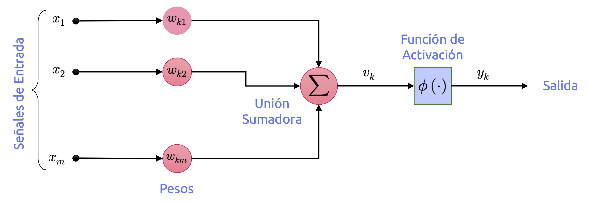{#fig-neuron fig-align="center" width="90%"}

Se reconocen, en este modelo, los siguientes elementos:

1. Un conjunto de arcos conectores, cada uno de los cuales está caracterizado por un **peso o ponderador** (llamado en muchos textos, sobretodo más clásicos, *peso sináptico*). Específicamente, una **señal** $x_{j}\in \mathbb{R}$ en la entrada del arco $j$ conectado a una neurona $k$ es multiplicada por el peso $w_{kj}$, con $-\infty<j<\infty$.
2. Una **unión sumadora**, a fin de generar la suma de todas las señales de entrada, ponderadas por los correspondientes pesos o ponderadores. Dadas las operaciones aquí descritas, tal unidad constituye un **combinador lineal**.
3. Una **función de activación**, que limite la amplitud o rango de salida de la neurona. Típicamente, algunos de rangos de salida de una neurona son los intervalos $[0, 1], [-1, 1], [0, +\infty)$, entre otros.

El modelo de neurona artificial ilustrado en la @fig-neuron suele incorporar un **parámetro de sesgo** externo, que solemos denotar como $b_{k}$. Dicho sesgo tiene el efecto de incrementar o disminuir el valor de entrada neto de la función de activación, dependiendo de si dicho valor es positivo o negativo.

En términos matemáticos, podemos describir la neurona $k$ mostrada en la @fig-neuron mediante el par de ecuaciones

::: {.eq-scroll}
$$
\left( a\right)  :\  u_{k}=\sum^{m}_{j=1} w_{kj}x_{j}\  \  \  \left( b\right)  :\  y_{k}=\phi \left( u_{k}+b_{k}\right)
\tag{2.3}
$$
:::

Donde $\mathbf{x}\in \mathbb{R}^{m}$ es el vector constituido por las $m$ señales de entrada $x_{1},...,x_{m}$, y $\mathbf{w}\in \mathbb{R}^{m}$ es el vector constituido por los $m$ pesos de la neurona $k$, $w_{k1},...,w_{km}$; $u_{k}$ es el resultado de la combinación lineal de las señales de entrada y los pesos sinápticos (que en algunos textos –sobretodo más clásicos– suele referirse como *potencial de acción*); $b_{k}$ es el parámetro de sesgo de la neurona $k$; mientras que $y_{k}$ es su **respuesta** o **señal de salida**.

Conforme esta estructura sencilla de neurona artificial, se reconocen tres modelos importantísimos por su significado histórico en el desarrollo de las redes neuronales.

#### Modelo de McCulloch & Pitts

El **modelo de McCulloch & Pitts**, en términos históricos, corresponde al primer intento realizado con el objetivo para construir una neurona artificial. Se asimila a una unidad de cálculo cuya función de activación es la llamada **función de Heavside** (o escalón unitario), con salida binaria única:

::: {.eq-scroll}
$$
u\left( x\right)  =\begin{cases}0&;\  \mathrm{si} \  x<0\\ 1&;\  \mathrm{si} \  x\geq 0\end{cases}
\tag{2.4}
$$
:::

la que es capaz de resolver cualquier proposición lógica que queramos, una vez conectadas en red. Para observar como trabaja una red de este tipo, construyamos algunas redes que tengan esta estructura para que realicen algunos cálculos lógicos, asumiendo que una neurona se activa cuando, al menos, dos de sus entradas se activan. El diagrama de estas redes se observa en la @fig-mculloch.

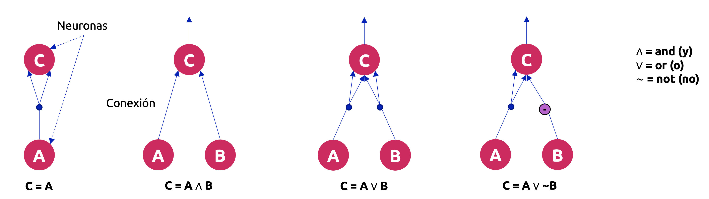{#fig-mculloch fig-align="center" width="100%"}

Veamos lo que hacen cada una de estas redes:

- La primera red (lado izquierdo) se corresponde con la **función identidad**: Si la neurona $A$ es activada, entonces la neurona $C$ también se activa (dado que ésta recibe dos señales desde la neurona $A$); pero si la neurona $A$ está “apagada”, entonces la neurona $C$ también lo estará.
- La segunda red computa la **función Booleana AND** (conjunción lógica): La neurona $C$ se activa solamente cuando ambas neuronas $A$ y $B$ se activan simultáneamente. Una única señal de entrada no es suficiente para activar la neurona $C$.
- La tercera red computa la **función Booleana OR** (disyunción lógica): La neurona $C$ se activa cuando cualquiera de las neuronas $A$ o $B$ se activa, o bien, cuando ambas están activadas.
- Finalmente, si suponemos que una conexión de entrada puede inhibir la actividad de una neurona (lo que se cumple en el caso de las neuronas biológicas), entonces la cuarta red computa una proposición lógica un tanto más complicada: La neurona $C$ se activa solamente si la neurona $A$ está activada y la neurona $B$ no lo está. Si la neurona $A$ está activa todo el tiempo, entonces obtenemos una **función Booleana NOT** (negación lógica): La neurona $C$ sólo se activa si la neurona $B$ no lo hace, y viceversa.

#### Perceptrón de Rosenblatt

Corresponde a una de las arquitecturas de red más simples que existen, inventada en 1957 por Frank Rosenblatt. Se basa en una unidad de cálculo conocida en Machine Learning como **unidad lógica umbral** (TLU, del inglés *threshold logical unit*). La información de entrada y de salida es de tipo numérica (a diferencia de los que ocurre con la neurona de McCulloch & Pitts, que trabaja únicamente con valores binarios), y cada conexión está asociada a un peso o ponderador. La TLU computa una suma ponderada de sus valores de entrada del tipo $z=\sum_{i=1}^{m}w_{i}x_{i}=\mathbf{x}^{\top}\mathbf{w}$, y luego aplica una función de escalón unitario sobre dicha suma. Además de la función de Heavside mostrada en la ecuación (2.4), otra función escalón comúnmente usada en el perceptrón de Rosenblatt es la función signo, definida como

::: {.eq-scroll}
$$
\mathrm{sgn} \left( x\right)  =\begin{cases}-1&;\  \mathrm{si} \  x<0\\ 0&;\  \mathrm{si} \  x=0\\ +1&;\  \mathrm{si} \  x>0\end{cases}
\tag{2.5}
$$
:::

El esquema que comúnmente se utiliza para el perceptrón de Rosenblatt, a nivel de implementación, es el que se muestra en la @fig-rosenblatt.

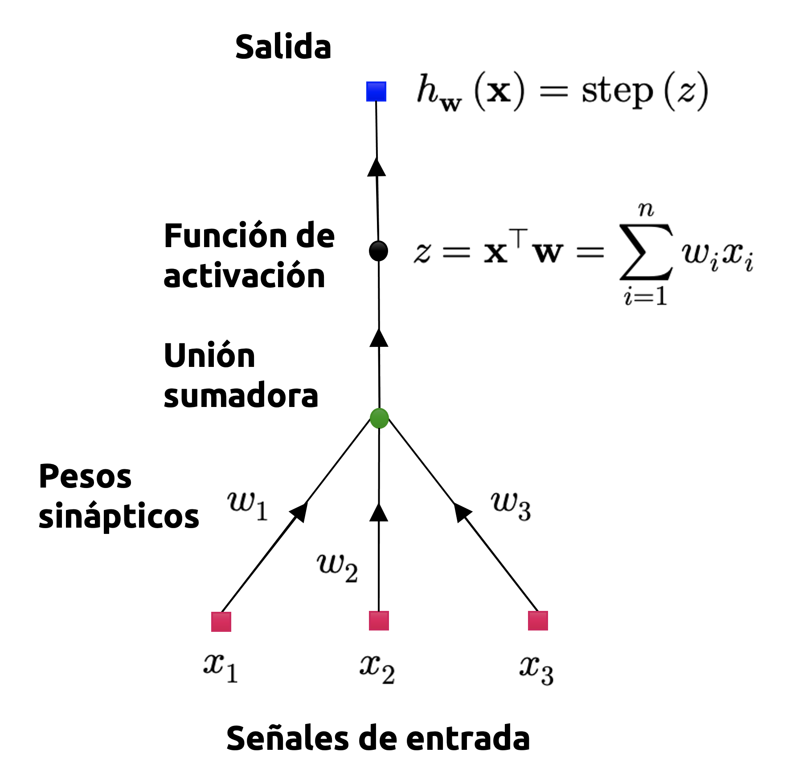{#fig-rosenblatt fig-align="center" width="40%"}

Una única TLU puede ser utilizada en problemas de clasificación binaria simple. Computa una combinación lineal de los valores de entrada, y si el resultado sobrepasa un determinado umbral, retorna una clase positiva. De otro modo, retorna una clase negativa (tal y como ocurre con otros modelos lineales de clasificación, que, de hecho, veremos más adelante). Podríamos, por ejemplo, utilizar una única TLU para clasificar los minerales en una muestra de roca, basándonos únicamente en sus leyes y propiedades químicas (también añadiendo un parámetro de sesgo adicional, que denotamos como $x_{0}=1$). En este caso, entrenar una TLU implicaría determinar los valores correctos para $w_{1},w_{2}$ y $w_{3}$, para lo cual, naturalmente, es necesaria la implementación de un **algoritmo de aprendizaje adecuado**.

Un perceptrón se compone únicamente de una capa de TLUs, con cada una de ellas conectada a todos los valores o señales de entrada. Cuando todas las neuronas de una capa están conectadas a una capa previa (que, en este caso, corresponde a la capa de entrada), dicha capa se dice que está **totalmente conectada** o es de tipo **densa**. Las entradas del perceptrón son alimentadas a neuronas de paso especiales llamadas **neuronas de entrada**, las que retornan cualquier valor que les sea proporcionado. Además, agregamos un parámetro de sesgo adicional (reiteramos, $x_{0}=1$), el que es típicamente representado por una **neurona de sesgo**, cuya salida es siempre igual a 1. En la @fig-multinomial se ilustra un perceptrón con dos entradas y tres salidas, el cual puede clasificar instancias simultáneamente en tres clases diferentes, lo que convierte a este perceptrón en un **modelo de clasificación multiclase**.

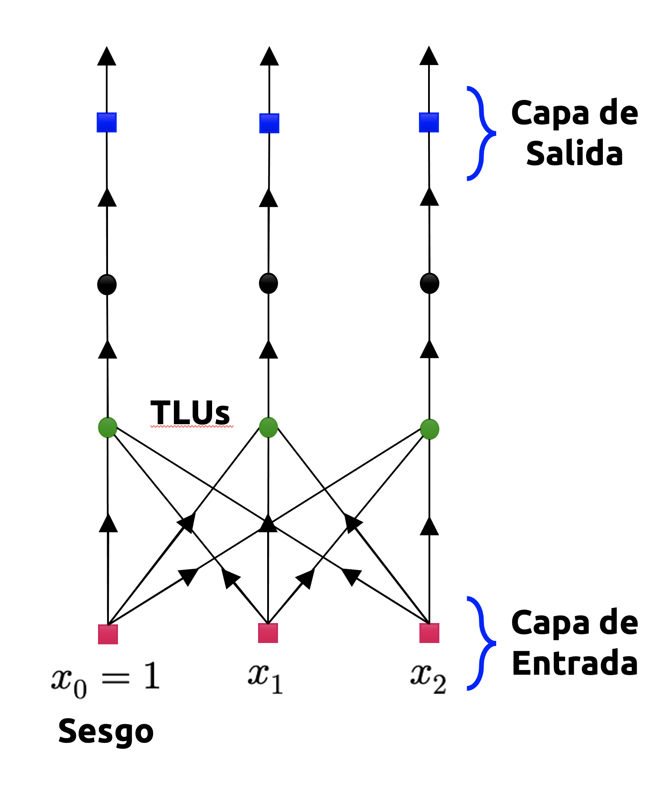{#fig-multinomial fig-align="center" width="40%"}

Utilizando los conocimientos que hemos repasado previamente en álgebra lineal, podemos calcular eficientemente las salidas de una capa de neuronas artificiales para varias instancias de una sola vez. Luego tenemos

::: {.eq-scroll}
$$
h_{\mathbf{w} ,\mathbf{b} }\left( \mathbf{X} \right)  =\phi \left( \mathbf{X} \mathbf{W} +\mathbf{b} \right)
\tag{2.6}
$$
:::

donde,

- $\mathbf{X}$ es la matriz compuesta por todos los datos de entrada alimentados al perceptrón. Las columnas de esta matriz representan las **variables independientes** o **atributos** del conjunto de datos, mientras que las filas representan las **observaciones** o **instancias** asociadas a cada una de estas variables.
- $\mathbf{W}$ es la matriz con los pesos del perceptrón, la que contiene los pesos de todas las conexiones, exceptuando aquellas caracterizadas por parámetros de sesgo. Tiene una fila por neurona de entrada y una columna por neurona artificial en la capa de salida.
- El vector de parámetros de sesgo $\mathbf{b}$ contiene todos los pesos relativos a las neuronas de sesgo y las neuronas artificiales. Contiene un parámetro de sesgo por neurona de sesgo.
- La función $\phi$ corresponde a la función de activación del perceptrón.

#### Perceptrón multicapa

El **perceptrón multicapa** (MLP, del inglés *multilayer perceptron*) corresponde a la generalización del modelo unicapa de Rosenblatt mediante el apilamiento de varios perceptrones en capas sucesivas. De esta manera, el MLP está constituido por una capa de neuronas de paso llamada **capa de entrada**, una o más capas de TLUs, llamadas **capas ocultas**, y una última capa de TLUs denominada **capa de salida**, como se ve en la @fig-mlp. Las capas cercanas a las neuronas de entrada son usualmente denotadas como **capas inferiores**, mientras que aquellas cercanas a las neuronas de salida son usualmente referidas como **capas superiores**. Cada capa, con excepción de la capa de salida, incluye una neurona de sesgo y se encuentra **totalmente conectada** a la capa siguiente.

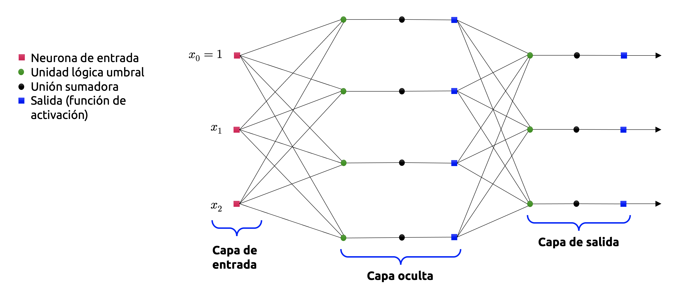{#fig-mlp fig-align="center" width="100%"}

Cuando un MLP contiene una **cantidad elevada de capas ocultas**, hablamos de una **red neuronal profunda**. El campo del aprendizaje profundo se enfoca precisamente en este tipo de redes, las cuales pueden llegar a constar de miles de capas ocultas, no necesariamente secuenciales, y cuya topología puede variar enormemente.

El **algoritmo de aprendizaje** utilizado para el entrenamiento del perceptrón multicapa se denomina **algoritmo de retropropagación**. En términos sencillos, corresponde a un algoritmo de gradiente descendente (que, como comentamos unas líneas más atrás, estudiaremos en profundidad más adelante), pero equipado con una técnica extremadamente eficiente para calcular estos gradientes de manera automática (que, como dijimos antes, corresponden a derivadas que toman la forma de tensores). En dos pasos (uno hacia adelante y otro hacia atrás), el algoritmo es capaz de computar el gradiente asociado al error de la red neuronal con respecto a cada uno de los parámetros del modelo (los pesos asociados a cada neurona y los parámetros de sesgo asociados a cada capa). En otras palabras, es capaz de determinar cómo deben ser ajustados cada uno de los pesos sinápticos y parámetros de sesgo de la red a fin de minimizar el error cometido por el modelo. Una vez obtenemos estos gradientes, simplemente se realiza un paso regular de gradiente descendente, repitiéndose el proceso completo hasta converger a una solución.

No entraremos en los detalles técnicos relativos a este técnica, porque nos mantendremos fieles a lo que establecimos en un principio: El campo del aprendizaje profundo es harina de otro costal y está, por ahora, fuera del alcance de estos apuntes. Sin embargo, si enunciaremos –en palabras simples– los pasos que caracterizan al algoritmo de retropropagación:

1. Trabaja con una submuestra a la vez (por ejemplo, constituidas por lotes –o *batches*– de 32 instancias u observaciones cada una), y luego se entrena sobre la totalidad del conjunto de entrenamiento múltiples veces. Cada paso de entrenamiento suele denominarse como **época** (del inglés, *epoch*).

2. Cada submuestra es alimentada a la capa de entrada de la red, la cual envía esta información a la primera capa oculta del perceptrón. El algoritmo luego computa la salida de todas las neuronas en esta capa (para cada instancia en la submuestra). El resultado se pasa a la siguiente capa, se computa el resultado, y así sucesivamente hasta que llegamos a la capa de salida. Esto constituye el llamado **paso hacia adelante** del algoritmo (del inglés, *forward pass*); es exactamente equivalente a hacer predicciones, con excepción de que todos los resultados intermedios se conservan, y que serán utilizados posteriormente en el **paso hacia atrás** del algoritmo (del inglés, *backward pass*).

3. A continuación, el algoritmo *mide* el error de salida de la red (es decir, hace uso de una **función de costo** que compara la respuesta objetivo y la respuesta calculada por la red neuronal, y retorna alguna métrica de magnitud del error, por ejemplo, el error cuadrático medio).

4. Luego computa cuánto ha contribuido al error cada uno de los pesos y salidas de cada neurona. Analíticamente, esto se logra mediante la aplicación intensiva de la **regla de la cadena**, lo cual hace que este paso sea preciso y rápido.

5. El algoritmo luego *mide* cuánto de ese error vino por contribuciones de cada peso en la capa anterior, nuevamente mediante la regla de la cadena, trabajando hacia atrás hasta que el algoritmo alcanza la capa de entrada. Como se explicó previamente, este **paso hacia atrás** mide eficientemente los gradientes de los errores a través de todos los pesos sinápticos de la red mediante la propagación del gradiente de cada error, en reversa, a través de la red neuronal.

6. Finalmente, el algoritmo implementa un paso de gradiente descendente para ajustar todos los pesos sinápticos en la red, usando los gradientes recién calculados.

### Gradientes en una red neuronal profunda
La revisión de los modelos de red neuronal más importantes (en términos históricos) nos deja claro que la gran dificultad de las mismas, y que es inherente al procesamiento de la información (puntualmente, de los errores que una red comete al estimar un parámetro), es el cálculo de los gradientes asociados a dichos errores, ya que éstos corresponden a derivadas con respecto a un conjunto de michos parámetros que suelen asociarse a una matriz (llamada comúnmente matriz de pesos de la red). Esta dificultad fue insalvable durante tanto tiempo, que a ese período se le denomina históricamente el *invierno de la inteligencia artificial* (o *winter AI*), debido a que muchos investigadores perdieron enormemente el interés en las redes neuronales por lo complicado que resultaba el cómputo de sus errores intermedios.

En una red neuronal profunda (es decir, con muchas capas ocultas), una respuesta objetivo suele formularse como una composición de varios niveles, del tipo

::: {.eq-scroll}
$$
\mathbf{y} =\left( f_{K}\circ f_{K-1}\circ \cdots \circ f_{1}\right)  \left( \mathbf{x} \right)  =f_{K}\left( f_{K-1}\left( \cdots \left( f\left( \mathbf{x} \right)  \right)  \cdots \right)  \right)
\tag{2.7}
$$
:::

Donde $\mathbf{x}$ representa la información de entrada de la red (que puede venir de muchas formas, por ejemplo, señales emitidas por un sensor, imágenes derivadas de una secuencia de video, la frecuencia de una señal de audio, entre muchos otros ejemplos); $\mathbf{y}$ representa los valores objetivo observados (en un contexto de **aprendizaje supervisado**, tales valores pueden ser clases, etiquetas o alguna correspondencia de naturaleza continua con respecto a los valoes de $\mathbf{x}$), y cada función $f_{i}$ para $i=1,...,K$ posee sus propios parámetros. En un perceptrón multicapa, disponemos de funciones del tipo $f_{i}(\mathbf{x}_{i-1})=\phi(\mathbf{A}_{i-1}\mathbf{x}_{i-1}+\mathbf{b}_{i-1})$ en la capa $i$-ésima. En este esquema, $\mathbf{x}_{i-1}$ corresponde a la salida de la capa $i-1$ y $\phi$ es la función de activación, que en el caso de un perceptrón multicapa puede ser de muchísimos tipos. Algunos ejemplos son los siguientes:

::: {.eq-scroll}
$$
\phi \left( x\right)  =\begin{cases}\mathrm{ReLU} \left( x\right)  =\max \left( 0,x\right)  &;\  \left( \mathrm{Funcion\  rectificadora} \right)  \\ \sigma \left( x\right)  =\displaystyle \frac{1}{1+\exp \left( -x\right)  } &;\  \left( \mathrm{Funcion\  logistica} \right)  \\ \tanh \left( x\right)  =\displaystyle \frac{\exp \left( x\right)  -\exp \left( -x\right)  }{\exp \left( x\right)  +\exp \left( -x\right)  } &;\  \left( \mathrm{Tangente\  hiperbolica} \right)  \end{cases}
\tag{2.8}
$$
:::

A fin de poder entrenar una red de este tipo, necesitamos calcular el gradiente de una funcion de pérdida, digamos $\mathcal{L}$, con respecto a todos los parámetros del modelo, $\mathbf{A}_{i}$ y $\mathbf{b}_{i}$ para $i=1,...,K$. También necesitamos calcular el gradiente de $\mathcal{L}$ con respecto a las señales de entrada de cada capa de la red. Por ejemplo, si tenemos señales de entrada agrupadas en el vector $\mathbf{x}$ y salidas agrupadas en el vector $\mathbf{y}$, y una arquitectura de red definida como

::: {.eq-scroll}
$$
\begin{array}{l}\mathbf{f}_{0} :=\mathbf{x} \\ \mathbf{f}_{i} :=\phi_{i} \left( \mathbf{A}_{i-1} \mathbf{f}_{i-1} +\mathbf{b}_{i-1} \right)  \  ;\  i=1,...,K\end{array}
\tag{2.9}
$$
:::

Entonces la arquitctura de la red puede esquematizarse como se muestra en la @fig-forward. En un problema como éste, nuestro interés radica en hallar los parámetros $\mathbf{A}_{i}$ y $\mathbf{b}_{i}$ ($i=1,...,K$), de manera que la función de pérdida $\mathcal{L}$ tenga una magnitud lo más pequeña posible. En general, $\mathcal{L}$ es representada por medio de una *métrica* o *distancia*, muchas veces elevada al cuadrado, que representa la diferencia entre el valor real de interés ($\mathbf{y}_{i}$) y el valor estimado por capa del modelo ($\tilde{\mathbf{y}}_{i}$).

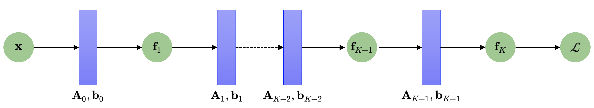{#fig-forward fig-align="center" width="100%"}

En la mayoría de los contextos, la función de pérdida puede expresarse como

::: {.eq-scroll}
$$
\mathcal{L} \left( \mathbf{\theta } \right)  =\left\Vert \mathbf{y} -\mathbf{f}_{K} \left( \mathbf{\theta } ,\mathbf{x} \right)  \right\Vert^{2}
\tag{2.10}
$$
:::

Donde $\mathbf{\theta }$ es un vector donde agrupamos todos los parámetros de la red; es decir, $\mathbf{\theta }=(\mathbf{A}_{0}, \mathbf{b}_{0},...,\mathbf{A}_{K-1},\mathbf{b}_{K-1})$.

Para obtener los gradientes con respecto al conjunto de parámetros $\mathbf{\theta}$, necesitamos calcular las derivadas parciales de $\mathcal{L}$ con respecto a los parámetros $\mathbf{\theta}_{j}=\left\{ \mathbf{A}_{i} ,\mathbf{b}_{i} \right\}$ de cada capa $i$. La regla de la cadena nos permite calcular estas derivadas como sigue:

::: {.eq-scroll}
$$
\begin{array}{lll}\displaystyle \frac{\partial \mathcal{L} }{\partial \mathbf{\theta }_{K-1} } &=&\displaystyle \frac{\partial \mathcal{L} }{\partial \mathbf{f}_{K} } \displaystyle \frac{\partial \mathbf{f}_{K} }{\partial \mathbf{\theta }_{K-1} } \\ \displaystyle \frac{\partial \mathcal{L} }{\partial \mathbf{\theta }_{K-2} } &=&\displaystyle \frac{\partial \mathcal{L} }{\partial \mathbf{f}_{K} } \displaystyle \frac{\partial \mathbf{f}_{K} }{\partial \mathbf{f}_{K-1} } \displaystyle \frac{\partial \mathbf{f}_{K-1} }{\partial \mathbf{\theta }_{K-2} } \\ \displaystyle \frac{\partial \mathcal{L} }{\partial \mathbf{\theta }_{K-3} } &=&\displaystyle \frac{\partial \mathcal{L} }{\partial \mathbf{f}_{K} } \displaystyle \frac{\partial \mathbf{f}_{K} }{\partial \mathbf{f}_{K-1} } \displaystyle \frac{\partial \mathbf{f}_{K-1} }{\partial \mathbf{f}_{K-2} } \displaystyle \frac{\partial \mathbf{f}_{K-2} }{\partial \mathbf{\theta }_{K-3} } \\ \Longrightarrow \displaystyle \frac{\partial \mathcal{L} }{\partial \mathbf{\theta }_{j} } &=&\displaystyle \frac{\partial \mathcal{L} }{\partial \mathbf{f}_{K} } \displaystyle \frac{\partial \mathbf{f}_{K} }{\partial \mathbf{f}_{K-1} } \cdots \displaystyle \frac{\partial \mathbf{f}_{j+2} }{\partial \mathbf{f}_{j+1} } \displaystyle \frac{\partial \mathbf{f}_{j+1} }{\partial \mathbf{\theta }_{j} } \end{array}
\tag{2.11}
$$
:::

Los términos intermedios en los lados derechos de las ecuaciones mostradas en (2.11), que son del tipo $\frac{\partial \mathbf{f}_{i+r+1} }{\partial \mathbf{f}_{i+r} }$, para $r=1,...,K-i$, corresponden a las derivadas parciales de las señales de salida de una capa determinada (la capa $(i+r+1)$) con respecto a sus señales de entrada (que, a su vez, son las señales de salida de la capa $(i+r)$); por otro lado, los términos más a la derecha de las ecuaciones mostradas en (2.11) –que son del tipo $\frac{\partial \mathbf{f}_{i+r+1}}{\partial \mathbf{\theta}_{i+r}}$, para $r=1,...,K-i$, corresponden a las derivadas parciales de las señales de salida de una capa determinada con respecto a los parámetros de dicha capa.

Asumiendo que ya hemos calculado las derivadas parciales $\frac{\partial \mathcal{L}}{\partial \mathbf{\theta}_{i+1}}$, entonces una gran porción de los cálculos involucrados en la obtención de dichas derivadas pueden reutilizarse para calcular luego $\frac{\partial \mathcal{L}}{\partial \mathbf{\theta}_{i}}$. Los términos adicionales que necesitamos son siempre dos, y corresponden a los dos últimos en el lado derecho de las ecuaciones que componen el desarrollo (2.11), a partir de la segunda ecuación.

La @fig-backward esquematiza los gradientes que son propagados hacia atrás a través de la red. De ahí que el nombre de este algoritmo de aprendizaje sea *“retropropagación”*.

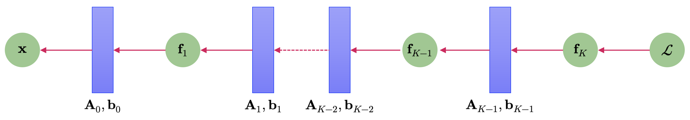{#fig-backward fig-align="center" width="100%"}

## Diferenciación automática
La retropropagación de gradientes corresponde a un caso particular de una técnica, conocida en el análisis numérico y en la computación científica como **diferenciación automática** (o **autodiff**, en inglés). Podemos imaginar esta metodología como un conjunto de técnicas que nos permiten evaluar **numéricamente** (a diferencia del **cálculo simbólico** estudiado hasta ahora) el **valor exacto** (con precisión computacional) del gradiente de una función, trabajando con variables intermedias y aplicando la regla de la cadena. La diferenciación automática nos permite aplicar una serie de operaciones aritméticas elementales (adición, multiplicación y funciones elementales). Aplicando la regla de la cadena sobre estos operadores, podemos calcular de manera automática el gradiente de funciones que, en un procedimiento simbólico clásico, suelen ser (muy) difíciles de abordar.

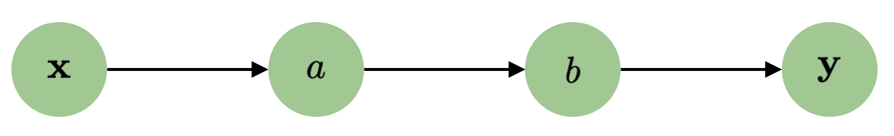{#fig-flow fig-align="center" width="60%"}

La @fig-flow muestra un diagrama sencillo que nos permite esquematizar el flujo de datos desde un input $\mathbf{x}$ a un output $\mathbf{y}$ mediante el uso de variables intermedias $a$ y $b$. Si quisiéramos pues calcular la derivada $\frac{d \mathbf{y}}{d \mathbf{x}}$, aplicaríamos la regla de la cadena para obtener

::: {.eq-scroll}
$$
\frac{d\mathbf{y} }{d\mathbf{x} } =\frac{d\mathbf{y} }{da} \frac{da}{db} \frac{db}{d\mathbf{x} }
\tag{2.12}
$$
:::

La diferenciación automática (**DA**) suele resolverse en dos esquemas distintivos, los cuales se conocen como **acumulación progresiva** (o **diferenciación hacia adelante**) y **acumulación regresiva** (o **diferenciación hacia atrás**). La acumulación progresiva especifica que el desarrollo de una derivada desde el interior hacia el exterior, conforme la regla de la cadena. Esto es, si consideramos la función compuesta

::: {.eq-scroll}
$$
y=f\left( g\left( h\left( x\right)  \right)  \right)  =f\left( g\left( h\left( w_{0}\right)  \right)  \right)  =f\left( g\left( w_{1}\right)  \right)  =f\left( w_{2}\right)  =w_{3}
\tag{2.13}
$$
:::

donde $w_{0}=x,w_{1}=h(w_{0}),w_{2}=g(w_{1})$ y $w_{3}=f(w_{2})=y$, entonces primero calculamos $\frac{dw_{1}}{dx}$, luego $\frac{dw_{2}}{dw_{1}}$, y finalmente $\frac{dy}{dw_{2}}$. Por otro lado, la acumulación regresiva realiza estas operaciones en la dirección opuesta, desde el exterior hacia el interior, conforme la regla de la cadena. Así, primero calculamos $\frac{dy}{dw_{2}}$, luego $\frac{dw_{2}}{dw_{1}}$, y finalmente $\frac{dw_{1}}{dx}$.

### Acumulación progresiva

En la **DA por acumulación progresiva**, primero fijamos la variable independiente con respecto a la cual se desea calcular la derivada respectiva de cada expresión de manera recursiva. En un cálculo manual, esto involucra sustituir repetidamente la derivada de las funciones interiores en una composición de funciones en la regla de la cadena. Matemáticamente, para una función $y:U\subseteq \mathbb{R}^{d}\longrightarrow \mathbb{R}$, esto puede esquematizarse mediante una secuencia de cálculos del tipo

::: {.eq-scroll}
$$
\begin{array}{lll}\displaystyle \frac{\partial y}{\partial x} &=&\displaystyle \frac{\partial y}{\partial w_{n-1}} \displaystyle \frac{\partial w_{n-1}}{\partial x} \\ &=&\displaystyle \frac{\partial y}{\partial w_{n-1}} \left( \displaystyle \frac{\partial w_{n-1}}{\partial w_{n-2}} \displaystyle \frac{\partial w_{n-2}}{\partial x} \right)  \\ &=&\displaystyle \frac{\partial y}{\partial w_{n-1}} \left( \displaystyle \frac{\partial w_{n-1}}{\partial w_{n-2}} \left( \displaystyle \frac{\partial w_{n-2}}{\partial w_{n-3}} \displaystyle \frac{\partial w_{n-3}}{\partial x} \right)  \right)  \cdots \end{array}
\tag{2.14}
$$
:::

Este cálculo recursivo puede generalizarse a campos vectoriales mediante el producto de las matrices Jacobianas resultantes.

La DA por acumulación progresiva es sencilla de implementar, ya que el flujo de información correspondiente a todas las derivadas involucradas coincide con el orden natural de evaluación que se obtiene mediante la regla de la cadena. Cada variable $w$ es aumentada con su derivada $\dot{w}$ (almacenada como un valor numérico, no una expresión simbólica), del tipo

::: {.eq-scroll}
$$
\dot{w}=\frac{\partial w}{\partial x}
\tag{2.15}
$$
:::

Las derivadas así definidas se calculan en sincronía con los pasos de la evaluación relativa a la DA y combinadas por medio de la regla de la cadena.

Por ejemplo, consideremos la función $z:\mathbb{R}^{2}\longrightarrow \mathbb{R}$ definida como

::: {.eq-scroll}
$$
z=x_{1}x_{2}+\mathrm{sen} \left( x_{1}\right)
\tag{2.16}
$$
:::

Entonces podemos definir las variables intermedias $w_{1},...,w_{5}$, tales que

::: {.eq-scroll}
$$
\begin{array}{lll}z&=&x_{1}x_{2}+\mathrm{sen} \left( x_{1}\right)  \\ &=&\underbrace{w_{1}w_{2}}_{w_{3}} +\underbrace{\mathrm{sen} \left( w_{1}\right)  }_{w_{4}} \\ &=&\underbrace{w_{3}+w_{4}}_{w_{5}} \\ &=&w_{5}\end{array}
\tag{2.17}
$$
:::

En todo proceso de DA por acumulación progresiva, la elección de la variable (o las variables) independiente(s), con respecto a la(s) cual(es) se realiza la diferenciación, afecta(n) a los valores iniciales, que en este caso, los denotamos como $\dot{w_{1}}$ y $\dot{w_{2}}$. Si queremos derivar $f$ con respecto a $x_{1}$, los valores iniciales deberían setearse como sigue:

::: {.eq-scroll}
$$
\dot{w}_{1} =\frac{\partial x_{1}}{\partial x_{2}} =1\wedge \dot{w}_{2} =\frac{\partial x_{2}}{\partial x_{1}} =0
\tag{2.18}
$$
:::

Con estos valores definidos, éstos se propagan usando la regla de la cadena como se muestra en la @fig-progress, donde se ilustra este proceso por medio de un grafo dirigido.

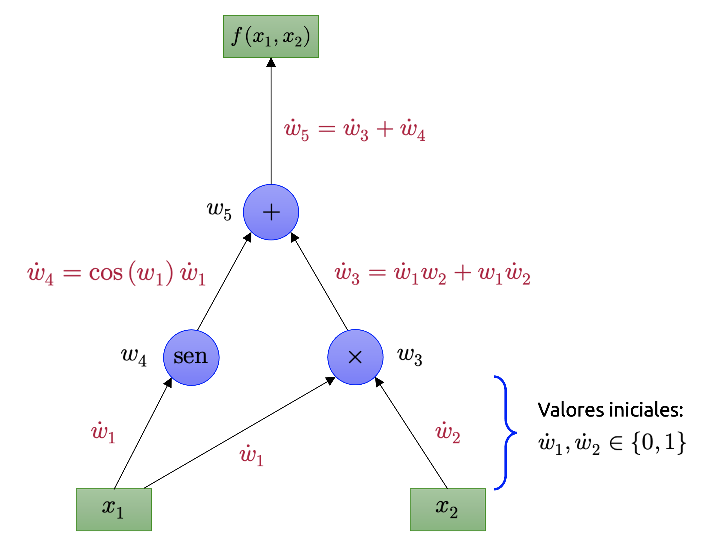{#fig-progress fig-align="center" width="80%"}

Para computar el gradiente de esta función de ejemplo, que requiere no solamente de $\partial f/\partial x_{1}$, sino que además de $\partial f/\partial x_{2}$, se realiza un barrido adicional por el grafo de la @fig-progress usando los valores iniciales $\dot{w_{1}}=0$ y $\dot{w_{2}}=1$. El proceso completo para el cálculo de $\partial f/\partial x_{1}$ se ilustra en la @tbl-da-forward.

: Todos los pasos ejecutados en la DA por acumulación progresiva ejemplificada en el grafo de la @fig-progress {#tbl-da-forward}

| Operaciones para calcular $f$ | Operaciones para calcular $\frac{\partial f}{\partial x_{1}}$ |
| :---------------------------- | :------------------------------------------------------------ |
| $w_{1}=x_{1}$                 | $\dot{w_{1}}=1$ (valor inicial)                               |
| $w_{2}=x_{2}$                 | $\dot{w_{2}}=0$ (valor inicial)                               |
| $w_{3}=w_{1} w_{2}$           | $\dot{w_{3}}=w_{2}\dot{w_{1}} + w_{1} \dot{w_{2}}$            |
| $w_{4}=\mathrm{sen}(w_{1})$   | $\dot{w_{4}}=\cos(w_{1})\dot{w_{1}}$                          |
| $w_{5}=w_{3}+w_{4}$           | $\dot{w_{5}}=\dot{w_{3}}+\dot{w_{4}}$                         |

La complejidad computacional de un barrido del grafo para la diferenciación automática por acumulación progresiva es directamente proporcional a la complejidad del código original para el cálculo tradicional de las derivadas involucradas. La DA hacia adelante es muchísimo más eficiente que la DA hacia atrás para el cálculo de derivadas de funciones del tipo $f:U\subseteq \mathbb{R}^{m}\longrightarrow V\subseteq \mathbb{R}^{n}$ con $m\ll n$, ya que solamente se necesitan $m$ barridos del grafo (y no $n$, como en la DA hacia atrás).

### Acumulación regresiva
En la **DA por acumulación regresiva**, fijamos la variable dependiente que queremos diferenciar, y la derivada respectiva se calcula con respecto a cada **sub-expresión** de manera recursiva. Si hiciéramos este cálculo con papel y lápiz, la derivada relativa a las funciones exteriores se sustituye repetidamente en la regla de la cadena, de la forma

::: {.eq-scroll}
$$
\frac{\partial y}{\partial x} =\frac{\partial y}{\partial w_{1}} \frac{\partial w_{1}}{\partial x} =\left( \frac{\partial y}{\partial w_{2}} \frac{\partial w_{2}}{\partial w_{1}} \right)  \frac{\partial w_{1}}{\partial x} =\left( \left( \frac{\partial y}{\partial w_{3}} \frac{\partial w_{3}}{\partial w_{2}} \right)  \frac{\partial w_{2}}{\partial w_{1}} \right)  \frac{\partial w_{1}}{\partial x} =\cdots
\tag{2.19}
$$
:::

En la DA hacia atrás, la cantidad de interés es llamada **adjunta**, y se denota como $\bar{w}$ (con una barra como superíndice). Tal cantidad corresponde a una derivada con respecto a la variable respectiva, de la forma

::: {.eq-scroll}
$$
\bar{w} =\frac{\partial y}{\partial w}
\tag{2.20}
$$
:::

La DA hacia atrás recorre la regla de la cadena desde afuera hacia adentro, o, en el caso del grafo de la @fig-regress, desde arriba hacia abajo. La función usada en este ejemplo gráfico es de valores reales y, por lo tanto, sólo requerimos un único valor inicial para el cálculo de la derivada y de un barrido del grafo para calcular el gradiente respectivo (con respecto a ambas variables). Esta es solamente la mitad del trabajo cuando lo comparamos con el requerido por la DA hacia adelante, pero la DA hacia atrás requiere que almacenemos las variables intermedias $w_{i}$, así como las instrucciones que produjeron tales variables en una estructura de datos conocida como **lista de Wengert**, la que puede ser computacionalmente costosa si el grafo es de gran tamaño.

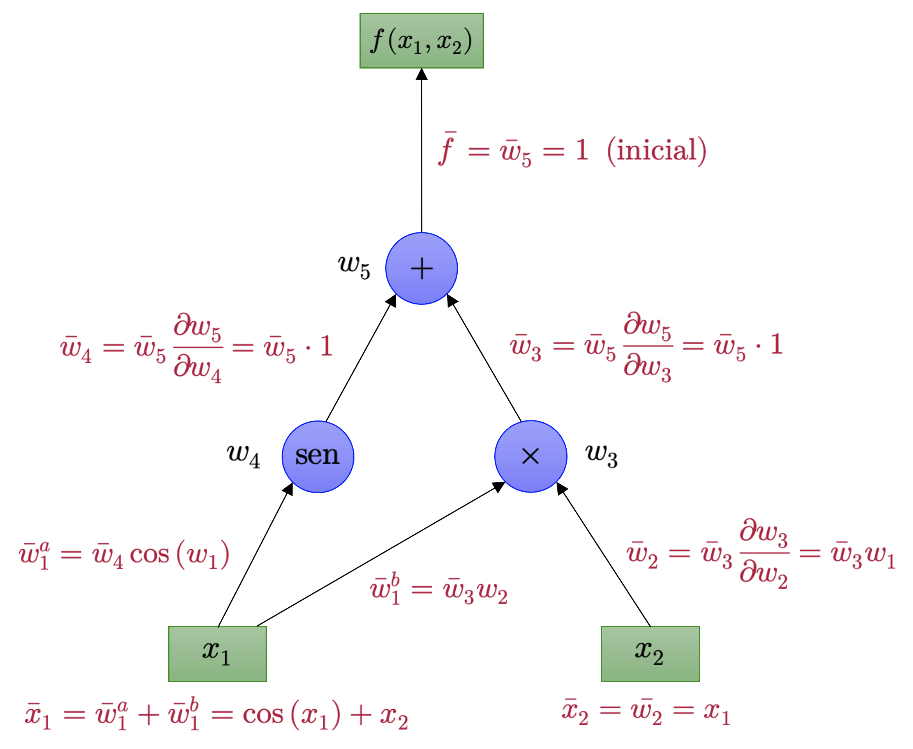{#fig-regress fig-align="center" width="80%"}

El consumo de memoria puede mitigarse parcialmente almacenando solamente algunas de las variables intermedias y luego reconstruyendo las que necesitemos mediante la repetición de los cálculos necesarios, siendo esta técnica conocida como **rematerialización**. También pueden generarse puntos de control (o *checkpoints*) en los cálculos mediante argumentos computacionales.

La DA hacia atrás es más eficiente que la DA hacia adelante para funciones del tipo $f:U\subseteq \mathbb{R}^{m}\longrightarrow V\subseteq \mathbb{R}^{n}$ cuando $m\gg n$, ya que solamente son necesarios $n$ pasos para computar la derivada de interés, en vez de los $m$ requeridos para el caso de la DA hacia adelante. La **retropropagación** que revisamos brevemente con anterioridad es un caso particular de diferenciación automática por acumulación regresiva.

**Ejemplo 2.1:** Consideremos la función

::: {.eq-scroll}
$$
f\left( x\right)  =\sqrt{x^{2}+\exp \left( x^{2}\right)  } +\cos \left( x^{2}+\exp \left( x^{2}\right)  \right)
\tag{2.21}
$$
:::

Si fuéramos a implementar esta función en nuestro computador, podríamos almacenar algunos de los cálculos inherentes a la misma mediante el uso de las variables intermedias. Por ejemplo,

::: {.eq-scroll}
$$
\begin{array}{lllll}a=x^{2}&;&c=a+b&;&e=\cos \left( c\right)  \\ b=\exp \left( a\right)  &;&d=\sqrt{c} &;&f=d+e\end{array}
\tag{2.22}
$$
:::

Este es el mismo tipo de proceso de pensamiento que ocurre cuando aplicamos la regla de la cadena. Notemos que el conjunto precedente de ecuaciones requiere de menos operaciones que la implementación directa de la función $f$ definida en la ecuación (2.21). El grafo de la @fig-decomp permite ilustrar el flujo de data y los cálculos requeridos para obtener el valor de la función $f$.

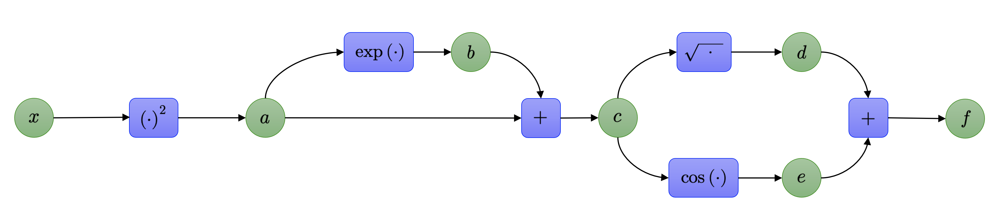{#fig-decomp fig-align="center" width="100%"}

El conjunto de ecuaciones que incluyen estas variables intermedias pueden ser pensadas efectivamente como un grafo computacional, el cual, a su vez, es una representación utilizada ampliamente en la implementación de librerías especializadas en el modelamiento mediante redes neuronales en una gran cantidad de frameworks (siendo uno de ellos Python, en el caso de las librerías <strong>Tensorflow</strong> y <strong>PyTorch</strong>). Podemos calcular directamente las derivadas de estas variables intermedias con respecto a sus correspondientes variables de entrada mediante la misma definición de derivada. Obtenemos, por tanto,

::: {.eq-scroll}
$$
\begin{array}{lllll}\displaystyle \frac{\partial a}{\partial x} =2x&;&\displaystyle \frac{\partial c}{\partial a} =1=\displaystyle \frac{\partial c}{\partial b} &;&\displaystyle \frac{\partial e}{\partial c} =-\mathrm{sen} \left( c\right)  \\ \displaystyle \frac{\partial b}{\partial a} =\exp \left( a\right)  &;&\displaystyle \frac{\partial d}{\partial c} =\displaystyle \frac{1}{2\sqrt{c} } &;&\displaystyle \frac{\partial f}{\partial d} =1=\displaystyle \frac{\partial f}{\partial e} \end{array}
\tag{2.23}
$$
:::

Observando el grafo de la @fig-decomp, podemos computar la derivada $\partial f/\partial x$ trabajando las expresiones en reversa (conforme la regla de la cadena), obteniendo

::: {.eq-scroll}
$$
\begin{array}{lll}\displaystyle \frac{\partial f}{\partial c} &=&\displaystyle \frac{\partial f}{\partial d} \displaystyle \frac{\partial d}{\partial c} +\displaystyle \frac{\partial f}{\partial e} \displaystyle \frac{\partial e}{\partial c} \\ \displaystyle \frac{\partial f}{\partial b} &=&\displaystyle \frac{\partial f}{\partial c} \displaystyle \frac{\partial c}{\partial b} \\ \displaystyle \frac{\partial f}{\partial a} &=&\displaystyle \frac{\partial f}{\partial b} \displaystyle \frac{\partial b}{\partial a} +\displaystyle \frac{\partial f}{\partial c} \displaystyle \frac{\partial c}{\partial a} \\ \displaystyle \frac{\partial f}{\partial x} &=&\displaystyle \frac{\partial f}{\partial a} \displaystyle \frac{\partial a}{\partial x} \end{array}
\tag{2.24}
$$
:::

Notemos que hemos aplicado, de manera implícita, la regla de la cadena para obtener la derivada $\partial f/\partial x$. Sustituyendo los resultados de las derivadas calculadas para las variables intermedias, obtenemos

::: {.eq-scroll}
$$
\begin{array}{lll}\displaystyle \frac{\partial f}{\partial c} =1\cdot \displaystyle \frac{1}{2\sqrt{c} } +1\cdot \left( -\mathrm{sen} \left( c\right)  \right)  &;&\displaystyle \frac{\partial f}{\partial a} =\displaystyle \frac{\partial f}{\partial b} \exp \left( a\right)  +\displaystyle \frac{\partial f}{\partial c} \cdot 1\\ \displaystyle \frac{\partial f}{\partial b} =\displaystyle \frac{\partial f}{\partial c} \cdot 1&;&\displaystyle \frac{\partial f}{\partial x} =\displaystyle \frac{\partial f}{\partial a} \cdot 2x\end{array}
\tag{2.25}
$$
:::

Pensando en cada una de las derivadas como una variable, podemos observar que los cálculos requeridos para calcular la derivada original son de complejidad similar a la del cálculo del valor de la función propiamente tal. Esto puede resultar bastante contraintuitivo, ya que la expresión matemática que representa la derivada simbólica $\partial f/\partial x$ es significativamente más complicada que $f$. Recordemos que

::: {.eq-scroll}
$$
\begin{array}{lll}\displaystyle \frac{df}{dx} &=&\displaystyle \frac{2x+2x\exp \left( x^{2}\right)  }{2\sqrt{x^{2}+\exp \left( x^{2}\right)  } } -\mathrm{sen} \left( x^{2}+\exp \left( x^{2}\right)  \right)  \left( 2x+2x\exp \left( x^{2}\right)  \right)  \\ &=&2x\left( \displaystyle \frac{1}{2\sqrt{x^{2}+\exp \left( x^{2}\right)  } } -\mathrm{sen} \left( x^{2}+\exp \left( x^{2}\right)  \right)  \right)  \left( 1+\exp \left( x^{2}\right)  \right)  \end{array}
\tag{2.26}
$$
:::
◼

La diferenciación automática es una formalización de los cálculos realizados en el ejemplo (2.1). Sean $x_{1},...,x_{d}$ las variables de entrada de la función $f:U\subseteq \mathbb{R}^{d} \longrightarrow V\subseteq \mathbb{R}^{D}$; $x_{d+1},...,x_{D-1}$ las variables intermedias respectivas y $x_{D}$ la variable de salida. Entonces el grafo asociado a la descomposición de $f$ puede expresarse como

::: {.eq-scroll}
$$
\mathrm{Para} \  i=d+1,d+2,...,D-1,D:\  x_{i}=g_{i}\left( x_{\mathrm{Pa} \left( x_{i}\right)  }\right)
\tag{2.27}
$$
:::

Donde las $g_{i}$ son funciones elementales y $x_{\mathrm{Pa} \left( x_{i}\right)  }$ son los nodos padres de la variable $x_{i}$ en el grafo. Dada una función definida de esta forma, podemos utilizar la regla de la cadena para calcular la derivada de la función $f$ en un procedimiento paso a paso. Recordemos que, por definición, $f=x_{D}$ y, por lo tanto,

::: {.eq-scroll}
$$
\frac{\partial f}{\partial x_{D}} =1
\tag{2.28}
$$
:::

Para las otras variables $x_{i}$, podemos aplicar la regla de la cadena como sigue,

::: {.eq-scroll}
$$
\frac{\partial f}{\partial x_{i}} =\sum_{x_{j}:x_{i}\in \mathrm{Pa} \left( x_{j}\right)  } \frac{\partial f}{\partial x_{j}} \frac{\partial x_{j}}{\partial x_{i}} =\sum_{x_{j}:x_{i}\in \mathrm{Pa} \left( x_{j}\right)  } \frac{\partial f}{\partial x_{j}} \frac{\partial g_{j}}{\partial x_{i}}
\tag{2.29}
$$
:::

Donde $\mathrm{Pa} \left( x_{j}\right)$ es el conjunto de nodos padres de $x_{j}$ en el grafo hipotético de $f$. La ecuación (2.27) representa la **propagación hacia adelante** de la función $f$, mientras que la ecuación (2.29) representa la **propagación hacia atrás** o **retropropagación** del gradiente de $f$ a través del grafo. Para el caso del entrenamiento de redes neuronales, la retropropagación se implementa para los gradientes de los errores cometidos por el modelo con respecto a un conjunto de observaciones dadas.

## La matriz Hessiana
Si bien hemos discutido en detalle una serie de conceptos extremadamente importantes en machine learning relativos a las derivadas de primer orden, también dedicamos algo de tiempo a explorar un poco lo relativo a las derivadas parciales de orden superior, aunque sólo de manera introductoria. Sin embargo, las derivadas parciales de segundo orden de una función pueden resultar útiles para la resolución de problemas de alta complejidad en el campo de la optimización de funciones continuas (que veremos más adelante) y para la aproximación de funciones de varias variables.

Vamos, pues, a concentrarnos en definir algunos conceptos útiles en relación a estas derivadas de segundo orden. Para el caso de una función escalar de variable vectorial, del tipo $f:U\subseteq \mathbb{R}^{n}\longrightarrow \mathbb{R}$, donde $U$ es un conjunto abierto de $\mathbb{R}^{n}$, las derivadas parciales de segundo orden describen las curvaturas locales en el entorno de los puntos sobre el gráfico de $f$ (que, en este caso, se trata de una hipersuperficie en $\mathbb{R}^{n+1}$) en los que $f$ sea de clase $C^{2}$.

<strong>Definición 2.1 – Matriz Hessiana:</strong> Sea $f:U\subseteq \mathbb{R}^{n}\longrightarrow \mathbb{R}$ una función definida en el conjunto abierto $U$ de $\mathbb{R}^{n}$. Si todas las derivadas parciales de segundo orden de $f$ existen y son continuas en el punto $\mathbf{x}_{0}\in U$ (es decir, $f$ es de clase $C^{2}$ en $\mathbf{x}_{0}$), definimos la **matriz Hessiana** de $f$ en $\mathbf{x}_{0}$ como la matriz de $n\times n$ compuesta por las $n^{2}$ derivadas parciales de segundo orden de $f$. Es decir,

::: {.eq-scroll}
$$
\mathbf{H}_{f} \left( \mathbf{x}_{0} \right)  :=\left( \begin{array}{cccc}\displaystyle \frac{\partial^{2} f}{\partial x^{2}_{1}} \left( \mathbf{x}_{0} \right)  &\displaystyle \frac{\partial^{2} f}{\partial x_{1}x_{2}} \left( \mathbf{x}_{0} \right)  &\cdots &\displaystyle \frac{\partial^{2} f}{\partial x_{1}x_{n}} \left( \mathbf{x}_{0} \right)  \\ \displaystyle \frac{\partial^{2} f}{\partial x_{2}x_{1}} \left( \mathbf{x}_{0} \right)  &\displaystyle \frac{\partial^{2} f}{\partial x^{2}_{2}} \left( \mathbf{x}_{0} \right)  &\cdots &\displaystyle \frac{\partial^{2} f}{\partial x_{2}x_{n}} \left( \mathbf{x}_{0} \right)  \\ \vdots &\vdots &\ddots &\vdots \\ \displaystyle \frac{\partial^{2} f}{\partial x_{n}x_{1}} \left( \mathbf{x}_{0} \right)  &\displaystyle \frac{\partial^{2} f}{\partial x_{n}x_{2}} \left( \mathbf{x}_{0} \right)  &\cdots &\displaystyle \frac{\partial^{2} f}{\partial x^{2}_{n}} \left( \mathbf{x}_{0} \right)  \end{array} \right)  \in \mathbb{R}^{n\times n}
\tag{2.30}
$$
:::

La matriz Hessiana suele denotarse de forma compacta como

::: {.eq-scroll}
$$
\mathbf{H}_{f}^{ij} \left( \mathbf{x}_{0} \right)  =\frac{\partial^{2} f}{\partial x_{i}x_{j}} \left( \mathbf{x}_{0} \right)
\tag{2.31}
$$
:::

Esta matriz es simétrica cuando $f$ es de clase $C^{2}$, ya que, por el teorema de Schwarz, las derivadas parciales mixtas resultantes son iguales. Notemos además que la matriz Hessiana de $f$ corresponde a la matriz Jacobiana del gradiente de la función $f$. Es decir, $\mathbf{H}_{f} \left( \mathbf{x}_{0} \right)  =\mathbf{J} \left( \nabla f\left( \mathbf{x}_{0} \right)  \right)$.

**Ejemplo 2.2 – Hessiana de una función cuadrática de dos variables:** Consideremos la función $f:\mathbb{R}^{2}\longrightarrow \mathbb{R}$ definida como

::: {.eq-scroll}
$$
f\left( x,y\right)  =x^{2}+xy+2y^{2}-4x+3y+1
\tag{2.32}
$$
:::

Vamos a calcular su gradiente y su matriz Hessiana, y a interpretar geométricamente el resultado. Partimos pues calculando las derivadas parciales de primer orden. De esta manera,

::: {.eq-scroll}
$$
\frac{\partial f}{\partial x} =2x+y-4 \  \wedge \  \frac{\partial f}{\partial y} =x+4y+3
\tag{2.33}
$$
:::

Por lo tanto, el gradiente de $f$ es

::: {.eq-scroll}
$$
\nabla_{\left( x,y\right)  } f=\left( 2x+y-4,\ x+4y+3\right)
\tag{2.34}
$$
:::

Calculamos ahora las derivadas parciales de segundo orden. De esta manera,

::: {.eq-scroll}
$$
\frac{\partial^{2} f}{\partial x^{2}} =2 \  ;\  \frac{\partial^{2} f}{\partial x\partial y} =1 \  ;\  \frac{\partial^{2} f}{\partial y\partial x} =1 \  ;\  \frac{\partial^{2} f}{\partial y^{2}} =4
\tag{2.35}
$$
:::

Así que la matriz Hessiana de $f$ es

::: {.eq-scroll}
$$
\mathbf{H}_{f}\left( x,y\right)  =\left( \begin{matrix}2&1\\ 1&4\end{matrix} \right)
\tag{2.36}
$$
:::

Notemos que, en este caso, la matriz Hessiana no depende del punto $\left( x,y\right)$, lo que es razonable debido a que la función $f$ es cuadrática. Además, la matriz Hessiana es simétrica, tal como predice el teorema de Schwarz.

Vamos ahora a estudiar el punto crítico de $f$. Para ello, igualamos el gradiente a cero:

::: {.eq-scroll}
$$
\nabla_{\left( x,y\right)  } f=\left( 0,0\right)  \Longleftrightarrow \begin{cases}2x+y-4=0\\ x+4y+3=0\end{cases}
\tag{2.37}
$$
:::

Resolviendo este sistema lineal, obtenemos

::: {.eq-scroll}
$$
x=\frac{19}{7} \  \wedge \  y=-\frac{10}{7}
\tag{2.38}
$$
:::

Por lo tanto, el único punto crítico de $f$ es

::: {.eq-scroll}
$$
\mathbf{x}_{\ast } =\left( \frac{19}{7},-\frac{10}{7}\right)
\tag{2.39}
$$
:::

Para clasificar este punto crítico, observamos la Hessiana. Como

::: {.eq-scroll}
$$
\det \left( \mathbf{H}_{f}\right)  =\det \left( \begin{matrix}2&1\\ 1&4\end{matrix} \right)  =8-1=7>0
\tag{2.40}
$$
:::

y además

::: {.eq-scroll}
$$
\frac{\partial^{2} f}{\partial x^{2}} =2>0
\tag{2.41}
$$
:::

se concluye que $\mathbf{H}_{f}$ es definida positiva. En consecuencia, el punto crítico $\mathbf{x}_{\ast}$ corresponde a un **mínimo estricto** de la función $f$.

Geométricamente, esto significa que la gráfica de $f$ es un paraboloide elíptico inclinado en el plano $(x,y)$, y que la matriz Hessiana describe la curvatura local de dicha superficie. El hecho de que la Hessiana sea definida positiva implica que la superficie se curva “hacia arriba” en todas las direcciones alrededor del punto crítico, lo que caracteriza precisamente a un mínimo local.

◼︎

::: {.callout-note}
## ¡Ojo!

En problemas de optimización, la matriz Hessiana cumple un papel central en la clasificación de puntos críticos. Si la Hessiana es definida positiva en un punto crítico, entonces dicho punto es un mínimo local estricto. Si es definida negativa, se trata de un máximo local estricto. Si es indefinida, el punto crítico corresponde típicamente a un punto de silla.
:::

**Ejemplo 2.3 – Hessiana de una función cuadrática típica en optimización:** Consideremos la función $f:\mathbb{R}^{n}\longrightarrow \mathbb{R}$ definida como

::: {.eq-scroll}
$$
f\left( \mathbf{x} \right)  =\frac{1}{2} \mathbf{x}^{\top } \mathbf{A} \mathbf{x} -\mathbf{b}^{\top } \mathbf{x} +c
\tag{2.42}
$$
:::

donde $\mathbf{x}\in \mathbb{R}^{n}$, $\mathbf{A}\in \mathbb{R}^{n\times n}$ es una matriz simétrica, $\mathbf{b}\in \mathbb{R}^{n}$ y $c\in \mathbb{R}$ es una constante. Este tipo de funciones aparece constantemente en optimización convexa, mínimos cuadrados, regresión lineal y métodos numéricos.

Vamos a calcular su gradiente y su matriz Hessiana. Partimos pues observando que la función $f$ es la suma de tres términos: Una forma cuadrática, una forma lineal y una constante. Usando las fórmulas matriciales de derivación vistas anteriormente, tenemos que

::: {.eq-scroll}
$$
\frac{\partial }{\partial \mathbf{x} } \left( \frac{1}{2} \mathbf{x}^{\top } \mathbf{A} \mathbf{x} \right)  =\frac{1}{2} \mathbf{x}^{\top } \left( \mathbf{A} +\mathbf{A}^{\top } \right)
\tag{2.43}
$$
:::

Como $\mathbf{A}$ es simétrica, se tiene que $\mathbf{A}^{\top } =\mathbf{A}$. Por lo tanto,

::: {.eq-scroll}
$$
\frac{\partial }{\partial \mathbf{x} } \left( \frac{1}{2} \mathbf{x}^{\top } \mathbf{A} \mathbf{x} \right)  =\frac{1}{2} \mathbf{x}^{\top } \left( 2\mathbf{A} \right)  =\mathbf{x}^{\top } \mathbf{A}
\tag{2.44}
$$
:::

Además, para el término lineal, sabemos que

::: {.eq-scroll}
$$
\frac{\partial }{\partial \mathbf{x} } \left( -\mathbf{b}^{\top } \mathbf{x} \right)  =-\mathbf{b}^{\top }
\tag{2.45}
$$
:::

mientras que la derivada de la constante $c$ es nula. Así, el gradiente de $f$ resulta ser

::: {.eq-scroll}
$$
\nabla_{\mathbf{x} } f=\frac{\partial f}{\partial \mathbf{x} } =\mathbf{x}^{\top } \mathbf{A} -\mathbf{b}^{\top }
\tag{2.46}
$$
:::

Si preferimos escribir el gradiente en forma de columna, entonces equivalentemente tenemos

::: {.eq-scroll}
$$
\nabla f\left( \mathbf{x} \right)  =\mathbf{A} \mathbf{x} -\mathbf{b}
\tag{2.47}
$$
:::

Calculamos ahora la matriz Hessiana. Dado que la derivada del término lineal $-\mathbf{b}^{\top }\mathbf{x}$ es constante, su segunda derivada es nula. En consecuencia, toda la información de segundo orden proviene del término cuadrático. Por lo tanto,

::: {.eq-scroll}
$$
\mathbf{H}_{f}\left( \mathbf{x} \right)  =\mathbf{A}
\tag{2.48}
$$
:::

Es decir, la matriz Hessiana de una función cuadrática de este tipo coincide exactamente con la matriz simétrica que define su término cuadrático.

Esta igualdad tiene una interpretación geométrica y computacional muy importante. La matriz $\mathbf{A}$ describe completamente la curvatura de la función $f$. En particular:

- Si $\mathbf{A}$ es **definida positiva**, entonces $f$ es estrictamente convexa y tiene un único mínimo global.
- Si $\mathbf{A}$ es **semidefinida positiva**, entonces $f$ es convexa, aunque podría no tener mínimo único.
- Si $\mathbf{A}$ es **indefinida**, entonces la función presenta direcciones de curvatura positiva y negativa, lo que típicamente da lugar a puntos de ensilladura.

Busquemos ahora los puntos críticos de $f$. Para ello imponemos la condición

::: {.eq-scroll}
$$
\nabla f\left( \mathbf{x} \right)  =\mathbf{0}
\tag{2.49}
$$
:::

lo que equivale a resolver el sistema lineal

::: {.eq-scroll}
$$
\mathbf{A} \mathbf{x} =\mathbf{b}
\tag{2.50}
$$
:::

Si $\mathbf{A}$ es invertible, entonces el único punto crítico es

::: {.eq-scroll}
$$
\mathbf{x}_{\ast } =\mathbf{A}^{-1} \mathbf{b}
\tag{2.51}
$$
:::

Además, si $\mathbf{A}$ es definida positiva, este punto crítico corresponde al único mínimo global de la función.

Este resultado es extremadamente importante en machine learning. Por ejemplo, en problemas de mínimos cuadrados, muchas funciones de pérdida pueden escribirse o aproximarse localmente en la forma cuadrática (2.32). En tales casos, la Hessiana entrega información directa sobre la curvatura local de la función objetivo y permite diseñar métodos de optimización de segundo orden, tales como el **método de Newton**, los cuales aprovechan explícitamente a $\mathbf{H}_{f}$ para acelerar la convergencia hacia el mínimo.

Si definimos

::: {.eq-scroll}
$$
\mathbf{A} =\left( \begin{matrix}2&1\\ 1&3\end{matrix} \right)  \  ;\  \mathbf{b} =\left( \begin{matrix}1\\ 2\end{matrix} \right)
\tag{2.52}
$$
:::

entonces la función

::: {.eq-scroll}
$$
f\left( \mathbf{x} \right)  =\frac{1}{2} \mathbf{x}^{\top } \mathbf{A} \mathbf{x} -\mathbf{b}^{\top } \mathbf{x}
\tag{2.53}
$$
:::

tiene gradiente

::: {.eq-scroll}
$$
\nabla f\left( \mathbf{x} \right)  =\mathbf{A} \mathbf{x} -\mathbf{b}
\tag{2.54}
$$
:::

y matriz Hessiana

::: {.eq-scroll}
$$
\mathbf{H}_{f}\left( \mathbf{x} \right)  =\left( \begin{matrix}2&1\\ 1&3\end{matrix} \right)
\tag{2.55}
$$
:::

Como $\det(\mathbf{A})=5>0$ y el menor principal superior izquierdo vale $2>0$, la matriz $\mathbf{A}$ es definida positiva. Por lo tanto, $f$ es estrictamente convexa y su único mínimo global se obtiene resolviendo

::: {.eq-scroll}
$$
\left( \begin{matrix}2&1\\ 1&3\end{matrix} \right)  \left( \begin{matrix}x_{1}\\ x_{2}\end{matrix} \right)  =\left( \begin{matrix}1\\ 2\end{matrix} \right)
\tag{2.56}
$$
:::

de donde resulta

::: {.eq-scroll}
$$
\mathbf{x}_{\ast } =\left( \begin{matrix}\frac{1}{5}\\ \frac{3}{5}\end{matrix} \right)
\tag{2.57}
$$
:::

Así, la matriz Hessiana no sólo describe la curvatura de la función, sino que además certifica que el punto crítico encontrado corresponde efectivamente a un mínimo global. ◼︎

## Serie multivariable de Taylor
El gradiente de una función $f$ es utilizado con frecuencia para construir aproximaciones locales lineales de la misma en el entorno de un punto $\mathbf{x}_{0}$ de la forma

::: {.eq-scroll}
$$
f\left( \mathbf{x} \right)  \approx f\left( \mathbf{x}_{0} \right)  +\left( \nabla_{\mathbf{x} } f\right)  \left( \mathbf{x}_{0} \right)  \left( \mathbf{x} -\mathbf{x}_{0} \right)
\tag{2.58}
$$
:::

Aquí, $\left( \nabla_{\mathbf{x} } f\right)  \left( \mathbf{x}_{0} \right)$ es el gradiente de $f$ con respecto a $\mathbf{x}$ evaluado en el punto $\mathbf{x}_{0}$. La ecuación (2.58) corresponde a un caso particular de **expansión multivariable de Taylor** de $f$ centrada en $\mathbf{x}_{0}$, donde consideramos únicamente los primeros dos términos de la misma. Discutiremos el caso más general, que nos permitirá construir mejores aproximaciones para $f$ (en términos de precisión).

<strong>Definición 2.2 – Serie multivariable de Taylor:</strong> Consideremos la función

::: {.eq-scroll}
$$
\begin{array}{ll}f:&\mathbb{R}^{D} \longrightarrow \mathbb{R} \\ &\mathbf{x} \longmapsto f\left( \mathbf{x} \right)  \  ;\  \mathbf{x} \in \mathbb{R}^{D} \end{array}
\tag{2.59}
$$
:::

Supongamos que $f$ es regular en $\mathbf{x}_{0}$ (es decir, las derivadas parciales de $f$ no se anulan en $\mathbf{x}_{0}$) y definimos el **vector diferencial** $\mathbf{\delta } :=\mathbf{x} -\mathbf{x}_{0}$, entonces definimos la **serie multivariable de Taylor** de $f$ centrada en $\mathbf{x}_{0}$ como

::: {.eq-scroll}
$$
f\left( \mathbf{x} \right)  =\sum^{+\infty }_{k=0} \frac{D^{k}_{\mathbf{x} }f\left( \mathbf{x}_{0} \right)  }{k!} \mathbf{\delta }^{k}
\tag{2.60}
$$
:::

Donde $D$ es el operador diferencial y, por tanto, $D^{k}_{\mathbf{x} }$ corresponde al operador de derivada (total) con respecto a $\mathbf{x}$) aplicado $k$ veces.

Si truncamos la serie (2.60) en sus primeros $n+1$ términos, obtenemos la aproximación denominada **polinomio mulivariable de Taylor** de $f$ de grado $n$ y centrado en $\mathbf{x}_{0}$. Es decir,

::: {.eq-scroll}
$$
T_{n}\left( \mathbf{x} \right)  =\sum^{+\infty }_{k=0} \frac{D^{k}_{\mathbf{x} }f\left( \mathbf{x}_{0} \right)  }{k!} \mathbf{\delta }^{k}
\tag{2.61}
$$
:::

En las ecuaciones (2.60) y (2.61) hemos utilizado una notación un tanto contraintuitiva al usar $\mathbf{\delta}^{k}$, la que de hecho no está definida para vectores $\mathbf{x}\in \mathbb{R}^{D}$ (para $D>1\wedge k>1$). Notemos que ambos, $D_{\mathbf{x}}^{k} f$ y $\mathbf{\delta}^{k}$ son tensores de orden $k$ (es decir, arreglos resultantes de apilar $k$ matrices). El tensor $\mathbf{\delta}^{k}\in \mathbb{R}^{D\times D\times \cdots \times D}$ (donde el producto cartesiano $D\times D\times \cdots \times D$ se aplica $k$ veces) se obtiene por medio de una operación llamada **producto exterior**, denotado por $\otimes$, y que cumple con

::: {.eq-scroll}
$$
\mathbf{\delta }^{2} :=\mathbf{\delta } \otimes \mathbf{\delta } =\mathbf{\delta } \mathbf{\delta }^{\top } \  ;\  \mathbf{\delta }^{2} \left[ i,j\right]  =\delta \left[ i\right]  \delta \left[ j\right]
\tag{2.62}
$$
:::

Donde $\mathbf{\delta}\in \mathbb{R}^{D}$. La @fig-prodext  ilustra dos ejemplos de productos de estas características. En general. obtenemos los términos

::: {.eq-scroll}
$$
D^{k}_{\mathbf{x} }f\left( \mathbf{x}_{0} \right)  \mathbf{\delta }^{k} =\sum^{D}_{i_{1}=1} \cdots \sum^{D}_{i_{k}=1} D^{k}_{\mathbf{x} }f\left( \mathbf{x}_{0} \right)  \left[ i_{1},...,i_{k}\right]  \delta \left[ i_{1}\right]  \cdots \delta \left[ i_{k}\right]
\tag{2.63}
$$
:::

para la serie multivariable de Taylor, donde $D^{k}_{\mathbf{x} }f\left( \mathbf{x}_{0} \right)  \mathbf{\delta }^{k}$ contiene polinomios de orden $k$.

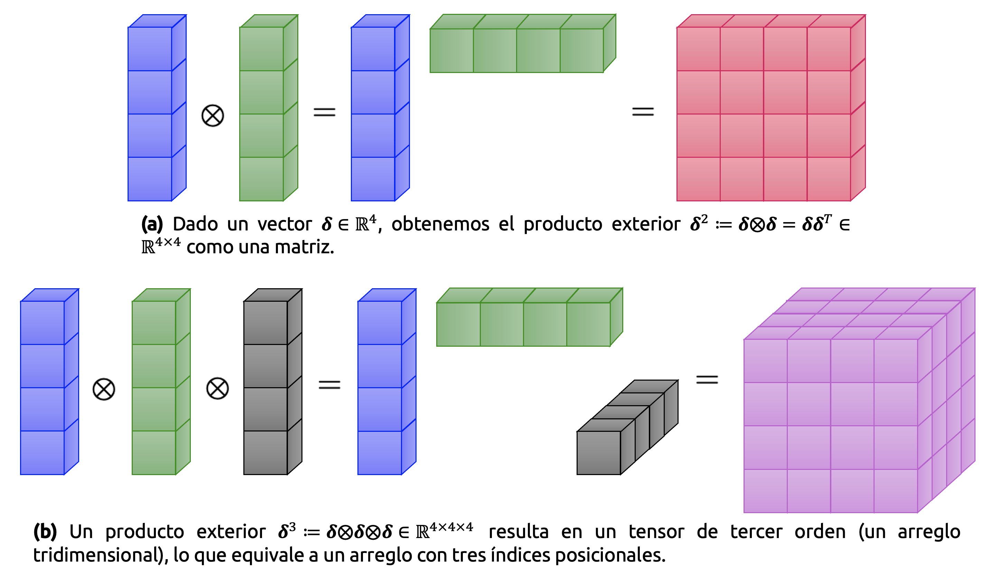{#fig-prodext fig-align="center" width="100%"}

Ahora que hemos definido expansiones de Taylor para campos vectoriales, escribamos explícitamente los primeros términos $D^{k}_{\mathbf{x} }f\left( \mathbf{x}_{0} \right)  \mathbf{\delta }^{k}$ de la expansión multivariable de Taylor para $k=0,1,...,3$ y $\mathbf{\delta}:=\mathbf{x}-\mathbf{x}_{0}$ como

::: {.eq-scroll}
$$
\displaystyle \begin{array}{lll}k=0&\Longrightarrow &D^{0}_{\mathbf{x} }f\left( \mathbf{x}_{0} \right)  \mathbf{\delta }^{0} =f\left( \mathbf{x}_{0} \right)  \in \mathbb{R} \\ k=1&\Longrightarrow &D^{1}_{\mathbf{x} }f\left( \mathbf{x}_{0} \right)  \mathbf{\delta }^{1} =\underbrace{\nabla_{\mathbf{x} } f\left( \mathbf{x}_{0} \right)  }_{1\times D} \underbrace{\mathbf{\delta } }_{D\times 1} =\displaystyle \sum^{D}_{i=1} \nabla_{\mathbf{x} } f\left( \mathbf{x}_{0} \right)  \left[ i\right]  \delta \left[ i\right]  \in \mathbb{R} \\ k=2&\Longrightarrow &D^{2}_{\mathbf{x} }f\left( \mathbf{x}_{0} \right)  \mathbf{\delta }^{2} =\mathrm{tr} \left( \underbrace{\mathbf{H} \left( \mathbf{x}_{0} \right)  }_{D\times D} \underbrace{\mathbf{\delta } }_{D\times 1} \  \underbrace{\mathbf{\delta }^{\top } }_{1\times D} \right)  =\mathbf{\delta }^{\top } \mathbf{H} \left( \mathbf{x}_{0} \right)  \mathbf{\delta } =\displaystyle \sum^{D}_{i=1} \displaystyle \sum^{D}_{j=1} H\left[ i,j\right]  \delta \left[ i\right]  \delta \left[ j\right]  \in \mathbb{R} \\ k=3&\Longrightarrow &D^{3}_{\mathbf{x} }f\left( \mathbf{x}_{0} \right)  \mathbf{\delta }^{3} =\displaystyle \sum^{D}_{i=1} \displaystyle \sum^{D}_{j=1} \displaystyle \sum^{D}_{k=1} D^{3}_{\mathbf{x} }f\left( \mathbf{x}_{0} \right)  \left[ i,j,k\right]  \delta \left[ i\right]  \delta \left[ j\right]  \delta \left[ k\right]  \in \mathbb{R} \end{array}
\tag{2.64}
$$
:::

Donde $\mathbf{H}(\mathbf{x}_{0})$ es la matriz Hessiana de $f$ evaluada en $\mathbf{x}_{0}$.

**Ejemplo 2.4 – Expansión de Taylor para una función de dos variables:** Consideremos la función $f:\mathbb{R}^{2}\longrightarrow \mathbb{R}$, definida explícitamente como

::: {.eq-scroll}
$$
f\left( x,y\right)  =x^{2}+2xy+y^{3}
\tag{2.65}
$$
:::

Queremos calcular la expansión multivariable de Taylor para $f$ en $(x_{0},y_{0})=(1,2)$. Antes de comenzar, discutamos qué debemos esperar. La función mostrada en la ecuación (2.65) es un polinomio de grado 3. Por lo tanto, la expansión también será de tercer orden, ya que también es polinómica (y exacta en este caso).

Para determinar la expansión multivariable de Taylor, partimos con el término constante y las derivadas parciales de primer orden, las que están dadas por

::: {.eq-scroll}
$$
\begin{array}{l}f\left( 1,2\right)  =13\\ \displaystyle \frac{\partial f}{\partial x} =2x+2y\Longrightarrow \displaystyle \frac{\partial f}{\partial x} \left( 1,2\right)  =6\\ \displaystyle \frac{\partial f}{\partial y} =2x+3y^{2}\Longrightarrow \displaystyle \frac{\partial f}{\partial y} \left( 1,2\right)  =14\end{array}
\tag{2.66}
$$
:::

Por lo tanto obtenemos

::: {.eq-scroll}
$$
D^{1}_{\left( x,y\right)  }f\left( 1,2\right)  =\nabla_{\left( x,y\right)  } f\left( 1,2\right)  =\left( \frac{\partial f}{\partial x} \left( 1,2\right)  ,\frac{\partial f}{\partial y} \left( 1,2\right)  \right)  =\left( 6,14\right)  \in \mathbb{R}^{1\times 2}
\tag{2.67}
$$
:::

De manera que

::: {.eq-scroll}
$$
\frac{D^{1}_{\left( x,y\right)  }f\left( 1,2\right)  }{1!} \mathbf{\delta } =\left( 6,14\right)  \left( \begin{matrix}x-1\\ y-2\end{matrix} \right)  =6\left( x-1\right)  +14\left( y-2\right)
\tag{2.68}
$$
:::

Notemos que $D^{1}_{\left( x,y\right)  }f\left( 1,2\right)  \mathbf{\delta }$ contiene únicamente términos lineales (polinomios de primer orden). Las derivadas de segundo orden vienen dadas por

::: {.eq-scroll}
$$
\begin{array}{lll}\displaystyle \frac{\partial^{2} f}{\partial x^{2}} =2&\Longrightarrow &\displaystyle \frac{\partial^{2} f}{\partial x^{2}} \left( 1,2\right)  =2\\ \displaystyle \frac{\partial^{2} f}{\partial y^{2}} =6y&\Longrightarrow &\displaystyle \frac{\partial^{2} f}{\partial y^{2}} \left( 1,2\right)  =12\\ \displaystyle \frac{\partial^{2} f}{\partial x\partial y} =2&\Longrightarrow &\displaystyle \frac{\partial^{2} f}{\partial x\partial y} \left( 1,2\right)  =2\\ \displaystyle \frac{\partial^{2} f}{\partial y\partial x} =2&\Longrightarrow &\displaystyle \frac{\partial^{2} f}{\partial y\partial x} \left( 1,2\right)  =2\end{array}
\tag{2.69}
$$
:::

Ahora construimos la matriz Hessiana de $f$ como sigue,

::: {.eq-scroll}
$$
\mathbf{H}_{f} \left( x,y\right)  =\left( \begin{array}{cc}\displaystyle \frac{\partial^{2} f}{\partial x^{2}} &\displaystyle \frac{\partial^{2} f}{\partial x\partial y} \\ \displaystyle \frac{\partial^{2} f}{\partial y\partial x} &\displaystyle \frac{\partial^{2} f}{\partial y^{2}} \end{array} \right)  =\left( \begin{matrix}2&2\\ 2&6y\end{matrix} \right)  \  \Longrightarrow \  \mathbf{H}_{f} \left( 1,2\right)  =\left( \begin{matrix}2&2\\ 2&6y\end{matrix} \right)  \in \mathbb{R}^{2\times 2}
\tag{2.70}
$$
:::

De este modo, el segundo término de la expansión de Taylor para $f$ es

::: {.eq-scroll}
$$
\begin{array}{lll}\displaystyle \frac{D^{2}_{\left( x,y\right)  }f\left( 1,2\right)  }{2!} \mathbf{\delta }^{2} &=&\displaystyle \frac{1}{2} \mathbf{\delta }^{\top } \mathbf{H} \left( 1,2\right)  \mathbf{\delta } \\ &=&\displaystyle \frac{1}{2} \left( x-1,y-2\right)  \left( \begin{matrix}2&2\\ 2&12\end{matrix} \right)  \left( \begin{matrix}x-1\\ y-2\end{matrix} \right)  \\ &=&\left( x-1\right)^{2}  +2\left( x-1\right)  \left( y-2\right)  +6\left( y-2\right)^{2}  \end{array}
\tag{2.71}
$$
:::

Finalmente, las derivadas de tercer orden se calculan como

::: {.eq-scroll}
$$
\begin{array}{lll}D^{3}_{\left( x,y\right)  }f&=&\left( \displaystyle \frac{\partial \mathbf{H} }{\partial x} ,\displaystyle \frac{\partial \mathbf{H} }{\partial y} \right)  \in \mathbb{R}^{2\times 2\times 2} \\ D^{3}_{\left( x,y\right)  }f\left[ :,:,1\right]  &=&\displaystyle \frac{\partial \mathbf{H} }{\partial x} =\left( \begin{array}{cc}\displaystyle \frac{\partial^{3} f}{\partial x^{3}} &\displaystyle \frac{\partial^{3} f}{\partial x^{2}\partial y} \\ \displaystyle \frac{\partial^{3} f}{\partial x\partial y\partial x} &\displaystyle \frac{\partial^{3} f}{\partial x\partial y^{2}} \end{array} \right)  \\ D^{3}_{\left( x,y\right)  }f\left[ :,:,2\right]  &=&\displaystyle \frac{\partial \mathbf{H} }{\partial y} =\left( \begin{array}{cc}\displaystyle \frac{\partial^{3} f}{\partial y\partial x^{2}} &\displaystyle \frac{\partial^{3} f}{\partial y\partial x\partial y} \\ \displaystyle \frac{\partial^{3} f}{\partial y^{2}\partial x} &\displaystyle \frac{\partial^{3} f}{\partial y^{3}} \end{array} \right)  \end{array}
\tag{2.72}
$$
:::

Debido a que la mayoría de las derivadas parciales de segundo orden en la matriz Hessiana son constantes, la única derivada parcial de tercer orden que no es nula es

::: {.eq-scroll}
$$
\frac{\partial^{3} f}{\partial y^{3}} =6\  \Longrightarrow \  \frac{\partial^{3} f}{\partial y^{3}} \left( 1,2\right)  =6
\tag{2.73}
$$
:::

En las derivadas parciales de tercer orden especificadas en la ecuación (2.72), la notación con corchetes es similar a la notación indexada de Python para el slicing de elementos en un arreglo de números u objetos arbitrarios. De esta manera, $D^{3}_{\left( x,y\right)  }f\left[ :,:,1\right]$ hace referencia a que, en el arreglo tridimensional $D^{3}_{\left( x,y\right)  }f$, escogemos todos los elementos de las filas y columnas (primera y segunda dimensión), y en la tercera dimensión, seleccionamos el valor localizado en la posición 1. Luego,

::: {.eq-scroll}
$$
D^{3}_{\left( x,y\right)  }f\left[ :,:,1\right]  =\left( \begin{matrix}0&0\\ 0&0\end{matrix} \right)  \  ;\  D^{3}_{\left( x,y\right)  }f\left[ :,:,2\right]  =\left( \begin{matrix}0&0\\ 0&6\end{matrix} \right)
\tag{2.74}
$$
:::

Por lo tanto,

::: {.eq-scroll}
$$
\frac{D^{3}_{\left( x,y\right)  }f\left( 1,2\right)  }{3!} \mathbf{\delta }^{3} =\left( y-2\right)^{3}
\tag{2.75}
$$
:::

De esta manera, la expansión de Taylor correspondiente a $f$ es

::: {.eq-scroll}
$$
\begin{array}{lll}f\left( x,y\right)  &=&f\left( 1,2\right)  +D^{1}_{\left( x,y\right)  }f\left( 1,2\right)  \mathbf{\delta } +\displaystyle \frac{D^{2}_{\left( x,y\right)  }f\left( 1,2\right)  }{2!} \mathbf{\delta }^{2} +\displaystyle \frac{D^{3}_{\left( x,y\right)  }f\left( 1,2\right)  }{3!} \mathbf{\delta }^{3} \\ &=&f\left( 1,2\right)  +\displaystyle \frac{\partial f\left( 1,2\right)  }{\partial x} \left( x-1\right)  +\displaystyle \frac{\partial f\left( 1,2\right)  }{\partial y} \left( y-2\right)  +\displaystyle \frac{1}{2!} \left( \displaystyle \frac{\partial^{2} f\left( 1,2\right)  }{\partial x^{2}} \left( x-1\right)^{2}  +2\displaystyle \frac{\partial^{2} f\left( 1,2\right)  }{\partial x\partial y} \left( x-1\right)  \left( y-2\right)  +\displaystyle \frac{\partial^{2} f\left( 1,2\right)  }{\partial y} \left( y-2\right)^{2}  \right)  +\displaystyle \frac{1}{6} \displaystyle \frac{\partial^{3} f\left( 1,2\right)  }{\partial y^{3}} \left( y-2\right)^{3}  \\ &=&16+6\left( x-1\right)  +14\left( y-2\right)  +\left( x-1\right)^{2}  +6\left( y-2\right)^{2}  +2\left( x-1\right)  \left( y-2\right)  +\left( y-2\right)^{3}  \end{array}
\tag{2.76}
$$
:::

En este caso, hemos obtenido una aproximación exacta para $f$, debido a que nuestra función es polinómica y la expansión en serie de Taylor es exacta para este tipo de funciones. ◼︎

## Comentarios finales

Con este apunte cerramos una etapa especialmente importante dentro del estudio del cálculo diferencial aplicado al aprendizaje automático. En el apunte anterior nos concentramos en construir el lenguaje matemático de las derivadas, gradientes, matriz Jacobiana y matriz Hessiana. Aquí, en cambio, dimos un paso decisivo: Vimos cómo esos objetos no sólo existen como entidades formales, sino que además permiten **construir algoritmos reales de aprendizaje**.

La retropropagación mostró con claridad que el cálculo diferencial no es un adorno teórico dentro de la teoría del aprendizaje automático, sino uno de sus mecanismos computacionales fundamentales. El entrenamiento de una red neuronal no es otra cosa que la propagación eficiente de errores a través de una composición muy profunda de funciones, y esa eficiencia se sostiene casi enteramente en una aplicación inteligente de la regla de la cadena. Lo que, en una primera aproximación, podría parecer un procedimiento puramente analítico, resulta ser en la práctica el corazón de una estrategia algorítmica extraordinariamente poderosa.

La diferenciación automática reforzó aún más esta idea. No se trata simplemente de derivar funciones “a mano”, ni tampoco de aproximar derivadas por diferencias finitas, sino de **reutilizar la estructura computacional de una función** para obtener gradientes exactos con precisión numérica. Esta observación es profundamente importante, ya que, en problemas reales, la dificultad no suele estar en definir una función objetivo, sino en poder derivarla de manera eficiente respecto de miles o incluso millones de parámetros. Allí reside una de las grandes razones del éxito de los métodos modernos de aprendizaje profundo.

Por otro lado, la introducción de la matriz Hessiana nos permitió dar un primer vistazo serio a la información de segundo orden. Mientras que el gradiente describe la dirección local de mayor crecimiento de una función, la Hessiana nos informa acerca de su **curvatura local**. Esta diferencia es central en optimización. El gradiente nos dice hacia dónde movernos; la matriz Hessiana, en cambio, nos ayuda a entender la geometría del terreno sobre el cual nos estamos moviendo. En consecuencia, conceptos como convexidad local, mínimos estrictos, puntos de silla y métodos de Newton dejan de ser ideas aisladas y pasan a formar parte de una misma narrativa estructural.

La expansión multivariable de Taylor termina de consolidar esta perspectiva. Gracias a ella, podemos interpretar a muchas funciones complicadas como si, localmente, fueran polinomios. En primer orden, la función se comporta como una aproximación lineal gobernada por el gradiente. En segundo orden, aparece una corrección cuadrática gobernada por la Hessiana. Esta idea resulta crucial no sólo en análisis y optimización, sino también en aprendizaje estadístico, donde muchas veces trabajamos con aproximaciones locales de funciones de pérdida, log-verosimilitudes o superficies de energía.

En conjunto, este apunte deja instalada una idea muy poderosa. Y es que **aprender** consiste, en una gran cantidad de modelos, en explotar de manera sistemática la información local de una función. Los gradientes permiten corregir parámetros. Las matrices Hessianas permiten entender la geometría de esas correcciones. La diferenciación automática permite realizar todo eso a escala computacional. Y la serie de Taylor ofrece el marco conceptual que conecta estas herramientas dentro de una misma teoría de aproximación local.

Con esto, ya disponemos de una base suficientemente robusta para avanzar hacia una nueva etapa. Y esa etapa es completamente natural. Si el cálculo diferencial nos ha enseñado a describir variación, sensibilidad y optimización, entonces el siguiente paso lógico consiste en introducir herramientas para describir **incertidumbre, aleatoriedad y variabilidad estadística**. En efecto, muchos de los modelos que nos interesan en machine learning no sólo optimizan funciones, sino que además lo hacen en contextos donde los datos tienen una cantidad significativa de ruido intrínseco, las observaciones son aleatorias y las predicciones deben interpretarse probabilísticamente.

Por esa razón, el siguiente apunte dedicado a **teoría de probabilidad** no representa un cambio brusco de tema, sino una continuación natural del camino que hemos venido construyendo. Hasta aquí hemos aprendido a derivar y optimizar funciones. A continuación, aprenderemos a modelar la incertidumbre sobre la cual esas funciones suelen actuar.

En un sentido más amplio, este apunte cierra una idea fundamental: El cálculo diferencial no sólo describe cambio, sino que también permite **diseñar mecanismos de aprendizaje**. Esa será una de las columnas vertebrales de todo lo que siga.
