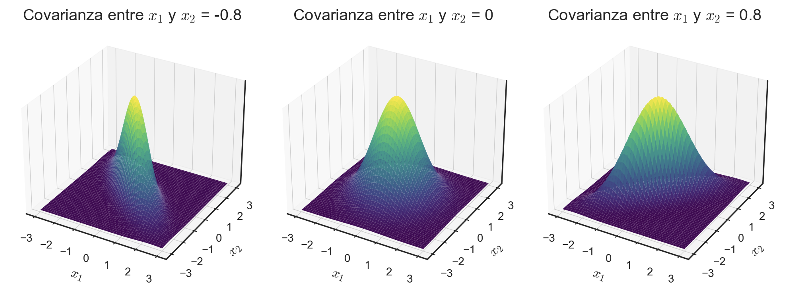
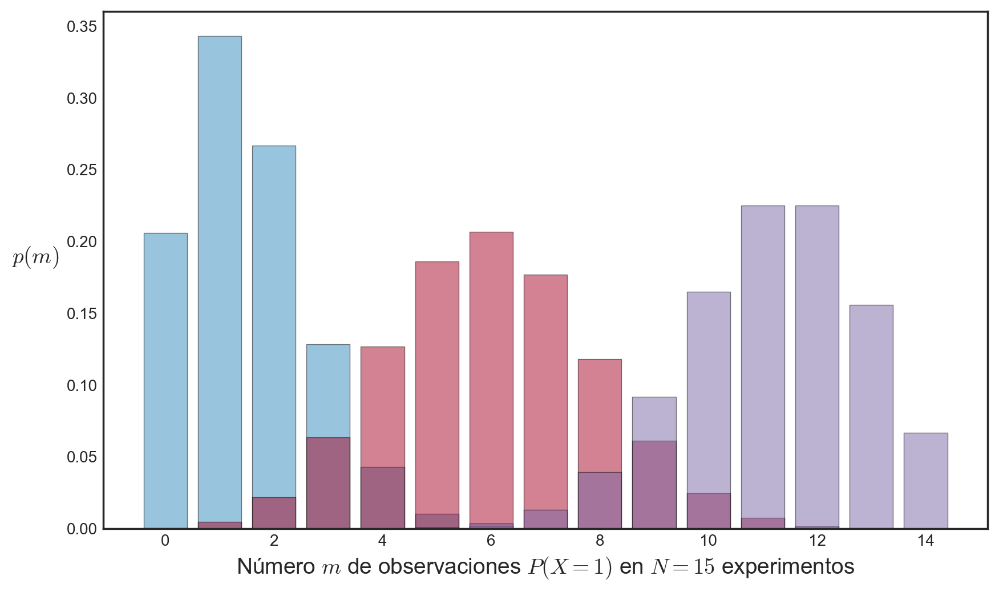
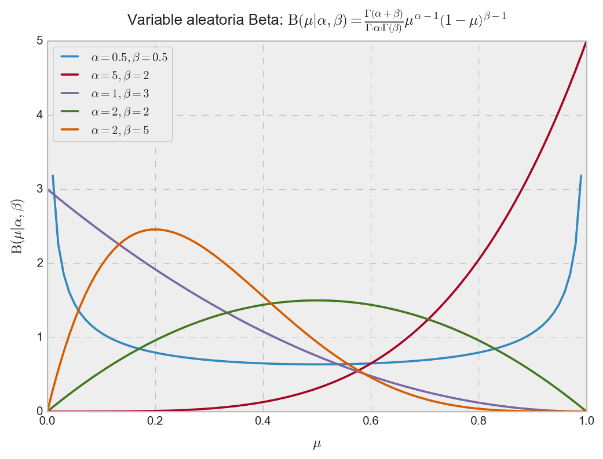
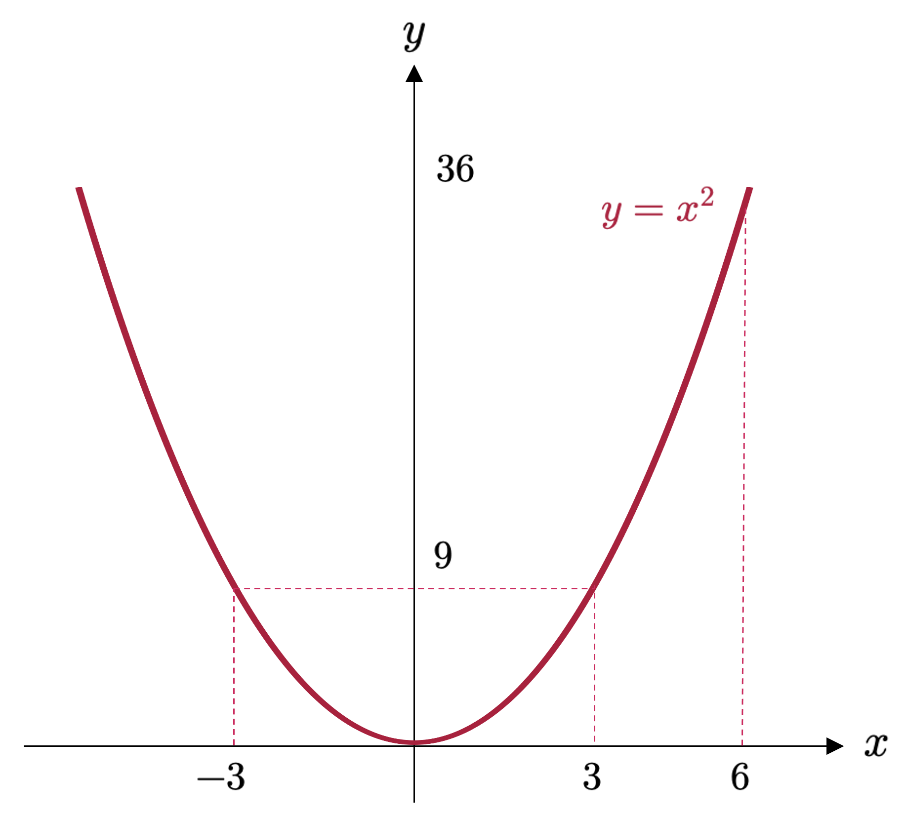
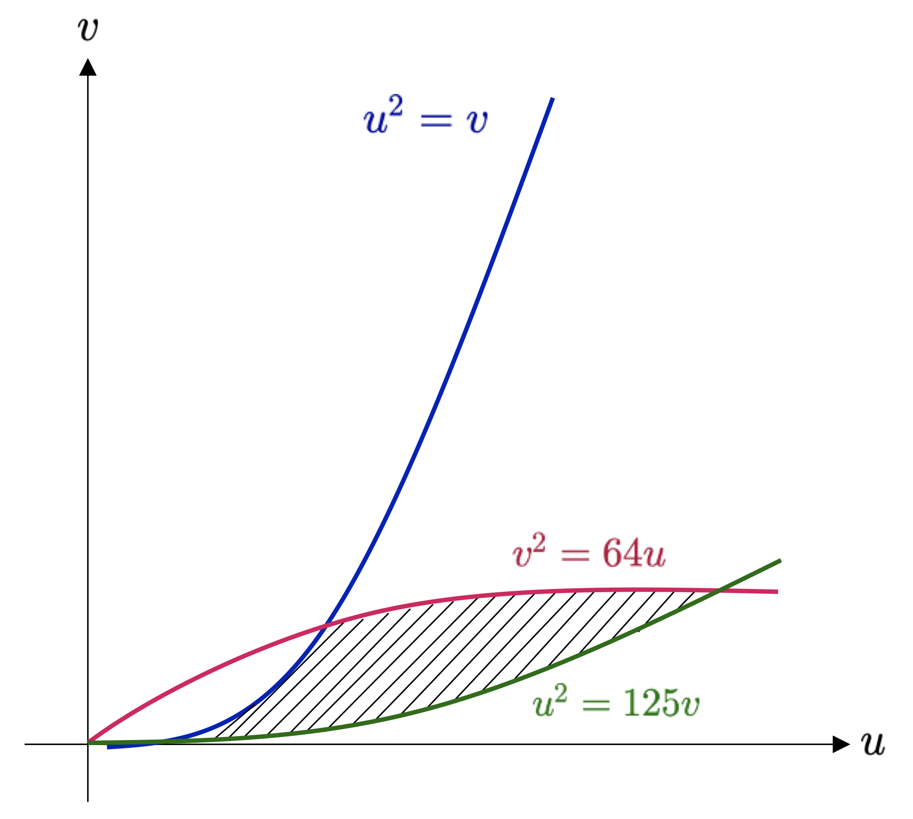

::: {.callout-important}
## Idea central

Muchas variables aleatorias que aparecen en ciencia, ingeniería y aprendizaje automático no se distribuyen de manera arbitraria, sino conforme a familias de distribuciones con estructura bien definida. En este apunte estudiaremos algunas de las distribuciones más importantes, junto con resultados fundamentales que explican por qué aparecen tan frecuentemente en la práctica, como la desigualdad de Chebyshev, la ley de los grandes números y el teorema del límite central.
:::

## Introducción.

En los apuntes anteriores construimos la teoría de probabilidad desde sus fundamentos: espacios muestrales, eventos, medidas de probabilidad, variables aleatorias, funciones de distribución, densidades y momentos. Todo ese desarrollo permite ahora abordar una pregunta mucho más concreta y útil: **¿qué formas específicas puede tomar la incertidumbre?**

En muchas aplicaciones, la incertidumbre no se modela mediante distribuciones abstractas, sino por medio de **familias particulares de distribuciones** que poseen propiedades algebraicas, geométricas y estadísticas bien conocidas. Algunas de ellas aparecen de manera natural al contar éxitos en pruebas repetidas, otras al medir errores de observación, y otras al describir tiempos de espera, fenómenos agregados o variables positivas con cierto patrón de decaimiento.

Entre todas estas familias, la **distribución normal** ocupa un lugar central. Su importancia no sólo proviene de su forma analítica elegante, sino también del hecho de que aparece como límite natural de muchas sumas de variables aleatorias independientes. Esta observación da lugar a uno de los resultados más profundos y universales de toda la teoría de probabilidad: el **teorema del límite central**.

Junto con ello, existen otras familias relevantes que comparten una estructura común y muy poderosa, conocida como **familia exponencial de distribuciones**. Esta familia reúne a muchas de las distribuciones más utilizadas en estadística y machine learning, y permite estudiar de manera unificada problemas de inferencia, estimación y modelamiento probabilístico.

Además de estudiar distribuciones particulares, en este apunte revisaremos algunos resultados generales que permiten controlar la incertidumbre y comprender el comportamiento asintótico de las variables aleatorias. La **desigualdad de Chebyshev** nos dará una cota general para la dispersión de una variable en torno a su media, sin requerir supuestos fuertes sobre su distribución. La **ley de los grandes números** formalizará la intuición de que los promedios muestrales tienden a estabilizarse conforme aumenta el número de observaciones. Y el **teorema del límite central** explicará por qué la distribución normal aparece una y otra vez en contextos completamente distintos.

Finalmente, revisaremos también el método de **transformación inversa**, una herramienta muy importante en simulación estocástica, ya que permite generar muestras desde distribuciones arbitrarias a partir de variables uniformes. Esta técnica constituye una de las bases conceptuales del muestreo aleatorio por computador.

En síntesis, este apunte cumple un doble propósito. Por una parte, introduce distribuciones concretas que aparecen constantemente en la práctica. Por otra, establece resultados estructurales que permiten entender por qué esas distribuciones son importantes y cómo emergen a partir de fenómenos más elementales.

## La distribución normal.

La **distribución normal (o distribución Gaussiana)** corresponde a la distribución de probabilidad más estudiada a lo largo de la historia, y sin duda la más famosa y utilizada en todo el ámbito de la ciencia. Su importancia radica en el hecho de que tiene muchas propiedades que resultan computacionalmente convenientes, y que serán las que discutiremos a continuación. En particular, la utilizaremos para definir elementos importantes, tales como la **función de verosimilitud** y de **probabilidad a priori** para el **modelo de regresión lineal** (en secciones posteriores), y consideraremos una **mezcla o mixtura de distribuciones Gaussianas** para la estimación de funciones de densidad (que también veremos en secciones posteriores).

Hay muchas otras áreas en machine learning que se benefician de la existencia de la distribución normal. Por ejemplo, procesos Gaussianos, inferencia variacional y aprendizaje por reforzamiento. También se utiliza ampliamente en otras áreas, tales como el procesamiento de señales, pruebas de hipótesis e incluso en ciencias sociales.

**<font color='blue'>Definición 5.1 – Distribución normal:</font>** Para una variable aleatoria unidimensional, digamos $X$, con realización $x\in \mathbb{R}$, diremos que $X$ está **normalmente distribuida** si su función de densidad $f_{X}$ tiene la forma

::: {.eq-scroll}
$$
f\left( x|\mu ,\sigma \right)  =\frac{1}{\sigma \sqrt{2\pi } } \exp \left( -\frac{\left( x-\mu \right)^{2}  }{2\sigma^{2} } \right)
\tag{5.1}
$$
:::

y que es llamada **función de densidad normal o Gaussiana**.

Para un vector aleatorio $\mathbf{X}$ con estados $\mathbf{x} \in \mathbb{R}^{n}$, diremos que éste sigue una **distribución normal multivariante** si su función de densidad puede expresarse en términos de los parámetros $\mathbf{\mu}$ y $\mathbf{\Sigma}$ como

::: {.eq-scroll}
$$
f\left( \mathbf{x} |\mathbf{\mu } ,\mathbf{\Sigma } \right)  =\left( 2\pi \right)^{-n/2}  \sqrt{\det \left( \mathbf{\Sigma } \right)  } \exp \left( -\frac{1}{2} \left( \mathbf{x} -\mathbf{\mu } \right)^{\top }  \mathbf{\Sigma }^{-1} \left( \mathbf{x} -\mathbf{\mu } \right)  \right)
\tag{5.2}
$$
:::

Escribimos $X \sim \mathcal{N}(\mu, \sigma^{2})$ o $\mathbf{X} \sim \mathcal{N}(\mathbf{\mu}, \mathbf{\Sigma})$ para denotar que la variable aleatoria $X$ (o el vector aleatorio $\mathbf{X}$) sigue una distribución normal. Decimos pues que $X$ está normalmente distribuida con parámetros $\mu$ y $\sigma^{2}$ (en el caso unidimensional); o bien, que $\mathbf{X}$ está normalmente distribuida con parámetros $\mathbf{\mu}$ y $\mathbf{\Sigma}$ (en el caso multivariante).

![Ejemplos de distribuciones Gaussianas muestreadas para un total de 100 puntos; (a) Distribución Gaussiana unidimensional, para la cual la cruz de color rojo denota la media y la línea de color rojo ilustra la extensión de la varianza; (b) Distribución Gaussiana bidimensional. Como en el caso anterior, la cruz de color rojo muestra las coordenadas de la media $\mathbf{\mu}$, mientras que las curvas de contorno nos permiten esquematizar la densidad de puntos muestreados. Imagen adaptada en Python del maravilloso libro "Mathematics for Machine Learning" (Deisenroth, M. P., Faisal, A. A., & Ong, C. S. (2020))](images/fig_5_1.png){#fig-gaussian fig-align="center" width="100%"}

La @fig-gaussian muestra los casos univariante y bivariante de la distribución Gaussiana con el correspondiente conjunto de puntos muestreados a partir de tales distribuciones. Por otro lado, la @fig-threegaussians muestra las superficies en $\mathbb{R}^{3}$ que describen varias distribuciones Gaussianas bivariantes.

{#fig-threegaussians fig-align="center" width="100%"}

La distribución normal, como se observa en las ecuaciones (5.1) y (5.2), queda completamente determinada por los parámetros $\mu$ y $\sigma^{2}$ en el caso univariante, y por los parámetros $\mathbf{\mu} \in \mathbb{R}^{n}$ y $\mathbf{\Sigma} \in \mathbb{R}^{n\times n}$ en el caso multivariante (para un vector aleatorio con $n$ componentes). El caso particular cuando $\mathbf{\mu}= \mathbf{0}$ y $\mathbf{\Sigma} =\mathbf{I}_{n}$, donde $\mathbf{I}_{n}$ es la matriz identidad en $\mathbb{R}^{n\times n}$, es referido como **distribución normal estándar o canónica**.

A continuación, vamos a estudiar brevemente la marginalización y condicionamiento de variables aleatorias normales. Sean pues $\mathbf{X}$ e $\mathbf{Y}$ dos variables aleatorias multidimensionales con estados $\mathbf{x}, \mathbf{y} \in \mathbb{R}^{n}$, las que pueden tener un número diferente de componentes. Para considerar el efecto de aplicar la regla de la suma y el condicionamiento (conforme la fórmula de Bayes), escribimos la distribución Gaussiana explícitamente en términos de los **estados concatenados** $(\mathbf{x}^{\top}, \mathbf{y}^{\top})$. Es decir,

::: {.eq-scroll}
$$
f_{\mathbf{X} \mathbf{Y} }\left( \mathbf{x} ,\mathbf{y} \right)  =\mathcal{N} \left( \left( \begin{matrix}\mathbf{\mu }_{\mathbf{x} } \\ \mathbf{\mu }_{\mathbf{y} } \end{matrix} \right)  ,\left( \begin{matrix}\mathbf{\Sigma }_{\mathbf{x} \mathbf{x} } &\mathbf{\Sigma }_{\mathbf{x} \mathbf{y} } \\ \mathbf{\Sigma }_{\mathbf{y} \mathbf{x} } &\mathbf{\Sigma }_{\mathbf{y} \mathbf{y} } \end{matrix} \right)  \right)
\tag{5.3}
$$
:::

donde $\mathbf{\Sigma }_{\mathbf{x} \mathbf{x} } =\mathrm{Cov} \left( \mathbf{x} ,\mathbf{x} \right)$ y $\mathbf{\Sigma }_{\mathbf{y} \mathbf{y} } =\mathrm{Cov} \left( \mathbf{y} ,\mathbf{y} \right)$ son las matrices de covarianza (marginales) de $\mathbf{x}$ e $\mathbf{y}$, respectivamente, mientras que $\mathbf{\Sigma }_{\mathbf{x} \mathbf{y} } =\mathrm{Cov} \left( \mathbf{x} ,\mathbf{y} \right)$ es la matriz de covarianza entre $\mathbf{x}$ e $\mathbf{y}$.

**La distribución condicional $f_{\mathbf{X} |\mathbf{Y} }\left( \mathbf{x} ,\mathbf{y} \right)$ es también Gaussiana**, y está determinada por ([Bishop, 2006](https://link.springer.com/book/9780387310732)),

::: {.eq-scroll}
$$
\begin{array}{l}f_{\mathbf{X} |\mathbf{Y} }\left( \mathbf{x} ,\mathbf{y} \right)  =\mathcal{N} \left( \mathbf{\mu }_{\mathbf{x} |\mathbf{y} } ,\mathbf{\Sigma }_{\mathbf{x} |\mathbf{y} } \right)  \\ \mathbf{\mu }_{\mathbf{x} |\mathbf{y} } =\mathbf{\mu }_{\mathbf{x} } +\mathbf{\Sigma }_{\mathbf{x} \mathbf{y} } \mathbf{\Sigma }^{-1}_{\mathbf{y} \mathbf{y} } \left( \mathbf{y} -\mathbf{\mu }_{\mathbf{y} } \right)  \\ \mathbf{\Sigma }_{\mathbf{x} |\mathbf{y} } =\mathbf{\Sigma }_{\mathbf{x} \mathbf{x} } -\mathbf{\Sigma }_{\mathbf{x} \mathbf{y} } \mathbf{\Sigma }^{-1}_{\mathbf{y} \mathbf{y} } \mathbf{\Sigma }_{\mathbf{y} \mathbf{x} } \end{array}
\tag{5.4}
$$
:::

Notemos que, en el cálculo de la media $\mathbf{\mu }_{\mathbf{x} |\mathbf{y} }$ en la ecuación (5.4), el valor de $\mathbf{y}$ es empírico (observado) y, por lo tanto, la media no es un valor aleatorio.

La distribución marginal $f_{\mathbf{X}}(\mathbf{x})$ de una distribución Gaussiana conjunta $f_{\mathbf{X}\mathbf{Y}}(\mathbf{x},\mathbf{y})$ es también Gaussiana, y es posible calcularla rápidamente empleando la regla de la suma, con lo cual obtenemos

::: {.eq-scroll}
$$
f_{\mathbf{X} }\left( \mathbf{x} \right)  =\int_{\Omega_{\mathbf{X} \mathbf{Y} } } f_{\mathbf{X} \mathbf{Y} }\left( \mathbf{x} ,\mathbf{y} \right)  d\mathbf{y} =\mathcal{N} \left( \mathbf{x} |\mathbf{\mu }_{\mathbf{x} } ,\mathbf{\Sigma }_{\mathbf{x} \mathbf{x} } \right)
\tag{5.5}
$$
:::

donde $\Omega_{\mathbf{X} \mathbf{Y} }$ es el conjunto de todos los estados de $f_{\mathbf{X} \mathbf{Y} }\left( \mathbf{x} ,\mathbf{y} \right)$. Para $f_{\mathbf{Y}}(\mathbf{y})$, el procedimiento es completamente análogo y, en términos menos matemáticos, su obtención involucra que, a partir de la distribución conjunta (5.3) ignoremos (es decir, integramos) todo lo que no nos interesa. Esto se ilustra en el gráfico (b) de la @fig-gaussian2d.

**Ejemplo 5.1:** Consideremos la distribución Gaussiana bivariante (ilustrada en el gráfico (a) de la @fig-gaussian2d) definida como

::: {.eq-scroll}
$$
f_{X_{1}X_{2}}\left( x_{1},x_{2}\right)  =\mathcal{N} \left( \left( \begin{matrix}0\\ 2\end{matrix} \right)  ,\left( \begin{matrix}0.3&-1\\ -1&5\end{matrix} \right)  \right)
\tag{5.6}
$$
:::

Podemos calcular los parámetros de la distribución Gaussiana univariante, condicionada en $x_{2}=-1$, aplicando las ecuaciones para la media y la covarianza presentadas en (5.4). De esta manera, tenemos que

::: {.eq-scroll}
$$
\begin{array}{lll}\mu_{x_{1}|x_{1}=-1} &=&0+\left( -1\right)  \cdot 0.2\cdot \left( -1-2\right)  =0.6\\ \sigma^{2}_{x_{1}|x_{1}=-1} &=&0.3-\left( -1\right)  \cdot 0.2\cdot \left( -1\right)  =0.1\end{array}
\tag{5.7}
$$
:::

Por lo tanto, la distribución Gaussiana condicional respectiva tiene la siguiente función de densidad

::: {.eq-scroll}
$$
f_{X_{1}|X_{2}=-1}\left( x_{1},x_{2}\right)  =\mathcal{N} \left( 0.6,0.1\right)
\tag{5.8}
$$
:::

En contraste, la distribución marginal $f_{X_{1}}(x_{1})$ puede ser obtenida aplicando la ecuación (5.5), lo que implica, en esencia, usar la media y la varianza referidas a la variable aleatoria $X_{1}$, lo que nos da

::: {.eq-scroll}
$$
f_{X_{1}}\left( x_{1}\right)  =\mathcal{N} \left( 0,0.3\right)
\tag{5.9}
$$
:::
◼︎

{#fig-gaussian2d fig-align="center" width="100%"}

### Producto de distribuciones Gaussianas.

Para la construcción de un modelo de regresión lineal (lo que estudiaremos en profundidad más adelante), necesitamos calcular una función de verosimilitud Gaussiana. Más aún, puede darse el caso de que queramos tomar como supuesto que la información de la cual disponemos de manera previa (a priori) es, en efecto, también Gaussiana. Aplicamos pues el teorema de Bayes para obtener la distribución a posteriori, lo que resulta en una multiplicación de la función de verosimilitud con la función de densidad a priori; esto es, la multiplicación de dos funciones de densidad Gaussianas. El producto de dos densidades Gaussianas, digamos $\mathcal{N} \left( \mathbf{x} |\mathbf{a} ,\mathbf{A} \right)  \mathcal{N} \left( \mathbf{x} |\mathbf{b} ,\mathbf{B} \right)$, para $\mathbf{x}\in \mathbb{R}^{n}$, es también una densidad Gaussiana escalada por un valor $c\in \mathbb{R}$, que podemos escribir como $c \sim \mathcal{N} \left( \mathbf{x} |\mathbf{c} ,\mathbf{C} \right)$, donde,

::: {.eq-scroll}
$$
\begin{array}{lll}\mathbf{C} &=&\left( \mathbf{A}^{-1} +\mathbf{B}^{-1} \right)^{-1}  \\ \mathbf{c} &=&\mathbf{C} \left( \mathbf{A}^{-1} \mathbf{a} +\mathbf{B}^{-1} \mathbf{b} \right)  \\ c&=&\left( 2\pi \right)^{-n/2}  \sqrt{\det \left( \mathbf{A} +\mathbf{B} \right)  } \exp \left( -\displaystyle \frac{1}{2} \left( \mathbf{a} -\mathbf{b} \right)^{\top }  \left( \mathbf{A} +\mathbf{B} \right)^{-1}  \left( \mathbf{a} -\mathbf{b} \right)  \right)  \end{array}
\tag{5.10}
$$
:::

La constante de escalamiento $c$ propiamente tal puede ser escrita en forma de una función de densidad Gaussiana, ya sea en términos de $\mathbf{a}$ o de $\mathbf{b}$ con una matriz de covarianza “inflada” $\mathbf{A}+\mathbf{B}$; es decir, $c=\mathcal{N} \left( \mathbf{a} |\mathbf{b} ,\mathbf{A} +\mathbf{B} \right)  =\mathcal{N} \left( \mathbf{b} |\mathbf{a} ,\mathbf{A} +\mathbf{B} \right)$. Por un tema de notación y para mayor comodidad, a veces usaremos $\mathcal{N} \left( \mathbf{x} |\mathbf{m} ,\mathbf{S} \right)$ para describir la forma funcional de una densidad Gaussiana, incluso si $\mathbf{x}$ no es una variable aleatoria. De hecho, ya hicimos esto previamente cuando escribimos

::: {.eq-scroll}
$$
c=\mathcal{N} \left( \mathbf{a} |\mathbf{b} ,\mathbf{A} +\mathbf{B} \right)  =\mathcal{N} \left( \mathbf{b} |\mathbf{a} ,\mathbf{A} +\mathbf{B} \right)
\tag{5.11}
$$
:::

Aquí, ni $\mathbf{a}$ ni $\mathbf{b}$ son variables aleatorias. Sin embargo, escribir $c$ de esta manera resulta en una expresión mucho más compacta.

### Transformaciones lineales entre variables aleatorias Gaussianas.

Si las variables aleatorias $\mathbf{X}$ e $\mathbf{Y}$ son independientes y normalmente distribuidas (es decir, su función de densidad conjunta se escribe como $f_{\mathbf{X}\mathbf{Y}}(\mathbf{x},\mathbf{y})=f_{\mathbf{X}}(\mathbf{x})f_{\mathbf{Y}}(\mathbf{y})$), con $f_{\mathbf{X} }\left( \mathbf{x} \right)  =\mathcal{N} \left( \mathbf{x} |\mathbf{\mu }_{\mathbf{x} } ,\mathbf{\Sigma }_{\mathbf{x} } \right)  \wedge f_{\mathbf{Y} }\left( \mathbf{y} \right)  =\mathcal{N} \left( \mathbf{y} |\mathbf{\mu }_{\mathbf{y} } ,\mathbf{\Sigma }_{\mathbf{y} } \right)$, entonces **la suma de las variables aleatorias $\mathbf{X}+\mathbf{Y}$, con estados $\mathbf{x}+\mathbf{y}$, también es Gaussiana**, y su función de densidad se escribe como

::: {.eq-scroll}
$$
f_{\mathbf{X} +\mathbf{Y} }\left( \mathbf{x} ,\mathbf{y} \right)  =\mathcal{N} \left( \mathbf{\mu }_{\mathbf{x} } +\mathbf{\mu }_{\mathbf{y} } ,\mathbf{\Sigma }_{\mathbf{x} } +\mathbf{\Sigma }_{\mathbf{y} } \right)
\tag{5.12}
$$
:::

Sabiendo que $f_{\mathbf{X}+\mathbf{Y}}$ es Gaussiana, entonces podemos determinar la media y covarianza respectivas usando las propiedades de los operadores de esperanza y varianza que vimos con anterioridad. Esta propiedad será importante cuando trabajemos con señales conocidas como **ruido Gaussiano de tipo IID** (independiente e idénticamente distribuido) sobre variables aleatorias, y también cuando estudiemos ciertos aspectos relativos a los modelos de regresión lineal, más adelante.

En resumen, dado que la esperanza es un operador lineal, podemos escribir la suma ponderada (combinación lineal) de variables aleatorias Gaussianas como

::: {.eq-scroll}
$$
f\left( a\mathbf{x} +b\mathbf{y} \right)  =\mathcal{N} \left( a\mathbf{\mu }_{\mathbf{x} } +b\mathbf{\mu }_{\mathbf{y} } ,a^{2}\mathbf{\Sigma }_{\mathbf{x} } +b^{2}\mathbf{\Sigma }_{\mathbf{y} } \right)  \  ;\  \forall a,b\in \mathbb{R}
\tag{5.13}
$$
:::

Un caso que abordaremos en detalle más adelante, cuando estudiemos modelos de aprendizaje no supervisado, corresponde a la **combinación lineal de densidades Gaussianas** (que no es lo mismo que la combinación lineal de variables aleatorias Gaussianas, que es lo que vimos previamente).

Vamos a establecer un importante teorema previo a continuar, en el cual, la variable de interés $x\in \mathbb{R}$ corresponde a una muestra de una densidad que, a su vez, corresponde a la mixtura de dos densidades $f_{1}(x)$ y $f_{2}(x)$, ponderadas por un escalar $\alpha$. Este teorema puede generalizarse al caso de vectores aleatorios, dada la linealidad del operador de esperanza matemática. Sin embargo, la idea de una *“variable aleatoria al cuadrado”* debe corregirse, reemplazándose en este caso por la expresión $\mathbf{x}\mathbf{x}^{\top}$.

::: {.callout-tip}
## Teorema 5.1 – Preservación en mixturas Gaussianas
*Consideremos una combinación o **mixtura** de dos densidad Gaussianas unidimensionales del tipo*

::: {.eq-scroll}
$$
f\left( x\right)  =\alpha f_{1}\left( x\right)  +\left( 1-\alpha \right)  f_{2}\left( x\right)
\tag{5.14}
$$
:::

*donde $\alpha$, tal que $0<\alpha<1$, es el **ponderador** de la mixtura, y $f_{1}$ y $f_{2}$ son densidades Gaussianas univariantes con sus respectivos parámetros (es decir, $(\mu_{1},\sigma_{1}^{2})\neq (\mu_{2},\sigma_{2}^{2})$). Entonces la media relativa a la función de densidad de la mixtura, que denotamos como $f(x)$, está dada por la suma ponderada de las medias de cada variable aleatoria:*

::: {.eq-scroll}
$$
\mathrm{E} \left[ x\right]  =\alpha \mu_{1} +\left( 1-\alpha \right)  \mu_{2}
\tag{5.15}
$$
:::

*La varianza relativa a la densidad de la mixtura está, a su vez, dada por*

::: {.eq-scroll}
$$
\mathrm{Var} \left( x\right)  =\left( \alpha \sigma^{2}_{1} +\left( 1-\alpha \right)  \sigma^{2}_{2} \right)  +\left( \alpha \mu^{2}_{1} +\left( 1-\alpha \mu^{2}_{2} \right)  -\left( \alpha \mu_{1} +\left( 1-\alpha \right)  \mu_{2} \right)^{2}  \right)
\tag{5.16}
$$
:::
:::

Vamos a demostrar el teorema (5.1) a fin de entender cómo llegamos a estos resultados. La media de la función de densidad de la mixtura $f(x)$ está dada por la suma ponderada de las medias de cada variable aleatoria. Aplicamos por tanto la definición de la media y construimos la mixtura, con lo que obtenemos

::: {.eq-scroll}
$$
\begin{array}{lll}\mathrm{E} \left[ x\right]  &=&\displaystyle \int^{+\infty }_{-\infty } xf\left( x\right)  dx\\ &=&\displaystyle \int^{+\infty }_{-\infty } \left( \alpha xf_{1}\left( x\right)  +\left( 1-\alpha \right)  xf_{2}\left( x\right)  \right)  dx\\ &=&\alpha \displaystyle \int^{+\infty }_{-\infty } xf_{1}\left( x\right)  dx+\left( 1-\alpha \right)  \int^{+\infty }_{-\infty } xf_{2}\left( x\right)  dx\\ &=&\alpha \mu_{1} +\left( 1-\alpha \right)  \mu_{2} \end{array}
\tag{5.17}
$$
:::

Para calcular la varianza, aplicamos directamente su definición matemática, la que requiere de una expresión para $\mathrm{E}[x^{2}]$. Luego,

::: {.eq-scroll}
$$
\begin{array}{lll}\mathrm{E} \left[ x^{2}\right]  &=&\displaystyle \int^{+\infty }_{-\infty } x^{2}f\left( x\right)  dx\\ &=&\displaystyle \int^{+\infty }_{-\infty } \left( \alpha x^{2}f_{1}\left( x\right)  +\left( 1-\alpha \right)  x^{2}f_{2}\left( x\right)  \right)  dx\\ &=&\alpha \displaystyle \int^{+\infty }_{-\infty } x^{2}f_{1}\left( x\right)  dx+\left( 1-\alpha \right)  \int^{+\infty }_{-\infty } x^{2}f_{2}\left( x\right)  dx\\ &=&\alpha \left( \mu^{2}_{1} +\sigma^{2}_{1} \right)  +\left( 1-\alpha \right)  \left( \mu^{2}_{2} +\sigma^{2}_{2} \right)  \end{array}
\tag{5.18}
$$
:::

Donde, en la última igualdad, hemos utilizado repetidamente la definición práctica de varianza (ecuación (4.32) del [apunte anterior](/apuntes/calculo-incertidumbre-y-optimizacion/introduccion-al-calculo-de-probabilidades/)), lo que nos da $\sigma^{2}=\mathrm{E}[x^{2}]-\mu^{2}$. Esto lo reordenamos, de manera tal que la esperanza de una variable aleatoria al cuadrado sea igual a la suma del cuadrado de su valor esperado y su varianza.

Restando las últimas dos igualdades, obtenemos la varianza que estamos buscando:

::: {.eq-scroll}
$$
\begin{array}{lll}\mathrm{Var} \left( x\right)  &=&\mathrm{E} \left[ x^{2}\right]  -\left( \mathrm{E} \left[ x\right]  \right)^{2}  \\ &=&\alpha \left( \mu^{2}_{1} +\sigma^{2}_{1} \right)  +\left( 1-\alpha \right)  \left( \mu^{2}_{2} +\sigma^{2}_{2} \right)  -\left( \alpha \mu_{1} +\left( 1-\alpha \right)  \mu_{2} \right)^{2}  \\ &=&\left( \alpha \sigma^{2}_{1} +\left( 1-\alpha \right)  \sigma^{2}_{2} \right)  +\left( \left( \alpha \mu^{2}_{1} +\left( 1-\alpha \right)  \mu^{2}_{2} \right)  -\left( \alpha \mu_{1} +\left( 1-\alpha \right)  \mu_{2} \right)^{2}  \right)  \end{array}
\tag{5.19}
$$
:::

Lo que concluye la demostración.

Por cierto, el resultado establecido por el teorema (5.1) es extensible para cualquier función de densidad, pero dado que la distribución Gaussiana queda completamente determinada por su media y su varianza, podemos determinar la densidad de la mixtura mediante una fórmula cerrada.

Para una función de densidad referida a una mixtura (en adelante, **densidad de mixtura**), las componentes individuales pueden ser consideradas como distribuciones condicionales. La última igualdad en la ecuación (5.19) es un ejemplo de fórmula de varianza condicional, y que se conoce en la literatura especializada como **ley de varianza total**, la que, en general, establece que, para variables aleatorias unidimensionales $X,Y$ con estados $x,y\in \mathbb{R}$, se tiene que

::: {.eq-scroll}
$$
\mathrm{Var}_{X} \left( x\right)  =\mathrm{E}_{Y} \left[ \mathrm{Var}_{X} \left( x|y\right)  \right]  +\mathrm{Var}_{Y} \left( \mathrm{E} \left[ x|y\right]  \right)
\tag{5.20}
$$
:::

Es decir, la varianza (total) de $X$ es la varianza esperada condicional más la varianza de un valor esperado condicional.

Más adelante, cuando estudiemos el cambio de variables aleatorias, consideraremos un ejemplo de variable aleatoria Gaussiana estándar bidimensional $\mathbf{X}$, aplicando una transformación lineal del tipo $\mathbf{A}\mathbf{x}$ sobre ella. El resultado de esta operación es una variable aleatoria Gaussiana con media cero y covarianza igual a $\mathbf{A}\mathbf{A}^{\top}$. Observemos que la adición de un vector constante modificará la media de la respectiva distribución, sin afectar su varianza; esto es, nuestra variable aleatoria $\mathbf{X}$, con realización, $\mathbf{x}+\mathbf{\mu}$ es Gaussiana con media $\mathbf{\mu}$ y covarianza identidad (es decir, equivale a la matriz identidad en su respectiva dimensión). Por lo tanto, **cualquier transformación lineal de una variable aleatoria Gaussiana es también Gaussiana**.

Consideremos una variable aleatoria Gaussiana $\mathbf{X}\sim \mathcal{N}(\mathbf{\mu},\mathbf{\Sigma})$. Para una matriz $\mathbf{A}$ de dimensión apropiada, sea $\mathbf{Y}$ una variable aleatoria tal que su realización puede escribirse como $\mathbf{y}=\mathbf{A}\mathbf{x}$ (es decir, $\mathbf{Y}$ es una versión transformada de $\mathbf{X}$). Podemos calcular la media de $\mathbf{Y}$ aprovechando la linealidad del operador de esperanza matemática como

::: {.eq-scroll}
$$
\mathrm{E} \left[ \mathbf{y} \right]  =\mathrm{E} \left[ \mathbf{A} \mathbf{x} \right]  =\mathbf{A} \mathrm{E} \left[ \mathbf{x} \right]  =\mathbf{A} \mathbf{\mu }
\tag{5.21}
$$
:::

De manera similar, para la varianza, tenemos que

::: {.eq-scroll}
$$
\mathrm{Var} \left( \mathbf{y} \right)  =\mathrm{Var} \left( \mathbf{A} \mathbf{x} \right)  =\mathbf{A} \mathrm{Var} \left( \mathbf{x} \right)  \mathbf{A}^{\top } =\mathbf{A} \mathbf{\Sigma } \mathbf{A}^{\top }
\tag{5.23}
$$
:::

Luego, la variable aleatoria $\mathbf{Y}$ tiene una distribución definida como

::: {.eq-scroll}
$$
f_{\mathbf{Y} }\left( \mathbf{y} \right)  =\mathcal{N} \left( \mathbf{y} |\mathbf{A} \mathbf{\mu } ,\mathbf{A} \mathbf{\Sigma } \mathbf{A}^{\top } \right)
\tag{5.24}
$$
:::

Consideremos ahora la transformación inversa: Cuando sabemos que una variable aleatoria tiene una media que es igual a una transformación lineal respecto de otra variable aleatoria. Para una matriz de rango completo dada, digamos $\mathbf{A}\in \mathbb{R}^{m\times n}$, donde $m\geq n$, sea $\mathbf{y}\in \mathbb{R}^{m}$ la realización de una variable aleatoria Gaussiana con media $\mathbf{A}\mathbf{x}$. Es decir,

::: {.eq-scroll}
$$
f_{\mathbf{Y} }\left( \mathbf{y} \right)  =\mathcal{N} \left( \mathbf{y} |\mathbf{A} \mathbf{x} ,\mathbf{\Sigma } \right)
\tag{5.25}
$$
:::

Cabe preguntarse pues: ¿Cuál es la correspondiente función de densidad $f_{\mathbf{X}}(\mathbf{x})$. Si $\mathbf{A}$ es invertible, entonces podemos escribir $\mathbf{x}=\mathbf{A}^{-1}\mathbf{y}$ y aplicar la transformación respectiva. Sin embargo, en general, $\mathbf{A}$ no es invertible, por lo que en este caso aplicamos el concepto de **pseudo-inversa**. De esta manera, multiplicamos ambos lados de la expresión anterior por $\mathbf{A}^{\top}$, y luego invertimos la matriz $\mathbf{A}^{\top}\mathbf{A}$, que es simétrica y definida positiva, lo que nos da

::: {.eq-scroll}
$$
\mathbf{y} =\mathbf{A} \mathbf{x} \Longleftrightarrow \left( \mathbf{A}^{\top } \mathbf{A} \right)^{-1}  \mathbf{A}^{\top } \mathbf{y} =\mathbf{x}
\tag{5.26}
$$
:::

Por lo tanto, $\mathbf{X}$ es una transformación lineal de $\mathbf{y}$, con lo que obtenemos

::: {.eq-scroll}
$$
f_{\mathbf{X} }\left( \mathbf{x} \right)  =\mathcal{N} \left( \mathbf{x} |\left( \mathbf{A}^{\top } \mathbf{A} \right)^{-1}  \mathbf{A}^{\top } \mathbf{y} ,\left( \mathbf{A}^{\top } \mathbf{A} \right)^{-1}  \mathbf{\Sigma } \left( \mathbf{A}^{\top } \mathbf{A} \right)^{-1}  \mathbf{A}^{\top } \right)
\tag{5.27}
$$
:::

### Muestreo desde distribuciones Gaussianas multivariantes.

Este es un tópico un tanto más avanzado y que no revisaremos desde sus bases fundacionales, ya que escapa un tanto del alcance de estos apuntes, pero lo describiremos superficialmente. En el caso de una distribución Gaussiana multivariante, el proceso de muestreo consiste de tres etapas: Primero, necesitamos un conjunto de números pseudoaleatorios que nos provean de una muestra uniforme de valores en el intervalo $[0, 1]$; luego, hacemos uso de una transformación no lineal, conocida en la práctica como [**transformación de Box-Müller**](https://en.wikipedia.org/wiki/Box%E2%80%93Muller_transform), para obtener una muestra de una distribución Gaussiana univariante; finalmente, cotejamos un vector de estas muestras para obtener una muestra de una distribución Gaussiana multivariante estándar $\mathcal{N}(\mathbf{0},\mathbf{I})$.

Para una distribución Gaussiana general (esto es, cuya media no es necesariamente nula, y cuya covarianza no es necesariamente la matriz identidad), usamos la propiedad que estudiamos previamente de este tipo de variables aleatorias referida a la preservación de su tipo de densidad bajo transformaciones lineales. Asumamos pues que estamos interesados en generar muestras $\left\{ \mathbf{x}_{i} \right\}^{n}_{i=1}$ de una distribución Gaussiana multivariante con media $\mathbf{\mu}$ y covarianza $\mathbf{\Sigma}$. Nos gustaría construir esta muestra a partir de un objeto matemático denominado **muestreador** (o *sampler*), el cual nos provee de muestras a partir de una distribución Gaussiana estándar $\mathcal{N}(\mathbf{0},\mathbf{I})$.

Para obtener muestras desde una distribución Gaussiana multivariante $\mathcal{N}(\mathbf{\mu},\mathbf{\Sigma})$, procedemos como sigue: Si $\mathbf{X}\sim \mathcal{N}(\mathbf{0},\mathbf{I})$, entonces $\mathbf{y}=\mathbf{A}\mathbf{x}+\mathbf{\mu}$, donde $\mathbf{A}\mathbf{A}^{\top}=\mathbf{\Sigma}$, siendo $\mathbf{y}$ la realización de una variable aleatoria multidimensional que se distribuye normalmente con media $\mathbf{\mu}$ y matriz de covarianza $\mathbf{\Sigma}$. Podemos usar la **factorización de Cholesky** para trabajar con $\mathbf{A}$, ya que de esta manera el proceso de cálculo resultará computacionalmente menos costoso (ya que $\mathbf{A}$ es una matriz triangular).

## La familia exponencial.

Muchas de las distribuciones de probabilidad *“con nombre propio”* que podemos encontrar en la literatura especializada fueron descubiertas para modelar ciertos tipos de fenómenos. Por ejemplo, ya estudiamos en profundidad la distribución Gaussiana, la cual está asociada a una gran cantidad de fenómenos físicos, biológicos y sociales. Por supuesto, elegir una determinada distribución para empezar a trabajar en la descripción de un determinado proceso o fenómeno no es, en absoluto, un asunto trivial.

Anteriormente vimos que muchas de las operaciones requeridas para poder inferir cierta información importante pueden ser convenientemente desarrolladas cuando la distribución subyacente es Gaussiana. Vale la pena recordar, en este punto, la razón por la cual queremos manipular distribuciones de probabilidad en el contexto de los algoritmos de aprendizaje:

- Existe alguna “propiedad de clausura” cuando aplicamos las reglas de probabilidad (por ejemplo, el teorema de Bayes). Por “clausura” nos referimos que, al aplicar una operación en particular, ésta nos retorna un objeto del mismo tipo.
- A medida que coleccionamos más datos, no necesitamos más parámetros para describir la distribución respectiva.

Dado que estamos interesados en aprender a partir de los datos, queremos que la correspondiente estimación de parámetros se comporte de buena manera (ya definiremos dicha *buena manera*).

Resulta que la clase de distribuciones de probabilidad que se agrupan en la llamada **familia exponencial** nos provee de un correcto balance entre generalidad, al mismo tiempo que se preservan ciertas propiedades relativas a la facilidad de ciertos cálculos e inferencia estadística. Antes que introduzcamos a esta familia de distribuciones, veamos un poco más detalle algunos ejemplos de las distribuciones *“con nombre propio”*: Bernoulli, binomial y beta.

**Ejemplo 5.2:** La **distribución de Bernoulli** es una distribución para una única variable aleatoria binaria $X$ con realización $x=\left\{ 0,1\right\}$. Como ya vimos en el [apunte anterior](/apuntes/calculo-incertidumbre-y-optimizacion/introduccion-al-calculo-de-probabilidades/), esta distribución está gobernada por un único parámetro continuo $p$, tal que $0\leq p\leq 1$, que representa la probabilidad $P(X=1)$. La variable aleatoria $X$ se dice, por tanto, que sigue una distribución de Bernoulli, lo que escribimos como $X\sim \mathcal{B}(p)$. De lo anterior, la distribución queda definida por las siguientes ecuaciones (usando la notación que hemos desarrollado en estas últimas subsecciones):

::: {.eq-scroll}
$$
\begin{array}{l}p_{X}\left( x|p\right)  =p^{x}\left( 1-p\right)^{1-x}  \  ;\  x\in \left\{ 0,1\right\}  \\ \mathrm{E} \left[ x\right]  =p\\ \mathrm{Var} \left( x\right)  =p\left( 1-p\right)  \end{array}
\tag{5.28}
$$
:::

Como vimos en ejemplos anteriores (y al estudiar los experimentos compuestos), la distribución de Bernoulli es típicamente utilizada para modelar fenómenos donde la variable aleatoria subyacente puede tomar uno de dos estados (que solemos llamar éxito o fracaso, respectivamente). Ejemplos de estos fenómenos son el lanzamiento único de una moneda o de un dado no cargado. ◼︎

**Ejemplo 5.3:** La **distribución binomial**, como vimos igualmente en el [apunte anterior](/apuntes/calculo-incertidumbre-y-optimizacion/introduccion-al-calculo-de-probabilidades/), corresponde a una generalización de la distribución de Bernoulli a variables aleatorias enteras. En particular, la distribución binomial puede ser utilizada para describir la probabilidad de observar $m$ ocurrencias de $X=1$ en un conjunto de $N$ muestras de una distribución de Bernoulli, donde $P(X=1)=p$, para $0\leq p\leq 1$. La distribución binomial se denota como $\mathcal{Bi}(N,p)$ se define como

::: {.eq-scroll}
$$
\begin{array}{l}p\left( m|N,p\right)  =\displaystyle \left( \begin{matrix}N\\ m\end{matrix} \right)  p^{m}\left( 1-p\right)^{N-m}  \\ \mathrm{E} \left[ m\right]  =Np\\ \mathrm{Var} \left( m\right)  =Np\left( 1-p\right)  \end{array}
\tag{5.29}
$$
:::

Cualquier experimento o prueba compuesta caracterizada por una variable aleatoria de Bernoulli puede modelarse conforme una distribución binomial. Un ejemplo de ello es la descripción de la probabilidad de observar un total de $m$ caras en un total de $N$ lanzamientos de una moneda no trucada, suponiendo que la probabilidad de obtener una cara en un único lanzamiento es igual a $p$. ◼︎

{#fig-binomials fig-align="center" width="100%"}

**Ejemplo 5.4:** Podríamos querer extender el modelo binomial a una variable aleatoria continua $\mu= [0,1]$. La **distribución Beta** es utilizada para representar la probabilidad de algún evento de tipo binario (por ejemplo, el parámetro que gobierna la distribución de Bernoulli). La distribución Beta, cuya función de densidad se denota como $\mathrm{B}(\mu |\alpha, \beta)$, y que se ilustra en la @fig-beta, está gobernada por dos parámetros $\alpha>0$ y $\beta>0$, se define como

::: {.eq-scroll}
$$
\begin{array}{l}\mathrm{B} \left( \mu |\alpha ,\beta \right)  =\displaystyle \frac{\Gamma \left( \alpha +\beta \right)  }{\Gamma \left( \alpha \right)  \Gamma \left( \beta \right)  } \mu^{\alpha -1} \left( 1-\mu \right)^{\beta -1}  \\ \mathrm{E} \left[ \mu \right]  =\displaystyle \frac{\alpha }{\alpha +\beta } \\ \mathrm{Var} \left( \mu \right)  =\displaystyle \frac{\alpha \beta }{\left( \alpha +\beta \right)^{2}  \left( \alpha +\beta +1\right)  } \end{array}
\tag{5.30}
$$
:::

Donde $\Gamma(z)$ es la **función Gamma de Euler**, definida para $z\in \mathbb{C}$ como

::: {.eq-scroll}
$$
\Gamma \left( z\right)  :=\int^{+\infty }_{0} t^{z-1}\exp \left( -t\right)  dt\  ;\  z>0
\tag{5.31}
$$
:::

La función gamma es conocida en el análisis funcional por ser una extensión de la función factorial a todos los números complejos, con excepción de los enteros no positivos). Esta función también puede definirse mediante la fórmula de recurrencia

::: {.eq-scroll}
$$
\Gamma \left( z+1\right)  =z\Gamma \left( z\right)
\tag{5.32}
$$
:::

La distribución Beta tiene este nombre debido a que su función de densidad puede definirse mediante la llamada función beta, la que se define en términos de la función gamma como

::: {.eq-scroll}
$$
\mathrm{B} \left( z_{1},z_{2}\right)  =\frac{\Gamma \left( z_{1}\right)  \Gamma \left( z_{2}\right)  }{\Gamma \left( z_{1}+z_{2}\right)  }
\tag{5.33}
$$
:::

De lo anterior, la función de densidad $\mathrm{B}(\mu |\alpha, \beta)$ puede escribirse como

::: {.eq-scroll}
$$
\mathrm{B} \left( \mu |\alpha ,\beta \right)  =\frac{\mu^{\alpha -1} \left( 1-\mu \right)^{\beta -1}  }{\mathrm{B} \left( \alpha ,\beta \right)  }
\tag{5.34}
$$
:::

Intuitivamente, de la @fig-beta, podemos observar que $\alpha$ genera un desplazamiento de la función de densidad hacia 1, mientras que $\beta$ genera un desplazamiento de la misma hacia 0. Naturalmente, hay casos especiales de ambos parámetros que vale la pena considerar:

- Para $\alpha =\beta =1$ obtenemos la **distribución uniforme** $\mathcal{U}(0,1)$ (es decir, una variable aleatoria cuyos valores están uniformemente distribuidos entre 0 y 1, lo que significa que todos los valores intermedios tienen igual probabilidad).
- Para $\alpha<1 \wedge \beta<1$, obtenemos una **distribución bimodal** con peaks en 0 y 1.
- Para $\alpha>1 \wedge \beta>1$, obtenemos una **distribución unimodal**.
- Para $\alpha<1, \beta<1 \wedge \alpha= \beta$, la distribución resultante es unimodal, simétrica y centrada en el intervalo cerrado $[0, 1]$. Es decir, la moda es igual a la media, y vale $\frac{1}{2}$.

{#fig-beta fig-align="center" width="100%"}

◼︎

### Distribuciones conjugadas.

De acuerdo al teorema de Bayes, la distribución a posteriori es proporcional al producto de la distribución a priori (nuestra información conocida) y la función de verosimilitud. La especificación de la distribución a priori puede ser dificultosa por dos razones: Primero, la distribución a priori debiera encapsular nuestro conocimiento relativo al problema que queremos modelar antes de utilizar ningún dato. Esto, con frecuencia, resulta difícil de describir. En segundo lugar, suele ser improbable el calcular la distribución a posteriori de manera analítica. Sin embargo, existen algunas distribuciones a priori que son computacionalmente convenientes, y que se conocen como **distribuciones a priori conjugadas**. Tiene sentido pues la siguiente definición.

**<font color='blue'>Definición 5.2 – Distribución a priori conjugada:</font>** Una distribución a priori es conjugada para una función de verosimilitud si la distribución a posteriori respectiva (en el modelo de Bayes) es del mismo tipo (o forma) que esta distribución a priori.

La conjugación es particularmente conveniente, porque podemos calcular algebraicamente nuestra distribución a posteriori en la fórmula de Bayes simplemente actualizando los parámetros de la distribución a priori. Un ejemplo conocido en la práctica corresponde a la **conjugación beta-binomial**, que exploraremos en el siguiente ejemplo.

**Ejemplo 5.5:** Consideremos una variable aleatoria binomial con realización $x\sim \mathcal{Bi}(N,\mu)$, donde

::: {.eq-scroll}
$$
p\left( x|N,\mu \right)  =\left( \begin{matrix}N\\ x\end{matrix} \right)  \mu^{x} \left( 1-\mu \right)^{N-x}  \  ;\  x=0,1,...,N
\tag{5.35}
$$
:::

es la probabilidad de obtener $x$ veces una cara en $N$ lanzamientos de una moneda no trucada, donde $\mu$ es la probabilidad de obtener una cara en un único lanzamiento. Pongamos, como información a priori, una distribución Beta sobre el parámetro $\mu$; esto es $\mu \sim \mathrm{B}(\alpha,\beta)$, donde

::: {.eq-scroll}
$$
f\left( \mu |\alpha ,\beta \right)  =\frac{\mu^{\alpha -1} \left( 1-\mu \right)^{\beta -1}  }{\mathrm{B} \left( \alpha ,\beta \right)  }
\tag{5.36}
$$
:::

Si ahora observamos algún resultado $x=h$; esto es, vemos $h$ caras en $N$ lanzamientos de nuestra moneda, podemos calcular la distribución a posteriori sobre $\mu$ como

::: {.eq-scroll}
$$
\begin{array}{lll}p\left( \mu |x=h,N,\alpha ,\beta \right)  &\propto &p\left( x|N,\mu \right)  f\left( \mu |\alpha ,\beta \right)  \\ &\propto &\mu^{h} \left( 1-\mu \right)^{N-h}  \mu^{\alpha -1} \left( 1-\mu \right)^{\beta -1}  =\mu^{h+\alpha -1} \left( 1-\mu \right)^{N-h+\beta -1}  \\ {}&\propto &\mathrm{B} \left( h+\alpha ,N-h+\beta \right)  \end{array}
\tag{5.37}
$$
:::

Por lo tanto, la distribución a posteriori es del tipo Beta, de la misma forma que la distribución a priori; es decir, la distribución Beta es conjugada con respecto a la función de verosimilitud de tipo binomial sobre el parámetro $\mu$. ◼︎

**Ejemplo 5.6:** Sea $x\in \left\{ 0,1\right\}$ una variable aleatoria con distribución de Bernoulli, con parámetro $\theta \in [0,1]$; esto es, $p(x=1|\theta)=\theta$. Esto también puede expresarse como $p\left( x|\theta \right)  =\theta^{x} \left( 1-\theta \right)^{1-x}$. Sea $\theta \sim \mathrm{B}(\alpha,\beta)$; esto es, $f\left( \theta |\alpha ,\beta \right)  \propto \theta^{\alpha -1} \left( 1-\theta \right)^{\beta -1}$. Multiplicando las distribuciones de Bernoulli y Beta, obtenemos

::: {.eq-scroll}
$$
\begin{array}{lll}p\left( \theta |x,\alpha ,\beta \right)  &=&p\left( x|\theta \right)  f\left( \theta |\alpha ,\beta \right)  \\ &\propto &\theta^{x} \left( 1-\theta \right)^{1-x}  \theta^{\alpha -1} \left( 1-\theta \right)^{\beta -1}  =\theta^{\alpha +x-1} \left( 1-\theta \right)^{\beta +\left( 1-x\right)  -1}  \\ &\propto &\mathrm{B} \left( \theta |\alpha +x,\beta +\left( 1-x\right)  \right)  \end{array}
\tag{5.38}
$$
:::

Vemos pues que la distribución Beta también es conjugada con respecto a la función de verosimilitud de tipo Bernoulli sobre el parámetro $\theta$. ◼︎

La @tbl-conjugates lista algunos ejemplos de distribuciones conjugadas para algunas funciones de verosimilitud y que suelen ser utilizadas en muchos modelos probabilísticos. Las distribuciones de Dirichlet, multinomial, Gamma inversa y de Wishart inversa pueden ser consultadas en cualquier texto relativo a Estadística y/o Cálculo de Probabilidades. Se recomienda su revisión, en caso de querer profundizar al respecto, en el texto [”Pattern Recognition and Machine Learning” (Bishop, 2006; Springer Ed.)](https://www.microsoft.com/en-us/research/wp-content/uploads/2006/01/Bishop-Pattern-Recognition-and-Machine-Learning-2006.pdf).

: Ejemplos de distribuciones conjugadas para algunas funciones de verosimilitud comunes en la práctica {#tbl-conjugates}

| Función de verosimilitud | Distribución a priori conjugada | Distribución a posteriori |
| :----------------------- | :------------------------------ | :------------------------ |
| Bernoulli                | Beta                            | Beta                      |
| Binomial                 | Beta                            | Beta                      |
| Gaussiana                | Gaussiana/Gamma inversa         | Gaussiana/Gamma inversa   |
| Gaussiana                | Gaussiana/Wishart inversa       | Gaussiana/Wishart inversa |
| Multinomial              | Dirichlet                       | Dirichlet                 |

### Estadígrafos suficientes.

Recordemos que un estadígrafo, para el caso de una variable aleatoria, corresponde a una función determinística de dicha variable aleatoria. Por ejemplo, si $\mathbf{x}=(x_{1},...,x_{n})^{\top}$ es un vector que corresponde a la realización de varias variables aleatorias Gaussianas unidimensionales (esto es, $x_{i}\sim \mathcal{N}(\mu,\sigma^{2})$, para $1\leq i\leq n$), entonces la **media muestral** $\hat{\mu}=(x_{1}+\cdots +x_{n})/n$ es un **estadígrafo**. El matemático inglés Ronald Fisher, conocido mundialmente por ser *“un genio que, casi por sí solo, creó los fundamentos de la estadística moderna”* (Hald, 1998), desarrolló la noción de **estadígrafos suficientes**: La idea de que existen estadígrafos que contendrán toda la información disponible que puede ser inferida a partir de la data correspondiente a una determinada distribución (observada). En otras palabras, los estadígrafos de suficiencia llevan consigo toda la información que necesitamos para hacer inferencias con respecto a una población (o, en otras palabras, representar la correspondiente distribución).

Para un conjunto de distribuciones parametrizadas por $\theta$, sea $X$ una variable aleatoria con distribución $f_{X}(x|\theta_{0})$, dado un valor $\theta_{0}$ que es desconocido. Un vector $\phi(x)$ de estadígrafos es llamado **suficiente** para $\theta_{0}$, si tales estadígrafos contienen toda la posible información relativa a $\theta_{0}$. A fin de darle más formalidad a la frase *“toda la posible información”*, aquello significa que la probabilidad de $x$ dado $\theta$ pude ser factorizada en una parte que no depende de $\theta$, y otra parte que depende de $\theta$ únicamente mediante la función $\phi(x)$. El **teorema de factorización de Fisher-Neyman**, que estableceremos a continuación, formaliza esta noción.

::: {.callout-tip}
## Teorema 5.2 – Fisher-Neyman
*Sea $X$ una variable aleatoria con función de densidad $f_{X}(x|\theta)$. Diremos que el vector de estadígrafos $\phi(x)$ es suficiente para $\theta$ si y sólo si $f_{X}(x|\theta)$ puede escribirse como*

::: {.eq-scroll}
$$
f_{X}\left( x|\theta \right)  =h\left( x\right)  g_{\theta }\left( \phi \left( x\right)  \right)
\tag{5.39}
$$
:::

*Donde $h(x)$ es una distribución independiente de $\theta$ y $g_{\theta}$ que captura toda la dependencia respecto de $\theta$ mediante el estadígrafo suficiente $\phi(x)$.*
:::

Si $f_{X}(x|\theta)$ no depende de $\theta$, de manera trivial, $\phi(x)$ será un estadígrafo suficiente para toda función $\phi$. El caso más interesante se da cuando $f_{X}(x|\theta)$ es dependiente únicamente de $\phi(x)$ y no de $x$. En este caso, $\phi(x)$ es un estadígrafo suficiente para $\theta$.

En machine learning, consideramos usualmente un número finito de muestras de una distribución. Podríamos imaginar que para distribuciones sencillas (como la distribución de Bernoulli) sólo necesitamos un pequeño número de muestras para estimar los parámetros de la misma. Podríamos también considerar el problema opuesto: Si tenemos un conjunto de datos (una muestra de una distribución desconocida), ¿Cuál es la distribución que mejor se ajusta a dicho conjunto de datos? Una pregunta natural que podríamos hacernos es la siguiente: A medida que observamos más datos ¿Necesitamos más parámetros $\theta$ para describir la distribución?

Resulta que, en general, la respuesta a esta pregunta es sí. Y los temas inherentes a la formulación de dicha respuesta son la cuestión estudiada por la llamada **estadística no paramétrica** ([Wasserman, 2007](https://www.stat.cmu.edu/~brian/valerie/617-2022/0%20-%20books/2006%20-%20Wasserman%20All%20Of%20Nonparametric%20Statistics.pdf)). Una pregunta opuesta guarda relación con considerar qué clase de distribuciones tienen estadígrafos suficientes con dimensión finita; es decir, el número de parámetros necesarios para describirlas no es arbitrariamente grande. La respuesta a esta pregunta es la siguiente: **La familia de distribuciones exponenciales**, las que describiremos en la siguiente subsección.

**Ejemplo 5.7:** Si $X_{1},...,X_{n}$ son variables aleatorias de Bernoulli independientemente distribuidas con valor esperado $p$, vamos a demostrar que la suma $\phi \left( x\right)  =\sum^{n}_{j=1} x_{j}$, donde $x_{j}\in \mathrm{Rec}(X_{j})$ para $1\leq j\leq n$, es un estadígrafo suficiente para $p$.

En efecto, si consideramos la función de densidad conjunta subyacente,

::: {.eq-scroll}
$$
P\left( X=x\right)  =P\left( X_{1}=x_{1},...,X_{n}=x_{n}\right)
\tag{5.40}
$$
:::

Debido a que las variables son independientes, podemos reescribir la ecuación (5.40) como

::: {.eq-scroll}
$$
\begin{array}{lll}P\left( X=x\right)  &=&p^{x_{1}}\left( 1-p\right)^{1-x_{1}}  \cdots p^{x_{n}}\left( 1-p\right)^{1-x_{n}}  \\ &=&\displaystyle \prod^{n}_{j=1} p^{x_{j}}\left( 1-p\right)^{1-x_{j}}  \\ &=&\displaystyle p^{\sum\nolimits^{n}_{j=1} x_{j}}\left( 1-p\right)^{n-\sum\nolimits^{n}_{j=1} x_{j}}  \\ &=&p^{\phi \left( x\right)  }\left( 1-p\right)^{n-\phi \left( x\right)  }  \end{array}
\tag{5.41}
$$
:::

La última línea de la ecuación (5.41) satisface el teorema (5.2) con $h(x)=1$ siendo únicamente una constante. Notemos además que el parámetro $p$ interactúa con la data (representada por $x$) únicamente por medio del estadígrafo $\phi(\mathbf{x})=\sum_{j=1}^{n} x_{j}$. ◼︎

**Ejemplo 5.8:** Si $X_{1},...,X_{n}$ son variables aleatorias que siguen una distribución de Poisson, independientemente distribuidas y con parámetro $\lambda$, vamos a demostrar que la suma $\phi \left( x\right)  =\sum^{n}_{j=1} x_{j}$, donde $x_{j}\in \mathrm{Rec}(X_{j})$, es un estadígrafo suficiente para $\lambda$.

Nuevamente, consideremos la función de densidad subyacente,

::: {.eq-scroll}
$$
P\left( X=x\right)  =P\left( X=x_{1},...,X_{n}=x_{n}\right)
\tag{5.42}
$$
:::

Debido a que las variables son independientes, podemos reescribir la ecuación (5.42) como

::: {.eq-scroll}
$$
\begin{array}{lll}P\left( X=x\right)  &=&\displaystyle \frac{\exp \left( -\lambda \right)  \lambda^{x_{1}} }{x_{1}!} \cdot \displaystyle \frac{\exp \left( -\lambda \right)  \lambda^{x_{2}} }{x_{2}!} \cdots \displaystyle \frac{\exp \left( -\lambda \right)  \lambda^{x_{n}} }{x_{n}!} \\ &=&\displaystyle \prod^{n}_{j=1} \displaystyle \frac{\exp \left( -\lambda \right)  \lambda^{x_{j}} }{x_{j}!} \\ &=&\exp \left( -n\lambda \right)  \lambda^{x_{1}+\cdots +x_{n}} \displaystyle \frac{1}{x_{1}!x_{2}!\cdots x_{n}!} \\ &=&\exp \left( -n\lambda \right)  \lambda^{\sum\nolimits^{n}_{j=1} x_{j}} \displaystyle \frac{1}{\prod\nolimits^{n}_{j=1} x_{j}!} \end{array}
\tag{5.43}
$$
:::

La última línea de la ecuación (5.43) satisface el teorema (5.2) con $h(x_{1},...,x_{n})=(\prod\nolimits^{n}_{j=1} x_{j}!)^{-1}$. Notemos además que el parámetro $\lambda$ interactúa con la data (representada por $x$) únicamente a través de la función $\phi(\mathbf{x})=\sum\nolimits^{n}_{j=1} x_{j}$. ◼︎

**Ejemplo 5.9:** Si $X_{1},...,X_{n}$ son variables aleatorias independientes y normalmente distribuidas con valor esperado $\mu$ (un parámetro) y varianza finita conocida (que llamamos $\sigma^{2}$), entonces demostraremos que la función $\phi: \mathbb{R}^{n} \longrightarrow \mathbb{R}$, definida como

::: {.eq-scroll}
$$
\phi \left( \mathbf{x} \right)  =\frac{1}{n} \sum^{n}_{j=1} x_{j}=\bar{x}
\tag{5.44}
$$
:::

es un estadígrafo suficiente para $\mu$, donde $x_{j}\in \mathrm{Rec}(X_{j})$, para $1\leq j\leq n$. En efecto, si consideramos la función de densidad conjunta de $\mathbf{X}=(X_{1},...,X_{n})$, y que las observaciones son independientes, podemos escribir dicha densidad como el producto de las densidades marginales de las variables aleatorias $X_{j}$. Es decir,

::: {.eq-scroll}
$$
\begin{array}{lll}f_{\mathbf{X} }\left( \mathbf{x} \right)  &=&\displaystyle \prod^{n}_{j=1} \frac{1}{\sqrt{2\pi \sigma^{2} } } \exp \left( -\frac{\left( x_{j}-\mu \right)^{2}  }{2\sigma^{2} } \right)  \\ &=&\left( 2\pi \sigma^{2} \right)^{-n/2}  \exp \left( -\displaystyle \sum^{n}_{j=1} \frac{\left( x_{j}-\mu \right)^{2}  }{2\sigma^{2} } \right)  \\ &=&\left( 2\pi \sigma^{2} \right)^{-n/2}  \exp \left( -\displaystyle \sum^{n}_{j=1} \frac{\left( \left( x_{j}-\bar{x} \right)  -\left( \mu -\bar{x} \right)  \right)^{2}  }{2\sigma^{2} } \right)  \\ &=&\left( 2\pi \sigma^{2} \right)^{-n/2}  \exp \left( -\displaystyle \frac{1}{2\sigma^{2} } \left( \displaystyle \sum^{n}_{j=1} \left( x_{j}-\bar{x} \right)^{2}  +\displaystyle \sum^{n}_{j=1} \left( \mu -\bar{x} \right)^{2}  -2\displaystyle \sum^{n}_{j=1} \overbrace{\left( x_{j}-\bar{x} \right)  \left( \mu -\bar{x} \right)  }^{=0} \right)  \right)  \\ &=&\left( 2\pi \sigma^{2} \right)^{-n/2}  \exp \left( -\displaystyle \frac{1}{2\sigma^{2} } \displaystyle \sum^{n}_{j=1} \left( x_{j}-\bar{x} \right)^{2}  +n\left( \mu -\bar{x} \right)^{2}  \right)  \end{array}
\tag{5.45}
$$
:::

Por lo tanto,

::: {.eq-scroll}
$$
f_{\mathbf{X} }\left( \mathbf{x} \right)  =\underbrace{\left( 2\pi \sigma^{2} \right)^{-n/2}  \exp \left( -\frac{1}{2\sigma^{2} } \sum^{n}_{j=1} \left( x_{j}-\bar{x} \right)^{2}  \right)  }_{h\left( \mathbf{x} \right)  } \underbrace{\exp \left( -\frac{n}{2\sigma^{2} } \left( \mu -\bar{x} \right)^{2}  \right)  }_{g_{\mu }\left( \phi \left( \mathbf{x} \right)  \right)  }
\tag{5.46}
$$
:::

Dado que $h(\mathbf{x})$ no depende del parámetro $\mu$ y $g_{\mu }\left( \phi \left( \mathbf{x} \right)  \right)$ sólo depende de $\mu$ por medio de la función $\phi \left( \mathbf{x} \right)  =\frac{1}{n} \sum^{n}_{j=1} x_{j}=\bar{x}$, entonces el teorema (5.2) nos garantiza que $\phi(\mathbf{x})$ es un estadígrafo suficiente para $\mu$. ◼︎

**Ejemplo 5.10:** Consideremos, para este último ejemplo, la **distribución Gamma**. Decimos que una variable aleatoria $X$ con realización $x$ tiene una distribución Gamma de parámetros $\alpha$ y $\beta$ (lo que denotamos como $X\sim \Gamma(\alpha,\beta)$), si su función de densidad es

::: {.eq-scroll}
$$
f_{X}\left( x\right)  =\left( \frac{1}{\Gamma \left( \alpha \right)  \beta^{\alpha } } \right)  x^{\alpha -1}\exp \left( -\frac{x}{\beta } \right)
\tag{5.47}
$$
:::

donde $\Gamma(\alpha)$ corresponde a la función Gamma aplicada sobre el parámetro $\alpha$. Vamos a demostrar que, si $X_{1},...,X_{n}$ son variables aleatorias independientes y tales que $X_{j}\sim \Gamma(\alpha,\beta)$, donde $\alpha$ y $\beta$ son parámetros desconocidos de una distribución Gamma, entonces el campo vectorial $\mathbf{\phi}:\mathbb{R}^{n} \longrightarrow \mathbb{R}^{2}$, definido como

::: {.eq-scroll}
$$
\mathbf{\phi } \left( \mathbf{x} \right)  =\left( \prod^{n}_{j=1} x_{j},\sum^{n}_{j=1} x_{j}\right)
\tag{5.48}
$$
:::

es un estadístico suficiente bidimensional para el par $(\alpha,\beta)$. En efecto, consideremos la función de densidad conjunta de $\mathbf{X}=(X_{1},...,X_{n})$. Debido a que las observaciones son independientes, dicha densidad conjunta puede escribirse como el producto de las correspondientes densidades marginales. Luego,

::: {.eq-scroll}
$$
\begin{array}{lll}f_{\mathbf{X} }\left( \mathbf{x} \right)  &=&\displaystyle \prod^{n}_{j=1} \left( \displaystyle \frac{1}{\Gamma \left( \alpha \right)  \beta^{\alpha } } \right)  x^{\alpha -1}_{j}\exp \left( -\displaystyle \frac{x_{j}}{\beta } \right)  \\ &=&\underbrace{1}_{h\left( \mathbf{x} \right)  } \cdot \underbrace{\left( \displaystyle \frac{1}{\Gamma \left( \alpha \right)  \beta^{\alpha } } \right)^{n}  \left( \displaystyle \prod^{n}_{j=1} x_{j}\right)^{\alpha -1}  \exp \left( -\displaystyle \frac{1}{\beta } \displaystyle \sum^{n}_{j=1} x_{j}\right)  }_{g_{\left( \alpha ,\beta \right)  }\left( \mathbf{x} \right)  } \end{array}
\tag{5.49}
$$
:::

Vemos pues que, para las funciones $h(\mathbf{x})$ y $g_{\left( \alpha ,\beta \right)  }\left( \mathbf{x} \right)$ previamente definidas, se satisfacen las condiciones del teorema (5.2), ya que $h(\mathbf{x})$ no depende de los parámetros $\alpha$ y $\beta$, y $g_{\left( \alpha ,\beta \right)  }\left( \mathbf{x} \right)$ sólo interactúa con el par $(\alpha,\beta)$ por medio de la función $\mathbf{\phi } \left( \mathbf{x} \right)  =\left( \prod^{n}_{j=1} x_{j},\sum^{n}_{j=1} x_{j}\right)$. Por lo tanto, $\mathbf{\phi } \left( \mathbf{x} \right)$ es un estadígrafo suficiente para el par $(\alpha,\beta)$. ◼︎

### Distribuciones exponenciales.

Existen tres posibles niveles de abstracción cuando consideramos en nuestro estudio distribuciones de probabilidad (discretas o continuas). En el primer nivel, tenemos una distribución en particular con parámetros fijos (usualmente con nombre propio). Por ejemplo, una distribución Gaussiana univariante $\mathcal{N}(0,1)$ con media nula y varianza unitaria. En machine learning, con frecuencia, utilizamos el segundo nivel de abstracción; esto es, fijamos la forma paramétrica (de la distribución Gaussiana univariante) e inferimos los parámetros a partir de los datos. Por ejemplo, asumimos una densidad Gaussiana univariante $\mathcal{N}(\mu,\sigma^{2})$ con media $\mu$ desconocida y varianza $\sigma^{2}$, también desconocida, y utilizamos un ajuste de máxima verosimilitud para determinar los mejores parámetros $(\mu,\sigma^{2})$. Veremos un ejemplo de esto en detalle cuando estudiemos en detalle el modelo de regresión lineal en nuestras clases dedicadas.

Un tercer nivel de abstracción guarda relación con considerar familias de distribuciones y, en estos apuntes, consideramos la llamada **familia exponencial de distribuciones**. La distribución Gaussiana univariante es un miembro de esta familia. Muchas de las distribuciones más ampliamente utilizadas en modelamiento probabilístico (por ejemplo, las mostradas en la @tbl-conjugates) son miembros de la familia exponencial, y pueden ser unificadas en un concepto único (Brown, 1986).

**<font color='blue'>Definición 5.3 – Familia exponencial:</font>** Una familia exponencial corresponde a una colección de distribuciones de probabilidad, parametrizadas por $\mathbf{\theta}\in \mathbb{R}^{s}$, y que pueden aglutinarse en la expresión general

::: {.eq-scroll}
$$
f\left( \mathbf{x} |\mathbf{\theta } \right)  =h\left( \mathbf{x} \right)  \exp \left( \left< \mathbf{\theta } ,\mathbf{\phi } \left( \mathbf{x} \right)  \right>  -A\left( \mathbf{\theta } \right)  \right)
\tag{5.50}
$$
:::

donde $\mathbf{\phi } \left( \mathbf{x} \right)$ es un campo vectorial que contiene los estadígrafos suficientes para $\mathbf{\theta}$, y la operación $\left< \mathbf{\theta } ,\mathbf{\phi } \left( \mathbf{x} \right)  \right>$ es un producto interno arbitrario, aunque, sin pérdida de generalidad, nos limitaremos a usar el producto interno usual en $\mathbb{R}^{s}$ (es decir, $\left< \mathbf{\theta } ,\mathbf{\phi } \left( \mathbf{x} \right)  \right>  =\mathbf{\theta }^{\top } \mathbf{\phi } \left( \mathbf{x} \right)$). Notemos que la forma que toma la definición de familia exponencial es, esencialmente, un caso particular de $g_{\mathbf{\theta } }\left( \mathbf{\phi } \left( \mathbf{x} \right)  \right)$ en el teorema (5.2).

El factor $h(\mathbf{x})$ puede ser absorbido por el producto interno mediante la adición de otra entrada (por ejemplo, $\log \left( h\left( \mathbf{x} \right)  \right)$) al vector de estadígrafos suficientes $\mathbf{\phi}(\mathbf{x})$. El término $A(\mathbf{\theta})$ es una constante de normalización, que nos asegura que la distribución es tal que su suma o integral sobre en rango completo de estados de la variable aleatoria que es inherente a la distribución es igual a $1$, y se conoce como **función de partición logarítmica**.

Una buena noción, más bien intuitiva, de las familias exponenciales puede lograrse simplemente ignorando estos últimos dos términos, y considerando a tales distribuciones como expresiones de la forma

::: {.eq-scroll}
$$
f\left( \mathbf{x} |\mathbf{\theta } \right)  \propto \left( \mathbf{\theta }^{\top } \mathbf{\phi } \left( \mathbf{x} \right)  \right)
\tag{5.51}
$$
:::

Para esta forma de parametrización, los parámetros agrupados en el vector $\mathbf{\theta}$ son llamados **parámetros naturales**. En una primera lectura, parece que las distribuciones exponenciales son simplemente transformaciones que añaden una función exponencial al resultado de un producto interno. Sin embargo, existen muchas implicaciones que nos permiten un modelamiento conveniente y cálculos eficientes, basándonos en el hecho de que podemos capturar información valiosa acerca de la data por medio de la función de estadígrafos suficientes $\mathbf{\phi}(\mathbf{x})$.

**Ejemplo 5.11 – La distribución Gaussiana como miembro de la familia exponencial:** Consideremos la distribución Gaussiana univariante $\mathcal{N}(\mu,\sigma^{2})$. Sea $\mathbf{\phi}(x)=\left( \begin{matrix}x\\ x^{2}\end{matrix} \right)$. Entonces, usando la definición de familia exponencial, tenemos que

::: {.eq-scroll}
$$
f\left( x|\mathbf{\theta } \right)  \propto \exp \left( \theta_{1} x+\theta_{2} x^{2}\right)
\tag{5.52}
$$
:::

Poniendo,

::: {.eq-scroll}
$$
\mathbf{\theta } =\left( -\frac{\mu }{\sigma^{2} } ,-\frac{1}{2\sigma^{2} } \right)^{\top }
\tag{5.53}
$$
:::

Y sustituyendo la ecuación (5.53) en la (5.52), obtenemos

::: {.eq-scroll}
$$
f\left( x|\mathbf{\theta } \right)  \propto \exp \left( \frac{\mu x}{\sigma^{2} } -\frac{x^{2}}{2\sigma^{2} } \right)  \propto \exp \left( -\frac{1}{2\sigma^{2} } \left( x-\mu \right)^{2}  \right)
\tag{5.54}
$$
:::

Por lo tanto, la distribución Gaussiana univariante es un miembro de la familia exponencial, con estadígrafo suficiente $\phi \left( x \right) =\binom{x}{x^{2}}$, y parámetros naturales agrupados en el vector $\mathbf{\theta } =\left( -\frac{\mu }{\sigma^{2} } ,-\frac{1}{2\sigma^{2} } \right)^{\top }$. ◼︎

**Ejemplo 5.12 – La distribución de Bernoulli como miembro de la familia exponencial:** Consideremos ahora una variable aleatoria con función de densidad de Bernoulli:

::: {.eq-scroll}
$$
p_{X}\left( x|p\right)  =p^{x}\left( 1-p\right)^{x}  \  ;\  x\in \left\{ 0,1\right\}
\tag{5.55}
$$
:::

Podemos, con algo de álgebra, desarrollar la expresión anterior como sigue

::: {.eq-scroll}
$$
\begin{array}{lll}p_{X}\left( x|p\right)  &=&\exp \left( \log \left( p^{x}\left( 1-p\right)^{x}  \right)  \right)  \\ &=&\exp \left( x\log \left( p\right)  +\left( 1-x\right)  \log \left( 1-p\right)  \right)  \\ &=&\exp \left( x\log \left( p\right)  -x\log \left( 1-p\right)  +\log \left( 1-p\right)  \right)  \\ &=&\exp \left( x\log \left( \displaystyle \frac{p}{1-p} \right)  +\log \left( 1-p\right)  \right)  \end{array}
\tag{5.56}
$$
:::

La última línea de la ecuación (5.56) puede ser identificada como miembro de la familia exponencial (5.50), ya que

::: {.eq-scroll}
$$
\begin{array}{l}h\left( x\right)  =1\\ \theta =\log \left( \frac{p}{1-p} \right)  \\ \phi \left( x\right)  =x\\ A\left( \theta \right)  =-\log \left( 1-p\right)  =\log \left( 1+\exp \left( \theta \right)  \right)  \end{array}
\tag{5.57}
$$
:::

La relación entre $p$ y $\theta$ es invertible, por lo cual

::: {.eq-scroll}
$$
p=\frac{1}{1+\exp \left( -\theta \right)  }
\tag{5.58}
$$
:::

La ecuación (5.58) ha sido usada para obtener la última igualdad en la ecuación (5.56). ◼︎

La relación entre el parámetro original de la distribución de Bernoulli $p$ y el parámetro natural $\theta$ es conocida como **función sigmoide o logística** (lo que ya habíamos comentado en el [apunte anterior](/apuntes/calculo-incertidumbre-y-optimizacion/introduccion-al-calculo-de-probabilidades/)). Notemos que $0<p<1$, pero $\theta \in \mathbb{R}$, y por lo tanto la función logística tiene como recorrido al intervalo abierto $(0, 1)$. Esta propiedad es útil en machine learning; por ejemplo, es utilizada en el desarrollo del llamado **modelo de regresión logística** (Bishop, 2006), que veremos más adelante en nuestras clases, así como en funciones de activación no lineales y diferenciables para el caso de redes neuronales ([Goodfellow et al, 2016](https://aikosh.indiaai.gov.in/static/Deep+Learning+Ian+Goodfellow.pdf)).

Con frecuencia, no resulta obvio encontrar la forma parametrizada de la distribución conjugada para una determinada distribución (por ejemplo, las que listamos en la @tbl-conjugates). Las familias exponenciales nos proveen de una forma conveniente de encontrar pares conjugados de distribuciones. Consideremos la variable aleatoria $\mathbf{X}$, cuya distribución es precisamente del tipo exponencial; es decir,

::: {.eq-scroll}
$$
f\left( \mathbf{x} |\mathbf{\theta } \right)  =h\left( \mathbf{x} \right)  \exp \left( \left< \mathbf{\theta } ,\mathbf{\phi } \left( \mathbf{x} \right)  \right>  -A\left( \mathbf{\theta } \right)  \right)
\tag{5.59}
$$
:::

Cada miembro de la familia exponencial tiene una distribución a priori conjugada, con ecuación

::: {.eq-scroll}
$$
f\left( \mathbf{\theta } |\mathbf{\gamma } \right)  =h_{c}\left( \mathbf{\theta } \right)  \exp \left( \left< \left( \begin{matrix}\gamma_{1} \\ \gamma_{2} \end{matrix} \right)  ,\left( \begin{matrix}\mathbf{\theta } \\ -A\left( \mathbf{\theta } \right)  \end{matrix} \right)  \right>  -A_{c}\left( \mathbf{\gamma } \right)  \right)
\tag{5.59}
$$
:::

Donde $\mathbf{\gamma } =\left( \begin{matrix}\gamma_{1} \\ \gamma_{2} \end{matrix} \right)$ tiene dimensión $\dim(\mathbf{\theta})+1$. El estadígrafo suficiente para la distribución conjugada se agrupa en el vector $\left( \begin{matrix}\mathbf{\theta } \\ -A\left( \mathbf{\theta } \right)  \end{matrix} \right)$. Usando este conocimiento, podemos encontrar fórmulas cerradas para distribuciones conjugadas de miembros de la familia exponencial.

**Ejemplo 5.13:** Recordemos la forma exponencial de la distribución de Bernoulli que derivamos en el ejemplo (5.12):

::: {.eq-scroll}
$$
p\left( x|p\right)  =\exp \left( x\log \left( \frac{p}{1-p} \right)  +\log \left( 1-p\right)  \right)
\tag{5.60}
$$
:::

Luego, la correspondiente distribución a priori conjugada tiene la siguiente función de densidad

::: {.eq-scroll}
$$
p\left( p|\alpha ,\beta \right)  =\left( \frac{p}{1-p} \right)  \exp \left( \alpha \log \left( \frac{p}{1-p} \right)  +\left( \alpha +\beta \right)  \log \left( 1-p\right)  -A_{c}\left( \gamma \right)  \right)
\tag{5.61}
$$
:::

Donde hemos definido $\gamma :=\left( \alpha ,\alpha +\beta \right)^{\top }  \wedge h_{c}\left( p\right)  :=\frac{p}{1-p}$. Por lo tanto, la ecuación (5.61) se simplifica a

::: {.eq-scroll}
$$
p\left( p|\alpha ,\beta \right)  =\exp \left( \left( \alpha -1\right)  \log \left( p\right)  +\left( \beta -1\right)  \log \left( 1-p\right)  -A_{c}\left( \alpha ,\beta \right)  \right)
\tag{5.62}
$$
:::

Desarrollando la expresión anterior, llegamos a

::: {.eq-scroll}
$$
p\left( p|\alpha ,\beta \right)  \propto p^{\alpha -1}\left( 1-p\right)^{\beta -1}
\tag{5.63}
$$
:::

la cual corresponde a la distribución Beta. ◼︎

Como mencionamos al inicio de esta sección, la principal motivación para el estudio de la familia exponencial de distribuciones de probabilidad es que sus estadígrafos suficientes tienen dimensión finita. Adicionalmente, las distribuciones conjugadas son sencillas de derivar. Desde una perspectiva inferencial, la estimación por máxima verosimilitud se comporta de buena manera porque las estimaciones empíricas de estadígrafos suficientes resultan ser óptimas para los valores de tales estadígrafos para las correspondientes poblaciones. Desde la perspectiva relativa a la optimización, se tiene que la función de verosimilitud logarítmica (que estudiaremos en detalle más adelante) es cóncava, lo que permite que los métodos inherentes de optimización de funciones sean eficientes en su aplicación.

## Transformaciones inversas.

Podría parecer que existen muchas distribuciones con nombre propio, pero en realidad el conjunto de esas distribuciones es bastante limitado. Por lo tanto, con frecuencia, resulta útil entender cómo las variables aleatorias transformadas se distribuyen. Por ejemplo, si asumimos que $X$ es una variable aleatoria normalmente distribuida, con función de densidad $\mathcal{N}(0,1)$, entones ¿Cuál es la distribución de $X^{2}$? Otro ejemplo, que es más común en machine learning, es el siguiente: Dadas las variables aleatorias $X_{1}$ y $X_{2}$ con distribución normal estándar ¿Cuál es la distribución de $(X_{1}+X_{2})/2$?

Vamos a estudiar dos enfoques para obtener las distribuciones de variables aleatorias transformadas: Uno directo, usando la definición de función de distribución acumulada y un cambio de variables tradicional, usando la regla de la cadena del cálculo diferencial. Este enfoque es tradicionalmente utilizado en cursos elementales de Estadística y Probabilidades, porque nos provee de una “receta” para el cómputo de la distribución resultante debido a una transformación. Explicaremos brevemente las técnicas para variables aleatorias unidimensionales, y sólo echaremos un vistazo rápido al caso de variables aleatorias de mayor dimensión.

Las **transformaciones de variables aleatorias discretas** pueden ser entendidas de manera directa. Supongamos que tenemos una variable aleatoria discreta $X$ con función de masa de probabilidad $p(x)=P(X=x)$, y una función invertible $U(x)$. Consideremos la variable aleatoria $Y=U(x)$, cuya función de masa es $p(y)=P(Y=y)$. Luego,

::: {.eq-scroll}
$$
\begin{array}{llll}P\left( Y=y\right)  &=&P\left( U\left( x\right)  =y\right)  &\left( \mathrm{transformacion\  de\  interes} \right)  \\ &=&P\left( X=U^{-1}\left( y\right)  \right)  &\left( \mathrm{inversa} \right)  \end{array}
\tag{5.64}
$$
:::

donde podemos observar que $x=U^{-1}(y)$. Por lo tanto, para variables aleatorias discretas, las trasformaciones que hagamos cambian directamente los eventos individuales (con las correspondientes probabilidades aplicadas apropiadamente).

### Técnica basada en la función de distribución.

Esta técnica se basa en los principios más fundamentales del cálculo de probabilidades, y usa la definición de una función de distribución acumulada $F_{X}(x)=P(X\leq x)$ y el hecho de que su diferencial equivale a la función de densidad correspondiente. Para una variable aleatoria $X$ y una función $U$, encontramos la función de densidad de probabilidad de $Y=U(x)$ de la siguiente manera:

**Paso 1:** Determinamos su función de distribución:

::: {.eq-scroll}
$$
F_{Y}\left( y\right)  =P\left( Y\leq y\right)
\tag{5.65}
$$
:::

**Paso 2:** Diferenciamos $F_{Y}(y)$ para obtener la función de densidad $f_{Y}(y)$:

::: {.eq-scroll}
$$
f_{Y}\left( y\right)  =\frac{d\left( F_{Y}\left( y\right)  \right)  }{dy}
\tag{5.66}
$$
:::

Debemos tener en consideración que el dominio de la variable aleatoria respectiva puede modificarse por efecto de la transformación $U$.

**Ejemplo 5.14:** Sea $X$ una variable aleatoria con función de densidad definida para $0\leq x\leq 1$, donde $x$ es la realización de $X$, tal que $f_{X}(x)=3x^{2}$. Estamos interesados en determinar la función de densidad de $Y=X^{2}$.

La función $f_{X}$ es estrictamente creciente con respecto a $x$ y, por lo tanto, los valores correspondientes de $y$ (la realización de $Y$) también residen en el intervalo cerrado $[0, 1]$. Luego tenemos

::: {.eq-scroll}
$$
\begin{array}{llll}F_{Y}\left( y\right)  &=&P\left( Y\leq y\right)  &\mathrm{definicion\  de\  la\  funcion\  de\  distribucion} \\ &=&P\left( X^{2}\leq y\right)  &\mathrm{transformacion\  de\  interes} \\ &=&P\left( X\leq \sqrt{y} \right)  &\mathrm{transformacion\  inversa} \\ &=&F_{X}\left( \sqrt{y} \right)  &\mathrm{definicion\  de\  la\  funcion\  de\  distribucion} \\ &=&\displaystyle \int^{\sqrt{y} }_{0} 3t^{2}dt&\mathrm{definicion\  de\  la\  funcion\  de\  distribucion\  como\  integral} \\ &=&\left[ t^{3}\right]^{t=\sqrt{y} }_{t=0}  &\mathrm{resultado\  de\  la\  integracion} \\ &=&\sqrt{y^{3}} \  ;\  0\leq y\leq 1&\end{array}
\tag{5.64}
$$
:::

Por lo tanto, la función de distribución acumulada de $Y$ es $F_{Y}\left( y\right)  =\sqrt{y^{3}}$, para $0\leq y\leq 1$. Para obtener la función de densidad $f_{Y}$, simplemente diferenciamos $F_{Y}$ con respecto a $y$. De esta manera, obtenemos

::: {.eq-scroll}
$$
f_{Y}\left( y\right)  =\frac{d}{dy} \left( \sqrt{y^{3}} \right)  =\frac{3}{2} \sqrt{y}
\tag{5.65}
$$
:::

para $0\leq y\leq 1$. ◼︎

En el ejemplo (5.14), consideramos una función de densidad estrictamente creciente $f_{X}(x)=3x^{2}$. Esto significa que podemos calcular una función inversa. En general, queremos que la función de interés $y=U(x)$ sea invertible. Un caso particular aplicable a las funciones de densidad que son monótonas se establece en el siguiente teorema.

::: {.callout-tip}
## Teorema 5.3

*Sea $X$ una variable aleatoria continua con función de distribución acumulada $F_{X}(x)$. Entonces la variable aleatoria $Y$ definida explícitamente como $Y:=F_{X}(x)$ tiene una distribución uniforme.*
:::

El teorema (5.3) se conoce como **transformada integral de probabilidades**, y es frecuentemente utilizado para derivar algoritmos de muestreo desde distribuciones mediante la transformación del resultado desde una distribución uniforme.

### Cambio de variables.

La técnica basada en funciones de distribución vista previamente se deriva desde principios fundamentales del cálculo de probabilidades, basándonos en la definición de una función de distribución y usando propiedades de funciones inversas, diferenciación e integración. Este último argumento se basa en dos hechos:

1. Podemos transformar la función de distribución acumulada de $Y$ en una expresión que corresponde a la función de distribución acumulada de $X$.
2. Podemos diferenciar la función de distribución para obtener la correspondiente función de densidad.

Desglosemos este razonamiento paso a paso, con el objetivo de entender cómo funcionan estos cambios de variables. Esta idea de “cambio de variables” proviene del cálculo integral. Puntualmente, de la fórmula de transformación de integrales que nos permite generar cambios de variables cuando nos vemos enfrentados a una integral difícil, a fin de obtener otra más fácil. Para el caso de funciones de una variable, esta fórmula toma la forma

::: {.eq-scroll}
$$
\int f\left( g\left( x\right)  \right)  g^{\prime }\left( x\right)  dx=\int f\left( u\right)  du\  ;\  \mathrm{donde} \  u=g\left( x\right)
\tag{5.66}
$$
:::

La derivación de la fórmula (5.66) está basada en la regla de la cadena del cálculo diferencial y la aplicación del [teorema fundamental del cálculo](https://en.wikipedia.org/wiki/Fundamental_theorem_of_calculus), el cual formaliza la idea de que la diferenciación y la integración son operaciones esencialmente inversas.

Consideremos una variable aleatoria $X$ y una función *invertible* $U$, la que nos da otra variable aleatoria $Y=U(X)$. Asumimos que la variable aleatoria $X$ tiene estados $x\in [a,b]$. Usando la definición de función de distribución acumulada, tenemos

::: {.eq-scroll}
$$
F_{Y}\left( y\right)  =P\left( Y\leq y\right)
\tag{5.67}
$$
:::

Estamos interesados en una función $U$ de la variable aleatoria:

::: {.eq-scroll}
$$
P\left( Y\leq y\right)  =P\left( U\left( X\right)  \leq y\right)
\tag{5.68}
$$
:::

donde asumimos que la función $U$ es invertible. De acuerdo al [teorema de la función inversa](https://en.wikipedia.org/wiki/Inverse_function_theorem) (uno de los resultados más importantes de los primeros cursos de Cálculo), una función invertible sobre un intervalo determinado es estrictamente creciente o decreciente. En el caso de que $U$ sea estrictamente creciente, entonces su inversa $U^{-1}$ también lo es. Aplicando dicha inversa $U^{-1}$ a los argumentos de $P(U(x)\leq y)$, obtenemos

::: {.eq-scroll}
$$
P\left( U\left( X\right)  \leq y\right)  =P\left( U^{-1}\left( U\left( X\right)  \right)  \leq U^{-1}\left( y\right)  \right)  =P\left( X\leq U^{-1}\left( y\right)  \right)
\tag{5.69}
$$
:::

La igualdad de más a la derecha en la ecuación (5.69) es una expresión para la función de distribución acumulada de $X$. Recordemos la definición de la función de distribución en términos de la función de densidad:

::: {.eq-scroll}
$$
P\left( X\leq U^{-1}\left( y\right)  \right)  =\int^{U^{-1}\left( y\right)  }_{a} f\left( x\right)  dx
\tag{5.70}
$$
:::

Ahora tenemos una expresión para la función de distribución acumulada de $Y$ en términos de $x$:

::: {.eq-scroll}
$$
F_{Y}\left( y\right)  =\int^{U^{-1}\left( y\right)  }_{a} f\left( x\right)  dx
\tag{5.71}
$$
:::

Para obtener la función de densidad, diferenciamos la función de distribución respecto de $y$:

::: {.eq-scroll}
$$
f_{Y}\left( y\right)  =\frac{d}{dy} \left( F_{Y}\left( y\right)  \right)  =\frac{d}{dy} \left( \int^{U^{-1}\left( y\right)  }_{a} f\left( x\right)  dx\right)
\tag{5.72}
$$
:::

Notemos que la integral en el lado derecho es con respecto a $x$. Sin embargo, necesitamos una integral con respecto a $y$ para poder calcular rápidamente la derivada involucrada (por medio del teorema fundamental del cálculo). En particular, usamos la ecuación (5.66) para llegar a

::: {.eq-scroll}
$$
\int f\left( U^{-1}\left( y\right)  \right)  U^{-1}\left( y\right)  dy=\int f\left( x\right)  dx\  ;\  \mathrm{donde} \  x=U^{-1}\left( y\right)
\tag{5.73}
$$
:::

Sustituyendo la ecuación (5.73) en el lado derecho de (5.72), nos da

::: {.eq-scroll}
$$
f_{Y}\left( y\right)  =\frac{d}{dy} \left( \int^{U^{-1}\left( y\right)  }_{a} f_{X}\left( U^{-1}\left( y\right)  \right)  U^{-1^{\prime }}\left( y\right)  dy\right)
\tag{5.74}
$$
:::

Ahora consideramos el hecho de que la derivada es un operador lineal, y usamos el subíndice $X$ para dar a entender que $f_{X}(U^{-1}(y))$ es una función de $x$, y no de $y$. Aplicando nuevamente el teorema fundamental del cálculo, obtenemos

::: {.eq-scroll}
$$
f_{Y}\left( y\right)  =f_{X}\left( U^{-1}\left( y\right)  \right)  \cdot \left( \frac{d}{dx} \left( U^{-1}\left( y\right)  \right)  \right)
\tag{5.75}
$$
:::

Recordemos que hemos asumido que $U$ es una función estrictamente creciente. Para funciones decrecientes, las expresiones que hemos derivado tendrán signo negativo. Por lo tanto, usamos la función valor absoluto para que la derivada en la ecuación (5.75) tenga el mismo signo, independiente del tipo de monotonía inherente a $U$. Luego,

::: {.eq-scroll}
$$
f_{Y}\left( y\right)  =f_{X}\left( U^{-1}\left( y\right)  \right)  \cdot \left| \frac{d}{dx} \left( U^{-1}\left( y\right)  \right)  \right|
\tag{5.76}
$$
:::

Esto se conoce como técnica de cambio de variables. El término $\left| \frac{d}{dx} \left( U^{-1}\left( y\right)  \right)  \right|$ en la ecuación (5.76) mide cuántas *unidades de volumen* se ven modificadas cuando aplicamos $U$, lo que es muy similar a la lógica inherente a la aplicación del determinante Jacobiano que vimos en [nuestro repaso de cálculo diferencial](/apuntes/calculo-incertidumbre-y-optimizacion/calculo-diferencial/).

Vamos a generalizar este resultado por medio del siguiente teorema.

::: {.callout-tip}
## Teorema 5.4 – Cambio de variables

*Sea $f_{\mathbf{X}}(\mathbf{x})$ el valor de la función de densidad de probabilidad para la variable aleatoria $\mathbf{X}$ con estados $(x_{1},...,x_{s})\in \mathbb{R}^{s}$. Si el campo vectorial $\mathbf{y}=\mathbf{U}(\mathbf{x})$ es diferenciable e invertible para todos los valores de $\mathbf{x}\in \mathrm{Rec}(\mathbf{X})$, entonces, para todos los valores de $\mathbf{y}$, la función de densidad de probabilidad de $\mathbf{Y}=\mathbf{U}(\mathbf{X})$ está dada por*

::: {.eq-scroll}
$$
f_{\mathbf{Y} }\left( \mathbf{y} \right)  =f_{\mathbf{X} }\left( \mathbf{U}^{-1} \left( \mathbf{y} \right)  \right)  \cdot \left| \det \left( \frac{\partial }{\partial \mathbf{y} } \left( U^{-1}\left( \mathbf{y} \right)  \right)  \right)  \right|  =f_{\mathbf{X} }\left( \mathbf{U}^{-1} \left( \mathbf{y} \right)  \right)  \frac{\partial \left( U_{1},...,U_{s}\right)  }{\partial \left( x_{1},...,x_{s}\right)  }
\tag{5.77}
$$
:::

*Donde $\frac{\partial \left( U_{1},...,U_{s}\right)  }{\partial \left( x_{1},...,x_{s}\right)  }$ es el jacobiano de la transformación $\mathbf{U}=(U_{1},...,U_{s})\in \mathbb{R}^{s}$*
:::

El teorema (5.4) se ve algo intimidante en un principio, pero el punto clave que se desprende de él es que un cambio de variable de una variable aleatoria multidimensional sigue exactamente el mismo proceso que el caso unidimensional. Primero, necesitamos trabajar sobre la transformación inversa, y luego sustituirla en la función de densidad para la variable aleatoria original. Luego calculamos el determinante Jacobiano y lo multiplicamos por el resultado.

Vamos a ejemplificar la aplicación del teorema (5.16) de manera práctica.

**Ejemplo 5.15:** Consideremos una variable aleatoria bidimensional $\mathbf{X}$ con estados $\mathbf{x}=\left( \begin{matrix}x_{1}\\ x_{2}\end{matrix} \right)$ y función de densidad

::: {.eq-scroll}
$$
f_{\mathbf{X} }\left( \begin{matrix}x_{1}\\ x_{2}\end{matrix} \right)  =\frac{1}{2\pi } \exp \left( -\frac{1}{2} \left( \begin{matrix}x_{1}\\ x_{2}\end{matrix} \right)^{\top }  \left( \begin{matrix}x_{1}\\ x_{2}\end{matrix} \right)  \right)
\tag{5.78}
$$
:::

Vamos a aplicar la técnica del cambio de variables descrita por el teorema (5.4) para derivar el efecto de una transformación lineal aplicada a $\mathbf{X}$. Consideremos pues una matriz $\mathbf{A}\in \mathbb{R}^{2\times 2}$ definida como

::: {.eq-scroll}
$$
\mathbf{A} =\left( \begin{matrix}a_{11}&a_{12}\\ a_{21}&a_{22}\end{matrix} \right)
\tag{5.79}
$$
:::

Estamos interesados en encontrar la función de densidad de probabilidad de la variable aleatoria transformada (también bidimensional), con estados $\mathbf{y}= \mathbf{A}\mathbf{x}$.

Recordemos que, para el cambio de variables, requerimos la transformación inversa de $\mathbf{x}$ como función de $\mathbf{y}$. Dado que estamos considerando una transformación lineal, la inversa respectiva está dada por la inversa de la matriz $\mathbf{A}$. Para matrices de 2$\times$2, podemos escribir explícitamente la fórmula de la función inversa, dada por

::: {.eq-scroll}
$$
\left( \begin{matrix}x_{1}\\ x_{2}\end{matrix} \right)  =\mathbf{A}^{-1} \left( \begin{matrix}y_{1}\\ y_{2}\end{matrix} \right)  =\frac{1}{a_{11}a_{22}-a_{12}a_{21}} \left( \begin{matrix}a_{22}&-a_{12}\\ -a_{21}&a_{11}\end{matrix} \right)  \left( \begin{matrix}y_{1}\\ y_{2}\end{matrix} \right)
\tag{5.80}
$$
:::

Observemos que $(a_{11}a_{22}-a_{12}a_{21})$ es el determinante de $\mathbf{A}$. La función de densidad correspondiente está dada entonces por

::: {.eq-scroll}
$$
f_{\mathbf{X} }\left( \mathbf{x} \right)  =f_{\mathbf{X} }\left( \mathbf{A}^{-1} \mathbf{y} \right)  =\frac{1}{2\pi } \exp \left( -\frac{1}{2} \mathbf{y}^{\top } \mathbf{A}^{\top } \mathbf{A}^{-1} \mathbf{y} \right)
\tag{5.81}
$$
:::

La derivada parcial de un vector multiplicado por una matriz, es igual a dicha matriz. Por lo tanto,

::: {.eq-scroll}
$$
\frac{\partial }{\partial \mathbf{y} } \left( \mathbf{A}^{-1} \mathbf{y} \right)  =\mathbf{A}^{-1}
\tag{5.82}
$$
:::

Por lo tanto,

::: {.eq-scroll}
$$
\det \left( \frac{\partial }{\partial \mathbf{y} } \left( \mathbf{A}^{-1} \mathbf{y} \right)  \right)  =\frac{1}{a_{11}a_{22}-a_{12}a_{21}}
\tag{5.82}
$$
:::

Y ya estamos en condiciones de aplicar el teorema (5.4). De esta manera, tenemos

::: {.eq-scroll}
$$
\begin{array}{lll}f_{\mathbf{Y} }\left( \mathbf{y} \right)  &=&f_{\mathbf{X} }\left( \mathbf{x} \right)  \left| \det \left( \displaystyle \frac{\partial }{\partial \mathbf{y} } \left( \mathbf{A}^{-1} \mathbf{y} \right)  \right)  \right|  \\ &=&\displaystyle \frac{1}{2\pi } \exp \left( -\frac{1}{2} \mathbf{y}^{\top } \mathbf{A}^{\top } \mathbf{A}^{-1} \mathbf{y} \right)  \cdot \frac{1}{\left| a_{11}a_{22}-a_{12}a_{21}\right|  } \\ &=&\displaystyle \frac{\exp \left( -\frac{1}{2} \mathbf{y}^{\top } \mathbf{A}^{\top } \mathbf{A}^{-1} \mathbf{y} \right)  }{2\pi \left| a_{11}a_{22}-a_{12}a_{21}\right|  } \end{array}
\tag{5.83}
$$
:::
◼︎

**Ejemplo 5.16:** La función de densidad de probabilidad para una variable aleatoria $X$ está dada por

::: {.eq-scroll}
$$
f_{X}\left( x\right)  =\begin{cases}x^{2}/81&;\  \mathrm{si} \  -3<x<6\\ 0&;\  \mathrm{en\  otro\  caso} \end{cases}
\tag{5.84}
$$
:::

Vamos a determinar la función de densidad de probabilidad para la variable aleatoria $Y=X^{2}$. Tomaremos, en este caso, un enfoque más gráfico. En efecto, para $U(X)=X^{2}$, tenemos que $x=\pm \sqrt{y}$, donde $x$ e $y$ son las realizaciones de $X$ e $Y$, respectivamente. De esta manera, tenemos que, a cada valor de $x$, le corresponde uno y sólo un valor de $y$, pero a cada valor de $y$ le corresponden dos valores de $x$. Los valores de $x$ para los cuales $-3<x<6$ corresponden a valores de $y$ para los cuales $0\leq y< 36$, como se observa en la @fig-examp.

{#fig-examp fig-align="center" width="60%"}

Como podemos observar, en el intervalo $-3< x\leq 3$, tenemos que $0<y \leq 9$, mientras que $3<x<6$ corresponde a $9<y<36$. En este caso, no podemos usar directamente el teorema (5.4), pero podemos proceder de la siguiente manera: La función de distribución para $Y$ es

::: {.eq-scroll}
$$
F_{Y}\left( y\right)  =P\left( Y\leq y\right)
\tag{5.85}
$$
:::

Ahora, si $0\leq y\leq 9$, tenemos que

::: {.eq-scroll}
$$
\begin{array}{lll}F_{Y}\left( y\right)  &=&P\left( X^{2}\leq y\right)  \\ &=&P\left( -\sqrt{y} \leq X\leq \sqrt{y} \right)  \\ &=&\displaystyle \int^{\sqrt{y} }_{-\sqrt{y} } f_{X}\left( x\right)  dx\end{array}
\tag{5.86}
$$
:::

Pero, si $9<y<36$, tenemos

::: {.eq-scroll}
$$
\begin{array}{lll}F_{Y}\left( y\right)  &=&P\left( Y\leq y\right)  \\ &=&P\left( -3\leq X\leq \sqrt{y} \right)  \\ &=&\displaystyle \int^{\sqrt{y} }_{-3} f_{X}\left( x\right)  dx\end{array}
\tag{5.87}
$$
:::

Dado que la función de densidad $f_{Y}(y)$ es la derivada de $F_{Y}(y)$, tenemos que

::: {.eq-scroll}
$$
f_{Y}\left( y\right)  =\begin{cases}\displaystyle \frac{f_{X}\left( \sqrt{y} \right)  +f_{X}\left( -\sqrt{y} \right)  }{2\sqrt{y} } &;\  \mathrm{si} \  0\leq y\leq 9\\ \displaystyle \frac{f_{X}\left( \sqrt{y} \right)  }{2\sqrt{y} } &;\  \mathrm{si} \  9\leq y\leq 36\\ 0&;\  \mathrm{en\  otro\  caso} \end{cases}
\tag{5.88}
$$
:::

Usando la definición dada de la función de densidad $f_{X}$, la expresión anterior se convierte en

::: {.eq-scroll}
$$
f_{Y}\left( y\right)  =\begin{cases}\sqrt{y} /81&;\  \mathrm{si} \  0\leq y\leq 9\\ \sqrt{y} /162&;\  \mathrm{si} \  9\leq y\leq 36\\ 0&;\  \mathrm{en\  otro\  caso} \end{cases}
\tag{5.89}
$$
:::

Podemos verificar el resultado anterior comprobando que la integral de $f_{Y}(y)$ sobre todo su dominio sea igual a $1$. En efecto,

::: {.eq-scroll}
$$
\int^{+\infty }_{-\infty } f_{Y}\left( y\right)  dy=\int^{9}_{0} \frac{\sqrt{y} }{81} dy+\int^{36}_{9} \frac{\sqrt{y} }{162} =\left[ \frac{2\sqrt{y^{3}} }{243} \right]^{y=9}_{y=0}  +\left[ \frac{\sqrt{y^{3}} }{243} \right]^{y=36}_{y=9}  =1
\tag{5.90}
$$
:::

Tal como queríamos demostrar. ◼︎

**Ejemplo 5.17:** Consideremos ahora la variable aleatoria bidimensional $\mathbf{X}=(X_{1},X_{2})$, cuya función de densidad conjunta es la siguiente:

::: {.eq-scroll}
$$
f_{\mathbf{X} }\left( x,y\right)  =\begin{cases}xy/96&;\  \forall \left( x,y\right)  \in \mathbb{R}^{2} :0<x<4\wedge 1<y<5\\ 0&;\  \mathrm{en\  otro\  caso} \end{cases}
\tag{5.91}
$$
:::

Consideremos la transformación no lineal definida por el campo vectorial $\mathbf{U} \left( u\left( x,y\right)  ,v\left( x,y\right)  \right)  =\left( xy^{2},x^{2}y\right)$. Vamos a determinar la función de densidad de probabilidad para la variable aleatoria $\mathbf{Y}=\mathbf{U}(\mathbf{X})$.

Pongamos pues $u=xy^{2}$ y $v=x^{2}y$. Dividiendo estas ecuaciones obtenemos $\frac{y}{x} =\frac{u}{v}$, de manera que $y=\frac{ux}{v}$. Esto nos lleva a la solución simultánea $x=v^{2/3}u^{-1/3}\wedge y=u^{2/3}v^{-1/3}$. Es decir, la transformación inversa de $\mathbf{U}$ es

::: {.eq-scroll}
$$
\mathbf{U}^{-1} \left( u,v\right)  =\left( x\left( u,v\right)  ,y\left( u,v\right)  \right)  =\left( v^{2/3}u^{-1/3},u^{2/3}v^{-1/3}\right)  =\left( \frac{\sqrt[3]{v^{2}} }{\sqrt[3]{u} } ,\frac{\sqrt[3]{u^{2}} }{\sqrt[3]{v} } \right)
\tag{5.92}
$$
:::

La imagen de $\mathcal{R} =\left\{ \left( x,y\right)  \in \mathbb{R}^{2} :0<x<4\wedge 1<y<5\right\}$ en el plano $uv$ está dada por el conjunto 

::: {.eq-scroll}
$$
\mathcal{T} =\left\{ \left( u,v\right) \in \mathbb{R}^{2} :0<v^{2/3}u^{-1/3}<4\wedge 1<u^{2/3}v^{-1/3}<5\right\}=\left\{ \left( u,v\right)  \in \mathbb{R}^{2} :v^{2}<64u\wedge v<u^{2}<125v\right\}
\tag{5.93}
$$
:::

Tal conjunto se ilustra en la región achurada de la @fig-regionexamp. El determinante Jacobiano asociado a la transformación $\mathbf{U}$ está dado por

::: {.eq-scroll}
$$
\frac{\partial \left( x,y\right)  }{\partial \left( u,v\right)  } =\det \left( \begin{array}{cc}-\displaystyle \frac{1}{3} v^{2/3}u^{-4/3}&\displaystyle \frac{2}{3} v^{-1/3}u^{-1/3}\\ \displaystyle \frac{2}{3} u^{-1/3}v^{-1/3}&-\displaystyle \frac{1}{3} u^{2/3}v^{-4/3}\end{array} \right)  =-\displaystyle \frac{1}{3} u^{-2/3}v^{-2/3}
\tag{5.94}
$$
:::

Por lo tanto, aplicando el teorema (5.4), tenemos que la función de densidad para $\mathbf{Y}=\mathbf{U}(\mathbf{X})$ es

::: {.eq-scroll}
$$
f_{\mathbf{Y} }\left( u,v\right)  =\begin{cases}\displaystyle \frac{\left( u^{-1/3}v^{2/3}\right)  \left( u^{2/3}v^{-1/3}\right)  }{96} \cdot \left( \displaystyle \frac{1}{3} u^{-2/3}v^{-2/3}\right)  &;\  \mathrm{si} \  \left( u,v\right)  \in \mathcal{T} \\ 0&;\  \mathrm{en\  cualquier\  otro\  caso} \end{cases}
\tag{5.95}
$$
:::

Podemos aplicar algo de álgebra sobre la expresión anterior, con lo cual obtenemos la versión simplificada

::: {.eq-scroll}
$$
f_{\mathbf{Y} }\left( u,v\right)  =\begin{cases}\displaystyle \frac{1}{288\sqrt[3]{uv} } &;\  \mathrm{si} \  \left( u,v\right)  \in \mathcal{T} \\ 0&;\  \mathrm{en\  cualquier\  otro\  caso} \end{cases}
\tag{5.96}
$$
:::

{#fig-regionexamp fig-align="center" width="60%"}

◼︎

## Desigualdad de Chebyshev.

Vamos a finalizar esta sección comentando tres de los resultados más importantes del cálculo de probabilidades, como corolario de todo lo que hemos estudiado hasta ahora. El primero de estos resultados es la llamada **desigualdad de Chebyshev**.

Como ya se mencionó hace tiempo, un valor pequeño de la varianza significa que es poco probable que una variable aleatoria $X$ (que, sin perder generalidad, asumiremos como unidimensional) se desvíe mucho de su valor esperado. Para precisar más esta afirmación, introducimos la norma $\ell_{2}$ definida como $\left\Vert X-\mathrm{E} \left[ x\right]  \right\Vert$, que describe la distancia entre $X$ y $\mathrm{E} \left[ x\right]$. Cabe preguntarnos: ¿Qué probabilidad hay de que esa distancia supere a un determinado número? Y para responder esta pregunta, tenemos que determinar la probabilidad

::: {.eq-scroll}
$$
P\left( \left\Vert X-\mathrm{E} \left[ x\right]  \right\Vert  >c\right)
\tag{5.97}
$$
:::

Donde $c$ es un número positivo conocido. En el caso continuo, tenemos

::: {.eq-scroll}
$$
P\left( \left\Vert X-\mathrm{E} \left[ x\right]  \right\Vert  >c\right)  =1-P\left( \left\Vert X-\mathrm{E} \left[ x\right]  \right\Vert  \leq c\right)  =1-P\left( \mathrm{E} \left[ x\right]  -c\leq x\leq \mathrm{E} \left[ x\right]  +c\right)
\tag{5.98}
$$
:::

Por lo tanto,

::: {.eq-scroll}
$$
P\left( \left\Vert X-\mathrm{E} \left[ x\right]  \right\Vert  >c\right)  =\int^{+\infty }_{-\infty } f_{X}\left( s\right)  ds-\int^{\mathrm{E} \left[ x\right]  +c}_{\mathrm{E} \left[ x\right]  -c} f_{X}\left( s\right)  ds
\tag{5.99}
$$
:::

Lo que implica,

::: {.eq-scroll}
$$
P\left( \left\Vert X-\mathrm{E} \left[ x\right]  \right\Vert  >c\right)  =\int^{\mathrm{E} \left[ x\right]  -c}_{-\infty } f_{X}\left( s\right)  ds+\int^{+\infty }_{\mathrm{E} \left[ x\right]  +c} f_{X}\left( s\right)  ds
\tag{5.100}
$$
:::

Por consiguiente, el cálculo de esa probabilidad puede llevarse a efecto tan pronto se conozca la densidad $f_{X}$. Naturalmente, si $f_{X}$ es incógnita, este método no nos da información alguna. No obstante, si la varianza se conoce, podemos obtener una cota superior en (5.100). Tal cota superior nos la proporciona el siguiente teorema.

::: {.callout-tip}
## Teorema 5.5 – Desigualdad de CHebyshev

*Sea $X$ una variable aleatoria unidimensional con esperanza finita $\mathrm{E}[x]$ y varianza $\mathrm{Var}(x)$. Entonces, para todo $c>0$, tenemos que*

::: {.eq-scroll}
$$
P\left( \left\Vert X-\mathrm{E} \left[ x\right]  \right\Vert  >c\right)  \leq \frac{\mathrm{Var} \left( x\right)  }{c^{2}}
\tag{5.101}
$$
:::
:::

La **desigualdad de Chebyshev** nos dice que, cuanto mayor sea $c$, tanto menor será la probabilidad de que $\left\Vert X-\mathrm{E} \left[ x\right]  \right\Vert  >c$. Dicho de otro modo, no es probable que $X$ se desvíe mucho del valor de $\mathrm{E} \left[ x\right]$; lo mismo ocurre si $\mathrm{Var}(x)$ es pequeña.

Si reemplazamos $c$ por $k \sigma^{2}$, siendo $k>0$ y $\sigma$ la desviación estándar de $X$ (es decir, $\sigma=\sqrt{\mathrm{Var}(x)}$), la desigualdad de Chebyshev toma la forma

::: {.eq-scroll}
$$
P\left( \left\Vert X-\mathrm{E} \left[ x\right]  \right\Vert  >k\sigma \right)  \leq \frac{1}{k^{2}}
\tag{5.102}
$$
:::

Esto es, la probabilidad de que $X$ difiera de su valor esperado más de $k$ veces la desviación estándar no excede a $1/k^{2}$. Por ejemplo, si $k=\sqrt{2}$, entonces la probabilidad de que los valores de $X$ residan en el intervalo abierto $\left( \mu -\sqrt{2} \sigma ,\mu +\sqrt{2} \sigma \right)$ no excede a $1/2$, donde $\mu$ equivale a $\mathrm{E}[x]$.

La desigualdad de Chebyshev es un teorema general que se aplica a todas las distribuciones. En muchas aplicaciones, cuando se tiene más información acerca de la distribución que se considera, se puede mejorar esa desigualdad. Por ejemplo, si $X$ tiene distribución binomial con parámetros $N$ y $p$ se puede demostrar que, para valores grandes de $N$, la probabilidad de que un valor observado difiera de la medida en más de tres desviaciones típicas es próxima a $0.003$. (Para este resultado, basta $n\sim 12$). Esta probabilidad es mucho más pequeña que la equivalente a $0.111$, conseguida con la desigualdad de Chebyshev.

**Ejemplo 5.18:** Consideremos un experimento en el cual lanzamos una moneda un total de $50$ veces. Podemos usar la desigualdad de Chebyshev para encontrar una cota para la probabilidad de que el número de caras obtenidas en estos lanzamientos sea mayor que $35$ o menor que $15$.

Sea pues $X$ una variable aleatoria que permite representar el número de caras obtenidas en todos los lanzamientos. Como tal, sabemos que esta variable sigue una distribución binomial $\mathcal{Bi}(n,p)$ con $n=50$ y $p=1/2$. De esta manera, tenemos que:

- El valor esperado de $X$ es $\mu=np=50\cdot (1/2)=25$.
- La varianza de $X$ es $\sigma^{2}=np\left( 1-p\right)  =50\cdot \left( 1/4\right)  =12.5$. Por lo tanto, la desviación estándar de $X$ resulta $\sigma=\sqrt{12.5}$.
- Los valores $X=35$ y $X=15$ se encuentran 10 unidades alejados de la media en ambas direcciones. Este "alejamiento" puede establecerse en términos del número de desviaciones estándar de $X$. Por lo tanto, $X=15$ y $X=35$ están a $k=10/\sigma=2.824$ desviaciones de la media.

Usando la desigualdad de Chebyshev, podemos escribir

::: {.eq-scroll}
$$
\begin{array}{lll}P\left( X<15\cup X>35\right)  &=&P\left( \left\Vert X-\mu \right\Vert  \geq k\sigma \right)  \\ &=&P\left( \left\Vert X-\mu \right\Vert  \geq 2.184\cdot \sqrt{12.5} \right)  \\ &\leq &\displaystyle \frac{1}{\left( 2.184\right)^{2}  } \\ &\leq &0.125\end{array}
\tag{5.103}
$$
:::

En otras palabras, la probabilidad de que al lanzar $50$ veces una moneda no trucada tengamos un número de caras fuera del intervalo $15<X<35$ es, como mucho, igual a $0.125$.

Podemos hacer uso de **<font color='darkmagenta'>Matplotlib</font>** para observar la progresión de las cotas de probabilidad en este experimento haciendo uso de las desigualdad de Chebyshev. Para ello, podemos definir tal desigualdad por medio de una función sencilla:

```{python}
import matplotlib.pyplot as plt
import numpy as np
import seaborn as sns
```

```{python}
from scipy import stats
```

```{python}
# Setting de parámetros por defecto para nuestras figuras.
plt.rcParams["figure.dpi"] = 90
sns.set()
plt.style.use("bmh")
```

```{python}
# Definimos la desigualdad de Chebyshev (en realidad, la cota superior de las probabilidades
# inherentes a los experimentos de interés).
def chebyshev_inequality(k):
    return 1 / k**2
```

Vamos a definir un rango de valores de $k$ para observar el comportamiento de las cotas de probabilidad conforme nuestro experimento, y almacenaremos los valores obtenidos por medio de la desigualdad de Chebyshev en un arreglo de **<font color='darkmagenta'>Numpy</font>** como sigue:

```{python}
# Definimos el rango de valores de k.
k = np.arange(start=1, stop=10, step=0.5)

# Definimos el arreglo donde almacenaremos las cotas para nuestras probabilidades para cada k.
prob = np.zeros(shape=len(k))
```

Y ahora sí, mediante un ciclo sencillo, calculamos las cotas $\frac{1}{k^{2}}$ para cada valor de `k`:

```{python}
for i in range(len(k)):
    prob[i] = chebyshev_inequality(k[i])
```

En términos comparativos, también determinaremos las probabilidades asociadas a cada valor de `k` haciendo uso de la distribución normal estándar:

```{python}
# Definimos el arreglo donde almacenaremos las probabilidades para cada k.
prob_norm = np.zeros_like(prob)

# Calculamos estas probabilidades para cada valor de k.
for i in range(len(k)):
    prob_norm[i] = (1 - stats.norm.cdf(k[i])) * 2
```

Y ahora graficamos los valores obtenidos para las probabilidades y sus cotas:

```{python}
# Gráfico de nuestros resultados.
fig, ax = plt.subplots(figsize=(9, 5))
ax.plot(
    k, prob, color="navy", marker="o", linestyle="-", 
    label="Cota estimada mediante la desigualdad de Chebyshev"
)
ax.plot(
    k, prob_norm, color="forestgreen", marker="o", linestyle="-", 
    label="Probabilidad estimada mediante la distribución normal estándar"
)
ax.set_xlabel(r"Valor de $k$", fontsize=12, labelpad=10)
ax.set_ylabel(r"Probabilidad", fontsize=12, labelpad=10)
ax.legend(loc="best", frameon=True)

plt.tight_layout()
```

Podemos observar que la desigualdad de Chebyshev nos provee de una cota que se hace cada vez más "apretada" conforme crece el valor de `k`. ◼︎

## Ley de los grandes números.

Al hablar de problemas de lanzamiento de monedas, se dice a menudo que la probabilidad de que salga cara con una moneda perfectamente equilibrada es igual a $1/2$. Esto no significa que si una moneda se lanza dos veces salga necesariamente cara una sola vez. Ni que en $1000$ tiradas salgan exactamente 500 caras. Representemos con $h(n)$ el número de caras que se presentan en $n$ tiradas. La experiencia nos demuestra que incluso para $n$ muy grande, la razón $h(n)/n$ no es necesariamente $1/2$. No obstante, la misma experiencia nos dice que esa razón parece aproximarse a $1/2$ cuando $n$ crece, si bien puede oscilar considerablemente en torno a $1/2$ durante el proceso. Esto nos sugiere la posibilidad de demostrar que

::: {.eq-scroll}
$$
\lim_{n\rightarrow +\infty } \frac{h\left( n\right)  }{n} =\frac{1}{2}
\tag{5.104}
$$
:::

Desgraciadamente, esto no es posible. Una de las dificultades es que el número $h(n)$ depende no tan sólo de $n$, sino también de la ejecución del experimento. No tenemos medio de conocer de antemano cómo varía $h(n)$ de un experimento a otro. Pero la dificultad real es que es posible (aunque no muy probable) que en alguna determinada experiencia la razón $h(n)/n$ no tienda a $1/2$ en absoluto. Por ejemplo, no hay razón para excluir la posibilidad de que salga cara en todas las tiradas de la moneda, en cuyo caso $h(n)=n$ y $h(n)/n \sim 1$. Por consiguiente, en lugar de intentar la demostración de la fórmula (5.104), encontraremos más razonable (y más útil) averiguar la probabilidad de que $h(n)/n$ difiera de $1/2$ en una cierta cantidad. Dicho de otro modo, dado un cierto número positivo $c$, determinar la probabilidad

::: {.eq-scroll}
$$
P\left( \left| \frac{h\left( n\right)  }{n} -\frac{1}{2} \right|  >c\right)
\tag{5.105}
$$
:::

Introduciendo una conveniente variable aleatoria y aplicando la desigualdad de Chebyshev, podemos obtener una cota superior útil de esa probabilidad, y que no exige un conocimiento explicito de $h(n)$. Esto nos lleva a un nuevo límite que reemplazará en forma adecuada al establecido en la ecuación (5.104).

No es difícil tratar el caso más general de una sucesión de pruebas de Bernoulli, en que la probabilidad de “éxito” o “suceso favorable” sea $p$ y la de “fallo” o “suceso contrario” sea $q=1-p$ (en el lanzamiento de una moneda, el suceso favorable es que salga cara, con lo cual, $p=1/2$). Sea $X$ la variable aleatoria que cuenta el número de sucesos favorables en $n$ pruebas independientes. En tal caso, $X$ tiene distribución binomial con esperanza $\mathrm{E}[x]=np$ y varianza $\mathrm{Var}(x)=npq$. Luego, la desigualdad de Chebyshev es aplicable, y nos dice que

::: {.eq-scroll}
$$
P\left( \left\Vert X-np\right\Vert  >c\right)  \leq \frac{npq}{c^{2}}
\tag{5.106}
$$
:::

Puesto que nos interesa $X/n$, que podemos llamar **frecuencia relativa del suceso**, dividimos la desigualdad $\left\Vert X-np\right\Vert  >c$ por $n$, con lo cual,

::: {.eq-scroll}
$$
P\left( \left\Vert \frac{X}{n} -p\right\Vert  >\frac{c}{n} \right)  \leq \frac{npq}{c^{2}}
\tag{5.108}
$$
:::

Ya que esto es válido para todo $c>0$, podemos hacer que $c$ dependa de $n$ y escribir $c=\varepsilon n$, siendo $\varepsilon$ un número positivo fijo. Entonces llegamos a

::: {.eq-scroll}
$$
P\left( \left\Vert \frac{X}{n} -p\right\Vert  >\epsilon \right)  \leq \frac{pq}{n\epsilon^{2} }
\tag{5.109}
$$
:::

El hecho de que aparezca $n$ en el denominador del segundo miembro sugiere tomar el límite cuando $n\rightarrow +\infty$. Esto nos conduce a la fórmula

::: {.eq-scroll}
$$
\lim_{n\rightarrow +\infty } P\left( \left\Vert \frac{X}{n} -p\right\Vert  >\epsilon \right)  \leq 0\  ;\  \forall \epsilon >0\  \mathrm{fijo}
\tag{5.110}
$$
:::

La que se conoce como **ley de los grandes números para la distribución de Bernoulli**. Tal ley nos dice que, dado un $\varepsilon >0$ (por pequeño que sea), la probabilidad de que la frecuencia relativa del suceso difiera en $p$ en más de $\varepsilon$ es una función de $n$ que tiende a $0$ cuando $n$ crece infinitamente. Esta relación nos da una justificación matemática para la asignación de la probabilidad $1/2$ al suceso de conseguir cara con una moneda perfectamente equilibrada.

El límite (5.110) es un caso particular de un resultado más general en el que la frecuencia relativa $X/n$ es reemplazada por la media aritmética de $n$ variables aleatorias independientes con la misma esperanza y la misma varianza. Este teorema más general se conoce como **ley débil de los grandes números**, y puede establecerse como sigue.

::: {.callout-tip}
## Teorema 5.6 – Ley débil de los grandes números:

*Sea $X_{1},...,X_{n}$ una colección de $n$ variables aleatorias independientes, todas con la misma esperanza y varianza, y sean $\mathrm{E}[x_{k}]=\mu$ y $\mathrm{Var}(x_{k})=\sigma^{2}$ para todo $k$ tal que $1\leq k\leq n$. Definimos una nueva variable aleatoria $\bar{X}$, correspondiente a la media muestral de las $n$ variables $X_{1},...,X_{n}$:*

::: {.eq-scroll}
$$
\bar{X} =\frac{1}{n} \sum^{n}_{k=1} X_{k}
\tag{5.111}
$$
:::

*Entonces, para todo $\varepsilon >0$ fijo, tenemos que*

::: {.eq-scroll}
$$
\lim_{n\rightarrow +\infty } P\left( \left\Vert \bar{X} -\mu \right\Vert  >\epsilon \right)  =0
\tag{5.112}
$$
:::

*O, equivalentemente,*

::: {.eq-scroll}
$$
\lim_{n\rightarrow +\infty } P\left( \left\Vert \bar{X} -\mu \right\Vert  \leq \epsilon \right)  =1
\tag{5.113}
$$
:::
:::

El teorema (5.6) se denomina "ley débil", porque también existe una **ley fuerte de los grandes números** que, bajo las mismas hipótesis, establece que

::: {.eq-scroll}
$$
P\left( \lim_{n\rightarrow +\infty } \bar{X} =\mu \right)  =1
\tag{5.114}
$$
:::

Es decir, el promedio de las variables aleatorias converge a $\mu$ casi seguramente (en un conjunto de probabilidad $1$).

Esta ley justifica la interpretación intuitiva del valor esperado de una variable aleatoria como el "promedio a largo plazo al hacer un muestreo repetitivo". Puede demostrarse que la ley fuerte implica la débil, pero el recíproco no es cierto.

## Teorema del límite central.

En muchas aplicaciones del cálculo de probabilidades, las variables aleatorias son sumas de otras variables aleatorias. Por ejemplo, el resultado (en dinero) después de varias partidas de juego es la suma de las ganancias en cada una. Un hecho sorprendente ocurre cuando se suman un gran número de variables aleatorias. Bajo condiciones generales (aplicable casi a todos los casos prácticos que se presentan, incluyendo por supuesto a los que podemos ver en machine learning) la distribución de la suma tiende a ser Gaussiana, prescindiendo de las distribuciones de cada una de las variables aleatorias que forman la suma. El enunciado preciso de este hecho notable se conoce como el **teorema central del límite del cálculo de probabilidades**, lo que explica la importancia de la distribución Gaussiana tanto en la teoría como en la práctica. La discusión completa de este teorema pertenece al estudio superior del cálculo de probabilidades, lo que escapa del alcance de estos apuntes. En esta última subsección se explicará solamente lo que afirma el teorema.

Sea una sucesión indefinida de variables aleatorias $X_{1},X_{2},...$, con esperanza y varianza finitas. Sean éstas $\mu_{k}=\mathrm{E}[x_{k}]$ y $\sigma^{2}_{k}=\mathrm{Var}(x_{k})$, para $k\in \mathbb{N}$. Formamos una nueva variable aleatoria $S_{n}$ sumando las $n$ primeras diferencias del tipo $x_{k}-\mu_{k}$:

::: {.eq-scroll}
$$
S_{n}:=\sum^{n}_{k=1} \left( x_{k}-\mu_{k} \right)
\tag{5.115}
$$
:::

En lugar de las $X_{k}$ sumamos las diferencias de manera que la suma $S_{n}$ tendrá un valor esperado igual a cero. Estamos interesados en determinar la forma límite de la función de distribución de $S_{n}$ cuando $n$ crece infinitamente.

Si $X_{1},...,X_{n}$ son independientes, tenemos que

::: {.eq-scroll}
$$
\mathrm{Var} \left( s_{n}\right)  =\sum^{n}_{k=1} \mathrm{Var} \left( x_{k}-\mu_{k} \right)  =\sum^{n}_{k=1} \mathrm{Var} \left( x_{k}\right)  =\sum^{n}_{k=1} \sigma^{2}_{k}
\tag{5.116}
$$
:::

Ordinariamente, $\mathrm{Var} \left( s_{n}\right)$ será grande aunque las varianzas particulares $\sigma_{k}^{2}$ sean pequeñas. Las variables aleatorias con alta varianza no nos interesan porque sus valores tienden a presentar una gran dispersión respecto del valor esperado de las mismas. Por este motivo, introducimos una nueva variable aleatoria $T_{n}$ mediante la fórmula

::: {.eq-scroll}
$$
T_{n}=\frac{S_{n}}{\sqrt{\mathrm{Var} \left( s_{n}\right)  } }
\tag{5.117}
$$
:::

Esta variable aleatoria tiene esperanza $0$, varianza $1$, y se conoce como **variable aleatoria estandarizada**. Tal variable tiene pleno sentido, incluso aunque $X_{1},...,X_{n}$ no sean independientes.

Lo anterior motiva el siguiente teorema.

::: {.callout-tip}
## Teorema 5.7 – Propiedad del límite central

*Sea $X_{1},X_{2},...$, una sucesión de variables aleatorias (no necesariamente independientes), donde cada $X_{k}$ tiene una esperanza $\mu_{k}$ y varianza $\sigma_{k}^{2}$, ambas finitas. Se definen $S_{n}$ y $T_{n}$ conforme las ecuaciones (5.294) y (5.296), respectivamente. Decimos que la sucesión de variables aleatorias $X_{1},X_{2},...$, satisface la propiedad central del límite si, para todo par $a,b$, siendo $a\leq b$, se tiene que*

::: {.eq-scroll}
$$
\lim_{n\rightarrow +\infty } P\left( a\leq T_{n}\leq b\right)  =\frac{1}{2\pi } \int^{b}_{a} \exp \left( -\frac{t^{2}}{2} \right)  dt
\tag{5.118}
$$
:::
:::

Dicho de otro modo, la sucesión de variables aleatorias $X_{1},X_{2},...$, satisfacen la **propiedad del límite central** si la distribución de la variable estandarizada $T_{n}$ se aproxima a una distribución normal cuando $n$ crece arbitrariamente. Es posible demostrar que el teorema (5.7) se cumple incluso si $a\rightarrow +\infty$ o $b\rightarrow +\infty$.

**Ejemplo 5.19:** Supongamos que alguien nos entrega una moneda y nos comenta que la misma no está perfectamente equilibrada (es decir, presenta un determinado nivel de sesgo), y nos informa que sólo un 48% de las veces ésta moneda, al lanzarla, nos devuelve una cara. Vamos a determinar cuántas veces debemos lanzar la moneda para concluir, con un 95% de confianza, que ésta efectivamente se encuentra sesgada.

Procederemos primero usando la ley débil de los grandes números (teorema (5.6)). Sea entonces $X$ la variable aleatoria binaria que establece el resultado de lanzar la moneda (es decir, $X=1$ si el resultado es cara, y $X=0$ si el resultado es sello). De esta manera, tenemos que $\mu=p=0.48$ y $\sigma^{2}=p(1-p)=0.48 \cdot 0.52=0.2496$. Para probar la moneda, la lanzamos $n$ veces y permitimos que exista un 2% de error de precisión; es decir, $\varepsilon =0.02$. Esto significa que estamos testeando la probabilidad de que la moneda nos devuelva una cara de forma tal que ésta se mueva en el intervalo $(0.46, 0.50)$. Por el teorema (5.6), queremos determinar un $n$ tal que

::: {.eq-scroll}
$$
P\left( \left\Vert \bar{X} -0.48\right\Vert  >0.02\right)  \leq \frac{0.2496}{n\left( 0.02\right)^{2}  }
\tag{5.119}
$$
:::

Así que, para un nivel de confianza del 95%, necesitamos que

::: {.eq-scroll}
$$
\frac{0.2496}{n\left( 0.02\right)^{2}  } =0.05\Longleftrightarrow n=12480
\tag{5.120}
$$
:::

Vale decir, necesitamos lanzar la moneda al menos $12480$ veces para determinar que efectivamente existe el sesgo previamente establecido.

Vamos a resolver este problema por medio del teorema del límite central (teorema (5.7)). En este caso, la aplicación es directa:

::: {.eq-scroll}
$$
\begin{array}{lll}P\left( \displaystyle \frac{S_{n}}{n} ,\displaystyle \frac{1}{2} \right)  &=&P\left( \displaystyle \frac{S_{n}-0.48n}{n} <0.02\right)  \\ &=&P\left( \displaystyle \frac{S_{n}-0.48n}{\sqrt{0.48\cdot 0.52n} } <\displaystyle \frac{0.02\sqrt{n} }{\sqrt{0.48\cdot 0.52} } \right)  \\ &\geq &P\left( \displaystyle \frac{S_{n}-0.48n}{\sqrt{0.2496n} } \leq 0.04\sqrt{n} \right)  \\ &\approx &\displaystyle \frac{1}{2\pi } \int^{0.04\sqrt{n} }_{-\infty } \exp \left( -\frac{t^{2}}{2} \right)  dt\end{array}
\tag{5.121}
$$
:::

Luego tenemos,

::: {.eq-scroll}
$$
0.04\sqrt{n} =1.645
\tag{5.122}
$$
:::

Así pues, obtenemos un valor de $n$ igual a $1692$. Por lo tanto, debemos lanzar la moneda un total de $1692$ veces para determinar que efectivamente existe el sesgo previamente establecido. De esta manera, podemos observar que la ley débil de los grandes números no es tan poderosa o exacta como el teorema límite central. Sin embargo, aún puede ser utilizada hasta un cierto nivel de exactitud. ◼︎

## Comentarios finales.

Con este apunte cerramos una etapa especialmente importante del estudio probabilístico. Ya no sólo contamos con una definición formal de variable aleatoria, esperanza, varianza, distribución y condicionamiento, sino que además disponemos de un conjunto de familias concretas de distribuciones y de resultados límite que explican por qué esas distribuciones aparecen una y otra vez en la práctica. La distribución normal, la familia exponencial, las distribuciones conjugadas y los procedimientos de transformación vistos aquí muestran que la teoría de probabilidad no consiste únicamente en asignar probabilidades a eventos, sino en construir modelos capaces de describir regularidades, incertidumbre y estructura estadística de manera operacional.

Uno de los mensajes más profundos de esta sección es que muchas de las distribuciones más importantes no surgen por casualidad. Algunas aparecen por razones estructurales, como la estabilidad de la distribución Gaussiana bajo marginalización, condicionamiento y transformaciones lineales; otras aparecen por conveniencia inferencial, como ocurre con las familias conjugadas y la familia exponencial; y otras emergen como consecuencia de fenómenos agregados, tal como establecen la ley de los grandes números y el teorema del límite central. En conjunto, estos resultados muestran que la incertidumbre no es un caos inexplicable, sino un objeto matemático con patrones bien definidos, regularidades profundas y consecuencias extremadamente útiles para el modelamiento estadístico.

También conviene subrayar que este apunte marca un cambio de perspectiva respecto de los anteriores. En los apuntes previos, el foco estaba puesto en construir el lenguaje formal de la probabilidad y de las variables aleatorias. Aquí, en cambio, pasamos a estudiar mecanismos concretos de modelamiento y principios generales de comportamiento asintótico. En ese sentido, esta sección constituye un puente entre la teoría elemental de la incertidumbre y la estadística matemática más avanzada, pues introduce herramientas que más adelante reaparecerán en inferencia, estimación, regresión, clasificación probabilística, simulación y aprendizaje estadístico.

Finalmente, este cierre probabilístico deja instalada una idea que vale la pena conservar. En ciencia de datos y machine learning, las distribuciones no son adornos teóricos, sino objetos que organizan la información, cuantifican incertidumbre, permiten incorporar conocimiento previo y explican el comportamiento de promedios, errores y agregados. Por eso mismo, aun cuando por ahora cerremos esta línea de apuntes para desplazarnos hacia optimización, buena parte de lo construido aquí seguirá estando presente más adelante, tanto en métodos estadísticos como en modelos de aprendizaje e, incluso, en temas más abstractos como la teoría de la información.