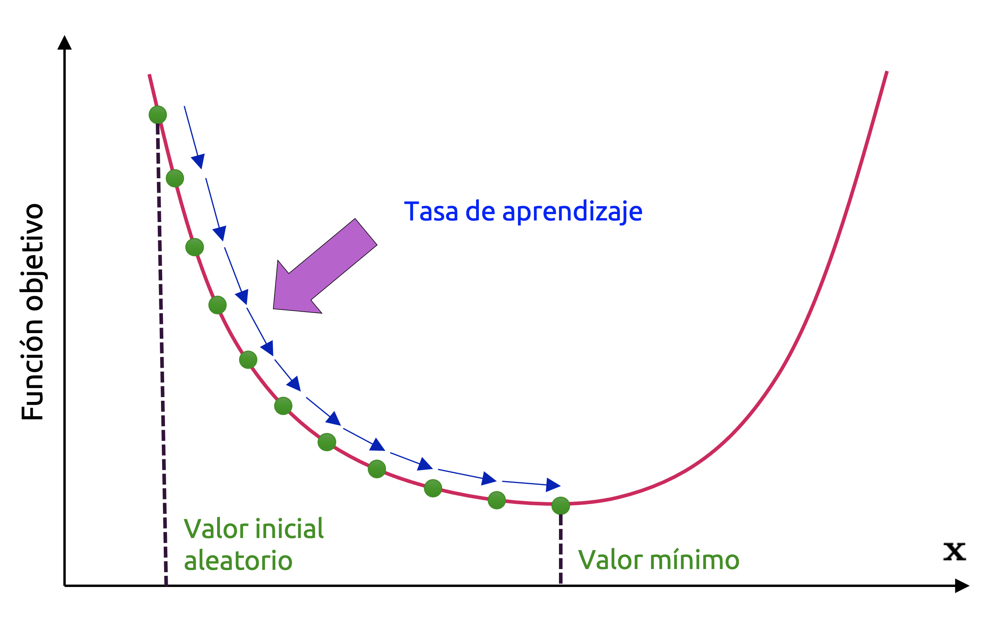
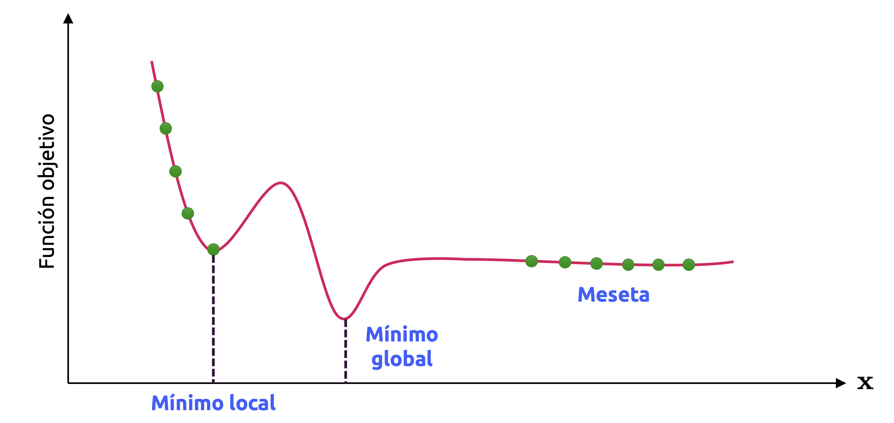

::: {.callout-important}
## Idea central

La optimización constituye el núcleo computacional del aprendizaje automático moderno. Entrenar un modelo equivale, en términos generales, a resolver un problema de optimización: Buscar el conjunto de parámetros que minimiza una función de pérdida o maximiza una función de verosimilitud, respetando, en ciertos casos, restricciones explícitas sobre las variables del problema. En este apunte estudiaremos los fundamentos matemáticos y computacionales de esta idea, con foco en el gradiente descendente y sus variantes, así como en problemas de programación lineal y cuadrática.
:::

## Introducción

Una parte importante de la teoría de *machine learning* puede reinterpretarse como una teoría de la **optimización numérica**. En efecto, cuando entrenamos un modelo supervisado, no hacemos otra cosa que ajustar un conjunto de parámetros a fin de que el modelo represente de la mejor manera posible una relación presente en los datos. Esa noción de *“mejor manera posible”* no es ambigua: queda cuantificada por medio de una **función objetivo**, típicamente llamada **función de pérdida**, **función de costo** o **función de riesgo empírico**.

Si denotamos por $\mathbf{w}$ al vector de parámetros del modelo, entonces el entrenamiento de una gran cantidad de algoritmos puede escribirse, al menos idealmente, en la forma

$$
\min_{\mathbf{w}\in \mathcal{W}} L(\mathbf{w})
\tag{1.1}
$$

donde $\mathcal{W}$ representa el espacio factible de parámetros y $L$ es una función real que mide la calidad del ajuste, denominada **función de pérdida**. En este contexto, *aprender* equivale a **resolver un problema de optimización**.

Esta observación, aparentemente sencilla, tiene consecuencias profundas. Nos dice que el rendimiento de un modelo no depende solamente de su estructura estadística o de su capacidad de representación, sino también del método numérico que utilizamos para encontrar buenos valores de sus parámetros. Dos modelos idénticos desde el punto de vista probabilístico pueden comportarse de manera muy distinta si uno de ellos se optimiza mal o si el algoritmo de entrenamiento queda atrapado en una región pobre del espacio de búsqueda.

Por esta razón, la optimización no debe entenderse como una herramienta auxiliar del aprendizaje automático, sino como una de sus piezas centrales. De hecho, muchas de las preguntas más relevantes del área están íntimamente ligadas a problemas de optimización:

- ¿Cómo minimizar una función de pérdida de manera eficiente?
- ¿Qué ocurre si la función objetivo no es convexa?
- ¿Cómo afecta el tamaño del paso a la estabilidad del entrenamiento?
- ¿Qué ventajas tiene usar gradientes exactos, gradientes estocásticos o aproximaciones de segundo orden?
- ¿Cómo incorporar restricciones, regularización o condiciones de factibilidad al problema?

A lo largo de este apunte abordaremos estas preguntas desde una perspectiva aplicada, pero sin renunciar al rigor matemático.

## Algoritmo de gradiente descendente

Supongamos que estamos perdidos en una densa niebla en las montañas, y que solamente podemos sentir el piso bajo nuestros pies, siendo nuestro objetivo llegar a nuestro hogar, situado en la parte más profunda del valle oculto en estas montañas. Una buena estrategia para llegar al fondo del valle rápidamente es ir caminando cuesta abajo por la pendiente más pronunciada que encontremos. Esto es exactamente lo que hace el **algoritmo de gradiente descendente** (GD): Determina el **gradiente local** de una función cuyo gráfico es precisamente el terreno montañoso, con respecto a la variable local (digamos $\mathbf{x}$), y luego **se desplaza en la dirección de descenso de dicho gradiente**. Una vez que el gradiente es cero, hemos llegado a la parte más profunda del valle, como era nuestro objetivo.

Formalicemos entonces esta idea: Vamos a considerar el problema relativo a minimizar una función de una variable vectorial del tipo $f:\mathbb{R}^{m}\longrightarrow \mathbb{R}$, y que podemos escribir como

::: {.eq-scroll}
$$
\min_{\mathbf{x} } f\left( \mathbf{x} \right)
\tag{8.1}
$$
:::

En este problema, $f$ es una función objetivo que captura el **problema de aprendizaje** de nuestro interés (aunque ojo, aún no definimos de manera rigurosa qué problema es éste, pero bastará con saber que es, efectivamente, un problema de optimización). Asumiremos que $f$ es diferenciable en, al menos, un conjunto abierto $U\subseteq \mathbb{R}^{m}$, y que, ya sea por un tema algebraico o por insuficiencia de recursos, no nos es posible determinar una solución analítica cerrada para el problema (8.1).

Gradiente descendente es pues un algoritmo de optimización de **primer orden**. Para encontrar el mínimo local de una función usando este algoritmo, vamos dando **pasos de magnitud proporcional al negativo del gradiente de la función en un punto dado**. Recordemos que el gradiente siempre apunta en la dirección de mayor crecimiento de una función. Otra noción intuitiva muy útil es considerar el conjunto de líneas de contorno para las cuales $f(\mathbf{x})= \mathrm{constante}$ (es decir, las **curvas de nivel** de $f$); **el gradiente siempre apuntará en la dirección normal a estos contornos**.

Consideremos pues funciones del tipo $f:U\subseteq \mathbb{R}^{m}\longrightarrow \mathbb{R}$. Supongamos que, sobre la gráfica (o recorrido) de esta función (la cual es una superficie para el caso $m=2$, o una *hipersuperficie* para el caso $m\geq 3$), fijamos un **punto inicial**, digamos $\mathbf{x}_{0}$, en algún entorno de dicho recorrido, y asumamos que este punto $\mathbf{x}_{0}$ es *móvil*. Vale decir, puede desplazarse en las direcciones donde la pendiente propia del gráfico de $f$ *mejor le favorezca*. El algoritmo de gradiente descendente explota el hecho geométrico de que la dirección de *más rápido descenso* (en términos de este movimiento previamente definido) coincide con el valor negativo del gradiente de $f$ en el punto en el que nos encontramos. Es decir, $f(\mathbf{x}_{0})$ decrece más rápido si nos movemos desde $\mathbf{x}_{0}$ en la dirección definida por $-\left( \nabla f\left( \mathbf{x}_{0} \right)  \right)^{\top }$. Por lo tanto, el punto al cual llegamos después de efectuar este movimiento, que denotamos como $\mathbf{x}_{1}$, puede definirse como

::: {.eq-scroll}
$$
\mathbf{x}_{1} =\mathbf{x}_{0} -\eta \left( \nabla f\left( \mathbf{x}_{0} \right)  \right)^{\top }
\tag{8.2}
$$
:::

donde $\eta \geq 0$ es un parámetro que llamaremos **tasa de aprendizaje** del algoritmo. Por lo tanto, conforme nuestra lógica, se tendrá que $f(\mathbf{x}_{1})\leq f(\mathbf{x}_{0})$. Notemos que el uso de la transposición para el campo gradiente en la ecuación (8.2) obedece simplemente a nuestra intención de que los correspondientes productos matriciales sean compatibles.

El desarrollo anterior nos permite formular un primer algoritmo sencillo de GD.

::: {.callout-tip}
## Teorema 8.1 – Gradiente descendente
*Sea $f:U\subseteq \mathbb{R}^{m} \longrightarrow \mathbb{R}$ una función de clase $C^{k}$ en un conjunto abierto $U$ de $\mathbb{R}^{m}$. Sea $\mathbf{x}^{\ast }$ un punto tal que $f(\mathbf{x}^{\ast })$ es un mínimo local de $f$. Si $\mathbf{x}_{0}$ es un valor arbitrario que usamos como solución inicial en un procedimiento iterativo de minimización de $f$, entonces es posible llegar al valor de $\mathbf{x}^{\ast }$ mediante el algoritmo*

::: {.eq-scroll}
$$
\mathbf{x}_{k+1} =\mathbf{x}_{k} -\eta \left( \nabla f\left( \mathbf{x}_{k} \right)  \right)^{\top }
\tag{8.3}
$$
:::

*En tal caso, la secuencia $f\left( \mathbf{x}_{0} \right)  \leq f\left( \mathbf{x}_{1} \right)  \leq \cdots$, converge a $f(\mathbf{x}^{\ast })$.*
:::

**Ejemplo 8.1:** Consideremos la siguiente función cuadrática

::: {.eq-scroll}
$$
f\left( \begin{matrix}x_{1}\\ x_{2}\end{matrix} \right)  =\frac{1}{2} \left( \begin{matrix}x_{1}\\ x_{2}\end{matrix} \right)^{\top }  \left( \begin{matrix}2&1\\ 1&20\end{matrix} \right)  \left( \begin{matrix}x_{1}\\ x_{2}\end{matrix} \right)  -\left( \begin{matrix}5\\ 3\end{matrix} \right)^{\top }  \left( \begin{matrix}x_{1}\\ x_{2}\end{matrix} \right)
\tag{8.4}
$$
:::

Partiendo en el punto inicial $\mathbf{x}_{0}=(3,1)^{\top}$, aplicaremos iterativamente el algoritmo de GD para obtener una secuencia de estimaciones que converjan al valor mínimo de $f$ y que es de nuestro interés. Para ilustrar gráficamente este procedimiento, lo implementaremos por medio de Python haciendo uso de las librerías que hemos aprendido previamente. Así pues, debido a que $f$ se ha definido por medio de una forma cuadrática, haremos uso de **<font color='darkmagenta'>Sympy</font>** para definir simbólicamente dicha función en Python y evaluarla de manera adecuada:

```{python}
import matplotlib.pyplot as plt
import numpy as np
import pandas as pd
import seaborn as sns
import sympy as sym

from numpy import linalg
```

```{python}
# Inicializamos el sistema de impresión de expresiones simbólicas de Sympy.
sym.init_printing()
```

```{python}
# Parámetros gráficos generales.
plt.rcParams["figure.dpi"] = 90
sns.set_theme()
plt.style.use("seaborn-v0_8-white")
```

```{python}
# Definimos las variables de entrada de f.
x1, x2 = sym.symbols("x_{1}, x_{2}")

# Y construimos la función f por medio de una expresión de Sympy, apoyándonos con Numpy.
f = (
    np.dot(
        (1/2) * np.array([x1, x2]), np.dot(
            np.vstack([[2, 1], [1, 20]]), np.vstack([x1, x2])
        )
    ) - np.dot(np.array([5, 3]), np.vstack([x1, x2]))
)[0]

# Mostramos f en pantalla.
f
```

A fin de reducir el número de términos de `f`, simplificamos dicha expresión:

```{python}
# Simplificamos f.
f = sym.simplify(f)

# Y la volvemos a mostrar en pantalla.
f
```

Usamos la función `sympy.lambdify()` para evaluar la expresión que define a `f` como sigue:

```{python}
# Garantizamos una expresión evaluable en x1 y x2.
f_eval = sym.lambdify("x_1, x_2", f)
```

Y ahora ya podemos construir una grilla completa sobre la cual calcularemos todos los valores de `f`. Queremos, en este caso particular, mostrar el recorrido de nuestra función por medio de curvas de contorno. De esta manera, tenemos:

```{python}
# Construcción de la grilla 2D donde evaluaremos f.
x1_bound = np.linspace(start=-4, stop=4, num=150)
x2_bound = np.linspace(start=-4, stop=4, num=150)
X1, X2 = np.meshgrid(x1_bound, x2_bound)

# Evaluamos f en la grilla previamente construida.
Z = f_eval(x_1=X1, x_2=X2)
```

```{python}
#| label: fig-optimizacion-aplicada-al-aprendizaje-automatico-01
#| fig-cap: "Curvas de contorno de la función objetivo usada para ilustrar el funcionamiento del algoritmo de gradiente descendente."
# Construimos el gráfico de f.
fig, ax = plt.subplots(figsize=(9, 6))

p = ax.contourf(X1, X2, Z, levels=20, cmap="cool")
r = ax.contour(X1, X2, Z, levels=20, colors="white")

plt.clabel(r, inline=True, fontsize=10)
cb = plt.colorbar(p)
cb.set_label(r"$f(x_1, x_2)$", fontsize=11, labelpad=10, rotation=90)

#plt.axis([-4,4,-2,2])
ax.set_xlabel(r"$x_1$", fontsize=12, labelpad=10)
ax.set_ylabel(r"$x_2$", fontsize=12, labelpad=15, rotation=0)
plt.tight_layout()
```

La gráfica de `f` es la de un paraboloide elíptico cuyo vértice se localiza a la derecha del origen del sistema $\mathbb{R}^{3}$. De esta manera, a partir de las curvas de contorno construidas previamente, sabemos que el mínimo global de `f` se ubica en la región de color marrón del gráfico. Crearemos pues una rutina en Python que emulará el funcionamiento del algoritmo de gradiente descendente, y almacenaremos su progresión en la búsqueda de dicho mínimo global, a fin de poder visualizar la trayectoria del algoritmo en el gráfico anterior:

```{python}
# Una función que nos permitirá implementar el algoritmo de gradiente descendente desde cero.
# Esta función es exclusiva para problemas en 2D.
def gradient_descent(
    df: sym.Function,
    x0: np.ndarray,
    gamma: float=0.085,
    epsilon: float=0.01,
    max_iter: int=3000,
    init_error: float=10,
):
    curr_x = np.asarray(x0, dtype=float).reshape(-1)
    x, y = curr_x[0], curr_x[1]

    curr_iter = 0
    iter_coords = [curr_x.copy()]
    error = float(init_error)

    while linalg.norm(error) > epsilon and curr_iter < max_iter:
        curr_iter += 1
        prev_x = curr_x.copy()

        grad = np.asarray(df(x, y), dtype=float).reshape(-1)
        curr_x = curr_x - gamma * grad

        x, y = curr_x[0], curr_x[1]
        error = curr_x - prev_x
        iter_coords.append(curr_x.copy())

    return curr_iter, curr_x, np.vstack(iter_coords)
```

Notemos que nuestra implementación del algoritmo de GD requiere del gradiente de la función objetivo (es decir, su(s) derivada(s)). Debido a que hemos definido `f` por medio de una expresión de **<font color='darkmagenta'>Sympy</font>**, el cálculo de las derivadas parciales respectivas es ciertamente sencillo si aplicamos el método `diff()`. De esta manera:

```{python}
# Calculamos las derivadas parciales de f.
df_dx1 = f.diff(x1)
df_dx2 = f.diff(x2)

# Definimos la solución inicial.
x0 = np.vstack([-3, -1])

# Agrupamos las derivadas anteriores en una lista para construir
# el gradiente de f.
df = [df_dx1, df_dx2]

# Transformamos el gradiente en una función evaluable.
df_eval = sym.lambdify("x_1, x_2", df)
```

Y ya podemos implementar el algoritmo de manera directa:

```{python}
# Implementación del algoritmo de GD.
n_iters, x_sol, trajectory = gradient_descent(df=df_eval, x0=x0)
```

```{python}
#| label: fig-optimizacion-aplicada-al-aprendizaje-automatico-02
#| fig-cap: "Trayectoria del algoritmo de gradiente descendente sobre las curvas de contorno de la función objetivo."
# Construimos el gráfico de f.
fig, ax = plt.subplots(figsize=(9, 6))

p = ax.contourf(X1, X2, Z, levels=20, cmap="cool")
r = ax.contour(X1, X2, Z, levels=20, colors="white")
s = ax.plot(
    trajectory[:, 0],
    trajectory[:, 1],
    lw=3,
    marker="s",
    c="black",
    label="Trayectoria del algoritmo",
)

plt.clabel(r, inline=True, fontsize=10)
cb = plt.colorbar(p)
cb.set_label(r"$f(x_1, x_2)$", fontsize=14, labelpad=10, rotation=90)

ax.set_xlabel(r"$x_1$", fontsize=14, labelpad=10)
ax.set_ylabel(r"$x_2$", fontsize=14, labelpad=15, rotation=0)
ax.legend(loc="upper left", frameon=True)
plt.tight_layout()
```

Podemos observar que la trayectoria del algoritmo de gradiente descendente, en este ejemplo particular, es de tipo oscilante, y termina por converger a la solución óptima del problema, que corresponde al mínimo global de `f`. Dicha solución, las iteraciones necesarias para lograrlo, y el valor de `f` en tal punto, son:

```{python}
# Reportamos los resultados.
print(f"Solución óptima: {np.around(x_sol, 3)}")
print(f"Nº de iteraciones efectuadas: {n_iters}")
print(f"Valor óptimo de f: {f_eval(x_sol[0], x_sol[1])}")
```

◼︎

Es importante considerar que el algoritmo de gradiente descendente suele moverse muy lentamente en el entorno del valor objetivo de nuestro interés. Su **tasa de convergencia asintótica** es significativamente más baja que la de otros métodos. Usando la analogía del punto móvil cuando el correspondiente hipervolumen que describe una función objetivo tiene la forma de un valle largo y de poca pendiente, nos encontramos frente a un **problema que está mal condicionado** y, en estos casos, el algoritmo de gradiente descendente tiende a **zigzaguear a medida que se acerca al óptimo** con progresiones que pueden ser cada vez más pequeñas.

### Tasa de aprendizaje

Un parámetro importante en el algoritmo GD corresponde al tamaño de los pasos entre iteraciones determinado por un parámetro llamado tasa de aprendizaje, denotada comúnmente como $\gamma$. Este parámetro puede ser fijo o función de ciertas propiedades locales de la función objetivo, y se esquematiza en la @fig-learningrate.

{#fig-learningrate fig-align="center" width="80%"}

Si la tasa de aprendizaje es muy pequeña, el algoritmo convergerá lentamente, porque tendrá que realizar muchas iteraciones para llegar al valor mínimo que queremos. Por otro lado, si la tasa de aprendizaje es demasiado alta, podríamos saltar el valle y terminar en otro lado. Posiblemente incluso más lejos del mínimo que cuando partimos. Esto podría provocar que el algoritmo diverja, con valores más y más grandes, fallando en encentrar una solución óptima. Ambas situaciones se esquematizan en la @fig-learningmag.

{#fig-learningmag fig-align="center" width="100%"}

Finalmente, no todas las funciones objetivo tienen una apariencia tan regular o bien comportada como las que hemos idealizado en los gráficos anteriores. De hecho, los gráficos de estas funciones pueden tener agujeros, vértices, mesetas y todo tipo de irregularidades en toda su extensión, haciendo que la convergencia a un valor mínimo del algoritmo de GD sea bastante difícil. La @fig-learncrit ilustra los dos principales desafíos del algoritmo de GD, esquematizados para el caso de una curva plana. Si el algoritmo parte en el lado izquierdo de la curva, entonces convergerá a un **mínimo local**, el cual no es tan bueno como un **mínimo global o absoluto**. Si parte en el lado derecho, entonces tardará bastante en cruzar la meseta. Y si lo detenemos antes, nunca llegará al valor mínimo global que es de nuestro interés.

Lo anterior implica que el algoritmo es, por naturaleza, errático. Por esa razón, la elección el valor de $\eta$ es importante. Decimos pues que la tasa de aprendizaje $\gamma$ es un **hiperparámetro**: Un parámetro cuyo valor está sujeto a nuestra elección.

{#fig-learncrit fig-align="center" width="100%"}

Existen **métodos adaptativos** que permiten equipar al algoritmo de gradiente descendente una tasa de aprendizaje que varíe en función del número $n$ de iteraciones (es decir, ahora hablamos de una relación del tipo $\eta(n)$), o bien, en función de las propiedades locales de la función objetivo. Al respecto, existen dos heurísticas sencillas que debemos considerar (Toussaint, 2012):

- Cuando el valor de la función se incrementa después de una iteración (digamos, la $k$-ésima), aquello significa que el paso $\eta_{k}$ fue demasiado largo. Por lo tanto, requerimos rehacer esta iteración con un valor de $\eta_{k}$ más pequeño que el que hemos usado.
- Cuando el valor de la función objetivo decrece después de una iteración (digamos, la $k$-ésima), siempre está la posibilidad de que el paso $\eta_{k}$ haya sido más grande y, por tanto, que la convergencia del algoritmo sea más rápida. Por lo tanto, podemos volver atrás y aumentar el valor de $\eta_{k}$.

A pesar de que el volver atrás y mejorar los valores de $\eta_{k}$ puede parecer un desperdicio de recursos, esta sencilla heurística garantiza que el algoritmo de gradiente descendente **siempre converja al mínimo global** de nuestra función objetivo.

**Ejemplo 8.2 – Resolución de un sistema lineal de ecuaciones:** Cuando resolvemos sistemas de ecuaciones lineales de la forma $\mathbf{A}\mathbf{x}=\mathbf{b}$, siendo $\mathbf{A}\in \mathbb{R}^{m\times n}$, $\mathbf{x}\in \mathbb{R}^{n}$ y $\mathbf{b}\in \mathbb{R}^{m}$, en la práctica, lo que hacemos es resolver la ecuación matricial $\mathbf{A}\mathbf{x} - \mathbf{b} = 0$, hallando un valor de $\mathbf{x}$ que minimice el error cuadrático, definido como

::: {.eq-scroll}
$$
\left\Vert \mathbf{A} \mathbf{x} -\mathbf{b} \right\Vert^{2}  =\left( \mathbf{A} \mathbf{x} -\mathbf{b} \right)^{\top }  \left( \mathbf{A} \mathbf{x} -\mathbf{b} \right)
\tag{8.5}
$$
:::

Donde la norma utilizada es la Euclidiana (es decir, la norma $\ell_{2}$). El gradiente de la ecuación (8.5) con respecto a $\mathbf{x}$ es

::: {.eq-scroll}
$$
\nabla_{\mathbf{x} } \left( \left\Vert \mathbf{A} \mathbf{x} -\mathbf{b} \right\Vert^{2}  \right)  =2\left( \mathbf{A} \mathbf{x} -\mathbf{b} \right)^{\top }  \mathbf{A}
\tag{8.6}
$$
:::

Podemos usar este gradiente de manera directa en el algoritmo de gradiente descendente. Sin embargo, para este caso particular, existe una solución algebraicamente cerrada que resulta de anular el gradiente y despejar el valor de $\mathbf{x}$. Veremos en detalle cómo resolver problemas que involucran al error cuadrático medio como función objetivo más adelante, al estudiar la representación matemática de los datos y su interacción con modelos. ◼︎

Cuando aplicamos soluciones como la presentada en el ejemplo (8.1) para sistemas del tipo $\mathbf{A}\mathbf{x}=\mathbf{b}$, puede ocurrir que el algoritmo de GD presente velocidades de convergencia excepcionalmente bajas. Para acelerar la convergencia del algoritmo a la solución óptima de este problema, es útil observar que su velocidad depende del **número de condición** de la matriz $\mathbf{A}$, el cual se define como

::: {.eq-scroll}
$$
\kappa =\frac{\sigma \left( \mathbf{A} \right)_{\mathrm{max} }  }{\sigma \left( \mathbf{A} \right)_{\mathrm{min} }  }
\tag{8.7}
$$
:::

Donde $\sigma \left( \mathbf{A} \right)_{\mathrm{max} }$ y $\sigma \left( \mathbf{A} \right)_{\mathrm{min} }$ son los valores singulares máximo y mínimo, respectivamente, de la matriz $\mathbf{A}$. El número de condición, en esencia, nos permite medir cuan afectado se ve el resultado del sistema $\mathbf{A}\mathbf{x}=\mathbf{b}$ frente a pequeños cambios en las entradas de la matriz $\mathbf{A}$. Si los valores singulares de $\mathbf{A}$ son similares en magnitud, el número de condición $\kappa$ será cercano a $1$, en cuyo caso diremos que la matriz $\mathbf{A}$ está **bien condicionada**. Por otro lado, si los valores singulares de $\mathbf{A}$ son muy distintos en magnitud, $\kappa$ será significativamente distinto de $1$, en cuyo caso diremos que la matriz $\mathbf{A}$ está **mal condicionada**.

En términos geométricos, el número de condición $\kappa$ nos informa acerca de la magnitud de la curvatura local en el hipervolumen descrito por la función $g\left( \mathbf{x} \right)  =\left\Vert \mathbf{A} \mathbf{x} -\mathbf{b} \right\Vert^{2}$. En este caso, el valor de $\kappa$ es inversamente proporcional a esta curvatura local, lo que implica que problemas con una matriz de coeficientes $\mathbf{A}$ mal condicionada, por extensión, también son mal condicionados. Esto, naturalmente, empata con nuestra noción de que los problemas mal condicionados son aquellos en los cuales el hipervolumen descrito por la función objetivo presenta valles de poca pendiente y anormalmente largos; es decir, se curvan mucho en una dirección, y son anormalmente planos en la otra. En vez de resolver directamente el sistema $\mathbf{A}\mathbf{x}=\mathbf{b}$, podríamos resolver el sistema equivalente $\mathbf{P}^{-1}(\mathbf{A}\mathbf{x}-\mathbf{b})=\mathbf{0}$, donde la matriz $\mathbf{P}$ se conoce como **matriz pre-acondicionadora del sistema**. El objetivo de esta transformación es diseñar $\mathbf{P}^{-1}$ de tal manera que $\mathbf{P}^{-1}\mathbf{A}$ sea una matriz mejor condicionada que $\mathbf{A}$ y que, al mismo tiempo, sea más sencilla de computar.

### Adición de moméntum

Una mejora natural del algoritmo de gradiente descendente consiste en agregar una noción de **inercia** al movimiento de la solución iterativa. La motivación geométrica es sencilla: Cuando la función objetivo presenta un valle largo, angosto y poco inclinado, tal como ocurre en problemas mal condicionados, el algoritmo de gradiente descendente puro tiende a *zigzaguear* de un lado a otro del valle. Esto ocurre porque el gradiente local cambia fuertemente de dirección entre iteraciones consecutivas, aun cuando el mínimo de interés se encuentra, en términos gruesos, “hacia adelante” en la misma dirección general.

La idea del método de **moméntum** consiste en acumular parte del desplazamiento previo de la trayectoria y combinarlo con la información nueva entregada por el gradiente actual. De este modo, el algoritmo no responde únicamente al valor local del gradiente en la iteración presente, sino también a la *historia reciente* de su movimiento. El efecto buscado es doble: Amortiguar las oscilaciones transversales del algoritmo y acelerar el avance en direcciones persistentes de descenso.

En términos físicos, podemos imaginar que el punto $\mathbf{x}_{k}$ ya no se mueve como una partícula sin masa, sino como una pequeña bola que desciende por una superficie con cierta inercia. Si la dirección de descenso se mantiene durante varias iteraciones, la velocidad acumulada aumenta. Si, por el contrario, el gradiente cambia de signo rápidamente en una dirección, las contribuciones sucesivas tienden a cancelarse parcialmente. Para formalizar esta idea, introducimos un vector auxiliar $\mathbf{v}_{k}$, que interpretaremos como una **velocidad** o **momento acumulado** del algoritmo. Entonces, el método de moméntum asociado a gradiente descendente queda definido por las ecuaciones $\mathbf{v}_{k+1} = \beta \mathbf{v}_{k} - \eta \left( \nabla f\left( \mathbf{x}_{k} \right) \right)^{\top}$ y $\mathbf{x}_{k+1} = \mathbf{x}_{k} + \mathbf{v}_{k+1}$, donde $\eta > 0$ es, nuevamente, la **tasa de aprendizaje**, $\beta \in [0,1)$ es un hiperparámetro llamado **coeficiente de moméntum**, y $\mathbf{v}_{k}$ es el término que acumula parte del historial del movimiento del algoritmo.

Notemos que, si $\beta = 0$, entonces la actualización de la velocidad se reduce a $\mathbf{v}_{k+1} = -\eta \left( \nabla f\left( \mathbf{x}_{k} \right) \right)^{\top}$, y por lo tanto recuperamos exactamente el algoritmo de gradiente descendente usual. En este sentido, el método de moméntum no reemplaza al algoritmo GD, sino que lo **generaliza**.

Podemos reescribir estas ecuaciones eliminando explícitamente la variable $\mathbf{v}_{k}$. Como $\mathbf{v}_{k} = \mathbf{x}_{k} - \mathbf{x}_{k-1}$, se obtiene la forma equivalente $\mathbf{x}_{k+1} = \mathbf{x}_{k} - \eta \left( \nabla f\left( \mathbf{x}_{k} \right) \right)^{\top} + \beta \left( \mathbf{x}_{k} - \mathbf{x}_{k-1} \right)$. Esta ecuación muestra con claridad la estructura del método: El término $-\eta \nabla f(\mathbf{x}_{k})^{\top}$ corresponde al paso usual de gradiente descendente, mientras que el término $\beta(\mathbf{x}_{k} - \mathbf{x}_{k-1})$ agrega una corrección inercial basada en el desplazamiento anterior. En consecuencia, el nuevo punto $\mathbf{x}_{k+1}$ no solamente depende del gradiente local en $\mathbf{x}_{k}$, sino también de la diferencia entre los dos últimos iterados del algoritmo.

La utilidad del método de moméntum se vuelve especialmente clara cuando la función objetivo presenta curvas de nivel muy elípticas o valles alargados. En ese caso, el gradiente descendente clásico tiende a oscilar transversalmente al eje principal del valle, avanzando con lentitud hacia el mínimo. El término de moméntum permite “promediar” parcialmente estas oscilaciones y conservar la componente de movimiento que apunta en la dirección longitudinal del valle.

Dicho de otra forma, si una cierta dirección de descenso se repite durante varias iteraciones, el método va acumulando velocidad en esa dirección. Por el contrario, si una componente del gradiente cambia de signo una y otra vez, la suma amortiguada de desplazamientos previos reduce su efecto neto. Esta es precisamente la situación que deseamos corregir en funciones mal condicionadas.

El parámetro de moméntum $\beta$ controla cuánta memoria del movimiento previo conserva el algoritmo.

- Si $\beta$ es cercano a $0$, el método se parece mucho al algoritmo GD clásico.
- Si $\beta$ es demasiado grande, el algoritmo puede adquirir demasiada inercia, sobrepasar repetidamente la región del mínimo e incluso exhibir oscilaciones amplificadas.
- En la práctica, valores como $\beta = 0.9$ suelen utilizarse con frecuencia en aplicaciones de aprendizaje automático.

Naturalmente, el efecto de $\beta$ no puede analizarse de forma aislada. Su interacción con la tasa de aprendizaje $\eta$ es crítica. Un valor grande de $\eta$ junto a un valor también grande de $\beta$ puede volver inestable el procedimiento iterativo. Por ello, ambos parámetros deben entenderse como hiperparámetros acoplados del algoritmo.

La ecuación del moméntum también admite una lectura estadística interesante. Si desarrollamos recursivamente el término $\mathbf{v}_{k}$, obtenemos una combinación ponderada de gradientes pasados: $\mathbf{v}_{k} = -\eta \sum_{j=0}^{k-1}\beta^{j}\left( \nabla f\left( \mathbf{x}_{k-1-j} \right) \right)^{\top}$. Por lo tanto, el método de moméntum puede entenderse como una forma de **promedio exponencialmente ponderado** de gradientes previos. Los gradientes más recientes tienen mayor influencia, mientras que los más antiguos se descuentan geométricamente por potencias de $\beta$.

Esta observación es importante porque muestra que el algoritmo no “olvida” por completo el pasado, sino que lo incorpora de forma decreciente. Esa memoria suaviza la trayectoria y permite que la actualización no dependa exclusivamente del comportamiento local instantáneo de la función objetivo.

**Ejemplo 8.3 – El efecto del moméntum sobre el algoritmo de gradiente descendente:** Replicaremos ahora el ejemplo anterior para la misma función cuadrática, pero añadiendo un parámetro de moméntum al algoritmo de gradiente descendente. La idea es comparar visualmente la trayectoria oscilante de GD puro con la trayectoria suavizada del método con moméntum, manteniendo la misma función objetivo y el mismo punto inicial.

Consideremos nuevamente la función

::: {.eq-scroll}
$$
f\left( \begin{matrix}x_{1}\\ x_{2}\end{matrix} \right)  =\frac{1}{2} \left( \begin{matrix}x_{1}\\ x_{2}\end{matrix} \right)^{\top }  \left( \begin{matrix}2&1\\ 1&20\end{matrix} \right)  \left( \begin{matrix}x_{1}\\ x_{2}\end{matrix} \right)  -\left( \begin{matrix}5\\ 3\end{matrix} \right)^{\top }  \left( \begin{matrix}x_{1}\\ x_{2}\end{matrix} \right)
\tag{8.8}
$$
:::

que corresponde exactamente a la función utilizada en el ejemplo anterior. El punto inicial será nuevamente $\mathbf{x}_{0}=(-3,-1)^{\top}$, y compararemos los dos algoritmos: GD clásico y GD con moméntum. La expectativa geométrica es que, al incorporar el término de inercia, la trayectoria del algoritmo reduzca el zigzagueo observado en el caso puro y avance de manera más estable hacia el mínimo global.

Procedamos:

```{python}
# Definimos las variables de entrada de f.
x1, x2 = sym.symbols("x_1, x_2")

# Construimos la función cuadrática simbólicamente.
f = (
    np.dot(
        (1/2) * np.array([x1, x2]),
        np.dot(
            np.vstack([[2, 1], [1, 20]]),
            np.vstack([x1, x2])
        )
    ) - np.dot(np.array([5, 3]), np.vstack([x1, x2]))
)[0]

# Simplificamos la expresión.
f = sym.simplify(f)

# Garantizamos una expresión evaluable en x1 y x2.
f_eval = sym.lambdify("x_1, x_2", f)

# Construcción de la grilla 2D donde evaluaremos f.
x1_bound = np.linspace(start=-4, stop=4, num=150)
x2_bound = np.linspace(start=-4, stop=4, num=150)
X1, X2 = np.meshgrid(x1_bound, x2_bound)

# Evaluamos f en la grilla previamente construida.
Z = f_eval(x_1=X1, x_2=X2)

# Calculamos las derivadas parciales de f.
df_dx1 = f.diff(x1)
df_dx2 = f.diff(x2)

# Agrupamos las derivadas en una lista para construir el gradiente.
df = [df_dx1, df_dx2]

# Transformamos el gradiente en una función evaluable.
df_eval = sym.lambdify("x_1, x_2", df)
```

```{python}
# Una función que implementa gradiente descendente con moméntum.
# Esta función es exclusiva para problemas en 2D.
def gradient_descent_momentum(
    df: sym.Function,
    x0: np.ndarray,
    gamma: float=0.085,
    beta: float=0.90,
    epsilon: float=0.01,
    max_iter: int=3000,
    init_error: float=10,
):
    # Forzamos x0 a vector 1D de longitud 2.
    curr_x = np.asarray(x0, dtype=float).reshape(-1)
    x, y = curr_x[0], curr_x[1]

    curr_iter = 0
    iter_coords = [curr_x.copy()]
    error = float(init_error)

    # Velocidad del método, también como vector 1D.
    v = np.zeros_like(curr_x)

    while linalg.norm(error) > epsilon and curr_iter < max_iter:
        curr_iter += 1
        prev_x = curr_x.copy()

        # Gradiente local como vector 1D.
        grad = np.asarray(df(x, y), dtype=float).reshape(-1)

        # Actualización con moméntum.
        v = beta * v - gamma * grad
        curr_x = curr_x + v

        # Actualizamos coordenadas escalares.
        x, y = curr_x[0], curr_x[1]

        error = curr_x - prev_x
        iter_coords.append(curr_x.copy())

    return curr_iter, curr_x, np.vstack(iter_coords)
```

Aplicamos ambos algoritmos usando el mismo punto inicial:

```{python}
## Ejecutamos GD puro.
n_iters_gd, x_sol_gd, trajectory_gd = gradient_descent(
    df=df_eval,
    x0=x0,
    gamma=0.085
)

# Ejecutamos GD con moméntum.
n_iters_mom, x_sol_mom, trajectory_mom = gradient_descent_momentum(
    df=df_eval,
    x0=x0,
    gamma=0.085,
    beta=0.90
)
```

Construimos ahora el gráfico de curvas de nivel, superponiendo ambas trayectorias:

```{python}
# Unimos ambas trayectorias para determinar automáticamente
# el dominio necesario del gráfico.
all_points = np.vstack([trajectory_gd, trajectory_mom])

# Obtenemos mínimos y máximos observados.
x1_min_data, x2_min_data = all_points.min(axis=0)
x1_max_data, x2_max_data = all_points.max(axis=0)

# Agregamos un margen visual para que el gráfico no quede apretado.
pad_x1 = 0.10 * (x1_max_data - x1_min_data + 1e-8) + 0.5
pad_x2 = 0.10 * (x2_max_data - x2_min_data + 1e-8) + 0.5

x1_min = x1_min_data - pad_x1
x1_max = x1_max_data + pad_x1
x2_min = x2_min_data - pad_x2
x2_max = x2_max_data + pad_x2

# Creamos la grilla de evaluación.
x1_grid = np.linspace(x1_min, x1_max, 400)
x2_grid = np.linspace(x2_min, x2_max, 400)
X1, X2 = np.meshgrid(x1_grid, x2_grid)

# Evaluamos la función objetivo sobre toda la grilla.
Z = f_eval(X1, X2)
```

```{python}
#| label: fig-optimizacion-aplicada-al-aprendizaje-automatico-03
#| fig-cap: "Comparación de trayaectorias de los algoritmos de GD normal y con momentum sobre la función objetivo."
# Construimos el gráfico de f y comparamos ambas trayectorias.
fig, ax = plt.subplots(figsize=(9, 6))

p = ax.contourf(X1, X2, Z, levels=20, cmap="cool")
r = ax.contour(X1, X2, Z, levels=20, colors="white")

# Trayectoria de GD puro.
ax.plot(
    trajectory_gd[:, 0],
    trajectory_gd[:, 1],
    lw=2.5,
    marker="s",
    c="black",
    alpha=0.6,
    label="GD puro"
)

# Trayectoria de GD con moméntum.
ax.plot(
    trajectory_mom[:, 0],
    trajectory_mom[:, 1],
    lw=2.5,
    marker="s",
    c="gray",
    alpha=0.6,
    label="GD con moméntum"
)

plt.clabel(r, inline=True, fontsize=10)
cb = plt.colorbar(p)
cb.set_label(r"$f(x_1, x_2)$", fontsize=14, labelpad=10, rotation=90)

ax.set_xlabel(r"$x_1$", fontsize=14, labelpad=10)
ax.set_ylabel(r"$x_2$", fontsize=14, labelpad=15, rotation=0)
ax.legend(loc="upper left", frameon=True)
plt.tight_layout()
```

Reportamos finalmente los resultados numéricos de ambos procedimientos:

```{python}
# Reportamos los resultados de GD puro.
print("=== Gradiente descendente puro ===")
print(f"Solución óptima: {np.around(x_sol_gd, 3)}")
print(f"Nº de iteraciones efectuadas: {n_iters_gd}")
print(f"Valor óptimo de f: {f_eval(x_sol_gd[0], x_sol_gd[1])}")

print("")

# Reportamos los resultados de GD con moméntum.
print("=== Gradiente descendente con moméntum ===")
print(f"Solución óptima: {np.around(x_sol_mom, 3)}")
print(f"Nº de iteraciones efectuadas: {n_iters_mom}")
print(f"Valor óptimo de f: {f_eval(x_sol_mom[0], x_sol_mom[1])}")
```

Podemos observar que ambas trayectorias convergen al mismo mínimo global de la función cuadrática, como era de esperarse. Sin embargo, el método de gradiente descendente con moméntum tiende a reducir el zigzagueo característico del algoritmo puro y a desplazarse de manera más estable a lo largo del valle descrito por las curvas de nivel de la función objetivo. Esto refleja exactamente la intuición geométrica discutida en la sección anterior: El término de moméntum amortigua las oscilaciones transversales y favorece el avance en direcciones persistentes de descenso. ◼︎

### Gradiente descendente estocástico

El cálculo directo de los gradientes en el algoritmo GD puede resultar muy costoso en términos computacionales. Sin embargo, es posible encontrar aproximaciones no tan costosas y que apunten, más o menos, en la misma dirección. El algoritmo de gradiente descendente estocástico (SGD, del inglés *stochastic gradient descent*) permite aproximar los gradientes, como su nombre lo indica, mediante el uso de un método estocástico, siempre que la función objetivo esté expresada como una suma de funciones diferenciables en sus respectivos dominios. La palabra “estocástico”, en este caso, se debe al hecho de que reconocemos que no tenemos claro cuál es el valor del gradiente con absoluta precisión, sino que sólo tenemos una idea del mismo. Restringiendo la distribución de probabilidad subyacente de la función gradiente, podemos aún, en teoría, garantizar la convergencia del algoritmo.

En un algoritmo de aprendizaje, dados $i=1,...,m$ puntos que representan datos en un determinado conjunto, con frecuencia, consideramos funciones objetivo que se corresponden con la suma de funciones de clase $C^{k}$ en sus dominios respectivos (con $k\in \mathbb{N}$), que denotamos como $L_{i}$, para cada una de las $m$ observaciones. Los datos utilizados para construir un modelo con base en un algoritmo de aprendizaje son llamados **datos de entrenamiento**, y pertenecen a un conjunto previamente seleccionado conocido como **conjunto de entrenamiento**, y que suele representar la mayoría del conjunto de datos completo del que disponemos para construir un modelo. En términos matemáticos, podemos por tanto escribir la función objetivo $L$, llamada **función de pérdida** (o **costo**), como

::: {.eq-scroll}
$$
L\left( \mathbf{w} \right)  =\sum^{m}_{i=1} L_{i}\left( \mathbf{\theta } \right)
\tag{8.9}
$$
:::

donde $\mathbf{w}$ es el vector de parámetros de interés. Es decir, queremos determinar un vector de parámetros $\mathbf{w}$ tal que el valor de $L$ sea mínimo. Un ejemplo típico de función de pérdida, para el caso de los modelos de regresión, corresponde a la llamada **función de verosimilitud logarítmica (LL)**. En un problema de regresión (normalmente de tipo logística), la función LL se expresa por medio de la suma de los valores de verosimilitud (logarítmica) de cada instancia particular de datos, comúnmente expresada por medio de un par $(\mathbf{x}_{i}, y_{i})$, siendo $\mathbf{x}_{i}\in \mathbb{R}^{n}$ e $y=\left\{ 0,1\right\}$ es una variable de respuesta binaria, para un total de $m$ instancias en el conjunto de datos completo. De esta manera, esta suma se puede escribir como

::: {.eq-scroll}
$$
L\left( \mathbf{w} \right)  =-\sum^{m}_{i=1} \log \left( p\left( y_{i}|\mathbf{x}_{i} ,\mathbf{w} \right)  \right)
\tag{8.10}
$$
:::

El algoritmo estándar de GD, como fue presentado por primera vez, corresponde a un método de optimización por *lotes* de datos (lo que comúnmente se conoce como *optimización de tipo batch*). Esto quiere decir que la optimización se realiza usando el conjunto completo de datos de entrenamiento por medio de la actualización del vector de parámetros de acuerdo a una expresión del tipo

::: {.eq-scroll}
$$
\mathbf{w}_{k+1} =\mathbf{w}_{k} -\gamma_{k} \left( \nabla L\left( \mathbf{w}_{k} \right)  \right)^{\top }  =\mathbf{w}_{k} -\gamma_{k} \sum^{m}_{i=1} \left( \nabla L_{i}\left( \mathbf{w}_{k} \right)  \right)^{\top }
\tag{8.11}
$$
:::

para un parámetro de aprendizaje $\gamma_{k}$, dependiente del número $k$ de iteración del algoritmo. La evaluación de la suma de gradientes involucrada en el lado derecho de la ecuación (8.11) podría requerir cálculos costosos de los gradientes individuales para cada $L_{i}$. Cuando el conjunto de entrenamiento es muy grande, o bien, no existen fórmulas sencillas para obtener esos gradientes, la evaluación de la suma completa puede llegar a ser prohibitiva.

Consideremos el término $\sum^{m}_{i=1} \left( \nabla L_{i}\left( \mathbf{w}_{k} \right)  \right)^{\top }$ en la ecuación (8.11). Podemos reducir el número de cálculos involucrados tomando una suma sobre una porción más pequeña del conjunto de entrenamiento. En contraste al algoritmo de GD por lotes (BGD, del inglés *batch gradient descent*), que usa todas las instancias $L_{i}$ para $1\leq i\leq m$, en este caso, optamos por elegir aleatoriamente un número determinado de instancias para computar una suma con muchos menos términos, a fin de estimar el gradiente de $L_{m}$ usando dicha suma. Esta técnica se conoce como **gradiente descendente por lotes pequeños de datos (o mini-lotes)** (MBGD, del inglés *mini-batch gradient descent*). La clave para entender por qué sólo una porción de los datos puede ser suficiente para estimar el gradiente de $L_{m}$ radica en entender que, para que el algoritmo de GD converja, basta con usar una estimación insesgada del gradiente original de $L_{m}$. De hecho, el término $\sum^{m}_{i=1} \left( \nabla L_{i}\left( \mathbf{w}_{k} \right)  \right)^{\top}$ en la ecuación (8.11) se trata de una estimación *empírica* del valor esperado del gradiente. Por lo tanto, cualquier otra estimación empírica insesgada del valor esperado del gradiente (por ejemplo, una suma sobre un subconjunto de datos de entrenamiento) será suficiente para la convergencia del algoritmo de GD.

Más allá de todo el razonamiento matemático que hay detrás, la mayor motivación del uso del algoritmo MBGD tiene relación con temas más prácticos derivados de su implementación en paquetes computacionales, incluyendo por supuesto a varias librerías de Python. Queremos que, al implementar algoritmos de aprendizaje fundamentados en optimización vía el algoritmo de GD, tales implementaciones no impliquen gastarnos una fortuna en procesadores centrales (CPUs) o gráficos (GPUs) necesarios para la realización de los cálculos correspondientes, o bien, esperar una eternidad para que tales cálculos se completen. Podemos pensar en el tamaño del subconjunto de datos de entrenamiento usado para estimar el gradiente de $L_{m}$ de manera análoga al tamaño de una muestra de una variable aleatoria utilizada para estimar su valor esperado por medio de su media muestral (o *empírica*). Si estos mini-lotes tienen un tamaño lo suficientemente grande, éstos nos proveerán de una estimación de gran exactitud para el gradiente de interés, reduciendo la varianza de los valores que toman los parámetros aglutinados en el vector $\mathbf{w}$. Además, los mini-lotes de tamaño *suficientemente grande* pueden tomar ventaja de operaciones matriciales optimizadas implementadas en paquetes computacionales de cálculo vectorizado (como **<font color='darkmagenta'>Numpy</font>** en el caso de Python) para garantizar un tiempo de ejecución relativamente aceptable. De esta manera, hay un trade-off: La reducción de la varianza en los valores que toma $\mathbf{w}$ nos llevará a una convergencia mayormente estable, pero también incrementará el costo computacional de los cálculos inherentes al algoritmo de GD.

En contraste, cuando los mini-lotes tienen un tamaño más pequeño, los gradientes serán más fáciles de calcular. Si nos aseguramos que el tamaño de éstos se mantenga pequeño, el ruido asociado a las estimaciones del gradiente (por efecto de la poca precisión) nos permitirá evitar la convergencia del algoritmo de GD a mínimos locales. En machine learning, esto es un problema crítico, ya que usamos algoritmos de optimización para minimizar el error cometido por nuestros modelos en un conjunto de datos de entrenamiento (llamado **error de estimación**), pero también queremos que el modelo mantenga un nivel razonable de precisión y exactitud en datos nuevos, que el modelo *no vió* durante su entrenamiento. En otras palabras, también queremos garantizar que el **error de generalización** sea también lo menor posible. Por esta razón, entrenar un modelo no requiere una estimación 100% exacta del mínimo del gradiente de la función de costo, lo que favorece el uso de métodos como el de GD estocástico. El algoritmo SGD resulta muy efectivo en problemas de aprendizaje de gran escala ([Bottou et al., 2018](https://arxiv.org/abs/1606.04838)), como es el caso del entrenamiento de redes neuronales profundas, entre otros tipos de abstracciones.

**Ejemplo 8.4 – Comparativa de algoritmos de gradiente descendente clásicos en Python:** Vamos a considerar un ejemplo clásico en el campo de los algoritmos de aprendizaje que involucra la implementación del algoritmo de gradiente descendente para la optimización de las correspondientes funciones de costo. Se trata del **modelo de regresión lineal**, el cual es el más elemental de los algoritmos de aprendizaje supervisado.

Sea $\mathbf{X}\in \mathbb{R}^{m\times n}$ una matriz que representa un conjunto de datos muestreado a partir de un proceso, fenómeno o sistema determinado, que comúnmente se caracteriza por tener una cierta densidad de probabilidad desconocida. En este caso, $m$ representa el número total de instancias u observaciones de dicho conjunto, y $n$ el total de variables o atributos que lo caracterizan. Para cada instancia $i$ de $\mathbf{X}$ ($1\leq i \leq m)$, disponemos de un valor objetivo observado, que llamamos $y_{i}$. Cada uno de tales valores se agrupa en un **vector objetivo** $\mathbf{y}\in \mathbb{R}^{m}$. El objetivo del modelo de regresión lineal es encontrar un vector de parámetros $\mathbf{w}=(w_{1},...,w_{n})\in \mathbb{R}^{n}$ tal que la ecuación

::: {.eq-scroll}
$$
\hat{\mathbf{y} } =\mathbf{w}^{\top } \mathbf{X} +\mathbf{b}
\tag{8.12}
$$
:::

estime a $\mathbf{y}$ con el menor error posible. El vector $\mathbf{b}\in \mathbb{R}^{m}$ se denomina **vector de parámetros de sesgo**.

Notemos que, para cada instancia $y_{i}$ de $\mathbf{y}$, la ecuación (8.12) toma la forma

::: {.eq-scroll}
$$
\hat{y}_{i} =\mathbf{w}^{\top } \mathbf{x}_{i} +b_{i}=b_{i}+\sum^{n}_{j=1} w_{j} x_{ij}
\tag{8.13}
$$
:::

Donde $x_{ij}$ es la $i$-ésima instancia de la $j$-ésima variable en $\mathbf{X}$.

Cuando hablamos de que $\hat{\mathbf{y} }$ debe estimar a $\mathbf{y}$ lo mejor posible, estamos poniendo de manifiesto que existe un instrumento matemático que nos permite comparar $\hat{\mathbf{y} }$ con $\mathbf{y}$ de alguna manera, a fin de poder calificar el *ajuste* obtenido por el modelo. Tal instrumento es la *famosa* **función de pérdida** de la que hablábamos unas líneas más atrás, y una elección popular para dicha función corresponde al **error cuadrático medio** (MSE, del inglés *mean squared error*) entre $\mathbf{y}$ e $\hat{\mathbf{y}}$, definido como

::: {.eq-scroll}
$$
\mathrm{MSE} \left( \mathbf{w} \right)  =\frac{1}{m} \sum^{m}_{i=1} \left( \hat{\mathbf{y} } -\mathbf{y} \right)^{2}
\tag{8.14}
$$
:::

Si reemplazamos $\hat{\mathbf{y} }$ por el modelo de regresión lineal en la ecuación (6.16), obtenemos la forma final de esta función de pérdida:

::: {.eq-scroll}
$$
\mathrm{MSE} \left( \mathbf{w } \right)  =\frac{1}{m} \sum^{m}_{i=1} \left( \mathbf{w }^{\top } \mathbf{X} -\mathbf{y} \right)^{2}
\tag{8.15}
$$
:::

donde, convenientemente, hemos incorporado a $\mathbf{b}$ al vector de parámetros $\mathbf{w}$, añadiendo una variable fija en la primera columna de $\mathbf{X}$ que únicamente tiene un valor igual a $1$. Por lo tanto, el ajuste de un modelo de regresión equivale a la resolución de un problema de optimización, en el cual buscamos el valor mínimo de $\mathrm{MSE} \left( \mathbf{w } \right)$. Dada la fórmula del algoritmo de gradiente descendente, se tiene que la resolución de este problema exige que calculemos el gradiente de esta función de costo, el cual puede escribirse como

::: {.eq-scroll}
$$
\nabla_{\mathbf{w } } \left( \mathrm{MSE} \left( \mathbf{w } \right)  \right)  =\left( \begin{array}{c}\displaystyle \frac{\partial }{\partial w_{0} } \mathrm{MSE} \left( \mathbf{w } \right)  \\ \displaystyle \frac{\partial }{\partial w_{1} } \mathrm{MSE} \left( \mathbf{w } \right)  \\ \vdots \\ \displaystyle \frac{\partial }{\partial w_{n} } \mathrm{MSE} \left( \mathbf{w } \right)  \end{array} \right)  =\frac{2}{m} \mathbf{X}^{\top } \left( \mathbf{X} \mathbf{w } -\mathbf{y} \right)
\tag{8.16}
$$
:::

De esta manera, el algoritmo de gradiente descendente aplicado a este caso particular toma la forma

::: {.eq-scroll}
$$
\mathbf{w }_{k+1} =\mathbf{w }_{k} -\gamma_{k} \nabla_{\mathbf{w } } \left( \mathrm{MSE} \left( \mathbf{w } \right)  \right)  =\mathbf{w }_{k} -\gamma_{k} \left( \frac{2}{m} \mathbf{X}^{\top } \left( \mathbf{X} \mathbf{w }_{k} -\mathbf{y} \right)  \right)
\tag{8.17}
$$
:::

Vamos a generar una implementación en Python de este algoritmo, a fin de poder ajustar un sencillo modelo de regresión lineal a un conjunto dado de datos. Para ello, simularemos un conjunto de datos correlacionado linealmente en $\mathbb{R}^{2}$ (el caso más sencillo en términos de dimensión), tal que $y=2+3x+ \omega$. En la expresión anterior, el parámetro $\omega$ es simplemente ruido normalmente distribuido con media $0$ y desviación estándar igual a $1$:

```{python}
# Definimos una semilla aleatoria fija (para asegurar reproducibilidad).
rng = np.random.default_rng(seed=42)

# Creamos nuestro conjunto de datos.
X = 2 * rng.random(size=100)
Y = 2 + 3*X + rng.normal(loc=0, scale=1, size=100)
```

```{python}
#| label: fig-optimizacion-aplicada-al-aprendizaje-automatico-04
#| fig-cap: "Conjunto de datos de ejemplo."
# Graficamos nuestro conjunto de datos recién creado.
fig, ax = plt.subplots(figsize=(9, 5))
ax.scatter(x=X, y=Y, color="firebrick")
ax.set_xlabel(r"$x$", fontsize=12, labelpad=10)
ax.set_ylabel(r"$y$", fontsize=12, labelpad=15, rotation=0)
plt.tight_layout()
```

Intentaremos pues ajustar un modelo del tipo $y=w_{0}+w_{1}x$ a estos datos. Naturalmente, si podemos resolver adecuadamente el problema de optimización inherente al ajuste de los parámetros $w_{0}$ y $w_{1}$ del modelo, deberíamos llegar a valores muy cercanos a $w_{0}=2$ y $w_{1}=3$. El error que cometamos se deberá fundamentalmente al ruido Gaussiano que hemos introducido a nuestros datos.

Primero construiremos una implementación del algoritmo de GD por lotes (BGD), y haremos variar la correspondiente tasa de aprendizaje a fin de poder observar sus efectos en la trayectoria del algoritmo y su correspondiente convergencia. Para ello, aprovecharemos que hemos definido explícitamente la ecuación que describe la actualización del vector de parámetros $\mathbf{w}$ en el caso de un modelo arbitrario de regresión lineal (ecuación (6.19)). Sin embargo, a fin de que nuestra implementación funcione, añadiremos una columna únicamente compuesta por 1s a nuestro vector `X`:

```{python}
# Añadimos una columna de 1s a nuestro vector de datos X.
Xb = np.hstack([np.ones(shape=(X.shape[0], 1)), X.reshape(-1, 1)])
```

Con este arreglo previo, ya podemos construir una implementación del algoritmo BGD:

```{python}
# Definimos una función que implementa el algoritmo BGD para nuestro caso particular.
def batch_gradient_descent(Xb, Y, w0, gamma=0.02, n_iter=3000):
    m = Xb.shape[0] # Número total de observaciones en el lote.
    Y = Y.reshape(-1, 1) # Adecuamos Y en un arreglo bidimensional.
    w_path = [] # Una lista vacía donde almacenaremos la trayectoria del algoritmo.
    w = w0.copy() # Copiamos la solución inicial.
    for iter_k in range(n_iter):
        gradient = (2/m) * Xb.T @ (Xb @ w - Y)
        w = w - gamma * gradient
        w_path.append(w)
    return w, w_path
```

Vamos a inicializar el algoritmo de manera aleatoria, utilizando el valor `w0`. Almacenaremos los resultados del procedimiento en el arreglo `theta_bgd`, y la trayectoria del mismo en el arreglo `path_bgd`:

```{python}
# Inicializaremos el algoritmo con un valor aleatorio para nuestros parámetros.
w0 = rng.normal(loc=0, scale=1, size=(2, 1))

# Resolvemos el problema usando el algoritmo BGD.
w_bgd, path_bgd = batch_gradient_descent(Xb, Y, w0)
```

La implementación del algoritmo BGD en este caso converge, y los valores obtenidos para $w_{0}$ y $w_{1}$, respectivamente, son los siguientes:

```{python}
# Imprimimos en pantalla la solución encontrada.
print(f"Valor de w0: {w_bgd[0]}")
print(f"Valor de w1: {w_bgd[1]}")
```

Tales valores son muy cercanos a los que usamos para generar nuestra data en primera instancia. Al trazar la recta obtenida por los mismos junto a los datos, obtenemos el siguiente resultado:

```{python}
# Creamos un arreglo con valores en el rango (0, 2), y le anexamos una columna de 1s al inicio,
# a fin de poder multiplicarlo matricialmente con nuestro arreglo `w` y obtener predicciones.
x_range = np.linspace(start=0, stop=2, num=50).reshape(-1, 1)
x_biased = np.hstack([np.ones(shape=(x_range.shape[0], 1)), x_range])

# Obtenemos las predicciones de nuestro modelo.
Y_pred_bgd = x_biased @ w_bgd
```

```{python}
#| label: fig-optimizacion-aplicada-al-aprendizaje-automatico-05
#| fig-cap: "Modelo de regresión construido a partir del algoritmo BGD."
# Graficamos el modelo construido mediante el algoritmo BGD junto a los datos.
fig, ax = plt.subplots(figsize=(9, 5))
ax.scatter(x=X, y=Y, color="firebrick", label="Conjunto de datos")
ax.plot(x_range.reshape(-1,), Y_pred_bgd.reshape(-1,), color="navy", label=r"Modelo: $y=w_{0}+w_{1}x$")
ax.set_xlabel(r"$x$", fontsize=12, labelpad=10)
ax.set_ylabel(r"$y$", fontsize=12, labelpad=15, rotation=0)
ax.legend(loc="upper left", fontsize=10, frameon=True)
plt.tight_layout()
```

La trayectoria del algoritmo BGD puede visualizarse para algunos valores obtenidos de $\mathbf{w}$, tomando como base el arreglo `path_bgd`. Debido a que nuestra implementación consta de 3000 iteraciones, no será práctico visualizar esta trayectoria en su totalidad, pero el gráfico que construiremos bastará para observar la convergencia del algoritmo. En efecto:

```{python}
#| label: fig-optimizacion-aplicada-al-aprendizaje-automatico-06
#| fig-cap: "Convergencia del algoritmo BGD."
# Creamos la figura y graficamos los puntos a partir de los cuales
# entrenamos el modelo.
fig, ax = plt.subplots(figsize=(9, 5))
ax.scatter(
    x=X,
    y=Y,
    color="firebrick",
    label="Conjunto de datos",
)

# Mediante un loop sencillo, obtenemos algunas valores de `w` para
# la trayectoria completa del algoritmo.
for k in range(0, len(path_bgd), 100):
    Y_pred_k = x_biased @ path_bgd[k]
    ax.plot(
        x_range.reshape(-1,),
        Y_pred_k.reshape(-1,),
        color="navy",
        alpha=0.15,
    )

# Completamos el gráfico.
ax.plot(
    x_range.reshape(-1,),
    Y_pred_bgd.reshape(-1,),
    color="navy",
    label=r"Modelo: $y=w_{0}+w_{1}x$"
)

# Etiquetamos el gráfico.
ax.set_xlabel(r"$x$", fontsize=12, labelpad=10)
ax.set_ylabel(r"$y$", fontsize=12, labelpad=15, rotation=0)
ax.legend(loc="upper left", fontsize=10, frameon=True)
plt.tight_layout()
```

Las rectas de color azul más claro son aquellas que resultan del uso de valores subóptimos de $\mathbf{w}$, antes de que el algoritmo converja. Podemos observar que, a medida que progresa el algoritmo BGD, las rectas se van ajustando mejor a los datos, hasta que finalmente llegamos a los valores finales de $\mathbf{w}$ obtenidos por el proceso de entrenamiento (y que almacenamos en el arreglo `w_bgd`).

Construiremos ahora una implementación desde cero del algoritmo de gradiente descendente estocástico (SGD) con un control adaptativo de la tasa de aprendizaje. Dicho control se logra de manera sencilla por medio de la introducción de un **programa de aprendizaje**, el cual no es más que una función que controla el valor de este hiperparámetro conforme el número de iteraciones del algoritmo.

Dada la naturaleza estocástica del algoritmo SGD, no queremos recorrer el conjunto de datos en su totalidad, sino que tomaremos muestras aleatorias cada vez. Cada ronda de iteraciones se denominará **época** (del inglés *epoch*). En contraste con la implementación del algoritmo BGD, donde recorrimos el conjunto de datos un total de 3000 veces (3000 iteraciones en total), acá lo haremos sólo 50 veces (menos de un 2% de lo hecho en el caso del algoritmo BGD): Por esa razón, setearemos nuestra implementación con 50 épocas, y un programa de aprendizaje definido en base a la función

::: {.eq-scroll}
$$
\gamma =\frac{t_{0}}{t+t_{1}} \  ;\  t=n_{ep}m+k
\tag{8.18}
$$
:::

Donde $t_{0}$ y $t_{1}$ son hiperparámetros que controlan la magnitud de la tasa de aprendizaje, $n_{ep}$ es el número de época en un determinado momento, $m$ es la cantidad total de observaciones en el conjunto de entrenamiento y $k$ es la iteración propiamente tal.

Luego:

```{python}
# Definimos la función que controlará el programa de aprendizaje del algoritmo.
def learning_schedule(t, t0=5, t1=50):
    return t0 / (t + t1)
```

```{python}
# Creamos una función para implementar el algoritmo SGD.
def stochastic_gradient_descent(Xb, Y, w0, n_epochs=50):
    m = Xb.shape[0] # Número total de observaciones en el lote.
    Y = Y.reshape(-1, 1) # Adecuamos Y en un arreglo bidimensional.
    w = w0.copy() # Copiamos la solución inicial.
    w_path = [] # Una lista vacía donde almacenaremos la trayectoria del algoritmo.
    
    # Implementación del algoritmo.
    for epoch_k in range(n_epochs):
        for iter_p in range(m):
            
            # Construimos un índice aleatorizado.
            rand_idx = rng.integers(m)
            
            # Generamos la selección aleatorizada de puntos del conjunto completo.
            Xp = Xb[rand_idx:rand_idx + 1]
            Yp = Y[rand_idx:rand_idx + 1]
            
            # Cálculo del gradiente.
            grad = 2 * Xp.T @ (Xp @ w - Yp) # No dividimos por m, para evitar errores.
            
            # Actualización de la tasa de aprendizaje.
            gamma = learning_schedule(epoch_k * m + iter_p)
            
            # Actualización de parámetros.
            w = w - gamma * grad
            w_path.append(w)
    
    return w, w_path
```

Y ya estamos en condiciones de resolver nuestro problema. De esta manera:

```{python}
# Resolvemos el problema usando el algoritmo SGD.
w_sgd, path_sgd = stochastic_gradient_descent(Xb, Y, w0)

# Y mostramos dicho resultado en pantalla.
w_sgd
```

Vemos pues que esta solución es tan buena como la obtenida para el caso del algoritmo BGD:

```{python}
# Obtenemos las predicciones de nuestro modelo.
Y_pred_sgd = x_biased @ w_sgd
```

```{python}
#| label: fig-optimizacion-aplicada-al-aprendizaje-automatico-07
#| fig-cap: "Modelos construidos a partir de los algoritmos SGD y BGD."
# Graficamos el modelo construido mediante el algoritmo SGD junto a los datos.
fig, ax = plt.subplots(figsize=(9, 5))
ax.scatter(
    x=X,
    y=Y,
    color="firebrick",
    label="Conjunto de datos",
)

ax.plot(
    x_range,
    Y_pred_bgd.reshape(-1,),
    color="navy",
    label=r"Modelo vía BGD",
    alpha=0.6,
)

ax.plot(
    x_range,
    Y_pred_sgd.reshape(-1,),
    color="teal",
    label=r"Modelo vía SGD",
    alpha=0.6,
)

ax.set_xlabel(r"$x$", fontsize=12, labelpad=10)
ax.set_ylabel(r"$y$", fontsize=12, labelpad=15, rotation=0)
ax.legend(loc="upper left", fontsize=10, frameon=True)
plt.tight_layout()
```

La implementación *casera* que hemos hecho del algoritmo SGD está lejos de ser eficiente, pero retrata muy bien su alcance: Hemos recorrido solamente 50 veces el conjunto de entrenamiento, y hemos obtenido una estimación casi tan buena como la que obtuvimos previamente con el algoritmo BGD.

Finalmente, vamos a crear una implementación del algoritmo de GD por mini-lotes (MBGD), haciendo uso igualmente de una tasa de aprendizaje adaptativa. Usaremos igualmente esta implementación para resolver el problema de regresión planteado previamente:

```{python}
# Creamos una función para implementar el algoritmo MBGD.
def mini_batch_gradient_descent(Xb, Y, w0, n_epochs=50, mb_size=20, t0=200, t1=1000):
    m = Xb.shape[0] # Número total de observaciones en el lote.
    Y = Y.reshape(-1, 1) # Adecuamos Y en un arreglo bidimensional.
    w = w0.copy() # Copiamos la solución inicial.
    w_path = [] # Una lista vacía donde almacenaremos la trayectoria del algoritmo.
    
    # Calculamos el número de mini-lotes por época.
    n_batches_per_epoch = np.around(m / mb_size, 0).astype(int)
    
    # Implementación del algoritmo.
    for epock_k in range(n_epochs):
        
        # Mezclamos los datos en el conjunto de entrenamiento por medio de una permutación.
        shuffle_idx = np.random.permutation(m)
        Xb_shuffled = Xb[shuffle_idx]
        Y_shuffled = Y[shuffle_idx]
        
        # Generamos un ciclo para cada mini-lote de datos de entrenamiento.
        for iter_p in range(n_batches_per_epoch):
            idx_p = iter_p * mb_size # Índice asociado a la observación "p".
            
            # Seleccionamos el mini-lote.
            Xp = Xb_shuffled[idx_p:idx_p + mb_size]
            Yp = Y_shuffled[idx_p:idx_p + mb_size]
            
            # Cálculo del gradiente.
            grad_p = (2 / mb_size) * Xp.T @ (Xp @ w - Yp)
            
            # Actualización de la tasa de aprendizaje.
            gamma = learning_schedule(iter_p)
            
            # Actualización de parámetros.
            w = w - gamma * grad_p
            w_path.append(w)

    return w, w_path
```

```{python}
# Resolvemos el problema usando el algoritmo SGD.
w_mbgd, path_mbgd = mini_batch_gradient_descent(Xb, Y, w0)

# Y mostramos la solución encontrada en pantalla.
w_mbgd
```

```{python}
# Obtenemos las predicciones de nuestro modelo.
Y_pred_mbgd = x_biased @ w_mbgd
```

```{python}
#| label: fig-optimizacion-aplicada-al-aprendizaje-automatico-08
#| fig-cap: "Modelos construidos a partir de los algoritmos SGD, BGD y MBGD."
# Graficamos el modelo construido mediante el algoritmo MBGD junto a los datos.
fig, ax = plt.subplots(figsize=(9, 5))
ax.scatter(
    x=X,
    y=Y,
    color="firebrick",
    label="Conjunto de datos",
)

ax.plot(
    x_range,
    Y_pred_bgd.reshape(-1,),
    color="navy",
    label=r"Modelo vía BGD",
    alpha=0.6,
)

ax.plot(
    x_range,
    Y_pred_sgd.reshape(-1,),
    color="teal",
    label=r"Modelo vía SGD",
    alpha=0.6,
)

ax.plot(
    x_range,
    Y_pred_mbgd.reshape(-1,),
    color="dodgerblue",
    label=r"Modelo vía MBGD",
    alpha=0.6,
)

ax.set_xlabel(r"$x$", fontsize=12, labelpad=10)
ax.set_ylabel(r"$y$", fontsize=12, labelpad=15, rotation=0)
ax.legend(loc="upper left", fontsize=10, frameon=True)
plt.tight_layout()
```

Podemos observar que la estimación de los parámetros $w_{0}$ y $w_{1}$ por el algoritmo MBGD es tan buena como la obtenida mediante los algoritmos SGD y BGD. Por lo tanto, las tres alternativas son igualmente viables, y se diferencian únicamente en su flexibilidad en términos del tamaño del conjunto de entrenamiento y de la necesidad de regular la tasa de aprendizaje mediante algún programa adaptativo.

Como último ejercicio, graficaremos las trayectorias recorridas por cada variante del algoritmo de GD a fin de visualizar su progresión y convergencia a la solución óptima del problema inherente a la creación del modelo de regresión lineal (que, recordemos, es $w_{0}=2 \wedge w_{1}=3$):

```{python}
# Llevamos las trayectorias de los algoritmos de GD a formatos de arreglo de Numpy.
path_bgd = np.array(path_bgd)
path_sgd = np.array(path_sgd)
path_mbgd = np.array(path_mbgd)
```

```{python}
#| label: fig-optimizacion-aplicada-al-aprendizaje-automatico-09
#| fig-cap: "Trayectorias de las distintas variantes del algoritmo de gradiente descendente en el espacio de parámetros."
# Visualizamos en un gráficos las trayectorias paramétricas de los algoritmos.
fig, ax = plt.subplots(figsize=(9, 5))
ax.plot(
    path_bgd[:, 0],
    path_bgd[:, 1],
    marker="^",
    color="navy",
    linestyle="-",
    alpha=0.6,
    label="BGD",
)

ax.plot(
    path_sgd[:, 0],
    path_sgd[:, 1],
    marker="o",
    color="firebrick",
    linestyle="-",
    alpha=0.6,
    label="SGD",
)

ax.plot(
    path_mbgd[:, 0],
    path_mbgd[:, 1],
    marker="+",
    color="gold",
    linestyle="-",
    alpha=0.6,
    label="MBGD",
)

ax.set_xlabel(r"$w_{0}$", fontsize=12, labelpad=10)
ax.set_ylabel(r"$w_{1}$", fontsize=12, rotation=0, labelpad=15)

ax.annotate(
    "Solución óptima",
    xy=(2, 3),
    xytext=(1, 2.5),
    xycoords='data',
    fontsize=12,
    bbox=dict(
        boxstyle="round4,pad=.5",
        fc="0.9",
        color="black",
    ),
    arrowprops=dict(
        arrowstyle="->", 
        connectionstyle="angle,angleA=0,angleB=80,rad=20",
        color="black"
    ),
)

ax.legend(loc="lower right", fontsize=10, frameon=True)
plt.tight_layout()
```

Vemos pues que todas las variantes del algoritmo de GD terminan cerca del mínimo global, pero la trayectoria del algoritmo BGD termina casi exactamente en dicho punto conforme una trayectoria directa, que ve ralentizada enormemente a medida que no acercamos a los valores óptimos de los parámetros de interés, mientras que los otros dos algoritmos oscilan en torno a este punto. ◼︎

### Extensiones y variantes del algoritmo de GD

Existen varias extensiones y mejoras que se han implementado sobre la rutina original del algoritmo de gradiente descendente, sobretodo en su versión estocástica. En particular, en el contexto del aprendizaje automático, la necesidad de establecer un hiperparámetro tal como la tasa de aprendizaje resulta problemática, porque la tasa de convergencia (y el mismo hecho de converger) depende enormemente de él. Por esa razón, implementaciones tales como los programas de aprendizaje resultan beneficiosos, a fin de construir alternativas adaptativas que no queden *atrapadas* en mínimos espurios. Sin embargo, existen opciones más sofisticadas.

#### Gradiente adaptativo (*AdaGrad*)

Una primera extensión importante del algoritmo de gradiente descendente corresponde al **algoritmo de gradiente adaptativo** o **AdaGrad** (del inglés *Adaptive Gradient Algorithm*). La idea central de este método es modificar la tasa de aprendizaje de manera **adaptativa por coordenada**. Esto significa que, en vez de utilizar una única tasa de aprendizaje $\eta$ para todos los parámetros del modelo, AdaGrad utiliza una tasa efectiva distinta para cada componente del vector de parámetros.

La motivación es sencilla. En muchos problemas de aprendizaje automático, no todos los parámetros se comportan de la misma manera durante el entrenamiento. Algunos parámetros pueden recibir gradientes grandes de forma persistente, mientras que otros pueden recibir gradientes pequeños o aparecer con poca frecuencia, especialmente cuando trabajamos con datos dispersos o variables de escalas muy distintas. En tal caso, usar una única tasa de aprendizaje para todos los parámetros puede ser ineficiente: Algunos parámetros avanzan demasiado rápido, mientras que otros avanzan demasiado lento.

El algoritmo *AdaGrad* intenta corregir este problema acumulando, para cada parámetro, la historia de los gradientes cuadrados observados durante el entrenamiento. Si un parámetro ha recibido muchos gradientes grandes, su tasa de aprendizaje efectiva se reduce. Si otro parámetro ha recibido gradientes más pequeños, su tasa de aprendizaje efectiva permanece relativamente más alta. De esta manera, el algoritmo ajusta automáticamente el tamaño de paso de cada coordenada.

Sea $L(\mathbf{w})$ una función de pérdida diferenciable, donde $\mathbf{w}\in\mathbb{R}^{p}$ es el vector de parámetros del modelo. En la iteración $k$, denotemos por

::: {.eq-scroll}
$$
\mathbf{g}_{k}=\nabla_{\mathbf{w}}L(\mathbf{w}_{k})
\tag{8.19}
$$
:::

al gradiente de la función de pérdida evaluado en $\mathbf{w}_{k}$. *AdaGrad* construye un vector acumulador $\mathbf{s}_{k}$, de la misma dimensión que $\mathbf{w}_{k}$, definido como

::: {.eq-scroll}
$$
\mathbf{s}_{k+1}=\mathbf{s}_{k}+\mathbf{g}_{k}\odot \mathbf{g}_{k}
\tag{8.20}
$$
:::

donde $\odot$ denota el producto componente a componente, denominado **producto de Hadamard**. Es decir, si $\mathbf{g}_{k}=(g_{k,1},...,g_{k,p})$, entonces

::: {.eq-scroll}
$$
s_{k+1,j}=s_{k,j}+g_{k,j}^{2}
\tag{8.21}
$$
:::

La actualización de los parámetros se define como

::: {.eq-scroll}
$$
\mathbf{w}_{k+1}
=
\mathbf{w}_{k}
-
\frac{\eta}{\sqrt{\mathbf{s}_{k+1}}+\epsilon}
\odot
\mathbf{g}_{k}
\tag{8.22}
$$
:::

donde:

- $\eta >0$ es una **tasa de aprendizaje base**.
- $\epsilon >0$ es una **constante estabilizadora** pequeña que evita divisiones por cero.
- $\sqrt{\mathbf{s}_{k+1}}$ se calcula componente a componente.

En forma coordenada, la actualización anterior puede escribirse como

::: {.eq-scroll}
$$
w_{k+1,j}
=
w_{k,j}
-
\frac{\eta}{\sqrt{s_{k+1,j}}+\epsilon}
g_{k,j}
\tag{8.23}
$$
:::

Esta última expresión muestra claramente el mecanismo adaptativo de *AdaGrad*. Cada parámetro $w_{j}$ tiene una tasa de aprendizaje efectiva dada por

::: {.eq-scroll}
$$
\eta{k,j}^{\mathrm{eff}}
=
\frac{\eta}{\sqrt{s_{k+1,j}}+\epsilon}.
\tag{8.24}
$$
:::

Por lo tanto, mientras más grande sea la acumulación histórica de gradientes cuadrados para un parámetro, menor será su tasa de aprendizaje efectiva.

Geométricamente, podemos interpretar el algoritmo *AdaGrad* como una forma diagonal de **preacondicionamiento** del gradiente. En vez de desplazarse directamente en la dirección $-\nabla L(\mathbf{w}_{k})$, el algoritmo reescala cada componente del gradiente según la historia de su magnitud. Esto puede mejorar la estabilidad del entrenamiento cuando las variables tienen escalas distintas o cuando la superficie de pérdida presenta curvaturas muy diferentes por coordenada.

Sin embargo, AdaGrad también tiene una limitación importante. Como el acumulador $\mathbf{s}_{k}$ sólo crece con el tiempo, las tasas de aprendizaje efectivas tienden a disminuir de manera monótona. En entrenamientos largos, esto puede hacer que el algoritmo avance cada vez más lento, incluso antes de haber alcanzado una buena solución. Esta limitación motiva variantes posteriores, como **RMSProp** y **Adam**, que reemplazan la acumulación histórica total por promedios móviles de gradientes cuadrados.

**Ejemplo 8.5 – Reconstrucción de un paraboloide hiperbólico usando AdaGrad:** Para estudiar las variantes del algoritmo de gradiente descendente, utilizaremos un ejemplo común a lo largo de las próximas secciones. Simularemos datos generados a partir del paraboloide hiperbólico

::: {.eq-scroll}
$$
y=2x_{1}^{2}-3x_{2}^{2}+1+\omega
\tag{8.25}
$$
:::

donde $\omega\sim \mathcal{N}(0,\sigma^{2})$ representa ruido Gaussiano. El objetivo será reconstruir los parámetros *verdaderos* del modelo, es decir,

::: {.eq-scroll}
$$
w_{1}=2,\qquad w_{2}=-3,\qquad b=1
\tag{8.26}
$$
:::

Para ello, ajustaremos un modelo de la forma

::: {.eq-scroll}
$$
\hat{y}=b+w_{1}x_{1}^{2}+w_{2}x_{2}^{2}.
\tag{8.27}
$$
:::

Notemos algo importante: La superficie que queremos reconstruir es un paraboloide hiperbólico, por lo que no es convexa como función de las variables de entrada $(x_{1},x_{2})$. Sin embargo, el problema de ajuste sí es convexo en los parámetros $(b,w_{1},w_{2})$, porque el modelo es lineal en dichos parámetros. Esta distinción será importante cada vez que hablemos de optimización aplicada a modelos de aprendizaje automático.

Primero simulamos los datos:

```{python}
# Semilla para asegurar reproducibilidad.
rng_adagrad = np.random.default_rng(seed=42)

# Número de observaciones simuladas.
m = 1500

# Variables independientes.
x1_data = rng_adagrad.uniform(low=-2.0, high=2.0, size=m)
x2_data = rng_adagrad.uniform(low=-2.0, high=2.0, size=m)

# Parámetros verdaderos del paraboloide hiperbólico.
b_true = 1.0
w1_true = 2.0
w2_true = -3.0

# Ruido Gaussiano.
sigma_noise = 0.75
noise = rng_adagrad.normal(loc=0.0, scale=sigma_noise, size=m)

# Variable objetivo observada.
Y_adagrad = (
    b_true
    + w1_true * x1_data**2
    + w2_true * x2_data**2
    + noise
)
```

Construimos ahora la **matriz de diseño**. Como el modelo es $\hat{y}=b+w_{1}x_{1}^{2}+w_{2}x_{2}^{2}$, necesitamos una columna de $1$s, una columna con $x_{1}^{2}$ y una columna con $x_{2}^{2}$:

```{python}
# Matriz de diseño.
# Cada fila tiene la forma [1, x1^2, x2^2].
Phi_adagrad = np.column_stack([
    np.ones(m),
    x1_data**2,
    x2_data**2
])
```

Visualicemos los datos simulados en tres dimensiones. Para que la figura sea legible, graficaremos una muestra aleatoria de puntos:

```{python}
#| label: fig-optimizacion-aplicada-al-aprendizaje-automatico-10
#| fig-cap: "Datos simulados desde un paraboloide hiperbólico."
# Seleccionamos una muestra de puntos para visualización.
sample_idx = rng_adagrad.choice(m, size=450, replace=False)

fig = plt.figure(figsize=(9, 6))
ax = fig.add_subplot(111, projection="3d")

ax.scatter(
    x1_data[sample_idx],
    x2_data[sample_idx],
    Y_adagrad[sample_idx],
    s=14,
    alpha=0.55,
    color="firebrick",
    label="Datos simulados con ruido"
)

ax.set_xlabel(r"$x_1$", fontsize=12, labelpad=10)
ax.set_ylabel(r"$x_2$", fontsize=12, labelpad=10)
ax.set_zlabel(r"$y$", fontsize=12, labelpad=10)
ax.view_init(elev=25, azim=-55)
ax.legend(loc="upper left")
plt.tight_layout()
```

Definimos la función de pérdida como el error cuadrático medio,

::: {.eq-scroll}
$$
L\left( \mathbf{w} \right) =\frac{1}{m} \left\Vert \boldsymbol{\Phi} \mathbf{w} -\mathbf{y} \right\Vert_{2}^{2}
\tag{8.28}
$$
:::

donde $\boldsymbol{\Phi}$ es la matriz de diseño y $\mathbf{w}=(b,w_{1},w_{2})^{\top}$. Su gradiente viene dado por

::: {.eq-scroll}
$$
\nabla_{\mathbf{w}} L\left( \mathbf{w} \right) =\frac{2}{m} \mathbf{\Phi}^{\top} \left( \mathbf{\Phi} \mathbf{w} -\mathbf{y} \right)
\tag{8.29}
$$
:::

Con esto, ya tenemos los ingredientes para construir nuestra implementación del algoritmo *AdaGrad* de manera directa en un modelo de regresión:

```{python}
def adagrad_regression(
    X: np.ndarray,
    y: np.ndarray,
    w0: np.ndarray,
    eta: float = 0.80,
    epsilon: float = 1e-8,
    n_iter: int = 6000,
    store_every: int = 10,
):
    """
    Ajusta un modelo lineal en parámetros usando AdaGrad.

    Parámetros:
    -----------
    X : Arreglo 2D que representa la matriz de diseño de dimensión (m, p).
    y : Arreglo 1D que representa el vector objetivo de dimensión (m,) o (m, 1).
    w0 : Arreglo 1D que representa el vector inicial de parámetros de dimensión (p, 1).
    eta : Tasa de aprendizaje base de AdaGrad.
    epsilon : Constante pequeña para evitar divisiones por cero.
    n_iter : Número total de iteraciones del algoritmo.
    store_every : Frecuencia con la que se almacenan parámetros y pérdidas.

    Retorna:
    --------
    w : Vector final de parámetros estimados.
    history : Diccionario de Python con trayectoria de parámetros, pérdida y tasas efectivas.
    """
    # Aseguramos que y sea vector columna.
    y = np.asarray(y, dtype=float).reshape(-1, 1)

    # Copiamos el vector inicial para no modificarlo fuera de la función.
    w = np.asarray(w0, dtype=float).reshape(-1, 1).copy()

    # Número de observaciones.
    m = X.shape[0]

    # Acumulador de gradientes cuadrados.
    s = np.zeros_like(w)

    # Historial del procedimiento.
    w_path = []
    loss_path = []
    effective_lr_path = []

    for k in range(n_iter):
        # Predicción del modelo.
        y_hat = X @ w

        # Residuales.
        residuals = y_hat - y

        # Gradiente del MSE.
        grad = (2 / m) * X.T @ residuals

        # Acumulación coordenada a coordenada de gradientes cuadrados.
        s = s + grad**2

        # Tasa de aprendizaje efectiva por parámetro.
        effective_lr = eta / (np.sqrt(s) + epsilon)

        # Actualización AdaGrad.
        w = w - effective_lr * grad

        # Guardamos progreso cada cierto número de iteraciones.
        if k % store_every == 0 or k == n_iter - 1:
            loss = np.mean((X @ w - y) ** 2)
            w_path.append(w.copy())
            loss_path.append(loss)
            effective_lr_path.append(effective_lr.copy())

    history = {
        "w_path": np.array(w_path).reshape(len(w_path), -1),
        "loss_path": np.array(loss_path),
        "effective_lr_path": np.array(effective_lr_path).reshape(len(effective_lr_path), -1),
    }

    return w, history
```

Ejecutamos ahora el algoritmo. Inicializaremos los parámetros lejos de los valores verdaderos, para que el método tenga que aprenderlos iterativamente:

```{python}
# Inicialización aleatoria de parámetros.
w0_adagrad = rng_adagrad.normal(loc=0.0, scale=1.0, size=(3, 1))

# Ajuste mediante AdaGrad.
w_adagrad, hist_adagrad = adagrad_regression(
    X=Phi_adagrad,
    y=Y_adagrad,
    w0=w0_adagrad,
    eta=0.80,
    epsilon=1e-8,
    n_iter=100,
    store_every=10
)

# Mostramos los parámetros estimados.
print("Parámetros verdaderos:")
print(f"b  = {b_true}")
print(f"w1 = {w1_true}")
print(f"w2 = {w2_true}")

print("\nParámetros estimados con AdaGrad:")
print(f"b  = {w_adagrad[0, 0]:.4f}")
print(f"w1 = {w_adagrad[1, 0]:.4f}")
print(f"w2 = {w_adagrad[2, 0]:.4f}")
```

A modo de referencia, podemos comparar la solución de *AdaGrad* contra la solución cerrada de mínimos cuadrados ordinarios, que corresponde a una fórmula algebraicamente cerrada para solucionar un problema de regresión lineal. Esto es algo que veremos en detalle ya en las clases dedicadas al modelo de regresión lineal:

```{python}
# Solución cerrada de mínimos cuadrados.
w_ols = np.linalg.lstsq(Phi_adagrad, Y_adagrad.reshape(-1, 1), rcond=None)[0]

print("Parámetros estimados por mínimos cuadrados:")
print(f"b  = {w_ols[0, 0]:.4f}")
print(f"w1 = {w_ols[1, 0]:.4f}")
print(f"w2 = {w_ols[2, 0]:.4f}")
```

Podemos observar también la evolución de la función de pérdida durante el entrenamiento:

```{python}
#| label: fig-optimizacion-aplicada-al-aprendizaje-automatico-11
#| fig-cap: "Evolución de la función de pérdida durante el entrenamiento con AdaGrad."
fig, ax = plt.subplots(figsize=(9, 5))

ax.plot(
    hist_adagrad["loss_path"],
    color="dodgerblue",
    linewidth=2.5
)

ax.set_xlabel("Iteración almacenada", fontsize=12, labelpad=10)
ax.set_ylabel("MSE", fontsize=12, labelpad=15, rotation=0)
plt.tight_layout()
```

También podemos visualizar cómo AdaGrad modifica las tasas de aprendizaje efectivas por parámetro. Esto es precisamente lo que distingue al método del algoritmo GD estándar:

```{python}
#| label: fig-optimizacion-aplicada-al-aprendizaje-automatico-12
#| fig-cap: "Tasas de aprendizaje efectivas modificadas por el algoritmo AdaGrad."
fig, ax = plt.subplots(figsize=(9, 5))

ax.plot(
    hist_adagrad["effective_lr_path"][:, 0],
    linewidth=2,
    label=r"$\eta^{eff}_{b}$"
)

ax.plot(
    hist_adagrad["effective_lr_path"][:, 1],
    linewidth=2,
    label=r"$\eta^{eff}_{w_1}$"
)

ax.plot(
    hist_adagrad["effective_lr_path"][:, 2],
    linewidth=2,
    label=r"$\eta^{eff}_{w_2}$"
)

ax.set_xlabel("Iteración almacenada", fontsize=12, labelpad=10)
ax.set_ylabel(r"$\gamma^{eff}$", fontsize=12, labelpad=15, rotation=0)
ax.legend(loc="upper right", fontsize=10, frameon=True)
plt.tight_layout()
```

Finalmente, graficamos la superficie ajustada por *AdaGrad* junto a los datos simulados:

```{python}
#| label: fig-optimizacion-aplicada-al-aprendizaje-automatico-13
#| fig-cap: "Reconstrucción del paraboloide hiperbólico mediante el uso del algoritmo AdaGrad."
# Grilla para visualizar la superficie ajustada.
x1_grid = np.linspace(-2.0, 2.0, 90)
x2_grid = np.linspace(-2.0, 2.0, 90)
X1_grid, X2_grid = np.meshgrid(x1_grid, x2_grid)

# Superficie estimada por AdaGrad.
Y_hat_grid = (
    w_adagrad[0, 0]
    + w_adagrad[1, 0] * X1_grid**2
    + w_adagrad[2, 0] * X2_grid**2
)

fig = plt.figure(figsize=(10, 7))
ax = fig.add_subplot(111, projection="3d")

# Datos simulados.
ax.scatter(
    x1_data[sample_idx],
    x2_data[sample_idx],
    Y_adagrad[sample_idx],
    s=12,
    alpha=0.35,
    color="black",
    label="Datos con ruido"
)

# Superficie ajustada.
surf = ax.plot_surface(
    X1_grid,
    X2_grid,
    Y_hat_grid,
    cmap="cool",
    alpha=0.65,
    edgecolor="none"
)

ax.set_xlabel(r"$x_1$", fontsize=12, labelpad=10)
ax.set_ylabel(r"$x_2$", fontsize=12, labelpad=10)
ax.set_zlabel(r"$\hat{y}$", fontsize=12, labelpad=10)
ax.view_init(elev=25, azim=-55)

cbar = fig.colorbar(surf, ax=ax, shrink=0.65, pad=0.08)
cbar.set_label(r"Valor estimado $\hat{y}$", fontsize=11, labelpad=10)

ax.legend(loc="upper left")
plt.tight_layout()
```

La solución obtenida por *AdaGrad* debe quedar muy cerca de los parámetros verdaderos $b=1$, $w_{1}=2$ y $w_{2}=-3$, con pequeñas desviaciones explicadas por el ruido Gaussiano que añadimos a los datos. Además, la comparación con mínimos cuadrados ordinarios permite verificar que *AdaGrad* está convergiendo a la misma solución que obtendríamos mediante una fórmula algebraicamente cerrada.

El punto más interesante del ejemplo no es sólo que *AdaGrad* logre reconstruir la superficie, sino que lo hace ajustando automáticamente la tasa de aprendizaje efectiva de cada parámetro. Esto resulta especialmente útil cuando las variables que forman el modelo tienen escalas distintas o cuando algunos parámetros reciben gradientes sistemáticamente más grandes que otros. En nuestro caso, la evolución de las tasas efectivas permite observar cómo el algoritmo desacelera más rápidamente aquellas coordenadas que acumulan gradientes cuadrados de mayor magnitud. ◼︎

#### Propagación de raíces cuadráticas medias (*RMSProp*)

Una segunda extensión importante del algoritmo de gradiente descendente corresponde al **algoritmo RMSProp** (del inglés *Root Mean Square Propagation*). Este algoritmo puede entenderse como una respuesta directa a una de las principales limitaciones de *AdaGrad*: La acumulación indefinida de los gradientes cuadrados.

Recordemos que *AdaGrad* construye un acumulador $\mathbf{s}_{k}$ mediante la suma histórica de gradientes cuadrados. Esto permite reducir automáticamente la tasa de aprendizaje efectiva de aquellos parámetros que reciben gradientes grandes de forma persistente. Sin embargo, como este acumulador sólo puede crecer con el paso de las iteraciones, las tasas de aprendizaje efectivas pueden hacerse demasiado pequeñas. En consecuencia, el algoritmo puede volverse excesivamente lento antes de alcanzar una buena solución.

El algoritmo *RMSProp* modifica esta idea reemplazando la suma acumulada completa por un **promedio móvil exponencial** de gradientes cuadrados. En vez de recordar toda la historia de gradientes con el mismo peso acumulativo, *RMSProp* da más importancia a los gradientes recientes y descuenta progresivamente la información más antigua. De esta manera, el algoritmo conserva la idea adaptativa de *AdaGrad*, pero evita que la tasa de aprendizaje se apague de manera irreversible.

Sea $L(\mathbf{w})$ una función de pérdida diferenciable, donde $\mathbf{w}\in\mathbb{R}^{p}$ es el vector de parámetros del modelo. En la iteración $k$, definimos nuevamente el gradiente como

::: {.eq-scroll}
$$
\mathbf{g}_{k}=\nabla_{\mathbf{w}}L(\mathbf{w}_{k})
\tag{8.30}
$$
:::

El algoritmo *RMSProp* construye un acumulador $\mathbf{s}_{k}$ mediante la regla

::: {.eq-scroll}
$$
\mathbf{s}_{k+1}
=
\rho \mathbf{s}_{k}
+
(1-\rho)
\left(\mathbf{g}_{k}\odot \mathbf{g}_{k}\right)
\tag{8.31}
$$
:::

donde $\rho\in[0,1)$ es un **hiperparámetro de decaimiento** y $\odot$ denota nuevamente al producto de Hadamard. En forma coordenada, esta expresión se escribe como

::: {.eq-scroll}
$$
s_{k+1,j}
=
\rho s_{k,j}
+
(1-\rho)g_{k,j}^{2}
\tag{8.32}
$$
:::

El parámetro $\rho$ controla cuánta memoria conserva el algoritmo. Si $\rho$ es cercano a cero, *RMSProp* reacciona fuertemente al gradiente más reciente. Si $\rho$ es cercano a uno, *RMSProp* suaviza mucho más la trayectoria, porque conserva una memoria más larga de gradientes pasados. En la práctica, valores como $\rho=0.9$ suelen funcionar razonablemente bien.

La actualización de los parámetros queda dada por

::: {.eq-scroll}
$$
\mathbf{w}_{k+1}
=
\mathbf{w}_{k}
-
\frac{\eta}{\sqrt{\mathbf{s}_{k+1}}+\epsilon}
\odot
\mathbf{g}_{k}
\tag{8.33}
$$
:::

donde $\eta>0$ es la tasa de aprendizaje base y $\epsilon>0$ es una constante pequeña que evita divisiones por cero. En coordenadas, la regla anterior toma la forma

::: {.eq-scroll}
$$
w_{k+1,j}= w_{k,j}- \frac{\eta}{\sqrt{s_{k+1,j}}+\epsilon}g_{k,j}
\tag{8.34}
$$
:::

La diferencia fundamental con *AdaGrad* aparece en el comportamiento de $\mathbf{s}_{k}$. En *AdaGrad*, $\mathbf{s}_{k}$ representa una suma acumulada de todos los gradientes cuadrados observados hasta la iteración $k$. En RMSProp, en cambio, $\mathbf{s}_{k}$ representa una media móvil exponencial de gradientes cuadrados recientes. Por ello, *RMSProp* puede aumentar o disminuir adaptativamente la escala efectiva del paso, dependiendo de la dinámica local de los gradientes.

La tasa de aprendizaje efectiva para cada parámetro es

::: {.eq-scroll}
$$
\gamma_{k,j}^{\mathrm{eff}}=\frac{\eta}{\sqrt{s_{k+1,j}}+\epsilon}
\tag{8.35}
$$
:::

Al igual que en AdaGrad, los parámetros asociados a gradientes grandes reciben pasos más pequeños, mientras que los parámetros asociados a gradientes pequeños reciben pasos relativamente mayores. Sin embargo, como *RMSProp* olvida gradualmente el pasado, las tasas efectivas no quedan condenadas a disminuir indefinidamente.

Desde el punto de vista geométrico, *RMSProp* también puede interpretarse como una forma diagonal de preacondicionamiento adaptativo. El algoritmo reescala cada coordenada del gradiente según una estimación local y suavizada de su magnitud reciente. Esto suele mejorar el comportamiento del entrenamiento cuando la superficie de pérdida presenta curvaturas muy distintas por coordenada, o cuando el problema exhibe trayectorias oscilantes.

**Ejemplo 8.6 – Reconstrucción de un paraboloide hiperbólico usando *RMSProp*:** Reutilizaremos el mismo problema del ejemplo anterior. Es decir, queremos reconstruir los parámetros del modelo

::: {.eq-scroll}
$$
\hat{y}=b+w_{1}x_{1}^{2}+w_{2}x_{2}^{2}
\tag{8.36}
$$
:::

a partir de datos simulados desde el paraboloide hiperbólico

::: {.eq-scroll}
$$
y=2x_{1}^{2}-3x_{2}^{2}+1+\omega
\tag{8.37}
$$
:::

donde $\omega$ representa ruido Gaussiano. El objetivo es estimar nuevamente los parámetros verdaderos $b=1$, $w_{1}=2$ y $w_{2}=-3$.

En este ejemplo reutilizaremos la matriz de diseño `Phi_adagrad` y el vector objetivo `Y_adagrad` definidos previamente. Para evitar confusiones de nombres, crearemos alias específicos para esta sección:

```{python}
# Reutilizamos los datos simulados en el ejemplo anterior.
X_rmsprop = Phi_adagrad
y_rmsprop = Y_adagrad
```

```{python}
def rmsprop_regression(
    X: np.ndarray,
    y: np.ndarray,
    w0: np.ndarray,
    eta: float = 0.003,
    rho: float = 0.90,
    epsilon: float = 1e-8,
    n_iter: int = 6000,
    store_every: int = 10,
):
    """
    Ajusta un modelo lineal en parámetros usando RMSProp.

    Parámetros:
    -----------
    X : Matriz de diseño de dimensión (m, p).
    y : Vector objetivo de dimensión (m,) o (m, 1).
    w0 : Vector inicial de parámetros de dimensión (p, 1).
    eta : Tasa de aprendizaje base del algoritmo.
    rho : Factor de decaimiento exponencial para el promedio móvil de gradientes cuadrados.
    epsilon : Constante pequeña para evitar divisiones por cero.
    n_iter : Número total de iteraciones del algoritmo.
    store_every : Frecuencia con la que se almacenan parámetros, pérdidas y tasas efectivas.

    Retorna:
    --------
    w : Vector final de parámetros estimados.
    history : Diccionario con trayectoria de parámetros, pérdida y tasas efectivas.
    """
    # Aseguramos que y sea vector columna.
    y = np.asarray(y, dtype=float).reshape(-1, 1)

    # Copiamos el vector inicial para no modificarlo fuera de la función.
    w = np.asarray(w0, dtype=float).reshape(-1, 1).copy()

    # Número de observaciones.
    m = X.shape[0]

    # Promedio móvil exponencial de gradientes cuadrados.
    s = np.zeros_like(w)

    # Historial del procedimiento.
    w_path = []
    loss_path = []
    effective_lr_path = []

    for k in range(n_iter):
        # Predicción del modelo.
        y_hat = X @ w

        # Residuales.
        residuals = y_hat - y

        # Gradiente del MSE.
        grad = (2 / m) * X.T @ residuals

        # Promedio móvil exponencial de gradientes cuadrados.
        s = rho * s + (1 - rho) * grad**2

        # Tasa de aprendizaje efectiva por parámetro.
        effective_lr = eta / (np.sqrt(s) + epsilon)

        # Actualización RMSProp.
        w = w - effective_lr * grad

        # Guardamos progreso cada cierto número de iteraciones.
        if k % store_every == 0 or k == n_iter - 1:
            loss = np.mean((X @ w - y) ** 2)
            w_path.append(w.copy())
            loss_path.append(loss)
            effective_lr_path.append(effective_lr.copy())

    history = {
        "w_path": np.array(w_path).reshape(len(w_path), -1),
        "loss_path": np.array(loss_path),
        "effective_lr_path": np.array(
            effective_lr_path
        ).reshape(len(effective_lr_path), -1),
    }

    return w, history
```

Ejecutamos ahora el ajuste. Inicializaremos nuevamente los parámetros de manera aleatoria:

```{python}
# Semilla específica para esta sección.
rng_rmsprop = np.random.default_rng(seed=42)

# Inicialización aleatoria de parámetros.
w0_rmsprop = rng_rmsprop.normal(loc=0.0, scale=1.0, size=(3, 1))

# Ajuste mediante RMSProp.
w_rmsprop, hist_rmsprop = rmsprop_regression(
    X=X_rmsprop,
    y=y_rmsprop,
    w0=w0_rmsprop,
    eta=0.003,
    rho=0.90,
    epsilon=1e-8,
    n_iter=1000,
    store_every=10
)

# Mostramos los parámetros estimados.
print("Parámetros verdaderos:")
print(f"b  = {b_true}")
print(f"w1 = {w1_true}")
print(f"w2 = {w2_true}")

print("\nParámetros estimados con RMSProp:")
print(f"b  = {w_rmsprop[0, 0]:.4f}")
print(f"w1 = {w_rmsprop[1, 0]:.4f}")
print(f"w2 = {w_rmsprop[2, 0]:.4f}")
```

Como referencia, volvemos a comparar contra la solución cerrada de mínimos cuadrados ordinarios:

```{python}
# Solución cerrada de mínimos cuadrados.
w_ols_rmsprop = np.linalg.lstsq(X_rmsprop, y_rmsprop.reshape(-1, 1), rcond=None)[0]

print("Parámetros estimados por mínimos cuadrados:")
print(f"b  = {w_ols_rmsprop[0, 0]:.4f}")
print(f"w1 = {w_ols_rmsprop[1, 0]:.4f}")
print(f"w2 = {w_ols_rmsprop[2, 0]:.4f}")
```

Visualizamos ahora la evolución de la función de pérdida:

```{python}
#| label: fig-optimizacion-aplicada-al-aprendizaje-automatico-14
#| fig-cap: "Evolución de la función de pérdida durante el entrenamiento con RMSProp."
fig, ax = plt.subplots(figsize=(9, 5))

ax.plot(
    hist_rmsprop["loss_path"],
    color="dodgerblue",
    linewidth=2.5
)

ax.set_xlabel("Iteración almacenada", fontsize=12, labelpad=10)
ax.set_ylabel("MSE", fontsize=12, labelpad=15, rotation=0)
plt.tight_layout()
```

A diferencia de *AdaGrad*, las tasas efectivas de *RMSProp* no necesariamente decrecen de manera monótona. Esto se debe a que el acumulador de gradientes cuadrados se actualiza como un promedio móvil exponencial, no como una suma histórica total:

```{python}
#| label: fig-optimizacion-aplicada-al-aprendizaje-automatico-15
#| fig-cap: "Tasas de aprendizaje efectivas en RMSProp."
fig, ax = plt.subplots(figsize=(9, 5))

ax.plot(
    hist_rmsprop["effective_lr_path"][:, 0],
    linewidth=2,
    label=r"$\gamma^{eff}_{b}$"
)

ax.plot(
    hist_rmsprop["effective_lr_path"][:, 1],
    linewidth=2,
    label=r"$\gamma^{eff}_{w_1}$"
)

ax.plot(
    hist_rmsprop["effective_lr_path"][:, 2],
    linewidth=2,
    label=r"$\gamma^{eff}_{w_2}$"
)

ax.set_title(
    "Tasas de aprendizaje efectivas en RMSProp",
    fontsize=13,
    fontweight="bold",
    pad=10
)

ax.set_xlabel("Iteración almacenada", fontsize=12, labelpad=10)
ax.set_ylabel(r"$\gamma^{eff}$", fontsize=12, labelpad=15, rotation=0)
ax.legend(loc="upper right", fontsize=10, frameon=True)
plt.tight_layout()
```

Finalmente, graficamos la superficie ajustada por RMSProp junto a los datos simulados:

```{python}
#| label: fig-optimizacion-aplicada-al-aprendizaje-automatico-16
#| fig-cap: "Reconstrucción del paraboloide hiperbólico por medio del algoritmo RMSProp."
# Grilla para visualizar la superficie ajustada.
x1_grid = np.linspace(-2.0, 2.0, 90)
x2_grid = np.linspace(-2.0, 2.0, 90)
X1_grid, X2_grid = np.meshgrid(x1_grid, x2_grid)

# Superficie estimada por RMSProp.
Y_hat_grid_rmsprop = (
    w_rmsprop[0, 0]
    + w_rmsprop[1, 0] * X1_grid**2
    + w_rmsprop[2, 0] * X2_grid**2
)

# Muestra de puntos para visualización.
sample_idx_rmsprop = rng_rmsprop.choice(
    len(y_rmsprop), size=450, replace=False,
)

fig = plt.figure(figsize=(10, 7))
ax = fig.add_subplot(111, projection="3d")

# Datos simulados.
ax.scatter(
    x1_data[sample_idx_rmsprop],
    x2_data[sample_idx_rmsprop],
    y_rmsprop[sample_idx_rmsprop],
    s=12,
    alpha=0.35,
    color="black",
    label="Datos con ruido"
)

# Superficie ajustada.
surf = ax.plot_surface(
    X1_grid,
    X2_grid,
    Y_hat_grid_rmsprop,
    cmap="cool",
    alpha=0.65,
    edgecolor="none"
)

ax.set_xlabel(r"$x_1$", fontsize=12, labelpad=10)
ax.set_ylabel(r"$x_2$", fontsize=12, labelpad=10)
ax.set_zlabel(r"$\hat{y}$", fontsize=12, labelpad=10)
ax.view_init(elev=25, azim=-55)

cbar = fig.colorbar(surf, ax=ax, shrink=0.65, pad=0.08)
cbar.set_label(r"Valor estimado $\hat{y}$", fontsize=11, labelpad=10)

ax.legend(loc="upper left")
plt.tight_layout()
```

La solución obtenida por *RMSProp* debe quedar muy cerca de los parámetros verdaderos del problema y de la solución cerrada de mínimos cuadrados ordinarios. La diferencia fundamental con *AdaGrad* no está en el objetivo final, sino en la manera en que el algoritmo administra su tasa de aprendizaje. Mientras *AdaGrad* acumula gradientes cuadrados desde el inicio del entrenamiento, *RMSProp* conserva una memoria móvil de dichos gradientes, lo que evita que las tasas efectivas se reduzcan de manera irreversible.

En términos prácticos, *RMSProp* suele comportarse mejor que *AdaGrad* en entrenamientos largos, especialmente cuando el paisaje de pérdida cambia de escala a medida que el algoritmo avanza. Esta propiedad explica por qué *RMSProp* fue una de las bases conceptuales sobre las cuales luego se construyeron algoritmos más sofisticados, como *Adam*, que veremos un poco más adelante. ◼︎

#### Estimación adaptativa de gradientes (*Adam*)

Una de las extensiones más importantes del algoritmo de gradiente descendente es **Adam** (del inglés *Adaptive Moment Estimation*). Este algoritmo puede entenderse como una combinación elegante entre dos ideas que ya hemos estudiado: El parámetro de **moméntum**, que acumula una media móvil de los gradientes; y el algoritmo **RMSProp**, que acumula una media móvil de los gradientes cuadrados.

La intuición es la siguiente: el moméntum ayuda a suavizar la dirección de descenso, mientras que *RMSProp* adapta la escala del paso para cada parámetro. *Adam* combina ambas estrategias en una sola regla de actualización.

Sea $L(\mathbf{w})$ una función de pérdida diferenciable, donde $\mathbf{w}\in\mathbb{R}^{p}$ es el vector de parámetros del modelo. En la iteración $k$, definimos el gradiente como

::: {.eq-scroll}
$$
\mathbf{g}_{k}=\nabla_{\mathbf{w}}L(\mathbf{w}_{k})
\tag{8.38}
$$
:::

*Adam* construye dos acumuladores. El primero corresponde a una media móvil exponencial de los gradientes:

::: {.eq-scroll}
$$
\mathbf{m}_{k+1}= \beta_{1}\mathbf{m}_{k}+(1-\beta_{1})\mathbf{g}_{k}
\tag{8.39}
$$
:::

Mientras que el segundo corresponde a una media móvil exponencial de los gradientes cuadrados:

::: {.eq-scroll}
$$
\mathbf{v}_{k+1}=\beta_{2}\mathbf{v}_{k}+(1-\beta_{2})\left(\mathbf{g}_{k}\odot \mathbf{g}_{k}\right)
\tag{8.40}
$$
:::

El vector $\mathbf{m}_{k}$ juega un rol similar al moméntum, pues acumula una dirección suavizada de descenso. Por otro lado, $\mathbf{v}_{k}$ juega un rol similar al acumulador de RMSProp, pues captura la magnitud reciente de los gradientes cuadrados por coordenada.

Los hiperparámetros $\beta_{1}$ y $\beta_{2}$ controlan cuánta memoria conserva cada promedio móvil. En la práctica, valores típicos son $\beta_{1}=0.9$ y $\beta_{2}=0.999$.

Sin embargo, como ambos acumuladores se inicializan en cero, durante las primeras iteraciones tienden a estar sesgados hacia valores artificialmente pequeños. Para corregir este efecto, Adam introduce una corrección de sesgo:

::: {.eq-scroll}
$$
\widehat{\mathbf{m}}_{k+1}
=
\frac{\mathbf{m}_{k+1}}{1-\beta_{1}^{k+1}},
\tag{8.41}
$$
:::

y

::: {.eq-scroll}
$$
\widehat{\mathbf{v}}_{k+1}
=
\frac{\mathbf{v}_{k+1}}{1-\beta_{2}^{k+1}}.
\tag{8.42}
$$
:::

Finalmente, la actualización de parámetros queda dada por

::: {.eq-scroll}
$$
\mathbf{w}_{k+1}
=
\mathbf{w}_{k}
-
\eta
\frac{\widehat{\mathbf{m}}_{k+1}}
{\sqrt{\widehat{\mathbf{v}}_{k+1}}+\epsilon},
\tag{8.43}
$$
:::

donde $\eta>0$ es la tasa de aprendizaje base y $\epsilon>0$ es una constante pequeña que evita divisiones por cero.

En forma coordenada, la actualización puede escribirse como

::: {.eq-scroll}
$$
w_{k+1,j}
=
w_{k,j}
-
\eta
\frac{\widehat{m}_{k+1,j}}
{\sqrt{\widehat{v}_{k+1,j}}+\epsilon}.
\tag{8.44}
$$
:::

Esta expresión deja ver con claridad la lógica del algoritmo:

- $\widehat{m}_{k+1,j}$ determina la dirección suavizada de actualización para el parámetro $w_j$;
- $\sqrt{\widehat{v}_{k+1,j}}+\epsilon$ reescala el paso según la magnitud reciente de los gradientes cuadrados;
- y $\gamma$ controla la escala global del aprendizaje.

Desde un punto de vista geométrico, Adam puede interpretarse como un método de primer orden que combina **dirección suavizada** y **preacondicionamiento adaptativo diagonal**. Esto suele hacerlo más estable que GD puro, más flexible que moméntum aislado y menos propenso al apagamiento irreversible de tasas efectivas que AdaGrad.

**Ejemplo 8.7 – Reconstrucción de un paraboloide hiperbólico usando Adam:** Reutilizaremos nuevamente el problema común de las secciones anteriores. Queremos reconstruir los parámetros del modelo

::: {.eq-scroll}
$$
\hat{y}=b+w_{1}x_{1}^{2}+w_{2}x_{2}^{2},
\tag{8.45}
$$
:::

a partir de datos simulados desde

::: {.eq-scroll}
$$
y=2x_{1}^{2}-3x_{2}^{2}+1+\omega,
\tag{8.46}
$$
:::

donde $\omega$ representa ruido Gaussiano. El objetivo sigue siendo estimar los parámetros verdaderos $b=1$, $w_{1}=2$ y $w_{2}=-3$.

Como antes, reutilizaremos la matriz de diseño y el vector objetivo simulados previamente:

```{python}
# Reutilizamos los datos simulados en los ejemplos anteriores.
X_adam = Phi_adagrad
y_adam = Y_adagrad
```

Mantendremos el uso del error cuadrático medio como función de pérdida e implementaremos Adam como sigue:

```{python}
def adam_regression(
    X: np.ndarray,
    y: np.ndarray,
    w0: np.ndarray,
    eta: float = 0.05,
    beta1: float = 0.90,
    beta2: float = 0.999,
    epsilon: float = 1e-8,
    n_iter: int = 6000,
    store_every: int = 10,
):
    """
    Ajusta un modelo lineal en parámetros usando Adam.

    Parámetros:
    -----------
    X : Matriz de diseño de dimensión (m, p).
    y : Vector objetivo de dimensión (m,) o (m, 1).
    w0 : Vector inicial de parámetros de dimensión (p, 1).
    eta : Tasa de aprendizaje base.
    beta1 : Factor de decaimiento del promedio móvil de primer momento.
    beta2 : Factor de decaimiento del promedio móvil de segundo momento.
    epsilon : Constante pequeña para evitar divisiones por cero.
    n_iter : Número total de iteraciones.
    store_every : Frecuencia con la que se almacenan parámetros, pérdidas y tasas efectivas.

    Retorna:
    --------
    w : Vector final de parámetros estimados.
    history : Diccionario con trayectoria de parámetros, pérdida, tasas efectivas, primer
    momento y segundo momento corregidos.
    """
    # Aseguramos que y sea vector columna.
    y = np.asarray(y, dtype=float).reshape(-1, 1)

    # Copiamos el vector inicial.
    w = np.asarray(w0, dtype=float).reshape(-1, 1).copy()

    # Número de observaciones.
    n_obs = X.shape[0]

    # Inicializamos primer y segundo momento.
    m_first = np.zeros_like(w)
    v_second = np.zeros_like(w)

    # Historial.
    w_path = []
    loss_path = []
    effective_lr_path = []
    mhat_path = []
    vhat_path = []

    for k in range(n_iter):
        # Predicción del modelo.
        y_hat = X @ w

        # Residuales.
        residuals = y_hat - y

        # Gradiente del MSE.
        grad = (2 / n_obs) * X.T @ residuals

        # Promedio móvil del gradiente.
        m_first = beta1 * m_first + (1 - beta1) * grad

        # Promedio móvil del gradiente cuadrado.
        v_second = beta2 * v_second + (1 - beta2) * grad**2

        # Corrección de sesgo.
        m_hat = m_first / (1 - beta1**(k + 1))
        v_hat = v_second / (1 - beta2**(k + 1))

        # Tasa efectiva por coordenada.
        effective_lr = eta / (np.sqrt(v_hat) + epsilon)

        # Actualización Adam.
        w = w - effective_lr * m_hat

        # Guardamos progreso.
        if k % store_every == 0 or k == n_iter - 1:
            loss = np.mean((X @ w - y) ** 2)
            w_path.append(w.copy())
            loss_path.append(loss)
            effective_lr_path.append(effective_lr.copy())
            mhat_path.append(m_hat.copy())
            vhat_path.append(v_hat.copy())

    history = {
        "w_path": np.array(w_path).reshape(len(w_path), -1),
        "loss_path": np.array(loss_path),
        "effective_lr_path": np.array(effective_lr_path).reshape(len(effective_lr_path), -1),
        "mhat_path": np.array(mhat_path).reshape(len(mhat_path), -1),
        "vhat_path": np.array(vhat_path).reshape(len(vhat_path), -1),
    }

    return w, history
```

Ahora construimos nuestro modelo. Al igual que antes, partimos desde una solución inicial aleatoria:

```{python}
# Semilla específica para esta sección.
rng_adam = np.random.default_rng(seed=42)

# Inicialización aleatoria de parámetros.
w0_adam = rng_adam.normal(loc=0.0, scale=1.0, size=(3, 1))

# Ajuste mediante Adam.
w_adam, hist_adam = adam_regression(
    X=X_adam,
    y=y_adam,
    w0=w0_adam,
    eta=0.05,
    beta1=0.90,
    beta2=0.999,
    epsilon=1e-8,
    n_iter=1000,
    store_every=10
)

# Mostramos los parámetros estimados.
print("Parámetros verdaderos:")
print(f"b  = {b_true}")
print(f"w1 = {w1_true}")
print(f"w2 = {w2_true}")

print("\nParámetros estimados con Adam:")
print(f"b  = {w_adam[0, 0]:.4f}")
print(f"w1 = {w_adam[1, 0]:.4f}")
print(f"w2 = {w_adam[2, 0]:.4f}")
```

Y al igual que antes, comparamos esta solución con la obtenida a partir de la estimación por mínimos cuadrados ordinarios:

```{python}
# Solución cerrada de mínimos cuadrados.
w_ols_adam = np.linalg.lstsq(X_adam, y_adam.reshape(-1, 1), rcond=None)[0]

print("Parámetros estimados por mínimos cuadrados:")
print(f"b  = {w_ols_adam[0, 0]:.4f}")
print(f"w1 = {w_ols_adam[1, 0]:.4f}")
print(f"w2 = {w_ols_adam[2, 0]:.4f}")
```

Visualizamos ahora la evolución de la función de pérdida conforme la progresión del entrenamiento:

```{python}
#| label: fig-optimizacion-aplicada-al-aprendizaje-automatico-17
#| fig-cap: "Evolución de la función de pérdida durante el entrenamiento con el algoritmo Adam."
fig, ax = plt.subplots(figsize=(9, 5))

ax.plot(
    hist_adam["loss_path"],
    color="dodgerblue",
    linewidth=2.5
)

ax.set_xlabel("Iteración almacenada", fontsize=12, labelpad=10)
ax.set_ylabel("MSE", fontsize=12, labelpad=15, rotation=0)
plt.tight_layout()
```

Podemos visualizar también las tasas efectivas de aprendizaje. En Adam, estas tasas dependen del segundo momento corregido $\widehat{\mathbf{v}}{k}$, mientras que la dirección de actualización depende del primer momento corregido $\widehat{\mathbf{m}}{k}$:

```{python}
#| label: fig-optimizacion-aplicada-al-aprendizaje-automatico-18
#| fig-cap: "Tasas de aprendizaje efectivas para el algoritmo Adam."
fig, ax = plt.subplots(figsize=(9, 5))

ax.plot(
    hist_adam["effective_lr_path"][:, 0],
    linewidth=2,
    label=r"$\gamma^{eff}_{b}$"
)

ax.plot(
    hist_adam["effective_lr_path"][:, 1],
    linewidth=2,
    label=r"$\gamma^{eff}_{w_1}$"
)

ax.plot(
    hist_adam["effective_lr_path"][:, 2],
    linewidth=2,
    label=r"$\gamma^{eff}_{w_2}$"
)

ax.set_xlabel("Iteración almacenada", fontsize=12, labelpad=10)
ax.set_ylabel(r"$\gamma^{eff}$", fontsize=12, labelpad=15, rotation=0)
ax.legend(loc="upper right", fontsize=10, frameon=True)
plt.tight_layout()
```

Para observar el componente de moméntum del método, grafiquemos la evolución del primer momento corregido:

```{python}
#| label: fig-optimizacion-aplicada-al-aprendizaje-automatico-19
#| fig-cap: "Primer momento corregido en el algoritmo Adam."
fig, ax = plt.subplots(figsize=(9, 5))

ax.plot(
    hist_adam["mhat_path"][:, 0],
    linewidth=2,
    label=r"$\widehat{m}_{b}$"
)

ax.plot(
    hist_adam["mhat_path"][:, 1],
    linewidth=2,
    label=r"$\widehat{m}_{w_1}$"
)

ax.plot(
    hist_adam["mhat_path"][:, 2],
    linewidth=2,
    label=r"$\widehat{m}_{w_2}$"
)

ax.set_xlabel("Iteración almacenada", fontsize=12, labelpad=10)
ax.set_ylabel(r"$\widehat{m}$", fontsize=12, labelpad=15, rotation=0)
ax.legend(loc="best", fontsize=10, frameon=True)
plt.tight_layout()
```

Finalmente, graficamos la superficie reconstruida por Adam junto a los datos simulados:

```{python}
# Grilla para visualizar la superficie ajustada.
x1_grid = np.linspace(-2.0, 2.0, 90)
x2_grid = np.linspace(-2.0, 2.0, 90)
X1_grid, X2_grid = np.meshgrid(x1_grid, x2_grid)

# Superficie estimada por Adam.
Y_hat_grid_adam = (
    w_adam[0, 0]
    + w_adam[1, 0] * X1_grid**2
    + w_adam[2, 0] * X2_grid**2
)

# Muestra de puntos para visualización.
sample_idx_adam = rng_adam.choice(len(y_adam), size=450, replace=False)
```

```{python}
#| label: fig-optimizacion-aplicada-al-aprendizaje-automatico-20
#| fig-cap: "Reconstrucción del paraboloide hiperbólico mediante el algoritmo Adam."
# Visualización del paraboloide reconstruido.
fig = plt.figure(figsize=(10, 7))
ax = fig.add_subplot(111, projection="3d")

# Datos simulados.
ax.scatter(
    x1_data[sample_idx_adam],
    x2_data[sample_idx_adam],
    y_adam[sample_idx_adam],
    s=12,
    alpha=0.35,
    color="black",
    label="Datos con ruido"
)

# Superficie ajustada.
surf = ax.plot_surface(
    X1_grid,
    X2_grid,
    Y_hat_grid_adam,
    cmap="cool",
    alpha=0.65,
    edgecolor="none"
)

ax.set_xlabel(r"$x_1$", fontsize=12, labelpad=10)
ax.set_ylabel(r"$x_2$", fontsize=12, labelpad=10)
ax.set_zlabel(r"$\hat{y}$", fontsize=12, labelpad=10)
ax.view_init(elev=25, azim=-55)

cbar = fig.colorbar(surf, ax=ax, shrink=0.65, pad=0.08)
cbar.set_label(r"Valor estimado $\hat{y}$", fontsize=11, labelpad=10)

ax.legend(loc="upper left")
plt.tight_layout()
```

*Adam* logra reconstruir correctamente los parámetros del paraboloide hiperbólico, aproximándose tanto a los valores verdaderos como a la solución cerrada de mínimos cuadrados. Su ventaja práctica radica en que combina dos mecanismos complementarios: una dirección de descenso suavizada, gracias al primer momento, y una escala adaptativa por coordenada, gracias al segundo momento.

Por esta razón, *Adam* suele comportarse de manera robusta en una amplia variedad de problemas de machine learning, especialmente cuando las superficies de pérdida son ruidosas, mal condicionadas o de alta dimensión. En cierto sentido, *Adam* puede verse como una síntesis práctica entre moméntum y *RMSProp*, con una corrección adicional de sesgo que mejora su comportamiento en las primeras iteraciones. ◼︎

#### Gradiente acelerado de Nesterov

Una extensión muy importante del gradiente descendente con moméntum corresponde al **gradiente acelerado de Nesterov** (en inglés, *Nesterov Accelerated Gradient*, NAG). Este algoritmo puede entenderse como una versión más anticipativa del moméntum clásico. La idea central es simple, pero muy potente: En vez de calcular el gradiente exactamente en la posición actual, el algoritmo primero mira hacia donde lo llevaría la inercia acumulada y calcula el gradiente en ese punto adelantado.

Recordemos que el moméntum clásico usa una velocidad acumulada para actualizar los parámetros. Sin embargo, el gradiente se evalúa en la posición actual $\mathbf{w}_{k}$. En el algoritmo de Nesterov, en cambio, se evalúa en una posición de mirada adelantada, dada por $\mathbf{w}_{k}+\beta\mathbf{v}_{k}$. Esta pequeña modificación permite que el algoritmo “corrija” antes la dirección de movimiento, especialmente cuando la inercia acumulada lo está empujando demasiado lejos.

Sea $L(\mathbf{w})$ una función de pérdida diferenciable, con $\mathbf{w}\in\mathbb{R}^{p}$. En la iteración $k$, el algoritmo de Nesterov define primero un punto adelantado:

::: {.eq-scroll}
$$
\widetilde{\mathbf{w}}_{k}=\mathbf{w}_{k}+\beta \mathbf{v}_{k},
\tag{8.47}
$$
:::

donde $\mathbf{v}_{k}$ representa la velocidad acumulada y $\beta\in[0,1)$ es el coeficiente de moméntum. Luego, el gradiente se evalúa en ese punto adelantado:

::: {.eq-scroll}
$$
\mathbf{g}_{k}=\nabla_{\mathbf{w}}L(\widetilde{\mathbf{w}}_{k}).
\tag{8.48}
$$
:::

La actualización de la velocidad queda dada por

::: {.eq-scroll}
$$
\mathbf{v}_{k+1}=\beta \mathbf{v}_{k}-\eta \mathbf{g}_{k},
\tag{8.49}
$$
:::

y la actualización de los parámetros por

::: {.eq-scroll}
$$
\mathbf{w}_{k+1}=\mathbf{w}_{k}+\mathbf{v}_{k+1}.
\tag{8.50}
$$
:::

Por lo tanto, el algoritmo completo puede resumirse como

::: {.eq-scroll}
$$
\begin{array}{lll}
\widetilde{\mathbf{w}}_{k} &=& \mathbf{w}_{k}+\beta\mathbf{v}_{k},\\[4pt]
\mathbf{g}_{k} &=& \nabla_{\mathbf{w}}L(\widetilde{\mathbf{w}}_{k}),\\[4pt]
\mathbf{v}_{k+1} &=& \beta\mathbf{v}_{k}-\eta\mathbf{g}_{k},\\[4pt]
\mathbf{w}_{k+1} &=& \mathbf{w}_{k}+\mathbf{v}_{k+1}.
\end{array}
\tag{8.51}
$$
:::

La diferencia con moméntum clásico es sutil, pero importante. En moméntum clásico, el algoritmo primero calcula el gradiente en $\mathbf{w}_{k}$ y luego se mueve usando la inercia. En Nesterov, el algoritmo primero se adelanta en la dirección de la inercia y luego pregunta: *“Si sigo por aquí, ¿hacia dónde apunta realmente el gradiente?”* Por eso suele decirse que NAG es una forma de moméntum con mirada anticipada (o, como dicen nuestros colegas norteamericanos, *look-ahead*).

Geométricamente, esta anticipación permite reducir sobrepasos (*overshooting*) en regiones donde el algoritmo viene con mucha inercia. Si el punto adelantado cae en una zona donde la pendiente cambia fuertemente, el gradiente calculado allí puede corregir la trayectoria antes de que el algoritmo se aleje demasiado. Esto hace que NAG sea, en muchos casos, más estable que el algoritmo con moméntum clásico.

::: {.callout-note}
## Intuición

El algoritmo con moméntum clásico se parece al caso de una bola bajando por una superficie con inercia. El algoritmo de Nesterov se parece al caso de una bola que, antes de moverse del todo, “mira” hacia donde la está llevando su velocidad actual y corrige el rumbo anticipadamente.
:::

A diferencia de *AdaGrad*, *RMSProp* y *Adam*, el algoritmo de Nesterov no adapta la tasa de aprendizaje por coordenada. Su mejora proviene del uso inteligente de la inercia, no de una normalización adaptativa de los gradientes. Por ello, NAG pertenece a la familia de métodos acelerados basados en moméntum.

**Ejemplo 8.8 – Reconstrucción de un paraboloide hiperbólico usando gradiente acelerado de Nesterov:** Reutilizaremos nuevamente el problema común de las secciones anteriores. Queremos reconstruir los parámetros del modelo

::: {.eq-scroll}
$$
\hat{y}=b+w_{1}x_{1}^{2}+w_{2}x_{2}^{2},
\tag{8.52}
$$
:::

a partir de datos simulados desde

::: {.eq-scroll}
$$
y=2x_{1}^{2}-3x_{2}^{2}+1+\omega,
\tag{8.53}
$$
:::

donde $\omega$ representa, como no, ruido Gaussiano. El objetivo sigue siendo estimar los parámetros verdaderos $b=1$, $w_{1}=2$ y $w_{2}=-3$.

Como antes, reutilizaremos la matriz de diseño y el vector objetivo simulados previamente:

```{python}
# Reutilizamos los datos simulados en los ejemplos anteriores.
X_nag = Phi_adagrad
y_nag = Y_adagrad
```

Nuevamente usamos el error cuadrático medio como función de pérdida para la construcción de nuestro modelo. De esta manera, nuestra implementación de NAG queda como:

```{python}
def nesterov_regression(
    X: np.ndarray,
    y: np.ndarray,
    w0: np.ndarray,
    eta: float = 0.03,
    beta: float = 0.90,
    n_iter: int = 6000,
    store_every: int = 10,
):
    """
    Ajusta un modelo lineal en parámetros usando gradiente acelerado de Nesterov.

    Parámetros:
    -----------
    X : Matriz de diseño de dimensión (m, p).
    y : Vector objetivo de dimensión (m,) o (m, 1).
    w0 : Vector inicial de parámetros de dimensión (p, 1).
    eta : Tasa de aprendizaje base.
    beta : Coeficiente de moméntum de Nesterov.
    n_iter : iNúmero total de iteraciones.
    store_every : Frecuencia con la que se almacenan parámetros, pérdidas y normas de velocidad.

    Retorna:
    --------
    w : Vector final de parámetros estimados.
    history : Diccionario de Python con trayectoria de parámetros, pérdida y norma de la velocidad.
    """
    # Aseguramos que y sea vector columna.
    y = np.asarray(y, dtype=float).reshape(-1, 1)

    # Copiamos el vector inicial.
    w = np.asarray(w0, dtype=float).reshape(-1, 1).copy()

    # Número de observaciones.
    n_obs = X.shape[0]

    # Inicializamos la velocidad.
    v = np.zeros_like(w)

    # Historial.
    w_path = []
    loss_path = []
    velocity_norm_path = []

    for k in range(n_iter):
        # Punto adelantado o look-ahead.
        w_lookahead = w + beta * v

        # Predicción usando el punto adelantado.
        y_hat = X @ w_lookahead

        # Residuales en el punto adelantado.
        residuals = y_hat - y

        # Gradiente del MSE evaluado en el punto adelantado.
        grad = (2 / n_obs) * X.T @ residuals

        # Actualización de la velocidad.
        v = beta * v - eta * grad

        # Actualización de parámetros.
        w = w + v

        # Guardamos progreso.
        if k % store_every == 0 or k == n_iter - 1:
            loss = np.mean((X @ w - y) ** 2)
            w_path.append(w.copy())
            loss_path.append(loss)
            velocity_norm_path.append(np.linalg.norm(v))

    history = {
        "w_path": np.array(w_path).reshape(len(w_path), -1),
        "loss_path": np.array(loss_path),
        "velocity_norm_path": np.array(velocity_norm_path),
    }

    return w, history
```

Ejecutamos el algoritmo a partir de una solución inicial aleatoria:

```{python}
# Semilla específica para esta sección.
rng_nag = np.random.default_rng(seed=42)

# Inicialización aleatoria de parámetros.
w0_nag = rng_nag.normal(loc=0.0, scale=1.0, size=(3, 1))

# Ajuste mediante el algoritmo de Nesterov.
w_nag, hist_nag = nesterov_regression(
    X=X_nag,
    y=y_nag,
    w0=w0_nag,
    eta=0.03,
    beta=0.90,
    n_iter=500,
    store_every=10
)

# Mostramos los parámetros estimados.
print("Parámetros verdaderos:")
print(f"b  = {b_true}")
print(f"w1 = {w1_true}")
print(f"w2 = {w2_true}")

print("\nParámetros estimados con Nesterov:")
print(f"b  = {w_nag[0, 0]:.4f}")
print(f"w1 = {w_nag[1, 0]:.4f}")
print(f"w2 = {w_nag[2, 0]:.4f}")
```

Nuevamente usamos el método de mínimos cuadrados ordinarios para obtener una referencia de los parámetros obtenidos por medio de una solución algebraicamente cerrada:

```{python}
# Solución cerrada de mínimos cuadrados.
w_ols_nag = np.linalg.lstsq(X_nag, y_nag.reshape(-1, 1), rcond=None)[0]

print("Parámetros estimados por mínimos cuadrados:")
print(f"b  = {w_ols_nag[0, 0]:.4f}")
print(f"w1 = {w_ols_nag[1, 0]:.4f}")
print(f"w2 = {w_ols_nag[2, 0]:.4f}")
```

A continuación, graficamos el valor de la función de pérdida a medida que progresa el entrenamiento:

```{python}
#| label: fig-optimizacion-aplicada-al-aprendizaje-automatico-21
#| fig-cap: "Evolución de la función de pérdida durante el entrenamiento con el algoritmo de Nesterov."
fig, ax = plt.subplots(figsize=(9, 5))

ax.plot(
    hist_nag["loss_path"],
    color="dodgerblue",
    linewidth=2.5
)

ax.set_xlabel("Iteración almacenada", fontsize=12, labelpad=10)
ax.set_ylabel("MSE", fontsize=12, labelpad=15, rotation=0)
plt.tight_layout()
```

Podemos observar también la evolución de la norma Euclidiana de la velocidad. Esta magnitud permite visualizar cómo el término inercial domina al comienzo del entrenamiento y luego se reduce progresivamente a medida que el algoritmo se acerca al mínimo:

```{python}
#| label: fig-optimizacion-aplicada-al-aprendizaje-automatico-22
#| fig-cap: "Norma de la velocidad durante el entrenamiento con el algoritmo de Nesterov."
fig, ax = plt.subplots(figsize=(9, 5))

ax.plot(
    hist_nag["velocity_norm_path"],
    color="firebrick",
    linewidth=2.5
)

ax.set_xlabel("Iteración almacenada", fontsize=12, labelpad=10)
ax.set_ylabel(r"$\Vert \mathbf{v}_{k} \Vert_{2}$", fontsize=12, labelpad=15)
plt.tight_layout()
```

Finalmente, graficamos la superficie reconstruida por Nesterov junto a los datos simulados:

```{python}
#| label: fig-optimizacion-aplicada-al-aprendizaje-automatico-23
#| fig-cap: "Reconstrucción del paraboloide hiperbólico por medio del algoritmo de Nesterov."
# Grilla para visualizar la superficie ajustada.
x1_grid = np.linspace(-2.0, 2.0, 90)
x2_grid = np.linspace(-2.0, 2.0, 90)
X1_grid, X2_grid = np.meshgrid(x1_grid, x2_grid)

# Superficie estimada por Nesterov.
Y_hat_grid_nag = (
    w_nag[0, 0]
    + w_nag[1, 0] * X1_grid**2
    + w_nag[2, 0] * X2_grid**2
)

# Muestra de puntos para visualización.
sample_idx_nag = rng_nag.choice(len(y_nag), size=450, replace=False)

fig = plt.figure(figsize=(10, 7))
ax = fig.add_subplot(111, projection="3d")

# Datos simulados.
ax.scatter(
    x1_data[sample_idx_nag],
    x2_data[sample_idx_nag],
    y_nag[sample_idx_nag],
    s=12,
    alpha=0.35,
    color="black",
    label="Datos con ruido"
)

# Superficie ajustada.
surf = ax.plot_surface(
    X1_grid,
    X2_grid,
    Y_hat_grid_nag,
    cmap="cool",
    alpha=0.65,
    edgecolor="none"
)

ax.set_title(
    "Reconstrucción del paraboloide hiperbólico mediante Nesterov",
    fontsize=13,
    fontweight="bold",
    pad=10
)

ax.set_xlabel(r"$x_1$", fontsize=12, labelpad=10)
ax.set_ylabel(r"$x_2$", fontsize=12, labelpad=10)
ax.set_zlabel(r"$\hat{y}$", fontsize=12, labelpad=10)
ax.view_init(elev=25, azim=-55)

cbar = fig.colorbar(surf, ax=ax, shrink=0.65, pad=0.08)
cbar.set_label(r"Valor estimado $\hat{y}$", fontsize=11, labelpad=10)

ax.legend(loc="upper left")
plt.tight_layout()
```

El algoritmo de gradiente acelerado de Nesterov logra reconstruir correctamente los parámetros del paraboloide hiperbólico, aproximándose tanto a los valores verdaderos como a la solución cerrada de mínimos cuadrados. Su ventaja frente al moméntum clásico está en la evaluación anticipada del gradiente: En vez de corregir la trayectoria después de moverse, el algoritmo de Nesterov corrige la dirección en el punto hacia el cual la inercia ya estaba llevando al algoritmo.

En este sentido, NAG puede entenderse como un método que conserva la velocidad acumulada del moméntum, pero con una mirada predictiva que suele mejorar la estabilidad del descenso. Esta idea de anticipación es una de las razones por las cuales el gradiente acelerado de Nesterov ocupa un lugar central en la teoría moderna de optimización de primer orden. ◼︎

## Optimización de funciones convexas

Recordemos, de nuestro [apunte dedicado a la teoría de la optimización](/apuntes/calculo-incertidumbre-y-optimizacion/introduccion-a-la-teoria-de-optimizacion/), que un problema general de optimización tiene la forma

::: {.eq-scroll}
$$
\begin{array}{ll}\displaystyle \min_{\mathbf{x} \in \mathcal{X}}&f\left( \mathbf{x} \right)\\ \mathrm{s.a.} :&g_{i}\left( \mathbf{x} \right) =0\  \  ;\  \  i=1,...,m\\ &h_{j}\left( \mathbf{x} \right) \leq 0\  \  ;\  \  j=1,...,p\end{array}
\tag{8.54}
$$
:::

donde:

- $f:U\subseteq \mathbb{R}^{n} \longrightarrow \mathbb{R}$ es una función de clase $C^{1}$ en un conjunto abierto $U$ de $\mathbb{R}^{n}$, llamada **función objetivo**.
- $\mathcal{X}$ es un dominio donde se definen las restricciones representadas por las familias de funciones $\mathbf{g}=(g_{1},...,g_{m})$ y $\mathbf{h}=(h_{1},...,h_{p})$, denominadas **restricciones** del problema (8.54), y que llamamos **espacio factible** del problema.

Recordemos además que, para todo problema como el mostrado en (8.54), denominado genéricamente como **primal**, existe otro, denominado **dual**, que tiene un sentido de optimización inverso al original. Si $p^{\ast}$ y $d^{\ast}$ son las soluciones óptimas de ambos problemas, respectivamente, la diferencia $p^{\ast}-d^{\ast}$ es llamada **becha de dualidad** del problema (8.54).

Vamos a enfocar nuestros esfuerzos en la resolución de problemas de optimización asociados a funciones **convexas**, donde siempre podremos garantizar la existencia de óptimos globales. Cuando la función objetivo $f$ en el problema (8.54) es convexa, y las restricciones asociadas a las funciones $g_{i}$ y $h_{j}$ definen **conjuntos convexos**, llamamos a (8.54) **problema de optimización convexa**. En este contexto, siempre ocurre el fenómeno conocido como **dualidad fuerte**, en el cual $p^{\ast}=d^{\ast}$ y, por tanto, la solución óptima del problema dual es equivalente a la solución óptima del problema primal.

Si una función $f:U\subseteq \mathbb{R}^{m}\longrightarrow \mathbb{R}$ es de clase $C^{1}$ en $U$, podemos estudiar el gradiente $\nabla_{\mathbf{x}}f(\mathbf{x})$ a fin de poder determinar si $f$ es convexa. De este modo, $f$ será convexa si y sólo si, para dos puntos $\mathbf{x},\mathbf{y}\in U$, se tiene que

::: {.eq-scroll}
$$
f\left( \mathbf{y} \right)  \leq f\left( \mathbf{x} \right)  +\left( \nabla_{\mathbf{x} } f\left( \mathbf{x} \right)  \right)^{\top }  \left( \mathbf{y} -\mathbf{x} \right)
\tag{8.55}
$$
:::

Si, además, la función $f$ es de clase $C^{2}$ en $U$; es decir, la matriz Hessiana $\mathbf{H}$ está definida para todo $\mathbf{x}\in U$, entonces diremos que $f$ es convexa si y sólo si la matriz $\nabla^{2}_{\mathbf{x} } f\left( \mathbf{x} \right)$ es semi-definida positiva ([Boyd, S. P., & Vandenberghe, L. (2004)](https://stanford.edu/~boyd/cvxbook/)).

**Ejemplo 8.9 – La entropía es una función cóncava:** Consideremos algún texto escrito en idioma español, codificado como una cadena de caracteres o *string*, que incluye caracteres que forman las palabras del texto, además de espacios y signos de puntuación. Ya que, estadísticamente, algunos caracteres no son muy comunes (por ejemplo, "x" o "w"), mientras otros sí lo son (como cualquier vocal), la cadena de caracteres no será tan "aleatoria" como podría llegar a ser. Obviamente, no podemos predecir con exactitud cuál será el siguiente carácter en la cadena, y eso la haría aparentemente aleatoria. La **entropía** asociada a la **información** que transmite esta cadena de caracteres es la función encargada de *medir* esa aleatoriedad.

Consideremos una variable aleatoria unidimensional $X$ con $n$ estados posibles. En el mismo contexto anterior, $X$ podría ser una variable aleatoria que mapea las $n$ letras de un determinado alfabeto con respecto a su probabilidad de ocurrencia en un mensaje, que denotamos como $p(x_{n})$ para $1\leq k\leq n$. Se define la **entropía** de $X$, denotada como $H(X)$, como

::: {.eq-scroll}
$$
H\left( X\right)  :=-\sum^{n}_{k=1} p\left( x_{k}\right)  \log \left( p\left( x_{k}\right)  \right)
\tag{8.56}
$$
:::

Donde la cantidad $\log \left( p\left( x_{k}\right)  \right)$ es llamada **cantidad de información** asociada al $k$-ésimo estado de $X$. En la fórmula (8.56), la base del logaritmo es irrelevante, y tan sólo se usa para establecer la unidad de medida asociada a la cantidad de información transmitida por el estado $x_{k}$ (la base 2 se asocia a *bits*, la base $e$ a unidades naturales o *nats*, y la base $10$ a *bans*). Notemos que la fórmula (8.56) puede reescribirse en forma condensada como

::: {.eq-scroll}
$$
-\sum^{n}_{k=1} p\left( x_{k}\right)  \log \left( p\left( x_{k}\right)  \right)  =\sum^{n}_{k=1} \mathrm{E} \left[ -\log \left( P\left( X=x_{k}\right)  \right)  \right]
\tag{8.57}
$$
:::

Notemos que, dadas las propiedades de los logaritmos, se tiene que $-\log \left( p\left( x_{k}\right)  \right)$ $=\log (p\left( x_{k} \right)^{-1} )=\log \left( \frac{1}{p\left( x_{k} \right)} \right)$. Por lo tanto, finalmente, obtenemos

::: {.eq-scroll}
$$
H\left( X\right)  :=\sum^{n}_{k=1} p\left( x_{k}\right)  \log \left( \frac{1}{p\left( x_{k}\right)  } \right)
\tag{8.58}
$$
:::

Vamos a demostrar que la entropía es, de hecho, una función cóncava para $x_{k}>0$. Vamos a considerar el hecho de que cualquier probabilidad puede ser considerada asimismo como una variable $u$ tal que $0\leq u\leq 1$. De esta manera, estamos interesados en calcular el gradiente de la función $H(u)=u \log_{2}\left( \frac{1}{u} \right)$. Vamos a ejecutar los cálculos correspondientes ayudándonos de **<font color='darkmagenta'>Sympy</font>** como sigue:

```{python}
# Definimos la variable u (recordemos que u = p(x)).
u = sym.Symbol("u", real=True)

# Definimos la función de entropía puntual.
H = u * (sym.log(1/u) / sym.log(2))

# Calculamos el gradiente de H.
dH_du = H.diff(u)

# Construimos un evaluador para la entropía puntual H.
H_eval = sym.lambdify("u", H)
```

Consideremos los valores de probabilidad $u_{1}=0.2$ y $u_{2}=0.8$. De esta manera, al evaluar `H` en dichos puntos, obtenemos:

```{python}
print(f"H(u1) = {round(H_eval(0.2), 3)}")
print(f"H(u2) = {round(H_eval(0.8), 3)}")
```

Ahora construimos la expresión (8.55) usando nuestros datos y la función de entropía puntual. En particular, queremos construir la expresión $H(u_{1}) - \nabla_{u}H^{\top}(u_{1})(u_{2}-u_{1})$, por lo cual:

```{python}
# Construimos un evaluador para la derivada dH/du.
dH_du_eval = sym.lambdify("u", dH_du)

# Construimos la expresión requerida y calculamos su valor.
H_eval(u=0.2) - dH_du_eval(u=0.2) * (0.8 - 0.2)

# Calculamos H(u1).
H_eval(u=0.8)
```

Por lo tanto, se tiene que $H(u_{2})>H(u_{1}) - \nabla_{u}H^{\top}(u_{1})(u_{2}-u_{1})$. De esta manera, la función de entropía efectivamente es cóncava.

Podemos comprobar lo anterior graficando la función de entropía puntual para un rango completo de probabilidades tal que $0\leq u\leq 1$. En efecto, haciendo uso de **<font color='darkmagenta'>Matplotlib</font>**, tenemos que:

```{python}
# Construimos un arreglo de valores para u.
u_arr = np.linspace(start=0.1, stop=1, num=100)

# Obtengamos los valores de la función de entropía para los puntos evaluados previamente.
H1 = H_eval(u=0.2)
H2 = H_eval(u=0.8)
```

```{python}
# Construimos una función que define una recta entre ambos puntos.
def build_line(x, y1, y2, x1, x2):
    m = (y2 - y1) / (x2 - x1)
    return m*x - m*x1 + y1
```

```{python}
# Construimos una recta de referencia entre u1 y u2, que se intersecta con la función
# de entropía.
line = build_line(u_arr, H2, H1, 0.8, 0.2)
```

```{python}
#| label: fig-optimizacion-aplicada-al-aprendizaje-automatico-24
#| fig-cap: "La entropía es una función cóncava."
# Construimos nuestro gráfico final.
fig, ax = plt.subplots(figsize=(9, 5))
ax.plot(
    u_arr,
    H_eval(u=u_arr),
    color="firebrick",
    label="Entropía",
)

ax.plot(
    u_arr,
    line,
    color="dodgerblue",
    linestyle="--",
    label=r"Recta entre $u_{1}$ y $u_{2}$",
)

ax.scatter(x=0.2, y=H_eval(0.2), color="k")
ax.scatter(x=0.8, y=H_eval(0.8), color="k")

# Etiquetamos el gráfico.
ax.legend(loc="lower center", fontsize=10, frameon=True)
ax.set_xlabel(r"$u$", fontsize=12, labelpad=10)
ax.set_ylabel(r"$H(u)$", fontsize=12, labelpad=24, rotation=0);
```

Podemos observar que, en efecto, la función de entropía tiene un máximo global, y es tal que toda recta que intersecta a su gráfica siempre pasará por *debajo* de la misma. Por lo tanto, conforme a la desigualdad (6.36), se trata de una función cóncava en el intervalo abierto $(0, 1)$. ◼︎

**Ejemplo 8.10 – La suma ponderada, no negativa, de funciones convexas es también convexa:** Vamos a mostrar que una suma ponderada y no negativa de funciones convexas es también una función convexa. Para ello, observemos que, si $f$ es una función convexa y $\beta \leq 0$ es un escalar, entonces la función $\beta f$ es también convexa. Podemos observar aquello si multiplicamos ambos lados de la desigualdad (6.35) por $\beta$, tomando además el hecho de que el escalamiento en una desigualdad por un valor no negativo no cambia su sentido.

Si $f_{1},f_{2}: U\subseteq \mathbb{R}^{m} \longrightarrow \mathbb{R}$ son funciones convexas en el conjunto abierto $U$ de $\mathbb{R}^{m}$, entonces, por definición, para un escalar $\alpha$ tal que $0\leq \alpha \leq 1$, tenemos que

::: {.eq-scroll}
$$
\begin{array}{lll}f_{1}\left( \alpha \mathbf{x} +\left( 1-\alpha \right)  \mathbf{y} \right)  &\leq &\alpha f_{1}\left( \mathbf{x} \right)  +\left( 1-\alpha \right)  f_{1}\left( \mathbf{y} \right)  \\ f_{2}\left( \alpha \mathbf{x} +\left( 1-\alpha \right)  \mathbf{y} \right)  &\leq &\alpha f_{2}\left( \mathbf{x} \right)  +\left( 1-\alpha \right)  f_{2}\left( \mathbf{y} \right)  \end{array}
\tag{8.59}
$$
:::

Para todo par de puntos $\mathbf{x},\mathbf{y}\in U$. Si sumamos ambas desigualdades en (8.59), obtenemos

::: {.eq-scroll}
$$
f_{1}\left( \alpha \mathbf{x} +\left( 1-\alpha \right)  \mathbf{y} \right)  +f_{2}\left( \alpha \mathbf{x} +\left( 1-\alpha \right)  \mathbf{y} \right)  \leq \alpha f_{1}\left( \mathbf{x} \right)  +\left( 1-\alpha \right)  f_{1}\left( \mathbf{y} \right)  +\alpha f_{2}\left( \mathbf{x} \right)  +\left( 1-\alpha \right)  f_{2}\left( \mathbf{y} \right)
\tag{8.60}
$$
:::

Donde el lado derecho de la desigualdad (8.60) puede reordenarse como

::: {.eq-scroll}
$$
\alpha \left( f_{1}\left( \mathbf{x} \right)  +f_{2}\left( \mathbf{x} \right)  \right)  +\left( 1-\alpha \right)  \left( f_{1}\left( \mathbf{y} \right)  +f_{2}\left( \mathbf{y} \right)  \right)
\tag{8.61}
$$
:::

Poniendo $g=f_{1}+f_{2}$, vemos que (8.61) puede expresarse como $\alpha g\left( \mathbf{x} \right)  +\left( 1-\alpha \right)  g\left( \mathbf{y} \right)$, lo que prueba que, en efecto, la suma de funciones convexas es también una función convexa. Naturalmente, para cualquier ponderador no negativo, también se tendrá que la suma ponderada no negativa de funciones convexas también será convexa, porque como vimos antes, el escalamiento de una función de este tipo por cualquier valor $\beta \leq 0$ no destruye esta propiedad. ◼︎

### Programas lineales

Consideremos el caso particular del problema restringido

::: {.eq-scroll}
$$
\begin{array}{ll}\displaystyle \min_{\mathbf{x} \in \mathbb{R}^{n} } &z=\mathbf{c}^{\top } \mathbf{x} \\ \mathrm{s.a.:} &\mathbf{A} \mathbf{x} \leq \mathbf{b} \end{array}
\tag{8.62}
$$
:::

donde $\mathbf{A} \in \mathbb{R}^{m\times n} \wedge \mathbf{b} \in \mathbb{R}^{m}$. Tal problema es conocido en matemáticas (y, puntualmente, es muy importante en *investigación de operaciones*) como **problema de programación lineal** (PPL) o, simplemente, **programa lineal** (PL), ya que tanto la función objetivo como las restricciones involucradas (expresadas en (8.62) como multiplicaciones matriciales) son lineales.

El lagrangiano asociado a este problema es

::: {.eq-scroll}
$$
\mathcal{L} \left( \mathbf{x} ,\mathbf{\lambda } \right)  =\mathbf{c}^{\top } \mathbf{x} +\mathbf{\lambda }^{\top } \left( \mathbf{A} \mathbf{x} -\mathbf{b} \right)
\tag{8.63}
$$
:::

donde $\mathbf{\lambda }\in \mathbb{R}^{m}$ es el vector que contiene a los multiplicadores de Lagrange, los cuales son todos no negativos. Si reordenamos los términos con respecto en la ecuación (8.63), obtenemos la expresión

::: {.eq-scroll}
$$
\mathcal{L} \left( \mathbf{x} ,\mathbf{\lambda } \right)  =\left( \mathbf{c} +\mathbf{A}^{\top } \mathbf{\lambda } \right)^{\top }  \mathbf{x} -\mathbf{\lambda }^{\top } \mathbf{b}
\tag{8.64}
$$
:::

Tomando las derivadas parciales de $\mathcal{L}$ con respecto a $\mathbf{x}$ e igualando a cero la expresión resultante, obtenemos

::: {.eq-scroll}
$$
\mathbf{c} +\mathbf{A}^{\top } \mathbf{\lambda } =\mathbf{0}
\tag{8.65}
$$
:::

Por lo tanto, el lagrangiano asociado al problema dual es $\mathcal{D} \left( \mathbf{\lambda } \right)  =-\mathbf{\lambda }^{\top } \mathbf{b}$. Recordemos que el sentido de optimización del problema dual es siempre opuesto al del problema primal, por lo cual queremos maximizar el valor de $\mathcal{D} \left( \mathbf{\lambda } \right)$. En adición a la restricción definida por (8.65), también debemos considerar que $\mathbf{\lambda} \geq \mathbf{0}$. De esta manera, el problema dual asociado al PL (8.62) es

::: {.eq-scroll}
$$
\begin{array}{ll}\displaystyle \max_{\mathbf{\lambda } \in \mathbb{R}^{m} } &-\mathbf{b}^{\top } \mathbf{\lambda } \\ \mathrm{s.a.:} &\mathbf{c} +\mathbf{A}^{\top } \mathbf{\lambda } =\mathbf{0} \\ &\mathbf{\lambda } \geq \mathbf{0} \end{array}
\tag{8.66}
$$
:::

El problema (8.66) también es de programación lineal, pero con $m$ variables. Tenemos la opción de resolver el problema primal (8.62) o dual (68.66) dependiendo de si $m$ es mayor o menor que $n$ (recordemos que $n$ es el número de variables en el problema primal).

**Ejemplo 8.11 – Un programa lineal simple:** Consideremos el siguiente PL

::: {.eq-scroll}
$$
\begin{array}{ll}\displaystyle \min_{\mathbf{x} \in \mathbb{R}^{2} } &f\left( \mathbf{x} \right)  =\displaystyle -\left( \begin{matrix}5\\ 3\end{matrix} \right)^{\top }  \displaystyle \left( \begin{matrix}x_{1}\\ x_{2}\end{matrix} \right)  \\ \mathrm{s.a.:} &\displaystyle \left( \begin{matrix}2&2\\ 2&-4\\ -2&1\\ 0&-1\\ 0&1\end{matrix} \right)  \displaystyle \left( \begin{matrix}x_{1}\\ x_{2}\end{matrix} \right)  \leq \left( \begin{matrix}33\\ 8\\ 5\\ -1\\ 8\end{matrix} \right)  \end{array}
\tag{8.67}
$$
:::

Este problema tiene un total de dos variables y cinco restricciones. En los problemas de este tipo, el espacio de soluciones factibles es el conjunto interior a la intersección de todas las rectas que representan las restricciones del problema (puesto que tales restricciones son lineales). Podemos graficar este conjunto aprovechando que éste se trata de un subconjunto de $\mathbb{R}^{2}$ y, para ello, haremos uso de **<font color='darkmagenta'>Matplotlib</font>**:

```{python}
# Primero definimos las variables del problema.
x1, x2 = sym.symbols("x_1, x_2", real=True, positive=True)

# Creamos un rango de valores donde evaluaremos la función objetivo. En este caso, asumiremos
# que ambas variables están definidas en el intervalo [0, 16].
x1_range = np.linspace(start=0, stop=16, num=100)
x2_range = np.linspace(start=0, stop=16, num=100)

# Definimos la función objetivo.
z_sym = -5*x1 - 3*x2

# Creamos una expresión funcional en base a la función anterior.
z_eval = sym.lambdify("x_1, x_2", z_sym)

# Creamos una grilla para evaluar la función objetivo.
X1, X2 = np.meshgrid(x1_range, x2_range)
Z = z_eval(x_1=X1, x_2=X2)

# Creamos la matriz de coeficientes asociados a las restricciones del problema.
A = np.array([
    [2, 2],
    [2, -4],
    [-2, 1],
    [0, -1],
    [0, 1]
])

# Creamos la matriz de cotas para las restricciones.
b = np.array([33, 8, 5, -1, 8])

# Buscamos todos los puntos de intersección entre las restricciones del problema.
p0 = linalg.solve(np.array([A[0], A[1]]), np.array([b[0], b[1]]))
p1 = linalg.solve(np.array([A[0], A[4]]), np.array([b[0], b[4]]))
p2 = linalg.solve(np.array([A[1], A[3]]), np.array([b[1], b[3]]))
p3 = linalg.solve(np.array([A[2], A[4]]), np.array([b[2], b[4]]))
p4 = linalg.solve(np.array([A[2], A[3]]), np.array([b[2], b[3]]))
```

Es útil, para este problema, expresar la función objetivo y las correspondientes restricciones de manera explícita. De esta manera, reescribimos la expresión (6.48) como

::: {.eq-scroll}
$$
\begin{array}{ll}\displaystyle \min_{\mathbf{x} \in \mathbb{R}^{2} } &f\left( x_{1},x_{2}\right)  =-5x_{1}-3x_{2}\\ \mathrm{s.a.:} &2x_{1}+2x_{2}\leq 33\\ &2x_{1}-4x_{2}\leq 8\\ &-2x_{1}+x_{2}\leq 5\\ &1\leq x_{2}\leq 8\end{array}
\tag{8.68}
$$
:::

De esta manera, construimos las expresiones relativas a las restricciones en función de rectas como sigue:

```{python}
# Bordes asociados a cada restricción.
r1 = (-2*x1_range + 33) / 2
r2 = (2*x1_range - 8) / 4
r3 = 2*x1_range - 5
r4 = 0*x1_range + 1
r5 = 0*x1_range + 8

# Agrupamos las rectas anteriores en una lista.
constraints = [r1, r2, r3, r4, r5]

# Y también especificamos sus correspondientes expresiones.
expressions = [
    r"$2x_{1}+2x_{2}\leq 33$",
    r"$2x_{1}-4x_{2}\leq 8$",
    r"$-2x_{1}+x_{2}\leq 5$",
    r"$x_{2}\geq 1$",
    r"$x_{2}\leq 8$",
]
```

```{python}
#| label: fig-optimizacion-aplicada-al-aprendizaje-automatico-25
#| fig-cap: "Espacio de soluciones factibles del programa lineal."
# Graficamos el espacio de soluciones factibles del problema.
fig, ax = plt.subplots(figsize=(9, 7))
p = ax.contourf(
    X1,
    X2,
    Z,
    levels=20,
    cmap="cool",
    alpha=0.3,
)

for i, ri in enumerate(constraints):
    ax.plot(x1_range, ri, label=expressions[i])

# Cota superior del ESF.
upper_bound = np.minimum(
    np.minimum(r1, r3), np.minimum(r1, r5),
)

# Cota inferior del ESF.
lower_bound = np.maximum(r2, r4)
ax.fill_between(
    x1_range,
    upper_bound,
    lower_bound,
    where=upper_bound > lower_bound,
    color="gray",
    alpha=0.6,
)

cb = plt.colorbar(p)
cb.set_label(
    r"Valor de $f(\mathbf{x})$",
    fontsize=12,
    labelpad=10,
)

ax.legend(loc="upper right", fontsize=12, frameon=True)
ax.set_xlabel(r"$x_{1}$", fontsize=14, labelpad=10)
ax.set_ylabel(r"$x_{2}$", fontsize=14, labelpad=20, rotation=0)
ax.set_xlim(0, 16)
ax.set_ylim(0, 12)

plt.tight_layout()
```

Existe un algoritmo especializado en la resolución de este tipo de problemas, llamado [algoritmo símplex](https://en.wikipedia.org/wiki/Simplex_algorithm). No ahondaremos en detalles relativos a su descripción, salvo por el hecho clave de que, para todo PL, su solución óptima siempre reside en la frontera del espacio factible, en uno de los puntos resultantes de la intersección de cada par de restricciones. Esto quiere decir que, para nuestro ejemplo, la solución óptima puede ser cualquiera de los vértices del polígono que representa al espacio factible, por lo que basta evaluar el valor de la función objetivo en esos puntos y quedarnos con el menor de todos ellos:

```{python}
# Evaluamos la función objetivo en los vértices del ESF.
print(f"Valor de f en p0 = {round(z_eval(x_1=p0[0], x_2=p0[1]), 1)}, p0 = {round(p0[0], 3), round(p0[1], 3)}")
print(f"Valor de f en p1 = {round(z_eval(x_1=p1[0], x_2=p1[1]), 1)}, p1 = {round(p1[0], 3), round(p1[1], 3)}")
print(f"Valor de f en p2 = {round(z_eval(x_1=p2[0], x_2=p2[1]), 1)}, p2 = {round(p2[0], 3), round(p2[1], 3)}")
print(f"Valor de f en p3 = {round(z_eval(x_1=p3[0], x_2=p3[1]), 1)}, p3 = {round(p3[0], 3), round(p3[1], 3)}")
print(f"Valor de f en p4 = {round(z_eval(x_1=p4[0], x_2=p4[1]), 1)}, p4 = {round(p4[0], 3), round(p4[1], 3)}")
```

Luego, la solución óptima del PL es $(x_{1}, x_{2})=(12.333, 4.167)$, y su valor mínimo es $f(12.333, 4.167)=-74.2$. ◼︎

### Programas cuadráticos

Vamos a modificar el PL (8.62), agregando una forma cuadrática escalada del tipo $\frac{1}{2}\mathbf{x}^{\top}\mathbf{Q}\mathbf{x}$ a la función objetivo, con $\mathbf{Q}\in \mathbb{R}^{n\times n}$ una matriz simétrica y definida positiva, de tal forma que el problema resultante puede escribirse como

::: {.eq-scroll}
$$
\begin{array}{ll}\displaystyle \min_{\mathbf{x} \in \mathbb{R}^{n} } &\displaystyle f(\mathbf{x})= \frac{1}{2} \mathbf{x}^{\top } \mathbf{Q} \mathbf{x} +\mathbf{c}^{\top } \mathbf{x} \\ \mathrm{s.a.:} &\mathbf{A} \mathbf{x} \leq \mathbf{b} \end{array}
\tag{8.69}
$$
:::

y es llamado **problema de programación cuadrática (PPC)** o, simplemente, **programa cuadrático (PC)**. En este tipo de problemas, se mantienen las mismas estructuras matriciales que en el PL (8.62), sumándose únicamente la forma cuadrática $\frac{1}{2}\mathbf{x}^{\top}\mathbf{Q}\mathbf{x}$ a la función objetivo (por lo que ésta sigue siendo convexa). Las restricciones del problema siguen siendo lineales.

El Lagrangiano asociado a este problema es

::: {.eq-scroll}
$$
\begin{array}{lll}\mathcal{L} \left( \mathbf{x} ,\mathbf{\lambda } \right)  &=&\displaystyle \frac{1}{2} \mathbf{x}^{\top } \mathbf{Q} \mathbf{x} +\mathbf{c}^{\top } \mathbf{x} +\mathbf{\lambda }^{\top } \left( \mathbf{A} \mathbf{x} -\mathbf{b} \right)  \\ &=&\displaystyle \frac{1}{2} \mathbf{x}^{\top } \mathbf{Q} \mathbf{x} +\left( \mathbf{c} +\mathbf{A}^{\top } \mathbf{\lambda } \right)^{\top }  \mathbf{x} -\mathbf{\lambda }^{\top } \mathbf{b} \end{array}
\tag{8.70}
$$
:::

En la expresión final de la ecuación (8.70), hemos reordenado los términos a fin de poder cálcular fácilmente el gradiente de $\mathcal{L}$. Calculando las correspondientes derivadas parciales e igualándolas a cero, obtenemos la expresión general

::: {.eq-scroll}
$$
\mathbf{Q} \mathbf{x} +\left( \mathbf{c} +\mathbf{A}^{\top } \mathbf{\lambda } \right)  =\mathbf{0}
\tag{8.71}
$$
:::

Si asumimos que $\mathbf{Q}$ es no singular (y, por tanto, invertible), despejamos $\mathbf{x}$ para obtener los puntos críticos

::: {.eq-scroll}
$$
\mathbf{x} =-\mathbf{Q}^{-1} \left( \mathbf{c} +\mathbf{A}^{\top } \mathbf{\lambda } \right)
\tag{8.72}
$$
:::

Sustituyendo la expresión (8.72) en la función lagrangiana primal $\mathcal{L} \left( \mathbf{x} ,\mathbf{\lambda } \right)$, obtenemos el lagrangiano asociado al problema dual

::: {.eq-scroll}
$$
\mathcal{D} \left( \mathbf{\lambda } \right)  =-\frac{1}{2} \left( \mathbf{c} +\mathbf{A}^{\top } \mathbf{\lambda } \right)  \mathbf{Q}^{-1} \left( \mathbf{c} +\mathbf{A}^{\top } \mathbf{\lambda } \right)  -\mathbf{\lambda }^{\top } \mathbf{b}
\tag{8.73}
$$
:::

Por lo tanto, el problema dual asociado al PC (8.68) es

::: {.eq-scroll}
$$
\begin{array}{ll}\displaystyle \max_{\mathbf{\lambda } \in \mathbb{R}^{m} } &\mathcal{D} \left( \mathbf{\lambda } \right)  =-\displaystyle \frac{1}{2} \left( \mathbf{c} +\mathbf{A}^{\top } \mathbf{\lambda } \right)  \mathbf{Q}^{-1} \left( \mathbf{c} +\mathbf{A}^{\top } \mathbf{\lambda } \right)  -\mathbf{\lambda }^{\top } \mathbf{b} \\ \mathrm{s.a.:} &\mathbf{\lambda } \geq \mathbf{0} \end{array}
\tag{8.74}
$$
:::

La razón por la cual hemos presentado este caso particular de problema de optimización convexa es porque será clave en la derivación de uno de los modelos de machine learning más importantes que existen, llamado **máquina de soporte vectorial** (SVM, del inglés *support vector machine*). Abordaremos en detalle el desarrollo de dicho modelo en nuestras clases dedicadas a los algoritmos de aprendizaje supervisado.

**Ejemplo 8.12 – Un programa cuadrático simple:** Consideremos el problema

::: {.eq-scroll}
$$
\begin{array}{rl}\displaystyle \min_{\left( x_{1},x_{2}\right)^{\top }  } &f\left( \begin{matrix}x_{1}\\ x_{2}\end{matrix} \right)  =\displaystyle \frac{1}{2} \left( \begin{matrix}x_{1}\\ x_{2}\end{matrix} \right)^{\top }  \left( \begin{matrix}2&1\\ 1&20\end{matrix} \right)  \left( \begin{matrix}x_{1}\\ x_{2}\end{matrix} \right)  -\left( \begin{matrix}5\\ 3\end{matrix} \right)^{\top }  \left( \begin{matrix}x_{1}\\ x_{2}\end{matrix} \right)  \\ \mathrm{s.a.:} &\left( x_{1},x_{2}\right)  \in \mathbb{R}^{2} :-1\leq x_{1}\leq 1\wedge -1\leq x_{2}\leq 1\end{array}
\tag{8.75}
$$
:::

Este es, de hecho, un problema de programación cuadrática. Tomando el esquema base del problema general (8.68), podemos reescribir el problema (8.75) como

::: {.eq-scroll}
$$
\begin{array}{rl}\displaystyle \min_{\left( x_{1},x_{2}\right)^{\top }  } &f\left( \begin{matrix}x_{1}\\ x_{2}\end{matrix} \right)  =\displaystyle \frac{1}{2} \left( \begin{matrix}x_{1}\\ x_{2}\end{matrix} \right)^{\top }  \left( \begin{matrix}2&1\\ 1&20\end{matrix} \right)  \left( \begin{matrix}x_{1}\\ x_{2}\end{matrix} \right)  -\left( \begin{matrix}5\\ 3\end{matrix} \right)^{\top }  \left( \begin{matrix}x_{1}\\ x_{2}\end{matrix} \right)  \\ \mathrm{s.a.:} &\left( \begin{matrix}1&0\\ -1&0\\ 0&1\\ 0&-1\end{matrix} \right)  \left( \begin{matrix}x_{1}\\ x_{2}\end{matrix} \right)  \leq \left( \begin{matrix}1\\ 1\\ 1\\ 1\end{matrix} \right)  \end{array}
\tag{8.76}
$$
:::

Este problema es fácilente resoluble mediante algoritmos de optimización de tipo *black-box*. Por ejemplo, si implementamos el algoritmo de evolución de diferencial, obtenemos:

```{python}
from scipy.optimize import differential_evolution
```

```{python}
# Definimos la función objetivo.
def fobj(x):
    return -(x[0]**2 + x[0]*x[1] - 5*x[0] + 10*x[1]**2 - 3*x[1])
```

```{python}
# Definimos las cotas asociadas a las variables del problema.
bounds = [(-1, 1), (-1, 1)]

# Aplicamos el algoritmo de evolución diferencial para resolver este problema.
result = differential_evolution(func=fobj, bounds=bounds)

# Chequeamos la solución óptima del problema.
print(f"Solución óptima: {result['x']}")
print(f"Valor máximo: {-result['fun']}")
```

Luego, la solución óptima de este problema restringido corresponde a $(x_{1},x_{2})=(-1,-1)$, con un valor máximo igual a $20$. ◼︎

**Ejemplo 8.13 – Un programa cuadrático de margen máximo:** Consideremos ahora un ejemplo más cercano a los problemas de *machine learning*. Supongamos que tenemos un conjunto de puntos en $\mathbb{R}^{2}$, separados en dos grupos. A cada punto $\mathbf{x}_{i}\in \mathbb{R}^{2}$ le asignaremos una etiqueta $y_{i}\in\{-1,1\}$, indicando a cuál de los dos grupos pertenece.

Nuestro objetivo será encontrar una recta del tipo

::: {.eq-scroll}
$$
\mathbf{w}^{\top}\mathbf{x}+b=0
\tag{8.77}
$$
:::

que separe ambos grupos. Sin embargo, no queremos *cualquier* recta separadora. Queremos aquella que separe los datos dejando el mayor **margen** posible entre las dos clases. Esta idea será central más adelante al estudiar un modelo conocido como **máquina de soporte vectorial**, pero por ahora nos interesa solamente como ejemplo de un problema de programación cuadrática.

Para que la recta separe correctamente los datos, necesitamos que

::: {.eq-scroll}
$$
y_{i}\left(\mathbf{w}^{\top}\mathbf{x}_{i}+b\right)\geq 1
\quad ; \quad i=1,\dots,m
\tag{8.78}
$$
:::

Esta restricción dice lo siguiente:

- Si $y_{i}=1$, entonces queremos que $\mathbf{w}^{\top}\mathbf{x}_{i}+b\geq 1$.
- Si $y_{i}=-1$, entonces queremos que $\mathbf{w}^{\top}\mathbf{x}_{i}+b\leq -1$.

Por lo tanto, los puntos de una clase quedan a un lado de la recta, y los puntos de la otra clase quedan al lado contrario. Las rectas

::: {.eq-scroll}
$$
\mathbf{w}^{\top}\mathbf{x}+b=1
\quad \mathrm{y} \quad
\mathbf{w}^{\top}\mathbf{x}+b=-1
\tag{8.79}
$$
:::

definen los **bordes** del margen. La distancia entre ambas rectas es igual a $2/\Vert \mathbf{w}\Vert_{2}$. Por lo tanto, maximizar el margen equivale a minimizar $\Vert \mathbf{w}\Vert_{2}^{2}$. En consecuencia, podemos formular el problema como

::: {.eq-scroll}
$$
\begin{array}{ll}
\displaystyle \min_{\mathbf{w},b} & \displaystyle \frac{1}{2}\Vert \mathbf{w}\Vert_{2}^{2} \\[6pt]
\mathrm{s.a.:} & y_{i}\left(\mathbf{w}^{\top}\mathbf{x}_{i}+b\right)\geq 1
\quad ; \quad i=1,\dots,m
\end{array}
\tag{8.80}
$$
:::

Este problema es, en efecto, un PC. La función objetivo es cuadrática en los parámetros $\mathbf{w}$, mientras que las restricciones son lineales en $\mathbf{w}$ y $b$.

Para escribirlo en la forma matricial estándar de un PC, definimos el vector extendido de parámetros

::: {.eq-scroll}
$$
\boldsymbol{\theta}
=
\left(
\begin{matrix}
w_{1}\\
w_{2}\\
b
\end{matrix}
\right)
\tag{8.81}
$$
:::

Como el término $b$ no aparece en la función objetivo, podemos escribir

::: {.eq-scroll}
$$
\frac{1}{2}\Vert \mathbf{w}\Vert_{2}^{2}
=
\frac{1}{2}
\boldsymbol{\theta}^{\top}
\left(
\begin{matrix}
1&0&0\\
0&1&0\\
0&0&0
\end{matrix}
\right)
\boldsymbol{\theta}
\tag{8.82}
$$
:::

Por otro lado, cada restricción puede escribirse como

::: {.eq-scroll}
$$
-y_{i}
\left(
\begin{matrix}
x_{i1}&x_{i2}&1
\end{matrix}
\right)
\boldsymbol{\theta}
\leq -1
\tag{8.83}
$$
:::

De esta manera, el problema completo queda en la forma

::: {.eq-scroll}
$$
\begin{array}{ll}
\displaystyle \min_{\boldsymbol{\theta}\in\mathbb{R}^{3}} &
\displaystyle \frac{1}{2}\boldsymbol{\theta}^{\top}\mathbf{Q}\boldsymbol{\theta} \\[6pt]
\mathrm{s.a.:} &
\mathbf{A}\boldsymbol{\theta}\leq \mathbf{c}
\end{array}
\tag{8.84}
$$
:::

donde $\mathbf{Q}$ es semidefinida positiva y $\mathbf{A}\boldsymbol{\theta}\leq \mathbf{c}$ agrupa todas las restricciones lineales del problema.

Vamos a resolver este programa cuadrático usando **<font color='darkmagenta'>CVXPY</font>**, una librería diseñada para formular problemas de optimización convexa de manera declarativa. Esto significa que, a diferencia de algoritmos como `scipy.optimize.minimize`, en **<font color='darkmagenta'>CVXPY</font>** no escribimos directamente una función objetivo como un `callable` arbitrario, sino que declaramos variables, función objetivo y restricciones usando objetos matemáticos propios de la librería.

::: {.callout-note}
## Nota

**<font color='darkmagenta'>CVXPY</font>** no es una librería tan famosa como **<font color='darkmagenta'>Scipy</font>** u otras más comunes en el análisis de datos con Python. Instalarla en nuestro entorno virtual es sencillo:

`pip install cvxpy`
:::

Primero generaremos un conjunto de datos que pueda separarse por medio de una recta en un dominio de $\mathbb{R}^{2}$. En un lenguaje más técnico, conjuntos de este tipo son llamados **linealmente separables**. Luego:

```{python}
import cvxpy as cp
```

```{python}
# Semilla aleatoria fija para garantizar reproducibilidad.
rng_qp_margin = np.random.default_rng(seed=42)

# Número de puntos por clase.
n_minus = 68
n_plus = 72

# Generamos dos nubes de puntos separables en R^2.
X_minus = rng_qp_margin.normal(
    loc=np.array([-2.0, -1.2]),
    scale=np.array([0.35, 0.35]),
    size=(n_minus, 2)
)

X_plus = rng_qp_margin.normal(
    loc=np.array([2.0, 1.2]),
    scale=np.array([0.35, 0.35]),
    size=(n_plus, 2)
)

# Matriz de datos.
X_margin = np.vstack([X_minus, X_plus])

# Etiquetas de clase.
y_margin = np.hstack([
    -np.ones(n_minus),
    np.ones(n_plus)
])
```

Visualizamos el problema antes de resolverlo:

```{python}
#| label: fig-optimizacion-aplicada-al-aprendizaje-automatico-26
#| fig-cap: "Un conjunto de datos linealmente separable."
fig, ax = plt.subplots(figsize=(9, 6))

ax.scatter(
    X_margin[y_margin == -1, 0],
    X_margin[y_margin == -1, 1],
    color="firebrick",
    label=r"Clase $-1$"
)

ax.scatter(
    X_margin[y_margin == 1, 0],
    X_margin[y_margin == 1, 1],
    color="navy",
    label=r"Clase $+1$"
)

ax.set_xlabel(r"$x_1$", fontsize=12, labelpad=10)
ax.set_ylabel(r"$x_2$", fontsize=12, labelpad=15, rotation=0)
ax.legend(loc="upper left", fontsize=10, frameon=True)
plt.tight_layout()
```

Ahora construimos explícitamente las matrices $\mathbf{Q}$, $\mathbf{A}$ y $\mathbf{c}$ del problema cuadrático. Para ello, primero extendemos la matriz de datos agregando una columna de unos, ya que el parámetro $b$ actúa como sesgo:

```{python}
# Número total de observaciones.
m_margin = X_margin.shape[0]

# Matriz de diseño extendida.
X_ext_margin = np.column_stack([
    X_margin,
    np.ones(m_margin)
])

# Matriz Q del término cuadrático.
# Penalizamos w1 y w2, pero no penalizamos el sesgo b.
Q_margin = np.diag([1.0, 1.0, 0.0])

# Restricciones:
A_margin = -y_margin.reshape(-1, 1) * X_ext_margin
c_margin = -np.ones(m_margin)
```

Formulemos ahora el problema usando **<font color='darkmagenta'>CVXPY</font>**. Esta es la parte importante, ya que esta librería exige declarar el problema en términos de variables, objetivo y restricciones:

```{python}
# Variable de decisión.
theta = cp.Variable(3)

# Función objetivo cuadrática.
objective = cp.Minimize(
    0.5 * cp.quad_form(theta, Q_margin)
)

# Restricciones lineales.
constraints = [
    A_margin @ theta <= c_margin
]

# Definición del problema.
problem = cp.Problem(objective, constraints)

# Chequeos internos de CVXPY.
print(f"¿El problema cumple reglas DCP?: {problem.is_dcp()}")
print(f"¿El problema es reconocido como QP?: {problem.is_qp()}")
```

Ahora resolvemos el problema. En general, **<font color='darkmagenta'>CVXPY</font>** dispondrá por defecto de varios algoritmos de solución apropiados para cada tipo de problema, siendo `OSQP` una elección popular y que fue desarrollado precisamente para ser implementado en esta librería:

```{python}
# Resolución del problema.
if "OSQP" in cp.installed_solvers():
    problem.solve(solver=cp.OSQP)
else:
    problem.solve()

# Recuperamos la solución.
theta_star = theta.value
w_star = theta_star[:2]
b_star = theta_star[2]

# E imprimimos en pantalla los resultados.
print(f"Estado del problema: {problem.status}")
print(f"Valor óptimo: {problem.value:.6f}")
print(f"w1 óptimo: {w_star[0]:.6f}")
print(f"w2 óptimo: {w_star[1]:.6f}")
print(f"b óptimo: {b_star:.6f}")
print(f"Margen geométrico total: {2 / np.linalg.norm(w_star):.6f}")
```

Verifiquemos ahora que todas las restricciones se cumplen. Para ello calculamos los valores $y_{i}\left( \mathbf{w}^{\top} \mathbf{x}_{i} +b \right)$. Si el problema fue resuelto correctamente, todos estos valores deberían ser mayores o iguales a $1$:

```{python}
# Evaluamos las restricciones originales.
functional_margins = y_margin * (X_margin @ w_star + b_star)

print(f"Menor margen funcional observado: {functional_margins.min():.6f}")
print(f"¿Todas las restricciones se cumplen?: {np.all(functional_margins >= 1 - 1e-6)}")
```

Los puntos para los cuales la restricción se cumple casi con igualdad son especialmente importantes. En términos geométricos, son los puntos que quedan justo sobre los bordes del margen, y son llamados **vectores de soporte**:

```{python}
# Identificamos puntos activos según cercanía al margen funcional 1.
active_idx = np.where(np.isclose(functional_margins, 1.0, atol=1e-4))[0]

# También podemos mirar los multiplicadores duales asociados a las restricciones.
lambda_star = constraints[0].dual_value
dual_active_idx = np.where(lambda_star > 1e-5)[0]

print(f"Número de restricciones activas por margen funcional: {len(active_idx)}")
print(f"Número de restricciones activas por multiplicadores duales: {len(dual_active_idx)}")
print(f"Índices activos: {dual_active_idx}")
```

Finalmente, visualizamos la recta separadora obtenida y las dos rectas que definen el margen:

```{python}
# Rango para graficar las rectas.
x1_plot = np.linspace(
    X_margin[:, 0].min() - 0.5,
    X_margin[:, 0].max() + 0.5,
    200
)

# Función auxiliar para obtener x2 a partir de w1*x1 + w2*x2 + b = level.
def separating_line(x1_values, w, b, level=0.0):
    return -(w[0] * x1_values + b - level) / w[1]

# Recta central y márgenes.
x2_center = separating_line(x1_plot, w_star, b_star, level=0.0)
x2_margin_pos = separating_line(x1_plot, w_star, b_star, level=1.0)
x2_margin_neg = separating_line(x1_plot, w_star, b_star, level=-1.0)
```

```{python}
#| label: fig-optimizacion-aplicada-al-aprendizaje-automatico-27
#| fig-cap: "Separación lineal de margen máximo vía programación cuadrática."
# Visualizamos la solución del problema.
fig, ax = plt.subplots(figsize=(9, 6))

# Datos.
ax.scatter(
    X_margin[y_margin == -1, 0],
    X_margin[y_margin == -1, 1],
    color="firebrick",
    label=r"Clase $-1$"
)

ax.scatter(
    X_margin[y_margin == 1, 0],
    X_margin[y_margin == 1, 1],
    color="navy",
    label=r"Clase $+1$"
)

# Puntos activos.
ax.scatter(
    X_margin[dual_active_idx, 0],
    X_margin[dual_active_idx, 1],
    facecolors="none",
    edgecolors="black",
    s=160,
    linewidths=1.8,
    label="Restricciones activas"
)

# Recta separadora.
ax.plot(
    x1_plot,
    x2_center,
    color="black",
    linewidth=2.2,
    label=r"$\mathbf{w}^{\top}\mathbf{x}+b=0$"
)

# Márgenes.
ax.plot(
    x1_plot,
    x2_margin_pos,
    color="black",
    linestyle="--",
    linewidth=1.4,
    label=r"$\mathbf{w}^{\top}\mathbf{x}+b=1$"
)

ax.plot(
    x1_plot,
    x2_margin_neg,
    color="black",
    linestyle="--",
    linewidth=1.4,
    label=r"$\mathbf{w}^{\top}\mathbf{x}+b=-1$"
)

# Etiquetas y leyenda.
ax.set_xlabel(r"$x_1$", fontsize=12, labelpad=10)
ax.set_ylabel(r"$x_2$", fontsize=12, labelpad=15, rotation=0)
ax.legend(loc="best", fontsize=9, frameon=True)
plt.tight_layout()
```

Este ejemplo muestra una idea muy importante: un problema de clasificación lineal puede traducirse en un problema de optimización cuadrática con restricciones lineales. La variable de decisión no es directamente la clase de cada punto, sino los parámetros de una frontera lineal, agrupados en $\boldsymbol{\theta}=(w_{1},w_{2},b)^{\top}$.

Además, el ejemplo ilustra muy bien la lógica de **<font color='darkmagenta'>CVXPY</font>**. En esta librería no basta con entregar una función objetivo cualquiera. Debemos plantear el problema de manera estructurada:

- Primero definimos las variables de decisión por medio de la clase `cp.Variable`.
- Luego definimos la función objetivo con `cp.Minimize` o `cp.Maximize`.
- A continuación, definimos las restricciones como una lista de expresiones convexas válidas.
- Después construimos el problema con `cp.Problem`.
- Y finalmente lo resolvemos mediante `problem.solve()`.

En este caso, **<font color='darkmagenta'>CVXPY</font>** reconoce que la función objetivo es cuadrática (y, por extensión, convexa) y que las restricciones son lineales, por lo que el problema cumple las reglas necesarias para ser resuelto como un PC. Más adelante, cuando abordemos en detalle las máquinas de soporte vectorial, veremos que esta misma estructura constituye el corazón matemático de uno de los modelos de aprendizaje supervisado más importantes del aprendizaje automático. ◼︎

### Función conjugada convexa

Para finalizar este apunte, introduciremos una construcción fundamental en el análisis de funciones convexas y optimización: La noción de **función conjugada convexa**. Esta herramienta permite transformar una función convexa en otra función convexa definida en un espacio dual. Aunque la idea puede parecer abstracta al principio, su importancia es enorme. Aparece en teoría de dualidad, en regularización, en las condiciones KKT, en problemas de margen máximo y en muchas formulaciones modernas de *machine learning*.

La idea central es la siguiente: Dada una función $f$, podemos estudiarla no solamente por sus valores directos, sino también por la familia de funciones afines que la aproximan desde abajo. En optimización convexa, las funciones afines juegan el papel de “planos de soporte” de una función. La conjugada convexa mide, para cada pendiente posible, cuál es la mayor separación vertical entre una función lineal y la función original.

Sea $f:\mathbb{R}^{n}\longrightarrow \mathbb{R}\cup\{+\infty\}$ una función propia. Es decir, una función que puede tomar el valor $+\infty$ para modelar restricciones, pero que no es idénticamente igual a $+\infty$. Definimos su **conjugada convexa**, denotada por $f^{\star}$, como la función

::: {.eq-scroll}
$$
f^{\star}(\mathbf{y})=\sup_{\mathbf{x}\in\mathbb{R}^{n}}\left\{\mathbf{y}^{\top}\mathbf{x}-f(\mathbf{x})\right\}
\tag{8.85}
$$
:::

Aquí, $\mathbf{y}\in\mathbb{R}^{n}$ pertenece al espacio dual del dominio original. En espacios Euclídeos de dimensión finita, podemos identificar ambos espacios mediante el producto interno usual. Por eso escribimos $\mathbf{y}^{\top}\mathbf{x}$ sin introducir una notación dual más abstracta.

La expresión anterior dice que, para cada vector $\mathbf{y}$, construimos la función lineal $\mathbf{x}\mapsto \mathbf{y}^{\top}\mathbf{x}$ y calculamos la máxima diferencia posible entre esa función lineal y $f(\mathbf{x})$. Por esta razón, $f^{\star}(\mathbf{y})$ puede interpretarse como el mayor “exceso” que la función lineal de pendiente $\mathbf{y}$ logra tener sobre $f$.

Un punto fundamental es que $f^{\star}$ **siempre es convexa**, incluso si $f$ no lo es. Esto ocurre porque $f^{\star}$ se define como el supremo de funciones afines en la variable $\mathbf{y}$. En efecto, para cada $\mathbf{x}$ fijo, la expresión $\mathbf{y}^{\top}\mathbf{x}-f(\mathbf{x})$ es afín como función de $\mathbf{y}$. Y el supremo de funciones afines es una función convexa.

Esta observación justifica el nombre de la construcción: La conjugada convexa convierte una función en otra función que posee una estructura convexa natural.

A fin de ganar algo de intuición sobre este concepto más bien abstracto, pensemos en el caso unidimensional, donde $f:\mathbb{R}\longrightarrow\mathbb{R}$. En ese caso, la conjugada se escribe como

::: {.eq-scroll}
$$
f^{\star}(y)=\sup_{x\in\mathbb{R}}\left\{yx-f(x)\right\}
\tag{8.86}
$$
:::

Fijar $y$ equivale a escoger una pendiente. Luego, buscamos el punto $x$ donde la recta de pendiente $y$ queda lo más separada posible de la función $f$. Si la función $f$ crece suficientemente rápido, ese supremo será finito. Si no, puede ocurrir que el supremo sea infinito. Por ejemplo, si $f$ es una parábola, la recta $yx$ no puede separarse indefinidamente de ella, porque la parábola eventualmente domina al término lineal. En cambio, si $f$ es constante, una recta con pendiente no nula puede alejarse indefinidamente, y la conjugada toma valor $+\infty$.

Esta idea permite entender por qué la conjugada no solamente depende de los valores de $f$, sino también de su crecimiento asintótico.

**Ejemplo 8.14:** Consideremos la función

::: {.eq-scroll}
$$
f(x)=\frac{1}{2}x^{2}
\tag{8.87}
$$
:::

Su conjugada convexa es

::: {.eq-scroll}
$$
f^{\star}(y)=\sup_{x\in\mathbb{R}}\left\{yx-\frac{1}{2}x^{2}\right\}
\tag{8.88}
$$
:::

Para resolver este problema, derivamos con respecto a $x$ la expresión dentro del supremo:

::: {.eq-scroll}
$$
\frac{d}{dx}\left(yx-\frac{1}{2}x^{2}\right)=y-x
\tag{8.89}
$$
:::

Al anular esta derivada obtenemos $x=y$. Sustituyendo este valor en la expresión original, llegamos a

::: {.eq-scroll}
$$
f^{\star}(y)=y^{2}-\frac{1}{2}y^{2}=\frac{1}{2}y^{2}
\tag{8.90}
$$
:::

Por lo tanto, la función cuadrática $f(x)=x^{2}/2$ es su propia conjugada:

::: {.eq-scroll}
$$
f^{\star}(y)=\frac{1}{2}y^{2}
\tag{8.91}
$$
:::

Este resultado es especialmente importante porque la regularización $\ell_{2}$, tan usada en *machine learning*, hereda precisamente esta estructura cuadrática.

Podemos verificarlo visualmente con Python:

```{python}
# Función original.
def f_quad(x):
    return 0.5 * x**2

# Conjugada analítica.
def f_quad_star(y):
    return 0.5 * y**2
```

```{python}
# Definimos una grilla para x e y.
x_grid = np.linspace(-4, 4, 500)
y_grid = np.linspace(-4, 4, 200)

# Cálculo numérico de la conjugada:
f_star_num = []

for y_val in y_grid:
    values = y_val * x_grid - f_quad(x_grid)
    f_star_num.append(np.max(values))

f_star_num = np.array(f_star_num)
f_star_true = f_quad_star(y_grid)
```

```{python}
#| label: fig-optimizacion-aplicada-al-aprendizaje-automatico-28
#| fig-cap: "Conjugada convexa de una función cuadrática."
# Visualizamos el resultado anterior.
fig, ax = plt.subplots(figsize=(9, 6))

ax.plot(
    y_grid,
    f_star_num,
    color="firebrick",
    linewidth=2.5,
    label="Conjugada numérica"
)

ax.plot(
    y_grid,
    f_star_true,
    color="navy",
    linestyle="--",
    linewidth=2.0,
    label=r"Conjugada analítica: $f^{\star}(y)=y^2/2$"
)

ax.set_xlabel(r"$y$", fontsize=12, labelpad=10)
ax.set_ylabel(r"$f^{\star}(y)$", fontsize=12, labelpad=15, rotation=0)
ax.legend(loc="best", fontsize=10, frameon=True)
plt.tight_layout()
```

El gráfico muestra que la construcción numérica del supremo coincide con la solución analítica. Esto ilustra muy bien que la conjugada convexa puede interpretarse como un problema de optimización en sí mismo. ◼︎

#### Desigualdad de Fenchel-Young

La definición de conjugada convexa implica inmediatamente una desigualdad fundamental. Como

::: {.eq-scroll}
$$
f^{\star}\left( \mathbf{y} \right) =\sup_{\mathbf{x} \in \mathbb{R}^{n}} \left\{ \mathbf{y}^{\top} \mathbf{x} -f\left( \mathbf{x} \right) \right\}
\tag{8.92}
$$
:::

Entonces, para cualquier par $\mathbf{x},\mathbf{y}$, se cumple que $f^{\star}\left( \mathbf{y} \right) \geq \mathbf{y}^{\top} \mathbf{x} -f\left( \mathbf{x} \right)$. Esta desigualdad es una de las piezas centrales de la dualidad convexa. Nos dice que una función y su conjugada siempre dominan al producto interno entre las variables primal y dual.

Además, si $f$ es convexa y diferenciable, la igualdad se alcanza cuando $\mathbf{y} =\nabla f\left( \mathbf{x} \right)$. En ese caso, el vector dual $\mathbf{y}$ puede interpretarse como la pendiente local de $f$ en $\mathbf{x}$.

#### Biconjugada convexa

Dada una función $f$, podemos tomar su conjugada $f^{\star}$ y luego tomar la conjugada de esa conjugada. Esto define la biconjugada convexa:

::: {.eq-scroll}
$$
f^{\star \star}\left( \mathbf{x} \right) =\sup_{\mathbf{y} \in \mathbb{R}^{n}} \left\{ \mathbf{y}^{\top} \mathbf{x} -f^{\star}\left( \mathbf{y} \right) \right\}
\tag{8.93}
$$
:::

Un resultado fundamental del análisis convexo, conocido como el **teorema de Fenchel–Moreau**, establece que si $f$ es propia, convexa y cerrada, entonces $f^{\star \star}=f$. Esto significa que, bajo condiciones apropiadas, una función convexa puede reconstruirse completamente a partir de su conjugada. En otras palabras, **la conjugada no pierde información esencial sobre la función original, sino que la expresa desde una perspectiva dual**.

Si $f$ no es convexa, entonces $f^{\star\star}$ no necesariamente coincide con $f$. En ese caso, $f^{\star\star}$ corresponde a la mayor función convexa cerrada que queda por debajo de $f$. Esta observación muestra que la conjugación convexa también puede entenderse como una forma de *“convexificar”* funciones (¡qué verbo más horrible!).

#### Conjugada de una función indicadora

La función conjugada también permite modelar restricciones. Sea $C\subseteq\mathbb{R}^{n}$ un conjunto convexo. Definimos la función indicadora convexa de $C$ como

::: {.eq-scroll}
$$
\delta_{C} \left( \mathbf{x} \right) =\begin{cases}0,&\mathrm{si} \  \mathbf{x} \in C\\ +\infty ,&\mathrm{si} \  \mathbf{x} \notin C\end{cases}
\tag{8.94}
$$
:::

Esta función permite reescribir un problema restringido como uno no restringido. Por ejemplo, $\min_{\mathbf{x}\in C} f(\mathbf{x})$ es equivalente a $\min_{\mathbf{x} \in \mathbb{R}^{n}} \left\{ f\left( \mathbf{x} \right) +\delta_{C} \left( \mathbf{x} \right) \right\}$.

Notemos que la conjugada de $\delta_C$ es

::: {.eq-scroll}
$$
\delta_{C}^{\star} \left( \mathbf{y} \right) =\sup_{\mathbf{x} \in \mathbb{R}^{n}} \left\{ \mathbf{y}^{\top} \mathbf{x} -\delta_{C} \left( \mathbf{x} \right) \right\}
\tag{8.95}
$$
:::

Como $\delta_C(\mathbf{x})=+\infty$ fuera de $C$, sólo importan los puntos dentro de $C$. Por lo tanto,

::: {.eq-scroll}
$$
\delta_{C}^{\star} \left( \mathbf{y} \right) =\sup_{\mathbf{x} \in C} \left\{ \mathbf{y}^{\top} \mathbf{x} \right\}
\tag{8.96}
$$
:::

Esta función se denomina **función de soporte** de $C$. Así, la conjugada de una restricción expresada como función indicadora es una función que mide qué tan lejos puede llegar el conjunto $C$ en una dirección $\mathbf{y}$.

Este resultado conecta directamente la conjugación convexa con la geometría de los conjuntos factibles.

#### Conjugada de una norma

Otro ejemplo importante proviene de las normas. Sea $\Vert\cdot\Vert$ una norma en $\mathbb{R}^{n}$, y sea $\Vert\cdot\Vert_{\star}$ su norma dual, definida por

::: {.eq-scroll}
$$
\left\Vert \mathbf{y} \right\Vert_{\star} =\sup_{\left\Vert \mathbf{x} \right\Vert \leq 1} \left\{ \mathbf{y}^{\top} \mathbf{x} \right\}
\tag{8.97}
$$
:::

Entonces, la conjugada de la norma $\Vert\mathbf{x}\Vert$ es

::: {.eq-scroll}
$$
\left( \left\Vert \  \cdot \  \right\Vert \right)^{\star} \left( \mathbf{y} \right) =\delta_{\left\{ \mathbf{y} :\left\Vert \mathbf{y} \right\Vert_{\star} \leq 1 \right\}} \left( \mathbf{y} \right)
\tag{8.98}
$$
:::

Es decir, **la conjugada de una norma es la función indicadora de la bola unitaria de su norma dual**.

Este resultado es muy relevante en los llamados **problemas de regularización**, donde intentamos añadir términos a funciones de pérdida para *suavizar* su recorrido durante el proceso de entrenamiento. Por ejemplo:

- La norma dual de la norma $\ell_{1}$ es $\ell_{\infty}$.
- La norma dual de la norma $\ell_{2}$ es nuevamente $\ell_{2}$.
- La norma dual de la norma $\ell_{\infty}$ es $\ell_{1}$.

Por lo tanto, al estudiar modelos regularizados con penalizaciones tipo $\ell_{1}$ o $\ell_{2}$, sus formulaciones duales heredan naturalmente estas relaciones.

Ya que hablamos de *regularización*, en el contexto del aprendizaje automático, muchos problemas que involucran el entrenamiento de modelos se pueden escribir como

::: {.eq-scroll}
$$
\min_{\mathbf{w}} \left\{ L\left( \mathbf{w} \right) +\alpha R\left( \mathbf{w} \right) \right\}
\tag{8.99}
$$
:::

donde $L$ es una función de pérdida, $R$ es un término denominado **función de regularización**, siendo $\alpha>0$ un hiperparámetro que controla la **potencia** o **intensidad** de la penalización impuesta por esta última función. Si ponemos $R(\mathbf{w})=\frac{1}{2}\Vert \mathbf{w}\Vert_{2}^{2}$, entonces su conjugada es

::: {.eq-scroll}
$$
R^{\star}\left( \mathbf{u} \right) =\frac{1}{2} \left\Vert \mathbf{u} \right\Vert_{2}^{2}
\tag{8.100}
$$
:::

Más generalmente, si $R(\mathbf{w})=\frac{\alpha}{2}\Vert \mathbf{w}\Vert_{2}^{2}$, entonces

::: {.eq-scroll}
$$
R^{\star}\left( \mathbf{u} \right) =\frac{1}{2\alpha} \left\Vert \mathbf{u} \right\Vert_{2}^{2}
\tag{8.101}
$$
:::

Esto muestra que la regularización cuadrática mantiene una estructura especialmente cómoda bajo conjugación, ya que sigue siendo cuadrática. Esta propiedad explica por qué los modelos con regularización $\ell_{2}$ suelen tener formulaciones duales particularmente tratables de forma analítica. En cambio, regularizaciones basadas en normas no cuadráticas pueden inducir restricciones en el problema dual. Por ejemplo, una penalización $\ell_{1}$ se relaciona con restricciones $\ell_{\infty}$ en el dual. Esta relación es una de las razones profundas por las cuales aspectos tales como la propia regularización, la densidad de los parámetros de un modelo (lineal) y la dualidad están tan conectadas en modelos tan fundamentales como el de regresión lineal. Esto es algo que estudiaremos en detalle en nuestras clases.

#### Conjugada convexa y dualidad de Fenchel

La función conjugada permite construir una forma muy general de dualidad, conocida como **dualidad de Fenchel**. Consideremos el problema primal

::: {.eq-scroll}
$$
\min_{\mathbf{x}} \left\{ f\left( \mathbf{x} \right) +g\left( \mathbf{A} \mathbf{x} \right) \right\}
\tag{8.102}
$$
:::

donde $f$ y $g$ son funciones convexas propias y $\mathbf{A}$ es una matriz lineal. Su problema dual de Fenchel toma la forma

::: {.eq-scroll}
$$
\min_{\mathbf{u}} \left\{ -f^{\star}\left( -\mathbf{A}^{\top} \mathbf{u} \right) +g^{\star}\left( \mathbf{u} \right) \right\}
\tag{8.103}
$$
:::

Esta expresión puede parecer abstracta, pero resume una idea esencial. Y es que muchos problemas de optimización convexa pueden estudiarse transformando sus componentes mediante conjugadas convexas. La dualidad de Fenchel generaliza varias formulaciones duales que aparecen en problemas de optimización restringida. Además, permite entender por qué ciertas pérdidas y regularizadores son tan frecuentes en machine learning: sus conjugadas tienen formas simples, dominios manejables y relaciones geométricas claras.

**Ejemplo 8.15 – Conjugada de una función regularizada:** Consideremos ahora la función

::: {.eq-scroll}
$$
f\left( x \right) =\frac{\alpha}{2} x^{2}
\tag{8.104}
$$
:::

con $\alpha>0$. Su conjugada es

::: {.eq-scroll}
$$
f^{\star}\left( y \right) =\frac{1}{2\alpha} y^{2}
\tag{8.105}
$$
:::

Podemos visualizar cómo cambia la conjugada al modificar $\alpha$:

```{python}
# Definimos una familia de funciones cuadráticas regularizadas.
def f_reg(x, lam):
    return 0.5 * lam * x**2

def f_reg_star(y, lam):
    return 0.5 * (1 / lam) * y**2
```

```{python}
# Valores de `alpha`.
alpha_values = [0.5, 1.0, 2.0, 5.0]

# Grilla de evaluación.
x_grid = np.linspace(start=-3, stop=3, num=400)
y_grid = np.linspace(start=-3, stop=3, num=400)
```

```{python}
#| label: fig-optimizacion-aplicada-al-aprendizaje-automatico-29
#| fig-cap: "Conjugada de $f(x)=\\alpha x^2/2$ para distintos valores de $\\alpha$."
# Visualizamos la conjugada de nuestra función.
fig, ax = plt.subplots(figsize=(9, 6))

for alpha_k in alpha_values:
    ax.plot(
        y_grid,
        f_reg_star(y_grid, alpha_k),
        linewidth=2,
        label=rf"$\alpha={alpha_k}$"
    )

ax.set_xlabel(r"$y$", fontsize=12, labelpad=10)
ax.set_ylabel(r"$f^{\star}(y)$", fontsize=12, labelpad=15, rotation=0)
ax.legend(loc="best", fontsize=10, frameon=True)
plt.tight_layout()
```

La figura muestra una relación importante: mientras más grande es $\lambda$, más fuerte es la regularización en el problema primal, pero más plana se vuelve su conjugada. Dicho de otra forma, penalizar fuertemente los parámetros en el primal se traduce en una menor penalización cuadrática en el espacio dual. Esta inversión de escala es típica de la conjugación convexa. ◼︎

## Comentarios finales

A lo largo de este apunte hemos visto que la optimización no constituye un ingrediente secundario del aprendizaje automático, sino uno de sus núcleos conceptuales y computacionales más importantes. Entrenar un modelo significa, en esencia, resolver un problema de optimización: Elegir parámetros, controlar errores, administrar restricciones y hacerlo, además, mediante procedimientos numéricos que sean estables, eficientes y razonablemente interpretables. En ese sentido, este apunte no sólo profundiza en algoritmos particulares, sino que también termina de consolidar una forma de mirar el aprendizaje automático: Como una teoría del ajuste guiada por funciones objetivo, geometría local y métodos iterativos de búsqueda.

Uno de los aspectos más valiosos del desarrollo presentado aquí es que permite reunir, dentro de un mismo relato, varias capas que a veces se estudian por separado. Por una parte, aparecen las intuiciones geométricas asociadas al descenso, la curvatura, el *zigzagueo*, el condicionamiento y la elección de la tasa de aprendizaje. Por otra, se incorporan variantes algorítmicas que muestran cómo esas intuiciones se traducen en decisiones concretas de diseño: Introducir inercia mediante momentum, usar estimaciones ruidosas pero baratas del gradiente en SGD, o adaptar coordenada a coordenada el tamaño de paso, como ocurre en métodos como *AdaGrad* y sus sucesores. Así, no sólo observamos una lista de algoritmos, sino una familia de respuestas distintas a un mismo problema fundamental, que es cómo descender bien en *paisajes* de pérdida que rara vez son ideales.

También resulta especialmente lograda la transición desde métodos iterativos de primer orden hacia problemas de optimización convexa más estructurados, como la programación lineal y la programación cuadrática. Esa conexión muestra que el aprendizaje automático no vive únicamente en el terreno de heurísticas de entrenamiento, sino también en el de formulaciones rigurosas donde la convexidad, la dualidad y la estructura del problema permiten decir mucho más sobre la existencia, unicidad e interpretabilidad de las soluciones. La aparición final de la conjugada convexa refuerza justamente esta idea: incluso conceptos que al comienzo parecen abstractos terminan siendo herramientas naturales para comprender regularización, dualidad y varios modelos importantes del aprendizaje supervisado.

En conjunto, este apunte logra algo difícil pero muy valioso: Mostrar que la optimización aplicada a machine learning no consiste simplemente en “correr un optimizador”, sino en comprender qué información entrega el problema, qué limitaciones impone la función objetivo y qué compromisos estamos haciendo al elegir un algoritmo por sobre otro. Desde esa perspectiva, la implementación en Python no actúa aquí como adorno, sino como una forma concreta de comprobar que las ideas matemáticas realmente gobiernan el comportamiento de los métodos cuando éstos se enfrentan a datos, ruido, restricciones y superficies de pérdida no triviales.
