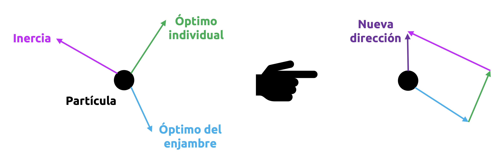
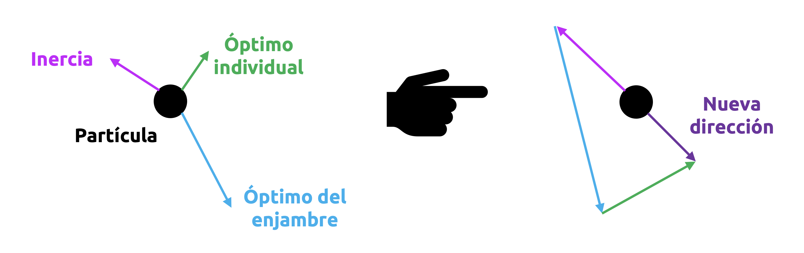
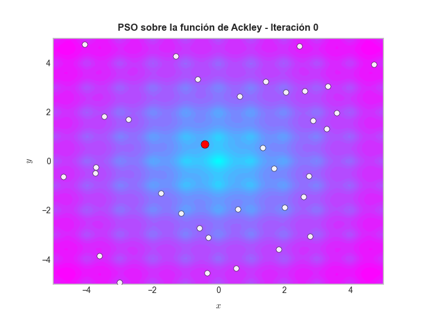
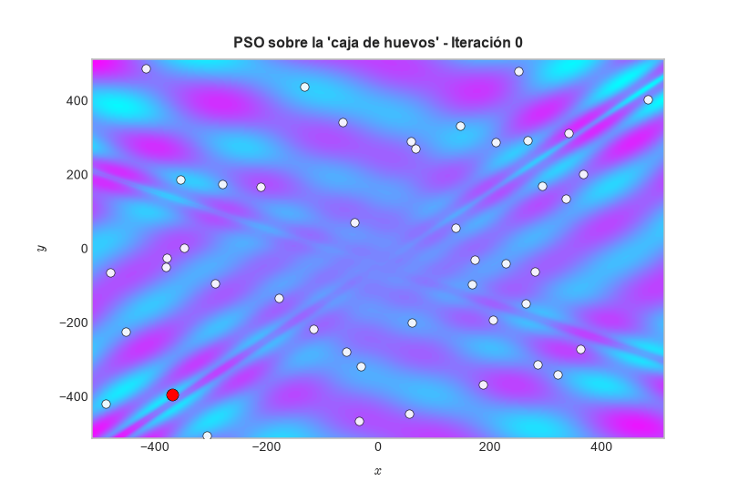

::: {.callout-important}
## Idea central

En optimización *black-box*, la función objetivo se conoce sólo a través de evaluaciones puntuales. No contamos, en general, con gradientes, Hessianas ni una estructura analítica aprovechable. En este contexto, el **problema del agente viajero** (*Traveling Salesperson Problem*, **TSP**) constituye uno de los ejemplos más emblemáticos y desafiantes, pues combina una función objetivo simple de evaluar con un espacio de búsqueda combinatorial que crece de manera explosiva.
:::

## Introducción

En varios problemas reales de optimización, la función objetivo no se presenta por medio de una expresión analítica cómoda, diferenciable y bien estructurada, como ocurre en muchos ejemplos clásicos de cálculo diferencial. En lugar de ello, sólo podemos consultar su valor para ciertos puntos del dominio, como si se tratara de una verdadera **caja negra**. En ese escenario, la función objetivo puede ser costosa de evaluar, puede depender de simulaciones, de un procedimiento experimental o incluso de una rutina computacional cuyo comportamiento interno desconocemos por completo.

Este tipo de problemas se conoce como **optimización black-box**. Matemáticamente, suelen escribirse en la forma

::: {.eq-scroll}
$$
\min_{x\in \mathcal{X}} f(x),
\tag{7.1}
$$
:::

donde $f$ es una función objetivo que sólo podemos evaluar, mientras que $\mathcal{X}$ es el espacio de búsqueda. A diferencia de la optimización continua clásica, aquí no siempre tiene sentido hablar de gradientes, convexidad o matrices Hessianas. En muchos casos, el dominio $\mathcal{X}$ ni siquiera es continuo. Puede consistir en permutaciones, combinaciones, secuencias o configuraciones discretas.

Uno de los problemas más representativos dentro de esta familia es el **problema del agente viajero**, conocido universalmente por su sigla inglesa **TSP**. Nos ocuparemos de describirlo en detalle, ya que será esencial para ilustrar algunos métodos numéricos que estudiaremos a continuación.

## El problema del agente viajero

El TSP puede formularse de manera muy simple. Dado un conjunto de $n$ ciudades, y una distancia conocida entre cada par de ellas, buscamos una ruta cerrada que:

1. Visite cada ciudad exactamente una vez.
2. Regrese a la ciudad de origen.
3. Minimice la distancia total recorrida.

Si denotamos las ciudades por $1,\dots,n$, y si $d_{ij}$ representa la distancia entre las ciudades $i$ y $j$, entonces una solución del TSP puede describirse como una permutación del tipo

::: {.eq-scroll}
$$
\pi = (\pi_{1},\pi_{2},\dots,\pi_{n}),
\tag{7.2}
$$
:::

donde $\pi_{k}$ indica la ciudad visitada en la posición $k$ de la ruta. La longitud total asociada a esa ruta es

::: {.eq-scroll}
$$
L(\pi)=\sum_{k=1}^{n-1} d_{\pi_{k}\pi_{k+1}} + d_{\pi_{n}\pi_{1}}.
\tag{7.3}
$$
:::

El problema consiste entonces en resolver

::: {.eq-scroll}
$$
\min_{\pi \in \mathfrak{S}_{n}} L(\pi),
\tag{7.4}
$$
:::

donde $\mathfrak{S}_{n}$ representa el conjunto de todas las permutaciones de $n$ elementos.

Desde la perspectiva de la optimización de tipo *black-box*, el TSP es especialmente interesante. En efecto, para una ruta dada $\pi$, calcular $L(\pi)$ es muy fácil: Basta sumar las distancias correspondientes. Sin embargo, el número de rutas posibles crece tan rápido con $n$ que una búsqueda exhaustiva se vuelve impracticable incluso para un número de ciudades relativamente pequeño. En otras palabras, el TSP no es difícil porque evaluar la función objetivo sea computacionalmente costoso, sino porque el **espacio de búsqueda es inmenso**. Además, dicho espacio es discreto, no convexo y altamente combinatorial. Por ello, el TSP es uno de los grandes referentes de la optimización de alta complejidad.

**Ejemplo 7.1 – Visualización de una instancia pequeña del TSP:** Consideremos una pequeña instancia euclidiana del TSP en el plano, donde cada ciudad está representada por un punto de $\mathbb{R}^{2}$. En la figura siguiente mostraremos el grafo completo inducido por las ciudades y, además, calcularemos por fuerza bruta la mejor ruta posible para un número pequeño de ciudades.

```{python}
import itertools
import matplotlib.pyplot as plt
import math
import numpy as np
import pandas as pd
import seaborn as sns
```

```{python}
# Parámetros gráficos generales.
plt.rcParams["figure.dpi"] = 90
sns.set_theme()
plt.style.use("bmh")
```

```{python}
# Coordenadas de una pequeña instancia del TSP.
coords = np.array([
    [0.10, 0.20],
    [0.90, 0.15],
    [1.25, 0.85],
    [0.85, 1.45],
    [0.15, 1.30],
    [0.55, 0.75],
    [1.55, 0.45],
    [1.45, 1.25]
])

n = coords.shape[0]
labels = [f"C{i+1}" for i in range(n)]

# Matriz de distancias euclidianas.
D = np.linalg.norm(coords[:, None, :] - coords[None, :, :], axis=2)
```

```{python}
# Resolución exacta por fuerza bruta para n pequeño.
# Fijamos la ciudad 0 como origen para eliminar simetrías por rotación.
best_length = np.inf
best_tour = None

for perm in itertools.permutations(range(1, n)):
    tour = (0,) + perm
    length = sum(D[tour[i], tour[i+1]] for i in range(n-1)) + D[tour[-1], tour[0]]
    if length < best_length:
        best_length = length
        best_tour = tour

best_tour, best_length
```

```{python}
#| label: fig-optimizacion-de-tipo-black-box-01
#| fig-cap: "Ejemplo de un TSP sencillo de 9 ciudades y su solución óptima."
# Visualización del grafo completo y de la ruta óptima.
fig, ax = plt.subplots(1, 2, figsize=(9, 5.5))

# Panel 1: grafo completo.
for i in range(n):
    for j in range(i + 1, n):
        ax[0].plot(
            [coords[i, 0], coords[j, 0]],
            [coords[i, 1], coords[j, 1]],
            color="gray",
            linewidth=0.8,
            alpha=0.35
        )

ax[0].scatter(coords[:, 0], coords[:, 1], s=70, color="black", zorder=10)

for i, lab in enumerate(labels):
    ax[0].text(coords[i, 0] + 0.03, coords[i, 1] + 0.03, lab, fontsize=11)

ax[0].set_title("Grafo completo de ciudades", fontsize=13, fontweight="bold", pad=10)
ax[0].set_xlabel(r"$x$", fontsize=12)
ax[0].set_ylabel(r"$y$", fontsize=12)
ax[0].set_aspect("equal")

# Panel 2: mejor ruta.
tour = list(best_tour) + [best_tour[0]]
for i in range(len(tour) - 1):
    a, b = tour[i], tour[i+1]
    ax[1].plot(
        [coords[a, 0], coords[b, 0]],
        [coords[a, 1], coords[b, 1]],
        color="crimson",
        linewidth=2.5
    )

ax[1].scatter(coords[:, 0], coords[:, 1], s=70, color="black", zorder=10)

for i, lab in enumerate(labels):
    ax[1].text(coords[i, 0] + 0.03, coords[i, 1] + 0.03, lab, fontsize=11)

ax[1].set_title(
    fr"Mejor ruta encontrada ($L(\pi)\approx {best_length:.3f}$)",
    fontsize=13,
    fontweight="bold",
    pad=10
)
ax[1].set_xlabel(r"$x$", fontsize=12)
ax[1].set_ylabel(r"$y$", fontsize=12)
ax[1].set_aspect("equal")

plt.tight_layout()
```

La figura anterior permite apreciar claramente la naturaleza combinatorial del problema. El grafo completo contiene todas las conexiones posibles entre ciudades, pero una solución factible del TSP corresponde sólo a un **ciclo Hamiltoniano**: Una ruta cerrada que visita exactamente una vez cada ciudad. Para una instancia pequeña, una búsqueda exhaustiva puede encontrar la mejor ruta. Sin embargo, este enfoque deja de ser realista cuando el número de ciudades aumenta.

## Complejidad combinatoria del TSP

Para entender la dificultad real del TSP, conviene contar cuántas rutas distintas habría que evaluar si intentáramos resolver el problema por fuerza bruta. Supongamos, por simplicidad, que el TSP es simétrico; es decir, que $d_{ij}=d_{ji}$. Si además fijamos la ciudad inicial para eliminar duplicidades por rotación, entonces el número de rutas distintas viene dado por

::: {.eq-scroll}
$$
N\left( n \right) =\frac{\left( n-1 \right) !}{2}
\tag{7.5}
$$
:::

La división por $2$ aparece porque, en el caso simétrico, recorrer una misma ruta en sentido horario o antihorario produce exactamente la misma solución.

La expresión (7.5) muestra que **el crecimiento del espacio de búsqueda en el TSP es factorial**. Esto significa que la complejidad aumenta muchísimo más rápido que una complejidad polinómica, exponencial simple o incluso algunas exponenciales más suaves.

Vamos a calcular estos valores para distintos números de ciudades y a traducirlos a tiempos de cómputo, suponiendo que fuésemos capaces de evaluar exactamente un millón de rutas por segundo:

```{python}
# Número de rutas distintas para el TSP simétrico.
def symmetric_tsp_tours(n):
    return math.factorial(n - 1) // 2

# Conversión de segundos a una escala legible.
def human_time(seconds):
    minute = 60
    hour = 60 * minute
    day = 24 * hour
    year = 365.25 * day

    if seconds < minute:
        return f"{seconds:.2f} s"
    elif seconds < hour:
        return f"{seconds / minute:.2f} min"
    elif seconds < day:
        return f"{seconds / hour:.2f} h"
    elif seconds < year:
        return f"{seconds / day:.2f} días"
    else:
        return f"{seconds / year:.2f} años"

speed = 1e+6  # rutas por segundo

ns = [5, 8, 10, 12, 15, 18, 20]
counts = [symmetric_tsp_tours(n) for n in ns]
times_seconds = [c / speed for c in counts]
times_human = [human_time(s) for s in times_seconds]

df = pd.DataFrame({
    "Número de ciudades": ns,
    "Rutas distintas (TSP simétrico)": counts,
    "Tiempo a 10^6 rutas/s": times_human
})

df
```

```{python}
#| label: fig-optimizacion-de-tipo-black-box-02
#| fig-cap: "Crecimiento del espacio de búsqueda."
# Curvas de crecimiento del número de rutas y del tiempo de enumeración.
ns_full = np.arange(3, 21)
counts_full = np.array([symmetric_tsp_tours(int(n)) for n in ns_full], dtype=float)
years_full = counts_full / speed / (60 * 60 * 24 * 365.25)

fig, ax = plt.subplots(1, 2, figsize=(9, 4.8))

# Número de rutas.
ax[0].plot(ns_full, counts_full, linewidth=2)
ax[0].set_yscale("log")
ax[0].set_xlabel("Número de ciudades", fontsize=12)
ax[0].set_ylabel("Número de rutas distintas", fontsize=12)
ax[0].set_title("Crecimiento del espacio de búsqueda", fontsize=13, fontweight="bold", pad=10)

# Tiempo estimado a un millón de evaluaciones por segundo.
ax[1].plot(ns_full, years_full, linewidth=2)
ax[1].set_yscale("log")
ax[1].set_xlabel("Número de ciudades", fontsize=12)
ax[1].set_ylabel("Tiempo estimado (años)", fontsize=12)
ax[1].set_title(r"Tiempo de enumeración a $10^{6}$ rutas", fontsize=13, fontweight="bold", pad=10)

plt.tight_layout()
```

Los resultados anteriores muestran con claridad que la dificultad del TSP no se manifiesta recién en instancias gigantescas. Incluso para números de ciudades que, a simple vista, no parecen particularmente grandes, la enumeración exhaustiva deja de ser razonable. Por ejemplo:

- Con $10$ ciudades, todavía es posible revisar todas las rutas.
- Con $15$ ciudades, el número de posibilidades ya es enorme.
- Con $20$ ciudades, la búsqueda exhaustiva requiere tiempos completamente impracticables.

Desde el punto de vista de complejidad computacional, el TSP pertenece a la familia de los problemas más difíciles de la optimización combinatorial. Más precisamente, su versión de optimización es un problema **NP-hard**, mientras que su versión de decisión es **NP-complete**. Ello explica por qué, en la práctica, los enfoques exactos sólo funcionan para tamaños pequeños o moderados, o bien requieren técnicas muy sofisticadas.

## Algoritmos evolutivos

Una vez que aceptamos que, en un problema de optimización de tipo *black-box*, la función objetivo puede ser costosa de evaluar, no diferenciable, ruidosa o definida sobre espacios discretos muy grandes, surge una pregunta natural: ¿Cómo buscar buenas soluciones cuando no contamos con gradientes ni con una estructura analítica que podamos explotar directamente?

Una de las respuestas más influyentes a esta pregunta está dada por los **algoritmos evolutivos**. Se trata de una familia de métodos de optimización inspirados, de manera bastante general, en los mecanismos básicos de la evolución biológica, llámese variación, selección y supervivencia. La idea central es sencilla. En lugar de trabajar con una sola solución candidata, como ocurre en muchos métodos clásicos y en muchas heurísticas populares de búsqueda, un algoritmo evolutivo mantiene una **población** de soluciones. Cada individuo de esta población representa una solución posible del problema. Luego, generación tras generación, el algoritmo:

1. Evalúa la calidad de cada individuo por medio de la función objetivo.
2. Favorece a los individuos con mejor desempeño.
3. Genera nuevas soluciones a partir de los individuos actuales.
4. Reemplaza parte o toda la población anterior por una nueva población.

De esta manera, la población *“evoluciona”* progresivamente hacia regiones del espacio de búsqueda donde aparecen soluciones de mejor calidad. Hemos motivado pues la siguiente definición.

**<font color='blue'>Definición 7.1 – Algoritmo evolutivo:</font>** Un **algoritmo evolutivo** es un método de optimización estocástico, iterativo y basado en poblaciones, que genera nuevas soluciones mediante operadores de variación y selecciona preferentemente aquellas con mejor aptitud (del inglés *fitness*) de acuerdo con la función objetivo del problema.

Aunque la inspiración biológica ayuda a entender la intuición general del método, conviene no exagerar la analogía. Un algoritmo evolutivo no pretende modelar fielmente un proceso biológico real. Más bien, toma algunas ideas abstractas de la evolución natural y las convierte en mecanismos computacionales para explorar espacios de búsqueda complejos. Esto lo veremos en detalle al estudiar algunos ejemplos.

### Componentes básicos

Aunque existen muchas variantes de algoritmos evolutivos, la gran mayoría comparte una misma estructura conceptual. Más aún, una forma muy útil de entender estas técnicas consiste en descomponerlas en una serie de **componentes fundamentales**, cada uno de los cuales cumple una función específica dentro del proceso de búsqueda.

La idea general sigue siendo la misma: Mantenemos una población de soluciones, las evaluamos, seleccionamos las más prometedoras, generamos nuevos individuos a partir de ellas y repetimos este procedimiento hasta alcanzar algún criterio de término. Sin embargo, la calidad final del algoritmo depende fuertemente de cómo se implementa cada uno de esos pasos.

A continuación presentaremos estos componentes de manera ordenada.

#### Representación de los individuos

Todo algoritmo evolutivo necesita, antes que cualquier otra cosa, una forma de **codificar** las soluciones candidatas del problema. Esta codificación recibe habitualmente el nombre de **genotipo**, mientras que la solución efectiva que representa puede interpretarse como el **fenotipo** correspondiente. Estos son términos adoptados directivamente desde la biología.

**<font color='blue'>Definición 7.2 – Representación:</font>** La **representación** de un individuo es la estructura de datos mediante la cual una solución candidata queda codificada dentro del algoritmo evolutivo.

La elección de la representación es uno de los aspectos más importantes del diseño del algoritmo, porque condiciona directamente la forma de los operadores de mutación y recombinación. Entre las representaciones más comunes encontramos cadenas binarias, vectores (reales y/o enteros), permutaciones, árboles sintácticos, grafos e, incluso, estructuras más generales.

Por ejemplo, en un problema continuo de optimización numérica (vale decir, definido sobre un conjunto de infinitas soluciones factibles, no necesariamente numerables) tiene sentido representar cada individuo como un vector real

::: {.eq-scroll}
$$
\mathbf{x}=\left( x_{1},x_{2},\dots,x_{d}\right) \in \mathbb{R}^{d},
\tag{7.6}
$$
:::

Mientras que, en un problema como el TSP, la representación natural de una solución es una permutación

::: {.eq-scroll}
$$
\pi =(\pi_{1},\pi_{2},\dots,\pi_{n}),
\tag{7.7}
$$
:::

ya que una ruta es justamente un ordenamiento de las ciudades.

No toda representación es adecuada para todo problema. Una buena representación debe facilitar, al mismo tiempo, tres cosas: La generación de individuos factibles, la aplicación de operadores de variación razonables y la interpretación de la calidad de las soluciones.

#### Población inicial

Una vez definida la representación, el algoritmo debe construir una primera colección de soluciones candidatas. Esta colección recibe el nombre de **población inicial**, y cumple un papel similar al de las soluciones iniciales en estrategias de búsqueda más clásicas.

**<font color='blue'>Definición 7.3 – Población:</font>** Una **población** en la generación $t$ es un conjunto finito de individuos

::: {.eq-scroll}
$$
P^{(t)}=\left\{ \mathbf{x}_{1}^{(t)},\mathbf{x}_{2}^{(t)},\dots,\mathbf{x}_{N}^{(t)}\right\},
\tag{7.8}
$$
:::

donde $N$ es el tamaño de la población.

La población inicial, denotada por $P^{(0)}$, suele generarse aleatoriamente. Esta estrategia tiene la ventaja de cubrir diversas regiones del espacio de búsqueda de forma homogénea y evita introducir sesgos demasiado fuertes desde el inicio. No obstante, en algunos problemas también puede ser útil iniciar la búsqueda con soluciones heurísticas, o con una mezcla entre soluciones aleatorias y soluciones construidas por alguna regla simple.

El tamaño de la población es un parámetro importante. Si la población es demasiado pequeña, la diversidad desaparece rápidamente y el algoritmo corre el riesgo de estancarse en soluciones relativamente pobres en calidad. Si es demasiado grande, el costo computacional de cada generación puede volverse innecesariamente alto.

#### Función de aptitud

Una vez generados los individuos, debemos evaluar qué tan buenos son. Para ello, el algoritmo utiliza una función de evaluación llamada **función de aptitud** o **fitness**.

**<font color='blue'>Definición 7.4 – Aptitud:</font>** La **aptitud** de un individuo es un valor escalar que cuantifica la calidad de la solución que dicho individuo representa.

En un problema de minimización, la aptitud puede construirse directamente a partir de la función objetivo $f$, o bien mediante alguna transformación de la misma. Por ejemplo, si queremos minimizar $f$, podríamos utilizar una aptitud del tipo

::: {.eq-scroll}
$$
\mathrm{fit}(\mathbf{x})=\frac{1}{1+f(\mathbf{x})},
\tag{7.9}
$$
:::

siempre que $f(\mathbf{x})\geq 0$, o alguna variante equivalente. En la práctica, muchas implementaciones simplemente trabajan con la función objetivo misma, interpretando que “menor valor” significa “mejor individuo”.

En problemas restringidos, la evaluación de la aptitud puede requerir además algún tratamiento especial de las restricciones. Algunas opciones habituales son penalizar individuos inviables, "reparar" individuos para volverlos factibles, o utilizar reglas de comparación que favorezcan factibilidad antes que calidad objetiva.

Este punto es particularmente importante en optimización combinatorial, donde generar individuos inválidos puede ser muy frecuente si los operadores no están bien diseñados.

#### Selección

Una vez evaluada la población, el algoritmo debe decidir qué individuos tendrán mayor influencia en la generación siguiente. Ese proceso se denomina **selección**.

**<font color='blue'>Definición 7.5 – Selección:</font>** La **selección** es el mecanismo mediante el cual un algoritmo evolutivo asigna preferencia reproductiva o preferencia de supervivencia a ciertos individuos de la población, en función de su aptitud.

La presión selectiva es una idea central de este proceso. Si la selección favorece demasiado a los mejores individuos, la población puede perder diversidad muy rápido. Si, por el contrario, la selección es demasiado débil, el progreso o convergencia del algoritmo puede volverse muy lento.

Entre los mecanismos de selección más comunes se encuentran los siguientes:

- **Selección por ruleta:** La probabilidad de elegir un individuo es proporcional a su aptitud.
- **Selección por ranking:** Los individuos se ordenan y se asignan probabilidades según su posición relativa, en lugar de usar directamente el valor de aptitud.
- **Selección por torneo:** Se escoge al azar un pequeño subconjunto de individuos y se selecciona el mejor de ese grupo.
- **Selección elitista:** Algunos de los mejores individuos pasan directamente a la siguiente generación sin modificaciones.

La selección por torneo es especialmente popular porque es simple, eficiente y permite controlar fácilmente la presión selectiva por medio del tamaño del torneo.

#### Variación: Mutación y recombinación

La selección por sí sola no basta. Si sólo seleccionáramos repetidamente a los mejores individuos sin introducir cambios, la población se volvería rápidamente homogénea y el algoritmo dejaría de explorar nuevas soluciones en un espacio de búsqueda. Por eso son necesarios los llamados **operadores de variación**.

**<font color='blue'>Definición 7.6 – Operadores de variación:</font>** Los **operadores de variación** son reglas que, a partir de uno o más individuos existentes, generan nuevos individuos modificando su representación.

Los dos operadores de variación más importantes son la recombinación y la mutación.

La **recombinación**, también llamada *crossover*, combina información de dos o más individuos padres para producir descendientes. La idea de esta operación es que dos soluciones buenas pueden contener “bloques” útiles de información, y que al mezclarlos podríamos obtener una solución todavía mejor. En representaciones binarias o reales, esta mezcla suele hacerse intercambiando segmentos del genotipo. En permutaciones, la situación es más delicada, porque un *crossover* "ingenuo" puede producir individuos inválidos.

En términos generales, si $\mathbf{x}^{(1)}$ y $\mathbf{x}^{(2)}$ son dos padres, la recombinación produce uno o más descendientes del tipo

::: {.eq-scroll}
$$
\mathbf{y} =\mathcal{R}\left( \mathbf{x}^{(1)},\mathbf{x}^{(2)}\right),
\tag{7.10}
$$
:::

donde $\mathcal{R}$ representa el **operador de recombinación** utilizado.

Entre los esquemas más comunes de recombinación encontramos los llamados *one-point crossovers*, *two-point crossovers*, operadores de recombinación uniforme, operadores específicos para permutaciones y recombinación aritmética para vectores reales.

La **mutación**, por otro lado, introduce cambios aleatorios sobre un individuo. Su misión principal es mantener diversidad y explorar nuevas regiones del espacio de búsqueda. Si $\mathbf{x}$ es un individuo, una mutación puede representarse de manera abstracta como

::: {.eq-scroll}
$$
\mathbf{y}=\mathcal{M}\left( \mathbf{x}\right),
\tag{7.11}
$$
:::

donde $\mathcal{M}$ es el **operador de mutación**.

En representaciones binarias, mutar suele significar invertir uno o varios bits de información. En vectores reales, puede consistir en añadir una perturbación aleatoria. En permutaciones, la mutación puede intercambiar dos posiciones, invertir un subsector o desplazar un bloque.

La mutación cumple un papel especialmente importante en los algoritmos evolutivos, porque evita que éstos dependan exclusivamente del material genético ya presente en la población. Sin mutación, un algoritmo podría perder capacidad de innovación y quedarse atrapado en una región demasiado pequeña del espacio de búsqueda.

#### Generación de descendencia

La aplicación repetida de los operadores de selección y variación permite generar una nueva colección de individuos, llamada **descendencia**.

En muchos algoritmos evolutivos, este proceso ocurre mediante una secuencia del tipo:

1. Seleccionar padres.
2. Aplicar recombinación con cierta probabilidad.
3. Aplicar mutación con cierta probabilidad.
4. Obtener uno o más descendientes.

La descendencia puede denotarse por

::: {.eq-scroll}
$$
Q^{(t)}=\left\{ \mathbf{y}_{1}^{(t)},\mathbf{y}_{2}^{(t)},\dots,\mathbf{y}_{M}^{(t)}\right\},
\tag{7.12}
$$
:::

donde $M$ es el número de descendientes generados en la generación $t$.

Dependiendo del algoritmo, $M$ puede coincidir con el tamaño de la población $N$, o ser distinto de él.

#### Reemplazo y supervivencia

Una vez construida la descendencia, el algoritmo debe decidir cómo formar la nueva población. Este paso se conoce como **reemplazo** o **supervivencia**.

**<font color='blue'>Definición 7.7 – Reemplazo:</font>** El **reemplazo** es el mecanismo mediante el cual se construye la población $P^{(t+1)}$ a partir de la población actual $P^{(t)}$, de la descendencia $Q^{(t)}$, o de una combinación de ambas.

Existen varias estrategias de reemplazo. Entre las más habituales están:

- **Reemplazo generacional completo**, donde toda la población anterior es sustituida por descendientes.
- **Reemplazo elitista**, donde algunos de los mejores individuos sobreviven de manera garantizada.
- **Selección $(\mu,\lambda)$**, típica de estrategias evolutivas, donde sólo los descendientes compiten por sobrevivir.
- **Selección $(\mu+\lambda)$**, también típica de estrategias evolutivas, donde padres y descendientes compiten juntos.

El reemplazo determina el equilibrio entre exploración y explotación. Un reemplazo muy agresivo puede destruir soluciones valiosas demasiado pronto. Un reemplazo demasiado conservador puede frenar la aparición de nuevas soluciones interesantes.

#### Diversidad poblacional

Aunque muchas veces no aparece como un componente separado en la descripción más básica del algoritmo, la **diversidad** de la población es un aspecto crucial de todo método evolutivo. Si todos los individuos de la población se parecen demasiado entre sí, el algoritmo corre el riesgo de caer en una **convergencia prematura**. En ese caso, la población se concentra demasiado rápido alrededor de una región del espacio de búsqueda que puede no contener la mejor solución global.

Por esta razón, muchos algoritmos incorporan mecanismos explícitos o implícitos para preservar diversidad. Entre ellos encontramos tasas de mutación adecuadas, selección moderada, niching y sharing, reinicialización parcial de la población, estructuras de subpoblaciones y estrategias adaptativas de variación.

La diversidad no es un lujo adicional, sino un componente esencial del comportamiento global del algoritmo.

#### Hiperparámetros del algoritmo

Todo algoritmo evolutivo posee una serie de **hiperparámetros** cuyo ajuste influye fuertemente en su desempeño. Entre los más importantes se encuentran:

- Tamaño de la población.
- Probabilidad de recombinación.
- Probabilidad de mutación.
- Factor, intensidad o escala de la mutación.
- Tamaño del torneo, si se usa selección por torneo.
- Proporción de elitismo.
- Número máximo de generaciones o evaluaciones.

En términos prácticos, la elección de estos parámetros es parte integral del diseño del algoritmo. No existe una configuración universal óptima para todos los problemas, y por ello la calibración de estos métodos suele requerir experiencia, experimentación o estrategias adaptativas.

#### Condición de término

Por último, todo algoritmo evolutivo necesita una regla que indique cuándo detener la búsqueda.

**<font color='blue'>Definición 7.8 – Criterio de término:</font>** El **criterio de término** es la condición lógica que determina el instante en que el algoritmo deja de iterar y devuelve la mejor solución encontrada.

Entre los criterios de término más frecuentes están:

- Alcanzar un número máximo de generaciones.
- Alcanzar un número máximo de evaluaciones de la función objetivo.
- No observar mejoras relevantes durante cierto número de iteraciones.
- Alcanzar un valor objetivo deseado.
- Exceder un tiempo máximo de ejecución.

En problemas de optimización de tipo *black-box*, donde las evaluaciones pueden ser costosas, es especialmente habitual usar como criterio principal el número total de evaluaciones de la función objetivo.

### Estructura general

Una vez descritos todos sus componentes, podemos condensar la lógica general de un algoritmo evolutivo en el siguiente esquema.

::: {.callout-tip}
## Esquema general de un algoritmo evolutivo
Sea $P^{(0)}$ una población inicial. Para $t=0,1,2,\dots$, repetir:

1. Evaluar la aptitud de los individuos de $P^{(t)}$.
2. Seleccionar uno o más subconjuntos de padres.
3. Generar descendencia $Q^{(t)}$ por recombinación y/o mutación.
4. Evaluar la descendencia generada.
5. Construir la nueva población $P^{(t+1)}$ mediante una regla de reemplazo.
6. Verificar el criterio de término.

Al finalizar, retornar el mejor individuo encontrado durante todo el proceso.
:::

Este esquema deja ver con claridad que los algoritmos evolutivos no son un único método, sino una **plantilla general de diseño** (o, como dicen nuestros colegas norteamericanos, una especie de *blueprint*). Lo que diferencia a una familia de otra no es la estructura global del procedimiento, sino la forma concreta en que se implementan sus componentes: Representación, selección, variación, reemplazo y adaptación.

La fortaleza de los algoritmos evolutivos radica en su gran flexibilidad. Pueden adaptarse a dominios continuos, discretos, combinatoriales o estructurados. Pueden operar con o sin restricciones explícitas. Pueden combinarse con búsqueda local, simulación, modelos probabilísticos o técnicas de aprendizaje automático.

Sin embargo, esta flexibilidad tiene un costo: Diseñar un buen algoritmo evolutivo no consiste simplemente en “aplicar mutación y recombinación”, sino en construir una interacción equilibrada entre todos los componentes que acabamos de describir. De hecho, buena parte del éxito o fracaso de un algoritmo evolutivo depende no del paradigma general, sino del modo concreto en que estos componentes se instancian para el problema de interés.

**Ejemplo 7.2 – Un primer algoritmo evolutivo para el TSP:** Como adelantamos previamente, el TSP puede formularse como un problema de optimización sobre el conjunto de todas las permutaciones de $n$ ciudades. Si el problema es simétrico, y fijamos una ciudad de origen para eliminar duplicidades por rotación, entonces el número de rutas distintas viene dado por $\frac{(n-1)!}{2}$. Para $n=60$, esto significa que habría que examinar $\frac{59!}{2}$ rutas distintas. En consecuencia, incluso para un número de ciudades que no parece particularmente grande, la búsqueda exhaustiva deja de ser una estrategia razonable (de hecho, ni siquiera la edad del universo nos bastaría para resolver computacionalmente este problema de manera exhaustiva).

Por esta razón, procederemos por medio de un algoritmo evolutivo. En este contexto, cada individuo de la población será una permutación de las ciudades, y la aptitud de cada individuo estará determinada por la longitud total de la ruta correspondiente. El algoritmo que construiremos a continuación utiliza los siguientes ingredientes: Una población inicial aleatoria, selección por torneo, una estrategia de recombinación de tipo **ordered crossover** (comúnmente denotada como **OX**), una estrategia de mutación por intercambio de dos posiciones y elitismo para preservar las mejores soluciones.

No pretendemos aún obtener un método de última generación para el TSP, sino mostrar de manera introductoria cómo un algoritmo evolutivo puede explorar el espacio de rutas y converger progresivamente hacia soluciones de buena calidad en un problema cuyo espacio búsqueda es inmensamente grande.

Trabajaremos con una instancia plana del TSP, donde cada ciudad queda representada por un punto del plano $XY$. Para que el ejercicio sea completamente reproducible, fijaremos una semilla aleatoria.

```{python}
from pathlib import Path
from matplotlib.animation import FuncAnimation, PillowWriter
from IPython.display import Image, display
```

```{python}
# Definimos una semilla aleatoria fija.
rng = np.random.default_rng(42)

# Definimos el número de ciudades.
n_cities = 60

# Y establecemos coordenadas euclidianas de las ciudades en el plano.
coords = rng.uniform(0, 100, size=(n_cities, 2))

# Etiquetamos las ciudades.
labels = [f"C{i+1}" for i in range(n_cities)]

# Y construimos una matriz de distancias euclidianas.
dist_matrix = np.linalg.norm(
    coords[:, None, :] - coords[None, :, :], axis=2,
)
```

A continuación, visualizaremos la localización espacial de las ciudades en el plano:

```{python}
#| label: fig-optimizacion-de-tipo-black-box-03
#| fig-cap: "Instancia euclidiana del TSP con 60 ciudades."
# Gráfico que muestra la ubicación de las ciudades.
fig, ax = plt.subplots(figsize=(9, 6))

ax.scatter(coords[:, 0], coords[:, 1], s=65, color="firebrick", zorder=10)

for i, lab in enumerate(labels):
    ax.text(coords[i, 0] + 1.2, coords[i, 1] + 1.2, lab, fontsize=10)

ax.set_xlabel(r"$x$", fontsize=12, labelpad=10)
ax.set_ylabel(r"$y$", fontsize=12, labelpad=10)
plt.tight_layout()
```

Cada individuo en nuestro algoritmo será una permutación $\pi=(\pi_{1},...,\pi_{60})$ que describe el orden de visita de las ciudades. La longitud total de una ruta redonda $\pi$ se calcula entonces como

::: {.eq-scroll}
$$
L\left( \pi \right) =\sum_{k=1}^{59} d_{\pi_{k} \pi_{k+1}}+d_{\pi_{60} \pi_{1}}
\tag{7.13}
$$
:::

donde el último término se añade para garantizar el retorno a al ciudad inicial. De esta manera, implementamos este cálculo en Python como sigue:

```{python}
def route_length(route, D):
    """
    Calcula la longitud de una ruta cerrada.
    """
    return sum(
        D[route[i], route[i+1]] for i in range(len(route) - 1)
    ) + D[route[-1], route[0]]
```

Construiremos ahora, desde cero, los componentes más importantes del algoritmo evolutivo:

```{python}
def initialize_population(pop_size, n, rng):
    """
    Genera una población inicial aleatoria de permutaciones.
    """
    population = []
    base = np.arange(n)

    for _ in range(pop_size):
        individual = rng.permutation(base)
        population.append(individual)
    
    return population
```

Esta función permite construir la **población inicial** de nuestro algoritmo evolutivo. La idea es simple: Si hay $n$ ciudades, una solución del TSP es una permutación de $\left\{ 0,1,...,n-1 \right\}$. De esta manera, la función `initialize_population()` genera `pop_size` permutaciones aleatorias distintas y las almacena en una lista que denominamos internamente como `population`.

```{python}
def tournament_selection(population, fitness, k, rng):
    """
    Implementación de una selección por torneo. Como el problema es de
    minimización, seguimos una lógica del tipo `the lower, the better`.
    """
    idx = rng.choice(len(population), size=k, replace=False)
    best_idx = idx[np.argmin([fitness[i] for i in idx])]

    return population[best_idx].copy()
```

Esta función elige un individuo de la población usando una **selección por torneo**, eligiendo al azar `k` individuos de la población y retornando el que tenga la mejor aptitud, que, en el contexto del TSP, equivale a la ruta más corta entre dos ciudades.

```{python}
def ordered_crossover(parent1, parent2, rng):
    """
    Implementamos una estrategia de recombinación del tipo OX,
    que resulta apropiado para permutaciones.
    """
    n = len(parent1)
    a, b = sorted(rng.choice(n, size=2, replace=False))

    child = -np.ones(n, dtype=int)
    child[a:b+1] = parent1[a:b+1]

    remaining = [gene_k for gene_k in parent2 if gene_k not in child]

    fill_pos = [i for i in range(n) if child[i] == -1]

    for pos, gene in zip(fill_pos, remaining):
        child[pos] = gene

    return child
```

Esta función aplica una estrategia de recombinación de tipo *OX* para combinar dos rutas padres y producir un *hijo* válido, preservando un bloque del primer padre y completando el resto con el orden relativo del segundo.

```{python}
def swap_mutation(individual, mutation_rate, rng):
    """
    Implementamos una estrategia de mutación por intercambio de
    dos posiciones.
    """
    mutant = individual.copy()
    if rng.random() < mutation_rate:
        i, j = rng.choice(len(mutant), size=2, replace=False)
        mutant[i], mutant[j] = mutant[j], mutant[i]
    
    return mutant
```

Esta función realiza una mutación por intercambio, que con cierta probabilidad selecciona dos posiciones de la ruta y las permuta, introduciendo variación sin invalidar la permutación. Dicha probabilidad se fija por medio de un factor denominado `mutation_rate`.

A continuación definimos nuestro algoritmo de solución, el cual documentaremos para mayor claridad:

```{python}
def evolutionary_tsp(
    coords,
    D,
    pop_size=250,
    n_generations=250,
    tournament_k=4,
    crossover_rate=0.90,
    mutation_rate=0.25,
    elite_size=4,
    rng=None
):
    """
    Resuelve una instancia euclidiana del TSP mediante un algoritmo evolutivo simple.

    Parámetros:
    -----------
    coords : Arreglo de Numpy que representa las coordenadas de las ciudades. Sólo se usa
    para inferir cuántas ciudades tiene el problema.
    D : Arreglo de Numpy que describe la matriz de distancias entre ciudades.
    pop_size : Número entero que describe el tamaño de la población.
    n_generations : Número total de generaciones que recorrerá el algoritmo.
    tournament_k : Tamaño del torneo usado en la selección de padres.
    crossover_rate : Probabilidad de aplicar recombinación entre dos padres.
    mutation_rate : Probabilidad de aplicar mutación a cada descendiente.
    elite_size : Número de mejores individuos que sobreviven intactos a la siguiente
    generación.
    rng : Generador aleatorio. Si no se entrega, se crea uno con semilla fija. Se usa
    para asegurar la reproducibilidad de los resultados obtenidos mediante el algoritmo.

    Retorna:
    --------
    Diccionario de Python con el historial de mejores rutas por generación, la mejor ruta
    acumulada y la mejor solución global encontrada.
    """
    # Si no se entrega un generador aleatorio, creamos uno por defecto.
    # Esto permite reproducibilidad del experimento.
    if rng is None:
        rng = np.random.default_rng(0)

    # Número de ciudades del problema.
    n = len(coords)

    # Construcción de la población inicial.
    # Cada individuo es una permutación de las ciudades, es decir, una ruta válida.
    population = initialize_population(pop_size, n, rng)

    # Historial de la mejor ruta observada dentro de cada generación.
    generation_best_routes = []
    generation_best_lengths = []

    # Historial de la mejor ruta acumulada hasta cada generación.
    best_so_far_routes = []
    best_so_far_lengths = []

    # Inicializamos la mejor solución global encontrada por el algoritmo.
    global_best_route = None
    global_best_length = np.inf

    # Loop principal del algoritmo. Cada iteración corresponde a una generación.
    for gen in range(n_generations):

        # Evaluamos todos los individuos de la población actual.
        # El valor de aptitud corresponde a la longitud total de cada ruta.
        lengths = [route_length(ind, D) for ind in population]

        # Ordenamos los individuos de mejor a peor.
        # Como el problema es de minimización, rutas más cortas son mejores.
        order = np.argsort(lengths)

        # ------------------------------------------
        # 1. Mejor individuo de la generación actual
        # ------------------------------------------
        # El primer índice del ordenamiento corresponde al individuo más apto.
        gen_best_route = population[order[0]].copy()
        gen_best_length = lengths[order[0]]

        # Guardamos este mejor individuo de la generación en el historial.
        generation_best_routes.append(gen_best_route.copy())
        generation_best_lengths.append(gen_best_length)

        # --------------------------------------------
        # 2. Actualización de la mejor solución global
        # --------------------------------------------
        # Si la mejor ruta de esta generación mejora la mejor conocida hasta ahora,
        # actualizamos el óptimo global del algoritmo.
        if gen_best_length < global_best_length:
            global_best_length = gen_best_length
            global_best_route = gen_best_route.copy()

        # Guardamos también el mejor valor acumulado hasta esta generación.
        best_so_far_routes.append(global_best_route.copy())
        best_so_far_lengths.append(global_best_length)

        # -----------
        # 3. Elitismo
        # -----------
        # Copiamos directamente a la nueva población los elite_size mejores individuos.
        # Esto garantiza que las mejores soluciones no se pierdan por azar durante
        # la recombinación o la mutación.
        new_population = [population[i].copy() for i in order[:elite_size]]

        # -----------------------------
        # 4. Generación de descendencia
        # -----------------------------
        # Completamos la nueva población hasta alcanzar pop_size individuos.
        while len(new_population) < pop_size:

            # Seleccionamos dos padres por torneo.
            # Cada padre se obtiene haciendo competir a tournament_k individuos
            # elegidos al azar y quedándonos con el mejor.
            parent1 = tournament_selection(population, lengths, tournament_k, rng)
            parent2 = tournament_selection(population, lengths, tournament_k, rng)

            # Con probabilidad `crossover_rate`, aplicamos recombinación tipo OX.
            # Si no se aplica crossover, el descendiente es simplemente una copia
            # del primer padre.
            if rng.random() < crossover_rate:
                child = ordered_crossover(parent1, parent2, rng)
            else:
                child = parent1.copy()

            # Aplicamos mutación por intercambio con probabilidad `mutation_rate`.
            # Esta operación introduce diversidad sin invalidar la permutación.
            child = swap_mutation(child, mutation_rate, rng)

            # Agregamos el descendiente a la nueva población.
            new_population.append(child)

        # -------------------------
        # 5. Reemplazo generacional
        # -------------------------
        # La población de la siguiente generación pasa a ser la población recién creada.
        population = new_population

    # Al finalizar el proceso evolutivo, devolvemos un diccionario con la solución óptima
    # encontrada, el mejor individuo de cada generación y el mejor individuo acumulado de
    # cada generación.
    return {
        "generation_best_routes": generation_best_routes,
        "generation_best_lengths": generation_best_lengths,
        "best_so_far_routes": best_so_far_routes,
        "best_so_far_lengths": best_so_far_lengths,
        "global_best_route": global_best_route,
        "global_best_length": global_best_length
    }
```

Y ya estamos preparados para resolver nuestro TSP:

```{python}
# Implementamos nuestro algoritmo
result = evolutionary_tsp(
    coords=coords,
    D=dist_matrix,
    pop_size=250,
    n_generations=250,
    tournament_k=4,
    crossover_rate=0.90,
    mutation_rate=0.25,
    elite_size=4,
    rng=np.random.default_rng(2025)
)

# Extraemos la mejor ruta y su longitud.
best_route = result["global_best_route"]
best_length = result["global_best_length"]

# Mostramos en pantalla dicha longitud.
print("Longitud de la mejor ruta encontrada:", best_length)
```

A continuación visualizaremos la mejor ruta encontrada por medio de nuestro algoritmo evolutivo:

```{python}
# Construimos una función sencilla para ayudarnos a visualizar un recorrido en el TSP.
def plot_tour(ax, coords, route, color="crimson", linewidth=2.5, alpha=1.0, linestyle="-"):
    closed_route = list(route) + [route[0]]

    for i in range(len(closed_route) - 1):
        a, b = closed_route[i], closed_route[i+1]
        ax.plot(
            [coords[a, 0], coords[b, 0]],
            [coords[a, 1], coords[b, 1]],
            color=color,
            linewidth=linewidth,
            alpha=alpha,
            linestyle=linestyle
        )
```

```{python}
#| label: fig-optimizacion-de-tipo-black-box-04
#| fig-cap: "La mejor ruta encontrada por el algoritmo."
# Graficamos la mejor ruta encontrada por el algoritmo.
fig, ax = plt.subplots(figsize=(9, 7))

plot_tour(ax, coords, best_route, color="crimson", linewidth=2.8)
ax.scatter(coords[:, 0], coords[:, 1], s=65, color="black", zorder=10)

for i, lab in enumerate(labels):
    ax.text(coords[i, 0] + 1.2, coords[i, 1] + 1.2, lab, fontsize=10)

ax.set_title(
    fr"Mejor ruta encontrada por el algoritmo evolutivo ($L(\pi)\approx {best_length:.2f}$)",
    fontsize=13,
    fontweight="bold",
    pad=10
)
ax.set_xlabel(r"$x$", fontsize=12, labelpad=10)
ax.set_ylabel(r"$y$", fontsize=12, labelpad=10)
plt.tight_layout()
```

Aunque no podemos garantizar que esta ruta sea la óptima global, sí podemos observar que el algoritmo ha conseguido una solución estructurada y considerablemente mejor que una ruta aleatoria cualquiera.

También es útil observar cómo evoluciona la mejor longitud encontrada a medida que avanzan las generaciones:

```{python}
#| label: fig-optimizacion-de-tipo-black-box-05
#| fig-cap: "Convergencia del algoritmo evolutivo."
# Visualizamos la convergencia del algoritmo evolutivo.
fig, ax = plt.subplots(figsize=(9, 5))

ax.plot(
    result["generation_best_lengths"],
    linewidth=1.5,
    alpha=0.6,
    label="Mejor ruta de la generación"
)

ax.plot(
    result["best_so_far_lengths"],
    linewidth=2.5,
    label="Mejor ruta acumulada"
)

ax.set_xlabel("Generación", fontsize=12, labelpad=10)
ax.set_ylabel("Longitud de la ruta", fontsize=12, labelpad=10)
ax.legend(frameon=True, fontsize=9)
plt.tight_layout()
```

La curva anterior permite distinguir dos comportamientos. La serie correspondiente a la mejor ruta de cada generación puede oscilar, ya que no todas las generaciones mejoran efectivamente la mejor solución disponible hasta ese momento. En cambio, la mejor ruta acumulada es monótonamente no creciente, lo que refleja la naturaleza elitista del algoritmo evolutivo que hemos implementado.

Finalmente, construiremos una animación que muestre cómo el algoritmo va explorando nuevas soluciones y convergiendo progresivamente hacia la mejor ruta observada. En cada frame:

- La ruta gris punteada representa la mejor solución de la generación actual.
- La ruta roja representa la mejor solución acumulada hasta ese momento.

Tenemos entonces:

```{python}
# Directorio donde guardaremos la animación.
out_dir = Path("media")
out_dir.mkdir(exist_ok=True)

gif_path = out_dir / "tsp_evolutivo_n60.gif"
```

```{python}
# Visualizamos la progresión de nuestro algoritmo.
fig, ax = plt.subplots(figsize=(9, 7))

# Recuperamos los resultados obtenidos previamente.
gen_best_routes = result["generation_best_routes"]
gen_best_lengths = result["generation_best_lengths"]
best_so_far_routes = result["best_so_far_routes"]
best_so_far_lengths = result["best_so_far_lengths"]

# Definimos la función de actualización frame a frame.
def update(frame):
    ax.clear()

    # Mejor ruta de la generación actual (gris punteada).
    plot_tour(
        ax,
        coords,
        gen_best_routes[frame],
        color="gray",
        linewidth=1.8,
        alpha=0.8,
        linestyle="--"
    )

    # Mejor ruta acumulada (rojo).
    plot_tour(
        ax,
        coords,
        best_so_far_routes[frame],
        color="crimson",
        linewidth=2.8,
        alpha=1.0,
        linestyle="-"
    )

    # Ciudades.
    ax.scatter(coords[:, 0], coords[:, 1], s=65, color="black", zorder=10)

    for i, lab in enumerate(labels):
        ax.text(coords[i, 0] + 1.2, coords[i, 1] + 1.2, lab, fontsize=9)

    ax.set_xlim(coords[:, 0].min() - 5, coords[:, 0].max() + 5)
    ax.set_ylim(coords[:, 1].min() - 5, coords[:, 1].max() + 5)

    ax.set_title(
        (
            f"Generación {frame + 1}\n"
            f"Mejor de la generación = {gen_best_lengths[frame]:.2f}   |   "
            f"Mejor acumulada = {best_so_far_lengths[frame]:.2f}"
        ),
        fontsize=12,
        fontweight="bold",
        pad=10
    )

    ax.set_xlabel(r"$x$", fontsize=12)
    ax.set_ylabel(r"$y$", fontsize=12)

# Y construimos nuestra animación.
m = FuncAnimation(
    fig,
    update,
    frames=len(gen_best_routes),
    interval=90,
    repeat=True
)

# Y la almacenamos.
m.save(gif_path, writer=PillowWriter(fps=10))
plt.close(fig)
```

{fig-align="center" width="100%"}

La animación anterior muestra con bastante claridad el comportamiento general del algoritmo. Durante las primeras generaciones, las mejores rutas cambian de manera importante, reflejando una etapa dominante de exploración. Más adelante, las modificaciones se vuelven progresivamente menores y la población converge hacia una región más estable del espacio de búsqueda, lo que sugiere una transición natural hacia explotación local.

Este ejemplo introductorio es suficiente para ilustrar dos ideas fundamentales. Primero, que el TSP puede atacarse eficazmente mediante algoritmos evolutivos incluso cuando no disponemos de gradientes ni de una estructura analítica favorable. Segundo, que el éxito del método depende fuertemente de la representación elegida y del diseño de sus operadores de selección, recombinación y mutación. En lo que sigue, refinaremos estas ideas y estudiaremos con mayor detalle operadores específicamente diseñados para problemas combinatoriales de rutas. ◼︎

### Algoritmo de evolución diferencial

El algoritmo de **evolución diferencial** (DE, del inglés *differential evolution*) corresponde a una metaheurística que permite determinar el mínimo global de una función objetivo por medio del mejoramiento por etapas de un conjunto de soluciones candidatas, sin realizar ningún tipo de supuesto (o muy pocos) con respecto al problema subyacente, y sobre un espacio de búsqueda arbitrariamente grande. Se trata de uno de los algoritmos evolutivos más poderosos que existen.

El algoritmo dispone de varias variantes, pero su versión más básica consta de una población finita de soluciones candidatas (es decir, puntos en $\mathbb{R}^{n}$) que suelen denominarse como *agentes*. Dado un espacio de búsqueda, que a su vez corresponde a un entorno finito relativo al mínimo global de una función objetivo, se define un *itinerario* de movimiento de estos agentes mediante el uso de ecuaciones que permiten actualizar sus posiciones, iteración a iteración. Si la posición $k+1$ de un agente es *mejor* que la posición $k$ (es decir, la función objetivo retorna un valor menor, en el caso de un problema de minimización, o mayor, en el caso de un problema de maximización), dicha posición se acepta y pasa a formar parte de la *población* de agentes. De lo contrario, es descartada. Este proceso se repite una y otra vez hasta que, eventualmente, el algoritmo converja al extremo global de la función objetivo (o, al menos, eso esperamos).

Formalmente, sea $f:U\subseteq \mathbb{R}^{n} \longrightarrow \mathbb{R}$ una función definida en un conjunto abierto $U$ de $\mathbb{R}^{n}$, que deseamos minimizar. Esta función toma como argumento una solución candidata y retorna un valor que indica la calidad de dicha solución. Asumimos que las derivadas parciales de $f$ no son conocidas (o son computacionalmente infactibles de ser evaluadas). Nuestro objetivo es encontrar un valor $\mathbf{m}\in U$ para el cual $f(\mathbf{m})\leq f(\mathbf{p})$ para todo $\mathbf{p}$ en el espacio de búsqueda.

Sea $\mathbf{x}\in U$ una solución candidata (agente) en una población de dichas soluciones. La versión más sencilla del algoritmo de evolución diferencial puede entonces describirse como sigue:

- **Paso 1:** Escogemos los siguientes hiperparámetros: $N\geq 4$, $p_{\mathrm{cr}} \in [0, 1]$ y $F\in [0, 2]$. $N$ es el tamaño de la población de agentes, siendo $10n$ un valor típico para este hiperparámetro, donde $n$ es el número de variables independientes que caracterizan a la función objetivo; $p_{\mathrm{cr}}$ es la probabilidad de crossover asociada a la estrategia de recombinación del algoritmo (siendo $p_{\mathrm{cr}}= 0.7$ un valor típico *por defecto*); y $F$ es el factor de mutación, que describe la probabilidad de mutación de cada agente hijo en cada generación, siendo común setearlo en $F=0.8$. Naturalmente, la convergencia del algoritmo depende enormemente de la elección de estos hiperparámetros.

- **Paso 2:** Inicializamos los agentes en una posición aleatoria en el espacio de búsqueda.

- **Paso 3:** Hasta que se satisfaga un criterio de detención (por ejemplo, un número máximo de iteraciones, o un valor de tolerancia diferencial entre una secuencia de soluciones alcanzadas en un número seguido de iteraciones), seguimos los siguientes pasos:

    - Para cada agente $\mathbf{x}$:
        - Escogemos aleatoriamente tres agentes $\mathbf{a}, \mathbf{b}$ y $\mathbf{c}$, todos distintos entre ellos y el agente $\mathbf{x}$. En este *setting*, $\mathbf{a}$ es denominado *vector base* del algoritmo.
        - Escogemos un índice aleatorio, digamos $R\in \left\{ 1,...,n\right\}$, donde $n$ es la dimensión del dominio de la función objetivo $f$.
        - Calculamos la posición actualizada del agente, digamos $\mathbf{y}=(y_{1},\dots ,y_{n})$, como sigue:
            - Para cada $i\in \left\{ 1,...,n\right\}$, escogemos un número uniformemente distribuido $r_{i}\sim U\left( 0,1\right)$.
            - Si $r_{i}<\mathrm{CR}$ o $i=R$, entonces seteamos $y_{i}=a_{i}+F(b_{i}-c_{i})$. De otro modo, ponemos $y_{i}=x_{i}$.
        - Si $f(\mathbf{y})\leq f(\mathbf{x})$, entonces reemplazamos el agente $\mathbf{x}$ con la solución candidata mejorada (o equivalente) $\mathbf{y}$.

- **Paso 4:** Seleccionamos el agente que entregue los mejores resultados para $f$ (es decir, el que retorne un menor valor de todos ellos), y lo retornamos como la mejor solución candidata durante esta iteración.

**Ejemplo 7.3 - Una implementación desde cero del algoritmo de evolución diferencial:** Algo fascinante del algoritmo de evolución diferencial, además, por supuesto, de su potencia, es su simplicidad, ya que si bien existen librerías que incluyen dentro del típico toolbox de optimización a este algoritmo (como **<font color='darkmagenta'>Scipy</font>** o **<font color='darkmagenta'>Deap</font>**), puede implementarse desde cero en sólo unas pocas líneas de código. En el bloque de código siguiente, mostraremos su implementación utilizando un esquema conocido como `rand/1/bin` (que comentaremos después), usando como base solamente a la librería **<font color='darkmagenta'>Numpy</font>**.

Para testear nuestra implementación, en vez del TSP (para no volvernos monótonos), usaremos una función típica en el benchmark de métodos numéricos de optimización, denominada **función de Ackley**, y definida como

::: {.eq-scroll}
$$
f\left( \mathbf{x} \right)  =-20\exp \left[ -\frac{1}{5} \left( \frac{1}{2} \sum^{n}_{i=1} x^{2}_{i}\right)^{\frac{1}{2} }  \right]  -\exp \left[ \frac{1}{2} \sum^{n}_{i=1} \cos \left( 2\pi x_{i}\right)  \right]+e+20
\tag{7.14}
$$
:::

Esta función es similar a la función de Rastrigin, en el sentido de que no es convexa, es multimodal, y representa un desafío para las heurísticas de búsqueda debido a la enorme presencia de mínimos locales en su gráfica. Su mínimo global en encuentra en $\mathbf{x}= \mathbf{0}$ y es posible visualizarla en Python rápidamente como sigue:

```{python}
# Definimos la función de Ackley para un vector (x, y).
def ackley_2d(x, y):
    return -20.0*np.exp(
        -0.2*np.sqrt(0.5*(x**2 + y**2))
    ) - np.exp(
        0.5*(np.cos(2*np.pi*x) + np.cos(2*np.pi*y))
    ) + np.e + 20
```

```{python}
# Construimos una grilla de evaluación para esta función.
x = np.linspace(start=-5, stop=5, num=100)
y = np.linspace(start=-5, stop=5, num=100)
X, Y = np.meshgrid(x, y)

# Evaluamos la función de Ackley.
Z = ackley_2d(X, Y)
```

```{python}
#| label: fig-optimizacion-de-tipo-black-box-07
#| fig-cap: "Función de Ackley en el espacio."
# Graficamos la superficie resultante de esta función.
fig = plt.figure(figsize=(9, 6))
ax = plt.axes(projection='3d')
ax.plot_surface(X, Y, Z, rstride=5, cstride=5, edgecolor="k", cmap='cool')
ax.set_xlabel(r"$x$", fontsize=12, labelpad=10)
ax.set_ylabel(r"$y$", fontsize=12, labelpad=10)
ax.set_zlabel(r"$z$", fontsize=12, labelpad=10)
ax.view_init(35, 20)
plt.tight_layout()
```

```{python}
#| label: fig-optimizacion-de-tipo-black-box-08
#| fig-cap: "Función de Ackley proyectada en el plano."
# Y creamos un gráfico de contorno completo para visualizar este mínimo global en 2D.
fig, ax = plt.subplots(figsize=(9, 7))
p = ax.contourf(X, Y, Z, levels=20, cmap='cool')
ax.set_xlabel(r"$x$", fontsize=12, labelpad=10)
ax.set_ylabel(r"$y$", fontsize=12, labelpad=10, rotation=0)
cb = plt.colorbar(p)
cb.set_label("Valor de z", fontsize=12, labelpad=10)
plt.tight_layout()
```

A fin de maximizar la dificultad del testeo de la implementación que construiremos del algoritmo de evolución diferencial, definiremos la función de Ackley en Python para un arreglo de **<font color='darkmagenta'>Numpy</font>** de tamaño arbitrario:

```{python}
# Definimos la función de Ackley, evaluable para un input de dimensión arbitraria x.
def ackley(x):
    
    # Recuperamos los parámetros geométricos asociados a la función de Ackley.
    x = np.array(x)
    n = len(x)
    c = 2*np.pi
    
    # Fragmentamos las sumas que componen esta función.
    sum1 = np.sum(x**2)
    sum2 = np.sum(np.cos(c*x))
    
    # Y armamos los términos subyacentes.
    term1 = -20 * np.exp(-0.2 * np.sqrt(sum1/n))
    term2 = -np.exp(sum2/n)
    
    # Y construimos el resultado final.
    z = 20 + np.exp(1) + term1 + term2
    return z
```

A fin de hermosear un poco nuestra implementación le agregaremos una barra de progreso al procedimiento iterativo por medio de la función `tqdm.tqdm()`:

```{python}
from tqdm import tqdm
from typing import Callable
```

```{python}
# Definimos una función que emulará el trabajo del algoritmo de evolución diferencial.
def differential_evolution(
    fobj: Callable, 
    bounds: list, 
    mut: float=0.8, 
    crossp: float=0.7, 
    popsize: int=20, 
    its: int=1000,
):
    """
    Una función que replica la aplicación de un caso sencillo del algoritmo de evolución diferencial.
    Es aplicable a problemas no restringidos y también restringidos, siempre que las restricciones
    del problema sean condiciones de frontera.
    
    Parámetros:
    -----------
    fobj : Función objetivo a minimizar, en forma de callable. Puede ser una función definida por el
    usuario o una función anónima, siempre que tenga como único argumento un arreglo unidimensional
    de valores.
    bounds : Una lista que contiene tantas tuplas como restricciones apliquen al problema. Las tuplas
    serán del tipo (ai, bi), donde ai y bi representan las cotas inferior y superior, respectivamente,
    que definen a estas restricciones.
    mut : Valor del factor de mutación.
    crossp : Valor de la probabilidad de crossover.
    popsize : Valor del número total de agentes que hacen de soluciones candidatas al problema.
    its : Número de iteraciones a realizar por el algoritmo.
    
    Retorna:
    --------
    Un generador a partir del cual podemos estudiar los resultados obtenidos por el algoritmo.
    """
    # -----------------
    # 1. Inicialización
    # -----------------
    # Determinamos el total de restricciones.
    dimensions = len(bounds)
    
    # Generamos la población inicial de soluciones candidatas.
    pop = np.random.rand(popsize, dimensions)
    
    # Caracterizamos los límites del espacio de soluciones factibles.
    min_b, max_b = np.asarray(bounds).T
    diff = np.fabs(min_b - max_b)
    
    # -------------
    # 2. Evaluación
    # -------------
    # Normalización de la población inicial.
    pop_denorm = min_b + pop * diff
    
    # Evaluación de la función objetivo sobre los agentes.
    fitness = np.asarray([fobj(ind) for ind in pop_denorm])
    
    # Escogemos el agente que nos da el mínimo valor de la función objetivo.
    best_idx = np.argmin(fitness)
    best = pop_denorm[best_idx]
    
    # Generamos nuestra estrategia de mejora de las soluciones por medio de un ciclo.
    for i in tqdm(range(its), desc="Generando búsqueda de solución óptima"):
        for j in range(popsize):
            
            # ---------------------------
            # 3. Mutación y recombinación
            # ---------------------------
            # Ordenamos los índices que componen nuestro set de agentes.
            idxs = [idx for idx in range(popsize) if idx != j]
            
            # Seleccionamos aleatoriamente tres de estos agentes.
            a, b, c = pop[np.random.choice(idxs, 3, replace = False)]
            
            # Aplicamos el factor de mutación, a fin de crear un vector 'mutante'.
            mutant = np.clip(a + mut * (b - c), 0, 1)
            
            # Creamos un vector de ensayo aplicando nuestra porbabilidad de crossover.
            cross_points = np.random.rand(dimensions) < crossp
            if not np.any(cross_points):
                cross_points[np.random.randint(0, dimensions)] = True
            trial = np.where(cross_points, mutant, pop[j])
            
            # ------------
            # 4. Reemplazo
            # ------------
            # Normalizamos el vector de ensayo y evaluamos la función objetivo sobre las
            # nuevas soluciones candidatas.
            trial_denorm = min_b + trial * diff
            f = fobj(trial_denorm)
            
            # Chequeamos la calidad de las nuevas soluciones y procedemos.
            if f < fitness[j]:
                fitness[j] = f
                pop[j] = trial
                if f < fitness[best_idx]:
                    best_idx = j
                    best = trial_denorm
                    
        yield best, fitness[best_idx]
```

Vamos a explicar línea por línea el código anterior. Sin embargo, a fin de tener una idea del resultado al que llegaremos, probaremos nuestra implementación de inmediato. Determinaremos el mínimo global de la función de Ackley, considerando un problema restringido tal que $-5<x_{i}<5$, donde $x_{i}$ es la $i$-ésima componente del vector $\mathbf{x}\in \mathbb{R}^{n}$ que es la entrada de la función de Ackley. Puntualmente, resolveremos el caso $n=8$, que ya de por sí es bastante complicado a nivel de cálculo simbólico:

```{python}
# Determinamos el mínimo global de la función de Ackley en un espacio de 8
# dimensiones, considerando 8 condiciones de frontera: `-5 < xi < 5`, donde
# `xi` es la i-ésima coordenada del vector `x`.
result = list(
    differential_evolution(
        fobj=ackley,
        bounds=[(-5, 5)]*8,
        its=1000
    )
)

# Mostramos la solución esitmada en pantalla.
print(f"Solución óptima: {np.around(result[-1][0], 4)}")
print(f"Valor de la función objetivo: {np.around(result[-1][1], 3)}")
```

Vemos pues que nuestra implementación del algoritmo de evolución diferencial ha logrado determinar el mínimo global de la función de Ackley, incluso a pesar de la enorme cantidad de mínimos locales existentes en su recorrido. Algo que, ciertamente, puede resultar extremadamente difícil usando métodos exactos o, incluso, métodos numéricos más exhaustivos.

Para entender la potencia del algoritmo y de la implementación que hemos diseñado, vamos a mostrar la progresión del proceso de búsqueda del óptimo del mismo considerando los casos $n=\left\{ 3, 6, 9, 12\right\}$ para la función de Ackley, aprovechando que la función que hemos construido una implementación que retorna un generador:

```{python}
#| label: fig-optimizacion-de-tipo-black-box-09
#| fig-cap: "Convergencia del algoritmo de evolución diferencial para distintas dimensiones de la función de Ackley."
# Graficamos la progresión de nuestro algoritmo considerando los casos para los cuales la
# función de Ackley se define sobre un dominio de 8, 16, 32 y 64 dimensiones. El espacio de
# búsqueda es, nuevamente, `-5 < xi < 5`.
fig, ax = plt.subplots(figsize=(9, 7))

for dj in [3, 6, 9, 12]:
    result_j = list(differential_evolution(ackley, [(-5, 5)] * dj, its=1000))    
    x, f = zip(*result_j)
    ax.plot(f, label='Nº de dimensiones={}'.format(dj))

ax.legend(loc="best")
ax.set_title(
    r"Evolución de ${f(x)}$ en 1000 iteraciones",
    fontsize=14, fontweight="bold", pad=10,
)

ax.set_xlabel(
    "Número de iteraciones del algoritmo de ED",
    labelpad=10, fontsize=11,
)

ax.set_ylabel(r"Valor de ${f(x)}$", labelpad=10, fontsize=11)
plt.tight_layout()
```

Podemos observar que el número de iteraciones necesarias para determinar el óptimo es altamente dependiente de la dimensión del dominio de la función objetivo. En todos los casos, el algoritmo de evolución diferencial es capaz de llegar al mínimo global de la función de Ackley.

Nuestra implementación del algoritmo de evolución diferencial merece una explicación. Observemos pues que, como mínimo, éste requiere de los argumentos `fobj` y `bounds`, que corresponden a la función 𝑓(𝑥) que deseamos optimizar, y a las restricciones del problema, y que están limitadas a ser únicamente condiciones de frontera. A nivel de código, `fobj` puede ser una función definida ya sea mediante el constructor `def`, o incluso anónimamente vía `lambda`. Por ejemplo, supongamos que queremos minimizar la función $f$, definida como $f\left( x_{1},...,x_{n}\right)  =\sum\nolimits^{n}_{i=1} x^{2}_{i}/n$. Si `x` es un arreglo de **<font color='darkmagenta'>Numpy</font>**, podemos definir la variable `fobj` como:

`fobj = lambda x: sum(x**2)/len(x)`

Por otro lado, `bounds` corresponde a una lista con las cotas superior e inferior para cada uno de los parámetros que conforman la función objetivo. Por ejemplo, si `bounds` está definido por la lista `[(-5, 5), (-5, 5), (-5, 5), (-5, 5)]`, ello significa que cada variable $x_{i}$, para $i=1,...,4$, es tal que $-5\leq x_{i}\leq 5$.

Debido a que el algoritmo de evolución diferencial es de tipo evolutivo, las soluciones son representadas como poblaciones de individuos (o vectores), donde cada individuo es representado por un conjunto de números reales. Tales números reales son los valores de los parámetros que constituyen una función objetivo que queremos minimizar, y dicha función mide qué tan bueno es un individuo. Los pasos principales del algoritmo de evolución diferencial, en concordancia con nuestro *blueprint*, son: Inicialización de la población, mutación, recombinación, reemplazo y evaluación. Veremos como funcionan cada uno de estos pasos ejemplificando su aplicación en la minimización de la función $f\left( x_{1},...,x_{n}\right)  =\sum\nolimits^{n}_{i=1} x^{2}_{i}/n$ para $n=4$. Para este ejemplo, consideraremos las restricciones $-5\leq x_{i}\leq 5$.

Las componentes de nuestro problema son:

```{python}
# Función objetivo.
fobj = lambda x: sum(x**2)/len(x)

# Restricciones.
bounds = [(-5, 5)] * 4
```

**I.- Inicialización:** El primer paso en cualquier algoritmo evolutivo es la creación de una población con una cantidad determinada de individuos, que denominamos en nuestro código como `popsize`. Un individuo es sólo una instanciación de los parámetros de la función `fobj`. Al comienzo, el algoritmo inicializa los individuos mediante la generación de valores aleatorios para cada parámetro dentro de los límites definidos por las restricciones. Por conveniencia, en esta implementación se generan números aleatorios entre `0` y `1`, y luego se escalan los valores de cada variable para obtener las evaluaciones correspondientes:

```{python}
# Primeras líneas del algoritmo.
popsize = 10
dimensions = 4
pop = np.random.rand(popsize, dimensions)

# La población inicial de agentes (10 en total).
pop
```

Esto genera nuestra población inicial de `10` vectores aleatorios. Cada componente `x[i]` está normalizada entre `0` y `1`. Utilizaremos las cotas que definen las restricciones del problema de optimización para de-normalizar cada componente, solamente para evaluarlas con `fobj`.

**II.- Evaluación:** El siguiente paso es aplicar una transformación lineal a fin de convertir cada componente desde el rango $[0, 1]$ al rango `[min, max]`. Esto es necesario solamente para evaluar cada vector en la función objetivo `fobj`:

```{python}
# De-normalización.
min_b, max_b = np.asarray(bounds).T
diff = np.fabs(min_b - max_b)
pop_denorm = min_b + pop * diff

# Los agentes de-normalizados.
pop_denorm
```

En este punto, ya tenemos nuestra población inicial de `10` vectores, y podemos evaluarlos utilizando nuestra función objetivo `fobj`. Aunque estos puntos son esencialmente puntos aleatorios en el espacio definido por el dominio de la función, algunos de ellos son mejores que otros, en sentido de que generan valores más pequeños de $f(x_{1},...,x_{4})$. Evaluémoslos:

```{python}
# Evaluación de la función objetivo.
for ind in pop_denorm:
    print(ind, fobj(ind))
```

Y nos quedamos con el punto que genera el menor valor de todos estos agentes:

```{python}
# Obtenemos el valor mínimo de todos los evaluados.
fitness = np.asarray([fobj(ind) for ind in pop_denorm])
best_idx = np.argmin(fitness)
best = pop_denorm[best_idx]

# Mostramos el mejor de estos agentes en pantalla.
best
```

**III.- Mutación y recombinación:** ¿Cómo es posible que el algoritmo, a partir de esta solución inicial, encuentre una buena solución al problema general? Esta es, con toda razón, la parte interesante del algoritmo. Ahora, cada vector `pop[j]` en la población inicial (donde $0\leq$ `j` $\leq 9$), seleccionamos otros tres vectores que no sean el actual, y los denominamos como `a`, `b` y `c`. Así, empezamos con el primer vector, `pop[0]` (llamado vector objetivo) y, a fin de seleccionar `a`, `b` y `c`, lo que hacemos primero es generar una lista con los índices que describen las posiciones de cada vector en la población inicial, excluyendo el actual (`j = 0`):

```{python}
# Escogemos nuestro vector objetivo.
j = 0
target = pop[j] # (j = 0)
idxs = [idx for idx in range(popsize) if idx != j] # (j = 0)

# Mostramos los índices en pantalla.
idxs
```

Y luego, se escogen aleatoriamente tres de estos índices (sin repetición):

```{python}
# Seleccionamos al alzar tres de estos índices.
selected = np.random.choice(idxs, 3, replace=False)

# Mostramos la selección en pantalla.
selected
```

Aquí tenemos a nuestros candidatos (tomados de la población normalizada):

```{python}
# Mostramos los candidatos.
pop[selected]

# Y los asignamos a las variables a, b y c.
a, b, c = pop[selected]
```

Ahora podemos crear un vector mutante combinando `a`, `b` y `c` ¿Cómo? Calculando la diferencia (lo que justifica el nombre de evolución diferencial) entre `b` y `c`, y sumando esas diferencias a a después de multiplicarlas por el **factor de mutación** (o peso diferencial) (definido por la variable `mut`). Un factor de mutación mayor incrementa el radio de búsqueda del algoritmo, pero puede generar ralentizaciones importantes en su velocidad de convergencia. Los valores para `mut`, en general, suelen escogerse a partir de un intervalo aproximado de `[0.5, 2.0]`. Para este ejemplo en particular, utilizamos el valor `mut = 0.8`:

```{python}
# Creamos un vector mutante.
mut = 0.8
mutant = a + mut * (b - c)
mutant
```

Notemos que, después de esta operación, podemos terminar con un vector que no se encuentra normalizado. El siguiente paso es arreglar este problema, y para ello existen dos técnicas en general: Ya sea mediante la generación de un nuevo valor aleatorio en el intervalo `[0, 1]`, o bien, quitando al número (o los números) no normalizado del intervalo, de manera tal que los valores mayores que 1 sean iguales a 1, y los valores menores que 0 sean iguales a 0. La segunda opción, en una implementación desde cero del algoritmo, es preferible, ya que puede hacerse mediante una única línea de código vía la función `np.clip()` de **<font color='darkmagenta'>Numpy</font>**:

```{python}
# Clipping de valores no normalizados.
np.clip(mutant, 0, 1)
```

Ahora que ya tenemos nuestro vector mutante, el siguiente paso es la recombinación, el cual se trata fundamentalmente de mezclar la información de este mutante con la información del vector original para crear un **vector de ensayo**. Para cada posición, decidimos (con alguna probabilidad adjunta, que corresponde a la **probabilidad de crossover o cruza** y en nuestra implementación se ha nombrado como `crossp`) si un determinado número será reemplazado o no por un mutante en la misma posición. Para generar estos llamados puntos de cruza (o crossover). Este método se conoce en la práctica como **crossover binomial**, ya que el número de posiciones seleccionadas sigue una distribución binomial:

```{python}
# Buscamos los puntos de cruza.
crossp = 0.7
cross_points = np.random.rand(dimensions) < crossp
cross_points
```

Todas las posiciones que cumplen con un valor Booleano `True` son las que reemplazaremos por las mutaciones correspondientes. Para realizar este reemplazo, utilizamos la función `np.where()` de **<font color='darkmagenta'>Numpy</font>**:

```{python}
# Creamos un vector de ensayo.
trial = np.where(cross_points, mutant, pop[j]) # j = 0

# Mostramos dicho vector en pantalla.
trial
```

**IV.- Reemplazo:** Después de generar nuestro nuevo vector de ensayo, necesitamos de-normalizarlo y evaluarlo para verificar qué tan bueno es en relación al objetivo del problema (minimizar el valor de la función objetivo). Si este mutante es mejor que el vector actual (`pop[0]`), entonces lo reemplazamos por dicho mutante:

```{python}
# Vector de ensayo de-normalizado.
trial_denorm = min_b + trial * diff

# Mostramos este vector.
trial_denorm
```

```{python}
# Evaluamos la función objetivo en este punto.
fobj(trial_denorm)
```

En este caso, el vector de ensayo nos arroja un valor que puede ser peor o mejor que el valor original. En caso de ser peor, se preserva el vector objetivo y se descarta el vector de ensayo. Luego, todos los pasos anteriores se repiten para las posiciones restantes del vector de población (del `1` al `9`), lo que completa la primera iteración del algoritmo. Después de este proceso, algunos de los vectores originales de la población serán reemplazados por otros vectores mutados mejores, y luego de muchas iteraciones, la población completa, eventualmente (o eso esperamos...), convergerá a la solución. ◼

Por supuesto, existen variaciones del algoritmo de evolución diferencial, cada una de las cuales tiene sus pros y contras. El esquema utilizado en nuestra implementación desde cero es llamado `rand/1/bin` porque los vectores que constituyen la población inicial son escogidos aleatoriamente, utilizamos solamente una diferencia vectorial y aplicamos una estrategia de cruza que sigue una distribución binomial. Pero hay otras variantes, que pueden definirse en términos del esquema de mutación:

- `rand/1`: $y_{i}=a_{i}+F\left( b_{i}-c_{i}\right)$.
- `rand/2`: $y_{i}=a_{i}+F\left( b_{i}-c_{i}+d_{i}-e_{i}\right)$.
- `best/1`: $y_{i}=x^{\star }+F\left( b_{i}-c_{i}\right)$.
- `best/2`: $y_{i}=x^{\star }+F\left( b_{i}-c_{i}+d_{i}-e_{i}\right)$.
- `rand-to-best/1`: $y_{i}=a_{i}+F_{1}\left( b_{i}-c_{i}\right)  +F_{2}\left( x^{\star }-a_{i}\right)$.

Donde $x^{\star }$ es el agente que produce la mejor solución en la población, $d_{i}$ y $e_{i}$ son más agentes, y $F_{1}$ y $F_{2}$ son dos factores de mutuación implementados en la estrategia `rand-to-best/1`. O bien, mediante el esquema de cruza o crossover:

- Binomial (`bin`): Cruza debido a experimentos binomiales independientes. Cada componente del vector tiene una probabilidad $p$ ser reemplazado por la componente respectiva del vector mutante.
- Exponencial (`exp`): Corresponde a un operador de cruza de dos puntos, donde dos localizaciones del vector son escogidas aleatoriamente de manera que $n$ números consecutivos del vector (entre ambas localizaciones) se tomen del vector mutante.

La combinación de estos tipos de esquemas permite definir diferentes configuraciones para el algoritmo de evolución diferencial, tales como `rand/2/exp`, `best/1/exp`, `rand/2/bin`, etc. No existe una estrategia de optimización que permita manejar cualquier situación posible, por lo que el tipo de esquema es evidentemente un hiperparámetro asociado a la optimización, sumado, por supuesto, a la elección de las probabilidades asociadas de crossover, factores de mutación, etc.

**Ejemplo 7.4 - Implementación del algoritmo de evolución diferencial en `scipy.optimize`:** La implementación que hemos construido desde cero previamente es, de hecho, bastante eficiente y capaz de hacerle frente a una gran cantidad de problemas de optimización de alta complejidad. Sin embargo, no podemos no detenernos a revisar el uso de la implementación de este algoritmo existente en el módulo `scipy.optimize`. Usaremos dicha implementación para resolver el problema del agente de viajero en una configuración 3D. Sin embargo, debemos tener ojo con un detalle no menor: El algoritmo de evolución diferencial hace uso de vectores reales que juegan el papel de agentes. Por lo tanto, resulta evidente que está pensado para la optimización de funciones en espacios de búsqueda infinitos y no numerables (*continuos*). Sin embargo, el TSP es de naturaleza combinatorial, por lo que, antes de implementar el algoritmo, necesitamos una codificación indirecta de las rutas que describen el problema en un espacio continuo.

En `scipy.optimize`, el algoritmo de evolución diferencial se implementa mediante la función `differential_evolution()`. Como tiene el mismo nombre que nuestra implementación *casera*, la importaremos con un alias:

```{python}
from scipy.optimize import differential_evolution as diff_ev
```

Esta función se comporta casi igual que `scipy.optimize.minimize()` a nivel estructural, y funciona bajo la misma lógica. Naturalmente, si deseamos un mayor control, ésta cuenta con una serie de argumentos de utilidad para especificar varios de los hiperparámetros que establecimos en el ejemplo anterior, a saber:

- `strategy`: Permite establecer la estrategia de optimización del algoritmo. Por defecto, se implementa una de tipo `"best1bin"`. Sin embargo, también están disponibles otras como `"best1exp"`, `"rand1exp"`, etc., y que siguen la lógica comentada previamente.
- `popsize`: Permite determinar el tamaño de la población de individuos o agentes donde se ejecuta el algoritmo. Por defecto, como establecimos en un principio, la población tiene un tamaño igual a `popsize * len(x)` individuos, donde `x` es el vector de variables que determina la dimensión del problema.
- `mutation`: El factor de mutación (o peso diferencial). Dicha constante, en la implementación de `scipy.optimize`, debe ser un valor entre `0` y `2`. También puede especificarse por medio de una tupla del tipo `(min, max)`, para la cual el algoritmo escogerá cada factor por medio de una función de oscilación aleatoria entre dichos valores.
- `recombination`: La constante de recombinación, que equivale a la ya mencionada probabilidad de crossover. Dicha probabilidad es un número flotante entre `0` y `1`.

Ahora procedamos con el TSP. Como mencionamos antes, necesitamos codificar dicho problema en un mapeo continuo, de tal forma que el algoritmo pueda resolverlo en un espacio de búsqueda continuo. La estrategia de codificación que utilizaremos seguirá una lógica sencilla:

- Cada ciudad recibirá una clave representada por un número real (o de punto flotante).
- Ordenaremos estas claves de forma ascendente.
- Este ordenamiento incluirá una permutación (es decir, una ruta redonda del TSP).

A partir de esta heurística, el algoritmo optimizará un vector continuo en el hipercubo $([0, 1])^{n}$, siendo traducido por la función objetivo de manera interna a una ruta discreta.

A nivel espacial, cada ciudad será representada por un punto de $\mathbb{R}^{3}$, de manera que una instancia del TSP vendrá dada por un conjunto finito de coordenadas $\left\{ \mathbf{c}_{1},\dots,\mathbf{c}_{n}\right\} \subset \mathbb{R}^{3}$. Por supuesto, nuestro objetivo sigue siendo el mismo: Encontrar una ruta cerrada que visite exactamente una vez cada ciudad y minimice la distancia total recorrida. Si $\pi$ es una permutación de las ciudades, la longitud de la ruta inducida por $\pi$ está dada por

::: {.eq-scroll}
$$
L(\pi)=\sum_{i=1}^{n-1} \left\Vert \mathbf{c}_{\pi_{i+1}}-\mathbf{c}_{\pi_{i}} \right\Vert_{2} +\left\Vert \mathbf{c}_{\pi_{1}}-\mathbf{c}_{\pi_{n}} \right\Vert_{2}.
\tag{7.15}
$$
:::

Ahora codificaremos nuestro problema en un espacio de búsqueda continuo, a fin de poder aplicar el algoritmo de forma adecuada. A cada ciudad le asignaremos una clave real, y el orden de visita vendrá dado por el orden creciente de dichas claves. De esta manera, si $\mathbf{x}=(x_{1},\dots,x_{n})\in ([0,1])^{n}$, la ruta correspondiente será

::: {.eq-scroll}
$$
\pi(\mathbf{x})=\operatorname{argsort}(\mathbf{x}),
\tag{7.16}
$$
:::

Y la función objetivo *continua* a minimizar quedará definida por

::: {.eq-scroll}
$$
\widetilde{L}(\mathbf{x})=L\left( \pi(\mathbf{x}) \right).
\tag{7.17}
$$
:::

Notemos que $\widetilde{L}$ es una función definida sobre un espacio continuo, pero su valor depende únicamente del orden relativo de las componentes de $\mathbf{x}$. Por lo tanto, se trata de una **función constante por regiones**, lo que hace del problema un caso particularmente interesante para una metaheurística de tipo *black-box* como el algoritmo de evolución diferencial.

Construiremos pues una instancia con $n=35$ ciudades en el espacio tridimensional:

```{python}
# Fijamos una semilla para hacer reproducible el experimento.
rng = np.random.default_rng(42)

# Número de ciudades del TSP en 3D.
n_cities = 35

# Generamos coordenadas tridimensionales aleatorias.
coords_3d = rng.uniform(0, 100, size=(n_cities, 3))

# Etiquetas de ciudades.
labels_3d = [f"C{i+1}" for i in range(n_cities)]
```

Visualicemos primero la distribución geométrica de las ciudades en el espacio:

```{python}
#| label: fig-optimizacion-de-tipo-black-box-10
#| fig-cap: "Realización tridimensional del TSP."
# Visualización de las ciudades en el espacio.
fig = plt.figure(figsize=(9, 7))
ax = fig.add_subplot(111, projection="3d")

ax.scatter(
    coords_3d[:, 0], coords_3d[:, 1], coords_3d[:, 2],
    color="firebrick",
    s=55,
    zorder=10
)

for i, lab in enumerate(labels_3d):
    ax.text(
        coords_3d[i, 0] + 2,
        coords_3d[i, 1] + 2,
        coords_3d[i, 2] + 2,
        lab,
        fontsize=9
    )

ax.set_xlabel(r"$x$", fontsize=12, labelpad=10)
ax.set_ylabel(r"$y$", fontsize=12, labelpad=10)
ax.set_zlabel(r"$z$", fontsize=12, labelpad=10)
ax.view_init(25, -55)
plt.tight_layout()
```

Ahora definimos la función que transforma un vector continuo de claves en una ruta, y luego evalúa la longitud total de dicha ruta:

```{python}
# Función que transforma un vector continuo en una ruta del TSP
# mediante el orden creciente de sus componentes.
def decode_route(x):
    return np.argsort(x)

# Función que calcula la longitud total de una ruta redonda.
def route_length_3d(route, coords):
    total = 0.0

    for i in range(len(route) - 1):
        total += np.linalg.norm(coords[route[i+1]] - coords[route[i]])
    total += np.linalg.norm(coords[route[0]] - coords[route[-1]])

    return total

# Función objetivo continua inducida por la codificación de tipo "random keys".
def tsp_objective_random_keys(x, coords):
    route = decode_route(x)
    return route_length_3d(route, coords)
```

A continuación aplicamos el algoritmo de evolución diferencial implementado en **<font color='darkmagenta'>SciPy</font>**. Como cada ciudad recibe una clave real, el espacio de búsqueda es simplemente el hipercubo $([0, 1])^{n}$:

```{python}
# Definimos las cotas del problema continuo asociado.
bounds = [(0, 1)] * n_cities

# Aplicamos evolución diferencial a la función inducida.
result = diff_ev(
    func=tsp_objective_random_keys,
    bounds=bounds,
    args=(coords_3d,),
    strategy="best1bin",
    maxiter=500,
    popsize=20,
    mutation=(0.5, 1.0),
    recombination=0.7,
    polish=False,
    seed=42
)

# Decodificamos la mejor ruta encontrada.
best_keys = result.x
best_route = decode_route(best_keys)
best_length = route_length_3d(best_route, coords_3d)

print("Ruta encontrada:", best_route)
print("Longitud total de la ruta:", np.round(best_length, 3))
```

La solución entregada por `diff_ev()` es un vector continuo de claves. Sin embargo, la ruta del TSP que nos interesa corresponde al orden inducido por esas claves. Visualicemos ahora la mejor solución encontrada por el algoritmo:

```{python}
# Función auxiliar para graficar una ruta cerrada en 3D.
def plot_3d_route(ax, route, coords, color="crimson", linewidth=2.2):
    closed_route = list(route) + [route[0]]
    for i in range(len(closed_route) - 1):
        a = closed_route[i]
        b = closed_route[i + 1]
        ax.plot(
            [coords[a, 0], coords[b, 0]],
            [coords[a, 1], coords[b, 1]],
            [coords[a, 2], coords[b, 2]],
            color=color,
            linewidth=linewidth
        )
```

```{python}
#| label: fig-optimizacion-de-tipo-black-box-11
#| fig-cap: "Solución encontrada para el TSP en 3D por medio del algoritmo de evolución diferencial."
# Visualización de la mejor ruta encontrada.
fig = plt.figure(figsize=(9, 7))
ax = fig.add_subplot(111, projection="3d")

# Graficamos la ruta.
plot_3d_route(ax, best_route, coords_3d, color="crimson", linewidth=2.4)

# Graficamos las ciudades.
ax.scatter(
    coords_3d[:, 0], coords_3d[:, 1], coords_3d[:, 2],
    color="black",
    s=55,
    zorder=10
)

for i, lab in enumerate(labels_3d):
    ax.text(
        coords_3d[i, 0] + 2,
        coords_3d[i, 1] + 2,
        coords_3d[i, 2] + 2,
        lab,
        fontsize=9
    )

ax.set_title(
    fr"Mejor ruta encontrada por ED en 3D ($L(\pi)\approx {best_length:.2f}$)",
    fontsize=14, fontweight="bold", pad=10
)
ax.set_xlabel(r"$x$", fontsize=12, labelpad=10)
ax.set_ylabel(r"$y$", fontsize=12, labelpad=10)
ax.set_zlabel(r"$z$", fontsize=12, labelpad=10)
ax.view_init(25, -55)
plt.tight_layout()
```

A fin de apreciar mejor la estructura espacial de la solución, también es útil comparar la mejor ruta encontrada con la nube original de ciudades en una visualización lado a lado:

```{python}
#| label: fig-optimizacion-de-tipo-black-box-12
#| fig-cap: "Comparación entre la realización original y la solución encontrada."
# Comparación entre la instancia original y la solución encontrada.
fig = plt.figure(figsize=(14, 6))

# Panel 1: Ciudades sin conectar.
ax1 = fig.add_subplot(121, projection="3d")
ax1.scatter(
    coords_3d[:, 0], coords_3d[:, 1], coords_3d[:, 2],
    color="black",
    s=55
)
for i, lab in enumerate(labels_3d):
    ax1.text(
        coords_3d[i, 0] + 2,
        coords_3d[i, 1] + 2,
        coords_3d[i, 2] + 2,
        lab,
        fontsize=8
    )
ax1.set_title(
    "Ciudades del problema",
    fontsize=13, fontweight="bold", pad=10
)
ax1.set_xlabel(r"$x$", fontsize=11, labelpad=8)
ax1.set_ylabel(r"$y$", fontsize=11, labelpad=8)
ax1.set_zlabel(r"$z$", fontsize=11, labelpad=8)
ax1.view_init(25, -55)

# Panel 2: Mejor ruta.
ax2 = fig.add_subplot(122, projection="3d")
plot_3d_route(ax2, best_route, coords_3d, color="crimson", linewidth=2.4)
ax2.scatter(
    coords_3d[:, 0], coords_3d[:, 1], coords_3d[:, 2],
    color="black",
    s=55
)
for i, lab in enumerate(labels_3d):
    ax2.text(
        coords_3d[i, 0] + 2,
        coords_3d[i, 1] + 2,
        coords_3d[i, 2] + 2,
        lab,
        fontsize=8
    )
ax2.set_title(
    "Ruta encontrada por evolución diferencial",
    fontsize=13, fontweight="bold", pad=10
)
ax2.set_xlabel(r"$x$", fontsize=11, labelpad=8)
ax2.set_ylabel(r"$y$", fontsize=11, labelpad=8)
ax2.set_zlabel(r"$z$", fontsize=11, labelpad=8)
ax2.view_init(25, -55)

plt.tight_layout()
```

Este ejemplo muestra que, aunque la implementación de `diff_ev()` fue concebida para problemas continuos, también puede utilizarse para resolver un problema combinatorial como el TSP siempre que diseñemos una representación adecuada de las soluciones. En este caso, la codificación por medio de claves aleatorias permite trasladar el problema de optimización sobre permutaciones a uno continuo sobre el hipercubo $([0, 1])^{n}$, manteniendo el uso de la evolución diferencial como motor de búsqueda.

Por supuesto, esta estrategia no es necesariamente la más eficiente para instancias grandes del TSP, y tampoco aprovecha operadores especializados sobre permutaciones como los que aparecen en algoritmos genéticos diseñados específicamente para rutas. Sin embargo, ilustra muy bien la flexibilidad del algoritmo de evolución diferencial y, al mismo tiempo, la importancia de la representación elegida para un problema de optimización de tipo *black-box*. ◼︎

## Algoritmos de inteligencia por enjambre

Del mismo modo en que los algoritmos evolutivos se inspiran en mecanismos de selección, recombinación y mutación observados en la evolución biológica, existe otra gran familia de metaheurísticas aptas para problemas de tipo *black-box* inspirada en el comportamiento colectivo de sistemas naturales descentralizados, denominados formalmente como **algoritmos de inteligencia por enjambre**.

La idea fundamental detrás de estos métodos es profundamente distinta de la que gobierna a los algoritmos evolutivos. En un algoritmo evolutivo, la mejora de las soluciones emerge del reemplazo generacional de una población, donde los mejores individuos tienen mayor probabilidad de transmitir información a la generación siguiente. En cambio, en un algoritmo de inteligencia por enjambre, la mejora suele surgir del **movimiento colectivo coordinado** de un conjunto de agentes que interactúan entre sí y con el entorno, sin necesidad de selección explícita ni de operadores de recombinación en el sentido clásico.

Esta observación es importante: Un sistema de enjambre no requiere, en general, ni una noción de reproducción ni una dinámica generacional fuerte. Lo que caracteriza a estos algoritmos es más bien la existencia de una población de agentes relativamente simples, cada uno de los cuales sigue reglas locales de movimiento o actualización. A partir de estas reglas locales emerge, de manera global, un comportamiento de búsqueda altamente sofisticado.

### Esquema general

En la naturaleza, muchos sistemas colectivos exhiben conductas sorprendentemente complejas sin depender de un control centralizado. Colonias de hormigas, bandadas de aves, cardúmenes de peces, enjambres de abejas y grupos de luciérnagas son capaces de coordinarse, adaptarse a cambios del entorno y resolver problemas de exploración o supervivencia mediante reglas locales extremadamente simples (que resultan en la ejecución de proezas importantes, como podemos observar en [este video](https://www.youtube.com/watch?v=bgN5OqLzfBo)). La inteligencia del sistema no reside en un individuo aislado, sino en la **interacción colectiva** entre todos ellos.

Esta idea ha dado lugar a una familia de métodos de optimización en los cuales cada agente representa una solución candidata al problema, y las reglas de interacción entre agentes determinan el modo en que la población recorre el espacio de búsqueda. Esto motiva la siguiente definición.

**<font color='blue'>Definición 7.9 – Algoritmo de inteligencia por enjambre:</font>** Un **algoritmo de inteligencia por enjambre** es una metaheurística poblacional de optimización en la cual un conjunto de agentes explora un espacio de búsqueda siguiendo reglas locales de interacción, cooperación o comunicación, de modo que el comportamiento colectivo del sistema produce una mejora progresiva de las soluciones candidatas.

Esta definición destaca tres ideas centrales: El algoritmo trabaja con una **población** de agentes, dichos agentes siguen reglas de **interacción local** y la mejora observada de las soluciones obtenidas es una propiedad **emergente** del sistema completo.

Desde esta perspectiva, la inteligencia por enjambre constituye una teoría de optimización descentralizada. No hay un agente “director” que indique hacia dónde debe moverse la población. En lugar de ello, cada partícula, hormiga, abeja o agente individual actualiza su estado usando sólo información local o parcial, y aun así el sistema completo es capaz de aproximarse a soluciones de alta calidad.

Aunque tanto los algoritmos evolutivos como los algoritmos de inteligencia por enjambre pertenecen al gran grupo de las metaheurísticas poblacionales, conviene marcar con claridad sus diferencias conceptuales, las que señalamos en la @tbl-comparison.

: Comparativa estructural entre algoritmos evolutivos y de inteligencia por enjambre {#tbl-comparison}

| Aspecto esencial | Algoritmos evolutivos | Algoritmos de inteligencia por enjambre |
| :--------------- | :-------------------- | :-------------------------------------- |
| Búsqueda. | Se estructura en términos de **generaciones**. | En general, se estructura como una dinámica de **movimiento** o **actualización** de agentes. |
| Progresión. | Las soluciones nuevas aparecen por **recombinación** y **mutación**. | Las nuevas soluciones aparecen como consecuencia del **desplazamiento** de los agentes en el espacio de búsqueda. |
| Mejora. | La mejora está fuertemente ligada a mecanismos de **selección**. | La mejora está ligada a mecanismos de **cooperación**, **aprendizaje social**, **atracción** o **estigmergia**. |
| Actualización de agentes. | La población es reemplazada parcial o totalmente a lo largo del tiempo. | No siempre existe una noción explícita de selección o reemplazo generacional. |

Por supuesto, en la práctica existen zonas en las que ambos mundos se superponen, e incluso hay algoritmos híbridos. Sin embargo, esta distinción conceptual es útil para organizar la teoría inherente a ambos tipos de heurística.

### Componentes básicos

A pesar de la enorme diversidad de algoritmos inspirados en enjambres, la mayoría comparte una arquitectura bastante reconocible, a modo de *blueprint*. En términos generales, casi todo algoritmo de este tipo requiere los siguientes componentes.

#### Representación de los agentes

Cada agente del enjambre debe representar una solución candidata del problema de optimización. Dependiendo del dominio del problema, esta representación puede adoptar distintas formas, tales como un vector real en $\mathbb{R}^{n}$, una secuencia discreta, una permutación, una trayectoria o una estructura combinatorial más compleja. Esto motiva la siguiente definición.

**<font color='blue'>Definición 7.10 – Estado de un agente:</font>** El **estado** de un agente es el conjunto de variables que describe su situación actual dentro del proceso de búsqueda. En muchos algoritmos, este estado coincide con una solución candidata. En otros, puede incluir además memoria, velocidad, intensidad, *"feromonas"* internas u otros atributos auxiliares.

Por ejemplo, en el caso del **algoritmo de optimización por enjambre de partículas** (o **PSO**, del inglés *particle swarm optimization*), el estado de una partícula incluye típicamente su posición actual $\mathbf{x}_{i}\in \mathbb{R}^{n}$, su velocidad $\mathbf{v}_{i}\in \mathbb{R}^{n}$, su mejor posición histórica $\mathbf{p}_{i}$ y, en muchos casos, el mejor punto conocido por todo el enjambre $\mathbf{g}$.

En cambio, en el caso del **algoritmo de optimización por colonia de hormigas** (o **ACO**, del inglés *ant colony optimization*), una “hormiga” construye una solución paso a paso, y el estado relevante del algoritmo incluye, además de la solución parcial que va construyendo, una *matriz de feromonas* compartida por toda la colonia.

#### Población o enjambre

Al igual que en los algoritmos evolutivos, los métodos de inteligencia por enjambre trabajan con múltiples soluciones al mismo tiempo. Esto da sentido a la siguiente definición.

**<font color='blue'>Definición 7.11 – Enjambre:</font>** Un **enjambre** es el conjunto de agentes que participan simultáneamente en la exploración del espacio de búsqueda de un problema (usualmente de tipo *black-box*).

Si denotamos por $N$ el número de agentes, podemos representar el enjambre en el instante $t$ por medio del conjunto

::: {.eq-scroll}
$$
S^{(t)}=\left\{ s_{1}^{(t)},s_{2}^{(t)},\dots,s_{N}^{(t)}\right\},
\tag{7.18}
$$
:::

donde cada $s_{i}^{(t)}$ denota el estado del agente $i$ en dicho instante.

La elección del tamaño del enjambre es un hiperparámetro fundamental. Un enjambre demasiado pequeño puede explorar de manera pobre el espacio de búsqueda de un problema de interés, mientras que uno demasiado grande puede generar costos computacionales innecesarios.

#### Función objetivo y evaluación

Cada agente representa, directa o indirectamente, una solución candidata al problema. Por ello, el algoritmo requiere evaluar la calidad de esa solución usando la función objetivo. Sea pues $f:\mathcal{X}\to \mathbb{R}$ la función objetivo que deseamos minimizar. Cada vez que un agente se mueve, construye o actualiza una solución, debemos evaluar el valor de $f$ sobre dicha solución para determinar si el cambio ha sido favorable.

En algunos algoritmos, como PSO, esta evaluación se hace directamente sobre la posición actual del agente. En otros, como ACO, la evaluación se realiza sobre la solución completa construida por cada hormiga al final de una iteración.

#### Regla de movimiento o actualización

Este es, probablemente, el componente más distintivo de la inteligencia por enjambre.

**<font color='blue'>Definición 7.12 – Regla de actualización:</font>** La **regla de actualización** de un agente es la ecuación o procedimiento que determina cómo cambia su estado en función de su estado actual, la información de otros agentes y, eventualmente, del entorno compartido.

En términos abstractos, podemos escribir esta actualización como

::: {.eq-scroll}
$$
s_{i}^{(t+1)}=\Phi\left( s_{i}^{(t)},\mathcal{I}_{i}^{(t)},\theta \right),
\tag{7.19}
$$
:::

donde $\mathcal{I}_{i}^{(t)}$ representa la información disponible para el agente $i$ en el tiempo $t$, y $\theta$ denota el conjunto de hiperparámetros del algoritmo.

La forma concreta de $\Phi$ depende completamente del método considerado. Algunos ejemplos son:

- Atracción hacia el mejor vecino.
- Desplazamiento hacia el mejor punto global conocido.
- Movimiento probabilístico guiado por feromonas.
- Perturbaciones aleatorias moduladas por intensidad o visibilidad.
- Combinaciones entre información social y memoria individual.

#### Comunicación e intercambio de información

La inteligencia por enjambre no surge simplemente por tener muchos agentes, sino por la forma en que éstos **comparten información**. Existen dos mecanismos generales de comunicación.

- **Comunicación directa:** En la comunicación directa, los agentes ajustan su comportamiento observando o utilizando explícitamente el estado de otros agentes. Es el caso, por ejemplo, de PSO, donde cada partícula se mueve influida por su mejor experiencia personal y la mejor experiencia observada en su vecindario o en el enjambre completo.
- **Comunicación indirecta o estigmergia:** En la comunicación indirecta, los agentes no se comunican de manera explícita entre sí, sino a través de cambios que dejan en el entorno. Este mecanismo se conoce como **estigmergia** y merece definirse formalmente.

**<font color='blue'>Definición 7.13 – Estigmergia:</font>** La **estigmergia** es un mecanismo de coordinación indirecta en el cual los agentes modifican un entorno compartido, y esas modificaciones influyen posteriormente en el comportamiento de otros agentes.

El ejemplo más célebre es ACO. Allí, las hormigas depositan feromonas sobre los caminos recorridos, y dichas feromonas modifican las probabilidades de elección de rutas por parte de las hormigas futuras.

La estigmergia es conceptualmente muy importante, porque muestra que la cooperación no requiere necesariamente un intercambio directo de mensajes entre agentes.

#### Memoria individual y memoria colectiva

Muchos algoritmos de enjambre incorporan alguna forma de memoria. Esta memoria puede ser individual o colectiva.

- **Memoria individual:** El agente recuerda alguna información sobre su propia trayectoria, como su mejor posición histórica.
- **Memoria colectiva:** El enjambre dispone de información compartida, como el mejor punto encontrado globalmente o una matriz de feromonas acumuladas.

La combinación de ambas formas de memoria suele ser uno de los factores que permite equilibrar **exploración** y **explotación**.

#### Exploración y explotación

Como en casi toda heurística de búsqueda, los algoritmos de inteligencia por enjambre deben resolver un trade-off relativamente delicado entre dos objetivos opuestos: **Exploración**, que corresponde al hecho de recorrer regiones nuevas del espacio de búsqueda, y **explotación**, que corresponde a la refinación de soluciones prometedoras ya detectadas.

Naturalmente, si el algoritmo explora demasiado, puede tardar excesivamente en refinar buenas soluciones. Si explota demasiado pronto, puede converger prematuramente hacia soluciones subóptimas (por ejemplo, extremos locales).

En muchos algoritmos de enjambre, este equilibrio se controla mediante hiperparámetros tales como intensidad del ruido aleatorio (inherente a los datos disponibles), peso de la memoria social, evaporación de feromonas, tamaño del vecindario o mecanismos adaptativos de actualización.

#### Criterio de término

Finalmente, como en cualquier método iterativo, el algoritmo requiere una condición de detención.

**<font color='blue'>Definición 7.14 – Criterio de término:</font>** El **criterio de término** es la condición lógica que determina cuándo el algoritmo deja de iterar y devuelve la mejor solución encontrada.

Entre los criterios más habituales se encuentran:

- El número máximo de iteraciones (asociado directamente al presupuesto de cómputo disponible).
- El número máximo de evaluaciones de la función objetivo (dependiente de su complejidad).
- La ausencia de mejoras relevantes durante cierto número de pasos (denominada **tolerancia** del algoritmo).
- La convergencia del enjambre a una región muy pequeña del espacio.
- El tiempo máximo de ejecución (denominado **paciencia** del algoritmo).

### Clasificación general

La familia de métodos de inteligencia por enjambre es amplia y diversa. Existen varias formas razonables de clasificarla, y es usual presentar al menos dos de ellas: Una clasificación basada en el **mecanismo de interacción** de sus agentes, y otra basada en la **metáfora natural** que inspira al algoritmo. Para efectos prácticos, nos interesa la primera de éstas, que se asocia a la naturaleza estructural del algoritmo en cuestión. Al respecto, los algoritmos de inteligencia por enjambre pueden agruparse en dos grandes clases:

- **Algoritmos basados en movimiento social directo:** En estos métodos, los agentes actualizan sus estados utilizando explícitamente información sobre otros agentes o sobre los mejores puntos conocidos por el grupo. La cooperación se produce por atracción, alineamiento o aprendizaje social. En estos algoritmos, la información de los mejores agentes tiende a propagarse rápidamente por el enjambre, lo que suele producir una convergencia relativamente rápida. Resultan adecuados pues para problemas de optimización cuyo espacio de búsqueda es infinito y no numerable. El ejemplo más distintivo de este tipo de heurísticas es la optimización por enjambre de partículas, aunque existen otras alternativas bien interesantes (como el algoritmo *firefly*).

- **Algoritmos basados en estigmergia:** En esta segunda clase, los agentes no interactúan de manera explícita entre sí, sino por medio de un entorno compartido que guarda información sobre la historia de la búsqueda. Aquí la memoria colectiva está distribuida en una estructura externa. Por ejemplo, una *matriz de feromonas*, que codifica de manera acumulativa la experiencia del enjambre. El ejemplo clásico de este tipo de heurísticas es la optimización por colonia de hormigas, y reusltan especialmente adecuados para la resolución de problemas combinatoriales.

### Estructura general

Podemos resumir la lógica general de estos algoritmos mediante el siguiente esquema.

::: {.callout-tip}
## Esquema general de un algoritmo de inteligencia por enjambre
Sea \(S^{(0)}\) un enjambre inicial de agentes. Para \(t=0,1,2,\dots\), repetir:

1. Evaluar la calidad de las soluciones representadas por los agentes.
2. Actualizar la memoria individual y/o colectiva del sistema.
3. Modificar el estado de cada agente mediante una regla de movimiento o construcción.
4. Incorporar, si corresponde, mecanismos de comunicación directa o indirecta.
5. Verificar el criterio de término.

Al finalizar, devolver la mejor solución encontrada por el enjambre durante todo el proceso.
:::

Este esquema pone de manifiesto que la inteligencia por enjambre no se basa en selección y recombinación generacional, sino en la evolución dinámica del estado de una población que coopera para llegar a la mejor solución posible.

### Optimización por enjambre de partículas (PSO)

El **algoritmo de optimización por enjambre de partículas** (o simplemente **PSO**) corresponde a una de esas raras herramientas modernas que son cómicamente sencillas, pero capaces de generar resultados increíblemente potentes. Desarrollado en 1995 por los investigadores norteamericanos James Kennedy y Russell Eberhart, el algoritmo PSO corresponde a una rutina de optimización inspirada, al igual que el algoritmo de evolución diferencial, en conceptos de naturaleza biológica relativos al comportamiento de las bandadas de pájaros o de los cardúmenes de peces. Es especialmente eficaz en problemas definidos sobre dominios continuos, aunque existen adaptaciones para espacios discretos y combinatoriales.

Como toda metaheurística, el algoritmo PSO no garantiza la convergencia a un mínimo global, pero es capaz de realizar un sólido trabajo a la hora de desafiar conjuntos de datos de gran complejidad, no convexos y discontinuos. Por lo cual, de la misma forma en que lo hicimos con el algoritmo de evolución diferencial, generaremos una implementación desde cero de este algoritmo en su forma más simple, a fin de ilustrar sus capacidades.

A continuación se presentan las únicas dos ecuaciones que constituyen la base fundamental del algoritmo PSO. Como adelanto, señalaremos que $t$ se refiere al *instante* en el que se evalúa la situación del enjambre, por lo cual, $t+1$ hace referencia al instante siguiente, y así sucesivamente:

- Posición de una partícula: $\mathbf{x}^{i}_{t+1}=\mathbf{x}^{i}_{t}+\mathbf{v}^{i}_{t+1}$.
- Velocidad de una partícula: $\mathbf{v}^{i}_{t+1}=w_{t}\mathbf{v}^{i}_{t}+c_{1}r_{1}\left( \mathbf{p}^{i}_{t}-\mathbf{x}^{i}_{t}\right)  +c_{2}r_{2}\left( \mathbf{p}^{g}_{t}-\mathbf{x}^{i}_{t}\right)$.

Donde $\mathbf{x}_{t}^{i}$ es la posición de una partícula $i$-ésima en el instante $t$, $\mathbf{v}_{t}^{i}$ es su velocidad, $\mathbf{p}_{t}^{i}$ su mejor posición individual en dicho instante, $\mathbf{p}_{t}^{g}$ es la mejor posición colectiva del enjambre completo en ese mismo instante, y $w_{t}$, $c_{1}$ y $c_{2}$ son hiperparámetros conocidos como **constante de inercia**, **parámetro cognitivo** y **parámetro social**, respectivamente. Finalmente, $r_{1}$ y $r_{2}$ son números aleatorios entre $0$ y $1$, que suelen generarse para cada instante $t$ en la implementación del algoritmo.

En la ecuación donde se define la velocidad de una partícula $i$-ésima en la iteración $k$, podemos destacar dos grupos importantes:

1. El **término social**: $c_{2}r_{2}\left( \mathbf{p}^{g}_{t}-\mathbf{x}^{i}_{t}\right)$
2. El **término cognitivo**: $c_{1}r_{1}\left( \mathbf{p}^{i}_{t}-\mathbf{x}^{i}_{t}\right)$.

Usando estas dos sencillas ecuaciones, podemos describir el flujo completo de trabajo del algoritmo PSO como sigue:

**(a) Inicialización:**

- Seteamos los hiperparámetros $t_{\mathrm{max}}$, $w_{t}$, $c_{1}$ y $c_{2}$.
- Inicializamos aleatoriamente las posiciones de las partículas.
- Inicializamos aleatoriamente las velocidades de las partículas.
- Seteamos $t=1$ (cuantía de las iteraciones).

**(b) Optimización:**

- Evaluamos la función de aptitud $f_{t}^{i}$ en cada una de las partículas $\mathbf{x}_{t}^{i}$.
- Si $f_{t}^{i}\leq f_{\mathrm{best}}^{i}$, entonces $f_{\mathrm{best}}^{i}=f_{t}^{i}$ y $\mathbf{p}_{t}^{i}=\mathbf{x}_{t}^{i}$.
- Si $f_{t}^{i}\leq f_{\mathrm{best}}^{g}$, entonces $f_{\mathrm{best}}^{g}=f_{t}^{i}$ y $\mathbf{p}_{t}^{g}=\mathbf{x}_{t}^{i}$.
- Si el criterio de detención que hayamos establecido en primera instancia se satisface, vamos al paso (c).
- Actualizamos todas las velocidades en el enjambre de partículas.
- Actualizamos todas las posiciones en el enjambre de partículas.
- Incrementamos el valor de $t$.
- Pasamos al paso (b1).

**(c) Terminación:** ¡Y eso es todo! En realidad, es así de simple. El concepto principal que sustenta el algoritmo PSO, el cual resulta evidente a partir de la ecuación de velocidad, es que existe una constante de balance entre tres fuerzas distintas que generan una acción sobre partícula:

* La velocidad de la partícula previa (que llamamos **inercia**).
* La distancia relativa a la mejor posición de las partículas individuales (que llamamos **fuerza cognitiva**).
* La distancia relativa a la mejor posición del enjambre colectivo de partículas (que llamamos **fuerza social**).

Estas tres fuerzas están, por ende, ponderadas por $w_{t}$, $c_{1}$ y $c_{2}$ y perturbadas aleatoriamente por $r_{1}$ y $r_{2}$. Así, dependiendo de los ponderadores respectivos, la posición del enjambre colectivo completo $\mathbf{p}_{t}^{g}$, o la posición individual de cada partícula $\mathbf{p}_{t}^{i}$, generarán una mayor acción sobre la(s) partícula(s) respectiva(s) y definirán la dirección global de movimiento del enjambre. Esto ocurre, por supuesto, asumiendo que la velocidad inicial de las partículas (inercia) no generará que una determinada partícula oscile en primer lugar. Con frecuencia, puede ocurrir que notemos que el algoritmo no converge, y aquello puede deberse a que la constante de inercia tiene un valor demasiado alto, por lo que debería reducirse a fin de acelerar la tasa de convergencia del algoritmo. 

Debemos tener en consideración que la inercia de una partícula es similar a un arma de doble filo. Si estamos tratando con una función objetivo con alto nivel de ruido o con una elevada cantidad de mínimos locales, muy poca inercia podría resultar en que el enjambre de partículas quede atrapado en un mínimo local, siendo incapaz de moverse más allá.

En forma vectorial, estas tres fuerzas siguen el esquema de la @fig-psoinertia, donde la magnitud del vector representa el valor de la fuerza respectiva.

{#fig-psoinertia fig-align="center" width="80%"}

Podemos observar que el peso de la ponderación cognitiva y de la inercia de cada partícula sobrepasa en potencia a la ponderación del enjambre completo. En este escenario, la partícula continuará explorando el espacio de búsqueda en vez de converger hacia el enjambre. Por otro lado, en el ejemplo de la @fig-psosocial, se observa otro caso importante.

{#fig-psosocial fig-align="center" width="80%"}

En este caso, la ponderación asignada a la influencia social del enjambre tiene mayor potencia que la inercia y la fase cognitiva de cada partícula. Esto resultará en una convergencia más rápida, al costo de no explorar completamente el espacio de búsqueda y encontrar una solución potencialmente mejor.

**Ejemplo 7.5 - Una implementación desde cero del algoritmo PSO aplicado a la función de Ackley:** A fin de ilustrar la lógica del algoritmo de optimización por enjambre de partículas, construiremos una implementación completamente desde cero en Python y la utilizaremos para determinar el mínimo global de la función de Ackley en dos dimensiones. Como sabemos, esta función es multimodal, no convexa y posee un mínimo global en el origen, por lo que constituye un muy buen benchmark para metaheurísticas de optimización.

En $\mathbb{R}^{3}$, la función de Ackley toma la forma

::: {.eq-scroll}
$$
f(x,y)=-20\exp\left(-0.2\sqrt{0.5(x^{2}+y^{2})}\right)-\exp\left(0.5\left[\cos(2\pi x)+\cos(2\pi y)\right]\right)+e+20,
\tag{7.20}
$$
:::

cuyo mínimo global se alcanza en $(x,y)=(0,0)$, donde $f(0,0)=0$.

Aprovecharemos nuestra función `ackley_2d()`, construida previamente, para resolver el problema de interés. A fin de poder evaluar simultáneamente una nube de partículas, construiremos una versión vectorizada de esta función, donde la entrada será un arreglo de tamaño `(N, 2)`, siendo `N` el número de partículas del enjambre:

```{python}
# Versión vectorizada de la función de Ackley.
def ackley_particles(X):
    x = X[:, 0]
    y = X[:, 1]
    return ackley_2d(x, y)
```

Pasamos ahora a la implementación del algoritmo PSO. Recordemos que cada partícula $i$ del enjambre tiene:

- Una posición actual $\mathbf{x}^{i}_{t}$.
- Una velocidad $\mathbf{v}^{i}_{t}$.
- Una mejor posición histórica individual $\mathbf{p}^{i}_{t}$.

Además, el enjambre completo "conoce" la mejor posición global $\mathbf{p}^{g}_{t}$. La actualización de velocidades y posiciones sigue entonces las ecuaciones

::: {.eq-scroll}
$$
\begin{array}{l}\mathbf{v}_{t+1}^{i} =w\mathbf{v}_{t}^{i} +c_{1}r_{1}\left( \mathbf{p}_{t}^{i} -\mathbf{x}_{t}^{i} \right) +c_{2}r_{2}\left( \mathbf{p}_{t}^{g} -\mathbf{x}_{t}^{i} \right)\\ \mathbf{x}_{t+1}^{i} =\mathbf{x}_{t}^{i} +\mathbf{v}_{t+1}^{i}\end{array}
\tag{7.21}
$$
:::

Definimos pues una función para implementar el algoritmo:

```{python}
# Definimos una función que nos permitirá implementar el algoritmo PSO.
def pso_optimize(
    fobj,
    bounds,
    n_particles=35,
    n_iters=120,
    w=0.72,
    c1=1.49,
    c2=1.49,
    seed=42,
):
    """
    Implementación sencilla del algoritmo PSO para minimización en dominios continuos.

    Parámetros:
    -----------
    fobj : Función objetivo vectorizada. Debe recibir un arreglo de tamaño (N, d)
    y retornar un arreglo unidimensional con N evaluaciones.
    bounds : Lista de tuplas (a_i, b_i) que definen las cotas de cada dimensión.
    n_particles : Número de partículas del enjambre.
    n_iters : Número total de iteraciones.
    w : Peso de inercia.
    c1 : Parámetro cognitivo.
    c2 : Parámetro social.
    seed : Semilla aleatoria para garantizar reproducibilidad.

    Retorna:
    --------
    Diccionario de Python con el historial del enjambre y la mejor solución encontrada.
    """
    # Definimos un generador aleatorio.
    rng = np.random.default_rng(seed)

    # Determinamos el número de dimensiones del problema.
    dim = len(bounds)

    # Definimos cotas inferiores y superiores como arreglos.
    lower = np.array([b[0] for b in bounds], dtype=float)
    upper = np.array([b[1] for b in bounds], dtype=float)
    span = upper - lower

    # -----------------
    # 1. Inicialización
    # -----------------
    # Posiciones iniciales del enjambre, uniformemente distribuidas en el dominio.
    positions = rng.uniform(lower, upper, size=(n_particles, dim))

    # Velocidades iniciales, también aleatorias, pero escaladas por el tamaño del dominio.
    velocities = rng.uniform(-0.2 * span, 0.2 * span, size=(n_particles, dim))

    # Mejor posición histórica individual de cada partícula.
    pbest_positions = positions.copy()

    # Mejor valor histórico individual.
    pbest_values = fobj(positions)

    # Mejor partícula global del enjambre.
    gbest_idx = np.argmin(pbest_values)
    gbest_position = pbest_positions[gbest_idx].copy()
    gbest_value = pbest_values[gbest_idx]

    # Historial para visualización posterior.
    history_positions = [positions.copy()]
    history_gbest_positions = [gbest_position.copy()]
    history_gbest_values = [gbest_value]

    # -------------------------
    # 2. Ciclo de actualización
    # -------------------------
    for _ in tqdm(range(n_iters), desc="Buscando solución óptima"):
        # Números aleatorios que modulan las contribuciones cognitiva y social.
        r1 = rng.random((n_particles, dim))
        r2 = rng.random((n_particles, dim))

        # Actualización de velocidades.
        velocities = (
            w * velocities
            + c1 * r1 * (pbest_positions - positions)
            + c2 * r2 * (gbest_position - positions)
        )

        # Actualización de posiciones.
        positions = positions + velocities

        # Clipping para obligar a las partículas a permanecer en el dominio.
        positions = np.clip(positions, lower, upper)

        # Evaluación de la función objetivo en las nuevas posiciones.
        values = fobj(positions)

        # Actualización de los mejores históricos individuales.
        improved = values < pbest_values
        pbest_positions[improved] = positions[improved]
        pbest_values[improved] = values[improved]

        # Actualización del mejor global del enjambre.
        current_best_idx = np.argmin(pbest_values)
        current_best_value = pbest_values[current_best_idx]

        if current_best_value < gbest_value:
            gbest_value = current_best_value
            gbest_position = pbest_positions[current_best_idx].copy()

        # Guardamos historial.
        history_positions.append(positions.copy())
        history_gbest_positions.append(gbest_position.copy())
        history_gbest_values.append(gbest_value)

    return {
        "history_positions": history_positions,
        "history_gbest_positions": history_gbest_positions,
        "history_gbest_values": history_gbest_values,
        "best_position": gbest_position,
        "best_value": gbest_value
    }
```

A continuación probaremos nuestra implementación sobre la función de Ackley, considerando el dominio cuadrado $[-5,5]\times [-5,5]$, usando la función vectorizada construida previamente. Así tenemos que:

```{python}
# Aplicamos PSO a la función de Ackley en 2D.
result = pso_optimize(
    fobj=ackley_particles,
    bounds=[(-5, 5), (-5, 5)],
    n_particles=35,
    n_iters=120,
    w=0.72,
    c1=1.49,
    c2=1.49,
    seed=42,
)

# Almacenamos los resultados obtenidos por nuestra implementación.
best_position = result["best_position"]
best_value = result["best_value"]

# Mostramos los resultados en pantalla.
print(f"Mejor posición encontrada: {np.round(best_position, 5)}")
print(f"Valor mínimo estimado: {np.round(best_value, 8)}")
```

Como esperábamos, el algoritmo converge hacia una solución muy cercana al origen, que es el mínimo global de la función de Ackley. Veamos ahora la trayectoria del mejor punto global encontrado por el enjambre sobre el mapa de contorno de la función:

```{python}
# Extraemos la trayectoria del mejor punto global.
gbest_path = np.array(result["history_gbest_positions"])
```

```{python}
#| label: fig-optimizacion-de-tipo-black-box-13
#| fig-cap: "Trayectoria del mejor punto global en PSO."
# Visualización de la trayectoria del mejor punto global.
fig, ax = plt.subplots(figsize=(8, 6))

# Mapa de contornos de la función de Ackley.
p = ax.contourf(X, Y, Z, levels=30, cmap="cool")

# Trayectoria del enjambre en el espacio de búsqueda.
ax.plot(
    gbest_path[:, 0],
    gbest_path[:, 1],
    color="black",
    linewidth=1.8,
    alpha=0.8,
    label="Trayectoria del mejor global",
)

ax.scatter(
    gbest_path[0, 0],
    gbest_path[0, 1],
    color="white",
    edgecolor="black",
    s=90,
    zorder=10,
    label="Solución inicial",
)

ax.scatter(
    gbest_path[-1, 0],
    gbest_path[-1, 1],
    color="red",
    edgecolor="black",
    s=110,
    zorder=10,
    label="Óptimo encontrado",
)

# Elementos estéticos.
ax.set_xlabel(r"$x$", fontsize=12, labelpad=10)
ax.set_ylabel(r"$y$", fontsize=12, labelpad=10)
cb = plt.colorbar(p)
cb.set_label(r"Valor de $f(x,y)$", fontsize=12, labelpad=10)
ax.legend(loc="best")
plt.tight_layout()
```

Este gráfico muestra cómo el mejor punto global del enjambre va desplazándose por el espacio de búsqueda hasta estabilizarse en torno al mínimo global de la función.

También resulta interesante visualizar la evolución del valor óptimo encontrado por el algoritmo a lo largo de las iteraciones, a modo de curva de convergencia:

```{python}
#| label: fig-optimizacion-de-tipo-black-box-14
#| fig-cap: "Convergencia del algoritmo PSO sobre la función de Ackley."
# Curva de convergencia del algoritmo PSO.
fig, ax = plt.subplots(figsize=(9, 5))
ax.plot(
    result["history_gbest_values"],
    color="black",
    linewidth=2.2
)

ax.set_xlabel("Número de iteraciones", fontsize=12, labelpad=10)
ax.set_ylabel(r"Mejor valor encontrado de $f(x,y)$", fontsize=12, labelpad=10)
plt.tight_layout()
```

Finalmente, construiremos una animación que permita observar cómo se mueve el enjambre de partículas sobre el mapa de contorno de la función de Ackley:

```{python}
# Creamos un directorio de salida para la animación.
out_dir = Path("media")
out_dir.mkdir(exist_ok=True)

gif_path = out_dir / "pso_ackley_2d.gif"
```

```{python}
# Recuperamos el historial completo de posiciones del enjambre.
history_positions = result["history_positions"]
history_gbest_positions = result["history_gbest_positions"]
```

```{python}
# Construimos la animación del enjambre.
fig, ax = plt.subplots(figsize=(8, 6))

def update(frame):
    ax.clear()

    # Fondo: mapa de contorno de la función de Ackley.
    p = ax.contourf(X, Y, Z, levels=30, cmap="cool")

    # Posiciones actuales del enjambre.
    swarm = history_positions[frame]
    ax.scatter(
        swarm[:, 0],
        swarm[:, 1],
        color="white",
        edgecolor="black",
        s=55,
        alpha=0.9,
        zorder=10
    )

    # Trayectoria acumulada del mejor global hasta el instante actual.
    path = np.array(history_gbest_positions[:frame + 1])
    ax.plot(
        path[:, 0],
        path[:, 1],
        color="black",
        linewidth=1.6,
        alpha=0.9
    )

    # Mejor posición global actual.
    g = history_gbest_positions[frame]
    ax.scatter(
        g[0],
        g[1],
        color="red",
        edgecolor="black",
        s=110,
        zorder=15
    )

    ax.set_title(
        f"PSO sobre la función de Ackley - Iteración {frame}",
        fontsize=13,
        fontweight="bold",
        pad=10
    )
    ax.set_xlabel(r"$x$", fontsize=12, labelpad=10)
    ax.set_ylabel(r"$y$", fontsize=12, labelpad=10)

    return []

# Creamos la animación.
m = FuncAnimation(
    fig,
    update,
    frames=len(history_positions),
    interval=120,
    repeat=True
)

# La almacenamos y luego cerramos la figura, para luego cargar el resultado.
m.save(gif_path, writer=PillowWriter(fps=8))
plt.close(fig)
```

{fig-align="center" width="100%"}

La animación anterior permite ver con claridad el mecanismo esencial del algoritmo PSO. Durante las primeras iteraciones, las partículas exploran distintas regiones del espacio de búsqueda. Luego, a medida que la memoria social del enjambre se fortalece, la población comienza a concentrarse en el entorno del mejor punto global encontrado, refinando progresivamente la solución hasta converger hacia el mínimo global de la función de Ackley.

A fin de mostrar el comportamiento del algoritmo de optimización por enjambre de partículas sobre una función objetivo significativamente más compleja que la función de Ackley, construiremos una implementación desde cero del algoritmo PSO y la aplicaremos a la **función "eggholder"** en dos dimensiones. El nombre de esta función se debe a que su gráfico se asemeja a una caja de huevos.

Esta función es un ejemplo clásico dentro del benchmark de metaheurísticas de optimización debido a su geometría extremadamente irregular, altamente multimodal y no convexa. Su expresión analítica está dada por

::: {.eq-scroll}
$$
f(x,y)=-(y+47)\sin\left(\sqrt{\left| \frac{x}{2}+(y+47)\right|}\right)-x\sin\left(\sqrt{\left| x-(y+47)\right|}\right)
\tag{7.22}
$$
:::

definida sobre el dominio $-512\leq x\leq 512,\qquad -512\leq y\leq 512$. El mínimo global de esta función se alcanza aproximadamente en el punto $(x^{\ast},y^{\ast})\approx (512,\ 404.2319)$, donde $f(x^{\ast},y^{\ast})\approx -959.6407$.

La complejidad geométrica de esta función permite visualizar mucho mejor la dinámica exploratoria del algoritmo PSO. Para ello, construimos rápidamente una implementación de la misma en Python a find e visualizar su gráfica tanto en $\mathbb{R}^{3}$ como en $\mathbb{R}^{2}$. También definiremos una versión vectorizada de esa función de Python, a fin de aplicar el algoritmo PSO:

```{python}
# Definimos la "caja de huevos" en 2D.
def eggholder_2d(x, y):
    return (
        -(y + 47.0) * np.sin(np.sqrt(np.abs(x / 2.0 + (y + 47.0))))
        - x * np.sin(np.sqrt(np.abs(x - (y + 47.0))))
    )
```

```{python}
# Versión vectorizada de la función de Eggholder.
def eggholder_particles(X):
    x = X[:, 0]
    y = X[:, 1]
    return eggholder_2d(x, y)
```

```{python}
# Grilla de evaluación de la función.
x = np.linspace(-512, 512, 450)
y = np.linspace(-512, 512, 450)
X, Y = np.meshgrid(x, y)
Z = eggholder_2d(X, Y)
```

```{python}
#| label: fig-optimizacion-de-tipo-black-box-16
#| fig-cap: "La superficie conocida como la \"caja de huevos\" en 3D."
# Graficamos la superficie resultante de esta función.
fig = plt.figure(figsize=(9, 6))
ax = plt.axes(projection='3d')
ax.plot_surface(X, Y, Z, rstride=5, cstride=5, edgecolor="k", cmap='cool')
ax.set_xlabel(r"$x$", fontsize=12, labelpad=10)
ax.set_ylabel(r"$y$", fontsize=12, labelpad=10)
ax.set_zlabel(r"$z$", fontsize=12, labelpad=10)
ax.view_init(35, 20)
plt.tight_layout()
```

```{python}
#| label: fig-optimizacion-de-tipo-black-box-17
#| fig-cap: "La 'caja de huevos' proyectada en 2D."
# Visualización 2D de la 'caja de huevos'.
fig, ax = plt.subplots(figsize=(9, 6))
p = ax.contourf(X, Y, Z, levels=60, cmap="cool")
ax.set_xlabel(r"$x$", fontsize=12, labelpad=10)
ax.set_ylabel(r"$y$", fontsize=12, labelpad=10)
cb = plt.colorbar(p)
cb.set_label(r"Valor de $f(x,y)$", fontsize=12, labelpad=10)
plt.tight_layout()
```

A continuación, aplicamos nuestra implementación del algoritmo PSO sobre esta función, a fin de hallar su mínimo global:

```{python}
# Aplicamos PSO a la 'caja de huevos'.
result = pso_optimize(
    fobj=eggholder_particles,
    bounds=[(-512, 512), (-512, 512)],
    n_particles=45,
    n_iters=140,
    w=0.78,
    c1=1.55,
    c2=1.55,
    seed=42,
)

best_position = result["best_position"]
best_value = result["best_value"]

print(f"Mejor posición encontrada: {np.round(best_position, 5)}")
print(f"Valor mínimo estimado: {np.round(best_value, 5)}")
```

Podemos observar que, incluso bajo condiciones extremadamente adversas derivadas del recorrido irregular de nuestra función objetivo, hemos podido aproximar de gran forma la solución óptima de este problema. Como antes, también graficaremos la trayectoria de nuestro enjambre, a fin de verificar la convergencia del algoritmo en el mismo espacio de búsqueda:

```{python}
# Extraemos la trayectoria del mejor punto global.
gbest_path = np.array(result["history_gbest_positions"])
```

```{python}
#| label: fig-optimizacion-de-tipo-black-box-18
#| fig-cap: "Trayectoria del algoritmo PSO en la 'caja de huevos'."
# Visualización de la trayectoria del mejor punto global.
fig, ax = plt.subplots(figsize=(9, 6))

p = ax.contourf(X, Y, Z, levels=60, cmap="cool")
ax.plot(
    gbest_path[:, 0],
    gbest_path[:, 1],
    color="black",
    linewidth=1.8,
    alpha=0.85,
    label="Trayectoria del mejor punto global"
)

ax.scatter(
    gbest_path[0, 0],
    gbest_path[0, 1],
    color="white",
    edgecolor="black",
    s=90,
    zorder=10,
    label="Inicio"
)

ax.scatter(
    gbest_path[-1, 0],
    gbest_path[-1, 1],
    color="red",
    edgecolor="black",
    s=110,
    zorder=10,
    label="Final"
)

ax.set_xlabel(r"$x$", fontsize=12, labelpad=10)
ax.set_ylabel(r"$y$", fontsize=12, labelpad=10)
cb = plt.colorbar(p)
cb.set_label(r"Valor de $f(x,y)$", fontsize=12, labelpad=10)
ax.legend(loc="best")
plt.tight_layout()
```

También construimos la curva de convergencia del algoritmo, a fin de verificar el número aproximado de iteraciones necesarias para llegar a la solución óptima de nuestro problema:

```{python}
#| label: fig-optimizacion-de-tipo-black-box-19
#| fig-cap: "Convergencia del algoritmo PSO sobre la 'caja de huevos."
# Curva de convergencia del algoritmo PSO.
fig, ax = plt.subplots(figsize=(9, 5))
ax.plot(
    result["history_gbest_values"],
    color="black",
    linewidth=2.2
)

ax.set_xlabel("Número de iteraciones", fontsize=12, labelpad=10)
ax.set_ylabel(r"Mejor valor encontrado de $f(x,y)$", fontsize=12, labelpad=10)
plt.tight_layout()
```

Y, por último, construimos una animación de la trayectoria del enjambre, igual que en el caso de la función de Ackley:

```{python}
# Creamos el directorio de salida para la animación.
out_dir = Path("media")
out_dir.mkdir(exist_ok=True)

gif_path = out_dir / "pso_eggholder_2d.gif"
```

```{python}
# Recuperamos el historial completo del enjambre.
history_positions = result["history_positions"]
history_gbest_positions = result["history_gbest_positions"]
```

```{python}
# Construimos la animación del enjambre.
fig, ax = plt.subplots(figsize=(9, 6))

def update(frame):
    ax.clear()

    # Fondo: contornos de la función de Eggholder.
    ax.contourf(X, Y, Z, levels=60, cmap="cool")

    # Posiciones actuales del enjambre.
    swarm = history_positions[frame]
    ax.scatter(
        swarm[:, 0],
        swarm[:, 1],
        color="white",
        edgecolor="black",
        s=55,
        alpha=0.9,
        zorder=10
    )

    # Trayectoria acumulada del mejor punto global.
    path = np.array(history_gbest_positions[:frame + 1])
    ax.plot(
        path[:, 0],
        path[:, 1],
        color="black",
        linewidth=1.6,
        alpha=0.9
    )

    # Mejor punto global actual.
    g = history_gbest_positions[frame]
    ax.scatter(
        g[0],
        g[1],
        color="red",
        edgecolor="black",
        s=110,
        zorder=15
    )

    ax.set_title(
        f"PSO sobre la 'caja de huevos' - Iteración {frame}",
        fontsize=13,
        fontweight="bold",
        pad=10
    )
    ax.set_xlabel(r"$x$", fontsize=12, labelpad=10)
    ax.set_ylabel(r"$y$", fontsize=12, labelpad=10)

    return []

# Creamos la animación.
m = FuncAnimation(
    fig,
    update,
    frames=len(history_positions),
    interval=120,
    repeat=True
)

# La almacenamos y luego cerramos la figura, para luego cargar el resultado.
m.save(gif_path, writer=PillowWriter(fps=8))
plt.close(fig)
```

{fig-align="center" width="100%"}

La animación anterior permite observar con mucho más detalle el carácter exploratorio del algoritmo PSO. A diferencia de lo que ocurría con la función de Ackley, cuya solución era alcanzada demasiado rápido para poder apreciar una trayectoria rica, en la función de tipo "caja de huevos", el enjambre recorre una geografía mucho más accidentada y multimodal. Esto hace visible la competencia entre los efectos de la inercia, la memoria individual y la influencia social del enjambre, que en conjunto conducen progresivamente a una región cercana al mínimo global. ◼︎

### Optimización por colonia de hormigas (ACO)

El **algoritmo de optimización por colonia de hormigas** (o simplemente **ACO**, del inglés *Ant Colony Optimization*) corresponde a una metaheurística inspirada en el comportamiento colectivo de las colonias de hormigas al momento de buscar alimento. A diferencia de algoritmos como PSO o evolución diferencial, que fueron concebidos principalmente para dominios continuos, ACO fue diseñado desde el comienzo pensando en **problemas combinatoriales** y, en particular, en problemas que pueden representarse naturalmente sobre un **grafo**. Por esta razón, ACO es una de las herramientas más importantes dentro de la teoría de optimización *black-box* para problemas como el TSP, el problema de asignación, el ruteo de vehículos y otros problemas de planificación sobre redes (por ejemplo, el problema de asignación de camiones a palas en minas a cielo abierto).

La idea biológica subyacente es fascinante. Cuando una hormiga encuentra una fuente de alimento, deposita sobre el camino de regreso una sustancia química llamada **feromona**. Otras hormigas son capaces de detectar esa feromona y, por lo tanto, tienden a seguir caminos donde la concentración de dicha sustancia es mayor. Si un camino resulta ser particularmente bueno (por ejemplo, porque conecta el nido con el alimento de forma más corta), entonces será recorrido con mayor frecuencia y recibirá más feromonas, reforzándose a sí mismo. Por otro lado, las feromonas también se evaporan con el tiempo, lo que impide que caminos de calidad más pobre queden permanentemente favorecidos.

Esta interacción entre **refuerzo positivo** y **evaporación** produce, de manera colectiva, una búsqueda adaptativa de rutas cortas. ACO traduce exactamente esta idea a un algoritmo de optimización. Desde el punto de vista computacional, una colonia artificial de hormigas construye soluciones candidatas paso a paso, guiándose por dos fuentes principales de información: Una **memoria colectiva** codificada en niveles de feromona y una **información heurística local**, que mide qué tan atractiva parece una decisión en el corto plazo. La combinación de ambos ingredientes permite que el algoritmo equilibre exploración y explotación del espacio de búsqueda.

Si bien no hemos construido una teoría de grafos consistente (es algo que veremos más adelante), haremos de algunos elementos elementales de esta teoría a fin de presentar formalmente el algoritmo ACO. Sea $G=(V,E)$ un grafo ponderado, donde $V$ es el conjunto de arcos o vértices y $E$ el conjunto de nodos o aristas. En el caso del TSP, por ejemplo, cada nodo representa una ciudad y cada arco está ponderada por una distancia $d_{ij}$. Una **solución candidata** al TSP corresponde, en este marco de referencia, a una ruta o recorrido construido sobre dicho grafo.

ACO asocia a cada arista $(i,j)\in E$ una cantidad de feromona $\tau_{ij}\geq 0$, la cual representa qué tan prometedora ha resultado históricamente dicha transición. Al mismo tiempo, se define una cantidad heurística $\eta_{ij}$, que mide la conveniencia local de moverse desde $i$ hacia $j$. Para el TSP, la elección más natural es

::: {.eq-scroll}
$$
\eta_{ij}=\frac{1}{d_{ij}}
\tag{7.23}
$$
:::

porque una ciudad cercana resulta heurísticamente más atractiva que una ciudad lejana.

Cada *hormiga* construye una solución completa avanzando paso a paso sobre el grafo. En cada paso, la siguiente decisión se toma de forma probabilística, favoreciendo aristas con mayor feromona y mayor atractivo heurístico. Supongamos que la hormiga $k$ se encuentra en el vértice $i$ durante una cierta iteración, y que $N_{i}^{k}$ representa el conjunto de vértices a los que puede moverse desde $i$ sin violar las restricciones del problema. En el caso del TSP, este conjunto está formado por todas las ciudades que aún no han sido visitadas por la *hormiga* correspondiente.

La probabilidad de que la hormiga $k$ elija el vértice $j\in N_{i}^{k}$ como siguiente paso se define típicamente por

::: {.eq-scroll}
$$
p_{ij}^{(k)}=
\frac{\tau_{ij}^{\alpha}\eta_{ij}^{\beta}}
{\displaystyle \sum_{\ell \in N_{i}^{k}} \tau_{i\ell}^{\alpha}\eta_{i\ell}^{\beta}},
\qquad j\in N_{i}^{k}
\tag{7.24}
$$
:::

y $p_{ij}^{(k)}=0$ si $j\notin N_{i}^{k}$

En esta expresión:

- $\tau_{ij}$ es la intensidad de feromona asociada a la arista $(i,j)$;
- $\eta_{ij}$ es la información heurística local;
- $\alpha\geq 0$ controla la importancia relativa de la feromona;
- $\beta\geq 0$ controla la importancia relativa de la heurística.

La ecuación (7.26) constituye el núcleo probabilístico del algoritmo ACO. Si $\alpha=0$, entonces las hormigas ignoran completamente la experiencia acumulada y se guían sólo por la heurística local. Si $\beta=0$, entonces se mueven guiadas exclusivamente por la feromona. En la práctica, ambos mecanismos se combinan.

La lógica del algoritmo es la siguiente. En cada iteración:

1. Se colocan varias hormigas artificiales sobre el grafo.
2. Cada hormiga construye una solución completa, paso a paso, usando la regla probabilística (7.26).
3. Una vez que todas las hormigas han terminado sus recorridos, se evalúa la calidad de las soluciones construidas.
4. Se actualizan los niveles de feromona sobre las aristas, reforzando aquellas que pertenecen a buenas soluciones y reduciendo el resto por evaporación.
5. El proceso se repite hasta satisfacer un determinado criterio de detención.

En este sentido, ACO es un algoritmo que **no mueve partículas sobre un espacio continuo**, como lo hace PSO, sino que **construye soluciones discretas** sobre un grafo.

El segundo gran ingrediente del algoritmo, además de la regla de transición probabilística, es la actualización de feromonas. En su forma más básica, esta actualización consta de dos etapas: **Evaporación** y **refuerzo** La evaporación se modela mediante la ecuación

::: {.eq-scroll}
$$
\tau_{ij}\leftarrow (1-\rho)\tau_{ij}
\tag{7.25}
$$
:::

donde $0<\rho\leq 1$ es la tasa de evaporación.

La interpretación es clara: Si una arista no es utilizada o no resulta asociada a buenas soluciones, entonces su rastro de feromona disminuye con el tiempo. Esto evita que decisiones antiguas dominen permanentemente la búsqueda.

Luego de la evaporación, se añade una contribución adicional de feromona sobre ciertas aristas. En la versión clásica del algoritmo, esta contribución se define como

::: {.eq-scroll}
$$
\tau_{ij}\leftarrow \tau_{ij}+\sum_{k=1}^{m}\Delta \tau_{ij}^{(k)}
\tag{7.26}
$$
:::

donde $m$ es el número de hormigas y $\Delta \tau_{ij}^{(k)}$ es la cantidad de feromona depositada por la hormiga $k$ sobre la arista $(i,j)$. Una elección muy común para esta cantidad es

::: {.eq-scroll}
$$
\Delta \tau_{ij}^{(k)}=
\begin{cases}
\dfrac{Q}{L_{k}}, & \text{si la hormiga \(k\) utilizó la arista \((i,j)\),}\\[6pt]
0, & \text{en otro caso,}
\end{cases}
\tag{7.27}
$$
:::

donde:

- $Q>0$ es una constante.
- $L_{k}$ es el costo total de la solución construida por la hormiga \(k\).

Esta ecuación expresa una idea muy natural: Las mejores soluciones depositan más feromona, pues si $L_{k}$ es pequeño, entonces $Q/L_{k}$ es grande. De este modo, las buenas rutas se vuelven progresivamente más atractivas para las hormigas de iteraciones futuras.

Podemos resumir la lógica del algoritmo de la siguiente manera.

**(a) Inicialización:**

- Seteamos los hiperparámetros $m$, $\alpha$, $\beta$, $\rho$, $Q$ y el número máximo de iteraciones.
- Inicializamos todas las cantidades de feromona $\tau_{ij}$ en un valor positivo común.
- Definimos la información heurística $\eta_{ij}$ para cada transición posible.

**(b) Construcción de soluciones:**

- Para cada hormiga $k$:
  - Inicializamos su recorrido en un vértice de partida.
  - Mientras la solución no esté completa:
    - Determinamos el conjunto de movimientos factibles.
    - Escogemos probabilísticamente el siguiente paso usando la ecuación (7.26).
  - Evaluamos el costo total $L_{k}$ de la solución construida.

**(c) Actualización de feromonas:**

- Aplicamos evaporación usando la ecuación (7.27).
- Depositamos feromona adicional sobre las aristas utilizadas por las hormigas, según la ecuación (7.29).

**(d) Terminación:**

- Si el criterio de detención se satisface, retornamos la mejor solución encontrada.
- De lo contrario, repetimos desde el paso (b).

Al igual que en PSO y evolución diferencial, los hiperparámetros del algoritmo ACO controlan el equilibrio entre exploración y explotación.

- **$\alpha$**: Si su valor es alto, la decisión de las hormigas estará fuertemente dominada por la memoria colectiva de la colonia. Esto favorece explotación.
- **$\beta$**: Si su valor es alto, la decisión estará dominada por la heurística local. En el TSP, esto significa que las hormigas tenderán a escoger ciudades cercanas.
- **$\rho$**: Controla la rapidez con que se evapora la feromona. Una evaporación muy lenta puede hacer que la colonia se estanque; una evaporación muy rápida puede impedir consolidar buenas rutas.
- **$Q$**: Regula la cantidad de feromona depositada por las hormigas.
- **$m$**: Es el número de hormigas del sistema, que influye directamente en la cantidad de soluciones exploradas por iteración.

El comportamiento global del algoritmo depende fuertemente de la interacción entre estos hiperparámetros. Por ejemplo, una colonia con $\alpha$ muy alto y $\rho$ muy bajo tenderá a explotar demasiado rápido las primeras buenas soluciones encontradas, pudiendo quedar atrapada en soluciones subóptimas. En cambio, una evaporación más agresiva y una mayor ponderación de la heurística suelen favorecer la exploración.

El TSP constituye probablemente el entorno más natural para explicar y aplicar ACO. Las razones son varias y, entre ellas, podemos considerar:

- El problema puede representarse directamente sobre un grafo completo.
- Cada solución es una ruta construida paso a paso.
- La información heurística local $\eta_{ij}=1/d_{ij}$ es muy natural.
- La calidad global de una ruta puede evaluarse fácilmente por su longitud total.

En este contexto, cada hormiga construye un tour recorriendo ciudades aún no visitadas hasta completar una vuelta cerrada. Después, las rutas más cortas reciben más refuerzo de feromona, de modo que la colonia va aprendiendo colectivamente qué subrutas parecen prometedoras.

La interpretación geométrica del algoritmo es, por tanto, elegante: **No existe una hormiga “inteligente” que conozca la ruta óptima, pero la colonia entera, mediante una interacción distribuida extremadamente simple, puede aproximarse a ella**.

A diferencia de PSO, en ACO la memoria de la búsqueda no se concentra principalmente en los agentes, sino en el entorno compartido. Esta es una diferencia conceptual muy profunda entre ambos métodos. En PSO, la información clave es la mejor posición histórica individual de cada partícula y la mejor posición global del enjambre. En ACO, la información colectiva queda codificada en la matriz de feromonas

::: {.eq-scroll}
$$
\mathbf{T}=\left( \tau_{ij}\right)
\tag{7.28}
$$
:::

la cual actúa como una **memoria externa distribuida** del proceso de búsqueda. En otras palabras, las hormigas no “recuerdan” explícitamente las mejores rutas globales del modo en que lo hace PSO; más bien, la colonia completa va modelando una memoria estadística sobre qué transiciones resultan prometedoras. Este mecanismo de memoria distribuida es precisamente lo que hace de ACO un ejemplo paradigmático de **estigmergia**.

El esquema que hemos descrito hasta aquí corresponde a la versión más clásica del algoritmo, conocida como **Ant System**. Sin embargo, existen variantes importantes que mejoran su desempeño.

Entre las más conocidas se encuentran:

- **Ant system (AS):** La formulación original.
- **Elitist ant system (EAS):** Refuerza explícitamente la mejor solución global encontrada.
- **Ant colony system (ACS):** Introduce reglas adicionales de actualización local y una política de exploración/explotación más agresiva.
- **Max-min ant system (MMAS):** Restringe las feromonas a un intervalo $[\tau_{\min},\tau_{\max}]$ para evitar estancamientos.

Estas variantes pueden entenderse como refinamientos del mismo principio general: Construcción probabilística de soluciones, evaporación y refuerzo de feromonas.

**Ejemplo 7.6 - Una implementación desde cero del algoritmo ACO para un TSP tridimensional:** A fin de ilustrar el funcionamiento del algoritmo de optimización por colonia de hormigas sobre un problema combinatorial de mayor complejidad, construiremos una implementación desde cero de ACO y la aplicaremos a una instancia tridimensional del TSP.

Consideraremos $n=60$ ciudades, cada una representada por un punto en un dominio de $\mathbb{R}^{3}$. A diferencia de los ejemplos anteriores, no distribuiremos estas ciudades uniformemente en el espacio, sino que las organizaremos en **tres clusters de tamaños similares, pero no exactamente iguales**. Esta estructura es interesante porque fuerza al algoritmo a encontrar rutas eficientes tanto dentro de cada agrupación local como entre agrupaciones espacialmente separadas.

La longitud total de una ruta $\pi$ vendrá dada, como siempre, por

::: {.eq-scroll}
$$
L(\pi)=\sum_{k=1}^{n-1}\left\Vert \mathbf{c}_{\pi_{k+1}}-\mathbf{c}_{\pi_{k}} \right\Vert_{2}+\left\Vert \mathbf{c}_{\pi_{1}}-\mathbf{c}_{\pi_{n}} \right\Vert_{2},
\tag{7.29}
$$
:::

donde $\mathbf{c}_{i}\in \mathbb{R}^{3}$ representa la posición de la ciudad $i$-ésima en el espacio.

Comenzaremos por generar la instancia del problema y visualizarla.

```{python}
# Definimos tamaños de cada "cluster" de ciudades, de forma que sean
# similares, pero no iguales.
cluster_sizes = [19, 20, 21]

# Definimos los centros de los tres clusters en R^3.
centers = np.array([
    [-120.0,  -20.0,   10.0],
    [  40.0,  120.0,   95.0],
    [ 150.0,  -50.0,  145.0]
])

# Definimos las desviaciones estándar asociadas a cada cluster.
cluster_scales = [18.0, 16.0, 20.0]

# Generamos las coordenadas de las ciudades.
coords_list = []
cluster_labels = []

for k, (size, center, scale) in enumerate(zip(cluster_sizes, centers, cluster_scales)):
    pts = rng.normal(loc=center, scale=scale, size=(size, 3))
    coords_list.append(pts)
    cluster_labels.extend([k] * size)

coords = np.vstack(coords_list)
cluster_labels = np.array(cluster_labels)

# Definimos el número total de ciudades del TSP.
n_cities = len(coords)

# Etiquetamos las ciudades.
labels = [f"C{i+1}" for i in range(n_cities)]

# Y construimos la matriz de distancias euclidianas.
D = np.linalg.norm(coords[:, None, :] - coords[None, :, :], axis=2)
```

```{python}
#| label: fig-optimizacion-de-tipo-black-box-21
#| fig-cap: "Instancia tridimensional del TSP con 60 ciudades en 3 clusters."
# Generamos una visualización de nuestro TSP.
fig = plt.figure(figsize=(9, 7))
ax = fig.add_subplot(111, projection="3d")

cluster_colors = ["dodgerblue", "firebrick", "darkcyan"]

for k in range(3):
    pts = coords[cluster_labels == k]
    ax.scatter(
        pts[:, 0], pts[:, 1], pts[:, 2],
        s=45,
        color=cluster_colors[k],
        alpha=0.9,
        label=f"Cluster {k+1} ({pts.shape[0]} ciudades)"
    )

ax.set_title(
    "Instancia tridimensional del TSP con 60 ciudades en 3 clusters",
    fontsize=13, fontweight="bold", pad=10,
)
ax.set_xlabel(r"$x$", fontsize=12, labelpad=10)
ax.set_ylabel(r"$y$", fontsize=12, labelpad=10)
ax.set_zlabel(r"$z$", fontsize=12, labelpad=10)
ax.legend(loc="best", frameon=True, fontsize=9)
#ax.view_init(elev=24, azim=-55)
plt.tight_layout()
```

Podemos observar que la estructura espacial del problema ya sugiere una dificultad interesante. Una ruta eficiente no debe solamente conectar bien las ciudades cercanas dentro de cada cluster, sino también decidir correctamente cómo entrar y salir de cada uno de ellos, minimizando las transiciones largas entre grupos.

Pasemos ahora a la implementación del algoritmo ACO. Definiremos primero algunas funciones auxiliares:

```{python}
# Longitud total de una ruta cerrada.
def route_length(route, D):
    total = 0.0
    for i in range(len(route) - 1):
        total += D[route[i], route[i + 1]]
    total += D[route[-1], route[0]]
    return total


# Extraemos las aristas de una ruta cerrada.
def route_edges(route):
    closed = list(route) + [route[0]]
    return [(closed[i], closed[i + 1]) for i in range(len(route))]


# Función auxiliar para graficar una ruta en 3D.
def plot_route_3d(ax, coords, route, color="black", linewidth=1.8, alpha=0.95):
    closed = np.r_[route, route[0]]
    ax.plot(
        coords[closed, 0],
        coords[closed, 1],
        coords[closed, 2],
        color=color,
        linewidth=linewidth,
        alpha=alpha
    )
```

La función siguiente construye una solución del TSP para una hormiga individual, guiándose por la matriz de feromonas $\tau_{ij}$ y por la heurística $\eta_{ij} =1/d_{ij}$:

```{python}
def construct_ant_tour(tau, eta, alpha, beta, rng, start_city=None):
    """
    Construye una ruta completa del TSP usando la regla probabilística de ACO.
    """
    n = tau.shape[0]

    # Si no especificamos una ciudad inicial, la elegimos aleatoriamente.
    if start_city is None:
        current = rng.integers(n)
    else:
        current = int(start_city)

    route = [current]
    unvisited = set(range(n))
    unvisited.remove(current)

    while unvisited:
        candidates = np.array(list(unvisited), dtype=int)

        # Calculamos las probabilidades proporcionales a tau^alpha * eta^beta.
        pher = tau[current, candidates] ** alpha
        heur = eta[current, candidates] ** beta
        scores = pher * heur

        # Si por algún problema numérico todos los puntajes colapsan a cero,
        # escogemos aleatoriamente entre las opciones factibles.
        if np.sum(scores) <= 0 or not np.isfinite(np.sum(scores)):
            next_city = rng.choice(candidates)
        else:
            probs = scores / np.sum(scores)
            next_city = rng.choice(candidates, p=probs)

        route.append(next_city)
        unvisited.remove(next_city)
        current = next_city

    return np.array(route, dtype=int)
```

Implementamos ahora el algoritmo ACO completo. Usaremos una variante muy cercana a *ant system*, pero con un refuerzo elitista adicional sobre la mejor solución global conocida, a fin de estabilizar la convergencia:

```{python}
def aco_tsp(
    D,
    n_ants=30,
    n_iters=180,
    alpha=1.0,
    beta=4.0,
    rho=0.40,
    Q=120.0,
    elite_weight=4.0,
    seed=2025
):
    """
    Implementación desde cero de ACO para el TSP simétrico.

    Parámetros:
    -----------
    D : Matriz de distancias del problema.
    n_ants : Número de hormigas por iteración.
    n_iters : Número total de iteraciones.
    alpha : Exponente de la feromona.
    beta : Exponente de la heurística.
    rho : Tasa de evaporación de feromonas.
    Q : Constante de depósito de feromona.
    elite_weight : Intensidad adicional de refuerzo para la mejor solución global.
    seed : Semilla aleatoria para garantizar reproducibilidad.

    Retorna:
    --------
    Diccionario de Python que registra el historial del algoritmo y mejor solución
    encontrada.
    """
    # Definimos la semilla aleatoria.
    rng = np.random.default_rng(seed)
    n = D.shape[0]

    # Implementamos la heurística siguiente: Mayor valor para ciudades cercanas.
    eta = np.zeros_like(D)
    mask = D > 0
    eta[mask] = 1.0 / D[mask]

    # Generamos una inicialización uniforme de feromonas.
    tau = np.ones((n, n), dtype=float)
    np.fill_diagonal(tau, 0.0)

    # Inicializamos la mejor solución global.
    best_route = None
    best_length = np.inf

    # Inicializamos el historial.
    history_best = []
    history_iteration_best = []

    # Generamos un loop de implementación del algoritmo.
    for _ in range(n_iters):
        routes = []
        lengths = []

        # -----------------------------
        # 1. Construcción de soluciones
        # -----------------------------
        for _ant in range(n_ants):
            route = construct_ant_tour(
                tau=tau,
                eta=eta,
                alpha=alpha,
                beta=beta,
                rng=rng
            )
            length = route_length(route, D)

            routes.append(route)
            lengths.append(length)

        lengths = np.array(lengths)
        iter_best_idx = np.argmin(lengths)
        iter_best_route = routes[iter_best_idx]
        iter_best_length = lengths[iter_best_idx]

        history_iteration_best.append(iter_best_length)

        # Actualizamos la mejor solución global, si corresponde.
        if iter_best_length < best_length:
            best_length = iter_best_length
            best_route = iter_best_route.copy()

        history_best.append(best_length)

        # ---------------------------
        # 2. Evaporación de feromonas
        # ---------------------------
        tau *= (1.0 - rho)

        # ------------------------
        # 3. Depósito de feromonas
        # ------------------------
        # Cada hormiga refuerza las aristas de su ruta en proporción a Q/L_k.
        for route, length in zip(routes, lengths):
            delta = Q / length
            for i, j in route_edges(route):
                tau[i, j] += delta
                tau[j, i] += delta

        # Aplicamos un refuerzo elitista de la mejor solución global conocida.
        elite_delta = elite_weight * Q / best_length
        for i, j in route_edges(best_route):
            tau[i, j] += elite_delta
            tau[j, i] += elite_delta

        # Evitamos valores diagonales espurios.
        np.fill_diagonal(tau, 0.0)

    return {
        "best_route": best_route,
        "best_length": best_length,
        "history_best": history_best,
        "history_iteration_best": history_iteration_best,
        "tau": tau
    }
```

Ejecutemos ahora el algoritmo sobre nuestra instancia tridimensional del TSP:

```{python}
# Solucionamos el TSP.
result = aco_tsp(
    D=D,
    n_ants=30,
    n_iters=180,
    alpha=1.0,
    beta=4.0,
    rho=0.40,
    Q=120.0,
    elite_weight=4.0,
    seed=2025
)

# Almacenamos la solución óptima y la ruta completa.
best_route = result["best_route"]
best_length = result["best_length"]

# Y mostramos estos resultados en pantalla.
print("Longitud total de la mejor ruta encontrada:", np.round(best_length, 3))
print("Primeras 15 ciudades de la ruta:", best_route[:15])
```

Visualicemos ahora la mejor solución encontrada por la colonia:

```{python}
#| label: fig-optimizacion-de-tipo-black-box-22
#| fig-cap: "Solución enconrada para el TSP con ciudades agrupadas en clusters por medio del algoritmo ACO."
# Construimos un gráfico para mostrar la mejor ruta.
fig = plt.figure(figsize=(10, 7))
ax = fig.add_subplot(111, projection="3d")
plot_route_3d(ax, coords, best_route, color="black", linewidth=2.0, alpha=0.95)

# Dibujamos nuevamente las ciudades por cluster.
for k in range(3):
    pts = coords[cluster_labels == k]
    ax.scatter(
        pts[:, 0], pts[:, 1], pts[:, 2],
        s=40,
        color=cluster_colors[k],
        alpha=0.95
    )

# Agregamos algunos elementos estéticos.
ax.set_title(
    fr"Mejor ruta encontrada por ACO ($L(\pi)\approx {best_length:.2f}$)",
    fontsize=14, fontweight="bold", pad=10
)
ax.set_xlabel(r"$x$", fontsize=12, labelpad=10)
ax.set_ylabel(r"$y$", fontsize=12, labelpad=10)
ax.set_zlabel(r"$z$", fontsize=12, labelpad=10)
#ax.view_init(elev=24, azim=-55)
plt.tight_layout()
```

Finalmente, visualicemos la curva de convergencia del algoritmo. Como antes, distinguiremos entre la mejor solución encontrada en cada iteración y la mejor solución acumulada globalmente a lo largo del proceso:

```{python}
#| label: fig-optimizacion-de-tipo-black-box-23
#| fig-cap: "Convergencia del algoritmo ACO."
# Curva de convergencia del algoritmo ACO.
fig, ax = plt.subplots(figsize=(9, 6))

ax.plot(
    result["history_iteration_best"],
    linewidth=1.5,
    alpha=0.65,
    label="Mejor solución de la iteración"
)

ax.plot(
    result["history_best"],
    color="navy",
    linewidth=2.4,
    label="Mejor solución acumulada"
)

ax.set_xlabel("Número de iteraciones", fontsize=12, labelpad=10)
ax.set_ylabel("Longitud de la ruta", fontsize=12, labelpad=10)
ax.legend(loc="best")
plt.tight_layout()
```

Podemos observar que el algoritmo ACO logra explotar de forma muy natural la estructura espacial del problema. En efecto, las hormigas aprenden progresivamente qué transiciones son convenientes dentro de cada cluster y, al mismo tiempo, ajustan la forma en que la ruta conecta los tres grupos entre sí. La presencia de feromonas permite que las buenas decisiones locales se refuercen acumulativamente, mientras que la evaporación evita que decisiones tempranas dominen por completo el proceso de búsqueda.

Este ejemplo muestra con claridad por qué ACO resulta especialmente adecuado para problemas combinatoriales sobre grafos. A diferencia de PSO, que se formula de manera más natural en dominios continuos, ACO permite construir soluciones discretas paso a paso, incorporando de forma muy elegante tanto la memoria colectiva del sistema como información heurística local del problema. ◼︎

## Heurísticas probabilísticas generales de búsqueda

Hasta este punto hemos estudiado varias familias importantes de metaheurísticas *black-box*. Por un lado, revisamos algoritmos evolutivos, donde la búsqueda emerge del mejoramiento progresivo de una población de soluciones candidatas. Por otro lado, analizamos métodos de inteligencia por enjambre, donde la mejora aparece como consecuencia del comportamiento colectivo de agentes simples que cooperan o comparten información.

Existe, sin embargo, una tercera familia de métodos que merece un lugar propio dentro de la teoría general de optimización *black-box*: Las llamadas **heurísticas probabilísticas generales de búsqueda**. En este tipo de algoritmos, la exploración del espacio de soluciones no se apoya necesariamente en una población de agentes, sino en una o unas pocas trayectorias estocásticas que recorren el espacio de búsqueda mediante reglas de aceptación probabilística.

La idea central detrás de estas heurísticas es extremadamente poderosa. En vez de movernos siempre hacia soluciones mejores, permitimos ocasionalmente aceptar soluciones peores con cierta probabilidad cuidadosamente controlada. Esta simple modificación cambia radicalmente la naturaleza de la búsqueda, porque hace posible escapar de mínimos locales y recorrer el espacio de búsqueda de una manera mucho más flexible que la que permiten los métodos puramente voraces.

### Idea general

Sea $\mathcal{X}$ un espacio de búsqueda arbitrario en un dominio determinado (potencialmente de alta dimensión) y sea $f:\mathcal{X}\longrightarrow \mathbb{R}$ una función objetivo que deseamos minimizar. En muchas situaciones, un procedimiento de búsqueda local clásico opera del siguiente modo: Partiendo de una solución actual $\mathbf{x}\in \mathcal{X}$, genera una solución vecina $\mathbf{y}\in \mathcal{N}(\mathbf{x})$, donde $\mathcal{N}(\mathbf{x})$ representa un entorno o vecindario de $\mathbf{x}$, y luego la acepta solamente si se verifica que $f(\mathbf{y})\leq f(\mathbf{x})$.

Este criterio es razonable desde una perspectiva inmediata, pero tiene una limitación evidente: Si la solución actual $\mathbf{x}$ es un mínimo local, entonces todos los vecinos cercanos empeoran el valor de la función objetivo, y la búsqueda se detiene prematuramente.

Las heurísticas probabilísticas generales introducen una idea más enriquecida. Si $\mathbf{y}$ es mejor que $\mathbf{x}$, entonces la aceptamos con probabilidad $1$. Pero si $\mathbf{y}$ es peor, todavía podemos aceptarla con una probabilidad positiva, generalmente decreciente con respecto al *deterioro* sufrido por la función objetivo. En términos abstractos, esto significa que la **transición** $\mathbf{x}\longrightarrow \mathbf{y}$ se acepta con una probabilidad

::: {.eq-scroll}
$$
P(\mathbf{x}\to \mathbf{y})=\Phi\big(f(\mathbf{y})-f(\mathbf{x}),\theta\big),
\tag{7.30}
$$
:::

donde $\theta$ representa uno o más híperparámetros de control del algoritmo.

Esta estrategia convierte a la búsqueda en un **proceso estocástico controlado**. Nuestra pretensión es que, al aceptar ocasionalmente movimientos desfavorables, el algoritmo evite quedar atrapado demasiado pronto en estructuras locales pobres del espacio de búsqueda.

Desde un punto de vista estructural, las heurísticas probabilísticas generales de búsqueda suelen compartir tres ingredientes:

- Una **solución actual** $\mathbf{x}_{t}$.
- Un mecanismo para generar una **solución vecina** $\mathbf{y}_{t}\in \mathcal{N}(\mathbf{x}_{t})$.
- Un **criterio probabilístico de aceptación**.

Esto permite describir el flujo general del algoritmo como una sucesión de estados $x_{0},x_{1},x_{2},\dots$, donde cada nuevo estado se obtiene a partir del anterior por medio de una perturbación local y una regla de aceptación aleatoria.

En términos intuitivos, el algoritmo recorre el espacio de búsqueda como una caminata aleatoria sesgada. Decimos "sesgada", porque favorece naturalmente las soluciones de mejor calidad; y "aleatoria", porque conserva una componente de exploración que le permite desviarse ocasionalmente de una trayectoria puramente descendente.

### Componentes básicos de una heurística probabilística de búsqueda

Aunque existen muchas variantes, la mayoría de estas metaheurísticas puede describirse por medio de los siguientes componentes.

#### Solución actual

La búsqueda se organiza típicamente en torno a una única solución candidata $\mathbf{x}_{t}\in \mathcal{X}$, la cual se actualiza iterativamente.

**<font color='blue'>Definición 7.15 – Solución actual:</font>** La **solución actual** en la iteración $t$ es el punto $\mathbf{x}_{t}\in \mathcal{X}$ sobre el cual se encuentra actualmente situado el algoritmo durante su proceso de búsqueda.

A diferencia de algoritmos como PSO o evolución diferencial, aquí no trabajamos necesariamente con una población completa. El foco está puesto en la evolución de una trayectoria única en el espacio de búsqueda.

#### Estructura del vecindario

Toda heurística de búsqueda local necesita definir qué significa “moverse” desde una solución dada. Esto requiere una noción de vecindario.

**<font color='blue'>Definición 7.16 – Vecindario:</font>** Dada una solución $\mathbf{x}\in \mathcal{X}$, el **vecindario** de $\mathbf{x}$, denotado por $\mathcal{N}(\mathbf{x})$, es el conjunto de soluciones que pueden generarse a partir de $\mathbf{x}$ mediante una perturbación elemental del problema.

La forma concreta de $\mathcal{N}(\mathbf{x})$ depende completamente del tipo de problema considerado. Por ejemplo:

- En un dominio continuo, un vecino puede obtenerse sumando una pequeña perturbación aleatoria.
- En un problema combinatorial, como el TSP, un vecino puede construirse intercambiando dos ciudades, invirtiendo un subsector o desplazando un bloque.
- En un problema de asignación, un vecino puede obtenerse intercambiando dos asignaciones parciales.

La **calidad del vecindario** es crucial. Si es demasiado pequeño, la búsqueda puede resultar muy lenta o muy local. Si es demasiado grande, las propuestas pueden ser poco informativas o costosas de evaluar.

#### Mecanismo de perturbación

Una vez definido el vecindario, el algoritmo necesita una regla concreta para generar un candidato $\mathbf{y}\in \mathcal{N}(\mathbf{x})$.

**<font color='blue'>Definición 7.17 – Perturbación:</font>** La **perturbación** es el operador que, dada una solución actual $\mathbf{x}$, genera una nueva solución candidata $\mathbf{y}$ dentro de su vecindario.

En términos abstractos, podemos escribir $\mathbf{y}=\Psi(\mathbf{x},\xi)$, donde $\xi$ representa una variable aleatoria o un conjunto de variables aleatorias.

La perturbación es el mecanismo que le da **movilidad** al algoritmo. Si las perturbaciones son muy pequeñas, la búsqueda puede volverse demasiado conservadora. Si son excesivamente grandes, la trayectoria puede perder la estructura local que resulta útil para la explotación.

#### Criterio de aceptación

Este es el corazón conceptual de estas heurísticas. Una vez generado un candidato $\mathbf{y}$, el algoritmo decide si reemplaza o no a la solución actual $\mathbf{x}$.

**<font color='blue'>Definición 7.18 – Criterio probabilístico de aceptación:</font>** El **criterio probabilístico de aceptación** es la regla que asigna una probabilidad a la transición $\mathbf{x}\to \mathbf{y}$ en función de la diferencia de calidad entre ambas soluciones y de ciertos parámetros de control del algoritmo.

En problemas de minimización, la diferencia relevante suele definirse como

::: {.eq-scroll}
$$
\Delta = f(\mathbf{y})-f(\mathbf{x})
\tag{7.31}
$$
:::

Entonces:

- si $\Delta\leq 0$, el movimiento mejora o mantiene la calidad de la solución y normalmente se acepta;
- si $\Delta>0$, el movimiento empeora la solución y se acepta sólo con cierta probabilidad.

Esta posibilidad de aceptar soluciones peores es precisamente lo que distingue a estas heurísticas de una búsqueda local puramente voraz.

#### Parámetro de control térmico o análogo

En muchos de estos métodos aparece un parámetro que regula la tolerancia del algoritmo frente a movimientos desfavorables. En el caso de aplicaciones específicas, como el **algoritmo de recocido simulado**, este parámetro se denomina **temperatura**.

En general, podemos pensar en un parámetro $T>0$ que controla cuán “exploratoria” es la búsqueda: Si $T$ es alta, el algoritmo acepta con mayor facilidad soluciones peores, y si $T$ es baja, el algoritmo se vuelve más selectivo y actúa casi como una búsqueda local descendente.

#### Programa de enfriamiento o *schedule*

Cuando el parámetro de control cambia con el tiempo, es necesario establecer una regla de actualización.
**<font color='blue'>Definición 7.19 – Programa de control:</font>** El **programa de control** es la regla mediante la cual el parámetro principal de aceptación probabilística evoluciona a lo largo de las iteraciones.

Por ejemplo, en aplicaciones específicas como el algoritmo de recocido simulado, esto corresponde a una secuencia $T_{0},T_{1},T_{2},\dots$, que suele satisfacer la condición $T_{t+1}\leq T_{t}$. La forma concreta de este programa influye decisivamente en el equilibrio entre exploración y explotación.

#### Mejor solución encontrada

Aunque la solución actual puede empeorar temporalmente, el algoritmo suele llevar registro de la mejor solución global encontrada hasta el momento. Si denotamos por $\mathbf{x}_{t}$ la solución actual en la iteración $t$, entonces la mejor solución global observada hasta ese instante será

::: {.eq-scroll}
$$
\mathbf{x}_{t}^{\ast}\in \operatorname*{arg\,min}_{0\leq k\leq t} f(\mathbf{x}_{k}).
\tag{7.32}
$$
:::

Esta distinción entre **solución actual** y **mejor solución histórica** es muy importante en estas metaheurísticas.

### Algoritmo de recocido simulado

Dentro del conjunto de las heurísticas probabilísticas generales de búsqueda, el **algoritmo de recocido simulado** (en inglés, *simulated annealing*, SA) ocupa un lugar especialmente importante. Se trata de una de las metaheurísticas más influyentes de toda la teoría de optimización de tipo *black-box*, tanto por su simplicidad conceptual como por la profundidad de su fundamento probabilístico. Su variante moderna, conocida como **recocido dual** (en inglés, *dual annealing*, DA), puede entenderse como una extensión más sofisticada de esa misma idea, orientada a mejorar la capacidad exploratoria del algoritmo y su desempeño práctico en **paisajes de optimización** muy complejos.

A continuación desarrollaremos ambos métodos con mayor detalle.

El origen conceptual del algoritmo de recocido simulado se encuentra en la física estadística. En el campo de la metalurgia, el **recocido** consiste en calentar un material hasta una temperatura alta y luego enfriarlo lentamente. Mientras la temperatura es alta, las partículas del material tienen suficiente energía para reorganizarse libremente y escapar de configuraciones locales inestables. Si el enfriamiento es suficientemente lento, el sistema tiende a estabilizarse en un estado de baja energía.

La traducción de esta idea a optimización es casi inmediata. Secuencialmente, se tiene que:

- El estado físico del material se reemplaza por una solución candidata $\mathbf{x}\in \mathcal{X}$.
- La energía del sistema se reemplaza por la función objetivo $f(\mathbf{x})$.
- La temperatura física se reemplaza por un parámetro de control $T>0$.
- El movimiento aleatorio de las partículas se reemplaza por una perturbación local sobre la solución actual.

Desde este punto de vista, minimizar $f$ equivale a buscar un **estado de mínima energía**.

Sea $\mathcal{X}$ un espacio de búsqueda arbitrario y sea $f:\mathcal{X}\to \mathbb{R}$ una función objetivo que deseamos minimizar. El algoritmo de recocido simulado construye una sucesión de soluciones $x_{0},x_{1},x_{2},\dots$, mediante un proceso estocástico de búsqueda local. En cada iteración, el algoritmo:

1. Parte de una solución actual $\mathbf{x}_{t}$.
2. Genera una solución vecina $\mathbf{y}_{t}\in \mathcal{N}(x_{t})$.
3. Decide probabilísticamente si la nueva solución reemplaza o no a la actual.

La diferencia de calidad entre ambas soluciones viene dada por $\Delta_{t}=f(\mathbf{y}_{t})-f(\mathbf{x}_{t})$. Si $\Delta_{t}\leq 0$, entonces la nueva solución mejora o mantiene la calidad de la anterior, por lo que resulta natural aceptarla. La gran idea del recocido simulado es que, incluso cuando $\Delta_{t}>0$, todavía puede ser conveniente aceptar el movimiento con cierta probabilidad positiva.

El criterio de aceptación clásico del recocido simulado está dado por la llamada **regla de Metropolis**, que puede escribirse como

::: {.eq-scroll}
$$
P(\text{aceptar } \mathbf{y}_{t}\mid \mathbf{x}_{t})=
\begin{cases}
1, & \text{si } \Delta_{t}\leq 0,\\[6pt]
\exp\left(-\dfrac{\Delta_{t}}{T_{t}}\right), & \text{si } \Delta_{t}>0.
\end{cases}
\tag{7.33}
$$
:::

Aquí $T_{t}>0$ representa la "temperatura" del sistema en la iteración $t$. Esta ecuación condensa toda la filosofía del algoritmo. Si el movimiento es favorable, se acepta siempre. Si es desfavorable, se acepta con una probabilidad que decrece de dos maneras:

- Cuando el **deterioro** $\Delta_{t}$ es grande.
- Cuando la temperatura $T_{t}$ es pequeña.

Esto permite entender el comportamiento del algoritmo en distintos regímenes:

a) **A temperatura alta**, el algoritmo es relativamente permisivo. Acepta con frecuencia movimientos desfavorables, lo que favorece la exploración global del espacio.
b) **A temperatura baja**, el algoritmo se vuelve selectivo. Cada vez se parece más a una búsqueda local descendente.

La regla de Metropolis no es arbitraria. De hecho, está ligada a la **distribución de Boltzmann**, que es propia de la física estadística. A temperatura fija $T$, la probabilidad de observar un estado $x$ con energía $f(x)$ es proporcional a

::: {.eq-scroll}
$$
\pi_{T}(x)\propto \exp\left(-\frac{f(x)}{T}\right)
\tag{7.34}
$$
:::

El recocido simulado puede interpretarse, en cierto sentido, como una forma de construir una **cadena de Markov** cuyas distribuciones estacionarias, a temperatura fija, están relacionadas con esta familia de distribuciones. Cuando la temperatura disminuye, estas distribuciones se concentran progresivamente alrededor de los estados de menor energía, es decir, de los mínimos de la función objetivo.

Por cierto, hablaremos de las cadenas de Markov en detalle en otra entrada del blog.

Desde esta perspectiva, el recocido simulado combina dos ingredientes: Una **dinámica local** dada por el vecindario y las perturbaciones, y una **ley de aceptación** que modifica probabilísticamente la trayectoria para evitar el atrapamiento local.

Podemos organizar la teoría del algoritmo en torno a sus componentes fundamentales.

1. **Solución actual:** El algoritmo mantiene una única solución actual $\mathbf{x}_{t}\in \mathcal{X}$, que va cambiando iterativamente.
2. **Mejor solución histórica:** Además de la solución actual, suele mantenerse un registro de la mejor solución observada hasta el momento. Si denotamos por

::: {.eq-scroll}
$$
\mathbf{x}_{t}^{\ast}\in \operatorname*{arg\,min}_{0\leq k\leq t} f(\mathbf{x}_{k})
\tag{7.35}
$$
:::

entonces $\mathbf{x}_{t}^{\ast}$ representa la mejor solución histórica observada hasta la iteración $t$. Esta distinción es importante, porque la solución actual puede empeorar temporalmente durante el proceso, mientras que la mejor solución histórica nunca empeora.

Dada una solución $\mathbf{x}\in \mathcal{X}$, definimos su vecindario $\mathcal{N}(\mathbf{x})$ como el conjunto de soluciones a las cuales el algoritmo puede moverse en una sola iteración. La noción concreta de vecindario depende por completo del problema.

Por ejemplo:

- En un problema continuo, un vecino puede generarse como $\mathbf{y}=\mathbf{x}+\varepsilon$, donde $\varepsilon$ es una perturbación aleatoria pequeña;
- En un problema combinatorial, como el TSP, un vecino puede obtenerse intercambiando dos ciudades de la ruta, invirtiendo un subsector o desplazando un bloque.

La secuencia $T_{0},T_{1},T_{2},\dots$, controla el comportamiento del algoritmo a lo largo del tiempo. La temperatura no es simplemente un hiperparámetro más. Es el elemento que gobierna la transición progresiva desde un régimen de exploración global hacia uno de explotación local.

La forma en que evoluciona la temperatura corresponde al **programa de enfriamiento** o *annealing schedule*. En general, se exige que $T_{t+1}\leq T_{t}$, de modo que la temperatura decrezca con el tiempo.

Las elecciones más comunes son:

- **Enfriamiento geométrico**: $T_{t+1}=\alpha T_{t}, \qquad 0<\alpha<1$.
- **Enfriamiento lineal**: $T_{t+1}=T_{t}-\delta$.
- **Enfriamiento logarítmico**: $T_{t}=\frac{C}{\log(1+t)}$.

En la práctica, el enfriamiento geométrico es probablemente el más utilizado, porque ofrece un compromiso razonable entre simplicidad y desempeño. El enfriamiento logarítmico es especialmente importante en teoría, porque aparece en ciertos resultados de convergencia asintótica, aunque suele ser demasiado lento para aplicaciones prácticas.

Con estos ingredientes, podemos describir formalmente el flujo general del recocido simulado.

**Paso 1 – Inicialización:**

- Elegimos una solución inicial $\mathbf{x}_{0}\in \mathcal{X}$.
- Seteamos una temperatura inicial $T_{0}>0$.
- Definimos una regla para actualizar la temperatura.
- Seteamos $\mathbf{x}_{0}^{\ast}=\mathbf{x}_{0}$.

**Paso 2 – Iteración:**

- Dada la solución actual $\mathbf{x}_{t}$, generamos una solución vecina $\mathbf{y}_{t}\in \mathcal{N}(x_{t})$.
- Calculamos $\Delta_{t}=f(\mathbf{y}_{t})-f(\mathbf{x}_{t})$.
- Si $\Delta_{t}\leq 0$, aceptamos el movimiento: $\mathbf{x}_{t+1}=\mathbf{y}_{t}$.
- Si $\Delta_{t}>0$, aceptamos el movimiento con probabilidad $\exp\left(-\frac{\Delta_{t}}{T_{t}}\right)$. En caso contrario, mantenemos la solución actual: $\mathbf{x}_{t+1}=\mathbf{x}_{t}$.
- Actualizamos la mejor solución histórica si corresponde.
- Actualizamos la temperatura.

**Paso 3 – Terminación:**

- Si se satisface el criterio de detención, devolvemos la mejor solución histórica.
- De lo contrario, repetimos el paso 2.

Una de las fortalezas conceptuales del recocido simulado es que la transición entre exploración y explotación está incorporada explícitamente en el algoritmo por medio de la temperatura.

- Cuando $T_{t}$ es alta, la probabilidad de aceptar movimientos desfavorables es relativamente alta. El algoritmo explora.
- Cuando $T_{t}$ es baja, la aceptación de movimientos desfavorables es improbable. El algoritmo explota.

Esto vuelve al recocido simulado especialmente atractivo para funciones con muchos mínimos locales, ya que el algoritmo no se comporta de manera totalmente voraz desde el comienzo.

Entre las principales **ventajas** del algoritmo de recocido simulado, destacan su gran simplicidad conceptual, su flexibilidad para dominios continuos, discretos y combinatoriales, su capacidad natural de escapar de mínimos locales, y sus requerimientos analíticos mínimos sobre la función objetivo. Sin embargo, vale la pena mencionar que no se trata en absoluto de una heurística perfecta, ya que posee una fuerte dependencia del programa de enfriamiento que definamos, es altamente sensible a la elección del vecindario, escala mal con las dimensiones del problema de interés y posee una menor riqueza exploratoria que las metaheurísticas poblacionales, al trabajar esencialmente sobre una sola trayectoria.

### Algoritmo de recocido dual

Aunque el algoritmo de recocido simulado es súper elegante, su desempeño práctico puede verse limitado cuando el **paisaje de optimización** es extremadamente "rugoso" o cuando el espacio de búsqueda es muy grande. En tales casos, una sola trayectoria local, incluso con aceptación probabilística, puede no ser suficiente para explorar eficazmente regiones distantes del espacio. Esto motiva variantes más sofisticadas. Una de las más importantes es el **recocido dual**.

El algoritmo de recocido dual puede entenderse como una extensión del recocido simulado diseñada para mejorar simultáneamente dos aspectos: La **exploración global** del espacio de búsqueda, y la **explotación local** de regiones prometedoras. De ahí proviene la idea de “dualidad”. El algoritmo combina dos mecanismos de naturaleza distinta en un solo procedimiento. Por una parte, mantiene la filosofía del recocido, aceptando movimientos de manera probabilística y usando un parámetro térmico o análogo. Por otra, incorpora perturbaciones globales más agresivas y, en muchas implementaciones, un mecanismo explícito de búsqueda local de refinamiento.

En la variante original del recocido simulado, la solución candidata $\mathbf{y}$ suele obtenerse por una perturbación relativamente local del estado actual. En la variante dual, el mecanismo de propuesta puede ser mucho más rico. En particular, puede usar distribuciones de perturbación con colas pesadas, lo que permite generar saltos largos con probabilidad no despreciable. Desde el punto de vista conceptual, esto significa que el algoritmo ya no depende únicamente de una "caminata" local suavemente perturbada, sino que conserva la posibilidad de realizar movimientos bruscos hacia regiones lejanas del espacio de búsqueda.

Esta característica mejora considerablemente su capacidad de escapar no sólo de mínimos locales cercanos, sino también de regiones enteras de atracción subóptima.

El recocido dual recibe ese nombre porque articula dos mecanismos complementarios.

- **Exploración global probabilística:** El primer mecanismo es una búsqueda estocástica global inspirada en el recocido. El algoritmo genera candidatos mediante una ley de propuesta suficientemente rica como para cubrir amplias regiones del dominio. La aceptación de estos candidatos sigue una lógica probabilística análoga a la del recocido clásico.
- **Refinamiento local:** El segundo mecanismo consiste en aplicar, en ciertos momentos, una rutina de búsqueda local más intensiva sobre regiones que parecen prometedoras. En otras palabras, una vez que el algoritmo ha conseguido aproximarse a una buena cuenca de atracción, puede llamar a un refinamiento más fino para mejorar rápidamente la calidad de la solución.

Esta combinación entre exploración global y explotación local explica buena parte de la potencia práctica del recocido dual.

Desde un punto de vista teórico, muchas formulaciones de recocido dual se conectan con ideas de **recocido generalizado** (en inglés, *generalized simulated annealing*, GSA), donde se reemplaza la distribución de Boltzmann clásica por familias más generales asociadas a estadísticas no extensivas. Sin entrar en todos los detalles técnicos, la idea importante es que el algoritmo usa:

- Distribuciones de visita más pesadas que una perturbación gaussiana simple.
- Reglas de aceptación que generalizan, en cierto sentido, la lógica de Metropolis.

Esto le da al algoritmo una mayor capacidad de exploración a gran escala.

En forma abstracta, el flujo general del algoritmo de recocido dual puede describirse como sigue:

**Paso 1 – Inicialización:**

- Elegimos una solución inicial.
- Seteamos los parámetros de control del recocido y de la distribución de propuestas.
- Inicializamos la mejor solución histórica.

**Paso 2 – Exploración global:**

- Generamos una nueva solución candidata mediante una perturbación probabilística global.
- Decidimos su aceptación según una regla inspirada en el recocido.

**Paso 3 – Refinamiento local:**

- Cuando se detecta una región suficientemente prometedora, aplicamos una rutina de optimización local sobre dicha región.

**Paso 4 – Actualización y terminación:**

- Actualizamos la mejor solución histórica.
- Verificamos el criterio de detención.
- Repetimos.

Cabe preguntarnos, naturalmente, qué versión de recocido utilizar. Y, por supuesto, esto siempre depende de la complejidad del problema que deseamos resolver. El términos generales, el algoritmo de recocido simulado clásico es una excelente opción cuando se desea un método simple, flexible y fácil de adaptar a estructuras discretas o combinatoriales. Por otro lado, la variante dual resulta especialmente atractiva en problemas continuos difíciles, donde se busca un equilibrio más agresivo entre exploración global y refinamiento local.

**Ejemplo 7.7 - Programación diaria de la flota de transporte en una operación a cielo abierto:** Consideremos una operación minera a cielo abierto con una flota homogénea de $48$ camiones de extracción, todos con capacidad nominal de $240$ toneladas. La operación dispone, además, de varias unidades de carguío:

- Flota 4100: Palas con baldes de 73 $\mathrm{yd}^3$, llamadas P10 y P11, cada una de las cuales se ubican en las fases 3 y 4 del rajo, y se encargan de cargar mineral.
- Flota 2800: Palas con baldes de 56 $\mathrm{yd}^3$, llamadas P20, P21 y P22. Las primeras dos se ubican en la fase 5 del rajo. P22 en la fase 3.
- Flota C660: Cargadores frontales con baldes de 30 $\mathrm{yd}^3$, encargados de labores de prestripping y remoción masiva de estéril en la fase 5, llamados C10, C11, C12, C13 y C14.

Nuestro objetivo consiste en programar un plan diario de producción que **maximice el movimiento total de material** (mineral + estéril) y que, al mismo tiempo, mantenga las unidades de carguío lo más saturadas posible, minimizando sus tiempos de espera. Para ello, consideraremos las siguientes restricciones estructurales del plan:

- Rutas hacia la planta de chancado primario:

    - P10 a CH1: 7 km de ida y 9 km de vuelta. Pendiente de 5%
    - P11 a CH1: 11 km, bidireccional. Pendiente de 2%
    - P20 a CH1: 5 km, bidireccional. Pendiente de -1%
    - P21 a CH1: 8 km de ida, 7 km de vuelta. Pendiente de 0%.
    - P22 a CH1: 6 km de ida, 5 km de vuelta. Pendiente de -3%

- Rutas de transporte alternativas entre algunas palas:

    - P10 a P11: 2 km, bidireccional. Pendiente de -4%
    - P21 a P22: 1 km, bidireccional. Pendiente de 5%
    - P22 a P10: 3 km, bidireccional. Pendiente de 0%.

- Botaderos de estéril, conforme las siguientes distancias (todas bidireccionales):

    - DLNO:
        - A 11 km de C10, pendiente de 1%
        - A 8 km de C11, pendiente de 2%.
        - A 19 km de C12, pendiente de -1%
        - A 10 km de C13, pendiente de 2%.
        - A 4 km de C14, pendiente de 10%.

    - DLNE:
        - A 7 km de C10, pendiente de 0%
        - A 8 km de C11, pendiente de -2%.
        - A 11 km de C12, pendiente de -3%
        - A 10 km de C13, pendiente de 1%.
        - A 9 km de C14, pendiente de 4%.

Todo camión en la flota viaja en una pendiente de 0% a 20 km/h cargado y 38 km/h vacío. La pendiente genera disminuciones de $n \%$ en las correspondientes velocidades, donde $n$ es la pendiente propiamente tal. La velocidad máxima de un camión es de $50$ km/h.

Consideraremos que, como mínimo, cada camión debe cargarse con 90% de su capacidad. La flota 4100 tiene un rendimiento de $1.5$ pases/minuto; 2800 un rendimiento de $1.2$ pases/minuto; y C660 de $0.9$ pases/minuto. Asumiremos además una densidad de mineral de $2.7$ t/m$^3$, y $2.2$ t/m$^3$ de estéril, y supondremos que las palas llenan siempre el $100 \%$ de su balde cuando realizan su labor.

Modelaremos el problema como un esquema de asignación promedio diaria de camiones a unidades de carguío, y usaremos la implementación del algoritmo de recocido dual provista por **<font color='darkmagenta'>Scipy</font>** para su resolución, la cual corresponde a la función `dual_annealing()` y cuya dependencia es el módulo `scipy.optimize`. Como se trata de un algoritmo de optimización continua, trabajaremos con una versión más *relajada* donde el número de camiones asignados a cada frente puede interpretarse como una **asignación promedio** durante el día.

Sean:

- $n_{i} \in [0,48]$ el número promedio de camiones asignados a la unidad de carguío $i$.
- $z_{j} \in [0,1]$ la fracción del flujo del cargador de estéril $j$ que se envía al botadero DLNO. La fracción restante $1-z_{j}$ se envía al botadero DLNE.

Definimos el conjunto de unidades de mineral como $\mathcal{M}=\left\{ P10,P11,P20,P21,P22 \right\}$, y el conjunto de unidades de estéril con información completa como $\mathcal{W}=\left\{ C10,C11,C12,C13,C14 \right\}$. Cada unidad $i$ posee una tasa máxima de carguío teórica $C_{i}$ (en t/h), obtenida a partir del tamaño del balde, la densidad del material y el rendimiento en pases por minuto. Por otro lado, dado un tiempo de ciclo de acarreo $CT_{i}$, cada camión asignado a esa unidad aporta una productividad individual $a_{i}$ (también en t/h). Así, el rendimiento efectivo de una unidad queda dado por

::: {.eq-scroll}
$$
T_{i}(n_{i})=\min\left(C_{i},\ n_{i} a_{i}\right)
\tag{7.36}
$$
:::

En el caso de una unidad de estéril $j\in\mathcal{W}$, como sólo se puede enviar material a dos botaderos, definimos

::: {.eq-scroll}
$$
T_j(n_j,z_j)=
\min\left(
C_j,\ 
n_j\left[z_j a_{j,\mathrm{DLNO}}+(1-z_j)a_{j,\mathrm{DLNE}}\right]
\right)
\tag{7.37}
$$
:::

La utilización o saturación de una unidad queda definida como

::: {.eq-scroll}
$$
u_{i}=\frac{T_{i}}{C_{i}}
\tag{7.38}
$$
:::

Como queremos maximizar tonelaje, pero también minimizar esperas en las unidades de carguío, construiremos una función objetivo constituida por medio de un **campo escalar**. El modelo que resolveremos es

::: {.eq-scroll}
$$
\begin{array}{ll}\displaystyle \max_{n_{i},z_{i}}&\displaystyle 24\sum_{i\in \mathcal{M}} T_{i}(n_{i})+24\sum_{j\in \mathcal{W}} T_{j}(n_{j},z_{j})-\lambda \sum_{k\in \mathcal{M} \cup \mathcal{W}} (1-u_{k})^{2}\\ \mathrm{s.a.} :&\displaystyle \sum_{k\in \mathcal{M} \cup \mathcal{W}} n_{k}=48\\ &\displaystyle 0\leq n_{k}\leq 48\\ &0\leq z_{j}\leq 1\end{array}
$$

En la práctica, como `dual_annealing()` trabaja naturalmente con cotas y no con restricciones de igualdad explícitas, incorporaremos la restricción de disponibilidad total de camiones mediante una penalización cuadrática sobre

$$
\left(\sum_k n_k - 48\right)^2
\tag{7.39}
$$
:::

El problema se transforma, entonces, en la minimización de la función penalizada

::: {.eq-scroll}
$$
F(\mathbf{x})=
-24\sum_{i\in \mathcal{M}} T_{i}
-24\sum_{j\in \mathcal{W}} T_{j}
+\lambda \sum_{k\in \mathcal{M}\cup\mathcal{W}} (1-u_{k})^2
+\mu \left(\sum_k n_{k} - 48\right)^2
\tag{7.40}
$$
:::

donde $\lambda>0$ y $\mu>0$ son penalizaciones elegidas por el experto encargado de programar el plan.

A fin de cerrar el problema numéricamente, estableceremos los siguientes supuestos, informados antes, de manera ordenada:

- Cada camión sale con $240$ t, aun cuando ello implique recortar la última baldada.
- Las pendientes informadas se interpretan en la dirección cargada, y el retorno vacío se modela con pendiente opuesta.
- La velocidad base es $20$ km/h cargado y $38$ km/h vacío a pendiente $0\%$.
- Una pendiente $s\%$ modifica linealmente la velocidad base, con tope máximo de $50$ km/h.
- El tiempo de descarga es siempre de $2$ minutos.
- Las rutas entre palas no se usan en este modelo estacionario, pero sí serían relevantes en un problema de despacho más dinámico.

Pasemos ahora a la implementación.

```{python}
from scipy.optimize import dual_annealing
```

```{python}
# Definimos la información base del problema.
TRUCK_CAPACITY_T = 240.0
MIN_FILL_RATIO = 0.90
DUMP_TIME_MIN = 2.0
HOURS_PER_DAY = 24.0
YD3_TO_M3 = 0.764554857984

# Y definimos las densidades por tipo de material.
densities = {
    "mineral": 2.7,
    "waste": 2.2
}
```

A continuación, usaremos diccionarios de Python para construir los elementos estructurales de este problema:

```{python}
# Unidades de carguío con información completa.
loader_data = {
    "P10": {"fleet": "4100", "bucket_yd3": 73, "bucket_rate_bpm": 1.5, "material": "mineral"},
    "P11": {"fleet": "4100", "bucket_yd3": 73, "bucket_rate_bpm": 1.5, "material": "mineral"},
    "P20": {"fleet": "2800", "bucket_yd3": 56, "bucket_rate_bpm": 1.2, "material": "mineral"},
    "P21": {"fleet": "2800", "bucket_yd3": 56, "bucket_rate_bpm": 1.2, "material": "mineral"},
    "P22": {"fleet": "2800", "bucket_yd3": 56, "bucket_rate_bpm": 1.2, "material": "mineral"},
    "C10": {"fleet": "C660", "bucket_yd3": 30, "bucket_rate_bpm": 0.9, "material": "waste"},
    "C11": {"fleet": "C660", "bucket_yd3": 30, "bucket_rate_bpm": 0.9, "material": "waste"},
    "C12": {"fleet": "C660", "bucket_yd3": 30, "bucket_rate_bpm": 0.9, "material": "waste"},
    "C13": {"fleet": "C660", "bucket_yd3": 30, "bucket_rate_bpm": 0.9, "material": "waste"},
    "C14": {"fleet": "C660", "bucket_yd3": 30, "bucket_rate_bpm": 0.9, "material": "waste"},
}

# Rutas de mineral hacia CH1.
mineral_routes = {
    "P10": {"loaded_km": 7, "empty_km": 9, "slope_pct": 5},
    "P11": {"loaded_km": 11, "empty_km": 11, "slope_pct": 2},
    "P20": {"loaded_km": 5, "empty_km": 5, "slope_pct": -1},
    "P21": {"loaded_km": 8, "empty_km": 7, "slope_pct": 0},
    "P22": {"loaded_km": 6, "empty_km": 5, "slope_pct": -3},
}

# Rutas de estéril hacia botaderos.
waste_routes = {
    "C10": {
        "DLNO": {"loaded_km": 11, "empty_km": 11, "slope_pct": 1},
        "DLNE": {"loaded_km": 7,  "empty_km": 7,  "slope_pct": 0},
    },
    "C11": {
        "DLNO": {"loaded_km": 8, "empty_km": 8, "slope_pct": 2},
        "DLNE": {"loaded_km": 8, "empty_km": 8, "slope_pct": -2},
    },
    "C12": {
        "DLNO": {"loaded_km": 19, "empty_km": 19, "slope_pct": -1},
        "DLNE": {"loaded_km": 11, "empty_km": 11, "slope_pct": -3},
    },
    "C13": {
        "DLNO": {"loaded_km": 10, "empty_km": 10, "slope_pct": 2},
        "DLNE": {"loaded_km": 10, "empty_km": 10, "slope_pct": 1},
    },
    "C14": {
        "DLNO": {"loaded_km": 4, "empty_km": 4, "slope_pct": 10},
        "DLNE": {"loaded_km": 9, "empty_km": 9, "slope_pct": 4},
    },
}

# Rutas alternativas entre palas.
relocation_routes = {
    ("P10", "P11"): {"km": 2, "slope_pct": -4},
    ("P21", "P22"): {"km": 1, "slope_pct": 5},
    ("P22", "P10"): {"km": 3, "slope_pct": 0},
}
```

A continuación, definiremos algunas funciones auxiliares para operativizar el problema:

```{python}
# Cálculo de velocidad de un camión.
def truck_speed(base_kmh, slope_pct):
    """
    Velocidad ajustada por pendiente.
    Usamos el criterio del enunciado: Una pendiente de x% reduce la velocidad en x%.
    Si la pendiente es negativa, la velocidad aumenta. Se impone un máximo de 50 km/h.
    """
    return min(50.0, max(1.0, base_kmh * (1.0 - slope_pct / 100.0)))

# Cálculo del ritmo de carguío (payload).
def effective_payload_and_loading(loader_name):
    """
    Calcula payload efectivo del camión y tiempo de carguío.

    Observaciones:
    --------------
    Con la hipótesis de 'baldes siempre llenos al 100%' y 'carga mínima del 90%',
    las flotas 4100 y C660 sufren de inconsistencias numéricas si imponemos un número
    entero de baldadas completamente llenas, lo que evidencia un problema conocido en
    la planificación minera: Factores de carga irregulares. Para evitar que el problema
    sea numéricamente infactible por construcción, asumiremos que la última baldada
    puede ajustarse y el camión sale cargado a 240 t. Sin embargo, en la práctica,
    un operador suele cargar un camión usando pases variables.
    """
    # Cargamos los datos de la pala correspondiente.
    ld = loader_data[loader_name]
    density = densities[ld["material"]]

    # Conversión de unidades.
    bucket_t = ld["bucket_yd3"] * YD3_TO_M3 * density
    payload_t = TRUCK_CAPACITY_T

    # Calculamos el rendimiento.
    full_equivalent_buckets = payload_t / bucket_t
    load_time_min = full_equivalent_buckets / ld["bucket_rate_bpm"]

    return payload_t, bucket_t, full_equivalent_buckets, load_time_min

# Funciones para cálculo de métricas en ambos tipos de ruta (mineral y estéril).
def route_metrics_mineral(loader_name):
    """
    Calcula las métricas operacionales de una ruta de mineral desde una unidad de carguío
    hacia la planta de chancado primario (CH1).
    """
    # Recuperamos payload efectivo y tiempo de carguío.
    payload_t, bucket_t, full_equivalent_buckets, load_time_min = effective_payload_and_loading(loader_name)
    
    # Recuperamos la información geométrica de la ruta hacia CH1.
    route = mineral_routes[loader_name]
    s = route["slope_pct"]

    # Cálculo de velocidades.
    loaded_speed = truck_speed(20.0, s)
    empty_speed = truck_speed(38.0, -s)

    loaded_min = route["loaded_km"] / loaded_speed * 60.0
    empty_min = route["empty_km"] / empty_speed * 60.0

    # Cálculo de tiempo de ciclo y rendimientos.
    cycle_min = load_time_min + loaded_min + DUMP_TIME_MIN + empty_min
    truck_tph = payload_t / (cycle_min / 60.0)
    loader_tph = payload_t / (load_time_min / 60.0)

    return {
        "payload_t": payload_t,
        "bucket_t": bucket_t,
        "full_eq_buckets": full_equivalent_buckets,
        "load_time_min": load_time_min,
        "cycle_min": cycle_min,
        "truck_tph": truck_tph,
        "loader_tph": loader_tph,
        "sat_trucks": loader_tph / truck_tph,
    }

def route_metrics_waste(loader_name, dump_name):
    """
    Calcula las métricas operacionales de una ruta de estéril desde una unidad de carguío
    hacia un botadero específico.
    """
    # Recuperamos payload efectivo y tiempo de carguío.
    payload_t, bucket_t, full_equivalent_buckets, load_time_min = effective_payload_and_loading(loader_name)

    # Recuperamos la información geométrica de la ruta hacia el botadero.
    route = waste_routes[loader_name][dump_name]
    s = route["slope_pct"]

    # Cálculo de velocidades.
    loaded_speed = truck_speed(20.0, s)
    empty_speed = truck_speed(38.0, -s)

    # Cálculo de tiempos de viaje.
    loaded_min = route["loaded_km"] / loaded_speed * 60.0
    empty_min = route["empty_km"] / empty_speed * 60.0

    # Cálculo de tiempo de ciclo y rnedimientos.
    cycle_min = load_time_min + loaded_min + DUMP_TIME_MIN + empty_min
    truck_tph = payload_t / (cycle_min / 60.0)
    loader_tph = payload_t / (load_time_min / 60.0)

    return {
        "payload_t": payload_t,
        "bucket_t": bucket_t,
        "full_eq_buckets": full_equivalent_buckets,
        "load_time_min": load_time_min,
        "cycle_min": cycle_min,
        "truck_tph": truck_tph,
        "loader_tph": loader_tph,
        "sat_trucks": loader_tph / truck_tph,
    }
```

Ahora resumimos los aspectos claves del problema antes de proceder con su resolución:

```{python}
# Definimos las unidades de carguío.
mineral_units = ["P10", "P11", "P20", "P21", "P22"]
waste_units = ["C10", "C11", "C12", "C13", "C14"]
all_units = mineral_units + waste_units

# Calculamos las métricas operacionales.
metrics = {}

for u in mineral_units:
    metrics[u] = route_metrics_mineral(u)

for u in waste_units:
    metrics[u] = {
        "DLNO": route_metrics_waste(u, "DLNO"),
        "DLNE": route_metrics_waste(u, "DLNE"),
    }

# Generamos un resumen de parámetros clave.
summary_rows = []

for u in mineral_units:
    m = metrics[u]
    summary_rows.append([
        u, "CH1", m["payload_t"], m["load_time_min"], m["cycle_min"],
        m["truck_tph"], m["loader_tph"], m["sat_trucks"]
    ])

for u in waste_units:
    for d in ["DLNO", "DLNE"]:
        m = metrics[u][d]
        summary_rows.append([
            u, d, m["payload_t"], m["load_time_min"], m["cycle_min"],
            m["truck_tph"], m["loader_tph"], m["sat_trucks"]
        ])

summary_df = pd.DataFrame(
    summary_rows,
    columns=[
        "unidad", "destino", "payload_t", "t_carga_min", "t_ciclo_min",
        "tph_por_camion", "tph_max_carguio", "camiones_para_saturar"
    ]
)

# Mostramos este resumen en pantalla.
summary_df
```

A continuación, establecemos las penalizaciones que aplicaremos a la función objetivo:

```{python}
# Penalización por subutilización de cargadores.
LAMBDA_IDLE = 1.0e5

# Penalización por violar disponibilidad total de camiones.
MU_TRUCKS = 2.0e6

# Calculamos el número de destinos posibles.
n_units = len(all_units)
n_waste = len(waste_units)
```

Y luego construimos nuestro **motor de optimización**:

```{python}
def decode_solution(x):
    """
    Función que permite decodificar el vector de decisión continuo usado por `dual_annealing()`.
    Se trata de una implementación ajustada estructuralmente a nuestro problema.

    Observación: Esta función transforma el vector continuo que optimiza SciPy en variables
    operacionales del modelo:

    - `trucks[i]` indica cuántos camiones, en promedio, se asignan a la
      unidad de carguío `i`.
    - `z[j]` indica qué fracción del flujo del cargador de estéril `j`
      se envía a DLNO; por lo tanto, `(1 - z[j])` se envía a DLNE.

    Como la función `dual_annealing()` trabaja sobre variables continuas, el resultado no representa
    necesariamente una asignación entera de camiones, sino una asignación "promedio" o "relajada".
    Posteriormente puede redondearse para construir un plan operativo entero.

    Parámetros:
    -----------
    x : Arreglo que representa a un vector continuo de decisión del problema. Su estructura es:

        - x[:n_units]: Número promedio de camiones asignados a cada unidad de carguío (mineral +
        estéril).
        - x[n_units:]: Fracción del flujo de cada cargador de estéril que se envía al botadero DLNO.
        La fracción restante se envía a DLNE.

    Retorna:
    --------
    trucks : Arreglo de longitud `n_units` con el número promedio de camiones asignados a cada unidad.
    Se recorta al intervalo [0, 48] para respetar las cotas físicas del problema.

    z : Arreglo de longitud `n_waste` con las fracciones de envío a DLNO para las unidades de estéril.
    Se recorta al intervalo [0, 1].
    """
    # Primer bloque del vector: Camiones promedio asignados a cada unidad.
    trucks = np.clip(x[:n_units], 0.0, 48.0)

    # Segundo bloque del vector: Fracción enviada a DLNO para cada unidad de estéril.
    # El complemento es la enviada a DLNE.
    z = np.clip(x[n_units:], 0.0, 1.0)

    return trucks, z


def production_objective(x):
    """
    Función objetivo penalizada del problema de programación diaria de la flota CAEX.

    Parámetros
    ----------
    x : array-like
        Vector continuo de decisión del problema. Se interpreta mediante
        `decode_solution(x)`.
    
    Notas: Esta función implementa la siguiente lógica:

    1. Cada unidad de carguío tiene una capacidad máxima teórica `loader_tph` [t/h],
    determinada por su tiempo de carguío.

    2. Cada camión asignado a una unidad aporta una productividad `truck_tph` [t/h],
    determinada por su tiempo de ciclo.

    3. El throughput efectivo de una unidad queda dado por:

           tph_eff = min(loader_tph, n_camiones * truck_tph)

    es decir, la producción queda limitada por la capacidad máxima del equipo de carguío,
    o la capacidad de transporte de los camiones asignados, lo que sea menor.

    4. Para las unidades de estéril, el tiempo de ciclo depende del botadero. Por ello,
    cada cargador de estéril puede repartir su flujo entre DLNO y DLNE usando una fracción
    continua `z_u`:

           truck_tph_eff = z_u * tph_DLNO + (1 - z_u) * tph_DLNE

    5. La producción total diaria se obtiene multiplicando los throughput efectivos [t/h]
    por 24 horas.

    6. Se agrega una penalización por subutilización de cargadores:

           idle_penalty = sum((1 - utilizacion)^2)

    donde

           utilizacion = tph_eff / loader_tph

    Esta penalización empuja la solución hacia planes donde las unidades de carguío trabajen
    lo más saturadas posible.

    7. Se agrega además una penalización por no usar exactamente los 48 camiones:

           truck_balance_penalty = (sum(trucks) - 48)^2

    La expresión final que se minimiza es:

        F(x) =
            - tonelaje_total_dia
            + LAMBDA_IDLE * idle_penalty
            + MU_TRUCKS * truck_balance_penalty

    De este modo, en resumen:

    - Maximizar tonelaje equivale a minimizar `-tonelaje_total_dia`,
    - Minimizar esperas equivale a penalizar baja utilización,
    - Respetar la flota total equivale a penalizar desbalances de camiones.

    Esta función describe un problema de asignación promedio diaria, no un problema dinámico de
    dispatch minuto a minuto. Por ello, las variables `trucks` pueden interpretarse como niveles
    medios de dedicación de la flota a cada frente. Naturalmente, el caso de dispatch es mucho
    más desafiante, porque es de naturaleza 100% operacional.

    Retorna
    -------
    Número de punto flotante (escalar) de la función objetivo penalizada. Como `dual_annealing()`
    es un minimizador, esta función retorna el negativo del tonelaje diario total más penalizaciones
    por subutilización de equipos y por violar la disponibilidad total de camiones.    
    """
    # Decodificamos el vector continuo en variables operacionales del modelo.
    trucks, z = decode_solution(x)

    # Tonelaje total diario del sistema [t/día].
    total_tpd = 0.0

    # Penalización acumulada por subutilización de cargadores.
    idle_penalty = 0.0

    # --------------------------------
    # PASO I: Contribución del mineral
    # --------------------------------
    # Para cada pala asociada a una frente de mineral, el rendimiento efectivo queda limitado por
    # su saturación y cómo se realiza el match pala-camión.
    for idx, u in enumerate(mineral_units):
        # Número promedio de camiones asignados a la unidad u.
        n = trucks[idx]

        # Métricas pre-calculadas de dicha ruta.
        m = metrics[u]

        # Rendimiento efectivo [t/h].
        tph_eff = min(m["loader_tph"], n * m["truck_tph"])

        # Utilización efectiva de la pala
        util = tph_eff / m["loader_tph"]

        # Acumulamos producción diaria [t/día].
        total_tpd += HOURS_PER_DAY * tph_eff

        # Penalizamos la sub-utilización.
        idle_penalty += (1.0 - util) ** 2

    # ---------------------------------
    # PASO II: Contribución del estéril
    # ---------------------------------
    # En este caso, cada cargador puede repartir su flujo entre dos botaderos.
    # La productividad efectiva por camión depende del split `z_u`.
    for jdx, u in enumerate(waste_units):
        # Número promedio de camiones asignados a esta unidad.
        n = trucks[len(mineral_units) + jdx]

        # Fracción del flujo hacia DLNO.
        z_u = z[jdx]

        # Métricas hacia cada botadero.
        m_no = metrics[u]["DLNO"]
        m_ne = metrics[u]["DLNE"]

        # Productividad promedio por camión [t/h], ponderada por el split.
        truck_tph_eff = z_u * m_no["truck_tph"] + (1.0 - z_u) * m_ne["truck_tph"]

        # Capacidad máxima de carguío del cargador.
        # Es la misma sin importar el botadero, pues depende sólo del carguío.
        loader_tph = m_no["loader_tph"]

        # Rendimiento efectivo de carguío [t/h].
        tph_eff = min(loader_tph, n * truck_tph_eff)

        # Utilización efectiva de la pala/cargador.
        util = tph_eff / loader_tph

        # Producción diaria [t/día].
        total_tpd += HOURS_PER_DAY * tph_eff

        # Penalización por subutilización.
        idle_penalty += (1.0 - util) ** 2

    # -------------------------------------------
    # PASO III: Penalización por balance de flota
    # -------------------------------------------
    # Forzamos que la suma de camiones asignados sea lo más cercana posible a 48.
    truck_balance_penalty = (np.sum(trucks) - 48.0) ** 2

    # -------------------------------
    # PASO IV: Función objetivo final
    # -------------------------------
    # Como el módulo `scipy.optimize` nos provee de herramientas de minimización,
    # retornamos el negativo del tonelaje diario más las penalizaciones correspondientes.
    return (
        -total_tpd
        + LAMBDA_IDLE * idle_penalty
        + MU_TRUCKS * truck_balance_penalty
    )
```

Y al fin... podemos implementar nuestro motor para resolver el problema:

```{python}
# Determinamos los límites asociados a las unidades involucradas.
bounds = [(0.0, 48.0)] * n_units + [(0.0, 1.0)] * n_waste

# Resolvemos la asignación.
result = dual_annealing(
    production_objective,
    bounds=bounds,
    maxiter=300,
    seed=2025
)

# Y la mostramos en pantalla.
result
```

El resultado de la implementación anterior debe "traducirse" a un lenguaje en términos discretos, compatible con el de un plan diario. Para ello, aplicamos el decodificador que creamos antes y ordenamos el plan haciendo uso de un diccionario adecuado.

```{python}
# Decodificamos camiones y solución óptima.
trucks_opt, z_opt = decode_solution(result.x)

# Creamos las estructuras iniciales para ordenar los aspectos asociados a la
# estructura de esta solución, que derivarán en nuestro plan diario.
rows = []
total_tpd = 0.0

# Para el mineral.
for idx, u in enumerate(mineral_units):
    n = trucks_opt[idx]
    m = metrics[u]

    tph_eff = min(m["loader_tph"], n * m["truck_tph"])
    util = tph_eff / m["loader_tph"]
    tpd = HOURS_PER_DAY * tph_eff

    total_tpd += tpd

    rows.append({
        "unidad": u,
        "material": "mineral",
        "destino": "CH1",
        "camiones_promedio": n,
        "tph_por_camion": m["truck_tph"],
        "tph_efectivo": tph_eff,
        "tpd_efectivo": tpd,
        "utilizacion": util
    })

# Para el estéril.
for jdx, u in enumerate(waste_units):
    n = trucks_opt[len(mineral_units) + jdx]
    z_u = z_opt[jdx]

    dest = "DLNO" if z_u >= 0.5 else "DLNE"

    m_no = metrics[u]["DLNO"]
    m_ne = metrics[u]["DLNE"]

    truck_tph_eff = z_u * m_no["truck_tph"] + (1.0 - z_u) * m_ne["truck_tph"]
    loader_tph = m_no["loader_tph"]

    tph_eff = min(loader_tph, n * truck_tph_eff)
    util = tph_eff / loader_tph
    tpd = HOURS_PER_DAY * tph_eff

    total_tpd += tpd

    rows.append({
        "unidad": u,
        "material": "waste",
        "destino": dest,
        "camiones_promedio": n,
        "tph_por_camion": truck_tph_eff,
        "tph_efectivo": tph_eff,
        "tpd_efectivo": tpd,
        "utilizacion": util
    })

# Llevamos todo a un DataFrame de Pandas.
plan_df = pd.DataFrame(rows)

# Mostramos en pantalla la solución óptima "traducida".
print("Movimiento total estimado [t/día]:", np.round(total_tpd, 2))
print("Suma de camiones promedio asignados:", np.round(np.sum(trucks_opt), 4))

# Y la tabla construida.
plan_df
```

Finalmente, redondeamos el plan a enteros y construimos una visualización sencilla de nuestro resultado:

```{python}
# Para efectos operacionales, podemos convertir la solución continua en un plan entero.
plan_int = plan_df.copy()

# Redondeo base.
plan_int["camiones_enteros"] = np.floor(plan_int["camiones_promedio"]).astype(int)

# Repartimos camiones faltantes según parte decimal.
missing = 48 - plan_int["camiones_enteros"].sum()
if missing > 0:
    frac_order = np.argsort(-(plan_df["camiones_promedio"] - np.floor(plan_df["camiones_promedio"])))
    for idx in frac_order[:missing]:
        plan_int.loc[idx, "camiones_enteros"] += 1

plan_int[["unidad", "material", "destino", "camiones_promedio", "camiones_enteros", "utilizacion", "tpd_efectivo"]]
```

```{python}
#| label: fig-optimizacion-de-tipo-black-box-24
#| fig-cap: "Asignación entera sugerida de camiones por unidad de carguío."
# Construimos un gráfico sencillo para mostrar la asignación.
fig, ax = plt.subplots(figsize=(9, 5))

p = ax.bar(plan_int["unidad"], plan_int["camiones_enteros"], color="deepskyblue", alpha=0.7)
ax.bar_label(p, label_type='edge')
ax.set_xlabel("Unidad de carguío", fontsize=12, labelpad=10)
ax.set_ylabel("Número de camiones", fontsize=12, labelpad=10)
plt.tight_layout()
```

Con los parámetros escogidos en este ejemplo, `dual_annealing()` encuentra un plan promedio fuertemente **sesgado** hacia las rutas con mejor productividad por camión, pero sin abandonar por completo la saturación de cargadores. En la corrida reproducible con semilla fija, la solución continua sugiere, aproximadamente:

- P10 $\approx 11$ camiones.
- P21 $\approx 3$ camiones.
- P22 $\approx 10$ camiones.
- C10 $\approx 5$ camiones.
- C11 $\approx 5$ camiones.
- C12 $\approx 5$ camiones.
- C13 $\approx 5$ camiones.
- C14 $\approx 5$ camiones.
- P10 y P11 quedan en reserva.

El modelo tiende a asignar los camiones cargados por todos los cargadores, salvo C14, hacia el botadero DLNE, lo que resulta coherente con las distancias y pendientes entregadas.

El movimiento total estimado obtenido por el modelo es del orden 490000 tpd, bajo los supuestos tomados al inicio de este ejercicio.

Algunos comentarios más bien pedagógicos relativos a este ejercicio y sus paralelismos con el TSP:

- **Ambos problemas viven sobre una red o grafo:** En el TSP los nodos son ciudades; aquí los nodos son unidades de carguío, planta, botaderos y rutas de enlace.
- **La distancia importa en ambos casos:** En el TSP la longitud del tour determina la función objetivo. Aquí la distancia, junto con la pendiente, determina los tiempos de ciclo y por ende la productividad del sistema.
- **Ambos son problemas combinatoriales o casi combinatoriales:** En el TSP decidimos un orden de visita. Aquí decidimos cómo distribuir una flota finita de camiones sobre una red de rutas y destinos.
- **Ambos pueden formularse como búsqueda sobre un paisaje muy no convexo:** En el TSP, pequeñas modificaciones de un tour cambian mucho su costo. Aquí, pequeñas reasignaciones de camiones cambian los cuellos de botella, las saturaciones y la productividad total.
- **Ambos son muy sensibles a la estructura del grafo:** En el TSP, la geometría de las ciudades define la dificultad del tour. Aquí, la topología de rutas y pendientes define la conveniencia relativa de cada frente.

La diferencia fundamental es que el TSP es un problema de secuenciación de una sola ruta cerrada, mientras que el problema de *dispatch* minero que resolvimos previamente es un problema de asignación de flujo y utilización de recursos. En el TSP cada ciudad debe ser visitada una sola vez; en este problema, cada unidad puede recibir muchos camiones simultáneamente, y el resultado depende además de tasas de servicio, capacidades, tiempos de descarga y utilización de cargadores.

En consecuencia, mientras el TSP es un problema típicamente más puro de ruta, el presente problema mezcla elementos de ruteo, asignación, colas, balance de recursos y planificación operativa. Por eso resulta un excelente caso de uso para metaheurísticas globales como `dual_annealing()`, especialmente cuando queremos construir un modelo flexible sin derivadas y con varios componentes penalizados dentro de una sola función objetivo. ◼︎

## Comentarios finales

A lo largo de este apunte (que sí, es extremadamente intenso) hemos desarrollado una primera visión integral de la teoría de optimización, entendida no sólo como un conjunto de algoritmos para “buscar mínimos”, sino como un lenguaje matemático general para formular problemas de decisión, modelar restricciones y caracterizar rigurosamente el concepto de solución óptima. Esta perspectiva es especialmente relevante en machine learning, donde el ajuste de parámetros, la minimización de funciones de pérdida y la incorporación de restricciones operacionales aparecen de manera transversal.

Uno de los aspectos más importantes de esta sección es que permite distinguir con claridad entre tres niveles complementarios del estudio de la optimización. En primer lugar, un nivel **geométrico**, en el cual conceptos como gradiente, curvatura, puntos críticos, extremos locales y puntos de ensilladura permiten construir intuición sobre la forma de una función objetivo. En segundo lugar, un nivel **analítico**, donde los criterios de primer y segundo orden, los multiplicadores de Lagrange, las condiciones KKT y la dualidad entregan herramientas formales para estudiar candidatos a solución. Finalmente, un nivel **computacional**, donde los métodos numéricos muestran cómo estas ideas pueden traducirse en procedimientos efectivos de búsqueda y resolución.

También conviene destacar que este apunte muestra con bastante claridad que la dificultad de un problema de optimización no depende únicamente de la función objetivo, sino de la interacción entre dicha función, el espacio factible y la información disponible. En algunos casos contamos con gradientes, matrices Hessianas y una estructura convexa favorable; en otros, debemos trabajar con funciones multimodales, restricciones complejas o incluso escenarios de tipo *black-box*. Esta distinción no es menor, porque determina qué herramientas teóricas son pertinentes y qué algoritmos numéricos resultan razonables en la práctica.

Otro punto particularmente valioso del desarrollo realizado aquí es la conexión entre teoría clásica y práctica moderna. La presentación de convexidad, dualidad y condiciones KKT no quedó aislada como una colección de definiciones abstractas, sino articulada con ejemplos concretos y con implementaciones en Python que muestran cómo estos conceptos reaparecen en entornos reales de cálculo científico. En ese sentido, este apunte cumple un rol de bisagra, ya que cierra la parte más estructural de la teoría de optimización y prepara el terreno para discutir algoritmos específicos de uso frecuente en aprendizaje automático.

Finalmente, vale la pena subrayar que muchos de los resultados vistos en esta sección deben interpretarse como herramientas de **estructura** más que como recetas universales. Saber que un problema es convexo, por ejemplo, cambia por completo lo que podemos esperar de un método numérico. Del mismo modo, comprender el significado de una condición KKT o de una brecha de dualidad permite leer con mucho más criterio la salida de un optimizador computacional. En otras palabras, optimizar bien no consiste sólo en ejecutar un *solver*, sino en entender qué problema se está resolviendo y por qué una solución debe considerarse aceptable.

Con esto, este apunte deja establecida la base conceptual necesaria para cerrar la serie de optimización en la siguiente sección, donde nos concentraremos en algoritmos particularmente relevantes para machine learning. Allí retomaremos varias de las ideas desarrolladas aquí, especialmente las de descenso, curvatura, restricciones y estabilidad numérica, para estudiar métodos aplicados como programación lineal, programación cuadrática, gradiente descendente y algunos algoritmos de optimización usados en *deep learning*, tales como *AdaGrad* y *Adam*. De este modo, pasaremos desde la estructura general de la teoría de optimización hacia su expresión algorítmica más directamente conectada con la construcción y entrenamiento de modelos.