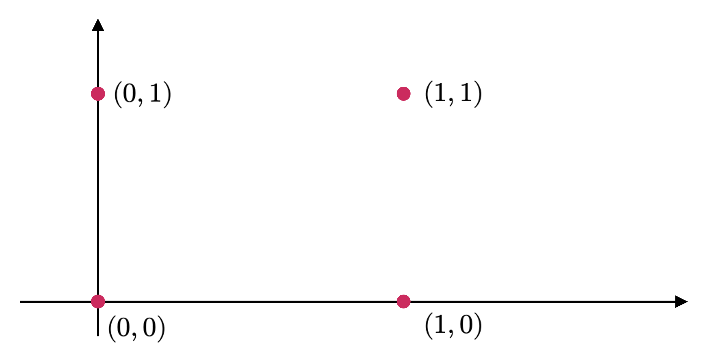
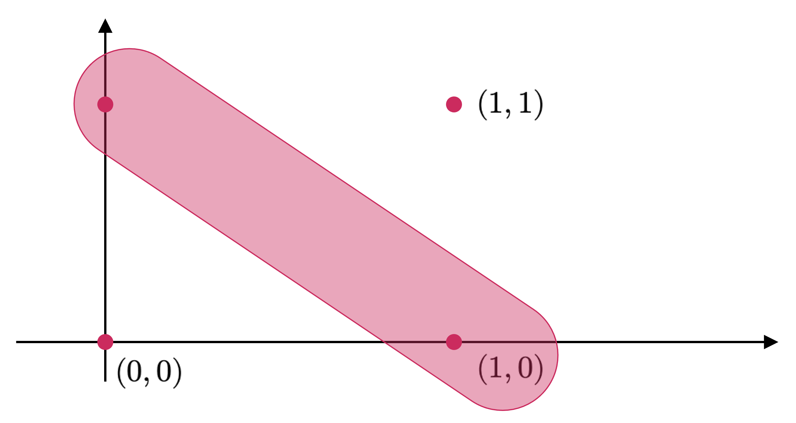
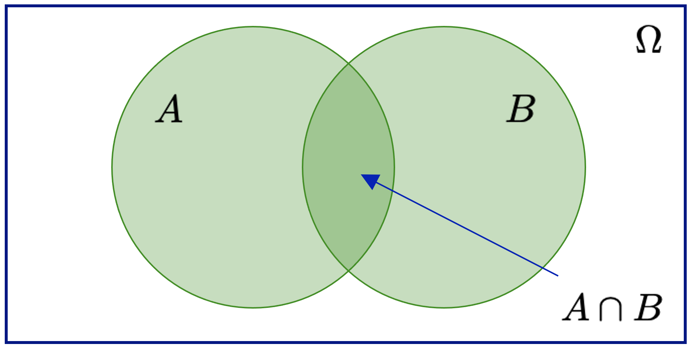

::: {.callout-important}
## Idea central

La teoría de probabilidad nace de la necesidad de modelar fenómenos inciertos de manera rigurosa. En este apunte construiremos el concepto formal de probabilidad a partir de espacios muestrales, eventos y funciones de conjunto, conectando la intuición clásica con la formulación moderna que sirve de base para la estadística y el aprendizaje automático.
:::

## Introducción
La probabilidad, en términos bien generales, se corresponde con el **estudio de la incertidumbre**. Puede ser pensada como la fracción de tiempo en el cual un evento determinado ocurre, o como el grado de creencia bajo el cual un evento puede ocurrir. Queremos usar la probabilidad como medida de la posibilidad en que un suceso ocurre en un experimento determinado. Esta idea es esencial en los modelos de machine learning, puesto que con frecuencia queremos entender cuánto nivel de incertidumbre hay en nuestra data o en la predicción realizada por un modelo determinado. La cuantificación de la incertidumbre requiere de objetos matemáticos especializados conocidos como **variables aleatorias**, las cuales corresponden a funciones que mapean los resultados de experimentos aleatorios sobre los conjuntos de propiedades que nos interesan. Hay funciones asociadas a las variables aleatorias que permiten medir la probabilidad de que un resultado particular (o un conjunto de resultados) ocurra(n). Tales funciones se conocen como **distribuciones de probabilidad**.

Las distribuciones de probabilidad son utilizadas como cimientos para la construcción de otros conceptos, tales como modelos probabilísticos, modelos gráficos y selección de modelos. En esta sección, presentaremos los conceptos necesarios para poder definir una probabilidad y cómo estos se relacionan para la construcción de una variable aleatoria, a fin de poder entender constructos más generales, tales como densidades y distribuciones.

## Teoría clásica de probabilidad

### El concepto de probabilidad
Todos estamos familiarizados con la importancia de los experimentos en ciencias e ingeniería. La experimentación es útil porque, si suponemos que llevamos a cabo ciertos experimentos bajo condiciones esencialmente idénticas (algo especialmente cierto en pruebas industriales de algún componente, por ejemplo, un sistema de medición de perfil de cascada de mineral en un molino SAG), llegaremos (o deberíamos llegar) a los mismos resultados. En estas circunstancias, estamos en condiciones de controlar el valor de las variables que afectan el resultado del experimento.

Sin embargo, en algunos experimentos, no somos capaces de controlar el valor de determinadas variables, de manera que un resultado cambiará de un experimento a otro, a pesar de que la mayoría de las condiciones sean las mismas. Estos experimentos se describen como aleatorios, porque existe una determinada (y muchas veces razonable) cantidad de incertidumbre inherente a ellos. Por ejemplo, si lanzamos un dado (no cargado y simétrico), el resultado del experimento será uno de los números del conjunto $\Omega =\left\{ 1,2,3,4,5,6\right\}$. Un ejemplo un poco más industrial es la medición de la vida útil de fusibles producidos por una compañía manufacturadora de estos artefactos eléctricos. Entonces, el resultado del experimento es el tiempo $t$ en horas que se encuentra en algún intervalo, digamos $0\leq t\leq 6500$, suponiendo que la vida útil del fusible tiene un límite técnico de 6500 horas de uso.

Un conjunto $\Omega$ que consta de todos los resultados posibles de un experimento aleatorio es llamado espacio muestral, y cada resultado se denomina punto muestral. Con frecuencia habrá más de un espacio muestral que puede describir los resultados de un experimento, pero generalmente habrá uno que provee la mayor cantidad de información.

**Ejemplo 3.1:** Consideremos el experimento de lanzar dos veces una moneda. Sea 0 el resultado que describe la obtención de un sello, y 1 el resultado que describe la obtención de una cara. El espacio muestral asociado a este experimento se ilustra en la @fig-muestral, donde, por ejemplo, el par (0, 1) representa que, en el primer lanzamiento, obtenemos un sello, y en el segundo, una cara. ◼︎

{#fig-muestral fig-align="center" width="70%"}

Si un espacio muestral tiene un numero finito de puntos muestrales, como en el ejemplo (3.1), se llamará **espacio muestral finito**. Si tiene un total de $n$ puntos, con $n\in \mathbb{N}$, siendo $n$ un valor no determinado, será llamado **espacio muestral infinito numerable** o **contable**. Si tiene un número indeterminado de puntos, no necesariamente equidistantes en relación a una referencia (por ejemplo, tantos puntos como los existentes en el intervalo $[a,b]$), será llamado **espacio muestral infinito no numerable**.

Con frecuencia, si un espacio muestral $\Omega$ es finito o infinito numerable, se habla de un **espacio muestral discreto**. Por otro lado, si $\Omega$ es infinito no numerable, suele ser denominado como **espacio muestral continuo**.

Un **evento** es un subconjunto $A$ del espacio muestral $\Omega$. Es decir, un conjunto de resultados posibles. Si el resultado de un experimento es un elemento de $A$, decimos que **el evento $A$ ocurrió**. Un evento que consta de un punto sencillo de $\Omega$ se denomina, con frecuencia, un **evento simple o elemental**. ◼︎

**Ejemplo 3.2:** Si lanzamos una moneda dos veces, el evento relativo a que sólo salga una cara es un subconjunto del espacio muestral y que consta únicamente de los puntos $(0, 1)$ y $(1, 0)$, tal y como se ilustra en la @fig-muestral2.

{#fig-muestral2 fig-align="center" width="70%"}

Como eventos particulares tenemos al mismo espacio muestral $\Omega$, el cual se conoce como **evento seguro** o **cierto**, dado que un elemento de $\Omega$ debe ocurrir sí o sí. Por otro lado, el conjunto vacío $\emptyset$ se denomina **evento imposible**, debido a que no es factible que éste ocurra. Usando operaciones lógicas (que son también válidas para el álgebra de conjuntos), podemos definir otros eventos de $\Omega$. Por ejemplo, si $A$ y $B$ son eventos, entonces podemos definir:

- **(C1):** $A\cap B$ corresponde a la **conjunción** de los eventos $A$ y $B$. Denota al evento compuesto por la ocurrencia simultánea de $A$ y $B$. En lógica matemática, la conjunción se suele escribir como $A\wedge B$ y se corresponde con la operación lógica “Y” (`and` o `&` en Python).
- **(C2):** $A\cup B$ corresponde a la **disyunción** de los eventos $A$ y $B$. Denota el evento compuesto por la ocurrencia de $A$, o bien, de $B$. En lógica matemática, la disyunción se suele escribir como $A\vee B$ y se corresponde con la operación lógica “O” (`or` o `|` en Python).
- **(C3):** $\bar{A}$ s el **evento complementario** a $A$. Denota el evento que describe la no ocurrencia de $A$. En lógica matemática, el complemento se corresponde con la operación lógica de negación denotada como “NO” (`not` o `~` en Python). También suele denotarse como $\sim A$.
- **(C4):** $A-B=A\cap \bar{B}$ describe la **diferencia simétrica** de los eventos $A$ y $B$. Describe al evento que consiste en la ocurrencia de $A$ y la no ocurrencia de $B$. En particular, observamos que $\bar{A}=\Omega -A$, donde $\Omega$ es el espacio muestral.

Si los conjuntos que describen a $A$ y $B$ son **disjuntos** (es decir, $A\cap B=\emptyset$), decimos que los eventos $A$ y $B$ son **mutuamente excluyentes**. En la práctica, esto significa que no pueden ocurrir simultáneamente. Una colección $A_{1},...,A_{n}$ de eventos es mutuamente excluyente si cada par $(A_{i},A_{j})$ de la colección (para $i\neq j$) es mutuamente excluyente.

En cualquier experimento aleatorio, hay siempre incertidumbre sobre si ocurrirá un evento en particular. Como una medida de la probabilidad con que esperamos que ocurra cierto evento, es conveniente asignar un número entre 0 y 1. Si estamos seguros de que tal evento ocurrirá, decimos que la **probabilidad** de dicho evento es 1 (o, equivalentemente, del 100%). Si estamos seguros de que tal evento no ocurrirá, la probabilidad de dicho evento es 0 (o del 0%).

La probabilidad así definida permite además definir la **probabilidad del complemento** de un evento. De esta manera, si un evento tiene una probabilidad de $\frac{1}{4}$ (o del 25%), entonces la diferencia $1-\frac{1}{4}=\frac{3}{4}$ (o 75%) será la probabilidad del complemento de dicho evento (es decir, la probabilidad de que no ocurra). Existen varias formas, en la teoría clásica, de definir una probabilidad. En primera instancia, tenemos un **enfoque clásico**, que establece que si un evento puede ocurrir de $k$ formas diferentes de un total de $n$, todas igualmente posibles (es decir, **equiprobables**), entonces la probabilidad del evento es igual a $\frac{k}{n}$. Si $A$ es tal evento, entonces escribimos $P(A)=\frac{k}{n}$.

Existe también un **enfoque frecuentista** que permite definir la probabilidad en un contexto más empírico. De esta manera, si después de $n$ repeticiones de un experimento, donde $n$ es un número muy grande, se observa que un evento ocurre $k$ veces, entonces la probabilidad de dicho evento es igual a $\frac{k}{n}$. Al respecto, una probabilidad definida de esta manera suele denominarse **probabilidad empírica** del evento.

Ambos enfoques presentan serios inconvenientes. El clásico debido a que la frase “igualmente probable” es una situación que se describe vagamente; y el frecuentista, porque un “número grande” es igualmente vago. Debido a estas dificultades, la definición de probabilidad se hace en base a ciertos enunciados conocidos formalmente como **axiomas de probabilidad**.

<strong>Definición 3.1 – Probabilidad:</strong> Supongamos que tenemos un espacio muestral $\Omega$. Si $\Omega$ es discreto, todos los subconjuntos corresponden a eventos y viceversa, pero si $\Omega$ no es discreto, sólo los subconjuntos *medibles* corresponden a eventos. Para cada evento $A$ en la clase $C$ de eventos (siendo $C$ un subconjunto como el descrito previamente), asociamos un número $P(A)\in \mathbb{R}$. Entonces $P$ se denomina **función de probabilidad** y $P(A)$ la probabilidad asociada al evento $A$, si se cumplen los siguientes axiomas:

- **(A1):** Para cada evento $A$ en la clase $C$, se tiene que $P(A)\geq 0$.
- **(A2):** Para el evento seguro $\Omega$ en la clase $C$, se tiene que $P(\Omega)=1$.
- **(A3):** Para cualquier número de eventos mutuamente excluyentes, digamos $A_{1},...,A_{n}$, en la clase $C$, se tiene que $P\left( \bigcup^{n}_{k=1} A_{k}\right)  =\sum^{n}_{k=1} P\left( A_{k}\right)$.

A partir de los axiomas de probabilidad, es posible agrupar una serie de resultados importantes e inmediatos relativos a la definición de probabilidad. Todos estos resultados los agrupamos en términos del siguiente teorema.

::: {.callout-tip}
## Teorema 3.1
*Sea $\Omega$ un espacio muestral y $\left\{ A_{k}\right\}^{n}_{k=1}$ una colección de eventos de $\Omega$. Entonces tenemos que:*

- **(T1):** *Si $A_{i}\subset A_{j}$, entonces $P(A_{i})\leq P(A_{j})$ y $P(A_{j}-A_{i})=P(A_{j})-P(A_{i})$.*
- **(T2):** *Para todo evento $A_{k}\subset \Omega$, se tiene que $0\leq P(A_{k})\leq 1$. Es decir, la probabilidad de un evento tiene un valor entre 0 y 1.*
- **(T3):** $P(\emptyset)=0$. *Es decir, el evento imposible tiene probabilidad nula.*
- **(T4):** *Si $\bar{A}$ es el complemento de $A$, entonces se tiene que $P(\bar{A})=1-P(A)$.*
- **(T5):** *Si $A=\bigcup^{n}_{k=1} A_{k}$, donde $A_{1},...,A_{n}$ son eventos mutuamente excluyentes, entonces $P\left( A\right)  =\sum^{n}_{k=1} P\left( A_{k}\right)$. En particular, si $A=\Omega$, entonces $P(\Omega)=1$.*
- **(T6):** *Si $A$ y $B$ son dos eventos cualesquiera, entonces $P(A\cup B)=P(A)+P(B)-P(A\cap B)$. De forma más general, para la colección $\left\{ A_{k}\right\}^{n}_{k=1}$, si los eventos de dicha colección son todos arbitrarios, se tiene que*

::: {.eq-scroll}
$$
P\left( \bigcup^{n}_{k=1} A_{k}\right)  =\sum^{n}_{k=1} P\left( A_{k}\right)  -\sum_{i,j:1\leq i\leq j\leq n} P\left( A_{i}\cap A_{j}\right)  +\sum_{i,j,k:1\leq i\leq j\leq k\leq n} P\left( A_{i}\cap A_{j}\cap A_{k}\right)
\tag{3.1}
$$
:::

- **(T7):** *Para cualesquiera eventos $A$ y $B$, se tiene que $P(A)=P(A\cap B)+P(A\cap \bar{B})$*.
- **(T8):** *Si un evento $A$ debe dar como resultado la ocurrencia de uno de los eventos mutuamente excluyentes $A_{1},...,A_{n}$, entonces tenemos que*

::: {.eq-scroll}
$$
P\left( A_{k}\right)  =\sum^{n}_{k=1} P\left( A\cap A_{k}\right)
\tag{3.2}
$$
:::
:::

### Asignación de probabilidades

Si un espacio muestral $\Omega$ consta de un número finito de resultados $a_{1},...,a_{n}$, entonces, conforme **(T5)**, tenemos que $P(A_{1})+\cdots +P(A_{n})=1$, donde $A_{1},...,A_{n}$ es una colección de eventos elementales tales que $A_{i}=\left\{ a_{i}\right\}$. Entonces podemos escoger arbitrariamente cualquier número no negativo para las probabilidades de esos eventos sencillos siempre y cuando se satisfaga la ecuación (3.2). En particular, si suponemos que hay probabilidades iguales para todos esos eventos sencillos, entonces se tendrá que

::: {.eq-scroll}
$$
P\left( A_{k}\right)  =\frac{1}{k} \  ;\  k=1,...,n
\tag{3.3}
$$
:::

Si $A$ es un conjunto conformado por $h$ eventos sencillos, entonces se tendrá que

::: {.eq-scroll}
$$
P\left( A\right)  =\frac{h}{n}
\tag{3.4}
$$
:::

que equivale a la fórmula clásica de probabilidad vista al inicio de esta sección.

**Ejemplo 3.3:** Supongamos que se lanza un dado no cargado y simétrico una sola vez. Calcularemos la probabilidad de obtener un 2 o un 5 en dicho lanzamiento. En efecto, el espacio muestral de este experimento corresponde al conjunto finito $\Omega =\left\{ 1,2,3,4,5,6\right\}$. Si asignamos probabilidades iguales a cada uno de los puntos muestrales (lo que desde luego es válido, puesto que hemos supuesto que el dado no está cargado y es completamente simétrico), entonces

::: {.eq-scroll}
$$
P\left( 1\right)  =P\left( 2\right)  =\cdots =P\left( 6\right)  =\frac{1}{6}
\tag{3.5}
$$
:::

Por lo tanto, la probabilidad buscada es $P(2\cup 5)=P(2)+P(5)=1/3$. ◼

### Probabilidad condicional
Sean $A$ y $B$ dos eventos ilustrados en el diagrama de Venn de la @fig-venn, tales que $P(A)>0$. Denotemos por $P(B|A)$ la probabilidad de ocurrencia del evento $B$, condicionada a la ocurrencia previa del evento $A$. Puesto que sabemos que ocurrió $A$, es claro que dicho evento se convierte en el espacio muestral del evento $A|B$. Tiene sentido, por tanto, la siguiente definición.

<strong>Definición 3.2 – Probabilidad condicional:</strong> Sean $A$ y $B$ dos eventos tales que $P(A)>0$. Definimos la **probabilidad condicional** de ocurrencia de $B$, dado que previamente ocurrió $A$, denotada como $P(B|A)$, como

::: {.eq-scroll}
$$
P\left( B|A\right)  :=\frac{P\left( A\cap B\right)  }{P\left( A\right)}
\tag{3.6}
$$
:::

{#fig-venn fig-align="center" width="70%"}

**Ejemplo 3.4:** Supongamos nuevamente que lanzamos un dado no cargado y simétrico. Vamos a determinar la probabilidad de que el resultado sea un número menor que 4, dado que previamente el mismo dado, tras lanzarlo, entregó un número impar.

En efecto, sea $A$ el evento condicional relativo a que, al lanzar el dado, el resultado sea un número impar. Luego $P(A)=\frac{1}{2}$. Por lo tanto, aplicando la fórmula de probabilidad condicional (3.6), obtenemos

::: {.eq-scroll}
$$
P\left( B|A\right)  =\frac{P\left( A\cap B\right)  }{P\left( B\right)  } =\frac{1/3}{1/2} =\frac{2}{3}
\tag{3.7}
$$
:::

Por lo tanto, la información empírica relativa a saber que nuestro dado previamente resultó en un número impar eleva las probabilidades de obtener un número menor que $4$ a $2/3$ (originalmente, sin ese conocimiento previo, dicha probabilidad era de $1/2$). ︎◼︎

La definición de probabilidad condicional permite enunciar los siguientes teoremas.

::: {.callout-tip}
## Teorema 3.2
*Sean $A_{1},A_{2}$ y $A_{3}$ tres eventos arbitrarios. Entonces tenemos que*

::: {.eq-scroll}
$$
P\left( A_{1}\cap A_{2}\cap A_{3}\right)  =P\left( A_{1}\right)  P\left( A_{2}|A_{1}\right)  P\left( A_{3}|A_{1}\cap A_{2}\right)
\tag{3.8}
$$
:::
:::

::: {.callout-tip}
## Teorema 3.3 – Regla de la suma
*Si un evento $A$ debe originar uno de los eventos mutuamente excluyentes $A_{1},...,A_{n}$, entonces tenemos que*

::: {.eq-scroll}
$$
P\left( A\right)  =\sum^{n}_{k=1} P\left( A_{k}\right)  P\left( A|A_{k}\right)
\tag{3.9}
$$
:::
:::

<strong>Definición 3.3 – Eventos independientes:</strong> Sean $A$ y $B$ dos eventos con probabilidades de ocurrencia $P(A)$ y $P(B)$, respectivamente. Diremos que $A$ y $B$ son **eventos independientes** si se cumple que $P(B|A)=P(B)$. Esto equivale a decir que $P(A\cap B)=P(A)P(B)$. Más aun, la colección de eventos $A_{1},...,A_{n}$ será llamada **colección de eventos independientes** si cada una de las parejas $(A_{i},A_{j})$ es independiente (para $i\neq j$). En este caso, se tiene que

::: {.eq-scroll}
$$
P\left( \bigcap^{n}_{k=1} A_{k}\right)  =\prod^{n}_{k=1} P\left( A_{k}\right)
\tag{3.10}
$$
:::

Los resultados anteriores nos permiten formular el siguiente teorema, el cual es un resultado importante de la teoría de probabilidad.

::: {.callout-tip}
## Teorema 3.4 – Regla del producto
*Sea $A_{1},...,A_{n}$ una colección de eventos mutuamente excluyentes cuya unión es el espacio muestral $\Omega$ (es decir, al menos uno de los eventos de la colección tiene probabilidad no nula). Entonces, si $A$ es un evento arbitrario, se tiene que*

::: {.eq-scroll}
$$
P\left( A_{k}|A\right)  =\frac{P\left( A_{k}\right)  P\left( A|A_{k}\right)  }{\sum\nolimits^{n}_{j=1} P\left( A_{j}\right)  P\left( A|A_{j}\right)  } \  ;\  1\leq k\leq n
\tag{3.11}
$$
:::
:::

En términos más generales y menos matemáticos, el teorema de Bayes es de enorme relevancia puesto que vincula la probabilidad de $A$ dado $B$ con la probabilidad de $B$ dado $A$. Es decir, por ejemplo, que sabiendo la probabilidad de tener un dolor de cabeza dado que se tiene gripe, se podría saber (si se tiene algún dato más), la probabilidad de tener gripe si se tiene un dolor de cabeza. Este sencillo ejemplo permite ilustrar la alta relevancia del teorema (3.4) en cuestión para la ciencia en todas sus ramas, puesto que tiene vinculación íntima con la comprensión de la probabilidad de aspectos causales dados los efectos observados. Es decir, mientras tengamos **evidencia empírica** de la ocurrencia de un fenómeno, siempre podemos tener un cierto nivel de certidumbre en relación a la ocurrencia de otros fenómenos que, experimentalmente, sabemos que están relacionados con el primero.

El teorema (3.4) es válido en todas las aplicaciones de la teoría de la probabilidad. Sin embargo, hay una controversia sobre el tipo de probabilidades que emplea. En esencia, los seguidores de la estadística tradicional solo admiten probabilidades basadas en **experimentos repetibles** y que tengan una **confirmación empírica** mientras que los llamados **estadísticos Bayesianos** permiten **probabilidades subjetivas**. El teorema (3.4) puede servir entonces para indicar cómo debemos modificar nuestras probabilidades subjetivas cuando recibimos información adicional de un experimento. La **estadística Bayesiana** está demostrando su utilidad en ciertas estimaciones basadas en el conocimiento subjetivo a priori y el hecho de permitir revisar esas estimaciones en función de la evidencia empírica es lo que está abriendo nuevas formas de hacer conocimiento. Una aplicación de esto son los **clasificadores Bayesianos** que son frecuentemente usados en implementaciones de filtros de correo basura o spam, que se adaptan con el uso. Otra aplicación se encuentra en la fusión de datos, combinando información expresada en términos de densidad de probabilidad proveniente de distintos sensores. Es decir, la estadística Bayesiana resulta esencial en la base de muchos procesos de inteligencia artificial que son comunes en los algoritmos de machine learning.

**Ejemplo 3.5:** Consideremos una caja (que llamaremos $\Omega_{1}$) que contiene 3 bolitas rojas y 2 bolitas azules. Otra caja (la caja $\Omega_{2}$) contiene 2 bolitas rojas y 8 bolitas azules. Se define el siguiente experimento: Se lanza una moneda no trucada (es decir, cuyos resultados son equiprobables) y, si sale cara, se saca una bolita de la caja $\Omega_{1}$ y, si se obtiene sello, se saca una bolita de la caja $\Omega_{2}$. Vamos a resolver dos interrogantes:

- **(I1):** Determinaremos la probabilidad de obtener una bolita roja.
- **(I2):** Suponiendo que quien lanza la moneda no revela si obtiene cara o sello (de manera que no sabemos tampoco de qué caja se saca la bolita respectiva), y afirma que obtuvo una bolita roja, determinaremos la probabilidad de que haya escogido la caja $\Omega_{1}$.

En efecto, sea $R$ el evento definido por la obtención de una bolita roja, mientras que $\Omega_{1}$ y $\Omega_{2}$ describen los eventos que se escojan las cajas correspondientes. Dado que podemos obtener una bolita roja en ambas cajas, podemos aplicar la fórmula de probabilidad condicional de manera directa, obteniendo

::: {.eq-scroll}
$$
P\left( R\right)  =P\left( \Omega_{1} \right)  P\left( R|\Omega_{1} \right)  +P\left( \Omega_{2} \right)  P\left( R|\Omega_{2} \right)  =\frac{1}{2} \left( \frac{3}{3+2} \right)  +\frac{1}{2} \left( \frac{2}{2+8} \right)  =\frac{2}{5}
\tag{3.12}
$$
:::

Para la pregunta **(I2)**, basta con aplicar el teorema de Bayes, lo que nos da

::: {.eq-scroll}
$$
P\left( \Omega_{1} |R\right)  =\frac{P\left( \Omega_{1} \right)  P\left( R|\Omega_{1} \right)  }{P\left( \Omega_{1} \right)  P\left( R|\Omega_{1} \right)  +P\left( \Omega_{2} \right)  P\left( R|\Omega_{2} \right)  } =\frac{\frac{1}{2} \left( \frac{3}{3+2} \right)  }{\frac{1}{2} \left( \frac{3}{3+2} \right)  +\frac{1}{2} \left( \frac{2}{2+8} \right)  } =\frac{3}{4}
\tag{3.13}
$$
:::
◼︎

## Teoría moderna de probabilidad

### Funciones de conjunto con aditividad finita
El área de una región en el plano $XY$, la longitud de una curva, o la masa de un sistema de partículas son números que miden la magnitud o contenido de un conjunto. Todas esas medidas tienen ciertas propiedades en común. Establecidas de forma abstracta, conducen a un concepto general llamado **función de conjunto con aditividad finita**. Más adelante redefiniremos la probabilidad como otro ejemplo de función de este tipo. Para preparar el camino, primero discutiremos algunas propiedades comunes para este tipo de funciones.

Una función $f:\mathcal{A}\longrightarrow \mathbb{R}$ cuyo dominio es una colección $\mathcal{A}$ de conjuntos y cuyos valores son números reales, se llama **función de conjunto**. Si $A$ es un conjunto de la colección $\mathcal{A}$, el valor de la función $f$ en $A$ se representa como $f(A)$. Tiene sentido por tanto la siguiente definición.

<strong>Definición 3.4 – Función de conjunto con aditividad finita:</strong> Una función de conjunto $f:\mathcal{A}\longrightarrow \mathbb{R}$ se dice que es de **aditividad finita** si se cumple que

::: {.eq-scroll}
$$
f(A\cup B)=f(A)+f(B)
\tag{3.14}
$$
:::

Siempre que $A$ y $B$ sean conjuntos disjuntos de $\mathcal{A}$, tales que $A\cup B\in \mathcal{A}$.

El área, la longitud y la masa son ejemplos de este tipo de funciones. A continuación, discutiremos algunas consecuencias de la ecuación (3.14). En las aplicaciones corrientes, los conjuntos de $\mathcal{A}$ son subconjuntos de un conjunto dado $\Omega$, llamado **conjunto universal**. Es común tener que efectuar las operaciones de unión, intersección y complementación sobre los conjuntos de $\mathcal{A}$. Para garantizar que $\mathcal{A}$ es cerrado con respecto a estas operaciones impondremos una condición: $\mathcal{A}$ debe ser un **álgebra Booleana**, la cual se define a continuación.

<strong>Definición 3.5 – Álgebra Booleana de conjuntos:</strong> Una clase no vacía $\mathcal{A}$ de subconjuntos de un conjunto universal $\Omega$ es llamada **álgebra Booleana** si, para todo par $A$ y $B$ de conjuntos de $\mathcal{A}$, se tiene que

::: {.eq-scroll}
$$
A\cup B\in \mathcal{A} \wedge \bar{A} \in \mathcal{A}
\tag{3.15}
$$
:::

Donde, como antes, $\bar{A}$ denota al complemento de $A$ con respecto a $\Omega$. Un álgebra Booleana también es cerrada para las intersecciones y diferencias simétricas, ya que $A\cap B=\overline{\left( \bar{A} \cup \bar{B} \right)}$ y $A-B=A\cap \bar{B}$. Esto implica que el conjunto vacío $\varnothing$ también pertenece a $\mathcal{A}$, ya que $\varnothing=A-A$ para algún $A$ de $\mathcal{A}$. También el conjunto universal $\Omega$ pertenece a $\mathcal{A}$, puesto que $\Omega=\bar{\varnothing}$.

A partir de los subconjuntos de un conjunto universal dado $\Omega$ es posible construir un gran número de álgebras Booleanas. La menor de esas álgebras es la clase $\mathcal{A}_{0} =\left\{ \varnothing ,\Omega \right\}$ que consta únicamente de los conjuntos *triviales* $\varnothing$ y $\Omega$. En el otro extremo está la clase $\mathcal{A}_{1}$, que consta de *todos* los subconjuntos de $\Omega$. Toda álgebra Boleana construida con subconjuntos de $\Omega$ satisface las **relaciones de inclusión** $\mathcal{A}_{0} \subseteq \mathcal{A} \subseteq \mathcal{A}_{1}$.

La propiedad de aditividad finita de las funciones de conjunto en la ecuación (3.14) exige que $A$ y $B$ sean conjuntos disjuntos. De esta exigencia se desprende el siguiente teorema.

::: {.callout-tip}
## Teorema 3.5
*Si $f:\mathcal{A}\longrightarrow \mathbb{R}$ es una función de conjunto con aditividad finita sobre un álgebra Booleana $\mathcal{A}$ de conjuntos, entonces, para todo par de conjuntos $A$ y $B$ de $\mathcal{A}$, tenemos que*

::: {.eq-scroll}
$$
f\left( A\cap B\right)  =f\left( A\right)  +f\left( B-A\right)  \wedge f\left( A\cup B\right)  =f\left( A\right)  +f\left( B\right)  -f\left( A\cap B\right)
\tag{3.16}
$$
:::
:::

### Medidas con aditividad finita
Las funciones de conjunto que representan áreas, longitudes y masas poseen propiedades comunes. Por ejemplo, todas estas funciones son no negativas; es decir, $f(A)\geq 0$ para cada conjunto $A$ de la clase $\mathcal{A}$ que se considera. Esto motiva la siguiente definición.

<strong>Definición 3.6 – Medida con aditividad finita:</strong> Una función de conjunto no negativa $f:\mathcal{A}\longrightarrow \mathbb{R}$ que es con aditividad finita es llamada **medida con aditividad finita** o, simplemente, una medida.

Aplicando el teorema (3.5) a la definición (3.6), obtenemos inmediatamente las siguientes propiedades, descritas en el teorema (3.6).

::: {.callout-tip}
## Teorema 3.6
*Sea $f:\mathcal{A}\longrightarrow \mathbb{R}$ una medida con aditividad finita definida sobre un álgebra Booleana $\mathcal{A}$. Para cualquier par de conjuntos $A$ y $B$ de $\mathcal{A}$, se cumplen las siguientes propiedades:*

- **(P1):** $f\left( A\cup B\right)  \leq f\left( A\right)  +f\left( B\right)$.
- **(P2):** $f\left( B-A\right)  =f\left( B\right)  -f\left( A\right)  \Longleftrightarrow A\subseteq B$.
- **(P3):** $f\left( A\right)  \leq f\left( B\right)  \Longleftrightarrow A\subseteq B$.
- **(P4):** $f\left( \emptyset \right)  =0$.
:::

**Ejemplo 3.6 – Número de elementos en un conjunto finito:** Sea $\Omega =\left\{ a_{1},...,a_{n}\right\}$ un conjunto que consta de $n$ elementos distintos y sea $\mathcal{A}$ la clase de todos los subconjuntos de $\Omega$. Para cada $A$ de $\mathcal{A}$, representemos por $\nu (A)$ el número de elementos distintos de $A$. Es sencillo verificar que esta función es de aditividad finita en $\mathcal{A}$. En efecto, si $A$ tiene $k$ elementos y $B$ tiene $m$ elementos, entonces $\nu (A)=k$ y $\nu (B)=m$. Si $A$ y $B$ son disjuntos es evidente que $A\cup B$ es un subconjunto de $\Omega$ con $(k+m)$ elementos, así que $\nu (A\cup B)=k+m=\nu (A) +\nu (B)$. La función $\nu$ es no negativa, por lo que, además, se trata de una medida. ◼︎

### Definición de probabilidad
En el lenguaje de las funciones de conjunto, la probabilidad es un tipo especial de medida (denotada por $P$) definida sobre una particular álgebra Booleana $\mathcal{B}$ de subconjuntos. Los elementos de $\mathcal{B}$ son subconjuntos de un conjunto universal $\Omega$. Como bien sabemos, este conjunto $\Omega$ es llamado **espacio muestral**. Primero comentaremos la definición de probabilidad para espacios muestrales finitos y luego lo haremos para aquellos que son infinitos.

<strong>Definición 3.7 – Probabilidad para espacios muestrales finitos:</strong> Sea $\mathcal{B}$ un álgebra Booleana cuyos elementos son subconjuntos de un conjunto finito dado $\Omega$. Una función de conjunto $P:\mathcal{B}\longrightarrow \mathbb{R}$ se llama **medida de probabilidad** si satisface las siguientes condiciones:

- **(C1):** $P$ es de aditividad finita.
- **(C2):** $P$ es no negativa.
- **(C3):** $P(\Omega)=1$.

Dicho de otro modo, para los espacios muestrales finitos, la probabilidad es simplemente una medida que asigna el valor $1$ al espacio completo.

Es importante darnos de que, para una descripción completa de la medida de probabilidad, deben precisarse tres ideas: El espacio muestral $\Omega$, el álgebra Booleana $\mathcal{B}$ construida con ciertos subconjuntos de $\Omega$, y la función de conjunto $P$. La tripleta $(\Omega, \mathcal{B}, P)$ se denomina, con frecuencia, **espacio de probabilidad**. En la mayoría de las aplicaciones elementales, el álgebra Booleana $\mathcal{B}$ es la colección de todos los subconjuntos de $\Omega$.

**Ejemplo 3.7:** El juego de *"cara o sello"* es un ejemplo típico de aplicación de la teoría de la probabilidad. Como espacio muestral $\Omega$ tomamos el conjunto de todos los resultados posibles en el juego. Cada resultado es "cara" o "sello", que representamos con los símbolos $h$ y $t$, respectivamente. Dicho espacio muestral es pues $\Omega =\left\{ h,t\right\}$. Como álgebra Booleana consideraremos la colección de todos los subconjuntos de $\Omega$, que son cuatro: $\emptyset, \Omega, H$ y $T$, donde $H=\left\{ h\right\}$ y $T=\left\{ t\right\}$. Ahora asignaremos probabilidades a cada uno de estos subconjuntos. Para $\emptyset$ y $\Omega$ estos valores no son eligibles, ya que por **(C3)**, $P(\Omega)=1$ y $P(\emptyset)=0$. En cambio, tenemos libertad en la asignación a los otros dos subconjuntos, $H$ y $T$. Ya que $H$ y $T$ son conjuntos disjuntos cuya reunión es $\Omega$, la propiedad aditiva exige que

::: {.eq-scroll}
$$
P\left( H\right)  +P\left( T\right)  =P\left( \Omega \right)  =1
\tag{3.17}
$$
:::

Como valores de $P(H)$ y $P(T)$ podemos tomar cualquier valor no negativo con tal de que su suma sea igual a $1$. Si tenemos en cuenta que la moneda no está trucada, de modo que no existe razón a priori para preferir cara o sello, parece natural asignar los valores

::: {.eq-scroll}
$$
P\left( H\right)  =P\left( T\right)  =\frac{1}{2}
\tag{3.18}
$$
:::

Si, en cambio, la moneda no es geométricamente perfecta, podemos asignar valores diferentes a estas dos probabilidades. Por ejemplo, $P(H)=1/3$ y $P(T)=2/3$ son tan aceptables como $P\left( H\right)  =P\left( T\right)=1/2$. En efecto, para todo $p\in \mathbb{R}$ tal que $0\leq p\leq 1$, podemos definir $P(H)=p$ y $P(T)=1-p$, y la función resultante $P$ satisfará todas las condiciones que se exigen a una medida de probabilidad.

Para una moneda determinada, no existe un método matemático para precisar cuál es la probabilidad $p$ “real”. Si escogemos $p=1/2$, podemos deducir consecuencias lógicas de la hipótesis de que la moneda no está trucada y, por extensión, no presenta sesgos de ningún tipo. La teoría desarrollada para el estudio de las probabilidades en monedas correctas puede utilizarse como test comprobatorio de su carencia de sesgo, efectuando un gran número de experimentos con ella y comparando los resultados experimentales con las predicciones teóricas. El poner de acuerdo la teoría y la evidencia empírica pertenece a la rama de la teoría de la probabilidad llamada **inferencia estadística**, y no la expondremos en estos apuntes. ◼︎

El ejemplo anterior es una típica aplicación del llamado **cálculo de probabilidades**. Las cuestiones probabilísticas se presentan a menudo en situaciones llamadas experimentos. No intentaremos definir un experimento (ya hicimos un acercamiento, más bien vago, a esta cuestión al inicio de esta sección); en cambio, mencionaremos tan sólo algunos ejemplos corrientes: Lanzar una o varias monedas, lanzar un par de dados, repartir una mano de cartas, sacar una bola de una urna, recuento de las mujeres que estudian en la Facultad de Ingeniería de la Universidad de Santiago de Chile, selección de un número en una guía telefónica, registro de la radiación en un contador Geiger, etc.

Para discutir las cuestiones de probabilidad que surgen en tales experimentos, nuestro primer trabajo es la construcción de un espacio muestral Ω que pueda utilizarse para mostrar todos los resultados posibles del experimento, como hicimos en el juego de lanzar una moneda. Cada elemento de $\Omega$ representará un resultado del experimento y cada resultado corresponderá a uno y sólo un elemento de $\Omega$. A continuación, elegimos un álgebra de Boole $\mathcal{B}$ de subconjuntos de $\Omega$ (casi siempre, todos los subconjuntos de $\Omega$) y entonces se define una medida de probabilidad $P$ sobre $\mathcal{B}$. La elección de $\Omega$, $\mathcal{B}$ y $P$ dependerá de la información que se posea acerca de los detalles del experimento y del problema que nos vamos a plantear. El objeto del cálculo de probabilidades no es discutir si el espacio de probabilidad $(\Omega,\mathcal{B},P)$ ha sido elegido correctamente. Esto pertenece a la ciencia o juego del que el experimento ha surgido, y tan solo la experiencia puede darnos idea de si la elección fue bien hecha o no. El cálculo de probabilidad es el estudio de las consecuencias lógicas que pueden deducirse una vez dado un espacio de probabilidad. La elección de un buen espacio de probabilidad no es teoría de probabilidad –ni siquiera es matemáticas–; es en cambio el arte de aplicar la teoría probabilística al mundo real.

Si $\Omega =\left\{ a_{1},...,a_{n}\right\}$ y si $\mathcal{B}$ consta de todos los subconjuntos de $\Omega$, la función de probabilidad $P$ está completamente determinada si conocemos sus valores para los conjuntos de un solo elemento,

::: {.eq-scroll}
$$
P\left( \left\{ a_{1}\right\}  \right)  ,P\left( \left\{ a_{2}\right\}  \right)  ,...,P\left( \left\{ a_{n}\right\}  \right)
\tag{3.19}
$$
:::

En efecto, todo subconjunto de $A$ de $\Omega$ es una reunión disjunta de los conjuntos anteriores, y $P(A)$ está determinada por la propiedad aditiva. Por ejemplo, cuando

::: {.eq-scroll}
$$
A=\bigcup^{n}_{k=1} \left\{ a_{k}\right\}
\tag{3.20}
$$
:::

la propiedad aditiva exige que

::: {.eq-scroll}
$$
P\left( A\right)  =\sum^{n}_{k=1} P\left( \left\{ a_{k}\right\}  \right)
\tag{3.21}
$$
:::

Debido a que el método probabilístico se usa en cuestiones prácticas, es conveniente imaginarse que cada espacio de probabilidad $(\Omega,\mathcal{B},P)$ está asociado a un experimento real o ideal. El conjunto universal $\Omega$ puede entonces concebirse como la colección de todos los resultados imaginables del experimento, como en el ejemplo (3.7). Cada elemento de $\Omega$ se llama **resultado** o **muestra** y los subconjuntos de $\Omega$ que se presentan en el álgebra de Boole $\mathcal{B}$ se denominan **sucesos**. Los motivos de esta terminología se pondrán en evidencia al tratar algunos ejemplos.

Dos sucesos $A$ y $B$ son **igualmente probables** (o **equiprobables**) si $P(A)=P(B)$. El suceso $A$ es **más probable** que $B$ si $P(A)>P(B)$ y **por lo menos tan probable** como $B$ si $P(A)\geq P(B)$. La @tbl-probs nos muestra una lista de locuciones del lenguaje habitual en las discusiones de la teoría de probabilidad. Las letras $A$ y $B$ representan sucesos, y $x$ es el resultado de un experimento asociado al espacio muestral $\Omega$. Cada fila de la columna de la izquierda es una afirmación relativa a los sucesos $A$ y $B$, y en la misma fila en la columna de la derecha se expresa la misma afirmación en el lenguaje de la teoría de conjuntos.

: Proposiciones usadas en la teoría de probabilidad y su significado en la teoría de conjuntos {#tbl-probs}

| Proposiciones                                     | Significado en la teoría de conjuntos    |
| :------------------------------------------------ | :--------------------------------------- |
| Por lo menos uno de los sucesos $A$ o $B$ ocurre. | $x\in A\cup B$                           |
| Ambos sucesos, $A$ y $B$, ocurren.                | $x\in A\cap B$                           |
| Ni $A$ ni $B$ ocurren.                            | $x\in \bar{A}\cap \bar{B}$               |
| $A$ ocurre, pero $B$ no.                          | $x\in A\cap \bar{B}$                     |
| Exactamente ocurre uno de los sucesos, $A$ o $B$. | $x\in \left( A\cap \overline{B} \right) \cup \left( \overline{A} \cap B \right)$ |
| No más de uno de los sucesos, $A$ o $B$, ocurre.  | $x\in (\overline{A\cap B})$              |
| Si $A$ ocurre, también $B$ ($A$ implica $B$).     | $A\subseteq B$                           |
| $A$ y $B$ son mutuamente excluyentes.             | $A\cap B =\varnothing$                   |
| Suceso $A$ o suceso $B$.                          | $A\cup B$                                |
| Suceso $A$ y suceso $B$.                          | $A\cap B$                                |

**Ejemplo 3.8:** Consideremos el experimento consistente en tomar dos naipes de cada una de las dos barajas que constituyen un juego de cartas inglés. Vamos a determinar la probabilidad de que por lo menos uno de estos naipes sea el as de corazones.

Sean $a$ y $b$ cada naipe a sacar, uno de cada baraja. Representaremos un resultado mediante el par ordenado $(a,b)$ el número de resultados posibles; esto es, el número total de pares distintos $(a,b)$ del espacio muestral de $\Omega$ se deduce mediante una sencilla aplicación del principio multiplicativo. Así, dado que cada baraja tiene 52 naipes en total, se tendrá que el número de elementos de $\Omega$ es $52\times 52=52^{2}$. Asignamos a cada uno de estos pares la probabilidad $1/52^{2}$. El suceso en el que estamos interesados es el conjunto $A$ de pares $(a,b)$ en los que $a$ o $b$ pueden ser el as de corazones. En $A$ hay $52+51$ elementos (ya que no hemos establecido que el primer naipe se devuelve a la baraja una vez sacado). Por lo tanto, en esta hipótesis, deducimos que

::: {.eq-scroll}
$$
P\left( A\right)  =\frac{52+51}{52^{2}} =\frac{1}{26} -\frac{1}{52^{2}}
\tag{3.22}
$$
:::
◼︎

## Experimentos o pruebas compuestas

Una disputa entre jugadores en 1654 llevó a dos famosos matemáticos franceses, Blaise Pascal y Pierre de Fermat, a la creación del cálculo de probabilidades. Antoine Gombaud, caballero de Méré, noble francés interesado en cuestiones de juegos y apuestas, llamó la atención a Pascal respecto a una aparente contradicción en un popular juego de dados. El juego consistía en lanzar $24$ veces un par de dados; y el problema en decidir si era lo mismo apostar la misma cantidad a favor o en contra de la aparición por lo menos de un «doble seis» en las $24$ tiradas. Una regla del juego aparentemente bien establecida condujo a de Méré a creer que apostar por un doble seis en $24$ tiradas era ventajoso, pero sus propios cálculos indicaban justamente lo contrario. Este problema, consecuentemente, fue conocido como el *problema de Méré*.

Para resolver este problema, consideremos el experimento de lanzar un par de dados una sola vez. El resultado de este juego puede representarse mediante pares ordenados $(a,b)$ en los que $a$ y $b$ recorren los valores 1, 2, 3, 4, 5, y 6. El espacio muestral $\Omega$ consta de $36$ de esos pares. Si asumimos que los dados no están cargados (son geométricamente perfectos, lo que implica que cada cara tiene igual probabilidad de salir), asignamos a cada par la probabilidad $1/36$.

Supongamos que lanzamos los dados 𝑛 veces. La sucesión de las $n$ pruebas es una prueba compuesta que queremos describir matemáticamente. Por ello, necesitamos un nuevo espacio muestral y una correspondiente medida de probabilidad. Consideremos los resultados del nuevo juego como vectores en $\mathbb{R}^{n}$ del tipo $(x_{1},...,x_{n})$, donde cada elemento $x_{i}$ es uno de los resultados del espacio muestral original $\Omega$. Es decir, el espacio muestral para la prueba compuesta es el producto cartesiano $\Omega\times \cdots \times \Omega=\Omega^{n}$. De esta manera, $\Omega^{n}$ tiene un total de $36^{n}$ elementos, y asignamos la probabilidad $1/36^{n}$ a cada uno de ellos. Nos interesa el suceso “por lo menos un doble $6$ en $n$ tiradas”. Designemos tal suceso por $A$. En este caso, es más sencillo calcular la probabilidad del suceso complementario $\bar{A}$, que significa “ningún doble $6$ en $n$ tiradas”. Cada elemento de $\bar{A}$ es un vector en $\mathbb{R}^{n}$ cuyas componentes pueden ser cualquier elemento de $\Omega$ excepto $(6, 6)$. Por consiguiente, existen $35$ valores para cada componente y por lo tanto $35^{n}$ vectores en total en $\bar{A}$. Puesto que cada elemento de $\bar{A}$ tiene probabilidad $(1/36)^{n}$, la suma de todas las probabilidades puntuales en $\bar{A}$ es igual a $(35/36)^{n}$. Esto nos da

::: {.eq-scroll}
$$
P\left( A\right)  =1-P\left( \bar{A} \right)  =1-\left( \frac{35}{36} \right)^{n}
\tag{3.23}
$$
:::

Para contestar a la pregunta de Méré, tenemos que decidir si $P(A)$ es mayor o menor que 1/2 cuando $n=24$. La desigualdad $P(A)\geq 1/2$ es equivalente a decir que $1-\left( \frac{35}{36} \right)^{n}  \geq \frac{1}{2}$ o $\left( \frac{35}{36} \right)^{n}  \leq \frac{1}{2}$. Tomando logaritmos, encontramos que

::: {.eq-scroll}
$$
n\log \left( 35\right)  -n\log \left( 36\right)  \leq -\log \left( 2\right)  \  \vee \  n\geq \frac{\log \left( 2\right)  }{\log \left( 36\right)  -\log \left( 35\right)  } =24.6
\tag{3.24}
$$
:::

Por consiguiente, $P(A)<1/2$ cuando $n=24$ y $P>1/2$ cuando $n\geq 25$. No es ventajosa una apuesta de una cantidad al suceso de que por lo menos se presente un doble 6 en 24 tiradas, frente a la apuesta de la misma cantidad al suceso contrario.

Esta discusión sugiere un método general para tratar los experimentos sucesivos. Si una prueba se repite dos o más veces, el resultado puede considerarse como una prueba compuesta. Más general, una prueba compuesta puede ser el resultado de ejecutar dos o más pruebas distintas sucesivamente. Cada una de las pruebas individuales puede estar relacionada con cada una de las otras o pueden ser estocásticamente independientes, en el sentido de que la probabilidad del resultado de cada una de ellas no depende de los resultados de las otras.

Por simplicidad, discutiremos cómo se pueden combinar dos pruebas independientes en una prueba compuesta. La generalización a más de dos experiencias será evidente.

Para asociar el espacio de probabilidad natural a una prueba o experiencia compuesta, debemos definir el nuevo espacio muestral $\Omega$, el álgebra Booleana $\mathcal{B}$ de subconjuntos de $\Omega$ y la medida de probabilidad $P$ sobre $\mathcal{B}$. Sean $(\Omega_{1},\mathcal{B}_{1},P_{1})$ y $(\Omega_{2},\mathcal{B},P_{2})$  dos espacios de probabilidad asociados a dos experiencias $E_{1}$ y $E_{2}$. Con $E$ representamos la experiencia o prueba compuesta para las que el espacio muestral $\Omega$ es el producto cartesiano $\Omega_{1}\times \Omega_{2}$. Un resultado de $E$ es el par $(x,y)$ de $\Omega$, donde la primera componente $x$ es un resultado de $E_{1}$ y el segundo 𝑦 es un resultado de $E_{2}$. Si $\Omega_{1}$ tiene $n$ elementos y $\Omega_{2}$ tiene $m$ elementos, el producto $\Omega_{1}\times \Omega_{2}$ tendrá $nm$ elementos.

Como nueva álgebra Booleana $\mathcal{B}$ tomamos la colección de todos los subconjuntos de $\Omega$. A continuación definimos la probabilidad $P$. Ya que $\Omega$ es finito, podemos definir $P(x,y)$ para cada punto $(x,y)$ de $\Omega$ y utilizar la aditividad al definir $P$ para los subconjuntos de $\Omega$. Las probabilidades $P(x,y)$ pueden asignarse de varias maneras. Sin embargo, si dos pruebas $E_{1}$ y $E_{2}$ son estocásticamente independientes, definimos $P$ mediante la ecuación

::: {.eq-scroll}
$$
P\left( x,y\right)  =P_{1}\left( x\right)  P_{2}\left( y\right)  ;\forall \left( x,y\right)  \in \Omega
\tag{3.25}
$$
:::

Esta afirmación se justifica como sigue: Consideremos dos sucesos particulares $A$ y $B$ del nuevo espacio $\Omega$, definidos como

::: {.eq-scroll}
$$
\begin{array}{l}A=\left\{ \left( x_{1},y_{i}\right)  \right\}^{m}_{i=1}  =\left\{ \left( x_{1},y_{1}\right)  ,...,\left( x_{1},y_{m}\right)  \right\}  \\ B=\left\{ \left( x_{i},y_{1}\right)  \right\}^{n}_{i=1}  =\left\{ \left( x_{1},y_{1}\right)  ,...,\left( x_{n},y_{1}\right)  \right\}  \end{array}
\tag{3.26}
$$
:::

Esto es, $A$ es el conjunto de todos los pares de $\Omega_{1}\times \Omega_{2}$ cuyo primer elemento es $x_{1}$, y $B$ es el conjunto de todos los pares de $\Omega_{1}\times \Omega_{2}$ cuyo segundo elemento es $y_{1}$. La intersección de los dos conjuntos $A$ y $B$ es el conjunto de un solo elemento $\left\{ \left( x_{1},y_{1}\right)  \right\}$. Si presentimos que el primer resultado $x_{1}$ no debe influir en el resultado $y_{1}$, parece razonable exigir que los sucesos $A$ y $B$ sean independientes. Esto significa que habrá que definir la nueva función de probabilidad $P$ de manera que

::: {.eq-scroll}
$$
P\left( A\cap B\right)  =P\left( A\right)  P\left( B\right)
\tag{3.27}
$$
:::

Si decidimos la forma de asignar las probabilidades $P(A)$ y $P(B)$, la ecuación (3.27) nos dirá como asignar la probabilidad $P(A\cap B)$. Esto es, la probabilidad $P(x_{1},y_{1})$. Se presenta el suceso $A$ si y sólo si el resultado de la primera prueba es $x_{1}$. Puesto que $P_{1}(x_{1})$ es su probabilidad, parece natural asignar el valor $P_{1}(x_{1})$ también a $P(A)$. Análogamente, asignamos a $P(B)$ el valor $P_{2}(y_{1})$. La ecuación (3.27) nos da entonces

::: {.eq-scroll}
$$
P\left( x_{1},y_{1}\right)  =P_{1}\left( x_{1}\right)  P_{2}\left( y_{1}\right)
\tag{3.28}
$$
:::

Todo esto es, naturalmente, tan solo una justificación para la asignación de probabilidades de la ecuación (3.25). El único camino para decidir si la ecuación (3.25) es o no una asignación de probabilidades puntuales aceptable es ver si se cumplen las propiedades fundamentales de las medidas de probabilidad. Cada número $P(x,y)$ es no negativo, y la suma de todas las probabilidades puntuales es igual a $1$, pues que tenemos

::: {.eq-scroll}
$$
\sum_{\left( x,y\right)  \in S} P\left( x,y\right)  =\sum_{x\in S_{1}} P_{1}\left( x\right)  \sum_{y\in S_{2}} P_{2}\left( y\right)  =1\cdot 1=1
\tag{3.29}
$$
:::

Cuando decimos que una prueba compuesta $E$ está determinada por dos pruebas $E_{1}$ y $E_{2}$ estocásticamente independientes, queremos decir que el espacio de probabilidad $(\Omega,\mathcal{B},P)$ está definido como acabamos de explicar, tal “independencia” queda reflejada en el hecho de que $P(x,y)$ es igual al producto $P_{1}(x)P_{2}(y)$. Puede demostrarse que la asignación de probabilidades (3.25) implica la igualdad

::: {.eq-scroll}
$$
P\left( U\times V\right)  =P_{1}\left( U\right)  P_{2}\left( V\right)
\tag{3.30}
$$
:::

para todo par de subconjuntos $U$ de $\mathcal{B}_{1}$ y $V$ de $\mathcal{B}_{2}$. De esta forma, deduciremos algunas consecuencias importantes.

Sea $A$ un suceso (de la prueba compuesta $E$) de la forma

::: {.eq-scroll}
$$
A=C_{1}\times \Omega_{2}
\tag{3.31}
$$
:::

donde $C_{1}\in \mathbb{B}_{1}$. Cada resultado de $A$ es un par ordenado $(x,y)$, siendo $x$ un resultado de $C_{1}$ (en la primera prueba $E_{1}$), mientras que $y$ puede ser cualquier resultado de $\Omega_{2}$ (en la segunda prueba $E_{2}$). Si aplicamos la ecuación (3.30), encontramos que

::: {.eq-scroll}
$$
P\left( A\right)  =P\left( C_{1}\times \Omega_{2} \right)  =P_{1}\left( C_{1}\right)  P_{2}\left( \Omega_{2} \right)  =P_{1}\left( C_{1}\right)
\tag{3.32}
$$
:::

ya que $P_{2}(\Omega_{2})=1$. De este modo, la definición de $P$ aisgna la misma probabilidad $A$ que la asignada por $P_{1}$ a $C_{1}$. Por esa razón, se dice que un tal suceso $A$ **está determinado mediante la primera prueba** $E_{1}$. Análogamente, si $B$ es un suceso de $E$ de la forma

::: {.eq-scroll}
$$
B=\Omega_{1}\times C_{2}
\tag{3.33}
$$
:::

teniendo $C_{2}\in \mathcal{B}_{2}$, llegamos a

::: {.eq-scroll}
$$
P\left( B\right)  =P\left( \Omega_{1} \times C_{2}\right)  =P_{1}\left( \Omega_{1} \right)  P_{2}\left( C_{2}\right)  =P_{2}\left( C_{2}\right)
\tag{3.34}
$$
:::

y se dice que $B$ **está determinado por la segunda prueba** $E_{2}$. Demostraremos ahora, utilizando la ecuación (3.30), que tales sucesos $A$ y $B$ son independientes. Esto es, tenemos

::: {.eq-scroll}
$$
P(A\cap B)=P(A)P(B)
\tag{3.35}
$$
:::

En efecto,

::: {.eq-scroll}
$$
\begin{array}{lll}A\cap B&=&\left\{ \left( x,y\right)  \in \mathbb{R}^{2} :\left( x,y\right)  \in C_{1}\times \Omega_{2} \wedge \left( x,y\right)  \in \Omega_{1} \times C_{2}\right\}  \\ &=&\left\{ \left( x,y\right)  \in \mathbb{R}^{2} :x\in C_{1}\wedge y\in C_{2}\right\}  \\ &=&C_{1}\times C_{2}\end{array}
\tag{3.36}
$$
:::

Luego tenemos

::: {.eq-scroll}
$$
P(A\cap B)=P(C_{1}\times C_{2})=P_{1}(C_{1})P_{2}(C_{2})
\tag{3.37}
$$
:::

Puesto que $P_{1}(C_{1})=P(A)$ y $P_{2}(C_{2})=P(B)$, obtenemos la ecuación (3.35). Observemos que la ecuación (3.37) también demuestra que podemos calcular la probabilidad $P(A\cap B)$ como producto de las probabilidades en cada uno de los espacios muestrales $\Omega_{1}$ y $\Omega_{2}$. Por lo tanto, no son precisos los cálculos con probabilidades en las pruebas compuestas.

La generalización a experimentos con $n$ pruebas $E_{1},...,E_{n}$ se deduce de la misma forma. Los puntos en el nuevo espacio muestral son vectores en $\mathbb{R}^{n}$ del tipo $\mathbf{x}=(x_{1},...,x_{2})$ y las probabilidades se definen como producto de las probabilidades particulares. Es decir,

::: {.eq-scroll}
$$
P\left( \mathbf{x} \right)  =P\left( x_{1},...,x_{n}\right)  =\prod^{n}_{k=1} P_{k}\left( x_{k}\right)
\tag{3.38}
$$
:::

Cuando se adopta esta definición de $P$, decimos que $E$ **está determinado por $n$ pruebas independientes** $E_{1},...,E_{n}$. En el caso particular en el que todas las pruebas están asociadas al mismo espacio de probabilidad, la prueba compuesta 𝐸 es un ejemplo de pruebas independientes repetidas bajo idénticas condiciones. Un ejemplo de esto corresponde a las pruebas de Bernoulli, que caracterizaremos a continuación.

### Pruebas de Bernoulli
Un ejemplo importante de prueba compuesta lo estudió Jakob Bernoulli y lo conocemos por el nombre de **sucesión de pruebas de Bernoulli**. Se trata de una sucesión de pruebas repetidas ejecutadas en las mismas condiciones, siendo cada resultado estocásticamente independiente de las demás. Cada prueba tiene exactamente dos resultados posibles, corrientemente llamados **“éxito”** y **“fallo”**; la probabilidad del éxito se representa por $p$ y la del fallo con $q$. Naturalmente, $q=1-p$. El teorema principal relacionado con las sucesiones de Bernoulli es el siguiente.

::: {.callout-tip}
## Teorema 3.7 – Fórmula de Bernoulli
*Sea $\Omega=\left\{ 0,1\right\}$ el espacio muestral de un experimento particular que será repetido un número particular de veces, donde designamos al éxito de la prueba con el valor $x=1$ y al fallo con un valor $x=0$. La probabilidad de $k$ éxitos en $n$ pruebas de Bernoulli, que designamos como $P(x=1)$, se define como*

::: {.eq-scroll}
$$
P\left( x=1\right)  =\binom{n}{k} p^{k}q^{n-k}\  ;\  \binom{n}{k} =\frac{n!}{\left( n-k\right)  !k!}
\tag{3.39}
$$
:::
:::

**Ejemplo 3.9:** Se lanza 50 veces una moneda. Vamos a calcular la probabilidad de que salgan, exactamente, 50 caras. En efecto, interpretemos este juego como una sucesión de 50 pruebas de Bernoulli, en las que "éxito" significa cara, y "fallo" significa sello. Si suponemos que la moneda no presenta sesgos de ningún tipo (y, por lo tanto, cada resultado es equiprobable), asignamos las probabilidades $p=q=1/2$ y la fórmula (3.39) nos da

::: {.eq-scroll}
$$
P\left( x=1\right)  =\binom{50}{k} \left( \frac{1}{2} \right)^{50}
\tag{3.40}
$$
:::

En particular, para $k=25$, obtenemos

::: {.eq-scroll}
$$
P\left( x=1\right)  =\binom{50}{25} \left( \frac{1}{2} \right)^{50}  =\frac{50!}{25!\cdot 25!} \left( \frac{1}{2} \right)^{50}  \approx 0.112
\tag{3.41}
$$
:::
◼

### Número más probable de éxitos en $n$ pruebas de Bernoulli
Un par de dados no cargados es lanzado 28 veces ¿Cuál es el número más probable de sietes? Para resolver este problema, designemos por $f(k)$ la probabilidad de obtener exactamente $k$ sietes en 28 tiradas. La probabilidad de conseguir un siete en una tirada es 1/6. La fórmula de Bernoulli (teorema (3.7)) nos dice que

::: {.eq-scroll}
$$
f\left( k\right)  =\binom{28}{k} \left( \frac{1}{6} \right)^{k}  \left( \frac{5}{6} \right)^{28-k}
\tag{3.42}
$$
:::

Queremos determinar qué valor (o valores) de $k$ entre los valores $k=0,1,2,...,28$ hacen máximo a $f(k)$. El siguiente teorema resuelve este problema para cualquier sucesión de pruebas de Bernoulli.

::: {.callout-tip}
## Teorema 3.8
*Dados un entero $n\geq 1$ y un número real $p$ tal que $0<p<1$, consideremos el conjunto de números*

::: {.eq-scroll}
$$
f\left( k\right)  =\binom{n}{k} p^{k}\left( 1-p\right)^{n-k}  \  ;\  k\in \mathbb{N} +\left\{ 0\right\}
\tag{3.43}
$$
:::

- **(T1)**: *Si $(n+1)p\notin \mathbb{Z}$, el máximo de $f(k)$ se presenta exactamente para un valor de $k$:*

::: {.eq-scroll}
$$
k=\left[ \left( n+1\right)  p\right]
\tag{3.44}
$$
:::

*donde $\left[ \  \cdot \  \right]$ es la función parte entera.*

- **(T2)**: *Si $(n+1)p\in \mathbb{Z}$, el máximo de $f(k)$ se presenta exactamente para dos valores de $k$:*

::: {.eq-scroll}
$$
k_{1}=\left( n+1\right)  p\wedge k_{2}=\left( n+1\right)  p-1
\tag{3.45}
$$
:::
:::

**Ejemplo 3.10:** Vamos a determinar el número más probable de sietes cuando un par de dados se lanza 28 veces. En efecto, aplicamos el teorema (3.8) con $n=28$, $p=1/6$ y $(n+1)p=29/6$. Como $29/6$ no es un número entero, el valor máximo de $f(k)$ se presenta para $k=[29/6]=4$. ◼

## Conjuntos numerables y no numerables

Hasta aquí sólo hemos considerado el concepto de probabilidad para espacios muestrales finitos. Queremos ahora extender la teoría a **espacios muestrales infinitos**. Para ello es necesario distinguir dos tipos de conjuntos infinitos, los **numerables** y los **no numerables**. En esta sección se estudian ambos.

Para contar los elementos de un conjunto finito se pone en correspondencia el conjunto, elemento a elemento, con el conjunto de los números naturales $\mathbb{N}$. La comparación de los "tamaños" de dos conjuntos mediante la correspondencia entre ellos elemento a elemento sustituye el recuento de los elementos cuando se trata de conjuntos infinitos. A este proceso se le puede dar una clara formulación matemática empleando el concepto de función.

<strong>Definición 3.8 – Correspondencia uno a uno de conjuntos:</strong> Se dice que dos conjuntos $A$ y $B$ están en **correspondencia uno a uno** si existe una función $f$ con la siguientes propiedades:

- **(P1):** $f$ es tal que $f:A\longrightarrow B$.
- **(P2):** Si $x$ e $y$ son elementos distintos de $A$, entonces $f(x)$ y $f(y)$ son elementos distintos de $B$. Esto es, para todo par de elementos $x,y\in A$, se tiene que

::: {.eq-scroll}
$$
x\neq y\Longrightarrow f(x)\neq f(y)
\tag{3.46}
$$
:::

Una función $f$ que cumple con **(P2)** se dice inyectiva sobre $A$. Dos conjuntos $A$ y $B$ en correspondencia uno a uno se llaman también equivalentes, e indicamos esto poniendo $A\sim B$. Resulta claro pues que todo conjunto $A$ es equivalente a sí mismo, ya que $x=f(x)$ para todo $x$ en $A$.

Un conjunto puede ser equivalente a un subconjunto de sí mismo. Por ejemplo, el conjunto $P=\left\{ 1,2,3,...\right\}$ compuesto por todos los números naturales es equivalente a su subconjunto $Q=\left\{ 2,4,6,...\right\}$ compuesto por todos los números pares positivos. En este caso, la función inyectiva que los hace equivalentes es $f(x)=2x$ para todo $x\in P$.

Si $A\sim B$, es fácil demostrar que $B\sim A$. Si $f$ es inyectiva en $A$ y si $\mathrm{Rec}(f)=B$, entonces, para cada $b\in B$ existe exactamente un $a$ en $A$ tal que $f(a)=b$. De ahí que podemos definir una función inversa $g$ en $B$ del modo siguiente: Si $b\in B$, $g(b)=a$, donde $a$ es el único elemento de $A$ tal que $f(s)=b$. La función $g$ así definida es inyectiva en $B$ y su recorrido es $A$; luego $B\sim A$. Esta propiedad de equivalencia se llama **simetría**:

::: {.eq-scroll}
$$
A\sim B\Longrightarrow B\sim A
\tag{3.47}
$$
:::

También resulta sencillo demostrar que la equivalencia tiene la siguiente propiedad, llamada **transitividad**:

::: {.eq-scroll}
$$
A\sim B\wedge B\sim C\Longrightarrow A\sim C
\tag{3.48}
$$
:::

Un conjunto $\Omega$ se denomina **finito** y se dice que contiene $n$ elementos si $\Omega \sim \left\{ 1,2,...,n\right\}$. El conjunto vacío también se considera finito. A los conjuntos que no son finitos se les llama **infinitos**. Un conjunto $\Omega$ se llama **infinito numerable (o contable)** si es equivalente al conjunto de todos los números naturales, esto es, si $\Omega \sim \mathbb{N}$. En este caso, existe una función $f$ que establece una correspondencia uno a uno entre el conjunto $\mathbb{N}$ y los elementos de $\Omega$; luego el conjunto $\Omega$ puede expresarse como $\Omega =\left\{ f\left( 1\right)  ,f\left( 2\right)  ,...\right\}  $.

A menudo utilizamos subíndices y representamos $f(k)$ con $a_{k}$ (o con una notación parecida) y escribimos $\Omega=\left\{ a_{1},a_{2},...\right\}$. La idea importante es que la correspondencia $\Omega \sim \mathbb{N}$ nos permite utilizar los números naturales como “marcas” de los elementos de $\Omega$. Un conjunto se dice que es **numerable en sentido amplio** si es finito o infinito numerable. Un conjunto que no es numerable se llama **no numerable**. Muchas operaciones con conjuntos efectuadas sobre conjuntos numerables producen conjuntos numerables. Por ejemplo, tenemos las propiedades siguientes:

- **(P1):** Todo subconjunto de un conjunto numerable es numerable.
- **(P2):** La intersección de toda colección de conjuntos numerables es numerable.
- **(P3):** La reunión de una colección numerable de conjuntos numerables es numerable.
- **(P4):** El producto cartesiano de un número finito de conjuntos numerables es numerable.

**Ejemplo 3.11:** El conjunto $\mathbb{Z}$ es numerable. En efecto, si $n\in \mathbb{Z}$, sea $f(n)=2n$ si $n$ es positivo, y $f(n)=2|n|+1$ si $n$ es negativo o cero. El dominio de $f$ es $\mathbb{Z}$ y su recorrido es el conjunto $\mathbb{N}+\left\{ 0\right\}$. Puesto que $f$ es inyectiva en $\mathbb{Z}$, deducimos que $\mathbb{Z}$ es numerable. ◼

**Ejemplo 3.12:** El conjunto $\mathbb{Q}$ de los números racionales es numerable. En efecto, para cada entero $n\geq 1$ fijo, sea $\Omega_{n}$ el conjunto de números racionales de la forma $x/n$, donde $x\in \mathbb{Z}$. Cada $\Omega_{n}$ es equivalente a $\mathbb{Z}$ (tómese $f(t)=nt$ si $t\in \Omega_{n}$) y, por consiguiente, cada $\Omega_{n}$ es numerable. Puesto que $\mathbb{Q}$ es la reunión de todos los $\Omega_{n}$, en virtud de **(P3)**, $\mathbb{Q}$ resulta ser numerable. ◼

**Ejemplo 3.13:** El conjunto de todos los números reales $x$ que satisfacen $0<x<1$ es no numerable. En efecto, supongamos que el conjunto es numerable. De ser así, podemos disponer de sus elementos así: $\left\{ x_{1},x_{2},...\right\}$. Construiremos ahora un número real $y$ que cumpla con $0<y<1$ y que no estará en esta lista. Para ello, escribimos cada elemento en forma decimal. Es decir, $x_{n}=0.a_{(n,1)}a_{(n,2)}a_{(n,3)}...$, donde cada $a_{(n,i)}$ es uno de los enteros del conjunto $\left\{ 0,1,2,...,9\right\}$. Sea $y$ el número real cuyo desarrollo decimal es $0.y_{1}y_{2}y_{3}...$. Aquí,

::: {.eq-scroll}
$$
y_{n}=\begin{cases}1&;\  \mathrm{si} \  a_{\left( n,n\right)  }\neq 1\\ 2&;\  \mathrm{si} \  a_{\left( n,n\right)  }=1\end{cases}
\tag{3.49}
$$
:::

De este modo, ningún elemento del conjunto $\left\{ x_{1},x_{2},...\right\}$ puede ser igual a $y$, puesto que $y$ difiere de $x_{1}$ en la primera cifra decimal, de $x_{2}$ en la segunda, y en general, difiere de $x_{k}$ en la $k$-ésima cifra decimal. Por lo tanto, $y$ satisface $0<y<1$, lo cual es una contradicción, lo que prueba que el conjunto $(0,1)\subset \mathbb{R}$ es no numerable. ◼

### Definición de probabilidad para espacios muestrales infinitos numerables
Ahora procederemos a extender la definición de probabilidad a espacios muestrales infinitos numerables. Sean $\Omega$ un conjunto infinito numerable y $\mathcal{B}$ un álgebra Booleana de subconjuntos de $\Omega$. Definimos una medida de probabilidad $P$ en $\mathcal{B}$ como se hizo en el caso finito, excepto que exigiremos la aditividad numerable además de la finita. Esto es, para toda colección infinita numerable $\left\{ A_{1},A_{2},\ldots \right\}$ de elementos de $\mathcal{B}$, exigimos que

::: {.eq-scroll}
$$
P\left( \bigcup^{+\infty }_{k=1} A_{k}\right)  =\sum^{+\infty }_{k=1} P\left( A_{k}\right)  \Longleftrightarrow A_{i}\cap A_{j}=\emptyset \  ;\  \forall i\neq j
\tag{3.50}
$$
:::

Las funciones de conjunto con aditividad finita que satisfacen la ecuación (3.50) se llaman **funciones de aditividad numerable** (o *completamente aditivas*). Naturalmente, esta propiedad también exige suponer que la reunión numerable $\bigcup^{+\infty }_{k=1} A_{k}$ pertenece a $\mathcal{B}$ cuando cada $A_{k}$ pertenezca también a $\mathcal{B}$. No todas las álgebras de Boole presentan esta propiedad. Las que sí la tienen son llamadas **$\sigma$-álgebras**. Un ejemplo es el álgebra Booleana de todos los subconjuntos del espacio muestral $\Omega$. Precisemos, pues, esta definición.

<strong>Definición 3.9 – $\sigma$-álgebra:</strong> Una familia de subconjuntos de $\Omega$, representada por $\mathcal{B}$, es una **$\sigma$-álgebra** sobre $\Omega$ cuando se cumplen las siguientes propiedades:

- **(P1)**: El conjunto vacío está en $\mathcal{B}$.
- **(P2)**: Si $A\in \mathcal{B}$, entonces $\bar{A} \in \mathcal{B}$.
- **(P3)**: Si $A_{1},A_{2},...$ es una sucesión de elementos de $\mathcal{B}$, entonces la unión (numerable) $\bigcup^{+\infty }_{k=1} A_{k}$ también está en $\mathcal{B}$.

Ahora ya estamos listos para construir la definición de probabilidad para espacios muestrales infinitos numerables.

<strong>Definición 3.10 – Probabilidad para espacios muestrales infinitos numerables:</strong> Sea $\mathcal{B}$ una $\sigma$-álgebra cuyos elementos son subconjuntos de un conjunto infinito $\Omega$ numerable dado. Una función de conjunto $P$ se llama **medida de probabilidad** en $\mathcal{B}$ si es no negativa, de aditividad numerable, y satisface $P(\Omega)=1$.

Cuando $\mathcal{B}$ es la $\sigma$-álgebra de todos los subconjuntos de $\Omega$, una función de probabilidad queda completamente determinada mediante sus valores para los subconjuntos de un solo elemento (tales valores se llaman **probabilidades puntuales**). Todo subconjunto $A$ de $\Omega$ es finito o infinito numerable, y la probabilidad de $A$ se calcula **sumando las probabilidades puntuales** para todos los elementos de $A$:

::: {.eq-scroll}
$$
P\left( A\right)  =\sum_{x\in A} P\left( x\right)
\tag{3.51}
$$
:::

La suma del lado derecho de la ecuación (3.51) tiene un número finito de sumandos, o bien, se trata de una serie absolutamente convergente.

**Ejemplo 3.14:** Se lanza una moneda repetidamente hasta que el primer resultado vuelve a aparecer por segunda vez; entonces termina el juego. Como espacio muestral, tomamos la colección de todos los posibles juegos que pueden hacerse. Este conjunto puede expresarse como la reunión de los conjuntos infinitos numerables $A$ y $B$, definidos como

::: {.eq-scroll}
$$
A=\left\{ TT,THT,THHT,THHHT,...\right\}  \wedge B=\left\{ HH,HTH,HTTH,HTTTH,...\right\}
\tag{3.52}
$$
:::

Donde $H$ representa una cara y $T$ representa un sello. Designemos los elementos del conjunto $A$ (en el orden en que se citan en la lista anterior) con $a_{0},a_{1},...$ y los de $B$ con $b_{0},b_{1},...$. Podemos asignar arbitrariamente probabilidades puntuales no negativas $P(a_{n})$ y $P(b_{n})$ tales que

::: {.eq-scroll}
$$
\sum^{+\infty }_{n=0} P\left( a_{n}\right)  +\sum^{+\infty }_{n=0} P\left( b_{n}\right)  =1
\tag{3.53}
$$
:::

Por ejemplo, supongamos que la moneda tiene una probabilidad $p$ de mostrar cara. Es decir, $P(H)=p$ y $P(T)=1-p$, con $0<p<1$. Entonces resulta natural la asignación de las probabilidades puntuales

::: {.eq-scroll}
$$
P\left( a_{n}\right)  =\left( 1-p\right)^{2}  p^{n}\wedge P\left( b_{n}\right)  =p^{2}\left( 1-p\right)^{n}
\tag{3.54}
$$
:::

Tal asignación es aceptable, porque tenemos, para $q=1-p$,

::: {.eq-scroll}
$$
\begin{array}{lll}\displaystyle \sum_{n=0}^{+\infty} P\left( a_{n} \right) +\sum_{n=0}^{+\infty} P\left( b_{n} \right)&=&\displaystyle q^{2}\sum_{n=0}^{+\infty} p^{n}+p^{2}\sum_{n=0}^{+\infty} q^{n}\\ &=&\displaystyle \frac{q^{2}}{1-p} +\frac{p^{2}}{1-q}\\ &=&\displaystyle \frac{\left( 1-q \right) q^{2}+\left( 1-p \right) p^{2}}{\left( 1-p \right) \left( 1-q \right)}\\ &=&p+q\\ &=&1\end{array}
\tag{3.55}
$$
:::

Supongamos ahora que queremos saber la probabilidad de que el juego termine después de exactamente $n+2$ lanzamientos. Este es el suceso $\left\{ a_{n}\right\}  \cap \left\{ b_{n}\right\}$, y su probabilidad es

::: {.eq-scroll}
$$
\begin{array}{lll}\displaystyle \sum_{k=0}^{+\infty} P\left( a_{k} \right) +\sum_{k=0}^{+\infty} P\left( b_{k} \right)&=&\displaystyle q^{2}\left( \frac{1-p^{n+1}}{1-p} \right) +p^{2}\left( \frac{1-q^{n+1}}{1-q} \right)\\ &=&1-p^{n+1}q-pq^{n+1}\end{array}
\tag{3.56}
$$
:::
◼

### Definición de probabilidad para espacios muestrales infinitos no numerables

Un segmento rectilíneo se descompone en dos partes, con el punto de subdivisión elegido al azar. ¿Cuál es la probabilidad de que los dos fragmentos tengan la misma longitud? ¿Cuál es la probabilidad de que el mayor tenga exactamente el doble de la longitud del pequeño? ¿Cuál es la probabilidad de que el mayor tenga una longitud por lo menos de 10 unidades menos con respecto al doble de la longitud del menor? Éstos son ejemplos de problemas de probabilidad en los que el espacio muestral es no numerable ya que consta de todos los puntos del segmento. Nos preocuparemos pues de extender la definición de probabilidad, incluyendo los espacios muestrales no numerables.

Si siguiéramos el mismo proceso que establecimos para el caso de espacios muestrales numerables, tendríamos que partir de un conjunto no numerable arbitrario $\Omega$ y una $\sigma$-álgebra $\mathcal{B}$ de subconjuntos de $\Omega$, y definir una medida de probabilidad que fuera una función de conjunto $P$ no negativa, completamente aditiva y definida sobre $\mathcal{B}$, siendo $P(\Omega)=1$. Esto origina ciertas dificultades técnicas que no se presentan cuando $\Omega$ es numerable, y no nos alcanzarían estos apuntes para poder listarlas. Evitaremos, por tanto, estas dificultades, imponiendo restricciones iniciales al conjunto $\Omega$ y a la $\sigma$-álgebra $\mathcal{B}$.

En primer lugar, restringiremos $\Omega$ a ser un subconjunto de $\mathbb{R}$ o $\mathbb{R}^{n}$, según sea el caso (ya desglosaremos ambos y explicaremos esta distinción). Para el caso de la $\sigma$-álgebra $\mathcal{B}$, empleamos subconjuntos especiales de $\Omega$ que, en el lenguaje de la teoría moderna de integración (que –seamos honestos– no es *tan* común verla en cursos básicos de una carrera de ingeniería), son llamados **conjuntos medibles**. Para entender este concepto a plenitud, estableceremos la siguiente definición.

<strong>Definición 3.11 – Medida de Borel:</strong> Sea $\Omega$ un conjunto que designaremos como *espacio de Hausdorff localmente compacto* (en palabras menos rimbombantes, un conjunto de puntos tales que puntos distintos tienen siempre entornos disjuntos, y estos admiten además una frontera), y sea $\mathcal{B}$ la mínima $\sigma$-álgebra que contiene a todos los subconjuntos abiertos de $\Omega$ (la que se conoce como **$\sigma$-álgebra de conjuntos de Borel**). Una **medida de Borel** es una medida $\mu$ definida sobre $\mathcal{B}$ que es localmente finita. Es decir, $\mu(C)<\infty$ para cada conjunto (compacto) $C\subset \Omega$. El espacio $\Omega$ es llamado, por tanto, un **conjunto medible conforme la medida de Borel** (o, más sencillo, simplemente **conjunto medible**).

Si un conjunto medible es subconjunto de $\mathbb{R}$, entonces cumplirá con las siguientes propiedades:

- **(P1):** Si $A$ es medible, entonces lo es también la diferencia simétrica $\mathbb{R}-A$ (es decir, el complemento de $A$.
- **(P2):** Si $\left\{ A_{1},A_{2},...\right\}$ es una colección numerable de conjuntos medibles, entonces la reunión $\bigcup^{n}_{k=1} A_{k}$ también es medible.
- **(P3):** Todo intervalo (abierto, cerrado, semiabierto, finito o infinito) es medible.

Por lo tanto, los conjuntos medibles de $\mathbb{R}$ forman una $\sigma$-álgebra Booleana que contiene a todos los psoibles intervalos de $\mathbb{R}$. Existe una $\sigma$-álgebra mínima (en el sentido de la inclusión) que tiene esa propiedad, cuyos elementos son los mencionados conjuntos de Borel. Análogamente, en $\mathbb{R}^{2}$, existe una $\sigma$-álgebra mínima que contiene todos los productos cartesianos de pares de intervalos (sus elementos son, naturalmente, conjuntos de Borel). Finalmente, para el caso de $\mathbb{R}^{n}$, existe una $\sigma$-álgebra mínima de todos los productos cartesianos de los intervalos posibles de construir con respecto a los elementos de la base canónica de $\mathbb{R}^{n}$ (por ejemplo, $(a_{1},b_{1})\times (a_{2},b_{2})\times (a_{3},b_{3})$ es el producto cartesiano de tres intervalos abiertos, cada uno relativo a los ejes $X, Y$ y $Z$, respectivamente, y que, en $\mathbb{R}^{3}$, se representa por medio de una figura similar a una caja rectangular de dimensiones $(b_{1}-a_{1})\times (b_{2}-a_{2})\times (b_{3}-a_{3})$, llamada *celda ortoédrica abierta*), y cuyos elementos son conjuntos de Borel.

De ahora en adelante, siempre que usemos un conjunto $\Omega$ de números reales como espacio muestral, o, más general, siempre que se use un conjunto $\Omega \subset \mathbb{R}^{n}$ como espacio muestral, supondremos que éste conjunto es siempre un conjunto de Borel. Los subconjuntos de Borel de $\Omega$ forman asimismo una $\sigma$-álgebra de Boole; supondremos que nuestras medidas de probabilidad están definidas sobre estas $\sigma$-álgebras. Éstas son lo bastante amplias para incluir los sucesos que se presenten en las aplicaciones naturales de la teoría de probabilidades. Por lo tanto, tiene sentido la siguiente definición.

<strong>Definición 3.12 – Probabilidad para espacios muestrales no numerables:</strong> Sea $\Omega$ un subconjunto de $\mathbb{R}^{n}$ y $\mathcal{B}$ una $\sigma$-álgebra de subconjuntos de $\Omega$ que, a su vez, son conjuntos de Borel. Una función de conjunto $P:\mathcal{B}\longrightarrow \mathbb{R}$ no negativa, completamente aditiva y tal que $P(\Omega)=1$, es llamada **medida de probabilidad**. La tripleta $(\Omega, \mathcal{B}, P)$ es asimismo llamada **espacio de probabilidad**.

### Numerabilidad de un conjunto de puntos con probabilidad positiva

Para espacios muestrales numerables la probabilidad de un suceso $A$ se calcula a menudo sumando las probabilidades puntuales $P(x)$ para todo $x$ de $A$. Este método es aplicable para espacios muestrales no numerables porque, como el siguiente teorema pone de manifiesto, la mayor parte de las probabilidades puntuales son nulas.

::: {.callout-tip}
## Teorema 3.9:
*Sea $(\Omega, \mathcal{B}, P)$ un espacio de probabilidad y sea $T$ el conjunto de los puntos $x\in \Omega$ tales que $P(x)>0$. Entonces $T$ es numerable.*
:::

El teorema (3.9) nos dice que pueden asignarse probabilidades positivas a lo sumo a un subconjunto numerable de $\Omega$. Los restantes puntos de $\Omega$ tendrán una probabilidad igual a cero. En particular, si todos los resultados de $\Omega$ son igualmente probables, entonces todo punto de $\Omega$ debe tener asignada probabilidad cero. Puesto que la mayor parte de (si no todas) las probabilidades puntuales para un espacio muestral no numerable serán iguales a cero, no basta conocer las probabilidades puntuales para calcular las probabilidades de sucesos arbitrarios. Se necesita más información; la descripción es mejor utilizando dos conceptos nuevos, las **variables aleatorias** y las **funciones de distribución**, a las que nos vamos a referir a continuación. Dichos conceptos permiten hacer uso del cálculo integral en muchos problemas con espacios muestrales no numerables. La integración, en este caso, sustituye a la sumación en el cálculo de probabilidades.

## Comentarios finales
Con este apunte hemos dado un paso importante en nuestro aprendizaje: Hemos pasado desde la intuición cotidiana de la incertidumbre hacia una formulación matemática rigurosa de la probabilidad. A primera vista, muchos de los ejemplos trabajados, ya sea en forma de monedas, dados, urnas, cartas o pruebas repetidas, pueden parecer elementales. Sin embargo, su valor no está solamente en lo familiar de los contextos, sino en que permiten revelar la arquitectura formal que sostiene a toda la teoría posterior. Detrás de cada juego simple aparece siempre la misma estructura, que consiste de un espacio muestral, una colección de eventos y una medida que asigna probabilidades de manera consistente.

Ese punto es especialmente importante. La probabilidad no debe entenderse solamente como una receta para contar casos favorables sobre casos posibles. Esa visión clásica es útil como puerta de entrada, pero resulta insuficiente para abordar experimentos más ricos, fenómenos continuos o modelos reales. La formulación moderna muestra que la probabilidad es, en esencia, una medida definida sobre una familia adecuada de subconjuntos. Esta idea, que puede parecer abstracta al comienzo, es precisamente la que permitirá trabajar más adelante con variables aleatorias, funciones de distribución, densidades, esperanza, varianza y modelos estadísticos completos.

También conviene subrayar otro aspecto: la teoría de probabilidad no “adivina” la realidad por sí sola. Una vez fijado un espacio de probabilidad $(\Omega,\mathcal{B},P)$, las matemáticas se encargan de deducir consecuencias lógicas rigurosas. Pero la elección de ese espacio, qué resultados distinguimos, qué eventos consideramos relevantes y cómo asignamos probabilidades, depende del fenómeno que queremos modelar. En otras palabras, la teoría probabilística es extremadamente precisa una vez que el modelo está bien planteado, pero el "arte" de modelar sigue siendo una parte esencial del trabajo científico y estadístico.

En este apunte también apareció con claridad la diferencia entre los mundos discreto y continuo. Cuando el espacio muestral es finito o numerable, las probabilidades pueden construirse sumando probabilidades puntuales. En cambio, cuando el espacio muestral es no numerable, esta idea deja de ser suficiente, ya que la mayor parte de los puntos individuales tienen probabilidad nula, y la teoría exige herramientas nuevas. Allí es donde comienzan a volverse indispensables las **variables aleatorias** y las **funciones de distribución**, ya no como una comodidad notacional, sino como una necesidad matemática.

Finalmente, es importante notar que muchos de los resultados revisados aquí, tales como probabilidad condicional, independencia, regla de la suma, teorema de Bayes, pruebas compuestas y ensayos de Bernoulli, no son meros ejercicios aislados. Constituyen patrones fundamentales que reaparecen una y otra vez en estadística, inferencia, modelamiento predictivo y aprendizaje automático. Cuando un clasificador estima probabilidades de pertenencia a clases, cuando un modelo Bayesiano actualiza creencias a partir de evidencia, o cuando una red probabilística factoriza dependencias complejas, lo que está ocurriendo en el fondo es una sofisticación de estas mismas ideas elementales.
