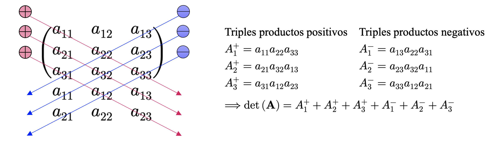

::: {.callout-important}
## Idea central

El determinante y la diagonalización permiten estudiar propiedades estructurales profundas de las matrices, conectando invertibilidad, geometría, espectro y representación simplificada de transformaciones lineales.
:::

## Introducción
En las secciones anteriores estudiamos algunas formas de manipular y obtener ciertas métricas para los vectores, proyecciones de esos vectores con respecto a determinados subespacios vectoriales y transformaciones lineales. Las aplicaciones y transformaciones que permiten operar con vectores pueden ser convenientemente descritas por medio de matrices. Además, la mayoría de los conjuntos de datos *bien comportados* que podemos encontrar en el mundo real vienen especificados en estructuras que pueden ser arregladas y/o representadas igualmente por medio de matrices. Por ejemplo, las filas de estos conjuntos de datos suelen representar **registros** u **observaciones** (como personas, fechas, unidades, entre otras) y las columnas suelen representar diferentes **atributos** para cada fila (como edad, altura, propiedades extensivas de algún fenómeno o el valor de alguna variable en el tiempo). En esta sección, presentaremos tres aspectos relativos a las matrices: Cómo **resumirlas**, como **descomponerlas** y como utilizar tales descomposiciones para construir **aproximaciones** para determinadas matrices.

A diferencia de la sección anterior, en ésta volveremos a escribir algo de código, a fin de corresponder algunos conceptos esenciales con librerías tales como **<font color='darkmagenta'>Numpy</font>** o **<font color='darkmagenta'>Scipy</font>**. No será demasiado código, pero sí el suficiente para darle algo de sentido práctico a los conceptos que desarrollaremos desde la perspectiva computacional.

## Determinantes

### Un interludio previo
Los determinantes constituyen otro de los aspectos fundamentales del álgebra lineal. Corresponde a un objeto matemático que es importante en el análisis y solución de sistemas de ecuaciones lineales y que puede expresarse por medio de una función, denominada como **función determinante**, y que permite aplicar cualquier matriz cuadrada de orden $n$ en el cuerpo $\mathbb{K}$ donde sus elementos están definidos. Dicha función, para una matriz $\mathbf{A}\in \mathbb{K}^{n\times n}$, se denota como $\det(\mathbf{A})=|\mathbf{A}|$, y es tal que $\left| \  \cdot \  \right|  :\mathbb{K}^{n} \times \mathbb{K}^{n} \longrightarrow \mathbb{K}$, pudiéndose escribir el determinante de la matriz $\mathbf{A}$ como

::: {.eq-scroll}
$$
\mathbf{A} =\left\{ a_{ij}\in \mathbb{K} \right\}  =\left( \begin{matrix}a_{11}&a_{12}&\cdots &a_{1n}\\ a_{21}&a_{22}&\cdots &a_{2n}\\ \vdots &\vdots &\ddots &\vdots \\ a_{n1}&a_{n2}&\cdots &a_{nn}\end{matrix} \right)  \in \mathbb{K}^{n\times n} \wedge \det \left( \mathbf{A} \right)  =\left| \begin{matrix}a_{11}&a_{12}&\cdots &a_{1n}\\ a_{21}&a_{22}&\cdots &a_{2n}\\ \vdots &\vdots &\ddots &\vdots \\ a_{n1}&a_{n2}&\cdots &a_{nn}\end{matrix} \right|  \in \mathbb{K} \tag{5.1}
$$
:::

**Ejemplo 5.1:** Comenzaremos a motivar el estudio de los determinantes explorando la posibilidad de que una matriz cuadrada, digamos $\mathbf{A}\in \mathbb{R}^{n\times n}$, sea **invertible**. Para los casos de menor dimensión, ya conocemos los casos que aseguran que $\mathbf{A}$ cumpla con esta condición. Por ejemplo, si $\mathbf{A}\in \mathbb{R}^{1\times 1}$ (es decir, $\mathbf{A}$ es un escalar), sabemos que $\mathbf{A}=a\ \Longrightarrow \mathbf{A}^{-1}=1/a$, lo que implica que $\mathbf{A}$ tiene una inversa siempre que $a\neq 0$. Para el caso de matrices de $2\times 2$, sabemos que la inversa $\mathbf{A}^{-1}$ cumple con la condición de que $\mathbf{A}\mathbf{A}^{-1}=\mathbf{I}_{2}$. De esta manera, podemos escribir

::: {.eq-scroll}
$$
\mathbf{A} =\left( \begin{matrix}a_{11}&a_{12}\\ a_{21}&a_{22}\end{matrix} \right)  \Longrightarrow \mathbf{A} \mathbf{A}^{-1} =\mathbf{I}_{2} \Longleftrightarrow \mathbf{A}^{-1} =\frac{1}{a_{11}a_{22}-a_{12}a_{21}} \left( \begin{matrix}a_{22}&-a_{12}\\ -a_{21}&a_{11}\end{matrix} \right) \tag{5.2}
$$
:::

Por lo tanto, $\mathbf{A}$ es invertible si y sólo si $a_{11}a_{22}-a_{12}a_{21}\neq 0$. Para matrices de $2\times 2$, dicha cantidad corresponde al **determinante** de la matriz respectiva. De esta manera, para la matriz $\mathbf{A} =\left\{ a_{ij}\right\}  \in \mathbb{R}^{2\times 2}$, su determinante se define como

::: {.eq-scroll}
$$
\det \left( \mathbf{A} \right)  =\det \left( \begin{matrix}a_{11}&a_{12}\\ a_{21}&a_{22}\end{matrix} \right)  =\left| \begin{matrix}a_{11}&a_{12}\\ a_{21}&a_{22}\end{matrix} \right|  =a_{11}a_{22}-a_{12}a_{21} \tag{5.3}
$$
:::

◼︎

El ejemplo (5.1) permite establecer un hecho que puede ser generalizado a conjuntos de mayor dimensión: Una matriz es invertible siempre que su determinante no sea nulo. Formalicemos este hecho mediante un teorema.

::: {.callout-tip}
## Teorema 5.1 – Existencia de la matriz inversa
*Sea $\mathbf{A}\in \mathbb{K}^{n\times n}$ una matriz cuadrada con elementos en el cuerpo $\mathbb{K}$. Entonces $\mathbf{A}$ se dirá **invertible** o **no singular** (es decir, existe la matriz inversa $\mathbf{A}^{-1}$) si y solo si $\det(\mathbf{A})\neq 0$.*
:::

Ya disponemos de una expresión cerrada que permite calcular el determinante de cualquier matriz de dimensión $2\times 2$. Sin embargo, no es tan sencillo generalizar dicho cálculo para dimensiones superiores. Por ejemplo, para el caso de matrices de $3\times 3$, es común el cálculo de sus determinantes mediante la llamada regla de Sarrus:

::: {.eq-scroll}
$$
\det \left( \begin{matrix}a_{11}&a_{12}&a_{13}\\ a_{21}&a_{22}&a_{23}\\ a_{31}&a_{32}&a_{33}\end{matrix} \right)  =a_{11}a_{22}a_{33}+a_{21}a_{32}a_{13}+a_{31}a_{12}a_{23}-a_{31}a_{22}a_{13}-a_{11}a_{32}a_{23}-a_{21}a_{12}a_{33} \tag{5.4}
$$
:::

Si bien, en un principio, la regla de Sarrus parece una fórmula complicada de entender, ésta no es más que un recurso mnemotécnico, ya que los triples productos involucrados en la fórmula y sus signos guardan relación con las diagonales (y subdiagonales) presentes en la matriz correspondiente, como se observa en el esquema de la @fig-sarrus.

{#fig-sarrus fig-align="center" width="80%"}

Recordemos que, al resolver sistemas de ecuaciones lineales, nuestro objetivo era transformar la matriz ampliada de un sistema en una tal que sólo tuviera elementos no nulos en su región superior derecha (matriz triangular superior), aunque también es posible operar para llegar al caso opuesto, donde la matriz resultante tenga elementos no nulos en su región inferior izquierda (matriz triangular inferior). Este tipo de matrices fueron formalizadas previamente en la definición (1.7).

Para una matriz triangular, digamos $\mathbf{A}\in \mathbb{K}^{n\times n}$, definimos su determinante como

::: {.eq-scroll}
$$
\det \left( \mathbf{A} \right)  =\prod^{n}_{i=1} a_{ii} \tag{5.5}
$$
:::

Donde $a_{ii}$ es el correspondiente elemento relativo a la diagonal principal de la matriz $\mathbf{A}$.

### Interpretación geométrica del determinante
Si una matriz $\mathbf{A}\in \mathbb{R}^{n\times n}$ tiene elementos $a_{ij}\in \mathbb{R}$, entonces puede ser utilizada para representar dos transformaciones lineales. Una que aplica la base canónica de $\mathbb{R}^{n}$ a las filas de $\mathbf{A}$, y otra que aplica la misma base a las columnas de $\mathbf{A}$. Cualquiera sea el caso, si la matriz $\mathbf{A}$ es de $2\times 2$, las imágenes de cada uno de los vectores de la base canónica de $\mathbb{R}^{2}$ forman un paralelógramo que representa la imagen del cuadrado unitario bajo la transformación lineal respectiva, y cuyos vértices se corresponden con combinaciones de los elementos de $\mathbf{A}$, como se observa en la @fig-geodet (a).

Si $\mathbf{A} =\left\{ {}a_{ij}\right\}  \in \mathbb{R}^{2\times 2}$ es la matriz que conforma los vértices del paralelógramo en la @fig-geodet (a), se tendrá que el área encerrada por el mismo será igual a $\det \left( \mathbf{A} \right)  =a_{11}a_{22}-a_{12}a_{21}$. Para mostrar este resultado, podemos considerar que los elementos de la matriz $\mathbf{A}$ corresponden a vectores que representan los vértices del paralelógramo. Si uno de los vértices es el origen del sistema de coordenadas, los vectores $\mathbf{a} =\left( a_{11},a_{12}\right)$ y $\mathbf{b} =\left( a_{21},a_{22}\right)$ serán los vértices más cercanos al origen, mientras que el vértice opuesto será igual a la suma $\mathbf{a} +\mathbf{b} =\left( a_{11}+a_{21},a_{12}+a_{22}\right)$. El área del paralelógramo puede expresarse igualmente como $\left\Vert \mathbf{a} \right\Vert  \left\Vert \mathbf{b} \right\Vert  \mathrm{sen} \left( \theta \right)$, donde $\theta$ es el ángulo formado por los vectores $\mathbf{a}$ y $\mathbf{b}$. Si consideramos la proyección ortogonal del vector $\mathbf{a}$ sobre $\mathbf{b}$ (que llamamos $\pi_{\mathbf{b}}(\mathbf{a})$), podemos escribir

::: {.eq-scroll}
$$
\mathrm{Area} =\left\Vert \mathbf{a} \right\Vert  \left\Vert \mathbf{b} \right\Vert  \mathrm{sen} \left( \theta \right)  =\left\Vert \pi_{\mathbf{b} } \left( \mathbf{a} \right)  \right\Vert  \left\Vert \mathbf{b} \right\Vert  \cos \left( \frac{\pi }{2} -\theta \right)  =a_{11}a_{12}-a_{12}a_{21}=\det \left( \mathbf{A} \right) \tag{5.6}
$$
:::

La interpretación geométrica anterior puede extenderse al caso de matrices de $3\times 3$, considerando en este caso un paralelepípedo generado por las submatrices columna que generan la matriz completa $\mathbf{A} =\left\{ a_{ij}\right\}  \in \mathbb{R}^{3\times 3}$. Si tales submatrices son representadas como $\mathbf{r}_{1}$, $\mathbf{r}_{2}$ y $\mathbf{r}_{3}$, entonces el volumen del paralelepípedo es igual a $V=\det \left( \left( \mathbf{r}_{1} ,\mathbf{r}_{2} ,\mathbf{r}_{3} \right)  \right)  =\det \left( \mathbf{A} \right)$, tal y como se ilustra en la @fig-geodet (b).

{#fig-geodet fig-align="center" width="90%"}

### Propiedades de los determinantes
El cálculo de un determinante para una matriz arbitraria $\mathbf{A} =\left\{ a_{ij}\right\}  \in \mathbb{R}^{n\times n}$ requiere de un algoritmo generalizado para poder resolver los casos en los cuales $n>3$. Existen varios procedimientos para ello, siendo indudablemente el más popular el **método de Laplace**, que definiremos a continuación.

**<font color='blue'>Definición 5.1 – Determinante:</font>** Sea $\mathbf{A} =\left\{ a_{ij}\right\}  \in \mathbb{R}^{n\times n}$. Definimos el **determinante** de la matriz $\mathbf{A}$ como

1. Respecto a la columna $j$: $\det \left( \mathbf{A} \right)  =\sum^{n}_{k=1} \left( -1\right)^{k+j}  a_{kj}\det \left( \mathbf{A}_{kj} \right)$.
2. Respecto a la fila $j$: $\det \left( \mathbf{A} \right)  =\sum^{n}_{k=1} \left( -1\right)^{k+j}  a_{jk}\det \left( \mathbf{A}_{jk} \right)$.

En la fórmulas anteriores, conocidas en la práctica como **expansiones de Laplace**, $\mathbf{A}_{jk}$ corresponde a la submatriz resultante de eliminar de $\mathbf{A}$ la fila $j$ y la columna $k$ y se denomina como **menor complementario** en la posición $(j, k)$, mientras que el número real $\triangle_{jk} =\left( -1\right)^{k+j}  a_{jk}$ es llamado **cofactor** asociado al $jk$-ésimo elemento de la matriz $\mathbf{A}$.

Resulta sencillo darnos cuenta de que, si bien las expansiones de Laplace nos permiten obtener una fórmula cerrada para el cálculo del determinante de cualquier matriz cuadrada, su tiempo de ejecución y complejidad computacional escala enormemente con la dimensión de la matriz para la cual queremos calcular su determinante. Por esa razón, en términos algebraicos, es mejor considerar ciertas propiedades que se desprenden directamente de la definición que hemos ido construyendo del determinante a fin de disponer de métodos más efectivos para su cálculo en dimensiones superiores (considerando, además, las transformaciones elementales sobre matrices que hemos aprendido previamente). Vamos, por tanto, a desarrollar tales propiedades:

- **(P1) – Invariancia ante la transposición:** Si $\mathbf{A} =\left\{ a_{{}ij}\right\}  \in \mathbb{R}^{n\times n}$, entonces, de la definición (3.1), se tiene que $\det(\mathbf{A})=\det(\mathbf{A}^{\top})$, ya que $\det \left( \mathbf{A} \right)  =\sum^{n}_{k=1} \triangle_{jk} \det \left( \mathbf{A}_{jk} \right)  =\sum^{n}_{s=1} \triangle_{sj} \det \left( \mathbf{A}_{sj} \right)$.
- **(P2) – Columna o fila nula:** Si $\mathbf{A} =\left\{ a_{{}ij}\right\}  \in \mathbb{R}^{n\times n}$ posee una columna o fila nula (conformada únicamente por elementos iguales a cero), entonces $\det(\mathbf{A})=0$.
- **(P3) – Determinante de un producto de matrices:** Si $\mathbf{A},\mathbf{B}\in \mathbb{R}^{n\times n}$, entonces $\det(\mathbf{A}\mathbf{B})=\det(\mathbf{A})\det(\mathbf{B})$.
- **(P4) – Determinante de la matriz inversa:** Si $\mathbf{A} =\left\{ a_{{}ij}\right\}  \in \mathbb{R}^{n\times n}$ es una matriz no singular, entonces $\det \left( \mathbf{A}^{-1} \right)  =1/\det \left( \mathbf{A} \right)$.
- **(P5) – Invariancia ante operaciones elementales:** Cualquier matriz $\mathbf{A}\in \mathbb{R}^{n\times n}$ mantiene el valor de su determinante, aunque hayamos operado sobre ella mediante cualquier de las transformaciones elementales vistas en la [clase 1.1](https://github.com/rquezadac/udd_data_science_lectures/blob/main/PARTE%20I%20-%20Fundamentos%20matem%C3%A1ticos%20elementales/clase_1_1.ipynb).
- **(P6) – Escalamiento del determinante:** Sea $\mathbf{A} =\left\{ a_{ij}\right\}  \in \mathbb{R}^{n\times n}$ y $\lambda \in \mathbb{R}$. Entonces $\det \left( \lambda \mathbf{A} \right)  =\lambda^{n} \det \left( \mathbf{A} \right)$.
- **(P7) – Columna o fila repetida:** Si una matriz $\mathbf{A} =\left\{ a_{ij}\right\}  \in \mathbb{R}^{n\times n}$ tiene columnas o filas repetidas (o, más general, linealmente dependientes), entonces $\det(\mathbf{A})=0$. Esta propiedad generaliza **(P2)** y establece que toda matriz $\mathbf{A}$ no singular tiene rango completo.

**Ejemplo 5.2:** Calcularemos el determinante de la matriz $\mathbf{A}\in \mathbb{R}^{5\times 5}$, definida como

::: {.eq-scroll}
$$
\mathbf{A} =\left( \begin{matrix}0&1&0&1&0\\ -1&a&0&0&0\\ 0&0&a&0&0\\ -1&0&0&a&0\\ 0&0&0&0&a\end{matrix} \right) \tag{5.7}
$$
:::

En efecto, aplicando la definición (5.1) y transformaciones elementales,

::: {.eq-scroll}
$$
\begin{array}{rcl}\det \left( \begin{matrix}0&1&0&1&0\\ -1&a&0&0&0\\ 0&0&a&0&0\\ -1&0&0&a&0\\ 0&0&0&0&a\end{matrix} \right)  &\overbrace{=}^{\mathrm{definicion} } &\underbrace{a}_{\mathrm{cofactor} \  \triangle_{55} } \det \left( \begin{matrix}0&1&0&1\\ -1&a&0&0\\ 0&0&a&0\\ -1&0&0&a\end{matrix} \right)  \\ &\overbrace{=}^{F_{42}\left( -1\right)  } &a\det \left( \begin{matrix}0&1&0&1\\ -1&a&0&0\\ 0&0&a&0\\ 0&-a&0&a\end{matrix} \right)  \\ &\overbrace{=}^{\mathrm{definicion} } &\underbrace{1}_{\mathrm{cofactor} \  \triangle_{21} } \cdot a\det \left( \begin{matrix}1&0&1\\ 0&a&0\\ -a&0&a\end{matrix} \right)  \\ &\overbrace{=}^{\mathrm{definicion} } &a^{2}\det \left( \begin{matrix}1&1\\ -a&a\end{matrix} \right)  \overbrace{=}^{\mathrm{definicion} } 2a^{3}\end{array} \tag{5.8}
$$
:::

◼︎

**Ejemplo 5.3 – Los determinantes en <font color='darkmagenta'>Numpy</font>:** En librerías de Python especializadas en el uso de arreglos vectorizados, como **<font color='darkmagenta'>Numpy</font>**, es razonable esperar que existan rutinas prefabricadas para el cálculo de determinantes. En particular, podemos usar la función `det()`, del módulo de álgebra lineal `numpy.linalg` para calcular el determinante de cualquier matriz expresada por medio de un arreglo bidimensional. Por ejemplo, si consideramos la matriz $\mathbf{A}\in \mathbb{R}^{5\times 5}$, definida como

::: {.eq-scroll}
$$
\mathbf{A} =\left( \begin{matrix}0&-1&2&-1&0\\ 3&-1&2&2&0\\ 6&-1&0&0&9\\ 0&1&4&-5&9\\ 2&2&-4&5&-3\end{matrix} \right) \tag{5.9}
$$
:::

Podemos calcular su determinante fácilmente en <font color='purple'>Numpy</font> definiendo, primeramente, un arreglo bidimensional, digamos `A`, donde almacenamos esta matriz:

```{python}
import numpy as np
```

```{python}
import warnings
```

```{python}
warnings.filterwarnings("ignore", category=RuntimeWarning)
```

```{python}
# Definimos el arreglo en cuestión.
A = np.array([
    [0, -1, 2, -1, 0],
    [3, -1, 2, 2, 0],
    [6, -1, 0, 0, 9],
    [0, 1, 4, -5, 9],
    [2, 2, -4, 5, -3],
])
```

A continuación, calculamos su determinante:

```{python}
# Calculamos el determinante de A (redondeado a 3 decimales).
np.around(np.linalg.det(A), 3)
```

Vemos pues que no fue nada difícil calcular el determinante de una matriz de $5\times 5$ en **<font color='darkmagenta'>Numpy</font>**. Sin embargo, tal y como comentamos previamente, el cálculo de determinantes corresponde a un esfuerzo computacional ostensiblemente grande y que escala enormemente a medida que aumentan las dimensiones de las matrices de interés. Incluso trabajando con una librería muy eficiente como **<font color='darkmagenta'>Numpy</font>**, los tiempos de ejecución pueden verse muy afectados. Para ejemplificar aquello, consideraremos el cálculo de los determinantes de cuatro matrices $\mathbf{A}\in \mathbb{R}^{10\times 10}$, $\mathbf{B}\in \mathbb{R}^{100\times 100}$, $\mathbf{C}\in \mathbb{R}^{1000\times 1000}$ y $\mathbf{D}\in \mathbb{R}^{10000\times 10000}$, las que representaremos mediante los arreglos bidimensionales `A`, `B`, `C` y `D`, y que estarán compuestas por números reales uniformemente distribuidos entre 0 y 1:

```{python}
# Definimos una semilla aleatoria fija.
rng = np.random.default_rng(42)

# Definimos algunas matrices de distintos tamaños.
A = rng.random(size=(10, 10))
B = rng.random(size=(100, 100))
C = rng.random(size=(1000, 1000))
D = rng.random(size=(10000, 10000))
```

Vamos a estimar el tiempo de ejecución asociado al cálculo de los determinantes de estas matrices, a fin de observar qué tal escala con respecto al incremento en dimensionalidad de las mismas. Notemos que cada matriz es 10 veces más grande que su antecesora:

```{python}
%timeit np.linalg.det(A)
%timeit np.linalg.det(B)
%timeit np.linalg.det(C)
#%timeit np.linalg.det(D)
```

Podemos observar que el cálculo del determinante de `B` tiene un tiempo de ejecución 12 veces mayor que el cálculo del determinante de `A`. El cálculo del determinante de `C` tiene un tiempo de ejecución de aproximadamente unas 82 veces superior al del cálculo del determinante de `B` (y, por extensión, 1038 veces más lento que el cálculo del determinante de `A`). Y el cálculo del determinante de `D` tiene un tiempo de ejecución aproximadamente unas 445 veces más lento que el cálculo del determinante de `C` (y, por extensión... ¡es más de 36000 veces más lento que el cálculo del determinante de `B`, y más de 460000 veces más lento que el cálculo del determinante de `A`!). Esto definitivamente nos hará pensarlo dos veces antes de calcular determinantes en el mundo real, donde resulta común vernos enfrentados a bases de datos con cientos de miles de registros. ◼︎

**Ejemplo 5.4:** Vamos a demostrar que

::: {.eq-scroll}
$$
\det \left( \begin{matrix}1&1&1\\ x&y&z\\ x^{2}&y^{2}&z^{2}\end{matrix} \right)  =\left( x-y\right)  \left( y-z\right)  \left( z-x\right) \tag{5.10}
$$
:::

En efecto, utilizando transformaciones elementales, propiedades de los determinantes y la definición (3.1), tenemos que

::: {.eq-scroll}
$$
\begin{array}{rcl}\det \left( \begin{matrix}1&1&1\\ x&y&z\\ x^{2}&y^{2}&z^{2}\end{matrix} \right)  &\overbrace{=}^{F_{21}\left( -x\right)  } &\det \left( \begin{matrix}1&1&1\\ 0&y-x&z-x\\ x^{2}&y^{2}&z^{2}\end{matrix} \right)  \\ &\overbrace{=}^{F_{31}\left( -x^{2}\right)  } &\det \left( \begin{matrix}1&1&1\\ 0&y-x&z-x\\ 0&y^{2}-x^{2}&z^{2}-x^{2}\end{matrix} \right)  \\ &\overbrace{=}^{\mathrm{definicion} } &\det \left( \begin{matrix}y-x&z-x\\ y^{2}-x^{2}&z^{2}-x^{2}\end{matrix} \right)  \\ &=&\left( y-z\right)  \left( z^{2}-x^{2}\right)  -\left( z-x\right)  \left( y^{2}-x^{2}\right)  \\ &=&\left( y-x\right)  \left( z-x\right)  \left( z+x-y+x\right)  \\ &=&\left( y-x\right)  \left( z-x\right)  \left( z-y\right)  \\ &=&\left( x-y\right)  \left( y-z\right)  \left( z-x\right)  \end{array}\tag{5.11}
$$
:::

Tal como queríamos demostrar. ◼︎

**Ejemplo 5.5:** Vamos a determinar todos los valores de $a\in \mathbb{R}$ tales que

::: {.eq-scroll}
$$
\det \left( \begin{matrix}1&a&a^{2}&\left( a^{3}+6\right)  \\ 1&1&1&\left( 1+6a\right)  \\ 1&2&4&\left( 8+3a\right)  \\ 1&3&9&\left( 27+2a\right)  \end{matrix} \right)  =0\tag{5.12}
$$
:::

En efecto,

::: {.eq-scroll}
$$
\begin{array}{rcl}\det \left( \begin{matrix}1&a&a^{2}&\left( a^{3}+6\right)  \\ 1&1&1&\left( 1+6a\right)  \\ 1&2&4&\left( 8+3a\right)  \\ 1&3&9&\left( 27+2a\right)  \end{matrix} \right)  &\overbrace{=}^{\begin{array}{c}F_{21}\left( -1\right)  \\ F_{31}\left( -1\right)  \\ F_{41}\left( -1\right)  \end{array} } &\det \left( \begin{matrix}1&a&a^{2}&\left( a^{3}+6\right)  \\ 0&\left( 1-a\right)  &\left( 1-a^{2}\right)  &\left( 1-a^{3}+6\left( a-1\right)  \right)  \\ 0&\left( 2-a\right)  &\left( 4-a^{2}\right)  &\left( 8-a^{3}+3a-6\right)  \\ 0&\left( 3-a\right)  &\left( 9-a^{2}\right)  &\left( 27-a^{3}+2a-6\right)  \end{matrix} \right)  \\ &\overbrace{=}^{\mathrm{definicion} } &\det \left( \begin{matrix}\left( 1-a\right)  &\left( 1-a^{2}\right)  &\left( 1-a^{3}+6\left( a-1\right)  \right)  \\ \left( 2-a\right)  &\left( 4-a^{2}\right)  &\left( 8-a^{3}+3a-6\right)  \\ \left( 3-a\right)  &\left( 9-a^{2}\right)  &\left( 27-a^{3}+2a-6\right)  \end{matrix} \right)  \\ &=&\det \left( \begin{matrix}\left( 1-a\right)  &\left( 1-a^{2}\right)  &\left[ \left( 1-a\right)  \left( a^{2}+a+1\right)  +6\left( a-1\right)  \right]  \\ \left( 2-a\right)  &\left( 4-a^{2}\right)  &\left[ \left( 2-a\right)  \left( a^{2}+2a+4\right)  +3\left( a-2\right)  \right]  \\ \left( 3-a\right)  &\left( 9-a^{2}\right)  &\left[ \left( 3-a\right)  \left( a^{2}+3a+9\right)  +2\left( a-3\right)  \right]  \end{matrix} \right)  \end{array}\tag{5.13}
$$
:::

Es claro, conforme el desarrollo anterior, que el determinante se anula cuando $a=1$, $a=2$ o $a=3$. Para $a\neq 1$, $a\neq 2$ y $a\neq 3$, proseguimos con el desarrollo del determinante, con lo cual,

::: {.eq-scroll}
$$
\begin{array}{rcl}\det \left( \begin{matrix}1&a&a^{2}&\left( a^{3}+6\right)  \\ 1&1&1&\left( 1+6a\right)  \\ 1&2&4&\left( 8+3a\right)  \\ 1&3&9&\left( 27+2a\right)  \end{matrix} \right)  &\overbrace{=}^{\mathrm{propiedades} } &\left( 1-a\right)  \left( 2-a\right)  \left( 3-a\right)  \det \left( \begin{matrix}1&\left( 1+a\right)  &\left( a^{2}+a-5\right)  \\ 1&\left( 2+a\right)  &\left( a^{2}+2a+1\right)  \\ 1&\left( 3+a\right)  &\left( a^{2}+3a+7\right)  \end{matrix} \right)  \\ &\overbrace{=}^{\begin{array}{c}F_{21}\left( -1\right)  \\ F_{31}\left( -1\right)  \end{array} } &\left( 1-a\right)  \left( 2-a\right)  \left( 3-a\right)  \det \left( \begin{matrix}1&\left( 1+a\right)  &\left( a^{2}+a-5\right)  \\ 0&1&\left( a+6\right)  \\ 0&2&\left( a+6\right)  \end{matrix} \right)  \\ &=&2\left( 1-a\right)  \left( 2-a\right)  \left( 3-a\right)  \det \left( \begin{matrix}1&\left( 1+a\right)  &\left( a^{2}+a-5\right)  \\ 0&1&\left( a+6\right)  \\ 0&1&\left( a+6\right)  \end{matrix} \right)  \\ &=&0\end{array} \tag{5.14}
$$
:::

Luego tenemos que $\det(\mathbf{A})=0$ para todo $a\in \mathbb{R}$. ◼︎

## Diagonalización de matrices
Una vez estudiado el concepto de determinante, vamos a ocuparnos de un problema más general y que consiste en saber cuando, para una transformación lineal del tipo $T:\mathbb{R}^{n}\longrightarrow \mathbb{R}^{n}$, es posible encontrar una base $\alpha$ con respecto a la cual la matriz asociada $\mathbf{A}=[T]_{\alpha}^{\alpha}$ sea de tipo **diagonal**. De manera equivalente, queremos determinar las condiciones para las cuales una matriz $\mathbf{A}\in \mathbb{R}^{n\times n}$ puede *descomponerse* de la forma

::: {.eq-scroll}
$$
\mathbf{A} =\mathbf{P} \mathbf{D} \mathbf{P}^{-1}\tag{5.15}
$$
:::

Donde $\mathbf{D}\in \mathbb{R}^{n\times n}$ es una matriz diagonal.

Este problema de naturaleza puramente algebraica tiene una cantidad significativa de aplicaciones en otras ramas de las matemáticas, como en ecuaciones diferenciales, estadística y, por supuesto, en machine learning. Puntualmente, la diagonalización es un procedimiento esencial en la derivación de la descomposición de matrices en **valores singulares** y que, a su vez, constituye la base del **análisis de componentes principales**, uno de los modelos de aprendizaje no supervisado más utilizados para la reducción de la dimensión de conjuntos de datos con un elevado número de variables, sin perder una cantidad significativa de información. Tal vez el teorema más importante de esta subsección es el que dice que toda matriz simétrica puede representarse mediante la expresión (5.15).

### Autovalores y autovectores
Para comenzar con el estudio de la diagonalización de matrices, primero introduciremos algunos conceptos y resultados esenciales.

**<font color='blue'>Definición 5.2 – Autovalores y autovectores:</font>** Sea $V$ un $\mathbb{K}$-espacio vectorial y $T:V\longrightarrow V$ una transformación lineal. Diremos que $v\in V$ es un **autovector o vector propio** de $T$ si se cumplen las siguientes condiciones:

- **(C1):** $v\in O_{V}$.
- **(C2):** Existe un escalar $\lambda \in \mathbb{K}$ tal que $T(v)=\lambda v$.

El escalar $\lambda$ se denomina **autovalor o valor propio** asociado al autovector $v$.

Equivalentemente, diremos que $v\in V-\left\{ O_{V}\right\}$ es un autovector asociado a la matriz $\mathbf{A}\in \mathbb{K}^{n\times n}$ si $v$ es un autovector de la transformación lineal $T:V\longrightarrow V$ explícitamente definida como $T(v)=\mathbf{A}v$. Es decir, existe un escalar $\lambda \in \mathbb{K}$ tal que $\mathbf{A}v=\lambda v$. De la misma forma, diremos que $\lambda$ es un autovalor de la matriz $\mathbf{A}$.

::: {.callout-tip}
## Teorema 5.2
*Dada una matriz $\mathbf{A}\in \mathbb{K}^{n\times n}$, si $\lambda \in \mathbb{K}$ es un autovalor de $\mathbf{A}$, entonces las siguientes expresiones son equivalentes:*

- **(T1):** $\exists v\neq O_{V}\  |\  \mathbf{A} v=\lambda v$, *donde $V$ es un $\mathbb{K}$-espacio vectorial y $v$ es un autovector de la matriz $\mathbf{A}$.*
- **(T2):** $\exists v\in V$ *tal que $v$ es una solución no trivial del sistema de ecuaciones $\left( \mathbf{A} -\lambda \mathbf{I}_{n} \right)  v=O_{V}$.*
- **(T3):** $\ker \left( \mathbf{A} -\lambda \mathbf{I}_{n} \right)  \neq \left\{ O_{V}\right\}$.
- **(T4):** $\left( \mathbf{A} -\lambda \mathbf{I}_{n} \right)$ *es una matriz no invertible*.
:::

Queda claro pues que necesitamos una forma sencilla de determinar qué valores de $\lambda \in \mathbb{K}$ son, en efecto, autovalores. Para ello, es útil reconocer que la condición **(T4)** en el teorema (5.2) puede expresarse como una ecuación en la variable $\lambda$. Por supuesto, es acá donde cobra sentido el desarrollo que hicimos del concepto de determinante de una matriz $\mathbf{A}\in \mathbb{K}^{n\times n}$, puesto que, como ya verificamos con el teorema (5.1), toda matriz es no singular (invertible) si su determinante es no nulo. Por lo tanto, la condición **(T4)** puede expresarse como $\det \left( \mathbf{A} -\lambda \mathbf{I}_{n} \right)  =0$, donde $\mathbf{I}_{n}$ es la matriz identidad.

Tiene sentido, por lo tanto, la siguiente definición.

**<font color='blue'>Definición 5.3 – Polinomio característico:</font>** Sea $\mathbf{A}\in \mathbb{K}^{n\times n}$ una matriz tal que ésta coincide con la representación matricial de una transformación lineal $T:V\longrightarrow V$ que opera sobre el $\mathbb{K}$-espacio vectorial $V$. La expresión $P_{T}\left( \lambda \right)  =\det \left( \mathbf{A} -\lambda \mathbf{I}_{n} \right)  \in \mathbb{K}_{n} \left[ \lambda \right]$ será llamada **polinomio característico** de la matriz $\mathbf{A}$ (y, por extensión, de la transformación lineal $T$).

De la definición (5.2), se tiene que $v\in V$ es un autovector de $\mathbf{A}$ si $v\neq O_{V}$ y existe un escalar $\lambda \in \mathbb{K}$ tal que $\mathbf{A}v=\lambda v$. De esta manera, podemos verificar que $\lambda$ es un autovalor de la matriz $\mathbf{A}$ si y sólo si es una solución no nula de la ecuación

::: {.eq-scroll}
$$
\left( \mathbf{A} -\lambda \mathbf{I}_{n} \right)  v=O_{V}\tag{5.16}
$$
:::

Así pues, todo escalar $\lambda \in \mathbb{K}$ que satisfaga (5.16) será un autovalor de $\mathbf{A}$. Notemos además que, conforme la expresión anterior, si $v$ es un autovector, también lo es cualquier otro vector que sea linealmente dependiente con respecto a $v$. Es decir, si 𝑣 es un autovector de la matriz $\mathbf{A}$, entonces también lo es $\alpha v;\forall v\in \mathbb{K}$. Más aún, si $v$ es un autovector, cualquier autovalor asociado a $v$ es único, puesto que si $T(v)=\lambda_{1}v=\lambda_{2}v$, entonces $(\lambda_{1}-\lambda_{2})v=O_{V}$. Como $v\neq O_{V}$, entonces $\lambda_{1}-\lambda_{2}=0$, lo que implica que $\lambda_{1}=\lambda_{2}$.

**<font color='blue'>Definición 5.4 – Autoespacio:</font>** Sea $\mathbf{A}\in \mathbb{K}^{n\times n}$ una matriz tal que ésta coincide con la representación matricial de una transformación lineal $T:V\longrightarrow V$, siendo $V$ un $\mathbb{K}$-espacio vectorial. Para cada autovalor $\lambda$ de $\mathbf{A}$ definimos el **autoespacio o espacio propio** de $\lambda$, denotado como $W_{\lambda}$, como

::: {.eq-scroll}
$$
W_{\lambda }=\ker \left( \mathbf{A} -\lambda \mathbf{I}_{n} \right) \tag{5.17}
$$
:::

**<font color='blue'>Definición 5.5 – Similitud entre matrices:</font>** Sean $\mathbf{A} ,\mathbf{B} \in \mathbb{K}^{n\times n}$ dos matrices no singulares. Diremos que $\mathbf{A}$ y $\mathbf{B}$ son **similares** si existe otra matriz $\mathbf{P}\in \mathbb{K}^{n\times 1}$ tal que

::: {.eq-scroll}
$$
\mathbf{A} =\mathbf{P} \mathbf{B} \mathbf{P}^{-1} \tag{5.18}
$$
:::

::: {.callout-tip}
## Teorema 5.3 – Preservación de autovalores en matrices similares
*Sean $\mathbf{A} ,\mathbf{B} \in \mathbb{K}^{n\times n}$ dos matrices similares entre sí. Entonces ambas matrices tienen los mismos autovalores (y, por extensión, el mismo polinomio característico).*
:::

Vamos a demostrar el teorema (5.3) a fin de entender completamente este resultado. En efecto, sean $\mathbf{A} ,\mathbf{B} \in \mathbb{K}^{n\times n}$, tal que ambas matrices son similares (es decir, $\mathbf{A} =\mathbf{P} \mathbf{B} \mathbf{P}^{-1}$). Construyendo la expresión $\mathbf{A} -\lambda \mathbf{I}_{n}$, tenemos que

::: {.eq-scroll}
$$
\begin{array}{lll}\mathbf{A} -\lambda \mathbf{I}_{n} &=&\mathbf{P} \mathbf{B} \mathbf{P}^{-1} -\lambda \mathbf{P} \mathbf{P}^{-1} =\mathbf{P} \left( \mathbf{B} -\lambda \mathbf{I}_{n} \right)  \mathbf{P}^{-1} \\ &\Longrightarrow &\det \left( \mathbf{A} -\lambda \mathbf{I}_{n} \right)  =\det \left( \mathbf{P} \left( \mathbf{B} -\lambda \mathbf{I}_{n} \right)  \mathbf{P}^{-1} \right)  \\ &\Longrightarrow &\det \left( \mathbf{P} \right)  \det \left( \mathbf{B} -\lambda \mathbf{I}_{n} \right)  \det \left( \mathbf{P}^{-1} \right)  \  \left( \mathrm{pero} \  \det \left( \mathbf{P}^{-1} \right)  =\frac{1}{\det \left( \mathbf{P} \right)  } \right)  \\ &\Longrightarrow &\det \left( \mathbf{B} -\lambda \mathbf{I}_{n} \right)  \end{array} \tag{5.19}
$$
:::

Así, efectivamente, $\mathbf{A}$ y $\mathbf{B}$ tienen el mismo polinomio característico y, por tanto, los mismos autovalores.

**Ejemplo 5.6:** Sea $T:\mathbb{R}^{3}\longrightarrow \mathbb{R}^{3}$ una transformación lineal definida como $T(x,y,z)=(3x+2y+z,3y+2z,-z)$. Vamos a determinar los autovalores y autovectores asociados a $T$. 

En primer lugar, debemos construir la matriz $\mathbf{A}$ asociada a $T$ considerando la base canónica de vectores en $\mathbb{R}^{3}$ (que, recordemos, es $\mathbf{e}(3)=\left\{ \mathbf{e}_{1} ,\mathbf{e}_{2} ,\mathbf{e}_{3} \right\}  =\left\{ \left( 1,0,0\right)  ,\left( 0,1,0\right)  ,\left( 0,0,1\right)  \right\}$). Esto resulta sencillo, ya que

::: {.eq-scroll}
$$
T\left( x,y,z\right)  =\left( 3x+2y+z,3y+2z,-z\right)  =x\begin{pmatrix}3\\ 0\\ 0\end{pmatrix} +y\begin{pmatrix}2\\ 3\\ 0\end{pmatrix} +z\begin{pmatrix}1\\ 2\\ -1\end{pmatrix} \Longrightarrow \mathbf{A}= \begin{pmatrix}3&2&1\\ 0&3&2\\ 0&0&-1\end{pmatrix} \tag{5.20}
$$
:::

Ahora debemos resolver la ecuación $P_{\mathbf{A}}(\lambda)=0$. En efecto,

::: {.eq-scroll}
$$
\begin{array}{lll}\mathbf{A} =\begin{pmatrix}3&2&1\\ 0&3&2\\ 0&0&-1\end{pmatrix} &\Longrightarrow &P_{\mathbf{A} }\left( \lambda \right)  =\det \left( \begin{matrix}3-\lambda &2&1\\ 0&3-\lambda &2\\ 0&0&-1-\lambda \end{matrix} \right)  =0\\ &\Longrightarrow &P_{\mathbf{A} }\left( \lambda \right)  =\left( \lambda -3\right)^{3}  \left( \lambda +1\right)  =0\Longleftrightarrow \lambda_{1} =3\wedge \lambda_{2} =-1\end{array} \tag{5.21}
$$
:::

Por lo tanto, los autovalores de la matriz $\mathbf{A}$ (y, por extensión, de $T$) son $\lambda_{1}=3$ y $\lambda_{2}=-1$. Ahora determinamos los autoespacios respectivos,

::: {.eq-scroll}
$$
\begin{array}{lll}\mathbf{u} \in \left( \mathbb{R}^{3} \right)_{\lambda }  &\Longleftrightarrow &\mathbf{u} \in \mathbb{R}^{3} \wedge T\left( \mathbf{u} \right)  =\lambda \mathbf{u} \\ &\Longleftrightarrow &\mathbf{u} =\left( x,y,z\right)  \wedge T\left( x,y,z\right)  =\lambda \left( x,y,z\right)  \\ &\Longleftrightarrow &\mathbf{u} =\left( x,y,z\right)  \wedge T\left( x,y,z\right)  =\left( \lambda x,\lambda y,\lambda z\right)  \\ &\Longleftrightarrow &\mathbf{u} =\left( x,y,z\right)  \wedge \left( 3x+2y+z,3y+2z,-z\right)  =\left( \lambda x,\lambda y,\lambda z\right)  \\ &\Longleftrightarrow &\mathbf{u} =\left( x,y,z\right)  \wedge \begin{cases}\begin{array}{rcl}3x+2y+z&=&\lambda x\\ 3y+2z&=&\lambda y\\ -z&=&\lambda z\end{array} &\end{cases} \end{array} \tag{5.22}
$$
:::

Debemos por tanto evaluar el sistema de ecuaciones determinado en (5.22) usando los autovalores determinados previamente. Así tenemos, para $\lambda_{1}=3$,

::: {.eq-scroll}
$$
\begin{array}{lll}\mathbf{u} \in \left( \mathbb{R}^{3} \right)_{\lambda =3} &\Longleftrightarrow &\mathbf{u} =\left( x,y,z\right)  \wedge \begin{cases}\begin{array}{rcl}3x+2y+z&=&\lambda x\\ 3y+2z&=&\lambda y\\ -z&=&\lambda z\end{array} &\end{cases} \\ &\Longleftrightarrow &\mathbf{u} =\left( x,y,z\right)  \wedge z=0,y=0\\ &\Longleftrightarrow &\mathbf{u} =\left( x,0,0\right)  ;x\in \mathbb{R} \\ &\Longleftrightarrow &\mathbf{u} =x\left( 1,0,0\right)  \\ &\Longleftrightarrow &\left( \mathbb{R}^{3} \right)_{\lambda =3}  =\left< \left\{ \left( 1,0,0\right)  \right\}  \right>  \end{array} \tag{5.23}
$$
:::

Por otro lado, para $\lambda_{2}=-1$, tenemos,

::: {.eq-scroll}
$$
\begin{array}{lll}\mathbf{u} \in \left( \mathbb{R}^{3} \right)_{\lambda =-1}  &\Longleftrightarrow &\mathbf{u} =\left( x,y,z\right)  \wedge \begin{cases}\begin{array}{rcl}3x+2y+z&=&-x\\ 3y+2z&=&-y\\ -z&=&-z\end{array} &\end{cases} \\ &\Longleftrightarrow &\mathbf{u} =\left( x,y,z\right)  \wedge z=2y,x=0\\ &\Longleftrightarrow &\mathbf{u} =\left( 0,y,-2y\right)  ;y\in \mathbb{R} \\ &\Longleftrightarrow &\mathbf{u} =y\left( 0,1,-2\right)  \\ &\Longleftrightarrow &\left( \mathbb{R}^{3} \right)_{\lambda =-1}  =\left< \left\{ \left( 0,1,-2\right)  \right\}  \right>  \end{array} \tag{5.24}
$$
:::

◼︎

Sea $T:\mathbb{K}^{n}\longrightarrow \mathbb{K}^{n}$ una transformación lineal y sea $\mathbf{A}=[T]_{\alpha}^{\alpha}$ la matriz asociada a $T$ en la base canónica $\alpha$. Supongamos que existe una base de autovectores de $\mathbf{A}$, definida como $\beta =\left\{ \mathbf{v}_{1},...,\mathbf{v}_{n}\right\}$, siendo $\beta$ por tanto una base de $\mathbb{K}^{n}$. Para todo $i\in \mathbb{N}$, definimos $\lambda_{i}\in \mathbb{K}$ tal que $\mathbf{A}\lambda \mathbf{v}_{i}=\lambda_{i} \mathbf{v}_{i}$. Vemos que la matriz asociada a $T$ en la base $\beta$, que denominamos como $\mathbf{D}=[T]_{\beta}^{\beta}$, es diagonal, ya que

::: {.eq-scroll}
$$
\begin{array}{rcl}\mathbf{A} \mathbf{v}_{1} =\lambda_{1} \mathbf{v}_{1} &\Longrightarrow &\lambda_{1} \mathbf{v}_{1} =\lambda_{1} \mathbf{v}_{1} +0\mathbf{v}_{2} +\cdots +0\mathbf{v}_{n} \\ \mathbf{A} \mathbf{v}_{2} =\lambda_{2} \mathbf{v}_{2} &\Longrightarrow &\lambda_{2} \mathbf{v}_{2} =0\mathbf{v}_{1} +\lambda_{2} \mathbf{v}_{2} +\cdots +0\mathbf{v}_{n} \\ &\vdots &\\ \mathbf{A} \mathbf{v}_{n} =\lambda_{n} \mathbf{v}_{n} &\Longrightarrow &\lambda_{n} \mathbf{v}_{n} =0\mathbf{v}_{1} +0\mathbf{v}_{2} +\cdots +\lambda_{n} \mathbf{v}_{n} \end{array} \tag{5.25}
$$
:::

Por lo tanto, podemos escribir

::: {.eq-scroll}
$$
\left[ T\right]^{\beta }_{\beta }  =\left( \left[ T\left( \mathbf{v}_{1} \right)  \right]_{\beta }  ,\left[ T\left( \mathbf{v}_{2} \right)  \right]_{\beta }  ,...,\left[ T\left( \mathbf{v}_{n} \right)  \right]_{\beta }  \right)  =\left( \begin{matrix}\lambda_{1} &0&\cdots &0\\ 0&\lambda_{2} &\cdots &0\\ \vdots &\vdots &\ddots &\vdots \\ 0&0&\cdots &\lambda_{n} \end{matrix} \right) \tag{5.26}
$$
:::

Así que, efectivamente, la matriz $\mathbf{D}=[ T]^{\beta }_{\beta }$ y, por ende, la matriz $\mathbf{A}$ puede expresarse mediante la **descomposición propia** (o auto-descomposición) definida como $\mathbf{A}=\mathbf{P}\mathbf{D}\mathbf{P}^{-1}$. Esto resulta conveniente, ya que algunas ventajas de conocer la matriz diagonal $\mathbf{D}$ son las siguientes:

- **(V1):** $\rho(\mathbf{A})=\rho(\mathbf{D})=$ número de autovalores no nulos de $\mathbf{A}$ (y, por extensión, de $\mathbf{D}$). Recordemos que $\rho(\mathbf{A})$ denota el rango de la matriz $\mathbf{A}$.
- **(V2):** $\det(\mathbf{A})=\det(\mathbf{P}\mathbf{D}\mathbf{P}^{-1})=\det(\mathbf{P})\det(\mathbf{D})\det(\mathbf{P}^{-1})=\det(\mathbf{D})=\prod^{n}_{k=1} \lambda_{k}$.
- **(V3):** Si $\mathbf{A}$ es una matriz no singular (de decir, si $\det(\mathbf{A})\neq 0$), entonces, para cada $\lambda_{k}\neq 0$ y $\mathbf{A}^{-1}=\mathbf{P}\mathbf{D^{-1}}\mathbf{P^{-1}}$, donde

::: {.eq-scroll}
$$
\mathbf{D}^{-1} =\left( \begin{matrix}\lambda^{-1}_{1} &0&\cdots &0\\ 0&\  \lambda^{-1}_{2} &\cdots &0\\ \vdots &\vdots &\ddots &\vdots \\ 0&0&\cdots &\lambda^{-1}_{n} \end{matrix} \right) \tag{5.27}
$$
:::
- **(V4):** $\mathbf{A}^{m} =\left( \mathbf{P} \mathbf{D} \mathbf{P}^{-1} \right)^{m}  =\left( \mathbf{P} \mathbf{D} \mathbf{P}^{-1} \right)  \left( \mathbf{P} \mathbf{D} \mathbf{P}^{-1} \right)  \overbrace{\cdots }^{m\  \mathrm{veces} } \left( \mathbf{P} \mathbf{D} \mathbf{P}^{-1} \right)$. Así que,

::: {.eq-scroll}
$$
\mathbf{A}^{m} =\mathbf{P} \left( \begin{matrix}\lambda^{-m}_{1} &0&\cdots &0\\ 0&\lambda^{-m}_{2} &\cdots &0\\ \vdots &\vdots &\ddots &\vdots \\ 0&0&\cdots &\lambda^{-m}_{n} \end{matrix} \right)  \mathbf{P}^{-1} \tag{5.28}
$$
:::

Como hemos visto, $\mathbf{A} =\mathbf{P} \mathbf{D} \mathbf{P}^{-1}$, donde $\mathbf{P}=[\mathbf{e}]_{\beta}^{\alpha}$ (donde $\mathbf{e}(n)$ es la base canónica de vectores de $\mathbb{K}^{n}$). Es decir, tenemos que expresar los correspondientes autovectores en términos de la base canónica de $\mathbb{K}^{n}$. De esta manera, $\mathbf{P}=(\mathbf{v}_{1},...,\mathbf{v}_{n})$. Tiene sentido entonces la siguiente definición.

**<font color='blue'>Definición 5.6 – Matriz diagonalizable:</font>** Sea $\mathbf{A}\in \mathbb{K}^{n\times n}$ una matriz no singular. Diremos que $\mathbf{A}$ es **diagonalizable** si $\mathbb{K}^{n}$ admite una base de autovectores de $\mathbf{A}$ (es decir, los autovectores de $\mathbf{A}$ conforman un sistema de generadores para $\mathbb{K}^{n}$ y son linealmente independientes).

Con esta definición, ya podemos enunciar dos importantes teoremas relativos al proceso de diagonalización.

::: {.callout-tip}
## Teorema 5.4
*Sea $\mathbf{A}\in \mathbb{K}^{n\times n}$ una matriz no singular. Entonces $\mathbf{A}$ es diagonalizable si y sólo si $\mathbf{A}$ es similar a una matriz diagonal.*
:::

::: {.callout-tip}
## Teorema 5.5
*Sea $\mathbf{A}\in \mathbb{K}^{n\times n}$ una matriz no singular y sea $\left\{ \lambda_{i} \right\}^{k}_{i=1}$ un conjunto de autovalores de $\mathbf{A}$ (todos distintos). Si $\left\{ v_{i}\right\}^{k}_{i=1}$ representa el conjunto de autovectores de $\mathbf{A}$ para el cual se tiene que $\mathbf{A} v_{i}=\lambda_{i} v_{i}$, entonces $\left\{ v_{i}\right\}^{k}_{i=1}$ es un conjunto linealmente independiente.*
:::

Antes de proesguir, veremos la extensión natural del concepto de suma directa para más de dos subespacios vectoriales. Definamos primero los $k$ subespacios $U_{1},...,U_{k}$ de $V$. Definiremos la **suma** de tales subespacios como

::: {.eq-scroll}
$$
\sum^{k}_{i=1} U_{i}=U_{1}+\cdots +U_{k}\triangleq \left\{ v=\sum^{k}_{i=1} u_{i}\  |\  \forall i\in \left\{ 1,...,k\right\}  ,u_{i}\in U_{i}\right\} \tag{5.29}
$$
:::

La suma de subespacios así definida también es, como cabría esperar, un subespacio de $V$. Estamos en condiciones, por tanto, de establecer la siguiente definición.

**<font color='blue'>Definición 5.7 – Suma directa múltiple:</font>** Sea $V$ un $\mathbb{K}$-espacio vectorial y $\left\{ U_{i}\right\}^{k^{}}_{i=1}$ una colección de $k$ subespacios vectoriales de $V$. Diremos que el subespacio $Z=\sum^{k}_{i=1} U_{i}$ es la **suma directa** de $\left\{ U_{i}\right\}^{k^{}}_{i=1}$, lo que denotamos como $Z=\bigoplus^{k}_{i=1} U_{i}=U_{1}\oplus \cdots \oplus U_{k}$ si, para todo $v\in Z$, $v$ se escribe de manera única como $v=\sum^{k}_{i=1} u_{i}$, donde $u_{i}\in U_{i}$, para $i=1,...,k$. Es decir,

::: {.eq-scroll}
$$
Z=\bigoplus^{k}_{i=1} U_{i}=U_{1}\oplus \cdots \oplus U_{k}\Longleftrightarrow v=\sum^{k}_{i=1} u_{i}\  ;\  u_{i}\in U_{i},\forall i\in \left\{ 1,...,k\right\} \tag{5.30}
$$
:::

La suma directa múltiple de subespacios cumple con las siguientes propiedades:

- **(P1):** $Z=\bigoplus^{k}_{i=1} U_{i}\Longleftrightarrow \left( Z=\sum^{k}_{i=1} U_{i}\wedge \forall j\in \left\{ 1,...,k\right\}  ,U_{j}\cap \left( \sum^{k}_{\begin{matrix}i=1\\ i\neq j\end{matrix} } U_{i}\right)  =\left\{ O_{V}\right\}  \right)$.
- **(P2):** Si $Z=\sum^{k}_{i=1} U_{i}$ y $Z$ es de dimensión finita (lo que suele denotarse como $\dim(Z)<\infty$), entonces las siguientes proposiciones son equivalentes:
    - $Z=\bigoplus^{k}_{i=1} U_{i}$.
    - $\left( \forall i=\left\{ 1,...,k\right\}  \right)  \left( \forall u_{i}\in U_{i}-\left\{ O_{V}\right\}  \right)  ,\left\{ u_{1},...,u_{k}\right\}$ es linealmente independiente.
    - La yuxtaposición de las bases de las bases de los subespacios $\left\{ U_{i}\right\}^{k}_{i=1}$ es una base (y no sólo un sistema de generadores) para $Z$.
    - $\dim(Z)=\sum^{k}_{i=1} \dim \left( U_{i}\right)$.

Las propiedades que derivan de la definición (5.7) nos permiten formular el siguiente teorema.

::: {.callout-tip}
## Teorema 5.6
*Sea $\mathbf{A}\in \mathbb{K}^{n\times n}$ una matriz no singular tal que $\left\{ \lambda_{i} \right\}^{k}_{i=1}$ es el conjunto de autovalores de $\mathbf{A}$ (todos distintos) y $W_{\lambda_{i}}=\ker(\mathbf{A}-\lambda \mathbf{I}_{n})$ es el autoespacio asociado al autovalor $\lambda_{i}$. Si $W=\sum^{k}_{i=1} W_{\lambda_{i} }$, entonces tenemos que*

::: {.eq-scroll}
$$
W=\bigoplus^{k}_{i=1} W_{\lambda_{i} } \tag{5.31}
$$
:::

*En particular, $\mathbf{A}$ es diagonalizable si y sólo si*

::: {.eq-scroll}
$$
\mathbb{K}^{n} =\bigoplus^{k}_{i=1} W_{\lambda_{i} } \tag{5.32}
$$
:::

:::

::: {.callout-note}
## Corolario 5.1
*Sea $\mathbf{A}\in \mathbb{K}^{n\times n}$ una matriz no singular tal que $\left\{ \lambda_{i} \right\}^{k}_{i=1}$ es el conjunto de autovalores de $\mathbf{A}$ (todos distintos) y $W_{\lambda_{i}}=\ker(\mathbf{A}-\lambda \mathbf{I}_{n})$ es el autoespacio asociado al autovalor $\lambda_{i}$. Si $W=\sum^{k}_{i=1} W_{\lambda_{i} }$, entonces tenemos que*

- **(T1):** $W_{\lambda_{i} }=\ker \left( \mathbf{A} -\lambda \mathbf{I}_{n} \right)$ *es de dimensión 1.*
- **(T2):** *Sea $v_{i}\in W_{\lambda_{i}}$ con $v_{i}\neq O_{V}$. Entonces $\left\{ v_{1},...,v_{n}\right\}$ es una base de autovectores.*
:::

Este resultado nos entrega una condición suficiente (pero no necesaria) para establecer que una matriz $\mathbf{A}\in \mathbb{K}^{n\times n}$ sea diagonalizable: En síntesis, se tiene que $\mathbf{A}$ es diagonalizable si $\mathbf{A}$ tiene $n$ autovalores distintos. Sin embargo, esto no excluyente.

**<font color='blue'>Definición 5.8 – Multiplicidad geométrica:</font>** Sea $\mathbf{A}\in \mathbb{K}^{n\times n}$ una matriz no singular y $\lambda$ un autovalor de $\mathbf{A}$. Definimos la **multiplicidad geométrica** de $\lambda$, denotada como $\gamma_{\mathbf{A}}(\lambda)$, como la dimensión del autoespacio $W_{\lambda }=\ker \left( \mathbf{A} -\lambda \mathbf{I}_{n} \right)$. Es decir, $\gamma_{\mathbf{A} } \left( \lambda \right)  =\dim \left( W_{\lambda }\right)$.

**<font color='blue'>Definición 5.9 – Multiplicidad algebraica:</font>** Sea $\mathbf{A}\in \mathbb{K}^{n\times n}$ una matriz no singular y $\lambda$ un autovalor de $\mathbf{A}$. Definimos la **multiplicidad algebraica** del autovalor $\lambda$, denotada como $\alpha_{\mathbf{A}}(\lambda)$, como la máxima potencia de $(x-\lambda)$ que es divisor del polinomio característico de $\mathbf{A}$.

Con ambas definiciones de multiplicidad ya establecidas, y con los resultados obtenidos previamente, estamos en condiciones de establecer el siguiente teorema, que establece las condiciones necesarias y suficientes para garantizar que una matriz es diagonalizable.

::: {.callout-tip}
## Teorema 5.7 – Criterio de diagonalización de matrices
*Sea $\mathbf{A}\in \mathbb{K}^{n\times n}$ una matriz no singular y $P_{\mathbf{A}}(\lambda)$ su polinomio característico. Se tiene entonces que $\mathbf{A}$ es diagonalizable si y sólo si $P_{\mathbf{A}}(\lambda)$ puede descomponerse en $\mathbb{K}$ en una serie de factores lineales. Es decir,*

::: {.eq-scroll}
$$
P_{\mathbf{A} }\left( \lambda \right)  =c_{\mathbf{A} }\left( \lambda -\lambda_{1} \right)^{\alpha_{\mathbf{A} } \left( \lambda_{1} \right)  }  \left( \lambda -\lambda_{2} \right)^{\alpha_{\mathbf{A} } \left( \lambda_{2} \right)  }  \cdots \left( \lambda -\lambda_{k} \right)^{\alpha_{\mathbf{A} } \left( \lambda_{k} \right)  }  =\prod^{k}_{i=1} c_{\mathbf{A} }\left( \lambda -\lambda_{i} \right)^{\alpha_{\mathbf{A} } \left( \lambda_{i} \right)  } \tag{5.33}
$$
:::

*Además, para cada autovalor $\lambda$ de $\mathbf{A}$, se debe tener que $\gamma_{\mathbf{A}}(\lambda)=\alpha_{\mathbf{A}}(\lambda)$.*
:::

**Ejemplo 5.7:** Determinaremos los valores de $a$ y $b$ para los cuales la matriz

::: {.eq-scroll}
$$
\mathbf{A} =\left( \begin{matrix}2a-b&0&2a-2b\\ 1&a&2\\ -a+b&0&-a+2b\end{matrix} \right) \tag{5.34}
$$
:::

es diagonalizable.

En efecto, partimos calculando el polinomio característico de $\mathbf{A}$,

::: {.eq-scroll}
$$
\begin{array}{rcl}P_{\mathbf{A} }\left( \lambda \right)  &=&\det \left( \mathbf{A} -\lambda \mathbf{I}_{3} \right)  \\ &=&\det \left( \begin{matrix}2a-b-\lambda &0&2a-2b\\ 1&a-\lambda &2\\ -a+b&0&-a+2b-\lambda \end{matrix} \right)  \\ &=&\left( a-\lambda \right)  \det \left( \begin{matrix}2a-b-\lambda &2a-2b\\ -a+b&-a+2b-\lambda \end{matrix} \right)  \\ &\underbrace{=}_{F_{21}\left( 1\right)  } &\left( a-\lambda \right)  \det \left( \begin{matrix}2a-b-\lambda &2a-2b\\ a-\lambda &a-\lambda \end{matrix} \right)  \\ &=&\left( a-\lambda \right)^{2}  \det \left( \begin{matrix}2a-b-\lambda &2a-2b\\ 1&1\end{matrix} \right)  \\ &=&\left( a-\lambda \right)^{2}  \left( b-\lambda \right)  \end{array} \tag{5.35}
$$
:::

Así pues las raíces del polinomio característico $P_{\mathbf{A} }\left( \lambda \right)$ son $\lambda=a$ y $\lambda=b$. Por lo tanto, separamos la solución de este problema en dos casos posibles, en los cuales se puede tener que $a\neq b$ o $a=b$. Entonces, si $a\neq b$, los autovalores asociados a $\mathbf{A}$ son $\lambda_{1}=a$ y $\lambda_{2}=b$. La multiplicidad algebraica de $\lambda_{1}=a$ es 2. Para determinar su multiplicidad geométrica, debemos determinar la dimensión del autoespacio asociado a este autovalor. Así tenemos que,

::: {.eq-scroll}
$$
W_{a}=\ker \left( \mathbf{A} -a\mathbf{I}_{3} \right) \tag{5.36}
$$
:::

Luego,

::: {.eq-scroll}
$$
\begin{array}{lll}\left( \mathbf{A} -a\mathbf{I}_{3} \right)  \mathbf{x} =\left( \begin{matrix}0\\ 0\\ 0\end{matrix} \right)  &\Longleftrightarrow &\mathbf{x} =\left( \begin{matrix}x_{1}\\ x_{2}\\ x_{3}\end{matrix} \right)  \in \mathbb{R}^{3\times 1} \wedge a\neq b;\left( \begin{matrix}a-b&0&2a-2b\\ 1&0&2\\ -a+b&0&-2a+2b\end{matrix} \right)  \left( \begin{matrix}x_{1}\\ x_{2}\\ x_{3}\end{matrix} \right)  =\left( \begin{matrix}0\\ 0\\ 0\end{matrix} \right)  \\ &\Longleftrightarrow &\mathbf{x} =\left( \begin{matrix}x_{1}\\ x_{2}\\ x_{3}\end{matrix} \right)  \in \mathbb{R}^{3\times 1} \wedge a\neq b;\left( \begin{matrix}1&0&2\\ a-b&0&2a-2b\\ -a+b&0&-2a+2b\end{matrix} \right)  \left( \begin{matrix}x_{1}\\ x_{2}\\ x_{3}\end{matrix} \right)  =\left( \begin{matrix}0\\ 0\\ 0\end{matrix} \right)  \\ &\Longleftrightarrow &\mathbf{x} =\left( \begin{matrix}x_{1}\\ x_{2}\\ x_{3}\end{matrix} \right)  \in \mathbb{R}^{3\times 1} \wedge a\neq b;\left( \begin{matrix}1&0&2\\ 0&0&0\\ 0&0&0\end{matrix} \right)  \left( \begin{matrix}x_{1}\\ x_{2}\\ x_{3}\end{matrix} \right)  =\left( \begin{matrix}0\\ 0\\ 0\end{matrix} \right)  \\ &\Longrightarrow &\rho \left( \mathbf{A} -a\mathbf{I}_{3} \right)  =1\\ &\Longrightarrow &\dim \left( W_{a}\right)  =2\end{array} \tag{5.37}
$$
:::

Por lo tanto, la multiplicidad geométrica de $\lambda_{1}=a$ es 2. Para $\lambda_{2}=b$, la multiplicidad geométrica es 1, ya que su multiplicidad algebraica es también igual a 1. En resumen, si $a\neq b$, se tiene que

::: {.eq-scroll}
$$
\begin{array}{l}\lambda_{1} =a\  ;\  \gamma_{\mathbf{A} } \left( \lambda_{1} \right)  =2\  ;\  \alpha_{\mathbf{A} } \left( \lambda_{1} \right)  =2\\ \lambda_{2} =b\  ;\  \gamma_{\mathbf{A} } \left( \lambda_{2} \right)  =1\  ;\  \alpha_{\mathbf{A} } \left( \lambda_{2} \right)  =1\end{array} \tag{5.38}
$$
:::

Así que, por el teorema (5.7), la matriz $\mathbf{A}$ es diagonalizable cuando $a\neq b$.

Cuando $a=b$, tenemos un único autovalor 𝜆=𝑎 con multiplicidad algebraica $\alpha_{\mathbf{A}}(\lambda)=3$. Calculamos por tanto su multiplicidad geométrica como sigue

::: {.eq-scroll}
$$
\begin{array}{lll}\left( \mathbf{A} -a\mathbf{I}_{3} \right)  \mathbf{x} =\left( \begin{matrix}0\\ 0\\ 0\end{matrix} \right)  &\Longleftrightarrow &\mathbf{x} =\left( \begin{matrix}x_{1}\\ x_{2}\\ x_{3}\end{matrix} \right)  \in \mathbb{R}^{3} \wedge \left( \begin{matrix}0&0&0\\ 1&0&2\\ 0&0&0\end{matrix} \right)  \left( \begin{matrix}x_{1}\\ x_{2}\\ x_{3}\end{matrix} \right)  =\left( \begin{matrix}0\\ 0\\ 0\end{matrix} \right)  \\ &\Longrightarrow &\rho \left( \mathbf{A} -a\mathbf{I}_{3} \right)  =1\\ &\Longrightarrow &\dim \left( W_{a}\right)  =1\end{array} \tag{5.39}
$$
:::

Por lo tanto, la multiplicidad geométrica de $\lambda=a$ es igual a 1. De esta manera, conforme el teorema (5.7), dado que las multiplicidades algebraica y geométrica de $\lambda=a$ son distintas, deducimos que $\mathbf{A}$ no es diagonalizable cuando $a=b$. ◼︎

**Ejemplo 5.8:** Consideremos la familia de isomorfismos $f_{a,b}:\mathbb{R}^{3}\longrightarrow \mathbb{R}^{3}$, definida como $f(x,y,z)=(z,by,ax)$, donde $a,b\in \mathbb{R}$. Vamos a determinar los valores de $a$ y $b$ tales que $f_{a,b}$ es diagonalizable y, en caso de serlo, localizar su forma diagonal.

En efecto, por el teorema (5.7), sabemos que, para que $f_{a,b}$ sea diagonalizable, su polinomio característico debe tener raíces no nulas y sus multiplicidades algebraicas y geométricas deben ser iguales. En efecto, primero necesitamos encontrar una matriz asociada a $f_{a,b}$, la cual perfectamente puede ser construida tomando la base canónica de $\mathbb{R}^{3}$. En ese caso, tenemos que

::: {.eq-scroll}
$$
f_{a,b}\left( x,y,z\right)  =\left( z,by,ax\right)  =x\left( \begin{matrix}0\\ 0\\ a\end{matrix} \right)  +y\left( \begin{matrix}0\\ b\\ 0\end{matrix} \right)  +z\left( \begin{matrix}1\\ 0\\ 0\end{matrix} \right)  \Longrightarrow \mathbf{A} =\left( \begin{matrix}0&0&a\\ 0&b&0\\ 1&0&0\end{matrix} \right) \tag{5.40}
$$
:::

Con esta información, construimos el polinomio característico de $\mathbf{A}$ como sigue,

::: {.eq-scroll}
$$
P_{\mathbf{A} }\left( \lambda \right)  =\det \left( \mathbf{A} -\lambda \mathbf{I}_{3} \right)  =\det \left( \begin{matrix}-\lambda &0&a\\ 0&b-\lambda &0\\ 1&0&-\lambda \end{matrix} \right)  =\left( \lambda^{2} -a\right)  \left( \lambda -b\right) \tag{5.41}
$$
:::

Por lo tanto, tenemos que $\lambda =\pm a\vee \lambda =b$. Distinguimos de este modo cinco casos de interés:

<font color='DarkTurquoise'>Caso 1:</font> Si $a>0\wedge b\neq \pm \sqrt{a}$, entonces $\mathbf{A}$ es diagonalizable, porque tiene tres autovalores distintos. Su forma diagonal es, por tanto,

::: {.eq-scroll}
$$
\mathbf{D} =\begin{pmatrix}\sqrt{a} &0&0\\ 0&-\sqrt{a} &0\\ 0&0&b\end{pmatrix} \tag{5.42}
$$
:::

<font color='DarkTurquoise'>Caso 2:</font> Si $a=b=0$ entonces $\lambda =0$ es el único autovalor de $\mathbf{A}$ con multiplicidad algebraica igual a 3. En este caso, el autoespacio de $\lambda$ es $W_{\lambda =0}=\left\{ \left( x,y,0\right)  ;x,y\in \mathbb{R} \right\}$. Por lo tanto, $\dim(W_{\lambda =0})=2$, siendo entonces la multiplicidad geométrica de $\lambda$ igual a 2. De esta manera, conforme el teorema (5.7), $\mathbf{A}$ no es diagonalizable.

<font color='DarkTurquoise'>Caso 3:</font> Si $a=0$ y $b\neq 0$, entonces $\mathbf{A}$ tiene dos autovalores distintos: $\lambda_{1}=0$, con multiplicidad algebraica igual a 2, y $\lambda_{2}=b$, con multiplicidad algebraica igual a 1. Pero $W_{\lambda_{1} =0}=\left\{ \left( x,0,0\right)  ;x\in \mathbb{R} \right\}  \Longrightarrow \dim \left( W_{\lambda_{1} =0}\right)  =1$, con lo cual $\alpha_{\mathbf{A} } \left( \lambda_{1} \right)  \neq \gamma_{\mathbf{A} } \left( \lambda_{1} \right)$. De esta manera, por el teorema (5.7), deducimos que $\mathbf{A}$ no es diagonalizable.

<font color='DarkTurquoise'>Caso 4:</font> Si $a>0\wedge b=\sqrt{a}$, entonces $\mathbf{A}$ tiene dos autovalores distintos, $\lambda_{1}=\sqrt{a}$ (con multiplicidad algebraica $\gamma_{\mathbf{A} } \left( \lambda_{1} \right)  =2$) y $\lambda_{2}=-\sqrt{a}$ (con multiplicidad algebraica $\gamma_{\mathbf{A} } \left( \lambda_{2} \right)  =1$). Luego tenemos que $W_{\lambda_{1} =\sqrt{a} }=\left\{ \left( x,y,\sqrt{a} x\right)  |\  x,y\in \mathbb{R} \right\}$, lo que implica que $W_{\lambda_{1} =\sqrt{a} }=2=\gamma_{\mathbf{A} } \left( \lambda_{1} \right)$. De esta manera, por el teorema (5.7), deducimos que $\mathbf{A}$ es diagonalizable. Su forma diagonal es

::: {.eq-scroll}
$$
\mathbf{D} =\left( \begin{matrix}\sqrt{a} &0&0\\ 0&\sqrt{a} &0\\ 0&0&-\sqrt{a} \end{matrix} \right) \tag{5.43}
$$
:::

<font color='DarkTurquoise'>Caso 5:</font> Este caso es totálmente análogo al anterior. La matriz $\mathbf{A}$ es diagonalizable, y su forma diagonal es

::: {.eq-scroll}
$$
\mathbf{D} =\left( \begin{matrix}\sqrt{a} &0&0\\ 0&-\sqrt{a} &0\\ 0&0&-\sqrt{a} \end{matrix} \right) \tag{5.44}
$$
:::

◼︎

**Ejemplo 5.9:** En **<font color='darkmagenta'>Numpy</font>** es sencillo determinar los autovalores y autovectores asociados a una matriz. Si consideramos el problema abordado en el ejemplo (3.6) y la matriz $\mathbf{A}$ determinada en la ecuación (3.20), podemos resolver rápidamente la diagonalización por medio de la función `eig()`, dependiente del módulo de álgebra lineal de **<font color='darkmagenta'>Numpy</font>** (`numpy.linalg`). Esta función retorna una tupla con dos arreglos: El primero contiene los autovalores de la matriz de interés, y el segundo los autovectores asociados a cada autovalor (columna a columna):

```{python}
from numpy import linalg
```

```{python}
# Definimos la matriz A.
A = np.array([
    [3, 2, 1],
    [0, 3, 2],
    [0, 0, -1],
])

# Calculamos los autovalores y autovectores de la matriz A.
lambda_, v = linalg.eig(A)

# Mostramos los autovalores en pantalla.
lambda_
```

```{python}
# Mostramos los autovectores en pantalla.
v.round(4)
```

Vemos pues que este cálculo fue muy sencillo y bastante rápido. La razón de esto es que **<font color='darkmagenta'>Numpy</font>**, como bien sabemos, es una librería que está optimizada para el tratamiento de arreglos gracias a sus operaciones vectorizadas. Además, el cálculo de los autovalores y autovectores de una matriz en **<font color='darkmagenta'>Numpy</font>** no requiere del cálculo de determinantes (por el efecto del polinomio característico) de manera directa, ya que cuenta con rutinas de **aproximación** extremadamente eficientes que se ejecutan *tras bambalinas*. Por ejemplo, si verificamos los tiempos de ejecución del cálculo de autovalores y autovectores por medio de la función `eig()` sobre matrices cuyos tamaños se duplican cada vez, veremos que los tiempos de ejecución no escalan de manera significativa con respecto a estos tamaños:

```{python}
# Generamos una semilla aleatoria fija.
rng = np.random.default_rng(42)

# Construimos tres matrices, cada una el doble de grande que la anterior, conformadas por
# números aleatorios enteros, uniformamente distribuidos entre -9 y 9.
A = rng.integers(low=-10, high=10, size=(3, 3))
B = rng.integers(low=-10, high=10, size=(6, 6))
C = rng.integers(low=-10, high=10, size=(12, 12))
```

```{python}
%timeit linalg.eig(A)
%timeit linalg.eig(B)
%timeit linalg.eig(C)
```
◼︎

### Espectro de una matriz simétrica
Sea $\mathbf{A}\in \mathbb{R}^{n\times n}$ una matriz simétrica (es decir, $\mathbf{A}=\mathbf{A}^{\top}$). Entonces podemos escribir

::: {.eq-scroll}
$$
\forall \mathbf{u} ,\mathbf{v} \in \mathbb{R}^{n} :\left< \mathbf{A} \mathbf{u} ,\mathbf{v} \right>  =\left< \mathbf{u} ,\mathbf{A} \mathbf{v} \right> \tag{5.45}
$$
:::

Consideremos además el producto interno canónico de matrices, definido para las matrices $\mathbf{A}\wedge \mathbf{B}\in \mathbb{R}^{n\times n}$ como

::: {.eq-scroll}
$$
\left< \mathbf{A} ,\mathbf{B} \right>  =\mathrm{tr} \left( \mathbf{B}^{\top } \mathbf{A} \right) \tag{5.46}
$$
:::

En efecto, por las propiedades de este producto interno, tenemos que $\left< \mathbf{A} \mathbf{u} ,\mathbf{v} \right>  =\left( \mathbf{A} \mathbf{u} \right)^{\top }  \mathbf{v} =\mathbf{u}^{\top } \mathbf{A}^{\top } \mathbf{v} =\mathbf{u}^{\top } \mathbf{A} \mathbf{v} =\left< \mathbf{u} ,\mathbf{A} \mathbf{v} \right>$. Probaremos ahora que, si $\mathbf{A}\in \mathbb{R}^{n\times n}$ y satisface la ecuación (3.46), entonces $\mathbf{A}$ es simétrica. Podemos deducir aquello a partir del siguiente hecho: Si $\mathbf{e} \left( n\right)  =\left\{ \mathbf{e}_{1} ,...,\mathbf{e}_{n} \right\}$ es la base canónica de $\mathbb{R}^{n}$, entonces

::: {.eq-scroll}
$$
\left< \mathbf{A} \mathbf{e}_{j} ,\mathbf{e}_{i} \right>  =a_{ji} \tag{5.47}
$$
:::

Luego, usando la ecuación (5.45), obtenemos

::: {.eq-scroll}
$$
a_{ji}\left< \mathbf{A} \mathbf{e}_{j} ,\mathbf{e}_{i} \right>  =\left< \mathbf{e}_{j} ,\mathbf{A} \mathbf{e}_{i} \right>  =\left< \mathbf{A} \mathbf{e}_{i} ,\mathbf{e}_{j} \right> \tag{5.48}
$$
:::

Con esto en mente, vamos a construir la siguiente definición.

**<font color='blue'>Definición 5.10 – Matriz transpuesta conjugada:</font>** Sea $\mathbf{A}\in \mathbb{C}^{n\times n}$ una matriz definida explícitamente como $\mathbf{A} =\left\{ a_{jk}\right\}  ,a_{jk}\in \mathbb{C}$. Definimos la **matriz transpuesta conjugada** de $\mathbf{A}$, denotada como $\mathbf{A}^{\ast }$, a la matriz $\mathbf{A}^{\ast } =\left\{ \overline{a}_{jk} \right\}$, donde $\overline{a}_{jk}$ es el número complejo conjugado de $a_{jk}$ (es decir, para $a_{jk}=u_{jk}+iv_{jk}$, donde $u_{jk},v_{jk}\in \mathbb{R}^{2}$, se tiene que $\overline{a}_{jk} =u_{jk}-iv_{jk}$, donde $i=\sqrt{-1}$ es la unidad imaginaria).

Cuando $\mathbf{A}=\mathbf{A}^{\ast}$, decimos que la matriz $\mathbf{A}$ es **hermítica**. De esta manera, se tiene que toda matriz simétrica cuyos elementos están definidos sobre el cuerpo $\mathbb{R}$ es, por tanto, hermítica.

De forma análoga al caso simétrico, se prueba que

::: {.eq-scroll}
$$
\forall u,v\in \mathbb{C} :\left< \mathbf{A} u,v\right>  =\left< u,\mathbf{A} v\right> \tag{5.49}
$$
:::

si y sólo si $\mathbb{A}$ es hermítica. Así, en particular, $\forall \mathbf{u} ,\mathbf{v} \in \mathbb{C}^{n} ,\left< \mathbf{A} \mathbf{u} ,\mathbf{v} \right>  =\left< \mathbf{u} ,\mathbf{A} \mathbf{v} \right>$, si $\mathbb{A}\in \mathbb{R}^{n\times n}$ y $\mathbb{A}$ es simétrica.

Si $\mathbb{A}\in \mathbb{C}^{n\times n}$, entonces el polinomio característico $P_{\mathbb{A}}(\lambda)=\det(\mathbb{A}-\lambda \mathbb{I}_{n})$ es un polinomio de grado $n$ con coeficientes complejos y, por lo tanto, conforme el teorema fundamental del álgebra, tiene $n$ raíces en $\mathbb{C}$ (posiblemente repetidas). Denotaremos por

::: {.eq-scroll}
$$
\sigma \left( \mathbf{A} \right)  =\left\{ \lambda \in \mathbb{C} :\det \left( \mathbf{A} -\lambda \mathbf{I}_{n} \right)  =0\right\} \tag{5.50}
$$
:::

al conjunto de todas las raíces del polinimo característico $P_{\mathbb{A}}(\lambda)$. Llamaremos a este conjunto **espectro** de la matriz $\mathbf{A}$. Como $\mathbb{R}^{n\times n}\subset \mathbb{C}^{n\times n}$, podemos de igual forma definir el espectro de $\mathbf{A}$ para $\mathbf{A}\in \mathbb{R}^{n\times n}$. Sin embargo, el espectro de una matriz $\mathbf{A}$ es un subconjunto de $\mathbb{C}$ aun cuando $\mathbf{A}\in \mathbb{R}^{n\times n}$.

**Ejemplo 5.10:** Consideremos la matriz $\mathbf{B}$ definida como

::: {.eq-scroll}
$$
\mathbf{B} =\left( \begin{matrix}0&1&0\\ -1&0&0\\ 0&0&1\end{matrix} \right) \tag{5.51}
$$
:::

Construimos el polinomio característico de $\mathbf{B}$ como sigue,

::: {.eq-scroll}
$$
P_{\mathbf{B} }\left( \lambda \right)  =\det \left( \mathbf{B} -\lambda \mathbf{I}_{3} \right)  =\det \left( \begin{matrix}-\lambda &1&0\\ -1&-\lambda &0\\ 0&0&1-\lambda \end{matrix} \right)  =\left( 1-\lambda \right)  \left( \lambda^{2} +1\right) \tag{5.52}
$$
:::

Las raíces del polinomio característico $P_{\mathbf{B} }\left( \lambda \right)$ son $\lambda =1$ y $\lambda =\pm i$. Si $\mathbf{B}$ es considerada como una matriz de elementos reales (es decir, estamos trabajando en $\mathbb{R}^{n\times n}$, $\mathbf{B}$ tiene sólo un autovalor, que es $\lambda=1$. Si el cuerpo considerado es $\mathbb{C}$, entonces $\mathbf{B}$ tiene tres autovalores, que se resumen en el conjunto $\sigma \left( \mathbf{B} \right)  =\left\{ 1,i,-i\right\}$. Este conjunto es, por tanto, el espectro de $\mathbf{B}$. ◼︎

Estamos en condiciones, por lo tanto, de formular una serie de teoremas y corolarios que nos permitirán llegar a uno de los resultados más importantes de esta sección.

::: {.callout-tip}
## Teorema 5.8

*Sea $\mathbf{A}\in \mathbb{C}^{n\times n}$ una matriz hermítica. Entonces el espectro de $\mathbf{A}$ es tal que $\sigma(\mathbf{A})\subseteq \mathbb{R}$.*
:::

::: {.callout-note}
## Corolario 5.2

*Sea $\mathbf{A}\in \mathbb{R}^{n\times n}$ una matriz simétrica. Entonces $\sigma(\mathbf{A})\subseteq \mathbb{R}$.*
:::

::: {.callout-tip}
## Teorema 5.9

*Sea $\mathbf{A}\in \mathbb{C}^{n\times n}$ una matriz hermítica, con $\lambda_{1}$ y $\lambda_{2}$ autovalores de $\mathbf{A}$. Si $\lambda_{1}\neq \lambda_{2}$ y $v_{1},v_{2}$ son los autovectores asociados a $\lambda_{1}$ y $\lambda_{2}$, respectivamente. Entonces $\left< v_{1},v_{2}\right>  =0$ con el producto interno canónico en $\mathbb{C}$. Es decir, los autovectores $v_{1}$ y $v_{2}$ son ortogonales.*
:::

::: {.callout-note}
## Corolario 5.3
*Sea $\mathbf{A}\in \mathbb{R}^{n\times n}$ una matriz simétrica. Entonces los autovectores de $\mathbf{A}$ asociados a autovalores distintos son ortogonales.*
:::

**<font color='blue'>Definición 5.11 – Transformación simétrica:</font>** Sean $W$ un subespacio de $\mathbb{R}$ y $T:W\longrightarrow W$ una transformación lineal. Diremos que $T$ es una **transformación simétrica** en $W$ si se cumple que

::: {.eq-scroll}
$$
\left< T\left( \mathbf{u} \right)  ,\mathbf{v} \right>  =\left< \mathbf{u} ,T\left( \mathbf{v} \right)  \right>  ;\forall \mathbf{u} ,\mathbf{v} \in W \tag{5.53}
$$
:::

Observemos que $T:\mathbb{R}^{n}\longrightarrow \mathbb{R}^{n}$ es una transformación simétrica si y sólo si la matriz asociada a $T$ en base canónica de $\mathbb{R}^{n}$ es simétrica.

El siguiente es uno de los resultados más importantes de estos apuntes.

::: {.callout-tip}
## Teorema 5.10 – Descomposición espectral
*Sea $W$ un subespacio de $\mathbb{R}^{n}$, tal que $\dim(W)\geq 1$ y $T:W\longrightarrow W$ una transformación lineal simétrica. Entonces existe una base ortonormal de $W$ compuesta por autovectores de $T$.*
:::

::: {.callout-note}
## Corolario 5.4

*Sea $\mathbf{A}\in \mathbb{R}^{n\times n}$ una matriz simétrica. Entonces $\mathbf{A}$ es diagonalizable y, además, $\mathbf{A}=\mathbf{P} \mathbf{D} \mathbf{P}^{\top}$, donde $\mathbf{P}=(v_{1},...,v_{n})$ y $\alpha =\left\{ v_{1},...,v_{n}\right\}$ es una base ortonormal de autovectores de $\mathbf{A}$. Entonces $\mathbf{D}$ es la matriz diagonal de los autovalores asociados a los autovectores que constituyen la base $\alpha$.*
:::

Del corolario (5.4) podemos establecer que toda matriz $\mathbf{P}$ que satisface la expresión $\mathbf{P}^{\top}\mathbf{P}=\mathbf{I}_{n}$ se denomina **ortogonal** o **unitaria**. Entonces, si $\mathbf{P}$ es una matriz ortogonal, entonces $\mathbf{P}$ también preserva la norma inducida por el producto interno canónico de $\mathbb{R}^{n\times n}$. Es decir, $\left\Vert \mathbf{P} \mathbf{u} \right\Vert  =\left< \mathbf{P} \mathbf{u} ,\mathbf{P} \mathbf{u} \right>  =\left< \mathbf{u} ,\mathbf{u} \right>  =\left\Vert \mathbf{u} \right\Vert^{2}$. Notemos además que no hay unicidad en la base de autovectores y, por lo tanto, una matriz diagonalizable $\mathbf{A}$ puede descomponerse en la forma $\mathbf{P} \mathbf{D} \mathbf{P}^{-1}$ de muchas maneras. Lo que hemos establecido para el caso de una matriz simétrica, es que se puede tomar una base ortonormal de autovectores y que, para esta base, se tiene la descomposición $\mathbf{P} \mathbf{D} \mathbf{P}^{\top}$.

**Ejemplo 5.11:** Consideremos la matriz $\mathbf{A}$, definida explícitamente como

::: {.eq-scroll}
$$
\mathbf{A} =\left( \begin{matrix}2&0&0\\ 0&2&0\\ 0&0&1\end{matrix} \right) \tag{5.54}
$$
:::

Observemos que $P_{\mathbf{A} }\left( \lambda \right)  =\det \left( \mathbf{A} -\lambda \mathbf{I}_{3} \right)  =\left( \begin{matrix}2-\lambda &0&0\\ 0&2-\lambda &0\\ 0&0&1-\lambda \end{matrix} \right)  =\left( 2-\lambda \right)^{2}  \left( 1-\lambda \right)$. Se tienen pues los autovalores $\lambda_{1}=2$ (con multiplicidad algebraica igual a 2) y $\lambda_{2}=1$.

Calculemos el autoespacio asociado a $\lambda_{1}=2$,

::: {.eq-scroll}
$$
W_{\lambda_{1} =2}=\ker \left( \mathbf{A} -2\mathbf{I}_{3} \right)  \Longrightarrow \left( x,y,z\right)  \in \mathbb{R}^{3} \wedge \left( \begin{matrix}0&0&0\\ 0&0&0\\ 0&0&-1\end{matrix} \right)  \left( \begin{matrix}x\\ y\\ z\end{matrix} \right)  =\left( \begin{matrix}0\\ 0\\ 0\end{matrix} \right)  \Longleftrightarrow W_{\lambda_{1} =2}=\left\{ \left( x,y,z\right)  \in \mathbb{R}^{3} :z=0\right\} \tag{5.55}
$$
:::

Determinamos ahora el autoespacio $\lambda_{2}=1$,

::: {.eq-scroll}
$$
W_{\lambda_{2} =1}=\ker \left( \mathbf{A} -\mathbf{I}_{3} \right)  \Longrightarrow \left( x,y,z\right)  \in \mathbb{R}^{3} \wedge \left( \begin{matrix}1&0&0\\ 0&1&0\\ 0&0&0\end{matrix} \right)  \left( \begin{matrix}x\\ y\\ z\end{matrix} \right)  =\left( \begin{matrix}0\\ 0\\ 0\end{matrix} \right)  \Longleftrightarrow W_{\lambda_{2} =1}=\left\{ \left( x,y,z\right)  \in \mathbb{R}^{3} :x=y=0\right\} \tag{5.56}
$$
:::

Por lo tanto, una base de autovectores para $\mathbb{R}^{3}$ es

::: {.eq-scroll}
$$
\alpha =\left\{ \left( \begin{matrix}1\\ 0\\ 0\end{matrix} \right)  ,\left( \begin{matrix}1\\ 1\\ 0\end{matrix} \right)  ,\left( \begin{matrix}0\\ 0\\ 1\end{matrix} \right)  \right\} \tag{5.57}
$$
:::

Luego,

::: {.eq-scroll}
$$
\mathbf{A} =\mathbf{P} \mathbf{D} \mathbf{P}^{-1} \wedge \mathbf{P} =\left( \begin{matrix}1&1&0\\ 0&1&0\\ 0&0&1\end{matrix} \right)  ,\mathbf{P}^{-1} =\left( \begin{matrix}1&-1&0\\ 0&1&0\\ 0&0&1\end{matrix} \right)  ,\mathbf{D} =\left( \begin{matrix}2&0&0\\ 0&2&0\\ 0&0&1\end{matrix} \right) \tag{5.58}
$$
:::

Pero $\mathbf{A}$ también posee una base ortonormal de autovectores,

::: {.eq-scroll}
$$
\beta =\left\{ \left( \begin{matrix}1\\ 0\\ 0\end{matrix} \right)  ,\left( \begin{matrix}0\\ 1\\ 0\end{matrix} \right)  ,\left( \begin{matrix}0\\ 0\\ 1\end{matrix} \right)  \right\}  \wedge \mathbf{A} =\mathbf{P} \mathbf{D} \mathbf{P}^{-1} =\left( \begin{matrix}1&0&0\\ 0&1&0\\ 0&0&1\end{matrix} \right)  \left( \begin{matrix}2&0&0\\ 0&2&0\\ 0&0&1\end{matrix} \right)  \left( \begin{matrix}1&0&0\\ 0&1&0\\ 0&0&1\end{matrix} \right) \tag{5.59}
$$
:::

Cabe señalar que, en el caso de que si no hubiese sido sencillo obtener a simple vista una base ortonormal del autoespacio $W_{\lambda_{1}=2}$, podemos utilizar el método de Gram-Schmidt para obtener la respectiva base ortonormal partiendo desde dicho subespacio. En general, la base ortonormal de autovectores de $\mathbb{R}^{n}$ (que sabemos que existe, en el caso de que $\mathbf{A}$ sea simétrica, en el caso del corolario (5.3)) puede obtenerse mediante la aplicación del método de Gram-Schmidt en cada autoespacio. ◼︎

## Comentarios finales
En este apunte hemos visto que los determinantes y la diagonalización no son técnicas aisladas ni meramente computacionales, sino herramientas que permiten revelar la estructura interna de una matriz y, por extensión, de la transformación lineal que ella representa. El determinante condensa en un único escalar información decisiva sobre invertibilidad, dependencia lineal y deformación geométrica de áreas y volúmenes. La diagonalización, por su parte, nos muestra que, bajo condiciones adecuadas, una transformación compleja puede reinterpretarse en un sistema de coordenadas privilegiado donde actúa de manera especialmente simple, escalando direcciones fundamentales asociadas a sus autovectores.

Desde esta perspectiva, el espectro de una matriz pasa a ocupar un lugar central. Los autovalores describen factores de escalamiento característicos, mientras que los autovectores identifican direcciones invariantes bajo la acción de la transformación. En el caso particular de las matrices simétricas, esta estructura alcanza una forma especialmente elegante: No sólo son diagonalizables, sino que además admiten bases ortonormales de autovectores, conectando de manera profunda álgebra, geometría y producto interno. Esta situación será crucial más adelante, tanto en desarrollos puramente matemáticos como en aplicaciones a reducción de dimensionalidad, estadística multivariable y aprendizaje automático.

Podemos concluir, entonces, que el determinante permite decidir cuándo una transformación lineal preserva suficiente información como para ser invertible, mientras que la diagonalización permite describir dicha transformación en términos de sus direcciones y factores espectrales más esenciales. Ambos conceptos, trabajados conjuntamente, constituyen una de las puertas de entrada más importantes hacia una comprensión estructural del álgebra lineal.

El siguiente paso natural consiste en estudiar las formas lineales, bilineales y cuadráticas. Con ellas ampliaremos este marco desde matrices que representan transformaciones hacia expresiones que permiten medir, comparar y clasificar objetos geométricos y algebraicos de manera más fina. En particular, veremos que muchas de las ideas desarrolladas aquí, tales como simetría, ortogonalidad, espectro y cambio de base, reaparecen de manera orgánica al estudiar cónicas, superficies y otras construcciones fundamentales de la geometría analítica.
