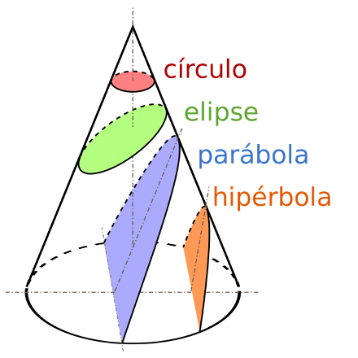
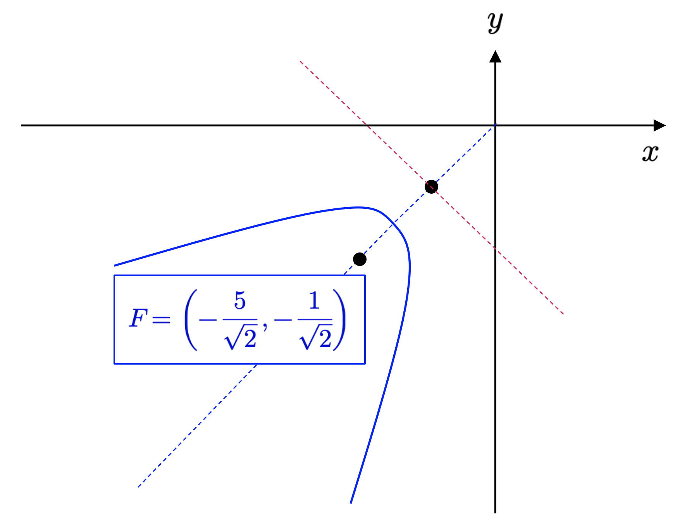
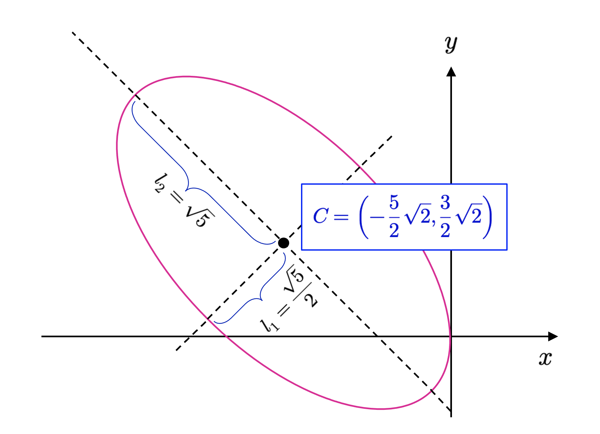

::: {.callout-important}
## Idea central

Las formas lineales, bilineales y cuadráticas permiten describir funciones y expresiones algebraicas que conectan de manera natural el álgebra lineal con la geometría analítica.
:::

## Formas lineales.

La diagonalización de matrices (y de operadores lineales) nos ha permitido formular (y encontrar una forma de resolver) un problema que es conocido en álgebra lineal como descomposición matricial. El problema de descomponer una matriz pasa, en general, por rescribir una matriz $\mathbf{A}\in \mathbb{K}^{n\times n}$ como una multiplicación sucesiva de otras matrices que nos transmiten información valiosa respecto de la matriz original. Lo que vimos en la subsección anterior es un tipo de descomposición basada en matrices diagonales –llamada descomposición propia o autodescomposición– y que es del tipo $\mathbf{A} =\mathbf{P} \mathbf{D} \mathbf{P}^{-1}$. En adelante, veremos otras descomposiciones interesantes que nos permitirán construir la base de, como cabría esperar, varios tipos de desarrollos propios del campo del aprendizaje automático. En particular, estas descomposiciones nos permitirán expresar objetos geométricos importantes de $\mathbb{R}^{2}$ y $\mathbb{R}^{3}$ mediante técnicas de álgebra lineal.

Consideremos entonces, una vez más, el problema elemental del álgebra lineal: Dado un $\mathbb{K}$-espacio vectorial normado $V$ y una base $\alpha =\left\{ v_{1},...,v_{n}\right\}$ de $V$, sabemos que todo vector $v\in V$ puede escribirse como una única combinación lineal de los elementos de $\alpha$. Es decir,

$$
v=\sum^{n}_{k=1} a_{k}v_{k}\  ;\  a_{k}\in \mathbb{K} \Longleftrightarrow \left[ v\right]_{\alpha }  =\left( \begin{matrix}a_{1}\\ \vdots \\ a_{n}\end{matrix} \right) \tag{6.1}
$$

Queremos determinar las coordenadas del vector $v$ de forma tal que dicha especificación sea independiente del producto interno que caracteriza a $V$. Para ello, observemos que cada elemento de la base $\alpha$ puede escribirse como

$$
\left[ v_{1}\right]_{\alpha }  =\left( \begin{matrix}1\\ 0\\ \vdots \\ 0\end{matrix} \right)  ;\left[ v_{2}\right]_{\alpha }  =\left( \begin{matrix}0\\ 1\\ \vdots \\ 0\end{matrix} \right)  ;\  \cdots \  ;\left[ v_{n}\right]_{\alpha }  =\left( \begin{matrix}0\\ 0\\ \vdots \\ 1\end{matrix} \right) \tag{6.2}
$$

Por lo tanto, podemos imaginar la expresión anterior como una especie de *lector de coordenadas* para los elementos de la base $\alpha$, de tal forma que éste lee un 1 en la posición $k$, y un 0 en otra posición. Por otro lado, en el caso general, un vector $v\in V$ se expresa, en la base $\alpha$, como

$$
\left[ v\right]_{\alpha }  =a_{1}\left( \begin{matrix}1\\ 0\\ \vdots \\ 0\end{matrix} \right)  +a_{2}\left( \begin{matrix}0\\ 1\\ \vdots \\ 0\end{matrix} \right)  +\  \cdots \  +a_{n}\left( \begin{matrix}0\\ 0\\ \vdots \\ 1\end{matrix} \right) \tag{6.3}
$$

De lo anterior, observamos que cada $v\in V$ necesita un total de $n$ lectores, pues dicho lector debe ser, como mínimo, lineal y entregar como valor un escalar. Tiene sentido entonces la siguiente definición.

**Definición 6.1 – $\alpha$-lector:** Sea $V$ un $\mathbb{K}$-espacio vectorial y $\alpha =\left\{ v_{1},...,v_{n}\right\}$ una base de $V$. Llamaremos $\alpha$-lector al conjunto $\alpha^{\ast } =\left\{ v^{\ast }_{1},...,v^{\ast }_{n}\right\}$, donde, para cada $k=1,...,n$, se tiene que

$$
\begin{array}{lll}v^{\ast }_{k}&:&V\longmapsto \mathbb{K} \\ &&v\longmapsto a_{k}\end{array} \Longleftrightarrow \left[ v\right]_{\alpha }  =\left( \begin{matrix}a_{1}\\ a_{2}\\ \vdots \\ a_{n}\end{matrix} \right) \tag{6.4}
$$

En particular, un $\alpha$-lector tiene la siguiente propiedad

$$
v^{\ast }_{i}\left( v_{j}\right)  =\begin{cases}1&;\  \mathrm{si} \  i=j\\ 0&;\  \mathrm{si} \  i\neq j\end{cases} \tag{6.5}
$$

Observamos que, para cada $k=1,...,n$, $v_{k}^{\ast}$ es una transformación lineal del espacio vectorial $V$ en su cuerpo de escalares $\mathbb{K}$. En símbolos, para cada $k=1,...,n$, $v_{k}^{\ast}\in \mathbb{L}_{\mathbb{K}}(V,\mathbb{K})$. En efecto, si $v=\sum^{n}_{k=1} a_{k}v_{k}\wedge u=\sum^{n}_{k=1} b_{k}v_{k}$, entonces se tiene que

$$
v^{\ast }_{s}\left( u+v\right)  =v^{\ast }_{s}\left[ \sum^{n}_{k=1} \left( a_{i}+b_{i}\right)  v_{i}\right]  =a_{s}+b_{s}=v^{\ast }_{s}\left( v\right)  +v^{\ast }_{s}\left( u\right) \tag{6.6}
$$

Análogamente, si $\lambda \in \mathbb{K}$, entonces

$$
v^{\ast }_{s}\left( \lambda v\right)  =v^{\ast }_{s}\left[\displaystyle  \sum^{n}_{k=1} \left( \lambda a_{i}\right)  v_{i}\right]  =\lambda a_{s}=\lambda v^{\ast }_{s}\left( v\right) \tag{6.7}
$$

::: {.callout-tip}
## Teorema 6.1
$\alpha^{\ast }$ *es una base del espacio vectorial $\mathbb{L}_{\mathbb{K}}(V,\mathbb{K})$.*
:::

En efecto, primero probaremos que $\alpha^{\ast}$ es un sistema de generadores para $\mathbb{L}_{\mathbb{K}}(V,\mathbb{K})$. Sea $T\in \mathbb{L}_{\mathbb{K}}(V,\mathbb{K})$, entonces

$$
\begin{array}{rcl}v=\sum^{n}_{k=1} a_{k}v_{k}&\Longrightarrow &T\left( v\right)  =\displaystyle \sum^{n}_{k=1} a_{k}T\left( v_{k}\right)  \  ;\  \left( T\  \mathrm{es} \  \mathrm{lineal} \right)  \\ a_{k}=v^{\ast }_{k}\left( v\right)  &\Longrightarrow &T\left( v\right)  =\displaystyle \sum^{n}_{k=1} v^{\ast }_{k}\left( v\right)  T\left( v_{k}\right)  \  ;\  \left( \mathrm{definicion} \  \left( 3.12\right)  \right)  \end{array} \tag{6.8}
$$

Así que,

$$
T\left( v\right)  =\sum^{n}_{k=1} T\left( v_{k}\right)  v^{\ast }_{k}\left( v\right)  =\left[ \sum^{n}_{k=1} T\left( v_{k}\right)  v^{\ast }_{k}\right]  \left( v\right) \tag{6.9}
$$

Aplicando la definición de igualdad de funciones, tenemos que

$$
T=\sum^{n}_{k=1} \underbrace{T\left( v_{k}\right)  }_{\in \mathbb{K} } v^{\ast }_{k} \tag{6.10}
$$

O equivalentemente,

$$
T\in \left< \left\{ v^{\ast }_{1},v^{\ast }_{2},...,v^{\ast }_{n}\right\}  \right> \tag{6.11}
$$

Ahora debemos probar que $\alpha^{\ast}$ es un conjunto linealmente independiente en $\mathbb{L}_{\mathbb{K}}(V,\mathbb{K})$. En efecto, si suponemos que $\sum^{n}_{k=1} r_{k}v^{\ast }_{k}=0$, entonces debemos verificar que, para cada $v\in V$, la función $v_{k}^{\ast}$ será nula en $V$. O, en otras palabras, $\ker \left( \sum^{n}_{k=1} r_{k}v^{\ast }_{k}\right)  =V$. Observemos que, si esta función se anula en todo el espacio vectorial $V$, en particular, también anula a los elementos $v_{1},...,v_{n}$ de la base $\alpha$. Así que, para cada $s=1,...,n$, por la definición (3.12), tendremos que

$$
0=\sum^{n}_{k=1} r_{k}v^{\ast }_{k}\left( v_{s}\right)  =r_{s} \tag{6.12}
$$

En conclusión, $\alpha^{\ast}$ es una base del espacio vectorial $\mathbb{L}_{\mathbb{K}}(V,\mathbb{K})$.

**Definición 6.3 – Espacio dual y base dual:** Sea $V$ un $\mathbb{K}$-espacio vectorial y $\alpha =\left\{ v_{1},...,v_{n}\right\}$ una base de $V$. Diremos que $V^{\ast}=\mathbb{L}_{\mathbb{K}}(V,\mathbb{K})$ se llamará **espacio dual** de $V$. La base $\alpha^{\ast } =\left\{ v^{\ast }_{1},...,v^{\ast }_{n}\right\}$, por consiguiente, se llamará **base dual** de la base $\alpha$.

En conclusión, si $V$ es un $\mathbb{K}$-espacio vectorial, y $\alpha =\left\{ v_{1},...,v_{n}\right\}$ es una base de $V$, entonces

$$
v=\sum^{n}_{k=1} v^{\ast }_{k}\left( v\right)  v_{k}\Longleftrightarrow \left[ v\right]_{\alpha }  =\left( \begin{matrix}v^{\ast }_{1}\left( v\right)  \\ v^{\ast }_{2}\left( v\right)  \\ \vdots \\ v^{\ast }_{n}\left( v\right)  \end{matrix} \right) \tag{6.13}
$$

**Ejemplo 6.1:** Dados tres números reales distintos $r_{1},r_{2}$ y $r_{3}$, podemos definir tres funciones como sigue

$$
\begin{array}{ll}T_{i}:&\mathbb{R}_{2} \left[ x\right]  \longmapsto \mathbb{R} \\ &p\left( x\right)  \longmapsto p\left( r_{i}\right)  \end{array} \  ;\  i=1,2,3 \tag{6.14}
$$

En primer lugar, vamos a demostrar $T_{i}$ es una transformación lineal entre $\mathbb{R}_{2}[x]$ y $\mathbb{R}$ (es decir, $T_{i}\in \mathbb{L}_{\mathbb{R}}(\mathbb{R}_{2}[x],\mathbb{R})$ para $i=1,2,3$). En efecto, sean $p(x),q(x)\in \mathbb{R}_{2}[x]$ y $\lambda \in \mathbb{R}$. En primer lugar, debemos probar que $T_{i}\left( p\left( x\right)  +q\left( x\right)  \right)  =T_{i}\left( p\left( x\right)  \right)  +T_{i}\left( q\left( x\right)  \right)$. De este modo tenemos que

$$
T_{i}\left( p\left( x\right)  +q\left( x\right)  \right)  =p\left( r_{i}\right)  +q\left( r_{i}\right)  =T_{i}\left( p\left( x\right)  \right)  +T_{i}\left( q\left( x\right)  \right) \tag{6.15}
$$

Ahora debemos mostrar que $T_{i}\left( \lambda p\left( x\right)  \right)  =\lambda T_{i}\left( p\left( x\right)  \right)$. En efecto,

$$
T_{i}\left( \lambda p\left( x\right)  \right)  =\lambda p\left( r_{i}\right)  =\lambda T_{i}\left( p\left( x\right)  \right) \tag{6.16}
$$

Así que, efectivamente, $T_{i}\in \mathbb{L}_{\mathbb{R}}(\mathbb{R}_{2}[x],\mathbb{R})=\left( \mathbb{R}_{2} \left[ x\right]  \right)^{\ast }$ para $i=1,2,3$. Ahora probaremos que $\alpha^{\ast } =\left\{ T_{1},T_{2},T_{3}\right\}$ es un conjunto linealmente independiente en $\left( \mathbb{R}_{2} \left[ x\right]  \right)^{\ast }$. De esta manera,

$$
a_{1}T_{1}+a_{2}T_{2}+a_{3}T_{3}=0\Longleftrightarrow \left( a_{1}T_{1}+a_{2}T_{2}+a_{3}T_{3}\right)  \left( p\left( x\right)  \right)  =0\  ;\  \forall p\left( x\right)  \in \mathbb{R}_{2} \left[ x\right] \tag{6.17}
$$

En particular, tenemos que, usando la base canónica de $\mathbb{R}_{2}[x]$,

$$
\begin{array}{rcl}\left( a_{1}T_{1}+a_{2}T_{2}+a_{3}T_{3}\right)  \left( 1\right)  &=&0\\ \left( a_{1}T_{1}+a_{2}T_{2}+a_{3}T_{3}\right)  \left( x\right)  &=&0\\ \left( a_{1}T_{1}+a_{2}T_{2}+a_{3}T_{3}\right)  \left( x^{2}\right)  &=&0\end{array} \  \Longrightarrow \  \begin{array}{rcl}a_{1}+a_{2}+a_{3}&=&0\\ a_{1}r_{1}+a_{2}r_{2}+a_{3}r_{3}&=&0\\ a_{1}r^{2}_{1}+a_{2}r^{2}_{2}+a_{3}r^{2}_{3}&=&0\end{array} \tag{6.18}
$$

Si escribimos este sistema en forma matricial, obtenemos

$$
\underbrace{\left( \begin{matrix}1&1&1\\ r_{1}&r_{2}&r_{3}\\ r^{2}_{1}&r^{2}_{2}&r^{2}_{3}\end{matrix} \right)  }_{=\mathbf{A} } \left( \begin{matrix}a_{1}\\ a_{2}\\ a_{3}\end{matrix} \right)  =\left( \begin{matrix}0\\ 0\\ 0\end{matrix} \right)  \  \Longrightarrow \  \det \left( \mathbf{A} \right)  =\left( r_{1}-r_{2}\right)  \left( r_{2}-r_{3}\right)  \left( r_{3}-r_{1}\right) \tag{6.19}
$$

Sabemos que los números $r_{1},r_{2},r_{3}$ son distintos. Por lo tanto, es claro que $\det(\mathbf{A})\neq 0$ y la solución del sistema (6.19) es trivial; es decir, $a_{1}=a_{2}=a_{3}=0$. Así que, efectivamente, $\alpha^{\ast } =\left\{ T_{1},T_{2},T_{3}\right\}$ es un conjunto linealmente independiente en $\left( \mathbb{R}_{2} \left[ x\right]  \right)^{\ast }$.

Probaremos ahora que $\alpha^{\ast } =\left\{ T_{1},T_{2},T_{3}\right\}$ es una base de $\left( \mathbb{R}_{2} \left[ x\right]  \right)^{\ast }$. En efecto, tenemos que $\dim\limits_{\mathbb{R} } \left( \mathbb{R}_{2} \left[ x\right]  \right)^{\ast }  =\dim\limits_{\mathbb{R} } \left( \mathbb{R}_{2} \left[ x\right]  \right)  =3$, así que, efectivamente, $\alpha^{\ast }$ es una base de $\left( \mathbb{R}_{2} \left[ x\right]  \right)^{\ast }$.

Finalmente, determinaremos la correspondiente base $\alpha$ de $\mathbb{R}_{2}[x]$. Supongamos entonces que $\alpha =\left\{ p_{1}\left( x\right)  ,p_{2}\left( x\right)  ,p_{3}\left( x\right)  \right\}$ es una base, donde

::: {.eq-scroll}
$$
p_{1}\left( x\right)  =c_{01}+c_{11}x+c_{21}x^{2}\  ;\  p_{2}\left( x\right)  =c_{02}+c_{12}x+c_{22}x^{2}\  ;\  p_{3}\left( x\right)  =c_{13}+c_{23}x+c_{33}x^{2} \tag{6.20}
$$
:::

Entonces, usando la definición (6.3), debemos tener, para $T_{1}$,

$$
\begin{array}{lll}T_{1}\left( p_{1}\left( x\right)  \right)  &=&1\\ T_{2}\left( p_{2}\left( x\right)  \right)  &=&0\\ T_{3}\left( p_{3}\left( x\right)  \right)  &=&0\end{array} \  \Longrightarrow \  \begin{array}{lll}c_{01}+c_{11}r_{1}+c_{21}r^{2}_{1}&=&1\\ c_{02}+c_{12}r_{1}+c_{22}r^{2}_{1}&=&0\\ c_{03}+c_{13}r_{1}+c_{23}r^{2}_{1}&=&0\end{array} \tag{6.21}
$$

Equivalentemente, para $T_{2}$ y $T_{3}$,

::: {.eq-scroll}
$$
\begin{array}{lll}T_{1}\left( p_{1}\left( x\right)  \right)  &=&0\\ T_{2}\left( p_{2}\left( x\right)  \right)  &=&1\\ T_{3}\left( p_{3}\left( x\right)  \right)  &=&0\end{array} \  \Longrightarrow \  \begin{array}{lll}c_{01}+c_{11}r_{2}+c_{21}r^{2}_{2}&=&0\\ c_{02}+c_{12}r_{2}+c_{22}r^{2}_{2}&=&1\\ c_{03}+c_{13}r_{2}+c_{23}r^{2}_{2}&=&0\end{array} \  \wedge \  \begin{array}{lll}T_{1}\left( p_{1}\left( x\right)  \right)  &=&0\\ T_{2}\left( p_{2}\left( x\right)  \right)  &=&0\\ T_{3}\left( p_{3}\left( x\right)  \right)  &=&1\end{array} \  \Longrightarrow \  \begin{array}{lll}c_{01}+c_{11}r_{3}+c_{21}r^{2}_{3}&=&0\\ c_{02}+c_{12}r_{3}+c_{22}r^{2}_{3}&=&0\\ c_{03}+c_{13}r_{3}+c_{23}r^{2}_{3}&=&1\end{array} \tag{6.22}
$$
:::

Para el polinomio $p_{1}(x)$ tenemos que

$$
\begin{array}{lll}c_{01}+c_{11}r_{1}+c_{21}r^{2}_{1}&=&1\\ c_{01}+c_{11}r_{2}+c_{21}r^{2}_{2}&=&0\\ c_{01}+c_{11}r_{3}+c_{21}r^{2}_{3}&=&0\end{array} \  \Longrightarrow \  \begin{array}{lll}c_{11}\left( r_{1}-r_{2}\right)  +c_{21}\left( r^{2}_{1}-r^{2}_{2}\right)  &=&1\\ c_{11}\left( r_{2}-r_{3}\right)  +c_{21}\left( r^{2}_{2}-r^{2}_{3}\right)  &=&0\end{array} \tag{6.23}
$$

Entonces,

$$
\begin{array}{lll}c_{11}+c_{21}\left( r_{1}+r_{2}\right)  &=&\displaystyle \frac{1}{r_{1}-r_{2}} \\ c_{11}+c_{21}\left( r_{2}+r_{3}\right)  &=&0\end{array} \  \Longrightarrow \  c_{21}=\frac{1}{\left( r_{1}-r_{2}\right)  \left( r_{2}-r_{3}\right)  } \tag{6.24}
$$

Así que,

$$
p_{1}\left( x\right)  =\frac{\left( x-r_{2}\right)  \left( x-r_{3}\right)  }{\left( r_{1}-r_{2}\right)  \left( r_{2}-r_{3}\right)  } \tag{6.25}
$$

De manera análoga, podemos mostrar que

$$
p_{2}\left( x\right)  =\frac{\left( x-r_{1}\right)  \left( x-r_{3}\right)  }{\left( r_{2}-r_{1}\right)  \left( r_{2}-r_{3}\right)  } \wedge p_{3}\left( x\right)  =\frac{\left( x-r_{1}\right)  \left( x-r_{2}\right)  }{\left( r_{3}-r_{1}\right)  \left( r_{3}-r_{2}\right)  } \tag{6.26}
$$

◼︎

## Formas bilineales.
Sea $V$ un $\mathbb{R}$-espacio vectorial y supongamos que $V$ está equipado con un producto interno. Sabemos que

- El producto interno es una función $\left( u,v\right)  \in V\times V\longmapsto \left< u,v\right>  \in \mathbb{R}$.
- Para cada $v\in V$, la función $\left<, v\right>\in V^{\ast}$ (el espacio dual de $V$), definimos $u\in V\longmapsto \left<u,v\right>\in \mathbb{R}$. Del mismo modo, para cada $u\in V$, la función $\left<u,\right>\in V^{\ast}$, definimos $v\in V\longmapsto \left<u,v\right>\in \mathbb{R}$.
- Supongamos que $\alpha =\left\{ v_{1},...,v_{n}\right\}$ es una base de $V$. Entonces podemos utilizar la propiedad lineal de ambos vectores (coordenadas) $u$ y $v$ como sigue: Para $u=\sum_{i=1}^{n} a_{i}v_{i}$ y $v=\sum_{i=1}^{n} b_{i}v_{i}$, se tiene que

$$
\left< u,v\right>  =\left< \sum^{n}_{i=1} a_{i}v_{i},\sum^{n}_{i=1} b_{i}v_{i}\right>  =\sum^{n}_{i=1} \sum^{n}_{j=1} a_{i}b_{i}\left< v_{i},v_{j}\right> \tag{6.27}
$$

Equivalentemente, si interpretamos $\left( \left< v_{i},v_{j}\right>  \right)  \in \mathbb{R}^{n\times n}$, entonces

$$
\begin{array}{lll}\left< u,v\right>  &=&\left( \begin{matrix}a_{1}&\cdots &a_{n}\end{matrix} \right)  \left( \left< v_{i},v_{j}\right>  \right)  \left( \begin{matrix}b_{1}\\ \vdots \\ b_{n}\end{matrix} \right)  \\ &=&\left[ u\right]^{\top }_{\alpha }  \underbrace{\left( \left< v_{i},v_{j}\right>  \right)  }_{\left[ \left< \  ,\  \right>  \right]^{\alpha }_{\alpha }  } \left[ v\right]_{\alpha }  \end{array} \tag{6.28}
$$

En particular,

- **(C1):** Si $\alpha$ es una base ortonomal, entonces $\left< u,v\right>  =\left( \begin{matrix}a_{1}&\cdots &a_{n}\end{matrix} \right)  \left( \begin{matrix}b_{1}\\ \vdots \\ b_{n}\end{matrix} \right)  =\left[ u\right]^{\top }_{\alpha }  \left[ v\right]_{\alpha }  =\sum^{n}_{i=1} a_{i}b_{i}$.
- **(C2):** Si $u=v$ y $\alpha$ es una base ortonormal, entonces $\left< u,u\right>  =\sum^{n}_{i=1} a^{2}_{i}=\left\Vert u\right\Vert^{2}$.
- **(C3):** En general, si $\left[ \left< \  ,\  \right>  \right]^{\alpha }_{\alpha }$ es diagonalizable y $\beta$ es la base ortonormal de autovectores de $\left< \  ,\  \right>$, entonces se tiene que

$$
\begin{array}{lll}\left< u,v\right>  &=&\left[ u\right]^{\top }_{\alpha }  \left[ \mathbf{I} \right]^{\beta }_{\alpha }  \underbrace{\left( \left< v_{i},v_{j}\right>  \right)  }_{=\left[ \left< \  ,\  \right>  \right]^{\beta }_{\beta }  } \left[ \mathbf{I} \right]^{\beta }_{\alpha }  \left[ v\right]_{\alpha }  \\ &=&\left[ u\right]^{\top }_{\alpha }  \left( \left[ \mathbf{I} \right]^{\beta }_{\alpha }  \right)^{\top }  \underbrace{\left( \left< v_{i},v_{j}\right>  \right)  }_{=\left[ \left< \  ,\  \right>  \right]^{\beta }_{\beta }  } \left[ \mathbf{I} \right]^{\beta }_{\alpha }  \left[ v\right]_{\alpha }  \\ &=&\left( \left[ \mathbf{I} \right]^{\beta }_{\alpha }  \left[ u\right]_{\alpha }  \right)^{\top }  \underbrace{\left( \left< v_{i},v_{j}\right>  \right)  }_{=\left[ \left< \  ,\  \right>  \right]^{\beta }_{\beta }  } \left[ \mathbf{I} \right]^{\beta }_{\alpha }  \left[ v\right]_{\alpha }  \\ &=&\left[ u\right]^{\top }_{\beta }  \underbrace{\left( \left< v_{i},v_{j}\right>  \right)  }_{=\left[ \left< \  ,\  \right>  \right]^{\beta }_{\beta }  } \left[ v\right]_{\beta }  \\ &=&\left[ u\right]^{\top }_{\beta }  \mathrm{diag} \left\{ \lambda_{1} ,...,\lambda_{n} \right\}  \left[ v\right]_{\beta }  \end{array} \tag{6.29}
$$

Donde $\mathrm{diag} \left\{ \lambda_{1} ,...,\lambda_{n} \right\}$ es la matriz diagonal que tiene como elementos no nulos a los autovalores de $\left< \  ,\  \right>$.

- **(C4):** En particular, si $\beta =\left\{ w_{1},...,w_{n}\right\}$, entonces

$$
\left< u,u\right>  =\sum^{n}_{i=1} \lambda_{i} \left< u,w_{i}\right>^{2} \tag{6.30}
$$

Tiene sentido, después de este arduo trabajo, la siguiente definición.

**Definición 6.4 – Forma bilineal:** Sea $V$ un $\mathbb{K}$-espacio vectorial y $B:V\times V\longrightarrow \mathbb{K}$ una función tal que $B(u,v)\in \mathbb{K}$ para cada par de vectores $(u,v)\in V\times V$. Diremos que $B$ es una **forma bilineal** si $B$ es lineal en cada coordenada. Es decir, $B$ es lineal para cada $v\in V, B_{v}\in V^{\ast}$, donde $B_{v}(u)=B(u,v)$, y para cada $u\in V, B_{u}\in V^{\ast}$, donde $B_{u}(v)=B(v,u)$.

Antes de, como siempre, entrar en ejemplos más prácticos, explicitaremos los beneficios teóricos que se desprenden de esta condición de bilinearidad. En este caso, si $\alpha =\left\{ v_{1},...,v_{n}\right\}$ es una base de vectores de $V$, entonces para $u=\sum^{n}_{i=1} a_{i}v_{i}\wedge v=\sum^{n}_{i=1} b_{i}v_{i}$, se tiene que

$$
\begin{array}{lll}B\left( u,v\right)  &=&B\left( \sum^{n}_{i=1} a_{i}v_{i},\sum^{n}_{j=1} b_{j}v_{j}\right)  \\ &=&B\left( \sum^{n}_{i=1} \sum^{n}_{j=1} a_{i}b_{j}B\left( v_{i},v_{j}\right)  \right)  \\ &=&\left( \begin{matrix}a_{1}&\cdots &a_{n}\end{matrix} \right)  B\left( v_{i},v_{j}\right)  \left( \begin{matrix}b_{1}\\ \vdots \\ b_{n}\end{matrix} \right)  \end{array} \tag{6.31}
$$

Es decir, hemos encontrado una igualdad importante (de hecho, fundamental):

$$
B\left( u,v\right)  =\left[ u\right]^{\top }_{\alpha }  \underbrace{B\left( v_{i},v_{j}\right)  }_{\left[ B\right]^{\alpha }_{\alpha }  } \left[ v\right]_{\alpha } \tag{6.32}
$$

Lo anterior nos lleva al siguiente resultado.

::: {.callout-tip}
## Teorema 6.2
*Sea $V$ un $\mathbb{K}$-espacio vectorial y designemos por $B(V)$ al conjunto de todas las formas bilineales que existen en $V$. Si $\dim_{\mathbb{K}}(V)=n$, entonces $B\left( V\right)  \cong \mathbb{K}^{n\times n}$. Es decir, estos conjuntos son isomorfos.*
:::

**Ejemplo 6.2:** Sea $\mathbf{A} =\left( \begin{matrix}1&2\\ 3&4\end{matrix} \right)$. Entonces definimos

$$
\begin{array}{lll}B\left( \left( x_{1},y_{1}\right)  ,\left( x_{2},y_{2}\right)  \right)  &=&\left( x_{1},y_{1}\right)  \left( \begin{matrix}1&2\\ 3&4\end{matrix} \right)  \left( \begin{matrix}x_{2}\\ y_{2}\end{matrix} \right)  \\ &=&\left( x_{1}+3y_{1},2x_{1}+y_{1}\right)  \left( \begin{matrix}x_{2}\\ y_{2}\end{matrix} \right)  \\ &=&x_{1}x_{2}+3x_{2}y_{1}+2x_{1}y_{2}+4y_{1}y_{2}\end{array} \tag{6.33}
$$

La función $B\left( \mathbf{x}_{1} ,\mathbf{x}_{2} \right)  =B\left( \left( x_{1},y_{1}\right)  ,\left( x_{2},y_{2}\right)  \right)  =x_{1}x_{2}+3x_{2}y_{1}+2x_{1}y_{2}+4y_{1}y_{2}$ construida de esta manera es, evidentemente, una forma bilineal. ◼︎

**Definición 6.5 – Matriz de una forma bilineal:** Sea $V$ un $\mathbb{K}$-espacio vectorial y $\alpha =\left\{ v_{1},...,v_{n}\right\}$ una base de vectores de $V$. Sea $B:V\times V\longrightarrow \mathbb{K}$ una forma bilineal sobre $V$. Entonces $\left[ B\right]^{\alpha }_{\alpha }  =\left( B\left( v_{i},v_{j}\right)  \right)$ será llamada **matriz de la forma bilineal** $B$ respecto de la base $\alpha$.

Si, para alguna base $\alpha$, se tiene que $B(v_{i},v_{j})=B(v_{j},v_{i})$ para $i,j=1,...,n$, entonces $[B]_{\alpha}^{\alpha}$ es una matriz simétrica y, recíprocamente, si $[B]_{\alpha}^{\alpha}$ es simétrica para alguna base $\alpha$, entonces $B(v_{i},v_{j})=B(v_{j},v_{i})$ para $u,v\in V$. En tal caso, diremos que $B$ es una **forma bilineal simétrica**.

**Ejemplo 6.3:** Sea $\mathbf{A} =\left( \begin{matrix}1&2\\ 2&5\end{matrix} \right)$. Entonces, en la base canónica de $\mathbb{R}^{2}$, se tiene que

$$
\begin{array}{lll}B_{\mathbf{A} }\left( \left( x_{1},y_{1}\right)  ,\left( x_{2},y_{2}\right)  \right)  &=&\left( x_{1},y_{1}\right)  \left( \begin{matrix}1&2\\ 2&5\end{matrix} \right)  \left( \begin{matrix}x_{2}\\ y_{2}\end{matrix} \right)  \\ &=&\left[ \left( x_{1},y_{1}\right)  \right]^{\top }_{\mathbf{e} \left( 2\right)  }  \left[ \mathbf{A} \right]^{\mathbf{e} \left( 2\right)  }_{\mathbf{e} \left( 2\right)  }  \left[ \left( x_{2},y_{2}\right)  \right]_{\mathbf{e} \left( 2\right)  }  \\ &=&\left( x_{1}+2y_{1},2x_{1}+5y_{1}\right)  \left( \begin{matrix}x_{2}\\ y_{2}\end{matrix} \right)  \\ &=&x_{1}x_{2}+2x_{2}y_{1}+2x_{1}y_{2}+5y_{1}y_{2}\end{array} \tag{6.34}
$$

En particular, si $(x_{1},y_{1})=(x_{2},y_{2})=(x,y)$, se tendrá que

$$
B_{\mathbf{A} }\left( \left( x,y\right)  ,\left( x,y\right)  \right)  =x^{2}+4xy+5y^{2} \tag{6.35}
$$

◼︎

## Formas cuadráticas.
Procedemos ahora a estudiar, por tanto, otro tipo de descomposición. Puntualmente, estudiaremos las **formas cuadráticas** inducidas por una matriz simétrica. Las formas cuadráticas son la base de varios problemas de optimización (que tienen como objetivo encontrar máximos o mínimos relativos de una función definida en algún subespacio determinado). En particular, queremos caracterizar un tipo especial de matrices, llamadas **matrices definidas positivas**, y mostraremos una aplicación sencilla de las formas cuadráticas en la descripción (y transformación) de ciertos dominios de $\mathbb{R}^{2}$ conocidos como secciones cónicas, y que resultan de la intersección de un cilindro circular recto con un plano con cierta orientación.

**Definición 6.6 – Forma cuadrática:** Dada la matriz simétrica $\mathbf{A}\in \mathbb{R}^{n\times n}$, definimos la aplicación

$$
\begin{array}{ll}q:&\mathbb{R}^{n} \longrightarrow \mathbb{R} \\ &\mathbf{x} \longmapsto q\left( \mathbf{x} \right)  =\mathbf{x}^{\top } \mathbf{A} \mathbf{x} \end{array} \tag{6.36}
$$

y que es llamada **forma cuadrática** en $\mathbb{R}^{n}$.

Notemos que una forma cuadrática en $\mathbb{R}^{n}$ es **homogénea de grado 2**. Es decir, $\forall \mathbf{x} \in \mathbb{R}^{n} ,q\left( \lambda \mathbf{x} \right)  =\lambda^{2} q\left( \mathbf{x} \right)$. En efecto, $q\left( \lambda \mathbf{x} \right)  =\left( \lambda \mathbf{x} \right)^{\top }  \mathbf{A} \left( \lambda \mathbf{x} \right)  =\lambda \mathbf{x}^{\top } \mathbf{A} \lambda \mathbf{x} =\lambda^{2} \mathbf{x}^{\top } \mathbf{A} \mathbf{x} =\lambda^{2} q\left( \mathbf{x} \right)$.

Lo anterior motiva la siguiente definición.

**Definición 6.7 – Matriz (semi-)definida positiva (negativa):** Sea $\mathbf{A}\in \mathbb{R}^{n\times n}$ una matriz simétrica. Diremos que:

- **(D1):** $\mathbf{A}$ es **definida positiva** si, para todo $\mathbf{x}\in \mathbb{R}^{n}$, tal que $\mathbf{x}\neq \mathbf{0}$, se tiene que $\mathbf{x}^{\top}\mathbf{A}\mathbf{x} > 0$.
- **(D2):** $\mathbf{A}$ es **semi-definida positiva** si, para todo $\mathbf{x}\in \mathbb{R}^{n}$, tal que $\mathbf{x}\neq \mathbf{0}$, se tiene que $\mathbf{x}^{\top}\mathbf{A}\mathbf{x} \geq 0$.
- **(D3):** $\mathbf{A}$ es **definida negativa** si, para todo $\mathbf{x}\in \mathbb{R}^{n}$, tal que $\mathbf{x}\neq \mathbf{0}$, se tiene que $\mathbf{x}^{\top}\mathbf{A}\mathbf{x} < 0$.
- **(D4):** $\mathbf{A}$ es **semi-definida negativa** si, para todo $\mathbf{x}\in \mathbb{R}^{n}$, tal que $\mathbf{x}\neq \mathbf{0}$, se tiene que $\mathbf{x}^{\top}\mathbf{A}\mathbf{x} \leq 0$.

::: {.callout-tip}
## Teorema 6.3
*Sea $V$ un $\mathbb{R}$-espacio vectorial y $q$ una forma cuadrática sobre $V$. Entonces existe ua base ortonormal $\alpha$ de $V$ tal que*

$$
q\left( u\right)  =\sum^{n}_{i=1} \lambda_{i} u^{2}_{i}\  ;\  \left[ u\right]_{\alpha }  =\left( u_{1},...,u_{n}\right)^{\top } \tag{6.37}
$$

*para $u\in V$.*
:::

**Ejemplo 6.4:** Si definimos la forma cuadrática $q:\mathbb{R}^{2}\longrightarrow \mathbb{R}$ tal que $q(x,y)=x^{2}-2xy-y^{2}$, vamos a intentar expresar $q$ de la forma $q\left( x,y\right)  =a_{1}\left( b_{1}x+c_{1}y\right)^{2}  +a_{2}\left( b_{2}x+c_{2}y\right)^{2}$ (llamada **forma canónica**).

Partimos, rápidamente, expresando $q$ en su forma matricial como sigue

$$
q\left( x,y\right)  =x^{2}-2xy-y^{2}=\underbrace{\left[ \left( x,y\right)  \right]^{\intercal }_{\mathbf{e} \left( 2\right)  }  }_{\mathbf{x}^{\intercal } } \overbrace{\left[ q\right]^{\mathbf{e} \left( 2\right)  }_{\mathbf{e} \left( 2\right)  }  }^{\mathbf{A} } \underbrace{\left[ \left( x,y\right)  \right]_{\mathbf{e} \left( 2\right)  }  }_{\mathbf{x} } =\left( x,y\right)  \left( \begin{matrix}1&-1\\ -1&-1\end{matrix} \right)  \left( \begin{matrix}x\\ y\end{matrix} \right) \tag{6.38}
$$

Observemos que la ecuación (6.38) se escribe en la base canónica de $\mathbb{R}^{2}$, la que es ortonormal respecto del producto interno usual. Procedemos ahora a diagonalizar la matriz $\mathbf{A}=\left[ q\right]^{\mathbf{e} \left( 2\right)  }_{\mathbf{e} \left( 2\right)  }$. Para ello, construimos el correspondiente polinomio característico $P_{\mathbf{A}}(\lambda)$ como sigue,

$$
\begin{array}{lll}P_{\mathbf{A} }\left( \lambda \right)  &=&\det \left( \begin{matrix}1-\lambda &-1\\ -1&-1-\lambda \end{matrix} \right)  \\ &=&-\left( 1-\lambda \right)  \left( 1-\lambda \right)  -1\\ &=&\lambda^{2} -1\end{array} \tag{6.39}
$$

Así que los autovalores de $\mathbf{A}$ son $\lambda_{1}=\sqrt{2}\wedge \lambda_{2}=-\sqrt{2}$. Ahora determinamos los autoespacios respectivos,

$$
\begin{array}{lll}\mathbf{v} \in \left( \mathbb{R}^{2\times 1} \right)_{\lambda }  &\Longleftrightarrow &\mathbf{v} \in \mathbb{R}^{2\times 1} \wedge \mathbf{A} \mathbf{v} =\lambda \mathbf{v} \\ &\Longleftrightarrow &\mathbf{v} =\left( \begin{matrix}x\\ y\end{matrix} \right)  \wedge \left( \begin{matrix}1&-1\\ -1&-1\end{matrix} \right)  \left( \begin{matrix}x\\ y\end{matrix} \right)  =\lambda \left( \begin{matrix}x\\ y\end{matrix} \right)  \\ &\Longleftrightarrow &\mathbf{v} =\left( \begin{matrix}x\\ y\end{matrix} \right)  \wedge \begin{cases}\begin{array}{lll}x-y&=&\lambda x\\ -x-y&=&\lambda y\end{array} &\end{cases} \end{array} \tag{6.40}
$$

Tenemos pues dos casos a estudiar. El primero es $\lambda_{1}=\sqrt{2}$, en cuyo caso se tiene que

$$
\begin{array}{lll}x-y&=&\sqrt{2} x\\ -x-y&=&\sqrt{2} y\end{array} \  \Longleftrightarrow \  y=\left( 1-\sqrt{2} \right)  x \tag{6.41}
$$

Luego,

$$
\begin{array}{lll}\mathbf{v} \in \left( \mathbb{R}^{2\times 1} \right)_{\lambda_{1} =\sqrt{2} }  &\Longleftrightarrow &\mathbf{v} \in \mathbb{R}^{2\times 1} \wedge \mathbf{v} =\left( \begin{matrix}x\\ \left( 1-\sqrt{2} \right)  x\end{matrix} \right)  \\ &\Longleftrightarrow &\mathbf{v} \in \mathbb{R}^{2\times 1} \wedge \mathbf{v} =x\left( \begin{matrix}1\\ 1-\sqrt{2} \end{matrix} \right)  ;x\in \mathbb{R} \\ &\Longleftrightarrow &\left( \mathbb{R}^{2\times 1} \right)_{\lambda_{1} =\sqrt{2} }  =\left< \left\{ \left( \begin{matrix}1\\ 1-\sqrt{2} \end{matrix} \right)  \right\}  \right>  \end{array} \tag{6.42}
$$

Por otro lado, para $\lambda_{2}=-\sqrt{2}$, tenemos que

$$
\begin{array}{lll}\mathbf{v} \in \left( \mathbb{R}^{2\times 1} \right)_{\lambda_{2} =-\sqrt{2} }  &\Longleftrightarrow &\mathbf{v} \in \mathbb{R}^{2\times 1} \wedge \mathbf{v} =\left( \begin{matrix}x\\ \left( 1+\sqrt{2} \right)  x\end{matrix} \right)  \\ &\Longleftrightarrow &\mathbf{v} \in \mathbb{R}^{2\times 1} \wedge \mathbf{v} =x\left( \begin{matrix}1\\ 1+\sqrt{2} \end{matrix} \right)  ;x\in \mathbb{R} \\ &\Longleftrightarrow &\left( \mathbb{R}^{2\times 1} \right)_{\lambda_{2} =-\sqrt{2} }  =\left< \left\{ \left( \begin{matrix}1\\ 1+\sqrt{2} \end{matrix} \right)  \right\}  \right>  \end{array} \tag{6.43}
$$

Construiremos ahora una base ortonormal de autovectores a partir de la base $\beta$ definida como

$$
\beta =\left\{ \left( \begin{matrix}1\\ 1-\sqrt{2} \end{matrix} \right)  ,\left( \begin{matrix}1\\ 1+\sqrt{2} \end{matrix} \right)  \right\} \tag{6.44}
$$

Notemos que $\beta$ ya es ortogonal, así que, para construir la base ortonormal, basta con dividir cada vector por la norma respectiva. De este modo,

$$
\alpha =\left\{ \left( \begin{matrix}\displaystyle \frac{1}{\sqrt{4-2\sqrt{2} } } \\ \displaystyle \frac{1-\sqrt{2} }{\sqrt{4-2\sqrt{2} } } \end{matrix} \right)  ,\left( \begin{matrix}\displaystyle \frac{1}{\sqrt{4+2\sqrt{2} } } \\ \displaystyle \frac{1+\sqrt{2} }{\sqrt{4+2\sqrt{2} } } \end{matrix} \right)  \right\} \tag{6.45}
$$

Ahora construiremos $[v]_{\alpha}$. Por tanto,

::: {.eq-scroll}
$$
\begin{array}{lll}\mathbf{v} &=&\left< \left( \begin{matrix}x\\ y\end{matrix} \right)  ,\left( \begin{matrix}\displaystyle \frac{1}{\sqrt{4-2\sqrt{2} } } \\ \displaystyle \frac{1-\sqrt{2} }{\sqrt{4-2\sqrt{2} } } \end{matrix} \right)  \right>  \left( \begin{matrix}\displaystyle \frac{1}{\sqrt{4-2\sqrt{2} } } \\ \displaystyle \frac{1-\sqrt{2} }{\sqrt{4-2\sqrt{2} } } \end{matrix} \right)  +\left< \left( \begin{matrix}x\\ y\end{matrix} \right)  ,\left( \begin{matrix}\displaystyle \frac{1}{\sqrt{4+2\sqrt{2} } } \\ \displaystyle \frac{1+\sqrt{2} }{\sqrt{4+2\sqrt{2} } } \end{matrix} \right)  \right>  \left( \begin{matrix}\displaystyle \frac{1}{\sqrt{4+2\sqrt{2} } } \\ \displaystyle \frac{1+\sqrt{2} }{\sqrt{4+2\sqrt{2} } } \end{matrix} \right)  \\ &=&\left( \displaystyle \frac{x}{\sqrt{4-2\sqrt{2} } } +\displaystyle \frac{y\left( 1-\sqrt{2} \right)  }{\sqrt{4-2\sqrt{2} } } \right)  \left( \begin{matrix}\displaystyle \frac{1}{\sqrt{4-2\sqrt{2} } } \\ \displaystyle \frac{1-\sqrt{2} }{\sqrt{4-2\sqrt{2} } } \end{matrix} \right)  +\left( \displaystyle \frac{x}{\sqrt{4+2\sqrt{2} } } +\displaystyle \frac{y\left( 1+\sqrt{2} \right)  }{\sqrt{4+2\sqrt{2} } } \right)  \left( \begin{matrix}\displaystyle \frac{1}{\sqrt{4+2\sqrt{2} } } \\ \displaystyle \frac{1+\sqrt{2} }{\sqrt{4+2\sqrt{2} } } \end{matrix} \right)  \end{array} \tag{6.46}
$$
:::

Así que, finalmente,

::: {.eq-scroll}
$$
q\left( x,y\right)  =\sqrt{2} \left( \frac{x}{\sqrt{4-2\sqrt{2} } } +\frac{y\left( 1-\sqrt{2} \right)  }{\sqrt{4-2\sqrt{2} } } \right)^{2}  -\sqrt{2} \left( \frac{x}{\sqrt{4+2\sqrt{2} } } +\frac{y\left( 1+\sqrt{2} \right)  }{\sqrt{4+2\sqrt{2} } } \right)^{2} \tag{6.47}
$$
:::

es la forma canónica buscada. ◼︎

## Aplicaciones a la geometría analítica.
Lo estudiado en relación a las formas y, en particular, las formas cuadráticas (y sus formas normales), nos permiten representar de forma compacta y muy eficiente a cualquier **sección cónica**. De los cursos de Cálculo sabemos que las secciones cónicas son regiones en $\mathbb{R}^{2}$ que corresponden a la intersección de un cono circular recto con un plano cuya orientación puede ser de tres tipos: Paralelo a la generatriz del cono (**parábola**), paralelo al eje vertical del cono (**hipérbola**) y oblicua respecto de la generatriz y el eje del cono sin pasar por su vértice (**elipse**). La **circunferencia** también se considera una sección cónica, pero es el caso particular de la elipse (cuando sus ejes son exactamente iguales), aunque es posible obtener como resultado de un plano que es perpendicular al eje del cono. La @fig-conicas muestra un esquema que permite entender como se generan las secciones cónicas y los planos previamente mencionados.

{#fig-conicas fig-align="center" width="35%"}

Recordemos que las secciones cónicas tienen sus correspondientes **ecuaciones** para el caso en el cual su orientación es tal que sus ejes de simetría son paralelos, respectivamente, a los ejes X e Y en el plano $\mathbb{R}^{2}$. En el caso de la elipse, si ésta tiene su centro en el punto $(x_{0},y_{0})$ y sus semiejes mayor y menor tienen longitudes $a$ y $b$, respectivamente, entonces su ecuación es

$$
\frac{\left( x-x_{0}\right)^{2}  }{a^{2}} +\frac{\left( y-y_{0}\right)^{2}  }{b^{2}} =1 \tag{6.48}
$$

La elipse puede verse en la @fig-eliparhip (a).

Una hipérbola de semiejes mayor y menor de longitudes $a$ y $b$, respectivamente, con centro en el punto $(x_{0},y_{0})$, tiene por ecuación

$$
\frac{\left( x-x_{0}\right)^{2}  }{a^{2}} -\frac{\left( y-y_{0}\right)^{2}  }{b^{2}} =1 \tag{6.49}
$$

la hipérbola se ilustra en la @fig-eliparhip (b).

Finalmente, una parábola con foco $F$ en el punto $(x_{0},y_{0})$ y con directriz cuya ecuación es $x=x_{0}+p$, tiene por ecuación

$$
\left( y-y_{0}\right)^{2}  =4p\left( x-x_{0}\right) \tag{6.50}
$$

Igualmente, la parábola se ilustra en la @fig-eliparhip (c).

{#fig-eliparhip fig-align="center" width="80%"}
    
Las ecuaciones de las secciones cónicas son todas casos particulares de una ecuación denominada **ecuación general de segundo grado**, y que puede escribirse como $ax^{2}+bxy+cy^{2}+dx+ey+f=0$, donde todos los coeficientes pertenecen a $\mathbb{R}$. De esta manera, es posible definir una sección cónica como el conjunto de todos los puntos $(x,y)\in \mathbb{R}^{2}$ que satisfacen la ecuación general de segundo grado; es decir, pertenecen al conjunto $C=\left\{ \left( x,y\right)  \in \mathbb{R}^{2} :ax^{2}+bxy+cy^{2}+dx+ey+f=0\right\}$. Equivalentemente, podemos reescribir esta ecuación como la **suma de una forma cuadrática y una forma lineal**, ya que

$$
\underbrace{ax^{2}+bxy+cy^{2}}_{=q\left( x,y\right)  } +\underbrace{dx+ey}_{=L\left( x,y\right)  } +f=0 \tag{6.51}
$$

Donde $q(x,y)$ es la forma cuadrática y $L(x,y)$ es la forma lineal. En términos matriciales, podemos entonces reescribir la ecuación general de segundo grado como sigue,

$$
\left( x,y\right)  \left( \begin{matrix}a&b/2\\ b/2&c\end{matrix} \right)  \left( \begin{matrix}x\\ y\end{matrix} \right)  +\left( d,e\right)  \left( \begin{matrix}x\\ y\end{matrix} \right)  +f=0 \tag{6.52}
$$

Aplicando el teorema (6.3) a la ecuación (6.52), obtenemos

$$
\left( x_{1},y_{1}\right)  \left( \begin{matrix}\lambda_{1} &0\\ 0&\lambda_{2} \end{matrix} \right)  \left( \begin{matrix}x_{1}\\ y_{1}\end{matrix} \right)  +\left( d,e\right)  \underbrace{\left( \begin{matrix}\left< \mathbf{v}_{1} ,\mathbf{e}_{1} \right>  &\left< \mathbf{v}_{2} ,\mathbf{e}_{1} \right>  \\ \left< \mathbf{v}_{1} ,\mathbf{e}_{2} \right>  &\left< \mathbf{v}_{2} ,\mathbf{e}_{2} \right>  \end{matrix} \right)  }_{=\left[ I\right]^{\mathbf{e} \left( 2\right)  }_{\alpha }  } \left( \begin{matrix}x_{1}\\ y_{1}\end{matrix} \right)  +f=0 \tag{6.53}
$$

Donde $\lambda_{1}$ y $\lambda_{2}$ son los autovalores de la forma matricial de $q$, $\alpha =\left\{ \mathbf{v}_{1} ,\mathbf{v}_{2} \right\}  \subset \mathbb{R}^{2}$ una base ortonormal de autovectores y

$$
\left( \begin{matrix}x_{1}\\ y_{1}\end{matrix} \right)  =\underbrace{\left( \begin{matrix}\left< \mathbf{v}_{1} ,\mathbf{e}_{1} \right>  &\left< \mathbf{v}_{2} ,\mathbf{e}_{1} \right>  \\ \left< \mathbf{v}_{1} ,\mathbf{e}_{2} \right>  &\left< \mathbf{v}_{2} ,\mathbf{e}_{2} \right>  \end{matrix} \right)  }_{=\left[ I\right]^{\mathbf{e} \left( 2\right)  }_{\alpha }  } \left( \begin{matrix}x\\ y\end{matrix} \right) \tag{6.54}
$$

Así que, después de las transformaciones hechas en la ecuación general de segundo grado, tenemos la **ecuación reducida**

$$
\lambda_{1} x^{2}_{1}+\lambda_{2} y^{2}_{1}+Dx_{1}+Ey_{1}+f=0\  ;\  \left( D,E\right)  =\left( d,e\right)  \left( \begin{matrix}\left< \mathbf{v}_{1} ,\mathbf{e}_{1} \right>  &\left< \mathbf{v}_{2} ,\mathbf{e}_{1} \right>  \\ \left< \mathbf{v}_{1} ,\mathbf{e}_{2} \right>  &\left< \mathbf{v}_{2} ,\mathbf{e}_{2} \right>  \end{matrix} \right) \tag{6.55}
$$

Por lo tanto, se desprenden varios casos de interés conforme los valores que toman $\lambda_{1}$ y $\lambda_{2}$.

**Caso 1 – $\lambda_{1}\lambda_{2}\neq 0$:** En este caso, completamos cuadrados en la ecuación (6.55), obteniendo

$$
\lambda_{1} \left( x_{1}+\frac{D}{2\lambda_{1} } \right)^{2}  -\frac{D^{2}}{4\lambda_{1} } +\lambda_{2} \left( y_{1}+\frac{D}{2\lambda_{2} } \right)^{2}  -\frac{E}{4\lambda_{2} } +f=0 \tag{6.56}
$$

Hagamos el cambio de variables $x_{2}=x_{1}+\frac{D}{2\lambda_{1} }$, $y_{2}=y_{1}+\frac{D}{2\lambda_{2} }$ y $F=f-\frac{D^{2}}{4\lambda_{1} } -\frac{E^{2}}{4\lambda_{2} }$. Luego reescribimos la ecuación (6.56) como

$$
\lambda_{1} x^{2}_{2}+\lambda_{2} y^{2}_{2}+F=0 \tag{6.57}
$$

Caso 1.1 – $\lambda_{1}>0, \lambda_{2}> 0$: En este caso, tenemos:

- $F>0$: Por lo tanto, ningún punto $(x_{2},y_{2})\in \mathbb{R}^{2}$ satisface la ecuación (6.57) y, por lo tanto, $C=\varnothing$.
- $F=0$: Entonces, para todo punto $(x,y)\in \mathbb{R}^{2}$, se tiene que $C$ representa un **punto** en el sistema $(x_{2},y_{2})$, y que podemos escribir como

$$
C:\left( -\frac{D}{2\lambda_{1} } ,-\frac{E}{2\lambda_{2} } \right) \tag{6.58}
$$

- $F<0$: Entonces los puntos $(x_{2},y_{2})\in \mathbb{R}^{2}$ que satisfacen la ecuación (6.57) trazan una **elipse** en el sistema $(x_{2},y_{2})$, cuya ecuación es

$$
C:\left\{ \left( x_{2},y_{2}\right)  \in \mathbb{R}^{2} :\frac{x^{2}_{2}}{-\frac{F}{\lambda_{1} } } +\frac{y^{2}_{2}}{-\frac{E}{\lambda_{2} } } =1\right\} \tag{6.59}
$$

Caso 1.2 – $\lambda_{1}>0, \lambda_{2}< 0$: En este caso, tenemos:

- $F=0$: Entonces los puntos $(x_{2},y_{2})\in \mathbb{R}^{2}$ que satisfacen la ecuación (6.57) trazan un **par de rectas concurrentes** en dicho sistema, cuya ecuación es

$$
C:\left\{ \left( x_{2},y_{2}\right)  \in \mathbb{R}^{2} :y_{2}=\pm \sqrt{-\frac{\lambda_{1} }{\lambda_{2} } } x_{2}\right\} \tag{6.60}
$$

- $F\neq 0$: Entonces los puntos $(x_{2},y_{2})\in \mathbb{R}^{2}$ que satisfacen la ecuación (6.57) trazan una **hipérbola** en dicho sistema, cuya ecuación es

$$
C:\left\{ \left( x_{2},y_{2}\right)  \in \mathbb{R}^{2} :\frac{x^{2}_{2}}{-\frac{F}{\lambda_{1} } } +\frac{y^{2}_{2}}{-\frac{E}{\lambda_{2} } } =1\right\} \tag{6.61}
$$

En conclusión, para $\lambda_{1}$ y $\lambda_{2}$ no nulos, tenemos que

::: {.eq-scroll}
$$
\lambda_{1} \neq 0\wedge \lambda_{2} \neq 0\Longrightarrow \begin{cases}\left( \mathrm{i} \right)  &\lambda_{1} \lambda_{2} >0\Longrightarrow C:\begin{cases}\mathrm{Vacio} :&\varnothing \\ \mathrm{Punto} :&\left( -\displaystyle \frac{D}{2\lambda_{1} } ,-\displaystyle \frac{E}{2\lambda_{2} } \right)  \\ \mathrm{Elipse} :&\displaystyle \frac{x^{2}_{2}}{-F/\lambda_{1} } +\displaystyle \frac{y^{2}_{2}}{-E/\lambda_{2} } =1\end{cases} \\ \left( \mathrm{i} \mathrm{i} \right)  &\lambda_{1} \lambda_{2} <0\Longrightarrow C:\begin{cases}\mathrm{Par} \  \mathrm{de} \  \mathrm{rectas} \  \mathrm{concurrentes} :&y_{2}=\pm \sqrt{-\frac{\lambda_{1} }{\lambda_{2} } } x_{2}\\ \mathrm{Hiperbola} :&\displaystyle \frac{x^{2}_{2}}{-F/\lambda_{1} } +\frac{y^{2}_{2}}{-E/\lambda_{2} } =1\end{cases} \end{cases} \tag{6.62}
$$
:::

**Caso 2 – $\lambda_{1}\lambda_{2}= 0$:** Nuevamente tenemos dos subcasos distintos.

Caso 2.1 – $\lambda_{1}=\lambda_{2}= 0$: En este caso tenemos que la ecuación (6.57) se reduce a la descripción de una **recta**:

$$
C:\left\{ \left( x_{1},y_{1}\right)  \in \mathbb{R}^{2} :Dx_{1}+Ey_{1}+f=0\right\} \tag{6.63}
$$

Caso 2.2 – $\lambda_{1}=0,\lambda_{2}\neq 0$: En este caso, hacemos el cambio de variables $y_{2}=y_{1}+\frac{E}{2\lambda_{2} }$ y $F=f-\frac{E^{2}}{4\lambda_{2} }$. De esta manera, la ecuación (6.57) se reduce a una **parábola** o sus degeneraciones:

$$
C:\left\{ \left( x_{2},y_{2}\right)  \in \mathbb{R}^{2} :\lambda_{2} y^{2}_{2}+Dx_{1}+F=0\right\} \tag{6.64}
$$

En conclusión, para $\lambda_{1}\lambda_{2}=0$, tenemos que

$$
\lambda_{1} \lambda_{2} =0\Longrightarrow C:\begin{cases}\mathrm{Vacio} :&\varnothing \\ \mathrm{Una} \  \mathrm{recta} :&Dx_{1}+Ey_{1}+f=0\\ \mathrm{Parabola} \  \mathrm{o} \  \mathrm{par} \  \mathrm{de} \  \mathrm{rectas} \  \mathrm{paralelas} :&\lambda_{2} y^{2}_{2}+Dx_{1}+F=0\end{cases} \tag{6.65}
$$

Finalmente, observemos que $\left[ q\right]^{\mathbf{e} \left( 2\right)  }_{\mathbf{e} \left( 2\right)  }  =\left[ I\right]^{\mathbf{e} \left( 2\right)  }_{\alpha }  \left[ q\right]^{\alpha }_{\alpha }  \left[ I\right]^{\alpha }_{\mathbf{e} \left( 2\right)  }  =\mathbf{x}^{\top } \mathbf{A} \mathbf{x}$, de donde tenemos que $\det \left( \mathbf{A} \right)  =\det \left( \left[ q\right]^{\mathbf{e} \left( 2\right)  }_{\mathbf{e} \left( 2\right)  }  \right)  =\det \left( \left[ q\right]^{\alpha }_{\alpha }  \right)$. Por lo tanto, podemos escribir el producto de los autovalores $\lambda_{1}$ y $\lambda_{2}$ asociados a la ecuación general de segundo grado como $\lambda_{1}\lambda_{2}=-(b^{2}-4ac)/4$. Usando el numerador de este producto (llamado **discriminante**), podemos clasificar las secciones cónicas resultantes de la ecuación (6.51) como

::: {.eq-scroll}
$$
C:ax^{2}+bxy+cy^{2}+dx+ey+f=0\Longrightarrow \begin{cases}b^{2}-4ac>0\Longrightarrow C:&\begin{cases}\mathrm{Hiperbola} &\\ \mathrm{Par} \  \mathrm{de} \  \mathrm{rectas} \  \mathrm{concurrentes} &\end{cases} \\ b^{2}-4ac<0\Longrightarrow C:&\begin{cases}\varnothing &\\ \mathrm{Punto} &\\ \mathrm{Elipse} &\end{cases} \\ b^{2}-4ac=0\Longrightarrow C:&\begin{cases}\mathrm{Parabola} &\\ \mathrm{Una} \  \mathrm{recta} &\\ \mathrm{Par} \  \mathrm{de} \  \mathrm{rectas} \  \mathrm{concurrentes} &\\ \varnothing &\end{cases} \end{cases} \tag{6.66}
$$
:::

**Ejemplo 6.6:** Identificaremos y graficaremos la sección cónica que representa el lugar geométrico de todos los puntos $(x,y)\in \mathbb{R}^{2}$ que satisfacen la ecuación general

$$
4x^{2}+4y^{2}-8xy+\frac{33}{2} \sqrt{2} x-\frac{31}{2} \sqrt{2} y+35=0 \tag{6.67}
$$

En efecto, si eliminamos los coeficientes racionales, podemos expresar este problema como

$$
C:\left\{ \left( x,y\right)  \in \mathbb{R}^{2} :8x^{2}+8y^{2}-16xy+33\sqrt{2} x-31\sqrt{2} y+70=0\right\} \tag{6.68}
$$

Identificaremos las alternativas posibles de cónicas involucradas en la solución de la ecuación (6.67) mediante el criterio del discriminante. De esta manera, como $b^{2}-4ac=(-16)^{2}-4\cdot 8\cdot 8=256-256=0$, entonces tenemos que $C$ puede ser la descripción de una parábola o de algún caso degenerado (o bien, ningún punto $(x,y)\in \mathbb{R}^{2}$ satisface la ecuacuón (3.125)). Para identificar cuál de todas estas alternativas es la que describe a $C$, formulamos la ecuación (6.67) en su forma matricial como

$$
\left( x,y\right)  \left( \begin{matrix}8&-8\\ -8&8\end{matrix} \right)  \left( \begin{matrix}x\\ y\end{matrix} \right)  +\left( 33\sqrt{2} ,-32\sqrt{2} \right)  \left( \begin{matrix}x\\ y\end{matrix} \right)  +70=0 \tag{6.69}
$$

El primer término matricial (la forma cuadrática) será designado como $\mathbf{A}=q(x,y)$. El siguiente paso es, por tanto, determinar los autovalores asociados a $\mathbf{A}$. De esta manera, construimos el polinomio característico asociado a $\mathbf{A}$ como sigue

$$
P_{\mathbf{A} }\left( \lambda \right)  =\det \left( \begin{matrix}\lambda -8&-8\\ -8&\lambda -8\end{matrix} \right)  =\left( \lambda -8\right)^{2}  -64 \tag{6.70}
$$

Luego, las raíces del polinomio característico $P_{\mathbf{A} }\left( \lambda \right)$ son $\lambda_{1}=16$ y $\lambda_{2}=0$. Por lo tanto, ahora debemos determinar los autoespacios asociados a cada uno de estos autovalores. En el caso general, tenemos que

$$
\begin{array}{lll}\mathbf{u} \in \left( \mathbb{R}^{2\times 1} \right)_{\lambda }  &\Longleftrightarrow &\mathbf{u} \in \mathbb{R}^{2\times 1} \wedge \mathbf{A} \mathbf{u} =\lambda \mathbf{u} \\ &\Longleftrightarrow &\mathbf{u} =\left( \begin{matrix}x\\ y\end{matrix} \right)  \wedge \left( \begin{matrix}8&-8\\ -8&8\end{matrix} \right)  \left( \begin{matrix}x\\ y\end{matrix} \right)  =\lambda \left( \begin{matrix}x\\ y\end{matrix} \right)  \\ &\Longleftrightarrow &\mathbf{u} =\left( \begin{matrix}x\\ y\end{matrix} \right)  \wedge \begin{cases}\begin{array}{rcl}8x-8y&=&\lambda x\\ -8x+8y&=&\lambda y\end{array} &\end{cases} \end{array} \tag{6.71}
$$

Caso 1 – $\lambda_{1}=16$: Continuamos el desarrollo de la ecuación (6.71):

$$
\begin{array}{lll}\mathbf{u} \in \left( \mathbb{R}^{2\times 1} \right)_{\lambda =16}  &\Longleftrightarrow &\mathbf{u} =\left( \begin{matrix}x\\ y\end{matrix} \right)  \wedge \begin{cases}\begin{array}{rcl}8x-8y&=&16x\\ -8x+8y&=&16y\end{array} &\end{cases} \\ &\Longrightarrow &\mathbf{u} =\left( \begin{matrix}x\\ y\end{matrix} \right)  \wedge -x=y\\ &\Longrightarrow &\mathbf{u} =\left( \begin{matrix}x\\ -x\end{matrix} \right)  =x\left( \begin{matrix}1\\ -1\end{matrix} \right)  \wedge x\in \mathbb{R} \\ &\Longrightarrow &\left( \mathbb{R}^{2\times 1} \right)_{\lambda =16}  =\left< \left\{ \left( \begin{matrix}1\\ -1\end{matrix} \right)  \right\}  \right>  \end{array} \tag{6.72}
$$

Caso 2 – $\lambda_{2}=0$: Continuamos nuevamente el desarrollo de la ecuación (6.71):

$$
\begin{array}{lll}\mathbf{u} \in \left( \mathbb{R}^{2\times 1} \right)_{\lambda =0}  &\Longleftrightarrow &\mathbf{u} =\left( \begin{matrix}x\\ y\end{matrix} \right)  \wedge \begin{cases}\begin{array}{rcl}8x-8y&=&0x\\ -8x+8y&=&0y\end{array} &\end{cases} \\ &\Longrightarrow &\mathbf{u} =\left( \begin{matrix}x\\ y\end{matrix} \right)  \wedge x=y\\ &\Longrightarrow &\mathbf{u} =\left( \begin{matrix}x\\ x\end{matrix} \right)  =x\left( \begin{matrix}1\\ 1\end{matrix} \right)  \wedge x\in \mathbb{R} \\ &\Longrightarrow &\left( \mathbb{R}^{2\times 1} \right)_{\lambda =0}  =\left< \left\{ \left( \begin{matrix}1\\ 1\end{matrix} \right)  \right\}  \right>  \end{array} \tag{6.73}
$$

Definimos la base ortonormal de autovectores como

::: {.eq-scroll}
$$
\alpha =\left\{ \frac{\left( \begin{matrix}1\\ 1\end{matrix} \right)  }{\left\Vert \left( \begin{matrix}1\\ 1\end{matrix} \right)  \right\Vert  } ,\frac{\left( \begin{matrix}1\\ -1\end{matrix} \right)  }{\left\Vert \left( \begin{matrix}1\\ -1\end{matrix} \right)  \right\Vert  } \right\}  =\left\{ \frac{1}{\sqrt{2} } \left( \begin{matrix}1\\ 1\end{matrix} \right)  ,\frac{1}{\sqrt{2} } \left( \begin{matrix}1\\ -1\end{matrix} \right)  \right\}  =\left\{ \left( \begin{array}{rr}\displaystyle \frac{\sqrt{2} }{2} \\ \displaystyle \frac{\sqrt{2} }{2} \end{array} \right)  ,\left( \begin{array}{rr}\displaystyle \frac{\sqrt{2} }{2} \\ -\displaystyle \frac{\sqrt{2} }{2} \end{array} \right)  \right\} \tag{6.74}
$$
:::

Con esta base en consideración, llevamos la ecuación (6.69) a su forma reducida. Para ello, primero expresamos la matriz de la forma cuadrática $\mathbf{A}$ en su forma diagonal $q(x,y)=\mathbf{P}\mathbf{D}\mathbf{P}^{-1}=\left[ I\right]^{\mathbf{e} \left( 2\right)  }_{\alpha }  \left[ q\right]^{\alpha }_{\alpha }  \left[ I\right]^{\alpha }_{\mathbf{e} \left( 2\right)  }$, donde $\mathbf{D}$ es la matriz diagonal cuyos elementos no nulos son los autovalores de $\mathbf{A}$. Es decir,

$$
\mathbf{D}=\left[ q\right]^{\alpha }_{\alpha }  =\left( \begin{matrix}0&0\\ 0&16\end{matrix} \right) \tag{6.75}
$$

Por otro lado, la matriz $\mathbf{P}$ se construye a partir de la base ortonormal de autovectores previamente determinada. Es decir,

$$
\mathbf{P}=\left[ I\right]^{\mathbf{e} \left( 2\right)  }_{\alpha }  =\left( \begin{array}{rr}\displaystyle \frac{\sqrt{2} }{2} &\displaystyle \frac{\sqrt{2} }{2} \\ \displaystyle \frac{\sqrt{2} }{2} &-\displaystyle \frac{\sqrt{2} }{2} \end{array} \right) \tag{6.76}
$$

Donde $\left[ I\right]^{\mathbf{e} \left( 2\right)  }_{\alpha }  =\left[ I\right]^{\alpha }_{\mathbf{e} \left( 2\right)  }$. Así que la matriz $\mathbf{A}$ de la forma cuadrática puede escribirse como

$$
\left( \begin{matrix}8&-8\\ -8&8\end{matrix} \right)  =\left( \begin{array}{rr}\displaystyle \frac{\sqrt{2} }{2} &\displaystyle \frac{\sqrt{2} }{2} \\ \displaystyle \frac{\sqrt{2} }{2} &-\displaystyle \frac{\sqrt{2} }{2} \end{array} \right)  \left( \begin{matrix}0&0\\ 0&16\end{matrix} \right)  \left( \begin{array}{rr}\displaystyle \frac{\sqrt{2} }{2} &\displaystyle \frac{\sqrt{2} }{2} \\ \displaystyle \frac{\sqrt{2} }{2} &-\displaystyle \frac{\sqrt{2} }{2} \end{array} \right) \tag{6.77}
$$

Por lo tanto, la cónica $C$ ahora toma la forma

::: {.eq-scroll}
$$
\begin{array}{rcl}C&:&\left( x,y\right)  \left( \begin{matrix}8&-8\\ -8&8\end{matrix} \right)  \left( \begin{matrix}x\\ y\end{matrix} \right)  +\left( 33\sqrt{2} ,-31\sqrt{2} \right)  \left( \begin{matrix}x\\ y\end{matrix} \right)  +70=0\\ \Longrightarrow C&:&\left( x,y\right)  \left( \begin{array}{rr}\displaystyle \frac{\sqrt{2} }{2} &\displaystyle \frac{\sqrt{2} }{2} \\ \displaystyle \frac{\sqrt{2} }{2} &-\displaystyle \frac{\sqrt{2} }{2} \end{array} \right)  \left( \begin{matrix}0&0\\ 0&16\end{matrix} \right)  \left( \begin{array}{rr}\displaystyle \frac{\sqrt{2} }{2} &\displaystyle \frac{\sqrt{2} }{2} \\ \displaystyle \frac{\sqrt{2} }{2} &-\displaystyle \frac{\sqrt{2} }{2} \end{array} \right)  \left( \begin{matrix}x\\ y\end{matrix} \right)  +\left( 33\sqrt{2} ,-31\sqrt{2} \right)  \left( \begin{matrix}x\\ y\end{matrix} \right)  +70=0\end{array} \tag{6.78}
$$
:::

Notemos que, para el caso de la forma lineal, podemos escribir

::: {.eq-scroll}
$$
\left( \begin{array}{rr}\displaystyle \frac{\sqrt{2} }{2} &\displaystyle \frac{\sqrt{2} }{2} \\ \displaystyle \frac{\sqrt{2} }{2} &-\displaystyle \frac{\sqrt{2} }{2} \end{array} \right)  \left( \begin{matrix}x\\ y\end{matrix} \right)  =\left( \begin{array}{r}\displaystyle \frac{\sqrt{2} }{2} \left( x+y\right)  \\ \displaystyle \frac{\sqrt{2} }{2} \left( x-y\right)  \end{array} \right)  \Longleftrightarrow \left( \begin{matrix}x\\ y\end{matrix} \right)  =\left( \begin{array}{rr}\displaystyle \frac{\sqrt{2} }{2} &\displaystyle \frac{\sqrt{2} }{2} \\ \displaystyle \frac{\sqrt{2} }{2} &-\displaystyle \frac{\sqrt{2} }{2} \end{array} \right)  \left( \begin{array}{r}\displaystyle \frac{\sqrt{2} }{2} \left( x+y\right)  \\ \displaystyle \frac{\sqrt{2} }{2} \left( x-y\right)  \end{array} \right) \tag{6.79}
$$
:::

Aplicando propiedades de la transposición de matrices y los resultados previos, vemos que la Ec. (6.67) se transforma en

::: {.eq-scroll}
$$
\left( \left( \begin{array}{rr}\displaystyle \frac{\sqrt{2} }{2} &\displaystyle \frac{\sqrt{2} }{2} \\ \displaystyle \frac{\sqrt{2} }{2} &-\displaystyle \frac{\sqrt{2} }{2} \end{array} \right)  \left( \begin{matrix}x\\ y\end{matrix} \right)  \right)^{\top }  \left( \begin{matrix}0&0\\ 0&16\end{matrix} \right)  \left( \begin{array}{rr}\displaystyle \frac{\sqrt{2} }{2} &\displaystyle \frac{\sqrt{2} }{2} \\ \displaystyle \frac{\sqrt{2} }{2} &-\displaystyle \frac{\sqrt{2} }{2} \end{array} \right)  \left( \begin{matrix}x\\ y\end{matrix} \right)  +\left( 33\sqrt{2} ,-31\sqrt{2} \right)  \left( \begin{array}{rr}\displaystyle \frac{\sqrt{2} }{2} &\displaystyle \frac{\sqrt{2} }{2} \\ \displaystyle \frac{\sqrt{2} }{2} &-\displaystyle \frac{\sqrt{2} }{2} \end{array} \right)  \left( \begin{array}{r}\displaystyle \frac{\sqrt{2} }{2} \left( x+y\right)  \\ \displaystyle \frac{\sqrt{2} }{2} \left( x-y\right)  \end{array} \right)  +70=0 \tag{6.80}
$$
:::

Equivalentemente, desarrollando esta expresión, obtenemos

::: {.eq-scroll}
$$
\left( \displaystyle \frac{\sqrt{2} }{2} \left( x+y\right)  ,\displaystyle \frac{\sqrt{2} }{2} \left( x-y\right)  \right)  \left( \begin{matrix}0&0\\ 0&16\end{matrix} \right)  \left( \begin{array}{r}\displaystyle \frac{\sqrt{2} }{2} \left( x+y\right)  \\ \displaystyle \frac{\sqrt{2} }{2} \left( x-y\right)  \end{array} \right)  +\left( 2,64\right)  \left( \begin{array}{r}\displaystyle \frac{\sqrt{2} }{2} \left( x+y\right)  \\ \displaystyle \frac{\sqrt{2} }{2} \left( x-y\right)  \end{array} \right)  +70=0 \tag{6.81}
$$
:::

Multiplicando las matrices involucradas en la descomposición por formas anterior, transformamos la ecuación (6.81) en

$$
16\left( \frac{\sqrt{2} }{2} \left( x-y\right)  \right)^{2}  +\frac{2\sqrt{2} }{2} \left( x+y\right)  +\frac{64\sqrt{2} }{2} \left( x-y\right)  +70=0 \tag{6.82}
$$

Ahora generamos los cambios de variables respectivos. Notemos que el efecto principal de estos cambios (y que hace patente la existencia del término $bxy$ en la ecuación general de segundo grado (6.51)), es la **rotación** de los ejes del plano $\mathbb{R}^{2}$ en una determinada dirección, donde las formas cuadráticas asociadas nos entregan la información relativa a dicha rotación. Los cambios de variables asociados a este ejercicio (o a cualquier otro caso general) tienen por objetivo expresar la cónica en un nuevo sistema de coordenadas donde no existe tal rotación, a fin de poder construir su correspondiente gráfico. Pongamos entonces $x_{1}=\frac{\sqrt{2} }{2} \left( x+y\right)  \wedge y_{1}=\frac{\sqrt{2} }{2} \left( x-y\right)$. Reemplazando en la ecuación (6.82) obtenemos

$$
16y^{2}_{1}+2x_{1}+64y_{1}+70=0\  \Longleftrightarrow \  8y^{2}_{1}+x_{1}+32y_{1}+35=0 \tag{6.83}
$$

Completando cuadrados, obtenemos

$$
\begin{array}{lll}8y^{2}_{1}+x_{1}+32y_{1}+35=0&\Longleftrightarrow &8\left( y^{2}_{1}+4y_{1}\right)  +x_{1}+35=0\\ &\Longleftrightarrow &8\left( y^{2}_{1}+4y_{1}+2^{2}-2^{2}\right)  +x_{1}+35=0\\ &\Longleftrightarrow &8\left[ \left( y_{1}+2\right)^{2}  -4\right]  +x_{1}-35=0\\ &\Longleftrightarrow &8\left( y_{1}+2\right)^{2}  -32+x_{1}+35\\ &\Longleftrightarrow &8\left( y_{1}+2\right)^{2}  =-x_{1}-3\end{array} \tag{6.84}
$$

La ecuación de la cónica (6.67) en el sistema $(x_{1},y_{1})$ es finalmente

$$
\left( y_{1}-\left( -2\right)  \right)^{2}  =-\frac{1}{8} \left( x_{1}-\left( -3\right)  \right) \tag{6.85}
$$

Esta ecuación representa una **parábola** con foco en el punto $(x_{1},y_{1})=(-3,-2)$ y distancia focal $p=\frac{1}{8}$. Dicha parábola está rotada en -45º con respecto al origen del sistema original $(x,y)$ (ya que $\cos(-45º)=\sqrt{2}/2$). De esta manera, volviendo a las variables originales, tenemos que

$$
\left( x_{1},y_{1}\right)  =\left( \frac{\sqrt{2} }{2} \left( x+y\right)  ,\frac{\sqrt{2} }{2} \left( x-y\right)  \right)  \  \Longleftrightarrow \  \begin{array}{lll}x_{1}+y_{1}&=&\sqrt{2} x\\ x_{1}-y_{1}&=&\sqrt{2} y\end{array} \  \Longrightarrow \  \begin{array}{l}x=\frac{x_{1}+y_{1}}{\sqrt{2} } \\ y=\frac{x_{1}-y_{1}}{\sqrt{2} } \end{array} \tag{6.86}
$$

Por lo que, en el sistema original, el foco está en el punto $F=\left( \frac{1}{\sqrt{2} } \left( -3-2\right)  ,\frac{1}{\sqrt{2} } \left( -3-\left( -2\right)  \right)  \right)  =\left( -\frac{5}{\sqrt{2} } ,-\frac{1}{\sqrt{2} } \right)$. La parábola en cuestión se ilustra en la @fig-parab.

{#fig-parab fig-align="center" width="55%"}

◼︎

**Ejemplo 6.7:** Consideremos la ecuación
    
$$
5x^{2}+5y^{2}+2axy+8\sqrt{2} x=0 \tag{6.87}
$$

donde $a\in \mathbb{R}$ es un parámetro. Vamos a encontrar todos los valores de $a$ para los cuales la ecuación (6.87) describe una circunferencia, una elipse, una parábola y una hipérbola. Además, bosquejaremos el gráfico de la cónica resultante para $a=3$.

En efecto, los términos cuadráticos de la ecuación (6.87) pueden expresarse conforme la forma cuadrática

$$
q\left( x,y\right)  =5x^{2}+5y^{2}+2axy=\left( x,y\right)  \left( \begin{matrix}5&a\\ a&5\end{matrix} \right)  \left( \begin{matrix}x\\ y\end{matrix} \right) \tag{6.88}
$$

Definimos la matriz asociada a $q$ como

$$
\left[ q\right]^{\mathbf{e} \left( 2\right)  }_{\mathbf{e} \left( 2\right)  }  =\mathbf{A} =\left( \begin{matrix}5&a\\ a&5\end{matrix} \right) \tag{6.89}
$$

Construimos el polinomio característico de $\mathbf{A}$ como sigue,

::: {.eq-scroll}
$$
P_{\mathbf{A} }\left( \lambda \right)  =\det \left( \mathbf{A} -\lambda \mathbf{I}_{2} \right)  =\det \left( \begin{matrix}5-\lambda &a\\ a&5-\lambda \end{matrix} \right)  =\left( 5-\lambda \right)^{2}  -a^{2}=\left( 5-\lambda +a\right)  \left( 5-\lambda -a\right) \tag{6.90}
$$
:::

Luego los autovalores de $\mathbf{A}$ que se corresponden con las raíces del polinomio caracteristico $P_{\mathbf{A} }\left( \lambda \right)$ son $\lambda_{1}=5+a$ y $\lambda_{2}=5-a$. Notemos que, para $a=0$, la matriz $\mathbf{A}$ es diagonal y el desarrollo de la cónica es sencillo, ya que al reemplazar en la ecuación (6.87), obtenemos

$$
x^{2}+y^{2}+\frac{8\sqrt{2} }{5} x=0 \tag{6.91}
$$

Completando cuadrados,

$$
\left( x+\frac{4}{5} \sqrt{2} \right)^{2}  +y^{2}=\frac{32}{25} \tag{6.92}
$$

Por lo tanto, para $a=0$, la ecuación (6.87) representa una circunferencia con centro en el punto $\left( 0,\frac{4\sqrt{2} }{5} \right)$ y radio $r=\frac{4\sqrt{2} }{5}$.

Prosigamos ahora con el desarrollo para $a\neq 0$. Comenzaremos pues con la determinación de los autoespacios correspondientes a los autovalores de $\mathbf{A}$. Luego tenemos,

$$
\begin{array}{lll}\mathbf{u} \in \left( \mathbb{R}^{2\times 1} \right)_{\lambda }  &\Longleftrightarrow &\mathbf{u} \in \mathbb{R}^{2\times 1} \wedge \mathbf{A} \mathbf{u} =\lambda \mathbf{u} \\ &\Longleftrightarrow &\mathbf{u} =\left( \begin{matrix}x\\ y\end{matrix} \right)  \wedge \left( \begin{matrix}5&a\\ a&5\end{matrix} \right)  \left( \begin{matrix}x\\ y\end{matrix} \right)  =\lambda \left( \begin{matrix}x\\ y\end{matrix} \right)  \\ &\Longleftrightarrow &\mathbf{u} =\left( \begin{matrix}x\\ y\end{matrix} \right)  \wedge \begin{cases}\begin{array}{lll}5x+ay&=&\lambda x\\ ax+5y&=&\lambda y\end{array} &\end{cases} \end{array} \tag{6.93}
$$

Caso 1 – $\lambda_{1}=5-a$: Continuamos con el desarrollo anterior,

$$
\begin{array}{lll}\mathbf{u} \in \left( \mathbb{R}^{2\times 1} \right)_{\lambda =5-a}  &\Longleftrightarrow &\mathbf{u} =\left( \begin{matrix}x\\ y\end{matrix} \right)  \wedge \begin{cases}\begin{array}{lll}5x+ay&=&\left( 5-a\right)  x\\ ax+5y&=&\left( 5-a\right)  y\end{array} &\end{cases} \\ &\Longrightarrow &\mathbf{u} =\left( \begin{matrix}x\\ y\end{matrix} \right)  \wedge x=-y\\ &\Longrightarrow &\mathbf{u} =\left( \begin{matrix}x\\ -x\end{matrix} \right)  =x\left( \begin{matrix}1\\ -1\end{matrix} \right)  \wedge x\in \mathbb{R} \\ &\Longrightarrow &\left( \mathbb{R}^{2\times 1} \right)_{\lambda =5-a}  =\left< \left\{ \left( \begin{matrix}1\\ -1\end{matrix} \right)  \right\}  \right>  \end{array} \tag{6.94}
$$

Caso 2 – $\lambda_{1}=5+a$: Tenemos,

$$
\begin{array}{lll}\mathbf{u} \in \left( \mathbb{R}^{2\times 1} \right)_{\lambda =5+a}  &\Longleftrightarrow &\mathbf{u} =\left( \begin{matrix}x\\ y\end{matrix} \right)  \wedge \begin{cases}\begin{array}{lll}5x+ay&=&\left( 5+a\right)  x\\ ax+5y&=&\left( 5+a\right)  y\end{array} &\end{cases} \\ &\Longrightarrow &\mathbf{u} =\left( \begin{matrix}x\\ y\end{matrix} \right)  \wedge x=y\\ &\Longrightarrow &\mathbf{u} =\left( \begin{matrix}x\\ x\end{matrix} \right)  =x\left( \begin{matrix}1\\ 1\end{matrix} \right)  \wedge x\in \mathbb{R} \\ &\Longrightarrow &\left( \mathbb{R}^{2\times 1} \right)_{\lambda =5+a}  =\left< \left\{ \left( \begin{matrix}1\\ 1\end{matrix} \right)  \right\}  \right>  \end{array} \tag{6.95}
$$

De esta manera, tenemos la siguiente base ortonormal de autovectores,

::: {.eq-scroll}
$$
\alpha =\left\{ \frac{\left( \begin{matrix}1\\ 1\end{matrix} \right)  }{\left\Vert \left( \begin{matrix}1\\ 1\end{matrix} \right)  \right\Vert  } ,\frac{\left( \begin{matrix}1\\ -1\end{matrix} \right)  }{\left\Vert \left( \begin{matrix}1\\ -1\end{matrix} \right)  \right\Vert  } \right\}  =\left\{ \frac{1}{\sqrt{2} } \left( \begin{matrix}1\\ 1\end{matrix} \right)  ,\frac{1}{\sqrt{2} } \left( \begin{matrix}1\\ -1\end{matrix} \right)  \right\}  =\left\{ \left( \begin{array}{r}\displaystyle \frac{\sqrt{2} }{2} \\ \displaystyle \frac{\sqrt{2} }{2} \end{array} \right)  ,\left( \begin{array}{r}\displaystyle \frac{\sqrt{2} }{2} \\ -\displaystyle \frac{\sqrt{2} }{2} \end{array} \right)  \right\} \tag{6.96}
$$
:::

Con esta base en consideración, llevamos la cónica $C$ a su forma reducida. Para ello, procedemos a diagonalizar la matriz de la forma cuadrática $\mathbf{A}$ como sigue,

$$
\left[ q\right]^{\mathbf{e} \left( 2\right)  }_{\mathbf{e} \left( 2\right)  }  =\mathbf{A} =\mathbf{P} \mathbf{D} \mathbf{P}^{-1} =\left[ I\right]^{\mathbf{e} \left( 2\right)  }_{\alpha }  \left[ q\right]^{\alpha }_{a}  \left[ I\right]^{\alpha }_{\mathbf{e} \left( 2\right)  } \tag{6.97}
$$

Donde,

$$
\mathbf{P} =\left[ I\right]^{\mathbf{e} \left( 2\right)  }_{\alpha }  =\left( \begin{array}{rr}\displaystyle \frac{\sqrt{2} }{2} &\displaystyle \frac{\sqrt{2} }{2} \\ \displaystyle \frac{\sqrt{2} }{2} &-\displaystyle \frac{\sqrt{2} }{2} \end{array} \right)  \wedge \mathbf{A} =\left[ q\right]^{\alpha }_{\alpha }  =\left( \begin{matrix}5+a&0\\ 0&5-a\end{matrix} \right) \tag{6.98}
$$

Así que,

$$
\left( \begin{matrix}5&a\\ a&5\end{matrix} \right)  =\left( \begin{array}{rr}\displaystyle \frac{\sqrt{2} }{2} &\displaystyle \frac{\sqrt{2} }{2} \\ \displaystyle \frac{\sqrt{2} }{2} &-\displaystyle \frac{\sqrt{2} }{2} \end{array} \right)  \left( \begin{matrix}5+a&0\\ 0&5-a\end{matrix} \right)  \left( \begin{array}{rr}\displaystyle \frac{\sqrt{2} }{2} &\displaystyle \frac{\sqrt{2} }{2} \\ \displaystyle \frac{\sqrt{2} }{2} &-\displaystyle \frac{\sqrt{2} }{2} \end{array} \right) \tag{6.99}
$$

Reemplazando en la ecuación (6.87),

::: {.eq-scroll}
$$
\begin{array}{ll}&\left( x,y\right)  \left( \begin{matrix}5&a\\ a&5\end{matrix} \right)  \left( \begin{matrix}x\\ y\end{matrix} \right)  +8\sqrt{2} x=0\\ \Longrightarrow &\left( x,y\right)  \left( \begin{array}{rr}\displaystyle \frac{\sqrt{2} }{2} &\displaystyle \frac{\sqrt{2} }{2} \\ \displaystyle \frac{\sqrt{2} }{2} &-\displaystyle \frac{\sqrt{2} }{2} \end{array} \right)  \left( \begin{matrix}5+a&0\\ 0&5-a\end{matrix} \right)  \left( \begin{array}{rr}\displaystyle \frac{\sqrt{2} }{2} &\displaystyle \frac{\sqrt{2} }{2} \\ \displaystyle \frac{\sqrt{2} }{2} &-\displaystyle \frac{\sqrt{2} }{2} \end{array} \right)  \left( \begin{matrix}x\\ y\end{matrix} \right)  +8\sqrt{2} x=0\end{array} \tag{6.100}
$$
:::

Hacemos ahora el cambio de variables

$$
\left( \begin{matrix}u\\ v\end{matrix} \right)  =\left[ I\right]^{{}\alpha }_{\mathbf{e} \left( 2\right)  }  \left( \begin{matrix}x\\ y\end{matrix} \right) \tag{6.101}
$$

Luego tenemos,

::: {.eq-scroll}
$$
\left( x,y\right)  \mathbf{A} \left( \begin{matrix}x\\ y\end{matrix} \right)  =\left( x,y\right)  \left[ I\right]^{\mathbf{e} \left( 2\right)  }_{\alpha }  \left[ q\right]^{\alpha }_{\alpha }  \left[ I\right]^{\alpha }_{\mathbf{e} \left( 2\right)  }  \left( \begin{matrix}x\\ y\end{matrix} \right)  =\left( \left[ I\right]^{\mathbf{e} \left( 2\right)  }_{\alpha }  \left( \begin{matrix}x\\ y\end{matrix} \right)  \right)^{\top }  \left[ q\right]^{\alpha }_{\alpha }  \left[ I\right]^{\alpha }_{\mathbf{e} \left( 2\right)  }  \left( \begin{matrix}x\\ y\end{matrix} \right)  =\left( \begin{matrix}u\\ v\end{matrix} \right)^{\top }  \left[ q\right]^{\alpha }_{\alpha }  \left( \begin{matrix}u\\ v\end{matrix} \right)  =\left( u,v\right)  \left[ q\right]^{\alpha }_{\alpha }  \left( \begin{matrix}u\\ v\end{matrix} \right) \tag{6.102}
$$
:::

Así que,

::: {.eq-scroll}
$$
\left( u,v\right)  \left[ q\right]^{\alpha }_{\alpha }  \left( \begin{matrix}u\\ v\end{matrix} \right)  =\left( u,v\right)  \left( \begin{matrix}5+a&0\\ 0&5-a\end{matrix} \right)  \left( \begin{matrix}u\\ v\end{matrix} \right)  =\left( u\left( 5+a\right)  ,v\left( 5-a\right)  \right)  =u^{2}\left( 5+a\right)  +v^{2}\left( 5-a\right) \tag{6.103}
$$
:::

Por lo tanto, en el sistema $(u,v)$, los términos cuadráticos de la ecuación (6.87) se transforman en $q(u,v)=u^{2}\left( 5+a\right)  +v^{2}\left( 5-a\right)$. Para transformar el resto de la ecuación, notamos que

::: {.eq-scroll}
$$
\left( \begin{matrix}x\\ y\end{matrix} \right)  =\left[ I\right]^{\mathbf{e} \left( 2\right)  }_{\alpha }  \left( \begin{matrix}u\\ v\end{matrix} \right)  =\left( \begin{array}{rr}\displaystyle \frac{\sqrt{2} }{2} &\displaystyle \frac{\sqrt{2} }{2} \\ \displaystyle \frac{\sqrt{2} }{2} &-\displaystyle \frac{\sqrt{2} }{2} \end{array} \right)  \left( \begin{matrix}u\\ v\end{matrix} \right)  =\displaystyle \frac{\sqrt{2} }{2} \left( \begin{matrix}1&1\\ 1&-1\end{matrix} \right)  \left( \begin{matrix}u\\ v\end{matrix} \right)  =\displaystyle \frac{\sqrt{2} }{2} \left( \begin{matrix}u+v\\ u-v\end{matrix} \right) \tag{6.104}
$$
:::

Así que $x=\frac{\sqrt{2} }{2} \left( u+v\right)  \wedge y=\frac{\sqrt{2} }{2} \left( u-v\right)$. Reemplazando en el término de primer grado de la ecuación (6.87), obtenemos

$$
8\sqrt{2} x=8\sqrt{2} \frac{\sqrt{2} }{2} \left( u+v\right)  =8\left( u+v\right) \tag{6.105}
$$

Por lo tanto, en el sistema $(u,v)$, la cónica se expresa como

$$
\left( 5+a\right)  u^{2}+\left( 5-a\right)  v^{2}+8u+8v=0 \tag{6.106}
$$

Tenemos entonces varios sub-casos que debemos considerar para cada valor que puede tomar el parámetro $a$ (recordemos que ya revisamos lo que ocurre cuando $a=0$).

**(1)** Si $a=5$, la ecuación (6.106) se reduce a

$$
10u^{2}+8u+8v=0 \tag{6.107}
$$

Completando cuadrados,

$$
\begin{array}{lll}10u^{2}+8u+8v=0&\Longleftrightarrow &u^{2}+\displaystyle \frac{4}{5} u+\displaystyle \frac{4}{5} v=0\\ &\Longleftrightarrow &u^{2}+\frac{4}{5} u+\left( \displaystyle \frac{2}{5} \right)^{2}  +\displaystyle \frac{4}{5} v-\left( \displaystyle \frac{2}{5} \right)^{2}  =0\\ &\Longleftrightarrow &\left( u+\displaystyle \frac{2}{5} \right)^{2}  =-\displaystyle \frac{4}{5} \left( v-\displaystyle \frac{2}{5} \right)  \\ &\Longleftrightarrow &\left( u-\left( -\displaystyle \frac{2}{5} \right)  \right)^{2}  =-\displaystyle \frac{4}{5} \left( v-\frac{2}{5} \right)  \end{array} \tag{6.108}
$$

Luego, para $a=5$, la ecuación (6.106) describe, en el sistema $(u,v)$, una parábola con foco en $F=(-\frac{2}{5},\frac{2}{5})$.

**(2)** Si $a=-5$, la ecuación (6.106) se reduce a

$$
-10u^{2}+8u+8v=0 \tag{6.109}
$$

De manera análoga al caso $a=5$, completando cuadrados, obtenemos que

$$
\left( v-\frac{2}{5} \right)^{2}  =\frac{4}{5} \left( u-\left( -\frac{2}{5} \right)  \right) \tag{6.110}
$$

Luego, para $a=-5$, la ecuación (6.106) describe, en el sistema $(u,v)$, una parábola con foco en $F=(\frac{2}{5},-\frac{2}{5})$, con orientación opuesta al caso $a=5$.

**(3)** Si $-5<a<5$, entonces $5+a>0$ y $5-a>0$. Por lo tanto, desarrollamos la ecuación (6.106) completando cuadrados como sigue,

::: {.eq-scroll}
$$
\begin{array}{lll}\left( 5+a\right)  u^{2}+\left( 5-a\right)  v^{2}+8u+8v=0&\Longleftrightarrow &\left( 5+a\right)  \left( u^{2}+\displaystyle \frac{8}{5+a} u\right)  +\left( 5-a\right)  \left( v^{2}+\displaystyle \frac{8}{5-a} v\right)  =0\\ &\Longleftrightarrow &\left( 5+a\right)  \left( u+\displaystyle \frac{4}{5+a} \right)^{2}  +\left( 5-a\right)  \left( v+\displaystyle \frac{4}{5-a} \right)^{2}  =16\left( \displaystyle \frac{1}{5+a} +\displaystyle \frac{1}{5-a} \right)  \\ &\Longleftrightarrow &\underbrace{\left( 5+a\right)  }_{>0} \left( u+\displaystyle \frac{4}{5+a} \right)^{2}  +\underbrace{\left( 5-a\right)  }_{>0} \left( v+\displaystyle \frac{4}{5-a} \right)^{2}  =\underbrace{\displaystyle \frac{160}{25-a^{2}} }_{>0} \\ &\Longleftrightarrow &\displaystyle \frac{\left( 5+a\right)^{2}  \left( 5-a\right)  }{160} \left( u+\displaystyle \frac{4}{5+a} \right)^{2}  +\displaystyle \frac{\left( 5+a\right)^{2}  \left( 5-a\right)  }{160} \left( v+\displaystyle \frac{4}{5-a} \right)^{2}  =1\\ &\Longleftrightarrow &\displaystyle \frac{\left( u+\frac{4}{5+a} \right)^{2}  }{\frac{160}{\left( 5+a\right)^{2}  \left( 5-a\right)  } } +\frac{\left( v+\frac{4}{5-a} \right)^{2}  }{\frac{160}{\left( 5-a\right)^{2}  \left( 5+a\right)  } } =1\end{array} \tag{6.111}
$$
:::

Por lo tanto, para $-5<a<5$, en el sistema $(u,v)$, la ecuación (6.106) describe una elipse con centro en $P=\left( -\frac{4}{5+a} ,-\frac{4}{5-a} \right)$ y semiejes $\ell_{1} =\frac{4\sqrt{10} }{\left( 5+a\right)  \sqrt{5-a} } \wedge \ell_{2} =\frac{4\sqrt{10} }{\left( 5-a\right)  \sqrt{5+a} }$.

**(4)** Si $a<-5$, entonces uno de los autovalores de la matriz $\mathbf{A}$ asociada a la forma cuadrática $q(x,y)$ es positivo, mientras que el otro es negativo. Por lo tanto, la única diferencia con el caso (3) es que los sumandos involucrados en la ecuación (3.170) tienen signos opuestos. Por lo tanto, podemos escribir la ecuación de la cónica, en el sistema $(u,v)$, como

$$
\frac{\left( u+\frac{4}{5+a} \right)^{2}  }{\frac{160}{\left( 5+a\right)^{2}  \left( 5-a\right)  } } -\frac{\left( v+\frac{4}{5-a} \right)^{2}  }{\frac{160}{\left( 5-a\right)^{2}  \left( 5+a\right)  } } =1 \tag{6.112}
$$

De este modo, para $a<-5$, la cónica resulta ser una hipérbola con centro en $P=\left( -\frac{4}{5+a} ,-\frac{4}{5-a} \right)$ y semiejes $\ell_{1} =\frac{4\sqrt{10} }{\left( 5+a\right)  \sqrt{5-a} } \wedge \ell_{2} =\frac{4\sqrt{10} }{\left( 5-a\right)  \sqrt{5+a} }$.

Para $a=3$, sabemos, por la ecuación (6.111), que la cónica es una elipse. Reemplazando en dicha ecuación $a=3$, obtenemos

$$
\frac{\left( u+\frac{1}{2} \right)^{2}  }{160/\left( 64\cdot 2\right)  } +\frac{\left( v+2\right)^{2}  }{160/\left( 4\cdot 8\right)  } =1\  \Longleftrightarrow \  \frac{\left( u+\frac{1}{2} \right)^{2}  }{5/4} +\frac{\left( v+2\right)^{2}  }{5} =1 \tag{6.113}
$$

La ecuación anterior describe, en el sistema $(u,v)$, una elipse con centro en el punto $P=\left( -\frac{1}{2} ,-2\right)$, con semiejes $\ell_{1} =\frac{\sqrt{5} }{2} \wedge \ell_{2} =\sqrt{5}$. La elipse se encuentra rotada 45º con respecto al origen del sistema original $(x,y)$. Por lo tanto, en dicho sistema, el centro de la elipse se localiza en el punto $P=\left( \sqrt{2} \left( -\frac{1}{2} -2\right)  ,\sqrt{2} \left( -\frac{1}{2} +2\right)  \right)  =\left( -\frac{5}{2} \sqrt{2} ,\frac{3}{2} \sqrt{2} \right)$. El bosquejo de esta elipse se observa en la @ig-elips.

{#fig-elips fig-align="center" width="80%"}

◼︎

## Comentarios finales.

En este apunte hemos introducido una familia de objetos matemáticos que, a primera vista, puede parecer puramente algebraica, pero que en realidad cumple un papel articulador entre varias de las ideas más importantes del álgebra lineal. Las formas lineales nos permitieron reinterpretar las coordenadas de un vector en términos de aplicaciones lineales que leen sus componentes respecto de una base. Esta idea, además de ser elegante desde el punto de vista teórico, conduce de manera natural al concepto de espacio dual, que ocupa un lugar central en muchas áreas posteriores de las matemáticas.

A continuación, las formas bilineales ampliaron esta perspectiva al permitirnos combinar dos vectores y producir un escalar de manera lineal en cada entrada. Con ello apareció una representación matricial extremadamente útil: Toda forma bilineal puede describirse mediante una matriz una vez fijada una base. Esta observación es especialmente importante, porque establece una correspondencia concreta entre expresiones abstractas y operaciones matriciales explícitas.

Finalmente, las formas cuadráticas mostraron cómo una expresión del tipo $\mathbf{x}^{\top}\mathbf{A}\mathbf{x}$ encapsula información geométrica profunda sobre una matriz simétrica. Gracias a la diagonalización ortogonal, estas formas pueden reducirse a sumas ponderadas de cuadrados, lo que simplifica de manera decisiva su interpretación. Esta reducción no sólo permite estudiar el signo de una forma cuadrática y caracterizar matrices definidas positivas o negativas, sino que también hace posible clasificar y transformar ecuaciones generales de segundo grado, conectando así el álgebra lineal con la geometría analítica de una manera muy concreta.

Visto en perspectiva, este apunte también cumple una función de transición dentro de todo este cuaderno técnico. Hasta ahora hemos estudiado espacios vectoriales, transformaciones lineales, producto interno, diagonalización y espectro de matrices. Las formas reúnen todos esos ingredientes en un solo *framework*: Combinan coordenadas, matrices, cambio de base, ortogonalidad, autovalores y reducción a formas canónicas. En ese sentido, este apunte actúa como un punto de convergencia entre la parte más algebraica y la parte más geométrica de estas notas.

En consecuencia, las formas constituyen un lenguaje particularmente poderoso para describir fenómenos algebraicos y geométricos con una misma estructura formal. Gracias a ellas, expresiones aparentemente distintas pueden entenderse como manifestaciones de un mismo principio: la interacción entre vectores, matrices y cambios de base. En el siguiente apunte daremos un paso más en esta dirección y estudiaremos **descomposiciones matriciales** más específicas, como las descomposiciones de Cholesky, QR y por valores singulares, que extienden varias de las ideas desarrolladas aquí y que resultan fundamentales tanto en álgebra lineal numérica como en problemas modernos de compresión de información, aproximación matricial y aprendizaje automático.