::: {.callout-important}
## Idea central

El producto interno introduce geometría dentro de un espacio vectorial: Permite medir longitudes, definir distancias, hablar de ortogonalidad y construir proyecciones y rotaciones de manera rigurosa.
:::

## Introducción
En los apuntes anteriores, estudiamos los conceptos de vectores, espacios vectoriales y transformaciones lineales en términos generales, pero además, completamente abstractos. En esta sección, añadiremos a estos conceptos abstractos algunas interpretaciones geométricas a fin de construir un cierto nivel de intuición respecto de estos conceptos. En particular, visualizaremos vectores desde una perspectiva geométrica y calcularemos sus longitudes y distancias o ángulos con respecto a otros vectores. Para poder hacer esto, vamos a equipar a los espacios vectoriales con una operación especial conocida como producto interno, cuya propiedad fundamental será la inducción de la geometría relativa al espacio vectorial respectivo.

Los productos internos y sus normas correspondientes y métricas nos permiten capturar las nociones intuitivas de distancia y similitud, las que resultan fundamentales en la construcción de uno de los modelos de machine learning más importantes que existen: Las máquinas de soporte vectorial (support vector machines, SVM). Luego, utilizaremos los conceptos de longitud y ángulo entre vectores para discutir las proyecciones ortogonales, las que jugarán un papel fundamental cuando estudiemos dos de los modelos de aprendizaje más elementales en machine learning: El análisis de componentes principales (que es un modelo de aprendizaje no supervisado) y el modelo de regresión lineal (que es un modelo de aprendizaje supervisado).

## Definición de producto interno
Cuando pensamos en vectores desde una perspectiva puramente geométrica; es decir, líneas dirigidas que parten desde el origen y terminan en un punto determinado, siempre hemos asociado a estos vectores el concepto de longitud del mismo en términos de la distancia entre el origen y dicho punto. A continuación, formalizaremos esta noción intuitiva mediante el concepto de **norma**.

**Definición 4.1 – Norma:** Sea $V$ un espacio vectorial que supondremos (sin pérdida de generalidad) definido sobre el cuerpo $\mathbb{R}$. Para todo $v\in V$ definimos la función

::: {.eq-scroll}
$$
\begin{array}{ll}\| \  \cdot \  \| :&V\longrightarrow \mathbb{R} \\ &v\longrightarrow \left\Vert v\right\Vert  \end{array} \tag{4.1}
$$
:::

y que será llamada **norma**. Esta función asigna a $v\in V$ su **longitud** $\left\Vert v\right\Vert\in \mathbb{R}$, y es tal que, para todo $\lambda \in \mathbb{R}$ y para cualquier otro vector $u\in V$, cumple con las siguientes propiedades:

- **(P1) – Homogeneidad absoluta:** $\left\Vert \lambda v\right\Vert  =\left| \lambda \right|  \left\Vert v\right\Vert$.
- **(P2) – Desigualdad triangular:** $\left\Vert u+v\right\Vert  \leq \left\Vert u\right\Vert  +\left\Vert v\right\Vert$.
- **(P3) – Definida positiva:** $\left\Vert v\right\Vert  \geq 0\wedge \left\Vert v\right\Vert  =0\Longleftrightarrow v=O_{V}$.

En términos geométricos, por ejemplo, la desigualdad triangular puede interpretarse por medio de vectores en $\mathbb{R}^{n}$ para $n\leq 3$, estableciendo que, para un triángulo cualquiera, la suma de sus longitudes de dos de sus lados debe ser mayor o igual que la longitud del lado restante (lo que se ilustra en la @fig-destriang). 

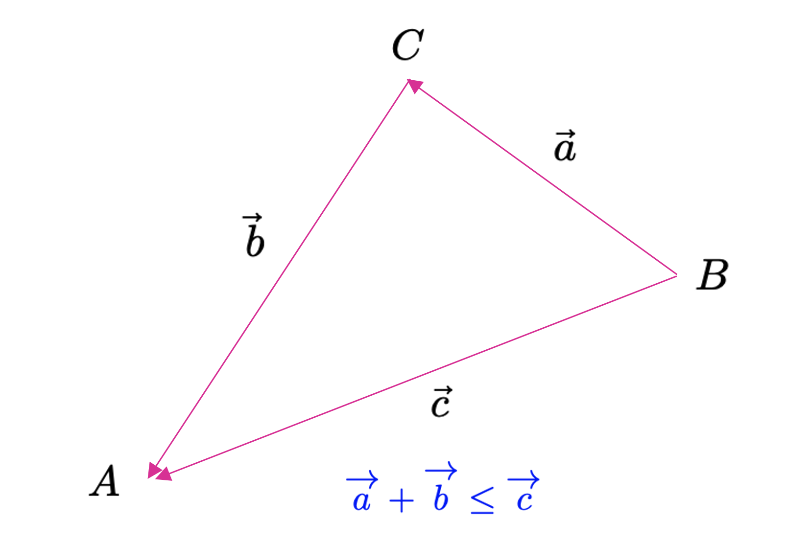{#fig-destriang fig-align="center" width="70%"}

La definición (4.1) es válida para cualquier espacio vectorial, pero, para efectos prácticos, bastará con que consideremos únicamente a aquellos con dimensión finita (y, puntualmente, nos limitaremos en muchos casos simplemente a $\mathbb{R}^{n}$.

**Ejemplo 4.1 – La norma $\ell_{1}$:** La definición (4.1) establece las condiciones que debe cumplir una función (denotada como $\left\Vert \cdot \right\Vert$) para ser considerada una norma sobre un determinado espacio vectorial (ya que opera con los elementos de dicho espacio). Por esa razón es que existen varios tipos de normas que son utilizadas en muchos campos de las matemáticas. Un ejemplo es la **norma $\ell_{1}$**, llamada comúnmente **norma Manhattan**, que se define para cualquier vector $\mathbf{x}\in \mathbb{R}^{n}$ (donde $\mathbf{x}=(x_{1},...,x_{n})$) como

::: {.eq-scroll}
$$
\left\Vert \mathbf{x} \right\Vert_{1}  :=\sum^{n}_{i=1} \left| x_{i}\right| \tag{4.2}
$$
:::

Donde $\left| x_{i}\right|$ es el valor absoluto de la *componente* $x_{i}$. En la @fig-normas (a) se muestran todos los puntos en el plano $\mathbb{R}^{2}$ tales que $\left\Vert \mathbf{x} \right\Vert_{1}  =1$. ◼︎

**Ejemplo 2.2 – La norma $\ell_{2}$:** Otro tipo de norma muy común en las matemáticas (y en el análisis en $\mathbb{R}^{n}$) corresponde a la **norma $\ell_{2}$:**, conocida igualmente como **norma Euclidiana**, la que se define para cualquier vector $\mathbf{x}\in \mathbb{R}^{n}$ (donde $\mathbf{x}=(x_{1},...,x_{n})$) como

::: {.eq-scroll}
$$
\left\Vert \mathbf{x} \right\Vert_{2}  :=\left( \sum^{n}_{i=1} x^{2}_{i}\right)^{\frac{1}{2} }  =\sqrt{\mathbf{x}^{\top } \mathbf{x} } \tag{4.3}
$$
:::

Esta norma permite calcular la distancia Euclidiana del vector $\mathbf{x}\in \mathbb{R}^{n}$ con respecto al origen del sistema de coordenadas rectangulares. En la @fig-normas (b) se muestran todos los puntos en el plano $\mathbb{R}^{2}$ tales que $\left\Vert \mathbf{x} \right\Vert_{2}  =1$. La norma $\ell_{2}$ es una norma que usaremos a menudo durante esta asignatura, y será frecuente que la denotamos como la opción por defecto de la función de norma (poniendo simplemente $\left\Vert \mathbf{x} \right\Vert$ en vez de $\left\Vert \mathbf{x} \right\Vert_{2}$), salvo que especifiquemos lo contrario. 

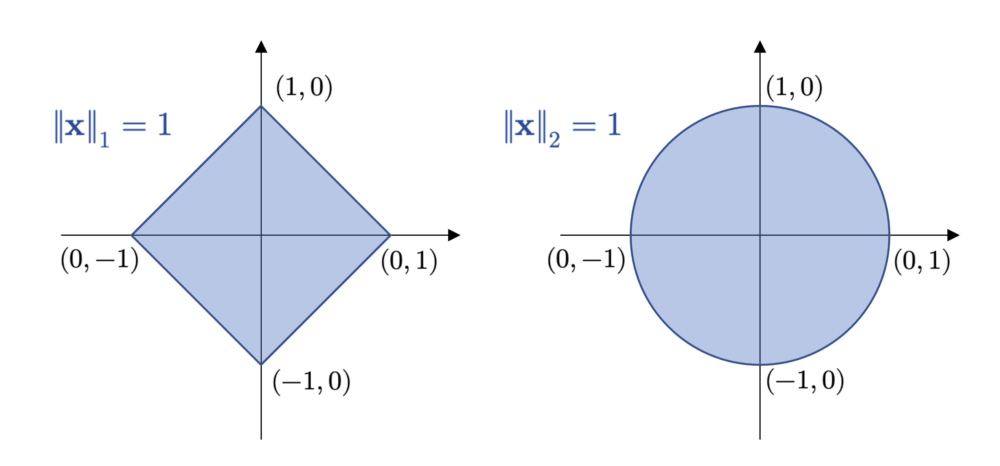{#fig-normas fig-align="center" width="90%"}

◼︎

La norma es un caso particular de una operación importante en álgebra conocida como **producto interno**, y que definiremos a continuación.

**Definición 4.2 – Producto interno (general):** Sea $V$ un $\mathbb{K}$-espacio vectorial. Diremos que la función

::: {.eq-scroll}
$$
\begin{array}{ll}\left< \  ,\  \right>  :&V\times V\longmapsto \mathbb{K} \\ &\left( u,v\right)  \longmapsto \left< u,v\right>  \end{array} \tag{4.4}
$$
:::

es llamada **producto interno** definido sobre $V$. Esta función cumple con las siguientes propiedades:

- **(P1):** $\left< v,v\right>  \geq O_{\mathbb{K} };\forall v\in V\wedge \left< v,v\right>  =O_{\mathbb{K} }\Longleftrightarrow v=O_{V}$.
- **(P2):** $\left< u+v,w\right>  =\left< u,w\right>  +\left< v,w\right>  ;\forall u,v,w\in V$.
- **(P3):** $\left< u,v+w\right>  =\left< u,v\right>  +\left< v,w\right>  ;\forall u,v,w\in V$.
- **(P4):** $\left< \lambda u,v\right>  =\lambda \left< u,v\right>  ;\forall u,v\in V\wedge \lambda \in \mathbb{K}$.
- **(P5):** $\left< u,\lambda v\right>  =\bar{\lambda } \left< u,v\right>  ;\forall u,v\in V\wedge \lambda \in \mathbb{K}$.
- **(P6):** $\left< u,v\right>  =\overline{\left< v,u\right>  } ;\forall u,v\in V$.

Cuando un $\mathbb{K}$-espacio vectorial $V$ está *equipado* con un producto interno, se denomina **espacio vectorial normado o prehilbertiano**.

**Ejemplo 4.3:** En $\mathbb{K}^{n}$ (donde $\mathbb{K}$ puede ser $\mathbb{R}$ o $\mathbb{C}$), definimos, para $\mathbf{x}, \mathbf{y} \in \mathbb{K}^{n}$, con $\mathbf{x}=(x_{1},...,x_{n})$ y $\mathbf{y}=(y_{1},...,y_{n})$,

::: {.eq-scroll}
$$
\left< \mathbf{x} ,\mathbf{y} \right>  =\sum^{n}_{k=1} x_{k}\overline{y}_{k} \tag{4.5}
$$
:::

y lo denominaremos **producto interno canónico en $\mathbb{K}^{n}$**. Notemos que, cuando $\mathbb{K}=\mathbb{R}$, se tiene que $\overline{y}_{k}=y_{k}$ para todo $k=1,...,n$. En un contexto más geométrico, donde estos vectores suelen describir cantidades físicas, tal producto interno suele denominarse como *producto punto*. ◼︎

**Ejemplo 4.4:** En $\mathbb{R}^{n\times n}$ definimos, para $\mathbf{A} =\left\{ a_{ij}\right\}  \in \mathbb{R}^{n\times n} \wedge \mathbf{B} =\left\{ b_{ij}\right\}  \in \mathbb{R}^{n\times n}$,

::: {.eq-scroll}
$$
\left< \mathbf{A} ,\mathbf{B} \right>  =\mathrm{tr} \left( \mathbf{B}^{\top } \mathbf{A} \right) \tag{4.6}
$$
:::

y lo denominaremos **producto interno canónico de $\mathbb{R}^{n\times n}$**. ◼︎

**Ejemplo 4.5:** Definimos el conjunto $C^{k}([a,b])$ como el conjunto de todas las funciones $k$ veces diferenciables sobre el intervalo cerrado $[a,b]$ (es decir, funciones de clase $C^{k}$ en el intervalo cerrado $[a,b]\in \mathbb{R}$). La operación definida como

::: {.eq-scroll}
$$
\left< f,g\right>  =\left< f\left( x\right)  ,g\left( x\right)  \right>  =\int^{b}_{a} f\left( x\right)  g\left( x\right)  dx \tag{4.7}
$$
:::

es llamada **producto interno de las funciones $f$ y $g$ para cada $x\in [a,b]$**. ◼︎

## Longitud y distancia
La norma, en general, corresponde a un caso particular de aplicación del producto interno, en el cual el argumento respectivo es siempre el mismo vector. Por esta razón, decimos que un producto interno sobre un espacio vectorial $V$ siempre induce una norma en $V$. En este caso, podemos re-definir la norma en relación a cualquier producto interno, ya que, para todo $v\in V$, se tendrá que

::: {.eq-scroll}
$$
\left\Vert v\right\Vert  :=\sqrt{\left< v,v\right>  } \tag{4.8}
$$
:::

La norma corresponde a un concepto que, por tanto, se desprende de forma natural para cualquier espacio vectorial con producto interno. Sin embargo, no todas las normas son inducidas a partir de un producto interno; la norma $\ell_{1}$ es un ejemplo de norma que no se corresponde con un producto interno y que resulta importante en procedimientos fundamentales propios de muchos algoritmos de machine learning tales como la regularización de hiperparámetros (donde, mediante un procedimiento iterativo, intentamos evitar que nuestros modelos sobreajusten o aprendan de memoria un patrón extremadamente variable dado un conjunto de datos que deseamos representar). Sin embargo, para definir conceptos geométricos claves, como longitudes, distancias y ángulos, nos limitaremos momentáneamente al uso de normas inducidas. Para ello, partiremos con un importante teorema, que generaliza la desigualdad triangular vista en la definición (2.1).

::: {.callout-tip}
## Teorema 4.1 – Desigualdad de Cauchy-Schwarz

*Sea $V$ un espacio vectorial normado. Para todo par de vectores $u,v\in V$ se tiene que*

::: {.eq-scroll}
$$
\left| \left< u,v\right>  \right|^{2}  \leq \left< u,u\right>  \left< v,v\right>  \Longleftrightarrow \left| \left< u,v\right>  \right|^{2}  \leq \left\Vert u\right\Vert  \left\Vert v\right\Vert \tag{4.9}
$$
:::

:::

**Ejemplo 4.6:** En el campo de la geometría analítica, con frecuencia, estamos interesados en la longitud de un vector. Podemos utilizar el producto interno para calcular tales longitudes por medio de la ecuación (4.8). Por ejemplo, consideremos el vector $\mathbf{u}=(1, 1)^{\top}\in \mathbb{R}^{2}$. En este caso, a partir de la definición de norma inducida y, en este caso, utilizando la norma $\ell_{2}$ (que es, de hecho, el producto interno definido en el ejemplo (4.3)), obenemos

::: {.eq-scroll}
$$
\left\Vert \mathbf{u} \right\Vert  =\sqrt{\left< \mathbf{u} ,\mathbf{u} \right>  } =\sqrt{1^{2}+1^{2}} =\sqrt{2} \tag{4.10}
$$
:::

y que corresponde a la longitud del vector $\mathbf{u}$. Por otro lado, es posible demostrar que la expresión

::: {.eq-scroll}
$$
\mathbf{u}^{\top } \mathbf{A} \mathbf{v} ;\forall \mathbf{u} ,\mathbf{v} \in V\wedge \mathbf{A} \in \mathbb{R}^{n\times n} \tag{4.11}
$$
:::

donde $V$ es un espacio vectorial normado, es de hecho un producto interno siempre que la matriz $\mathbf{A} =\left\{ a_{ij}\right\}$ sea definida positiva; es decir, si las submatrices $\tilde{\mathbf{A} } =\left\{ \tilde{a}_{ij} \right\}$, con $i=1,...,n-r$ y $j=1,...,n-r$, para $r = 1,...,n-1$, son todas invertibles. Una matriz que cumple con este criterio es

::: {.eq-scroll}
$$
\mathbf{A} =\left( \begin{array}{rr}1&-\frac{1}{2} \\ -\frac{1}{2} &1\end{array} \right) \tag{4.12}
$$
:::

El producto interno (4.11) induce la norma $\| \mathbf{u} \| =\mathbf{u}^{\top } \mathbf{A} \mathbf{u}$ para todo $\mathbf{u}\in V$. Con esta norma, obtenemos $\| \mathbf{u} \|=\sqrt{1}=1$. Por lo tanto, la longitud del vector $\mathbf{u}$ será dependiente de la norma con la cual se defina. Esto abre la posibilidad de pensar en que la geometría no necesariamente tiene que ser Euclidiana, ya que los conceptos de distancia, como veremos un poco más adelante, dependerán de la métrica con la cual equipemos al espacio donde estamos trabajando. ◼︎

**Definición 4.3 – Distancia y métrica:** Sea $V$ un espacio vectorial normado y sean $u,v\in V$. Definimos la **distancia** entre los vectores $u$ y $v$ como

::: {.eq-scroll}
$$
d\left( u,v\right)  :=\left\Vert u-v\right\Vert  =\sqrt{\left< u-v,u-v\right>  } \tag{4.13}
$$
:::

Si $V=\mathbb{R}^{n}$, y utilizamos la norma $\ell_{2}$, la distancia así definida será llamada **distancia Euclidiana** entre los vectores respectivos. Por otro lado, la función $d$ definida como

::: {.eq-scroll}
$$
\begin{array}{ll}d:&V\times V\longmapsto \mathbb{R} \\ &\left( u,v\right)  \longmapsto d\left( u,v\right)  \end{array} \tag{4.14}
$$
:::

será llamada **métrica** del espacio vectorial $V$.

De manera similar al concepto de longitud de un vector, la distancia entre dos vectores no requiere de un producto interno para ser definida. Bastará siempre con el concepto de norma, independiente de si ésta fue inducida por un producto interno o no. En cualquier caso, si la norma sí es inducida, el valor de la distancia variará en función del producto interno utilizado.

Una métrica $d$ satisface las siguiente condiciones:

- **(C1):** La métrica $d$ es **definida positiva**. Es decir, $d(u,v)\geq 0$ para todo $u,v\in V$, siendo $d(u,v)=0 \Longleftrightarrow u=v$.
- **(C2):** La métrica $d$ es **simétrica**. Es decir, $d(u,v)=d(v,u); \forall u,v\in V$.
- **(C3):** La métrica $d$ satisface la **desigualdad triangular**. Es decir, $d(u,w)\leq d(u,v)+d(v,w)$; $\forall u,v,w \in V$.

## Ortogonalidad

### Ángulo entre vectores
En adición a la posibilidad de definir longitudes de vectores y la distancia entre ellos, los productos internos (y, puntualmente, las normas) también permiten capturar la noción de geometría de un espacio vectorial mediante la definición del *ángulo* $\omega$ entre dos vectores. Este concepto tiene una interpretación geométrica que resulta natural cuando $V=\mathbb{R}^{2}$ o $V=\mathbb{R}^{3}$ y, para definirla, utilizaremos la desigualdad de Cauchy-Schwarz.

**Definición 4.4 – Ángulo (entre dos vectores):** Sea $V$ un $\mathbb{K}$-espacio vectorial normado y $u,v\in V$ tales que $u\neq O_{V}$ y $v\neq O_{V}$. Conforme la desigualdad de Cauchy-Schwarz, es posible establecer que

::: {.eq-scroll}
$$
-1\leq \frac{\left< u,v\right>  }{\left\Vert u\right\Vert  \left\Vert v\right\Vert  } \leq 1 \tag{4.15}
$$
:::

Definimos el **ángulo** entre los vectores $u$ y $v$ como el único valor $\omega$ que satisface la ecuación

::: {.eq-scroll}
$$
\cos \left( \omega \right)  =\frac{\left< u,v\right>  }{\left\Vert u\right\Vert  \left\Vert v\right\Vert  } \tag{4.16}
$$
:::

Intuitivamente, cuando $V=\mathbb{R}^{2}$ o $V=\mathbb{R}^{3}$, el concepto de ángulo nos permite entender qué tan similares son las orientaciones de los vectores $\mathbf{u}$ y $\mathbf{v}$, cuando $\mathbf{u}, \mathbf{v}\in \mathbb{R}^{n}$ ($n=2, 3$). Cuando $v$ es un vector arbitrario, para todo espacio vectorial abstracto, el concepto de ángulo es más general y sirve como base para construir elementos más representativos de la geometría de dicho espacio. Volveremos a retomar estos conceptos más adelante, cuando estudiemos las *bases ortogonales*.

**Ejemplo 4.7:** Vamos a calcular el ángulo entre los vectores $\mathbf{x}=(1, 1)^{\top}\in \mathbb{R}^{2}$ e $\mathbf{y}=(1,2)^{\top}\in \mathbb{R}^{2}$, los que se ilustran en la @fig-angulo. Utilizando la norma $\ell_{2}$ y el producto interno canónico de $\mathbb{R}^{2}$, obtenemos

::: {.eq-scroll}
$$
\cos \left( \omega \right)  =\frac{\left< \mathbf{x} ,\mathbf{y} \right>  }{\left\Vert \mathbf{x} \right\Vert  \left\Vert \mathbf{y} \right\Vert  } =\frac{3}{\sqrt{10} } \Longleftrightarrow \omega =\arccos \left( \frac{3}{\sqrt{10} } \right)  \approx 0.23\  \mathrm{rad} \tag{4.17}
$$
:::

Así que el ángulo $\omega$ entre los vectores $\mathbf{x}$ e $\mathbf{y}$ es igual a 0.23 radianes, equivalente a unos 18º aproximadamente. ◼︎

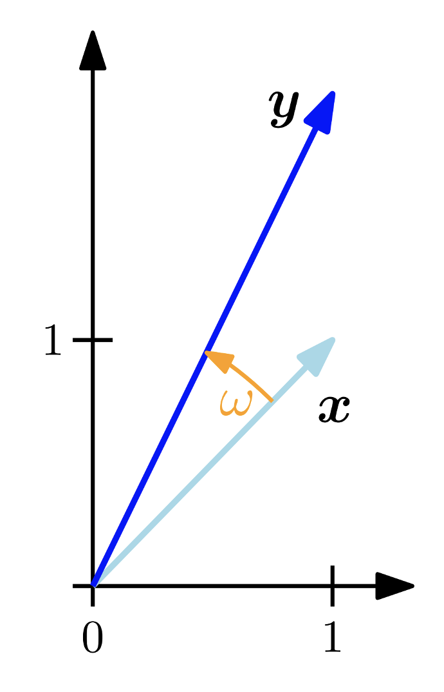{#fig-angulo fig-align="center" width="30%"}

Un último concepto clave en relación a la caracterización de espacios vectoriales corresponde al concepto de ortogonalidad, el cual también, como sabemos, admite una interpretación geométrica. En esta primera aproximación, construiremos este concepto aprovechando la definición de ángulo vista previamente, pero más adelante lo formalizaremos cuando estudiemos las *bases ortogonales*.

**Definición 4.5 – Ortogonalidad:** Sea $V$ un espacio vectorial normado y sean $u,v\in V$. Diremos que los vectores $u$ y $v$ son **ortogonales** si y sólo si $\left< u,v\right>  =O_{V}$. En tal caso, escribiremos $u\bot v$ para denotar la condición de ortogonalidad entre ambos vectores.

Notemos que también podemos establecer que dos vectores son ortogonales si el ángulo $\omega$ entre ellos es tal que $\cos(\omega)=0$.

Debemos observar que dos vectores son ortogonales siempre respecto de una determinada definición de producto interno.

### Bases ortogonales
Sea $\alpha =\left( \mathbf{v}_{1} ,\mathbf{v}_{2} \right)$ una base ordenada de $\mathbb{R}^{2}$ tal que $\left< \mathbf{v}_{1} ,\mathbf{v}_{2} \right>  =0$. Entonces, como $\alpha$ es una base de $\mathbb{R}^{2}$, para $\mathbf{v}\in \mathbb{R}^{2}$, existen escalares únicos $a_{1}, a_{2}\in \mathbb{R}$ tales que $\mathbf{v}=a_{1}\mathbf{v}_{1} +a_{2}\mathbf{v}_{2}$. Como $\left< \mathbf{v}_{1} ,\mathbf{v}_{2} \right>  =0$, entonces podemos *multiplicar* la combinación lineal que genera $\mathbf{v}$ (usando el producto interno) por $\mathbf{v}_{1}$, para obtener

::: {.eq-scroll}
$$
\left< \mathbf{v} ,\mathbf{v}_{1} \right>  =\left< a_{1}\mathbf{v}_{1} +a_{2}\mathbf{v}_{2} ,\mathbf{v}_{1} \right>  =a_{1}\left< \mathbf{v}_{1} ,\mathbf{v}_{1} \right>  +a_{2}\underbrace{\left< \mathbf{v}_{2} ,\mathbf{v}_{1} \right>  }_{=0} =a_{1}\left< \mathbf{v}_{1} ,\mathbf{v}_{1} \right> \tag{4.18}
$$
:::

De donde se tiene que

::: {.eq-scroll}
$$
a_{1}=\frac{\left< \mathbf{v} ,\mathbf{v}_{1} \right>  }{\left< \mathbf{v}_{1} ,\mathbf{v}_{1} \right>  } \tag{4.19}
$$
:::

Notemos que, como $\mathbf{v}_{1}$ es un vector no nulo, se tiene que $\left< \mathbf{v}_{1} ,\mathbf{v}_{1} \right> > 0$. Análogamente, siguiendo un procedimiento similar, podemos obtener que

::: {.eq-scroll}
$$
a_{2}=\frac{\left< \mathbf{v} ,\mathbf{v}_{2} \right>  }{\left< \mathbf{v}_{2} ,\mathbf{v}_{2} \right>  } \tag{4.20}
$$
:::

Hemos demostrado pues que, si $\alpha =(\mathbf{v}_{1},\mathbf{v}_{2})$ es una base ordenada de $\mathbb{R}^{2}$ tal que $\left< \mathbf{v}_{1} ,\mathbf{v}_{2} \right>  =0$, entonces el vector $\mathbf{v}\in \mathbb{R}^{2}$ puede expresarse como una combinación lineal del tipo

::: {.eq-scroll}
$$
\mathbf{v} =\frac{\left< \mathbf{v} ,\mathbf{v}_{1} \right>  }{\left< \mathbf{v}_{1} ,\mathbf{v}_{1} \right>  } \mathbf{v}_{1} +\frac{\left< \mathbf{v} ,\mathbf{v}_{2} \right>  }{\left< \mathbf{v}_{2} ,\mathbf{v}_{2} \right>  } \mathbf{v}_{2} \tag{4.21}
$$
:::

Vamos a intentar generalizar el resultado anterior para un vector en $\mathbb{R}^{n}$. Supongamos entonces que $\alpha = (\mathbf{v}_{1},...,\mathbf{v}_{n})$ es una base ordenada de $\mathbb{R}^{n}$ tal que $\left< \mathbf{v}_{i} ,\mathbf{v}_{j} \right>  =0$ para $i\neq j$. Entonces, a partir del hecho de que $\alpha$ es una base de $\mathbb{R}^{n}$, se tiene que existe una colección de escalares $\left\{ a_{i}\right\}^{n}_{i=1}$ tales que, para todo $\mathbf{u}\in \mathbb{R}^{n}$, se tendrá que $\mathbf{u} =\sum^{n}_{i=1} a_{i}\mathbf{v}_{i}$. Por lo tanto, podemos escribir

::: {.eq-scroll}
$$
\begin{array}{lll}\mathbf{u} =\displaystyle \sum^{n}_{i=1} a_{i}\mathbf{v}_{i} &\Longrightarrow &\left< \mathbf{u} ,\mathbf{v}_{j} \right>  =\left< \displaystyle \sum^{n}_{i=1} a_{i}\mathbf{v}_{i} ,\mathbf{v}_{j} \right>  =\displaystyle \sum^{n}_{i=1} a_{i}\overbrace{\left< \mathbf{v}_{i} ,\mathbf{v}_{j} \right>  }^{=0\Longleftrightarrow i\neq j} \\ &\Longrightarrow &\left< \mathbf{u} ,\mathbf{v}_{j} \right>  =a_{j}\left< \mathbf{v}_{j} ,\mathbf{v}_{j} \right>  \\ &\Longrightarrow &a_{j}=\displaystyle \frac{\left< \mathbf{u} ,\mathbf{v}_{j} \right>  }{\left< \mathbf{v}_{j} ,\mathbf{v}_{j} \right>  } ;j=1,...,n\end{array} \tag{4.22}
$$
:::

Hemos demostrado, pues, el siguiente resultado fundamental:

::: {.eq-scroll}
$$
\mathbf{u} =\sum^{n}_{i=1} \frac{\left< \mathbf{u} ,\mathbf{v}_{i} \right>  }{\left< \mathbf{v}_{i} ,\mathbf{v}_{i} \right>  } \mathbf{v}_{i} \Longleftrightarrow \left[ \mathbf{u} \right]_{\alpha }  =\left( \begin{array}{c}\displaystyle \frac{\left< \mathbf{u} ,\mathbf{v}_{1} \right>  }{\left< \mathbf{v}_{1} ,\mathbf{v}_{1} \right>  } \\ \displaystyle \frac{\left< \mathbf{u} ,\mathbf{v}_{2} \right>  }{\left< \mathbf{v}_{2} ,\mathbf{v}_{2} \right>  } \\ \vdots \\ \displaystyle \frac{\left< \mathbf{u} ,\mathbf{v}_{n} \right>  }{\left< \mathbf{v}_{n} ,\mathbf{v}_{n} \right>  } \end{array} \right) \tag{4.23}
$$
:::

Este desarrollo motiva la siguiente definición.

**Definición 4.6 – Base ortogonal (general):** Sea $V$ un $\mathbb{K}$-espacio vectorial normado. Una base ordenada $\alpha=(v_{1},...,v_{n})\subset V$ será llamada **base ortogonal** de $V$ si se cumplen las siguientes condiciones:

- **(C1):** $\alpha$ es una base de $V$.
- **(C2):** Si $i\neq j$, entonces $\left< v_{i},v_{j}\right>  =0$.

Para un vector arbitrario $u\in V$, la **coordenada** respecto de la base ortogonal $\alpha$, digamos $a_{i}=\frac{\left< u,v_{i}\right>  }{\left< v_{i},v_{i}\right>  }$, será llamada $i$-ésimo coeficiente de Fourier del vector $u$.

**Ejemplo 4.8:** La base canónica de $\mathbb{R}^{n}$ definida como $\mathbf{e} \left( n\right)  =\left\{ \mathbf{e}_{1} ,...,\mathbf{e}_{n} \right\}$, donde $\mathbf{e}_{k} =\left( e_{1},...,e_{n}\right)^{\top }$, y

::: {.eq-scroll}
$$
e_{j}=\begin{cases}1&;\  \mathrm{si} \  j=k\\ 0&;\  \mathrm{si} \  j\neq k\end{cases} \tag{4.24}
$$
:::

es también una base ortogonal, ya que

::: {.eq-scroll}
$$
\left< \mathbf{e}_{i} ,\mathbf{e}_{j} \right>  =\begin{cases}1&;\  \mathrm{si} \  i=j\\ 0&;\  \mathrm{si} \  i\neq j\end{cases} \tag{4.25}
$$
:::

◼︎

**Ejemplo 4.9:** Sea $V=\left< \left\{ 1,\mathrm{sen} \left( x\right)  ,\cos \left( x\right)  ,\mathrm{sen} \left( 2x\right)  ,\cos \left( 2x\right)  ,...,\mathrm{sen} \left( nx\right)  ,\cos \left( nx\right)  \right\}  \right>$ y definimos en $V$ el producto interno

::: {.eq-scroll}
$$
\left< f,g\right>  =\int^{\pi }_{-\pi } f\left( x\right)  g\left( x\right)  dx \tag{4.26}
$$
:::

Donde $f$ y $g$ son funciones integrables en el intervalo cerrado $[-\pi, \pi]$. Entonces $\alpha =\left\{ 1,\mathrm{sen} \left( x\right)  ,\cos \left( x\right)  ,\mathrm{sen} \left( 2x\right)  ,\cos \left( 2x\right)  ,...,\mathrm{sen} \left( nx\right)  ,\cos \left( nx\right)  \right\}$ es una base ortogonal de $V$ respecto de dicho producto interno, ya que

::: {.eq-scroll}
$$
\begin{array}{lll}\left< \mathrm{sen} \left( px\right)  ,\cos \left( qx\right)  \right>  &=&\displaystyle \int^{\pi }_{-\pi } \mathrm{sen} \left( px\right)  \cos \left( qx\right)  dx\  ;\  p\neq q\wedge p,q\in \mathbb{N} +\left\{ 0\right\}  \\ &=&\displaystyle \frac{1}{2} \displaystyle \int^{\pi }_{-\pi } \left[ \mathrm{sen} \left( p+q\right)  x+\mathrm{sen} \left( p-q\right)  x\right]  dx\\ &=&-\displaystyle \frac{1}{2} \left( \left[ \displaystyle \frac{1}{p+q} \cos \left( p+q\right)  x\right]^{x=\pi }_{x=-\pi }  +\left[ \displaystyle \frac{1}{p-q} \cos \left( p-q\right)  x\right]^{x=\pi }_{x=-\pi }  \right)  \\ &=&0\end{array} \tag{4.27}
$$
:::

Mediante procedimientos similares, podemos demostrar además que $\left< \mathrm{sen} \left( px\right)  ,\mathrm{sen} \left( qx\right)  \right>  =\left< \cos \left( px\right)  ,\cos \left( qx\right)  \right>  =0$ para $p\neq q$. Luego, efectivamente, $\alpha$ es una base ortogonal de $V$ con respecto al producto interno (4.26). ◼︎

### Proceso de Gram-Schmidt
Observamos que la fortaleza de las bases ortogonales, a la hora de determinar las componentes (coordenadas) de un vector, radica en el hecho de que los productos internos entre dichas componentes son iguales a cero, salvo que dicho producto se aplique sobre la misma componente (en cuyo caso obtenemos la norma inducida por este producto interno). Cabe preguntarse, por lo tanto: ¿Qué significa, en términos geométricos, el hecho de que $\left< v_{i},v_{j}\right>  =0;\forall i\neq j$? Para responder esta pregunta, observemos la situación en la @fig-relangu y, a partir de dicha representación, utilicemos el producto interno canónico de $\mathbb{R}^{2}$. De esta manera, tenemos

::: {.eq-scroll}
$$
\begin{array}{lll}\left< \mathbf{v}_{1} ,\mathbf{v}_{2} \right>  =0&\Longleftrightarrow &x_{1}x_{2}+y_{1}y_{2}=0\  ;\  \left( \mathrm{sea} \  l\left( \mathbf{v}_{i} \right)  \  \mathrm{la} \  \mathrm{longitud} \  \mathrm{del} \  \mathrm{vector} \  \mathbf{v}_{i} \right)  \\ &\Longleftrightarrow &l\left( \mathbf{v}_{1} \right)  \cos \left( \omega_{1} \right)  l\left( \mathbf{v}_{2} \right)  \cos \left( \omega_{2} \right)  +l\left( \mathbf{v}_{1} \right)  \mathrm{sen} \left( \omega_{1} \right)  l\left( \mathbf{v}_{2} \right)  \mathrm{sen} \left( \omega_{2} \right)  =0\\ &\Longleftrightarrow &l\left( \mathbf{v}_{1} \right)  l\left( \mathbf{v}_{2} \right)  \cos \left( \omega_{2} -\omega_{1} \right)  =0\\ &\Longleftrightarrow &l\left( \mathbf{v}_{1} \right)  l\left( \mathbf{v}_{2} \right)  \cos \left( \omega \right)  =0\Longleftrightarrow \omega =\frac{\pi }{2} \end{array} \tag{4.28}
$$
:::

Así que la condición, en el plano $\mathbb{R}^{2}$, para que los vectores $\mathbf{v}_{1}$ y $\mathbf{v}_{2}$ tengan un producto interno nulo (si tal producto interno es el canónico), es que sus trazas en $\mathbb{R}^{2}$ (que son rectas) sean perpendiculares, que es precisamente lo que establecimos unas líneas atrás.

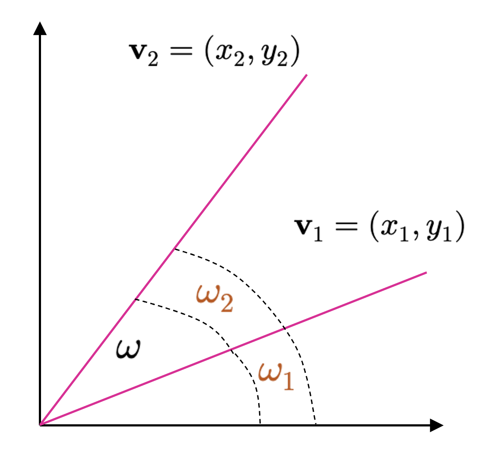{#fig-relangu fig-align="center" width="50%"}

Uno podría preguntarse, por supuesto, si dados los beneficios que traen consigo las bases ortogonales para la caracterización conveniente de cualquier vector en un espacio vectorial $V$, si éstas son sencillas de construir o si son abundantes, en caso de que no sean posibles de construir.

Para responder las preguntas anteriores, podemos utilizar el resultado anterior para establecer la condición de que, si un espacio vectorial no tiene una base $v  \subset V$, entonces $\left< v_{i},v_{j}\right>  \neq 0$ para $i\neq j$.

Vamos a intentar trabajar sobre ésto, considerando –nuevamente– el espacio $\mathbb{R}^{2}$, a fin de tener una noción intuitiva de donde queremos llegar. Entonces, si $\left< \mathbf{v}_{1},\mathbf{v}_{2}\right>  \neq 0$, de acuerdo a la @fig-relangu, sabemos que $\mathbf{v}_{1}$ y $\mathbf{v}_{2}$ no son perpendiculares. Así que, en este contexto, podemos suponer que estos vectores son como los que se muestran en la @fig-perpend.

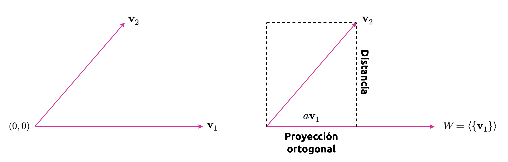{#fig-perpend fig-align="center" width="100%"}

Entonces,

::: {.eq-scroll}
$$
\mathbf{v}_{2} =\mathbf{v}^{\prime }_{2} +a\mathbf{v}_{1} \tag{4.29}
$$
:::

Lamentablemente, la ecuación (4.29) contiene tres variables, y sólo conocemos una de ellas. Sin embargo, en virtud de las propiedades del producto interno, podemos escribir

::: {.eq-scroll}
$$
\begin{array}{lll}\mathbf{v}_{2} =\mathbf{v}^{\prime }_{2} +a\mathbf{v}_{1} &\Longrightarrow &\left< \mathbf{v}_{2} ,\mathbf{v}_{2} \right>  =\left< \mathbf{v}^{\prime }_{2} ,\mathbf{v}_{1} \right>  +\left< a\mathbf{v}_{1} ,\mathbf{v}_{1} \right>  \\ &\Longrightarrow &\left< \mathbf{v}_{2} ,\mathbf{v}_{1} \right>  =a\left< \mathbf{v}_{1} ,\mathbf{v}_{1} \right>  \\ &\Longrightarrow &a=\displaystyle \frac{\left< \mathbf{v}_{2} ,\mathbf{v}_{1} \right>  }{\left< \mathbf{v}_{1} ,\mathbf{v}_{1} \right>  } \end{array} \tag{4.30}
$$
:::

Y sustituyendo en la ecuación (4.29), obtenemos

::: {.eq-scroll}
$$
\mathbf{v}^{\prime }_{2} =\mathbf{v}_{2} -\frac{\left< \mathbf{v}_{2} ,\mathbf{v}_{1} \right>  }{\left< \mathbf{v}_{1} ,\mathbf{v}_{1} \right>  } \mathbf{v}_{1} \tag{4.31}
$$
:::

De esta manera, hemos probado un caso particular del siguiente teorema.

::: {.callout-tip}
## Teorema 4.2 – Proceso de ortogonalización de Gram-Schmidt

*Sea $V$ un $\mathbb{K}$-espacio vectorial equipado con un producto interno y $\alpha =\left\{ v_{1},...,v_{n}\right\}$ una base de $V$. Entonces $\alpha^{\prime } =\left\{ v^{\prime }_{1},...,v^{\prime }_{n}\right\}$ es una base ortogonal para $V$, donde los elementos de $\alpha^{\prime }$ satisfacen todos la ecuación vectorial*

::: {.eq-scroll}
$$
\begin{cases}v^{\prime }_{1}=v_{1}&\\ v^{\prime }_{j}=v_{j}-\displaystyle \frac{\left< v_{j},v^{\prime }_{j-1}\right>  }{\left< v^{\prime }_{j-1},v^{\prime }_{j-1}\right>  } v^{\prime }_{j-1}-\cdots -\displaystyle \frac{\left< v_{j},v^{\prime }_{1}\right>  }{\left< v^{\prime }_{1},v^{\prime }_{1}\right>  } v^{\prime }_{1}&;\  \left( 2\leq j\leq n\right)  \end{cases} \tag{4.32}
$$
:::

:::

**Ejemplo 4.10:** Consideremos el subespacio $W=\left\{ \left( x,y,z,t\right)  \in \mathbb{R}^{4} :x+y+z+t=0\right\}$. Vamos a determinar una base ortogonal para $W$ utilizando el producto interno canónico de $\mathbb{R}^{4}$. De esta manera, en primer lugar, determinamos una base para $W$:

::: {.eq-scroll}
$$
\begin{array}{lll}\mathbf{u} \in W&\Longleftrightarrow &\mathbf{u} =\left( x,y,z,t\right)  \in \mathbb{R}^{4} \wedge x+y+z+t=0\\ &\Longleftrightarrow &\mathbf{u} =\left( x,y,z,t\right)  \in \mathbb{R}^{4} \wedge t=-x-y-z\\ &\Longleftrightarrow &\mathbf{u} =\left( x,y,z,-x-y-z\right)  ;\left( x,y,z\right)  \in \mathbb{R}^{3} \\ &\Longleftrightarrow &\mathbf{u} =x\left( 1,0,0,-1\right)  +y\left( 0,1,0,-1\right)  +z\left( 0,0,1,-1\right)  ;\left( x,y,z\right)  \in \mathbb{R}^{3} \end{array} \tag{4.33}
$$
:::

Luego $W=\left< \left\{ \left( 1,0,0,-1\right)  ,\left( 0,1,0,-1\right)  ,\left( 0,0,1,-1\right)  \right\}  \right>$. Por lo tanto, $\alpha =\left\{ \left( 1,0,0,-1\right)  ,\left( 0,1,0,-1\right)  ,\left( 0,0,1,-1\right)  \right\}$ es una base de $W$, ya que sus componentes son LI (esto se deja como ejercicio al lector). Ahora construiremos una base ortogonal siguiendo el proceso de Gram-Schmidt:

::: {.eq-scroll}
$$
\begin{array}{lll}\mathbf{v}^{\prime }_{1} &=&\left( 1,0,0,-1\right)  \\ \mathbf{v}^{\prime }_{2} &=&\left( 0,1,0,-1\right)  -\displaystyle \frac{\left< \left( 0,1,0,-1\right)  ,\left( 1,0,0,-1\right)  \right>  }{\left< \left( 1,0,0,-1\right)  ,\left( 1,0,0,-1\right)  \right>  } \left( 1,0,0,-1\right)  \\ &=&\left( 0,1,0,-1\right)  -\displaystyle \frac{1}{2} \left( 1,0,0,-1\right)  \\ &=&\left( -\displaystyle \frac{1}{2} ,1,0,-\displaystyle \frac{1}{2} \right)  ;\mathrm{tomaremos} \  \mathbf{v}^{\prime }_{2} =\left( -1,2,0,-1\right)  \\ \mathbf{v}^{\prime }_{3} &=&\left( 0,1,0,-1\right)  -\displaystyle \frac{\left< \left( 0,0,1,-1\right)  ,\left( -1,2,0,-1\right)  \right>  }{\left< \left( -1,2,0,-1\right)  ,\left( -1,2,0,-1\right)  \right>  } \left( -1,2,0,-1\right)  -\displaystyle \frac{\left< \left( 0,1,0,-1\right)  ,\left( 1,0,0,-1\right)  \right>  }{\left< \left( 1,0,0,-1\right)  ,\left( 1,0,0,-1\right)  \right>  } \left( 1,0,0,-1\right)  \\ &=&\left( 0,1,0,-1\right)  -\displaystyle \frac{1}{6} \left( -1,2,0,-1\right)  -\displaystyle \frac{1}{2} \left( 1,0,0,-1\right)  =\left( -\displaystyle \frac{1}{3} ,-\displaystyle \frac{1}{3} ,1,-\displaystyle \frac{1}{3} \right)  ;\mathrm{tomaremos} \  \mathbf{v}^{\prime }_{3} =\left( -1,-1,3,-1\right)  \end{array} \tag{4.34}
$$
:::

Así que $\alpha^{\prime } =\left\{ \left( 1,0,0,-1\right)  ,\left( -1,2,0,-1\right)  ,\left( -1,-1,3,-1\right)  \right\}$ es una base ortogonal de $W$. ◼︎

Sea $\alpha =\left\{ v_{1},...,v_{n}\right\}  \subset V$ una base ortogonal de un $\mathbb{K}$-espacio vectorial $V$. Para cada $u\in V$ tenemos la representación única en términos de la base $\alpha$

::: {.eq-scroll}
$$
u=\sum^{n}_{i=1} \frac{\left< u,v_{i}\right>  }{\left< v_{i},v_{i}\right>  } v_{i} \tag{4.35}
$$
:::

Sin embargo, resulta interesante observar que el denominador del término común de esta sumatoria es, de hecho, el cuadrado de la norma inducida por el correspondiente producto interno (es decir, $\left\Vert v_{i}\right\Vert^{2}  =\left< v_{i},v_{i}\right>$). Podemos, por tanto, mejorar la definición de base ortogonal considerando el siguiente teorema.

::: {.callout-tip}
## Teorema 4.3:

*Sea $V$ un $\mathbb{K}$-espacio vectorial y $\alpha =\left\{ v_{1},...,v_{n}\right\}$ una base de $V$. Sea $\beta =\left\{ v^{\prime }_{1},...,v^{\prime }_{n}\right\}$, donde $v^{\prime }_{i}=v_{i}/\left< v_{i},v_{i}\right>$ para cada $i=1,...,n$. Entonces,*

- **(T1):** $\left< v^{\prime }_{i},v^{\prime }_{j}\right>  =0\Longleftrightarrow i\neq j$.
- **(T2):** $u=\sum^{n}_{i=1} \left< u,v_{i}\right>  v^{\prime }_{i}$.
:::

Lo anterior motiva la siguiente definición.

**Definición 4.7 – Base ortonormal (general):** Sea $V$ un $\mathbb{K}$-espacio vectorial normado y sea $\beta =\left\{ w_{1},...,w_{n}\right\}  \subset V$. Diremos que $\beta$ es una **base ortonormal** de $V$ si se cumplen con las siguientes condiciones:

- **(C1):** $\beta$ es una base ortogonal de $V$.
- **(C2):** $\left\Vert v_{i}\right\Vert  =1;\forall i,i=1,...,n$.

Equivalentemente, podemos establecer que $\beta=\left\{ w_{1},...,w_{j}\right\}  $ es una base ortonormal de $V$ si y sólo si $\left< w_{i},w_{j}\right>  =1$ para $i=j$, y $\left< w_{i},w_{j}\right>  =0$ para $i\neq j$.

**Ejemplo 4.11:** La base $\beta =\left\{ \left( 1,1\right)  ,\left( 1,-1\right)  \right\}$ es ortogonal respecto del producto interno canónico en $\mathbb{R}^{2}$, puesto que $\left< \left( 1,1\right)  ,\left( 1,-1\right)  \right>  =1-1=0$. Pero como $\left\Vert \left( 1,1\right)  \right\Vert  =\left\Vert \left( 1,-1\right)  \right\Vert  =\sqrt{2}$, se tiene que $\beta$ no es una base ortonormal. No obstante, la base $\gamma$, definida como

::: {.eq-scroll}
$$
\gamma =\left\{ \left( \frac{1}{\sqrt{2} } ,\frac{1}{\sqrt{2} } \right)  ,\left( \frac{1}{\sqrt{2} } ,-\frac{1}{\sqrt{2} } \right)  \right\} \tag{4.36}
$$
:::

sí es una base ortonormal para $\mathbb{R}^{2}$. ◼︎

Una de las más importantes consecuencias devenida de la existencia de las bases ortonormales, es la siguiente.

::: {.callout-tip}
## Teorema 4.4

*Sea $V$ un $\mathbb{K}$-espacio vectorial normado. Si $\alpha$ y $\beta$ son dos bases ortonormales de $V$, entonces se cumple que*

::: {.eq-scroll}
$$
\left( \left[ \mathbf{I} \right]^{\beta }_{\alpha }  \right)^{-1}  =\left( \left[ \mathbf{I} \right]^{\beta }_{\alpha }  \right)^{\top } \tag{4.37}
$$
:::

:::

Vamos a tomarnos el tiempo de demostrar el teorema (4.4) a fin de entender completamente este resultado. En efecto, por una parte, si $\alpha =\left\{ v_{1},...,v_{n}\right\}$ y $\beta =\left\{ w_{1},...,w_{n}\right\}$ son las representaciones explícitas de ambas bases ortonormales, entonces, por definición de la matriz de cambio de base $\left[ \mathbf{I} \right]^{\beta }_{\alpha }$, tenemos que

::: {.eq-scroll}
$$
\left[ \mathbf{I} \right]^{\beta }_{\alpha }  =\left( \left[ v_{1}\right]_{\beta }  ,\left[ v_{2}\right]_{\beta }  ,...,\left[ v_{n}\right]_{\beta }  \right)  =\left( \begin{matrix}\left< v_{1},w_{1}\right>  &\left< v_{2},w_{1}\right>  &\cdots &\left< v_{n},w_{1}\right>  \\ \left< v_{1},w_{2}\right>  &\left< v_{2},w_{2}\right>  &\cdots &\left< v_{n},w_{2}\right>  \\ \vdots &\vdots &\ddots &\vdots \\ \left< v_{1},w_{n}\right>  &\left< v_{2},w_{n}\right>  &\cdots &\left< v_{n},w_{n}\right>  \end{matrix} \right)  \in \mathbb{R}^{n\times n} \tag{4.38}
$$
:::

Sin embargo, expresando la matriz de cambio de base desde $\beta$ hacia $\alpha$, también por definición, tenemos que

::: {.eq-scroll}
$$
\begin{array}{lll}\left[ \mathbf{I} \right]^{\alpha }_{\beta }  &=&\left( \left[ w_{1}\right]_{\alpha }  ,\left[ w_{2}\right]_{\alpha }  ,...,\left[ w_{n}\right]_{\alpha }  \right)  \\ &=&\left( \begin{matrix}\left< w_{1},v_{1}\right>  &\left< w_{2},v_{1}\right>  &\cdots &\left< w_{n},v_{1}\right>  \\ \left< w_{1},v_{2}\right>  &\left< w_{2},v_{2}\right>  &\cdots &\left< w_{n},v_{2}\right>  \\ \vdots &\vdots &\ddots &\vdots \\ \left< w_{1},v_{n}\right>  &\left< w_{2},v_{n}\right>  &\cdots &\left< w_{n},v_{n}\right>  \end{matrix} \right)  \\ &=&\left( \begin{matrix}\left< v_{1},w_{1}\right>  &\left< v_{1},w_{2}\right>  &\cdots &\left< v_{1},w_{n}\right>  \\ \left< v_{2},w_{1}\right>  &\left< v_{2},w_{2}\right>  &\cdots &\left< v_{2},w_{n}\right>  \\ \vdots &\vdots &\ddots &\vdots \\ \left< v_{n},w_{1}\right>  &\left< v_{n},w_{2}\right>  &\cdots &\left< v_{n},w_{n}\right>  \end{matrix} \right)^{\top }  \\ &=&\left( \left[ \mathbf{I} \right]^{\beta }_{\alpha }  \right)^{\top }  \end{array} \tag{4.39}
$$
:::

Por lo tanto, se tiene que, conforme el teorema (3.3) (cambio de base), $\left( \left[ \mathbf{I} \right]^{\beta }_{\alpha }  \right)^{\top }  =\left[ \mathbf{I} \right]^{\alpha }_{\beta }  =\left( \left[ \mathbf{I} \right]^{\beta }_{\alpha }  \right)^{-1}$, lo que prueba el teorema (4.4).

## Proyecciones
Los conceptos trabajados previamente han tenido como gran objetivo construir un concepto fundamental, primero, del álgebra lineal, y segundo, en el contexto de los modelos de machine learning, conocido como **proyección**. Las proyecciones corresponden a un tipo importante de transformaciones lineales (además de las rotaciones y reflexiones) y juegan un rol importante en la visualización de información, teoría de la información, estadística y modelos de aprendizaje no supervisado. En machine learning, con frecuencia, nos vemos enfrentados a problemas caracterizados por conjuntos de datos que tienen un elevado número de variables (es decir, de alta dimensión). Este tipo de conjuntos de datos resultan, en general, difíciles de visualizar e incluso analizar. Sin embargo, también, en general, puede ocurrir que la mayor parte de la información de interés esté contenida en un subconjunto muy reducido de variables que caracterizan el conjunto completo (es decir, en un número reducido de dimensiones; o en el lenguaje abstracto que hemos ido construyendo en estos apuntes, en un subespacio vectorial de menor dimensión). Esto implica, en muchos problemas, la necesidad de *comprimir* esta data, lo que, aunque en muchos casos no será muy dañino, implicará la pérdida de información de aquellas dimensiones donde hemos estimado que no existe información realmente relevante.

Para minimizar la pérdida de información debida a esta compresión, idealmente, debemos encontrar aquellas dimensiones que maximizan la cantidad de información importante contenida en nuestra data. Como ya lo discutimos en la sección introductoria, la data puede ser representada por vectores agrupados en una gran matriz que caracteriza nuestra información y, en esta subsección, estudiaremos la base de varios algoritmos fundamentales en la compresión de conjuntos de datos, lo que constituye un campo de estudio en machine learning por sí mismo, conocido como **reducción de dimensionalidad** y que, a su vez, conforma una parte importante de los llamados **modelos de aprendizaje no supervisado**. También es clave en la construcción de modelos generativos de gran complejidad conocidos como **autoencoders**, que a su vez conforman parte importante en la **teoría de redes neuronales** y que son los instrumentos por antonomasia del campo del **aprendizaje profundo** o **deep learning**.

En la @fig-dataset se observa una ilustración del concepto de proyección ortogonal de los puntos que representan a un conjunto de datos en $\mathbb{R}^{3}$. En tal conjunto, podemos observar que la mayoría de la información contenida en el mismo puede conservarse en un subespacio de $\mathbb{R}^{2}$ que describe un plano sobre el cual, convenientemente, proyectamos los puntos de manera normal (ortogonal) a él. De esta manera, esta compresión transforma a un conjunto de datos en $\mathbb{R}^{3}$ en otro, $\mathbb{R}^{2}$, donde las nuevas variables representan componentes que conservan una fracción importante de la varianza del conjunto original. Esta es la base del **análisis de componentes principales**, que es uno de los modelos de aprendizaje no supervisado más simples e importantes en machine learning.

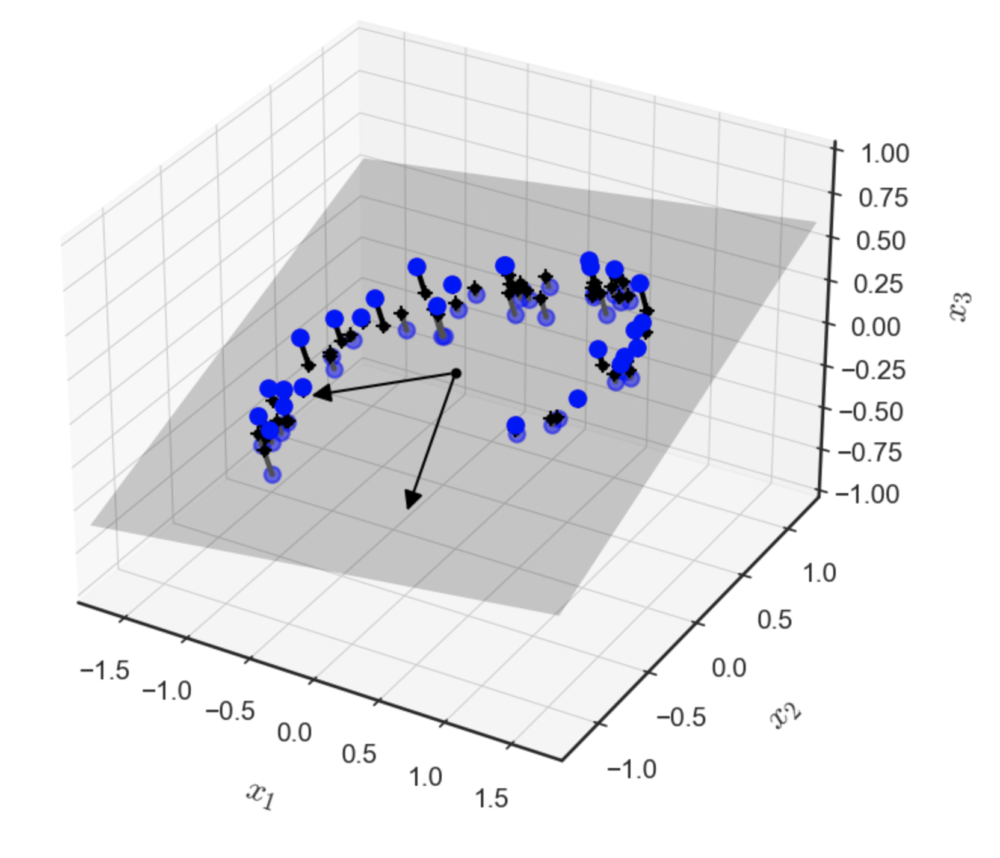{#fig-dataset fig-align="center" width="70%"}

**Definición 4.8 – Proyección (general):** Sea $V$ un $\mathbb{K}$-espacio vectorial y $U\subset V$ un subespacio de $V$. Una transformación lineal $\pi_{U}: V\longrightarrow U$ se denomina **proyección** de $V$ sobre $U$, si $\pi_{U}^{2} =\left( \pi_{U} \circ \pi_{U} \right)  =\pi_{U}$. Es decir, si $\pi$ se comporta como la función identidad sobre $U$. La matriz de cambio de base asociada a la proyección $\pi_{U}$ se denomina como $P_{\pi}$, y es llamada **matriz proyectiva**.

Notemos que, por extensión, se tendrá que $\pi_{U}(u)=u$ para todo $u\in U$.

A continuación, derivaremos las proyecciones ortogonales de vectores en el espacio vectorial normado $\left( \mathbb{R}^{n} ,\left< \  ,\  \right>  \right)$ sobre determinados subespacios de $\mathbb{R}^{n}$. Comenzaremos con subespacios unidimensionales (los que, en un contexto más geométrico, representan rectas en $\mathbb{R}^{n}$). En estos desarrollos, trabajaremos con el producto interno canónico en $\mathbb{R}^{n}$. Es decir, para todo par de vectores $\mathbf{u}, \mathbf{v}\in \mathbb{R}^{n}$, definiremos $\left< \mathbf{u} ,\mathbf{v} \right>  =\mathbf{u}^{\top } \mathbf{v}$.

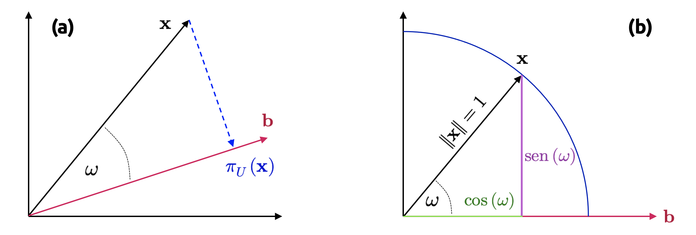{#fig-proyeccion fig-align="center" width="100%"}

### Proyección sobre espacios unidimensionales
Dada una recta que pasa por el origen generada por el vector $\mathbf{b}\in \mathbb{R}^{n}$, sabemos que dicha recta es un subespacio, digamos $U$, de $\mathbb{R}^{n}$, generado por la base $\mathbf{b}$. Cuando proyectamos un vector $\mathbf{x}\in \mathbb{R}\in \mathbb{R}^{n}$ sobre $U$, nuestro objetivo es buscar el vector $\pi_{U}(\mathbf{x})\in U$ más cercano a $\mathbf{x}$. Por medio de argumentos geométricos, vamos a caracterizar algunas propiedades de la proyección $\pi_{U}(\mathbf{x})$ conforme a la situación que se muestra en la @fig-proyeccion (a).

- La proyección $\pi_{U}(\mathbf{x})$ es la más cercana a $\mathbf{x}$, donde "más cercana" significa que la distancia $\left\Vert \mathbf{x} -\pi_{U} \left( \mathbf{x} \right)  \right\Vert$ es mínima. Se tiene entonces que el segmento $\pi_{U} \left( \mathbf{x} \right)  -\mathbf{x}$ que va desde $\pi_{U}(\mathbf{x})$ a $\mathbf{x}$ es ortogonal a $U$ y, por tanto, la base $\mathbf{b}$ de $U$ es también ortogonal. La condición de ortogonalidad nos permite establecer que $\left< \pi_{U} \left( \mathbf{x} \right)  -\mathbf{x} ,\mathbf{b} \right>  =0$, ya que los ángulos entre vectores siguen la definición del producto interno canónico en $\mathbb{R}^{n}$.

- La proyección $\pi_{U}(\mathbf{x})$ de $\mathbf{x}$ sobre $U$ debe ser un elemento de $U$ y, por lo tanto, un múltiplo de la base $\mathbf{b}$ que genera $U$. Por lo tanto, $\pi_{U}(\mathbf{x})=\lambda \mathbf{b}$ para algún $\lambda \in \mathbb{R}$.

Debemos, por tanto, determinar el factor $\lambda$, la proyección $\pi_{U}(\mathbf{x})\in U$ y la matriz proyectiva $\mathbf{P}_{\pi}$ que aplica cualquier vector $\mathbf{x}\in \mathbb{R}^{n}$ sobre $U$. Para ello, procederemos mediante tres pasos.

Etapa 1: Encontrar el factor $\lambda$. La condición de ortogonalidad nos da

::: {.eq-scroll}
$$
\begin{array}{ccc}\left< \pi_{U} \left( \mathbf{x} \right)  -\mathbf{x} ,\mathbf{b} \right>  =0&\overbrace{\Longleftrightarrow }^{\pi_{U} \left( \mathbf{x} \right)  =\lambda \mathbf{b} } &\left< \mathbf{x} -\lambda \mathbf{b} ,\mathbf{b} \right>  =0\end{array} \tag{4.40}
$$
:::

Aprovecharemos la propiedad de linealidad del producto interno para escribir

::: {.eq-scroll}
$$
\left< \mathbf{x} ,\mathbf{b} \right>  -\lambda \left< \mathbf{b} ,\mathbf{b} \right>  =0\Longleftrightarrow \lambda =\frac{\left< \mathbf{x} ,\mathbf{b} \right>  }{\left< \mathbf{b} ,\mathbf{b} \right>  } =\frac{\left< \mathbf{b} ,\mathbf{x} \right>  }{\| \mathbf{b} \|^{2} } \tag{4.41}
$$
:::

En el último paso, aprovechamos el hecho de que el producto interno es simétrico. Si el producto interno es el usual de $\mathbb{R}^{n}$, obtenemos

::: {.eq-scroll}
$$
\lambda =\frac{\mathbf{b}^{\top } \mathbf{x} }{\mathbf{b}^{\top } \mathbf{b} } \tag{4.42}
$$
:::

Si $\mathbf{b}$ es un vector ortonormal (es decir, si $\| \mathbf{b} \| =1$), entonces el **factor proyectivo** $\lambda$ está dado por $\lambda=\mathbf{b}^{\top}\mathbf{x}$.

Etapa 2: Encontrar la proyección $\pi_{U}(\mathbf{x})\in U$. Dado que $\pi_{U}(\mathbf{x})=\lambda \mathbf{b}$, obtenemos inmediatamente, por la ecuación (4.40), que

::: {.eq-scroll}
$$
\pi_{U} \left( \mathbf{x} \right)  =\lambda \mathbf{b} =\frac{\left< \mathbf{x} ,\mathbf{b} \right>  }{\| \mathbf{b} \|^{2} } \mathbf{b} =\frac{\mathbf{b}^{\top } \mathbf{x} }{\| \mathbf{b} \|^{2} } \mathbf{b} \tag{4.43}
$$
:::

Donde la última igualdad es válida sólo para el caso del producto interno canónico de $\mathbb{R}^{n}$. También podemos calcular la longitud de $\pi_{U}(\mathbf{x})$, aprovechando las propiedades de la norma inducida por el producto interno, como

::: {.eq-scroll}
$$
\left\Vert \pi_{U} \left( \mathbf{x} \right)  \right\Vert  =\left\Vert \lambda \mathbf{b} \right\Vert  =\left| \lambda \right|  \left\Vert \mathbf{b} \right\Vert \tag{4.44}
$$
:::

Por lo tanto, nuestra proyección tiene longitud igual a $\lambda$ veces la magnitud del vector $\mathbf{b}$. Aquello también permite establecer la noción intuitiva de que $\lambda$ es la coordenada de $\pi_{U}(\mathbf{x})$ con respecto a la base $\mathbf{b}$ que genera nuestro subespacio $U$.

Si usamos el producto interno canónico en $\mathbb{R}^{n}$, obtenemos

::: {.eq-scroll}
$$
\left\Vert \pi_{U} \left( \mathbf{x} \right)  \right\Vert  \overbrace{=}^{\mathrm{Ec} .\  (2.42)} \frac{\left| \mathbf{b}^{\top } \mathbf{x} \right|  }{\| \mathbf{b} \|^{2} } \| \mathbf{b} \| \overbrace{=}^{\mathrm{Ec} .\  \left( 2.16\right)  } \left| \cos \left( \omega \right)  \right|  \| \mathbf{x} \| \| \mathbf{b} \| \frac{\| \mathbf{b} \| }{\| \mathbf{b} \|^{2} } =\left| \cos \left( \omega \right)  \right|  \| \mathbf{x} \| \tag{4.45}
$$
:::

Donde $\omega$ es el ángulo entre $\mathbf{x}$ y $\mathbf{b}$. Esta ecuación debería sernos familiar desde la perspectiva de la trigonometría: Si $\| \mathbf{x} \| =1$, entonces $\mathbf{x}$ reside en un círculo de radio unitario. Se tiene entonces que la proyección sobre el eje horizontal generado por $\mathbf{b}$ es exactamente igual a $\cos(\omega)$, y la longitud del vector correspondiente es $\pi_{U}(\mathbf{x})=\left| \cos \left( \omega \right)  \right|$. Este caso se ilustra en la @fig-proyeccion (b).

Etapa 3: Encontrar la matriz proyectiva $\mathbf{P}_{\pi}$. Sabemos, de la definición (4.8), que la proyección $\pi_{U}(\mathbf{x})$ corresponde a una transformación lineal. Por lo tanto, tiene una matriz de cambio de base $\mathbf{P}_{\pi}$ tal que $\pi_{U}(\mathbf{x})=\mathbf{P}_{\pi}\mathbf{x}$. Usando el producto canónico en $\mathbb{R}^{n}$ y el hecho de que

::: {.eq-scroll}
$$
\pi_{U} \left( \mathbf{x} \right)  =\lambda \mathbf{b} =\mathbf{b} \frac{\mathbf{b}^{\top } \mathbf{x} }{\left\Vert \mathbf{b} \right\Vert^{2}  } =\frac{\mathbf{b} \mathbf{b}^{\top } }{\left\Vert \mathbf{b} \right\Vert^{2}  } \mathbf{x} \tag{4.46}
$$
:::

Observamos inmediatamente que

::: {.eq-scroll}
$$
\mathbf{P}_{\pi } =\frac{\mathbf{b} \mathbf{b}^{\top } }{\left\Vert \mathbf{b} \right\Vert^{2}  } \tag{4.47}
$$
:::

Notemos que $\mathbf{b} \mathbf{b}^{\top }$ (y, por extensión, $\mathbf{P}_{\pi }$) es una matriz simétrica (de rango 1) y $\left\Vert \mathbf{b} \right\Vert^{2}$ es un escalar.

La matriz proyectiva $\mathbf{P}_{\pi }$ permite proyectar cualquier vector $\mathbf{x}\in \mathbb{R}^{n}$ sobre la recta que pasa por el origen y coincide con la dirección del vector $\mathbf{b}$ (o, equivalentemente, sobre el subespacio $U$ generado por $\mathbf{b}$).

Debemos remarcar que la proyección $\pi_{U}(\mathbf{x})$ trabajada previamente sigue siendo un vector en $\mathbb{R}^{n}$ y no un escalar. Sin embargo, no requerimos de las $n$ coordenadas de dicho vector para representar esta proyección, sino que únicamente una si queremos expresarla con respecto al vector $\mathbf{b}$ que genera el subespacio $U$.

### Proyección sobre subespacios más generales
A continuación vamos a estudiar la situación general en la cual queremos construir proyecciones de vectores $\mathbf{x}\in \mathbb{R}^{n}$ sobre subespacios $U \subseteq \mathbb{R}^{m}$ de dimensión $1\leq m\leq n$. Esta situación se ilustra en la @fig-vectproy.

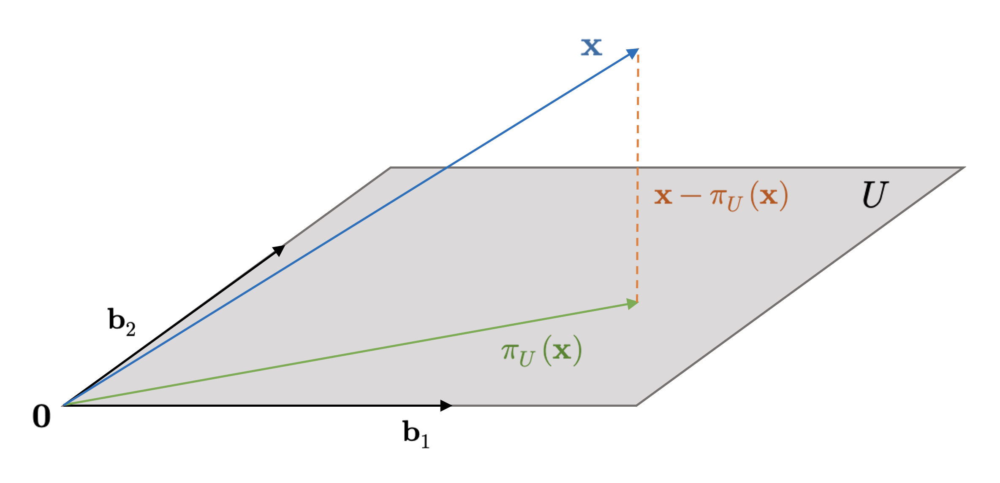{#fig-vectproy fig-align="center" width="80%"}

Asumamos entonces que $\alpha =\left\{ \mathbf{b}_{1} ,...,\mathbf{b}_{m} \right\}$ es una base de $U$. Cualquier proyección $\pi_{U}(\mathbf{x})$ sobre $U$, para $\mathbf{x}\in \mathbb{R}^{n}$, es un elemento de $U$. Por lo tanto, tales proyecciones pueden ser representadas como combinaciones lineales de los vectores generadores $\mathbf{b}_{1} ,...,\mathbf{b}_{m}$ de $U$ con una colección de escalares $\lambda_{1},...,\lambda_{m}$. Por lo tanto, podemos escribir

::: {.eq-scroll}
$$
\pi_{U} \left( \mathbf{x} \right)  =\sum^{m}_{i=1} \lambda_{i} \mathbf{b}_{i} \tag{4.48}
$$
:::

Como en el caso unidimensional, seguiremos un procedimiento de tres pasos para caracterizar la proyección $\pi_{U}(\mathbf{x})$ y la correspondiente matriz proyectiva $\mathbf{P}_{\pi}$.

Etapa 1: Encontrar las coordenadas $\lambda_{1},...,\lambda_{m}$ de la proyección (con respecto a la base de $U$), tales que la combinación lineal

::: {.eq-scroll}
$$
\pi_{U} \left( \mathbf{x} \right)  =\sum^{m}_{i=1} \lambda_{i} \mathbf{b}_{i} =\mathbf{B} \mathbf{\lambda } \  ;\  \mathbf{B} =\left( \mathbf{b}_{1} ,...,\mathbf{b}_{m} \right)  \in \mathbb{R}^{n\times m} \wedge \mathbf{\lambda } =\left( \lambda_{1} ,...,\lambda_{m} \right)  \in \mathbb{R}^{m} \tag{4.49}
$$
:::

minimiza la distancia entre la proyección $\pi_{U}(\mathbf{x})$ y el vector $\mathbf{x}$. Como en el caso unidimensional, esto implica que todos los vectores que conectan $\pi_{U}(\mathbf{x})\in U$ y $\mathbf{x}\in \mathbb{R}^{n}$ deben ser ortogonales a todos los vectores que constituyen la base del subespacio $U$. Por lo tanto, tenemos $m$ condiciones simultáneas que se deben satisfacer, considerando como antes el producto interno canónico en $\mathbb{R}^{n}$:

::: {.eq-scroll}
$$
\begin{array}{ccc}\left< \mathbf{b}_{1} ,\mathbf{x} -\pi_{U} \left( \mathbf{x} \right)  \right>  &=&\mathbf{b}^{\top }_{1} \left( \mathbf{x} -\pi_{U} \left( \mathbf{x} \right)  \right)  =0\\ \vdots &\vdots &\vdots \\ \left< \mathbf{b}_{m} ,\mathbf{x} -\pi_{U} \left( \mathbf{x} \right)  \right>  &=&\mathbf{b}^{\top }_{M} \left( \mathbf{x} -\pi_{U} \left( \mathbf{x} \right)  \right)  =0\end{array} \tag{4.50}
$$
:::

Poniendo $\pi_{U} \left( \mathbf{x} \right)  =\mathbf{B} \mathbf{\lambda }$, el sistema (2.49) puede reescribirse como

::: {.eq-scroll}
$$
\begin{array}{ccc}\mathbf{b}^{\top }_{1} \left( \mathbf{x} -\mathbf{B} \mathbf{\lambda } \right)  &=&0\\ &\vdots &\\ \mathbf{b}^{\top }_{m} \left( \mathbf{x} -\mathbf{B} \mathbf{\lambda } \right)  &=&0\end{array} \tag{4.51}
$$
:::

Lo que implica que,

::: {.eq-scroll}
$$
\begin{array}{ccl}\left( \begin{matrix}\mathbf{b}^{\top }_{1} \\ \vdots \\ \mathbf{b}^{\top }_{m} \end{matrix} \right)  \left( \mathbf{x} -\mathbf{B} \mathbf{\lambda } \right)  =\mathbf{0} &\Longleftrightarrow &\mathbf{B}^{\top } \left( \mathbf{x} -\mathbf{B} \mathbf{\lambda } \right)  =\mathbf{0} \\ &\Longleftrightarrow &\mathbf{B}^{\top } \mathbf{B} \mathbf{\lambda } =\mathbf{B}^{\top } \mathbf{x} \end{array} \tag{4.52}
$$
:::

La última expresión en la ecuación (4.52) se conoce como **ecuación normal**. Debido a que el conjunto $\alpha =\left\{ \mathbf{b}_{1} ,...,\mathbf{b}_{m} \right\}$ es una base de $U$ y, por extensión, sus elementos son linealmente independientes, entonces la matriz $\mathbf{B}^{\top } \mathbf{B} \in \mathbb{R}^{m\times m}$ es no singular (y, por tanto, invertible). Podemos pues escribir las coordenadas $\lambda_{i}$ agrupadas en el vector $\mathbf{\lambda}$ como

::: {.eq-scroll}
$$
\mathbf{\lambda } =\left( \mathbf{B}^{\top } \mathbf{B} \right)^{-1}  \mathbf{B}^{\top } \mathbf{x} \tag{4.53}
$$
:::

La matriz $\left( \mathbf{B}^{\top } \mathbf{B} \right)^{-1}  \mathbf{B}^{\top }$ es llamada **pseudo-inversa** de la matriz $\mathbf{B}$, y podemos calcularla aunque la dicha matriz no sea cuadrada. Simplemente necesitamos que $\mathbf{B}$ sea definida positiva (abordaremos este concepto en detalle más adelante).

Etapa 2: Encontrar la proyección $\pi_{U}(\mathbf{x})$. Ya establecimos que $\pi_{U}(\mathbf{x})=\mathbf{B} \mathbf{\lambda}$. Por lo tanto, a partir de la ecuación (2.52), obtenemos

::: {.eq-scroll}
$$
\pi_{U} \left( \mathbf{x} \right)  =\mathbf{B} \left( \mathbf{B}^{\top } \mathbf{B} \right)^{-1}  \mathbf{B}^{\top } \mathbf{x} \tag{4.54}
$$
:::

Etapa 3: Encontrar la matriz proyectiva $\mathbf{P}_{\pi}$. De la ecuación (2.53), podemos ver inmediatamente que la matriz proyectiva se obtiene como solución de la ecuación $\mathbf{P}_{\pi} \mathbf{x} = \pi_{U}(\mathbf{x})$. Luego,

::: {.eq-scroll}
$$
\mathbf{P}_{\pi } =\mathbf{B} \left( \mathbf{B}^{\top } \mathbf{B} \right)^{-1}  \mathbf{B}^{\top } \tag{4.55}
$$
:::

Todo lo anterior nos permite establecer la siguiente definición más general.

**Definición 4.9 – Proyección ortogonal (general):** Sea $V$ un $\mathbb{K}$-espacio vectorial normado y $U$ un subespacio de $V$, tal que $\dim(U)\leq \dim(V)$. Sea $\alpha =\left\{ w_{1},...,w_{s}\right\}$ una base ortogonal de $U$. Llamaremos **proyección ortogonal** de $V$ sobre $U$ a la transformación lineal $\pi_{U}:V\longrightarrow U$ definida explícitamente como

::: {.eq-scroll}
$$
\pi_{U} \left( v\right)  =\sum^{s}_{j=1} \frac{\left< v,w_{j}\right>  }{\left\Vert w_{j}\right\Vert^{2}  } w_{j}\  \  \  ;\  \  \  v\in U \tag{4.56}
$$
:::

**Ejemplo 4.12:** Hasta ahora hemos trabajado intensivamente la definición de lo que es una proyección ortogonal, pero no hemos recurrido a ejemplos demasiado prácticos. Sea pues $U=\left\{ \left( x,y,z,t\right)  \in \mathbb{R}^{4} :x+y+z+t=0\wedge x+y+z-2t=0\right\}  \subset \mathbb{R}^{4}$ un subespacio de $\mathbb{R}^{4}$. Utilizando como base el producto interno canónico de $\mathbb{R}^{4}$, vamos a construir la proyección ortogonal $\pi_{U}(\mathbf{x})$ para $\mathbf{x}\in \mathbb{R}^{4}$. Para ello, debemos determinar una base para $U$ de la forma usual

::: {.eq-scroll}
$$
\begin{array}{lll}\mathbf{x} \in U&\Longleftrightarrow &\mathbf{x} =\left( x,y,z,t\right)  \in \mathbb{R}^{4} \wedge x+y+z+t=0\wedge x+y+z-2t=0\\ &\Longleftrightarrow &\mathbf{x} =\left( x,y,z,t\right)  \in \mathbb{R}^{4} \wedge x+y+z=-t\wedge x+y+z=2t\\ &\Longleftrightarrow &\mathbf{x} =\left( x,y,z,t\right)  \in \mathbb{R}^{4} \wedge t=0\wedge x+y+z=0\\ &\Longleftrightarrow &\mathbf{x} =\left( x,y,z,0\right)  \in \mathbb{R}^{4} \wedge z=-x-y\\ &\Longleftrightarrow &\mathbf{x} =\left( x,y,-x-y,0\right)  ;\left( x,y\right)  \in \mathbb{R}^{2} \\ &\Longleftrightarrow &\mathbf{x} =\left( x,0,-x,0\right)  +\left( 0,y,-y,0\right)  ;\left( x,y\right)  \in \mathbb{R}^{2} \\ &\Longleftrightarrow &\mathbf{x} =x\left( 1,0,-1,0\right)  +y\left( 0,1,-1,0\right)  ;\left( x,y\right)  \in \mathbb{R}^{2} \end{array} \tag{4.57}
$$
:::

Luego,

::: {.eq-scroll}
$$
U=\left< \left\{ \left( 1,0,-1,0\right)  ,\left( 0,1,-1,0\right)  \right\}  \right> \tag{4.58}
$$
:::

El conjunto $\alpha =\left\{ \left( 1,0,-1,0\right)  ,\left( 0,1,-1,0\right)  \right\}$ es sin duda una base de $U$, ya que sus componentes son linealmente independientes. En efecto,

::: {.eq-scroll}
$$
x\left( 1,0,-1,0\right)  +y\left( 0,1,-1,0\right)  =\left( 0,0,0,0\right)  \Longleftrightarrow \left( x,y,-x-y,0\right)  =\left( 0,0,0,0\right)  \Longleftrightarrow x=y=0 \tag{4.59}
$$
:::

Vamos a usar la base $\alpha$ recién calculada para construir otra base $\beta$ para $U$ que sea ortogonal. Para ello, procederemos conforme el método de Gram-Schmidt. De esta manera,

::: {.eq-scroll}
$$
\begin{array}{lll}\mathbf{v}_{1} &=&\left( 1,0,-1,0\right)  \\ \mathbf{v}_{2} &=&\left( 0,1,-1,0\right)  -\displaystyle \frac{\left< \left( 0,1,-1,0\right)  ,\left( 1,0,-1,0\right)  \right>  }{\left< \left( 1,0,-1,0\right)  ,\left( 1,0,-1,0\right)  \right>  } \left( 1,0,-1,0\right)  \\ &=&\left( 0,1,-1,0\right)  -\displaystyle \frac{1}{2} \left( 1,0,-1,0\right)  =\left( -\frac{1}{2} ,1,-\displaystyle \frac{1}{2} ,0\right)  =\displaystyle \frac{1}{2} \left( -1,2,-1,0\right)  \end{array} \tag{4.60}
$$
:::

Luego podemos usar la base ortogonal $\beta =\left\{ \left( 1,0,-1,0\right)  ,\left( -1,2,-1,0\right)  \right\}$ para determinar la proyección ortogonal $\pi_{U}(\mathbf{x})$. Aplicando directamente la definición (4.9), obtenemos

::: {.eq-scroll}
$$
\begin{array}{lll}\pi_{U} \left( x,y,z,t\right)  &=&\displaystyle \frac{\left< \left( x,y,z,t\right)  ,\left( 1,0,-1,0\right)  \right>  }{\left\Vert \left( 1,0,-1,0\right)  \right\Vert^{2}  } \left( 1,0,-1,0\right)  +\displaystyle \frac{\left< \left( x,y,z,t\right)  ,\left( -1,2,-1,0\right)  \right>  }{\left\Vert \left( -1,2,-1,0\right)  \displaystyle \right\Vert^{2}  } \left( -1,2,-1,0\right)  \\ &=&\displaystyle \frac{x-z}{2} \left( 1,0,-1,0\right)  +\displaystyle \frac{-x+2y-z}{6} \left( -1,2,-1,0\right)  \\ &=&\left( \displaystyle \frac{x-z}{2} ,0,\displaystyle \frac{z-x}{2} ,0\right)  +\left( \displaystyle \frac{-x+2y-z}{6} ,\displaystyle \frac{-x+2y+z}{3} ,\displaystyle \frac{-x+2y-z}{6} ,0\right)  \\ &=&\left( \displaystyle \frac{4x-2y-2z}{6} ,\displaystyle \frac{-x+2y-z}{3} ,\displaystyle \frac{-2x-2y+4z}{6} ,0\right)  \\ &=&\left( \displaystyle \frac{2x-y-z}{3} ,\displaystyle \frac{-x+2y-z}{3} ,\displaystyle \frac{-x-y+2z}{3} ,0\right)  \end{array} \tag{4.61}
$$
:::

◼︎

**Ejemplo 4.13:** Definimos en $\mathbb{R}^{4\times 1}$ el producto interno

::: {.eq-scroll}
$$
\left< \left( \begin{matrix}x_{1}\\ x_{2}\\ x_{3}\\ x_{4}\end{matrix} \right)  ,\left( \begin{matrix}y_{1}\\ y_{2}\\ y_{3}\\ y_{4}\end{matrix} \right)  \right>  =\sum^{4}_{j=1} x_{j}y_{j}=x_{1}y_{1}+\cdots +x_{4}y_{4} \tag{4.62}
$$
:::

Considerando el subespacio $W$, definido como

::: {.eq-scroll}
$$
W=\left\{ \mathbf{A} =\left( \begin{matrix}x\\ y\\ z\\ t\end{matrix} \right)  \in \mathbb{R}^{4\times 1} :x+2y-z-t=0\wedge x-2y+3z+t=0\right\} \tag{4.63}
$$
:::

Vamos a construir la proyección ortogonal $\pi_{W}(\mathbf{A})$ para $\mathbf{A}\in \mathbb{R}^{4\times 1}$. Este es un ejemplo donde el concepto de proyección ortogonal va más allá de la mera intuición geométrica construida para el caso de $\mathbb{R}^{n}$.

Procedemos entonces determinando una base para el subespacio $W$. En efecto,

::: {.eq-scroll}
$$
\begin{array}{lll}\mathbf{A} \in W&\Longleftrightarrow &\mathbf{A} =\left( \begin{matrix}x\\ y\\ z\\ t\end{matrix} \right)  \in \mathbb{R}^{4\times 1} \wedge x+2y-z-t=0\wedge x-2y+3z+t=0\\ &\Longleftrightarrow &\mathbf{A} =\left( \begin{matrix}x\\ y\\ z\\ t\end{matrix} \right)  \in \mathbb{R}^{4\times 1} \wedge \begin{cases}\begin{array}{rll}x+2y-z-t&=&0\\ x-2y+3z+t&=&0\end{array} &\end{cases} \\ &\Longleftrightarrow &\mathbf{A} =\left( \begin{matrix}x\\ y\\ z\\ t\end{matrix} \right)  \in \mathbb{R}^{4\times 1} \wedge \underbrace{\left( \begin{matrix}1&2&-1&-1\\ 1&-2&3&1\end{matrix} \right)  }_{=\mathbf{C} } \left( \begin{matrix}x\\ y\\ z\\ t\end{matrix} \right)  =\left( \begin{matrix}0\\ 0\end{matrix} \right)  \end{array} \tag{4.64}
$$
:::

Vamos a escalonar la matriz de coeficientes del sistema de ecuaciones resultante (que hemos llamado $\mathbf{C}$), a fin de resolverlo por medio de la aplicación del teorema del rango. De esta manera,

::: {.eq-scroll}
$$
\mathbf{C} =\left( \begin{matrix}1&2&-1&-1\\ 1&-2&3&1\end{matrix} \right)  \overbrace{=}^{F_{21}\left( -1\right)  } \left( \begin{matrix}1&2&-1&-1\\ 0&-4&4&2\end{matrix} \right)  \overbrace{=}^{F_{2}\left( -\frac{1}{4} \right)  } \left( \begin{matrix}1&2&-1&-1\\ 0&1&-1&-1/2\end{matrix} \right)  \overbrace{=}^{F_{12}\left( -2\right)  } \left( \begin{matrix}1&0&1&0\\ 0&1&-1&-1/2\end{matrix} \right) \tag{4.65}
$$
:::

De donde se tiene que,

::: {.eq-scroll}
$$
W=\left< \left\{ \left( \begin{matrix}-1\\ 1\\ 1\\ 0\end{matrix} \right)  ,\left( \begin{matrix}0\\ 1/2\\ 0\\ 1\end{matrix} \right)  \right\}  \right>  \leq \mathbb{R}^{4\times 1} \tag{4.66}
$$
:::

Así que el conjunto $\alpha =\left\{ \left( \begin{matrix}-1\\ 1\\ 1\\ 0\end{matrix} \right)  ,\left( \begin{matrix}0\\ 1/2\\ 0\\ 1\end{matrix} \right)  \right\}$ es un sistema de generadores para $W$ que, de hecho, es una base, pues sus componentes son linealmente independientes. En efecto,

::: {.eq-scroll}
$$
z\left( \begin{matrix}-1\\ 1\\ 1\\ 0\end{matrix} \right)  +t\left( \begin{matrix}0\\ 1/2\\ 0\\ 1\end{matrix} \right)  =\left( \begin{matrix}0\\ 0\\ 0\\ 0\end{matrix} \right)  \Longrightarrow \left( \begin{matrix}-z\\ z+t/2\\ z\\ t\end{matrix} \right)  =\left( \begin{matrix}0\\ 0\\ 0\\ 0\end{matrix} \right)  \Longleftrightarrow z=t=0 \tag{4.67}
$$
:::

::: {.eq-scroll}
$$
\left< \left( \begin{matrix}-1\\ 1\\ 1\\ 0\end{matrix} \right)  ,\left( \begin{matrix}0\\ 1/2\\ 0\\ 1\end{matrix} \right)  \right>  =-1\cdot 0+1\cdot \frac{1}{2} +1\cdot 0+0\cdot 1=\frac{1}{2} \tag{4.68}
$$
:::

Vamos a obtener una base ortogonal para $W$ a partir de $\alpha$ por medio del proceso de Gram-Schmidt. Si $\beta =\left\{ \mathbf{A}_{1} ,\mathbf{A}_{2} \right\}$ es tal base, tenemos que:

::: {.eq-scroll}
$$
\begin{array}{lll}\mathbf{A}_{1} &=&\left( \begin{matrix}-1\\ 1\\ 1\\ 0\end{matrix} \right)  \\ \mathbf{A}_{2} &=&\left( \begin{matrix}0\\ 1/2\\ 0\\ 1\end{matrix} \right)  -\displaystyle \frac{\left< \left( \begin{matrix}0\\ 1/2\\ 0\\ 1\end{matrix} \right)  ,\left( \begin{matrix}-1\\ 1\\ 1\\ 0\end{matrix} \right)  \right>  }{\left< \left( \begin{matrix}-1\\ 1\\ 1\\ 0\end{matrix} \right)  ,\left( \begin{matrix}-1\\ 1\\ 1\\ 0\end{matrix} \right)  \right>  } \left( \begin{matrix}-1\\ 1\\ 1\\ 0\end{matrix} \right)  =\left( \begin{matrix}0\\ 1/2\\ 0\\ 1\end{matrix} \right)  -\displaystyle \frac{1/2}{3} \left( \begin{matrix}-1\\ 1\\ 1\\ 0\end{matrix} \right)  =\left( \begin{matrix}0\\ 1/2\\ 0\\ 1\end{matrix} \right)  -\displaystyle \frac{1}{6} \left( \begin{matrix}-1\\ 1\\ 1\\ 0\end{matrix} \right)  \\ &=&\left( \begin{matrix}1/6\\ 1/3\\ -1/6\\ 1\end{matrix} \right)  =\displaystyle \frac{1}{6} \left( \begin{matrix}1\\ 2\\ -1\\ 6\end{matrix} \right)  \end{array} \tag{4.69}
$$
:::

La base $\beta =\left\{ \mathbf{A}_{1} ,\mathbf{A}_{2} \right\}$ construida previamente es ortogonal, ya que

::: {.eq-scroll}
$$
\left< \left( \begin{matrix}-1\\ 1\\ 1\\ 0\end{matrix} \right)  ,\left( \begin{matrix}1\\ 2\\ -1\\ 6\end{matrix} \right)  \right>  =-1+2-1=0 \tag{4.70}
$$
:::

Finalmente, definimos la proyección ortogonal $\pi_{W}(\mathbf{A})$,

::: {.eq-scroll}
$$
\pi_{W} \left( \mathbf{A} \right)  =\left( \frac{\left< \left( \begin{matrix}x\\ y\\ z\\ t\end{matrix} \right)  ,\left( \begin{matrix}-1\\ 1\\ 1\\ 0\end{matrix} \right)  \right>  }{\left< \left( \begin{matrix}-1\\ 1\\ 1\\ 0\end{matrix} \right)  ,\left( \begin{matrix}-1\\ 1\\ 1\\ 0\end{matrix} \right)  \right>  } \right)  \left( \begin{matrix}-1\\ 1\\ 1\\ 0\end{matrix} \right)  +\left( \frac{\left< \left( \begin{matrix}x\\ y\\ z\\ t\end{matrix} \right)  ,\left( \begin{matrix}1\\ 2\\ -1\\ 6\end{matrix} \right)  \right>  }{\left< \left( \begin{matrix}1\\ 2\\ -1\\ 6\end{matrix} \right)  ,\left( \begin{matrix}1\\ 2\\ -1\\ 6\end{matrix} \right)  \right>  } \right)  \left( \begin{matrix}1\\ 2\\ -1\\ 6\end{matrix} \right)  =\frac{-x+y+z}{3} \left( \begin{matrix}-1\\ 1\\ 1\\ 0\end{matrix} \right)  +\frac{x+2y-z+6t}{42} \left( \begin{matrix}1\\ 2\\ -1\\ 6\end{matrix} \right) \tag{4.71}
$$
:::

Lo que nos conduce a

::: {.eq-scroll}
$$
\pi_{W} \left( \begin{matrix}x\\ y\\ z\\ t\end{matrix} \right)  =\left( \begin{array}{c}\frac{x-y-z}{3} +\frac{x+2y-z+6t}{42} \\ \frac{-x+y+z}{3} +\frac{x+2y-z+6t}{21} \\ \frac{-x+y+z}{3} +\frac{-x-2y+z-6t}{42} \\ \frac{x+2y-z+6t}{7} \end{array} \right)  =\left( \begin{array}{c}\frac{14x-14y-14z+x+2y-z+6t}{42} \\ \frac{-7x+7y+7z+x+2y-z+6t}{21} \\ \frac{-14x+14y+14z-x-2y+z-6t}{42} \\ \frac{x+2y-z+6t}{7} \end{array} \right)  =\left( \begin{array}{c}\frac{15x-12y-15z+6t}{42} \\ \frac{-6x+9y+6z+6t}{21} \\ \frac{-15x+12y+15z-6t}{42} \\ \frac{x+2y-z+6t}{7} \end{array} \right)  =\left( \begin{array}{c}\frac{5x-4y-5z+2t}{14} \\ \frac{-2x+3y+2z+2t}{7} \\ \frac{-5x+4y+5z-2t}{14} \\ \frac{x+2y-z+6t}{7} \end{array} \right) \tag{4.72}
$$
:::

Así que la función $\pi_{W}(\mathbf{A})$ es la proyección buscada. ◼︎

## Rotaciones

### Rotaciones en $\mathbb{R}^{2}$
La preservación de longitudes y ángulos son dos de las principales características de las transformaciones lineales con matrices de cambio de base ortogonales. Sin embargo, estamos interesados en un cierto tipo de matrices de este tipo que permiten describir movimientos conocidos como rotaciones.

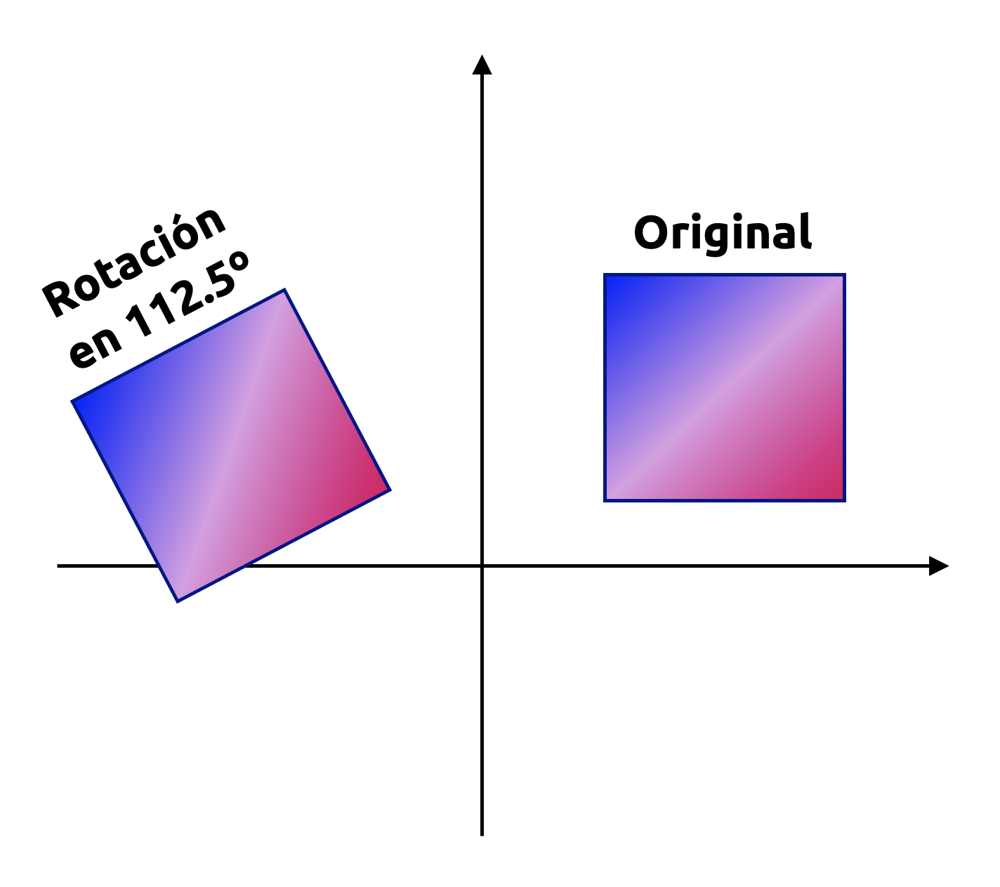{#fig-rot2d fig-align="center" width="60%"}

Una rotación es una transformación lineal que permite, como su nombre lo indica, rotar un plano en un ángulo $\theta$ con respecto a un determinado punto fijo que sirve como referencia de la propia rotación. Para un ángulo positivo $\theta >0$, por convención, la rotación tiene sentido antihorario. Un ejemplo de ello se muestra en la @fig-rot2d, donde la matriz de rotación asociada es:

::: {.eq-scroll}
$$
\mathbf{R} =\left( \begin{matrix}-0.38&-0.92\\ 0.92&-0.38\end{matrix} \right) \tag{4.73}
$$
:::

Algunos campos de aplicación importantes de las rotaciones son la visualización de información y la robótica. Por ejemplo, en el área de la robótica, es importante saber cómo rotar las uniones de un brazo robótico a fin de poder levantar o colocar un objeto determinado desde o en algún lugar, respectivamente.

Consideremos la base canónica de $\mathbb{R}^{2}$, la que, como sabemos, es $\mathbf{e}(2)=\left\{ \mathbf{e}_{1} ,\mathbf{e}_{2} \right\}$, donde $\mathbf{e}_{1}=(1,0)$ y $\mathbf{e}_{2}=(0,1)$, y que define al sistema de coordenadas cartesianas típico que caracteriza al plano $\mathbb{R}^{2}$. Queremos generar una rotación de este sistema de coordenadas en un ángulo $\theta$, como se ilustra en la @fig-rot2dsist. Notemos que los vectores rotados en el nuevo sistema aún son linealmente independientes y, por tanto, constituyen un base de $\mathbf{R}^{2}$. Por esta razón, las rotaciones implican igualmente cambios de base.

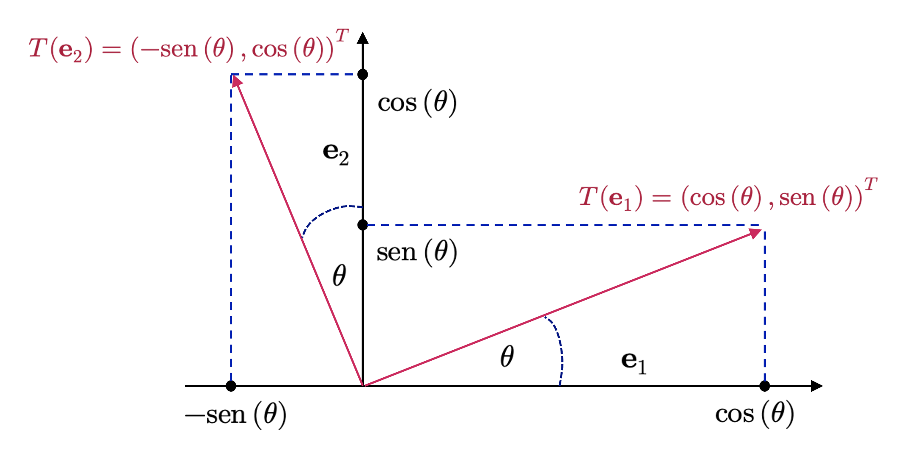{#fig-rot2dsist fig-align="center" width="80%"}

Como dijimos previamente, las rotaciones son transformaciones lineales que podemos expresar por medio de una matriz de rotación, que denotamos como $\mathbf{R}(\theta)$. Las funciones trigonométricas (como se observa en la @fig-rot2dsist) nos permiten determinar las coordenadas de los ejes rotados (la imagen de la respectiva transformación lineal) con respecto a la base canónica de $\mathbb{R}^{2}$. Si llamamos $T$ a la función de rotación, obtenemos

::: {.eq-scroll}
$$
T\left( \mathbf{e}_{1} \right)  =\left( \begin{matrix}\cos \left( \theta \right)  \\ \mathrm{sen} \left( \theta \right)  \end{matrix} \right)  \wedge T\left( \mathbf{e}_{2} \right)  =\left( \begin{matrix}-\mathrm{sen} \left( \theta \right)  \\ \cos \left( \theta \right)  \end{matrix} \right) \tag{4.74}
$$
:::

Para disponer de un ángulo de rotación $\theta$ significativo, tenemos que definir a lo que nos referimos con “antihorario” cuando operamos en más de dos dimensiones. Cuando usamos la convención de que una rotación antihoraria (planar), en general, tomamos como referencia la famosa regla de la mano derecha, que ilustramos en la @fig-regmander.

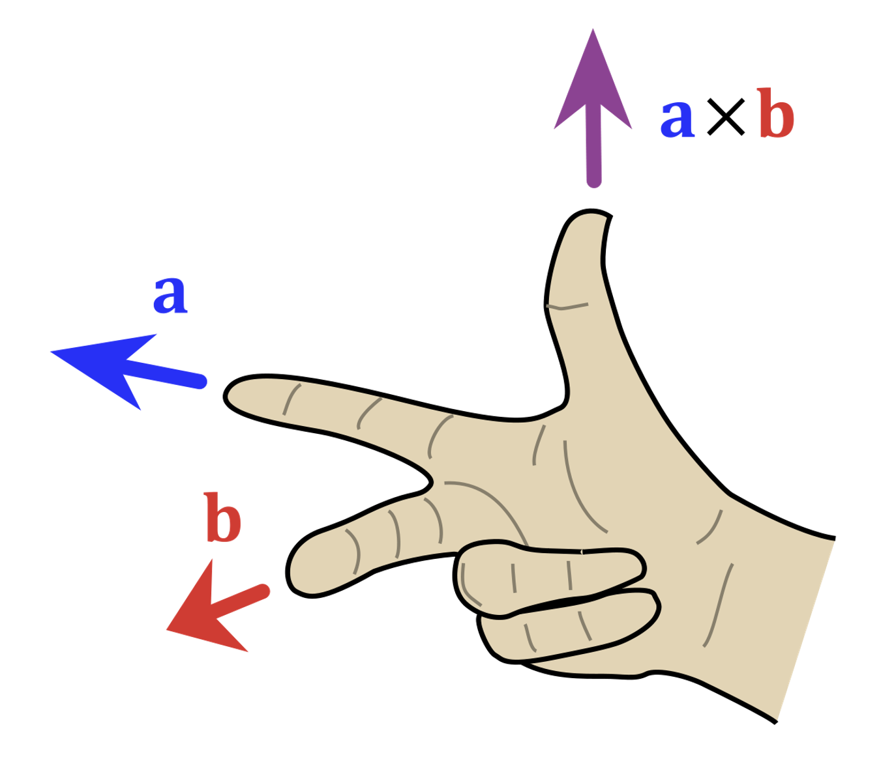{#fig-regmander fig-align="center" width="50%"}

Por lo tanto, la matriz de rotación que aplica el cambio de base entre el sistema de coordenadas original (estándar) y el rotado está dada por

::: {.eq-scroll}
$$
\mathbf{R} \left( \theta \right)  =\left( T\left( \mathbf{e}_{1} \right)  ,T\left( \mathbf{e}_{2} \right)  \right)  =\left( \begin{array}{ll}\cos \left( \theta \right)  &-\mathrm{sen} \left( \theta \right)  \\ \mathrm{sen} \left( \theta \right)  &\cos \left( \theta \right)  \end{array} \right) \tag{4.75}
$$
:::

**Ejemplo 4.14:** Vamos a determinar una expresión analítica para la transformación en $\mathbb{R}^{2}$ definida como un giro del sistema de coordenadas con centro en $(1,1)$ y ángulo $\theta=\frac{\pi}{2}$.

Sea pues $f$ el giro especificado y $\mathbf{R}$ su matriz de rotación asociada. Debido a que la rotación que queremos aplicar está definida en $\mathbb{R}^{2}$, sabemos que $\mathbf{R}$ en la base canónica está dada por

::: {.eq-scroll}
$$
\mathbf{R} \left( \frac{\pi }{2} \right)  =\left( \begin{array}{ll}\cos \left( \frac{\pi }{2} \right)  &-\mathrm{sen} \left( \frac{\pi }{2} \right)  \\ \mathrm{sen} \left( \frac{\pi }{2} \right)  &\cos \left( \frac{\pi }{2} \right)  \end{array} \right)  =\left( \begin{matrix}0&-1\\ 1&0\end{matrix} \right) \tag{4.76}
$$
:::

La expresión analítica de $f$ es de la forma $f\left( \mathbf{x} \right)  =\mathbf{a} +\mathbf{R} \left( \theta \right)  \mathbf{x}$, para todo $\mathbf{x}\in \mathbb{R}^{2}$ y algún punto $\mathbf{a}=(a_{1},a_{2})\in \mathbb{R}^2$ que debemos determinar en términos del centro de giro. De esta manera se tiene que 

::: {.eq-scroll}
$$
f\left( \begin{matrix}x\\ y\end{matrix} \right)  =\left( \begin{matrix}a_{1}\\ a_{2}\end{matrix} \right)  +\left( \begin{matrix}0&-1\\ 1&0\end{matrix} \right)  \left( \begin{matrix}x\\ y\end{matrix} \right) \tag{4.77}
$$
:::

Donde el punto $\mathbf{a}=(a_{1},a_{2})\in \mathbb{R}^2$ se calcula usando el punto $\mathbf{x_{0}}$ respecto del cual se aplica la rotación. De esta manera, se tiene que

::: {.eq-scroll}
$$
\mathbf{a} =f\left( \mathbf{x}_{0} \right)  -\mathbf{R} \mathbf{x}_{0} \Longleftrightarrow \left( \begin{matrix}a_{1}\\ a_{2}\end{matrix} \right)  =\underbrace{f\left( \begin{matrix}1\\ 1\end{matrix} \right)  }_{=\left( \begin{matrix}1\\ 1\end{matrix} \right)  } -\left( \begin{matrix}0&-1\\ 1&0\end{matrix} \right)  \left( \begin{matrix}1\\ 1\end{matrix} \right)  =\left( \begin{matrix}1\\ 1\end{matrix} \right)  -\left( \begin{matrix}-1\\ 1\end{matrix} \right)  =\left( \begin{matrix}2\\ 0\end{matrix} \right) \tag{4.78}
$$
:::

Así que, sustituyendo en la expresión anterior, obtenemos

::: {.eq-scroll}
$$
f\left( \begin{matrix}x\\ y\end{matrix} \right)  +\left( \begin{matrix}2\\ 0\end{matrix} \right)  +\left( \begin{matrix}0&-1\\ 1&0\end{matrix} \right)  \left( \begin{matrix}x\\ y\end{matrix} \right) \tag{4.79}
$$
:::

La transformación lineal $f$, por tanto, puede tomar cualquier punto $(x,y)\in \mathbb{R}^{2}$ y rotarlo en 90º con respecto al punto $(1, 1)$. ◼︎

### Rotaciones en $\mathbb{R}^{3}$
En contraste a lo que ocurre en $\mathbb{R}^{2}$, en $\mathbb{R}^{3}$ podemos rotar cualquier plano bidimensional con respecto a un eje unidimensional. La forma más sencilla de definir una matriz general de rotación es mediante la especificación de cómo las imágenes relativas a la base canónica de $\mathbb{R}^{3}$, a saber, $\mathbf{e} \left( 3\right)  =\left( \mathbf{e}_{1} ,\mathbf{e}_{2} ,\mathbf{e}_{3} \right)  =\left\{ \left( 1,0,0\right)  ,\left( 0,1,0\right)  ,\left( 0,0,1\right)  \right\}$ deben rotarse, garantizando que dichas imágenes conformen igualmente una base ortonormal. Combinando estas imágenes, podemos obtener la matriz de rotación general. 

Para tener un ángulo de rotación con sentido, tenemos igualmente que darle sentido al significado de la dirección de giro representada por dicho ángulo. Nuevamente nos basaremos en la regla de la mano derecha para ello, pero considerando los distintos ejes definidos a partir de la base ortonormal canónica de $\mathbb{R}^{3}$. Tenemos, por tanto, tres posibles ejes de rotación:

- Rotación con respecto al eje X (o vector $\mathbf{e}_{1}$), la que se define mediante la matriz $\mathbf{R}_{1} \left( \theta \right)$ definida a continuación. Notemos que, para este tipo de rotaciones, la coordenada $\mathbf{e}_{1}$ es fija, y conforme la regla de la mano derecha, es antihoraria cuando se realiza en el plano $\mathbf{e}_{2}\mathbf{e}_{3}$:

::: {.eq-scroll}
$$
\mathbf{R}_{1} \left( \theta \right)  =\left( T\left( \mathbf{e}_{1} \right)  ,T\left( \mathbf{e}_{2} \right)  ,T\left( \mathbf{e}_{3} \right)  \right)  =\left( \begin{matrix}1&0&0\\ 0&\cos \left( \theta \right)  &-\mathrm{sen} \left( \theta \right)  \\ 0&\mathrm{sen} \left( \theta \right)  &\cos \left( \theta \right)  \end{matrix} \right) \tag{4.80}
$$
:::

- Rotación con respecto al eje Y (o vector $\mathbf{e}_{2}$), la que se define mediante la matriz $\mathbf{R}_{2} \left( \theta \right)$ definida a continuación. Notemos que, para este tipo de rotaciones, la coordenada $\mathbf{e}_{2}$ es fija, y conforme la regla de la mano derecha, es antihoraria cuando se realiza en el plano $\mathbf{e}_{1}\mathbf{e}_{3}$:

::: {.eq-scroll}
$$
\mathbf{R}_{2} \left( \theta \right)  =\left( \begin{matrix}\cos \left( \theta \right)  &0&\mathrm{sen} \left( \theta \right)  \\ 0&1&0\\ -\mathrm{sen} \left( \theta \right)  &0&\cos \left( \theta \right)  \end{matrix} \right) \tag{4.81}
$$
:::

- Rotación con respecto al eje Z (o vector $\mathbf{e}_{3}$), la que se define mediante la matriz $\mathbf{R}_{3} \left( \theta \right)$ definida a continuación. Notemos que, para este tipo de rotaciones, la coordenada $\mathbf{e}_{3}$ es fija, y conforme la regla de la mano derecha, es antihoraria cuando se realiza en el plano $\mathbf{e}_{1}\mathbf{e}_{2}$:

::: {.eq-scroll}
$$
\mathbf{R}_{3} \left( \theta \right)  =\left( \begin{matrix}\cos \left( \theta \right)  &-\mathrm{sen} \left( \theta \right)  &0\\ \mathrm{sen} \left( \theta \right)  &\cos \left( \theta \right)  &0\\ 0&0&1\end{matrix} \right) \tag{4.82}
$$
:::

## Comentarios finales

Con este apunte hemos añadido una capa geométrica a toda la estructura algebraica construida en las secciones anteriores. Los espacios vectoriales, las bases y las transformaciones lineales ya no aparecen solamente como objetos abstractos definidos por axiomas, sino también como entidades sobre las que podemos medir longitudes, distancias y ángulos. El producto interno cumple precisamente ese papel: Convierte la linealidad en geometría y permite interpretar con mayor intuición conceptos que, de otro modo, podrían sentirse excesivamente formales (o demasiado abstractos, que era mi firme opinión cuando recién empezaba mi carrera en la universidad).

En ese contexto, nociones como ortogonalidad, bases ortogonales, bases ortonormales y proyecciones dejan de ser resultados aislados y pasan a formar parte de una misma idea central: Describir vectores y subespacios de la manera más estable, interpretable y conveniente posible. El proceso de Gram-Schmidt muestra, además, que esta conveniencia no es excepcional, sino factible de edificarse: Partiendo de una base cualquiera, podemos producir una base ortogonal que simplifique la representación de vectores, el cálculo de coordenadas y la comprensión de transformaciones importantes. Las rotaciones, por su parte, refuerzan esta conexión entre álgebra y geometría, mostrando cómo ciertas matrices no sólo transforman vectores, sino que preservan estructura métrica de forma exacta.

También conviene observar que muchos de los desarrollos posteriores en ciencia de datos, machine learning, optimización y métodos numéricos descansan silenciosamente sobre estos conceptos. Cuando se habla de similitud, descomposición geométrica, cambio de sistema coordenado, compresión de información o proyección sobre subespacios relevantes, en el fondo se está explotando la estructura introducida por el producto interno. En ese sentido, esta sección no es un desvío geométrico, sino una base conceptual profunda para buena parte de lo que viene después.

El producto interno enriquece a los espacios vectoriales con una geometría rigurosa, permitiendo definir norma, distancia, ángulo, ortogonalidad y proyección dentro de un mismo marco coherente. Gracias a esta estructura, los vectores pueden analizarse no sólo por su capacidad de generar espacios, sino también por su posición relativa, su orientación y su contribución a descomposiciones más útiles y estables. Las bases ortogonales y ortonormales muestran que esta geometría no es meramente decorativa, sino que simplifica de manera decisiva la representación de vectores y el estudio de transformaciones lineales.

Con esto, ya contamos con el lenguaje suficiente para abordar una nueva familia de problemas asociados a matrices cuadradas: cómo medir ciertas propiedades globales de una transformación lineal por medio de escalares característicos y cómo identificar direcciones privilegiadas que permanecen invariantes bajo su acción. Esa será precisamente la motivación de la siguiente sección, donde estudiaremos los **determinantes** y la **diagonalización de matrices**, dos herramientas fundamentales para comprender invertibilidad, volumen, espectro y estructura interna de operadores lineales.
