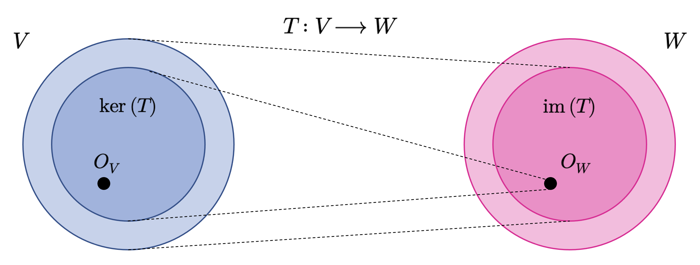

::: {.callout-important}
## Idea central

Una transformación lineal es una función entre espacios vectoriales que preserva la suma de vectores y la multiplicación por escalares. Gracias a esta compatibilidad estructural, puede representarse mediante matrices y estudiarse con herramientas algebraicas y geométricas muy potentes.
:::

## Transformaciones lineales.
A continuación, estudiaremos aplicaciones que mapean objetos entre espacios vectoriales y que preservan su estructura, las cuales nos permitirán, una vez definidas, construir el concepto de *coordenada*. Al principio de esta sección, dijimos que los vectores son objetos que pueden sumarse entre sí y multiplicarse por un escalar, siendo el resultado de ambas operaciones también un vector. Queremos preservar esta propiedad cuando implementemos estas aplicaciones: Consideremos, para ello, dos espacios vectoriales $V$ y $W$. Una aplicación $T:V\longrightarrow W$ preserva la estructura de un espacio vectorial si se cumple que

::: {.eq-scroll}
$$
T\left( u+v\right)  =T\left( u\right)  +T\left( v\right)  \wedge T\left( \lambda u\right)  =\lambda T\left( u\right) \tag{3.1}
$$
:::

Para todo $u,v\in V$ y $\lambda \in \mathbb{R}$. Esto motiva la siguiente definición.

**Definición 3.1 – Transformación lineal (general):** Sean $V$ y $W$ dos $\mathbb{K}$-espacios vectoriales y $T:V\longrightarrow W$ una función. Diremos que $T$ es una **transformación lineal** entre $V$ y $W$ si esta función verifica las siguientes propiedades:

- **(P1):** $T(u+v)=T(u)+T(v);\forall u,v\in V$.
- **(P2):** $T(\lambda u)=\lambda T(u);\forall u\in V\wedge \lambda \in \mathbb{R}$.

Una notación utilizada muchísimo en álgebra lineal para denotar las transformaciones lineales es

::: {.eq-scroll}
$$
\mathbb{L}_{\mathbb{K}}(V,W)=\left\{ T:V\longrightarrow W\  |\  T\  \mathrm{es} \  \mathrm{una} \  \mathrm{transformacion} \  \mathrm{lineal} \right\} \tag{3.2}
$$
:::

**Ejemplo 3.1:** Sea $T:\mathbb{R}^{3}\longrightarrow \mathbb{R}^{2}$ una función definida como $T(x,y,z)=(x-y+z,x+z)$. Vamos a demostrar que $T$ es una transformación lineal. En efecto, conforme a la definición (3.1), en primer lugar, introducimos e interpretamos los datos del dominio de $T$:

- $u\in \mathbb{R}^{3}\Longleftrightarrow u=(u_{1},u_{2},u_{3})$, donde $u_{i}\in \mathbb{R}$ para $i=1,2,3$.
- $v\in \mathbb{R}^{3}\Longleftrightarrow v=(v_{1},v_{2},v_{3})$, donde $v_{i}\in \mathbb{R}$ para $i=1,2,3$.
- $u+v=(u_{1}+v_{1},u_{2}+v_{2},u_{3}+v_{3})\in \mathbb{R}^{3}$.

Ahora debemos mostrar que $T(u+v)=T(u)+T(v)$. De lo anterior,

::: {.eq-scroll}
$$
\begin{array}{lll}T\left( u+v\right)  &=&T\left( \left( u_{1}+v_{1},u_{2}+v_{2},u_{3}+v_{3}\right)  \right)  \\ &=&\left( \left( u_{1}+v_{1}\right)  -\left( u_{2}+v_{2}\right)  +\left( u_{3}+v_{3}\right)  ,\left( u_{1}+v_{1}\right)  +\left( u_{3}+v_{3}\right)  \right)  \\ &=&\left( u_{1}+v_{1}-u_{2}-v_{2}+u_{3}+v_{3},u_{1}+v_{1}+u_{3}+v_{3}\right)  \\ &=&\left( \left[ u_{1}-u_{2}+u_{3}\right]  +\left[ v_{1}-v_{2}+v_{3}\right]  ,\left[ u_{1}+u_{3}\right]  +\left[ v_{1}+v_{3}\right]  \right)  \\ &=&\left( u_{1}-u_{2}+u_{3},u_{1}+u_{3}\right)  +\left( v_{1}-v_{2}+v_{3},v_{1}+v_{3}\right)  \\ &=&T\left( \left( u_{1},u_{2},u_{3}\right)  \right)  +T\left( \left( v_{1},v_{2},v_{3}\right)  \right)  \\ &=&T\left( u\right)  +T\left( v\right)  \end{array} \tag{3.3}
$$
:::

Finalmente, debemos demostrar que $T(\lambda u)=\lambda T(u)$. En efecto,

::: {.eq-scroll}
$$
\begin{array}{lll}T\left( \lambda u\right)  &=&T\left( \left( \lambda u_{1},\lambda u_{2},\lambda u_{3}\right)  \right)  \\ &=&\left( \lambda u_{1}-\lambda u_{2}+\lambda u_{3},\lambda u_{1}+\lambda u_{3}\right)  \\ &=&\lambda \left( u_{1}-u_{2}+u_{3},u_{1}+u_{3}\right)  \\ &=&\lambda T\left( \left( u_{1},u_{2},u_{3}\right)  \right)  \\ &=&\lambda T\left( u\right)  \end{array} \tag{3.4}
$$
:::

Así que, efectivamente, $T$ es una transformación lineal. ◼︎

### Propiedades de las transformaciones lineales.

Sea $T:V\longrightarrow W$ una transformación lineal entre los espacios vectoriales $V$ y $W$. La función $T$ será llamada:

- **Inyectiva**, si $\forall u,v\in V:T\left( u\right)  =T\left( v\right)  \Longrightarrow u=v$.
- **Sobreyectiva**, si $T(V)=W$.
- **Biyectiva**; si $T$ es inyectiva y sobreyectiva a la vez.

Si $T$ es sobreyectiva, entonces cada elemento en $W$ puede ser *recuperado* desde $V$ usando la función $T$. Por definición, si $T$ es biyectiva, entonces existe una función $\Omega: W\longrightarrow V$ tal que $\Omega (T(u))=u$. Tal función $\Omega$ es llamada **inversa** de la transformación lineal $T$, y se representa como $T^{-1}$.

Vamos a verificar otras **propiedades cualitativas** de las transformaciones lineales que son esenciales para su completo entendimiento. En este contexto, sea $T:V\longrightarrow W$ una transformación lineal entre los espacios vectoriales $V$ y $W$, tal que $\dim(V)=n$. Entonces:

- **(P1):** $T(O_{V})=O_{W}$. En efecto,

::: {.eq-scroll}
$$
T\left( O_{V}\right)  =T\left( O_{V}+O_{V}\right)  =T\left( O_{V}\right)  +T\left( O_{V}\right)  \Longrightarrow T\left( O_{V}\right)  =O_{W} \tag{3.5}
$$
:::

- **(P2):** $T$ inyectiva $\Longrightarrow n\geq \dim(W)$. En efecto,

a) Si $\alpha =\left\{ v_{1},...,v_{n}\right\}$ es una base de $V$, entonces $T(\alpha):=\left\{ T\left( v_{1}\right)  ,...,T\left( v_{n}\right)  \right\}  \subset W$.

b) La imagen $T(\alpha)$ puede ser LI o LD en $W$. Verifiquemos cuál es su condición:

::: {.eq-scroll}
$$
\begin{array}{lll}\sum^{n}_{i=1} \alpha_{i} T\left( v_{i}\right)  =O_{W}&\Longrightarrow &T\left( \sum^{n}_{i=1} \alpha_{i} v_{i}\right)  =O_{W}\\ &\Longrightarrow &T\left( \sum^{n}_{i=1} \alpha_{i} v_{i}\right)  =T\left( O_{V}\right)  \  \left( \mathrm{por} \  \mathrm{la} \  \mathrm{propiedad} \  \mathrm{(P1)} \right)  \\ &\Longrightarrow &\sum^{n}_{i=1} \alpha_{i} v_{i}=O_{V}\  \left( \mathrm{ya} \  \mathrm{que} \  T\  \mathrm{es} \  \mathrm{inyectiva} \right)  \\ &\Longrightarrow &\alpha_{i} =0;\forall i=1,...,n\  \left( \mathrm{pues} \  \alpha \  \mathrm{es} \  \mathrm{LI} \  \mathrm{en} \  W\right)  \\ &\Longrightarrow &T\left( \alpha \right)  \  \mathrm{es} \  \mathrm{LI} \  \mathrm{en} \  W\\ &\Longrightarrow &\dim \left( W\right)  \leq n\end{array} \tag{3.6}
$$
:::

- **(P3):** $T$ sobreyectiva $\Longrightarrow n\leq \dim(W)$. En efecto,

a) Como $T$ es sobreyectiva, entonces $\mathrm{im}(T)=W$; es decir,

::: {.eq-scroll}
$$
w\in W\Longrightarrow \left( \exists u;u\in V\right)  :T\left( u\right)  =w \tag{3.7}
$$
:::

b) Como $\dim(V)=n$, entonces podemos considerar la existencia de una base $\alpha =\left\{ v_{1},...,v_{n}\right\}$ de $V$ y, entonces, considerando la ecuación (1.95), tenemos que

::: {.eq-scroll}
$$
\begin{array}{lll}u\in W&\Longleftrightarrow &\left( \exists u;u\in V\right)  :u=\sum^{n}_{i=1} \alpha_{i} v_{i}\wedge T\left( \sum^{n}_{i=1} \alpha_{i} v_{i}\right)  =w\\ &\Longleftrightarrow &\left( \exists u;u\in V\right)  :u=\sum^{n}_{i=1} \alpha_{i} v_{i}\wedge \sum^{n}_{i=1} \alpha_{i} T\left( v_{i}\right)  =w\\ &\Longleftrightarrow &w\in \left< \left\{ T\left( v_{1}\right)  ,...,T\left( v_{n}\right)  \right\}  \right>  \end{array} \tag{3.8}
$$
:::

Luego $W=\left< \left\{ T\left( v_{1}\right)  ,...,T\left( v_{n}\right)  \right\}  \right>  \Longrightarrow \dim \left( W\right)  \leq n$. Es conveniente recordar que la dimensión de un espacio vectorial es el número mínimo de vectores generadores soportado por dicho espacio.

- **(P4):** $T$ biyectiva $\Longrightarrow \dim(V)=\dim(W)$. En efecto,

::: {.eq-scroll}
$$
\begin{array}{lll}T\  \mathrm{inyectiva} &\Longrightarrow &n\geq \dim \left( W\right)  \\ T\  \mathrm{sobreyectiva} &\Longrightarrow &n\leq \dim \left( W\right)  \end{array} \  \Longrightarrow \dim \left( V\right)  =\dim \left( W\right) \tag{3.9}
$$
:::

**Definición 3.2 – Isomorfismo (general) de espacios vectoriales:** Sean $V$ y $W$ dos $\mathbb{K}$-espacios vectoriales y $T:V\longrightarrow W$ una función. Diremos que $T$ es un **isomorfismo de espacios vectoriales** si se cumplen las siguientes condiciones:

- **(C1):** $T$ es una transformación lineal entre $V$ y $W$.
- **(C2):** $T$ es una función biyectiva.

En tal caso, diremos que los $\mathbb{K}$-espacios vetoriales $V$ y $W$ son **isomorfos** y lo denotaremos como $V\cong W$.

::: {.callout-tip}
## Teorema 3.1

*Sean $V$ y $W$ dos $\mathbb{K}$-espacios vetoriales. Entonces tenemos que:*

**(a)** *$V\cong W \Longrightarrow \dim_{\mathbb{K}}(V)=\dim_{\mathbb{K}}(W)$.*

**(b)** *Recíprocamente, si $\dim_{\mathbb{K}}(V)=\dim_{\mathbb{K}}(W)$, entonces existe un isomorfismo de espacios vectoriales que depende, naturalmente, de las bases de cada uno de los $\mathbb{K}$-espacios vectoriales $V$ y $W$.*
:::

### Teorema de la dimensión.
El teorema de la dimensión corresponde a uno de los resultados más importantes del álgebra lineal en relación a las transformaciones lineales y, puntualmente, en relación a los isomorfismos entre espacios vectoriales. Para poder enunciarlo, primero, necesitamos definir algunos conceptos previos relativos a ciertos conjuntos que son característicos de las transformaciones lineales y que representan, de alguna manera, sus rangos definitorios.

**Definición 3.3 – Kernel de una transformación lineal (general):** Sean $V$ y $W$ dos $\mathbb{K}$-espacios vectoriales y sea $T:V\longrightarrow W$ una transformación lineal entre ambos. Llamaremos **núcleo** o **kernel** de la función $T$ al conjunto

::: {.eq-scroll}
$$
\ker \left( T\right)  =\left\{ u\in V:T\left( u\right)  =O_{W}\right\} \tag{3.10}
$$
:::

**Definición 3.4 – Imagen de una transformación lineal (general):** Sean $V$ y $W$ dos $\mathbb{K}$-espacios vectoriales y sea $T:V\longrightarrow W$ una transformación lineal entre ambos. Diremos que la **imagen** o **rango** de la función $T$ corresponde al conjunto contenido en $W$ conformado por todos los valores que puede llegar a tomar $T$. Este conjunto se denota como $\mathrm{im}(T)$ y, en símbolos, podemos definirlo como

::: {.eq-scroll}
$$
\mathrm{im} \left( T\right)  =\left\{ w\in W:\exists v\in V,f\left( u\right)  =w\right\} \tag{3.11}
$$
:::

Con las definiciones anteriores, ya estamos en condiciones de enunciar el siguiente teorema.

::: {.callout-tip}
## Teorema 3.2 – Teorema de la dimensión

*Sean $V$ y $W$ dos espacios vectoriales tales que $\dim (V)=n$, con $n\in \mathbb{N}$, y sea $T$ una transformación lineal entre $V$ y $W$. Entonces tenemos que*

::: {.eq-scroll}
$$
\dim \left( V\right)  =\dim \left( \ker \left( T\right)  \right)  +\dim \left( \mathrm{im} \left( T\right)  \right) \tag{3.12}
$$
:::

:::

### Representación matricial de las transformaciones lineales.

Cualquier espacio vectorial de dimensión $n$ es isomorfo a $\mathbb{R}^{n}$ (por el teorema (3.1)). Consideremos una base $\alpha =\left\{ v_{1},...,v_{n}\right\}$ de un espacio vectorial $V$. En lo que sigue, el **orden** de los elementos dispuestos en una base como $\alpha$ será de importancia. Por lo tanto, escribiremos $\alpha=(v_{1},...,v_{n})$ y llamaremos a esta tupla **base ordenada** de $V$.

**Definición 3.5 – Representación coordenada:** Consideremos un espacio vectorial $V$ (que supondremos, sin pérdida de generalidad, sobre el cuerpo de escalares $\mathbb{R}$) y una base ordenada $\alpha=(v_{1},...,v_{n})$ de $V$. Para cualquier $v\in V$ obtenemos una única representación (combinación lineal)

::: {.eq-scroll}
$$
v=a_{1}v_{1}+\cdots +a_{n}v_{n} \tag{3.13}
$$
:::

de $v$ respecto de $\alpha$. Entonces llamaremos a los escalares $a_{1},...,a_{n}$ **coordenadas** de $v$ con respecto a la base ordenada $\alpha$, y el vector $\mathbf{a}=(a_{1},...,a_{n})\in \mathbb{R}^{n}$ será llamado **vector coordenado** o **representación coordenada** de la base ordenada $\alpha$.

Una base define efectivamente un sistema de coordenadas. Estamos familiarizados con el sistema de coordenadas cartesianas o rectangulares, el cual es generado a partir de los vectores coordenados unitarios que, comúnmente, solemos representar mediante lo símbolos como $\mathbf{e}_{1}$ y $\mathbf{e}_{2}$. En este sistema, un vector $\mathbf{x}\in \mathbb{R}^{2}$ dispone de una representación que nos explicita como combinar $\mathbf{e}_{1}$ con $\mathbf{e}_{2}$ para obtener $\mathbf{x}$. Sin embargo, cualquier base de $\mathbb{R}^{2}$ define un sistema coordenado y el mismo vector $\mathbf{x}$ de antes puede tener diferentes representaciones coordenadas dependiendo de la base que utilicemos. En la @fig-coordenadas (a), las coordenadas de $\mathbf{x}$ con respecto a la base canónica ($\mathbf{e}_{1}$, $\mathbf{e}_{2}$) son representadas por el vector $(2, 2)$. Sin embargo, en el sistema de coordenadas mostrado en la @fig-coordenadas (b), el mismo vector $\mathbf{x}$ se representa mediante las coordenadas $(1.09, 0.72)$. Por lo tanto, en este sistema, con base $(\mathbf{b}_{1},\mathbf{b}_{2})$, $\mathbf{x}$ se representa como $\mathbf{x}=1.09\mathbf{b}_{1}+0.72\mathbf{b}_{2}$. Más adelante, explicaremos como obtener estas representaciones.

{#fig-coordenadas fig-align="center" width="80%"}

En síntesis, para un espacio vectorial $V$ de dimensión $n$ y una base ordenada $\alpha$ de $V$, la función $T:\mathbb{R}^{n}\longrightarrow V$ definida como $T(\mathbf{e}_{i})=\mathbf{b}_{i}$ para $1\leq i\leq n$, es lineal (y, por el teorema (3.1), es un isomorfismo de espacios vectoriales), donde $(\mathbf{e}_{1},...,\mathbf{e}_{n})$ es la base canónica de $\mathbb{R}^{n}$.

Ahora ya estamos listos para formular una conexión explícita entre las matrices y las transformaciones lineales entre espacios vectoriales de dimensión finita.

**Definición 3.6 – Matriz de cambio de base:** Consideremos los espacios vectoriales $V$ y $W$ (de dimensión $n$ y $m$, respectivamente) con sus correspondientes bases ordenadas $\alpha=(v_{1},...,v_{n})$ y $\beta=(w_{1},...,w_{n})$. Consideremos ademas una transformación lineal $T:V\longrightarrow W$. Para $j\in \left\{ 1,...,n\right\}$, diremos que

::: {.eq-scroll}
$$
T\left( v_{j}\right)  =a_{1j}w_{1}+\cdots +a_{mj}v_{m}=\sum^{m}_{i=1} a_{ij}w_{i} \tag{3.14}
$$
:::

es la representación única de $T(v_{j})$ con respecto a $\beta$. Dado lo anterior, la matriz de $m\times n$ denotada como $[\mathbf{I}]_{\alpha}^{\beta}$, cuyos elementos se definen como $[\mathbf{I}]_{\alpha}^{\beta}(i,j)=a_{ij}$, será llamada **matriz de cambio de base** (o **matriz de transformación**) entre (las bases de) los espacios vectoriales $V$ y $W$.

Las coordenadas de $T(v_{j})$ con respecto a la base ordenada $\beta$ de $W$ se corresponden con la $j$-ésima columna de $[\mathbf{I}]_{\alpha}^{\beta}$. Consideremos los espacios vectoriales $V$ y $W$ (de dimensión finita) con bases ordenadas $\alpha$ y $\beta$ y una transformación lineal $T:V\longrightarrow W$ con matriz de cambio de base $[\mathbf{I}]_{\alpha}^{\beta}$. Si $\hat{\mathbf{v}}$ es el vector coordenado de $v\in V$ con respecto a $\alpha$, y $\hat{\mathbf{w}}$ es el vector coordenado de $w=T(v)\in W$ con respecto a $\beta$, entonces

::: {.eq-scroll}
$$
\hat{\mathbf{w} } =\left[ \mathbf{I} \right]^{\beta }_{\alpha }  \hat{\mathbf{v} } \tag{3.15}
$$
:::

Esto significa que la matriz de cambio de base $[\mathbf{I}]_{\alpha}^{\beta}$ puede ser utilizada para aplicar coordenadas con respecto a una base ordenada de $V$ sobre coordenadas con respecto a una base ordenada de $W$.

::: {.callout-tip}
## Teorema 3.3 – Cambio de base

*Sean $V$ y $W$ dos espacios vectoriales de dimensión $n$ y sean $\alpha=(v_{1},...,v_{n})$ y $\beta=(w_{1},...,w_{n})$ dos bases ordenadas de $V$ y $W$, respectivamente. Para todo $u\in V$, pongamos $[u]_{\alpha}=\sum^{n}_{i=1} a_{i}v_{i}$ y $\left[ u\right]_{\beta }  =\sum^{n}_{j=1} b_{i}w_{i}$ para representar la generación del vector $u$ por medio de ambas bases ordenadas. Entonces tenemos que*

::: {.eq-scroll}
$$
\left[ \mathbf{I} \right]^{\beta }_{\alpha }  \left[ u\right]_{\alpha }  =\left[ u\right]_{\beta } \tag{3.16}
$$
:::

:::

**Ejemplo 3.2:** Consideremos la función $T:\mathbb{R}^{3\times 1}\longrightarrow \mathbb{R}^{2}$, definida como

::: {.eq-scroll}
$$
T\left( \begin{matrix}x\\ y\\ z\end{matrix} \right)  =\left( x-\lambda y+4z,\lambda x-y+3z\right) \tag{3.17}
$$
:::

- **(a):** Vamos a demostrar que $T$ es una transformación lineal entre $\mathbb{R}^{3\times 1}$ y $\mathbb{R}^{2}$, para todo $\lambda \in \mathbb{R}$.
- **(b):** Vamos a determinar el conjunto $S=\left\{ \lambda \in \mathbb{R} :\ker \left( T\right)  =\left\{ O_{\mathbb{R}^{3\times 1} }\right\}  \right\}$.

En efecto, para resolver **(a)**, debemos verificar que, para $\mathbf{A}, \mathbf{B}\in \mathbb{R}^{3\times 1}$, se tiene que $T(\mathbf{A}+\mathbf{B})=T(\mathbf{A})+T(\mathbf{B})$. De esta manera, sean entonces

::: {.eq-scroll}
$$
\mathbf{A} ,\mathbf{B} \in \mathbb{R}^{3\times 1} \Longleftrightarrow \mathbf{A} =\left( \begin{matrix}x_{1}\\ y_{1}\\ z_{1}\end{matrix} \right)  \wedge \mathbf{B} =\left( \begin{matrix}x_{2}\\ y_{2}\\ z_{2}\end{matrix} \right) \tag{3.18}
$$
:::

Luego tenemos,

::: {.eq-scroll}
$$
\begin{array}{lll}T\left( \mathbf{A} +\mathbf{B} \right)  &=&T\left( \begin{matrix}x_{1}+x_{2}\\ y_{1}+y_{2}\\ z_{1}+z_{2}\end{matrix} \right)  \\ &=&\left( x_{1}+x_{2}-\lambda \left( y_{1}+y_{2}\right)  +4\left( z_{1}+z_{2}\right)  ,\lambda \left( x_{1}+x_{2}\right)  -\left( y_{1}+y_{2}\right)  +3\left( z_{1}+z_{2}\right)  \right)  \\ &=&\left( x_{1}+x_{2}-\lambda y_{1}-\lambda y_{2}+4z_{1}+4z_{2},\lambda x_{1}+\lambda x_{2}-y_{1}-y_{2}+3x_{1}+3z_{2}\right)  \\ &=&\left( x_{1}-\lambda y_{1}+4z_{1},\lambda x_{1}-y_{1}+3z_{1}\right)  +\left( x_{2}+\lambda y_{2}+4z_{2},\lambda x_{2}-y_{2}+3z_{2}\right)  \\ &=&T\left( \begin{matrix}x_{1}\\ y_{1}\\ z_{1}\end{matrix} \right)  +T\left( \begin{matrix}x_{2}\\ y_{2}\\ z_{2}\end{matrix} \right)  \\ &=&T\left( \mathbf{A} \right)  +T\left( \mathbf{B} \right)  \end{array} \tag{3.19}
$$
:::

Así que, efectivamente, $T\left( \mathbf{A} +\mathbf{B} \right)=T\left( \mathbf{A} \right)  +T\left( \mathbf{B} \right)$. Ahora debemos demostrar que, para $\mu \in \mathbb{R}$ y $\mathbf{A}\in \mathbb{R}^{3\times 1}$, $T(\mu \mathbf{A}) = \mu T(\mathbf{A})$. De esta manera,

::: {.eq-scroll}
$$
\begin{array}{lll}T\left( \mu \mathbf{A} \right)  &=&T\left( \begin{matrix}\mu x_{1}\\ \mu x_{2}\\ \mu x_{3}\end{matrix} \right)  \\ &=&\left( \mu x_{1}-\lambda \mu y_{1}+4\mu z_{1},\lambda \mu x_{1}-\mu y_{1}+3\mu z_{1}\right)  \\ &=&\mu \left( x_{1}-\lambda y_{1}+4z_{1},\lambda x_{1}-y_{1}+3z_{1}\right)  \\ &=&\mu T\left( \begin{matrix}x_{1}\\ y_{1}\\ z_{1}\end{matrix} \right)  =\mu T\left( \mathbf{A} \right)  \end{array} \tag{3.20}
$$
:::

Así que, efectivamente, $T(\mu \mathbf{A}) = \mu T(\mathbf{A})$.

Toca ahora resolver **(b)**. De esta manera, determinaremos el conjunto $S=\left\{ \lambda \in \mathbb{R} :\ker \left( T\right)  =\left\{ O_{\mathbb{R}^{3\times 1} }\right\}  \right\}$. La forma más sencilla de resolver este problema es mediante la aplicación del teorema (1.6), ya que

::: {.eq-scroll}
$$
\dim_{\mathbb{R} } \left( \mathbb{R}^{3\times 1} \right)  =3=\dim_{\mathbb{R} } \left( \ker \left( T\right)  \right)  +\dim_{\mathbb{R} } \left( \mathrm{im} \left( T\right)  \right) \tag{3.21}
$$
:::

Pero como $\dim_{\mathbb{R}}(\mathrm{im}(T))\leq \dim_{\mathbb{R}}(\mathbb{R}^{2})=2$, entonces $\dim_{\mathbb{R}}(\ker (T))=1$ 0 $\dim_{\mathbb{R}}(\ker (T))=2$. Sin embargo, dado que $\dim_{\mathbb{R}}(\mathbb{R}^{3})$, se tiene que $S=\varnothing$.

Siempre podemos proceder usando la definición de kernel en cualquier caso. De este modo, basta con considerar

::: {.eq-scroll}
$$
\lambda \in S\Longleftrightarrow \lambda \in \mathbb{R} \wedge \ker \left( T\right)  =\left\{ O_{\mathbb{R}^{3\times 1} }\right\} \tag{3.22}
$$
:::

Luego debemos estudiar $\ker(T)$. Así que,

::: {.eq-scroll}
$$
\begin{array}{lll}\mathbf{A} \in \ker \left( T\right)  &\Longleftrightarrow &\mathbf{A} \in \mathbb{R}^{3\times 1} \wedge T\left( \mathbf{A} \right)  =O_{\mathbb{R}^{2} }\\ &\Longleftrightarrow &\mathbf{A} =\left( \begin{matrix}x\\ y\\ z\end{matrix} \right)  \in \mathbb{R}^{3\times 1} \wedge T\left( \begin{matrix}x\\ y\\ z\end{matrix} \right)  =\left( 0,0\right)  \\ &\Longleftrightarrow &\mathbf{A} =\left( \begin{matrix}x\\ y\\ z\end{matrix} \right)  \in \mathbb{R}^{3\times 1} \wedge \left( x-\lambda y+4z,\lambda x-y+3z\right)  =\left( 0,0\right)  \\ &\Longleftrightarrow &\mathbf{A} =\left( \begin{matrix}x\\ y\\ z\end{matrix} \right)  \in \mathbb{R}^{3\times 1} \wedge \begin{cases}\begin{array}{rcl}x-\lambda y+4z&=&0\\ \lambda x-y+3z&=&0\end{array} &\end{cases} \\ &\Longleftrightarrow &\mathbf{A} =\left( \begin{matrix}x\\ y\\ z\end{matrix} \right)  \in \mathbb{R}^{3\times 1} \wedge \underbrace{\left( \begin{matrix}1&-\lambda &4\\ \lambda &-1&3\end{matrix} \right)  }_{\mathbf{B} } \left( \begin{matrix}x\\ y\\ z\end{matrix} \right)  =\left( \begin{matrix}0\\ 0\\ 0\end{matrix} \right)  \\ &\Longleftrightarrow &\mathbf{A} =\left( \begin{matrix}x\\ y\\ z\end{matrix} \right)  \in \mathbb{R}^{3\times 1} \wedge \rho \left( \mathbf{B} \right)  \leq 2;\forall \lambda \in \mathbb{R} \end{array} \tag{3.23}
$$
:::

Luego, el sistema, por ser homogéneo, siempre tiene solución, pero nunca tendrá solución única, ya que, en ese caso, su rango debería ser igual a 3, y entonces $\ker \left( T\right)  \neq \left\{ O_{\mathbb{R}^{3\times 1} }\right\}$. Por lo tanto, $S=\varnothing$. ◼︎

**Ejemplo 3.3:** Consideremos la función $T:\mathbb{R}^{3}\longrightarrow \mathbb{R}_{2}[x]$ definida explícitamente como $T\left( a,b,c\right)  =\left( a+2b+3c\right)  +\left( a-3b+c\right)  x+\left( a+b+c\right)  x^{2}$. Vamos a demostrar que $T$ es un isomorfismo de espacios vectoriales.

En primer lugar, debemos demostrar que $T$ es una transformación lineal entre $\mathbb{R}^{3}$ y $\mathbb{R}_{2}[x]$. Para ello, consideramos

::: {.eq-scroll}
$$
\begin{array}{lll}u_{1}\in \mathbb{R}^{3} &\Longleftrightarrow &u_{1}=\left( a_{1},b_{1},c_{1}\right)  \\ u_{2}\in \mathbb{R}^{3} &\Longleftrightarrow &u_{2}=\left( a_{2},b_{2},c_{2}\right)  \end{array} \tag{3.24}
$$
:::

Luego tenemos,

::: {.eq-scroll}
$$
\begin{array}{lll}T\left( u_{1}+u_{2}\right)  &=&T\left( a_{1}+a_{2},b_{1}+b_{2},c_{1}+c_{2}\right)  \\ &=&\left( a_{1}+a_{2}+2\left( b_{1}+b_{2}\right)  +3\left( c_{1}+c_{2}\right)  \right)  +\left( a_{1}+a_{2}-3\left( b_{1}-b_{2}\right)  +c_{1}+c_{2}\right)  x+\left( a_{1}+a_{2}+b_{1}+b_{2}+c_{1}+c_{2}\right)  x^{2}\\ &=&\left( a_{1}+a_{2}+2b_{1}+2b_{2}+3c_{1}+3c_{2}\right)  +\left( a_{1}+a_{2}-3b_{1}-3b_{2}+c_{1}+c_{2}\right)  x+\left( a_{1}+a_{2}+b_{1}+b_{2}+c_{1}+c_{2}\right)  x^{2}\\ &=&\left( a_{1}+2b_{1}+3c_{1}\right)  +\left( a-3b_{1}+c_{1}\right)  x+\left( a_{1}+b_{1}+c_{1}\right)  x^{2}+\left( a_{2}+2b_{2}+3c_{2}\right)  +\left( a_{2}-3b_{2}+c_{2}\right)  x+\left( a_{2}+b_{2}+c_{2}\right)  x^{2}\\ &=&T\left( a_{1},b_{1},c_{1}\right)  +T\left( a_{2},b_{2},c_{2}\right)  \\ &=&T\left( u_{1}\right)  +T\left( u_{2}\right)  \end{array} \tag{3.25}
$$
:::

Además, para $\lambda \in \mathbb{R}$,

::: {.eq-scroll}
$$
\begin{array}{lll}T\left( \lambda u_{1}\right)  &=&T\left( \lambda a_{1},\lambda b_{1},\lambda c_{1}\right)  \\ &&\left( \lambda a_{1}+2\lambda b_{1}+3\lambda c_{1}\right)  +\left( \lambda a_{1}-3\lambda b_{1}+\lambda c_{1}\right)  x+\left( \lambda a_{1}+\lambda b_{1}+\lambda c_{1}\right)  x^{2}\\ &&\lambda \left( a_{1}+2b_{1}+3c_{1}\right)  +\left( \lambda \left( a_{1}-3b_{1}+c_{1}\right)  \right)  x+\left( \lambda \left( a_{1}+b_{1}+c_{1}\right)  \right)  x^{2}\\ &&\lambda \left( \left( a_{1}+2b_{1}+3c_{1}\right)  +\left( a_{1}-3b_{1}+c_{1}\right)  x+\left( a_{1}+b_{1}+c_{1}\right)  x^{2}\right)  \\ &&\lambda T\left( a_{1},b_{1},c_{1}\right)  \\ &&\lambda T\left( u_{1}\right)  \end{array} \tag{3.26}
$$
:::

Así que, en efecto, $T\in \mathbb{L}_{\mathbb{R}}(\mathbb{R}^{3},\mathbb{R}_{2}[x])$.

Ahora, para demostrar que $T$ es un isomorfismo, debemos verificar que $T$ es biyectiva. Sin embargo, debido a que $\dim \left( \mathbb{R}^{3} \right)  =\dim \left( \mathbb{R}_{2} \left[ x\right]  \right)  =3$, bastará determinar, por el teorema (3.2), la dimensión de la imagen o el kernel de $T$ para determinar si $T$ es biyectiva. Estudiemos, pues, el kernel de $T$:

::: {.eq-scroll}
$$
\begin{array}{lll}u\in \ker \left( T\right)  &\Longleftrightarrow &u\in \mathbb{R}^{3} \wedge T\left( u\right)  =O_{\mathbb{R}_{2} \left[ x\right]  }\\ &\Longleftrightarrow &u=\left( a,b,c\right)  \in \mathbb{R}^{3} \wedge T\left( a,b,c\right)  =0+0x+0x^{2}\\ &\Longleftrightarrow &u=\left( a,b,c\right)  \in \mathbb{R}^{3} \wedge \left( a+2b+3c\right)  +\left( a-3b+c\right)  x+\left( a+b+c\right)  x^{2}=0+0x+0x^{2}\\ &\Longleftrightarrow &u=\left( a,b,c\right)  \in \mathbb{R}^{3} \wedge \begin{cases}\begin{array}{c}\left( 1\right)  \\ \left( 2\right)  \\ \left( 3\right)  \end{array} &\begin{array}{rcl}a+2b+3c&=&0\\ a-3b+c&=&0\\ a+b+c&=&0\end{array} \end{cases} \\ &\overbrace{\Longleftrightarrow }^{\left( 3\right)  -\left( 2\right)  } &u=\left( a,b,c\right)  \in \mathbb{R}^{3} \wedge \begin{cases}\begin{array}{c}\left( 1\right)  \\ \left( 2\right)  \\ \left( 4\right)  \end{array} &\begin{array}{rcl}a+2b+3c&=&0\\ a-3b+c&=&0\\ 4b&=&0\end{array} \end{cases} \\ &\overbrace{\Longleftrightarrow }^{\mathrm{por} \  \left( 4\right)  } &u=\left( a,b,c\right)  \in \mathbb{R}^{3} \wedge \begin{cases}\begin{array}{c}\left( 6\right)  \\ \left( 7\right)  \\ \left( 5\right)  \end{array} &\begin{array}{rcl}a+3c&=&0\\ a+c&=&0\\ b&=&0\end{array} \end{cases} \\ &\overbrace{\Longleftrightarrow }^{\left( 6\right)  -\left( 7\right)  } &u=\left( a,b,c\right)  \in \mathbb{R}^{3} \wedge \begin{cases}\begin{array}{c}\left( 6\right)  \\ \left( 7\right)  \\ \left( 5\right)  \end{array} &\begin{array}{rcl}2c&=&0\\ a+c&=&0\\ b&=&0\end{array} \end{cases} \\ &\Longleftrightarrow &u=\left( a,b,c\right)  \in \mathbb{R}^{3} \wedge a=b=c=0\end{array} \tag{3.27}
$$
:::

Así que $T$ es inyectiva y, conforme lo visto previamente, es un isomorfismo. ◼︎

**Ejemplo 3.4:** Sea $\alpha =\left\{ x,x^{2}+3,2x^{2}+x\right\}$ una base de $\mathbb{R}_{2}[x]$. Vamos a estudiar la posibilidad de determinar otra base $\beta$ de $\mathbb{R}_{2}[x]$, tal que

::: {.eq-scroll}
$$
\left[ \mathbf{I} \right]^{\beta }_{\alpha }  =\left( \begin{matrix}2&2&0\\ 3&-1&1\\ 0&1&2\end{matrix} \right) \tag{3.28}
$$
:::

En efecto, primero definimos el *esqueleto* de la base $\beta$. Es decir, $\beta =\left\{ p_{1}\left( x\right)  ,p_{2}\left( x\right)  ,p_{3}\left( x\right)  \right\}$. En tal caso, partiendo de la definición (1.27), tenemos que

::: {.eq-scroll}
$$
\left[ \mathbf{I} \right]^{\beta }_{\alpha }  =\left( \left[ x\right]_{\beta }  ,\left[ x^{2}+3\right]_{\beta }  ,\left[ 2x^{2}+x\right]_{\beta }  \right)  =\left( \begin{matrix}2&2&0\\ 3&-1&1\\ 0&1&2\end{matrix} \right) \tag{3.29}
$$
:::

Así que, a partir de lo anterior, tenemos que:

::: {.eq-scroll}
$$
\begin{array}{rcl}\left[ x\right]_{\beta }  =\left( \begin{matrix}2\\ 3\\ 0\end{matrix} \right)  &\Longleftrightarrow &x=2p_{1}\left( x\right)  +3p_{2}\left( x\right)  \\ \left[ x^{2}+3\right]_{\beta }  =\left( \begin{matrix}2\\ -1\\ 1\end{matrix} \right)  &\Longleftrightarrow &x^{2}+3=2p_{1}\left( x\right)  -p_{2}\left( x\right)  +p_{3}\left( x\right)  \\ \left[ 2x^{2}+x\right]_{\beta }  =\left( \begin{matrix}0\\ 1\\ 2\end{matrix} \right)  &\Longleftrightarrow &2x^{2}+x=p_{2}\left( x\right)  +2p_{3}\left( x\right)  \end{array} \tag{3.30}
$$
:::

Luego,

::: {.eq-scroll}
$$
\begin{array}{crcl}&\begin{array}{lrcl}\left( 1\right)  &2p_{1}\left( x\right)  +3p_{2}\left( x\right)  &=&x\\ \left( 2\right)  &2p_{1}\left( x\right)  -p_{2}\left( x\right)  +p_{3}\left( x\right)  &=&x^{2}+3\\ \left( 3\right)  &p_{2}\left( x\right)  +2p_{3}\left( x\right)  &=&2x^{2}+x\end{array} &\overbrace{\Longrightarrow }^{\left( 1\right)  -\left( 2\right)  } &\begin{array}{lrcl}\left( 4\right)  &4p_{2}\left( x\right)  -p_{3}\left( x\right)  &=&-x^{2}+x-3\\ \left( 2\right)  &2p_{1}\left( x\right)  -p_{2}\left( x\right)  +p_{3}\left( x\right)  &=&x^{2}+3\\ \left( 3\right)  &p_{2}\left( x\right)  +2p_{3}\left( x\right)  &=&2x^{2}+x\end{array} \\ \Longrightarrow &\begin{array}{lrcl}\left( 5\right)  &8p_{2}\left( x\right)  -2p_{3}\left( x\right)  &=&-2x^{2}+2x-6\\ \left( 2\right)  &2p_{1}\left( x\right)  -p_{2}\left( x\right)  +p_{3}\left( x\right)  &=&x^{2}+3\\ \left( 3\right)  &p_{2}\left( x\right)  +2p_{3}\left( x\right)  &=&2x^{2}+x\end{array} &\overbrace{\Longrightarrow }^{\left( 5\right)  +\left( 3\right)  } &\begin{array}{lrcl}\left( 5\right)  &9p_{2}\left( x\right)  &=&3x-6\\ \left( 2\right)  &2p_{1}\left( x\right)  -p_{2}\left( x\right)  +p_{3}\left( x\right)  &=&x^{2}+3\\ \left( 3\right)  &p_{2}\left( x\right)  +2p_{3}\left( x\right)  &=&2x^{2}+x\end{array} \\ \Longrightarrow &\begin{array}{lrcl}\left( 6\right)  &p_{2}\left( x\right)  &=&\frac{1}{3} x-\frac{2}{3} \\ \left( 2\right)  &2p_{1}\left( x\right)  -p_{2}\left( x\right)  +p_{3}\left( x\right)  &=&x^{2}+3\\ \left( 3\right)  &p_{2}\left( x\right)  +2p_{3}\left( x\right)  &=&2x^{2}+x\end{array} &\overbrace{\Longrightarrow }^{\begin{matrix}\left( 3\right)  -\left( 6\right)  \\ \left( 2\right)  +\left( 6\right)  \end{matrix} } &\begin{array}{lrcl}\left( 6\right)  &p_{2}\left( x\right)  &=&\frac{1}{3} x-\frac{2}{3} \\ \left( 7\right)  &2p_{1}\left( x\right)  +p_{3}\left( x\right)  &=&x^{2}+\frac{1}{3} x+\frac{7}{3} \\ \left( 8\right)  &p_{3}\left( x\right)  &=&x^{2}+\frac{1}{3} x+\frac{1}{3} \end{array} \end{array} \tag{3.31}
$$
:::

Por lo tanto, los polinomios $p_{1}(x), p_{2}(x)$ y $p_{3}(x)$ que conforman la base $\beta$ son $p_{1}(x)=1$, $p_{2}(x)=\frac{1}{3}x-\frac{2}{3}$ y $p_{3}(x)=x^{2}+\frac{1}{3}x+\frac{1}{3}$. Por lo tanto, la base $\beta$, definida como

::: {.eq-scroll}
$$
\beta =\left\{ 1,\frac{1}{3} x-\frac{2}{3} ,x^{2}+\frac{1}{3} x+\frac{1}{3} \right\} \tag{3.32}
$$
:::

cumple con los requisitos pedidos en el enunciado de nuestro ejemplo. ◼︎

Vemos que los conceptos de kernel e imagen son absolutamente fundamentales a la hora de definir si una transformación lineal $T$ cumple con los requisitos para ser un isomorfismo de espacios vectoriales. En la @fig-kerim, se muestra una esquematización de estos conceptos.

{#fig-kerim fig-align="center" width="80%"}

## Comentarios finales.
Con este apunte, las transformaciones lineales deberían empezar a verse menos como una simple definición técnica y más como el verdadero mecanismo que permite poner en movimiento a los espacios vectoriales. Hasta ahora habíamos estudiado los espacios, sus generadores, sus bases y su dimensión como estructuras relativamente estáticas; aquí, en cambio, apareció la idea de una función que actúa sobre esos espacios sin destruir su naturaleza algebraica. Esa compatibilidad con la suma y el escalamiento es precisamente lo que vuelve a las transformaciones lineales tan poderosas: no solo trasladan vectores de un espacio a otro, sino que preservan la lógica interna con la que dichos vectores se organizan.

También se vuelve evidente que este tema constituye un puente natural entre la teoría abstracta y la práctica computacional. El núcleo y la imagen nos permiten entender qué parte de la información se pierde, qué parte se conserva y qué tan “rica” es una transformación. La representación matricial, por su parte, muestra que toda esta teoría puede escribirse en términos concretos y operables, permitiendo pasar de funciones abstractas a objetos que podemos calcular, almacenar e implementar. En ese sentido, las transformaciones lineales son el punto exacto en que el álgebra lineal deja de ser únicamente una teoría de vectores y se convierte en una teoría de operadores.

Las transformaciones lineales constituyen una de las ideas centrales de todo el álgebra lineal, porque permiten estudiar de manera rigurosa las funciones que respetan la estructura de los espacios vectoriales. Gracias a ellas, conceptos como núcleo, imagen, inyectividad, sobreyectividad e isomorfismo adquieren una interpretación clara y profundamente estructural. Más aún, la posibilidad de representar estas transformaciones mediante matrices convierte a la teoría en una herramienta directamente aplicable a problemas de modelamiento, optimización, machine learning y computación científica.

Sin embargo, aún queda una pregunta decisiva por responder: Si una transformación lineal puede representarse por matrices y una base ordenada define un sistema de coordenadas, entonces... **¿Cómo cambia esa representación cuando cambiamos la base?** Dicho de otra forma... ¿Cómo se modifica la descripción matricial de una misma transformación cuando pasamos de un sistema coordenado a otro? Esa pregunta nos lleva de forma natural al siguiente paso de esta secuencia, donde estudiaremos con más detalle **la matriz asociada y el cambio de base**, herramientas esenciales para entender representaciones equivalentes, simplificación de operadores y, más adelante, diagonalización.