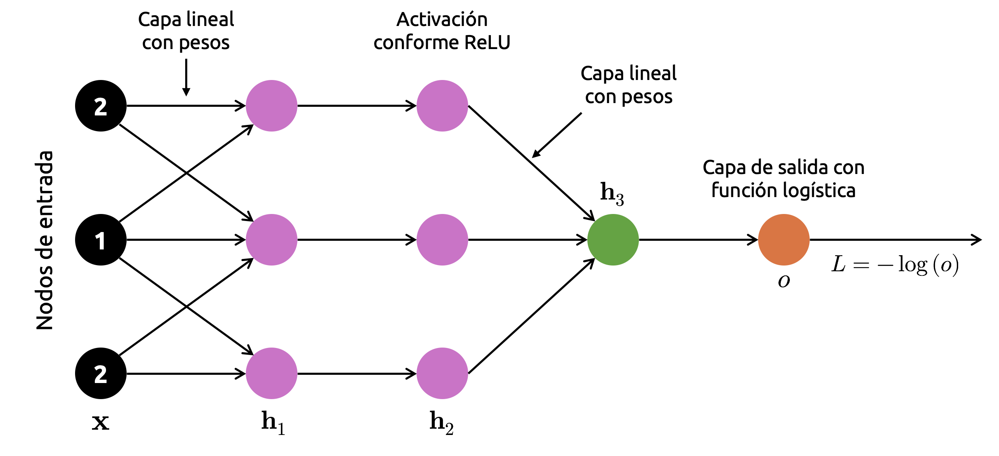

::: {.callout-important}
## Idea central

Una red computacional permite representar una función compleja como una red de operaciones elementales conectadas entre sí. Esta representación transforma el cálculo de derivadas en un problema de propagación sobre una red dirigida, lo que permite entender de manera rigurosa algoritmos fundamentales como la diferenciación automática y la retropropagación en redes neuronales, y resulta esencial en la dependencia de máquinas para sus cálculos.
:::

## Introducción

En el [apunte anterior](/apuntes/grafos-e-informacion/teoria-de-grafos/) estudiamos la teoría de grafos desde una perspectiva estructural: Nodos, arcos, matrices de adyacencia, autovectores, centralidad, importancia y matrices reducibles. En todos esos casos, el grafo era utilizado como una herramienta para representar relaciones entre entidades ad-hoc, que podían ser páginas web, nodos de una red, comunidades, enlaces o procesos de propagación.

En este apunte cambiaremos ligeramente el punto de vista. Ya no nos interesará solamente representar relaciones entre objetos, sino representar **cálculos**. Es decir, estudiaremos grafos cuyos nodos describen variables, parámetros u operaciones matemáticas, y cuyos arcos describen dependencias funcionales entre ellas. A este tipo de estructura la llamaremos **red computacional**.

La idea es muy natural. Supongamos que queremos evaluar una función compuesta, digamos, una función de pérdida en un modelo de *machine learning*. Dicha función puede depender de muchas operaciones intermedias: Productos matriciales, sumas, funciones de activación, normalizaciones, errores, penalizaciones y agregaciones. Aunque la expresión final pueda parecer complicada, siempre podemos descomponerla en una secuencia de operaciones simples. Esa descomposición puede representarse como una red, lo que resulta esencial para su resolución automática por medio de máquinas, como lo es nuestro computador.

En este contexto, un nodo puede representar una variable de entrada, un parámetro, una operación intermedia o una salida final. Un arco dirigido indica que el resultado de un nodo es utilizado como entrada para otro. Por lo tanto, el grafo captura el orden lógico del cálculo.

Esta forma de mirar una función es especialmente importante porque permite estudiar cómo se propaga la información en dos sentidos:

1. **Hacia adelante**, cuando evaluamos la función desde sus entradas hasta su salida.
2. **Hacia atrás**, cuando calculamos derivadas desde la salida hacia las variables o parámetros que queremos optimizar.

El primer recorrido se conoce como **propagación hacia adelante** o *forward pass*. El segundo corresponde a la **propagación hacia atrás** o *backward pass*. En redes neuronales, este segundo proceso recibe el nombre de **retropropagación** o *backpropagation*, y corresponde a uno de los procesos de cálculo más importantes del aprendizaje automático. Tal es su importancia que su simplicidad estructural permitió abordar de manera práctica la resolución de problemas por medio de redes neuronales a partir de la década de 1990, posibilitando el *boom* de la inteligencia artificial que vivimos el día de hoy.

Naturalmente, la retropropagación no es magia ni un truco específico de redes neuronales. En realidad, es una aplicación sistemática de la regla de la cadena sobre una red computacional. Lo notable es que, al organizar el cálculo como una red dirigida acíclica, podemos calcular gradientes de funciones muy complejas de manera eficiente, reutilizando derivadas locales y evitando cálculos redundantes. Algo de esto ya fue abordado, aunque de manera muy introductoria, al estudiar la diferenciación automática en [nuestro apunte dedicado al cálculo diferencial](/apuntes/calculo-incertidumbre-y-optimizacion/aplicaciones-del-calculo-diferencial/).

Este apunte tiene como objetivo desarrollar esa idea paso a paso. Primero introduciremos las nociones básicas de grafos computacionales, distinguiendo variables, operaciones, dependencias y nodos de salida. Luego estudiaremos por qué muchas de estas redes tienen estructura de **grafo dirigido acíclico** (o **DAG**, del inglés *directed acyclic graph*), lo que permite ordenar sus operaciones y evaluarlas de manera secuencial.

Después analizaremos cómo optimizar funciones definidas sobre este tipo de redes. En particular, mostraremos cómo el cálculo de derivadas puede verse como un problema de propagación de sensibilidades sobre el grafo. Esta perspectiva nos permitirá entender la retropropagación como un caso particular de diferenciación automática en modo reverso.

Finalmente, usaremos las redes neuronales como caso de estudio. En ellas, los parámetros del modelo se organizan en capas, las operaciones se componen de forma encadenada y la función de pérdida define un objetivo global que queremos minimizar. La retropropagación permite calcular eficientemente el gradiente de esa pérdida con respecto a todos los parámetros del modelo, habilitando el uso de algoritmos de optimización como gradiente descendente, momentum, *RMSProp*, *Adam* y otras variantes ya estudiadas previamente.

## Una (breve) introducción a <font color='darkmagenta'>NetworkX</font>

Antes de entrar en la optimización de redes computacionales, será conveniente introducir una herramienta práctica para construir, manipular y visualizar grafos en Python. En este apunte usaremos <strong><font color='darkmagenta'>NetworkX</font></strong>, una librería ampliamente utilizada para trabajar con grafos y redes. De esta manera, nos ahorraremos algunas líneas de código representando visualmente nuestros resultados usando únicamente <strong><font color='darkmagenta'>Matplotlib</font></strong>.

Sin embargo, es importante aclarar desde el comienzo cuál será el rol de esta librería. <strong><font color='darkmagenta'>NetworkX</font></strong> será usada principalmente como herramienta de apoyo para representar la estructura de la red computacional de interés: Ya sea nodos, arcos, dependencias, predecesores, sucesores y orden topológico. Los cálculos matemáticos relevantes, como propagación hacia adelante, derivadas locales, regla de la cadena y retropropagación, serán desarrollados explícitamente con <strong><font color='darkmagenta'>NumPy</font></strong>, a fin de que la lógica matemática del algoritmo permanezca visible.

Dicho de otra forma, <strong><font color='darkmagenta'>NetworkX</font></strong> nos ayudará a dibujar y recorrer la red de interés; no ocultará la optimización. No queremos, por ningún motivo, que los procesos que aprendamos en este apunte sean *cajas negras*.

Si no tenemos instalada la librería, podemos instalarla desde la terminal mediante:

```bash
pip install networkx
```

Esta librería suele importarse en Python por medio del alias `nx`. Por supuesto, conforme lo establecido previamente, trabajaremos igualmente con <strong><font color='darkmagenta'>NumPy</font></strong> y <strong><font color='darkmagenta'>Matplotlib</font></strong>, además de <strong><font color='darkmagenta'>Seaborn</font></strong> para aprovechar su tema por defecto (que resulta especialmente bonito):

```{python}
import matplotlib.pyplot as plt
import networkx as nx
import numpy as np
import seaborn as sns
```

```{python}
# Setting de nuestras figuras.
plt.rcParams["figure.dpi"] = 90
sns.set_theme()
plt.style.use("bmh")
```

En <strong><font color='darkmagenta'>NetworkX</font></strong>, un grafo no dirigido se construye mediante la clase `nx.Graph()`, mientras que un grafo dirigido se construye mediante la clase `nx.DiGraph()`. Como las redes computacionales representan dependencias entre operaciones, normalmente trabajaremos con grafos dirigidos. Si una variable $u$ se usa como entrada para calcular una variable $v$, representaremos esta dependencia mediante un arco dirigido, digamos $u \longrightarrow v$, lo que pone de manifiesto que $v$ depende de $u$ (y no al revés).

A modo de ejemplo, consideremos la siguiente función escalar simple:

::: {.eq-scroll}
$$
L(w,b) = (wx + b - y)^{2}
\tag{2.1}
$$
:::

Esta función puede interpretarse como la pérdida cuadrática de un modelo lineal muy sencillo, donde $x$ es una variable de entrada, $w$ y $b$ son parámetros que debemos estimar, $y$ es el valor observado, $\hat{y}=wx+b$ es la predicción correspondiente, y $L=(\hat{y}-y)^2$ es la correspondiente función de pérdida.

Aunque la expresión completa es simple, podemos descomponerla en operaciones elementales:

- $a= wx$.
- $\hat{y}= a+b$.
- $r= \hat{y} -y$.
- $L=r^{2}$.

Esta descomposición define un grafo computacional. Las variables $x,w,b,y$ son nodos de entrada o parámetros; las variables $a,\hat{y},r$ son nodos intermedios; y $L$ es el nodo final que representa la función objetivo.

Construyamos este grafo en <strong><font color='darkmagenta'>NetworkX</font></strong>:

```{python}
# Inicializamos nuestro grafo dirigido.
G = nx.DiGraph()

# Agregamos nodos con una etiqueta descriptiva.
G.add_node("x", label=r"$x$", kind="entrada")
G.add_node("w", label=r"$w$", kind="parámetro")
G.add_node("b", label=r"$b$", kind="parámetro")
G.add_node("y", label=r"$y$", kind="entrada")

G.add_node("a", label=r"$a=wx$", kind="operación")
G.add_node("y_hat", label=r"$\hat{y}=a+b$", kind="operación")
G.add_node("r", label=r"$r=\hat{y}-y$", kind="operación")
G.add_node("L", label=r"$L=r^2$", kind="salida")

# Agregamos arcos dirigidos según las dependencias funcionales.
G.add_edges_from([
    ("w", "a"),
    ("x", "a"),
    ("a", "y_hat"),
    ("b", "y_hat"),
    ("y_hat", "r"),
    ("y", "r"),
    ("r", "L")
])
```

En este grafo, cada arco indica que el nodo de origen participa en el cálculo del nodo de destino. Por ejemplo, los arcos $w\longrightarrow a$ y $x\longrightarrow a$ indican que $a$ depende de $w$ y de $x$, porque $a=wx$.

Podemos inspeccionar los nodos y arcos del grafo directamente:

```{python}
# Nodos del grafo.
list(G.nodes(data=True))
```

```{python}
# Arcos del grafo.
list(G.edges())
```

Para visualizarlo, definimos manualmente una posición para cada nodo, de modo que el grafo quede ordenado de izquierda a derecha siguiendo el flujo del cálculo:

```{python}
# Definimos posiciones manuales para visualizar el flujo de cálculo.
pos = {
    "w": (0, 1.0),
    "x": (0, 0.2),
    "b": (2, 1.0),
    "y": (4, -0.8),
    "a": (2, 0.2),
    "y_hat": (4, 0.2),
    "r": (6, 0.2),
    "L": (8, 0.2)
}

# Y definimos etiquetas en formato matemático.
labels = nx.get_node_attributes(G, "label")
```

```{python}
#| label: fig-optimizacion-de-grafos-01
#| fig-cap: "Red computacional construida para el caso de una función de pérdida cuadrática simple."
# Finalmente, construimos la visualización del grafo.
fig, ax = plt.subplots(figsize=(9, 5))

nx.draw_networkx_edges(
    G,
    pos=pos,
    ax=ax,
    arrows=True,
    arrowstyle="-|>",
    arrowsize=18,
    width=1.8,
    edge_color="black",
    connectionstyle="arc3,rad=0.03"
)

nx.draw_networkx_nodes(
    G,
    pos=pos,
    ax=ax,
    node_size=1800,
    node_color="skyblue",
    edgecolors="black",
    linewidths=1.5
)

nx.draw_networkx_labels(
    G,
    pos=pos,
    labels=labels,
    ax=ax,
    font_size=13
)

ax.axis("off")
plt.tight_layout()
```

La figura anterior muestra que la evaluación de $L$ puede verse como un flujo de información desde las entradas y parámetros hacia la función de pérdida. Primero se calcula $a=wx$, luego $\hat{y}=a+b$, después el residuo $r=\hat{y}-y$, y finalmente la pérdida $L=r^2$.

## Redes dirigidas acíclicas

Una red computacional típica no sólo es dirigida, sino también acíclica. Esto significa que sus arcos tienen dirección y que no existe una secuencia de dependencias que permita volver al mismo nodo. De forma intuitiva, esto es necesario porque el cálculo debe tener un orden lógico. Si una variable depende de sí misma de manera circular, no queda claro cómo evaluarla directamente sin resolver una ecuación implícita o sin introducir recurrencia temporal. Esto motiva la siguiente definición.

<strong><font color='blue'>Definición 2.1 – Grafo dirigido acíclico:</font></strong> Un **grafo (o red) dirigido acíclico** o **DAG** (del inglés *directed acyclic graph*) es un grafo dirigido que no contiene ciclos dirigidos. Es decir, no existe una secuencia de nodos del tipo $v_{1}\rightarrow v_{2}\rightarrow \cdots \rightarrow v_{k}\rightarrow v_{1}$, que represente un proceso de *feedback* o *loop*.

En un DAG, podemos ordenar los nodos de tal manera que todas las dependencias de un nodo aparezcan antes que él, lo que comúnmente se denomina como **orden topológico**. En <strong><font color='darkmagenta'>NetworkX</font></strong> podemos verificar rápidamente si un grado es, en efecto, un DAG, por medio de la función `nx.is_directed_acyclic_graph()`:

```{python}
# Verificamos si nuestra red computacional es un DAG.
nx.is_directed_acyclic_graph(G)
```

El resultado es `True`, lo que confirma que nuestra red computacional no contiene ciclos dirigidos.

También podemos obtener un orden topológico válido:

```{python}
# Orden topológico del grafo.
topological_order = list(nx.topological_sort(G))
topological_order
```

Este orden indica una secuencia válida para evaluar el grafo hacia adelante. No necesariamente es único. Por ejemplo, $x$, $w$, $b$ e $y$ pueden aparecer en distinto orden, porque no dependen entre sí. Lo importante es que ningún nodo sea evaluado antes que sus predecesores.

### Predecesores y sucesores

En un grafo dirigido, los **predecesores** de un nodo son aquellos nodos que apuntan hacia él. En una red computacional, corresponden a las variables u operaciones que se necesitan para calcular dicho nodo.

Por ejemplo, para el grafo que construimos previamente, los predecesores de $a=wx$ son $w$ y $x$:

```{python}
# Predecesores del nodo a.
list(G.predecessors("a"))
```

Los **sucesores** de un nodo son aquellos nodos hacia los cuales éste apunta. En una red computacional, corresponden a las operaciones que usan dicho nodo como entrada.

Por ejemplo, el sucesor de $a$ es $\hat{y}=a+b$:

```{python}
# Sucesores del nodo a.
list(G.successors("a"))
```

Esta distinción será importante cuando estudiemos retropropagación. Durante la propagación hacia adelante, cada nodo se evalúa usando sus predecesores. Durante la propagación hacia atrás, la información del gradiente se acumula desde sus sucesores.

Dicho de manera informal:

- En el **paso hacia adelante**, preguntamos: *¿De quién depende este nodo?*
- En el **paso hacia atrás**, preguntamos: *¿Quién depende de este nodo?*

### Evaluación hacia adelante del grafo

Aunque <strong><font color='darkmagenta'>NetworkX</font></strong> permite representar la estructura del grafo, la evaluación numérica la haremos explícitamente. Consideremos valores concretos: $x=2,\  w=3,\  b=1,\  y=8$. Entonces:

- $a=wx=3\cdot 2= 6$.
- $\hat{y} = a+b = 6+1 = 7$.
- $r=\hat{y}-y=7-8=-1$.
- $L=r^{2}=(-1)^{2}=1$.

Implementemos ahora este cálculo en Python:

```{python}
# Valores de entrada.
values = {
    "x": 2.0,
    "w": 3.0,
    "b": 1.0,
    "y": 8.0
}

# Evaluación hacia adelante.
values["a"] = values["w"] * values["x"]
values["y_hat"] = values["a"] + values["b"]
values["r"] = values["y_hat"] - values["y"]
values["L"] = values["r"]**2

# Mostramos el resultado de la evaluación en pantalla.
values
```

Este pequeño ejemplo deja ver la idea más fundamental de este apunte: Una función compuesta puede representarse como un grafo de operaciones elementales. La evaluación hacia adelante consiste en recorrer el grafo desde las entradas hacia la salida, respetando el orden de dependencias.

### Una matriz de adyacencia para la red computacional

Como vimos en el apunte anterior, todo grafo puede representarse mediante una matriz de adyacencia. En el caso de nuestra red computacional, la entrada $a_{ij}$ será igual a $1$ si existe un arco desde el nodo $i$ hacia el nodo $j$. <strong><font color='darkmagenta'>NetworkX</font></strong> permite construir esta matriz directamente, siempre que fijemos un orden para los nodos:

```{python}
# Orden de nodos que usaremos para construir la matriz de adyacencia.
node_order = ["x", "w", "b", "y", "a", "y_hat", "r", "L"]

# Matriz de adyacencia.
A_comp = nx.to_numpy_array(G, nodelist=node_order, dtype=int)

# Mostramos la matriz en pantalla.
A_comp
```

Ahora visualizamos esta matriz de forma gráfica:

```{python}
#| label: fig-optimizacion-de-grafos-02
#| fig-cap: "Matriz de adyacencia del grafo computacional, cuya estructura dispersa identifica las dependencias directas entre operaciones."
# Visualización de la matriz de adyacencia para nuestra red computacional.
fig, ax = plt.subplots(figsize=(7, 6))

im = ax.imshow(A_comp, cmap="cool")

ax.set_xticks(np.arange(len(node_order)))
ax.set_yticks(np.arange(len(node_order)))
ax.set_xticklabels(node_order, rotation=45)
ax.set_yticklabels(node_order)

ax.set_xlabel("Nodo destino", fontsize=12, labelpad=10)
ax.set_ylabel("Nodo origen", fontsize=12, labelpad=10)

for i in range(len(node_order)):
    for j in range(len(node_order)):
        ax.text(
            j,
            i,
            str(int(A_comp[i, j])),
            ha="center",
            va="center",
            color="black",
            fontsize=10
        )

cbar = plt.colorbar(im, ax=ax, shrink=0.8)
cbar.set_label(r"$a_{ij}$", fontsize=12, labelpad=10)

plt.tight_layout()
```

La matriz de adyacencia resume las dependencias del cálculo. Por ejemplo, la fila correspondiente a `w` tiene un valor igual a $1$ en la columna correspondiente a `a`, porque $w$ participa en el cálculo de $a=wx$. Del mismo modo, la fila correspondiente a `r` tiene un valor igual a $1$ en la columna correspondiente a `L`, porque $L=r^2$.

Con esto cerramos nuestra introducción a <strong><font color='darkmagenta'>NetworkX</font></strong> como herramienta de manipulación y representación de grafos. Podemos observar que esta librería nos entrega una forma cómoda de representar, inspeccionar y visualizar redes computacionales. Sin embargo, no usaremos <strong><font color='darkmagenta'>NetworkX</font></strong> como una caja negra para calcular derivadas. La retropropagación será desarrollada explícitamente usando la regla de la cadena, tal y como hemos venido practicando hasta ahora. La razón es sencillamente pedagógica: Queremos ver cómo la información fluye hacia adelante para evaluar una función, y cómo las sensibilidades fluyen hacia atrás para calcular gradientes.

En la siguiente sección formalizaremos esta idea. Veremos que, cuando un grafo computacional es dirigido y acíclico, sus operaciones pueden evaluarse en orden topológico, y sus derivadas pueden propagarse en orden inverso. Esa observación será la base matemática de la diferenciación automática en modo reverso y, en particular, del algoritmo de retropropagación usado en redes neuronales.

## Optimización en DAGs

La idea de representar una función compuesta mediante un DAG no es sólo una comodidad visual. En realidad, constituye el núcleo matemático y computacional de una enorme cantidad de algoritmos modernos de optimización, especialmente en *machine learning*. La razón es simple: Una función objetivo complicada suele construirse a partir de muchas operaciones elementales encadenadas entre sí. Si somos capaces de describir esa composición mediante un DAG, entonces también podemos organizar de forma eficiente tanto la evaluación de la función como el cálculo de sus gradientes.

En esta sección estudiaremos precisamente esta idea. Veremos primero por qué las redes computacionales presentan un desafío específico cuando queremos diferenciarlas. Luego mostraremos que el problema general del cálculo de gradientes puede expresarse como un problema estructurado sobre nodos y arcos de un DAG. A continuación, discutiremos dos enfoques: El cómputo por fuerza bruta y el cómputo apoyado en programación dinámica. Finalmente, conectaremos las derivadas locales del grafo con las derivadas globales que efectivamente nos interesan en optimización, esto es, las derivadas de la pérdida con respecto a los parámetros del modelo.

### El desafío que revisten las redes computacionales

Partamos con el caso más simple posible. Supongamos que tenemos una variable de entrada $x$, sobre la cual actúa primero una función $g$, y luego una función $f$ sobre el resultado de la primera. Es decir, construimos una red computacional de tres nodos conforme el siguiente esquema:

::: {.eq-scroll}
$$
x \longrightarrow u=g(x) \longrightarrow y=f(u)
\tag{2.2}
$$
:::

Desde el punto de vista analítico, esto no es otra cosa que la composición de funciones

::: {.eq-scroll}
$$
y=f(g(x))
\tag{2.3}
$$
:::

Para fijar ideas, consideremos que ambas funciones corresponden a la función logística, es decir:

::: {.eq-scroll}
$$
g(x)=\sigma(x)=\frac{1}{1+\exp(-x)}
\tag{2.4}
$$
:::

y

::: {.eq-scroll}
$$
f(u)=\sigma(u)=\frac{1}{1+\exp(-u)}
\tag{2.5}
$$
:::

Por lo tanto, la salida final de la red viene dada por

::: {.eq-scroll}
$$
y=\sigma(\sigma(x))
\tag{2.6}
$$
:::

Este ejemplo es deliberadamente pequeño, pero ya contiene toda la lógica general de una red computacional: Una variable de entrada, un nodo intermedio y un nodo de salida. Si quisiéramos optimizar una función definida sobre esta red, necesitaríamos calcular derivadas de la salida con respecto a la entrada, o bien de una pérdida con respecto a parámetros que aparezcan en alguno de los nodos. El problema es que, aunque la composición sea conceptualmente simple, el número de caminos de dependencia puede crecer rápidamente cuando la red aumenta de tamaño.

Construyamos primero la representación gráfica de este pequeño DAG usando <strong><font color='darkmagenta'>NetworkX</font></strong>.

```{python}
# Construimos un DAG simple con tres nodos.
G = nx.DiGraph()

G.add_node("x", label=r"$x$")
G.add_node("u", label=r"$u=g(x)$")
G.add_node("y", label=r"$y=f(u)$")

G.add_edges_from([
    ("x", "u"),
    ("u", "y")
])

pos = {
    "x": (0, 0),
    "u": (2.3, 0),
    "y": (4.6, 0)
}

# Y etiquetamos cada uno de ellos.
labels = nx.get_node_attributes(G, "label")
```

```{python}
#| label: fig-optimizacion-de-grafos-03
#| fig-cap: "Una red computacional mínima que representa la composición de dos funciones logísticas."
# Visualizamos nuestra red computacional.
fig, ax = plt.subplots(figsize=(9, 3))

nx.draw_networkx_nodes(
    G,
    pos=pos,
    node_size=2400,
    node_color="skyblue",
    edgecolors="black",
    linewidths=1.5,
    ax=ax
)

nx.draw_networkx_edges(
    G,
    pos=pos,
    arrows=True,
    arrowstyle="-|>",
    arrowsize=20,
    width=1.8,
    edge_color="black",
    ax=ax
)

nx.draw_networkx_labels(
    G,
    pos=pos,
    labels=labels,
    font_size=14,
    ax=ax
)

ax.axis("off")
plt.tight_layout()
```

Ahora visualicemos las funciones involucradas. Como ambas funciones son logísticas, podemos mostrar el comportamiento de $g(x)=\sigma(x)$ y luego el de la composición $y=\sigma(\sigma(x))$:

```{python}
# Definimos la función logística.
def sigma(x):
    return 1 / (1 + np.exp(-x))
```

```{python}
# Dominio de visualización.
x = np.linspace(-8, 8, 400)
g_x = sigma(x)
y_x = sigma(g_x)
```

```{python}
#| label: fig-optimizacion-de-grafos-04
#| fig-cap: "Respuesta de una composición de funciones logísticas y cambio de sensibilidad respecto de una sola transformación sigmoidal."
# Visualizamos el efecto de una composición de dos funciones
# logísticas.
fig, ax = plt.subplots(figsize=(9, 5))
ax.plot(x, g_x, linewidth=2.5, label=r"$g(x)=\sigma(x)$")
ax.plot(x, y_x, linewidth=2.5, label=r"$y=\sigma(\sigma(x))$")
ax.set_xlabel(r"$x$", fontsize=12, labelpad=10)
ax.set_ylabel(r"Valor de la función", fontsize=12, labelpad=10)
ax.legend(loc="best")
plt.tight_layout()
```

El gráfico anterior es interesante porque muestra que, incluso en un caso elemental, la composición modifica significativamente la geometría de la función. La salida ya no depende directamente de $x$, sino de la forma en que $x$ es procesada por nodos intermedios. En consecuencia, si queremos calcular la sensibilidad de $y$ respecto de $x$, debemos entender cómo se propagan las dependencias a lo largo del DAG.

La regla fundamental que permite hacerlo es la regla de la cadena. Si definimos $u=g(x)$, entonces

::: {.eq-scroll}
$$
\frac{dy}{dx} =\frac{dy}{du} \frac{du}{dx}
\tag{2.7}
$$
:::

Como $f(u)=\sigma(u)$ y $g(x)=\sigma(x)$, la derivada de la función logística es

::: {.eq-scroll}
$$
\sigma^{\prime} \left( z \right) =\sigma \left( z \right) \left( 1-\sigma \left( z \right) \right)
\tag{2.8}
$$
:::

Por lo tanto,

::: {.eq-scroll}
$$
\frac{du}{dx} =g^{\prime}\left( x \right) =\sigma \left( x \right) \left( 1-\sigma \left( x \right) \right)
\tag{2.9}
$$
:::

y además,

::: {.eq-scroll}
$$
\frac{dy}{du} =f^{\prime}\left( u \right) =\sigma \left( u \right) \left( 1-\sigma \left( u \right) \right)
\tag{2.10}
$$
:::

Luego,

::: {.eq-scroll}
$$
\frac{dy}{dx} =\sigma \left( u \right) \left( 1-\sigma \left( u \right) \right) \sigma \left( x \right) \left( 1-\sigma \left( x \right) \right) \  ;\  u=\sigma \left( x \right)
\tag{2.11}
$$
:::

Podemos visualizar esta derivada para ver cómo la sensibilidad de la salida se modula a lo largo de la red:

```{python}
# Derivada analítica de la composición.
u = sigma(x)
dy_dx = sigma(u) * (1 - sigma(u)) * sigma(x) * (1 - sigma(x))
```

```{python}
#| label: fig-optimizacion-de-grafos-05
#| fig-cap: "Sensibilidad de la salida compuesta $y=\\sigma(\\sigma(x))$ respecto de la entrada, obtenida al propagar las derivadas locales mediante la regla de la cadena."
# Visualización de la derivada.
fig, ax = plt.subplots(figsize=(9, 5))
ax.plot(x, dy_dx, linewidth=2.5, color="dodgerblue")
ax.set_xlabel(r"$x$", fontsize=12, labelpad=10)
ax.set_ylabel(r"$dy/dx$", fontsize=12, labelpad=10)
plt.tight_layout()
```

Podemos observar que, en una red computacional, el valor de la derivada global entre entrada y salida no se obtiene *"de golpe"*, sino como combinación de derivadas locales asociadas a cada nodo. Esta observación parece menor en un ejemplo de tres nodos, pero es precisamente la idea que hace posible entrenar redes neuronales profundas al día de hoy.

### El amplio marco de referencia para el cómputo de gradientes

Consideremos ahora una red computacional más general. Supongamos que tenemos un DAG con nodos $v_{1},\dots,v_{m}$, donde cada nodo representa una variable intermedia calculada a partir de otras variables anteriores. En general, un nodo $v_{j}$ puede depender de un subconjunto de nodos predecesores, digamos $Pa(v_{j})$, y escribiremos

::: {.eq-scroll}
$$
v_{j}=\phi_{j} \left( Pa\left( v_{j} \right) \right)
\tag{2.12}
$$
:::

donde $\phi_{j}$ es la operación local que define al nodo.

Cuando el nodo final del DAG representa una función objetivo o pérdida, digamos $L$, el problema fundamental de la optimización consiste en calcular expresiones del tipo $\frac{\partial L}{\partial \theta}$, donde $\theta$ representa un parámetro del modelo.

Este problema puede interpretarse de dos maneras complementarias:

- **Evaluación hacia adelante:** Calcular el valor numérico de cada nodo del grafo, respetando el orden topológico de las dependencias.
- **Propagación hacia atrás:** Calcular derivadas del nodo final respecto de nodos anteriores, reutilizando la estructura del grafo.

La primera tarea es sencilla: Basta seguir el flujo natural del DAG desde las entradas hasta la salida. La segunda es más sutil, porque una variable puede influir sobre la pérdida a través de múltiples caminos.

Para ilustrarlo, consideremos un pequeño DAG con bifurcación. Sean las variables $u_{1}=x^{2}$, $u_{2}=3x$ e $y=u_{1}+u_{2}$. En este caso, el nodo $x$ influye sobre $y$ por dos caminos diferentes. Por lo tanto, la derivada total de $y$ respecto de $x$ debe sumar ambas contribuciones:

::: {.eq-scroll}
$$
\frac{dy}{dx} =\frac{\partial y}{\partial u_{1}} \frac{du_{1}}{dx} +\frac{\partial y}{\partial u_{2}} \frac{du_{2}}{dx}
\tag{2.13}
$$
:::

Este ejemplo ya nos adelanta una idea crucial: en una red computacional general, el cómputo de gradientes involucra la combinación de derivadas locales a lo largo de todos los caminos que conectan dos nodos. Si hiciéramos esto de forma ingenua, el costo computacional podría crecer muy rápidamente.

Construyamos este DAG para visualizar la bifurcación:

```{python}
# Construimos un grafo con bifurcación.
G2 = nx.DiGraph()

G2.add_node("x", label=r"$x$")
G2.add_node("u1", label=r"$u_{1}=x^2$")
G2.add_node("u2", label=r"$u_{2}=3x$")
G2.add_node("y", label=r"$y=u_{1}+u_{2}$")

G2.add_edges_from([
    ("x", "u1"),
    ("x", "u2"),
    ("u1", "y"),
    ("u2", "y")
])

pos2 = {
    "x": (0, 0),
    "u1": (2.3, 0.9),
    "u2": (2.3, -0.9),
    "y": (4.8, 0)
}

# Construimos las etiquetas.
labels2 = nx.get_node_attributes(G2, "label")
```

```{python}
#| label: fig-optimizacion-de-grafos-06
#| fig-cap: "Ejemplo de un DAG con dos caminos de dependencia entre entrada y salida."
# Visualizamos nuestro grafo.
fig, ax = plt.subplots(figsize=(9, 4))

nx.draw_networkx_nodes(
    G2, pos2, node_size=2600, node_color="skyblue",
    edgecolors="black", linewidths=1.5, ax=ax
)

nx.draw_networkx_edges(
    G2, pos2, arrows=True, arrowstyle="-|>", arrowsize=20,
    width=1.8, edge_color="black", ax=ax
)

nx.draw_networkx_labels(
    G2, pos2, labels2, font_size=14, ax=ax
)

ax.axis("off")
plt.tight_layout()
```

### Cómputo de derivadas nodo a nodo por medio de fuerza bruta

La forma más directa de calcular derivadas en una red computacional consiste en aplicar la regla de la cadena explícitamente, nodo a nodo y camino por camino. Esta estrategia puede llamarse, con justicia, un enfoque de fuerza bruta.

Volvamos al DAG con bifurcación construido a partir de las variables $u_{1}=x^{2}$, $u_{2}=3x$ e $y=u_{1}+u_{2}$. Aquí tenemos que

::: {.eq-scroll}
$$
\frac{\partial y}{\partial u_{1}} =1\  \wedge \  \frac{\partial y}{\partial u_{2}} =1
\tag{2.14}
$$
:::

además que,

::: {.eq-scroll}
$$
\frac{du_{1}}{dx} =2x\  \wedge \  \frac{du_{2}}{dx} =3
\tag{2.15}
$$
:::

Por lo tanto, la derivada total es

::: {.eq-scroll}
$$
\frac{dy}{dx} =1\cdot 2x+1\cdot 3=2x+3
\tag{2.16}
$$
:::

Desde luego, este cálculo es trivial en este ejemplo. Sin embargo, el procedimiento implícito es el siguiente:

1. Identificar todos los caminos desde el nodo de interés hasta el nodo de salida.
2. Multiplicar las derivadas locales a lo largo de cada camino.
3. Sumar las contribuciones de todos los caminos.

En una red pequeña esto puede hacerse manualmente. En una red más grande, el problema es que muchos subcálculos se repiten. Por ejemplo, si varios caminos comparten un mismo subgrafo, entonces ciertas derivadas locales aparecen una y otra vez. Esto hace que el enfoque de fuerza bruta sea **innecesariamente costoso**.

Aun así, vale la pena visualizar este procedimiento. Tomemos, por ejemplo, el valor $x=2$. Entonces $u_{1}=2^{2}=4$, $u_{2}=3\cdot 2=6$ e $y=4+6=10$, y la derivada resulta

::: {.eq-scroll}
$$
\left.\frac{dy}{dx}\right|_{x=2}=2(2)+3=7
\tag{2.17}
$$
:::

Luego, en Python:

```{python}
# Evaluación numérica del ejemplo de fuerza bruta.
x0 = 2.0
u1 = x0 ** 2
u2 = 3 * x0
y0 = u1 + u2

dy_du1 = 1.0
dy_du2 = 1.0
du1_dx = 2 * x0
du2_dx = 3.0

path1 = dy_du1 * du1_dx
path2 = dy_du2 * du2_dx
dy_dx_total = path1 + path2

# Mostramos en pantalla los resultados.
print(f"x = {x0}")
print(f"u1 = {u1}")
print(f"u2 = {u2}")
print(f"y = {y0}")
print(f"Contribución camino x -> u1 -> y = {path1}")
print(f"Contribución camino x -> u2 -> y = {path2}")
print(f"dy/dx = {dy_dx_total}")
```

El problema de esta estrategia es que no escala. Cuando la red tiene cientos o miles de nodos, el número de caminos puede crecer explosivamente. Por ello necesitamos una manera más inteligente de reutilizar cálculos parciales.

### Programación dinámica para el cómputo de derivadas nodo a nodo

La idea de programación dinámica consiste, en esencia, en resolver un problema grande reutilizando las soluciones de subproblemas ya resueltos. En el contexto de DAGs, esto significa almacenar derivadas parciales intermedias para evitar repetir el mismo cálculo muchas veces.

Para ver esta idea de forma clara, trabajaremos con un ejemplo dedicado.

**Ejemplo 2.1 – Cómputo de derivadas locales mediante programación dinámica:** Consideremos la red computacional definida por las variables $v_{1}=x_{1}x_{2}$, $v_{2}=x_{1}+v_{1}$, $v_{3}=v_{1}x_{2}$ y $L=v_{2}+v_{3}$. Notemos que el nodo $v_{1}$ alimenta a dos nodos posteriores: $v_{2}$ y $v_{3}$. Si quisiéramos calcular derivadas de $L$ respecto de $x_{1}$ o $x_{2}$ por fuerza bruta, tendríamos que recorrer múltiples veces el subgrafo que nace en $v_{1}$. En cambio, mediante programación dinámica podemos primero calcular derivadas desde $L$ hacia $v_{2}$ y $v_{3}$, luego hacia $v_{1}$, y recién después hacia las entradas.

La red tiene la siguiente estructura:

```{python}
# Construimos el grafo computacional para nuestro ejemplo.
G3 = nx.DiGraph()

G3.add_node("x1", label=r"$x_{1}$")
G3.add_node("x2", label=r"$x_{2}$")
G3.add_node("v1", label=r"$v_{1}=x_{1}x_{2}$")
G3.add_node("v2", label=r"$v_{2}=v_{1}+x_{1}$")
G3.add_node("v3", label=r"$v_{3}=v_{1}x_{2}$")
G3.add_node("L", label=r"$L=v_{2}+v_{3}$")

G3.add_edges_from([
    ("x1", "v1"),
    ("x2", "v1"),
    ("v1", "v2"),
    ("x1", "v2"),
    ("v1", "v3"),
    ("x2", "v3"),
    ("v2", "L"),
    ("v3", "L")
])

pos3 = {
    "x1": (0, 1),
    "x2": (0, -1),
    "v1": (2.3, 0),
    "v2": (4.5, 1),
    "v3": (4.5, -1),
    "L": (6.8, 0)
}

# Etiquetamos sus elementos.
labels3 = nx.get_node_attributes(G3, "label")
```

```{python}
#| label: fig-optimizacion-de-grafos-07
#| fig-cap: "Grafo acíclico dirigido con subcálculos reutilizados, que evita representar como ramas independientes operaciones comunes."
# Dibujamos nuestra red.
fig, ax = plt.subplots(figsize=(9, 5))

nx.draw_networkx_nodes(
    G3, pos3, node_size=2800, node_color="skyblue",
    edgecolors="black", linewidths=1.5, ax=ax
)

nx.draw_networkx_edges(
    G3, pos3, arrows=True, arrowstyle="-|>", arrowsize=20,
    width=1.8, edge_color="black", ax=ax
)

nx.draw_networkx_labels(
    G3, pos3, labels3, font_size=13, ax=ax
)

ax.axis("off")
plt.tight_layout()
```

Evaluemos ahora la red en el punto $(x_{1},x_{2})=(2,3)$:

::: {.eq-scroll}
$$
v_{1}=2\cdot 3=6,\qquad v_{2}=6+2=8,\qquad v_{3}=6\cdot 3=18,\qquad L=8+18=26
\tag{2.18}
$$
:::

Luego, en Python:

```{python}
# Evaluación numérica.
x1 = 2.0
x2 = 3.0

v1 = x1 * x2
v2 = v1 + x1
v3 = v1 * x2
L = v2 + v3

print(f"v1 = {v1}")
print(f"v2 = {v2}")
print(f"v3 = {v3}")
print(f"L  = {L}")
```

Ahora calculemos las derivadas en orden inverso. Partimos del hecho que $\frac{\partial L}{\partial L}= 1$ para todo $L$. Como $L=v_{2}+v_{3}$, tenemos

::: {.eq-scroll}
$$
\frac{\partial L}{\partial v_{2}} =1\  \  \wedge \  \  \frac{\partial L}{\partial v_{3}} =1
\tag{2.19}
$$
:::

Luego, como $v_{2}=v_{1}+x_{1}$ y $v_{3}=v_{1}x_{2}$, se obtiene

::: {.eq-scroll}
$$
\begin{array}{lll}\dfrac{\partial L}{\partial v_{1}}&=&\dfrac{\partial L}{\partial v_{2}} \dfrac{\partial v_{2}}{\partial v_{1}} +\dfrac{\partial L}{\partial v_{3}} \dfrac{\partial v_{3}}{\partial v_{1}}\\ &=&1\cdot 1+1\cdot x_{2}\\ &=&1+x_{2}\end{array}
\tag{2.20}
$$
:::

Si $x_{2}=3$, obtenemos $\frac{\partial L}{\partial v_{1}} =4$. Observemos que el valor $\partial L/\partial v_{1}$ se calcula una sola vez y luego se reutiliza para continuar la propagación hacia atrás.

Finalmente, como $v_{1}=x_{1}x_{2}$, tenemos

::: {.eq-scroll}
$$
\frac{\partial v_{1}}{\partial x_{1}} =x_{2},\qquad \frac{\partial v_{1}}{\partial x_{2}} =x_{1}
\tag{2.21}
$$
:::

Además,

::: {.eq-scroll}
$$
\frac{\partial v_{2}}{\partial x_{1}} =1,\qquad \frac{\partial v_{3}}{\partial x_{2}} =v_{1}
\tag{2.22}
$$
:::

Por lo tanto,

::: {.eq-scroll}
$$
\begin{array}{lll}\dfrac{\partial L}{\partial x_{1}}&=&\dfrac{\partial L}{\partial v_{2}} \dfrac{\partial v_{2}}{\partial x_{1}} +\dfrac{\partial L}{\partial v_{1}} \dfrac{\partial v_{1}}{\partial x_{1}}\\ &=&1\cdot 1+4\cdot 3\\ &=&13\end{array} \  \  \wedge \  \  \begin{array}{lll}\dfrac{\partial L}{\partial x_{2}}&=&\dfrac{\partial L}{\partial v_{3}} \dfrac{\partial 3}{\partial x_{2}} +\dfrac{\partial L}{\partial v_{1}} \dfrac{\partial v_{1}}{\partial x_{2}}\\ &=&1\cdot 6+4\cdot 2\\ &=&14\end{array}
\tag{2.23}
$$
:::

Implementemos esta propagación hacia atrás de forma explícita:

```{python}
# Propagación hacia atrás explícita.
dL_dL = 1.0

dL_dv2 = dL_dL * 1.0
dL_dv3 = dL_dL * 1.0

dL_dv1 = dL_dv2 * 1.0 + dL_dv3 * x2

dL_dx1 = dL_dv2 * 1.0 + dL_dv1 * x2
dL_dx2 = dL_dv3 * v1 + dL_dv1 * x1

print(f"dL/dv2 = {dL_dv2}")
print(f"dL/dv3 = {dL_dv3}")
print(f"dL/dv1 = {dL_dv1}")
print(f"dL/dx1 = {dL_dx1}")
print(f"dL/dx2 = {dL_dx2}")
```

Este ejercicio deja ver con claridad la ganancia conceptual de la programación dinámica: Las derivadas intermedias se almacenan y luego se reutilizan. En redes profundas, esta idea es exactamente la base de la **diferenciación automática por acumulación regresiva**. ◼︎

### Conversión de derivadas nodo a nodo en derivadas "pérdida a parámetro"

Hasta ahora hemos trabajado principalmente con derivadas entre nodos intermedios. Sin embargo, en optimización lo que realmente interesa suele ser algo del tipo: *¿Cómo cambia la pérdida si modificamos un parámetro del modelo?*

Es decir, queremos derivadas del tipo $\frac{\partial L}{\partial w}$, donde $w$ es un parámetro a ajustar en un modelo determinado. Esto exige conectar las derivadas **nodo a nodo** con derivadas **pérdida a parámetro**.

Veamos cómo hacerlo por medio de un nuevo ejercicio.

**Ejemplo 2.2 – De derivadas locales a derivadas pérdida-parámetro:** Consideremos el pequeño modelo

::: {.eq-scroll}
$$
z=wx+b
\tag{2.24}
$$
:::

donde definimos $\hat{y}=\sigma (z)$ y $L=\frac{1}{2}(\hat{y}-y)^{2}$. Aquí, $x$ es la entrada, $y$ es la respuesta observada, y $w,b$ son parámetros ajustables. La red computacional correspondiente es:

```{python}
# Grafo para la pérdida respecto de parámetros.
G4 = nx.DiGraph()

G4.add_node("x", label=r"$x$")
G4.add_node("w", label=r"$w$")
G4.add_node("b", label=r"$b$")
G4.add_node("z", label=r"$z=wx+b$")
G4.add_node("y_hat", label=r"$\hat{y}=\sigma(z)$")
G4.add_node("y", label=r"$y$")
G4.add_node("L", label=r"$L=\frac{1}{2}(\hat{y}-y)^2$")

G4.add_edges_from([
    ("x", "z"),
    ("w", "z"),
    ("b", "z"),
    ("z", "y_hat"),
    ("y_hat", "L"),
    ("y", "L")
])

pos4 = {
    "x": (0, 1),
    "w": (0, 0),
    "b": (0, -1),
    "z": (2.5, 0),
    "y_hat": (5.0, 0),
    "y": (5.0, -1.3),
    "L": (7.6, 0)
}

# Etiquetamos nuestra red.
labels4 = nx.get_node_attributes(G4, "label")
```

```{python}
#| label: fig-optimizacion-de-grafos-08
#| fig-cap: "Red computacional que calcula las derivadas de la función de pérdida respecto de los parámetros."
# Dibujamos nuestra red.
fig, ax = plt.subplots(figsize=(9, 5))

nx.draw_networkx_nodes(
    G4, pos4, node_size=3000, node_color="skyblue",
    edgecolors="black", linewidths=1.5, ax=ax
)

nx.draw_networkx_edges(
    G4, pos4, arrows=True, arrowstyle="-|>", arrowsize=20,
    width=1.8, edge_color="black", ax=ax
)

nx.draw_networkx_labels(
    G4, pos4, labels4, font_size=13, ax=ax
)

ax.axis("off")
plt.tight_layout()
```

Tomemos valores concretos: $x=2$, $y=1$, $w=0.5$ y $b=-0.4$. Entonces $z=0.5 \cdot 2- 0.4=0.6$, $\hat{y}=\sigma (0.6)\approx 0.6457$ y $L=\frac{1}{2}(0.6457-1)^{2}$. Implementando esto en Python, tenemos:

```{python}
# Valores del ejemplo.
x = 2.0
y = 1.0
w = 0.5
b = -0.4

z = w*x + b
y_hat = sigma(z)
L = 0.5*(y_hat - y)**2

# Mostramos estos valores en pantalla.
print(f"z     = {z:.4f}")
print(f"y_hat = {y_hat:.4f}")
print(f"L     = {L:.4f}")
```

Ahora, para obtener $\frac{\partial L}{\partial w}$, aplicamos la regla de la cadena:

::: {.eq-scroll}
$$
\begin{array}{lll}\dfrac{\partial L}{\partial w}&=&\dfrac{\partial L}{\partial \hat{y}} \dfrac{\partial \hat{y}}{\partial z} \dfrac{\partial z}{\partial w}\\ &=&\left( \hat{y} -y \right) \cdot \hat{y} \left( 1-\hat{y} \right) \cdot x\\ &=&x\hat{y} \left( \hat{y} -y \right) \left( 1-\hat{y} \right)\end{array}
\tag{2.25}
$$
:::

Y análogamente,

::: {.eq-scroll}
$$
\frac{\partial L}{\partial b} =\hat{y} \left( \hat{y} -y \right) \left( 1-\hat{y} \right)
\tag{2.26}
$$
:::

Implementamos este cálculo en Python como sigue:

```{python}
# Gradientes respecto de parámetros.
dL_dyhat = y_hat - y
dyhat_dz = y_hat * (1 - y_hat)
dz_dw = x
dz_db = 1.0

dL_dw = dL_dyhat * dyhat_dz * dz_dw
dL_db = dL_dyhat * dyhat_dz * dz_db

# Mostramos los resultados de estos cálculos.
print(f"dL/dw = {dL_dw:.6f}")
print(f"dL/db = {dL_db:.6f}")
```

Este ejercicio es importante porque muestra cómo las derivadas locales del DAG se traducen finalmente en los gradientes que usaremos para actualizar parámetros por medio de procedimientos iterativos de cálculo, como es el caso del algoritmo de gradiente descendente.

En términos conceptuales:

- Las derivadas **nodo a nodo** describen cómo una perturbación local se transmite a otro nodo.
- Las derivadas **pérdida a parámetro** cuantifican cómo cambia el objetivo global cuando modificamos un parámetro entrenable.

En el contexto del aprendizaje automático, la retropropagación no es otra cosa que un procedimiento sistemático para convertir, eficientemente, las primeras en las segundas. ◼︎

### Redes computacionales con variables vectoriales

Hasta ahora hemos trabajado con variables escalares en la construcción de nuestras redes computacionales de ejemplo. Sin embargo, en la práctica, tales redes casi siempre manipulan vectores, matrices o tensores. Esto no cambia la idea central del análisis, pero sí modifica el tipo de derivadas que debemos considerar Supongamos, por ejemplo, que tenemos un vector de entrada $\mathbf{x}\in \mathbb{R}^{n}$, un vector de pesos $\mathbf{w}\in \mathbb{R}^{n}$ y un parámetro de sesgo escalar $b\in \mathbb{R}$. Podemos definir un nodo afín, digamos

::: {.eq-scroll}
$$
z=\mathbf{w}^{\top} \mathbf{x} +b
\tag{2.27}
$$
:::

Y luego una salida escalar, digamos $\hat{y}= \sigma(z)$, asociando una función de pérdida cuadrática del tipo $L=\frac{1}{2} \left( \hat{y} -y \right)^{2}$. Si asociamos estas variables a los nodos de una red computacional, veremos que los primeros efectivamente asociarán elementos vectoriales que darán como resultado escalares almacenados en nodos posteriores. En general, este será el caso cada vez que deseemos construir hasta el más sencillo modelo que se alimente de más de una variable de entrada.

**Ejemplo 2.3 – Un DAG con entrada vectorial:** Consideremos el caso $n=2$, de modo que $\mathbf{x} =\left( x_{1},x_{2} \right)^{\top}$ y $\mathbf{w} =\left( w_{1},w_{2} \right)^{\top}$. De esta manera, el nodo afín puede escribirse como $z=w_{1}x_{1}+w_{2}x_{2}+b$. La estructura de la red computacional que emula la propagación de los cálculos es conceptualmente similar al caso escalar, salvo que ahora el nodo $z$ depende de varias componentes vectoriales:

```{python}
# Grafo para el caso vectorial.
G5 = nx.DiGraph()

# Adición de los nodos de la red.
G5.add_node("x1", label=r"$x_{1}$")
G5.add_node("x2", label=r"$x_{2}$")
G5.add_node("w1", label=r"$w_{1}$")
G5.add_node("w2", label=r"$w_{2}$")
G5.add_node("b", label=r"$b$")
G5.add_node("z", label=r"$z=w_{1}x_{1}+w_{2}x_{2}+b$")
G5.add_node("y_hat", label=r"$\hat{y}=\sigma(z)$")
G5.add_node("y", label=r"$y$")
G5.add_node("L", label=r"$L=\frac{1}{2}(\hat{y}-y)^2$")

# Construcción de los arcos.
G5.add_edges_from([
    ("x1", "z"),
    ("x2", "z"),
    ("w1", "z"),
    ("w2", "z"),
    ("b", "z"),
    ("z", "y_hat"),
    ("y_hat", "L"),
    ("y", "L")
])

# Posiciones y etiquetado.
pos5 = {
    "x1": (0, 1.3),
    "x2": (0, 0.3),
    "w1": (0, -0.7),
    "w2": (0, -1.7),
    "b": (0, -2.7),
    "z": (3.5, -0.7),
    "y_hat": (6.0, -0.7),
    "y": (6.0, -2.2),
    "L": (8.5, -0.7)
}

labels5 = nx.get_node_attributes(G5, "label")
```

```{python}
#| label: fig-optimizacion-de-grafos-09
#| fig-cap: "Un ejemplo de red computacional con variables vectoriales."
# Visualización de nuestra red.
fig, ax = plt.subplots(figsize=(9, 6))

nx.draw_networkx_nodes(
    G5, pos5, node_size=3200, node_color="skyblue",
    edgecolors="black", linewidths=1.5, ax=ax
)

nx.draw_networkx_edges(
    G5, pos5, arrows=True, arrowstyle="-|>", arrowsize=20,
    width=1.8, edge_color="black", ax=ax
)

nx.draw_networkx_labels(
    G5, pos5, labels5, font_size=12, ax=ax
)

ax.axis("off")
plt.tight_layout()
```

Tomemos ahora valores numéricos concretos:

::: {.eq-scroll}
$$
\mathbf{x} =\left( \begin{matrix}1\\ -2\end{matrix} \right) \  ;\  \mathbf{w} =\left( \begin{matrix}0.7\\ -1.1\end{matrix} \right) \  ;\  b=0.2\  ;\  y=1
\tag{2.28}
$$
:::

Entonces,

::: {.eq-scroll}
$$
\begin{array}{l}z=0.7\cdot 1+\left( -1.1 \right) \cdot \left( -2 \right) +0.2=3.1\\ \Longrightarrow \hat{y} =\sigma \left( 3.1 \right) \approx 0.9569\end{array}
\tag{2.29}
$$
:::

Implementamos en Python:

```{python}
# Datos de nuestro ejercicio vectorial.
x_vec = np.array([1.0, -2.0])
w_vec = np.array([0.7, -1.1])
b = 0.2
y = 1.0

z = w_vec @ x_vec + b
y_hat = sigma(z)
L = 0.5*(y_hat - y)**2

print(f"z     = {z:.4f}")
print(f"y_hat = {y_hat:.4f}")
print(f"L     = {L:.6f}")
```

En este caso, el gradiente de la pérdida respecto del vector de pesos se obtiene como

::: {.eq-scroll}
$$
\begin{array}{lll}\nabla_{\mathbf{w}} L&=&\dfrac{\partial L}{\partial z} \nabla_{\mathbf{w}} z\\ &=&\hat{y} \left( \hat{y} -y \right) \left( 1-\hat{y} \right) \mathbf{x}\end{array}
\tag{2.30}
$$
:::

Y análogamente,

::: {.eq-scroll}
$$
\frac{\partial L}{\partial b} =\hat{y} \left( \hat{y} -y \right) \left( 1-\hat{y} \right)
\tag{2.31}
$$
:::

y

::: {.eq-scroll}
$$
\nabla_{\mathbf{x}} L=\mathbf{w} \hat{y} \left( \hat{y} -y \right) \left( 1-\hat{y} \right)
\tag{2.32}
$$
:::

Calculemos estos gradientes:

```{python}
# Gradientes de nuestro ejercicio vectorial.
dL_dz = (y_hat - y) * y_hat * (1 - y_hat)

grad_w = dL_dz * x_vec
grad_b = dL_dz
grad_x = dL_dz * w_vec

# Mostramos estos resultados en pantalla.
print("Gradiente respecto de w:")
print(grad_w)

print("\nGradiente respecto de b:")
print(grad_b)

print("\nGradiente respecto de x:")
print(grad_x)
```

Este ejercicio resume una idea muy poderosa: Cuando un DAG involucra variables vectoriales, las reglas de propagación no cambian en esencia. Lo que cambia es el tipo de objeto que transporta la sensibilidad: ya no necesariamente un escalar, sino vectores, matrices o tensores. Sin embargo, la lógica estructural sigue siendo exactamente la misma:

- Primero evaluar la red hacia adelante.
- Luego calcular derivadas locales.
- Después, propagar sensibilidades hacia atrás.
- Finalmente, acumular gradientes respecto de los parámetros.

En el caso de redes neuronales modernas, este esquema se repite a gran escala y sobre millones de parámetros, pero el principio matemático es el mismo que ya hemos visto aquí en ejemplos extremadamente sencillos.

En resumen, la optimización en DAGs descansa en una observación fundamental. Una función compuesta puede descomponerse en operaciones elementales conectadas por un grafo dirigido acíclico, y esa estructura permite organizar el cómputo de derivadas de forma eficiente. El paso conceptual decisivo consiste en abandonar el enfoque de fuerza bruta y explotar la estructura del DAG por medio de programación dinámica. Esa es, en el fondo, la esencia de la retropropagación. ◼︎

## Caso de aplicación: Retropropagación en redes neuronales

La discusión anterior nos permitió entender que una red computacional organizada como DAG puede evaluarse hacia adelante y diferenciarse hacia atrás. Esta idea es general y no depende de su correspondencia con las redes neuronales. Sin embargo, tales redes son probablemente el caso más importante y conocido donde esta estructura aparece de manera natural.

Una red neuronal puede entenderse como una composición de capas. Cada capa recibe una entrada, aplica una transformación afín, digamos, un producto matricial más un sesgo, y luego aplica una función no lineal, llamada **función de activación**. Al encadenar muchas capas, obtenemos una función compuesta compleja, pero que sigue siendo expresable como un grafo computacional, ya que puede fragmentarse siempre en las operacions más simples representadas por cada capa y sus correspondientes neuronas artificiales.

La retropropagación es el algoritmo que permite calcular eficientemente las derivadas de una función de pérdida respecto de todos los parámetros de la red. En términos conceptuales, no es más que la regla de la cadena aplicada sobre un DAG. Sin embargo, en términos computacionales, es una forma eficiente de programación dinámica que evita recalcular una y otra vez las mismas derivadas intermedias y, por tanto, posibilita la implementación práctica de este tipo de modelos.

### Funciones de activación típicas y sus derivadas

Una **función de activación** es una función que se aplica después de una transformación lineal o afín, con el objetivo de introducir no linealidad en una red neuronal. Sin funciones de activación no lineales, una red compuesta por muchas capas lineales seguiría siendo, globalmente, una función lineal. Por lo tanto, no tendría capacidad expresiva real para capturar relaciones complejas ni discriminar patrones inherentemente no lineales.

Si $\mathbf{x}$ es la entrada de una capa, una transformación típica toma la forma

::: {.eq-scroll}
$$
\mathbf{z}=\mathbf{W}\mathbf{x}+\mathbf{b}
\tag{2.33}
$$
:::

donde $\mathbf{W}$ es una matriz de pesos y $\mathbf{b}$ es un vector de sesgos. Luego, la activación se aplica componente a componente:

::: {.eq-scroll}
$$
\mathbf{h}=\phi(\mathbf{z})
\tag{2.34}
$$
:::

La función $\phi$ puede tomar distintas formas. Algunas muy comunes corresponden a la función rectificadora lineal (ReLU), logística y tangente hiperbólica, cuyas aplicaciones dependen del tipo de variable de salida que es inherente al problema que deseamos resolver. Otras funciones de activaciones importantes corresponden a variantes regularizadas de la función ReLU, que evitan discontinuidades.

La función logística, también llamada **sigmoide** (por la forma de "S" de su gráfica), se define como

::: {.eq-scroll}
$$
\sigma(x)=\frac{1}{1+\exp(-x)}
\tag{2.35}
$$
:::

Su derivada es

::: {.eq-scroll}
$$
\sigma'(x)=\sigma(x)\left(1-\sigma(x)\right)
\tag{2.36}
$$
:::

La función sigmoide transforma cualquier valor real en un número entre $0$ y $1$, por lo que suele usarse en nodos de salida asociados a probabilidades binarias. Esto la hace una candidata natural para su implementación en **modelos de clasificación**, donde deseamos estimar pertenencias de una determinada instancia u observaciòn a categorías previamente establecidas. Por ejemplo, la probabilidad de que un talud falle en una mina a cielo abierto, o la probabilidad de falla de un equipo.

Otra función típica en la implementación de redes neuronales corresponde a la tangente hiperbólica, definida como

::: {.eq-scroll}
$$
\tanh(x)=\frac{\exp(x)-\exp(-x)}{\exp(x)+\exp(-x)}
\tag{2.37}
$$
:::

Su derivada queda dada por

::: {.eq-scroll}
$$
\frac{d}{dx}\tanh(x)=1-\tanh^{2}(x)
\tag{2.38}
$$
:::

A diferencia de la función logística, la función $\tanh(x)$ retorna valores continuos entre $-1$ y $1$, por lo que entrega activaciones centradas en torno a cero.

Una de las funciones de activación más utilizadas en redes neuronales modernas es la **función rectificadora lineal**, simplemente denotada como **ReLU**, definida por

::: {.eq-scroll}
$$
\mathrm{ReLU}(x)=\max(0,x)
\tag{2.39}
$$
:::

Su derivada es

::: {.eq-scroll}
$$
\mathrm{ReLU}^{\prime} \left( x \right) =\begin{cases}1,&\text{si } x>0\\ 0,&\text{si } x<0\end{cases}
\tag{2.40}
$$
:::

En $x=0$ la derivada no está definida en sentido clásico, pero en implementaciones prácticas se suele asignar un valor convencional, usualmente $0$. Es por ello que muchas implementaciones modernas en librerías especializadas en aprendizaje profundo hacen uso de variantes regularizadas de la función ReLU, para así evitar esa discontinuidad.

Por ejemplo, tenemos la variante denominada **Leaky ReLU**, definida como

::: {.eq-scroll}
$$
\mathrm{LeakyReLU} \left( x \right) =\begin{cases}x,&\text{si } x>0\\ \alpha x,&\text{si } x\leq 0\end{cases}
\tag{2.41}
$$
:::

donde $\alpha>0$ es un hiperparámetro, pero no nulo. Su derivada es

::: {.eq-scroll}
$$
\mathrm{LeakyReLU}'(x)
=
\left\{
\begin{array}{ll}
1, & \text{si } x>0,\\
\alpha, & \text{si } x<0.
\end{array}
\right.
\tag{2.42}
$$
:::

Visualicemos estas funciones y sus derivadas apoyándonos de <strong><font color='darkmagenta'>Matplotlib</font></strong>:

```{python}
# Definimos funciones de activación típicas en aprendizaje profundo.
def sigmoid(x):
    return 1 / (1 + np.exp(-x))

def dsigmoid(x):
    s = sigmoid(x)
    return s * (1 - s)

def tanh_act(x):
    return np.tanh(x)

def dtanh_act(x):
    return 1 - np.tanh(x)**2

def relu(x):
    return np.maximum(0, x)

def drelu(x):
    return (x > 0).astype(float)

def leaky_relu(x, alpha=0.1):
    return np.where(x > 0, x, alpha * x)

def dleaky_relu(x, alpha=0.1):
    return np.where(x > 0, 1.0, alpha)
```

```{python}
# Dominio de visualización.
x_grid = np.linspace(-6, 6, 500)
```

```{python}
#| label: fig-optimizacion-de-grafos-10
#| fig-cap: "Comparación de funciones de activación y de sus respuestas no lineales sobre un dominio común."
# Visualizamos los gráficos de estas funciones.
fig, ax = plt.subplots(figsize=(9, 5))

ax.plot(
    x_grid,
    sigmoid(x_grid),
    linewidth=2,
    label="Función logistica",
)

ax.plot(
    x_grid,
    tanh_act(x_grid),
    linewidth=2,
    label="Funcion tangente hiperbólica",
)

ax.plot(
    x_grid,
    relu(x_grid),
    linewidth=2,
    label="Función ReLU",
)

ax.plot(
    x_grid,
    leaky_relu(x_grid),
    linewidth=2,
    label="Función Leaky ReLU",
)

ax.set_xlabel(r"$x$", fontsize=12, labelpad=10)
ax.set_ylabel(r"$\phi(x)$", fontsize=12, labelpad=10)
ax.legend(loc="best", frameon=True)
ax.set_ylim(-1.05, 1.05)

plt.tight_layout()
```

```{python}
#| label: fig-optimizacion-de-grafos-11
#| fig-cap: "Comparación de las derivadas locales de funciones de activación habituales; su magnitud determina cuánto gradiente puede propagarse hacia capas anteriores."
# Y visualizamos los gráficos de sus derivadas.
fig, ax = plt.subplots(figsize=(9, 5))

ax.plot(
    x_grid,
    dsigmoid(x_grid),
    linewidth=2,
    label="Derivada de la función logística",
)

ax.plot(
    x_grid,
    dtanh_act(x_grid),
    linewidth=2,
    label="Derivada de la función tangente hiperbólica",
)

ax.plot(
    x_grid,
    drelu(x_grid),
    linewidth=2,
    label="Derivada de la función ReLU",
)

ax.plot(
    x_grid,
    dleaky_relu(x_grid),
    linewidth=2,
    label="Derivada de la función Leaky ReLU",
)

ax.set_xlabel(r"$x$", fontsize=12, labelpad=10)
ax.set_ylabel(r"$\phi'(x)$", fontsize=12, labelpad=10)
ax.legend(loc="best", frameon=True)

plt.tight_layout()
```

La forma de estas derivadas es fundamental para la retropropagación. Durante el paso hacia atrás, cada activación actúa como una compuerta que amplifica, atenúa o bloquea el gradiente que fluye desde la pérdida hacia las capas anteriores. En particular, ReLU bloquea completamente el gradiente cuando su entrada es negativa, ya que en ese caso su derivada es cero.

### Retropropagación vectorial

Llamaremos retropropagación vectorial a la forma matricial del algoritmo de retropropagación. El nombre busca enfatizar que, en redes neuronales reales, no propagamos derivadas escalares aisladas, sino vectores, matrices y tensores de sensibilidades.

Consideremos una red con una capa oculta y una salida escalar. Sea $\mathbf{x}\in\mathbb{R}^{n}$ la entrada, $\mathbf{W}{1}\in\mathbb{R}^{m\times n}$ la matriz de pesos de la primera capa, $\mathbf{b}{1}\in\mathbb{R}^{m}$ el sesgo de la primera capa, $\mathbf{w}{2}\in\mathbb{R}^{m}$ el vector de pesos de la capa de salida y $b{2}\in\mathbb{R}$ su sesgo.

La propagación hacia adelante queda definida por las siguientes variables:

- $\mathbf{z}_{1} =\mathbf{W}_{1} \mathbf{x} +\mathbf{b}_{1}$.
- $\mathbf{h}_{1} =\mathrm{ReLU} \left( \mathbf{z}_{1} \right)$.
- $\mathbf{z}_{2} =\mathbf{w}_{2}^{\top} \mathbf{h}_{1} +b_{2}$.
- $o=\sigma \left( z_{2} \right)$.

Si trabajamos con una etiqueta binaria $y\in{0,1}$, una pérdida usual es la entropía cruzada binaria:

::: {.eq-scroll}
$$
L=-\left[ y\log \left( o \right) +\left( 1-y \right) \log \left( 1-o \right) \right]
\tag{2.43}
$$
:::

Cuando $y=1$, esta pérdida se reduce a $L= -\log(o)$.

La retropropagación calcula las derivadas de $L$ con respecto a todos los parámetros de la red. Para ello, define primero la sensibilidad de la pérdida respecto del preactivador de salida. En el caso de sigmoide más entropía cruzada binaria, aparece una simplificación muy importante:

::: {.eq-scroll}
$$
\frac{\partial L}{\partial z_{2}} =o-y
\tag{2.44}
$$
:::

Denotaremos esta cantidad por $\delta_{2}=o-y$. Entonces, los gradientes de la capa de salida son

::: {.eq-scroll}
$$
\nabla_{\mathbf{w}_{2}} L=\delta_{2} \mathbf{h}_{1}
\tag{2.45}
$$
:::

y además,

::: {.eq-scroll}
$$
\frac{\partial L}{\partial b_{2}} =\delta_{2}
\tag{2.46}
$$
:::

La sensibilidad que llega a la capa oculta antes de aplicar ReLU queda dada por

::: {.eq-scroll}
$$
\frac{\partial L}{\partial \mathbf{h}_{1}} =\delta_{2} \mathbf{w}_{2}
\tag{2.47}
$$
:::

Como $\mathbf{h}_{1}=\mathrm{ReLU}(\mathbf{z}_{1})$, debemos multiplicar componente a componente por la derivada de ReLU:

::: {.eq-scroll}
$$
\boldsymbol{\delta}_{1} =\frac{\partial L}{\partial \mathbf{z}_{1}} =\left( \delta_{2} \mathbf{w}_{2} \right) \odot \mathrm{ReLU}^{\prime} \left( \mathbf{z}_{1} \right)
\tag{2.48}
$$
:::

donde $\odot$ representa la multiplicación componente a componente (o **producto de Hadamard**).

Finalmente, los gradientes de la primera capa son

::: {.eq-scroll}
$$
\begin{array}{l}\nabla_{\mathbf{W}_{1}} L=\boldsymbol{\delta}_{1} \mathbf{x}^{\top}\\ \nabla_{\mathbf{b}_{1}} L=\boldsymbol{\delta}_{1}\end{array}
\tag{2.49}
$$
:::

Además, si quisiéramos seguir propagando hacia la entrada, tendríamos

::: {.eq-scroll}
$$
\nabla_{\mathbf{x}} L=\mathbf{W}_{1}^{\top} \boldsymbol{\delta}_{1}
\tag{2.50}
$$
:::

Estas ecuaciones son la forma vectorial básica de la retropropagación. En una red profunda, el mismo patrón se repite capa por capa: Se calcula una sensibilidad en la salida de la capa, se multiplica por la derivada local de la activación, y luego se usa esa sensibilidad para construir gradientes respecto de pesos, sesgos y entradas de la capa anterior.

**Ejemplo 2.4 – Un ejercicio de retropropagación vectorial:** Vamos a construir un ejercicio inspirado en un caso muy sencillo, pero importantísimo, de red neuronal. Consideraremos una estructura constituida por una entrada vectorial de tres componentes, una primera capa lineal seguida de una función de activación ReLU, una segunda capa lineal que produce un escalar con salida activada por una función logística, y una pérdida $L=- \log(o)$, que corresponde a un caso binario con $y=1$. Definiremos explícitamente los pesos para que todos los valores sean consistentes y fáciles de verificar. La red neuronal a desarrollar se muestra en la @fig-examp.

{#fig-examp fig-align="center" width="100%"}

Sea pues $\mathbf{x}= (2, 1, 2)^{\top}$. Definimos la primera matriz de pesos y su vector de sesgos como

::: {.eq-scroll}
$$
\mathbf{W}_{1} =\left( \begin{matrix}1&0&0\\ 0&1&0\\ 0&1&-1\end{matrix} \right) \  \wedge \  \mathbf{b} =\left( \begin{matrix}0\\ 0\\ 0\end{matrix} \right)
\tag{2.51}
$$
:::

De esta manera, como la primera capa de la red es lineal, tenemos que

::: {.eq-scroll}
$$
\begin{array}{lll}\mathbf{z}_{1}&=&\mathbf{W}_{1} \mathbf{x} +\mathbf{b}_{1}\\ &=&\left( \begin{matrix}1&0&0\\ 0&1&0\\ 0&1&-1\end{matrix} \right) \left( \begin{matrix}2\\ 1\\ 2\end{matrix} \right) +\left( \begin{matrix}0\\ 0\\ 0\end{matrix} \right)\\ &=&\left( \begin{matrix}2\\ 1\\ -1\end{matrix} \right)\end{array}
\tag{2.52}
$$
:::

Aplicando la primera función de activación, que es una función ReLU, a esta saida, obtenemos

::: {.eq-scroll}
$$
\begin{array}{lll}\mathbf{h}_{1}&=&\mathrm{ReLU} \left( \mathbf{z}_{1} \right)\\ &=&\mathrm{ReLU} \left( \begin{matrix}2\\ 1\\ -1\end{matrix} \right)\\ &=&\left( \begin{matrix}2\\ 1\\ 0\end{matrix} \right)\end{array}
\tag{2.53}
$$
:::

Ahora definimos los pesos de salida como

::: {.eq-scroll}
$$
\mathbf{w}_{2} =\left( \begin{matrix}-1\\ 1\\ -3\end{matrix} \right) \  \wedge \  b_{2}=0
\tag{2.54}
$$
:::

Por lo tanto,

::: {.eq-scroll}
$$
\begin{array}{lll}z_{2}&=&\mathbf{w}_{2}^{\top} \mathbf{h}_{1}\\ &=&\left( \begin{matrix}-1\\ 1\\ -3\end{matrix} \right)^{\top} \left( \begin{matrix}2\\ 1\\ 0\end{matrix} \right)\\ &=&\left( -1 \right) \left( 2 \right) +\left( 1 \right) \left( 1 \right) +\left( -3 \right) \left( 0 \right)\\ &=&-1\end{array}
\tag{2.55}
$$
:::

La función de activación que se aplica sobre la segunda capa es de tipo logística, por lo que obtenemos como salida $o= \sigma(z_{2})\approx 0.2689$. De esta manera, si $y=1$, el valor de la función de pérdida será $L=-\log(o) \approx 1.3133$.

A continuación, implementamos la propagacion hacia adelante como sigue:

```{python}
# Entrada vectorial de la red.
x_vec = np.array([2.0, 1.0, 2.0])

# Pesos y sesgos de la primera capa.
W1 = np.array([
    [1.0, 0.0,  0.0],
    [0.0, 1.0,  0.0],
    [0.0, 1.0, -1.0]
])

b1 = np.array([0.0, 0.0, 0.0])

# Pesos y sesgo de salida.
w2 = np.array([-1.0, 1.0, -3.0])
b2 = 0.0

# Etiqueta verdadera para `y`.
y_true = 1.0
```

```{python}
# Paso hacia adelante.
z1 = W1 @ x_vec + b1
h1 = relu(z1)

z2 = w2 @ h1 + b2
o = sigmoid(z2)

L = -np.log(o)

# Mostramos los resultados en pantalla.
print("z1 =", z1)
print("h1 =", h1)
print("z2 =", z2)
print("o  =", o)
print("L  =", L)
```

Visualicemos ahora la red con sus valores numéricos. El gráfico resultante modela la red neuronal conforme una red computacional, pero no constituye la imagen propia del modelo original:

```{python}
# Inicializamos nuestro grafo dirigido.
G_nn = nx.DiGraph()

# Definimos los nodos de entrada (componente a componente).
G_nn.add_node("x1", label=r"$x_1=2$")
G_nn.add_node("x2", label=r"$x_2=1$")
G_nn.add_node("x3", label=r"$x_3=2$")

# Definimos las preactivaciones primera capa.
G_nn.add_node("z11", label=r"$z_{1,1}=2$")
G_nn.add_node("z12", label=r"$z_{1,2}=1$")
G_nn.add_node("z13", label=r"$z_{1,3}=-1$")

# Definimos las activaciones conforme la función ReLU.
G_nn.add_node("h11", label=r"$h_{1,1}=2$")
G_nn.add_node("h12", label=r"$h_{1,2}=1$")
G_nn.add_node("h13", label=r"$h_{1,3}=0$")

# Salida de la primera capa.
G_nn.add_node("z2", label=r"$z_2=-1$")
G_nn.add_node("o", label=r"$o=0.27$")
G_nn.add_node("L", label=r"$L=-\log(o)$")

# Arcos primera capa: Sólo mostramos pesos no nulos.
G_nn.add_edge("x1", "z11", weight="1")
G_nn.add_edge("x2", "z12", weight="1")
G_nn.add_edge("x2", "z13", weight="1")
G_nn.add_edge("x3", "z13", weight="-1")

# Nuevamente aplicamos la función ReLU.
G_nn.add_edge("z11", "h11", weight="ReLU")
G_nn.add_edge("z12", "h12", weight="ReLU")
G_nn.add_edge("z13", "h13", weight="ReLU")

# Construimos la capa de salida.
G_nn.add_edge("h11", "z2", weight="-1")
G_nn.add_edge("h12", "z2", weight="1")
G_nn.add_edge("h13", "z2", weight="-3")

# Aplicamos la activación logística y calculamos la pérdida.
G_nn.add_edge("z2", "o", weight=r"$\sigma$")
G_nn.add_edge("o", "L", weight=r"$-\log$")
```

```{python}
# Definomos algunas posiciones manuales para una visualización
# de tipo red neuronal.
pos_nn = {
    "x1": (0, 2),
    "x2": (0, 0),
    "x3": (0, -2),

    "z11": (2.6, 2),
    "z12": (2.6, 0),
    "z13": (2.6, -2),

    "h11": (5.2, 2),
    "h12": (5.2, 0),
    "h13": (5.2, -2),

    "z2": (7.8, 0),
    "o": (10.0, 0),
    "L": (12.0, 0)
}

# Etiquetamos nodos y arcos de la red.
labels_nn = nx.get_node_attributes(G_nn, "label")
edge_labels_nn = nx.get_edge_attributes(G_nn, "weight")
```

```{python}
#| label: fig-optimizacion-de-grafos-12
#| fig-cap: "Grafo computacional del problema, con las dependencias necesarias para propagar valores hacia adelante y derivadas en sentido inverso."
# Visualizamos nuestra red computacional.
fig, ax = plt.subplots(figsize=(9, 5))

nx.draw_networkx_nodes(
    G_nn,
    pos=pos_nn,
    node_size=1800,
    node_color="white",
    edgecolors="black",
    linewidths=1.6,
    ax=ax
)

nx.draw_networkx_edges(
    G_nn,
    pos=pos_nn,
    arrows=True,
    arrowstyle="-|>",
    arrowsize=18,
    width=1.6,
    edge_color="black",
    connectionstyle="arc3,rad=0.02",
    ax=ax
)

nx.draw_networkx_labels(
    G_nn,
    pos=pos_nn,
    labels=labels_nn,
    font_size=12,
    font_weight="bold",
    ax=ax
)

nx.draw_networkx_edge_labels(
    G_nn,
    pos=pos_nn,
    edge_labels=edge_labels_nn,
    font_size=11,
    label_pos=0.45,
    ax=ax
)

ax.text(
    0,
    3.0,
    "Entrada",
    ha="center",
    fontsize=13,
    fontweight="bold"
)

ax.text(
    2.6,
    3.0,
    "Capa lineal",
    ha="center",
    fontsize=13,
    fontweight="bold"
)

ax.text(
    5.2,
    3.0,
    "ReLU",
    ha="center",
    fontsize=13,
    fontweight="bold"
)

ax.text(
    7.8,
    1.3,
    "Capa lineal",
    ha="center",
    fontsize=13,
    fontweight="bold"
)

ax.text(
    10.0,
    1.3,
    "Sigmoide",
    ha="center",
    fontsize=13,
    fontweight="bold"
)

ax.axis("off")
plt.tight_layout()
```

Ahora calculemos la retropropagación. Como estamos usando sigmoide con pérdida $L=-\log(o)$ y $y=1$, tenemos

::: {.eq-scroll}
$$
\begin{array}{lll}\delta_{2}&=&\dfrac{\partial L}{\partial z_{2}}\\ &=&o-y\\ &=&0.2689-1\\ &=&-0.7311\end{array}
\tag{2.56}
$$
:::

En efecto, al implementar esto en Python:

```{python}
# Sensibilidad de salida.
delta2 = o - y_true

# Mostramos este valor en pantalla.
print(f"delta2 = {delta2:.6f}")
```

El gradiente respecto de los pesos de salida es

::: {.eq-scroll}
$$
\begin{array}{lll}\nabla_{\mathbf{w}_{2}} L&=&\delta_{2} \mathbf{h}_{1}\\ &=&-0.7311\left( \begin{matrix}2\\ 1\\ 0\end{matrix} \right)\\ &=&\left( \begin{matrix}-1.4621\\ -0.7311\\ 0\end{matrix} \right)\end{array}
\tag{2.57}
$$
:::

Además,

::: {.eq-scroll}
$$
\frac{\partial L}{\partial b_{2}} =\delta_{2} \approx-0.7311
\tag{2.58}
$$
:::

Implementamos en Python:

```{python}
# Gradientes para la capa de salida.
grad_w2 = delta2 * h1
grad_b2 = delta2

# Mostramos los resultados en pantalla.
print("grad_w2 =", grad_w2)
print("grad_b2 =", grad_b2)
```

De esta manera, la sensibilidad que llega a la función de activación para la capa oculta es

::: {.eq-scroll}
$$
\begin{array}{lll}\frac{\partial L}{\partial \mathbf{h}_{1}}&=&\delta_{2} \mathbf{w}_{2}\\ &=&-0.7311\left( \begin{matrix}-1\\ 1\\ -3\end{matrix} \right)\\ &=&\left( \begin{matrix}0.7311\\ -0.7311\\ 2.1932\end{matrix} \right)\end{array}
\tag{2.59}
$$
:::

Implementamos este paso en Python:

```{python}
# Gradiente respecto de h1.
dL_dh1 = delta2 * w2

# Mostramos el resultado en pantalla.
print("dL/dh1 =", dL_dh1)
```

Ahora propagamos hacia atrás este gradiente conforme la función ReLU. Como $\mathbf{z}_{1}=(2, 1, -1)^{\top}$, la correspondiente derivada componente a componente nos dada

::: {.eq-scroll}
$$
\mathrm{ReLU}^{\prime} \left( \mathbf{z}_{1} \right) =\left( \begin{matrix}1\\ 1\\ 0\end{matrix} \right)
\tag{2.60}
$$
:::

Por lo tanto,

::: {.eq-scroll}
$$
\begin{array}{lll}\boldsymbol{\delta}_{1}&=&\frac{\partial L}{\partial \mathbf{z}_{1}}\\ &=&\frac{\partial L}{\partial \mathbf{h}_{1}} \odot \mathrm{ReLU}^{\prime} \left( \mathbf{z}_{1} \right)\\ &=&\left( \begin{matrix}0.7311\\ -0.7311\\ 2.1932\end{matrix} \right) \left( \begin{matrix}1\\ 1\\ 0\end{matrix} \right)\\ &=&\left( \begin{matrix}0.7311\\ -0.7311\\ 0\end{matrix} \right)\end{array}
\tag{2.61}
$$
:::

Replicamos este paso en Python como sigue:

```{python}
# Gradiente acumulado (sensibilidad) de la primera capa.
delta1 = dL_dh1 * drelu(z1)

# Mostramos estos resultados en pantalla.
print("ReLU'(z1) =", drelu(z1))
print("delta1    =", delta1)
```

Este punto es relevante. Podemos observar que, aunque la tercera componente de $\partial L/\partial \mathbf{h}{1}$ era positiva y relativamente grande, la función ReLU *bloquea* su propagación, porque $z{1,3}<0$. Por eso, la tercera componente de $\boldsymbol{\delta}_{1}$ es igual a cero.

El gradiente respecto de la primera matriz de pesos es

::: {.eq-scroll}
$$
\begin{array}{lll}\nabla_{\mathbf{W}_{1}} L&=&\mathbf{\delta}_{1} \mathbf{x}^{\top}\\ &=&\left( \begin{matrix}0.7311\\ -0.7311\\ 0\end{matrix} \right) \left( 2,1,2 \right)\\ &=&\left( \begin{matrix}1.4621&0.7311&1.4621\\ -1.4621&-0.7311&-1.4621\\ 0&0&0\end{matrix} \right)\end{array}
\tag{2.62}
$$
:::

Además,

::: {.eq-scroll}
$$
\nabla_{\mathbf{b}_{1}} L=\mathbf{\delta}_{1} =\left( \begin{matrix}0.7311\\ -0.7311\\ 0\end{matrix} \right)
\tag{2.63}
$$
:::

Implementamos este paso en Python:

```{python}
# Gradientes para la primera capa.
grad_W1 = np.outer(delta1, x_vec)
grad_b1 = delta1

# Mostramos los resultados en pantalla.
print("grad_W1 =")
print(grad_W1)

print("\ngrad_b1 =")
print(grad_b1)
```

Finalmente, si quisiéramos propagar la sensibilidad hasta la entrada, obtenemos $\nabla_{\mathbf{x}} L=\mathbf{W}_{1}^{\top} \mathbf{\delta}_{1}$. De esta manera:

```{python}
# Gradiente respecto de la entrada.
grad_x = W1.T @ delta1

# Mostramos este gradiente en pantalla.
print("grad_x =")
print(grad_x)
```

Ahora organizamos todos los resultados en tablas para hacerlos más legibles:

```{python}
import pandas as pd
```

```{python}
# Tabla para el paso hacia adelante.
forward_df = pd.DataFrame({
    "Objeto": ["x", "z1", "h1", "z2", "o", "L"],
    "Valor": [
        np.array2string(x_vec, precision=4),
        np.array2string(z1, precision=4),
        np.array2string(h1, precision=4),
        f"{z2:.4f}",
        f"{o:.4f}",
        f"{L:.4f}"
    ]
})

# Mostramos esta tabla en pantalla.
forward_df
```

```{python}
# Tabla para el paso hacia atrás.
backward_df = pd.DataFrame({
    "Objeto": [
        "delta2 = dL/dz2",
        "grad_w2",
        "grad_b2",
        "dL/dh1",
        "delta1 = dL/dz1",
        "grad_b1",
        "grad_x"
    ],
    "Valor": [
        f"{delta2:.6f}",
        np.array2string(grad_w2, precision=6),
        f"{grad_b2:.6f}",
        np.array2string(dL_dh1, precision=6),
        np.array2string(delta1, precision=6),
        np.array2string(grad_b1, precision=6),
        np.array2string(grad_x, precision=6)
    ]
})

# Mostramos esta tabla en pantalla.
backward_df
```

```{python}
# Tabla del gradiente matricial principal.
grad_W1_df = pd.DataFrame(
    grad_W1,
    index=[r"$z_{1,1}$", r"$z_{1,2}$", r"$z_{1,3}$"],
    columns=[r"$x_1$", r"$x_2$", r"$x_3$"]
)

# Mostramos estos valores en pantalla.
grad_W1_df
```

Podemos cerrar el ejemplo verificando numéricamente las dimensiones de cada objeto. Esto es una práctica muy útil cuando se implementa retropropagación vectorial desde cero:

```{python}
shape_df = pd.DataFrame({
    "Objeto": [
        "x_vec",
        "W1",
        "b1",
        "z1",
        "h1",
        "w2",
        "z2",
        "grad_w2",
        "grad_W1",
        "grad_b1"
    ],
    "Dimensión": [
        str(x_vec.shape),
        str(W1.shape),
        str(b1.shape),
        str(z1.shape),
        str(h1.shape),
        str(w2.shape),
        "escalar",
        str(grad_w2.shape),
        str(grad_W1.shape),
        str(grad_b1.shape)
    ]
})

shape_df
```

Este ejercicio muestra el mecanismo completo de retropropagación en una red pequeña. Primero evaluamos la red desde la entrada hasta la pérdida. Luego iniciamos el flujo inverso desde la pérdida y vamos propagando sensibilidades hacia atrás.

El punto más importante es que cada gradiente global se construye a partir de piezas locales: La salida sigmoide con entropía cruzada entrega $\delta_{2}=o-y$, luego la capa lineal de salida usa $\delta_{2}$ para calcular $\nabla_{\mathbf{w}_{2}}L$, después la sensibilidad se propaga hacia la activación oculta mediante $\delta_{2}\mathbf{w}_{2}$, la función ReLU filtra esa sensibilidad mediante su derivada, y finalmente la primera capa lineal usa $\boldsymbol{\delta}{1}$ para construir $\nabla{\mathbf{W}_{1}}L$ como un producto exterior.

Esta es exactamente la lógica que se escala a redes más profundas. En redes reales, las matrices son más grandes, hay muchas capas y se procesan lotes completos de datos. Pero la estructura esencial es la misma: Paso hacia adelante, cálculo de pérdida, paso hacia atrás, acumulación de gradientes y actualización de parámetros. ◼︎

## Una perspectiva más general sobre las redes computacionales

El estudio de las redes computacionales no se agota en el caso de las redes neuronales clásicas. En realidad, éstas constituyen sólo una familia particularmente importante dentro de un universo mucho más amplio de modelos donde el cálculo se organiza sobre nodos, arcos, estados internos y reglas de propagación de información. Lo que cambia de un modelo a otro no es la idea central de computar sobre un grafo, sino la naturaleza de las variables, la presencia o ausencia de ciclos, el carácter determinista o probabilístico de las transformaciones, y el mecanismo usado para aprender o ajustar parámetros.

En los modelos de tipo *feedforward*, que son los que hemos estudiado con más detalle en este apunte, la estructura subyacente es un DAG. Ello permite aplicar la regla de la cadena de manera ordenada y eficiente, lo que justifica el éxito del algoritmo de retropropagación. Sin embargo, existen redes computacionales donde aparecen ciclos, interacciones simétricas, estados estocásticos o dinámicas iterativas, y en tales casos la optimización ya no puede pensarse solamente como una propagación hacia adelante seguida de una propagación hacia atrás.

Por ejemplo, las **redes de Hopfield** corresponden a redes recurrentes con conexiones simétricas, y pueden interpretarse como sistemas dinámicos que evolucionan hacia mínimos de una función de energía. Los **mapas auto-organizados de Kohonen**, por otro lado, introducen una lógica competitiva y cooperativa entre nodos, permitiendo construir representaciones topológicas de datos de alta dimensión. Finalmente, los **modelos probabilísticos gráficos**, como las redes Bayesianas o los campos aleatorios de Markov, describen relaciones de dependencia entre variables aleatorias, de modo que el problema ya no consiste solamente en propagar activaciones, sino también en inferir distribuciones, marginales o configuraciones más probables.

Desde este punto de vista, una red computacional puede entenderse como una estructura matemática general para organizar cálculo, memoria e inferencia. Las redes neuronales modernas son una realización muy exitosa de esta idea, pero no la única. En todos los casos aparece una misma intuición de fondo, que es descomponer un problema complejo en transformaciones locales conectadas entre sí por media de una arquitectura de red. Por esta razón, estudiar redes computacionales equivale, en buena medida, a estudiar cómo fluye la información dentro de estructuras discretas, cómo se compone el cálculo a través de nodos intermedios, y cómo pueden ajustarse los parámetros de dichas transformaciones para resolver tareas de predicción, clasificación, representación o decisión.

La @tbl-compgraphs resume, de manera esquemática, algunos de los modelos más importantes en este marco general.

: Tipos de redes computacionales que permiten formular distintos problemas propios del aprendizaje automático. Las propiedades de estas redes pueden variar de problema en problema, pero el marco de referencia matematico que permite generalizar su representación es esencialmente el mismo {#tbl-compgraphs}

| Modelo | ¿Tiene ciclos? | Tipo de variables | Naturaleza del modelo | Mecanismo principal de optimización o aprendizaje |
|---|---:|---|---|---|
| Regresión lineal / logística | No | Continuas | Determinista | Gradiente descendente / métodos convexos |
| Redes neuronales *feedforward* | No | Continuas | Determinista | Retropropagación + gradiente descendente |
| Redes convolucionales | No | Continuas | Determinista | Retropropagación + gradiente descendente |
| Redes recurrentes | Sí | Continuas | Determinista | Retropropagación a través del tiempo |
| Redes de Hopfield | Sí | Usualmente discretas | Determinista | Minimización iterativa de energía |
| Mapas auto-organizados (SOM) | Puede verse como dinámica iterativa | Continuas | Determinista | Aprendizaje competitivo / actualización vecinal |
| Redes Bayesianas | No (si son DAGs) | Discretas o continuas | Probabilística | Inferencia probabilística + estimación de parámetros |
| Campos aleatorios de Markov | Sí o no, según el grafo | Discretas o continuas | Probabilística | Inferencia aproximada / maximización de verosimilitud |
| Máquinas de Boltzmann | Sí | Generalmente discretas | Probabilística | Muestreo estocástico + aprendizaje energético |

En definitiva, las redes computacionales constituyen un lenguaje unificador para entender muchos algoritmos de machine learning. Algunas de estas redes se optimizan por derivación automática y retropropagación; otras, por dinámica iterativa, inferencia probabilística o minimización de energía. Lo importante es que, en todos los casos, la estructura de grafo permite representar de manera explícita cómo se compone el cálculo. Esa observación será clave más adelante, cuando estudiemos modelos más generales de inferencia, información y dependencia estocástica.

## Comentarios finales

Las redes computacionales entregan una forma muy poderosa de mirar los modelos de aprendizaje automático. En vez de entender una función objetivo como una expresión monolítica, la descomponen en una red de operaciones locales conectadas entre sí. Esta descomposición permite separar dos preguntas fundamentales: Cómo se calcula una salida y cómo cambia esa salida cuando perturbamos una entrada, un estado intermedio o un parámetro entrenable.

En este apunte vimos que, cuando la red computacional tiene estructura de DAG, el cálculo puede organizarse de manera particularmente limpia. La propagación hacia adelante evalúa los nodos siguiendo un orden topológico, mientras que la propagación hacia atrás recorre la red en sentido inverso, acumulando derivadas mediante la regla de la cadena. Esta observación es la base de la diferenciación automática en modo reverso y, por extensión, del algoritmo de retropropagación utilizado en redes neuronales.

La idea central no depende de la profundidad ni del tamaño de la red. En una red pequeña, la retropropagación puede verse como una simple aplicación ordenada de derivadas locales. En una red moderna, con millones o miles de millones de parámetros, el principio sigue siendo el mismo: Cada nodo conoce su operación local, cada arco representa una dependencia, y el gradiente global se obtiene propagando sensibilidades desde la pérdida hacia los parámetros.

También vimos que las redes computacionales no se reducen a las redes neuronales de tipo *feedforward*. Existen arquitecturas con ciclos, estados recurrentes, variables discretas, relaciones probabilísticas y dinámicas energéticas. En esos casos, la optimización puede requerir herramientas distintas: Propagación a través del tiempo, inferencia probabilística, muestreo, minimización de energía o actualizaciones iterativas. Sin embargo, todas estas metodologías comparten una misma intuición estructural: Representar un problema complejo como una composición de operaciones locales sobre una red.

Desde una perspectiva más amplia, las redes computacionales funcionan como un puente entre teoría de grafos, cálculo diferencial, optimización numérica y aprendizaje automático. Permiten entender por qué la regla de la cadena puede escalar computacionalmente, por qué la estructura de un modelo condiciona la forma de sus gradientes, y por qué las librerías modernas de aprendizaje profundo pueden automatizar el entrenamiento de modelos extremadamente complejos.

En definitiva, estudiar redes computacionales permite mirar detrás de una enorme caja negra. La retropropagación deja de ser una receta misteriosa y pasa a entenderse como una consecuencia natural de organizar el cálculo en una red dirigida de dependencias. Esa es probablemente la enseñanza más importante de este apunte: Muchas ideas sofisticadas del aprendizaje automático moderno descansan sobre una estructura matemática simple, elegante y profundamente computacional.
