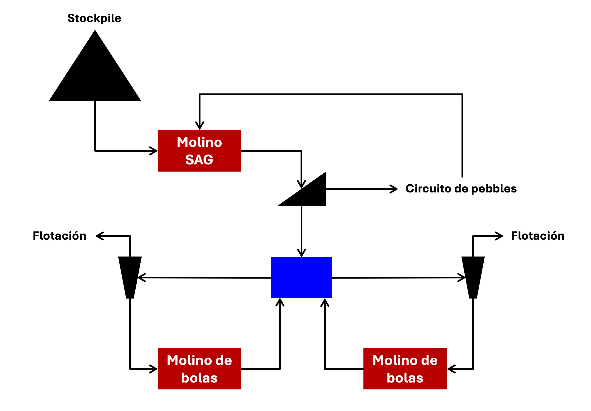
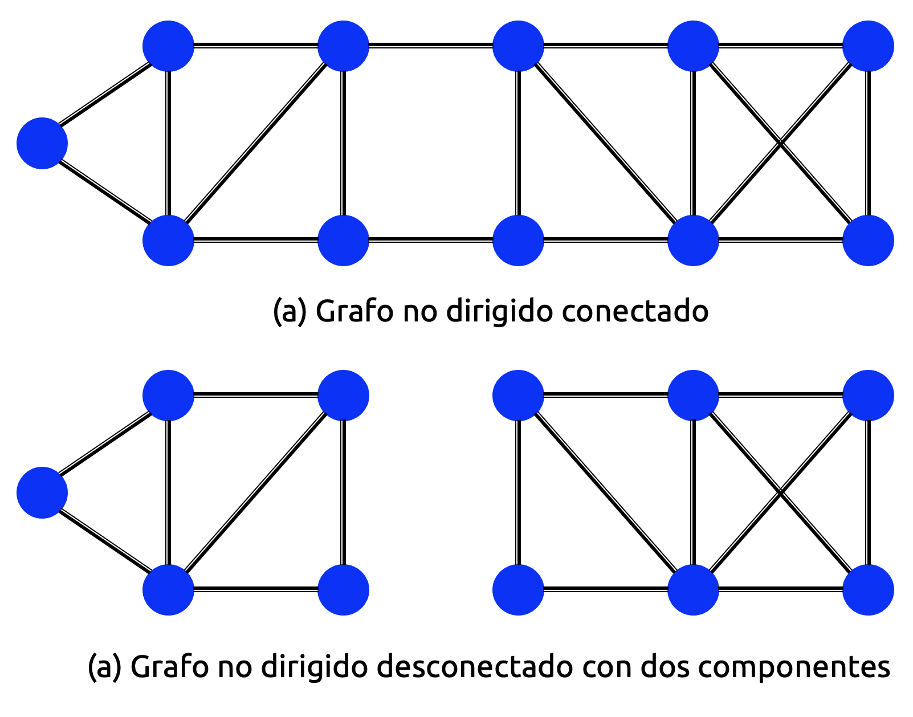

::: {.callout-important}
## Idea central

La teoría de grafos proporciona un lenguaje matemático para representar sistemas formados por entidades y relaciones. En este marco, los objetos de interés se modelan como **nodos**, mientras que las relaciones entre ellos se representan mediante **aristas**. Esta idea aparentemente simple permite estudiar redes sociales, rutas de transporte, sistemas eléctricos, cadenas de suministro, flujos de información, estructuras de dependencia estadística, procesos de Markov, algoritmos de ranking y múltiples modelos modernos de *machine learning*.
:::

## Introducción

Los grafos, también conocidos como redes, son protagonistas de muchísimas aplicaciones en el mundo real, tales como el Internet, las redes sociales y las redes de comunicación. Por supuesto, existen muchísimas implementaciones en machine learning que pueden conceptualizarse de forma sumamente elegante mediante el uso de grafos, sobre la base –como siempre– de problemas de optimización. Los grafos pueden ser representados por una cantidad no menor de objetos matemáticos, entre los cuales se encuentran las matrices. Tales matrices poseen propiedades deseables que las hacen sumamente útiles para una serie de aplicaciones en el contexto del aprendizaje automático.

Esta apunte pretende actuar como un "repaso" (entre comillas porque esto no es tan común en muchas carreras de ingeniería... ¡como la mía!) que está estructurado de manera tal que, en un comienzo, introducirá los elementos básicos relativos a los grafos o redes y sus representaciones mediante matrices de adyacencia, para luego describir las propiedades de estas matrices y concluir algunos resultados importantes en relación a su descomposición diagonal. Luego nos adentraremos un poco en la teoría de clustering con base en el uso de grafos, haciendo uso intensivo de herramientas desarrolladas en las secciones dedicadas al álgebra lineal. Finalmente, discutiremos algunos aspectos relativos a algoritmos de ranking y grafos con conectividad limitada, dándonos algo de tiempo de revisar brevemente algunas aplicaciones orientadas a los algoritmos de aprendizaje.

## Elementos básicos de un grafo

### Definición de grafo

Un **grafo** o **red** es una estructura que comúnmente se utiliza para representar *relaciones* entre ciertos objetos. Tales objetos pueden ser de cualquier tipo, tales como sitios web, usuarios de una red social, elementos químicos que conforman la molécula de una estructura más compleja, o cualquier otra abstracción similar. Similarmente, las relaciones entre estos objetos suelen depender del contexto en el cual ha sido definido el grafo. Por ejemplo, enlances de dirección a sitios web, seguidores en una red social o enlaces químicos. La @fig-graph ilustra todos estos ejemplos de manera más gráfica.

![Algunos ejemplos de grafos que representan determinadas estructuras de interés. Los grafos (a) y (b) representan la misma estructura química, correspondiente a una molécula de paracetamol. La diferencia es que, en la representación en red (b), los tipos de enlace químico llevan asociado un peso en cada arco, los que se corresponden con el número de electrones de valencia (Imagen adaptada del hermoso libro "Linear Algebra and Optimization for Machine Learning, a Textbook", de Charu C. Aggarwal (2022))](images/fig_1_1.png){#fig-graph fig-align="center" width="100%"}

Los objetos representados por un grafo suelen ser llamados **vértices** o **nodos**, mientras que las relaciones entre ellas se esquematizan por medio de **arcos** o **caminos**. Tiene sentido pues la siguiente definición.

**<font color='blue'>Definición 1.1 – Grafo:</font>** Un **grafo** es un par ordenado $G=(V,E)$, donde $V$ es el conjunto de nodos y $E$ es el conjunto de arcos que constituyen todas las relaciones posibles entre los nodos de $G$. En general, el conjunto $V$ es finito, y suele estar constituido por un total de $n$ elementos –con lo cual solemos escribir $V=\left\{ 1,...,n\right\}$–, siendo por tanto $n$ el **orden** del grafo $G$. El conjunto $E$ suele explicitarse como $E=\left\{ \left( i,j\right)  \in \mathbb{R}^{2} :i\wedge j\in V,i\neq j\right\}$, donde el arco $(i,j)$ es aquel que conecta al nodo $i$ con el nodo $j$. Cuando todos los nodos de $G$ tienen arcos de conexión con el resto de los nodos, decimos que $G$ es un grafo **totalmente interconectado**.

### Caracterización topológica

Los grafos tienen varias propiedades que son de interés. Por ejemplo, éstos pueden **dirigidos** o **no dirigidos**. En el primer caso, cada uno de los arcos $(i,j)$ tiene una dirección previamente definida, de manera tal que *circula* información desde $i$ hacia $j$ pero no desde $j$ hacia $i$. Un ejemplo de implementación de un grafo dirigido típico en minería y metalurgia corresponde al diagrama de flujo de mineral una planta concentradora. Toda planta siempre tiene un nodo de inicio (generalmente, un proceso de chancado primario) y una serie de nodos finales que dependerá de la fragmentación de flujo en la red completa (por ejemplo, para el caso del concentrado de cobre, dicho nodo final puede ser un puerto, mientras que para el caso del relave, el nodo final corresponderá a un tranque).

En muchas aplicaciones generales, el origen de un arco normalmente se denomina **cola**, y su destino, **cabeza**. Por lo tanto, es común el uso de flechas para ilustrar arcos dirigidos en un grafo. Un ejemplo de grafo dirigido se muestra en la @fig-mininggraph.

{#fig-mininggraph fig-align="center" width="80%"}

En el caso de los grafos no dirigidos, su representación prescinde del uso de flechas en los arcos correspondientes. Un ejemplo de grafo no dirigido corresponde a la representación de un enlace químico, o las amistades en Facebook®.

Los grafos, además, pueden estar o no **ponderados**. En un grafo no ponderado, un arco puede o no estar presente entre dos vértices y, por tanto, no tiene sentido asignar ningún número a dicho arco en caso de que exista. En términos algebraicos, la representación de un grafo no ponderado es de tipo binaria. De esta manera, la relación entre cada par de vértices siempre puede explicitarse mediante un $1$ o un $0$, dependiendo de si existe o no un arco que una a tales pares de vértices, respectivamente. Por otro lado, resulta común la asignación de pesos a los arcos de un grafo, los cuales representan la *fuerza* de una determinada conexión. En el caso del grafo de la @fig-mininggraph, tiene sentido la asignación de pesos a cada uno de los arcos, porque tales valores pueden representar las cargas circulantes de mineral entre cada nodo.

En un grafo no dirigido, el **grado de un nodo** se define como el número de arcos que entran o salen de dicho nodo. Dado que cada arco incide en dos nodos, la suma de los grados de todos los nodos en un grafo no dirigido es siempre igual al doble del número de nodos. Por otro lado, en el caso de un grafo dirigido, tiene más sentido hablar de los **grados de entrada y salida de un nodo**. El grado de entrada de un nodo corresponde al número de arcos que entran a dicho nodo, mientras que el grado de salida corresponde al número de arcos que salen de él. Para un grafo con $m$ nodos en total, la suma de los grados de entrada y de salida en todos los nodos es siempre igual a $m$, ya que cada arco está dirigido exactamente hacia un nodo, y siempre sale exactamente de otro.

### Estructuras básicas

**<font color='blue'>Definición 1.2 – Paseo:</font>** Sea $G=(V,E)$ un grafo con $n$ nodos en total. Un **paseo** es cualquier secuencia $i_{1},...,i_{k}$ de nodos tal que existe un arco que conecta al nodo $i_{r}$ con el nodo $i_{r+1}$ ($1\leq\ r+1\leq k\leq n$).

En el caso de grafos dirigidos, es claro que la cola del arco debe estar en el nodo $i_{r}$, y su cabeza, en $i_{r+1}$. Independientemente de si el grafo es dirigido o no, no existe ningún tipo de restricción en el número de nodos que pueden repetirse en la extensión de un paseo. Por ejmplo, en la @fig-mininggraph, la secuencia *Stock - SAG - Harnero - Compuerta - Chancado de pebbles - SAG* es un paseo que representa la carga circulante de pebbles en este circuito de molienda, considerando la recirculación de pebbles chancados al molino SAG. 

Cuando un paseo está restringido a pasar siempre por nodos distintos en un grafo, dicho paseo es llamado **camino** o **trayectoria**. En la misma @fig-mininggraph, la secuencia *Stock - SAG - Harnero - Cuba de descarga - Batería de hidrociclones - Flotación* es un camino que representa la trayectoria del mineral fino que llega al tamaño de liberación en el proceso de molienda y es enviado al proceso de flotación para continuar con la recuperación de minerales de interés económico.

Cuando un paseo es tal que empieza y termina en el mismo nodo, es llamado **ciclo** o **loop**. Nuevamente, en el ejemplo ilustrado en la @fig-mininggraph, la secuencia *Cuba de descarga - Batería de hidrociclones - Molino de bolas - Cuba de descarga* es un ciclo que representa la recirculación de mineral grueso que pasa por la clasificación de tamaños en los hidrociclones, siendo por tanto tratado en los molinos de bolas para su reincorporación a la cuba de descarga y así ser enviado nuevamente a los ciclones.

Cuando un grafo dirigido no presenta ciclos, dicho grafo es llamado **acíclico**. Por el contrario, si existen ciclos en el mismo, será llamado **cíclico**.

**<font color='blue'>Definición 1.3 – Sub-grafo:</font>** Sea $G=(V,E)$ un grafo arbitrario. Cualquier colección vértices y arcos de $G$ es llamada **sub-grafo** de $G$.

Notemos que si definimos un sub-grafo a partir de los vértices de un grafo, es evidente que cada par de nodos que define a dichos arcos estará incluido también en el sub-grafo. Para todo grafo $G=(V,E)$, el **sub-grafo inducido** por un conjunto de nodos $V^{\ast}\subseteq V$ es el grafo $G^{\ast}=(V^{\ast},E^{\ast})$ en el cual $E^{\ast}\subseteq E$ contiene todos los arcos entre cada par de nodos en $V^{\ast}$.

### Conectividad y diámetro

Un grafo no dirigido $G=(V,E)$ se denomina como **conectado** si existe un camino entre cada par de nodos de $G$. Todo grafo no dirigido que no esté conectado puede fragmentarse en un número finito de **componentes conectadas**. Una componente conectada es un subconjunto de nodos del grafo original, tal que el sub-grafo inducido por esos nodos está conectado. La @fig-nondirect ilustra los conceptos anteriores.

{#fig-nondirect fig-align="center" width="50%"}

Un grafo dirigido es llamado **fuertemente o totalmente (inter)conectado** si existe un camino directo entre cada par de nodos en cualquier dirección. En otras palabras, para cualquier par de nodos $(i,j)$, debe existir un camino que conecte de forma directa a $i$ con $j$, y también debe existir un camino desde $j$ hasta $i$. Por ejemplo, todo grafo constituido por único ciclo o loop es, por definición, un grafo fuertemente conectado. Por otro lado, un único par de nodos conectados por un arco o un grafo dirigido acíclico son ejemplos de grafos que no están fuertemente conectados (porque los *caminos* dirigidos no existen entre pares de nodos *ordenados*).

La **distancia** o **camino más corto** entre un par de nodos en un grafo dirigido se define como el menor número de arcos que constituyen un camino entre ellos. El **diámetro** de un grafo dirigido se define como la máxima distancia que hay entre dos nodos del mismo. Notemos que la distancia entre los nodos $i$ y $j$ puede no coincidir con la distancia entre los nodos $j$ e $i$. Por lo tanto, resulta necesario computar las distancias entre todos los $n(n-1)$ pares de nodos *ordenados* en el grafo y, luego, encontrar la mayor de esas distancias a fin de determinar el diámetro del grafo. Si no existen caminos dirigidos entre un par de nodos en particular, entonces asumimos que el diámetro del grafo es infinito (igual a $+\infty$). De esta manera, un grafo dirigido necesita estar totalmente interconectado a fin de que su diámetro sea finito.

En grafos no dirigidos, la distancia más corta entre los nodos $i$ y $j$ es la misma que entre los nodos $j$ e $i$. Si no existe un camino entre un par de nodos arbitrarios, significa que el grafo está **desconectado**, y la distancia entre ese par de nodos es igual a $+\infty$. El diámetro de un grafo no dirigido es igual a la mayor de las distancias de todos los caminos más cortos entre cada par de nodos del mismo. Así, el diámetro de un grafo desconectado es igual a $+\infty$.

## Matriz de adyacencia

La discusión anterior nos permitió describir un grafo desde un punto de vista esencialmente topológico: nodos, arcos, paseos, caminos, ciclos, conectividad y diámetro. Sin embargo, si queremos estudiar grafos usando herramientas de álgebra lineal, necesitamos transformar esa estructura relacional en algún objeto algebraico. La representación más natural para hacerlo es la **matriz de adyacencia**.

La idea es sencilla. Si un grafo tiene $n$ nodos, podemos construir una matriz cuadrada de tamaño $n\times n$, donde cada entrada indique si existe o no una conexión entre dos nodos. En otras palabras, pasamos de una representación visual basada en nodos y arcos a una representación matricial basada en números. Esta matriz será fundamental para todo lo que estudiaremos más adelante, porque permite conectar la teoría de grafos con autovalores, autovectores, diagonalización, procesos de propagación, algoritmos de ranking y métodos espectrales de *machine learning*. Y, naturalmente, resultará esencial para trabajar computacionalmente cualquier problema que pueda representarse por medio de un grafo.

### Grafos no ponderados y grafos ponderados

Antes de definir la matriz de adyacencia, conviene distinguir entre dos tipos de grafos: Un grafo se denominará **no ponderado** cuando sus arcos sólo indican la existencia o ausencia de una relación entre nodos. En este caso, un arco simplemente existe o no existe. Por ejemplo, si queremos representar si dos personas son amigas en una red social, podríamos usar un grafo no ponderado. Así, dos personas están conectadas si existe una relación de amistad, y no están conectadas en caso contrario. Por otro lado, un grafo se denomina **ponderado** cuando cada arco tiene asociado un número, llamado **peso**, que cuantifica alguna propiedad de la relación entre los nodos. Dicho peso puede representar distancia, costo, tiempo, intensidad, capacidad, tonelaje, frecuencia de interacción o cualquier otra magnitud relevante para el problema.

Formalmente, un **grafo ponderado** puede representarse como una terna

::: {.eq-scroll}
$$
G=(V,E,\omega)
\tag{1.1}
$$
:::

donde $V$ es el conjunto de nodos, $E$ es el conjunto de arcos y $\omega:E\longrightarrow \mathbb{R}$ es una función que asigna un peso a cada arco. Si $(i,j)\in E$, entonces $\omega(i,j)$ representa el peso del arco que conecta al nodo $i$ con el nodo $j$.

En muchas aplicaciones, los pesos son no negativos, es decir, $\omega(i,j)\geq 0$. Sin embargo, la interpretación exacta de esos pesos depende del contexto. Por ejemplo:

- En una red de transporte, un peso puede representar distancia o tiempo de viaje.
- En una red de comunicaciones, puede representar capacidad de transmisión.
- En una red social, puede representar intensidad de interacción.
- En una red de procesos mineros, puede representar flujo de mineral, tonelaje o carga circulante.

Por lo tanto, un grafo ponderado no sólo registra que dos nodos están conectados, sino también **cuán intensa, costosa o relevante** es esa conexión.

### Definición de matriz de adyacencia para grafos no ponderados

Lo anterior motiva la siguiente definición.

**<font color='blue'>Definición 1.4 – Matriz de adyacencia:</font>** Sea $G=(V,E)$ un grafo no ponderado con $n$ nodos, donde $V=\{1,\dots,n\}$. La **matriz de adyacencia** de $G$ es la matriz $\mathbf{A}\in\mathbb{R}^{n\times n}$ definida por

::: {.eq-scroll}
$$
a_{ij}
=
\left\{
\begin{array}{ll}
1, & \text{si existe un arco desde el nodo } i \text{ hacia el nodo } j\\
0, & \text{en caso contrario.}
\end{array}
\right\}
\tag{1.2}
$$
:::

En esta convención, la fila $i$ representa al nodo de origen del arco, mientras que la columna $j$ representa al nodo de destino. Por lo tanto, una entrada $a_{ij}=1$ significa que el grafo contiene el arco $(i,j)$. Tal convención es especialmente natural para grafos dirigidos. Si existe un arco desde $i$ hacia $j$, entonces $a_{ij}=1$. Pero esto no implica necesariamente que exista un arco desde $j$ hacia $i$. Por lo tanto, en un grafo dirigido puede ocurrir que $a_{ij}\neq a_{ji}$. En consecuencia, la matriz de adyacencia de un grafo dirigido no tiene por qué ser simétrica.

En cambio, si el grafo es no dirigido, una conexión entre los nodos $i$ y $j$ se interpreta simultáneamente como una conexión desde $i$ hacia $j$ y desde $j$ hacia $i$. En tal caso, se cumple que $a_{ij}=a_{ji}$. Por esta razón, la matriz de adyacencia de un grafo no dirigido es siempre una matriz simétrica.

### Diagonal principal y autociclos

Hasta ahora hemos supuesto que un arco conecta dos nodos distintos. Sin embargo, también es posible definir grafos donde un nodo esté conectado consigo mismo. A este tipo de arco se le llama **autociclo** o **loop de *feedback***.

Si el grafo no permite autociclos, entonces no existen arcos del tipo $(i,i)$ y, por lo tanto, la diagonal principal de la matriz de adyacencia es nula:

::: {.eq-scroll}
$$
a_{ii}=0
\quad ; \quad i=1,\dots,n
\tag{1.3}
$$
:::

Si el grafo permite autociclos, entonces puede ocurrir que $a_{ii}=1$ para algún nodo $i$. En ese caso, la entrada diagonal indica que existe un arco que sale desde el nodo $i$ y vuelve al mismo nodo $i$.

### Definición de matriz de adyacencia para grafos ponderados

Si $G=(V,E,\omega)$ es un grafo ponderado, entonces la matriz de adyacencia puede incorporar los pesos de los arcos. En este caso, definimos la matriz $\mathbf{W}\in\mathbb{R}^{n\times n}$ por

::: {.eq-scroll}
$$
w_{ij}=\left\{\begin{array}{ll}\omega(i,j), & \text{si existe un arco desde el nodo } i \text{ hacia el nodo } j\\0, & \text{en caso contrario.}\end{array}\right\}
\tag{1.4}
$$
:::

A esta matriz la llamaremos **matriz de adyacencia ponderada**.

La diferencia con la matriz de adyacencia no ponderada es clara:

- En un grafo no ponderado, $a_{ij}=1$ sólo indica que existe una conexión.
- En un grafo ponderado, $w_{ij}$ indica el valor numérico asociado a esa conexión.

Por ejemplo, si $w_{ij}=7.5$, ello no significa simplemente que existe una conexión entre $i$ y $j$, sino que dicha conexión tiene peso $7.5$. La interpretación de ese número depende del problema: podrían ser kilómetros, toneladas por hora, minutos, dólares, probabilidad, capacidad u otra magnitud.

**Ejemplo 1.1 – Construcción de una matriz de adyacencia no ponderada:** Consideremos el grafo dirigido $G=(V,E)$ con conjunto de nodos

::: {.eq-scroll}
$$
V=\{1,2,3,4,5,6\}
\tag{1.5}
$$
:::

y conjunto de arcos

::: {.eq-scroll}
$$
E=\{(1,2),(1,3),(2,4),(3,4),(4,2),(4,5),(5,6),(6,4)\}
\tag{1.6}
$$
:::

Este grafo contiene seis nodos y ocho arcos dirigidos. Como todavía no hemos asignado pesos a sus arcos, se trata de un grafo no ponderado. Por lo tanto, su matriz de adyacencia será binaria.

Podemos construirla en Python como sigue:

```{python}
import matplotlib.pyplot as plt
import numpy as np
import pandas as pd
import seaborn as sns
```

```{python}
# Parámetros gráficos generales.
plt.rcParams["figure.dpi"] = 90
sns.set_theme()
plt.style.use("bmh")
```

```{python}
# Definimos el conjunto de nodos.
V = np.arange(1, 7)

# Definimos los arcos dirigidos del grafo.
edges = [
    (1, 2),
    (1, 3),
    (2, 4),
    (3, 4),
    (4, 2),
    (4, 5),
    (5, 6),
    (6, 4)
]

# Inicializamos la matriz de adyacencia.
A = np.zeros((len(V), len(V)), dtype=int)

# Llenamos la matriz de adyacencia.
for i, j in edges:
    A[i - 1, j - 1] = 1

# Mostramos la matriz como tabla.
A_df = pd.DataFrame(
    A,
    index=[f"Nodo {i}" for i in V],
    columns=[f"Nodo {j}" for j in V]
)

# Y la imprimimos en pantalla.
A_df
```

La matriz anterior debe leerse fila por fila. Por ejemplo, la primera fila tiene unos en las columnas $2$ y $3$, lo que significa que desde el nodo $1$ salen arcos hacia los nodos $2$ y $3$. Similarmente, la fila $4$ tiene unos en las columnas $2$ y $5$, indicando que desde el nodo $4$ salen arcos hacia los nodos $2$ y $5$.

Podemos visualizar esta matriz como un mapa de calor:

```{python}
#| label: fig-teoria-de-grafos-01
#| fig-cap: "Matriz de adyacencia de un grafo dirigido no ponderado."
# Viualizamos nuestra matriz de manera directa.
fig, ax = plt.subplots(figsize=(7, 6))

im = ax.imshow(A, cmap="cool")

ax.set_xticks(np.arange(len(V)))
ax.set_yticks(np.arange(len(V)))
ax.set_xticklabels(V)
ax.set_yticklabels(V)

ax.set_xlabel("Nodo destino", fontsize=12, labelpad=10)
ax.set_ylabel("Nodo origen", fontsize=12, labelpad=10)

# Agregamos los valores sobre cada celda.
for i in range(len(V)):
    for j in range(len(V)):
        ax.text(
            j,
            i,
            str(A[i, j]),
            ha="center",
            va="center",
            color="black",
            fontsize=11
        )

cbar = plt.colorbar(im, ax=ax, shrink=0.8)
cbar.set_label(r"$a_{ij}$", fontsize=12, labelpad=10)

plt.tight_layout()
```

La misma estructura también puede representarse como un grafo dirigido. Si no deseamos depender de librerías adicionales, construiremos una visualización sencilla usando directamente **<font color='darkmagenta'>Matplotlib</font>**:

```{python}
from matplotlib.patches import FancyArrowPatch
```

```{python}
#| label: fig-teoria-de-grafos-02
#| fig-cap: "Grafo dirigido asociado a la matriz de adyacencia."
# Posiciones de los nodos sobre una circunferencia.
theta = np.linspace(0, 2*np.pi, len(V), endpoint=False)

pos = {
    node: np.array([np.cos(t), np.sin(t)])
    for node, t in zip(V, theta)
}

# Inicializamos la figura.
fig, ax = plt.subplots(figsize=(7, 7))

# Dibujamos los arcos dirigidos.
for i, j in edges:
    p_start = pos[i]
    p_end = pos[j]

    # Curvamos levemente los arcos cuando existe arco inverso.
    rad = 0.18 if (j, i) in edges else 0.00

    arrow = FancyArrowPatch(
        p_start,
        p_end,
        arrowstyle="-|>",
        mutation_scale=16,
        linewidth=1.8,
        color="black",
        connectionstyle=f"arc3,rad={rad}",
        shrinkA=18,
        shrinkB=18
    )

    ax.add_patch(arrow)

# Dibujamos los nodos.
for node in V:
    x_node, y_node = pos[node]

    ax.scatter(
        x_node,
        y_node,
        s=850,
        color="deepskyblue",
        edgecolor="black",
        linewidth=1.5,
        zorder=3
    )

    ax.text(
        x_node,
        y_node,
        str(node),
        ha="center",
        va="center",
        fontsize=13,
        fontweight="bold",
        zorder=4
    )

ax.set_aspect("equal")
ax.axis("off")
plt.tight_layout()
```

Este ejemplo muestra la correspondencia directa entre el grafo y su matriz de adyacencia. Cada flecha del dibujo aparece como un valor igual a $1$ en la matriz. En cambio, cada par de nodos sin conexión dirigida se representa mediante un $0$. ◼︎

### Grados de entrada y salida desde la matriz de adyacencia

Una ventaja importante de la representación matricial es que varias propiedades topológicas del grafo pueden calcularse mediante operaciones algebraicas simples.

En un grafo dirigido no ponderado, el grado de salida del nodo $i$ se obtiene sumando la fila $i$ de la matriz de adyacencia:

::: {.eq-scroll}
$$
d_{i}^{\mathrm{out}}=\sum_{j=1}^{n} a_{ij}
\tag{1.7}
$$
:::

Análogamente, el grado de entrada del nodo $j$ se obtiene sumando la columna $j$:

::: {.eq-scroll}
$$
d_{j}^{\mathrm{in}}=\sum_{i=1}^{n} a_{ij}
\tag{1.8}
$$
:::

En forma vectorial, si $\mathbf{1}$ denota al vector columna de unos, entonces

::: {.eq-scroll}
$$
\mathbf{d}^{\mathrm{out}} =\mathbf{A} \mathbf{1} \  \  \wedge \  \  \mathbf{d}^{\mathrm{in}} =\mathbf{A}^{\top} \mathbf{1}
\tag{1.9}
$$
:::

Tomemos el grafo del ejemplo anterior y calculemos estos grados:

```{python}
# Grados de salida: Suma por filas.
out_degree = A.sum(axis=1)

# Grados de entrada: Suma por columnas.
in_degree = A.sum(axis=0)

# Llevamos todo a un formato de DataFrame.
degree_df = pd.DataFrame(
    {
        "Nodo": V,
        "Grado de salida": out_degree,
        "Grado de entrada": in_degree,
        },
)

# Mostramos el DataFrame en pantalla.
degree_df
```

En un grafo no dirigido no ponderado, la matriz de adyacencia es simétrica. Por lo tanto, no distinguimos entre grado de entrada y grado de salida. El grado del nodo $i$ se obtiene por tanto como $d_{i}=\sum_{j=1}^{n} a_{ij}$. Además, para un grafo no dirigido no ponderado, se cumple que $\sum_{i=1}^{n} d_{i}=2\left| E \right|$, donde $|E|$ representa el número total de arcos o enlaces del grafo. La razón es que cada arco no dirigido incide en dos nodos.

Para un grafo dirigido no ponderado, en cambio, se cumple que

::: {.eq-scroll}
$$
\sum_{i=1}^{n} d_{i}^{\mathrm{out}}=\sum_{i=1}^{n} d_{i}^{\mathrm{in}}=\left| E \right|
\tag{1.10}
$$
:::

Esto ocurre porque cada arco dirigido sale exactamente desde un nodo y entra exactamente a otro.

### Matriz de adyacencia ponderada

Ahora que ya definimos qué es un grafo ponderado, podemos construir una versión ponderada del mismo ejemplo. Para ello, mantendremos los mismos nodos y arcos, pero asignaremos un peso numérico a cada arco. Supongamos pues que el peso de cada arco representa una intensidad de flujo. En ese caso, un peso mayor indicará una conexión más intensa. Definimos entonces la función de pesos $\omega:E\longrightarrow\mathbb{R}$ mediante la siguiente tabla, considerando nuevamente el ejemplo anterior:

```{python}
# Definimos pesos para cada arco.
edge_weights = {
    (1, 2): 0.8,
    (1, 3): 1.4,
    (2, 4): 2.0,
    (3, 4): 0.7,
    (4, 2): 0.5,
    (4, 5): 1.2,
    (5, 6): 0.9,
    (6, 4): 1.6
}
```

Con estos pesos, podemos construir la matriz de adyacencia ponderada $\mathbf{W}$:

```{python}
# Construimos la matriz de adyacencia ponderada.
W = np.zeros((len(V), len(V)))

for (i, j), weight in edge_weights.items():
    W[i - 1, j - 1] = weight

# La llevamos a formato de DataFrame.
W_df = pd.DataFrame(
    W,
    index=[f"Nodo {i}" for i in V],
    columns=[f"Nodo {j}" for j in V]
)

# Y la mostramos en pantalla.
W_df
```

Ahora visualizamos la matriz ponderada:

```{python}
#| label: fig-teoria-de-grafos-03
#| fig-cap: "Matriz de adyacencia ponderada."
# Generamos la visualización.
fig, ax = plt.subplots(figsize=(9, 6))

im = ax.imshow(W, cmap="cool")

ax.set_xticks(np.arange(len(V)))
ax.set_yticks(np.arange(len(V)))
ax.set_xticklabels(V)
ax.set_yticklabels(V)

ax.set_xlabel("Nodo destino", fontsize=12, labelpad=10)
ax.set_ylabel("Nodo origen", fontsize=12, labelpad=10)

for i in range(len(V)):
    for j in range(len(V)):
        ax.text(
            j,
            i,
            f"{W[i, j]:.1f}",
            ha="center",
            va="center",
            color="black",
            fontsize=10
        )

cbar = plt.colorbar(im, ax=ax, shrink=0.8)
cbar.set_label(r"$w_{ij}$", fontsize=12, labelpad=10)

plt.tight_layout()
```

En este caso, las entradas de la matriz ya no sólo indican si existe o no un arco, sino también cuánto pesa ese arco. Por ejemplo, si $w_{24}=2.0$, ello significa que existe un arco desde el nodo 2 hacia el nodo 4, y que el peso de esa conexión es igual a $2.0$.

Si los pesos representan intensidades de flujo, entonces la suma de las filas indica el flujo total que sale desde cada nodo, mientras que la suma de las columnas indica el flujo total que entra a cada nodo. Sin embargo, si los pesos representan costos o distancias, la interpretación cambia: una suma grande ya no necesariamente implica mayor conectividad, sino mayor costo acumulado de las conexiones salientes o entrantes.

Por esta razón, en grafos ponderados siempre debemos interpretar la matriz de adyacencia de acuerdo con el significado físico, estadístico o operacional de sus pesos.

### Potencias de la matriz de adyacencia

Una propiedad fundamental de la matriz de adyacencia es que sus potencias codifican información sobre *paseos* en el grafo. Recordemos que un paseo es una secuencia de nodos en la cual se permite repetir nodos. Si $\mathbf{A}$ es la matriz de adyacencia de un grafo no ponderado, entonces la entrada $(i,j)$ de la matriz $\mathbf{A}^{k}$ indica el número de paseos de longitud $k$ que van desde el nodo $i$ hasta el nodo $j$. Es decir,

::: {.eq-scroll}
$$
\left( \mathbf{A}^{k} \right)_{ij} =\text{número de paseos de longitud} \  k\  \text{desde} \  i\  \text{hasta} \  j
\tag{1.11}
$$
:::

Este resultado es una de las razones por las cuales la matriz de adyacencia es tan útil. Las conexiones directas están codificadas en $\mathbf{A}$, mientras que las conexiones indirectas, a través de paseos más largos, aparecen en $\mathbf{A}^{2}$, $\mathbf{A}^{3}$, y así sucesivamente.

Calculemos, por ejemplo, $\mathbf{A}^{2}$ y $\mathbf{A}^{3}$ para el ejemplo anterior:

```{python}
# Algunas potencias de la matriz de adyacencia.
A2 = np.linalg.matrix_power(A, 2)
A3 = np.linalg.matrix_power(A, 3)

# Llevamos ambas potencias a formato de DataFrame.
A2_df = pd.DataFrame(
    A2,
    index=[f"Nodo {i}" for i in V],
    columns=[f"Nodo {j}" for j in V]
)

A3_df = pd.DataFrame(
    A3,
    index=[f"Nodo {i}" for i in V],
    columns=[f"Nodo {j}" for j in V]
)
```

```{python}
# Mostramos la potencia `2` de la matriz `A` en pantalla.
A2_df
```

```{python}
# Mostramos la potencia `3` de la matriz `A` en pantalla.
A3_df
```

Por ejemplo, la entrada $(1,4)$ de $\mathbf{A}^{2}$ es igual a $2$. Esto significa que existen dos paseos de longitud $2$ desde el nodo $1$ hasta el nodo $4$: $1\rightarrow 2\rightarrow 4$ y $1\rightarrow 3\rightarrow 4$. De hecho, podemos verificarlo directamente en Python:

```{python}
print(f"Número de paseos de longitud 2 desde el nodo 1 hasta el nodo 4: {A2[0, 3]}")
```

Este tipo de cálculo será especialmente importante más adelante, porque los paseos de un grafo están profundamente conectados con procesos de propagación, difusión, ranking y cadenas de Markov.

### Dependencia con respecto al orden de los nodos

La matriz de adyacencia depende del orden en que enumeramos los nodos. Si reordenamos los nodos del grafo, obtendremos una matriz distinta, aunque el grafo representado sea exactamente el mismo.

Si $\mathbf{P}$ es una matriz de permutación que reordena los nodos, entonces la nueva matriz de adyacencia queda dada por

::: {.eq-scroll}
$$
\mathbf{A}^{\prime} =\mathbf{P} \mathbf{A} \mathbf{P}^{\top}
\tag{1.12}
$$
:::

Esto significa que la matriz cambia de forma, pero conserva la misma estructura relacional del grafo. En otras palabras, dos matrices de adyacencia pueden verse distintas y aun así representar el mismo grafo, siempre que una pueda obtenerse de la otra mediante una permutación simultánea de filas y columnas. Por ejemplo, para el grafo del ejemplo anterior:

```{python}
# Definimos un nuevo orden de nodos.
new_order = np.array([3, 1, 2, 6, 4, 5])

# Convertimos a índices base cero.
perm_idx = new_order - 1

# Reordenamos filas y columnas.
A_perm = A[np.ix_(perm_idx, perm_idx)]

# Llevamos a formato de DataFrame.
A_perm_df = pd.DataFrame(
    A_perm,
    index=[f"Nodo {i}" for i in new_order],
    columns=[f"Nodo {j}" for j in new_order]
)

# Y lo mostramos en pantalla.
A_perm_df
```

La matriz cambió, pero el grafo no. Sólo modificamos el orden en que sus nodos aparecen representados algebraicamente.

Hemos verificado que la matriz de adyacencia es mucho más que una tabla de conexiones. Es el puente que permite estudiar grafos mediante álgebra lineal. A partir de ella podemos calcular grados, identificar conexiones directas e indirectas, contar paseos y estudiar cómo una estructura relacional puede ser analizada mediante operaciones matriciales.

Más adelante veremos que los autovalores y autovectores de matrices asociadas a grafos contienen información estructural profunda. En particular, el teorema de Perron-Frobenius nos permitirá entender por qué ciertas matrices no negativas, como las matrices de adyacencia de grafos dirigidos y ponderados con pesos no negativos, poseen autovectores dominantes con interpretaciones muy poderosas en términos de centralidad, ranking y propagación.

## Teorema de Perron-Frobenius

Hasta ahora hemos visto que un grafo puede representarse algebraicamente mediante una matriz de adyacencia. Si el grafo es no ponderado, dicha matriz contiene ceros y unos. Si el grafo es ponderado con pesos no negativos, su matriz de adyacencia contiene valores reales mayores o iguales que cero. En ambos casos, estamos frente a una clase especial de matrices, denominadas como **matrices no negativas**.

Esta observación es muy importante. Las matrices no negativas aparecen naturalmente cuando una relación entre nodos representa existencia, intensidad, flujo, frecuencia, probabilidad, capacidad o influencia. Es decir, aparecen precisamente cuando las conexiones no representan una relación algebraica con signo, sino una magnitud que se acumula o se propaga a través del grafo.

El **teorema de Perron-Frobenius** es uno de los resultados más importantes para este tipo de matrices. En términos simples, nos dice que, bajo ciertas condiciones de conectividad, una matriz no negativa posee un autovalor dominante real y positivo, junto con autovectores asociados que también pueden escogerse con componentes estrictamente positivas. Esta propiedad es fundamental para construir medidas de centralidad, ranking, propagación e importancia relativa de nodos en una red.

Antes de presentar el resultado, necesitamos fijar algunos conceptos.

**<font color='blue'>Definición 1.5 – Matriz no negativa y matriz positiva:</font>** Sea $\mathbf{A}\in\mathbb{R}^{n\times n}$. Diremos que $\mathbf{A}$ es una **matriz no negativa** si todas sus entradas son mayores o iguales que cero. Es decir,

::: {.eq-scroll}
$$
a_{ij}\geq 0
\quad ; \quad i,j=1,\dots,n
\tag{1.13}
$$
:::

En tal caso, escribimos simplemente $\mathbf{A}\geq 0$. Diremos, por otro lado, que $\mathbf{A}$ es una **matriz positiva** si todas sus entradas son estrictamente mayores que cero. Es decir,

::: {.eq-scroll}
$$
a_{ij}>0
\quad ; \quad i,j=1,\dots,n
\tag{1.14}
$$
:::

En tal caso, escribimos $\mathbf{A}>0$.

Toda matriz de adyacencia no ponderada es una matriz no negativa, porque sus entradas son $0$ o $1$. De la misma manera, toda matriz de adyacencia ponderada con pesos no negativos también es una matriz no negativa.

El segundo concepto que necesitamos es el de **radio espectral**, que definimos a continuación.

**<font color='blue'>Definición 1.6 – Radio espectral:</font>** Sea $\mathbf{A}\in\mathbb{R}^{n\times n}$ una matriz cuadrada, y sean $\lambda_{1},\dots,\lambda_{n}$ sus autovalores. El **radio espectral** de $\mathbf{A}$ se define como

::: {.eq-scroll}
$$
\rho(\mathbf{A})
=
\max_{1\leq i\leq n}
|\lambda_i|
\tag{1.15}
$$
:::

Es decir, $\rho(\mathbf{A})$ corresponde al mayor módulo entre todos los autovalores de $\mathbf{A}$.

Recordemos que un autovalor $\lambda$ de una matriz $\mathbf{A}$ es un escalar para el cual existe un vector no nulo $\mathbf{v}$ tal que $\mathbf{A}\mathbf{v}=\lambda\mathbf{v}$. En ese caso, $\mathbf{v}$ es llamado un **autovector derecho** de $\mathbf{A}$ asociado al autovalor $\lambda$. También podemos definir un **autovector izquierdo** $\mathbf{u}$ mediante

::: {.eq-scroll}
$$
\mathbf{u}^{\top}\mathbf{A}=\lambda\mathbf{u}^{\top}
\tag{1.16}
$$
:::

Equivalentemente, $\mathbf{u}$ es un autovector derecho de la matriz transpuesta $\mathbf{A}^{\top}$, ya que

::: {.eq-scroll}
$$
\mathbf{A}^{\top}\mathbf{u}=\lambda\mathbf{u}
\tag{1.17}
$$
:::

Finalmente, necesitamos una condición de conectividad algebraica. Diremos que una matriz no negativa $\mathbf{A}$ es **irreducible** cuando el grafo dirigido asociado a ella es fuertemente conectado. Es decir, si construimos un grafo con un arco $i\rightarrow j$ cada vez que $a_{ij}>0$, entonces debe existir un camino dirigido desde cualquier nodo hacia cualquier otro nodo. En términos del grafo, esta condición significa que ninguna parte de la red queda aislada del resto en sentido direccional.

Con estos conceptos, podemos establecer una versión práctica del teorema.

::: {.callout-tip}
## Teorema 1.1 – Perron-Frobenius

*Sea $\mathbf{A}\in\mathbb{R}^{n\times n}$ una matriz no negativa e irreducible. Entonces:*

1. *El radio espectral $\rho(\mathbf{A})$ es un autovalor real y positivo de $\mathbf{A}$.*

2. *Existe un autovector derecho $\mathbf{r}>0$ tal que*

::: {.eq-scroll}
$$
\mathbf{A}\mathbf{r}
=
\rho(\mathbf{A})\mathbf{r}.
\tag{1.18}
$$
:::

3. *Existe un autovector izquierdo $\boldsymbol{\ell}>0$ tal que*

::: {.eq-scroll}
$$
\mathbf{A}^{\top}\boldsymbol{\ell}
=
\rho(\mathbf{A})\boldsymbol{\ell}.
\tag{1.19}
$$
:::

4. *Los autovectores estrictamente positivos asociados a $\rho(\mathbf{A})$ son únicos salvo multiplicación por una constante positiva.*

5. *Si, además, $\mathbf{A}$ es primitiva, entonces $\rho(\mathbf{A})$ domina estrictamente al resto de los autovalores en módulo. Es decir, si $\lambda\neq \rho(\mathbf{A})$, entonces*

::: {.eq-scroll}
$$
|\lambda|<\rho(\mathbf{A}).
\tag{1.20}
$$
:::
:::

Una matriz no negativa $\mathbf{A}$ se denomina **primitiva** si existe algún entero positivo $k$ tal que todas las entradas de $\mathbf{A}^{k}$ son estrictamente positivas. Es decir,

::: {.eq-scroll}
$$
\mathbf{A}^{k}>0
\quad \text{para algún } k\in\mathbb{N}.
\tag{1.21}
$$
:::

En términos de grafos, la primitividad significa que, después de considerar paseos suficientemente largos, todos los nodos pueden influir sobre todos los demás de una manera que evita ciclos perfectamente periódicos. No profundizaremos todavía en esta condición, pero será útil tenerla presente porque garantiza convergencia limpia en procedimientos iterativos basados en potencias de matrices.

La relevancia del teorema de Perron-Frobenius es enorme. En una matriz arbitraria, los autovalores pueden ser complejos, los autovectores pueden tener signos mezclados y no necesariamente existe una dirección dominante interpretable de manera positiva. En cambio, para matrices no negativas e irreducibles, el autovalor dominante es real, positivo y tiene autovectores asociados con entradas estrictamente positivas. Esto permite interpretar esos autovectores como medidas de importancia, influencia, masa, probabilidad o centralidad.

En el contexto de la teoría de grafos, esta propiedad es especialmente poderosa. Si $\mathbf{A}$ es una matriz de adyacencia ponderada, entonces una ecuación del tipo $\mathbf{A}\mathbf{r}=\rho(\mathbf{A})\mathbf{r}$ indica que el valor asignado a cada nodo es compatible con la estructura completa de conexiones del grafo. La centralidad de un nodo no se define solamente por cuántas conexiones tiene, sino también por la importancia de los nodos a los que está conectado.

Con nuestra convención de matriz de adyacencia, donde $a_{ij}>0$ representa un arco desde $i$ hacia $j$, los autovectores derecho e izquierdo tienen interpretaciones distintas:

- El autovector derecho $\mathbf{r}$, definido por $\mathbf{A}\mathbf{r}=\rho(\mathbf{A})\mathbf{r}$, asigna a cada nodo un valor que depende de los nodos hacia los cuales apunta.
- El autovector izquierdo $\boldsymbol{\ell}$, definido por $\mathbf{A}^{\top}\boldsymbol{\ell}=\rho(\mathbf{A})\boldsymbol{\ell}$, asigna a cada nodo un valor que depende de los nodos que apuntan hacia él.

Esta distinción será importante más adelante. En problemas de ranking, por ejemplo, suele ser más natural usar el autovector izquierdo, porque queremos que un nodo sea importante si recibe conexiones desde nodos importantes.

**Ejemplo 1.2 – Autovectores de Perron en un grafo fuertemente conectado:** Construyamos un grafo dirigido ponderado con pesos no negativos. Lo haremos de manera tal que el grafo sea fuertemente conectado, es decir, que exista un camino dirigido entre cualquier par de nodos.

```{python}
# Nodos del grafo.
V_pf = np.arange(1, 7)

# Arcos ponderados.
pf_edge_weights = {
    (1, 2): 0.8,
    (1, 3): 0.4,
    (2, 3): 1.1,
    (2, 5): 0.6,
    (3, 1): 0.9,
    (3, 4): 0.7,
    (4, 2): 0.5,
    (4, 5): 1.2,
    (5, 6): 1.0,
    (6, 4): 0.8,
    (6, 1): 0.3
}

# Matriz de adyacencia ponderada.
W_pf = np.zeros((len(V_pf), len(V_pf)))

for (i, j), weight in pf_edge_weights.items():
    W_pf[i - 1, j - 1] = weight

# Llevamos la matriz a un DataFrame.
W_pf_df = pd.DataFrame(
    W_pf,
    index=[f"Nodo {i}" for i in V_pf],
    columns=[f"Nodo {j}" for j in V_pf]
)

# Y la mostramos en pantalla.
W_pf_df
```

Construiremos ahora una visualización de esta matriz:

```{python}
#| label: fig-teoria-de-grafos-04
#| fig-cap: "Matriz de adyacencia ponderada no negativa."
# Graficamos nustra matriz.
fig, ax = plt.subplots(figsize=(9, 6))

im = ax.imshow(W_pf, cmap="cool")

ax.set_xticks(np.arange(len(V_pf)))
ax.set_yticks(np.arange(len(V_pf)))
ax.set_xticklabels(V_pf)
ax.set_yticklabels(V_pf)

ax.set_xlabel("Nodo destino", fontsize=12, labelpad=10)
ax.set_ylabel("Nodo origen", fontsize=12, labelpad=10)

for i in range(len(V_pf)):
    for j in range(len(V_pf)):
        ax.text(
            j,
            i,
            f"{W_pf[i, j]:.1f}",
            ha="center",
            va="center",
            color="black",
            fontsize=10
        )

cbar = plt.colorbar(im, ax=ax, shrink=0.8)
cbar.set_label(r"$w_{ij}$", fontsize=12, labelpad=10)

plt.tight_layout()
```

Calculemos ahora sus autovalores y autovectores. Primero obtenemos el radio espectral, es decir, el mayor módulo entre todos los autovalores:

```{python}
# Autovalores y autovectores derechos.
eigvals, eigvecs = np.linalg.eig(W_pf)

# Índice del autovalor dominante en módulo.
idx_rho = np.argmax(np.abs(eigvals))

# Radio espectral.
rho = np.real(eigvals[idx_rho])

# Imprimimos este radio en pantalla.
print(f"Radio espectral: {rho:.6f}")
```

El teorema de Perron-Frobenius nos dice que este valor debe ser real y positivo, porque estamos trabajando con una matriz no negativa e irreducible. Además, debe existir un autovector derecho estrictamente positivo asociado a este autovalor:

```{python}
# Autovector derecho asociado al radio espectral.
right_pf = np.real(eigvecs[:, idx_rho])

# Ajustamos el signo para que sus entradas sean positivas.
if right_pf.sum() < 0:
    right_pf = -right_pf

# Normalizamos para interpretar como proporciones.
right_pf = right_pf / right_pf.sum()

# Mostramos este resultado en pantalla.
right_pf
```

Calculemos también el autovector izquierdo. Para ello, basta calcular el autovector derecho de la matriz transpuesta $\mathbf{W}_{pf}^{\top}$:

```{python}
# Autovalores y autovectores de la transpuesta.
eigvals_left, eigvecs_left = np.linalg.eig(W_pf.T)

# Índice del autovalor dominante.
idx_left = np.argmax(np.abs(eigvals_left))

# Autovector izquierdo, obtenido como autovector derecho de W_pf.T.
left_pf = np.real(eigvecs_left[:, idx_left])

# Ajustamos el signo.
if left_pf.sum() < 0:
    left_pf = -left_pf

# Normalizamos para interpretar como proporciones.
left_pf = left_pf / left_pf.sum()

# Mostramos este resultado en pantalla.
left_pf
```

Podemos reunir ambos autovectores en una tabla:

```{python}
# Consolidamos todo en un DataFrame.
pf_vectors_df = pd.DataFrame({
    "Nodo": V_pf,
    "Autovector derecho": right_pf,
    "Autovector izquierdo": left_pf
})

# Y lo mostramos en pantalla.
pf_vectors_df
```

Ambos autovectores tienen entradas positivas, tal como predice el teorema. Sin embargo, no son iguales, porque la matriz $\mathbf{W}_{pf}$ no es simétrica. Esto es completamente esperable en un grafo dirigido, ya que la importancia de un nodo desde el punto de vista de sus conexiones salientes no necesariamente coincide con su importancia desde el punto de vista de sus conexiones entrantes.

Podemos visualizar estos valores:

```{python}
#| label: fig-teoria-de-grafos-05
#| fig-cap: "Autovectores de Perron normalizados."
# Construimos una visualización para los autovalores de Perron.
fig, ax = plt.subplots(figsize=(9, 6))

width = 0.35
x_pos = np.arange(len(V_pf))

ax.bar(
    x_pos - width/2,
    right_pf,
    width=width,
    label="Autovector derecho"
)

ax.bar(
    x_pos + width/2,
    left_pf,
    width=width,
    label="Autovector izquierdo"
)

ax.set_xticks(x_pos)
ax.set_xticklabels(V_pf)

ax.set_xlabel("Nodo", fontsize=12, labelpad=10)
ax.set_ylabel("Valor normalizado", fontsize=12, labelpad=10)
ax.legend(loc="best", fontsize=10, frameon=True)

plt.tight_layout()
```

Veamos ahora la ubicación de los autovalores en el plano complejo. El teorema nos dice que el radio espectral corresponde al autovalor dominante en módulo:

```{python}
#| label: fig-teoria-de-grafos-06
#| fig-cap: "Autovalores de la matriz de adyacencia ponderada."
fig, ax = plt.subplots(figsize=(9, 7))

ax.scatter(
    np.real(eigvals),
    np.imag(eigvals),
    s=80,
    color="firebrick",
    edgecolor="black",
    label="Autovalores"
)

# Círculo de radio rho.
theta_circle = np.linspace(0, 2*np.pi, 400)
ax.plot(
    rho * np.cos(theta_circle),
    rho * np.sin(theta_circle),
    color="navy",
    linestyle="--",
    linewidth=1.5,
    label=r"Círculo $|\lambda|=\rho(\mathbf{W})$"
)

ax.axhline(0, color="black", linewidth=0.8)
ax.axvline(0, color="black", linewidth=0.8)
ax.set_xlabel(r"$\mathrm{Re}(\lambda)$", fontsize=12, labelpad=10)
ax.set_ylabel(r"$\mathrm{Im}(\lambda)$", fontsize=12, labelpad=10)
ax.set_aspect("equal", adjustable="box")
ax.legend(loc="best", fontsize=10, frameon=True)

plt.tight_layout()
```

El autovalor dominante aparece sobre el eje real positivo. Los demás autovalores quedan dentro del círculo de radio $\rho(\mathbf{W}_{pf})$. En este ejemplo, la matriz se comporta como una matriz primitiva, por lo que el autovalor dominante domina estrictamente al resto en módulo.

Una forma práctica de observar la importancia del teorema de Perron-Frobenius es mediante un procedimiento iterativo. Partamos desde un vector positivo arbitrario $\mathbf{x}_{0}$ y multipliquemos repetidamente por $\mathbf{W}_{pf}^{\top}$, normalizando en cada paso para que los valores sumen uno. Esta iteración aproxima el autovector izquierdo dominante:

```{python}
# Vector inicial positivo.
x_iter = np.ones(len(V_pf)) / len(V_pf)

# Guardamos la trayectoria.
trajectory = [x_iter.copy()]

# Iteración de potencia normalizada.
n_steps = 35

for _ in range(n_steps):
    x_iter = W_pf.T @ x_iter
    x_iter = x_iter / x_iter.sum()
    trajectory.append(x_iter.copy())

# Llevamos la trayectoria a un formato de arreglo de Numpy.
trajectory = np.array(trajectory)
```

```{python}
#| label: fig-teoria-de-grafos-07
#| fig-cap: "Convergencia iterativa hacia el autovector izquierdo de Perron."
# Mostramos la convergencia del autovector izquierdo de Perron.
fig, ax = plt.subplots(figsize=(9, 5))

for j, node in enumerate(V_pf):
    ax.plot(
        trajectory[:, j],
        linewidth=2,
        color=plt.cm.cool(j / len(V_pf)),
        label=f"Nodo {node}"
    )

ax.set_xlabel("Iteración", fontsize=12, labelpad=10)
ax.set_ylabel("Score normalizado", fontsize=12, labelpad=10)
ax.legend(loc="best", fontsize=9, frameon=True)

plt.tight_layout()
```

La figura muestra cómo, a partir de una asignación inicial uniforme, el sistema converge hacia una distribución estable de importancia relativa entre los nodos. Este comportamiento es la base matemática de numerosos algoritmos de ranking y propagación sobre grafos.

Podemos comparar el resultado final de la iteración con el autovector izquierdo calculado directamente:

```{python}
comparison_pf_df = pd.DataFrame({
    "Nodo": V_pf,
    "Iteración de potencia": trajectory[-1],
    "Autovector izquierdo": left_pf
})

comparison_pf_df
```

El resultado final de la iteración coincide numéricamente con el autovector izquierdo dominante. Esta convergencia no es casual: es una consecuencia directa de la estructura espectral garantizada por Perron-Frobenius.

::: {.callout-note}
## Interpretación

El teorema de Perron-Frobenius permite transformar una red con pesos no negativos en una medida positiva de importancia relativa. Si la red está suficientemente conectada, existe una dirección dominante de propagación. Esa dirección está codificada en el autovector asociado al radio espectral.
:::

El teorema también permite entender por qué la conectividad importa. Si un grafo dirigido no es fuertemente conectado, su matriz de adyacencia puede ser reducible. En ese caso, el autovector dominante puede concentrarse en una parte del grafo, algunos nodos pueden recibir valor cero, o pueden existir varias componentes que compiten por la dominancia espectral. Dichos casos no son errores matemáticos: simplemente reflejan que la red no se comporta como un único sistema integrado.

Por esta razón, cuando usamos autovectores para medir centralidad o ranking, no basta con calcularlos mecánicamente. También debemos preguntarnos si la matriz asociada al grafo es no negativa, si el grafo es fuertemente conectado, si existen componentes desconectadas o si hay nodos que actúan como sumideros. Todas estas propiedades topológicas tienen consecuencias directas sobre la interpretación algebraica de los autovectores.

El teorema de Perron-Frobenius es, por tanto, el puente conceptual entre grafos y álgebra lineal espectral. Nos dice que, bajo hipótesis naturales de no negatividad y conectividad, una matriz asociada a un grafo posee una estructura dominante positiva. En las siguientes secciones, utilizaremos esta idea para distinguir con mayor cuidado entre autovectores derechos e izquierdos, y para entender qué ocurre cuando la matriz asociada al grafo es reducible.

## Autovectores derechos de matrices asociadas a grafos

En la sección anterior vimos que, bajo ciertas condiciones de no negatividad y conectividad, el teorema de Perron-Frobenius garantiza la existencia de autovectores positivos asociados al radio espectral de una matriz. Este resultado es fundamental, pero no agota el rol de los autovectores en teoría de grafos. De hecho, muchas aplicaciones modernas no usan solamente el autovector dominante, sino un conjunto de autovectores asociados a una matriz del grafo.

La idea central es que los autovectores de una matriz asociada a un grafo permiten construir **coordenadas latentes** para sus nodos. Es decir, permiten representar cada nodo no sólo por su etiqueta original, sino por un vector numérico que resume su posición dentro de la estructura global de la red. Esta idea será especialmente importante para entender un modelo de gran potencia en el contexto del aprendizaje no supervisado, denominado **clustering espectral**.

Antes de avanzar, conviene definir dos conceptos.

**<font color='blue'>Definición 1.7 – Clustering:</font>** Sea $G=(V,E)$ un grafo con $n$ nodos. Un problema de **clustering** consiste en dividir el conjunto de nodos $V$ en $K$ grupos disjuntos

::: {.eq-scroll}
$$
V=C_{1}\cup C_{2}\cup \cdots \cup C_{K}
\tag{1.22}
$$
:::

tales que $C_{r}\cap C_{s}=\varnothing$ si $r\neq s$. Intuitivamente, buscamos que los nodos dentro de un mismo grupo estén fuertemente relacionados entre sí, y que los nodos pertenecientes a grupos distintos estén débilmente relacionados.

En un grafo, esta idea se interpreta de manera natural: un buen clúster es una región del grafo con muchas conexiones internas y pocas conexiones hacia el exterior.

**<font color='blue'>Definición 1.8 – Encaje de nodos:</font>** Un **encaje** o *embedding* de los nodos de un grafo es una aplicación

::: {.eq-scroll}
$$
\Phi:V\longrightarrow \mathbb{R}^{d}
\tag{1.23}
$$
:::

que asigna a cada nodo $i\in V$ un vector $\Phi(i)\in\mathbb{R}^{d}$. Dicho vector es una representación numérica de baja dimensión que intenta preservar alguna propiedad relevante del grafo: Similitud, conectividad, distancia, difusión o pertenencia a comunidades.

En el contexto del clustering espectral, el encaje se construye usando autovectores de matrices asociadas al grafo. Si escogemos $d$ autovectores $\mathbf{u}_{1},...,\mathbf{u}_{d}\in\mathbb{R}^{n}$, podemos representar al nodo $i$ por medio del vector

::: {.eq-scroll}
$$
\Phi(i)
=
\left(
u_{1i},u_{2i},...,u_{di}
\right)
\tag{1.24}
$$
:::

Es decir, cada nodo queda representado por las componentes que ocupa en varios autovectores. Luego, en vez de clusterizar directamente el grafo original, aplicamos un algoritmo de clustering sobre estos puntos en $\mathbb{R}^{d}$.

### Visión en base a kernels del clustering espectral

Una forma muy útil de entender el clustering espectral consiste en partir no desde un grafo explícito, sino desde una matriz de similitud entre objetos. Supongamos que tenemos observaciones $\mathbf{x}_{1},...,\mathbf{x}_{n}\in\mathbb{R}^{p}$. Una función

::: {.eq-scroll}
$$
\kappa:\mathbb{R}^{p}\times \mathbb{R}^{p}\longrightarrow \mathbb{R}
\tag{1.25}
$$
:::

será llamada **kernel de similitud** si asigna a cada par de observaciones un número que mide qué tan parecidas son. Un ejemplo común es el kernel Gaussiano, definido como

::: {.eq-scroll}
$$
\kappa(\mathbf{x}_{i},\mathbf{x}_{j})
=
\exp\left(
-\frac{\Vert \mathbf{x}_{i}-\mathbf{x}_{j}\Vert_{2}^{2}}{2\sigma^{2}}
\right)
\tag{1.26}
$$
:::

donde $\sigma>0$ controla la escala de vecindad. Si dos puntos están cerca, el valor del kernel será cercano a $1$. Si están lejos, será cercano a $0$.

A partir de este kernel construimos una matriz de similitud $\mathbf{W}\in\mathbb{R}^{n\times n}$ definida por

::: {.eq-scroll}
$$
w_{ij}
=\kappa(\mathbf{x}_{i},\mathbf{x}_{j}).
\tag{1.27}
$$
:::

Esta matriz puede interpretarse como la matriz de adyacencia ponderada de un grafo completo, donde cada observación es un nodo y cada peso $w_{ij}$ mide la similitud entre los nodos $i$ y $j$.

Naturalmente, no siempre deseamos conservar todas las conexiones. En aplicaciones prácticas, suele ser conveniente construir un grafo de vecindad, por ejemplo, dejando $w_{ij}>0$ sólo si $\mathbf{x}_{j}$ está entre los vecinos más cercanos de $\mathbf{x}_{i}$, o si la distancia entre ambos puntos es menor que cierto umbral. En cualquier caso, la idea central es la misma: la matriz $\mathbf{W}$ codifica similitudes locales entre observaciones.

Definimos ahora la matriz de grados $\mathbf{D}$ como la matriz diagonal cuyas entradas son

::: {.eq-scroll}
$$
d_i=\sum_{j=1}^{n} w_{ij}
\tag{1.28}
$$
:::

Es decir,

::: {.eq-scroll}
$$
\mathbf{D}=\mathrm{diag}(d_1,...,d_n)
\tag{1.29}
$$
:::

Con esto podemos construir la matriz

::: {.eq-scroll}
$$
\mathbf{P}=\mathbf{D}^{-1}\mathbf{W}
\tag{1.30}
$$
:::

La matriz $\mathbf{P}$ tiene una interpretación importante: Si $d_i>0$ para todo nodo, entonces cada fila de $\mathbf{P}$ suma $1$. Por lo tanto, $\mathbf{P}$ puede interpretarse como una matriz de transición de una caminata aleatoria sobre el grafo. La entrada $p_{ij}$ representa la probabilidad de pasar desde el nodo $i$ hacia el nodo $j$ en un paso, asignando mayor probabilidad a nodos más similares.

Esta es la conexión natural con los autovectores derechos. Si consideramos $\mathbf{P}\mathbf{u}=\lambda \mathbf{u}$, entonces los autovectores derechos de $\mathbf{P}$ describen modos de variación que son compatibles con la dinámica de difusión del grafo. Los autovectores asociados a autovalores cercanos a $1$ describen patrones que cambian lentamente bajo la caminata aleatoria. En términos de clustering, esos patrones suelen corresponder a comunidades o regiones del grafo que están fuertemente conectadas internamente, pero débilmente conectadas con el resto.

Esta idea permite conectar dos formulaciones clásicas del clustering espectral: La de **Shi-Malik** y la de **Ng-Jordan-Weiss**.

El **enfoque de Shi-Malik** se basa en el problema de **corte normalizado**. Su formulación conduce al problema generalizado de autovalores

::: {.eq-scroll}
$$
(\mathbf{D}-\mathbf{W})\mathbf{u}=\lambda \mathbf{D}\mathbf{u}
\tag{1.31}
$$
:::

Si multiplicamos por $\mathbf{D}^{-1}$, obtenemos

::: {.eq-scroll}
$$
\left(\mathbf{I}-\mathbf{D}^{-1}\mathbf{W}\right)\mathbf{u}=\lambda \mathbf{u}
\tag{1.32}
$$
:::

Es decir, estamos estudiando autovectores derechos de la matriz

::: {.eq-scroll}
$$
\mathbf{L}_{\mathrm{rw}}=\mathbf{I}-\mathbf{D}^{-1}\mathbf{W}
\tag{1.33}
$$
:::

llamada **Laplaciano normalizado de caminata aleatoria**. Equivalentemente, podemos estudiar los autovectores derechos de $\mathbf{P}=\mathbf{D}^{-1}\mathbf{W}$, porque ambas matrices comparten autovectores y sus autovalores sólo se desplazan mediante la transformación $\lambda\mapsto 1-\lambda$.

El **enfoque de Ng-Jordan-Weiss** utiliza, en cambio, la matriz simétrica normalizada

::: {.eq-scroll}
$$
\mathbf{S}=\mathbf{D}^{-1/2}\mathbf{W}\mathbf{D}^{-1/2}
\tag{1.34}
$$
:::

Como $\mathbf{S}$ es simétrica cuando $\mathbf{W}$ es simétrica, sus autovectores son ortogonales y suelen ser más cómodos desde el punto de vista numérico. Luego se toman los primeros $K$ autovectores de $\mathbf{S}$, se apilan como columnas en una matriz $\mathbf{U}\in\mathbb{R}^{n\times K}$ y se normalizan sus filas para obtener un encaje sobre el cual se aplica un algoritmo como $K$-means.

Ambas visiones están íntimamente relacionadas. Si $\mathbf{u}$ resuelve el problema de Shi-Malik, entonces el cambio de variable

::: {.eq-scroll}
$$
\mathbf{z}=\mathbf{D}^{1/2}\mathbf{u}
\tag{1.35}
$$
:::

conecta dicho problema con una formulación simétrica en términos de $\mathbf{S}$ o del Laplaciano simétrico normalizado. En otras palabras, Shi-Malik enfatiza la interpretación como caminata aleatoria y corte normalizado; Ng-Jordan-Weiss enfatiza la construcción de un encaje euclídeo adecuado para aplicar clustering en baja dimensión.

### Visión Laplaciana del clustering espectral

La segunda forma de entender el clustering espectral es mediante el Laplaciano de un grafo. Sea $\mathbf{W}$ una matriz de similitud simétrica y no negativa, y sea $\mathbf{D}$ la matriz diagonal de grados. El **Laplaciano no normalizado** del grafo se define como

::: {.eq-scroll}
$$
\mathbf{L}=\mathbf{D}-\mathbf{W}
\tag{1.36}
$$
:::

Esta matriz resume una idea extremadamente importante: penaliza diferencias entre nodos que están fuertemente conectados. En efecto, si $\mathbf{z}\in\mathbb{R}^{n}$ es una señal definida sobre los nodos del grafo, entonces se cumple que

::: {.eq-scroll}
$$
\mathbf{z}^{\top}\mathbf{L}\mathbf{z}= \dfrac{1}{2} \sum_{i=1}^{n} \sum_{j=1}^{n}w_{ij}(z_i-z_j)^2
\tag{1.37}
$$
:::

Esta identidad muestra que $\mathbf{z}^{\top}\mathbf{L}\mathbf{z}$ será pequeño cuando nodos con alto peso $w_{ij}$ tengan valores similares $z_i\approx z_j$. Por esta razón, los autovectores asociados a autovalores pequeños del Laplaciano entregan funciones suaves sobre el grafo. Y una función suave sobre el grafo es precisamente una señal que tiende a ser casi constante dentro de regiones fuertemente conectadas.

La forma más simple de clustering espectral aparece al considerar el problema de dividir un grafo en dos grupos. Si definimos una variable $z_i$ que toma un valor constante en un grupo y otro valor constante en el otro, entonces minimizar $\mathbf{z}^{\top}\mathbf{L}\mathbf{z}$ busca una partición que corte conexiones débiles y preserve conexiones fuertes dentro de cada grupo.

Para formalizar esta idea, definimos el **corte** entre un conjunto $C\subseteq V$ y su complemento $\bar{C}$ como

::: {.eq-scroll}
$$
\mathrm{cut}(C,\bar{C}) = \sum_{i\in C} \sum_{j\in \bar{C}} w_{ij}
\tag{1.38}
$$
:::

Un corte pequeño significa que hay poca conexión entre $C$ y $\bar{C}$. Sin embargo, minimizar sólo el corte puede producir soluciones degeneradas, como separar un único nodo del resto. Para evitarlo, se introducen penalizaciones por tamaño o volumen.

El ***ratio cut*** para $K$ clusters se define como

::: {.eq-scroll}
$$
\mathrm{RatioCut}(C_1,...,C_K)= \sum_{k=1}^{K} \dfrac{\mathrm{cut}(C_k,\bar{C}_k)}{|C_k|}
\tag{1.39}
$$
:::

Por otro lado, el ***normalized cut*** se define como

::: {.eq-scroll}
$$
\mathrm{Ncut}(C_{1},...,C_{K}) = \sum_{k=1}^{K} \dfrac{\mathrm{cut}(C_{k},\bar{C}_{k})}{\mathrm{vol}(C_{k})}
\tag{1.40}
$$
:::

donde el volumen de un conjunto de nodos queda dado por

::: {.eq-scroll}
$$
\mathrm{vol}(C_{k})
=
\sum_{i\in C_{k}} d_{i}
\tag{1.41}
$$
:::

Ambos problemas son difíciles de resolver exactamente, porque exigen buscar entre muchas particiones discretas posibles. La idea del clustering espectral consiste en relajar estas variables discretas y permitir soluciones continuas. Así aparecen problemas de optimización con restricciones ortogonales.

Para el caso no normalizado, una relajación típica toma la forma

::: {.eq-scroll}
$$
\begin{array}{ll}
\displaystyle \min_{\mathbf{H}\in\mathbb{R}^{n\times K}}
&
\mathrm{tr}\left(\mathbf{H}^{\top}\mathbf{L}\mathbf{H}\right)\\
\mathrm{s.a.}
&
\mathbf{H}^{\top}\mathbf{H}=\mathbf{I}
\end{array}
\tag{1.42}
$$
:::

La solución de este problema está dada por los $K$ autovectores de $\mathbf{L}$ asociados a los $K$ autovalores más pequeños. Esta afirmación conecta directamente la optimización sobre particiones con la descomposición espectral de una matriz asociada al grafo.

Para el caso normalizado, la relajación toma la forma

::: {.eq-scroll}
$$
\begin{array}{ll}
\displaystyle \min_{\mathbf{U}\in\mathbb{R}^{n\times K}}
&
\mathrm{tr}\left(\mathbf{U}^{\top}\mathbf{L}\mathbf{U}\right)\\
\mathrm{s.a.}
&
\mathbf{U}^{\top}\mathbf{D}\mathbf{U}=\mathbf{I}
\end{array}
\tag{1.43}
$$
:::

Las condiciones de primer orden de este problema conducen al problema generalizado

::: {.eq-scroll}
$$
\mathbf{L}\mathbf{u}
=
\lambda \mathbf{D}\mathbf{u}
\tag{1.44}
$$
:::

Este es precisamente el problema que aparece en la formulación de Shi-Malik. Usando $\mathbf{L}=\mathbf{D}-\mathbf{W}$, podemos escribir

::: {.eq-scroll}
$$
(\mathbf{D}-\mathbf{W})\mathbf{u}
=
\lambda \mathbf{D}\mathbf{u}
\tag{1.45}
$$
:::

lo que equivale a

::: {.eq-scroll}
$$
(\mathbf{I}-\mathbf{D}^{-1}\mathbf{W})\mathbf{u}
=
\lambda \mathbf{u}
\tag{1.46}
$$
:::

Por lo tanto, el clustering espectral normalizado puede entenderse como un problema de autovectores derechos del Laplaciano de caminata aleatoria $\mathbf{L}_{\mathrm{rw}}=\mathbf{I}-\mathbf{D}^{-1}\mathbf{W}$.

La formulación simétrica usa

::: {.eq-scroll}
$$
\mathbf{L}_{\mathrm{sym}}
=
\mathbf{I}
-
\mathbf{D}^{-1/2}\mathbf{W}\mathbf{D}^{-1/2}
\tag{1.47}
$$
:::

En este caso, resolvemos

::: {.eq-scroll}
$$
\mathbf{L}_{\mathrm{sym}}\mathbf{z}
=
\lambda \mathbf{z}
\tag{1.48}
$$
:::

Esta versión es numéricamente conveniente porque $\mathbf{L}_{\mathrm{sym}}$ es simétrica cuando $\mathbf{W}$ es simétrica. La conexión con la formulación de caminata aleatoria se obtiene mediante el cambio $\mathbf{z}=\mathbf{D}^{1/2}\mathbf{u}$.

**Ejemplo 1.3 – Encaje espectral de datos no linealmente separables:** El siguiente ejercicio muestra por qué el clustering espectral puede ser más expresivo que aplicar clustering directamente sobre las coordenadas originales. Construiremos dos circunferencias concéntricas. En el plano original, separar ambos grupos con un método basado en centroides no es natural. Sin embargo, al construir un grafo de similitud y usar autovectores de una matriz normalizada, los grupos aparecen de manera mucho más clara.

```{python}
# Semilla para garantizar reproducibilidad.
rng_spectral = np.random.default_rng(seed=42)

# Número de puntos por grupo.
n_inner = 160
n_outer = 220

# Ángulos aleatorios.
theta_inner = rng_spectral.uniform(0, 2*np.pi, n_inner)
theta_outer = rng_spectral.uniform(0, 2*np.pi, n_outer)

# Radios con ruido.
r_inner = 1.0 + rng_spectral.normal(0, 0.05, n_inner)
r_outer = 2.0 + rng_spectral.normal(0, 0.07, n_outer)

# Coordenadas.
X_inner = np.column_stack([
    r_inner * np.cos(theta_inner),
    r_inner * np.sin(theta_inner)
])

X_outer = np.column_stack([
    r_outer * np.cos(theta_outer),
    r_outer * np.sin(theta_outer)
])

X_spec = np.vstack([X_inner, X_outer])
y_true_spec = np.hstack([
    np.zeros(n_inner, dtype=int),
    np.ones(n_outer, dtype=int)
])
```

```{python}
#| label: fig-teoria-de-grafos-08
#| fig-cap: "Datos originales: Dos grupos no linealmente separables."
# Visualización de los datos originales.
fig, ax = plt.subplots(figsize=(9, 6))

ax.scatter(
    X_spec[:, 0],
    X_spec[:, 1],
    c=y_true_spec,
    cmap="cool",
    s=24,
    edgecolor="black",
    linewidth=0.2
)

ax.set_xlabel(r"$x_1$", fontsize=12, labelpad=10)
ax.set_ylabel(r"$x_2$", fontsize=12, labelpad=10)
ax.set_aspect("equal", adjustable="box")
plt.tight_layout()
```

Construimos ahora una matriz de similitud Gaussiana. Para evitar que cada punto se conecte con todos los demás con pesos relevantes, conservaremos sólo los vecinos más cercanos de cada nodo:

```{python}
# Distancias cuadráticas par a par.
diff = X_spec[:, None, :] - X_spec[None, :, :]
dist2 = np.sum(diff**2, axis=2)

# Escala del kernel.
sigma = 0.35

# Kernel Gaussiano.
W_full = np.exp(-dist2 / (2 * sigma**2))

# Eliminamos autociclos.
np.fill_diagonal(W_full, 0.0)

# Grafo k-vecinos más cercanos.
k_neighbors = 12
W_knn = np.zeros_like(W_full)

for i in range(W_full.shape[0]):
    idx_neighbors = np.argsort(dist2[i])[1:k_neighbors + 1]
    W_knn[i, idx_neighbors] = W_full[i, idx_neighbors]

# 'Simetrizamos' la matriz para trabajar con un grafo no dirigido.
W_spec = np.maximum(W_knn, W_knn.T)
```

Con la matriz de similitud construimos la matriz de grados y la matriz simétrica normalizada $\mathbf{S}=\mathbf{D}^{-1/2}\mathbf{W}\mathbf{D}^{-1/2}$:

```{python}
# Matriz de grados.
degrees = W_spec.sum(axis=1)

# Evitamos divisiones por cero.
degrees = np.where(degrees == 0, 1e-12, degrees)

D_inv_sqrt = np.diag(1 / np.sqrt(degrees))

# Matriz normalizada tipo Ng-Jordan-Weiss.
S_spec = D_inv_sqrt @ W_spec @ D_inv_sqrt
```

Calculamos los autovectores derechos de $\mathbf{S}$. Como $\mathbf{S}$ es simétrica, sus autovectores derechos también coinciden con sus autovectores izquierdos. Tomaremos los dos autovectores asociados a los autovalores más grandes y los usaremos como encaje espectral:

```{python}
# Autovalores y autovectores de S.
eigvals_s, eigvecs_s = np.linalg.eigh(S_spec)

# Ordenamos de mayor a menor autovalor.
order = np.argsort(eigvals_s)[::-1]

# Tomamos los dos autovectores principales.
U_spec = eigvecs_s[:, order[:2]]

# Normalización por filas, como en Ng-Jordan-Weiss.
row_norms = np.linalg.norm(U_spec, axis=1, keepdims=True)
row_norms = np.where(row_norms == 0, 1e-12, row_norms)

Y_spec = U_spec / row_norms
```

Para clusterizar el encaje, implementaremos una versión mínima del algoritmo más elemental de clustering que existe en el aprendizaje automático, denominado algoritmo de $K$-medias. No nos interesa aquí estudiarlo en detalle, sino usarlo como una herramienta simple para agrupar los puntos del encaje espectral:

```{python}
def simple_kmeans(X, k=2, n_iter=100, seed=2026):
    """
    Implementación mínima de K-means para agrupar puntos en R^d.
    """
    rng = np.random.default_rng(seed)

    # Inicialización aleatoria de centroides.
    idx = rng.choice(X.shape[0], size=k, replace=False)
    centers = X[idx].copy()

    for _ in range(n_iter):
        # Distancias cuadráticas a centroides.
        distances = np.sum((X[:, None, :] - centers[None, :, :])**2, axis=2)

        # Asignación al centroide más cercano.
        labels = np.argmin(distances, axis=1)

        # Actualización de centroides.
        new_centers = centers.copy()
        for j in range(k):
            if np.any(labels == j):
                new_centers[j] = X[labels == j].mean(axis=0)

        # Criterio simple de detención.
        if np.allclose(new_centers, centers):
            break

        centers = new_centers

    return labels, centers
```

```{python}
# Clustering sobre el encaje espectral.
labels_spec, centers_spec = simple_kmeans(Y_spec, k=2, n_iter=100, seed=42)
```

Visualizamos ahora el encaje espectral y la partición obtenida:

```{python}
#| label: fig-teoria-de-grafos-09
#| fig-cap: "Encaje espectral construido con autovectores derechos."
# Graficamos el encaje espectral.
fig, ax = plt.subplots(figsize=(9, 6))

ax.scatter(
    Y_spec[:, 0],
    Y_spec[:, 1],
    c=labels_spec,
    cmap="cool",
    s=100,
    edgecolor="black",
    linewidth=0.2
)

ax.set_xlabel(r"$u_1$", fontsize=12, labelpad=10)
ax.set_ylabel(r"$u_2$", fontsize=12, labelpad=10)
plt.tight_layout()
```

```{python}
#| label: fig-teoria-de-grafos-10
#| fig-cap: "Clusters recuperados mediante un procedimiento de clustering espectral."
fig, ax = plt.subplots(figsize=(7, 6))

ax.scatter(
    X_spec[:, 0],
    X_spec[:, 1],
    c=labels_spec,
    cmap="cool",
    s=24,
    edgecolor="black",
    linewidth=0.2
)

ax.set_xlabel(r"$x_1$", fontsize=12, labelpad=10)
ax.set_ylabel(r"$x_2$", fontsize=12, labelpad=10)
ax.set_aspect("equal", adjustable="box")
plt.tight_layout()
```

El punto importante del ejemplo no es el uso del algoritmo de $K$-medias como tal, sino la transformación previa. El grafo de similitud convierte una estructura geométrica no lineal en una estructura relacional. Luego, los autovectores derechos de la matriz normalizada entregan un encaje donde los grupos se vuelven más fáciles de separar. ◼︎

### Visión en base a factorización matricial

Existe una tercera manera de interpretar el clustering espectral: como una forma de factorización matricial. Cuando tomamos algunos autovectores de una matriz asociada a un grafo, estamos construyendo una aproximación de baja dimensión de dicha matriz.

Si $\mathbf{W}$ es simétrica, podemos escribir su descomposición espectral como

::: {.eq-scroll}
$$
\mathbf{W} =\mathbf{Q} \boldsymbol{\Lambda} \mathbf{Q}^{\top}
\tag{1.49}
$$
:::

donde las columnas de $\mathbf{Q}$ son autovectores ortonormales y $\boldsymbol{\Lambda}$ es una matriz diagonal con los autovalores. Si conservamos sólo $d$ autovectores, obtenemos una aproximación de rango bajo

::: {.eq-scroll}
$$
\mathbf{W} \approx \mathbf{Q}_{d} \boldsymbol{\Lambda}_{d} \mathbf{Q}_{d}^{\top}
\tag{1.50}
$$
:::

En esta lectura, el encaje espectral $\mathbf{Q}_{d}$ es una representación comprimida del grafo. Dos nodos tendrán representaciones similares si sus patrones de conexión dentro del grafo son similares. Esto conecta clustering espectral con factorización de matrices, reducción de dimensión y aprendizaje de representaciones.

Para grafos dirigidos, la situación es más delicada, porque la matriz de adyacencia $\mathbf{A}$ no suele ser simétrica. En ese caso, los autovectores derechos e izquierdos pueden ser distintos, e incluso pueden aparecer autovalores complejos. Una alternativa práctica es usar una factorización del tipo

::: {.eq-scroll}
$$
\mathbf{A} \approx \mathbf{U}_{d} \boldsymbol{\Sigma}_{d} \mathbf{V}_{d}^{\top}
\tag{1.51}
$$
:::

donde $\mathbf{U}{d}$ captura patrones de origen o emisión de enlaces, mientras que $\mathbf{V}{d}$ captura patrones de destino o recepción de enlaces. Esta es la lógica de la descomposición en valores singulares, aunque existen otras factorizaciones posibles.

Esta separación es útil en problemas de predicción de enlaces dirigidos. Supongamos que queremos estimar si debería existir un arco desde el nodo $i$ hacia el nodo $j$. Si $\mathbf{u}{i}$ es la representación de $i$ como origen y $\mathbf{v}{j}$ es la representación de $j$ como destino, podemos definir un puntaje

::: {.eq-scroll}
$$
s\left( i,j \right) =\mathbf{u}_{i}^{\top} \mathbf{v}_{j}
\tag{1.52}
$$
:::

Un valor grande de $s(i,j)$ indica que el patrón de salida del nodo $i$ es compatible con el patrón de entrada del nodo $j$. Por lo tanto, dicho puntaje puede usarse como una medida de plausibilidad del enlace dirigido $i\rightarrow j$.

En un problema de predicción de dirección de enlaces o Predicted Link Direction (PLD), no sólo nos interesa saber si dos nodos están relacionados, sino en qué dirección debería ir el enlace. Para un par de nodos $(i,j)$, podemos comparar

::: {.eq-scroll}
$$
s\left( i,j \right) =\mathbf{u}_{i}^{\top} \mathbf{v}_{j} \  \  \wedge \  \  s\left( j,i \right) =\mathbf{u}_{j}^{\top} \mathbf{v}_{i}
\tag{1.53}
$$
:::

Si $s(i,j)>s(j,i)$, entonces el modelo sugiere que la dirección más plausible es $i\rightarrow j$. Si ocurre lo contrario, sugiere $j\rightarrow i$.

Esta visión es distinta a la visión Laplaciana. En el clustering espectral clásico, buscamos particiones suaves sobre un grafo usualmente no dirigido. En PLD, en cambio, la dirección importa explícitamente. Por eso conviene separar representaciones de origen y destino, algo que aparece naturalmente en factorizaciones de matrices no simétricas.

Podemos ilustrar esta idea con una matriz dirigida pequeña:

```{python}
# Matriz de adyacencia dirigida de ejemplo.
A_dir = np.array([
    [0, 1, 1, 0, 0, 0],
    [0, 0, 1, 1, 0, 0],
    [1, 0, 0, 1, 1, 0],
    [0, 0, 0, 0, 1, 1],
    [0, 0, 0, 0, 0, 1],
    [1, 0, 0, 1, 0, 0]
], dtype=float)

# Llevamos esto a formato de DataFrame.
A_dir_df = pd.DataFrame(
    A_dir.astype(int),
    index=[f"Nodo {i}" for i in range(1, 7)],
    columns=[f"Nodo {i}" for i in range(1, 7)]
)

# Y lo mostramos en pantalla.
A_dir_df
```

```{python}
# Factorización SVD truncada.
U, singular_values, Vt = np.linalg.svd(A_dir, full_matrices=False)

d = 2
U_d = U[:, :d]
S_d = np.diag(singular_values[:d])
V_d = Vt[:d, :].T

# Representación de origen y destino.
source_embedding = U_d @ np.sqrt(S_d)
target_embedding = V_d @ np.sqrt(S_d)

# Matriz aproximada de scores dirigidos.
score_matrix = source_embedding @ target_embedding.T

# Llevamos esto a formato de DataFrame.
score_df = pd.DataFrame(
    score_matrix,
    index=[f"Origen {i}" for i in range(1, 7)],
    columns=[f"Destino {i}" for i in range(1, 7)]
)

# Y lo mostramos en pantalla.
score_df
```

Comparemos ahora la dirección predicha entre dos nodos. Por ejemplo, entre los nodos 2 y 5:

```{python}
i, j = 2, 5

score_ij = score_matrix[i - 1, j - 1]
score_ji = score_matrix[j - 1, i - 1]

print(f"Score {i} -> {j}: {score_ij:.4f}")
print(f"Score {j} -> {i}: {score_ji:.4f}")

if score_ij > score_ji:
    print(f"Dirección predicha: {i} -> {j}")
else:
    print(f"Dirección predicha: {j} -> {i}")
```

Este ejemplo no pretende resolver completamente el problema de predicción de enlaces, sino mostrar cómo una matriz dirigida puede factorizarse para producir representaciones diferenciadas de origen y destino. En grafos dirigidos, esta distinción es crucial: Apuntar hacia otros nodos y recibir enlaces desde otros nodos son roles estructuralmente distintos.

### ¿Qué visión es más informativa?

Las tres visiones anteriores describen el mismo fenómeno desde perspectivas complementarias.

La visión basada en kernels es muy útil para conectar clustering espectral con aprendizaje automático: Parte desde datos vectoriales, construye una noción de similitud y luego transforma esa similitud en un grafo. Su mayor virtud es que permite pasar desde geometrías no lineales a estructuras relacionales.

La visión Laplaciana es, probablemente, la más informativa desde el punto de vista matemático. Explica por qué aparecen autovectores, qué problema de optimización están resolviendo y por qué los autovectores asociados a autovalores pequeños codifican particiones naturales del grafo. Además, conecta directamente con cortes, volúmenes, suavidad de señales sobre grafos y caminatas aleatorias.

La visión de factorización matricial, por su parte, es especialmente útil cuando queremos aprender representaciones de nodos, trabajar con grafos dirigidos o predecir enlaces. En estos casos, la matriz del grafo no sólo sirve para particionar nodos, sino también para construir factores latentes que resumen patrones de emisión y recepción de conexiones.

En consecuencia, si el objetivo es entender el fundamento del clustering espectral, la visión laplaciana es la más esclarecedora. Si el objetivo es aplicar clustering espectral a datos, la visión basada en kernels es la más natural. Si el objetivo es extender estas ideas hacia grafos dirigidos, embeddings modernos o predicción de enlaces, la visión por factorización matricial entrega el marco más flexible.

## Autovectores izquierdos de matrices asociadas a grafos

Previamente estudiamos cómo los autovectores derechos de matrices asociadas a grafos permiten construir encajes de nodos, aproximaciones de baja dimensión y representaciones útiles para modelos de clustering espectral. En particular, vimos que, cuando trabajamos con una matriz $\mathbf{A}$ cuya entrada $a_{ij}$ representa un arco desde el nodo $i$ hacia el nodo $j$, el autovector derecho tiende a mirar la red desde la perspectiva de los enlaces salientes. Dicho informalmente, describe cómo un nodo se relaciona con los nodos hacia los cuales apunta.

Sin embargo, en muchas aplicaciones de grafos dirigidos, no nos interesa tanto saber hacia dónde apunta un nodo, sino *quién* apunta hacia él. Esta diferencia es fundamental. Por ejemplo, en una red de páginas web, una página suele considerarse *importante* si muchas páginas relevantes la enlazan. En una red académica, un artículo puede considerarse *prestigioso* si recibe citas desde artículos que también son *importantes*. En una red social, una cuenta puede considerarse *influyente* si recibe atención desde cuentas que también son *relevantes*.

Este tipo de razonamiento no se basa principalmente en los enlaces que salen desde un nodo, sino en los enlaces que entran hacia él. Por eso, en grafos dirigidos, los **autovectores izquierdos** adquieren una interpretación especialmente natural como medidas de **prestigio**, **autoridad**, **importancia recibida** o **centralidad por entrada**.

Recordemos que un autovector izquierdo $\boldsymbol{\ell}$ de una matriz $\mathbf{A}$ asociado a un autovalor $\lambda$ se define como

::: {.eq-scroll}
$$
\boldsymbol{\ell}^{\top}\mathbf{A}=\lambda \boldsymbol{\ell}^{\top}
\tag{1.54}
$$
:::

Equivalentemente, podemos escribirlo como un autovector derecho de la matriz transpuesta:

::: {.eq-scroll}
$$
\mathbf{A}^{\top}\boldsymbol{\ell}=\lambda \boldsymbol{\ell}
\tag{1.55}
$$
:::

Esta segunda forma es muy útil para interpretar el resultado. En efecto, si escribimos la ecuación componente a componente, obtenemos

::: {.eq-scroll}
$$
\lambda \ell_{i}=\sum_{j=1}^{n} a_{ji}\ell_{j}
\tag{1.56}
$$
:::

Por lo tanto,

::: {.eq-scroll}
$$
\ell_{i}=\frac{1}{\lambda} \sum_{j=1}^{n} a_{ji}\ell_{j}
\tag{1.57}
$$
:::

La ecuación anterior dice que el valor asignado al nodo $i$ depende de los nodos $j$ que apuntan hacia él, ponderados por la importancia $\ell_{j}$ de esos mismos nodos. Esta es precisamente la idea de una medida recursiva de **prestigio**: Un nodo es **importante** si recibe enlaces desde nodos importantes.

Esta lógica es distinta de la del grado de entrada, que sólo cuenta cuántos arcos llegan a un nodo. El autovector izquierdo, en cambio, no sólo cuenta cuántos arcos llegan, sino también desde dónde llegan. Un enlace entrante desde un nodo muy relevante pesa más que un enlace entrante desde un nodo marginal.

### El caso del algoritmo *PageRank*

Esta idea es la base matemática de uno de los algoritmos más famosos de la historia de los grafos, denominado [***PageRank***](https://web.stanford.edu/class/cs54n/handouts/24-GooglePageRankAlgorithm.pdf). Dicho algoritmo, desarrollado por los fundadores de Google (Larry Page y Sergey Brin), fue diseñado originalmente para ordenar páginas web usando la estructura de enlaces entre ellas. La intuición es sencilla: Una página web es importante si recibe enlaces desde otras páginas importantes. Sin embargo, esta frase aparentemente simple encierra un problema recursivo. Para saber si una página es importante, necesitamos saber si quienes la enlazan son importantes; pero para saber eso, también necesitamos medir la importancia de esas páginas. Los autovectores izquierdos permiten resolver precisamente este tipo de **circularidad**.

Supongamos que tenemos un grafo dirigido con $n$ nodos, representado por una matriz de adyacencia $\mathbf{A}$ tal que $a_{ij}=1$ si existe un enlace desde $i$ hacia $j$. Definimos el grado de salida del nodo $i$ como

::: {.eq-scroll}
$$
d_{i}^{\mathrm{out}}=\sum_{j=1}^{n} a_{ij}
\tag{1.58}
$$
:::

Si $d_{i}^{\mathrm{out}}>0$, podemos convertir la fila $i$ de $\mathbf{A}$ en una distribución de probabilidad dividiendo por el total de enlaces salientes. Esto define una matriz $\mathbf{P}$ mediante

::: {.eq-scroll}
$$
p_{ij}
=
\frac{a_{ij}}{d_i^{\mathrm{out}}}
\tag{1.59}
$$
:::

La matriz $\mathbf{P}$ se denomina **matriz de transición**. Su entrada $p_{ij}$ representa la probabilidad de pasar desde el nodo $i$ hacia el nodo $j$ en un paso. Bajo esta convención, cada fila de $\mathbf{P}$ suma $1$, por lo que decimos que $\mathbf{P}$ es una matriz **estocástica por filas**. De esta manera, si pensamos en un usuario que navega aleatoriamente por la red, entonces $p_{ij}$ representa la probabilidad de que, estando en la página $i$, haga clic en un enlace que lo lleve hacia la página $j$.

El problema aparece cuando un nodo no tiene enlaces salientes, es decir, cuando $d_{i}^{\mathrm{out}}=0$. En ese caso, no podemos dividir por $d_{i}^{\mathrm{out}}$. A estos nodos se les suele llamar **nodos colgantes** o *dangling nodes*. Para resolver este problema, el algoritmo *PageRank* reemplaza la fila correspondiente por una distribución de probabilidad válida. La opción más simple es usar una distribución uniforme:

::: {.eq-scroll}
$$
p_{ij}=\frac{1}{n}\quad \text{si } d_{i}^{\mathrm{out}}=0
\tag{1.60}
$$
:::

De esta manera, incluso si una página no tiene enlaces salientes, el navegante aleatorio puede “saltar” hacia cualquier otra página. Sin embargo, el algoritmo *PageRank* incorpora además una segunda idea: El usuario no siempre sigue enlaces. Con cierta probabilidad, puede abandonar la navegación local y saltar a una página cualquiera. Este mecanismo se conoce como **teletransportación**. Sea $\alpha \in (0, 1)$ un parámetro de amortiguación. En el algoritmo *PageRank*, se suele usar un valor cercano a $\alpha=0.85$. Definimos entonces la matriz

::: {.eq-scroll}
$$
\mathbf{G}=\alpha \mathbf{P}+(1-\alpha)\mathbf{1}\mathbf{v}^{\top}
\tag{1.61}
$$
:::

donde $\mathbf{1}$ es el vector columna de unos y $\mathbf{v}$ es un vector de probabilidades. Si no tenemos información adicional, tomamos $\mathbf{v}$ como uniforme. Es decir,

::: {.eq-scroll}
$$
\mathbf{v}=\left(\frac{1}{n},\frac{1}{n}, \dots,\frac{1}{n} \right)^{\top}
\tag{1.62}
$$
:::

La matriz $\mathbf{G}$ se denomina usualmente (¡y como no!) **matriz de Google**. También es estocástica por filas. La diferencia con $\mathbf{P}$ es que $\mathbf{G}$ combina dos movimientos:

1. Con probabilidad $\alpha$, el usuario sigue un enlace del grafo.
2. Con probabilidad $1-\alpha$, el usuario salta a una página cualquiera según la distribución $\mathbf{v}$.

El **vector de *PageRank***, que denotaremos por $\boldsymbol{\pi}$, se define como la distribución estacionaria de esta dinámica. Es decir, es un vector de probabilidades tal que

::: {.eq-scroll}
$$
\boldsymbol{\pi}^{\top}\mathbf{G}=\boldsymbol{\pi}^{\top}.
\tag{1.63}
$$
:::

Equivalentemente,

::: {.eq-scroll}
$$
\mathbf{G}^{\top}\boldsymbol{\pi}=\boldsymbol{\pi}.
\tag{1.64}
$$
:::

Por lo tanto, $\boldsymbol{\pi}$ es un autovector izquierdo de $\mathbf{G}$ asociado al autovalor $1$. Además, debe cumplir

::: {.eq-scroll}
$$
\pi_{i}\geq 0\quad \text{y} \quad \sum_{i=1}^{n}\pi_{i}=1.
\tag{1.65}
$$
:::

La interpretación es directa: $\pi_{i}$ representa la proporción de tiempo que un navegante aleatorio pasaría en el nodo $i$ en el largo plazo. Si $\pi_{i}$ es grande, entonces el nodo $i$ tiene un nivel alto de *PageRank*.

Una forma práctica de calcular este vector es mediante iteración de potencias. Partimos desde una distribución inicial $\boldsymbol{\pi}_0$, por ejemplo uniforme, y actualizamos mediante

::: {.eq-scroll}
$$
\boldsymbol{\pi}_{t+1}^{\top} = \boldsymbol{\pi}_{t}^{\top}\mathbf{G}.
\tag{1.66}
$$
:::

Bajo las condiciones inducidas por la teletransportación, esta iteración converge a un vector estacionario único. En otras palabras, PageRank convierte un problema de ranking en el cálculo de un autovector izquierdo.

**Ejemplo 1.4 – Cálculo de PageRank desde cero:** Construyamos una pequeña red dirigida de páginas. El nodo $i$ representará una página web, y un arco $i\rightarrow j$ representará un enlace desde la página $i$ hacia la página $j$. Usaremos una red con un nodo colgante para mostrar por qué PageRank necesita reparar filas sin enlaces salientes.

```{python}
# Nodos de la red.
V_pr = np.arange(1, 10)

# Nombres de las páginas (sólo para hacer más interpretable este ejercicio).
page_names = {
    1: "Inicio",
    2: "Blog",
    3: "Docs",
    4: "Tutorial",
    5: "API",
    6: "Casos",
    7: "Paper",
    8: "Repo",
    9: "PDF"
}

# Enlaces dirigidos entre páginas.
# El nodo 9 será un nodo colgante: Recibe enlaces, pero no tiene enlaces salientes.
edges_pr = [
    (1, 2), (1, 3),
    (2, 3), (2, 4), (2, 5),
    (3, 1), (3, 5),
    (4, 2), (4, 6),
    (5, 3), (5, 6), (5, 7),
    (6, 5), (6, 8), (6, 9),
    (7, 5), (7, 8),
    (8, 6), (8, 9)
]

# Construimos la matriz de adyacencia.
A_pr = np.zeros((len(V_pr), len(V_pr)), dtype=float)

for i, j in edges_pr:
    A_pr[i - 1, j - 1] = 1.0

# Llevamos la matriz a un formato de DataFrame.
A_pr_df = pd.DataFrame(
    A_pr.astype(int),
    index=[page_names[i] for i in V_pr],
    columns=[page_names[j] for j in V_pr]
)

A_pr_df
```

Usaremos una representación sencilla con **<font color='darkmagenta'>Matplotlib</font>** para visualizar esta red:

```{python}
#| label: fig-teoria-de-grafos-11
#| fig-cap: "Grafo dirigido de páginas web para nuestro ejercicio de PageRank."
# Definimos posiciones circulares para los nodos.
theta_pr = np.linspace(0, 2*np.pi, len(V_pr), endpoint=False)

pos_pr = {
    node: np.array([np.cos(t), np.sin(t)])
    for node, t in zip(V_pr, theta_pr)
}

# Inicializamos la figura.
fig, ax = plt.subplots(figsize=(8, 8))

# Dibujamos los enlaces.
for i, j in edges_pr:
    p_start = pos_pr[i]
    p_end = pos_pr[j]

    arrow = FancyArrowPatch(
        p_start,
        p_end,
        arrowstyle="-|>",
        mutation_scale=15,
        linewidth=1.5,
        color="black",
        connectionstyle="arc3,rad=0.06",
        shrinkA=20,
        shrinkB=20,
        alpha=0.85
    )

    ax.add_patch(arrow)

# Dibujamos los nodos.
for node in V_pr:
    x_node, y_node = pos_pr[node]

    ax.scatter(
        x_node,
        y_node,
        s=1000,
        color="deepskyblue",
        edgecolor="black",
        linewidth=1.5,
        zorder=3
    )

    ax.text(
        x_node,
        y_node,
        str(node),
        ha="center",
        va="center",
        fontsize=13,
        fontweight="bold",
        zorder=4
    )

ax.set_aspect("equal")
ax.axis("off")
plt.tight_layout()
```

Construyamos ahora la matriz de transición $\mathbf{P}$. Para ello, normalizamos cada fila de la matriz de adyacencia. Si una fila suma cero, la reemplazamos por una distribución uniforme:

```{python}
# Definimos una fiunción que hará el trabajo de construir la matriz de transición a partir
# de la matriz de adyacencia.
def build_transition_matrix(A, teleport=None):
    """
    Construye una matriz de transición estocástica por filas a partir de una
    matriz de adyacencia dirigida.

    Parámetros:
    -----------
    A : Arreglo de Numpy que representa la matriz de adyacencia. Bajo nuestra
    convención, A[i, j] > 0 indica un arco desde i hacia j.
    teleport : Distribución usada para reparar nodos colgantes. Si es `None`,
    se usa una distribución uniforme.

    Retorna:
    --------
    P : Matriz estocástica por filas.
    """
    n = A.shape[0]

    if teleport is None:
        teleport = np.ones(n) / n

    P = np.zeros_like(A, dtype=float)
    row_sums = A.sum(axis=1)

    for i in range(n):
        if row_sums[i] > 0:
            P[i, :] = A[i, :] / row_sums[i]
        else:
            P[i, :] = teleport

    return P
```

```{python}
# Vector uniforme de teletransportación.
v_pr = np.ones(len(V_pr)) / len(V_pr)

# Matriz de transición con reparación de nodos colgantes.
P_pr = build_transition_matrix(A_pr, teleport=v_pr)

# Verificamos que cada fila sume 1.
row_sums_pr = P_pr.sum(axis=1)

# Mostramos la suma por filas en pantalla.
row_sums_pr
```

Ahora construimos la matriz de Google $\mathbf{G}$:

```{python}
# Definimos el parámetro de amortiguación.
alpha_pr = 0.85

# Construimos la matriz de Google.
G_pr = alpha_pr * P_pr + (1 - alpha_pr) * np.ones((len(V_pr), 1)) @ v_pr.reshape(1, -1)

# Verificamos que también sea estocástica por filas.
G_pr.sum(axis=1)
```

Ahora calcularemos el valor de *PageRank* de dos maneras. Primero, directamente como autovector izquierdo de $\mathbf{G}$, lo que equivale a calcular un autovector derecho de $\mathbf{G}^{\top}$:

```{python}
# Autovalores y autovectores de G^T.
eigvals_pr, eigvecs_pr = np.linalg.eig(G_pr.T)

# Buscamos el autovalor más cercano a 1.
idx_pr = np.argmin(np.abs(eigvals_pr - 1.0))

# Autovector asociado.
pagerank_eig = np.real(eigvecs_pr[:, idx_pr])

# Ajustamos el signo si fuese necesario.
if pagerank_eig.sum() < 0:
    pagerank_eig = -pagerank_eig

# Normalizamos para que sea una distribución de probabilidad.
pagerank_eig = pagerank_eig / pagerank_eig.sum()

# Y mostramos en pantalla.
pagerank_eig
```

Ahora calculamos el valor de *PageRank* mediante iteración de potencias:

```{python}
# Definimos la distribución inicial uniforme.
pi = np.ones(len(V_pr)) / len(V_pr)

# Guardamos la trayectoria de convergencia.
pagerank_trajectory = [pi.copy()]

# Número de iteraciones a generar.
n_iter_pr = 10

for _ in range(n_iter_pr):
    pi = pi @ G_pr
    pagerank_trajectory.append(pi.copy())

pagerank_trajectory = np.array(pagerank_trajectory)

# Capturamos la última iteración.
pagerank_power = pagerank_trajectory[-1]

# Y la mostramos en pantalla.
pagerank_power
```

Comparemos ambos resultados:

```{python}
# Construimos un DataFrame a partir de los resultados obtenidos.
pagerank_df = pd.DataFrame({
    "Nodo": V_pr,
    "Página": [page_names[i] for i in V_pr],
    "PageRank por autovector izquierdo": pagerank_eig,
    "PageRank por iteración": pagerank_power,
    "Grado de entrada": A_pr.sum(axis=0).astype(int),
    "Grado de salida": A_pr.sum(axis=1).astype(int)
})

# Ordenamos los valores de `PageRank`.
pagerank_df = pagerank_df.sort_values(
    "PageRank por autovector izquierdo",
    ascending=False
)

# Mostramos nuestros resultados.
pagerank_df
```

Podemos, además, visualizar los resultados de *PageRank*:

```{python}
#| label: fig-teoria-de-grafos-12
#| fig-cap: "Ranking de páginas web estimado a partir de la implementación del algoritmo de PageRank."
# Visualizamos los niveles de `PageRank` para cada nodo.
fig, ax = plt.subplots(figsize=(9, 5))

ax.bar(
    pagerank_df["Página"],
    pagerank_df["PageRank por autovector izquierdo"],
    color="dodgerblue",
)

ax.set_xlabel("Página", fontsize=12, labelpad=10)
ax.set_ylabel("PageRank", fontsize=12, labelpad=10)
ax.tick_params(axis="x", rotation=45)

plt.tight_layout()
```

Y también podemos observar cómo converge la iteración de potencias hacia una **distribución de estado estable**:

```{python}
#| label: fig-teoria-de-grafos-13
#| fig-cap: "Convergencia iterativa del vector `PageRank`."
# Visualización de la transición hacia un estado estable.
fig, ax = plt.subplots(figsize=(9, 5))

for j, node in enumerate(V_pr):
    ax.plot(
        pagerank_trajectory[:, j],
        linewidth=2,
        color=plt.cm.cool(j / len(V_pr)),
        label=page_names[node]
    )

ax.set_xlabel("Iteración", fontsize=12, labelpad=10)
ax.set_ylabel("Probabilidad estacionaria", fontsize=12, labelpad=10)
ax.legend(loc="best", fontsize=8, frameon=True)

plt.tight_layout()
```

Este ejemplo muestra la diferencia entre contar enlaces entrantes y medir prestigio de forma recursiva. Un nodo puede tener un grado de entrada alto, pero no necesariamente el mayor PageRank si los nodos que lo enlazan no son especialmente relevantes. Del mismo modo, un nodo puede recibir pocos enlaces, pero desde páginas muy importantes, y eso puede elevar su posición en el ranking. ◼︎

::: {.callout-note}

## Interpretación

`PageRank` es un autovector izquierdo de una matriz de transición modificada. Su valor no mide simplemente cuántos enlaces recibe un nodo, sino cuánta probabilidad estacionaria acumula bajo una dinámica de navegación aleatoria con teletransportación.
:::

### Medidas relativas de prestigio y centralidad

En grafos dirigidos conviene distinguir cuidadosamente entre centralidad y prestigio. La palabra centralidad suele usarse de manera amplia para describir cuán importante es un nodo dentro de una red. Sin embargo, en redes dirigidas, existen distintos tipos de importancia.

Una medida basada en enlaces salientes responde preguntas como: ¿hacia dónde apunta este nodo?, ¿qué regiones del grafo puede alcanzar?, ¿qué tan relevante es como emisor de flujo o información? En cambio, una medida basada en enlaces entrantes responde preguntas como: ¿quién apunta hacia este nodo?, ¿qué tan citado, referido o recomendado es?, ¿cuánto prestigio recibe desde el resto de la red?

El grado de entrada es la medida más simple de prestigio. Para un grafo dirigido no ponderado, se define como

::: {.eq-scroll}
$$
d_{i}^{\mathrm{in}}=\sum_{j=1}^{n} a_{ji}
\tag{1.67}
$$
:::

Pero esta medida es local. Sólo cuenta enlaces. No considera si esos enlaces vienen desde nodos importantes. La centralidad de autovector izquierdo corrige esto definiendo

::: {.eq-scroll}
$$
\mathbf{A}^{\top} \boldsymbol{\ell} =\rho \left( \mathbf{A} \right) \boldsymbol{\ell}
\tag{1.68}
$$
:::

Así,

::: {.eq-scroll}
$$
\ell_{i} =\frac{1}{\rho \left( \mathbf{A} \right)} \sum_{j=1}^{n} a_{ji}\ell_{j}
\tag{1.69}
$$
:::

Esta ecuación dice que el prestigio de $i$ es proporcional al prestigio acumulado de los nodos que apuntan hacia $i$.

*PageRank* puede entenderse como una versión probabilística, regularizada y siempre bien comportada de esta idea. En vez de aplicar directamente el teorema de Perron-Frobenius sobre $\mathbf{A}$, construimos una matriz de transición $\mathbf{G}$ que evita problemas de nodos colgantes, componentes desconectadas y periodicidad. Luego, calculamos el autovector izquierdo asociado al autovalor $1$. Esta diferencia es importante: Si usamos directamente $\mathbf{A}$, el resultado puede ser sensible a la conectividad del grafo. Si usamos $\mathbf{G}$, la teletransportación garantiza una dinámica mucho más estable e interpretable.

**Ejemplo 1.5:** Podemos comparar tres medidas de importancia sobre la misma red del ejemplo (1.4): Grado de entrada, autovector izquierdo de la matriz de adyacencia y *PageRank*. Para evitar problemas de reducibilidad en este ejercicio, calcularemos la centralidad de autovector izquierdo sobre una versión ligeramente regularizada de $\mathbf{A}$:

```{python}
# Regularización pequeña para evitar ceros estructurales demasiado fuertes,
# usando un parámetro de tolerancia.
epsilon = 1e-3

A_reg = A_pr + epsilon * np.ones_like(A_pr)

# Calculamops el autovector izquierdo de A_reg.
eigvals_left_reg, eigvecs_left_reg = np.linalg.eig(A_reg.T)

# Calculamos el parámetro de centralidad.
idx_left_reg = np.argmax(np.abs(eigvals_left_reg))

left_centrality = np.real(eigvecs_left_reg[:, idx_left_reg])

if left_centrality.sum() < 0:
    left_centrality = -left_centrality

left_centrality = left_centrality / left_centrality.sum()

# Calculamos el grado de entrada normalizado.
in_degree_pr = A_pr.sum(axis=0)
in_degree_norm = in_degree_pr / in_degree_pr.sum()

# Resumimos nuestros resultados en un DataFrame.
prestige_df = pd.DataFrame({
    "Página": [page_names[i] for i in V_pr],
    "Grado de entrada normalizado": in_degree_norm,
    "Autovector izquierdo regularizado": left_centrality,
    "PageRank": pagerank_eig
})

# Y mostramos los resultados en pantalla.
prestige_df
```

Visualizamos nuestros resultados:

```{python}
#| label: fig-teoria-de-grafos-14
#| fig-cap: "Comparación entre distintas medidas de importancia."
# Construimos un gráfico para visualizar las medidas de importancia.
fig, ax = plt.subplots(figsize=(9, 5))

x_pos = np.arange(len(V_pr))
width = 0.26

ax.bar(
    x_pos - width,
    prestige_df["Grado de entrada normalizado"],
    width=width,
    label="Grado de entrada"
)

ax.bar(
    x_pos,
    prestige_df["Autovector izquierdo regularizado"],
    width=width,
    label="Autovector izquierdo"
)

ax.bar(
    x_pos + width,
    prestige_df["PageRank"],
    width=width,
    label="PageRank"
)

ax.set_xticks(x_pos)
ax.set_xticklabels(prestige_df["Página"], rotation=45)

ax.set_xlabel("Página", fontsize=12, labelpad=10)
ax.set_ylabel("Score normalizado", fontsize=12, labelpad=10)
ax.legend(loc="best", fontsize=9, frameon=True)

plt.tight_layout()
```

◼︎

La comparación anterior permite distinguir tres niveles de análisis:

- El grado de entrada mide **popularidad local**.
- El autovector izquierdo mide **prestigio recursivo**.
- *PageRank* mide **prestigio estacionario** bajo una dinámica de navegación **aleatoria** con teletransportación.

De esta manera, los autovectores izquierdos son especialmente informativos cuando las relaciones dirigidas representan recomendación, cita, referencia, transferencia de autoridad o acumulación de flujo entrante.

### Aplicación a la predicción de enlaces

Los autovectores izquierdos también pueden utilizarse para construir predictores de enlaces. Un problema de predicción de enlaces consiste en estimar qué arcos podrían existir en un grafo, aun cuando no hayan sido observados en los datos disponibles.

En grafos no dirigidos, el problema consiste en predecir si debería existir una conexión entre dos nodos. En grafos dirigidos, el problema es más rico: no sólo queremos saber si dos nodos deberían conectarse, sino también en qué dirección. Por ejemplo, en una red de páginas web, podríamos querer estimar si la página $i$ debería enlazar a la página $j$.

Una forma sencilla de usar autovectores izquierdos para este propósito consiste en calcular un *PageRank* personalizado. La idea es modificar la teletransportación para que, en vez de saltar uniformemente a cualquier nodo, el navegante aleatorio vuelva siempre a un nodo de origen específico.

Sea $s$ un nodo de origen y sea $\mathbf{e}_s$ el vector canónico que tiene un $1$ en la posición $s$ y ceros en las demás. Definimos el PageRank personalizado desde $s$ como el vector $\boldsymbol{\pi}^{(s)}$ que satisface

::: {.eq-scroll}
$$
\left( \boldsymbol{\pi}^{\left( s \right)} \right)^{\top} =\alpha \left( \boldsymbol{\pi}^{\left( s \right)} \right)^{\top} \mathbf{P} +\left( 1-\alpha \right) \mathbf{e}_{s}^{\top}
\tag{1.70}
$$
:::

Equivalentemente, $\boldsymbol{\pi}^{(s)}$ es el autovector izquierdo estacionario de una matriz de transición con teletransportación hacia el nodo $s$. La componente $\pi_j^{(s)}$ mide qué tan probable es visitar el nodo $j$ cuando se navega desde $s$ y se reinicia frecuentemente en $s$.

Esto permite definir un puntaje (*score*) dirigido para enlaces candidatos:

::: {.eq-scroll}
$$
\mathrm{score} \left( s,j \right) =\pi_{j}^{\left( s \right)}
\tag{1.71}
$$
:::

Si $\mathrm{score}(s,j)$ es alto y el arco $s\rightarrow j$ no está observado, entonces podemos considerarlo como un enlace candidato plausible. La razón es que $j$ aparece como un destino importante bajo la dinámica de navegación personalizada que parte desde $s$.

Construyamos un ejemplo. Partiremos desde una red dirigida completa, ocultaremos algunos enlaces y luego intentaremos recuperarlos usando *PageRank* personalizado. Los enlaces ocultos jugarán el rol de enlaces verdaderos no observados:

```{python}
# Definimos una red dirigida completa para el experimento de predicción de enlaces.
edges_full_lp = [
    (1, 2), (1, 3),
    (2, 3), (2, 4), (2, 5),
    (3, 1), (3, 5),
    (4, 2), (4, 5), (4, 6),
    (5, 3), (5, 6), (5, 7),
    (6, 5), (6, 8), (6, 9),
    (7, 5), (7, 8),
    (8, 5), (8, 6), (8, 9),
    (9, 5)
]

# Definimos algunos enlaces que ocultaremos deliberadamente.
hidden_edges = [
    (2, 5),
    (4, 5),
    (8, 5)
]

# Definimos la red observada o de entrenamiento.
edges_train_lp = [
    edge for edge in edges_full_lp
    if edge not in hidden_edges
]

# Construimos la matriz de adyacencia observada.
A_train_lp = np.zeros((len(V_pr), len(V_pr)), dtype=float)

for i, j in edges_train_lp:
    A_train_lp[i - 1, j - 1] = 1.0

# La llevamos a un formato de DataFrame.
A_train_lp_df = pd.DataFrame(
    A_train_lp.astype(int),
    index=[page_names[i] for i in V_pr],
    columns=[page_names[j] for j in V_pr]
)

# Y la mostramos en pantalla.
A_train_lp_df
```

Construimos la matriz de transición de la red observada:

```{python}
# Matriz de transición asociada al grafo observado.
P_train_lp = build_transition_matrix(
    A_train_lp, teleport=np.ones(len(V_pr)) / len(V_pr)
)
```

Definimos ahora una función para calcular *PageRank* personalizado desde un nodo de origen:

```{python}
def personalized_pagerank(P, source_idx, alpha=0.85, n_iter=200, tol=1e-12):
    """
    Calcula PageRank personalizado desde un nodo de origen.

    Parámetros:
    -----------
    P : Matriz de transición estocástica por filas.
    source_idx : Índice base cero del nodo de origen.
    alpha : Número de punto flotante que designa la probabilidad de seguir enlaces del grafo.
    n_iter : Número máximo de iteraciones.
    tol : Tolerancia para detener la iteración.

    Retorna:
    --------
    pi : Distribución estacionaria personalizada desde el nodo de origen.
    """
    n = P.shape[0]

    # Vector canónico asociado al nodo de origen.
    e_source = np.zeros(n)
    e_source[source_idx] = 1.0

    # Inicializamos la distribución en el propio nodo de origen.
    pi = e_source.copy()

    for _ in range(n_iter):
        pi_new = alpha * (pi @ P) + (1 - alpha) * e_source

        if np.linalg.norm(pi_new - pi, ord=1) < tol:
            pi = pi_new
            break

        pi = pi_new

    return pi / pi.sum()
```

Calculamos puntajes para todos los enlaces candidatos no observados. Excluiremos autociclos y enlaces que ya existen en el grafo observado:

```{python}
# Lista de candidatos.
candidate_rows = []

for source in range(len(V_pr)):
    # `PageRank` personalizado desde el nodo source.
    ppr_source = personalized_pagerank(
        P_train_lp,
        source_idx=source,
        alpha=0.85
    )

    for target in range(len(V_pr)):
        # Excluimos autociclos.
        if source == target:
            continue

        # Excluimos enlaces ya observados.
        if A_train_lp[source, target] > 0:
            continue

        edge_candidate = (source + 1, target + 1)

        candidate_rows.append({
            "origen": source + 1,
            "destino": target + 1,
            "origen_nombre": page_names[source + 1],
            "destino_nombre": page_names[target + 1],
            "score_ppr": ppr_source[target],
            "enlace_oculto": edge_candidate in hidden_edges
        })

link_pred_df = pd.DataFrame(candidate_rows)

# Ranking de enlaces candidatos.
link_pred_ranked_df = link_pred_df.sort_values(
    "score_ppr",
    ascending=False
).reset_index(drop=True)

# Mostramos los primeros puntajes.
link_pred_ranked_df.head(10)
```

Los enlaces ocultos deberían aparecer con scores relativamente altos si la estructura observada del grafo todavía contiene suficiente información para inferirlos:

```{python}
# Mostramos solamente los enlaces ocultos dentro del ranking.
hidden_rank_df = link_pred_ranked_df[
    link_pred_ranked_df["enlace_oculto"]
].copy()

hidden_rank_df
```

Visualicemos los principales enlaces candidatos:

```{python}
#| label: fig-teoria-de-grafos-15
#| fig-cap: "Principales enlaces candidatos conforme el algoritmo de `PageRank` personalizado."
# Número de enlaces a mostrar.
top_k_links = 10

top_links_df = link_pred_ranked_df.head(top_k_links).copy()

top_links_df["par"] = (
    top_links_df["origen"].astype(str)
    + r"$\rightarrow$"
    + top_links_df["destino"].astype(str)
)

# Generamos la figura.
fig, ax = plt.subplots(figsize=(9, 5))

ax.bar(
    top_links_df["par"],
    top_links_df["score_ppr"],
    color="dodgerblue",
)

ax.set_xlabel("Enlace candidato", fontsize=12, labelpad=10)
ax.set_ylabel("Score PPR", fontsize=12, labelpad=10)
ax.tick_params(axis="x", rotation=45)

plt.tight_layout()
```

Finalmente, dibujemos el grafo observado y destaquemos los enlaces mejor rankeados. Usaremos líneas segmentadas para indicar enlaces predichos:

```{python}
#| label: fig-teoria-de-grafos-16
#| fig-cap: "Grafo observado y enlaces predichos conforme la implementación de `PageRank` personalizado."
# Tomamos los tres enlaces candidatos con mayor score.
predicted_edges_top = [
    (int(row["origen"]), int(row["destino"]))
    for _, row in link_pred_ranked_df.head(3).iterrows()
]

fig, ax = plt.subplots(figsize=(8, 8))

# Dibujamos enlaces observados.
for i, j in edges_train_lp:
    p_start = pos_pr[i]
    p_end = pos_pr[j]

    arrow = FancyArrowPatch(
        p_start,
        p_end,
        arrowstyle="-|>",
        mutation_scale=14,
        linewidth=1.2,
        color="black",
        connectionstyle="arc3,rad=0.05",
        shrinkA=20,
        shrinkB=20,
        alpha=0.65
    )

    ax.add_patch(arrow)

# Dibujamos enlaces predichos.
for i, j in predicted_edges_top:
    p_start = pos_pr[i]
    p_end = pos_pr[j]

    arrow = FancyArrowPatch(
        p_start,
        p_end,
        arrowstyle="-|>",
        mutation_scale=18,
        linewidth=2.3,
        linestyle="--",
        color="firebrick",
        connectionstyle="arc3,rad=0.18",
        shrinkA=22,
        shrinkB=22,
        alpha=0.95
    )

    ax.add_patch(arrow)

# Dibujamos nodos.
for node in V_pr:
    x_node, y_node = pos_pr[node]

    ax.scatter(
        x_node,
        y_node,
        s=1000,
        color="deepskyblue",
        edgecolor="black",
        linewidth=1.5,
        zorder=3
    )

    ax.text(
        x_node,
        y_node,
        str(node),
        ha="center",
        va="center",
        fontsize=13,
        fontweight="bold",
        zorder=4
    )

ax.text(
    -1.35,
    -1.22,
    "Flechas negras: enlaces observados\nFlechas rojas segmentadas: enlaces predichos",
    fontsize=10,
    bbox=dict(boxstyle="round4,pad=.5", fc="0.9", color="black")
)

ax.set_aspect("equal")
ax.axis("off")
plt.tight_layout()
```

Este ejemplo muestra una forma simple pero potente de utilizar autovectores izquierdos para predicción de enlaces. El valor de *PageRank* personalizado desde un nodo $s$ construye una medida de destino probable para ese origen. Si un nodo $j$ aparece con alto score en la distribución estacionaria personalizada de $s$, entonces el enlace dirigido $s\rightarrow j$ se vuelve un candidato razonable.

La idea no reemplaza modelos supervisados más sofisticados de predicción de enlaces (pertenecientes al mundo del aprendizaje automático), pero entrega una base espectral clara: La predicción surge de una **dinámica de navegación** sobre el grafo, y la importancia de cada destino se obtiene como una **distribución estacionaria**, es decir, como un autovector izquierdo.

En resumen, los autovectores izquierdos son especialmente útiles cuando la pregunta central no es *“¿hacia dónde apunta este nodo?”*, sino *“¿quién apunta hacia este nodo?”* o *“¿qué nodos acumulan importancia recibida?”*. Esa diferencia explica por qué aparecen naturalmente en *PageRank*, en medidas de prestigio, en algoritmos de ranking y en predicción de enlaces dirigidos.

## Autovectores de matrices reducibles

Hasta ahora hemos estudiado matrices asociadas a grafos bajo condiciones relativamente favorables: matrices no negativas, grafos fuertemente conectados y, en algunos casos, matrices primitivas. Bajo esas hipótesis, el teorema de Perron-Frobenius garantiza la existencia de un autovalor dominante real, positivo y con autovectores asociados estrictamente positivos. Esa positividad es precisamente lo que permite interpretar los autovectores como medidas globales de centralidad, prestigio, propagación o importancia relativa.

Sin embargo, muchos grafos reales no satisfacen estas condiciones. Una red puede estar desconectada, fragmentada en comunidades aisladas, o compuesta por regiones que no se comunican entre sí en ambas direcciones. En esos casos, la matriz asociada al grafo deja de ser irreducible y pasa a ser **reducible**. Esta situación no es un detalle técnico: cambia profundamente la interpretación de sus autovectores.

**<font color='blue'>Definición 1.9 – Matriz reducible:</font>** Sea $\mathbf{A}\in\mathbb{R}^{n\times n}$ una matriz no negativa. Diremos que $\mathbf{A}$ es **reducible** si existe una matriz de permutación $\mathbf{P}$ tal que

::: {.eq-scroll}
$$
\mathbf{P}\mathbf{A}\mathbf{P}^{\top}
=
\left(
\begin{matrix}
\mathbf{B}_{11} & \mathbf{B}_{12}\\
\mathbf{0} & \mathbf{B}_{22}
\end{matrix}
\right)
\tag{1.72}
$$
:::

donde $\mathbf{B}_{11}$ y $\mathbf{B}_{22}$ son matrices cuadradas. Si no existe tal permutación, diremos que $\mathbf{A}$ es **irreducible**.

La interpretación de esta definición es directa: Una matriz reducible puede reordenarse para revelar que una parte del sistema no recibe influencia de otra parte, o que la red puede descomponerse en bloques estructuralmente separados. En términos de grafos dirigidos, esto equivale a decir que el grafo asociado a la matriz no es fuertemente conectado.

De manera más general, una matriz reducible puede llevarse a una forma triangular por bloques:

::: {.eq-scroll}
$$
\mathbf{P}\mathbf{A}\mathbf{P}^{\top}
=
\left(
\begin{matrix}
\mathbf{A}_{11} & \mathbf{A}_{12} & \cdots & \mathbf{A}_{1c}\\
\mathbf{0} & \mathbf{A}_{22} & \cdots & \mathbf{A}_{2c}\\
\vdots & \vdots & \ddots & \vdots\\
\mathbf{0} & \mathbf{0} & \cdots & \mathbf{A}_{cc}
\end{matrix}
\right)
\tag{1.73}
$$
:::

Los bloques diagonales $\mathbf{A}_{11},...,\mathbf{A}_{cc}$ representan subestructuras internas del grafo. En grafos dirigidos, estos bloques suelen corresponder a **componentes fuertemente conectadas**. Los bloques fuera de la diagonal representan conexiones entre esas componentes.

### Caso de grafos no dirigidos

En un grafo no dirigido, la situación es más simple. Si el grafo no está conectado, entonces puede separarse en componentes conectadas. Como la matriz de adyacencia de un grafo no dirigido es simétrica, al reordenar los nodos por componente conectada obtenemos una matriz diagonal por bloques:

::: {.eq-scroll}
$$
\mathbf{P}\mathbf{A}\mathbf{P}^{\top}
=
\left(
\begin{matrix}
\mathbf{A}_{1} & \mathbf{0} & \cdots & \mathbf{0}\\
\mathbf{0} & \mathbf{A}_{2} & \cdots & \mathbf{0}\\
\vdots & \vdots & \ddots & \vdots\\
\mathbf{0} & \mathbf{0} & \cdots & \mathbf{A}_{c}
\end{matrix}
\right)
\tag{1.74}
$$
:::

donde cada bloque $\mathbf{A}_{k}$ es la matriz de adyacencia de la componente conectada $C_{k}$.

Esta estructura tiene una consecuencia inmediata: El grafo completo no se comporta como una única red, sino como varias redes independientes. No hay arcos entre componentes distintas, por lo que cualquier dinámica definida sobre el grafo queda separada por bloques.

Lo mismo ocurre con el Laplaciano del grafo. Si $\mathbf{L}=\mathbf{D}-\mathbf{A}$ es el Laplaciano no normalizado, entonces, después de reordenar los nodos por componente, obtenemos

::: {.eq-scroll}
$$
\mathbf{P}\mathbf{L}\mathbf{P}^{\top}
=
\left(
\begin{matrix}
\mathbf{L}_{1} & \mathbf{0} & \cdots & \mathbf{0}\\
\mathbf{0} & \mathbf{L}_{2} & \cdots & \mathbf{0}\\
\vdots & \vdots & \ddots & \vdots\\
\mathbf{0} & \mathbf{0} & \cdots & \mathbf{L}_{c}
\end{matrix}
\right)
\tag{1.75}
$$
:::

Esto permite entender uno de los resultados más importantes del modelo de clustering espectral: Si un grafo no dirigido tiene $c$ componentes conectadas, entonces el autovalor $0$ del Laplaciano tiene multiplicidad $c$. En efecto, si $C_{k}$ es una componente conectada, definimos el vector indicador $\mathbf{1}_{C_{k}}\in\mathbb{R}^{n}$ como

::: {.eq-scroll}
$$
(\mathbf{1}_{C_{k}} )_{i}=\begin{cases}1,&\text{si } i\in C_{k}\\ 0,&\text{si } i\notin C_{k}\end{cases}
\tag{1.76}
$$
:::

Entonces se cumple que

::: {.eq-scroll}
$$
\mathbf{L}\mathbf{1}_{C_k}
=
\mathbf{0}
\tag{1.77}
$$
:::

Por lo tanto, cada vector indicador de componente conectada pertenece al núcleo de $\mathbf{L}$. Además,

::: {.eq-scroll}
$$
\dim\ker(\mathbf{L})
=
c
\tag{1.78}
$$
:::

donde $c$ es el número de componentes conectadas del grafo.

Este resultado es clave para el caso del modelo de clustering espectral. Si el grafo tiene exactamente $K$ componentes desconectadas, entonces los primeros $K$ autovectores del Laplaciano generan un subespacio equivalente al espacio generado por los indicadores de las componentes. Por lo tanto, el clustering espectral recupera perfectamente las componentes conectadas.

Cuando el grafo no está completamente desconectado, pero sí tiene *comunidades* débilmente conectadas, los autovalores que antes eran exactamente cero se vuelven pequeños, pero positivos. En ese caso, los autovectores asociados a los menores autovalores del Laplaciano ya no son indicadores perfectos, pero sí aproximan particiones naturales del grafo.

**Ejemplo 1.6 – Autovectores del Laplaciano en un grafo no dirigido desconectado:** Construyamos un grafo no dirigido compuesto por tres componentes conectadas. Luego verificaremos que el Laplaciano tiene tres autovalores iguales a cero.

```{python}
# Definimos tres componentes no dirigidas.
# Componente 1: Triángulo.
A1 = np.array([
    [0, 1, 1],
    [1, 0, 1],
    [1, 1, 0]
], dtype=float)

# Componente 2: Dos nodos conectados.
A2 = np.array([
    [0, 1],
    [1, 0]
], dtype=float)

# Componente 3: Camino de tres nodos.
A3 = np.array([
    [0, 1, 0],
    [1, 0, 1],
    [0, 1, 0]
], dtype=float)

# Matriz de adyacencia bloque diagonal.
A_und_red = np.block([
    [A1, np.zeros((3, 2)), np.zeros((3, 3))],
    [np.zeros((2, 3)), A2, np.zeros((2, 3))],
    [np.zeros((3, 3)), np.zeros((3, 2)), A3]
])

# Nodos.
V_und_red = np.arange(1, A_und_red.shape[0] + 1)

# Matriz de grados y Laplaciano.
D_und_red = np.diag(A_und_red.sum(axis=1))
L_und_red = D_und_red - A_und_red
```

```{python}
#| label: fig-teoria-de-grafos-17
#| fig-cap: "Ejemplo de matriz de adyacencia de un grafo no dirigido desconectado."
# Visualizamos la matriz de adyacencia.
fig, ax = plt.subplots(figsize=(7, 6))

im = ax.imshow(A_und_red, cmap="cool")

ax.set_xticks(np.arange(len(V_und_red)))
ax.set_yticks(np.arange(len(V_und_red)))
ax.set_xticklabels(V_und_red)
ax.set_yticklabels(V_und_red)

ax.set_xlabel("Nodo destino", fontsize=12, labelpad=10)
ax.set_ylabel("Nodo origen", fontsize=12, labelpad=10)

for i in range(len(V_und_red)):
    for j in range(len(V_und_red)):
        ax.text(
            j,
            i,
            str(int(A_und_red[i, j])),
            ha="center",
            va="center",
            color="black",
            fontsize=10
        )

cbar = plt.colorbar(im, ax=ax, shrink=0.8)
cbar.set_label(r"$a_{ij}$", fontsize=12, labelpad=10)

plt.tight_layout()
```

Calculamos ahora los autovalores y autovectores del Laplaciano:

```{python}
# Como L es simétrica, usamos eigh.
eigvals_L, eigvecs_L = np.linalg.eigh(L_und_red)

# Tabla de autovalores.
lap_eig_df = pd.DataFrame({
    "Índice": np.arange(1, len(eigvals_L) + 1),
    "Autovalor de L": np.round(eigvals_L, 8)
})

# Mostramos dicha tabla en pantalla.
lap_eig_df
```

Los tres primeros autovalores son iguales a cero. Esto refleja que el grafo tiene tres componentes conectadas.

Verifiquemos ahora que los indicadores de las componentes pertenecen al núcleo de $\mathbf{L}$:

```{python}
# Indicadores de componentes.
h1 = np.array([1, 1, 1, 0, 0, 0, 0, 0], dtype=float)
h2 = np.array([0, 0, 0, 1, 1, 0, 0, 0], dtype=float)
h3 = np.array([0, 0, 0, 0, 0, 1, 1, 1], dtype=float)

indicator_df = pd.DataFrame({
    "Nodo": V_und_red,
    "Indicador C1": h1.astype(int),
    "Indicador C2": h2.astype(int),
    "Indicador C3": h3.astype(int)
})

indicator_df
```

```{python}
print(f"||L h1|| = {np.linalg.norm(L_und_red @ h1):.6f}")
print(f"||L h2|| = {np.linalg.norm(L_und_red @ h2):.6f}")
print(f"||L h3|| = {np.linalg.norm(L_und_red @ h3):.6f}")
```

Los tres valores son iguales a cero, salvo errores numéricos de arrastre. Esto confirma que los vectores indicadores de las componentes son autovectores del Laplaciano asociados al autovalor cero.

Es importante notar que los autovectores retornados por `np.linalg.eigh()` no necesariamente son exactamente los vectores indicadores. Cuando un autovalor tiene multiplicidad mayor que $1$, cualquier combinación lineal ortonormal de los autovectores asociados también es una base válida del mismo subespacio. Por eso, lo verdaderamente relevante no es un autovector específico, sino el subespacio generado por todos los autovectores asociados al autovalor cero.

Podemos visualizar el grafo para comprobar su desconexión:

```{python}
#| label: fig-teoria-de-grafos-18
#| fig-cap: "Grafo no dirigido con tres componentes conectadas."
# Posiciones manuales para visualizar las tres componentes.
pos_und_red = {
    1: np.array([-2.4,  0.6]),
    2: np.array([-1.8, -0.4]),
    3: np.array([-3.0, -0.4]),
    4: np.array([ 0.0,  0.3]),
    5: np.array([ 0.8,  0.3]),
    6: np.array([ 2.4,  0.5]),
    7: np.array([ 3.1,  0.0]),
    8: np.array([ 3.8, -0.5]),
}

# Arcos no dirigidos.
edges_und_red = []

for i in range(A_und_red.shape[0]):
    for j in range(i + 1, A_und_red.shape[1]):
        if A_und_red[i, j] > 0:
            edges_und_red.append((i + 1, j + 1))

fig, ax = plt.subplots(figsize=(9, 6))

# Dibujamos arcos.
for i, j in edges_und_red:
    p_i = pos_und_red[i]
    p_j = pos_und_red[j]

    ax.plot(
        [p_i[0], p_j[0]],
        [p_i[1], p_j[1]],
        color="black",
        linewidth=1.8,
        alpha=0.8
    )

# Dibujamos nodos.
component_color = {
    1: 0, 2: 0, 3: 0,
    4: 1, 5: 1,
    6: 2, 7: 2, 8: 2
}

for node in V_und_red:
    x_node, y_node = pos_und_red[node]

    ax.scatter(
        x_node,
        y_node,
        s=850,
        c=[component_color[node]],
        cmap="cool",
        vmin=0,
        vmax=2,
        edgecolor="black",
        linewidth=1.5,
        zorder=3
    )

    ax.text(
        x_node,
        y_node,
        str(node),
        ha="center",
        va="center",
        fontsize=12,
        fontweight="bold",
        zorder=4
    )

#ax.set_aspect("equal")
ax.axis("off")
plt.tight_layout()
```

Este ejemplo resume el caso no dirigido: Si el grafo está desconectado, la matriz de adyacencia y el Laplaciano pueden reordenarse en bloques independientes. Los autovectores del Laplaciano asociados al autovalor cero describen exactamente las componentes conectadas. Esta es la versión idealizada del clustering espectral.

La matriz de adyacencia también se ve afectada por esta estructura. Si el grafo tiene componentes desconectadas, entonces el espectro de $\mathbf{A}$ es la unión de los espectros de sus bloques:

::: {.eq-scroll}
$$
\sigma \left( \mathbf{A} \right) =\bigcup_{i=1}^{c} \sigma \left( \mathbf{A}_{i} \right)
\tag{1.79}
$$
:::

Por lo tanto, la centralidad de autovector basada directamente en $\mathbf{A}$ puede concentrarse sólo en la componente con mayor radio espectral. Si una componente tiene un radio espectral estrictamente mayor que las demás, el autovector dominante global tendrá masa únicamente en esa componente, dejando ceros en el resto del grafo. Esto no significa que los demás nodos no existan o no sean importantes localmente; significa que la matriz completa no representa una única red integrada:

```{python}
# Autovalores y autovectores de la matriz de adyacencia no dirigida.
eigvals_A_und, eigvecs_A_und = np.linalg.eigh(A_und_red)

# Autovalor dominante.
idx_dom_A_und = np.argmax(eigvals_A_und)
rho_A_und = eigvals_A_und[idx_dom_A_und]

# Autovector dominante.
v_dom_A_und = eigvecs_A_und[:, idx_dom_A_und]

# Ajustamos signo.
if v_dom_A_und.sum() < 0:
    v_dom_A_und = -v_dom_A_und

# Normalizamos para visualizar.
v_dom_A_und = v_dom_A_und / np.max(np.abs(v_dom_A_und))

dominant_adj_df = pd.DataFrame({
    "Nodo": V_und_red,
    "Autovector dominante de A": np.round(v_dom_A_und, 6)
})

print(f"Radio espectral de A: {rho_A_und:.6f}")
dominant_adj_df
```

En este ejercicio, el autovector dominante de la matriz de adyacencia se concentra en la componente con mayor conectividad interna. Para efectos de clustering, esto refuerza la idea de que el Laplaciano suele ser más informativo que la matriz de adyacencia pura, porque su núcleo revela todas las componentes conectadas, no solamente la componente espectralmente dominante. ◼︎

### Caso de grafos dirigidos

En grafos dirigidos, la reducibilidad es más sutil. Un grafo dirigido puede estar conectado si ignoramos la dirección de los arcos, pero no estar fuertemente conectado. En ese caso, no existe necesariamente un camino dirigido desde cualquier nodo hacia cualquier otro. La matriz de adyacencia asociada puede reordenarse en una forma triangular por bloques:

::: {.eq-scroll}
$$
\mathbf{P} \mathbf{A} \mathbf{P}^{\top} =\left( \begin{matrix}\mathbf{A}_{11}&\mathbf{A}_{12}&\cdots&\mathbf{A}_{1c}\\ \mathbf{0}&\mathbf{A}_{22}&\cdots&\mathbf{A}_{2c}\\ \vdots&\vdots&\ddots&\vdots\\ \mathbf{0}&\mathbf{0}&\cdots&\mathbf{A}_{cc}\end{matrix} \right)
\tag{1.80}
$$
:::

Cada bloque diagonal $\mathbf{A}_{kk}$ representa una componente fuertemente conectada. Los bloques fuera de la diagonal representan arcos dirigidos entre componentes. La estructura triangular refleja que, al contraer cada componente fuertemente conectada en un solo nodo, se obtiene un grafo dirigido acíclico.

La consecuencia espectral más importante es que los autovalores de la matriz completa son la unión de los autovalores de los bloques diagonales:

::: {.eq-scroll}
$$
\sigma \left( \mathbf{A} \right) =\bigcup_{i=1}^{c} \sigma \left( \mathbf{A}_{ii} \right)
\tag{1.81}
$$
:::

Por lo tanto, el radio espectral de $\mathbf{A}$ queda determinado por el bloque diagonal con mayor radio espectral. Si varios bloques tienen el mismo radio espectral dominante, el autovalor dominante puede tener multiplicidad mayor que uno y los autovectores dominantes dejan de ser únicos.

Esta situación afecta de manera distinta a autovectores derechos e izquierdos. Recordemos nuestra convención: $a_{ij}>0$ representa un arco desde $i$ hacia $j$. Entonces, el autovector derecho satisface

::: {.eq-scroll}
$$
\mathbf{A} \mathbf{r} =\lambda \mathbf{r}
\tag{1.82}
$$
:::

Mientras que el autovector izquierdo satisface

::: {.eq-scroll}
$$
\mathbf{A}^{\top} \boldsymbol{\ell} =\lambda \boldsymbol{\ell}
\tag{1.83}
$$
:::

En una red dirigida reducible, un autovector dominante puede quedar localizado en ciertas componentes y asignar cero a otras. En particular, si trabajamos con una matriz de transición estocástica por filas, los autovectores izquierdos estacionarios tienden a concentrarse en las componentes cerradas o terminales, es decir, aquellas desde las cuales ya no se puede salir hacia otras componentes.

Esto es exactamente lo que ocurre en cadenas de Markov reducibles: las clases transientes pueden tener probabilidad estacionaria cero, mientras que las clases recurrentes cerradas acumulan toda la masa estacionaria.

**Ejemplo 1.8 – Matriz dirigida reducible y autovectores estacionarios:** Construyamos un grafo dirigido con componentes fuertemente conectadas y dos componentes terminales. Luego construiremos su matriz de transición y veremos que las distribuciones estacionarias no son únicas:

```{python}
# Nodos del grafo dirigido reducible.
V_dir_red = np.arange(1, 9)

# Arcos dirigidos.
# Componentes:
# C1 = {1, 2}, C2 = {3, 4}, C3 = {5, 6}, C4 = {7, 8}
# C3 y C4 son componentes terminales.
edges_dir_red = [
    (1, 2), (2, 1), (2, 3),
    (3, 4), (4, 3), (4, 5), (4, 7),
    (5, 5), (5, 6), (6, 5), (6, 6),
    (7, 7), (7, 8), (8, 7), (8, 8)
]

# Matriz de adyacencia.
A_dir_red = np.zeros((len(V_dir_red), len(V_dir_red)), dtype=float)

for i, j in edges_dir_red:
    A_dir_red[i - 1, j - 1] = 1.0

# Llevamos la matriz a un formato de DataFrame.
A_dir_red_df = pd.DataFrame(
    A_dir_red.astype(int),
    index=[f"Nodo {i}" for i in V_dir_red],
    columns=[f"Nodo {j}" for j in V_dir_red]
)

# Y la mostramos en pantalla.
A_dir_red_df
```

```{python}
#| label: fig-teoria-de-grafos-19
#| fig-cap: "Ejemplo de matriz de adyacencia de un grafo dirigido reducible."
# Visualizamos la matriz.
fig, ax = plt.subplots(figsize=(7, 6))

im = ax.imshow(A_dir_red, cmap="cool")

ax.set_xticks(np.arange(len(V_dir_red)))
ax.set_yticks(np.arange(len(V_dir_red)))
ax.set_xticklabels(V_dir_red)
ax.set_yticklabels(V_dir_red)

ax.set_xlabel("Nodo destino", fontsize=12, labelpad=10)
ax.set_ylabel("Nodo origen", fontsize=12, labelpad=10)

for i in range(len(V_dir_red)):
    for j in range(len(V_dir_red)):
        ax.text(
            j,
            i,
            str(int(A_dir_red[i, j])),
            ha="center",
            va="center",
            color="black",
            fontsize=10
        )

cbar = plt.colorbar(im, ax=ax, shrink=0.8)
cbar.set_label(r"$a_{ij}$", fontsize=12, labelpad=10)

plt.tight_layout()
```

Convertimos ahora la matriz de adyacencia en una matriz de transición estocástica por filas. Es decir, normalizamos cada fila para que la suma de sus entradas sea igual a uno:

::: {.eq-scroll}
$$
p_{ij}=\frac{a_{ij}}{\sum_{k=1}^{n} a_{ik}}
\tag{1.84}
$$
:::

siempre que el nodo $i$ tenga al menos un arco saliente:

```{python}
# Construcción de matriz de transición estocástica por filas.
row_sums = A_dir_red.sum(axis=1)

P_dir_red = np.zeros_like(A_dir_red)

for i in range(A_dir_red.shape[0]):
    if row_sums[i] > 0:
        P_dir_red[i, :] = A_dir_red[i, :] / row_sums[i]

# La llevamos a formato de DataFrame.
P_dir_red_df = pd.DataFrame(
    P_dir_red,
    index=[f"Nodo {i}" for i in V_dir_red],
    columns=[f"Nodo {j}" for j in V_dir_red]
)

# Y la mostramos en pantalla.
P_dir_red_df
```

Una distribución estacionaria izquierda de esta matriz es un vector $\boldsymbol{\pi}$ tal que

::: {.eq-scroll}
$$
\boldsymbol{\pi}^{\top} \mathbf{P} = \boldsymbol{\pi}^{\top}
\tag{1.85}
$$
:::

Equivalentemente,

::: {.eq-scroll}
$$
\mathbf{P}^{\top} \boldsymbol{\pi} = \boldsymbol{\pi}
\tag{1.86}
$$
:::

Como el grafo tiene dos componentes terminales, existen múltiples distribuciones estacionarias. Una distribución puede concentrarse completamente en la componente ${5, 6}$ y otra puede concentrarse completamente en la componente ${7, 8}$:

```{python}
# Distribución estacionaria concentrada en la componente terminal {5, 6}.
pi_56 = np.zeros(len(V_dir_red))
pi_56[4] = 0.5
pi_56[5] = 0.5

# Distribución estacionaria concentrada en la componente terminal {7, 8}.
pi_78 = np.zeros(len(V_dir_red))
pi_78[6] = 0.5
pi_78[7] = 0.5

print("¿pi_56 es estacionaria?", np.allclose(pi_56 @ P_dir_red, pi_56))
print("¿pi_78 es estacionaria?", np.allclose(pi_78 @ P_dir_red, pi_78))
```

Cualquier combinación convexa de estas dos distribuciones también es estacionaria:

::: {.eq-scroll}
$$
\boldsymbol{\pi}_{\alpha} =\alpha \boldsymbol{\pi}_{56} +\left( 1-\alpha \right) \boldsymbol{\pi}_{78} \  ;\  0\leq \alpha \leq 1
\tag{1.87}
$$
:::

```{python}
# Combinación convexa de distribuciones estacionarias.
alpha_mix = 0.35
pi_mix = alpha_mix * pi_56 + (1 - alpha_mix) * pi_78

print("¿pi_mix es estacionaria?", np.allclose(pi_mix @ P_dir_red, pi_mix))

# Llevamos todo a un DataFrame.
stationary_df = pd.DataFrame({
    "Nodo": V_dir_red,
    "pi_56": pi_56,
    "pi_78": pi_78,
    "pi_mix": pi_mix
})

# Y mostramos los resultados en pantalla.
stationary_df
```

Este resultado ilustra el problema principal de las matrices reducibles en grafos dirigidos: Los autovectores estacionarios pueden no ser únicos y pueden asignar valor cero a grandes regiones del grafo. En este ejercicio, los nodos $1,2,3,4$ son transientes: Desde ellos se puede llegar a las componentes terminales, pero una vez que la dinámica entra en ${5,6}$ o ${7,8}$, ya no vuelve hacia atrás.

Podemos visualizar la estructura del grafo:

```{python}
#| label: fig-teoria-de-grafos-20
#| fig-cap: "Ejemplo de grafo dirigido reducible con dos componentes terminales."
# Posiciones manuales para visualizar componentes.
pos_dir_red = {
    1: np.array([-3.0,  0.5]),
    2: np.array([-2.2,  0.5]),
    3: np.array([-1.0,  0.5]),
    4: np.array([-0.2,  0.5]),
    5: np.array([ 1.1,  1.0]),
    6: np.array([ 1.9,  1.0]),
    7: np.array([ 1.1, -0.2]),
    8: np.array([ 1.9, -0.2]),
}

# Inicializamos la figura.
fig, ax = plt.subplots(figsize=(9, 6))

# Dibujamos arcos dirigidos.
for i, j in edges_dir_red:
    p_start = pos_dir_red[i]
    p_end = pos_dir_red[j]

    # Pequeña curvatura para pares bidireccionales y loops visuales.
    if i == j:
        continue

    rad = 0.16 if (j, i) in edges_dir_red else 0.04

    arrow = FancyArrowPatch(
        p_start,
        p_end,
        arrowstyle="-|>",
        mutation_scale=15,
        linewidth=1.6,
        color="black",
        connectionstyle=f"arc3,rad={rad}",
        shrinkA=18,
        shrinkB=18,
        alpha=0.85
    )

    ax.add_patch(arrow)

# Dibujamos nodos.
component_dir_color = {
    1: 0, 2: 0,
    3: 1, 4: 1,
    5: 2, 6: 2,
    7: 3, 8: 3
}

for node in V_dir_red:
    x_node, y_node = pos_dir_red[node]

    ax.scatter(
        x_node,
        y_node,
        s=850,
        c=[component_dir_color[node]],
        cmap="cool",
        vmin=0,
        vmax=3,
        edgecolor="black",
        linewidth=1.5,
        zorder=3
    )

    ax.text(
        x_node,
        y_node,
        str(node),
        ha="center",
        va="center",
        fontsize=12,
        fontweight="bold",
        zorder=4
    )

ax.text(
    -3.35,
    -0.55,
    "Componentes {5,6} y {7,8}: terminales\nComponentes {1,2} y {3,4}: transientes",
    fontsize=10,
    bbox=dict(boxstyle="round4,pad=.5", fc="0.9", color="black")
)

ax.set_aspect("equal")
ax.axis("off")
plt.tight_layout()
```

Este fenómeno explica por qué el algoritmo de *PageRank* introduce teletransportación. Al reemplazar la matriz reducible $\mathbf{P}$ por la matriz regularizada

::: {.eq-scroll}
$$
\mathbf{G} =\alpha \mathbf{P} +\left( 1-\alpha \right) \mathbf{1} \mathbf{v}^{\top}
\tag{1.88}
$$
:::

la nueva matriz $\mathbf{G}$ se vuelve positiva si $\mathbf{v}>0$. Por lo tanto, $\mathbf{G}$ es irreducible y primitiva. En consecuencia, existe una única distribución estacionaria positiva $\boldsymbol{\pi}$ tal que

::: {.eq-scroll}
$$
\mathbf{G}^{\top} \boldsymbol{\pi} =\boldsymbol{\pi}
\tag{1.89}
$$
:::

Esto evita que toda la importancia quede atrapada sólo en las componentes terminales:

```{python}
# Teletransportación uniforme.
n_dir_red = len(V_dir_red)
v_uniform = np.ones(n_dir_red) / n_dir_red

# Matriz de Google regularizada.
alpha_pr = 0.85
G_dir_red = alpha_pr * P_dir_red + (1 - alpha_pr) * np.ones((n_dir_red, 1)) @ v_uniform.reshape(1, -1)

# Autovector izquierdo dominante de G.
eigvals_G, eigvecs_G = np.linalg.eig(G_dir_red.T)

idx_G = np.argmin(np.abs(eigvals_G - 1.0))
pi_G = np.real(eigvecs_G[:, idx_G])

if pi_G.sum() < 0:
    pi_G = -pi_G

pi_G = pi_G / pi_G.sum()

# Llevamos a formato de DataFrame.
pagerank_red_df = pd.DataFrame({
    "Nodo": V_dir_red,
    "PageRank regularizado": pi_G
})

# Y mostramos el resultado en pantalla.
pagerank_red_df
```

```{python}
#| label: fig-teoria-de-grafos-21
#| fig-cap: "Distribución estacionaria regularizada en un grafo dirigido reducible."
fig, ax = plt.subplots(figsize=(9, 5))

ax.bar(
    pagerank_red_df["Nodo"].astype(str),
    pagerank_red_df["PageRank regularizado"],
    color="dodgerblue",
)

ax.set_xlabel("Nodo", fontsize=12, labelpad=10)
ax.set_ylabel("Score estacionario", fontsize=12, labelpad=10)

plt.tight_layout()
```

Ahora todos los nodos reciben una masa positiva. Las componentes terminales siguen siendo relevantes, porque la dinámica de enlaces las favorece, pero las componentes transientes ya no desaparecen completamente de la distribución estacionaria. Esto muestra por qué la regularización no es sólo un truco computacional: cambia el problema espectral para hacerlo interpretable a escala global.

::: {.callout-note}

## Interpretación

En grafos no dirigidos, la reducibilidad equivale a desconexión y el Laplaciano revela las componentes conectadas mediante la multiplicidad del autovalor cero. En grafos dirigidos, la reducibilidad equivale a falta de conectividad fuerte, y los autovectores pueden concentrarse en componentes dominantes o terminales. Por eso, en problemas de ranking y propagación sobre grafos dirigidos, suele ser necesario regularizar la matriz, por ejemplo mediante teletransportación.
:::

El mensaje conceptual es el siguiente. En una matriz irreducible, los autovectores dominantes pueden interpretarse como propiedades globales de una red integrada. En una matriz reducible, en cambio, los autovectores describen una colección de subsistemas: componentes desconectadas en grafos no dirigidos, o componentes fuertemente conectadas conectadas entre sí de forma parcial en grafos dirigidos.

Esta diferencia es central para cualquier aplicación basada en autovectores. En clustering espectral, la reducibilidad no es un problema: al contrario, revela particiones exactas cuando el grafo no dirigido está desconectado. En ranking, *PageRank* o predicción de enlaces dirigidos, la reducibilidad sí puede ser problemática, porque puede producir rankings no únicos, puntajes nulos para nodos transientes o concentración excesiva en ciertas componentes. Por eso, antes de interpretar autovectores de una matriz asociada a un grafo, siempre debemos preguntarnos si la matriz representa una red integrada o un sistema reducible por bloques.

## Comentarios finales

A lo largo de este apunte, la teoría de grafos quedó presentada no sólo como una colección de definiciones combinatorias sobre nodos y arcos, sino como un verdadero lenguaje estructural para describir relaciones, flujos, dependencias y sistemas conectados. Ese cambio de perspectiva es particularmente valioso: El grafo deja de ser un simple dibujo y pasa a entenderse como un objeto matemático capaz de representarse algebraicamente, manipularse computacionalmente e interpretarse geométrica y espectralmente. Desde esa base, el recorrido del texto logra articular muy bien tres niveles complementarios: el nivel topológico de caminos, ciclos y conectividad; el nivel matricial de adyacencia, grados y potencias; y el nivel espectral de autovalores y autovectores, donde aparecen ya ideas de centralidad, propagación y estructura latente.

Uno de los mayores logros del apunte es que muestra con claridad que muchas preguntas aparentemente distintas pueden reformularse sobre una misma base común. La conectividad de una red, la importancia relativa de un nodo, la separación de comunidades, la navegación sobre enlaces dirigidos o la predicción de conexiones faltantes terminan expresándose mediante matrices asociadas al grafo y, en particular, mediante sus autovectores. En ese sentido, el teorema de Perron-Frobenius cumple un rol central, ya que aparece como el puente conceptual que conecta no negatividad, conectividad fuerte y existencia de estructuras dominantes positivas, permitiendo pasar de la mera representación de un grafo a una lectura mucho más profunda de su organización interna.

También resulta importante la distinción entre autovectores derechos e izquierdos sin reducir esa diferencia a un detalle técnico. Aquí queda claro que no se trata simplemente de dos convenciones algebraicas, sino de dos formas distintas de leer una red dirigida. Los autovectores derechos aparecen asociados a propagación y representación latente, lo que prepara naturalmente el terreno para clustering espectral y encajes de nodos; los autovectores izquierdos, en cambio, surgen como medidas de prestigio, autoridad e importancia recibida, lo que da una entrada muy natural al algoritmo de *PageRank* y a problemas de ranking y predicción de enlaces.

Resulta especialmente relevante, además, que la discusión sobre irreducibilidad, primitividad, sumideros, componentes desconectadas y matrices reducibles deja claro que el análisis espectral no puede aplicarse “a ciegas”. En grafos no dirigidos, la reducibilidad puede revelar componentes conectadas y, por tanto, estructura útil para clustering; en grafos dirigidos, esa misma reducibilidad puede volver ambiguo o poco informativo un ranking si no se regulariza adecuadamente la matriz. Este punto es excelente, porque enseña no sólo a usar herramientas espectrales, sino también a desconfiar sanamente de ellas cuando la topología de la red no respalda una interpretación global.

Hemos instalado pues a la teoría de grafos como una bisagra natural entre álgebra lineal, optimización y aprendizaje automático. Ya no estamos sólo frente a un relato aislado sobre redes, sino frente a una plataforma conceptual desde la cual se pueden leer muchos modelos modernos de machine learning: Clustering espectral, random walks, ranking, difusión, recomendación y, más adelante, varios desarrollos conectados con teoría de la información.