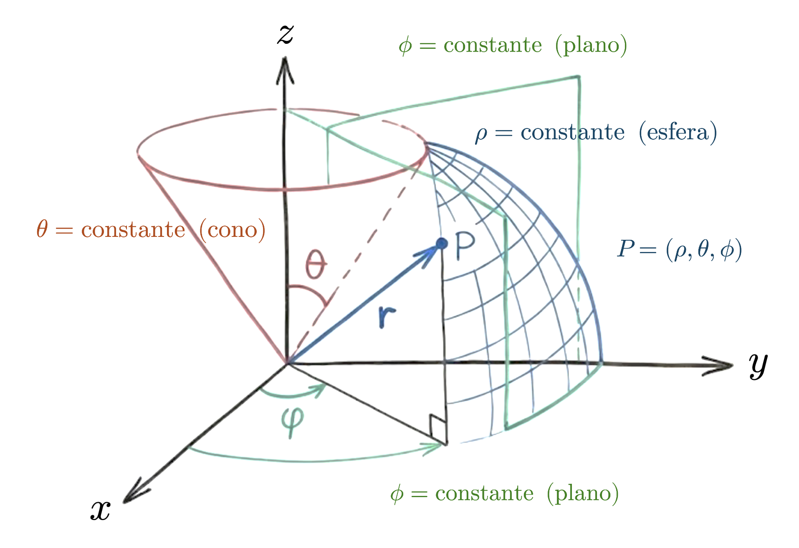

::: {.callout-important}
## Idea central

Los tensores constituyen el lenguaje matemático que permite representar escalares, vectores, matrices y arreglos de mayor orden bajo una misma estructura algebraica. En este apunte construiremos una primera intuición sobre ellos, entendiendo que no son sólo “tablas multidimensionales”, sino objetos cuyos ejes, transformaciones y operaciones deben respetar la geometría de los espacios vectoriales involucrados. Esta mirada será fundamental para comprender cómo se manipulan datos, parámetros, activaciones y gradientes en modelos modernos de aprendizaje automático y aprendizaje profundo.
:::

## Introducción

A partir de esta serie de apuntes abordaremos las bases elementales de la **teoría del aprendizaje profundo**, la cual engloba las técnicas de aprendizaje automático motivadas a partir del uso de un paradigma de aprendizaje muy particular denominado como **red neuronal**. La red neuronal es un modelo que imita el proceso de proceso de aprendizaje del cerebro humano por medio de una regla de propagación de errores que puede variar conforme la **arquitectura** o **topología** de la misma, pero cuyo objetivo es el procesamiento de una cierta información de entrada con el objetivo de obtener un resultado determinado o salida, pero considerando la paralelización de ciertas unidades de cálculo o "procesamiento" denominadas **neuronas**, con determinados patrones de interconexión.

Todo esto suena súper sofisticado, pero en realidad las redes neuronales no revisten dificultades mayores que otros modelos de aprendizaje automático, al menos desde un contexto teórico. Las reglas de aprendizaje que gobiernan su comportamiento exigen un manejo del álgebra lineal y cálculo diferencial muy similar al que necesitamos para cubrir aspectos más *clásicos* del aprendizaje automático, pero con un ingrediente adicional: Los datos que manipularemos se almacenarán, en general, en objetos matemáticos muy generales denominados **tensores**, los cuales, en un lenguaje muy simple, corresponden a una generalización del concepto de vector y matriz abordado en detalle en el [apunte dedicado a estas entidades](/apuntes/estructuras-lineales/espacios-vectoriales/). Todo escalar, vector y matriz es un tensor de orden determinado. En este marco de referencia, lo que diferencia a estos objetos es el **orden** del tensor. Sobre un $\mathbb{K}$-espacio vectorial bien definido, un tensor de rango $0$ es, en efecto, un escalar. Uno de rango $1$, un vector. Y así sucesivamente.

Una primera **definición** de tensor, más bien intuitiva, sería entonces la siguiente: Un tensor es un objeto que "vive" en un **producto de espacios vectoriales**, y cuyas transformaciones deben respetar esa estructura.

En la teoría del aprendizaje profundo, los tensores no son simplemente una estructura de datos conveniente ni una generalización de vectores y matrices: Constituyen el **lenguaje matemático fundamental** en el que se formulan los modelos, los datos y los algoritmos de entrenamiento. Algo que ya hemos *experimentado* en cierta forma es que **toda red neuronal puede entenderse como una composición de funciones que actúan sobre tensores y producen tensores**, desde los datos de entrada hasta el valor escalar de la función de pérdida. Las observaciones, los parámetros, las activaciones intermedias y los gradientes "viven" todos en **espacios tensoriales**, y cualquier operación que realiza una red, ya sea una capa completamente conectada, una convolución, un mecanismo de atención o una normalización (conceptos que definiremos paso a paso, a medida que avancemos), puede describirse como una combinación de **transformaciones multilineales y no lineales** entre estos espacios. En este sentido, aprender esta teoría sin un dominio explícito de los tensores equivale a enseñar mecánica clásica sin vectores: Es posible ejecutar cálculos, pero no comprender verdaderamente lo que está ocurriendo.

El concepto de tensor en aprendizaje profundo va más allá de la noción informal de un “arreglo de múltiples dimensiones” (como solemos verlo a un nivel más práctico). Un tensor es un objeto que "pertenece" al producto de varios espacios vectoriales y cuya estructura impone reglas precisas sobre cómo puede transformarse, contraerse o combinarse con otros tensores. En la práctica, esto se manifiesta en la importancia crítica de los ejes y sus significados semánticos: Batch, canales, dimensiones espaciales o temporales no son intercambiables, y las operaciones sólo son válidas cuando respetan estas estructuras. El **paso hacia adelante** de una red neuronal (que permite propagar la información consumida a través de sus capas) es, esencialmente, álgebra tensorial: Productos y sumas sobre índices, contracciones entre ejes compatibles, permutaciones y reordenamientos que preservan la coherencia dimensional. Comprender estas operaciones no es un detalle técnico, sino la base para leer arquitecturas complejas, detectar errores de diseño y razonar correctamente sobre el flujo de información dentro del modelo.

Bueno, hemos usado algunos conceptos propios de redes neuronales sin introducirlos antes. Pido perdón, pero prometo que los iremos "desbloqueando" a medida que estemos preparados. Y ello requerirá que, en esta primera parte del repositorio, nos demos el tiempo de introducir el álgebra de tensores, tal y como lo hicimos en nuestra [serie de apuntes dedicados al álgebra lineal](/apuntes/estructuras-lineales/) con algunos fundamentos matemáticos elementales. Los tensores serán nuestro lenguaje natural para manipular datos y construir redes neuronales. Y tenemos que aprender cómo operar con ellos.

Demás está decir que esta serie de apuntes será, sin duda, la más abstracta y densa a nivel matemático. Pero, al mismo tiempo, tengo la sensación de que es por lejos la más interesante y divertida. Al menos para quienes, en la academia, no tuvimos la oportunidad de profundizar en conceptos tan interesantes como éstos.

## El convenio de suma de Einstein

Si bien el físico alemán Albert Einstein poularizó enormemente el uso de tensores gracias a su teoría de relatividad general durante el siglo pasado, la verdad es que éstos fueron inspirados mucho antes debido a los trabajos en el contexto de la mecánica de sólidos que motivaron la descripción de los esfuerzos que actúan sobre las caras de un elemento de volumen por medio de un tensor de segundo orden (o matriz), ya sea en direcciones normales o tangenciales a las mismas: El famoso **tensor de Cauchy** o **tensor de esfuerzos**, que es fundamental en la Geomecánica para describir el estado tensional de cualquier sólido. Sin embargo, si algo podemos atribuirle a Einstein, es su **notación condensada** para la representación de operaciones sobre tensores. Y esa notación será fundamental para nuestro estudio de este tipo de objetos.

### Sumas simples

En esencia, la notación de Einstein suprime el uso de sumatorias con base en una estrategia que *asume* que la propia repetición de un índice que acompaña a una *cantidad* matemática designa ya la existencia de una suma. Por ejemplo, la expresión

::: {.eq-scroll}
$$
\sum_{i=1}^{m} a_{i}x_{i}=a_{1}x_{1}+\cdots + a_{m}x_{m}
\tag{1.1}
$$
:::

puede escribirse simplemente como $a_{i}x_{i}$, obviando el índice sumatorio, asumiento por supuesto que $1\leq i\leq m$, lo que se denomina **rango universal** de la suma. El símbolo $i$ se toma pues como el **índice** de la misma. Este es el llamado **convenio de suma de Einstein**, y resulta muy útil para expresar en forma compacta operaciones lineales sobre tensores.

Para evitar ambigüedades, el convenio aplica únicamente sobre objetos que tienen **índices repetidos**. En la ecuación $(1.1)$ el convenio es válido, porque tanto $a_{i}$ como $x_{i}$ tienen el mismo índice $i$. Sin embargo, otras expresiones como $a_{ij}x_{k}$ no representan una suma conforme este convenio, puesto que los índices de $a_{ij}$ no son los mismos que $x_{k}$.

El convenio de suma de Einstein exige pues que un índice se repita dos veces. Por ejemplo, la expresión $a_{ij}x_{j}$ sí representa una suma, porque el índice $j$ se repite en ambas cantidades, $a_{ij}$ y $x_{j}$, por lo que se "sobreentiende" que la suma se realiza sobre $j$, dejando $i$ fijo. Como $j$ recorre un determinado número de enteros, es irrelevante la letra escojamos para representar dicho recorrido. Es así que la suma $a_{ik}x_{k}$ es equivalente a $a_{ij}x_{j}$. El índice móvil $j$ es pues un **índice mudo**, lo que hace patente el hecho de que su existencia es sólo para informar el recorrido de la suma, pudiéndose utilizar cualquier otra letra para ello. Por otro lado, el índice $i$ exige que definamos su valor en cada suma (por ejemplo, primero para $i=1$, luego para $i=2$, y así sucesivamente). De esta forma, se trata de un **índice libre**. Aunque ojo... esa libertad está limitada en el sentido de que, a menos que $i=k$, se tendrá que

::: {.eq-scroll}
$$
a_{ij}x_{j} \neq a_{kj}x_{j}
\tag{1.2}
$$
:::

A medida que avancemos, veremos que los índices que acompañan a una cantidad pueden ser **subíndices**, lo que significa que irán *bajo* la misma (como en $a_{ij}$), o bien, **superíndices**, lo que significa que irán *sobre* ella (como en $x^{j}$). Sea cual sea el caso, el convenio de suma de Einstein aplica siempre que exista un índice repetido dos veces (ambos como subíndice, como superíndice, o incluso en "posiciones" diferentes). La suma siempre se aplicará sobre el índice repetido. Salvo que digamos lo contrario, las únicas excepciones a estas reglas serán las letras $m$ y $n$, que las hemos usado consistentemente en otros apuntes (y este no será la excepción) para representar el rango total de un vector o matriz (o, adoptando nuestro nuevo lenguaje, de un tensor).

### Sumas dobles

Por supuesto, el convenio de suma de Einstein no está limitado a sumatorias simples como las vistas previamente. Si dos índices se repiten dos veces en una expresión, como en $a_{ij}x_{i}y_{j}$, entonces se "sobreentiende" que la suma se realiza tanto en $i$ como en $j$ de forma simultánea. Si una expresión contiene dos índices mudos con el mismo rango global, digamos $n$ términos en cada "dimensión", entonces habrá un total de $n^{2}$ sumandos. En general, si hay $p$ índices mudos con el mismo rango global, entonces habrá un total de $n^{p}$ sumandos. De esta manera, si desarrollamos la expresión $a_{ij}x_{i}y_{j}$, sumando primero sobre $i$ y luego sobre $j$, obtenemos

::: {.eq-scroll}
$$
a_{ij}x_{i}y_{j}= (a_{11}x_{1}y_{1} + \cdots + a_{n1}x_{n}y_{1}) + (a_{12}x_{1}y_{2} + \cdots + a_{n2}x_{n}y_{2}) + \cdots + (a_{1n}x_{1}y_{n} + \cdots + a_{nn}x_{n}y_{n})
\tag{1.3}
$$
:::

Naturalmente, el resultado no es distinto si cambiamos el orden respecto del cual realizamos la suma.

### Sustituciones

La introducción del convenio de suma de Einstein permite considerar el problema de reemplazar sumas parciales en sumas más globales, aprovechando la notación compacta que hemos aprendido. Sin embargo, esto no es tan trivial. Supongamos que deseamos sustituir $y_{i}=a_{ij}x_{j}$ en la expresión $Q=b_{ij}y_{i}x_{j}$. Para implementar esta sustitución de manera correcta, necesitamos primero identificar cualquier índice mudo en la expresión que vamos a sustituir ($y_{i}$) y que aparezca ya en la expresión principal ($Q$), cambiar ese índice por otro adecuado, y sustituir:

- **Paso 1:** Identificamos $Q=b_{ij}y_{i}x_{j}$ e $y_{i}=a_{ij}x_{j}$ $\Longrightarrow$ El índice $j$ es mudo y está duplicado en la expresión a sustituir.
- **Paso 2:** Cambiamos el índice $j$ por $k$ en la expresión a sustituir $\Longrightarrow$ $y_{i}=a_{ik}x_{k}$.
- **Paso 3:** Sustituimos y reordenamos $\Longrightarrow$ $Q=b_{ij}(a_{ik}x_{k})x_{j}=a_{ik}b_{ik}x_{j}x_{k}$.

### Manipulaciones algebraicas

La operación con objetos como los presentados en el convenio de suma de Einstein, que por el momento llamaremos **objetos indexados**, requiere comprender como simplificar expresiones que se anulan de forma natural en las sumas dobles. Esto es razonable porque todos aquellos objetos con índices no repetidos no contribuyen a la suma en este convenio, de manera similar a lo que ocurre con los términos no diagonales en una matriz triangular del tipo $\mathbf{A}=a_{ij}\in \mathbb{R}^{m\times n}$, donde $a_{ij}=0$ para todo $i\neq j$. Para garantizar que las simplificaciones se entiendan siempre de esta manera, nos apoyaremos con un objeto clave del análisis tensorial llamado **delta de Kronecker**, y definido como

::: {.eq-scroll}
$$
\delta_{ij} = \begin{cases}1&;\  \mathrm{si} \  i=j\\ 0&;\  \mathrm{si} \  i\neq j\end{cases}
\tag{1.4}
$$
:::

La delta de Kronecker nos permite "aniquilar" todos los términos en una suma que no presenten índices repetidos, permitiendo simplificaciones en expresiones que en primera instancia pueden ser más difíciles de leer o digerir, apareciendo de forma natural en muchísimas expresiones que derivan del uso de tensores. Por ejemplo, una matriz identidad $\mathbf{I}_{n}\in \mathbb{R}^{n\times n}$, cuyas entradas $a_{ij}$ son iguales a $1$ cuando $i=j$, y $0$ cuando $i\neq j$, puede expresarse como $\mathbf{I}_{n} = \delta_{ij}$. Esto valida las siguientes propiedades, siempre bajo el convenio de suma de Einstein:

- (P1): $\delta_{ij}a_{i}=a_{i}$.
- (P2): $a_{i}\delta_{ij}=a_{j}$.
- (P3): $\delta_{ik} \delta_{kj}= \delta_{ij}$.

Notemos que las propiedades (P1) y (P2) pueden generalizarse a cualquier objeto indexado, independientemente del número de índices presentes en el objeto indexado sobre el que opera la delta de Kronecker. Por ejemplo, $\delta_{ij}a_{jk}= a_{ik}$, lo que implica que la delta de Kronecker elimina índices repetidos como una forma de reducir términos que no aportan en la suma que resulta de las expresiones que dependen de estos objetos indexados.

**Ejemplo 1.1:** Consideremos la expresión $\delta_{ij}x_{i}x_{j}$. Al desarrollarla, obtenemos

::: {.eq-scroll}
$$
\begin{array}{lll}
\delta_{ij}x_{i}x_{j} & = & 1x_{1}x_{1} + 0x_{1}x_{2} + 0x_{1}x_{3} + 0x_{2}x_{1} + 1x_{2}x_{2} + 0x_{2}x_{3} + 0x_{3}x_{1} + 0x_{3}x_{2} + 1x_{3}x_{3}
\\ & = & (x_{1})^{2} + (x_{2})^{2} + (x_{3})^{2}
\\ & = & x_{i}x_{i}
\end{array}
\tag{1.5}
$$
:::

Es decir, $\delta_{ij}x_{i}x_{j}=x_{i}x_{i}$. ◼︎

**Ejemplo 1.2:** Consideremos la matriz $\mathbf{A}\in \mathbb{R}^{n\times n}$, la cual, como formalizaremos más adelante, se trata de un *tensor* de orden $2$. Vamos a desarrollar la expresión $Q=\delta_{ik}\,\delta_{jl}\,a_{ij}\,a_{kl}$, a fin de poder simplificarla lo más que podamos aprovechando las propiedades que hemos establecido para la delta de Kronecker. En efecto,

::: {.eq-scroll}
$$
\begin{array}{lll}Q&=&\delta_{ik} \delta_{jl} a_{ij}a_{kl}\\ &=&\delta_{jl} \underbrace{\left( \delta_{ik} a_{kl} \right)}_{=a_{il}} a_{ij}\  \left( \mathrm{aplicando} \  \left( \text{P2} \right) \right)\\ &=&\underbrace{\left( \delta_{jl} a_{il} \right)}_{=a_{ij}} a_{ij}\  \left( \mathrm{aplicando\  otra\  vez} \  \left( \text{P2} \right) \right)\\ &=&a_{ij}a_{ij}\end{array}
\tag{1.6}
$$
:::

Notemos que la expresión a la que hemos llegado, $Q=a_{ij}a_{ij}$, corresponde a lo que llamamos **contracción total** del tensor $\mathbf{A}$. En términos algebraicos, dicha contracción equivale al cuadrado de la norma de Frobenius de dicho tensor: $\left\Vert \mathbf{A} \right\Vert_{F}^{2} =\mathrm{tr} \left( \mathbf{A}^{\top} \mathbf{A} \right) =a_{ij}a_{ij}$.

Verificamos pues que la delta de Kronecker no se trata simplemente de un "número mágico", sino que un operador que fuerza la igualdad de índices de los objetos indexados involucrados. Cada aplicación de la delta de Kronecker, de alguna manera, "reduce" el orden efectivo del objeto sobre el cual operamos, siendo este un proceso mecánico sencillo, no intuitivo ◼︎.

**Ejemplo 1.3:** Asumiremos que $a_{ij}$ representará siempre una constante arbitraria. Bajo esta condición, calcularemos la derivada $\frac{\partial}{\partial x_{k}} \left( a_{ij}x_{i}x_{j} \right)$ por medio del desarrollo de esta expresión, y luego operaremos usando propiedades de la delta de Kronecker. En efecto, si desarrollamos el argumento de la derivada, obtenemos

::: {.eq-scroll}
$$
\begin{array}{lll}a_{ij}x_{i}x_{j}&=&\displaystyle \sum_{i=1}^{n} \sum_{j=1}^{n} a_{ij}x_{i}x_{j}\  \left( \mathrm{pasamos\  a\  notacion\  clasica} \right)\\ &=&\displaystyle \sum_{\begin{gathered}i\neq k,j\neq k\end{gathered}} a_{ij}x_{i}x_{j}+\sum_{\begin{gathered}i=k,j\neq k\end{gathered}} a_{ij}x_{i}x_{j}+\sum_{\begin{gathered}i\neq k,j=k\end{gathered}} a_{ij}x_{i}x_{j}+\sum_{\begin{gathered}i=k,j=k\end{gathered}} a_{ij}x_{i}x_{j}\  \left( \mathrm{para\  algun} \  k\  \mathrm{interior} \right)\\ &=&\displaystyle C+\left( \sum_{\begin{gathered}j\neq k\end{gathered}} a_{kj}x_{j} \right) x_{k}+\left( \sum_{\begin{gathered}i\neq k\end{gathered}} a_{ik}x_{i} \right) x_{k}+a_{kk}\left( x_{k} \right)^{2} \  \left( \mathrm{donde} \  C\  \mathrm{es\  independiente\  de} \  x_{k} \right)\end{array}
\tag{1.7}
$$
:::

Derivando la expresión resultante,

::: {.eq-scroll}
$$
\begin{array}{lll}\displaystyle \frac{\partial}{\partial x_{k}} \left( a_{ij}x_{i}x_{j} \right)&=&\displaystyle \frac{\partial}{\partial x_{k}} \left( \sum_{i=1}^{n} \sum_{j=1}^{n} a_{ij}x_{i}x_{j} \right)\\ &=&\displaystyle \frac{\partial}{\partial x_{k}} \left( C+\left( \sum_{\begin{gathered}j\neq k\end{gathered}} a_{kj}x_{j} \right) x_{k}+\left( \sum_{\begin{gathered}i\neq k\end{gathered}} a_{ik}x_{i} \right) x_{k}+a_{kk}\left( x_{k} \right)^{2} \right)\\ &=&\  \displaystyle \frac{\partial}{\partial x_{k}} \left( C \right) +\frac{\partial}{\partial x_{k}} \left( \sum_{\begin{gathered}j\neq k\end{gathered}} a_{kj}x_{j} \right) x_{k}+\frac{\partial}{\partial x_{k}} \left( \sum_{\begin{gathered}i\neq k\end{gathered}} a_{ik}x_{i} \right) x_{k}+\frac{\partial}{\partial x_{k}} \left( a_{kk}\left( x_{k} \right)^{2} \right)\\ &=&\displaystyle 0+\sum_{\begin{gathered}j\neq k\end{gathered}} a_{kj}x_{j}+\sum_{\begin{gathered}i\neq k\end{gathered}} a_{ik}x_{i}+\underbrace{2a_{kk}x_{k}}_{=a_{kk}x_{k}+a_{kk}x_{k}}\\ &=&\displaystyle \sum_{i=1}^{n} a_{ik}x_{i}+\sum_{j=1}^{n} a_{kj}x_{j}\\ &=&a_{ik}x_{i}+a_{kj}x_{j}\  \left( \mathrm{aplicando\  el\  convenio\  de\  suma\  de\  Einstein} \right)\\ &=&a_{ik}x_{i}+a_{ki}x_{i}\  \left( \mathrm{renombrando\  el\  indice} \  j\  \mathrm{como} \  i \right)\\ &=&\left( a_{ik}+a_{ki} \right) x_{i}\end{array}
\tag{1.8}
$$
:::

Así que, finalmente, $\frac{\partial}{\partial x_{k}} \left( a_{ij}x_{i}x_{j} \right) =\left( a_{ik}+a_{ki} \right) x_{i}$.

El cálculo de esta derivada resulta intensivo cuando desarrollamos las sumas indexadas por las expresiones correspondientes. Sin embargo, usando únicamente el convenio de suma de Einstein es posible resolver su desarrollo introduciendo la propiedad $\frac{\partial x_{p}}{\partial x_{q}} =\delta_{pq}$, donde la delta de Kronecker nuevamente es protagonista. De este modo, aplicando sus propiedades, obtenemos

::: {.eq-scroll}
$$
\begin{array}{lll}\displaystyle \frac{\partial}{\partial x_{k}} \left( a_{ij}x_{i}x_{j} \right)&=&\displaystyle a_{ij}\frac{\partial}{\partial x_{k}} \left( x_{i}x_{j} \right)\\ &=&\displaystyle a_{ij}\left( x_{j}\frac{\partial x_{i}}{\partial x_{k}} +x_{i}\frac{\partial x_{j}}{\partial x_{k}} \right) \  \left( \mathrm{aplicando\  propiedades\  de\  las\  derivadas} \right)\\ &=&a_{ij}\left( x_{j}\delta_{ik} +x_{i}\delta_{jk} \right)\\ &=&a_{ij}x_{j}\delta_{ik} +a_{ij}x_{i}\delta_{jk}\\ &=&a_{jk}x_{j}+a_{ik}x_{i}\  \left( \mathrm{aplicando\  propiedad} \  \left( \text{P2} \right) \right)\\ &=&a_{ik}x_{i}+a_{ki}x_{i}\  \left( \mathrm{renombrando\  indices} \right)\\ &=&\left( a_{ik}+a_{ki} \right) x_{i}\end{array}
\tag{1.9}
$$
:::

Y ahí lo tenemos. Nuevamente, verificamos que la delta de Kronecker y la notación indexada de Einstein son poderosos aliados para resolver problemas que involucran sumas donde eliminar términos que no contriubuyen a sus totales es crucial para obtener expresiones simplificadas y legibles. ◼︎

Un último comentario sobre la delta de Kronecker, pero no menos importante: Su validez es independiente de la posición de los índices correspondientes. Es decir, $\delta_{ij} =\delta^{ij} =\delta_{j}^{i}$. Más adelante, veremos la importancia de la posición de estos índices al formalizar el concepto de tensor.

Ciertas manipulaciones rutinarias en el contexto del álgebra y cálculo tensorial admiten justificaciones sencillas por medio de las propiedades de la suma ordinaria de escalares (que, recordemos, también son tensores, como formalizaremos más adelante). Esto quiere decir que varias identidades que podemos construir a partir de objetos indexados pueden demostrarse extendiendo los axiomas elementales de la aritmética a tales objetos, pero entendiendo que su demostración implica el desarrollo de las sumas involucradas, que, en general, involucrará en realidad más propiedades.

Algunas identidades muy importantes son las siguientes. En todas ellas, el rango total de las expresiones va de $1$ hasta $n$:

- **(I1):** $a_{ij}\left( x_{i}+y_{j} \right) =a_{ij}x_{i}+a_{ij}y_{j}$.
- **(I2):** $a_{ij}x_{i}y_{j}=a_{ij}y_{j}x_{i}$.
- **(I3):** $a_{ij}x_{i}x_{j}=a_{ji}x_{i}x_{j}$.
- **(I4):** $\left( a_{ij}+a_{ji} \right) x_{i}x_{j}=2a_{ij}x_{i}x_{j}$.
- **(I5):** $\left( a_{ij}-a_{ji} \right) x_{i}x_{j}=0$.

## Notación tensorial para matrices, vectores y determinantes

A continuación re-introduciremos algunos conceptos elementales del álgebra lineal estudiados en la [serie de apuntes de álgebra lineal](/apuntes/estructuras-lineales/). Debido a que los conceptos que repasaremos son, de alguna manera, familiares en un esquema clásico típico de los primeros cursos de cualquier carrera de ingeniería, nuestro objetivo será su reformulación aprovechando el convenio de suma de Einstein que hemos introducido hace poco.

### Propiedades elementales

En la notación matricial ordinaria, escribimos $\mathbf{A} =\left\{ a_{ij} \right\} \in \mathbb{R}^{m\times n}$ para representar a la **matriz** $\mathbf{A}$ cuyas entradas son los elementos $a_{ij}\in \mathbb{R}$, donde $1\leq i\leq m\wedge 1\leq j\leq n$. El símbolo $\mathbb{R}^{m\times n}$ denota al conjunto de todas las matrices con $m$ filas y $n$ columnas. Bajo esta notación, el primer sub-índice $i$ denota en qué fila se encuentra $a_{ij}$ en $\mathbf{A}$, mientras que $j$ designa la columna correspondiente. Una notación más compacta que proponemos es $\left[ a_{ij} \right]_{mn}$, donde exhibimos la **dimensión** de la matriz $\mathbf{A}$ de forma explícita. Los índices que describen la posición del elemento correspondiente en la matriz pueden especificarse como subíndices, tal y como solemos hacerlo en un esquema clásico, pero también como superíndices, escribiendo $\left[ a^{ij} \right]_{mn}$. Incluso podemos usar índices mixtos (uno arriba y uno abajo), poniendo $[a_{i}^{j}]_{mn}$. Por ejemplo:

::: {.eq-scroll}
$$
\left[ a_{ij} \right]_{mn} =\left( \begin{matrix}a_{11}&a_{12}&\cdots&a_{1n}\\ a_{21}&a_{22}&\cdots&a_{2n}\\ \vdots&\vdots&\ddots&\vdots\\ a_{m1}&a_{m2}&\cdots&a_{mn}\end{matrix} \right) \  \wedge \  \left[ a^{ij} \right]_{mn} =\left( \begin{matrix}a^{11}&a^{12}&\cdots&a^{1n}\\ a^{21}&a^{22}&\cdots&{}a^{2n}\\ \vdots&\vdots&\ddots&\vdots\\ a^{m1}&a^{m2}&\cdots&a^{mn}\end{matrix} \right) \  \wedge \  \left[ a_{j}^{i} \right]_{mn} =\left( \begin{matrix}a_{1}^{1}&a_{2}^{1}&\cdots&a_{n}^{1}\\ a_{1}^{2}&a_{2}^{2}&\cdots&a_{n}^{2}\\ \vdots&\vdots&\ddots&\vdots\\ a_{1}^{m}&a_{2}^{m}&\cdots&a_{n}^{m}\end{matrix} \right)
\tag{1.10}
$$
:::

Notemos que para índices mixtos, el de arriba indica la fila y el de abajo indica la columna. Para el caso de superíndices, el esquema es esencialmente el mismo que el de los subíndices.

Vayamos ahora al caso de los vectores (en el sentido clásico). Un **vector** definido en el espacio $\mathbb{R}^{n}$ es cualquier matriz columna $\mathbf{v} =\left[ x_{ij} \right]_{n1}$ con componentes reales $x_{i}\equiv x_{i1}\in \mathbb{R}$. Usualmente, escribimos $\mathbf{v}=(x_{i})$. De esta manera, $\mathbb{R}^{n}$ describe al conjunto de todos los vectores constituidos por $n$ elementos, todos ellos definidos en $\mathbb{R}$.

Cuando sumamos vectores y matrices, la operación se realiza elemento a elemento. Por ejemplo, si definimos las matrices arbitrarias $\mathbf{A} =\left[ a_{ij} \right]_{mn} \wedge \mathbf{B} =\left[ b_{ij} \right]_{mn}$, entonces la suma $\mathbf{A}+\mathbf{B}$ puede definirse en forma sencilla como

::: {.eq-scroll}
$$
\mathbf{A} +\mathbf{B} =\left[ a_{ij}+b_{ij} \right]_{mn}
\tag{1.11}
$$
:::

Por otro lado, la multiplicación de la matriz $\mathbf{A} =\left[ a_{ij} \right]_{mn}$ por un escalar arbitrario $\lambda\in \mathbb{R}$ puede definirse, bajo esta notación, como

::: {.eq-scroll}
$$
\lambda \mathbf{A} =\left[ \lambda a_{ij} \right]_{mn}
\tag{1.12}
$$
:::

Notemos que, al usar esta notación, estamos forzando a que todas las operaciones algebraicas que están definidas para vectores y matrices se expresen convenientemente por medio del convenio de suma de Einstein. Veamos a continuación algunas propiedades (y definiciones) importantes relativas a vectores y matrices expresadas bajo este convenio:

**Producto matricial:** Sean las matrices $\mathbf{A} =\left[ a_{ij} \right]_{mn} \wedge \mathbf{B} =\left[ b_{ij} \right]_{np}$. El producto $\mathbf{A} \mathbf{B}$ de estas matrices se define entonces como $\mathbf{A} \mathbf{B} =\left[ a_{ik}b_{kj} \right]_{mp}$. Notemos que la posición de los índices es irrelevante para definir este producto. De esta manera, $\mathbf{A} \mathbf{B}$ puede expresarse equivalentemente como $\mathbf{A} \mathbf{B} =\left[ a^{ik}b^{kj} \right]_{mp} \vee \mathbf{A} \mathbf{B} =\left[ a_{k}^{i}b_{j}^{k} \right]_{mp}$. Notemos que, bajo esta estructura, los índices $i$ y $j$ no están sumados.

**Matriz identidad:** Como comentamos unas líneas más arriba, la matriz identidad $\mathbf{I}_{n} =\left[ a_{ij} \right]_{nn}$, tal que $a_{ij}=1$ para $i=j$ y $a_{ij}=0$ para $i\neq j$, puede expresarse convenientemente por medio de la delta de Kronecker. De esta manera, $\mathbf{I}_{n} =\left[ \delta_{ij} \right]_{nn}$. Indistintamente, podemos también escribir $\mathbf{I}_{n} =\left[ \delta^{ij} \right]_{nn}$ o $\mathbf{I}_{n} =\left[ \delta^{i}_{j} \right]_{nn}$. Es sencillo verificar, usando propiedades de la delta de Kronecker, que, para toda matriz cuadrada $\mathbf{A} =\left[ a_{ij} \right]_{nn}$, se tendrá que $\mathbf{A}\mathbf{I}_{n}=\mathbf{I}_{n}\mathbf{A}=\mathbf{A}$.

**Inversa de una matriz cuadrada:** Decimos que una matriz cuadrada $\mathbf{A} =\left[ a_{ij} \right]_{nn}$ es **invertible** o **no singular**, si existe una única matriz $\mathbf{B} =\left[ b_{ij} \right]_{nn}$, llamada **inversa** de $\mathbf{A}$, tal que $\mathbf{A} \mathbf{B}= \mathbf{B} \mathbf{A}= \mathbf{I}_{n}$. Notemos que, en términos de los elementos de cada matriz, se tiene que $a_{ik}b_{kj}=b_{ik}a_{kj}=\delta_{ij}$. Como antes, la posición de los índices es irrelevante para describir la inversión. La matriz inversa de $\mathbf{A}$ suele escribirse como $\mathbf{A}^{-1}$, pero esto no significa que los elementos de $\mathbf{A}^{-1}$ sean iguales a $a_{ij}^{-1}$.

**Transpuesta de una matriz:** Sea la matriz $\mathbf{A} =\left[ a_{ij} \right]_{mn}$. La **transpuesta** de $\mathbf{A}$, denotada como $\mathbf{A}^{\top}$, se define como $\mathbf{A}^{\top} =\left[ a_{ij} \right]_{mn}^{\top} =\left[ a_{ji} \right]_{nm}$. Es común, en algunos textos especializados, que la transpuesta de $\left[ a_{ij} \right]_{mn}$ se escriba como $\left[ a'_{ij} \right]_{nm}$, donde $a'_{ij}= a_{ji}$. Notemos además que, si $\mathbf{A}=\mathbf{A}^{top}$, la matriz $\mathbf{A}$ se denominará **simétrica**, mientras que, si $\mathbf{A}=-\mathbf{A}^{top}$, la matriz $\mathbf{A}$ se denominará **antisimétrica**.

**Matriz ortogonal:** Una matriz $\mathbf{A} =\left[ a_{ij} \right]_{mn}$ es llamada **ortogonal** si y sólo si $\mathbf{A}^{\top} \mathbf{A} =\mathbf{A} \mathbf{A}^{\top} =\mathbf{I}_{n}$. Notemos que esto implica que $\mathbf{A}^{\top} =\mathbf{A}^{-1}$.

**Permutación de índices:** Llamamos al símbolo $e_{ijk...w}$ (con $n$ subíndices) como **índice de permutación** o **símbolo de Levi-Civita**, siendo su valor igual a cero si dos de los $n$ subíndices están repetidos, e igual a $(-1)^{p}$ en cualquier otro caso, donde $p$ es el número de transposiciones de los subíndices de $e_{ijk...w}$ que son necesarios para llevar al juego de índices $\left\{ i,j,k,...,w \right\}$ a una secuencia de orden ascendente ($\left\{ 1,2,...,n \right\}$).

**Determinante de una matriz cuadrada:** Sea la matriz cuadrada $\mathbf{A} =\left[ a_{ij} \right]_{nn}$. El escalar definido como $\det \left( \mathbf{A} \right) =e_{i_{1}i_{2}...i_{n}}a_{1i_{1}}a_{2i_{2}}\  \cdots \  a_{ni_{n}}$. El determinante es una función cuyo dominio es el conjunto $\mathbb{R}^{n\times n}$ y su codominio es $\mathbb{R}$, y cuyo resultado también puede escribirse como $\left| \mathbf{A} \right|$ o $\left| a_{ij} \right|$. Sus propiedades más importantes son las derivadas del producto matricial y transposición: $\det \left( \mathbf{A} \mathbf{B} \right) =\det \left( \mathbf{A} \right) \det \left( \mathbf{B} \right)$ y $\det \left( \mathbf{A}^{\top} \right) =\det \left( \mathbf{A} \right)$.

**Expansión de Laplace para determinantes:** Sea la matriz cuadrada $\mathbf{A} =\left[ a_{ij} \right]_{nn}$. Para cada par $i,j$ se define $\mathbf{A}_{ij}$ como la submatriz resultante de eliminar la fila $i$ y la columna $j$ de la matriz de $\mathbf{A}$, siendo su determinante $M_{ij}=\det \left( \mathbf{A}_{ij} \right)$ llamado **menor complementario** de $\mathbf{A}$ en la posición $(i,j)$. Si definimos el escalar $\triangle_{ij} =\left( -1 \right)^{i+j} M_{ij}$, llamado **cofactor** asociado al $ij$-elemento de $\mathbf{A}$, entonces el determinante $\det \left( \mathbf{A} \right)$ puede definirse por medio de las siguientes fórmulas independientes, llamadas colectivamente **expansiones de Laplace**, como

::: {.eq-scroll}
$$
\det \left( \mathbf{A} \right) =\begin{cases}\sum\nolimits_{i=1}^{n} \triangle_{ij} M_{ij}&\left( \mathrm{desarrollo\  por\  filas} \right)\\ \sum\nolimits_{j=1}^{n} \triangle_{ji} M_{ji}&\left( \mathrm{desarrollo\  por\  columnas} \right)\end{cases}
\tag{1.13}
$$
:::

Notemos que, si usamos el convenio de suma de Einstein, podemos ahorrarnos el índice sumatorio:

::: {.eq-scroll}
$$
\det \left( \mathbf{A} \right) =\begin{cases}\triangle_{ij} M_{ij}&\left( \mathrm{desarrollo\  por\  filas} \right)\\ \triangle_{ji} M_{ji}&\left( \mathrm{desarrollo\  por\  columnas} \right)\end{cases}
\tag{1.14}
$$
:::

**Producto escalar de vectores:** Consideremos los vectores $\mathbf{u} =\left( u_{i} \right) \wedge \mathbf{v} =\left( v_{i} \right)$. El producto escalar de estos vectores (o producto interno), denotado como $\left< \mathbf{u} ,\mathbf{v} \right>$ o, simplemente, $\mathbf{u}\mathbf{v}$, se define como $\mathbf{u} \mathbf{v} =\mathbf{u}^{\top} \mathbf{v} =u_{i}v_{i}$. Notemos que la expresión $u_{i}v_{i}$ hace uso del convenio de suma de Einstein. Notemos que, si $\mathbf{u}= \mathbf{v}$, entonces usaremos con frecuencia la notación $\mathbf{u}\mathbf{u}=\mathbf{u}^{2}$ para referirnos al producto escalar de un vector consigo mismo. Diremos además que los vectores $\mathbf{u}$ y $\mathbf{v}$ serán **ortogonales** si $\mathbf{u}\mathbf{v}=0$.

**Norma Euclidiana de un vector:** Sea el vector $\mathbf{u}=(u_{i})$. Definimos la **norma Euclidiana** de $\mathbf{u}$ como el escalar $\left\Vert \mathbf{u} \right\Vert =\sqrt{\mathbf{u}^{\top} \mathbf{u}} =\sqrt{u_{i}u_{i}}$. Notemos que la norma cumple con las siguientes propiedades:

- **(N1):** $\left\Vert \lambda \mathbf{u} \right\Vert =\lambda \left\Vert \mathbf{u} \right\Vert$, para todo $\lambda \in \mathbb{R}$ (homogeneidad absoluta).
- **(N2):** $\left\Vert \mathbf{u} +\mathbf{v} \right\Vert \leq \left\Vert \mathbf{u} \right\Vert +\left\Vert \mathbf{v} \right\Vert$ (desigualdad triangular).
- **(N3):** $\left\Vert \mathbf{u} \right\Vert \geq 0\wedge \left\Vert \mathbf{u} \right\Vert =0\Longleftrightarrow u_{i}=0$ (definida positiva).

**Ángulo entre vectores:** Sean los vectores $\mathbf{u} =\left( u_{i} \right) \wedge \mathbf{v} =\left( v_{i} \right)$. Se define el ángulo $\theta$ "entre" los vectores $\mathbf{u}$ y $\mathbf{v}$ como $\cos \left( \theta \right) =\frac{\mathbf{u} \mathbf{v}}{\left\Vert \mathbf{u} \right\Vert \left\Vert \mathbf{v} \right\Vert} =\frac{u_{i}v_{i}}{\sqrt{u_{j}u_{j}} \sqrt{v_{k}v_{k}}} \  ;\  \left( 0\leq \theta \leq \pi \right)$. Cuando $\theta= \pi/2$, decimos que los ángulos $\mathbf{u}$ y $\mathbf{v}$ son **ortogonales**. Notemos que, desde una perspectiva más abstracta y menos geométrica, el ángulo $\theta$ es una medida de **similitud** entre cualquier par arbitrario de vectores $\mathbf{u}$ y $\mathbf{v}$. Este concepto reviste una gran importancia en el análisis de datos moderno, y es la base de muchísimos conceptos afines al aprendizaje profundo. Por ejemplo, las bases de datos vectoriales.

**Producto vectorial en $\mathbb{R}^{3}$:** Sean los vectores $\mathbf{u} =\left( u_{i} \right) \wedge \mathbf{v} =\left( v_{i} \right)$. Sea además $n=3$ la dimensión de estos vectores. Definimos los **vectores base** del espacio $\mathbf{R}^{3}$ como $\mathbf{i} =(1,0,0),\  \mathbf{j} =\left( 0,1,0 \right) ,\  \mathbf{k} =\left( 0,0,1 \right)$, los que, a su vez, pueden reescribirse en términos de la delta de Kronecker como $\mathbf{i} =(\delta_{i1} ),\  \mathbf{j} =\left( \delta_{i2} \right) ,\  \mathbf{k} =\left( \delta_{i3} \right)$. Entonces definimos el **producto vectorial** de $\mathbf{u}$ y $\mathbf{v}$, denotado como $\mathbf{u}\times \mathbf{v}$, como

::: {.eq-scroll}
$$
\begin{array}{lll}\mathbf{u} \times \mathbf{v}&=&\det \left( \begin{matrix}\mathbf{i}&\mathbf{j}&\mathbf{k}\\ u_{1}&u_{2}&u_{3}\\ v_{1}&v_{2}&v_{3}\end{matrix} \right)\\ &=&\det \left( \begin{matrix}u_{2}&u_{3}\\ v_{2}&v_{3}\end{matrix} \right) \mathbf{i} -\det \left( \begin{matrix}u_{1}&u_{3}\\ v_{1}&v_{3}\end{matrix} \right) \mathbf{j} +\det \left( \begin{matrix}u_{1}&u_{2}\\ v_{1}&v_{2}\end{matrix} \right) \mathbf{k}\end{array}
\tag{1.15}
$$
:::

Expresando los determinantes de $2\times 2$ de (1.15) por medio de la fórmula general de los determinantes, haciendo uso de un índice de permutación adecuado, podemos reescribir (1.15) en forma compacta, usando el convenio de suma de Einstein, como

::: {.eq-scroll}
$$
\mathbf{u} \times \mathbf{v} =\left( e_{ijk}u_{j}v_{k} \right)
\tag{1.16}
$$
:::

Notemos que el producto vectorial, a diferencia del producto escalar, da como resultado otro vector.

**Una fórmula para la matriz inversa:** Hay diversos algoritmos para calcular la inversa de una matriz cuadrada $\mathbf{A} =\left[ a_{ij} \right]_{nn}$, explotando la capacidad de las matrices para ser factorizadas y reducidas adecuadamente. La condición necesaria y suficiente para que una matriz sea invertible (o no singular), es que $\det(\mathbf{A})\neq 0$. De esta manera, para $n$ no muy grande, la inversa $\mathbf{A}^{-1}$ puede calcularse como $\mathbf{A}^{-1} =\frac{1}{\det \left( \mathbf{A} \right)} \left[ \triangle_{ij} \right]_{nn}^{\top}$.

### Representación de sistemas de ecuaciones lineales y formas cuadráticas

Uno de los primeros usos prácticos propios de las matrices en los primeros cursos de las carreras de ingeniería, es la representación de **sistemas de ecuaciones lineales**. Por ejemplo, consideremos el sistema

::: {.eq-scroll}
$$
\begin{array}{rcl}a_{11}x_{1}+a_{12}x_{2}+\cdots +a_{1n}x_{n}&=&b_{1}\\ a_{21}x_{1}+a_{22}x_{2}+\cdots +a_{2n}x_{n}&=&b_{2}\\ &\vdots &\\ a_{m1}x_{1}+a_{m2}x_{2}+\cdots +a_{mn}x_{n}&=&b_{m}\end{array}
\tag{1.17}
$$
:::

Usando las reglas de la multiplicación matricial y la notación que hemos desarrollado hasta ahora, podemos reescribir el sistema (1.17) como

::: {.eq-scroll}
$$
\begin{array}{ll}&\left( \begin{matrix}a_{11}&a_{12}&\cdots&a_{1n}\\ a_{21}&a_{22}&\cdots&a_{2n}\\ \vdots&\vdots&\ddots&\vdots\\ a_{m1}&a_{m2}&\cdots&a_{mn}\end{matrix} \right) \left( \begin{matrix}x_{1}\\ x_{2}\\ \vdots\\ x_{n}\end{matrix} \right) =\left( \begin{matrix}b_{1}\\ b_{2}\\ \vdots\\ b_{m}\end{matrix} \right)\\ \Longleftrightarrow&\left[ a_{ij} \right]_{mn} \left( x_{j} \right) =\left( b_{i} \right)\\ \Longleftrightarrow&\mathbf{A} \mathbf{x} =\mathbf{b}\end{array}
\tag{1.18}
$$
:::

Sin embargo, bajo el convenio de suma de Einstein, podemos representar al sistema (1.17) de manera conveniente por medio de la expresión indexada $a_{ij}x_{j}=b_{i}$, donde se entiende que los rangos globales de $i$ y $j$ son iguales a $m$ y $n$, respectivamente.

Las matrices también son útiles en la representación de polinomios de segundo grado, los cuales nos permiten describir el recorrido de ciertas superficies en $\mathbb{R}^{3}$ de gran importancia en la geometría analítica y diferencial, denominadas superficies cuádricas. Tal representación es llamada **forma cuadrática**, y permite descomponer cualquier polinomio $q$ de la forma $q=\mathbf{x}^{\top} \mathbf{A} \mathbf{x}$, donde $\mathbf{A}=[a_{ij}]_{nn}$ es una matriz simétrica y $\mathbf{x}=(x_{i})$ es una matriz que representa las coordenadas sobre las que se describe el recorrido del polinomio.

**Ejemplo 1.4 – Gradiente de una forma cuadrática:** Sea $\mathbf{A}=[a_{ij}]_{nn}$ una matriz con entradas constantes. Sea además la función $f:\mathbb{R}^{n} \longrightarrow \mathbb{R}$, definida como $f(\mathbf{x})=a_{ij}x_{i}x_{j}$, donde $\mathbf{x}=(x_{i})\in \mathbb{R}^{n}$. Vamos a resolver los siguientes ejercicios:

1) Utilizando únicamente el convenio de suma de Einstein y la identidad $\frac{\partial x_{p}}{\partial x_{q}} =\delta_{pq}$, calcularemos la derivada parcial $\frac{\partial f}{\partial x_{k}}$.
2) Expresaremos el resultado de (a) en notación matricial clásica.
3) Suponiendo que la matriz $\mathbf{A}$ es simétrica (es decir, $a_{ij}=a_{ji}$), simplificaremos la expresión obtenida en (a).

En efecto, procediendo igual que en el ejemplo (1.3), tenemos que

::: {.eq-scroll}
$$
\begin{array}{lll}\displaystyle \frac{\partial f}{\partial x_{k}} &=&\displaystyle a_{ij}\frac{\partial}{\partial x_{k}} \left( x_{i}x_{j} \right)\\ &=&\displaystyle a_{ij}\left( x_{j}\frac{\partial x_{i}}{\partial x_{k}} +x_{i}\frac{\partial x_{j}}{\partial x_{k}} \right) \  \left( \mathrm{aplicando\  propiedades\  de\  las\  derivadas} \right)\\ &=&a_{ij}\left( x_{j}\delta_{ik} +x_{i}\delta_{jk} \right)\\ &=&a_{ij}x_{j}\delta_{ik} +a_{ij}x_{i}\delta_{jk}\\ &=&a_{jk}x_{j}+a_{ik}x_{i}\  \left( \mathrm{aplicando\  propiedad} \  \left( \text{P2} \right) \right)\\ &=&a_{ik}x_{i}+a_{ki}x_{i}\  \left( \mathrm{renombrando\  indices} \right)\\ &=&\left( a_{ik}+a_{ki} \right) x_{i}\end{array}
\tag{1.19}
$$
:::

Lo que resuelve (1).

Notemos que, de la última línea de la expresión (1.19), podemos reconocer que $\mathbf{A} =\left[ a_{ik} \right]_{nn} \wedge \mathbf{A}^{\top} =\left[ a_{ki} \right]_{nn}$, independientemente de la elección de los índices. Por lo tanto, podemos expresar el resultado del gradiente de $f$ como $\nabla f\left( \mathbf{x} \right) =\left( \mathbf{A} +\mathbf{A}^{\top} \right) \mathbf{x}$, lo que resuelve (2).

Por otro lado, si $\mathbf{A}$ es simétrica, se tiene que $\mathbf{A}=\mathbf{A}^{\top}$ o, en un lenguaje tensorial, $[a_{ij}]_{nn}=[a_{ji}]_{nn}$. Por lo tanto, la derivada obtenida en (1) puede escribirse como $\frac{\partial f}{\partial x_{k}} =2a_{ik}x_{i}$, lo que implica que el gradiente de $f$ se reduce a $\nabla f\left( \mathbf{x} \right) =2\mathbf{A} \mathbf{x}$. Esto resuelve (3). ◼︎

**Ejemplo 1.5:** Vamos a escribir el polinomio

::: {.eq-scroll}
$$
q(\mathbf{x})=7x_{1}^{2}-x_{2}^{2}+x_{3}^{2}+3x_{4}^{2}-4x_{1}x_{3}+3x_{1}x_{4}+10x_{2}x_{4}-6x_{3}x_{4}
\tag{1.20}
$$
:::

como una foma cuadrática, donde $\mathbf{x}=(x_{i})\in \mathbb{R}^{4}$.

En efecto, debido a que nuestro objetivo es expresar $q$ en la forma $q=\mathbf{x}^{\top} \mathbf{A} \mathbf{x}$, siendo $\mathbf{x}$ simplemente una representación más bien genérica de un vector arbitrario en $\mathbb{R}^{4}$, la única dificultad de este problema es determinar la matriz $\mathbf{A}$. 

Sin pérdida de generalidad, vamos a asumir que $\mathbf{A}=[a_{ij}]_{nn}$ es una matriz simétrica (donde $n=4$). Si tomamos como base el convenio de suma de Einstein, en general, todo polinomio cuadrático cuyo dominio es $\mathbb{R}^{n}$ puede representarse como $q(x_{i})=\alpha_{ij}x_{i}x_{j}$. Los términos cuadráticos se dan cuando $i=j$ y, por lo tanto, sus coeficientes son únicos y son los que corresponden a la diagonal principal de $\mathbf{A}$. No obstante, los términos cruzados, que están fuera de la diagonal, están duplicados. Esto ocurre porque, al asumir que $\mathbf{A}$ es simétrica, entonces $a_{ij}=a_{ji}$, lo que implica que el término $x_{i}x_{j}$ aparecerá dos veces en el desarrollo del polinomio, una vez para $a_{ij}$ y una vez para $a_{ji}$. Luego, $\mathbf{A}$ tendrá elementos no diagonales iguales a $\alpha_{ij}/2$ o $\alpha_{ji}/2$, dependiendo de si $i<j$ o $i>j$, respectivamente. En efecto,

::: {.eq-scroll}
$$
\begin{array}{lll}q\left( \mathbf{x} \right)&=&\mathbf{x}^{\top} \mathbf{A} \mathbf{x}\\ &=&\left( x_{i} \right)^{\top} \left[ a_{ij} \right] \left( x_{j} \right) \  ;\  \mathrm{donde} \  a_{ij}=\begin{cases}\alpha_{ij}&;\  \mathrm{si} \  i=j\\ \alpha_{ij} /2&;\  \mathrm{si} \  i<j\\ \alpha_{ji} /2&;\  \mathrm{si} \  i>j\end{cases} \wedge a_{ij}=a_{ji}\  \left( \mathrm{por\  simetria\  de} \  \mathbf{A} \right)\\ &=&\left( x_{1},x_{2},x_{3},x_{4} \right) \left( \begin{matrix}7&0&-2&3/2\\ 0&-1&0&5\\ -2&0&1&-3\\ 3/2&5&-3&3\end{matrix} \right) \left( \begin{matrix}x_{1}\\ x_{2}\\ x_{3}\\ x_{4}\end{matrix} \right)\end{array}
\tag{1.21}
$$
:::

Lo que resuelve nuestro problema. ◼︎

## Una mirada más práctica (y geométrica) de las transformaciones lineales

El desarrollo de las teorías de álgebra y cálculo tensorial está motivado, en gran medida, por problemas geométricos que escapan del alcance del análisis vectorial y la geometría analítica clásica, donde es necesario contar con la facilidad de poder transformar sistemas coordenados en otros según la conveniencia del problema de interés y su posterior resolución. Las **transformaciones lineales** constituyen la más elemental de tales transformaciones, porque permiten representar cambios lineales de escala, rotaciones, reflexiones y cizallamientos de un sistema de coordenadas con respecto a otro de tipo referencial. Vamos a ahondar en esto con un poco más de detalle y claridad a continuación.

### Transformación de coordenadas
En la introducción presentada en el [nuestro apunte de álgebra lineal](/apuntes/estructuras-lineales/espacios-vectoriales/), definimos las transformaciones lineales desde una perspectiva mayormente abstracta, propia del estudio del álgebra lineal. En un contexto práctico, si $V$ y $W$ son dos espacios vectoriales definidos sobre $\mathbb{R}$, una aplicación $T:V\longrightarrow W$ se denomina **transformación lineal** si se cumplen las siguientes propiedades:

- **(T1):** $T(\mathbf{u} +\mathbf{v} )=T(\mathbf{u} )+T(\mathbf{v} );\forall \mathbf{u} ,\mathbf{v} \in V$.
- **(T2):** $T(\lambda \mathbf{u} )=\lambda T(\mathbf{u} );\forall \mathbf{u} \in V\wedge \lambda \in \mathbb{R}$.

Las transformaciones lineales son esenciales en el álgebra lineal, porque permiten mapear objetos entre espacios vectoriales (en este caso, $V$ y $W$), preservando su estructura. En términos prácticos, tal preservación implica que, al operar con vectores en $V$, garanticemos que el resultado en $W$ también sea un vector. Las propiedades (T1) y (T2) garantizan, efectivamente, que podamos preservar dicha estructura.

Consideremos un sistema de coordenadas cuyo dominio es el conjunto $\mathbb{R}^{2}$. Si $\mathbf{x}=(x_{1},x_{2})$ denota a un punto arbitrario de ese sistema, el cambio de variables

::: {.eq-scroll}
$$
\begin{array}{l}\overline{x}_{1} =a_{11}x_{1}+a_{12}x_{2}\\ \overline{x}_{2} =a_{21}x_{1}+a_{22}x_{2}\end{array}
\tag{1.22}
$$
:::

es, en efecto, una transformación lineal $T:\mathbb{R}^{2}\longrightarrow \mathbb{R}^{2}$, definida como

::: {.eq-scroll}
$$
T\left( \mathbf{x} \right) =\left( \begin{matrix}{a}_{11}&{a}_{12}\\ {a}_{21}&{a}_{22}\end{matrix} \right) \mathbf{x}
\tag{1.23}
$$
:::

Donde $\mathbf{x} =\left( {}_{x_{2}}^{x_{1}} \right) \wedge \overline{\mathbf{x}} =\left( {}_{\overline{x}_{2}}^{\overline{x}_{1}} \right)$. En notación matricial, $T\left( \mathbf{x} \right) =\mathbf{A} \mathbf{x}$, donde $\mathbf{A}=[a_{ij}]_{22}$ es la matriz constituida por los coeficientes de la transformación de coordenadas (1.22). En la notación de Einstein, dicha transformación puede ser escrita en términos generales como $\overline{x}_{i}= [a_{ij}]x_{j}$, siendo, por tanto, extensible a todo $\mathbb{R}^{n}$.

Podemos concluir pues que, en términos geométricos –y sobre el espacio $\mathbb{R}^{n}$– una transformación lineal $T$ simplemente (y valga la redundancia) transforma un vector $\mathbf{x}$ en otro $\overline{\mathbf{x}}$, estando dicha transformación definida por una matriz $\mathbf{A}$, cuyas columnas representan las imágenes de los vectores que constituyen la base canónica de $\mathbb{R}^{n}$ sobre el nuevo sistema en el que describimos la posición del vector $\overline{\mathbf{x}}$, los que determinan cómo se escalan, rotan y combinan las direcciones del sistema de coordenadas. La matriz $\mathbf{A}=[a_{ij}]$ es llamada **representación matricial** de la transformación lineal $T$.

Desarrollemos esta idea. En $\mathbb{R}^{n}$, todo vector $\mathbf{x}=(x_{i})$ puede construirse como combinación lineal de una serie de $n$ vectores linealmente independientes, los que constituyen un conjunto denominado **base** de $\mathbb{R}^{n}$. En todo espacio vectorial (lo que, por supuesto, incluye a $\mathbb{R}^{n}$), existen infinitas formas de construir una base, porque existen infintos vectores linealmente independientes entre sí, siendo de especial atención la base más "simple" que es posible construir, denominada **base canónica**. Esto último no es más que una convención, pero guarda profundas implicancias con la posibilidad de simplificar las expresiones resultantes de generar todos los elementos de un espacio vectorial a partir de una combinación lineal de los elementos de una base, además de exigir siempre que los elementos de una base canónica sean ortonormales (es decir, que su producto interno sea nulo y su norma inducida sea unitaria). Por ejemplo, para el caso de $\mathbb{R}^{n}$, su base canónica $\mathcal{B}$ puede definirse como

::: {.eq-scroll}
$$
\mathcal{B} =\left\{ \mathbf{e}_{1} ,...,\mathbf{e}_{n} \right\}
\tag{1.24}
$$
:::

Donde el $i$-ésimo vector base está definido como $(\mathbf{e}_{i})_{j}= \delta_{ij}$. Es decir:

- $\mathbf{e}_{1} =\left( \mathbf{e}_{1} \right)_{j} =\left( 1,0,0,...,0 \right)$.
- $\mathbf{e}_{2} =\left( \mathbf{e}_{2} \right)_{j} =\left( 0,1,0,...,0 \right)$.
- Y en general, $\mathbf{e}_{i} =\left( \mathbf{e}_{i} \right)_{j} =(0,0,...,0,\underbracket{1}_{\mathrm{posicion} \  i} ,0,...,0)$.

La base $\mathcal{B}$ es canónica, porque no existe forma más sencilla de construir un vector arbitrario en $\mathbb{R}^{n}$ a partir de una combinación lineal que con los vectores de $\mathcal{B}$. Además, notemos que esta base es ortonormal, porque $\left\Vert \mathbf{e}_{i} \right\Vert =1$ y $\mathbf{e}_{i} \mathbf{e}_{j} =0;\  \forall i\neq j$. Notemos que la condición de ortonormalidad de $\mathcal{B}$ (y de cualquier otra base) puede expresarse condensadamente usando la delta de Kronecker, ya que $\mathbf{e}_{i} \mathbf{e}_{j} =\delta_{ij}$ implica un producto interno nulo y una norma unitaria. Esto es clave, ya que nos permite concluir que la delta de Kronecker es, sin duda, una (muy) adecuada representación algebraica de la ortonormalidad de la base canónica.

Notemos que $\mathcal{B}$ es una base, porque todo vector $\mathbf{x}=(x_{i})$ puede escribirse como $\mathbf{x} =x_{i}\mathbf{e}_{i}$ (bajo el convenio de suma de Einstein), donde $x_{i}$ es la $i$-ésima componente de $\mathbf{x}$. Esta convención para describir la base canónica de $\mathbb{R}^{n}$ no es algo nuevo. En física, cuando trabajamos con vectores en $\mathbb{R}^{3}$, es muy común emplear los símbolos $\mathbf{i}$, $\mathbf{j}$ y $\mathbf{k}$, en vez de $\mathbf{e}_{1}$, $\mathbf{e}_{2}$ y $\mathbf{e}_{3}$, para representar la base $\mathcal{B}$ y así construir cualquier vector.

Volvamos a lo medular. Las transformaciones lineales resultan, por tanto, claves para transformar un sistema de coordenadas en el cual un vector arbitrario $(\mathbf{x}_{1},...,\mathbf{x}_{n})$ se convierte en otro $(\overline{\mathbf{x}}_{1},...,\overline{\mathbf{x}}_{n})$. Existen muchos nombres para describir al nuevo sistema. Nosotros optaremos simplemente por llamar a las coordenadas resultantes de una transformación lineal, redundantemente, como **coordenadas transformadas**.

**Ejemplo 1.5:** Sea $T:\mathbb{R}^{4}\longrightarrow \mathbb{R}^{4}$ la transformación lineal definida como

::: {.eq-scroll}
$$
\overline{x}_{i} =a_{ij}x_{j}\  \  \wedge \  \  \left[ a_{ij} \right] =\left( \begin{matrix}1&0&0&2\\ 0&2&0&0\\ 0&0&-1&1\\ 0&0&0&1\end{matrix} \right)
\tag{1.25}
$$
:::

Notemos que la matriz $\mathbf{A}=[a_{ij}]$ es de tipo triangular superior, lo que facilita cualquier cálculo que dependa de su manipulación. Primero determinaremos las imágenes de la base canónica $\mathcal{B} =\left\{ \mathbf{e}_{1} ,\mathbf{e}_{2} ,\mathbf{e}_{3} ,\mathbf{e}_{4} \right\}$. Considerando que $\left( \mathbf{e}_{i} \right)_{j} =\delta_{ij}$, entonces

::: {.eq-scroll}
$$
\begin{array}{lll}T\left( \mathbf{e}_{j} \right)_{i}&=&a_{ik}\left( \mathbf{e}_{j} \right)_{k}\\ &=&a_{ik}\delta_{jk}\\ &=&a_{ij}\end{array}
\tag{1.26}
$$
:::

De esta manera, en efecto, $T\left( \mathbf{e}_{j} \right)$ es la $j$-ésima columna de $[a_{ij}]$. Es decir,

::: {.eq-scroll}
$$
T\left( \mathbf{e}_{1} \right) =\left( \begin{matrix}1\\ 0\\ 0\\ 0\end{matrix} \right) \  ;\  T\left( \mathbf{e}_{2} \right) =\left( \begin{matrix}0\\ 2\\ 0\\ 0\end{matrix} \right) \  ;\  T\left( \mathbf{e}_{3} \right) =\left( \begin{matrix}0\\ 0\\ -1\\ 0\end{matrix} \right) \  ;\  T\left( \mathbf{e}_{4} \right) =\left( \begin{matrix}2\\ 0\\ 1\\ 1\end{matrix} \right)
\tag{1.27}
$$
:::

Notemos que, si $\overline{\mathbf{x}}$ designa la transformación de $\mathbf{x}$ bajo $T$, entonces la lectura geométrica que se desprende de (1.27) es más bien sencilla: La primera coordenada se mantiene igual, la segunda se escala por $2$, la tercera cambia de signo y la cuarta se "mezcla" con la primera y la tercera. De esta manera, poniendo $\overline{\mathbf{x}}=\mathbf{A}\mathbf{x}$, la transformación de coordenadas puede escribirse explícitamente como

::: {.eq-scroll}
$$
\overline{\mathbf{x}} =\left( \begin{matrix}1&0&0&2\\ 0&2&0&0\\ 0&0&-1&1\\ 0&0&0&1\end{matrix} \right) \left( \begin{matrix}x_{1}\\ x_{2}\\ x_{3}\\ x_{4}\end{matrix} \right) \  \  \Longrightarrow \  \  \begin{cases}\overline{x}_{1} =x_{1}+2x_{4}&\\ \overline{x}_{2} =2x_{2}&\\ \overline{x}_{3} =-x_{3}+x_{4}&\\ \overline{x}_{4} =x_{4}&\end{cases}
\tag{1.28}
$$
:::

Notemos que la representación matricial de $T$ es no singular, lo que implica que $T$ es una aplicación invertible. En efecto, $\det(\mathbf{A})=-2\neq 0$. Geométricamente, esto significa que la transformación definida por $T$ no colapsa ninguna dimensión del espacio $\mathbb{R}^{n}$. Debido a que disponemos de una representación explícita de la transformación de coordenadas descrita por $T$, podemos calcular su inversa fácilmente, ya que

::: {.eq-scroll}
$$
\begin{cases}\overline{x}_{1} =x_{1}+2x_{4}&\\ \overline{x}_{2} =2x_{2}&\\ \overline{x}_{3} =-x_{3}+x_{4}&\\ \overline{x}_{4} =x_{4}&\end{cases} \  \  \Longrightarrow \  \  \begin{cases}x_{1}=\overline{x}_{1} -2\overline{x}_{4}&\\ x_{2}=\frac{1}{2} \overline{x}_{2}&\\ x_{3}=-\overline{x}_{3} +\overline{x}_{4}&\\ x_{4}=\overline{x}_{4}&\end{cases}
\tag{1.29}
$$
:::

De esta manera, usando nuestra notación tensorial, existe $\mathbf{A}^{-1} =\left[ a^{ij} \right]$ tal que $x_{i}=a^{ij}\overline{x}_{j}$, donde

::: {.eq-scroll}
$$
\mathbf{A}^{-1} =\left[ a^{ij} \right] =\left( \begin{matrix}1&0&0&-2\\ 0&1/2&0&0\\ 0&0&-1&1\\ 0&0&0&1\end{matrix} \right)
\tag{1.30}
$$
:::

Notemos que, por definición, $T^{-1}\left( T\left( \mathbf{x} \right) \right) \left( \mathbf{x} \right) =\mathbf{x} ;\  \forall \mathbf{x} \in \mathbb{R}^{4}$. Por lo tanto, en notación tensorial, $x_{i}=a^{ij}\overline{x}_{j} =a^{ij}a_{jk}x_{k}\Longrightarrow a^{ij}a_{jk}=\delta_{k}^{i}$. Este es un ejemplo que pone de manifiesto que, en realidad, *sí importa* donde ponemos los índices en las componentes de un vector o de una matriz. Esto es algo que aclararemos más adelante. ◼︎

### Distancia

Consideremos una transformación lineal $T:\mathbb{R}^{n}\longrightarrow \mathbb{R}^{n}$, definida como $T(\mathbf{x})=\mathbf{A} \mathbf{x}$. Describiremos la resolución del problema resultante de determinar la distancia de un punto $\overline{\mathbf{x}}$, con respecto a otro $\overline{\mathbf{y}}$, en el sistema coordenado transformado que resulta de aplicar $T$ sobre los vectores $\mathbf{x}$ y $\mathbf{y}$, respectivamente. Verificaremos, además, si dichas distancias son iguales en ambos sistemas de coordenadas. Sin pérdida de general, asumiremos que la transformación $T$ es invertible, lo que implica que $\mathbf{A}$ es no singular y, por tanto, su inversa $\mathbf{A}^{-1}$ existe.

En efecto, del cálculo vectorial clásico, sabemos que la distancia entre dos puntos $\mathbf{x}$ y $\mathbf{y}$ en $\mathbb{R}^{n}$ viene dada por la fórmula

::: {.eq-scroll}
$$
d\left( \mathbf{x} ,\mathbf{y} \right) =\left( \sum_{i=1}^{n} \left( x_{i}-y_{i} \right)^{2} \right)^{1/2}
\tag{1.31}
$$
:::

Notemos que la fórmula (1.33) puede expresarse vectorialmente como $d\left( \mathbf{x} ,\mathbf{y} \right) =\sqrt{\left( \mathbf{x} -\mathbf{y} \right)^{\top} \left( \mathbf{x} -\mathbf{y} \right)}$. Aplicando $T$ sobre $\mathbf{x}$ e $\mathbf{y}$ obtenemos las coordenadas transformadas, $\overline{\mathbf{x}}=\mathbf{A}\mathbf{x}$ e $\overline{\mathbf{y}}=\mathbf{A}\mathbf{y}$. Como $T$ es invertible, entonces podemos expresar las coordenadas del sistema original como $\mathbf{x}=\mathbf{A}^{-1} \overline{\mathbf{x}}$ e $\mathbf{y}= \mathbf{A}^{-1} \overline{\mathbf{y}}$. Por lo tanto, sustituyendo estas expresiones en la fórmula vectorial de distancia, obtenemos

::: {.eq-scroll}
$$
\begin{array}{lll}d\left( \mathbf{x} ,\mathbf{y} \right)&=&\left[ \left( \mathbf{x} -\mathbf{y} \right)^{\top} \left( \mathbf{x} -\mathbf{y} \right) \right]^{1/2}\\ &=&\left[ \left( \mathbf{A}^{-1} \overline{\mathbf{x}} -\mathbf{A}^{-1} \overline{\mathbf{y}} \right)^{\top} \left( \mathbf{A}^{-1} \overline{\mathbf{x}} -\mathbf{A}^{-1} \overline{\mathbf{y}} \right) \right]^{1/2}\\ &=&\left[ \left( \mathbf{A}^{-1} \left( \overline{\mathbf{x}} -\overline{\mathbf{y}} \right) \right)^{\top} \left( \mathbf{A}^{-1} \left( \overline{\mathbf{x}} -\overline{\mathbf{y}} \right) \right) \right]^{1/2}\\ &=&\left[ \left( \overline{\mathbf{x}} -\overline{\mathbf{y}} \right)^{\top} \left( \mathbf{A}^{-1} \right)^{\top} \mathbf{A}^{-1} \left( \overline{\mathbf{x}} -\overline{\mathbf{y}} \right) \right]^{1/2} \  \left( \mathrm{poniendo} \  \mathbf{G} =\left( \mathbf{A}^{-1} \right)^{\top} \mathbf{A}^{-1} \right)\\ &=&\left[ \left( \overline{\mathbf{x}} -\overline{\mathbf{y}} \right)^{\top} \mathbf{G} \left( \overline{\mathbf{x}} -\overline{\mathbf{y}} \right) \right]^{1/2}\end{array}
\tag{1.32}
$$
:::

Definimos como $d_{G}(\overline{\mathbf{x}}, \overline{\mathbf{y}})$ a la distancia entre los puntos $\overline{\mathbf{x}}$ e $\overline{\mathbf{y}}$ en el sistema transformado. La última línea de la expresión (1.34) implica que la distancia $d_{G}$ tiene la misma magnitud que la distancia $d_{E}$ en el sistema original (entre $\mathbf{x}$ e $\mathbf{y}$). La distancia $d_{E}$ original es, naturalmente, del tipo Euclidiana. Sin embargo, la distancia $d_{G}$, si bien posee las mismas propiedades, decimos que está definida por una **métrica inducida** que, en efecto, corresponde a la matriz $\mathbf{G}$. La distinción entre ambas guarda relación, a nivel práctico, con el hecho de estas distancias se "miden" de forma diferente: La Euclidiana con base en la matriz identidad ($\mathbf{I}_{n}$ para el caso de $\mathbb{R}^{n}$), y la transformada con base en la métrica $\mathbf{G}$. Notemos que, si ambas distancias tienen la misma métrica, entonces ésta se convierte en una propiedad **invariante** de la transformación lineal $T$ aplicada sobre las coordenadas originales en el sistema transformado. Para que esto último ocurra, debe cumplirse que $\mathbf{G} =\left( \mathbf{A}^{-1} \right)^{\top} \mathbf{A}^{-1}= \mathbf{I}_{n}$, lo que implica que la representación matricial $\mathbf{A}$ de $T$ debe ser ortogonal.

La fórmula de distancia obtenida en el desarrollo (1.34) puede reescribirse haciendo uso del convenio de suma de Einstein como $d_{G}\left( \overline{x}_{i} ,\overline{y}_{i} \right) =\sqrt{g_{ij}\triangle \overline{x}_{i} \triangle \overline{x}_{j}}$, donde $\mathbf{G} =\left[ g_{ij} \right]_{nn}$ y $\triangle \overline{x}_{i} =\overline{x}_{i} -\overline{y}_{i}$. De esta manera, podemos verificar alternativamente que, si $\mathbf{A}$ es ortogonal, entonces $\mathbf{G} =\left( \mathbf{A}^{-1} \right)^{\top} \mathbf{A}^{-1} =a^{ji}a^{ij}=\delta^{ji}$, lo que implica que las distancias entre puntos arbitrarios (ya sea en el dominio o codominio de la transformación lineal correspondiente) serán, en efecto, **invariantes** sin importar el sistema de coordenadas respecto del cual las calculamos.

### Una noción relativa al concepto de tensor métrico y ley de transformación

El objeto central que ha aparecido de manera natural en el desarrollo anterior es la matriz $\mathbf{G} =\left( \mathbf{A}^{-1} \right)^{\top} \mathbf{A}^{-1}$. Desde un punto de vista puramente algebraico, $\mathbf{G}$ es una matriz que cumple con dos propiedades fundamentales: Ser simétrica y definida positiva. Sin embargo, su interpretación más profunda es de naturaleza **geométrica**.

Para darle sentido a dicha interpretación, consideremos la fórmula de distancia inducida por la métrica $\mathbf{G}$ en el sistema transformado para dos puntos arbitrarios, digamos $\overline{\mathbf{x}}$ e $\overline{\mathbf{y}}$, con base en el convenio de suma de Einstein,

::: {.eq-scroll}
$$
d_{G}\left( \overline{x}_{i} ,\overline{x}_{j} \right) =\sqrt{g_{ij}\triangle \overline{x}_{i} \triangle \overline{x}_{j}}
\tag{1.33}
$$
:::

Sin pérdida de generalidad, consideraremos el cuadrado de la distancia $d_{G}$. Las diferencias $\triangle \overline{x}_{i}$ y $\triangle \overline{x}_{j}$ representan **desplazamientos** arbitrarios con respecto a cada punto en el sistema transformado, cuyas combinaciones se ponderan usando la correspondiente componente de la métrica $\mathbf{G}$, que es $g_{ij}$. Si los desplazamientos son "infinitamente" pequeños en ambas direcciones, podemos adoptar una notación diferencial y escribir el cuadrado de la distancia $d_{G}$ como

::: {.eq-scroll}
$$
ds^{2}=g_{ij}d\overline{x}_{i} d\overline{x}_{j}
\tag{1.34}
$$
:::

Donde hemos adoptado la notación $ds^{2}= (d_{G}\left( \overline{x}_{i} ,\overline{x}_{j} \right))^{2}$. Matricialmente, (1.36) puede escribirse como $ds^{2}=d\overline{\mathbf{x}}^{\top} \mathbf{G} \  d\overline{\mathbf{x}}$, lo que implica que $ds^{2}$ es una forma cuadrática definida sobre las coordenadas de cada desplazamiento, representado por el vector diferencial $d\overline{\mathbf{x}}$.

En geometría diferencial, un objeto que permite medir longitudes, ángulos y volúmenes locales de esta manera recibe el nombre de **tensor métrico**. Desde esta perspectiva, la matriz $\mathbf{G}=[g_{ij}]_{nn}$ cumple exactamente ese rol: Codifica cómo se miden las distancias en el sistema de coordenadas transformado. 

Notemos que el tensor métrico no es simplemente un objeto "adicional" introducido de forma arbitraria, sino que surge de manera natural al cambiar de sistema de coordenadas (no necesariamente limitado a que estos cambios estén definidos por transformaciones lineales). En el sistema original, correspondiente a $\mathbb{R}^{n}$, la métrica es simplemente la identidad $\mathbf{I}_{n}$, asociada a la distancia Euclidiana estándar. Al aplicar una transformación lineal arbitraria $T\left( \mathbf{x} \right) =\mathbf{A} \mathbf{x}$, dicha métrica se transforma en $\mathbf{G} =\left( \mathbf{A}^{-1} \right)^{\top} \mathbf{A}^{-1}$, lo que garantiza que la magnitud geométrica de las distancias permanezca invariante, aun cuando su expresión algebraica cambie.

Desde esta perspectiva, podemos interpretar a $\mathbf{G}$ como el tensor métrico inducido por el cambio de coordenadas definido por $T$. Este tensor contiene toda la información necesaria para medir longitudes y ángulos en el sistema transformado, y resulta ser un objeto central cuando se estudian elementos estructurales propios de la geometría diferencial, motivados fundamentalmente por la física moderna.

El análisis anterior sugiere una idea profunda que será central cuando definamos formalmente a un tensor: Los objetos geométricos relevantes no se definen por sus componentes, sino por cómo sus componentes cambian al transformar el sistema de coordenadas en el cual éstos son descritos. En efecto, hemos visto que la distancia entre puntos no es un objeto que dependa del sistema de coordenadas elegido, sino una magnitud geométrica intrínseca. Sin embargo, su expresión algebraica sí cambia al pasar de un sistema a otro, y lo hace de manera perfectamente estructurada. En particular, la métrica Euclidiana $\mathbf{I}_{n}$ del sistema original se transforma en la matriz $\mathbf{G} =\left( \mathbf{A}^{-1} \right)^{\top} \mathbf{A}^{-1}$ en el sistema transformado. Este comportamiento no es accidental. En geometría y análisis tensorial, se adopta el siguiente principio fundamental: Un objeto matemático se denomina **tensor** si sus componentes en distintos sistemas de coordenadas se relacionan mediante una **ley de transformación** específica, de tal forma que la magnitud geométrica que representa permanece invariante.

Desde esta perspectiva, el tensor métrico $\mathbf{G}$ es un ejemplo paradigmático: Aunque sus componentes $g_{ij}$ sin duda dependen del sistema de coordenadas resultante de la transformación $T$, la cantidad $ds^{2}=g_{ij}d\overline{x}_{i} d\overline{x}_{j}$ representa siempre la misma longitud geométrica, independientemente del sistema de referencia utilizado.

Esta observación adelanta una idea que formalizaremos más adelante: Los tensores no son simplemente matrices ni arreglos de números, sino entidades geométricas cuyas componentes cambian de forma controlada al cambiar de coordenadas. Las fórmulas de transformación, como la que hemos obtenido para $\mathbf{G}$ son, en último término, lo que define la naturaleza tensorial de un objeto. Así, por ahora, retendremos la siguiente idea clave: **La esencia de un tensor está en su ley de transformación**, no en la forma particular que toman sus componentes en un sistema de coordenadas específico.

**Ejemplo 1.6:** Sea $T:\mathbb{R}^{3} \longrightarrow \mathbb{R}^{3}$ una transformación lineal definida como

::: {.eq-scroll}
$$
\overline{\mathbf{x}} =\mathbf{A} \mathbf{x} \  \wedge \  \mathbf{A} =\left( \begin{matrix}1&1&0\\ 0&2&0\\ 0&0&3\end{matrix} \right)
\tag{1.35}
$$
:::

La transformación $T$ es invertible, ya que $\det({\mathbf{A}})=1\cdot 2\cdot 3=6\neq 0$. La inversa de la representación matricial $\mathbf{A}$ viene entonces dada por

::: {.eq-scroll}
$$
\mathbf{A}^{-1} \left( \begin{matrix}1&1&0\\ 0&2&0\\ 0&0&3\end{matrix} \right) =\left( \begin{matrix}1&0&0\\ 0&1&0\\ 0&0&1\end{matrix} \right) \  \  \Longleftrightarrow \  \  \mathbf{A}^{-1} =\left( \begin{matrix}1&-1/2&0\\ 0&1/2&0\\ 0&0&1/3\end{matrix} \right)
\tag{1.36}
$$
:::

De esta manera, el tensor métrico inducido por $T$ puede calcularse como

::: {.eq-scroll}
$$
\begin{array}{lll}\mathbf{G}&=&\left( \mathbf{A}^{-1} \right)^{\top} \mathbf{A}^{-1}\\ &=&\left( \begin{matrix}1&-1/2&0\\ 0&1/2&0\\ 0&0&1/3\end{matrix} \right)^{\top} \left( \begin{matrix}1&-1/2&0\\ 0&1/2&0\\ 0&0&1/3\end{matrix} \right)\\ &=&\left( \begin{matrix}1&0&0\\ -1/2&1/2&0\\ 0&0&1/3\end{matrix} \right) \left( \begin{matrix}1&-1/2&0\\ 0&1/2&0\\ 0&0&1/3\end{matrix} \right)\\ &=&\left( \begin{matrix}1&-1/2&0\\ -1/2&1/2&0\\ 0&0&1/9\end{matrix} \right)\end{array}
\tag{1.37}
$$
:::

Notemos que, conforme la definición de $T$, se tiene que $\overline{\mathbf{x}} =\mathbf{A} \mathbf{x}$, lo que implica que $\mathbf{x} =\mathbf{A}^{-1} \overline{\mathbf{x}}$. Poniendo $\triangle \mathbf{x} =\mathbf{x} -\mathbf{y} \wedge \triangle \overline{\mathbf{x}} =\overline{\mathbf{x}} -\overline{\mathbf{y}}$, tenemos que

::: {.eq-scroll}
$$
\begin{array}{lll}\left\Vert \triangle \mathbf{x} \right\Vert^{2}&=&\left( \triangle \mathbf{x} \right)^{\top} \left( \triangle \mathbf{x} \right)\\ &=&\left( \mathbf{A}^{-1} \triangle \overline{\mathbf{x}} \right)^{\top} \left( \mathbf{A}^{-1} \triangle \overline{\mathbf{x}} \right)\\ &=&\left( \triangle \overline{\mathbf{x}} \right)^{\top} \underbrace{\left( \mathbf{A}^{-1} \right)^{\top} \mathbf{A}^{-1}}_{=\mathbf{G}} \left( \triangle \overline{\mathbf{x}} \right)\\ &=&\left( \triangle \overline{\mathbf{x}} \right)^{\top} \mathbf{G} \left( \triangle \overline{\mathbf{x}} \right)\end{array}
\tag{1.38}
$$
:::

Es decir, en efecto, la distancia es invariante. El tensor métrico en $\mathbb{R}^{n}$, representado por la matriz identidad $\mathbf{I}_{n}$, se compensa por medio de las componentes del tensor métrico $\mathbf{G}$ en el sistema transformado, lo que permite obtener las mismas magnitudes. Por ejemplo, tomando $\mathbf{x} =\left( 1,-1,2 \right)^{\top} \wedge \mathbf{y} =\left( 3,0,-1 \right)^{\top}$, obtenemos

::: {.eq-scroll}
$$
\begin{array}{lll}\triangle \mathbf{x}&=&\left( \begin{matrix}1\\ -1\\ 2\end{matrix} \right) -\left( \begin{matrix}3\\ 0\\ -1\end{matrix} \right)\\ &=&\left( \begin{matrix}-2\\ -1\\ 3\end{matrix} \right)\end{array}
\tag{1.39}
$$
:::

Por lo tanto, la distancia Euclidiana entre $\mathbf{x}$ e $\mathbf{y}$ resulta

::: {.eq-scroll}
$$
\begin{array}{lll}d_{E}\left( \mathbf{x} ,\mathbf{y} \right)&=&\left\Vert \triangle \mathbf{x} \right\Vert\\ &=&\sqrt{(-2)^{2}+(-1)^{2}+3^{2}}\\ &=&\sqrt{14}\end{array}
\tag{1.40}
$$
:::

Las imágenes de $\mathbf{x}$ e $\mathbf{y}$ en el sistema transformado se calculan como

::: {.eq-scroll}
$$
\overline{\mathbf{x}} =\left( \begin{matrix}1&1&0\\ 0&2&0\\ 0&0&3\end{matrix} \right) \left( \begin{matrix}1\\ -1\\ 2\end{matrix} \right) =\left( \begin{matrix}0\\ -2\\ 6\end{matrix} \right) \  \  \wedge \  \  \overline{\mathbf{y}} =\left( \begin{matrix}1&1&0\\ 0&2&0\\ 0&0&3\end{matrix} \right) \left( \begin{matrix}3\\ 0\\ -1\end{matrix} \right) =\left( \begin{matrix}3\\ 0\\ -3\end{matrix} \right)
\tag{1.41}
$$
:::

Por lo tanto,

::: {.eq-scroll}
$$
\begin{array}{lll}\triangle \overline{\mathbf{x}}&=&\left( \begin{matrix}0\\ -2\\ 6\end{matrix} \right) -\left( \begin{matrix}3\\ 0\\ -3\end{matrix} \right)\\ &=&\left( \begin{matrix}-3\\ -2\\ 9\end{matrix} \right)\end{array}
\tag{1.42}
$$
:::

Ahora evaluamos la distancia inducida por la métrica $\mathbf{G}$ como sigue

::: {.eq-scroll}
$$
\begin{array}{lll}\left( d_{G}\left( \overline{\mathbf{x}} ,\overline{\mathbf{y}} \right) \right)^{2}&=&\left( \triangle \overline{\mathbf{x}} \right)^{\top} \mathbf{G} \left( \triangle \overline{\mathbf{x}} \right)\\ &=&\left( -3,-2,9 \right) \left( \begin{matrix}1&-1/2&0\\ -1/2&1/2&0\\ 0&0&1/9\end{matrix} \right) \left( \begin{matrix}-3\\ -2\\ 9\end{matrix} \right)\\ &=&\left( -3,-2,9 \right) \left( \begin{matrix}-2\\ 1/2\\ 1\end{matrix} \right)\\ &=&\displaystyle \left( -3 \right) \cdot \left( -2 \right) +\left( -2 \right) \cdot \left( \frac{1}{2} \right) +9\cdot 1\\ &=&14\end{array}
\tag{1.43}
$$
:::

Así que, en efecto, $d_{G}\left( \overline{\mathbf{x}} ,\overline{\mathbf{y}} \right) =\sqrt{14}$, lo que verifica la invariancia de la distancia en el sistema transformado en términos de magnitud. ◼︎

### Coordenadas curvilíneas

Hasta ahora, hemos considerado transformaciones lineales del tipo $T(\mathbf{x})= \mathbf{A}\mathbf{x}$, las cuales, como hemos visto previamente, generan cambios de coordenadas **afines** entre sistemas cartesianos. La palabra "afín" se usa para describir todo sistema en el cual cada punto arbitrario del mismo puede unirse con otro por medio de líneas rectas. En este contexto, el tensor métrico inducido $\mathbf{G} =\left( \mathbf{A}^{-1} \right)^{\top} \mathbf{A}^{-1}$ permite medir distancias en el sistema transformado de forma consistente con la geometría Euclidiana original. Sin embargo, en muchos problemas geométricos, físicos y computacionales, resulta conveniente trabajar con sistemas de coordenadas que no se obtienen mediante transformaciones lineales. Esto nos conduce al concepto de **coordenadas curvilíneas**.

Un sistema de coordenadas se denomina **curvilíneo**, si las coordenadas $\mathbf{\xi} =\left( \xi^{1} ,...,\xi^{n} \right)$ se relacionan con las coordenadas rectangulares $\mathbf{x} =\left( x_{1},...,x_{n} \right)$ por medio de una transformación del tipo $T:U\subseteq \mathbb{R}^{n} \longrightarrow V\subseteq \mathbb{R}^{n}$, donde $U$ y $V$ son conjuntos abiertos de $\mathbb{R}^{n}$, definida como $\mathbf{\xi}=T(\mathbf{x})$, siendo $T$ una función **diferenciable e invertible** en $U$, denominada **transformación curvilínea** de los vectores de $U$ en los vectores de $V$.

Las transformaciones lineales son, por tanto, un caso particular de las transformaciones curvilíneas. De esta manera, en un sistema de coordenadas de este tipo, cada punto arbitrario del mismo puede unirse con líneas que no necesariamente serán rectas, lo que constituye la base de sistemas de referencias modernos de gran importancia, utilizados tanto en física como en matemáticas. Así, la noción de **métrica** en un sistema de este tipo puede generalizarse de forma natural respecto de lo que hemos construido para el caso de las transformaciones lineales. En efecto, sea $\mathbf{x} =\mathbf{x} \left( \mathbf{\xi} \right)$ una transformación curvilínea. Tomemos dos puntos "infinitamente" cerca entre sí en el espacio de entrada, digamos $\mathbf{\xi}$ y $\mathbf{\xi} + d\mathbf{\xi}$. La imagen del segundo punto será, por tanto, $\mathbf{x} \left( \mathbf{\xi} +d\mathbf{\xi} \right)$. Siendo $\mathbf{x}(\mathbf{\xi})$ una función diferenciable en todo su dominio, podemos generar un desarrollo de Taylor de primer orden para $\mathbf{x} \left( \mathbf{\xi} +d\mathbf{\xi} \right)$, obteniendo

::: {.eq-scroll}
$$
\mathbf{x} \left( \mathbf{\xi} +d\mathbf{\xi} \right) =\underbrace{\mathbf{x} \left( \mathbf{\xi} \right)}_{\mathrm{posicion\  inicial}} +\underbrace{\frac{\partial \mathbf{x}}{\partial \xi^{i}} d\xi^{i}}_{\mathrm{movimiento\  debido\  a} \  d\mathbf{\xi}} +\underbrace{O\left( \left\Vert d\mathbf{\xi} \right\Vert^{2} \right)}_{\mathrm{movimiento\  debido\  al\  sistema}}
\tag{1.44}
$$
:::

El término $O(\left\Vert d\mathbf{\xi} \right\Vert^{2})$ representa todos los efectos del desplazamiento sobre el sistema curvilíneo que no pueden capturarse linealmente, y que son despreciables para movimientos infinitamente pequeños. Por lo tanto, el desplazamiento infinitesimal resultante en dicho sistema, que denotamos como $d\mathbf{x}$, conforme la aproximación de primer orden (1.44), puede escribirse como

::: {.eq-scroll}
$$
d\mathbf{x} =\mathbf{x} \left( \mathbf{\xi} +d\mathbf{\xi} \right) -x\left( \mathbf{\xi} \right) =\frac{\partial \mathbf{x}}{\partial \xi^{i}} d\xi^{i}
\tag{1.45}
$$
:::

La fórmula diferencial de desplazamiento (al cuadrado) sobre este espacio transformado, que llamamos formalmente **elemento de línea** del sistema, puede calcularse extendiendo la expresión (1.34), obteniendo

::: {.eq-scroll}
$$
ds^{2}=d\mathbf{x}^{\top} d\mathbf{x}
\tag{1.46}
$$
:::

Sustituyendo (1.45) en (1.46), nos da

::: {.eq-scroll}
$$
\begin{array}{lll}ds^{2}&=&\displaystyle d\mathbf{x}^{\top} d\mathbf{x}\\ &=&\displaystyle \left( \frac{\partial \mathbf{x}}{\partial \xi^{i}} d\xi^{i} \right)^{\top} \left( \frac{\partial \mathbf{x}}{\partial \xi^{j}} d\xi^{j} \right)\\ &=&\displaystyle \left( \frac{\partial \mathbf{x}}{\partial \xi^{i}} \right)^{\top} \left( \frac{\partial \mathbf{x}}{\partial \xi^{j}} \right) d\xi^{i} d\xi^{j}\\ &=&\displaystyle \left( \frac{\partial \mathbf{x}}{\partial \xi^{i}} \cdot \frac{\partial \mathbf{x}}{\partial \xi^{j}} \right) d\xi^{i} d\xi^{j}\end{array}
\tag{1.47}
$$
:::

En la última línea del desarrollo (1.47), la expresión $\frac{\partial \mathbf{x}}{\partial \xi^{i}} \cdot \frac{\partial \mathbf{x}}{\partial \xi^{j}}$ corresponde a un producto escalar que nos entrega cada una de las componentes $g_{ij}(\mathbf{\xi})$ del tensor métrico asociado a la transformación curvilínea de coordenadas $\mathbf{x} =\mathbf{x} \left( \mathbf{\xi} \right)$. De esta manera, definimos formalmente dicho tensor como

::: {.eq-scroll}
$$
g_{ij}(\mathbf{\xi}) =\frac{\partial \mathbf{x}}{\partial \xi^{i}} \cdot \frac{\partial \mathbf{x}}{\partial \xi^{j}}
\tag{1.48}
$$
:::

Notemos que, a diferencia de lo que ocurre con las transformaciones lineales, donde el tensor métrico es fijo en todo el espacio afín, el tensor métrico asociado a una transformación curvilínea **depende de la posición en la cual queremos medir las distancias de interés**. De esta manera, $g_{ij}(\mathbf{\xi})$ nos entrega toda la información asociada a la geometría de un espacio curvilíneo, **pero sólo en términos locales**. Este es un hecho clave en la geometría diferencial: No hay forma absoluta de definir la geometría de un espacio (topológico) no Euclidiano, siendo conveniente siempre describirlo localmente (en la vecindad de un punto) por medio de un **sistema local de coordenadas**. La descripción global de dicho espacio se realiza por medio de la reunión de todos esos sistemas locales, teniendo mucho cuidado con expresar adecuadamente las superposiciones existentes en las fronteras de cada uno. Tales sistemas locales se expresan por medio de funciones convenientemente definidas, llamadas **cartas**, siendo su reunión denominada como **atlas**.

A continuación, mostraremos una serie de ejemplos donde haremos una especie de "revival" de los sistemas de coordenadas más vistos en cursos clásicos de cálculo en carreras de ingeniería, y verificaremos que todos ellos son casos particulares de transformaciones curvilíneas.

**Ejemplo 1.7 – Tensor métrico y atlas mínimo para el sistema de coordenadas polares:** En $\mathbb{R}^{2}$ definimos las coordenadas polares $\mathbf{\xi} =\left( \xi^{1} ,\xi^{2} \right) =\left( r,\theta \right)$ y la correspondiente transformación con respecto a coordenadas rectangulares como

::: {.eq-scroll}
$$
\mathbf{x} \left( r,\theta \right) =\left( \begin{matrix}x\left( r,\theta \right)\\ y\left( r,\theta \right)\end{matrix} \right) =\left( \begin{matrix}r\cos \left( \theta \right)\\ r\sin \left( \theta \right)\end{matrix} \right)
\tag{1.49}
$$
:::

La transformación $\mathbf{x} = \mathbf{x} \left( r,\theta \right)$ es curvilínea, porque depende no linealmente de $\theta$. Notemos que, en vez de ejes coordenados, el sistema polar se caracteriza por tener **curvas coordenadas**, definidas por las expresiones $r=\mathrm{constante}$ y $\theta =\mathrm{constante}$, y que representan círculos (de radio $r$) y semirrectas (en la dirección $\theta$).

Vamos a calcular el tensor métrico que describe la geometría local de este sistema curvilíneo, además de la fórmula diferencial de desplazamiento (al cuadrado) en el sistema polar (en otras palabras, su elemento de línea). En efecto, partiendo de la fórmula general de desplazamiento en coordenadas curvilíneas (ecuación (1.45)), obtenemos

::: {.eq-scroll}
$$
\begin{array}{lll}d\mathbf{x}&=&\displaystyle \frac{\partial \mathbf{x}}{\partial \xi^{i}} d\xi^{i}\\ &=&\displaystyle \frac{\partial \mathbf{x}}{\partial r} dr+\frac{\partial \mathbf{x}}{\partial \theta} d\theta\\ &=&\displaystyle \left( \begin{matrix}\cos \left( \theta \right)\\ \sin \left( \theta \right)\end{matrix} \right) dr+\left( \begin{matrix}-r\sin \left( \theta \right)\\ r\cos \left( \theta \right)\end{matrix} \right) d\theta\end{array}
\tag{1.50}
$$
:::

De esta manera, $ds^{2}=d\mathbf{x} \cdot d\mathbf{x} =g_{ij}d\xi^{i} d\xi^{j}$, donde $g_{ij}=\frac{\partial \mathbf{x}}{\partial \xi^{i}} \cdot \frac{\partial \mathbf{x}}{\partial \xi^{j}}$ es la $ij$-ésima componente del tensor métrico. Calculando las correspondientes derivadas parciales, obtenemos:

::: {.eq-scroll}
$$
\begin{array}{lllllllll}g_{rr}&=&\displaystyle \frac{\partial \mathbf{x}}{\partial r} \cdot \frac{\partial \mathbf{x}}{\partial r}&=&\left( \begin{matrix}\cos \left( \theta \right)\\ \sin \left( \theta \right)\end{matrix} \right) \cdot \left( \begin{matrix}\cos \left( \theta \right)\\ \sin \left( \theta \right)\end{matrix} \right)&=&\cos^{2} \left( \theta \right) +\sin^{2} \left( \theta \right)&=&1\\ g_{r\theta}&=&\displaystyle \frac{\partial \mathbf{x}}{\partial r} \cdot \frac{\partial \mathbf{x}}{\partial \theta}&=&\left( \begin{matrix}\cos \left( \theta \right)\\ \sin \left( \theta \right)\end{matrix} \right) \cdot \left( \begin{matrix}-r\sin \left( \theta \right)\\ r\cos \left( \theta \right)\end{matrix} \right)&=&\cos \left( \theta \right) \left( -r\sin \left( \theta \right) \right) +\sin \left( \theta \right) \left( r\cos \left( \theta \right) \right)&=&0\\ g_{\theta \theta}&=&\displaystyle \frac{\partial \mathbf{x}}{\partial \theta} \cdot \frac{\partial \mathbf{x}}{\partial \theta}&=&\left( \begin{matrix}-r\sin \left( \theta \right)\\ r\cos \left( \theta \right)\end{matrix} \right) \cdot \left( \begin{matrix}-r\sin \left( \theta \right)\\ r\cos \left( \theta \right)\end{matrix} \right)&=&r^{2}\left( \sin^{2} \left( \theta \right) +\cos^{2} \left( \theta \right) \right)&=&r^{2}\end{array}
\tag{1.51}
$$
:::

Así, el tensor métrico que describe localmente la geometría del sistema polar de coordenadas es

::: {.eq-scroll}
$$
\left[ g_{ij} \right] =\left( \begin{matrix}1&0\\ 0&r^{2}\end{matrix} \right)
\tag{1.52}
$$
:::

Y que, en efecto, depende de la coordenada radial $r$. Notemos además que el elemento de línea de este sistema puede expresarse como

::: {.eq-scroll}
$$
\begin{array}{lll}ds^{2}&=&g_{ij}d\xi^{i} d\xi^{j}\\ &=&1\cdot dr\cdot dr+0\cdot dr\cdot d\theta +0\cdot d\theta \cdot dr+r^{2}d\theta \cdot d\theta\\ &=&dr^{2}+r^{2}d\theta^{2}\end{array}
\tag{1.53}
$$
:::

El efecto de la transformación vía coordenadas polares sobre un conjunto de puntos del plano $(r, \theta)$ corresponde a la reorientación de dichos puntos conforme una grilla anular de distancias radiales en la dirección $\theta$ proyectadas desde el origen (llamado **polo** del sistema), con ecuaciones del tipo $\theta= \mathrm{constante}$, y círculos concéntricos centrados en el polo de radio $r= \mathrm{constante}$. Esto se ejemplifica en la @fig-square, donde podemos observar la transformación de un cuadrado de vértices $(1, 0.2)$, $(2, 0.2)$, $(1, 1.2)$ y $(2, 1.2)$ en el plano $(r, \theta)$ en un sector anular parecido a la sección de una "corona" proyectada desde el polo en el plano $(x, y)$.

{#fig-square fig-align="center" width="100%"}

Finalizaremos este ejercicio mostrando cómo definir un par de cartas y un atlas para el sistema polar. Recordemos que una carta es una representación local de un sistema de coordenadas arbitrario, donde "local" implica que sólo es representativo en un entorno "reducido" del mismo. Por lo tanto, siempre se necesitan al menos dos cartas para representar completamente dicho sistema, siendo su reunión un atlas del mismo. Las cartas, formalmente, son funciones que cumplen con varias restricciones y que introduciremos más adelante. Sin embargo, sí es de importancia saber que, incluso habiendo infinitas cartas que permitan describir localmente una vecindad de un sistema, siempre dispondremos de un número mínimo de ellas para obtener una descripción global del mismo. Esto es lo que llamamos un **atlas mínimo**. Este concepto es clave en el campo de la geometría diferencial.

Volvamos pues al sistema polar de coordenadas. Este sistema es perfecto para construir cartas por primera vez, ya que es imposible describirlo por medio de una única ecuación. La razón de esto último es práctica, y se relaciona directamente con la coordenada angular $\theta$:

- La coordenada $\theta$ no está definida en el polo.
- La coordenada $\theta$ es periódica, de período $2\pi$, dando como resultado infinitos valores de $\theta$ que pueden tener la misma imagen en el sistema de coordenadas rectangulares.
- Dado que $\theta$ no está definida en el polo, toda descripción local del sistema que involucre al polo se hace discontinua (ya que $\tan \left( \theta \right) =y/x$).

Por lo tanto, toda carta que describa el sistema polar deberá hacerse cargo de esos "pedazos" del mismo que evitan tales "incomodidades". Por ejemplo, para evitar que la expresión $\tan \left( \theta \right) =y/x$ sea discontinua, podemos describir todo el sistema con excepción del polo, siendo dicho punto el "límite" o "frontera" de tal descripción. Para evitar ambigüedades indeseables, también podemos restringir a la coordenada $\theta$ a variar en el intervalo abierto $(0,2\pi)$. Este "subdominio" puede expresarse como $U_{1}=\mathbb{R}^{2} \backslash \left\{ \left( 0,0 \right) \right\}$. De esta manera, la función $\varphi_{1} :U_{1}\longrightarrow \left( 0,\infty \right) \times \left( 0,2\pi \right)$, definida como

::: {.eq-scroll}
$$
\varphi_{1} \left( x,y \right) =\left( r,\theta \right) =\left( \sqrt{x^{2}+y^{2}} ,\mathrm{atan2} \left( y,x \right) \right)
\tag{1.54}
$$
:::

es, sin duda, una carta válida para describir localmente al sistema polar de coordenadas con excepción del polo. La función arcotangente de dos parámetros, denotada como $\mathrm{atan2}(y,x)$, se define como

::: {.eq-scroll}
$$
\mathrm{atan2} \left( y,x \right) =\begin{cases}\arctan \left( y/x \right)&;\  \mathrm{si} \  x>0\\ \arctan \left( y/x \right) +\pi&;\  \mathrm{si} \  x<0\wedge y\geq 0\\ \arctan \left( y/x \right) -\pi&;\  \mathrm{si} \  x<0\wedge y<0\\ \pi /2&;\  \mathrm{si} \  x=0\wedge y>0\\ -\pi /2&;\  \mathrm{si} \  x=0\wedge y<0\end{cases}
\tag{1.55}
$$
:::

La carta (1.54) no presenta los problemas listados previamente. Sin embargo, es insuficiente para representar al sistema polar completo. El polo, lamentablemente, requiere de un tratamiento especial, debido a la indefinición de $\theta$ en $r=0$. Esto es un problema geométrico propio de las coordenadas polares que suele resolverse por medio de la introducción de un entorno "radial" (o, más rigurosamente, una *bola*) de radio $\epsilon> 0$ centrado en el polo. Esto es, un "subdominio" $U_{2}=\left\{ \left( x,y \right) \in \mathbb{R}^{2} :\  x^{2}+y^{2}<\epsilon^{2} \right\}$. En este dominio, simplemente utilizamos coordenadas rectangulares comunes y corrientes para describir la posición de cualquier punto en el entorno local del polo. Por lo tanto, las imágenes de la carta que describe al polo constituyen el codominio $V_{2}=\left\{ \left( u,v \right) \in \mathbb{R}^{2} :\  u^{2}+v^{2}<\epsilon^{2} \right\}$. De esta manera, la función $\varphi_{2}: U_{2}\longrightarrow V_{2}$, definida como

::: {.eq-scroll}
$$
\varphi_{2} \left( x,y \right) =\left( u,v \right) =\left( x,y \right)
\tag{1.56}
$$
:::

es, igualmente, una carta válida para describir el polo del sistema.

Las cartas $\varphi_{1}$ y $\varphi_{2}$ cumplen con varias condiciones: Son funciones diferenciables, biyectivas y, por tanto, invertibles en todo su dominio. Más aún, sus inversas son también diferenciables en el correspondiente codominio. Estos son los requisitos que se les exige formalmente a las cartas para ser válidas.

La parte más crucial a la hora de construir cartas es, por supuesto, verificar que, en las fronteras de cada una, no existan superposiciones que generen imágenes distintas en una y otra. O dicho de otra forma, que en la parte donde estas se "pegan" para describir globalmente al sistema coordenado de interés, no existan ambigüedades de ningún tipo. De esta manera, la unión $\mathcal{A} =\left\{ \left( U_{1},\varphi_{1} \right) ,\left( U_{2},\varphi_{2} \right) \right\}$ es un "candidato" a atlas del sistema polar. Para validar, simplemente verificamos que en la región donde las cartas se intersectan, a saber $U_{1}\cap U_{2}$, éstas den lugar a exactamente los mismos puntos. En efecto, describimos dicha frontera como

::: {.eq-scroll}
$$
U_{12}=U_{1}\cap U_{2}=\left\{ \left( x,y \right) \in \mathbb{R}^{2} :\  0<x^{2}+y^{2}<\epsilon^{2} \right\}
\tag{1.57}
$$
:::

Ambas cartas $\varphi_{1}$ y $\varphi_{2}$ son diferenciables e invertibles en $U_{12}$. Para comprobar que ambas generan los mismos puntos puntos, simplemente construimos composiciones cuyo orden depende del orden en el cual realizamos la correspondiente transformación (polares a rectangulares o rectangulares a polares):

- La composición $\left( \varphi_{2} \circ \varphi_{1}^{-1} \right) \left( x,y \right) =\varphi_{2} \left( \varphi_{1}^{-1} \left( x,y \right) \right)$ representa la transformación de coordenadas polares a rectangulares. Resulta sencillo comprobar que $\left( \varphi_{2} \circ \varphi_{1}^{-1} \right) \left( x,y \right) =\left( r\cos \left( \theta \right) ,r\sin \left( \theta \right) \right)$, siendo esta composición de clase $C^{k}$ en todo $\mathbb{R}^{2}$ para $k\in \mathbb{N}$ (y, por tanto, diferenciable en todo su dominio), debido a que la región de superposición $U_{12}$ se encuentra a un radio "sumamente pequeño" del polo (igual a $\epsilon$) y, por tanto, $r>0$, lo que evita discontinuidades.

- La composición $\left( \varphi_{1} \circ \varphi_{2}^{-1} \right) \left( r,\theta \right) =\varphi_{1} \left( \varphi_{2}^{-1} \left( r,\theta \right) \right)$ representa la transformación de coordenadas rectangulares a polares. En este caso, podemos comprobar que $\left( \varphi_{1} \circ \varphi_{2}^{-1} \right) \left( r,\theta \right) =\left( \sqrt{x^{2}+y^{2}} ,\mathrm{atan2} \left( y,x \right) \right)$, la cual también es de clase $C^{k}$ en todo $\mathbb{R}^{2}$ para $k\in \mathbb{N}$. Debido a que $r>0$ en $U_{12}$, la fórmula para $\theta$ no presenta discontinuidades.

Concluimos pues que $\mathcal{A}$ es, en efecto, un atlas válido para el sistema polar de coordenadas. Y no sólo eso. Se trata, de hecho, del **mínimo atlas diferenciable** de dicho sistema. ◼︎

**Ejemplo 1.8 – Tensor métrico en coordenadas cilíndricas y esféricas:** El sistema de coordenadas polares es un ejemplo típico de sistema curvilíneo en $\mathbb{R}^{2}$. Sin embargo, existen algunos ejemplos interesantes igualmente en $\mathbb{R}^{3}$. Consideremos pues las transformaciones: 

::: {.eq-scroll}
$$
\begin{array}{l}T_{c}:\left( 0,\infty \right) \times \left( 0,2\pi \right) \times \mathbb{R} \longrightarrow \mathbb{R}^{3} \backslash \left\{ \left( 0,0,z \right) \right\} \  ;\  T_{c}\left( r,\theta ,z \right) =\left( x,y,z \right) =\left( r\cos \left( \theta \right) ,r\sin \left( \theta \right) ,z \right)\\ T_{e}:\left( 0,\infty \right) \times \left( 0,\pi \right) \times \left( 0,2\pi \right) \longrightarrow \mathbb{R}^{3} \backslash \left\{ \left( 0,0,z \right) :\  z\in \mathbb{R} \right\} \  ;\  T_{e}\left( \rho ,\theta ,\phi \right) =\left( x,y,z \right) =\left( \rho \sin \left( \theta \right) \cos \left( \phi \right) ,\rho \sin \left( \theta \right) \sin \left( \phi \right) ,\rho \cos \left( \theta \right) \right)\end{array}
\tag{1.58}
$$
:::

Las transformaciones $T_{c}$ y $T_{e}$ permiten construir sistemas curvilíneos clásicos en el cálculo vectorial, denominados coordenadas **cilíndricas** y **esféricas**, respectivamente. Tales sistemas son muy útiles para describir superficies con simetría basal y/o radial, explotando tales simetrías conforme notaciones condensadas que, en un sistema de coordenadas rectangulares, resultaría mucho más difícil de trabajar.

Como en el caso de las coordenadas polares, trabajaremos estas transformaciones a fin de calcular sus correspondientes tensores métricos y elementos de línea. También intentaremos construir un atlas diferenciable mínimo para cada uno, a fin de poner en práctica lo que hemos aprendido. Usando matrices columna, podemos describir estas transformaciones como

::: {.eq-scroll}
$$
T_{c}\left( r,\theta ,z \right) =\left( \begin{matrix}x\left( r,\theta ,z \right)\\ y\left( r,\theta ,z \right)\\ z\left( r,\theta ,z \right)\end{matrix} \right) =\left( \begin{matrix}r\cos \left( \theta \right)\\ r\sin \left( \theta \right)\\ z\end{matrix} \right) \  \wedge \  T_{e}\left( \rho ,\theta ,\phi \right) =\left( \begin{matrix}x\left( \rho ,\theta ,\phi \right)\\ y\left( \rho ,\theta ,\phi \right)\\ z\left( \rho ,\theta ,\phi \right)\end{matrix} \right) =\left( \begin{matrix}\rho \sin \left( \theta \right) \cos \left( \phi \right)\\ \rho \sin \left( \theta \right) \sin \left( \phi \right)\\ \rho \cos \left( \theta \right)\end{matrix} \right)
\tag{1.59}
$$
:::

Poniendo $\left( \xi^{1} ,\xi^{2} ,\xi^{3} \right) =\left( r,\theta ,z \right)$, desarrollamos la fórmula de desplazamiento (1.45), obteniendo, para cada transformación,

::: {.eq-scroll}
$$
\begin{array}{lll}d\mathbf{x}&=&\displaystyle \frac{\partial \mathbf{x}}{\partial \xi^{i}} d\xi^{i}\\ &=&\displaystyle \frac{\partial \mathbf{x}}{\partial r} dr+\frac{\partial \mathbf{x}}{\partial \theta} d\theta +\frac{\partial \mathbf{x}}{\partial z} dz\\ &=&\left( \begin{matrix}\cos \left( \theta \right)\\ \sin \left( \theta \right)\\ 0\end{matrix} \right) dr+\left( \begin{matrix}-r\sin \left( \theta \right)\\ r\cos \left( \theta \right)\\ 0\end{matrix} \right) d\theta +\left( \begin{matrix}0\\ 0\\ 1\end{matrix} \right) dz\end{array} \  \wedge \  \begin{array}{lll}d\mathbf{x}&=&\displaystyle \frac{\partial \mathbf{x}}{\partial \xi^{i}} d\xi^{i}\\ &=&\displaystyle \frac{\partial \mathbf{x}}{\partial \rho} d\rho +\frac{\partial \mathbf{x}}{\partial \theta} d\theta +\frac{\partial \mathbf{x}}{\partial \phi} d\phi\\ &=&\left( \begin{matrix}\sin \left( \theta \right) \cos \left( \phi \right)\\ \sin \left( \theta \right) \sin \left( \phi \right)\\ \cos \left( \theta \right)\end{matrix} \right) d\rho +\left( \begin{matrix}\rho \cos \left( \theta \right) \cos \left( \phi \right)\\ \rho \cos \left( \theta \right) \sin \left( \phi \right)\\ -\rho \sin \left( \theta \right)\end{matrix} \right) d\theta +\left( \begin{matrix}-\rho \sin \left( \theta \right) \sin \left( \phi \right)\\ \rho \sin \left( \theta \right) \cos \left( \phi \right)\\ 0\end{matrix} \right) d\phi\end{array}
\tag{1.60}
$$
:::

Por lo tanto, construimos las componentes del tensor métrico, en cada caso, de la siguiente manera:

- Para coordenadas cilíndricas:

::: {.eq-scroll}
$$
\begin{array}{l}g_{rr}=\displaystyle \frac{\partial \mathbf{x}}{\partial r} \cdot \displaystyle \frac{\partial \mathbf{x}}{\partial r} =\left( \begin{matrix}\cos \left( \theta \right)\\ \sin \left( \theta \right)\\ 0\end{matrix} \right) \cdot \left( \begin{matrix}\cos \left( \theta \right)\\ \sin \left( \theta \right)\\ 0\end{matrix} \right) =\cos^{2} \left( \theta \right) +\sin^{2} \left( \theta \right) =1\\ g_{r\theta}=\displaystyle \frac{\partial \mathbf{x}}{\partial r} \cdot \displaystyle \frac{\partial \mathbf{x}}{\partial \theta} =\left( \begin{matrix}\cos \left( \theta \right)\\ \sin \left( \theta \right)\\ 0\end{matrix} \right) \cdot \left( \begin{matrix}-r\sin \left( \theta \right)\\ r\cos \left( \theta \right)\\ 0\end{matrix} \right) =-r\sin \left( \theta \right) \cos \left( \theta \right) +r\sin \left( \theta \right) \cos \left( \theta \right) =0\\ g_{rz}=\displaystyle \frac{\partial \mathbf{x}}{\partial r} \cdot \displaystyle \frac{\partial \mathbf{x}}{\partial z} =\left( \begin{matrix}\cos \left( \theta \right)\\ \sin \left( \theta \right)\\ 0\end{matrix} \right) \cdot \left( \begin{matrix}0\\ 0\\ 1\end{matrix} \right) =\cos \left( \theta \right) \cdot 0+\sin \left( \theta \right) \cdot 0+0\cdot 1=0\\ g_{\begin{gathered}\theta \theta\end{gathered}}=\displaystyle \frac{\partial \mathbf{x}}{\partial \theta} \cdot \displaystyle \frac{\partial \mathbf{x}}{\partial \theta} =\left( \begin{matrix}-r\sin \left( \theta \right)\\ r\cos \left( \theta \right)\\ 0\end{matrix} \right) \cdot \left( \begin{matrix}-r\sin \left( \theta \right)\\ r\cos \left( \theta \right)\\ 0\end{matrix} \right) =r^{2}\left[ \sin^{2} \left( \theta \right) +\cos^{2} \left( \theta \right) \right] =r^{2}\\ g_{\theta z}=\displaystyle \frac{\partial \mathbf{x}}{\partial \theta} \cdot \displaystyle \frac{\partial \mathbf{x}}{\partial z} =\left( \begin{matrix}-r\sin \left( \theta \right)\\ r\cos \left( \theta \right)\\ 0\end{matrix} \right) \cdot \left( \begin{matrix}0\\ 0\\ 1\end{matrix} \right) =-r\sin \left( \theta \right) \cdot 0+r\cos \left( \theta \right) \cdot 0+0\cdot 1=0\\ g_{zz}=\displaystyle \frac{\partial \mathbf{x}}{\partial z} \cdot \displaystyle \frac{\partial \mathbf{x}}{\partial z} =\left( \begin{matrix}0\\ 0\\ 1\end{matrix} \right) \cdot \left( \begin{matrix}0\\ 0\\ 1\end{matrix} \right) =0\cdot 0+0\cdot 0+1\cdot 1=1\end{array}
\tag{1.61}
$$
:::

- Para coordenadas esféricas:

::: {.eq-scroll}
$$
\begin{array}{l}g_{\rho \rho}=\displaystyle \displaystyle \frac{\partial \mathbf{x}}{\partial \rho} \cdot \displaystyle \frac{\partial \mathbf{x}}{\partial \rho} =\left( \begin{matrix}\sin \left( \theta \right) \cos \left( \phi \right)\\ \sin \left( \theta \right) \sin \left( \phi \right)\\ \cos \left( \theta \right)\end{matrix} \right) \cdot \left( \begin{matrix}\sin \left( \theta \right) \cos \left( \phi \right)\\ \sin \left( \theta \right) \sin \left( \phi \right)\\ \cos \left( \theta \right)\end{matrix} \right) =\sin^{2} \left( \theta \right) \underbrace{\left( \sin^{2} \left( \phi \right) +\cos^{2} \left( \phi \right) \right)}_{=1} +\cos^{2} \left( \theta \right) =1\\ g_{\rho \theta}=\displaystyle \frac{\partial \mathbf{x}}{\partial \rho} \cdot \displaystyle \frac{\partial \mathbf{x}}{\partial \theta} =\left( \begin{matrix}\sin \left( \theta \right) \cos \left( \phi \right)\\ \sin \left( \theta \right) \sin \left( \phi \right)\\ \cos \left( \theta \right)\end{matrix} \right) \cdot \left( \begin{matrix}\rho \cos \left( \theta \right) \cos \left( \phi \right)\\ \rho \cos \left( \theta \right) \sin \left( \phi \right)\\ -\rho \sin \left( \theta \right)\end{matrix} \right) =\rho \sin \left( \theta \right) \cos \left( \theta \right) \underbrace{\left( \sin^{2} \left( \phi \right) +\cos^{2} \left( \phi \right) \right)}_{=1} -\rho \sin \left( \theta \right) \cos \left( \theta \right) =0\\ g_{\rho \phi}=\displaystyle \frac{\partial \mathbf{x}}{\partial \rho} \cdot \displaystyle \frac{\partial \mathbf{x}}{\partial \phi} =\left( \begin{matrix}\sin \left( \theta \right) \cos \left( \phi \right)\\ \sin \left( \theta \right) \sin \left( \phi \right)\\ \cos \left( \theta \right)\end{matrix} \right) \cdot \left( \begin{matrix}-\rho \sin \left( \theta \right) \sin \left( \phi \right)\\ \rho \sin \left( \theta \right) \cos \left( \phi \right)\\ 0\end{matrix} \right) =\rho \sin^{2} \left( \theta \right) \underbrace{\left( \sin \left( \phi \right) \cos \left( \phi \right) -\sin \left( \phi \right) \cos \left( \phi \right) \right)}_{=0} +0\cdot \cos \left( \theta \right) =0\\ g_{\theta \theta}=\displaystyle \frac{\partial \mathbf{x}}{\partial \theta} \cdot \displaystyle \frac{\partial \mathbf{x}}{\partial \theta} =\left( \begin{matrix}\rho \cos \left( \theta \right) \cos \left( \phi \right)\\ \rho \cos \left( \theta \right) \sin \left( \phi \right)\\ -\rho \sin \left( \theta \right)\end{matrix} \right) \cdot \left( \begin{matrix}\rho \cos \left( \theta \right) \cos \left( \phi \right)\\ \rho \cos \left( \theta \right) \sin \left( \phi \right)\\ -\rho \sin \left( \theta \right)\end{matrix} \right) =\rho^{2} \cos^{2} \left( \theta \right) \underbrace{\left( \sin^{2} \left( \phi \right) +\cos^{2} \left( \phi \right) \right)}_{=1} +\rho^{2} \sin^{2} \left( \theta \right) =\rho^{2}\\ g_{\theta \phi}=\displaystyle \frac{\partial \mathbf{x}}{\partial \theta} \cdot \displaystyle \frac{\partial \mathbf{x}}{\partial \phi} =\left( \begin{matrix}\rho \cos \left( \theta \right) \cos \left( \phi \right)\\ \rho \cos \left( \theta \right) \sin \left( \phi \right)\\ -\rho \sin \left( \theta \right)\end{matrix} \right) \cdot \left( \begin{matrix}-\rho \sin \left( \theta \right) \sin \left( \phi \right)\\ \rho \sin \left( \theta \right) \cos \left( \phi \right)\\ 0\end{matrix} \right) =-\rho^{2} \sin \left( \theta \right) \cos \left( \theta \right) \sin \left( \phi \right) \cos \left( \phi \right) +\rho^{2} \sin \left( \theta \right) \cos \left( \theta \right) \sin \left( \phi \right) \cos \left( \phi \right) -0\cdot \rho \sin \left( \theta \right) =0\\ g_{\phi \phi}=\displaystyle \frac{\partial \mathbf{x}}{\partial \phi} \cdot \displaystyle \frac{\partial \mathbf{x}}{\partial \phi} =\left( \begin{matrix}-\rho \sin \left( \theta \right) \sin \left( \phi \right)\\ \rho \sin \left( \theta \right) \cos \left( \phi \right)\\ 0\end{matrix} \right) \cdot \left( \begin{matrix}-\rho \sin \left( \theta \right) \sin \left( \phi \right)\\ \rho \sin \left( \theta \right) \cos \left( \phi \right)\\ 0\end{matrix} \right) =\rho^{2} \sin^{2} \left( \theta \right) \underbrace{\left( \sin^{2} \left( \phi \right) +\cos^{2} \left( \phi \right) \right)}_{=1} +0=\rho^{2} \sin^{2} \left( \theta \right)\end{array}
\tag{1.62}
$$
:::

Reordenando términos, obtenemos los tensores métricos:

::: {.eq-scroll}
$$
g_{r\theta z}=\left( \begin{matrix}1&0&0\\ 0&r^{2}&0\\ 0&0&1\end{matrix} \right) \  \wedge \  g_{\rho \theta \phi}=\left( \begin{matrix}1&0&0\\ 0&\rho^{2}&0\\ 0&0&\rho^{2} \sin^{2} \left( \theta \right)\end{matrix} \right)
\tag{1.63}
$$
:::

Y, por extensión, tomando los elementos diagonales de los tensores métricos correspondientes, podemos escribir los elementos de línea que describen los desplazamientos infinitesimales en estos sistemas como

::: {.eq-scroll}
$$
\begin{array}{l}ds^{2}\left( r,\theta ,z \right) =dr^{2}+r^{2}d\theta^{2} +dz^{2}\\ ds^{2}\left( \rho ,\theta ,\phi \right) =d\rho^{2} +\rho^{2} d\theta^{2} +\rho^{2} \sin^{2} \left( \theta \right) d\phi^{2}\end{array}
\tag{1.64}
$$
:::

Los efectos de las transformaciones curvilíneas previamente descritas en figuras definidas sobre sus **espacios de parámetros** "originales" son similares a los que observamos al trabajar las coordenadas polares, en el sentido que ahora los puntos que son imágenes de estas transformaciones no estarán unidos siempre por rectas ortogonales, sino que aparecen curvas orientadas en las direcciones que describen los ángulos $\theta$ o $\phi$, según la transformación de interés.

- Por ejemplo, si definimos un "cubo" de arista $1$ en el espacio $(r, \theta, z)$, que corresponde al espacio de parámetros "original" que luego transformamos por medio de $T_{c}$ usando como referencia al sistema de coordenadas rectangulares, la imagen resultante en $\mathbb{R}^{3}$ será una porción de cilindro limitado por "tapas" circulares en los planos $z= \mathrm{constante}$ de área basal $r= \mathrm{constante}$, estando dicha porción limitada por planos en la dirección $\theta = \mathrm{constante}$.

- Por otro lado, si el "cubo" de arista $1$ se construye en el espacio de parámetros $(\rho, \theta, \phi)$ que luego transformamos por medio de $T_{e}$ usando como referencia al sistema de coordenadas rectangulares, la imagen resultante en $\mathbb{R}^{3}$ será una especie de "parche" o casquete esférico de radio $\rho= \mathrm{constante}$, en las direcciones $\theta = \mathrm{constante}$ (polar) y $\phi = \mathrm{constante}$.

En la @fig-cube se observan las transformaciones previamente descritas.

{#fig-cube fig-align="center" width="100%"}

**Ejemplo 1.9 – Atlas mínimo diferenciable en base a coordenadas cilìndricas y esféricas:** Como en el caso del sistema de coordenadas polares, los sistemas de coordenadas cilíndrico y esférico también son el resultado de transformaciones curvilíneas que permiten describir todo el espacio (en este caso, $\mathbb{R}^{3}$). De la misma forma, debido a que ambos sistemas presentan singularidades geométricas que generan indeterminaciones de ciertas coordenadas en algunos dominios, no es posible utilizar una única función conforme las transformaciones curvilíneas $T_{c}$ ó $T_{e}$ que, de manera efectiva, describa todo el espacio $\mathbb{R}^{3}$. Tiene sentido pues, para estas transformaciones, el uso de cartas locales cuya reunión nos permita conseguir esa descripción global.

Recordemos que, a nivel estructural, una carta que describe localmente a un entorno de un dominio $V$ puede expesarse por medio de un par $(U,\varphi)$, donde $U\subset V$ es un conjunto abierto y $\varphi:U\longrightarrow V$ es una función biyectiva y diferenciable en todo $U$, tal que su inversa es diferenciable en $V$. En el caso de las coordenadas cilíndricas y esféricas, el conjunto $V$ coincide con el espacio $\mathbb{R}^{3}$ completo. Queremos pues construir un atlas $\mathcal{A}$ que reúna la mínima cantidad de cartas $(U_{1},\varphi_{1}),...,(U_{n},\varphi_{n})$ y que nos permita describir completamente todo punto del espacio $\mathbb{R}^{3}$ a partir de las transformaciones $T_{c}$ y $T_{e}$.

**CASO I – ATLAS MÍNIMO DIFERENCIABLE PARA $\mathbb{R}^{3}$ A PARTIR DEL SISTEMA DE COORDENADAS CILÍNDRICAS.**

Partamos por el sistema de coordenadas cilíndricas, descrito por $T_{c}$. Dicho sistema presenta dos singularidades geométricas que impiden describir todo el espacio por medio de una única carta:

- La coordenada polar $\theta$ es periódica. Por lo tanto, se "resetea" en determinados planos o "cortes".
- La coordenada radial $r$ se anula en todo el eje $z$, lo que indetermina el valor de $\theta$.

Por lo tanto, necesitamos al menos dos cartas para cubrir todo el espacio, con excepción del eje $z$, una por cada "corte" angular, las cuales se basarán en la transformación curvilínea $T_{c}$. También necesitamos una carta para describir los puntos en un entorno alineado al eje $z$, usando en este caso el sistema de coordenadas rectangulares. Esta es la misma estrategia que usamos para mapear el espacio próximo al polo al trabajar el atlas diferencial mínimo para el sistema de coordenadas polares.

{#fig-cylinder fig-align="center" width="80%"}

**Entorno "tubular" del eje $z$:** Para cubrir el eje $z$ del espacio $\mathbb{R}^{3}$ (donde $r=0$), definimos el conjunto abierto $U_{0}=\{ \left( x,y,z \right) \in \mathbb{R}^{3} :\  x^{2}+y^{2}<1\}$. Este conjunto contiene a todo el eje $z$ y un entorno de tipo "tubular" centrado en dicho eje, con un radio igual a $1$. La elección de ese radio es arbitraria y, en general, suele bastar con definir un valor $\epsilon$ lo suficientemente pequeño para que, en dicho entorno, usemos coordenadas cartesianas para referenciar cualquier punto de $\mathbb{R}^{3}$ dentro del "tubo". Construimos pues la función $\varphi_{0} :U_{0}\longrightarrow \mathbb{R}^{3}$, definida explícitamente como $\varphi_{0}(x,y,z)=(x,y,z)$. El par $(U_{0},\varphi_{0})$, en efecto, constituye una carta válida para describir todo punto en el entorno "próximo" al eje $z$ (a un radio de $1$ unidad) en el espacio.

**Corte en $\mathbb{R}^{3}$ tal que $-\pi <\theta < \pi$:** El problema de periodicidad de la coordenada polar $\theta$ puede solucionarse cortando al espacio $\mathbb{R}^{3}$ por medio de rayos que restringen la dirección $\theta$ a intervalos fijos. Al remover el rayo $y=0$ del espacio y considerar la proyección del plano $(x,y)$ a la izquierda del eje $z$, a saber $U_{1}=\mathbb{R}^{3}\backslash \{ \left( x,0,z \right) \in \mathbb{R}^{3} :\  x\leq 0\}$, restringimos el valor de la coordenada $\theta$ al intervalo abierto $(-\pi, \pi)$. Además, descartamos el eje $z$ simplemente restringiendo los puntos del plano $(x,y)$ a la bola $x^{2}+y^{2}>0$. Definimos pues el conjunto abierto $U_{1}^{\prime}=U_{1}\cap \{ \left( x,y,z \right) \  :\  x^{2}+y^{2}>0\}$ y construimos la función $\varphi_{1} :U_{1}^{\prime}\longrightarrow \left( 0,+\infty \right) \times \left( -\pi ,\pi \right)\times \mathbb{R}$, definida explícitamente como

::: {.eq-scroll}
$$
\varphi_{1} \left( x,y,z \right) =\left( r,\theta ,z \right) =\left( \sqrt{x^{2}+y^{2}} ,\mathrm{atan2} \left( y,x \right) ,z \right)
\tag{1.65}
$$
:::

Notemos que $\varphi_{1}$ es invertible y de clase $C^{k}$ en $U_{1}^{\prime}$, y su inversa $\varphi_{1}^{-1}$, definida como

::: {.eq-scroll}
$$
\varphi_{1}^{-1} \left( r,\theta ,z \right) =\left( x,y,z \right) =\left( \begin{matrix}r\cos \left( \theta \right)\\ r\sin \left( \theta \right)\\ z\end{matrix} \right)
\tag{1.66}
$$
:::

es diferenciable en todo $\mathbb{R}^{3}$. De esta manera, el par $(U_{1}^{\prime},\varphi_{1})$ constituye una carta válida para describir todo el espacio $\mathbb{R}^{3}$, en un dominio correspondiente al plano $(x,y)$ "cortado" por el rayo $x\leq 0\wedge y=0$, exceptuando al eje $z$.

**Corte en $\mathbb{R}^{3}$ tal que $0 <\theta < 2 \pi$:** La región $U_{1}^{\prime}$ no cubre todo el espacio respecto del origen. Nos falta una región complementaria, la que podemos describir al remover el rayo $y=0$ del espacio y considerar la proyección del plano $(x,y)$ a la derecha del eje $z$, a saber $U_{2}=\mathbb{R}^{3}\backslash \{ \left( x,0,z \right) \in \mathbb{R}^{3} :\  x\geq 0\}$. Este "corte" restringe los valores de la coordenada $\theta$ al intervalo abierto $(0, 2\pi)$. Podemos descartar nuevamente al eje $z$ restringiendo los puntos del plano $(x,y)$ a la bola $x^{2}+y^{2}>0$. De esta manera, el conjunto abierto $U_{2}^{\prime}=U_{2}\cap \{ \left( x,y,z \right) \  :\  x^{2}+y^{2}>0\}$ describe completamente al "corte" requerido.

La región $U_{2}^{\prime}$ presenta un inconveniente práctico: Al restringir $\theta$ al intervalo $(0, 2\pi)$, existe una superposición con el intervalo $(-\pi, \pi)$ donde "cae" el valor de $\theta$ en la región $U_{1}^{\prime}$, ya que $\left( -\pi ,\pi \right) \cap \left( 0,2\pi \right) =\left( 0,\pi \right)$. Para evitar duplicar cualquier imagen de un punto $(r,\theta,z)$ en $(x,y,z)$, hacemos un cambio de variables $\theta= \vartheta(x, y)$, definido como

::: {.eq-scroll}
$$
\vartheta \left( x,y \right) =\begin{cases}\mathrm{atan2} \left( y,x \right)&;\  \mathrm{si} \  \mathrm{atan2} \left( y,x \right) >0\\ \mathrm{atan2} \left( y,x \right) +2\pi&;\  \mathrm{si} \  \mathrm{atan2} \left( y,x \right) <0\end{cases}
\tag{1.67}
$$
:::

De esta manera, consideramos la función $\varphi_{2} :U_{2}^{\prime}\longrightarrow \left( 0,+\infty \right) \times \left( 0,2\pi \right) \times \mathbb{R}$, definida como

::: {.eq-scroll}
$$
\varphi_{2} \left( x,y,z \right) =\left( r,\vartheta \left( x,y \right) ,z \right) =\left( \sqrt{x^{2}+y^{2}} ,\vartheta \left( x,y \right) ,z \right)
\tag{1.68}
$$
:::

La función $\varphi_{2}$ es invertible y de clase $C^{k}$ en $U_{2}^{\prime}$. Su inversa, definida como

::: {.eq-scroll}
$$
\varphi_{2}^{-1} \left( r,\vartheta \left( x,y \right) ,z \right) =\left( x,y,z \right) =\left( \begin{matrix}r\cos \left( \vartheta \left( x,y \right) \right)\\ r\sin \left( \vartheta \left( x,y \right) \right)\\ z\end{matrix} \right)
\tag{1.69}
$$
:::

es diferenciable en todo $\mathbb{R}^{3}$. De esta manera, el par $(U_{2}^{\prime},\varphi_{2})$ constituye una carta válida para describir todo el espacio $\mathbb{R}^{3}$, en un dominio correspondiente al plano $(x,y)$ "cortado" por el rayo $x\geq 0\wedge y=0$, exceptuando al eje $z$.

**Construcción del atlas:** Ya sólo nos resta determinar si el conjunto $\mathcal{A} =\left\{ \left( U_{0},\varphi_{0} \right) ,\left( U_{1}^{\prime},\varphi_{1} \right) ,\left( U_{2}^{\prime},\varphi_{2} \right) \right\}$ es, en efecto, un atlas mínimo diferenciable que nos permite describir todo el espacio $\mathbb{R}^{3}$. Para ello, en primer lugar, debemos verificar si la reunión de las tres cartas previamente construidas permiten describir, sin ambigüedades de ningún tipo, cada punto $(x,y,z)\in \mathbb{R}^{3}$. En efecto, recapitulando:

- Todo punto con $x^{2}+y^{2}<1$, incluyendo al eje $z$, está en $U_{0}$.
- Todo punto con $x^{2}+y^{2}>0$, y que no cae en el "corte" $x\leq 0\wedge y=0$, está en $U_{1}^{\prime}$.
- Todo punto con $x^{2}+y^{2}>0$, y que no cae en el "corte" $x\geq 0\wedge y=0$, está en $U_{2}^{\prime}$.

En particular, si $\left( x,y \right) \neq \left( 0,0 \right)$, entonces el punto está en $U_{1}^{\prime}\cup U_{2}^{\prime}$, ya que no puede pertenecer simultáneamente a ambos cortes. Asimismo, si $(x,y)=(0,0)$, entonces el punto está en $U_{0}$. Por lo tanto, se tiene que $U_{0}\cup U_{1}^{\prime}\cup U_{2}^{\prime}=\mathbb{R}^{3}$. Así que $\mathcal{A}$ es sin duda un atlas para $\mathbb{R}^{3}$.

A continuación, para comprobar que $\mathcal{A}$ sea un atlas mínimo diferenciable, debemos chequear que toda transformación de coordenadas entre las cartas de $\mathcal{A}$ sea $C^{k}$ en todo su dominio. Esto equivale a comprobar que las composiciones $\varphi_{i} \circ \varphi_{j}^{-1}$ (para $i,j=0,1,2$) sean infinitamente diferenciables en cada intersección $U_{i}\cap U_{j}$ donde se "pegan" sus correspondientes dominios.

Consideremos el traslape $U_{12}=U_{1}^{\prime}\cap U_{2}^{\prime}$, y verifiquemos que las cartas $\varphi_{1}$ y $\varphi_{2}$, en efecto, generen los mismos puntos en dicha región. Notemos que $U_{12}$ describe a todo el espacio $\mathbb{R}^{3}$ excluyendo la recta $y=0$ y el entorno respecto al eje $z$ descrito por $U_{0}$. Geométricamente, $U_{12}$ queda constituido por dos regiones abiertas tales que $y<0$ y $y>0$, respectivamente, donde:

- En $y>0$, se tiene que $0<\theta <\pi \wedge \vartheta \left( x,y \right) =\theta$.
- En $y<0$, se tiene que $-\pi <\theta <0\wedge \vartheta \left( x,y \right) =\theta +2\pi$.

Por lo tanto, el cambio de coordenadas desde la carta $\varphi_{2}$ a $\varphi_{1}$ se representa por medio de la composición

::: {.eq-scroll}
$$
\left( \varphi_{2} \circ \varphi_{1}^{-1} \right) \left( r,\theta ,z \right) =\left( r,\vartheta ,z \right) \  \wedge \  \vartheta =\begin{cases}\theta&;\  \mathrm{si} \  0<\theta <\pi\\ \theta +2\pi&;\  \mathrm{si} \  -\pi <\theta <0\end{cases}
\tag{1.70}
$$
:::

Es sencillo comprobar que esta transformación es de clase $C^{k}$ en $U_{12}$, porque es solamente una traslación de la coordenada angular. No existe ningún tipo de ambigüedad, ya que la composición $\varphi_{2} \circ \varphi_{1}^{-1}$ es inyectiva en toda la región de traslape.

Por otro lado, sin pérdida de generalidad, consideremos el traslape $U_{0}\cap U_{1}^{\prime}$ y verificamos que la composición que mapea el cambio de coordenadas desde $\varphi_{1}$ a $\varphi_{0}$ sea de clase $C^{k}$ en toda esa región. En efecto, tenemos que

::: {.eq-scroll}
$$
\left( \varphi_{1} \circ \varphi_{0}^{-1} \right) \left( x,y,z \right) =\left( \sqrt{x^{2}+y^{2}} ,\mathrm{atan2} \left( y,x \right) ,z \right)
\tag{1.71}
$$
:::

Esta transformación de coordenadas es de clase $C^{k}$ para todo $(x,y,z)$ tal que $\sqrt{x^{2}+y^{2}}>0$, en el entorno del eje $z$. Notemos que la transformación inversa, a saber

::: {.eq-scroll}
$$
\left( \varphi_{0} \circ \varphi_{1}^{-1} \right) \left( r,\theta ,z \right) =\left( r\cos \left( \theta \right) ,r\sin \left( \theta \right) ,z \right)
\tag{1.72}
$$
:::

también es de clase $C^{k}$ en $U_{0}\cap U_{1}^{\prime}$. 

Podemos comprobar de forma análoga que el resultado anterior también ocurre para el traslape $U_{0}\cap U_{2}^{\prime}$. Por lo tanto, podemos concluir que el atlas $\mathcal{A} =\left\{ \left( U_{0},\varphi_{0} \right) ,\left( U_{1}^{\prime},\varphi_{1} \right) ,\left( U_{2}^{\prime},\varphi_{2} \right) \right\}$ es, en efecto, el atlas mínimo diferenciable buscado para describir todo el espacio $\mathbb{R}^{3}$ a partir de la transformación curvilínea $T_{c}$.

**CASO II – ATLAS MÍNIMO DIFERENCIABLE PARA $\mathbb{R}^{3}$ A PARTIR DEL SISTEMA DE COORDENADAS ESFÉRICAS.**

Continuamos ahora con el sistema de coordenadas esféricas, descrito por $T_{e}$. Este sistema resulta aún más problemático de describir globalmente que el cilíndrico, ya que presenta tres singularidades geométricas importantes que producen indeterminaciones y/o duplicidades de imágenes en sus coordenadas:

- El sistema esférico es **periódico azimutalmente**. Es decir, la imagen de $\phi$ en el espacio $\mathbb{R}^{3}$ será exactamente la misma que las imágenes de $\phi+2k\pi$, para todo $k\in \mathbb{Z}$. Por lo tanto, debemos cortar "azimutalmente" el espacio por medio de rayos para garantizar que no existan imágenes duplicadas.
- Existen **polos angulares** en el sistema: Cuando $\theta =0\vee \theta =\pi$, se tiene que $\sin(\theta)=0$ y, por lo tanto, $x=y=0$. En estos puntos, la coordenada $\phi$ no está definida.
- Existe un **polo absoluto** en el sistema: Cuando $\rho=0$, las coordenadas angulares $\theta$ y $\phi$ no están definidas.

{#fig-spherical fig-align="center" width="80%"}

Nuestra estrategia para construir un atlas mínimo a partir del sistema esférico será análoga a la utilizada en el caso cilíndrico. Describiremos cartas para cubrir en un entorno tubular eje $z$ para evitar las indeterminaciones en los polos, y dos cartas azimutales separadas por rayos o "cortes" en el espacio a fin de evitar ambigüedades debido a la periodicidad de la coordenada $\phi$.

**Entorno "tubular" del eje $z$:** Este caso es completamente análogo al que estudiamos en el sistema cilíndrico. Evitamos los polos del sistema esférico por medio de la introducción de un entorno tubular centrado en el eje $z$ de radio $1$ (donde, nuevamente, la elección del radio es arbitraria), y optamos por una descripción cartesiana de los puntos en ese entorno. Es decir, definimos la región $U_{0}=\{ \left( x,y,z \right) \in \mathbb{R}^{3} :\  x^{2}+y^{2}<1\}$ y construimos la función $\varphi_{0} :U_{0}\longrightarrow \mathbb{R}^{3}$, definida explícitamente como $\varphi_{0}(x,y,z)=(x,y,z)$. El par $(U_{0},\varphi_{0})$ así definido constituye por tanto una carta válida para describir todo punto en el entorno "próximo" al eje $z$ (a un radio de $1$ unidad) en el espacio.

**Corte en $\mathbb{R}^{3}$ tal que $-\pi <\phi <\pi$:** De manera análoga al caso cilíndrico, removemos el rayo negativo del eje $x$ en el plano $(x,y)$ (extendido en $z$), a fin de restringir los valores de la coordenada azimutal $\phi$ al intervalo abierto $(-\pi, \pi)$. De esta manera, al definir ese dominio conforme $U_{1}=\mathbb{R}^{3} \backslash \{ \left( x,y,z \right) \in \mathbb{R}^{3} :\  y=0\wedge x\leq 0\}$, restamos del mismo al eje $z$ a fin de evitar ambigüedades con respecto al conjunto abierto $U_{0}$ previamente definido, obteniendo la región $U_{1}^{\prime}=U_{1}\cap \{ \left( x,y,z \right) :\  x^{2}+y^{2}>0\}$. Construimos pues la función $\varphi_{1} :U_{1}^{\prime}\longrightarrow \left( 0,+\infty \right) \times \left( 0,\pi \right) \times \left( -\pi ,\pi \right)$, definida como

::: {.eq-scroll}
$$
\varphi_{1} \left( x,y,z \right) =\left( \rho ,\theta ,\phi \right) =\left( \sqrt{x^{2}+y^{2}+z^{2}} ,\arccos \left( \frac{z}{\sqrt{x^{2}+y^{2}+z^{2}}} \right) ,\mathrm{atan2} \left( y,x \right) \right)
\tag{1.73}
$$
:::

La función $\varphi_{1}$ así definida es invertible y de clase $C^{k}$ en $U_{1}^{\prime}$, con una inversa $\varphi_{1}^{-1}$ de clase $C^{k}$ en todo el codominio de $\varphi_{1}$ definida como

::: {.eq-scroll}
$$
\varphi_{1}^{-1} \left( \rho ,\theta ,\phi \right) =\left( x,y,z \right) =\left( \begin{matrix}\rho \sin \left( \theta \right) \cos \left( \phi \right)\\ \rho \sin \left( \theta \right) \sin \left( \phi \right)\\ \rho \cos \left( \theta \right)\end{matrix} \right)
\tag{1.74}
$$
:::

Por lo tanto, el par $(U_{1}^{\prime},\varphi_{1})$ constituye una carta válida para describir todo el espacio $\mathbb{R}^{3}$, en un dominio correspondiente al plano $(x,y)$ "cortado" por el rayo $x\leq 0\wedge y=0$, exceptuando al eje $z$.

**Corte en $\mathbb{R}^{3}$ tal que $0 <\phi < 2\pi$:** Ahora consideramos el corte complementario al anterior, removiendo el rayo positivo el eje $x$ en el plano $(x,y)$ (extendido en $z$). Esto nos permite restringir el rango de variación de la coordenada $\phi$ al intervalo abierto $(0, 2\pi)$. Dicho dominio puede describirse por medio del conjunto $U_{2}=\mathbb{R}^{3} \backslash \{ \left( x,y,z \right) \in \mathbb{R}^{3} :\  y=0\wedge x\geq 0\}$. Si restringimos el eje $z$ conforme la región circular $x^{2}+y^{2}>0$, entonces el conjunto abierto $U_{2}^{\prime}=U_{2}\cap \{ \left( x,y,z \right) :\  x^{2}+y^{2}>0\}$ permite describir el espacio complementario a la reunión $U_{0}\cup U_{1}^{\prime}$. Consideramos entonces la función $\varphi_{2} :U_{2}^{\prime}\longrightarrow \left( 0,+\infty \right) \times \left( 0,\pi \right) \times \left( -\pi ,\pi \right)$, definida como

::: {.eq-scroll}
$$
\varphi_{2} \left( x,y,z \right) =\left( \rho ,\theta ,\psi \left( x,y \right) \right) =\left( \sqrt{x^{2}+y^{2}+z^{2}} ,\arccos \left( \frac{z}{\sqrt{x^{2}+y^{2}+z^{2}}} \right) ,\psi \left( x,y \right) \right)
\tag{1.75}
$$
:::

donde $\psi \left( x,y \right)$ es un cambio de variables para $\phi$ que permite garantizar que la coordenada azimutal en esta carta "caiga" efectivamente en $(0, 2\pi)$, tal que

::: {.eq-scroll}
$$
\psi \left( x,y \right) =\begin{cases}\mathrm{atan2} \left( y,x \right)&;\  \mathrm{si} \  \mathrm{atan2} \left( y,x \right) >0\\ \mathrm{atan2} \left( y,x \right) +2\pi&;\  \mathrm{si} \  \mathrm{atan2} \left( y,x \right) <0\end{cases}
\tag{1.76}
$$
:::

La función $\varphi_{2}$ es invertible y de clase $C^{k}$ en $U_{2}^{\prime}$, con inversa de clase $C^{k}$ en todo el codominio de $\varphi_{2}$, definida como

::: {.eq-scroll}
$$
\varphi_{2}^{-1} \left( \rho ,\theta ,\psi \left( x,y \right) \right) =\left( x,y,z \right) =\left( \begin{matrix}\rho \sin \left( \theta \right) \cos \left( \psi \left( x,y \right) \right)\\ \rho \sin \left( \theta \right) \sin \left( \psi \left( x,y \right) \right)\\ \rho \cos \left( \theta \right)\end{matrix} \right)
\tag{1.77}
$$
:::

Por lo tanto, el par $(U_{2}^{\prime},\varphi_{2})$ constituye una carta válida para describir todo el espacio $\mathbb{R}^{3}$, en un dominio correspondiente al plano $(x,y)$ "cortado" por el rayo $x\geq 0\wedge y=0$, exceptuando al eje $z$.

**Construcción del atlas:** Como antes, sólo nos resta determinar si el conjunto $\mathcal{A} =\left\{ \left( U_{0},\varphi_{0} \right) ,\left( U_{1}^{\prime},\varphi_{1} \right) ,\left( U_{2}^{\prime},\varphi_{2} \right) \right\}$ es, en efecto, un atlas mínimo diferenciable que nos permite describir todo el espacio $\mathbb{R}^{3}$. Para ello, en primer lugar, debemos verificar si la reunión de las tres cartas previamente construidas permiten describir, sin ambigüedades de ningún tipo, cada punto $(x,y,z)\in \mathbb{R}^{3}$. Este trabajo ya lo hicimos para el caso cilíndrico y es completamente análogo en el sistema esférico, debido a que los dominios de cada carta y sus definiciones son esencialmente equivalentes (cambiando únicamente las correspondientes transformaciones curvilíneas). Por lo tanto, concluimos que, en efecto, $\mathcal{A}$ es un atlas mínimo diferenciable para $\mathbb{R}^{3}$ con base al sistema de coordenadas esféricas. ◼︎

**Ejemplo 1.10 – Tensor métrico para un sistema móvil de coordenadas:** Sea $C$ una curva regular (sin puntas ni vértices) que "vive" en el espacio $\mathbb{R}^{3}$. Es posible describir todo punto $P$ de $C$ por medio de un **sistema móvil de coordenadas** que parametrice adecuadamente la trayectoria de dichos puntos sobre $C$ por medio de una función vectorial del tipo $\mathbf{r}:[a,b]\subseteq \mathbb{R}\longrightarrow \mathbb{R}^{3}$, definida explícitamente como $\mathbf{r}(t)=(x(t),y(t),z(t))$ y tal que $\mathbf{r}(t)\neq \mathbf{0}$ para todo $t\in [a,b]$.

La idea de un sistema móvil de coordenadas es simple: En cada punto de la curva $C$ de interés, tomamos un sistema **ortonormal** de vectores que se mueve con ella (denominado formalmente **triedro de Frenet-Serret**) y describimos puntos cercanos como desplazamientos en las direcciones perpendiculares al **vector tangente** a cada punto de $C$ (representadas por vectores denominados **normal** y **binormal**, respectivamente). Esto induce una transformación curvilínea $T_{m}$ que parametriza una especie de "tubo" centrado en $C$.

En general, esto no es tan fácil. De hecho, pocas curvas son susceptibles de ser parametrizadas por medio de funciones vectoriales a fin de obtener como resultado expresiones sencillas de computar. En general, el parámetro $t\in [a,b]$ describe la **rapidez** con la cual un punto $\mathbf{x}$ se mueve a través de la curva $C$, siendo dicha rapidez la magnitud del vector velocidad del mismo punto, y que coincide con el vector tangente a $C$ en el mismo punto, porque su velocidad simplemente es una medición de qué tan rápido "gira" ese vector tangente al recorrer la trayectoria descrita por $\mathbf{r}$. El cálculo de las expresiones que describen el sistema ortonormal de Frenet-Serret puede realizarse para cualquier $t$ en el dominio de $\mathbf{r}$, pero resulta mucho más sencillo cuando ese parámetro es igual a la **longitud de arco** de $C$ referenciada desde un punto en $[a,b]$ (digamos $t_{0}$).

Podemos verificar ésto al definir esa longitud de arco como

::: {.eq-scroll}
$$
s\left( t \right) =\int_{t_{0}}^{t} \left\Vert \mathbf{r}^{\prime} \left( u \right) \right\Vert du
\tag{1.78}
$$
:::

donde la derivada $\mathbf{r}^{\prime} \left( u \right)$ se calcula a partir de las derivadas de las componentes de $\mathbf{r}$ (es decir, $\mathbf{r}^{\prime} \left( u \right) =\left( x^{\prime}\left( u \right) ,y^{\prime}\left( u \right) \right)$).

Debido a que $\mathbf{r}(t)\neq \mathbf{0}$ para todo $t\in [a,b]$, por definición de la norma Euclidiana, se tiene que $\left\Vert \mathbf{r}^{\prime} \left( t \right) \right\Vert >0$ para todo $t\in [a,b]$. De esta manera, la función $s(t)$ es estrictamente creciente y, por tanto, invertible en cualquier partición de $[a,b]$. Sea $t(s)$ dicha inversa (en términos locales) y **reparametricemos** la función $\mathbf{r}$ conforme $\mathbf{\gamma} \left( s \right) =\mathbf{r} \left( t\left( s \right) \right)$. Si derivamos $\mathbf{\gamma} \left( s \right)$ y usamos la regla de la cadena, a fin de obtener la rapidez de un punto arbitrario que recorre la curva conforme esta reparametrización, obtendremos

::: {.eq-scroll}
$$
\begin{array}{lll}\left\Vert \displaystyle \frac{d\mathbf{\gamma}}{ds} \left( s \right) \right\Vert&=&\displaystyle \left\Vert \frac{d\mathbf{r}}{ds} \left( t\left( s \right) \right) \frac{dt}{ds} \left( s \right) \right\Vert\\ &=&\displaystyle \left\Vert \mathbf{r}^{\prime} \left( t \right) \right\Vert \frac{1}{\left\Vert \mathbf{r}^{\prime} \left( t \right) \right\Vert}\\ &=&1\end{array}
\tag{1.79}
$$
:::

Es decir, al reparametrizar cualquier curva regular $C$ a partir de su longitud de arco, la rapidez de cualquier punto que recorra dicha curva será constante e igual a $1$. Esto resulta conveniente para expresar de manera limpia y simplificada cada uno de los vectores que conforma el sistema ortonormal que rota a medida que dicho punto se mueve a través de $C$. Cada uno de esos vectores puede definirse como sigue:

- **Vector tangente:** $\mathbf{T} \left( s \right) =\frac{d\mathbf{\gamma}}{ds} \left( s \right)$.
- **Vector normal principal:** $\mathbf{N} \left( s \right) =\frac{1}{\kappa \left( s \right)} \mathbf{T}^{\prime} \left( s \right)$, donde $\kappa \left( s \right)> 0$ es una función que describe la **curvatura** de $\mathbf{r}$ en $s$.
- **Vector binormal:** $\mathbf{B} \left( s \right) =\mathbf{T} \left( s \right) \times \mathbf{N} \left( s \right)$, donde el operador $\times$ hace referencia al producto vectorial en $\mathbb{R}^{3}$.

Se deja al lector comprobar que, en efecto, $\mathcal{B}=\{ \mathbf{T} \left( s \right) ,\mathbf{N} \left( s \right) ,\mathbf{B} \left( s \right) \}$ es una base de vectores ortonormales (orientada) para $\mathbb{R}^{3}$. La tripleta $(\mathbf{T} \left( s \right) ,\mathbf{N} \left( s \right) ,\mathbf{B} \left( s \right))$ se denomina **triedro de Frenet-Serret**, y satisface las llamadas **ecuaciones de Frenet**:

::: {.eq-scroll}
$$
\begin{array}{lll}\mathbf{T}^{\prime} \left( s \right)&=&\kappa \left( s \right) \mathbf{N} \left( s \right)\\ \mathbf{N}^{\prime} \left( s \right)&=&-\kappa \left( s \right) \mathbf{T} \left( s \right) +\tau \left( s \right) \mathbf{B} \left( s \right)\\ \mathbf{B}^{\prime} \left( s \right)&=&-\tau \left( s \right) \mathbf{N} \left( s \right)\end{array}
\tag{1.80}
$$
:::

La función $\tau(s)$ es llamada **torsión** de la curva en $s$.

Notemos que, si $\kappa(s)$ se anula en algún punto, entonces la representación móvil conforme el triedro de Frenet-Serret falla en constituir un atlas (o representación global) para representar todo el espacio a partir de la curva $C$, porque la normal principal de la $C$ descrita por $\mathbf{r}$ deja de ser única. Esta es una singularidad geométrica que debemos abordar si deseamos construir un atlas para describir todo el espacio $\mathbb{R}^{3}$ a partir de una representación de este tipo.

{#fig-frenet fig-align="center" width="80%"}

Ahora procedemos con la construcción de la transformación curvilínea que describe este sistema móvil de coordenadas. Geométricamente, queremos que dicha transformación represente una especie de entorno "tubular" usando a la curva $C$ como eje central, a fin de describir los puntos cercanos a la misma haciendo uso del triedro de Frenet-Serret y las correspondientes funciones de curvatura y torsión. Sea pues $\mathbf{r}:[a,b]\longrightarrow \mathbb{R}$ una función que describe la trayectoria a lo largo de $C$ parametrizada por su longitud de arco $s$. Para cada punto $\mathbf{x}=\mathbf{r}(s)$ de $C$, cada vector del triedro es normal a un plano que contiene a los otros dos. En particular, el plano normal a $\mathbf{T}(s)$ está generado por los vectores $\mathbf{N}(s)$ y $\mathbf{B}(s)$. Dado un par $(u,v)\in \mathbb{R}^{2}$, interpretamos la expresión $u\mathbf{N} \left( s \right) +v\mathbf{B} \left( s \right)$ como un **desplazamiento** en el plano normal a $s$. De esta manera, un punto en el entorno "tubular" de la curva $C$ puede describirse por medio de una función $T_{m}:\Omega \subset \mathbb{R}^{3} \longrightarrow \mathbb{R}^{3}$, definida explícitamente como

::: {.eq-scroll}
$$
T_{m}\left( s,u,v \right) =\mathbf{r} \left( s \right) +u\mathbf{N} \left( s \right) +v\mathbf{B} \left( s \right)
\tag{1.81}
$$
:::

Donde $\Omega$ es un dominio el tipo $\Omega =J\times D$, donde $D=\{ \left( u,v \right) :\  u^{2}+v^{2}<\epsilon^{2} \}$. Aquí, $J\subset \mathbb{R}$ es un intervalo de parámetros $s$ y $\epsilon>0$ se elige de manera tal que sea lo suficientemente pequeño para garantizar que $T_{m}$ sea **inyectiva**, evitando auto-intersecciones del "tubo" que deseamos construir y otros problemas geométricos, tales como la **degeneración** del tensor métrico, que es algo que estudiaremos a continuación. Se tiene pues que la función $T_{m}$ definida en (1.81) es, de hecho, una transformación curvilínea que describe las coordenadas móviles del punto $s$ sobre la curva $C$ usando el triedro de Frenet-Serret como referencia de su trayectoria.

Como ya disponemos de una representación explícita de $T_{m}$, no hay ningún problema en construir el tensor métrico inducido por esta transformación. Poniendo $(s,u,v)=(\xi^{1},\xi^{2},\xi^{3})$, desarrollamos la fórmula de desplazamiento (1.45), obteniendo

::: {.eq-scroll}
$$
\begin{array}{lll}d\mathbf{x}&=&\displaystyle \frac{\partial \mathbf{x}}{\partial \xi^{i}} d\xi^{i}\\ &=&\displaystyle \frac{\partial \mathbf{x}}{\partial s} ds+\frac{\partial \mathbf{x}}{\partial u} du+\frac{\partial \mathbf{x}}{\partial v} dv\\ &=&\left[ \mathbf{r}^{\prime} \left( s \right) +u\mathbf{N}^{\prime} \left( s \right) +v\mathbf{B}^{\prime} \left( s \right) \right] ds+\mathbf{N} \left( s \right) du+\mathbf{B} \left( s \right) dv\end{array}
\tag{1.82}
$$
:::

Ahora trabajamos la expresión anterior usando las ecuaciones de Frenet (1.80), obteniendo

::: {.eq-scroll}
$$
\begin{array}{lll}d\mathbf{x}&=&\left[ \mathbf{r}^{\prime} \left( s \right) +u\mathbf{N}^{\prime} \left( s \right) +v\mathbf{B}^{\prime} \left( s \right) \right] ds+\mathbf{N} \left( s \right) du+\mathbf{B} \left( s \right) dv\\ &=&\left[ \mathbf{T} \left( s \right) +u\left( -\kappa \left( s \right) \mathbf{T} \left( s \right) +\tau \left( s \right) \mathbf{B} \left( s \right) \right) +v\left( -\tau \left( s \right) \mathbf{N} \left( s \right) \right) \right] ds+\mathbf{N} \left( s \right) du+\mathbf{B} \left( s \right) dv\\ &=&\left[ \mathbf{T} \left( s \right) +u\left( \tau \left( s \right) \mathbf{B} \left( s \right) -\kappa \left( s \right) \mathbf{T} \left( s \right) \right) -v\tau \left( s \right) \mathbf{N} \left( s \right) \right] ds+\mathbf{N} \left( s \right) du+\mathbf{B} \left( s \right) dv\\ &=&\left[ \mathbf{T} \left( s \right) +u\tau \left( s \right) \mathbf{B} \left( s \right) -u\kappa \left( s \right) \mathbf{T} \left( s \right) -v\tau \left( s \right) \mathbf{N} \left( s \right) \right] ds+\mathbf{N} \left( s \right) du+\mathbf{B} \left( s \right) dv\\ &=&\left[ \left( 1-u\kappa \left( s \right) \right) \mathbf{T} \left( s \right) -v\tau \left( s \right) \mathbf{N} \left( s \right) +u\tau \left( s \right) \mathbf{B} \left( s \right) \right] ds+\mathbf{N} \left( s \right) du+\mathbf{B} \left( s \right) dv\end{array}
\tag{1.83}
$$
:::

Usando la fórmula (1.48), construimos la componentes del tensor métrico $[g_{ij}]_{suv}$ sacando provecho de la ortonormalidad de los vectores del triedro de Frenet-Serret como

::: {.eq-scroll}
$$
\begin{array}{l}g_{ss}=\displaystyle \frac{d\mathbf{x}}{ds} \cdot \displaystyle \frac{d\mathbf{x}}{ds} =\left[ \left( 1-u\kappa \left( s \right) \right) \mathbf{T} \left( s \right) -v\tau \left( s \right) \mathbf{N} \left( s \right) +u\tau \left( s \right) \mathbf{B} \left( s \right) \right] \cdot \left[ \left( 1-u\kappa \left( s \right) \right) \mathbf{T} \left( s \right) -v\tau \left( s \right) \mathbf{N} \left( s \right) +u\tau \left( s \right) \mathbf{B} \left( s \right) \right] =\left( 1-u\kappa \left( s \right) \right)^{2} \underbrace{\mathbf{T} \left( s \right) \cdot \mathbf{T} \left( s \right)}_{=1} -v^{2}\tau^{2} \left( s \right) \underbrace{\mathbf{N} \left( s \right) \cdot \mathbf{N} \left( s \right)}_{=1} +u^{2}\tau^{2} \left( s \right) \underbrace{\mathbf{B} \left( s \right) \cdot \mathbf{B} \left( s \right)}_{=1} =\left( 1-u\kappa \left( s \right) \right)^{2} -v^{2}\tau^{2} \left( s \right) +u^{2}\tau^{2} \left( s \right)\\ g_{su}=\displaystyle \frac{d\mathbf{x}}{ds} \cdot \displaystyle \frac{d\mathbf{x}}{du} =\left[ \left( 1-u\kappa \left( s \right) \right) \mathbf{T} \left( s \right) -v\tau \left( s \right) \mathbf{N} \left( s \right) +u\tau \left( s \right) \mathbf{B} \left( s \right) \right] \cdot \mathbf{N} \left( s \right) =\left( 1-u\kappa \left( s \right) \right) \underbrace{\mathbf{T} \left( s \right) \cdot \mathbf{N} \left( s \right)}_{=0} -v\tau \left( s \right) \underbrace{\mathbf{N} \left( s \right) \cdot \mathbf{N} \left( s \right)}_{=1} +u\tau \left( s \right) \underbrace{\mathbf{B} \left( s \right) \cdot \mathbf{N} \left( s \right)}_{=0} =-v\tau \left( s \right)\\ g_{sv}=\displaystyle \frac{d\mathbf{x}}{ds} \cdot \displaystyle \frac{d\mathbf{x}}{dv} =\left[ \left( 1-u\kappa \left( s \right) \right) \mathbf{T} \left( s \right) -v\tau \left( s \right) \mathbf{N} \left( s \right) +u\tau \left( s \right) \mathbf{B} \left( s \right) \right] \cdot \mathbf{B} \left( s \right) =\left( 1-u\kappa \left( s \right) \right) \underbrace{\mathbf{T} \left( s \right) \cdot \mathbf{B} \left( s \right)}_{=0} -v\tau \left( s \right) \underbrace{\mathbf{N} \left( s \right) \cdot \mathbf{B} \left( s \right)}_{=0} +u\tau \left( s \right) \underbrace{\mathbf{B} \left( s \right) \cdot \mathbf{B} \left( s \right)}_{=1} =u\tau \left( s \right)\\ g_{uu}=\displaystyle \frac{d\mathbf{x}}{du} \cdot \displaystyle \frac{d\mathbf{x}}{du} =\mathbf{N} \left( s \right) \cdot \mathbf{N} \left( s \right) =1\\ g_{uv}=\displaystyle \frac{d\mathbf{x}}{du} \cdot \displaystyle \frac{d\mathbf{x}}{dv} =\mathbf{N} \left( s \right) \cdot \mathbf{B} \left( s \right) =0\\ g_{vv}=\displaystyle \frac{d\mathbf{x}}{dv} \cdot \displaystyle \frac{d\mathbf{x}}{dv} =\mathbf{B} \left( s \right) \cdot \mathbf{B} \left( s \right) =1\end{array}
\tag{1.84}
$$
:::

De esta manera, el tensor métrico $[g_{ij}]_{suv}$ puede escribirse como

::: {.eq-scroll}
$$
\left[ g_{ij} \right]_{suv} =\left( \begin{matrix}\left( 1-u\kappa \left( s \right) \right)^{2} +\tau^{2} \left( s \right) \left( u^{2}+v^{2} \right)&-v\tau \left( s \right)&u\tau \left( s \right)\\ -v\tau \left( s \right)&1&0\\ u\tau \left( s \right)&0&1\end{matrix} \right)
\tag{1.85}
$$
:::

Y el elemento de línea $d\ell^{2}= g_{ij}d\xi^{i}\xi^{j}$ será

::: {.eq-scroll}
$$
d\ell^{2} =\left( 1-u\kappa \left( s \right) \right)^{2} +\tau^{2} \left( s \right) \left( u^{2}+v^{2} \right) ds^{2}-2v\tau \left( s \right) dsdu+2u\tau \left( s \right) dudv+du^{2}+dv^{2}
\tag{1.86}
$$
:::

Notemos que hemos designado al elemento de línea como $d\ell^{2}$ en vez de $ds^{2}$, ya que el diferencial $ds$, en este ejercicio, representa el desplazamiento diferencial en la coordenada $s$ definida por la transformación curvilínea $T_{m}$.

Consideremos un sistema móvil más concreto a fin de aplicar las fórmulas anteriores. Sea la función $\mathbf{r}:\mathbb{R}\longrightarrow \mathbb{R}^{3}$, definida como

::: {.eq-scroll}
$$
\mathbf{r} \left( t \right) =\left( a\cos \left( t \right) ,a\sin \left( t \right) ,bt \right) \  ;\  a>0\wedge b\neq 0
\tag{1.87}
$$
:::

Esta curva describe una trayectoria denominada **hélice circular**, y que se asemeja a una espiral restringida, en la proyección del plano $(x,y)$, a una sección circular del tipo $x^{2}+y^{2}=a^{2}$. El parámetro $b$ permite controlar la altura de la hélice. Queremos calcular el tensor métrico que describe la geometría local de la hélice, su elemento de línea y, por supuesto, formular la transformación curvilínea que describe las coordenadas móviles de todo punto perteneciente a esta curva.

Notemos que esta curva es **regular** (no posee "puntas" ni vértices). Esto puede comprobarse verificando que la rapidez con la cual describimos esta trayectoria no se anule en ningún punto de la curva. En efecto, $\mathbf{r}^{\prime} \left( t \right) =\left( -a\sin \left( t \right) ,a\cos \left( t \right) ,b \right)$, lo que implica que $\left\Vert \mathbf{r}^{\prime} \left( t \right) \right\Vert =\sqrt{a^{2}+b^{2}} \neq 0$.

En primer lugar, reparametrizamos $\mathbf{r}$ por longitud de arco, tomando $t_{0}=0$, obteniendo

::: {.eq-scroll}
$$
\begin{array}{lll}s\left( t \right)&=&\displaystyle \int_{0}^{t} \sqrt{a^{2}+b^{2}} du\\ &=&t\sqrt{a^{2}+b^{2}}\end{array}
\tag{1.88}
$$
:::

De esta manera, $t=\frac{s}{\sqrt{a^{2}+b^{2}}}$, lo que permite redefinir $\mathbf{r}$ como

::: {.eq-scroll}
$$
\mathbf{r} \left( s \right) =\left( a\cos \left( \frac{s}{\sqrt{a^{2}+b^{2}}} \right) ,a\sin \left( \frac{s}{\sqrt{a^{2}+b^{2}}} \right) ,\frac{bs}{\sqrt{a^{2}+b^{2}}} \right)
\tag{1.89}
$$
:::

A partir de esta descripción, determinamos el sistema ortonormal de vectores que constituye el triedro de Frenet-Serret para la hélice. El cálculo del vector tangente es directo, por lo cual

::: {.eq-scroll}
$$
\begin{array}{lll}\mathbf{T} \left( s \right)&=&\displaystyle \frac{d}{ds} \left( a\cos \left( \frac{s}{\sqrt{a^{2}+b^{2}}} \right) ,a\sin \left( \frac{s}{\sqrt{a^{2}+b^{2}}} \right) ,\frac{bs}{\sqrt{a^{2}+b^{2}}} \right)\\ &=&\displaystyle \left( -\frac{a}{\sqrt{a^{2}+b^{2}}} \sin \left( \frac{s}{\sqrt{a^{2}+b^{2}}} \right) ,\frac{a}{\sqrt{a^{2}+b^{2}}} \cos \left( \frac{s}{\sqrt{a^{2}+b^{2}}} \right) ,\frac{b}{\sqrt{a^{2}+b^{2}}} \right)\\ &=&\displaystyle \frac{1}{\sqrt{a^{2}+b^{2}}} \left( -a\sin \left( \frac{s}{\sqrt{a^{2}+b^{2}}} \right) ,a\cos \left( \frac{s}{\sqrt{a^{2}+b^{2}}} \right) ,b \right)\end{array}
\tag{1.90}
$$
:::

Para calcular el vector normal principal $\mathbf{N} \left( s \right)$, prmero debemos calcular la curvatura $\kappa(s)$ de la hélice. En efecto, calculando la derivada $\mathbf{T}^{\prime}(s)$,

::: {.eq-scroll}
$$
\begin{array}{lll}\mathbf{T}^{\prime} \left( s \right)&=&\displaystyle \frac{1}{\sqrt{a^{2}+b^{2}}} \left( -\frac{a}{\sqrt{a^{2}+b^{2}}} \cos \left( \frac{s}{\sqrt{a^{2}+b^{2}}} \right) ,-\frac{a}{\sqrt{a^{2}+b^{2}}} \sin \left( \frac{s}{\sqrt{a^{2}+b^{2}}} \right) ,0 \right)\\ &=&\displaystyle \frac{-a}{a^{2}+b^{2}} \left( \cos \left( \frac{s}{\sqrt{a^{2}+b^{2}}} \right) ,\sin \left( \frac{s}{\sqrt{a^{2}+b^{2}}} \right) ,0 \right)\end{array}
\tag{1.91}
$$
:::

lo que implica,

::: {.eq-scroll}
$$
\begin{array}{lll}\kappa \left( s \right)&=&\displaystyle \left\Vert \mathbf{T}^{\prime} \left( s \right) \right\Vert\\ &=&\displaystyle \frac{a}{a^{2}+b^{2}} \left\Vert \left( \cos \left( \frac{s}{\sqrt{a^{2}+b^{2}}} \right) ,\sin \left( \frac{s}{\sqrt{a^{2}+b^{2}}} \right) ,0 \right) \right\Vert\\ &=&\displaystyle \frac{a}{a^{2}+b^{2}} \sqrt{\cos^{2} \left( \frac{s}{\sqrt{a^{2}+b^{2}}} \right) +\sin^{2} \left( \frac{s}{\sqrt{a^{2}+b^{2}}} \right) +0^{2}}\\ &=&\displaystyle \frac{a}{a^{2}+b^{2}}\end{array}
\tag{1.92}
$$
:::

De esta manera, la curvatura $\kappa(s)$ de la hélice es constante. El vector normal principal nos da,

::: {.eq-scroll}
$$
\begin{array}{lll}\mathbf{N} \left( s \right)&=&\displaystyle \frac{\mathbf{T}^{\prime} \left( s \right)}{\kappa \left( s \right)}\\ &=&\displaystyle -\frac{a}{a^{2}+b^{2}} \left( \cos \left( \frac{s}{\sqrt{a^{2}+b^{2}}} \right) ,\sin \left( \frac{s}{\sqrt{a^{2}+b^{2}}} \right) ,0 \right) \frac{a^{2}+b^{2}}{a}\\ &=&\displaystyle \left( -\cos \left( \frac{s}{\sqrt{a^{2}+b^{2}}} \right) ,-\sin \left( \frac{s}{\sqrt{a^{2}+b^{2}}} \right) ,0 \right)\end{array}
\tag{1.93}
$$
:::

Finalmente, calculamos el vector binormal,

::: {.eq-scroll}
$$
\begin{array}{lll}\mathbf{B} \left( s \right)&=&\mathbf{T} \left( s \right) \times \mathbf{N} \left( s \right)\\ &=&\displaystyle \frac{1}{\sqrt{a^{2}+b^{2}}} \left( -a\sin \left( \displaystyle \frac{s}{\sqrt{a^{2}+b^{2}}} \right) ,a\cos \left( \displaystyle \frac{s}{\sqrt{a^{2}+b^{2}}} \right) ,b \right) \times \left( -\cos \left( \displaystyle \frac{s}{\sqrt{a^{2}+b^{2}}} \right) ,-\sin \left( \displaystyle \frac{s}{\sqrt{a^{2}+b^{2}}} \right) ,0 \right)\\ &=&\det \left( \begin{matrix}\mathbf{i}&\mathbf{j}&\mathbf{k}\\ -\displaystyle \frac{a}{\sqrt{a^{2}+b^{2}}} \sin \left( \displaystyle \frac{s}{\sqrt{a^{2}+b^{2}}} \right)&\displaystyle \frac{a}{\sqrt{a^{2}+b^{2}}} \cos \left( \displaystyle \frac{s}{\sqrt{a^{2}+b^{2}}} \right)&\displaystyle \frac{b}{\sqrt{a^{2}+b^{2}}}\\ -\cos \left( \displaystyle \frac{s}{\sqrt{a^{2}+b^{2}}} \right)&-\sin \left( \displaystyle \frac{s}{\sqrt{a^{2}+b^{2}}} \right)&0\end{matrix} \right)\\ &=&\displaystyle \mathbf{i} \det \left( \begin{matrix}\displaystyle \frac{a}{\sqrt{a^{2}+b^{2}}} \cos \left( \displaystyle \frac{s}{\sqrt{a^{2}+b^{2}}} \right)&\displaystyle \frac{b}{\sqrt{a^{2}+b^{2}}}\\ -\sin \left( \displaystyle \frac{s}{\sqrt{a^{2}+b^{2}}} \right)&0\end{matrix} \right) -\mathbf{j} \det \left( \begin{matrix}-\displaystyle \frac{a}{\sqrt{a^{2}+b^{2}}} \sin \left( \displaystyle \frac{s}{\sqrt{a^{2}+b^{2}}} \right)&\displaystyle \frac{b}{\sqrt{a^{2}+b^{2}}}\\ -\cos \left( \displaystyle \frac{s}{\sqrt{a^{2}+b^{2}}} \right)&0\end{matrix} \right) +\mathbf{k} \det \left( \begin{matrix}-\displaystyle \frac{a}{\sqrt{a^{2}+b^{2}}} \sin \left( \displaystyle \frac{s}{\sqrt{a^{2}+b^{2}}} \right)&\displaystyle \frac{a}{\sqrt{a^{2}+b^{2}}} \cos \left( \displaystyle \frac{s}{\sqrt{a^{2}+b^{2}}} \right)\\ -\cos \left( \displaystyle \frac{s}{\sqrt{a^{2}+b^{2}}} \right)&-\sin \left( \displaystyle \frac{s}{\sqrt{a^{2}+b^{2}}} \right)\end{matrix} \right)\\ &=&\mathbf{i} \left( 0+\displaystyle \frac{b}{\sqrt{a^{2}+b^{2}}} \sin \left( \displaystyle \frac{s}{\sqrt{a^{2}+b^{2}}} \right) \right) -\mathbf{j} \left( 0+\displaystyle \frac{b}{\sqrt{a^{2}+b^{2}}} \cos \left( \displaystyle \frac{s}{\sqrt{a^{2}+b^{2}}} \right) \right) +\mathbf{k} \left( \displaystyle \frac{a}{\sqrt{a^{2}+b^{2}}} \left( \sin^{2} \left( \displaystyle \frac{s}{\sqrt{a^{2}+b^{2}}} \right) +\cos^{2} \left( \displaystyle \frac{s}{\sqrt{a^{2}+b^{2}}} \right) \right) \right)\\ &=&\left( \displaystyle \frac{b}{\sqrt{a^{2}+b^{2}}} \sin \left( \displaystyle \frac{s}{\sqrt{a^{2}+b^{2}}} \right) ,-\displaystyle \frac{b}{\sqrt{a^{2}+b^{2}}} \cos \left( \displaystyle \frac{s}{\sqrt{a^{2}+b^{2}}} \right) ,\displaystyle \frac{a}{\sqrt{a^{2}+b^{2}}} \right)\\ &=&\displaystyle \frac{1}{\sqrt{a^{2}+b^{2}}} \left( b\sin \left( \displaystyle \frac{s}{\sqrt{a^{2}+b^{2}}} \right) ,-b\cos \left( \displaystyle \frac{s}{\sqrt{a^{2}+b^{2}}} \right) ,a \right)\end{array}
\tag{1.94}
$$
:::

Usando la tercera fórmula de Frenet (ecuación (1.80)), podemos igualmente despejar la torsión de la hélice,

::: {.eq-scroll}
$$
\begin{array}{lll}\tau \left( s \right)&=&\mathbf{N}^{\prime} \left( s \right) \cdot \mathbf{B} \left( s \right)\\ &=&\displaystyle \frac{1}{\sqrt{a^{2}+b^{2}}} \left( \frac{1}{\sqrt{a^{2}+b^{2}}} \sin \left( \frac{s}{\sqrt{a^{2}+b^{2}}} \right) ,-\frac{1}{\sqrt{a^{2}+b^{2}}} \cos \left( \frac{s}{\sqrt{a^{2}+b^{2}}} \right) ,0 \right) \cdot \left( b\sin \left( \frac{s}{\sqrt{a^{2}+b^{2}}} \right) ,-b\cos \left( \frac{s}{\sqrt{a^{2}+b^{2}}} \right) ,a \right)\\ &=&\displaystyle \frac{1}{a^{2}+b^{2}} \left( b\sin^{2} \left( \frac{1}{\sqrt{a^{2}+b^{2}}} \right) +b\cos^{2} \left( \frac{1}{\sqrt{a^{2}+b^{2}}} \right) +0 \right)\\ &=&\displaystyle \frac{b}{a^{2}+b^{2}}\end{array}
\tag{1.95}
$$
:::

y que, al igual que la curvatura $\kappa(s)$, también es constante.

Sea $\alpha =\frac{1}{\sqrt{a^{2}+b^{2}}}$. Usando las expresiones previamente calculadas, podemos construir la transformación curvilínea $T_{m}$ que describe el entorno "tubular" de la hélice ea partir del espacio de parámetros $(s,u,v)$ como

::: {.eq-scroll}
$$
\begin{array}{lll}T_{m}\left( s,u,v \right)&=&\mathbf{r} \left( s \right) +u\mathbf{N} \left( s \right) +b\mathbf{B} \left( s \right)\\ &=&\displaystyle \left( a\cos \left( \alpha s \right) ,a\sin \left( \alpha s \right) ,\frac{b}{\sqrt{a^{2}+b^{2}}} s \right) -u\left( \cos \left( \alpha s \right) ,\sin \left( \alpha s \right) ,0 \right) +\frac{v}{\sqrt{a^{2}+b^{2}}} \left( b\sin \left( \alpha s \right) ,-b\cos \left( \alpha s \right) ,a \right)\end{array}
\tag{1.96}
$$
:::

La aplicación $T_{m}$ describe un tubo helicoidal de radio $\epsilon=\sqrt{u^{2}+v^{2}}$ alrededor de la hélice, usando como plano normal aquel generado por los vectores $\mathbf{N}(s)$ y $\mathbf{B}(s)$.

Las expresiones previamente calculadas nos permiten obtener el tensor métrico mediante un reemplazo sencillo de términos. En efecto, a partir de la fórmula (1.85), obtenemos

::: {.eq-scroll}
$$
\begin{array}{lll}\left[ g_{ij} \right]_{suv}&=&\displaystyle \left( \begin{matrix}\left( 1-u\kappa \left( s \right) \right)^{2} +\tau^{2} \left( s \right) \left( u^{2}+v^{2} \right)&-v\tau \left( s \right)&u\tau \left( s \right)\\ -v\tau \left( s \right)&1&0\\ u\tau \left( s \right)&0&1\end{matrix} \right)\\ &=&\displaystyle \left( \begin{matrix}\left( 1-\displaystyle \frac{a}{a^{2}+b^{2}} u \right)^{2} +\left( \displaystyle \frac{b}{a^{2}+b^{2}} \right)^{2} \left( u^{2}+v^{2} \right)&-\displaystyle \frac{b}{a^{2}+b^{2}} v&\displaystyle \frac{b}{a^{2}+b^{2}} u\\ -\displaystyle \frac{b}{a^{2}+b^{2}} v&1&0\\ \displaystyle \frac{b}{a^{2}+b^{2}} u&0&1\end{matrix} \right)\end{array}
\tag{1.97}
$$
:::

Por lo que, finalmente, el elemento de línea en el espacio local inducido por la métrica $\left[ g_{ij} \right]_{suv}$ es

::: {.eq-scroll}
$$
d\ell^{2} =\left[ \left( 1-\frac{a}{a^{2}+b^{2}} u \right)^{2} +\left( \frac{b}{a^{2}+b^{2}} \right)^{2} \left( u^{2}+v^{2} \right) \right] ds^{2}-2\frac{b}{a^{2}+b^{2}} \left( v\  dsdu-u\  dsdv \right) +du^{2}+dv^{2}
\tag{1.98}
$$
:::

En la @fig-curvy mostramos el gráfico de la hélice circular (representada por medio de una curva negra segmentada) y el correspondiente tubo helicoidal resultante de aplicar los puntos en el espacio de parámetros $(s,u,v)$ hacia $\mathbb{R}^{3}$ por medio de la transformación móvil $T_{m}$. En este caso, definimos los parámetros $a=0.8$ y $b=0.4$, construyendo un tubo de radio $1$ respecto de la hélice. Esta es la misma idea que hemos mostrado en @fig-square y @fig-cube, donde proyectamos un "cubo" en el espacio original transformado por medio de la aplicación $T_{m}$.

{#fig-curvy fig-align="center" width="70%"}

◼︎

Los ejemplos desarrollados previamente tienen por objetivo aterrizar conceptos más bien abstractos que aprendemos en cursos tipo de álgebra lineal, como las transformaciones lineales, y llevarlos a un escenario práctico como son los sistemas de coordenadas. Asimismo, generalizamos el concepto de transformación lineal al introducir aplicaciones curvilíneas, y unimos todo en un único descriptor geométrico local de todo sistema de coordenadas visto típicamente en apuntes (y experiencias) de ingeniería: El **tensor métrico**.

A continuación, formalizaremos muchos de los conceptos revisados en estos ejercicios. Y por cierto, ya que estamos en camino de formalizar nuestro aprendizaje, nos abocaremos directamente a expresar nuestros resultados, siempre que sea posible, aprovechando el convenio de suma de Einstein.

## Comentarios finales

A lo largo de este apunte hemos dado un primer paso, deliberadamente introductorio, pero conceptualmente muy importante, hacia el lenguaje tensorial. El punto central no ha sido simplemente aprender una nueva notación, sino comenzar a mirar con otros ojos varios objetos que ya nos eran familiares desde el álgebra lineal, tales como escalares, vectores, matrices, productos, determinantes y transformaciones lineales. La idea de fondo es que todos ellos pueden entenderse como manifestaciones particulares de una estructura más amplia, capaz de describir de manera coherente fenómenos algebraicos, geométricos y computacionales bajo un mismo marco formal.

Uno de los logros más valiosos de este desarrollo es que permite separar dos intuiciones que muchas veces aparecen confundidas en contextos aplicados. Por una parte, un tensor puede verse en la práctica como un arreglo multidimensional útil para almacenar datos. Pero, por otra, y de forma mucho más profunda, un tensor es un objeto matemático cuya identidad no depende sólo del número de ejes que posee, sino también de cómo esos ejes se relacionan con espacios vectoriales, cambios de coordenadas y transformaciones compatibles. Esa diferencia es crucial: Sin ella, es posible calcular; pero difícilmente es posible comprender qué se está calculando realmente.

El convenio de suma de Einstein y la delta de Kronecker cumplieron aquí un rol formativo esencial. No deben entenderse sólo como trucos de escritura compacta, sino como herramientas que revelan regularidades estructurales en expresiones algebraicas que, bajo una notación más clásica, suelen quedar ocultas entre sumatorias extensas y manipulaciones poco transparentes. En ese sentido, hemos intentado cumplir una función metodológica, que es obligarnos a pensar mejor la relación entre índices, componentes y operaciones, preparando el terreno para una lectura mucho más madura de fórmulas tensoriales posteriores.

También conviene destacar que esta primera aproximación no agota en absoluto la teoría inherente al álgebra de tensores. En rigor, apenas hemos instalado la intuición inicial y reorganizado parte del lenguaje previo para volverlo compatible con lo que vendrá. Más adelante será necesario formalizar con mayor precisión la noción de tensor, distinguir con cuidado el papel de índices superiores e inferiores, estudiar productos tensoriales, contracciones y reglas de transformación, y entender por qué todo esto resulta tan natural en geometría diferencial, mecánica continua y aprendizaje profundo. Pero precisamente por eso este apunte es importante: porque fija el vocabulario mínimo y la intuición estructural sin los cuales ese desarrollo posterior quedaría suspendido en el aire.

Desde la perspectiva del aprendizaje automático, la relevancia de este apunte es todavía más clara. Los modelos modernos, y en particular las redes neuronales profundas, manipulan de manera constante datos, parámetros, activaciones y gradientes que viven en estructuras tensoriales. Comprender tensores no equivale solamente a saber usar una librería computacional, sino a entender la arquitectura algebraica que hace posible el entrenamiento, la propagación de información y la diferenciación en modelos de gran escala. En ese sentido, este texto no es un desvío abstracto antes del aprendizaje profundo, sino una parte de su fundamento matemático más auténtico.

Con esto, queda instalada la idea central que guiará los apuntes siguientes: el paso desde el álgebra lineal clásica hacia el lenguaje tensorial no es un cambio cosmético de notación, sino una ampliación real del marco conceptual con el que describimos datos, transformaciones y modelos. A partir de aquí, podremos comenzar a construir una teoría más completa de los tensores y, con ello, una base mucho más sólida para estudiar redes neuronales, representaciones profundas y geometrías más ricas del aprendizaje automático.
