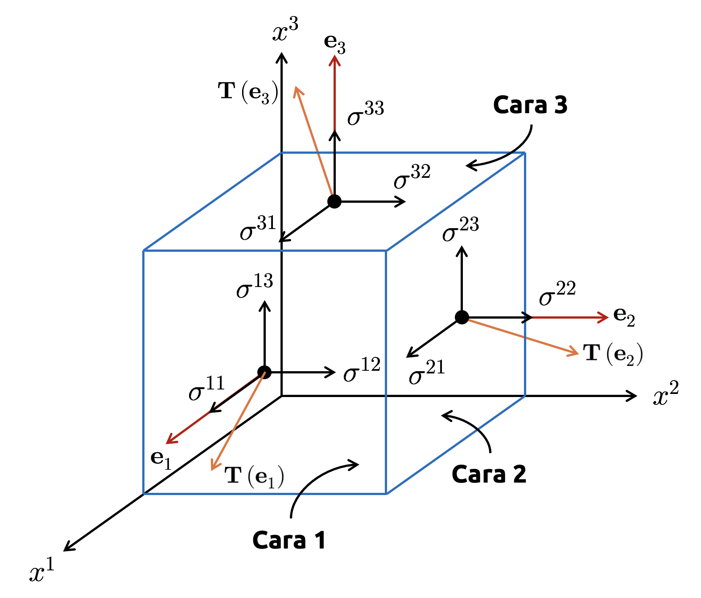
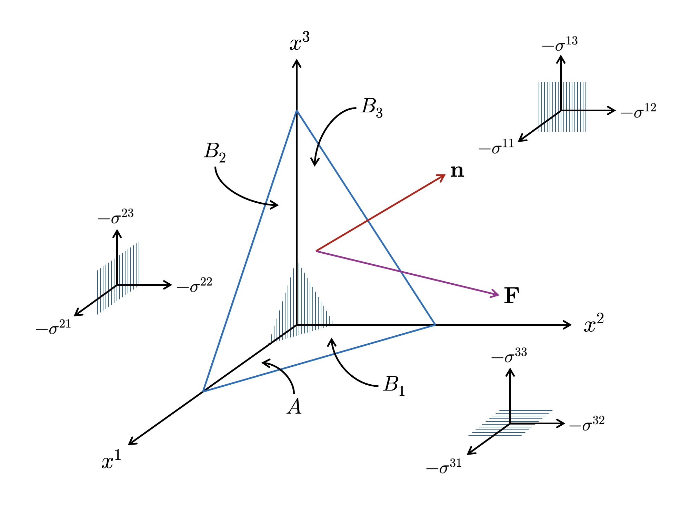

::: {.callout-important}
## Idea central

Los tensores surgen como una generalización natural de vectores y matrices cuando queremos describir cantidades geométricas o físicas de manera independiente del sistema de coordenadas utilizado. En este apunte formalizaremos esa idea introduciendo sistemas de coordenadas generales, leyes de transformación, objetos covariantes y contravariantes, invariantes escalares y operaciones tensoriales básicas, con el objetivo de entender que la naturaleza tensorial de un objeto no viene dada por su forma algebraica, sino por cómo cambian sus componentes bajo un cambio admisible de coordenadas.
:::

## Sistemas de coordenadas

En lo que resta de esta serie, convendremos una notación de superíndices para las coordenadas de un punto en algún espacio previamente definido (el cual, en esta sección, asumiremos euclidiano; más adelante relajaremos esta hipótesis). De esta manera, un punto $\mathbf{x}\in \mathbb{R}^{3}$ tendrá coordenadas $(x^{1},x^{2},x^{3})$. Esto difiere de la notación usual $(x_{1},x_{2},x_{3})$, que es la usada en cursos elementales de física e ingeniería. Quedará claro, por esta forma de escribir las coordenadas de un punto, que los superíndices representan componentes de un vector y no potencias de un escalar. Si deseamos representar potencias de las componentes de un vector, haremos uso de paréntesis. Por ejemplo, $(x^{i})^{r}$ representará la $r$-ésima potencia de la coordenada $x^{i}$ de algún vector.

### Coordenadas rectangulares y curvilíneas

**Definición 2.1 – Coordenadas rectangulares:** Consideremos un dominio $U$ de dimensión arbitraria y sea $\mathbf{x}=(x^{i})$ un vector que referencia la posición de un punto en $U$. Diremos que $(x^{i})$ describe un sistema de coordenadas rectangulares si su distancia respecto de otro punto arbitrario, referenciado por el vector $\mathbf{y}=(y^{i})$, puede escribirse como

::: {.eq-scroll}
$$
d\left( \mathbf{x} ,\mathbf{y} \right) =\left\Vert \mathbf{x} -\mathbf{y} \right\Vert =\sqrt{\delta_{ij} \triangle x^{i}\triangle x^{j}}
\tag{2.1}
$$
:::

donde $\triangle x^{i}=x^{i}-y^{i}$ representa la diferencia entre las $i$-ésimas coordenadas de $\mathbf{x}$ e $\mathbf{y}$ y $\delta_{ij}$ es la delta de Kronecker.

Equivalentemente, el tensor métrico inducido por el sistema satisface $g_{ij}=\delta_{ij}$, con un elemento de línea definido como $ds^{2}=\delta_{ij} dx^{i}dx^{j}$. De esta manera, las curvas coordenadas que permiten unir todo par de puntos en este sistema son ortogonales y unitarias en todo punto del dominio.

Notemos que la fórmula (2.1) permanece invariante para todo cambio de coordenadas lineal del tipo $\overline{x}^{i} =a_{k}^{i}x^{k}$, donde $\left( a_{k}^{i} \right)$ representa el elemento asociado a la fila $i$ y columna $k$ de una matriz $\mathbf{A}$, y es tal que $a_{k}^{i}a_{k}^{j}=\delta^{ij}$, denominada **condición de ortogonalidad**. Por lo tanto, todos los sistemas relacionados mediante transformaciones ortogonales describen sistemas rectangulares, siendo éstos los únicos cuyo origen coincide con el del sistema $(x^{i})$.

Al respecto, conviene aclarar algunas cosas en términos de notación:

- En adelante, toda matriz se escribirá como $\mathbf{A}=(a^{i}_{j})$. En esta convención, los superíndices representan posiciones en las filas y los subíndices posiciones en las columnas.
- La delta de Kronecker operará respetando siempre las posiciones de los índices en sus elementos constitutivos. Es así que, para transformaciones ortogonales, escribimos $a_{k}^{i}a_{k}^{j}=\delta^{ij}$. Explicaremos formalmente esta notación más adelante, al introducir los conceptos de **covariancia** y **contravariancia**.

Los sistemas rectangulares definidos previamente constituyen un caso particular de sistemas de coordenadas cuya métrica es globalmente euclidiana. Sin embargo, muchas geometrías de interés en física e ingeniería no se describen naturalmente mediante transformaciones lineales, sino mediante aplicaciones no lineales entre dominios abiertos de $\mathbb{R}^{n}$.

Motivados por ello, introducimos la siguiente definición general.

**Definición 2.2 – Coordenadas curvilíneas:** Sea $U\subseteq \mathbb{R}^{n}$ un conjunto abierto y sea $(x^{i})$ un sistema de coordenadas rectangulares definido en $U$. Consideremos una aplicación $\mathcal{T} :U\longrightarrow V\subseteq \mathbb{R}^{n}$, de clase $C^{2}$ en $U$, definida explícitamente como $\mathcal{T} \left( x^{i} \right) =\overline{\mathbf{x}} =\overline{x}^{i} \left( x^{1},...,x^{n} \right)$ para $i=1,...,n$, donde los $n$ campos escalares $\overline{x}^{1} \left( x^{1},...,x^{n} \right) ,...,\overline{x}^{n} \left( x^{1},...,x^{n} \right)$ son llamados **funciones componentes** de $\mathcal{T}$. Si la aplicación $\mathcal{T}$ es biyectiva y su inversa $\mathcal{T}^{-1} :V\longrightarrow U$ es de clase $C^{2}$ en $V$, entonces diremos que $\mathcal{T}$ define un **cambio (admisible) de coordenadas** entre los sistemas $(x^{i})$ y $(\overline{x}^{i})$. En tal caso, llamaremos a $(\overline{x}^{i})$ un **sistema de coordenadas curvilíneas** en $V$.

La transformación $\mathcal{T}$ puede interpretarse como una aplicación que toma un punto descrito en coordenadas rectangulares y lo re-expresa mediante un nuevo sistema de parámetros. En este nuevo sistema, todo par de puntos se conecta por medio de líneas que no necesariamente serán rectas. Es decir, las curvas obtenidas al fijar $n-1$ coordenadas y dejar variar la restante generan familias de curvas que, en general, son no lineales en el espacio físico. Este es precisamente el comportamiento que observamos en sistemas curvilíneos clásicos, como las coordenadas polares, donde las rectas $r=\mathrm{constante}$ en el sistema $(r,\theta)$ generan círculos de radio $r=\mathrm{constante}$ en $\mathbb{R}^{2}$.

Notemos que $\mathcal{T}$ induce una geometría local en el sistema curvilíneo $(\overline{x}^{i})$, la cual puede describirse completamente por medio del tensor métrico

::: {.eq-scroll}
$$
g_{ij}=\frac{\partial \mathbf{x}}{\partial \overline{x}^{i}} \cdot \frac{\partial \mathbf{x}}{\partial \overline{x}^{j}}
\tag{2.2}
$$
:::

donde $\mathbf{x}$ expresa la posición de un punto expresada en las coordenadas rectangulares originales. Notemos que la definición del elemento de línea es invariante respecto de las coordenadas rectangulares. Es decir, si un sistema es curvilíneo, su elemento de línea será $ds^{2}=g_{ij}d\overline{x}^{i} d\overline{x}^{j}$, donde los diferenciales se calculan con respecto a las coordenadas curvilíneas.

A continuación, formalizaremos algunos constructos geométricos importantes en el álgebra y cálculo tensorial, y que dan sentido estructural a un sistema de coordenadas y a cualquier transformación curvilínea que apliquemos sobre él.

**Definición 2.3 – Curvas coordenadas:** Sea $\mathbf{x} =\mathbf{x} ( \overline{x}^{1} ,...,\overline{x}^{n} )$ una parametrización curvilínea inducida por un cambio admisible de coordenadas. Fijando $n-1$ coordenadas y dejando variar la $i$-ésima, obtenemos una curva

::: {.eq-scroll}
$$
\gamma_{i} \left( \lambda \right) =\mathbf{x} \left( \overline{x}^{1} ,...,\lambda ,...,\overline{x}^{n} \right)
\tag{2.3}
$$
:::

denominada **curva coordenada** asociada a la coordenada $\overline{x}^{i}$.

Llamaremos $\mathbf{e}_{i}$ al **vector tangente** a la curva $\gamma_{i}$. Es decir,

::: {.eq-scroll}
$$
\mathbf{e}_{i} =\frac{d\gamma_{i}}{d\lambda} =\frac{\partial \mathbf{x}}{\partial \overline{x}^{i}}
\tag{2.4}
$$
:::

Geométricamente, este vector representa el desplazamiento físico asociado a una variación infinitesimal de la coordenada $\overline{x}^{i}$.

**Definición 2.4 – Base inducida por un sistema curvilíneo:** Sea $\mathcal{T}:U\longrightarrow V$ un cambio admisible de coordenadas que induce una parametrización curvilínea del tipo $\mathbf{x} =\mathbf{x} ( \overline{x}^{1} ,...,\overline{x}^{n} )$. El conjunto de vectores

::: {.eq-scroll}
$$
\mathcal{B}_{\mathcal{T}} =\left\{ \mathbf{e}_{1} ,...,\mathbf{e}_{n} \right\} =\left\{ \frac{\partial \mathbf{x}}{\partial \overline{x}^{1}} ,...,\frac{\partial \mathbf{x}}{\partial \overline{x}^{n}} \right\}
\tag{2.5}
$$
:::

define una base local del espacio tangente en cada punto donde la transformación $\mathcal{T}$ sea regular (con matriz Jacobiana no singular), denominada **base inducida** por la transformación. Notemos que, conforme esta notación, todo desplazamiento infinitesimal en $V$ puede describirse por medio de la fórmula

::: {.eq-scroll}
$$
d\mathbf{x} =\mathbf{e}_{i} d\overline{x}^{i}
\tag{2.6}
$$
:::

Sea $\mathbf{p}$ un punto de $V$ descrito por la parametrización $\mathbf{x} (\overline{x}^{i} )$. Definimos el **espacio tangente** en $\mathbf{p}$ como el conjunto de todos los vectores tangentes a las curvas que pasan por $\mathbf{p}$. En particular, los vectores

::: {.eq-scroll}
$$
\mathbf{e}_{i} \left( \mathbf{p} \right) =\frac{\partial \mathbf{x}}{\partial \overline{x}^{i}} \left( \mathbf{p} \right)
\tag{2.7}
$$
:::

constituyen una base de dicho espacio, el cual denotamos por $T_{\mathbf{p}}$.

Notemos que, usando la fórmula (2.4), podemos escribir compactamente la fórmula de cálculo del tensor métrico inducido por $\mathcal{T}$ como $g_{ij}=\mathbf{e}_{i} \cdot \mathbf{e}_{j}$.

La transformación curvilínea $\mathcal{T}$ introducida previamente, permite reexpresar la posición de un punto mediante un nuevo sistema de parámetros. Para cuantificar cómo esta transformación deforma localmente distancias, áreas o volúmenes, introducimos el siguiente objeto fundamental.

**Definición 2.5 – Matriz Jacobiana:** Sea $\mathcal{T}:U\longrightarrow V$ un cambio admisible de coordenadas que induce una parametrización curvilínea del tipo $\mathbf{x} =\mathbf{x} ( \overline{x}^{1} ,...,\overline{x}^{n} )$. Definimos la **matriz Jacobiana** asociada a la transformación inversa $\mathcal{T}^{-1}$ como la matriz cuyas columnas están dadas por las componentes de los vectores base naturales expresados en la base canónica de $\mathbb{R}^{n}$. Es decir,

::: {.eq-scroll}
$$
\mathbf{J} =\left( \frac{\partial x^{i}}{\partial \overline{x}^{j}} \right)
\tag{2.8}
$$
:::

donde $(x^{i})$ representa las coordenadas rectangulares del punto parametrizado.

Si reescribimos matricialmente la fórmula (2.8), obtenemos

::: {.eq-scroll}
$$
\mathbf{J} =\left(\begin{matrix} \displaystyle \frac{\partial x^{1}}{\partial \overline{x}^{1}}&\cdots& \displaystyle \frac{\partial x^{1}}{\partial \overline{x}^{n}}\\ \vdots&\ddots&\vdots\\  \displaystyle \frac{\partial x^{n}}{\partial \overline{x}^{1}}&\cdots& \displaystyle \frac{\partial x^{n}}{\partial \overline{x}^{n}}\end{matrix} \right)
\tag{2.9}
$$
:::

Por lo tanto, observamos que cada columna de $\mathbf{J}$ corresponde al vector $\mathbf{e}_{j}=\frac{\partial \mathbf{x}}{\partial \overline{x}^{j}}$. Así, todo desplazamiento diferencial en el sistema curvilíneo puede escribirse compactamente como $d\mathbf{x} =\mathbf{J} d\overline{\mathbf{x}}$, donde $d\overline{\mathbf{x}} =(d\overline{x}^{i} )$. De esta manera, la matriz Jacobiana puede interpretarse como el **operador lineal** que aproxima localmente la transformación curvilínea $T$ que define la parametrización $\mathbf{x} =\mathbf{x} ( \overline{x}^{1} ,...,\overline{x}^{n} )$.

El escalar

::: {.eq-scroll}
$$
J=\det \left( \mathbf{J} \right) =\det \left( \frac{\partial x^{i}}{\partial \overline{x}^{j}} \right)
\tag{2.10}
$$
:::

se denomina **determinante Jacobiano** (o simplemente *jacobiano*) de la transformación $\mathcal{T}$. Este determinante mide el **factor de escala** local mediante el cual la parametrización $\mathbf{x} =\mathbf{x} ( \overline{x}^{1} ,...,\overline{x}^{n} )$ deforma volúmenes infinitesimales.

Para comprobar esto último, consideremos el "hipercubo" diferencial generado por los incrementos $d\overline{x}^{1} ,...,d\overline{x}^{n}$ en el espacio de parámetros. Su imagen bajo la parametrización curvilínea es el paralelepípedo generado por los vectores $\mathbf{e}_{1} d\overline{x}^{1} ,...,\mathbf{e}_{n} d\overline{x}^{n}$, por lo que su volumen viene dado por

::: {.eq-scroll}
$$
\begin{array}{lll}dV&=&\displaystyle \left| \det \left( \frac{\partial x^{i}}{\partial \overline{x}^{j}} \right) \right| d\overline{x}^{1} \  \cdots \  d\overline{x}^{n}\\ &=&\left| J \right| d\overline{V}\end{array}
\tag{2.11}
$$
:::

Es decir, el volumen $dV$ de nuestro "hipercubo" diferencial en el espacio de parámetros se escala por $|J|$ al "llevarlo" al sistema curvilíneo, tal y como queríamos demostrar.

El jacobiano $J$ de la transformación $\mathcal{T}$ guarda una profunda relación con el tensor métrico $g_{ij}$ inducido por la misma. Debido a que $g_{ij}=\mathbf{e}_{i} \cdot \mathbf{e}_{j}$, es posible expresar matricialmente dicho tensor como $\mathbf{G}= \mathbf{J}^{\top}\mathbf{J}$. De esta manera, si tomamos determinantes, obtenemos que $\det \left( \mathbf{G} \right) =\left( \det \left( \mathbf{J} \right) \right)^{2}$. Por lo tanto, $\left| J \right| =\sqrt{\det \left( g_{ij} \right)}$. Esta relación permite expresar el elemento diferencial de volumen descrito por la ecuación (2.11) directamente en términos del tensor métrico como

::: {.eq-scroll}
$$
dV=\sqrt{\det \left( g_{ij} \right)}\ d\overline{x}^{1} \  \cdots \  d\overline{x}^{n}
\tag{2.12}
$$
:::

### Sistemas generalizados

Los sistemas curvilíneos introducidos previamente fueron construidos a partir de transformaciones admisibles que relacionaban explícitamente un dominio de parámetros con el espacio euclidiano $\mathbb{R}^{n}$. En consecuencia, la geometría inducida por dichos sistemas estaba completamente determinada por la métrica euclidiana heredada del espacio rectangular de referencia. Sin embargo, desde un punto de vista más general, es posible definir sistemas de coordenadas que no estén ligados en modo alguno a coordenadas rectangulares, sino que describan puntos de un espacio abstracto mediante $n$-tuplas de parámetros del tipo $(x^{1},...,x^{n})$ sin asumir a priori ninguna estructura métrica euclidiana subyacente. Este es un ingrediente esencial para definir formalmente el concepto de tensor desde una perspectiva completamente abstracta.

Notemos que, en el contexto anterior, el tensor métrico $g_{ij}$ no se induce necesariamente desde $\mathbb{R}^{n}$; se prescribe como parte de la estructura geométrica del espacio local en el que trabajaremos.

Motivados por ello, introducimos la siguiente generalización.

**Definición 2.6 – Sistema de coordenadas generales:** Sea $V$ un conjunto cuyos puntos puedan describirse por medio de $n$ escalares aglutinados en un vector, digamos $(x^{i})$. Diremos que $(x^{i})$ constituye un **sistema de coordenadas generales** en $V$ si existe una correspondencia biyectiva entre los puntos de $V$ y los elementos de un conjunto abierto de $\mathbb{R}^{n}$.

En este contexto, las coordenadas $(x^{i})$ no representan necesariamente distancias físicas ni proyecciones ortogonales sobre ejes rectangulares, sino que constituyen simplemente un sistema de parametrización del espacio.

Las coordenadas pues representan un medio para un fin, y no necesariamente exigen que sigamos las reglas típicas que describen a un espacio euclídeo. Es decir, todo sistema de coordenadas es en sí mismo una abstracción convenientemente definida para darle sentido a alguna propiedad física de interés. Para dotar al espacio de significado geométrico, es necesario introducir una noción de **distancia** entre puntos. Sin embargo, en un contexto general, esta distancia no se define mediante la métrica euclidiana, sino a través de un funcional denominado **longitud de arco**.

Formalizaremos este concepto más adelante. Sin embargo, por el momento daremos una definición que funcionará para nuestros propósitos más generales por el momento, a fin de mantener coherencia física respecto de lo que es un sistema de coordenadas generales y alejarnos un poco de la abstracción típica de estos tópicos. Sea pues la curva arbitraria $\gamma :\lambda \longrightarrow x^{i}\left( \lambda \right)$ que une dos puntos del espacio conforme el sistema de coordenadas generales descrito por $(x^{i})$. Sean $\lambda_{1}$ y $\lambda_{2}$ dos puntos pertenecientes a dicha curva. Definimos la **longitud de arco** de esta curva entre esos puntos como

::: {.eq-scroll}
$$
L\left[ \gamma \right] =\int_{\lambda_{1}}^{\lambda_{2}} \sqrt{g_{ij}\left( x \right) \frac{dx^{i}}{d\lambda} \frac{dx^{j}}{d\lambda}} d\lambda
\tag{2.13}
$$
:::

donde $g_{ij}(x)$ es una familia (dependiente del punto $x$) de matrices simétricas definidas positivas, denominado **tensor métrico** del espacio en cuestión.

Notemos que, para definir la longitud de arco a partir de un sistema de coordenadas generales, hemos hecho uso nuevamente del tensor métrico. Dicho de otra forma, la longitud de una curva "embebida" en un dominio local del espacio es función del tensor métrico, sin importar el sistema de coordenadas escogido para describirla. De hecho, si consideramos un cambio admisible de coordenadas del tipo $x^{i}\longmapsto \overline{x}^{i}$, podemos demostrar que la longitud de arco es una propiedad que se mantiene invariante respecto de dicho cambio. Es decir,

::: {.eq-scroll}
$$
g_{ij}dx^{i}dx^{j}=\overline{g}_{kl} d\overline{x}^{k} d\overline{x}^{l}
\tag{2.14}
$$
:::

Por lo tanto, la métrica constituye un objeto geométrico **intrínseco** del espacio, independiente del sistema de coordenadas utilizado para describirla.

**Ejemplo 2.1 – Un sistema de coordenadas generales definido localmente:** Hasta ahora, los sistemas de coordenadas introducidos (rectangulares, polares, cilíndricos, esféricos, móviles de Frenet-Serret, etc.) han sido construidos mediante transformaciones admisibles respecto de un sistema rectangular de referencia. En consecuencia, todos ellos corresponden a sistemas curvilíneos, en el sentido de la definición (2.2).

Sin embargo, como hemos establecido previamente, es posible definir sistemas de coordenadas que describan puntos de un dominio sin hacer referencia explícita a una transformación geométrica subyacente. Sea pues un triángulo fijo en $\mathbb{R}^{2}$, cuyos vértices están dados por los vectores $\mathbf{v}_{1}$, $\mathbf{v}_{2}$ y $\mathbf{v}_{3}$. Todo punto $\mathbf{x}$ contenido en el plano descrito por este triángulo puede describirse por medio de una combinación lineal del tipo

::: {.eq-scroll}
$$
\mathbf{x} =\lambda^{1} \mathbf{v}_{1} +\lambda^{2} \mathbf{v}_{2} +\lambda^{3} \mathbf{v}_{3}
\tag{2.15}
$$
:::

De manera tal que $\lambda^{1}+\lambda^{2}+\lambda^{3}=1$. La tripleta $(\lambda^{1},\lambda^{2},\lambda^{3})$ constituye las llamadas **coordenadas baricéntricas** del punto $\mathbf{x}$.

Notemos que:

- Cada coordenada mide la “influencia” de un vértice en la posición del punto. De esta manera, para todo $i=1,2,3$, si $\lambda^{i}>0$, entonces el punto $\mathbf{x}$ es interior al triángulo. Si $\lambda^{i}=0$, el punto $\mathbf{x}$ está sobre el lado opuesto. Y si $\lambda^{i}<0$, entonces el punto $\mathbf{x}$ está fuera del triángulo.
- Las coordenadas baricéntricas preservan una propiedad importante, denominada **convexidad**. Si dos puntos tienen coordenadas $(\lambda^{i})$ y $(\mu^{i})$, entonces todo punto de la recta que los une tiene coordenadas $\left( 1-\alpha \right) \lambda^{i} +\alpha \mu^{i}$, y que mantiene la condición de que las componentes de cada posición sumen $1$.

El sistema de coordenadas baricéntricas es un sistema de coordenadas generales, ya que permite construir una geometría fundamentada sobre una métrica local que está ligada a una estructura geométrica particular (un "símplice de rango $2$", donde "símplice" es el nombre de la generalización de un triángulo a $\mathbb{R}^{n}$), no al espacio en su totalidad. ◼︎

## Formalización del concepto de tensor

Ahora procederemos a formalizar, al fin, qué es un tensor. Para ello secuenciaremos nuestro aprendizaje definiendo algunos ingredientes esenciales que toman los conceptos previamente establecidos (sobretodo en el marco de los sistemas de coordenadas), junto a algunos nuevos, que serán necesarios para definir algunas propiedades importantes de los mismos tensores.

### Tensores de primer orden

Habiendo introducido sistemas de coordenadas generales, necesitamos ahora describir objetos definidos punto a punto sobre el dominio de manera previa a nuestra primera definición de tensor, que, en un principio, se limitará a tensores de rango $1$. Tiene sentido pues la siguiente definición.

**Definición 2.7 – Campo vectorial:** Sea $V$ un dominio arbitrario descrito por un sistema de coordenadas generales $(x^{i})$. Diremos que un **campo vectorial** es una aplicación que asigna a cada punto de $V$ un vector del espacio tangente en dicho punto. Si designamos por $\mathbf{F}$ a dicho campo vectorial, entonces podemos escribir

::: {.eq-scroll}
$$
\mathbf{F} \left( x \right) =F^{i}\left( x \right) \mathbf{e}_{i}
\tag{2.16}
$$
:::

Donde $F^{i}$ es un campo escalar denominado **componente** $i$-ésima del campo vectorial $\mathbf{F}$, mientras que $\mathbf{e}_{i}$ denota un conjunto de vectores base del espacio tangente $T_{\mathbf{p}}$ asociado al sistema $(x^{i})$, para todo $\mathbf{p}\in V$.

Habiendo introducido el concepto de campo vectorial sobre un dominio descrito por coordenadas generales $(x^{i})$, estamos en condiciones de formalizar la noción de tensor de orden $1$.

La razón por la cual hemos sido muy detallistas a la hora de introducir la descripción local del espacio por medio de sistemas generales de coordenadas (incluyendo casos particulares, como transformaciones lineales y curvilíneas), se debe a que la naturaleza tensorial de un objeto no viene dada por su interpretación física ni por su forma algebraica, sino por la manera en que sus componentes transforman bajo cambios admisibles de coordenadas. Los tensores, por tanto, no se definen formalmente a partir de una dependencia directa de una descripción particular del espacio donde éstos "viven", sino estableciendo cómo éstos se comportan bajo transformaciones inducidas por un sistema general de coordenadas, lo que se conoce como **ley de transformación** de un tensor. Nuestro objetivo es primero definir un tensor de primer orden (los vectores de toda la vida), para luego mutar este concepto de forma secuencial hacia rangos superiores.

**Definición 2.8 – Tensor contravariante de orden 1:** Sea $\mathbf{T}$ un campo vectorial definido en un dominio arbitrario $U$. En cada sistema de coordenadas definido en una región $V$ que contenga a $U$, las $n$ componentes del campo vectorial $\mathbf{T}$ se expresarán por medio de campos escalares que denominaremos como

::: {.eq-scroll}
$$
\begin{array}{l}T^{1},...,T^{n}\  \  \mathrm{en\  el\  sistema} \  (x^{i})\\ \overline{T}^{1} ,...,\overline{T}^{n} \  \  \  \mathrm{en\  el\  sistema} \  (\overline{x}^{i} )\end{array}
\tag{2.17}
$$
:::

donde ambos sistemas están relacionados por medio de una parametrización del tipo 

::: {.eq-scroll}
$$
\mathcal{T} \  :\  \overline{x}^{i} =\overline{x}^{i} (x^{1},...,x^{n})\  \  \wedge \  \  \mathcal{T}^{-1} \  :\  x^{i}=x^{i}(\overline{x}^{1} ,...,\overline{x}^{n} )
\tag{2.18}
$$
:::

Diremos que el campo vectorial $\mathbf{T}$ es un **tensor contravariante** de orden $1$ (o, simplemente, un **vector contravariante**) si sus componentes $(T^{i})$ y $(\overline{T}^{i})$, relativas a los sistemas de coordenadas $(x^{i})$ y $(\overline{x}^{i})$, se relacionan conforme la ecuación

::: {.eq-scroll}
$$
\overline{T}^{i} =T^{r}\frac{\partial \overline{x}^{i}}{\partial x^{r}}
\tag{2.19}
$$
:::

Siendo esta ecuación llamada **ley de transformación** del tensor $\mathbf{T}$.

**Ejemplo 2.2:** Consideremos una curva $C$ parametrizada por una trayectoria $\mathbf{r}(t)=x^{i}(t)$, siendo $t$ un parámetro definido en el intervalo abierto $(a,b)$. Bajo la definición (2.7), el vector tangente a $C$ en todo punto $t$ que describe a la trayectoria $\mathbf{r}$ es, de hecho, un campo vectorial que podemos escribir como

::: {.eq-scroll}
$$
T^{i}\left( t \right) =\frac{dx^{i}\left( t \right)}{dt}
\tag{2.20}
$$
:::

Consideremos un cambio admisible de coordenadas parametrizado como $\overline{x}^{i} =\overline{x}^{i} (x^{1},...,x^{n})$. De esta manera, al reparametrizar la trayectoria $\mathbf{r}$ conforme dicho cambio para describir la misma curva $C$ en el sistema $(\overline{x}^{i})$, obtenemos

::: {.eq-scroll}
$$
\begin{array}{lll}\mathbf{r} \left( t \right)&=&x^{i}\left( t \right)\\ &=&\left( x^{1}\left( t \right) ,...,x^{n}\left( t \right) \right)\\ &=&\overline{x}^{i} \left( x^{i}\left( t \right) \right)\\ &=&\mathbf{r} (\overline{x}^{i} \left( t \right) )\end{array}
\tag{2.21}
$$
:::

De esta manera, podemos escribir el vector tangente a $C$ en todo punto $t$ en el sistema $(\overline{x}^{i})$ como

::: {.eq-scroll}
$$
\overline{T}^{i} \left( t \right) =\frac{d\overline{x}^{i} \left( t \right)}{dt}
\tag{2.22}
$$
:::

Al aplicar la regla de la cadena, nos da

::: {.eq-scroll}
$$
\begin{array}{lll}\overline{T}^{i} \left( t \right)&=&\displaystyle \frac{d\overline{x}^{i} \left( t \right)}{dt}\\ &=&\displaystyle \frac{\partial \overline{x}^{i}}{\partial x^{r}} \left( t \right) \underbrace{\frac{dx^{r}}{dt} \left( t \right)}_{=T^{r}\left( t \right)}\\ &=&\displaystyle T^{r}\left( t \right) \frac{\partial \overline{x}^{i}}{\partial x^{r}} \left( t \right)\end{array}
\tag{2.23}
$$
:::

De esta manera, tenemos que $\overline{T}^{i} =T^{r}\frac{\partial \overline{x}^{i}}{\partial x^{r}}$. Por lo tanto, hemos probado que el vector tangente a una curva $C$ en todo punto $t\in (a,b)$, conforme una parametrización $\mathbf{r}(t)=(x^{i}(t))$, es de hecho un tensor contravariante de orden $1$ (o, simplemente, un vector contravariante) cuando se aplica un cambio admisible de coordenadas parametrizado como $\overline{x}^{i} =\overline{x}^{i} (x^{1},...,x^{n})$. Notemos que, conforme la definición (2.8), debido a que este vector se define únicamente sobre la curva $C$ (usando la trayectoria $\mathbf{r}$), tenemos que los dominios de ambas parametrizaciones son iguales. ◼︎

**Definición 2.9 – Tensor covariante de orden 1:** Sea $\mathbf{T}=(T_{i})$ un campo vectorial definido en un dominio arbitrario $U$ (que, sin pérdida de generalidad, asumiremos que es un subconjunto de $\mathbb{R}^{n}$) y consideremos el mismo marco de referencia de la definición (2.8). Diremos que $\mathbf{T}$ es un **tensor covariante** de orden $1$ (o, simplemente, un **vector covariante** o **covector**), si sus componentes $(T_{i})$ y $(\overline{T}_{i})$, relativas a los sistemas de coordenadas respectivos $(x^{i})$ y $(\overline{x}^{i})$, siguen la ley de transformación

::: {.eq-scroll}
$$
\overline{T}_{i} =T_{r}\frac{\partial x^{r}}{\partial \overline{x}^{i}}
\tag{2.24}
$$
:::

**Ejemplo 2.3:** Sea $f:U\subseteq \mathbb{R}^{n}\longrightarrow V\subseteq \mathbb{R}$ un campo escalar de clase $C^{1}$ en todo su dominio, definido por medio de un sistema de coordenadas rectangulares $(x^{i})$ de $\mathbb{R}^{n}$. Del cálculo diferencial, sabemos que el **gradiente** de $f$ se define como el campo vectorial

::: {.eq-scroll}
$$
\nabla f=\left( \frac{\partial f}{\partial x^{i}} \right)
\tag{2.25}
$$
:::

Consideremos ahora un cambio admisible de coordenadas parametrizado como $\overline{\mathbf{x}} =\overline{\mathbf{x}} \left( x^{1},...,x^{n} \right)$. De esta manera, el gradiente de $f$ en este sistema será $\overline{\nabla f} =\left( \frac{\partial f}{\partial \overline{x}^{i}} \right)$. Trabajando las derivadas parciales que constituyen este gradiente por medio de la regla de la cadena, obtenemos

::: {.eq-scroll}
$$
\begin{array}{lll}\displaystyle \frac{\partial \overline{f}}{\partial \overline{x}^{i}}&=&\displaystyle \underbrace{\frac{\partial f}{\partial x^{r}}}_{=\left( \nabla f \right)_{r}} \frac{\partial x^{r}}{\partial \overline{x}^{i}} \  \  \left( \mathrm{porque} \  \overline{f} =f(\overline{x}^{i} ) \right)\\ &=&\displaystyle \left( \nabla f \right)_{r} \frac{\partial x^{r}}{\partial \overline{x}^{i}} \  \  \left( \mathrm{donde} \  \left( \nabla f \right)_{r} \  \mathrm{es\  la\  componente} \  r\  \mathrm{de} \  \nabla f \right)\end{array}
\tag{2.26}
$$
:::

Poniendo $\overline{\left( \nabla f \right)_{i}} =\frac{\partial \overline{f}}{\partial \overline{x}^{i}}$, llegamos a que $\overline{\left( \nabla f \right)_{i}} =\left( \nabla f \right)_{r} \frac{\partial x^{r}}{\partial \overline{x}^{i}}$. De esta manera, hemos probado que el gradiente de un campo escalar arbitrario $f$ de clase $C^{1}$ en un conjunto abierto $U$ de $\mathbb{R}^{n}$, es de hecho un tensor covariante de rango $1$ (o vector covariante). ◼︎

Conforme los últimos ejemplos, observamos que los vectores tangentes y gradiente son, esencialmente, constructos muy distitos, y que representan aspectos geométricos y físicos diferentes respecto de las funciones a partir de los cuales están definidos. El análisis tensorial se ocupa, por lo mismo, de la distinción entre **covariancia** y **contravariancia** empleando de manera consistente superíndices y subíndices en las leyes de transformación que definen a los correspondientes tensores, de la misma forma que, en álgebra lineal, usamos bases para distinguir vectores en distintos sistemas coordenados.

En adelante, nos referiremos a los tensores de rango $1$, independiente de si son covariantes o contravariantes, simplemente como *vectores*. Estos objetos matemáticos, en un lenguaje riguroso, son esencialmente *campos* vectoriales definidos en conjuntos abiertos del espacio. Este uso coexistirá con el hecho de llamar *vectores* a $n$-tuplas constituidas por escalares. No existe ningún conflicto, puesto que las $n$-tuplas constituyen el campo vectorial correspondiente a la aplicación identidad (es decir, $T^{i}(\mathbf{x})=x^{i}$, para $i=1,...,n$). Sin embargo, el vector $(x^{i})$ no tiene la propiedad de transformación de un tensor. Por lo tanto, para recalcar este hecho, nos referiremos a éstos últimos como *vectores posición*.

### Invariantes

Un objeto geométrico está “bien definido” (independiente del observador o sistema de coordenadas que usemos como referencia) si existe una manera natural de extraer de él un escalar (o, en general, función con imagen escalar) que no cambie al reparametrizar el espacio. Tal escalar es lo que llamamos un **invariante escalar**.

**Definición 2.10 – Invariante natural:** Consideremos un cambio admisible de coordenadas descrito por una transformación $\mathcal{T}$, con parametrización $\mathcal{T} \  :\  \overline{x}^{i} =\overline{x}^{i} (x^{1},...,x^{n})$ y $\mathcal{T}^{-1} \  :\  x^{i}=x^{i}(\overline{x}^{1} ,...,\overline{x}^{n} )$, siendo $\mathcal{T}$ regular en un dominio $U$. Sean $\mathbf{v}=(v^{i})$ y $\mathbf{u}=(u_{i})$ un par de vectores contravariante y covariante, respectivamente, ambos definidos en $U$. El escalar $\left< \mathbf{u} ,\mathbf{v} \right> =u_{i}v^{i}$ será llamado **invariante natural** asociado al par $(\mathbf{u},\mathbf{v})$.

El general, este objeto se interpreta como "el valor de $\mathbf{v}$ actuando sobre $\mathbf{u}$", y constituye la forma más simple de producir un escalar a partir de tensores de rango $1$.

::: {.callout-warning}
## Proposición 2.1 – Invariancia del emparejamiento

*Bajo un cambio admisible de coordenadas, el escalar $u_{i}v^{i}$ permanece invariante. En particular,*

::: {.eq-scroll}
$$
u_{i}v^{i}=\overline{u}_{i} \overline{v}^{i}
\tag{2.27}
$$
:::
:::

La proposición (2.1) es fácilmente verificable por medio de las definiciones (2.8) y (2.9). Usando las leyes de transformación para vectores contravariantes y covariantes, tenemos que

::: {.eq-scroll}
$$
\overline{v}^{i} =v^{r}\frac{\partial \overline{x}^{i}}{\partial x^{r}} \  \  \wedge \  \  \overline{u}_{i} =u_{r}\frac{\partial x^{r}}{\partial \overline{x}^{i}} 
\tag{2.28}
$$
:::

Entonces,

::: {.eq-scroll}
$$
\begin{array}{lll}\overline{u}_{i} \overline{v}^{i}&=&\displaystyle \left( u_{r}\frac{\partial x^{r}}{\partial \overline{x}^{i}} \right) \left( v^{k}\frac{\partial \overline{x}^{i}}{\partial x^{k}} \right)\\ &=&\displaystyle u_{r}v^{k}\underbrace{\frac{\partial x^{r}}{\partial \overline{x}^{i}} \frac{\partial \overline{x}^{i}}{\partial x^{k}}}_{=\delta_{k}^{r}}\\ &=&u_{r}v^{r}\end{array}
\tag{2.29}
$$
:::

Tal como queríamos demostrar.

**Ejemplo 2.4 – La derivada direccional es un invariante escalar:** Sea $f$ un campo escalar de clase $C^{1}$ en un conjunto abierto $U$ descrito por un sistema de coordenadas generales $(x^{i})$. Sea además $\mathbf{v}=(v^{i})$ un vector contravariante definido en el mismo dominio. Del cálculo diferencial, sabemos que la diferencial total puede escribirse, usando el convenio de suma de Einstein, como

::: {.eq-scroll}
$$
df=\frac{\partial f}{\partial x^{i}} dx^{i}
\tag{2.30}
$$
:::

Las cantidades descritas por $\left( df \right)_{i} =\frac{\partial f}{\partial x^{i}}$ constituyen las componentes de un tensor covariante de orden $1$, denominado gradiente de $f$, como se probó en el ejemplo (2.3). Definimos la **derivada direccional** de $f$ en la dirección de $(v^{i})$ como el escalar

::: {.eq-scroll}
$$
\frac{df}{d\mathbf{v}} =\left( df \right)_{i} v^{i}=\frac{\partial f}{\partial x^{i}} v^{i}
\tag{2.31}
$$
:::

Por la proposición (2.1), sabemos que la **contracción** covector-vector es un invariante. Por lo tanto, la derivada $\frac{df}{d\mathbf{v}}$ es independiente del sistema de coordenadas elegido para describir tanto a $f$ como a $\mathbf{v}$.

Tomemos el camino largo y verifiquemos explícitamente la invariancia de la derivada direccional. Para ello, consideremos un cambio admisible de coordenadas del tipo $x^{i}\longmapsto \overline{x}^{i} ( x^{1},...,x^{n} )$. Por definición, tenemos que

::: {.eq-scroll}
$$
\overline{v}^{i} =v^{r}\frac{\partial \overline{x}^{i}}{\partial x^{r}} \  \  \wedge \  \  \overline{\left( df \right)}_{i} =\left( df \right)_{r} \frac{\partial x^{r}}{\partial \overline{x}^{i}}
\tag{2.32}
$$
:::

Por lo tanto, desarrollando la derivada, obtenemos

::: {.eq-scroll}
$$
\begin{array}{lll}\displaystyle \frac{d\overline{f}}{d\overline{\mathbf{v}}}&=&\displaystyle \overline{\left( df \right)}_{i} \overline{v}^{i}\\ &=&\displaystyle \left( \left( df \right)_{r} \frac{\partial x^{r}}{\partial \overline{x}^{i}} \right) \left( v^{k}\frac{\partial \overline{x}^{i}}{\partial x^{k}} \right)\\ &=&\displaystyle \left( df \right)_{r} v^{k}\underbrace{\frac{\partial x^{r}}{\partial \overline{x}^{i}} \frac{\partial \overline{x}^{i}}{\partial x^{k}}}_{=\delta_{k}^{r}}\\ &=&\left( df \right)_{r} v^{k}\\ &=&\displaystyle \frac{df}{d\mathbf{v}}\end{array}
\tag{2.33}
$$
:::

Así que, en efecto, la derivada direccional se trata de un invariante escalar. ◼︎

**Ejemplo 2.5 – La derivada material es un invariante escalar:** Consideremos un campo escalar $\phi$ de clase $C^{1}$ en un dominio $U$ del espacio, descrito por un sistema de coordenadas generales $(x^{i})$ al cual le asociamos una coordenada $t$ adicional. En la mecánica de fludos, el campo $\phi(x^{i},t)$ así definido suele describir cualquier propiedad macroscópica asociada a un fluido "encapsulado" en el dominio $U$ (por ejemplo, su temperatura). Consideremos además el campo de velocidades del fluido, definido como

::: {.eq-scroll}
$$
\mathbf{v} =v^{i}\left( x^{i},t \right) \mathbf{e}_{i}
\tag{2.34}
$$
:::

Definimos la **derivada material** o **convectiva** aplicada sobre $\phi$ como

::: {.eq-scroll}
$$
\frac{D\phi}{Dt} =\frac{\partial \phi}{\partial t} +v^{i}\frac{\partial \phi}{\partial x^{i}}
\tag{2.35}
$$
:::

La derivada material describe la variación temporal de alguna cantidad física (como calor o impulso) de una partícula fluida que está sujeta a variaciones del campo de velocidad macroscópica dependientes del espacio y el tiempo de esa cantidad física. Por ejemplo, de nuevo en mecánica de fluidos, el campo de velocidades $\mathbf{v}$ es la velocidad del flujo y la cantidad de interés puede ser la temperatura del fluido. En cuyo caso, la derivada del material describe el cambio de temperatura de una determinada parcela de fluido con el tiempo, a medida que fluye a lo largo de su línea de trayectoria, cuya dirección coincide con la de $\mathbf{v}$. Notemos además que el término $v^{i}\frac{\partial \phi}{\partial x^{i}}$ corresponde a la derivada direccional del campo $\phi$ en la dirección de $\mathbf{v}$, por lo que la derivada material (2.35) puede expresarse equivalentemente como

::: {.eq-scroll}
$$
\frac{D\phi}{Dt} =\underbrace{\frac{\partial \phi}{\partial t}}_{\mathrm{variacion\  local}} +\underbrace{\frac{d\phi}{d\mathbf{v}}}_{\mathrm{variacion\  convectiva}}
\tag{2.36}
$$
:::

Vamos a demostrar que la derivada material de un campo escalar arbitrario de clase $C^{1}$ en un dominio es, de hecho, un invariante escalar. En efecto, consideremos el cambio admisible de coordenadas espaciales $x^{i}\longmapsto \overline{x}^{i} ( x^{1},...,x^{n} )$. De los ejercicios anteriores, sabemos que:

- El gradiente de $\phi$ es un covector: $\overline{\left( \frac{\partial \phi}{\partial x^{i}} \right)} =\frac{\partial \phi}{\partial x^{r}} \frac{\partial x^{r}}{\partial \overline{x}^{i}}$.
- La velocidad es un vector contraviariante: $\overline{v}^{i} =v^{r}\frac{\partial \overline{x}^{i}}{\partial x^{r}}$.

Debido a que la derivada direccional ya es un invariante escalar, bastará con mostrar que el término convectivo de la derivada material (2.35) también lo es. De esta manera, dicho término convectivo puede escribirse en el nuevo sistema de coordenadas como

::: {.eq-scroll}
$$
\begin{array}{lll}\displaystyle \overline{v}^{i} \frac{\partial \phi}{\partial \overline{x}^{i}}&=&\displaystyle \left( v^{r}\frac{\partial \overline{x}^{i}}{\partial x^{r}} \right) \left( \frac{\partial \phi}{\partial x^{k}} \frac{\partial x^{k}}{\partial \overline{x}^{i}} \right)\\ &=&\displaystyle v^{r}\frac{\partial \phi}{\partial x^{k}} \underbrace{\frac{\partial \overline{x}^{i}}{\partial x^{r}} \frac{\partial x^{k}}{\partial \overline{x}^{i}}}_{=\delta_{r}^{k}}\\ &=&\displaystyle v^{r}\frac{\partial \phi}{\partial x^{k}}\end{array}
\tag{2.37}
$$
:::

Así que, en efecto, la derivada material es un invariante escalar: No depende del sistema de coordenadas elegido para describir la propiedad fisica de interés para un fluido determinado, ni su campo de velocidades. ◼︎

### Tensores de segundo orden

Habiendo introducido el concepto de campo vectorial como una aplicación que asigna a cada punto de un dominio un vector del espacio tangente correspondiente, es natural extender esta idea a objetos de orden superior definidos punto a punto sobre el mismo dominio.

Motivados por ello, introducimos la siguiente definición.

**Definición 2.11 – Campo matricial:** Sea $U$ un dominio arbitrario descrito por un sistema de coordenadas generales $(x^{i})$. Llamaremos **campo matricial** a una aplicación que asigna a cada punto $\mathbf{p}\in U$ una matriz constituida por escalares de orden $n\times n$. Si llamamos $\mathbf{T}$ a dicho campo, entonces

::: {.eq-scroll}
$$
\mathbf{T} :U\longrightarrow V\subseteq \mathbb{R}^{n\times n} \  \  \wedge \  \  \mathbf{T} \left( x \right) =\left( T_{j}^{i}\left( x \right) \right)
\tag{2.38}
$$
:::

donde cada campo escalar $T_{j}^{i}:U\longrightarrow \mathbb{R}$ se denomina **componente** del campo matricial $\mathbf{T}$.

Mientras que un campo vectorial asigna un vector tangente a cada punto, un campo matricial puede interpretarse como una aplicación lineal definida punto a punto sobre el espacio tangente. Es decir, en cada $\mathbf{p} \in U$, se tendrá que

::: {.eq-scroll}
$$
\mathbf{T} \left( \mathbf{p} \right) :T_{\mathbf{p}}\longrightarrow T_{\mathbf{p}}
\tag{2.39}
$$
:::

De esta manera, el campo matricial actúa transformando vectores tangentes en otros vectores tangentes.

**Ejemplo 2.6 – El gradiente de un campo de velocidades de un fluido es un campo matricial:** Sea $V\subseteq \mathbb{R}^{3}$ un dominio ocupado por un fluido y descrito por un sistema de coordenadas generales $(x^{i})$. Sea además $\mathbf{v} =\mathbf{v} \left( \mathbf{x} ,t \right) =v^{i}\left( x^{i},t \right) \mathbf{e}_{i}$ el campo de velocidades del fluido. Recordemos que $\mathbf{v}$ constituye un campo vectorial que asigna a cada punto del dominio un vector tangente que describe la velocidad instantánea de la partícula fluida que ocupa dicho punto.

Definimos el **gradiente de velocidades** como el campo matricial

::: {.eq-scroll}
$$
\mathbf{L} =\left( L_{j}^{i} \right) =\left( \frac{\partial v^{i}}{\partial x^{j}} \right)
\tag{2.40}
$$
:::

En coordenadas generales, el objeto estrictamente tensorial asociado al gradiente de velocidades se expresa mediante una derivada que corrige el efecto de la variación de la base; más adelante formalizaremos esta idea. En el marco actual (y en particular en coordenadas rectangulares), la expresión (2.40) se comporta tensorialmente.

Cada componente $L^{i}_{j}$ mide la variación de la componente $i$-ésima de la velocidad respecto de la coordenada $x^{j}$. Para entender su significado físico, consideremos dos puntos del fluido infinitesimalmente cercanos, digamos $\mathbf{x}$ y otro punto al que "llegamos" por medio de un desplazamiento $d \mathbf{x}$. La diferencia de velocidades entre ambos puntos será

::: {.eq-scroll}
$$
dv^{i}=\frac{\partial v^{i}}{\partial x^{j}} dx^{j}=L_{j}^{i}\  dx^{j}
\tag{2.41}
$$
:::

Por lo tanto, $\mathbf{L}$ es un operador lineal que aproxima localmente cómo cambia la velocidad dentro del fluido. Sea ahora un vector material infinitesimal $d \mathbf{x}$ que une dos partículas vecinas. Usando la definición de derivada material mostrada en el ejemplo (2.5), verificamos que su evolución temporal está gobernada por

::: {.eq-scroll}
$$
\frac{D}{Dt} \left( dx^{i} \right) =\frac{\partial v^{i}}{\partial x^{j}} dx^{j}=L_{j}^{i}\  dx^{j}
\tag{2.42}
$$
:::

Un resultado fundamental en mecánica de fluidos, y extremadamente importante a nivel práctico, es que el gradiente de velocidades $\mathbf{L}$ puede descomponerse en dos componentes que describen completamente la cinemática de las partículas que se mueven en un dominio fluido. Esta descomposición puede escribirse como

::: {.eq-scroll}
$$
L_{j}^{i}=D_{j}^{i}+W_{j}^{i}
\tag{2.43}
$$
:::

Donde:

- $D_{j}^{i}$ es la componente **deformacional** que gobierna el movimiento de las partículas fluidas, definida como $D_{j}^{i}=\frac{1}{2} \left( \frac{\partial v^{i}}{\partial x^{j}} +\frac{\partial v^{j}}{\partial x^{i}} \right)$. $D_{j}^{i}$ es un campo matricial simétrico que, por extensión, describe todos los cambios de volumen del fluido que son resultado del movimiento de las partículas que lo constituyen y que no son resultado de movimientos de rotación interna de las mismas.
- $W_{j}^{i}$ es la componente **rotacional** o de **vorticidad** que gobierna el movimiento de las partículas fluidas, definida como $W_{j}^{i}=\frac{1}{2} \left( \frac{\partial v^{i}}{\partial x^{j}} -\frac{\partial v^{j}}{\partial x^{i}} \right)$. Al contrario que $D_{j}^{i}$, el campo $W_{j}^{i}$ es antisimétrico (es decir, $W_{j}^{i}=-W_{i}^{j}$), y permite describir el movimiento de rotación o vorticidad de las partículas que constituyen el fluido.

El gradiente de velocidades constituye un campo matricial que describe la variación espacial de un campo vectorial. Sin embargo, su naturaleza geométrica no viene dada únicamente por su representación matricial, sino por la forma en que sus componentes transforman bajo cambios admisibles de coordenadas. Cuando dicha ley de transformación satisface las reglas tensoriales correspondientes, el gradiente de velocidades se interpreta formalmente como un tensor de orden $2$, cuya descomposición simétrica y antisimétrica permite caracterizar completamente la cinemática local del medio continuo. ◼︎

Habiendo extendido el concepto de campo vectorial hacia campos matriciales definidos punto a punto sobre un dominio, estamos ahora en condiciones de formalizar el concepto de tensor de orden $2$. Recordemos que la naturaleza tensorial de un objeto no viene dada por su representación vectorial o matricial ni por su interpretación física, sino por la forma en que sus componentes transforman bajo cambios admisibles de coordenadas.

**Definición 2.12 – Tensor de orden 2:** Sea $U$ un dominio descrito por un sistema de coordenadas generales $(x^{i})$ y sea $\mathbf{T} \left( x \right) =\left( T_{j}^{i}\left( x \right) \right)$ un campo matricial definido en $U$. Diremos que $\mathbf{T}$ es un **tensor de orden $2$** si, bajo un cambio admisible de coordenadas del tipo $x^{i}\longmapsto \overline{x}^{i} \left( x \right)$, sus componentes se transforman conforme una ley bilineal constituida a partir de la matriz Jacobiana derivada de este cambio de coordenadas.

La definición anterior se lee un tanto *esotérica*, pero en realidad no es más que una extensión de las definiciones (2.8) y (2.9). En efecto, dependiendo de la posición de los índices, obtenemos distintos tipos de tensores de orden $2$. En particular:

- El campo matricial $\mathbf{T}$ es un **tensor contravariante de orden $2$** si sus componentes $(T^{ij})$ en $(x^{i})$ y $(\overline{T}^{ij})$ en $(\overline{x}^{i})$ obedecen la ley de transformación

::: {.eq-scroll}
$$
\overline{T}^{ij} =T^{rs}\frac{\partial \overline{x}^{i}}{\partial x^{r}} \frac{\partial \overline{x}^{j}}{\partial x^{s}}
\tag{2.44}
$$
:::

- El campo matricial $\mathbf{T}$ es un **tensor covariante de orden $2$** si sus componentes $(T_{ij})$ en $(x^{i})$ y $(\overline{T}_{ij})$ en $(\overline{x}^{i})$ obedecen la ley de transformación

::: {.eq-scroll}
$$
\overline{T}_{ij} =T_{rs}\frac{\partial x^{r}}{\partial \overline{x}^{i}} \frac{\partial x^{s}}{\partial \overline{x}^{j}}
\tag{2.45}
$$
:::

- El campo matricial $\mathbf{T}$ es un **tensor mixto de orden $2$**, contravariante de orden $1$ y covariante de orden $1$, si sus componentes $(T_{j}^{i})$ en $(x^{i})$ y $(\overline{T}^{j}_{i})$ en $(\overline{x}^{i})$ obedecen la ley de transformación

::: {.eq-scroll}
$$
\overline{T}_{j}^{i} =T_{s}^{r}\frac{\partial \overline{x}^{i}}{\partial x^{r}} \frac{\partial x^{s}}{\partial \overline{x}^{j}}
\tag{2.46}
$$
:::

**Ejemplo 2.7:** Consideremos el cambio admisible de coordenadas parametrizado como

::: {.eq-scroll}
$$
\overline{\mathbf{x}} =\left( \left( x^{1} \right)^{2} ,x^{1}x^{2} \right)
\tag{2.47}
$$
:::

Sea $\mathbf{T}$ un tensor contravariante de orden $2$ definido en el sistema de coordenadas $(x^{i})$ de $\mathbb{R}^{2}$, de componentes $T^{11}=1$, $T^{12}=1$, $T^{21}=-1$ y $T^{22}=2$. Queremos hallar las componentes $\overline{T}^{ij}$ de $\mathbf{T}$ en el sistema $(\overline{x}^{i})$ definido por la parametrización (2.47), y calcular los valores de $\overline{T}^{ij}$ en el punto $\mathbf{p}=(1,-2)$ descrito por el sistema $(x^{i})$.

Partimos describiendo la matriz Jacobiana asociada al cambio de coordenadas (2.47), a fin de calcular las derivadas parciales que gobiernan dicho cambio. En efecto, trabajando matricialmente, obtenemos

::: {.eq-scroll}
$$
\mathbf{J} =\left( \begin{matrix}\displaystyle \frac{\partial \overline{x}^{1}}{\partial x^{1}}&\displaystyle \frac{\partial \overline{x}^{1}}{\partial x^{2}}\\ \displaystyle \frac{\partial \overline{x}^{2}}{\partial x^{1}}&\displaystyle \frac{\partial \overline{x}^{2}}{\partial x^{2}}\end{matrix} \right) =\left( \begin{matrix}2x^{1}&0\\ x^{2}&x^{1}\end{matrix} \right)
\tag{2.48}
$$
:::

Además, las componentes del tensor $(T^{ij})$ en $(x^{i})$ son

::: {.eq-scroll}
$$
\left( T^{ij} \right) =\left( \begin{matrix}T^{11}&T^{12}\\ T^{21}&T^{22}\end{matrix} \right) =\left( \begin{matrix}1&1\\ -1&2\end{matrix} \right)
\tag{2.49}
$$
:::

Usando la ecuación (2.45), tenemos que $\overline{T}^{ij} =T^{rs}\frac{\partial \overline{x}^{i}}{\partial x^{r}} \frac{\partial \overline{x}^{j}}{\partial x^{s}} \  \Longrightarrow \  \left( \overline{T}^{ij} \right) =\mathbf{J} \left( T^{ij} \right) \mathbf{J}^{\top}$. Por lo tanto, trabajando por componentes, obtenemos

::: {.eq-scroll}
$$
\begin{array}{lll}\left( \overline{T}^{ij} \right)&=&\left( \begin{matrix}T^{rs}\displaystyle \frac{\partial \overline{x}^{1}}{\partial x^{r}} \frac{\partial \overline{x}^{1}}{\partial x^{s}}&\displaystyle T^{rs}\frac{\partial \overline{x}^{1}}{\partial x^{r}} \frac{\partial \overline{x}^{2}}{\partial x^{s}}\\ \displaystyle T^{rs}\frac{\partial \overline{x}^{2}}{\partial x^{r}} \frac{\partial \overline{x}^{1}}{\partial x^{s}}&\displaystyle T^{rs}\frac{\partial \overline{x}^{2}}{\partial x^{r}} \frac{\partial \overline{x}^{2}}{\partial x^{s}}\end{matrix} \right)\\ &=&\left( \begin{matrix}T^{11}\left( 2x^{1} \right) \left( 2x^{1} \right) +T^{12}\left( 2x^{1} \right) \cdot 0+T^{21}\cdot 0\left( 2x^{1} \right) +T^{22}\cdot 0\cdot 0&T^{11}\left( 2x^{1} \right) \left( x^{2} \right) +T^{12}\left( 2x^{1} \right) \left( x^{1} \right) +T_{21}\cdot 0\left( x^{2} \right) +T_{22}\cdot 0\left( x^{1} \right)\\ T^{11}\left( x^{2} \right) \left( 2x^{1} \right) +T^{12}\left( x^{2} \right) \cdot 0+T^{21}\left( x^{1} \right) \left( 2x^{1} \right) +T^{22}\left( x^{1} \right) \cdot 0&T^{11}\left( x^{2} \right) \left( x^{2} \right) +T^{12}\left( x^{2} \right) \left( x^{1} \right) +T^{21}\left( x^{1} \right) \left( x^{2} \right) +T^{22}\left( x^{1} \right) \left( x^{1} \right)\end{matrix} \right)\\ &=&\left( \begin{matrix}4\left( x^{1} \right)^{2} T^{11}&2x^{1}x^{2}T^{11}+2\left( x^{1} \right)^{2} T^{12}\\ 2x^{1}x^{2}T^{11}+2\left( x^{1} \right)^{2} T^{21}&\left( x^{2} \right)^{2} T^{11}+x^{1}x^{2}T^{12}+x^{1}x^{2}T^{21}+\left( x^{1} \right)^{2} T^{22}\end{matrix} \right)\\ &=&\left( \begin{matrix}4\left( x^{1} \right)^{2}&2x^{1}x^{2}+2\left( x^{1} \right)^{2}\\ 2x^{1}x^{2}-2\left( x^{1} \right)^{2}&\left( x^{2} \right)^{2} +\underbrace{x^{1}x^{2}-x^{1}x^{2}}_{=0} +2\left( x^{1} \right)^{2}\end{matrix} \right)\\ &=&\left( \begin{matrix}4\left( x^{1} \right)^{2}&2x^{1}\left( x^{1}+x^{2} \right)\\ 2x^{1}\left( x^{2}-x^{1} \right)&2\left( x^{1} \right)^{2} +\left( x^{2} \right)^{2}\end{matrix} \right)\end{array}
\tag{2.50}
$$
:::

Finalmente, evaluando $(\overline{T}^{ij})$ en el punto $\mathbf{p}=(1,-2)$, obtenemos

::: {.eq-scroll}
$$
\left( \overline{T}^{ij} \right)_{\mathbf{p} =\left( 1,-2 \right)} =\left( \begin{matrix}4\left( x^{1} \right)^{2}&2x^{1}\left( x^{1}+x^{2} \right)\\ 2x^{1}\left( x^{2}-x^{1} \right)&2\left( x^{1} \right)^{2} +\left( x^{2} \right)^{2}\end{matrix} \right)_{\mathbf{p} =\left( 1,-2 \right)} =\left( \begin{matrix}4&-2\\ -6&6\end{matrix} \right)
\tag{2.51}
$$
:::

◼︎

**Ejemplo 2.8:** Sea $\mathbf{K}=(K_{ij})$ un tensor covariante de rango $2$, definido en un dominio $U$ de $\mathbb{R}^{2}$ descrito por un sistema de coordenadas $(x^{i})$, donde también se define el cambio admisible de coordenadas (2.47). Queremos calcular las componentes del tensor $(\overline{K}_{ij})$ en el sistema transformado, si $(K_{ij})$ tiene componentes

::: {.eq-scroll}
$$
\left( K_{ij} \right) =\left( \begin{matrix}x^{2}&0\\ 0&x^{1}\end{matrix} \right)
\tag{2.52}
$$
:::

Verificaremos además que la cantidad $E=T^{ij}K_{ij}$ es un invariante escalar, donde $(T^{ij})$ es el mismo tensor trabajado en el ejemplo (2.7).

Para aplicar la ley de transformación covariante necesitaremos las derivadas $\frac{\partial x^{r}}{\partial \overline{x}^{i}}$ para $i,r=1,2$. Para ello, necesitamos tomar la inversa (localmente) de la parametrización (2.47) y verificar la matriz Jacobiana de dicha transformación inversa. En efecto, de $\overline{x}^{1} =(x^{1})^{2}$, obtenemos, para $x^{1}>0$, $x^{1}=\sqrt{\overline{x}^{1}}$. Luego, como $\overline{x}^{2}=x^{1} x^{2}$, tenemos que $x^{2}=\overline{x}^{2} /\sqrt{\overline{x}^{1}}$. De esta manera, definimos la transformación inversa $\mathcal{T}^{-1}$ de manera suave en la región del espacio donde $\overline{x}^{1}>0$ (fijando además una "rama" $x^{1}>0$). De esta manera, calculamos la matriz Jacobiana asociada a esta transformación inversa como sigue

::: {.eq-scroll}
$$
\begin{array}{lll}\mathbf{J}^{-1}&=&\left( \begin{matrix}\displaystyle \frac{\partial x^{1}}{\partial \overline{x}^{1}}&\displaystyle \frac{\partial x^{1}}{\partial \overline{x}^{2}}\\ \displaystyle \frac{\partial x^{2}}{\partial \overline{x}^{1}}&\displaystyle \frac{\partial x^{2}}{\partial \overline{x}^{2}}\end{matrix} \right)\\ &=&\left( \begin{matrix}\displaystyle \frac{1}{2\sqrt{\overline{x}^{1}}}&0\\ -\displaystyle \frac{\overline{x}^{2}}{2(\overline{x}^{1} )^{3/2}}&\displaystyle \frac{1}{\sqrt{\overline{x}^{1}}}\end{matrix} \right)\\ &=&\left( \begin{matrix}\displaystyle \frac{1}{2x^{1}}&0\\ -\displaystyle \frac{x^{2}}{2(x^{1})^{2}}&\displaystyle \frac{1}{x^{1}}\end{matrix} \right)\end{array}
\tag{2.53}
$$
:::

A partir de la ecuación (2.46), se tiene que $\overline{K}_{ij} =K_{rs}\frac{\partial x^{r}}{\partial \overline{x}^{i}} \frac{\partial x^{s}}{\partial \overline{x}^{j}}$, lo que implica que $(\overline{K}_{ij} )=(\mathbf{J}^{-1} )^{\top}(K_{ij})(\mathbf{J}^{-1} )$. De esta manera, calculamos explícitamente las componentes de $(\overline{K}_{ij})$ usando las derivadas parciales que describen la matriz Jacobiana inversa $\mathbf{J}^{-1}$,

::: {.eq-scroll}
$$
\begin{array}{lll}(\overline{K}_{ij} )&=&\left( \begin{matrix}K_{rs}\dfrac{\partial x^{r}}{\partial \overline{x}^{1}} \dfrac{\partial x^{s}}{\partial \overline{x}^{1}}&K_{rs}\dfrac{\partial x^{r}}{\partial \overline{x}^{1}} \dfrac{\partial x^{s}}{\partial \overline{x}^{2}}\\ K_{rs}\dfrac{\partial x^{r}}{\partial \overline{x}^{2}} \dfrac{\partial x^{s}}{\partial \overline{x}^{1}}&K_{rs}\dfrac{\partial x^{r}}{\partial \overline{x}^{2}} \dfrac{\partial x^{s}}{\partial \overline{x}^{2}}\end{matrix} \right) \  \  \left( \mathrm{pero} \  \  K_{rs}=0\  ;\  \forall r\neq s \right)\\ &=&\left( \begin{matrix}K_{11}\left( \dfrac{\partial x^{1}}{\partial \overline{x}^{1}} \right)^{2} +K_{22}\left( \dfrac{\partial x^{2}}{\partial \overline{x}^{1}} \right)^{2}&K_{11}\dfrac{\partial x^{1}}{\partial \overline{x}^{1}} \dfrac{\partial x^{1}}{\partial \overline{x}^{2}} +K_{22}\dfrac{\partial x^{2}}{\partial \overline{x}^{1}} \dfrac{\partial x^{2}}{\partial \overline{x}^{2}}\\ K_{11}\dfrac{\partial x^{1}}{\partial \overline{x}^{2}} \dfrac{\partial x^{1}}{\partial \overline{x}^{1}} +K_{22}\dfrac{\partial x^{2}}{\partial \overline{x}^{2}} \dfrac{\partial x^{2}}{\partial \overline{x}^{1}}&K_{11}\left( \dfrac{\partial x^{1}}{\partial \overline{x}^{2}} \right)^{2} +K_{22}\left( \dfrac{\partial x^{2}}{\partial \overline{x}^{2}} \right)^{2}\end{matrix} \right) \  \  \left( \mathrm{pero} \  \  \dfrac{\partial x^{1}}{\partial \overline{x}^{2}} =0 \right)\\ &=&\left( \begin{matrix}K_{11}\left( \dfrac{\partial x^{1}}{\partial \overline{x}^{1}} \right)^{2} +K_{22}\left( \dfrac{\partial x^{2}}{\partial \overline{x}^{1}} \right)^{2}&K_{22}\dfrac{\partial x^{2}}{\partial \overline{x}^{1}} \dfrac{\partial x^{2}}{\partial \overline{x}^{2}}\\ K_{22}\dfrac{\partial x^{2}}{\partial \overline{x}^{2}} \dfrac{\partial x^{2}}{\partial \overline{x}^{1}}&K_{22}\left( \dfrac{\partial x^{2}}{\partial \overline{x}^{2}} \right)^{2}\end{matrix} \right)\\ &=&\left( \begin{matrix}K_{11}\left( \dfrac{1}{2x^{1}} \right)^{2} +K_{22}\left( -\dfrac{x^{2}}{2(x^{1})^{2}} \right)^{2}&K_{22}\left( -\dfrac{x^{2}}{2(x^{1})^{2}} \right) \left( \dfrac{1}{x^{1}} \right)\\ K_{22}\left( \dfrac{1}{x^{1}} \right) \left( -\dfrac{x^{2}}{2(x^{1})^{2}} \right)&K_{22}\left( \dfrac{1}{x^{1}} \right)^{2}\end{matrix} \right)\\ &=&\left( \begin{matrix}x^{2}\dfrac{1}{4(x^{1})^{2}} +x^{1}\dfrac{(x^{2})^{2}}{4(x^{1})^{4}}&-x^{1}\dfrac{x^{2}}{2(x^{1})^{3}}\\ -x^{1}\dfrac{x^{2}}{2(x^{1})^{3}}&x^{1}\dfrac{1}{(x^{1})^{2}}\end{matrix} \right)\\ &=&\left( \begin{matrix}\dfrac{x^{2}}{4(x^{1})^{2}} +\dfrac{(x^{2})^{2}}{4(x^{1})^{3}}&-\dfrac{x^{2}}{2(x^{1})^{2}}\\ -\dfrac{x^{2}}{2(x^{1})^{2}}&\dfrac{1}{x^{1}}\end{matrix} \right)\end{array}
\tag{2.54}
$$
:::

En el sistema $(\overline{x}^{i})$, el tensor $(\overline{K}_{ij} )$ queda expresado como

::: {.eq-scroll}
$$
(\overline{K}_{ij} )=\left( \begin{matrix}\displaystyle \frac{\overline{x}^{2} \left( \overline{x}^{1} +\overline{x}^{2} \right)}{4(\overline{x}^{2} )^{5/2}}&-\displaystyle \frac{\overline{x}^{2}}{2(\overline{x}^{1} )^{3/2}}\\ -\displaystyle \frac{\overline{x}^{2}}{2(\overline{x}^{1} )^{3/2}}&\displaystyle \frac{1}{\sqrt{\overline{x}^{1}}}\end{matrix} \right)
\tag{2.55}
$$
:::

A continuación, verificamos que $E=T^{ij}K_{ij}$ es un invariante escalar. Para ello, usamos los resultados del ejemplo (2.7) y construimos este producto primero en el sistema coordenado $(x^{i})$. En efecto,

::: {.eq-scroll}
$$
\begin{array}{lll}E&=&T^{ij}K_{ij}\\ &=&\left( \begin{matrix}x^{2}&0\\ 0&x^{1}\end{matrix} \right) \left( \begin{matrix}1&1\\ -1&2\end{matrix} \right)\\ &=&2x^{1}+x^{2}\end{array}
\tag{2.56}
$$
:::

Ahora verificamos el cálculo de $E$ en el sistema transformado $(\overline{x}^{i})$,

::: {.eq-scroll}
$$
\begin{array}{lll}E&=&\overline{T}^{ij} \overline{K}_{ij}\\ &=&\left( \begin{matrix}4(x^{1})^{2}&2x^{1}(x^{1}+x^{2})\\ 2x^{1}(x^{2}-x^{1})&2(x^{1})^{2}+(x^{2})^{2}\end{matrix} \right) \left( \begin{matrix}\displaystyle \frac{x^{2}\left( x^{1}+x^{2} \right)}{4(x^{1})^{3}}&-\displaystyle \frac{x^{2}}{2(x^{1})^{2}}\\ -\displaystyle \frac{x^{2}}{2(x^{1})^{2}}&\displaystyle \frac{1}{x^{1}}\end{matrix} \right)\\ &=&\underbrace{4(x^{1})^{2}\left[ \displaystyle \frac{x^{2}\left( x^{1}+x^{2} \right)}{4(x^{1})^{3}} \right]}_{=T^{11}K_{11}} +\underbrace{2x^{1}(x^{1}+x^{2})\left( -\displaystyle \frac{x^{2}}{2(x^{1})^{2}} \right)}_{=T^{12}K_{12}} +\underbrace{2x^{1}(x^{2}-x^{1})\left( -\displaystyle \frac{x^{2}}{2(x^{1})^{2}} \right)}_{=T^{21}K_{21}} +\underbrace{\left( 2(x^{1})^{2}+(x^{2})^{2} \right) \displaystyle \frac{1}{x^{1}}}_{=T^{22}K_{22}}\\ &=&\displaystyle \frac{(x^{1})^{2}}{(x^{1})^{3}} x^{2}(x^{1}+x^{2})-(x^{1}+x^{2})\displaystyle \frac{x^{1}x^{2}}{(x^{1})^{2}} -(x^{2}-x^{1})\displaystyle \frac{x^{1}x^{2}}{(x^{1})^{2}} +2x^{1}+\displaystyle \frac{(x^{2})^{2}}{x^{1}}\\ &=&\underbrace{\displaystyle \frac{x^{2}(x^{1}+x^{2})}{x^{1}} -\displaystyle \frac{x^{2}(x^{1}+x^{2})}{x^{1}}}_{=0} -\displaystyle \frac{x^{2}(x^{2}-x^{1})}{x^{1}} +2x^{1}+\displaystyle \frac{(x^{2})^{2}}{x^{1}}\\ &=&\underbrace{-\displaystyle \frac{(x^{2})^{2}}{x^{1}} +\displaystyle \frac{(x^{2})^{2}}{x^{1}}}_{=0} +x^{2}+2x^{1}\\ &=&2x^{1}+x^{2}\end{array}
\tag{2.57}
$$
:::

Así que, en efecto, $E=\overline{T}^{ij} \overline{K}_{ij}=T^{ij}K_{ij}$, por lo que concluimos que $E$ es un invariante escalar. ◼︎

**Ejemplo 2.9:** Consideremos un tensor mixto simétrico $\mathbf{T}=(T_{j}^{i})$, descrito por un sistema de coordenadas rectangulares $(x^{i})$. Vamos a determinar explícitamente las componentes de $\overline{T}_{j}^{i}$ cuando $(\overline{x}^{i})$ es un sistema de coordenadas polares.

Debido a que $(T_{j}^{i})$ es simétrico, entonces se tendrá que $(T_{j}^{i})=(T_{i}^{j})$. A partir de la fórmula (2.46), y extendiendo los resultados obtenidos en los ejemplos (2.7) y (2.8), obtenemos

::: {.eq-scroll}
$$
\overline{T}_{j}^{i} =\frac{\partial \overline{x}^{i}}{\partial x^{r}} T_{s}^{r}\frac{\partial x^{s}}{\partial \overline{x}^{j}} \  \  \Longrightarrow \  \  \left( \overline{T}_{j}^{i} \right) =\left( \frac{\partial \overline{x}^{i}}{\partial x^{r}} \right) \left( T_{s}^{r} \right) \left( \frac{\partial x^{s}}{\partial \overline{x}^{j}} \right)
\tag{2.58}
$$
:::

Las parametrizaciones que describen las transformaciones de coordenadas (directa e inversa) entre $(\overline{x}^{i})=(r,\theta)$ y $(x^{i})=(x,y)$ son las siguientes:

::: {.eq-scroll}
$$
\overline{\mathbf{x}} =\left( \sqrt{x^{2}+y^{2}},\mathrm{atan2} \left( y,x \right) \right) \  \wedge \  \mathbf{x} =\left( r\cos \left( \theta \right) ,r\sin \left( \theta \right) \right)
\tag{2.59}
$$
:::

Por lo que las matrices Jacobianas asociadas a estas transformaciones serán

::: {.eq-scroll}
$$
\begin{array}{l}\mathbf{J} =\left( \begin{matrix}\dfrac{\partial x^{1}}{\partial \overline{x}^{1}}&\dfrac{\partial x^{1}}{\partial \overline{x}^{2}}\\ \dfrac{\partial x^{2}}{\partial \overline{x}^{1}}&\dfrac{\partial x^{2}}{\partial \overline{x}^{2}}\end{matrix} \right) =\left( \begin{matrix}\dfrac{\partial x}{\partial r}&\dfrac{\partial x}{\partial \theta}\\ \dfrac{\partial y}{\partial r}&\dfrac{\partial y}{\partial \theta}\end{matrix} \right) =\left( \begin{matrix}\cos \left( \theta \right)&-r\sin \left( \theta \right)\\ \sin \left( \theta \right)&r\cos \left( \theta \right)\end{matrix} \right)\\ \mathbf{J}^{-1} =\left( \begin{matrix}\dfrac{\partial \overline{x}^{1}}{\partial x^{1}}&\dfrac{\partial \overline{x}^{1}}{\partial x^{2}}\\ \dfrac{\partial \overline{x}^{2}}{\partial x^{1}}&\dfrac{\partial \overline{x}^{2}}{\partial x^{2}}\end{matrix} \right) =\left( \begin{matrix}\dfrac{\partial r}{\partial x}&\dfrac{\partial r}{\partial y}\\ \dfrac{\partial \theta}{\partial x}&\dfrac{\partial \theta}{\partial y}\end{matrix} \right) =\left( \begin{matrix}\dfrac{2x}{2\sqrt{x^{2}+y^{2}}}&\dfrac{2y}{2\sqrt{x^{2}+y^{2}}}\\ \dfrac{\left( -y/x^{2} \right)}{1+\left( y/x \right)^{2}}&\dfrac{\left( 1/x \right)}{1+\left( y/x \right)^{2}}\end{matrix} \right) =\left( \begin{matrix}\dfrac{x}{\sqrt{x^{2}+y^{2}}}&\dfrac{y}{\sqrt{x^{2}+y^{2}}}\\ -\dfrac{y}{x^{2}+y^{2}}&\dfrac{x}{x^{2}+y^{2}}\end{matrix} \right) =\left( \begin{matrix}\cos \left( \theta \right)&\sin \left( \theta \right)\\ -\dfrac{\sin \left( \theta \right)}{r}&\dfrac{\cos \left( \theta \right)}{r}\end{matrix} \right)\end{array}
\tag{2.60}
$$
:::

Ya sólo nos resta calcular las componentes de $(\overline{T}_{j}^{i})$. Aplicando algunas identidades trigonométricas (puntualmente, fórmulas de ángulos dobles), obtenemos

::: {.eq-scroll}
$$
\begin{array}{lll}\left( \overline{T}_{j}^{i} \right)&=&\left( \begin{matrix}\cos \left( \theta \right)&\sin \left( \theta \right)\\ -\dfrac{\sin \left( \theta \right)}{r}&\dfrac{\cos \left( \theta \right)}{r}\end{matrix} \right) \left( \begin{matrix}T_{1}^{1}&T_{2}^{1}\\ T_{2}^{1}&T_{2}^{2}\end{matrix} \right) \left( \begin{matrix}\cos \left( \theta \right)&-r\sin \left( \theta \right)\\ \sin \left( \theta \right)&r\cos \left( \theta \right)\end{matrix} \right)\\ &=&\left( \begin{matrix}\cos \left( \theta \right)&\sin \left( \theta \right)\\ -\dfrac{\sin \left( \theta \right)}{r}&\dfrac{\cos \left( \theta \right)}{r}\end{matrix} \right) \left( \begin{matrix}T_{1}^{1}\cos \left( \theta \right) +T_{2}^{1}\sin \left( \theta \right)&r\left( -T_{1}^{1}\sin \left( \theta \right) +T_{2}^{1}\cos \left( \theta \right) \right)\\ T_{2}^{1}\cos \left( \theta \right) +T_{2}^{2}\sin \left( \theta \right)&r\left( -T_{2}^{1}\sin \left( \theta \right) +T_{2}^{2}\cos \left( \theta \right) \right)\end{matrix} \right)\\ &=&\left( \begin{matrix}\cos \left( \theta \right) \left[ T_{1}^{1}\cos \left( \theta \right) +T_{2}^{1}\sin \left( \theta \right) \right] +\sin \left( \theta \right) \left[ T_{2}^{1}\cos \left( \theta \right) +T_{2}^{2}\sin \left( \theta \right) \right]&r\left[ \cos \left( \theta \right) \left[ \left( -T_{1}^{1}\sin \left( \theta \right) +T_{2}^{1}\cos \left( \theta \right) \right) \right] +\sin \left( \begin{gathered}\theta\end{gathered} \right) \left( -T_{2}^{1}\sin \left( \theta \right) +T_{2}^{2}\cos \left( \theta \right) \right) \right]\\ \dfrac{1}{r} \left[ -\sin \left( \theta \right) \left[ T_{1}^{1}\cos \left( \theta \right) +T_{2}^{1}\sin \left( \theta \right) \right] +\cos \left( \theta \right) \left[ T_{2}^{1}\cos \left( \theta \right) +T_{2}^{2}\sin \left( \theta \right) \right] \right]&-\sin \left( \theta \right) \left( -T_{1}^{1}\sin \left( \theta \right) +T_{2}^{1}\cos \left( \theta \right) \right) +\cos \left( \theta \right) \left( -T_{2}^{1}\sin \left( \theta \right) +T_{2}^{2}\cos \left( \theta \right) \right)\end{matrix} \right)\\ &=&\left( \begin{matrix}T_{1}^{1}\cos^{2} \left( \theta \right) +T_{2}^{1}\sin \left( \theta \right) \cos \left( \theta \right) +T_{2}^{1}\sin \left( \theta \right) \cos \left( \theta \right) +T_{2}^{2}\sin^{2} \left( \theta \right)&r\left[ -T_{1}^{1}\sin \left( \theta \right) \cos \left( \theta \right) +T_{2}^{1}\cos^{2} \left( \theta \right) -T_{2}^{1}\sin^{2} \left( \theta \right) +T_{2}^{2}\sin \left( \begin{gathered}\theta\end{gathered} \right) \cos \left( \theta \right) \right]\\ \dfrac{1}{r} \left[ -T_{1}^{1}\sin \left( \theta \right) \cos \left( \theta \right) -T_{2}^{1}\sin^{2} \left( \theta \right) +T_{2}^{1}\cos^{2} \left( \theta \right) +T_{2}^{2}\sin \left( \theta \right) \cos \left( \theta \right) \right]&T_{1}^{1}\sin^{2} \left( \theta \right) -T_{2}^{1}\sin \left( \theta \right) \cos \left( \theta \right) -T_{2}^{1}\sin \left( \theta \right) \cos \left( \theta \right) +T_{2}^{2}\cos^{2} \left( \theta \right)\end{matrix} \right)\\ &=&\left( \begin{matrix}T_{1}^{1}\cos^{2} \left( \theta \right) +2T_{2}^{1}\sin \left( \theta \right) \cos \left( \theta \right) +T_{2}^{2}\sin^{2} \left( \theta \right)&r\left[ -T_{1}^{1}\sin \left( \theta \right) \cos \left( \theta \right) +T_{2}^{1}\left( \cos^{2} \left( \theta \right) -\sin^{2} \left( \theta \right) \right) +T_{2}^{2}\sin \left( \begin{gathered}\theta\end{gathered} \right) \cos \left( \theta \right) \right]\\ \dfrac{1}{r} \left[ -T_{1}^{1}\sin \left( \theta \right) \cos \left( \theta \right) +T_{2}^{1}\left( \cos^{2} \left( \theta \right) -\sin^{2} \left( \theta \right) \right) +T_{2}^{2}\sin \left( \theta \right) \cos \left( \theta \right) \right]&T_{1}^{1}\sin^{2} \left( \theta \right) -2T_{2}^{1}\sin \left( \theta \right) \cos \left( \theta \right) +T_{2}^{2}\cos^{2} \left( \theta \right)\end{matrix} \right)\\ &=&\left( \begin{matrix}T_{1}^{1}\cos^{2} \left( \theta \right) +T_{2}^{1}\sin \left( 2\theta \right) +T_{2}^{2}\sin^{2} \left( \theta \right)&r\left[ -\dfrac{1}{2} T_{1}^{1}\sin \left( 2\theta \right) +T_{2}^{1}\cos \left( 2\theta \right) +\dfrac{1}{2} T_{2}^{2}\sin \left( 2\theta \right) \right]\\ \dfrac{1}{r} \left[ -\dfrac{1}{2} T_{1}^{1}\sin \left( 2\theta \right) +T_{2}^{1}\cos \left( 2\theta \right) +\dfrac{1}{2} T_{2}^{2}\sin \left( 2\theta \right) \right]&T_{1}^{1}\sin^{2} \left( \theta \right) -2T_{2}^{1}\sin \left( 2\theta \right) +T_{2}^{2}\cos^{2} \left( \theta \right)\end{matrix} \right)\end{array}
\tag{2.61}
$$
:::

Notemos que $(\overline{T}_{j}^{i})$, a diferencia de $(T_{j}^{i})$, no es un tensor simétrico, ya que $\overline{T}_{1}^{2} =\frac{1}{r^{2}} \overline{T}_{2}^{1}$. ◼︎

### Tensores de orden superior

La noción de *campo vectorial* y *campo matricial* que introdujimos previamente responde a una misma idea: Asignar, a cada punto del dominio, una colección finita de escalares indexados que describen un objeto “local”. En el caso vectorial, esa colección tiene un índice; en el caso matricial, tiene dos índices. Para extender esto a orden superior, basta permitir más índices.

**Definición 2.13 – Campo tensorial (de orden $m$):** Sea $U$ un dominio descrito por medio de un sistema de coordenadas generales $(x^{i})$. Diremos que $\mathbf{T} :U\longrightarrow V\underbrace{\times \cdots \times}_{m\  \mathrm{veces}} V$ es un **campo tensorial** (donde $V\subseteq \mathbb{R}$) de orden $m$, si asigna a cada punto $\mathbf{p}\in U$ una colección de $n^{m}$ escalares, indexados por $m$ índices, de la forma

::: {.eq-scroll}
$$
\mathbf{T} \left( \mathbf{p} \right) =\left( T_{j_{1}\cdots j_{q}}^{i_{1}\cdots i_{p}}\left( \mathbf{p} \right) \right)
\tag{2.62}
$$
:::

donde $p+q=m$. Las funciones $T_{j_{1}\cdots j_{q}}^{i_{1}\cdots i_{p}}:U\longrightarrow \mathrm{V} \subseteq \mathbb{R}$ son llamadas **campos escalares componentes** de $\mathbf{T}$. Alternativamente, diremos que $\mathbf{T}$ es un campo tensorial de tipo $(p,q)$ si posee $p$ superíndices y $q$ subíndices, siendo $p+q=m$.

Como ya remarcamos para el caso de los tensores de orden $1$ y $2$, la naturaleza tensorial de un objeto no viene de “verse como arreglo” (aunque esto último suele ser más que suficiente para entender los fundamentos más elementales de la teoría de aprendizaje profundo), sino de cómo transforman sus componentes ante un cambio admisible de coordenadas.

Sea entonces un cambio admisible parametrizado como

::: {.eq-scroll}
$$
\overline{x}^{i} =\overline{x}^{i} \left( x^{1},...,x^{n} \right) \  \  \wedge \  \  x^{i}=x^{i}\left( \overline{x}^{1} ,...,\overline{x}^{n} \right)
\tag{2.63}
$$
:::

con matrices Jacobianas asociadas, descritas por las expresiones $\mathbf{J} =\left( \frac{\partial \overline{x}^{i}}{\partial x^{r}} \right)$ y $\mathbf{J}^{-1} =\left( \frac{\partial x^{s}}{\partial \overline{x}^{j}} \right)$.

Estamos en condiciones pues de formalizar (¡al fin!) la siguiente definición.

**Definición 2.14 – Tensor de orden $m=p+q$ (o de tipo $(p,q)$):** Sea $\mathbf{T}$ un campo tensorial de tipo $(p,q)$ en el sistema coordenado $(x^{i})$ con componentes $T_{j_{1}\cdots j_{q}}^{i_{1}\cdots i_{p}}$. Diremos que $\mathbf{T}$ es un **tensor** (de orden $m=p+q$, o de tipo $(p,q)$) si, bajo cualquier cambio admisible de coordenadas $x^{i}\longmapsto \overline{x}^{i}$, sus componentes en el sistema transformado $\overline{x}^{i}$ satisfacen la ley de transformación

::: {.eq-scroll}
$$
\overline{T}_{j_{1}\cdots j_{q}}^{i_{1}\cdots i_{p}} =T_{s_{1}\cdots s_{q}}^{r_{1}\cdots r_{p}}\frac{\partial \overline{x}^{i_{1}}}{\partial x^{r_{1}}} \cdots \frac{\partial \overline{x}^{i_{p}}}{\partial x^{r_{p}}} \frac{\partial x^{s_{1}}}{\partial \overline{x}^{j_{1}}} \cdots \frac{\partial x^{s_{q}}}{\partial \overline{x}^{j_{1}}}
\tag{2.64}
$$
:::

Los escalares $p$ y $q$ suelen denominarse como órdenes "separados" que describen las "partes" contravariante y covariante del tensor $\mathbf{T}$, respectivamente. Dicha lectura tiene un fuerte significado físico, aunque no ahondaremos en ello por el momento, hasta que le demos un sentido más material a estos objetos por medio de un ejemplo dedicado.

Notemos que:

- Cada superíndice del tensor aporta un factor de la matriz Jacobiana $\mathbf{J}$ asociada al cambio admisible de coodenadas $\mathcal{T}$.
- Cada subíndice del tensor aporta un factor de la matriz Jacobiana inversa $\mathbf{J}^{-1}$ asociada a la inversa del cambio admisible de coodenadas $\mathcal{T}^{-1}$.
- Las fórmulas (2.19), (2.24), (2.44), (2.45) y (2.46) son todas casos particulares de la ecuación (2.64). Por ejemplo, un vector contravariante es un tensor de tipo $(1,0)$, mientras que un tensor mixto de orden $2$ es un tensor de tipo $(1,1)$.

**Ejemplo 2.10 – El tensor de esfuerzos:** El concepto de tensor surge de manera natural en la mecánica de medios continuos. En particular, en geomecánica, que es un área fundamental en minería, nos interesa describir el **estado tensional** de un macizo rocoso. Es decir, cómo se transmiten fuerzas internas dentro del material.

Sea $V\subseteq \mathbb{R}^{3}$ un dominio ocupado por un sólido continuo, homogéneo, mecánicamente isotrópico y linealmente elástico, descrito por un sistema de coordenadas $(x^{i})$. En cada punto $\mathbf{p}\in V$, el material que constituye dicho sólido experimenta **fuerzas internas distribuidas** debido a la interacción con sus partículas vecinas. Estas fuerzas dependen de la orientación del plano sobre el cual se evalúan. 

Consideremos un elemento diferencial de volumen centrado en $\mathbf{p}$, que tomaremos como un cubo infinitesimal cuyas caras son ortogonales a los ejes coordenados. Sobre cada cara actúa una fuerza por unidad de área, llamada **vector de tracción o tensión** (o simplemente **esfuerzo**). Estas fuerzas dependen de la orientación de la cara correspondiente, lo que introduce naturalmente una dependencia direccional. Si denotamos por $\mathcal{B} =\left\{ \mathbf{e}_{1} ,\mathbf{e}_{2} ,\mathbf{e}_{3} \right\}$ la base canónica, entonces las tensiones sobre las caras normales a cada dirección se escriben como

::: {.eq-scroll}
$$
\begin{array}{ll}\mathbf{F}_{1} =\mathbf{T} \left( \mathbf{e}_{1} \right) =\sigma^{1i} \mathbf{e}_{i}&\left( \mathrm{tension\  sobre\  la\  cara\  1} \right)\\ \mathbf{F}_{2} =\mathbf{T} \left( \mathbf{e}_{2} \right) =\sigma^{2i} \mathbf{e}_{i}&\left( \mathrm{tension\  sobre\  la\  cara\  2} \right)\\ \mathbf{F}_{3} =\mathbf{T} \left( \mathbf{e}_{3} \right) =\sigma^{3i} \mathbf{e}_{i}&\left( \mathrm{tension\  sobre\  la\  cara\  3} \right)\end{array}
\tag{2.65}
$$
:::

Esto sugiere una idea clave: **El estado tensional en un punto puede interpretarse como una aplicación lineal que toma una dirección (normal a una cara) y devuelve una determinada fuerza.**

La situación de nuestro cubo en términos de su estado tensional se ilustra en la @fig-stresscauchy.

{#fig-stresscauchy fig-align="center" width="80%"}

Para generalizar esta idea a una dirección arbitraria, consideremos un plano con normal unitaria $\mathbf{n}$. Queremos determinar la fuerza por unidad de área $\mathbf{F}$ que actúa sobre dicho plano. Para ello, construimos un tetraedro infinitesimal cuyas caras coinciden con los planos coordenados y el plano "inclinado" cuya normal es $\mathbf{n}$. Tal como se ilustra en la @fig-lineartensor, denotamos por $A$ al área de este tetraedro y $B_{1},B_{2},B_{3}$ a sus proyecciones sobre cada plano coordenado. Por equilibrio de fuerzas, se tiene que

::: {.eq-scroll}
$$
A\mathbf{F} -\left( B_{1}\mathbf{F}_{3} +B_{2}\mathbf{F}_{2} +B_{3}\mathbf{F}_{1} \right) =0
\tag{2.66}
$$
:::

Así que, despejando $\mathbf{F}$,

::: {.eq-scroll}
$$
\mathbf{F} =\frac{1}{A} \left( B_{1}\mathbf{F}_{3} +B_{2}\mathbf{F}_{2} +B_{3}\mathbf{F}_{1} \right)
\tag{2.67}
$$
:::

Ahora, usando geometría elemental, las áreas proyectadas satisfacen $B_{1}=A\mathbf{n} \mathbf{e}_{3}$, $B_{2}=A\mathbf{n} \mathbf{e}_{2}$ y $B_{3}=A\mathbf{n} \mathbf{e}_{1}$. De esta manera, sustituyendo estas expresiones en la ecuación (2.67), obtenemos $\mathbf{F} =(\mathbf{n} \mathbf{e}_{r} )\mathbf{F}_{r}$, con lo cual, usando la misma definición de $\mathbf{F}_{r}$, llegamos a

::: {.eq-scroll}
$$
\mathbf{F} =\sigma^{rs} \left( \mathbf{n} \mathbf{e}_{r} \right) \mathbf{e}_{s}
\tag{2.68}
$$
:::

{#fig-lineartensor fig-align="center" width="80%"}

La ecuación (2.68) puede reescribirse como $\mathbf{F} =\mathbf{T} \left( \mathbf{n} \right)$, donde $\mathbf{T}$ es una aplicación lineal que actúa sobre el vector $\mathbf{n}$. Esto demuestra que **el estado tensional es un operador lineal sobre direcciones, es decir, un tensor de orden 2**.

Consideremos ahora un cambio lineal de base en $\mathbb{R}^{3}$ definido como $\mathbf{e}_{i}=a_{j}^{i}\mathbf{e}'_{j}$, donde $|a_{j}^{i}\neq 0|$. En términos del sistema coordenado $(x^{i})$, se tendrá que

::: {.eq-scroll}
$$
\begin{array}{lll}x^{i}\mathbf{e}_{i}&=&x^{i}(a_{i}^{j}\mathbf{e}_{j}^{\prime} )\\ &=&(a_{j}^{i}x^{i})\mathbf{e}_{j}^{\prime}\\ &=&\overline{x}^{j} \mathbf{e}_{j}^{\prime}\end{array}
\tag{2.69}
$$
:::

De esta manera, se tiene un nuevo sistema de coordenadas $(\overline{x}^{i})$ relacionado con $(x^{i})$ por medio de la parametrización $\overline{x}^{j} =a_{j}^{i}x^{i}$. Notemos además que, a partir de esta relación, se tiene que $\frac{\partial \overline{x}^{j}}{\partial x^{i}} =a_{j}^{i}$. Por lo tanto, sustituyendo $\mathbf{e}_{r} =a_{r}^{i}\mathbf{e}_{i}^{\prime}$ en la ecuación (2.67), obtenemos las componentes de esfuerzo $(\overline{\sigma}^{ij})$ en el sistema $(\overline{x}^{i})$ como

::: {.eq-scroll}
$$
\begin{array}{lll}\mathbf{F}&=&\sigma^{rs} \left[ \mathbf{n} \left( a_{r}^{i}\mathbf{e}_{i}^{\prime} \right) \right] \left( a_{s}^{j}\mathbf{e}_{j}^{\prime} \right)\\ &=&\sigma^{rs} a_{r}^{i}a_{s}^{j}\left( \mathbf{n} \mathbf{e}_{i}^{\prime} \right) \mathbf{e}_{j}^{\prime}\\ &=&\overline{\sigma}^{ij} \left( \mathbf{n} \mathbf{e}_{i}^{\prime} \right) \mathbf{e}_{j}^{\prime}\end{array}
\tag{2.70}
$$
:::

donde,

::: {.eq-scroll}
$$
\begin{array}{lll}\overline{\sigma}^{ij}&=&\sigma^{rs} a_{r}^{i}a_{s}^{j}\\ &=&\sigma^{rs} \dfrac{\partial \overline{x}^{i}}{\partial x^{r}} \dfrac{\partial \overline{x}^{j}}{\partial x^{s}}\end{array}
\tag{2.71}
$$
:::

La ley de transformación (2.71) demuestra que **las componentes del estado tensional obedecen exactamente la ley de transformación de un tensor contravariante de orden 2**. Las $9$ direcciones posibles en las cuales medimos las tensiones en cualquier elemento diferencial de volumen se agrupan en una matriz con componentes $\sigma^{ij}$, del tipo

::: {.eq-scroll}
$$
(\mathbf{\sigma}^{ij}) =\left( \begin{matrix}\sigma^{11}&\sigma^{12}&\sigma^{13}\\ \sigma^{21}&\sigma^{22}&\sigma^{23}\\ \sigma^{31}&\sigma^{32}&\sigma^{33}\end{matrix} \right)
\tag{2.72}
$$
:::

Las tensiones que ocupan la diagonal principal de la matriz $(\mathbf{\sigma}^{ij})$ son llamadas **esfuerzos normales**, siendo el resto denominadas **esfuerzos de corte o cizalle**. Sin embargo, es preciso aclarar un punto extremadamente importante: **El tensor de esfuerzos no es una matriz**, sino **una ley física que asigna fuerzas a determinadas direcciones**. La matriz $(\mathbf{\sigma}^{ij})$ es sólo una representación de su base. ◼︎

## Operatoria entre tensores

Habiendo desarrollado el concepto de tensor y sus leyes de transformación, es natural preguntarse cómo operar con estos objetos. En efecto, en aplicaciones físicas, geométricas y computacionales, rara vez trabajamos con un único tensor de forma aislada, sino que con combinaciones de ellos. Sin embargo, **no toda operación entre arreglos de números preserva la naturaleza tensorial**. Por lo tanto, además de definir operaciones entre tensores, debemos establecer criterios que nos permitan determinar cuándo el resultado de una operación sigue siendo un tensor.

En esta sección abordaremos ambos aspectos de manera sistemática.

### Operaciones elementales

Al operar con tensores, nos guiaremos por un principio rector: Una operación entre tensores es válida si el objeto resultante transforma como un tensor bajo cambios admisibles de coordenadas. De esta manera, podremos distinguir entre **operaciones tensoriales** (que son geométricamente válidas) y **operaciones puramente algebraicas** (que no son invariantes).

Partimos pues definiendo el criterio de operabilidad oficial que regirá nuestras operaciones.

**Definición 2.19 – Admisibilidad tensorial:** Sean $\mathbf{T}$ y $\mathbf{S}$ dos campos tensoriales definidos sobre un dominio $U$, tales que

::: {.eq-scroll}
$$
\mathbf{T} =T_{j_{1}\cdots j_{q}}^{i_{1}\cdots i_{p}}\  \wedge \  \mathbf{S} =S_{l_{1}\cdots l_{s}}^{k_{1}\cdots k_{r}}
\tag{2.73}
$$
:::

Diremos que una operación entre $\mathbf{T}$ y $\mathbf{S}$ es **tensorialmente admisible** si su resultado puede escribirse como un nuevo objeto cuyas componentes obedecen una ley de transformación tensorial bien definida.

Con esta estructura base, definiremos las operaciones más básicas a continuación. En efecto, supongamos que, para los campos tensoriales $\mathbf{T}$ y $\mathbf{S}$ en la ecuación (2.73), se tiene que $p=r$ y $q=s$. Es decir, ambos son **del mismo tipo** (con el mismo número de índices contravariantes y covariantes, respectivamente). Definimos su **suma** como

::: {.eq-scroll}
$$
\mathbf{T} +\mathbf{S} =\left( T+S \right)_{j_{1}\cdots j_{q}}^{i_{1}\cdots i_{p}} =T_{j_{1}\cdots j_{q}}^{i_{1}\cdots i_{p}}+S_{j_{1}\cdots j_{q}}^{i_{1}\cdots i_{p}}
\tag{2.74}
$$
:::

La suma $\mathbf{T} +\mathbf{S}$ es, por tanto, un tensor del mismo tipo que $\mathbf{T}$ y $\mathbf{S}$. En general, la suma de $n$ tensores $\mathbf{T}_{1}$,..., $\mathbf{T}_{n}$ producirá un tensor del mismo orden que cada uno de los sumandos involucrados.

Sean los escalares $\alpha,\beta \in \mathbb{R}$. Definimos la **combinación lineal** de los tensores $\mathbf{T}$ y $\mathbf{S}$ como

::: {.eq-scroll}
$$
\alpha \mathbf{T} +\beta \mathbf{S} =\left( \alpha T+\beta S \right)_{j_{1}\cdots j_{q}}^{i_{1}\cdots i_{p}} =\alpha T_{j_{1}\cdots j_{q}}^{i_{1}\cdots i_{p}}+\beta S_{j_{1}\cdots j_{q}}^{i_{1}\cdots i_{p}}
\tag{2.75}
$$
:::

Es decir, el resultado es simplemente la suma de los elementos de cada tensor, ponderados cada uno siempre por $\alpha$ o $\beta$, según corresponda. Notemos que el resultado de $\alpha \mathbf{T} +\beta \mathbf{S}$ es, al igual que en el caso de la suma ordinaria, otro tensor del mismo tipo que $\mathbf{T}$ y $\mathbf{S}$.

Consideremos ahora el caso en el cual los tensores $\mathbf{T}$ y $\mathbf{S}$ no son del mismo tipo. Es decir, conforme la ecuación (2.75), $p$ no es necesariamente igual a $r$, ni $q$ es necesariamente igual a $s$. Definimos el **producto tensorial** o **externo** entre $\mathbf{T}$ y $\mathbf{S}$ como

::: {.eq-scroll}
$$
\mathbf{T} \otimes \mathbf{S} =\left( T\otimes S \right)_{j_{1}\cdots j_{q}l_{1}\cdots l_{s}}^{i_{1}\cdots i_{p}k_{1}\cdots k_{r}} =T_{j_{1}\cdots j_{q}}^{i_{1}\cdots i_{p}}S_{l_{1}\cdots l_{s}}^{k_{1}\cdots k_{r}}
\tag{2.76}
$$
:::

Notemos que el producto tensorial $\mathbf{T} \otimes \mathbf{S}$ produce un nuevo tensor, donde los índices (tanto contravariantes como covariantes) se concatenan entre sí, de manera tal que el resultado es de orden $p+q+r+s$ (o de tipo $(p+r,q+s)$).

**El producto tensorial corresponde a una propiedad general de los espacios vectoriales que cumplen con ciertas condiciones**, y que va más allá de los tensores propiamente tales. De hecho, dada su importancia, lo formalizaremos sobre este marco de referencia más abstracto.

**Definición 2.20 – Producto tensorial:** Sean $U$ y $V$ espacios vectoriales definidos sobre el cuerpo $\mathbb{R}$. El **producto tensorial** $U\otimes V$ es un espacio vectorial equipado con una aplicación bilineal del tipo $\otimes :U\times V\longrightarrow U\otimes V$, tal que $(u,v)\longmapsto u\otimes v$ (donde $u\in U\wedge v\in V$), que cumple con la siguiente propiedad: Cualquier aplicación bilineal $B:U\times V\longrightarrow W$ puede "factorizarse" de manera única como un mapeo lineal $\tilde{B} :U\otimes V\longrightarrow W$, tal que

::: {.eq-scroll}
$$
B\left( u,v \right) =\tilde{B} \left( u\otimes v \right)
\tag{2.77}
$$
:::

La expresión (2.77) es llamada **propiedad universal**. En términos prácticos, es lo que garantiza que la aplicación $\otimes$ es “el objeto correcto” para representar bilinealidad como linealidad. Las "entidades" $u$ y $v$ son, consecuentemente, llamadas **tensores**.

El producto tensorial goza de las siguientes propiedades:

**(P1):** Sean $u_{1},u_{2}\in U,v\in V$ y $\alpha, \beta \in \mathbb{R}$. Entonces

::: {.eq-scroll}
$$
\left( \alpha u_{1}+\beta u_{2} \right) \otimes v=\alpha \left( u_{1}\otimes v \right) +\beta \left( u_{2}\otimes v \right)
\tag{2.78}
$$
:::

Asimismo, si $u\in U, v_{1},v_{2} \in V$, entonces

::: {.eq-scroll}
$$
u\otimes \left( \alpha v_{1}+\beta v_{2} \right) =\alpha \left( u\otimes v_{1} \right) +\beta \left( u\otimes v_{2} \right)
\tag{2.79}
$$
:::

Las dos expresiones anteriores permiten concluir que **el producto tensorial es lineal en ambos argumentos**, constituyendo una propiedad fundamental: Podemos expandir y simplificar expresiones tensoriales igual que expandimos productos "ordinarios" distribuyendo sumas.

**(P2):** Sean $u\in U,v\in V$ y $\alpha \in \mathbb{R}$. Por bilinealidad (definición (2.20)), se tiene que

::: {.eq-scroll}
$$
\left( \alpha u \right) \otimes v=\alpha \left( u\otimes v \right) =u\otimes \left( \alpha v \right)
\tag{2.80}
$$
:::

Es decir, multiplicar por un escalar a cualquiera de los dos "factores" involucrados en un producto tensorial produce el mismo tensor, salvo el mismo escalar afuera. Esta propiedad suele denominarse como **escalamiento**.

**(P3):** Sean $u_{1},u_{2}\in U$ y $v_{1},v_{2}\in V$. Luego,

::: {.eq-scroll}
$$
\left( u_{1}+u_{2} \right) \otimes \left( v_{1}+v_{2} \right) =u_{1}\otimes v_{1}+u_{1}\otimes v_{2}+u_{2}\otimes v_{1}+u_{2}\otimes v_{2}
\tag{2.81}
$$
:::

Esta propiedad se conoce como **expansión distributiva general**.

**(P4):** Sean $u\in U$ y $v\in V$. En general, $u\otimes v\neq v\otimes u$. De hecho, notemos que $u\otimes v\in U\otimes V$, mientras que $v\otimes u\in V\otimes U$. Por lo tanto, los productos tensoriales $u\otimes v$ y $v\otimes u$ no "viven" en el mismo espacio. Por lo tanto, **el producto tensorial no es conmutativo**. Sin embargo, existe un **isomorfismo natural** $\tau :U\otimes V\longrightarrow V\otimes U$, tal que

::: {.eq-scroll}
$$
\tau(u\otimes v) = v\otimes u
\tag{2.82}
$$
:::

En la práctica, esto significa que podemos intercambiar factores en un producto tensorial, pero pagando un precio, que es cambiarnos de espacio de vectorial y aplicar el mapeo definido por la función $\tau$. La expresión (2.82) suele denominarse como **conmutatividad canónica conforme $\tau$**.

**(P5):** Sea $V$ un espacio vectorial de dimensión $n$ con base $\mathcal{B} =\left\{ \mathbf{e}_{1} ,...,\mathbf{e}_{k} \right\}$. Sea $M$ un espacio resultante de la aplicación sucesiva de productos tensoriales sobre $V$ de manera repetida un total de $p+q$ veces, denominado **espacio tensorial**. Es decir,

::: {.eq-scroll}
$$
M=V\underbrace{\otimes \cdots \otimes}_{p+q\  \mathrm{veces}} V
\tag{2.83}
$$
:::

El conjunto de tensores de la forma $\mathbf{e}_{i_{1}} \otimes \mathbf{e}_{i_{2}} \otimes \cdots \otimes \mathbf{e}_{i_{p+q}}$, para $i_{k}\in \left\{ 1,...,n \right\}$, forma una base del espacio tensorial $M$ cuya dimensión es $p+q$.

Todo tensor $\mathbf{T}$ de orden $p+q$ puede escribirse como

::: {.eq-scroll}
$$
\mathbf{T} =T_{j_{1}\cdots j_{q}}^{i_{1}\cdots i_{p}}\mathbf{e}_{i_{1}} \otimes \cdots \otimes \mathbf{e}_{i_{p}} \otimes \mathbf{e}_{j_{1}} \otimes \cdots \otimes \mathbf{e}_{j_{q}}
\tag{2.84}
$$
:::

Notemos que:

- Los índices $i_{1},...,i_{p}$ corresponden a "direcciones de salida" (índices contravariantes).
- Los índices $j_{1},...,j_{q}$ corresponden a "direcciones de entrada" (índices covariantes).
- Los "coeficientes" $T_{j_{1}\cdots j_{q}}^{i_{1}\cdots i_{p}}$ son escalares.

La propiedad (P5) suele llamarse **propiedad de expansión general de un tensor**. Su resultado extremadamente profundo en el álgebra tensorial: Todo tensor de orden $p+q$ puede entenderse como un **arreglo** de escalares con $p+q$ índices, donde cada índice recorre la base del espacio donde el tensor está definido. El producto tensorial constituye una base natural de su correspondiente espacio tensorial, siendo las componentes del tensor resultante los coeficientes expresados en esa base.

**Ejemplo 2.13 – Producto tensorial de dos vectores:** Sea $(x^{i})$ un sistema de coordenadas generales en un dominio $U$. Consideremos un vector contravariante $\mathbf{a}=(a^{i})$ y un vector covariante $\mathbf{b}=(b_{j})$. Si asumimos que las dimensiones de estos vectores son $m$ y $n$, respectivamente, entonces el producto tensorial $\mathbf{a} \otimes \mathbf{b}$ producirá un tensor mixto de orden $2$, ya que

::: {.eq-scroll}
$$
\left( T_{j}^{i} \right) =\left( a\otimes b \right)_{j}^{i} =\left( \begin{matrix}a_{1}^{1}&\cdots&a_{n}^{1}\\ \vdots&\ddots&\vdots\\ a_{1}^{m}&\cdots&a_{n}^{m}\end{matrix} \right)
\tag{2.85}
$$
:::

La ecuación (2.85) es la definición operativa del producto tensorial en este caso.

El tensor $(T_{j}^{i})$ actúa naturalmente sobre un vector $\mathbf{v} =v^{j}\mathbf{e}_{j}$, produciendo otro vector $\left( \mathbf{a} \otimes \mathbf{b} \right) \left( \mathbf{v} \right) =\mathbf{a} \left( \mathbf{b} \left( \mathbf{v} \right) \right)$. En componentes, primero el covector "evalúa" al vector:

::: {.eq-scroll}
$$
\mathbf{b} \left( \mathbf{v} \right) =b_{j}v^{j}\  \  \Longrightarrow \  \  \mathrm{este\  es\  un\  escalar}
\tag{2.86}
$$
:::

y luego ese escalar multiplica al vector $\mathbf{a}$:

::: {.eq-scroll}
$$
\left( \mathbf{a} \otimes \mathbf{b} \right) \left( \mathbf{v} \right) =\left( b_{j}v^{j} \right) a^{i}\mathbf{e}_{i}
\tag{2.87}
$$
:::

De esta manera, las componentes del vector resultante $\mathbf{w} =\mathbf{T} \left( \mathbf{v} \right)$ son $w^{i}=T_{j}^{i}v^{j}=a^{i}b_{j}v^{j}$. En términos geométricos, $\mathbf{a} \otimes \mathbf{b}$ es un **operador de rango $1$**: Toma cualquier $\mathbf{v}$, lo reduce a un número $b(\mathbf{v})$, y luego devuelve un múltiplo de $\mathbf{a}$. La imagen resultante de la aplicación del producto tensorial así definido queda pues "alineada" con $\mathbf{a}$. Este es el fundamento esencial de las reglas de broadcasting de **Numpy** que nos permiten operar computacionalmente con arreglos de todo tipo (siempre que sean "compatibles").

Comprobaremos lo anterior considerando dos vectores explícitamente definidos como

::: {.eq-scroll}
$$
\left( a^{i} \right) =\left( \begin{matrix}2\\ -1\\ 3\end{matrix} \right) \  \wedge \  \left( b_{j} \right) =\left( 4,0,-2 \right)
\tag{2.88}
$$
:::

Su producto tensorial será

::: {.eq-scroll}
$$
\begin{array}{lll}\left( T_{j}^{i} \right)&=&\left( \begin{matrix}2\\ -1\\ 3\end{matrix} \right) \otimes \left( 4,0,-2 \right)\\ &=&\left( \begin{matrix}2\times 4&2\times 0&2\times \left( -2 \right)\\ \left( -1 \right) \times 4&\left( -1 \right) \times 0&\left( -1 \right) \times \left( -2 \right)\\ 3\times 4&3\times 0&3\times \left( -2 \right)\end{matrix} \right)\\ &=&\left( \begin{matrix}8&0&-4\\ -4&0&2\\ 12&0&-6\end{matrix} \right)\end{array}
\tag{2.89}
$$
:::

Cerraremos este ejemplo verificando que todo tensor mixto de orden $2$, digamos $(T_{j}^{i})$, puede construirse a partir del producto tensorial de un vector contravariante $(a^{i})$ y otro vector covariante $(b_{j})$. En efecto, por la definición de tensor, tenemos que

::: {.eq-scroll}
$$
\overline{a}^{i} =a^{r}\frac{\partial \overline{x}^{i}}{\partial x^{r}} \  \  \wedge \  \  \overline{b}_{j} =b_{s}\frac{\partial x^{s}}{\partial \overline{x}^{j}}
\tag{2.90}
$$
:::

Por lo tanto, el objeto $T_{j}^{i}=a^{i}b_{j}$ transforma como tensor mixto, ya que

::: {.eq-scroll}
$$
\overline{a}^{i} \overline{b}_{j} =\left( a^{r}\frac{\partial \overline{x}^{i}}{\partial x^{r}} \right) \left( b_{s}\frac{\partial x^{s}}{\partial \overline{x}^{j}} \right) =T_{s}^{r}\frac{\partial \overline{x}^{i}}{\partial x^{r}} \frac{\partial x^{s}}{\partial \overline{x}^{j}}
\tag{2.91}
$$
:::

Así que, en efecto, la "tensorialidad" asociada a un objeto está definida por su correspondiente ley de transformación. Esto podemos verificarlo fácilmente, ya que el producto tensorial desarrollado en este ejercicio preserva esa estructura. ◼︎

**Ejemplo 2.14 – La ley de transformación tensorial como producto tensorial:** Sea $(x^{i})$ un sistema generalizado de coordenadas y consideremos un cambio admisible hacia el sistema $(\overline{x}^{i})$, dado por $\overline{x}^{i}=\overline{x}^{i}(x^{1},...,x^{n})$. De las definiciones (2.8) y (2.9), aprendimos que las componentes de un vector contravariante $\mathbf{a}=(a^{i})$ se transforman conforme $\overline{a}^{i} =\frac{\partial \overline{x}^{i}}{\partial x^{r}} a^{r}$, mientras que las componentes de un vector covariante $\mathbf{b}=(b_{j})$ se transforman conforme $\overline{b}_{j} =\frac{\partial x^{s}}{\partial \overline{x}^{j}} b_{s}$. Queremos estudiar cómo transforma el tensor construido mediante el producto tensorial $T_{j}^{i}=a^{i}b_{j}$.

Bajo el cambio de coordenadas descrito al principio, las nuevas componentes serán

::: {.eq-scroll}
$$
\begin{array}{lll}\overline{T}_{j}^{i}&=&\left( \dfrac{\partial \overline{x}^{i}}{\partial x^{r}} a^{r} \right) \left( \dfrac{\partial x^{s}}{\partial \overline{x}^{j}} b_{s} \right)\\ &=&\dfrac{\partial \overline{x}^{i}}{\partial x^{r}} \dfrac{\partial x^{s}}{\partial \overline{x}^{j}} \underbrace{a^{r}b_{s}}_{=T_{s}^{r}}\\ &=&\dfrac{\partial \overline{x}^{i}}{\partial x^{r}} \dfrac{\partial x^{s}}{\partial \overline{x}^{j}} T_{s}^{r}\end{array}
\tag{2.92}
$$
:::

Este resultado muestra que, si tomamos un vector contravariante $(a^{i})$ y un vector covariante $(b_{j})$. y construimos el producto tensorial $(T_{j}^{i})= \left( a\otimes b \right)_{j}^{i}$, entonces las componentes del objeto resultante transforman automáticamente según la ley tensorial correspondiente. En palabras más simples: **La ley de transformación de los tensores no es una regla artificial impuesta por definición**, sino la consecuencia directa de **aplicar el producto tensorial** a objetos que ya se transforman correctamente.

Notemos que si deseamos construir un tensor de orden arbitrario bajo un producto tensorial, digamos $T_{j_{1}\cdots j_{q}}^{i_{1}\cdots i_{p}}=a^{i_{1}}\cdots a^{i_{p}}b_{j_{1}}\cdots b_{j_{q}}$, entonces su transformación bajo cambios admisibles de coordenadas se obtendrá multiplicando todas las transformaciones individuales. Es decir,

::: {.eq-scroll}
$$
\overline{T}_{j_{1}\cdots j_{q}}^{i_{1}\cdots i_{p}} =\frac{\partial \overline{x}^{i_{1}}}{\partial x^{r_{1}}} \cdots \frac{\partial \overline{x}^{i_{p}}}{\partial x^{r_{p}}} \frac{\partial x^{s_{1}}}{\partial \overline{x}^{j_{1}}} \cdots \frac{\partial x^{s_{q}}}{\partial \overline{x}^{j_{q}}} T_{s_{1}\cdots s_{q}}^{r_{1}\cdots r_{p}}
\tag{2.93}
$$
:::

Esta es precisamente la ley general de transformación tensorial. Por lo tanto, el resultado anterior muestra que la ley de transformación tensorial no es una regla artificial introducida por definición, sino la consecuencia directa de aplicar el producto tensorial a objetos que ya se transforman correctamente bajo cambios admisibles de coordenadas.

En efecto, si deseamos construir un tensor de tipo $(p,q)$, podemos hacerlo tomando el producto tensorial de $p$ vectores contravariantes y $q$ vectores covariantes. De esta manera, un tensor general puede escribirse formalmente como

::: {.eq-scroll}
$$
\mathbf{T} =\left( \bigotimes_{r=1}^{p} \mathbf{a}_{\left( r \right)} \right) \otimes \left( \bigotimes_{s=1}^{q} \mathbf{b}^{\left( s \right)} \right)
\tag{2.94}
$$
:::

donde $\mathbf{a}_{\left( r \right)}$ representa un arreglo de vectores contravariantes y $\mathbf{b}^{\left( s \right)}$ otro arreglo de vectores covariantes, siendo $\mathbf{T} =T_{j_{1}\cdots j_{q}}^{i_{1}\cdots i_{p}}$. En términos de sus componentes, esta construcción se traduce en

::: {.eq-scroll}
$$
T_{j_{1}\cdots j_{q}}^{i_{1}\cdots i_{p}}=a_{\left( 1 \right)}^{i_{1}}\cdots a_{\left( p \right)}^{i_{p}}b_{j_{1}}^{\left( 1 \right)}\cdots b_{j_{q}}^{\left( q \right)}
\tag{2.95}
$$
:::

Bajo un cambio admisible de coordenadas, cada uno de estos factores se transforma de acuerdo con su propia ley de transformación, y el tensor resultante se transforma como el producto de todas ellas, lo que conduce exactamente a la ley general de transformación tensorial. De esta manera, concluimos que el producto tensorial constituye el mecanismo algebraico fundamental que da origen a las leyes de transformación tensorial. ◼︎

Ya sólo nos resta definir una última operación fundamental para tensores, denominada **contracción tensorial**. Para hacerlo de forma natural, primero debemos introducir el concepto de espacio dual, que permite interpretar los tensores covariantes como aplicaciones lineales que actúan sobre vectores.

**Definición 2.21 – Espacio dual:** Sea $V$ un espacio vectorial definido sobre $\mathbb{R}$ y de dimensión $n$. Diremos que el **espacio dual** de $V$, denotado por $V^{\ast}$, es aquel que está constituido por todas las aplicaciones lineales que transforman vectores de $V$ en escalares de $\mathbb{R}$. Es decir, $\omega :V\longrightarrow \mathbb{R}$. Cada elemento $\omega \in V^{\ast}$ será llamado **vector covariante**, **covector** o **forma lineal**.

De esta manera, notamos que un covector no es más que un elemento que toma un vector $v$ de $V$ y lo transforma en un escalar, digamos $\omega(v)\in \mathbb{R}$. Por ejemplo, si $v=(v^{i})\in V$ y definimos $\omega= (\omega_{i})\in V^{\ast}$, entonces se tendrá que $\omega(v)=\omega_{i}v^{i}$.

Por definición, toda base de $V$ tiene asociada una base de $V^{\ast}$. Por lo tanto, si $\mathcal{B} =\left\{ \mathbf{e}_{1} ,...,\mathbf{e}_{n} \right\}$ es una base de $V$, entonces diremos que $\mathcal{B}^{\ast} =\left\{ \mathbf{e}^{1} ,...,\mathbf{e}^{n} \right\}$ es la correspondiente base dual (de $\mathcal{B}$) si se cumple que

::: {.eq-scroll}
$$
\mathbf{e}^{i} \left( \mathbf{e}_{j} \right) =\delta_{j}^{i}
\tag{2.96}
$$
:::

donde $\delta_{j}^{i}$ es la delta de Kronecker.

Podemos observar que la base dual funciona, a nivel práctico, como una especie de "selector" de componentes para cualquier vector en $V$. En efecto, todo vector $\mathbf{v}\in V$ puede escribirse como $\mathbf{v} =v^{i}\mathbf{e}_{i}$. Usando la ecuación (2.96), obtenemos $\mathbf{e}^{i} \left( \mathbf{v} \right) =v^{i}$.

Habiendo definido el concepto de espacio dual, ya estamos en condiciones de introducir la última (pero no menos importante) de las operaciones fundamentales del álgebra tensorial.

**Definición 2.22 – Contracción tensorial:** Sea $\mathbf{T} =(T_{j_{1}\cdots j_{q}}^{i_{1}\cdots i_{p}})$ un tensor de tipo $(p,q)$. La **contracción tensorial** es una operación que consiste en la identificación de un índice contravariante con uno covariante, para luego sumar sobre ellos. Si $i_{r}$ y $j_{s}$ son los índices identificados, se tendrá que

::: {.eq-scroll}
$$
C\left( \mathbf{T} \right) =\left( T_{j_{1}\cdots j_{s}\cdots j_{q}}^{i_{1}\cdots i_{r}\cdots i_{p}} \right) \  \longrightarrow \  \left( \sum_{k} T_{j_{1}\cdots k\cdots j_{q}}^{i_{1}\cdots k\cdots i_{p}} \right)
\tag{2.97}
$$
:::

donde el índice $k$ reemplazo a ambos índices "contraidos", sumándose sobre todos sus valores. De esta manera, el tensor resultante de la contracción (2.97) tiene orden $p+q-2$ (de tipo $(p-1,q-1)$), porque eliminamos un índice contravariante y un índice covariante del tensor original. Notemos que, geométricamente, la contracción es una operación que permite "conectar" dos tensores al eliminar una dimensión interna que éstos tienen en común.

La contracción tensorial aparece naturalmente al trabajar con productos internos sobre espacios vectoriales estructuralmente aptos para soportar esta operación. Por ejemplo, si disponemos de dos vectores, uno contravariante $(a^{i})$, y el otro covariante $(b_{i})$, entonces el **producto interno** $a^{i}b_{i}$ es la contracción del tensor mixto $(T_{j}^{i})$ sobre el indice $i=j$, siendo el resultado un escalar.

Otro ejemplo de contracción es el **producto matricial**. Si consideramos dos tensores mixtos de orden $2$, a saber $\mathbf{A}=(A_{k}^{i})$ y $\mathbf{B}=(B_{j}^{k})$, entonces el producto matricial $C_{j}^{i}=A_{k}^{i}B_{j}^{k}$ es una contracción tensorial del tensor $\left( \mathbf{A} \otimes \mathbf{B} \right)_{k,j}^{i,r}$ sobre el índice $k=r$.

La contracción tensorial constituye pues una de las operaciones fundamentales del álgebra tensorial. A partir de ella, se pueden interpretar como casos particulares muchas operaciones familiares del álgebra lineal, tales como el producto escalar entre vectores, el producto matriz–vector y el producto matriz–matriz. En este sentido, el cálculo tensorial no introduce nuevas operaciones algebraicas, sino que proporciona un marco unificado para comprenderlas.

**Ejemplo 2.15 – Una operación unificada:** Sea $V$ un espacio vectorial definido sobre $\mathbb{R}$ y de dimensión $n$. Sea $\mathcal{B} =\left\{ \mathbf{e}_{1} ,...,\mathbf{e}_{n} \right\}$ una base de $V$ y $\mathcal{B}^{\ast} =\left\{ \mathbf{e}^{1} ,...,\mathbf{e}^{n} \right\}$ su correspondiente base dual. Consideremos los siguientes objetos:

- Dos vectores contravariantes: $\mathbf{a} =a^{i}\mathbf{e}_{i} \wedge \mathbf{c} =c^{k}\mathbf{e}_{k}$.
- Dos covectores: $\mathbf{b} =b_{j}\mathbf{e}^{j} \wedge \mathbf{d} =d_{l}\mathbf{e}^{l}$.

A partir de estos objetos, construiremos dos tensores de orden $2$, a saber, $\mathbf{T} =\mathbf{a} \otimes \mathbf{b} \wedge \mathbf{S} =\mathbf{c} \otimes \mathbf{d}$. En efecto, por definición, sus componentes se escriben como $T_{j}^{i}=a^{i}b_{j}\wedge S_{l}^{k}=c^{k}d_{l}$. Queremos combinar estos tensores mediante operaciones tensoriales y analizar cuidadosamente el resultado.

Partiremos demostrando los resultados anteriores. En efecto, para el caso de $\mathbf{T}$, tenemos que

::: {.eq-scroll}
$$
\begin{array}{lll}\mathbf{T}&=&\mathbf{a} \otimes \mathbf{b}\\ &=&\left( a^{i}\mathbf{e}_{i} \right) \otimes \left( b_{j}\mathbf{e}^{j} \right)\\ &=&a^{i}b_{j}\underbrace{\left( \mathbf{e}_{i} \otimes \mathbf{e}^{j} \right)}_{=1\  \left( \mathrm{ortogonales} \right)}\\ &=&a^{i}b_{j}\end{array}
\tag{2.98}
$$
:::

Análogamente, para $\mathbf{S}$,

::: {.eq-scroll}
$$
\begin{array}{lll}\mathbf{S}&=&\mathbf{c} \otimes \mathbf{d}\\ &=&\left( c^{k}\mathbf{e}_{k} \right) \otimes \left( d_{l}\mathbf{e}^{l} \right)\\ &=&c^{k}d_{l}\underbrace{\left( \mathbf{e}_{k} \otimes \mathbf{e}^{l} \right)}_{=1\  \left( \mathrm{ortogonales} \right)}\\ &=&c^{k}d_{l}\end{array}
\tag{2.99}
$$
:::

Ahora construiremos el producto tensorial $\mathbf{T} \otimes \mathbf{S}$. Por definición, el resultado de esta operación será un tensor de tipo $(2,2)$, ya que estamos concatenando un tensor de tipo $(1,1)$ con otro tensor de tipo $(1,1)$. De esta manera, tenemos que

::: {.eq-scroll}
$$
\begin{array}{lll}\left( \mathbf{T} \otimes \mathbf{S} \right)_{jl}^{ik}&=&T_{j}^{i}S_{l}^{k}\\ &=&\left( a^{i}b_{j} \right) \left( c^{k}d_{l} \right)\\ &=&a^{i}b_{j}c^{k}d_{l}\left( \mathbf{e}_{i} \otimes \mathbf{e}^{j} \otimes \mathbf{e}_{k} \otimes \mathbf{e}^{l} \right)\end{array}
\tag{2.100}
$$
:::

La última línea de la ecuación (2.100) nos muestra con claridad la estructura de “arreglo de arreglos” que comentamos previamente para caracterizar estructuralmente a un tensor: El producto tensorial va aumentando el orden del objeto sin efectuar sumas sobre índices.

Ahora mostraremos el resultado de contraer el índice covariante $j$ con respecto al índice contravariante $k$ en el tensor resultante de la operación anterior. De esta manera, aplicaremos la operación

::: {.eq-scroll}
$$
\left( \mathbf{T} \otimes \mathbf{S} \right)_{jl}^{ik} \longmapsto R_{l}^{i}=\left( \mathbf{T} \otimes \mathbf{S} \right)_{kl}^{ik}
\tag{2.101}
$$
:::

En efecto,

::: {.eq-scroll}
$$
\begin{array}{lll}R_{l}^{i}&=&\left( \mathbf{T} \otimes \mathbf{S} \right)_{kl}^{ik}\\ &=&a^{i}b_{k}c^{k}d_{l}\\ &=&\left( b_{k}c^{k} \right) a^{i}d_{l}\  \left( \mathrm{pongamos} \  \lambda =b_{k}c^{k}\in \mathbb{R} \right)\\ &=&\lambda a^{i}d_{l}\\ &=&\left( \mathbf{b} \left( \mathbf{c} \right) \right) \left( \mathbf{a} \otimes \mathbf{d} \right)\end{array}
\tag{2.102}
$$
:::

Podemos observar que el producto tensorial $\mathbf{T} \otimes \mathbf{S}$ construye un objeto más "grande", mientras que la contracción tensorial sobre $j=k$ de $\mathbf{T} \otimes \mathbf{S}$ genera una "conexión" interna de $\mathbf{b}$ con $\mathbf{c}$, produciendo el escalar $\lambda= b_{k}c^{k}$, siendo el resultado de la operación descrita por la ecuación (2.102) un tensor mixto que es "proporcional" al tensor $\mathbf{a} \otimes \mathbf{d}$.

Tomemos el tensor $\mathbf{R}$ y contraigámoslo completamente sobre $i=l$. Es decir, queremos obtener el resultado de $R_{i}^{i}$. En efecto,

::: {.eq-scroll}
$$
\begin{array}{lll}R_{i}^{i}&=&\left( b_{k}c^{k} \right) \left( a^{i}d_{i} \right)\\ &=&\left( a^{i}d_{i} \right) \left( b_{k}c^{k} \right)\\ &=&\left( \mathbf{d} \left( \mathbf{a} \right) \right) \left( \mathbf{b} \left( \mathbf{c} \right) \right)\end{array}
\tag{2.103}
$$
:::

El resultado es un escalar que es producto de dos contracciones independientes, ya que $a^{i}d_{i}$ es la evaluación del covector $\mathbf{d}$ sobre el vector $\mathbf{a}$, mientras que $b_{k}c^{k}$ es la evaluación del covector $\mathbf{b}$ sobre el vector $\mathbf{c}$. ◼︎

Finalmente, formalizaremos el concepto de producto interno como caso particular de la contracción tensorial.

**Definición 2.23 – Producto interno (de tensores):** Sean $\mathbf{T} =(T_{j_{1}\cdots j_{q}}^{i_{1}\cdots i_{p}})\wedge \mathbf{S} =(S_{l_{1}\cdots l_{s}}^{k_{1}\cdots k_{r}})$ dos tensores de tipo $(p,q)$ y $(r,s)$, respectivamente, definidos ambos sobre un mismo dominio y respecto de un mismo sistema de coordenadas generales. Consideremos además el producto tensorial entre ambos, a saber $(\mathbf{T} \otimes \mathbf{S} )=T_{j_{1}\cdots j_{q}}^{i_{1}\cdots i_{p}}S_{l_{1}\cdots l_{s}}^{k_{1}\cdots k_{r}}$, que es de tipo $(p+r,q+s)$. Diremos que un **producto interno tensorial** entre $\mathbf{T}$ y $\mathbf{S}$ es cualquier tensor que se obtiene de **contraer un único par de índices compatibles** en el producto tensorial $(\mathbf{T} \otimes \mathbf{S} )$, donde por *"compatibles"* entendemos:

- Un índice contravariante de $\mathbf{T}$ con un índice covariante de $\mathbf{S}$.
- Un índice contravariante de $\mathbf{S}$ con un índice covariante de $\mathbf{T}$.

Notemos que existen dos "familias" de productos internos. La primera se deriva de las contracciones del tipo $T_{\cdots}^{\cdots i_{\alpha}\cdots}$ con $S_{\cdots l_{\beta}\cdots}^{\cdots}$. Es decir, podemos elegir uno de los $p$ índices contravariantes de $\mathbf{T}$ y uno de los $s$ índices covariantes de $\mathbf{S}$. Por lo tanto, existen $ps$ contracciones posibles de este primer tipo. La segunda se deriva de las contracciones del tipo $S_{\cdots}^{\cdots k_{\gamma}\cdots}$ con $T_{\cdots j_{\delta}\cdots}^{\cdots}$, donde podemos elegir uno de los $r$ índices contravariantes de $\mathbf{S}$ y uno de los $q$ índices covariantes de $\mathbf{T}$. De esta manera, existen $qr$ contracciones posibles de este segundo tipo. En consecuencia, podemos definir un total de $ps+qr$ productos internos entre $\mathbf{T}$ y $\mathbf{S}$, **los que no necesariamente serán iguales entre sí**, ya que dependen del par específico de índices sobre el cual se efectúa la contracción.

Debido a que el producto tensorial $(\mathbf{T} \otimes \mathbf{S})$ resulta en un tensor de orden $p+q+r+s$, cada producto interno entre $\mathbf{T}$ y $\mathbf{S}$ resultará en un tensor de orden $p+q+r+s-2$, ya que éstos corresponden una única contracción.

**Ejemplo 2.16 – Producto interno tensorial explícito:** Sean los tensores $\mathbf{A} =(a_{k}^{ij})\wedge \mathbf{B} =(b_{st}^{r})$ definidos sobre un mismo dominio y respecto del mismo sistema de coordenadas generales. Supongamos que queremos construir el producto interno tensorial completo entre ambos. Para que esto sea posible, debemos contraer:

- Los dos índices contravariantes $i,j$ de $\mathbf{A}$ con los dos índices covariantes $s,t$ de $\mathbf{B}$.
- El índice covariante $k$ de $\mathbf{A}$ con el índice contravariante $r$ de $\mathbf{B}$.

De esta manera, se tiene que

::: {.eq-scroll}
$$
\mathbf{A} \mathbf{B} =a_{k}^{ij}b_{st}^{r}
\tag{2.104}
$$
:::

Notemos que todos los índices aparecen exactamente dos veces, una arriba y otra abajo, por lo que la expresión anterior define una **contracción completa**. En consecuencia, el resultado es un tensor de orden 0, es decir, un escalar.

Supongamos que $\mathbf{A}$ y $\mathbf{B}$ tienen las siguientes componentes:

- $a_{1}^{11}=1,a_{1}^{12}=2,a_{2}^{21}=-1$ y $a_{2}^{22}=3$
- $b_{11}^{1}=4,b_{12}^{1}=-2,b_{21}^{2}=5$ y $b_{22}^{2}=1$,

siendo el resto iguales a cero. A partir de esta información, calcularemos explícitamente el valor de $\mathbf{A} \mathbf{B} =a_{k}^{ij}b_{st}^{r}$.

En efecto,

::: {.eq-scroll}
$$
\begin{array}{lll}\mathbf{A} \mathbf{B}&=&\displaystyle \sum_{i=1}^{2} \sum_{j=1}^{2} \sum_{k=1}^{2} a_{k}^{ij}b_{ij}^{k}\\ &=&a_{1}^{11}b_{11}^{1}+a_{1}^{12}b_{12}^{1}+a_{2}^{21}b_{21}^{2}+a_{2}^{22}b_{22}^{2}+\mathrm{terminos\  iguales\  a} \  0\\ &=&1\cdot 4+2\cdot \left( -2 \right) +\left( -1 \right) \cdot 5+3\cdot 1\\ &=&-2\end{array}
\tag{2.105}
$$
:::

De cierto modo, el producto interno $\mathbf{A} \mathbf{B}$ "mide" el grado de “alineación algebraica” que existe entre ambos tensores cuando todos sus índices compatibles se emparejan y se suman. Así, al combinar completamente las componentes de $\mathbf{A}$ y $\mathbf{B}$, las contribuciones positivas y negativas de cada una de sus componentes no se cancelan completamente, sino que dejan un valor neto igual a $-2$. ◼︎

![Esquema que ilustra la relación entre el producto tensorial, la contracción tensorial y el producto interno entre tensores. Dados los tensores $\mathbf{S}=(S^{ij}_{k})$ y $\mathbf{T}=(T_{pq})$, primero se construye el producto tensorial $\mathbf{S} \otimes \mathbf{T} =( S_{k}^{ij}T_{pq} )$, que genera un tensor de orden superior. Posteriormente, mediante una contracción entre un índice contravariante de $\mathbf{S}$ y un índice covariante de $\mathbf{T}$, se obtiene el producto interno tensorial $\mathbf{S} \mathbf{T} =( S_{k}^{iu}T_{uq})$. El diagrama muestra así que el producto interno puede interpretarse como una contracción aplicada al producto tensorial](images/fig_2_3.png){#fig-examp fig-align="center" width="80%"}

## Criterios de tensorialidad

En general, resulta últil disponer de un método no tan engorroso para verificar el carácter tensorial de un objeto si tener que apelar a las correspondientes leyes de transformación tensoriales. En términos, el principio base es el siguiente: Si se puede demostrar que el producto interno $\mathbf{T} \mathbf{v}$ es un tensor para todo vector arbitrario $\mathbf{v}$, entonces $\mathbf{T}$ será un tensor. Esta idea es la base de un teorema que formalizaremos más adelante, denominado **regla de cociente para tensores**.

Sea $\mathbf{T}$ un objeto desconocido (comúnmente denominado "candidato" a tensor), y sea $\mathbf{v}$ un vector arbitrario, definido en el mismo dominio que $\mathbf{T}$, conforme un sistema de coordenadas generales. Las siguientes afirmaciones constituyen criterios útiles para determinar el carácter tensorial de un objeto en dimensiones "manejables":

- Si $T_{i}v^{i}=\lambda$ es invariante para todo vector contravariante $(v^{i})$, entonces $(T_{i})$ es un covector (tensor covariante de orden $1$).
- Si $T_{ij}v^{i}=u_{j}$ describe las componentes de un covector $\mathbf{u}=(u_{j})$ para todo vector contravariante $(v^{i})$, entonces $(T_{ij})$ es un tensor covariante de orden $2$.
- Si $T_{ij}u^{i}v^{j}=\lambda$ es invariante para todo par de vectores contravariantes $(u^{i})$ y $(v^{i})$, entonces $(T_{ij})$ es un tensor covariante de orden $2$.
- Si $(T_{ij})$ es simétrico y $T_{ij}v^{i}v^{j}=\lambda$ es invariante para todo vector contravariante $(v^{i})$, entonces $(T_{ij})$ es un tensor covariante de orden $2$.

Las afirmaciones anteriores pueden generalizarse conforme los siguientes resultados fundamentales.

::: {.callout-warning}
## Lema 2.1
*Sea $\mathbf{T}$ un "candidato a tensor". Si $T_{j_{1}\cdots j_{q}}^{i_{1}\cdots i_{p}}u_{i_{1}}^{\left( 1 \right)}\cdots u_{i_{p}}^{\left( p \right)}v_{\left( 1 \right)}^{j_{1}}\cdots v_{\left( q \right)}^{j_{q}}=\lambda$ es un invariante para una colección de covectores arbitrarios $\mathbf{u}^{\left( \alpha \right)} =(u_{{i_{\alpha}}}^{\left( \alpha \right)})$ y una colección de vectores contravariantes arbitrarios $\mathbf{v}_{\left( \beta \right)} =(v_{\left( \beta \right)}^{j_{\beta}})$ (siendo $\alpha=1,...,p\wedge \beta=1,...,q$), entonces $\mathbf{T}$ es un tensor descrito como $\mathbf{T} =(T_{j_{1}\cdots j_{q}}^{i_{1}\cdots i_{p}})$.*
:::

::: {.callout-tip}
## Teorema 2.1 – Regla del cociente para tensores

*Sea $\mathbf{T}$ un "candidato a tensor". Si $T_{j_{1}\cdots j_{q}k}^{i_{1}\cdots i_{p}}v^{k}=S_{j_{1}\cdots j_{q}}^{i_{1}\cdots i_{p}}$ son componentes de un tensor para todo vector contravariante $(v^{k})$, entonces $\mathbf{T}$ es un tensor descrito como $(T_{j_{1}\cdots j_{q}j_{q+1}}^{i_{1}\cdots i_{p}}v^{k})$.*
:::

La demostración de estos resultados es más bien directa como consecuencia de la ley general de transformación tensorial. En efecto, sea $\mathbf{T}$ un "candidato a tensor", y sean

::: {.eq-scroll}
$$
\mathbf{u}^{\left( \alpha \right)} =(u_{{i_{\alpha}}}^{\left( \alpha \right)}) \wedge \mathbf{v}_{\left( \beta \right)} =(v_{\left( \beta \right)}^{j_{\beta}})
\tag{2.106}
$$
:::

familias de vectores covariantes y contravariantes, respectivamente. Sea además $\lambda= T_{j_{1}\cdots j_{q}}^{i_{1}\cdots i_{p}}u_{i_{1}}^{\left( 1 \right)}\cdots u_{i_{p}}^{\left( p \right)}v_{\left( 1 \right)}^{j_{1}}\cdots v_{\left( q \right)}^{j_{q}}$. Para demostrar el lema (2.1), debemos probar que las componentes de $\mathbf{T}$ satisfacen la ley de transformacion para tensores de orden arbitrario. Para ello, escribiremos $\lambda$ en dos sistemas de coordenadas distintos, asumiendo un cambio admisible de coordenadas del tipo $\overline{x}^{i}=\overline{x}^{i}(x^{1},...,x^{n})$. Luego, debido a que $\lambda$ es invariante, tenemos que

::: {.eq-scroll}
$$
\lambda =\overline{T}_{j_{1}\cdots j_{q}}^{i_{1}\cdots i_{p}} \overline{u}_{i_{1}}^{\left( 1 \right)} \cdots \overline{u}_{i_{p}}^{\left( p \right)} \overline{v}_{\left( 1 \right)}^{j_{1}} \cdots \overline{v}_{\left( q \right)}^{j_{q}}
\tag{2.107}
$$
:::

Sabemos que $\overline{u}_{i_{\alpha}}^{\left( \alpha \right)} =\frac{\partial x^{r}}{\partial \overline{x}^{i}} u_{r}^{\left( \alpha \right)}\  \wedge \  \overline{v}_{\left( \beta \right)}^{j_{\beta}} =\frac{\partial \overline{x}^{j}}{\partial x^{s}} v_{\left( \beta \right)}^{s}$. Así que, al sustituir en (2.107), obtenemos

::: {.eq-scroll}
$$
\begin{array}{lll}\lambda&=&\displaystyle \overline{T}_{j_{1}\cdots j_{q}}^{i_{1}\cdots i_{p}} \left( \frac{\partial x^{r_{1}}}{\partial \overline{x}^{i_{1}}} u_{r_{1}}^{\left( 1 \right)} \right) \cdots \left( \frac{\partial x^{r_{p}}}{\partial \overline{x}^{i_{p}}} u_{r_{p}}^{\left( p \right)} \right) \left( \frac{\partial \overline{x}^{j_{1}}}{\partial x^{s_{1}}} v_{\left( 1 \right)}^{s_{1}} \right) \cdots \left( \frac{\partial \overline{x}^{j_{q}}}{\partial x^{s_{q}}} v_{\left( q \right)}^{s_{q}} \right)\\ &=&\displaystyle \underbrace{\left( \overline{T}_{j_{1}\cdots j_{q}}^{i_{1}\cdots i_{p}} \frac{\partial x^{r_{1}}}{\partial \overline{x}^{i_{1}}} \cdots \frac{\partial x^{r_{p}}}{\partial \overline{x}^{i_{p}}} \frac{\partial \overline{x}^{j_{1}}}{\partial x^{s_{1}}} \cdots \frac{\partial \overline{x}^{j_{q}}}{\partial x^{s_{q}}} \right)}_{=T_{s_{1}\cdots s_{q}}^{r_{1}\cdots r_{p}}} u_{r_{1}}^{\left( 1 \right)}\cdots u_{r_{p}}^{\left( p \right)}v_{\left( 1 \right)}^{s_{1}}\cdots v_{\left( q \right)}^{s_{q}}\\ &=&T_{s_{1}\cdots s_{q}}^{r_{1}\cdots r_{p}}u_{r_{1}}^{\left( 1 \right)}\cdots u_{r_{p}}^{\left( p \right)}v_{\left( 1 \right)}^{s_{1}}\cdots v_{\left( q \right)}^{s_{q}}\end{array}
\tag{2.108}
$$
:::

Comparando las últimas dos líneas de la expresión (2.108), obtenemos

::: {.eq-scroll}
$$
\left[ T_{s_{1}\cdots s_{q}}^{r_{1}\cdots r_{p}}-\overline{T}_{j_{1}\cdots j_{q}}^{i_{1}\cdots i_{p}} \frac{\partial x^{r_{1}}}{\partial \overline{x}^{i_{1}}} \cdots \frac{\partial x^{r_{p}}}{\partial \overline{x}^{i_{p}}} \frac{\partial \overline{x}^{j_{1}}}{\partial x^{s_{1}}} \cdots \frac{\partial \overline{x}^{j_{q}}}{\partial x^{s_{q}}} \right] u_{r_{1}}^{\left( 1 \right)}\cdots u_{r_{p}}^{\left( p \right)}v_{\left( 1 \right)}^{s_{1}}\cdots v_{\left( q \right)}^{s_{q}}=0
\tag{2.109}
$$
:::

para todo conjunto de vectores $(u^{i})$ y $(v_{j})$. Esto sólo es posible si el coeficiente entre corchetes en (2.109) es idénticamente nulo. Luego,

::: {.eq-scroll}
$$
T_{s_{1}\cdots s_{q}}^{r_{1}\cdots r_{p}}=\overline{T}_{j_{1}\cdots j_{q}}^{i_{1}\cdots i_{p}} \frac{\partial x^{r_{1}}}{\partial \overline{x}^{i_{1}}} \cdots \frac{\partial x^{r_{p}}}{\partial \overline{x}^{i_{p}}} \frac{\partial \overline{x}^{j_{1}}}{\partial x^{s_{1}}} \cdots \frac{\partial \overline{x}^{j_{q}}}{\partial x^{s_{q}}}
\tag{2.110}
$$
:::

Y equivalentemente,

::: {.eq-scroll}
$$
\overline{T}_{j_{1}\cdots j_{q}}^{i_{1}\cdots i_{p}} =\frac{\partial \overline{x}^{i_{1}}}{\partial x^{r_{1}}} \cdots \frac{\partial \overline{x}^{i_{p}}}{\partial x^{r_{p}}} \frac{\partial x^{s_{1}}}{\partial \overline{x}^{j_{1}}} \cdots \frac{\partial x^{s_{q}}}{\partial \overline{x}^{j_{q}}} T_{s_{1}\cdots s_{q}}^{r_{1}\cdots r_{p}}
\tag{2.111}
$$
:::

Esta es precisamente la ley de transformación tensorial. Por lo tanto, hemos probado que $\mathbf{T}$ es un tensor y, con ello, el lema (2.1).

Para el caso del teorema (2.1), la idea es reducir este resultado al lema (2.1). Para ello, contraeremos $\mathbf{S}$ con covectores y vectores arbitrarios, a fin de verificar que obtendremos un invariante para toda elección de $v^{k}$. Así, el lema (2.1) "forzará" a $\mathbf{T}$ a ser un tensor.

El primer paso es entonces construir un invariante escalar a partir de $\mathbf{S}$. En efecto, como $(S_{j_{1}\cdots j_{q}}^{i_{1}\cdots i_{p}})$ es un tensor para todo $v^{k}$, entonces, por el lema (2.1), la cantidad

::: {.eq-scroll}
$$
\lambda =S_{j_{1}\cdots j_{q}}^{i_{1}\cdots i_{p}}u_{i_{1}}^{\left( 1 \right)}\cdots u_{i_{p}}^{\left( p \right)}w_{\left( 1 \right)}^{j_{1}}\cdots w_{\left( q \right)}^{j_{q}}
\tag{2.112}
$$
:::

es un invariante escalar para toda colección de covectores $\mathbf{u}^({\alpha})$ y vectores $\mathbf{w}_{(\beta)}$. De la definición de $\mathbf{S}$, obtenemos

::: {.eq-scroll}
$$
\begin{array}{lll}\lambda&=&T_{j_{1}\cdots j_{q}}^{i_{1}\cdots i_{p}}v^{k}u_{i_{1}}^{\left( 1 \right)}\cdots u_{i_{p}}^{\left( p \right)}w_{\left( 1 \right)}^{j_{1}}\cdots w_{\left( q \right)}^{j_{q}}\\ &=&T_{j_{1}\cdots j_{q}k}^{i_{1}\cdots i_{p}}u_{i_{1}}^{\left( 1 \right)}\cdots u_{i_{p}}^{\left( p \right)}w_{\left( 1 \right)}^{j_{1}}\cdots w_{\left( q \right)}^{j_{q}}v^{k}\end{array}
\tag{2.113}
$$
:::

La última línea de la expresión (2.113) tiene la misma forma que la presentada en el lema (2.1). Es decir, corresponde a la contracción completa de $T_{j_{1}\cdots j_{q}k}^{i_{1}\cdots i_{p}}$ con $p$ covectores arbitrarios $\mathbf{u}^({\alpha})$ y $q+1$ vectores contravariantes arbitrarios, a saber $\mathbf{w}_{(1)}$, ..., $\mathbf{w}_{(q)}$ y $\mathbf{v}$. Así, por hipótesis, el resultado es un invariante escalar para toda elección de esos objetos. De esta manera, concluimos que $T_{j_{1}\cdots j_{q}k}^{i_{1}\cdots i_{p}}$ transforma como tensor de tipo $(p,q+1)$. Es decir, $\mathbf{T}$ es un tensor. ◆

Como corolario, tanto el lema (2.1) como el teorema (2.1) expresan una idea muy poderosa: Un candidato a tensor queda completamente caracterizado por producir invariantes al contraerlo con vectores y covectores arbitrarios. Como caso particular, si al contraer un candidato con un vector arbitrario el resultado siempre es tensorial, entonces el candidato original ya era tensorial.

## Comentarios finales

Con este apunte hemos dado un paso decisivo: Hemos dejado atrás la intuición preliminar de los tensores como simples arreglos de números y hemos comenzado a tratarlos como lo que realmente son; esto es, objetos geométricos y algebraicos definidos por su comportamiento frente a cambios de coordenadas. En ese tránsito, los sistemas coordenados dejaron de ser sólo una herramienta descriptiva para convertirse en parte central del problema, ya que fue precisamente al estudiar cómo cambian las componentes de un objeto bajo una transformación admisible que pudimos distinguir entre cantidades meramente escritas con índices y cantidades auténticamente tensoriales.

Uno de los aspectos más importantes del desarrollo realizado aquí es que la teoría no se construyó en el vacío. Antes de hablar formalmente de tensores, fue necesario introducir el lenguaje geométrico mínimo que les da sentido, que versa acerca de sistemas rectangulares y curvilíneos, bases inducidas, espacio tangente, jacobianos, métrica e invariancia del elemento de línea. Esto no es un rodeo innecesario, sino una señal profunda de la naturaleza de la teoría subyacente a los tensores: Un tensor no se define sólo por su forma algebraica, sino por la estructura geométrica del espacio en el que vive y por las reglas de transformación que respetan dicha estructura.

También hemos visto que la distinción entre covariancia y contravariancia no es una cuestión de notación caprichosa. Muy por el contrario, expresa dos modos distintos (y complementarios) en que un objeto puede responder ante una reparametrización del espacio. El vector tangente y el gradiente, por ejemplo, ya no aparecen aquí como objetos parecidos escritos de manera diferente, sino como entidades geométricamente distintas, cada una con su propia ley de transformación. Esa diferencia, que en un primer momento puede parecer técnica, es en realidad el corazón del cálculo tensorial.

A partir de ahí, la teoría comenzó a mostrar su verdadera potencia. Los invariantes escalares nos permitieron reconocer cuándo una expresión conserva significado geométrico independientemente del sistema de coordenadas escogido. Luego, al extender la discusión hacia tensores de segundo orden y, más adelante, hacia tensores de tipo general, apareció con claridad una idea central, y es que muchas operaciones familiares del álgebra lineal, como el producto interno, el producto entre vectores y matrices o el producto matricial, pueden entenderse como casos particulares de operaciones tensoriales más generales, especialmente del producto tensorial y la contracción. En ese sentido, el álgebra tensorial no reemplaza al álgebra lineal, sino que la contiene, la organiza y la generaliza.

Otro punto valioso de este estudio es que empezamos a consolidar una intuición estructural muy poderosa. Los tensores no deben pensarse únicamente como objetos para “hacer cuentas”, sino como mecanismos para expresar relaciones geométricas de manera intrínseca. Cuando una cantidad es tensorial, su contenido no depende de cómo decidamos etiquetar puntos, direcciones o componentes; depende de algo más profundo, que permanece estable bajo el cambio de coordenadas. Esa es precisamente la razón por la que esta teoría resulta tan importante en mecánica continua, relatividad, geometría diferencial y, más modernamente, en formulaciones avanzadas del aprendizaje automático.

En términos pedagógicos, este apunte marca el verdadero inicio del álgebra tensorial. Aquí ya no estamos simplemente extendiendo el lenguaje del álgebra lineal, sino entrando en una teoría nueva, con reglas propias y con una ambición mucho mayor: describir objetos multilineales de forma coherente sobre espacios generales. Por eso, aunque varias definiciones hayan parecido densas o abstractas, el objetivo de fondo ha sido muy concreto: aprender a distinguir qué expresiones tienen significado geométrico real y cuáles dependen sólo de una representación circunstancial.

Con esto, queda instalada la base conceptual necesaria para seguir avanzando hacia aspectos todavía más profundos de la teoría. En los siguientes apuntes, esta estructura nos permitirá estudiar con mayor naturalidad operaciones tensoriales más sofisticadas, derivadas de tensores, variación de bases, conexiones con la geometría diferencial y, finalmente, el tipo de lenguaje que hace posible formular con precisión la física de medios continuos, la curvatura de los espacios y varias de las herramientas matemáticas que reaparecen en modelos modernos de aprendizaje profundo.

En definitiva, si el apunte anterior nos permitió entrar al mundo de los tensores, este nos permitió comenzar a hablar su idioma con propiedad.