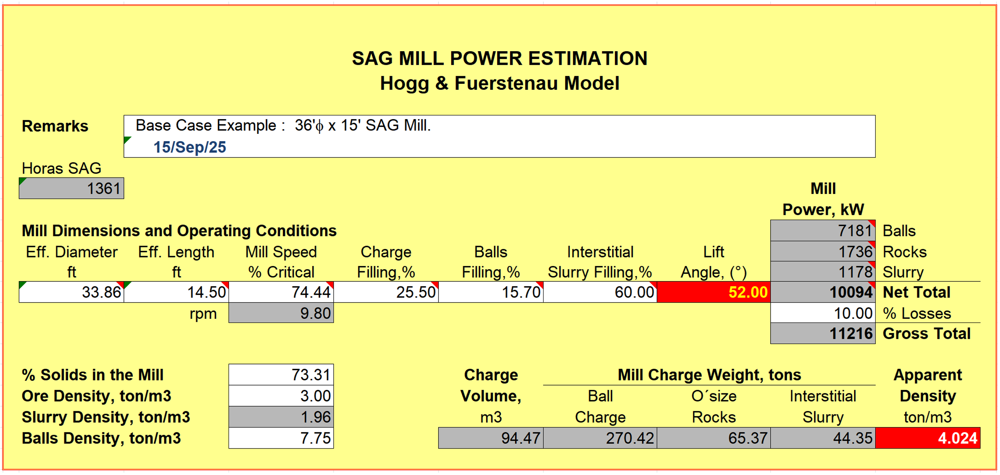

::: {.callout-note}
## Idea central

Antes de entrenar modelos predictivos conviene preguntarse si el fenómeno puede representarse con una formulación física, metalúrgica o empírica razonable. En esta entrada usamos el **modelo de Hogg y Fuerstenau** como punto de partida para construir un estimador algebraico del nivel de llenado de un molino SAG. La idea no es reemplazar sensores ni sistemas de control, sino mostrar cómo un modelo de dominio puede funcionar como *proxy* operacional, ayudar a interpretar la cinemática de la carga interna y servir como línea base antes de pasar a enfoques puramente estadísticos o de machine learning.
:::

## Introducción

Trabajar intensivamente con datos es divertido y nos permite desarrollar un pensamiento estructurado más bien lógico a la hora de resolver cualquier tipo de problema, ya sea científico, ingenieril o simplemente asociado a cualquier dominio donde exista información útil que podamos explotar. Nos permite integrar a nuestro quehacer rutinas que exigen, en la medida de lo posible, la provisión de datos de calidad que, en el mejor de los casos, nos permitirán tomar una decisión.

Sin embargo, estas rutinas también crean vicios algo riesgosos desde la perspectiva del *problem-solving*. A nivel estratégico, cuando demandamos de una cierta cantidad de datos, automáticamente tendemos a buscar soluciones prefijadas conforme un determinado marco de referencia o *framework*, sin antes detenernos un momento a pensar de manera más estratégica, debido a que caemos en la mala costumbre de automatizar recetas. Cuando era estudiante de primer año de ingeniería, este hecho me cobró facturas carísimas en asignaturas en las cuales mis profesores me incitaban precisamente a no meter fórmulas en una receta. Jamás olvidaré la primera prueba que rendí en la asignatura de Física, donde me preguntaban por la aceleración de un objeto que rodaba por una pendiente, y donde nunca pude aplicar la segunda ley de Newton ($F=ma$) porque no encontraba los insumos que me llevaban directamente a esa fórmula (la $a$ era el resultado de trabajar la función de posición del objeto por medio del cálculo diferencial). En ese momento, me di cuenta de que había caído en la trampa de la receta, y que no había desarrollado un pensamiento estratégico para resolver el problema. No son los insumos los que me llevan a la fórmula, sino que es la comprensión del problema lo que me permite identificar la fórmula adecuada para resolverlo.

Los científicos de datos suelen caer a menudo en esta trampa. En muchos casos me ha tocado ver como jóvenes profesionales, en su entusiasmo y afán por aplicar sus conocimientos, van directamente al `model.fit()` sin antes detenerse a pensar en el problema que están tratando de resolver, y sin antes analizar los datos que tienen a su disposición. Muchas veces, la solución no pasa por aplicar un modelo de machine learning, sino que puede ser tan simple como realizar un análisis exploratorio de los datos, o incluso una visualización que nos permita identificar patrones o tendencias que no habíamos visto antes. En otros casos, puede ser necesario realizar una limpieza de los datos, o una transformación de los mismos, antes de poder aplicar un modelo de machine learning. Antes de que la teoría del aprendizaje automático se convirtiera en un campo tan popular, la construcción de artefactos que permitieran la representación de sistemas, fenómenos o procesos industriales exigía muchísimo más conocimiento del dominio y un cuidado especial a la hora de elegir un modelo. Y por supuesto, en el mejor de los casos, esos modelos contaban con la ventaja de ser algebraicamente cerrados, proveyendo una fórmula concisa que incluso nos animaba a construir gráficos (los famosos "ábacos" que usan los colegas de Geomecánica para resolver problemas de estabilidad de taludes, por ejemplo) que representaban implementaciones en distintos escenarios contextuales.

Hoy en día, con la popularización de los modelos de machine learning, es común ver como se aplican estos modelos sin un análisis previo del problema, sin una comprensión profunda de los datos, y sin una evaluación crítica de los resultados. Esto puede llevar a resultados engañosos, o incluso a decisiones erróneas basadas en modelos que no son adecuados para el problema que se está tratando de resolver. Incluso habiendo analizado concienzudamente los datos disponibles para un problema en particular, nos sentimos tentados a ir directamente a probar modelos sofisticados, sin antes considerar modelos más simples que podrían ser igual de efectivos o incluso mejores. En muchos casos, un modelo de regresión lineal o una simple media móvil pueden ser suficientes para resolver un problema, sin necesidad de recurrir a modelos más complejos como las redes neuronales o los árboles de decisión.

En este artículo, vamos a abordar un problema específico relacionado con la predicción del nivel de llenado de un molino SAG, utilizando un modelo empírico desarrollado en la década de 1970 por los académicos estadounidenses Richard Hogg y Douglas W. Fuerstenau. Este modelo permite estimar la potencia neta demandada por un molino SAG dada una cierta información contextual (en general, de diseño), y suele utilizarse muchísimo para determinar las dimensiones de estos molinos a nivel de proyectos. Cualquier persona que desee evaluar un proyecto que involucre construir una línea de molienda SAG, de seguro ha usado este modelo para entender qué tan grande debe ser este activo. Sin embargo, nosotros aprovecharemos este modelo para entender cómo se comporta el nivel de llenado del molino en función de la potencia neta demandada y algunos aspectos propios del comportamiento de su carga interna a partir de variables operacionales, obteniendo así una fórmula algebraicamente cerrada que nos permitirá predecir el nivel de llenado del molino en función de estas variables, prescindiendo en primera instancia de un sensor de nivel de llenado, el cual suele ser un activo costoso y que puede presentar problemas de mantenimiento a largo plazo. Naturalmente, el modelo funcionará como *proxy* del sensor de nivel de llenado, y por lo tanto, su desempeño dependerá en gran medida de la calidad de los datos que tengamos a nuestra disposición para entrenarlo, y no reemplazará en ningún caso a un sensor. Pero sí nos podrá sacar de apuros a la hora de entender cuál es la región óptima de operación del molino, o incluso a la hora de detectar anomalías en el comportamiento del nivel de llenado que podrían estar asociadas a problemas operacionales o de mantenimiento.

## Variables claves de operación en molienda SAG

Un molino SAG (Semi-Autogenous Grinding) es un tipo de molino utilizado en la industria minera para reducir el tamaño de los minerales que, previamente, han pasado por equipos de chancado primario. Se trata del activo más importante en una planta concentradora de minerales, debido a que es el equipo que más energía demanda para realizar su trabajo y, por tanto, se trata del inductor de costo operacional de concentración por antonomasia. Si queremos mejorar la eficiencia energética de una planta concentradora, siempre iremos primero a buscar oportunidades de mejora en el molino SAG, ya sea a través de mejoras en su diseño, o a través de mejoras en su operación. Si queremos reducir costos operacionales de concentración a escalas significativas, la misma historia. Y si queremos mejorar la productividad de una planta concentradora, también. Por lo tanto, el molino SAG es un activo clave en la industria minera, y entender su comportamiento es fundamental para optimizar su operación y mejorar la eficiencia energética de la planta concentradora.

En este contexto, conocer los KPIs más importantes asociados a la operación del molino SAG es fundamental para poder tomar decisiones informadas sobre su operación y el funcionamiento global de una planta concentradora. Tan importante es que, en muchas operaciones mineras, al hablar de la "eficiencia" de una planta concentradora, lo que realmente se está hablando es de la eficiencia del molino SAG. Uno de los dolores más grandes que enfrentan los líderes en una operación de este tipo guarda relación con la efectividad operacional de este equipo (OEE), ya que es siempre deseable que su disponibilidad sea lo más alta posible, y que su rendimiento sea lo más cercano posible a su capacidad máxima. Queremos que no pare nunca, salvo para mantenciones programadas.

Estructuralmente, un molino SAG no es más que un cilindro horizontal que gira sobre su eje, y que contiene una carga interna compuesta por el mineral que se está moliendo, y por las bolas de acero que se utilizan para ayudar a la molienda. Sus dimensiones suelen ser lo suficientemente grandes para permitir que la gravedad también ayude en el proceso de molienda, haciendo que las rocas se golpeen entre sí y con las bolas de acero, lo que facilita la reducción de su tamaño. Por esta razón, su geometría es tal que el largo de este cilindro suele ser igual o menor que su diámetro, lo que permite que la carga interna se mantenga en movimiento y no se compacte en el fondo del molino.

En su interior, el molino está revestido con un material resistente al desgaste, que protege la estructura del molino de los impactos y la abrasión causados por las rocas y las bolas de acero. Además, el molino cuenta con un sistema de alimentación que permite introducir el mineral a moler, y un sistema de descarga que permite extraer el producto molido. El molino también cuenta con un sistema de accionamiento que le permite girar sobre su eje, y un sistema de control que permite regular su velocidad de rotación y otros parámetros operacionales. Los revestimientos o *liners* son insumos que deben ser reemplazados periódicamente, ya que, pese a su resistencia al desgaste, sufren un deterioro progresivo debido a la acción de las rocas y medios de molienda, lo que puede afectar la eficiencia del proceso de molienda y aumentar los costos operacionales. El proceso de uso de un conjunto de revestimientos se denomina **campaña**. Todo programa de mantenimiento de un molino SAG contempla que estos revestimientos deben cambiarse cada cierta cantidad de días. A veces algunos más, a veces algunos menos, lo que dependerá del tipo de mineral que entra a la molienda y sus propiedades mecánicas. Lo importante es que, a medida que la campaña avanza, el espacio interno del molino se va haciendo más grande, lo que produce cambios progresivos en algunas variables operacionales claves.

{#fig-liner fig-align="center" width="80%"}

Las variables operacionales claves en un molino SAG son las siguientes:

- **Potencia**: Es la cantidad de energía que el molino demanda para realizar su trabajo, medida normalmente en watts (o, más bien, en múltiplos de esta unidad, como kilowatts o megawatts). Se trata de una variable que se monitorea constantemente en la operación del molino, ya que es un indicador clave de su eficiencia energética y de su rendimiento. La potencia demandada por el molino depende de varios factores, como el tipo de mineral que se está moliendo, la cantidad de carga interna, la velocidad de rotación del molino, y el estado de los revestimientos. En general, a medida que la campaña avanza y los revestimientos se van desgastando, la potencia demandada por el molino tiende a aumentar, ya que el espacio interno del molino se va haciendo más grande y el molino tiene que trabajar más para mover la carga interna. La potencia permite además entender el consumo específico de energía del proceso de molienda (esto es, la razón entre potencia y flujo másico de mineral), y que es un "proxy" directo de qué tan dura es la roca alimentada.

- **Presión de carga:** Corresponde a la fuerza por unidad de área que ejerce el molino sobre una serie de "pads" o "celdas de descanso" que se encuentran en la parte inferior del molino, y que permiten medir la presión que ejerce la carga interna del molino sobre estas celdas (normalmente en *psi*). Esta variable es un indicador clave de la cantidad de carga interna que tiene el molino, y por lo tanto, del nivel de llenado del mismo. A medida que la campaña avanza y los revestimientos se van desgastando, la presión de carga tiende a disminuir, ya que el espacio interno del molino se va haciendo más grande debido al desgaste de los revestimientos (que, por extensión, pesan cada vez menos) y la carga interna se va distribuyendo de manera más uniforme.

- **Velocidad de rotación:** Es la velocidad a la que el molino gira sobre su eje, medida normalmente en revoluciones por minuto (*rpm*). Esta variable es un indicador clave de la eficiencia del proceso de molienda, ya que una velocidad de rotación adecuada puede mejorar la eficiencia energética del molino y aumentar su rendimiento. A medida que la campaña avanza y los revestimientos se van desgastando, la velocidad de rotación tiende a mantenerse constante, ya que el operador suele ajustar la velocidad para mantener un nivel de llenado adecuado y evitar problemas operacionales asociados a un nivel de llenado demasiado bajo o demasiado alto. Es pues un indicador de estabilidad operacional del molino.

- **Densidad de carga:** Corresponde a la masa de carga interna del molino por unidad de volumen, medida normalmente como un **porcentaje de sólidos** con respecto a la masa total de la pulpa que ingresa al molino (*%*), ya que es necesario añadir agua al proceso de molienda para facilitar la reducción de tamaño del mineral. Esta variable es un indicador clave de la eficiencia del proceso de molienda, ya que una densidad de carga adecuada puede mejorar la eficiencia energética del molino y aumentar su rendimiento.

- **Torque:** Es la fuerza de torsión que el molino ejerce sobre su eje de rotación, medida normalmente en Newton-metros (*Nm*), aunque también puede medirse como un porcentaje del torque máximo que el molino puede ejercer. Se trata de un descriptor de la fuerza de giro (denominada también como "par motor") ejercida por el sistema de accionamiento para hacer girar el cilindro cargado con mineral y bolas. Representa pues la capacidad del motor para elevar la carga contra la fuerza de gravedad, siendo crucial para explicar el consumo energético del molino. A medida que la campaña avanza y los revestimientos se van desgastando, el torque tiende a aumentar, ya que el molino tiene que trabajar más para mover la carga interna debido al aumento del espacio interno del molino.

- **Nivel de llenado:** Es la cantidad de carga interna que tiene el molino, medida normalmente como un porcentaje de su volumen total interno (*%*). Esta carga interna es una suma de mineral, agua y medios de molienda (bolas de acero de un tamaño usualmente definido por el área de Metalurgia). El nivel de llenado es una variable crucial para entender la eficiencia, la demanda de potencia y el rendimiento de un molino SAG. Su control es importante, ya que un nivel de llenado alto aumenta la potencia y la producción, pero si es excesivo, reduce la eficiencia del proceso; un nivel muy bajo puede provocar impactos de bolas contra los revestimientos, dañándolos.

La campaña de uso de revestimientos de un molino SAG suele durar varios meses, dependiendo de su calidad y el tipo de mineral alimentado. En mi experiencia, esa duración bordea los 4 a 6 meses. Durante ese tiempo, el molino experimenta cambios progresivos en su comportamiento operacional debido al desgaste de los revestimientos, lo que afecta variables como la potencia demandada, la presión de carga, el nivel de llenado, entre otras. Por lo tanto, es fundamental monitorear estas variables a lo largo de la campaña para entender cómo evoluciona el comportamiento del molino y tomar decisiones informadas sobre su operación y mantenimiento. En este contexto, el modelo de Hogg y Fuerstenau nos permite estimar el nivel de llenado del molino en función de la potencia demandada y otros parámetros operacionales, lo que puede ser muy útil para optimizar su operación y mejorar su eficiencia energética a lo largo de la campaña.

## El modelo de Hogg y Fuerstenau

El modelo de Hogg y Fuerstenau es una ecuación metalúrgica utilizada para estimar la demanda de potencia de un molino SAG con base en sus dimensiones físicas, velocidad de rotación y dinámica de carga en su interior. Dicha dinámica se describe por medio de varias variables que fragmentan la carga en una componente de medios de molienda (bolas de acero), una componente de pulpa (el mineral propiamente tal) y una componente de gruesos. De esta manera, la potencia neta demandada por el molino SAG, en kilowatts, puede expresarse como

::: {.eq-scroll}
$$
P(t)=0.238\,D_m(t)^{2.5}L_m\,\phi(t)\rho_{sl}(t)
\left[J_c(t)-1.065J_c(t)^2\right]\sin(\alpha)
\tag{1}
$$
:::

Aquí $P(t)$ es la potencia neta en kW, $D_{m}(t)$ es el diámetro efectivo del molino en pies, $L_{m}$ es el largo efectivo en pies, $\phi(t)$ es la fracción de velocidad crítica, $\rho_{sl}(t)$ es la densidad de pulpa, $\alpha$ es el ángulo de levantamiento efectivo y $J_{c}(t)$ es el nivel total de llenado del molino. Esta última es la variable que queremos inferir.

En el *mundo real*, todo dispositivo que funciona en base a electricidad sufre de pérdidas de energía, y un molino SAG no es la excepción. Por lo tanto, la potencia neta demandada por el molino SAG no es la potencia que entrega el motor eléctrico que lo acciona. La potencia entregada por el motor eléctrico, en kW, puede expresarse multiplicando la potencia "operacional" descrita por el sensor correspondiente por un factor de eficiencia, que típicamente se fija en torno al 90%.

### Inversión del modelo

Toda pulpa puede expresarse como una combinación de sólidos y agua. La mezcla está gobernada por la densidad de la fracción sólida y la proporción de masa de dichos sólidos con respecto a la masa total de la pulpa. Por lo tanto, la densidad resultante de la pulpa $\rho_{sl}(t)$ que entra al molino puede expresarse como

::: {.eq-scroll}
$$
\rho_{sl} (t)=\frac{1}{C_{sl}(t)/\rho_{m} +\left( 1-C_{sl}(t) \right) / \rho_{w}}
\tag{2}
$$
:::

donde $C_{sl}(t)$ es la fracción másica o volumétrica de sólidos usada por la instrumentación (el famoso **porcentaje de sólidos**), $\rho_m$ es la densidad del mineral in–situ y $\rho_w$ es la densidad del agua. Por simplicidad, asumiremos que estos dos valores son constantes y los fijaremos en $\rho_m=3.0$ t/m$^3$ y $\rho_w=1.0$ t/m$^3$, respectivamente.

La gracia matemática del modelo está en que podemos agrupar todo lo que no depende directamente de $J_{c}(t)$ en un factor $K(t)$, de tal forma que

::: {.eq-scroll}
$$
K(t)=0.238\,D_m(t)^{2.5}L_m\,\phi(t)\rho_{sl}(t)\sin(\alpha)
\tag{3}
$$
:::

Esto nos permite reescribir la ecuación (1) de forma condensada como

::: {.eq-scroll}
$$
P(t)=K(t)\left[J_c(t)-1.065J_c(t)^2\right]
\tag{4}
$$
:::

La ecuación (4) es una ecuación cuadrática en $J_{c}(t)$. Si la escribimos en la forma $f\left( t \right) =at^{2}+bt+c$, podemos identificar los coeficientes como $a=-1.065K(t)$, $b=K(t)$ y $c=-P(t)$. Aplicando la fórmula general para resolver ecuaciones cuadráticas, podemos despejar $J_c(t)$ como

::: {.eq-scroll}
$$
J_{c}(t)=\frac{1\pm\sqrt{1-4.26\frac{P(t)}{K(t)}}}{2.13}
\tag{5}
$$
:::

Esta inversión tiene dos cuidados prácticos. Primero, el discriminante debe ser no negativo, a fin de garantizar que la solución de (5) sea real. Segundo, la raíz seleccionada debe quedar dentro de un rango físico razonable. En general, en una operación real, el resultado suele acotarse manualmente, porque el modelo empírico puede recibir datos contaminados por ruido, detenciones, restricciones operacionales o lecturas imposibles. Y el modelo de Hogg y Fuerstenau fue, originalmente, calibrado como una ecuación de diseño, no como un modelo de operación.

### Desgaste de revestimientos y geometría efectiva

Un aspecto importante del modelo de Hogg y Fuerstenau es que el diámetro efectivo del molino $D_m(t)$ no es constante a lo largo de la campaña. A medida que los revestimientos se desgastan, el diámetro interno efectivo del molino aumenta, lo que afecta directamente la potencia demandada por el molino y, por ende, el nivel de llenado estimado. Incluso si el cambio es pequeño, el diámetro del molino entra al modelo como $D_m^{2.5}$, por lo que no conviene ignorarlo. 

Como regla general, es común asumir que el diámetro efectivo del molino $D_m(t)$ es una función lineal del tiempo, que se puede expresar a partir de una tasa de desgaste o *liner wear ratio* que indica cuánto se desgasta el revestimiento por unidad de tiempo. Esta tasa de desgaste puede variar dependiendo del tipo de mineral, la dureza del mismo, la calidad del revestimiento y las condiciones operacionales del molino. Por simplicidad, asumiremos una tasa fija que resulta del promedio de desgaste entre el chute de alimentación y la descarga del molino. En nuestro caso, los valores de desgaste promedio son los siguientes:

- Tasa de desgaste en alimentación ($w_{in}$): 1.15 mm/día.
- Tasa de desgaste en descarga ($w_{out}$): 1.29 mm/día.

Esto nos da una tasa promedio de desgaste fija de 1.22 mm/día, que es equivalente a 0.05083 mm/hora. Por diseño, las dimensiones originales de los molinos son 36x15 ft (10.98x4.575 m). Si asumimos un espesor de $\zeta= 0.557743$ ft para la coraza del molino, podemos estimar el diámetro interno efectivo de los molinos como:

::: {.eq-scroll}
$$
D_{m}(t) = D_{0} - 2\ \zeta + 2\ w_{in}\ H(t)
\tag{6}
$$
:::

donde $D_{0}$ es el diámetro original del molino y $H(t)$ es la vida útil del revestimiento (en horas). Notemos que hemos sumado la tasa de desgaste, ya que el diámetro interno efectivo aumenta a medida que los revestimientos se desgastan.

En términos prácticos, tanto la aplicación del modelo de Hogg & Fuerstenau como la consideración de la tasa de desgaste de los revestimientos de un molino SAG suelen implementarse en hojas de cálculo especialmente diseñadas para este propósito. Se trata de herramientas extremadamente útiles para ingenieros de diseño y operación, ya que permiten realizar cálculos rápidos y precisos sobre la potencia demandada por el molino y el nivel de llenado estimado, considerando las condiciones operacionales y el desgaste de los revestimientos. En esta entrada no pretendemos "vender" un reemplazo para estas herramientas, sino que ofrecer una alternativa más programática y flexible, que nos permita explorar el comportamiento del molino SAG bajo distintas condiciones operacionales y de desgaste de los revestimientos.

Un ejemplo de planilla automatizada se observa en la @fig-calcspreadsheet.

{#fig-calcspreadsheet fig-align="center" width="100%"}

### Calibración del modelo conforme presión de trabajo del molino

El modelo de Hogg & Fuerstenau no puede utilizarse, por sí solo, para estimar el nivel de llenado de un molino, debido a que se trata, fundamentalmente, de una **ecuación de diseño**, que fue desarrollada para condiciones específicas de alimentación y morfología de circuito. Por esta razón, es necesario adaptar este modelo a un caso real de operación, siendo común la utilización de la presión de trabajo del molino como un *proxy* de carga o **punto de anclaje**. La razón es simple: Mientras mayor sea la carga interna del molino, mayor será la presión que éste ejercerá sobre sus pads o descansos (¡física elemental!), por lo que es razonable suponer que su nivel de llenado $J_{c}$ será proporcional, en algún factor, a dicha presión. Al comparar el valor de $J_{c}$ que obtenemos por medio del modelo de Hogg & Fuerstenau con ciertos valores de referencia obtenidos en terreno y los valores de presión, podemos introducir ajustes que permiten mayor flexibilidad y estimaciones de mejor calidad.

Queremos pues obtener un valor calibrado de nivel de llenado del molino, denotado como $J_{c}^{\mathrm{cal}}(t)$, que satisfaga la ecuación de potencia

::: {.eq-scroll}
$$
P(t) = F\ K(t)\ (J_{c}^{\mathrm{cal}}(t) - 1.065\ (J_{c}^{\mathrm{cal}}(t))^{2})
\tag{7}
$$
:::

donde $F$ es un **factor de calibración**, cuya misión es absorber unidades, efectos asociados a los revestimientos y ruido operacional. Para estimarlo, usamos la medición de presión $p(t)$ en un tiempo $t$. Debido a que, como hemos verificado en los gráficos anteriores, la presión desciende linealmente con la campaña, podemos normalizar su valor para "capturar" las variaciones del nivel de llenado conforme una banda de incertidumbre limitada por niveles extremos $p_{\mathrm{min}}$ y $p_{\mathrm{max}}$, conforme la relación

:::{.eq-scroll}
$$
p_{\mathrm{norm}}(t) = \frac{C(p(t), p_{\mathrm{min}}, p_{\mathrm{max}}) - p_{\mathrm{min}}}{p_{\mathrm{max}} - p_{\mathrm{min}}}
\tag{8}
$$
:::

Donde la función $C(p(t), p_{\mathrm{min}}, p_{\mathrm{max}})$ limita el valor de $p(t)$ dentro del rango $[p_{\mathrm{min}}, p_{\mathrm{max}}]$, y es análoga a la función `clip()` de <strong><font color='darkmagenta'>Numpy</font></strong> y <strong><font color='darkmagenta'>Pandas</font></strong>. Es decir,

:::{.eq-scroll}
$$
\tilde{p} \left( t \right) = C \left( p\left( t \right) ,p_{\mathrm{min}},p_{\mathrm{max}} \right) =\begin{cases}p_{\mathrm{min}}&;\  \text{si} \  p\left( t \right) <p_{\mathrm{min}}\\ p\left( t \right)&;\  \text{si} \  p_{\mathrm{min}}\leq p\left( t \right) \leq p_{\mathrm{max}}\\ p_{\mathrm{max}}&;\  \text{si} \  p\left( t \right) >p_{\mathrm{max}}\end{cases}
\tag{9}
$$
:::

Los valores normalizados asumidos como "extremos" de presión, digamos $p_{\mathrm{min}}$ y $p_{\mathrm{max}}$, suelen estimarse a partir de los datos históricos de presión de carga del molino para una campaña en particular, o para un set reducido de ellas. Sea cual sea el caso, si la presión no decrece linealmente en el tiempo para una misma campaña, este valor normalizado puede *invertirse* realizando la sustitución $p_{\mathrm{norm}}(t) \rightarrow 1 - p_{\mathrm{norm}}(t)$, de manera que el factor de calibración $F$ se mantenga dentro de un rango razonable, manteniendo una correlación positiva entre la presión de carga y el nivel de llenado del molino, ya que buscamos que el nivel de llenado varíe siempre en la misma dirección que la presión.

Ahora procedemos a definir un rango físicamente razonable para el nivel de llenado total en el molino SAG, denominado **envolvente de operación**, el cual nos servirá como recorrido para nuestro modelo. Para un molino de 36 pies de diámetro, un rango típico de variación para este ejercicio es $0.22 \leq J_{c} \leq 0.34$, el cual puede ajustarse según mediciones conocidas del nivel de llenado, pero para este caso, asumiremos que estos valores son representativos de la operación normal del molino. Siendo así, podemos estimar un **nivel de llenado referencial** $J_{c}^{\mathrm{ref}}(t)$ como

:::{.eq-scroll}
$$
J_{c}^{\mathrm{ref}}(t) = J_{c}^{\mathrm{min}} + p_{\mathrm{norm}}(t)\ (J_{c}^{\mathrm{max}} - J_{c}^{\mathrm{min}})
\tag{10}
$$
:::

Sea $g(J_{c}(t))= J_{c}(t) - 1.065\ (J_{c}(t))^{2}$. Entonces, para cada $t$, podemos estimar el factor de calibración $F(t)$ como

:::{.eq-scroll}
$$
F(t)=\frac{P(t)}{K(t) g(J_{c}^{\mathrm{ref}}(t))}
\tag{11}
$$
:::

El factor de calibración global para la campaña completa (o para el conjunto de campañas consideradas como soporte del modelo), denotado como $F$, puede finalmente estimarse como un valor agregado de los valores individuales $F(t)$, ya sea mediante un promedio simple, un promedio ponderado o una mediana, dependiendo de la robustez que se desee para el modelo. En este caso, utilizaremos la mediana para minimizar el efecto de valores atípicos y obtener un factor de calibración más representativo del comportamiento general del molino durante la campaña:

:::{.eq-scroll}
$$
F= \mathrm{Me}(F(t))
\tag{12}
$$
:::

Esta elección de $F$ permite que la potencia neta estimada por el modelo y la potencia real medida en el molino coincidan, en promedio, con la curva de nivel de llenado, cuya geometría se describe luego a partir de la física interna de la carga, descrita por $g(J_{c}(t))$. De este modo, ya sólo nos resta resolver el modelo calibrado para $J_{c}^{\mathrm{cal}}(t)$, que se obtiene de la ecuación (7) con $F$ fijo, como

:::{.eq-scroll}
$$
g(J_{c}(t)) = \frac{P(t)}{F K(t)}\ \longrightarrow \ 1.065\ (J_{c}^{\mathrm{cal}}(t))^{2} - J_{c}^{\mathrm{cal}}(t) + \frac{P(t)}{F K(t)} = 0
\tag{13}
$$
:::

donde escogemos la raíz que nos entrega un valor de $J_{c}^{\mathrm{cal}}(t)$ dentro del rango físicamente razonable definido por la envolvente de operación.

### Estimación del nivel de llenado de bolas $J_{b}$

Como comentamos previamente, el volumen ocupado por la carga interna del molino SAG se compone de tres fracciones: La fracción representada por los medios de molienda o bolas de acero $J_{b}$, la fracción de pulpa $J_{sl}$ y la fracción de gruesos $J_{o}$. La fracción $J_{b}$ es una variable crucial para entender el comportamiento del molino, ya que afecta directamente la eficiencia del proceso de molienda y la demanda de potencia del molino. Sin embargo, su estimación es más compleja que la del nivel total de llenado $J_{c}$, debido a que no existe una relación directa entre $J_{b}$ y las variables operacionales que son diseñadas a partir del modelo de Hogg & Fuerstenau. Además, $J_{b}$ evoluciona lentamente debido al ciclo de desgaste de las bolas y su posterior carga en eventos controlados. Muchos enfoques teóricos incluso asumen que $J_{b}$ es constante entre adiciones de bolas, disminuyendo lentamente debido al desgaste, pero aumentando en pasos cuando se agregan nuevas bolas. Sin embargo, esta suposición no siempre es correcta.

Un enfoque más razonable para estimar $J_{b}$ en un tiempo $t$ implica considerar la dinámica de la carga interna del molino por medio de un balance de masa que incluya a los aceros de molienda, con la dificultad añadida que, en muchos casos, no contaremos con datos relativos a la purga de bolas, lo que complica una estimación más directa. Por esta razón, recurriremos nuevamente a la presión de carga como un *proxy* para calibrar el modelo que queremos construir. De esta manera, a partir del modelo de Hogg & Fuerstenau, llamemos $V_{m} = \frac{\pi}{4} D^{2}L$ al volumen interno efectivo del molino (en m³). Entonces, las masas que constituyen cada fracción de la carga interna del molino son:

- Masa de bolas: $M_{b}(t) = J_{b}(t) V_{m} \rho_{b}$, donde $\rho_{b}$ es la densidad de las bolas (asumida constante en 7.75 t/m³).
- Masa de la pulpa: $M_{sl}(t) = J_{sl}(t) V_{m} \rho_{sl}(t)$, donde $J_{sl}(t)$ es la fracción volumétrica de pulpa del molino.
- Masa de los gruesos: $M_{o}(t) = \rho_{m}(J_{c}(t) - J_{b}(t))V_{m}$, donde $\rho_{m}$ es la densidad del mineral (asumida constante en 3.0 t/m³).

Notemos que $J_{sl}(t)$ puede aproximarse, bajo condiciones de estado estacionario, como $J_{sl} \approx \varepsilon J_{c}(t)$, donde $\varepsilon$ es la fracción de llenado intersticial, la cual indica cuánto espacio vacío dentro de la carga ha sido relleno con pulpa. Este valor suele asumirse como una constante de proceso conforme estudios técnicos de los equipos de metalurgia. Para este ejercicio, nosotros asumiremos un valor de $\varepsilon = 0.6$.

Para estimar $J_{b}$, necesitamos conocer la masa total de la carga interna del molino $M_{c}(t)$, que es la suma de las masas de bolas, pulpa y gruesos. Es decir,

:::{.eq-scroll}
$$
\begin{array}{lll}M_{\mathrm{tot}}(t)&=&M_{b}(t)+M_{sl}(t)+M_{o}(t)\\ &=&[\rho_{b} J_{b}(t)+\rho_{m} (J_{c}(t)-J_{b}(t))+\rho_{sl} (t)\varepsilon J_{c}(t)]V_{m}(t)\end{array}
\tag{14}
$$
:::

Mediante algo de álgebra, podemos despejar $J_{b}(t)$ de la ecuación (14) como

:::{.eq-scroll}
$$
J_{b}(t) = \frac{\frac{M_{\mathrm{tot}}(t)}{V_{m}(t)} - J_{c}(t)(\rho_{m} + \varepsilon \rho_{sl}(t))}{\rho_{b} - \rho_{m}}
\tag{15}
$$
:::


... pero hay un problema: No tenemos una medición directa de $M_{\mathrm{tot}}(t)$, la masa total de la carga interna del molino. Es allí donde entra el truco de usar la presión de trabajo del molino como un *proxy* de su nivel de llenado.

Como antes, asumiremos que la presión de trabajo $p(t)$ es proporcional a la masa total de la carga interna del molino. Este supuesto es razonable, ya que a mayor masa de carga interna, mayor será la presión ejercida sobre los pads o descansos del molino (de nuevo, física elemental: La fórmula de Newton para la presión es $P = F/A$, donde $F$ es la fuerza ejercida por la masa de carga interna y $A$ es el área de contacto, siendo dicha fuerza el peso de dicha carga). Supondremos además que la relación entre la presión y la masa total de la carga interna es lineal, siendo el parámetro de sesgo de esa relación atribuible al ruido operacional. Es decir,

:::{.eq-scroll}
$$
M_{\mathrm{tot}}(t) = \alpha\ p^{\ast}(t) + \beta
\tag{16}
$$
:::

donde $\alpha$ y $\beta$ son parámetros de calibración que deben estimarse a partir de datos históricos, y $p^{\ast}(t)$ es la presión de trabajo normalizada correctamente orientada, de manera que su valor aumente conforme aumenta la masa de carga interna del molino. Para ello, podemos usar la misma normalización que definimos previamente para el nivel de llenado referencial $J_{c}^{\mathrm{ref}}(t)$, pero ajustando los valores de presión mínima y máxima según corresponda a la campaña en cuestión. Para estimar $\alpha$ y $\beta$ usaremos medianas móviles ancladas a los percentiles $p_{5}$ y $p_{95}$ de la presión de carga orientada y los correspondientes valores de $J_{b}$ inferidos en terreno. Esos valores, en general, son suministrados por el área de metalurgia y representan mediciones manuales de nivel de llenado de bolas en momentos específicos de la campaña.

El procedimiento entonces será el siguiente:

1. Calcularemos los percentiles 5 y 95 de la presión de carga orientada $p^{\ast}(t)$.
2. Para cada ventana de tiempo correspondiente a los percentiles $p_{5}$ y $p_{95}$, calcularemos la mediana de $J_{c}^{\mathrm{cal}}(t)$, $\rho_{sl}(t)$ y $V_{m}(t)$, y usaremos estos valores para estimar la masa total de la carga interna del molino $M_{\mathrm{tot}}(t)$ en esos percentiles. Esta es la parte en la cual escogemos los valores de $J_{b}^{min}$ y $J_{b}^{max}$ basados en los registros diarios de $J_{b}$ provenientes del área de metalurgia. Solo necesitamos calcular la presión promedio para esa medición:

:::{.eq-scroll}
$$
\begin{array}{lll}M_{p_{5}}&=&\mathrm{Me} \left[ V_{m}(t)\left( \rho_{m} J_{c}^{cal}(t)+\left( \rho_{b} -\rho_{m} \right) J_{b}^{min}+\rho_{sl} (t)\varepsilon J_{c}^{cal}(t) \right) \right]_{p5}\\ {}M_{p_{95}}&=&\mathrm{Me} \left[ V_{m}(t)\left( \rho_{m} J_{c}^{cal}(t)+\left( \rho_{b} -\rho_{m} \right) J_{b}^{max}+\rho_{sl} (t)\varepsilon J_{c}^{cal}(t) \right) \right]_{p95}\end{array}
\tag{17}
$$
:::

3. Resolvemos la ecuación de interpolación lineal:

:::{.eq-scroll}
$$
\beta= \frac{M_{p95}-M_{p5}}{p^{\ast}_{p95}-p^{\ast}_{p5}}\ \wedge \ \alpha=M_{p5} - \beta p^{\ast}_{p5}
\tag{18}
$$
:::

De esta manera, finalmente podemos calcular $J_{b}(t)$:

- Evaluamos la ecuación lineal: $M_{\mathrm{tot}}(t) = \alpha p^{\ast}(t) + \beta$.
- Sustituimos $M_{\mathrm{tot}}(t)$ en la ecuación para $J_{b}(t)$.
- Limitamos los valores a un rango físico, acotado por los valores reales de $J_{b}$ registrados en terreno y verificamos que $J_{b}(t) \leq J_{c}(t)$ para todo $t$.

Notemos que, si $M_{p_{5}} > M_{p_{95}}$, entonces nuestras mediciones de presión de carga no están correctamente orientadas, y debemos invertir la normalización de la presión de carga para que el modelo funcione correctamente. Esto se puede hacer simplemente reemplazando $p^{\ast}(t)$ por $1 - p^{\ast}(t)$ en la ecuación (16), para luego replicar el procedimiento de estimación de $\alpha$ y $\beta$.

### Razón de llenado del molino (o razón $J_{b}/J_{c}$)

Una vez que distinguimos entre el nivel de llenado total $J_{c}$ y el nivel de llenado de bolas $J_{b}$, aparece una variable especialmente útil para interpretar el estado interno del molino: **La razón entre ambos**. A esta razón la llamaremos **razón de llenado**, y la denotaremos por $\Gamma_b(t)$. Formalmente,

:::{.eq-scroll}
$$
\Gamma_b(t)=\frac{J_b(t)}{J_c(t)}
\tag{19}
$$
:::

La razón $\Gamma_b(t)$ mide qué fracción del volumen ocupado por la carga interna está explicada por medios de molienda de acero. En otras palabras, no nos dice únicamente cuántas bolas hay en el molino, ni qué tan lleno está, sino cómo se reparte la carga entre medios de molienda y el resto de sus componentes: Mineral grueso, pulpa y espacios intersticiales. Por eso es una variable más informativa que mirar $J_{b}$ o $J_{c}$ por separado. Dos condiciones con el mismo $J_{b}$ pueden representar estados operacionales muy distintos si el $J_{c}$ total cambia; del mismo modo, dos condiciones con el mismo $J_{c}$ pueden tener cinemáticas de molienda muy diferentes si la proporción relativa de bolas no es la misma.

Desde el punto de vista físico, $\Gamma_b(t)$ captura parte del equilibrio entre molienda por impacto, molienda por abrasión y transporte de pulpa. Cuando la razón de llenado es demasiado baja, la carga contiene relativamente pocos medios de molienda respecto de su volumen total. En ese caso, el molino puede perder capacidad de impacto efectivo, aumentar la permanencia de mineral grueso, desarrollar una carga más pesada desde el punto de vista del transporte y operar con menor eficiencia de fractura. El síntoma operacional suele aparecer como mayor presión o potencia sin una mejora proporcional del rendimiento, incremento de recirculación o un producto más grueso de lo esperado. Cuando $\Gamma_b(t)$ es demasiado alta, ocurre el problema contrario: Hay muchos medios de molienda respecto del volumen total de carga. Esto puede aumentar la intensidad de impactos, pero también elevar el consumo específico de energía, acelerar desgaste de bolas y revestimientos, reducir el volumen disponible para mineral y pulpa, y favorecer condiciones de sobre-molienda o de carga menos eficiente para la tasa real de alimentación.

Una forma práctica de leer esta razón es descomponer $J_{c}(t)$ como la suma de una contribución de bolas, una contribución de gruesos y una contribución de pulpa,

:::{.eq-scroll}
$$
J_{c}(t)=J_{b}(t)+J_{o}(t)+J_{\mathrm{sl}}(t)
\tag{20}
$$
:::

De esta manera, $\Gamma_b(t)$ funciona como un indicador relativo de composición de carga. Si aumenta porque sube $J_{b}$ y $J_{c}$ se mantiene relativamente estable, podríamos estar frente a una campaña con mayor inventario relativo de acero. Si aumenta porque cae $J_{c}$ mientras $J_{b}$ se mantiene, el diagnóstico operacional es distinto: El molino podría estar perdiendo carga mineral o pulpa, no necesariamente ganando bolas. Si disminuye, puede indicar desgaste de medios, baja reposición de bolas, aumento relativo de carga mineral o un cambio en la dinámica de alimentación y clasificación.

En control operacional, la razón de llenado es valiosa porque conecta decisiones lentas y rápidas. La adición de bolas es una decisión lenta, discreta y metalúrgica, que además presenta aspectos económicos (por la compra de insumos); el agua, la velocidad, la alimentación y algunos *set-points* de presión/potencia son decisiones más rápidas. Un buen control del molino no busca maximizar $\Gamma_b(t)$, sino mantenerla dentro de una banda donde la carga tenga suficiente energía de impacto, buena movilidad, capacidad de transporte y estabilidad de descarga. En una planta real, esta razón debiera contrastarse con registros de carguío de bolas, consumo específico de energía, granulometría de producto, presión de descansos, ruido o vibraciones del molino, potencia y comportamiento de ciclones. Su valor no radica tanto en operar con un número perfecto, sino que en detectar cuándo la composición relativa de la carga se está moviendo hacia un régimen menos eficiente.

## Un ejercicio práctico en Python

Y bueno... Ya estamos listos para implementar toda esta teoría en un ejercicio práctico. Haremos uso pues de Python para construir un modelo de nivel de llenado de un molino SAG, valiéndonos fundamentalmente de librerías clásicas para el análisis de datos y visualización, como <strong><font color='darkmagenta'>Numpy</font></strong>, <strong><font color='darkmagenta'>Pandas</font></strong> y <strong><font color='darkmagenta'>Plotly</font></strong>. La razón de nuestra preferencia por <strong><font color='darkmagenta'>Plotly</font></strong> en este ejercicio es más bien práctica: Queremos aprovechar la interactividad de sus gráficos para explorar los datos y el comportamiento del modelo, además de otras relaciones de interés que veremos en el camino.

Haremos uso de un dataset simulado que describe la operación de un molino SAG a partir de un conjunto de sensores típicos de alimentación fresca y total, potencia de motor, presión de los descansos, densidad de pulpa y velocidad de rotación. Datos como éstos son los típicos que obtendremos al consultar historizadores de planta, como PI System, y suele ser necesario implementar previamente un procedimiento de limpieza y filtrado de datos para eliminar valores atípicos, errores de medición y otros problemas que puedan afectar la calidad del análisis.

Los datos a utilizar en este ejercicio provienen de los siguientes archivos externos:

- `pi_data.csv`: Datos históricos que emulan la descarga típica desde un historizador, con una granularidad de 15 minutos por medición (promedios).
- `campaign_record.csv`: Información histórica de campañas de revestimientos y desgaste.
- `actual_measurements.csv`: Mediciones manuales de $J_{c}$ y $J_{b}$ para el molino SAG.

Los archivos quedan disponibles para descarga directa:

::: {.dataset-download}
::: {.dataset-download-grid}
[Datos operacionales 15 min](../datasets/pi_data.csv){.dataset-download-btn download="pi_data.csv"}

[Campañas de revestimientos](../datasets/campaign_record.csv){.dataset-download-btn download="campaign_record.csv"}

[Mediciones puntuales](../datasets/actual_measurements.csv){.dataset-download-btn download="actual_measurements.csv"}
:::
:::

### Exploración inicial

Accedemos pues a estos archivos y cargamos los datos en un DataFrame de <strong><font color='darkmagenta'>Pandas</font></strong> para su análisis:

```{python}
import numpy as np
import pandas as pd
import plotly.graph_objects as go
import plotly.io as pio
import plotly.subplots as psub
```

```{python}
import warnings
```

```{python}
from IPython.display import HTML
```

```{python}
# Suprimimos las advertencias de tipo `UserWarning` que puedan aparecer
# durante la ejecución del código.
warnings.filterwarnings("ignore", category=UserWarning)
```

```{python}
# Definimos la familia de fuentes que usaremos en las figuras.
PLOTLY_FONT = "Calibri, Arial, sans-serif"

# Umbrales mínimos de operación.
POWER_THRESHOLD = 7000.0
PRESSURE_THRESH = 750.0
THROUGHPUT_THRESH = 2000.0

# Y seteamos el template por defecto.
pio.templates.default = "ggplot2"


def show_plotly(fig):
    """
    Inserta figuras de Plotly sin cargar MathJax desde Plotly.

    Quarto ya se encarga del renderizado matemático del documento. Si dejamos
    que Plotly cargue o negocie su propio MathJax, algunas ecuaciones del
    artículo pueden quedar con una apariencia distinta al resto del blog.
    """
    return HTML(
        fig.to_html(
            full_html=False,
            include_plotlyjs="cdn",
            include_mathjax=False,
            config={
                "responsive": True,
                "displaylogo": False,
            },
        )
    )
```

```{python}
# Cargamos los datos como DataFrames.
pi_data = pd.read_csv("../datasets/pi_data.csv")
reliner_data = pd.read_csv("../datasets/campaign_record.csv")
actual_vals_data = pd.read_csv("../datasets/actual_measurements.csv")
```

Primero reconozcamos la estructura del primer DataFrame, que hemos llamado `pi_data`:

```{python}
# Verificamos la estructura del DataFrame `pi_data`.
pi_data.info()
```

Vemos pues que se trata de un DataFrame con `9` columnas:

- `timestamp`: Columna que detalla el `timestamp` de cada medición, con una granularidad de 15 minutos. Notemos que esta columna ha sido "traducida" por <strong><font color='darkmagenta'>Pandas</font></strong> a una del tipo `str`, por lo que necesitaremos convertirla a un tipo `datetime` para poder trabajar con ella de manera más eficiente.
- `sag_power_kw`: Variable que representa la potencia de motor del molino SAG, medida en kW.
- `sag_speed_rpm`: Variable que representa la velocidad de rotación del molino SAG, medida en rpm.
- `bearing_pressure_psi`: Variable que representa la presión de carga del molino SAG, medida en psi. Se trata de un promedio resultante de la presión ejercida por el molino (su peso más la carga interna) sobre los *pads* o descansos del molino, que suelen estar equipados con sensores de presión.
- `fresh_feed_tph`: Variable que representa la alimentación fresca de mineral al molino SAG, medida en t/h.
- `total_feed_tph`: Variable que representa la alimentación total de mineral al molino SAG, medida en t/h. Esta variable es la suma de la alimentación fresca más la recirculación de mineral proveniente de otros circuitos (por ejemplo, pebbles).
- `process_water_m3h`: Variable que representa la entrada de agua al molino SAG, medida en m³/h. Esta variable es crucial para mantener la densidad de pulpa dentro de un rango adecuado, ya que la adición de agua permite controlar la viscosidad y la capacidad de transporte del mineral dentro del molino.
- `feed_solids_pct`: Variable que representa el porcentaje de sólidos en la pulpa que ingresa al molino SAG, medido como un porcentaje de la masa total de la pulpa. Esta variable es importante para estimar la densidad de pulpa y, por ende, la eficiencia del proceso de molienda. Se trata, de hecho, de un parámetro de diseño, que debiera mantenerse dentro de un rango específico para garantizar un rendimiento óptimo.
- `liner_age_min`: Variable que cuenta el tiempo acumulado de operación del molino SAG desde el último cambio de revestimientos, medido en minutos. Esta variable es crucial para estimar el desgaste de los revestimientos y, por ende, la evolución del diámetro interno efectivo del molino a lo largo de la campaña.

Notemos que el DataFrame posee más de `78000` filas. A una granularidad de 15 minutos por fila, esto nos da un poco más de 2 años de datos históricos, lo que nos permite analizar la evolución del comportamiento del molino SAG a lo largo de varias campañas de uso de revestimientos.

Ahora chequeamos la estructura del segundo DataFrame, que hemos llamado `reliner_data`:

```{python}
# Chequeamos la estructura del DataFrame `reliner_data`.
reliner_data.info()
```

Se trata de un DataFrame con `4` columnas:

- `campaign_id`: Identificador único de la campaña de revestimientos, que nos permite asociar cada registro con una campaña específica.
- `init_date`: Fecha de inicio de la campaña de revestimientos, que nos permite calcular el tiempo transcurrido desde el inicio de la campaña hasta cada medición.
- `end_date`: Fecha de finalización de la campaña de revestimientos, que nos permite determinar la duración total de la campaña y asociar cada medición con la campaña correspondiente.
- `duration`: Duración total de la campaña de revestimientos, medida en días. Esta variable es útil para analizar la evolución del desgaste de los revestimientos a lo largo del tiempo y su impacto en las variables operacionales del molino SAG.

Este DataFrame nos permitirá asociar cada medición con la campaña de revestimientos correspondiente, lo que es crucial para analizar la evolución del molino SAG a lo largo de su vida útil y entender cómo el desgaste de los revestimientos afecta las variables operacionales. Además, nos permitirá construir visualizaciones útiles que indiquen diferentes estados del molino en una campaña específica.

Finalmente, chequeamos la estructura del tercer DataFrame, que hemos llamado `actual_vals_data`:

```{python}
# Chequeamos la estructura del DataFrame `actual_vals_data`.
actual_vals_data.info()
```

Se trata de un DataFrame con `12` columnas, con mediciones puntuales de varias variables de operación del molino SAG:

- `timestamp`: Columna que detalla el `timestamp` de cada medición. Al ser puntual, la granularidad de esta columna es variable, dependiendo de cuándo se realizaron las mediciones manuales.
- `pressure_psi`: Columna que especifica una medición puntual de la presión de carga del molino SAG, en psi.
- `speed_rpm`: Columna que especifica una medición puntual de la velocidad de rotación del molino SAG, en rpm.
- `power_kw`: Columna que especifica una medición puntual de la potencia de motor del molino SAG, en kW.
- `iron_grade_pct`: Columna que especifica una medición puntual de la ley de hierro del mineral alimentado al molino SAG, en porcentaje. La ley de hierro es importante en muchas operaciones mineras, ya que afecta la eficiencia del proceso de molienda y la calidad del producto final, debido a que los minerales de hierro, como la magnetita y la hematita, son más densos y duros que otros minerales, lo que puede afectar la demanda de potencia del molino y el desgaste de los revestimientos.
- `torque_pct`: Columna que especifica una medición puntual del torque del molino SAG, en porcentaje. El torque es un parámetro crucial para entender la eficiencia del proceso de molienda y la demanda de potencia del molino, ya que indica la fuerza de torsión que el molino ejerce sobre su eje de rotación. Se trata de un proxy de la carga interna del molino, y su análisis puede ayudar a identificar problemas operacionales, como sobrecarga del molino.
- `feed_solids_pct`: Columna que especifica una medición puntual del porcentaje de sólidos en la pulpa que ingresa al molino SAG, en porcentaje.
- `coarse_split_pct`: Columna que especifica una medición puntual del porcentaje de gruesos en la carga interna del molino SAG, en porcentaje. Esta variable es importante para entender la distribución de tamaños de partículas dentro del molino y su impacto en la eficiencia del proceso de molienda. En general, las partículas gruesas tienden a ocupar más espacio dentro del molino y son las que más tiempo tardan en ser reducidas, por lo que su presencia puede afectar la demanda de potencia del molino y el desgaste de los revestimientos.
- `free_lifters`: Columna que especifica una medición puntual del número de *lifters* libres en el molino SAG. Los *lifters* son elementos internos del molino que ayudan a levantar y mezclar la carga interna, mejorando la eficiencia del proceso de molienda. El número de *lifters* libres puede afectar la distribución de la carga interna y, por ende, la demanda de potencia del molino.
- `jc_measured_pct`: Columna que especifica una medición puntual del nivel de llenado total del molino SAG, en porcentaje.
- `liner_age_h`: Columna que especifica una medición puntual de la edad del revestimiento del molino SAG, en horas.
- `jb_measured_pct`: Columna que especifica una medición puntual del nivel de llenado de bolas del molino SAG, en porcentaje.

### Caracterización de las campañas

En general, una campaña de uso de revestimientos se caracteriza por el comportamiento de la presión de carga del molino SAG a lo largo del tiempo, así como por la evolución de la potencia del motor. Por norma general, debido a que los revestimientos se van desgastando de manera progresiva, la presión de carga tiende a disminuir con el tiempo, mientras que la potencia del motor puede aumentar debido a la mayor fricción y resistencia interna del molino. Sin embargo, estos comportamientos pueden variar dependiendo de las condiciones operacionales, el tipo de mineral y la calidad de los revestimientos.

Verifiquemos el caso de la presión de los descansos. Para ello, primero debemos asegurarnos de que la columna `timestamp` del DataFrame `pi_data` esté correctamente convertida a un tipo `datetime`, para poder realizar análisis temporales de manera eficiente. Luego, podemos agrupar los datos por campaña y calcular estadísticas descriptivas, como la media, mediana, percentiles y desviación estándar de la presión de carga a lo largo del tiempo. En este primer *approach*, miraremos el comportamiento de la presión conforme una media móvil diaria:

```{python}
# Llevamos la columna `timestamp` a tipo `datetime` para poder trabajar eficientemente con ella.
pi_data["timestamp"] = pd.to_datetime(pi_data["timestamp"])
```

```{python}
#| label: fig-sag-bearing-pressure-campaigns
#| fig-cap: "Evolución diaria de la presión de los descansos durante las campañas de revestimientos. La tendencia de largo plazo permite separar el efecto acumulado del desgaste de las fluctuaciones operacionales de corto plazo."
# Gráfico de evolución de la presión conforme tiempo de campaña.
# Inicializamos la figura.
fig = go.Figure()

# Consideramos potencias sobre 7000 kW como filtro inicial
# (molino siempre online).
pi_data_filtered = pi_data[pi_data["sag_power_kw"] > POWER_THRESHOLD].copy()

# Añadimos la evolución de la presión (remuestreo diario).
fig.add_trace(
    go.Scatter(
        x=pi_data_filtered.resample("D", on="timestamp").mean().index,
        y=pi_data_filtered.resample("D", on="timestamp").mean()["bearing_pressure_psi"],
        mode="lines",
        name="Presión de trabajo",
        line=dict(color="royalblue", width=2, shape="hv"),
    )
)

# Configuramos el layout de la figura.
fig.update_layout(
    title=dict(
        text="<b>Evolución de la presión de trabajo del molino SAG</b>",
        font=dict(size=20, family=PLOTLY_FONT),
    ),
    height=400,
)

fig.update_xaxes(
    title=dict(
        text="<b>Fecha</b>",
        font=dict(size=15, family=PLOTLY_FONT),
    ),
)

fig.update_yaxes(
    title=dict(
        text="<b>Presión de trabajo (psi)</b>",
        font=dict(size=15, family=PLOTLY_FONT),
    ),
)

show_plotly(fig)
```

Podemos observar que, en líneas generales, la presión de los descansos decrece linealmente con el tiempo, lo que es consistente con la teoría de desgaste de los revestimientos. Sin embargo, también podemos notar que existen variaciones significativas en la presión de carga, lo que puede deberse a cambios en las condiciones operacionales, como la alimentación de mineral, la densidad de pulpa y la velocidad de rotación del molino. También puede deberse a eventos de mantenimiento, carguío de aceros de molienda u otro tipo de detenciones.

Desde una mirada operacional, esta tendencia es una primera señal de salud del dataset. Si la presión cae gradualmente durante la campaña, el sensor está capturando un fenómeno metalúrgicamente razonable: el revestimiento pierde espesor, el volumen efectivo crece y la misma masa de carga interna se distribuye en un espacio mayor. Lo importante es no interpretar cada caída puntual como desgaste. En molienda SAG, las variaciones de corto plazo suelen estar mezcladas con cambios de tonelaje, dureza, granulometría, densidad de pulpa, velocidad y estrategias de control. Por eso conviene leer esta curva como tendencia de campaña, no como diagnóstico instantáneo de nivel de llenado.

A continuación, vamos a caracterizar el comportamiento del par potencia–presión del molino SAG a lo largo de la campaña, a fin de encontrar la "región" de la misma en la cual el rendimiento de molino (o **throughput**) es máximo. En general, esperamos que exista una correlación positiva entre la potencia del motor y la presión de carga, ya que a mayor carga interna del molino, mayor será la demanda de potencia para mantener su operación. Sin embargo, las detenciones y otros eventos operacionales pueden degradar, en cierta medida, esta relación.

Tomaremos una campaña cualquiera del registro entregado, digamos la segunda, y construiremos un gráfico que nos permita visualizar los isocontornos de throughput en el espacio definido por la potencia del motor y la presión de carga. Formatearemos las fechas del DataFrame `reliner_data` para poder filtrar las mediciones correspondientes a la campaña seleccionada, y luego construiremos un gráfico de dispersión con isocontornos de throughput, utilizando <strong><font color='darkmagenta'>Plotly</font></strong> para aprovechar su interactividad:

```{python}
# Llevamos a formato `datetime` las fechas de las campañas.
reliner_data["init_date"] = pd.to_datetime(reliner_data["init_date"])
reliner_data["end_date"] = pd.to_datetime(reliner_data["end_date"])
```

Para evitar considerar datos espurios, consideraremos el mismo filtro de potencia mínima de antes, pero, además, consideraremos un filtro de throughput mínimo de 2000 tph, a modo de doble check:

```{python}
def plot_campaign_domain(campaign_index: int):
    """
    Función que genera un gráfico de dispersión de potencia versus presión
    para una campaña específica, con isocontornos de throughput.
    """
    # Gráfico de dispersión de potencia versus presión en una campaña específica.
    # Seleccionamos la campaña indicada por el índice.
    CAMPAIGN_INIT = reliner_data["init_date"].iloc[campaign_index]
    CAMPAIGN_END = reliner_data["end_date"].iloc[campaign_index]

    # Inicializamos la figura.
    fig = go.Figure()

    # Filtramos los datos de la campaña seleccionada.
    # Potencia mínima de 7000 kW y alimentación sobre 2000 t/h.
    campaign_pi_data = pi_data[
        (pi_data["sag_power_kw"] > POWER_THRESHOLD)
        & (pi_data["fresh_feed_tph"] > THROUGHPUT_THRESH)
        & (pi_data["timestamp"] >= CAMPAIGN_INIT)
        & (pi_data["timestamp"] <= CAMPAIGN_END)
    ]

    # Dejamos únicamente las variables que necesitamos para el gráfico.
    plot_data = campaign_pi_data[
        ["sag_power_kw", "bearing_pressure_psi", "fresh_feed_tph"]
    ].dropna()

    # Construimos una grilla discreta para estimar isocontornos de throughput.
    # En cada celda usamos el promedio observado dentro del intervalo.
    N_BINS = 24
    plot_data = plot_data.assign(
        power_bin=pd.cut(plot_data["sag_power_kw"], bins=N_BINS),
        pressure_bin=pd.cut(plot_data["bearing_pressure_psi"], bins=N_BINS),
    )

    contour_grid = plot_data.pivot_table(
        index="pressure_bin",
        columns="power_bin",
        values="fresh_feed_tph",
        aggfunc="mean",
        observed=False,
    )

    power_centers = [interval.mid for interval in contour_grid.columns]
    pressure_centers = [interval.mid for interval in contour_grid.index]

    # Dispersión de potencia versus presión para la campaña seleccionada.
    fig.add_trace(
        go.Scatter(
            mode="markers",
            x=plot_data["sag_power_kw"],
            y=plot_data["bearing_pressure_psi"],
            marker=dict(
                color=plot_data["fresh_feed_tph"],
                colorscale="RdYlGn",
                symbol="square",
                size=7,
                opacity=0.82,
                colorbar=dict(
                    title=dict(
                        text="<b>Throughput (tph)</b>",
                        side="right",
                        font=dict(size=15, family=PLOTLY_FONT),
                    ),
                    tickfont=dict(size=12, family=PLOTLY_FONT),
                    x=1.065,
                    thickness=24,
                ),
            ),
            opacity=0.7,
            name="Datos horarios",
        )
    )

    # Isocontornos de throughput estimados sobre la grilla bivariada.
    fig.add_trace(
        go.Contour(
            x=power_centers,
            y=pressure_centers,
            z=contour_grid.to_numpy(),
            contours=dict(
                coloring="none",
                showlabels=True,
                labelfont=dict(
                    size=11,
                    color="black",
                    family=PLOTLY_FONT,
                ),
            ),
            line=dict(
                color="black",
                width=1.4,
                dash="dash",
            ),
            hoverinfo="skip",
            showscale=False,
            connectgaps=True,
            name="Isocontornos de tph",
        )
    )

    # Configuración del layout de la figura.
    fig.update_layout(
        title=dict(
            text="<b>Dispersión de potencia versus presión en la campaña seleccionada</b>",
            font=dict(size=20, family=PLOTLY_FONT),
            x=0.5,
            xanchor="center",
        ),
        legend=dict(
            orientation="h",
            x=0.5,
            y=1.02,
            xanchor="center",
            yanchor="bottom",
            bgcolor="rgba(255,255,255,0)",
            title=None,
        ),
        margin=dict(t=120, r=150),
        height=600,
    )

    fig.update_xaxes(
        title=dict(
            text="<b>power_kw</b>",
            font=dict(size=15, family=PLOTLY_FONT),
        )
    )
    fig.update_yaxes(
        title=dict(
            text="<b>Presión de trabajo (psi)</b>",
            font=dict(size=15, family=PLOTLY_FONT),
        )
    )

    return fig
```

Vamos pues con la campaña número `1`:

```{python}
#| label: fig-sag-power-pressure-domain-campaign-1
#| fig-cap: "Dominio potencia-presión de la campaña 1. El gradiente de rendimiento distingue las combinaciones que convierten con mayor eficiencia la energía aplicada en toneladas tratadas."
# Mostramos el dominio de la campaña 1.
show_plotly(plot_campaign_domain(campaign_index=1))
```

Vemos pues que la región de mayor estabilidad (zona *verde*) de throughput en esta campaña se encuentra en un dominio de potencia entre 12 y 14 MW, con presión de carga bajo 890 psi. La zona *roja* representa un dominio de operación inestable, con throughput bajo 2000 tph, lo que indica que el molino opera, probablemente, con un mayor nivel de recirculación de mineral, lo que podría indicar un problema de sobrecarga.

Operacionalmente, este tipo de mapa es útil porque separa dos preguntas que suelen mezclarse en sala de control: "¿estamos consumiendo potencia?" y "¿esa potencia está comprando toneladas?". Una zona de alta potencia con bajo throughput no necesariamente es buena operación; puede ser simplemente un molino trabajando pesado, con carga menos eficiente, mayor recirculación o mineral más competente. En cambio, una zona de potencia media-alta con presión moderada y throughput alto sugiere una condición más interesante: la carga está suficientemente activa para moler, pero no tan sobrecargada como para perder capacidad de transporte.

No todas las campañas presentan un comportamiento tan estable como la que acabamos de analizar. En general, es común encontrar campañas con un comportamiento más errático, con variaciones significativas en la presión de carga y la potencia del motor, lo que puede deberse a cambios en las condiciones operacionales, el tipo de mineral y la calidad de los revestimientos. Por ejemplo, para la campaña número `4`:

```{python}
#| label: fig-sag-power-pressure-domain-campaign-4
#| fig-cap: "Dominio potencia-presión de la campaña 4. La dispersión de los niveles de rendimiento revela un régimen operacional menos estable que el observado en la campaña 1."
# Mostramos el dominio de la campaña 4.
show_plotly(plot_campaign_domain(campaign_index=4))
```

El comportamiento es similar, pero ahora la nube de puntos presenta una mayor dispersión, lo que indica que el molino opera en un rango más amplio de condiciones, con variaciones significativas en la presión de carga y la potencia del motor. De esta manera, la nube principal de puntos se concentra entre 12.5-14.5 MW y 860-950 psi, que parece ser la zona operacional dominante de la campaña. Los mayores rendimientos se ubican principalmente en la región definida por potencias medias a altas, alrededor de 13-14 MW, con presiones aproximadas entre 870-930 psi. Notemos además que operar con mayores potencias no garantiza, por sí solo, un mayor rendimiento, ya que hacia presiones muy altas, sobre 950 psi, aparecen regiones con rendimientos bajo la media. Finalmente, la zona de menor desempeño aparece en los bordes de la nube de estabilidad operacional del molino: Baja potencia, presión baja o combinaciones extremas de presión alta con potencia alta.

Un mapa de este tipo permite realizar recomendaciones operacionales iniciales de gran ayuda para la operación: Fijada una presión objetivo, conviene revisar qué banda de potencia maximiza el rendimiento sin empujar el molino hacia regiones de dispersión alta o desempeño inestable. En general, los isocontornos sugieren que existen “islas” de mejor rendimiento, no una única tendencia lineal simple. Esto apunta a una interacción operacional entre potencia, presión y cinética de molienda.

### Mapeo de desgaste de revestimientos

Habiendo caracterizado el comportamiento de la presión de carga y la potencia del motor a lo largo de las campañas, podemos proceder a mapear el desgaste de los revestimientos del molino SAG. Para ello, acordaremos algunos parámetros de diseño iniciales, que ya especificamos previamente:

- Diámetro original del molino: $D_{0} = 36$ ft (~10.98 m).
- Largo del molino: $L = 15$ ft (~4.575 m).
- Factor de conversión de unidades: $1$ ft = $0.3048$ m.
- Espesor de la coraza del molino: $\zeta = 0.557743$ ft (~0.17 m).
- Tasa de desgaste en alimentación: $w_{in} = 1.15$ mm/día.

Debido a que trabajaremos con datos relativos a la densidad de la pulpa que entra al molino, nos aseguraremos de eliminar valores atípicos de esta variables, filtrando todo el rango de valores que se encuente fuera del rango entre los percentiles $p_{5}$ y $p_{95}$:

```{python}
# Creamos una copia del DataFrame `pi_data` para evitar cualquier contratiempo.
df = pi_data.copy()

# Definimos los percentiles mínimo y máximo para filtrar los sólidos.
SOLIDS_MIN_Q, SOLIDS_MAX_Q = 5.0, 95.0
df_filt = df[
    (df["feed_solids_pct"] >= np.nanpercentile(df["feed_solids_pct"], SOLIDS_MIN_Q))
    & (df["feed_solids_pct"] <= np.nanpercentile(df["feed_solids_pct"], SOLIDS_MAX_Q))
]
```

A continuación, definimos los parámetros iniciales del molino en Python:

```{python}
# Configuración inicial para cálculo de la tasa de desgaste.
D0_ft, L0_ft = 36.0, 15.0  # Dimensiones originales del molino.
ft_to_m = 0.3048  # Factor de conversión de pies a metros.
D0_m, L0_m = D0_ft * ft_to_m, L0_ft * ft_to_m  # Dimensiones internas originales en metros.
wear_rate = 1.15 # Tasa de desgaste en mm/día
shell_thickness_ft = 0.557743 # Espesor de la coraza en pies.
shell_thickness_m = shell_thickness_ft * ft_to_m # Espesor de la coraza en metros.
```

Definiremos algunos parámetros iniciales adicionales para la construcción del modelo, conforme la ecuación de potencia de Hogg & Fuerstenau:

- Densidad de las bolas de acero: $\rho_{b} = 7.75$ t/m³.
- Densidad del mineral: $\rho_{m} = 3.0$ t/m³.
- Fracción de llenado intersticial: $\varepsilon = 0.6$.
- Factor de eficiencia eléctrica del motor: $\eta = 0.90$.
- Ángulo de inclinación del lifter: $\theta = 51^{\circ}$.

Y llevamos estos valores a variables de Python:

```{python}
# Configuración adicional para el modelo de nivel de llenado de bolas.
rho_b = 7.75 # Densidad de las bolas de acero (t/m3).
rho_m = 3.00 # Densidad del mineral (t/m3).
rho_w = 1.00 # Densidad del agua (t/m3).
epsilon = 0.60 # Fracción de llenado intersticial.
efficiency_factor = 0.90 # Factor de eficiencia eléctrica.
lifter_angle_sag = 51.0 # Ángulo de inclinación del lifter en grados para molino SAG.
```

### Implementación del modelo de Hogg & Fuerstenau

A continuación, construiremos una función de Python que nos permitirá calcular el nivel de llenado total del molino SAG ($J_{c}$) conforme las configuraciones iniciales previamente definidas:

```{python}
def build_jc(
    orientation: str,
    p_raw: pd.Series,
    p5: pd.Series,
    p95: pd.Series,
    P_eff_kw: pd.Series,
    K: pd.Series,
):
    """
    Función que construye el nivel de llenado total del molino SAG, conforme la inversión
    de la ecuación de potencia de Hogg & Fuerstenau.
    
    Parameters
    ----------
    orientation : Orientación del proxy de presión ("normal" o "inverted").
    p_raw : Valores del proxy de presión.
    p5 : Percentil p5 del proxy de presión.
    p95 : Percentil p95 del proxy de presión.
    P_eff_kw : Valores de potencia efectiva en kW.
    K : Constante K en el modelo de Hogg & Fuerstenau.
    """
    # Definimos los límites duros para el valor de Jc.
    # Estos son límites físicos "extremos".
    jc_lower, jc_upper = 0.05, 0.60
    
    # Definimos el factor cuadrático para Jb en la inversión del modelo de Hogg & Fuerstenau.
    a = 1.065
    
    # Cortamos los valores de presión cruda dentro de los percentiles p5 y p95.
    p_clip = np.clip(p_raw, p5, p95)
    
    # Normalizamos los valores de presión.
    p_norm = (p_clip - p5) / max(1e-9, (p95 - p5))
    
    # Verificamos la orientación (si la presión no disminuye con el desgaste del revestimiento).
    if orientation == "inverted":
        p_norm = 1.0 - p_norm   
    
    # Calculamos el Jc referencial basado en el proxy de presión.
    jc_ref = 0.17 + p_norm * (0.34 - 0.17)
    
    # Calculamos el factor de corrección instancia por instancia.
    with np.errstate(divide='ignore', invalid='ignore'):
        Fi = P_eff_kw / (K * (jc_ref - a * jc_ref**2))
    Fi = Fi[np.isfinite(Fi) & (Fi > 0)]
    
    # Calculamos el factor de corrección mediano.
    F = float(np.nanmedian(Fi)) if Fi.size > 0 else 1.0
    
    # Corregimos el término de sesgo en la ecuación cuadrática usando F.
    C = F * K
    
    # Calculamos el discriminante de la ecuación cuadrática.
    with np.errstate(divide='ignore', invalid='ignore'):
        X = P_eff_kw / C

    disc = 1.0 - 4*a*X
    disc = np.maximum(disc, 0.0)
    
    # Calculamos las raíces de la ecuación cuadrática para Jc.
    root1 = (1.0 - np.sqrt(disc)) / (2*a)
    root2 = (1.0 + np.sqrt(disc)) / (2*a)
    
    # Elegimos la raíz válida y la recortamos a valores razonables.
    jc = np.where((root1 >= jc_lower) & (root1 <= jc_upper), root1, np.nan)
    jc = np.where(np.isnan(jc) & (root2 >= jc_lower) & (root2 <= jc_upper), root2, jc)
    jc = np.clip(jc, jc_lower, jc_upper)
    
    # Calculamos la correlación entre el proxy de presión recortado y Jc.
    # Si no hay valores finitos en Jc, la correlación se establece en `-inf`.
    corr = np.corrcoef(
        p_clip[np.isfinite(jc)],
        jc[np.isfinite(jc)]
    )[0, 1] if np.isfinite(jc).any() else -np.inf
    
    return jc, F, corr
```

La función `build_jc()` encapsula el procedimiento usado para reconstruir el nivel de llenado total del molino SAG, $J_{c}$, a partir de la potencia efectiva, la presión de trabajo y la constante geométrica-operacional del modelo de Hogg & Fuerstenau. La idea central es usar la presión como un *proxy* físico de carga interna y, con ella, calibrar la inversión de la ecuación de potencia. La función retorna los valores `jc`, `F` y `corr`, que corresponden al nivel del llenado propiamente tal, el factor de corrección agregado (conforme la mediana) para la calibración del modelo de potencia y la correlación entre el proxy de presión y el nivel de llenado calculado.

Ya estamos listos para nuestro cálculo de $J_{c}$. Simplemente implementamos la función `build_jc()` a continuación:

```{python}
# Percentiles que definen los extremos del proxy de presión para el cálculo de Jc.
percentiles = [5, 95]

# Seteamos las variables de entrada para el cálculo de Jc.
SOLIDS_COL = "feed_solids_pct"
SPEED_COL = "sag_speed_rpm"
POWER_COL = "sag_power_kw"
PRESSURE_COL = "bearing_pressure_psi"
liner_age = df_filt["liner_age_min"]
wear_thickness = wear_rate * (liner_age / 24.0) # Pérdida de espesor por desgaste.

# Diámetro interno efectivo.
D_eff_m = D0_m - 2 * shell_thickness_m + 2 * (wear_thickness / 1000.0)
D_eff_ft = D_eff_m / ft_to_m # Llevamos el diámetro efectivo a pies para el modelo de H&F.
df_filt["calc_eff_ft_sag"] = D_eff_ft.copy() # Asignamos el diámetro efectivo en pies al DataFrame.
df_filt["calc_eff_m_sag"] = D_eff_m.copy() # Asignamos el diámetro efectivo en metros al DataFrame.

# Volumen interno efectivo.
Vm_k = (np.pi / 4) * (D_eff_m ** 2) * L0_m

# Calculamos la densidad de la pulpa.
Cp_k = df_filt[SOLIDS_COL] / 100.0 # Expresamos los sólidos como fracción.
rho_sl_k = 1.0 / ((Cp_k / rho_m) + ((1 - Cp_k) / rho_w)) # Densidad en t/m3.

# Inversión del modelo de Hogg & Fuerstenau para el cálculo de Jc "crudo".
Nc = 42.3 / np.sqrt(D_eff_ft) # Velocidad crítica del molino (rpm).
phi = df_filt[SPEED_COL] / Nc # Fracción de velocidad crítica.

P_eff = efficiency_factor * df_filt[POWER_COL] # Potencia neta efectiva (kW).
sin_theta = np.sin(np.radians(lifter_angle_sag)) # Seno del ángulo de inclinación del lifter.
K = 0.238 * (D_eff_ft ** 2.5) * (L0_ft - shell_thickness_ft) * phi * rho_sl_k * sin_theta # Factor K para H&F.

# Auto-orientación del proxy de presión y cálculo de Jc para ambos casos de co-dependencia.
p_raw_k = df_filt[PRESSURE_COL].astype(float).values
p5_k, p95_k = np.nanpercentile(p_raw_k, [percentiles[0], percentiles[1]])

jc_norm_raw, F_norm, corr_norm = build_jc(
    orientation="normal",
    p_raw=p_raw_k,
    p5=p5_k,
    p95=p95_k,
    P_eff_kw=P_eff,
    K=K,
)

jc_inv_raw, F_inv, corr_inv = build_jc(
    orientation="inverted",
    p_raw=p_raw_k,
    p5=p5_k,
    p95=p95_k,
    P_eff_kw=P_eff,
    K=K,
)

# Escogemos la mejor orientación de presión, basándonos en la correlación.
if (corr_norm >= corr_inv) and (np.isfinite(corr_norm)) and (corr_norm > 0.0):
    chosen_or = "normal"
    jc_raw = jc_norm_raw
    F = F_norm
else:
    chosen_or = "inverted"
    jc_raw = jc_inv_raw
    F = F_inv

# Valor efectivo de presión dependiendo de la orientación escogida.
p_eff_k = p_raw_k if chosen_or == "normal" else (p5_k + p95_k - p_raw_k)

# Asignamos los valores calculados a nuestro DataFrame.
df_filt["calc_int_vol_sag"] = Vm_k.copy()
df_filt["calc_sl_dens_sag"] = rho_sl_k.copy()
df_filt["calc_jc_cal_sag"] = jc_raw.copy()
df_filt["calc_eff_bear_press_sag"] = p_eff_k.copy()

# Imprimimos un resumen de los resultados.
print(f"Molino SAG - Orientación escogida: {chosen_or} | Correlación: {max(corr_norm, corr_inv):.4f} | Factor de calibración F: {F:.4f}")
```

A continuación, inspeccionamos visualmente el resultado obtenido para el nivel de llenado total que acabamos de estimar:

```{python}
#| label: fig-sag-jc-time-series
#| fig-cap: "Evolución del nivel de llenado total estimado mediante la inversión calibrada del modelo de Hogg y Fuerstenau. El remuestreo cada cuatro horas expone cambios de régimen sin confundirlos con ruido instantáneo."
# Inicializamos la figura.
fig = go.Figure()

# Añadimos la evolución del nivel de llenado total estimado (Jc) conforme tiempo de campaña.
# Remuestreamos cada 4h para mayor claridad visual.
fig.add_trace(
    go.Scatter(
        x=df_filt.resample("4h", on="timestamp").mean().index,
        y=df_filt.resample("4h", on="timestamp").mean()["calc_jc_cal_sag"],
        mode="lines",
        name="Nivel de llenado total (Jc)",
        line=dict(color="dodgerblue", width=2, shape="hv"),
    ),
)

# Configuramos el layout de la figura.
fig.update_layout(
    title="<b>Modelo de Jc calibrado (modelo de H&F + proxy de presión)</b>",
    title_subtitle=dict(
        text="Factor de calibración F considera la tasa de desgaste del revestimiento - remuestreo de 4h para mayor claridad",
        font=dict(size=14, family=PLOTLY_FONT),
    ),
    title_font=dict(size=20, family=PLOTLY_FONT),
    height=500,
    margin=dict(t=110),
)

fig.update_yaxes(
    title_text="<b>Nivel de llenado estimado (Jc)</b>",
    title_font=dict(size=16, family=PLOTLY_FONT),
    dtick=0.1,
)

show_plotly(fig)
```

La curva resultante debe leerse como una señal suavizada de estado interno, no como una medición directa. En una planta, un metalurgista no usaría este valor aislado para decidir cambios agresivos de setpoint; lo contrastaría contra potencia, presión, tonelaje, granulometría de alimentación, ruido del molino y eventos de carguío de bolas. Lo que sí esperamos de una señal útil de $J_c$ es que respete tres criterios básicos: que se mantenga dentro de un rango metalúrgicamente plausible, que no salte de forma absurda ante ruido de instrumentación y que acompañe los cambios estructurales de campaña, especialmente aquellos inducidos por desgaste de revestimientos y variaciones sostenidas de carga interna.

Verificamos además la distribución observada de los valores de $J_{c}$ por medio de un histograma, para corroborar que los valores estimados se encuentran dentro de un rango razonable:

```{python}
#| label: fig-sag-jc-distribution
#| fig-cap: "Distribución del nivel de llenado total estimado. La mediana y el rango intercuartílico permiten comprobar que la reconstrucción permanece concentrada en una banda operacionalmente plausible."
# Inicializamos la figura.
fig = go.Figure()

# Dibujamos el histograma.
fig.add_trace(
    go.Histogram(
        x=df_filt["calc_jc_cal_sag"],
        nbinsx=100,
        marker_color="dodgerblue",
        opacity=0.75,
    ),
)

# Mostramos percentiles de referencia y mediana.
q1 = np.nanpercentile(df_filt[df_filt["calc_jc_cal_sag"] <= 0.34]["calc_jc_cal_sag"], 25)
q3 = np.nanpercentile(df_filt[df_filt["calc_jc_cal_sag"] <= 0.34]["calc_jc_cal_sag"], 75)
median = np.nanmedian(df_filt[df_filt["calc_jc_cal_sag"] <= 0.34]["calc_jc_cal_sag"])

fig.add_vline(
    x=q1,
    line=dict(color="black", width=1.0, dash="dash"),
    opacity=1.0,
    annotation_text="Q1",
    annotation_position="top left",
    annotation_textangle=90,
)

fig.add_vline(
    x=q3,
    line=dict(color="black", width=1.0, dash="dash"),
    opacity=1.0,
    annotation_text="Q3",
    annotation_position="top left",
    annotation_textangle=90,
)

fig.add_vline(
    x=median,
    line=dict(color="black", width=2.0),
    opacity=1.0,
    annotation_text="Mediana",
    annotation_position="top left",
    annotation_textangle=90,
)

# Configuramos el layout de la figura.
fig.update_layout(
    title="<b>Distribución observada de valores estimados para Jc</b>",
    title_font=dict(size=20, family=PLOTLY_FONT),
    height=500,
)

fig.update_xaxes(
    title_text="<b>Nivel de llenado estimado (Jc)</b>",
    title_font=dict(size=16, family=PLOTLY_FONT),
    dtick=0.05,
)

fig.update_yaxes(
    title_text="<b>Frecuencia observada</b>",
    title_font=dict(size=16, family=PLOTLY_FONT),
)

show_plotly(fig)
```

El histograma funciona como una prueba rápida de plausibilidad operacional. Si la distribución queda excesivamente pegada a los límites del modelo, eso normalmente indica que la calibración está forzando demasiado la solución o que la envolvente de operación no está bien definida para esta campaña. En cambio, una distribución concentrada en una banda razonable, con una mediana estable y sin acumulación artificial en los extremos, sugiere que el modelo está reconstruyendo un estado de carga compatible con una operación normal. En términos prácticos, esta revisión evita caer en una trampa frecuente: obtener una serie temporal visualmente bonita, pero sostenida por valores físicamente poco creíbles.

Resulta fundamental, una vez estimado el nivel de llenado total del molino SAG, comparar sus valores con respecto a los valores medidos para el resto de las variables operacionales del molino, a fin de verificar la coherencia de los resultados obtenidos:

```{python}
#| label: fig-sag-jc-operational-dependencies
#| fig-cap: "Densidad conjunta del nivel de llenado total estimado con potencia, velocidad, edad del revestimiento y presión. Los paneles muestran los regímenes operacionales que sostienen la señal reconstruida."
# Inicializamos la figura.
fig = psub.make_subplots(
    rows=2,
    cols=2,
    shared_xaxes=True,
    subplot_titles=(
        "<b>Jc v/s potencia del molino</b>",
        "<b>Jc v/s velocidad de rotación</b>",
        "<b>Jc v/s edad del revestimiento</b>",
        "<b>Jc v/s presión de trabajo</b>",
    ),
    vertical_spacing=0.14,
    horizontal_spacing=0.15,
)

fig.update_annotations(font=dict(size=17, family=PLOTLY_FONT))

# Resampleamos los datos a 4h para mayor claridad visual.
df_filt_4h = (
    df_filt
    .resample("4h", on="timestamp")
    .mean()
    .reset_index()
)

# Aplicamos el filtro de potencia anterior, y consideramos otros más
# (velocidad sobre 8 rpm y presión sobre 750 psi) para evitar valores
# espurios.
SPEED_THRESH = 8.0
df_filt_4h = df_filt_4h[
    (df_filt_4h["sag_power_kw"] > POWER_THRESHOLD)
    & (df_filt_4h["bearing_pressure_psi"] > PRESSURE_THRESH)
    & (df_filt_4h["sag_speed_rpm"] > SPEED_THRESH)
]

# Configuración compacta de cada panel.
contour_panels = [
    {
        "y": "sag_power_kw",
        "colorscale": "Blues",
        "row": 1,
        "col": 1,
        "show_scale": False,
    },
    {
        "y": "sag_speed_rpm",
        "colorscale": "Greens",
        "row": 1,
        "col": 2,
        "show_scale": False,
    },
    {
        "y": "liner_age_min",
        "colorscale": "Oranges",
        "row": 2,
        "col": 1,
        "show_scale": False,
    },
    {
        "y": "bearing_pressure_psi",
        "colorscale": "Reds",
        "row": 2,
        "col": 2,
        "show_scale": True,
    },
]

# Dibujamos contornos 2D de densidad observada. Cada observación representa
# una ventana de 4 horas, debido al remuestreo aplicado previamente.
for panel in contour_panels:
    fig.add_trace(
        go.Histogram2dContour(
            x=df_filt_4h["calc_jc_cal_sag"],
            y=df_filt_4h[panel["y"]],
            colorscale=panel["colorscale"],
            contours=dict(
                coloring="heatmap",
                showlines=True,
            ),
            line=dict(
                color="rgba(30,30,30,0.55)",
                width=0.8,
            ),
            nbinsx=40,
            nbinsy=40,
            showscale=panel["show_scale"],
            colorbar=dict(
                title=dict(
                    text="<b>Número de observaciones cada 4 horas</b>",
                    side="bottom",
                    font=dict(size=14, family=PLOTLY_FONT),
                ),
                orientation="h",
                x=0.5,
                y=-0.22,
                xanchor="center",
                yanchor="top",
                len=0.72,
                thickness=18,
                tickfont=dict(size=11, family=PLOTLY_FONT),
            ) if panel["show_scale"] else None,
            hovertemplate=(
                "<b>Jc</b>: %{x}<br>"
                "<b>Variable</b>: %{y}<br>"
                "<b>Observaciones</b>: %{z}<extra></extra>"
            ),
        ),
        row=panel["row"],
        col=panel["col"],
    )

# Configuramos el layout de la figura.
fig.update_layout(
    title="<b>Contornos de densidad observada para Jc estimado<br>v/s variables operacionales</b>",
    title_font=dict(size=20, family=PLOTLY_FONT),
    margin=dict(t=130, b=130),
    height=1000,
)

# Etiquetas de los ejes.
fig.update_yaxes(
    title=dict(
        text="<b>Potencia de motor (kW)</b>",
        font=dict(size=16, family=PLOTLY_FONT),
    ),
    row=1, col=1,
)

fig.update_yaxes(
    title=dict(
        text="<b>Velocidad de rotación (rpm)</b>",
        font=dict(size=16, family=PLOTLY_FONT),
    ),
    row=1, col=2,
)

fig.update_yaxes(
    title=dict(
        text="<b>Edad del revestimiento (h)</b>",
        font=dict(size=16, family=PLOTLY_FONT),
    ),
    row=2, col=1,
)

fig.update_yaxes(
    title=dict(
        text="<b>Presión de trabajo (psi)</b>",
        font=dict(size=16, family=PLOTLY_FONT),
    ),
    row=2, col=2,
)

fig.update_xaxes(
    title=dict(
        text="<b>Nivel de llenado estimado (jc)</b>",
        font=dict(size=16, family=PLOTLY_FONT),
    ),
    row=2, col=1,
)

fig.update_xaxes(
    title=dict(
        text="<b>Nivel de llenado estimado (jc)</b>",
        font=dict(size=16, family=PLOTLY_FONT),
    ),
    row=2, col=2,
)

fig.update_xaxes(
    showticklabels=False,
    row=1, col=1,
)

fig.update_xaxes(
    showticklabels=False,
    row=1, col=2,
)

show_plotly(fig)
```

Estos gráficos nos ayudan a leer el modelo desde una perspectiva más cercana a la operación. En el panel de potencia, esperamos que el mayor número de observaciones se ubique en una banda consistente de $J_{c}$. De esta manera, si el nivel de llenado estimado aumenta sin que la potencia lo acompañe, probablemente el proxy está capturando ruido o condiciones externas que no representan carga efectiva. En el panel de velocidad, una nube estrecha suele indicar que el molino fue operado con estrategia de velocidad relativamente estable; si aparecieran bandas separadas, podríamos estar frente a modos de control distintos o cambios deliberados de estrategia operacional.

El panel de edad de revestimientos es especialmente importante. Si el modelo está bien orientado, el $J_{c}$ estimado no debiera interpretarse sin considerar el avance de campaña. Un mismo valor de presión no significa exactamente lo mismo con revestimientos nuevos que con revestimientos gastados. Por eso incorporamos la geometría efectiva del molino. Finalmente, el panel de presión constituye la verificación de coherencia operacional más directa, ya que el nivel de llenado estimado debe guardar una relación razonable con la presión de trabajo, pero no debiera ser perfectamente rígida. Si lo fuera, el modelo no estaría agregando información; si no tuviera relación, el proxy de presión no estaría aportando anclaje físico.

Desde el punto de vista metalúrgico, el resultado más útil no es un único número de $J_{c}$, sino una región de operación. Una banda densa y estable de observaciones indica dónde el molino pasa la mayor parte del tiempo; las zonas periféricas sugieren condiciones menos frecuentes, transientes o potencialmente subóptimas. En una aplicación real, estas regiones se cruzarían con throughput, consumo específico de energía, granulometría de producto y restricciones de bombeo/ciclones antes de convertirlas en una recomendación operacional.

En nuestro ejercicio, las reglas anteriores se cumplen de manera satisfactoria, pero no rígida. El nivel de llenado estimado se mantiene dentro de un rango intercuartil igual a $[0.24, 0.29]$, con una mediana de $0.27$, lo que sugiere que el molino opera en una banda de $J_{c}$ relativamente estable, sin saltos abruptos ni acumulaciones en los extremos. La correlación entre el proxy de presión y el nivel de llenado estimado es positiva y significativa, lo que indica que el modelo está capturando la relación física esperada entre estas variables. La correlación entre el nivel de llenado estimado y la potencia del molino es también positiva, mientras que, en el caso de la velocidad de rotación, ya correlación es débil y se mantiene mayormente estable en una banda muy rígida de velocidad, lo que sugiera que el molino opera con una estrategia de control focalizada en mantener una velocidad lo más cercana posible a la velocidad crítica, sin grandes variaciones.

### Estimación del nivel de llenado de bolas

Habiendo estimado el nivel de llenado total del molino, procedemos a implementar la clausura del modelo de Hogg & Fuerstenau para estimar el nivel de llenado de bolas, $J_{b}$, usando las ecuaciones que permiten fraccionar el volumen interno del molino en sus componentes principales: Bolas, mineral y pulpa. La ecuación de balance de masa (14) puede implementarse en Python como sigue:

```{python}
def med_mass(mask, jb_target, jc, V_m, rho_sl, epsilon):
    """
    Función que estima la masa interna mediana del molino SAG para un jb objetivo.
    El jb objetivo es una especie de punto de anclaje que sirve como referencia
    para limitar la variación de jb, con el fin de mantener un seguimiento de su
    baja variabilidad esperada, aunque esto no está garantizado.

    Parámetros:
    -----------
    mask : Máscara booleana para filtrar entradas válidas.
    jb_target : Valor objetivo de jb (expresado como un número de punto flotante).
    jc : Serie de valores de jc (nivel de llenado).
    V_m : Serie de valores de volumen efectivo (m3).
    rho_sl : Serie de valores de densidad de pulpa (t/m3).
    epsilon : Constante de llenado intersticial (float).
    """
    # Extrayendo valores enmascarados.
    jc_w = jc[mask] # Nivel de llenado.
    V_w = V_m[mask] # Volumen (basado en dimensiones efectivas).
    rho_wi = rho_sl[mask] # Densidad de pulpa.
    
    # Cálculo de la masa interna para un jb objetivo.
    M_rows = V_w * (3.0 * jc_w + (rho_b - 3.0) * jb_target + rho_wi * epsilon * jc_w)
    
    return float(np.nanmedian(M_rows)) if M_rows.size > 0 else np.nan
```

En la función `med_mass()`, exigimos la imputación de un $J_{b}$ objetivo que sirve como referencia para limitar que su variabilidad no escape a niveles físicamente imposibles. La función retorna la mediana de la masa interna del molino, considerando únicamente las entradas válidas según la máscara booleana `mask`. Esta mediana se usa como un punto de referencia para ajustar el nivel de llenado de bolas en el modelo.

A continuación, implementamos la ecuación (15) en Python, apoyándonos en la función `med_mass()`, para estimar el nivel de llenado de bolas, $J_{b}$:

```{python}
# Definimos los valores de referencia extremos para jb.
Jb_min_ref = 0.16
Jb_max_ref = 0.18 

# Recuperamos las variables necesarias para el cálculo de jb.
jc_k = df_filt["calc_jc_cal_sag"].copy() # Nivel de llenado estimado.
p_raw_k = df_filt["bearing_pressure_psi"].astype(float) # Presión de trabajo efectiva.
p_eff_k = df_filt["calc_eff_bear_press_sag"].copy() # Presión efectiva de trabajo.
Vm_k = df_filt["calc_int_vol_sag"].copy() # Volumen efectivo de la carga interna.
rho_sl_k = df_filt["calc_sl_dens_sag"].copy() # Densidad de la pulpa.

# Creamos máscaras para rastrear todas las instancias
# fuera del intervalo de seguridad de la presión efectiva.
p5_k, p95_k = np.nanpercentile(
    p_raw_k,
    [percentiles[0], percentiles[1]],
)

mask_low_k = p_eff_k <= p5_k
mask_high_k = p_eff_k >= p95_k

# Obtenemos los percentiles p5 y p95 de la presión efectiva
# de trabajo.
p5_eff_k, p95_eff_k = np.nanpercentile(
    p_eff_k,
    [percentiles[0], percentiles[1]],
)

# Calculamos las componentes internas de masa para los valores
# de referencia de jb.
M_p5_k = med_mass(
    mask=mask_low_k,
    jb_target=Jb_min_ref,
    jc=jc_k,
    V_m=Vm_k,
    rho_sl=rho_sl_k,
    epsilon=epsilon,
)

M_p95_k = med_mass(
    mask=mask_high_k,
    jb_target=Jb_max_ref,
    jc=jc_k,
    V_m=Vm_k,
    rho_sl=rho_sl_k,
    epsilon=epsilon,
)

# Obtenemos los valores extremos para la presión de trabajo,
# a fin de asegurar que estamos manejando los casos de grind-
# out y falta de alimentación.
p5_med_k = float(
    np.nanmedian(p_raw_k[mask_low_k])
) if mask_low_k.any() else float(p5_eff_k)

p95_med_k = float(
    np.nanmedian(p_raw_k[mask_high_k])
) if mask_high_k.any() else float(p95_eff_k)

# Encontramos los parámetros `alpha` y `beta` que constituyen
# la relación lineal entre jb y la masa interna.
beta_k = (M_p95_k - M_p5_k) / max(1e-9, (p95_med_k - p5_med_k))
alpha_k = M_p5_k - beta_k * p5_med_k

# Usamos esa relación lineal para estimar la masa interna del
# molino SAG.
M_tot_k = alpha_k + beta_k * p_eff_k

# Estimamos jb conforme el balance de masa anterior.
jb_k = (
    (M_tot_k / Vm_k) - (rho_m * jc_k + rho_sl_k * epsilon * jc_k)
) / (rho_b - rho_m)

# Imprimimos en pantalla los parámetros de la relación lineal.
print(f"Parámetros estimados: alpha = {alpha_k:.2f}, beta = {beta_k:.2f}")

# Asignamos los valores calculados al DataFrame `df_filt`.
df_filt["calc_mass_sag"] = M_tot_k.copy()
df_filt["calc_jb_cal_sag"] = jb_k.copy()

# Eliminamos los valores negativos de jb, que pueden ocurrir
# cuando la masa interna es muy baja.
df_filt["calc_jb_cal_sag"] = (
    df_filt["calc_jb_cal_sag"]
    .apply(lambda x: x if x >= 0.0 else np.nan)
)

# Chequeamos si jb <= jc. Si no, establecemos jb = jc para simular un
# molino completamente lleno de bolas (caso de "grind-out").
df_filt["calc_jb_cal_sag"] = np.where(
    df_filt["calc_jb_cal_sag"] > df_filt["calc_jc_cal_sag"],
    df_filt["calc_jc_cal_sag"],
    df_filt["calc_jb_cal_sag"],
)
```

Como antes, inspeccionamos visualmente la evolución del nivel de llenado de bolas estimado, $J_{b}$, a lo largo de las distintas campañas:

```{python}
#| label: fig-sag-jb-time-series
#| fig-cap: "Evolución temporal del nivel de llenado de bolas reconstruido mediante el balance de masa interna y el proxy de presión. Las oscilaciones permiten contrastar cambios de campaña con eventos de reposición y desgaste de medios."
# Inicializamos la figura.
fig = go.Figure()

# Añadimos la evolución del nivel de llenado de bolas estimado (jb) conforme tiempo de campaña.
# Remuestreamos cada 4h para mayor claridad visual.
fig.add_trace(
    go.Scatter(
        x=df_filt.resample("4h", on="timestamp").mean().index,
        y=df_filt.resample("4h", on="timestamp").mean()["calc_jb_cal_sag"],
        mode="lines",
        name="Nivel de llenado de bolas (jb)",
        line=dict(color="darkorange", width=2, shape="hv"),
    ),
)

# Configuramos el layout de la figura.
fig.update_layout(
    title="<b>Modelo de jb calibrado (balance de masa interna + proxy de presión)</b>",
    title_font=dict(size=20, family=PLOTLY_FONT),
    height=500,
)

fig.update_yaxes(
    title_text="<b>Nivel de llenado de bolas estimado (jb)</b>",
    title_font=dict(size=16, family=PLOTLY_FONT),
    dtick=0.1,
)

show_plotly(fig)
```

El modelo calibrado de $J_{b}$ muestra una señal bastante más ruidosa que la de $J_{c}$, lo que es esperable, ya que el nivel de bolas no responde sólo a la potencia o a la presión instantánea, sino también al historial de desgaste de medios, eventos discretos de carguío de bolas, cambios en dureza del mineral, variaciones de granulometría y condiciones de transporte interno de la carga. Aun así, la serie se mantiene mayoritariamente en una banda físicamente razonable, cercana a valores típicos de operación SAG, con oscilaciones entre campañas que parecen capturar cambios de estado más que una tendencia suave continua. Desde una mirada operacional, no conviene leer cada peak o caída puntual como un cambio real de inventario de bolas; más bien, esta serie de tiempo debería interpretarse como una señal diagnóstica de masa interna equivalente. Las caídas bruscas pueden estar asociadas a transientes, detenciones, baja calidad de datos o condiciones donde la presión deja de representar limpiamente la carga de bolas. Lo valioso del gráfico es que permite observar cuándo el molino parece operar con una carga de bolas más alta o más baja respecto de su propio patrón histórico, información que puede contrastarse con registros de adición de bolas, consumo específico de energía, ruido de molienda y estabilidad del rendimiento.

Verificamos además la distribución observada de los valores de $J_{b}$ por medio de un histograma, para corroborar que los valores estimados se encuentran dentro de un rango operacionalmente coherente:

```{python}
#| label: fig-sag-jb-distribution
#| fig-cap: "Distribución del nivel de llenado de bolas estimado. Las referencias de mediana y cuartiles permiten evaluar la estabilidad del inventario equivalente de medios de molienda."
# Inicializamos la figura.
fig = go.Figure()

# Dibujamos el histograma.
fig.add_trace(
    go.Histogram(
        x=df_filt["calc_jb_cal_sag"],
        nbinsx=100,
        marker_color="darkorange",
        opacity=0.75,
    ),
)

# Mostramos percentiles de referencia y mediana.
q1 = np.nanpercentile(df_filt[df_filt["calc_jb_cal_sag"] <= 0.34]["calc_jb_cal_sag"], 25)
q3 = np.nanpercentile(df_filt[df_filt["calc_jb_cal_sag"] <= 0.34]["calc_jb_cal_sag"], 75)
median = np.nanmedian(df_filt[df_filt["calc_jb_cal_sag"] <= 0.34]["calc_jb_cal_sag"])

fig.add_vline(
    x=q1,
    line=dict(color="black", width=1.0, dash="dash"),
    opacity=1.0,
    annotation_text="Q1",
    annotation_position="top left",
    annotation_textangle=90,
)

fig.add_vline(
    x=q3,
    line=dict(color="black", width=1.0, dash="dash"),
    opacity=1.0,
    annotation_text="Q3",
    annotation_position="top left",
    annotation_textangle=90,
)

fig.add_vline(
    x=median,
    line=dict(color="black", width=2.0),
    opacity=1.0,
    annotation_text="Mediana",
    annotation_position="top left",
    annotation_textangle=90,
)

# Configuramos el layout de la figura.
fig.update_layout(
    title="<b>Distribución observada de valores estimados para jb</b>",
    title_font=dict(size=20, family=PLOTLY_FONT),
    height=500,
)

fig.update_xaxes(
    title_text="<b>Nivel de llenado estimado (jb)</b>",
    title_font=dict(size=16, family=PLOTLY_FONT),
    dtick=0.05,
)

fig.update_yaxes(
    title_text="<b>Frecuencia observada</b>",
    title_font=dict(size=16, family=PLOTLY_FONT),
)

show_plotly(fig)
```

La distribución estimada de $J_{b}$ queda concentrada en una banda bastante razonable para operación SAG, con una mediana cercana al centro de la nube y un rango intercuartílico relativamente acotado. Esto es una buena señal, ya que, pese al ruido temporal observado en la serie, el modelo no está enviando la mayor parte de las estimaciones hacia valores extremos ni acumulándolas artificialmente en los límites físicos. La forma unimodal sugiere que, para el periodo analizado, el molino operó la mayor parte del tiempo alrededor de un régimen dominante de carga de bolas, con desviaciones hacia valores menores o mayores que pueden asociarse a cambios de campaña, desgaste de medios, adiciones de bolas, variabilidad de mineral o transientes operacionales. Desde el punto de vista metalúrgico, este histograma es útil como control de plausibilidad. Si el centro de masa de la distribución estuviera demasiado bajo, sospecharíamos subestimación de inventario de bolas o pérdida de sensibilidad del proxy de presión; si estuviera demasiado alto, podríamos estar confundiendo carga mineral/pulpa con carga de medios. En este caso, la distribución sugiere un modelo calibrado razonablemente estable, aunque su uso práctico debiera complementarse siempre con registros reales de consumo y adición de bolas.


### Cálculo de la razón de llenado

Ya sólo nos resta calcular la razón de llenado del molino SAG: $\Gamma_{b} =J_{b}/J_{c}$. Como comentamos previamente, esta razón es un indicador de la eficiencia de llenado del molino y resulta útil en el control operacional, ya que permite identificar si el molino está operando con una proporción adecuada de bolas respecto del volumen total de carga:

```{python}
# Calculamos la razón de llenado.
df_filt["calc_jb_jc_sag"] = df_filt["calc_jb_cal_sag"] / df_filt["calc_jc_cal_sag"]
df_filt["calc_jb_jc_sag"] = (
    df_filt["calc_jb_jc_sag"]
    .apply(lambda x: x if np.isfinite(x) and (x >= 0.0) else np.nan)
)

# Chequeamos que jb/jc <= 1. Si no, establecemos jb/jc = 1 para simular un molino
# completamente lleno de bolas (caso de "grind-out").
df_filt["calc_jb_jc_sag"] = np.where(
    df_filt["calc_jb_jc_sag"] > 1.0,
    1.0,
    df_filt["calc_jb_jc_sag"],
)
```

A continuación, inspeccionamos visualmente la evolución de la razón de llenado estimada, $\Gamma_{b}$, a lo largo de las distintas campañas:

```{python}
#| label: fig-sag-filling-ratio-time-series
#| fig-cap: "Evolución de la razón de llenado Jb/Jc. La serie revela cambios en la composición relativa de medios de molienda y carga total entre campañas."
# Inicializamos la figura.
fig = go.Figure()

# Añadimos la evolución del nivel de llenado de bolas estimado (jb) conforme tiempo de campaña.
# Remuestreamos cada 4h para mayor claridad visual.
fig.add_trace(
    go.Scatter(
        x=df_filt.resample("4h", on="timestamp").mean().index,
        y=df_filt.resample("4h", on="timestamp").mean()["calc_jb_jc_sag"],
        mode="lines",
        name="Razón de llenado (jb/jc)",
        line=dict(color="firebrick", width=2, shape="hv"),
    ),
)

# Configuramos el layout de la figura.
fig.update_layout(
    title="<b>Razón de llenado Jb/Jc</b>",
    title_font=dict(size=20, family=PLOTLY_FONT),
    title_subtitle=dict(
        text="Estimación conforme modelo de H&F y balance de carga interna",
        font=dict(size=14, family=PLOTLY_FONT),
    ),
    height=500,
    margin=dict(t=110),
)

fig.update_yaxes(
    title_text="<b>Razón de llenado (jb/jc)</b>",
    title_font=dict(size=16, family=PLOTLY_FONT),
    dtick=0.1,
)

show_plotly(fig)
```

La serie temporal de $\Gamma_{b} = J_{b}/J_{c}$ muestra que la composición relativa de la carga interna no se mantiene fija durante las campañas, sino que oscila en una banda amplia, con episodios donde las bolas representan cerca de la mitad del llenado total y otros donde pasan a dominar gran parte de la carga efectiva. Desde una mirada operacional, esto es esperable si recordamos que $J_{c}$ responde a la carga total del molino, mientras que $J_{b}$ está condicionado por desgaste de medios, reposición discreta de bolas, cambios de mineral, transientes de alimentación y calidad del proxy de presión. Los valores muy altos, cercanos a 1, deben leerse con cuidado: Físicamente indicarían una carga casi completamente dominada por medios de acero, algo que puede aparecer como efecto de clipping, baja estimación de carga mineral/pulpa o condiciones transientes más que como un estado permanente deseable. En términos metalúrgicos, la utilidad del gráfico está en detectar cambios de régimen: Cuando $\Gamma_{b}$ sube sostenidamente, el molino podría estar operando con mayor intensidad de impacto pero también con mayor consumo específico y desgaste; cuando baja demasiado, puede perder capacidad de fractura por medios y depender más de mecanismos autógenos, con riesgo de acumulación de gruesos. Por lo tanto, esta razón no debería usarse como setpoint aislado, sino como indicador de composición interna para contrastar contra rendimiento, potencia, presión, ruido de molienda, granulometría de producto y registros reales de adición de bolas.

Ahora bien, la razón de llenado se vuelve mucho más útil cuando la dejamos de mirar como una serie temporal aislada y la cruzamos con variables de resultado. En particular, nos interesa saber qué regiones del plano definido por $\Gamma_b$ y la potencia del molino concentran mayores niveles de rendimiento. La intuición metalúrgica es directa: para una misma potencia, distintas composiciones internas de carga pueden producir tasas de molienda muy diferentes. Una carga con poca proporción relativa de bolas puede consumir energía sin generar suficiente impacto efectivo; una carga con proporción excesiva de bolas puede aumentar impactos y desgaste, pero reducir espacio útil para mineral y pulpa. Por esta razón, buscaremos isocontornos de rendimiento en el plano razón de llenado--potencia, a fin de identificar bandas operacionales candidatas para distintas campañas.

La función siguiente replica la lógica usada previamente para estudiar potencia y presión, pero ahora prescinde del gráfico de dispersión. En su lugar, construye una grilla bivariada donde cada celda contiene el rendimiento promedio observado para una combinación de razón de llenado y potencia. Sobre esa superficie dibujamos un gradiente de color y líneas de isocontorno, lo que permite ubicar visualmente regiones de rendimiento equivalente:

```{python}
def plot_filling_ratio_domain(campaign_index: int):
    """
    Función que permite graficar isocontornos de rendimiento en el plano
    constituido por la dupla (razón de llenado, potencia) para una campaña
    específica.
    """
    # Seleccionamos la campaña indicada por índice.
    CAMPAIGN_INIT = reliner_data["init_date"].iloc[campaign_index]
    CAMPAIGN_END = reliner_data["end_date"].iloc[campaign_index]

    # Filtramos la campaña y limpiamos condiciones operacionales espurias.
    campaign_data = df_filt[
        (df_filt["timestamp"] >= CAMPAIGN_INIT)
        & (df_filt["timestamp"] <= CAMPAIGN_END)
        & (df_filt["sag_power_kw"] > POWER_THRESHOLD)
        & (df_filt["fresh_feed_tph"] > THROUGHPUT_THRESH)
        & (df_filt["calc_jb_jc_sag"] > 0.0)
        & (df_filt["calc_jb_jc_sag"] <= 1.0)
    ].copy()

    # Remuestreamos a 4 horas para mantener consistencia con los gráficos
    # anteriores y reducir ruido de muy alta frecuencia.
    plot_data = (
        campaign_data
        .resample("4h", on="timestamp")
        .mean()
        .reset_index()
        [["calc_jb_jc_sag", "sag_power_kw", "fresh_feed_tph"]]
        .dropna()
    )

    # Construimos una grilla discreta: razón de llenado vs potencia.
    N_BINS = 28
    plot_data = plot_data.assign(
        ratio_bin=pd.cut(plot_data["calc_jb_jc_sag"], bins=N_BINS),
        power_bin=pd.cut(plot_data["sag_power_kw"], bins=N_BINS),
    )

    contour_grid = plot_data.pivot_table(
        index="power_bin",
        columns="ratio_bin",
        values="fresh_feed_tph",
        aggfunc="mean",
        observed=False,
    )

    ratio_centers = [interval.mid for interval in contour_grid.columns]
    power_centers = [interval.mid for interval in contour_grid.index]

    # Inicializamos la figura.
    fig = go.Figure()

    # Mapa de rendimiento promedio e isocontornos.
    fig.add_trace(
        go.Contour(
            x=ratio_centers,
            y=power_centers,
            z=contour_grid.to_numpy(),
            colorscale="RdYlGn",
            contours=dict(
                coloring="heatmap",
                showlabels=True,
                labelfont=dict(
                    size=11,
                    color="black",
                    family=PLOTLY_FONT,
                ),
            ),
            line=dict(
                color="black",
                width=1.2,
                dash="dash",
            ),
            connectgaps=True,
            colorbar=dict(
                title=dict(
                    text="<b>Rendimiento (tph)</b>",
                    side="right",
                    font=dict(size=15, family=PLOTLY_FONT),
                ),
                tickfont=dict(size=12, family=PLOTLY_FONT),
                x=1.02,
                thickness=24,
            ),
            hovertemplate=(
                "<b>Razón de llenado</b>: %{x:.2f}<br>"
                "<b>Potencia</b>: %{y:.0f} kW<br>"
                "<b>Rendimiento medio</b>: %{z:.0f} tph<extra></extra>"
            ),
        )
    )

    # Configuramos el layout.
    fig.update_layout(
        title=dict(
            text="<b>Isocontornos de rendimiento según razón de llenado y potencia</b>",
            font=dict(size=20, family=PLOTLY_FONT),
            x=0.5,
            xanchor="center",
        ),
        title_subtitle=dict(
            text=f"Campaña índice {campaign_index} - remuestreo de 4 horas",
            font=dict(size=14, family=PLOTLY_FONT),
        ),
        height=600,
        margin=dict(t=120, r=140),
    )

    fig.update_xaxes(
        title=dict(
            text="<b>Razón de llenado (Jb/Jc)</b>",
            font=dict(size=15, family=PLOTLY_FONT),
        ),
    )

    fig.update_yaxes(
        title=dict(
            text="<b>power_kw</b>",
            font=dict(size=15, family=PLOTLY_FONT),
        ),
    )

    return fig
```

Veamos primero el dominio resultante para la campaña número `1`:

```{python}
#| label: fig-sag-filling-ratio-domain-campaign-1
#| fig-cap: "Superficie de control de la campaña 1. Los isocontornos localizan las combinaciones de razón de llenado y potencia asociadas con mayor rendimiento del molino."
show_plotly(plot_filling_ratio_domain(campaign_index=1))
```

Este gráfico debe leerse como una superficie operacional (o, en la jerga más técnica, como una **superficie de control**): Cada color representa el rendimiento medio observado para una combinación de potencia y razón de llenado, mientras que las curvas negras conectan regiones con rendimiento similar. Si las zonas de mayor rendimiento se concentran en una banda estrecha de $\Gamma_{b}$, entonces la campaña sugiere una composición de carga relativamente bien definida para operar eficientemente. Si, por el contrario, los máximos aparecen repartidos en varias islas, entonces el rendimiento probablemente está siendo gobernado también por variables que no estamos graficando directamente, como dureza del mineral, granulometría, agua, recirculación o clasificación.

Repitamos el ejercicio para la campaña número `4`, que previamente mostró un comportamiento más disperso en el mapa potencia-presión:

```{python}
#| label: fig-sag-filling-ratio-domain-campaign-4
#| fig-cap: "Superficie de control de la campaña 4. La posición de sus máximos muestra que la banda eficiente de razón de llenado depende del estado de campaña y no de un único valor universal."
show_plotly(plot_filling_ratio_domain(campaign_index=4))
```

La comparación entre campañas permite separar condiciones estructurales de condiciones circunstanciales. Una misma razón de llenado puede ser favorable en una campaña y menos atractiva en otra si cambian el desgaste de revestimientos, la calidad de la alimentación o la estrategia de control. Por eso, la recomendación práctica no es escoger una única razón $J_{b}/J_{c}$ para todo el historial, sino construir bandas objetivo por campaña o por familia de condiciones operacionales. En términos de control, estas superficies ayudan a responder una pregunta muy concreta: Para una potencia dada... ¿Qué composición relativa de carga parece convertir mejor la energía en toneladas tratadas?

Las superficies de control muestran que la relación entre razón de llenado, potencia y rendimiento no es lineal ni única entre campañas, lo que es muy consistente con una operación SAG real. En la campaña índice `1`, los máximos de rendimiento aparecen en varias zonas: Una región interesante alrededor de $\Gamma_b \approx 0.85-0.90$ con potencias cercanas a 11.8-12.2 MW, y otra banda de buen desempeño hacia $\Gamma_b \approx 0.65-0.75$ con potencias más altas, del orden de 13-14 MW. Esto sugiere que la campaña admite más de un régimen eficiente: Uno de mayor razón de llenado y potencia moderada, posiblemente asociado a buena disponibilidad relativa de medios de molienda, y otro de potencia más alta donde el molino parece compensar con energía una composición de carga distinta. En la campaña índice `4`, en cambio, la superficie se ve más estructurada hacia una zona de buen rendimiento alrededor de $\Gamma_b \approx 0.85-0.92$ y potencias cercanas a 10.8-12.0 MW, mientras que a potencias más altas el rendimiento no mejora necesariamente. Desde una perspectiva operacional, esto es muy relevante: Empujar potencia no garantiza maximizar toneladas si la composición interna de carga no está en una banda favorable. La lectura práctica sería usar estas superficies para construir bandas objetivo por campaña, no una recomendación universal de $J_b/J_c$. Si una campaña muestra altos rendimientos con razones de llenado elevadas y potencia moderada, la estrategia podría apuntar a sostener una carga de medios suficientemente activa sin sobrecargar energéticamente el molino; si otra campaña requiere potencia mayor para alcanzar rendimientos similares, probablemente entran en juego dureza, granulometría, desgaste de revestimientos, recirculación o condiciones de clasificación. En resumen, estas superficies permiten transformar la razón de llenado desde un simple indicador calculado hacia una herramienta de control: Ayudan a ubicar regiones donde la energía se convierte mejor en rendimiento, y a distinguir cuándo aumentar potencia es realmente útil y cuándo sólo encarece la operación.

### Tablero exploratorio de control operacional

Para que la comparación entre campañas no quede reducida a dos gráficos estáticos, podemos construir un pequeño tablero interactivo. La idea es simple: Mantener la misma superficie de control, pero permitir que el lector cambie de campaña con un control deslizante. En cada campaña mostramos, además, el punto de mayor rendimiento promedio observado en la grilla. Ese punto no debe interpretarse como una receta operacional automática, ya que puede depender de pocas observaciones, ruido de mineral o condiciones particulares de la campaña; sin embargo, sirve como una marca rápida para ubicar regiones candidatas de operación eficiente.

Este tablero es deliberadamente sobrio. No intenta reemplazar un sistema experto ni un optimizador de planta; sólo permite explorar una pregunta metalúrgica concreta: **Dada una campaña, qué combinación histórica de razón de llenado y potencia convirtió mejor la energía en toneladas tratadas**.

```{python}
def build_filling_ratio_surface(
    campaign_index: int,
    n_bins: int = 28,
    min_obs: int = 40,
):
    """
    Construye la superficie de rendimiento medio para una campaña específica.
    Retorna los centros de bins y la matriz de rendimiento.
    """
    # Seleccionamos el inicio y término de la campaña.
    campaign_init = reliner_data["init_date"].iloc[campaign_index]
    campaign_end = reliner_data["end_date"].iloc[campaign_index]

    # Filtramos datos razonables de operación.
    campaign_data = df_filt[
        (df_filt["timestamp"] >= campaign_init)
        & (df_filt["timestamp"] <= campaign_end)
        & (df_filt["sag_power_kw"] > POWER_THRESHOLD)
        & (df_filt["fresh_feed_tph"] > THROUGHPUT_THRESH)
        & (df_filt["calc_jb_jc_sag"] > 0.0)
        & (df_filt["calc_jb_jc_sag"] <= 1.0)
    ].copy()

    # Remuestreamos para estabilizar la lectura operacional.
    plot_data = (
        campaign_data
        .resample("4h", on="timestamp")
        .mean()
        .reset_index()
        [["calc_jb_jc_sag", "sag_power_kw", "fresh_feed_tph"]]
        .dropna()
    )

    # Si la campaña tiene pocos datos, no construimos superficie.
    if len(plot_data) < min_obs:
        return None

    # Construimos la grilla discreta.
    plot_data = plot_data.assign(
        ratio_bin=pd.cut(plot_data["calc_jb_jc_sag"], bins=n_bins),
        power_bin=pd.cut(plot_data["sag_power_kw"], bins=n_bins),
    )

    contour_grid = plot_data.pivot_table(
        index="power_bin",
        columns="ratio_bin",
        values="fresh_feed_tph",
        aggfunc="mean",
        observed=False,
    )

    # Si la grilla queda vacía, descartamos la campaña.
    if contour_grid.dropna(how="all").empty:
        return None

    ratio_centers = np.array([interval.mid for interval in contour_grid.columns])
    power_centers = np.array([interval.mid for interval in contour_grid.index])
    throughput_grid = contour_grid.to_numpy()

    return ratio_centers, power_centers, throughput_grid

def plot_filling_ratio_dashboard():
    """
    Construye un tablero interactivo para navegar superficies de control
    por campaña.
    """
    # Buscamos campañas con datos suficientes para construir la superficie.
    surfaces = []
    for campaign_index in range(len(reliner_data)):
        surface = build_filling_ratio_surface(campaign_index)
        if surface is not None:
            surfaces.append((campaign_index, *surface))

    # Inicializamos trazas y pasos del slider.
    traces = []
    steps = []

    for idx, (campaign_index, ratio_x, power_y, grid_z) in enumerate(surfaces):
        visible = idx == 0

        # Ubicamos el punto de mayor rendimiento medio observado en la grilla.
        max_pos = np.unravel_index(np.nanargmax(grid_z), grid_z.shape)
        best_power = power_y[max_pos[0]]
        best_ratio = ratio_x[max_pos[1]]
        best_throughput = grid_z[max_pos]

        # Superficie de rendimiento.
        traces.append(
            go.Contour(
                x=ratio_x,
                y=power_y,
                z=grid_z,
                visible=visible,
                colorscale="RdYlGn",
                contours=dict(
                    coloring="heatmap",
                    showlabels=True,
                    labelfont=dict(
                        size=10,
                        color="black",
                        family=PLOTLY_FONT,
                    ),
                ),
                line=dict(color="black", width=1.0, dash="dash"),
                connectgaps=True,
                colorbar=dict(
                    title=dict(
                        text="<b>Rendimiento (tph)</b>",
                        side="right",
                        font=dict(size=15, family=PLOTLY_FONT),
                    ),
                    tickfont=dict(size=12, family=PLOTLY_FONT),
                    x=1.02,
                    thickness=24,
                ),
                hovertemplate=(
                    "<b>Razón de llenado</b>: %{x:.2f}<br>"
                    "<b>Potencia</b>: %{y:.0f} kW<br>"
                    "<b>Rendimiento medio</b>: %{z:.0f} tph<extra></extra>"
                ),
                name="Superficie de rendimiento",
                showscale=True,
            )
        )

        # Punto de mayor rendimiento medio.
        traces.append(
            go.Scatter(
                x=[best_ratio],
                y=[best_power],
                visible=visible,
                mode="markers+text",
                marker=dict(
                    color="black",
                    size=13,
                    symbol="x",
                    line=dict(color="white", width=2),
                ),
                text=[f"{best_throughput:.0f} tph"],
                textposition="top center",
                textfont=dict(size=12, family=PLOTLY_FONT, color="black"),
                hovertemplate=(
                    "<b>Mejor celda histórica</b><br>"
                    f"<b>Campaña</b>: {campaign_index}<br>"
                    "<b>Razón de llenado</b>: %{x:.2f}<br>"
                    "<b>Potencia</b>: %{y:.0f} kW<br>"
                    f"<b>Rendimiento medio</b>: {best_throughput:.0f} tph"
                    "<extra></extra>"
                ),
                name="Mejor celda histórica",
            )
        )

        # Cada paso debe activar las dos trazas asociadas a una campaña.
        visible_mask = [False] * (2 * len(surfaces))
        visible_mask[2 * idx] = True
        visible_mask[2 * idx + 1] = True

        steps.append(
            dict(
                method="update",
                label=f"C{campaign_index}",
                args=[
                    {
                        "visible": visible_mask,
                    },
                    {
                        "title.subtitle.text": (
                            f"Campaña índice {campaign_index} - "
                            "remuestreo de 4 horas"
                        )
                    },
                ],
            )
        )

    # Ensamblamos la figura.
    fig = go.Figure(data=traces)

    fig.update_layout(
        title=dict(
            text=(
                "<b>Tablero de control: rendimiento según "
                "razón de llenado y potencia</b>"
            ),
            font=dict(size=20, family=PLOTLY_FONT),
            x=0.5,
            xanchor="center",
        ),
        title_subtitle=dict(
            text=(
                f"Campaña índice {surfaces[0][0]} - "
                "remuestreo de 4 horas"
            ),
            font=dict(size=14, family=PLOTLY_FONT),
        ),
        sliders=[
            dict(
                active=0,
                currentvalue=dict(
                    prefix="Campaña ",
                    font=dict(size=14, family=PLOTLY_FONT),
                ),
                pad=dict(t=45),
                steps=steps,
            )
        ],
        legend=dict(
            orientation="h",
            x=0.5,
            y=1.06,
            xanchor="center",
            yanchor="bottom",
        ),
        height=680,
        margin=dict(t=130, r=140, b=90),
    )

    fig.update_xaxes(
        title=dict(
            text="<b>Razón de llenado (Jb/Jc)</b>",
            font=dict(size=15, family=PLOTLY_FONT),
        ),
    )

    fig.update_yaxes(
        title=dict(
            text="<b>power_kw</b>",
            font=dict(size=15, family=PLOTLY_FONT),
        ),
    )

    return fig
```

```{python}
#| label: fig-sag-filling-ratio-dashboard
#| fig-cap: "Tablero interactivo para explorar superficies de rendimiento por campaña. Los controles permiten comparar bandas robustas de razón de llenado y potencia, además del soporte observacional de cada región."
show_plotly(plot_filling_ratio_dashboard())
```

La forma correcta de leer este tablero es campaña por campaña. El marcador negro señala la celda de mayor rendimiento medio dentro de la grilla, pero su valor debe entenderse como una referencia histórica, no como un *set-point* directo. Una celda muy alta puede venir de una condición realmente favorable, pero también de una zona con pocas observaciones, de mineral más blando o de una configuración transitoria particularmente buena. Por eso, más que perseguir un punto exacto, conviene buscar **regiones consistentes**: Bandas de razón de llenado y potencia donde el rendimiento se mantiene alto en varias celdas vecinas. Esa estabilidad espacial es mucho más valiosa para control operacional que un máximo aislado.

### Comparación de resultados con las distintas mediciones de $J_{b}$ y $J_{c}$

Para cerrar el ejercicio, comparemos los valores estimados por el modelo con las mediciones puntuales disponibles en `actual_vals_data`. Este paso debe hacerse con cuidado, ya que las mediciones manuales de $J_b$ y $J_c$ no constituyen una serie continua, sino observaciones de terreno tomadas en fechas específicas. Además, el archivo provisto con estas mediciones contiene fechas sin hora explícita, mientras que el historizador posee registros de alta frecuencia. Por esta razón, no haremos una comparación contra el punto de 15 minutos más cercano, ya que eso daría una falsa sensación de precisión. En su lugar, resumiremos el modelo a escala diaria usando la mediana, y compararemos cada medición puntual con el estado diario estimado del molino para esa misma fecha.

```{python}
# Preparamos las mediciones puntuales de terreno.
actual_compare = actual_vals_data.copy()
actual_compare["timestamp"] = pd.to_datetime(actual_compare["timestamp"]).dt.normalize()

# Las mediciones reales vienen expresadas como porcentaje.
actual_compare["actual_jc"] = actual_compare["jc_measured_pct"] / 100.0
actual_compare["actual_jb"] = actual_compare["jb_measured_pct"] / 100.0
actual_compare["actual_jb_jc"] = actual_compare["actual_jb"] / actual_compare["actual_jc"]

# Resumimos el modelo a escala diaria, usando medianas robustas.
model_daily = (
    df_filt
    .resample("D", on="timestamp")
    .median(numeric_only=True)
    .reset_index()
)
model_daily["timestamp"] = model_daily["timestamp"].dt.normalize()

# Nos quedamos con las columnas relevantes para el contraste.
model_daily = model_daily[
    [
        "timestamp",
        "calc_jc_cal_sag",
        "calc_jb_cal_sag",
        "calc_jb_jc_sag",
        "sag_power_kw",
        "bearing_pressure_psi",
        "fresh_feed_tph",
    ]
].rename(
    columns={
        "calc_jc_cal_sag": "model_jc",
        "calc_jb_cal_sag": "model_jb",
        "calc_jb_jc_sag": "model_jb_jc",
        "sag_power_kw": "power_kw",
        "bearing_pressure_psi": "pressure_psi",
        "fresh_feed_tph": "throughput_tph",
    }
)

# Unimos mediciones puntuales con la mediana diaria estimada.
model_vs_actual = (
    actual_compare
    .merge(model_daily, on="timestamp", how="left")
    .dropna(subset=["model_jc", "model_jb"])
)

# Calculamos errores de estimación.
for var_j in ["jc", "jb", "jb_jc"]:
    model_vs_actual[f"error_{var_j}"] = (
        model_vs_actual[f"model_{var_j}"] - model_vs_actual[f"actual_{var_j}"]
    )
    model_vs_actual[f"abs_error_{var_j}"] = model_vs_actual[f"error_{var_j}"].abs()
```

Con esto obtenemos una tabla compacta que permite inspeccionar cada medición de terreno y su contraparte modelada:

```{python}
cols_to_show = [
    "timestamp",
    "actual_jc",
    "model_jc",
    "error_jc",
    "actual_jb",
    "model_jb",
    "error_jb",
    "actual_jb_jc",
    "model_jb_jc",
    "error_jb_jc",
]

model_vs_actual[cols_to_show].round(4)
```

También resumimos el desempeño por medio de sesgo, error absoluto medio, RMSE y correlación. El sesgo se define como `modelo - medición`, de modo que valores positivos indican un nivel promedio de sobreestimación del modelo, mientras que valores negativos indican subestimación. El error absoluto medio (MAE) y el RMSE permiten evaluar la magnitud de los errores sin importar su signo, mientras que la correlación indica qué tan bien el modelo sigue la tendencia general de las mediciones puntuales:

```{python}
def summarize_point_comparison(data, var):
    """
    Resume el contraste entre valores modelados y mediciones puntuales.
    """
    err = data[f"error_{var}"].dropna()
    actual = data[f"actual_{var}"]
    model = data[f"model_{var}"]
    
    return {
        "variable": var,
        "n": int(err.shape[0]),
        "sesgo": np.nanmean(err),
        "mae": np.nanmean(np.abs(err)),
        "rmse": np.sqrt(np.nanmean(err**2)),
        "correlacion": actual.corr(model),
    }
```

```{python}
# Construimos un resumen de desempeño para cada variable de interés.
comparison_summary = pd.DataFrame(
    [
        summarize_point_comparison(model_vs_actual, "jc"),
        summarize_point_comparison(model_vs_actual, "jb"),
        summarize_point_comparison(model_vs_actual, "jb_jc"),
    ]
)

# Y lo mostramos en pantalla.
comparison_summary.round(4)
```

Una visualización directa ayuda a entender si el modelo está siguiendo la tendencia general de las mediciones puntuales. En el gráfico siguiente, cada punto corresponde a una medición manual. La línea segmentada representa el caso ideal, donde el valor modelado coincide exactamente con el valor medido:

```{python}
#| label: fig-sag-fill-level-point-comparison
#| fig-cap: "Concordancia entre las estimaciones de Jc, Jb y Jb/Jc y las mediciones puntuales de terreno. La diagonal representa coincidencia perfecta y permite identificar sesgo y dispersión en cada magnitud."
# Inicializamos una figura comparativa.
fig = psub.make_subplots(
    rows=1,
    cols=3,
    subplot_titles=(
        "<b>Jc</b>",
        "<b>Jb</b>",
        "<b>Jb/Jc</b>",
    ),
    horizontal_spacing=0.12,
)

comparison_specs = [
    {
        "var": "jc",
        "title": "<b>Nivel de llenado total</b>",
        "color": "dodgerblue",
        "row": 1,
        "col": 1,
    },
    {
        "var": "jb",
        "title": "<b>Nivel de bolas</b>",
        "color": "darkorange",
        "row": 1,
        "col": 2,
    },
    {
        "var": "jb_jc",
        "title": "<b>Razón de llenado</b>",
        "color": "firebrick",
        "row": 1,
        "col": 3,
    },
]

for spec_k in comparison_specs:
    var_k = spec_k["var"]
    row_k = spec_k["row"]
    col_k = spec_k["col"]
    
    fig.add_trace(
        go.Scatter(
            x=model_vs_actual[f"actual_{var_k}"],
            y=model_vs_actual[f"model_{var_k}"],
            mode="markers",
            marker=dict(
                color=spec_k["color"],
                size=9,
                opacity=0.8,
                line=dict(color="black", width=0.8),
            ),
            text=model_vs_actual["timestamp"].dt.strftime("%Y-%m-%d"),
            hovertemplate=(
                "<b>Fecha</b>: %{text}<br>"
                "<b>Medición</b>: %{x:.3f}<br>"
                "<b>Modelo</b>: %{y:.3f}<extra></extra>"
            ),
            showlegend=False,
        ),
        row=row_k,
        col=col_k,
    )
    
    min_axis = np.nanmin(
        [
            model_vs_actual[f"actual_{var_k}"].min(),
            model_vs_actual[f"model_{var_k}"].min(),
        ]
    )
    max_axis = np.nanmax(
        [
            model_vs_actual[f"actual_{var_k}"].max(),
            model_vs_actual[f"model_{var_k}"].max(),
        ]
    )
    axis_pad = 0.05 * (max_axis - min_axis)
    min_axis -= axis_pad
    max_axis += axis_pad
    
    fig.add_trace(
        go.Scatter(
            x=[min_axis, max_axis],
            y=[min_axis, max_axis],
            mode="lines",
            line=dict(color="black", width=1.2, dash="dash"),
            showlegend=False,
            hoverinfo="skip",
        ),
        row=row_k,
        col=col_k,
    )
    
    fig.update_xaxes(
        title=dict(
            text="<b>Medición puntual</b>",
            font=dict(size=14, family=PLOTLY_FONT),
        ),
        range=[min_axis, max_axis],
        row=row_k,
        col=col_k,
    )
    
    fig.update_yaxes(
        title=dict(
            text="<b>Modelo</b>",
            font=dict(size=14, family=PLOTLY_FONT),
        ),
        range=[min_axis, max_axis],
        row=row_k,
        col=col_k,
    )

fig.update_layout(
    title=dict(
        text="<b>Contraste entre modelo y mediciones puntuales de terreno</b>",
        font=dict(size=20, family=PLOTLY_FONT),
        x=0.5,
        xanchor="center",
    ),
    height=500,
    margin=dict(t=100),
)

show_plotly(fig)
```

Finalmente, también es útil mirar el contraste en el eje temporal, manteniendo claro que los puntos de terreno son observaciones discretas:

```{python}
#| label: fig-sag-fill-level-temporal-validation
#| fig-cap: "Series modeladas de Jc y Jb frente a las mediciones manuales disponibles. La comparación conserva el carácter puntual de las observaciones de terreno y evita interpretarlas como sensores continuos."
# Inicializamos una figura temporal.
fig = psub.make_subplots(
    rows=2,
    cols=1,
    shared_xaxes=True,
    subplot_titles=(
        "<b>Nivel de llenado total Jc</b>",
        "<b>Nivel de bolas Jb</b>",
    ),
    vertical_spacing=0.12,
)

fig.update_annotations(font=dict(size=17, family=PLOTLY_FONT))

# Serie diaria del modelo y puntos reales de Jc.
fig.add_trace(
    go.Scatter(
        x=model_daily["timestamp"],
        y=model_daily["model_jc"],
        mode="lines",
        name="Jc modelado",
        line=dict(color="dodgerblue", width=2),
    ),
    row=1,
    col=1,
)

fig.add_trace(
    go.Scatter(
        x=model_vs_actual["timestamp"],
        y=model_vs_actual["actual_jc"],
        mode="markers",
        name="jc_measured_pct",
        marker=dict(color="navy", size=9, symbol="diamond"),
    ),
    row=1,
    col=1,
)

# Serie diaria del modelo y puntos reales de Jb.
fig.add_trace(
    go.Scatter(
        x=model_daily["timestamp"],
        y=model_daily["model_jb"],
        mode="lines",
        name="Jb modelado",
        line=dict(color="darkorange", width=2),
    ),
    row=2,
    col=1,
)

fig.add_trace(
    go.Scatter(
        x=model_vs_actual["timestamp"],
        y=model_vs_actual["actual_jb"],
        mode="markers",
        name="jb_measured_pct",
        marker=dict(color="saddlebrown", size=9, symbol="diamond"),
    ),
    row=2,
    col=1,
)

fig.update_layout(
    title=dict(
        text="<b>Comparación temporal contra mediciones puntuales</b>",
        font=dict(size=20, family=PLOTLY_FONT),
        x=0.5,
        xanchor="center",
    ),
    legend=dict(
        orientation="h",
        x=0.5,
        y=1.04,
        xanchor="center",
        yanchor="bottom",
    ),
    height=700,
    margin=dict(t=120),
)

fig.update_yaxes(
    title=dict(
        text="<b>Jc</b>",
        font=dict(size=14, family=PLOTLY_FONT),
    ),
    row=1,
    col=1,
)

fig.update_yaxes(
    title=dict(
        text="<b>Jb</b>",
        font=dict(size=14, family=PLOTLY_FONT),
    ),
    row=2,
    col=1,
)

fig.update_xaxes(
    title=dict(
        text="<b>Fecha</b>",
        font=dict(size=14, family=PLOTLY_FONT),
    ),
    row=2,
    col=1,
)

show_plotly(fig)
```

El contraste confirma algo importante: El modelo es útil como estimador continuo de régimen operacional, pero no debe leerse como reemplazo directo de las mediciones puntuales. En $J_{c}$ aparece una señal bastante defendible, ya que el modelo subestima el llenado total en torno a 2.9 puntos porcentuales, con un error absoluto medio cercano a 3.2 puntos y una correlación positiva moderada. Operacionalmente, esto sugiere que la reconstrucción captura parte de la dinámica gruesa del llenado, aunque conviene corregir su sesgo si se quiere usar como indicador absoluto. En $J_{b}$, en cambio, el sesgo promedio es pequeño, pero la correlación punto a punto es débil y negativa; esto es esperable, porque el nivel de bolas queda inferido a partir de balance interno, presión y supuestos de desgaste/reposición, no medido de forma directa y continua. La razón $J_{b}/J_{c}$ amplifica ambos efectos, ya que tiende a quedar sobreestimada y muestra mayor dispersión. Por lo tanto, la lectura metalúrgica es más bien prudente: Podemos usar $J_{c}$ como señal continua de seguimiento, $J_{b}$ como indicador de tendencia sujeto a recalibración, y la razón de llenado como variable de control para comparar campañas y construir superficies operacionales, no como número absoluto para tomar decisiones finas sin contraste de terreno reciente.

## Comentarios finales

El ejercicio anterior no pretende convertir un molino SAG en un sistema perfectamente observable. Eso sería vender humo con ecuaciones bonitas. Lo que sí permite es algo bastante más útil para la operación: Construir una lectura continua, trazable y discutible del estado interno del molino a partir de señales que normalmente ya existen en la planta. En ese sentido, el valor del modelo no está solamente en estimar $J_{c}$, $J_{b}$ o la razón $J_{b}/J_{c}$, sino en transformar variables dispersas, como la potencia, presión, rendimiento, historial de campañas y mediciones puntuales, en una narrativa operacional coherente.

La principal ganancia práctica aparece cuando dejamos de mirar cada señal por separado. La potencia entrega información sobre demanda energética y condición de carga; la presión ayuda a interpretar cómo se está acomodando esa carga; el rendimiento muestra la consecuencia metalúrgica; y la razón de llenado permite conectar todos esos elementos con una hipótesis física sobre el balance entre bolas, pulpa y roca. Al cruzar estas variables en superficies de control, ya no preguntamos solamente si el molino está consumiendo más o menos potencia, sino en qué zona de operación esa potencia se traduce efectivamente en más tratamiento.

También queda una advertencia importante. Los modelos de este tipo son sensibles a la calidad de los datos, a la consistencia de las campañas, a las detenciones mayores, a cambios de mineral, a condiciones de clasificación y a cualquier evento operacional que altere la relación normal entre potencia, presión y carga interna. Por eso, más que pensar en este modelo como un instrumento cerrado, conviene tratarlo como una capa analítica viva: Se calibra con mediciones de terreno, se revisa con criterio metalúrgico, se actualiza cuando cambian las condiciones de operación y se usa para orientar conversaciones técnicas, no para reemplazarlas.

Desde una mirada aplicada, el siguiente paso natural sería convertir esta lógica en un tablero de seguimiento por campaña. Ahí podríamos monitorear la evolución de $J_{c}$, $J_{b}$, $J_{b}/J_{c}$, potencia, presión y rendimiento en una misma vista; detectar desvíos respecto de la envolvente histórica; y sugerir zonas operacionales recomendadas bajo ciertas restricciones de estabilidad, disponibilidad y tratamiento. La gracia está en que el modelo no entrega una receta única, sino un mapa: Una forma de ubicar dónde está operando el molino, qué tan lejos está de sus zonas históricamente favorables y qué hipótesis vale la pena discutir antes de tocar la operación.

En resumen, este artículo muestra una forma de pasar desde datos industriales ruidosos hacia una herramienta de diagnóstico operacional. No es magia, ni pretende serlo. Es modelamiento físico simplificado, estadística aplicada y criterio de proceso puestos a conversar. Y cuando esas tres cosas se ordenan bien, incluso una estimación imperfecta puede convertirse en una muy buena brújula para operar mejor.
