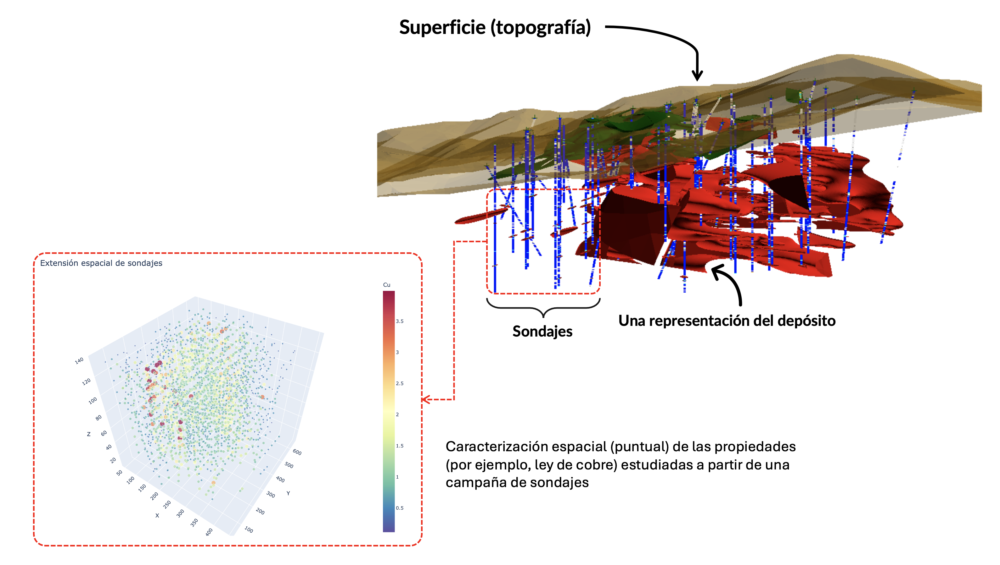

::: {.callout-note}
## Idea central

El problema de pit final consiste en determinar qué bloques conviene extraer para maximizar el beneficio económico total, respetando restricciones geométricas de precedencia derivadas de la estabilidad del rajo.
:::

## Introducción

Durante mi periplo en el mercado (y, en cierto modo, también durante mi estancia en la universidad), he escuchado en varias ocasiones de algunas personas (ojo, no necesariamente profesionales) que la minería a cielo abierto es, procedimentalmente, una actividad que, al parecer, es mucho más *sencilla* que la minería subterránea, dada la complejidad derivada de esta última por causa de su selectividad, la que naturalmente gobierna el diseño minero. Personalmente, siempre he encontrado tales afirmaciones un tanto atrevidas e, incluso, en cierto sentido, falacias de generalización incompleta. La minería a cielo abierto presenta complejidades a escala masiva y, en mi humilde opinión, volumétrica, dominada frecuentemente por efectos de escala. Sin embargo, el ingenio humano ha permitido determinar soluciones de gran belleza para abordar tales complejidades, las que se han traducido en verdaderos *frameworks* de planificación y operación.

Ejemplos hay muchísimos, y que constituyen cuestiones elementales en la minería a cielo abierto a nivel industrial y académico. Por ejemplo, una imagen insigne de la actividad minera en un rajo corresponde a la del camión de extracción (en adelante, CAEX); todo el mundo quiere sacarse una foto al lado del CAEX para mostrar la escala de estos verdaderos titanes del transporte de material. Sin embargo, el CAEX es simplemente una unidad que lleva el material desde un origen (comúnmente una unidad de carguio, como una pala eléctrica, hidráulica, o un cargador frontal) a un destino (chancador o botadero). Tal situación motiva, por supuesto, un problema fundamental en la minería, que corresponde a la asignación de camiones en distintos orígenes y destinos de manera tal que el transporte sea lo menos costoso posible (lo que equivale a que los camiones circulen siempre por las rutas más cortas), a la vez que la cantidad de material transportada sea máxima. Este es un problema de optimización muy conocido en la teoría de grafos, denominado *problema de flujo máximo a costo mínimo* (PMFCM), y que –de hecho– es la base de la mayoría de los paquetes computacionales que los despachadores utilizan para asignar camiones a palas o botaderos en el *mundo real* (los colegas mineros que han pasado una temporada en despacho habrán escuchado más de una vez a los despachadores hablar de la *PL*, y bueno, esa *PL* es un *programa lineal*, que representa el PMFCM), explotando la representación de orígenes, destinos y rutas como grafos o redes.

En este ejercicio, abordaremos uno de los problemas más elementales en la planificación minera a cielo abierto: Dado un modelo de bloques, determinar el máximo beneficio de extraer secuencialmente un subconjunto de tales bloques, respetando determinadas restricciones geométricas que guardan relación con el ángulo resultante de dicha extracción, siendo la geometría final de dicha extracción denominada **pit final** (en términos puramente geométricos). Cada bloque se encuentra etiquetado por un determinado beneficio, el cual puede ser positivo o negativo, dependiendo de si dicho bloque está constituido total o parcialmente por mineral de interés económico (por ejemplo, cobre, que es la situación más común en la gran minería de mi país, Chile), o bien, por estéril o lastre (roca sin interés económico).

## Conceptos previos.
La actividad minera se realiza sobre depósitos de mineral que se forman naturalmente en la corteza terrestre, denominados **yacimientos mineros**. La coletilla de "minero" se justifica siempre que la extracción de los minerales de interés en esos yacimientos sea económicamente rentable. De no ser así, el yacimiento se denominará por defecto **geológico**. La rentabilidad de un yacimiento no es constante, ya que depende de ciertos aspectos tales como el precio de los metales y de la tecnología disponible para su extracción.

La definición de los minerales que pueblan un yacimiento, independientemente de su rentabilidad, es una actividad extensiva dominada por disciplinas geocientíficas. En general (y siendo muy simplista), determinar "lo que hay" en un depósito requiere de la realización de campañas de sondajes que extraen muestras de roca que, una vez estudiadas, permiten caracterizar puntualmente sus propiedades. Matemáticamente, cada campaña de sondajes representa un muestreo no regular que, una vez que se han caracterizado estadísticamente, constituyen una grilla 3D de puntos no regularizada. Una vez disponibles estos puntos, es posible construir **modelos geológicos** que permiten inferir las propiedades de volúmenes continuos de los yacimientos en la forma de sólidos tridimensionales. La forma en la cual se realizan tales inferencias es el dominio de la **geoestadística**, una de las áreas más interesantes en las geociencias (y de la minería propiamente tal).

{#fig-deposito fig-align="center" width="90%"}

Para determinar cómo hacer minería a partir de un depósito, es necesario disponer de una **representación discreta** del yacimiento de interés, ya que la actividad minera consiste, en términos muy generales, en extraer secuencialmente porciones de ese yacimiento. Por esta razón, una vez construido un modelo geológico, solemos **discretizarlo** en miles a millones de bloques de tamaño regular (dependiendo del tamaño del depósito modelado). Cada uno de estos bloques estará caracterizado por las coordenadas de su centroide y las propiedades inferidas para él, las que se asumirán como regulares en toda su extensión. Consecuentemente, la reunión de todos estos bloques constituirá el llamado **modelo de bloques**, y que será la entrada para cualquier procedimiento que permita estimar una primera secuencia de extracción.

{#fig-bloques fig-align="center" width="90%"}

## El algoritmo de máximo flujo.
Para los planificadores mineros de cielo abierto, es común la implementación de rutinas de optimización que, dado un modelo de bloques, permitan maximizar el beneficio derivado de extraer un subconjunto de bloques en un procedimiento secuencial. Decimos "subconjunto" porque, naturalmente, no será posible extraer todos los bloques que constituyen un depósito, ya que muchos de ellos estarán constituidos únicamente por estéril, o bien, la extracción de un bloque con mineral de interés económico requerirá la extracción de varios bloques de estéril que actuarán como contrapeso económico y que, muchas veces, podrían totalizar un beneficio negativo. Sea como sea, la extracción de estos bloques bajo una óptica económica (la actividad minera per se) indudablemente constituye un problema de optimización. Uno bien conocido en la teoría de optimización combinatorial conocido como **problema de máximo flujo**.

Antes de proseguir con la teoría, les compartiré una historia personal a modo de motivación para comprender las bases de este problema. Mi primer contacto con este problema fue cuando ya me encontraba en el séptimo semestre de mi carrera en la universidad (de un total de 12), en una asignatura llamada simplemente "Optimización". Más allá de lo idóneo del nombre, esta asignatura, en mi época universitaria (y me consta que en muchas épocas anteriores) era una de las más temidas en mi universidad (y no solamente en la carrera de ingeniería civil en minas). Quizás su alta tasa de reprobación (no era raro encontrar compañeros cursando esta asignatura por tercera vez) se deba a que, en esta asignatura, se introducía la teoría de optimización combinatorial en sus matices más elementales, considerando problemas de programación lineal (PL) y sus distintas formulaciones: Como una función objetivo sujeta a restricciones que tomaban la forma de un sistema de desigualdades, como un problema matricial, como un modelo de transporte, como un modelo de asignación y, finalmente, como un modelo de redes o grafos. Este último enfoque constituía la última de las tres evaluaciones de la asignatura y era, indudablemente, considerada la más "fácil" de todas... ¿La razón? Muy sencillo: **Los grafos son objetos matemáticos que permiten resolver problemas de alta complejidad con extrema sencillez, explotando sus propiedades estructurales**. El llamado "problema de pit final" era considerado uno de los más fáciles, porque, aún con las complejidades previamente descritas, su formulación con base en un grafo dirigido con un nodo de inicio o fuente ($s$) y un nodo de término o fondo ($t$).

{#fig-prueba fig-align="center" width="90%"}

### Intuición.
Una vez terminado con este paréntesis (quizás no tan) nostálgico, prosigamos. Consideremos el problema de llevar un flujo de determinado material desde una **fuente** hacia un **destino**. El transporte de dicho material se realiza por una serie de caminos o "arcos", generalmente dirigidos (esto es, con una dirección determinada), que conectan dicha fuente con nodos intermedios, los que, a su vez, conectan con el nodo de destino propiamente tal del flujo de interés. Cada arco se etiqueta con una **capacidad**, que corresponde al máximo flujo que puede ser transportado en dicho arco. Estamos interesados en determinar cuál es el camino que conecta la fuente con el destino que **maximiza el flujo total del sistema**, dadas las capacidades en cada arco. Este problema se conoce, en la toería clásica de optimización combinatorial, como **problema de máximo flujo**.

El problema de máximo flujo (en adelante, PMF) puede adaptarse a una enorme cantidad de situaciones que, incluso, pueden no ser triviales. Debido a que el tipo de material que transportamos en el sistema es irrelevante, el mismo puede incluso ser convenientemente ficticio. Algunos ejemplos de problemas de máximo flujo son los siguientes:

- Consideremos un conjunto de $m$ pozos petrolíferos y $n$ refinerías de crudo, con estaciones de bombeo intermedias que permiten impulsar el flujo de crudo hacia sus destinos. Si el petróleo es transportado por medio de tuberías acondicionadas para ese fin con ciertas capacidades fijas, las que conectan los pozos con las estaciones de bombeo intermedias y, a su vez, con las refinerías, entonces el problema de maximizar el flujo de crudo entre pozos y refinerías es un PMF. Este es un caso típico de PMF que requiere de la incorporación de una fuente y destino artificiales en la red completa, porque el PMF exige siempre una única fuente y destino. Las capacidades de los arcos que conectan la "fuente" con los $m$ pozos y las $n$ refinerías con el "destino" tienen asignada convenientemente una capacidad infinita, a fin de evitar que cualquier procedimiento de solución del PMF se vea perturbado por estas incorporaciones.

- Consideremos un complejo minero constituido por $m$ operaciones mineras independientes que abastecen de mineral a $n$ stockpiles. Cada stockpile representa la entrada de mineral a una planta concentradora que integra las alimentaciones desde las distintas minas a diversos circuitos de conminución. El mineral se transporta por medio de un complejo sistema de correas transportadoras con ciertas capacidades en toneladas por hora, las cuales pueden apagarse a fin de evitar interferencias operacionales con correas de mayor flujo. El problema de maximizar la alimentación de mineral a la planta concentradora es entonces un PMF, el cual igualmente toma como fuente un nodo de mineral con capacidad infinita previo a las minas a fin de estructurar el problema. En este caso, ciertas correas pueden tener capacidades positivas o nulas, dependiendo de las interferencias que se puedan producir a la hora de seleccionar uno u otro stockpile para alimentar a la planta.

El PMF es, por tanto, una puerta de entrada a la formulación de problemas de diversa índole. Su conocimiento resulta, por tanto, extremadamente útil, puesto que, como veremos más adelante, su resolución es relativamente sencilla.

### ¿Qué es un grafo?
Esta pregunta puede resultar insultante para muchísimos ingenieros. No obstante, ofreciendo las debidas disculpas, resulta importante hacer un *refresh* debido a que los mineros solemos ser muchas veces "hijos del cerro", o bien, "esclavos del Excel". Y ambas alternativas suelen ser propensas a *olvidar* un poco algunos marcos teóricos importantes.

Un **grafo** o **red** es una estructura que comúnmente se utiliza para representar relaciones entre ciertos objetos. Tales objetos pueden ser de cualquier tipo, tales como sitios web, usuarios de una red social, elementos químicos que conforman la molécula de una estructura más compleja, o cualquier otra abstracción similar. Similarmente, las relaciones entre estos objetos suelen depender del contexto en el cual ha sido definido el grafo. Por ejemplo, enlances de dirección a sitios web, seguidores en una red social o enlaces químicos. La @fig-grafos ilustra todos estos ejemplos de manera más gráfica.

![Algunos ejemplos de grafos que representan determinadas estructuras de interés. Los grafos (a) y (b) representan la misma estructura química, correspondiente a una molécula de paracetamol. La diferencia es que, en la representación en red (b), los tipos de enlace químico llevan asociado un peso en cada arco, los que se corresponden con el número de electrones de valencia (Imagen adaptada del hermoso libro "Linear Algebra and Optimization for Machine Learning, a Textbook", de Charu C. Aggarwal (2022))](images/fig_4.png){#fig-grafos fig-align="center" width="90%"}

Los objetos representados por un grafo suelen ser llamados **vértices** o **nodos**, mientras que las relaciones entre ellas se esquematizan por medio de **arcos** o **caminos**. Matemáticamente, un grafo suele definirse como un par $G=(V,E)$, donde $V$ es el conjunto de nodos y $E$ es el conjunto de arcos. En general, el conjunto $V$ es finito, y suele estar constituido por un total de $n$ elementos –con lo cual solemos escribir $V=\left\{ 1,...,n\right\}$–, siendo por tanto $n$ el **orden** del grafo $G$. El conjunto $E$ suele explicitarse como $E=\left\{ \left( i,j\right)  \in \mathbb{R}^{2} :i\wedge j\in V,i\neq j\right\}$, donde el arco $(i,j)$ es aquel que conecta al nodo $i$ con el nodo $j$. Cuando todos los nodos de $G$ tienen arcos de conexión con el resto de los nodos, decimos que $G$ es un grafo **totalmente interconectado**.

Los grafos tienen varias propiedades que son de interés. Por ejemplo, éstos pueden **dirigidos** o **no dirigidos**. En el primer caso, cada uno de los arcos $(i,j)$ tiene una dirección previamente definida, de manera tal que *circula* información desde $i$ hacia $j$ pero no desde $j$ hacia $i$. Un ejemplo de implementación de un grafo dirigido típico en minería y metalurgia corresponde al diagrama de flujo de mineral una planta concentradora. Toda planta siempre tiene un nodo de inicio (generalmente, un proceso de chancado primario) y una serie de nodos finales que dependerá de la fragmentación de flujo en la red completa (por ejemplo, para el caso del concentrado de cobre, dicho nodo final puede ser un puerto, mientras que para el caso del relave, el nodo final corresponderá a un tranque).

La **capacidad** de un arco $(i, j)$ suele denotarse como $c_{ij}$. Si dicho arco es bidireccional, es posible etiquetar ese arco dos veces con las capacidades $c_{ij}$ y $c_{ji}$, dependiendo de si el flujo en cuestión circula desde $i$ hacia $j$ o en sentido contrario. Sin embargo, en general, esto no será necesario, puesto que suele ser común que $c_{ij}=c_{ji}$. Con frecuencia, salvo que sea necesario incorporar nodos de fuente y destino artificiales, las capacidades de la red serán siempre finitas y no negativas. Y, por supuesto, el grafo completo será dirigido.

### El concepto de "corte".
Dadas las definiciones anteriores que formalizan el concepto de grafo dirigido, con todos sus elementos estructurales, es claro que el PMF puede formularse como un problema de optimización en un grafo $G=(V, E)$ que tendrá siempre un nodo fuente y un nodo destino (o sumidero, como dictan ciertos libros especializados muy famosos). Estos nodos suelen denotarse como $s$ y $t$, respectivamente. La cantidad de nodos intermedios entre $s$ y $t$ es irrelevante en la formulación del PMF, y su impacto es simplemente variar el tiempo de ejecución de los algoritmos capaces de solucionar este problema. El **flujo** $f_{ij}$ entre los nodos $i$ y $j$ puede ser igual o menor que la capacidad $c_{ij}$, aunque con frecuencia estaremos interesados en los casos para los cuales $f_{ij}=c_{ij}$, por ser mucho más simples de resolver. Naturalmente, la suma local de flujos de entrada en un nodo arbitrario $j$ debe ser igual a la suma local de flujos de salida en el mismo nodo. Por lo tanto, en palabras, este problema puede definirse como

$$
\begin{array}{ll}\max&z=\mathrm{Flujo\  total\  de\  la\  red}\\ \mathrm{s.a.} :&\mathrm{flujo\  local\  en} \  \left( i,j \right) \leq \mathrm{capacidad\  de} \  (i,j)\\ &\mathrm{flujo\  de\  entrada\  en} \  j=\mathrm{flujo\  de\  salida\  en} \  j\end{array} \tag{1}
$$

Donde $k\in V\wedge (i,j)\in E$.

La formulación anterior no es matemáticamente concisa, pero es un punto de partida muy útil, porque nos permite comprender el problema desde sus aspectos más elementales. Sin embargo, una formulación más rigurosa exige además introducir un concepto adicional que será clave en su solución: El llamado **corte** o **interrupción**.

Consideremos pues un grafo $G=(V,E)$ que describe un PMF. Un corte $\mathcal{C}_{r}$ es un subconjunto de arcos cuya eliminación de $G$ interrumpe completamente el flujo entre los nodos $s$ y $t$. La **capacidad del corte** $\mathcal{C}_{r}$ es igual a la suma de las capacidades de los arcos que lo definen. De este modo, la **idea base** del PMF es la siguiente: Entre *todos* los cortes posibles de $G$, aquel con la *mínima* capacidad es el **cuello de botella** que determina el flujo máximo en la red. Esta idea se ilustra en la Figura (5), donde se emula, por medio de un grafo, una red de tuberías que transportan agua desde una fuente $s$ hacia un sumidero $t$. El corte mínimo, que se destaca en color naranja, interrumpe el flujo de la red al intersectar a los arcos $(s,3),(5,6),(9,4)$ y $(4,8)$, teniendo una capacidad igual a $6+3+3+3=12$ unidades de flujo. Se deja al lector la tarea de testear otros cortes en la red, a fin de mostrar que ninguno tendrá una capacidad menor que ésta, por lo cual, ese es el máximo flujo que podemos generar en esta red.

{#fig-flujoagua fig-align="center" width="90%"}

### Formulación matemática.
Ya disponemos de todos los ingredientes para construir una formulación matemática adecuada para resolver este problema. Notemos que, *antes* de ponernos a hacer *carpintería* de números y fórmulas (adoro ese término, es uno de los pocos grandes recuerdos que tengo de mi enseñanza secundaria), nos hemos dado el trabajo de construir una intuición adecuada de este problema y también de su solución.

Los datos de entrada de un PMF son los siguientes:

- Un grafo dirigido $G=(V,E)$ construido de forma conveniente para representar nuestro problema.
- Dos nodos que harán el papel de la fuente $s$ y el destino $t$, convenientemente etiquetados.
- Para cada arco $(i,j)\in E$, las correspondientes capacidades, denotadas como $c_{ij}$, tales que $c_{ij}\geq 0$ para todo $(i,j)$.

Definimos como **variables de decisión** del PMF a los flujos $f_{ij}$ que circulan a través de $G$. Tales flujos corresponden a las imágenes de una función $f:E\longrightarrow \mathbb{R}^{+}$, denominada **función de flujo**, que debe cumplir con las siguientes condiciones:

1) Límite de capacidad de cada arco: $\forall \left( i,j \right) \in E\  :\  0\leq f_{ij}\leq c_{ij}$.
2) Conservación de flujo (excepto en $s$ y en $t$): $\forall j\in V\setminus \left\{ s,t \right\} :\  \displaystyle \sum_{i:\left( i,j \right) \in E} f_{ij}=\sum_{k:\left( j,k \right) \in E} f_{jk}$.
3) El flujo total enviado desde $s$ a $t$ se definirá como $\displaystyle z=\sum_{j:\left( s,j \right) \in E} f_{ij}$.

De esta manera, la formulación matemática del PMF es

$$
\begin{array}{ll}\displaystyle \max_{f_{ij}}&z=\displaystyle \sum_{j:\left( s,j \right) \in E} f_{ij}\\ \mathrm{s.a.} :&f_{ij}\leq c_{ij}\  ;\  \forall \left( i,j \right) \in E\\ &\displaystyle \sum_{i:\left( i,j \right) \in E} f_{ij}=\sum_{k:\left( j,k \right) \in E} f_{jk}\  ;\  \forall j\in V\setminus \left\{ s,t \right\}\\ &f_{ij}\geq 0\  ;\  \forall \left( i,j \right) \in E\end{array} \tag{2}
$$

Cualquier lector que haya cursado la asignatura de "Optimización" o sus equivalentes ("Investigación de Operaciones", como es llamada en otras universidades) no tendrá mayor problema en reconocer que la expresión (2) es la misma que (1), pero en un envoltorio matemático conciso denominado **programa lineal** (PL). Un programa lineal es un caso particular de problema de optimización en el cual tanto la función objetivo como las restricciones son lineales en las variables de decisión (que, recordemos, en el PMF, son las $f_{ij}$). Los PLs son la vía de entrada a la teoría de optimización combinatorial por su simplicidad y los algoritmos que existen para resolverlos (como el método símplex). Y si bien el PMF es, sin duda, un PL, existen formas mucho más rápidas para su resolución que explotan su representación por medio de un grafo.

Todo PL tiene asociado otro PL denominado **problema dual** (el PL original se denomina **primal**), los que están estrechamente relacionados, al punto de que la solución óptima de uno es también la solución óptima del otro. La dirección de la optimización en ambos es opuesta; es decir, si el problema primal es de maximización, el dual será de minimización. Como el lector podría esperar, el problema dual del PMF es, en efecto, el **problema de corte mínimo (PCM)** que describe el cuello de botella de la red. Cada variable de decisión del problema primal representa una restricción del dual y viceversa.

Matemáticamente, un corte $\mathcal{C}_{r}=\left\{ S,T \right\}$ en $G$ es una partición de $V$ tal que $s\in S$ y $t\in T$. En otras palabras, el corte $\mathcal{C}_{r}$ particiona a $G$ de manera tal que el nodo fuente $s$ permanece a un lado del corte y el nodo de destino $t$ en el otro. El subíndice $r$ indica simplemente que dicho corte es sólo uno de varios posibles que pueden interrumpir el flujo desde $s$ hacia $t$. El **conjunto de corte** $X_{\mathcal{C}_{r}}$ de un corte $\mathcal{C}_{r}$ es el conjunto de arcos que conectan la parte donde se ubica la fuente $s$ con la parte donde se ubica $t$. Es decir,

$$
X_{\mathcal{C}_{r}}=\left\{ \left( i,j \right) \in E\  :\  i\in S\wedge j\in T \right\} \tag{3}
$$

La expresión (3) permite *setear* la característica fundamental de todo corte: Si todos los arcos de $X_{\mathcal{C}_{r}}$ son removidos de la red, entonces no es posible llevar flujo desde $s$ hasta $t$, porque no existe ningún camino que una estos nodos en el grafo resultante. De esta manera, la **capacidad del corte** $\mathcal{C}_{r}$ es igual a la suma de las capacidades de los arcos que están en $X_{\mathcal{C}_{r}}$, lo que puede escribirse como

$$
c\left( S,T \right) =\sum_{\left( i,j \right) \in X_{\mathcal{C}_{r}}} c_{ij}=\sum_{\left( i,j \right) \in E} c_{ij}\alpha_{ij} \tag{4}
$$

Donde $\alpha_{ij}$ es una variable binaria que es igual a $1$ cuando $i\in S$ y $j\in T$, y $0$ en cualquier otro caso. Existe una **variable dual** $\alpha_{ij}$ por cada restricción que define las capacidades de cada arco en la red.

El resto de las variables duales se corresponden con las restricciones de conservación de flujo, y se definen como $\pi_{s},..., \pi_{i},\pi_{j},...,\pi_{t}$ (una por cada nodo). Estas variables no están restringidas, pero puede ser conveniente "asumirlas" como binarias, a fin de simplemente representar el lado del corte respecto del cual se ubica la fuente $s$ y el destino $t$ con respecto a cada nodo de la red. De esta manera, $\pi_{i}=1$ si el nodo $i$ se encuentra en el lado del corte donde está la fuente $s$, mientras que $\pi_{i}=0$ si el nodo $i$ se ubica en el lado del corte donde está el destino $t$. La buena noticia es que la solución óptima del dual está garantizada bajo esta formulación.

Aunque la formulación dual admite variables reales para $\pi_{k}$, en realidad el problema es tal que el óptimo siempre está en variables binarias, por lo que podemos asumir sin pérdida de generalidad que $\pi_i \in {0,1}$ y $\alpha_{ij} \in {0,1}$ en el corte mínimo.

Juntando todas estas piezas, el problema dual del PMF (que es el PCM) se formula como

$$
\begin{array}{ll}\displaystyle \min_{\pi_{k} ,\alpha_{ij}}&c\left( S,T \right) =\displaystyle \sum_{\left( i,j \right) \in E} c_{ij}\alpha_{ij}\\ \mathrm{s.a.} :&\pi_{i} -\pi_{j} +\alpha_{ij} \geq 0\  ;\  \forall \left( i,j \right) \in E\\ &\pi_{s} -\pi_{t} =1\\ &\alpha_{ij} \geq 0\  ;\  \forall \left( i,j \right) \in E\end{array} \tag{5}
$$

Los tres sets de restricciones duales suelen interpretarse como sigue:

- Restricción de potencial ($\pi_{i} -\pi_{j} +\alpha_{ij} \geq 0\  ;\  \forall \left( i,j \right) \in E$): Permite explicar los efectos incrementales de agregar más flujo en un determinado arco representado por las variables duales $\pi_{i},\pi_{j},...$. Sobre la lógica que describe a un corte en una red de flujo, si reordenamos esta restricción como $\alpha_{ij}\geq \pi_{j}- \pi_{i}$, entonces cada variable $\pi_{i},\pi_{j},...$, describe simplemente si la "pendiente" del arco $(i,j)$ es positiva (subiendo hacia $t$) o negativa (bajando hacia $t$). Si esa pendiente es positiva, hay un costo por llegar a la fuente. Si esa pendiente es negativa, ese costo es igual a cero.

- Restricción de normalización ($\pi_{s} -\pi_{t} =1$): Permite normalizar el PCM, siendo sus soluciones invariantes bajo la adición del mismo flujo constante para cada $\pi_{k}$ ($k\in E$). Dejar que la fuente se ubique exactamente una unidad por encima del destino permite anclar el PCF de forma tal que la función objetivo dual realmente cuente la capacidad de cada corte.

- Restricción de no negatividad ($\alpha_{ij}\geq 0\  ;\  \forall \left( i,j \right) \in E$): Permite interpretar a las variables duales $\alpha_{ij}$ como el costo de usar cada arco $(i,j)$ para transportar flujo en el corte mínimo. De esta manera, si el arco $(i,j)$ no está dentro del conjunto de corte, su "precio" $\alpha_{ij}$ será igual a cero. Si el arco $(i,j)$ si está incluido en el conjunto de corte, entonces su "precio" $\alpha_{ij}$ será igual a $1$, de manera que el "costo" por usar ese arco será igual a la capacidad del mismo, conforme la función objetivo dual.

¿Recuerdan que comenté que un PL primal tiene la misma solución óptima que su PL dual? Pues bien, tal resultado es fundamental en este contexto, y la base del llamado **teorema de flujo máximo - corte mínimo**: *El máximo flujo que puede transportarse por la red $G=(V,E)$ es igual a la capacidad del corte mínimo $\mathcal{C}_{r}$ de $G$*. Es decir,

$$
\max_{f_{ij}} \  \sum_{j:\left( s,j \right) \in E} f_{ij}=\min_{\pi_{k} ,\alpha_{ij}} \sum_{\left( i,j \right) \in E} c_{ij}\alpha_{ij} \tag{6}
$$

### Solución del problema.
Es justo preguntarse, después de toda esta continua habladuría de términos matemáticos, cómo solucionar este problema (y, más importante aún, cómo se conecta dicho problema con construir un pit final). Paciencia, amigos. Dicen por ahí que Roma no se construyó en un día. Y por mucho que algunos "líderes" lo crean, los rajos tampoco...

Pero bueno, prosigamos. La mala noticia, una vez definido el *setting* del PMF, es que su solución óptima está garantizada únicamente por medio de la enumeración exhaustiva de todos los cortes de la red correspondiente, eligiendo aquel cuya capacidad sea la menor. Naturalmente, si la red crece en tamaño, esta búsqueda se hará cada vez más intratable. Y como la fuerza bruta es todo menos elegante (dentro del formalismo matemático), es claro que necesitamos una solución más ingeniosa.

La primera solución para este problema es debida a un [paper publicado en 1956](https://www.cs.yale.edu/homes/lans/readings/routing/ford-max_flow-1956.pdf) por los matemáticos estadounidenses Lester Randolph Ford Jr. y Delbert Ray Fulkerson, quienes propusieron un ingenioso algoritmo que se deriva de la ecuación (6), denominado (como no...) **algoritmo de Ford-Fulkerson**. La idea que gobierna a este procedimiento es muy sencilla: Enviar flujo de manera iterativa, aumentando el flujo total desde $s$ hacia $t$ hasta que ya no sea posible aumentar más dicho flujo. La parte interesante de este algoritmo radica en el hecho de que no *llegamos y mandamos* flujo por *cualquier* camino, sino que escogemos ciertos caminos que presentan capacidad disponible para enviar más flujo, denominados **caminos de avance o aumentantes**. La herramienta que nos permitirá ser eficientes al definir tales caminos será la del llamado *grafo residual*.

Dada una función de flujo $f:E\longrightarrow \mathbb{R}^{+}$ sobre el grafo $G=(V,E)$, el **grafo residual** $G_{f}=(V,E_{f})$ se construye conforme el siguiente procedimiento: Para cada arco $(i,j)\in E$:

- Si $f_{ij}< c_{ij}$, entonces existe un arco *recorrido hacia adelante* $(i,j)$ en el grafo residual con **capacidad residual o residuo** $\overline{c}_{ij} =c_{ij}-f_{ij}$.
- Si $f_{ij}> 0$, entonces existe un arco *recorrido hacia atrás* $(j,i)$ en el grafo residual con residuo $\overline{c}_{ij} =f_{ji}$.

Muy bien, lo anterior fue algo confuso... ¿Recorrer un arco hacia atrás? Pues sí. La parte ingeniosa del algoritmo es precisamente que nos permite *quitar* flujo que enviamos en una iteracion previa si encontramos una mejor alternativa (un menor camino aumentante). La lógica es simple: Podemos revertir parcialmente decisiones pasadas a la hora de decidir por donde enviar flujo. Si ya no podemos enviar más, el problema está resuelto y el flujo es máximo.

Este algoritmo puede describirse secuencialmente como sigue:

::: {.algo-box}

::: {.algo-line}
[def]{.algo-key} [Ford_Fulkerson]{.algo-name} $(G=(V,E),c_{ij},s,t)$
:::

::: {.algo-indent .algo-indent-1}

::: {.algo-line}
$f_{ij}\longleftarrow 0$ para todos los arcos $(i,j)\in E$
:::

::: {.algo-line}
[while]{.algo-key} exista un camino aumentante $\mathcal{P}$ desde $s$ hacia $t$ en $G_f$, tal que $\overline{c}_{ij}>0;\forall (i,j)\in\mathcal{P}$:
:::

::: {.algo-indent .algo-indent-2}

::: {.algo-line}
Encontrar $\overline{c}(\mathcal{P})=\min\left\{\overline{c}_{ij}:(i,j)\in\mathcal{P}\right\}$
:::

::: {.algo-line}
[for]{.algo-key} $(i,j)\in\mathcal{P}$:
:::

::: {.algo-indent .algo-indent-3}

::: {.algo-line}
Enviamos flujo a través del camino aumentante: $f_{ij}\longleftarrow f_{ij}+\overline{c}(\mathcal{P})$.
:::

::: {.algo-line}
El flujo “podría” quitarse más tarde, actualizando el progreso: $f_{ji}\longleftarrow f_{ji}-\overline{c}(\mathcal{P})$.
:::

::: {.algo-line}
[return]{.algo-key} $f=\sum_{j:(s,j)\in E} f_{sj}$ (el flujo total enviado desde la fuente $s$).
:::

:::
:::
:::
:::

La especie de pseudocódigo que hemos escrito fue hecha de esta manera simplemente porque estoy familiarizado con Python. De seguro, un profesional más curtido podrá formularlo muchísimo mejor.

::: {.callout-warning}
## ¡Ojo!
La dificultad de implementar este algoritmo radica en encontrar $\overline{c}(\mathcal{P})$, lo que equivale a determinar el corte mínimo en cada iteración. En la práctica, la mayoría de las rutinas computacionales provistas por diversas librerías y software especializado opta por dos alternativas para encontrar estos cortes: Una [búsqueda en profundidad (DFS, del inglés *depth-first search*)](https://en.wikipedia.org/wiki/Depth-first_search) o una [búsqueda a lo ancho (BFS, del inglés *breadth-first search*)](https://en.wikipedia.org/wiki/Breadth-first_search), ambas para el grafo residual $G_{f}$. La estrategia DFS es la original propuesta en el algoritmo de Ford-Fulkerson, mientras que la estrategia BFS, al aplicarla al algoritmo de máximo flujo, se conoce como **algoritmo de Edmonds-Karp**, aunque la idea, como podemos observar, es esencialmente la misma en ambos casos.
:::

## Aplicación al problema de determinación del pit final.
Al fin, después de más de 2.000 palabras (falso, en realidad no las conté), hemos llegado a la parte más importante de este texto. Intentaremos formular el problema de determinar el pit final, bajo un contexto geométrico, de un inventario de bloques etiquetados por el beneficio correspondiente a su extracción. Para ello, partiremos con la resolución del problema mostrado en la Figura (3), aunque luego intentaremos implementar nuestra solución en algún problema más interesante.

Para ello, nos valdremos de algunas librerías de Python muy útiles:

- <strong><font color='darkmagenta'>Numpy</font></strong>, para construir nuestro inventario de bloques en la forma de un arreglo 2D (con filas y columnas). Por cierto, en este repositorio AMAMOS usar <strong><font color='darkmagenta'>Numpy</font></strong>. Es una de mis librerías favoritas (de hecho, es la primera que aprendí a utilizar después de MESES de tutoriales y sesiones de estudio).
- <strong><font color='darkmagenta'>Matplotlib</font></strong>, para graficar nuestros resultados.
- <strong><font color='darkmagenta'>NetworkX</font></strong>, para formular el problema como un grafo e implementar el algoritmo de máximo flujo para resolverlo. Esta librería es increíblemente útil para formular y resolver todo tipo de problemas por medio de grafos. Recomiendo, a quienes no la tienen en su caja de herramientas, que le den una oportunidad.

Importamos estas librerías:

```{python}
import matplotlib.pyplot as plt
import networkx as nx
import numpy as np
import seaborn as sns
```

```{python}
# Seteamos nuestras figuras, a fin de que se vean bonitas.
plt.rcParams["figure.dpi"] = 90
sns.set_theme()
plt.style.use("bmh")
```

Y creamos nuestro pequeño inventario:

```{python}
# Generamos la matriz con beneficios por bloque.
blocks = np.array(
    [
        [-3, -2, 1, -1, -1, 1, -1, -8, -9],
        [-9, -2, 3, 1, -1, 3, -7, 1, -9],
        [-9, -8, 6, 1, -2, 2, -8, -3, -10],
        [-11, -5, 2, 10, -5, 12, -10, -6, -10],
    ],
)
```

### Formulación.
Hasta aquí, nada demasiado complicado. Sin embargo, ahora viene lo divertido. Sea $\mathcal{B} =\left\{ b_{ij}\  |\  i=0,...,m-1\wedge j=0,...,n-1 \right\}$ el conjunto de todos los bloques del inventario, donde $i$ y $j$ son indexadores que recorren sus filas y columnas, respectivamente. Cada bloque tiene asignado un beneficio neto $w_{ij}\in \mathbb{R}$, que representa lo que ganamos o perdemos debido a su extracción, dependiendo de si $w_{ij}$ es positivo o negativo.

Cuando deseamos extraer un bloque, en general, nos encontraremos con dos casos: El bloque aflora a la superficie o se encuentra debajo de otros bloques. En el primer caso ($i=0$), la extracción del bloque no supone más esfuerzo que moverlo de su lugar. Sin embargo, en el segundo caso ($i>0$), la extracción del bloque de interés exigirá además la extracción de los bloques **precedentes** o **adyacentes**. La adyacencia de un bloque responde a una cuestión puramente geométrica, y dependerá de las dimensiones del bloque y del **ángulo de talud** que representa la dirección en la cual se realiza la extracción. En su formulación más simple, los bloques tendrán las mismas dimensiones en todos sus ejes y el ángulo de talud será de 45º. Como el problema que deseamos resolver es 2D, esto implica que los bloques son cuadrados y la extracción de todo bloque $b_{ij}$ tal que $i>0$ requiere la extracción de los tres bloques precedentes sobre él: $b_{i-1,j-1},b_{i-1,j}$ y $b_{i-1,j+1}$. Llamamos a ese conjunto de bloques precedentes $\mathcal{H}(b_{ij})$.

La relación de precedencia descrita por $\mathcal{H}(b_{ij})$ describe una restricción geométrica sumamente importante en el problema de determinar el pit final, porque la extracción de los bloques parte siempre desde arriba.

Sea $C$ un subconjunto de bloques del inventario $\mathcal{B}$. Diremos que $C$ es **cerrado** si $b_{ij}\in C\wedge i>0\Longrightarrow \mathcal{H} \left( b_{ij} \right) \subseteq C$. Es decir, $C$ contiene a los bloques de interés y a los bloques que son necesarios para realizar la extracción de cada uno. El problema de determinar el pit final puede expresarse entonces como

$$
\begin{array}{ll}\displaystyle \max_{C\subseteq \mathcal{B}}&\displaystyle \phi \left( C \right) =\sum_{b_{ij}\in C} w_{ij}\\ \mathrm{s.a.} :&C\  \mathrm{es\  cerrado}\end{array} \tag{7}
$$

Hasta ahora, la expresión (7) no se parece demasiado a un PMF o a un PCM. Pero paciencia, ya vamos...

Un grafo $G=(V,E)$ que capture la lógica de precedencia y extracción no es dificil de construir. En efecto, cada bloque del inventario puede idealizarse como un nodo en un grafo completo que representa todas las combinaciones posibles de beneficios que resultan de distintas alternativas de extracción. De esta manera:

- $V=\left\{ v_{ij}\  |\  b_{ij}\in \mathcal{B} \right\} \cup \left\{ s,t \right\}$, donde $v_{ij}$ es simplemente la etiqueta del nodo. Los nodos fuente y sumidero ($s$ y $t$) son artificiales y se asignan a la red una vez definidos los bloques del inventario en su estructura.

- Los arcos se etiquetan con capacidades iguales a los beneficios, conforme $E=\begin{cases}\left( s\rightarrow v_{ij} \right) ,u_{s,ij}=w_{ij}&;\  w_{ij}\geq 0\\ \left( v_{ij}\rightarrow t \right) ,u_{ij,t}=-w_{ij}&;\  w_{ij}<0\end{cases}$.

- Para cada nodo $v_{ij}$ con $i>0$ y cada $p\in \mathcal{H}(b_{ij})$, definimos $\left( v_{ij}\rightarrow v_{p} \right)\wedge u_{ij,p}=M$, donde $M$ es un valor muy grande que simplemente asigna una capacidad infinita a los arcos que conectan un bloque con sus bloques precedentes, evitando que cualquier corte que contenga a esos arcos sea seleccionado. Debido a que no es posible "programar" una cantidad infinitamente grande, cualquier valor tal que $M>\sum\nolimits_{w_{kl}>0} w_{kl}$ nos servirá para impedir que el algoritmo considere los arcos de precedencia en la red.

Con el grafo ya construido, pasamos a la formulación del problema dual (corte mínimo). Recordemos, de la ecuación (4), que un corte $\mathcal{C}_{r}$ tiene una capacidad $c(S,T)$, donde $s\in S$ y $t\in T$. Este corte pasa por los arcos que conectan a los bloques que no preceden a otros bloques, describiendo e esta manera la extracción óptima por medio del control del beneficio máximo (en realidad, pérdida mínima) que resulta de extraer bloques con estéril. Tal función de pérdida es, naturalmente, la capacidad $c(S,T)$.

Notemos que:

- Si $v_{ij}\in T$ cuando $w_{ij}>0$, entonces se "pierde" $w_{ij}$ (se trata de un bloque con beneficio positivo que no es extraído).
- Si $v_{ij}\in S$ cuando $w_{ij}<0$, entonces se "paga" $-w_{ij}$ (el bloque se extrae).
- Los arcos que representan las relaciones de precedencia nunca serán parte del corte mínimo, debido a que su "costo" es $M$, el cual, como dijimos antes, es muy grande ("no lo podemos pagar").

De esta manera, poniendo $C=S\setminus \left\{ s \right\}$, el **beneficio neto** de extraer los bloques en $C$ es

$$
\begin{array}{lll}\phi \left( C \right)&=&\displaystyle \sum_{w_{ij}>0,v_{ij}\in C} w_{ij}-\sum_{w_{ij}<0,v_{ij}\in C} \left( -w_{ij} \right)\\ &=&W-c\left( S,T \right)\end{array} \tag{8}
$$

Donde $W=\sum_{w_{ij}>0} w_{ij}$ (la suma de todos los bloques con beneficio positivo) es constante. Por lo tanto, hemos llegado a un importante resultado: La función objetivo $\phi$ es máxima si y sólo si la capacidad $c(S,T)$ es mínima. De esta manera, **concluimos que el problema de extracción óptima en la construcción de un pit final es, de hecho, un PCM y, por extensión, también un PMF (por la condición de dualidad)**.

### Solución por medio de <font color='darkmagenta'>NetworkX</font>.
Muy bien, ya tenemos todo lo que necesitamos y únicamente nos resta *programar* la solución. Con "programar" no me refiero al formular el algoritmo de máximo flujo desde cero, no porque sienta que no vale la pena (de hecho, es un ejercicio muy interesante), sino porque este texto está orientado a colegas que trabajan en minería. Y sé muy bien que no nos sobra el tiempo y muchas veces optamos por rutinas de solución prefabricadas.

Lo anterior no es en absoluto algo negativo. De hecho, está perfecto... ¿Quienes somos nosotros, al final, para juzgar las herramientas que mentes tan brillantes nos proveen gratis en la forma de librerías de Python?

En fin. La librería que usaremos para solucionar este problema se llama <strong><font color='darkmagenta'>NetworkX</font></strong>. Como comenté previamente, se trata de una batería de recursos que nos permite formular, analizar y optimizar grafos. Viene equipada con una generosa cantidad de algoritmos de optimización que explotan la estructura sencilla de estos objetos matemáticos. Uno de esos algoritmos, por supuesto, es el de corte mínimo, el cual no es más que un *wrapper* para el algoritmo de Edmonds-Karp.

La construcción de grafos en <strong><font color='darkmagenta'>NetworkX</font></strong> está gobernada por ciertos objetos que describen redes con propiedades deseables. En nuestro caso, construiremos un grafo dirigido, el cual se representa en esta librería por medio del objeto `DiGraph` (del inglés *Directed Graph*). La adición de cualquier arco a este grafo puede realizarse por medio del método `add_edge()`, designando los nodos de inicio y término, y la capacidad del arco usando el parámetro `capacity`.

Partimos pues definiendo nuestro grafo `G`, y los nodos fuente (`source`) y sumidero (`sink`):

```{python}
# Construimos el grafo que representará el problema de extracción de estos bloques.
G = nx.DiGraph()
source = "s"
sink = "t"
```

Luego, calculamos la suma de los beneficios de todos los bloques positivos, y le sumaremos `1`, a fin de construir la `M` que etiquetará a los arcos de precedencia para la extracción de bloques que no afloran a la superficie. Recordemos que esta capacidad funcionará igual que un restrictor que impeirá que el corte mínimo pase por esos arcos:

```{python}
# Definimos la suma de todos los beneficios de la red y le agregamos 1, a fin de construir el valor
# restrictor que impedirá que el corte mínimo pase por los arcos que definen las relaciones de precedencia
# que gobiernan la extracción de un bloque.
M = blocks[blocks > 0].sum() + 1
```

A continuación, crearemos una función sencilla que nos permitirá etiquetar cada nodo de la forma `B{i}_{j}`, donde `i` y `j` son los contadores que indexan las filas y columnas del inventario completo:

```{python}
# Creamos una función muy sencilla que nos permitirá mapear cada bloque a una única etiqueta 
# de cada nodo.
def node_label(i, j):
    return f"B{i}_{j}"

# Asignamos a distintas variables las dimensiones del inventario.
n_rows, n_cols = blocks.shape
```

Ahora construiremos el grafo que representará al problema de extracción en su totalidad, haciendo uso de un proceimiento iterativo. Cada nodo intermedio se llamará `v_ij`, asignando las correspondientes capacidades conforme las reglas que gobiernan los cortes, dependiendo del signo del beneficio asociado a cada bloque. Finalmente, conectaremos cada bloque con `i > 0` (que no aflora a la superficie) con sus bloques precedentes, asignándoles capacidades lo suficientemente grandes (la `M`) para que el algoritmo de máximo flujo las ignore:

```{python}
# Construimos el grafo completo que representa al problema.
for i in range(n_rows):
    for j in range(n_cols):
        # Definimos cada nodo intermedio.
        v_ij = node_label(i, j)

        # Definimos los beneficios de cada bloque (capacidades de la red).
        w_ij = blocks[i, j]

        # Asignamos estos beneficios en la forma de capacidades.
        if w_ij >= 0:
            G.add_edge(source, v_ij, capacity=w_ij)
        else:
            G.add_edge(v_ij, sink, capacity=-w_ij)
        
        # Imponemos la restricción geométrica que gobierna la extracción de un bloque: ángulo
        # de talud igual a 45º, lo que implica siempre extraer los tres bloques superiores a
        # un bloque de interés.
        if i > 0:
            for dj in (-1, 0, 1):
                jj = j + dj
                if 0 <= jj < n_cols:
                    # Definimos el bloque precedente.
                    pred = node_label(i - 1, jj)
                    
                    # Asignamos la regla de precedencia.
                    G.add_edge(v_ij, pred, capacity=M)
```

Ahora sólo resta resolver este problema, lo que es tan fácil como utilizar la función `minimum_cut()` que, tras bambalinas, aplica el algoritmo de Edmonds-Karp para determinar el máximo flujo (beneficio neto máximo de la extracción de los bloques en el pit final). Como resultado obtendremos la capacidad del corte mínimo (`cut_value`) hallada por el algoritmo, además de los conjuntos `S` y `T`, que describen a los bloques que quedan del lado de la fuente y el sumidero, respectivamente, una vez trazado dicho corte. Los bloques que se extraen se encuentran en `S` (exceptuando la fuente):

```{python}
# Resolvemos el problema usando el algoritmo de corte mínimo.
cut_value, (S, T) = nx.minimum_cut(G, source, sink)
selected_blocks = [n for n in S if n not in (source, sink)]
```

Naturalmente, nos interesa visualizar la geometría del pit final, por lo cual crearemos un arreglo Booleano que indicará cuáles bloques son extraídos por el algoritmo de máximo flujo:

```{python}
# Generamos una matriz indicadora para mostrar los bloques que son extraidos.
mask = np.zeros_like(blocks, dtype=bool)
for block in selected_blocks:
    i, j = map(int, block[1:].split("_"))
    mask[i, j] = True
```

Finalmente, calculamos el beneficio neto de extracción:

```{python}
# Calculamos el máximo beneficio que obtenemos por la extracción determinada (pit final).
total_profit = (blocks * mask).sum()
```

Recordemos que, bajo nuestra formulación, tal beneficio neto es igual a `M`, menos la capacidad del corte mínimo (`cut_value`), menos `1` (que es la unidad que agregamos a la suma de beneficios positivos de cada bloque para asegurar que la `M` fuera lo suficientemente grande):

```{python}
np.allclose(total_profit, M - 1 - cut_value)
```

Finalmente, usamos <strong><font color='darkmagenta'>Matplotlib</font></strong> para visualizar nuestro pit final:

```{python}
#| label: fig-pit-final-toy-example
#| fig-cap: "Bloques seleccionados en el primer inventario de juguete. Los valores anotados corresponden al beneficio o costo de cada bloque, mientras que la envolvente escalonada permite comprobar el cumplimiento de las precedencias de 45 grados."
# Graficamos nuestro pit final.
fig, ax = plt.subplots(figsize=(9, 5))
p = ax.imshow(mask, cmap=plt.cm.gray_r, vmin=0, vmax=1, origin="upper")

# Generamos algunas anotaciones para mostrar los beneficios asociados a cada bloque.
for i in range(n_rows):
    for j in range(n_cols):
        color_ij = 'lightgreen' if mask[i, j] else 'red'
        ax.text(j, i, blocks[i, j], ha='center', va='center', color=color_ij, fontsize=10)

# Y finalmente, rotulamos nuestro gráfico.
ax.set_xticks(range(n_cols))
ax.set_yticks(range(n_rows))
ax.set_xticklabels(range(n_cols))
ax.set_yticklabels(range(n_rows))
ax.set_xlabel("Columna", fontsize=12, labelpad=10)
ax.set_ylabel("Fila (0 = Superficie)", fontsize=12, labelpad=10)
ax.set_title(
    f"Pit óptimo: Beneficio total = {total_profit}", fontsize=14, fontweight="bold", pad=10,
)
plt.tight_layout();
```

Y ahí lo tenemos, un bonito pit final geométrico que respeta las reglas de precedencia derivadas de un ángulo de extracción igual a 45º.

Personalmente, hubiera deseado saber todo esto en mis tiempos universitarios...

Uno podría evidentemente preguntar... ¿Y el grafo que simula la extracción de estos bloques? Siendo una pregunta completamente justa, y habiendo descrito iterativamente el procedimiento de construcción de este grafo, la verdad es que dibujarlo sí es un procedimiento costoso. Sin embargo, por ser el primer ejercicio que hemos resuelto usando este *approach*, mostraremos este gráfico (construido usando la herramienta Mermaid, especializada en diagramas de flujo) en la @fig-grafopit.

{#fig-grafopit fig-align="center" width="90%"}

Nuestra implementación es mayormente funcional, aunque modularizarla (llevar el código a varias funciones con responsabilidades específicas) no debería ser un problema para algún entusiasta que se inicie en el mundo de los datos. De hecho, podemos probar rápidamente que nuestra solución nos permite resolver cualquier problema 2D similar al anterior. Por ejemplo, consideremos ahora el siguiente inventario de tres niveles:

```{python}
# Definimos un nuevo inventario de bloques.
blocks = np.array([
    [-3, -2, -3, -4, -2, -1,  1, -1, -2],
    [-10,  3,  6,  5,  2, -1, -3,  4, -9],
    [-13, -3,  3,  9,  4,  1, -5, -10, -16]
])
```

La solución (de una sola vez):

```{python}
#| label: fig-pit-final-second-toy-example
#| fig-cap: "Pit final obtenido para el segundo inventario de juguete. La selección maximiza el beneficio conjunto sin incorporar bloques profundos cuyos precedentes superiores permanezcan sin extraer."
# Construimos el grafo que representará el problema de extracción de estos bloques.
G = nx.DiGraph()
source = "s"
sink = "t"

# Definimos la suma de todos los beneficios de la red y le agregamos 1, a fin de construir el valor
# restrictor que impedirá que el corte mínimo pase por los arcos que definen las relaciones de precedencia
# que gobiernan la extracción de un bloque.
M = blocks[blocks > 0].sum() + 1

# Asignamos a distintas variables las dimensiones del inventario.
n_rows, n_cols = blocks.shape

# Construimos el grafo completo que representa al problema.
for i in range(n_rows):
    for j in range(n_cols):
        # Definimos cada nodo intermedio.
        v_ij = node_label(i, j)

        # Definimos los beneficios de cada bloque (capacidades de la red).
        w_ij = blocks[i, j]

        # Asignamos estos beneficios en la forma de capacidades.
        if w_ij >= 0:
            G.add_edge(source, v_ij, capacity=w_ij)
        else:
            G.add_edge(v_ij, sink, capacity=-w_ij)
        
        # Imponemos la restricción geométrica que gobierna la extracción de un bloque: ángulo
        # de talud igual a 45º, lo que implica siempre extraer los tres bloques superiores a
        # un bloque de interés.
        if i > 0:
            for dj in (-1, 0, 1):
                jj = j + dj
                if 0 <= jj < n_cols:
                    # Definimos el bloque precedente.
                    pred = node_label(i - 1, jj)
                    
                    # Asignamos la regla de precedencia.
                    G.add_edge(v_ij, pred, capacity=M)

# Resolvemos el problema usando el algoritmo de corte mínimo.
cut_value, (S, T) = nx.minimum_cut(G, source, sink)
selected_blocks = [n for n in S if n not in (source, sink)]

# Generamos una matriz indicadora para mostrar los bloques que son extraidos.
mask = np.zeros_like(blocks, dtype=bool)
for block in selected_blocks:
    i, j = map(int, block[1:].split("_"))
    mask[i, j] = True

# Finalmente, calculamos el máximo beneficio que obtenemos por la extracción determinada (pit final).
total_profit = (blocks * mask).sum()

# Chequeamos que la solución del problema de máximo flujo sea equivalente a la solución del
# correspondiente problema de corte mínimo.
np.allclose(total_profit, M - 1 - cut_value)

# Graficamos nuestro pit final.
fig, ax = plt.subplots(figsize=(9, 5))
p = ax.imshow(mask, cmap=plt.cm.gray_r, vmin=0, vmax=1, origin="upper")

# Generamos algunas anotaciones para mostrar los beneficios asociados a cada bloque.
for i in range(n_rows):
    for j in range(n_cols):
        color_ij = 'lightgreen' if mask[i, j] else 'red'
        ax.text(j, i, blocks[i, j], ha='center', va='center', color=color_ij, fontsize=10)

# Y finalmente, rotulamos nuestro gráfico.
ax.set_xticks(range(n_cols))
ax.set_yticks(range(n_rows))
ax.set_xticklabels(range(n_cols))
ax.set_yticklabels(range(n_rows))
ax.set_xlabel("Columna", fontsize=12, labelpad=10)
ax.set_ylabel("Fila (0 = Superficie)", fontsize=12, labelpad=10)
ax.set_title(
    f"Pit óptimo: Beneficio total = {total_profit}", fontsize=14, fontweight="bold", pad=10,
)
plt.tight_layout();
```

Los ejercicios anteriores son muy pedagógicos pero no dejan de ser ejemplos muy reducidos de lo que realmente significa construir una secuencia de extracción hasta llegar a un pit final. Los planificadores expertos que quizás lean esta entrada del repositorio probablemente consideren hasta simpático el esfuerzo que acabamos de hacer, y con justa razón, puesto que ellos tratan con modelos de bloques con miles, e incluso decenas de miles de unidades de cubicación.

La buena noticia es que el algoritmo de Edmonds-Karp escala muy bien con el tamaño del grafo correspondiente, lo que significa que en realidad el tamaño del inventario de interés no es relevante para nuestra implementación, siempre que su geometría sea 2D. Para comprobar la idoneidad de nuestra implementación, replicaremos nuestro ejercicio sobre un inventario 2D mucho más grande que los anteriores, con más de 60 niveles. Este inventario se provee de manera libre en la carpeta `datasets` de este repositorio, y corresponde a un archivo separado por puntos y comas denominado `blocks_inventory_2d.csv`. Para acceder a él, haremos uso de <strong><font color='darkmagenta'>Pandas</font></strong>:

<div class="dataset-download">
  <a class="dataset-download-btn" href="../datasets/blocks_inventory_2d.csv" download="blocks_inventory_2d.csv">Descargar blocks_inventory_2d.csv</a>
</div>

```{python}
import pandas as pd
```

```{python}
# Accedemos al archivo.
block_inventory = pd.read_csv("../datasets/blocks_inventory_2d.csv", delimiter=";")
```

A continuación, inspeccionamos este archivo:

```{python}
# Inspeccionamos las primeras filas.
print(f"Nº de filas = {block_inventory.shape[0]}")
print(f"Nº de columnas = {block_inventory.shape[1]}")
block_inventory.head()
```

Vemos que se trata de un inventario 2D con 62 filas y 74 columnas. Esto nos da un total de 4588 bloques y, por extensión, una red con la misma cantidad de nodos, la que naturalmente resulta impracticable representar de forma visual. Sin embargo, la lógica del proceso de extracción es esencialmente la misma, con la diferencia de que este inventario viene con **leyes de cobre** en vez de beneficios de extracción de cada bloque.

Partiremos entonces indexando este inventario con respecto a su primera columna (`"Instancia"`) y construiyendo una visualización muy sencilla de estas leyes, a fin de poder ver la geometría de este depósito:

```{python}
# Seteamos la columna ´Instancia´ como índice para las filas del modelo.
block_inventory.set_index("Instancia", inplace=True)
```

```{python}
#| label: fig-pit-final-copper-inventory
#| fig-cap: "Distribución espacial de las leyes de cobre del inventario bidimensional. Las zonas de mayor ley aparecen bajo una cubierta superficial y delimitan el núcleo económico potencial del depósito."
# Creamos un mapa de calor para visualizar nuestro inventario.
fig, ax = plt.subplots(figsize=(9, 5))
p = sns.heatmap(
    data=block_inventory.values, cmap="plasma", ax=ax, 
)
# Rotulamos y ajustamos.
cb = ax.collections[0].colorbar
cb.set_label(label="Ley Cu (%)", fontsize=11, labelpad=10)
ax.set_title(
    "Inventario de bloques, leyes de Cu", fontsize=13, 
    fontweight="bold", pad=10,
)
cb.ax.tick_params(labelsize=11)
ax.set_xticklabels([])
ax.set_yticklabels([])
plt.tight_layout();
```

Vemos pues que los bloques con una ley singificativa de cobre recién comienzan a aflorar unos 10 niveles bajo la superficie. El depósito, en este plano, presenta una geometría bastante irregular, por lo que en sí constituye un ejercicio interesante. Sin embargo, primero expresaremos estos bloques en función de su beneficio económico, tomando algunos supuestos:

- Dimensiones de los bloques ($D_{x},D_{y}$ y $D_{z}$) = 10$\times$10$\times$10 m.
- Ley de corte ($g_{c}$) = 0.24% Cu. Todos los bloques con leyes bajo este umbral serán asumidos como bloques de estéril (sin interés económico).
- Costos unitarios de extracción de estéril ($C_{e}$) y mineral ($C_{m}$) = 2.2 USD/t y 2,8 USD/t, respectivamente.
- Densidad del estéril ($\rho_{e}$) y del mineral ($\rho_{m}$) = 2.4 t/m$^{3}$ y 3.0 t/m$^{3}$, respectivamente.
- Precio del cobre ($P_{\mathrm{Cu}}$) = 4.0 USD/lb.
- Factor de conversión de toneladas a libras ($f_{\mathrm{t}\rightarrow \mathrm{lb}}$) = 2204.62 lb/t.
- Recuperación de cobre estimada para la planta ($R_{\mathrm{Cu}}$) = 85%.
- Eficiencia estimada para los activos de la planta ($F_{o}$) = 92%.
- Costo unitario de procesamiento de mineral ($C_{p}$) = 10 USD/t.

Con esta información, el procedimiento que seguiremos para calcular los beneficios/costos de extracción de cada bloque es sencillo:

1) Definimos el indicador $e_{ij}$ que señala si el bloque $b_{ij}$ es de estéril o mineral (conforme la ley de corte).
2) Calculamos la masa contenida en cada bloque: $m_{ij}= D_{x} D_{y} D_{z} \rho_{e}$ si el bloque es de estéril, y $m_{ij}= D_{x} D_{y} D_{z} \rho_{m}$ si el bloque es de mineral.
3) Calculamos el beneficio asociado a cada bloque como:

$$
w_{ij}=\begin{cases}m_{ij}\left( \overbrace{g_{ij}R_{\mathrm{Cu}}P_{\mathrm{Cu}}F_{o}f_{\mathrm{t} \rightarrow \mathrm{lb}}}^{\mathrm{ingresos}} -\overbrace{C_{m}-C_{p}}^{\mathrm{costos}} \right)&;\  \mathrm{si} \  e_{ij}\  \mathrm{indica\  mineral}\\ -m_{ij}C_{e}&;\  \mathrm{si} \  e_{ij}\  \mathrm{indica\  esteril}\end{cases} \tag{9}
$$

Replicamos este procedimiento a continuación:

```{python}
# Seteamos algunos parámetros de interés.
Dx, Dy, Dz = 10, 10, 10
cutoff_grade = 0.24
ore_mining_cost = 2.8
waste_mining_cost = 2.2
ore_density = 3.0
waste_density = 2.4
cu_price = 4.0
conversion_factor = 2204.62
cu_recovery = 0.85
plant_efficiency = 0.92
plant_cost = 10.0

# Indicamos qué bloques serán considerados mineral conforme la ley de corte.
indicator_matrix = np.zeros_like(block_inventory)
n_rows, n_cols = indicator_matrix.shape
for i in range(n_rows):
    indicator_matrix[i] = np.where(block_inventory.iloc[i] < cutoff_grade, 0, 1)

# Para cada uno de estos bloques, calculamos su masa.
mass_matrix = np.zeros_like(indicator_matrix)
for i in range(n_rows):
    for j in range(n_cols):
        if indicator_matrix[i, j] == 0:
            mass_matrix[i, j] = Dx * Dy * Dz * waste_density
        else:
            mass_matrix[i, j] = Dx * Dy * Dz * ore_density

# ... y, finalmente, su beneficio.
benefit_matrix = np.zeros_like(indicator_matrix)
for i in range(n_rows):
    for j in range(n_cols):
        if indicator_matrix[i, j] == 0:
            benefit_matrix[i, j] = - mass_matrix[i, j] * waste_mining_cost
        else:
            mine_cost_ij = mass_matrix[i, j] * ore_mining_cost
            plant_cost_ij = mass_matrix[i, j] * plant_cost
            profit_ij = mass_matrix[i, j] \
            * (block_inventory.iloc[i, j] / 100) \
            * cu_recovery \
            * cu_price \
            * plant_efficiency \
            * conversion_factor
            benefit_ij = profit_ij - mine_cost_ij - plant_cost_ij
            benefit_matrix[i, j] = benefit_ij
```

Con el inventario de bloques expresado en términos de los correspondientes beneficios, es relativamente sencillo estimar el pit final aplicando nuestra implementación del algoritmo de Edmonds-Karp. Podemos observar a continuación que no moveremos ni siquiera una coma del código que ya hemos venido aplicando a inventarios más pequeños, a fin de mostrar que esta solución es independiente de la escala del problema:

```{python}
# Construimos el grafo que representará el problema de extracción de estos bloques.
G = nx.DiGraph()
source = "s"
sink = "t"

# Definimos la suma de todos los beneficios de la red y le agregamos 1, a fin de construir el valor
# restrictor que impedirá que el corte mínimo pase por los arcos que definen las relaciones de precedencia
# que gobiernan la extracción de un bloque.
M = benefit_matrix[benefit_matrix > 0].sum() + 1

# Construimos el grafo completo que representa al problema.
for i in range(n_rows):
    for j in range(n_cols):
        # Definimos cada nodo intermedio.
        v_ij = node_label(i, j)

        # Definimos los beneficios de cada bloque (capacidades de la red).
        w_ij = benefit_matrix[i, j]

        # Asignamos estos beneficios en la forma de capacidades.
        if w_ij >= 0:
            G.add_edge(source, v_ij, capacity=w_ij)
        else:
            G.add_edge(v_ij, sink, capacity=-w_ij)
        
        # Imponemos la restricción geométrica que gobierna la extracción de un bloque: ángulo
        # de talud igual a 45º, lo que implica siempre extraer los tres bloques superiores a
        # un bloque de interés.
        if i > 0:
            for dj in (-1, 0, 1):
                jj = j + dj
                if 0 <= jj < n_cols:
                    # Definimos el bloque precedente.
                    pred = node_label(i - 1, jj)
                    
                    # Asignamos la regla de precedencia.
                    G.add_edge(v_ij, pred, capacity=M)

# Resolvemos el problema usando el algoritmo de corte mínimo.
cut_value, (S, T) = nx.minimum_cut(G, source, sink)
selected_blocks = [n for n in S if n not in (source, sink)]

# Generamos una matriz indicadora para mostrar los bloques que son extraidos.
mask = np.zeros_like(benefit_matrix, dtype=bool)
for block in selected_blocks:
    i, j = map(int, block[1:].split("_"))
    mask[i, j] = True

# Finalmente, calculamos el máximo beneficio que obtenemos por la extracción determinada (pit final).
total_profit = (benefit_matrix * mask).sum()

# Chequeamos que la solución del problema de máximo flujo sea equivalente a la solución del
# correspondiente problema de corte mínimo.
np.allclose(total_profit, M - 1 - cut_value)
```

Finalmente, visualizamos el pit final obtenido por nuestro procedimiento:

```{python}
from matplotlib import colors
```

```{python}
#| label: fig-pit-final-large-inventory
#| fig-cap: "Clasificación de los bloques del inventario de gran escala según su pertenencia al pit final. La envolvente extraída conserva el talud impuesto por las precedencias entre niveles."
# Graficamos nuestro pit final.
fig, ax = plt.subplots(figsize=(9, 5))

# Creamos un mapa de color discreto con sólo dos colores.
cmap = plt.get_cmap('Dark2')
c1, c2 = cmap(0), cmap(7)
discrete_cmap = colors.ListedColormap([c1, c2])

# Continuamos con el gráfico.
p = sns.heatmap(
    data=mask, cmap=discrete_cmap, vmin=0, vmax=1, cbar_kws={"ticks": [0, 1]},
    ec="k", lw=0.0,
)
# Y rotulamos...
ax.set_axis_off()
ax.set_title(
    f"Pit óptimo: Beneficio total = {(total_profit / 1e+6).round(2)} M", 
    fontsize=14, fontweight="bold", pad=10,
)
cb = ax.collections[0].colorbar
cb.set_label(label="", fontsize=11, labelpad=10)
cb.ax.set_yticklabels(["Bloque no extraído", "Bloque extraído"])
plt.tight_layout();
```

Y ahí lo tenemos. La visualización la cambiamos un poco, a fin de tener una representación comprensible de cómo queda este pit final. Resulta inmediato verificar que, en efecto, el algoritmo ha respetado la lógica de precedencia de extracción de cada bloque, imponiendo siempre que el ángulo de extracción sea igual a 45º. De esta manera, nuestra sencilla implementación del algoritmo de Edmonds-Karp pasa la *prueba del tamaño*: No importa la cantidad de bloques, mientras la geometría del inventario sea 2D y, por supuesto, el ángulo de extracción sea tal que necesitemos remover siempre los tres bloques superiores a cada bloque de interés.

## Aspectos geométricos.
Los casos reales donde buscamos optimizar la secuencia de extracción de un rajo, bajo un enfoque geométrico como el desarrollado en este texto, presentan más desafíos que simplemente la escala del problema:

- Los bloques en el inventario no tienen porqué tener las mismas dimensiones en cada eje. Muchas veces, estas dimensiones consideran aspectos geométricos del rajo en cuestión. Por ejemplo, son comunes los modelos de bloques de 10$\times$10$\times$16 m, ya que la dimensión en $z$ se ajusta a la altura de un banco (típicamente, un banco simple tiene una altura que rondea los 16 metros).
- El ángulo de la extracción no tiene por qué ser de 45º. De hecho, si los bloques presentan dimensiones dispares, mantener una relación de precedencia de tres bloques por cada bloque inferior puede modificar fácilmente ese valor. Por trigonometría, es fácil verificar que el ángulo de extracción $\alpha$ cumple con la condición $\cot(\alpha) = \frac{\mathrm{avance\ horizontal}}{\mathrm{avance\ vertical}}$. Si el avance vertical representa la altura de diseño $h$ de un banco, entonces el avance horizontal permitido por cada banco será $L=h \cot(\alpha)$ y, por tanto, el número $k$ de posiciones a desplazarnos hacia ambos lados en la fila inmediatamente superior a un bloque de interés, a fin de contabilizar los bloques precedentes, será $k=\left\lceil \frac{h}{L} \cot \left( \alpha \right) \right\rceil$. Si $k=1$, debemos extraer 3 bloques para remover un bloque de interés.
- Y lo más importante: Los modelos de bloques en el mundo real son tridimensionales.

En lo que resta de este ejercicio, abordaremos los primeros dos puntos, dejando el problema de buscar un pit óptimo en 3D para una entrada posterior del respositorio.

El ángulo de extracción $\alpha$ es un parámetro de diseño que, junto a otros, gobierna la geometría inherente a la actividad minera de un rajo. En términos muy generales, este ángulo describe la relación que resulta de ir más profundo en la mina, sobre la base de que el avance siempre se realiza en planos que incluyen al eje $z$ hasta llegar a una región común (o varias de ellas), denominada(s) como **fondo mina**. Si los bloques tienen secciones rectangulares en los planos $xz$ e $yz$, con dimensiones en $D_{z}=16$ m y $D_{x}=D_{y}=10$ m (que es un caso típico), entonces las relaciones de precedencia entre los bloques, conforme $k$, será:

- Para $\alpha \geq 58º$, $k=1$ y, por tanto, la extracción de un bloque $b_{ij}$, para $i>0$, requerirá de la extracción de los 3 bloques precedentes $b_{i-1,j-1}$, $b_{i-1,j}$ y $b_{i-1,j+1}$.
- Para $40º<\alpha <58º$, $k=2$ y, por tanto, la extracción de un bloque $b_{ij}$, para $i>0$, requerirá de la extracción de los 5 bloques precedentes $b_{i-1,j-2}$, $b_{i-1,j-1}$, $b_{i-1,j}$, $b_{i-1,j+1}$ y $b_{i-1,j+2}$.
- Para $\alpha \leq 40º$, $k=3$ y, por tanto, la extracción de un bloque $b_{ij}$, para $i>0$, requerirá de la extracción de los 7 bloques precedentes $b_{i-1,j\pm r}$, donde $r=0,1,2,3$.

Vemos pues que, para un caso general que involucra la incorporación explícita de un ángulo de extracción, bastará siempre con introducir el cálculo de $k$ en la solución que estima el pit final.

## Avance por etapas (pits anidados).
Finalizaremos esta entrada del repositorio incorporando el efecto secuencial del procedimiento de cálculo del pit final a nuestra implementación. En palabras simples: Hemos estimado el pit final de una sola vez, pero en realidad, llegar a ese punto de la extracción en un rajo puede tomar fácilmente varias décadas. Por lo tanto, es razonable esperar que toda solución de un pit final incorpore siempre un procedimiento secuencial en el cual avanzamos cada cierta cantidad de filas, o de *tiempo*, en el inventario de bloques. Si designamos por $t$ a ese paso *temporal*, entonces cada conjunto $\mathcal{C}(t_{k})$ de bloques extraídos que obtenemos después de aplicaciones sucesivas del algoritmo de Edmonds-Karp para $t=t_{k}$ (donde=$k=0,1,2,...,r$) representa un "pit final" que va creciendo en el tiempo. Al anidar todos estos pits, debiéramos obtener como resultado el pit final para el último paso $t=t_{r}$.

En palabras simples, el algoritimo de Edmonds-Karp se aplica cada cierta cantidad de niveles (filas) en el inventario de bloques, calculando la solución óptima a medida que profundizamos en el rajo. En cada *batch* de bloques solo se consideran los bloques desde la superficie hasta la fila indicada; los inferiores aún no existen para el algoritmo, forzando un pit sub‑óptimo válido a esa profundidad. La conjunción de todos los pits a la máxima profundidad nos da el pit final.

Debido a que el procedimiento de obtención del pit óptimo en este caso no es distinto, salvo por su ejecución en un esquema *batch*, ilustraremos su aplicación para el mismo inventario de bloques de antes, con ciertas diferencias:

- Definiremos la solución del pit final como una función, a fin de aplicarla fácilmente para distintos niveles (o *batches* de bloques por filas).
- Incorporaremos el efecto de variar el ángulo de extracción por medio del parámetro $k$, a fin de automatizar la cuantía de bloques precedentes en la estracción de un bloque de interés.
- El resultado final (los pits anidados) se mostrará en una animación realizada en <strong><font color='darkmagenta'>Matplotlib</font></strong>.

Procedamos:

```{python}
import base64
import io
import json
import math
```

```{python}
from IPython.display import HTML
from tqdm import tqdm
```

```{python}
# Llevamos nuestro procedimiento de armado del grafo que representa la extracción de los bloques
# a una función de Python.
def maximum_closure_graph(
    benefits: np.ndarray, 
    angle_deg: float=45,
) -> np.ndarray:
    """
    Procedimiento secuencia que permite construir un grafo de máxima clausura para representar los
    bloques que constituyen un inventario y su secuencia de extracción, considerando los beneficios
    asociados. El grafo emula un problema de máximo flujo, introduciendo nodos artificiales `s` y `t`
    que estarán conectados con los bloques con beneficio positivo y negativo, respectivamente.

    Parámetros:
    -----------
    benefits : Arreglo 2D de valores que almacena los beneficios asociados a la extracción de un
        inventario 2D de bloques, para los cuales deseamos estimar el pit final.
    angle_def : Ángulo de extracción (en grados).
    """
    # Definimos el valor de `k` para estimar el número de bloques precedentes en la extracción de un
    # bloque arbitrario, conforme el ángulo de extracción del pit.
    k = math.ceil(1 / math.tan(math.radians(angle_deg)))

    # Recuperamos el número de filas y columnas del inventario.
    n_rows, n_cols = benefits.shape

    # Formulamos el grafo y añadimos los nodos `s` y `t`.
    G = nx.DiGraph()
    source, sink = 's', 't'
    G.add_nodes_from([source, sink])

    # Definimos el valor que asignaremos a los arcos de precedencia. En este caso, blindamos el valor
    # con un 1 en caso de que un subconjunto de filas del inventario sólo posea bloques de estéril.
    M = max(1, benefits[benefits > 0].sum() + 1)

    # Definimos internamente la función que etiquetará los nodos del grafo.
    def node(i, j): 
        return f"B{i}_{j}"

    # Construimos nuestro grafo de forma iterativa.
    for i in range(n_rows):
        for j in range(n_cols):
            # Definimos nodos y beneficios.
            v_ij = node(i, j)
            w_ij = benefits[i, j]

            # Conectamos los nodos con beneficios positivos a `s`, y los nodos con beneficios negativos
            # a `t`.
            if w_ij >= 0:
                G.add_edge(source, v_ij, capacity=w_ij)
            else:
                G.add_edge(v_ij, sink, capacity=-w_ij)
            # Generamos los arcos de precedencia.
            if i > 0:
                for dk in range(-k, k + 1):
                    jk = j + dk
                    if 0 <= jk < n_cols:
                        G.add_edge(v_ij, node(i - 1, jk), capacity=M)

    # Calculamos el corte mínimo con el algoritmo de Edmonds-Karp.
    cut_val, (S, T) = nx.minimum_cut(G, source, sink)

    # Generamos un arreglo Booleano que describirá los bloques que son extraídos conforme la solución
    # óptima encontrada por el algoritmo.
    mask = np.zeros_like(benefits, dtype=bool)
    for v in S:
        if v in (source, sink): continue
        i, j = map(int, v[1:].split('_'))
        mask[i, j] = True
    
    return mask
```

En este ejercicio, los *batches* de bloques se definirán cada 5 filas. Esto puede ser un tanto brusco, pero el lector es libre de elegir los que desee en su propio entorno de trabajo:

```{python}
# Definimos la secuencia en la cual generaremos nuestros pits anidados.
depths = list(range(9, n_rows, 5))
depths.append(n_rows - 1)
```

Y ahora calculamos los pits finales para cada *batch*. Para cada uno calculamos el correspondiente beneficio, y almacenamos en una lista los arreglos Booleanos que resultan de indicar las correspondientes extracciones (anidadas) para cada paso:

```{python}
# Obtenemos los pits óptimos para cada paso de la secuencia.
mining_angle = 45
nested_masks = []
profits = []
for t in tqdm(depths, desc="Generando pits anidados"):
    sub_benefits = benefit_matrix[:t + 1, :]
    mask_t = maximum_closure_graph(benefits=sub_benefits, angle_deg=mining_angle)
    
    # Llevamos cada pit anidado a tamaño completo.
    padded_t = np.zeros_like(benefit_matrix, dtype=bool)
    padded_t[:t + 1, :] = mask_t
    nested_masks.append(padded_t)
    profits.append((sub_benefits * mask_t).sum())
```

Finalmente, construimos nuestra animación:

```{python}
#| echo: false
# Construimos un visor interactivo para mostrar la progresión del pit óptimo.
max_cols_display = 100
step = max(1, n_cols // max_cols_display)
disp_cols = np.arange(0, n_cols, step)

def make_pit_frame(frame_idx):
    mask = nested_masks[frame_idx]
    disp = mask[:, disp_cols]
    depth = depths[frame_idx]

    fig, ax = plt.subplots(figsize=(9, 5))
    ax.imshow(
        disp,
        cmap=discrete_cmap,
        vmin=0,
        vmax=1,
        origin="upper",
        interpolation="nearest",
    )
    ax.set_axis_off()
    ax.set_title(
        f"Pit óptimo hasta fila {depth} - "
        f"Beneficio = {profits[frame_idx] / 1e6:,.0f} M",
        fontsize=13,
        fontweight="bold",
        pad=10,
    )
    fig.tight_layout()

    buffer = io.BytesIO()
    fig.savefig(
        buffer,
        format="png",
        dpi=180,
        facecolor="white",
    )
    plt.close(fig)
    return base64.b64encode(buffer.getvalue()).decode("utf-8")

pit_frames = [make_pit_frame(i) for i in range(len(depths))]
pit_player_id = "pit-stage-player"

pit_player_html = f"""
<div id="{pit_player_id}" class="pit-stage-player">
  <div class="pit-stage-screen">
    
  </div>
  <div class="pit-stage-controls">
    <button class="pit-stage-button" type="button" aria-label="Retroceder etapa">
      &lsaquo;
    </button>
    <button class="pit-stage-button pit-stage-play" type="button" aria-label="Reproducir">
      Play
    </button>
    <button class="pit-stage-button" type="button" aria-label="Avanzar etapa">
      &rsaquo;
    </button>
    <input class="pit-stage-slider" type="range" min="0"
      max="{len(pit_frames) - 1}" value="0" step="1"
      aria-label="Selector de etapa">
    <span class="pit-stage-counter"></span>
  </div>
</div>

<style>
  .pit-stage-player {{
    --pit-accent: #3f6f9f;
    --pit-ink: #2f3437;
    --pit-muted: #827e75;
    --pit-surface: #f7f7f5;
    --pit-border: #dfd9ce;
    display: grid;
    gap: 0.85rem;
    margin: 1.2rem auto;
    max-width: 920px;
  }}

  .pit-stage-screen {{
    background: var(--pit-surface);
    border: 1px solid var(--pit-border);
    border-radius: 12px;
    box-shadow: 0 8px 24px rgb(47 52 55 / 10%);
    box-sizing: border-box;
    display: flex;
    justify-content: center;
    overflow: hidden;
    padding: 0.75rem;
  }}

  .pit-stage-frame {{
    display: block;
    image-rendering: auto;
    margin: 0 auto;
    max-width: 100%;
    width: min(100%, 900px);
    height: auto;
  }}

  .pit-stage-controls {{
    align-items: center;
    background: #ffffff;
    border: 1px solid var(--pit-border);
    border-radius: 999px;
    box-shadow: 0 6px 18px rgb(47 52 55 / 8%);
    display: grid;
    grid-template-columns: 40px 74px 40px 1fr auto;
    gap: 0.55rem;
    padding: 0.55rem 0.7rem;
  }}

  .pit-stage-button {{
    align-items: center;
    background: var(--pit-surface);
    border: 1px solid transparent;
    border-radius: 999px;
    color: var(--pit-ink);
    cursor: pointer;
    display: inline-flex;
    font: 700 0.88rem/1 system-ui, -apple-system, BlinkMacSystemFont, sans-serif;
    height: 36px;
    justify-content: center;
    transition: background 160ms ease, color 160ms ease, transform 160ms ease;
  }}

  .pit-stage-button:hover {{
    background: var(--pit-accent);
    color: #ffffff;
    transform: translateY(-1px);
  }}

  .pit-stage-play {{
    background: var(--pit-accent);
    color: #ffffff;
  }}

  .pit-stage-slider {{
    accent-color: var(--pit-accent);
    cursor: pointer;
    width: 100%;
  }}

  .pit-stage-counter {{
    color: var(--pit-muted);
    font: 700 0.82rem/1 system-ui, -apple-system, BlinkMacSystemFont, sans-serif;
    min-width: 4.8rem;
    text-align: right;
  }}

  @media (max-width: 640px) {{
    .pit-stage-controls {{
      border-radius: 16px;
      grid-template-columns: 36px 66px 36px;
    }}

    .pit-stage-slider,
    .pit-stage-counter {{
      grid-column: 1 / -1;
    }}

    .pit-stage-counter {{
      text-align: center;
    }}
  }}
</style>

<script>
(() => {{
  const frames = {json.dumps(pit_frames)};
  const root = document.getElementById("{pit_player_id}");
  if (!root || !frames.length) return;

  const image = root.querySelector(".pit-stage-frame");
  const buttons = root.querySelectorAll(".pit-stage-button");
  const prevButton = buttons[0];
  const playButton = root.querySelector(".pit-stage-play");
  const nextButton = buttons[2];
  const slider = root.querySelector(".pit-stage-slider");
  const counter = root.querySelector(".pit-stage-counter");

  let currentFrame = 0;
  let timer = null;

  function render(frame) {{
    currentFrame = (frame + frames.length) % frames.length;
    image.src = `data:image/png;base64,${{frames[currentFrame]}}`;
    slider.value = currentFrame;
    counter.textContent = `Etapa ${{currentFrame + 1}}/${{frames.length}}`;
  }}

  function stop() {{
    clearInterval(timer);
    timer = null;
    playButton.textContent = "Play";
    playButton.setAttribute("aria-label", "Reproducir");
  }}

  function start() {{
    timer = setInterval(() => {{
      render(currentFrame + 1);
      if (currentFrame === frames.length - 1) stop();
    }}, 700);
    playButton.textContent = "Pausa";
    playButton.setAttribute("aria-label", "Pausar");
  }}

  prevButton.addEventListener("click", () => {{
    stop();
    render(currentFrame - 1);
  }});

  nextButton.addEventListener("click", () => {{
    stop();
    render(currentFrame + 1);
  }});

  playButton.addEventListener("click", () => {{
    if (timer) {{
      stop();
      return;
    }}
    if (currentFrame === frames.length - 1) render(0);
    start();
  }});

  slider.addEventListener("input", (event) => {{
    stop();
    render(Number(event.target.value));
  }});

  render(0);
}})();
</script>
"""

#| label: fig-pit-final-staged-extraction
#| fig-cap: "Evolución por etapas de la extracción del inventario bidimensional. El visor permite seguir la incorporación de bloques y verificar que cada avance mantiene la geometría de precedencias del pit."
HTML(pit_player_html)
```

Podemos observar pues que, con este procedimiento, el beneficio resultante de la extracción de los bloques es algo menor al obtenido resolviendo el problema de una sola vez, pero se trata de un enfoque mucho más realista y adaptable.

::: {.callout-warning}
## ¡Ojo!

El algoritmo de Edmonds-Karp, en general, responde bien al tamaño del conjunto de datos. Sin embargo, como siempre, esto no es gratis. Dependerá de las capacidades de nuestra máquina. En procedimientos más *"reales"*, en los cuales tratamos con modelos de bloques constituidos por millones de unidades discretas dispuestas en un espacio 3D, esta solución puede presentar problemas de rendimiento, requiriéndose algunos ajustes orientados a la optimización de nuestros recursos.
:::

## Conclusiones.
En esta entrada hemos mostrado cómo un problema de planificación minera a cielo abierto —la determinación del pit final— puede ser formulado rigurosamente como un problema de corte mínimo en un grafo dirigido. A partir de un modelo de bloques discretizado con beneficios individuales y restricciones geométricas asociadas al ángulo de extracción, se construyó un grafo cuya estructura refleja tanto la viabilidad económica como las dependencias físicas del proceso extractivo. La solución computacional, basada en el algoritmo de máximo flujo, nos permitió obtener de manera eficiente el subconjunto óptimo de bloques a extraer. Este enfoque no solo garantiza la consistencia geométrica y económica del pit final, sino que también ofrece una herramienta versátil y extensible para escenarios más complejos, sirviendo como base para futuras extensiones y/o escalamientos.

Aún así, el problema de determinación de un pit final aún está lejos de resolverse en toda su generalidad después de todo lo aprendido. Primero, porque nos hemos limitado a un problema 2D (a pesar de que la solución en 3D, que veremos en una futura entrada del repo, sigue los mismos preceptos básicos) y, además, porque esta solución es fundamentalmente geométrica. En general, el diseño minero a cielo abierto involucra la introducción de elementos operativos más realistas, como rampas en las cuales circulan los CAEX, y otras construcciones menores, las cuales resultan en la selección de un pit "no tan óptimo", pero práctico (o, como suele llamarse, **pit final operativo**).

Espero que esta entrada motive a los colegas mineros (y no mineros) a *meter mano* en el mundo de la programación y liberarse un poco del dominio del software exclusivo para ciertas tareas y, al mismo tiempo, explorar la resolución de problemas tan fundamentales en base a formulaciones matemáticas idóneas y, ojalá, adaptables al caso de uso en cuestión. Por supuesto, también quiero motivar a los colegas de otras áreas de datos en la minería. No todos los problemas de negocio se resuelven aplicando lo que está moda (con la bendita etiqueta de IA); a veces, volver a los fundamentos es más sencillo y captura más valor.
