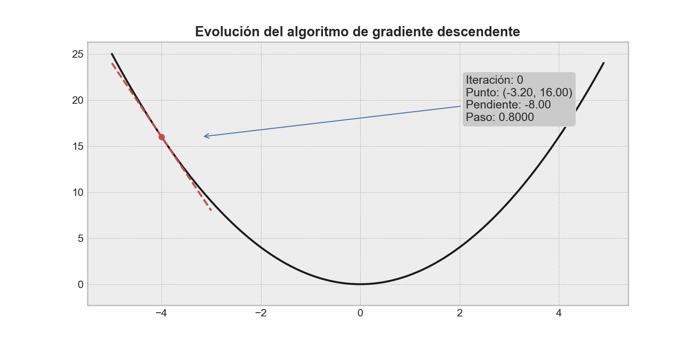
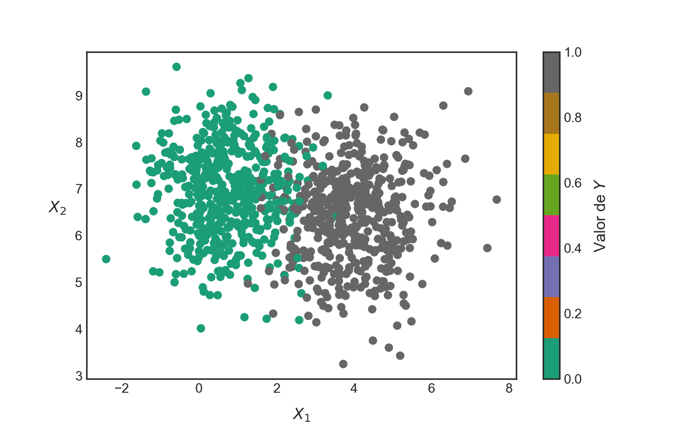
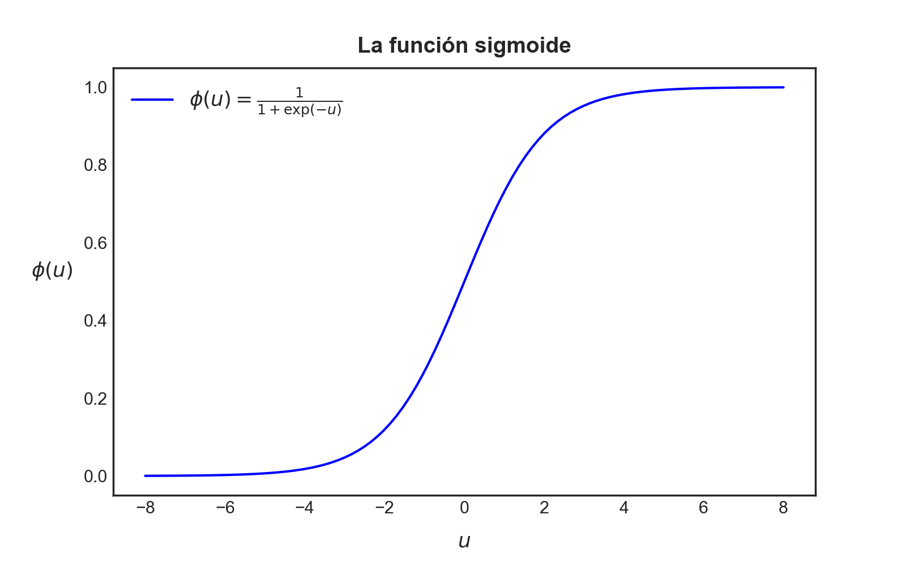
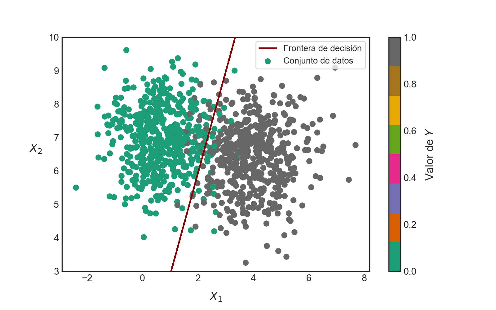

::: {.callout-important}
## Idea central

En este apunte exploraremos cómo <strong><font color='darkmagenta'>Numpy</font></strong> nos permite construir algunos modelos predictivos sencillos, pero fundamentales en la teoría del aprendizaje automático, como la **regresión lineal** y la **regresión logística**, de manera eficiente y conectando todos los conceptos vistos previamente con el lenguaje matemático inherente a estos modelos. Veremos cómo podemos aprovechar las capacidades de computación vectorizada de <strong><font color='darkmagenta'>Numpy</font></strong> para implementar estos modelos rápidamente, sin necesidad de recurrir a bucles explícitos en las partes centrales del cálculo.
:::

::: {.class-keywords}
[Numpy]{.class-keyword}
[Modelos predictivos]{.class-keyword}
[Regresión lineal]{.class-keyword}
[Regresión logística]{.class-keyword}
[Gradiente descendente]{.class-keyword}
[Aprendizaje supervisado]{.class-keyword}
[Computación vectorizada]{.class-keyword}
[Muestreo estratificado]{.class-keyword}
[Escalamiento de variables]{.class-keyword}
:::

## Regresión lineal con <strong><font color='darkmagenta'>Numpy</font></strong>

En cualquier carrera de ingeniería, siempre habrá una asignatura dedicada a la estimación de parámetros (o, al menos, ese es el *esperado*). Y entre los contenidos a revisar, casi siempre aparecerá el **modelo de regresión lineal**, el cual corresponde a un método ampliamente utilizado para encontrar una relación de tipo lineal entre una variable dependiente (o de *respuesta*) y una o más variables independientes (o *explicativas*). Dicho modelo es sencillo, relativamente poco costoso de computar y capaz de abordar muchísimos problemas cotidianos, incluso en ámbitos ingenieriles aparentemente más complejos. Asimismo, corresponde a una de las puertas de entrada naturales a los algoritmos de aprendizaje supervisado, que constituyen un pilar fundamental de la teoría del aprendizaje automático o *machine learning*.

En su forma más simple, donde sólo disponemos de una variable independiente, el modelo de regresión lineal puede describirse mediante una combinación lineal del tipo $y = w_{0} + w_{1}x$. Es decir, una función lineal de la **variable de entrada** $x$, donde $w_{0}$ y $w_{1}$ son los llamados **parámetros** del modelo.

### Conceptos preliminares

De forma más general, un modelo lineal realiza una predicción mediante el cálculo de una suma ponderada de las variables de entrada que nos interesan en términos de los parámetros del modelo, más un término constante conocido como **parámetro de sesgo**, que podemos escribir como

::: {.eq-scroll}
$$
\hat{y} = w_{0} + \sum_{j=1}^{n} w_{j} x_{j}
\tag{5.1}
$$
:::

Donde,

- $\hat{y}$ es el valor predicho o estimado.
- $n$ es el número de variables del modelo.
- $x_{j}$ es el valor de la $j$-ésima variable.
- $w_{j}$ es el $j$-ésimo parámetro del modelo.
- $w_{0}$ es el parámetro de sesgo del modelo.

En términos geométricos, la implementación de un modelo de regresión equivale a encontrar el mejor *hiperplano* que se ajuste a los puntos que representan la correspondencia entre los valores de la(s) variable(s) independiente(s) y la correspondiente variable dependiente. En el caso unidimensional, esto se traduce en encontrar la mejor línea recta que se ajuste a los puntos en un plano cartesiano. Tal proceso de ajuste se ilustra en el gráfico construido en el siguiente bloque de código para el caso unidimensional:

```{python}
import numpy as np
```

Usaremos la librería <strong><font color='darkmagenta'>TQDM</font></strong> para mostrar una barra de progreso durante el proceso de ajuste del modelo, lo cual es especialmente útil cuando trabajamos con conjuntos de datos grandes o con modelos más complejos que requieren un mayor número de iteraciones para converger:

```{python}
from tqdm import tqdm
```

A continuación, generaremos un conjunto de datos sintético para ilustrar el proceso de ajuste de un modelo de regresión lineal. Este conjunto de datos consistirá en una variable independiente $x$ y una variable dependiente $y$, donde $y$ se genera a partir de una relación lineal con $x$ más un término de ruido aleatorio para simular la variabilidad presente en datos reales:

```{python}
# Semilla aleatoria fija.
rng = np.random.default_rng(42)

# Creamos nuestro conjunto de datos sintético.
X_real = np.linspace(start=0, stop=16, num=50)
a_real, b_real = -50.1, 2200.0
Y_real = a_real * X_real + b_real

# Agregamos algo de ruido Gaussiano.
w1 = rng.normal(loc=180, scale=80, size=50)
w2 = rng.normal(loc=140, scale=100, size=50)
Y_noise = Y_real + w1 - w2
```

Luego, graficaremos estos puntos usando la librería <strong><font color='darkmagenta'>Matplotlib</font></strong>. Nos ahorraremos algunos detalles en la construcción del gráfico, ya que <strong><font color='darkmagenta'>Matplotlib</font></strong> tendrá su propia sección de clases dedicada, pero lo importante es que podamos visualizar la relación entre $x$ e $y$ antes de ajustar el modelo de regresión lineal:

```{python}
import matplotlib.pyplot as plt
```

```{python}
# Setting de estilo.
plt.rcParams["figure.dpi"] = 90
plt.style.use("bmh")
```

```{python}
#| label: fig-aplicaciones-en-modelos-01
#| fig-cap: "Observaciones ruidosas alrededor de la relación lineal subyacente que el modelo deberá recuperar a partir de los datos."
fig, ax = plt.subplots(figsize=(9, 5))
ax.scatter(X_real, Y_noise, color="dodgerblue", marker="x", label="Datos observados")
ax.plot(X_real, Y_real, "--k", label="Relación lineal subyacente")
ax.set_xlabel(r"$X$", fontsize=12, labelpad=10)
ax.set_ylabel(r"$Y$", fontsize=12, labelpad=15, rotation=0)
ax.set_title("Modelo de regresión lineal", fontsize=14, fontweight="bold", pad=10)
ax.legend(loc="best", frameon=True)
plt.tight_layout()
```

Ya que mencionamos el nombre —famoso, por cierto— de *machine learning*, es bueno que establezcamos algo de contexto y entendamos un poco qué queremos decir con dicho nombre. En términos generales, *machine learning* hace referencia a una serie de algoritmos que son capaces de aprender patrones a partir de los datos, sin necesidad de que nosotros intervengamos directamente en dicho proceso más allá del *setting* de ciertos valores de configuración del algoritmo, conocidos como **hiperparámetros**.

En el caso del modelo de regresión lineal, algunos hiperparámetros típicos pueden ser la tasa de aprendizaje del algoritmo de optimización, el número máximo de iteraciones, la tolerancia de convergencia o la decisión de incluir o no un intercepto. En cambio, los valores de los coeficientes del modelo y del parámetro de sesgo no son hiperparámetros, sino **parámetros** que deben ser aprendidos por el algoritmo.

Otro elemento importante en los algoritmos de *machine learning* corresponde a la llamada **función de costo o de pérdida**, que es una función que permite mapear el desempeño del modelo resultante a un número real que da cuenta de la calidad de dicho modelo. La función de costo es importante porque se trata de una guía absoluta que controla el ajuste de los parámetros propios del modelo a fin de lograr el mejor ajuste posible.

Finalmente, es bueno tener en consideración que siempre es una buena idea particionar nuestro conjunto de datos en tres diferentes subconjuntos, cada uno de los cuales sirve a un propósito bien determinado:

- **Conjunto de entrenamiento:** consistente en los datos a utilizar para el ajuste del modelo.
- **Conjunto de validación:** data apartada para testear diferentes combinaciones posibles de hiperparámetros.
- **Conjunto de prueba:** data utilizada para evaluar la calidad global del modelo en términos de su desempeño sobre datos nuevos.

Es importante considerar que estos subconjuntos se muestrean siempre de manera independiente, de forma tal que los procesos previamente comentados no interfieran entre sí.

Como dijimos previamente, a fin de poder estimar la calidad de nuestro modelo, necesitamos de una función de costo, la cual nos permitirá guiar el proceso de ajuste de sus parámetros. En el caso del modelo de regresión lineal, es común utilizar como función de costo al **error cuadrático medio (MSE)**, el cual mide las diferencias al cuadrado entre los valores predichos por el modelo y los valores reales de la variable de respuesta. Para un total de $m$ observaciones, consideremos la variable de respuesta $\mathbf{y}\in \mathbb{R}^{m}$ y los valores predichos $\hat{\mathbf{y}}\in \mathbb{R}^{m}$. El error cuadrático medio del modelo cuyas predicciones se agrupan en el vector $\hat{\mathbf{y}}$ se define como

::: {.eq-scroll}
$$
\mathrm{MSE}(\mathbf{y}, \hat{\mathbf{y}}) = \frac{1}{m}\sum_{i=1}^{m}(\hat{y}_{i}-y_{i})^{2}
\tag{5.2}
$$
:::

Podemos expandir la ecuación (5.2) reemplazando la estimación $\hat{\mathbf{y}}$ por el modelo de regresión lineal establecido previamente, el cual podemos escribir en forma compacta como sigue:

::: {.eq-scroll}
$$
\hat{\mathbf{y}} =\mathbf{X} \mathbf{w} +b\; ;\qquad \mathbf{X} =\left( \begin{matrix}x_{11}&x_{12}&\cdots&x_{1n}\\ x_{21}&x_{22}&\cdots&x_{2n}\\ \vdots&\vdots&\ddots&\vdots\\ x_{m1}&x_{m2}&\cdots&x_{mn}\end{matrix} \right) \in \mathbb{R}^{m\times n}
\tag{5.3}
$$
:::

Donde,

- $\mathbf{w} = (w_{1}, ..., w_{n})^{\top}\in \mathbb{R}^{n}$ es el vector que agrupa a todos los parámetros del modelo.
- $\mathbf{X} = \{x_{ij}\}\in \mathbb{R}^{m \times n}$ es la matriz que agrupa a las $m$ observaciones de las $n$ variables.
- $b = w_{0}$ es el parámetro de sesgo del modelo.

Por lo tanto, reemplazando (5.3) en (5.2), obtenemos la siguiente expresión para nuestra función de costo:

::: {.eq-scroll}
$$
\mathrm{MSE}(\mathbf{y}, \mathbf{X}, \mathbf{w}, b)
=
\frac{1}{m}\sum_{i=1}^{m}
\left(
y_{i} - (\mathbf{w}^{\top}\mathbf{x}_{i} + b)
\right)^{2}
\tag{5.4}
$$
:::

El problema de ajustar el modelo a nuestra data corresponde, por tanto, a un problema de optimización, puesto que es equivalente a minimizar el valor del error cuadrático medio, dados los parámetros escogidos para el modelo y la información de entrada.

En términos algebraicos, el problema de minimización de la función (5.4) tiene una solución cerrada, que corresponde a la solución de un sistema lineal de ecuaciones conocido como **ecuaciones normales**. Este método suele ser algo costoso en comparación con otros procedimientos iterativos más comunes en computación científica y que, además, tienen la ventaja de ser escalables. Uno de estos procedimientos corresponde al **algoritmo de gradiente descendente (GD)**.

El algoritmo de GD utiliza los parámetros del modelo ($\mathbf{w}$ y $b$) para, a partir de valores iniciales de tales parámetros, actualizarlos conforme un procedimiento que depende del cálculo de las derivadas de la función de costo con respecto a dichos parámetros. Tales derivadas se agrupan en una estructura conocida como **gradiente** de la función de costo y que, en nuestro ejemplo, corresponde a

::: {.eq-scroll}
$$
\frac{\partial}{\partial \mathbf{w}}
\mathrm{MSE}(\mathbf{y}, \mathbf{X}, \mathbf{w}, b)
=
-\frac{2}{m}\sum_{i=1}^{m}
\left(
y_{i}-(\mathbf{w}^{\top}\mathbf{x}_{i}+b)
\right)\mathbf{x}_{i}
\tag{5.5}
$$
:::

::: {.eq-scroll}
$$
\frac{\partial}{\partial b}
\mathrm{MSE}(\mathbf{y}, \mathbf{X}, \mathbf{w}, b)
=
-\frac{2}{m}\sum_{i=1}^{m}
\left(
y_{i}-(\mathbf{w}^{\top}\mathbf{x}_{i}+b)
\right)
\tag{5.6}
$$
:::

Recordemos, del [cálculo diferencial](/apuntes/calculo-incertidumbre-y-optimizacion/calculo-diferencial/), que el gradiente de una función siempre apunta en la dirección de máxima pendiente positiva. En términos geométricos, esto significa que, si imaginamos que la función de costo describe una superficie, el gradiente de dicha función en un punto arbitrario apunta siempre en la dirección de mayor pendiente relativa a ese punto, en dirección ascendente.

El algoritmo de gradiente descendente utiliza este principio geométrico para optimizar funciones de costo mediante un proceso iterativo sencillo, donde siempre, a partir de una posición determinada sobre esta superficie, nos movemos en la dirección de máxima pendiente, pero en sentido descendente, invirtiendo el signo del gradiente. El tamaño del paso que damos es un factor del gradiente correspondiente, donde dicho factor, denotado como $\alpha$, es llamado **tasa de aprendizaje** del algoritmo. Por lo tanto, el proceso de actualización de parámetros propio de este algoritmo se escribe como

::: {.eq-scroll}
$$
\begin{array}{l}\mathbf{w}_{k+1} =\mathbf{w}_{k} -\alpha \dfrac{\partial}{\partial \mathbf{w}_{k}} \mathrm{MSE} \left( \mathbf{y} ,\mathbf{X} ,\mathbf{w}_{k} ,b_{k} \right)\\ b_{k+1}=b_{k}-\alpha \dfrac{\partial}{\partial b_{k}} \mathrm{MSE} \left( \mathbf{y} ,\mathbf{X} ,\mathbf{w}_{k} ,b_{k} \right)\end{array}
\tag{5.7}
$$
:::

Donde $\mathbf{w}_{k+1}$ y $b_{k+1}$ son los valores actualizados de los parámetros del modelo en la iteración $k+1$. Por supuesto, el criterio de detención natural del algoritmo guarda relación con la magnitud del gradiente o con la diferencia relativa entre los parámetros en iteraciones sucesivas. Dado un valor de **tolerancia**, si el algoritmo llega a una zona donde las actualizaciones son suficientemente pequeñas, éste se detendrá.

Afortunadamente, existen ciertas condiciones matemáticas que garantizan que la solución óptima encontrada por este algoritmo sea global, y que guardan relación con la función de costo propiamente tal. En el caso del modelo de regresión lineal con MSE, dicha función es convexa, lo que simplifica enormemente el problema.

En la @fig-graddesc se observa un esquema animado del procedimiento realizado por el algoritmo de gradiente descendente a fin de hallar el mínimo global de una función.

{#fig-graddesc fig-align="center" width="100%"}

### Implementación

Vamos a construir una implementación sencilla del modelo de regresión lineal, aprovechando el procedimiento iterativo provisto por el algoritmo de gradiente descendente, utilizando para ello todo lo que hemos aprendido en <strong><font color='darkmagenta'>Numpy</font></strong> y, por supuesto, de los fundamentos de Python. Intentaremos asegurar que nuestro procedimiento sea escalable; vale decir, que pueda aplicarse a cualquier tipo de problema que cumpla con la estructura típica requerida por el modelo de regresión lineal, siendo independiente del número de variables y/o observaciones, dependiendo únicamente de los hiperparámetros que deseemos fijar: número de iteraciones, tolerancia y tasa de aprendizaje.

Partiremos considerando el hecho de que, en el procedimiento que hemos descrito para el algoritmo de gradiente descendente, hay un total de $n + 1$ parámetros para $n$ variables en el modelo. Por esa razón, resulta conveniente incorporar el parámetro de sesgo dentro del mismo vector de parámetros, añadiendo una columna de unos al inicio de la matriz de diseño $\mathbf{X}$.

Consideremos, para efectos de crear algunos datos sintéticos, una nueva semilla aleatoria fija:

```{python}
# Generamos una semilla aleatoria fija, para asegurar la reproducibilidad
# de nuestros resultados.
rng = np.random.default_rng(42)
```

Ahora construiremos una función para ajustar un modelo de regresión lineal a un conjunto de $n$ variables agrupadas en un arreglo bidimensional, considerando los hiperparámetros de tolerancia, tasa de aprendizaje y número de iteraciones como argumentos por defecto:

```{python}
# Creamos una función que replique el algoritmo de gradiente descendente.
def fit_linear_regression(
    X: np.ndarray,
    y: np.ndarray,
    iterations: int = 100,
    tolerance: float = 1e-5,
    learning_rate: float = 0.5,
    random_state: int = 42,
) -> np.ndarray:
    '''
    Una función sencilla que permite ajustar un modelo de regresión lineal a un conjunto
    de datos de dimensión arbitraria, considerando como método de ajuste un procedimiento
    iterativo basado en el algoritmo de gradiente descendente, inicializando aleatoriamente
    los parámetros del modelo.
    '''
    rng = np.random.default_rng(random_state)
    y = y.reshape(-1, 1)
    X = np.concatenate([np.ones((X.shape[0], 1)), X], axis=1)
    w = rng.random(size=(X.shape[1], 1))

    for i in tqdm(range(iterations), desc="Generando ajuste de parámetros"):
        y_pred = X @ w
        loss = np.mean((y_pred - y) ** 2)

        if np.isinf(loss) or np.isnan(loss):
            break

        gradient = 2 * X.T @ (y_pred - y) / X.shape[0]
        w -= gradient * learning_rate

        if np.linalg.norm(gradient) < tolerance:
            break

    return w
```

La función anterior define entonces el proceso de ajuste de un modelo de regresión lineal, potenciado por el algoritmo de gradiente descendente, dado un conjunto de datos de entrada representado por un arreglo bidimensional de `m` filas y `n` columnas, y un conjunto de datos de respuesta. El procedimiento retorna el arreglo `w`, que está conformado por el parámetro de sesgo y los coeficientes del modelo de regresión lineal.

A fin de poder separar nuestro conjunto de datos entre conjuntos de entrenamiento y de prueba, seguiremos un procedimiento sencillo. Mezclaremos todos los elementos del dataset de manera aleatoria, intentando mantener la reproducibilidad de dicha mezcla. Para ello, usaremos un generador explícito de permutaciones:

```{python}
# Creamos una función para separar nuestro dataset.
def split_dataset(
    X: np.ndarray,
    y: np.ndarray,
    proportion: float,
    random_state: int,
) -> tuple:
    '''
    Una función que separa un dataset en un conjunto de entrenamiento y un conjunto
    de prueba, sin considerar el orden temporal de los elementos que lo constituyen.
    Esta función debe usarse solamente cuando el conjunto de datos con el cual queremos
    trabajar no requiere preservar orden ni estructura temporal.
    '''
    rng = np.random.default_rng(random_state)
    dataset = np.concatenate([X, y.reshape(-1, 1)], axis=1)
    perm = rng.permutation(dataset.shape[0])
    dataset = dataset[perm]
    train_size = int(len(dataset) * proportion)
    train_set = dataset[:train_size, :]
    test_set = dataset[train_size:, :]
    X_train, X_test = train_set[:, :-1], test_set[:, :-1]
    y_train, y_test = train_set[:, -1], test_set[:, -1]
    return X_train, X_test, y_train.reshape(-1, 1), y_test.reshape(-1, 1)
```

Ya estamos listos para implementar nuestro modelo. Para ello, crearemos algo de data de entrada usando una semilla aleatoria fija. La variable de respuesta la calcularemos directamente a partir de la data de entrada usando una relación lineal, de manera que conoceremos de antemano los coeficientes a los cuales debiésemos aproximarnos con nuestro modelo. Sin embargo, añadiremos algo de ruido a la variable de respuesta, a fin de dificultar un poco el proceso de ajuste y testear la capacidad del modelo de llegar a parámetros razonables:

```{python}
# Generamos datos aleatorios.
X = rng.random(size=(250, 2))
y = X @ np.array([[2.5], [0.5]]) + rng.normal(loc=0, scale=0.5, size=(250, 1))
```

En el siguiente bloque de código construimos la visualización de nuestro conjunto de datos:

```{python}
#| label: fig-aplicaciones-en-modelos-02
#| fig-cap: "Dispersión de la respuesta frente a cada predictor; la mayor pendiente asociada a $x_1$ anticipa su coeficiente más grande en el modelo."
# Visualización del conjunto de datos en los planos (x1, y) y (x2, y).
fig, ax = plt.subplots(2, 1, figsize=(9, 8))

ax[0].scatter(X[:, 0], y, color="dodgerblue", marker="x", label="Datos observados")
ax[0].set_xlabel(r"$x_{1}$", fontsize=14, labelpad=10)
ax[0].set_ylabel(r"$y$", fontsize=14, labelpad=15, rotation=0)
ax[0].set_title("Relación entre $x_{1}$ e $y$", fontsize=14, fontweight="bold", pad=10)
ax[0].legend(loc="best", frameon=True)

ax[1].scatter(X[:, 1], y, color="dodgerblue", marker="x", label="Datos observados")
ax[1].set_xlabel(r"$x_{2}$", fontsize=14, labelpad=10)
ax[1].set_ylabel(r"$y$", fontsize=14, labelpad=15, rotation=0)
ax[1].set_title("Relación entre $x_{2}$ e $y$", fontsize=14, fontweight="bold", pad=10)
ax[1].legend(loc="best", frameon=True)

plt.tight_layout()
```

Podemos observar la dispersión entre las variables que se agrupan en el arreglo `X` y la variable de respuesta `y`. Notemos que, en el bloque de código anterior, hemos definido que $\mathbf{y} = 2.5\mathbf{x}_{1} + 0.5\mathbf{x}_{2} + \mathrm{ruido}$. Por lo tanto, las variables `X` e `y` sí tienen una relación lineal aproximada y un modelo de regresión lineal debiese retornar parámetros cercanos a $w_{1}=2.5$ y $w_{2}=0.5$, más un parámetro de sesgo que debiese ser aproximadamente igual a la media del ruido Gaussiano añadido a `y`, es decir, un valor cercano a cero.

Separamos nuestra data en conjuntos de entrenamiento y de prueba:

```{python}
# Separamos en conjunto de entrenamiento y conjunto de prueba.
X_train, X_test, y_train, y_test = split_dataset(
    X=X, y=y, proportion=0.8, random_state=42,
)
```

Ahora replicamos el gráfico anterior, a fin de observar la localización de los puntos correspondientes a cada conjunto de datos:

```{python}
#| label: fig-aplicaciones-en-modelos-03
#| fig-cap: "Distribución de los subconjuntos de entrenamiento y prueba en cada plano predictor-respuesta, usada para comprobar que ambos cubren dominios comparables."
# Visualización del conjunto de datos en los planos (x1, y) y (x2, y).
# Separación entre datos de entrenamiento y de prueba.
fig, ax = plt.subplots(2, 1, figsize=(9, 8))

ax[0].scatter(X_train[:, 0], y_train, color="dodgerblue", marker="x", label="Datos de entrenamiento")
ax[0].scatter(X_test[:, 0], y_test, color="orangered", marker="x", label="Datos de prueba")
ax[0].set_xlabel(r"$x_{1}$", fontsize=14, labelpad=10)
ax[0].set_ylabel(r"$y$", fontsize=14, labelpad=15, rotation=0)
ax[0].set_title("Relación entre $x_{1}$ e $y$", fontsize=14, fontweight="bold", pad=10)
ax[0].legend(loc="best", frameon=True)

ax[1].scatter(X_train[:, 1], y_train, color="dodgerblue", marker="x", label="Datos de entrenamiento")
ax[1].scatter(X_test[:, 1], y_test, color="orangered", marker="x", label="Datos de prueba")
ax[1].set_xlabel(r"$x_{2}$", fontsize=14, labelpad=10)
ax[1].set_ylabel(r"$y$", fontsize=14, labelpad=15, rotation=0)
ax[1].set_title("Relación entre $x_{2}$ e $y$", fontsize=14, fontweight="bold", pad=10)
ax[1].legend(loc="best", frameon=True)

plt.tight_layout()
```

A continuación, aplicaremos nuestra función `fit_linear_regression()` para ajustar un modelo de regresión lineal a este conjunto de datos:

```{python}
# Ajustamos un modelo de regresión lineal a esta data.
weights = fit_linear_regression(
    X_train, y_train, iterations=100, tolerance=1e-5, learning_rate=0.5
)

# Mostramos en pantalla los parámetros del modelo.
weights
```

Vemos que nuestro modelo ha estimado parámetros cercanos a los valores reales subyacentes. El parámetro de sesgo estimado por el modelo debiese ser pequeño, mientras que los coeficientes asociados a las variables debiesen aproximarse razonablemente a los valores 2.5 y 0.5, respectivamente.

Para estimar la calidad del modelo, es necesario entender el contexto de aplicación del mismo. No entraremos en detalles en este tópico ahora mismo, pero sí podemos decir que una métrica popular corresponde al coeficiente $r$-cuadrado, que determina la proporción de variabilidad de la variable de respuesta explicada por la(s) variable(s) independiente(s). Este coeficiente puede calcularse rápidamente como

::: {.eq-scroll}
$$
r^{2}=1-\frac{SS_{\mathrm{res}}}{SS_{\mathrm{tot}}}
\; ; \;
SS_{\mathrm{res}}=\sum_{i=1}^{m}(y_{i}-\hat{y}_{i})^{2}
\; \wedge \;
SS_{\mathrm{tot}}=\sum_{i=1}^{m}(y_{i}-\bar{y})^{2}
\tag{5.8}
$$
:::

En las ecuaciones anteriores, $SS_{\mathrm{res}}$ es una cantidad conocida como suma cuadrada de los residuos del modelo. Corresponde a la suma de los términos de error resultantes de las diferencias al cuadrado entre los valores reales y los valores predichos por el modelo. Por otro lado, $SS_{\mathrm{tot}}$ es la suma total de cuadrados del modelo, consistente en las diferencias al cuadrado entre cada valor observado y la media de todos esos valores.

La fórmula anterior es fácilmente replicable en <strong><font color='darkmagenta'>Numpy</font></strong>:

```{python}
# Una función para calcular el r-cuadrado.
def squared_r(y_real: np.ndarray, y_pred: np.ndarray) -> float:
    '''
    Una función que, dados dos arreglos que representan los valores reales de una variable
    de respuesta y valores predichos para la misma mediante un modelo arbitrario, calcula
    el coeficiente r-cuadrado.
    '''
    SS_res = np.sum((y_real - y_pred) ** 2)
    SS_tot = np.sum((y_real - np.mean(y_real)) ** 2)
    score = 1 - SS_res / SS_tot
    return score
```

Usamos esta función para calcular el valor de $r^{2}$:

```{python}
# Obtenemos predicciones para nuestros datos.
y_train_pred = X_train @ weights[1:] + weights[0]
y_test_pred = X_test @ weights[1:] + weights[0]

# Desempeño del modelo en datos de entrenamiento.
r2_train = squared_r(y_train, y_train_pred)
r2_test = squared_r(y_test, y_test_pred)

# Imprimimos en pantalla estos valores.
print(f"r^2 sobre datos de entrenamiento = {r2_train}")
print(f"r^2 sobre datos de prueba = {r2_test}")
```

Los valores obtenidos para el coeficiente $r$-cuadrado deberían ser razonablemente buenos, considerando que hemos añadido una cantidad significativa de ruido a la variable de respuesta, lo que dificulta el proceso de ajuste del modelo. Sin embargo, es importante considerar que el valor de $r^{2}$ no es una métrica absoluta de desempeño, sino que debe ser interpretada en el contexto del problema que estamos abordando.

No está demás decir que, si bien nuestro código es perfectamente escalable a cualquier número de variables, debemos tener en consideración que:

- La data que hemos trabajado merece el apelativo de *data de juguete* (*toy dataset*), debido a que la hemos generado precisamente para la ocasión. En el mundo real, los conjuntos de datos a los que nos veremos enfrentados tendrán diferentes unidades variable a variable, registros sin datos, datos anómalos (*outliers*), entre otras posibles características que harán de su manipulación algo mucho más importante que simplemente construir un modelo.
- En general, los modelos de regresión lineal son sensibles a las magnitudes de los datos. Por lo tanto, siempre es un buen procedimiento escalar nuestro conjunto de datos antes de proceder a construir modelos que se ajusten a ellos. Esto lo podemos hacer mediante procedimientos tales como normalización o estandarización, que ya revisamos [al estudiar el concepto de broadcasting](/clases/data-analytics/introduccion-al-analisis-de-datos-en-python/computacion-vectorizada-y-arreglos-con-numpy/broadcasting-y-agregacion/).

## Modelo de regresión logística binaria

Vamos a finalizar esta sección comentando uno de los modelos más ingeniosos para la resolución de un tipo de problema muy conocido en *machine learning* como **problema de clasificación binaria**. Este problema es similar al problema típico de regresión: disponemos de una serie de variables independientes que constituyen información de entrada para modelar una variable de respuesta determinada, con la diferencia de que dicha variable de respuesta es binaria. Es decir, toma únicamente dos valores, típicamente codificados como $1$ o $0$, los que suelen representar datos de tipo categórico tales como “éxito” o “fracaso”, “verdadero” o “falso”, “fallo” o “no fallo”, u otra combinación conveniente para nuestro problema.

### Conceptos preliminares

Uno de los supuestos subyacentes al modelo de regresión lineal establece que la variable de respuesta que deseamos estimar tiene una distribución aproximadamente normal. Por supuesto, éste no es el caso para variables de respuesta binarias, ya que toman únicamente dos valores. Por lo tanto, el modelo de regresión lineal no es adecuado para resolver este tipo de problemas. Y es aquí donde se hace patente la necesidad de disponer de algún modelo que sea capaz de hacer este trabajo. El símil del modelo de regresión lineal para problemas de clasificación binaria corresponde al llamado **modelo de regresión logística binaria (RLB)**.

En la @fig-binary2d se observa un conjunto de datos en $\mathbb{R}^{2}$ que ilustra un problema de clasificación. Todos los puntos de color verde son aquellos tales que $y_{i}=0$, mientras que aquellos de color gris son tales que $y_{i}=1$, para todo $i$; $1\leq i\leq m$, donde $m$ es el número de observaciones que conforma la data.

{#fig-binary2d fig-align="center" width="100%"}

Sea pues $\mathbf{X} \in \mathbb{R}^{m	imes n}$ una matriz que representa un conjunto de $n$ variables independientes con $m$ observaciones para cada una de ellas. Sea $\mathbf{y} \in \mathbb{R}^{m}$ una variable de respuesta binaria, la cual hemos codificado de tal forma que ésta puede tomar uno de dos valores, 0 o 1, los que representan convenciones inherentes al problema en cuestión. Consideremos la función $\phi :\mathbb{R} \longrightarrow (0,1)$, definida como

::: {.eq-scroll}
$$
\phi(u) = \frac{1}{1+\exp(-u)}
\tag{5.9}
$$
:::

La función $\phi$ así definida se conoce como **función logística o sigmoide**. Esta función tiene la particularidad de que su dominio es todo el conjunto $\mathbb{R}$, pero su recorrido es el intervalo $(0, 1)$. De esta manera, la función logística puede interpretarse como una función que transforma un valor real arbitrario en una cantidad que puede leerse como probabilidad. ¿Y por qué nos interesa esto? Porque, en un problema de clasificación, estamos interesados en estimar una de dos cosas —o ambas—: la clase $\hat{y}$ o bien la probabilidad de que $y=1$, lo que denotamos como $P(y=1)$.

En la @fig-logistic se observa el gráfico de la función logística.

{#fig-logistic fig-align="center" width="800"}

En el modelo de regresión logística binaria también estamos interesados en estimar un conjunto de parámetros, que denotamos como $\mathbf{w}$, de manera tal que la combinación lineal representada por $\mathbf{w}^{\top}\mathbf{x}_{i}+b$ minimice una función de costo determinada, utilizando como base el algoritmo de gradiente descendente. Sin embargo, una de las grandes diferencias con el caso del modelo de regresión lineal es que la función a estimar corresponde a una transformación de esa combinación lineal conforme la función logística. Es decir, para una observación $\mathbf{x}_{i}$,

::: {.eq-scroll}
$$
\phi(\mathbf{w}^{\top}\mathbf{x}_{i}+b)
=
\frac{1}{1+\exp[-(\mathbf{w}^{\top}\mathbf{x}_{i}+b)]}
\tag{5.10}
$$
:::

La otra gran diferencia con respecto al modelo de regresión lineal corresponde a la función de costo a utilizar para el proceso de búsqueda de parámetros mediante el algoritmo de gradiente descendente. Dados $\mathbf{x}_{i}$ y $y_{i}$, escribimos $p_{i}=p(\mathbf{x}_{i})$ para denotar la probabilidad de que $y_{i}$ sea igual a $1$, y $1-p_{i}$ para denotar la probabilidad de que $y_{i}$ sea igual a $0$, para $1\leq i\leq m$. Queremos encontrar los valores de $b$ y $\mathbf{w}$ que mejor se ajusten a nuestra data en términos de la distribución de probabilidad representada por la función logística (5.10). Por lo cual, el valor de la función de costo para la $i$-ésima observación será

::: {.eq-scroll}
$$
\mathcal{L}(p_{i}) =
\begin{cases}
-\log(p_{i}) & ; \text{si } y_{i}=1\
-\log(1-p_{i}) & ; \text{si } y_{i}=0
\end{cases}
\tag{5.11}
$$
:::

Dada la naturaleza binaria de la variable de respuesta, podemos expresar la función de costo para una única instancia como

::: {.eq-scroll}
$$
\mathcal{L}(p_{i})=-y_{i}\log(p_{i})-(1-y_{i})\log(1-p_{i})
\tag{5.12}
$$
:::

Esta expresión es formalmente conocida como **función de entropía cruzada binaria**. La suma de todos los valores de esta función se conoce como log-verosimilitud negativa promedio, y su valor mínimo se alcanza para el mejor valor de los parámetros $\mathbf{w}$ y $b$. Equivalentemente, podemos maximizar la verosimilitud logarítmica:

::: {.eq-scroll}
$$
\mathcal{L}
=
\sum_{i=1}^{m}
\left(
y_{i}\log(p_{i}) + (1-y_{i})\log(1-p_{i})
\right)
\tag{5.13}
$$
:::

Recordemos la función logística: las probabilidades anteriores pueden expresarse como la salida de una función de este tipo, cuyo argumento es la combinación lineal $\mathbf{w}^{\top}\mathbf{x}_{i}+b$. Reemplazando en la ecuación anterior, obtenemos la función de costo a utilizar por el modelo de regresión logística binaria:

::: {.eq-scroll}
$$
\mathcal{L}(\mathbf{y}, \mathbf{w}, b)
=
\sum_{i=1}^{m}
\left(
y_{i}\log[\phi(\mathbf{w}^{\top}\mathbf{x}_{i}+b)]
+
(1-y_{i})\log[1-\phi(\mathbf{w}^{\top}\mathbf{x}_{i}+b)]
\right)
\tag{5.14}
$$
:::

El procedimiento de minimización de esta función de costo por medio del algoritmo de gradiente descendente involucra igualmente calcular las derivadas parciales de $\mathcal{L}$ con respecto a los parámetros $\mathbf{w}$ y $b$. Sin embargo, previo a entrar en detalles en este cálculo, notemos que la derivada de la función logística $\phi$ puede calcularse como

::: {.eq-scroll}
$$
\phi^{\prime}(u)
=
\frac{\exp(-u)}{(1+\exp(-u))^{2}}
\tag{5.15}
$$
:::

Aplicando algo de álgebra, obtenemos

::: {.eq-scroll}
$$
\phi^{\prime}(u)
=
\phi(u)\left(1-\phi(u)
\right)
\tag{5.16}
$$
:::

Por lo tanto, la derivada de la función logística puede expresarse en términos de la propia función logística. Tomando en consideración este importante resultado, podemos calcular rápidamente las derivadas parciales de $\mathcal{L}$ como

::: {.eq-scroll}
$$
\frac{\partial \mathcal{L}}{\partial \mathbf{w}}
=
\sum_{i=1}^{m}
\mathbf{x}_{i}
\left(
y_{i}-\phi(\mathbf{w}^{\top}\mathbf{x}_{i}+b)
\right)
\tag{5.17}
$$
:::

Siguiendo un procedimiento similar, encontramos que

::: {.eq-scroll}
$$
\frac{\partial \mathcal{L}}{\partial b}
=
\sum_{i=1}^{m}
\left(
y_{i}-\phi(\mathbf{w}^{\top}\mathbf{x}_{i}+b)
\right)
\tag{5.18}
$$
:::

Así que el procedimiento de ajuste por medio del algoritmo de gradiente descendente puede escribirse de la misma forma que para el caso del modelo de regresión lineal:

::: {.eq-scroll}
$$
\begin{array}{lll}
\mathbf{w}_{k+1} &=& \mathbf{w}_{k} - \alpha \dfrac{\partial \mathcal{L}}{\partial \mathbf{w}_{k}}\
b_{k+1} &=& b_{k} - \alpha \dfrac{\partial \mathcal{L}}{\partial b_{k}}
\end{array}
\tag{5.19}
$$
:::

Y ya estamos listos para construir nuestra implementación en <strong><font color='darkmagenta'>Numpy</font></strong>.

### Implementación

Considerando las soluciones presentadas previamente para el caso de la estimación de parámetros en el modelo de regresión logística, construiremos una implementación en <strong><font color='darkmagenta'>Numpy</font></strong> siguiendo un enfoque lo más similar posible a los cálculos simbólicos desarrollados con anterioridad.

En primer lugar, definimos la función logística como sigue:

```{python}
def sigmoid(x: np.ndarray) -> np.ndarray:
    '''
    Una función para transformar cualquier arreglo conforme una función
    logística (sigmoide).
    '''
    phi = 1 / (1 + np.exp(-x))
    return phi
```

Luego hacemos lo mismo para el caso de la función de costo (log-loss):

```{python}
def log_loss(y: np.ndarray, y_pred: np.ndarray) -> float:
    '''
    Una función para calcular la entropía cruzada binaria promedio.
    '''
    eps = 1e-12
    y_pred = np.clip(y_pred, eps, 1 - eps)
    loss = -np.mean(y * np.log(y_pred) + (1 - y) * np.log(1 - y_pred))
    return loss
```

Ahora construiremos una función para ajustar un modelo de regresión logística binaria a un conjunto de $n$ variables agrupadas en un arreglo bidimensional, considerando los hiperparámetros de tolerancia, tasa de aprendizaje y número de iteraciones como argumentos por defecto:

```{python}
def fit_logistic_regression(
    X: np.ndarray,
    y: np.ndarray,
    iterations: int = 10000,
    tolerance: float = 1e-5,
    learning_rate: float = 0.01,
) -> np.ndarray:
    '''
    Una función sencilla que permite ajustar un modelo de regresión logística binaria a un
    conjunto de datos de dimensión arbitraria, considerando como método de ajuste un procedimiento
    iterativo basado en el algoritmo de gradiente descendente, inicializando en cero los parámetros
    del modelo.
    '''
    X = np.hstack((np.ones((X.shape[0], 1)), X))
    y = y.ravel()
    w = np.zeros(X.shape[1])
    cost = float('inf')

    for i in tqdm(range(iterations), desc="Generando ajuste de parámetros"):
        z = np.dot(X, w)
        y_pred = sigmoid(z)
        cost_new = log_loss(y, y_pred)

        if abs(cost - cost_new) < tolerance:
            break

        cost = cost_new
        gradient = np.dot(X.T, (y_pred - y)) / y.size
        w -= learning_rate * gradient

    return w
```

El bloque de código anterior nos debería bastar para ajustar un modelo de regresión logística binaria a cualquier conjunto de datos tal que la variable de respuesta correspondiente sea, efectivamente, de tipo binaria.

A fin de poder construir nuestro modelo, vamos a necesitar algunos datos para probar nuestro código a nivel procedimental. Para ello, haremos uso de la librería <strong><font color='darkmagenta'>Scikit-Learn</font></strong> (cuyo nombre a nivel de módulo es `sklearn`). Esta librería es utilizada masivamente para la construcción de modelos de *machine learning* de todo tipo. Puntualmente, nosotros usaremos el submódulo `sklearn.datasets`, a fin de poder crear un conjunto de datos apto para probar nuestro modelo, usando la función `sklearn.datasets.make_blobs()`.

La librería <strong><font color='darkmagenta'>Scikit-Learn</font></strong> puede instalarse fácilmente usando el gestor de paquetes `pip` como:

```bash
pip install scikit-learn
```

Y ahora sí, construimos nuestro conjunto de datos:

```{python}
from sklearn.datasets import make_blobs
```

```{python}
# Creamos nuestro dataset.
X, y = make_blobs(n_samples=1000, centers=2, n_features=2, center_box=(0, 9), random_state=7)
```

La función `make_blobs()` toma varios argumentos. En nuestro caso, usamos `n_samples` para definir el total de observaciones que constituirán nuestro conjunto de datos; `centers` para definir el número de centroides respecto de los cuales se acumulan estos datos; y `n_features` para definir el total de variables independientes que conformarán este conjunto de datos. Por lo tanto, disponemos de un conjunto compuesto por tres variables: dos independientes (digamos $x_{1}$ y $x_{2}$) y una variable de respuesta binaria (digamos $\mathbf{y}$) que queremos estimar mediante nuestro modelo.

De la misma forma en que lo hicimos con nuestro modelo de regresión lineal, separaremos esta data en conjuntos de entrenamiento y de prueba. Sin embargo, en esta oportunidad, este proceso de separación es un tanto diferente. Debido a que `y` es un arreglo que contiene datos binarios, debemos garantizar que tanto el conjunto de entrenamiento como el de prueba preserven la proporción de 1s y 0s que existe en el conjunto de datos original:

```{python}
# Proporción de 1s sobre los datos totales.
y[y == 1].shape[0] / y.shape[0]
```

Este tipo de procedimiento es esencial en el desarrollo de cualquier modelo de clasificación, y se conoce como muestreo estratificado.

La función de muestreo estratificado se describe a continuación:

```{python}
# Una función para construir un muestreo estratificado.
def stratified_split(X, y, test_size=0.2, random_state=42):
    '''
    Una función que separa un dataset en un conjunto de entrenamiento y un conjunto
    de prueba, considerando un muestreo estratificado.
    '''
    pos_idx = np.where(y == 1)[0]
    neg_idx = np.where(y == 0)[0]
    n_pos_test = int(test_size * pos_idx.shape[0])
    n_neg_test = int(test_size * neg_idx.shape[0])
    rng = np.random.default_rng(random_state)
    rng.shuffle(pos_idx)
    rng.shuffle(neg_idx)
    pos_idx_train, pos_idx_test = pos_idx[n_pos_test:], pos_idx[:n_pos_test]
    neg_idx_train, neg_idx_test = neg_idx[n_neg_test:], neg_idx[:n_neg_test]
    idx_train = np.concatenate((pos_idx_train, neg_idx_train))
    idx_test = np.concatenate((pos_idx_test, neg_idx_test))
    rng.shuffle(idx_train)
    rng.shuffle(idx_test)
    X_train, X_test = X[idx_train], X[idx_test]
    y_train, y_test = y[idx_train], y[idx_test]
    return X_train, X_test, y_train, y_test
```

Previo a separar nuestro conjunto de datos, debemos enfatizar que, debido a que el modelo de regresión logística binaria es un **modelo lineal generalizado**, también es sensible a los órdenes de magnitud de las variables que lo constituyen, como ocurre con el modelo de regresión lineal. Por lo tanto, necesitamos escalar dicho conjunto de datos.

Notemos que este procedimiento no lo hicimos en el caso anterior al ajustar un modelo de regresión lineal, debido a que la data la generamos a partir de muestreo uniforme y, por tanto, las variables independientes ya tenían órdenes de magnitud similares.

El escalamiento lo haremos mediante un proceso de **estandarización z-score**. Por lo tanto, construimos una función para ello:

```{python}
# Una función para escalar nuestros datos.
def standard_scaler(X: np.ndarray) -> np.ndarray:
    '''
    Una función para escalar un conjunto de variables independientes mediante un proceso
    de estandarización z-score.
    '''
    return (X - X.mean(axis=0)) / X.std(axis=0)
```

Definidas las funciones de escalamiento y de muestreo estratificado, procedemos a utilizarlas para escalar y separar nuestro conjunto en datos de entrenamiento y de prueba:

```{python}
# Escalamiento de nuestra data.
X_scaled = standard_scaler(X)

# Separación de nuestro conjunto de datos.
X_train, X_test, y_train, y_test = stratified_split(X_scaled, y)
```

Vemos que la proporción de 1s y 0s, efectivamente, se preserva en estos datos:

```{python}
# Proporción de 1s sobre los datos de entrenamiento.
y_train[y_train == 1].shape[0] / y_train.shape[0]
```

```{python}
# Proporción de 1s sobre los datos de prueba.
y_test[y_test == 1].shape[0] / y_test.shape[0]
```

Ahora realizamos el proceso de ajuste para construir nuestro modelo sobre los datos de entrenamiento:

```{python}
# Ajuste de modelo de regresión logística binaria.
w = fit_logistic_regression(X_train, y_train)
w
```

Vemos que, a partir del procedimiento anterior, el modelo de regresión logística binaria que hemos construido queda completamente determinado por un vector de parámetros `w`, el cual incluye el parámetro de sesgo como primer elemento.

Sólo resta responder una importante pregunta: *¿Qué tan bueno es nuestro modelo?* Y para ello, es importante saber qué se entiende por buen modelo en un problema de clasificación, y los contextos que definen el buen uso de ciertas métricas de desempeño para este tipo de modelos.

Una forma gráfica de entender el desempeño de un modelo de clasificación, cuando el número de variables independientes es 2, es mediante la construcción de una **frontera de decisión**. Tal frontera corresponde a la curva que separa las distintas clases que caracterizan a los puntos en cuestión en un problema de clasificación. Para el caso del modelo de regresión logística binaria, esta frontera siempre es lineal, y tiene por ecuación a $\mathbf{w}^{	op}\mathbf{x}+b=0$.

Tal frontera se muestra en el gráfico de la @fig-boundary. Observamos que ésta es, en efecto, una recta que separa las clases $y_{i}=1$ e $y_{i}=0$ en el conjunto de datos completo.

{#fig-boundary fig-align="center" width="100%"}

En términos más formales, sea $Y$ la variable aleatoria que representa los posibles valores que puede tomar la variable de respuesta, lo que implica que $Y=\{0,1\}$. El modelo estima la probabilidad $P(Y=1)$. Es justo, por tanto, preguntarnos cuál es el mínimo valor de la probabilidad $P(Y=1)$ para el cual podemos asumir, con un nivel de confianza razonable, que, efectivamente, $Y=1$. Parece justo establecer que ese valor debería ser $P(Y=1)=0.5$, que denota que es igualmente probable que $Y=1$ o $Y=0$. Dicha probabilidad se conoce, en la práctica, como valor umbral de clasificación (*cut-off*).

Por lo tanto, podemos escribir

::: {.eq-scroll}
$$
\hat{Y} =
\begin{cases}
1 & ; \ \text{si } P(Y=1) > 0.5\\
0 & ; \ \text{si } P(Y=1) \leq 0.5
\end{cases}
\tag{5.22}
$$
:::

Donde $\hat{Y}$ es la clase estimada por el modelo. Al respecto, podemos definir los siguientes conjuntos relativos a las probabilidades estimadas por el mismo:

- Los **verdaderos positivos** son aquellos valores tales que $\hat{Y}=Y=1$.
- Los **verdaderos negativos** son aquellos valores tales que $\hat{Y}=Y=0$.
- Los **falsos positivos** son aquellos valores tales que $\hat{Y}=1$ e $Y=0$.
- Los **falsos negativos** son aquellos valores tales que $\hat{Y}=0$ e $Y=1$.

Los valores anteriormente establecidos pueden disponerse en el cuadro ilustrado en la @tbl-cmatrix, conocido como matriz de confusión.

: Matriz de confusión para un problema binario {#tbl-cmatrix}

|                      |                   | **CONDICIÓN REAL** |                    |
|----------------------|-------------------|--------------------|--------------------|
|                      | **Población total** | $Y=1$            | $Y=0$              |
| **CONDICIÓN ESTIMADA** | $\hat{Y}=1$      | Verdaderos positivos | Falsos positivos |
|                      | $\hat{Y}=0$       | Falsos negativos   | Verdaderos negativos |

Vemos pues que disponemos de, por lo menos, dos métricas de desempeño importantes en un problema de clasificación binaria: primero, podemos hacer énfasis en la fracción de verdaderos positivos del modelo en relación a la cantidad total de observaciones que, efectivamente, pertenecen a la clase positiva. Dicha tasa se conoce como **sensibilidad** del modelo.

La sensibilidad de un modelo de clasificación binaria puede calcularse, por tanto, mediante la fórmula

::: {.eq-scroll}
$$
R=
\frac{V_{P}}{V_{P}+F_{N}}
\tag{5.23}
$$
:::

Naturalmente, podemos también determinar la proporción de aciertos del modelo en relación a las observaciones que pertenecen a la clase negativa, usando para ello la fracción de verdaderos negativos. Este valor se conoce como **especificidad** del modelo, y permite entender su precisión desde la perspectiva de la clase negativa. Es posible calcularlo usando la fórmula

::: {.eq-scroll}
$$
S=
\frac{V_{N}}{V_{N}+F_{P}}
\tag{5.24}
$$
:::

Ambas métricas pueden calcularse rápidamente disponiendo ya de la matriz de confusión. Una implementación en <strong><font color='darkmagenta'>Numpy</font></strong> de dicha matriz se puede lograr mediante la siguiente función:

```{python}
def confusion_matrix(y_true: np.ndarray, y_pred: np.ndarray) -> np.ndarray:
    '''
    Una función que permite obtener rápidamente la matriz de confusión, dados un arreglo que
    contiene las clases reales observadas para una variable de respuesta determinada, y un
    arreglo que contiene las clases estimadas por un modelo.
    '''
    true_positives = np.sum((y_true == 1) & (y_pred == 1))
    true_negatives = np.sum((y_true == 0) & (y_pred == 0))
    false_positives = np.sum((y_true == 0) & (y_pred == 1))
    false_negatives = np.sum((y_true == 1) & (y_pred == 0))

    return np.array([
        [true_positives, false_positives],
        [false_negatives, true_negatives]
    ])
```

Ya sólo nos resta definir una función que permita obtener las clases predichas por nuestro modelo. Una opción es la siguiente:

```{python}
# Una función para obtener estimaciones mediante nuestro modelo.
def predict(
    X: np.ndarray,
    theta: np.ndarray,
    output: str = "class"
) -> np.ndarray:
    '''
    Una función que permite obtener predicciones de nuestro modelo de regresión logística
    binaria.
    '''
    X = np.hstack((np.ones((X.shape[0], 1)), X))
    z = np.dot(X, theta)
    y_pred = sigmoid(z)

    if output == "class":
        y_pred = np.where(y_pred > 0.5, 1, 0)
        return y_pred
    else:
        return y_pred
```

Usamos la función anterior, por tanto, para determinar las clases estimadas por el modelo conforme nuestros datos de entrenamiento y de prueba:

```{python}
# Obtenemos las estimaciones del modelo.
y_train_pred = predict(X_train, w, output="class")
y_test_pred = predict(X_test, w, output="class")
```

De este modo, ahora calculamos las matrices de confusión para los datos de entrenamiento y de prueba:

```{python}
# Calculamos la matriz de confusión asociada a nuestras estimaciones.
cm_train = confusion_matrix(y_train, y_train_pred)
cm_test = confusion_matrix(y_test, y_test_pred)

# Matriz de confusión para los datos de entrenamiento.
cm_train
```

```{python}
# Matriz de confusión para los datos de prueba.
cm_test
```

Con las matrices de confusión ya determinadas, es sencillo calcular tanto la sensibilidad como la especificidad para nuestro modelo en ambos conjuntos de datos:

```{python}
# Sensibilidad.
r_train = cm_train[0, 0] / (cm_train[0, 0] + cm_train[1, 0])
r_test = cm_test[0, 0] / (cm_test[0, 0] + cm_test[1, 0])

# Especificidad.
s_train = cm_train[1, 1] / (cm_train[1, 1] + cm_train[0, 1])
s_test = cm_test[1, 1] / (cm_test[1, 1] + cm_test[0, 1])
```

```{python}
print(f"Sensibilidad en datos de entrenamiento = {100*np.around(r_train, 4)}%")
print(f"Especificidad en datos de entrenamiento = {100*np.around(s_train, 4)}%")
print(f"Sensibilidad en datos de prueba = {100*np.around(r_test, 4)}%")
print(f"Especificidad en datos de prueba = {100*np.around(s_test, 4)}%")
```

Vemos pues que nuestro modelo puede alcanzar indicadores de desempeño muy altos sobre este conjunto de datos, lo que es realmente muy bueno.

Es muy importante señalar que estos valores de rendimiento para un modelo de clasificación no son muy comunes. La razón de haber obtenido indicadores tan buenos para nuestro modelo no estriba en su complejidad, sino en los datos que fueron imputados al mismo. Tales datos provienen de un generador de *datasets* apto para testear modelos de clasificación, razón por la cual nuestro conjunto de datos no representó mayor dificultad para modelarlo. En el mundo real, esto no será así. Los datos que encontraremos a nivel industrial requerirán un tratamiento cuidadoso y mucho más extensivo a fin de poder disponer de un *dataset* de la calidad del que usamos en este último ejemplo.

## Comentarios finales

En este apunte dimos un paso especialmente importante: Utilizamos <strong><font color='darkmagenta'>Numpy</font></strong> no sólo para construir y manipular arreglos, sino también para implementar modelos predictivos completos a partir de sus ecuaciones fundamentales. En ese sentido, el objetivo principal del texto no ha sido competir con librerías especializadas, sino mostrar que detrás de muchos modelos clásicos de aprendizaje automático existe una estructura algebraica y computacional que puede expresarse con operaciones vectorizadas relativamente simples.

Tanto en el caso de la regresión lineal como en el de la regresión logística binaria, vimos que los ingredientes esenciales del modelamiento son siempre los mismos: Una representación matricial de los datos, una función de costo adecuada, un conjunto de parámetros que deben ajustarse y un procedimiento iterativo de optimización. El verdadero aporte de <strong><font color='darkmagenta'>Numpy</font></strong> en este contexto es que permite traducir toda esa estructura matemática a código de manera limpia, compacta y eficiente.

También conviene subrayar que las implementaciones desarrolladas aquí tienen un fuerte valor pedagógico. En la práctica profesional, lo más habitual será recurrir a librerías consolidadas como <strong><font color='darkmagenta'>Scikit-Learn</font></strong>, las cuales ofrecen implementaciones mucho más robustas, testeadas y eficientes. Sin embargo, construir estos modelos manualmente es una excelente forma de entender qué están haciendo realmente esas librerías por debajo, qué rol juega cada hiperparámetro y cómo se articulan la estadística, el álgebra lineal y la optimización en un mismo procedimiento.

Con esto, cerramos una etapa muy natural dentro de la introducción a <strong><font color='darkmagenta'>Numpy</font></strong>. Ya no sólo sabemos crear arreglos, transformarlos, filtrarlos u operar con ellos. Ahora también podemos utilizarlos como base para desarrollar algoritmos predictivos completos. Ese salto es conceptual y técnicamente muy importante, porque prepara el camino para lo que viene después: trabajar con estructuras Tabulares más complejas, con librerías especializadas en modelamiento y, eventualmente, con algoritmos mucho más sofisticados dentro del ecosistema del aprendizaje automático.
