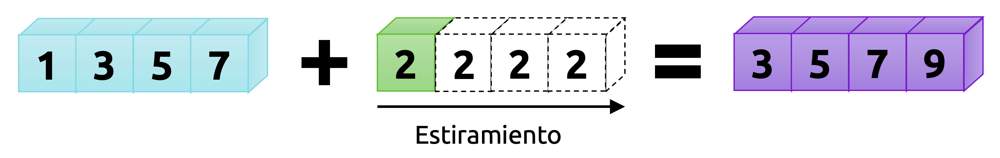
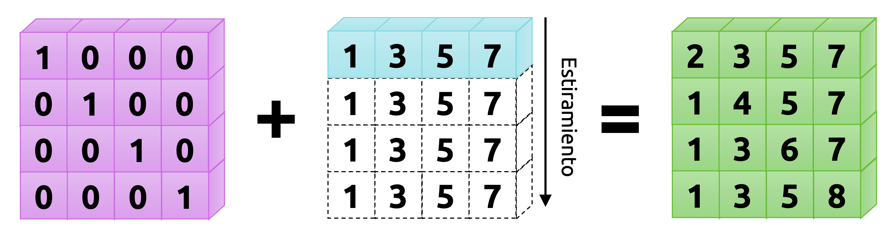
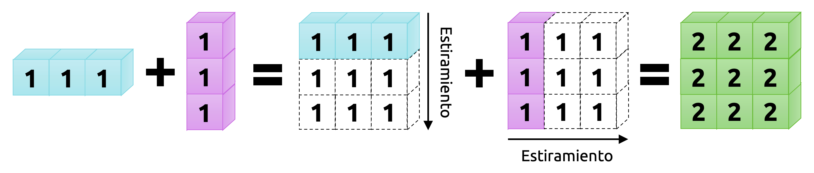

::: {.callout-important}
## Idea central

En este apunte estudiaremos dos ideas estrechamente conectadas entre sí. La primera es el **broadcasting**, que permite a **<font color='darkmagenta'>Numpy</font>** operar con arreglos de distinta geometría sin necesidad de que construyamos manualmente copias compatibles de ellos. La segunda es el conjunto de **operaciones de agregación**, que resume información a lo largo de uno o más ejes de un arreglo. Juntas, estas dos ideas forman una parte esencial de la programación numérica moderna: una nos permite **extender** cálculos vectorizados sobre estructuras de distinta forma, y la otra nos permite **resumir** esos resultados de manera eficiente y controlada.
:::

## El concepto de *broadcasting*

El término **broadcasting** hace referencia al mecanismo mediante el cual **<font color='darkmagenta'>Numpy</font>** puede operar con arreglos cuyas geometrías no coinciden exactamente, siempre que la operación involucrada sea componente a componente, como ocurre con muchas de las operaciones algebraicas revisadas en [el apunte anterior](/clases/data-analytics/introduccion-al-analisis-de-datos-en-python/computacion-vectorizada-y-arreglos-con-numpy/operatoria-en-numpy/).

En términos sencillos, cuando intentamos combinar dos arreglos y sus dimensiones no empatan, **<font color='darkmagenta'>Numpy</font>** no exige inmediatamente que construyamos a mano versiones compatibles de ellos. En lugar de eso, intenta **alinear** sus dimensiones y **extender** sólo aquellas que son compatibles conforme un conjunto preciso de reglas. Esto es justamente lo que permite escribir cálculos vectorizados de manera compacta, sin recurrir a bucles explícitos ni a copias manuales de datos.

En términos un poco más rigurosos, el broadcasting provee a **<font color='darkmagenta'>Numpy</font>** de un medio para realizar operaciones vectorizadas sin necesidad de expandir materialmente los arreglos en memoria. Por esa razón, muchas operaciones que conceptualmente podrían entenderse como repeticiones o *copias virtuales* de datos se ejecutan internamente de manera eficiente, aprovechando rutinas implementadas a bajo nivel.

Como ya comentamos en [el apunte anterior](/clases/data-analytics/introduccion-al-analisis-de-datos-en-python/computacion-vectorizada-y-arreglos-con-numpy/operatoria-en-numpy/), las operaciones algebraicas usuales en **<font color='darkmagenta'>Numpy</font>** trabajan componente a componente. Por lo tanto, el caso ideal es aquel en que ambos arreglos tienen exactamente la misma geometría. El broadcasting flexibiliza este requerimiento y permite que la operación siga teniendo sentido aun cuando las formas no sean idénticas, siempre que cumplan ciertas condiciones.

Partamos con el caso más simple: Sumar un arreglo y un escalar.

```{python}
import numpy as np
```

```{python}
# Definimos el arreglo a y el escalar b.
a = np.array([1.0, 3.0, 5.0, 7.0])
b = 2.0
```

```{python}
# Sumamos a + b.
a + b
```

Notemos que, si en vez de escribir `b = 2.0` escribimos `b = np.array([2.0, 2.0, 2.0, 2.0])`, la suma `a + b` entrega exactamente el mismo resultado:

```{python}
# Redefinimos b.
b = np.array([2.0, 2.0, 2.0, 2.0])

# Sumamos a + b otra vez.
a + b
```

Podemos pensar entonces que el escalar `b = 2.0`, en el primero de los bloques anteriores, se **extiende virtualmente** a lo largo del eje 0 para empatar la geometría del arreglo `a`. Los nuevos elementos en `b`, como se ilustra en la @fig-broadcasting1dx0d, serían copias del escalar original. Naturalmente, esta imagen es sólo una analogía pedagógica: **<font color='darkmagenta'>Numpy</font>** no necesita construir explícitamente ese nuevo arreglo para realizar la operación, y justamente ahí radica parte de la eficiencia del mecanismo.

{#fig-broadcasting1dx0d fig-align="center" width="100%"}

El caso anterior es el más sencillo de todos. Sin embargo, el broadcasting aparece también cuando operamos con arreglos de distinta dimensión. Consideremos ahora un arreglo bidimensional `M`:

```{python}
# Arreglo diagonal reducido M, de geometría (4, 4), indexado en la posición 0.
M = np.eye(N=4, M=4, k=0)
M
```

Observemos los resultados de operar con el arreglo `M` y el arreglo `a`:

```{python}
# Suma de un arreglo bidimensional con uno unidimensional.
M + a
```

Vemos entonces que el arreglo unidimensional `a` se alinea con la última dimensión de `M` y se extiende virtualmente a lo largo del eje 0, de manera tal que la operación `M + a` tenga sentido. Nuevamente, esto no corresponde a una copia real del arreglo, sino a una forma útil de imaginar lo que **<font color='darkmagenta'>Numpy</font>** hace internamente.

{#fig-broadcasting2dx1d fig-align="center" width="100%"}

Los casos anteriores son fáciles de visualizar. Sin embargo, el broadcasting puede involucrar situaciones más generales. Consideremos, por ejemplo, el siguiente caso:

```{python}
# Definimos dos arreglos que representan una matriz fila y una matriz columna.
u = np.ones(shape=(1, 3))
v = np.ones(shape=(3, 1))
```

```{python}
# Mostramos estos arreglos en pantalla.
print(u)
print(v)
```

```{python}
# Calculamos la suma u + v.
u + v
```

Tal y como ocurrió en los ejemplos anteriores, ahora ambos arreglos se extienden virtualmente en direcciones distintas para generar una geometría común. En este caso, el resultado es un arreglo de geometría `(3, 3)`. La intuición es clara: `u` se replica hacia abajo y `v` hacia la derecha, aunque, nuevamente, esta descripción debe entenderse como una imagen conceptual y no como una copia literal de datos en memoria.

{#fig-broadcastinggen fig-align="center" width="100%"}

## Reglas de broadcasting

Cuando operamos sobre dos arreglos, **<font color='darkmagenta'>Numpy</font>** compara sus geometrías **dimensión a dimensión, de derecha a izquierda**. En un arreglo bidimensional, por ejemplo, eso significa que primero compara el número de columnas y luego el número de filas.

La regla de compatibilidad es muy simple: Dos dimensiones son **compatibles** si

1. Son iguales, o
2. Una de ellas es igual a 1.

Si ninguna de estas condiciones se cumple, la operación no puede realizarse y **<font color='darkmagenta'>Numpy</font>** levantará un error de valor.

Más que memorizar una lista larga de reglas, conviene pensar el broadcasting como un procedimiento mental de tres pasos:

1. **Igualar el número de dimensiones:**  
   Si uno de los arreglos tiene menos dimensiones que el otro, imaginamos que a su geometría se le agregan unos a la izquierda hasta empatar el número de dimensiones del arreglo mayor.

2. **Comparar de derecha a izquierda:**  
   Una vez alineadas las dimensiones, comparamos cada par de tamaños empezando por el extremo derecho.

3. **Extender sólo las dimensiones compatibles:**  
   Si una dimensión vale `1` y la otra no, la dimensión igual a `1` puede extenderse virtualmente para empatar. Si ambas son iguales, no hay problema. Si ninguna vale `1` y tampoco coinciden, la operación falla.

Para clarificar estas ideas, consideremos algunos ejemplos.

**Ejemplo 3.1:** Definamos dos arreglos, uno bidimensional y otro unidimensional:

```{python}
M = np.ones((2, 3))
a = np.arange(3)
```

Ahora consideremos una operación sobre estos arreglos. Las geometrías de éstos son:

```{python}
M.shape
```

```{python}
a.shape
```

Vemos que el arreglo `a` tiene menos dimensiones, por lo que lo imaginamos como si su forma fuera `(1, 3)`:

- `M.shape -> (2, 3)`
- `a.shape -> (1, 3)`

Comparamos luego de derecha a izquierda:

- última dimensión: `3` y `3`, compatibles;
- primera dimensión: `2` y `1`, compatibles.

Por lo tanto, `a` puede extenderse virtualmente en su primera dimensión y la operación binaria tendrá como resultado un arreglo de geometría `(2, 3)`:

```{python}
M + a
```

◼︎

**Ejemplo 3.2:** Consideremos ahora un caso donde ambos arreglos deben pasar por broadcasting:

```{python}
a = np.arange(3).reshape((3, 1))
b = np.arange(3)
```

Las formas originales de estos arreglos son:

- `a.shape = (3, 1)`.
- `b.shape = (3,)`.

Como `b` tiene menos dimensiones, lo reinterpretamos como un arreglo con forma `(1, 3)`:

- `a.shape = (3, 1)`.
- `b.shape = (1, 3)`.

Ahora comparamos de derecha a izquierda:

- Última dimensión: `1` y `3`, compatibles.
- Primera dimensión: `3` y `1`, compatibles.

Por lo tanto, ambos arreglos pueden extenderse virtualmente y la operación resultante tendrá forma `(3, 3)`:

```{python}
a + b
```

◼︎

**Ejemplo 3.3:** Consideremos ahora un caso en que ambos arreglos son incompatibles:

```{python}
M = np.ones((3, 2))
a = np.arange(3)
```

Las geometrías de los arreglos son las siguientes:

- `M.shape = (3, 2)`.
- `a.shape = (3,)`.

Como `a` tiene una dimensión menos, lo reinterpretamos como un arreglo de forma `(1, 3)`:

- `M.shape = (3, 2)`.
- `a.shape = (1, 3)`.

Comparamos ahora de derecha a izquierda:

- Última dimensión: `2` y `3`, **incompatibles**.

Como ninguna de estas dimensiones vale 1 y tampoco coinciden, la operación falla inmediatamente. Por lo tanto, si operamos sobre estos arreglos, obtendremos un error de valor:

```{python}
try:
    M + a
except ValueError as e:
    print(e)
```

Las reglas de broadcasting constituyen una de las ideas más importantes de **<font color='darkmagenta'>Numpy</font>**. Gran parte del trabajo numérico eficiente en Python depende de entenderlas bien y de reconocer cuándo pueden ser aprovechadas para escribir código más compacto y más expresivo. ◼︎

**Ejemplo 3.4 – Visualización de una función de dos variables:** Vamos a graficar la función $f$ definida como

::: {.eq-scroll}
$$
f\left( x,y \right)  =\mathrm{a} \mathrm{r} \mathrm{c} \mathrm{s} \mathrm{e} \mathrm{n} \mathrm{h} \left( x^{2}+y^{2}\right)
\tag{3.1}
$$
:::

en el conjunto $\Omega =\left\{ \left( x,y\right)  \in \mathbb{R}^{2} :-1\leq x\leq 1\  ;-1\leq y\leq 1\right\}$. Para ello, definiremos dos arreglos que representarán los bordes del conjunto $\Omega$, los que llamaremos `X` e `Y`:

```{python}
# Definimos los arreglos x e y.
X = np.linspace(-1, 1, 100).reshape(-1, 1)
Y = np.linspace(-1, 1, 100).reshape(1, -1)
```

Aprovechando las reglas de broadcasting, podemos calcular los valores de la función $f$ en el interior de la grilla rectangular $\Omega$ de manera muy simple:

```{python}
# Calculamos la función f(x, y) en toda la grilla.
Z = np.arcsinh(X**2 + Y**2)

# Vemos que el arreglo Z es bidimensional gracias al broadcasting.
Z.shape
```

Para graficar, usaremos la librería **<font color='darkmagenta'>Matplotlib</font>**. No es necesario, por el momento, ahondar en los detalles del siguiente código para generar el gráfico, pero sí es bueno observar que el broadcasting nos permitió construir la grilla de evaluación sin necesidad de usar bucles explícitos:

```{python}
import matplotlib.pyplot as plt
```

```{python}
# Algunos ajustes para que nuestras figuras queden bien bonitas.
plt.rcParams["figure.dpi"] = 90
plt.style.use("bmh")
```

```{python}
# Gráfico de nuestra función.
fig, ax = plt.subplots(figsize=(9, 6))
p = ax.imshow(Z, origin="lower", cmap="cool")
ax.set_title(r"Gráfico de la función $f(x, y)$", fontsize=14, fontweight="bold", pad=10)
ax.set_xlabel(r"$x$", labelpad=10, fontsize=14)
ax.set_ylabel(r"$y$", labelpad=15, fontsize=14, rotation=0)
ax.grid(False)
cb = fig.colorbar(p)
plt.tight_layout()
```

◼︎

**Ejemplo 3.5 – Estandarización de un conjunto de datos:** Un error muy común al construir modelos estadísticos o de regresión guarda relación con la no consideración de las unidades de medición inherentes a los atributos que son representados por los datos. Por ejemplo, en una planta concentradora, podríamos estudiar la relación entre tratamiento de molienda, presión de alimentación a la batería de hidrociclones y tamaño de producto en la salida del circuito de molienda. Estas variables viven en escalas muy distintas entre sí.

En general, el tratamiento de molienda puede expresarse en toneladas por hora; la presión de hidrociclones, en psi; y el tamaño de producto, como porcentaje retenido en una determinada malla. Estas magnitudes son muy diferentes, y por ello suele ser conveniente **estandarizar** las variables antes de aplicar ciertos modelos.

Una transformación muy común corresponde a la **estandarización tipo z-score**. Si un conjunto de datos tiene un total de $N$ observaciones (filas) y $D$ atributos o variables (columnas), entonces cada variable $X_{j}$ (para $1\leq j\leq D$) puede transformarse como

::: {.eq-scroll}
$$
Z_{j}={\displaystyle \frac{X_{j}-\bar{X}_{j} }{s_{j}}}
\tag{3.2}
$$
:::

donde $\bar{X}_{j}$ es la media de todas las observaciones relativas a la variable $X_{j}$ y $s_{j}$ su desviación estándar ($j=1,...,D$).

Es importante notar que esta transformación **no garantiza** que la variable resultante tenga distribución normal. Lo que sí garantiza, en condiciones ideales de cálculo, es que la nueva variable tenga media 0 y desviación estándar 1.

En **<font color='darkmagenta'>Numpy</font>**, estandarizar un conjunto de datos representado por un arreglo es sencillo gracias a las reglas de broadcasting. Supongamos que el arreglo `T` contiene información de una prueba de laboratorio realizada sobre 10 muestras de mineral en un circuito de molienda, de manera tal que la primera columna representa el tratamiento de molienda, la segunda columna representa la presión de alimentación a la batería de hidrociclones, y la tercera columna representa el porcentaje de mineral retenido con respecto a la malla #100:

```{python}
# Definimos las variables que poblarán nuestro arreglo por separado.
t = np.array([1280.98, 1871.11, 1556.39, 1291.01, 1335.52, 1610.04, 1892.44, 1042.19, 1123.21, 1902.11])  # Tratamiento.
p = np.array([6.5, 5.6, 8.6, 8.8, 9.0, 5.8, 7.7, 7.0, 6.5, 6.4])  # Presiones.
g = np.array([24.1, 21.3, 20.6, 22.3, 18.9, 19.9, 21.2, 19.0, 20.9, 24.5])  # Tamaños de producto.
```

```{python}
# Concatenamos toda esta información en un único arreglo.
T = np.vstack([t, p, g]).T
print(T)
```

Para aplicar la transformación previamente definida, calculamos la media y la desviación estándar por columnas. Estas operaciones son ejemplos de lo que, en **<font color='darkmagenta'>Numpy</font>**, se conoce como operaciones de agregación, pues resumen información a lo largo de un eje determinado. Como la estandarización se realiza columna a columna, ambos cálculos deben efectuarse conforme el eje 0:

```{python}
# Estandarización por columnas.
Z = (T - T.mean(axis=0)) / T.std(axis=0)
print(Z)
```

Nuestro arreglo `Z` estandarizado tiene media aproximadamente nula y desviación estándar unitaria. En efecto,

```{python}
# Media del arreglo Z: aproximadamente nula.
Z.mean(axis=0)
```

```{python}
# Desviación estándar del arreglo Z: unitaria.
Z.std(axis=0)
```

Este ejemplo es muy importante porque muestra una de las grandes virtudes del broadcasting: nos permite aplicar una operación columna a columna sobre todo un arreglo sin necesidad de iterar manualmente sobre cada variable. ◼︎

## Operaciones de agregación

Los ejemplos que hemos visto hasta ahora han involucrado arreglos relativamente pequeños. Sin embargo, las ideas revisadas aplican igualmente a arreglos de gran tamaño. En particular, muchas operaciones en **<font color='darkmagenta'>Numpy</font>** pueden realizarse conforme un cierto eje del arreglo por medio del argumento `axis`, obteniendo resultados agregados por filas, columnas, sub-arreglos, etc. Toda operación que resume información a lo largo de un eje se denomina **operación de agregación**.

Veremos algunos ejemplos de este tipo de operaciones.

**Ejemplo 3.6 – Sumas y productos agregados:** Los métodos `sum()` y `prod()` permiten sumar o multiplicar elementos de un arreglo. Cuando los aplicamos sin argumentos, el resultado considera a todos los elementos del arreglo. Pero también podemos utilizarlos para obtener sumas o productos conforme un determinado eje:

```{python}
# Definición de un arreglo bidimensional `A`.
rng = np.random.default_rng(8)
A = rng.integers(low=1, high=10, size=(5, 10))

# Mostramos este arreglo en pantalla.
print(A)
```

```{python}
# Suma por filas.
A.sum(axis=1)
```

```{python}
# Suma por columnas.
A.sum(axis=0)
```

```{python}
# Producto por filas.
A.prod(axis=1)
```

```{python}
# Producto por columnas.
A.prod(axis=0)
```

◼︎

**Ejemplo 3.7 – Sumas acumuladas en arreglos:** Una operación muy utilizada en análisis de datos corresponde a la suma acumulada de valores a lo largo de una secuencia. En **<font color='darkmagenta'>Numpy</font>**, esto puede conseguirse fácilmente mediante el método `cumsum()`, el cual también es una operación de agregación:

```{python}
# Suma acumulada en la dirección de las filas (eje 1).
A.cumsum(axis=1)
```

```{python}
# Suma acumulada en la dirección de las columnas (eje 0).
A.cumsum(axis=0)
```

◼︎

**Ejemplo 3.8 – Media y desviación estándar:** En el ejemplo previo de estandarización ya revisamos cómo calcular medias y desviaciones estándar de manera agregada, pero conviene explicitarlo nuevamente:

```{python}
# Media por filas.
A.mean(axis=1)
```

```{python}
# Desviación estándar por columnas.
A.std(axis=0)
```

```{python}
# Coeficiente de variación por columnas.
A.std(axis=0) / A.mean(axis=0)
```

◼︎

**Ejemplo 3.9 – Valores máximos y mínimos:** Otra operación muy utilizada en análisis de datos corresponde a la determinación de valores máximos y mínimos en un arreglo, ya sea a nivel global o conforme un eje. Las funciones que permiten determinar estos valores son `np.max()` y `np.min()`, respectivamente:

```{python}
# Valor máximo por columnas.
A.max(axis=0)
```

```{python}
# Valor mínimo por filas.
A.min(axis=1)
```

Con frecuencia, además, nos interesa conocer las posiciones relativas de dichos valores. Para ello, podemos usar las funciones `np.argmax()` y `np.argmin()`, que también permiten obtener resultados agregados:

```{python}
# Posiciones asociadas al elemento que es el máximo valor por columnas de A.
A.argmax(axis=0)
```

```{python}
# Posiciones asociadas al elemento que es el mínimo valor por filas de A.
A.argmin(axis=1)
```

**<font color='darkmagenta'>Numpy</font>** nos provee de muchas otras funciones de agregación, aunque no las discutiremos en detalle aquí. Adicionalmente, la mayoría de estas funciones tiene versiones que permiten operar en arreglos que contengan `NaN`s, recordando que `np.nan` representa un valor no numérico.

Además, muchos de los métodos revisados en esta sección tienen su versión como `ufunc`. Algunos ejemplos se observan en la @tbl-aggfuncs.

: Algunas funciones de agregación en **<font color='darkmagenta'>Numpy</font>** {#tbl-aggfuncs}

| Función         | Versión a prueba de `nan` | Descripción                                                  |
| --------------- | ------------------------- | ------------------------------------------------------------ |
| `np.sum()`      | `np.nansum()`             | Calcula la suma de los elementos respectivos.                |
| `np.prod()`     | `np.nanprod()`            | Calcula el producto de los elementos respectivos.            |
| `np.mean()`     | `np.nanmean()`            | Calcula la media de los elementos respectivos.               |
| `np.std()`      | `np.nanstd()`             | Calcula la desviación estándar de los elementos respectivos. |
| `np.var()`      | `np.nanvar()`             | Calcula la varianza de los elementos respectivos.            |
| `np.min()`      | `np.nanmin()`             | Halla el valor mínimo.                                       |
| `np.max()`      | `np.nanmax()`             | Halla el valor máximo.                                       |
| `np.argmin()`   | `np.nanargmin()`          | Halla la posición del valor mínimo.                          |
| `np.argmax()`   | `np.nanargmax()`          | Halla la posición del valor máximo.                          |
| `np.median()`   | `np.nanmedian()`          | Calcula la mediana de los elementos respectivos.             |

## Comentarios finales

En este apunte introdujimos dos ideas que resultan esenciales para trabajar cómodamente con arreglos en **<font color='darkmagenta'>Numpy</font>**. La primera fue el broadcasting, que nos permite extender cálculos componente a componente sobre arreglos de distinta geometría sin necesidad de construir manualmente copias compatibles. La segunda fue el estudio de varias operaciones de agregación, que permiten resumir información a lo largo de ejes específicos de un arreglo.

Conviene insistir en que el broadcasting no es sólo una curiosidad técnica, sino un verdadero principio de diseño dentro de **<font color='darkmagenta'>Numpy</font>**. Gracias a él, muchas operaciones que intuitivamente pensaríamos como repeticiones, empates de forma o expansiones de arreglos pueden escribirse con una sintaxis extremadamente compacta. Esto permite que el código sea más expresivo y, al mismo tiempo, más eficiente.

Por otro lado, las operaciones de agregación nos muestran que trabajar con arreglos no consiste únicamente en transformarlos, sino también en resumirlos. Calcular sumas, productos, medias, desviaciones estándar, máximos, mínimos o posiciones extremas conforme distintos ejes forma parte del vocabulario mínimo del análisis numérico y del análisis de datos en Python.

En conjunto, broadcasting y agregación comienzan a mostrar una idea más amplia: un arreglo no es solamente una estructura donde almacenamos números, sino una organización geométrica de datos sobre la cual podemos extender y resumir cálculos con enorme flexibilidad. Esa forma de pensar será decisiva en todo lo que sigue.

En el próximo apunte profundizaremos justamente en operaciones que dependen de esta intuición geométrica: Comparación entre arreglos, máscaras Booleanas, reemplazo de valores, *fancy indexing* y ordenamiento. Allí veremos cómo seleccionar, filtrar y reorganizar información de manera más fina, dando un paso adicional hacia el tipo de manipulación que aparece naturalmente en tareas reales de análisis de datos.