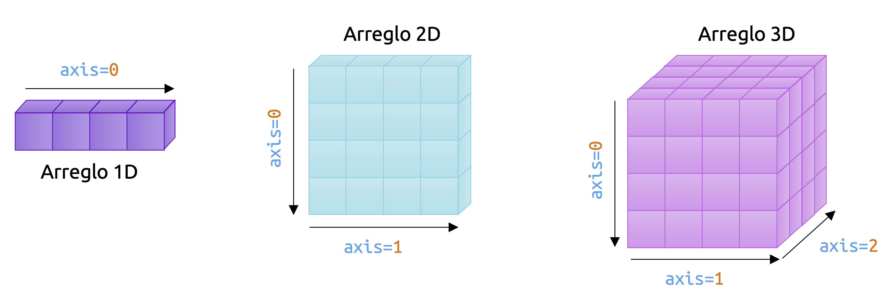
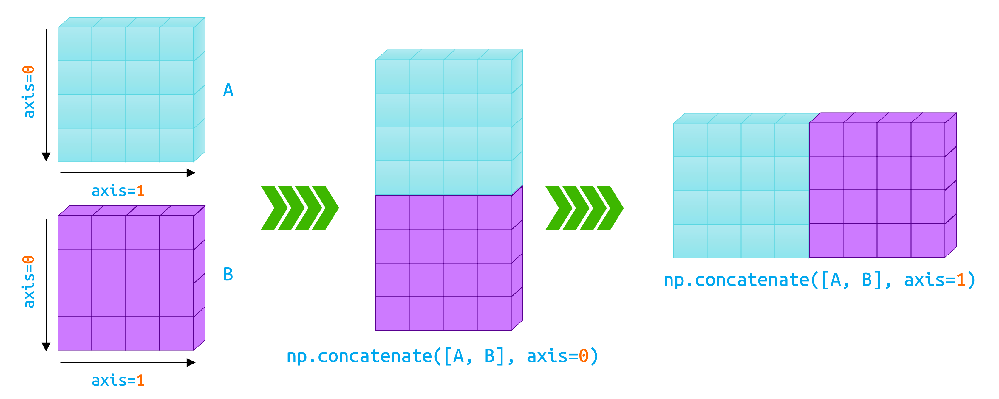
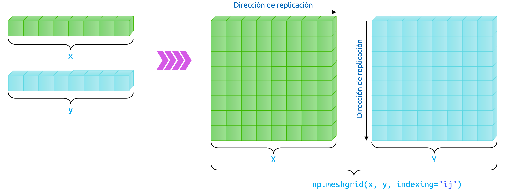
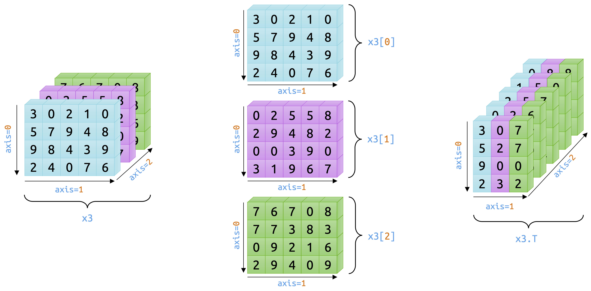

::: {.callout-important}
## Idea central

**<font color='darkmagenta'>Numpy</font>** introduce la estructura de datos fundamental del cómputo numérico en Python: El arreglo o `ndarray`. A través de este objeto, es posible representar vectores, matrices y tensores de manera uniforme, realizar operaciones vectorizadas con gran eficiencia y construir la base sobre la cual descansan muchas de las librerías más importantes de ciencia de datos, computación científica y *machine learning*. En este apunte nos concentraremos en comprender qué es un arreglo, cómo se interpreta geométricamente y qué rutinas básicas ofrece **<font color='darkmagenta'>Numpy</font>** para construirlo y manipularlo.
:::

## ¿Qué es <font color='darkmagenta'>Numpy</font>?

**<font color='darkmagenta'>Numpy</font>** (acrónimo de *Numerical Python*) es una librería de código abierto desarrollada en Python y que es comúnmente utilizada en prácticamente todos los campos de la computación científica y la ingeniería, siendo el estándar *casi* universal para el análisis eficiente de datos numéricos en Python y el pilar fundamental de un montón de otras librerías científicas de gran poder, aptas para tareas tan diversas, que todo ser humano que desee realizar análisis de datos mediante el uso del lenguaje Python debiera, como paso cero (y en mi humilde opinión), tener esta librería como primera opción dentro de su caja de herramientas.

La librería **<font color='darkmagenta'>Numpy</font>** es utilizada extensivamente como base para otras librerías famosas y de uso masivo en Python, tales como **<font color='darkmagenta'>Pandas</font>** (especializada en el análisis de datos tabulares), **<font color='darkmagenta'>Matplotlib</font>** (especializada en la graficación y reportabilidad mediante una API de bajo nivel, pero sencilla y muy robusta), **<font color='darkmagenta'>Scipy</font>** (la librería científica de Python, especializada en el modelamiento analítico de fenómenos, procesos y sistemas de gran complejidad), **<font color='darkmagenta'>Scikit-Learn</font>** (la librería clásica para implementar modelos de *machine learning* de Python) o **<font color='darkmagenta'>PyTorch</font>** (una de las librerías de Deep Learning más utilizadas en el mercado, con foco en el uso de tensores y a la explotación de sus propiedades geométricas y algebraicas). Por esta razón, **<font color='darkmagenta'>Numpy</font>** suele representar el primer acercamiento de los usuarios interesados en aprender tópicos de ciencia de datos desde una perspectiva práctica y es esencial en cualquier asignatura relativa a la toma de decisiones basadas en datos usando el lenguaje de programación Python.

El elemento central de **<font color='darkmagenta'>Numpy</font>** es una estructura de datos conocida como **arreglo** y que, en términos *pythonicos*, se corresponde con un objeto denominado como `ndarray`. Dicho nombre hace referencia, literalmente, a un *arreglo* de valores (no necesariamente numéricos) de dimensión ${n\times d}$, que suele ser imaginado como una estructura de datos de tipo matricial, que, idealmente, vive en el conjunto $\mathbb{R}^{n\times d}$ (que representa al conjunto de todas las matrices con ${n}$ filas y ${d}$ columnas). Sin embargo, **<font color='darkmagenta'>Numpy</font>** no suele limitarse a arreglos matriciales, sino que a cualquier conjunto de elementos que puedan ser utilizados para operaciones vectorizadas, lo que incluye por supuesto a objetos de mayor dimensión, como tensores, y a otros de menor dimensión, como vectores, e incluso escalares. Todas estas estructuras de datos se representan en **<font color='darkmagenta'>Numpy</font>** mediante el objeto `ndarray`.

Dado lo anterior, **<font color='darkmagenta'>Numpy</font>** provee soporte para todo tipo de operaciones vectorizadas que son típicas en el álgebra matricial y tensorial, desde sumas y productos de matrices, hasta descomposiciones en valores singulares, factorizaciones matriciales de diversa índole e incluso procedimientos de ortogonalización y normalización de estructuras numéricas que puedan disponerse en un arreglo. Lo mejor de todo esto, es que tales operaciones se realizan en **<font color='darkmagenta'>Numpy</font>** con un alto grado de eficiencia en lo que respecta al tiempo de ejecución, lo que siempre es bienvenido cuando la escala de los problemas que queremos resolver comienza a crecer.

**<font color='darkmagenta'>Numpy</font>** suele incluirse como librería base en diversos *frameworks* de Python, como [Anaconda](https://www.anaconda.com/). Sin embargo, siempre es posible instalar esta librería de manera independiente utilizando el gestor de paquetes de Python, llamado `pip`, usando nuestra terminal por medio de la instrucción:

```bash
pip install numpy
```

La importación de la librería **<font color='darkmagenta'>Numpy</font>** en Python suele seguir un estándar de nomenclatura (no mandatoria) conforme el *alias* utilizado *universalmente* para su uso. Dicho *alias* es `np`, por lo que, en general, accederemos a todas sus funciones y objetos como sigue:

```{python}
import numpy as np
```

## El concepto de arreglo

Ya habíamos comentado que los *arreglos* son estructuras de datos que permiten la realización de operaciones vectorizadas sobre ellos, pero es justo que ahondemos un poco más en estos objetos y los conozcamos a fondo, simbólicamente, antes de comenzar a hacer operaciones con ellos.

Como ya dijimos, el arreglo es el elemento central de **<font color='darkmagenta'>Numpy</font>**. Corresponde a una grilla de valores que viene provista con la correspondiente información relativa a los datos almacenados en dicha grilla, y formas que permiten localizar dicha información en la grilla y cómo interpretar tal información. La única restricción es que el arreglo **sólo puede contener datos de un único tipo**. O todos son *strings*, o todos son de *punto flotante*. No se permiten *mezclas* de ningún tipo.

Un ejemplo de arreglo es el *vector*. En términos más bien rigurosos, un vector es un arreglo *unidimensional*, en el sentido de que, si bien un vector es un objeto cuya dimensión, matemáticamente, es equivalente al número de elementos que lo constituyen, en términos geométricos, tales elementos se ordenan en una única fila o columna, razón por la cual, en la terminología computacional, los vectores constituyen arreglos de una sola dimensión.

Vamos a ejemplificar esto e ilustrarlo para que podamos entenderlo mejor. En **<font color='darkmagenta'>Numpy</font>**, la creación de un arreglo puede hacerse siempre mediante la función `np.array()` (o simplemente `array()`, si nos abstraemos de usar el correspondiente alias `np`). Si queremos escribir el vector $\mathbf{x} =( -1,1,5,-8,2)  \in \mathbb{R}^{5}$, es posible considerar una representación mediante una matriz fila o una matriz columna, ya que, equivalentemente, podemos escribir $\mathbf{x}$ simbólicamente como

::: {.eq-scroll}
$$
\mathbf{x} =\left( \begin{matrix}-1&1&5&-8&2\end{matrix} \right)  \in \mathbb{R}^{1\times 5} \  \vee \  \mathbf{x} =\left( \begin{array}{r}-1\\ 1\\ 5\\ -8\\ 2\end{array} \right)  \in \mathbb{R}^{5\times 1}
\tag{1.1}
$$
:::

En **<font color='darkmagenta'>Numpy</font>**, todo arreglo puede escribirse considerando que, en términos matriciales, las filas se definen como listas de Python. Si queremos escribir una matriz con $n$ filas, bastará siempre con especificar un total de $n$ listas separadas por comas, donde el número de elementos dentro de cada lista (que es el mismo, por supuesto, para todas ellas) define el número de columnas de la matriz, usando la función `np.array()`.

Como queremos representar, en este caso, al vector 𝐱 definido previamente, debemos considerar el tipo de representación: Si $\mathbf{x}$ se representa por medio de una matriz fila (es decir, $\mathbf{x} \in \mathbb{R}^{1\times 5}$), bastará con escribir, conforme el esquema anteriormente descrito:

```{python}
# Definimos el arreglo x.
x = np.array([-1, 1, 5, -8, 2])

# Imprimimos en pantalla el valor de x.
print(x)
```

Por otro lado, si queremos escribir $\mathbf{x}$ como un vector columna, entonces cada una de las entradas de $\mathbf{x}$ debe ser una lista por sí sola, ya que, como dijimos, cada fila de un arreglo se especifica mediante listas, separadas por comas. Por lo tanto, si $\mathbf{x} \in \mathbb{R}^{5\times 1}$, entonces imputaremos 5 listas separadas por comas. De este modo, debemos tener:

```{python}
# Definimos el arreglo x.
x = np.array([[-1], [1], [5], [-8], [2]])

# Imprimimos en pantalla el valor de x.
print(x)
```

Extender esta idea a matrices resulta, por supuesto, natural. Consideremos entonces la matriz $\mathbf{A} \in \mathbb{R}^{4\times 4}$, definida como

::: {.eq-scroll}
$$
\mathbf{A} =\left( \begin{array}{rrrr}-2&1&-7&6\\ 1&3&1&-4\\ -5&-5&0&4\\ -9&2&-8&9\end{array} \right)  \in \mathbb{R}^{4\times 4}
\tag{1.2}
$$
:::

Construir una estructura de este tipo en **<font color='darkmagenta'>Numpy</font>** resulta muy sencillo. Como comentamos previamente, usamos la función `np.array()` para la generación de este arreglo, definiendo cada una de las filas mediante listas y separándolas mediante comas. Por lo tanto, para el caso de la matriz $\mathbf{A}$, bastará con escribir:

```{python}
# Definimos la matriz A.
A = np.array([
    [-2, 1, -7, 6],
    [1, 3, 1, -4],
    [-5, -5, 0, 4],
    [-9, 2, -8, 9]
])

# Imprimimos en pantalla el valor de A.
print(A)
```

Como vemos, construir matrices con **<font color='darkmagenta'>Numpy</font>** resulta sencillo y, sobretodo, natural, debido principalmente al estándar de imputación de los elementos que componen un arreglo conforme la función `np.array()`. Las matrices, desde una perspectiva geométrica, corresponden a arreglos bidimensionales, en el sentido de que su morfología queda completamente determinada por dos parámetros, que son, correspondientemente, el número de filas y columnas que caracterizan al arreglo. Por lo tanto, la matriz `A` que construimos previamente, es un arreglo bidimensional con geometría o forma `(4, 4)`, debido a que ésta posee 4 filas y 4 columnas.

**<font color='darkmagenta'>Numpy</font>**, como ya comentamos en un principio, no se limita a vectores y matrices. También es posible construir estructuras más generales, como es el caso de los tensores. Al igual que las matrices, los tensores son objetos algebraicos que describen relaciones lineales entre otros objetos que, a su vez, son elementos de determinados espacios vectoriales. Tales elementos pueden ser vectores, matrices e incluso otros tensores. En términos geométricos, los tensores de orden $3$ suelen representarse en **<font color='darkmagenta'>Numpy</font>** como arreglos tridimensionales, debido a que un tensor de ese tipo puede imaginarse como un conjunto de matrices de la misma dimensión apiladas unas encima de las otras. De este modo, los tres parámetros que definen la geometría del tensor corresponden al número de filas, número de columnas y número de apilamientos, respectivamente.

Un ejemplo de tensor de orden $3$ en **<font color='darkmagenta'>Numpy</font>** es el siguiente:

```{python}
# Definimos el tensor T.
T = np.array([
    [
        [2, -1, -1, 4, -5],
        [0, -3, 3, -2, -7],
        [-1, 1, 6, -9, 1],
        [-8, -8, 1, -1, 6],
    ],
    [
        [5, -5, 1, -1, 3],
        [-4, 9, 8, 1, 0],
        [0, -1, -5, -7, 2],
        [5, -7, -6, -8, 1],
    ],
    [
        [2, -2, 5, 1, 0],
        [3, -3, -4, 1, 0],
        [-2, -8, -1, 0, 5],
        [-8, 1, -5, 0, 6],
    ],
])

# Imprimimos en pantalla el valor de T.
print(T)
```

Vemos pues que el tensor `T` tiene un total de tres dimensiones morfológicas (tensor de orden 3). La primera especifica el sub-arreglo de interés; la segunda, la fila de dicho sub-arreglo; y la tercera, la columna de dicho sub-arreglo. Ya ahondaremos más en la selección de elementos en un arreglo de **<font color='darkmagenta'>Numpy</font>**. Pero vale la pena mencionar que, bajo esta convención, el elemento en la posición `[2, 1, 2]` del tensor `T` sería el número -4. Considerando que Python siempre cuenta a partir de la posición 0, vemos que el sub-arreglo en la posición 2 (el último) tiene, en la posición `[1, 2]`, al elemento -4. En un lenguaje más algebraico, este tensor podría especificarse como $\mathbf{T} =\left\{ t_{ijk}\right\}  \in \mathbb{R}^{4\times 5\times 3}$, y el elemento previamente señalado sería $t_{212}=-4$.

La @fig-arraygeom esquematiza el concepto de arreglo en términos geométricos, conforme lo que hemos revisado hasta ahora.

{#fig-arraygeom fig-align="center" width="100%"}

## Geometría de un arreglo

Observemos que, en el esquema de la @fig-arraygeom, hemos dibujado flechas a modo de ejes geométricos que definen las posiciones en los distintos tipos de arreglos según su dimensión. Tales ejes corresponden a una referencia universal utilizada por **<font color='darkmagenta'>Numpy</font>** para especificar la posición de un elemento dentro de un arreglo, y en primera instancia suele ser un tanto confusa, por lo que vale la pena discutirla brevemente.

Partamos siendo honestos: Los ejes referenciales de los arreglos de **<font color='darkmagenta'>Numpy</font>** pueden ser difíciles de entender. De hecho, su conocimiento adecuado puede volverse un verdadero dolor de cabeza para cualquier entusiasta novato en análisis o ciencia de datos. Sin embargo, son importantes para poder caracterizar cualquier estructura de datos en **<font color='darkmagenta'>Numpy</font>**. Así que, para familiarizarnos con ellos, comenzaremos ejemplificando su uso en un arreglo bidimensional, que suele ser el caso más sencillo de entender.

En un arreglo bidimensional, que es el símil de una matriz, digamos de 𝑛 filas y 𝑑 columnas, los ejes corresponden a las direcciones que definen las filas y columnas del arreglo. Conforme la Fig. (1.1), el eje 0 (que, en **<font color='darkmagenta'>Numpy</font>** se especifica como `axis=0`) corresponde a la dirección a lo largo de las filas del arreglo, y a su vez es el primer eje en este sistema de referencia. Por otro lado, el eje 1 (que, en **<font color='darkmagenta'>Numpy</font>** se especifica como `axis=1`) corresponde a la dirección a lo largo de las columnas de un arreglo. Estos ejes permiten especificar cómo operar con los elementos del arreglo cuando estamos interesados en construir agregaciones. Veremos esto en detalle más adelante, pero las agregaciones son operaciones que involucran el uso de los elementos a lo largo de estos ejes, como podrían ser sumas de los elementos situados en una determinada fila o columna. Tomemos, por ejemplo, el arreglo `A`, que construimos unas líneas más atrás. La operación `A.sum(axis=1)` nos permite obtener la suma de todos los elementos de cada fila del arreglo `A`, ya que el argumento `axis=1` utilizado para el método `sum()` indica a **<font color='darkmagenta'>Numpy</font>** que la suma se realice a lo largo (o en la dirección) del eje 1. Y, si bien el eje 1 recorre todas las columnas de un arreglo 2D (y permite identificar cuantas columnas tiene nuestro arreglo), ello implica que, al mismo tiempo, dicho recorrido se hace por las filas del mismo. De esta manera, al escribir:

```{python}
# Suma a lo largo del eje 1 (es decir, por filas).
A.sum(axis=1)
```

obtenemos, en efecto, la suma de todas las filas de todo el arreglo `A`. Notemos que el resultado de esta operación es otro arreglo que contiene las sumas respectivas de cada fila. Esto es algo típico de **<font color='darkmagenta'>Numpy</font>**: *Toda operación con arreglos devuelve, como resultado, otro arreglo.*

Podemos obtener la suma de todas las columnas del arreglo `A` si usamos como argumento del método `sum()` la instrucción `axis=0`. De esta manera, le estamos diciendo a **<font color='darkmagenta'>Numpy</font>**: *“Suma todos los elementos conforme la dirección del eje 0”* (es decir, en la dirección de las columnas de `A`). Por lo tanto, tendremos que:

```{python}
# Suma a lo largo del eje 0 (es decir, por columnas).
A.sum(axis=0)
```

La lógica previa se preserva para cualquier operación de agregación en **<font color='darkmagenta'>Numpy</font>**. Veremos más adelante otro tipo de operaciones de este tipo. Sin embargo, es bueno tener en consideración que estas operaciones toman, literalmente, al argumento `axis` en su sentido geométrico. De este modo, podemos imaginar que la operación `A.sum(axis=0)` es pensada en **<font color='darkmagenta'>Numpy</font>** como: *“Sumar todos los elementos de `A`, como si hubiéramos apretado o colapsado el arreglo en la dirección del eje 0”*. No es la forma más didáctica de explicarlo, pero es como está pensado el funcionamiento de este tipo de operaciones en **<font color='darkmagenta'>Numpy</font>**.

No obstante lo anterior, las operaciones de agregación no son las únicas que podemos hacer en **<font color='darkmagenta'>Numpy</font>**. Existen otras operaciones que no son de este tipo y que también usan como argumento a axis. Un ejemplo típico es la unión (o concatenación) de arreglos, la cual se realiza mediante la función `np.concatenate()` (en verdad, también es posible generar uniones más eficientes mediante otro tipo de funciones, pero eso lo veremos más adelante). Para ejemplificar como funciona, definamos un nuevo arreglo `B` como sigue:

```{python}
# Construimos un arreglo B, de 2 filas y 4 columnas.
B = np.array([
    [-1, 4, 5, -8],
    [0, -5, 6, -9]
])

# Mostramos el arreglo en pantalla.
print(B)
```

Definido entonces `B`, podemos querer unir este arreglo con otro, digamos `A`. Para ello, debemos chequear primeramente la compatibilidad que tienen estos arreglos para poder construir dicha unión. Vemos pues que `A` es un arreglo con geometría `(4, 4)`, mientras que `B` tiene geometría `(2, 4)`. Por lo tanto, `A` y `B` tienen el mismo número de columnas y, de este modo, la única unión que podemos hacer entre ellos es conforme las columnas de ambos. Conforme el esquema de la @fig-arraygeom, tal unión se debe realizar conforme el eje 0. De esta manera, tenemos que:

```{python}
# Concatenamos `A` y `B` conforme el eje 0.
np.concatenate([A, B], axis=0)
```

Naturalmente, si quisiéramos unir arreglos en la dirección que toman las filas (es decir, conforme el eje 1), bastaría con escribir `np.concatenate([A, B], axis=1)`. Para ello, hace falta que los arreglos `A` y `B` tengan el mismo número de filas. Como este no es el caso, realizar esta operación generará que **<font color='darkmagenta'>Numpy</font>** nos levante una excepción:

```{python}
try:
    np.concatenate([A, B], axis=1)
except ValueError as e:
    print(e)
```

El mensaje de error es claro: Las dimensiones de ambos arreglos deben empatar de manera exacta para esta operación. Pero esto no se cumple para el caso de la unión, conforme el eje 1, en los arreglos `A` y `B`.

En la @fig-arrayconcat, se ilustra la operación de concatenación para el caso de arreglos bidimensionales totalmente compatibles.

{#fig-arrayconcat fig-align="center" width="100%"}

El asunto es un tanto diferente para el caso de arreglos unidimensionales. En este tipo de arreglos, existe únicamente un eje de referencia, que siempre es el eje 0. Sin embargo, la geometría de estos arreglos puede variar dependiendo de nuestras necesidades. Por ejemplo, consideremos el arreglo unidimensional `v`, definido como:

```{python}
# Definimos un arreglo 1D.
v = np.array([1, -1, 3, 6, -8])

# Imprimimos el arreglo en pantalla.
print(v)
```

Todos los arreglos en **<font color='darkmagenta'>Numpy</font>** cuentan con ciertos atributos, que ya veremos en detalle un poco más adelante. Uno de ellos es `shape`, que permite imprimir en pantalla la geometría de un arreglo determinado. Por ejemplo, si introducimos el código `A.shape`, el resultado será `(4, 4)`, que es sin duda la geometría del arreglo `A`. Sin embargo, si tratamos de hacer lo mismo con `v`:

```{python}
# Chequeamos la geometría del arreglo.
v.shape
```

Vemos pues que la geometría del arreglo `v` es `(5,)`. Es decir, fiel a su representación gráfica, un arreglo 1D tiene una única dimensión. Sin embargo, pareciera que esto es cierto únicamente para los arreglos que representan una única fila. Si construimos una matriz columna, digamos:

```{python}
# Construimos una matriz columna.
w = np.array([
    [1],
    [-1],
    [3],
    [6],
    [-8]
])

# Imprimimos el resultado en pantalla.
print(w)
```

Entonces notaremos que este arreglo no es realmente unidimensional, ya que al consultar su atributo `shape`, obtenemos:

```{python}
# Chequeamos la geometría del arreglo.
w.shape
```

¿Por qué ocurre esto? Bueno, si consultamos nuevamente el esquema de la @fig-arraygeom, nos daremos cuenta que todo arreglo que tenga al menos una columna con más de un valor, será tal que el eje 0 se trazará en la dirección de dicha columna. Por lo tanto, una matriz columna en **<font color='darkmagenta'>Numpy</font>** es, de hecho, un arreglo bidimensional. En el caso de `w`, la geometría de este arreglo es `(5, 1)`, y no únicamente `(5,)` (o `(, 5)`, como podríamos llegar a concluir a partir de simple lógica), lo que reafirma este hecho.

Un arreglo unidimensional, por tanto, no tiene filas ni columnas. Simplemente es una secuencia de elementos, uno tras otro, conforme el eje 0. Lo curioso de esto es que un arreglo unidimensional, en realidad, no es en realidad una matriz fila… Una matriz fila debiera tener una única fila y tantas columnas como elementos en dicha fila. Por tanto, también debiera ser un arreglo bidimensional. Si definimos:

```{python}
# Definimos un nuevo arreglo.
u = np.array([[1, -1, 3, 6, -8]])

# Mostramos el arreglo en pantalla.
print(u)
```

Si consultamos por la geometría de `u`, obtendremos:

```{python}
# Chequeamos la geometría del arreglo.
u.shape
```

Es decir, `u` es también bidimensional. A nivel de sintaxis, hay claras diferencias entre como construimos estos arreglos. En el siguiente bloque de código, dejaremos escritas las imputaciones de cada uno de estos arreglos a fin de entender cómo se diferencian. No obstante, es importante recordar que los arreglos unidimensionales no son matrices fila ni matrices columna. Son simplemente eso, arreglos unidimensionales. Con sus propias reglas, ventajas y limitaciones:

```{python}
x = np.array([-1, 1, 5, -8, 2]) # Un arreglo unidimensional.
w = np.array([[1], [-1], [3], [6], [-8]]) # Un arreglo bidimensional (matriz columna).
u = np.array([[1, -1, 3, 6, -8]]) # Un arreglo bidimensional (matriz fila).
```

## Rutinas de creación de arreglos

Ya sabemos que, para crear un arreglo desde cero, basta con utilizar la función `np.array()`. Conocemos también la geometría intrínseca a los arreglos y cómo estos pueden almacenar información en términos de una estructura de datos que puede ser de una, dos o tres dimensiones, las que son homologables a objetos matemáticos tales como vectores, matrices y tensores. Sin embargo, la creación de arreglos no es una propiedad exclusiva de la función `np.array()`, ya que existen muchas estructuras, tanto vectoriales como matriciales y tensoriales, que es posible construir desde cero. Tales estructuras se engloban en las llamadas *rutinas de creación de arreglos*.

Estas rutinas permiten construir estructuras prefabricadas, que se acoplarán a la geometría que deseemos. Ejemplos de ello son arreglos con todos sus elementos nulos; arreglos con todos sus elementos iguales a uno; vectores, matrices o tensores identidad; arreglos con diagonales unitarias (que, en álgebra lineal, se asemejan a matrices triangulares o escalonadas).

En los siguientes ejemplos, revisaremos estas rutinas.

**Ejemplo 1.1 – Creación de arreglos con entradas nulas:** Para crear un arreglo con todas sus entradas nulas, podemos utilizar la función `np.zeros()`. Esta función requiere de, al menos, un argumento, y que corresponde a la geometría del arreglo que queremos construir. Si imputamos únicamente un número entero, **<font color='darkmagenta'>Numpy</font>** asumirá que deseamos construir un arreglo unidimensional con tantos elementos como valor tenga dicha entrada:

```{python}
# Creación de un arreglo unidimensional con 8 elementos iguales a cero.
np.zeros(8)
```

Si, en vez de un único número entero, imputamos una tupla con dos o más enteros (digamos `(i, j, k, …)`) como argumento en la función `np.zeros()`, lo que obtendremos como resultado será un arreglo multidimensional (de dimensión `(i, j, k, …)`). Luego tendremos,

```{python}
# Creación de un arreglo de 5 filas y 4 columnas (matriz), con todos sus elementos iguales a cero.
np.zeros((5, 4))
```

```{python}
# Creación de un arreglo de 2 apilamientos, 5 filas y 4 columnas (tensor de rango 3), con todos 
# sus elementos iguales a cero.
np.zeros((2, 5, 4))
```

Toda rutina de creación de arreglos permite especificar el tipo de dato que caracteriza a sus entradas. Los arreglos de **<font color='darkmagenta'>Numpy</font>** siempre tienen el mismo tipo de dato, y podemos especificarlo siempre mediante el argumento `dtype` en este tipo de rutinas:

```{python}
# Creación de un arreglo de geometría (5, 4) con entradas nulas, todas del tipo entero (int).
np.zeros((5, 4), dtype=int)
```

Vemos pues que lo que hemos obtenido mediante la imputación del argumento `dtype=int` es un arreglo cuyos elementos son del tipo entero, el cual es un tipo de dato nativo de Python. **<font color='darkmagenta'>Numpy</font>** maneja sus propios tipos de datos, los que veremos un poco más adelante. Dentro de tales tipos, incluso podemos construir arreglos con entradas cuyos valores sean números complejos, siendo este tipo de dato especificable mediante la variable `np.complex128` (que hace referencia a números complejos compuestos por dos números de punto flotante, cada uno de 64 bits):

```{python}
# Creación de un arreglo de geometría (5, 4) con entradas nulas, todas del tipo complejo (np.complex128).
np.zeros((5, 4), dtype=np.complex128)
```

En el bloque anterior, el valor `0.+0.j` equivale, matemáticamente, al número complejo $(0,0)=0+0i\in\mathbb{C}$, que por supuesto es el elemento nulo del cuerpo $\mathbb{C}$ de los números complejos. El uso de la letra `j`, en vez de la `i`, para especificar la componente imaginaria de un número complejo en **Numpy** es heredada de la Física, donde se usa la `j` fundamentalmente porque la `i` es utilizada para denotar la intensidad de corriente eléctrica. ◼︎

**Ejemplo 1.2 – Creación de un arreglo con todas sus entradas iguales a $1$:** Para crear arreglos cuyas entradas sean todas iguales a 1, podemos usar la función `np.ones()`. Los argumentos de esta función son exactamente los mismos que los usados para el caso de la función `np.zeros()`, por lo que su uso es completamente análogo:

```{python}
# Creación de un arreglo de geometría (4, 6) con entradas enteras iguales a 1.
np.ones((4, 6), dtype=int)
```

◼︎

**Ejemplo 1.3 – Creación de un arreglo con elementos iguales a un determinado valor:** No solamente podemos construir arreglos llenos de 0s y de 1s. También podemos construir arreglos cuyos elementos sean iguales al valor que nosotros queramos. Para ello, podemos utilizar la función `np.full()`, la cual trabaja de la misma forma que las funciones `np.zeros()` y `np.ones()`, con la diferencia de que, además de la geometría del arreglo de interés, también debemos imputar el valor que se repetirá en las entradas de nuestro arreglo mediante el argumento `fill_value`. Luego tenemos:

```{python}
# Creación de un arreglo de geometría (5, 5) con entradas enteras iguales a 9.
np.full((5, 5), fill_value=9)
```

◼︎

**Ejemplo 1.4 – Creación de matrices diagonales:** En el campo del álgebra lineal, una matriz diagonal es una matriz que tiene únicamente valores no nulos a lo largo de una dirección diagonal. Tales valores no nulos pueden ser arbitrarios, pero en general, estaremos interesados en matrices diagonales reducidas. Tales matrices tienen elementos iguales a 1 en la diagonal no nula. Por ejemplo, para una matriz $\mathbf{D}={ d_{ij}}\in\mathbb{R}^{4\times 6} $:

::: {.eq-scroll}
$$
\mathbf{D} =\left( \begin{matrix}0&1&0&0&0&0\\ 0&0&1&0&0&0\\ 0&0&0&1&0&0\\ 0&0&0&0&1&0\end{matrix} \right)  \in \mathbb{R}^{4\times 6}
\tag{1.3}
$$
:::

La matriz $\mathbf{D}$ anteriormente definida tiene elementos diagonales no nulos a partir de la segunda posición en la primera fila. Tal posición se denota como $k$. Luego, podemos definir una matriz diagonal reducida, indexada desde $k$, como

::: {.eq-scroll}
$$
\mathbf{D} =\left\{ d_{ij}\right\}  \in \mathbb{R}^{n\times m} \  ;\  \mathrm{d} \mathrm{o} \mathrm{n} \mathrm{d} \mathrm{e} \  d_{ij}=\begin{cases}1&;\  \forall i=j+k\\ 0&;\  \forall i\neq j+k\end{cases}
\tag{1.4}
$$
:::

Un caso particular es aquel para el cual $n=m$ y $k=0$, el cual se denomina como matriz identidad, y que es una matriz $\mathbf{I}_{n} =\left\{ r_{ij}\right\}  \in \mathbb{R}^{n\times n}$, tal que $r_{ij}=1$ para todo $i=j$ y $r_{ij}=0$ para todo $i\neq j$. Es decir, es una matriz con únicamente 1s en su diagonal principal, y ceros en el resto de las posiciones:

::: {.eq-scroll}
$$
\mathbf{I}_{n} =\left( \begin{matrix}1&0&\cdots &0\\ 0&1&\cdots &0\\ \vdots &\vdots &\ddots &\vdots \\ 0&0&\cdots &1\end{matrix} \right)  \in \mathbb{R}^{n\times n}
\tag{1.5}
$$
:::

Construir una matriz diagonal reducida en **<font color='darkmagenta'>Numpy</font>** es sencillo. Basta con utilizar la función `np.eye()`. Esta función, a diferencia de las anteriores, requiere especificar el número de filas y columnas de nuestro arreglo de manera explícita, mediante los argumentos `N` y `M`, respectivamente. Además, podemos imputar el argumento `k` para especificar la posición a partir de la cual los elementos diagonales serán no nulos:

```{python}
# Arreglo diagonal reducido de geometría (5, 6), indexado en la posición 0.
np.eye(N=5, M=6, k=0)
```

```{python}
# Arreglo diagonal reducido de geometría (4, 8), indexado en la posición 1. 
np.eye(N=4, M=8, k=1)
```

Por otro lado, la construcción de arreglos que emulan una matriz identidad también es sencilla. Para ello, bastará con utilizar la función `np.identity()`, la cual tiene un único argumento obligatorio, que corresponde a `n`, y que representa el número de filas y columnas que tendrá este arreglo (recordemos que la matriz identidad es cuadrada, tiene el mismo número de filas y columnas):

```{python}
np.identity(n=6)
```

Como en los ejemplos anteriores, las funciones `np.eye()` y `np.identity()` también permiten especificar el tipo de dato que poblará nuestro arreglo mediante el argumento `dtype`. Ya veremos en detalle los tipos de datos que se permiten en **<font color='darkmagenta'>Numpy</font>**. ◼︎

**Ejemplo 1.5 – Arreglos definidos mediante rangos o intervalos:** Es posible construir arreglos unidimensionales en **<font color='darkmagenta'>Numpy</font>** mediante la especificación de un valor inicial y un valor final, a modo de rango o intervalo. Tales construcciones son muy similares a las que podemos replicar mediante la función nativa `range()` de Python, pero con un alcance menos limitado y que también dan como resultado iterables.

Un primer ejemplo de función de este tipo es `np.arange()`, la cual permite construir un arreglo unidimensional de valores equiespaciados que parten de un determinado valor, terminan en otro, y están separados mediante un determinado paso. Tales parámetros se especifican mediante los argumentos `start`, `stop` y `step`, respectivamente:

```{python}
# Rango de valores desde 1 a 20, con un paso de 2.
np.arange(start=1, stop=20, step=2)
```

La función `np.arange()`, por cierto, puede trabajar tanto con valores enteros como flotantes, aunque en muchos ejemplos introductorios se utiliza con pasos enteros.

No estamos limitados a construir arreglos crecientes (es decir, no necesariamente `start` < `stop`). Construir rangos decrecientes con `np.arange()` también es posible, siempre que el valor del paso (`step`) sea negativo:

```{python}
# Rango decreciente de valores desde 100 a 0, con un paso de -10.
np.arange(start=100, stop=0, step=-10)
```

Notemos que `np.arange()` debe leerse de la siguiente manera: *“Construir un rango desde start hasta antes de stop, de paso* `step`”. Por esa razón es que los arreglos resultantes del uso de esta función no contemplan la inclusión del valor `stop`, sino que el valor anterior anterior a él, conforme el paso que hemos definido previamente:

```{python}
# Creación de rango creciente desde 0 a 10 (notemos que esto no contempla al número 10).
np.arange(start=0, stop=10, step=1)
```

Otra función útil para la construcción de arreglos es `np.linspace()`. Esta función es similar a `np.arange()`, pero además de los valores inicial y final del rango a construir, requiere como argumento el número de valores dentro del arreglo en vez del paso entre cada uno de los elementos del arreglo, el cual se define mediante el argumento `num`:

```{python}
# Creación de rango creciente desde 0 a 1, con 5 elementos.
np.linspace(start=0, stop=1, num=5)
```

Notemos que, en el caso de `np.linspace()`, sí se incluye el valor de `stop` dentro del arreglo resultante. La construcción de rangos decrecientes es igualmente sencilla:

```{python}
# Creación de rango creciente desde 1 a 0, con 9 elementos.
np.linspace(start=1, stop=0, num=9)
```

◼︎

**Ejemplo 1.6 – Creación de grillas:** Los intervalos son ejemplos de subconjunto de la recta real. Para casos de mayor dimensión, es posible considerar el producto cartesiano de dos intervalos lo que da como resultado una grilla o rectángulo. Esta idea es replicable para cualquier número de dimensiones, lo que da como resultado lo que en matemáticas se conoce como hiper-celda o hiper-intervalo: El producto cartesiano de $n$ intervalos $\left[ a_{1},b_{1}\right]  \times \left[ a_{2},b_{2}\right]  \times \cdots \times \left[ a_{n},b_{n}\right]$. En **<font color='darkmagenta'>Numpy</font>**, podemos construir grillas de cualquier dimensión mediante el uso de la función `np.meshgrid()`, la cual requiere como entrada dos arreglos undimensionales que representen rangos o intervalos (por ejemplo, construidos ya sea mediante `np.arange()` o `np.linspace()`). El resultado de la función `np.meshgrid()` es una lista con dos arreglos, cada uno de los cuales replica el arreglo original respectivo tantas veces como elementos tenga dicho arreglo. Esto se ilustra en la @fig-2dgrid.

{#fig-2dgrid fig-align="center" width="100%"}

A nivel de código, podemos escribir:

```{python}
# Definición de los límites de la grilla.
x = np.linspace(start=-3, stop=3, num=100)
y = np.linspace(start=-3, stop=3, num=100)

# Creación de la grilla.
X, Y = np.meshgrid(x, y, indexing="ij")
```

Repasemos el bloque de código anterior, a fin de entender lo que acabamos de hacer:

- Primero, construimos los límites de nuestra grilla, que serán los arreglos `x` e `y`, y que son rangos que van de -3 a 3, con 100 elementos cada uno. Cada uno de ellos fue construido mediante la función `np.linspace()`.

- La salida de la función `np.meshgrid()` es una lista con dos arreglos, cada uno de los cuales se asigna a las variables `X` e `Y`. Estos arreglos corresponden a los arreglos originales, replicados conforme un determinado eje (0 o 1), respetando la indexación especificada mediante el argumento `indexing`. En el código anterior, hemos puesto `indexing="ij"`, lo que significa que el primer arreglo que compone la grilla se replica conforme la dirección del eje 0, y el segundo se replica conforme la dirección del eje 1. Aquello se ilustra en la Fig. (1.3).

La función `np.meshgrid()` es ampliamente utilizada para evaluar funciones de varias variables para luego obtener visualizaciones adecuadas. Ya profundizaremos más en las funciones numéricas que podemos evaluar mediante **<font color='darkmagenta'>Numpy</font>** (las que son llamadas funciones universales o ufuncs). Pero, por ahora, es bueno que sepamos que podemos utilizar el resultado de la función `np.meshgrid()` para obtener un arreglo que contenga los resultados de cualquier operación sobre tal resultado. Por ejemplo, dado que la grilla que construimos es resultado del producto cartesiano $\left[ -3,3\right]  \times \left[ -3,3\right]$, entonces podemos perfectamente obtener el resultado de la función $f(x,y)=e^{-( x^{2}+y^{2})}$:

```{python}
# Evaluación de una función sobre la grilla X, Y.
Z = np.exp(-(X**2 + Y**2))
```

En el siguiente bloque de código se construye una gráfica de la función anterior mediante funciones de la librería **<font color='darkmagenta'>Matplotlib</font>**. Abordaremos lo relativo a la graficación en Python más adelante, pero es bueno que sepamos que ésta es una de las tantas cosas que podremos ser capaces de hacer en términos de visualización de datos (en conjunción, en este caso, con **<font color='darkmagenta'>Numpy</font>**):

```{python}
# La librería Matplotlib permite construir gráficos en Python.
# Su módulo de graficación se suele importar con el alias `plt`.
import matplotlib.pyplot as plt
```

```{python}
# Algunos ajustes para que nuestras figuras queden bien bonitas.
plt.rcParams["figure.dpi"] = 90
plt.style.use("bmh")
```

```{python}
# Gráfico de nuestra función de dos variables.
fig = plt.figure(figsize=(9, 6))
ax = fig.add_subplot(projection="3d")
ax.plot_surface(X, Y, Z, cmap="cool")
ax.set_xlabel(r"$x$", fontsize=14, labelpad=10)
ax.set_ylabel(r"$y$", fontsize=14, labelpad=10)
ax.set_zlabel(r"$z$", fontsize=14, labelpad=10)
ax.set_title(r"Gráfico de la función $f(x,y)=e^{-(x^{2}+y^{2})}$", fontsize=14, pad=10)
plt.tight_layout()
```

## Lectura y escritura de arreglos

Hasta ahora hemos construido todos nuestros arreglos directamente en memoria, especificando sus valores mediante listas de Python o utilizando rutinas de creación especializadas. Sin embargo, en problemas reales de análisis de datos, rara vez trabajaremos con arreglos introducidos manualmente. Lo usual es que la información que nos interesa ya exista previamente en algún archivo externo: Un archivo de texto plano, un archivo delimitado por comas, un archivo binario o incluso una estructura serializada generada por otra rutina computacional.

Por esta razón, **<font color='darkmagenta'>Numpy</font>** incluye un pequeño conjunto de herramientas de entrada y salida (*input/output*, o simplemente **I/O**) que permiten leer arreglos desde archivos y, recíprocamente, guardar arreglos en disco para poder recuperarlos más adelante. Tales rutinas son particularmente útiles cuando trabajamos con datos esencialmente numéricos y homogéneos, es decir, cuando la estructura natural de la información es realmente la de un arreglo y no la de una tabla con columnas de distinto tipo, nombres de variables y metadatos complejos.

Antes de continuar, vale la pena mencionar algo importante: **<font color='darkmagenta'>Numpy</font>** es muy eficiente cuando los datos tienen una estructura limpia y regular. Si los archivos que estamos leyendo contienen texto mezclado con números, nombres de columnas, valores faltantes mal codificados o formatos poco consistentes, entonces lo más natural suele ser recurrir a librerías como **<font color='darkmagenta'>Pandas</font>**, que están más especializadas en la lectura de datos tabulares y tienen soporte natural para columnas con asignaciones de nombres o *cabeceras*. Aun así, conocer las rutinas de *I/O* de **<font color='darkmagenta'>Numpy</font>** es muy valioso, ya que nos permiten entender cómo se realiza la lectura numérica “cruda” desde archivos y cómo almacenar arreglos de manera liviana y reproducible.

En los ejemplos que siguen, asumiremos que disponemos de una carpeta llamada `datasets/`, ubicada al mismo nivel que este apunte, y que dentro de ella existen algunos archivos de ejemplo previamente preparados.

### Lectura simple desde archivos de texto con `np.loadtxt()`

Una de las funciones más sencillas para leer datos externos en **<font color='darkmagenta'>Numpy</font>** es `np.loadtxt()`. Esta función está pensada para leer archivos de texto que contienen datos organizados de forma regular, como una matriz numérica escrita fila por fila. Si el archivo tiene un formato limpio, `np.loadtxt()` puede convertir su contenido directamente en un arreglo.

Supongamos, por ejemplo, que el archivo `datasets/datos.txt` contiene una matriz numérica escrita fila por fila y separada por espacios. Entonces podemos leer este archivo mediante:

```{python}
# Lectura simple de un archivo de texto.
A = np.loadtxt("datasets/datos.txt")

# Mostramos el arreglo leído.
print(A)
```

El resultado será un arreglo bidimensional con geometría (3, 3). Notemos que **<font color='darkmagenta'>Numpy</font>** interpreta automáticamente cada fila del archivo como una fila del arreglo y separa los valores conforme el delimitador presente en el archivo. Si no especificamos nada adicional, el delimitador por defecto suele ser cualquier espacio en blanco.

Si, por ejemplo, los datos estuvieran separados por comas, entonces bastaría con explicitar el delimitador mediante el argumento `delimiter`:

```{python}
# Lectura de un archivo delimitado por comas.
A = np.loadtxt("datasets/datos.csv", delimiter=",")

# Mostramos el resultado.
print(A)
```

La función `np.loadtxt()` también permite especificar el tipo de dato del arreglo resultante mediante el argumento `dtype`. Por ejemplo, si sabemos que los valores son enteros, podemos escribir:

```{python}
# Lectura de un archivo con datos enteros.
A = np.loadtxt("datasets/datos_enteros.txt", dtype=int)

# Mostramos el resultado.
print(A)
```

Esta función, sin embargo, tiene una limitación importante, ya que **espera que el archivo sea limpio y completamente consistente**. Si existen valores faltantes, cabeceras, comentarios o mezclas de tipos, es muy probable que `np.loadtxt()` levante una excepción. Por esta razón, cuando el archivo es un poco más desordenado o requiere mayor flexibilidad, conviene utilizar otra función más robusta.

### Lectura flexible desde archivos de texto con `np.genfromtxt()`

La función `np.genfromtxt()` puede entenderse como una versión más tolerante y configurable de `np.loadtxt()`. Su principal ventaja es que permite trabajar con archivos que contienen valores faltantes, cabeceras, nombres de columnas o estructuras algo menos regulares. Esto la convierte en una herramienta particularmente útil cuando los datos provienen de archivos externos más realistas.

Supongamos ahora que el archivo `datasets/mediciones.csv` contiene una fila de *cabeceras*, valores separados por comas y una observación con un dato faltante. Podemos leer este archivo mediante:

```{python}
# Lectura flexible de un archivo CSV con cabecera.
X = np.genfromtxt(
    "datasets/mediciones.csv",
    delimiter=",",
    skip_header=1
)

# Mostramos el resultado.
print(X)
```

En este caso, el valor faltante se representará típicamente como `nan`, que es una especie de **valor centinela** que hace referencia a la frase *not a number*, y que implica que, en esa posición particular, no existe un registro asociable al tipo de dato que se maneja en el arreglo de interés. Este valor especial es muy utilizado en computación científica para indicar **datos faltantes** o **resultados indefinidos**.

Si queremos, además, reemplazar los valores faltantes por un valor específico, podemos usar el argumento `filling_values`:

```{python}
# Lectura de archivo con reemplazo de valores faltantes.
X = np.genfromtxt(
    "datasets/mediciones.csv",
    delimiter=",",
    skip_header=1,
    filling_values=-999
)

# Mostramos el resultado.
print(X)
```

El valor `-999` en el ejemplo anterior no tiene nada de mágico: Es simplemente un valor de relleno que nosotros elegimos para marcar observaciones ausentes. Dependiendo del problema, podríamos escoger `0`, `-1`, `9999` o cualquier otro valor que tenga sentido operacional, siempre cuidando no confundirlo con un valor real del conjunto de datos. Esta es una práctica común en muchos programas comerciales. Por ejemplo, mucho software de estimación de recursos y cubicación de volúmenes usa `-999.0` como valor indicativo de datos faltantes.

Una característica adicional muy interesante de `np.genfromtxt()` es que también puede leer nombres de columnas si así lo deseamos. Para ello, usamos el argumento `names=True`:

```{python}
# Lectura con nombres de columnas.
X = np.genfromtxt(
    "datasets/mediciones.csv",
    delimiter=",",
    names=True,
    dtype=None,
    encoding="utf-8"
)

# Mostramos el resultado.
print(X)
```

Cuando hacemos esto, el resultado ya no es un arreglo numérico tradicional, sino una estructura conocida como **arreglo estructurado** (en inglés, *structured array*), que permite acceder a las columnas por nombre. Por ejemplo, si el archivo tiene una columna llamada temperatura, podríamos escribir:

```{python}
# Acceso a una columna por nombre.
X["temperatura"]
```

Este tipo de estructura puede ser útil en ciertos contextos, aunque en la práctica moderna, cuando queremos trabajar con nombres de columnas y manipulación tabular más rica, lo más habitual es utilizar **<font color='darkmagenta'>Pandas</font>**.

### Lecturas parciales

Tanto `np.loadtxt()` como `np.genfromtxt()` permiten especificar columnas particulares del archivo mediante el argumento `usecols`. Esto resulta útil cuando no queremos leer el archivo completo, sino sólo una parte de él. Por ejemplo, si un archivo contiene tres columnas pero queremos leer únicamente la primera y la tercera, podemos escribir:

```{python}
# Lectura de columnas específicas de un archivo.
X = np.loadtxt("datasets/datos.csv", delimiter=",", usecols=(0, 2))

# Mostramos el resultado.
print(X)
```

Asimismo, si el archivo contiene líneas comentadas que comienzan con un símbolo particular, podemos indicárselo a **<font color='darkmagenta'>Numpy</font>** mediante el argumento `comments`. Esto permite ignorar automáticamente dichas líneas durante la lectura. Por ejemplo, si tuviéramos un archivo con comentarios iniciados por `#`, podríamos escribir:

```{python}
# Ejemplo general de lectura ignorando líneas comentadas.
X = np.loadtxt("datasets/archivo_con_comentarios.txt", comments="#")
```

En general, conviene pensar estas funciones como **mecanismos de traducción**, ya que toman el contenido textual de un archivo y lo convierten en un arreglo con geometría y tipo de dato bien definidos.

### Escritura de arreglos en archivos de texto: `np.savetxt()`

No solamente podemos leer arreglos desde disco. También podemos guardar los arreglos que construimos en memoria, ya sea para reutilizarlos más adelante o para compartirlos con otros procesos. La rutina más sencilla para ello es `np.savetxt()`.

Supongamos que tenemos el arreglo:

```{python}
# Definimos un arreglo.
A = np.array([
    [1.5, 2.0, 3.7],
    [4.1, 5.3, 6.8]
])
```

Podemos guardarlo en un archivo de texto del siguiente modo:

```{python}
# Guardamos el arreglo en un archivo de texto delimitado por comas.
np.savetxt("datasets/salida.csv", A, delimiter=",")
```

Si abrimos luego el archivo `datasets/salida.csv`, veremos los valores escritos en forma matricial. También es posible controlar el formato numérico mediante el argumento `fmt`. Por ejemplo, si queremos guardar únicamente dos decimales, podemos escribir:

```{python}
# Guardamos con dos decimales.
np.savetxt("datasets/salida_formateada.csv", A, delimiter=",", fmt="%.2f")
```

Esto puede ser útil cuando queremos generar archivos más legibles o cuando necesitamos respetar un formato específico para interoperar con otras herramientas.

### Escritura binaria eficiente con `np.save()` y `np.load()`

Si nuestro objetivo no es producir un archivo legible por humanos, sino guardar y recuperar arreglos de la manera más eficiente posible, entonces conviene usar el formato binario propio de **<font color='darkmagenta'>Numpy</font>**. Para ello, se utilizan las funciones `np.save()` y `np.load()`. La principal ventaja de este enfoque es que se preservan automáticamente la geometría y el tipo de dato del arreglo, sin necesidad de reconstruirlos manualmente. Por ejemplo:

```{python}
# Definimos un arreglo cualquiera.
A = np.array([
    [1, 2, 3],
    [4, 5, 6]
])

# Guardamos el arreglo en formato binario de Numpy.
np.save("datasets/mi_arreglo.npy", A)
```

El archivo generado tendrá extensión `.npy`, que es el formato binario estándar de **<font color='darkmagenta'>Numpy</font>**. Para volver a cargar el arreglo en memoria, bastará con escribir:

```{python}
# Recuperamos el arreglo desde nuestro disco.
B = np.load("datasets/mi_arreglo.npy")

# Mostramos el resultado.
print(B)
```

La variable `B` será un arreglo idéntico a `A`, tanto en contenido como en geometría y tipo de dato. Esto convierte a `np.save()` y `np.load()` en herramientas extremadamente útiles para flujos de trabajo numéricos donde necesitamos persistir resultados intermedios sin perder estructura.

Las rutinas de I/O de **<font color='darkmagenta'>Numpy</font>** muestran con claridad que los arreglos no sólo pueden construirse desde cero, sino también recuperarse desde fuentes externas y almacenarse de forma reproducible. En contextos donde los datos son esencialmente numéricos y homogéneos, estas funciones suelen ser más que suficientes para resolver tareas básicas de lectura y escritura.

A modo de resumen informal, podemos pensar las funciones revisadas como sigue:

- `np.loadtxt()`: Lectura simple, estricta y rápida desde texto limpio.
- `np.genfromtxt()`: Lectura más flexible, tolerante a cabeceras y valores faltantes.
- `np.savetxt()`: Escritura de arreglos en texto plano.
- `np.save()` y `np.load()`: Persistencia binaria eficiente en formato nativo de **<font color='darkmagenta'>Numpy</font>**.

Más adelante veremos que muchas de estas operaciones pueden complementarse muy bien con herramientas más especializadas, especialmente cuando la estructura de los datos deja de ser puramente matricial y comienza a parecerse más a una tabla con nombres de variables, índices y tipos heterogéneos. En ese escenario, el paso natural será introducir estructuras tabulares por medio de **<font color='darkmagenta'>Pandas</font>**.

## Tipos de datos en <font color='darkmagenta'>Numpy</font>

Como comentamos previamente, uno de los aspectos más importantes de los arreglos de **<font color='darkmagenta'>Numpy</font>** es que sólo pueden contener elementos de un único tipo, por lo que es importante tener un conocimiento adecuado de tales tipos y sus limitaciones.

Debido a que **<font color='darkmagenta'>Numpy</font>** fue originalmente construido en C, los tipos de datos de **<font color='darkmagenta'>Numpy</font>** resultan familiares para los usuarios de ese lenguaje (o FORTRAN, entre otros). Tales tipos son también muy símiles a los que podemos encontrar, parcialmente, en el backend nativo de Python, y se detallan en la @tbl-dtypes.

: Tipos de datos propios de **<font color='darkmagenta'>Numpy</font>** {#tbl-dtypes}

| Tipo         | Descripción |
| :----------- | :---------- |
| `bool`       | Booleano (True o False), almacenado como un bit |
| `int8`       | Entero (`-128` a `127`) |
| `int16`      | Entero (`-32768` a `32767`) |
| `int32`      | Entero (`-2147483648` a `2147483647`) |
| `int64`      | Entero (`-9223372036854775808` a `9223372036854775807`) |
| `uint8`      | Entero no negativo (`0` a `255`) |
| `uint16`     | Entero no negativo (`0` a `65535`) |
| `uint32`     | Entero no negativo (`0` a `4294967295`) |
| `uint64`     | Entero no negativo (`0` a `18446744073709551615`) |
| `float16`    | Número flotante de precisión media |
| `float32`    | Número flotante de precisión única |
| `float64`    | Número flotante de precisión doble |
| `complex64`  | Número complejo, representado por dos números flotantes de 32 bits |
| `complex128` | Número complejo, representado por dos números flotantes de 64 bits |


En general, salvo ciertas excepciones, la mayor parte de los arreglos que podemos construir desde cero en **Numpy** están configurados de manera tal que, por defecto, el tipo de dato asociado a sus elementos es del tipo flotante (y que, en **<font color='darkmagenta'>Numpy</font>**, se puede escribir como `np.float32` o `np.float64`, dependiendo del nivel de precisión que deseemos en nuestros cálculos).

## Generación de números pseudo-aleatorios

Numpy cuenta con algunas rutinas que permiten construir arreglos cuyos elementos sean números pseudo-aleatorios. Decimos *“pseudo-aleatorios”*, y no *“aleatorios”*, por cuanto el generador de tales números igualmente está controlado por ciertos parámetros que permiten asegurar la reproducibilidad de los resultados que dependan del arreglo en cuestión, mediante la fijación de la semilla generadora de estos números.

En **<font color='darkmagenta'>Numpy</font>**, la generación de arreglos pseudo-aleatorios es controlada mediante el módulo `numpy.random`. El primer elemento importante a revisar de este módulo corresponde a **semilla generadora** de los elementos respectivos de un arreglo de este tipo. Dicha semilla puede fijarse mediante el uso de la función `np.random.default_rng()`, cuyo único argumento es un número entero positivo, denominado `seed`, que se corresponde con esa semilla:

```{python}
# Semilla fija, generadora de números aleatorios.
rng = np.random.default_rng(seed=42)
rng
```

Vemos que la semilla así definida es un objeto de tipo `numpy.random.Generator`. Como su nombre lo indica, cualquier generación de números aleatorios se realizará tomando este valor de semilla (42, en nuestro ejemplo) como hiperparámetro inicial (es decir, controlado por nosotros).

**Ejemplo 1.7 – Muestreo desde distribuciones de probabilidad:** Ya definido un valor de semilla, es posible construir un arreglo, de las dimensiones que queramos, cuyos elementos sean todos muestreados a partir de una distribución uniforme, en el rango $[0,  1]$. Para ello, podemos utilizar el método `random()`, donde el argumento a utilizar será la geometría del arreglo que queremos construir:

```{python}
# Creación de un arreglo de 3x3 con elementos aleatorios uniformemente distribuidos entre 0 y 1.
rng.random(size=(3, 3))
```

También podemos obtener muestreos de datos a partir de una distribución normal, con media y desviación estándar definida. En **<font color='darkmagenta'>Numpy</font>**, podemos lograr aquello mediante el uso del método `normal()` sobre nuestro generador `rng`, donde la media y la desviación se definen por medio de los argumentos `loc` y `scale`, respectivamente:

```{python}
# Creación de un arreglo de 3x3 con elementos aleatorios normalmente distribuidos, con 
# media 0 y desviación estándar 1.
rng.normal(size=(3, 3), loc=0, scale=1)
```

**<font color='darkmagenta'>Numpy</font>** cuenta con muchísimas alternativas de distribuciones para poder muestrear data de manera aleatoria. Un ejemplo común de distribución discreta que podemos encontrar en varios procesos y fenómenos corresponde a la **distribución de Poisson**, la que se define como sigue: Sea $X$ una variable aleatoria con realización $x\in \mathbb{N}$. Decimos que $X$ es una variable aleatoria de Poisson si su distribución de probabilidad puede expresarse como

::: {.eq-scroll}
$$
f(x|\lambda)  =\frac{\displaystyle \lambda^{k}e^{-\lambda }}{\displaystyle k!}
\tag{1.6}
$$
:::

La distribución de Poisson se utiliza para representar ciertos eventos con una separación entre sus respectivas ocurrencias aproximadamente igual a $\lambda \in \mathbb{R}$ (parámetro que se denomina tasa de ocurrencia de eventos), donde $f(x|\lambda)$ describe la probabilidad de que un total de $x$ eventos ocurran dentro del intervalo observado $\lambda$. En **<font color='darkmagenta'>Numpy</font>**, podemos muestrear data pseudo-aleatoria que sigue una distribución de Poisson mediante el método `poisson()` aplicado sobre nuestro generador `rng`, siendo `lam` la tasa de ocurrencia respectiva:

```{python}
# Creación de un arreglo de 4x4 con elementos aleatorios con distribución de Poisson, con tasa de ocurrencia igual a 1.
rng.poisson(lam=1.0, size=(4, 4))
```

Vemos que el muestreo anterior devuelve un arreglo compuesto únicamente por números enteros. Esto es un resultado esperado, ya que, como comentamos previamente, la distribución de Poisson es de tipo discreta: Está definida únicamente para variables aleatorias cuya realización sean números enteros.

Un ejemplo de distribución continua es la **distribución Beta**, la cual se define para una variable aleatoria continua $X$, con realización $x\in \mathbb{R}$, como

::: {.eq-scroll}
$$
f(x|\alpha ,\beta)=\frac{\displaystyle x^{\alpha -1}(1-x)^{\beta -1}}{\displaystyle \mathrm{B}(\alpha ,\beta)}
\tag{1.7}
$$
:::

Donde $\mathrm{B}(\alpha ,\beta)$ es la función Beta, definida como

::: {.eq-scroll}
$$
\mathrm{B}(\alpha ,\beta)  ={\displaystyle \int^{1}_{0} t^{\alpha -1}(1-t)^{\beta -1}dt}
\tag{1.8}
$$
:::

La distribución Beta es frecuentemente utilizada para modelar el comportamiento de proporciones y porcentajes, y también en estadística Bayesiana, como la distribución conjugada de varias distribuciones de interés (como la distribución binomial). También se utiliza para modelar eventos que están restringidos a ocurrir dentro de intervalos definidos por un valor máximo y mínimo de tiempo, típicos de problemas de planificación de ruta crítica (PERT). En **<font color='darkmagenta'>Numpy</font>**, es sencillo obtener un muestreo de valores que siguen esta distribución mediante el método beta(), aplicado a nuestro generador `rng`:

```{python}
# Creación de un arreglo de 4x4 con elementos aleatorios con distribución Beta, con parámetros 𝛼=0.1 y 𝛽=1.2.
rng.beta(a=0.1, b=1.2, size=(4, 4))
```

◼︎

## Aspectos fundamentales de los arreglos de <font color='darkmagenta'>Numpy</font>

La manipulación de datos en Python es, en muchos aspectos, un sinónimo del concepto de manipulación de arreglos de **<font color='darkmagenta'>Numpy</font>**: Incluso herramientas más sofisticadas como **<font color='darkmagenta'>Pandas</font>** (que estudiaremos más adelante) o **<font color='darkmagenta'>Scikit-Learn</font>** están construidas sobre arreglos de **<font color='darkmagenta'>Numpy</font>**. En esta subsección presentaremos varios ejemplos usando la manipulación de arreglos en **<font color='darkmagenta'>Numpy</font>** para acceder a la data almacenada en tales arreglos y para separar, redimensionar y combinar arreglos. Cubriremos algunas categorías básicas, a saber:

- Atributos de los arreglos: Determinación del tamaño, geometría, consumo de memoria y tipos de datos que conforman los elementos de un arreglo.
- Indexación de arreglos: Setting y obtención de los valores individuales de un arreglo.
- Slicing de arreglos: Setting y obtención de sub-arreglos a partir de un arreglo.
- Redimensionamiento de arreglos: Cambio en la geometría de un arreglo.
- Unión y separación de arreglos: Combinación de múltiples arreglos en uno, o splits de un arreglo en dos o más sub-arreglos.

### Atributos de un arreglo

Primero discutiremos algunos de los atributos útiles de los arreglos de **<font color='darkmagenta'>Numpy</font>**. Partiremos definiendo tres arreglos a partir de un muestreo pseudo-aleatorio, del tipo unidimensional (vector), bidimensional (matriz) y tridimensional (tensor de orden 3). Usaremos un generador para estos números, a fin de asegurar la reproducibilidad de los resultados, considerando una distribución uniforme entera, usando el método `integers()` sobre nuestro generador:

```{python}
# Construcción de nuestros arreglos.
x1 = rng.integers(low=0, high=10, size=6) # Arreglo unidimensional.
x2 = rng.integers(low=0, high=10, size=(3, 4)) # Arreglo bidimensional.
x3 = rng.integers(low=0, high=10, size=(3, 4, 5)) # Arreglo tridimensional.
```

Todo arreglo cuenta con los atributos `ndim` (que calcula el número de dimensiones del arreglo), `shape` (que calcula el tamaño de cada dimensión en el arreglo; es decir, su geometría) y `size` (que calcula el tamaño total del arreglo):

```{python}
# Atributos ndim, shape y size para el arreglo x2.
print(f"x2.ndim = {x2.ndim}")
print(f"x2.shape = {x2.shape}")
print(f"x2.size = {x2.size}")
```

Otros atributos son `itemsize`, que lista el tamaño (en bits) de cada uno de los elementos que conforman el arreglo, y `nbytes`, que lista el tamaño total (en bits) del arreglo:

```{python}
# Atributos ndim, shape y size para el arreglo x2.
print(f"x2.itemsize = {x2.itemsize}")
print(f"x2.nbytes = {x2.nbytes}")
```

En general, como cabría esperar, se debe tener que `nbytes = itemsize`${\times}$`size`.

### Indexación de arreglos

De la misma forma que ocurre con las listas y tuplas, que son arreglos y/o contenedores de información nativos de Python, es posible acceder a la información contenida en los arreglos de **<font color='darkmagenta'>Numpy</font>** mediante la especificación de las posiciones relativas a dichos elementos por medio de corchetes, siempre teniendo en cuenta que Python comienza a contar desde cero. De esta manera:

- En un arreglo unidimensional, digamos `x`, podemos acceder al elemento en la posición `j`, mediante la notación `x[j]`.
- En un arreglo bidimensional, digamos `X`, podemos acceder al elemento ubicado en la fila `i` y en la columna `j`, mediante la notación `X[i, j]`.
- En un arreglo tridimensional, digamos `T`, podemos acceder al elemento ubicado en la fila `j` y en la columna `k` del sub-arreglo `i`, mediante la notación `T[i, j, k]`.

La selección de elementos de un arreglos se hace, pues, por medio de una **notación indexada**. Consideremos, por ejemplo, al arreglo `x1` que construimos previamente, definido como:

```{python}
x1
```

Vemos que este arreglo contiene 6 elementos, los que se ubican en las posiciones `0` a `5`. Si queremos recuperar el elemento en la posición `2`, podemos escribir `x1[2]`, con lo cual obtenemos directamente ese valor:

```{python}
# Recuperamos el tercer elemento del arreglo.
x1[2]
```

Para seleccionar el elemento en la posición 0, escribimos `x1[0]`:

```{python}
# Recuperamos el primer elemento del arreglo.
x1[0]
```

Este tipo de selección considera pues una indexación tal que las posiciones se cuentan de izquierda a derecha, desde cero. Sin embargo, es posible igualmente contarlas de derecha a izquierda, en cuyo caso la última posición se representa por medio del valor -1, la penúltima por medio de -2, y así sucesivamente. Por ejemplo, siguiendo con el arreglo `x1`:

```{python}
# Recuperamos el primer elemento del arreglo, de derecha a izquierda.
x1[-1]
```

```{python}
# Recuperamos el segundo elemento del arreglo, de derecha a izquierda.
x1[-2]
```

Para el caso de arreglos bidimensionales, la selección es igualmente sencilla (y sigue las mismas convenciones):

```{python}
# Recuperamos el elemento en la fila 2 y columna 3.
x2[2, 3]
```

```{python}
# Recuperamos el elemento en última fila y en la penúltima columna (equivalente a x2[2, 2]).
x2[-1, -2]
```

Finalmente, para el caso de arreglos tridimensionales, la selección es tal que el primer elemento definido entre los corchetes señala el sub-arreglo de interés. Para ejemplificar esto, centremos nuestra atención en el arreglo `x3` que definimos previamente:

```{python}
# El arreglo x3 tiene una estructura tensorial de orden 3.
x3
```

Habiendo establecido el arreglo anterior, y como también comentamos en un principio, el primer elemento entre corchetes para el caso de la indexación en un arreglo tridimensional, se corresponde con el sub-arreglo respectivo. De hecho, es fácil darnos cuenta de ello: Si únicamente especificamos la primera posición de interés para el caso de `x3` (digamos, la posición 0), recuperaremos el primer sub-arreglo que conforma `x3`:

```{python}
# El primer sub-arreglo del arreglo tridimensional x3.
x3[0]
```

De este modo, los siguientes elementos entre corchetes nos especifican la fila y columna relativa al sub-arreglo seleccionado. Por ejemplo, si escribimos `x3[0, 0, 0]`, estamos seleccionando el elemento ubicado en la primera fila y la primera columna del primer sub-arreglo:

```{python}
# Elemento en la posición (0, 0) del primer sub-arreglo de x3.
x3[0, 0, 0]
```

La selección de un elemento mediante esta notación indexada permite, además, realizar modificaciones sobre la marcha. Por ejemplo:

```{python}
# Asignamos el valor 20 al elemento en la posición (1, 2) en el arreglo x2.
x2[1, 2] = 20
x2
```

Debemos tener en consideración que, a diferencia de las listas de Python, los arreglos de **<font color='darkmagenta'>Numpy</font>** siempre son de tipo fijo. Esto significa, por ejemplo, que si intentamos insertar un valor de punto flotante en un arreglo cuyos elementos son enteros, el valor insertado será truncado de forma *silenciosa* por **<font color='darkmagenta'>Numpy</font>**, a fin de mantener esa característica:

```{python}
x1[4] = 3.141592654 # ¡Esto será truncado!
x1
```

### Slicing

De la misma forma en que usamos corchetes para acceder a los elementos individuales de un arreglo, también podemos usarlos para acceder a sub-arreglos del mismo mediante la conocida notación de slicing vía el uso del símbolo `:`. La sintaxis de slicing de **<font color='darkmagenta'>Numpy</font>** también sigue la notación de indexación estándar de las listas de Python; para acceder a un slice (sub-arreglo) de un arreglo de **<font color='darkmagenta'>Numpy</font>**, digamos `x`, usamos la sintaxis `x[inicio: final: paso]`.

Si cualquiera, `inicio`, `final` o `paso`, no se especifica, los valores por defecto serán `inicio = 0`, `final = x.shape` y `paso = 1`. 

**a) Arreglos unidimensionales:** Veamos esto por medio de ejemplos:

```{python}
# Definimos el arreglo unidimensional `x`.
x = np.arange(10)

# Y lo mostramos en pantalla.
x
```

```{python}
# Primeros cinco elementos del arreglo.
x[:5]
```

```{python}
# Todos los elementos después del índice 5.
x[5:]
```

```{python}
# Sub-arreglo (slice) de elementos entre los índices 4 y 6.
x[4:7]
```

Es posible realizar selecciones más sofisticadas. Por ejemplo, si escribimos `x[::2]`, seleccionaremos todos los elementos del arreglo `x`, partiendo desde el primero, avanzando siempre de a dos posiciones:

```{python}
# Elección de elementos desde la posición 0, de dos en dos.
x[::2]
```

Como regla general, siempre podremos realizar selecciones de elementos en un arreglo unidimensional, digamos `x`, equiespaciados cada `k` posiciones, mediante una sintaxis del tipo `x[inicio::k]`:

```{python}
# Elección de elementos desde la posición 1, de dos en dos.
x[1::2]
```

Un caso potencialmente confuso es cuando el valor del paso del slicing es negativo. En este caso, los valores para inicio y final son intercambiados. Esto permite, convenientemente, revertir el orden de los elementos de un arreglo. Por ejemplo:

```{python}
# Todos los elementos del arreglo en orden inverso.
x[::-1]
```

```{python}
# Elementos en orden inverso, a partir de la posición 5.
x[5::-2]
```

**b) Arreglos multidimensionales:** Las selecciones múltiples (slices) en arreglos de mayor dimensión trabajan del mismo modo, con slices múltiples separados por comas (indicando la referencia del eje que nos interesa indexar). Por ejemplo, en el caso del arreglo bidimensional `x2` que construimos previamente (y que, de hecho, modificamos ejercitando estos conceptos de indexación):

```{python}
# El arreglo `x2`.
x2
```

```{python}
# Elegimos los elementos hasta la fila 1, y la columna 2.
x2[:2, :3]
```

```{python}
# Elegimos los elementos hasta la fila 2, y las columnas en las posiciones 0 y 2.
x2[:3, ::2]
```

```{python}
# Invertimos el orden de los elementos del arreglo.
x2[::-1, ::-1]
```

Una acción frecuente a la hora de trabajar con arreglos bidimensionales de **<font color='darkmagenta'>Numpy</font>** corresponde a la selección de filas o columnas completas. Por supuesto, no es necesario que, para ello, detallemos las posición inicial y final relativas a la longitud de una fila o columna, debido a que, en muchos casos, ni siquiera sabremos de primera mano cuánto es dicha longitud. Podemos usar el símbolo `:` para especificar que queremos todos los elementos relativos a un eje del arreglo que estemos manipulando. De esta manera, si escribimos `x2[:, 1]`, estamos seleccionando todos los elementos de la segunda columna del arreglo `x2`:

```{python}
# Todos los elementos de la columna en la posición 1 del arreglo x2.
x2[:, 1]
```

Correspondientemente, al escribir `x2[1, :]`, estamos seleccionando todos los elementos de la segunda fila del arreglo `x2`:

```{python}
# Todos los elementos de la fila `1`.
x2[1, :]
```

Algo importante, y extremadamente útil, de saber es que los slices que hagamos de un arreglo retornan vistas del mismo y no copias de él. Esta es una de las grandes diferencias entre el slicing de arreglos de **<font color='darkmagenta'>Numpy</font>** y el slicing de listas de Python, ya que en el caso de éstas últimas, los slices sí devuelven copias. Para ilustrar esto, consideremos nuestro arreglo bidimensional `x2`:

```{python}
print(x2)
```

Extraigamos un sub-arreglo de `2×2` a partir de `x2`:

```{python}
x2_sub = x2[:2, :2]
print(x2_sub)
```

Ahora, si modificamos este sub-arreglo, veremos que **el arreglo original también cambia**:

```{python}
x2_sub[0, 0] = 99
print(x2_sub)
```

```{python}
print(x2)
```

Este comportamiento por defecto es, de hecho, bastante útil. Significa que, cuando trabajemos con conjuntos de datos de gran envergadura representados por arreglos, podemos acceder a éstos y procesar fragmentos de dichos conjuntos sin necesidad de copiarlos en su totalidad, ahorrando memoria.

### Redimensionamiento de arreglos

Otro tipo de operación que utilizamos con frecuencia corresponde al redimensionamiento de arreglos, la cual permite cambiar la estructura de un arreglo, siempre que el número total de elementos del arreglo original se conserve. Esta es una regla general que permite definir un determinado número de operaciones de este tipo. Por ejemplo:

- Transposición: Intercambio de los elementos que pueblan el eje de un arreglo.
- Aplanamiento o flattening: Transformación de un arreglo multidimensional en uno del tipo unidimensional.
- Remodelamiento o reshaping: Cambio en la geometría (shape) de un arreglo, de manera tal que el número total de elementos que lo conforma (`size`) se mantenga constante.

La transposición es un atributo propio del objeto `ndarray` de **<font color='darkmagenta'>Numpy</font>**, y que se corresponde con `T`. Por ejemplo, si escribimos `x2.T`, el resultado será otro arreglo con las filas y columnas de `x2` intercambiadas:

```{python}
# Calculamos el arreglo transpuesto de `x2`.
x2.T
```

La operación anterior es equivalente a la transposición de matrices, en la cual, dada una matriz $\mathbf{A} =\left\{ a_{ij}\right\}  \in \mathbb{R}^{n\times d}$, existe otra matriz, llamada matriz transpuesta de $\mathbf{A}$, denotada como $\mathbf{A}^{\top}$, y que se define como $\mathbf{A}^{\top } =\left\{ a_{ji}\right\}  \in \mathbb{R}^{d\times n}$.

Si bien la transposición, en términos algebraicos, tiene sentido para vectores, la transposición en **Numpy** pierde sentido para el caso de arreglos unidimensionales. Al escribir `x1.T`, podemos notar que el resultado de dicha operación retorna el mismo arreglo `x1`:

```{python}
# El arreglo `x1`.
x1
```

```{python}
# El arreglo transpuesto de `x1` es el mismo arreglo `x1`.
x1.T
```

Para el caso de arreglos tridimensionales, la transposición intercambia las dimensiones de los ejes 1 y 2. Para ejemplificar esto, consideremos el arreglo `x3`:

```{python}
# El arreglo `x3`.
x3
```

Al aplicar una transposición sobre `x3`, lo que hacemos es intercambiar los ejes 1 y 2, como se observa en el esquema de la @fig-3dtranspose:

```{python}
# Transposición de `x3`.
x3.T
```

{#fig-3dtranspose fig-align="center" width="100%"}

Por otro lado, el aplanamiento o flattening es una operación que permite reordenar todos los elementos de un arreglo multidimensional en otro arreglo de tipo unidimensional. Se trata de una operación común en el análisis de datos con **<font color='darkmagenta'>Numpy</font>**, y que se implementa mediante el método `ravel()`:

```{python}
# Aplanamos el arreglo x2.
x2.ravel()
```

Finalmente, el remodelamiento de arreglos corresponde al cambio en la geometría de los mismos, de tal forma que el número de elementos (`size`) de éstos permanezca inalterado. Estos redimensionamientos son muy comunes en el análisis de datos con **<font color='darkmagenta'>Numpy</font>**, y pueden implementarse mediante el uso del método `reshape()`, directamente sobre el arreglo de interés. Dicho método requiere como input una tupla de Python que representa la nueva geometría del arreglo que queremos obtener como resultado del redimensionamiento. Por ejemplo, para el caso de `x2`:

```{python}
# Numpy inferirá que el número de columnas será igual a 2.
x2.reshape(6, -1)
```

### Unión de arreglos

Las rutinas que hemos trabajado hasta ahora permiten operar sobre un único arreglo a fin de poder verificar sus atributos, seleccionar parte de la información que nos interesa de él, o bien, cambiar su geometría a otra que nos acomode. No obstante, una operación interesante de considerar y que, a diferencia de las anteriores, involucra a más de un arreglo, corresponde a la unión de este tipo de estructuras de datos.

La unión (o concatenación) de varios arreglos en **<font color='darkmagenta'>Numpy</font>**, se consigue principalmente mediante las siguientes funciones: `np.concatenate()`, `np.hstack()` y `np.vstack()`. La función `np.concatenate()` toma una tupla o lista de arreglos como primer argumento, y retorna la unión de los mismos. Esta función ya la habíamos comentado previamente, y habíamos mencionado que, para poder aplicarla, los arreglos de interés deben tener geometrías compatibles. De esta manera, si definimos los arreglos `a` y `b`:

```{python}
# Construimos los arreglos a y b.
a = rng.normal(loc=0, scale=1, size=(4, 4))
b = rng.normal(loc=1, scale=2, size=(2, 4))
```

```{python}
a
```

```{python}
b
```

Entonces la unión entre ambos sólo puede hacerse conforme la dirección del eje 0. Dicha unión puede entonces implementarse como sigue:

```{python}
# Los arreglos a unirse se especifican por medio de una lista.
np.concatenate([a, b], axis=0)
```

Evidentemente, la unión conforme el eje 1 es imposible, ya que los arreglos `a` y `b` no tienen el mismo número de filas. Por lo tanto, intentar implementar una unión conforme dicho eje dará como resultado un error:

```{python}
# Esta unión es imposible, puesto que las geometrías de a y b son incompatibles.
try:
    np.concatenate([a, b], axis=1)
except ValueError as e:
    print(e)
```

La función `np.concatenate()`, por supuesto, no está limitada a únicamente dos arreglos. Podemos unir todos los arreglos que queramos, siempre que éstos sean compatibles:

```{python}
# Creamos dos arreglos nuevos.
c = rng.normal(loc=3, scale=2, size=(2, 4))
d = rng.normal(loc=-3, scale=1, size=(2, 4))
```

```{python}
c
```

```{python}
d
```

```{python}
# Unión, conforme el eje 0, de los arreglos b, c y d.
np.concatenate([b, c, d], axis=0)
```

Si tenemos totalmente claro que deseamos construir uniones conforme un eje determinado, o bien, queremos evitar ciertas ambigüedades en nuestro código, podemos utilizar las funciones `np.hstack()` y `np.vstack()`, siempre que los arreglos involucrados sean geométricamente compatibles:

```{python}
# La función np.hstack() permite únicamente construir uniones horizontales.
np.hstack([b, c])
```

```{python}
# La función np.vstack() permite únicamente construir uniones verticales.
np.vstack([b, c])
```

**<font color='darkmagenta'>Numpy</font>** también nos provee con la función `np.dstack()`, que nos permite unir arreglos conforme el eje que asegure aumentar en 1 el número de dimensiones del arreglo resultante. De este mod
o, para arreglos bidimensionales, `np.dstack()` generará una unión conforme el eje 2:

```{python}
# La función np.dstack() permite únicamente construir uniones conforme el eje de profundidad (el eje 2, en este caso).
np.dstack([b, c])
```

### División de arreglos

De la misma forma que **<font color='darkmagenta'>Numpy</font>** permite la unión de dos o más arreglos en otro, es igualmente posible dividir arreglos existentes, a fin de obtener como resultado otros arreglos. Para ello, existen funciones análogas a las de unión: `np.split()` para el caso general, y `np.hsplit()`, `np.vsplit()` y `np.dsplit()` para cuando queremos explicitar, por medio de estas funciones, que las uniones automáticamente se realizarán conforme cierto eje.

Para usar las funciones anteriores, además del arreglo que queremos dividir, es necesario que especifiquemos cuáles serán las posiciones que servirán como referencias de la respectiva división. Estos puntos de separación pueden imputarse a estas funciones en un formato de listas de manera sencilla:

```{python}
# Creamos un arreglo unidimensional.
p = np.linspace(1, 10, 10)

# Dividimos este arreglo en tres sub-arreglos distintos, con respecto a las posiciones 3 y 7.
# Es decir, el primer sub-arreglo contiene los números entre las posiciones 0 y 2 (inclusive), 
# el segundo contiene los elementos entre las posiciones 3 y 6, y el tercero contiene los 
# elementos entre las posiciones 7 y 9.
p1, p2, p3 = np.split(p, [3, 7])
print(p1, p2, p3)
```

Notemos que $n$ puntos de división generan $n+1$ sub-arreglos. Las funciones `np.hsplit()` y `np.vsplit()` tienen un funcionamiento similar, dependiendo de si queremos una división conforme el eje 1 o 0, respectivamente:

```{python}
# Construimos un arreglo bidimensional B.
B = rng.integers(low=0, high=10, size=(6, 6))

# Y lo mostramos en pantalla.
B
```

```{python}
# Dividimos el arreglo B conforme el eje 0, tomando como referencia la cuarta fila.
B_lower, B_upper = np.vsplit(B, [3])
```

```{python}
# Mostramos la "mitad" inferior.
B_lower
```

```{python}
# Y la "mitad" superior.
B_upper
```

```{python}
# Dividimos el arreglo B conforme el eje 1, tomando como referencia la cuarta columna.
B_left, B_right = np.hsplit(B, [3])
```

```{python}
# Mostramos la "mitad" izquierda.
B_left
```

```{python}
# Y la "mitad" derecha.
B_right
```

## Comentarios finales

Con este apunte hemos dado el primer paso verdaderamente serio en el trabajo numérico con Python. Más que aprender una librería puntual, lo que hemos comenzado a construir es una nueva forma de pensar los datos: Ya no como valores aislados, sino como estructuras organizadas sobre las cuales se puede operar de manera masiva, coherente y eficiente. En ese cambio de perspectiva, **<font color='darkmagenta'>Numpy</font>** ocupa un lugar absolutamente central.

A lo largo de estas páginas vimos que el arreglo o `ndarray` no es sólo una comodidad sintáctica, sino una estructura profundamente ligada a la forma en que representamos objetos matemáticos en computación. Vectores, matrices y tensores aparecen aquí bajo un lenguaje común, y ese lenguaje permite pasar con naturalidad desde la intuición algebraica a la implementación concreta. En otras palabras, **<font color='darkmagenta'>Numpy</font>** no sólo nos deja “hacer cuentas”, sino que nos enseña a organizar el cálculo.

También revisamos ideas que, aunque en apariencia elementales, serán decisivas más adelante: la geometría de los arreglos, la noción de eje, las rutinas de creación, la lectura y escritura de archivos, los tipos de datos y la generación de estructuras numéricas listas para ser manipuladas. Todo ello constituye el vocabulario mínimo a partir del cual comienza realmente el análisis moderno de datos en Python.

Vale la pena detenerse un segundo en esto. Muchas herramientas posteriores, desde **<font color='darkmagenta'>Pandas</font>** hasta librerías de *machine learning* y *deep learning*, descansan, de una u otra forma, sobre esta misma lógica. Por eso, entender bien este primer contacto con **<font color='darkmagenta'>Numpy</font>** no es un detalle menor ni una formalidad introductoria: es construir una base sólida para casi todo lo que vendrá después.

En el siguiente apunte avanzaremos desde la estructura hacia la operatoria. Estudiaremos cómo calcular sobre arreglos mediante funciones universales, operaciones aritméticas, funciones trigonométricas, exponenciales y logarítmicas, junto con observaciones prácticas sobre eficiencia y tiempo de ejecución. Recién ahí comenzará a mostrarse, con toda claridad, la verdadera potencia de **<font color='darkmagenta'>Numpy</font>**: No sólo almacenar información numérica, sino transformarla en cálculo efectivo.