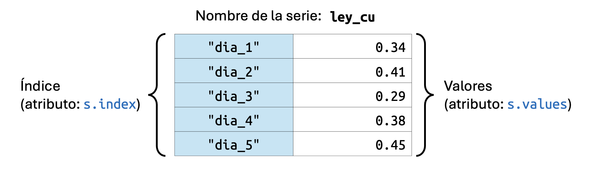
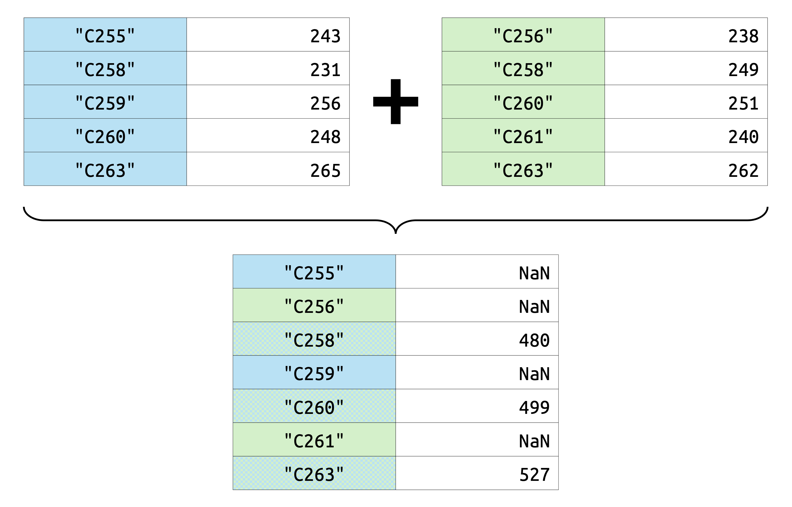

::: {.callout-important}
## Idea central

En este apunte estudiaremos a las series de <strong><font color='darkmagenta'>Pandas</font></strong> como la unidad mínima del análisis tabular: Una estructura unidimensional, etiquetada, tipada y alineada por índices, sobre la cual podemos cargar datos, operar con seguridad, comparar condiciones, transformar valores y construir resúmenes estadísticos. La idea no es sólo aprender métodos sueltos, sino entender cómo una serie pasa de ser una columna aislada a convertirse en un objeto analítico capaz de sostener decisiones: Desde cálculos simples hasta agregaciones, detección de valores atípicos y primeras visualizaciones exploratorias.
:::

::: {.class-keywords}
[Pandas]{.class-keyword}
[Series]{.class-keyword}
[Índices]{.class-keyword}
[Alineamiento de índices]{.class-keyword}
[Carga de datos]{.class-keyword}
[CSV]{.class-keyword}
[Excel]{.class-keyword}
[Parquet]{.class-keyword}
[Manipulación de datos]{.class-keyword}
[Estadística descriptiva]{.class-keyword}
:::

## La serie de <font color='darkmagenta'>Pandas</font> en detalle

Una serie, no necesariamente limitada a la librería <strong><font color='darkmagenta'>Pandas</font></strong>, es un tipo de estructura de datos que se caracteriza por ser un arreglo unidimensional, etiquetado y capaz de contener datos de un tipo específico. En términos prácticos, una serie puede contener enteros, cadenas, números de punto flotante, objetos de Python, datos temporales o valores faltantes, aunque la forma concreta en que tales valores se almacenan dependerá del tipo de dato asignado o inferido.

En <strong><font color='darkmagenta'>Pandas</font></strong>, la serie es una estructura definida por el objeto `pd.Series`, que se caracteriza por alinear los datos a lo largo de un eje, conforme ciertas posiciones rotuladas explícitamente por medio de un **índice** *embebido* en la misma y cuyo comportamiento está gobernado por un objeto inmutable e independiente, correspondiente a `pd.Index`.

Como vimos en nuestra [sección introductoria](/clases/data-analytics/introduccion-al-analisis-de-datos-en-python/manipulacion-tabular-y-analisis-con-pandas/introduccion-rapida-a-pandas/), la construcción de una serie es sencilla. Como mínimo, necesitamos una lista de datos, que se asignará a la serie, y opcionalmente, una lista de etiquetas, que se asignará al índice. Por ejemplo:

```{python}
import pandas as pd
```

```{python}
# Definimos una lista de valores.
data = [0.34, 0.41, 0.29, 0.38, 0.45]

# Y otra lista con etiquetas.
labels = ["dia_1", "dia_2", "dia_3", "dia_4", "dia_5"]

# Construimos la serie a partir de ambas listas.
s = pd.Series(data=data, index=labels, name="ley_cu")

# Y la imprimimos en pantalla.
s
```

El constructor `pd.Series` contempla varios argumentos de interés que es mejor conocer desde el principio:

- `data`: Es el único argumento obligatorio. Puede ser una lista, un arreglo de <strong><font color='darkmagenta'>Numpy</font></strong>, un diccionario, un escalar o incluso otra serie. En términos prácticos, corresponde a los valores que se asignarán a la serie. Si `data` es un diccionario de Python, las llaves correspondientes (`keys`) se asignarán al índice de la serie como etiquetas, mientras que los valores (`items`) se asignarán a la serie propiamente dicha. En caso de que `data` sea un escalar, el valor se repetirá tantas veces como sea necesario para llenar la serie, conforme el número de etiquetas definido por el índice.

- `index`: Es un argumento opcional que corresponde a las etiquetas que se asignarán al índice de la serie. Puede ser una lista, un arreglo de <strong><font color='darkmagenta'>Numpy</font></strong> o incluso otro índice previamente construido de manera independiente (por ejemplo, por medio de `pd.Index`). La única exigencia es que contenga el mismo número de elementos que `data`. Por defecto, <strong><font color='darkmagenta'>Pandas</font></strong> asigna un índice numérico entero, monótonamente creciente, que comienza en `0` y se incrementa en `1` para cada elemento de la serie.

- `dtype`: Es un argumento opcional que corresponde al tipo de datos que se asignará a la serie. Como vimos en detalle en nuestra [clase dedicada a los tipos de datos](/clases/data-analytics/introduccion-al-analisis-de-datos-en-python/manipulacion-tabular-y-analisis-con-pandas/tipos-de-datos-en-pandas/) en <strong><font color='darkmagenta'>Pandas</font></strong>, el tipo puede ser heredado de <strong><font color='darkmagenta'>Numpy</font></strong>, específico de <strong><font color='darkmagenta'>Pandas</font></strong> o respaldado por <strong><font color='darkmagenta'>PyArrow</font></strong>. Si no se especifica, el tipo de datos se infiere automáticamente a partir de los valores asignados a la serie.

- `name`: Es un argumento opcional que corresponde al nombre que se asignará a la serie. Este nombre se almacena como un atributo de la serie y puede ser útil para identificarla en análisis tabulares más complejos, especialmente cuando se trabaja con múltiples series o con DataFrames. Si la serie posteriormente se utiliza como una columna dentro de un DataFrame, el nombre de la serie se convierte en el nombre o *header* de la columna correspondiente.

En la @fig-series se muestra un esquema de una serie de <strong><font color='darkmagenta'>Pandas</font></strong>, denominada como `s`, con sus componentes principales, representados con los correspondientes atributos.

{#fig-series fig-align="center" width="100%"}

Las series tienen muchos atributos que permiten identificar sus componentes y características. Contando a los que se muestran en la @fig-series, los más importantes son:

- `values`: Corresponde a una representación de los valores asignados a la serie. Históricamente, este atributo se ha entendido como una vía para acceder a los datos en forma de arreglo de <strong><font color='darkmagenta'>Numpy</font></strong>, pero en versiones modernas de <strong><font color='darkmagenta'>Pandas</font></strong> conviene recordar que algunos dtypes pueden estar respaldados por arreglos de extensión. Por ello, cuando queramos trabajar explícitamente con la representación interna de <strong><font color='darkmagenta'>Pandas</font></strong>, usaremos `array`; y cuando queramos forzar una conversión a <strong><font color='darkmagenta'>Numpy</font></strong>, usaremos `to_numpy()`.

- `index`: Corresponde a las etiquetas asignadas al índice de la serie, almacenadas como un objeto de tipo `pd.Index` (o bien, otro objeto similar que hereda las propiedades de `pd.Index`). Es el atributo que corresponde a las etiquetas provistas por el índice.

- `name`: Corresponde al nombre asignado a la serie, almacenado como un objeto de tipo `str`.

- `shape`: Corresponde a la geometría de la serie. Debido a que estas estructuras de datos son unidimensionales, el atributo `shape` siempre tendrá la forma de una tupla con un solo elemento, que corresponde al número de registros contenidos en la serie. Si hay `m` registros para la serie `s`, entonces `s.shape` devolverá la tupla `(m,)`.

- `size`: Corresponde al número total de elementos contenidos en la serie. En una serie unidimensional, el atributo `size` es equivalente al número de registros, por lo que si hay `m` registros para la serie `s`, entonces `s.size` devolverá el valor `m`.

- `is_monotonic_increasing`: Corresponde a un valor booleano que indica si el índice de la serie es monótonamente creciente. Es decir, si las etiquetas del índice están ordenadas de manera ascendente, admitiendo repeticiones. Si el índice cumple esta condición, el atributo devolverá `True`; de lo contrario, devolverá `False`. Este atributo es especialmente útil cuando un análisis exige que los datos se ordenen de alguna manera específica, lo que es común en análisis de series temporales o secuenciales.

- `is_monotonic_decreasing`: Análogo al atributo anterior, pero en este caso indica si el índice de la serie es monótonamente decreciente. Es decir, si las etiquetas del índice están ordenadas de manera descendente, admitiendo repeticiones. Si el índice cumple esta condición, el atributo devolverá `True`; de lo contrario, devolverá `False`.

- `dtype` y `dtypes`: Corresponden al tipo de datos asignado a la serie. En una serie, ambos atributos devuelven esencialmente el mismo dtype. La diferencia se vuelve más natural en DataFrames, donde `dtypes` retorna el tipo de datos de cada columna. Estos atributos son útiles para verificar la representación de los datos, lo que es fundamental para garantizar su correcta manipulación y análisis.

Podemos verificar algunos de estos atributos directamente:

```{python}
# Valores de la serie.
s.values
```

```{python}
# Índice de la serie.
s.index
```

```{python}
# Nombre, tipo de datos, geometría y número de elementos.
print("Nombre:", s.name)
print("Tipo de datos:", s.dtype)
print("Geometría:", s.shape)
print("Número de elementos:", s.size)
```

```{python}
# Verificamos si el índice está ordenado en sentido creciente.
s.index.is_monotonic_increasing
```

Si alteramos el orden del índice, el resultado anterior cambia:

```{python}
# Construimos una serie con un índice no monótono.
s_unsorted = pd.Series(
    data=[0.34, 0.41, 0.29, 0.38, 0.45],
    index=["dia_1", "dia_3", "dia_2", "dia_5", "dia_4"],
    name="ley_cu",
)

# Verificamos si el índice está ordenado en sentido creciente.
s_unsorted.index.is_monotonic_increasing
```

## Carga de datos en una serie

A diferencia de lo que ocurre con los arreglos de <strong><font color='darkmagenta'>Numpy</font></strong>, no es común que las series se formulen a partir de rutinas prefabricadas, como aquellas provistas por generadores de números aleatorios. En lugar de eso, resulta muy común que accedamos a datos almacenados en archivos externos, bases de datos, aplicaciones intermedias (APIs, del inglés *application programming interfaces*) e, incluso, de internet. De esta manera, la interfaz I/O de <strong><font color='darkmagenta'>Pandas</font></strong> suele ser la puerta de entrada a la mayoría de los análisis tabulares que se realizan con esta librería.

Eso sí, hay una precisión importante: Las funciones de lectura de <strong><font color='darkmagenta'>Pandas</font></strong> suelen cargar tablas completas en forma de DataFrames. Luego, seleccionamos una columna de ese DataFrame para trabajar con ella como una serie. Esta idea es muy natural en la práctica, porque muchas series nacen como columnas individuales dentro de una tabla más grande.

Hay un único inconveniente con lo anterior: Debido a que las funciones de lectura de <strong><font color='darkmagenta'>Pandas</font></strong> suelen cargar tablas completas, si desconocemos el tamaño de esas tablas, podemos caer en la *trampa* de cargar archivos demasiado grandes, lo que puede generar problemas de rendimiento. En un lenguaje técnico, esta característica de la interfaz I/O de <strong><font color='darkmagenta'>Pandas</font></strong> se conoce como *eager loading*, lo que significa que los datos se cargan completamente en memoria al momento de la lectura, sin importar su tamaño. Esto es resultado de la filosofía de la librería, orientada a usuarios no necesariamente tan versados en programación. Otras librerías como <strong><font color='darkmagenta'>Polars</font></strong> permiten un enfoque de *lazy loading*, lo que significa que los datos se cargan de manera diferida; es decir, solo cuando se necesitan para realizar una operación específica. Esto puede ser especialmente útil para manejar archivos grandes sin comprometer el rendimiento.

### Formatos de archivos y funciones de lectura

<strong><font color='darkmagenta'>Pandas</font></strong> dispone de una serie de funciones de I/O que difieren según el formato de los datos que se desea cargar:

- Para **archivos separados por comas** (`csv`, del inglés *comma-separated values*), se utiliza la función `pd.read_csv()`. Esta función requiere de un único argumento obligatorio, denominado `filepath_or_buffer`, que corresponde a la ruta del archivo que se desea cargar. La ruta es un string que puede representar un determinado directorio en nuestro computador, o la localización de un archivo en internet. Además, `pd.read_csv()` contempla una serie de argumentos opcionales que permiten configurar la carga de datos, como por ejemplo, `sep` para especificar el separador utilizado en el archivo (por defecto, es la coma), `header` para indicar si el archivo contiene una fila de encabezado con los nombres de las columnas, `index_col` para definir qué columna se utilizará como índice de la serie o del DataFrame resultante, `na_values` para especificar qué valores deben ser interpretados como valores faltantes (NaN), y `decimal` para indicar el símbolo utilizado como separador decimal (por defecto, es el punto).

- Para **archivos de Excel** (`xlsx`), se utiliza la función `pd.read_excel()`. Esta función también requiere de un único argumento obligatorio, denominado `io`, que corresponde a la ruta del archivo de Excel que se desea cargar. Esta función contempla los mismos argumentos opcionales mencionados para el caso de `pd.read_csv()`, además de otros específicos para archivos de Excel, como por ejemplo, `sheet_name` para especificar el nombre o el número de la hoja que se desea cargar (por defecto, es la primera hoja), `usecols` para indicar qué columnas se deben cargar, y `skiprows` para definir cuántas filas se deben omitir al inicio del archivo.

- Existen otros formatos más interesantes que los anteriores. Un ejemplo de esto son los archivos de formato `parquet`, que se caracterizan por ser un formato de almacenamiento columnar optimizado para el análisis de grandes volúmenes de datos. La gracia de este formato es que **no está pensado para ser leído por humanos**, sino que está diseñado para ser procesado de manera eficiente por máquinas, lo que lo hace eficiente en uso de memoria. Un archivo `csv` de 100 MB puede ocupar bastante menos en formato `parquet`, dependiendo del contenido y del esquema de compresión utilizado. Para cargar archivos de este tipo, se utiliza la función `pd.read_parquet()`, que requiere de un único argumento obligatorio, denominado `path`, que corresponde a la ruta del archivo `parquet` que se desea cargar. Esta función también contempla algunos argumentos opcionales, como por ejemplo, `columns` para especificar qué columnas se deben cargar, y `engine` para indicar el motor de lectura que se debe utilizar (por defecto, es el motor de <strong><font color='darkmagenta'>PyArrow</font></strong>).

- <strong><font color='darkmagenta'>Pandas</font></strong> también dispone de funciones de I/O para cargar datos desde bases de datos. Con esto nos referimos a sistemas de gestión de bases de datos (DBMS, del inglés *database management systems*) como MySQL, PostgreSQL, SQLite, entre otros. No ahondaremos en esto por ahora, ya que el blog contempla una introducción a SQL en una sección posterior, pero es importante mencionar que la función `pd.read_sql()` permite cargar datos desde una base de datos a partir de una determinada consulta o *query*. Sin embargo, es necesario definir previamente los parámetros de conexión a la base de datos, lo que frecuentemente involucra el ingreso de información sensible como el nombre de usuario, la contraseña y la dirección de un servidor. Además, suele ser necesario el uso de librerías adicionales para establecer la conexión, como por ejemplo, <strong><font color='darkmagenta'>SQLAlchemy</font></strong> o <strong><font color='darkmagenta'>PyODBC</font></strong>.

Partamos por el acceso a archivos `csv`. Existen repositorios en internet con una enorme cantidad de datos para poder jugar y aprender a analizar datos con <strong><font color='darkmagenta'>Pandas</font></strong>. También existen repositorios de datos abiertos en Chile para explorar datos de diversa naturaleza.

Por ejemplo, el Ministerio de Ciencia, Tecnología, Conocimiento e Innovación de Chile mantiene el sitio **Observa**, donde podemos encontrar bases de datos abiertas sobre el sistema nacional de ciencia, tecnología, conocimiento e innovación. Uno de esos productos corresponde a la base de datos de la Encuesta sobre Gasto y Personal en I+D (`2022`), desagregada por tamaño de empresa:

```{python}
# URL del archivo CSV publicado en Observa, del Ministerio de Ciencia.
url = (
    "https://api.observa.minciencia.gob.cl/api/datosabiertos/download/"
    "?uuid=4f07cc46-2bf9-407d-aec4-fb01868c723d"
    "&filename=tamanhoImasD2022.csv"
)

# Cargamos algunas columnas del archivo como un DataFrame.
imasd_df = pd.read_csv(
    url,
    sep=";",
    usecols=[
        "identificador_a",
        "tamano",
        "macrozona",
        "unidad_declarante",
        "imasd",
    ],
)

# Revisamos las primeras filas.
imasd_df.head()
```

Notemos que el archivo que hemos cargado es un `csv` denominado `tamanhoImasD2022.csv`, el cual "vive" en una API provista por el sitio **Observa**. Hemos cargado únicamente 5 columnas de este archivo, a través del argumento `usecols`, y hemos especificado que el separador utilizado en el archivo es el punto y coma (`;`), a través del argumento `sep`. Las columnas seleccionadas corresponden a:

- `identificador_a`: Un identificador único para cada registro de la encuesta.
- `tamano`: El tamaño de la empresa.
- `macrozona`: La macrozona geográfica a la que pertenece la empresa.
- `unidad_declarante`: La unidad que declara la información en la encuesta.
- `imasd`: El indicador de gasto en I+D de la empresa.

El resultado anterior es, naturalmente, un DataFrame, no una serie. Si queremos estudiar una variable específica como serie, podemos seleccionar cualquiera de sus columnas. Por ejemplo, para la variable `tamano`, escribimos:

```{python}
# Seleccionamos una columna como serie.
tamano_empresa = imasd_df["tamano"]

# Revisamos las primeras filas de la serie.
tamano_empresa.head()
```

La carga de archivos de Excel se realiza de manera muy similar. A diferencia de un archivo `csv`, un archivo `xlsx` puede contener múltiples hojas, formatos internos, celdas con fórmulas y metadatos propios de una planilla. Por esta razón, al leer archivos de Excel suele ser importante indicar explícitamente qué hoja queremos cargar, qué columnas nos interesan y cuántas filas necesitamos revisar.

Siguiendo con datos públicos del sitio **Observa**, podemos cargar un diccionario de variables de la Encuesta sobre Gasto y Personal en I+D (`2023`) publicado como archivo `xlsx`:

```{python}
# URL de un archivo Excel publicado en Observa.
xlsx_url = (
    "https://api.observa.minciencia.gob.cl/api/datosabiertos/download/"
    "?uuid=69754fd8-c08f-491e-a448-633bc3bc3fa2"
)

# Cargamos algunas filas del archivo Excel.
imasd_dictionary_df = pd.read_excel(
    xlsx_url,
    nrows=8,
)

# Revisamos las primeras filas.
imasd_dictionary_df.head()
```

::: {.callout-note}
## Nota

Para leer archivos `xlsx`, <strong><font color='darkmagenta'>Pandas</font></strong> necesita un motor de lectura compatible. En la práctica, lo más común es usar `openpyxl`, que puede instalarse con `pip install openpyxl`.
:::

Finalmente, podemos revisar el caso de los archivos `parquet`. Este formato es especialmente útil cuando trabajamos con datos tabulares grandes, porque almacena la información por columnas y conserva metadatos de tipo. Para una primera demostración, usaremos un archivo pequeño alojado en GitHub:

```{python}
# URL de un archivo Parquet pequeño alojado en GitHub.
parquet_url = "https://github.com/datagy/mediumdata/raw/master/Sample.parquet"

# Cargamos el archivo Parquet como un DataFrame.
sample_parquet_df = pd.read_parquet(parquet_url)

# Revisamos las primeras filas.
sample_parquet_df.head()
```

Nuevamente, el resultado es un DataFrame. Si queremos trabajar con una de sus columnas como serie, basta con seleccionarla:

```{python}
# Seleccionamos una columna como serie.
age_series = sample_parquet_df["Age"]

# Revisamos las primeras filas.
age_series.head()
```

## Familias de métodos para manipular series

<strong><font color='darkmagenta'>Pandas</font></strong> nos provee de más de 400 métodos para manipular series. Parece un montón, pero en realidad muchos de estos métodos son de tipo *dunder* (del inglés *double underscore*), lo que significa que son métodos especiales que no se suelen invocar directamente, sino que se activan a través de operadores o de otras funciones. La buena noticia es que, en el 99% de los casos, solo necesitaremos un pequeño subconjunto de estos métodos para realizar análisis tabulares efectivos.

A grosso modo, los métodos y accesores de las series se pueden clasificar en varios grupos:

- **Métodos de agregación:** Permiten realizar operaciones de agregación sobre los datos de la serie. Con "agregación" nos referimos a cálculos que resumen o condensan la información contenida en la serie, como por ejemplo, el cálculo de estadígrafos base, como la media, mediana o desviación estándar. Algunos ejemplos de métodos de agregación son `mean()`, `median()`, `min()`, `max()`, `sum()`, `count()`, entre otros. Y muchos de ellos vienen heredados directamente desde <strong><font color='darkmagenta'>Numpy</font></strong>, con exactamente el mismo comportamiento.

- **Métodos de conversión o *casting*:** Permiten convertir la serie a otro tipo de datos o a otra estructura de datos. En general, estos métodos vienen precedidos por el prefijo `to_`, lo que los hace fáciles de identificar. Algunos ejemplos de métodos de conversión son `to_numpy()`, `to_list()`, `to_dict()` o `to_json()`, que permiten convertir la serie a un arreglo de <strong><font color='darkmagenta'>Numpy</font></strong>, a una lista de Python, a un diccionario de Python o a un objeto JSON, respectivamente.

- **Métodos de manipulación de datos:** Permiten realizar operaciones de manipulación sobre los datos de la serie. Ejemplos de estos métodos son `sort_values()`, que ordena los valores de la serie, `drop_duplicates()`, que elimina los valores duplicados, `replace()`, que reemplaza ciertos valores por otros, y `dropna()`, que elimina registros sin datos (`NaN` o `<NA>`, dependiendo del tipo de dato empleado).

- **Indexadores y mecanismos de acceso:** Permiten acceder a los datos de la serie de manera específica, ya sea por posición o por etiqueta. Ejemplos de estos mecanismos son `.loc[]`, que permite acceder a los datos por etiqueta, e `.iloc[]`, que permite acceder a los datos por posición. Estos indexadores pueden retornar otras series o valores escalares.

- **Accesores especializados:** Se trata de conjuntos de métodos precedidos por algún nombre específico que se asocia con el tipo de dato requerido para implementar determinadas evaluaciones. Algunos accesores importantes en <strong><font color='darkmagenta'>Pandas</font></strong> son los siguientes:

    - `str.`: Permite realizar operaciones de manipulación y evaluación sobre series de tipo string. Algunos ejemplos de métodos dentro del evaluador `str.` son `lower()`, que convierte los caracteres a minúscula, `upper()`, que convierte los caracteres a mayúscula, `contains()`, que evalúa si los valores contienen un determinado *substring*, y `replace()`, que reemplaza ciertos *substrings* por otros.

    - `dt.`: Permite realizar operaciones de manipulación y evaluación sobre series que almacenan datos temporales (como fechas o `timestamps`). Algunos ejemplos de métodos y atributos dentro del accesor `dt.` son `year`, que extrae el año de las fechas, `month`, que extrae el mes de las fechas, `day`, que extrae el día de las fechas, y `day_name()`, que devuelve el nombre del día de la semana correspondiente a las fechas.

    - `cat.`: Permite realizar operaciones de manipulación y evaluación sobre series de tipo categórico. Algunos ejemplos de métodos dentro del evaluador `cat.` son `categories`, que devuelve las categorías únicas presentes en la serie, `codes`, que devuelve los códigos numéricos correspondientes a cada categoría, y `add_categories()`, que permite agregar nuevas categorías a la serie.

- **Métodos de visualización:** Permiten generar gráficos a partir de los datos de la serie. El único de estos métodos que es de nuestro interés es `plot()`, que permite generar gráficos a partir de los datos de la serie, utilizando las librerías <strong><font color='darkmagenta'>Matplotlib</font></strong> y <strong><font color='darkmagenta'>Plotly</font></strong> como backend, dependiendo de si deseamos generar gráficos estáticos o interactivos, respectivamente. Este método contempla una serie de argumentos opcionales que permiten configurar el tipo de gráfico, los ejes, los colores, las leyendas, entre otros aspectos visuales.

- **Métodos de transformación:** Permiten realizar operaciones de transformación sobre los datos de la serie. Ejemplos de estos métodos son `unstack()`, que permite transformar una serie en un DataFrame, `reset_index()`, que permite restablecer el índice de la serie, y `apply()`, que permite aplicar una función a cada elemento de la serie.

No buscamos aprendernos todos estos métodos de memoria. <strong><font color='darkmagenta'>Pandas</font></strong> es una librería muy amplia, y su [documentación](https://pandas.pydata.org/pandas-docs/stable/reference/index.html) es un recurso fundamental para consultar cualquier duda que pueda surgir sobre el uso de sus métodos. Lo importante es que, a medida que avancemos en el blog, iremos conociendo los métodos más relevantes para cada tipo de análisis, y así construiremos un repertorio de herramientas que nos permitirá manipular series de manera efectiva en nuestros análisis tabulares.

## Alineamiento de índices

Como establecimos al comienzo, las series de <strong><font color='darkmagenta'>Pandas</font></strong> se caracterizan por ser estructuras de datos unidimensionales, etiquetadas y alineadas a lo largo de un eje, conforme ciertas posiciones rotuladas explícitamente por medio de un índice.

Los índices no sirven únicamente para facilitar la selección de datos, sino que además constituyen verdaderos mecanismos de seguridad que garantizan que, al operar con dos series, el resultado sea consistente con el mapeo de etiquetas definido por sus índices. De esta manera, <strong><font color='darkmagenta'>Pandas</font></strong> siempre **alineará** los índices de las series involucradas en una operación. Para ejemplificar este concepto, consideremos dos series que representan tonelajes transportados por los camiones de extracción en una mina a cielo abierto:

```{python}
haul_reg1 = pd.Series(
    data=[243, 231, 256, 248, 265],
    index=["C255", "C258", "C259", "C260", "C263"],
    name="ton_transp",
)

haul_reg2 = pd.Series(
    data=[238, 249, 251, 240, 262],
    index=["C256", "C258", "C260", "C261", "C263"],
    name="ton_transp",
)
```

Si sumamos ambas series, el resultado no será la suma elemento a elemento, sino que <strong><font color='darkmagenta'>Pandas</font></strong> alineará los índices de ambas series y realizará la suma conforme a ese alineamiento:

```{python}
# Sumamos ambas series.
haul_reg1 + haul_reg2
```

Notemos que el resultado de la suma solo tiene valores para las etiquetas `C258`, `C260` y `C263`, porque son las únicas etiquetas que están presentes de manera simultánea en ambas series. Para el resto de las etiquetas, el resultado es `NaN`, lo que indica que no se pudo realizar la suma debido a la falta de datos en alguna de las series para esas etiquetas. Este comportamiento es fundamental para garantizar la integridad de los datos y evitar resultados erróneos al operar con series que no tienen un mapeo de etiquetas consistente. En palabras simples, se trata de una especie de "mecanismo" de seguridad que se activa al operar con series cuyos índices no son plenamente consistentes.

El alineamiento de índices es un concepto fundamental en <strong><font color='darkmagenta'>Pandas</font></strong> y se aplica no solo a las series, sino también a los DataFrames. De hecho, el comportamiento de alineamiento de índices es uno de los aspectos más distintivos de <strong><font color='darkmagenta'>Pandas</font></strong> en comparación con otras librerías de análisis de datos. Notemos además que este alineamiento se realiza con cualquier tipo de operación binaria (que involucre dos series), como por ejemplo, la resta, la multiplicación o la división. En todos estos casos, el resultado se alinea conforme a los índices de las series involucradas en la operación.

{#fig-alignment fig-align="center" width="100%"}

## Operadores aritméticos

Los operadores aritméticos permiten realizar operaciones matemáticas básicas entre series, como por ejemplo, la suma, la resta, la multiplicación o la división. Estos operadores se aplican elemento a elemento, lo que significa que se realiza la operación correspondiente para cada par de elementos que comparten la misma etiqueta en los índices de las series involucradas. Debido al alineamiento de índices que mencionamos anteriormente, el resultado de estas operaciones solo tendrá valores para las etiquetas que estén presentes de manera simultánea en ambas series; para el resto de las etiquetas, el resultado será `NaN`.

De la misma forma que en <strong><font color='darkmagenta'>Numpy</font></strong>, los operadores aritméticos en <strong><font color='darkmagenta'>Pandas</font></strong> están asociados a los operadores matemáticos básicos de Python, como por ejemplo, `+` para la suma, `-` para la resta, `*` para la multiplicación y `/` para la división. Además, <strong><font color='darkmagenta'>Pandas</font></strong> también proporciona métodos específicos para cada una de estas operaciones, como por ejemplo, `add()`, `sub()`, `mul()` y `div()`, que permiten realizar las mismas operaciones pero con una sintaxis diferente y con algunos argumentos adicionales que pueden ser útiles en ciertos casos.

Veamos algunos ejemplos:

```{python}
import numpy as np
import matplotlib.pyplot as plt
```

```{python}
# Seteamos algunas opciones de visualización para los gráficos.
plt.style.use("bmh")
plt.rcParams["figure.dpi"] = 90
```

::: {.callout-note}
## Un aviso importante

Usaremos <strong><font color='darkmagenta'>Matplotlib</font></strong> para generar algunos gráficos en esta entrada del blog. En algunos casos, serán gráficos con opciones avanzadas. La justificación es netamente pedagógica, pero recomiendo encarecidamente mirar con curiosidad las opciones usadas para su creación, para así ir familiarizándonos con esta librería, que es la base de la mayoría de las visualizaciones que se pueden generar con <strong><font color='darkmagenta'>Pandas</font></strong>.
:::

```{python}
# Generamos una semilla aleatoria fija.
rng = np.random.default_rng(seed=42)

# Definimos dos arreglos que representarán el tonelaje de mineral de fierro en una
# planta de concentración magnética. Cada valor representará una línea de chancado
# diferente (en tpd).
x1 = rng.normal(loc=12500.0, scale=650.0, size=10)
x2 = rng.normal(loc=11800.0, scale=600.0, size=10)

# Definimos un par de índices para cada serie.
idx1 = pd.date_range(start="2023-01-01", periods=10, freq="D")
idx2 = pd.date_range(start="2023-01-05", periods=10, freq="D")

# Y construimos las series con base en los arreglos y en los índices definidos.
s1 = pd.Series(data=x1, index=idx1, name="tph_f1_l1")
s2 = pd.Series(data=x2, index=idx2, name="tph_f1_l2")
```

Notemos que, para construir los índices de ambas series, hemos utilizado la función `pd.date_range()`, que permite generar un rango de fechas a partir de una fecha de inicio, un número de períodos y una frecuencia. En este caso, hemos generado dos rangos de fechas diarias (`freq="D"`) que comienzan el `2023-01-01` y el `2023-01-05`, respectivamente, y que contienen 10 períodos cada uno. Hablaremos de esto más adelante, cuando abordemos el tema de las series temporales de manera más dedicada.

Sumemos ambas series para obtener el tonelaje total de mineral de fierro que se procesa en la planta:

```{python}
# Obtenemos la suma de ambas series.
total_fe = (s1 + s2)

# Mostramos el resultado.
total_fe
```

Notemos que el método `add()` permite realizar la misma operación pero con una sintaxis diferente y con algunos argumentos adicionales. Por ejemplo, el argumento `fill_value` permite especificar un valor que se utilizará para reemplazar los valores faltantes (`NaN`) en las series involucradas en la operación. Esto puede ser útil para evitar que el resultado de la operación sea `NaN` debido a la falta de datos en alguna de las series para ciertas etiquetas:

```{python}
# Obtenemos la suma de ambas series utilizando el método add() con `fill_value`.
total_fe_fill = s1.add(s2, fill_value=0)

# Mostramos el resultado.
total_fe_fill
```

Al usar `fill_value=0`, únicamente rellenamos con `0` los valores faltantes en la serie cuya etiqueta no está presente en la otra serie. Por esa razón, si `s1` tiene una etiqueta que no está presente en `s2`, el valor correspondiente en el resultado de `s1.add(s2, fill_value=0)` será igual al valor de `s1` para esa etiqueta, ya que el valor faltante en `s2` se reemplaza por `0`. De manera análoga, si `s2` tiene una etiqueta que no está presente en `s1`, el valor correspondiente en el resultado será igual al valor de `s2` para esa etiqueta. Esto suele ser fuente de confusión en algunos casos, ya que el uso de `fill_value=0` no implica que se reemplacen todos los valores faltantes por `0` en la serie resultante, sino únicamente aquellos que corresponden a etiquetas que no están presentes en la otra serie involucrada en la operación para las series de entrada.

En la @tbl-operators, se muestra un resumen de los operadores aritméticos básicos y sus métodos equivalentes en <strong><font color='darkmagenta'>Pandas</font></strong>.

: Operadores aritméticos básicos de <strong><font color='darkmagenta'>Pandas</font></strong> y sus métodos equivalentes {#tbl-operators}

| Operación                      | Operador | Método equivalente | Ejemplo de uso    |
|:-------------------------------|:---------|:-------------------|:------------------|
| Suma                           | `+`      | `add()`            | `s1.add(s2)`      |
| Resta                          | `-`      | `sub()`            | `s1.sub(s2)`      |
| Multiplicación                 | `*`      | `mul()`            | `s1.mul(s2)`      |
| División                       | `/`      | `div()`            | `s1.div(s2)`      |
| División entera                | `//`     | `floordiv()`       | `s1.floordiv(s2)` |
| Módulo (resto de una división) | `%`      | `mod()`            | `s1.mod(s2)`      |
| Potenciación                   | `**`     | `pow()`            | `s1.pow(s2)`      |

## Operadores lógicos

Los operadores lógicos permiten realizar comparaciones entre series. Por ejemplo, determinar si los elementos de una serie son iguales, mayores o menores a los de otra serie. Y al igual que los operadores aritméticos, los operadores lógicos también requieren de un alineamiento de índices para garantizar que las comparaciones se realicen de manera consistente conforme a las etiquetas de los índices de las series involucradas en la operación. Equivalentemente, <strong><font color='darkmagenta'>Pandas</font></strong> también proporciona métodos específicos para cada uno de estos operadores lógicos, como por ejemplo, `eq()` (para el operador `==`), `ne()` (para el operador `!=`), `gt()` (para el operador `>`), `lt()` (para el operador `<`), `ge()` (para el operador `>=`) y `le()` (para el operador `<=`), que permiten realizar las mismas operaciones pero con una sintaxis diferente y con algunos argumentos adicionales que pueden ser útiles en ciertos casos.

### Comparaciones entre series

Consideremos un par de series que representan los estados de motor de dos bombas que operan simultáneamente para drenar agua del fondo de una mina operada a cielo abierto (en un proceso de *dewatering*). Las bombas tienen denominaciones `PP-A01` y `PP-A02`, y cada valor de las series representa el estado de cada bomba en un determinado momento, considerando tres estados posibles: `on`, `off` y `failure`:

```{python}
# Definimos dos series que representan el estado mayoritario de dos bombas en un proceso
# de dewatering durante un período de 10 horas.
pump_a_s = pd.Series(
    data=["on", "off", "on", "failure", "on", "off", "on", "on", "off", "on"],
    index=pd.date_range(start="2023-01-01 00:00", periods=10, freq="h"),
    name="pp_a01_status",
)

pump_b_s = pd.Series(
    data=["on", "on", "off", "off", "failure", "on", "off", "on", "on", "off"],
    index=pd.date_range(start="2023-01-01 00:00", periods=10, freq="h"),
    name="pp_a02_status",
)
```

Si queremos determinar en qué momentos ambas bombas estuvieron encendidas (`on`), podemos usar el operador lógico `&` para realizar una comparación elemento a elemento entre ambas series:

```{python}
# Determinamos en qué momentos ambas bombas estuvieron encendidas.
both_on = (pump_a_s == "on") & (pump_b_s == "on")

# Mostramos el resultado.
both_on
```

O bien, usando el método `eq()` para realizar la misma comparación pero con una sintaxis diferente:

```{python}
# Determinamos en qué momentos ambas bombas estuvieron encendidas usando el método `eq()`.
both_on_eq = pump_a_s.eq("on") & pump_b_s.eq("on")

# Mostramos el resultado.
both_on_eq
```

También podemos usar el operador lógico `|` para determinar en qué momentos al menos una de las bombas estuvo encendida:

```{python}
# Determinamos en qué momentos al menos una de las bombas estuvo encendida.
at_least_one_on = (pump_a_s == "on") | (pump_b_s == "on")

# Mostramos el resultado.
at_least_one_on
```

Como en el caso de <strong><font color='darkmagenta'>Numpy</font></strong>, las comparaciones entre series de <strong><font color='darkmagenta'>Pandas</font></strong> retornan estructuras de datos con el mismo número de registros que las que intervienen en la comparación, pero con valores booleanos (`True` o `False`) que indican el valor de verdad de la comparación para cada par de elementos que comparten la misma etiqueta en los índices de las series involucradas en la operación. Igualmente, <strong><font color='darkmagenta'>Pandas</font></strong> provee los métodos `any()` y `all()` para evaluar si al menos un valor es `True` o si todos los valores son `True`, respectivamente, en una serie de valores booleanos resultante de una comparación entre series, lo que es útil para construir filtros conforme condiciones específicas.

Por ejemplo, si queremos determinar si ambas bombas fallaron al menos una vez durante el período de observación, podemos usar el método `any()` para evaluar si al menos un valor es `True` en la comparación entre ambas series para el estado `failure`:

```{python}
# Determinamos si ambas bombas fallaron al menos una vez durante el período 
# de observación.
both_failed_at_least_once = (
    (pump_a_s == "failure").any()
    & (pump_b_s == "failure").any()
)

# Mostramos el resultado.
both_failed_at_least_once
```

Y si queremos determinar si ambas bombas estuvieron encendidas durante todo el período de observación, podemos usar el método `all()` para evaluar si todos los valores son `True` en la comparación entre ambas series para el estado `on`:

```{python}
# Determinamos si ambas bombas estuvieron encendidas durante todo el período
# de observación.
both_on_all_time = (
    (pump_a_s == "on").all()
    & (pump_b_s == "on").all()
)

# Mostramos el resultado.
both_on_all_time
```

### Reemplazo de valores conforme condiciones específicas

Cuando nos dedicamos a operar con arreglos de <strong><font color='darkmagenta'>Numpy</font></strong>, vimos que la función `np.where()` es una herramienta fundamental para realizar reemplazos de valores conforme condiciones específicas. En <strong><font color='darkmagenta'>Pandas</font></strong>, el método equivalente es `where()`, y su funcionamiento es similar, pero con una sintaxis diferente. En primer lugar, debemos especificar la condición que se debe cumplir para mantener los valores originales de la serie, y luego, opcionalmente, podemos especificar un valor de reemplazo para aquellos casos en los que la condición no se cumpla. Si no se especifica un valor de reemplazo, el método `where()` reemplazará los valores que no cumplen la condición por registros sin datos o `NaN`.

Por ejemplo, si queremos reemplazar los estados `off` y `failure` por `maintenance` en la serie `pump_a_s`, podemos usar el método `where()` de la siguiente manera:

```{python}
# Reemplazamos los estados `off` y `failure` por `maintenance` en la serie `pump_a_s`.
pump_a_maintenance = pump_a_s.where(pump_a_s == "on", other="maintenance")

# Mostramos el resultado.
pump_a_maintenance
```

Los métodos que transforman series en otras retornan, por defecto, una nueva serie construida a partir de la modificación de los valores originales. Esto evita cambios accidentales sobre los datos fuente. Muchos métodos de transformación contemplan un argumento opcional booleano, denominado `inplace`, que permite modificar la serie original en lugar de retornar una nueva serie con las modificaciones. Sin embargo, el uso de `inplace=True` conviene reservarlo para casos muy controlados, donde estemos 100% seguros de que no necesitaremos conservar la serie original. En caso contrario, es preferible usar el valor por defecto de `inplace=False`. De hecho, el uso de `inplace=True` ha sido desaconsejado por los desarrolladores de <strong><font color='darkmagenta'>Pandas</font></strong> debido a que puede generar confusión y errores en el manejo de los datos, especialmente para usuarios que no están tan familiarizados con la manipulación de estructuras de datos en Python.

Para efectos ilustrativos, modifiquemos la serie `pump_a_s` usando el argumento `inplace=True` para reemplazar los estados `off` y `failure` por `maintenance` directamente en la serie original:

```{python}
# Reemplazamos los estados `off` y `failure` por `maintenance` en la serie
# `pump_a_s` usando `inplace=True`.
pump_a_s.where(pump_a_s == "on", other="maintenance", inplace=True)

# Mostramos el resultado.
pump_a_s
```

## Métodos de agregación

Los métodos de agregación permiten reducir o "colapsar" los valores de una serie a un único escalar o a un conjunto reducido de valores informativos. En términos legos, las agregaciones son cálculos que resumen o condensan la información contenida en una serie, como por ejemplo, el cálculo de estadígrafos base, como la media, mediana o desviación estándar. Es decir, permiten obtener aquellos números que representan KPIs que gerentes y ejecutivos están muy interesados en conocer para tomar decisiones informadas. Por ejemplo, el cálculo del rendimiento de una flota de transporte involucra reducir la operación efectiva de una flota de decenas de camiones a un único número que representa cuántas toneladas por hora transportan estos camiones en promedio durante un período de tiempo determinado.

Por lo general (y esto es algo que los analistas de datos reciben muchas veces con poco entusiasmo, pero es necesario ponerlo de manifiesto rápidamente), a la mayoría de nuestros líderes de negocio no les podría importar menos el nivel de detalle que manejamos en nuestros análisis tabulares, llámese el algoritmo que hayamos usado para construir un *forecast*, o los criterios estadísticos que hayamos definido para limpiar nuestros datos. Su atención, y con justa razón, se centra en los números que representan el rendimiento o productividad de su negocio, tendencias o descripciones rápidas, y en cómo esos números han evolucionado a lo largo del tiempo. Por eso, el cálculo de KPIs es una parte fundamental del trabajo de un analista de datos, y los métodos de agregación de <strong><font color='darkmagenta'>Pandas</font></strong> son herramientas esenciales para realizar este tipo de cálculos de manera eficiente y efectiva.

### Una primera introducción

<strong><font color='darkmagenta'>Pandas</font></strong> nos provee de un montón de métodos de agregación, dependiendo de nuestras necesidades. Sin duda, el método de agregación más popular en el análisis de datos es `mean()`, que permite calcular la media aritmética de los valores de una serie. Los promedios informan tendencias centrales, y son útiles para comprender el comportamiento de una variable durante un período de tiempo determinado, o para comparar el rendimiento de diferentes grupos o categorías.

Consideremos una planta concentradora que recibe material de tres minas diferentes durante un año:

```{python}
# Construimos dos arreglos que representan el tonelaje por día de mineral de cobre que alimenta
# a una planta concentradora y sus leyes, respectivamente, proveniente de tres minas diferentes.
x1 = rng.normal(loc=45000, scale=12550, size=365)
x2 = rng.uniform(low=22150, high=60000, size=365)
x3 = rng.normal(loc=38550, scale=8900, size=365)

g1 = rng.normal(loc=0.85, scale=0.15, size=365)
g2 = rng.uniform(low=0.75, high=0.95, size=365)
g3 = rng.normal(loc=0.65, scale=0.12, size=365)
```

```{python}
# Definimos un índice de fechas diarias para cada serie.
idx = pd.date_range(start="2025-01-01", periods=365, freq="D")

# Construimos las series con base en los arreglos y en el índice definido.
feed_tpd_s1 = pd.Series(data=x1, index=idx, name="feed_tpd_source_1")
feed_tpd_s2 = pd.Series(data=x2, index=idx, name="feed_tpd_source_2")
feed_tpd_s3 = pd.Series(data=x3, index=idx, name="feed_tpd_source_3")

grade_cut_s1 = pd.Series(data=g1, index=idx, name="grade_cut_source_1")
grade_cut_s2 = pd.Series(data=g2, index=idx, name="grade_cut_source_2")
grade_cut_s3 = pd.Series(data=g3, index=idx, name="grade_cut_source_3")
```

Para tener una referencia visual de estos valores, construimos algunos gráficos:

```{python}
#| label: fig-manipulacion-de-series-parte-i-01
#| fig-cap: "Evolución diaria del tonelaje alimentado desde tres fuentes de mineral; el trazado escalonado conserva los cambios discretos de cada serie."
# Generamos un gráfico de líneas para observar la evolución del tonelaje de alimentación
# proveniente de cada mina a lo largo del año.
feed_tpd_df = pd.DataFrame(
    {
        "source_1": feed_tpd_s1,
        "source_2": feed_tpd_s2,
        "source_3": feed_tpd_s3,
    }
)

fig = (
    feed_tpd_df
    .plot(
        kind="line",
        drawstyle="steps-post",
        color=["firebrick", "dodgerblue", "limegreen"],
        figsize=(9, 4),
        linewidth=1.8,
    )
)

fig.set_title("Evolución del tonelaje de alimentación por fuente", fontweight="bold")
fig.set_xlabel("Fecha")
fig.set_ylabel("Alimentación (tpd)")
fig.legend(title="Fuente de mineral", loc="best", ncol=3)
fig.grid(alpha=0.25)

plt.tight_layout()
```

```{python}
#| label: fig-manipulacion-de-series-parte-i-02
#| fig-cap: "Variación temporal de las leyes de corte simuladas para tres fuentes de mineral durante el mismo horizonte anual."
# Y otro gráfico para las leyes de mineral.
grade_cut_df = pd.DataFrame(
    {
        "source_1": grade_cut_s1,
        "source_2": grade_cut_s2,
        "source_3": grade_cut_s3,
    }
)

fig = (
    grade_cut_df
    .plot(
        kind="line",
        drawstyle="steps-post",
        color=["firebrick", "dodgerblue", "limegreen"],
        figsize=(9, 4),
        linewidth=1.8,
    )
)

fig.set_title("Evolución de las leyes de mineral por fuente", fontweight="bold")
fig.set_xlabel("Fecha")
fig.set_ylabel("Ley de Cu (%)")
fig.legend(title="Fuente de mineral", loc="best", ncol=3)
fig.grid(alpha=0.25)

plt.tight_layout()
```

Para efectos pedagógicos, expliquemos cómo construimos estos gráficos:

- Primero, juntamos todas las series en un DataFrame, para que la construcción del gráfico incluya todas las fuentes de mineral en un único panel.
- En el método `plot()`, especificamos `kind="line"` para generar gráficos de líneas usando el backend por defecto de <strong><font color='darkmagenta'>Pandas</font></strong>, basado en <strong><font color='darkmagenta'>Matplotlib</font></strong>. El argumento `color` permite definir una paleta de colores personalizada para cada serie, mientras que `drawstyle="steps-post"` dibuja líneas con forma de "escalera", lo que facilita la visualización de cambios abruptos a lo largo del tiempo.
- La figura se guarda en una variable denominada `fig`, que en este caso corresponde al objeto `Axes` de <strong><font color='darkmagenta'>Matplotlib</font></strong>. Sobre este objeto podemos configurar títulos, etiquetas, leyendas y grilla.
- Finalmente, usamos `plt.tight_layout()` para ajustar los márgenes del gráfico y evitar que etiquetas o títulos queden demasiado pegados a los bordes de la figura.

Debido a que disponemos de un año de datos, resulta natural que cualquier ejecutivo pregunte por la alimentación promedio de la planta durante ese período. Para responder a esta pregunta, podemos usar el método de agregación `mean()` para calcular la media aritmética de cada serie:

```{python}
# Calculamos la alimentación promedio de cada fuente de mineral durante el año.
feed_tpd_mean = pd.Series(
    data=[
        feed_tpd_s1.mean(),
        feed_tpd_s2.mean(),
        feed_tpd_s3.mean(),
    ],
    index=["source_1", "source_2", "source_3"],
    name="feed_tpd_mean",
)

# Mostramos el resultado.
print(f"Alimentación promedio de cada fuente de mineral durante el año:\n{feed_tpd_mean} tpd")
```

Notemos que hemos *colapsado* cada serie a un único valor que representa la alimentación promedio de cada fuente de mineral durante el año, juntando todo en una nueva serie resumida.

El tonelaje promedio total que alimenta la planta durante el año se puede calcular sumando las series originales para obtener el tonelaje total de alimentación por día, y luego calculando la media aritmética de esa serie resultante:

```{python}
# Calculamos el tonelaje total de alimentación por día sumando las series originales.
total_feed_tpd = (
    feed_tpd_s1
    .add(feed_tpd_s2)
    .add(feed_tpd_s3)
).mean()

# Mostramos en pantalla el resultado.
print(f"Tonelaje promedio total de alimentación durante el año:\n{total_feed_tpd:.2f} tpd")
```

Para el caso de las leyes, el cálculo de la ley promedio requiere ponderar cada serie por su respectivo tonelaje de alimentación, para obtener una ley promedio ponderada que refleje la calidad del mineral que alimenta la planta durante el año. Para esto, podemos usar el método `mul()` para multiplicar cada serie de leyes por su respectivo tonelaje de alimentación, y luego sumar los resultados para obtener el numerador de la fórmula de la ley promedio ponderada. Finalmente, dividimos ese resultado por el tonelaje total de alimentación para obtener la ley promedio ponderada:

```{python}
# Calculamos el numerador de la fórmula de la ley promedio ponderada.
numerator = (
    grade_cut_s1.mul(feed_tpd_s1)
    .add(grade_cut_s2.mul(feed_tpd_s2))
    .add(grade_cut_s3.mul(feed_tpd_s3))
)

# Calculamos el denominador de la fórmula de la ley promedio ponderada.
denominator = (
    feed_tpd_s1
    .add(feed_tpd_s2)
    .add(feed_tpd_s3)
)

# Calculamos la ley promedio ponderada dividiendo el numerador por el denominador.
grade_cut_weighted_mean = (
    numerator
    .div(denominator)
    .mean()
)

# Mostramos en pantalla el resultado.
print(f"Ley promedio ponderada de la alimentación durante el año:\n{grade_cut_weighted_mean:.2f}% Cu")
```

<strong><font color='darkmagenta'>Pandas</font></strong> también nos provee de otros métodos de agregación que pueden usarse para verificar algunas propiedades de una serie de interés, los cuales se caracterizan por tener el prefijo `is_` en su nombre. Estos métodos funcionan como atributos y retornan un valor booleano (`True` o `False`) que indica si la serie cumple o no con la propiedad evaluada por el método. Algunos ejemplos de estos métodos son los siguientes:

- `is_unique`: Retorna `True` si todos los valores de la serie son únicos, es decir, si no hay valores duplicados en la serie. De lo contrario, retorna `False`.
- `is_monotonic_increasing`: Retorna `True` si los valores de la serie están ordenados de manera creciente, es decir, si cada valor es mayor o igual al valor anterior. De lo contrario, retorna `False`.
- `is_monotonic_decreasing`: Retorna `True` si los valores de la serie están ordenados de manera decreciente, es decir, si cada valor es menor o igual al valor anterior. De lo contrario, retorna `False`.

Veamos algunos ejemplos de uso de estos métodos:

```{python}
# Verificamos si los valores de la serie `feed_tpd_s1` son únicos.
feed_tpd_s1.is_unique
```

```{python}
# Verificamos si los valores de la serie `feed_tpd_s1` están
# ordenados de manera creciente.
feed_tpd_s1.is_monotonic_increasing
```

### Estadígrafos base

Como comentamos anteriormente, los métodos de agregación permiten calcular estadígrafos base que resumen la información contenida en una serie. Por lo tanto, resulta natural que la primera colección de métodos de agregación que abordemos sean aquellos que permiten calcular estadígrafos base, llámese la media, mediana, desviación estándar, entre otros. Estos estadígrafos son fundamentales para comprender el comportamiento de una variable durante un período de tiempo determinado, o para comparar el rendimiento de diferentes grupos o categorías. Además, estos estadígrafos son la base para construir KPIs que informan sobre el rendimiento o productividad de un negocio, tendencias o descripciones rápidas, y en cómo esos números han evolucionado a lo largo del tiempo.

Por estadígrafo base nos referimos a todos aquellos escalares que describen adecuadamente determinadas tendencias que resumen el comportamiento de una serie de datos. Por lo general, tales estadígrafos suelen dividirse en **medidas de tendencia central** y **medidas de dispersión**. Las primeras son aquellas que describen el valor típico o representativo de una serie de datos, como por ejemplo, la media, mediana o moda. Mientras que las segundas son aquellas que describen la variabilidad o dispersión de los datos alrededor de su valor típico, como por ejemplo, la desviación estándar, varianza o rango intercuartil.

#### Medidas de tendencia central

El cálculo de estadígrafos base en <strong><font color='darkmagenta'>Pandas</font></strong>, para ambos tipos de estadígrafos base, es similar. La media, mediana y moda se pueden calcular usando los métodos `mean()`, `median()` y `mode()`, respectivamente.

La **media** representa el valor *esperado* conforme la distribución observada de un conjunto de datos determinado, y se calcula sumando todos los valores de la serie y dividiendo el resultado por el número total de valores. Se trata de un estadígrafo esencialmente muestral, debido a que es sensible a los valores extremos o atípicos, lo que puede generar una representación sesgada del valor típico de la serie si la distribución de los datos es asimétrica o tiene colas largas. Requiere pues de una muestra *representativa* de una población para ser un buen estimador del valor típico de la serie.

Si $\left\{ x_{1},\ldots ,x_{n} \right\}$ representa una secuencia de $n$ valores observados, que pueden ser resultantes de las mediciones de algún sensor, entonces la media muestral de esa secuencia se calcula como

::: {.eq-scroll}
$$
\bar{x} =\frac{1}{n} \sum_{i=1}^{n} x_{i}
\tag{3.1}
$$
:::

En la práctica, rara vez conoceremos la *población* de la que provienen los datos observados, por lo que la representatividad con frecuencia se trata de un supuesto que realizamos para justificar el uso de la media como medida de tendencia central. Por ejemplo, si deseamos estimar promedios de rendimiento de molienda en una planta concentradora, es común asumir que el promedio de ese año representa tendencias globales, olvidando que la actividad minera tiene componentes fuertemente dependientes de factores espaciales: En ciertos años, mineral proveniente de determinadas fuentes puede tener propiedades más desafiantes para el proceso de molienda, lo que puede generar variaciones importantes de los promedios de procesamiento anual.

Como sea, la media resulta fundamental para resumir el comportamiento *esperado* de una variable determinada.
La mediana y la moda cumplen un rol similar, pero con ciertos matices importantes. La **mediana** representa el valor que se encuentra en la posición central de un conjunto de datos ordenados, lo que significa que divide a la serie en dos partes iguales. A diferencia de la media, la mediana no es sensible a los valores extremos o atípicos, lo que la convierte en una medida de tendencia central **más robusta para distribuciones asimétricas o con colas pesadas**. La mediana es especialmente útil cuando se trabaja con datos que tienen una distribución sesgada o cuando se desea obtener una medida de tendencia central que no esté influenciada por valores extremos. Un ejemplo típico de esto son los datos sísmicos que se documentan en minería subterránea masiva. La actividad minera genera microsismos que degradan progresivamente el macizo rocoso debido a la liberación de energía. Cuando esos microsismos alcanzan magnitudes de momento muy altas, pueden generar daños importantes en la infraestructura minera, derivando en eventos conocidos como **estallidos de roca**. Estos eventos son relativamente raros, pero pueden generar valores extremos en los datos sísmicos que pueden sesgar la media de la magnitud de los microsismos, lo que hace que la mediana sea una medida de tendencia central más adecuada para describir el comportamiento típico de la actividad sísmica en una mina subterránea masiva.

Si $\left\{ x_{1},\ldots ,x_{n} \right\}$ describe nuevamente una serie de datos observados, la mediana de esa serie se calcula como

::: {.eq-scroll}
$$
\tilde{x} = \begin{cases}
x_{\frac{n+1}{2}} & \text{si } n \text{ es impar} \\
\frac{1}{2} \left( x_{\frac{n}{2}} + x_{\frac{n}{2}+1} \right) & \text{si } n \text{ es par}
\end{cases}
\tag{3.2}
$$
:::

La **moda** representa el valor que ocurre con mayor frecuencia en un conjunto de datos. A diferencia de la media y la mediana, la moda puede ser utilizada para describir el valor típico de una serie de datos categóricos o discretos, como por ejemplo, el tipo de mineral más común en una muestra de roca, o el estado de una máquina (encendida, apagada, en mantenimiento) que ocurre con mayor frecuencia durante un período de tiempo determinado. La moda es especialmente útil cuando se trabaja con datos categóricos o discretos, ya que proporciona información sobre la categoría o valor que es más representativo o común en la serie.

Veamos algunos ejemplos:

```{python}
# Calculamos la media, mediana y moda de la serie `feed_tpd_s1`.
print(f"Media anual de tonelaje procesado por la fuente 1: {feed_tpd_s1.mean():.2f} tpd")
print(f"Mediana anual de tonelaje procesado por la fuente 1: {feed_tpd_s1.median():.2f} tpd")
```

```{python}
# Calculamos el estado más frecuente de las bombas `PP-A01`
# y `PP-A02` en las series `pump_a_s` y `pump_b_s`, respectivamente.
print(f"Estado más frecuente de la bomba PP-A01: {pump_a_s.mode()[0]}")
print(f"Estado más frecuente de la bomba PP-A02: {pump_b_s.mode()[0]}")
```

Como ejemplo de cierre, construiremos un gráfico de barras para comparar la media y la mediana de los tonelajes alimentados de las distintas fuentes de mineral representadas por las series `feed_tpd_s1`, `feed_tpd_s2` y `feed_tpd_s3` durante el año observado:

```{python}
# Calculamos media y mediana de cada serie y las juntamos en
# un par de series.
mean_series = pd.Series(
    data=[
        feed_tpd_s1.mean(),
        feed_tpd_s2.mean(),
        feed_tpd_s3.mean(),
    ],
    index=["source_1", "source_2", "source_3"],
    name="mean_tpd",
)

median_series = pd.Series(
    data=[
        feed_tpd_s1.median(),
        feed_tpd_s2.median(),
        feed_tpd_s3.median(),
    ],
    index=["source_1", "source_2", "source_3"],
    name="median_tpd",
)
```

```{python}
# Juntamos ambas series en un DataFrame para construir el gráfico.
tpd_stats_df = pd.DataFrame(
    {
        "mean_tpd": mean_series,
        "median_tpd": median_series,
    }
)
```

```{python}
#| label: fig-manipulacion-de-series-parte-i-03
#| fig-cap: "Comparación entre media y mediana del tonelaje por fuente; sus diferencias permiten reconocer asimetría y sensibilidad a valores extremos."
# Construimos un gráfico de barras para comparar la media y la mediana de los
# tonelajes alimentados de las distintas fuentes de mineral durante el año observado.
fig = (
    tpd_stats_df
    .plot(
        kind="bar",
        color=["firebrick", "dodgerblue"],
        figsize=(8, 4),
        rot=0,
    )
)

fig.set_title(
    "Comparación de media y mediana de tonelajes\nalimentados por fuente de mineral",
    fontweight="bold",
)
fig.set_xlabel("Fuente de mineral")
fig.set_ylabel("Tonelaje (tpd)")
fig.legend(title="Medida de tendencia central", loc="best", ncol=2)
fig.grid(axis="y", alpha=0.25)

for container in fig.containers:
    fig.bar_label(container, fmt="%.0f", padding=3, fontsize=8)

plt.tight_layout()
```

#### Medidas de dispersión

Las medidas de dispersión describen la variabilidad o dispersión de los datos alrededor de su valor típico (que puede ser cualquiera de las medidas de tendencia central descritas previamente). Estas medidas son fundamentales para comprender la consistencia o estabilidad de una variable a lo largo del tiempo, o para comparar la variabilidad entre diferentes grupos o categorías. Las medidas de dispersión más comunes son la desviación estándar, varianza y rango intercuartil.

La **varianza** representa la media de las diferencias al cuadrado entre cada valor de la serie y su media. Es decir, se calcula restando la media de cada valor de la serie, elevando al cuadrado el resultado, sumando todos esos valores y dividiendo el resultado por el número total de valores. Si $\left\{ x_{1},\ldots ,x_{n} \right\}$ describe una serie de datos observados, y $\bar{x}$ representa la media de esa serie, entonces la varianza muestral se calcula como

::: {.eq-scroll}
$$
s^2 = \frac{1}{n} \sum_{i=1}^{n} (x_i - \bar{x})^2
\tag{3.3}
$$
:::

La varianza es una medida de dispersión que refleja la variabilidad de los datos alrededor de su media, pero tiene la particularidad de estar expresada en unidades de la variable de interés al cuadrado, lo que puede dificultar su interpretación directa. Para disponer de una medida de dispersión que esté expresada en las mismas unidades que la variable de interés, se utiliza la **desviación estándar**, que se calcula como la raíz cuadrada de la varianza.

**Ejemplo 3.1 – Varianza y desviación estándar sobre datos sísmicos:** Para ilustrar el cálculo de estos estadígrafos, simularemos un conjunto de 600.000 microsismos observados en una mina subterránea explotada por medio de un método de caving, expresados conforme su **magnitud de momento** (denotada como $M_{w}$). Esta magnitud resume en un único número (adimensional) la cantidad de energía liberada por un microsismo (llamada momento sísmico y denotada como $M_{0}$). Sus valores suelen oscilar en el rango $[-3, 3]$ para la mayoría de las redes sísmicas instaladas en grandes minas subterráneas, aunque, presumiblemente, se han registrado eventos de mayor magnitud, como [aquel que causó el derrume en la mina Andesita](https://ingcivil.uchile.cl/noticias/231434/una-tragedia-en-el-corazon-de-la-montana-mina-el-teniente), parte del complejo minero El Teniente, en Chile, el 31 de julio de 2025, con registros *in situ* sobre $M_{w}=4.2$, donde, lamentablemente, seis trabajadores perdieron la vida.

Los datos sísmicos se simularán usando una distribución asimétrica con colas pesadas. Para ello, usaremos una distribución de Weibull, de tal forma que la mayoría de los valores se concentren en el rango $[-3, 0]$, pero con una cola pesada que permita simular eventos de mayor magnitud (hasta $M_{w}=3$):

```{python}
# Simulamos un conjunto de 600.000 microsismos observados en una mina
# subterránea explotada por medio de un método de caving, expresados conforme
# su magnitud de momento (denotada como Mw).
seismic_data = rng.weibull(a=2.0, size=600000)
seismic_data = pd.Series(data=seismic_data, name="measured_mw")
```

Para tener una idea de la distribución de estos datos, construimos un histograma rápidamente:

```{python}
#| label: fig-manipulacion-de-series-parte-i-04
#| fig-cap: "Un histograma para visualizar la distribución de los datos."
# Construimos un histograma para visualizar la distribución de los datos
# sísmicos simulados.
fig = (
    seismic_data
    .plot(
        kind="hist",
        bins=200,
        color="firebrick",
        edgecolor="white",
        linewidth=0.25,
        figsize=(9, 4),
    )
)

fig.set_title("Distribución de magnitudes de momento de microsismos simulados", fontweight="bold")
fig.set_xlabel("Magnitud de momento (Mw)")
fig.set_ylabel("Frecuencia")
fig.grid(axis="y", alpha=0.25)

plt.tight_layout()
```

Notemos que, en el caso del gráfico, hemos especificado que el histograma (definido conforme el argumento `kind="hist"`) se construya con un número de intervalos de clase igual a 200 (definido conforme el argumento `bins=200`). Debido a que sólo se muestra una única variable en el gráfico, no necesitamos una leyenda adicional.

A continuación, calculamos algunas medidas de tendencia central y de dispersión para estos datos sísmicos:

```{python}
# Calculamos la media, varianza y desviación estándar de
# la serie de datos sísmicos simulados.
mean_mw = seismic_data.mean()
median_mw = seismic_data.median()
var_mw = seismic_data.var()
std_mw = seismic_data.std()

# Mostramos en pantalla los resultados.
print(f"Media de magnitudes de momento: {mean_mw:.2f} Mw")
print(f"Mediana de magnitudes de momento: {median_mw:.2f} Mw")
print(f"Varianza de magnitudes de momento: {var_mw:.2f} Mw^2")
print(f"Desviación estándar de magnitudes de momento: {std_mw:.2f} Mw")
```

Vemos pues que los datos presentan un nivel significativo de variabilidad, con una desviación estándar aproximadamente igual a la mitad de la media de las magnitudes de momento observado. Tal variabilidad puede expresarse precisamente por medio del **coeficiente de variación**, que permite expresar dicha desviación como una fracción de la media muestral:

```{python}
# Coeficiente de variación de los datos sísmicos.
var_coef_mw = std_mw / mean_mw

print(f"Coeficiente de variación: {var_coef_mw:.2%}")
```

Como comentamos previamente, al trabajar con datos sísmicos, solemos fijar nuestra atención en la **cola derecha** de la distribución observada, puesto que es ahí donde "viven" los eventos sísmicos potencialmente más riesgosos de producir daño a las personas y/o infraestructura. Algunos estadígrafos útiles para caracterizar esos valores extremos son los siguientes:

- **Máximo valor observado:** En <strong><font color='darkmagenta'>Pandas</font></strong>, el valor máximo de una serie se puede calcular usando el método `max()` (y, de la misma forma, el mínimo se calcula con `min()`):

```{python}
# Máxima magnitud de momento observada.
max_mw = seismic_data.max()

print(f"Máxima magnitud observada: {max_mw:.2f} Mw")
```

- **Percentiles:** Los percentiles permiten expresar una serie de datos observados y ordenados en fracciones relativas al total. De esta manera, cuando hablamos del percentil $P_{k}$, nos referimos al valor observado que deja por debajo de sí al $k\%$ de los datos observados. Es usual calcular los percentiles $P_{25}$ y $P_{75}$ para obtener una idea de la dispersión de los datos. La diferencia entre estos dos percentiles se conoce como **rango intercuartil** y es una medida de dispersión que refleja la variabilidad de los datos alrededor de su mediana (que corresponde al percentil $P_{50}$), sin verse afectada por valores extremos o atípicos. También es común calcular el percentil $P_{95}$ para obtener una idea de la magnitud de los eventos sísmicos más extremos que se han observado en la serie de datos. En <strong><font color='darkmagenta'>Pandas</font></strong>, los percentiles se pueden calcular usando el método `quantile()`, especificando el valor del percentil que se desea calcular mediante el argumento `q`:

```{python}
# Percentiles P25, P75 y P95 de las magnitudes de momento observadas.
p25_mw = seismic_data.quantile(q=0.25)
p75_mw = seismic_data.quantile(q=0.75)
p95_mw = seismic_data.quantile(q=0.95)

print(f"Percentil P25: {p25_mw:.2f} Mw")
print(f"Percentil P75: {p75_mw:.2f} Mw")
print(f"Percentil P95: {p95_mw:.2f} Mw")
```

```{python}
# Rango intercuartil de las magnitudes de momento observadas.
iqr_mw = p75_mw - p25_mw

print(f"Rango intercuartil: {iqr_mw:.2f} Mw")
```

Notemos que el método `quantile()` también acepta una lista de valores de percentiles para calcular varios percentiles a la vez, lo que puede ser útil para obtener una visión más completa de la distribución de los datos. El resultado de esta operación será otra serie que contiene los valores de los percentiles calculados, con el índice correspondiente a cada percentil:

```{python}
# Calculamos los percentiles P25, P75 y P95 de las magnitudes
# de momento observadas usando una sola llamada al método `quantile()`.
percentiles_mw = seismic_data.quantile(q=[0.25, 0.75, 0.95])

# Mostramos el resultado.
percentiles_mw
```

En general, los valores **atípicos** o **outliers** de una serie de datos se pueden identificar a partir del rango intercuartil, considerando una banda que se extienda $1.5$ veces el rango intercuartil por debajo del percentil $P_{25}$ y por encima del percentil $P_{75}$. Cualquier valor que se encuentre fuera de esa banda se considera un valor extremo o atípico. En <strong><font color='darkmagenta'>Pandas</font></strong>, podemos identificar estos valores usando el método `between()`, que permite evaluar si los valores de una serie se encuentran dentro de un rango específico:

```{python}
# Identificamos los valores atípicos de la serie de datos sísmicos simulados
# usando el rango intercuartil.
lower_bound = p25_mw - 1.5 * iqr_mw
upper_bound = p75_mw + 1.5 * iqr_mw
outliers = seismic_data[~seismic_data.between(lower_bound, upper_bound)]

print(f"Número de valores atípicos: {len(outliers)}")
```

Gráficamente, los valores atípicos se pueden identificar usando un **boxplot**, que es un tipo de gráfico que muestra la distribución de una serie de datos a través de sus cuartiles, y que permite visualizar los valores atípicos como puntos que se encuentran fuera de las "cajas" que representan el rango intercuartil.

En el siguiente bloque de código, construiremos un boxplot para visualizar los valores atípicos de la serie de datos sísmicos simulados, con orientación horizontal para facilitar la visualización de los valores extremos en la cola derecha de la distribución. Agregaremos anotaciones para destacar la mediana, el primer cuartil, el tercer cuartil, el rango intercuartil y los valores atípicos. Estas anotaciones no son necesarias para todo boxplot de producción, pero resultan muy útiles cuando estamos introduciendo la lectura estadística del gráfico:

```{python}
#| label: fig-manipulacion-de-series-parte-i-05
#| fig-cap: "Anatomía de un boxplot para magnitudes sísmicas simuladas, con cuartiles, mediana, bigotes y observaciones atípicas identificados explícitamente."
# Calculamos los elementos estadísticos que se visualizan en el boxplot.
lower_bound = p25_mw - 1.5 * iqr_mw
upper_bound = p75_mw + 1.5 * iqr_mw

# Los bigotes del boxplot llegan hasta los valores observados más extremos
# que todavía caen dentro de las cercas inferior y superior.
lower_whisker_mw = seismic_data[seismic_data >= lower_bound].min()
upper_whisker_mw = seismic_data[seismic_data <= upper_bound].max()
outliers_mw = seismic_data[
    (seismic_data < lower_bound)
    | (seismic_data > upper_bound)
]

# Construimos un boxplot horizontal y agregamos algunas anotaciones
# pedagógicas.
fig, ax = plt.subplots(figsize=(9, 4))

ax.boxplot(
    seismic_data,
    vert=False,
    widths=0.48,
    patch_artist=True,
    boxprops={
        "facecolor": "lightcoral",
        "edgecolor": "dimgray",
        "linewidth": 1.8,
        "alpha": 0.75,
    },
    medianprops={"color": "gold", "linewidth": 2.6},
    whiskerprops={"color": "slateblue", "linewidth": 1.8},
    capprops={"color": "black", "linewidth": 1.8},
    flierprops={
        "marker": "o",
        "markerfacecolor": "lightgreen",
        "markeredgecolor": "dimgray",
        "markersize": 4,
        "alpha": 0.35,
    },
)

ax.set_title(
    "Lectura de un boxplot sobre magnitudes de momento simuladas",
    fontsize=12,
    fontweight="bold",
    pad=10,
)
ax.set_xlabel("Magnitud de momento (Mw)", labelpad=8)
ax.set_yticks([])
ax.grid(axis="x", alpha=0.18)
ax.set_ylim(0.42, 1.62)

# Segmento visual del rango intercuartil.
iqr_y = 1.31
ax.hlines(
    y=iqr_y,
    xmin=p25_mw,
    xmax=p75_mw,
    color="black",
    linewidth=1.2,
)
ax.vlines(
    x=[p25_mw, p75_mw],
    ymin=iqr_y - 0.04,
    ymax=iqr_y + 0.04,
    color="black",
    linewidth=1.2,
)
ax.text(
    x=(p25_mw + p75_mw) / 2,
    y=iqr_y + 0.07,
    s="Rango intercuartil (IQR)",
    ha="center",
    va="bottom",
    fontsize=8.5,
)

for value, label in [
    (p25_mw, "Q1\nP25"),
    (median_mw, "Mediana\nP50"),
    (p75_mw, "Q3\nP75"),
]:
    ax.annotate(
        label,
        xy=(value, 0.76),
        xytext=(value, 0.58),
        ha="center",
        va="top",
        fontsize=8,
        arrowprops={"arrowstyle": "-", "color": "black", "linewidth": 0.9},
    )

ax.annotate(
    "Bigote inferior",
    xy=(lower_whisker_mw, 1.0),
    xytext=(lower_whisker_mw + 0.10, 1.40),
    ha="left",
    va="bottom",
    fontsize=8,
    arrowprops={"arrowstyle": "->", "color": "black", "linewidth": 0.9},
)

ax.annotate(
    "Bigote superior",
    xy=(upper_whisker_mw, 1.0),
    xytext=(upper_whisker_mw, 0.58),
    ha="left",
    va="top",
    fontsize=8,
    arrowprops={"arrowstyle": "->", "color": "black", "linewidth": 0.9},
)

if not outliers_mw.empty:
    extreme_outlier_mw = outliers_mw.max()
    ax.annotate(
        "Outliers",
        xy=(extreme_outlier_mw, 1.0),
        xytext=(extreme_outlier_mw - 0.25, 1.40),
        ha="right",
        va="bottom",
        fontsize=8.5,
        arrowprops={"arrowstyle": "->", "color": "black", "linewidth": 1.0},
    )

ax.set_xlim(
    seismic_data.min() - 0.15,
    seismic_data.max() + 0.15,
)

fig.subplots_adjust(top=0.82, bottom=0.22, left=0.06, right=0.98)
```

En el boxplot anterior, los *outliers* se representan como los puntos verdes que se encuentran más allá de los bigotes superior e inferior. Estos bigotes no corresponden necesariamente a las cercas teóricas $Q1 - 1.5 \cdot IQR$ y $Q3 + 1.5 \cdot IQR$, sino a los valores observados más extremos que todavía caen dentro de esas cercas. Debido a que los datos sísmicos contienen colas presumiblemente pesadas hacia la derecha, es común observar una cantidad significativa de valores atípicos en esa cola, lo que refleja la presencia de eventos sísmicos potencialmente más riesgosos debido a su alta magnitud de momento. Estos eventos, con frecuencia, suelen ocurrir en cotas que están más cercanas a la superficie, donde el macizo rocoso se encuentra más fragmentado y es más susceptible a liberar energía sísmica de manera abrupta, lejos de niveles donde existe infraestructura minera de importancia. Aun así, eso no garantiza que un evento importante no pueda ocurrir en sectores productivos de la mina, lo que hace que el monitoreo sísmico en tiempo real sea una herramienta fundamental para la gestión de riesgos en minas subterráneas explotadas por medio de métodos de caving.

**Ejemplo 3.2 – Eliminación de outliers en datos de producción:** En ocasiones, los valores atípicos pueden ser el resultado de errores en la medición o en el registro de los datos, lo que puede generar distorsiones significativas en los análisis estadísticos y en la toma de decisiones basada en esos datos. Por ejemplo, si un sensor de nivel de un tanque de almacenamiento de agua registra un valor extremadamente alto debido a una falla técnica, ese valor atípico podría sesgar la media y la desviación estándar de los niveles registrados, lo que podría llevar a conclusiones erróneas sobre el comportamiento del sistema de almacenamiento. En estos casos, es importante identificar y eliminar los valores atípicos para obtener una representación más precisa del comportamiento típico de la variable medida. 

Para eliminar los valores atípicos de una serie de datos en <strong><font color='darkmagenta'>Pandas</font></strong>, podemos usar el método `between()` para filtrar los valores que se encuentran dentro de la banda definida por el rango intercuartil, y luego crear una nueva serie que contenga sólo esos valores.

Para ejemplificar lo anterior, simularemos una serie que representará el rendimiento de una flota de transporte en una operación a cielo abierto, expresado en toneladas por hora (tph). Esta serie tendrá una distribución asimétrica con colas pesadas, para simular la presencia de valores atípicos que podrían corresponder a errores de medición o registros incorrectos:

```{python}
# Simulamos una serie que representará el rendimiento de una flota de transporte
# en una operación a cielo abierto, expresado en toneladas por hora (tph).
caex_tph = pd.Series(
    data=rng.normal(loc=300.0, scale=100.0, size=1000) + 80.0,
    name="caex_tph",
)
```

```{python}
#| label: fig-manipulacion-de-series-parte-i-06
#| fig-cap: "Un boxplot muy sencillo para visualizar los valores atípicos."
# Construimos un boxplot muy sencillo para visualizar los valores atípicos
# de la serie simulada.
fig = (
    caex_tph
    .plot(
        kind="box",
        vert=False,
        widths=0.48,
        patch_artist=True,
        boxprops={
            "facecolor": "indianred",
            "edgecolor": "black",
            "linewidth": 1.8,
            "alpha": 0.75,
        },
        medianprops={"color": "white", "linewidth": 2.6},
        whiskerprops={"color": "slateblue", "linewidth": 1.8},
        capprops={"color": "black", "linewidth": 1.8},
        flierprops={
            "marker": "o",
            "markerfacecolor": "dodgerblue",
            "markeredgecolor": "dimgray",
            "markersize": 4,
            "alpha": 0.35,
        },
        figsize=(9, 4),
    )
)

fig.set_title(
    "Boxplot de rendimiento de flota de transporte simulado",
    fontsize=12,
    fontweight="bold",
    pad=10,
)

fig.set_xlabel("Toneladas por hora (tph)", labelpad=8);
```

Cuando construimos el boxplot del ejemplo (3.1), hicimos uso de varias herramientas provistas por la librería <strong><font color='darkmagenta'>Matplotlib</font></strong> para agregar anotaciones que facilitaran la lectura estadística del gráfico. En esta ocasión, el gráfico es más sencillo, pero igualmente dejamos varias propiedades explicitadas en la función `plot()` provista por <strong><font color='darkmagenta'>Pandas</font></strong> a fin de evidenciar que su API de graficación es muy completa. No es parte del alcance de esta entrada del blog, pero aún así listamos algunas de estas propiedades, ya que resultan muy útiles para dibujar boxplots a nivel general:

- `vert`: Permite especificar la orientación del boxplot. Si se establece en `True`, el boxplot se dibuja de manera vertical, mientras que si se establece en `False`, se dibuja de manera horizontal.
- `widths`: Permite especificar el ancho de las cajas del boxplot. Este valor puede ser un número único que se aplica a todas las cajas, o una lista de números que se aplica a cada caja de manera individual.
- `patch_artist`: Permite especificar si las cajas del boxplot deben ser rellenadas con color. Si se establece en `True`, las cajas se rellenan con el color especificado en `boxprops['facecolor']`, mientras que si se establece en `False`, las cajas no se rellenan y sólo se dibujan los bordes.
- `boxprops`: Permite especificar las propiedades de los bordes de las cajas del boxplot. Este argumento acepta un diccionario de propiedades de estilo, como por ejemplo, `color` (color de la caja), `linewidth` (ancho del borde), `edgecolor` (color del borde), entre otros.
- `medianprops`: Permite especificar las propiedades de la línea que representa la mediana en el boxplot. Este argumento acepta un diccionario de propiedades de estilo, como por ejemplo, `color` (color de la línea), `linewidth` (ancho de la línea), `linestyle` (estilo de la línea), entre otros.
- `whiskerprops`: Permite especificar las propiedades de los bigotes del boxplot. Este argumento acepta un diccionario de propiedades de estilo, como por ejemplo, `color` (color de los bigotes), `linewidth` (ancho de los bigotes), `linestyle` (estilo de los bigotes), entre otros.
- `capprops`: Permite especificar las propiedades de las líneas que representan las tapas de los bigotes en el boxplot. Este argumento acepta un diccionario de propiedades de estilo, como por ejemplo, `color` (color de las tapas), `linewidth` (ancho de las tapas), `linestyle` (estilo de las tapas), entre otros.
- `flierprops`: Permite especificar las propiedades de los puntos que representan los valores atípicos en el boxplot. Este argumento acepta un diccionario de propiedades de estilo, como por ejemplo, `marker` (forma del marcador), `markerfacecolor` (color de relleno del marcador), `markeredgecolor` (color del borde del marcador), `markersize` (tamaño del marcador), `alpha` (transparencia del marcador, que va desde `0` a `1`), entre otros.

Para eliminar los valores atípicos de la serie `caex_tph`, primero calculamos el rango intercuartil y las cercas inferior y superior, y luego filtramos los valores que se encuentran dentro de esas cercas para crear una nueva serie sin los valores atípicos:

```{python}
# Calculamos el rango intercuartil y las cercas inferior y superior.
p25_tph = caex_tph.quantile(q=0.25)
p75_tph = caex_tph.quantile(q=0.75)
iqr_tph = p75_tph - p25_tph
lower_fence = p25_tph - 1.5 * iqr_tph
upper_fence = p75_tph + 1.5 * iqr_tph

# Filtramos los valores que se encuentran dentro de las cercas
# para crear una nueva serie sin los outliers.
caex_tph_no_outliers = caex_tph[
    caex_tph
    .between(lower_fence, upper_fence)
]

# Mostramos en pantalla el número de valores atípicos eliminados y el número
# de valores que quedan en la nueva serie sin outliers.
num_outliers = len(caex_tph) - len(caex_tph_no_outliers)
print(f"Número de valores atípicos eliminados: {num_outliers}")
```

```{python}
#| label: fig-manipulacion-de-series-parte-i-07
#| fig-cap: "Un boxplot para visualizar la serie sin los valores atípicos."
# Construimos un boxplot para visualizar la serie sin los valores atípicos.
fig = (
    caex_tph_no_outliers
    .plot(
        kind="box",
        vert=False,
        widths=0.48,
        patch_artist=True,
        boxprops={
            "facecolor": "indianred",
            "edgecolor": "black",
            "linewidth": 1.8,
            "alpha": 0.75,
        },
        medianprops={"color": "white", "linewidth": 2.6},
        whiskerprops={"color": "slateblue", "linewidth": 1.8},
        capprops={"color": "black", "linewidth": 1.8},
        flierprops={
            "marker": "o",
            "markerfacecolor": "dodgerblue",
            "markeredgecolor": "dimgray",
            "markersize": 4,
            "alpha": 0.35,
        },
        figsize=(9, 4),
    )
)

fig.set_title(
    "Boxplot de rendimiento de flota de transporte simulado\nsin outliers",
    fontsize=12,
    fontweight="bold",
    pad=10,
)

fig.set_xlabel("Toneladas por hora (tph)", labelpad=8);
```

Y ahí lo tenemos. El segundo boxplot muestra una serie sin valores atípicos, lo que se evidencia en que ya no existen puntos más allá de los bigotes del boxplot.

En el *mundo real*, la decisión de eliminar los outliers de una serie de datos debe ser tomada con cautela, considerando el contexto de los datos y el propósito del análisis. En algunos casos, los valores atípicos pueden contener información valiosa sobre eventos raros o extremos que podrían ser relevantes para la toma de decisiones (como ocurre en el análisis de datos sísmicos), mientras que en otros casos, podrían ser el resultado de errores o anomalías que deben ser corregidos para obtener una representación más precisa del comportamiento típico de la variable medida. Por lo tanto, es importante evaluar cada caso de manera individual y considerar las implicaciones de eliminar o mantener los valores atípicos en el análisis estadístico.

### Agregaciones mediante `agg()`

Los estadígrafos base representan la punta de lanza de los métodos de agregación que se pueden aplicar a las series de datos en <strong><font color='darkmagenta'>Pandas</font></strong>. Sin embargo, en contextos más reales, rara vez generaremos agregaciones *de una en una*. Es aquí donde el método `agg()` provisto por <strong><font color='darkmagenta'>Pandas</font></strong> se vuelve una herramienta fundamental.

El método `agg()` permite aplicar una o varias funciones de agregación a una serie de datos, generando un resultado que puede ser una única agregación o un conjunto de agregaciones organizadas en un nuevo objeto de tipo serie o DataFrame, dependiendo del número de funciones aplicadas. Este método es especialmente útil para generar resúmenes estadísticos completos de una serie de datos con una sola línea de código, lo que facilita la exploración y el análisis de los datos.

La forma en la cual se especifican las funciones de agregación a aplicar mediante el método `agg()` es flexible. <strong><font color='darkmagenta'>Pandas</font></strong> nos provee de varios *strings* que representan funciones de agregación comunes, como por ejemplo, `"mean"` para la media, `"median"` para la mediana, `"var"` para la varianza, `"std"` para la desviación estándar, entre otros. También es posible usar funciones de agregación personalizadas, que pueden ser definidas por el usuario o importadas desde otras librerías de Python (como <strong><font color='darkmagenta'>Numpy</font></strong>).

Por ejemplo, si queremos calcular la media, mediana, varianza y desviación estándar de la serie `caex_tph` usando el método `agg()`, podemos hacerlo de la siguiente manera:

```{python}
# Calculamos la media, mediana, varianza y desviación estándar de la serie
# `caex_tph` usando el método `agg()`.
caex_tph_stats = (
    caex_tph
    .agg(
        [
            "mean",
            "median",
            "var",
            "std",
        ]
    )
)

# Mostramos el resultado.
caex_tph_stats
```

En este caso, el resultado es una serie que contiene los valores de la media, mediana, varianza y desviación estándar de la serie `caex_tph`, con el índice correspondiente a cada estadígrafo calculado.

Para el caso de funciones de agregación personalizadas, podemos definir una función que calcule, por ejemplo, el coeficiente de variación, y luego aplicarla mediante el método `agg()`:

```{python}
# Definimos una función personalizada para calcular el coeficiente de variación.
def variation_coefficient(series):
    return series.std() / series.mean()
```

```{python}
# Generamos la misma serie agregada anterior, pero añadiendo el coeficiente
# de variación a la misma.
caex_tph_stats = (
    caex_tph
    .agg(
        [
            "mean",
            "median",
            "var",
            "std",
            variation_coefficient,
        ],
    )
)

# Mostramos el resultado.
caex_tph_stats
```

A continuación, mostramos una tabla resumida con algunas de las funciones de agregación más comunes que se pueden usar con el método `agg()`.

: Algunas de las funciones de agregación que pueden usarse en el método `agg()` {#tbl-aggregations}

| Método | Descripción |
| :----- | :---------- |
| `"all"` | Devuelve `True` si todos los valores de la serie son verdaderos (o no nulos), y `False` en caso contrario. |
| `"any"` | Devuelve `True` si al menos un valor de la serie es verdadero (o no nulo), y `False` en caso contrario. |
| `"autocorr"` | Devuelve la autocorrelación de la serie con un desfase especificado. La autocorrelación corresponde al coeficiente de correlación de los valores de una serie con los valores de la misma serie desplazados en el tiempo por un número específico de períodos (desfase o *lag*). Se trata de uno de los estadígrafos más importantes en el análisis de series temporales, ya que permite identificar patrones de dependencia temporal en los datos, como por ejemplo, la presencia de estacionalidad o tendencias. |
| `"corr"` | Devuelve la correlación entre la serie y otra serie especificada. La correlación es una medida estadística que indica el grado de relación lineal entre dos variables. El resultado de esta función es un valor entre -1 y 1, donde un valor cercano a 1 indica una fuerte correlación positiva, un valor cercano a -1 indica una fuerte correlación negativa, y un valor cercano a 0 indica una ausencia de correlación lineal entre las variables. |
| `"count"` | Devuelve el número de elementos no nulos en la serie. |
| `"cov"` | Devuelve la covarianza entre la serie y otra serie especificada. La covarianza es una medida estadística que indica el grado de relación lineal entre dos variables, pero a diferencia de la correlación, no está normalizada y puede tomar cualquier valor real. Un valor positivo de covarianza indica que las variables tienden a aumentar o disminuir juntas, mientras que un valor negativo indica que una variable tiende a aumentar cuando la otra disminuye, y viceversa. La otra serie debe especificarse por medio del argumento `other` del método `agg()`. |
| `"dtypes"` | Devuelve el tipo de datos de la serie. |
| `"kurt"` | Devuelve el coeficiente de curtosis de la serie, que es una medida de la "apuntamiento" de la distribución de los datos. Una distribución con una curtosis alta tiene colas más pesadas y un peak más pronunciado que una distribución normal, mientras que una distribución con una curtosis baja tiene colas más ligeras y un peak más plano que una distribución normal. |
| `"max"` | Devuelve el valor máximo de la serie. |
| `"mean"` | Devuelve la media aritmética de la serie. |
| `"median"` | Devuelve la mediana de la serie. |
| `"min"` | Devuelve el valor mínimo de la serie. |
| `"nunique"` | Devuelve el número de valores únicos en la serie. |
| `"quantile"` | Devuelve el valor del percentil especificado de la serie. El percentil se especifica mediante el argumento `q` del método `agg()`, y debe ser un valor entre 0 y 1. Por ejemplo, `q=0.25` devuelve el valor del percentil 25 (P25). |
| `"sem"` | Devuelve el error estándar de la media de la serie, que es una medida de la precisión de la media como estimador del valor verdadero de la población. Se calcula dividiendo la desviación estándar de la serie por la raíz cuadrada del número de elementos no nulos en la serie. |
| `"skew"` | Devuelve el coeficiente de asimetría de la serie, que es una medida de la asimetría de la distribución de los datos. Una distribución con una asimetría positiva tiene una cola más larga hacia la derecha, mientras que una distribución con una asimetría negativa tiene una cola más larga hacia la izquierda. Una distribución simétrica tiene un coeficiente de asimetría cercano a cero. |
| `"std"` | Devuelve la desviación estándar de la serie. |
| `"sum"` | Devuelve la suma de los valores de la serie. |
| `"var"` | Devuelve la varianza de la serie. |

## Comentarios finales

En esta entrada comenzamos a mirar las series de <strong><font color='darkmagenta'>Pandas</font></strong> como algo más que una simple columna aislada. Una serie contiene valores, pero también contiene un índice, un nombre, un tipo de dato, reglas de alineamiento y una colección extensa de métodos que permiten inspeccionarla, transformarla, compararla y resumirla. Esa combinación es lo que hace que <strong><font color='darkmagenta'>Pandas</font></strong> sea tan expresivo para el análisis tabular: No sólo operamos sobre posiciones, sino sobre datos etiquetados.

El punto más importante del capítulo es que muchas operaciones aparentemente simples esconden decisiones importantes. Sumar dos series exige pensar en sus índices; reemplazar valores exige pensar en qué se conserva y qué se modifica; calcular un promedio exige preguntarse si la media representa bien la distribución; eliminar outliers exige distinguir entre errores de medición y eventos raros pero informativos. <strong><font color='darkmagenta'>Pandas</font></strong> facilita la implementación, pero el criterio analítico sigue siendo nuestro.

En la siguiente parte seguiremos construyendo sobre esta base, profundizando en operaciones de selección, transformación y limpieza de series. La meta será pasar desde el reconocimiento de una serie como estructura fundamental hacia su uso cotidiano en flujos de análisis más realistas, donde cada columna de una tabla puede convertirse en una pequeña historia estadística que merece ser leída con atención.
