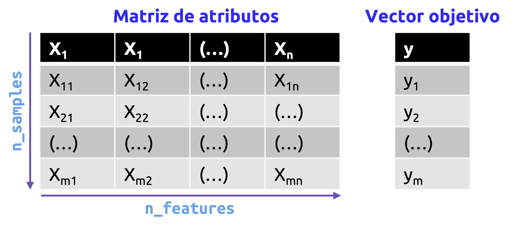
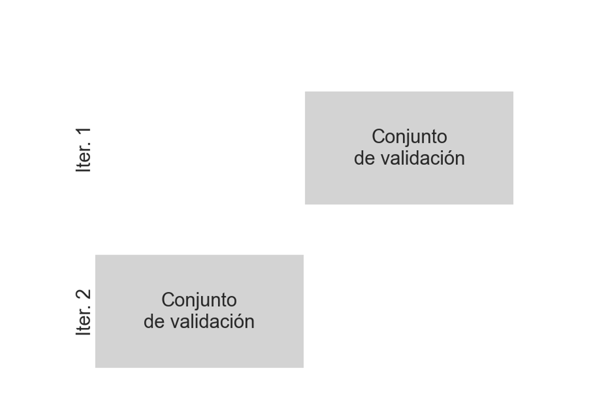
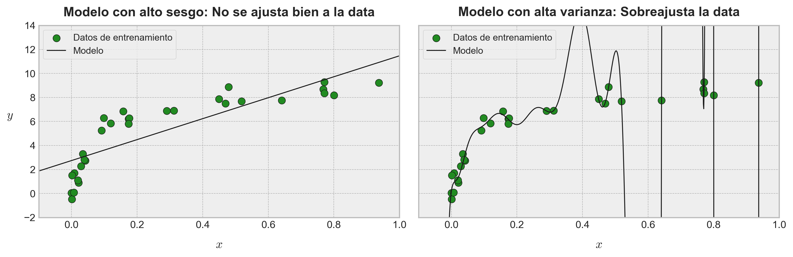
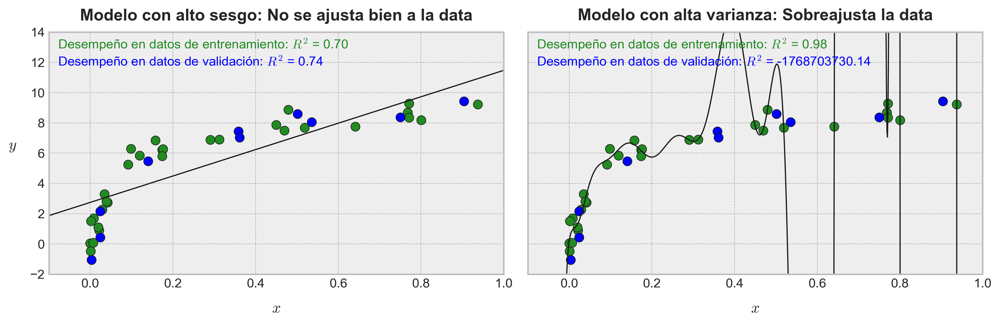
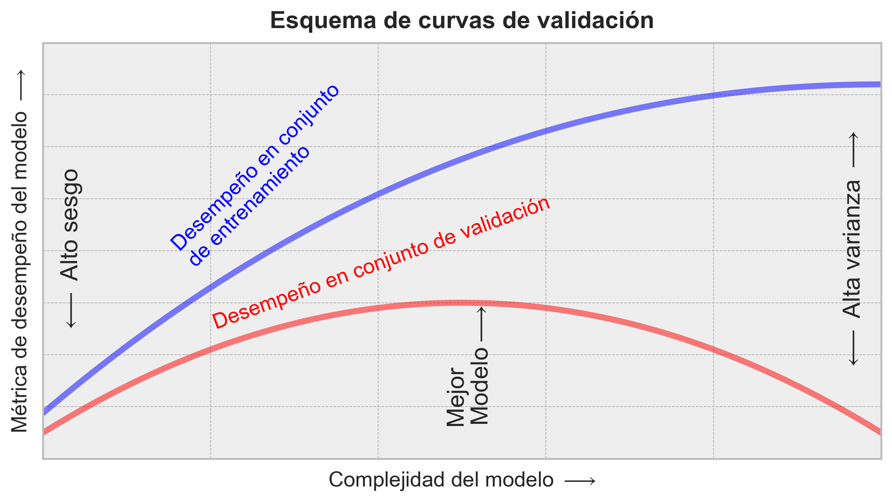
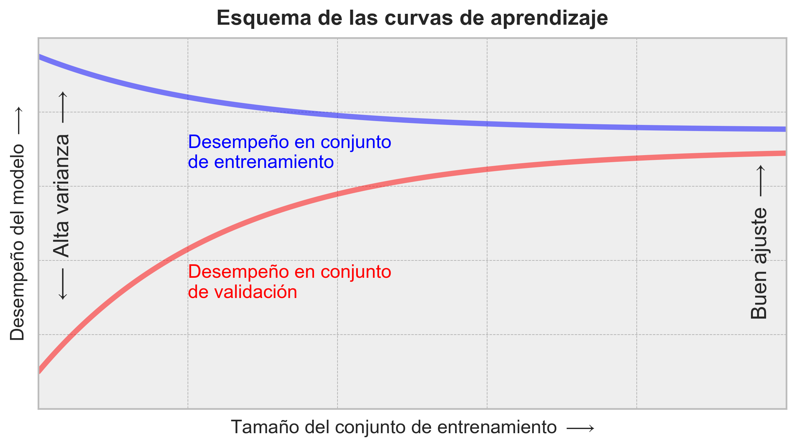

::: {.callout-important}
## Idea central

**<font color='darkmagenta'>Scikit-Learn</font>** no es solamente una colección de algoritmos: Es una gramática de trabajo para construir flujos de modelamiento reproducibles. En esta entrada construiremos una panorámica práctica de esa gramática, conectando representación de datos, estimadores, transformadores, métricas, validación, selección de modelos, búsqueda de hiperparámetros y preprocesamiento categórico. La idea central es aprender el patrón común que sostiene a casi todos los objetos de la librería: Preparar datos en una matriz de diseño `X` y un vector objetivo `y`, escoger una clase, instanciar hiperparámetros, ajustar con `fit()`, transformar o predecir con métodos consistentes y evaluar el resultado sin contaminar el flujo de validación.
:::

::: {.class-keywords}
[Scikit-Learn]{.class-keyword}
[Estimadores]{.class-keyword}
[`fit()`]{.class-keyword}
[`predict()`]{.class-keyword}
[`transform()`]{.class-keyword}
[Hiperparámetros]{.class-keyword}
[Validación]{.class-keyword}
[Preprocesamiento]{.class-keyword}
:::

## Introducción

En lo que resta de estos apuntes (o, al menos, en su gran mayoría), nos dedicaremos a aprender e implementar distintos algoritmos de *machine learning* en Python haciendo uso de la librería **<font color='darkmagenta'>Scikit-Learn</font>**, y que corresponde a uno de los recursos más utilizados en el mundo para la construcción de soluciones a infinidad de problemas por medio de modelos basados en este tipo de algoritmos.

**<font color='darkmagenta'>Scikit-Learn</font>** es una librería de Python construida sobre tres librerías esenciales que se han abordado en detalle en nuestras [entradas dedicadas al análisis de datos en Python](/clases/data-analytics/): **<font color='darkmagenta'>Numpy</font>**, **<font color='darkmagenta'>SciPy</font>** y **<font color='darkmagenta'>Matplotlib</font>**. El objetivo de **<font color='darkmagenta'>Scikit-Learn</font>** es proveer a los desarrolladores de herramientas sencillas y eficientes para el análisis de datos a nivel predictivo (*classic machine learning*), y cualquier aspirante a profesional de la ciencia de datos debería disponer de esta librería en su *caja de herramientas*. Es por ello que haremos lo posible por describir sus funcionalidades en el campo del aprendizaje supervisado, no supervisado, preprocesamiento de datos y la selección de modelos.

La librería **<font color='darkmagenta'>Scikit-Learn</font>** se caracteriza por su API limpia, uniforme y con una enorme calidad en su código y mantenimiento, contando además con una [documentación](https://scikit-learn.org/stable/index.html) que cubre de sobremanera cualquier duda que tengamos en relación a la implementación de cualquiera de sus módulos, funciones o clases. Esta API ha sido desarrollada con una filosofía de flexibilidad y escalabilidad en todo nivel, de manera tal que, una vez aprendida la sintaxis de ajuste y predicción de un tipo de modelo, el cambio a otro es relativamente directo, con exactamente los mismos atributos, variando solamente los argumentos propios (`**kwargs`) de cada uno.

**<font color='darkmagenta'>Scikit-Learn</font>** puede instalarse en nuestro computador con Windows fácilmente usando el índice de paquetes de Python mediante la siguiente instrucción en una terminal (Powershell, CMD, o cualquiera de nuestra preferencia):

```bash
pip install scikit-learn
```

Partiremos pues importando las librerías que utilizaremos en esta sección. Notemos que no haremos aún una importación de **<font color='mediumorchid'>Scikit-Learn</font>**, puesto que para su uso será más común que consideremos sus diversos **módulos** por separado. Esto es algo que veremos en detalle más adelante:

```{python}
import matplotlib.pyplot as plt
import numpy as np
import pandas as pd
import seaborn as sns
```

```{python}
from warnings import simplefilter
```

```{python}
# Setting de figuras con Matplotlib y Seaborn.
plt.rcParams["figure.dpi"] = 90
sns.set_theme()
plt.style.use("bmh")
```

```{python}
# Ignorar advertencias de tipo FutureWarning, que suelen 
# ser comunes en Scikit-Learn.
simplefilter(action='ignore', category=FutureWarning)
```

## Representación de los datos en <font color='darkmagenta'>Scikit-Learn</font>

Partiremos cubriendo la representación de los datos en **<font color='darkmagenta'>Scikit-Learn</font>**, seguido de la ***API* estimadora** de esta librería (con *API* nos referimos a la interfaz de programación de aplicaciones que facilita la interacción con los modelos y herramientas de la librería). Para ejemplificar los conceptos que aprenderemos y su correspondiente implementación, haremos uso de algunos *toysets* masivamente utilizados en muchísimos cursos en línea, ya que serán más que suficientes para la ejemplificación de los mismos.

### El famoso formato tabular

Una tabla básica corresponde a una grilla bidimensional conformada por datos en cada uno de sus registros. Las filas representan los elementos individuales de un conjunto de datos, y las columnas representan las cualidades o variables que caracterizan al mismo. Por ejemplo, consideremos el *toyset* **<font color='forestgreen'>IRIS</font>**, que ya habíamos descrito previamente, y que consta de un total de 150 muestras de características relativas a flores de la especie Iris, con un subconjunto de muestras perteneciente a cada subespecie Iris Setosa, Iris Versicolor o Iris Virginica. Este conjunto de datos puede encontrarse en una gran cantidad de librerías de Python dedicadas al análisis de datos, y por supuesto **<font color='darkmagenta'>Scikit-Learn</font>** no es la excepción. Esta librería, de hecho, cuenta con un módulo dedicado a la descarga de diversos *toysets* denominado `sklearn.datasets` (en Python, la librería **<font color='darkmagenta'>Scikit-Learn</font>** suele tener como *namespace* a `sklearn`, y no `scikit-learn`, como cabría esperar), el que cuenta varias funciones para cada *toyset* de interés. En el caso del conjunto de datos **<font color='forestgreen'>IRIS</font>**, éste puede cargarse rápidamente haciendo uso de la función `load_iris()` como sigue:

```{python}
from sklearn.datasets import load_iris
```

```{python}
# Carga del dataset IRIS.
iris_dataset = load_iris(as_frame=True)
```

En el código anterior, hemos hecho uso del argumento booleano `as_frame` para retornar las *componentes* del dataset en un formato de DataFrame de **<font color='darkmagenta'>Pandas</font>**. Los objetos retornados por las funciones de carga de datasets en **<font color='darkmagenta'>Scikit-Learn</font>** suelen ser diccionarios que cuentan con las siguientes llaves:

- `data`: Los atributos que componen el dataset. Recordemos que, con *atributos*, nos referimos a las variables independientes del mismo. Como hemos seteado el parámetro `as_frame=True`, tales atributos y sus valores vendrán en un formato de DataFrame de **<font color='darkmagenta'>Pandas</font>**. En caso contrario, el formato será de un arreglo bidimensional de **<font color='darkmagenta'>Numpy</font>**.
- `target`: Un arreglo unidimensional que contiene las *etiquetas* o valores objetivo de un dataset y que deseamos predecir por medio de un determinado modelo. Como hemos seteado el parámetro `as_frame=True`, tales atributos y sus valores vendrán en un formato de serie de **<font color='darkmagenta'>Pandas</font>**. En caso contrario, el formato será de un arreglo unidimensional de **<font color='darkmagenta'>Numpy</font>**.
- `DESCR`: Una descripción del dataset que hemos cargado.

La descripción siempre es útil, porque nos aclarará cualquier duda que tengamos, posiblemente, en relación al correspondiente conjunto de datos:

```{python}
print(iris_dataset["DESCR"])
```

En el dataset que hemos cargado previamente, cada fila del mismo está referida a la observación de una única flor, y el número de filas corresponde al número total de flores que pueblan el dataset. En general, nos ceñiremos a las nomenclaturas *clásicas* que establecimos en las [entradas del blog donde repasamos todo lo relativo a álgebra lineal](/apuntes/estructuras-lineales/), y nos referiremos a las filas de esta **matriz de diseño** como **instancias** u **observaciones**. Así, el número total de observaciones lo denotaremos programáticamente como `n_samples`. Igualmente, cada columna del dataset está referida a una determinada pieza de información cualitativa que describe cada observación. En general, nos referiremos a las columnas de la matriz de diseño como **variables independientes**, **campos** o **características**; así, el número total de columnas del dataset se denotará programáticamente como `n_features`.

En la @fig-designmatrix hemos ilustrado el formato de tabla que **<font color='darkmagenta'>Scikit-Learn</font>** suele esperar cuando deseamos ajustar un determinado modelo.

{#fig-designmatrix fig-align="center" width="70%"}

### Matriz de diseño

El formato de tipo tabla que hemos especificado previamente nos deja claro que la información puede ser idealizada o entendida como una matriz bidimensional de elementos numéricos, que denominamos como **matriz de diseño**. Por convención, esta matriz suele almacenarse en **<font color='darkmagenta'>Scikit-Learn</font>** en una variable de nombre `X`, que puede ser un arreglo bidimensional de **<font color='darkmagenta'>Numpy</font>** o un DataFrame de **<font color='darkmagenta'>Pandas</font>**. Dicha matriz siempre se asume como bidimensional, con morfología igual a `(n_samples, n_features)`.

Las **observaciones** (i.e., filas) de la matriz de diseño siempre están referidas a objetos individuales descritos por el conjunto de datos de interés. Por ejemplo, una observación podría ser una muestra de leyes, una persona, un período de tiempo, una imagen, un registro de audio, un video o cualquier elemento distintivo del problema que queramos abordar, mientras dicho elemento pueda ser descrito por medio de números. Por otro lado, las **variables independientes** (i.e., columnas) siempre están referidas a las características que describen un conjunto de datos de forma cualitativa. Estas variables, en general, están constituidas por datos de tipo flotante, pero a veces pueden presentarse en términos de datos booleanos o categóricos. Incluso, como *strings*.

Para el dataset que hemos cargado desde **<font color='darkmagenta'>Scikit-Learn</font>**, la matriz de diseño puede especificarse por medio de la llave `"data"`:

```{python}
# Matriz de diseño del dataset IRIS.
X = iris_dataset["data"]

# Mostramos las primeras filas de esta matriz.
X.head()
```

### Vector de valores de respuesta, objetivo o etiquetas

En adición a la matriz de diseño `X`, también trabajamos con un arreglo que contiene la variable de respuesta u objetivo, y que por consiguiente llamamos **vector de valores de respuesta** del conjunto de datos, denotándolo usualmente como `y`. Dicho arreglo suele ser unidimensional, con un tamaño igual a `n_samples`, y generalmente se presenta en forma de un arreglo de **<font color='darkmagenta'>Numpy</font>** o una serie de **<font color='darkmagenta'>Pandas</font>**. El arreglo objetivo puede contener variables numéricas o categóricas. Mientras que algunos estimadores de **<font color='darkmagenta'>Scikit-Learn</font>** son capaces de manejar múltiples valores objetivos en la forma de un arreglo objetivo bidimensional de morfología `(n_samples, n_targets)`, en general, nos limitaremos al estudio de problemas con una única variable de respuesta.

En el caso del dataset que hemos cargado en **<font color='darkmagenta'>Scikit-Learn</font>**, este arreglo puede especificarse por medio de la llave `"target"`:

```{python}
# Arreglo de valores objetivo del dataset IRIS.
y = iris_dataset["target"]

# Mostramos las primeras filas de este arreglo.
y.head()
```

En el arreglo anterior, se ha codificado cada subespecie de flor Iris con un valor numérico que es igual a `0` para flores de la subespecie Iris Setosa, `1` para flores de la subespecie Iris Versicolor, y `2` para flores de la subespecie Iris Virginica.

Con frecuencia, un elemento que induce confusión al iniciarnos en el aprendizaje automático y, puntualmente, en el modelamiento predictivo, corresponde a la diferenciación existente entre las variables independientes y la variable objetivo. En este caso, basta con decir que la variable objetivo es la que, en general, deseamos *estimar* o *predecir* en un problema típico de aprendizaje supervisado. Por ejemplo, en el dataset **<font color='forestgreen'>IRIS</font>**, podríamos querer construir un modelo con el objetivo de predecir la correspondiente especie de flor, basándonos en las otras mediciones que hemos observado en la matriz de diseño `X`.

Para visualizar un dataset, existen muchísimos recursos gráficos que ya hemos abordado en detalle en las [entradas dedicadas al análisis de datos](/clases/data-analytics/visualizacion-de-datos/). En este caso particular, un gráfico de tipo *pairplot* es más que suficiente. Para ello, podemos concatenar la matriz de diseño y el vector de valores objetivo a fin de construir el input que deseamos graficar:

```{python}
# Concatenamos la matriz de diseño y el vector de valores objetivo.
iris = pd.concat([X, y], axis=1)
```

```{python}
#| label: fig-introduccion-a-scikit-learn-01
#| fig-cap: "Visualización generada para la sección Vector de valores de respuesta, objetivo o etiquetas."
# Pairplot con todas las variables.
fig = sns.pairplot(
    iris,
    hue="target",
    height=2.3,
    corner=True,
    palette="viridis"
)

plt.tight_layout()
```

Podemos observar que cada subespecie de flor en este dataset tiene propiedades tales que, al enfrentar varios pares de atributos, es posible separar claramente una de otra. Formalmente, se dice que un conjunto de datos de este tipo es fácilmente **separable**.

Con todo esto en mente, ya podemos avanzar hacia lo que es la API estimadora de **<font color='darkmagenta'>Scikit-Learn</font>**.

## API estimadora de <font color='darkmagenta'>Scikit-Learn</font>

La API de **<font color='darkmagenta'>Scikit-Learn</font>** (del inglés *application programming interface*) está diseñada con los siguientes principios fundamentales en mente:

- **Consistencia:** Todos los objetos comparten una interfaz común, con un conjunto limitado de métodos, con documentación consistente.
- **Inspección:** Todos los valores de parámetros específicos son expuestos como atributos públicos.
- **Jerarquía limitada de objetos:** Solamente los algoritmos son representados como clases de Python; los datasets son representados en formatos de tipo estándar (arreglos de **<font color='darkmagenta'>Numpy</font>**, DataFrames de **<font color='darkmagenta'>Pandas</font>** o matrices dispersas de **<font color='darkmagenta'>Scipy</font>**), y los nombres de cada parámetro son simplemente *strings* de Python.
- **Composición:** Muchos problemas de machine learning pueden ser expresados como secuencias de algoritmos más fundamentales, y **<font color='darkmagenta'>Scikit-Learn</font>** hace uso de ello cada vez que sea posible.
- **Valores por defecto sensibles:** Cuando los modelos requieren parámetros especificados por el usuario, la librería siempre define valores apropiados por defecto para cada uno.

En la práctica, estos principios permiten que **<font color='darkmagenta'>Scikit-Learn</font>** sea extremadamente fácil de utilizar, una vez que dichos principios son entendidos apropiadamente. Cada algoritmo de aprendizaje en **<font color='darkmagenta'>Scikit-Learn</font>** se implementa conforme la filosofía de esta API, lo que nos provee de una interfaz consistente con un amplio rango de aplicaciones.

### Elementos básicos de la API

En general, los pasos a la hora de utilizar la API estimadora de **<font color='darkmagenta'>Scikit-Learn</font>** son los siguientes:

- Escoger una clase que represente la implementación de un determinado algoritmo de aprendizaje, importándola desde el módulo adecuado de **<font color='darkmagenta'>Scikit-Learn</font>** (por ejemplo, el módulo `sklearn.preprocessing` se especializa, como cabría esperar, en operaciones de preprocesamiento de datos, incluyendo limpiezas, escalamientos y autoimputaciones).
- Escoger los **hiperparámetros** del modelo, generando las debidas instancias dentro de la clase con los valores deseados. Como mencionamos en la [entrada anterior](/clases/machine-learning/aprendizaje-supervisado/modelos-lineales/introduccion-algoritmos-aprendizaje/), los hiperparámetros son parámetros que no se aprenden a partir de los datos, sino que son definidos por el usuario antes del proceso de entrenamiento del modelo. Estos hiperparámetros pueden influir en el rendimiento y la capacidad de generalización del modelo, y su selección adecuada es crucial para obtener buenos resultados.
- Presentar los datos dentro de una **matriz de diseño** y un **vector de valores de respuesta**, conforme lo comentado previamente.
- Ajustar el modelo a nuestros datos mediante el método `fit()`, a partir del objeto o variable en la cual instanciamos el modelo. Cualquier modelo que implique un ajuste (o cualquier transformación que también lo requiera) siempre vendrá equipado, en su correspondiente clase, con este método.
- Aplicar el modelo a datos nuevos:
    - Para un problema de **aprendizaje supervisado**, en general realizamos predicciones vía el atributo `predict()`. Algunos modelos serán capaces de generar salidas en formato de probabilidades, para lo cual será común el uso del método `predict_proba()`.
    - Para un problema de **aprendizaje no supervisado**, con frecuencia, transformamos o inferimos propiedades mediante métodos tales como `transform()` o `predict()`.

**Ejemplo 2.1 – Un problema sencillo de regresión lineal:** Como ejemplo introductorio, consideremos un problema sencillo de regresión lineal. Vale decir, queremos ajustar una recta a un conjunto de datos en $\mathbb{R}^{2}$, comúnmente con ruido, que suele representarse por medio de un par $(x_{i}, y_{i})$, para un total de $m$ instancias de entrenamiento (donde $i=1,...,m$). Para ejemplificar cómo implementar rápidamente un modelo de regresión lineal en **<font color='darkmagenta'>Scikit-Learn</font>**, crearemos algo de datos sencillos haciendo uso del generador de números pseudoaleatorios de **<font color='darkmagenta'>Numpy</font>**:

```{python}
# Definimos una semilla aleatoria fija.
rng = np.random.default_rng(42)

# Definimos un total de 50 puntos del tipo (X, y).
X = 10 * rng.random(size=50)
y = 2 * X - 1 + rng.normal(loc=0, scale=1, size=50)
```

```{python}
#| label: fig-introduccion-a-scikit-learn-02
#| fig-cap: "Un conjunto de datos con ruido."
# Graficamos nuestro conjunto de datos.
fig, ax = plt.subplots(figsize=(9, 5))
ax.scatter(X, y, color="navy", marker="o")
ax.set_title(
    "Un conjunto de datos con ruido",
    fontsize=14,
    fontweight="bold",
    pad=10,
)

ax.set_xlabel(r"$x$", fontsize=14, labelpad=10)
ax.set_ylabel(r"$y$", fontsize=14, labelpad=15, rotation=0)

plt.tight_layout()
```

Con este conjunto de datos ya construido, podemos utilizar la receta comentada previamente:

**<font color='firebrick'>Paso 1 – Escoger una clase que define el modelo a implementar:</font>** En **<font color='darkmagenta'>Scikit-Learn</font>**, cada algoritmo de aprendizaje está representado por una clase de Python, las cuales se empaquetan en módulos que se corresponden con una determinada clase de algoritmos de aprendizaje. De esta manera, para el caso de modelos de regresión lineal (de todos los tipos), siempre buscaremos alternativas de implementación en el módulo `sklearn.linear_model`. Así, por ejemplo, si queremos construir un modelo de regresión lineal sencillo, podemos importar la clase `LinearRegression` de dicho módulo como sigue:

```{python}
from sklearn.linear_model import LinearRegression
```

**<font color='firebrick'>Paso 2 – Escoger los hiperparámetros del modelo:</font>** Cada algoritmo de aprendizaje es todo un mundo de opciones, e intentaremos describir tales opciones en un contexto general. Por ejemplo, la clase `LinearRegression` permite implementar un modelo de regresión lineal múltiple con base en un ajuste de mínimos cuadrados (es decir, conforme una fórmula algebraicamente cerrada o exacta). Este modelo, en particular, cuenta con algunos hiperparámetros:

- `fit_intercept`: Corresponde a un argumento Booleano que permite definir si el modelo a construir contará o no con un parámetro de sesgo. Como ya hemos visto en otras ocasiones, el modelo de regresión lineal puede escribirse, para el caso de $n$ variables independientes y una instancia $i$-ésima, como $y_{i}=w_{0}+\sum_{j=1}^{n} w_{j}x_{ij}$, siendo $w_{0}$ el mencionado parámetro de sesgo y $\mathbf{w}=(w_{1},...,w_{n})\in \mathbb{R}^{n}$ en vector donde agrupamos los parámetros (coeficientes) del modelo. Si `fit_intercept=False`, forzamos a **<font color='darkmagenta'>Scikit-Learn</font>** a que $w_{0}$ sea igual a cero.
- `positive`: Se trata de otro argumento Booleano, que permite forzar a **<font color='darkmagenta'>Scikit-Learn</font>** a que el ajuste sea tal que $w_{j}>0; \forall j=1,...,n$.

Los hiperparámetros definen las características propias que tendrá nuestro modelo y que dependen íntegramente de nuestro criterio como expertos en cada caso. Por esta razón, dependiendo de la clase que hayamos escogido, al seleccionar tales hiperparámetros, debemos hacer siempre el ejercicio de responder algunas de las siguientes preguntas:

- ¿Queremos que el ajuste incluya algún parámetro de sesgo (como un coeficiente de intercepción, en el caso del modelo de regresión lineal)?
- ¿Nos gustaría que el modelo esté normalizado (vale decir, que previamente tengamos que escalar nuestra matriz de atributos, de tal forma que cada una de las variables siga una distribución normal estándar)?
- ¿Queremos preprocesar nuestros atributos para darle más flexibilidad a nuestro modelo (por ejemplo, implementar alguna transformación sobre los datos categóricos, o estandarizar datos numéricos)?
- ¿Qué nivel de regularización queremos implementar en nuestro modelo (a fin de reducir algunos problemas que veremos más adelante)?

Estos son ejemplos de decisiones importantísimas que debemos tomar una vez que hemos seleccionado la clase de modelo que queremos utilizar. Tales elecciones, con frecuencia, están representadas por hiperparámetros. En **<font color='darkmagenta'>Scikit-Learn</font>**, los hiperparámetros se escogen pasando sus respectivos valores cuando instanciamos una clase. No constituyen una decisión fácil, y muchas veces nuestro criterio no bastará para escoger un valor adecuado para cada uno. Pero toda línea base (es decir, un *primer modelo* contra el cual contrastaremos otros más sofisticados) requiere de tener una mínima noción de cuáles hiperparámetros utilizar.

Habiendo establecido lo anterior, vamos a construir pues un modelo de regresión lineal que sí disponga de un parámetro de sesgo. De esta manera, instanciaremos la clase `LinearRegression` a una variable llamada `model`, sobre la cual trabajaremos en forma posterior:

```{python}
# Instanciamos nuestro modelo.
model = LinearRegression(fit_intercept=True)

# Mostramos este objeto en pantalla.
model
```

Debemos tener en consideración que, cuando un modelo es instanciado, la única acción que ejecutamos es el almacenamiento de los respectivos hiperparámetros. En particular, aún no hemos realizado ningún ajuste del modelo a nuestros datos: La API estimadora de **<font color='darkmagenta'>Scikit-Learn</font>** deja muy claro esto: No es lo mismo escoger un modelo que aplicarlo.

**<font color='firebrick'>Paso 3 – Configurar nuestro conjunto de datos en una matriz de diseño y un vector objetivo:</font>** Unas líneas atrás detallamos cómo es la representación de los datos en **<font color='darkmagenta'>Scikit-Learn</font>**, la cual requiere una matriz de diseño bidimensional y un vector objetivo unidimensional. Aquí, nuestra variable objetivo ya tiene la geometría correcta (con tamaño `n_samples`):

```{python}
# El vector de valores objetivo ya es unidimensional.
y.shape
```

Sin embargo, necesitamos manipular la matriz de diseño `X` a fin de que cumpla con la geometría deseada, porque dicha matriz únicamente tiene una columna (ya que el modelo se construya a partir de una única variable independiente):

```{python}
# Redimensionamos nuestra matriz de diseño `X`, a fin de
# que ésta tenga una estructura 2D.
X = X.reshape(-1, 1)
```

**<font color='darkred'>Paso 4 – Entrenamiento del modelo:</font>** Ahora es tiempo de entrenar nuestro modelo a partir de nuestros datos. Esto puede lograrse rápidamente con el método `fit()`:

```{python}
# Entrenamos nuestro modelo.
model.fit(X, y)
```

El uso del método `fit()` genera una (a veces, enorme) cadena de operaciones internas, dependientes por supuesto del modelo escogido, almacenándose cada uno de los resultados en atributos específicos de la clase del modelo que, una vez realizado el ajuste, podemos explorar vía métodos o atributos.

En **<font color='darkmagenta'>Scikit-Learn</font>**, por convención, todos los parámetros de un modelo que fueron aprendidos mediante el método `fit()` se especifican siempre como atributos con un guión bajo (*underscore*, `_`) como sufijo. Por ejemplo, para el caso del modelo que ajustamos previamente, los coeficientes de regresión pueden consultarse usando el atributo `coef_` como sigue:

```{python}
# Consultamos los coeficientes de regresión aprendidos por el modelo.
model.coef_
```

Mientras que el parámetro de sesgo (o coeficiente de intercepción) puede consultarse usando el atributo `intercept_`:

```{python}
# Parámetro de sesgo aprendido por el modelo.
model.intercept_
```

Si comparamos estos resultados con el bloque de código en el cual construimos nuestro conjunto de datos, veremos que están relativamente cerca de los valores originales, $2$ y $-1$, respectivamente.

**<font color='firebrick'>Paso 5 – Predecir valores para datos nuevos:</font>** Una vez que ya hemos entrenado un modelo, la tarea principal del aprendizaje supervisado corresponde a la evaluación de dicho modelo basado en lo que éste predice en datos que no fueron parte de su conjunto de datos de entrenamiento, lo que se realiza, en este caso, por medio del método `predict()`. Por ejemplo:

```{python}
# Generamos algunos datos nuevos.
X_new = np.linspace(start=-1, stop=11, num=50)

# Redimensionamos el arreglo anterior.
X_new = X_new.reshape(-1, 1)

# Obtenemos predicciones para estos datos nuevos.
y_new_pred = model.predict(X_new)
```

Si comparamos las predicciones obtenidas con los puntos previamente generados por medio de un gráfico, obtenemos el siguiente resultado:

```{python}
#| label: fig-introduccion-a-scikit-learn-03
#| fig-cap: "Ajuste de un modelo de regresión lineal."
# Graficamos nuestros resultados.
fig, ax = plt.subplots(figsize=(9, 5))
ax.scatter(X, y, color="navy", marker="o", label="Datos reales")
ax.plot(X_new, y_new_pred, color="indianred", linestyle="--", label="Modelo construido")

ax.legend(loc="best", fontsize=10, frameon=True)
ax.set_title(
    "Ajuste de un modelo de regresión lineal",
    fontsize=14,
    fontweight="bold",
    pad=10,
)

ax.set_xlabel(r"$x$", fontsize=14, labelpad=10)
ax.set_ylabel(r"$y$", fontsize=14, labelpad=15, rotation=0)
plt.tight_layout()
```

◼︎

Típicamente, la calidad de un modelo se contrasta con respecto a una determinada línea base, como veremos en el siguiente ejemplo.

**Ejemplo 2.2 – Un problema sencillo de clasificación:** Vamos a ilustrar un ejemplo de implementación de modelo de clasificación en este caso, haciendo uso del *toyset* **<font color='forestgreen'>IRIS</font>**, que ya cargamos previamente. En un modelo de clasificación intentamos predecir las categorías a las cuales pertenecen las instancias de un conjunto de datos, las que en este dataset particular se corresponden con las subespecies de flor Iris para cada observación. Esto lo veremos en detalle en la [siguiente entrada](/clases/machine-learning/aprendizaje-supervisado/modelos-lineales/modelos-de-clasificacion-parte-i/) del blog.

Para este problema, trabajaremos con un algoritmo de aprendizaje extremadamente simple conocido como **modelo de Bayes ingenuo** (del inglés *naive Bayes*). Dado que es un modelo de ajuste muy rápido y sin hiperparámetros obligatorios que debamos definir, este modelo típicamente constituye una **línea base** bastante útil a la hora de trabajar en cualquier **problema de clasificación de datos**, antes de explorar otras alternativas de mayor complejidad.

Nos gustaría evaluar nuestro modelo en datos que no haya visto durante su entrenamiento, por lo cual haremos una división del conjunto de datos en dos subconjuntos bien definidos: Un **conjunto de entrenamiento** y un **conjunto de prueba**. Esto podría perfectamente realizarse a mano, pero **<font color='darkmagenta'>Scikit-Learn</font>** nos ofrece de varias opciones para separar un dataset completo en tales subconjuntos, todas ellas disponibles en el módulo `sklearn.model_selection`. Un ejemplo es la función `train_test_split()`, la que permite dividir un conjunto de datos con base en una proporción de datos que se irán al conjunto de prueba. Para problemas de clasificación, además, es recomendable usar el argumento `stratify`, ya que permite mantener aproximadamente la proporción de clases en los subconjuntos derivados de este particionamiento:

```{python}
from sklearn.model_selection import train_test_split
```

```{python}
# Nuevamente, asignamos la matriz de diseño y el vector de
# valores de respuesta relativos al dataset IRIS.
X = iris_dataset["data"]
y = iris_dataset["target"]

# Separamos nuestro dataset en conjuntos de entrenamiento 
# y de prueba.
X_train, X_test, y_train, y_test = train_test_split(
    X, y, test_size=0.2, random_state=0, stratify=y,
)
```

Notemos que la función `train_test_split()` acepta directamente la matriz de diseño `X` y el arreglo de valores objetivo `y` como entradas, creando una estructura exactamente igual a ésta, pero separada en conjuntos de entrenamiento (`X_train` e `y_train`) y de prueba (`X_test` e `y_test`). La proporción que describe cuántos datos queremos dejar fuera del entrenamiento y pasarla al conjunto de prueba siempre puede controlarse mediante el argumento `test_size`, el cual es un valor que va desde `0` a `1`, y representa dicha proporción en tanto por uno. En este ejemplo, hemos dejado un 20% de los datos para el conjunto de prueba (`test_size=0.2`) y hemos usado `stratify=y` para preservar la proporción de subespecies de Iris en ambos subconjuntos.

Prácticamente todas las herramientas provistas por **<font color='darkmagenta'>Scikit-Learn</font>** cuentan con el parámetro `random_state`, el que establece una **semilla aleatoria fija** para mantener la **reproducibilidad** de cualquier experimento que hagamos haciendo uso de modelos o transformadores de esta librería. En datasets pequeños, como **<font color='forestgreen'>IRIS</font>**, pequeñas variaciones en esta semilla pueden cambiar la composición exacta del conjunto de prueba y, por tanto, modificar la métrica obtenida. Una exactitud igual a `1.0` no implica necesariamente fuga de datos: A veces simplemente ocurre porque el conjunto de prueba elegido resulta particularmente fácil.

Con la data ya separada en conjuntos de entrenamiento y de prueba, seguimos nuestra receta para llegar a nuestras predicciones. En este caso particular, el modelo de Bayes ingenuo puede implementarse rápidamente por medio de la clase `GaussianNB`, la cual depende del módulo `sklearn.naive_bayes`. Recordemos que el objetivo de esta sección no es aprender a implementar modelos, sino simplemente mostrar como funciona la API estimadora de **<font color='darkmagenta'>Scikit-Learn</font>**. Ya nos preocuparemos de describir en detalle varios algoritmos de aprendizaje y sus correspondientes implementaciones en **<font color='darkmagenta'>Scikit-Learn</font>** en las secciones siguientes:

```{python}
from sklearn.naive_bayes import GaussianNB
```

```{python}
# Instanciamos el modelo.
model = GaussianNB()

# Lo entrenamos.
model.fit(X_train, y_train)

# Y realizamos predicciones.
y_test_pred = model.predict(X_test)
```

Luego utilizamos alguna **métrica de desempeño** adecuada para medir la calidad de nuestro modelo. En este caso, usaremos una métrica conocida como **exactitud**, la cual corresponde a la proporción de categorías con respecto al total que el modelo es capaz de estimar correctamente. Las métricas de desempeño de los modelos provistos por **<font color='darkmagenta'>Scikit-Learn</font>** *viven* en el módulo `sklearn.metrics` y, puntualmente, la exactitud puede implementarse por medio de la función `accuracy_score()`. Toda métrica relativa a modelos de aprendizaje supervisado requiere de dos parámetros: `y_true` (el valor objetivo real propio del dataset) e `y_pred` (el valor que hemos predicho a partir de nuestro modelo). Luego tenemos:

```{python}
from sklearn.metrics import accuracy_score
```

```{python}
# Calculamos la exactitud de nuestro modelo en los datos de prueba.
acc_score = accuracy_score(y_true=y_test, y_pred=y_test_pred)

# Mostramos este valor en pantalla.
print(f"Exactitud del modelo: {acc_score:.2f}")
```

El valor de exactitud que hemos obtenido es, por tanto, nuestra **línea base**. Y contra ese valor es que competiremos a la hora de construir modelos más sofisticados. ◼︎

Si bien los algoritmos de aprendizaje no supervisado serán abordados [más adelante](/clases/machine-learning/aprendizaje-no-supervisado/), es bueno que observemos igualmente cómo **<font color='mediumorchid'>Scikit-Learn</font>** suele trabajar modelos de esta naturaleza. Esto se ilustrará en el siguiente ejemplo, pero siempre bajo la premisa de que no queremos (aún) aprender en detalle a implementar modelos de este tipo. Sólo estamos observando cómo trabaja la API de **<font color='darkmagenta'>Scikit-Learn</font>**.

**Ejemplo 2.3 – Reducción de la dimensión del conjunto de datos <font color='forestgreen'>IRIS</font>:** Como ejemplo de problema de aprendizaje no supervisado, veamos como podemos **reducir la dimensión** del conjunto de datos **<font color='forestgreen'>IRIS</font>** a fin de que su visualización sea más sencilla. Con *reducir la dimensión* de un conjunto de datos nos referimos, de manera general, a que si dicho conjunto de datos consiste de un total de $n$ variables independientes, queremos preservar la mayor cantidad de información posible del mismo usando únicamente $k$ de esas variables, siendo $k<n$.

Recordemos que, conforme lo visto previamente, el conjunto de datos **<font color='forestgreen'>IRIS</font>** tiene cuatro dimensiones (cuatro variables independientes, además de la variable de respuesta).

El objetivo de la reducción de la dimensión de un conjunto de datos es pues cuestionar si existe una representación del mismo que permita retener la mayor cantidad de información posible del mismo, pero con una cantidad menor de variables independientes. Con frecuencia, esta técnica es utilizada para obtener representaciones visuales optimizadas de un conjunto de datos, ya que, después de todo, es más sencillo (por no decir *plausible*) graficar datos bidimensionales que, por ejemplo, tetradimensionales.

En este ejemplo, implementaremos un algoritmo de aprendizaje no supervisado conocido como **análisis de componentes principales** (conocido igualmente como PCA, del inglés *principal component analysis*), el cual constituye el algoritmo de reducción de dimensionalidad a escala lineal más sencillo que tenemos a nuestra disposición, y que está basado casi enteramente en una aplicación muy elegante de la [descomposición de valores singulares](/apuntes/estructuras-lineales/descomposiciones-matriciales/). Requeriremos que este modelo nos devuelva únicamente dos componentes a partir del conjunto de datos original; es decir, una representación bidimensional de un dataset que, como sabemos, es tetradimensional.

Los algoritmos de aprendizaje no supervisado que tienen como objetivo reducir las dimensiones de un conjunto de datos por medio de métodos proyectivos (fundamentalmente lineales) *viven* en el módulo `sklearn.decomposition`. En este caso particular, el análisis de componentes principales, en su versión más elemental, suele implementarse mediante la clase `PCA`, en la cual seteamos el parámetro `n_components` para determinar el número de variables independientes (componentes) al que queremos llegar, que en este ejemplo particular son dos. Tales componentes no serán dos de las variables originales del conjunto de datos, sino que dos variables que resultan de una transformación en la cual intentamos capturar la mayor cantidad posible de información (representada por la varianza del mismo), y que serán ortogonales entre sí en un dominio del plano $\mathbb{R}^{2}$.

De nuestra ya conocida receta, tenemos que:

```{python}
from sklearn.decomposition import PCA
```

```{python}
# Ajustamos el modelo a nuestra matriz de diseño (notemos que no 
# usamos las etiquetas presentes en el vector de valores respuesta).
model = PCA(n_components=2)

# Entrenamos el modelo con el conjunto de datos completo.
model.fit(X)
```

```{python}
# Transformamos nuestro conjunto de datos, a fin de obtener las 
# componentes resultantes.
X_2D = model.transform(X)

# ... las cuales son, efectivamente, dos.
X_2D.shape
```

Hemos ganado, por tanto, una representación de los datos que consta únicamente de dos variables, en vez de las cuatro originales. Si graficamos tales componentes, podremos diferenciar inmediatamente donde se emplaza cada categoría (subespecie) de flor Iris:

```{python}
from matplotlib.colors import BoundaryNorm, ListedColormap
```

```{python}
# Agregamos las componentes obtenidas al DataFrame original que 
# contiene al dataset IRIS.
iris["PC1"] = X_2D[:, 0]
iris["PC2"] = X_2D[:, 1]
```

```{python}
#| label: fig-introduccion-a-scikit-learn-04
#| fig-cap: "Reducción de la dimensión del dataset IRIS a través de PCA."
# Graficamos las componentes obtenidas.
cmap = ListedColormap(["#66c2a5", "#fc8d62", "#8da0cb"])
norm = BoundaryNorm([-0.5, 0.5, 1.5, 2.5], cmap.N)

fig, ax = plt.subplots(figsize=(9, 5))
p = ax.scatter(
    x=iris["PC1"],
    y=iris["PC2"],
    c=iris["target"],
    cmap=cmap,
    norm=norm,
)
cb = fig.colorbar(p, ticks=[0, 1, 2])
cb.ax.set_yticklabels(iris_dataset["target_names"])

# Etiquetamos el gráfico.
ax.set_title(
    "Reducción de la dimensión del dataset IRIS a través de PCA",
    fontsize=14,
    fontweight="bold",
    pad=10,
)

cb.set_label("Categoría (subespecie de flor Iris)", fontsize=12, labelpad=10)
ax.set_xlabel("Componente principal 1", fontsize=14, labelpad=10)
ax.set_ylabel("Componente principal 2", fontsize=14, labelpad=10)

plt.tight_layout()
```

Vemos entonces que, en la representación bidimensional de nuestro conjunto de datos, las distintas especies de Iris son fácilmente distinguibles (separables), incluso aunque el algoritmo de PCA no tiene ni la más mínima idea de dicho concepto de especie. Esto nos indica que un modelo de clasificación relativamente sencillo debiera poder discriminar razonablemente bien estas clases. ◼︎

**Ejemplo 2.4 – Agrupamiento (clustering) del conjunto de datos <font color='forestgreen'>IRIS</font>**: Otra aplicación importante de los algoritmos de aprendizaje no supervisado corresponde al **agrupamiento** de instancias en un conjunto de datos a partir de ciertas **similitudes** entre los datos. Tales *similitudes* no son las mismas de algoritmo a algoritmo. Algunas implementaciones toman como métrica de similitud las distancias euclidianas con respecto a un *centroide* previamente definido en nuestro conjunto de datos, mientras que otras buscan similitudes a partir de la función de densidad conjunta que permite describir el vector aleatorio a partir del cual se han *muestreado* las variables que constituyen el conjunto de datos completo, usualmente asumiendo que dicha función de densidad es una mezcla o **mixtura** de otras densidades más simples. Esta es precisamente la idea detrás de los llamados **modelos de mixtura Gaussiana**, donde asumimos que la función de densidad es una mixtura de otras densidades de tipo normal o Gaussiana.

Los modelos de mixtura *viven* en el módulo `sklearn.mixture`. En nuestro caso particular, haremos uso de la clase `GaussianMixture` para implementar un modelo de mixtura Gaussiana muy sencillo, de manera tal que, a partir de la densidad observada en el conjunto de datos **<font color='forestgreen'>IRIS</font>**, podamos inferir similitudes entre cada instancia. Como regla general, el número de grupos a los que asociaremos estas instancias es un hiperparámetro, el cual setearemos, para este caso particular, en `3`. También setearemos el parámetro `covariance_type` en `full`, lo que implicará que cada componente de mixtura tendrá su propia matriz de covarianza, la cual puede tomar cualquier tipo de ordenamiento:

```{python}
from sklearn.mixture import GaussianMixture
```

```{python}
# Instanciamos nuestro modelo.
model = GaussianMixture(n_components=3, covariance_type="full")

# Y lo entrenamos.
model.fit(X)
```

```{python}
# Predecimos los grupos o clusters a los cuales pertenecerá 
# cada instancia según nuestro modelo.
y_gmm = model.predict(X)
```

Vamos a incorporar esta información al dataset original, y graficaremos nuestros resultados:

```{python}
# Agregamos la información de los clusters a nuestro DataFrame.
iris["cluster"] = y_gmm
```

```{python}
# Graficamos los resultados.
sns.lmplot(
    x="PC1",
    y="PC2",
    data=iris,
    hue='target',
    col='cluster',
    height=3.2,
    fit_reg=False,
    aspect=0.9,
)
```

Podemos observar que los clusters determinados por nuestro modelo son muy similares a las categorías que especifican las subespecies de Iris que son representadas por cada una de las instancias del modelo, existiendo una superposición más evidente en el cluster número `2`, donde una pequeña fracción de instancias de la subespecie Iris Versicolor (`target=1`) se traslapa con instancias que pertenecen a la clase Iris Virginica (`target=2`). ◼︎

**Ejemplo 2.5 – Un ejemplo que considera el uso de imágenes:** Vamos a aplicar las recetas que hemos mostrado previamente a un problema cuyo conjunto de datos está compuesto por imágenes. Para ello, haremos uso de otro conjunto de datos muy conocido en el mundo de la ciencia de datos, llamado **<font color='forestgreen'>DIGITS</font>**, el cual está compuesto por un total de 1797 imágenes de 8 $\times$ 8 pixeles, cada una de las cuales muestra un determinado dígito, del `0` al `9`, los cuales fueron escritos a mano por un total de 60 personas. Estas imágenes están etiquetadas por un número, también del `0` al `9`, que representa el dígito con el cual se corresponde a cada una.

Para cargar este *toyset* por medio de **<font color='darkmagenta'>Scikit-Learn</font>**, usaremos la función `load_digits()`, la cual podemos importar desde el módulo `sklearn.datasets`:

```{python}
from sklearn.datasets import load_digits
```

```{python}
# Cargamos nuestro dataset.
digits = load_digits(as_frame=True)

# Y mostramos en pantalla la descripción del mismo.
print(digits["DESCR"])
```

Este dataset es famoso porque ha sido usado por infinidad de investigadores y profesionales para probar sistemas de reconocimiento de imágenes basados en algoritmos de aprendizaje. En la práctica, aquello involucra ambos, localizar e identificar caracteres en una imagen, de tal manera que un modelo pueda discriminar a qué dígito representa cada una de ellas.

Las imágenes, como ya hemos comentado en [entradas anteriores dedicadas a la visualización de datos](/clases/data-analytics/visualizacion-de-datos/), suelen representarse en una escala de grises por medio del uso de arreglos bidimensionales, de tal forma que la geometría de estos arreglos define las dimensiones de la imagen. En el siguiente bloque de código visualizaremos las primeras cien imágenes de este conjunto de datos:

```{python}
#| label: fig-introduccion-a-scikit-learn-05
#| fig-cap: "Las primeras 100 imágenes de este dataset."
# Visualizamos las primeras 100 imágenes de este dataset.
fig, ax = plt.subplots(
    nrows=10, ncols=10, figsize=(9, 9), subplot_kw={'xticks':[], 'yticks':[]}, 
    gridspec_kw=dict(hspace=0.1, wspace=0.1)
)
for i, ax_i in enumerate(ax.flat):
    ax_i.imshow(
        digits.images[i],
        cmap='binary',
        interpolation='nearest',
    )

    ax_i.text(
        0.05,
        0.05,
        str(digits.target[i]),
        transform=ax_i.transAxes,
        color='green',
    )
```

En la imagen anterior, hemos establecido además la etiqueta asociada a cada una de estas imágenes, a fin de aclarar qué dígito representa cada una de ellas.

A fin de trabajar con este conjunto de datos en **<font color='darkmagenta'>Scikit-Learn</font>**, necesitamos una matriz de diseño que especifique las correspondientes variables independientes que describen el dataset completo. Podemos lograr aquello tratando a cada pixel en la imagen como una variable independiente: Esto es, *aplanando* el arreglo original que representa a una imagen arbitraria (que, por ser de 8 $\times$ 8 pixeles, tiene una geometría `(8, 8)`), de manera que obtengamos un arreglo de geometría `(1797, 64)`; es decir, las `1797` instancias y las `64` posiciones distintas que ocupa un pixel en cada imagen. 

Adicionalmente, necesitamos el vector de valores de respuesta, el que corresponde a la clase o categoría que establece a qué número corresponde cada dígito. Ambos arreglos están construidos dentro del dataset provisto por **<font color='darkmagenta'>Scikit-Learn</font>**, mapeados por las llaves `"data"` y `"target"`, igual que en el caso del conjunto de datos **<font color='forestgreen'>IRIS</font>**:

```{python}
# Matriz de diseño de nuestro conjunto de datos.
X = digits["data"]

# Vector de valores de respuesta.
y = digits["target"]
```

Es evidente que sería extraordinario visualizar nuestro dataset en un espacio de $64$ dimensiones (porque, recordemos, cada instancia del mismo es un vector $\mathbf{x}_{i}\in \mathbb{R}^{64}$), pero aquello está más allá de lo físicamente posible. En vez de ello, reduciremos el número de dimensiones de este conjunto de datos a sólo dos, haciendo uso de un algoritmo de reducción de dimensionalidad. A diferencia de lo que hicimos antes con el conjunto de datos **<font color='forestgreen'>IRIS</font>**, donde aplicamos un sencillo análisis de componentes principales, esta vez implementaremos un modelo más sofisticado, donde intentaremos *aprender* la estructura intrínseca al conjunto de datos sin restringirnos a una descripción geométrica euclidiana que dependa de proyecciones lineales. Esto se conoce como **aprendizaje de variedades**, donde la palabra *variedad* hace referencia a una abstracción conocida como [*variedad diferencial*](https://en.wikipedia.org/wiki/Manifold), y que es un objeto que generaliza el concepto de superficie en un espacio de dimensión arbitraria. Puntualmente, haremos uso de un método llamado **ISOMAP**, el cual es capaz de determinar los aspectos geométricos de la variedad donde *vive* el conjunto de datos de interés, a fin de reducir su dimensión tomando en cuenta dicha geometría, en vez de simplemente reducir todo a componentes lineales ortogonales entre sí. Esto es mucha información, pero no nos preocupemos de los detalles por ahora (insistimos, ya llegaremos a las secciones donde abordaremos estos algoritmos en detalle).

Los algoritmos de aprendizaje de variedades de **<font color='darkmagenta'>Scikit-Learn</font>** están disponibles en el módulo `sklearn.manifold`. Puntualmente, el modelo ISOMAP puede implementarse mediante la clase `Isomap`, en la cual especificaremos que deseamos reducir la dimensión de nuestro dataset de $\mathbb{R}^{64}$ a $\mathbb{R}^{2}$ haciendo uso del parámetro `n_components`:

```{python}
from sklearn.manifold import Isomap
```

```{python}
# Instanciamos nuestro modelo.
model = Isomap(n_components=2)

# Entrenamos el modelo con el conjunto de imágenes.
model.fit(X)
```

```{python}
# Transformamos nuestro conjunto de datos, a fin de obtener las
# componentes resultantes.
X_2D = model.transform(X)

# ... las cuales son, como esperábamos, sólo dos.
X_2D.shape
```

Vamos a graficar el resultado de nuestro trabajo. Queremos observar, para las componentes obtenidas, si efectivamente cada dígito es un cluster en sí mismo:

```{python}
#| label: fig-introduccion-a-scikit-learn-06
#| fig-cap: "Proyección del dataset DIGITS en un espacio bidimensional."
fig, ax = plt.subplots(figsize=(9, 6))

p = ax.scatter(
    x=X_2D[:, 0], y=X_2D[:, 1], c=y, edgecolor='none',
    alpha=0.7, cmap=plt.get_cmap('Paired', 10)
)

cb = fig.colorbar(p)

# Etiquetamos el gráfico.
cb.set_label(label='Categoría (dígito)', fontsize=13, labelpad=10)
ax.set_xlabel("Componente reducida 1", fontsize=13, labelpad=10)
ax.set_ylabel("Componente reducida 2", fontsize=13, labelpad=10)
ax.set_title(
    "Proyección del dataset `DIGITS` en un espacio bidimensional"
    + "\nmediante un modelo ISOMAP",
    fontsize=14,
    fontweight="bold",
    pad=10,
)

plt.tight_layout()
```

Este gráfico nos entrega una buena idea respecto a qué tan separados están estos números en un espacio de $64$ dimensiones. Por ejemplo, los ceros (en celeste) y unos (en azul) presentan una superposición mínima en esta representación, lo que es algo razonable, ya que los ceros tienen tinta en forma de corona en la parte central de la imagen, mientras que los unos representan en general un único filamento en esa misma zona. Sin embargo, sí existe superposición entre los dígitos `2` (en verde) y `7` (en morado), lo que también es razonable, ya que ambos dígitos pueden compartir una forma similar, con un filamento en la parte superior y otro en la parte inferior de la imagen.

En cualquier caso, los dígitos parecen estar bien diferenciados en el dominio reducido bidimensional que hemos construido, lo que implica que un modelo de clasificación no debiera tener mayores problemas a la hora de poder discriminar adecuadamente la mayoría de estas imágenes.

Intentemos pues ajustar un modelo de clasificación a estos datos. Para ello, seguiremos la receta y separaremos nuestro dataset en un conjunto de entrenamiento y un conjunto de prueba, donde el último constará de un 20% del total de los datos:

```{python}
# Creamos nuestros conjuntos de entrenamiento y de prueba 
# (ya formateados como pares (X, y)).
X_train, X_test, y_train, y_test = train_test_split(
    X, y, test_size=0.2, random_state=42,
)
```

Ahora implementaremos un modelo de clasificación de tipo lineal, pero mucho más sofisticado, conocido como **máquina de soporte vectorial** (o **SVM**, del inglés *support vector machine*). Este modelo puede implementarse usando la clase `SVC()`, provista por el módulo `sklearn.svm`:

```{python}
from sklearn.svm import SVC
```

```{python}
# Instanciamos nuestro modelo.
model = SVC(random_state=42)

# Y lo entrenamos.
model.fit(X_train, y_train)
```

```{python}
# Obtenemos predicciones para el conjunto de prueba.
y_test_pred = model.predict(X_test)

# Calculamos la exactitud de nuestro modelo en los datos de prueba.
acc_score = accuracy_score(y_true=y_test, y_pred=y_test_pred)

# Mostramos este valor en pantalla.
print(f"Exactitud del modelo: {acc_score:.2f}")
```

Incluso con este modelo sencillo (o bueno, no *tanto* en verdad...), tenemos un 99% de exactitud sobre los datos de prueba. Sin embargo, esta única métrica no nos dice dónde se ha equivocado nuestro modelo. Una forma adecuada de averiguar dónde están los mayores errores que ha cometido este modelo implica construir una estructura conocida como **matriz de confusión**, la cual permite ordenar las predicciones hechas por el modelo en términos de sus *aciertos* en cada una de las categorías representadas por la variable de respuesta (`y_test`) y las predicciones efectuadas (`y_test_pred`). Dicha matriz puede calcularse fácilmente haciendo uso de la función `confusion_matrix()`, la cual *vive* en el módulo `sklearn.metrics`:

```{python}
from sklearn.metrics import confusion_matrix
```

```{python}
# Construimos la matriz de confusión de nuestro modelo sobre los datos de prueba.
cm = confusion_matrix(y_true=y_test, y_pred=y_test_pred)

# Mostramos esta matriz en pantalla.
cm
```

La matriz de confusión es un concepto que [estudiaremos en detalle](/clases/machine-learning/aprendizaje-supervisado/modelos-lineales/modelos-de-clasificacion-parte-i/) más adelante. Sin embargo, su estructura es sencilla: Se trata de una matriz cuadrada cuya diagonal principal muestra los *aciertos* del modelo en cada categoría (diez en nuestro caso, ordenadas desde el dígito `0` hasta el dígito `9`).  Cualquier valor distinto de cero fuera de la diagonal principal implica que el modelo ha cometido un error clasificando una determinada instancia. En la matriz de confusión anterior, podemos observar que el valor en la posición `(8, 1)` es igual a `2`, lo que significa que nuestro modelo ha confundido en dos oportunidades un valor que es igual a `8`, etiquetándolo incorrectamente como un 1`.

Esta matriz puede graficarse para su mejor comprensión, haciendo uso de un sencillo mapa de calor:

```{python}
#| label: fig-introduccion-a-scikit-learn-07
#| fig-cap: "Matriz de confusión sobre los datos de prueba."
# Graficamos la matriz de confusión.
fig, ax = plt.subplots(figsize=(9, 5))

p = sns.heatmap(
    cm, square=True, annot=True, cbar=True, cmap="mako", ec="k", 
    lw=0.8, ax=ax, cbar_kws=dict(label="Número de instancias")
)

# Etiquetamos el gráfico.
p.figure.axes[-1].yaxis.label.set_fontsize(12)
ax.set_xlabel('Valor predicho', fontsize=12, labelpad=10)
ax.set_ylabel('Valor real', fontsize=12, labelpad=10)
ax.set_title(
    "Matriz de confusión sobre\nlos datos de prueba", 
    fontsize=14, fontweight="bold", pad=10,
)

plt.tight_layout()
```

Otra forma de verificar dónde pueden estar acumulados los errores que comete nuestro modelo, es graficar los dígitos de entrada nuevamente, junto con sus categorías predichas, aunque esto puede resultar problemático para un conjunto tan grande de imágenes. Por lo tanto, ejemplificaremos esto para las primeras 100 imágenes del conjunto de prueba. Usaremos el color rojo para las clasificaciones incorrectas, y el verde para las correctas, con lo cual:

```{python}
#| label: fig-introduccion-a-scikit-learn-08
#| fig-cap: "Las primeras 100 imágenes del conjunto de prueba y las categorías."
# Graficamos las primeras 100 imágenes del conjunto de prueba y las categorías 
# predichas para cada una.
fig, ax = plt.subplots(
    nrows=10,
    ncols=10,
    figsize=(9, 9),
    subplot_kw={'xticks':[], 'yticks':[]},
    gridspec_kw=dict(hspace=0.1, wspace=0.1),
)
test_images = X_test.values.reshape(-1, 8, 8)

for i, ax_i in enumerate(ax.flat):
    ax_i.imshow(
        test_images[i],
        cmap='binary',
        interpolation='nearest',
    )

    ax_i.text(
        0.05,
        0.05,
        str(y_test_pred[i]),
        transform=ax_i.transAxes,
        color='green' if (y_test.values[i] == y_test_pred[i]) else 'red',
    )
```

La examinación de este gráfico nos indica que el modelo se desempeña de manera sorprendente, incluso con lo rápido que lo construimos. Esto, por supuesto, es algo esperable, ya que este conjunto de datos no es difícil de aprender por algoritmos de aprendizaje, incluso, sencillos. No será el caso, en general, cuando nos veamos enfrentados a datos del mundo real. Pero es una primera aproximación razonable para ir examinando lo que seremos capaces de hacer una vez entremos en detalle en todo lo que respecta a la implementación de modelos de machine learning en **<font color='darkmagenta'>Scikit-Learn</font>**. ◼︎

## Hiperparámetros y validación

Previamente, aprendimos la más esencial de las *recetas* para la implementación de un modelo de machine learning en **<font color='darkmagenta'>Scikit-Learn</font>**:

1. Escoger la clase de un modelo.
2. Escoger los hiperparámetros del modelo.
3. Ajustar el modelo a los datos de entrenamiento.
4. Utilizar el modelo para predecir valores de respuesta para datos nuevos.

Las primeras dos partes de esta receta, la elección del modelo y de sus hiperparámetros, constituyen el eje fundamental a la hora de medir la eficiencia de este tipo de técnicas desde una perspectiva del diseño (e idoneidad) del modelo que hemos elegido para resolver un determinado problema. A fin de realizar una elección adecuada e informada, necesitamos disponer de alguna forma de validar tanto nuestro modelo como sus hiperparámetros en términos de su calidad y ajuste a nuestra data. Y mientras esto puede sonar muy simple en el papel, existen varios problemas que debemos evitar en estas importantes decisiones.

En términos legos, la validación de un modelo corresponde a un proceso más bien simple: Después de escoger un modelo y sus hiperparámetros, podemos estimar qué tan efectivo es aplicándolo a nuestros datos de entrenamiento, comparando sus predicciones en relación a los valores reales respectivos.

En lo que sigue, primero mostraremos una aproximación errónea en lo que respecta a la validación de un modelo y explicaremos por qué dicho enfoque falla, antes de pasar a metodologías más robustas, tales como la separación de un conjunto de datos en datos de entrenamiento y datos de prueba (que ya ilustramos previamente), y la validación cruzada (que introducimos teóricamente en la sección anterior). Nuestro objetivo será presentar estas ideas a nivel práctico, pero las volveremos a revistar una vez que desarrollemos ideas más detalladas en relación a la implementación de algoritmos de aprendizaje más esenciales.

### Lo que no debemos hacer...

Demostraremos el enfoque ingenuo para este problema utilizando para ello el conjunto de datos **<font color='forestgreen'>IRIS</font>**. Ya hemos instanciado este conjunto de datos en la variable `iris_dataset`, así que extraeremos sus variables independientes y dependientes para desarrollar nuestra idea:

```{python}
# Matriz de diseño del dataset.
X = iris_dataset["data"]

# Vector de valores objetivo del dataset.
y = iris_dataset["target"]
```

Ahora escogeremos un modelo y sus hiperparámetros. En este ejemplo, haremos uso de un algoritmo de aprendizaje muy simple, llamado **modelo de $k$-vecinos más cercanos**. Para los mineros, este método puede resultar familiar si tenemos alguna noción de la terminología geoestadística, ya que existe un método con el mismo nombre que nos permite estimar leyes de mineral en una grilla regularizada a partir de muestras que han sido extraidas de un yacimiento por medio de sondajes, basándonos en los valores de las $k$-muestras más cercanas al punto de interés, siendo $k$ un hiperparámetro. El algoritmo de aprendizaje se basa exactamente en la misma idea, y usa la distancia euclidiana para determinar tales vecinos y asignar categorías basándose precisamente en aquellas que son espacialmente más cercanas a una instancia en particular.

Este algoritmo de aprendizaje puede implementarse en **<font color='darkmagenta'>Scikit-Learn</font>** por medio de la clase `KNeighborsClassifier`, la cual está disponible en el módulo `sklearn.neighbors`. En nuestro caso particular, intentaremos estimar la subespecie asociada a una flor Iris apoyándonos en la información de su vecino (instancia) más cercano, por lo que el valor de $k$ en este ejemplo será igual a $1$. Dicho valor se puede setear mediante el argumento `n_neighbors=1`:

```{python}
from sklearn.neighbors import KNeighborsClassifier
```

```{python}
# Instanciamos nuestro modelo.
model = KNeighborsClassifier(n_neighbors=1)

# Entrenamos el modelo en el dataset completo y 
# luego hacemos predicciones.
model.fit(X, y)
y_pred = model.predict(X)
```

Con el modelo ya entrenado y las predicciones listas, calculamos la exactitud del mismo:

```{python}
print(f"Exactitud del modelo = {(accuracy_score(y, y_pred)):.2f}")
```

Vemos por tanto que la fracción de instancias correctamente clasificadas por el modelo es de un 100%. Podríamos celebrarlo, porque claro… ¡Es una exactitud del 100% para nuestro modelo! Pero en realidad, este número por sí solo no significa mucho, ya que evaluar un modelo con la misma data utilizada para entrenarlo es un error de tipo fundamental. Y esto es porque los algoritmos de machine learning suelen tener el poder suficiente para ajustarse perfectamente a un conjunto de datos de entrenamiento. Esto ilustra la importancia de siempre separar datos de un dataset a fin de usarlos como conjunto de prueba.

### El conjunto de validación

Podemos pues tener una mejor estimación de la calidad de un modelo apartando una cierta cantidad de datos del conjunto de entrenamiento, a fin de utilizarla luego para estimar las métricas de desempeño que requiramos. Por supuesto, como estos datos nunca fueron vistos por el modelo antes, resultan en una estimación más *justa* de su calidad. Esto, como sabemos, puede lograrse mediante la función `train_test_split()` como sigue:

```{python}
# Dividimos la data en dos conjuntos de igual tamaño
X1, X2, y1, y2 = train_test_split(
     X, y, random_state=42, train_size=0.5,
)

# Ajustamos el modelo en uno de estos conjuntos
model.fit(X1, y1)
```

```{python}
# Evaluamos el modelo en el otro conjunto
y2_pred = model.predict(X2)

# Y calculamos la exactitud del modelo en dicho conjunto.
acc_score = accuracy_score(y_true=y2, y_pred=y2_pred)

# Mostramos este valor en pantalla.
print(f"Exactitud del modelo: {acc_score:.2f}")
```

Ahora vemos un resultado no tan increíble, aunque sigue siendo bastante bueno: Un 97% de exactitud sobre datos que el modelo no vio durante su entrenamiento, y que apartamos precisamente para validar la calidad del mismo en términos de *generalización* de su correspondiente aprendizaje.

### Implementación (básica) de la validación cruzada

Una desventaja de utilizar conjuntos de datos apartados de los datos de entrenamiento para validar un modelo es que, por supuesto, hemos perdido una porción de la data que podríamos haber utilizado para entrenar nuestro modelo. En el ejemplo anterior, la mitad de la data no contribuye al entrenamiento de nuestro modelo. Aquello no es óptimo, y puede causar algunos problemas, especialmente si nuestro conjunto de entrenamiento es muy pequeño. Además, por supuesto, también podemos formular otras preguntas igualmente válidas, porque... ¿Quién nos asegura que un conjunto sea más *representativo* que el otro?

Una forma de evitar aquello es mediante la implementación de **validación cruzada**; esto es, generar una secuencia de ajustes donde, para cada uno de ellos, particionamos el conjunto de entrenamiento en $k$ subconjuntos, separando uno de esos subconjuntos (que consecuentemente llamamos **conjunto de validación**), para luego ser utilizado en la  validación de los resultados del modelo, el cual a su vez ha sido entrenado usando los $k-1$ subconjuntos restantes. Visualmente, esto puede esquematizarse de forma muy simplificada conforme lo observado en la @fig-crossvalid, donde se ilustra el particionamiento necesario para una validación cruzada con $k=2$ subconjuntos.

{#fig-crossvalid fig-align="center" width="60%"}

En el esquema anterior, tenemos dos pruebas de validación, utilizando cada mitad de la data como una especie de *conjunto de prueba* (razón por la cual este procedimiento se llama *validación cruzada*). De esta manera, usando la data que separamos previamente, podríamos implementar una validación cruzada con dos subconjuntos (*dobleces*, es el término formal) como sigue:

```{python}
# Construimos predicciones en los conjuntos 1 y 2, habiendo entrenado el modelo correspondiente
# con el subconjunto restante de datos.
y2_pred = model.fit(X1, y1).predict(X2)
y1_pred = model.fit(X2, y2).predict(X1)

# Calculamos la exactitud de ambos modelos.
acc_score_1 = accuracy_score(y_true=y1, y_pred=y1_pred)
acc_score_2 = accuracy_score(y_true=y2, y_pred=y2_pred)

# Mostramos estos valores en pantalla.
print(f"Exactitud del modelo en el conjunto 1: {acc_score_1:.2f}")
print(f"Exactitud del modelo en el conjunto 2: {acc_score_2:.2f}")
```

Lo que obtenemos como resultado ahora son dos valores de exactitud, los cuales podríamos combinar (digamos, calculando la media de ambos) para tener una idea más acabada del desempeño de nuestro modelo sobre los correspondientes datos de validación.

Podemos expandir esta idea aún más, y considerar aún más subconjuntos en la validación cruzada, digamos `5`. En un esquema como éste se separan los datos en cinco grupos, cada uno de los cuales se utiliza para validar un modelo entrenado con los otros cuatro restantes. Por supuesto, sería muy tedioso replicar aquello con una estructura de código como la anterior, pero la buena noticia es que **<font color='darkmagenta'>Scikit-Learn</font>** nos provee de una excelente implementación de esta metodología por medio de la función `cross_val_score()`, y que *vive* en el módulo `sklearn.model_selection`. En este caso, debido a que particionaremos nuestro conjunto de datos en un total de 5 subconjuntos, setearemos el parámetro `cv=5`. El resto de los parámetros pedidos por esta función corresponden al modelo previamente instanciado (`model`), la matriz de valores de entrada (`X`) y el arreglo de valores objetivo (`y`):

```{python}
from sklearn.model_selection import cross_val_score
```

```{python}
# Implementación de una validación cruzada con 5 subconjuntos.
cross_val_score(estimator=model, X=X, y=y, cv=5, scoring="accuracy")
```

Notemos que, en esta implementación, hemos especificado la métrica de desempeño del modelo directamente por medio de un *string* (exactitud, para este ejemplo particular). **<font color='darkmagenta'>Scikit-Learn</font>**, para estos efectos, dispone de una completa [lista de posibles métricas de desempeño](https://scikit-learn.org/stable/modules/model_evaluation.html#scoring-parameter) que podemos escoger y el string que las representará bajo el parámetro `scoring`. Más adelante explicaremos en detalle muchas de estas métricas, pero siempre es bueno leer algo por nuestra cuenta.

Podemos observar que el entrenamiento realizado por medio de esta validación cruzada nos ha permitido obtener cinco valores de desempeño distintos en términos de la exactitud del modelo, los cuales podríamos promediar a fin de disponer de una única métrica que nos indique la capacidad de nuestro modelo para **generalizar su aprendizaje**. En este caso, al parecer dicha generalización es muy buena, ya que hemos obtenido números bastante buenos en cada validación. Sin embargo, cuando abordemos en detalle todo lo relativo a modelos lineales generalizados, observaremos que la exactitud puede ser una métrica muy *engañosa*.

**<font color='darkmagenta'>Scikit-Learn</font>** nos permite implementar un número bastante generoso de esquemas de validación cruzada que son útiles dependiendo de cada situación en particular que enfrentemos. Por ejemplo, podríamos querer ir al caso extremo en el cual el número de subconjuntos de validación sea igual al número de observaciones: Esto es, entrenamos un modelo en todas las instancias, salvo en una, en cada iteración. Este esquema se conoce en la práctica como *leave-one-out* (”deja uno afuera”), e implica siempre que el número de validaciones será igual al número de instancias de entrenamiento. Este procedimiento puede implementarse en **<font color='darkmagenta'>Scikit-Learn</font>** por medio de la clase `LeaveOneOut`, la cual a su vez es un parámetro de entrada de la función `cross_val_score()` (bajo el argumento `cv`):

```{python}
from sklearn.model_selection import LeaveOneOut
```

```{python}
# Calculamos los valores de exactitud y los asignamos a una variable.
scores = cross_val_score(
    estimator=model,
    X=X,
    y=y,
    cv=LeaveOneOut(),
    scoring="accuracy",
)

# Mostramos dichos valores.
scores
```

Debido a que el *toyset* **<font color='forestgreen'>IRIS</font>** tiene un total de `150` instancias, hemos generado un total de `150` valores de exactitud para la validación cruzada anterior. Ya que la validación del modelo se hace sobre una única instancia, el modelo en cuestión sólo tendrá dos resultados posibles: Correcto o incorrecto, razón por la cual la exactitud será igual a `1` o `0`, respectivamente, como se observa en el arreglo `scores`. Pareciera ser que, por tanto, un valor representativo de este proceso corresponde a la media de todos estos valores:

```{python}
# Calculamos la media de los valores de exactitud obtenidos.
mean_score = scores.mean()

# Mostramos este valor en pantalla.
print(f"Exactitud media del modelo: {mean_score:.2f}")
```

Cuando abordemos en detalle la implementación de algoritmos de aprendizaje, volveremos a describir algunos detalles más específicos relativos a la validación cruzada.

## Una introducción a la selección de modelos

Ahora que ya hemos revisado algunas implementaciones muy sencillas de validación y, en particular, de validación cruzada, iremos un poco más allá en relación a la **selección de modelos** y, por supuesto, de **hiperparámetros**. Ambos problemas corresponden a las decisiones más importantes que debemos tomar en cualquier problema de modelamiento predictivo vía algoritmos de aprendizaje.

El cuestionamiento siguiente es de importancia fundamental: *Si nuestro estimador está teniendo un desempeño por debajo de lo esperado ¿Cómo deberíamos proceder?* Y al respecto, hay varias respuestas posibles:

- Usamos un modelo de mayor complejidad o flexibilidad.
- Usamos un modelo de menor complejidad o flexibilidad.
- Agregamos más datos de entrenamiento.
- Reunimos más información para agregar más variables al modelo.

Con frecuencia, la respuesta a este cuestionamiento suele ser contra-intuitiva. En particular, puede ocurrir que utilizar un modelo de mayor complejidad pueda devenir en resultados aún peores, o bien, que la adición de más instancias de entrenamiento no genere mejoras en nuestras métricas de desempeño. La habilidad de determinar qué pasos darán lugar a mejoras en nuestro modelo es lo que separa a productos exitosos de otros que suelen fallar.

### El trade-off entre varianza y sesgo

Fundamentalmente, la pregunta relativa al *mejor modelo* se resuelve encontrando un lugar adecuado en el llamado **trade-off entre varianza y sesgo**. Consideremos la @fig-biasvarprob, en la cual se presentan dos ajustes vía regresión sobre el mismo conjunto de datos. Es evidente que ninguno de estos modelos puede calificarse como bueno en términos de ajuste. Sin embargo, fallan en su objetivo por razones muy distintas.

{#fig-biasvarprob fig-align="center" width="100%"}

El modelo del lado izquierdo de la @fig-biasvarprob intenta construir una línea recta que se ajuste a los datos. Debido a que la misma data presenta una disposición espacial de mayor complejidad que la que tendría cualquier línea recta, este modelo lineal nunca será capaz de describir bien la data. Este fenómeno se conoce como **underfitting**: Esto es, **el modelo carece de la flexibilidad suficiente para dar cuenta de todos los atributos propios de la data**. Otra denominación cae de cajón: **El modelo presenta un alto nivel de sesgo**.

El modelo de la derecha de la @fig-biasvarprob, por otro lado, intenta ajustar un polinomio de grado significativo a los datos. Aquí el modelo tiene la flexibilidad suficiente para dar cuenta de todos los atributos intrínsecos a los datos de entrenamiento, pero a pesar de describir dichos datos perfectamente, la geometría de la curva de ajuste parece ser más precisa para las propiedades y ruido de esos datos en particular, lo que no es necesariamente replicable cuando el modelo se ve enfrentado a datos nuevos (por ejemplo, los datos que constituyen el conjunto de prueba). Este problema se conoce como **overfitting**. Esto es, **el modelo tiene tanta flexibilidad, que termina ajustándose a ruido aleatorio propio de los datos de entrenamiento, perdiendo la capacidad de generalizar información a cualquier otro dato puntual**. En otras palabras, **el modelo presenta una alta varianza**.

Para darle otra mirada a estos problemas, consideremos lo que ocurre si usamos ambos modelos para predecir el valor de la variable de respuesta en datos nuevos, lo que se muestra en los gráficos de la @fig-strat.

{#fig-strat fig-align="center" width="100%"}

La métrica de desempeño que usamos para medir la calidad de los modelos en estos ejemplos corresponde al coeficiente **r-cuadrado** (comúnmente representado como $r^{2}$, y llamado con frecuencia *coeficiente de determinación*, mayormente en el contexto de los modelos lineales), el cual permite cuantificar la bondad del ajuste relativa a un modelo a partir de las diferencias (errores) existentes entre un valor real u objetivo ($Y_{real}$) y un valor estimado ($Y_{pred}$). Así, cuando $Y_{real}$ no es constante, un modelo que simplemente es capaz de predecir el valor medio de los valores observados arrojará siempre un valor de $r^{2}$ igual a cero. Por otro lado, un valor de $r^{2}$ igual a $1$ implicará que el modelo siempre se ajusta perfectamente a los valores de $Y_{real}$. $r^{2}$ puede ser negativo, ya que un modelo siempre puede ser arbitrariamente peor.

De lo anterior, a partir de los valores de $r^{2}$ para cada modelo, podemos establecer que:

- Para modelos con alto sesgo, el desempeño del mismo en el conjunto de prueba es similar al del conjunto de entrenamiento (y de orden, en general, bajo).
- Para modelos de alta varianza, el desempeño en el conjunto de prueba es significativamente menor al logrado durante el entrenamiento.

Si imaginamos que tenemos un cierto nivel de habilidad que nos permita ajustar la complejidad de un modelo, deberíamos esperar que los resultados de las métricas de rendimiento correspondientes en los conjuntos de entrenamiento y validación se comporten tal cual como se ilustra en la @fig-validationcurves.

{#fig-validationcurves fig-align="center" width="80%"}

El esquema que se ilustra en la @fig-validationcurves suele denominarse como **esquema de curvas de validación**. A partir de él, podemos observar lo siguiente:

- El valor de la correspondiente métrica de desempeño en el conjunto de entrenamiento es siempre mayor que el mismo en el conjunto de validación. Este es generalmente el caso: Un modelo tendrá mejor desempeño sobre datos que *conoce*, en relación a datos que éste *no conoce*.
- Para el caso de **modelos de muy baja complejidad (alto sesgo)**, suelen ocurrir ajustes de muy baja calidad sobre los datos de entrenamiento (es decir, **subajuste** o **underfitting**), lo que significa que dichos modelos son malos predictores tanto para los datos de entrenamiento como los de validación/prueba.
- Para el caso de **modelos de muy alta complejidad (alta varianza)**, suele ocurrir que el modelo aprende de *memoria* los patrones que son inherentes al ruido particular propio de los datos de entrenamiento, lo que implica que el modelo se ajusta muy bien a ellos (es decir, existe **sobreajuste** u **overfitting**), pero es un mal predictor sobre datos de validación.
- Para algún **valor intermedio entre sesgo y varianza**, la curva de validación alcanza un **máximo desempeño**. Dicho valor indica el **trade-off o intercambio óptimo** entre ambos y, por tanto, dicho trade-off define al **mejor modelo** posible de construir (dado un correspondiente algoritmo de aprendizaje).

Naturalmente, los métodos para *“sintonizar”* cada uno de los (eventualmente) muchos parámetros ajustables que provee cada algoritmo de aprendizaje (**hiperparámetros**) pueden variar enormemente. Esto lo discutiremos en profundidad cuando veamos en detalle cada caso. Sin embargo, vale la pena señalar que este proceso de ajuste de hiperparámetros es importantísimo por sí solo, y es uno de los procedimientos más importantes a la hora de construir un modelo. De hecho, en la teoría, tiene un nombre bien ganado: **Regularización de hiperparámetros**.

**Ejemplo 2.6 – Implementación de las curvas de validación en <font color='darkmagenta'>Scikit-Learn</font>:** Vamos a ejemplificar los conceptos anteriores haciendo uso de un procedimiento de validación cruzada a fin de construir las curvas de validación para un modelo previamente instanciado en **<font color='darkmagenta'>Scikit-Learn</font>**. En este caso puntual, implementaremos un modelo de **regresión polinomial**.

Este modelo es, de hecho, de regresión lineal. La palabra *polinomial* hace referencia a la adición de atributos al conjunto de datos original, que resultan de multiplicaciones sucesivas entre los atributos del dataset original y sus potencias hasta un número determinado, llamado **grado** de la regresión, y que es un hiperparámetro. Por ejemplo, si un conjunto de datos consta de las variables $\mathbf{u}$ y $\mathbf{v}$, un modelo de regresión polinomial de grado 3 considerará además las *nuevas* variables $\mathbf{u}^{3}$, $\mathbf{u}^{2}\mathbf{v}$, $\mathbf{u}\mathbf{v}^{2}$ y $\mathbf{v}^{3}$.

En este ejemplo, haremos uso de un dataset generado en **<font color='darkmagenta'>Numpy</font>** a partir de una función cuadrática del tipo $f(x)=ax^{2}+bx+c$, donde $a\neq 0$, añadiendo una cantidad significativa de ruido a los valores resultantes. En este caso particular, consideraremos $a=8, b=8$ y $c=1$:

```{python}
# Definimos nuestro dataset.
m = 100 # Número de instancias.
X = 5 * rng.random(size=(m, 1)) - 4
y = 8 * X**2 + 8 * X + 1 + rng.integers(low=-10, high=10, size=(m, 1))
```

```{python}
#| label: fig-introduccion-a-scikit-learn-09
#| fig-cap: "Dataset de ejemplo para la construcción de curvas de validación."
# Graficamos este dataset.
fig, ax = plt.subplots(figsize=(9, 5))
ax.scatter(X, y, color="indianred", ec="k")

# Etiquetamos el gráfico.
ax.set_title(
    "Dataset de ejemplo para la construcción de curvas de validación",
    fontsize=14,
    fontweight="bold",
    pad=10,
)
ax.set_xlabel(r"$x$", fontsize=14, labelpad=10)
ax.set_ylabel(r"$y$", fontsize=14, labelpad=15, rotation=0)

plt.tight_layout()
```

Evidentemente, una línea recta nunca se ajustará adecuadamente a este conjunto de datos. Por lo tanto, se hace necesaria la implementación de algún modelo no lineal. Para el caso de la **regresión polinomial**, **<font color='darkmagenta'>Scikit-Learn</font>** nos provee de la clase `PolynomialFeatures` (en el módulo `sklearn.preprocessing`), la cual nos permitirá transformar nuestro conjunto de datos, añadiendo las combinaciones polinómicas que deseemos. Para ello, debemos definir primeramente el grado de la regresión usando el hiperparámetro `degree`:

```{python}
from sklearn.preprocessing import PolynomialFeatures
```

```{python}
# Instanciamos nuestro transformador.
poly = PolynomialFeatures(degree=2)

# Ajustamos este transformador a nuestros datos originales.
poly.fit(X)
```

Las clases que involucran el preprocesamiento de datos suelen recibir el nombre de **transformadores**, ya que su misión es precisamente transformar un dataset en otro que cumpla con ciertas características deseables. Estos transformadores se ajustan igual que un modelo, haciendo uso del método `fit()`. Sin embargo, para aplicarlos y, en efecto, transformar un conjunto de datos, hacen uso del método `transform()`:

```{python}
# Transformamos nuestro dataset original.
X_poly = poly.transform(X)
```

Si mostramos en pantalla nuestro conjunto de datos transformado, observaremos que ahora hay tres variables en vez de sólo una ($\mathbf{x}$): Una variable de sesgo que se añade al dataset cuyas instancias son todas iguales a 1, la variable original $\mathbf{x}$, y la misma variable elevada al cuadrado $\mathbf{x}^{2}$:

```{python}
# Mostramos el dataset transformado.
X_poly[:5]
```

Con esta transformación ya realizada, sólo nos resta implementar un modelo de regresión lineal y estudiar sus resultados:

```{python}
# Instanciamos el modelo.
model = LinearRegression()

# Lo entrenamos sobre nuestro conjunto transformado.
model.fit(X_poly, y)
```

```{python}
# Y mostramos los coeficientes estimados.
print(f"a = {model.coef_[0][1]:.2f}")
print(f"b = {model.coef_[0][2]:.2f}")
print(f"c = {model.intercept_[0]:.2f}")
```

Podemos observar que los valores obtenidos por el modelo son cercanos a los utilizados originalmente para generar nuestro dataset. A fin de observar las estimaciones obtenidas por el mismo, graficaremos los correspondientes resultados:

```{python}
# Generamos un rango de valores a evaluar.
X_range = np.linspace(start=-4, stop=1, num=100).reshape(-1, 1)

# Transformamos el rango anterior.
X_range_poly = poly.transform(X_range)

# Obtenemos predicciones para estos valores.
y_pred = model.predict(X_range_poly)
```

```{python}
#| label: fig-introduccion-a-scikit-learn-10
#| fig-cap: "Dataset de ejemplo para la construcción de curvas de validación junto con el modelo ajustado."
# Graficamos el dataset original junto con las predicciones del modelo.
fig, ax = plt.subplots(figsize=(9, 5))
ax.scatter(X, y, color="indianred", ec="k", label="Datos")
ax.plot(X_range, y_pred, color="k", label="Modelo")

# Etiquetamos el gráfico.
ax.set_title(
    "Dataset de ejemplo para la construcción de curvas de validación\njunto con el modelo ajustado",
    fontsize=14,
    fontweight="bold",
    pad=10,
)
ax.legend(loc="best", frameon=True)
ax.set_xlabel(r"$x$", fontsize=14, labelpad=10)
ax.set_ylabel(r"$y$", fontsize=14, labelpad=15, rotation=0)

plt.tight_layout()
```

Notemos que la clase `PolynomialFeatures(degree=d)` transforma un arreglo que contiene $n$ variables independientes en otro arreglo que contendrá un total de $\frac{(n+d)!}{n!d!}$ variables. Esto es, literalmente, una *explosión* de columnas nuevas. Por lo tanto, no es recomendable usar esta transformación si nuestro conjunto de entrenamiento tiene demasiados campos.

Con el modelo ya construido, ya estamos en condiciones de construir las correspondientes curvas de validación. Para ello, haremos uso de la función `validation_curve()`, la cual *vive* en el módulo `sklearn.model_selection`. Sin embargo, existe un problema. Esta función requiere de un único objeto que represente al modelo completo (que, conforme las reglas comentadas previamente para el caso de la API estimadora de **<font color='darkmagenta'>Scikit-Learn</font>**, debe disponer de métodos tales como `fit()` y `predict()`), y nuestro modelo de regresión polinomial es el resultado del uso de dos objetos: Un transformador (`PolynomialFeatures`) y un modelo de regresión lineal que se aplica sobre un dataset transformado (`LinearRegression`). Necesitamos pues unir ambos objetos en uno solo.

Para lograr esto, nos ayudaremos de un concepto muy importante en el mundo del análisis de datos, llamado **pipeline**. Ahondaremos en detalles más adelante, así que por el momento, nos conformaremos con saber que una *pipeline* es un conjunto de entidades encargadas de procesar datos (de manera arbitraria), los cuales se conectan en serie a fin de secuenciar tales procesamientos en una única entidad colectiva, de manera tal que la salida de un procesamiento es entrada para el siguiente.

En términos prácticos, en este ejemplo, la *pipeline* que necesitamos construir encadena dos procesos: Un transformador polinómico y un modelo de regresión lineal que se aplica sobre la salida de dicho transformador. **<font color='darkmagenta'>Scikit-Learn</font>** nos provee de una clase que nos permite encadenar fácilmente una secuencia como ésta, llamada (sorpresivamente) `Pipeline`, y que dispone de un parámetro `steps`, el que nos permite listar la secuencia de objetos que compondrán la pipeline precisamente haciendo uso de una lista de Python, donde cada uno de sus elementos es una tupla del tipo `(nombre, objeto)`, donde `nombre` es un *string* que identificará al `objeto` que integraremos en la pipeline:

```{python}
from sklearn.pipeline import Pipeline
```

```{python}
# Construimos nuestra pipeline.
pipe = Pipeline(
    steps=[
        ("poly_transformer", poly),
        ("regression", model),
    ],
)

# Esta pipeline ya puede usarse para construir el modelo completo de una vez.
pipe.fit(X, y)
```

```{python}
# ... y obtener predicciones.
y_pred = pipe.predict(X_range)
```

Y ahora sí, ya podemos implementar las curvas de validación:

```{python}
from sklearn.model_selection import validation_curve
```

```{python}
# Definimos un rango de grados posibles para la regresión polinomial.
degrees = np.arange(start=0, stop=61, step=1)

# Implementación de las curvas de validación.
train_score, val_score = validation_curve(
    estimator=pipe,
    X=X,
    y=y,
    param_name="poly_transformer__degree", 
    param_range=degrees,
    cv=7,
    scoring="r2",
)
```

```{python}
#| label: fig-introduccion-a-scikit-learn-11
#| fig-cap: "Curvas de validación, modelo de regresión polinomial."
# Graficamos nuestros resultados.
fig, ax = plt.subplots(figsize=(9, 5))
ax.plot(
    degrees,
    np.median(train_score, 1),
    color="dodgerblue",
    label=r"$r^{2}$ en datos de entrenamiento",
)

ax.plot(
    degrees,
    np.median(val_score, 1),
    color="firebrick",
    label=r"$r^{2}$ en datos de validación",
)

# Etiquetamos el gráfico.
ax.legend(loc="lower right", frameon=True, fontsize=12)
ax.set_xlabel("Grado de la regresión", fontsize=13, labelpad=10)
ax.set_ylabel("Valor de $r^{2}$", fontsize=13, labelpad=10)
ax.set_title(
    "Curvas de validación, modelo de regresión polinomial", 
    fontsize=14,
    fontweight="bold",
    pad=10,
)

plt.tight_layout()
```

Podemos observar que el valor de la métrica $r^{2}$ crece enormemente a medida que el grado polinómico del modelo de regresión aumenta, hasta llegar a 4. Luego este valor empieza decrecer paulatinamente, comenzando a caer significativamente para los datos de validación con respecto a los datos de entrenamiento. Es claro que el trade-off óptimo entre sesgo y varianza para este modelo se encuentra para un grado igual a 4, puesto que es para este hiperparámetro donde la métrica de desempeño escogida llega a su máximo en ambos conjuntos de datos.

El gráfico anterior muestra precisamente el comportamiento cualitativo que esperamos: El desempeño del modelo en el conjunto de entrenamiento es siempre mayor que el logrado en el conjunto de validación, y es monótonamente creciente con respecto al aumento de la complejidad (grado) de regresión polinomial; y el desempeño del modelo en el conjunto de validación alcanza un máximo antes de que el mismo comience a sobreajustar los datos de entrenamiento.

Notemos que la determinación de este modelo óptimo no requirió del cálculo de ninguna métrica de desempeño, sólo revisar la relación entre complejidad y flexibilidad del mismo. ◼︎

### Curvas de aprendizaje

Si implementamos un modelo de regresión polinomial de grado muy alto, lo más probable es que obtengamos un mejor resultado, sobre los correspondientes datos de entrenamiento, que el que obtendríamos al implementar un sencillo modelo de regresión lineal. En los siguientes bloques de código se muestra la implementación de tres modelos para ajustar el conjunto de datos que generamos para el ejemplo (2.6): Un modelo lineal, un modelo polinomial cuadrático, y un modelo polinomial de grado $40$:

```{python}
# Instanciamos tres modelos, uno lineal y dos polinómicos.
mod1 = LinearRegression()
pipe1 = Pipeline(
    steps=[
        ("transformer", PolynomialFeatures(degree=2)),
        ("regressor", LinearRegression()),
    ],
)

pipe2 = Pipeline(
    steps=[
        ("transformer", PolynomialFeatures(degree=40)),
        ("regressor", LinearRegression()),
    ],
)

# Entrenamos nuestros modelos.
mod1.fit(X, y)
pipe1.fit(X, y)
pipe2.fit(X, y)
```

```{python}
# Obtenemos predicciones para estos modelos.
y_pred1 = mod1.predict(X_range)
y_pred2 = pipe1.predict(X_range)
y_pred3 = pipe2.predict(X_range)
```

```{python}
#| label: fig-introduccion-a-scikit-learn-12
#| fig-cap: "Comparación de modelos de regresión lineal y polinomial."
# Y graficamos los resultados de cada uno.
fig, ax = plt.subplots(figsize=(9, 5))

ax.scatter(X, y, color="indianred", ec="k", label="Datos")
ax.plot(X_range, y_pred1, color="forestgreen", label="Modelo lineal")
ax.plot(X_range, y_pred2, color="navy", label="Modelo polinómico de grado 2")
ax.plot(X_range, y_pred3, color="black", label="Modelo polinómico de grado 40")

# Etiquetamos el gráfico.
ax.set_title(
    "Comparación de modelos de regresión lineal y polinomial",
    fontsize=14,
    fontweight="bold",
    pad=10,
)

ax.legend(loc="best", frameon=True, fontsize=10)
ax.set_xlabel(r"$x$", fontsize=14, labelpad=10)
ax.set_ylabel(r"$y$", fontsize=14, labelpad=15, rotation=0)
ax.set_ylim(-15, 105)

plt.tight_layout()
```

Observemos que el modelo de grado $40$ intenta forzar enormemente el ajuste en los datos de entrenamiento. Dicho modelo está, por tanto, sobreajustando severamente los datos de entrenamiento, mientras que el modelo lineal está experimentando underfitting. En este caso, el modelo que mejor generaliza la información es el cuadrático, ya que sabemos que estos datos fueron generados a partir de una función cuadrática.

Una forma alternativa de determinar si estamos frente a un caso de overfitting o underfitting corresponde a la examinación de las **curvas de aprendizaje** del modelo respectivo. Corresponden a gráficos que muestran el desempeño de un modelo en los conjuntos de entrenamiento y validación como función del tamaño del conjunto de entrenamiento. Para generar estas curvas, debemos entrenar el modelo varias veces en distintos subconjuntos de entrenamiento que, por supuesto, difieren en tamaño, con frecuencia de manera incremental.

En el siguiente ejemplo, describiremos rápidamente cómo construir estas curvas en **<font color='darkmagenta'>Scikit-Learn</font>**.

**Ejemplo 2.7 – Curvas de aprendizaje en <font color='darkmagenta'>Scikit-Learn</font>:** Consideremos nuevamente el conjunto de datos **<font color='forestgreen'>DIGITS</font>**. Vamos a mostrar cómo podemos construir curvas de aprendizaje a fin de mostrar el efecto de ir añadiendo cada vez más instancias durante el proceso de entrenamiento de un modelo, donde dicho efecto puede cuantificarse a partir del desempeño de los modelos construidos a medida que dichas instancias aumentan el tamaño del conjunto de entrenamiento.

Para ilustrar estas curvas existen varias alternativas. Las últimas versiones de **<font color='darkmagenta'>Scikit-Learn</font>** vienen equipadas con clases que permiten construir rápidamente tales curvas, aunque esos recursos pueden ser incompatibles con algunas versiones más viejas de algunas librerías. Para evitarnos problemas, primero procederemos a construir curvas de aprendizaje de manera un tanto más *artesanal*, definiendo un proceso iterativo en el cual aumentaremos gradualmente el tamaño del conjunto de entrenamiento. para este propósito, haremos uso de la función `learning_curve()`, disponible en el módulo `sklearn.model_selection`. Esta función es capaz de entrenar un modelo en una cantidad a definir de conjuntos de entrenamiento de distintos tamaños, siguiendo un proceso de validación cruzada:

```{python}
from sklearn.model_selection import learning_curve
```

```{python}
# Generamos los datos necesarios para construir las curvas de aprendizaje. En este caso, el modelo a testear
# corresponde a un sencillo modelo Bayesiano ingenuo, usando la exactitud como métrica de desempeño.
train_sizes, train_scores, test_scores = learning_curve(
    estimator=GaussianNB(),
    X=digits["data"],
    y=digits["target"], 
    cv=5,
    scoring="accuracy",
    train_sizes=np.arange(30, 1410, 47).astype(int),
)
```

En el código anterior, observamos que la función `learning_curve()` nos pide varios argumentos: `estimator`, que corresponde a un modelo instanciado propio de la API de **<font color='darkmagenta'>Scikit-Learn</font>**, el cual puede ser igualmente un objeto de tipo `Pipeline` (que, de hecho, es nuestro caso); `X` e `y`, que son los datos de entrada y objetivo de nuestro problema; `cv`, que corresponde al esquema de validación cruzada a seguir (en este caso, 5 subconjuntos de validación); `scoring`, que define la métrica de desempeño a utilizar como base para la construcción de las curvas de aprendizaje; y `train_sizes`, que es una secuencia donde especificamos el número de instancias totales que usaremos del conjunto de entrenamiento en cada caso (con un máximo del 80% de las mismas).

Con los datos ya listos, sólo nos resta graficar las curvas obtenidas:

```{python}
# Calculamos los valores medios de exactitud para los datos
# de entrenamiento y validación.
train_mean_score = train_scores.mean(axis=1)
test_mean_score = test_scores.mean(axis=1)
```

```{python}
#| label: fig-introduccion-a-scikit-learn-13
#| fig-cap: "Curvas de aprendizaje, dataset DIGITS Modelo Bayesiano ingenuo."
# Graficamos las curvas de aprendizaje.
fig, ax = plt.subplots(figsize=(9, 5))

ax.plot(
    train_sizes,
    train_mean_score,
    color="firebrick",
    lw=2,
    label="Conjunto de entrenamiento",
)

ax.plot(
    train_sizes,
    test_mean_score,
    color="dodgerblue",
    lw=2,
    label="Conjunto de prueba",
)

# Etiquetamos el gráfico.
ax.legend(loc="best", frameon=True, fontsize=10)
ax.set_xlabel("Tamaño del conjunto de entrenamiento", fontsize=12, labelpad=10)
ax.set_ylabel("Exactitud (absoluta)", fontsize=12, labelpad=10)
ax.set_title(
    "Curvas de aprendizaje, dataset DIGITS\nModelo Bayesiano ingenuo",
    fontsize=14,
    fontweight="bold",
    pad=10,
)

plt.tight_layout()
```

Podemos observar que la exactitud del modelo comienza a decrecer a medida que el conjunto de entrenamiento aumenta de tamaño, siendo la tasa de decrecimiento cada vez menor (a partir, aproximadamente, de `600` instancias de entrenamiento). Por otro lado, la exactitud sobre los datos de validación crece conforme el número de instancias de entrenamiento aumenta, presentándose igualmente un punto de inflexión aproximadamente en un valor igual a `400` instancias. El **trade-off óptimo de sesgo y varianza** se presenta en el punto para el cual la diferencia entre el desempeño del modelo en los conjuntos de entrenamiento y de prueba es mínimo, o bien, cuando su tasa de crecimiento es despreciable. Este último es el caso para nuestro ejemplo, ya que la diferencia se va haciendo cada vez más pequeña, pero la tasa de decrecimiento de dicha diferencia se hace cada vez menor.

Las últimas versiones de **<font color='mediumorchid'>Scikit-Learn</font>** (desde la `1.2.0`) disponen de la clase `LearningCurveDisplay` para la construcción de curvas de aprendizaje, en el módulo `sklearn.model_selection`, la que a su vez dispone del método `from_estimator`, el cual permite especificar el modelo a evaluar y una serie de parámetros propios del gráfico a construir. En este ejemplo en particular, usaremos una estrategia de mezcla de instancias en el conjunto de entrenamiento a fin de implementar la validación cruzada, aumentando la aleatoriedad del muestreo, usando la clase `ShuffleSplit`:

```{python}
from sklearn.model_selection import LearningCurveDisplay, ShuffleSplit
```

```{python}
# Definimos un diccionario con los parámetros a ingresar en nuestra clase.
common_params = {
    "X": digits["data"],
    "y": digits["target"],
    "train_sizes": np.arange(30, 1410, 47).astype(int),
    "cv": ShuffleSplit(random_state=42),
    "score_type": "both",
    "line_kw": {"lw": 2},
    "std_display_style": "fill_between",
    "score_name": "Exactitud",
}
```

```{python}
#| label: fig-introduccion-a-scikit-learn-14
#| fig-cap: "Curvas de aprendizaje, dataset DIGITS Modelo bayesiano ingenuo."
fig, ax = plt.subplots(figsize=(9, 5))

LearningCurveDisplay.from_estimator(
    estimator=GaussianNB(),
    **common_params,
    ax=ax,
)

# Etiquetamos el gráfico.
ax.legend(
    ["Conjunto de entrenamiento", "Conjunto de prueba"],
    fontsize=10,
    frameon=True,
)

ax.set_xlabel("Tamaño del conjunto de entrenamiento", fontsize=12, labelpad=10)
ax.set_ylabel("Exactitud (absoluta)", fontsize=12, labelpad=10)
ax.set_title(
    "Curvas de aprendizaje, dataset DIGITS\nModelo bayesiano ingenuo",
    fontsize=14,
    fontweight="bold",
    pad=10,
)

plt.tight_layout()
```

Las curvas obtenidas son las mismas que antes, con el detalle (muy útil) que ahora se muestra una banda de incertidumbre para cada una, resultado del proceso de validación cruzada seleccionado para esta evaluación. ◼︎

El **comportamiento general** que esperaríamos de una curva de aprendizaje se resume a continuación:

- Un modelo de complejidad fija experimentará overfitting en un dataset de tamaño pequeño: Esto significa que el desempeño del modelo en el conjunto de entrenamiento será relativamente alto, pero el desempeño en el conjunto de validación será relativamente bajo.
- Un modelo de complejidad fija experimentará underfitting en un dataset de tamaño grande: Esto significa que el desempeño del modelo en el conjunto de entrenamiento tenderá a decrecer, pero el desempeño en el conjunto de validación tenderá a ser creciente.
- Un modelo nunca, excepto por alguna situación puramente casual, puede generar scores mayores en los datos de validación que en los datos de entrenamiento: Esto significa que, en el caso límite, las curvas de aprendizaje serán siempre asintóticamente paralelas.

El esquema general de las curvas de aprendizaje se muestra en la @fig-vlearningcurves. El atributo más notable de estas curvas corresponde a la convergencia de ambas a un determinado valor de desempeño. En particular, esto significa que, dado un número de datos de entrenamiento para el cual ocurre esto, la adición de más data no generará mejoras en el desempeño de nuestro modelo.

{#fig-vlearningcurves fig-align="center" width="80%"}

Las curvas de aprendizaje constituyen un diagnóstico valioso, porque nos entregan una explicación razonable y visual de cómo nuestro modelo responde a crecimientos en el número de instancias del conjunto de entrenamiento. En particular, cuando nuestra curva de aprendizaje ha convergido (esto es, cuando ambas curvas son –ojalá– asintóticamente paralelas), la adición de más instancias de entrenamiento no generará mejoras de ningún tipo en nuestro modelo.

En el caso anterior, la única forma de generar ajustes de mayor calidad, es usualmente recurrir a otros algoritmos de aprendizaje, comúnmente de mayor complejidad. Pero en definitiva, tener a mano las curvas de aprendizaje de cualquier modelo que hayamos construido nos permite tener una idea razonable en relación a quedarnos con un modelo o ir por alternativas mejores.

### Búsqueda de hiperparámetros por medio de grillas

La discusión anterior tenía como objetivo formular algunos conceptos básicos relativos al trade-off entre sesgo y varianza, y su dependencia en la complejidad del modelo respectivo y del tamaño del conjunto de entrenamiento. En la práctica, los modelos generalmente tienen más de una única *perilla* que podemos mover y, por tanto, las curvas de aprendizaje o validación pasan ahora a ser hipersuperficies en espacios de, a veces, muchas dimensiones. En tales casos, la visualización deja de ser una opción y debemos recurrir a técnicas de selección más sofisticadas.

**<font color='darkmagenta'>Scikit-Learn</font>** nos provee de algunas herramientas automatizadas para verificar este tipo de selecciones, siendo las herramientas de **búsqueda de hiperparámetros** las más utilizadas en la práctica. Ahondaremos en esto en una sección especialmente dedicada para ello, incluso describiendo el uso de librerías especializadas en calibración de modelos a partir de hiperparámetros optimizados tales como **<font color='darkmagenta'>Optuna</font>**, pero por el momento, nos conformaremos con revisar algunas de las opciones disponibles en **<font color='darkmagenta'>Scikit-Learn</font>**, y que se denominan como **búsqueda por grillas**.

Supongamos que disponemos de un modelo que contiene $p$ hiperparámetros que pueden tomar $k_{1},...,k_{p}$ valores distintos, respectivamente. El número posible de hiperparámetros que podemos escoger es, por tanto, un dominio en $\mathbb{R}^{p}$ compuesto por un total de $k_{1}\cdots k_{p}$ puntos, llamado **espacio de parámetros** del modelo en cuestión. La búsqueda por grillas es un recurso en el cual una serie de combinaciones de los $p$ hiperparámetros se evalúa por medio de una métrica de desempeño previamente escogida, haciendo uso de una estrategia de validación adecuada (comúnmente validación cruzada), rankeando luego los valores de estas métricas y escogiendo como **mejor modelo** a aquel que produce los mejores desempeños sobre los correspondientes datos de validación. Dependiendo de si evaluamos cada posible combinación de hiperparámetros o sólo una fracción de ellas escogidas aleatoriamente, hablamos de **búsquedas exhaustivas** o **búsquedas aleatorizadas**, respectivamente, las cuales se encuentran disponibles en **<font color='darkmagenta'>Scikit-Learn</font>**, en su módulo `sklearn.model_selection`, por medio de las clases `GridSearchCV` y `RandomizedSearchCV`, respectivamente.

Ambas clases, `GridSearchCV` y `RandomizedSearchCV`, vienen equipadas con métodos que se heredan de los correspondientes modelos previamente instanciados, y que permiten realizar ajustes (`fit()`) y predicciones (`predict()`) sobre un conjunto dado de datos. Algunos de ellos son los siguientes:

- `estimator`: El modelo a evaluar por medio de este procedimiento. Puede ser un objeto ya instanciado, una pipeline, o una clase con sus correspondientes parámetros base (como `random_state`).
- `param_grid`: Un diccionario que especifica todos los hiperparámetros que deseamos evaluar por medio de la búsqueda. Cada uno de los valores de estos hiperparámetros se especifica mediante alguna secuencia tal como una lista de Python o un arreglo de **<font color='darkmagenta'>Numpy</font>**, incluyendo estructuras que permiten especificar rangos para una distribución dada típicos del módulo de estadística de **<font color='darkmagenta'>Scipy</font>**.
- `scoring`: La métrica de desempeño que definirá los resultados de la evaluación de cada combinación de hiperparámetros. Es posible utilizar más de una métrica si se entrega una lista con strings que las definan (conforme la [lista de métricas disponibles](https://scikit-learn.org/stable/modules/model_evaluation.html) en **<font color='darkmagenta'>Scikit-Learn</font>**).
- `refit`: Permite determinar una métrica (de las especificadas mediante el parámetro `scoring`) para ajustar un modelo usando la mejor combinación encontrada de hiperparámetros en la búsqueda.
- `cv`: Permite definir la estrategia de validación cruzada a utilizar durante los subsecuentes entrenamientos de los modelos en cada combinación de hiperparámetros. Hasta ahora, hemos utilizado simplemente números enteros para definir una estrategia estática, que simplemente considera una cantidad $k$ de separaciones del conjunto de entrenamiento, pero existen clases que permiten definir estrategias más sofisticadas, como veremos más adelante.

En el siguiente ejemplo, usaremos una búsqueda exhaustiva usando la clase `GridSearchCV` a fin de mostrar el funcionamiento de este tipo de estrategia.

**Ejemplo 2.8 – Búsqueda exhaustiva de hiperparámetros en <font color='darkmagenta'>Scikit-Learn</font>:** Consideremos, una vez más, el *toyset* <font color='forestgreen'>DIGITS</font>. Intentaremos ajustar un modelo basado en un algoritmo de aprendizaje denominado **máquina de soporte vectorial**, que revisaremos en detalle en secciones posteriores. Este algoritmo es muy adecuado para abordar problemas de clasificación de todo tipo, y se encuentra disponible en el módulo `sklearn.svm`, haciendo uso de la clase `SVC`. Esta clase posee dos hiperparámetros esenciales: `kernel`, que permite aplicar una transformación no lineal a los datos de entrada, de tal manera que el modelo sea capaz de resolver problemas de clasificación que no sean linealmente separables; y `C`, que es un parámetro positivo que controla la intensidad de la regularización. Valores pequeños de `C` favorecen fronteras de decisión más suaves, mientras que valores grandes de `C` penalizan con más fuerza los errores de clasificación sobre el conjunto de entrenamiento.

Partimos pues importando la clase con la cual instanciaremos el modelo:

```{python}
from sklearn.svm import SVC
```

```{python}
# Instanciamos nuestro modelo.
svm = SVC()
```

Ahora definiremos la grilla que contendrá todos los hiperparámetros a evaluar:

```{python}
# Grilla de hiperparámetros.
param_grid = {
    "kernel": ["linear", "rbf", "sigmoid", "poly"],
    "C": np.linspace(start=0.1, stop=1.0, num=10),
}
```

Y ya estamos en condiciones de realizar la búsqueda de hiperparámetros óptimos para este modelo (ojo, este proceso puede tomar algunos minutos, dependiendo del hardware que poseamos):

```{python}
from sklearn.model_selection import GridSearchCV
```

```{python}
# Instanciamos nuestra estrategia de búsqueda.
searcher = GridSearchCV(
    estimator=svm,
    param_grid=param_grid,
    scoring="accuracy",
    refit="accuracy",
    cv=5,
)

# Realizamos la búsqueda.
searcher.fit(X=digits["data"], y=digits["target"])
```

Con la búsqueda ya realizada, podemos visualizar rápidamente los resultados de la misma por medio del atributo `cv_results_`, el cual retorna un diccionario con todas las combinaciones de hiperparámetros testeadas en el modelo, conforme la estrategia de validación cruzada utilizada. Por simplicidad, podemos transformar dicho resultado a un DataFrame de **<font color='darkmagenta'>Pandas</font>**, a fin de obtener una representación más razonable:

```{python}
# Obtenemos los resultados de la búsqueda.
results = pd.DataFrame(searcher.cv_results_)

# Mostramos los resultados en pantalla.
results[["param_kernel", "param_C", "mean_test_score"]]
```

Podemos observar que la mejor combinación de hiperparámetros encontrada por nuestra grilla de búsqueda produce un modelo cuya exactitud en datos de validación cruzada supera el 97%. Aún no sabemos en detalle qué representan estos valores, es cierto, pero ya podemos anticipar algo importante: **<font color='darkmagenta'>Scikit-Learn</font>** no sólo nos permite entrenar modelos, sino también explorar de manera ordenada el espacio de decisiones que rodea a cada algoritmo.

Siempre podremos obtener el mejor modelo de todos los encontrados mediante el atributo `best_estimator_`:

```{python}
# Obtenemos el mejor modelo encontrado.
best_model = searcher.best_estimator_

# Y mostramos sus hiperparámetros.
print(f"Kernel: {best_model.kernel}")
print(f"C: {best_model.C}")
```

Más adelante abordaremos algunos aspectos más detallados del proceso de optimización de hiperparámetros. ◼︎

## Una introducción al preprocesamiento de datos categóricos

Previamente comentamos algunas de las nociones fundamentales de la implementación de modelos de machine learning en **<font color='darkmagenta'>Scikit-Learn</font>**, pero en todos los ejemplos desarrollados asumimos que los datos con los cuales trabajaremos vienen siempre en el mismo formato amigable, del tipo `(n_samples, n_features)` para la matriz de diseño y `(n_samples,)` para el vector de respuesta, siendo cada una de las variables del dataset de tipo numérico. Sin embargo, resulta que, en el mundo real, los datos que nos interesan rara vez vendrán nativamente en este formato. Por lo tanto, uno de los pasos más importantes en la implementación de este tipo de modelos en la práctica corresponde al preprocesamiento de datos: Esto es, tomar cualquier conjunto de datos que nos interese trabajar y llevarlo a un formato tal que podamos construir la respectiva matriz de diseño y el vector de valores de respuesta.

De hecho, el preprocesamiento de datos es un proceso tan importante que, en la práctica, suele consumir la mayor parte del tiempo que se invierte en la construcción de un modelo. Esto se debe a que, en general, los datos con los cuales trabajaremos no estarán nativamente en el formato adecuado para construir un modelo de machine learning, y por lo tanto, será necesario aplicar una serie de transformaciones sobre ellos a fin de llevarlos a dicho formato.

El preprocesamiento de datos involucra, por norma general, la aplicación de transformaciones sobre nuestros conjuntos de datos, de tal forma que obtengamos otro conjunto, derivado del anterior, por medio de tales transformaciones. Estos conjuntos resultantes pueden o no preservar la cantidad de atributos del conjunto de datos original, sus órdenes de magnitud y sus densidades observadas de probabilidad. Ejemplos de estas transformaciones son la normalización, estandarización y transformación polinómica, que ya hemos visto en secciones anteriores. Y tales transformadores *residen*, en general, en el módulo `sklearn.preprocessing`.

Ahora estamos interesados en describir algunos transformadores que nos permitirán preprocesar datos de tipo categóricos; es decir, datos que representan estados de forma no numérica. Por ejemplo, supongamos que nos encontramos explorando datos relativos a camiones de extracción (CAEX) en una operación minera a cielo abierto que, además de poseer datos numéricos típicos como el costo de capital del camión o su capacidad de tolva, también contiene datos categóricos, como la marca/modelo del camión. Por ejemplo, nuestro conjunto de datos podría parecerse a algo como esto:

```{python}
# Datos simulados que caracterizan a algunos camiones de extracción.
data = [
    {'price': 850000, 'capacity': 280, 'model': '793F'},
    {'price': 700000, 'capacity': 270, 'model': '789D'},
    {'price': 950000, 'capacity': 300, 'model': '794D'},
    {'price': 600000, 'capacity': 220, 'model': 'MT4400D AC'}
]
```

A fin de expresar el modelo de estos camiones de forma numérica, podríamos vernos tentados a generar una codificación que simplemente mapee cada modelo a un valor numérico de tipo correlativo. Por ejemplo:

```{python}
{'793F': 1, '789D': 2, '794D': 3, 'MT4400D AC': 4}
```

Sin embargo, una codificación como ésta no es adecuada. **<font color='darkmagenta'>Scikit-Learn</font>** suele *entender* los datos numéricos en términos de sus relaciones de orden, por lo cual, naturalmente, una transformación de este tipo implicaría que `'789D' > '793F'`, porque `2 > 1`. Sin embargo, ésto no tiene sentido. De la misma forma, **<font color='darkmagenta'>Scikit-Learn</font>** podría interpretar que `'793F' + '789D' = '794D'`, ya que `1 + 2 = 3`, lo que, evidentemente, tampoco tiene sentido.

En un caso como éste, donde la similitud entre categorías distintas es un tema de importancia y no se ve representado en una transformación directa de los datos originales, lo más apropiado es aplicar una técnica de preprocesamiento conocida en la práctica como **codificación de tipo “one-hot”**. Esta transformación permite crear una columna por categoría que entrega valores binarios, $1$ para cuando dicha categoría se da en una determinada instancia, y $0$ cuando no es así. Matemáticamente, si una variable categórica $\mathbf{x}$ contiene $m$ instancias y puede tomar $k$ categorías distintas, una transformación de tipo *one-hot* crea $k$ variables nuevas, digamos $\mathbf{d}_{1},...,\mathbf{d}_{k}$, tales que, si la instancia $x_i$ pertenece a la categoría $j$ (donde $1\leq j\leq k$), entonces $d_{ij}=1$ y $d_{is}=0$ para todo $s\neq j$, donde $d_{is}$ corresponde al valor de la variable nueva $\mathbf{d}_{s}$ para la instancia $i$.

La implementación de una codificación de tipo *one-hot* en **<font color='darkmagenta'>Scikit-Learn</font>** es sencilla, ya que el módulo `sklearn.preprocessing` dispone de la clase `OneHotEncoder` para tales fines. Consideremos pues un conjunto de datos como el siguiente, en el cual disponemos de mediciones (simuladas) de esfuerzos en una serie de puntos de extracción, cada una de las cuales lleva consigo una categoría relativa a la resistencia del punto a escala de macizo rocoso:

```{python}
# Generamos una semilla aleatoria fija.
rng = np.random.default_rng(42)

# Simulamos nuestras mediciones de esfuerzos a partir
# de una distribución Gaussiana.
data = pd.DataFrame(
    data=rng.normal(loc=80, scale=40, size=(2000, 1)),
    columns=["resistencia"],
)

# Y asignamos categorías a las mediciones.
data["estado"] = np.where(
    data["resistencia"] < 30,
    "mala",
    np.where(
        data["resistencia"] > 110,
        "buena",
        "regular"
    )
)

# Mostramos las primeras filas de nuestro dataset.
data.head()
```

```{python}
# Y observamos la distribución de las categorías de calidad 
# de la roca en estos puntos.
data["estado"].value_counts()
```

En este caso particular, un mapeo directo de categorías ordinales entre las calidades de roca previamente definidas sí tiene (al menos) algo de sentido, ya que, naturalmente, una calidad mala es peor que una regular, y una calidad regular es peor que una buena. Sin embargo, la suma de estas categorías (o cualquier otra operación aritmética) no tiene sentido y, por tanto, una codificación de tipo *one-hot* sería ideal para transformar la columna `"estado"` en tres columnas que permitan expresar la información de las correspondientes calidades de roca en cada punto de extracción:

```{python}
from sklearn.preprocessing import OneHotEncoder
```

En general, los transformadores de datos categóricos vienen equipados con alguno de los siguientes argumentos:

- `categories`: La lista de categorías que deseamos reemplazar por números. Este argumento es completamente opcional, ya que su opción por defecto es `"auto"`, la que permite que **<font color='darkmagenta'>Scikit-Learn</font>** infiera a partir de los datos las categorías que se desean reemplazar. Dichas categorías pueden consultarse luego por medio del atributo `categories_` del transformador ya instanciado.
- `sparse_output`: Parámetro booleano que permite determinar si los datos resultantes de la transformación vendrán en un formato de matriz dispersa de bajo consumo de memoria de **<font color='darkmagenta'>SciPy</font>** o en un formato de arreglo común de **<font color='darkmagenta'>Numpy</font>**.

Luego tenemos:

```{python}
# Instanciamos nuestro transformador.
encoder = OneHotEncoder(sparse_output=False)

# Ajustamos el transformador a nuestros datos.
encoder.fit(data[["estado"]])
```

El resultado de esta transformación es el siguiente:

```{python}
# Transformamos nuestros datos.
data_1hot = encoder.transform(data[["estado"]])

# Revisamos las categorías inferidas por nuestro transformador.
encoder.categories_
```

```{python}
# Pasamos el resultado a un formato de DataFrame.
data_1hot = pd.DataFrame(
    data=data_1hot, 
    columns=["estado = buena", "estado = mala", "estado = regular"]
)

# Mostramos las primeras filas de los datos transformados.
data_1hot.head()
```

Podemos observar que existe una desventaja evidente en este tipo de preprocesamiento: Si nuestra variable categórica tiene demasiadas categorías, una codificación de tipo “one-hot” creará un número equivalente de variables adicionales en nuestro conjunto de datos. Es por eso que, por defecto, el producto de estas clases corresponde a matrices de tipo dispersas de **<font color='darkmagenta'>SciPy</font>**: Permiten ahorrar una gran cantidad de memoria.

Más adelante, cuando estudiemos en detalle algunos casos más propios del mundo real, revisaremos otro tipo de transformadores aptos para preprocesar atributos no numéricos.

## Comentarios finales

En esta entrada construimos una primera panorámica práctica de **<font color='darkmagenta'>Scikit-Learn</font>** como librería central para implementar modelos de machine learning en Python. La idea no fue agotar ninguno de los modelos o procedimientos revisados, sino mostrar el patrón común que se repite una y otra vez: Representar los datos como matrices, instanciar estimadores, ajustar modelos, predecir, validar resultados y, cuando corresponde, transformar los datos antes de entrenar.

Ese patrón será el hilo conductor de las próximas entradas. Cuando estudiemos clasificación, regresión, regularización, máquinas de soporte vectorial y selección de modelos, volveremos muchas veces sobre estas mismas piezas: `fit()`, `predict()`, pipelines, validación cruzada, curvas de aprendizaje, grillas de hiperparámetros y transformadores. Lo importante, por ahora, es quedarse con una intuición operativa: **<font color='darkmagenta'>Scikit-Learn</font>** entrega una interfaz consistente para convertir ideas estadísticas en modelos reproducibles, comparables y fáciles de integrar en flujos reales de análisis.
