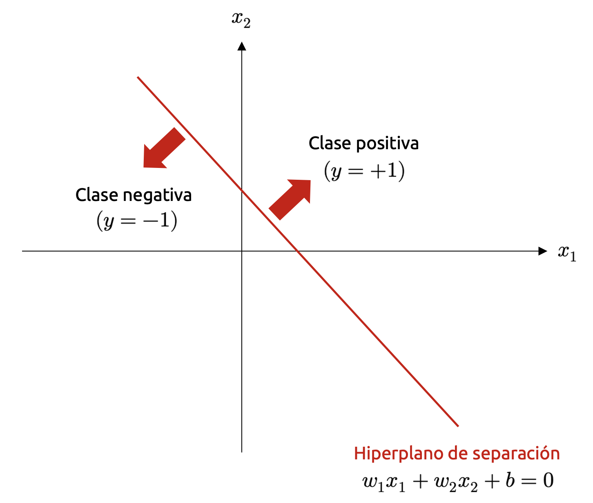
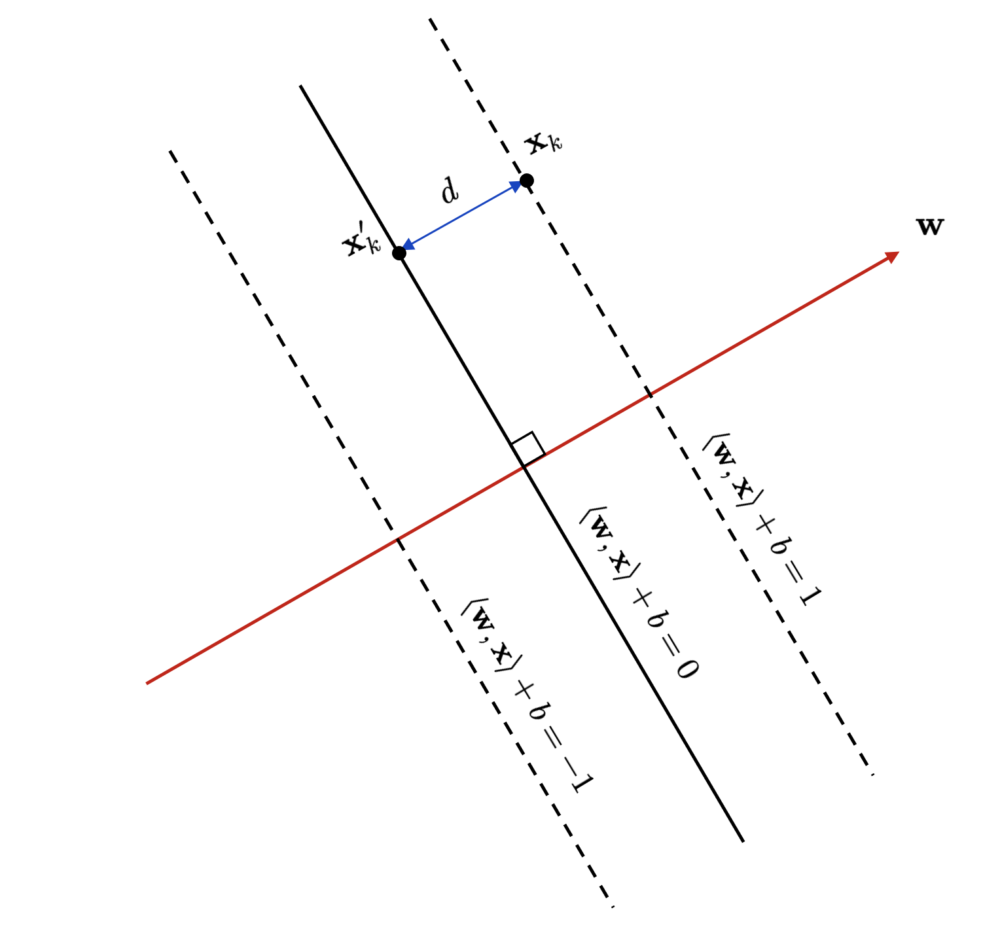
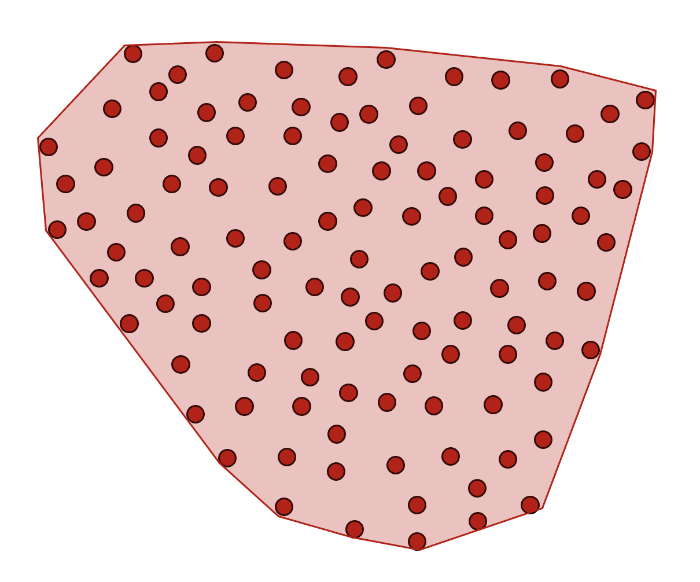
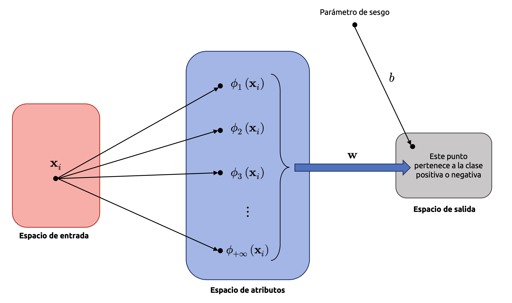

::: {.callout-important}
## Idea central

Las máquinas de soporte vectorial construyen clasificadores a partir de una idea geométrica muy simple y poderosa: separar clases mediante un hiperplano con el mayor margen posible. En esta entrada desarrollaremos esa intuición desde la formulación primal, la extenderemos a márgenes blandos mediante variables de holgura y pérdida de Hinge, y luego construiremos la formulación dual que permite introducir kernels. El objetivo será conectar geometría, optimización convexa y modelamiento predictivo, para entender por qué las SVM pueden resolver tanto problemas lineales como no lineales, e incluso adaptarse a tareas de regresión.
:::

## Introducción

Como ya hemos tenido la oportunidad de revisar en la [entrada correspondiente](/clases/machine-learning/aprendizaje-supervisado/modelos-lineales/modelos-de-clasificacion-parte-i/), en muchas situaciones estaremos interesados en construir modelos de clasificación. Vale decir, querremos que un modelo prediga uno de varios resultados (discretos) posibles. Ya hemos ilustrado que un ejemplo típico de un problema de este tipo lo podemos ver a diario a la hora de abrir nuestro cliente favorito de correo electrónico, ya que éste es capaz de clasificar sin mayor problema los correos importantes de aquellos que posiblemente no sean de interés (categorizándolos como *spam*). Otros ejemplos más sofisticados incluyen clasificadores de imágenes que permiten diferenciar elementos de interés –por ejemplo, personas– en un set de imágenes dado. Sea cual sea el caso, es normal que exista un pequeño número de resultados posibles para un fenómeno de interés, y en muchas ocasiones, la resolución de tales problemas por medio de modelos de clasificación podrá agregar mucho valor en un contexto de negocio. 

En esta sección, consideraremos, en una primera aproximación y a nivel teórico, problemas de clasificación binaria, para los cuales estamos interesados en obtener predictores del tipo

::: {.eq-scroll}
$$
f:\mathbb{R}^{n}\longrightarrow \left\{ -1,+1\right\}
\tag{7.1}
$$
:::

Notemos que, a diferencia de como lo hicimos en la [entrada donde introducimos los modelos de clasificación](/clases/machine-learning/aprendizaje-supervisado/modelos-lineales/modelos-de-clasificacion-parte-i/), ahora hemos descrito la clase negativa por medio de un $-1$ en vez de un $0$. Esto no reviste ninguna relevancia para desarrollar la teoría de cualquier modelo de clasificación, pero es históricamente adecuada conforme al desarrollo clásico de la teoría de las máquinas de soporte vectorial, y nos ceñiremos a esa formulación histórica.

El problema, en términos generales, siempre podrá expresarse de la forma $\mathcal{D} =\left\{ \left( \mathbf{X} ,\mathbf{y} \right)  :\mathbf{X} =\left\{ x_{ij}\right\}  \in \mathbb{R}^{m\times n} \wedge \mathbf{y} \in \mathbb{R}^{m} \right\}$, donde $\mathcal{D}$ es un conjunto de entrenamiento de interés, $\mathbf{X}$ es la matriz de diseño que describe las variables independientes que caracterizan a los datos de entrada del problema (con $m$ instancias y $n$ atributos) e $\mathbf{y}$ es un vector que aglutina los valores observados y que deseamos estimar, y que pueden ser iguales a $-1$ o $+1$, según la formulación (7.1). Naturalmente, al valor $y_{i}=+1;\forall i=1,...,m$ lo llamaremos **clase positiva**, y al valor $y_{i}=-1;\forall i=1,...,m$ lo llamaremos **clase negativa**. Como siempre, debemos tener cuidado en no inferir *cualidades* positivas respecto de la clase positiva, ya que la forma de llamar a ambas clases es simplemente una convención. Por ejemplo, en un caso de negocio asociado a minería subterránea, podríamos estar interesados en estimar la probabilidad de que ocurran estallidos de roca en un nivel de producción, siendo la ocurrencia de tales estallidos en el pasado etiquetada con el valor $y_{i}=+1$. Esto, por supuesto, no es algo *positivo* a nivel de negocio (no queremos, por ningún motivo, que ocurran estallidos de roca). Pero en un problema de clasificación, es evidente que $y_{i}=+1$ será la *clase positiva*.

A diferencia de [la entrada anterior](/clases/machine-learning/aprendizaje-supervisado/modelos-lineales/modelos-lineales-regularizados-bayesianos-y-generalizados/), donde nos esforzamos en mostrar distintas implementaciones de modelos lineales generalizados para resolver un problema de clasificación binario, en esta oportunidad nos limitaremos a un enfoque más específico, y que se conoce universalmente como **máquina de soporte vectorial** o **máquina de vectores de soporte** (del inglés **support vector machine**, y que abreviaremos típicamente como **SVM**). Una máquina de soporte vectorial es capaz de resolver cualquier problema binario expresado como $\mathcal{D}$, incluso si las fronteras que separan las clases positiva y negativa en $\mathcal{D}$ no son lineales (o dicho de otra forma, problemas no linealmente separables). Para este último caso, haremos uso de un recurso matemático denominado como función kernel.

Las máquinas de soporte vectorial nos proveen de resultados poderosos en muchísimas aplicaciones académicas e industriales relativas a problemas de clasificación, apoyándose de teoremas bien fundamentados. Se trata además de un modelo que aprovecha algunas cuestiones geométricas inherentes a los problemas de clasificación y que permiten ilustrar su implementación (y calidad) de manera relativamente sencilla. Por lo tanto, **se trata de un enfoque esencial en el modelamiento predictivo y que debemos siempre tener disponible en nuestra caja de herramientas**. Además, es un excelente caso de ejemplo en lo que respecta a la formulación de un problema de optimización desde la perspectiva de la dualidad.

Consideremos pues un problema de clasificación binaria representado por el conjunto de entrenamiento $\mathcal{D}$. Cada par $\left( \mathbf{x}_{i} ,y_{i}\right)$, donde $\mathbf{x}_{i}$ es una matriz fila que simplemente representa la instancia $i$-ésima asociada a la matriz de atributos $\mathbf{X}$, hace corresponder a un ejemplo observado $\mathbf{x}_{i}$ una etiqueta o clase $y_{i}$ (siendo $1\leq i\leq m$). Si $x_{i}\in \mathbb{R}^{2}$, el problema puede ilustrarse geométricamente en el plano $\mathbb{R}^{2}$ *pintando* cada punto $x_{i}$ de un color si $y_{i}=1$ (la clase positiva), y de otro color si $y_{i}=0$ (la clase negativa). Notemos que, en este ejemplo práctico, hemos asignado el valor $0$ a la clase negativa, fundamentalmente porque, en **<font color='darkmagenta'>Scikit-Learn</font>**, las clases en un problema de clasificación suelen empezar a numerarse precisamente desde el cero. Ejemplifiquemos esto haciendo uso de algo de código, tomando como base la función `make_blobs()` del módulo `sklearn.datasets`. Para ello, haremos uso de las importaciones usuales:

```{python}
import matplotlib.pyplot as plt
import numpy as np
import pandas as pd
import seaborn as sns
```

```{python}
from sklearn.datasets import make_blobs
```

```{python}
plt.rcParams["figure.dpi"] = 90
sns.set()
plt.style.use("bmh")
```

La función `make_blobs()` nos permite construir un conjunto de datos tal que los puntos que lo componen se agrupen en torno a un determinado centroide en el espacio de atributos, de manera tal que se generen nubes de puntos bien diferenciadas, similares a clusters en dicho espacio. Suele utilizarse mayormente para probar algoritmos de agrupamiento, pero será perfecta para ejemplificar nuestro caso. El parámetro `n_samples` permite especificar el total de puntos que compondrán el conjunto de datos, `centers` el total de clusters, `n_features` el total de variables independientes del mismo y `center_box` las coordenadas relativas al centro de simetría de los clusters en un espacio de 10 $\times$ 10. Por lo tanto, construir un conjunto de datos que represente un problema de clasificación binaria a partir de esta función resulta bastante sencillo:

```{python}
# Construimos nuestro conjunto de datos.
X, y = make_blobs(
    n_samples=1000, centers=2, n_features=2, center_box=(0, 15), random_state=42,
)
```

La función `make_blobs()` retorna una tupla de arreglos que hemos denominado como `X, y`, donde `X` representa a la matriz de diseño e `y` representa un indicador que asigna cada punto a un clúster determinado. En nuestro ejemplo, debido a que `X` es una matriz en $\mathbb{R}^{1000\times 2}$, se tienen dos clusters y, por tanto, `y` únicamente toma los valores `0` y `1`. Tenemos pues un conjunto de datos perfecto para ser utilizado como base para un modelo de clasificación binaria. Si graficamos la disposición de los puntos en el plano `(x1, x2)`, observamos lo siguiente:

```{python}
#| label: fig-maquinas-de-soporte-vectorial-01
#| fig-cap: "Visualización generada para la sección Introducción."
fig, ax = plt.subplots(figsize=(9, 5))
p = ax.scatter(x=X[:, 0], y=X[:, 1], c=y, cmap="Dark2")
ax.set_xlabel(r"$x_{1}$", fontsize=16, labelpad=10)
ax.set_ylabel(r"$x_{2}$", fontsize=16, labelpad=15, rotation=0)
cb = fig.colorbar(p)
cb.set_label(r"$y$", fontsize=16, labelpad=15, rotation=0)
```

Tenemos pues que los puntos tales que `y = 0` han sido coloreados de verde, mientras que aquellos puntos tales que `y = 1` han sido coloreados de gris.

Sean pues, en notación matemática, $\mathbf{X}\in \mathbb{R}^{m\times 2}$ e $\mathbf{y}\in \mathbb{R}^{m}$, la matriz de variables independientes y el vector de valores objetivo, respectivamente (con $m=1000$, en este ejemplo). Cada instancia $\mathbf{x}_{i}\in \mathbb{R}^{2}$ ($1\leq i\leq m$) es un vector en el espacio bidimensional que podemos expresar como $(x_{i1},x_{i2})$ para cada instancia $i$, siendo $y_{i}$ su correspondiente clase o etiqueta. En este contexto, definimos la **frontera de separación** entre ambas clases como la curva que *mejor separa* los puntos $(x_{i1},x_{i2})$ tales que $y_{i}=-1$, de aquellos tales que $y_{i}=+1$ (ahora hemos vuelto a llamar a la clase negativa como $y_{i}=-1$, lo que –como mencionamos previamente– suele ser un enfoque mucho más apropiado en la teoría de las máquinas de soporte vectorial). La *mejor separación* es un criterio que suena antojadizo, pero en realidad se basa a partir de cuestiones puramente geométricas. De este modo, **una separación entre clases es óptima cuando las distancias (euclidianas, en este caso) entre la frontera de separación y los puntos más cercanos a la misma de cada clase son lo más grandes posibles**.

Las máquinas de soporte vectorial abordan el enfoque geométrico anterior, planteando un problema de optimización donde el objetivo es determinar un **hiperplano de separación** en vez de una curva completamente arbitraria entre ambas clases. Naturalmente, en $\mathbb{R}^{2}$, tal hiperplano es una recta. Y, en consecuencia, las máquinas de soporte vectorial son un ejemplo de **modelo lineal** en su forma más elemental (aunque no generalizado). Formalmente, podemos definir este hiperplano tomando prestadas algunas herramientas esenciales del álgebra lineal, debido a que, tomando como base el hecho de que si el conjunto de datos de interés *vive* en un espacio vectorial de dimensión $n$ (por lo general, euclidiano), es evidente que el hiperplano de separación es un subespacio vectorial de dimensión $n-1$. En la práctica esto puede resultar evidente, ya que, en el ejemplo anterior, el conjunto de datos está definido en un dominio de $\mathbb{R}^{2}$, y el *hiperplano* de separación es una recta que describe un subespacio en $\mathbb{R}$ (definido por una ecuación del tipo $y=ax+b$, donde $a$ y $b$ son los parámetros que deseamos determinar).

En este apartado formalizaremos el procedimiento para encontrar la mejor separación entre las clases que caracterizan a un problema de separación binaria. Esto bastará para formar una noción completamente robusta de la teoría subyacente a las SVMs puesto que, en casos multinomiales, siempre podremos descomponer tales problemas en sub-problemas binarios. Introduciremos el concepto de **margen** y consideraremos aquellos casos donde un hiperplano es insuficiente para separar adecuadamente las clases que caracterizan a un problema, lo que incurrirá en un **error de clasificación**. Presentaremos dos enfoques equivalentes para darle sustento matemático a las máquinas de soporte vectorial: Uno geométrico y otro basado en una función de pérdida (que es diferente a las revisadas en secciones anteriores). Revisaremos el problema de optimización subyacente a las estos modelos y derivaremos el correspondiente problema dual usando el método de los **multiplicadores de Lagrange** (aunque será válido también un enfoque más general). La **SVM dual** nos permitirá plantear un tercer enfoque para formalizar su sustento matemático aprovechando una propiedad interesante de los conjuntos convexos. Finalmente, revisaremos cómo construir fronteras de separación más generales que un simple hiperplano haciendo uso de **funciones kernel**, introduciendo para ello algunos supuestos fundamentales.

## El hiperplano de separación

Consideremos un conjunto de datos de la forma $\mathcal{D} =\left\{ \left( \mathbf{X} ,\mathbf{y} \right)  :\mathbf{X} =\left\{ x_{ij}\right\}  \in \mathbb{R}^{m\times n} \wedge \mathbf{y} \in \mathbb{R}^{m} \right\}$, tal que $\mathbf{y}$ únicamente puede tomar dos valores, digamos $y_{i}=+1$ (o clase positiva) e $y_{i}=-1$ (o clase negativa). Sean $i$ y $j$ los indexadores de filas y columnas, respectivamente, de la matriz de diseño $\mathbf{X}$, y llamemos $\mathbf{x}_{p}$ y $\mathbf{x}_{q}$ a dos instancias (filas) de $\mathbf{X}$. Recordemos, del álgebra lineal, que una forma de establecer qué tan *similares* son dos vectores –en este caso $\mathbf{x}_{p}$ y $\mathbf{x}_{q}$– es mediante el uso del producto interno $\left< \mathbf{x}_{p} ,\mathbf{x}_{q} \right>$. Sabemos también que, en un contexto geométrico, los productos internos permiten definir conceptos tales como el *ángulo* entre los vectores $\mathbf{x}_{p}$ y $\mathbf{x}_{q}$, y que el valor de $\left< \mathbf{x}_{p} ,\mathbf{x}_{q} \right>$ depende de la norma (inducida por ese mismo producto interno) de los vectores $\mathbf{x}_{p}$ y $\mathbf{x}_{q}$. Finalmente, sabemos también que el producto interno es un ingrediente esencial a la hora de definir conceptos tales como proyecciones u ortogonalidad.

La idea general de un modelo de clasificación, como sabemos, es particionar el espacio $\mathbb{R}^{n}$ donde *viven* nuestros datos de manera tal que instancias asociadas a una determinada clase (y no otra) queden *encapsulados* en una misma partición. Por supuesto, en un problema binario, tal espacio quedará dividido en dos particiones que se corresponderán, respectivamente, con las clases positiva y negativa asociadas a los puntos que representan a los datos. Consideraremos pues una partición conveniente, cuyo objetivo es separar, linealmente, al espacio $\mathbb{R}^{n}$ haciendo uso de un hiperplano. Sea $\mathbf{x}\in \mathbb{R}^{n}$ una instancia de $\mathbf{X}$, y consideremos la función

::: {.eq-scroll}
$$
\begin{array}{l}f:\mathbb{R}^{n} \longrightarrow \mathbb{R} \\ \mathbf{x} \longmapsto f\left( \mathbf{x} \right)  :=\left< \mathbf{w} ,\mathbf{x} \right>  +b\end{array}
\tag{7.2}
$$
:::

donde $\mathbf{w}\in \mathbb{R}^{n}$ y $b\in \mathbb{R}$ son parámetros. Tiene sentido entonces la siguiente definición.

**<font color='blue'>Definición 7.1 – Hiperplano de separación:</font>** Sea $\mathcal{D} =\left\{ \left( \mathbf{X} ,\mathbf{y} \right)  :\mathbf{X} =\left\{ x_{ij}\right\}  \in \mathbb{R}^{m\times n} \wedge \mathbf{y} \in \mathbb{R}^{m} \right\}$ un conjunto de entrenamiento tal que $\mathbf{y}$ únicamente puede tomar los valores $+1$ o $-1$, y sea $\mathbf{x}\in \mathbb{R}^{n}$ una instancia (fila) de $\mathbf{X}$. Se define el hiperplano que separa las clases $y_{i}=+1$ e $y_{i}=-1$, llamado **hiperplano de separación**, como el conjunto

::: {.eq-scroll}
$$
\mathcal{H} =\left\{ \mathbf{x} \in \mathbb{R}^{n} :f\left( \mathbf{x} \right)  =0\right\}
\tag{7.3}
$$
:::

donde $f$ es la función que hemos definido en la segunda fila de la ecuación (7.2).

Podemos observar una ilustración del hiperplano de separación en la @fig-sep-hyperplane, donde hemos escrito explícitamente la ecuación de dicho hiperplano descomponiendo su ecuación $\left< \mathbf{w} ,\mathbf{x} \right>  +b=0$ en componentes, tomando $\mathbf{w}=(w_{1},w_{2})$ para este ejemplo en particular. En este contexto, $b$ es simplemente la coordenada $x_{2}$ del hiperplano cuando $x_{1}=0$, denominándose por tanto **parámetro de sesgo** del mismo.

{#fig-sep-hyperplane fig-align="center" width="70%"}

En un caso más general, digamos de $n$ dimensiones, es evidente que $\mathbf{w}\in \mathbb{R}^{n}$ es un vector normal al hiperplano (7.2). Podemos demostrar aquello tomando dos instancias pertenecientes al hiperplano, digamos $\mathbf{x}_{p}$ y $\mathbf{x}_{q}$, y mostrando que el vector que une a ambos puntos es ortogonal a $\mathbf{w}$ considerando las propiedades del producto interno. En efecto,

::: {.eq-scroll}
$$
\begin{array}{lll}f\left( \mathbf{x}_{p} \right)  -f\left( \mathbf{x}_{q} \right)  &=&\left< \mathbf{w} ,\mathbf{x}_{p} \right>  +b-\left( \left< \mathbf{w} ,\mathbf{x}_{q} \right>  +b\right)  \\ &=&\left< \mathbf{w} ,\mathbf{x}_{p} -\mathbf{x}_{q} \right>  \  \left( \mathrm{linealidad\  del\  producto\  interno} \right)  \end{array}
\tag{7.4}
$$
:::

Dado que $\mathbf{x}_{p}$ y $\mathbf{x}_{q}$ se encuentran en el hiperplano, se tiene que $f(\mathbf{x}_{p})=f(\mathbf{x}_{q})=0$ y, por extensión, $\left< \mathbf{w} ,\mathbf{x}_{p} -\mathbf{x}_{q} \right>  =0$, lo que implica que, en efecto, el vector que separa a $\mathbf{x}_{p}$ y $\mathbf{x}_{q}$ es ortogonal a $\mathbf{w}$. De este modo, $\mathbf{w}$ es ortogonal a cualquier vector paralelo al hiperplano.

Cuando disponemos de instancias de prueba, queremos clasificar tales instancias como positivas o negativas dependiendo del lado en que éstas se encuentren con respecto al hiperplano. Notemos además que la ecuación (7.3) no define únicamente un hiperplano, sino que además la dirección del vector normal al mismo, lo que nos permite identificar inmediatamente los *lados* del hiperplano (o, en palabras más elegantes, el subespacio que se encuentra a cada lado del mismo). Por lo tanto, para clasificar una instancia de prueba, digamos $\mathbf{x}_{k}$, calculamos el valor de la función $f(\mathbf{x}_{k})$ y establecemos que $y=+1$ (clase positiva) cuando $f(\mathbf{x}_{k})\geq 0$, mientras que pondremos $y=-1$ cuando $f(\mathbf{x}_{k})<0$. Por lo tanto, geométricamente, podemos interpretar que las instancias pertenecientes a la clase positiva residen *"arriba"* del hiperplano (lo que solemos denominar como **lado positivo** del mismo), mientras que las instancias pertenecientes a la clase negativa residen *"debajo"* de él (siguiendo el ejemplo anterior, en el **lado negativo** del mismo).

Cuando entrenamos un modelo de clasificación, queremos asegurarnos de que las instancias pertenecientes a la clase positiva efectivamente residan en el lado positivo del hiperplano de separación. Es decir,

::: {.eq-scroll}
$$
\left< \mathbf{w} ,\mathbf{x}_{k} \right>  +b\geq 0\Longleftrightarrow y_{k}=+1
\tag{7.5}
$$
:::

y, por otro lado, si las instancias pertencen a la clase negativa, queremos que éstas residan en el lado negativo del hiperplano,

::: {.eq-scroll}
$$
\left< \mathbf{w} ,\mathbf{x}_{k} \right>  +b< 0\Longleftrightarrow y_{k}=-1
\tag{7.6}
$$
:::

Las condiciones establecidas por las ecuaciones (7.5) y (7.6) suelen combinarse en una única expresión del tipo

::: {.eq-scroll}
$$
y_{k}\left( \left< \mathbf{w} ,\mathbf{x}_{k} \right>  +b\right)  \geq 0
\tag{7.7}
$$
:::

y que es equivalente a multiplicar ambas ecuaciones anteriores por $y_{k}=+1$ y $y_{k}=-1$, respectivamente. Este marco de referencia geométrico que hemos construido será esencial para entender la formulación del problema de optimización subyacente a la máquina de soporte vectorial. Y para ello, será necesario apoyarnos de un concepto muy conocido en la geometría analítica: La distancia entre un punto y un hiperplano.

##  Formulación del problema primal

Basándonos en la idea de distancia de un punto a un hiperplano mencionada previamente, y considerando el marco de referencia geométrico que hemos construido para motivar la conceptualización de las máquinas de soporte vectorial, ya estamos en condiciones de discutir en profundidad su formulación en términos más rigurosos. Partiremos estableciendo la siguiente definición. 

**<font color='blue'>Definición 7.2 – Separabilidad lineal</font>**: Consideremos un conjunto de entrenamiento $\mathcal{D} =\left\{ \left( \mathbf{X} ,\mathbf{y} \right)  :\mathbf{X} =\left\{ x_{ij}\right\}  \in \mathbb{R}^{m\times n} \wedge \mathbf{y} \in \mathbb{R}^{m} \right\}$ tal que $\mathbf{y}$ es una variable binaria que puede tomar los valores $-1$ y $+1$ para cada instancia $\mathbf{x}_{i}\in \mathbb{R}^{n}$ de $\mathcal{D}$ (siendo $1\leq i\leq m$). Sean $\mathcal{D}_{+1}$ y $\mathcal{D}_{-1}$ los subconjuntos que contienen todos los puntos que pertenecen a la clase positiva y negativa, respectivamente. Diremos que $\mathcal{D}_{+1}$ y $\mathcal{D}_{-1}$ son **linealmente separables** si existen $n+1$ números reales $w_{1},...,w_{n}, b$, tales que cada punto $\mathbf{u}=(u_{1},\dots, u_{n})\in \mathcal{D}_{+1}$ satisface la expresión $\sum^{n}_{j=1} w_{j}u_{j}>b$, y cada punto $\mathbf{v}=(v_{1},\dots, v_{n})\in \mathcal{D}_{-1}$ satisface la expresión $\sum^{n}_{j=1} w_{j}v_{j}<b$.

La definición (7.2) establece simplemente que dos conjuntos de datos son linealmente separables si existe un hiperplano que aísle los puntos que constituyen uno de los conjuntos con respecto a los puntos que pertenecen al otro. Naturalmente, si $\mathcal{D}$ es un conjunto de entrenamiento caracterizado por una variable dependiente binaria, existirán infinitos hiperplanos que separen a los datos que pertenecen a la clase positiva de aquellos que pertenecen a la clase negativa. Para ilustrar aquello, consideremos el *conjunto de datos* **<font color='forestgreen'>IRIS</font>**, el cual ya hemos usado previamente para ilustrar algunos modelos de clasificación provistos por **<font color='darkmagenta'>Scikit-Learn</font>**. Recordemos que podemos descargar dicho conjunto de datos haciendo uso del módulo `sklearn.datasets` como sigue:

```{python}
from sklearn.datasets import load_iris
```

```{python}
# Cargamos el conjunto de datos Iris.
iris = load_iris(as_frame=True)
iris_df = iris["frame"]
```

Como ya hemos observado en entradas anteriores, el *conjunto de datos* **<font color='forestgreen'>IRIS</font>** es famoso en el mundo de los algoritmos de aprendizaje porque es perfecto para probar cualquier modelo de clasificación, ya que sus atributos son todos separables. Tomemos el caso de las variables relativas a las dimensiones de los pétalos de cada flor Iris y grafiquemos todos los puntos tales que `y` hace referencia a una subespecie Iris Versicolor o Setosa:

```{python}
# Definimos el conjunto de datos (X, y).
X = iris_df[iris_df["target"] != 2].iloc[:, :-1]
y = iris_df[iris_df["target"] != 2]["target"]
```

```{python}
#| label: fig-maquinas-de-soporte-vectorial-02
#| fig-cap: "Visualización generada para la sección Formulación del problema primal."
fig, ax = plt.subplots(figsize=(9, 5))
p = ax.scatter(X.iloc[:, 2], X.iloc[:, 3], c=y, cmap="Set1")
ax.set_xlabel("Largo de pétalo (cm)", fontsize=12, labelpad=10)
ax.set_ylabel("Ancho de pétalo (cm)", fontsize=12, labelpad=10)
ax.set_xlim(0.75, 5.25)
ax.set_ylim(0, 2)
cb = fig.colorbar(p)
cb.set_label("Clase", fontsize=12, labelpad=10)
plt.tight_layout()
```

Podemos observar que, con respecto únicamente a las variables "largo de pétalo" y "ancho de pétalo", el *conjunto de datos* **<font color='forestgreen'>IRIS</font>** es, en efecto, linealmente separable. Existen pues infinitas rectas que permiten aislar cada subespecie de flor Iris a cada lado de las mismas. Por ejemplo, en los siguientes dos bloques de código, mostraremos tres líneas de separación arbitrarias y construida mediante simple inspección del gráfico anterior:

```{python}
# Algunas fronteras de separación sub-óptimas.
x_range = np.linspace(start=0.0, stop=5.5, num=100)
y1 = -0.2 * x_range + 1.5
y2 = x_range - 1.8
y3 = 0.1 * x_range + 0.5
```

```{python}
#| label: fig-maquinas-de-soporte-vectorial-03
#| fig-cap: "Visualización generada para la sección Formulación del problema primal."
fig, ax = plt.subplots(figsize=(9, 5))
p1 = ax.scatter(X.iloc[:, 2], X.iloc[:, 3], c=y, cmap="Set1")
p2 = ax.plot(x_range, y1, linestyle="--", color="dodgerblue")
p2 = ax.plot(x_range, y2, linestyle="--", color="royalblue")
p2 = ax.plot(x_range, y3, linestyle="--", color="navy")
ax.set_xlabel("Largo de pétalo (cm)", fontsize=12, labelpad=10)
ax.set_ylabel("Ancho de pétalo (cm)", fontsize=12, labelpad=10)
ax.set_xlim(0.75, 5.25)
ax.set_ylim(0, 2)
cb = fig.colorbar(p1)
cb.set_label("Clase", fontsize=12, labelpad=10)
plt.tight_layout()
```

Las tres líneas de separación son válidas, porquen con el objetivo de separar la clase positiva de la clase negativa. Sin embargo, presentan problemas evidentes: Las tres pasan *demasiado cerca* de alguno de los puntos pertenecientes a una determinada clase, lo que puede inducir errores de clasificación cuando tratemos con datos de prueba. Es decir, ninguna de estas líneas es una **frontera óptima de separación**, porque la distancia entre estas líneas y los puntos más cercanos de cada clase a cada una no es la máxima posible.

### El concepto de margen

En lo que sigue, formalizaremos la noción de frontera óptima de separación introduciendo un nuevo concepto, denominado **margen**, y que es intuitivamente simple: Corresponde a la **distancia** de un hiperplano de separación con respecto a los puntos que representan las instancias más cercanas al mismo, para cada clase, en el dominio donde éstas se encuentran definidas. Formalmente, se tiene pues la siguiente definición.

**<font color='blue'>Definición 7.3 – Margen de separación:</font>** Sea $\mathcal{D} =\left\{ \left( \mathbf{X} ,\mathbf{y} \right)  :\mathbf{X} =\left\{ x_{ij}\right\}  \in \mathbb{R}^{m\times n} \wedge \mathbf{y} \in \mathbb{R}^{m} \right\}$ un conjunto de entrenamiento tal que $\mathbf{y}$ es una variable binaria que puede tomar los valores $-1$ y $+1$ para cada instancia $\mathbf{x}_{i}\in \mathbb{R}^{n}$ de $\mathcal{D}$ (siendo $1\leq i\leq m$). Supongamos que $\mathcal{D}$ es linealmente separable y que el conjunto $\mathcal{H} =\left\{ \mathbf{x} \in \mathbb{R}^{n} :\left< \mathbf{w} ,\mathbf{x} \right>  +b=0\right\}$, para el par de parámetros $\mathbf{w}\in \mathbb{R}^{n}$ y $b\in \mathbb{R}$, define al correspondiente hiperplano de separación entre las clases. Si $\mathbf{x}^{+}$ y $\mathbf{x}^{-}$ son las instancias más cercanas a dicho hiperplano, para las clases positiva y negativa, respectivamente, entonces las distancias $d(\mathcal{H},\mathbf{x}^{+})$ y $d(\mathcal{H},\mathbf{x}^{-})$ serán llamadas **márgenes de separación** asociados al hiperplano $\mathcal{H}$.

De la definición (7.3) podemos observar inmediatamente un problema técnico que puede relativizar enormemente la definición de un margen de separación, y éste radica en la **escala** de los puntos que constituyen el conjunto de entrenamiento $\mathcal{D}$. Dicho de otro modo, si las $n$ variables $\mathbf{x}_{1},\mathbf{x}_{2},\dots,\mathbf{x}_{n}$ tienen órdenes de magnitud distintos, entonces los márgenes de separación correspondientes serán dependientes de tales magnitudes y, por tanto, los cambios de unidades en las variables influirán en las distancias entre las respectivas instancias y los hiperplanos de separación que podamos determinar.

Consideremos un hiperplano de ecuación $\left< \mathbf{w} ,\mathbf{x} \right>  +b=0$ y una instancia arbitraria $\mathbf{x}_{k}\in \mathbb{R}^{m}$ de $\mathcal{D}$. Sin pérdida de generalidad, asumiremos que $\mathbf{x}_{k}$ se encuentra en el *lado positivo* del hiperplano (o, en términos más elegantes, $\left< \mathbf{w} ,\mathbf{x}_{k} \right>  +b>0$). Queremos calcular la distancia $d$ entre el hiperplano y $\mathbf{x}_{k}$. Tomemos la proyección ortogonal de $\mathbf{x}_{k}$ sobre el hiperplano, que llamaremos $\pi_{\mathbf{x}_{k}}$, y que corta al mismo en el punto $\mathbf{x}'_{k}$. Dado que $\mathbf{w}$ es un vector normal al hiperplano, sabemos que la distancia $d$ no es más que un **factor de escalamiento** para $\mathbf{w}$. Si conocemos la *longitud* de $\mathbf{w}$, entonces podemos usar este factor de escalamiento $d$ para determinar la distancia entre $\mathbf{x}_{k}$ y $\mathbf{x}'_{k}$. Por conveniencia, escogemos utilizar un vector de norma unitaria (simplemente dividiendo $\mathbf{w}$ por su norma $\left\Vert \mathbf{w} \right\Vert$). Luego tenemos

::: {.eq-scroll}
$$
\mathbf{x}_{k} =\mathbf{x}'_{k} +d\frac{\mathbf{w} }{\left\Vert \mathbf{w} \right\Vert  }
\tag{7.8}
$$
:::

La distancia $d$, conforme la definición (7.3), es en efecto un margen de separación. Queremos pues que el hiperplano de separación sea tal que las instancias de $\mathcal{D}$ pertenecientes a la clase positiva se encuentren a una distancia de, por lo menos, $d$. Mismo caso para las instancias pertenecientes a la clase negativa. El margen $d$ define pues una **función objetivo** que, conforme la ecuación (7.7), satisface la desigualdad

::: {.eq-scroll}
$$
\mathbf{y}_{k} \left( \left< \mathbf{w} ,\mathbf{x}_{k} \right>  +b\right)  \geq d
\tag{7.9}
$$
:::

Para todo $k=1,\dots,m$.

Notemos que estamos interesados únicamente en la dirección del vector $\mathbf{w}$, y no en su magnitud, ya que, como dijimos previamente, dicha magnitud dependerá siempre de las magnitudes de las variables de entrada en el conjunto de entrenamiento $\mathcal{D}$. Por lo cual, será común considerar un procedimiento de escalamiento de las variables de entrada previo a implementar cualquier modelo basado en máquinas de soporte vectorial. De esta forma, siempre podemos asumir que $\mathbf{w}$ tiene norma (euclidiana) unitaria (esto es, $\left\Vert \mathbf{w} \right\Vert  =\sqrt{\mathbf{w}^{\top } \mathbf{w} } =1$). Este enfoque tiene la ventaja, además, de que el margen $d$ es simplemente un factor de escalamiento aplicado a un vector unitario.

El razonamiento anterior nos permite formular el siguiente problema de optimización, y que será la base fundamental de la máquina de sorporte vectorial:

::: {.eq-scroll}
$$
\begin{array}{ll}\displaystyle \max_{\mathbf{w} ,b,d}&\underbrace{d}_{\text{margen}}\\ \mathrm{s.a.} :&\mathbf{y}_{k} \left( \left< \mathbf{w} ,\mathbf{x}_{k} \right> +b \right) \geq d\  \left( \text{ajuste de datos} \right)\\ &\left\Vert \mathbf{w} \right\Vert =1\  \left( \text{normalización} \right)\\ &d>0\  \left( \text{margen positivo} \right)\end{array}
\tag{7.10}
$$
:::

Es decir, queremos **maximizar el margen** $d$, asegurándonos de que **los datos residan en los lados correctos** con respecto al **hiperplano de separación**.

### Clasificación con márgenes rígidos

El problema de optimización (7.10) que subyace a la máquina de soporte vectorial se fundamenta en el hecho de que únicamente estamos interesados en la dirección del vector $\mathbf{w}$ y no en su magnitud, lo que nos lleva al supuesto de que $\left\Vert \mathbf{w} \right\Vert  =1$. Vamos a reformular el problema (7.10) haciendo uso de un enfoque más *tradicional* en el cual, en vez de normalizar el vector $\mathbf{w}$, simplemente introduciremos un **factor de escalamiento** para el conjunto de entrenamiento $\mathcal{D}$ completo. Escogeremos tal factor de manera tal que el predictor $\left< \mathbf{w} ,\mathbf{x} \right>  +b$ sea igual a $1$ para la instancia más cercana al hiperplano de separación. Denotaremos dicha instancia como $\mathbf{x}_{k}$, donde $1\leq k\leq m$, siendo $m$ el total de instancias en el conjunto de entrenamiento $\mathcal{D}$.

{#fig-sep-margin fig-align="center" width="70%"}

La @fig-sep-margin muestra un caso para el cual la instancia $\mathbf{x}_{k}$ reside exactamente sobre el margen de separación. O, equivalentemente, tal que $\left< \mathbf{w} ,\mathbf{x}_{k} \right>  +b=1$. Dado que $\mathbf{x}'_{k}$ es el punto en el hiperplano de separación que se corresponde con la proyección ortogonal de $\mathbf{x}_{k}$ sobre dicho hiperplano, es evidente que

::: {.eq-scroll}
$$
\left< \mathbf{w} ,\mathbf{x}^{\prime }_{k} \right>  +b=0
\tag{7.11}
$$
:::

Sustituyendo la ecuación (7.8) en (7.11), obtenemos

::: {.eq-scroll}
$$
\left< \mathbf{w} ,\mathbf{x}_{k} -d\frac{\mathbf{w} }{\left\Vert \mathbf{w} \right\Vert  } \right>  +b=0
\tag{7.12}
$$
:::

Dado que el producto interno es bilineal, podemos desarrollar la fórmula (7.12) a fin de obtener

::: {.eq-scroll}
$$
\left< \mathbf{w} ,\mathbf{x}_{k} \right>  +b-r\frac{\left< \mathbf{w} ,\mathbf{w} \right>  }{\left\Vert \mathbf{w} \right\Vert  } =0
\tag{7.13}
$$
:::

Debido al escalamiento, se tiene que el término $\left< \mathbf{w} ,\mathbf{x}_{k} \right>  +b$ es igual a 1. Además, como $\left< \mathbf{w} ,\mathbf{w} \right>  =\left\Vert \mathbf{w} \right\Vert^{2}$, la ecuación (7.13) se reduce finalmente a

::: {.eq-scroll}
$$
d=\frac{1}{\left\Vert \mathbf{w} \right\Vert  }
\tag{7.14}
$$
:::

Tenemos entonces que el margen de separación depende únicamente del vector $\mathbf{w}$, el cual a su vez es ortogonal al hiperplano de separación. Este resultado puede parecer un tanto contraintuitivo en primera instancia, puesto que, al parecer, hemos desarrollado una fórmula para la distancia $d$ en términos de la magnitud de $\mathbf{w}$, siendo que aún no conocemos este vector. No obstante, a fin de proseguir, vamos simplemente a aceptar este resultado. Un poco más adelante mostraremos que la elección de un margen $d$ igual a $1$ equivale a que el vector $\mathbf{w}$ sea unitario.

De manera similar a lo que hicimos en la ecuación (7.9), queremos que las instancias que pertenezcan a las clases positiva y negativa residan en el *lado correcto* del hiperplano de separación. Como el margen es igual a $1$, esta condición puede escribirse de manera elegante como

::: {.eq-scroll}
$$
y_{i}\left( \left< \mathbf{w} ,\mathbf{x}_{i} \right>  +b\right)  \geq 1
\tag{7.15}
$$
:::

Como queremos maximizar el valor del margen $d$, es claro –nuevamente– que estamos ante un problema de optimización:

::: {.eq-scroll}
$$
\begin{array}{ll}\displaystyle \max_{\mathbf{w} ,b} &\displaystyle \frac{1}{\left\Vert \mathbf{w} \right\Vert  } \\ \mathrm{s.a.:} &y_{i}\left( \left< \mathbf{w} ,\mathbf{x}_{i} \right>  +b\right)  \geq 1\  ;\  1\leq i\leq m\end{array}
\tag{7.16}
$$
:::

Donde, como siempre, $m$ representa el número total de instancias en el conjunto de entrenamiento $\mathcal{D}$.

En vez de maximizar el recíproco de la norma del vector $\mathbf{w}$, con frecuencia optamos por invertir dicha función objetivo, lo que resulta en el problema equivalente de minimizar el valor de la norma $\left\Vert \mathbf{w} \right\Vert  $ propiamente tal, sujeto a las mismas condiciones que las explicitadas en la expresión (7.16). Añadimos además una constante de $\frac{1}{2}$ a $\left\Vert \mathbf{w} \right\Vert$ y elevamos el valor de $\left\Vert \mathbf{w} \right\Vert$ al cuadrado, de forma tal que los gradientes resultantes al implementar el método de los multiplicadores de Lagrange para resolver este problema sean mucho más sencillos de calcular (ya que minimizar $\left\Vert \mathbf{w} \right\Vert^{2}$ es equivalente a minimizar $\left\Vert \mathbf{w} \right\Vert$). De esta manera, nuestro problema de optimización toma la forma

::: {.eq-scroll}
$$
\begin{array}{ll}\displaystyle \min_{\mathbf{w} ,b} &\displaystyle \frac{1}{2} \left\Vert \mathbf{w} \right\Vert^{2}  \\ \mathrm{s.a.:} &y_{i}\left( \left< \mathbf{w} ,\mathbf{x}_{i} \right>  +b\right)  \geq 1\  ;\  1\leq i\leq m\end{array}
\tag{7.17}
$$
:::

El problema (7.17) se conoce en la teoría del aprendizaje automatizado como **modelo de clasificación con márgenes rígidos**. Se le añade la coletilla de *rígido* al margen de separación por el simple hecho de que esta formulación no permite que existan instancias del conjunto de entrenamiento en un lado incorrecto con respecto al hiperplano de separación (y a su correspondiente clase). Es decir, **no se permiten violaciones de márgenes**. Más adelante veremos que dicha condición puede flexibilizarse cuando el conjunto de entrenamiento $\mathcal{D}$ no es linealmente separable, lo que derivará en un **problema de márgenes blandos**.

**Ejemplo 7.1 – Un interludio dedicado a los programas cuadráticos:** Un concepto de extrema importancia en la teoría de las máquinas de soporte vectorial es el de **programa cuadrático**, y que a su vez reviste gran importancia en la teoría de optimización de funciones convexas. En este ejemplo, intentaremos desarrollarlo de manera muy *express*, pero ojo: Esta teoría es rica en sí misma y simplemente limitarla a meras aplicaciones no es un enfoque adecuado, y es altamente recomendable darle una buena lectura.

Comencemos estableciendo lo siguiente: Una **función convexa** es toda función cuya gráfica se encuentra siempre debajo de cualquier segmento de recta que una dos de sus puntos, sin importar cuales sean. Formalmente, diremos que la función $f: U\subseteq \mathbb{R}^{n}\longrightarrow \mathbb{R}$, donde $U$ es un conjunto abierto de $\mathbb{R}^{n}$, es **convexa**, si y sólo si, para cualquier par de puntos $\mathbf{x},\mathbf{y}\in U$, se cumple que

::: {.eq-scroll}
$$
f\left( \theta \mathbf{x} +\left( 1-\theta \right) \mathbf{y} \right) \leq \theta f\left( \mathbf{x} \right) +\left( 1-\theta \right) f\left( \mathbf{y} \right)
\tag{7.18}
$$
:::

Donde $\theta$ es un escalar tal que $0\leq \theta \leq 1$. Cuando un problema de optimización tiene una función objetivo y restricciones descritas por funciones convexas, el problema en sí mismo es llamado de **optimización convexa**.

Las funciones convexas tienen propiedades deseables que las hacen idóneas para construir problemas de optimización. La más importante de estas propiedades es que éstas presentan siempre un **mínimo global**, siempre que tales funciones sean diferenciables en su dominio.

Un primer caso particular de problema de optimización convexa, y que es común en las carreras de ingeniería, corresponde al denominado **programa lineal** o PL. En un problema de este tipo, tanto la función objetivo como las restricciones son lineales y, por tanto, es posible expresarlo como

::: {.eq-scroll}
$$
\begin{array}{ll}\min&z=\mathbf{c}^{\top} \mathbf{x}\\ \mathrm{s.a.} :&\mathbf{A} \mathbf{x} \leq \mathbf{b}\\ &\mathbf{x} \geq \mathbf{0}\end{array}
\tag{7.19}
$$
:::

Donde,

- $z$ es la función objetivo.
- $\mathbf{c}\in \mathbb{R}^{n}$ es el vector de coeficientes de la función objetivo.
- $\mathbf{A}\in \mathbb{R}^{m\times n}$ es la matriz de coeficientes de las restricciones.
- $\mathbf{b}\in \mathbb{R}^{m}$ es el vector de términos independientes de las restricciones.
- $\mathbf{x}\in \mathbb{R}^{n}$ es el vector que aglutina a las variables de decisión del problema.

El problema (7.19) suele resolverse analíticamente por medio de algoritmos adecuados, tales como el [método símplex](https://en.wikipedia.org/wiki/Simplex_algorithm), el cual explota la linealidad del problema reduciendo la matriz $\mathbf{A}$ usando el método de Gauss-Jordan, de la misma forma en que lo hicimos al resolver sistemas de ecuaciones lineales al inicio de este repositorio, siendo por tanto un método adecuado cuando el número de variables del problema no es muy grande. Para casos más complejos, suelen utilizarse otros métodos de aproximación.

El caso de interés en el contexto de las máquinas de soporte vectorial, como veremos más adelante, corresponde al denominado **programa cuadrátrico** o PC. En un problema de este tipo, la función objetivo es cuadrática, mientras que las restricciones siguen siendo lineales. Matricialmente, un PC suele expresarse introduciendo algebraicamente una forma cuadrática en la función objetivo, de manera tal que:

::: {.eq-scroll}
$$
\begin{array}{ll}\min&\displaystyle z=\frac{1}{2} \mathbf{x}^{\top} \mathbf{Q} \mathbf{x} +\mathbf{c}^{\top} \mathbf{x}\\ \mathrm{s.a.} :&\mathbf{A} \mathbf{x} \leq \mathbf{b}\\ &\mathbf{x} \geq \mathbf{0}\end{array}
\tag{7.20}
$$
:::

Donde, 

- $\mathbf{Q}\in \mathbb{R}^{n\times n}$ es una matriz simétrica, semi-definida positiva, que define la parte cuadrática de la función objetivo $z$.
- $\mathbf{c}\in \mathbb{R}^{n}$ es el vector de coeficientes lineales de la función objetivo.
- El resto de los elementos estructurales y variables cumplen la misma función que en el programa lineal (7.19).

En general, el problema (7.20) sólo puede resolverse por medio de métodos iterativos, dependiendo del número de variables e iteraciones del mismo. En Python, es posible resolver un programa cuadrático de manera realtivamente sencilla utilizando varias librerías. En este ejercicio, introduciremos a **<font color='darkmagenta'>CVXPY</font>** (acrónimo de *convex Python*), que es una librería especializada en la resolución de problemas de optimización gobernados por funciones convexas, y viene equipada con una serie de métodos de solución o *solvers*. La belleza de esta librería radica en que permite mantener coherencia en la definición estándar de un programa cuadrático y en su compatibilidad con los arreglos de **<font color='mediumorchid'>Numpy</font>**, lo que añade versatilidad y rapidez.

En **<font color='darkmagenta'>CVXPY</font>**, los programas cuadráticos suelen expresarse separando las restricciones de desigualdad de aquellas que son únicamente de igualdad. Por lo tanto, modificaremos ligeramente la estructura del programa (7.20) como sigue:

::: {.eq-scroll}
$$
\begin{array}{ll}\min&z=\displaystyle \frac{1}{2} \mathbf{x}^{\top} \mathbf{Q} \mathbf{x} +\mathbf{c}^{\top} \mathbf{x}\\ \mathrm{s.a.} :&\mathbf{G} \mathbf{x} \leq \mathbf{h}\\ &\mathbf{A} \mathbf{x} =\mathbf{b}\end{array}
\tag{7.21}
$$
:::

Vamos pues a mostrar cómo resolver un programa cuadrático, usando **<font color='darkmagenta'>CVXPY</font>**, considerando el siguiente ejemplo:

::: {.eq-scroll}
$$
\begin{array}{ll}\min&z=5x_{1}^{2}+2x_{2}^{2}+3x_{1}-x_{2}+10\\ \mathrm{s.a.} :&x_{1}+x_{2}\leq 2\\ &2x_{1}-3x_{2}\geq 0\\ &x_{1}\geq 0\wedge x_{2}\geq 0\end{array}
\tag{7.22}
$$
:::

En primer lugar, debemos reescribir el problema (7.22) en la *forma estándar* (7.21) a fin de poder resolverlo usando la librería **<font color='darkmagenta'>CVXPY</font>**. Como la función objetivo es $z(x_{1},x_{2})=5x_{1}^{2}+2x_{2}^{2}+3x_{1}-x_{2}+10$, tenemos que

::: {.eq-scroll}
$$
\begin{array}{lll}z\left( x_{1},x_{2} \right)&=&5x_{1}^{2}+2x_{2}^{2}+3x_{1}-x_{2}+10\\ &=&5x_{1}^{2}+2x_{2}^{2}+3x_{1}+\left( -1 \right) x_{2}+10\\ &=&\displaystyle \frac{1}{2} \underbrace{\left( x_{1},x_{2} \right)}_{=\mathbf{x}^{\top}} \underbrace{\left( \begin{matrix}10&0\\ 0&4\end{matrix} \right)}_{=\mathbf{Q}} \underbrace{\left( \begin{matrix}x_{1}\\ x_{2}\end{matrix} \right)}_{=\mathbf{x}} +\underbrace{\left( 3,-1 \right)}_{=\mathbf{c}^{\top}} \underbrace{\left( \begin{matrix}x_{1}\\ x_{2}\end{matrix} \right)}_{=\mathbf{x}} +10\\ &=&\displaystyle \frac{1}{2} \mathbf{x}^{\top} \mathbf{Q} \mathbf{x} +\mathbf{c}^{\top} \mathbf{x} +10\end{array}
\tag{7.23}
$$
:::

Ahora trabajamos las restricciones. Como algunas de las desigualdades que definen el espacio de soluciones factibles de nuestro problema es del tipo "$\geq$", las multiplicamos por $-1$ a fin de poder invertir el sentido de las mismas y luego obtener la forma matricial que las engloba a todas de manera compacta. De esta manera, la restricción $2x_{1}-3x_{2}\geq 0$ simplemente se transforma en $-2x_{1}+3x_{2}\leq 0$, mientras que las restricciones de no negatividad $x_{1}\geq 0$ y $x_{2}\geq 0$ se transforman en $-x_{1}\leq 0$ y $-x_{2}\leq 0$, respectivamente. Por lo tanto, el problema (7.22) toma la forma

::: {.eq-scroll}
$$
\begin{array}{ll}\min&z=\displaystyle \frac{1}{2} \left( x_{1},x_{2} \right) \left( \begin{matrix}10&0\\ 0&4\end{matrix} \right) \left( \begin{matrix}x_{1}\\ x_{2}\end{matrix} \right) +\left( 3,-1 \right) \left( \begin{matrix}x_{1}\\ x_{2}\end{matrix} \right) +10\\ \mathrm{s.a.} :&x_{1}+x_{2}\leq 2\\ &-2x_{1}+3x_{2}\leq 0\\ &-x_{1}\leq 0\\ &-x_{2}\leq 0\end{array} \  \  \  \Longrightarrow \  \  \  \begin{array}{ll}\min&z=\displaystyle \frac{1}{2} \left( x_{1},x_{2} \right) \left( \begin{matrix}10&0\\ 0&4\end{matrix} \right) \left( \begin{matrix}x_{1}\\ x_{2}\end{matrix} \right) +\left( 3,-1 \right) \left( \begin{matrix}x_{1}\\ x_{2}\end{matrix} \right) +10\\ \mathrm{s.a.} :&\left( \begin{matrix}1&1\\ -2&3\\ -1&0\\ 0&-1\end{matrix} \right) \left( \begin{matrix}x_{1}\\ x_{2}\end{matrix} \right) \leq \left( \begin{matrix}2\\ 0\\ 0\\ 0\end{matrix} \right)\end{array}
\tag{7.24}
$$
:::

De esta manera, identificamos rápidamente, conforme la estructura (7.21):

- La matriz $\mathbf{Q} =\left( \begin{matrix}10&0\\ 0&4\end{matrix} \right)$.
- El vector $\mathbf{c} =\left( \begin{matrix}3\\ -1\end{matrix} \right)$.
- La matriz $\mathbf{G} =\left( \begin{matrix}1&1\\ -2&3\\ -1&0\\ 0&-1\end{matrix} \right)$.
- El vector $\mathbf{h} =\left( \begin{matrix}2\\ 0\\ 0\\ 0\end{matrix} \right)$.

Con esto, ya estamos listos para resolver el problema en **<font color='darkmagenta'>CVXPY</font>**. Primero definimos los arreglos (vectoriales y matriciales) calculados previamente haciendo uso de **<font color='darkmagenta'>Numpy</font>** como sigue:

```{python}
import cvxpy as cp
```

```{python}
# Definimos los elementos estructurales de nuestro problema.
Q = np.array(
    [
        [10, 0],
        [0, 4],
    ]
)

G = np.array(
    [
        [1, 1],
        [-2, 3],
        [-1, 0],
        [0, -1],
    ]
)

c = np.array([3, -1])
h = np.array([2, 0, 0, 0])
```

Partimos definiendo un objeto que contendrá las variables de decisión del problema. Tal objeto es llamado `Variable`, y su creación es muy sencilla. Debido a que **<font color='darkmagenta'>CVXPY</font>** tiene una filosofía de uso que intenta respetar la escritura simbólica de los problemas de optimización (convexa), bastará con definir el número de dimensiones de esta variable y *bautizarla* con un nombre adecuado. Es decir:

```{python}
# Definimos las variables de decisión.
x = cp.Variable(2, name="x")
```

A continuación definimos la función objetivo del problema. Como **<font color='darkmagenta'>CVXPY</font>** sigue una estructura cuasi-simbólica, usamos algunos objetos adecuados para construir dicha función. Como éste es un programa cuadrático, la función objetivo está compuesta por la suma de una forma cuadrática y una forma lineal. Para el caso de la forma cuadrática, podemos usar la función `quad_form()`, tomando como argumentos `x` y `Q`. Finalmente, como el sentido de la optimización es de minimización, la función objetivo se definirá por medio de la clase `Minimize`:

```{python}
# Construimos nuestra función objetivo.
f_obj =cp.Minimize(
    (1/2) * cp.quad_form(x, Q) + c @ x + 10
)
```

Luego, construimos nuestro problema siguiendo la estructura (7.21), usando la clase `Problem`:

```{python}
# Construimos nuestro problema.
prob = cp.Problem(
    f_obj, # La función objetivo.
    [G @ x <= h], # Las restricciones de desigualdad.
)
```

Ya sólo resta resolver este problema. Para ello, utilizamos el método `solve()`. El resultado obtenido, correspondiente al valor mínimo de la función objetivo, lo almacenaremos en la variable `result`, como sigue:

```{python}
# Resolvemos nuestro programa cuadrático.
result = prob.solve()

# Resultados obtenidos.
print(f"Valor óptimo = {result:.2f}")
print(f"Solución óptima = {x.value[0]:.2f}, {x.value[1]:.2f}")
print(f"Estado: {prob.status}")
```

Vemos pues que la solución óptima del programa cuadrático se localiza en el origen del espacio $\mathbb{R}^{2}$, siendo por tanto el valor mínimo de la función objetivo igual al término constante $10$. 

La resolución de un programa cuadrático por medio de **<font color='darkmagenta'>CVXPY</font>** no reviste mayores dificultades, independiente del número de variables. En general, el mayor contratiempo será llevar el problema de interés a su forma estándar. Más adelante, como es la tónica en estos apuntes, construiremos una implementación desde cero de una máquina de soporte vectorial para la cual haremos uso de **<font color='darkmagenta'>CVXPY</font>**, una vez que demostremos que este modelo puede expresarse por medio de un programa cuadrático.

Para darle un contexto más didáctico al problema que hemos resuelto, construiremos un gráfico donde visualizaremos la función objetivo y las restricciones del problema (7.22):

```{python}
# Definimos la función objetivo como una función de Python.
def objective(x1, x2):
    return 5 * x1**2 + 2 * x2**2 + 3 * x1 - x2 + 10
```

```{python}
# Evaluamos la función objetivo conforme una grilla simétrica en
# el espacio bidimensional.
x1 = np.linspace(start=0, stop=3, num=200)
x2 = np.linspace(start=0, stop=3, num=200)
X1, X2 = np.meshgrid(x1, x2)
Z = objective(X1, X2)

# Evaluamos las restricciones y construimos el espacio de soluciones
# factibles del problema.
constr_1 = X1 + X2 <= 2
constr_2 = 2 * X1 - 3 * X2 >= 0
feasible_space = constr_1 & constr_2 & (X1 >= 0) & (X2 >= 0)
```

```{python}
#| label: fig-maquinas-de-soporte-vectorial-04
#| fig-cap: "Programa cuadrático (7.22) que hemos resuelto en CVXPY."
# Finalmente, construimos nuestro gráfico.
fig = plt.figure(figsize=(9, 8))
ax = plt.axes(projection="3d")
obj = ax.plot_surface(X1, X2, Z, cmap='cool', alpha=0.8, ec="w", lw=0.5)
space = ax.contourf(
    X1,
    X2,
    feasible_space,
    zdir='z',
    offset=Z.min() - 10, 
    cmap='Greys',
    alpha=0.5,
)

ax.set_xlabel(r"$x_{1}$", fontsize=13, labelpad=10)
ax.set_ylabel(r"$x_{2}$", fontsize=13, labelpad=10)
ax.set_zlabel(r"$z$", fontsize=13, labelpad=10)
ax.text(
    x=1.5,
    y=0.7,
    z=0.0,
    s="Espacio de soluciones factibles",
    style="italic", 
    size=11,
    color="w",
    bbox={'facecolor': 'gray', 'alpha': 0.8, 'pad': 5},
)

ax.set_title(
    "Programa cuadrático (7.22) que hemos resuelto en CVXPY", fontsize=14, 
    fontweight="bold",
)

plt.tight_layout()
```

Podemos chequear que, en efecto, la función objetivo, representada por la superficie en el gráfico anterior, tiene un mínimo global en el origen, y que se corresponde con uno de los vértices del polígono que describe el espacio de soluciones factibles del problema. ◼︎

### Una justificación (razonable) de por qué $d=1$

Previamente hemos establecido, siguiendo dos caminos aparentemente distintos, el problema primal que fundamenta la base de una máquina de soporte vectorial. En un primer enfoque, definimos que es necesario maximizar la distancia $d$ entre los puntos de cada clase más cercanos al hiperplano de separación. Luego, impusimos la condición de que los datos de entrada debían escalarse, de manera tal que el valor de $d$ siempre fuera igual a 1. Nos esforzaremos pues en justificar la equivalencia de ambos enfoques. Para ello, estableceremos el siguiente teorema.

::: {.callout-tip}
## Teorema 7.1

*Sea $\mathcal{D} =\left\{ \left( \mathbf{X} ,\mathbf{y} \right)  :\mathbf{X} =\left\{ x_{ij}\right\}  \in \mathbb{R}^{m\times n} \wedge \mathbf{y} \in \mathbb{R}^{m} \right\}$ un conjunto de entrenamiento tal que $\mathbf{y}$ es una variable binaria que puede tomar los valores $-1$ y $+1$ para cada instancia $\mathbf{x}_{i}\in \mathbb{R}^{n}$ de $\mathcal{D}$ (siendo $1\leq i\leq m$). Admitimos que existe un hiperplano que separa efectivamente ambas clases, cuya ecuación es $\left< \mathbf{w} ,\mathbf{x}_{i} \right>  +b=0$, y con margen igual a $d$. Si $\left\Vert \mathbf{w} \right\Vert  =1$, entonces el problema siguiente, definido por la maximización del margen $d$, tal que*

::: {.eq-scroll}
$$
\begin{array}{ll}\displaystyle \max_{\mathbf{w} ,b,d} &\underbrace{d}_{\mathrm{margen} } \\ \mathrm{s.a.:} &\begin{array}{l}y_{i} \left( \left< \mathbf{w} ,\mathbf{x}_{i} \right>  +b\right)  \geq d\  \left( \mathrm{ajuste\  de\  datos} \right)  \\ \left\Vert \mathbf{w} \right\Vert  =1\  \left( \mathrm{normalizacion} \right)  \\ d>0\  \left( \mathrm{margen\  positivo} \right)  \end{array} \end{array}
\tag{7.25}
$$
:::

*es equivalente al escalamiento de la data en $\mathcal{D}$, tal que el margen es unitario. Es decir,*

::: {.eq-scroll}
$$
\begin{array}{ll}\displaystyle \min_{\mathbf{w} ,b} &\displaystyle \frac{1}{2} \left\Vert \mathbf{w} \right\Vert^{2}  \\ \mathrm{s.a.:} &y_{i}\left( \left< \mathbf{w} ,\mathbf{x}_{i} \right>  +b\right)  \geq 1\  ;\  1\leq i\leq m\end{array}
\tag{7.26}
$$
:::

:::

Nuestro trabajo ahora será demostrar el teorema (7.1). Para ello, consideraremos el hecho de que maximizar $d^{2}$ es lo mismo que maximizar $d$, debido a que la exponenciación al cuadrado se trata de una transformación que es estrictamente creciente para valores de entrada no negativos. Debido a que $\left\Vert \mathbf{w} \right\Vert  =1$, podemos reparametrizar el problema (7.18) haciendo uso de un nuevo vector $\mathbf{w}'$ cuya norma no sea unitaria, escribiendo explícitamente $\frac{\mathbf{w}^{\prime } }{\left\Vert \mathbf{w}^{\prime } \right\Vert}$. De esta manera obtenemos

::: {.eq-scroll}
$$
\begin{array}{ll}\displaystyle \max_{\mathbf{w}^{\prime } ,b,d} &d^{2}\\ \mathrm{s.a.:} &\begin{array}{l}y_{i}\left( \left< \displaystyle \frac{\mathbf{w}^{\prime } }{\left\Vert \mathbf{w}^{\prime } \right\Vert  } ,\mathbf{x}_{i} \right>  +b\right)  \geq d\\ d>0\end{array} \end{array}
\tag{7.27}
$$
:::

La expresión (7.27) establece en forma explícita que la distancia $d$ es positiva. Por lo tanto, podemos dividir la primera restricción por $d$, lo que nos da

::: {.eq-scroll}
$$
\begin{array}{ll}\displaystyle \max_{\mathbf{w}^{\prime } ,b,d} &d^{2}\\ \mathrm{s.a.:} &\begin{array}{l}y_{i}\left( \left< \displaystyle \frac{\mathbf{w}^{\prime } }{\left\Vert \mathbf{w}^{\prime } \right\Vert  d} ,\mathbf{x}_{i} \right>  +\displaystyle \frac{b}{d} \right)  \geq 1\\ d>0\end{array} \end{array}
\tag{7.28}
$$
:::

Pongamos $\mathbf{w}^{\prime \prime } =\frac{\mathbf{w}^{\prime } }{\left\Vert \mathbf{w}^{\prime } \right\Vert  d}$ y $b^{\prime \prime }=\frac{b}{d}$. Reordenando nuestros términos, obtenemos

::: {.eq-scroll}
$$
\left\Vert \mathbf{w}^{\prime \prime } \right\Vert  =\left\Vert \frac{\mathbf{w}^{\prime } }{\left\Vert \mathbf{w}^{\prime } \right\Vert  d} \right\Vert  =\frac{1}{d} \underbrace{\left\Vert \frac{\mathbf{w}^{\prime } }{\left\Vert \mathbf{w}^{\prime } \right\Vert  } \right\Vert  }_{=1} =\frac{1}{d}
\tag{7.29}
$$
:::

Así que, sustituyendo en la expresión (7.28), obtenemos

::: {.eq-scroll}
$$
\begin{array}{ll}\displaystyle \max_{\mathbf{w}^{\prime \prime } ,b^{\prime \prime }} &\displaystyle \frac{1}{\left\Vert \mathbf{w}^{\prime \prime } \right\Vert^{2}  } \\ \mathrm{s.a.:} &y_{i}\left( \left< \mathbf{w}^{\prime \prime } ,\mathbf{x}_{i} \right>  +b^{\prime \prime }\right)  \geq 1\end{array}
\tag{7.30}
$$
:::

Notemos que la maximización de $\frac{1}{\left\Vert \mathbf{w}^{\prime \prime } \right\Vert^{2}  } $ equivale al problema de minimizar $\frac{1}{2} \left\Vert \mathbf{w}^{\prime \prime } \right\Vert^{2}$. Por lo tanto, en efecto, el problema (7.30) es equivalente al problema (7.26), lo que concluye la demostración.

### Clasificación con márgenes blandos

La expresión (7.26) es denominada *problema de márgenes rígidos* porque establece una frontera de separación que no permite que existan instancias localizadas en un lado incorrecto de dicha frontera, siempre que el conjunto de entrenamiento sea linealmente separable. Consideraremos ahora el caso en el cual dicho conjunto de entrenamiento ya no cumple con esta condición. Vale decir, un hiperplano de separación no será suficiente para aislar completamente los puntos que pertenezcan a una clase o a otra, por lo cual admitiremos un cierto nivel de **error** en la clasificación por medio de la existencia de **violaciones del margen de separación**. El problema resultante se denomina **clasificación con márgenes blandos**.

En primera instancia, tal y como hicimos previamente, vamos a derivar el problema (primal) de optimización subyacente a la clasificación con márgenes rígidos basándonos únicamente en una interpretación geométrica, para luego generar una formulación equivalente haciendo uso del concepto bien conocido de **función de pérdida**, y así, mediante una aplicación del método de los multiplicadores de Lagrange, obtener una expresión para el correspondiente problema dual, y que a su vez nos permitirá formular una tercera interpretación para la máquina de soporte vectorial, basada en el concepto de **convexidad**.

{#fig-softmargin fig-align="center" width="70%"}

La idea principal que sustenta el fundamento geométrico de un problema con márgenes blandos subyace en la adición de una **variable de holgura**, que llamamos $\zeta_{i}$, a cada par $(\mathbf{x}_{i}, y_{i})$ en el conjunto de entrenamiento $\mathcal{D} =\left\{ \left( \mathbf{X} ,\mathbf{y} \right)  :\mathbf{X} =\left\{ x_{ij}\right\}  \in \mathbb{R}^{m\times n} \wedge \mathbf{y} \in \mathbb{R}^{m} \right\}$ ($1\leq i\leq m$). Dicha variable de holgura permite considerar el caso en el cual una instancia particular puede residir sobre el margen de separación o, incluso, en el lado incorrecto del hiperplano de separación, como se observa en la @fig-softmargin. En este caso, restamos el valor de $\zeta_{i}$ del margen, considerando la restricción $\zeta_{i}\geq 0$ para todo $i=1,\dots,m$. Además, a fin de aumentar la probabilidad de que la clasificación de cada instancia sea correcta, sumamos las variables de holgura a la función objetivo, ponderando dicha suma por un factor $C$, de tal forma que

::: {.eq-scroll}
$$
\begin{array}{ll}\displaystyle \min_{\mathbf{w} ,b,\mathbf{\zeta } } &\displaystyle \frac{1}{2} \left\Vert \mathbf{w} \right\Vert^{2}  +C\sum^{m}_{i=1} \zeta_{i} \\ \mathrm{s.a.:} &\begin{array}{l}y_{i}\left( \left< \mathbf{w} ,\mathbf{x}_{i} \right>  +b\right)  \geq 1-\zeta_{i} \\ \zeta_{i} \geq 0\  ;\  1\leq i\leq m\end{array} \end{array}
\tag{7.31}
$$
:::

La expresión (7.31) es llamada **máquina de soporte vectorial con márgenes blandos**. El hiperparámetro $C>0$ corresponde a un *trade-off* entre la holgura relativa al margen de separación y el tamaño de dicho margen. Se trata, por tanto, de un **parámetro de regularización**, ya que puede ajustarse convenientemente en cada entrenamiento a fin de controlar el tamaño del margen, definido en (7.31) por medio del término $\left\Vert \mathbf{w} \right\Vert^{2}$, llamado –en algunos textos especializados– **regularizador**. Un valor grande de $C$ penaliza con mayor intensidad las holguras asociadas a las violaciones de margen, dando más peso al ajuste del conjunto de entrenamiento. Luego, un mayor valor de $C$ implica una menor regularización efectiva, mientras que un valor pequeño de $C$ permite más violaciones a cambio de un margen más amplio.

La formulación del problema con márgenes blandos (7.31) explicita un **término regularizador** para $\mathbf{w}$ (que corresponde a $C\sum^{m}_{i=1} \zeta_{i}$), pero no uno para el parámetro de sesgo $b$. Desde un aspecto teórico, esto puede representar un problema, y que abordaremos más adelante reformulando el problema (7.31) sobre la base de una función de pérdida.

### Función de pérdida de Hinge

Consideremos un enfoque diferente para derivar el problema subyacente al modelo de clasificación con márgenes blandos, tomando como base el principio de minimización de riesgo empírico. De esta manera, para una máquina de soporte vectorial, definimos como conjunto de hipótesis a todos los posibles hiperplanos admisibles de construir a partir del par $(\mathbf{w}, b)$. Es decir,

::: {.eq-scroll}
$$
f\left( \mathbf{x} \right)  =\left< \mathbf{w} ,\mathbf{x} \right>  +b
\tag{7.32}
$$
:::

Sin embargo, definir la **función de pérdida** no resulta tan trivial. Y eso es debido a la naturaleza del problema original que estamos intentando resolver, que corresponde a uno de clasificación. Sea pues $\mathcal{D} =\left\{ \left( \mathbf{X} ,\mathbf{y} \right)  :\mathbf{X} =\left\{ x_{ij}\right\}  \in \mathbb{R}^{m\times n} \wedge \mathbf{y} \in \mathbb{R}^{m} \right\}$ un conjunto de entrenamiento tal que $\mathbf{y}$ es una variable binaria que puede tomar los valores $-1$ y $+1$ para cada instancia $\mathbf{x}_{i}\in \mathbb{R}^{n}$ de $\mathcal{D}$ (siendo $1\leq i\leq m$). Consideremos el error derivado de una predicción realizada por la SVM para una instancia $i$, definida a su vez conforme la ecuación (7.32) como $f(\mathbf{x}_{i})$, y el valor $y_{i}$. Sabemos que la función de pérdida debe describir el error cometido por el modelo sobre los datos del conjunto de entrenamiento, por lo que, conforme las restricciones del problema de optimización con márgenes rígidos (7.17), podemos escribir

::: {.eq-scroll}
$$
\ell \left( \mathbf{x}_{i} |\mathbf{w} ,b\right)  =\max \left( 0,1-y_{i}f\left( \mathbf{x}_{i} \right)  \right)
\tag{7.33}
$$
:::

Reemplazando la ecuación (7.32) en (7.33), obtenemos finalmente la expresión de la pérdida del modelo para la instancia $i$,

::: {.eq-scroll}
$$
\ell \left( \mathbf{x}_{i} |\mathbf{w} ,b\right)  =\max \left( 0,1-y_{i}\left( \left< \mathbf{w} ,\mathbf{x}_{i} \right>  +b\right)  \right)
\tag{7.34}
$$
:::

Sea $t_{i}=y_{i}\left( \left< \mathbf{w} ,\mathbf{x}_{i} \right>  +b\right)  $. Notemos que, si $f(\mathbf{x}_{i})$ reside en el lado correcto del hiperplano de separación (basándonos, naturalmente, en la etiqueta $y_{i}$), a una distancia $d$ mayor que 1 del mismo, entonces $t_{i}\geq 1$, por lo que la pérdida subsecuente es cero. Por otro lado, si $f(\mathbf{x}_{i})$ reside igualmente en el lado correcto del hiperplano, pero muy cerca de él (donde *"muy cerca"* significa que $0<t_{i}<1$), entonces la instancia $\mathbf{x}_{i}$ reside dentro del margen de separación y, por lo tanto, la pérdida correspondiente será positiva. Finalmente, si $f(\mathbf{x}_{i})$ reside en el lado incorrecto del hiperplano (lo que implica que $t_{i}<0$), entonces la pérdida correspondiente será incluso mayor, e incrementará linealmente con respecto a la distancia $d$ entre la instancia $\mathbf{x}_{i}$ y el hiperplano. En otras palabras, penalizamos todas las instancias que estrán dentro del margen de separación, siendo tal penalización directamente proporcional a la distancia entre éstas y el hiperplano cuando se encuentran en el lado incorrecto del mismo.

Esta función de pérdida es muy conocida en la teoría del aprendizaje automático clásico, por lo que, previo a continuar, estableceremos la siguiente definición.

**<font color='blue'>Definición 7.4 – Función de pérdida de Hinge:</font>** Consideremos un problema de clasificación binario arbitrario caracterizado por un conjunto de entrenamiento $\mathcal{D} =\left\{ \left( \mathbf{X} ,\mathbf{y} \right)  :\mathbf{X} =\left\{ x_{ij}\right\}  \in \mathbb{R}^{m\times n} \wedge \mathbf{y} \in \mathbb{R}^{m} \right\}$, tal que $\mathbf{y}$ es una variable binaria que puede tomar los valores $-1$ y $+1$ para cada instancia $\mathbf{x}_{i}\in \mathbb{R}^{n}$ de $\mathcal{D}$ (siendo $1\leq i\leq m$). Para cada instancia $\mathbf{x}_{i}$ y un predictor $f:\mathcal{D}\longrightarrow \mathbb{R}$ con resultado $t_{i}=f(\mathbf{x}_{i})$, se define la **función de pérdida de Hinge** como

::: {.eq-scroll}
$$
\ell \left( t_{i}\right)  =\max \left( 0,1-t_{i}\right)
\tag{7.35}
$$
:::

Una forma alternativa de expresar la función de pérdida de Hinge es mediante la fragmentación de la ecuación (7.35) como

::: {.eq-scroll}
$$
\ell \left( t_{i}\right)  =\begin{cases}0&;\  \mathrm{si} \  t_{i}\geq 1\\ 1-t_{i}&;\  \mathrm{si} \  t_{i}<1\end{cases}
\tag{7.36}
$$
:::

Y que puede construirse en Python de manera sencilla:

```{python}
# Definimos la función de pérdida de Hinge.
def hinge_loss(t):
    return np.where(t < 1, 1 - t, 0)
```

```{python}
# Obtenemos los valores para esta función de pérdida.
t = np.linspace(start=-4, stop=6, num=100)
l = hinge_loss(t)
```

```{python}
#| label: fig-maquinas-de-soporte-vectorial-05
#| fig-cap: "Función de pérdida de Hinge."
# Finalmente, construimos el gráfico de la función de pérdida de Hinge.
fig, ax = plt.subplots(figsize=(9, 5))
ax.plot(t, l, color="dodgerblue", lw=2, label=r"$\ell(t)=\max(0,1-t)$")
ax.legend(loc="upper right", frameon=True)
ax.set_xlabel(r"$t$", fontsize=13, labelpad=10)
ax.set_ylabel(r"$\ell(t)$", fontsize=13, labelpad=20, rotation=0)
ax.set_title(
    "Función de pérdida de Hinge",
    fontsize=14,
    fontweight="bold",
    pad=10,
)

plt.tight_layout()
```

Para el conjunto de entrenamiento $\mathcal{D}$, buscamos minimizar el valor total de la función de pérdida, que corresponde a la suma total de las pérdidas para cada una de las instancias $\mathbf{x}_{i}$ de $\mathcal{D}$, al mismo tiempo que añadimos un término de pérdida regularizado de tipo $\ell_{2}$ a la función objetivo. Por lo tanto, usando la función de pérdida de Hinge, llegamos al siguiente problema de optimización no restringido,

::: {.eq-scroll}
$$
\begin{array}{ll}\displaystyle \min_{\mathbf{w} ,b} &\underbrace{\displaystyle \frac{1}{2} \left\Vert \mathbf{w} \right\Vert^{2}  }_{\mathrm{regularizador} } +\underbrace{C\displaystyle \sum^{m}_{i=1} \max \left( 0,1-y_{i}\left( \left< \mathbf{w} ,\mathbf{x}_{i} \right>  +b\right)  \right)  }_{\mathrm{término\  de\  pérdida\  (regularizado)} } \end{array}
\tag{7.37}
$$
:::

El término $\frac{1}{2} \left\Vert \mathbf{w} \right\Vert^{2}$ es llamado **regularizador**, mientras que el término $C\sum^{m}_{i=1} \max \left( 0,1-y_{i}\left( \left< \mathbf{w} ,\mathbf{x}_{i} \right>  +b\right)  \right)$ es llamado **término de pérdida o error**. Recordemos que el término regularizador viene definido precisamente por el margen de separación, por lo cual, con la formulación (7.37), la maximización del margen puede interpretarse asimismo como un problema de regularización, de un tipo similar a los que abordamos cuando estudiamos en detalle los modelos lineales regularizados.

En primera instancia, el problema no restringido (7.37) puede resolverse directamente mediante la implementación de cualquier algoritmo de solución como los estudiados en la [entrada dedicada a la optimización aplicada al aprendizaje automático](/apuntes/calculo-incertidumbre-y-optimizacion/optimizacion-aplicada-al-aprendizaje-automatico/). Para ver que los problemas (7.31) y (7.37) son equivalentes, observemos que la función de pérdida de Hinge puede fragmentarse en dos sub-funciones lineales, dependiendo de si su argumento es menor que 1 o no, como ya se ilustró en la ecuación (7.36). Si aplicamos esta función de pérdida a una instancia, con su correspondiente etiqueta, representadas ambas por el par $(\mathbf{x}_{i}, y_{i})$ (con $1\leq i\leq m$), obtenemos la ecuación (7.34). Equivalentemente, podemos reemplazar la evaluación de la función de pérdida de Hinge sobre la variable $t_{i}=y_{i}\left( \left< \mathbf{w} ,\mathbf{x}_{i} \right>  +b\right)$ con un problema de minimización de una variable de holgura $\zeta_{i}$ con dos restricciones. En términos matemáticos, tenemos que el problema $\displaystyle \min_{t_{i}} \left[ \max \left( 0,1-t_{i}\right)  \right]$ es equivalente a

::: {.eq-scroll}
$$
\begin{array}{ll}\displaystyle \min_{\zeta_{i} ,t_{i}} &\zeta_{i} \\ \mathrm{s.a.:} &\begin{array}{l}\zeta_{i} \geq 0\\ \zeta_{i} \geq 1-t_{i}\end{array} \end{array}
\tag{7.38}
$$
:::

Si sustituimos la expresión (7.38) en (7.37) y aplicamos algo de álgebra sobre las restricciones resultantes, obtenemos exactamente el problema mostrado en (7.32).

**Ejemplo 7.2 – Visualización de una clasificación con márgenes blandos en <font color='darkmagenta'>Scikit-Learn</font>:** Vamos a ilustrar visualmente lo que ocurre al implementar un modelo con márgenes blandos haciendo uso, nuevamente, de la librería **<font color='darkmagenta'>Scikit-Learn</font>**. Este ejemplo versará, mayormente, sobre el uso del hiperparámetro $C$ que caracteriza al término de error en el problema (7.37) y su efecto a un nivel más práctico. A diferencia de las secciones anteriores, mostraremos la implementación de la máquina de soporte vectorial en **<font color='darkmagenta'>Scikit-Learn</font>** de manera previa a su construcción desde cero, ya que será útil para observar los efectos de la regularización inducida por la flexibilización de los márgenes de separación (aunque, por supuesto, construiremos nuestra implementación *from scratch* más adelante).

En **<font color='darkmagenta'>Scikit-Learn</font>**, las máquinas de soporte vectorial se encuentran disponibles en el módulo `sklearn.svm`, y vienen en dos *sabores*. Si nos enfocamos en los problemas de clasificación, las opciones son `SVC` y `LinearSVC`. Y como los nombres de estos objetos lo indican, la diferencia fundamental entre ambos es que uno de los modelos soporta únicamente fronteras de separación lineales entre las clases de interés (`LinearSVC`), mientras que el otro nos da la opción de construir fronteras de separación más generales por medio de la introducción de funciones kernel (`SVC`). Esto es algo que veremos más adelante, una vez que dejemos sentadas las bases del caso lineal.

Cuando creamos una máquina de soporte vectorial utilizando el objeto `LinearSVC`, podemos especificar varios argumentos para instanciar dicho modelo, entre los cuales se destaca el hiperparámetro `C`. En efecto, se trata de un **parámetro de regularización** que penaliza las pérdidas asociadas a las instancias que residen en el lado incorrecto del hiperplano de separación, haciendo uso de una norma determinada a su vez por el hiperparámetro `penalty`, y que naturalmente puede ser `"l1"` o `"l2"`, en referencia a las normas $\ell_{1}$ y $\ell_{2}$, respectivamente. Por defecto, **<font color='darkmagenta'>Scikit-Learn</font>** define este valor en `C=1.0` con una penalización con norma `"l2"`. Reducir `C` aumenta la regularización efectiva, porque disminuye el peso relativo de las violaciones de margen; aumentarlo hace lo contrario.

Es posible, además, definir el hiperparámetro booleano `dual`, el cual permite seleccionar el algoritmo que resolverá el problema de optimización inherente a nuestro modelo. En **<font color='darkmagenta'>Scikit-Learn</font>**, la elección de este algoritmo dependerá fundamentalmente de las dimensiones del conjunto de entrenamiento (basadas en el número de instancias y atributos del mismo, $m$ y $n$) y el tipo de penalización seleccionada para las instancias que residan en el lado incorrecto del hiperplano de separación. De este modo, pondremos `dual=False` cuando $m>n$. Siempre podemos forzar a **<font color='darkmagenta'>Scikit-Learn</font>** a tomar esta decisión definiendo este parámetro como `dual="auto"`.

Finalmente, debemos definir la función de pérdida a utilizar por nuestro modelo haciendo uso del parámetro `loss`. Por supuesto, debido a que queremos implementar la función de pérdida de Hinge como base de nuestro modelo, lo definiremos como `loss="hinge"`.

Para este ejercicio en particular, construiremos un clasificador binario basado en una sencilla máquina de soporte vectorial que aplicaremos sobre el conjunto de datos **<font color='forestgreen'>IRIS</font>**. Para ello, construiremos una variable de respuesta que simplemente discriminará aquellas instancias que se corresponden con flores del tipo Iris Virginica (codificada con el número entero `2`) de aquellas que no lo son. Para disponer de una visualización sencilla, nos limitaremos a usar dos variables independientes solamente de este conjunto de datos, y que corresponden a las dimensiones de los pétalos de cada flor:

```{python}
# Definimos nuestro conjunto de entrenamiento en la forma (X, y).
X = iris["data"][['petal length (cm)', 'petal width (cm)']].values
y = iris["target"] == 2
```

Como ya lo hemos establecido, las máquinas de soporte vectorial son muy sensibles a la escala de los datos de entrenamiento, ya que este proceso influye directamente en el tamaño del margen de separación. Por lo tanto, siempre será un procedimiento estándar el normalizar nuestros datos previo al entrenamiento de un modelo de este tipo. De este modo, el modelo a instanciar será una pipeline que, primero, normalizará los datos a fin de que todas las variables del conjunto de datos tengan el mismo orden de magnitud.

Para este ejercicio, compararemos dos modelos, ambos con valores muy distintos para el hiperparámetro `C`:

```{python}
from sklearn.pipeline import Pipeline
from sklearn.preprocessing import StandardScaler
from sklearn.svm import LinearSVC
```

```{python}
# Construimos nuestra pipeline.
model_1 = Pipeline(
    steps=[
        (
            "scaler",
            StandardScaler(),
        ), 
        (
            "classifier",
            LinearSVC(
                loss="hinge",
                C=1.0,
                max_iter=5000,
                dual="auto",
                random_state=42,
            ),
        ),
    ],
)

model_2 = Pipeline(
    steps=[
        (
            "scaler",
            StandardScaler(),
        ), 
        (
            "classifier",
            LinearSVC(
                loss="hinge",
                C=100.0,
                max_iter=5000,
                dual="auto",
                random_state=42,
            ),
        ),
    ],
)
```

La implementación de las máquinas de soporte vectorial en **<font color='darkmagenta'>Scikit-Learn</font>** es intuitiva y fácil de utilizar, pero tiene la desventaja de tener un tiempo de ejecución potencialmente lento, ya que, como veremos más adelante, no es particularmente trivial la resolución del problema de optimización inherente a este modelo. Por eso, suele ser una buena idea controlar el número máximo de iteraciones del algoritmo de solución mediante el parámetro `max_iter`, como lo hicimos en el bloque de código anterior.

A continuación, entrenamos nuestros modelos:

```{python}
# Entrenamos nuestros modelos.
model_1.fit(X, y)
model_2.fit(X, y)
```

Cuando estudiamos los modelos de clasificación (desde una perspectiva más general), aprendimos que, en **<font color='darkmagenta'>Scikit-Learn</font>**, muchos modelos disponen del método `decision_function()`, y que –como su nombre lo indica– permiten evaluar la **función de decisión** asociada a tales modelos en determinadas instancias de un conjunto de datos. Naturalmente, esta función de decisión dependerá de nuestro modelo, pero suele ser consistente con las funciones de hipótesis que se derivan del principio de minimización de riesgo empírico. En el caso del objeto `LinearSVC`, que hace referencia a una máquina de soporte vectorial que traza fronteras de decisión lineales (hiperplanos), la función de decisión será la ecuación que describe a dicha frontera. Por lo tanto, podemos extraer rápidamente la ecuación del hiperplano de separación haciendo uso de este método (teniendo cuidado de considerar el efecto del escalamiento en cada caso):

```{python}
# Usamos la función de decisión de nuestro modelo para determinar los parámetros
# asociados a los hiperplanos de separación correspondientes.
b1 = model_1["classifier"].decision_function(
    [-model_1["scaler"].mean_ / model_1["scaler"].scale_]
)

b2 = model_2["classifier"].decision_function(
    [-model_2["scaler"].mean_ / model_2["scaler"].scale_]
)
w1 = model_1["classifier"].coef_[0] / model_1["scaler"].scale_
w2 = model_2["classifier"].coef_[0] / model_2["scaler"].scale_

# Describimos el recorrido del hiperplano de separación.
x11 = np.linspace(start=1, stop=7, num=X.shape[0])
x21 = np.linspace(start=1, stop=7, num=X.shape[0])
x12 = (-w1[0] / w1[1]) * x11 - b1 / w1[1]
x22 = (-w2[0] / w2[1]) * x21 - b2 / w2[1]

# Margen de separación.
d1 = 1 / w1[1]
d2 = 1 / w2[1]

# Límites positivos y negativos relativos al hiperplano.
positive_bound_1 = x12 + d1
positive_bound_2 = x22 + d2
negative_bound_1 = x12 - d1
negative_bound_2 = x22 - d2
```

Con esto, ya estamos listos para graficar los márgenes de decisión obtenidos por cada modelo:

```{python}
#| label: fig-maquinas-de-soporte-vectorial-06
#| fig-cap: "Márgenes de separación obtenidos con distintos valores del parámetro de regularización C."
# Graficamos nuestro margen de separación.
fig, ax = plt.subplots(nrows=2, figsize=(9, 8), sharex=True)

# Panel para el modelo con C=1.0.
p1 = ax[0].scatter(
    X[:, 0],
    X[:, 1],
    c=y,
    cmap="Set1",
    label="Datos de entrenamiento",
)

p2 = ax[0].plot(
    x11,
    x12,
    color="black",
    linestyle="--",
    lw=2,
    label="Hiperplano de separación",
)

p3 = ax[0].plot(
    x11,
    positive_bound_1,
    color="royalblue",
    linestyle="--",
    lw=1,
    label="Margen positivo",
)

p4 = ax[0].plot(
    x11,
    negative_bound_1,
    color="forestgreen",
    linestyle="--",
    lw=1,
    label="Margen negativo"
)

ax[0].set_ylabel("Ancho de pétalo (cm)", fontsize=11, labelpad=10)
ax[0].legend(loc="upper right", fontsize=8, frameon=True, ncols=2)
ax[0].set_title(r"$C=1$", fontsize=13, pad=10)

# Panel para el modelo con C=100.0.
q1 = ax[1].scatter(
    X[:, 0],
    X[:, 1],
    c=y,
    cmap="Set1",
    label="Datos de entrenamiento",
)

q2 = ax[1].plot(
    x21,
    x22,
    color="black",
    linestyle="--",
    lw=2,
    label="Hiperplano de separación",
)

q3 = ax[1].plot(
    x21,
    positive_bound_2,
    color="royalblue",
    linestyle="--",
    lw=1,
    label="Margen positivo",
)

q4 = ax[1].plot(
    x21,
    negative_bound_2,
    color="forestgreen",
    linestyle="--",
    lw=1,
    label="Margen negativo",
)

ax[1].set_xlabel("Largo de pétalo (cm)", fontsize=11, labelpad=10)
ax[1].set_ylabel("Ancho de pétalo (cm)", fontsize=11, labelpad=10)
ax[1].legend(loc="upper right", fontsize=8, frameon=True, ncols=2)
ax[1].set_title(r"$C=100$", fontsize=13, pad=10)

plt.tight_layout()
```

Podemos observar, a partir de los gráficos anteriores, los efectos inmediatos del hiperparámetro `C`. Cuando este valor es relativamente pequeño (`C=1.0`), las violaciones del margen se penalizan con menor intensidad, lo que equivale a una regularización más fuerte: el modelo acepta más errores de clasificación a cambio de un margen más amplio. Cuando el valor de `C` es grande (`C=100.0`), las violaciones del margen se castigan con mayor fuerza, por lo que el modelo intenta clasificar correctamente más instancias del conjunto de entrenamiento, aun si eso implica construir un margen más estrecho. ◼︎

## Formulación del problema dual

La descripción del modelo SVM que hemos realizado previamente, en términos de las variables $\mathbf{w}\in \mathbb{R}^{n}$ y $b\in \mathbb{R}$, ha dado como resultado la formulación de un conjunto de problemas de optimización, todos equivalentes, que colectivamente suelen denominarse como **problema primal**. Recordemos que nuestra formulación considera un conjunto de entrenamiento $\mathcal{D} =\left\{ \left( \mathbf{X} ,\mathbf{y} \right)  :\mathbf{X} =\left\{ x_{ij}\right\}  \in \mathbb{R}^{m\times n} \wedge \mathbf{y} \in \mathbb{R}^{m} \right\}$. Debido a que el vector $\mathbf{w}$ tiene la misma dimensión que las $m$ instancias de entrenamiento $\mathbf{x}_{i}\in \mathbb{R}^{n}$ (para $1\leq i\leq m$), esto significa que el número de parámetros a estimar por el modelo (las componentes de $\mathbf{w}$) en el problema (7.31) crece linealmente con el número de variables del mismo.

A continuación, consideraremos una nueva formulación completamente equivalente al problema primal, derivando el **problema de optimización dual** asociado, y que es independiente al número de variables del mismo. En el caso del problema dual, el número de parámetros a estimar por el modelo incrementa linealmente con el número de instancias en el conjunto de entrenamiento. Esto resulta útil para el caso de problemas cuyo número de variables excede el número de instancias observadas, aunque, la razón esencial por la que derivaremos el problema dual, es porque, como veremos más adelante, nos permitirá aplicar un artificio matemático extremadamente útil para implementar SVMs en conjuntos de datos que no son linealmente separables.

**Ejemplo 7.3 – ¿Qué es un problema dual?:** La **dualidad** es un pilar fundamental de la teoría de la optimización convexa. Dado un problema de optimización arbitrario, denominado **problema primal**, se asocia siempre un **problema dual** que, en esencia, proporciona un **límite inferior** (en el caso de **problemas de minimización**) o un **límite superior** (en casos de **maximización**) al **valor óptimo del primal**. Bajo ciertas condiciones (por ejemplo, condiciones de regularidad llamadas [*condiciones de calificación de Slater*](https://en.wikipedia.org/wiki/Slater%27s_condition)), la brecha entre el óptimo del primal y el dual es igual a cero, dando lugar a la propiedad de dualidad fuerte (es decir, ambos problemas tendrán una solución óptima equivalente).

En un contexto general, consideremos un problema de optimización convexa cuya estructura es

::: {.eq-scroll}
$$
\begin{array}{ll}\min&f\left( \mathbf{x} \right)\\ \mathrm{s.a.} :&g_{i}\left( \mathbf{x} \right) \leq 0\  ;\  i=1,...,m\\ &\mathbf{A} \mathbf{x} =\mathbf{b}\end{array}
\tag{7.39}
$$
:::

Donde $f:\mathbb{R}^{n} \longrightarrow \mathbb{R}$ es una función convexa, $g_{i}:\mathbb{R}^{n} \longrightarrow \mathbb{R}$ es una familia de $m$ funciones que representan las restricciones de desigualdad del problema, y $\mathbf{A} \mathbf{x} =\mathbf{b}$ es una expresión matricial que aglutina las restricciones de igualdad del problema. Denominaremos a (7.39) como **problema primal**. El objetivo de este ejercicio será derivar, a partir del primal, el problema dual. A partir de tal derivación, mostraremos igualmente el caso particular de un problema dual para un programa cuadrático, en consonancia con el ejemplo (7.1).

Por simplicidad, asumiremos que las funciones $f$ y $g_{i}$ son diferenciables en todo $\mathbb{R}^{n}$. Partimos construyendo el lagrangiano de este problema, el cual incorporará sus restricciones por medio de variables adicionales que denominamos **multiplicadores de Lagrange**, y que en este contexto son llamadas, equivalentemente, **variables duales**. Definimos pues:

- $\mathbf{\lambda}\in \mathbb{R}^{m}$ como el vector que aglutina a los $m$ multiplicadores de Lagrange asociados a las restricciones de desigualdad (uno por cada función $g_{i}$, $i=1,...,m$).
- $\mathbf{\nu}\in \mathbb{R}^{p}$ como el vector que aglutina a los $p$ multiplicadores de Lagrange asociados a las restricciones de igualdad (uno por cada fila de $\mathbf{A}$, asumiendo en este caso que $\mathbf{A}$ tiene un total de $p$ filas).

El lagrangiano se escribe como

::: {.eq-scroll}
$$
\mathcal{L} \left( \mathbf{x} ,\mathbf{\lambda} ,\mathbf{\nu} \right) =f\left( \mathbf{x} \right) +\sum_{i=1}^{m} \lambda_{i} g_{i}\left( \mathbf{x} \right) +\mathbf{\nu}^{\top} \left( \mathbf{A} \mathbf{x} -\mathbf{b} \right)
\tag{7.40}
$$
:::

Suponiendo que $\lambda_{i}\geq 0$ para todo $i=1,...,m$, la adición de los términos $\lambda_{i} g_{i}\left( \mathbf{x} \right)$ no altera el valor óptimo de la función objetivo del primal, salvo que se violen las restricciones del problema. De la misma forma, el vector $\mathbf{\nu}$ permite gestionar las restricciones de igualdad.

Definimos ahora la **función objetivo dual**, a partir del lagrangiano $\mathcal{L}$, como

::: {.eq-scroll}
$$
q\left( \mathbf{\lambda} ,\mathbf{\nu} \right) =\inf_{\mathbf{x}} \left\{ \mathcal{L} \left( \mathbf{x} ,\mathbf{\lambda} ,\mathbf{\nu} \right) \right\}
\tag{7.41}
$$
:::

El **problema dual** asociado al primal (7.39) consiste, por tanto, en maximizar $q$ sujeto a $\mathbf{\lambda}\geq \mathbf{0}$. Es decir,

::: {.eq-scroll}
$$
\begin{array}{ll}\displaystyle \max_{\mathbf{\lambda} ,\mathbf{\nu}}&q\left( \mathbf{\lambda} ,\mathbf{\nu} \right)\\ \mathrm{s.a.} :&\lambda_{i} \geq 0,\  i=1,...,m\end{array}
\tag{7.42}
$$
:::

El problema dual (7.42) es siempre cóncavo en $(\mathbf{\lambda} ,\mathbf{\nu})$, independientemente de si el primal es convexo o no. La concavidad es la propiedad inversa a la de convexidad; es decir, si $\mathbf{\alpha}$ y $\mathbf{\beta}$ son puntos en el dominio de la función $q$, entonces $q$ será una **función cóncava** si y sólo si $q\left( \theta \mathbf{\alpha} +\left( 1-\theta \right) \mathbf{\beta} \right) \geq \theta q\left( \mathbf{\alpha} \right) +\left( 1-\theta \right) q\left( \mathbf{\beta} \right)$, para todo escalar $\theta \in [0, 1]$.

La dualidad permita derivar ciertas propiedades de los problemas de optimización que permiten inferir cualidades interesantes e, incluso, resolverlos de manera más sencilla. En términos (muy) generales, la propiedad de **dualidad débil** establece que, para cualquier $\mathbf{x}$ factible en el primal y cualquier par $(\mathbf{\lambda} ,\mathbf{\nu})$ dual factible, se tendrá que

::: {.eq-scroll}
$$
f\left( \mathbf{x} \right) \geq q\left( \mathbf{\lambda} ,\mathbf{\nu} \right)
\tag{7.43}
$$
:::

La diferencia $D(\mathbf{x} ,\mathbf{\lambda} ,\mathbf{\nu})=f\left( \mathbf{x} \right) - q\left( \mathbf{\lambda} ,\mathbf{\nu} \right)$ se denomina, consecuentemente, **brecha de dualidad**.

Bajo ciertas condiciones que no discutiremos en este ejercicio (por ejemplo, la condición de Slater mencionada en un principio), es posible que la brecha de dualidad se anule en el óptimo de ambos problemas. Es decir, si $\mathbf{x}^{\ast}$ es la solución óptima del primal y $(\mathbf{\lambda}^{\ast}, \mathbf{\nu}^{\ast})$ es la solución óptima del dual, entonces

::: {.eq-scroll}
$$
D(\mathbf{x}^{\ast} ,\mathbf{\lambda}^{\ast} ,\mathbf{\nu}^{\ast} )=0\  \  \Longrightarrow \  \  f\left( \mathbf{x}^{\ast} \right) =q\left( \mathbf{\lambda}^{\ast} ,\mathbf{\nu}^{\ast} \right)
\tag{7.44}
$$
:::

Consideremos ahora el programa cuadrático

::: {.eq-scroll}
$$
\begin{array}{ll}\min&z=\displaystyle \frac{1}{2} \mathbf{x}^{\top} \mathbf{Q} \mathbf{x} +\mathbf{c}^{\top} \mathbf{x}\\ \mathrm{s.a.} :&\mathbf{G} \mathbf{x} \leq \mathbf{h}\\ &\mathbf{A} \mathbf{x} =\mathbf{b}\end{array}
\tag{7.45}
$$
:::

El problema (7.45) presentará dualidad fuerte bajo algunas condiciones de regularidad, siendo la más importante de ellas que $\mathbf{Q}$ sea una matriz semi-definida positiva (lo que asegura que el problema sea convexo) y si, además, existe una solución estrictamente factible (que cumpla las restricciones de forma no degenerada, es decir, con *holgura estricta* en al menos una restricción desigualdad si existe alguna, donde una variable de holgura es estricta cuando la desigualdad correspondiente también es estricta –no admite el signo "$=$"–).

Para finalizar este ejercicio, derivaremos el problema dual del programa cuadrático (7.45). Para ello, asumiremos que las dimensiones de los vectores y matrices involucrados serán tales que $\mathbf{Q} \in \mathbb{R}^{n\times n}$, $\mathbf{G} \in \mathbb{R}^{m\times n}$, $\mathbf{A} \in \mathbb{R}^{p\times n}$, $\mathbf{c} \in \mathbb{R}^{n}$, $\mathbf{h} \in \mathbb{R}^{m} \wedge \mathbf{b} \in \mathbb{R}^{p}$. Luego introducimos las variables duales agrupadas en el vector $\mathbf{\lambda}\geq \mathbf{0}$ para las restricciones de desigualdad, y las variables duales agrupadas en el vector $\mathbf{\nu}$ para las restricciones de igualdad. De esta manera, el lagrangiano del programa cuadrático (7.45) nos da

::: {.eq-scroll}
$$
\begin{array}{lll}\mathcal{L} \left( \mathbf{x} ,\mathbf{\lambda} ,\mathbf{\nu} \right)&=&\displaystyle \frac{1}{2} \mathbf{x}^{\top} \mathbf{Q} \mathbf{x} +\mathbf{c}^{\top} \mathbf{x} +\mathbf{\lambda}^{\top} \left( \mathbf{G} \mathbf{x} -\mathbf{h} \right) +\mathbf{\nu}^{\top} \left( \mathbf{A} \mathbf{x} -\mathbf{b} \right)\\ &=&\displaystyle \frac{1}{2} \mathbf{x}^{\top} \mathbf{Q} \mathbf{x} +\left( \mathbf{c} +\mathbf{G}^{\top} \mathbf{\lambda} +\mathbf{A}^{\top} \mathbf{\nu} \right)^{\top} \mathbf{x} -\mathbf{\lambda}^{\top} \mathbf{h} -\mathbf{\nu}^{\top} \mathbf{b}\end{array}
\tag{7.46}
$$
:::

La función objetivo dual se define entonces como

::: {.eq-scroll}
$$
q\left( \mathbf{\lambda} ,\mathbf{\nu} \right) =\inf_{\mathbf{x}} \left\{ \frac{1}{2} \mathbf{x}^{\top} \mathbf{Q} \mathbf{x} +\left( \mathbf{c} +\mathbf{G}^{\top} \mathbf{\lambda} +\mathbf{A}^{\top} \mathbf{\nu} \right)^{\top} \mathbf{x} -\mathbf{\lambda}^{\top} \mathbf{h} -\mathbf{\nu}^{\top} \mathbf{b} \right\}
\tag{7.47}
$$
:::

La expresión anterior es un problema de minimización en sí mismo (sin restricciones), y podemos intentar resolverlo calculando el gradiente de $\mathcal{L}$ y luego igualándolo a cero. Es decir,

::: {.eq-scroll}
$$
\begin{array}{lll}\nabla_{\mathbf{x}} \mathcal{L} \left( \mathbf{x} ,\mathbf{\lambda} ,\mathbf{\nu} \right)&=&\displaystyle \frac{\partial}{\partial \mathbf{x}} \left( \frac{1}{2} \mathbf{x}^{\top} \mathbf{Q} \mathbf{x} +\left( \mathbf{c} +\mathbf{G}^{\top} \mathbf{\lambda} +\mathbf{A}^{\top} \mathbf{\nu} \right)^{\top} \mathbf{x} -\mathbf{\lambda}^{\top} \mathbf{h} -\mathbf{\nu}^{\top} \mathbf{b} \right)\\ &=&\mathbf{Q} \mathbf{x} +\mathbf{c} +\mathbf{G}^{\top} \mathbf{\lambda} +\mathbf{A}^{\top} \mathbf{\nu}\end{array}
\tag{7.48}
$$
:::

Luego, asumiendo que $\mathbf{Q}$ es semi-definida positiva (y, por tanto, invertible), obtenemos

::: {.eq-scroll}
$$
\begin{array}{ll}&\mathbf{Q} \mathbf{x} +\mathbf{c} +\mathbf{G}^{\top} \mathbf{\lambda} +\mathbf{A}^{\top} \mathbf{\nu} =0\\ \Longleftrightarrow&\mathbf{x} =-\mathbf{Q}^{-1} \left( \mathbf{c} +\mathbf{G}^{\top} \mathbf{\lambda} +\mathbf{A}^{\top} \mathbf{\nu} \right)\end{array}
\tag{7.49}
$$
:::

Reemplazamos $\mathbf{x}$ en el lagrangiano, con lo cual

::: {.eq-scroll}
$$
\begin{array}{lll}q\left( \mathbf{\lambda} ,\mathbf{\nu} \right)&=&\displaystyle \frac{1}{2} \left( -\mathbf{Q}^{-1} \left( \mathbf{c} +\mathbf{G}^{\top} \mathbf{\lambda} +\mathbf{A}^{\top} \mathbf{\nu} \right) \right)^{\top} \mathbf{Q} \left( -\mathbf{Q}^{-1} \left( \mathbf{c} +\mathbf{G}^{\top} \mathbf{\lambda} +\mathbf{A}^{\top} \mathbf{\nu} \right) \right) +\left( \mathbf{c} +\mathbf{G}^{\top} \mathbf{\lambda} +\mathbf{A}^{\top} \mathbf{\nu} \right)^{\top} \left( -\mathbf{Q}^{-1} \left( \mathbf{c} +\mathbf{G}^{\top} \mathbf{\lambda} +\mathbf{A}^{\top} \mathbf{\nu} \right) \right) -\mathbf{\lambda}^{\top} \mathbf{h} -\mathbf{\nu}^{\top} \mathbf{b}\\ &=&-\displaystyle \frac{1}{2} \left( \mathbf{c} +\mathbf{G}^{\top} \mathbf{\lambda} +\mathbf{A}^{\top} \mathbf{\nu} \right) \mathbf{Q}^{-1} \left( \mathbf{c} +\mathbf{G}^{\top} \mathbf{\lambda} +\mathbf{A}^{\top} \mathbf{\nu} \right) -\mathbf{\lambda}^{\top} \mathbf{h} -\mathbf{\nu}^{\top} \mathbf{b}\end{array}
\tag{7.50}
$$
:::

De esta manera, el dual de nuestro programa cuadrático es

::: {.eq-scroll}
$$
\begin{array}{ll}\displaystyle \max_{\mathbf{\lambda} ,\mathbf{\nu}}&q\left( \mathbf{\lambda} ,\mathbf{\nu} \right) =-\displaystyle \frac{1}{2} \left( \mathbf{c} +\mathbf{G}^{\top} \mathbf{\lambda} +\mathbf{A}^{\top} \mathbf{\nu} \right) \mathbf{Q}^{-1} \left( \mathbf{c} +\mathbf{G}^{\top} \mathbf{\lambda} +\mathbf{A}^{\top} \mathbf{\nu} \right) -\mathbf{\lambda}^{\top} \mathbf{h} -\mathbf{\nu}^{\top} \mathbf{b}\\ \mathrm{s.a.} :&\mathbf{\lambda} \geq \mathbf{0}\end{array}
\tag{7.51}
$$
:::

Aunque la expresión (7.51) es correcta, el dual del programa cuadrático (7.45) suele expresarse de una forma más estandarizada (se deja su demostración como ejercicio al lector):

::: {.eq-scroll}
$$
\begin{array}{ll}\displaystyle \max_{\mathbf{\lambda} ,\mathbf{\nu}}&q\left( \mathbf{\lambda} ,\mathbf{\nu} \right) =-\displaystyle \frac{1}{2} \left( \begin{matrix}\mathbf{\lambda}\\ \mathbf{\nu}\end{matrix} \right)^{\top} \left( \begin{matrix}\mathbf{G} \mathbf{Q}^{-1} \mathbf{G}^{\top}&\mathbf{G} \mathbf{Q}^{-1} \mathbf{A}^{\top}\\ \mathbf{A} \mathbf{Q}^{-1} \mathbf{G}^{\top}&\mathbf{A} \mathbf{Q}^{-1} \mathbf{A}^{\top}\end{matrix} \right) \left( \begin{matrix}\mathbf{\lambda}\\ \mathbf{\nu}\end{matrix} \right) -\left( \begin{matrix}\mathbf{h}\\ \mathbf{b}\end{matrix} \right)^{\top} \left( \begin{matrix}\mathbf{\lambda}\\ \mathbf{\nu}\end{matrix} \right) -\mathbf{c}^{\top} \mathbf{Q}^{-1} \mathbf{c}\\ \mathrm{s.a.} :&\mathbf{\lambda} \geq \mathbf{0}\end{array}
\tag{7.52}
$$
:::

Lo que finaliza este ejercicio. Podemos observar que la derivación del problema dual de todo problema de optimización parte siempre desde la construcción del correspondiente lagrangiano, la obtención de la función dual a través de su ínfimo sobre las variables primales, y la formulación del problema dual maximizando dicha función sujeta a la no negatividad de los multiplicadores duales asociados a las desigualdades. En el caso particular de la programación cuadrática, la forma dual puede escribirse de manera explícita (lo que no es común en la gran mayoría de los casos) y muestra las relaciones entre las matrices $\mathbf{Q} ,\mathbf{G}$ y $\mathbf{A}$, y los vectores $\mathbf{c} ,\mathbf{h}$ y $\mathbf{b}$. Estas relaciones entre primal y dual son fundamentales para el análisis teórico de los problemas de optimización, la comprensión de la sensibilidad de un problema de interés y el diseño de algoritmos eficientes para la resolución de estos problemas. ◼︎

### Un enfoque basado en el concepto de envolvente convexa

Vamos a desarrollar un último enfoque para formular el problema de optimización inherente a las máquinas de soporte vectorial, y que guarda relación con un concepto conocido en matemáticas como **envolvente convexa**, y que motivaremos partiendo desde la siguiente idea: Dado un conjunto de entrenamiento $\mathcal{D} =\left\{ \left( \mathbf{X} ,\mathbf{y} \right)  :\mathbf{X} =\left\{ x_{ij}\right\}  \in \mathbb{R}^{m\times n} \wedge \mathbf{y} \in \mathbb{R}^{m} \right\}$, donde $\mathbf{y}$ puede tomar únicamente los valores $-1$ y $+1$, queremos construir un conjunto convexo que contenga todas las instancias tales que $y_{i}=+1$ para todo $i=1,...,m$. Tal conjunto será la mencionada envolvente convexa para la clase positiva, y que definiremos formalmente a continuación.

**<font color='blue'>Definición 7.5 – Envolvente convexa:</font>** Consideremos un conjunto de puntos $\left\{ \mathbf{x}_{k} \right\}^{n}_{k=1}  \in U$, donde $U$ es un subconjunto convexo de $\mathbb{R}^{n}$ (es decir, es posible conectar cualquier par de puntos de $U$ mediante rectas cuyas trazas siempre pertenecen a $U$). Las siguientes definiciones de **envolvente convexa** para un subconjunto $X$ de $U$ son equivalentes:

- **(D1):** Es el mínimo conjunto convexo que contiene a $X$.
- **(D2):** Es la intersección de todos los conjuntos convexos que contienen a $X$.
- **(D3):** Es la unión de todos los símplices (análogo en $n$ dimensiones de un triángulo) con vértices en $X$.

Este concepto se ilustra en la @fig-convex-hull para un dominio arbitrario de puntos en $\mathbb{R}^{2}$.

{#fig-convex-hull fig-align="center" width="55%"}

La definición (7.5) (o, en realidad, las definiciones...) pueden parecer triviales, pero no lo son en absoluto, así que nos preocuparemos de construir una noción relativa a este importante concepto, partiendo de la llamada **combinación convexa** de puntos en un subespacio. Consideremos pues dos puntos, $\mathbf{x}_{1}$ y $\mathbf{x}_{2}$, en un dominio $T\subset \mathbb{R}^{n}$, y dos pesos asociados a estos puntos, que llamaremos $\lambda_{1}$ y $\lambda_{2}$, tales que $\lambda_{1}+ \lambda_{2}=1$. La ecuación $\lambda_{1}\mathbf{x}_{1}+\lambda_{2}\mathbf{x}_{2}$, por tanto, describe a todos los puntos en la recta que une a $\mathbf{x}_{1}$ con $\mathbf{x}_{2}$. Consideremos el efecto de añadir un tercer punto, digamos $\mathbf{x}_{3}$, con un peso $\lambda_{3}\geq 0$, tal que ahora $\lambda_{1}+\lambda_{2}+\lambda_{3}=1$. La *combinación convexa* de estos tres puntos genera una región (de hecho, un subespacio vectorial) en $\mathbb{R}^{2}$ que envuelve a todos estos puntos. De esta manera, la *envolvente convexa* de esta combinación es simplemente un triángulo cuyos vértices coinciden con los puntos $\mathbf{x}_{1},\mathbf{x}_{2}$ y $\mathbf{x}_{3}$. A medida que agregamos más y más puntos al dominio $T$, y por supuesto que el número de puntos sobrepase la dimensión de $T$, se tendrá que algunos de esos puntos estarán *dentro* de la envolvente, mientras que otros se corresponderán con los vértices de la misma, tal y como se observa en la @fig-convex-hull.

En general, la construcción de una envolvente convexa para un conjunto $T$ de $m$ puntos en $\mathbb{R}^{n}$ requiere siempre de la introducción de pesos $\lambda_{i}\geq 0$ asociados a cada uno de ellos ($1\leq i\leq m$). De esta manera, siempre es posible describir a una envolvente convexa como el conjunto

::: {.eq-scroll}
$$
\mathrm{conv} \left( T\right)  =\left\{ \sum^{m}_{i=1} \lambda_{i} \mathbf{x}_{i} \right\}
\tag{7.61}
$$
:::

Donde $\sum^{m}_{i=1} \lambda_{i} =1$ y $\lambda_{i}\geq 0$, para todo $i=1,...,m$. Para el caso de un conjunto de entrenamiento que es linealmente separable, si las dos nubes de puntos que se corresponden con las clases positiva y negativa se separan, entonces resulta evidente que las envolventes convexas de tales nubes no se superponen. Dado entonces un conjunto de entrenamiento representado por los pares de entrada-salida $(\mathbf{x}_{1},y_{1}),...,(\mathbf{x}_{m},y_{m})$, sean $X_{+1}$ y $X_{-1}$ las envolventes convexas que aglutinan a todas las instancias tales que $y_{i}=+1$ y $y_{i}=-1$, respectivamente (para $1\leq i\leq m$). Tomemos un punto $\mathbf{p}\in X_{+1}$, tal que $\mathbf{p}$ sea la instancia más cercana posible a $X_{-1}$. Similarmente, hacemos lo mismo en $X_{-1}$ y seleccionamos un punto $\mathbf{q}$ tal que ésta sea la instancia más cercana posible a $X_{+1}$. Definimos el vector resultante de la diferencia entre $\mathbf{p}$ y $\mathbf{q}$ como

::: {.eq-scroll}
$$
\mathbf{w}=\mathbf{p}-\mathbf{q}
\tag{7.62}
$$
:::

Debido a que hemos impuesto la condición de que los puntos $\mathbf{p}$ y $\mathbf{q}$ sean las instancias más cercanas a la envolvente convexa asociada a la clase opuesta, es claro que dicha elección equivale a decir que $\mathbf{p}$ y $\mathbf{q}$ son los puntos con la mínima distancia posible entre las clases positiva y negativa en el conjunto de entrenamiento. Por lo tanto, esta condición se corresponde con la minimización de la magnitud del vector $\mathbf{w}$. En términos matemáticos,

::: {.eq-scroll}
$$
\mathrm{arg} \min_{\mathbf{w} } \left\Vert \mathbf{w} \right\Vert  =\mathrm{arg} \min_{\mathbf{w} } \left( \frac{1}{2} \left\Vert \mathbf{w} \right\Vert^{2}  \right)
\tag{7.63}
$$
:::

Donde, como antes, hemos cambiado el argumento $\left\Vert \mathbf{w} \right\Vert$ por $\frac{1}{2} \left\Vert \mathbf{w} \right\Vert^{2}$ en el *optimizador*, meramente para asegurarnos una función objetivo con el mismo mínimo global, pero más fácil de tratar. Debido a que $\mathbf{p}\in X_{+1}$, entonces $\mathbf{p}$ puede expresarse como una combinación lineal de todas las instancias del conjunto de entrenamiento que son pertenecientes a la clase positiva. El caso para $\mathbf{q}$ es completamente análogo, por lo cual

::: {.eq-scroll}
$$
\mathbf{p} =\sum_{i\in X_{+1}} \lambda^{+}_{i} \mathbf{x}_{i} \wedge \mathbf{q} =\sum_{i\in X_{-1}} \lambda^{-}_{i} \mathbf{x}_{i}
\tag{7.64}
$$
:::

Donde $\lambda^{+}_{i}$ y $\lambda^{-}_{i}$ son los pesos asociados a las instancias que pertenecen a la clase positiva y negativa, respectivamente. Debido a que hemos definido que $\mathbf{w}=\mathbf{p}- \mathbf{q}$, entonces sustituimos las ecuaciones (7.64) en (7.63), lo que nos da la siguiente función objetivo

::: {.eq-scroll}
$$
z=\min_{\lambda^{+}_{i} ,\lambda^{-}_{i} } \left( \frac{1}{2} \left\Vert \sum_{i\in X_{+1}} \lambda^{+}_{i} \mathbf{x}_{i} -\sum_{i\in X_{-1}} \lambda^{-}_{i} \mathbf{x}_{i} \right\Vert^{2}  \right)
\tag{7.65}
$$
:::

Sea $\mathbf{\lambda}$ el vector que aglutina a todos los pesos $\lambda_{i}^{+}$ y $\lambda_{i}^{-}$. A partir de la definición (7.5), requerimos que la suma de estos coeficientes sea igual a $1$ en cada envolvente convexa. Es decir,

::: {.eq-scroll}
$$
\sum_{i\in X_{+1}} \lambda^{+}_{i} =1\wedge \sum_{i\in X_{-1}} \lambda^{-}_{i} =1
\tag{7.66}
$$
:::

Las sumatorias anteriores implican que

::: {.eq-scroll}
$$
\sum^{m}_{i=1} \lambda_{i} y_{i}=0
\tag{7.67}
$$
:::

Ya que, al desarrollar la suma (7.67), se tiene que

::: {.eq-scroll}
$$
\begin{array}{lll}\displaystyle \sum^{m}_{i=1} \lambda_{i} y_{i}&=&\displaystyle \sum_{i\in X_{+1}} \left( +1\right)  \lambda^{+}_{i} +\sum_{i\in X_{-1}} \left( -1\right)  \lambda^{-}_{i} \\ &=&\displaystyle \sum_{i\in X_{+1}} \lambda^{+}_{i} -\sum_{i\in X_{-1}} \lambda^{-}_{i} \\ &=&1-1\\ &=&0\end{array}
\tag{7.68}
$$
:::

La función objetivo (7.65) y la restricción (7.67), junto con la condición $\lambda_{i}\geq 0$ para cada $i=1,...,m$, dan como resultado un problema restringido de optimización convexa que, tras aplicar algo de álgebra, podemos notar que es equivalente al problema de márgenes rígidos (7.17) que desarrollamos al principio de nuestro estudio de las máquinas de soporte vectorial. La filosofía de este enfoque es esencialmente simple: Maximizar la distancia entre las correspondientes envolventes convexas.

Hasta ahora, podría parecer un tanto estéril nuestro esfuerzo de desarrollar un enfoque más *esotérico* para llegar a una formulación equivalente del problema de márgenes rígidos. Pero hay una razón fundamental para ello, y que estriba en la elección de las instancias $\mathbf{p}$ y $\mathbf{q}$ en las envolventes convexas de las clases positiva y negativa, respectivamente. Podemos observar que la función objetivo (7.65), y por extensión el hiperplano de separación, quedan completamente determinados por $\mathbf{p}$ y $\mathbf{q}$. Esto motiva el nombre de tales puntos: **vectores de soporte**. Y, por supuesto, el nombre del modelo: Máquina de soporte vectorial.

## Problemas no linealmente separables

Los enfoques desarrollados previamente para la construir los problemas de optimización primal y dual que son inherentes a una máquina de soporte vectorial han tenido como único objetivo entender, desde su perspectiva más fundamental, qué hacen estos artilugios matemáticos: Clasificar datos con respecto a ciertas etiquetas o categorías. Para ello, tuvimos que recurrir a fragmentar nuestro estudio en dos partes, abordando primero el caso de la clasificación con márgenes rígidos, donde no se permiten errores de ningún tipo, y luego admitiendo que pueden existir violaciones de los márgenes de separación por medio de la implementación una función de pérdida especialmente diseñada para ello (función de Hinge). Sin embargo, sólo hemos arañado la superficie, porque en realidad, ninguno de estos enfoques cubre el caso más común al que nos veremos enfrentados en el mundo real, y que es cuando nuestro conjunto de entrenamiento no es linealmente separable.

Sin embargo, como veremos más adelante, no hemos perdido nuestro tiempo. Los desarrollos efectuados previamente contienen todos los ingredientes esenciales para, en efecto, entender cómo una máquina de soporte vectorial puede efectuar clasificaciones con gran precisión en un conjunto de entrenamiento que no admite fronteras de separación lineales. Para ello, vamos a darle un sentido más heurístico a este modelo, y lo segmentaremos en dos procedimientos matemáticos de interés:

- **(P1):** Dado un conjunto de entrenamiento $\mathcal{D} =\left\{ \left( \mathbf{X} ,\mathbf{y} \right)  :\mathbf{X} =\left\{ x_{ij}\right\}  \in \mathbb{R}^{m\times n} \wedge \mathbf{y} \in \mathbb{R}^{m} \right\}$, donde $\mathbf{y}$ puede tomar únicamente los valores $-1$ y $+1$, con una matriz de diseño $\mathbf{X}$ cuyo rango de entradas posibles será denominado genéricamente como **espacio o dominio de entrada** del problema, y denotado como $\mathcal{X}$, y que sabemos (o, probablemente, asumimos) de antemano que no es linealmente separable, definiremos una aplicación que mapeará todos los elementos de $\mathcal{D}$ sobre un espacio vectorial de dimensión prácticamente infinita, denominado como **espacio o dominio de atributos**, y que de alguna forma estará *oculto* tanto de la entrada como de la salida del modelo.
- **(P2):** En este nuevo dominio de atributos, el problema resultante sí será *linealmente separable*, por lo que procederemos a resolverlo de la manera usual, construyendo un hiperplano de separación con todas las condiciones previamente estudiadas. Los valores obtenidos como resultado del modelo estarán todos definidos en un espacio vectorial denominado **espacio de salida** del modelo.

Esta idea es la que desarrollaremos a continuación, no sin antes mencionar que el dominio de atributos previamente comentado no es un constructo *esotérico* en absoluto. De hecho, el número de atributos que lo caracterizarán será siempre una función del número de vectores de soporte, por lo cual la dificultad del problema radicará en determinar (analíticamente) el tamaño óptimo de este espacio (oculto). Tal idea se ilustra en la @fig-kernel-trick.

{#fig-kernel-trick fig-align="center" width="90%"}

### Implementación de funciones kernel

Sea pues $\mathbf{x}_{i}\in \mathbb{R}^{n}$ una instancia del espacio de entrada $\mathcal{X}$, donde $1\leq i\leq m$. Sea $\left\{ \phi_{j} \left( \mathbf{x}_{i} \right)  \right\}^{+\infty }_{j=1}$ una colección (infinita) de funciones no lineales que, entre ellas, *transforman* el espacio de entrada de dimensión $n$ en un **espacio de atributos** de dimensión infinita. Dada esta transformación, podemos definir un hiperplano que hará el trabajo de una frontera de separación por medio de la fórmula

::: {.eq-scroll}
$$
\sum^{+\infty }_{j=1} w_{j}\phi_{j} \left( \mathbf{x}_{i} \right)  =0
\tag{7.69}
$$
:::

donde $\left\{ w_{j}\right\}^{+\infty }_{j=1}$ denota a una colección infinita de pesos que tiene como objetivo transformar a nuestro espacio de atributos en el espacio de salida del modelo. Es en este espacio de salida donde se toma la decisión con respecto a la pertenencia de la instancia $\mathbf{x}_{i}$ a la clase positiva o negativa. Sin pérdida de generalidad, vamos a ilustrar el caso para el cual el parámetro de sesgo $b$ es igual a cero. De esta manera, podemos reescribir la ecuación (7.69) en forma matricial como

::: {.eq-scroll}
$$
\mathbf{w}^{\top } \mathbf{\phi } \left( \mathbf{x}_{i} \right)  =0
\tag{7.70}
$$
:::

donde $\mathbf{\phi } \left( \mathbf{x}_{i} \right)$ es llamado **vector de atributos**, siendo $\mathbf{w}$ el correspondiente vector que aglutina a los pesos $w_{1},w_{2},...$.

Como antes, estamos interesados en la separabilidad lineal de los puntos en el espacio de atributos. Con este objetivo en mente, podemos adaptar la ecuación (7.56) a nuestra situación actual, por lo que el vector óptimo de pesos $\mathbf{w}^{\ast}$ puede escribirse como

::: {.eq-scroll}
$$
\mathbf{w}^{\ast } =\sum^{m_{s}}_{i=1} \lambda_{i} y_{i}\mathbf{\phi } \left( \mathbf{x}_{i} \right)
\tag{7.71}
$$
:::

Donde $m_{s}$ es un contador que únicamente toma en consideración a aquellas instancias tales que $\lambda_{i}>0$ para todo $i=1,...,m$, las cuales, como ya hemos verificado, corresponden a los vectores de soporte del modelo. En la ecuación (7.71), el vector de atributos está expresado de la forma $\mathbf{\phi}(\mathbf{x}_{i})=(\phi_{1}(\mathbf{x}_{i}),\phi_{2}(\mathbf{x}_{i}),...)^{\top}$. Por lo tanto, al sustituir la ecuación (7.70) en (7.71), podemos expresar la **frontera de separación** en el espacio de atributos como

::: {.eq-scroll}
$$
\sum^{m_{s}}_{i=1} \lambda_{i} y_{i}\mathbf{\phi }^{\top } \left( \mathbf{x}_{i} \right)  \mathbf{\phi } \left( \mathbf{x} \right)  =0
\tag{7.72}
$$
:::

Podemos observar que el escalar $\mathbf{\phi }^{\top } \left( \mathbf{x}_{i} \right)  \mathbf{\phi } \left( \mathbf{x}_{i} \right)$ en la ecuación (7.72) es, de hecho, un producto interno. Representemos dicho objeto matemático como

::: {.eq-scroll}
$$
K\left( \mathbf{x} ,\mathbf{x}_{i} \right)  =\mathbf{\phi }^{\top } \left( \mathbf{x}_{i} \right)  \mathbf{\phi } \left( \mathbf{x}_{i} \right)  =\sum^{+\infty }_{j=1} \phi_{j} \left( \mathbf{x}_{i} \right)  \phi_{j} \left( \mathbf{x} \right)
\tag{7.73}
$$
:::

Siendo $i=1,2,...m_{s}$. Correspondientemente, podemos expresar la frontera de separación en el espacio de salida como

::: {.eq-scroll}
$$
\sum^{m_{s}}_{i=1} \lambda_{i} y_{i}K\left( \mathbf{x} ,\mathbf{x}_{i} \right)  =0
\tag{7.74}
$$
:::

La función $K(\mathbf{x},\mathbf{x}_{i})$ es llamada **función kernel** o, simplemente, *kernel*. Esto motiva la siguiente definición.

**<font color='blue'>Definición 7.6 – Kernel:</font>** Sea $\mathcal{D}$ un conjunto no vacío arbitrario. Una función simétrica $K:\mathcal{D}\times \mathcal{D}\longrightarrow \mathbb{R}$ es llamada **kernel** (definido positivo) sobre $\mathcal{D}$ si la desigualdad

::: {.eq-scroll}
$$
\sum^{m}_{i=1} \sum^{m}_{j=1} c_{i}c_{j}K\left( \mathbf{x}_{i} ,\mathbf{x}_{j} \right)  \geq 0
\tag{7.75}
$$
:::

es válida para todo $\mathbf{x}_{1},...,\mathbf{x}_{m}\in \mathcal{D}$, dados $m\in \mathbb{N}$ y $c_{1},...,c_{m}\in \mathbb{R}$.

Las funciones kernel tienen varias propiedades deseables, de entre las cuales se desprenden dos de particular importancia (aplicadas para el kernel definido en la ecuación (7.73)):

- **(P1):** Al ser $K$ simétrica, se tiene que $K(\mathbf{x},\mathbf{x}_{i})=K(\mathbf{x}_{i},\mathbf{x})$ para toda instancia $\mathbf{x}_{i}$ en el conjunto de entrenamiento. Además, es posible demostrar que $K$, cuando es una función convexa, alcanza su valor máximo para $\mathbf{x}=\mathbf{x}_{i}$.
- **(P2):** El hipervolumen bajo la gráfica de $K$ es constante. Esto suele describirse matemáticamente como

::: {.eq-scroll}
$$
\int_{\Omega } K\left( \mathbf{x} ,\mathbf{x}_{i} \right)  d\mathbf{x} =\mathrm{constante}
\tag{7.76}
$$
:::

Donde $\Omega$ es el espacio de atributos.

Si el kernel $K(\mathbf{x},\mathbf{x}_{i})$ se escala de manera apropiada, de manera tal que la integral (7.76) tenga un valor igual a 1, entonces $K$ tendrá propiedades similares a las de una función de densidad para una variable aleatoria.

### Truco del kernel

Examinando la ecuación (7.74), podemos hacer dos importantes observaciones:

- En lo que respecta a un problema de clasificación general sobre el espacio de salida, la especificación del kernel $K(\mathbf{x},\mathbf{x}_{i})$ es *suficiente* para resolver dicho problema. En palabras más simples, no necesitamos explicitar el vector $\mathbf{w}^{\ast}$ especificado en la ecuación (7.71). Es por esta razón que la ecuación (7.73) suele denominarse como **truco del kernel**.
- Incluso aunque hemos asumido que el espacio de atributos puede ser de dimensión infinita, la ecuación lineal (7.74), que define la frontera de separación de nuestro modelo, consiste de un número *finito* de términos, y que es igual al número de instancias del conjunto de entrenamiento.

A la luz de lo anterior, suele ser común que en textos especializados se haga referencia a que las máquinas de soporte vectorial sean un caso particular de métodos conocidos como **máquinas kernel**. Para el caso de un problema de clasificación, esta *máquina* particular se parametriza mediante un vector de dimensión $m$ cuyo $i$-ésimo término está definido por el producto $\lambda_{i}y_{i}$ (para $1\leq i\leq m$).

Podemos ver a $K(\mathbf{x}_{i},\mathbf{x}_{j})$ como el $ij$-ésimo elemento de una matriz en $\mathbb{R}^{n\times n}$, definida como

::: {.eq-scroll}
$$
\mathbf{K} =\left\{ K\left( \mathbf{x}_{i} ,\mathbf{x}_{j} \right)  \right\}  =\left( \begin{matrix}K\left( \mathbf{x}_{1} ,\mathbf{x}_{1} \right)  &K\left( \mathbf{x}_{1} ,\mathbf{x}_{2} \right)  &\cdots &K\left( \mathbf{x}_{1} ,\mathbf{x}_{n} \right)  \\ K\left( \mathbf{x}_{2} ,\mathbf{x}_{1} \right)  &K\left( \mathbf{x}_{2} ,\mathbf{x}_{2} \right)  &\cdots &K\left( \mathbf{x}_{2} ,\mathbf{x}_{n} \right)  \\ \vdots &\vdots &\ddots &\vdots \\ K\left( \mathbf{x}_{n} ,\mathbf{x}_{1} \right)  &K\left( \mathbf{x}_{n} ,\mathbf{x}_{2} \right)  &\cdots &K\left( \mathbf{x}_{n} ,\mathbf{x}_{n} \right)  \end{matrix} \right)  \in \mathbb{R}^{n\times n}
\tag{7.77}
$$
:::

La matriz $\mathbf{K}$ es semi-definida positiva y simétrica (es decir, $\mathbf{K}=\mathbf{K}^{\top}$), y suele ser denominada como **matriz kernel** o **matriz de Gram**. Por tanto, esta matriz satisface la condición

::: {.eq-scroll}
$$
\mathbf{p}^{\top} \mathbf{K} \mathbf{p}\geq 0
\tag{7.78}
$$
:::

para todo vector $\mathbf{p}$ cuya dimensión es compatible con las dimensiones de $\mathbf{K}$.

La inclusión del paso proyectivo que implica la implementación del truco del kernel, por tanto, genera un cambio importante en el problema de optimización que es subyacente a la máquina de soporte vectorial. Tomando todos nuestros resultados anteriores, podemos observar que dicho problema ahora toma la forma

::: {.eq-scroll}
$$
\begin{array}{ll}\displaystyle \min_{\lambda } &\displaystyle \frac{1}{2} \sum^{m}_{i=1} \sum^{m}_{s=1} y_{i}y_{s}\lambda_{i} \lambda_{s} K\left( \mathbf{x}_{i} ,\mathbf{x}_{s} \right)  -\sum^{m}_{i=1} \lambda_{i} \\ \mathrm{s.a.:} &\begin{array}{l}\displaystyle \sum^{m}_{i=1} \lambda_{i} y_{i}=0\\ 0\leq \lambda_{i} \leq C\  ;\  \forall i=1,...,m\end{array} \end{array}
\tag{7.79}
$$
:::

Podríamos decir que (7.79) es, sin lugar a dudas, la versión *definitiva* de este problema, y que es apta para cualquier problema de clasificación. Incluso aquellos definidos sobre conjuntos de entrenamiento que no son linealmente separables. Notemos que el problema (7.79) es *casi igual* al problema (7.59). La única diferencia es que hemos cambiado el producto interno $\left< \mathbf{x}_{i} ,\mathbf{x}_{s} \right>  $ por el kernel $K(\mathbf{x}_{i},\mathbf{x}_{s})$.

**Ejemplo 7.4 – Un kernel polinomial:** Vamos a ilustrar cómo aplicar un **kernel polinomial** sobre un conjunto de entrenamiento con dos atributos o variables independientes, y que podemos escribir como $\mathcal{D}=\left\{ \left( \mathbf{X} ,\mathbf{y} \right)  :\mathbf{X} \in \mathbb{R}^{m\times 2} \wedge \mathbf{y} \in \mathbb{R}^{m} \right\}$, siendo $m$ el número de instancias. Como siempre, $\mathbf{y}$ es una variable binaria que puede tomar los valores $+1$ o $-1$. Para cada instancia $\mathbf{x}_{i}=(x_{i1},x_{i2})$, el kernel polinomial no es más que una transformación que aplica el vector $(x_{i1},x_{i2})\in \mathbb{R}^{2}$ en un espacio vectorial cuya dimensión es dependiente del grado del polinomio de interés. Si el kernel aplica una transformación polinómica de grado 2, entonces las imágenes de esta transformación *vivirán* en $\mathbb{R}^{3}$, porque las *componentes* de la misma serán *múltiplos* de $x_{1}^{2}$, $x_{1}x_{2}$ y $x_{2}^{2}$. Por ejemplo, si la transformación se denota como $\phi$, tenemos que

::: {.eq-scroll}
$$
\phi\left( x_{1},x_{2}\right)  =\left( x^{2}_{1},\sqrt{2} x_{1}x_{2},x^{2}_{2}\right)^{\top }\in \mathbb{R}^{3}
\tag{7.80}
$$
:::

Aplicando la ecuación (7.73) para un par de vectores $\mathbf{a}=(a_{1},a_{2})$ y $\mathbf{b}=(b_{1},b_{2})$ de $\mathcal{D}$, obtenemos

::: {.eq-scroll}
$$
\begin{array}{lll}\phi \left( \mathbf{a} \right)^{\top }  \phi \left( \mathbf{b} \right)  &=&\left( \begin{matrix}a^{2}_{1}\\ \sqrt{2} a_{1}a_{2}\\ a^{2}_{2}\end{matrix} \right)^{\top }  \left( \begin{matrix}b^{2}_{1}\\ \sqrt{2} b_{1}b_{2}\\ b^{2}_{2}\end{matrix} \right)  \\ &=&a^{2}_{1}b^{2}_{1}+2a_{1}a_{2}b_{1}b_{2}+a^{2}_{2}b^{2}_{2}\\ &=&\left( a_{1}b_{1}+a_{2}b_{2}\right)^{2}  \\ &=&\left( \left( \begin{gathered}a_{1}\\ a_{2}\end{gathered} \right)^{\top }  \left( \begin{gathered}b_{1}\\ b_{2}\end{gathered} \right)  \right)^{2}  \\ &=&\left( \mathbf{a}^{\top } \mathbf{b} \right)^{2}  \end{array}
\tag{7.81}
$$
:::

Es decir, el producto interno de los vectores transformados es igual a $\left( \mathbf{a}^{\top } \mathbf{b} \right)^{2}$. Este resultado es extremadamente importante, porque si aplicamos la transformación $\phi$ a todas las instancias del conjunto de entrenamiento $\mathcal{D}$, entonces el problema dual subyacente a la máquina de soporte vectorial contendrá el producto interno $K(\mathbf{x}_{i},\mathbf{x}_{s})=\phi^{\top}(\mathbf{x}_{i})\phi(\mathbf{x}_{s})$ para cada par de instancias $\mathbf{x}_{i}$ y $\mathbf{x}_{s}$ de $\mathcal{D}$. Pero si $\phi$ es la transformación polinomial (7.80), entonces podemos reemplazar esta expresión por $\left( \mathbf{x}^{\top }_{i} \mathbf{x}_{s} \right)^{2}$. Por lo tanto, en realidad, no tenemos ninguna necesidad de transformar nuestros datos de entrenamiento mediante la función $\phi$. El resultado al que llegaremos será exactamente el mismo que obtendríamos de, efectivamente, aplicar la transformación $\phi$ a cada uno de los datos de entrenamiento, **con todo el costo computacional que ello implica**. Por esta razón es que la expresión (7.73) es llamada **truco del kernel**, y es extremadamente útil cuando se trata de acelerar la convergencia de un modelo.

La función $K(\mathbf{a},\mathbf{b})=(\mathbf{a}^{\top}\mathbf{b})^{2}$ es llamada **kernel polinomial cuadrático**. Se trata de un caso particular del llamado **kernel polinomial no homogéneo de grado $d$**, que se define como $K(\mathbf{a},\mathbf{b})=(\mathbf{a}^{\top}\mathbf{b}+c)^{d}$, siendo $c\geq 0$ un hiperparámetro que representa el trade-off entre la influencia de los términos de alto y bajo grado en el polinomio resultante. Se trata de un kernel no muy común en problemas de clasificación clásicos (con data de tipo tabular), pero sí muy utilizado en problemas más específicos, como los derivados del **procesamiento del lenguaje natural**, que es un área de las ciencias de la computación dedicada a la creación de modelos que permitan a los computadores el poder *manipular* el lenguaje, acercando un poco a los ordenadores al *entendimiento* del mismo, mas no al verdadero entendimiento (desde una perspectiva ontológica). ◼︎

Existen ciertas condiciones que debe cumplir un kernel $K$ para que exista una función $\phi$ tal que $K(\mathbf{a},\mathbf{b})=\phi^{\top}(\mathbf{a})\phi(\mathbf{b})$, donde $\phi$ aplica los vectores $\mathbf{a}$ y $\mathbf{b}$ en un espacio vectorial de muchas (probablemente infinitas) dimensiones. Tales condiciones se resumen en un importante teorema en el análisis funcional, conocido como **teorema de Mercer** (de hecho, es común que estas condiciones se denominen en la literatura especializada como **condiciones de Mercer**). De acuerdo a este teorema, podemos usar $K$ como un kernel porque sabemos que $\phi$ existe, incluso si no tenemos ni la más mínima idea de la estructura de $\phi$. Esto es realmente una buena noticia, porque si un kernel $K$ implica una transformación intermedia $\phi$ que aplique los vectores de entrada a un espacio de dimensión infinita, el cálculo individual de cada imagen es un problema que, por definición, es intratable.

Vamos a enunciar el teorema de Mercer únicamente con propósitos ilustrativos. No ahondaremos en su demostración ni fundamentos más elementales, a fin de no desviarnos del alcance de esta sección.

**<font color='crimson'>Teorema 7.2 – Condiciones de Mercer:</font>** *Sea $\mathcal{D}$ un conjunto de entrenamiento, con $\mathbf{u}$ y $\mathbf{v}$ instancias de $\mathcal{D}$. Sea $K(\mathbf{u},\mathbf{v})$ un kernel simétrico definido en la celda cerrada $R=\left\{ \mathbf{a} \wedge \mathbf{b} \in \mathcal{D} :\mathbf{a} \leq \mathbf{u} \leq \mathbf{b} \wedge \mathbf{a} \leq \mathbf{v} \leq \mathbf{b} \right\}$. Entonces $K$ puede expandirse por medio de la serie infinita*

::: {.eq-scroll}
$$
K\left( \mathbf{u} ,\mathbf{v} \right)  =\sum^{+\infty }_{i=1} \lambda_{i} \phi_{i} \left( \mathbf{u} \right)  \phi_{i} \left( \mathbf{v} \right)
\tag{7.82}
$$
:::

*siendo los $\lambda_{i}$ coeficientes positivos para cada $i$. Para que la expansión (7.62) sea válida y converja absoluta y uniformemente en un determinado dominio, es necesario y suficiente que la desigualdad*

::: {.eq-scroll}
$$
\int_{R} K\left( \mathbf{u} ,\mathbf{v} \right)  \psi \left( \mathbf{u} \right)  \psi \left( \mathbf{v} \right)  dR\geq 0
\tag{7.83}
$$
:::

*se cumpla para toda función $\psi$ tal que ésta es integrable en cualquier subespacio de $R$. Es decir,*

::: {.eq-scroll}
$$
\int_{\partial R} \psi^{2} \left( \mathbf{u} \right)  d\mathbf{u} <+\infty
\tag{7.84}
$$
:::

◆

En un lenguaje más técnico (y en el dominio del análisis funcional), las funciones $\phi_{i}$ son llamadas **autofunciones** o **funciones características** de la expansión (7.82), mientras que los números reales $\lambda_{i}$ son los autovalores de la matriz de Gram $\mathbf{K}$, definida previamente en (7.77), y que consta de todas las combinaciones posibles $K(\mathbf{u},\mathbf{v})$. Como las condiciones de Mercer exigen que estos autovalores sean no negativos, se desprende que $\mathbf{K}$ es, como ya habíamos comentado, una matriz semi-definida positiva.

Existen varias funciones kernel que son muy utilizadas en la construcción de modelos basados en máquinas de soporte vectorial. Su uso dependerá, en general, de aspectos geométricos inherentes a la estructura del conjunto de entrenamiento en términos de la densidad observada de las instancias que la componen. No es muy común *adivinar* su caso de uso óptimo, y suelen ser parte de los correspondientes procesos de ajuste de hiperparámetros asociados a la construcción de estos modelos en un caso práctico. Algunas de estas funciones se muestran en la @tbl-kernel-functions.

```{=html}
<style>
#tbl-kernel-functions table {
  table-layout: fixed;
  width: 100%;
}

#tbl-kernel-functions th,
#tbl-kernel-functions td {
  white-space: normal;
  overflow-wrap: anywhere;
}

#tbl-kernel-functions th:nth-child(1),
#tbl-kernel-functions td:nth-child(1) {
  width: 18%;
}

#tbl-kernel-functions th:nth-child(2),
#tbl-kernel-functions td:nth-child(2) {
  width: 36%;
  font-size: 0.92em;
}

#tbl-kernel-functions th:nth-child(3),
#tbl-kernel-functions td:nth-child(3) {
  width: 46%;
}
</style>
```

::: {.table-scroll}

: Algunos ejemplos de funciones kernel que cumplen con las condiciones de Mercer {#tbl-kernel-functions}


| Nombre | Definición | Comentarios |
| :----- | :--------- | :---------- |
| Polinomial | $K(\mathbf{a},\mathbf{b})=(\mathbf{a}^{\top}\mathbf{b}+c)^d$ | El grado $d$ controla la complejidad de la frontera. Si $c=0$ es homogéneo; si además $d=1$, se reduce al caso lineal. |
| De base radial | $K(\mathbf{a},\mathbf{b})=\exp(-\gamma\lVert\mathbf{a}-\mathbf{b}\rVert^2)$ | $\gamma$ controla el alcance local del kernel. Valores altos generan fronteras más flexibles y sensibles a variaciones locales. |
| Sigmoidal | $K(\mathbf{a},\mathbf{b})=\tanh(\gamma\mathbf{a}^{\top}\mathbf{b}+c)$ | Depende de $\gamma$ y $c$. Puede no inducir una matriz de Gram semidefinida positiva, por lo que debe usarse con cuidado. |

:::

## Formulación de una máquina de soporte vectorial como un programa cuadrático estándar

Vamos a finalizar el estudio de los fundamentos de las máquinas de soporte vectorial trabajando una expresión para representar el problema de optimización subyacente a este modelo (en su versión más general, con el truco del kernel asociado) que tendrá la forma estándar de un programa cuadrático revisada en el ejemplo (7.1), únicamente con restricciones de desigualdad. Recordemos que un problema de optimización de estas características tiene la forma

::: {.eq-scroll}
$$
\begin{array}{ll}\displaystyle \min_{\mathbf{\lambda}}&\displaystyle \frac{1}{2} \mathbf{\lambda}^{\top} \mathbf{Q} \mathbf{\lambda} +\mathbf{c}^{\top} \mathbf{\lambda}\\ \mathrm{s.a.} :&\mathbf{G} \mathbf{\lambda} \leq \mathbf{h}\end{array}
\tag{7.85}
$$
:::

Donde $\mathbf{G}$ es la matriz de restricciones del problema, $\mathbf{Q}$ es una matriz simétrica y semi-definida positiva, $\mathbf{\lambda}$ es el vector de variables de decisión y $\mathbf{h}\wedge \mathbf{c}$ son vectores que aglutinan parámetros (estáticos) asociados al problema de interés. Notemos que no hemos definido aún las dimensiones de estos arreglos, puesto que parte del desafío es precisamente determinarlas a partir del problema de optimización original que, recordemos, es

::: {.eq-scroll}
$$
\begin{array}{ll}\displaystyle \min_{\lambda } &\displaystyle \frac{1}{2} \sum^{m}_{i=1} \sum^{m}_{s=1} y_{i}y_{s}\lambda_{i} \lambda_{s} K\left( \mathbf{x}_{i} ,\mathbf{x}_{s} \right)  -\sum^{m}_{i=1} \lambda_{i} \\ \mathrm{s.a.:} &\begin{array}{l}\displaystyle \sum^{m}_{i=1} \lambda_{i} y_{i}=0\\ 0\leq \lambda_{i} \leq C\  ;\  \forall i=1,...,m\end{array} \end{array}
\tag{7.86}
$$
:::

Donde,

- $\lambda_{i}$ es el $i$-ésimo multiplicador de Lagrange del problema.
- $C$ es un hiperparámetro que permite aplicar un procedimiento de regularización que controla el ancho del margen de separación estimado por el modelo. Recordemos que su valor es inversamente proporcional a la magnitud de la regularización.
- $K(\mathbf{x}_{i},\mathbf{x}_{s})$ es el término correspondiente a la fila $i$ y columna $j$ de la matriz de Gram resultante de aplicar el truco del kernel sobre las instancias $\mathbf{x}_{i}$ y $\mathbf{x}_{s}$. La matriz $\mathbf{K} =\left\{ K(\mathbf{x}_{i} ,\mathbf{x}_{s} ) \right\}$ contiene el resultado de la transformación resultante del kernel escogido.
- $y_{i}$ es el valor observado de la variable de respuesta $\mathbf{y}$ para la $i$-ésima instancia del conjunto de entrenamiento.

La formulación (7.86) es, como sabemos, el problema dual asociado a un problema de minimización de márgenes blandos no lineales, que puede expresarse como

::: {.eq-scroll}
$$
\begin{array}{ll}\displaystyle \min_{\mathbf{w} ,b,\mathrm{\zeta}}&\displaystyle \frac{1}{2} \left\Vert \mathbf{w} \right\Vert^{2} +C\sum_{i=1}^{m} \zeta_{i}\\ \mathrm{s.a.} :&y_{i}\left( \mathbf{w}^{\top} \phi \left( \mathbf{x}_{i} \right) +b \right) \geq 1-\zeta_{i}\\ &\zeta_{i} \geq 0\  ;\  \forall i=1,...,m\end{array}
\tag{7.87}
$$
:::

Donde,

- $\mathbf{w}\in \mathbb{R}^{n}$ es el vector de parámetros que caracterizan a la frontera de separación que deseamos estimar (inducido por $\phi$). $b$ es l correspondiente parámetro de sesgo.
- $\phi$ es la función que aplica a las instancias $\mathbf{x}_{i}$ ($i=1,...,m$) a un espacio de atributos posiblemente de mayor dimensión que el original, donde el conjunto de datos de interés será linealmente separable.
- $\zeta_{i}$ son las variables de holgura que permiten clasificaciones incorrectas dentro del margen de separación ($i=1,...,m$).

### Problema dual
Suele ser sencillo formular primero el programa cuadrático (7.85) en una forma estándar. Si observamos la parte cuadrática de la función objetivo, podemos verificar rápidamente que, poniendo $q_{is}=y_{i}y_{s}K\left( \mathbf{x}_{i} ,\mathbf{x}_{s} \right)$, obtenemos

::: {.eq-scroll}
$$
\begin{array}{lll}\displaystyle \frac{1}{2} \sum_{i=1}^{m} \sum_{s=1}^{m} \lambda_{i} \lambda_{s} y_{i}y_{s}K\left( \mathbf{x}_{i} ,\mathbf{x}_{s} \right)&=&\displaystyle \frac{1}{2} \sum_{i=1}^{m} \sum_{s=1}^{m} \lambda_{i} \lambda_{s} q_{is}\ \\ &=&\displaystyle \frac{1}{2} \mathbf{\lambda}^{\top} \mathbf{Q} \mathbf{\lambda} \  \left( \mathrm{donde} \  \mathbf{Q} =\left\{ q_{is} \right\} \in \mathbb{R}^{m\times m} \right)\end{array}
\tag{7.88}
$$
:::

Por otro lado, en la parte lineal, tenemos que

::: {.eq-scroll}
$$
\begin{array}{lll}\displaystyle -\sum_{i=1}^{m} \lambda_{i}&=&\left( -1,\  -1,...,-1 \right)^{\top} \mathbf{\lambda}\\ &=&\underbrace{-\mathbf{1}_{m,1}^{\top}}_{=\mathbf{c}^{\top}} \mathbf{\lambda}\end{array}
\tag{7.89}
$$
:::

Por tanto, la función objetivo puede escribirse sin problemas como $q(\mathbf{\lambda} )=\frac{1}{2} \mathbf{\lambda}^{\top} \mathbf{Q} \mathbf{\lambda} +\mathbf{c}^{\top} \mathbf{\lambda}$, donde $\mathbf{\lambda} =\left( \lambda_{1} ,...,\lambda_{m} \right) \in \mathbb{R}^{m}$ es un vector que agrupa a las variables duales (multiplicadores de Lagrange) de nuestro problema, $\mathbf{Q} =\left\{ q_{is} \right\} \in \mathbb{R}^{m\times m}$ es una matriz semi-definida positiva que define su parte cuadrática, y $\mathbf{c} =-\mathbf{1}_{m,1}$, siendo $\mathbf{1}_{m,1}$ una matriz en $\mathbb{R}^{m\times 1}$ cuyas entradas son todas iguales a $1$.

Para el caso de las restricciones, el procedimiento no es tan intuitivo. Debemos condensar las expresiones $\sum\nolimits_{i=1}^{m} \lambda_{i} y_{i}=0$ y $0\leq \lambda_{i} \leq C$ en una única restricción de desigualdad del tipo $\mathbf{G} \mathbf{\lambda}\leq \mathbf{h}$. Observamos primero que la expresión $0\leq \lambda_{i} \leq C$ puede fragmentarse en dos desigualdades, tales que $-\lambda_{i}\leq 0$ y $\lambda_{i}\leq C$, mientras que, para el caso de la igualdad $\sum\nolimits_{i=1}^{m} \lambda_{i} y_{i}=0$, ésta puede expresarse en forma equivalente como dos desigualdades:

::: {.eq-scroll}
$$
\sum_{i=1}^{m} \lambda_{i} y_{i}\leq 0\  \  \wedge \  \  -\sum_{i=1}^{m} \lambda_{i} y_{i}\leq 0
\tag{7.90}
$$
:::

Ahora debemos construir secuencialmente la matriz $\mathbf{G}$ y el vector $\mathbf{h}$. En primer lugar, notemos que la expresión $\lambda_{i}\geq C$ equivale a $m$ restricciones que pueden expresarse como

::: {.eq-scroll}
$$
\begin{array}{lll}\lambda_{1}&\leq&C\\ \lambda_{2}&\leq&C\\ \vdots&\vdots&\vdots\\ \lambda_{m}&\leq&C\end{array} \  \  \  \Longrightarrow \  \  \  \left( \begin{matrix}1&0&\cdots&0\\ 0&1&\cdots&0\\ \vdots&\vdots&\ddots&\vdots\\ 0&0&\cdots&1\end{matrix} \right) \left( \begin{matrix}\lambda_{1}\\ \lambda_{2}\\ \vdots\\ \lambda_{m}\end{matrix} \right) \leq \left( \begin{matrix}C\\ C\\ \vdots\\ C\end{matrix} \right)
\tag{7.91}
$$
:::

Matricialmente, el lado derecho de la expresión (7.91) puede escribirse elegantemente como

::: {.eq-scroll}
$$
\mathbf{I}_{m} \mathbf{\lambda} \leq C\mathbf{1}_{m,1}
\tag{7.92}
$$
:::

Siguiendo la misma lógica, las $m$ restricciones $-\lambda_{i}\geq 0$ pueden escribirse de forma condensada como

::: {.eq-scroll}
$$
\left( -\mathbf{I}_{m} \right) \mathbf{\lambda} \leq \mathbf{0}
\tag{7.93}
$$
:::

Finalmente, las restricciones de desigualdad que equivalen a la expresión $\sum\nolimits_{i=1}^{m} \lambda_{i} y_{i}=0$ pueden escribirse, conforme el mismo procedimiento anterior, como

::: {.eq-scroll}
$$
\mathbf{y}^{\top} \mathbf{\lambda} \leq \mathbf{0} \  \  \wedge \  \  \left( -\mathbf{y}^{\top} \right) \mathbf{\lambda} \leq \mathbf{0}
\tag{7.94}
$$
:::

Juntando todas las expresiones anteriores en una sola matriz $\mathbf{G}$ y un solo vector $\mathbf{h}$, tenemos que

::: {.eq-scroll}
$$
\mathbf{G} =\left( \begin{matrix}\mathbf{I}_{m}\\ -\mathbf{I}_{m}\\ \mathbf{y}^{\top}\\ -\mathbf{y}^{\top}\end{matrix} \right) \in \mathbb{R}^{\left( 2m+2 \right) \times m} \  \  \wedge \  \  \mathbf{h} =\left( \begin{matrix}C\mathbf{1}_{m,1}\\ \mathbf{0}\\ 0\\ 0\end{matrix} \right) \in \mathbb{R}^{\left( 2m+2 \right)}
\tag{7.95}
$$
:::

De esta manera, hemos transformado el problema (7.86) en un programa cuadrático estándar como el mostrado en la expresión (7.85). Esta formulación tiene la ventaja de ser relativamente sencilla de construir en Python, haciendo uso de **<font color='darkmagenta'>Numpy</font>** para manipular los arreglos de interés, y **<font color='darkmagenta'>CVXPY</font>** para resolver el programa cuadrático resultante de manera directa. Muchas implementaciones de las máquinas de soporte vectorial hacen uso de la expresión (7.85) para llevar a cabo el proceso de entrenamiento, y estos apuntes no serán la excepción, como veremos en un ejercicio más adelante.

### Problema primal
Llevar el problema primal (7.87) a una formulación estándar de programa cuadrático como la mostrada en la expresión (7.85) es un tanto más complicado. En este caso, definiremos a un vector $\mathbf{x}$ como variable de decisión, y será tal que

::: {.eq-scroll}
$$
\mathbf{x} =\left( \begin{matrix}\mathbf{w}\\ b\\ \mathbf{\zeta}\end{matrix} \right) \in \mathbb{R}^{m+n+1}
\tag{7.96}
$$
:::

Donde $\mathbf{\zeta}\in \mathbb{R}^{m}$ es un vector que contiene las holguras $\zeta_{1},...,\zeta_{m}$. Definiendo la función objetivo del primal como $z=\frac{1}{2} \left\Vert \mathbf{w} \right\Vert^{2} +C\sum_{i=1}^{m} \zeta_{i}$, seguimos el siguiente procedimiento:

- Conforme el producto interno usual en $\mathbb{R}^{m}$, escribimos $\left\Vert \mathbf{w} \right\Vert^{2} =\mathbf{w}^{\top} \mathbf{w}$. De este modo, la parte cuadrática de $z$ afecta sólo a $\mathbf{w}$ y puede escribirse como $\frac{1}{2} \mathbf{w}^{\top} \mathbf{w}$.
- Por lo tanto, la matriz $\mathbf{Q}$ que permite escribir dicha parte cuadrática como $\frac{1}{2} \mathbf{w}^{\top}\mathbf{Q} \mathbf{w}$ puede definirse como

::: {.eq-scroll}
$$
\mathbf{Q} =\left( \begin{matrix}1&0&\cdots&0&0&\cdots&0\\ 0&1&\cdots&0&0&\cdots&0\\ \vdots&\vdots&\ddots&\vdots&\vdots&\ddots&\vdots\\ 0&0&\cdots&1&0&\cdots&0\\ 0&0&\cdots&0&0&\cdots&0\\ \vdots&\vdots&\ddots&\vdots&\vdots&\ddots&\vdots\\ 0&0&0&0&0&\cdots&0\end{matrix} \right) =\left( \begin{matrix}\mathbf{I}_{n}&\mathbf{0}_{n,m+1}\\ \mathbf{0}_{m+1,n}&\mathbf{0}_{m+1,n+1}\end{matrix} \right)\in \mathbb{R}^{m+n+1\times m+n+1}
\tag{7.97}
$$
:::

- Los bloques en la matriz $\mathbf{Q}$ designados como $\mathbf{0}_{r,s}$ son simplemente matrices en $\mathbb{R}^{r\times s}$ con todas sus entradas iguales a cero. De esta manera, la matriz $\mathbf{Q}$ permite anular todas las componentes del vector $\mathbf{x}$ definido en (7.96) que no sean entradas de $\mathbf{w}$. De la misma forma, el término lineal de la función objetivo, de la forma $\mathbf{c}^{\top}\mathbf{x}$, debe reproducir $C\sum_{i=1}^{m} \zeta_{i}$. Como este término sólo depende de $\zeta_{i}$ (para $i=1,...,m$) y el hiperparámetro $C$, podemos definir:

::: {.eq-scroll}
$$
\mathbf{c} =\left( \begin{array}{c}0\\ \vdots\\ 0\\ --\\ 0\\ --\\ C\zeta_{1}\\ \vdots\\ C\zeta_{m}\end{array} \right) =\left( \begin{matrix}\mathbf{0}_{n+1,1}\\ C\mathbf{1}_{m,1}\end{matrix} \right)
\tag{7.98}
$$
:::

- Los guiones $--$ se usan simplemente para separar los bloques de $\mathbf{c}$ que se corresponden con $\mathbf{w}$, $b$ y $\mathbf{\zeta}$, respectivamente. Por lo tanto, en definitiva, la función objetivo del problema primal puede escribirse como

::: {.eq-scroll}
$$
z=\frac{1}{2} \underbrace{\left( \begin{matrix}\mathbf{w}\\ b\\ \mathbf{\zeta}\end{matrix} \right)^{\top} \left( \begin{matrix}\mathbf{I}_{n}&\mathbf{0}_{n,m+1}\\ \mathbf{0}_{m+1,n}&\mathbf{0}_{m+1,n+1}\end{matrix} \right) \left( \begin{matrix}\mathbf{w}\\ b\\ \mathbf{\zeta}\end{matrix} \right)}_{=\mathbf{x}^{\top} \mathbf{Q} \mathbf{x}} +\underbrace{\left( \begin{matrix}\mathbf{0}_{n+1,1}\\ C\mathbf{1}_{m,1}\end{matrix} \right)^{\top} \left( \begin{matrix}\mathbf{w}\\ b\\ \mathbf{\zeta}\end{matrix} \right)}_{=\mathbf{c}^{\top} \mathbf{x}}
\tag{7.99}
$$
:::

Ahora veamos qué ocurre con las restricciones. En primer lugar, consideramos la expresión $y_{i}\left( \mathbf{w}^{\top} \phi \left( \mathbf{x}_{i} \right) +b \right) \geq 1-\zeta_{i}$, y la reordenamos a fin de que siga la estructura $\mathbf{G} \mathbf{x}\leq \mathbf{h}$:

::: {.eq-scroll}
$$
\begin{array}{ll}&y_{i}\left( \mathbf{w}^{\top} \phi \left( \mathbf{x}_{i} \right) +b \right) \geq 1-\zeta_{i}\\ \Longleftrightarrow&y_{i}\left( \mathbf{w}^{\top} \phi \left( \mathbf{x}_{i} \right) +b \right) +\zeta_{i} \geq 1\\ \Longleftrightarrow&-y_{i}\left( \mathbf{w}^{\top} \phi \left( \mathbf{x}_{i} \right) +b \right) -\zeta_{i} \leq -1\end{array}
\tag{7.100}
$$
:::

Para cada $i$, definimos cada fila de $\mathbf{G}$ de la siguiente manera: La parte correspondiente a $\mathbf{w}$ será $-y_{i}\phi \left( \mathbf{x}_{i} \right)^{\top}$, la correspondiente a $b$ será $-y_{i}$, y la correspondiente a $\zeta_{i}$ será $-1$. Todas las $\zeta_{j}$ con $i\neq j$ no aparecen en esta restricción, por lo que los coeficientes asociados serán iguales a cero, por lo que podemos definir la $i$-esima fila de $\mathbf{G}$ como

::: {.eq-scroll}
$$
\mathbf{g}_{i} =\left( -y_{i}\phi \left( \mathbf{x}_{i} \right)^{\top} \  |\  -y_{i}\  |\  0,0,...,-1,...,0 \right)
\tag{7.101}
$$
:::

Los guiones $|$ solamente se usan para diferenciar las porciones de la fila $\mathbf{g}_{i}$ que se corresponden con $\mathbf{w},b$ y $\mathbf{\zeta}$. En la porción asociada a $\mathbf{\zeta}$, la entrada igual a $-1$ es la correspondiente a $\zeta_{i}$, y la entrada correspondiente para $\mathbf{h}$ (es decir, $h_{i}$) será también igual a $-1$.

Las restricciones para las holguras, por otro lado, se expresan como $-\zeta_{i}\leq 0$, lo que genera un total de $m$ filas adicionales para $\mathbf{G}$, tales que

::: {.eq-scroll}
$$
\mathbf{g}_{m+i} =\left( 0,...,0\  |\  0\  |\  0,0,...,-1,...,0 \right)
\tag{7.102}
$$
:::

Donde, nuevamente, el $-1$ se ubica en la posición correspondiente a $\zeta_{i}$. El valor correspondiente de $h_{i}$ será igual a cero. De esta manera, se tendrá que

::: {.eq-scroll}
$$
\mathbf{G} =\left( \begin{matrix}-y_{1}\phi \left( \mathbf{x}_{1} \right)^{\top}&-y_{1}&e_{1}^{\left( \zeta \right)}\\ -y_{2}\phi \left( \mathbf{x}_{2} \right)^{\top}&-y_{2}&e_{2}^{\left( \zeta \right)}\\ \vdots&\vdots&\vdots\\ -y_{m}\phi \left( \mathbf{x}_{m} \right)^{\top}&-y_{m}&e_{m}^{\left( \zeta \right)}\\ 0&0&\mathbf{I}_{m}\end{matrix} \right) =\left( \begin{matrix}-\mathbf{Y} \phi \left( \mathbf{X} \right) -\mathbf{y} -\mathbf{I}_{m}\\ \mathbf{0}_{m,n+1} -\mathbf{I}_{m}\end{matrix} \right) \  \  \wedge \  \  \mathbf{h} =\left( \begin{matrix}-1\\ -1\\ \vdots\\ -1\\ 0\\ \vdots\\ 0\end{matrix} \right) =\left( \begin{matrix}-\mathbf{1}_{m,1}\\ \mathbf{0}_{m,1}\end{matrix} \right)
\tag{7.103}
$$
:::

Donde,

- $e_{i}^{\left( \zeta \right)}$ es una matriz fila que es cero en todas las posiciones excepto en $i$, donde la correspondiente entrada será igual a $\zeta_{i}$.
- $\mathbf{Y}$ es una matriz en $\mathbb{R}^{m\times m}$ cuyas entradas son nulas en todas las posiciones salvo en su diagonal principal, donde son iguales a $y_{1},...,y_{m}$.
- $\mathbf{X}$ es la matriz de diseño del conjunto de entrenamiento e $\mathbf{y}$ es el vector de valores observados.

Así que, finalmente,

::: {.eq-scroll}
$$
\mathbf{G} \mathbf{x} \leq \mathbf{h} \  \  \Longrightarrow \  \  \left( \begin{matrix}-\mathbf{Y} \phi \left( \mathbf{X} \right) -\mathbf{y} -\mathbf{I}_{m}\\ \mathbf{0}_{m,n+1} -\mathbf{I}_{m}\end{matrix} \right) \left( \begin{matrix}\mathbf{w}\\ b\\ \mathbf{\zeta}\end{matrix} \right) \leq \left( \begin{matrix}-\mathbf{1}_{m,1}\\ \mathbf{0}_{m,1}\end{matrix} \right)
\tag{7.104}
$$
:::

Como antes, hemos transformado el problema primal (7.87) en un programa cuadrático con la estructura estándar (7.85). Con estas transformaciones, la construcción de una implementación propia de una máquina de soporte vectorial será mucho más sencilla, tomando como base una resolución del problema resultante por medio de la librería **<font color='darkmagenta'>CVXPY</font>**. La elección, en este caso, se reducirá a simplemente escoger qué problema planteamos en el proceso de entrenamiento.

**Ejemplo 7.5 – Una implementación desde cero de un modelo de clasificación con márgenes blandos:** Partiremos construyendo una implementación sencilla de una máquina de soporte vectorial apta para problemas con márgenes blandos (lineales), basada en **<font color='darkmagenta'>Numpy</font>**, que siga la filosofía de la API de **<font color='darkmagenta'>Scikit-Learn</font>** (vale decir, equiparemos a esta implementación con métodos tales como `fit()` y `predict()`). Llamaremos a esta implementación `LinearSoftMarginSVM`.

Previo a su construcción, y debido a que las máquinas de soporte vectorial requieren siempre de un proceso de escalamiento previo, nos aseguraremos de que nuestra clase `LinearSoftMarginSVM` sea compatible con cualquier otro objeto que pueda hacer uso de un modelo típico de **<font color='darkmagenta'>Scikit-Learn</font>**, lo que nos permitirá incorporar nuestra implementación en una pipeline de manera natural. Para ello, haremos uso de dos objetos especializados:

- `BaseEstimator`: Corresponde a una **clase de base** para todos los modelos de **<font color='darkmagenta'>Scikit-Learn</font>**. Con "base" nos referimos a que, cualquier objeto que herede sus métodos y atributos, disfrutará de propiedades deseables conforme la API de **<font color='darkmagenta'>Scikit-Learn</font>**. Por ejemplo, podrá ser utilizada por cualquier objeto especializado en la optimización de hiperparámetros (como `RandomSearchCV` y similares), dispondrá de representaciones de texto informativo en formatos idóneos (incluso HTML) en IDEs y terminales, podrá serializarse, podrá incorporarse en pipelines y podrá validarse con cualquier método de **<font color='darkmagenta'>Scikit-Learn</font>**.
- `ClassifierMixin`: Otra clase de base, que puede utilizarse para heredar algunas propiedades muy útiles de los modelos de clasificación provistos por **<font color='darkmagenta'>Scikit-Learn</font>**. Estas funcionalidades incluyen un método `score()` que permitirá calcular rápidamente la exactitud del modelo a construir, y reforzar que el método `fit()` (que debemos construir) exija siempre un arreglo unidimensional `y` respecto del cual entrenaremos nuestro modelo.

Además, validaremos la estructura de nuestra implementación usando algunas funciones utilitarias:

- `check_X_y()`: Función que acepta como parámetros a dos arreglos, denominados genéricamente `X` e `y`, que representan típicamente la matriz de diseño y el vector de valores observados para un conjunto de entrenamiento de interés, y que permite chequear la consistencia de estos arreglos conforme las reglas de **<font color='darkmagenta'>Scikit-Learn</font>** para la imputación de datos de entrenamiento en sus modelos. Esto fuerza a que `X` sea un arreglo bidimensional y a que `y` sea un arreglo unidimensional. Este método también chequea que `X` e `y` sean arreglos no vacíos y con entradas finitas.
- `check_array()`: Función que permite chequear que un arreglo cumpla con ciertas características importantes en cualquier método o clase de **<font color='darkmagenta'>Scikit-Learn</font>**, conforme las reglas de la API estimadora. En particular, tales reglas incluyen que el arreglo sea no vacío y que contenga entradas finitas.
- `check_is_fitted()`: Función que permite chequear que un modelo haya sido entrenado. Este chequeo es importante cuando intentamos aplicar métodos que no tienen sentido si un modelo aún no se entrena (como `predict()`), levantando en este caso un error.

Esta implementación, por simplicidad, se construirá usando el algoritmo de gradiente descendente en su variante estocástica (sobre un batch o lote completo de datos):

```{python}
from sklearn.base import BaseEstimator, ClassifierMixin
from sklearn.utils import check_random_state
from sklearn.utils.validation import (
    check_array,
    check_is_fitted,
    check_X_y,
)
```

```{python}
from tqdm import trange
```

```{python}
class LinearSoftMarginSVM(BaseEstimator, ClassifierMixin):
    """
    SVM lineal con margen blando, entrenada mediante SGD.
    
    Problema a resolver:
    
        min (1/2)||w||^2 + C sum(ζ_i)
        s.a. y_i(w·x_i + b) >= 1 - ζ_i, ζ_i >= 0
    
    Forma no restringida:

        L = (1/2)||w||^2 + C sum(max(0, 1 - y_i f(x_i)))
    
    Parámetros:
    -----------
    C : Penalización de violaciones de margen.
    max_iter : Número máximo de iteraciones.
    tol : Tolerancia de convergencia.
    learning_rate : Tasa de aprendizaje fija.
    random_state : Semilla aleatoria.
    
    Atributos:
    ---------.
    w_ : Pesos del hiperplano.
    b_ : Sesgo del hiperplano.
    """
    def __init__(
        self,
        C=1.0,
        max_iter=1000,
        tol=1e-4,
        learning_rate=0.01,
        random_state=None,
    ):
        """
        Inicializa el estimador.
        """
        # Atribuimos los parámetros a nuestro objeto.
        self.C = C
        self.max_iter = max_iter
        self.tol = tol
        self.learning_rate = learning_rate
        self.random_state = random_state

    def fit(self, X, y):
        """
        Ajusta la SVM lineal con margen blando.
        
        Parámetros:
        -----------
        X : Matriz de diseño de tamaño (m, n).
        y : Etiquetas binarias en {0, 1} o {-1, 1}.
        """
        # Chequeamos la estructura de la información de entrada en el procedimiento de ajuste.
        X, y = check_X_y(X, y)
        
        # De ser necesario, convertimos las etiquetas de `y` de {0, +1} a {-1, +1}.
        # Si no es así, levantamos un error de valor.
        unique_labels = np.unique(y)
        if set(unique_labels) == {0, 1}:
            y = np.where(y == 0, -1, 1)
        elif set(unique_labels) == {-1, 1}:
            pass
        else:
            raise ValueError(
                "Los valores contenidos en `y` no son binarios "
                + "(en el conjunto {0, 1} o {-1, 1}). Tales valores "
                + "deben ser replanteados a fin de poder utilizarse en esta implementación."
            )
        
        # Inicializamos los parámetros.
        rng = check_random_state(self.random_state)
        m, n = X.shape
        self.w_ = np.zeros(n)
        self.b_ = 0.0

        # Aplicamos SGD sobre lotes completos y mezclamos las instancias en cada epoch.
        prev_loss = np.inf
        for epoch in trange(self.max_iter, desc="Entrenando modelo SVM"):
            # Mezclamos los índices de las instancias de entrenamiento.
            indices = rng.permutation(m)
            X_shuffled = X[indices]
            y_shuffled = y[indices]
            
            # Inicializamos los parámetros en el loop.
            w_grad = np.zeros(n)
            b_grad = 0.0
            
            # Calcular gradiente de la función objetivo:
            # Objetivo: L = (1/2)*||w||^2 + C * sum(max(0, 1 - y_i*(w·x_i + b))).
            # Gradiente w: w + C * sum_{i con violación de margen} (-y_i * x_i).
            # Gradiente b: C * sum_{i con violación de margen} (-y_i).
            margin = y_shuffled * (X_shuffled.dot(self.w_) + self.b_)
            margin_violation_mask = margin < 1
            
            # Para cada violación de margen, calculamos el gradiente correspondiente.
            if np.any(margin_violation_mask):
                # Seleccionamos las instancias incorrectamente clasificadas.
                X_violations = X_shuffled[margin_violation_mask]
                y_violations = y_shuffled[margin_violation_mask]

                # Calculamos los gradientes respecto de w y b.
                w_grad = self.w_ - self.C * np.sum(
                    y_violations[:, None] * X_violations,
                    axis=0,
                )
                b_grad = - self.C * np.sum(y_violations)
            else:
                # Si las instancias están correctamente clasificadas.
                w_grad = self.w_
                b_grad = 0.0
            
            # Actualizamos los parámetros usando el algoritmo SGD.
            self.w_ -= self.learning_rate * w_grad
            self.b_ -= self.learning_rate * b_grad
            
            # Calculamos la pérdida de Hinge para comprobar convergencia.
            hinge_losses = np.maximum(0, 1 - y * (X.dot(self.w_) + self.b_))
            loss = (1/2) * np.dot(self.w_, self.w_) + self.C * np.sum(hinge_losses)
            
            # Verificamos la tolerancia.
            if abs(prev_loss - loss) < self.tol:
                break
            prev_loss = loss

        return self

    def decision_function(self, X):
        """
        Calcula las distancias funcionales al hiperplano.
        
        Parámetros:
        -----------
        X : Matriz de diseño de tamaño (m, n).
        
        Retorna:
        --------
        dist : Distancias funcionales de las instancias.
        """
        # Chequeamos primero que nuestro modelo ha sido entrenado.
        check_is_fitted(self)

        # Chequeamos la geometría de X.
        X = check_array(X)

        # Calculamos las distancias al hiperplano.
        dist = X.dot(self.w_) + self.b_
        
        return dist

    def predict(self, X):
        """
        Predice etiquetas para X.
        
        Parámetros:
        -----------
        X : Matriz de diseño de tamaño (m, n).
        
        Retorna:
        --------
        y_pred : Etiquetas predichas.
        """
        # Calculamos la traza del hiperplano de separación.
        dist = self.decision_function(X)

        # Y clasificamos cada instancia conforme estas distancias.
        y_pred = np.where(dist >= 0, 1, -1)
        
        return y_pred

    def score(self, X, y):
        """
        Devuelve la exactitud de clasificación.
        
        Parámetros:
        ----------
        X : Matriz de diseño de tamaño (m, n).
        y : Etiquetas observadas.
        """
        return super().score(X, y)
```

Hemos documentado todos los pasos de manera concienzuda, a fin de que haya claridad respecto del paso a paso del código anterior. Naturalmente, el método más interesante es `fit()`, porque es allí donde resolvemos el problema de márgenes blandos.

Debido a que el método `decision_function()` calcula las distancias de cada punto con respecto al margen de separación, es posible graficar de forma sencilla dicho margen evaluando esta función de decisión sobre una grilla regular de puntos que contenga a nuestro conjunto de datos, a fin de chequear visualmente la calidad de nuestro modelo. Para realizar este prueba, haremos uso del conjunto de datos **<font color='forestgreen'>MOONS</font>** que, como sabemos, se trata de un conjunto en $\mathbb{R}^{2}$ donde cada clase de puntos (`y == 0` e `y == 1`) tiene una forma similar a una medialuna, las que se enfrentan de forma invertida. Este conjunto de datos no es linealmente separable, por lo que es perfecto para trazar los márgenes de separación y chequear todos los puntos que caen en el lado incorrecto del hiperplano de separación estimado por el modelo.

Partimos pues construyendo este conjunto de datos. Recordemos que está disponible en **<font color='darkmagenta'>Scikit-Learn</font>** por medio de la función `make_moons()`:

```{python}
#from matplotlib.colors import ListedColormap
from sklearn.datasets import make_moons
from sklearn.model_selection import train_test_split
```

```{python}
# Construimos nuestro conjunto de datos.
X, y = make_moons(n_samples=500, noise=0.1, random_state=42)
```

Si bien nuestra implementación puede manejar variables de respuesta binarias codificadas como `y == 0` o `y == 1`, haremos un *doble-check* y transformaremos la variable `y` en otra, llamada `y_updt`, que contendrá únicamente valores tales que `y == -1` o `y == 1` (es decir, reemplazaremos los valores iguales a `0` por `1`), a fin de mantener la coherencia con la teoría que hemos desarrollado sobre las máquinas de soporte vectorial:

```{python}
# Modificamos la variable de respuesta para usar etiquetas -1 y +1.
y_updt = np.where(y == 1, 1, -1)
```

El conjunto de datos tiene la siguiente forma:

```{python}
#| label: fig-maquinas-de-soporte-vectorial-07
#| fig-cap: "Este conjunto de datos."
# Visualizamos este conjunto de datos.
fig, ax = plt.subplots(figsize=(9, 5.4))
p = ax.scatter(X[:, 0], X[:, 1], marker="x", c=y_updt, cmap="bwr")
ax.set_xlabel(r"$x_{1}$", fontsize=13, labelpad=10)
ax.set_ylabel(r"$x_{2}$", fontsize=13, rotation=0, labelpad=15)
cb = fig.colorbar(p, ticks=[-1, 1])
cb.set_label("Clases de\ninterés", fontsize=12, rotation=0, labelpad=10)
cb.ax.set_yticklabels([r'$y=0$', r'$y=1$'])
plt.tight_layout();
```

El procedimiento estándar requiere, por supuesto, separar nuestro conjunto de datos en subconjuntos de entrenamiento y de prueba. Para ello, usaremos la función `train_test_split()` como hemos hecho en otros ejercicios, cuidando de estratificar el muestreo con respecto a los valores de `y_updt`:

```{python}
# Separamos el conjunto en entrenamiento y prueba con muestreo estratificado.
X_train, X_test, y_train, y_test = train_test_split(
    X,
    y_updt,
    test_size=0.2,
    stratify=y_updt,
    random_state=42,
)
```

Ahora simplemente instanciamos y entrenamos nuestro modelo:

```{python}
# Instanciamos nuestro modelo.
linear_svm = LinearSoftMarginSVM(
    C=1.0,
    max_iter=1000,
    tol=1e-4,
    learning_rate=0.01,
    random_state=42,
)
```

```{python}
# Y lo entrenamos.
linear_svm.fit(X_train, y_train)
```

Para visualizar los márgenes de separación, construiremos una función que hará todo ese trabajo. Esta función generará tres gráficos simultáneos: El primero, simplemente mostrará el conjunto de datos (de la misma forma que hicimos antes); el segundo será un gráfico de contorno donde pintaremos cada nivel con un color que representará la distancia de esos puntos al hiperplano de separación estimado por el modelo (es decir, será un gráfico de isocontornos para distancias); el tercero será el mismo gráfico anterior, pero donde destacaremos únicamente los márgenes de separación (que coincidirá siempre con los vectores de soporte) y el correspondiente hiperplano de separación:

```{python}
# Construimos una función para observar los márgenes de decisión.
def plot_decision_margin(X, y, model):
    # Creamos una grilla para visualizar distancias al margen.
    x_min, x_max = X[:, 0].min() - 0.5, X[:, 0].max() + 0.5
    y_min, y_max = X[:, 1].min() - 0.5, X[:, 1].max() + 0.5
    X_grid, Y_grid = np.meshgrid(
        np.linspace(start=x_min, stop=x_max, num=200), 
        np.linspace(start=y_min, stop=y_max, num=200),
    )
    # Evaluamos la función de decisión sobre esta grilla.
    Z = model.decision_function(np.c_[X_grid.ravel(), Y_grid.ravel()])

    # Y redimensionamos el resultado para que sea compatible con nuestra grilla.
    Z = Z.reshape(X_grid.shape)

    # Finalmente visualizamos el margen de separación.
    fig, ax = plt.subplots(figsize=(9, 5.4))
    p1 = ax.scatter(X[:, 0], X[:, 1], marker="x", c=model.predict(X), cmap="bwr")
    p2 = ax.contourf(
        X_grid,
        Y_grid,
        Z,
        levels=np.linspace(Z.min(), Z.max(), 50),
        cmap="bwr",
        alpha=0.5,
    )
    p3 = ax.contour(
        X_grid,
        Y_grid,
        Z,
        levels=[-1, 0, 1],
        colors=["blue", "black", "red"],
        linestyles=["--", "-", "--"],
    )
    cb = fig.colorbar(p2)
    cb.set_label("Distancia funcional", fontsize=12, labelpad=10)
    ax.set_xlabel(r"$x_{1}$", fontsize=13, labelpad=10)
    ax.set_ylabel(r"$x_{2}$", fontsize=13, rotation=0, labelpad=15)
    plt.tight_layout();
```

Y ya estamos listos para visualizar nuestros resultados:

```{python}
plot_decision_margin(X, y, model=linear_svm)
print(
    "Exactitud del modelo (datos de entrenamiento) = "
    + f"{linear_svm.score(X_train, y_train)}"
)
print(f"Exactitud del modelo (datos de prueba) = {linear_svm.score(X_test, y_test)}")
```

Naturalmente, observamos que todas las isodistancias son paralelas al hiperplano de separación. Las instancias que son incorrectamente clasificadas tienden a estar en las porciones de cada medialuna más cercanas la una a la otra, con rendimientos muy similares a los obtenidos por medio de modelos lineales generalizados, como el caso de la regresión logística binaria. El efecto del hiperparámetro `C` simplemente afinará la magnitud del margen, como ya comprobamos en la implementación oficial de **<font color='darkmagenta'>Scikit-Learn</font>**, aunque vale la pena validar en nuestra implementación:

```{python}
# Aumentamos el valor de C a 10.0, para regularizar aún más el margen del modelo.
linear_svm.set_params(C=10.0)
linear_svm.fit(X_train, y_train)
```

```{python}
plot_decision_margin(X, y, model=linear_svm)
print(
    "Exactitud del modelo (datos de entrenamiento) = "
    + f"{linear_svm.score(X_train, y_train)}"
)
print(f"Exactitud del modelo (datos de prueba) = {linear_svm.score(X_test, y_test)}")
```

Y ahí tenemos un margen más reducido. Sin embargo, esto no asegura que los indicadores del modelo mejoren (como es el caso de la exactitud). Debido a que nuestra implementación es compatible con todos los métodos de ajuste de hiperparámetros provistos por **<font color='darkmagenta'>Scikit-Learn</font>**, es posible calcular el valor óptimo de `C`, aunque eso se deja como ejercicio al lector. ◼︎

**Ejemplo 7.6 – Una implementación desde cero de una máquina de soporte vectorial con funciones kernel:** Vamos a extender nuestra implementación anterior a fin de poder construir fronteras de separación no lineales haciendo uso del truco del kernel. Para ello, aprovecharemos el hecho de que la máquina de soporte vectorial, en su forma más general, se fundamenta en un programa cuadrático, con la estructura (7.79), la cual es posible expresar conforme la forma estándar (7.85). Es aquí donde utilizaremos la librería **<font color='darkmagenta'>CVXPY</font>** para resolver este problema. La razón es simple: La aplicación del algoritmo de gradiente descendente para abordar un programa cuadrático con ciertos kernels puede tomar una enorme cantidad de tiempo.

Intentaremos mantener una estructura similar a la de la clase `LinearSoftMarginSVM`:

```{python}
class KernelSVM(BaseEstimator, ClassifierMixin):
    """
    SVM no lineal con kernels, formulada como programa cuadrático.
    
    Problema a resolver:

        min (1/2) λ.T Q λ - sum(λ_i)
        s.a. sum(λ_i y_i) = 0,  0 <= λ_i <= C
    
    Parámetros:
    -----------
    C : Penalización de violaciones de margen.
    kernel : Tipo de kernel: "rbf", "poly" o "sigmoid".
    degree : Grado del kernel polinómico.
    gamma : Potencia de la transformación inducida por el kernel.
    coef0 : Término independiente para kernels polinómico y sigmoide.
    random_state : Semilla aleatoria.
    
    Atributos:
    ---------.
    lambda_ : Multiplicadores de Lagrange estimados.
    support_ : Indicador de vectores de soporte.
    b_ : Sesgo de la frontera de separación.
    """
    def __init__(
        self,
        C=1.0,
        kernel="rbf",
        degree=3,
        gamma=None,
        coef0=0,
        random_state=None,
    ):
        """
        Inicializa el estimador.
        """
        self.C = C
        self.kernel = kernel
        self.degree = degree
        self.gamma = gamma
        self.coef0 = coef0
        self.random_state = random_state

    def _rbf_kernel(self, X, Y):
        """
        Kernel radial Gaussiano:

            K(X, Y) = exp(-γ ||X - Y||^2)

        Retorna una matriz de Gram.
        """
        # Si `gamma` no fue definido, usamos el recíproco del número de variables.
        if self.gamma is None:
            self.gamma = 1 / X.shape[1]

        # Calculamos el kernel y lo almacenamos en la matriz K.
        K = np.exp(-self.gamma * np.sum((X[:, None] - Y) ** 2, axis=2))
        
        return K

    def _polynomial_kernel(self, X, Y):
        """
        Kernel polinómico:

            K(X, Y) = (γ X Y.T + c)^d

        Retorna una matriz de Gram.
        """
        # Si `gamma` no fue definido, usamos gamma=1.
        if self.gamma is None:
            self.gamma = 1

        # Calculamos el kernel y lo almacenamos en la matriz K.
        K = (self.gamma * np.dot(X, Y.T) + self.coef0) ** self.degree
        
        return K

    def _sigmoid_kernel(self, X, Y):
        """
        Kernel sigmoide:

            K(X, Y) = tanh(γ X Y.T + c)

        Retorna una matriz de Gram.
        """
        # Si `gamma` no fue definido, usamos gamma=1.
        if self.gamma is None:
            self.gamma = 1

        # Calculamos el kernel y lo almacenamos en la matriz K.
        K = np.tanh(self.gamma * np.dot(X, Y.T) + self.coef0)
        
        return K

    def _compute_kernel(self, X, Y):
        """
        Evalúa el kernel configurado.
        """
        if self.kernel == "rbf":
            return self._rbf_kernel(X, Y)
        elif self.kernel == "poly":
            return self._polynomial_kernel(X, Y)
        elif self.kernel == "sigmoid":
            return self._sigmoid_kernel(X, Y)
        else:
            raise ValueError(
                "Kernel provisto no reconocido. "
                + "Kernels soportados: 'rbf', 'poly', 'sigmoid'"
            )

    def fit(self, X, y):
        """
        Ajusta la SVM kernel resolviendo un programa cuadrático.
        
        Parámetros:
        -----------
        X : Matriz de diseño de tamaño (m, n).
        y : Etiquetas binarias en {0, 1} o {-1, 1}.
        """
        # Chequeamos que los arreglos X e y sean adecuados para nuestra implementación.
        X, y = check_X_y(X, y)

        # De ser necesario, convertimos las etiquetas de `y` de {0, +1} a {-1, +1}.
        # Si no es así, levantamos un error de valor.
        unique_labels = np.unique(y)
        if set(unique_labels) == {0, 1}:
            y = np.where(y == 0, -1, 1)
        elif set(unique_labels) == {-1, 1}:
            pass
        else:
            raise ValueError(
                "Los valores contenidos en `y` no son binarios "
                + "(en el conjunto {0, 1} o {-1, 1}). Tales valores "
                + "deben ser replanteados a fin de poder utilizarse en esta implementación."
            )
        # Definimos el número de instancias.    
        m = X.shape[0]
    
        # Aplicamos el truco del kernel, construyendo la matriz de Gram.
        K = self._compute_kernel(X, X)
    
        # Calculamos la matriz de la forma cuadrática.
        Q = np.outer(y, y) * K
        
        # Validamos que Q sea semidefinida positiva.
        eigvals = np.linalg.eigvalsh(Q)
        if np.any(eigvals < -1e-6):
            raise ValueError(
                "La matriz `Q` no es semidefinida positiva. "
                + "Es necesario ajustar los valores de `gamma` o `coef0` en el kernel de tipo "
                + "sigmoide a fin de que el problema resultante sea convexo."
            )
    
        # A continuación, definemos nuestro programa cuadrático conforme CVXPY.
        Q_param = cp.Parameter((m, m), PSD=True)
        Q_param.value = Q

        # Definimos los multiplicadores de Lagrange.
        lambda_ = cp.Variable(m)

        # Definimos la función objetivo.
        objective = (1/2) * cp.quad_form(lambda_, Q_param) - cp.sum(lambda_)

        # Definimos las restricciones de desigualdad.
        G = np.vstack([-np.eye(m), np.eye(m)])
        h = np.hstack([np.zeros(m), np.ones(m) * self.C])

        # Construimos la expresión para las restricciones en CVXPY.
        constraints = [G @ lambda_ <= h, lambda_ >= 0]

        # Seteamos el programa cuadrático.
        prob = cp.Problem(cp.Minimize(objective), constraints)
    
        # Y lo resolvemos.
        prob.solve()

        # Almacenamos los resultados en algunos atributos.
        self.lambda_ = lambda_.value
        self.support_ = self.lambda_ > 1e-6
        self.support_vectors_ = X[self.support_]
        self.support_labels_ = y[self.support_]
        self.alpha_support_ = self.lambda_[self.support_]
    
        # Calculamos el término de sesgo en el espacio de atributos.
        self.b_ = np.mean(
            self.support_labels_
            - np.sum(
                self.alpha_support_
                * self.support_labels_
                * K[self.support_, :][:, self.support_],
                axis=1,
            ),
        )
        # Almacenamos las variables que hemos usado para entrenar nuestro modelo.
        self.X_fit_ = X
        self.y_fit_ = y
        
        return self

    def decision_function(self, X):
        """
        Calcula las distancias funcionales a la frontera.
        
        Parámetros:
        -----------
        X : Matriz de diseño de tamaño (m, n).
        
        Retorna:
        --------
        dist : Distancias funcionales de las instancias.
        """
        # Chequeamos que el modelo haya sido previamente entrenado.
        check_is_fitted(self)

        # Chequeamos que el arreglo X sea consistente con el API de Scikit-Learn.
        X = check_array(X)

        # Aplicamos el truco del kernel.
        K = self._compute_kernel(X, self.X_fit_)

        # Calculamos las distancias a la frontera de decisión.
        dist = np.sum(self.lambda_ * self.y_fit_ * K, axis=1) + self.b_
        
        return dist

    def predict(self, X):
        """
        Predice etiquetas para X.
        
        Parámetros:
        -----------
        X : Matriz de diseño de tamaño (m, n).
        
        Retorna:
        --------
        y_pred : Etiquetas predichas.
        """
        # Calculamos la traza de la frontera de decisión estimada por el modelo.
        dist = self.decision_function(X)

        # Etiquetamos cada una de las instancias para obtener las clases predichas.
        y_pred = np.where(dist >= 0, 1, -1)
        
        return y_pred

    def score(self, X, y):
        """
        Devuelve la exactitud de clasificación.
        
        Parámetros:
        ----------
        X : Matriz de diseño de tamaño (m, n).
        y : Etiquetas observadas.
        """
        return super().score(X, y)
```

La aplicación del truco del kernel se realiza por medio del método `_compute_kernel()`, donde implementamos las transformaciones seleccionadas:

- Para un kernel de base radial (es decir, `kernel="rbf"`), aplicamos el método `_rbf_kernel()`, el que opera sobre las instancias $\mathbf{x}_{i}$ y $\mathbf{x}_{s}$, y se define consecuentemente (conforme la @tbl-kernel-functions) como $K(\mathbf{x}_{i}, \mathbf{x}_{s})= \exp \left( -\gamma \left\Vert \mathbf{x}_{i} -\mathbf{x}_{s} \right\Vert^{2} \right)$. El hiperparámetro $\gamma$ controla la *potencia* de la transformación.
- Para un kernel polinómico (es decir, `kernel="poly"`), aplicamos el método `_polynomial_kernel()`, el que opera sobre las instancias $\mathbf{x}_{i}$ y $\mathbf{x}_{s}$, y se define consecuentemente (conforme la @tbl-kernel-functions) como $K(\mathbf{x}_{i}, \mathbf{x}_{s})= \left( \gamma \left< \mathbf{x}_{i} ,\mathbf{x}_{s} \right> +c \right)^{d}$, donde $\left< \mathbf{x}_{i} ,\mathbf{x}_{s} \right>$ es el producto interno usual en $\mathbb{R}^{m}$ ($i,s=1,...,m$). Como antes, el hiperparámetro $\gamma$ controla la *potencia* de la transformación. Los hiperparámetros $c$ y $d$ controlan el sesgo inicial y el grado de la transformación polinómica, respectivamente, y se corresponden con los parámetros `coef0` y `degree` en nuestra implementación.
- Para un kernel de tipo sigmoide (es decir, `kernel="sigmoid"`), aplicamos el método `_sigmoid_kernel()`, el que opera sobre las instancias $\mathbf{x}_{i}$ y $\mathbf{x}_{s}$, y se define consecuentemente (conforme la @tbl-kernel-functions) como $K(\mathbf{x}_{i}, \mathbf{x}_{s})= \tanh \left( \gamma \left< \mathbf{x}_{i} ,\mathbf{x}_{s} \right> +c \right)$. Nuevamente el hiperparámetro $\gamma$ controla la potencia de la transformación. En este caso, la matriz de Gram $\mathbf{K}$ resultante de la transformación corre el riesgo de no ser semi-definida positiva, porque las funciones hiperbólicas son no lineales e introducen ciertas peculiaridades en sus recorridos. De ser así, el programa cuadrático resultante del planteamiento del modelo no será convexo y, por tanto, no podrá resolverse usando la librería **<font color='darkmagenta'>CVXPY</font>**.

Naturalmente, la mayor parte del trabajo se realiza en el método `fit()`. De manera secuencial, chequeamos que la matriz de diseño `X` y el arreglo de valores observados `y` tengan una geometría compatible con el API de **<font color='darkmagenta'>Scikit-Learn</font>**, para luego verificar que `y` solamente esté compuesto por valores binarios, cambiando tales valores a `-1` y `+1` de no ser el caso. Luego se calcula la matriz de Gram `K` aplicando la función kernel escogida y se arma la matriz `Q` que define la forma cuadrática en la función objetivo:

::: {.eq-scroll}
$$
\mathbf{Q} =\left\{ q_{is} \right\} \  ;\  q_{is}=y_{i}y_{s}K\left( x_{i},x_{s} \right)
\tag{7.105}
$$
:::

Debemos verificar que `K` o `Q` sean matrices semi-definidas positivas para garantizar que el problema a resolver sea convexo. Esto lo realizamos en el mismo método, calculando los autovalores de `Q` y asegurándonos que estos no sean negativos.

Finalizamos la formulación de la función objetivo estableciendo las variables de decisión (los multiplicadores de Lagrange), que denominamos como `lambda_` y la componente lineal de la misma, que es simplemente la suma de los elementos del vector `lambda_`. La función objetivo tiene entonces la estructura $z=\frac{1}{2} \mathbf{\lambda}^{\top} \mathbf{Q} \mathbf{\lambda} -\mathbf{c}^{\top} \mathbf{\lambda}$, donde $\mathbf{c}$ es simplemente un vector que sólo contiene elementos iguales a $1$. Esto último puede expresarse en el código como la suma de los elementos de `lambda_`.

A continuación se expresan las restricciones $\sum\nolimits_{i=1}^{m} \lambda_{i} y_{i}=0\wedge 0\leq \lambda_{i} \leq C$ en la forma $\mathbf{G} \mathbf{\lambda}\leq \mathbf{h}$ (para $i=1,...,m$). Esto es directo:

```
G = np.vstack([-np.eye(m), np.eye(m)])
h = np.hstack([np.zeros(m), np.ones(m) * self.C])
```

Por lo cual, una vez definidos los elementos estructurales correspondientes, sólo resta formular el programa cuadrático en **<font color='darkmagenta'>CVXPY</font>**. Una vez ajustado el modelo (esto es, resuelto el programa cuadrático), calculamos el término de sesgo del hiperplano de decisión en el espacio de atributos como

::: {.eq-scroll}
$$
b=y_{i}-\sum_{s} \lambda_{s} y_{s}K\left( x_{s},x_{i} \right)
\tag{7.106}
$$
:::

Donde las instancias y multiplicadores involucrados están asociados a los vectores de soporte.

El resto de los métodos definidos para nuestra implementación son más sencillos de entender conforme la documentación del código.

Probaremos nuestra implementación, al igual que el caso lineal, haciendo uso del conjunto de datos **<font color='forestgreen'>MOONS</font>**, usando un kernel de tipo radial Gaussiano, a fin de comparar las fronteras de separación resultantes y los correspondientes márgenes de decisión. Esto es más bien directo:

```{python}
# Instanciamos nuestro modelo.
rbf_svm = KernelSVM(C=1.0, kernel="rbf", gamma=1.0)
```

```{python}
# Y lo entrenamos.
rbf_svm.fit(X_train, y_train)
```

```{python}
plot_decision_margin(X, y, model=rbf_svm)
print(f"Exactitud del modelo (datos de entrenamiento) = {rbf_svm.score(X_train, y_train)}")
print(f"Exactitud del modelo (datos de prueba) = {rbf_svm.score(X_test, y_test)}")
```

Podemos observar que el efecto de la transformación de tipo radial genera una frontera de decisión adecuada para abordar este problema, con una exactitud de clasificación del 100%. Las isodistancias en el espacio de entrada original no son radiales, pero sí son tales que los márgenes de decisión toman una forma similar a cada subespacio que contiene a las instancias de cada clase (es decir, las medialunas). ◼︎

## Ejemplos de implementación en <font color='darkmagenta'>Scikit-Learn</font>

Hemos tenido un enorme cuidado en desarrollar, con el mayor detalle posible, la teoría subyacente a las máquinas de soporte vectorial. Hemos edificado dicha teoría de el caso más simple, correspondiente a un problema de márgenes rígidos, hasta el caso más general, donde hemos introducido el truco del kernel para construir fronteras de separación no lineales entre clases en un problema binario, permitiendo violaciones del márgen de separación (es decir, errores de clasificación). Hemos introducido de forma muy somera una implementación de las máquinas de soporte vectorial provista por **<font color='darkmagenta'>Scikit-Learn</font>**, y hemos construido nuestra implementación desde cero, a fin de probar nuestro aprendizaje. Por lo tanto, en esta sección, nos dedicaremos a desarrollar algunos ejemplos más sofisticados que nos permitan aprender a utilizar de manera eficiente las herramientas provistas por **<font color='darkmagenta'>Scikit-Learn</font>** para la construcción de este tipo de modelos.

**Ejemplo 7.7 – Una introducción a las SVMs en <font color='darkmagenta'>Scikit-Learn</font>:** Como ya habíamos comentado en un principio, en el ejemplo (7.2), las máquinas de soporte vectorial en **<font color='darkmagenta'>Scikit-Learn</font>** están disponibles en el módulo `sklearn.svm`. Para problemas de clasificación, existen tres tipos de implementación, dependiendo de nuestras necesidades:

- `LinearSVC`, para la implementación de un modelo con márgenes blandos que estima fronteras de separación lineales.
- `SVC`, para la implementación de un modelo que admite fronteras no lineales mediante la implementación de funciones kernel.
- `NuSVC`, para la implementación de un modelo no lineal con un número limitado de vectores de soporte.

Independientemente de la implementación que escojamos, todas ellas son aptas para ser aplicadas en conjuntos de datos de alta dimensión, versátiles (dependiendo del tipo de frontera de separación a construir) y muy útiles cuando el número $n$ de variables independientes es mayor que el número $m$ de instancias de entrenamiento. No obstante, presentan una gran desventaja: No son capaces de estimar probabilidades de pertenencia a una clase determinada (como sí ocurre, de forma natural, con otros modelos, como el de regresión logística). **<font color='darkmagenta'>Scikit-Learn</font>** nos permite, sin embargo, estimar tales probabilidades de manera automática (es decir, las clases previamente listadas vienen equipadas con un método `predict_proba()`), pero aplicando un costoso procedimiento de validación cruzada con 5 subconjuntos, como veremos más adelante.

Todas las clases previamente listadas son, además, viables para la resolución de problemas multinomiales.

Probaremos pues las tres clases en el conjunto de datos **<font color='forestgreen'>MOONS</font>**, de la misma forma en que probamos nuestras implementaciones caseras en los ejemplos previos. Para ello, primero definiremos tal conjunto de datos desde cero:

```{python}
# Construimos nuestro conjunto de datos.
X, y = make_moons(n_samples=500, noise=0.1, random_state=42)
```

Los parámetros típicos que deben ser imputados en la clase `LinearSVC` ya fueron estudiados en el ejemplo (7.2), así que no redundaremos al respecto. Sin embargo, sí explicaremos los parámetros a ingresar en las clases `SVC` y `NuSVC`, los que son ligeramente diferentes. Debido a que `SVC` es la implementación más general de la máquina de soporte vectorial en **<font color='darkmagenta'>Scikit-Learn</font>** (para un problema de clasificación), haremos especial énfasis en sus argumentos, discutiendo mayormente las diferencias con respecto a `NuSVC`. De esta manera, para la clase `SVC`, típicamente ingresaremos los siguientes parámetros:

- `C`: Corresponde al parámetro de regularización para controlar el margen de separación resultante del entrenamiento de nuestro modelo. Como ya establecimos al construir el problema de optimización subyacente al entrenamiento de una máquina de soporte vectorial, este parámetro es inversamente proporcional a la potencia de la regularización conforme dicho margen. Es decir, mientras menor sea el valor de `C`, mayor será la regularización.
- `kernel`: Como su nombre lo indica, se trata de un string que permite especificar el tipo de función kernel a aplicar sobre nuestros datos de entrenamiento para la construcción de fronteras de separación entre las distintas clases de interés. Las opciones son:

    - `"linear"`: No se aplica ninguna transformación. Por lo tanto, las fronteras de separación resultantes serán siempre lineales.
    - `"rbf"`: Se aplica una transformación por medio de una función de base radial del tipo $K(\mathbf{x}_{i},\mathbf{x}_{s})= \exp (-\gamma \left\Vert \mathbf{x}_{i} -\mathbf{x}_{s} \right\Vert^{2} )$. El hiperparámetro $\gamma> 0$ debe ajustarse dependiendo del problema de interés (usando el parámetro `gamma`).
    - `"poly"`: Se aplica una transformación por medio de un kernel polinomial del tipo $K(\mathbf{x}_{i} ,\mathbf{x}_{s} )=\left( \gamma \left< \mathbf{x}_{i} ,\mathbf{x}_{s} \right> +c \right)^{d}$, donde el producto interno es el usual en $\mathbb{R}^{m}$. Los hiperparámetros $\gamma, c$ y $d$ deben ajustarse dependiendo del problema de interés (usando los parámetros `gamma`, `coef0` y `degree`, respectivamente).
    - `"sigmoid"`: Se aplica una transformación por medio de un kernel de tipo sigmoide, tal que $K(\mathbf{x}_{i} ,\mathbf{x}_{s} )=\tanh \left( \gamma \left< \mathbf{x}_{i} ,\mathbf{x}_{s} \right> +c \right)$, donde el producto interno es el usual en $\mathbb{R}^{m}$. Los hiperparámetros $\gamma$ y $c$ deben ajustarse dependiendo del problema de interés (usando los parámetros `gamma` y `coef0`, respectivamente).

- `degree`: Permite controlar el grado de un kernel polinomial. Este parámetro se aplicará solo cuando `kernel="poly"`, y por defecto su valor es `degree=3`.
- `gamma`: Permite controlar la potencia de una transformación inducida por el truco del kernel, correspondiendo al parámetro $\gamma$ en las ecuaciones anteriores. Por defecto, su valor es `gamma="scale"`, lo que permite fijar el valor de `gamma` en `1 / (n - X.var())`, donde `n` es el número de variables independientes de la matriz de diseño `X` y `X.var()` hace referencia a la varianza de `X`. También es posible definer `gamma="auto"`, que fija el valor de `gamma` en `1 / n`. También es posible especificar el valor numérico de este hiperparámetro con cualquier número de punto flotante (no negativo).
- `coef0`: Parámetro independiente de los kernels polinómicos y sigmoidal, según corresponda. Por defecto, su valor es `coef0=0.0`, y debe ser un número de punto flotante no negativo.
- `probability`: Parámetro Booleano que permite activar (o no) la estimación de probabilidades de pertenencia a una clase. Esto debe activarse de manera previa a la aplicación del método `fit()`. Sin embargo, como comentamos previamente, esto ralentizará significativamente el entrenamiento del modelo, ya que *tras bambalinas* **<font color='darkmagenta'>Scikit-Learn</font>** aplicará un procedimiento de validación cruzada con 5 subconjuntos. Los resultados de `predict_proba()`, una vez realizado el entrenamiento, pueden no ser consistentes con los resultados del método `predict()`.
- `class_weight`: Parámetro que permite especificar los pesos de las clases de interés, lo que permite (con limitaciones) manejar problemas no balanceados. Es posible definer su valor en `class_weight="balanced"` para que **<font color='darkmagenta'>Scikit-Learn</font>** asigne un peso de forma automática a cada clase de manera inversamente proporcional a su frecuencia. También es posible especificar dichos pesos por medio de un diccionario de Python (mapeando cada clase a su peso). Por defecto, el valor de este parámetro es `class_weight=None`.

Algunos atributos de esta clase, además de los típicos:

- `support_`: Índices asociados a los vectores de soporte estimados por el modelo (una vez entrenado). Se trata de un arreglo de **<font color='darkmagenta'>Numpy</font>** de tamaño `(n_SV,)`, donde `n_SV` es el número de vectores de soporte.
- `support_vectors_`: Arreglo de **<font color='darkmagenta'>Numpy</font>** de tamaño `(n_SV, n)`, donde `n_SV` es el número de vectores de soporte y `n` es el número de variables independientes en la matriz de diseño `X`, en el cual se especifican los vectores de soporte estimados por el modelo.
- `n_support_`: Arreglo de **<font color='darkmagenta'>Numpy</font>** donde se especifica el número de vectores de soporte para cada clase.

La gran diferencia de `SVC` con `NuSVC` es que, en la última, disponemos de un parámetro denominado `nu`, que nos permite definer la cota superior de tolerancia para errores de clasificación (violaciones de margen). Este número se expresa como una fracción (es decir, varía entre `0` y `1`).

Con la información anterior, ya estamos listos para entrenar cualquier modelo. Usaremos la clase `SVC` y entrenaremos distintos modelos en el conjunto de datos **<font color='forestgreen'>MOONS</font>**, usando los distintos kernels pre-definedos por **<font color='darkmagenta'>Scikit-Learn</font>** (lineal –no se aplica ninguna transformación–, de base radial, polinomial y sigmoidal). Luego visualizaremos el margen de separación y la frontera decisión resultante de la implementación de cada kernel:

```{python}
from sklearn.svm import SVC
```

```{python}
# Separamos el conjunto en entrenamiento y prueba con muestreo estratificado.
X_train, X_test, y_train, y_test = train_test_split(
    X,
    y,
    test_size=0.2,
    stratify=y,
    random_state=42,
)
```

```{python}
# Entrenamos nuestros modelos.
models = {}
kernels = ["linear", "rbf", "poly", "sigmoid"]
for kernel_k in kernels:
    model_k = SVC(kernel=kernel_k, C=1.0, gamma=1, degree=3, coef0=1, random_state=42)
    model_k.fit(X_train, y_train)
    models.update({kernel_k: model_k})
```

```{python}
# Construimos una función para observar los márgenes de decisión.
def plot_decision_margin(X, y, model, ax):
    # Creamos una grilla para visualizar distancias al margen.
    x_min, x_max = X[:, 0].min() - 0.5, X[:, 0].max() + 0.5
    y_min, y_max = X[:, 1].min() - 0.5, X[:, 1].max() + 0.5
    X_grid, Y_grid = np.meshgrid(
        np.linspace(start=x_min, stop=x_max, num=200), 
        np.linspace(start=y_min, stop=y_max, num=200),
    )
    # Evaluamos la función de decisión sobre esta grilla.
    Z = model.decision_function(np.c_[X_grid.ravel(), Y_grid.ravel()])

    # Y redimensionamos el resultado para que sea compatible con nuestra grilla.
    Z = Z.reshape(X_grid.shape)

    # Finalmente visualizamos el margen de separación.
    p1 = ax.scatter(X[:, 0], X[:, 1], marker="x", c=model.predict(X), cmap="bwr")
    p2 = ax.contourf(
        X_grid,
        Y_grid,
        Z,
        levels=np.linspace(Z.min(), Z.max(), 50),
        cmap="bwr",
        alpha=0.5,
    )
    p3 = ax.contour(
        X_grid,
        Y_grid,
        Z,
        levels=[-1, 0, 1],
        colors=["blue", "black", "red"],
        linestyles=["--", "-", "--"],
    )
    #ax.set_xlabel(r"$x_{1}$", fontsize=13, labelpad=10)
    #ax.set_ylabel(r"$x_{2}$", fontsize=13, rotation=0, labelpad=15)
    #plt.tight_layout();
```

```{python}
#| label: fig-maquinas-de-soporte-vectorial-08
#| fig-cap: "SVM con frontera lineal."
# Graficamos los márgenes de decisión resultantes en cada caso.
fig, ax = plt.subplots(figsize=(9, 7.5), nrows=2, ncols=2, sharex=True, sharey=True)

plot_decision_margin(X, y, model=models["linear"], ax=ax[0, 0])
plot_decision_margin(X, y, model=models["rbf"], ax=ax[1, 0])
plot_decision_margin(X, y, model=models["poly"], ax=ax[0, 1])
plot_decision_margin(X, y, model=models["sigmoid"], ax=ax[1, 1])

# Etiquetamos nuestros gráficos.
ax[0, 0].set_title("SVM con frontera lineal", fontsize=14, fontweight="bold", pad=10)
ax[1, 0].set_title("SVM con kernel de base radial", fontsize=14, fontweight="bold", pad=10)
ax[0, 1].set_title(
    "SVM con kernel polinomial de grado 3",
    fontsize=14,
    fontweight="bold",
    pad=10,
)
ax[1, 1].set_title("SVM con kernel sigmoidal", fontsize=14, fontweight="bold", pad=10)

ax[1, 0].set_xlabel(r"$x_{1}$", fontsize=12, labelpad=10)
ax[1, 1].set_xlabel(r"$x_{1}$", fontsize=12, labelpad=10)
ax[0, 0].set_ylabel(r"$x_{2}$", fontsize=12, labelpad=15, rotation=0)
ax[1, 0].set_ylabel(r"$x_{2}$", fontsize=12, labelpad=15, rotation=0)

ax[0, 0].set_aspect('equal', adjustable='box')
ax[0, 1].set_aspect('equal', adjustable='box')
ax[1, 0].set_aspect('equal', adjustable='box')
ax[1, 1].set_aspect('equal', adjustable='box')

plt.tight_layout();

# Mostramos los indicadores de calidad en datos de prueba.
for kernel_k in kernels:
    print(
        f"Exactitud del modelo con kernel = '{kernel_k}' "
        + f"(datos de prueba) = {models[kernel_k].score(X_test, y_test)}"
    )
```

Podemos observar que las transformaciones polinómica y de base radial son las que consiguen una mejor separación entre las clases para este conjunto de datos. En general, estas son las opciones más comunes a la hora de enfrentar problemas de clasificación donde la separación entre las clases tiene un aspecto geométrico favorable en términos de la suavidad o regularidad de la frontera a construir, lo que puede explotarse de gran manera con estas transformaciones. Por otro lado, el kernel sigmoidal presenta ciertas limitaciones que guardan relación, como comentamos previamente, con la no linealidad que introduce cualquier transformación hiperbólica en un conjunto de datos, lo que puede provocar incluso que la matriz de Gram resultante de la aplicación del truco del kernel no sea semi-definida positiva, lo que condiciona el problema inherente al entrenamiento de una máquina de soporte vectorial. El kernel sigmoidal, en general, no es muy utilizado y es extremadamente sensible a los valores de `coef0` y `gamma`.

Vamos a replicar el ejercicio anterior con otro conjunto de datos *de juguete*, denominado **<font color='forestgreen'>CIRCLES</font>**, y que resulta muy útil para probar la eficiencia de los modelos de clasificación binaria, al igual que el conjunto de datos **<font color='forestgreen'>MOONS</font>**. En este caso, dicho conjunto es también un dominio en $\mathbb{R}^{2}$, y está constituido por dos nubes de puntos caracterizadas por dos clases. La primera tiene la forma de un círculo y la segunda tiene la forma de un anillo que es concéntrico con respecto a dicho círculo:

```{python}
from sklearn.datasets import make_circles
```

```{python}
# Creamos nuestro conjunto de datos.
radius = 0.5
X, y = make_circles(
    n_samples=1000,
    factor=radius / (radius + 1),
    noise=0.1,
    random_state=42,
)
```

```{python}
#| label: fig-maquinas-de-soporte-vectorial-09
#| fig-cap: "Nuestro conjunto de datos."
# Visualizamos nuestro conjunto de datos
fig, ax = plt.subplots(figsize=(9, 5.4))
p = ax.scatter(X[:, 0], X[:, 1], marker="x", c=y, cmap="bwr")
ax.set_xlabel(r"$x_{1}$", fontsize=13, labelpad=10)
ax.set_ylabel(r"$x_{2}$", fontsize=13, rotation=0, labelpad=15)
cb = fig.colorbar(p, ticks=[0, 1])
cb.set_label("Clases de\ninterés", fontsize=12, rotation=0, labelpad=10)
cb.ax.set_yticklabels([r'$y=0$', r'$y=1$'])
ax.set_aspect('equal', adjustable='box')
plt.tight_layout();
```

Seguimos el mismo procedimiento para construir los correspondientes modelos, dependiendo del kernel a utilizar, y para visualizar los márgenes y fronteras de separación resultantes del entrenamiento de cada uno. De esta manera tenemos:

```{python}
# Separamos el conjunto en entrenamiento y prueba con muestreo estratificado.
X_train, X_test, y_train, y_test = train_test_split(
    X,
    y,
    test_size=0.2,
    stratify=y,
    random_state=42,
)
```

```{python}
# Entrenamos nuestros modelos.
models = {}
kernels = ["linear", "rbf", "poly", "sigmoid"]
for kernel_k in kernels:
    model_k = SVC(kernel=kernel_k, C=1.0, gamma=1, degree=3, coef0=1, random_state=42)
    model_k.fit(X_train, y_train)
    models.update({kernel_k: model_k})
```

```{python}
#| label: fig-maquinas-de-soporte-vectorial-10
#| fig-cap: "SVM con frontera lineal."
# Graficamos los márgenes de decisión resultantes en cada caso.
fig, ax = plt.subplots(figsize=(9, 7.5), nrows=2, ncols=2, sharex=True, sharey=True)

plot_decision_margin(X, y, model=models["linear"], ax=ax[0, 0])
plot_decision_margin(X, y, model=models["rbf"], ax=ax[1, 0])
plot_decision_margin(X, y, model=models["poly"], ax=ax[0, 1])
plot_decision_margin(X, y, model=models["sigmoid"], ax=ax[1, 1])

# Etiquetamos nuestros gráficos.
ax[0, 0].set_title("SVM con frontera lineal", fontsize=13, fontweight="bold", pad=10)
ax[1, 0].set_title("SVM con kernel de base radial", fontsize=13, fontweight="bold", pad=10)
ax[0, 1].set_title(
    "SVM con kernel polinomial de grado 3",
    fontsize=13,
    fontweight="bold",
    pad=10,
)
ax[1, 1].set_title("SVM con kernel sigmoidal", fontsize=13, fontweight="bold", pad=10)

ax[1, 0].set_xlabel(r"$x_{1}$", fontsize=12, labelpad=10)
ax[1, 1].set_xlabel(r"$x_{1}$", fontsize=12, labelpad=10)
ax[0, 0].set_ylabel(r"$x_{2}$", fontsize=12, labelpad=15, rotation=0)
ax[1, 0].set_ylabel(r"$x_{2}$", fontsize=12, labelpad=15, rotation=0)

ax[0, 0].set_aspect('equal', adjustable='box')
ax[0, 1].set_aspect('equal', adjustable='box')
ax[1, 0].set_aspect('equal', adjustable='box')
ax[1, 1].set_aspect('equal', adjustable='box')

plt.tight_layout();

# Mostramos los indicadores de calidad en datos de prueba.
for kernel_k in kernels:
    print(
        f"Exactitud del modelo con kernel = '{kernel_k}' "
        + f"(datos de prueba) = {models[kernel_k].score(X_test, y_test)}"
    )
```

Naturalmente, siendo este conjunto no linealmente separable, resulta imposible obtener resultados idóneos con la aplicación de un modelo que estima fronteras de separación lineales. Cualquiera de los otros kernels permite separar de manera efectiva ambas clases, pero el kernel sigmoidal presenta un problema extremadamente interesante: Pareciera que las clases están perfectamente separadas, pero la exactitud del modelo es igual a cero. Esto ocurre porque, en particular, este modelo invierte el signo de la función objetivo (el margen de separación) porque la transformación sigmoidal no necesariamente generará salidas que sean del mismo signo que las entradas. Además, la función $f(x)= \tanh(x)$ se satura en valores de $x$ tales $|x|\geq 2$ (se acerca más y más a sus asíntotas, que son $-1$ y $+1$).

Para ilustrar el efecto de este kernel en particular, podemos construir visualizaciones que muestren el efecto en los cambios de `gamma` y `coef0`:

```{python}
# Creamos una función para visualizar los efectos de `gamma` y `coef0` en un kernel sigmoidal.
def plot_sigmoid_kernel(gamma, coef0):
    # Creamos una grilla para evaluar el kernel.
    x = np.linspace(start=-2, stop=2, num=500)
    y = np.linspace(start=-2, stop=2, num=500)
    X, Y = np.meshgrid(x, y)

    # Simulamos el producto interno de ambas entradas.
    dot_product = X * Y

    fig, ax = plt.subplots(len(gamma), len(coef0), figsize=(9, 9))
    for i, gamma_i in enumerate(gamma):
        for j, coef0_j in enumerate(coef0):
            kernel_values = np.tanh(gamma_i * dot_product + coef0_j)
            p = ax[i, j].contourf(X, Y, kernel_values, cmap='bwr', levels=50, alpha=0.8)
            ax[i, j].set_title(f"gamma={gamma_i}, coef0={coef0_j}", fontsize=14, pad=10)
            ax[i, j].set_xlabel(r"$x_{1}$", fontsize=11, labelpad=10)
            ax[i, j].set_ylabel(r"$x_{2}$", fontsize=13, labelpad=15, rotation=0)
            ax[i, j].set_aspect('equal', adjustable='box')
            fig.colorbar(p, ax=ax[i, j], shrink=0.8)

    fig.suptitle(
        "Efecto de `gamma` y `coef0` en el kernel sigmoidal",
        fontsize=14,
        fontweight="bold",
    );
    plt.tight_layout();
```

```{python}
# Definimos algunos valores de `gamma` y `coef0`.
gamma = [0.1, 1, 10]
coef0 = [-1, 0, 1]
```

```{python}
# Visualizamos el efecto de los valores de cada hiperparámetro.
plot_sigmoid_kernel(gamma, coef0)
```

Podemos observar que, para cambios en `gamma` (en símbolos, $\gamma$):

- Si $\gamma=0.1$, el kernel cambia lentamente con valores suavizados, lo que genera una separación más lineal en el espacio transformado, permitiendo capturar detalles más globales y reduciendo la propensión del modelo respectivo al overfitting.
- Si $\gamma=1$, la función responde más bruscamente al producto interno entre las instancias transformadas, lo que genera una separación más pronunciada, aunque regular.
- Si $\gamma=10$, la función se satura rápidamente hacia $-1$ y $+1$, perdiendo detalles intermedios. Esto puede observarse fácilmente en la fila inferior de la grilla de gráficos, porque las diferencias entre los extremos del mapa de color son mínimas (o hay regiones muy rojas, o hay regiones muy azules). Esto genera una enorme propensión al overfitting, porque sólo nos permitirá capturar relaciones singulares del conjunto de entrenamiento.

Por otro lado, para el caso de `coef0` (en símbolos, $c$):

- Si $c=-1$, se desplaza la salida de la función kernel hacia valores más negativos, invirtiendo el signo de las entradas del espacio original.
- Si $c=0$, la salida de la función kernel se centra en $0$, lo que permite balancear un poco el resultado.
- Si $c=1$, se desplaza la salida de la función kernel hacia valores más positivos. En este caso, el signo de las instancias en el espacio transformado es inverso al caso $c=-1$.

Es claro pues que el kernel sigmoidal es una opción singular y no tan robusta como las opciones de base radial y polinómica, debido a que puede incluso invertir la *polaridad* de las salidas en el espacio transformado. Es por ello que su uso, salvo ejercicios bajo condiciones geométricas muy puntuales, no resulta en absoluto común. ◼︎

**Ejemplo 7.8 – Un ejemplo más minero (otra vez):** Volvamos a tierras mineras (¡después de bastante tiempo!) y probemos la efectividad de un modelo de tipo SVM en el problema de predicción de colapsos que resolvimos previamente en la [entrada dedicada a la introducción de los modelos de clasificación](/clases/machine-learning/aprendizaje-supervisado/modelos-lineales/modelos-de-clasificacion-parte-i/) haciendo uso de un modelo de regresión logística binaria (que ahora sabemos que es simplemente un modelo lineal generalizado). Verificaremos la geometría resultante de las fronteras de decisión obtenidas para cada tipo de kernel en una máquina de soporte vectorial, y discutiremos los resultados en cada caso.

Primero, accederemos el archivo donde se almacenan los datos de interés:

```{python}
# Accedemos al archivo donde están almacenados los datos del problema.
df = pd.read_csv(filepath_or_buffer="datasets/pillars_data.csv")
```

Recordemos que el archivo anterior ha sido previamente procesado, a fin de entregar un conjunto de datos listo para trabajar con él en el contexto del modelamiento predictivo. Usaremos la columna `id_pilar` para indexar el DataFrame completo, ya que es evidente que dicha columna corresponde al identificador de cada pilar. Nuevamente, no haremos un análisis exhaustivo de los datos que componen este conjunto de datos, porque el propósito de este ejemplo es simplemente ilustrar la aplicación una máquina de soporte vectorial sobre un caso propio de un contexto minero:

```{python}
# Visualizamos las primeras 5 filas del DataFrame.
df.head()
```

```{python}
# Indexamos el DataFrame con respecto a la columna ´id_pilar´.
df.set_index("id_pilar", inplace=True)
```

A modo de *refresh*, las columnas que caracterizan a este conjunto de datos se describen como sigue:

- `coord_x`: Coordenada $X$ (en metros) del centroide de área del pilar (en el plano $XY$, en un sistema de referencia particular de la mina).
- `coord_y`: Coordenada $Y$ (en metros) del centroide de área del pilar (en el plano $XY$, en un sistema de referencia particular de la mina).
- `coord_z`: Coordenada $Z$ (en metros) del centroide de área del pilar. Notemos que dicho valor es constante, porque el nivel de producción de la mina se mantiene en toda su extensión en la misma cota.
- `pillar_area`: Área (en metros cuadrados) de la sección transversal del pilar en el plano $XY$ (calculada a partir de levantamientos topográficos en interior mina).
- `geom_sing`: Cuantía de **singularidades geométricas** en la estructura de un pilar. Las singularidades geométricas, en el contexto de la ingeniería geomecánica, representan pérdidas de área de los pilares debidas a cuestiones propias de la actividad minera. Por ejemplo, desquinches, existencia de puntos de vaciado e incluso resultados de determinadas inestabilidades.
- `geol_units_counts`: Cuantía de unidades geotécnicas que constituyen el macizo rocoso que da forma al pilar. Las unidades geotécnicas obedecen a la necesidad de caracterizar el macizo rocoso en términos del comportamiento mecánico que lo componen. Macizos homogéneos están constituidos por una única unidad geotécnica (por ejemplo, *pórfido diorítico*), mientras que macizos heterogéneos están constituidos por más de una unidad geotécnica (por ejemplo, varios tipos de *brechas ígneas*). De esta manera, esta variable es una estimación de la heterogeneidad geológica del macizo rocoso que constituye a cada pilar, y resulta importante porque los contactos entre distintas unidades geotécnicas pueden ser regiones de cuidado cuando la diferencia entre las correspondientes resistencias es muy grande, sobre todo en procesos de descarga.
- `soft_veins_freq`: Cuantía de vetillas blandas que constituyen el macizo rocoso que da forma al pilar por metro lineal, siempre que tales vetillas superen una cierta potencia o espesor. Se trata de una estimación de la calidad o resistencia (a gran escala) de dicho macizo rocoso.
- `traction_resist`: Resistencia a la tracción del macizo rocoso que constituye un pilar (en MPa).
- `strain_modulus`: Módulo de deformación del macizo rocoso que constituye un pilar (en GPa).
- `main_faults_count`: Cuantía de fallas principales cercanas a un pilar, donde "cercana" significa dentro de un radio de 50 metros con respecto al centroide del pilar en el plano $XY$. Las fallas principales son estructuras geológicas de gran envergadura, con corridas superiores a 500 metros y potencias o espesores sobre 2 metros, donde existe un desplazamiento relativo entre los bloques de roca a cada lado de la falla.
- `ij_shear_strain`: Deformaciones tangenciales o de corte (en %) estimadas en la región cercana a un pilar por medio de un modelo numérico de esfuerzos a escala mina (construido en base a un [métodos de elementos finitos](https://en.wikipedia.org/wiki/Finite_element_method)). La coletilla `ij` hace referencia al plano respecto del cual se estima cada deformación ($XY, XZ$ o $YZ$).
- `z_axis_pm_stress`: Esfuerzo vertical (en MPa) estimado en cada pilar en un estado de pre-minería (también mediante mñetodos numéricos).
- `z_axis_tz_stress`: Esfuerzo vertical (en MPa) amplificado por el efecto de la minería. En general, este esfuerzo se estima a partir del esfuerzo vertical en estado de pre-minería, corrigiéndolo mediante la introducción de ciertos factores de proporcionalidad que son función del método de explotación implementado, su variante, la existencia de losas de hundimiento e incluso la geometría del frente de hundimiento.
- `tz_exposure`: Tiempo de exposición de los pilares a un ambiente de altos esfuerzos. Dicho ambiente es producto de la actividad minera, y suele representarse como una banda de influencia en torno al frente de hundimiento, cuya extension es función del método de explotación implementado y su correspondiente variante.
- `seismic_density`: Densidad de energía sísmica irradiada por unidad de área con respecto al centroide de cada pilar (en $\mathrm{kJ}/\mathrm{m}^{2}$). Se trata de una estimación de la energía recibida por los pilares debida a la generación de actividad sísmica inducida por la minería, haciendo uso de la ley del inverso del cuadrado de la distancia. La aproximación en sí es un tanto exagerada, porque en realidad es válida siempre que los esfuerzos se propaguen radialmente, lo que implica medios materiales mecánicamente isotrópicos. Sin embargo, en un entorno minero como éste, aquello no se cumple, puesto que el macizo rocoso es heterogéneo, y sus propiedades mecánicas se ven alteradas por la presencia de estructuras geológicas.
- `extraction_rate`: Tasa promedio de extracción (en t/m) de los puntos de extracción adyacentes a cada pilar.
- `avg_drawpoint_height`: Altura promedio de columna (en metros) de los puntos de extracción adyacentes a cada pilar.
- `collapse_flag`: Variable binaria que indica si un pilar ha recibido daño debido a colapsos o no. Su valor es `1` cuando ha recibido daño, y `0` cuando no es así. **Es, por tanto, la variable de respuesta que deseamos modelar en este conjunto de datos**.

Los procesos de colapso, fenomenológicamente, son de muy alta complejidad. El conjunto de datos a trabajar es el resultado de incontables horas de levantamiento e ingeniería de datos asociadas al estudio de este fenómeno por expertos del proceso minero.

Notemos que, desde la perspectiva del *modelamiento*, no tiene sentido hacer uso de las coordenadas de cada pilar, porque se trata de variables situacionales que simplemente describen las posiciones relativas de cada uno y no guardan relación con el fenómeno subyacente que es de nuestro interés. Sin embargo, resultarán muy útiles para graficar la distribución observada (espacialmente) de las variables que deseemos revisar:

```{python}
# Descartamos las coordenadas que referencian el emplazamiento de los pilares.
features = [col_k for col_k in df.columns if "coord" not in col_k]
df_feats = df[features].copy()
```

```{python}
#| label: fig-maquinas-de-soporte-vectorial-11
#| fig-cap: "Condición real de los pilares en el nivel de producción."
# Graficamos la situación de los pilares.
fig, ax = plt.subplots(figsize=(9, 4.8))
p = ax.scatter(x=df["coord_x"], y=df["coord_y"], c=df["collapse_flag"], cmap="bwr")
cb = fig.colorbar(p, ticks=[0, 1])
cb.set_label("Indicador de daño", fontsize=11, labelpad=15, rotation=0)
cb.ax.set_yticklabels([r'$P(y=0)$', r'$P(y=1)$'])
ax.set_xlabel("X (m)", fontsize=11, labelpad=10)
ax.set_ylabel("Y (m)", fontsize=11, labelpad=25, rotation=0)
ax.set_title(
    "Condición real de los pilares en el nivel de producción",
    fontsize=13,
    fontweight="bold",
    pad=10,
)
ax.set_aspect('equal', adjustable='box')
ax.grid(True)
plt.tight_layout();
```

Podemos observar que los pilares dañados están agrupados en racimos o clusters, lo que podría sugerir que los colapsos responden a un fenómeno expansivo y que probablemente guarde una cierta dependencia con la presencia de algún colapso cercano (en referencia a cada pilar). Si existieran sectores productivos inferiores al actual, en las mismas coordenadas $(x, y)$, sería muy recomendable diseñar un sistema de coordenadas intrínsecas a la cavidad que forma cada nivel de producción o, incluso, probar incorporando tales coordenadas al modelo. No es nuestro caso (en este ejercicio), por lo que nos ceñiremos al plan original.

Al ser un fenómeno espacial, la división de nuestro conjunto de entrenamiento debe realizarse por medio de un muestreo estratificado:

```{python}
# Generamos los conjuntos de entrenamiento y de prueba.
train_set, test_set = train_test_split(
    df_feats,
    test_size=0.2,
    stratify=df["collapse_flag"],
    random_state=42,
)
```

Lo que ya nos permite separar la matriz de diseño y el vector de valores observados para cada caso:

```{python}
# Obtenemos los correspondientes pares (X, y).
X_train, y_train = train_set.iloc[:, :-1], train_set.iloc[:, -1]
X_test, y_test = test_set.iloc[:, :-1], test_set.iloc[:, -1]
```

Debido a que las máquinas de soporte vectorial son especialmente sensibles a la magnitud de los valores de cada variable independiente en la matriz de diseño, el modelo se instanciará por medio de una pipeline que previamente escalará nuestro conjunto de entrenamiento, a fin de igualar sus órdenes de magnitud. Los modelos a entrenar serán cuatro, uno por cada tipo de kernel, y se optimizarán por medio de un paso sencillo de ajuste de hiperparámetros. Para condensar un poco el código, haremos uso de un procedimiento iterativo basado en diccionarios para crear las pipelines y los objetos que nos permitirán optimizar los hiperparámetros de cada modelo (por medio de una búsqueda aleatorizada sencilla):

```{python}
from sklearn.metrics import f1_score
from sklearn.model_selection import RandomizedSearchCV
```

```{python}
# Definimos los kernels y parámetros específicos para cada modelo.
kernels_info = {
    "linear": {
        "n_iter": 20,
        "space": {
            "estimator__C": np.linspace(start=0.01, stop=10.0, num=20),
        },
    },
    "poly": {
        "n_iter": 100,
        "space": {
            "estimator__C": np.linspace(start=0.01, stop=10.0, num=20),
            "estimator__degree": [2, 3, 4],
            "estimator__coef0": np.linspace(start=-3, stop=3, num=20),
            "estimator__gamma": ["scale", "auto"],
        },
    },
    "rbf": {
        "n_iter": 40,
        "space": {
            "estimator__C": np.linspace(start=0.01, stop=10.0, num=20),
            "estimator__gamma": ["scale", "auto"],
        },
    },
    "sigmoid": {
        "n_iter": 80,
        "space": {
            "estimator__C": np.linspace(start=0.01, stop=10.0, num=20),
            "estimator__coef0": np.linspace(start=-2, stop=2, num=20),
            "estimator__gamma": ["scale", "auto"],
        },
    },
}
```

```{python}
# Construimos nuestros objetos especializadas en la búsqueda hiperparámetros en cada modelo.
searchers = {}
for kernel_name_k, params_k in kernels_info.items():
    # Instanciamos el modelo SVC con sus hiperparámetros fijos (que no optimizaremos).
    svc_k = SVC(
        kernel=kernel_name_k, 
        class_weight="balanced", 
        probability=True, 
        random_state=42
    )
    # Creamos la pipeline.
    pipe_k = Pipeline([
        ("scaler", StandardScaler()),
        ("estimator", svc_k),
    ])
    # Creamos el objeto de búsqueda aleatorizada.
    searcher = RandomizedSearchCV(
        estimator=pipe_k,
        param_distributions=params_k["space"],
        scoring=["roc_auc", "f1"],
        refit="f1",
        n_jobs=-1,
        cv=3,
        verbose=0,
        n_iter=params_k["n_iter"],
        random_state=42,
    )
    searchers[kernel_name_k] = searcher
```

A continuación, realizamos el proceso de búsqueda de hiperparámetros para cada modelo, individualizando en cada caso la mejor colección de hiperparámetros en un objeto determinado, los que después almacenamos en un diccionario ad-hoc:

```{python}
# Entrenamos nuestros modelos.
for kernel_name_k, searcher_k in searchers.items():
    print(f"Realizando búsqueda aleatoria para modelo con kernel='{kernel_name_k}'...")
    searcher_k.fit(X_train, y_train)
```

```{python}
# Obtenemos los mejores modelos en cada caso.
best_estimators = {}
for kernel_name_k, searcher_k in searchers.items():
    best_estimators[kernel_name_k] = searcher_k.best_estimator_
```

Para evaluar el resultado de cada uno de estos modelos, construiremos estructuras adecuadas, denominadas `X` e `y`, que nos permitirán tanto evaluar las predicciones de cada modelo sobre el nivel de producción completo, como visualizar los resultados en un gráfico similar al primero, donde mostramos la situación espacial de los pilares vulnerables respecto de los que no lo son:

```{python}
# Concatenamos entrenamiento y prueba para predecir sobre todo el sector.
X = pd.concat([X_train, X_test], axis=0).sort_index(ascending=True)
y = pd.concat([y_train, y_test], axis=0).sort_index(ascending=True)
```

```{python}
# Inicializamos diccionarios para almacenar predicciones.
y_pred = {}
y_pred_test = {}
y_pred_proba = {}
```

```{python}
# Generamos las predicciones de interés.
for kernel_name_k, estimator_k in best_estimators.items():
    y_pred[kernel_name_k] = estimator_k.predict(X) # Conjunto de datos completo.
    y_pred_test[kernel_name_k] = estimator_k.predict(X_test) # Conjunto de prueba.
    y_pred_proba[kernel_name_k] = estimator_k.predict_proba(X)
```

```{python}
#| label: fig-maquinas-de-soporte-vectorial-12
#| fig-cap: "Nuestros resultados."
# Graficamos nuestros resultados.
titles = [
    "SVM con kernel lineal",
    "SVM con kernel polinomial cúbico",
    "SVM con kernel de base radial",
    "SVM con kernel sigmoidal"
]
# Lista de predicciones realizadas por nuestros modelos.
predictions = [y_pred["linear"], y_pred["poly"], y_pred["rbf"], y_pred["sigmoid"]]

fig, ax = plt.subplots(figsize=(9, 7.2), nrows=2, ncols=2, sharex=True, sharey=True)

for i, (title, pred) in enumerate(zip(titles, predictions)):
    r, c = divmod(i, 2)

    # Dibujamos nuestro gráfico.
    ax[r, c].scatter(df["coord_x"], df["coord_y"], c=pred, cmap="bwr")

    # Scatter "fantasma" para la leyenda.
    ax[r, c].scatter(x=None, y=None, color="red",  label=r"$P(y_{i}=1)$")
    ax[r, c].scatter(x=None, y=None, color="blue", label=r"$P(y_{i}=0)$")

    # Título de cada panel.
    ax[r, c].set_title(title, fontsize=13, fontweight="bold", pad=10)

    # Algunos arreglos estéticos.
    ax[r, c].set_aspect('equal', adjustable='box')
    ax[r, c].grid(True)
    ax[r, c].legend(fontsize=10, frameon=True, loc="best")

    # Etiquetas en los ejes solo en la parte inferior (X) y a la izquierda (Y).
    if r == 1:
        ax[r, c].set_xlabel("X (m)", fontsize=11, labelpad=10)
    if c == 0:
        ax[r, c].set_ylabel("Y (m)", fontsize=11, labelpad=25, rotation=0)

plt.tight_layout();

# Imprimimos el desempeño del modelo en datos de prueba.
print(f"Puntaje F1 - SVM lineal: {f1_score(y_test, y_pred_test['linear']):.2f}")
print(f"Puntaje F1 - SVM polinomial: {f1_score(y_test, y_pred_test['poly']):.2f}")
print(f"Puntaje F1 - SVM de base radial: {f1_score(y_test, y_pred_test['rbf']):.2f}")
print(f"Puntaje F1 - SVM sigmoidal: {f1_score(y_test, y_pred_test['sigmoid']):.2f}")
```

En la salida del último bloque de código hemos incluido además los indicadores de desempeño de los modelos sobre los datos de prueba. A partir de los resultados mostrados en cada gráfico, tenemos:

- El modelo lineal sobreestima los pilares dañados en la región NW de nuestro sector productivo y falla en localizar el sector colapsado en la región SE. Por extensión, el valor de puntaje $F_{1}$ para este modelo sobre los datos de prueba es visiblemente menor que en el resto de los modelos.
- Los modelos con kernel de base radial y polinomial (cúbico) presentan una distribución similar de clases predichas, con los mismos valores de calidad conforme el puntaje $F_{1}$ en los datos de prueba.
- El modelo con kernel sigmoidal presenta una distribución de clases positivas predichas más irregular, aunque con mejor desempeño que el modelo lineal.

Los modelos más prometedores, en este caso puntual, son los construidos por medio de kernels de base radial y polinómico. Decidir cuál usar entre los dos, como vimos en el ejercicio de la [entrada correspondiente](/clases/machine-learning/aprendizaje-supervisado/modelos-lineales/modelos-de-clasificacion-parte-i/), es un asunto muy ligado al negocio propiamente tal, y probablemente no tenga demasiado que ver con balancear las exactitud del modelo en cada clase, sino con asegurar que los falsos negativos sean mínimos, debido a que el costo de decidir que un pilar no está dañado es que sí lo esté, lo que puede convertirse en un verdadero problema. Como sea, la evaluación de este modelo por medio de otros indicadores de desempeño es algo que se deja como ejercicio al lector. En este ejercicio, simplemente nos limitaremos a observar las curvas de aprendizaje en cada caso y verificar la (posible) presencia de overfitting en los datos de entrenamiento, descartando al modelo que experimente dicho compartamiento en mayor medida:

```{python}
from sklearn.model_selection import (
    LearningCurveDisplay, ShuffleSplit,
)
```

```{python}
# Definimos un diccionario con los parámetros a imputar en nuestra clase.
common_params = {
    "X": X_train.values,
    "y": y_train.values,
    "train_sizes": np.arange(10, 600, 5),
    "cv": ShuffleSplit(random_state=42, n_splits=3),
    "score_type": "both",
    "line_kw": {"lw": 2},
    "std_display_style": "fill_between",
    "score_name": "Puntaje F1",
}
```

```{python}
#| label: fig-maquinas-de-soporte-vectorial-13
#| fig-cap: "Curvas de aprendizaje para distintas máquinas de soporte vectorial."
# Construimos nuestras curvas de aprendizaje.
models_info = [
    {
        "kernel": "linear",
        "title": "Modelo de tipo lineal",
        "xlabel": "Tamaño del conjunto de entrenamiento",
        "ylabel": "Puntaje F1",
    },
    {
        "kernel": "poly",
        "title": "Modelo con kernel polinomial",
        "xlabel": "Tamaño del conjunto de entrenamiento",
        "ylabel": "Puntaje F1",
    },
    {
        "kernel": "rbf",
        "title": "Modelo con kernel de base radial",
        "xlabel": "", 
        "ylabel": "", 
    },
    {
        "kernel": "sigmoid",
        "title": "Modelo con kernel sigmoidal",
        "xlabel": "Tamaño del conjunto de entrenamiento",
        "ylabel": "Puntaje F1",
    },
]
fig, ax = plt.subplots(figsize=(9, 7.5), nrows=2, ncols=2)

for i, info in enumerate(models_info):
    r, c = divmod(i, 2)  # Para mapear i=0,..., 3 a los puntos (0, 0), (0, 1), (1, 0), (1, 1).
    
    # Graficamos las curvas de aprendizaje para cada modelo.
    LearningCurveDisplay.from_estimator(
        estimator=best_estimators[info["kernel"]],
        **common_params,
        ax=ax[r, c]
    )
    
    # Ajustamos la leyenda en cada caso.
    ax[r, c].legend(
        ["Conjunto de entrenamiento", "Conjunto de prueba"], 
        fontsize=10, 
        frameon=True
    )
    # Etiquetamos los ejes.
    ax[r, c].set_xlabel(info["xlabel"], fontsize=12, labelpad=10)
    ax[r, c].set_ylabel(info["ylabel"], fontsize=12, labelpad=10)
    
    # Generamos los títulos.
    ax[r, c].set_title(
        info["title"], 
        fontsize=13, 
        fontweight="bold", 
        pad=10
    )
    # Limitamos los valores de los ejes.
    ax[r, c].set_ylim(0.5, 1.05)
    ax[r, c].grid(True)

# Título para la figura completa.
fig.suptitle(
    "Curvas de aprendizaje para distintas máquinas de soporte vectorial", 
    fontsize=14, 
    fontweight="bold"
)
plt.tight_layout();
```

Las curvas de aprendizaje de los modelos con kernel de base radial y polinómico experimentan un comportamiento muy similar. El primero presenta una menor incertidumbre relativa al puntaje $F_{1}$ al incrementar el tamaño del conjunto de datos de prueba, lo que, para efectos prácticos, hace que sus resultados parezcan más estables. Sin embargo, esto no es suficiente para tomar una decisión y elegir finalmente uno de estos modelos. Por lo tanto, haremos un último chequeo, en términos de las probabilidades asociadas a las clases que representan el estado de los pilares, construyendo las **curvas de calibración** para estos modelos.

Una curva de calibración (o **diagrama de confiabilidad**) de un modelo muestra la proporción de verdaderos positivos asignados en un intervalo de probabilidades de pertenencia a una determinada clase, a fin de poder evaluar qué tan bien están calibradas las estimaciones de probabilidad de un modelo de clasificación o de predicción probabilística. En términos muy simples, la calibración se refiere a si las probabilidades estimadas por el modelo reflejan correctamente las frecuencias reales de que ocurra un evento. Por ejemplo, si nuestro modelo de clasificación binaria afirma que ciertos pilares tienen un 70% de probabilidad de ser “vulnerables” al daño, en un modelo bien calibrado, aproximadamente, el 70% de esos pilares deberían resultar realmente dañados.

Notemos que las curvas de calibración solamente evalúan la capacidad del modelo para asignar probabilidades en un esquema que coincida con la fracción de verdaderos positivos correspondiente a cada intervalo de clase, siendo incapaz, por tanto, de evaluar lo bien que el modelo discrimina las instancias pertenecientes a cada clase (para eso están las curvas ROC o de *trade-off* entre precisión y sensibilidad).

La construcción de curvas de calibración en **<font color='darkmagenta'>Scikit-Learn</font>** es sencilla y suele realizarse por medio de la aplicación de dos objetos especializados: `CalibratedClassifierCV`, que permite implementar un proceso de validación cruzada (definido por el método `cv`) a fin de poder calibrar un modelo de clasificación para luego construir las correspondientes curvas de confiabilidad; y `CalibrationDisplay`, el cual es un objeto de tipo `display` propio de **<font color='darkmagenta'>Scikit-Learn</font>**. similar a otros como `LearningCurveDisplay`, y que permite construir directamente las curvas de interés. En particular, lo haremos directamente a partir de los modelos, usando el método `from_estimator()`:

```{python}
from sklearn.calibration import CalibratedClassifierCV, CalibrationDisplay
```

```{python}
# Calibramos nuestros modelos en un proceso de validación cruzada con 3 subconjuntos.
calib_svm_linear = CalibratedClassifierCV(
    best_estimators["linear"],
    cv=3,
    method="isotonic",
)
calib_svm_poly = CalibratedClassifierCV(
    best_estimators["poly"],
    cv=3,
    method="isotonic",
)
calib_svm_rbf = CalibratedClassifierCV(
    best_estimators["rbf"],
    cv=3,
    method="isotonic",
)
calib_svm_sigmoid = CalibratedClassifierCV(
    best_estimators["sigmoid"],
    cv=3,
    method="isotonic",
)
```

```{python}
#| label: fig-maquinas-de-soporte-vectorial-14
#| fig-cap: "Nuestros resultados."
# Graficamos nuestros resultados.
# Definimos una lista con los nombres de los modelos.
names = [
    "SVM con frontera lineal",
    "SVM con kernel polinomial cúbico",
    "SVM con kernel de base radial",
    "SVM con kernel sigmoidal"
]
# Listamos también los modelos calibrados (aún no entrenados).
calib_models = [
    calib_svm_linear, 
    calib_svm_poly, 
    calib_svm_rbf, 
    calib_svm_sigmoid,
]
# Definimos una lista de colores a utilizar.
colors = ["teal", "dodgerblue", "firebrick", "gold"]

# Inicializamos la figura.
fig, ax = plt.subplots(figsize=(9, 7.2), nrows=2, ncols=2)

for i, (name_i, model_i) in enumerate(zip(names, calib_models)):
    r, c = divmod(i, 2)

    model_i.fit(X_train, y_train)
    display = CalibrationDisplay.from_estimator(
        model_i,
        X_test,
        y_test,
        n_bins=10,
        name=name_i,
        ax=ax[r, c],
        color=colors[i],
    )

    # Scatter "fantasma" para la leyenda.
    ax[r, c].scatter(x=None, y=None, color="red",  label=r"$P(y_{i}=1)$")
    ax[r, c].scatter(x=None, y=None, color="blue", label=r"$P(y_{i}=0)$")

    # Título de cada panel.
    ax[r, c].set_title(name_i, fontsize=13, fontweight="bold", pad=10)

    # Algunos arreglos estéticos.
    #ax[r, c].set_aspect('equal', adjustable='box')
    ax[r, c].grid(True)
    ax[r, c].legend(
        ["Calibración perfecta", "Probabilidades calibradas"], 
        fontsize=10, frameon=True, loc="best",
    )
    # Etiquetas en los ejes solo en la parte inferior (X) y a la izquierda (Y).
    ax[r, c].set_xlabel(
        r"Probabilidad media estimada (clase positiva $Y = 1$)", 
        fontsize=11, labelpad=10,
    )
    ax[r, c].set_ylabel(
        "Fracción de verdaderos positivos (VPs)", fontsize=11, labelpad=10,
    )
plt.tight_layout();
```

Las curvas de calibración tienen la siguiente lectura:

- Una calibración ideal sigue la recta $y=x$ en el espacio constituido por las probabilidades medias estimadas por el modelo y la tasa de verdaderos positivos (TVP), llamado **espacio de calibración**. De esta manera, si un modelo predice una probabilidad del $30%$ para un conjunto de instancias (pilares, en este caso), eso significa que el $30%$ de ellas son igualmente verdaderos positivos. Esto implica que nuestro modelo no tiene sesgos de sub o sobre-estimación de las correspondientes probabilidades. La **recta de calibración perfecta (RCP)** se muestra en cada panel del gráfico anterior.
- Si la curva de calibración tiene puntos bajo la RCP, el modelo sobreestima las probabilidades reales, lo que implica que la TVP es menor que las probabilidad media estimada por el modelo.
- Si la curva de calibración tiene puntos sobre la RCP, el modelo subestima las probabilidades reales, lo que implica que la TVP es mayor que las probabilidad media estimada por el modelo.

En la práctica (y es lo que ocurre en nuestro ejercicio), es muy habitual que una curva de calibración no sea una línea perfecta, sino que exhiba ligeras fluctuaciones por encima y por debajo de la RCP. Esas fluctuaciones pueden explicarse por variaciones debidas al muestreo (que pueden minimizarse usando la técnica óptima de muestreo en cada caso, como el muestreo estratificado) o pequeñas desviaciones que ocurren durante el proceso de calibración. Si las fluctuaciones son pequeñas y la curva de calibración se mantiene en torno a la RCP, el modelo está razonablemente bien calibrado.

Para nuestro ejercicio, podemos observar que el único de los modelos que está bien calibrado es la máquina de soporte vectorial con kernel de base radial, dadas las pequeñas fluctuaciones existentes a lo largo de la RCP en todo el espacio de calibración. El resto de los modelos presenta curvas mucho más erráticas, con pendientes negativas pronunciadas en varios segmentos de probabilidad. Esto significa que, en esa franja de probabilidades, el aumento de los valores de probabilidad estimados por el modelo coincide con una reducción de la tasa de verdaderos positivos, lo que –en la práctica– se trata de un desorden severo del modelo, ya que éste otorga mayor probabilidad a instancias que en realidad tienen menor frecuencia de ser verdaderos positivos que aquellas a las que otorga una probabilidad más baja, lo que naturalmente carece de sentido.

Para finalizar este ejercicio, dejaremos un código de tipo *boilerplate* que, además de construir las curvas de calibración, permite observar cómo se distribuyen los verdaderos positivos mediante la generación de histogramas adecuados en la misma plantilla:

```{python}
from matplotlib.gridspec import GridSpec
```

```{python}
# Definimos una lista que asocia a cada modelo calibrado su nombre.
svm_list = [
    (calib_svm_linear, "SVM con frontera lineal"),
    (calib_svm_poly, "SVM con kernel polinomial"),
    (calib_svm_rbf, "SVM con kernel de base radial"),
    (calib_svm_sigmoid, "SVM con kernel sigmoidal"),
]
```

```{python}
#| label: fig-maquinas-de-soporte-vectorial-15
#| fig-cap: "Añadimos los histogramas que muestran cómo se distribuyen las probabilidades."
# Boilerplate para diagrama completo de calibración de modelos de clasificación binaria.
fig = plt.figure(figsize=(9, 10))
gs = GridSpec(4, 2)
colors = ["teal", "dodgerblue", "firebrick", "gold"]

ax_calib = fig.add_subplot(gs[:2, :2])
calibration_displays = {}
for i, (model_i, name_i) in enumerate(svm_list):
    model_i.fit(X_train, y_train)
    display = CalibrationDisplay.from_estimator(
        model_i,
        X_test,
        y_test,
        n_bins=10,
        name=name_i,
        ax=ax_calib,
        color=colors[i],
    )
    calibration_displays[name_i] = display

ax_calib.grid(True)
ax_calib.set_title(
    "Curvas de calibración para SVMs",
    fontsize=13, fontweight="bold", pad=10,
)
ax_calib.legend(
    ["Calibración perfecta"] + [name_i for name_i in names],
    fontsize=10, frameon=True, loc="best",
)
ax_calib.set_xlabel(
    r"Probabilidad media estimada (clase positiva $Y = 1$)", 
    fontsize=11, labelpad=10,
)
ax_calib.set_ylabel(
    "Tasa de verdaderos positivos (TVP)", fontsize=11, labelpad=10,
)

# Añadimos los histogramas que muestran cómo se distribuyen las probabilidades.
grid_positions = [(2, 0), (2, 1), (3, 0), (3, 1)]
for i, (_, name_i) in enumerate(svm_list):
    row, col = grid_positions[i]
    ax_i = fig.add_subplot(gs[row, col])

    ax_i.hist(
        calibration_displays[name_i].y_prob,
        range=(0, 1),
        bins=10,
        label=name_i,
        color=colors[i],
    )
    ax_i.set_title(name_i, fontsize=12, fontweight="bold", pad=10)
    ax_i.set_xlabel("Probabilidad estimada media", fontsize=11, labelpad=10)
    ax_i.set_ylabel("Frecuencia", fontsize=11, labelpad=10)

plt.tight_layout();
```

◼︎

## Aplicación a problemas de regresión

Durante toda esta sección nos hemos preocupado de construir paso a paso, y lo más rigurosamente posible, todos los elementos que constituyen las máquinas de soporte vectorial, tomando siempre como base elemental y conjunto de entrenamiento con espacio de salida finito. Esto es, **hemos definido estos modelos de manera estricta en un contexto de problemas de clasificación**. Sin embargo, esta no es una limitación *per-se* y sólo obedece a un esquema pedagógico que introduce a la máquina de soporte vectorial como un ingenio elegante y geométrico, aprovechando precisamente los aspectos geométricos inherentes a los problemas de este tipo. Sin embargo, **las máquinas de soporte vectorial no están limitadas a problemas de clasificación** y pueden ser utilizadas sin ningún problema para construir modelos de regresión, aunque para ello, requerimos de algunos ajustes sobre las formulaciones originales de los programas cuadráticos que constituyen la base de estos modelos.

Sea $\mathcal{D} =\left\{ \left( \mathbf{X} ,\mathbf{y} \right) :\mathbf{X} \in \mathbb{R}^{m\times n} \wedge \mathbf{y} \in \mathbb{R}^{m\times n} \right\}$ un conjunto de entrenamiento arbitrario. Si $\mathcal{D}$ describe un problema de clasificación, estamos interesados en encontrar una frontera que separe las clases $y_{i}=-1$ e $y_{i}=+1$ con un cierto margen máximo ($i=1,...,m$), agregando una penalización a todas aquellas instancias $\mathbf{x}_{i}$ que se encuentren del lado "equivocado" de la frontera de separación que equidista de ambos márgenes ("positivo" y "negativo"). La idea fundamental cuando $\mathcal{D}$ describe un problema de regresión es muy similar, y sigue la siguiente secuencia lógica:

1. Construir un modelo "lineal" en los parámetros $\mathbf{w}\in \mathbb{R}^{n}$ del tipo $f\left( \mathbf{x}_{i} \right) =\mathbf{w}^{\top} \phi \left( \mathbf{x}_{i} \right) +b$, donde $\phi$ es cualquier función kernel que transforme el espacio de entrada en otro (generalmente de mayor dimensión).
2. Controlar la complejidad de este modelo por medio de la magnitud del vector $\mathbf{w}$ (que, geométricamente, corresponde a un norma euclidiana $\left\Vert \mathbf{w} \right\Vert$).
3. Permitir ciertas "desviación" $\epsilon$ con respecto a los valores observados $y_{i}$ para cada instancia $\mathbf{x}_{i}$ (siendo $i=1,...,m$).
4. Penalizar toda desviación mayor que $\epsilon$.

Vamos pues al detalle. En primera instancia, queremos encontrar una función $f\left( \mathbf{x}_{i} \right) =\mathbf{w}^{\top} \phi \left( \mathbf{x}_{i} \right) +b$ que tenga, para cada instancia $\mathbf{x}_{i}\in \mathbb{R}^{n}$, un error $\left| y_{i}-f\left( \mathbf{x}_{i} \right) \right|$ no mayor a un umbral $\epsilon$. Es decir,

::: {.eq-scroll}
$$
\left| y_{i}-\left( \mathbf{w}^{\top} \phi \left( \mathbf{x}_{i} \right) +b \right) \right| \leq \epsilon \  ;\  i=1,...,m
\tag{7.107}
$$
:::

Al igual que en el problema de clasificación con márgenes blandos (ecuación (7.87)), donde introducimos variables de holgura que permiten expresar la tolerancia o flexibilidad de dichos márgenes a los errores que comete el modelo, debemos aceptar que no podremos, en general, forzar a que el total de las instancias de entrenamiento a que cumplan con la condición (7.107), ya sea por la presencia de *outliers* o debido al ruido inherente a los datos. Por lo tanto, en este caso, también introducimos una colección de variables de holgura divididas en dos sets, que denotamos como $\xi_{i}\leq 0$ y $\xi_{i}^{\ast}\leq 0$, y que permitirán que los valores predichos por nuestro modelo se "desvíen" un poco de la franja definida por la tolerancia $\epsilon$. De esta manera, para cada instancia $i$ en $\mathcal{D}$, definimos las restricciones

::: {.eq-scroll}
$$
\begin{array}{l}y_{i}-\left( \mathbf{w}^{\top} \phi \left( \mathbf{x}_{i} \right) +b \right) \leq \epsilon +\xi_{i}\\ \left( \mathbf{w}^{\top} \phi \left( \mathbf{x}_{i} \right) +b \right) -y_{i}\leq \epsilon +\xi_{i}^{\ast}\end{array}
\tag{7.108}
$$
:::

Tales restricciones permitirán, en teoría, que si $f$ cumple con la condición (7.107), entonces no habrá ninguna penalización. De no ser así, tal penalización se controlará por medio de los conjuntos de holguras descritos por $\xi_{i}$ o $\xi_{i}^{\ast}$, dependiendo de si la "violación" de margen correspondiente es por exceso o defecto respecto del valor observado $y_{i}$. Por lo tanto, tomando como base el problema primal (7.87), que describe a un problema de clasificación de márgenes blandos con fronteras no lineales, la siguiente expresión describe a un **problema de regresión no lineal con banda de tolerancia flexible** (o márgenes blandos, si no deseamos cambiar el argot propio de las máquinas de soporte vectorial):

::: {.eq-scroll}
$$
\begin{array}{ll}\displaystyle \min_{\mathbf{w} ,b,\left\{ \xi_{i} ,\xi_{i}^{\ast} \right\}}&\displaystyle \frac{1}{2} \left\Vert \mathbf{w} \right\Vert^{2} +C\sum_{i=1}^{m} \left( \xi_{i} +\xi_{i}^{\ast} \right)\\ \mathrm{s.a.} :&y_{i}-\left( \mathbf{w}^{\top} \phi \left( \mathbf{x}_{i} \right) +b \right) \leq \epsilon +\xi_{i} \  ;\  i=1,...,m\\ &\left( \mathbf{w}^{\top} \phi \left( \mathbf{x}_{i} \right) +b \right) -y_{i}\leq \epsilon +\xi_{i}^{\ast} \  ;\  i=1,...,m\\ &\xi_{i} \geq 0\wedge \xi_{i}^{\ast} \geq 0\  ;\  i=1,...,m\end{array}
\tag{7.109}
$$
:::

Tal y como en el problema de clasificación de márgenes blandos, el término de regularización $C$ en la función objetivo permite controlar las penalizaciones sobre las instancias cuya desviación respecto del margen es mayor que el parámetro de tolerancia $\epsilon$. Cuando más grande sea $C$, mayor será la penalización para aquellas instancias fuera de la franja del modelo.

Para derivar el problema dual a partir de (7.109), introducimos los correspondientes multiplicadores de Lagrange para cada restricción:

- Multiplicadores $\alpha_{i}$ asociados a las restricciones $y_{i}-\left( \mathbf{w}^{\top} \phi \left( \mathbf{x}_{i} \right) +b \right) \leq \epsilon +\xi_{i}$, para $i=1,...,m$.
- Multiplicadores $\alpha_{i}^{\ast}$ asociados a las restricciones $\left( \mathbf{w}^{\top} \phi \left( \mathbf{x}_{i} \right) +b \right) -y_{i}\leq \epsilon +\xi_{i}^{\ast}$, para $i=1,...,m$.
- Multiplicadores $\eta_{i}\leq 0$ asociados a las restricciones $\xi_{i}\geq 0$, para $i=1,...,m$.
- Multiplicadores $\eta_{i}^{\ast}\leq 0$ asociados a las restricciones $\xi_{i}^{\ast}\geq 0$, para $i=1,...,m$.

De esta manera, el Lagrangiano nos da

::: {.eq-scroll}
$$
\mathcal{L} \left( \mathbf{w} ,b,\xi_{i} ,\xi_{i}^{\ast} ,\alpha_{i} ,\alpha_{i}^{\ast} ,\eta_{i} ,\eta_{i}^{\ast} \right) =\frac{1}{2} \left\Vert \mathbf{w} \right\Vert^{2} +C\sum_{i=1}^{m} \left( \xi_{i} +\xi_{i}^{\ast} \right) +\sum_{i=1}^{m} \alpha_{i} \left[ y_{i}-\left( \mathbf{w}^{\top} \phi \left( \mathbf{x}_{i} \right) +b \right) -\epsilon -\xi_{i} \right] +\sum_{i=1}^{m} \alpha_{i}^{\ast} \left[ \left( \mathbf{w}^{\top} \phi \left( \mathbf{x}_{i} \right) +b \right) -y_{i}-\epsilon -\xi_{i}^{\ast} \right] -\sum_{i=1}^{m} \eta_{i} \xi_{i} -\sum_{i=1}^{m} \eta_{i}^{\ast} \xi_{i}^{\ast}
\tag{7.110}
$$
:::

De la misma forma que en el caso de clasificación, debemos verificar que la función (7.110) cumpla con algunas condiciones de optimalidad. Tales condiciones son: Derivadas parciales de $\mathcal{L}$ se anulan en las variables duales (multiplicadores de Lagrange), variables duales no negativas y complementariedad de cada restricción con su correspondiente variable dual. En el caso de las derivadas, el procedimiento es directo:

::: {.eq-scroll}
$$
\begin{array}{lll}\displaystyle \frac{\partial \mathcal{L}}{\partial \mathbf{w}}&=&\displaystyle \mathbf{w} -\sum_{i=1}^{m} \alpha_{i} \phi \left( \mathbf{x}_{i} \right) +\sum_{i=1}^{m} \alpha_{i}^{\ast} \phi \left( \mathbf{x}_{i} \right) \  \  \Longrightarrow \  \  \displaystyle \frac{\partial \mathcal{L}}{\partial \mathbf{w}} =0\Longleftrightarrow \mathbf{w} =\sum_{i=1}^{m} \left( \alpha_{i}^{\ast} -\alpha_{i} \right) \phi \left( \mathbf{x}_{i} \right)\\ \displaystyle \frac{\partial \mathcal{L}}{\partial b}&=&\displaystyle -\sum_{i=1}^{m} \alpha_{i} +\sum_{i=1}^{m} \alpha_{i}^{\ast} \  \  \Longrightarrow \  \  \displaystyle \frac{\partial \mathcal{L}}{\partial b} =0\Longleftrightarrow \sum_{i=1}^{m} \left( \alpha_{i}^{\ast} -\alpha_{i} \right) =0\\ \displaystyle \frac{\partial \mathcal{L}}{\partial \xi_{i}}&=&\displaystyle C-\alpha_{i} -\eta_{i} \  \  \Longrightarrow \  \  \frac{\partial \mathcal{L}}{\partial \xi_{i}} =0\Longleftrightarrow \alpha_{i} +\eta_{i} =C\\ \displaystyle \frac{\partial \mathcal{L}}{\partial \xi_{i}^{\ast}}&=&\displaystyle C-\alpha_{i}^{\ast} -\eta_{i}^{\ast} \  \  \Longrightarrow \  \  \frac{\partial \mathcal{L}}{\partial \xi_{i}^{\ast}} =0\Longleftrightarrow \alpha_{i}^{\ast} +\eta_{i}^{\ast} =C\end{array}
\tag{7.111}
$$
:::

Finalmente, por complementariedad de las holguras:

::: {.eq-scroll}
$$
\begin{array}{l}\alpha_{i} \left[ y_{i}-\mathbf{w}^{\top} \phi \left( \mathbf{x}_{i} \right) -b-\epsilon -\xi_{i} \right] =0\\ \alpha_{i}^{\ast} \left[ \mathbf{w}^{\top} \phi \left( \mathbf{x}_{i} \right) +b-y_{i}-\epsilon -\xi_{i}^{v} \right] =0\\ \eta_{i} \xi_{i} =0\\ \eta_{i}^{\ast} \xi_{i}^{\ast} =0\end{array}
\tag{7.112}
$$
:::

Haciendo las correspondientes sustituciones en el Lagrangiano (7.110), reagrupando términos y sustituyendo el producto interno de las funciones kernel $\left( \phi \left( \mathbf{x}_{i} \right) \right)^{\top} \phi \left( \mathbf{x}_{s} \right)$ por la correspondiente entrada en la matriz de Gram, a saber $K(\mathbf{x}_{i},\mathbf{x}_{s})$, llegamos finalmente a la formulación dual del problema de regresión no lineal de márgenes blandos:

::: {.eq-scroll}
$$
\begin{array}{ll}\displaystyle \max_{\alpha_{i} ,\alpha_{i}^{\ast}}&\displaystyle -\frac{1}{2} \sum_{i=1}^{m} \sum_{s=1}^{m} \left( \alpha_{i} -\alpha_{i}^{\ast} \right) \left( \alpha_{s} -\alpha_{s}^{\ast} \right) K\left( \mathbf{x}_{i} ,\mathbf{x}_{s} \right) -\epsilon \sum_{i=1}^{m} \left( \alpha_{i} +\alpha_{i}^{\ast} \right) +\sum_{i=1}^{m} y_{i}\left( \alpha_{i} -\alpha_{i}^{\ast} \right)\\ \mathrm{s.a.} :&\displaystyle \sum_{i=1}^{m} \left( \alpha_{i} -\alpha_{i}^{\ast} \right) =0\\ &0\leq \alpha_{i} \leq C\wedge 0\leq \alpha_{i}^{\ast} \leq C\  ;\  i=1,...,m\end{array}
\tag{7.113}
$$
:::

La resolución del programa cuadrático (7.113) nos permitirá, finalmente, despejar la **función de decisión** de la máquina de soporte vectorial para el caso de problemas de regresión:

::: {.eq-scroll}
$$
\begin{array}{lll}f\left( \mathbf{x}_{i} \right)&=&\mathbf{w}^{\top} \phi \left( \mathbf{x}_{i} \right) +b\\ &=&\displaystyle \sum_{i=1}^{m} \left( \alpha_{i}^{\ast} -\alpha_{i} \right) K\left( \mathbf{x}_{i} ,\mathbf{x} \right) +b\end{array}
\tag{7.114}
$$
:::

Donde $\mathbf{w} =\sum\nolimits_{i=1}^{m} \left( \alpha_{i}^{\ast} -\alpha_{i} \right) \phi \left( \mathbf{x}_{i} \right)$ y $b$ puede hallarse a partir de las condiciones de complementariedad de holguras.

Los desarrollos anteriores difieren ligeramente de los que hicimos para construir la formulación del problema de clasificación de márgenes blandos. En el problema primal (7.109) se establece como elemento estructural fundamental la banda de ancho $2\epsilon$, denominada **banda $\epsilon$-insensible**, que geométricamente *rodea* al recorrido o *traza* de la función predictora. Todas las instancias del conjunto de entrenamiento $\mathcal{D}$ que "caigan" dentro de esta banda no contribuyen a la pérdida del modelo, mientras que las que sí se localizan fuera de ella, contribuyen con una penalización proporcional a la distancia con respecto a dicha banda de acuerdo a la holgura $\xi_{i}$ (por exceso, ya que $y_{i}>\epsilon$) o $\xi_{i}^{\ast}$ (por defecto, ya que $y_{i}<\epsilon$). Por lo tanto, $\epsilon$ se trata de un hiperparámetro que suele ajustarse por medio de un procedimiento adecuado. Normalmente, validación cruzada.

**Ejemplo 7.9 – Visualizando la banda $\epsilon$-insensible en un modelo de regresión:** Finalizaremos esta sección mostrando la implementación de la máquina de soporte vectorial para problemas de regresión (*SVR*, del inglés *support vector regressor*) provista por **<font color='darkmagenta'>Scikit-Learn</font>**. En rigor, tal implementación, denominada `SVR` difiere de la utilizada para abordar problemas de clasificación (`SVC`), fundamentalmente, en la introducción del hiperparámetro `epsilon`, el cual, como cabría esperar, permite definir el ancho de la banda de sensibilidad de nuestro modelo. De esta manera, algunos de los parámetros aceptados por este objeto son:

- `C`: Corresponde al parámetro de regularización para controlar el margen de separación resultante del entrenamiento de nuestro modelo. Como ya establecimos al construir el problema de optimización subyacente al entrenamiento de una máquina de soporte vectorial, este parámetro es inversamente proporcional a la potencia de la regularización conforme dicho margen. Es decir, mientras menor sea el valor de `C`, mayor será la regularización.
- `epsilon`: Parámetro que permite definir el ancho de la banda de sensibilidad del modelo. Todas las instancias que se ubiquen fuera de esta banda serán usadas como penalizaciones sobre la pérdida durante el entrenamiento, siendo sus valores proporcionales a la distancia de tales instancias a esta banda. Un menor valor de `epsilon` implica una banda más ajustada, lo que favorece las violaciones de margen.
- `kernel`: Como su nombre lo indica, se trata de un string que permite especificar el tipo de función kernel a aplicar sobre nuestros datos de entrenamiento para la construcción de la banda $\epsilon$-insensible del modelo. Las opciones son:

    - `"linear"`: No se aplica ninguna transformación. Por lo tanto, el modelo resultante será de tipo lineal.
    - `"rbf"`: Se aplica una transformación por medio de una función de base radial del tipo $K(\mathbf{x}_{i},\mathbf{x}_{s})= \exp (-\gamma \left\Vert \mathbf{x}_{i} -\mathbf{x}_{s} \right\Vert^{2} )$. El hiperparámetro $\gamma> 0$ debe ajustarse dependiendo del problema de interés (usando el parámetro `gamma`).
    - `"poly"`: Se aplica una transformación por medio de un kernel polinomial del tipo $K(\mathbf{x}_{i} ,\mathbf{x}_{s} )=\left( \gamma \left< \mathbf{x}_{i} ,\mathbf{x}_{s} \right> +c \right)^{d}$, donde el producto interno es el usual en $\mathbb{R}^{m}$. Los hiperparámetros $\gamma, c$ y $d$ deben ajustarse dependiendo del problema de interés (usando los parámetros `gamma`, `coef0` y `degree`, respectivamente).
    - `"sigmoid"`: Se aplica una transformación por medio de un kernel de tipo sigmoide, tal que $K(\mathbf{x}_{i} ,\mathbf{x}_{s} )=\tanh \left( \gamma \left< \mathbf{x}_{i} ,\mathbf{x}_{s} \right> +c \right)$, donde el producto interno es el usual en $\mathbb{R}^{m}$. Los hiperparámetros $\gamma$ y $c$ deben ajustarse dependiendo del problema de interés (usando los parámetros `gamma` y `coef0`, respectivamente).

- `degree`: Permite controlar el grado de un kernel polinomial. Este parámetro se aplicará solo cuando `kernel="poly"`, y por defecto su valor es `degree=3`.
- `gamma`: Permite controlar la potencia de una transformación inducida por el truco del kernel, correspondiendo al parámetro $\gamma$ en las ecuaciones anteriores. Por defecto, su valor es `gamma="scale"`, lo que permite fijar el valor de `gamma` en `1 / (n - X.var())`, donde `n` es el número de variables independientes de la matriz de diseño `X` y `X.var()` hace referencia a la varianza de `X`. También es posible definer `gamma="auto"`, que fija el valor de `gamma` en `1 / n`. También es posible especificar el valor numérico de este hiperparámetro con cualquier número de punto flotante (no negativo).
- `coef0`: Parámetro independiente de los kernels polinómicos y sigmoidal, según corresponda. Por defecto, su valor es `coef0=0.0`, y debe ser un número de punto flotante no negativo.

Como en el caso de la implementación propia para abordar problemas de clasificación (`SVC`), **<font color='darkmagenta'>Scikit-Learn</font>** también nos provee las mismas variantes para el caso de problemas de regresión, como `LinearSVR` y `NuSVR`, con las mismas características explicadas previamente para `LinearSVC` y `NuSVC`.

En este ejercicio, entrenaremos primero un modelo de regresión con base en una máquina de soporte vectorial con margen de tipo lineal, sobre un conjunto de datos del tipo $(x_{i},y_{i})\in \mathbb{R}^{2}$, donde $0\leq x_{i}\leq 2$, para el cual generamos $y_{i}$ conforme la ecuación $y_{i}= 4 + 3x_{i}+ \mathrm{ruido\ uniforme}$, que construimos a continuación:

```{python}
from sklearn.metrics import mean_absolute_error
from sklearn.svm import SVR
```

```{python}
# Generamos un conjunto de datos lineal con ruido Gaussiano.
rng = np.random.default_rng(seed=42)
X = 2 * rng.random(size=(50, 1))
y = 4 + 3 * X[:, 0] + rng.random(size=50)
```

Debido a que las máquinas de soporte vectorial requieren siempre de un proceso de escalamiento previo a su aplicación, debido a las particularidades geométricas propias de su formulación, construiremos una pipeline sencilla para considerar ese paso previo y luego entrenaremos nuestros modelos. Para verificar el efecto del margen conforme la banda $\epsilon$-insensible, consideraremos modelos similares, con diferentes valores del hiperparámetro $\epsilon$:

```{python}
# Construimos nuestros modelos de regresión.
linear_svr1 = Pipeline([
    ("scaler", StandardScaler()),
    ("estimator", SVR(kernel="linear", epsilon=0.5)),
])
linear_svr2 = Pipeline([
    ("scaler", StandardScaler()),
    ("estimator", SVR(kernel="linear", epsilon=1.2)),
])
linear_svr1.fit(X, y)
linear_svr2.fit(X, y)
```

A fin de visualizar la traza del modelo y el correspondiente margen, definiremos un arreglo de valores ordenados que cubra discretamente el espacio de entrada, a fin de generar dicha traza por medio de las predicciones del modelo para todos valores en este espacio. Además, haremos uso del atributo `support_` para obtener los índices asociados a los vectores de soporte que definen el margen de cada modelo, añadiéndolos a la visualización que construiremos:

```{python}
# Generamos predicciones con nuestros modelos.
X_range = np.linspace(X.min(), X.max(), 100).reshape(-1, 1)
y_pred_svr1 = linear_svr1.predict(X_range)
y_pred_svr2 = linear_svr2.predict(X_range)
```

```{python}
# Obtenemos los vectores de soporte de cada modelo.
support_vectors_svr1 = linear_svr1["estimator"].support_
support_vectors_svr2 = linear_svr2["estimator"].support_
```

```{python}
#| label: fig-maquinas-de-soporte-vectorial-16
#| fig-cap: "Modelo SVM de tipo lineal, $\\epsilon=0.5$."
# Visualizamos nuestros resultados.
fig, ax = plt.subplots(figsize=(9, 7), nrows=2, sharex=True)

# Modelo con `epsilon=0.5`.
ax[0].scatter(X, y, color='royalblue', label='Puntos dentro del margen')
ax[0].plot(X_range, y_pred_svr1, color='firebrick', label="Estimación del modelo")
ax[0].plot(
    X_range, y_pred_svr1 - linear_svr1["estimator"].epsilon, "k--", lw=1.5,
    label=r'Banda $\epsilon$-insensible',
)
ax[0].plot(
    X_range, y_pred_svr1 + linear_svr1["estimator"].epsilon, "k--", lw=1.5
)
ax[0].scatter(
    X[support_vectors_svr1], 
    y[support_vectors_svr1], 
    marker="s",
    color='black', 
    edgecolor='k',
    label="Vectores de soporte",
)
ax[0].legend(loc="lower right", fontsize=9, ncols=2, frameon=True)
ax[0].grid(True)
ax[0].set_xlabel(r"$x$", fontsize=13, labelpad=10)
ax[0].set_ylabel(r"$y$", fontsize=13, labelpad=15, rotation=0)
ax[0].set_title(
    r"Modelo SVM de tipo lineal, $\epsilon=0.5$", 
    fontsize=13, fontweight="bold", pad=10,
)

# Modelo con `epsilon=1.5`.
ax[1].scatter(X, y, color='royalblue', label='Puntos dentro del margen')
ax[1].plot(X_range, y_pred_svr2, color='firebrick', label="Estimación del modelo")
ax[1].plot(
    X_range, y_pred_svr2 - linear_svr2["estimator"].epsilon, "k--", lw=1.5,
    label=r'Banda $\epsilon$-insensible',
)
ax[1].plot(
    X_range, y_pred_svr2 + linear_svr2["estimator"].epsilon, "k--", lw=1.5
)
ax[1].scatter(
    X[support_vectors_svr2], 
    y[support_vectors_svr2], 
    marker="s",
    color='black', 
    edgecolor='k',
    label="Vectores de soporte",
)
ax[1].legend(loc="lower right", fontsize=9, ncols=2, frameon=True)
ax[1].grid(True)
ax[1].set_xlabel(r"$x$", fontsize=13, labelpad=10)
ax[1].set_ylabel(r"$y$", fontsize=13, labelpad=15, rotation=0)
ax[1].set_title(
    r"Modelo SVM de tipo lineal, $\epsilon=1.2$", 
    fontsize=13, fontweight="bold", pad=10,
)

plt.tight_layout();

# Imprimimos en pantalla el desempeño del modelo.
mae1 = mean_absolute_error(
    y_true=y, 
    y_pred=linear_svr1.predict(X)
)
mae2 = mean_absolute_error(
    y_true=y, 
    y_pred=linear_svr2.predict(X)
)
print(
    "Error medio absoluto (MAE), SVM lineal (e=0.5) = "
    + f"{mae1:.4f}"
)
print(
    "Error medio absoluto (MAE), SVM lineal (e=1.2) = "
    + f"{mae2:.4f}"
)
```

Podemos observar que cada modelo tiene una traza diferente, siendo el efecto del hiperparámetro $\epsilon$ tal y como esperábamos: aumentar el tamaño del margen en cada caso. Debido a esto, los vectores de soporte en cada caso pueden diferir. Un margen pequeño, como el mostrado en el gráfico del lado izquierdo, puede derivar en un error medio absoluto menor (de hecho, la mitad del error del modelo del lado derecho), pero con el riesgo de sobreajustar los datos de entrenamiento.

El efecto de aplicar el truco del kernel sobre modelos de regresión permite considerar problemas que evidentemente no son lineales. En el siguiente ejercicio, replicaremos el análisis anterior a un conjunto de datos 2D que también del tipo $(x_{i},y_{i})\in \mathbb{R}^{2}$, con $0\leq x_{i}\leq 5$, para el cual generamos $y_{i}$ conforme la ecuación $y=\frac{1}{2} \left( \mathrm{sen} \left( x \right) +\cos \left( x \right) \right)$. Para dificultar un poco el problema, además de ruido uniformemente distribuido, añadiremos un nivel mayor de ruido de forma secuencial cada 5 instancias a fin de simular la presencia de outliers en este conjunto de datos:

```{python}
# Construimos nuestro conjunto de datos.
X = np.sort(5 * rng.random(size=(120, 1)), axis=0)
y = ((1/2) * (np.sin(X) + np.cos(X))).ravel()
```

```{python}
# Simulamos algunos outliers.
y[::5] += 1.5 * (0.5 - rng.random(24))
```

A continuación procederemos de manera similar a como lo hicimos en el ejemplo (7.8), definiendo algunos diccionarios de Python para almacenar los modelos que construiremos en cada caso, haciendo uso de distintos tipos de kernel. Una vez instanciados los modelos, generamos algunos objetos especializados para implementar una búsqueda aleatorizada con validación cruzada para encontrar la mejor combinación de hiperparámetros en un determinado espacio, incluyendo el hiperparámetro $\epsilon$:

```{python}
# Definimos los kernels y parámetros específicos para cada modelo.
kernels_info = {
    "linear": {
        "n_iter": 40,
        "space": {
            "estimator__C": np.linspace(start=0.01, stop=10.0, num=20),
            "estimator__epsilon": np.linspace(start=0.01, stop=2.0, num=20),
        },
    },
    "poly": {
        "n_iter": 100,
        "space": {
            "estimator__C": np.linspace(start=0.01, stop=10.0, num=20),
            "estimator__epsilon": np.linspace(start=0.01, stop=2.0, num=20),
            "estimator__degree": [2, 3, 4],
            "estimator__coef0": np.linspace(start=-3, stop=3, num=20),
            "estimator__gamma": ["scale", "auto"],
        },
    },
    "rbf": {
        "n_iter": 100,
        "space": {
            "estimator__C": np.linspace(start=0.01, stop=10.0, num=20),
            "estimator__epsilon": np.linspace(start=0.01, stop=2.0, num=20),
            "estimator__gamma": ["scale", "auto"],
        },
    },
    "sigmoid": {
        "n_iter": 100,
        "space": {
            "estimator__C": np.linspace(start=0.01, stop=10.0, num=20),
            "estimator__epsilon": np.linspace(start=0.01, stop=2.0, num=20),
            "estimator__coef0": np.linspace(start=-2, stop=2, num=20),
            "estimator__gamma": ["scale", "auto"],
        },
    },
}
```

```{python}
# Construimos nuestros objetos especializados en la búsqueda hiperparámetros en cada modelo.
searchers = {}
for kernel_name_k, params_k in kernels_info.items():
    # Instanciamos el modelo SVR con sus hiperparámetros fijos.
    svc_k = SVR(
        kernel=kernel_name_k, 
    )
    # Creamos la pipeline.
    pipe_k = Pipeline([
        ("scaler", StandardScaler()),
        ("estimator", svc_k),
    ])
    # Creamos el objeto para generar la búsqueda aleatorizada.
    searcher = RandomizedSearchCV(
        estimator=pipe_k,
        param_distributions=params_k["space"],
        scoring=["neg_mean_absolute_error", "r2"],
        refit="neg_mean_absolute_error",
        n_jobs=-1,
        cv=3,
        verbose=0,
        n_iter=params_k["n_iter"],
        random_state=42,
    )
    searchers[kernel_name_k] = searcher
```

```{python}
# Entrenamos nuestros modelos.
for kernel_name_k, searcher_k in searchers.items():
    print(f"Realizando búsqueda aleatoria para modelo con kernel='{kernel_name_k}'...")
    searcher_k.fit(X, y)
```

```{python}
# Obtenemos los mejores modelos en cada caso.
best_estimators = {}
for kernel_name_k, searcher_k in searchers.items():
    best_estimators[kernel_name_k] = searcher_k.best_estimator_
```

Como en el caso lineal, construimos la traza de nuestros modelos, a fin de poder visualizar sus márgenes:

```{python}
# Generamos las predicciones de interés.
X_range = np.linspace(X.min(), X.max(), 100).reshape(-1, 1)
for kernel_name_k, estimator_k in best_estimators.items():
    y_pred[kernel_name_k] = estimator_k.predict(X_range)
```

```{python}
#| label: fig-maquinas-de-soporte-vectorial-17
#| fig-cap: "Nuestros resultados."
# Graficamos nuestros resultados.
titles = [
    "SVM con kernel lineal",
    "SVM con kernel polinomial cúbico",
    "SVM con kernel de base radial",
    "SVM con kernel sigmoidal"
]
colors = ["teal", "dodgerblue", "firebrick", "gold"]

# Lista de predicciones realizadas por nuestros modelos.
predictions = [y_pred["linear"], y_pred["poly"], y_pred["rbf"], y_pred["sigmoid"]]

fig, ax = plt.subplots(figsize=(9, 7.2), nrows=2, ncols=2, sharex=True, sharey=True)

for i, (title_i, pred_i, kernel_name_i) in enumerate(
    zip(titles, predictions, best_estimators.keys())
):
    r, c = divmod(i, 2)

    # Obtenemos los vectores de soporte de cada modelo.
    support_vectors_i = best_estimators[kernel_name_i]["estimator"].support_

    # Dibujamos nuestro gráfico.
    ax[r, c].scatter(
        X[support_vectors_i], y[support_vectors_i],
        marker="s", color="black", label="Vectores de soporte",
    )
    ax[r, c].scatter(
        X[np.setdiff1d(np.arange(len(X)), support_vectors_i)],
        y[np.setdiff1d(np.arange(len(X)), support_vectors_i)],
        marker="o", color="royalblue", label="Puntos dentro del margen",
    )
    ax[r, c].plot(
        X_range, y_pred[kernel_name_i], color="firebrick", 
        lw=2.0, label="Estimación del modelo",
    )
    ax[r, c].plot(
        X_range, 
        y_pred[kernel_name_i] - best_estimators[kernel_name_i]["estimator"].epsilon, 
        color="black", linestyle="--", lw=1.5, label=r"Banda $\epsilon$-insensible",
    )
    ax[r, c].plot(
        X_range, 
        y_pred[kernel_name_i] + best_estimators[kernel_name_i]["estimator"].epsilon, 
        color="black", linestyle="--", lw=1.5, 
    )
    ax[r, c].set_ylim(-1.05, 1.5)

    # Título de cada panel.
    ax[r, c].set_title(title_i, fontsize=13, fontweight="bold", pad=10)

    # Algunos arreglos estéticos.
    ax[r, c].grid(True)
    ax[r, c].legend(fontsize=9, frameon=True, loc="upper right")

    # Etiquetas en los ejes solo en la parte inferior (X) y a la izquierda (Y).
    if r == 1:
        ax[r, c].set_xlabel(r"$X$", fontsize=11, labelpad=10)
    if c == 0:
        ax[r, c].set_ylabel(r"$Y$", fontsize=11, labelpad=25, rotation=0)

plt.tight_layout();
for title_i, kernel_name_i in zip(titles, best_estimators.keys()):
    mae_i = mean_absolute_error(
        y_true=y, y_pred=best_estimators[kernel_name_i].predict(X)
    )
    print(
        f"Error medio absoluto (MAE), {title_i} = "
        + f"{mae_i:.4f}"
    )
```

Notemos que el modelo lineal resultante presenta un margen relativamente ancho, a fin de capturar la mayor cantidad de puntos posibles dentro de la banda $\epsilon$-insensible. Por el contrario, los modelos con kernel de base radial y polinomial están caracterizados por bandas de espesor muchísimo menor, de manera tal que todos los outliers quedan fuera de ella, incluyendo algunos puntos que son relativamente cercanos a la traza de cada modelo. Finalmente, también comprobamos que el modelo con kernel sigmoidal no es adecuado para abordar este problema (al menos no conforme el espacio de búsqueda previamente definido), lo que resulta en un error medio absoluto incluso mayor al del modelo lineal, con una banda descrita por márgenes demasiado amplios. ◼︎

## Comentarios finales

En esta sección hemos explorado en detalle las bases conceptuales y matemáticas de las máquinas de soporte vectorial, dándole forma a su formulación completa aprovechando sus particularidades geométricas. Definimos el hiperplano de separación como una herramienta que permite dividir el espacio de entrada de un conjunto de entrenamiento en regiones para clasificar correctamente las instancias correspondientes, y luego introdujimos el concepto de margen de separación a fin de definir rigurosamente la forma en la cual las máquinas de soporte vectorial buscan maximizarlo para obtener una separación robusta entre las clases. La belleza de este tipo de modelos radica precisamente en su sustento geométrico y en el hecho que resultan ser un ejemplo perfecto de aplicación de programas cuadráticos en el contexto de la teoría de optimización de funciones convexas.

Esta es la primera sección en la que nos hemos dedicado a desarrollar un único tipo de algoritmo de aprendizaje, siendo esta la tónica a seguir durante el resto de este repositorio. Las máquinas de soporte vectorial revisten una importancia histórica debido a que introdujeron conceptos fundamentales en la enseñanza del aprendizaje automático, como los márgenes geométricos, la importancia práctica –en este contexto– de la dualidad en la optimización y el uso de kernels para transformar el espacio de entrada de un problema. Estos conceptos son esenciales para entender tanto los algoritmos de aprendizaje modernos como los fundamentos matemáticos detrás de ellos, incluyendo redes neuronales con capas no lineales. Por lo tanto, las máquinas de soporte vectorial representan una evolución clave en la transición desde los modelos estadísticos más tradicionales hacia algoritmos computacionales más avanzados. Esto las convierte en una herramienta educativa valiosa para comprender cómo el campo del aprendizaje automático ha evolucionado.

Aunque las máquinas de soporte vectorial no siempre son la primera elección en aplicaciones modernas, siguen siendo un tema relevante tanto por su impacto histórico como por su capacidad para resolver problemas específicos de manera eficiente (sobre todo cuando el número de instancias no es muy grande). En el contexto educativo, estos modelos son cruciales para enseñar conceptos fundamentales que aparecen repetidamente en algoritmos más recientes, brindando a los estudiantes una comprensión sólida del campo. Dominar las máquinas de soporte vectorial no solo nos brinda una sólida base conceptual, sino también herramientas prácticas para abordar problemas de clasificación que aún son relevantes en muchos contextos.

En la próxima sesión exploraremos los árboles de decisión, otro modelo ampliamente utilizado en clasificación y regresión. A diferencia de las máquinas de soporte vectorial, los árboles de decisión no requieren que los datos sean linealmente separables y ofrecen una forma intuitiva de dividir el espacio de características mediante condiciones jerárquicas y la implementación de particiones en el espacio de entrada de un conjunto de entrenamiento. Los árboles de decisión son la base de los algoritmos clásicos de aprendizaje más poderosos hoy en el mercado, tales como los modelos de bosque aleatorizado (*random forests*) y *gradient boosting*, los que veremos igualmente más adelante.
