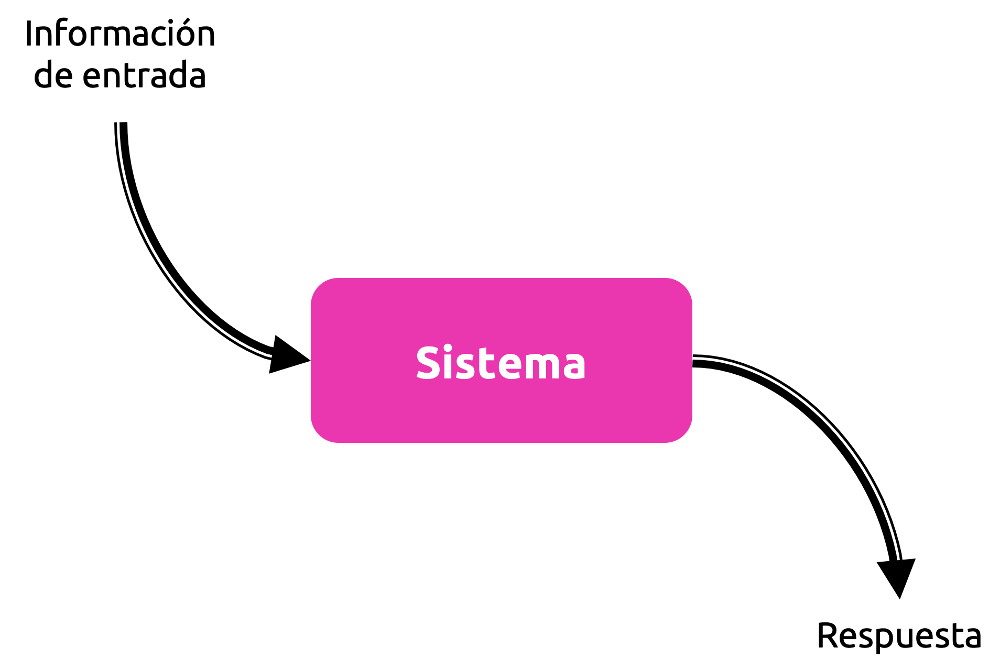
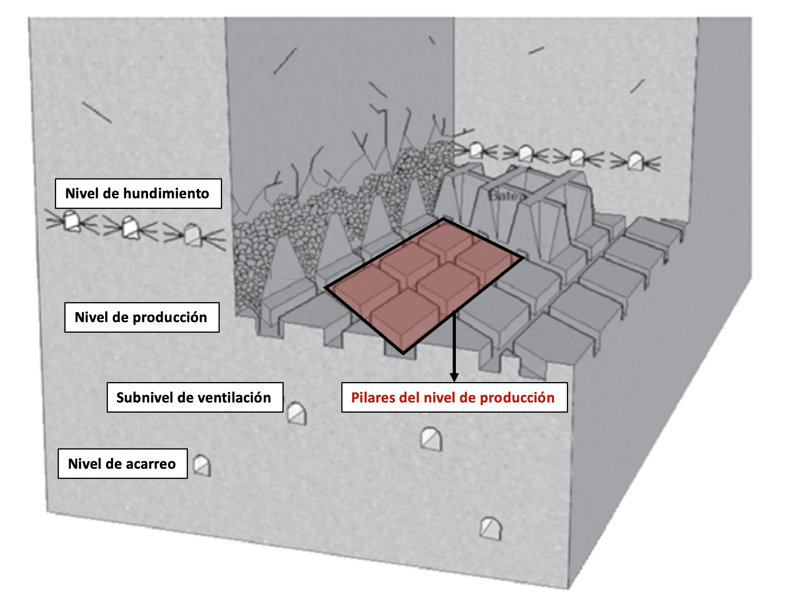
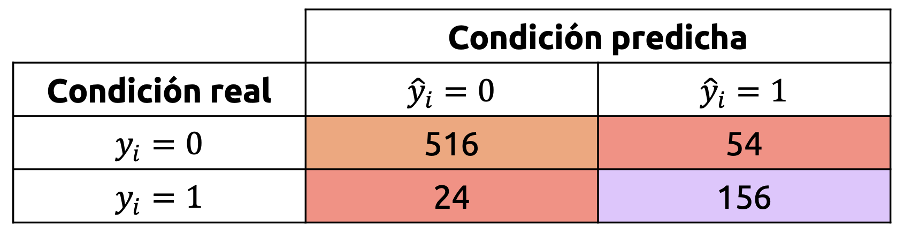
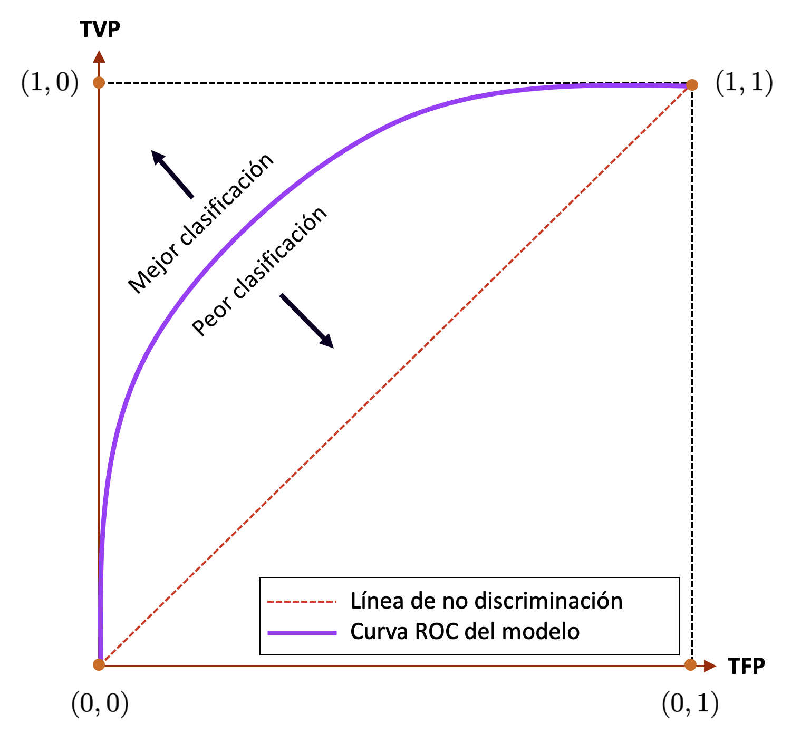

::: {.callout-important}
## Idea central

Un problema de clasificación consiste en aprender una regla que asigna observaciones a categorías discretas. En esta primera parte estudiaremos la clasificación desde una perspectiva operacional: Cómo se formula el problema, qué rol cumple la función de pérdida, por qué el gradiente descendente aparece como mecanismo de entrenamiento, cómo preservar proporciones de clases mediante muestreo estratificado y qué métricas permiten evaluar el desempeño más allá de la exactitud global.
:::

::: {.class-keywords}
[Clasificación]{.class-keyword}
[Función de pérdida]{.class-keyword}
[Gradiente descendente]{.class-keyword}
[Muestreo estratificado]{.class-keyword}
[Scikit-Learn]{.class-keyword}
[Matriz de confusión]{.class-keyword}
[Precision]{.class-keyword}
[Recall]{.class-keyword}
[F1-score]{.class-keyword}
:::

## Introducción

Consideremos el esquema de la @fig-system.

{#fig-system fig-align="center" width="60%"}

Tal esquema es una representación (quizás muy) genérica de un problema muy común en todo ámbito de las ciencias y, particularmente, de la ingeniería: Disponemos de un *sistema* que produce una serie de **respuestas de interés** a partir de estímulos descritos por una determinada **información de entrada**. Desde luego, la palabra *sistema* se utiliza aquí como un sustantivo colectivo de gran envergadura, puesto que, en realidad, tal sistema podría ser un determinado proceso, fenómeno o experimento de interés. Sea cual fuere el caso, en general, siempre nos vemos enfrentados a problemas que pueden ser representados por el esquema de la @fig-system.

Si aún no estamos convencidos, consideremos los siguientes ejemplos:

**Ejemplo 3.1 - Ensayos de resistencia triaxiales:** En la elaboración de estudios de resistencia de un material rocoso, es común que se realicen ensayos triaxiales destructivos sobre probetas o testigos constituidos por dicho material, en los cuales, mediante la acción de equipamiento especializado, sometemos a estas probetas a una carga axial o vertical, al mismo tiempo que el contenedor de la probeta se llena de un fluido que permite simular la acción de un confinamiento desde todas las direcciones hacia ella. El objetivo de estos ensayos es, dada una presión de confinamiento que es variable, determinar la carga axial que provoca la rotura de la probeta.

Naturalmente, estamos interesados en testear tantas probetas como sea posible, puesto que el medio material desde el cual estas probetas son extraídas suele ser un macizo rocoso intersectado por estructuras geológicas que constituyen planos de debilidad que alteran enormemente sus propiedades de resistencia. Por lo tanto, en términos prácticos, los ensayos triaxiales resultan en una serie de pares del tipo $(\sigma_{1},\sigma_{3})_{i}$, que se corresponden, respectivamente, con la carga axial a la cual se consiguió la rotura de la $i$-ésima probeta ($\sigma_{1}$) y la presión de confinamiento a la cual estuvo sometida ($\sigma_{3}$). Esta nomenclatura no es casual, ya que, en mecánica de sólidos, es común denotar las cargas por unidad de área (presiones o esfuerzos) con la letra griega $\sigma$. Los números $1$ y $3$ se usan para referenciar que estamos interesados en los **esfuerzos principales** que actúan sobre la probeta de roca, siendo así $\sigma_{1}$ el esfuerzo principal mayor, y $\sigma_{3}$ el menor.

Dado lo anterior, es natural preguntarse si existe una relación entre ambos tipos de esfuerzos para el material que estamos ensayando. De hecho, esta es una de las cuestiones fundamentales en la ingeniería geomecánica, que es la especialidad que se encarga de asegurar la estabilidad, a nivel mecánico, de cualquier labor minera. Naturalmente, no existe un único criterio que permita formular una relación entre los esfuerzos $\sigma_{1}$ y $\sigma_{3}$, pero uno de los más usados es el llamado **criterio de Hoek & Brown**, y que establece que

::: {.eq-scroll}
$$
\sigma_{1} = \sigma_{3} +\sigma_{\mathrm{ci} } \sqrt{m_{i}\frac{\sigma_{3} }{\sigma_{\mathrm{ci} } } +1}
\tag{3.1}
$$
:::

Donde $\sigma_{\mathrm{ci} }$ y $m_{i}$ son parámetros que dependen del tipo de material ensayado.

Conforme el principio de minimización del riesgo empírico, el modelo como tal parte de una hipótesis $f$, de manera tal que deseamos obtener una estimación de la carga $\sigma_{1}$, que denominamos como $\hat{\sigma}_{1}$, tal que $\hat{\sigma}_{1}=f(\sigma_{3} | \sigma_{\mathrm{ci}},m_{i})$. Sin embargo, debido a que los resultados de una serie de ensayos triaxiales son simplemente pares de valores $(\sigma_{1},\sigma_{3})$ para cada probeta, la fórmula (3.1) no es muy práctica para representar de forma directa nuestros resultados. Sin embargo, al aplicar algo de álgebra, podemos reordenar los términos de (3.1), obteniendo

::: {.eq-scroll}
$$
\begin{array}{lll}\sigma_{1} &=&\sigma_{3} +\sigma_{\mathrm{ci} } \sqrt{m_{i}\frac{\sigma_{3} }{\sigma_{\mathrm{ci} } } +1} \\ \sigma_{1} -\sigma_{3} &=&\displaystyle \sigma_{\mathrm{ci} } \sqrt{m_{i}\frac{\sigma_{3} }{\sigma_{\mathrm{ci} } } +1} \\ \left( \sigma_{1} -\sigma_{3} \right)^{2}  &=&\displaystyle \sigma^{2}_{\mathrm{ci} } \left( m_{i}\frac{\sigma_{3} }{\sigma_{\mathrm{ci} } } +1\right)  \\ \underbrace{\left( \sigma_{1} -\sigma_{3} \right)^{2}  }_{y} &=&\displaystyle \underbrace{\sigma_{\mathrm{ci} } m_{i}}_{a} \underbrace{\sigma_{3} }_{x} +\underbrace{\sigma^{2}_{\mathrm{ci} } }_{b} \end{array}
\tag{3.2}
$$
:::

De este modo, con los pares $(\sigma_{1},\sigma_{3})$ que hemos obtenido de nuestros ensayos, podemos construir un modelo lineal del tipo $y=ax+b$, donde $y=(\sigma_{1}-\sigma_{3})^{2}$ y $x=\sigma_{3}$. El valor de $y$ no es un resultado particular de los ensayos, pero puede calcularse rápidamente. De este modo, el modelo resultante nos permitirá obtener los valores de $\sigma_{\mathrm{ci} }$ y $m_{i}$, puesto que $a=\sigma_{\mathrm{ci} }m_{i}$ y $b=\sigma_{\mathrm{ci} }^{2}$.

Este ejemplo es una buena aplicación del esquema de la @fig-system. El **sistema** de interés es un experimento en el cual ensayamos la resistencia de un material rocoso, donde la **información de entrada** es, evidentemente, el confinamiento $\sigma_{3}$ al cual sometemos las probetas conformadas por ese material. La **respuesta** es, por supuesto, la carga axial $\sigma_{1}$ a la cual se consigue la rotura de la probeta.

Este es un **problema de regresión**, ya que la respuesta del sistema de interés es una variable continua y que puede tomar infinitos valores en un intervalo determinado de presiones mínima y máxima de rotura. La palabra *infinito* no quiere decir que realizamos *infinitos* ensayos, sino que la variable de respuesta *podría* tomar *cualquier* valor en un rango de valores determinado (que muchas veces también es desconocido). En términos técnicos, los resultados obtenidos para $\sigma_{1}$ y $\sigma_{3}$ durante nuestros ensayos *pertenecen* a un universo infinito de posibles valores para cada variable. Por lo tanto, resulta ideal *imaginar* que $\sigma_{1}$ y $\sigma_{3}$ son simplemente *muestras* o *realizaciones* de variables aleatorias continuas desconocidas. ◼︎

**Ejemplo 3.2 – Estallidos de roca:** Uno de los aspectos más notables del desarrollo de minas subterráneas explotadas mediante métodos de hundimiento masivos es la profundización de labores en un entorno con grandes magnitudes de esfuerzos. En minas subterráneas muy profundas, tales esfuerzos representan cargas increíblemente grandes de carácter acumulativo sobre la infraestructura propia de un sector productivo y, al liberar tales tensiones, el macizo rocoso puede, literalmente, explotar. Estos **estallidos de roca** son proyecciones de material rocoso que son producto de estos altos esfuerzos y se caracterizan por generar detenciones importantes en la operación. Son, a todas luces, un riesgo para las personas.

En términos físicos, los estallidos de roca son sismos inducidos por la minería que producen daño en la infraestructura productiva. La sismicidad inducida por la minería es un aspecto importante en labores subterráneas, porque a partir de su estudio es posible entender cual es el riesgo inherente a la propia operación en relación a la ocurrencia de estallidos de roca. Por tanto, es común que las grandes operaciones subterráneas cuenten con una completa red de geófonos que permiten cuantificar, con errores de localización dependientes de la cantidad de equipos, estos sismos.

En una mina subterránea muy grande, emplazada en un ambiente de altos esfuerzos, es común que ocurran más de 400.000 microsismos al año. Los eventos sísmicos potencialmente peligrosos suelen clasificarse en términos de la energía que éstos irradian por medio de algún modelo geofísico adecuado, siendo común aislar y estudiar aquellos cuya energía irradiada supere el umbral de 1 MJ (en general, eventos sobre 0.7 $M_{w}$, en la escala de magnitud de momento). Pero hay un problema: De estos 400.000 eventos, sólo unos 1.000 son potencialmente dañinos. Es decir, el 0.25% del total.

Y ni hablar de los estallidos de rocas... En promedio, ocurre uno al año... ¡Uno de cada 400.000 eventos!

Uno de los desafíos más importantes de la ingeniería de minas (puntualmente, de la ingeniería geomecánica) corresponde a la predicción de los estallidos de roca, aunque dado lo intratable que resulta predecir algo tan infrecuente, este problema suele limitarse a la predicción de eventos potencialmente peligrosos. Para resolver este problema, normalmente consideraríamos variables de entrada tales como la velocidad de hundimiento, la magnitud de los esfuerzos principales en el entorno de un sector productivo pre-minería, cómo hemos acondicionado el macizo rocoso, el tipo de roca, entre otros muchos aspectos propios de la actividad minera. Si tenemos $m$ observaciones para $n$ variables, todos estos atributos pueden reunirse en una matriz $\mathbf{X}\in \mathbb{R}^{m\times n}$ que aglutinará esta información en el contexto de un modelo de aprendizaje supervisado, donde $m$ es el número de observaciones y $n$ el número de variables independientes. Sea $E_{i}$ la energía irradiada en joules por el $i$-ésimo evento sísmico observado. Si definimos $y_{i}$ como

::: {.eq-scroll}
$$
y_{i}=\begin{cases}1&;\  \mathrm{si} \  E_{i}\geq 10^{6}\\ 0&;\  \mathrm{si} \  E_{i}<10^{6}\end{cases}
\tag{3.3}
$$
:::

Entonces $y_{i}$ es una **variable binaria** que permite describir la ocurrencia (o no) de eventos sísmicos potencialmente peligrosos.

El problema anterior no es de regresión, porque es evidente que la variable $\mathbf{y}=(y_{1},...,y_{m})$ $\in \mathbb{R}^{m}$ no es continua. Se trata pues de un **problema de clasificación**, ya que estamos interesados en **etiquetar** a un evento sísmico como potencialmente riesgoso ($y_{i}=1$) o no. De esta manera, nuevamente remitiéndonos a la @fig-system, el **sistema** de interés es una operación minera subterránea, donde la **información de entrada** está referida a las condiciones y variables operaciones qué permiten explicar cómo (y, posiblemente, cuándo) se realizan todas las actividades mineras que permiten garantizar la producción, las cuales, como comentamos previamente, se aglutinan en una matriz $\mathbf{X}\in \mathbb{R}^{m\times n}$. La respuesta es, naturalmente, la variable binaria $y_{i}$, con $i=1,...,m$. De esta forma, la hipótesis $f$ asociada a este problema vendría a ser $\hat{y}_{i}=f(\mathbf{X})$.

Hay otros aspectos de interés en este problema particular que no discutiremos aquí (por ejemplo ¿Qué representan las $i$? ¿Puntos en el espacio? Y si es así ¿Cuáles puntos?). Lo que sí es interesante, es el tipo de variable a predecir, que es **categórica**. La naturaleza de este problema es interesante por sí misma, puesto que, además de simplemente etiquetar eventos de forma binaria, es igualmente válido preguntarnos por la **probabilidad** de que ocurra un evento potencialmente peligroso. O bien, formular una hipótesis $g$ tal que $P(y_{i}=1)=g(\mathbf{X})$.

Más adelante, veremos que ambas ópticas son esencialmente equivalentes, y dependerán esencialmente del valor de probabilidad que *discrimina* los valores de las etiquetas correspondientes (en el contexto de este ejemplo, un evento potencialmente peligroso podría ser aquel cuya probabilidad de que su energía irradiada sea mayor a $10^{6}$ J, sea mayor que un 50%, pero un *stakeholder* más conservador querrá reducir ese margen a 30% o incluso menos).

Este es el tipo de problemas de los que nos ocuparemos a partir de esta entrada del blog. ◼︎

## El problema

Anteriormente establecimos que hay varios problemas propios que se derivan de los algoritmos de aprendizaje supervisado, siendo los más relevantes los problemas de **regresión** y de **clasificación**. Es común que los problemas de regresión suelan abordarse en los cursos más elementales de las carreras de ingeniería y ciencias, debido a que muchos estudios empíricos implican la construcción de ciertos tipos de modelos que intentan predecir variables continuas con funciones de densidad desconocida, razón por la cual el problema de regresión será visto con posterioridad. Sin embargo, este no es el caso para los modelos de clasificación, los cuales, en la literatura básica de estadística y ciencias, suelen ser mucho menos populares (en mi caso, ni siquiera los vi cuando estaba en la universidad).

En esta entrada (y la siguiente) nos dedicaremos a estudiar únicamente problemas relativos a la construcción de modelos de clasificación. Esto es, modelos que intentan predecir variables que son categóricas, típicamente con una cantidad muy pequeña de valores posibles, y que solemos denominar como **etiquetas**, **clases** o **categorías**.

Como comentamos previamente, un **problema de clasificación** es uno tal donde deseamos construir una función $f$ (denominada **hipótesis**), tal que, para un conjunto de datos de entrenamiento $\mathcal{D} =\left\{ \left( \mathbf{X} ,\mathbf{y} \right)  :\mathbf{X} =\left\{ x_{ij}\right\}  \in \mathbb{R}^{m\times n} \wedge \mathbf{y} \in \mathbb{R}^{m} \right\}$, se tenga que $\hat{y}_{i}\approx f(\mathbf{x}_{i},\mathbf{\theta})$ para toda instancia $i=1,...,m$, donde $\hat{y}_{i}$ es la estimación que realiza $f$ a partir del vector $\mathbf{x}_{i}=(x_{i1},...,x_{in})^{\top}$ y $\mathbf{\theta}$ es un vector de parámetros que debemos determinar, y son propios del modelo en cuestión. En este marco de referencia, la matriz de diseño $\mathbf{X}$ que aglutina los **datos de entrada** tiene $m$ filas y $n$ columnas. Las filas harán referencia al número total de **instancias** u **observaciones** asociadas a un determinado fenómeno, sistema, proceso o experimento de interés, mientras que las columnas harán referencia a los **atributos** o **variables** del problema de interés.

Debido a que la variable de salida $\mathbf{y}\in \mathbb{R}^{m}$ sólo puede tomar un número finito de valores, a la hora de construir un **modelo de clasificación**, *predecir* el valor de $\mathbf{y}$ puede derivar en dos *sub-problemas*:

- Estimar exactamente el valor de $\mathbf{y}$. De este modo, si $\mathbf{y}=\left\{ c_{1},...,c_{k}\right\}$, donde $c_{s}$ es uno de los $k$ posibles valores que puede tomar $\mathbf{y}$ ($1\leq s\leq k$), podríamos desear construir un *predictor* $f$ tal que $\hat{\mathbf{y}}=f(\mathbf{X})$.
- Estimar $P(y_{i}=c_{s}|\mathbf{x}_{i})$ o, en términos menos técnicos, la **probabilidad** de que $y_{i}$ tome el valor $c_{s}$, dado el valor de la instancia $\mathbf{x}_{i}$. En este caso, se tiene una hipótesis $g$ tal que $P(y_{i}=c_{s}|\mathbf{x}_{i})=g(\mathbf{x}_{i})$.

Cualquiera sea el caso, el nivel de complejidad del problema es función del número $k$ de clases o categorías que toma la respuesta $\mathbf{y}$. Cuando $k=2$, el problema es llamado **binario**, mientras que, si $k>2$, el problema será llamado **multicategórico** o **multinomial**.

## Función de pérdida

### El problema de usar funciones de pérdida aptas para problemas de regresión

Uno de los aspectos más diferenciadores de los modelos de clasificación guarda relación con el uso de determinadas funciones de pérdida. Para el caso de los modelos de regresión, la selección de estas funciones es un tanto más evidente, dada la popularidad de los mismos (es muy común que muchas carreras científicas y de ingeniería contemplen, en su malla curricular, la enseñanza del modelo de regresión lineal, el cual, desde la óptica del aprendizaje supervisado, suele utilizar como función de pérdida al **error cuadrático medio**). Tal función es útil en este tipo de problemas, porque si una variable de interés $\mathbf{y}=(y_{1},...,y_{m})\in \mathbb{R}^{m}$ es continua, siempre podremos tener una idea intuitiva de *qué tan buena* es una predicción o estimación $\hat{y}_{i}$ de $y_{i}$ ($1\leq i\leq m$) al calcular la **diferencia absoluta** $y_{i}-\hat{y}_{i}$, porque, entre mayor sea la magnitud de esta diferencia, mayor será el error, y más se penalizarán estos valores al entrenar un modelo. De hecho, para un total de $m$ instancias de entrenamiento, la fórmula del error cuadrático medio, a saber

::: {.eq-scroll}
$$
\mathrm{MSE}=\frac{1}{m} \sum_{i=1}^{m}(y_{i}-\hat{y}_{i})^{2}
\tag{3.4}
$$
:::

Contiene esta *distancia* $(y_{i}-\hat{y}_{i})$, aunque elevada al cuadrado, a fin de considerar únicamente sus magnitudes, independiente de si el error cometido por el modelo es por *exceso* o por *defecto*.

El problema de usar una función de pérdida como ésta cuando $\mathbf{y}$ es una variable categórica, es que las correspondientes categorías no necesariamente tendrán un orden lógico. Por ejemplo, podríamos estar interesados en construir un sistema que discrimine distintos tipos de minerales con base en un modelo de clasificación alimentado por miles de imágenes provenientes de sondajes realizados en diversas campañas en un yacimiento minero. De esta manera, podríamos tener una variable de respuesta parecida a

::: {.eq-scroll}
$$
y_{i}=\begin{cases}0&;\  \mathrm{si} \  y_{i}=\mathrm{calcopirita} \\ 1&;\  \mathrm{si} \  y_{i}=\mathrm{covelina} \\ 2&;\  \mathrm{si} \  y_{i}=\mathrm{enargita} \\ 3&;\  \mathrm{si} \  y_{i}=\mathrm{pirita} \\ 4&;\  \mathrm{si} \  y_{i}=\mathrm{galena} \end{cases}
\tag{3.5}
$$
:::

Pero aún así calcular diferencias entre valores estimados y reales no tiene sentido, porque las relaciones de orden entre estas categorías *transformadas* no existen en la realidad. No podemos establecer que $\mathrm{galena} >\mathrm{pirita}$, por lo que la relación $4 >3$, que es cierta en términos numéricos, carece de significado en el contexto de nuestro problema.

### Función de entropía cruzada

Introduciremos la primera de las funciones de pérdida que son propias de los modelos de clasificación por medio de un ejemplo sencillo.

**Ejemplo 3.3 – El conjunto de datos <font color='forestgreen'>MOONS</font>:** La discusión anterior motiva la necesidad de formular una función de pérdida adecuada para abordar un problema de clasificación. Para ello, vamos a considerar un problema binario derivado de un conjunto de datos *de juguete* (o *toyset*) muy conocido en la ciencia de datos, llamado **<font color='forestgreen'>MOONS</font>**. Dicho conjunto de datos está definido en un dominio arbitrario $U$ de $\mathbb{R}^{2}$, y está compuesto por dos subconjuntos de puntos con formas (aproximadamente) de medialuna que se enfrentan entre sí, siendo $\mathcal{M}_{1}$ la medialuna superior y $\mathcal{M}_{2}$ la inferior (de tal forma que $U=\mathcal{M}_{1}\cup \mathcal{M}_{2}$). Cada medialuna se colorea de forma distinta, de manera tal que, para todo $(x_{1},x_{2})\in U$, definimos

::: {.eq-scroll}
$$
y=\begin{cases}1&;\  \mathrm{si} \  \left( x_{1},x_{2}\right)  \in \mathcal{M}_{1} \\ 0&;\  \mathrm{si} \  \left( x_{1},x_{2}\right)  \in \mathcal{M}_{2} \end{cases}
\tag{3.6}
$$
:::

Este *toyset* es tan famoso que, por supuesto, es posible construirlo haciendo uso de la librería **<font color='darkmagenta'>Scikit-Learn</font>**. Para ello, haremos uso de la función `make_moons()`, cuya dependencia es el módulo `sklearn.datasets`. Haremos uso también de **<font color='darkmagenta'>Numpy</font>** para manipular algunos arreglos y **<font color='darkmagenta'>Matplotlib</font>** para visualizar este conjunto de datos:

```{python}
import matplotlib.pyplot as plt
import numpy as np
import seaborn as sns
```

```{python}
import warnings
```

```{python}
from sklearn.datasets import make_moons
```

```{python}
# Ignoraremos advertencias para evitar que el output se vea
# contaminado por mensajes de error que no afectan el desarrollo
# de esta entrada del blog.
# OJO: ¡Nunca hacer esto en problemas reales!
warnings.filterwarnings('ignore')
```

```{python}
# Setting de nuestras figuras.
plt.rcParams["figure.dpi"] = 90
sns.set_theme()
plt.style.use("bmh")
```

```{python}
# Construimos el conjunto de datos.
X, y = make_moons(n_samples=2000, noise=0.1, random_state=42)
```

La función `make_moons()` acepta varios argumentos, entre los cuales consideramos:

- `n_samples`: Total de instancias del conjunto de datos resultante (en nuestra implementación, un total de `2000`). Dicho conjunto es siempre bidimensional, por lo que la geometría del arreglo resultante (que llamamos `X`) que constituye la matriz de diseño será siempre `(n_samples, 2)`. La mitad de los valores tendrá una etiqueta `y` igual a `1`, mientras que la otra mitad tendrá una etiqueta `y` igual a `0`.
- `noise`: Parámetro de tipo flotante que especifica la desviación estándar de los puntos `X`. Mientras mayor sea este valor, más difícil será diferenciar a cuál medialuna pertenece cada punto, porque habrá mayor dispersión. En nuestro ejemplo, `noise=0.1`, lo que implica una dispersión relativamente baja, lo que permite diferenciar inmediatamente a qué clase pertenece cada punto en un gráfico.
- `random_state`: Parámetro que permite fijar la semilla aleatoria que genera estos puntos. Como suele ocurrir en **<font color='darkmagenta'>Scikit-Learn</font>**, este parámetro permite garantizar la **reproducibilidad** de los resultados obtenidos a partir de la construcción de este conjunto de datos.

Si graficamos estos puntos, podremos identificar al instantes ambas medialunas:

```{python}
#| label: fig-modelos-de-clasificacion-parte-i-01
#| fig-cap: "Conjunto de datos MOONS."
# Gráfico de nuestro conjunto de datos.
fig, ax = plt.subplots(figsize=(9, 7))
ax.scatter(X[:, 0], X[:, 1], c=y, marker="o", cmap="Dark2")
ax.set_title("Conjunto de datos MOONS", fontsize=14, fontweight="bold", pad=10)
ax.set_xlabel(r"$x_{1}$", fontsize=16, labelpad=10)
ax.set_ylabel(r"$x_{2}$", fontsize=16, labelpad=15, rotation=0)
plt.tight_layout()
```

En el conjunto de datos anterior, los puntos $(x_{1},x_{2})$ pertenecientes a la medialuna superior ($\mathcal{M}_{1}$) son tales que $y_{i}=1$, mientras que aquellos que pertenecen a la medialuna inferior ($\mathcal{M}_{2}$) son tales que $y_{i}=0$ ($i=1,2,...,2000$). De esta manera, el conjunto de datos que hemos construido está representado por un arreglo `X` de geometría `(2000, 2)` que contiene un total de `2000` instancias y `2` variables independientes. Por lo tanto, matemáticamente, estos datos pueden aglutinarse en una matriz, digamos $\mathbf{X} =\left\{ x_{ij}\right\}  \in \mathbb{R}^{2000\times 2}$. Correspondientemente, las etiquetas que clasifican a cada una de las 2000 instancias $\mathbf{x}_{i}=(x_{1},x_{2})_{i}\in \mathbb{R}^{2}$ ($1\leq i\leq 2000$) como pertenecientes a cualquiera de las dos medialunas se agrupan en un arreglo unidimensional `y` de geometría `(2000,)`, y que matemáticamente puede expresarse por medio de un vector $\mathbf{y}\in \mathbb{R}^{2000}$.

Este conjunto de datos representa un problema de clasificación muy común: Queremos construir un modelo que permita discriminar, con el menor error posible, a aquellos puntos que pertenecen a cada medialuna.

Para intentar solucionar este problema, optaremos por un modelo sencillo que intente separar ambas clases (las medialunas...) haciendo uso de una recta. Naturalmente, esto inducirá un cierto nivel de error, porque es imposible que una recta separe efectivamente ambos subconjuntos de interés. Sin embargo, aceptaremos este hecho e intentaremos calcular ese error haciendo uso de una función de pérdida adecuada. Más adelante aprenderemos que este tipo de conjuntos son llamados **linealmente no separables**.

Si el modelo separará (o, al menos, intentará hacerlo) a ambos subconjuntos, $\mathcal{M}_{1}$ y $\mathcal{M}_{2}$, por medio de una recta, podemos establecer que ésta tendrá como ecuación a una expresión del tipo $w_{1}x_{1}+ w_{2}x_{2}+b=0$, donde $w_{1},w_{2}$ y $b$ son **parámetros** que debemos determinar. Notemos que, conforme el principio de minimización de riesgo empírico, es claro que la ecuación de esta recta tiene la forma de una hipótesis $f$ tal que

::: {.eq-scroll}
$$
f\left( x_{1},x_{2}\right)  =w_{1} x_{1}+w_{2} x_{2}+b
\tag{3.7}
$$
:::

De esta manera, si $f(x_{1},x_{2})\geq 0$, entonces la estimación $\hat{y}$ será igual a 1, mientras que, si $f(x_{1},x_{2})<0$, entonces $\hat{y}$ será igual a 0. Esta capacidad de $f$ para poder **discriminar** las clases estimadas por un modelo de clasificación dota a nuestra hipótesis de un poder de decisión importante en un contexto práctico, razón por la cual solemos llamar igualmente a $f$, en un marco de referencia como éste, como **función de decisión**. Esta es una nomenclatura muy usada por varios paquetes computacionales, incluyendo a **<font color='darkmagenta'>Scikit-Learn</font>**.

Consideremos la función $\phi:\mathbb{R}\longrightarrow (0,1)$, definida como

::: {.eq-scroll}
$$
\phi \left( u\right)  =\frac{1}{1+\exp \left( -u\right)  }
\tag{3.8}
$$
:::

Dicha función es la **función logística**, y tiene la particularidad de que su dominio es todo $\mathbb{R}$, pero su recorrido es el conjunto $(0,1)$, siendo simétrica con respecto a la recta $y=0$. De esta forma, la función $\phi$ puede interpretarse como una **función de probabilidad**, la que puede usarse para estimar, por consiguiente, las probabilidades $P(y_{i}=1)$ o $P(y_{i}=0)$, para $1\leq i\leq 2000$.

Utilizaremos la librería **<font color='darkmagenta'>Numpy</font>** para generar un gráfico sencillo de la función logística como sigue:

```{python}
# Definimos la función logística.
def logistic(u):
    return 1 / (1 + np.exp(-u))
```

```{python}
# Generamos un arreglo en el intervalo (-8, 8) y 
# calculamos los valores correspondientes de la
#  función logística.
u = np.linspace(start=-8, stop=8, num=100)
phi = logistic(u)
```

```{python}
#| label: fig-modelos-de-clasificacion-parte-i-02
#| fig-cap: "La función logística."
# Gráfico de la función logística.
fig, ax = plt.subplots(figsize=(10, 5))
ax.plot(u, phi, color="royalblue", label=r"$\phi(u)  =\frac{1}{1+\exp(-u)}$")
ax.set_xlabel(r"$u$", fontsize=14, labelpad=10)
ax.set_ylabel(r"$\phi(u)$", fontsize=14, labelpad=25, rotation=0)
ax.legend(fontsize=14, frameon=True)
ax.set_title("La función logística", fontsize=14, fontweight="bold", pad=10)
plt.tight_layout()
```

Podemos observar que el gráfico de $\phi$ tiene una característica forma de "S", conocida en matemáticas (y en un montón de paquetes computacionales) como **sigmoide**.

Notemos que la función de decisión $f$, al aplicarse sobre las $2000$ instancias que constituyen la matriz de diseño $\mathbf{X}$, retorna como resultado un arreglo $\mathbf{u}=(u_{1},...,u_{2000})\in \mathbb{R}^{2000}$, el cual, naturalmente, describe un recta en el dominio en el que están definidas las medialunas $\mathcal{M}_{1}$ y $\mathcal{M}_{2}$. Dicho arreglo puede usarse como entrada para $\phi$ a fin de obtener como resultado las probabilidades de pertenencia de cada instancia $\mathbf{x}_{i}$ a una determinada clase o medialuna, $\mathcal{M}_{1}$ o $\mathcal{M}_{2}$. De este modo, cada elemento de $\mathbf{u}$ puede describirse como

::: {.eq-scroll}
$$
u_{i}=w_{1} x_{i1}+w_{2} x_{i2}+b
\tag{3.9}
$$
:::

para $1\leq i\leq 2000$. Notemos que podemos reescribir (3.9) de manera compacta haciendo uso de una **multiplicación matricial**, de manera tal que

::: {.eq-scroll}
$$
\mathbf{u} =\mathbf{w }^{\top } \mathbf{X} +b
\tag{3.10}
$$
:::

donde $\mathbf{w }=(w_{1},w_{2})\in \mathbb{R}^{2}$ es un vector que agrupa a los parámetros que debemos determinar. Si agregamos una columna únicamente compuesta por 1s a la izquierda de $\mathbf{X}$ y ponemos $w_{0}=b$, de tal forma que ahora $\mathbf{w}=(w_{0},w_{1},w_{2})\in \mathbb{R}^{3}$, podemos compactar aún más la expresión anterior, con lo cual el vector $\mathbf{u}$ puede simplemente escribirse como

::: {.eq-scroll}
$$
\mathbf{u} =\mathbf{w }^{\top } \mathbf{X}
\tag{3.11}
$$
:::

Las ecuaciones (3.10) y (3.11) son de gran importancia, porque son independientes de las dimensiones de $\mathbf{w}$ y $\mathbf{X}$ y, por tanto, pueden escalarse sin ningún problema para cualquier tipo de problema con las mismas características. De este modo, la probabilidad de pertenencia de cada punto a una determinada clase puede expresarse por medio de la ecuación

::: {.eq-scroll}
$$
P\left( y_{i}=1\  |\  \mathbf{w } \right)  =\frac{1}{1+\exp \left( -\mathbf{w }^{\top } \mathbf{X} \right)  } \  ;\  i=1,...,2000
\tag{3.12}
$$
:::

En la ecuación (3.12), $P\left( y_{i}=1\  |\  \mathbf{w } \right)$ representa la probabilidad de que la instancia $\mathbf{x}_{i}$ pertenezca a la clase $\mathcal{M}_{1}$. Naturalmente, el complemento de esta probabilidad (es decir, $P\left( y_{i}=0\  |\  \mathbf{w } \right)$ $=1-P\left( y_{i}=1\  |\  \mathbf{w } \right)$) representa la probabilidad de pertenencia de $\mathbf{x}_{i}$ a la clase $\mathcal{M}_{2}$.

Simplifiquemos un poco la notación y escribamos $p_{i}=P\left( y_{i}=1\  |\  \mathbf{w } \right)$ para denotar la probabilidad de que $y_{i}$ sea igual a $1$. Consecuentemente, $1-p_{i}$ representará la probabilidad de que $y_{i}$ sea igual a $0$. Queremos construir una expresión que *castigue* o *penalice* a aquellos valores de $p_{i}$ que sean demasiado altos cuando la instancia $\mathbf{x}_{i}$ sea tal que, en realidad, $y_{i}=0$. También queremos que la misma expresión *castigue* o *penalice* a aquellos valores de $p_{i}$ que sean demasiado pequeños cuando la instancia $\mathbf{x}_{i}$ sea tal que, en realidad, $y_{i}=1$. Una opción viable es la función $\ell:(0,1)\longrightarrow \mathbb{R}$, definida como

::: {.eq-scroll}
$$
\ell \left( p_{i}\right)  :=\begin{cases}-\log \left( p_{i}\right)  &;\  \mathrm{si} \  y_{i}=1\\ -\log \left( 1-p_{i}\right)  &;\  \mathrm{si} \  y_{i}=0\end{cases} \  ;\  i=1,...,2000
\tag{3.13}
$$
:::

Vamos a ilustrar la evolución de los valores de $\ell$ para distintos valores de probabilidad cuando $y_{i}=1$ e $y_{i}=0$, definiendo esta función en Python:

```{python}
# Definimos nuestra función de pérdida en Python.
def log_loss(p, y):
    if y == 1.0:
        return -np.log10(p)
    elif y == 0.0:
        return -np.log10(1 - p)
```

```{python}
# Creamos un arreglo de probabilidades y 
# calculamos los valores del costo.
p = np.linspace(start=0.01, stop=0.99, num=100)
positive_loss = log_loss(p=p, y=1.0)
negative_loss = log_loss(p=p, y=0.0)
```

```{python}
#| label: fig-modelos-de-clasificacion-parte-i-03
#| fig-cap: "Costo cuando $y_{i}=1$."
# Graficamos los valores de esta función para cada valor de y.
fig, ax = plt.subplots(ncols=2, sharey=True, figsize=(9, 6))

ax[0].plot(p, positive_loss, color="royalblue", lw=2.0)
ax[0].set_xlabel(r"$p_{i}$", fontsize=14, labelpad=10)
ax[0].set_ylabel(r"$\ell(p_{i})$", fontsize=12, labelpad=25, rotation=0)
ax[0].set_title(r"Costo cuando $y_{i}=1$", fontsize=12, pad=10)

ax[1].plot(p, negative_loss, color="firebrick", lw=2.0)
ax[1].set_xlabel(r"$p_{i}$", fontsize=12, labelpad=10)
ax[1].set_title(r"Costo cuando $y_{i}=0$", fontsize=13, pad=10)

fig.suptitle(r"Valores de $\ell(p_{i})$", fontsize=14, fontweight="bold")
plt.tight_layout()
```

Podemos observar que, para el caso $y_{i}=1$, el valor de $\ell(p_{i})$ crece exponencialmente a medida que $p_{i}$ decrece. De esta manera, cuando $p_{i}$ es muy pequeño, el valor de la función $\ell$ (y por lo tanto de la correspondiente penalización) tiende a ser muy grande, que es justo lo que queremos porque, para este caso, en efecto, el valor de $y_{i}$ es igual a $1$ y la *probabilidad real* debiera estar lo más cerca posible del valor $p_{i}=1$. 

En el panel del lado derecho, podemos observar el fenómeno inverso para el caso $y_{i}=0$, debido a que el valor de $\ell(p_{i})$ crece exponencialmente con el valor de $p_{i}$. Esto quiere decir que, a medida que $1-p_{i}$ se hace más grande, mayor es la penalización que se aplica a esta instancia, porque el valor de $y_{i}$ es igual a $0$ y, por tanto, la *probablidad real* $1-p_{i}$ debiera estar lo más cerca posible del valor $1-p_{i}=0$.

Notemos que $\ell(p_{i})$ cumple, a todas luces, el papel de una **función de pérdida**. Intuitivamente, el valor de $\ell(p_{i})$ puede interpretarse como la *sorpresa* relativa al resultado real $y_{i}$ en contraste a la predicción de un modelo que estima la probabilidad $p_{i}$, por lo que se trata de una **función de entropía cruzada de tipo binaria**, conforme lo visto en [nuestra entrada dedicada a la teoría de la información de Shannon](/apuntes/grafos-e-informacion/introduccion-a-la-teoria-de-la-informacion/). Notemos que esta función de pérdida siempre tiene un valor igual o mayor que cero, anulándose en caso de que la predicción $p_{i}$ sea igual a $1$, mientras que crece infinitamente cuando $p_{i}\rightarrow 0$; es decir, mientras más incorrecta sea la predicción correspondiente, lo que implica que ésta es más *sorpresiva*. Notemos que, a diferencia de lo que ocurre en el caso de la regresión lineal, donde un modelo puede tener un valor igual a cero en su función de pérdida en un punto si la función predictora pasa por el punto en cuestión, y un valor global igual a cero si la función predictora pasa por todos los puntos observados, en el modelo de regresión logística esto no es posible, puesto que $y_{i}$ puede tomar los valores $0$ o $1$, pero $0<p_{i}<1$.

Dada la naturaleza binaria de $y_{i}$, podemos reescribir el valor de la pérdida $\ell(p_{i})$ como

::: {.eq-scroll}
$$
\ell \left( p_{i}\right)  :=-y_{i}\log \left( p_{i}\right)  -\left( 1-y_{i}\right)  \log \left( 1-p_{i}\right)  \  ;\  i=1,...,2000
\tag{3.14}
$$
:::

La suma de todos los valores de $\ell(p_{i})$ para $i=1,2,...,2000$ se denomina **función de verosimilitud logarítmica** o **log-loss**, y puede escribirse como

::: {.eq-scroll}
$$
L\left( p_{i}\right)  :=\sum^{2000}_{i=1} \ell \left( p_{i}\right)  =\sum^{2000}_{i=1} \left( y_{i}\log \left( p_{i}\right)  +\left( 1-y_{i}\right)  \log \left( 1-p_{i}\right)  \right)
\tag{3.15}
$$
:::

La expresión (3.15) es la **función de pérdida** más común en la construcción de modelos de clasificación. ◼︎

Vamos a formalizar lo que hemos aprendido del ejemplo anterior por medio de una definición.

**<font color='blue'>Definición 3.1 – Función de verosimilitud logarítmica</font>**: Consideremos un conjunto de entrenamiento $\mathcal{D}$ definido como

::: {.eq-scroll}
$$
\mathcal{D} =\left\{ \left( \mathbf{X} ,\mathbf{y} \right)  :\mathbf{X} =\left\{ x_{ij}\right\}  \in \mathbb{R}^{m\times n} \wedge \mathbf{y} \in \mathbb{R}^{m} \right\}
\tag{3.16}
$$
:::

Donde,

- $\mathbf{X}$ es la matriz de diseño, que aglutina a las $m$ instancias de $\mathcal{D}$ para un total de $n$ atributos o variables independientes.
- $\mathbf{y}$ es el vector de valores de respuesta, tal que $y_{i}$ puede tomar únicamente los valores $1$ o $0$ (para $1\leq i\leq m$).

Sea $\mathbf{x}_{i}\in \mathbb{R}^{n}$ el vector resultante de aislar la instancia $i$-ésima de $\mathbf{X}$, y sea $p_{i}$ la probabilidad de que $y_{i}$ sea igual a $1$, dado el valor de $\mathbf{x}_{i}$. La función $L$, definida como

::: {.eq-scroll}
$$
L\left( p_{i}|y_{i}\right)  :=\sum^{m}_{i=1} \left( y_{i}\log \left( p_{i}\right)  +\left( 1-y_{i}\right)  \log \left( 1-p_{i}\right)  \right)
\tag{3.17}
$$
:::

es llamada **función de verosimilitud logarítmica** para $p_{i}$ dado el valor de $y_{i}$.

## Implementación del algoritmo de gradiente descendente

Vamos a retomar el ejemplo anterior, a fin de motivar un desarrollo un tanto más ambicioso que una simple función de costo. Ahora queremos darle forma al proceso que nos permitirá obtener los parámetros $\theta_{1},\theta_{2}$ y $b=\theta_{0}$. Para ello, haremos uso del algoritmo de gradiente descendente, que ya ilustramos en detalle en la [entrada dedicada a la implementación de algoritmos de optimización en el contexto del aprendizaje automático](/apuntes/calculo-incertidumbre-y-optimizacion/optimizacion-aplicada-al-aprendizaje-automatico/).

**Ejemplo 3.4 – El modelo de regresión logística binaria:** Prosigamos pues con el ejercicio de las medialunas y el conjunto de datos **<font color='forestgreen'>MOONS</font>**. Conforme la ecuación (3.15), si reemplazamos la probabilidad $p_{i}$ por la expresión (3.12), obtendremos

::: {.eq-scroll}
$$
L\left( p_{i}|\mathbf{w } \right)  =\sum^{m}_{i=1} \left[ y_{i}\log \left( \phi \left( \mathbf{w }^{\top } \mathbf{x}_{i} \right)  \right)  +\left( 1-y_{i}\right)  \log \left( 1-\phi \left( \mathbf{w }^{\top } \mathbf{x}_{i} \right)  \right)  \right]
\tag{3.18}
$$
:::

O, en términos matriciales,

::: {.eq-scroll}
$$
L\left( \mathbf{y} |\mathbf{w } \right)  =\mathbf{y} \log \left( \phi \left( \mathbf{w }^{\top } \mathbf{X} \right)  \right)  +\left( 1-\mathbf{y} \right)  \log \left( 1-\phi \left( \mathbf{w }^{\top } \mathbf{X} \right)  \right)
\tag{3.19}
$$
:::

Uno de los aspectos más convenientes de la función logística $\phi$ es que, mediante una manipulación algebraica sencilla, podemos expresar su derivada en términos de la propia función. En efecto, sea $u\in \mathbb{R}$. De esta manera,

::: {.eq-scroll}
$$
\begin{array}{lll}\phi^{\prime } \left( u\right)  &=&\displaystyle \frac{-1}{\left( 1+\exp \left( -u\right)  \right)^{2}  } \left( -1\right)  \left( \exp \left( -u\right)  \right)  \\ &=&\displaystyle \frac{\exp \left( -u\right)  }{\left( 1+\exp \left( -u\right)  \right)^{2}  } \\ &=&\displaystyle \frac{\exp \left( -u\right)  }{1+\exp \left( -u\right)  } \cdot \frac{1}{1+\exp \left( -u\right)  } \\ &=&\displaystyle \frac{-1+1+\exp \left( -u\right)  }{1+\exp \left( -u\right)  } \cdot \frac{1}{1+\exp \left( -u\right)  } \\ &=&\displaystyle \left( -\frac{1}{1+\exp \left( -u\right)  } +\frac{1+\exp \left( -u\right)  }{1+\exp \left( -u\right)  } \right)  \frac{1}{1+\exp \left( -u\right)  } \\ &=&\displaystyle \left( -\frac{1}{1+\exp \left( -u\right)  } +1\right)  \frac{1}{1+\exp \left( -u\right)  } \\ &=&\displaystyle \left( 1-\underbrace{\frac{1}{1+\exp \left( -u\right)  } }_{\phi \left( u\right)  } \right)  \underbrace{\frac{1}{1-\exp \left( -u\right)  } }_{\phi \left( u\right)  } \\ &=&\displaystyle \left( 1-\phi \left( u\right)  \right)  \phi \left( u\right)  \end{array}
\tag{3.20}
$$
:::

tal como queríamos demostrar.

La función de pérdida (3.20) debe maximizarse, puesto que, de esta manera, las penalizaciones derivadas de los errores del modelo serán mínimas (o, en palabras menos rimbombantes, los errores de estimacion serán lo más pequeños posibles). Por lo tanto, para estimar los parámetros que se agrupan en el vector $\mathbf{w}\in \mathbb{R}^{3}$, debemos resolver el problema de optimización no restringido

::: {.eq-scroll}
$$
\begin{array}{ll}\displaystyle \max_{\mathbf{w } } &\displaystyle \sum^{m}_{i=1} \left[ y_{i}\log \left( \phi \left( \mathbf{w }^{\top } \mathbf{x}_{i} \right)  \right)  +\left( 1-y_{i}\right)  \log \left( 1-\phi \left( \mathbf{w }^{\top } \mathbf{x}_{i} \right)  \right)  \right]  \end{array}
\tag{3.21}
$$
:::

Para resolver el problema anterior, es necesario calcular el gradiente de $L$ con respecto a los parámetros $w_{0},w_{1}$ y $w_{2}$, a fin de buscar los puntos críticos que anulan el valores de las correspondientes derivadas parciales que integran dicho gradiente. Para $\mathbf{w}=(w_{0},w_{1},w_{2})\in \mathbb{R}^{3}$, tendremos entonces que

::: {.eq-scroll}
$$
\begin{array}{lll}\displaystyle \frac{\partial L}{\partial w_{j} } &=&\displaystyle \frac{\partial }{\partial w_{j} } \sum^{m}_{i=1} \left[ y_{i}\log \left( \phi \left( \mathbf{w }^{\top } \mathbf{x}_{i} \right)  \right)  +\left( 1-y_{i}\right)  \log \left( 1-\phi \left( \mathbf{w }^{\top } \mathbf{x}_{i} \right)  \right)  \right]  \\ &=&\displaystyle \sum^{m}_{i=1} \left[ \frac{y_{i}}{\phi \left( \mathbf{w }^{\top } \mathbf{x}_{i} \right)  } \phi^{\prime } \left( \mathbf{w }^{\top } \mathbf{x}_{i} \right)  \mathbf{x}_{i} +\frac{1-y_{i}}{1-\phi \left( \mathbf{w }^{\top } \mathbf{x}_{i} \right)  } \left( -\phi^{\prime } \left( \mathbf{w }^{\top } \mathbf{x}_{i} \right)  \right)  \mathbf{x}_{i} \right]  \\ &=&\displaystyle \sum^{m}_{i=1} \left[ \frac{y_{i}\phi \left( \mathbf{w }^{\top } \mathbf{x}_{i} \right)  \left( 1-\phi \left( \mathbf{w }^{\top } \mathbf{x}_{i} \right)  \right)  }{\phi \left( \mathbf{w }^{\top } \mathbf{x}_{i} \right)  } +\frac{\phi \left( \mathbf{w }^{\top } \mathbf{x}_{i} \right)  \left( y_{i}-1\right)  \left( 1-\phi \left( \mathbf{w }^{\top } \mathbf{x}_{i} \right)  \right)  }{1-\phi \left( \mathbf{w }^{\top } \mathbf{x}_{i} \right)  } \right]  \mathbf{x}_{i} \\ &=&\displaystyle \sum^{m}_{i=1} \left[ y_{i}\left( 1-\phi \left( \mathbf{w }^{\top } \mathbf{x}_{i} \right)  \right)  +\left( y_{i}-1\right)  \phi \left( \mathbf{w }^{\top } \mathbf{x}_{i} \right)  \right]  \mathbf{x}_{i} \\ &=&\displaystyle \sum^{m}_{i=1} \left[ y_{i}\underbrace{-y_{i}\phi \left( \mathbf{w }^{\top } \mathbf{x}_{i} \right)  +y_{i}\phi \left( \mathbf{w }^{\top } \mathbf{x}_{i} \right)  }_{=0} -\phi \left( \mathbf{w }^{\top } \mathbf{x}_{i} \right)  \right]  \mathbf{x}_{i} \\ &=&\displaystyle \sum^{m}_{i=1} \left[ y_{i}-\phi \left( \mathbf{w }^{\top } \mathbf{x}_{i} \right)  \right]  \mathbf{x}_{i} \end{array}
\tag{3.22}
$$
:::

De esta manera, el algoritmo de gradiente descendente toma la forma

::: {.eq-scroll}
$$
w^{\left( k+1\right)  }_{j} =w^{\left( k\right)  }_{j} -\eta \frac{\partial L}{\partial w_{j} }
\tag{3.23}
$$
:::

Para $j=1,2,3$, donde el hiperparámetro $\eta$ es la **tasa de aprendizaje** del algoritmo.

El modelo de clasificación resultante de este procedimiento es un caso particular de **modelo lineal generalizado**, muy conocido en el aprendizaje automático, conocido como **modelo de regresión logística binaria**. Más adelante definiremos formalmente a este tipo de modelos.

**<font color='darkmagenta'>Scikit-Learn</font>** cuenta con una implementación nativa del algoritmo de gradiente descendente en su versión estocástica (SGD) tanto para modelos de clasificación como para modelos de regresión, estando ambos disponibles en el módulo `sklearn.linear_model`. Sin embargo, a fin de *entrenar los dedos* escribiendo algo de código, crearemos una implementación desde cero que seguirá absolutamente todas las reglas de la API estimadora de **<font color='darkmagenta'>Scikit-Learn</font>** a la hora de entrenar el correspondiente modelo y obtener predicciones. Nos valdremos, para ello, de la librería **<font color='darkmagenta'>Numpy</font>**, que es especialmente útil para trabajar con operaciones matriciales.

Debido a que la API estimadora de **<font color='darkmagenta'>Scikit-Learn</font>** está orientada a objetos, nuestro modelo se instanciará por medio del uso de una clase que, consecuentemente, llamaremos `BinaryLogisticRegression`, a fin de diferenciarla de la implementación nativa de **<font color='darkmagenta'>Scikit-Learn</font>**, denominada `LogisticRegression`, y que ejemplificaremos más adelante en detalle:

```{python}
from tqdm import tqdm
```

```{python}
# Creamos nuestra clase.
class BinaryLogisticRegression:
    def __init__(self, lr=0.01, n_iter=2000, tol=1e-4):
        """
        Inicialización del modelo en base a hiperparámetros necesarios para definir el curso de acción
        del algoritmo de gradiente descendente.

        Parámetros:
        -----------
        lr : Tasa de aprendizaje del modelo.
        n_iter : Número de iteraciones a efectuar por el algoritmo de gradiente descendente.
        tol : Tolerancia de nuestra implementación. Este hiperparámetro se fija para evitar iterar demasiado
        si la diferencia entre una predicción y la subsiguiente, en el proceso de ajuste, no supera dicho
        valor de tolerancia.

        """
        self.lr = lr
        self.n_iter = n_iter
        self.tol = tol
        self.coef_ = None # Aquí almacenaremos los parámetros estimados por el algoritmo.
        self.intercept_ = None # Aquí almacenaremos el parámetro de sesgo estimado por el algoritmo.

    def _logistic(self, u):
        """
        Método que permite implementar la función logística sobre un arreglo arbitrario, siempre que éste
        sea unidimensional.
        
        Parámetros:
        -----------
        u : Arreglo 1D para el cual calculamos los valores de la función logística.

        Retorna:
        --------
        Arreglo 1D con los valores calculados para la función logística.
        """
        return 1 / (1 + np.exp(-u))

    def _log_loss(self, y, p):
        """
        Método que permite implementar la función de entropía cruzada binaria (log-loss) como función de
        costo para nuestro modelo.

        Parámetros:
        -----------
        y : Categorías que deseamos utilizar como base para entrenar nuestro modelo.
        p : Probabilidades estimadas por el modelo de que y == 1.

        Retorna:
        --------
        Valor medio del costo calculado.
        """
        return -np.mean(y * np.log(p) + (1 - y) * np.log(1 - p))

    def fit(self, X, y):
        """
        Método que permite el entrenamiento del modelo.

        Parámetros:
        -----------
        X : Arreglo 2D de dimensión (n_instances, n_features) que aglutina toda la información de entrada 
        necesaria para entrenar nuestro modelo.
        y : Arreglo 1D con las etoquetas o categorías usadas como base para entrenar nuestro modelo.
        """
        # Obtenemos las dimensiones del arreglo X.
        n_instances, n_features = X.shape

        # Inicializamos los valores de los parámetros a estimar por el modelo.
        self.coef_ = np.zeros(n_features)
        self.intercept_ = 0.0

        # Defimos un valor inicial de costo.
        previous_loss = float("inf")

        # Implementamos el algoritmo de gradiente descendente. Usamos igualmente una barra de progreso.
        for i in tqdm(range(self.n_iter), desc="Entrenando el modelo"):
            # Calculamos el valor de la hipótesis o función de decisión.
            decision_val = np.dot(X, self.coef_) + self.intercept_

            # Pasamos este valor por la función logística, a fin de obtener la probabilidad correspondiente.
            y_prob = self._logistic(decision_val)

            # Calculamos el valor de la función de costo.
            current_loss = self._log_loss(y, y_prob)

            # Chequeamos la convergencia del algoritmo usando el parámetro de tolerancia.
            if np.abs(previous_loss - current_loss) < self.tol:
                print(f"Convergencia del algoritmo alcanzada en iteración nº{i}")
                break

            # Actualizamos el valor del costo.
            previous_loss = current_loss

            # Calculamos los gradientes correspondientes.
            dw = (1 / n_instances) * np.dot(X.T, (y_prob - y))
            db = (1 / n_instances) * np.sum(y_prob - y)

            # Actualizamos los valores de los parámetros del modelo.
            self.coef_ -= self.lr * dw
            self.intercept_ -= self.lr * db

    def predict_proba(self, X):
        """
        Método que nos permite estimar las probabilidades P(y == 1) por medio de nuestro modelo.

        Parámetros:
        -----------
        X : Arreglo 2D de dimensión (n_instances, n_features) que aglutina toda la información de entrada
        necesaria para entrenar nuestro modelo.

        Retorna:
        --------
        Probabilidades estimadas.
        """
        # Calculamos el valor de la hipótesis o función de decisión.
        decision_val = np.dot(X, self.coef_) + self.intercept_

        # Pasamos este valor por la función logística, a fin de obtener la probabilidad correspondiente.
        y_prob = self._logistic(decision_val)

        return y_prob

    def predict(self, X):
        """
        Método que nos permite estimar las clases o categorías directamente por medio del modelo.

        Parámetros:
        -----------
        X : Arreglo 2D de dimensión (n_instances, n_features) que aglutina toda la información de entrada
        necesaria para entrenar nuestro modelo.

        Retorna:
        --------
        Clases estimadas.
        """
        # Obtenemos las correspondientes probabilidades de pertenencia a la clase y == 1.
        y_prob = self.predict_proba(X)

        # Y las convertimos a categorías. Notemos que aquí hemos definido de manera rígida que el umbral que
        # separa a las clases y == 1 de y == 0 es la probabilidad P(y == 1) = 0.5.
        y_pred = np.where(y_prob >= 0.5, 1, 0)
        
        return y_pred

    def decision_function(self, X):
        """
        Método que nos permitirá obtener los valores de decisión que se usan como entrada para la implemen-
        tación de la función logística en el modelo. En rigor, estos valores permiten trazar la frontera
        de decisión que separa las clases estimadas por el modelo.

        Parámetros:
        -----------
        X : Arreglo 2D de dimensión (n_instances, n_features) que aglutina toda la información de entrada
        necesaria para entrenar nuestro modelo.

        Retorna:
        --------
        Valores de decisión estimados.
        """
        # Calculamos el valor de la hipótesis o función de decisión.
        decision_val = np.dot(X, self.coef_) + self.intercept_

        return decision_val
```

Se ha provisto una completa documentación de nuestra clase `BinaryLogisticRegression`, a fin de entender qué estamos haciendo en cada una de las líneas de código. Sin embargo, se trata de una aplicación paso a paso del algoritmo de gradiente descendente para estimar los parámetros agrupados en el vector $\mathbf{w}$, tomando como pérdida la función de entropía cruzada binaria o *log-loss*.

Sin mucho más que agregar, ya sólo nos resta probar nuestra implementación. Lo primero entonces es instanciar nuestro modelo en alguna variable, que típicamente denominamos `model`:

```{python}
# Instanciamos nuestro modelo.
model = BinaryLogisticRegression()
```

Ahora usamos el método `fit()` para entrenar nuestro modelo. Observemos que, para ello, es necesario tomar como argumentos los arreglos `X` e `y` previamente definidos:

```{python}
# Entrenamos nuestro modelo usando todos los datos.
model.fit(X, y)
```

A fin de entender qué hemos hecho al entrenar nuestro modelo, vamos a jugar un poco con sus *perillas* y construiremos algunas visualizaciones interesantes. Primero, entenderemos la importancia de la función logística como base para darle sentido a los valores de la función de costo, a fin de representar el error que comete este modelo. Para ello, podemos tomar cualquera de las variables independientes que conforman la matriz de diseño `X` y graficar sus valores versus las correspondientes etiquetas:

```{python}
# Concatenamos los arreglos X e y, a fin de poder 
# filtrar los valores de las variables independientes
# en términos de su correspondiente etiqueta.
full_set = np.hstack([X, y.reshape(-1, 1)])
```

```{python}
#| label: fig-modelos-de-clasificacion-parte-i-04
#| fig-cap: "Donde se encuentran los valores de $x_{1}$ con respecto a las clases."
# Graficamos los valores de la primera variable independiente en términos de la correspondiente etiqueta de clase.
fig, ax = plt.subplots(figsize=(9, 5))
ax.scatter(
    full_set[full_set[:, 2] == 1][:, 0], full_set[full_set[:, 2] == 1][:, 2], 
    color="lightseagreen", marker="o", label=r"$y_{i}=1$",
)

ax.scatter(
    full_set[full_set[:, 2] == 0][:, 0], full_set[full_set[:, 2] == 0][:, 2], 
    color="gray", marker="o", label=r"$y_{i}=0$",
)

ax.legend(loc="upper left", frameon=True, fontsize=10)
ax.set_xlabel(r"$x_{1}$", fontsize=14, labelpad=10)
ax.set_ylabel(r"$y$", fontsize=14, labelpad=15, rotation=0)
ax.set_title(
    r"Donde se encuentran los valores de $x_{1}$ con respecto a las clases",
    pad=10,
    fontsize=14,
    fontweight="bold",
)

plt.tight_layout()
```

Podemos observar que, a medida que nos acercamos al valor $x_{1}=0.5$, hay cada vez mayor superposición de los puntos tales que $y_{i}=1$ e $y_{0}=0$, lo que naturalmente deriva en que cualquier modelo, basándose únicamente en el valor de esta variable independiente, *confunda* dónde se encuentran los valores asociados a cada clase, generando un mayor nivel de *sorpresa* en los resultados obtenidos, siendo estos puntos (que se ubican, aproximadamente, en el intervalo $[-0.35, 1.20]$) los que concentran los mayores valores de costo derivados de la implementación de la función de entropía cruzada binaria (para cada clase). Por el contrario, para $x_{1}>1.2$, es claro que $y_{i}=1$, mientras que, para $x_{1}<-0.35$, es claro que $y_{i}=0$. Es decir, no hay *sorpresa* y, por extensión, es muy difícil que el modelo sufra de *confusión* en tales intervalos a la hora de clasificar estos puntos.

Podemos chequear lo anterior graficando la función logística en la misma figura anterior:

```{python}
# Obtenemos los valores de la función logística haciendo uso de la función de decisión del modelo.
u = model.decision_function(X)
u = np.sort(u)
p = 1 / (1 + np.exp(-u))
```

```{python}
#| label: fig-modelos-de-clasificacion-parte-i-05
#| fig-cap: "Donde se encuentran los valores de $x_{1}$ con respecto a las clases."
# Añadimos estos valores de probabilidad al gráfico anterior.
fig, ax = plt.subplots(figsize=(9, 5))
ax.scatter(
    full_set[full_set[:, 2] == 1][:, 0], full_set[full_set[:, 2] == 1][:, 2], 
    color="lightseagreen", marker="o", label=r"$y_{i}=1$",
)

ax.scatter(
    full_set[full_set[:, 2] == 0][:, 0], full_set[full_set[:, 2] == 0][:, 2], 
    color="gray", marker="o", label=r"$y_{i}=0$",
)

ax.plot(u, p, label="Probabilidades estimadas", lw=2.0, color="black")
ax.axvline(x=0, lw=1.0, color="firebrick", linestyle="--")
ax.axvline(x=full_set[full_set[:, 2] == 1][:, 0].min(), lw=1.0, color="royalblue", linestyle="--")
ax.axvline(x=full_set[full_set[:, 2] == 0][:, 0].max(), lw=1.0, color="royalblue", linestyle="--")
ax.axhline(y=0.5, lw=1.0, color="royalblue", linestyle="--")

ax.set_xlim(-1.3, 2.3)
ax.legend(loc="upper left", frameon=True, fontsize=10)
ax.set_xlabel(r"$x_{1}$", fontsize=14, labelpad=10)
ax.set_ylabel(r"$y$", fontsize=14, labelpad=15, rotation=0)
ax.set_title(
    r"Donde se encuentran los valores de $x_{1}$ con respecto a las clases",
    pad=10,
    fontsize=14,
    fontweight="bold",
)

plt.tight_layout()
```

Notemos que, efectivamente, la función logística asigna probabilidades similares de pertenencia de clase a cada valor de $x_{1}$ en el intervalo $[0.35, 1.20]$, lo que induce que los errores cometidos por el modelo se concentren en dicho intervalo, representado en el gráfico por el subespacio encerrado entre ambas líneas segmentadas verticales. Debido a que la función logística es simétrica respecto de las rectas $x=0$ e $y=0.5$, el punto $(0, 0.5)$ es el de máxima entropía, porque el modelo asigna la misma probabilidad de pertenencia a este punto a cada clase.

Debido a que hay muchos menos valores de $x_{1}$ tales que $y=1$ a la izquierda de la recta $x=0$, que valores de $x_{1}$ tales que $y=0$ a la derecha de la misma, es claro que, en base únicamente a $x_{1}$, este modelo comete muchos más errores estimando la clase negativa, lo que implica un **sesgo a favor de la clase positiva** muy significativo. Esto es un caso particular resultante de la implementación de un modelo de clasificación que abordaremos en detalle más adelante, pero basta por ahora con saber que la información provista por la variable $x_{2}$ permite balancear este sesgo.

Para finalizar este bonito ejemplo, vamos a ilustrar el significado de la función de decisión o hipótesis subyacente al modelo. Dicha función de decisión corresponde a la combinación de los parámetros estimados por el modelo y los valores que constituyen las variables de entrada del mismo. Geométricamente, la recta resultante de dicha combinación representa una **línea divisoria** que separa todos los puntos que el modelo estima como pertenencientes a la clase positiva de los otros que el modelo estima como pertenencientes a la clase negativa.

Grafiquemos esto rápidamente, haciendo uso de los parámetros estimados por el modelo. Recordemos que, en este caso particular, como $\mathbf{X}\in \mathbb{R}^{2000\times 2}$, esta recta tiene como ecuación a $w_{1}x_{1}+w_{2}x_{2}+b$. Despejando $x_{2}$, nos queda una ecuación explícita: $x_{2}=-b-\frac{w_{1} }{w_{2} } x_{1}$. Así que:

```{python}
# Obtenemos los parámetros estimados por el modelo.
b = model.intercept_
w = model.coef_
```

```{python}
# Mostramos estos valores en pantalla.
print(f"Valores de los coeficientes de la regresión: {w.round(3)}")
print(f"Valor del parámetro de sesgo: {b.round(3)}")
```

```{python}
# Calculamos el recorrido de la recta que representa el umbral 
# de discriminación del modelo.
line = (-b - w[0] * X[:, 0]) / w[1]

# Obtenemos las predicciones realizadas por el modelo.
y_pred = model.predict(X)

# Juntamos todo en una única matriz.
preds = np.hstack([X, y_pred.reshape(-1, 1)])
```

```{python}
#| label: fig-modelos-de-clasificacion-parte-i-06
#| fig-cap: "Frontera de decisión de nuestro modelo."
# Graficamos los resultados del modelo.
fig, ax = plt.subplots(figsize=(9, 6))
ax.scatter(
    preds[:, 0],
    preds[:, 1],
    c=preds[:, 2],
    marker="o",
    cmap="Dark2",
)

ax.set_xlabel(r"$x_{1}$", fontsize=14, labelpad=10)
ax.set_ylabel(r"$x_{2}$", fontsize=14, labelpad=15, rotation=0)
ax.plot(X[:, 0], line, color="royalblue", lw=1.0)
ax.set_ylim(-1.0, 1.5)
ax.set_title(
    "Frontera de decisión de nuestro modelo",
    pad=10,
    fontsize=14,
    fontweight="bold",
)

plt.tight_layout()
```

La gráfica de la función de decisión deja claro que su interpretación geométrica es la de una **frontera de decisión**, que separa a aquellos puntos que el modelo clasifica como pertenencientes a una clase de los demás. La frontera, naturalmente, es lineal, porque la función de decisión también lo es. Por esta razón, a pesar de que el modelo de regresión logística binaria es esencialmente no lineal, es parte de la familia de **modelos lineales generalizados**. Esto es algo que abordaremos más en detalle cuando desarrollemos los fundamentos de los modelos de regresión, más adelante. ◼︎

## Muestreo estratificado

La implementación construida previamente del modelo de regresión logística binaria es simple y muy efectiva, porque en realidad es agnóstica respecto del tipo de problema a resolver, siempre que éste sea binario. No obstante, cometimos (a propósito) un error importante en en entrenamiento del modelo anterior, que discutiremos en detalle a continuación: No separamos el conjunto de datos **<font color='forestgreen'>MOONS</font>** en los correspondientes conjuntos de entrenamiento y de prueba. Por lo tanto, a la hora de estimar el desempeño del modelo (más allá de los resultados visuales obtenidos al graficar su función de decisión), no podremos determinar su **capacidad de generalizar su aprendizaje**.

Por esta razón, es necesario generar una división del conjunto de datos que hemos construido. Sin embargo, para el caso de los modelos de clasificación, es importante tener algunas consideraciones importantes relativas a la **representatividad** de los conjuntos de entrenamiento y de prueba. Y es ahí donde cobre especial relevancia la técnica de **muestreo estratificado**.

El muestreo estratificado es un procedimiento utilizado comúnmente en el contexto del aprendizaje automático para asegurar que cualquier subgrupo (o *estrato*) de un conjunto de datos $\mathcal{D}$ esté adecuadamente representado dentro de una muestra. Para un problema de clasificación binaria, donde únicamente la variable de salida es categórica, el correspondiente conjunto de datos puede dividirse en dos estratos, digamos $\mathcal{D}_{0}$ y $\mathcal{D}_{1}$. Queremos pues muestrear de cada estrato proporcionalmente a su representación en el conjunto de datos completo $\mathcal{D}$ para **mantener la distribución de las etiquetas de salida** en el subconjunto muestreado. Esta técnica es particularmente útil cuando el conjunto de datos está **desbalanceado**, es decir, **cuando una clase supera significativamente a la otra** (algo que, en el *mundo real*, sucede con frecuencia).

**<font color='blue'>Definición 3.2 – Muestreo estratificado (problema binario)</font>**: Dado un conjunto de datos $\mathcal{D}$ descrito por la matriz de datos de entrada $\mathbf{X}\in \mathbb{R}^{m\times n}$, donde $m$ es el número de instancias y $n$ es el número de atributos o variables independientes, y el vector de salida de etiquetas o categorías $\mathbf{y}\in \mathbb{R}^{m}$ para un problema de clasificación, donde $\mathbf{y}$ solo puede tomar dos valores, $0$ o $1$, el proceso de muestreo estratificado puede definirse secuencialmente de la siguiente manera:

1) **Particionar $\mathcal{D}$:** Dividir $\mathbf{X}$ en dos subconjuntos, $\mathbf{X}^{\left( 0\right)  } $ y $\mathbf{X}^{\left( 1\right)  } $, basados en las etiquetas en $\mathbf{y}$. $\mathbf{X}^{\left( 0\right)  } $ contiene todas las instancias donde la etiqueta correspondiente en $\mathbf{y}$ es $0$, y $\mathbf{X}^{\left( 1\right)  } $ contiene todas las instancias donde la etiqueta correspondiente en $\mathbf{y}$ es $1$. Así, para cualquier instancia $i$, si $y_i = 0$, entonces $\mathbf{x}_{i} \in \mathbf{X}^{\left( 0\right)  } $; si $y_i = 1$, entonces $\mathbf{x}_{i} \in \mathbf{X}^{\left( 1\right)  } $.
2) **Determinar los tamaños de la muestra:** Sean $m_0$ y $m_1$ el número de instancias en $\mathbf{X}^{\left( 0\right)  } $ y $\mathbf{X}^{\left( 1\right)  } $, respectivamente, tal que $m_0 + m_1 = m$. Determinamos los tamaños de muestra $s_0$ y $s_1$ para cada estrato. Estos tamaños pueden determinarse basados en la **fracción de muestreo** deseada $f$ (siendo por tanto $f$ un **hiperparámetro**), donde $f =s/m$, y $s = s_0 + s_1$ es el **tamaño total de la muestra**. Los tamaños de muestra también pueden ser directamente proporcionales a los tamaños de los estratos en el conjunto de datos completo: $s_0 = f m_0$ y $s_1 = f m_1$.
3) **Muestrear cada estrato:** Muestrear **aleatoriamente** $s_0$ instancias de $\mathbf{X}^{\left( 0\right)  }$ y $s_1$ instancias de $\mathbf{X}^{\left( 1\right)  }$. Esto se puede hacer **sin reemplazo** para asegurar que cada instancia se seleccione como máximo una vez.

La muestra resultante es un subconjunto de $\mathbf{X}$, denotado como $\mathbf{X}_{\text{sample}} \in \mathbb{R}^{s\times n}$, y las etiquetas correspondientes $\mathbf{y}_{\text{sample}} \in \mathbb{R}^{s}$, donde $s = s_0 + s_1$. Este muestreo asegura que la proporción de cada clase en la muestra coincida estrechamente con la proporción en el conjunto de datos completo, lo cual es crucial para mantener las propiedades estadísticas del conjunto de datos y para la efectividad de los modelos de aprendizaje automático entrenados con los datos muestreados.

**Ejemplo 3.5 – El efecto del muestreo estratificado:** Vamos a considerar, en esta oportunidad, otro conjunto de datos. En **<font color='darkmagenta'>Scikit-Learn</font>**, es posible, como vimos en la [entrada anterior](/clases/machine-learning/aprendizaje-supervisado/modelos-lineales/introduccion-a-scikit-learn/), separar cualquier conjunto de datos en conjuntos de entrenamiento y de prueba haciendo uso de la función `train_test_split()`. Esta función recibe los siguientes argumentos:

- `*arrays`: Conjunto de arreglos sobre los cuales aplicamos el muestreo.
- `test_size`: Número flotante, entre `0` y `1`, que representa la proporción (en tanto por uno) de datos que pasarán al conjunto de prueba. Por ejemplo, `test_size=0.2` implica que el 20% de las instancias de nuestro conjunto de datos serán las que utilizaremos para construir nuestro conjunto de prueba.
- `shuffle`: Parámetro booleano que permite decidir si mezclamos o no nuestros datos de manera previa al proceso de muestreo. Este procedimiento es importante a fin de aleatorizar la muestra, pero no es siempre aplicable a cualquier conjunto de datos, puesto que muchos problemas a resolver en aprendizaje automático toman en consideración el **orden de las instancias u observaciones** que componen su correspondiente conjunto de datos. Una mezcla aleatoria destruye dicho ordenamiento.
- `stratify`: Parámetro que permite asignar la etiqueta del atributo que se usará como base para construir un **muestreo estratificado**. Es aquí donde diferenciamos el tipo de muestreo que realizamos para construir los conjuntos de entrenamiento y de prueba.
- `random_state`: Como siempre, la semilla aleatoria fija que permite reproducir eel resultado de la separación.

Para ejemplificar el efecto del tipo de muestreo, haremos uso de otro conjunto de datos, llamado **<font color='forestgreen'>MNIST</font>**, el cual corresponde a un conjunto de 70000 imágenes de dígitos manuscritos escritos por estudiantes de secundaria y empleados de la Oficina del Censo de los Estados Unidos. Cada imagen está etiquetada con un dígito que ésta representa. Este conjunto de datos se ha estudiado y analizado tantas veces que, con frecuencia, es llamado el *“¡Hola mundo!”* de los modelos de clasificación. Su uso es aún más común que el del *toyset* **<font color='forestgreen'>IRIS</font>**, porque además permite que los estudiantes se hagan una idea de cómo es trabajar con modelos que aceptan *imágenes** como datos de entrada.

Para cargar este conjunto de datos, haremos uso de la función `fetch_openml()`, cuya dependencia es –por supuesto– el módulo `sklearn.datasets`. Esta función puede cargar una serie de conjuntos de datos desde el laboratorio abierto de machine learning llamado [OpenML](https://www.openml.org/search?type=data&sort=runs&status=active), cuyo objetivo es el mejoramiento, en un ambiente libre, de modelos (y datasets) por parte de los practicantes, entusiastas y profesionales del mundo de los datos:

```{python}
import pandas as pd
```

```{python}
from sklearn.datasets import fetch_openml
from sklearn.model_selection import train_test_split
```

La función `fetch_openml()` trabaja con los siguientes parámetros:

- `name`: El nombre del dataset. Estos deben consultarse en la base de datos de OpenML. Para el caso del conjunto de datos **<font color='forestgreen'>MNIST</font>**, bastará con usar el string `"mnist_784"`, donde el número `784` hace referencia al total de pixeles que constituye cada imagen (24$\times$24).
- `as_frame`: Parámetro que permite definir si el conjunto de datos vendrá en un formato de arreglo de **<font color='darkmagenta'>Numpy</font>**, o de DataFrame de **<font color='darkmagenta'>Pandas</font>**.
- `return_X_y`: Parámetro booleano que permite especificar si el dataset se retornará separado ya en una matriz de atributos de entrada `X` y en un vector/arreglo de valores de respuesta `y`.

De esta manera, cargar este dataset es muy sencillo:

```{python}
# Cargamos el conjunto de datos MNIST.
mnist_data = fetch_openml(name="mnist_784", as_frame=True, parser="auto")

# Consultamos la información relativa a este conjunto datos.
print(mnist_data["DESCR"])
```

La descripción del dataset indica que éste está compuesto por un total de 70000 imágenes de dígitos manuscritos, cada una de las cuales se caracteriza por un total de 784 campos. Este número parece grande, pero en realidad, el número de campos responde simplemente al hecho de que cada imagen de este dataset está constituida por un total de 784 pixeles, distribuidos en un marco de 28 $\times$ 28 pixeles. Cada dato asociado a un pixel es un número que representa la intensidad de un pixel en una escala de grises, del `0` (completamente blanco) hasta el `255` (completamente negro).

A fin de entender cómo son las imágenes que comprenden este dataset, grafiquemos algunas de ellas. Pero antes, revisemos el etiquetado de las columnas de las mismas:

```{python}
# Primeras cinco imágenes especificadas por los valores de intensidad de pixel.
mnist_data["data"].head()
```

Vemos pues que cada columna de la matriz de atributos de entrada está etiquetada con el nombre `"pixelj"`, donde `j` hace referencia al pixel propiamente tal. Por otro lado, el vector de valores de salida (expresado como una serie de **<font color='darkmagenta'>Pandas</font>**) tiene la siguiente estructura:

```{python}
# Las etiquetas asociadas a las primeras cinco imágenes.
mnist_data["target"].head()
```

Con esta información, ya podemos construir la visualización deseada para las primeras 100 imágenes:

```{python}
#| label: fig-modelos-de-clasificacion-parte-i-07
#| fig-cap: "Primeras 100 imágenes del dataset MNIST."
# Primeras 100 imágenes del dataset MNIST.
fig, ax = plt.subplots(
    nrows=10,
    ncols=10,
    figsize=(9, 9),
    subplot_kw={'xticks':[], 'yticks':[]},
    gridspec_kw=dict(hspace=0.1, wspace=0.1),
)

for i, ax_i in enumerate(ax.flat):
    ax_i.imshow(
        mnist_data["data"].loc[i].values.reshape(28, 28),
        cmap='binary',
        interpolation='nearest',
    )

    ax_i.text(
        0.05,
        0.05,
        str(mnist_data["target"][i]),
        transform=ax_i.transAxes,
        color='green',
    )

fig.suptitle(
    "Primeras 100 imágenes del dataset MNIST",
    fontsize=14,
    fontweight="bold",
)

plt.tight_layout()
```

Notemos que la distribución de frecuencias de cada uno de los dígitos no es la misma:

```{python}
# Distribución de frecuencias de cada categoría.
mnist_data["target"].value_counts()
```

El conjunto de datos **<font color='forestgreen'>MNIST</font>** es frecuentemente utilizado para testear **modelos de clasificación multinomial**, debido a que la variable de respuesta especifica el número al que representa cada una de las imágenes. De esta manera, en un caso general, estamos interesados en construir un modelo capaz de discriminar a qué dígito corresponde cada imagen. Sin embargo, trataremos el subproblema relativo a intentar clasificar un único número de los 10 disponibles en el dataset, que sí es un problema binario.

Probemos con el número `7`. De este modo, creamos una variable `y` que tendrá el valor `1` si el correspondiente dígito representa un `7`, y `0` en cualquier otro caso:

```{python}
# Creamos nuestra variable de respuesta binaria.
y = pd.Series(
    data=np.where(mnist_data["target"] == "7", "1", "0"), 
    index=mnist_data["target"].index,
    name="class",
).astype("category")
```

Y ahora la distribución es la siguiente:

```{python}
# Distribución de frecuencias de cada categoría.
y.value_counts()
```

Vemos pues que poco más del 11% de las instancias son tales que `y == 1`.

Si generamos un muestreo aleatorizado común para construir los conjuntos de entrenamiento y de prueba, ocurrirá lo siguiente:

```{python}
# Generamos un DataFrame con todos los datos.
data = pd.concat([mnist_data["data"].copy(), y], axis=1)

# Construimos los conjuntos de entrenamiento y de prueba por medio de un muestreo aleatorizado.
train_set, test_set = train_test_split(
    data, test_size=0.2, random_state=42,
)

# Distribución de frecuencias de las clases en cada subconjunto.
print(
    "Proporción de dígitos iguales a 7 en el conjunto de datos completo = "
    +f"{round(100 * data['class'].value_counts() / data.shape[0], 2).iloc[1]} %"
)
print(
    "Proporción de dígitos iguales a 7 en el conjunto de entrenamiento = "
    +f"{round(100 * train_set['class'].value_counts() / train_set.shape[0], 2).iloc[1]} %"
)
print(
    "Proporción de dígitos iguales a 7 en el conjunto de prueba = "
    +f"{round(100 * test_set['class'].value_counts() / test_set.shape[0], 2).iloc[1]} %"
)
```

Podemos observar que las proporciones de "7s" en los conjuntos de datos completo, de entrenamiento y de prueba, no son las mismas, aunque sí muy similares. Quizás sea un tanto injusto hablar de falta de representatividad, porque en realidad, el muestreo aleatorizado suele ser representativo mientras más homogéneo sea el universo de datos desde el cual extraemos las muestras. No obstante, esto no siempre será así, sobre todo en el *mundo real*.

Si usamos un muestreo estratificado, podemos forzar a que los conjuntos de entrenamiento y de prueba tengan exactamente la misma proporción de 7s que el conjunto de datos completo:

```{python}
# Construimos los conjuntos de entrenamiento y de prueba por medio de un muestreo estratificado.
train_set, test_set = train_test_split(
    data, test_size=0.2, stratify=data["class"], random_state=42,
)

# Distribución de frecuencias de las clases en cada subconjunto.
print(
    "Proporción de dígitos iguales a 7 en el conjunto de datos completo = "
    +f"{round(100 * data['class'].value_counts() / data.shape[0], 2).iloc[1]} %"
)
print(
    "Proporción de dígitos iguales a 7 en el conjunto de entrenamiento = "
    +f"{round(100 * train_set['class'].value_counts() / train_set.shape[0], 2).iloc[1]} %"
)
print(
    "Proporción de dígitos iguales a 7 en el conjunto de prueba = "
    +f"{round(100 * test_set['class'].value_counts() / test_set.shape[0], 2).iloc[1]} %"
)
```

Y ahora sí la proporción de 7s en todos los conjuntos respectivos es la misma. De esta manera, aseguramos (o, en este caso, hacemos un *doble check*) la representatividad de nuestras muestras de entrenamiento y de prueba. 

Construir un muestreo estratificado en un problema binario es relativamente sencillo. Si disponemos de suficientes datos y sólo hay variables continuas en la matriz de datos de entrada, siempre podremos asegurar un muestreo representativo. Naturalmente, la dificultad del muestreo aumenta progresivamente con el número de clases, puesto que, si no tenemos muchos datos, las clases tendrán a dispersarse más y más.

Para finalizar este ejemplo, consideremos entonces el caso multinomial que originalmente describe el problema de clasificación subyacente al conjunto de datos **<font color='forestgreen'>MNIST</font>**. Recordemos que la variable de respuesta original comprende un total de 10 clases:

```{python}
# Capturamos toda la estructura del conjunto de datos MNIST.
mnist_df = mnist_data["frame"].copy()

# Distribución de frecuencias relativas de las clases.
round(
    100 * mnist_df["class"].value_counts() / mnist_df.shape[0], 2
).sort_index(ascending=True)
```

Veamos qué ocurre al aplicar un muestreo aleatorizado sobre estos datos:

```{python}
# Construimos los conjuntos de entrenamiento y de prueba por medio de un muestreo aleatorizado.
train_set, test_set = train_test_split(
    mnist_df, test_size=0.2, random_state=42,
)

# Distribución de frecuencias relativas de las clases en nuestros conjuntos de datos.
value_counts = pd.concat(
    [
        round(100 * mnist_df["class"].value_counts() / mnist_df.shape[0], 2),
        round(100 * train_set["class"].value_counts() / train_set.shape[0], 2),
        round(100 * test_set["class"].value_counts() / test_set.shape[0], 2),
    ], axis=1
).sort_index(ascending=True)

value_counts.columns = ["Conjunto completo", "Conjunto de entrenamiento", "Conjunto de prueba"]
value_counts
```

```{python}
# Distribución de frecuencias relativas de las clases en el conjunto de prueba.
round(
    100 * test_set["class"].value_counts() / test_set.shape[0], 2
).sort_index(ascending=True)
```

Nuevamente observamos ligeras diferencias en las correspondientes proporciones asociadas a las frecuencias de ocurrencia de cada dígito. No son brutalmente elevadas, pero podemos corregirlas por medio de un muestreo estratificado sin problemas:

```{python}
# Construimos los conjuntos de entrenamiento y de prueba por medio de un muestreo aleatorizado.
train_set, test_set = train_test_split(
    mnist_df, test_size=0.2, stratify=mnist_df["class"], random_state=42,
)

# Distribución de frecuencias relativas de las clases en nuestros conjuntos de datos.
value_counts_stratified = pd.concat(
    [
        round(100 * mnist_df["class"].value_counts() / mnist_df.shape[0], 2),
        round(100 * train_set["class"].value_counts() / train_set.shape[0], 2),
        round(100 * test_set["class"].value_counts() / test_set.shape[0], 2),
    ], axis=1
).sort_index(ascending=True)

value_counts_stratified.columns = ["Conjunto completo", "Conjunto de entrenamiento", "Conjunto de prueba"]
value_counts_stratified
```

Y, en efecto, hemos logrado un muestreo 100% representativo, incluso en el caso multinomial, por medio de la técnica de muestreo estratificado. ◼︎

## Implementación del algoritmo de gradiente descendente en <font color='darkmagenta'>Scikit-Learn</font>

Vamos a formalizar la implementación del algoritmo de gradiente descendente (GD) en Python, haciendo uso de la librería **<font color='darkmagenta'>Scikit-Learn</font>**, para el caso de los modelos de clasificación. Como vimos en el ejemplo (3.4), se trata de un algoritmo de optimización muy útil en la derivación del modelo de regresión logística (y no solamente para el caso de problemas binarios), aunque también es común su aplicación en el contexto de muchos otros algoritmos de aprendizaje, incluyendo a modelos muy sofisticados, como las redes neuronales.

Se tiene pues que, en estricto rigor, que el algoritmo GD no es más que una técnica que permite aproximar las soluciones propias de un problema de optimización, y no un modelo propiamente tal. Es decir, simplemente corresponde a una *manera* determinada de entrenar un modelo. Como tal, su uso puede resultar equivalente a otras implementaciones específicas de **<font color='darkmagenta'>Scikit-Learn</font>**, aunque es posible que tales implementaciones recurran a otras técnicas específicas de optimización. Por ejemplo, **<font color='darkmagenta'>Scikit-Learn</font>** cuenta con una implementación del modelo de regresión logística por medio del objeto `LogisticRegression` (que estudiaremos en detalle un poco más adelante). La implementación del algoritmo GD en **<font color='darkmagenta'>Scikit-Learn</font>** para modelos de clasificación (que se realiza por medio de la variante estocástica, o **SGD**) se realiza igualmente por medio del objeto `SGDClassifier`. De esta manera, si aplicamos `SGDClassifier` para construir un modelo de clasificación tomando como costo una función de entropía cruzada (*log-loss*), llegaremos al mismo resultado que aplicando `LogisticRegression`, como ya vimos en los ejemplos anteriores.

La implementación del algoritmo SGD en **<font color='darkmagenta'>Scikit-Learn</font>** se basa en un procedimiento general que se describe a continuación: Dado un conjunto de instancias de entrenamiento $\left( \mathbf{x}_{1} ,y_{1}\right)  ,...,\left( \mathbf{x}_{m} ,y_{m}\right)$, donde $\mathbf{x}_{i}\in \mathbb{R}^{n}$ e $y_{i}$ únicamente puede tomar dos valores distintos, los que por convención, en **<font color='darkmagenta'>Scikit-Learn</font>**, son $y_{i}=-1$ o $y_{i}=1$ (para $i=1,...,m$), el objetivo es aprender una **función de decisión** lineal $f$, del tipo $f(\mathbf{x}_{i})=\mathbf{w}^{\top} \mathbf{x}_{i}+ b$, donde $\mathbf{w}\in \mathbb{R}^{n}$ y $b\in \mathbb{R}$ son parámetros que deben ser estimados, llamados **coeficientes** y **parámetro de sesgo o intercepción** del modelo, respectivamente. 

Para un modelo de clasificación, las estimaciones $\hat{y}_{i}$ (para $i=1,...,m$) de $y_{i}$ se realizan conforme el signo de $f$, de manera tal que $\hat{y}_{i}=1$ si $f(\mathbf{x}_{i})\geq 0$, y $\hat{y}_{i}=-1$ si $f(\mathbf{x}_{i})<0$. A fin de estimar los parámetros $\mathbf{w}$ y $b$, se resuelve el siguiente problema de optimización no restringido,

::: {.eq-scroll}
$$
\min_{\mathbf{w} ,b} E\left( \mathbf{w} ,b\right)  =\frac{1}{m} \sum^{m}_{i=1} L\left( y_{i},f\left( \mathbf{x}_{i} \right) \right)  +\alpha R\left( \mathbf{w} \right)
\tag{3.24}
$$
:::

donde,

- $L$ es una **función de pérdida** que permite medir el desempeño del modelo durante el entrenamiento.
- $R$ es un **término de regularización** (o penalización) que *castiga* la **complejidad** del modelo.
- $\alpha>0$ es un hiperparámetro que determina la potencia o fuerza del término de regularización.

Como comentamos previamente, existen muchas opciones para $L$. Previamente, derivamos el caso en el cual $L$ es la función de entropía cruzada (binaria), el que resulta en la construcción del modelo de regresión logística (binaria), pero hay otras opciones que equivalen igualmente a otras implementaciones específicas, las que veremos en detalle más adelante, al estudiar tales casos.

El término de regularización $R(\mathbf{w})$ puede tomar varias formas dependiendo del tipo de implementación y/o algoritmo de aprendizaje en cuestión. No obstante, algunas opciones populares son

- Regularización de tipo $\ell_{1}$ o LASSO (*Least Absolute Shrinkage and Selection Operator*): $R\left( \mathbf{w} \right)  :=\sum^{n}_{j=1} \left| w_{j}\right|$, y que nos lleva a soluciones dispersas. Es decir, es común esperar que varios de los parámetros $w_{j}$ estimados sean iguales a cero, lo que permite **seleccionar variables independientes**.
- Regularización de tipo $\ell_{2}$ o de Tikhonov: $R\left( \mathbf{w} \right)  :=\frac{1}{2} \sum^{n}_{j=1} w^{2}_{j}=\left\Vert \mathbf{w} \right\Vert^{2}$, donde $\| \cdot \|$ hace referencia a la **norma euclidiana**.
- Regularización completamente elástica: En este caso, el término de regularización es una combinación convexa de los términos de regularización $\ell_{1}$ y $\ell_{2}$, ponderada por un término $r$, tal que $0\leq r\leq 1$. Es decir, $R\left( \mathbf{w} \right)  :=\frac{r}{2} \sum^{n}_{j=1} w^{2}_{j}+\left( 1-r\right)  \sum^{n}_{j=1} \left| w_{j}\right|$.

Cuando estudiemos los **modelos lineales regularizados** [en la entrada correspondiente](/clases/machine-learning/aprendizaje-supervisado/modelos-lineales/modelos-lineales-regularizados-bayesianos-y-generalizados/), comentaremos en detalle todo lo relativo a estos términos de regularización.

Para la solución del problema (3.24) en términos de los parámetros aglutinados en el vector $\mathbf{w}=(w_{1},...,w_{n})\in \mathbb{R}^{n}$, debemos calcular las correspondientes derivadas parciales de $E$ con respecto a $\mathbf{w}$ y $b$. En efecto,

::: {.eq-scroll}
$$
\begin{array}{lll}\displaystyle \frac{\partial E\left( \mathbf{w} ,b\right)  }{\partial \mathbf{w} } &=&\displaystyle \frac{\partial }{\partial \mathbf{w} } \left( \frac{1}{m} \sum^{m}_{i=1} L\left( y_{i},f\left( \mathbf{w}^{\top } \mathbf{x}_{i} +b\right)  \right)  +\alpha R\left( \mathbf{w} \right)  \right)  \\ &=&\displaystyle \frac{1}{m} \frac{\partial }{\partial \mathbf{w} } \left( \sum^{m}_{i=1} L\left( y_{i},f\left( \mathbf{w}^{\top } \mathbf{x}_{i} +b\right)  \right)  \right)  +\alpha \frac{\partial }{\partial \mathbf{w} } \left( R\left( \mathbf{w} \right)  \right)  \\ &=&\displaystyle \frac{1}{m} \sum^{m}_{i=1} \frac{\partial L\left( y_{i},f\left( \mathbf{w}^{\top } \mathbf{x}_{i} +b\right)  \right)  }{\partial \mathbf{w} } +\alpha \frac{\partial R\left( \mathbf{w} \right)  }{\partial \mathbf{w} } \\ &=&\displaystyle \frac{\partial L\left( \mathbf{y} ,f\left( \mathbf{w}^{\top } \mathbf{X} +b\right)  \right)  }{\partial \mathbf{w} } +\alpha \frac{\partial R\left( \mathbf{w} \right)  }{\partial \mathbf{w} } \end{array}
\tag{3.25}
$$
:::

::: {.eq-scroll}
$$
\begin{array}{lll}\displaystyle \frac{\partial E\left( \mathbf{w} ,b\right)  }{\partial b} &=&\displaystyle \frac{\partial }{\partial b} \left( \frac{1}{m} \sum^{m}_{i=1} L\left( y_{i},f\left( \mathbf{w}^{\top } \mathbf{x}_{i} +b\right)  \right)  +\alpha R\left( \mathbf{w} \right)  \right)  \\ &=&\displaystyle \frac{1}{m} \frac{\partial }{\partial b} \left( \sum^{m}_{i=1} L\left( y_{i},f\left( \mathbf{w}^{\top } \mathbf{x}_{i} +b\right)  \right)  \right)  +\alpha \underbrace{\frac{\partial R\left( \mathbf{w} \right)  }{\partial b} }_{=0} \\ &=&\displaystyle \frac{\partial L\left( y_{i},f\left( \mathbf{w}^{\top } \mathbf{X} +b\right)  \right)  }{\partial b} \end{array}
\tag{3.26}
$$
:::

Así que el algoritmo de gradiente descendente toma la forma,

::: {.eq-scroll}
$$
\begin{array}{lll}\mathbf{w}_{k+1}&=&\mathbf{w}_{k} -\eta \left( \alpha \dfrac{\partial R\left( \mathbf{w}_{k} \right)}{\partial \mathbf{w}} +\dfrac{\partial L\left( \mathbf{w}_{k}^{\top} \mathbf{X} +b,\mathbf{y} \right)}{\partial \mathbf{w}} \right)\\ b_{k+1}&=&b_{k}-\eta \dfrac{\partial L\left( \mathbf{w}^{\top} \mathbf{X} +b_{k},\mathbf{y} \right)}{\partial b}\end{array}
\tag{3.27}
$$
:::

para la iteración $k+1$, donde $\eta$ es la **tasa de aprendizaje** del algoritmo, la cual controla el tamaño del paso en cada una de las iteraciones del algoritmo en el espacio de búsqueda. Para un problema de clasificación, **<font color='darkmagenta'>Scikit-Learn</font>** utiliza por defecto la siguiente tasa de aprendizaje

::: {.eq-scroll}
$$
\eta \left( t\right)  =\frac{1}{\alpha \left( t_{0}+t\right)  }
\tag{3.28}
$$
:::

Donde $t$ es llamado **paso en el tiempo** o **época**. Si $m$ es el número de instancias de entrenamiento y $p$ el número de iteraciones, entonces $t=mp$. El parámetro $t_{0}$ es seteado por la API de **<font color='darkmagenta'>Scikit-Learn</font>** mediante una [heurística inherente](https://leon.bottou.org/projects/sgd) a la implementación de la clase `SGDClassifier`. Cuando la tasa de aprendizaje es determinada a medida que el algoritmo progresa, y no es constante, la trayectoria de este parámetro en el espacio de búsqueda se denomina **programa de aprendizaje**.

Dicho lo anterior, se tiene entonces que la clase `SGDClassifier` acepta, entre otros, los siguientes argumentos:

- `loss`: La función de pérdida $L$ a implementar. Para un modelo de regresión logística, es común usar la función de entropía cruzada, representada en **<font color='darkmagenta'>Scikit-Learn</font>** como `"log_loss"`. Sin embargo, hay otras opciones, como `"hinge"`, que representa a la llamada **función de costo de Hinge** y permite construir un modelo lineal denominado **máquina de soporte vectorial** (que abordaremos en detalle [en su correspondiente entrada](/clases/machine-learning/aprendizaje-supervisado/modelos-lineales/maquinas-de-soporte-vectorial/)); o `"modified_huber"`, que permite construir un modelo que soporta probabilidades de pertenencia a una determinada clase.
- `penalty`: Tipo de regularización aplicable a nuestro algoritmo. Puede tomar los valores `"l1"`, `"l2"` o `"elasticnet"`, dependiendo de si deseamos incorporar un término de regularización de tipo $\ell_{1}$, $\ell_{2}$ o elástico neto, respectivamente. Si ponemos `penalty=None`, no se aplica ningún tipo de regularización.
    - Si `penalty="elasticnet"`, debemos además definir el hiperparámetro `l1_ratio`, que corresponde al ponderador de la componente de regularización $\ell_{1}$ para nuestro modelo (lo que implica que el correspondiente ponderador para la componente de regularización $\ell_{2}$ será `1 - l1_ratio`).
- `alpha`: Potencia del término regularizador. Se corresponde con el hiperparámetro $\alpha$ en la ecuación (3.24) y puede tomar cualquier valor no negativo. Un valor `alpha=0.0` anula el término de regularización.
- `max_iter`: Número máximo de iteraciones que llevará a cabo el algoritmo. Por defecto, este valor es `1000`.
- `learning_rate`: Permite definir el programa de aprendizaje del algoritmo. Cuando `learning_rate="optimal"`, se sigue el programa por defecto especificado en la ecuación (3.28). Por otro lado, si `learning_rate="constant"`, la tasa de aprendizaje será constante y deberá ser especificada por medio del hiperparámetro `eta0`, siendo éste un valor no negativo. Si `learning_rate="optimal"`, no es necesario especificar dicho valor.

Hay varios otros argumentos que podemos imputar. Sin embargo, son propios de cierto tipo de probalemas que abordaremos un poco más adelante.

**Ejemplo 3.6 – Implementación de `SGDClassifier` al dataset <font color='forestgreen'>MOONS</font>:** Vamos a volver a resolver el problema de clasificación propio del dataset **<font color='forestgreen'>MOONS</font>**, pero ahora utilizando la clase `SGDClassifier`, haciendo uso de la potencia del API estimadora de **<font color='darkmagenta'>Scikit-Learn</font>**, y también siguiendo los pasos de muestreo adecuados para construir los correspondientes conjuntos de entrenamiento y de prueba.

Partimos entonces construyendo el conjunto de datos completo:

```{python}
# Construimos el conjunto de datos.
X, y = make_moons(n_samples=2000, noise=0.1, random_state=42)
```

Vamos a concatenar estos arreglos, a fin de poder construir los correspondientes conjuntos de entrenamiento y de prueba por medio de un muestreo estratificado:

```{python}
# Concatenamos estos arreglos en un único dataset.
data = np.hstack([X, y.reshape(-1, 1)])

# Y llevamos este arreglo a un DataFrame de Pandas.
data = pd.DataFrame(data=data, columns=["X1", "X2", "y"])

# Construimos nuestros conjuntos de entrenamiento y de prueba.
train_set, test_set = train_test_split(
    data, test_size=0.2, shuffle=True, stratify=data["y"], random_state=42,
)

# Verificamos las proporciones de la clase positiva en ambos casos.
# Distribución de frecuencias de las clases en cada subconjunto.
print(
    "Proporción de instancias para la clase positiva en el conjunto de datos completo = "
    +f"{round(100 * data['y'].value_counts() / data.shape[0], 2).iloc[1]} %"
)
print(
    "Proporción de instancias para la clase positiva en el conjunto de entrenamiento = "
    +f"{round(100 * train_set['y'].value_counts() / train_set.shape[0], 2).iloc[1]} %"
)
print(
    "Proporción de instancias para la clase positiva en el conjunto de prueba = "
    +f"{round(100 * test_set['y'].value_counts() / test_set.shape[0], 2).iloc[1]} %"
)
```

```{python}
# Extraemos los pares (X, y) en cada caso.
X_train, y_train = train_set.iloc[:, :-1], train_set.iloc[:, -1]
X_test, y_test = test_set.iloc[:, :-1], test_set.iloc[:, -1]
```

Vamos a graficar ambos conjuntos, a fin de diferenciarlos de manera visual:

```{python}
#| label: fig-modelos-de-clasificacion-parte-i-08
#| fig-cap: "Situación de los conjuntos de entrenamiento y de prueba."
# Situación de los conjuntos de entrenamiento y de prueba.
fig, ax = plt.subplots(figsize=(9, 6))
ax.scatter(
    train_set["X1"],
    train_set["X2"],
    color="dodgerblue",
    marker="o",
    label="Conjunto de entrenamiento",
)

ax.scatter(
    test_set["X1"],
    test_set["X2"],
    color="firebrick",
    marker="o",
    label="Conjunto de prueba",
)

ax.set_title(
    "Situación de los conjuntos de entrenamiento y de prueba",
    fontsize=14,
    fontweight="bold",
    pad=10,
)
ax.set_xlabel(r"$x_{1}$", fontsize=16, labelpad=10)
ax.set_ylabel(r"$x_{2}$", fontsize=16, labelpad=15, rotation=0)
ax.legend(loc="best", frameon=True, fontsize=12)

plt.tight_layout()
```

Dada la separación anterior, vamos a entrenar nuestro modelo. En este caso, se tratará de un modelo de regresión logística binaria similar al que construimos desde cero previamente. Notemos que este primer modelo no incorporará regularización:

```{python}
from sklearn.linear_model import SGDClassifier
```

```{python}
# Instanciamos nuestro modelo.
model = SGDClassifier(
    loss="log_loss",
    penalty=None,
    max_iter=1000,
    learning_rate="constant",
    eta0=0.1,
    random_state=42,
)

# Y ahora lo entrenamos.
model.fit(X_train, y_train)
```

Con el modelo ya entrenado, podemos comenzar a comprobar nuestros resultados. En primer lugar, obtenemos los coeficientes de la función de decisión:

```{python}
# Parámetros estimados por nuestro modelo.
w, b = model.coef_[0], model.intercept_[0]

# Calculamos el recorrido de la recta que representa 
# el umbral de discriminación del modelo.
line = (-b - w[0] * data["X1"]) / w[1]

# Obtenemos las predicciones realizadas por el modelo.
y_train_pred = model.predict(X_train)
y_test_pred = model.predict(X_test)
```

Notemos que las predicciones realizadas por nuestro modelo también son clases:

```{python}
# Una muestra del tipo de predicciones que realiza 
# nuestro modelo.
y_train_pred
```

Ahora graficamos los resultados del modelo para los datos de entrenamiento y de prueba:

```{python}
# Juntamos todo en una única matriz.
train_preds = np.hstack([X_train, y_train_pred.reshape(-1, 1)])
test_preds = np.hstack([X_test, y_test_pred.reshape(-1, 1)])
```

```{python}
#| label: fig-modelos-de-clasificacion-parte-i-09
#| fig-cap: "Datos de entrenamiento."
# Graficamos los resultados del modelo.
fig, ax = plt.subplots(figsize=(9, 5), ncols=2, sharey=True)

ax[0].scatter(
    x=train_preds[:, 0],
    y=train_preds[:, 1],
    c=train_preds[:, 2],
    marker="o",
    cmap="Dark2",
)

ax[0].set_xlabel(r"$x_{1}$", fontsize=14, labelpad=10)
ax[0].set_ylabel(r"$x_{2}$", fontsize=14, labelpad=15, rotation=0)
ax[0].plot(data["X1"], line, color="royalblue", lw=1.0)
ax[0].set_ylim(-1.0, 1.5)
ax[0].set_title(
    "Datos de entrenamiento",
    pad=10,
    fontsize=14,
    fontweight="bold",
)

ax[1].scatter(
    x=test_preds[:, 0],
    y=test_preds[:, 1],
    c=test_preds[:, 2],
    marker="o",
    cmap="Dark2",
)

ax[1].set_xlabel(r"$x_{1}$", fontsize=14, labelpad=10)
ax[1].plot(data["X1"], line, color="royalblue", lw=1.0)
ax[1].set_ylim(-1.0, 1.5)
ax[1].set_title(
    "Datos de prueba",
    pad=10,
    fontsize=14,
    fontweight="bold",
)

fig.suptitle(
    "Frontera de decisión + predicciones del modelo",
    fontsize=15,
    fontweight="bold",
)

plt.tight_layout()
```

Podemos observar que, indudablemente, la implementación de **<font color='darkmagenta'>Scikit-Learn</font>** para el algoritmo de gradiente descendente aplicado sobre la función de entropía cruzada resulta en un modelo con un desempeño bastante mejor que el logrado por nuestra implementación casera del modelo de regresión logística binaria.

Por supuesto, el trabajo resultó ser igualmente mucho más compacto. Los hiperparámetros adicionales de la clase `SGDClassifier` podrían ajustarse para obtener una mejora (no muy significativa en este caso, dado que el conjunto de datos claramente no puede separarse por medio de una función de decisión lineal) del desempeño del modelo. Pero, por ahora, dejaremos nuestro ejemplo hasta aquí, ya que, por el momento, no hemos discutido nada acerca de las **métricas de desempeño** aplicables a los modelos de clasificación. Eso es algo que haremos a continuación. ◼︎

## Métricas de desempeño

Hasta ahora, hemos avanzado en entender el problema que subyace a la construcción de un modelo de clasificación binaria. Hemos derivado el algoritmo de gradiente descendente conforme una función de costo apta, construido una implementación desde cero, aprendido a separar nuestros datos adecuadamente en conjuntos de entrenamiento y de prueba, y además hemos probado ya una implementación nativa para modelos de clasificación sencillos de **<font color='darkmagenta'>Scikit-Learn</font>** con base en dicho enfoque. Sin embargo, aún no disponemos de una métrica adecuada para medir el desempeño de un modelo de este tipo, y nos hemos limitado a generar simplemente evaluaciones netamente visuales.

Vamos a formular varias métricas de desempeño aptas para modelos de clasificación. Para ello, motivaremos su uso por medio de la implementación del procedimiento de **validación cruzada** para entrenar nuestros modelos.

### La matriz de confusión

La **matriz de confusión** es la métrica más general para evaluar un modelo de clasificación (independientemente de si el problema subyacente es binario o no). Para desarrollar primero una intuición relativa a este concepto, ejemplificaremos su implementación por medio de un caso bastante común en minería subterránea.

**Ejemplo 3.7 – Colapsos en minería de hundimiento (una perspectiva de negocio y de análisis de datos):** Consideremos un sector productivo minero explotado por medio de un método masivo de hundimiento (por ejemplo, Panel Caving). A medida que la actividad minera progresa, desarrollamos labores que nos permiten operativizar un diseño que, eventualmente, termina convirtiéndose en infraestructura productiva. Conforme profundizamos nuestras labores, la acción de seguir excavando en el macizo rocoso genera una respuesta física muy evidente: Éste tiende a cerrar tales excavaciones por acción de los esfuerzos que caracterizan su estado tensional. Cuando el macizo rocoso está constituido por un medio material que no es lo suficientemente rígido, estas cargas producen que dicho medio se deforme en vez de simplemente fracturarse, modificando la sección de las excavaciones al mismo tiempo que el macizo rocoso circundante entra en un estado mecánicamente más plástico. Un ejemplo de aquello se observa en la @fig-collapse.

{#fig-collapse fig-align="center" width="70%"}

Los colapsos constituyen otra siniestralidad geomecánica importante en la actividad minera, al igual que los estallidos de roca. Sin embargo, en este caso, el efecto en terreno de estos eventos son deformaciones progresivas en vez de decargas violentas de energía. Se trata de un problema de gran evergadura desde una **perspectiva de negocio**, puesto que se trata de un fenómeno comúnmente irreversible una vez que comienza a manifestarse en terreno, lo que implica muchas veces que no hay nada que podamos hacer para evitar su consecuencia final, que es el cierre de las galerías afectadas. Por lo tanto, su ocurrencia nos impide acceder a reservas de mineral, derivando en costos de oportunidad que pueden llegar a ser extremadamente altos.

Para todo nivel de producción propio de una operación minera de estas características, estimar la propensión de las distintas regiones que constituyen tal nivel a eventos de colapso. Se trata pues de un problema de clasificación, puesto que queremos discriminar qué unidades mínimas productivas tienen *probabilidades* mayores de ser afectadas por estos estados perjudiciales. Además, este problema es de naturaleza espacial, porque tales unidades corresponden a elementos geométricos que resultan de la malla de extracción propia de un nivel de producción, y que toman la forma de pilares que se encuentran limitados por las correspondientes galerías de producción y zanjas. Un ejemplo típico de esto se ilustra en la @fig-pcaving.

{#fig-pcaving fig-align="center" width="100%"}

Para cada pilar en un nivel de producción que ya *sabemos* que ha sido afectado por eventos de colapso (de un total de $m$ pilares), podemos definir una variable binaria $\mathbf{y}=(y_{1},...,y_{m})\in \mathbb{R}^{m}$ tal que $y_{i}=1$ si el pilar $i$-ésimo presenta daño por colapsos, e $y_{i}=0$ si el pilar $i$-ésimo no presenta daños de este tipo ($i=1,...,m$). Lo que queremos es construir un modelo que permita estimar las probabilidades $P(y_{i}=1)$, a fin de poder caracterizar cada una de estas unidades productivas.

Supongamos pues que, efectivamente, hemos construido un modelo adecuado. Con *adecuado* nos referimos a que el modelo está validado por expertos y, por tanto, *creemos* en sus resultados. A partir de las probabilidades estimadas por el modelo, definimos que cada pilar $i$ se puede clasificar como *propenso* al daño (o *vulnerable*) cuando $P(y_{i}=1)>p_{t}$, donde $p_{t}$ es un **valor umbral** de probabilidad que discrimina si dicho pilar es vulnerable o no. Dependiendo de si el cliente de este producto es más o menos conservador, dicho valor umbral (que en machine learning suele denominarse también como **probabilidad de corte** o **cut-off**), el valor de $p_{t}$ podrá ser más o menos grande, lo que incidirá inmediatamente en cómo el modelo *balancea* las predicciones que puede hacer. El **costo** inherente a estas estimaciones puede explicarse como sigue:

- Si un pilar $i$ se clasifica como vulnerable por el modelo (es decir, la clase predicha $\hat{y}_{i}$ es igual a $1$), el **costo de tomar esta decisión** es que, en realidad, el pilar no sea vulnerable (es decir, que $y_{i}=0$). En un contexto práctico, *decidir* que este pilar es vulnerable probablemente implique que se generen planes de acción orientados a proteger su infraestructura, impidiendo que ésta ceda y limitando la extracción o cualquier otro tipo de actividad en su periferia y/o zona de influencia. Tales planes tienen un costo económico, pero probablemente tal costo no sea comparable al costo derivado de la pérdida de las reservas que están contabilizadas en la columna de roca sobre dicho pilar y que deseamos extraer.
- Si un pilar $i$ se clasifica como no vulnerable por el modelo (es decir, la clase predicha $\hat{y}_{i}$ es igual a $0$), el **costo de tomar esta decisión** es que, en realidad, el pilar sí sea vulnerable y, por lo tanto, eventualmente colapse. En un contexto práctico, esto podría implicar que no tomemos las medidas adecuadas para proteger su infraestructura, y las cargas a las que éste está sometido terminen por cerrar los accesos a las galerías circundantes, cautivando las reservas de mineral adyacentes y haciéndonos perder una enorme cantidad de recursos por concepto de costo de oportunidad.

Para hacernos una idea de la magnitud de este costo oportunidad, consideremos una malla de extracción de tipo Teniente, con pilares cuyas columnas de mineral adyacentes tengan zonas de influencia de unos 200 metros cuadrados. Para cuatro de esas columnas, afectadas por el colapso del correspondiente pilar, supongamos una altura promedio de 150 metros. Si el mineral presenta una densidad in-situ de $3.2\ \mathrm{t/m}^{3}$, el volumen total de cada columna de mineral en promedio será de

::: {.eq-scroll}
$$
V=200\times 150=30000\ \mathrm{m}^{3}
\tag{3.29}
$$
:::

Es decir, perdemos el acceso a un volumen de $4\times 30000=120000\ \mathrm{m}^{3}$ de mineral. Considerando la densidad in-situ del mismo, la masa de roca cautiva si el pilar falla será igual a $3.2\times 120000=\ 384000\ \mathrm{t}$.

Si asumimos una ley de $1.0$% de cobre, con una recuperación metalúrgica de $86$% y un precio proyectado del cobre de $3.2\ \mathrm{USD/lb}$, el costo de oportunidad derivado de la pérdida de acceso a estas reservas será de, aproximadamente

::: {.eq-scroll}
$$
C=384000\  \left[ \mathrm{t} \right]  \times \left( \frac{1}{100} \right)  \times \left( \frac{86}{100} \right)  \times 2205\  \left[ \frac{\mathrm{lb} }{\mathrm{t} } \right]  \times 3.2\  \left[ \frac{\mathrm{USD} }{\mathrm{lb} } \right]  =23301734\  \mathrm{USD}
\tag{3.30}
$$
:::

Es decir... ¡Más de 23 millones de dólares!

Es claro, por tanto, que, ante un producto que clasifique pilares, es muy necesario evaluar las decisiones derivadas de decir que un pilar no va a fallar. El costo subsecuente podría ser terrible en lo monetario.

Supongamos un sector productivo constituido por un total de 750 pilares en el nivel de producción, de los cuales 180 han sufrido daño por colapsos documentado en el tiempo. Supongamos además que hemos desarrollado un modelo de clasificación que clasifica a 210 pilares como vulnerables (o *dañados*). Una pregunta importante que resalta a partir de este resultado es la siguiente: ¿Cuáles pilares, de los realmente dañados, fueron correctamente clasificados por el modelo?

Para resolver este dilema, es útil la construcción de una tabla que nos permita ordenar las predicciones del modelo conforme los correspondientes valores (clases) reales. Supongamos que 156 pilares de los 210 que el modelo clasifica como vulnerables realmente presentan daño, y que de los 540 pilares restantes,. De esta manera, esta tabla nos quedaría de la siguiente manera:

{#fig-cmatrix fig-align="center" width="70%"}

Al respecto, podemos clasificar estos resultados como sigue:

- El número que se encuentra sombreado en color lila corresponde a los pilares que fueron correctamente clasificados como *dañados* o *vulnerables* por el modelo (es decir, $y_{i}=\hat{y}_{i}=1$). En consecuencia, este número representa los **verdaderos positivos (VP)** de nuestro modelo.
- El número que se encuentra sombreado en color naranja corresponde a los pilares que fueron correctamente clasificados como *no dañados* o *no vulnerables* por el modelo (es decir, $y_{i}=\hat{y}_{i}=0$). En consecuencia, este número representa los **verdaderos negativos (VN)** de nuestro modelo.
- Los números sombreados en rojo son las clasificaciones incorrectas del modelo. Podemos observar que 24 pilares fueron clasificados como no dañados por el modelo ($\hat{y}_{i}=0$) cuando en realidad sí lo estaban ($y_{i}=1$). De esta manera, este número representa los **falsos negativos (FN)** del modelo. Correspondientemente, 54 pilares fueron clasificados como dañados por el modelo ($\hat{y}_{i}=1$) cuando en realidad no lo estaban ($y_{i}=0$). Por tanto, este número representa los **falsos positivos (FP)** del modelo.

La tabla mostrada en la #fig-cmatrix se denomina **matriz de confusión** (para un problema binario), porque permite considerar todos los aspectos asociados a los resultados de las estimaciones de un modelo de clasificación al contrastar dicha información con los valores reales, tomando en consideración ambas clases, positiva y negativa ($y_{i}=1$ y $y_{i}=0$, respectivamente). A partir de esta matriz, es posible formular otras métricas más específicas que definiremos secuencialmente, una vez formalicemos este concepto. ◼︎

El ejemplo anterior nos permite, por tanto, formalizar la siguiente definición.

**<font color='blue'>Definición 3.3 – Matriz de confusión (para un problema binario)</font>**: Sea $\mathcal{D} =\{ \left( \mathbf{X} ,\mathbf{y} \right) :\mathbf{X} \in \mathbb{R}^{m\times n}$ $\wedge \ \mathbf{y} \in \mathbb{R}^{m} \}$ un conjunto de entrenamiento tal que $\mathbf{y}$ únicamente puede tomar dos valores (sin pérdida de generalidad, asumiremos que tales valores serán $y_{i}=0$ e $y_{i}=1$, para todo $i=1,...,m$), donde $m$ es el número de instancias que lo constituyen y $n$ el número correspondiente de atributos o variables independientes. Sea $f:\mathcal{F}\longrightarrow \left\{ 0,1\right\}  $ un modelo de clasificación entrenado en $\mathcal{D}$, cuyas estimaciones $\hat{y}_{i}$, naturalmente, también son binarias, tales que $\hat{y}_{i}=1$ o $\hat{y}_{i}=0$, para cada $i=1,...,m$. La **matriz de confusión** para $f$ con respecto a $\mathcal{D}$, que denotamos como $\mathbf{C}_{f}$, es una matriz de $2\times 2$, cuyos elementos $c_{rq}$ ($r,q=1,2$) se definen como sigue:

- $c_{11}$ es la suma de todas las instancias tales que $y_{i}= \hat{y}_{i}=0$, llamadas **verdaderos negativos**, y denotada como $VN$. De este modo, $VN=\sum^{m}_{i=1} \mathbf{1} \left( y_{i}=0\wedge \hat{y}_{i} =0\right)$.
- $c_{12}$ es la suma de todas las instancias tales que $y_{i}=0$ e $\hat{y}_{i}=1$, llamadas **falsos positivos**, y denotada como $FP$. De este modo, $FP=\sum^{m}_{i=1} \mathbf{1} \left( y_{i}=0\wedge \hat{y}_{i} =1\right)$.
- $c_{21}$ es la suma de todas las instancias tales que $y_{i}=1$ e $\hat{y}_{i}=0$, llamadas **falsos negativos**, y denotada como $FN$. De este modo, $FN=\sum^{m}_{i=1} \mathbf{1} \left( y_{i}=1\wedge \hat{y}_{i} =0\right)$.
- $c_{22}$ es la suma de todas las instancias tales que $y_{i}= \hat{y}_{i}=1$, llamadas **verdaderos positivos**, y denotada como $VP$. De este modo, $VP=\sum^{m}_{i=1} \mathbf{1} \left( y_{i}=1\wedge \hat{y}_{i} =1\right)$.

En las fórmulas anteriores, $\mathbf{1}$ hace referencia a la **función indicatriz o característica**, la que permite definir la pertenencia o no a un determinado conjunto $U$:

::: {.eq-scroll}
$$
\mathbf{1} \left( u\right)  =\begin{cases}1&;\  \mathrm{si} \  u\in U\\ 0&;\  \mathrm{si} \  u\notin U\end{cases}
\tag{3.31}
$$
:::

Donde $U$, en el caso de la matriz de confusión, es el conjunto constituido por las posibles combinaciones de valores entre $y_{i}$ e $\hat{y}_{i}$.

En el campo de la estadística, y en textos más clásicos, los **errores que comete el modelo**, diferenciados conforme falsos positivos o negativos, suelen ser llamados igualmente **errores del tipo I y II**, respectivamente, haciendo referencia a sobreestimaciones o falsas alarmas en el caso de los falsos positivos, y a *errores* (sin coletillas) o infraestimaciones en el caso de los falsos negativos. Estos términos son comunes en la bioestadística, porque en el campo de los  **ensayos clínicos**, siempre se derivan problemas de clasificación. Por eso también muchos conjuntos de datos disponibles en **<font color='darkmagenta'>Scikit-Learn</font>** u otros paquetes computacionales son de naturaleza clínica.

**Ejemplo 3.8 – Implementación en <font color='darkmagenta'>Scikit-Learn</font>:** Volvamos al modelo de clasificación que construimos por medio de la clase `SGDClassifier` para resolver el problema derivado del conjunto de datos **<font color='forestgreen'>MOONS</font>**. Vamos a verificar la matriz de confusión asociada a las predicciones del modelo sobre el conjunto de entrenamiento, chequeando de este modo el error asociado a las estimaciones. Para ello, usaremos la función `confusion_matrix()`, del módulo `sklearn.metrics`. En general, todas las funciones disponibles en **<font color='darkmagenta'>Scikit-Learn</font>** que representan métricas de desempeño funcionan bajo la misma lógica: Requieren de un vector de valores reales (`y_true`) y de un vector de valores predichos (`y_pred`), ambos en un formato de arreglo 1D:

```{python}
from sklearn.metrics import confusion_matrix
```

```{python}
# Matriz de confusión para los datos de entrenamiento.
c_train = confusion_matrix(y_true=y_train, y_pred=y_train_pred)

# Mostramos este resultado en pantalla.
c_train
```

Podemos observar que:

- El modelo clasifica correctamente $717$ puntos tales que $y_{i}=0$ (verdaderos negativos).
- El modelo clasifica correctamente $695$ puntos tales que $y_{i}=1$ (verdaderos positivos).
- El modelo clasifica incorrectamente $105$ puntos tales que $y_{i}=1$ (falsos negativos).
- El modelo clasifica incorrectamente $83$ puntos tales que $y_{i}=0$ (falsos positivos).

Por lo tanto, es evidente que nuestro modelo presenta un ligero sesgo a favor de la clase negativa en el conjunto de entrenamiento. Es decir, es más *preciso* cuando $\hat{y}_{i}=0$ que cuando $\hat{y}_{i}=1$. Notemos que, conforme la discusión del ejemplo (3.7), en un contexto de negocio, esto puede tener consecuencias importantes.

Veamos si en el conjunto de prueba este sesgo se mantiene:

```{python}
# Matriz de confusión para los datos de prueba.
c_test = confusion_matrix(y_true=y_test, y_pred=y_test_pred)

# Mostramos este resultado en pantalla.
c_test
```

Y, al parecer, así es, aunque es mínimo. Sea como sea, pareciera ser que nuestro modelo tiene un desempeño un poco mejor en los datos de entrenamiento, pero los valores absolutos de la matriz de confusión, que dependen del total de instancias de entrenamiento, pueden no ser muy intuitivos. Es ahí donde entran en escena otras métricas más resumidas y que, en general, pueden obtenerse a partir de esta matriz. ◼︎

### El efecto de la validación cruzada

Vamos a considerar un paso adicional en la evaluación de nuestros modelos considerando el procedimiento de validación cruzada, del cual tuvimos la oportunidad de hablar en la [entrada anterior](/clases/machine-learning/aprendizaje-supervisado/modelos-lineales/introduccion-a-scikit-learn/). Para ello, siguiendo la tónica de esta entrada, motivaremos esta discusión con un ejemplo.

**Ejemplo 3.9 – El efecto de la validación cruzada:** Vamos a retomar el ejemplo del conjunto de datos **<font color='forestgreen'>MNIST</font>**. Recordemos que, por defecto, la implementación de este dataset en **<font color='darkmagenta'>Scikit-Learn</font>** es tal que podemos construir una separación entre conjunto de entrenamiento y de prueba asignando las primeras 60000 imágenes al primero, y las restantes 10000 al último. Originalmente, almacenamos este conjunto de datos en la variable `mnist_data`:

```{python}
# Obtenemos los correspondientes conjuntos de entrenamiento 
# y de prueba, ya separados en un par (X, y).
X_train, y_train = mnist_data["data"].iloc[:60000].copy(), mnist_data["target"].iloc[:60000].copy()
X_test, y_test = mnist_data["data"].iloc[60000:].copy(), mnist_data["target"].iloc[60000:].copy()
```

Como ya habíamos comentado previamente, el conjunto de datos **<font color='forestgreen'>MNIST</font>** consta de una serie de dígitos manuscritos etiquetados con el número al que éstos representan. Por lo tanto, el problema inherente a este conjunto de datos es de tipo multinomial, porque lo ideal es construir un modelo que clasifique a cada imagen conforme cada número. Como aún no llegamos a ese punto, simplifiquemos este problema y construyamos un modelo que sea capaz de *detectar* un dígito específico, digamos el `7`. De esta manera, modificamos los arreglos de salida como sigue:

```{python}
# Cambiamos la variable de salida a una binaria, a fin de construir un "clasificador de 7s".
y_train = (y_train == "7").astype(int)
y_test = (y_test == "7").astype(int)
```

Por ahora, únicamente nos preocuparemos del entrenamiento del modelo y no de sus resultados sobre los datos de prueba. Lo anterior porque nos enfocaremos en evaluar el impacto de la validación cruzada en el entrenamiento del mismo. Para ello, entrenamos un modelo sencillo basado en el algoritmo de gradiente descendente sobre los datos de entrenamiento:

```{python}
# Instanciamos nuestro primer modelo.
model = SGDClassifier(
    loss="log_loss",
    penalty=None,
    max_iter=1000,
    learning_rate="constant",
    eta0=0.1,
    random_state=42,
)

# Y ahora lo entrenamos.
model.fit(X_train, y_train)
```

Generamos las correspondientes predicciones y construimos nuestra matriz de confusión sobre el conjunto de entrenamiento:

```{python}
# Generamos predicciones sobre las imágenes de entrenamiento usando el modelo.
y_train_pred1 = model.predict(X_train)

# Y calculamos la matriz de confusión.
c_train1 = confusion_matrix(y_true=y_train, y_pred=y_train_pred1)

# Mostramos esta matriz en pantalla.
c_train1
```

Podemos observar que la matriz de confusión establece que el modelo que hemos construido genera muchos más falsos negativos que falsos positivos. Es decir, comete más errores clasificando imágenes como "no 7s" que al clasificarlas como "7s". Esto es un resultado esperable, ya que, como mostramos previamente, un poco más del 10% de las imágenes representan un 7, por lo que es razonable que el modelo *se equivoque* más al detectar elementos distintos al 7, porque hay una mayor cantidad de casos pertenecientes a la clase negativa.

Lo anterior puede o no ser un resultado aceptable, y dependerá del contexto de negocio que subyace al problema que estamos intentando resolver, como establecimos al ejemplificar la problemática de los colapsos en minería subterránea. Es evidente que si el costo de decidir que una imagen representa un 7 o no es el mismo en cada caso, sería mucho más deseable que los falsos negativos y los falsos positivos tiendan a ser parecidos en magnitud. O, en palabras más *esotéricas*: Que el modelo *se equivoque* en proporciones similares al predecir ambas clases.

Podemos intentar algo como esto si implementamos un procedimiento de **validación cruzada** que, como aprendimos en la [entrada anterior](/clases/machine-learning/aprendizaje-supervisado/modelos-lineales/introduccion-a-scikit-learn/), se trata de un procedimiento que permite evaluar la capacidad estimativa de un predictor (en este caso, un modelo de clasificación) al dividir el conjunto de entrenamiento en $k$ subconjuntos o *dobleces*, usando cada uno de ellos como subconjunto de validación al entrenar nuestro modelo en los $k-1$ subconjuntos restantes.

La implementación en **<font color='darkmagenta'>Scikit-Learn</font>** del procedimiento de validación cruzada puede variar dependiendo de nuestros intereses. En este ejemplo particular, optaremos por entrenar nuestro modelo ya instanciado en la variable `model` en un total de `5` subconjuntos de validación (es decir, aplicaremos una validación cruzada con 5 subconjuntos). Para ello, haremos uso de la función `cross_val_predict()`, que permite entregar las correspondientes predicciones agregadas sobre los correspondientes subconjuntos de validación directamente, a fin de evaluar la métrica que deseemos después.

La función `cross_val_predict()` nos pide varios argumentos, entre los cuales podemos considerar:

- `estimator`: El modelo que queremos evaluar, ya instanciado.
- `X`: Arreglo 2D de dimensión `(m, n)` que aglutina toda la información de entrada necesaria para entrenar nuestro modelo, donde `m` es el número de instancias del conjunto de entrenamiento y `n` el número de atributos o variables independientes que lo componen.
- `y`: Arreglo 1D que representa el vector de valores de respuesta con los que entrenamos nuestro modelo.
- `cv`: Número entero que representa el total de conjuntos de validación a generar durante el procedimiento de validación cruzada.

Por ahora, nos quedaremos con estos argumentos, pero tengamos presente que son varios más:

```{python}
from sklearn.model_selection import cross_val_predict
```

```{python}
# Verificamos las predicciones al realizar una validación
# cruzada con 5 subconjuntos.
y_train_pred2 = cross_val_predict(
    estimator=model, X=X_train, y=y_train, cv=5,
)

# Y calculamos la nueva matriz de confusión.
c_train2 = confusion_matrix(y_true=y_train, y_pred=y_train_pred2)

# Mostramos esta matriz en pantalla.
c_train2
```

Notemos que el resultado ahora es mucho más *balanceado*. El modelo comete una cantidad de errores muy similar para ambas clases, que es lo que deseábamos conseguir. ◼︎

El ejemplo anterior motiva por tanto la siguiente definición.

**<font color='blue'>Definición 3.4 – Validación cruzada con $k$ subconjuntos</font>**: Sea $\mathcal{D} =\left\{ \left( \mathbf{X} ,\mathbf{y} \right)  :\mathbf{X} \in \mathbb{R}^{m\times n} \wedge \mathbf{y} \in \mathbb{R}^{m} \right\} $ un conjunto de entrenamiento, donde $m$ es el número de instancias u observaciones del conjunto de entrenamiento, $n$ es el número de atributos o variables independientes, y $\mathbf{y}$ tiene elementos que únicamente pueden tomar los valores $0$ o $1$ (aunque esta definición no cambia cuando $\mathbf{y}$ tiene únicamente valores continuos). La **validación cruzada** es un procedimiento estadístico que se describe como sigue:

1. **División del conjunto de entrenamiento:** El conjunto $\mathcal{D}$, de tamaño $m$, se divide **aleatoriamente** en un total de $k$ **subconjuntos de validación** o *dobleces*, que llamamos $\mathcal{D}_{1},...,\mathcal{D}_{k}$, con el mismo número de instancias cada uno (dentro de lo posible, truncando el valor de $m/k$ cuando corresponda).
2. **Proceso de validación cruzada:** Para cada $p=1,...,k$:

   - Asumimos que $\mathcal{D}_{p}$ es el correspondiente **subconjunto de validación**, que hará la misma función de un **conjunto de prueba**. De esta manera, entrenaremos el modelo de interés usando las instancias del resto de los subconjuntos $\mathcal{D}_{1},...,\mathcal{D}_{p-1},\mathcal{D}_{p+1},...,\mathcal{D}_{k}$ como conjunto de entrenamiento.
   - Calculamos las métricas de desempeño de interés para las estimaciones realizadas por el modelo en $\mathcal{D}_{p}$.

3. **Evaluación agregada:** Una vez realizados los $k$ entrenamientos, promediamos los valores de las métricas evaluadas en cada subconjunto de validación, a fin de obtener un resultado agregado de todo el proceso que, en teoría, debería reducir el riesgo de que nuestro modelo sobreestime los datos de entrenamiento.

A medida que vayamos revisando más y más métricas de desempeño, nos esforzaremos siempre que se pueda en considerar el efecto de la validación cruzada.

### Exactitud

La matriz de confusión permite derivar varias métricas condensadas de desempeño de un modelo, aprovechando la fragmentación de las predicciones que realizamos en contraste a las clases positiva y negativa. La más básica de estas métricas es llamada **exactitud**, la que permite evaluar el rendimiento general de nuestro modelo en términos de la proporción de clasificaciones correctamente realizadas (independiente de si éstas son correctas en referencia a la clase positiva o negativa) entre todas las estimaciones hechas por el modelo.

Consideremos una matriz de confusión arbitraria para un modelo de clasificación binaria, y sean $VP, VN, FP$ y $FN$ los verdaderos positivos, verdaderos negativos, falsos positivos y falsos negativos, respectivamente, asociados a dicho modelo. Podemos entonces definir la exactitud del modelo, que denotamos como $A$ (del inglés *accuracy*), fácilmente por medio de la relación

::: {.eq-scroll}
$$
A=\frac{\mathrm{predicciones\  correctamente\  realizadas} }{\mathrm{total\  de\  predicciones} } =\frac{VP+VN}{VP+VN+FP+FN}
\tag{3.32}
$$
:::

Podemos formalizar este concepto por medio de la siguiente definición.

**<font color='blue'>Definición 3.5 – Exactitud</font>**: Sea $\mathcal{D} =\left\{ \left( \mathbf{X} ,\mathbf{y} \right)  :\mathbf{X} \in \mathbb{R}^{m\times n} \wedge \mathbf{y} \in \mathbb{R}^{m} \right\}$ un conjunto de entrenamiento, donde $m$ es el número de instancias u observaciones del conjunto de entrenamiento, $n$ es el número de atributos o variables independientes, y $\mathbf{y}$ tiene elementos que únicamente pueden tomar los valores $0$ o $1$. Sea $f$ un modelo o *predictor* que genera las correspondientes estimaciones $\hat{y}_{i}=f(\mathbf{x}_{i})$, donde $\mathbf{x}_{i}\in \mathbb{R}^{n}$ es una instancia (fila) de $\mathbf{X}$. Se define la **exactitud** del modelo $f$ como

::: {.eq-scroll}
$$
A=\frac{1}{m} \sum^{m}_{i=1} \mathbf{1} \left( y_{i}=\hat{y}_{i} \right)
\tag{3.33}
$$
:::

Donde $\mathbf{1}$ representa, nuevamente, a la función indicatriz.

Notamos pues que la exactitud es una métrica **relativa** y no absoluta, como la matriz de confusión, ya que puede expresarse como un porcentaje y, por tanto, resulta mucho más intuitiva, aunque tiene sus *problemas*, los que verificaremos en el siguiente ejemplo.

**Ejemplo 3.10 – Implementación de la exactitud (y sus problemas) en <font color='darkmagenta'>Scikit-Learn</font>:** La exactitud puede implementarse en **<font color='darkmagenta'>Scikit-Learn</font>** por medio de la función `accuracy_score()`. Como todas las métricas de desempeño, dicha función tiene como dependencia el módulo `sklearn.metrics` y, del mismo modo, acepta como argumentos los parámetros `y_true` e `y_pred`, que corresponden a los valores reales de las etiquetas asociadas a cada instancia y las predicciones realizadas por nuestro modelo, respectivamente.

Tomemos como base el modelo que construimos en el ejemplo (3.9), que es, en esencia, un *detector de 7s* para el conjunto de datos **<font color='forestgreen'>MNIST</font>**. Vamos a determinar la exactitud del modelo para el mismo caso de validación cruzada anterior. De esta manera, tenemos:

```{python}
from sklearn.metrics import accuracy_score
```

```{python}
# Calculamos la exactitud para nuestro "detector de 7s".
acc = accuracy_score(y_true=y_train, y_pred=y_train_pred2)

# Mostramos la exactitud en pantalla.
print(f"Exactitud del modelo: {acc:.2f}")
```

¿!QUÉ!?... ¿Un 98% de exactitud?

Uno podría parecer extrañado de un resultado tan bueno. En un buen día, y siendo muy ingenuos (subrayemos este calificativo, pero no seamos tan peyorativos), podríamos incluso sentirnos bendecidos por un resultado como éste. Pero no nos alegremos aún e investiguemos un poco más *por qué* estamos obteniendo un resultado así de bueno.

Para ello, construyamos un *modelo tonto*, que lo único que hará, será devolver predicciones iguales a $0$. Es decir, simplemente dirá *siempre* que toda imagen que suministremos (del conjunto de datos **<font color='forestgreen'>MNIST</font>**) no representará un dígito igual a `7`. Para ello, haremos uso de la clase `BaseEstimator`, de tal forma que este "modelo tonto" pueda instanciarse de la misma forma que cualquier otro modelo suministrado por **<font color='darkmagenta'>Scikit-Learn</font>**:

```{python}
from sklearn.base import BaseEstimator
```

```{python}
# Creamos nuestro "modelo tonto".
class No7Classifier(BaseEstimator):
    def fit(self, X: np.ndarray, y: None=np.ndarray):
        pass
    def predict(self, X: np.ndarray):
        return np.zeros((X.shape[0], 1), dtype=bool)
```

Y ya estamos en condiciones de aplicarlo:

```{python}
# Aplicamos este "modelo tonto".
fool_model = No7Classifier()
fool_model.fit(X_train, y_train)
```

```{python}
# Y generamos las predicciones vía validación cruzada.
y_train_pred_fool = cross_val_predict(
    estimator=fool_model, X=X_train, y=y_train, cv=5,
)

# Calculamos la exactitud de este "modelo tonto".
acc_fool = accuracy_score(y_true=y_train, y_pred=y_train_pred_fool)

# Mostramos la exactitud en pantalla.
print(f"Exactitud del modelo 'tonto': {acc_fool:.2f}")
```

Y ya con esto nos damos cuenta que una exactitud del 98% no es taaaaan impresionante, porque el "modelo tonto" que construimos previamente simplemente asume que cualquier imagen del conjunto de entrenamiento no representa a un `7`. Esto ocurre porque sólo un 10%, aproximadamente, de las imágenes del conjunto de datos **<font color='forestgreen'>MNIST</font>** representan al dígito `7`. Por lo tanto, si tratamos de adivinar si una imagen no corresponde a un `7`, estaremos en lo correcto, en promedio, un 90% de las veces (si el número de veces en que hacemos este experimento es lo suficientemente grande, conforme a la **ley de los grandes números**). Esto demuestra que, en general, **la exactitud no es la métrica de calidad deseada para este tipo de problemas**, especialmente cuando nos vemos enfrentados a **conjuntos de datos no balanceados** (es decir, conjuntos en los cuales unas clases son mucho más frecuentes que otras). ◼︎

### Precisión y sensibilidad

La verdadera *gracia* de la matriz de confusión, es que nos permite determinar qué tan preciso es un modelo cuando se trata de estimar la pertenencia de una instancia a ambas clases. En ese aspecto, la exactitud no es una buena métrica, porque no considera los efectos que se derivan cuando el correspondiente conjunto de datos tiene una proporción de instancias muy pequeñas pertenecientes a una clase con respecto a la otra. Sin embargo, tales efectos pueden considerarse si separamos las mediciones de desempeño en ambas clases.

Una primera métrica que cumple con lo anterior es la llamada **precisión**, y que permite evaluar a un modelo de clasificación en términos de la proporción de predicciones correctamente realizadas en términos netamente referenciados a la clase positiva ($y_{i}=1$). Dada la matriz de confusión y sus correspondientes elementos, la precisión, denotada como $P$, puede definirse como

::: {.eq-scroll}
$$
P=\frac{VP}{VP+FP}
\tag{3.34}
$$
:::

La fórmula (3.34) es simplemente el concepto de exactitud aplicado sobre las predicciones del modelo con respecto a la clase positiva. Vemos pues que una forma trivial de alcanzar una precisión perfecta es realizar una única predicción positiva ($\hat{y}_{i}=1$) y verificar si es correcta (porque, en ese caso, $p=1/1=100 %$). Pero aquello no sería muy útil, ya que nuestro modelo ignoraría todas las instancias positivas del conjunto de datos con excepción de aquella. Por esta razón, la precisión suele ir acompañada de otra métrica denominada **sensibilidad** o **tasa de verdaderos positivos (TVP)**, que denotamos como $R$ (del inglés *recall*), que se define como la proporción de clasificaciones positivas correctamente realizadas ($y_{i}=\hat{y}_{i}=1$) con respecto a todas las instancias que realmente pertenecen a la clase positiva ($y_{i}=1$). Es decir,

::: {.eq-scroll}
$$
R=\frac{VP}{VP+FN}
\tag{3.35}
$$
:::

Matemáticamente, tienen entonces sentido las siguientes definiciones.

**<font color='blue'>Definición 3.6 – Precisión</font>**: Sea $\mathcal{D} =\left\{ \left( \mathbf{X} ,\mathbf{y} \right)  :\mathbf{X} \in \mathbb{R}^{m\times n} \wedge \mathbf{y} \in \mathbb{R}^{m} \right\}$ un conjunto de entrenamiento, donde $m$ es el número de instancias u observaciones del conjunto de entrenamiento, $n$ es el número de atributos o variables independientes, y $\mathbf{y}$ tiene elementos que únicamente pueden tomar los valores $0$ o $1$. Sea $f$ un modelo o *predictor* que genera las correspondientes estimaciones $\hat{y}_{i}=f(\mathbf{x}_{i})$, donde $\mathbf{x}_{i}\in \mathbb{R}^{n}$ es una instancia (fila) de $\mathbf{X}$. Se define la **precisión** del modelo $f$ como

::: {.eq-scroll}
$$
P=\frac{\sum^{m}_{i=1} \mathbf{1} \left( y_{i}=1\wedge \hat{y}_{i} =1\right)  }{\sum^{m}_{i=1} \mathbf{1} \left( \hat{y}_{i} =1\right)  }
\tag{3.36}
$$
:::

**<font color='blue'>Definición 3.7 – Sensibilidad</font>**: Consideremos el mismo contexto de la definición (3.6). Se define la **sensibilidad** del modelo $f$ como

::: {.eq-scroll}
$$
R=\frac{\sum^{m}_{i=1} \mathbf{1} \left( y_{i}=1\wedge \hat{y}_{i} =1\right)  }{\sum^{m}_{i=1} \mathbf{1} \left( y_{i}=1\right)  }
\tag{3.37}
$$
:::

Ambas métricas, al igual que la exactitud, también son **relativas**. En conjunto, nos proveen de un marco de referencia para entender rápidamente qué tan bueno es nuestro modelo, como veremos en el siguiente ejemplo.

**Ejemplo 3.11 – Implementación de la precisión y sensibilidad en <font color='darkmagenta'>Scikit-Learn</font>**: En **<font color='darkmagenta'>Scikit-Learn</font>**, la precisión y la sensibilidad pueden implementarse por medio de las funciones `precision_score()` y `recall_score()`, respectivamente, funcionando ambas de la misma forma que las métricas revisadas previamente. Para el modelo entrenado previamente vía validación cruzada en el ejemplo (3.9), calcularemos ambos valores a fin de evaluar realmente qué tan bueno es nuestro modelo *que detecta 7s*:

```{python}
from sklearn.metrics import precision_score, recall_score
```

```{python}
# Cálculo de las precisión y sensibilidad.
precision = precision_score(y_true=y_train, y_pred=y_train_pred2)
recall = recall_score(y_true=y_train, y_pred=y_train_pred2)

# Imprimimos estos valores en pantalla.
print(f"Precisión del modelo: {precision:.2f}")
print(f"Sensibilidad del modelo: {recall:.2f}")
```

Y ahora sí que nuestro modelo ya no luce tan *perfecto* ¿No? Cuando el modelo establece que una imagen representa un `7`, la predicción es correcta un 89.0% de las veces. Además, es capaz de detectar solamente un 88.1% de los `7` en el dataset. No es un resultado malo en absoluto, pero ya nos aterriza en relación del posible *shock* de leer *un 98% de exactitud*.

Con frecuencia, es útil combinar la precisión y la sensibilidad en una única métrica, conocida como **puntaje F1**, en particular si queremos comparar dos modelos de clasificación. El puntaje F1 corresponde a la media armónica de la precisión y la sensibilidad, como se muestra en la siguiente ecuación. Mientras que la media aritmética pondera igualmente a todos los valores involucrados en el cálculo, la media armónica pondera mucho más los valores de menor magnitud. Como resultado, el valor del puntaje F1 será alto siempre que ambas, la precisión y la sensibilidad, sean simultáneamente altas:

```{python}
from sklearn.metrics import f1_score
```

```{python}
# Calculamos el puntaje F1 para nuestro modelo.
f1 = f1_score(y_true=y_train, y_pred=y_train_pred2)

# Imprimimos este valor en pantalla.
print(f"Puntaje F1 del modelo: {f1:.2f}")
```

El puntaje F1 favorece a los modelos que tienen precisiones y sensibilidades similares. Esto no es necesariamente lo que queremos siempre: En algunos contextos, nos importa más la sensibilidad y, en otros, la precisión. Por ejemplo, si hemos entrenado un modelo para detectar material inchancable en un circuito de conminución, podríamos preferir que dicho modelo levante más alertas que el número de las situaciones reales (baja sensibilidad), pero que nos asegure la entrega de mineral que pase por nuestros equipos de reducción de tamaño (alta precisión).

Desafortunadamente, no podemos tener ambas cosas: El incremento de la precisión genera subsecuentes reducciones en la sensibilidad y viceversa. Aquello se conoce, en la práctica, como **trade-off entre precisión y sensibilidad**. ◼︎

### El trade-off entre precisión y sensibilidad

Para entender este trade-off, veamos como el modelo construido en el ejemplo (3.9) toma sus decisiones. Para cada instancia, el modelo computa un puntaje basado en una función de decisión (que, como sabemos, no es más que una función lineal). Si dicho puntaje supera cierto **umbral de discriminación**, el modelo asigna dicha instancia a la clase positiva; de otra manera, se asigna a la clase negativa. La @fig-prtradeoff muestra algunos dígitos posicionados de izquierda (menor puntaje) a derecha (mayor puntaje). Supongamos que el umbral de decisión está posicionado en la flecha central (entre los dos 7s): Encontraremos 4 verdaderos positivos (7s reales) a la derecha del valor umbral, y 1 falso positivo (un 1). Por lo tanto, con ese umbral, la precisión del modelo es de un 80% (4 de 5). Pero de un total de seis imágenes que representan 7s, el modelo detecta cuatro, por lo que la sensibilidad es de un 67% (4 de 6). Si subimos el umbral (movemos la flecha a la derecha), el falso positivo (el 1) se convierte ahora en un verdadero negativo, incrementando por ende la precisión (a un 100%), pero un verdadero positivo se transforma en un falso negativo, generando así un decrecimiento de la sensibilidad a un 50%. De esta manera, podemos comprobar que cualquier incremento en la sensibilidad generará disminuciones subsecuentes en la precisión, y viceversa. Hay **costo subsecuente** en aumentar cualquiera de las métricas, impactando la otra.

{#fig-prtradeoff fig-align="center" width="100%"}

**Ejemplo 3.12 – Elección de un umbral de discriminación en <font color='darkmagenta'>Scikit-Learn</font>:** La librería **<font color='darkmagenta'>Scikit-Learn</font>** no permite establecer de manera directa el valor umbral de decisión de un modelo de clasificación, pero sí nos permite el acceso a los puntajes de decisión que utilizan dichos modelos. Para ello, en vez de utilizar el método `predict()`, usamos el método `decision_function()`, que retorna un puntaje por cada instancia, para así luego elegir el umbral que deseamos para hacer predicciones, basándonos en tales puntajes.

Para considerar el procedimiento de validación cruzada dentro de este análisis, podemos usar la función `cross_val_predict()` para obtener todos los puntajes asociados a las instancias de entrenamiento, indicando a esta función que deseamos que retorne los puntajes calculados por medio de la correspondiente función de decisión haciendo uso del argumento `method`. De esta manera, tenemos:

```{python}
# Cálculo de los puntajes determinados por la función de decisión.
scores = cross_val_predict(
    estimator=model,
    X=X_train,
    y=y_train,
    cv=5,
    method="decision_function",
)
```

Con los puntajes ya calculados, podemos usar la función `precision_recall_curve()` para obtener todos los elementos necesarios para construir una **curva de precisión versus sensibilidad** (llamada comúnmente **PRC**). Esta función acepta, como mínimo, los siguientes argumentos:

- `y_true`: Arreglo 1D que contiene las clases o etiquetas reales de nuestro conjunto de entrenamiento.
- `y_score`: Arreglo 1D que puede contener todos los puntajes de decisión calculados por nuestro modelo, o bien, las probabilidades de clasificación calculadas por el modelo para cada instancia. Este último caso aún no lo hemos abordado y lo veremos más adelante, así que, en este ejemplo particular, procederemos usando los puntajes de decisión, almacenados ya en la variable `scores`.

Esta función retorna tres arreglos 1D, denominados genéricamente como `precision`, `recall` y `thresholds`, que corresponden a los valores de precisión y sensibilidad, respectivamente, para cada valor umbral escogido para el modelo.

De esta manera, tenemos:

```{python}
from sklearn.metrics import precision_recall_curve
```

```{python}
# Calculamos los correspondientes valores de precisión y 
# sensibilidad, con los correspondientes umbrales de
# discriminación para cada caso.
precisions, recalls, thresholds = precision_recall_curve(
    y_true=y_train, y_score=scores,
)

threshold_margin = 0.05 * (thresholds.max() - thresholds.min())
threshold_xlim = (
    thresholds.min() - threshold_margin,
    thresholds.max() + threshold_margin,
)
```

Para visualizar el resultado, definiremos una función idónea:

```{python}
# Creamos una función para graficar las curvas de precisión y 
# sensibilidad para cada umbral.
def plot_precision_recall_threshold(
    precisions: np.ndarray,
    recalls: np.ndarray,
    thresholds: np.ndarray,
    ax: np.ndarray,
    xlim: tuple=None,
    ylim: tuple=None,
):
    """
    Una función sencilla que nos permite graficar las curvas de 
    precisión y sensibilidad conforme cada posible valor umbral
    de decisión para nuestro modelo.

    Parámetros:
    -----------
    precisions : Arreglo 1D con los correspondientes valores de 
        precision para cada valor umbral.
    recalls : Arreglo 1D con los correspondientes valores de 
        sensibilidad para cada valor umbral.
    thresholds : Arreglo 1D con los correspondientes valores 
        umbral de discriminación.
    """
    # Graficamos los valores de precisión.
    ax.plot(
        thresholds,
        precisions[:-1],
        linestyle="-",
        color="navy",
        label="Precisión",
        linewidth=1.5,
    )
    
    # Y los de sensibilidad.
    ax.plot(
        thresholds,
        recalls[:-1],
        linestyle="-",
        color="lightseagreen",
        label="Sensibilidad",
        linewidth=1.5,
    )

    # Etiquetamos.
    ax.legend(loc="best", fontsize=11, frameon=True)
    ax.set_xlabel("Valor umbral", fontsize=12, labelpad=10)
    ax.set_ylabel("Precisión / sensibilidad", fontsize=12, labelpad=10)
    ax.set_title(
        "Curva de trade-off, precisión versus sensibilidad",
        fontsize=14,
        fontweight="bold",
        pad=10,
    )

    ax.set_xlim(xlim)
    ax.set_ylim(ylim)
```

Y construimos nuestra visualización:

```{python}
#| label: fig-modelos-de-clasificacion-parte-i-10
#| fig-cap: "Visualización generada para la sección El trade-off entre precisión y sensibilidad."
fig, ax = plt.subplots(figsize=(9, 5))
plot_precision_recall_threshold(
    precisions,
    recalls,
    thresholds,
    ax=ax,
    xlim=threshold_xlim,
)

plt.tight_layout()
```

Para entender la magnitud del trade-off al escoger un determinado valor umbral de decisión, supongamos que deseamos que nuestro modelo tenga una precisión del 95%. Con esto en consideración, buscamos los correspondientes valores de sensibilidad y de corte como sigue:

```{python}
# Sensibilidad y valor umbral de decisión para un 95% de precisión.
recall_w_95_prec = recalls[np.argmax(precisions >= 0.95)]
thresh_w_95_prec = thresholds[np.argmax(precisions >= 0.95)]
```

Y graficamos los valores obtenidos:

```{python}
#| label: fig-modelos-de-clasificacion-parte-i-11
#| fig-cap: "Visualización generada para la sección El trade-off entre precisión y sensibilidad."
fig, ax = plt.subplots(figsize=(9, 5))
plot_precision_recall_threshold(
    precisions,
    recalls,
    thresholds,
    ax=ax,
    xlim=threshold_xlim,
)

ax.plot(
    [thresh_w_95_prec, thresh_w_95_prec],
    [0.0, 0.95],
    linestyle="--",
    linewidth=1.0,
    color="black",
)

ax.plot(
    [threshold_xlim[0], thresh_w_95_prec],
    [0.95, 0.95],
    linestyle="--",
    linewidth=1.0,
    color="black",
)

ax.plot(
    [threshold_xlim[0], thresh_w_95_prec],
    [recall_w_95_prec, recall_w_95_prec],
    linestyle="--",
    linewidth=1.0,
    color="black",
)

ax.plot([thresh_w_95_prec], [0.95], "ro")
ax.plot([thresh_w_95_prec], [recall_w_95_prec], "ro")
plt.tight_layout()
```

Notemos que, para obtener un 95% de precisión, es necesario aceptar que la sensibilidad de nuestro modelo caiga hasta, aproximadamente, un 76%, como se observa en el gráfico anterior. Esto implica que el valor umbral de decisión se mueva a la derecha del cero, aproximadamente hasta un puntaje de decisión igual a $1.54$, siendo la **magnitud del trade-off** equivalente al ancho de la banda horizontal que se observa en la región superior izquierda del gráfico:

```{python}
print(f"Sensibilidad necesaria para una precisión del 95.0 % = {recall_w_95_prec:.2f}")
print(f"Umbral de discriminación para una precisión del 95.0 % = {thresh_w_95_prec:.2f}")
```

Como podemos observar, es sencillo construir un modelo de clasificación que –virtualmente– tenga la precisión o sensibilidad que nosotros queramos: Sólo seteamos un valor umbral lo suficientemente alto o bajo, respectivamente, y eso es todo. Sin embargo, es evidente que un clasificador de tanta precisión, pero baja sensibilidad, no nos será tan útil en un caso ideal de clasificación (digamos, donde apuntemos a discriminar efectivamente ambas clases). Esto, por supuesto, siempre dependerá del contexto de negocio inherente al problema a resolver, y será una de las decisiones más importantes que tendremos que tomar. ◼︎

El ejemplo anterior motiva la siguiente definición.

**<font color='blue'>Definición 3.8 – Valor umbral de discriminación</font>**: Sea $\mathcal{D} =\left\{ \left( \mathbf{X} ,\mathbf{y} \right)  :\mathbf{X} \in \mathbb{R}^{m\times n} \wedge \mathbf{y} \in \mathbb{R}^{m} \right\}$ un conjunto de entrenamiento, donde $m$ es el número de instancias u observaciones del mismo, $n$ es el número de atributos o variables independientes, e $\mathbf{y}$ tiene elementos que únicamente pueden tomar los valores $0$ o $1$. Sea $f$ un modelo o *predictor* que genera las correspondientes estimaciones $\hat{y}_{i}=f(\mathbf{x}_{i})$, donde $\mathbf{x}_{i}\in \mathbb{R}^{n}$ es una instancia (fila) de $\mathbf{X}$. Se define el **valor umbral de discriminación** para el modelo $f$, que separa las clases positiva y negativa, como aquel valor $\theta$ tal que

::: {.eq-scroll}
$$
\hat{y}_{i} =\begin{cases}1&;\  \mathrm{si} \  f\left( \mathbf{x}_{i} \right)  \geq \theta \\ 0&;\  \mathrm{si} \  f\left( \mathbf{x}_{i} \right)  <\theta \end{cases} \  ;\  i=1,...,m
\tag{3.38}
$$
:::

### Curva característica relativa - operativa (ROC).
Vamos a profundizar un poco más en la evaluación de modelos de clasificación introduciendo un nuevo elemento gráfico, también construido íntegramente en base a los elementos constitutivos de la matriz de confusión, y que nos permitirá verificar la calidad de un modelo a medida que su valor umbral de discriminación también varía. Tal recurso se conoce como **curva característica relativa - operativa** o, simplemente, **curva ROC** (del inglés *receiver-operator characteristic*).

El trazado de una curva ROC requiere de las tasas de verdaderos positivos y verdaderos negativos, respectivamente, derivados de la calibración del modelo sobre el conjunto de entrenamiento. La **tasa de verdaderos positivos ($TVP$)** define cuántos resultados clasificados como éxitos, que son correctos, ocurren entre todas las observaciones realizadas durante el fenómeno estudiado o problema de interés. Por otro lado, la **tasa de verdaderos negativos ($TVN$)** representa la proporción de resultados clasificados como fracasos, que son correctos, ocurren entre esas mismas observaciones. En estricto rigor, la $TVP$ y la $TVN$ son conocidas como **sensibilidad** (que ya definimos previamente) y **especificidad**, respectivamente. Notemos que, por definición, se tiene que

::: {.eq-scroll}
$$
0\leq TVP\leq 1\  \wedge \  0\leq TVN\leq 1
\tag{3.39}
$$
:::

El conjunto de todas las combinaciones posibles entre la $TVP$ y la tasa de falsos positivos, definida como $TFP=1-TVN$ (es decir, uno menos la especificidad), es llamado **espacio ROC**, y corresponde al dominio en el cual se traza la curva ROC. En rigor, tal espacio ROC representa el intercambio relativo entre los verdaderos positivos (que, desde una perspectiva conveniente, podrían ser catalogados como *beneficios*) y los falsos positivos (en el mismo marco de referencia, los *costos*). Cada valor umbral de discriminación induce una matriz de confusión distinta y, por tanto, un único punto en el espacio ROC. Al mover ese umbral, obtenemos la curva completa que relaciona sensibilidad y tasa de falsos positivos.

La estructura general de una curva ROC se observa en la @fig-roccurve. El mejor modelo de clasificación posible de construir es tal que su curva ROC pasa por el punto $(0,1)$ en el espacio ROC, lo que representa un 100% de sensibilidad (o, equivalente, que no existan falsos negativos) y un 100% de especificidad (o, equivalente, que no existan falsos positivos), por lo que dicho punto suele referirse como de **clasificación perfecta**. Un supuesto completamente al azar implica que las probabilidades de éxito y fracaso en la clasificación de una instancia determinada están perfectamente equilibradas, permitiendo que las proporciones de resultados correctos sean iguales respecto de los resultados incorrectos (conforme la ley de los grandes números), estando dicho supuesto representado por la línea segmentada de color rojo en el gráfico de la @fig-roccurve, llamada **línea de no discriminación**. Tal línea representa la incapacidad de un modelo para discriminar efectivamente entre las clases positiva y negativa, lo que equivale, efectivamente, a adivinar el resultado. Mientras más se aleje la curva ROC de esta línea hacia el punto de clasificación perfecta, mejor será nuestro modelo.

{#fig-roccurve fig-align="center" width="70%"}

Un indicador fiable para evaluar la calidad de un modelo es, por tanto, el **área bajo la curva ROC** (denotado como $AUC$, del inglés *area under curve*). Debido a que el espacio ROC es equivalente a un cuadrado de lado igual a $1$, resulta evidente que $0.5\leq AUC\leq 1.0$, siendo $0.5$ el área de la curva ROC asociada a la línea de no discriminación. En otras palabras, buscamos que nuestros modelos sean tales que su $AUC$ sea lo más cercana posible a $1$.

**Ejemplo 3.13 – La curva ROC en <font color='darkmagenta'>Scikit-Learn</font>:** La implementación de una curva ROC en **<font color='darkmagenta'>Scikit-Learn</font>** se realiza por medio de la función `roc_curve()`, la que trabaja de forma muy similar a la función `precision_recall_curve()` que revisamos previamente. La función `roc_curve()` recibe igualmente como argumentos las clases o etiquetas reales de nuestro conjunto de entrenamiento y los puntajes de decisión asociados a cada uno, retornando también tres arreglos 1D: Las tasas de falsos positivos (`fpr`), las tasas de verdaderos positivos (`tpr`) y los valores umbrales de discriminación correspondientes para cada combinación (`thresholds`). De este modo, podemos ejemplificar rápidamente su uso con el modelo construido en el ejemplo (3.9) (nuestro detector de 7s para el conjunto de datos **<font color='forestgreen'>MNIST</font>**):

```{python}
from sklearn.metrics import roc_curve
```

```{python}
# Obtenemos todos los valores que nos permitirán construir nuestra curva ROC.
fpr, tpr, thresholds = roc_curve(y_true=y_train, y_score=scores)
```

Como antes, construiremos una función sencilla que nos permitirá trazar el gráfico de la curva ROC:

```{python}
# Creamos una función para graficar la curva ROC.
def plot_roc_curve(
    fpr: np.ndarray,
    tpr: np.ndarray,
    ax: np.ndarray,
    label: str,
):
    """
    Una función sencilla que nos permite graficar la curva ROC
    para nuestro modelo.

    Parámetros:
    -----------
    fpr : Arreglo 1D con los correspondientes valores de las tasas
        de falsos positivos para nuestro modelo.
    tpr : Arreglo 1D con los correspondientes valores de las tasas
        de verdaderos positivos para nuestro modelo.
    """
    # Dibujamos la curva ROC y la línea de no discriminación.
    ax.plot(
        fpr,
        tpr,
        linewidth=2.0,
        color="dodgerblue",
        label=label,
    )

    ax.plot(
        [0, 1],
        [0, 1],
        linewidth=1.0,
        linestyle="--",
        color="black",
        label="Línea de no discriminación",
    )

    # Etiquetamos el gráfico.
    ax.set_xlim(0, 1)
    ax.set_ylim(0, 1)
    ax.set_xlabel(
        "Tasa de falsos positivos (TFP)",
        fontsize=12,
        labelpad=10,
    )

    ax.set_ylabel(
        "Tasa de verdaderos positivos (TVP)",
        fontsize=12,
        labelpad=10,
    )

    ax.legend(loc="best", frameon=True, fontsize=11)
    ax.set_title(
        "Curva ROC del modelo",
        fontsize=13,
        fontweight="bold",
        pad=10,
    )
```

Y ya estamos en condiciones de visualizar la curva ROC de nuestro modelo:

```{python}
#| label: fig-modelos-de-clasificacion-parte-i-12
#| fig-cap: "Curva ROC de nuestro modelo."
# Curva ROC de nuestro modelo.
fig, ax = plt.subplots(figsize=(9, 6))
plot_roc_curve(fpr, tpr, ax=ax, label="Curva ROC")
ax.set_aspect("equal", adjustable="box")
plt.tight_layout()
```

Visualmente, nuestro modelo se ve bastante bien. Esto lo podemos comprobar con el cálculo del área bajo la curva ROC ($AUC$), que podemos realizar en **<font color='darkmagenta'>Scikit-Learn</font>** mediante el uso de la función `roc_auc_score()`, la que funciona como cualquier otra de las métricas revisadas previamente:

```{python}
from sklearn.metrics import roc_auc_score
```

```{python}
# Calculamos el área bajo la curva ROC usando los puntajes de decisión,
# no las clases ya discretizadas.
auc = roc_auc_score(y_true=y_train, y_score=scores)

# Imprimimos este valor en pantalla.
print(f"Valor de AUC = {auc:.3f}")
```

Y ahí lo tenemos. Nuestro modelo es tal que el área bajo su curva ROC es bastante cercana a 1, que es el punto de clasificación perfecta. Por lo tanto, ya podemos establecer que el modelo que hemos construido y testeado a lo largo de varios ejemplos es, en efecto, de buena calidad. ◼︎

## Comentarios finales

En esta entrada construimos una primera lectura operacional de los modelos de clasificación. Partimos distinguiendo estos problemas de los modelos de regresión, enfatizando que una variable categórica no admite, en general, una noción natural de distancia numérica entre etiquetas. Esa observación nos llevó a introducir la entropía cruzada como función de pérdida apropiada para clasificación binaria y, posteriormente, a conectar esa pérdida con el entrenamiento de un modelo lineal mediante gradiente descendente.

También vimos que entrenar un clasificador no basta para evaluar su utilidad. La separación entre conjuntos de entrenamiento y prueba, el muestreo estratificado y la validación cruzada son mecanismos prácticos para obtener estimaciones más honestas de desempeño. A partir de la matriz de confusión pudimos derivar métricas como exactitud, precisión, sensibilidad y puntaje $F_1$, observando que ninguna de ellas debe interpretarse fuera del contexto del problema. En datasets desbalanceados, por ejemplo, una exactitud alta puede ser casi trivial, mientras que precisión y sensibilidad revelan mejor el tipo de error que el modelo está cometiendo.

Finalmente, revisamos cómo el umbral de discriminación permite mover el balance entre precisión y sensibilidad, y cómo las curvas PR y ROC resumen ese comportamiento para muchos valores umbral posibles. Esta es una idea clave1, ya que un modelo de clasificación no sólo produce etiquetas, sino también puntajes o probabilidades que pueden transformarse en decisiones bajo distintos criterios de costo, riesgo o prioridad operacional.

En la siguiente parte profundizaremos en modelos de clasificación lineales desde una perspectiva más sistemática, conectando la regresión logística, la regularización y las estrategias de decisión con problemas multinomiales y flujos de trabajo más cercanos a aplicaciones reales.
