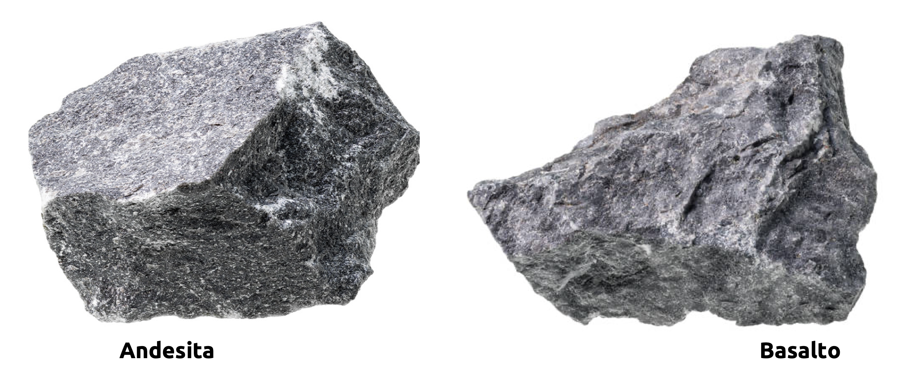

::: {.callout-important}
## Idea central

Después de formular la clasificación como un problema de pérdida, optimización y evaluación, podemos estudiar modelos concretos para asignar observaciones a clases. En esta entrada nos concentraremos en la regresión logística binaria y su extensión multinomial, conectando la interpretación probabilística del modelo con dos casos de estudio: La predicción de colapsos en minería subterránea masiva y la clasificación de rocas ígneas a partir de trazas de tierras raras.
:::

::: {.class-keywords}
[Regresión logística]{.class-keyword}
[Clasificación binaria]{.class-keyword}
[Clasificación multinomial]{.class-keyword}
[Probabilidad condicional]{.class-keyword}
[Log-odds]{.class-keyword}
[Softmax]{.class-keyword}
[Minería subterránea]{.class-keyword}
[Geoquímica]{.class-keyword}
:::

## Introducción

En la [entrada anterior](/clases/machine-learning/aprendizaje-supervisado/modelos-lineales/modelos-de-clasificacion-parte-i/) organizamos el problema de clasificación desde sus piezas más generales: Etiquetas, pérdidas, optimización, muestreo estratificado y métricas de desempeño. Con esa base, ahora podemos entrar a una familia concreta de modelos lineales para clasificación.

La regresión logística es una puerta de entrada muy natural. Aunque su nombre contiene la palabra “regresión”, su uso clásico en aprendizaje supervisado es clasificar observaciones. La clave está en modelar una probabilidad condicional y luego usar esa probabilidad para decidir una clase. Esa lectura probabilística hace que el modelo sea útil tanto para predecir como para interpretar: No sólo entrega una etiqueta, también permite razonar sobre la confianza relativa de esa asignación.

En esta entrada trabajaremos primero el caso binario, donde existen dos clases posibles. Luego extenderemos la idea hacia clasificación multinomial, donde una observación puede pertenecer a más de dos categorías. Para que la discusión no quede suspendida en fórmulas, incorporaremos dos casos de estudio: Un problema operacional asociado a colapsos en minería subterránea masiva y un problema geoquímico de clasificación de rocas ígneas a partir de patrones de tierras raras.

## Modelo de regresión logística binaria

A continuación formalizaremos todo lo relativo al modelo de regresión logística binaria que hemos ya implementado en **<font color='darkmagenta'>Scikit-Learn</font>** por medio de la clase `SGDClassifier`, con `loss=log_loss`. El propósito de ésto es introducir la implementación oficial para este modelo, que es `LogisticRegression`. Como ya hemos visto previamente, a pesar de su nombre (focalizándonos en la palabra *regresión*), se trata de un modelo de clasificación que, en textos especializados (sobretodo más antiguos), suele ser referido también como **clasificador de máxima entropía** (*MaxEnt*). Es capaz tanto de estimar directamente las clases a las que pertenece cada instancia de un conjunto de datos como también de estimar las probabilidades de pertenencia a cada clase de las mismas instancias, usando para ello una transformación exponencial conocida como **función logística**.

Sea pues $\mathcal{D} =\left\{ \left( \mathbf{X} ,\mathbf{y} \right)  :\mathbf{X} \in \mathbb{R}^{m\times n} \wedge \mathbf{y} \in \mathbb{R}^{m} \right\}$ un conjunto de entrenamiento, donde $m$ es el número de instancias u observaciones del mismo, $n$ es el número de atributos o variables independientes, e $\mathbf{y}$ tiene elementos que únicamente pueden tomar los valores $0$ o $1$. Sea $f$ un modelo o *predictor* que genera las correspondientes estimaciones $\hat{y}_{i}=f(\mathbf{x}_{i})$, donde $\mathbf{x}_{i}\in \mathbb{R}^{n}$ es una instancia (fila) de $\mathbf{X}$. Para cada instancia $i$ del conjunto de entrenamiento, la función $f$ es de tipo lineal, y por tanto,

::: {.eq-scroll}
$$
f\left( \mathbf{x}_{i} \right)  =\mathbf{w}^{\top } \mathbf{x}_{i} +b
\tag{4.1}
$$
:::

En la ecuación (4.1), $\mathbf{w}=(w_{1},...,w_{n})\in \mathbb{R}^{n}$ y $b\in \mathbb{R}$ son parámetros que estimamos haciendo uso de la función de entropía cruzada binaria como función de costo, por medio de un algoritmo de optimización adecuado (por ejemplo, el algoritmo de gradiente descendente, aunque **<font color='darkmagenta'>Scikit-Learn</font>** nos ofrece varias alternativas). Por lo tanto, la **decisión** relativa al valor de $\hat{y}_{i}$ se toma conforme un valor umbral $\theta$, de manera que

::: {.eq-scroll}
$$
\hat{y}_{i} =\begin{cases}1&;\  \mathrm{si} \  \mathbf{w}^{\top } \mathbf{x}_{i} +b\geq \theta \\ 0&;\  \mathrm{si} \  \mathbf{w}^{\top } \mathbf{x}_{i} +b<\theta \end{cases}
\tag{4.2}
$$
:::

La probabilidad de pertenencia de la instancia $\mathbf{x}_{i}$ a la clase positiva, que denotamos como $P(y_{i}=1)$, se calcula haciendo uso de la función logística como

::: {.eq-scroll}
$$
P\left( y_{i}=1\right)  =\frac{1}{1+\exp \left( -\left( \mathbf{w}^{\top } \mathbf{x}_{i} +b\right)  \right)  }
\tag{4.3}
$$
:::

Denotemos por $p_i=P(y_i=1|\mathbf{x}_i;\mathbf{w},b)$ la probabilidad estimada por (4.3). Entonces, una forma usual de escribir la función de costo regularizada es

::: {.eq-scroll}
$$
L\left(\mathbf{w},b\right):=-C\sum^{m}_{i=1}\left[y_i\log\left(p_i\right)+\left(1-y_i\right)\log\left(1-p_i\right)\right]+R\left(\mathbf{w}\right)
\tag{4.4}
$$
:::

Aquí $R\left( \mathbf{w} \right)$ es el **término de regularización** del modelo de regresión logística binaria, que permite controlar el eventual sobreajuste de los datos de entrenamiento. Como vimos previamente, la definición de dicho término depende del tipo de regularización a aplicar:

- Regularización de tipo $\ell_{1}$ o LASSO: $R\left( \mathbf{w} \right)  :=\sum^{n}_{j=1} \left| w_{j}\right|$.
- Regularización de tipo $\ell_{2}$ o de Tikhonov: $R\left( \mathbf{w} \right)  :=\frac{1}{2} \sum^{n}_{j=1} w^{2}_{j}=\left\Vert \mathbf{w} \right\Vert^{2}$.
- Regularización completamente elástica: $R\left( \mathbf{w} \right)  :=r\sum^{n}_{j=1} \left| w_{j}\right|+\frac{1-r}{2} \sum^{n}_{j=1} w^{2}_{j}$.

El hiperparámetro $C$ controla la fuerza relativa entre el ajuste a los datos y la penalización. En **<font color='darkmagenta'>Scikit-Learn</font>**, $C$ se interpreta como el inverso de la potencia de regularización: valores pequeños de $C$ fuerzan una regularización más intensa, mientras que valores grandes de $C$ reducen el efecto relativo de la penalización.

La implementación en **<font color='darkmagenta'>Scikit-Learn</font>** se realiza por medio de la clase `LogisticRegression`, la cual acepta los siguientes parámetros (entre otros):

- `penalty`: Tipo de regularización aplicada a la función de costo de nuestro modelo: `penalty="l1"` para una regularización de tipo $\ell_{1}$, `penalty="l2"` para una regularización de tipo $\ell_{2}$ y `penalty="elasticnet"` para una regularización completamente elástica. Por defecto, **<font color='darkmagenta'>Scikit-Learn</font>** implementará una regularización de tipo $\ell_{2}$ sobre la función de costo del modelo.
- `tol`: Tolerancia del modelo para detener su progresión. Por defecto, `tol=1e-4`, lo que significa que **<font color='darkmagenta'>Scikit-Learn</font>** asumirá que el algoritmo de optimización que estima los parámetros propios de la función de decisión del modelo se detendrá cuando la diferencia entre los valores de costo entre dos iteraciones sucesivas sea menor que $10^{-4}$.
- `C`: Hiperparámetro que controla la fuerza relativa de la regularización. Por defecto, **<font color='darkmagenta'>Scikit-Learn</font>** implementa un valor `C=1.0`. Valores menores implican una penalización más fuerte, y valores mayores una penalización más débil.
- `fit_intercept`: Parámetro booleano que establece si el modelo a construir incorporará o no un parámetro de sesgo $b$ como se observa en la ecuación (4.1) para la función de decisión. De esta manera, si `fit_intercept=True`, entonces $b\neq 0$.
- `class_weight`: Parámetro que establece si le damos más peso o no a las clases que constituyen el arreglo de valores de salida $\mathbf{y}$ en el conjunto de entrenamiento. Por defecto, `class_weight=None`, lo que implica que **<font color='darkmagenta'>Scikit-Learn</font>** asume que todas las clases de interés en el problema de clasificación a modelar tienen un peso proporcional a su frecuencia relativa en el conjunto de entrenamiento. Si `class_weight="balanced"`, podemos forzar a **<font color='darkmagenta'>Scikit-Learn</font>** a que compense automáticamente las clases menos frecuentes. Por último, también es posible asignar manualmente los pesos de cada clase o etiqueta, siempre que la suma de todos esos pesos sea igual a $1$ (para mantener concordancia, ya que esto no es obligatorio, porque **<font color='darkmagenta'>Scikit-Learn</font>** siempre normalizará los valores imputados de estos pesos), lo que puede resultar tremendamente útil en un **problema no balanceado**; es decir, un problema en el cual una clase es muchísimo más frecuente que la otra. Por ejemplo, si queremos forzar a **<font color='darkmagenta'>Scikit-Learn</font>** a que la clase positiva de un problema binario tenga un peso de $0.7$, entonces basta con setear `class_weight={0: 0.3, 1: 0.7}`. Esta estrategia es útil para tratar con este tipo de problema, pero existen alternativas mucho mejores para estos casos, como la librería **<font color='darkmagenta'>Imbalanced-Learn</font>**, que veremos más adelante.
- `l1_ratio`: Parámetro que define el peso asociado al término de regularización de tipo $\ell_{1}$ en un modelo con regularización completamente elástica. Por ejemplo, si `l1_ratio=0.7`, entonces el término regularizador será $R\left( \mathbf{w} \right)  :=0.7\sum^{n}_{j=1} \left| w_{j}\right|+\frac{1-0.7}{2} \sum^{n}_{j=1} w^{2}_{j}$.
- `random_state`: Semilla aleatoria fija, que permite asegurar la reproducibilidad de nuestros resultados.

**Ejemplo 4.1 – Efecto de la regularización en el modelo de regresión logística binaria:** Consideremos nuevamente el conjunto de datos **<font color='forestgreen'>MNIST</font>**. Uno de los aspectos más interesantes de la regularización en el contexto del modelo de regresión logística binaria (y, en general, en todos los modelos lineales generalizados) tiene relación con el proceso de **selección de atributos**. La razón de aquello es que, al aplicar este procedimiento, es común que uno o más de los parámetros que constituyen el vector $\mathbf{w}$ (los *coeficientes* de la función de decisión) se anulen a causa de él, lo que por extensión anula el efecto de los atributos que se corresponden con esos parámetros. De esta manera, podemos *elegir* sólo *algunos* de los atributos que componen el conjunto de entrenamiento para entrenar modelos más robustos, refinando nuestros resultados posteriores.

Para entender a qué nos referimos, volvamos a entrenar un modelo de regresión logística binaria sobre el conjunto de datos **<font color='forestgreen'>MNIST</font>** a fin de construir, nuevamente, un modelo que detecte imágenes que representen 7s, pero esta vez usando la implementación oficial de **<font color='forestgreen'>MNIST</font>** para este modelo. Procederemos igualmente por medio de un proceso de validación cruzada, y obtendremos las correspondientes métricas de desempeño. Esto puede parecer un tanto repetitivo, pero *meter nuestras manos al código* es la mejor forma de aprender:

```{python}
import warnings

import matplotlib.pyplot as plt
import numpy as np
import pandas as pd
import seaborn as sns
```

```{python}
from matplotlib.colors import BoundaryNorm, ListedColormap

from sklearn.datasets import fetch_openml
from sklearn.exceptions import ConvergenceWarning
from sklearn.linear_model import LogisticRegression
from sklearn.metrics import (
    precision_score,
    recall_score,
    f1_score,
    roc_auc_score,
)
from sklearn.model_selection import cross_val_predict
```

```{python}
# Ignoramos advertencias esperables para mantener limpio el output del apunte.
warnings.filterwarnings("ignore", category=ConvergenceWarning)
warnings.filterwarnings("ignore", category=FutureWarning)
warnings.filterwarnings("ignore", category=UserWarning)
```

```{python}
# Setting de figuras.
plt.rcParams["figure.dpi"] = 90
sns.set_theme()
plt.style.use("bmh")
```

```{python}
# Cargamos el conjunto de datos MNIST (en un formato de arreglo de Numpy).
mnist_data = fetch_openml(name="mnist_784", as_frame=False, parser="auto")

# Obtenemos los correspondientes pares (X, y) de entrenamiento y de prueba.
# Recordemos que este dataset ya viene preparado y las primeras 60.000
# imágenes pueden usarse como conjunto de entrenamiento.
X_train, y_train = mnist_data["data"][:60000, :], mnist_data["target"][:60000]
X_test, y_test =mnist_data["data"][60000:, :], mnist_data["target"][60000:]
```

A fin de reducir el orden de magnitud de los coeficientes del modelo, dividiremos los valores de cada uno de los atributos del conjunto de datos por `255`. Lo anterior es porque cada atributo simplemente representa un pixel de cada imagen, siendo los valores correspondientes la intensidad de cada pixel en una escala de grises, de `0` a `255`. La división por `255` nos garantiza que ahora cada valor se moverá entre `0` y `1`:

```{python}
# Normalizamos los valores de cada atributo del conjunto de datos.
X_train = X_train / 255.0
X_test = X_test / 255.0
```

Convertimos nuestra variable de respuesta a binaria, solamente considerando las imágenes que representan 7s:

```{python}
# Transformamos nuestra variable de respuesta en una binaria, que discrimine 
# únicamente los 7s.
y_train = np.where(y_train == "7", 1, 0)
y_test = np.where(y_test == "7", 1, 0)

# Instanciamos nuestro modelo, sin regularización en un inicio.
model = LogisticRegression(
    penalty=None, max_iter=100, solver="saga", random_state=42,
)

# Entrenamos nuestro modelo.
model.fit(X_train, y_train)
```

Obtenemos las correspondientes predicciones para nuestro modelo, vía validación cruzada, en el conjunto de entrenamiento (ojo, esto tomará un tiempo, debido a que la implementación del modelo de regresión logística binaria vía `LogisticRegression` no es muy eficiente en comparación a `SGDClassifier`):

```{python}
# Predicciones del modelo.
y_train_pred = cross_val_predict(estimator=model, X=X_train, y=y_train, cv=5)

# Métricas de desempeño.
print(f"Precisión del modelo: {precision_score(y_train, y_train_pred):.2f}")
print(f"Sensibilidad del modelo: {recall_score(y_train, y_train_pred):.2f}")
print(f"Puntaje F1 del modelo: {f1_score(y_train, y_train_pred):.2f}")
print(f"Área bajo la curva ROC: {roc_auc_score(y_train, y_train_pred):.2f}")
```

Dada la naturaleza lineal de la función de decisión, resulta sencillo entender qué atributo es más importante que otro simplemente comparando las magnitudes de los coeficientes asociados a cada uno de ellos. De este modo, podemos reordenar tales coeficientes en un arreglo de 28 $\times$ 28 que emulará la dispersión de sus magnitudes en la misma dimensión que la de los pixeles que constituyen cada imagen. En efecto:

```{python}
# Obtenemos los coeficientes de la función de decisión.
w = model.coef_.ravel()
```

```{python}
#| label: fig-modelos-de-clasificacion-parte-ii-01
#| fig-cap: "Mapeo de coeficientes del modelo."
# Dispersión de las magnitudes de los coeficientes del modelo en el espacio de las imágenes.
fig, ax = plt.subplots(figsize=(9, 5))
ax.imshow(np.abs(w).reshape(28, 28) ,cmap='binary', interpolation='nearest')
ax.grid(False)
ax.set_aspect("equal", adjustable="box")
ax.set_xticks(())
ax.set_yticks(())
ax.set_title("Mapeo de coeficientes del modelo", fontsize=12, fontweight="bold", pad=10)
plt.tight_layout()
```

En el gráfico anterior, hemos pintado cada pixel con el valor absoluto de los parámetros que constituyen la función de decisión de nuestro modelo. En la práctica, esto significa que, mientras más oscuro esté pintado un pixel, más importante es en la decisión que realiza el modelo a la hora de clasificar cada imagen. Los pixeles que se encuentran en los bordes laterales y superior tienen en su mayoría coeficientes iguales a cero, lo que resulta lógico debido a que es difícil que los dígitos que componen el conjunto de datos tengan trazos tan alejados del centro de cada imagen, por lo que no es raro preguntarnos si podemos descartar esos pixeles a fin de reducir el tamaño del conjunto de entrenamiento y, con ello, la complejidad de nuestro modelo. Y por supuesto, la respuesta es sí.

Cuando aplicamos el procedimiento de regularización a este modelo, el resultado inmediato es el aumento de variables (pixeles) que tiene asociados coeficientes iguales a cero, lo que permite reducir aún más el tamaño del conjunto de entrenamiento en futuras iteraciones. Esto resulta razonable porque, como vemos en la imagen anterior, hay pixeles incluso en el centro del gráfico con coeficientes nulos ¿Por qué no podríamos pensar que, en efecto, podamos descartarlos también e, incluso, descartar aún más pixeles en los entornos de los ya descartados?

Veamos cómo los distintos tipos de regularización impactan en los coeficientes de los modelos resultantes. Para ello, definimos la **dispersión** de los coeficientes correspondientes como el promedio de los valores de cada uno de ellos. Para diferenciar en las calidades de cada uno de los modelos a construir, tomaremos como métrica de comparación al puntaje F1. De este modo, tenemos que:

```{python}
# Definimos el ponderador de cada término en el regularizador completamente elástico.
l1_ratio = 0.5
```

```{python}
#| label: fig-modelos-de-clasificacion-parte-ii-02
#| fig-cap: "Calculamos las dispersiones de cada colección de coeficientes."
# Inicializamos la figura.
fig, ax = plt.subplots(figsize=(9, 9), nrows=3, ncols=3, sharex=True, sharey=True)

# Seteamos la potencia de la regularización.
for k, (C_k, ax_row_k) in enumerate(zip((1, 0.1, 0.01), ax)):
    # Incrementamos la tolerancia, a fin de que el loop no tome un tiempo demasiado prolongado.
    model_l1 = LogisticRegression(C=C_k, penalty="l1", tol=0.01, solver="saga")
    model_l2 = LogisticRegression(C=C_k, penalty="l2", tol=0.01, solver="saga")
    model_elastic_net = LogisticRegression(C=C_k, penalty="elasticnet", l1_ratio=l1_ratio, tol=0.01, solver="saga")

    # Entrenamos todos los modelos (ojo, esto tomará un tiempo).
    model_l1.fit(X_train, y_train)
    model_l2.fit(X_train, y_train)
    model_elastic_net.fit(X_train, y_train)

    # Obtenemos los coeficientes de los modelos, aplanando los valores en un arreglo 1D.
    w_l1 = model_l1.coef_.ravel()
    w_l2 = model_l2.coef_.ravel()
    w_elastic_net = model_elastic_net.coef_.ravel()

    # Calculamos las dispersiones de cada colección de coeficientes.
    sparsity_l1 = np.mean(w_l1 == 0) * 100
    sparsity_l2 = np.mean(w_l2 == 0) * 100
    sparsity_elastic_net = np.mean(w_elastic_net == 0) * 100

    # Calculamos los puntajes F1 asociados a cada modelo.
    f1_l1 = f1_score(y_train, model_l1.predict(X_train))
    f1_l2 = f1_score(y_train, model_l2.predict(X_train))
    f1_elastic_net = f1_score(y_train, model_elastic_net.predict(X_train))
    
    # Imprimimos los resultados en pantalla.
    print("C=%.2f" % C_k)
    print("{:<40} {:.2f}%".format("Dispersión con regularización l1:", sparsity_l1))
    print("{:<40} {:.2f}%".format("Dispersión regularización elástica:", sparsity_elastic_net))
    print("{:<40} {:.2f}%".format("Dispersión con regularización l2:", sparsity_l2))
    print("{:<40} {:.2f}".format("Puntaje F1 con regularización l1:", f1_l1))
    print("{:<40} {:.2f}".format("Puntaje F1 con regularización elástica:", f1_elastic_net))
    print("{:<40} {:.2f}".format("Puntaje F1 con regularización l2:", f1_l2))

    # Titulamos cada sub-gráfico.
    if k == 0:
        ax_row_k[0].set_title("Regularización l1", fontsize=12, pad=10)
        ax_row_k[1].set_title("Regularización elástica\n" + r"$r=0.5$", fontsize=12, pad=10)
        ax_row_k[2].set_title("Regularización l2", fontsize=12, pad=10)

    # Y finalmente graficamos nuestros resultados.
    for ax_j, w_j in zip(ax_row_k, [w_l1, w_elastic_net, w_l2]):
        ax_j.imshow(
            np.abs(w_j.reshape(28, 28)),
            interpolation="nearest",
            cmap="binary",
        )
        ax_j.grid(False)
        ax_j.set_xticks(())
        ax_j.set_yticks(())

    ax_row_k[0].set_ylabel("C = %s" % C_k)

plt.tight_layout()
```

Podemos observar que, a medida que aumentamos el valor del hiperparámetro $C$ aumenta también la dispersión de los coeficientes que constituyen la función de decisión del modelo (es decir, aumenta la magnitud de las componentes del vector $\mathbf{w}\in \mathbb{R}^{n}$). Este efecto es persistente siempre que se aplique al menos algo de regularización de tipo $\ell_{1}$, razón por la cual la dispersión de los modelos con regularización de tipo $\ell_{2}$ es constante. La regularización de tipo $\ell_{1}$ es mucho más agresiva anulando componentes de $\mathbf{w}$ y, por tanto, seleccionando atributos. Por esa razón el gráfico de la esquina inferior izquierda tiene una menor cantidad de coeficientes no nulos, y también, por esa misma razón, se trata del procedimiento de regularización que más impacto tiene en el puntaje F1 del modelo, decreciendo con el valor de $C$. ◼︎

## Caso de estudio I: Predicción de colapsos en minería subterránea masiva

Vamos a considerar el siguiente problema en un contexto más acorde a la profesión del ingeniero de minas. Puntualmente, en el cotexto de la ingeniería geomecánica propia del estudio de la estabilidad en minas subterráneas.

Consideremos el nivel de producción de un sector productivo de una mina explotada por medio de métodos masivos de hundimiento, y que ha sido afectado en el pasado por una serie de eventos de colapsos que han cerrado el acceso a una cantidad importante de reservas de mineral. El archivo `pillars_data.csv`, disponible en el botón de descarga que sigue, contiene información relativa a ciertas características que permiten individualizar la situación geométrica, geomecánica, operacional y geológica de un conjunto completo de 923 pilares que constituyen dicho nivel de producción, además de un indicador que permite señalar si un pilar está dañado o no por un evento de colapso. Desarrollaremos el siguiente caso de estudio: Construir un modelo de clasificación que permita estimar la probabilidad de daño de los pilares de este nivel de producción, comparando estos resultados con las etiquetas reales y seleccionando un umbral adecuado de corte en función del contexto de negocio de este problema.

<div class="dataset-download">
  <a class="dataset-download-btn" href="datasets/pillars_data.csv" download="pillars_data.csv">Descargar pillars_data.csv</a>
</div>

Vamos a comenzar a desarrollar este caso de estudio accediendo al correspondiente archivo. Además, importaremos algunas clases que usaremos para resolverlo, y que especificaremos a medida que avancemos (aunque ya las conocimos fugazmente en la [clase de introducción a **<font color='darkmagenta'>Scikit-Learn</font>**](/clases/machine-learning/aprendizaje-supervisado/modelos-lineales/introduccion-a-scikit-learn/)):

```{python}
from sklearn.model_selection import RandomizedSearchCV
from sklearn.pipeline import Pipeline
from sklearn.preprocessing import StandardScaler
```

```{python}
# Accedemos al archivo donde están almacenados los datos del problema.
df = pd.read_csv(filepath_or_buffer="datasets/pillars_data.csv")
```

Vamos a inspeccionar las primeras filas de este conjunto de datos:

```{python}
# Visualizamos las primeras 5 filas del DataFrame.
df.head()
```

Es claro que se trata de un archivo previamente procesado, a fin de entregar un dataset listo para trabajar con él en el contexto del modelamiento predictivo. Naturalmente, revisaremos su estructura de todas maneras, y también verificaremos que no existan anomalías en las magnitudes asociadas a los datos correspondientes. Además, usaremos la columna `id_pilar` para indexar el DataFrame completo, ya que es evidente que dicha columna corresponde al identificador unívoco de cada pilar. No haremos un análisis exhaustivo de los datos que componen este dataset, porque el propósito de este ejemplo es simplemente ilustrar la aplicación del modelo de regresión logística binaria sobre un caso propio de un contexto minero:

```{python}
# Seteamos el índice de este DataFrame.
df.set_index("id_pilar", inplace=True)

# Revisamos la estructura del DataFrame.
df.info()
```

El archivo se trata de una tabla que individualiza 923 pilares, cuyas columnas tienen los rótulos (y significados) siguientes:

- `coord_x`: Coordenada $X$ (en metros) del centroide de área del pilar (en el plano $XY$, en un sistema de referencia particular de la mina).
- `coord_y`: Coordenada $Y$ (en metros) del centroide de área del pilar (en el plano $XY$, en un sistema de referencia particular de la mina).
- `coord_z`: Coordenada $Z$ (en metros) del centroide de área del pilar. Notemos que dicho valor es constante, porque el nivel de producción de la mina se mantiene en toda su extensión en la misma cota.
- `pillar_area`: Área (en metros cuadrados) de la sección transversal del pilar en el plano $XY$ (calculada a partir de levantamientos topográficos en interior mina).
- `geom_sing`: Cuantía de **singularidades geométricas** en la estructura de un pilar. Las singularidades geométricas, en el contexto de la ingeniería geomecánica, representan pérdidas de área de los pilares debidas a cuestiones propias de la actividad minera. Por ejemplo, desquinches, existencia de puntos de vaciado e incluso resultados de determinadas inestabilidades.
- `geol_units_counts`: Cuantía de unidades geotécnicas que constituyen el macizo rocoso que da forma al pilar. Las unidades geotécnicas obedecen a la necesidad de caracterizar el macizo rocoso en términos del comportamiento mecánico que lo componen. Macizos homogéneos están constituidos por una única unidad geotécnica (por ejemplo, *pórfido diorítico*), mientras que macizos heterogéneos están constituidos por más de una unidad geotécnica (por ejemplo, varios tipos de *brechas ígneas*). De esta manera, esta variable es una estimación de la heterogeneidad geológica del macizo rocoso que constituye a cada pilar, y resulta importante porque los contactos entre distintas unidades geotécnicas pueden ser regiones de cuidado cuando la diferencia entre las correspondientes resistencias es muy grande, sobretodo en procesos de descarga.
- `soft_veins_freq`: Cuantía de vetillas blandas que constituyen el macizo rocoso que da forma al pilar por metro lineal, siempre que tales vetillas superen una cierta potencia o espesor. Se trata de una estimación de la calidad o resistencia (a gran escala) de dicho macizo rocoso.
- `traction_resist`: Resistencia a la tracción del macizo rocoso que constituye un pilar (en MPa).
- `strain_modulus`: Módulo de deformación del macizo rocoso que constituye un pilar (en GPa).
- `main_faults_count`: Cuantía de fallas principales cercanas a un pilar, donde "cercana" significa dentro de un radio de 50 metros con respecto al centroide del pilar en el plano $XY$. Las fallas principales son estructuras geológicas de gran envergadura, con corridas superiores a 500 metros y potencias o espesores sobre 2 metros, donde existe un desplazamiento relativo entre los bloques de roca a cada lado de la falla.
- `ij_shear_strain`: Deformaciones tangenciales o de corte (en %) estimadas en la región cercana a un pilar por medio de un modelo numérico de esfuerzos a escala mina (construido en base a un [métodos de elementos finitos](https://en.wikipedia.org/wiki/Finite_element_method)). La coletilla `ij` hace referencia al plano respecto del cual se estima cada deformación ($XY, XZ$ o $YZ$).
- `z_axis_pm_stress`: Esfuerzo vertical (en MPa) estimado en cada pilar en un estado de pre-minería (también mediante métodos numéricos).
- `z_axis_tz_stress`: Esfuerzo vertical (en MPa) amplificado por el efecto de la minería. En general, este esfuerzo se estima a partir del esfuerzo vertical en estado de pre-minería, corrigiéndolo mediante la introducción de ciertos factores de proporcionalidad que son función del método de explotación implementado, su variante, la existencia de losas de hundimiento e incluso la geometría del frente de hundimiento.
- `tz_exposure`: Tiempo de exposición de los pilares a un ambiente de altos esfuerzos. Dicho ambiente es producto de la actividad minera, y suele representarse como una banda de influencia en torno al frente de hundimiento, cuya extension es función del método de explotación implementado y su correspondiente variante.
- `seismic_density`: Densidad de energía sísmica irradiada por unidad de área con respecto al centroide de cada pilar (en $\mathrm{kJ}/\mathrm{m}^{2}$). Se trata de una estimación de la energía recibida por los pilares debida a la generación de actividad sísmica inducida por la minería, haciendo uso de la ley del inverso del cuadrado de la distancia. La aproximación en sí es un tanto exagerada, porque en realidad es válida siempre que los esfuerzos se propaguen radialmente, lo que implica medios materiales mecánicamente isotrópicos. Sin embargo, en un entorno minero como éste, aquello no se cumple, puesto que el macizo rocoso es heterogéneo, y sus propiedades mecánicas se ven alteradas por la presencia de estructuras geológicas.
- `extraction_rate`: Tasa promedio de extracción (en t/m) de los puntos de extracción adyacentes a cada pilar.
- `avg_drawpoint_height`: Altura promedio de columna (en metros) de los puntos de extracción adyacentes a cada pilar.
- `collapse_flag`: Variable binaria que indica si un pilar ha recibido daño debido a colapsos o no. Su valor es `1` cuando ha recibido daño, y `0` cuando no es así. Es, por tanto, la variable de respuesta que deseamos modelar en este conjunto de datos.

Es evidente que el proceso que estamos modelando es de muy alta complejidad. El conjunto de datos a trabajar probablemente sea el resultado de incontables horas de levantamiento e ingeniería de datos asociadas al estudio de este fenómeno por expertos del proceso minero. En un escenario no tan ideal, será muy común que nosotros, como profesionales de los datos, seamos quienes realicen este levantamiento, y también debamos estudiar los fenómenos inherentes al problema que queremos solucionar, lo que involucrará, naturalmente, que seamos capaces de modelarlo a nivel de diseño. No siempre será fácil, incluso, determinar cuáles serán las instancias a definir (incluso aunque, ya entregados estos datos, resulte tan natural que sean los pilares del nivel de producción).

Pero volvamos al problema en cuestión. Notemos que, desde la perspectiva del *modelamiento*, no tiene sentido hacer uso de las coordenadas de cada pilar, porque se trata de variables situacionales que simplemente describen las posiciones relativas de cada uno y no guardan relación con el fenómeno subyacente que es de nuestro interés. Sin embargo, resultarán muy útiles para graficar la distribución observada (espacialmente) de las variables que deseemos revisar:

```{python}
# Descartamos las coordenadas que referencian el emplazamiento de los pilares.
features = [col_k for col_k in df.columns if "coord" not in col_k]
df_feats = df[features].copy()
```

```{python}
#| label: fig-modelos-de-clasificacion-parte-ii-03
#| fig-cap: "Condición real de los pilares en el nivel de producción."
# Graficamos la situación de los pilares.
fig, ax = plt.subplots(figsize=(9, 7))
damage_cmap = ListedColormap(["#1b9e77", "#d95f02"])
damage_norm = BoundaryNorm([-0.5, 0.5, 1.5], damage_cmap.N)

p = ax.scatter(
    x=df["coord_x"],
    y=df["coord_y"],
    c=df["collapse_flag"],
    cmap=damage_cmap,
    norm=damage_norm,
)

# Etiqueamos el gráfico.
cb = fig.colorbar(p, ticks=[0, 1])
cb.set_label("Indicador de daño", fontsize=11, labelpad=10)
cb.set_ticklabels(["Sin daño", "Con daño"])
ax.set_xlabel("X (m)", fontsize=11, labelpad=10)
ax.set_ylabel("Y (m)", fontsize=11, labelpad=25, rotation=0)
ax.set_title(
    "Condición real de los pilares en el nivel de producción",
    fontsize=13,
    fontweight="bold",
    pad=10,
)

plt.tight_layout()
```

Notemos que los pilares dañados están agrupados en racimos o clusters, lo que podría sugerir que los colapsos responden a un fenómeno expansivo y que probablemente guarde una cierta dependencia con la presencia de algún colapso cercano (en referencia a cada pilar). 

Resulta claro que, si deseamos separar este conjunto de datos en conjuntos de entrenamiento y de prueba, debemos preservar la proporción de pilares dañados del total en ambos casos, lo que sugiere el uso de un muestreo estratificado. Esto resulta especialmente cierto, ya que la naturaleza espacial del problema permite que no sea necesario considerar el orden de las instancias para construir ambos conjuntos (como sí lo sería en el caso de una serie de tiempo, por ejemplo). Por ello, procedemos como sigue:

```{python}
from sklearn.model_selection import train_test_split
```

```{python}
# Generamos los conjuntos de entrenamiento y de prueba.
train_set, test_set = train_test_split(
    df_feats, test_size=0.2, stratify=df["collapse_flag"], random_state=42,
)
```

Y revisamos que las proporciones de pilares dañados sean aproximadamente iguales en cada conjunto:

```{python}
# Proporción de pilares dañados en el conjunto de entrenamiento.
train_damage_proportion = train_set["collapse_flag"].mean()
test_damage_proportion = test_set["collapse_flag"].mean()

# Mostramos los resultados en pantalla.
print(f"Proporción de pilares dañados en el conjunto de entrenamiento: {train_damage_proportion:.2f}")
print(f"Proporción de pilares dañados en el conjunto de prueba: {test_damage_proportion:.2f}")
```

Continuamos generando los pares `(X, y)` para ambos subconjuntos de datos:

```{python}
# Obtenemos los correspondientes pares (X, y).
X_train, y_train = train_set.iloc[:, :-1], train_set.iloc[:, -1]
X_test, y_test = test_set.iloc[:, :-1], test_set.iloc[:, -1]
```

Como las variables independientes que componen este conjunto de datos tienen órdenes de magnitud diferentes, generaremos un escalamiento completo del mismo por medio de una normalización. Es decir, transformando nuestros datos en otros cuya distribución es normal. Dicha transformación se define como

::: {.eq-scroll}
$$
z_{ij}=\frac{x_{ij}-\mu_{j} }{\sigma_{j} }
\tag{4.5}
$$
:::

donde $x_{ij}$ es el elemento de $\mathbf{X}$ asociado a la instancia (fila) $i$-ésima y la variable (columna) $j$-ésima, $\mu_{j}$ es la media de los valores de la $j$-ésima columna de $\mathbf{X}$, y $\sigma_{j}$ su desviación estándar. Este preprocesamiento puede implementarse en **<font color='darkmagenta'>Scikit-Learn</font>** por medio de la clase `StandardScaler`, cuya dependencia es el módulo `sklearn.preprocessing`:

```{python}
# Instanciamos nuestro "escalador".
scaler = StandardScaler()
```

Notemos que no imputamos argumentos en la clase anterior, ya que `StandardScaler` automáticamente estandarizará nuestros datos si aplicamos, sobre el objeto instanciado (en este caso, `scaler`), el método `transform()` una vez que hayamos ajustado nuestra implementación a la escala de los datos de entrenamiento haciendo uso del método `fit()`:

```{python}
# Estandarizamos nuestros datos.
scaler.fit(X_train)
X_train_scaled = scaler.transform(X_train)
X_test_scaled = scaler.transform(X_test)
```

Notemos que podemos hacer el proceso completo si usamos el método `fit_transform()`:

```{python}
# Estandarizamos otra vez, a fin de ilustrar el método fit_transform().
X_train_scaled = scaler.fit_transform(X_train)
X_test_scaled = scaler.transform(X_test)
```

Ahora cada variable de `X_train_scaled` y `X_test_scaled` tiene una distribución normal. Por ejemplo:

```{python}
#| label: fig-modelos-de-clasificacion-parte-ii-04
#| fig-cap: "Histograma de atributo '{X_train.columns[10]}'."
# Histograma de una de las variables.
fig, ax = plt.subplots(figsize=(9, 4))
ax.hist(X_train_scaled[:, 10], bins=30, ec="k", color="dodgerblue")

# Etiquetamos el gráfico.
ax.set_title(
    f"Histograma de atributo '{X_train.columns[10]}'",
    fontsize=13,
    fontweight="bold",
    pad=10,
)

ax.set_xlabel("Marcas de clase", fontsize=11, labelpad=10)
ax.set_ylabel("Frecuencia observada", fontsize=11, labelpad=10)

plt.tight_layout()
```

En **<font color='darkmagenta'>Scikit-Learn</font>**, siempre es posible aglutinar los pasos del entrenamiento de un modelo en un objeto llamado `Pipeline`. Una **pipeline** es una secuencia de instrucciones que, paso a paso, construye un determinado resultado. Por ejemplo, en este ejemplo, podría ser útil construir una pipeline que se componga de dos pasos: Escalamiento y modelamiento. El escalamiento ya lo definimos, y construir un modelo de clasificación es algo que ya sabemos como hacer. La lógica de un objeto de tipo `Pipeline` es introducir cada paso como parte del argumento `steps` en un formato de lista de Python, donde cada elemento de la lista es una tupla de dos elementos: El *nombre* con el que *bautizamos* a ese paso, y el objeto que se utiliza para implementarlo. `Pipeline` es un objeto cuya dependencia es el módulo `sklearn.pipeline` y que ya importamos al inicio de este ejemplo, por lo cual, para construir una pipeline compuesta de un procedimiento de escalamiento y de un modelo de regresión logística binaria, bastará con escribir:

```{python}
# Generamos una pipeline que constará de dos pasos:
# Escalamiento de los datos de entrada y entrenamiento
# del modelo.
model = Pipeline(
    steps=[
        ("scaler", StandardScaler()), 
        (
            "estimator", LogisticRegression(
                penalty="elasticnet",
                solver="saga",
                max_iter=500,
            ),
        ),
    ],
)
```

La pipeline así definida tiene entonces dos pasos:

- El primero es el paso de escalamiento, que se define por la tupla `("scaler", StandardScaler())`. El **nombre** de este paso es `"scaler"`, y el **objeto** que lo implementa es, naturalmente, la clase `StandardScaler`.
- El segundo paso es el modelo propiamente tal, definido por la tupla `("estimator", LogisticRegression(penalty="elasticnet", solver="saga", max_iter=500))`. El nombre de este paso es `"estimator"`, y el objeto que lo implementa es `LogisticRegression`, al cual le hemos imputado algunos hiperparámetros iniciales.

La ventaja de usar una pipeline como ésta es que nos ahorramos el proceso de escalar nuestros datos previo a aplicar cualquier método sobre nuestro modelo, ya que la pipeline lo hace de manera automática, heredando todos los métodos de los objetos que la constituyen.

A fin de generar una búsqueda sistemática de los mejores hiperparámetros al mismo tiempo que implementamos un procedimiento de validación cruzada para entrenar nuestro modelo, haremos uso de la clase `RandomizedSearchCV`, la que permite aplicar un proceso de **búsqueda aleatorizada** de los mejores hiperparámetros dado un conjunto o *pool* de valores posibles para ellos. Esta clase acepta, entre otros, los siguientes argumentos:

- `estimator`: Cualquier objeto de **<font color='darkmagenta'>Scikit-Learn</font>** que permita el entrenamiento de un modelo. En estricto rigor, tal objeto debería contar con un método `fit()` que permita garantizar dicho entrenamiento. Este objeto puede ser directamente un modelo (por ejemplo, `LogisticRegression`) o una pipeline que esté compuesta por algún modelo, que es nuestro caso.
- `param_distributions`: Un diccionario de Python que define el *pool* de valores para todos los hiperparámetros que vamos a buscar. Este diccionario tiene una estructura del tipo `{"name": vals}`, donde con `"name"` nos referimos al nombre del correspondiente hiperparámetro tal y como se especifica en la correspondiente clase que permite implementar un determinado modelo, mientras que `vals` puede ser un contenedor con todos sus posibles valores (por ejemplo, una lista de Python, o incluso, una instancia de una variable aleatoria con distribución definida propia de **<font color='darkmagenta'>Scipy</font>**, siempre que cuente con un método `rvs()`, que permita muestrear los correspondientes valores de la variable aleatoria respectiva). En nuestro ejemplo, este diccionario tiene tres *pools* de hiperparámetros, definidos por las llaves `"estimator__l1_ratio"`, `"estimator__C"` y `"estimator__class_weight"`, porque la clase `LogisticRegression`, entre otros, acepta los argumentos `l1_ratio`, `C` y `class_weight`, que hacen referencia al ponderador asociado al término regularizador de tipo $\ell_{1}$ en un modelo con regularización elástica, la fuerza relativa de la regularización y el tipo de ponderación que se implementará sobre las clases o etiquetas que deseamos estimar con nuestro modelo. El prefijo `"estimator__"` en cada caso se debe al uso de un objeto de tipo `Pipeline` en vez de usar directamente la clase `LogisticRegression` como estimador, ya que el paso de modelamiento lo hemos *bautizado* con el nombre `"estimator"`, que precederá siempre a cada hiperparámetro (separado con un doble guión bajo `"__"`).
- `scoring`: Métrica de desempeño que será utilizada para evaluar la calidad de todos los modelos entrenados para cada combinación de hiperparámetros en los correspondientes subconjuntos de validación. Estas métricas están definidas por medio de strings fijos que *llaman* a las correspondientes funciones del módulo `sklearn.metrics`, e incluso es posible aglutinar estas métricas en una lista para evaluar nuestros modelos haciendo uso de todas ellas, aunque esto último exigirá siempre que definamos la métrica definitiva a utilizar para la selección del mejor de todos los modelos haciendo uso del parámetro `refit`. Algunos ejemplos propios de los modelos de clasificación binaria son:
    - `"accuracy"`: Para la exactitud.
    - `"neg_log_loss"`: Para la entropía cruzada binaria. Esto requiere que el correspondiente estimador cuente con un método `predict_proba()`, que permite estimar probabilidades de pertenencia a cada clase. Por suerte, este es el caso para la clase `LogisticRegression`, aunque hay implementaciones de otros modelos de clasificación que no cuentan con dicho método.
    - `"precision"`: Para la precisión.
    - `"recall"`: Para la sensibilidad.
    - `"f1"`: Para el puntaje F1 (que, recordemos, es la media armónica de la precisión y sensibilidad).
    - `"roc_auc"`: Para el área bajo la curva ROC.
- `n_jobs`: Parámetro que permite definir el número de núcleos de CPU que se usarán para los cálculos inherentes a los entrenamientos de nuestro modelo. Al poner `n_jobs=-1`, **<font color='darkmagenta'>Scikit-Learn</font>** asumirá que *puede* usar todos los núcleos de nuestro computador.
- `cv`: Parámetro que define el número de conjuntos de validación a utilizar para el procedimiento de validación cruzada.
- `verbose`: Parámetro entero que define cuánta información retornará **<font color='darkmagenta'>Scikit-Learn</font>** a medida que se entrenan nuestros modelos durante la búsqueda de hiperparámetros. Mientras mayor sea su valor, mayor información observaremos. Si `verbose=0`, no se retornará información.
- `refit`: Parámetro que define la métrica de desempeño que se usará para seleccionar el mejor modelo encontrado en la búsqueda. Sólo es necesario definirlo cuando se especifica más de una métrica para evaluar en este procedimiento.
- `random_state`: Parámetro que permite definir la semilla aleatoria fija que garantiza la reproducibilidad de los resultados de la búsqueda.

Con toda esta información, procedemos a realizar la búsqueda aleatorizada para optimizar la elección los hiperparámetros para nuestro modelo:

```{python}
# Generamos una búsqueda aleatorizada de mejores hiperparámetros
# para nuestro modelo, siguiendo además un procedimiento de
# validación cruzada con 3 subconjuntos.
param_distributions = {
    "estimator__l1_ratio": np.linspace(start=0, stop=1, num=20),
    "estimator__C": np.linspace(start=0.01, stop=1, num=20),
    "estimator__class_weight": ["balanced", None],
}
regularizer = RandomizedSearchCV(
    estimator=model,
    param_distributions=param_distributions,
    scoring=["roc_auc", "f1"],
    refit="roc_auc",
    n_jobs=-1,
    cv=3,
    verbose=0,
    random_state=42,
)
regularizer.fit(X_train, y_train)
```

Toda instancia de `RandomizedSearchCV` cuenta con varios atributos y métodos útiles. Por ejemplo, el atributo `best_estimator_` retorna el modelo con la mejor combinación de hiperparámetros conforme la métrica definida en `refit`:

```{python}
# Retornamos el mejor de los modelos entrenados.
best_model = regularizer.best_estimator_
```

Mientras que el atributo `best_params_` permite retornar la mejor combinación de hiperparámetros encontrada:

```{python}
# Retornamos la mejor combinación de hiperparámetros encontrada.
best_params = regularizer.best_params_
best_params
```

Por tanto, el mejor de los modelos es uno con regularización elástica, con un peso $r=0.368$ para el término de regularización $\ell_{1}$, con un valor $C=0.844$ para controlar la fuerza relativa de la penalización, sin balancear las clases positiva y negativa.

Para un proceso de ajuste de hiperparámetros como el que acabamos de hacer, siempre será posible consultar todos los modelos evaluados haciendo uso del atributo `cv_results_`. El resultado es un diccionario de Python que puede ser fácilmente llevado a un DataFrame de **<font color='darkmagenta'>Pandas</font>**:

```{python}
# Y también retornamos los resultados de la búsqueda 
# de hiperparámetros.
cv_results = pd.DataFrame(regularizer.cv_results_)

# Mostramos los mejores 5 resultados obtenidos en la búsqueda.
(
    cv_results.
    sort_values(by="rank_test_roc_auc", ascending=True)
    .head()
)
```

Notemos que, debido a que hemos imputado `refit="roc_auc"` en nuestro proceso de búsqueda de hiperparámetros, es que el mejor modelo es el que obtiene el mejor valor promedio de área bajo la curva ROC sobre los correspondientes conjuntos de validación, lo que no necesariamente coincide con los mejores resultados para el puntaje F1, que es la otra métrica de desempeño utilizada.

Con el mejor modelo ya individualizado en la variable `best_model`, usamos el método `predict_proba()` para obtener las correspondientes probabilidades de daño para todos los pilares que son parte del conjunto de entrenamiento. Los resultados de este método se aglutinan en un arreglo bidimensional cuya primera columna es $P(y_i=0)$, y la segunda, $P(y_i=1)$, donde $i$ es el número del correspondiente pilar:

```{python}
# Obtenemos predicciones para los datos de entrenamiento en 
# forma de probabilidades.
y_train_pred = best_model.predict_proba(X_train)
```

En efecto, si sumamos ambas probabilidades, el resultado siempre será igual a `1`:

```{python}
# Comprobamos que las sumas de las probabilidades sean iguales
# a 1 (primeras 10 filas).
y_train_pred.sum(axis=1)[:10]
```

Vamos a usar la curva de trande-off entre precisión y sensibilidad para entender qué clase de errores comete nuestro modelo en un contexto de negocio, antes de tomar una decisión relativa a sus correspondientes umbrales o *probabilidades de corte*:

```{python}
from sklearn.metrics import precision_recall_curve
```

```{python}
# Reusamos la función que definimos en la entrada anterior del blog
# para graficar la curva de trade-off entre precisión y sensibilidad.
def plot_precision_recall_threshold(
    precisions: np.ndarray,
    recalls: np.ndarray,
    thresholds: np.ndarray,
    ax: np.ndarray,
    xlim: tuple=None,
    ylim: tuple=None,
):
    """
    Una función sencilla que nos permite graficar las curvas de 
    precisión y sensibilidad conforme cada posible valor umbral
    de decisión para nuestro modelo.

    Parámetros:
    -----------
    precisions : Arreglo 1D con los correspondientes valores de 
        precision para cada valor umbral.
    recalls : Arreglo 1D con los correspondientes valores de 
        sensibilidad para cada valor umbral.
    thresholds : Arreglo 1D con los correspondientes valores 
        umbral de discriminación.
    """
    # Graficamos los valores de precisión.
    ax.plot(
        thresholds,
        precisions[:-1],
        linestyle="-",
        color="dodgerblue",
        label="Precisión",
        linewidth=2.0,
    )
    
    # Y los de sensibilidad.
    ax.plot(
        thresholds,
        recalls[:-1],
        linestyle="-",
        color="firebrick",
        label="Sensibilidad",
        linewidth=2.0,
    )

    # Etiquetamos.
    ax.legend(loc="best", fontsize=11, frameon=True)
    ax.set_xlabel("Valor umbral", fontsize=12, labelpad=10)
    ax.set_ylabel("Precisión / sensibilidad", fontsize=12, labelpad=10)
    ax.set_title(
        "Curva de trade-off, precisión versus sensibilidad",
        fontsize=14,
        fontweight="bold",
        pad=10,
    )

    ax.set_xlim(xlim)
    ax.set_ylim(ylim)
```

```{python}
# Generamos la curva de trade-off de precisión versus sensibilidad,
# a fin de observar las probabilidades de corte.
precisions, recalls, thresholds = precision_recall_curve(
    y_true=y_train, y_score=y_train_pred[:, 1],
)
```

```{python}
#| label: fig-modelos-de-clasificacion-parte-ii-05
#| fig-cap: "Construcción del gráfico de curvas de contraste."
# Construcción del gráfico de curvas de contraste.
fig, ax = plt.subplots(figsize=(9, 5))
plot_precision_recall_threshold(precisions, recalls, thresholds, ax=ax)
plt.tight_layout()
```

Las curvas de contraste anteriores indican que la probabilidad de corte es, conforme el trade-off entre precisión y sensibilidad, aproximadamente del 48%, lo que da como resultado una precisión y sensibilidad del 61.8%. Para verificar qué ocurre si quisiéramos obtener más precisión o sensibilidad, basta con examinar el entorno próximo de ambas curvas en el punto donde ambas se intersectan, que se corresponde con la probabilidad de corte. De esta manera, podemos observar que la sensibilidad cae enormemente a partir del punto de corte, a mayores tasas que el crecimiento del valor de la precisión antes de dicho punto. Por lo tanto, resulta claro que apuntar a más sensibilidad implica un costo mucho mayor que apuntar a más precisión.

Generando las correspondencias en las curvas, vemos que:

- Si deseamos un 80% de precisión, la sensibilidad correspondiente será aproximadamente de un 23%.
- Si deseamos un 80% de sensibilidad, la precisión correspondiente será aproximadamente de un 53%.

Esto lo podemos chequear de manera exacta como sigue:

```{python}
# Chequeamos los valores de precisión y sensibilidad para un umbral
# de corte del 80%.
print(f"Precisión para una sensibilidad del 80.0 % = {precisions[recalls >= 0.8].max():.2f}")
print(f"Sensibilidad para una precisión del 80.0 % = {recalls[precisions >= 0.8].max():.2f}")
```

Naturalmente, la probabilidad de corte en ambos casos cambia:

- Si deseamos un 80% de precisión, la probabilidad de corte será del 68%.
- Si deseamos un 80% de sensibilidad, la probabilidad de corte será del 32%.

Por tanto, la decisión de aumentar la precisión es mucho más costosa en términos de su métrica complementaria que aumentar la sensibilidad. Así que, para decidir la probabilidad de corte, debemos evaluar el contexto de negocio subyacente a este problema, y del que ya hablamos un poco en el [ejemplo (3.7) de la entrada anterior](/clases/machine-learning/aprendizaje-supervisado/modelos-lineales/modelos-de-clasificacion-parte-i/). De este modo, para una probabilidad de corte $\theta$:

- Si clasificamos un pilar como *dañado* o *vulnerable* $($es decir, $P(y_{i} =1)\leq \theta$ $)$, el **costo** de esa decisión es que el pilar en realidad no esté dañado. En un contexto de negocio, decidir que un pilar es vulnerable a daños de tipo colapso implicará seguramente la generación de planes de acción orientados a reforzar la infraestructura de soporte del pilar, tales como incorporación de elementos de soporte que aporten una mayor resistencia e incluso la inyección de resinas. Como sea, el costo de estas acciones no es en absoluto comparable con el de perder las reservas que quedan cautivas cuando las galerías adyacentes se cierran por efecto de las deformaciones resultantes de los procesos de colapso.

- Si clasificamos un pilar como *no dañado* o *no vulnerable* $($es decir, $P(y_{i} =0)> \theta$ $)$, el **costo** de esta decisión es que el pilar en realidad sí presente daño o sí sea vulnerable. Esto quiere decir que probablemente la operación en los puntos de extracción adyacentes al pilar continúe con normalidad, sin planes de reforzamiento en la infraestructura de soporte, lo que derivará en la progresión del daño, probablemente sin control. Como ya vimos previamente, el costo de perder las columnas adyacentes a un pilar por el cierre de las galerías tras la manifestación de un colapso en terreno tiene un costo del orden de millones de dólares, lo que es muchos órdenes de magnitud más caro que simplemente mejorar nuestro soporte.

Por lo tanto, podemos concluir que es razonable proporner una probabilidad de corte menor, en desmedro de generar una mayor cantidad de falsos positivos, reduciendo por tanto la sensibilidad del modelo. Esto es debido a que, de esta manera, también reducimos los falsos negativos. Esto podemos verlo al comparar las matrices de confusión para la probabilidad de corte por defecto y la de un 30%:

```{python}
from sklearn.metrics import confusion_matrix
```

```{python}
# Cálculo de las clases predichas para distintas probabilidades de corte.
y_class_pred_cutoff_50 = best_model.predict(X_train)
y_class_pred_cutoff_30 = np.where(y_train_pred[:, 1] >= 0.3, 1, 0)

# Matriz de confusión para una probabilidad de corte del 50%.
confusion_matrix(y_true=y_train, y_pred=y_class_pred_cutoff_50)
```

```{python}
# Matriz de confusión para una probabilidad de corte del 30%.
confusion_matrix(y_true=y_train, y_pred=y_class_pred_cutoff_30)
```

Podemos observar que los falsos negativos se han reducido a menos de la mitad con esta decisión de reducir la probabilidad de corte del modelo a un 30%. Esto, naturalmente, impacta la sensibilidad del modelo, pero tiene sentido considerando el contexto de negocio inherente a este problema, lo que pone de manifiesto que siempre, pero SIEMPRE, debemos examinar con cuidado los resultados de este tipo de modelos. O, dicho de otra forma, **debemos tener en claro siempre lo que estamos haciendo**.

Finalizaremos el estudio de las métricas de desempeño del modelo graficando la curva ROC del mismo sobre los datos de entrenamiento y el valor del área bajo la misma:

```{python}
from sklearn.metrics import roc_curve, auc
```

```{python}
# Nuevamente usamos la función que definimos en la entrada anterior
# del blog para graficar la curva ROC.
def plot_roc_curve(
    fpr: np.ndarray,
    tpr: np.ndarray,
    ax: np.ndarray,
    label: str,
):
    """
    Una función sencilla que nos permite graficar la curva ROC
    para nuestro modelo.

    Parámetros:
    -----------
    fpr : Arreglo 1D con los correspondientes valores de las tasas
        de falsos positivos para nuestro modelo.
    tpr : Arreglo 1D con los correspondientes valores de las tasas
        de verdaderos positivos para nuestro modelo.
    """
    # Dibujamos la curva ROC y la línea de no discriminación.
    ax.plot(
        fpr,
        tpr,
        linewidth=2.0,
        color="dodgerblue",
        label=label,
    )

    ax.plot(
        [0, 1],
        [0, 1],
        linewidth=1.0,
        linestyle="--",
        color="black",
        label="Línea de no discriminación",
    )

    # Etiquetamos el gráfico.
    ax.set_xlim(0, 1)
    ax.set_ylim(0, 1)
    ax.set_xlabel(
        "Tasa de falsos positivos (TFP)",
        fontsize=12,
        labelpad=10,
    )

    ax.set_ylabel(
        "Tasa de verdaderos positivos (TVP)",
        fontsize=12,
        labelpad=10,
    )

    ax.legend(loc="best", frameon=True, fontsize=11)
    ax.set_title(
        "Curva ROC del modelo",
        fontsize=13,
        fontweight="bold",
        pad=10,
    )
```

```{python}
# Construimos la curva ROC del modelo.
fpr, tpr, thresholds = roc_curve(
    y_true=y_train, y_score=y_train_pred[:, 1],
)
```

```{python}
#| label: fig-modelos-de-clasificacion-parte-ii-06
#| fig-cap: "Dicha curva."
# Y graficamos dicha curva.
fig, ax = plt.subplots(figsize=(8, 6))
plot_roc_curve(fpr, tpr, ax=ax, label="Curva ROC")
plt.tight_layout()
```

```{python}
# Calculamos el área bajo la curva ROC y la imprimimos en pantalla.
auc_value = roc_auc_score(y_true=y_train, y_score=y_train_pred[:, 1])
print(f"Valor de AUC en el conjunto de entrenamiento = {auc_value:.3f}")
```

No es un puntaje excelso como el que obtuvimos trabajando sobre *toysets*, pero esto es algo esperable, ya que se trata de un problema asociado a un caso de estudio real, con todo lo que ello significa. Sin embargo, este primer intento (responsable) de modelar la solución de un problema tan complejo ha resultado en una solución de una gran calidad, y que iremos mejorando a medida que estudiemos algoritmos de aprendizaje de mayor complejidad.

Evaluaremos ahora los resultados del modelo sobre los datos del conjunto de prueba:

```{python}
# Calculamos las probabilidades estimadas para el conjunto de prueba.
y_test_pred = best_model.predict_proba(X_test)

# Llevamos las predicciones a un formato de DataFrame.
y_train_pred = pd.DataFrame(
    data=y_train_pred,
    index=y_train.index,
    columns=["P(Y = 0)", "P(Y = 1)"],
)

y_test_pred = pd.DataFrame(
    data=y_test_pred,
    index=y_test.index,
    columns=["P(Y = 0)", "P(Y = 1)"],
)

# Y ahora concatenamos ambos DataFrames.
probas = pd.concat(
    [
        y_train_pred,
        y_test_pred,
    ],
    axis=0,
).sort_index(ascending=True)

# Y esto lo concatenamos con las coordenadas de los pilares.
results = pd.concat(
    [
        df[["coord_x", "coord_y"]],
        probas,
    ],
    axis=1,
)
```

```{python}
#| label: fig-modelos-de-clasificacion-parte-ii-07
#| fig-cap: "Condición real de los pilares en el nivel de producción."
# Y finalmente construimos nuestro gráfico.
fig, ax = plt.subplots(figsize=(9, 9), nrows=2, sharex=True)

p1 = ax[0].scatter(
    x=df["coord_x"],
    y=df["coord_y"],
    c=df["collapse_flag"],
    cmap="Dark2",
)

cb1 = fig.colorbar(p1)
cb1.set_label("Indicador de daño", fontsize=11, labelpad=10)
ax[0].set_ylabel("Y (m)", fontsize=11, labelpad=25, rotation=0)
ax[0].set_title(
    "Condición real de los pilares en el nivel de producción",
    fontsize=13,
    fontweight="bold",
    pad=10,
)

p2 = ax[1].scatter(
    x=results["coord_x"],
    y=results["coord_y"],
    c=results["P(Y = 1)"],
    cmap="mako_r",
    marker="H",
)

cb2 = fig.colorbar(p2)
cb2.set_label("Probabilidad de daño", fontsize=11, labelpad=10)
ax[1].set_xlabel("X (m)", fontsize=11, labelpad=10)
ax[1].set_ylabel("Y (m)", fontsize=11, labelpad=15, rotation=0)
ax[1].set_title(
    "Probabilidades de daño estimadas por el modelo",
    fontsize=13,
    fontweight="bold",
    pad=10,
)

plt.tight_layout()
```

Podemos observar que la distribución espacial de las probabilidades de daño estimadas por el modelo comete errores en algunos enjambres de colapso, y estima otros procesos adyacentes a los ya existentes. Sin embargo, en términos generales, el modelo se desempeña de manera bastante aceptable, considerando todo lo que hemos discutido en este ejemplo.

Por el momento, finalizaremos aquí. Nos quedan algunas preguntas importantes en el tintero (por ejemplo, y esto es algo que los clientes preguntan muchísimo: *¿Qué variable impacta más en las probabilidades de daño?*), pero que nos guardaremos para más adelante, cuando ya dominemos una cantidad mayor de algoritmos de aprendizaje.

## Clasificación multinomial

Hasta ahora, hemos discutido en detalle aspectos esenciales relativos a modelos de clasificación de tipo binarios, desarrollando como base nuestro primer algoritmo de aprendizaje, denominado *modelo de regresión logística binaria*. Sin embargo, aún tenemos pendiente abordar problemas de clasificación más generales, donde el número de clases o etiquetas que caracterizan a nuestra variable de respuesta puede ser arbitrario, aunque finito. Un problema de este tipo, como ya comentamos al inicio de esta sección, se denomina **multinomial**.

### La función softmax
Vamos a formalizar el marco de referencia general para el caso de un problema multinomial como sigue: Sea $\mathcal{D} =\left\{ \left( \mathbf{X} ,\mathbf{y} \right)  :\mathbf{X} \in \mathbb{R}^{m\times n} \wedge \mathbf{y} \in \mathbb{R}^{m} \right\}$ un conjunto de datos, donde $m$ es el número de instancias u observaciones, y $n$ el número de atributos o variables independientes. En este caso, la variable de salida $\mathbf{y}$ puede tomar un número finito de valores enteros, digamos $k$ de ellos, que denominamos como $c_{1},...,c_{k}$. Estamos interesados en construir un predictor $f:\mathbb{R}^{n}\longrightarrow \mathbb{R}^{k}$ que permita estimar la probabilidad de que una instancia $\mathbf{x}_{i}\in \mathbb{R}^{n}$ pertenezca, por tanto, a la clase $c_{s}$, para $s=1,...,k$. Designaremos tal probabilidad como $P(y_{i}=c_{s})$.

Dada una instancia $\mathbf{x}_{i}\in \mathbb{R}^{n}$, queremos estimar la probabilidad $P(y_{i}=c_{s})$ ($s=1,...,k$). Por lo tanto, nuestro predictor $f$ retornará un vector de dimensión $k$, siendo cada componente de dicho vector una probabilidad de pertenencia de $\mathbf{x}_{i}$ a las clases $c_{1},...,c_{k}$. De esta manera, la suma de todas estas componentes será siempre igual a $1$. Es decir,

::: {.eq-scroll}
$$
f\left( \mathbf{x}_{i} \right)  =\left( \begin{matrix}P\left( y_{i}=c_{1}|\mathbf{x}_{i} ;\mathbf{W} \right)  \\ P\left( y_{i}=c_{2}|\mathbf{x}_{i} ;\mathbf{W} \right)  \\ \vdots \\ P\left( y_{i}=c_{k}|\mathbf{x}_{i} ;\mathbf{W} \right)  \end{matrix} \right)  \in \mathbb{R}^{k} \  \wedge \  \sum^{k}_{s=1} P\left( y_{i}=c_{s}|\mathbf{x}_{i} ;\mathbf{W} \right)  =1\  ;\  i=1,...,m
\tag{4.6}
$$
:::

donde $P\left( y_{i}=c_{s}|\mathbf{x}_{i} ;\mathbf{W} \right)$ es la probabilidad de que la instancia $\mathbf{x}_{i}$ pertenezca a la clase $c_{s}$, dados los valores observados en el vector $\mathbf{x}_{i}$, con respecto a un conjunto de parámetros, que debemos estimar, agrupados en una matriz $\mathbf{W}\in \mathbb{R}^{n\times k}$ que tiene un total de $n$ elementos o *coeficientes* para cada clase $c_{1},...,c_{k}$. Cada conjunto de parámetros asociados a una clase se agrupa en columnas, por lo que $\mathbf{W}$ simplemente resulta de la concatenación de todas ellas:

::: {.eq-scroll}
$$
\mathbf{W} =\left( \mathbf{w}_{1} ,\mathbf{w}_{2} ,...,\mathbf{w}_{k} \right)  =\left( \begin{matrix}w_{11}&w_{12}&\cdots &w_{1k}\\ w_{21}&w_{22}&\cdots &w_{2k}\\ \vdots &\vdots &\ddots &\vdots \\ w_{n1}&w_{n2}&\cdots &w_{nk}\end{matrix} \right)
\tag{4.7}
$$
:::

Notemos que $\mathbf{w}_{s}$ es el vector de parámetros asociados a la clase $c_{s}$, para $s=1,...,k$. Por lo tanto, por propiedades del producto matricial, se tiene que $P\left( y_{i}=c_{s}|\mathbf{x}_{i} ;\mathbf{W} \right)= P\left( y_{i}=c_{s}|\mathbf{x}_{i} ;\mathbf{w}_{s} \right)$.

Para asegurar que $\  \sum^{k}_{s=1} P\left( y_{i}=c_{s}|\mathbf{x}_{i} ;\mathbf{w}_{s} \right)  =1$, una buena idea es hacer uso de alguna transformación similar a la función logística, que como recordamos, se define para cualquier número real $u\in \mathbb{R}$ como $\phi \left( u\right)  =1/\left( 1+\exp \left( -u\right)  \right)$. Sin embargo, en esta oportunidad nos estamos enfrentando a un problema en el cual, a diferencia del caso binario, existen $k$ **funciones lineales de decisión** distintas, cada una de las cuales está orientada a estimar las correspondientes probabilidades $P\left( y_{i}=c_{1}|\mathbf{x}_{i} ;\mathbf{w}_{s} \right),...,P\left( y_{i}=c_{k}|\mathbf{x}_{i} ;\mathbf{w}_{s} \right)$. Para una clase $c_{s}$, tal función de decisión describe un hiperplano de ecuación

::: {.eq-scroll}
$$
f_{s}\left( \mathbf{x}_{i} \right)  =w_{1s}x_{i1}+w_{2s}x_{i2}+\cdots +w_{ns}x_{in}+b_{s}=\sum^{n}_{j=1} w_{js}x_{ij}+b_{s}=\mathbf{w}^{\top }_{s} \mathbf{x}_{i} +b_{s}
\tag{4.8}
$$
:::

Estas funciones de decisión computan por tanto un **puntaje de clase** que debe combinarse, haciendo uso de una transformación adecuada, para calcular las correspondientes probabilidades de pertenencia de una instancia a cada clase. 

A fin de garantizar que la suma de estas probabilidades de pertenencia a cada clase sea igual a $1$, podemos **normalizar** los valores de cada uno haciendo uso de un factor $\rho$ adecuado que, en este caso particular, corresponde a la suma de todos los puntajes previamente transformados por medio de una transformación exponencial inversa sencilla, del tipo

::: {.eq-scroll}
$$
\rho =\frac{1}{\sum\nolimits^{k}_{s=1} \exp \left( \mathbf{w}^{\top }_{s} \mathbf{x}_{i}+b_{s} \right)  }
\tag{4.9}
$$
:::

Por lo que la probabilidad de pertenencia a una clase determinada, digamos $c_r$, puede estimarse usando una transformación exponencial sencilla de manera sobre los puntajes asociados a cada clase, **normalizados** por $\rho$. Es decir,

::: {.eq-scroll}
$$
P\left( y_{i}=c_{r}|\mathbf{x}_{i} ;\mathbf{w}_{r} \right)  =\frac{\exp \left( \mathbf{w}^{\top }_{r} \mathbf{x}_{i}+b_{r} \right)  }{\sum\nolimits^{k}_{s=1} \exp \left( \mathbf{w}^{\top }_{s} \mathbf{x}_{i}+b_{s} \right)  }
\tag{4.10}
$$
:::

Consecuentemente, las $k$ probabilidades se agrupan vectorialmente a fin de expresar explícitamente el predictor $f$ como

::: {.eq-scroll}
$$
f\left( \mathbf{x}_{i} \right)  :=\frac{1}{\sum\nolimits^{k}_{s=1} \exp \left( \mathbf{w}^{\top }_{s} \mathbf{x}_{i} +b_{s}\right)  } \left( \begin{array}{c}\exp \left( \mathbf{w}^{\top }_{1} \mathbf{x}_{i} +b_{1}\right)  \\ \exp \left( \mathbf{w}^{\top }_{2} \mathbf{x}_{i} +b_{2}\right)  \\ \vdots \\ \exp \left( \mathbf{w}^{\top }_{k} \mathbf{x}_{i} +b_{k}\right)  \end{array} \right)
\tag{4.11}
$$
:::

Antes de proseguir, formalicemos esta transformación exponencial.

**<font color='blue'>Definición 4.1 – Función softmax</font>**: Para un vector $\mathbf{z} =\left( z_{1},...,z_{k}\right)  \in \mathbb{R}^{k}$, la función $\sigma: \mathbb{R}^{k}\longrightarrow (0,1)^{k}$, definida como

::: {.eq-scroll}
$$
\sigma \left( z_{r}\right)  =\frac{\exp \left( z_{r}\right)  }{\sum\nolimits^{k}_{s=1} \exp \left( z_{s}\right)  }
\tag{4.12}
$$
:::

y aplicada sobre una componente individual de $\mathbf{z}$, es llamada **función exponencial normalizada** o **softmax**.

Por lo tanto, nuestro nuevo modelo multinomial puede escribirse como $f\left( \mathbf{x}_{i} \right)  =\sigma \left( \mathbf{z}_{i}\right)$, donde $\mathbf{z}_{i}=\left( \mathbf{w}^{\top }_{1}\mathbf{x}_{i}+b_1,\ldots,\mathbf{w}^{\top }_{k}\mathbf{x}_{i}+b_k\right)$ agrupa los puntajes de decisión de todas las clases y $\sigma$ denota a la función softmax.

Notemos que la función softmax toma como entrada un vector que consiste de $k$ componentes, retornando una distribución normalizada de probabilidad que consiste de un total de $k$ probabilidades que son proporcionales a las transformaciones exponenciales de sus correspondientes puntajes de decisión. Esto es, es posible que tales puntajes sean negativos, mayores que $1$, e incluso no sumen $1$, pero la aplicación de la función softmax corrige esos efectos, obteniendo como resultado una colección de distribuciones cuya suma será siempre igual a $1$ y que, individualmente, estarán en el intervalo $(0, 1)$, pudiendo ser interpretadas efectivamente como probabilidades.

En los siguientes bloques de código generamos una visualización de la función softmax para un vector que simula puntajes de decisión uniformes en el intervalo $[-5, 5]$:

```{python}
# Definimos un vector que simulará puntajes entre -5 y 5.
z = np.linspace(start=-5, stop=5, num=100)

# Calculamos los valores de la función softmax para este vector.
s = np.exp(z) / np.sum(np.exp(z))
```

```{python}
#| label: fig-modelos-de-clasificacion-parte-ii-08
#| fig-cap: "Un ejemplo de la función softmax."
# Graficamos la función softmax para este caso.
fig, ax = plt.subplots(figsize=(9, 5))
ax.plot(
    z,
    s,
    color="dodgerblue",
    lw=2.0,
    label=r"$\sigma \left( z_{r}\right)$",
)

ax.legend(loc="upper left", fontsize=11, frameon=True)
ax.set_xlabel("Puntaje (logit)", fontsize=12, labelpad=10)
ax.set_ylabel("Valor de la función softmax", fontsize=12, labelpad=10)
ax.set_title(
    "Un ejemplo de la función softmax",
    fontsize=14,
    fontweight="bold",
    pad=10,
)

plt.tight_layout()
```

### Función de pérdida para el caso multinomial

Recordemos que, para un problema de clasificación binaria, la función de pérdida implementada fue la entropía cruzada binaria o *log-loss*, que simplemente pondera cada clase por el valor estimado de probabilidad de pertenencia a dichas clases. Para extender esta función al caso multinomial, simplifiquemos un poco nuestra notación y denotemos la probabilidad de que la instancia $i$-ésima $\mathbf{x}_{i}$ pertenezca a la clase $c_{r}$ ($1\leq r\leq k$) simplemente como $p_{ir}$. De este modo, usando una codificación indicatriz para la clase observada, la entropía cruzada asociada a la instancia $\mathbf{x}_{i}$ puede escribirse como

::: {.eq-scroll}
$$
\begin{array}{lll}\ell_{i} &=&\mathbf{1}\left(y_i=c_1\right)\log \left( p_{i1}\right)  +\cdots +\mathbf{1}\left(y_i=c_k\right)\log \left( p_{ik}\right)  \\ &=&\displaystyle \sum^{k}_{s=1} \mathbf{1}\left(y_i=c_s\right)\log \left( p_{is}\right)  \end{array}
\tag{4.13}
$$
:::

Esta función es, en efecto, una **generalización de la entropía cruzada binaria**. Podemos verificar aquello poniendo $k=2$, aunque eso se deja como ejercicio al lector. De esta manera, el costo total para las $m$ instancias de entrenamiento será

::: {.eq-scroll}
$$
\begin{array}{lll}L &=&\displaystyle -\left[ \sum^{k}_{s=1} \mathbf{1}\left(y_1=c_s\right)\log \left( p_{1s}\right)  +\cdots +\sum^{k}_{s=1} \mathbf{1}\left(y_m=c_s\right)\log \left( p_{ms}\right)  \right]  \\ &=&\displaystyle -\sum^{m}_{i=1} \sum^{k}_{s=1} \mathbf{1}\left(y_i=c_s\right)\log \left( p_{is}\right)  \end{array}
\tag{4.14}
$$
:::

Debido a que $y_{i}$ sólo puede tomar un único valor en cada instancia, los indicadores asociados al resto de las clases serán todos iguales a cero, por lo que, en términos generales, la **función de pérdida** para nuestro modelo multinomial podrá expresarse como

::: {.eq-scroll}
$$
\begin{array}{lll}L\left( \mathbf{W} ,\mathbf{b} \right)  &=&\displaystyle -\sum^{m}_{i=1} \sum^{k}_{s=1} \mathbf{1} \left( y_{i}=c_{s}\right)  \log \left( p_{is}\right)  \\ &=&\displaystyle -\sum^{m}_{i=1} \sum^{k}_{s=1} \mathbf{1} \left( y_{i}=c_{s}\right)  \log \left( \frac{\exp \left( \mathbf{w}^{\top }_{s} \mathbf{x}_{i} +b_{s}\right)  }{\sum\nolimits^{k}_{r=1} \exp \left( \mathbf{w}^{\top }_{r} \mathbf{x}_{i} +b_{r}\right)  } \right)  \end{array}
\tag{4.15}
$$
:::

donde $\mathbf{1}$ es la función indicatriz, $\mathbf{W}$ es la matriz que agrupa a los pesos de las funciones de decisión para cada clase y $\mathbf{b}=(b_1,...,b_k)\in \mathbb{R}^{k}$ es un vector donde se agrupan todos los **parámetros de sesgo** de las correspondientes funciones de decisión.

Como en el caso binario, para determinar todos los elementos de $\mathbf{W}$ y $\mathbf{b}$, podemos proceder aplicando sobre $L$ el algoritmo de gradiente descendente. Como $L$ es una función escalar de los parámetros, cada vector de coeficientes $\mathbf{w}_s$ y cada sesgo $b_s$ se actualiza en la dirección opuesta a su gradiente. En la iteración $q+1$, esto puede escribirse como

::: {.eq-scroll}
$$
\begin{array}{lll}\mathbf{w}^{\left( q+1\right)  }_{s} &=&\mathbf{w}^{\left( q\right)  }_{s} -\gamma \nabla_{\mathbf{w}_{s} } L\\ b^{\left( q+1\right)  }_{s} &=&b^{\left( q\right)  }_{s} -\gamma \nabla_{b_s } L\end{array}
\tag{4.16}
$$
:::

donde $\gamma$ es la **tasa de aprendizaje** del algoritmo. Se deja al lector como ejercicio comprobar que los correspondientes gradientes pueden expresarse como

::: {.eq-scroll}
$$
\begin{array}{lll}\nabla_{\mathbf{w}_{s} } L\left( \mathbf{W} ,\mathbf{b} \right)  &=&\displaystyle -\left[ \sum^{m}_{i=1} \mathbf{x}_{i} \left( \mathbf{1} \left( y_{i}=c_{s}\right)  -\frac{\exp \left( \mathbf{w}^{\top }_{s} \mathbf{x}_{i} +b_{s}\right)  }{\sum\nolimits^{k}_{r=1} \exp \left( \mathbf{w}^{\top }_{r} \mathbf{x}_{i} +b_{r}\right)  } \right)  \right]  \\ \nabla_{b_s } L\left( \mathbf{W} ,\mathbf{b} \right)  &=&\displaystyle -\left[ \sum^{m}_{i=1} \left( \mathbf{1} \left( y_{i}=c_{s}\right)  -\frac{\exp \left( \mathbf{w}^{\top }_{s} \mathbf{x}_{i} +b_{s}\right)  }{\sum\nolimits^{k}_{r=1} \exp \left( \mathbf{w}^{\top }_{r} \mathbf{x}_{i} +b_{r}\right)  } \right)  \right]  \end{array}
\tag{4.17}
$$
:::

Por lo tanto, en definitiva, el predictor (4.11) permite construir un modelo de clasificación multinomial cuyos parámetros que conforman las correspondientes funciones de decisión para cada clase pueden obtenerse por medio de la implementación del algoritmo de gradiente descendente. Este modelo se conoce en el campo del aprendizaje como **regresión softmax** o, ya en un lenguaje más familiar para lo que hemos venido desarrollando en esta sección, **modelo de regresión logística multinomial**.

### Estrategias *one-versus-one* y *one-versus-rest*

Existen muchos algoritmos de aprendizaje capaces de tratar nativamente problemas de clasificación multinomial, mientras que otros se limitan estrictamente a problemas binarios. Sin embargo, con el debido cuidado, siempre podremos aplicar modelos restringidos a casos binarios sobre problemas multinomiales, siempre que sigamos una determinada **estrategia de modelamiento** que depende de cómo formulamos el problema en cada caso.

Para ejemplificar estas estrategias, consideremos el conjunto de datos **<font color='forestgreen'>MNIST</font>** que, como ya sabemos, está constituido por una colección de 70.000 imágenes que representan dígitos manuscritos, cada una etiquetada con el dígito que éstas representan. El problema subyacente a este conjunto de datos es, naturalmente, multinomial, porque en un contexto general, estaremos interesados en construir un modelo que permita discriminar estas imágenes en términos de los dígitos que se corresponden con cada una. Como cada imagen representa un dígito del `0` al `9`, el problema consta de un total de $10$ clases o categorías.

Para crear un modelo que cumpla con estas características, podríamos crear un conjunto de diez modelos binarios diferentes, cada uno de los cuales sea capaz de *detectar* un único dígito (un modelo que discrimine los 0s, otro que discrimine los 1s, otro que discrimine los 2s, y así sucesivamente), enfrentándolos luego en una especie de juego de *todos contra todos*, quedándonos con aquel que retorne los mejores puntajes de decisión relativos a una imagen dada. Consecuentemente, esta estrategia se denomina en la práctica como **"uno versus el resto"** (o más común, **"one-vs-the-rest"** u **OvR**).

Otra estrategia es entrenar un modelo de clasificación binaria para cada par de dígitos: Uno para distinguir 0s y 1s, otro para distinguir 0s y 2s, otro para 1s y 2s, y así sucesivamente. Esto se conoce, en la práctica, como estrategia de tipo **“uno versus uno”** (o, más común, **“one vs one”** u **OvO**). Si existen $n$ clases, necesitaríamos entrenar un total de $n(n-1)/2$ modelos. Para el caso del dataset **<font color='forestgreen'>MNIST</font>**, ¡esto significaría entrenar un total de 45 modelos binarios! De esta manera, cuando queramos clasificar una imagen, tendremos que pasarla como entrada por estos 45 modelos y ver qué clase gana más *duelos* entre cada uno. La ventaja principal de la estrategia OvO es que cada modelo necesita solamente ser entrenado en la fracción del conjunto de entrenamiento donde el modelo respectivo pueda distinguir las dos clases de interés, aunque no deja de ser un procedimiento cuyo tiempo de ejecución puede llegar a ser significativo en conjuntos de datos muy grandes. 

La decisión de qué estrategia utilizar dependerá por supuesto de la complejidad del modelo y del tamaño del conjunto de datos de interés. Por ejemplo, existe un algoritmo de aprendizaje llamado **máquina de soporte vectorial**, implementable en **<font color='darkmagenta'>Scikit-Learn</font>**, que tiene la característica de escalar pobremente con el tamaño del conjunto de entrenamiento. Es decir, su desempeño en tiempo de ejecución aumenta enormemente con el número de instancias $m$. Para un modelo de estas características, es más razonable utilizar la estrategia de tipo OvO, ya que es más rápido entrenar muchos modelos en conjuntos de entrenamiento pequeños, que unos cuantos modelos de mayor complejidad en conjuntos muy grandes. Sin embargo, para la mayoría de los modelos binarios, es preferible implementar una estrategia de tipo OvR.

**<font color='darkmagenta'>Scikit-Learn</font>** dispone de una lista [en este link](https://scikit-learn.org/stable/modules/multiclass.html) de todos los modelos compatibles con cada una de estas estrategias, señalando además cuáles soportan nativamente una clasificación multinomial.

**Ejemplo 4.2 – Implementación en <font color='darkmagenta'>Scikit-Learn</font> de estrategias de modelamiento para clasificación multinomial**: Cuando entrenamos un modelo provisto por **<font color='darkmagenta'>Scikit-Learn</font>**, la API detecta inmediatamente cuando usamos un algoritmo de aprendizaje únicamente apto para problemas binarios en un problema de tipo multinomial, aplicando consecuentemente estrategias de modelamiento adecuadas en cada caso (OvO u OvR). Para ilustrar esto, consideremos nuevamente el conjunto de datos **<font color='forestgreen'>MNIST</font>** e implementemos un modelo de regresión logística a fin de poder clasificar todas las imágenes del dataset en términos del dígito que éstas representan. Recordemos que, anteriormente, hemos guardado este dataset en la variable `mnist_data`, por lo que accedemos rápidamente a los conjuntos de entrenamiento y de prueba como sigue:

```{python}
# Obtenemos los conjuntos de entrenamiento y de prueba del dataset MNIST.
X_train, y_train = mnist_data["data"][:60000], mnist_data["target"][:60000]
X_test, y_test = mnist_data["data"][60000:], mnist_data["target"][60000:]
```

Con esto, ya podemos aplicar nuestro modelo:

```{python}
# Instanciamos nuestro modelo.
model = LogisticRegression(
    penalty="elasticnet", l1_ratio=0.5, solver="saga", random_state=42,
)

# Y luego lo entrenamos.
model.fit(X_train, y_train)
```

Ahora tomemos una imagen cualquiera del conjunto de entrenamiento y verifiquemos a qué número representa:

```{python}
# Seleccionamos una imagen al azar del conjunto de entrenamiento.
rng = np.random.default_rng(seed=42)
idx = rng.choice(X_train.shape[0], 1)
image = X_train[idx]

# Y verificamos el número al que ésta representa.
y_train[idx]
```

La imagen representa al dígito `1`. Verificamos ahora qué predice nuestro modelo recién entrenado para esta imagen:

```{python}
# Verificamos la predicción de nuestro modelo para esta imagen.
model.predict(image)
```

Observamos que nuestro modelo, correctamente, predice que esta imagen es, en efecto, un `1`. No tuvimos ningún problema en aplicar este modelo, que originalmente fue concebido para resolver problemas binarios, para resolver un problema de clasificación multinomial. Tras bambalinas, **<font color='darkmagenta'>Scikit-Learn</font>** simplemente aplicó una estrategia de tipo OvR, entrenando un total de 10 modelos binarios (uno por cada clase), obteniendo así un puntaje por cada dígito, y seleccionando el mayor de todos ellos.

Podemos comprobar lo anterior haciendo uso del método `decision_function()`:

```{python}
# Comprobamos los puntajes de decisión calculados por el modelo para esta imagen.
model.decision_function(image)
```

```{python}
# Indudablemente, el mayor puntaje corresponde al dígito 1.
np.argmax(model.decision_function(image))
```

```{python}
# Las clases almacenadas en el modelo coinciden con las posiciones de cada elemento en el vector
# con los puntajes de decisión.
model.classes_
```

Cuando se entrena un modelo de clasificación, éste almacena la lista con las clases objetivo en su atributo `classes_`, ordenadas por valor. En este caso, el índice de cada clase en el arreglo `classes_` hace *match* convenientemente con la clase misma. Sin embargo, en problemas reales, no seremos tan afortunados. Si queremos forzar a **<font color='darkmagenta'>Scikit-Learn</font>** a usar explícitamente una estrategia de tipo OvO u OvR, podemos usar las clases `OneVsOneClassifier` o `OneVsRestClassifier`, respectivamente (que son más bien heurísticas). Simplemente creamos una instancia y pasamos un clasificador a su constructor (y no tiene por qué ser uno del tipo binario). Por ejemplo, el siguiente código crea un clasificador multinomial usando la estrategia OvO, basado en un modelo de regresión logística:

```{python}
from sklearn.multiclass import OneVsOneClassifier
```

```{python}
# Nuevamente instanciamos nuestro modelo.
ovo_model = OneVsOneClassifier(
    LogisticRegression(
        penalty="elasticnet",
        l1_ratio=0.5,
        solver="saga",
        random_state=42,
    ),
)

# Y repetimos el proceso de entrenamiento anterior.
ovo_model.fit(X_train, y_train)
```

Revisamos la predicción que realiza nuestro modelo sobre la imagen anterior:

```{python}
# Verificamos la predicción de nuestro modelo OvO para esta imagen.
ovo_model.predict(image)
```

Nuevamente, esta predicción es correcta. Revisamos igualmente los puntajes retornados por la función de decisión:

```{python}
# Comprobamos los puntajes de decisión calculados por el modelo OvO
# para esta imagen.
ovo_model.decision_function(image)
```

```{python}
# El mayor puntaje corresponde al dígito 1, como era de esperarse.
np.argmax(ovo_model.decision_function(image))
```

En esta oportunidad, el modelo *no está tan seguro* de que la imagen represente un `1`, ya que ahora el puntaje asociado a otras clases es menor, pero no por tanta diferencia. De hecho, el puntaje para el dígito `8` es sólo una unidad menor, lo que es indicativo de un cierto nivel de confusión que, probablemente, se deba a los pixeles que capturan el trazo de este `1` particular.

Cualquiera sea el caso, lo importante es que siempre podremos forzar a **<font color='darkmagenta'>Scikit-Learn</font>** a usar explícitamente una estrategia de tipo OvO u OvR, sobre todo cuando los correspondientes modelos instanciados no dispongan de algún parámetro nativo que permita controlar dicha estrategia. En versiones actuales de **<font color='darkmagenta'>Scikit-Learn</font>**, `LogisticRegression` resuelve directamente el problema multinomial cuando corresponde, y las estrategias explícitas se implementan mediante clases envoltorio como `OneVsOneClassifier` y `OneVsRestClassifier`. En este caso, sólo basta forzar el caso OvO, que ya lo hicimos para este ejemplo. ◼︎

### Análisis del error

Si el problema revisado en el ejemplo anterior fuera uno del mundo real, de seguro que tendríamos un *checklist* de cosas que hacer que incluiría seguramente opciones para la preparación de los datos (por ejemplo, limpieza, remoción de *outliers*, cálculo de variables nuevas, escalamiento, etc.), el entrenamiento de varios modelos (haciendo un listado de los mejores y regularizando sus hiperparámetros usando procedimientos de búsqueda sistemática como el generado por la clase `RandomizedSearchCV`), y automatizaríamos los pasos tanto como sea posible. Aquí asumiremos que hemos hallado un modelo prometedor, y queremos encontrar algunas formas de mejorarlo. Y, por supuesto, una forma de hacer esto es analizar los tipos de errores que el modelo comete.

Sin embargo, el asunto es ligeramente diferente para el caso de los modelos multinomiales, puesto que ahora, desde la perspectiva de la precisión, estaremos siempre interesados en saber en qué clases o categorías el modelo se desempeña mejor, y *por qué* se desempeña mal en algunas, de darse el caso. Por tanto, el análisis de error deja de estar focalizado a un trade-off sencillo.

#### Matriz de confusión generalizada

Partamos revisitando el caso de la matriz de confusión. Para ello, pasaremos nuestro modelo por un proceso de validación cruzada, a fin de reducir un poco el riesgo de overfitting y así, al análisis los errores que éste cometa, sincerar los resultados:

```{python}
from sklearn.model_selection import cross_val_predict
```

```{python}
# Pasamos nuestro modelo por un proceso de validación cruzada.
y_train_pred = cross_val_predict(estimator=model, X=X_train, y=y_train, cv=3)
```

Ahora obtenemos la matriz de confusión de este modelo usando, nuevamente, la función `confusion_matrix()`, como en el caso binario:

```{python}
# Obtenemos la matriz de confusión para estos resultados.
cm = confusion_matrix(y_true=y_train, y_pred=y_train_pred)

# Mostramos esta matriz en pantalla.
cm
```

Notemos que ahora la matriz de confusión toma la forma de un arreglo de geometría `(10, 10)`, donde cada elemento de la diagonal principal representa los valores que el modelo predice correctamente para cada una de las clases de interés, siendo el resto de los elementos cuantias asociadas a los errores que el modelo que comete al estimar las clases asociadas a las filas de la matriz.

De la matriz anterior, es claro que nuestro modelo se desempeña relativamente bien, considerando que los valores máximos de la matriz, con diferencia, son los que se ubican en su diagonal principal. Sin embargo, para hacer un análisis de error más concienzudo, es buena idea construir una visualización adecuada a fin de entender donde se concentran los errores que comete nuestro modelo. Una forma común de hacer algo como ésto es por medio de un mapa de calor:

```{python}
#| label: fig-modelos-de-clasificacion-parte-ii-09
#| fig-cap: "Matriz de confusión, caso multinomial (dataset MNIST)."
# Construimos un mapa de calor para visualizar nuestra matriz de confusión.
fig, ax = plt.subplots(figsize=(9, 5))
p = sns.heatmap(
    cm,
    cbar=True,
    cbar_kws={"label": "Instancias"},
    ax=ax,
    cmap="Blues",
    lw=1.0,
)

ax.set_xlabel("Clases predichas por el modelo", labelpad=10, fontsize=12)
ax.set_ylabel("Clases observadas", labelpad=10, fontsize=12)
ax.set_title(
    "Matriz de confusión, caso multinomial (dataset `MNIST`)",
    pad=10,
    fontsize=14,
    fontweight="bold",
)

plt.tight_layout()
```

Y ahora sí podemos hablar con un poco más de propiedad. La escala de colores nos indica que hay ciertos dígitos, más oscuros, que predicen con mayor facilidad y precisión que otros, que son de un rojo más claro. Ejemplos de dígitos del primer tipo son el `1` y el `7`, mientras que el `5` es un ejemplo de dígito del segundo tipo.

Para analizar los errores en mayor profundidad, podemos *remover* la diagonal principal de esta matriz y simplemente graficar los errores asociados a las predicciones por clase, evitando de este modo que las diferencias en los órdenes de magnitud de las instancias correctamente clasificadas con respecto a las incorrectamente clasificadas *ensucien* la visualización:

```{python}
# Normalizamos los valores de la matriz de confusión, a fin 
# de poder visualizar proporciones en vez de simplemente magnitudes.
row_sum = cm.sum(axis=1)
cm_normalized = 100 * cm / row_sum

# Eliminamos la diagonal principal de esta matriz simplemente 
# llenándola de ceros.
np.fill_diagonal(cm_normalized, val=0)
```

```{python}
#| label: fig-modelos-de-clasificacion-parte-ii-10
#| fig-cap: "Matriz de confusión normalizada, caso multinomial (dataset MNIST)."
# Construimos un mapa de calor para visualizar esta matriz de confusión normalizada.
fig, ax = plt.subplots(figsize=(9, 5))
p = sns.heatmap(
    cm_normalized,
    cbar=True,
    cbar_kws={"label": "Porcentaje de instancias"},
    ax=ax,
    cmap="Reds",
    lw=1.0,
)
ax.set_xlabel("Clases predichas por el modelo", labelpad=10, fontsize=12)
ax.set_ylabel("Clases observadas", labelpad=10, fontsize=12)
ax.set_title(
    "Matriz de confusión normalizada, caso multinomial (dataset `MNIST`)",
    pad=10,
    fontsize=14,
    fontweight="bold",
)

plt.tight_layout()
```

Y ya podemos entender, al menos de mejor forma, por qué nuestro modelo comete determinados errores. Por ejemplo, en el caso de clasificar incorrectamente imágenes como `5`. ésto probablemente se deba a que existe una cantidad significativa de imágenes de `3` y `8` que el modelo *confunde* con `5`, lo que parece razonable debido a que tales dígitos, en términos espaciales, comparten varios pixeles (o, en términos menos rimbombantes, *se parecen entre sí*). Es por esto que, además, hay un foco de error similar en el caso del `3` y el `8`. Sin embargo, tales dígitos también tienen sus propias fuentes de error (por ejemplo, hay una cuantía de errores significativa entre el `8` y el `2`, lo que es igualmente razonable que el caso anterior).

El análisis de la matriz de confusión, con frecuencia, nos entrega perspectivas relativas a formas de mejorar nuestro modelo. Mirando este gráfico, podríamos intentar reunir más datos de entrenamiento para dígitos que parezcan 5s u 8s (pero que no lo sean), a fin de que nuestro modelo pueda aprender a distinguirlos de los 5s u 8s reales. O podríamos generar nuevos atributos que podrían ser de gran ayuda. Por ejemplo, escribir un algoritmo que cuente el número de loops cerrados (por ejemplo, el 8 tiene dos, el 6 tiene uno, el 5 no tiene ninguno, etc.). O podríamos pre-procesar las imágenes (por ejemplo, mediante librerías tales como **<font color='darkmagenta'>Scikit-Image</font>**, **<font color='darkmagenta'>Pillow</font>** u **<font color='darkmagenta'>Open-CV</font>**) para generar nuevos patrones, tales como los mencionados loops cerrados, entre otros. Hay un mundo de posibilidades y, como podemos observar, recién estamos arañando la superficie. Pero no seamos injustos... ¡Ya hemos aprendido muchísimo!

Y por cierto, formalicemos la matriz de confusión por medio de una definición para un caso multinomial.

**<font color='blue'>Definición 4.2 – Matriz de confusión generalizada</font>**: Sea $\mathcal{D} =\left\{ \left( \mathbf{X} ,\mathbf{y} \right)  :\mathbf{X} \in \mathbb{R}^{m\times n} \wedge \mathbf{y} \in \mathbb{R}^{m} \right\}$ un conjunto de entrenamiento, donde $m$ es el número de instancias u observaciones del mismo y $n$ es el número de atributos o variables independientes, para el cual $\mathbf{y}$ únicamente puede tomar $k$ valores distintos, denotados como $c_{1},...,c_{k}$.. Sea $f:\mathbb{R}^{n}\longrightarrow \left\{ c_{1},...,c_{k}\right\}$ un modelo o *predictor* que genera las correspondientes estimaciones $\hat{y}_{i}=f(\mathbf{x}_{i})$, donde $\mathbf{x}_{i}\in \mathbb{R}^{n}$ es una instancia (fila) de $\mathbf{X}$. Se define la matriz de confusión $\mathbf{C}$ como la matriz en $\mathbb{R}^{k\times k}$ cuya entrada $c_{rs}$ representa el número de instancias de $\mathcal{D}$ de la clase $c_{r}$ que el modelo clasifica como pertenecientes a $c_{s}$. Es decir,

::: {.eq-scroll}
$$
\mathbf{C} =\left\{ c_{rs}:c_{rs}=\sum^{m}_{i=1} \mathbf{1} \left( \left( y_{i}=c_{r}\right)  \wedge \left( \hat{y}_{i} =c_{s}\right)  \right)  \right\}  \in \mathbb{R}^{k\times k} \  ;\  r,s=\left\{ 1,...,k\right\}
\tag{4.18}
$$
:::

donde $\mathbf{1}$ es la función indicatriz. Al respecto:

- Los elementos diagonales de $\mathbf{C}$ (es decir, $c_{rs}$, para $r=s, r=\left\{ 1,...,k\right\}$) indican el número de instancias correctamente clasificadas para cada clase $c_{1},...,c_{k}$.
- Los elementos fuera de la diagonal principal de $\mathbf{C}$ (es decir, $c_{rs}$, para $r\neq s; r,s=\left\{ 1,...,k\right\}$) indican el número de instancias incorrectamente clasificadas. Concretamente, el elemento $c_{rs}$ nos informa acerca de las instancias pertenecientes a la clase $c_{r}$ que fueron clasificadas incorrectamente como pertenecientes a la clase $c_{s}$ por nuestro modelo.

### Curvas ROC para problemas multinomiales

De la misma forma que la matriz de confusión puede extenderse para el caso multinomial, también podemos hacer lo mismo con la curva ROC. Sin embargo, el asunto es un tanto diferente, debido a que el espacio en el cual *vive* dicha curva está definido a partir de los conceptos de falsos positivos y verdaderos positivos, los que no tienen sentido cuando nuestro problema de clasificación no es binario, porque saltan a la vista un montón de ambigüedades (por ejemplo, para definir los verdaderos positivos, tendríamos que establecer que habrán tantos de ellos como clases tenga el problema). Por lo tanto, el uso de la curva ROC para medir la calidad de un modelo de clasificación multinomial requerirá siempre *binarizar* la variable de respuesta que es de nuestro interés. Para ello, como revisamos previamente, podemos hacer uso de las estrategias OvO u OvR, dependiendo del tamaño del problema y del modelo correspondiente.

**Ejemplo 4.3 – Algunos enfoques para construir curvas ROC en problemas multinomiales:** Vamos a ejemplificar la implementación de una curva ROC multinomial en **<font color='darkmagenta'>Scikit-Learn</font>** haciendo uso del *toyset* **<font color='forestgreen'>IRIS</font>**. En realidad, cuando hablamos de curva *multinomial*, nos referimos a un colectivo de varias curvas que resultan de formular nuestro problema y los puntajes asociados al mismo al evaluar un modelo de formas diferentes. Por lo tanto, lo que buscamos, de alguna forma, es **ponderar** las curvas ROC que producimos en cada caso.

Partimos entonces cargando el *toyset* **<font color='forestgreen'>IRIS</font>**:

```{python}
from sklearn.datasets import load_iris
```

```{python}
# Cargamos el toyset IRIS en un formato de arreglo de Numpy.
iris_data = load_iris()
```

A fin de identificar rápidamente cualquier clase, vamos a almacenar los nombres de cada una en una lista:

```{python}
# Cargamos los nombres asociados a cada clase (subespecie de flor).
target_names = iris_data["target_names"]
```

Luego almacenamos la matriz de diseño y el arreglo de clases de respuesta en las variables `X` e `y`, respectivamente, siguiendo el procedimiento estándar que hemos venido desarrollando en toda esta entrada:

```{python}
# Obtenemos los datos asociados a este toyset.
X, y = iris_data["data"], iris_data["target"]
```

A fin de que el modelo de clasificación que implementemos almacene los nombres de las clases, reemplazamos los valores enteros que codifican a cada subespecie de flor Iris (`0`, `1` y `2`):

```{python}
# Asociamos los nombres de las clases a los valores de y.
y = iris_data["target_names"][y]
```

Debido a que el problema de clasificación inherente al *toyset* **<font color='forestgreen'>IRIS</font>** es sencillo, en el sentido de que un modelo bien parametrizado podría obtener incluso puntajes perfectos sobre los datos de entrenamiento, vamos a incluir una serie de variables adicionales que no serán más que ruido normalmente distribuido (Gaussiano), a fin de aumentar (artificialmente) la dificultad del problema. El objetivo de ésto es simplemente evitar que todas las curvas ROC sean iguales:

```{python}
# Obtenemos las dimensiones del conjunto de datos completo.
m, n = X.shape

# Calculamos el número de clases que caracterizan a la variable de 
# salida.
n_classes = np.unique(y).shape[0]

# Generamos una semilla aleatoria fija.
rng = np.random.default_rng(seed=42)

# Añadimos un total de 200*n variables adicionales, con ruido
# normalmente distribuido, para dificultar un poco el problema.
X = np.concatenate([X, rng.random(size=(m, 200 * n))], axis=1)
```

Procedemos ahora a separar este conjunto de datos en los correspondientes conjuntos de entrenamiento y de prueba. Como siempre, debido a la naturaleza del problema, dicha separación se realizará por medio de un muestreo estratificado, a fin de garantizar la representatividad de ambos conjuntos. En este caso, el conjunto de prueba tendrá un tamaño equivalente al 30% del conjunto de datos completo:

```{python}
# Obtenemos los conjuntos de entrenamiento y de prueba por medio 
# de un muestreo estratificado.
X_train, X_test, y_train, y_test = train_test_split(
    X, y, test_size=0.3, stratify=y, random_state=42,
)
```

Y ya estamos listos para construir nuestro modelo. En este caso, implementaremos un modelo de regresión logística sin ningún tipo de regularización:

```{python}
# Instanciamos nuestro modelo.
model = LogisticRegression(random_state=42)

# Y luego lo entrenamos.
model.fit(X_train, y_train)
```

A continuación, obtenemos predicciones para los datos de prueba:

```{python}
# Obtenemos predicciones para el conjunto de prueba en la
# forma de probabilidades.
y_test_pred_proba = model.predict_proba(X_test)
```

Notemos que, naturalmente, el modelo retorna tres probabilidades, una por cada clase. Por ejemplo:

```{python}
# Revisamos las probabilidades retornadas por el modelo para la
# primera instancia del conjunto de prueba.
y_test_pred_proba[0]
```

Ahora viene lo interesante. La curva ROC es un instrumento que compara dos valores que, como vimos previamente, corresponden a la tasa de falsos positivos (TFP) y la tasa de verdaderos positivos (TVP), y que tienen sentido únicamente para modelos de clasificación binarios. Sin embargo, esto no tiene mucho sentido en los modelos multinomiales, porque al existir más de dos clases, existe ambigüedad a la hora de declarar un resultado como falso o verdadero. No obstante, si la variable de salida `y` tiene un total de `k` clases, podemos construir un total de `k` curvas ROC en un proceso secuencial donde cada clase se asumirá como la positiva, mientras que la combinación de todas las demás será asumida simplemente como la clase negativa. Es decir, *binarizamos* el problema en una estrategia de *todos contra todos* que, consistentemente, se denomina igualmente como **one-versus-rest** u **OvR**, tal y como en el caso de la utilización de modelos binarios para tratar problemas multinomiales (aunque ambas estrategias no hagan referencia a lo mismo).

Para *binarizar* una variable de salida, **<font color='darkmagenta'>Scikit-Learn</font>** nos provee de la clase `LabelBinarizer` en su módulo `sklearn.preprocessing`, la que permite desagregar un arreglo unidimensional siguiendo una **estrategia de codificación de tipo "one-hot"**. Es decir, cada instancia de un arreglo unidimensional que contenga `k` clases o etiquetas (digamos, `y_train`) simplemente retorna un nuevo arreglo unidimensional de tamaño `k`, que tiene ceros asociados a las posiciones de las clases que no son de nuestro interés, y un `1` en la posición asociada a la clase positiva.

Para ilustrar este proceso de binarización de tipo OvR, lo implementamos a continuación. La clase `LabelBinarizer`, al ser un **pre-procesador** o **codificador**, se ajustará a las clases de interés por medio del método `fit()`, y aplicará las transformaciones, una vez ajustado, por medio del método `transform()`:

```{python}
from sklearn.preprocessing import LabelBinarizer
```

```{python}
# Definimos nuestro binarizador y lo ajustamos a nuestra
# variable de salida.
binarizer = LabelBinarizer()
binarizer.fit(y_train)
```

```{python}
# Binarizamos la variable de salida siguiendo un enfoque
# de tipo "one-hot".
y_1hot_test = binarizer.transform(y_test)

# Notemos que ahora la variable de salida tiene tres
# valores por instancia.
y_1hot_test.shape
```

```{python}
# Las clases quedan guardadas en nuestro binarizador.
binarizer.classes_
```

Consideremos la clase `"virginica"`. En el atributo `classes_`, que almacena los nombres de las etiquetas asociadas a cada clase, `"virginica"` se ubica en la posición `2` (contando desde el `0`). Por lo tanto, al transformar esta instancia con nuestro *binarizador*, el resultado debiera ser el arreglo $(0, 0, 1)^{\top}$, porque las primeras dos posiciones de dicho arreglo son las clases que no son de nuestro interés. En efecto:

```{python}
# Y podemos consultar cómo se representa cada una.
binarizer.transform(["virginica"])
```

Con esta información, ya estamos listos para construir nuestra primera curva ROC. En este caso, dicha curva será válida para representar la calidad del modelo tomando como base la clase `"virginica"`, aglutinando las instancias pertenecientes a las clases `"setosa"` y `"versicolor"` como la *clase negativa*. Para hacer esto rápidamente, utilizaremos la clase `RocCurveDisplay`, la que permite construir rápidamente una curva ROC sobre **<font color='darkmagenta'>Matplotlib</font>** usando varios parámetros. En nuestro caso, debido a que ya contamos con predicciones obtenidas a partir de un estimador, haremos uso directo del método `from_estimator()`, que requiere, entre otros, los siguientes argumentos:

- `y_true`: Arreglo con las etiquetas reales de interés. Este arreglo no tiene por qué ser unidimensional. Por ejemplo, en este ejercicio, el arreglo con las etiquetas reales corresponde a `y_1hot_test`, que tiene tres columnas, una por cada clase de interés.
- `y_pred`: Arreglo con las estimaciones realizadas por el modelo. Debe tener la misma geometría que `y_true`.
- `name`: String que representa el nombre de nombre asignado a la curva ROC y que se mostrará en la leyenda del gráfico.
- `color`: Color con el cual se dibujará la curva ROC.
- `plot_chance_level`: Parámetro booleano que establece si trazamos o no en nuestro gráfico la línea de no discriminación que permite referenciar la calidad de nuestra curva ROC.
- `chance_level_kw`: Diccionario de Python que permite especificar parámetros asociados a la línea de no discriminación (siempre que optemos por mostrarla). Por ejemplo, acá usamos el parámetro `label` para definir el nombre que se mostrará en el gráfico para esta línea.
- `ax`: Referencia del panel al cual asignamos el gráfico cuando éste ha sido definido previamente.

Trazamos entonces nuestra curva ROC como sigue:

```{python}
from sklearn.metrics import RocCurveDisplay
```

```{python}
# Definimos la clase de interés y obtenemos su índice.
class_of_interest = "virginica"
class_id = np.flatnonzero(
    binarizer.classes_ == class_of_interest
)[0]

# Mostramos el índice asociado a esta clase de interés.
class_id
```

```{python}
#| label: fig-modelos-de-clasificacion-parte-ii-11
#| fig-cap: "Curvas ROC bajo estrategia OvR: Virginica vs (Setosa & Versicolor)."
fig, ax = plt.subplots(figsize=(9, 6))
p = RocCurveDisplay.from_predictions(
    y_1hot_test[:, class_id],
    y_test_pred_proba[:, class_id],
    name=f"`{class_of_interest}` v/s el resto",
    color="dodgerblue",
    plot_chance_level=True,
    chance_level_kw={"label": "Línea de no discriminación"},
    ax=ax,
)

ax.set_title(
    "Curvas ROC bajo estrategia OvR:\nVirginica vs (Setosa & Versicolor)", 
    fontsize=14, fontweight="bold", pad=10,
)

ax.set_xlabel("Tasa de falsos positivos", fontsize=12, labelpad=10)
ax.set_ylabel("Tasa de verdaderos positivos", fontsize=12, labelpad=10)
plt.tight_layout()
```

Vemos que la implementación `RocCurveDisplay` facilita enormemente el trazado de las curvas ROC. En nuestro caso, podemos observar que la curva ROC resultante tiene un área bajo la curva igual a `0.92`. Sin embargo, este puntaje únicamente explica la calidad del modelo al discriminar las flores de la subespecie `"virginica"` de las demás, no al clasificar cada subespecie de manera global.

Para obtener una **curva ROC ponderada** a partir de todas las clases, debemos contar con un único valor en el espacio ROC para cada probabilidad de corte en el modelo. En el caso binario, tales valores corresponden a la tasa de falsos positivos y la tasa de verdaderos positivos, respectivamente. Pero como dijimos previamente, estos conceptos se tornan ambiguos en un problema multinomial. Sin embargo, al binarizar nuestra variable de salida para cada clase de interés, sí podemos definir tales conceptos, aunque eso también derivará en una ambigüedad que exige tomar una decisión en como calcular los indicadores de desempeño que sean de nuestro interés.

Tomemos el caso de la matriz de confusión. Para este problema, dicha matriz es la siguiente:

```{python}
# Matriz de confusión para nuestro problema.
cm = confusion_matrix(y_test, model.predict(X_test))

# Mostramos esta matriz en pantalla.
cm
```

Si tomamos la clase `"virginica"`, que se corresponde con la última fila de la matriz de confusión, como clase positiva, y dejamos el resto de las instancias como *pertenecientes a la clase negativa*, la matriz de confusión reducirá su dimensión a $2\times 2$, y la submatriz asociada a las clases `"setosa"` y `"versicolor"` simplemente se reduce sumando sus elementos de una manera adecuada (diagonales versus no diagonales), quedando como:

```{python}
# Matriz de confusión binarizada para la clase "virginica".
binarized_cm = cm[1:, 1:]

# Sumamos los elementos de la diagonal principal de esta matriz,
# a fin de obtener el número de verdaderos positivos.
binarized_cm[0, 0] = binarized_cm[0, 0] + cm[0, 0]

# Mostramos esta matriz binarizada en pantalla.
binarized_cm
```

En este contexto, podemos replicar este proceso de binarización para todas las clases, obteniendo de esta forma tres submatrices de confusión que siguen el esquema mostrado por la @fig-system. Podemos reformular el cálculo de todas las métricas de desempeño para nuestro modelo tomando cada fórmula de cálculo y reemplazando cada componente de la correspondiente submatriz por la suma de todos ellos. Por ejemplo, para el caso de la sensibilidad, la fórmula correspondiente para cada subproblema binario, digamos referido a la clase $k$, será

::: {.eq-scroll}
$$
S^{\left( k\right)  }=\frac{VP^{\left( k\right)  }}{VP^{\left( k\right)  }+FN^{\left( k\right)  }}
\tag{4.19}
$$
:::

Donde, en este ejercicio particular, $k=0,1,2$. De esta forma, para el problema completo, podemos reemplazar cada elemento individual en la fórmula (4.19) por la suma de todos esos mismos elementos para cada submatriz de confusión para cada $k$. Es decir,

::: {.eq-scroll}
$$
S=\frac{\sum\nolimits^{k}_{r=1} VP^{\left( r\right)  }}{\sum\nolimits^{k}_{r=1} VP^{\left( r\right)  }+\sum\nolimits^{k}_{r=1} FN^{\left( r\right)  }}
\tag{4.20}
$$
:::

La fórmula (4.20) define la **sensibilidad micro-ponderada** derivada del uso de nuestro modelo. La palabra "micro-ponderada" hace referencia a que el cálculo se realiza considerando los efectos de cada subproblema binario en un enfoque de tipo OvR de manera ponderada por los correspondientes falsos negativos en cada caso. Esto se ilustra en la @fig-system, donde –convenientemente– hemos transpuesto las submatrices de confusión para entender mejor el procedimiento.

**La micro-ponderación resulta adecuada para problemas multinomiales no balanceados**. Es decir, cuando unas clases son mucho menos frecuentes que otras.

{#fig-system fig-align="center" width="100%"}

Naturalmente, para generalizar este procedimiento al caso de la curva ROC, debemos "micro-ponderar" la sensibilidad y la especificidad, a fin de obtener las correspondientes tasas (micro-ponderadas) de VPs y FPs. Para visualizar esta curva ROC, podemos usar nuevamente la clase `RocCurveDisplay`, con la condición de que los arreglos que explicitan las etiquetas reales y predichas sean siempre unidimensionales. Naturalmente, este no es el caso para nuestro ejercicio, porque los valores reales fueron codificados en una estrategia "one-hot" mediante nuestro binarizador, resultando en un arreglo bidimensional (`y_1hot_test`) con 3 columnas (porque son 3 clases). Además, las predicciones obtenidas también se almacenaron en un arreglo bidimensional (`y_test_pred_proba`) con 3 columnas, porque hay 3 probabilidades de pertenencia por instancia, una por cada clase.

Para redimensionar estos arreglos a uno del tipo 1D, usamos el método `ravel()`, que permite *aplanar* cualquier arreglo de **<font color='darkmagenta'>Numpy</font>** y transformarlo en uno de tipo unidimensional:

```{python}
#| label: fig-modelos-de-clasificacion-parte-ii-12
#| fig-cap: "Curva ROC micro-ponderada de tipo OvR."
# Graficamos nuestra curva ROC micro-ponderada.
fig, ax = plt.subplots(figsize=(10, 6))
p = RocCurveDisplay.from_predictions(
    y_1hot_test.ravel(),
    y_test_pred_proba.ravel(),
    name="OvR micro-ponderado",
    color="dodgerblue",
    plot_chance_level=True,
    chance_level_kw={"label": "Línea de no discriminación"},
    ax=ax,
)

ax.set_title(
    "Curva ROC micro-ponderada de tipo OvR", 
    fontsize=14, fontweight="bold", pad=10,
)

ax.set_xlabel("Tasa de falsos positivos", fontsize=12, labelpad=10)
ax.set_ylabel("Tasa de verdaderos positivos", fontsize=12, labelpad=10)
plt.tight_layout()
```

El procedimiento anterior permite trazar la curva ROC micro-ponderada con una estrategia de tipo OvR paso a paso. Sin embargo, podemos resumir todo esto usando la función `roc_auc_score()` como antes para el caso binario, añadiendo ahora los parámetros `multi_class` y `average` a fin de establecer la estrategia de evaluación (`"ovr"`) y el tipo de ponderación para el resultado final del área bajo la curva ROC (`"micro"`, por micro-ponderación):

```{python}
# Calculamos el AUC de tipo OvR micro-ponderado.
micro_roc_auc_ovr = roc_auc_score(
    y_test,
    y_test_pred_proba,
    multi_class="ovr",
    average="micro",
)

# Mostramos este resultado en pantalla.
print(f"AUC de tipo OvR micro-ponderado:\n{micro_roc_auc_ovr:.2f}")
```

Podemos llegar al mismo resultado *apilando* los resultados ponderados para distintas estrategias, haciendo uso de la función `roc_curve()`, aunque también *aplanando* los arreglos que representan las etiquetas reales y predichas. En este caso particular, no estaremos interesados en los valores umbrales. Además, usaremos la función `auc()` para calcular el área bajo la curva ROC resultante en función de las TVPs y TFPs obtenidas:

```{python}
# Inicializamos los diccionarios donde guardaremos estos
# resultados.
fpr, tpr, roc_auc = dict(), dict(), dict()

# Y calculamos las TFPs y TVPs microponderadas.
fpr["micro"], tpr["micro"], _ = roc_curve(
    y_1hot_test.ravel(), y_test_pred_proba.ravel(),
)

# Calculamos el área bajo la curva ROC micro-ponderada.
roc_auc["micro"] = auc(fpr["micro"], tpr["micro"])

# Y mostramos el valor en pantalla.
print(f"AUC de tipo OvR micro-ponderado:\n{roc_auc['micro']:.2f}")
```

La estrategia de *micro-ponderación* sugiere que hay otra estrategia de *macro-ponderación*, lo que, en efecto, es cierto. Dicha estrategia es mucho más sencilla, porque simplemente toma las métricas de desempeño relativas a cada subproblema binario y las promedia, siendo ese el resultado global. De esta manera, podemos usar nuevamente la función `roc_curve()` a fin de obtener las TFPs y TVPs para cada clase, siendo el promedio de todas ellas el usado para obtener la **curva ROC macro-ponderada**:

```{python}
# Calculamos las TFPs y TVPs para cada clase, con la correspondiente
# área bajo la curva ROC en cada caso.
for i in range(n_classes):
    fpr[i], tpr[i], _ = roc_curve(
        y_1hot_test[:, i], y_test_pred_proba[:, i],
    )

    roc_auc[i] = auc(fpr[i], tpr[i])

# Creamos una grilla generar las evaluaciones de la TVP en la curva ROC.
fpr_grid = np.linspace(start=0.0, stop=1.0, num=1000)

# Interpolamos linealmente todas las curvas ROC en estos puntos.
mean_tpr = np.zeros_like(fpr_grid)
for i in range(n_classes):
    mean_tpr += np.interp(fpr_grid, fpr[i], tpr[i])

# Las promediamos y calculamos el área bajo la curva ROC.
mean_tpr /= n_classes

# Y asignamos los valores a nuestros diccionarios.
fpr["macro"] = fpr_grid
tpr["macro"] = mean_tpr
roc_auc["macro"] = auc(fpr["macro"], tpr["macro"])

# Imprimimos el resultado en pantalla.
print(f"AUC de tipo OvR macro-ponderado:\n{roc_auc['macro']:.2f}")
```

Notemos que, en este caso, el resultado obtenido es menor, porque no considera el balance entre las diferentes clases de la variable de salida.

Nuevamente, podemos llegar a este resultado más rápido haciendo uso de la función `roc_auc_score()`, seteando en este caso los parámetros `multi_class` y `average` en `"ovr"` y `"macro"`, respectivamente:

```{python}
# Cálculo directo de este valor.
macro_roc_auc_ovr = roc_auc_score(
    y_test,
    y_test_pred_proba,
    multi_class="ovr",
    average="macro",
)

# Mostramos este resultado en pantalla.
print(f"AUC de tipo OvR macro-ponderado:\n{macro_roc_auc_ovr:.2f}")
```

Para finalizar la ilustración del concepto de micro y macro-ponderación, graficaremos todas las curvas ROC que hemos referenciado en la estrategia de evaluación de tipo OvR:

```{python}
from itertools import cycle
```

```{python}
#| label: fig-modelos-de-clasificacion-parte-ii-13
#| fig-cap: "Curvas ROC de tipo OvR."
# Gráfico para todas las curvas ROC.
fig, ax = plt.subplots(figsize=(10, 6))

# Curva micro-ponderada.
ax.plot(
    fpr["micro"], tpr["micro"], color="firebrick",
    label=f"Curva ROC micro-ponderada (AUC = {roc_auc['micro']:.2f})",
    linestyle="-.", linewidth=2,
)

# Curva micro-ponderada.
ax.plot(
    fpr["macro"], tpr["macro"], color="navy",
    label=f"Curva ROC macro-ponderada (AUC = {roc_auc['macro']:.2f})",
    linestyle="-.", linewidth=2,
)

# Definimos una lista de colores para trazar las demás curvas.
colors = cycle(["dodgerblue", "orange", "darkmagenta"])

# Trazamos las curvas individuales para las demás clases.
for class_k, color_k in zip(range(n_classes), colors):
    RocCurveDisplay.from_predictions(
        y_1hot_test[:, class_k],
        y_test_pred_proba[:, class_k],
        name=f"Curva ROC para la clase {target_names[class_k]}",
        color=color_k,
        ax=ax,
        plot_chance_level=(class_k == 2),
        chance_level_kw={"label": "Línea de no discriminación"},
    )

# Etiquetado del gráfico.
ax.legend(fontsize=8, frameon=True, loc="best")
ax.set_title(
    "Curvas ROC de tipo OvR", 
    fontsize=14, fontweight="bold", pad=10,
)

ax.set_xlabel("Tasa de falsos positivos", fontsize=12, labelpad=10)
ax.set_ylabel("Tasa de verdaderos positivos", fontsize=12, labelpad=10)
plt.tight_layout()
```

Podemos observar que el resultado del modelo, al desagregarse por cada clase, es muy diferente entre cada una de ellas. En este ejercicio particular, la curva ROC para la clase `"setosa"` es perfecta y tiene un área igual a $1$ (como lo muestra la matriz de confusión global), siendo menor la calidad del modelo en el resto de las clases, lo que resulta en un *AUC* global menor (micro-ponderada y macro-ponderada).

El segundo enfoque que nos permite construir curvas ROC para evaluar problemas multinomiales es el de tipo **one-versus-one** u **OvO**, donde entrenamos un modelo por cada par de clases. Recordemos que, si la variable de respuesta está constituida por un total de $k$ clases, entonces esto implica el entrenamiento de un total de $k(k-1)/2$ modelos, lo que hace a esta estrategia más lenta en tiempo de ejecución que una de tipo OvR (su clase de complejidad es $O\left( k^{2}\right)$).

El enfoque OvO para construir curvas ROC nos limita a obtener siempre resultados macro-ponderados, porque ahora no tendremos la opción de binarizar resultados, debido a que siempre entrenaremos modelos de clasificación binarios para cada par de clases. Para nuestro ejercicio, primero identificamos esos pares como sigue:

```{python}
from itertools import combinations
```

```{python}
# Generamos una lista con todos los pares posibles.
pairs = list(combinations(np.unique(y), 2))

# Mostramos esta lista en pantalla.
pairs
```

Esto basta para visualizar las curvas ROC y determinar la calidad de nuestro modelo:

```{python}
#| label: fig-modelos-de-clasificacion-parte-ii-14
#| fig-cap: "Curvas ROC {target_names[idx_r]} vs {label_s}."
# Inicializamos algunas variables para almacenar nuestros resultados.
pair_scores = []
mean_tpr = {}

# Mediante un loop, construimos nuestras curvas.
for k, (label_r, label_s) in enumerate(pairs):
    # Generamos los filtros para los cuales la variable de respuesta
    # es igual a cada clase.
    r_mask = y_test == label_r
    s_mask = y_test == label_s

    # Y obtenemos la máscara conjunta de ambas clases mediante una
    # operación lógica "OR".
    rs_mask = np.logical_or(r_mask, s_mask)

    # Capturamos las instancias correctas para cada clase.
    r_true = r_mask[rs_mask]
    s_true = s_mask[rs_mask]

    # Buscamos los índices que referencian las posiciones de cada
    # clase en nuestro binarizador.
    idx_r = np.flatnonzero(binarizer.classes_ == label_r)[0]
    idx_s = np.flatnonzero(binarizer.classes_ == label_s)[0]

    # Calculamos las tasas de verdaderos y falsos positivos para
    # cada clase.
    fpr_r, tpr_r, _ = roc_curve(
        r_true, y_test_pred_proba[rs_mask, idx_r],
    )

    fpr_s, tpr_s, _ = roc_curve(
        s_true, y_test_pred_proba[rs_mask, idx_s],
    )

    # Y promediamos todos los valores en cada espacio ROC.
    mean_tpr[k] = np.zeros_like(fpr_grid)
    mean_tpr[k] += np.interp(fpr_grid, fpr_r, tpr_r)
    mean_tpr[k] += np.interp(fpr_grid, fpr_s, tpr_s)
    mean_tpr[k] /= 2
    mean_score = auc(fpr_grid, mean_tpr[k])
    pair_scores.append(mean_score)

    # Ahora creamos nuestro gráfico.
    fig, ax = plt.subplots(figsize=(10, 5))
    ax.plot(
        fpr_grid,
        mean_tpr[k],
        label=f"Promedio de {label_r} vs {label_s} (AUC = {mean_score :.2f})",
        linestyle=":",
        linewidth=4,
    )
    RocCurveDisplay.from_predictions(
        r_true,
        y_test_pred_proba[rs_mask, idx_r],
        ax=ax,
        name=f"{label_r} como clase positiva",
    )
    RocCurveDisplay.from_predictions(
        s_true,
        y_test_pred_proba[rs_mask, idx_s],
        ax=ax,
        name=f"{label_s} como clase positiva",
        plot_chance_level=True,
        chance_level_kw={"label": "Línea de no discriminación"}
    )
    ax.set_title(
        f"Curvas ROC {target_names[idx_r]} vs {label_s}", 
        fontsize=14, fontweight="bold", pad=10,
    )
    ax.set_xlabel("Tasa de falsos positivos", fontsize=12, labelpad=10)
    ax.set_ylabel("Tasa de verdaderos positivos", fontsize=12, labelpad=10)
    ax.legend(loc="lower right", fontsize=8, frameon=True)
    plt.tight_layout()
```

El resultado del área bajo la curva ROC macro-ponderada, en este caso, es:

```{python}
print(f"Área bajo la curva ROC macro-ponderada conforme estrategia OvO:\n{np.average(pair_scores):.2f}")
```

Como antes, también es posible ahorrarnos todo este trabajo más *artesanal* haciendo uso de la función `roc_auc_score()` para el cómputo del área bajo la curva ROC de tipo macro-ponderada con una estrategia de tipo OvO, seteando los correspondientes parámetros:

```{python}
# Cálculo rápido de AUC macro-ponderada con estrategia de tipo OvO.
macro_roc_auc_ovo = roc_auc_score(
    y_test,
    y_test_pred_proba,
    multi_class="ovo",
    average="macro",
)

# Mostramos este resultado en pantalla.
print(f"Área bajo la curva ROC macro-ponderada conforme estrategia OvO:\n{macro_roc_auc_ovo:.2f}")
```

Podemos observar que, conforme nuestro modelo y las distintas evaluaciones que hemos realizado con las curvas ROC, las clases que son más difíciles de discriminar son las correspondientes a `"versicolor"` y `"virginica"`, lo que se hace más evidente en la evaluación de tipo OvO, al verificar la calidad del modelo resultante para ese par de clases. De esta manera, indudablemente, la evaluación de tipo OvO nos da información valiosa acerca de por qué nuestro modelo tiende a *confundirse* con un determinado par de clases, aunque con el costo de un mayor tiempo de ejecución si el número de clases es muy grande.

Para el caso de las curvas construidas por medio de una estrategia de tipo OvR, la evaluación de la curva micro-ponderada siempre estará dominada por la clase más frecuente en la variable de respuesta, debido a que las ponderaciones dependen del número de aciertos del modelo en cada clase. La evaluación de la curva macro-ponderada tiende a reflejar mejor los estadígrafos asociados a las clases menos frecuentes, y resulta más apropiada cuando, por la naturaleza del problema, todas las clases tienen el mismo nivel de importancia. ◼︎

### Fronteras de decisión

Cuando entrenamos un modelo de clasificación, un objetivo importante de estos modelos (que no hemos formalizado aún) es particionar el espacio constituido por las variables independientes del conjunto de datos (denominado en muchos textos especializados como el **espacio de atributos** o **espacio de entrada**), de manera tal que cada subespacio resultante contenga únicamente instancias pertenecientes a una única clase. Para un problema multinomial, con una variable de respuesta caracterizada por $k$ clases, buscamos por tanto $k$ particiones.

Formalicemos este concepto antes de ilustrarlo.

**<font color='blue'>Definición 4.3 – Frontera de decisión</font>**: Sea $\mathcal{D} =\left\{ \mathbf{X} ,\mathbf{y} :\mathbf{X} \in \mathbb{R}^{m\times n} \wedge \mathbf{y} \in \mathbb{R} \right\}$ un conjunto de entrenamiento caracterizado por la matriz de datos de entrada $\mathbf{X}$, definidos sobre un espacio de atributos $\mathcal{X}$, y un vector de valores de respuesta $\mathbf{y}$ que únicamente puede tomar $k$ valores, denominados clases o etiquetas. Sea $f:\mathcal{X}\longrightarrow \mathbb{R}^{k}$ un predictor que mapea una instancia de atributos de entrada $\mathbf{x}_{i}$ sobre el vector en $\mathbb{R}^{k}$ conformado por las clases $c_{1},...,c_{k}$. Definimos la **frontera de decisión** trazada por $f$, entre las clases $c_{r}$ y $c_{s}$, como

::: {.eq-scroll}
$$
B_{rs}=\left\{ \mathbf{x}_{i} \in \mathcal{X} :f_{r}\left( \mathbf{x}_{i} \right)  =f_{s}\left( \mathbf{x}_{i} \right)  \right\}  \  ;\  i=1,...,m
\tag{4.21}
$$
:::

Donde $f_{r}(\mathbf{x}_{i})$ y $f_{s}(\mathbf{x}_{i})$ son los puntajes retornados por $f$ para las clases $c_{r}$ y $c_{s}$, respectivamente ($r\wedge s \leq k$).

**Ejemplo 4.4 – Visualización de las fronteras de decisión de un modelo multinomial:** En **<font color='darkmagenta'>Scikit-Learn</font>**, como ya vimos para el caso de las curvas ROC ponderadas, existen herramientas que permiten obtener visualizaciones de manera relativamente sencilla, y el trazado de las fronteras de decisión es parte de estas implementaciones. Sin embargo, limitado para el caso de conjuntos de datos con dos variables independientes. Para ejemplificar este concepto, usaremos nuevamente el conjunto de datos **<font color='forestgreen'>IRIS</font>**, pero nos limitaremos únicamente a sus dos primeras variables.

Para efectos prácticos, usaremos todo el conjunto de datos, sin realizar la típica separación entre conjuntos de entrenamiento y de prueba, ya que el objetivo de este ejercicio es simplemente obtener una visualización de las fronteras de decisión que traza un modelo de clasificación:

```{python}
# Obtenemos el par (X, y) para el conjunto de datos IRIS.
X = iris_data["data"][:, :2]
y = iris_data["target"]
```

Para este ejercicio, construiremos una pipeline sencilla que, primero, escalará nuestros datos por medio de una normalización, y luego implementará un modelo de regresión logística multinomial completamente regularizado, con igual ponderación para ambos tipos de norma:

```{python}
# Generamos una pipeline que constará de dos pasos: Escalamiento
# de los datos de entrada y entrenamiento del modelo.
model = Pipeline(
    steps=[
        ("scaler", StandardScaler()), 
        (
            "estimator",
            LogisticRegression(
                penalty="elasticnet",
                solver="saga",
                max_iter=500,
                l1_ratio=0.5,
                random_state=42,),
        ),
    ],
)

# Entrenamos esta pipeline con el conjunto de datos completo.
model.fit(X, y)
```

Y ahora creamos nuestra visualización haciendo uso de la clase `DecisionBoundaryDisplay`, directamente desde el modelo, por lo que usaremos también, de manera directa, el método `from_estimator()`. Esta herramienta funciona de manera equivalente a `RocCurveDisplay`, siguiendo la filosofía de escalabilidad y consistencia de **<font color='darkmagenta'>Scikit-Learn</font>**:

```{python}
from sklearn.inspection import DecisionBoundaryDisplay
```

```{python}
#| label: fig-modelos-de-clasificacion-parte-ii-15
#| fig-cap: "Fronteras de decisión del modelo."
# Creamos nuestra visualización.
fig, ax = plt.subplots(figsize=(9, 5))
colors = ["orange", "indianred", "lime"]
p = DecisionBoundaryDisplay.from_estimator(
    estimator=model,
    X=X,
    cmap="Dark2",
    response_method="predict",
    ax=ax,
    alpha=0.4,
)

for k, color_k in zip(model.classes_, colors):
    idx_k = np.where(y == k)
    ax.scatter(
        x=X[idx_k, 0],
        y=X[idx_k, 1],
        c=color_k,
        label=f"Clase = {iris_data['target_names'][k]}",
        ec="k",
        s=20,
    )

ax.legend(fontsize=10, loc="upper right", frameon=True)
ax.set_xlabel("Largo de sépalo (cm)", fontsize=12, labelpad=10)
ax.set_ylabel("Ancho de sépalo (cm)", fontsize=12, labelpad=10)
ax.set_title(
    "Fronteras de decisión del modelo",
    fontweight="bold",
    fontsize=14,
    pad=10,
)

ax.set_xlim(4.0, 8.0)
ax.set_ylim(1.5, 4.5)
ax.grid(False)

plt.tight_layout()
```

La visualización obtenida es bastante decidora: Nuestro modelo puede separar fácilmente, aunque no de manera perfecta, la clase `"setosa"` de las otras dos, teniendo mayores problemas para trazar una frontera adecuada entre las clases `"versicolor"` y `"virginica"`. Resulta evidente pues dónde el modelo tenderá a cometer más errores, basándonos únicamente en las primeras dos variables del dataset. ◼︎

## Caso de estudio II: Clasificación de rocas a partir de análisis de trazas de tierras raras

Vamos a finalizar esta sección con un ejercicio de clasificación multinomial, haciendo uso de un conjunto de datos llamado `lithologies_dataset.csv`, y que consiste de un total de 1729 muestras de rocas volcánicas, que van desde ferromagnesianas (basalto) a félsicas (riolita). Los atributos que conforman este conjunto de datos están asociados a contenidos de ciertos compuestos químicos (óxidos de titanio y aluminio), y trazas de elementos de transición (oro, niobío y zirconio) y tierras raras (itrio, lantano, cerio, samario e iterbio), además de un elemento radiactivo (torio). Salvo todos los óxidos, la presencia de todos los demás elementos químicos se ha medido en partes por millón (PPM, que es homólogo al porcentaje, pero con $10^6$ en el denominador de la fracción en vez de $100$), con excepción del oro, que se mide en partes por billón (PPB, una parte en $10^9$ unidades, con las mismas unidades de medida para la masa).

<div class="dataset-download">
  <a class="dataset-download-btn" href="datasets/lithologies_dataset.csv" download="lithologies_dataset.csv">Descargar lithologies_dataset.csv</a>
</div>

El objetivo de este ejercicio es, por supuesto, construir un modelo que permita clasificar estas muestras de roca como basalto, andesita, dacita o riolita, en función de los correspondientes contenidos de óxidos y trazas de elementos de transición y tierras raras/radiactivos. Se trata pues de un problema que se enmarca en el campo de la geoquímica.

A diferencia del caso de estudio para los colapsos en minería subterránea, vamos a dividir este ejercicio en varias partes como sigue:

1. Preparación de los datos (en este caso, los datos no están precisamente listos para su consumo).
2. Construcción del modelo de clasificación.
3. Revisión de las métricas de desempeño del modelo.
4. Análisis de los errores del modelo.
5. Algunos riesgos y recomendaciones a los clientes.

Partimos entonces accediendo a nuestro conjunto de datos:

```{python}
# Accedemos a nuestro conjunto de datos.
data = pd.read_csv("datasets/lithologies_dataset.csv")

# Y observamos las primeras filas del DataFrame.
data.head()
```

Resulta claro, a partir de esta simple inspección, que la columna `ID` es el índice asociado a cada muestra, aunque no es mala idea asegurarse, debido a que, según podemos ver, los valores de esta columna podrían no ser correlativos:

```{python}
# Comprobamos que los valores únicos de esta columna sean
# tantos como filas tiene el DataFrame.
np.unique(data["ID"]).shape[0] == data["ID"].shape[0]
```

Y en efecto, a pesar de que los valores no son correlativos, sí son únicos para cada fila del DataFrame y, por tanto, es seguro usar esta columna como índice del mismo:

```{python}
# Seteamos la columna `ID` como el índice de nuestro DataFrame.
data.set_index("ID", inplace=True)
```

Más allá de la naturaleza del problema, que ya explicamos al principio, no sabemos nada de este conjunto de datos. Por lo tanto, es una muy buena idea realizar un análisis exploratorio sencillo del mismo y chequear que no existan problemas en estos datos que puedan obstaculizar de manera significativa nuestra intención de construir un modelo un poco más adelante. Partimos pues chequeando la cantidad de registros vacíos por cada columna:

```{python}
# Obtenemos la información básica del DataFrame.
data.info()
```

Notemos que hay tres columnas con una cantidad importante de registros o filas sin datos. En orden creciente, éstas son `LA(PPM)`, `SM(PPM)` y `AU(PPB)`, y que se corresponden con los contenidos de lantano, samario y oro en cada muestra. Nos ocuparemos de estas columnas después, ya que –por el momento– simplemente estamos inspeccionando nuestro conjunto de datos.

A continuación chequearemos los nombres de las clases de interés y su proporción de ocurrencia en términos del total de instancias:

```{python}
# Porcentaje de instancias de cada clase en el dataset completo.
data["ROCK NAME"].value_counts(normalize=True)
```

Podemos observar que este conjunto de datos está claramente desbalanceado en relación a las clases de interés. Más del 80% de las instancias representan muestras de andesita o basalto, repartiéndose el resto entre las rocas félsicas (dacita y riolita). Este es un problema, puesto que estamos en un contexto donde cada una de las clases es igualmente importante y, por tanto, aspiramos a alcanzar el mismo nivel de precisión en todas ellas. Abordaremos esto haciendo uso de algunas herramientas provistas por **<font color='darkmagenta'>Scikit-Learn</font>**, aunque trataremos el caso de los conjuntos de datos no balanceados en detalle en una sección posterior.

Gastaremos algo de tiempo revisando los *outliers* o datos anómalos para cada una de las columnas del DataFrame. Es típico que las tablas que almacenan datos de muestreo químico o geológico, las muestras sin información se codifiquen por medio de cantidades inusualmente grandes (por ejemplo, `9999`, `99999`, etc.). Tales valores no pueden dejarse sin preprocesar, puesto que su existencia puede conducir a resultados desastrosos a la hora de modelar cualquier cosa, destruyendo cualquier valor alto de correlación en el proceso.

Partimos explorando los outliers mediante una descripción sencilla del DataFrame:

```{python}
# Descripción de cada columna del DataFrame.
data.describe()
```

Y efectivamente, tenemos valores anómalos.

- En el caso de los óxidos de titanio (`TIO2`) y aluminio (`AL2O3`), al representar ambos un porcentaje, es claro que estos valores deben ser todos menores o iguales a `1` o a `100`, dependiendo de la forma en la cual se muestran los porcentajes (en base 100 o en tanto por 1). No estamos seguros, al ver la columna `TIO2`, cómo se muestran estos porcentajes. Pero sí observamos que el valor máximo de esta columna es `9999`, lo que es indudablemente un código de error. Para la columna `AL2O3`, no observamos nada irregular por el momento, estando los porcentajes representados como tanto por 100.
- Los demás elementos, salvo el oro, al estar medidos en partes por millón, tiene como cota máxima al número `1e+6`. De todos ellos, hay tres que presentan códigos de error en su valor máximo (`NB(PPM)`, con el código `9999`; e `YB(PPM)` y `TH(PPM)`, con el código `999999`).

Naturalmente, pueden existir otros valores anómalos *no tan grandes* como los que están representados por estos códigos de error. Para obtener un visualización de éstos para cada clase, generaremos un gráfico de cajas para observar las distribuciones de valores para cada columna que hemos listado con valores anómalos. Incorporaremos además el zirconio a esta visualización (`ZR(PPM)`), ya que también se observa una enorme diferencia entre su valor máximo y su percentil 75%:

```{python}
#| label: fig-modelos-de-clasificacion-parte-ii-16
#| fig-cap: "Distribuciones observadas de puntos por clase."
# Grilla de boxplots para las columnas de interés.
fig, ax = plt.subplots(figsize=(9, 10), nrows=3, ncols=2, sharex=True)

p1 = sns.boxplot(
    data=data,
    x="ROCK NAME",
    y="TIO2(WT%)",
    color="firebrick",
    ax=ax[0, 0],
)

p2 = sns.boxplot(
    data=data,
    x="ROCK NAME",
    y="AL2O3(WT%)",
    color="deepskyblue",
    ax=ax[0, 1],
)

p3 = sns.boxplot(
    data=data,
    x="ROCK NAME",
    y="NB(PPM)",
    color="forestgreen",
    ax=ax[1, 0],
)

p4 = sns.boxplot(
    data=data,
    x="ROCK NAME",
    y="YB(PPM)",
    color="indigo",
    ax=ax[1, 1],
)

p5 = sns.boxplot(
    data=data,
    x="ROCK NAME",
    y="TH(PPM)",
    color="orange",
    ax=ax[2, 0],
)

p6 = sns.boxplot(
    data=data,
    x="ROCK NAME",
    y="ZR(PPM)",
    color="navy",
    ax=ax[2, 1],
)

fig.suptitle(
    "Distribuciones observadas de puntos por clase",
    fontsize=14,
    fontweight="bold",
)

plt.tight_layout()
```

Y podemos observar que, en efecto, cada una de estas columnas tiene puntos máximos que corresponden a un *outlier*, con excepción, conforme el correspondiente gráfico, de la `TIO2(WT%)`. Así que procedemos a eliminarlos:

```{python}
# Eliminamos los valores máximos de cada una de estas columnas.
cols = ["TIO2(WT%)", "AL2O3(WT%)", "NB(PPM)", "YB(PPM)", "TH(PPM)", "ZR(PPM)"]
for col_k in cols:
    max_k = data.describe().loc["max", col_k]
    data[col_k] = np.where(data[col_k] == max_k, np.nan, data[col_k])
```

Con estos valores ya eliminados, construimos nuevamente los gráficos y verificamos visualmente cada una de las distribuciones observadas:

```{python}
#| label: fig-modelos-de-clasificacion-parte-ii-17
#| fig-cap: "Distribuciones observadas de puntos por clase (sin outliers)."
# Grilla de boxplots para las columnas de interés.
fig, ax = plt.subplots(figsize=(9, 10), nrows=3, ncols=2, sharex=True)

p1 = sns.boxplot(
    data=data,
    x="ROCK NAME",
    y="TIO2(WT%)",
    color="firebrick",
    ax=ax[0, 0],
)

p2 = sns.boxplot(
    data=data,
    x="ROCK NAME",
    y="AL2O3(WT%)",
    color="deepskyblue",
    ax=ax[0, 1],
)

p3 = sns.boxplot(
    data=data,
    x="ROCK NAME",
    y="NB(PPM)",
    color="forestgreen",
    ax=ax[1, 0],
)

p4 = sns.boxplot(
    data=data,
    x="ROCK NAME",
    y="YB(PPM)",
    color="indigo",
    ax=ax[1, 1],
)

p5 = sns.boxplot(
    data=data,
    x="ROCK NAME",
    y="TH(PPM)",
    color="orange",
    ax=ax[2, 0],
)

p6 = sns.boxplot(
    data=data,
    x="ROCK NAME",
    y="ZR(PPM)",
    color="navy",
    ax=ax[2, 1],
)

fig.suptitle(
    "Distribuciones observadas de puntos por clase (sin outliers)",
    fontsize=14,
    fontweight="bold",
)

plt.tight_layout()
```

Y ahora sí que las distribuciones se observan claramente. Notemos además que hay tendencias claras de cada una de estas columnas con respecto a cada tipo muestra de roca, lo que debemos ser capaces de capturar por medio de nuestro modelo.

Sólo como *doble-check*, vamos a generar ahora una eliminación de *outliers* más general, donde simplemente trabajaremos con todos los puntos, por variable independiente, que se encuentren en el rango definido por los percentiles 5% y 95%., a fin de evitar destruir correlaciones por efecto de valores infrecuentes demasiado alejados de la media de cada elemento y/o compuesto químico:

```{python}
# Definimos las variables independientes y la variable de 
# respuesta de este dataset.
target = "ROCK NAME"
feats = [col_k for col_k in data.columns if col_k != target]

# Definimos los percentiles.
INF_B = 0.05
SUP_B = 0.95

# Obtenemos los valores en cada caso.
q_min = data[feats].quantile(INF_B)
q_max = data[feats].quantile(SUP_B)

# Y luego obtenemos la amplitud de este rango completo.
interval = q_max - q_min

# Finalmente, removemos los outliers.
data = data[
    ~(
        (data[feats] < (q_min - interval)) |(data[feats] > (q_max + interval))
    )
    .any(axis=1)
]
```

Y ya tenemos un dataset sin valores extremos. Ahora procedemos a codificar nuestra variable de salida mediante una estrategia de tipo ordinal. Tal estrategia tiene sentido, porque cada tipo de roca puede ordenarse en una serie creciente donde, mientras más contenido de minerales de tipo feldespato existan en cada una, más alcalina será la roca a la que representa la muestra (en el orden *"basalto, andesita, dacita, riolita"*):

```{python}
from sklearn.preprocessing import OrdinalEncoder
```

```{python}
# Codificamos los valores de la variable de salida.
encoder = OrdinalEncoder()
target_encoded = encoder.fit_transform(
    data["ROCK NAME"].to_numpy().reshape(-1, 1)
)
```

Las categorías son las siguientes:

```{python}
# Mostramos las categorías obtenidas por el codificador.
encoder.categories_
```

¡Justo como queríamos!

Vamos a evaluar igualmente las matrices de correlación resultantes ahora que hemos codificado nuestra variable de salida en términos ordinales:

```{python}
# Construimos la matriz de correlación.
corr_matrix = pd.DataFrame(
    np.hstack([data[feats], target_encoded]),
    columns=data.columns.tolist()[1:] + ["tipo_roca_codif"]
).corr()
```

Y visualizamos esta matriz de correlación por medio de un mapa de calor:

```{python}
#| label: fig-modelos-de-clasificacion-parte-ii-18
#| fig-cap: "Matriz de correlación Conjunto de datos completo (no normalizado)."
fig, ax = plt.subplots(figsize=(9, 6))
sns.heatmap(
    corr_matrix,
    annot=True,
    fmt=".2f",
    ax=ax,
    cmap="RdGy_r",
    cbar=True,
    cbar_kws={"label" : "Coef. correlación de Pearson"},
    vmin=-1,
    vmax=1,
)

ax.set_title(
    "Matriz de correlación\nConjunto de datos completo (no normalizado)",
    fontsize=14,
    fontweight="bold",
    pad=10,
)

plt.tight_layout()
```

Al observar la matriz de correlación por medio de este mapa de calor, notamos que: 

- La columna `AU(PPB)` presenta una muy baja correlación (en magnitud) con respecto a todas las demás variables de nuestro conjunto de datos.
- Existen varias variables que se encuentra altamente correlacionadas entre sí. Los casos más extremos son los pares `(Y(PPM), YB(PPM))` (con `0.93` de correlación) y `(CE(PPM), LA(PPM))` (con `0.96` de correlación). Imputar variables altamente correlacionadas entre sí a un modelo (cualquiera sea éste) no es bueno, porque tales variables tienden a ser redundantes las unas con las otras y, por tanto, aumentamos la complejidad de los modelos resultantes (por la mayor dimensión del espacio de entrada) a cambio de poca o nula información valiosa adicional. Por lo tanto, estas correlaciones cruzadas son un indicador de que debemos seleccionar determinadas variables (en desmedro de otras) previo a construir los conjuntos de entrenamiento y de prueba para nuestro modelo.

Por el momento, la elección más sensata es eliminar a priori la columna `AU(PPB)`, debido a que si únicamente nos quedamos con aquellas filas para las cuales dicha columna contiene datos, corremos el riesgo de perder representatividad en las clases menos frecuentes, ya que el dataset de por sí está muy desbalanceado hacia las rocas ferromagnesianas (basalto y andesita). Por otro lado, también eliminaremos variables que tengan alguna correlación por encima (en magnitud) de un determinado umbral. Para ello, generamos un procedimiento muy sencillo como sigue:

```{python}
# Eliminamos la columna `AU(PPB)`.
data.drop("AU(PPB)", axis=1, inplace=True)

# Definimos una lista con correlaciones progresivamente más grandes.
corr_vals = np.linspace(start=0.1, stop=1.0, num=5).tolist()

# Construimos nuevamente una matriz de correlación, pero ahora 
# simplemente considerando los valores absolutos de cada una.
feats = [feat_k for feat_k in feats if feat_k != "AU(PPB)"]
abs_corr_matrix = pd.DataFrame(
    np.hstack([data[feats], target_encoded]),
    columns=data.columns.tolist()[1:] + ["tipo_roca_codif"]
).corr().abs()

# Debido a que la matriz de correlación es simétrica, nos quedamos
# con su submatriz triangular superior.
upper = abs_corr_matrix.where(
    np.triu(np.ones(abs_corr_matrix.shape), k=1).astype(bool)
)

# Y construimos un loop sencillo para obtener las posibles variables
# a descartar suponiendo que se supere un determinado umbral de correlación.
dropped_feats = []
for corr_j in corr_vals:
    to_drop_j = len([col_k for col_k in upper.columns if any(upper[col_k] > corr_j)])
    dropped_feats.append(to_drop_j)
```

Y ahora visualizamos el resultado de este procedimiento:

```{python}
#| label: fig-modelos-de-clasificacion-parte-ii-19
#| fig-cap: "Número de variables eliminadas conforme el umbral de correlación."
# Visualizamos nuestros resultados.
# Graficamos nuestros resultados.
fig, ax = plt.subplots(figsize=(9, 5))
ax.plot(corr_vals, dropped_feats, "ro-")
ax.set_xlabel("Coeficiente de correlación", fontsize=12, labelpad=10)
ax.set_ylabel("Número de variables eliminadas", fontsize=12, labelpad=10)
ax.set_title(
    "Número de variables eliminadas conforme el umbral de correlación",
    fontsize=14,
    fontweight="bold",
    pad=10,
)

plt.tight_layout()
```

Conforme el gráfico anterior, podemos observar que, si ponemos como límite una correlación cruzada de `0.8`, eliminaremos un total de 5 variables aproximadamente. De ser ese el caso, eliminaríamos la mitad de las variables del conjunto de datos. Por otro lado, si limitamos las correlaciones cruzadas a `0.9`, eliminaremos un total de dos variables por este método. Por lo tanto, a fin de evitar redundancias, setearemos el límite en `0.85` y eliminaremos las variables que presenten correlaciones cruzadas iguales o mayores que ese valor:

```{python}
# Definimos las columnas a eliminar.
CORR_TOL = 0.85
to_drop = [
    col_k for col_k in upper.columns if any(upper[col_k] > CORR_TOL)
]

# Mostramos dichas columnas.
print(f"Columnas a eliminar:\n{to_drop}")

# Y eliminamos estas columnas.
data.drop(to_drop, axis=1, inplace=True)
```

Ahora concatenaremos todo, a fin de disponer de un DataFrame listo para el consumo:

```{python}
# Concatenamos todo en un único DataFrame.
df = pd.concat(
    [
        data.iloc[:, 1:], 
        pd.Series(
            data=target_encoded.reshape(-1), 
            index=data.index,name="rock_code"
        ),
    ],
    axis=1,
)
```

Procedemos ahora a separar nuestro conjunto de datos. Para ello, realizaremos un muestreo estratificado, a fin de mantener la proporción relativa de las clases en los subconjuntos resultantes:

```{python}
# Definimos algunos parámetros relevantes a utilizar.
SEED = 42
PROP = 0.2

# Y generamos nuestro muestreo.
train_set, test_set = train_test_split(
    df, test_size=PROP, stratify=df["rock_code"], random_state=SEED,
)

# Chequeamos las proporciones de las clases en ambos subconjuntos de datos.
print(
    "Frecuencia relativa de las clases en el conjunto de entramiento\n",
    train_set["rock_code"].value_counts(normalize=True)
)
print(
    "\nFrecuencia relativa de las clases en el conjunto de prueba\n",
    test_set["rock_code"].value_counts(normalize=True)
)
```

Las frecuencias relativas de cada clase en los conjuntos de entrenamiento y de prueba son prácticamente las mismas. Ahora construimos los correspondientes pares `(X, y)` para cada uno, considerando la eliminación de las filas con registros vacíos en cada caso:

```{python}
# Generación de los pares (X, y) para los conjuntos de entrenamiento y de prueba.
X_train, X_test = train_set.dropna().iloc[:, :-1].values, test_set.dropna().iloc[:, :-1].values
y_train, y_test = train_set.dropna().iloc[:, -1].values, test_set.dropna().iloc[:, -1].values
```

Ahora procederemos a construir nuestro modelo. Para ello, generaremos un objeto de tipo `Pipeline` que considerará, además, el escalamiento de nuestro conjunto de datos, a fin de que todos ellos tengan el mismo orden de magnitud. Para considerar el efecto del desbalance en términos de la frecuencia de las clases en la variable de respuesta, seteamos el parámetro `class_weight="balanced"` en nuestro modelo:

```{python}
# Construimos nuestra Pipeline.
model = Pipeline(
    steps=[
        (
            "scaler", 
            StandardScaler()
        ), 
        (
            "estimator", 
            LogisticRegression(
                penalty="elasticnet",
                solver="saga", 
                class_weight="balanced",    
            ),
        ),
    ],
)
```

Usando el objeto anterior como base, generaremos una búsqueda aleatorizada de hiperparámetros a fin de determinar la mejor combinación de los mismos para el modelo resultante:

```{python}
# Generamos una búsqueda aleatorizada de mejores hiperparámetros 
# para nuestro modelo, siguiendo además un procedimiento de
# validación cruzada con 3 subconjuntos.
param_distributions = {
    "estimator__l1_ratio": np.linspace(start=0, stop=1, num=20),
    "estimator__C": np.linspace(start=0.01, stop=1, num=20),
}

searcher = RandomizedSearchCV(
    estimator=model,
    param_distributions=param_distributions,
    scoring=["roc_auc_ovr_weighted", "f1_macro"],
    refit="f1_macro",
    n_jobs=-1,
    cv=3,
    verbose=0,
    random_state=42,
)

searcher.fit(X_train, y_train)
```

La mejor combinación de hiperparámetros encontrada es la siguiente:

```{python}
# Mostramos en pantalla el resultado de la búsqueda de hiperparámetros.
searcher.best_params_
```

Y, por tanto, llevamos el mejor modelo encontrado a una variable para luego trabajar con él:

```{python}
# Obtenemos el mejor modelo encontrado.
best_model = searcher.best_estimator_
```

A continuación revisaremos las métricas de desempeño para este modelo. Concretamente, presentaremos la matriz de confusión, el puntaje F1 macro-ponderado (dado que las clases no se encuentran balanceadas) y el área bajo la curva ROC macro-ponderada conforme una estrategia de tipo OvR. Las últimas dos métricas nos permitirán evaluar la capacidad del modelo para discriminar entre los distintos tipos posibles de rocas conforme la información de entrada.

Partimos pues generando las correspondientes predicciones para los conjuntos de entrenamiento y de prueba:

```{python}
# Clases predichas por nuestro modelo.
y_train_pred = best_model.predict(X_train)
y_test_pred = best_model.predict(X_test)
```

Y luego calculamos las correspondientes matrices de confusión:

```{python}
# Matrices de confusión para ambos casos.
cm_train = confusion_matrix(y_true=y_train, y_pred=y_train_pred)
cm_test = confusion_matrix(y_true=y_test, y_pred=y_test_pred)
```

A continuación, generamos las correspondientes visualizaciones para estas matrices por medio de mapas de calor:

```{python}
# Generamos una lista con las categorías asociadas a cada clase.
rock_classes = encoder.categories_[0].tolist()

# Pasamos las matrices de confusión a un formato de DataFrame.
cm_train_df = pd.DataFrame(data=cm_train, index=rock_classes, columns=rock_classes)
cm_test_df  = pd.DataFrame(data=cm_test, index=rock_classes, columns=rock_classes)
```

```{python}
#| label: fig-modelos-de-clasificacion-parte-ii-20
#| fig-cap: "Matriz de confusión Conjunto de entrenamiento."
# Y visualizamos ambas en un mapa de calor.
fig, ax = plt.subplots(figsize=(9, 10), nrows=2, sharex=True)
p1 = sns.heatmap(
    cm_train_df, 
    annot=True, 
    fmt=".0f", 
    ax=ax[0], 
    cmap="RdGy_r", 
    cbar=True,
    cbar_kws={"label" : "Nº de instancias"},
)

ax[0].set_title(
    "Matriz de confusión\nConjunto de entrenamiento",
    fontsize=16, fontweight="bold", pad=10,
)

ax[0].set_xlabel(
    "Clases predichas",
    fontsize=14,
    fontweight="bold",
    labelpad=10,
)

ax[0].set_ylabel(
    "Clases reales",
    fontsize=14,
    fontweight="bold",
    labelpad=10,
)

p2 = sns.heatmap(
    cm_test_df, 
    annot=True, 
    fmt=".0f", 
    ax=ax[1], 
    cmap="RdGy_r", 
    cbar=True,
    cbar_kws={"label" : "Nº de instancias"},
)

ax[1].set_title(
    "Matriz de confusión\nConjunto de prueba",
    fontsize=16, fontweight="bold", pad=10,
)

ax[1].set_xlabel(
    "Clases predichas",
    fontsize=14,
    fontweight="bold",
    labelpad=10,
)

ax[1].set_ylabel(
    "Clases reales",
    fontsize=14,
    fontweight="bold",
    labelpad=10,
)

plt.tight_layout()
```

Podemos observar que el modelo sufre de cierta *confusión* a la hora de discriminar entre los pares `(andesita, basalto)` y `(dacita, riolita)`, con una cantidad importante de errores, igualmente, en la discriminación del par `(andesita, dacita)`. Antes de decepcionarnos con el rendimiento de nuestro modelo sobre los datos de entrenamiento, es bueno que sepamos que, al ojo desnudo, no es raro igualmente confundir estas rocas al verificar estos pares, ya que geológicamente son muy similares, tanto en color como en composición mineralógica. En la @fig-rocks se comparan dos muestras de rocas, un basalto y una andesita, que ilustran ese parecido. Así que no seamos injustos y aceptemos que nuestro modelo puede equivocarse.

{#fig-rocks fig-align="center" width="100%"}

Procedemos ahora a revisar los valores del puntaje F1 en cada caso:

```{python}
# Cálculo de los puntajes F1 para los datos de entrenamiento y de prueba.
f1_train = f1_score(y_true=y_train, y_pred=y_train_pred, average="macro")
f1_test = f1_score(y_true=y_test, y_pred=y_test_pred, average="macro")

# Mostramos estos valores en pantalla.
print(f"Puntaje F1 macro-ponderado sobre datos de entrenamiento = {f1_train:.2f}")
print(f"Puntaje F1 macro-ponderado sobre datos de prueba = {f1_test:.2f}")
```

De la matriz de confusión, podemos observar que no existen mayores desbalances entre precisión y sensibilidad que permitan concluir que el puntaje F1 es menor por efecto de una de estas métricas. El modelo, *al menos*, es capaz de clasificar correctamente un 68% de las instancias en términos del tipo de roca representado, aunque, como ya hemos visto previamente, este valor se ve influenciado mayormente por la(s) clase(s) en la(s) cual(es) el modelo comete más errores. Como sea, nuestro modelo presenta un nivel moderado de efectividad en términos del trade-off entre precisión y sensibilidad conforme cada una de las clases de interés. Debido a que la macro-ponderación implica la evaluación independiente del puntaje F1 entre todas las clases, el valor de `0.68` simplemente nos informa que el modelo es muy bueno clasificando ciertas clases (la `riolita`, por ejemplo), pero no tan bueno con otras (las más frecuentes, en este caso). Es decir, hay un margen de mejora sobre los falsos negativos para las clases más frecuentes, pero no está mal para ser el primer modelo que hemos aprendido.

Para un resultado más general, calculamos el área bajo la curva ROC. Recordemos que dicha curva es el resultado de la macro-ponderación de todas las curvas ROC evaluadas conforme una estrategia de tipo OvR:

```{python}
# Calculamos las probabilidades de pertenencia a cada clase.
y_train_proba = best_model.predict_proba(X_train)
y_test_proba = best_model.predict_proba(X_test)

# Cálculo de área bajo la curva ROC.
roc_auc_train = roc_auc_score(
    y_true=y_train,
    y_score=y_train_proba,
    average="macro",
    multi_class="ovr",
)

roc_auc_test = roc_auc_score(
    y_true=y_test,
    y_score=y_test_proba,
    average="macro",
    multi_class="ovr",
)

# Mostramos estos valores en pantalla.
print(f"AUC macro-ponderada de tipo OvR sobre datos de entrenamiento = {roc_auc_train:.2f}")
print(f"AUC macro-ponderada de tipo OvR sobre datos de prueba = {roc_auc_test:.2f}")
```

Estos valores altos de $AUC$ simplemente ponen de manifiesto que el puntaje F1 es mucho más sensible al valor umbral que permite convertir probabilidades en clases, lo que nos da un indicio valioso: Quizás los umbrales (o probabilidades de corte) no sean los mismos en cada caso, lo que da paso a un nuevo margen de mejora, que implica la **optimización de estos umbrales**.

Vamos a profundizar un poco más en el análisis de los errores del modelo. Ya ha quedado claro que este modelo se desempeña mucho mejor en las clases más infrecuentes, y que la mayoría de los errores están asociados a *confusiones* entre pares de tipos de roca muy parecidas, geológicamente hablando, entre sí. Si bien esto es muy común en el mundo real, es buena idea revisarlo en términos de las probabilidades de clase estimadas por el modelo en los pares donde se da esta mayor confusión, como base para un trabajo que permita entender cuáles debiesen ser los umbrales optimizados de discriminación. 

Para ello, vamos a considerar únicamente el conjunto de entrenamiento, y construiremos un DataFrame completo con las probabilidades de clase estimadas, junto a las correspondientes etiquetas (reales y estimadas):

```{python}
# Clases asociadas a nuestro problema.
classes = list(encoder.categories_[0])

# Definimos etiquetas para las columnas que vamos a crear.
predicted_labels = [f"P(Y = '{class_k}')" for class_k in classes]

# Pasamos nuestras probabilidades estimadas a un DataFrame.
y_train_proba_df = pd.DataFrame(
    data=y_train_proba,
    index=train_set.dropna().index,
    columns=predicted_labels,
)

# Pasamos también las clases predichas a una serie.
y_train_pred_df = pd.Series(
    data=y_train_pred,
    index=train_set.dropna().index,
    name="predicted_code",
)

# Y luego concatenamos estos resultados con los datos de
# entrenamiento (sólo con las etiquetas reales).
train_preds = pd.concat(
    [
        train_set.dropna()["rock_code"],
        y_train_proba_df,
        y_train_pred_df
    ],
    axis=1,
)

# Decodificamos cada clase, para mayor claridad.
train_preds["real_class"] = encoder.inverse_transform(
    train_preds["rock_code"].to_numpy().reshape(-1, 1)
).reshape(-1)

train_preds["predicted_class"] = encoder.inverse_transform(
    train_preds["predicted_code"].to_numpy().reshape(-1, 1)
).reshape(-1)

# Chequeamos nuestro DataFrame.
train_preds.head()
```

Ahora estamos en condiciones de focalizar nuestra atención únicamente en los errores que comete nuestro modelo. En este caso, partimos extrayendo todas las instancias cuyas clases han sido incorrectamente estimadas por el mismo:

```{python}
# Extraemos las instancias incorrectamente clasificadas.
train_missclass_df = train_preds[
    train_preds["real_class"] != train_preds["predicted_class"]
].copy()
```

Y creamos gráficos de dispersión sencillos para analizar estos errores:

```{python}
#| label: fig-modelos-de-clasificacion-parte-ii-21
#| fig-cap: "Dispersión de probabilidades de clase, par (ANDESITA, BASALTO)."
# Gráfico par (ANDESITA, BASALTO).
fig, ax = plt.subplots(figsize=(9, 5))
p = ax.scatter(
    x=train_missclass_df["P(Y = \'ANDESITE\')"], 
    y=train_missclass_df["P(Y = \'BASALT\')"],
    c=train_missclass_df["rock_code"],
    cmap="Dark2",
    alpha=0.5,
)

# Etiquetamos el gráfico.
cb = fig.colorbar(p)
cb.set_label(
    "Clases reales\n\n0 = ANDESITE, 1 = BASALT\n2 = DACITE, 3 = RHYOLITE",
    fontsize=10,
    labelpad=10,
)

ax.set_xlabel(predicted_labels[0], fontsize=12, labelpad=10)
ax.set_ylabel(predicted_labels[1], fontsize=12, labelpad=10)
ax.set_title(
    "Dispersión de probabilidades de clase, par `(ANDESITA, BASALTO)`",
    fontsize=14,
    fontweight="bold",
    pad=10,
)

plt.tight_layout()
```

```{python}
#| label: fig-modelos-de-clasificacion-parte-ii-22
#| fig-cap: "Dispersión de probabilidades de clase, par (ANDESITA, DACITA)."
# Gráfico par (ANDESITA, DACITA).
fig, ax = plt.subplots(figsize=(9, 5))
p = ax.scatter(
    x=train_missclass_df["P(Y = \'ANDESITE\')"], 
    y=train_missclass_df["P(Y = \'DACITE\')"],
    c=train_missclass_df["rock_code"],
    cmap="Dark2",
    alpha=0.5,
)

# Etiquetamos el gráfico.
cb = fig.colorbar(p)
cb.set_label(
    "Clases reales\n\n0 = ANDESITE, 1 = BASALT\n2 = DACITE, 3 = RHYOLITE",
    fontsize=10,
    labelpad=10,
)

ax.set_xlabel(predicted_labels[0], fontsize=12, labelpad=10)
ax.set_ylabel(predicted_labels[2], fontsize=12, labelpad=10)
ax.set_title(
    "Dispersión de probabilidades de clase, par `(ANDESITA, DACITA)`",
    fontsize=14,
    fontweight="bold",
    pad=10,
)

plt.tight_layout()
```

```{python}
#| label: fig-modelos-de-clasificacion-parte-ii-23
#| fig-cap: "Dispersión de probabilidades de clase, par (DACITA, RIOLITA)."
# Gráfico par (DACITA, RIOLITA).
fig, ax = plt.subplots(figsize=(9, 5))
p = ax.scatter(
    x=train_missclass_df["P(Y = \'DACITE\')"], 
    y=train_missclass_df["P(Y = \'RHYOLITE\')"],
    c=train_missclass_df["rock_code"],
    cmap="Dark2",
    alpha=0.5,
)

# Etiquetamos el gráfico.
cb = fig.colorbar(p)
cb.set_label(
    "Clases reales\n\n0 = ANDESITE, 1 = BASALT\n2 = DACITE, 3 = RHYOLITE",
    fontsize=10,
    labelpad=10,
)

ax.set_xlabel(predicted_labels[2], fontsize=12, labelpad=10)
ax.set_ylabel(predicted_labels[3], fontsize=12, labelpad=10)
ax.set_title(
    "Dispersión de probabilidades de clase, par `(DACITA, RIOLITA)`",
    fontsize=14,
    fontweight="bold",
    pad=10,
)

plt.tight_layout()
```

Al respecto, observamos que:

- Para el par `(andesita, basalto)`, observamos que las instancias que pertenecen a las demás clases (`dacita` y `riolita`) están, casi todas, aglutinadas en una región donde las probabilidades de pertenencia a las clases `andesita` y `basalto` son simultáneamente bajas. La mayoría de los errores que comete el modelo al discriminar este par de clases se deben simplemente a que las probabilidades estimadas para la clase correcta son muy bajas y, por tanto, a pesar de que el modelo *tiene confianza* en su predicción, se comete un error.
- Para el par `(andesita, dacita)`, observamos que las instancias mal clasificadas que pertenecen a la clase `dacita` suelen tener probabilidades más bien altas, parecidas a los puntajes asociados a la clase `andesita`. Aquí sí existe *confusión*, porque a diferencia del caso `(andesita, basalto)`, los errores no están bien separados.
- Para el par `(dacita, riolita)`, la *confusión* es mucho mayor, puesto que las probabilidades altas presentan un clúster de puntos que pertenecen a ambas clases, pero intercambiados en sus correspondientes etiquetas predichas.

Y eso es todo. Los análisis levantados para evaluar los aspectos asociados a los errores que comete el modelo tienen como objetivo entender por qué éste comete tales errores, y qué podemos hacer para mejorar su desempeño. Como ha sido la tónica de esta sección, simplemente hemos estado arañando la superficie, puesto que, si bien nos hemos preocupado de levantar un marco teórico general muy comprensible y detallado de los modelos de clasificación, la verdad es que recién llevamos un algoritmo de aprendizaje en el bolsillo de forma más bien detallada (que corresponde al modelo de regresión logística). Sin embargo, no debemos desanimarnos, ya que cada vez será más fácil ir añadiendo más y más modelos a nuestra caja de herramientas.

## Comentarios finales

En esta entrada hemos pasado desde la formulación general de un problema de clasificación hacia un modelo concreto, interpretable y suficientemente flexible para resolver tanto problemas binarios como problemas multinomiales. La regresión logística nos permitió conectar una función lineal de decisión con una lectura probabilística, y esa conexión es muy valiosa porque transforma un puntaje abstracto en una cantidad que podemos discutir en términos de riesgo, confianza y umbrales de decisión.

También vimos que entrenar un clasificador no termina al obtener una matriz de confusión o un puntaje global. En problemas reales, como la estimación de daño en pilares o la clasificación geoquímica de litologías, el análisis posterior es tan importante como el ajuste del modelo. En estos ejercicios puntuales, implicó mirar dónde se cometen los errores, qué clases se confunden entre sí, qué costo tiene modificar un umbral de corte y qué tan razonables son las predicciones desde la perspectiva del fenómeno que estuvimos modelando.

La regularización, el tratamiento de clases desbalanceadas, la evaluación con métricas ponderadas y la revisión de errores son piezas que volverán una y otra vez en modelos más complejos. Por ahora, lo importante es conservar la intuición central: Un modelo de clasificación útil no sólo asigna etiquetas, sino que también entrega una forma estructurada de razonar sobre incertidumbre, evidencia y decisiones. ◼︎
