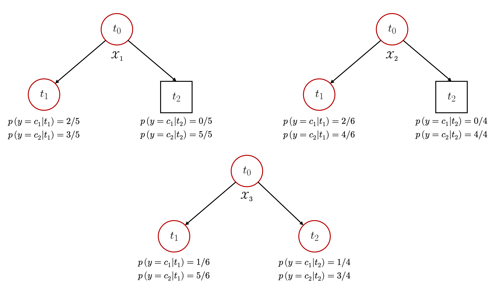

::: {.callout-important}
## Idea central

Los árboles de decisión construyen modelos predictivos mediante reglas secuenciales que particionan el espacio de entrada de un conjunto de entrenamiento. En esta entrada estudiaremos cómo se inducen estas reglas, qué criterios permiten escoger una partición, cómo se controla el crecimiento del árbol y por qué estos modelos pueden resolver problemas de clasificación y regresión sin imponer una frontera lineal explícita.
:::

::: {.class-keywords}
[Árboles de decisión]{.class-keyword}
[Clasificación]{.class-keyword}
[Regresión]{.class-keyword}
[Reglas de partición]{.class-keyword}
[Impureza]{.class-keyword}
[Entropía]{.class-keyword}
[Criterios de detención]{.class-keyword}
[Sobreajuste]{.class-keyword}
[Scikit-Learn]{.class-keyword}
:::

## Introducción

En esta entrada introduciremos un nuevo tipo de algoritmo de aprendizaje supervisado en la forma de un marco de referencia o *framework* unificado, conocido como **árbol de decisión**. Dicho *framework* se separa aún más de la teoría que hemos desarrollado previamente en el contexto de este tipo de modelos, debido a que, a diferencia de las máquinas de soporte vectorial que estudiamos en la [entrada dedicada](/clases/machine-learning/aprendizaje-supervisado/modelos-lineales/maquinas-de-soporte-vectorial/), los árboles de decisión serán el primer tipo de modelo inherentemente no lineal que vamos a estudiar. La razón fundamental de su estudio separado (y dedicado) estriba en dos pilares fundamentales: Su **simplicidad** y su **éxito** en la resolución de problemas tanto de clasificación como de regresión. Además, constituyen la base de muchos otros modelos que también veremos más adelante. Un ejemplo clásico es el **modelo de bosque aleatorizado** (del inglés **random forest**), que estudiaremos en detalle en la [entrada siguiente](/clases/machine-learning/aprendizaje-supervisado/modelos-no-lineales/modelos-de-ensamble/).

El **éxito** de este tipo de modelos y, por extensión, de cualquier otro modelo derivado, guarda relación con varios factores esenciales:

- **No son modelos paramétricos**. Pueden, por tanto, modelar relaciones de alta complejidad entre variables de entrada y salida arbitrarias, **sin necesidad de ningún conocimiento específico a priori**.
- **Pueden tratar con conjuntos de datos heterogéneos**, ya sea compuestos de variables numéricas, discretas, categóricas, o un *mix* de todas ellas.
- **Implementan de forma intrínseca un procedimiento de selección de atributos**, haciéndolos una opción muy robusta para la eliminación de ruido generado por variables irrelevantes y/o redundantes (al menos, hasta cierto punto).
- **Son excelentes para conjuntos de entrenamiento con *outliers* o errores en las etiquetas asociadas a cada observación**.
- **Son fácilmente interpretables**, incluso para desarrolladores sin un *background* completo en aspectos estadísticos.

## Modelos con estructura de tipo árbol

Sea $\mathcal{D} =\left\{ \left( \mathbf{X} ,\mathbf{y} \right) :\mathbf{X} \in \mathbb{R}^{m\times n} \wedge \mathbf{y} \in \mathbb{R}^{m} \right\}$ un conjunto de entrenamiento caracterizado por una matriz de diseño $\mathbf{X}$ y un vector de valores observados $\mathbf{y}$. Sean $\mathcal{X}$ e $\mathcal{Y}$ los espacios de entrada y salida de $\mathcal{D}$; es decir, el conjunto de todos los valores posibles que pueden tomar $\mathbf{X}$ e $\mathbf{y}$, respectivamente. Cuando el espacio de salida de $\mathcal{D}$ está constituido por un número finito de valores, digamos $\mathcal{Y} =\left\{ c_{1},...,c_{k} \right\}$, donde $c_{r}$ es la $r$-ésima clase de interés (de un total de $k$), solemos decir que $\mathcal{D}$ describe un problema de clasificación multinomial. Una forma útil de visualizar un problema de este tipo es pensar que $\mathbf{y}$ define una partición sobre un universo $\Omega$, tal que

::: {.eq-scroll}
$$
\Omega =\Omega_{c_{1}} \cup \Omega_{c_{2}} \cup \cdots \cup \Omega_{c_{k}} =\bigcup^{c_{k}}_{s=c_{1}} \Omega_{c_{s}}
\tag{1.1}
$$
:::

donde $\Omega_{c_{r}}$ es el conjunto de instancias de $\mathcal{D}$ para las cuales $\mathbf{y}$ tiene el valor $c_{r}$. Similarmente, si $f:\mathcal{X} \longrightarrow \mathcal{Y}$ es una hipótesis que hace el trabajo de *predecir* la clase asociada a una instancia $\mathbf{x}_{i}$ (para $i=1,...,m$) de $\mathcal{D}$ (donde $\mathbf{x}_{i}$ es la $i$-ésima fila de $\mathcal{X}$), entonces $f$ también puede verse como una partición de $\Omega$, ya que esta permite obtener una estimación $\hat{\mathbf{y}}$ de $\mathbf{y}$. Sin embargo, dicha partición se define en el espacio de entrada $\mathcal{X}$ en vez de hacerlo directamente en $\Omega$, lo que podemos escribir como

::: {.eq-scroll}
$$
\mathcal{X} =\mathcal{X}^{f}_{c_{1}} \cup \mathcal{X}^{f}_{c_{2}} \cup \cdots \cup \mathcal{X}^{f}_{c_{k}} =\bigcup^{c_{k}}_{s=c_{1}} \mathcal{X}^{f}_{c_{s}}
\tag{1.2}
$$
:::

Donde $\mathcal{X}_{c_{r}}^{f}$ es el conjunto de instancias $\mathbf{x}_{i}\in \mathcal{X}$ tales que $f(\mathbf{x}_{i})=c_{r}$. Correspondientemente, el proceso de aprendizaje de un *predictor* $f$ puede replantearse como el aprendizaje de una partición de $\mathcal{X}$ que *mejor coincida* con la partición original generada por $\mathbf{y}$ (siendo ésta última la *partición óptima*).

Desde un punto de vista geométrico, el principio básico de los modelos de árbol de decisión es extraordinariamente simple. Consiste en aproximarse a la partición óptima mediante una secuencia de particiones de $\mathcal{D}$ que, a su vez, produce una colección de subespacios vectoriales, a partir de las cuales se asignan valores constantes como imágenes del predictor $f$ para todas las instancias que viven en cada uno de dichos subespacios.

A fin de ir dando forma de manera más rigurosa a estos conceptos, vamos a formalizar algunas definiciones.

<strong><font color='blue'>Definición 1.1 – Árbol:</font></strong> Sea $G=(V,E)$ una red o grafo, donde $V$ es el conjunto de vértices o *nodos* y $E$ es el conjunto de arcos o *caminos*. Asumamos la siguiente terminología: Si $G$ contiene $p$ nodos, entonces $V$ puede expresarse por medio del conjunto $V=\left\{ 1,...,p\right\}$, siendo entonces $E=\left\{ \left( s,t\right)  :s\wedge t\in V,s\neq t\right\}$ el conjunto de todos los arcos de la red que unen a los nodos $s$ y $t$. Un **árbol** se define como un grafo $G=(V,E)$ tal que cualquier combinación de nodos está conectada por uno y sólo un arco.

Al respecto, es posible observar varios aspectos importantes en una red de tipo árbol:

- **(T1):** Si $G=(V,E)$ representa a un árbol, entonces es común designar a uno de sus nodos como la **raíz** del mismo. De ser así, entonces necesariamente $G$ será un **grafo dirigido** (es decir, los arcos $E$ tendrán **direcciones restringidas** –por ejemplo, $(s,t)$ podría recorrerse desde $s$ hasta $t$, pero no al revés–) para el cual todos los arcos se *alejarán* de dicho nodo raíz. Un árbol así definido es llamado **árbol con raíz**.
- **(T2):** Si existe un arco que va desde $s$ a $t$ (es decir, $(s,t)\in E$), entonces diremos que $s$ es el **nodo padre** (o, simplemente, *padre*) del nodo $t$. Correspondientemente, el nodo $t$ será llamado **nodo hijo** (o simplemente *hijo*) del nodo $s$.
- **(T3):** Para un árbol con raíz, diremos que un nodo es **interno** si tiene uno o más hijos, y **terminal** si no los tiene. Los nodos terminales, sobre todo en la teoría de aprendizaje automatizado, suelen ser llamados **nodos hoja**, o simplemente **hojas**.
- **(T4):** Un **árbol binario** es un árbol con raíz para el cual cada nodo interno tiene siempre dos hijos.

En estos términos, un **modelo con estructura de tipo árbol** o, derechamente, **árbol de decisión**, puede definirse como un objeto matemático $f:\mathcal{X}\longrightarrow \mathcal{Y}$, representado por un árbol con raíz (con frecuencia, binario, aunque no necesariamente tiene que ser así), donde cualquier nodo $t$ representa un subespacio $\mathcal{X}_{t}\subset \mathcal{X}$ del espacio de entrada y el nodo raíz, que llamamos $t_{0}$ corresponde a todo el conjunto $\mathcal{X}$. Los nodos internos del árbol se etiquetan con una **separación** o **split** $s_{t}$ que se construye a partir de una serie de *"preguntas"* que constituyen un conjunto $\mathcal{P}$. Cada *split* divide al subespacio $\mathcal{X}_{t}$ que representa al nodo $t$ en un número de subespacios disjuntos, cada uno de los cuales se corresponde con los nodos hijos de $t$. Por ejemplo, el conjunto de todos los *splits* binarios equivale a un conjunto $\mathcal{P}$ de preguntas $s$ de la forma: *"¿La instancia $\mathbf{x}_{i}$ pertenece a $\mathcal{X}_{r}$?"*, donde $\mathcal{X}_{r}\subset \mathcal{X}$ es *algún* subconjunto del espacio de entrada. De esta manera, cualquier *split* $s$ divide a $\mathcal{X}_{t}$ en dos subespacios respectivamente. Si designamos por $t$ a este nodo, entonces tales subespacios serán $\mathcal{X}_{t}\cap \mathcal{X}_{r}$ para el nodo hijo hacia la *izquierda* de $t$, y $\mathcal{X}_{t} \cap (\mathcal{X}\setminus  \mathcal{X}_{r})$ para el nodo hijo hacia la *derecha* de $t$. Los nodos terminales se etiquetan con las *mejores* estimaciones $\hat{y}_{t}\in \mathcal{Y}$ para la variable de salida u objetivo. Si $f$ representa a un **árbol de clasificación**, entonces $\hat{y}_{t} \in \left\{ c_{1},\cdots ,c_{k}\right\}$, mientras que, si $f$ es un **árbol de regresión**, entonces $\hat{y}\in [a,b]$, donde $[a,b]$ es un intervalo cerrado en $\mathbb{R}$. Bajo estas condiciones, la predicción $f(\mathbf{x}_{i})$ es el valor con el cual se etiqueta la hoja a la cual se llega mediante la instancia $\mathbf{x}_{i}$, al propagarse por el árbol siguiendo los *splits* $s_{t}$, lo que puede estructurarse conforme el @alg-tree-predict. Notemos que dicho algoritmo se escribe en *pseudo-código*.

::: {#alg-tree-predict}
::: {.algo-box}

::: {.algo-line}
[def]{.algo-key} [predict]{.algo-name} $(f,\mathbf{x}_{i})$
:::

::: {.algo-indent .algo-indent-1}

::: {.algo-line}
$t\longleftarrow t_{0}$.
:::

::: {.algo-line}
[while]{.algo-key} $t$ no sea un nodo terminal:
:::

::: {.algo-indent .algo-indent-2}

::: {.algo-line}
$t\longleftarrow$ el nodo hijo $t^{\ast}$ de $t$ tal que $\mathbf{x}_{i}\in \mathcal{X}_{t^{\ast}}$.
:::

:::

::: {.algo-line}
[return]{.algo-key} $\hat{y}_{t}$.
:::

:::
:::

Ejemplo básico de algoritmo que predice la salida $\hat{y}=f(\mathbf{x}_{i})$ en un árbol de decisión para una instancia $\mathbf{x}_{i}$
:::

La @fig-decision-tree-structure ilustra un modelo de árbol de decisión $f$ compuesto por cinco nodos y que particiona el espacio de entrada $\mathcal{X}=\mathcal{X}_{1}\times \mathcal{X}_{2}=[0,1]\times [0,1]$ para un problema de clasificación binaria (donde el espacio de salida es $\mathcal{Y}=\left\{ c_{1},c_{2}\right\}$). El nodo $t_{0}$ es la raíz del árbol y corresponde al espacio de entrada completo; es decir, $\mathcal{X}_{t_{0}}=\mathcal{X}$. Dicho nodo se etiqueta con el *split* binario 

::: {.eq-scroll}
$$
s_{0}=\left\{ x_{i1}\leq 0.7\right\}
\tag{1.3}
$$
:::

Es decir, dicho *split* formula la siguiente pregunta: *"¿Es $x_{i1}$ menor o igual que $0.7$?"*, donde $x_{i1}$ hace referencia a la $i$-ésima instancia (o fila) con respecto a la primera ($j=1$) variable independiente (o columna) asociada a la matriz de diseño $\mathbf{X}\in \mathbb{R}^{m\times 2} (1\leq i\leq m)$. Es decir, **cada split define una partición con respecto a una de las $2$ variables independientes del conjunto de entrenamiento**. Por el momento, no nos preocuparemos de cómo se escoge la variable asociada al *split*. Simplemente asumiremos que *una de ellas* es la descrita por el *split* y la que particiona a $\mathcal{X}$ en cada uno de los nodos no terminales del árbol.

![Un sencillo árbol de decisión construido para resolver un problema de clasificación a partir de un espacio de entrada definido por el conjunto $\mathcal{X}=[0,1]\times [0,1]$](images/fig_1_1.png){#fig-decision-tree-structure fig-align="center" width="350px"}

Aclarada la notación, prosigamos. El split $s_{0}=\left\{ x_{i1}\leq 0.7 \right\}$, asociado al nodo $t_{0}$, divide al espacio $\mathcal{X}_{0}$ (que coincide con el espacio de entrada $\mathcal{X}$) en dos subespacios disjuntos, que denotamos como $\mathcal{X}_{t_{1}} \wedge \mathcal{X}_{t_{2}}$. El subespacio $\mathcal{X}_{t_{1}}$ corresponde al nodo hijo $t_{1}$ ubicado a la izquierda de $t_{0}$ y representa a todas las instancias $x_{i1}\in \mathcal{X}_{t_{0}}$ (para $i=1,...,m$) tales que $x_{i1}\leq 0.7$. De la misma forma, $t_{1}$ se rotula con el split $s_{1}=\left\{ x_{i2}\leq 0.5 \right\}$, que a su vez divide al espacio $\mathcal{X}_{t_{1}}$ en dos subespacios disjuntos, denominados como $\mathcal{X}_{t_{3}}\wedge \mathcal{X}_{t_{4}}$, y que representan –respectivamente– al conjunto de todas las instancias $x_{i2}\in \mathcal{X}_{t_{1}}$ tales que $x_{i2}\leq 0.5$ y $x_{i2}> 0.5$. Los nodos terminales $t_{2},t_{3}$ y $t_{4}$ se representan en el esquema del árbol como *cuadrados* que han sido etiquetados con un valor de salida o **predicción** $\hat{y}_{t}$. En conjunto, estos valores constituyen una **partición** de $\mathcal{X}$ (en el sentido de la ecuación (1.2)), donde cada conjunto $\mathcal{X}_{c_{k}}^{f}$ se obtiene a partir de la unión de los subespacios $\mathcal{X}_{t}$ de todos los nodos terminales $t$ tales que $\hat{y}_{t}=c_{k}$. En este ejemplo particular, $\mathcal{X}_{c_{1}}^{f} =\mathcal{X}_{t_{4}}$, mientras que $\mathcal{X}_{c_{2}}^{f} =\mathcal{X}_{t_{2}} \cup \mathcal{X}_{t_{3}}$.

![Partición de $\mathcal{X}=[0,1]\times [0,1]$ inducida por el árbol de decisión $f$ que divide a $\mathcal{X}$ en subespacios homogéneos. Los puntos rojos corresponden a objetos de la clase $c_{1}$, mientras que los puntos azules corresponden a objetos de la clase $c_{2}$](images/fig_1_2.png){#fig-decision-tree-partition fig-align="center" width="780px"}

Como se muestra en la @fig-decision-tree-partition, la partición inducida por el árbol de clasificación $f$ divide al espacio de entrada $\mathcal{X}$ en subespacios que son más y más homogéneos con respecto a ambas clases, partiendo desde $\mathcal{X}$ en el nodo raíz, luego $\mathcal{X}_{t_{1}}\cup \mathcal{X}_{t_{2}}$ en el segundo nivel del árbol, y finalmente, $\left( \mathcal{X}_{t_{3}} \cup \mathcal{X}_{t_{4}} \right) \cup \mathcal{X}_{t_{2}}$ en las hojas. Como veremos más adelante, la partición en este caso está constituida por rectángulos debido a la naturaleza de los *splits* $s_{t}\in \mathcal{P}$ que caracterizan a cada nodo del árbol de decisión. Las predicciones se realizan por medio de la propagación de las instancias a través del árbol y usando como valor de salida del modelo a las etiquetas de cada una de sus hojas dependiendo de donde éstas instancias *caigan*, según sea el caso. Por ejemplo, el punto $(x_{1},x_{2})= (0.2, 0.7)$, al propagarse por el árbol ilustrado en la @fig-decision-tree-structure, cae en el nodo $t_{4}$, y por lo tanto el modelo produce la estimación $\hat{y}_{t_{4}}=f(0.2, 0.7)=c_{1}$.

## Inducción de árboles de decisión

Sea $\mathcal{D} =\left\{ \left( \mathbf{X} ,\mathbf{y} \right) :\mathbf{X} \in \mathbb{R}^{m\times n} \wedge \mathbf{y} \in \mathbb{R}^{m} \right\}$ un conjunto de datos de entrenamiento, donde la fila $\mathbf{x}_{i}\in \mathbb{R}^{n}$ hace referencia a una instancia de $\mathbf{X}$ e $y_{i}$ es la correspondiente observación de $\mathbf{y}$. Sea $f:\mathcal{X}\longrightarrow \mathcal{Y}$ un modelo de tipo árbol, con $\mathcal{X}\wedge \mathcal{Y}$ los espacios de entrada y salida de $\mathcal{D}$, respectivamente. El proceso de aprendizaje de un árbol de decisión idealmente apunta a determinar la estructura de tipo árbol que produce la partición más *próxima* o *similar* a la partición generada por $\mathcal{Y}$ sobre $\mathcal{X}$. Debido a que tal estructura es desconocida, la construcción de un árbol de decisión suele realizarse con base en la determinación de un modelo que particione al conjunto de entrenamiento $\mathcal{D}$ *lo mejor posible*. Entre todos los árboles de decisión $f\in \mathcal{H}$ (donde $\mathcal{H}$ es el universo de todos los árboles de decisión posibles), pueden existir varios que expliquen la estructura de $\mathcal{D}$ igualmente bien. Una opción lógicamente válida es preferir aquel modelo que haga el menor número de supuestos posibles; esto es, elegir el modelo más simple de todos los que se ajustan igualmente bien a nuestros datos. Por lo tanto, el aprendizaje de un árbol de decisión $f$ a partir de $\mathcal{D}$ suele definirse como el hallar el árbol más pequeño $f^{\ast}$ (en términos de sus nodos internos) que minimice el error promedio de estimación de $f$ sobre $\mathcal{D}$:

::: {.eq-scroll}
$$
E\left( f,\mathcal{D} \right) =\frac{1}{m} \sum_{\left( \mathbf{x}_{i} ,y_{i} \right) \in \mathcal{D}} L\left( y_{i},f\left( \mathbf{x}_{i} \right) \right)
\tag{1.4}
$$
:::

Donde $L$ es una **función de pérdida** que mide la discrepancia entre las observaciones $y_{i}$ y el modelo $f(\mathbf{x}_{i})$.

La elección del *árbol mínimo* $f^{\ast}$ es un supuesto válido y razonable desde el punto de vista de la generalización del aprendizaje y también desde la perspectiva de la interpretabilidad: Un árbol de decisión pequeño es mucho más fácil de interpretar que uno más grande. Sin embargo, el problema de determinar dicho árbol mínimo es intratable al ser $NP$-completo. Es decir, no existe un algoritmo eficiente para encontrar el árbol $f^{\ast}$ en tiempo polinómico, lo que nos fuerza a construir heurísticas que permitan llegar a un resultado aproximado. La razón de por qué este problema es intratable se desarrollará en el siguiente ejemplo.

**Ejemplo 1.1 – Intratabilidad del problema de encontrar un árbol de decisión mínimo:** Consideremos nuevamente el conjunto de entrenamiento $\mathcal{D}$ descrito más arriba. Cada instancia $\mathbf{x}_{i}$ *vive* en el espacio $\mathcal{X}$. Por simplicidad, de manera similar a como lo hicimos en el primer ejercicio que realizamos, podemos pensar que $\mathcal{X} \subseteq \left\{ 0,1 \right\}^{n}$ (es decir, cada variable independiente de $\mathcal{D}$ es binaria, y toma los valores $0$ y $1$). Asumiremos que $\mathbf{y}$ está constituido igualmente por valores iguales a $0$ o $1$. 

Un árbol de decisión (binario) válido para $\mathcal{D}$ es tal que sus hojas están etiquetadas igualmente con los números $0$ o $1$ por medio de *splits* (o "preguntas") que caracterizan a cada nodo intermedio. De esta manera, $\mathcal{D}$ representa a un problema de clasificación cuya resolución equivale a encontrar una función Booleana $f$ capaz de asignar los valores $0$ y $1$ a las variables $\mathbf{x}_{j}\in \mathbb{R}^{m}$ ($j=1,...,n$). Equivalentemente, un árbol de decisión que satisface este problema equivale a determinar "alguna" manera de asignar los valores $0$ y $1$ a las instancias $\mathbf{x}_{1},...,\mathbf{x}_{m}$, de manera tal que todos los *splits* que constituyen los nodos intermedios del árbol separen perfectamente a los datos, satisfaciendo en cada caso las clases en cada una de sus hojas. No existe una única forma de resolver este problema y, por extensión, tampoco hay un único árbol que los satisfaga. Por lo tanto, es natural *intentar* determinar, de entre todos ellos, el árbol con la menor cantidad de nodos intermedios (o *splits*), llamado **árbol óptimo o mínimo**. Este problema particular es computacionalmente intratable.

Para demostrarlo, consideremos una tabla de verdad que represente a las variables independientes (Booleanas) $\mathbf{x}_{j} (j=1,...,n)$. El número total de combinaciones de valores binarias entre estas $n$ variables, que representa al número de filas de esta tabla de verdad, es igual a $2^{n}$. Por ejemplo, si $n=3$, se tendrá la tabla de verdad mostrada a continuación:

: Tabla de verdad para tres variables binarias. Su número de filas es igual a $2^{3}=8$ {#tbl-truth-binary}

| Variable $\mathbf{x}_{1}$ | Variable $\mathbf{x}_{2}$ | Variable $\mathbf{x}_{3}$ |
| :--------------: | :---------------: | :---------------: |
| 0 | 0 | 0 |
| 0 | 0 | 1 |
| 0 | 1 | 0 |
| 1 | 0 | 0 |
| 1 | 1 | 0 |
| 1 | 0 | 1 |
| 0 | 1 | 1 |
| 1 | 1 | 1 |

Y que tiene un total de $2^{3}=8$ filas. Para el caso general, si el valor de verdad de cada combinación también es binario, hay $2^{\left( 2^{n} \right)}$ posibles funciones de clasificación. Es decir, existen $2^{\left( 2^{n} \right)}$ formas diferentes de etiquetar cada una de las filas que constituyen las combinaciones en la correspondiente tabla de verdad. Esto significa que la cantidad de formas en las cuales podemos definir un *split* en un árbol de decisión que particione eficazmente al espacio de entrada del problema es, al menos, igual de grande, porque más de un árbol de decisión puede ser igualmente útil para particionar dicho espacio con los mismos resultados (o, palabras más simples, más de un árbol puede ser válido para representar a una de estas funciones de clasificación). Debido a que, de entre todas estas opciones, hay sólo una que nos interesa (la que tiene la menor cantidad de nodos intermedios o *splits*), la resolución del problema que implica encontrar el árbol de decisión mínimo requiere, literalmente, fuerza bruta para recorrer todo el espacio de búsqueda para seleccionar el árbol más pequeño de todos. Cada variable independiente que añadimos en nuestro conjunto de entrenamiento hace crecer el espacio de búsqueda del árbol mínimo de forma *super-exponencial*, lo que hace a este problema intratable (en tiempo *polinomial*).

¿Qué tan grande es el número $2^{\left( 2^{n} \right)}$? Pues bueno... muchísimo. Un problema de clasificación constituido únicamente por $10$ variables binarias tendrá $2^{\left( 2^{10} \right)}=2^{1024}$ formas distintas de etiquetar cada salida. Este número es, aproximadamente, $10^{228}$ veces más grande que la cantidad de átomos existente en el universo observable. Y sólo hablamos de un problema binario, con variables independientes binarias. Para un problema multinomial, o con variables independientes continuas, dicho número crece, para efectos prácticos, de forma infinita. ◼︎

Habiendo establecido lo impracticable que resulta determinar un árbol de decisión mínimo para cualquier problema de aprendizaje supervisado, queda en evidencia que el desarrollo de la teoría de los árboles de decisión debe apuntar hacia procedimientos heurísticos que nos permitan llegar a un resultado aproximado. En primer lugar, vamos a desarrollar una noción de un elemento fundamental en la construcción de tales heurísticas, conocido como **métrica de impureza**, denotada como $i(t)$, y que permite *evaluar* la *bondad* o *idoneidad* de un nodo $t$ en un árbol de decisión. Asumamos que, mientras más pequeño sea $i(t)$, más *puro* será el nodo $t$, resultando en mejores predicciones $\hat{y}_{t}(\mathbf{x}_{i})$ para todo $\mathbf{x}_{i}\in \mathcal{D}_{t}$ ($i=1,...,m$), donde $\mathcal{D}_{t}$ es el subconjunto de instancias en el conjunto de entrenamiento $\mathcal{D}$ que caen en $t$ (esto es, todo par $(\mathbf{x}_{i},y_{i})\in \mathcal{D}$ tal que $\mathbf{x}_{i}\in \mathcal{X}_{t}$, donde $\mathcal{X}_{t}$ es el subespacio que contiene a todas las instancias que se propagan por el nodo $t$). Partiendo desde un nodo raíz que representa a todo el espacio de entrada $\mathcal{X}$, podemos *hacer crecer* árboles casi-óptimos por medio de un *procedimiento codicioso*, dividiendo cada nodo interno en otros nodos que secuencialmente se hacen más y más *puros* de manera iterativa. Esto es, dividiendo iterativamente el espacio de entrada $\mathcal{X}$ en subespacios cada vez más pequeños (representados por los nodos del árbol), hasta que los nodos terminales (hojas) ya no pueden hacerse más *puros*, lo que permite garantizar predicciones *casi óptimas* sobre el conjunto de entrenamiento $\mathcal{D}$. El *supuesto codicioso* para intentar lograr que el árbol resultante sea lo más pequeño posible (lo que permite, en teoría, una buena generalización) es, por tanto, dividir cada nodo $t$ del árbol usando el *split* $s^{\ast}$ que maximiza localmente la ganancia de impureza de los nodos hijos resultantes. Tiene sentido, por ende, la siguiente definición.

<strong><font color='blue'>Definición 1.2 – Ganancia de impureza:</font></strong> Sea $G(V,E)$ un árbol de decisión y sea $t\in E$ un nodo interno de $G(V,E)$. Sea $s_{t}$ el split (binario) que rotula al nodo $t$, y sean $t_{L}$ y $t_{R}$ los nodos hijos ubicados a la izquierda y derecha de $t$, respectivamente. La **ganancia de impureza** del split $s_{t}$ se define como

::: {.eq-scroll}
$$
\triangle i\left( s_{t},t \right) =i\left( t \right) -p_{L}i\left( t_{L} \right) -p_{R}i\left( t_{R} \right)
\tag{1.5}
$$
:::

Donde:

- $p_{L}$ es la proporción $\frac{m_{t_{L}}}{m_{t}}$ de instancias de entrenamiento de $\mathcal{D}_{t}$ que se propagan por $t$ hacia $t_{L}$, siendo $m_{t}$ la cantidad de instancias de $\mathcal{D}_{t}$.
- $p_{R}$ es la proporción $\frac{m_{t_{R}}}{m_{t}}$ de instancias de entrenamiento de $\mathcal{D}_{t}$ que se propagan por $t$ hacia $t_{R}$.

**Observación:** Notemos que, hasta ahora, hemos utilizado dos notaciones para designar a un árbol de decisión: Una que hace mención a su estructura de tipo grafo ($G(V,E)$), y otra que hace mención a su representatividad como función clasificadora (o regresora, según sea el caso, $f$). Ambas notaciones son equivalentes, y se utilizarán dependiendo de lo que queramos presentar o definir en base al mismo árbol de decisión.

Sobre la base de la definición (1.2), podemos describir formalmente un procedimiento iterativo de tipo *voraz* o *codicioso* que permita generar un árbol de decisión a partir de un conjunto de entrenamiento $\mathcal{D} =\left\{ \left( \mathbf{X} ,\mathbf{y} \right) :\mathbf{X} \in \mathbb{R}^{m\times n} \wedge \mathbf{y} \in \mathbb{R}^{m} \right\}$, donde $\mathbf{X}$ es la matriz de diseño e $\mathbf{y}$ es el vector de valores observados. Tal procedimiento se ilustra en el @alg-build-decision-tree en un formato de pseudo-código.

::: {#alg-build-decision-tree}
::: {.algo-box}

::: {.algo-line}
[def]{.algo-key} [BuildDecisionTree]{.algo-name} $(\mathcal{D})$
:::

::: {.algo-indent .algo-indent-1}

::: {.algo-line}
Crear un árbol de decisión $f$ con nodo raíz $t_{0}$.
:::

::: {.algo-line}
Crear un contenedor $S$ vacío de nodos abiertos $(t,\mathcal{D}_{t})$.
:::

::: {.algo-line}
Agregar $(t_{0},\mathcal{D})$ a $S$.
:::

::: {.algo-line}
[while]{.algo-key} $S$ no esté vacío:
:::

::: {.algo-indent .algo-indent-2}

::: {.algo-line}
$(t,\mathcal{D}_{t})\longleftarrow \mathrm{pop}(S)$.
:::

::: {.algo-line}
[if]{.algo-key} el criterio de detención se cumple para $t$:
:::

::: {.algo-indent .algo-indent-3}

::: {.algo-line}
Asignar una predicción constante al nodo terminal: $\hat{y}_{t}\longleftarrow \mathrm{constante}$.
:::

:::

::: {.algo-line}
[else]{.algo-key}
:::

::: {.algo-indent .algo-indent-3}

::: {.algo-line}
Encontrar el split que maximiza la ganancia de impureza: $s^{\ast}\longleftarrow \underset{s_{t}}{\mathrm{argmax}}\left(\triangle i(s_{t},t)\right)$.
:::

::: {.algo-line}
Particionar $\mathcal{D}_{t}$ en $\mathcal{D}_{t_{L}}\cup \mathcal{D}_{t_{R}}$, de acuerdo con $s^{\ast}$.
:::

::: {.algo-line}
Crear el nodo hijo izquierdo $t_{L}$ y el nodo hijo derecho $t_{R}$.
:::

::: {.algo-line}
Agregar $(t_{L},\mathcal{D}_{t_{L}})$ y $(t_{R},\mathcal{D}_{t_{R}})$ a $S$.
:::

:::
:::

::: {.algo-line}
[return]{.algo-key} $f$.
:::

:::
:::

Inducción voraz o codiciosa de un árbol de decisión binario
:::

En lo que resta de esta sección, nos dedicaremos a explicar en detalle todas las piezas que conforman el @alg-build-decision-tree. Primero, estudiaremos las **reglas de asignación** para los nodos terminales de un árbol de decisión (que es lo que ocurre cuando se cumple el *criterio de detención*). Luego, definiremos dichos criterios de detención. A continuación, presentaremos familias $\mathcal{P}$ de reglas de separación o *splitting*, criterios de impureza para evaluar la idoneidad de los *splits* y estrategias para encontrar los mejores *splits* $s^{\ast}\in \mathcal{P}$. Como veremos más adelante, la parte esencial del @alg-build-decision-tree será el cómo encontrar buenos *splits* y cómo determinar cuándo dejamos de separar los nodos de un árbol.

## Reglas de asignación

Sea $\mathcal{D} =\left\{ \left( \mathbf{X} ,\mathbf{y} \right) :\mathbf{X} \in \mathbb{R}^{m\times n} \wedge \mathbf{y} \in \mathbb{R}^{m} \right\}$ un conjunto de datos de entrenamiento, donde la fila $\mathbf{x}_{i}\in \mathbb{R}^{n}$ hace referencia a una instancia de $\mathbf{X}$ e $y_{i}$ es la correspondiente observación de $\mathbf{y}$, siendo $\mathcal{X}\wedge \mathcal{Y}$ los correspondientes espacios de entrada y salida de $\mathcal{D}$, respectivamente. Consideremos un árbol de decisión $G(V,E)$ constituido por una secuencia de nodos, uno de los cuales se representa arbitrariamente como $t\in E$. Asumamos que dicho nodo $t$ ha sido declarado como terminal por el @alg-build-decision-tree por algún criterio de detención (que, por el momento, no será relevante). El siguiente paso en dicho algoritmo es etiquetar al nodo $t$ con un valor constante, que llamamos $\hat{y}_{t}$, que será utilizado como una predicción para una de las instancias de la variable de salida $\mathbf{y}$. Como tal, $t$ puede considerarse como un modelo muy simple, localmente definido en $\mathcal{X}_{t}\times \mathcal{Y}$, el que produce la misma predicción $\hat{y}_{t}$ para todas las posibles instancias que caen en $t$.

Observamos primero que, para un modelo de tipo árbol $f$ de estructura *fija*, la minimización del error promedio de estimación es estrictamente equivalente a minimizar cada término de error local asociado a los modelos locales que describen los nodos terminales. Es decir,

::: {.eq-scroll}
$$
\begin{array}{lll}E\left( f,\mathcal{D} \right)&=&\mathrm{E}_{X,Y} \left[ L\left( \mathbf{y} ,f\left( \mathbf{X} \right) \right) \right]\\ &=&\displaystyle \sum_{t\in \tilde{f}} P\left( X\in \mathcal{X}_{t} \right) \mathrm{E}_{X,Y|t} \left[ L\left( \mathbf{y} ,\hat{y}_{t} \right) \right]\end{array}
\tag{1.6}
$$
:::

Donde:

- $\tilde{f}$ es el conjunto de nodos terminales en $f$.
- $X$ e $Y$ son variables aleatorias respecto de las cuales $\mathbf{X}$ e $\mathbf{y}$ son asumidas como realizaciones.
- El valor esperado conjunto $\mathrm{E}_{X,Y}$ se toma sobre todas las instancias $\mathbf{x}_{i}\in \mathcal{X}_{t}$.

Por lo tanto, sobre la base de la fórmula (1.6), un modelo que minimiza $E\left( f,\mathcal{D} \right)$ es equivalente a un modelo que minimiza el valor esperado de los errores en cada hoja del árbol, ponderando cada término de error por la probabilidad de que una instancia se propague o *caiga* en dicha hoja. De esta manera, el aprendizaje del *mejor* árbol de decisión posible simplemente apunta a encontrar la mejor colección de constantes en cada uno de los correspondientes nodos terminales.

### Problema de clasificación

Consideremos el caso en el cual el conjunto de entrenamiento $\mathcal{D} =\left\{ \left( \mathbf{X} ,\mathbf{y} \right) :\mathbf{X} \in \mathbb{R}^{m\times n} \wedge \mathbf{y} \in \mathbb{R}^{m} \right\}$ representa a un problema de clasificación. Es decir, el vector $\mathbb{y}\in \mathbb{R}^{m}$ está constituido por un número finito de valores discretos. Sin pérdida de generalidad, consideraremos el caso binario, en el cual $\mathbb{y}$ únicamente toma los valores $y_{i}=0$ o $y_{i}=1$, para todo $i=1,...,m$. Una opción para la función de pérdida $L$ en un escenario como este corresponde a la función $\mathbf{1}:\mathbb{R} \longrightarrow \left\{ 0,1 \right\}$, denominada **pérdida binaria** o **pérdida de clasificación**, definida como

::: {.eq-scroll}
$$
\mathbf{1}\left( y\neq\hat{y} \right) =\begin{cases}0&;\  \mathrm{si} \  y=\hat{y}\\ 1&;\  \mathrm{si} \  y\neq \hat{y}\end{cases}
\tag{1.7}
$$
:::

La función (1.7) es muy sencilla, y suele utilizarse en la construcción de modelos de clasificación con el objetivo de maximizar la exactitud de tales modelos. Sea pues $f$ un modelo de tipo árbol y $y$ un nodo terminal arbitrario de $f$. Denotemos por $\mathcal{X}_{t}$ el subespacio de instancias de $\mathcal{D}$ que se propagan por el árbol hasta $t$, siendo $m_{t}$ la cantidad de instancias en $\mathcal{X}_{t}$. Si reemplazamos la función de pérdida (1.7) en el argumento del valor esperado condicional interno $\mathrm{E}_{X,Y|t}$ en la última línea de la ecuación (1.6), obtendremos

::: {.eq-scroll}
$$
\begin{array}{lll}\hat{y}_{t}^{\ast}&=&\displaystyle \underset{c\in \mathcal{Y}}{\mathrm{argmin}} \left( \mathrm{E}_{X,Y|t} \left[ \mathbf{1} \left( y,c \right) \right] \right)\\ &=&\displaystyle \underset{c\in \mathcal{Y}}{\mathrm{argmin}} \left( P\left( y_{i}\neq c\  |\  \mathbf{x}_{i} \in \mathcal{X}_{t} \right) \right) \  ;\  i=1,...,m\\ &=&\displaystyle \underset{c\in \mathcal{Y}}{\mathrm{argmax}} \left( P\left( y_{i}=c\  |\  \mathbf{x}_{i} \in \mathcal{X}_{t} \right) \right)\end{array}
\tag{1.8}
$$
:::

Donde $c\in \mathbb{R}$ es la constante que el nodo terminal $t$ asigna como salida. Dicho de otro modo, el error de generalización de $t$ se minimiza prediciendo la clase más frecuente (o más probable) en el subespacio de datos que cae en $t$. Si hay más de una clase que minimiza dicho error, basta con escoger cualquiera de ellas como $\hat{y}_{t}^{\ast}$. Este resultado se conoce en la teoría de los árboles de decisión como **regla de pluralidad**.

Para resolver la ecuación (1.8), en la práctica, es necesario conocer la función de densidad conjunta $P_{X,Y}$. Dado que en la mayoría de problemas esto no está disponible explícitamente, es común aproximar esta distribución mediante estimaciones de la distribución local de cada nodo terminal. Sea $p\left( c|t \right) =\frac{n_{c}\left( t \right)}{m_{t}}$ la proporción de las $n_{c}(t)$ instancias que pertenecen a la clase $c$ y que caen en $t$ con respecto al total $m_{t}$ de instancias en el subespacio $\mathcal{X}_{t}$, y que proponemos como una estimación de la probabilidad $P\left( y_{i}=c\  |\  \mathbf{x}_{i} \in \mathcal{X}_{t} \right)$. Reemplazando en la expresión (1.8), obtenemos

::: {.eq-scroll}
$$
\begin{array}{lll}\hat{y}_{t}&=&\displaystyle \underset{c\in \mathcal{Y}}{\mathrm{argmin}} \left( 1-p\left( c|t \right) \right)\\ &=&\displaystyle \underset{c\in \mathcal{Y}}{\mathrm{argmax}} \left( p\left( c|t \right) \right)\end{array}
\tag{1.9}
$$
:::

De manera análoga, definimos la proporción $p\left( t \right) =\frac{m_{t}}{m}$ como la estimación de la probabilidad $P(\mathbf{x}_{i}\in \mathcal{X}_{t})$. Reemplazando ambas estimaciones en la expresión (1.6), nos da

::: {.eq-scroll}
$$
\begin{array}{lll}\hat{E} \left( f,\mathcal{D} \right)&=&\displaystyle \sum_{t\in \tilde{f}} \underbrace{p\left( t \right)}_{=\frac{m_{t}}{m}} \  \underbrace{\left( 1-p\left( \hat{y}_{t} |t \right) \right)}_{\mathrm{regla\  de\  pluralidad}}\\ &=&\displaystyle \sum_{t\in \tilde{f}} \frac{m_{t}}{m} \left( 1-\frac{n_{c}\left( t \right)}{m_{t}} \right)\\ &=&\displaystyle \frac{1}{m} \sum_{t\in \tilde{f}} \left( m_{t}-n_{c}\left( t \right) \right)\\ &=&\displaystyle \frac{1}{m} \sum_{t\in \tilde{f}} \sum_{\left( \mathbf{x}_{i} ,y_{i} \right) \in \mathcal{D}_{t}} \mathbf{1} \left( y_{i}\neq c \right) \  \left( \mathrm{donde} \  c=\hat{y}_{t} \right)\\ &=&\displaystyle \frac{1}{m} \sum_{\left( \mathbf{x}_{i} ,y_{i} \right) \in \mathcal{D}_{t}} \mathbf{1} \left( y_{i}\neq f\left( \mathbf{x}_{i} \right) \right)\\ &=&\hat{E}_{\mathrm{entren}} \left( f,\mathcal{D} \right)\end{array}
\tag{1.10}
$$
:::

Donde $\tilde{f}$ es el conjunto de todos los nodos terminales en $f$ y $\mathcal{D}_{t} =\left\{ \left( \mathbf{x}_{i} ,y_{i} \right) |\mathbf{x}_{i} \in \mathcal{X}_{t} \wedge i=1,...,m_{t} \right\}$. Por lo tanto, la aproximación de la ecuación (1.6) mediante estimaciones locales de probabilidad tomadas de cada subespacio $\mathcal{X}_{t}$ es consistente. Luego, **la regla de asignación (1.9) minimiza el error de entrenamiento del modelo en lugar de su error medio de generalización**.

Una propiedad importante de la regla de asignación (1.9) es que cuanto más separamos los nodos intermedios *de cualquier forma* en un árbol de decisión, más pequeño será el error de entrenamiento $\hat{E}_{\mathrm{entren}} \left( f,\mathcal{D} \right)$. Esto significa que **los árboles de clasificación (modelos de tipo árbol que resuelven problemas de clasificación) son muy propensos al sobreajuste**. Este importante detalle es algo que revisaremos en profundidad más adelante.

Los resultados anteriores nos permiten establecer la siguiente proposición.

::: {.callout-warning}
## Proposición 1.1

*Sea $f$ un modelo de tipo árbol de decisión, el cual se entrena sobre un conjunto de entrenamiento $\mathcal{D} =\left\{ \left( \mathbf{X} ,\mathbf{y} \right) :\mathbf{X} \in \mathbb{R}^{m\times n} \wedge \mathbf{y} \in \mathbb{R}^{m} \right\}$, donde $\mathbf{y}$ es un vector que contiene únicamente valores iguales a $0$ o $1$. Sea $\tilde{f}$ el conjunto conformado por todos los nodos terminales (u hojas) de $f$. Para cualquier split $s_{t}$ no vacío en un nodo terminal $t\in \tilde{f}$, que produce los nodos hijos $t_{L}$ y $t_{R}$, resultando en un nuevo árbol $f^{\ast}$, donde $\hat{y}_{t_{L}}$ e $\hat{y}_{t_{R}}$ se asignan conforme la regla (1.9), se tiene que*

::: {.eq-scroll}
$$
\hat{E}_{\mathrm{entren}} \left( f,\mathcal{D} \right) \geq \hat{E}_{\mathrm{entren}} \left( f^{\prime},\mathcal{D} \right)
\tag{1.11}
$$
:::

*Donde la igualdad se cumple si y sólo si $\hat{y}_{t} =\hat{y}_{t_{L}} =\hat{y}_{t_{R}}$*.
:::

La demostración de la proposición (1.1) resulta de comparar las expresiones del error de entrenamiento en cada caso y las probabilidades/estimaciones correspondientes:

::: {.eq-scroll}
$$
\begin{array}{lrcl}&\hat{E}_{\mathrm{entren}} \left( f,\mathcal{D} \right)&\geq&\displaystyle \hat{E}_{\mathrm{entren}} \left( f^{\prime},\mathcal{D} \right)\\ \Longleftrightarrow&\displaystyle \sum_{t\in \tilde{f}} p\left( t \right) \left( 1-p\left( \hat{y}_{t} |t \right) \right)&\geq&\displaystyle \sum_{t\in \tilde{f}^{\prime}} p\left( t \right) \left( 1-p\left( \hat{y}_{t} |t \right) \right)\\ \Longleftrightarrow&\displaystyle p\left( t \right) \left( 1-p\left( \hat{y}_{t} |t \right) \right)&\geq&\displaystyle p\left( t_{L} \right) \left( 1-p\left( \hat{y}_{t_{L}} |t_{L} \right) \right) +p\left( t_{R} \right) \left( 1-p\left( \hat{y}_{t_{R}} |t_{R} \right) \right)\\ \Longleftrightarrow&\displaystyle \frac{m_{t}}{m} \left( 1-\max_{c\in \mathcal{Y}} \left\{ p\left( c|t \right) \right\} \right)&\geq&\displaystyle \frac{m_{t_{L}}}{m} \left( 1-\max_{c\in \mathcal{Y}} \left\{ p\left( c|t_{L} \right) \right\} \right) +\frac{m_{t_{R}}}{m} \left( 1-\max_{c\in \mathcal{Y}} \left\{ p\left( c|t_{R} \right) \right\} \right)\\ \Longleftrightarrow&\displaystyle \frac{m_{t}}{m} \left( 1-\max_{c\in \mathcal{Y}} \left\{ \frac{n_{c}\left( t \right)}{m_{t}} \right\} \right)&\geq&\displaystyle \frac{m_{t_{L}}}{m} \left( 1-\max_{c\in \mathcal{Y}} \left\{ \frac{n_{c}\left( t_{L} \right)}{m_{t_{L}}} \right\} \right) +\frac{m_{t_{R}}}{m} \left( 1-\max_{c\in \mathcal{Y}} \left\{ \frac{n_{c}\left( t_{R} \right)}{m_{t_{R}}} \right\} \right)\\ \Longleftrightarrow&\displaystyle \frac{m_{t}}{m} \left( 1-\frac{1}{m_{t}} \max_{c\in \mathcal{Y}} \left\{ n_{c}\left( t \right) \right\} \right)&\geq&\displaystyle \frac{m_{t_{L}}}{m} \left( 1-\frac{1}{m_{t_{L}}} \max_{c\in \mathcal{Y}} \left\{ n_{c}\left( t_{L} \right) \right\} \right) +\frac{m_{t_{R}}}{m} \left( 1-\frac{1}{m_{t_{R}}} \max_{c\in \mathcal{Y}} \left\{ n_{c}\left( t_{R} \right) \right\} \right)\\ \Longleftrightarrow&\displaystyle m_{t}-\max_{c\in \mathcal{Y}} \left\{ n_{c}\left( t \right) \right\}&\geq&\displaystyle \left( m_{t_{L}}-\max_{c\in \mathcal{Y}} \left\{ n_{c}\left( t_{L} \right) \right\} \right) +\left( m_{t_{R}}-\max_{c\in \mathcal{Y}} \left\{ n_{c}\left( t_{R} \right) \right\} \right) \  \left( \mathrm{notemos\  que} \  m_{t}=m_{t_{L}}+m_{t_{R}} \right)\\ \Longleftrightarrow&\displaystyle \max_{c\in \mathcal{Y}} \left\{ n_{c}\left( t \right) \right\}&\leq&\displaystyle \max_{c\in \mathcal{Y}} \left\{ n_{c}\left( t_{L} \right) \right\} +\max_{c\in \mathcal{Y}} \left\{ n_{c}\left( t_{R} \right) \right\}\\ \Longleftrightarrow&\displaystyle \max_{c\in \mathcal{Y}} \left\{ n_{c}\left( t_{L} \right) +n_{c}\left( t_{R} \right) \right\}&\leq&\displaystyle \max_{c\in \mathcal{Y}} \left\{ n_{c}\left( t_{L} \right) \right\} +\max_{c\in \mathcal{Y}} \left\{ n_{c}\left( t_{R} \right) \right\}\end{array}
\tag{1.12}
$$
:::

La última línea de la expresión (1.12) es cierta, puesto que $\max_{c\in \mathcal{Y}} \left\{ m_{c\left( t_{L} \right)} \right\}$ es necesariamente mayor o igual que cualquier $m_{c\left( t_{L} \right)}$, y análogamente para $t_{R}$. La igualdad se cumple, naturalmente, si la mayor proporción de instancias pertenecientes a una clase es exactamente la misma en $t$, $t_{L}$ y $t_{R}$, lo que implica $\hat{y}_{t} =\hat{y}_{t_{L}} =\hat{y}_{t_{R}}$. □

Como corolario de la proposición (1.1), podemos establecer que el error de estimación sobre los datos de entrenamiento del árbol de decisión será mínimo cuando sus nodos terminales ya no puedan ser divididos por un *split*. En particular, será igual a cero si el árbol puede *desarrollarse completamente*; esto es, si todos sus nodos terminales pueden dividirse de manera tal que estos contengan exactamente un único elemento del conjunto de entrenamiento $\mathcal{D}$.

### Problema de regresión

Cuando el problema de interés representado por el conjunto de entrenamiento $\mathcal{D} =\left\{ \left( \mathbf{X} ,\mathbf{y} \right) :\mathbf{X} \in \mathbb{R}^{m\times n} \wedge \mathbf{y} \in \mathbb{R}^{m} \right\}$ es de regresión, la función de pérdida $L$ para un modelo $f$ que se entrena sobre $\mathcal{D}$ suele expresar, de alguna manera, la diferencia existente entre las predicciones hechas por el modelo y el valor real de las instancias $y_{1},...,y_{m}$. Una elección popular es el error cuadrático medio, definido como

::: {.eq-scroll}
$$
L\left( f,\mathcal{D} \right) =\left\Vert \mathbf{y} -f\left( \mathbf{X} \right) \right\Vert^{2}
\tag{1.13}
$$
:::

Cuando $f$ es un modelo de tipo árbol, cada nodo terminal hará una predicción constante para todas las instancias que “caigan” en dicho nodo. Al igual que en el caso de un problema de clasificación, veremos cómo asignar dicho valor constante y cómo estimar el error resultante de dicha asignación.

Sea pues $t$ un nodo terminal del modelo de tipo árbol $f$, y denotemos por $\mathcal{X}_{t}$ el subespacio de instancias de $\mathcal{D}$ que se propagan por el árbol hasta $t$. Sea $m_{t}$ el número de instancias de $\mathcal{X}_{t}$. Como en el caso de los problemas de clasificación con pérdida binaria, donde escogimos la clase más frecuente de las instancias en $\mathcal{X}_{t}$ para minimizar el error local en $t$, ahora buscamos la constante $\hat{y}_{t}$ que minimice la suma de los errores al cuadrado en el nodo $t$. Por lo tanto, cada nodo $t$ del árbol puede describirse por un problema de optimización local (no restringido) tal que

::: {.eq-scroll}
$$
\begin{array}{lll}\hat{y}_{t}^{\ast}&=&\displaystyle \underset{\hat{y}_{t} \in \mathbb{R}}{\mathrm{argmin}} \left( \sum_{\left( \mathbf{x}_{i} ,y_{i} \right) \in \mathcal{D}_{t}} \left( y_{i}-\hat{y}_{t} \right)^{2} \right)\\ &=&\displaystyle \frac{1}{m_{t}} \sum_{\left( \mathbf{x}_{i} ,y_{i} \right) \in \mathcal{D}_{t}} y_{i}\end{array}
\tag{1.14}
$$
:::

Donde $\mathcal{D}_{t} =\left\{ \left( \mathbf{x}_{i} ,y_{i} \right) |\mathbf{x}_{i} \in \mathcal{X}_{t} \wedge i=1,...,m_{t} \right\}$. De esta forma, cada nodo terminal $t$ "predice" el promedio de los valores de salida $\left\{ y_{i} \right\}$ que caen en él.

De la misma forma que en el caso de clasificación, si usamos $p(t)=\frac{m_{t}}{m}$ como estimador de la probabilidad $P\left( \mathbf{x}_{i} \in \mathcal{X}_{t} \right)$, y aproximamos el error global de generalización usando tal estimación, obtenemos

::: {.eq-scroll}
$$
\begin{array}{lll}E\left( f,\mathcal{D} \right)&=&\displaystyle \sum_{t\in \tilde{f}} \underbrace{p\left( t \right)}_{=\frac{m_{t}}{m}} \cdot \underbrace{\frac{1}{m_{t}} \sum_{\left( \mathbf{x}_{i} ,y_{i} \right) \in \mathcal{D}_{t}} \left( y_{i}-\hat{y}_{t} \right)^{2}}_{\mathrm{promedio\  local\  de\  errores\  al\  cuadrado}}\\ &=&\displaystyle \sum_{t\in \tilde{f}} \frac{m_{t}}{m} \frac{1}{m_{t}} \sum_{\left( \mathbf{x}_{i} ,y_{i} \right) \in \mathcal{D}_{t}} \left( y_{i}-\hat{y}_{t} \right)^{2}\\ &=&\displaystyle \frac{1}{m} \sum_{t\in \tilde{f}} \sum_{\left( \mathbf{x}_{i} ,y_{i} \right) \in \mathcal{D}_{t}} \left( y_{i}-\hat{y}_{t} \right)^{2}\\ &=&\displaystyle \frac{1}{m} \sum_{i=1}^{m} \left( y_{i}-f\left( \mathbf{x}_{i} \right) \right)^{2}\\ &=&\hat{E}_{\mathrm{entren}} \left( f,\mathcal{D} \right)\end{array}
\tag{1.15}
$$
:::

Donde $\tilde{f}$ es el conjunto de todos los nodos terminales del modelo de tipo árbol $f$. Llegamos pues a la misma conclusión que en el caso de los problemas de clasificación: Al reemplazar las probabilidades reales $P\left( \mathbf{x}_{i} \in \mathcal{X}_{t} \right)$ por $p(t)=\frac{m_{t}}{m}$ y la media condicional $\mathrm{E}_{X,Y|t} [\left( y_{i}-\hat{y}_{t} \right)^{2} ]$ ($i=1,...,m$) por la media muestral de $\left( y_{i}-\hat{y}_{t} \right)^{2}$ en cada hoja, concluimos que el error cuadrático esperado (bajo la distribución *empírica* provista por los datos) coincide exactamente con la suma de cuadrados de entrenamiento, dividida por el número $m$ de instancias en $\mathcal{D}$. Esto demuestra que el “error de generalización” (o de predicción) estimado con los datos de entrenamiento es exactamente el mismo que el error de entrenamiento (empírico) del modelo de tipo árbol $f$. Asimismo, la regla de asignación (1.14) permite establecer que, cuanto más separemos los nodos intermedios *de cualquier forma* en un árbol de decisión, más pequeño será el error de entrenamiento $\hat{E}_{\mathrm{entren}} \left( f,\mathcal{D} \right)$. Por lo tanto, los árboles de regresión son igualmente propensos al sobreajuste que los árboles de clasificación.

Conforme lo anterior, podemos establecer el siguiente resultado.

::: {.callout-warning}
## Proposición 1.2

*Sea $f$ un modelo de tipo árbol de decisión, el cual se entrena sobre un conjunto de entrenamiento $\mathcal{D} =\left\{ \left( \mathbf{X} ,\mathbf{y} \right) :\mathbf{X} \in \mathbb{R}^{m\times n} \wedge \mathbf{y} \in \mathbb{R}^{m} \right\}$. Sea $\tilde{f}$ el conjunto conformado por todos los nodos terminales (u hojas) de $f$. Para cualquier split $s_{t}$ no vacío en un nodo terminal $t\in \tilde{f}$, que produce los nodos hijos $t_{L}$ y $t_{R}$, resultando en un nuevo árbol $f^{\ast}$, donde $\hat{y}_{t_{L}}$ e $\hat{y}_{t_{R}}$ se asignan conforme la regla (1.14), se tiene que*

::: {.eq-scroll}
$$
\hat{E}_{\mathrm{entren}} \left( f,\mathcal{D} \right) \geq \hat{E}_{\mathrm{entren}} \left( f^{\prime},\mathcal{D} \right)
\tag{1.16}
$$
:::

*Donde la igualdad se cumple si y sólo si $\hat{y}_{t} =\hat{y}_{t_{L}} =\hat{y}_{t_{R}}$*.
:::

La proposición (1.2) es exactamente igual a la proposición (1.1), lo que pone de manifiesto que este resultado es válido para todo modelo de tipo árbol, sin importar el problema de interés (clasificación o regresión). Para probar (1.16), bastará con reemplazar cada error con las correspondientes expresiones que aproximan sus componentes, de manera que

::: {.eq-scroll}
$$
\begin{array}{rrcl}&\hat{E}_{\mathrm{entren}} \left( f,\mathcal{D} \right)&\geq&\hat{E}_{\mathrm{entren}} \left( f^{\prime},\mathcal{D} \right)\\ \Longleftrightarrow&\displaystyle \sum_{t\in \tilde{f}} p\left( t \right) \left( \frac{1}{m_{t}} \sum_{\left( \mathbf{x}_{i} ,y_{i} \right) \in \mathcal{D}_{t}} \left( y_{i}-\hat{y}_{t} \right)^{2} \right)&\geq&\displaystyle \sum_{t\in \tilde{f^{\prime}}} p\left( t \right) \left( \frac{1}{m_{t}} \sum_{\left( \mathbf{x}_{i} ,y_{i} \right) \in \mathcal{D}_{t}} \left( y_{i}-\hat{y}_{t} \right)^{2} \right)\\ \Longleftrightarrow&\displaystyle \sum_{\left( \mathbf{x}_{i} ,y_{i} \right) \in \mathcal{D}_{t}} \left( y_{i}-\hat{y}_{t} \right)^{2}&\geq&\displaystyle \sum_{\left( \mathbf{x}_{p} ,y_{p} \right) \in \mathcal{D}_{t_{L}}} \left( y_{p}-\hat{y}_{t_{L}} \right)^{2} +\sum_{\left( \mathbf{x}_{q} ,y_{q} \right) \in \mathcal{D}_{t_{R}}} \left( y_{q}-\hat{y}_{t_{R}} \right)^{2}\\ \Longleftrightarrow&\displaystyle m_{t}\hat{y}_{t}^{2}&\leq&\displaystyle m_{t_{L}}\hat{y}_{t_{L}}^{2} +m_{t_{R}}\hat{y}_{t_{R}}^{2}\\ \Longleftrightarrow&\displaystyle \frac{1}{m_{t}} \left( \sum_{\left( \mathbf{x}_{i} ,y_{i} \right) \in \mathcal{D}_{t}} y_{i} \right)^{2}&\leq&\displaystyle \frac{1}{m_{t_{L}}} \left( \sum_{\left( \mathbf{x}_{p} ,y_{p} \right) \in \mathcal{D}_{t_{L}}} y_{p} \right)^{2} +\frac{1}{m_{t_{R}}} \left( \sum_{\left( \mathbf{x}_{q} ,y_{q} \right) \in \mathcal{D}_{t}} y_{q} \right)^{2}\end{array}
\tag{1.17}
$$
:::

Pongamos $s\left( t \right) =\sum_{\left( \mathbf{x}_{i} ,y_{i} \right) \in \mathcal{D}_{t}} y_{i}=m_{t}\hat{y}_{t}$. De esta manera, $s(t)=s(t_{L})+s(t_{R})$. Por lo tanto,

::: {.eq-scroll}
$$
\begin{array}{lrcl}\Longleftrightarrow&\displaystyle \frac{\left( s\left( t \right) \right)^{2}}{m_{t}}&\leq&\displaystyle \frac{\left( s\left( t_{L} \right) \right)^{2}}{m_{t_{L}}} +\frac{\left( s\left( t_{R} \right) \right)^{2}}{m_{t_{R}}}\\ \Longleftrightarrow&\displaystyle \frac{\left( s\left( t_{L} \right) +s\left( t_{R} \right) \right)^{2}}{m_{t_{L}}+m_{t_{R}}}&\leq&\displaystyle \frac{\left( s\left( t_{L} \right) \right)^{2}}{m_{t_{L}}} +\frac{\left( s\left( t_{R} \right) \right)^{2}}{m_{t_{R}}}\\ \Longleftrightarrow&\displaystyle \frac{\left( s\left( t_{L} \right) m_{t_{R}}-s\left( t_{R} \right) m_{t_{L}} \right)^{2}}{m_{t_{L}}m_{t_{R}}\left( m_{t_{L}}+m_{t_{R}} \right)}&\geq&0\end{array}
\tag{1.18}
$$
:::

La última línea de la expresión (1.18) es cierta, puesto que el denominador $m_{t_{L}}m_{t_{R}}\left( m_{t_{L}}+m_{t_{R}} \right)$ es estrictamente positivo, mientras que el numerador $\left( s\left( t_{L} \right) m_{t_{R}}-s\left( t_{R} \right) m_{t_{L}} \right)^{2}$ es no negativo por propiedades de la función cuadrática. La igualdad se cumple si y sólo si $s\left( t_{L} \right) m_{t_{R}}=s\left( t_{R} \right) m_{t_{L}}$, lo que se cumple siempre que $\hat{y}_{t_{L}} =\hat{y}_{t_{R}}$. □

Nuevamente, como corolario de la proposición (1.2), podemos establecer que el error de entrenamiento del modelo de tipo árbol $f$ será mínimo cuando ya no sea posible dividir sus nodos terminales, siendo igual a cero cuando exactamente una instancia del conjunto de entrenamiento $\mathcal{D}$ esté contenida en dichos nodos.

**Ejemplo 1.2 – Un árbol binario en Python:** Un ejercicio muy común en las entrevistas de muchas empresas de tecnología para el reclutamiento de nuevos especialistas en datos corresponde a la construcción de un árbol binario en Python desde cero, además de ciertas manipulaciones del mismo que incluyen la inversión de sus nodos intermedios y terminales, cálculo del número de niveles de profundidad del árbol, número de nodos, o seguir un camino determinado. El árbol binario es la base estructural del modelo de árbol de decisión, puesto que este último es un caso particular de árbol binario, en el cual cada nodo se etiqueta con un determinado valor asociado a un *split*.

Aún no estamos en condiciones de construir un modelo de árbol de decisión desde cero en Python, puesto que sólo hemos presentado el algoritmo codicioso que induce el crecimiento de un árbol y ciertas reglas de asignación, válidas para problemas de clasificación y regresión. Sin embargo, no hay ningún problema en construir un árbol binario sencillo, asignando una serie de valores a sus nodos. Para ello, generaremos un objeto cuya estructura será la de una clase de Python, denominada `Node`, y que será la base estructural de nuestra implementación:

```{python}
class Node:
    def __init__(self, value):
        self.value = value
        self.left = None
        self.right = None
```

La clase `Node` así definida es muy sencilla y describe un nodo arbitrario de nuestro árbol binario. Simplemente se inicializa con un valor arbitrario, denominado `value`, el cual se asigna inmediatamente a este objeto. De esta manera, `Node(value=x)` describirá un nodo en un árbol binario al cual le hemos asignado el valor `x`. Notemos que hemos atribuido algunos parámetros adicionales, llamados `left` y `right`, y que tienen como propósito describir los valores asignados a los nodos hijos del nodo en cuestión, a su izquierda y derecha, respectivamente. No hemos definido cómo asignar esos valores aún, simplemente hemos creado los atributos donde los almacenaremos.

Ya definido el elemento estructural elemental de nuestro árbol binario, construiremos la implementación completa, denominada `BinaryTree`, mediante una lógica de tipo recursiva y siguiendo una **regla de asignación** muy sencilla. Si un valor dado es menor que el valor asignado a un nodo padre, tal valor se asignará a su nodo hijo izquierdo. De ser mayor o igual, se asignará a su nodo hijo derecho.

- Inicializaremos el árbol binario definiendo el atributo `root`, correspondiente al valor de su nodo raíz. No asignaremos ningún valor al principio, sólo crearemos el atributo.
- Definiremos un método llamado `insert()`, donde asignaremos recursivamente los valores definidos por el parámetro `value` a cada nodo del árbol, partiendo desde su nodo raíz. La inserción recursiva se realizará por medio de un método de uso interno.
- Tal método será `_insert_recursively()`, el cual tendrá como foco la asignación de valores a los nodos hijos de cada nodo del árbol, por medio de nuestra regla de asignación.
- Finalmente, definiremos un método denominado `plot_tree()`, el cual dibujará nuestro árbol haciendo uso de <strong><font color='darkmagenta'>Matplotlib</font></strong>. Para ello, asignaremos a cada uno de los nodos posiciones `(x, y)`, guardando las conexiones entra estos puntos en una lista y etiquetando cada uno de los nodos con su valor asignado.

De esta manera, tenemos:

```{python}
import matplotlib.pyplot as plt
import numpy as np
import seaborn as sns
```

```{python}
plt.rcParams["figure.dpi"] = 90
sns.set()
plt.style.use("bmh")
```

```{python}
#| label: fig-arboles-de-decision-01
#| fig-cap: "Generamos algunas listas vacías para almacenar las posiciones a graficar."
class BinaryTree:
    def __init__(self):
        """
        Inicializamos el árbol atribuyendo el nodo raíz al objeto.
        """
        self.root = None
        
    def insert(self, value):
        """
        Método que permite insertar un nuevo nodo con el valor especificado en
        nuestro árbol
        binario. La inserción de los valores por nodo se realiza conforme la regla
        de asignación.
        """
        if self.root is None:
            self.root = Node(value)
        else:
            self._insert_recursively(self.root, value)

    def _insert_recursively(self, current_node, value):
        """
        Método de uso interno que permite insertar los nodos hijos de un nodo
        terminal de forma
        recursiva.
        """
        if value < current_node.value:
            if current_node.left is None:
                current_node.left = Node(value)
            else:
                self._insert_recursively(current_node.left, value)
        else:
            if current_node.right is None:
                current_node.right = Node(value)
            else:
                self._insert_recursively(current_node.right, value)

    def plot_tree(self):
        """
        Método que permite dibujar nuestro árbol binario haciendo uso de Matplotlib.
        """
        if self.root == None:
            print("El árbol binario no registra valores en ningún nodo.")
            return

        # Inicializamos los `contenedores` donde almacenaremos las posiciones de
        # cada nodo
        # y los arcos que los conectan.
        positions, lines = {}, []

        # Calculamos internamente las posiciones de cada nodo.
        tree._compute_positions(
            tree.root, x=0, y=0, x_offset=1.0, positions=positions, lines=lines,
        )
        # Generamos algunas listas vacías para almacenar las posiciones a graficar.
        x_vals, y_vals, labels = [], [], []

        # Almacenamos las posiciones de cada nodo en las listas anteriores.
        for node_t, (xt, yt) in positions.items():
            x_vals.append(xt)
            y_vals.append(yt)
            labels.append(str(node_t.value))

        # Inicializamos la figura.
        fig, ax = plt.subplots(figsize=(9, 6))

        # Graficamos los arcos de nuestro árbol binario.
        for ((x1, y1), (x2, y2)) in lines:
            ax.plot([x1, x2], [y1, y2], 'k-', zorder=1)

        # Graficamos los nodos de nuestro árbol binario.
        ax.scatter(
            x_vals,
            y_vals,
            c='firebrick',
            s=800,
            edgecolors='k',
            zorder=2,
            marker='o',
        )

        # Etiquetamos los nodos del árbol con su correspondiente valor.
        for (xt, yt, label_t) in zip(x_vals, y_vals, labels):
            ax.text(
                xt,
                yt,
                label_t,
                fontsize=12,
                ha='center',
                va='center',
                zorder=3,
                color="w",
            )

        # Últimos ajustes de nuestro gráfico.
        ax.axis('off')
        plt.tight_layout();

    def _compute_positions(self, node, x, y, x_offset, positions, lines):
        # Chequeamos que el nodo a computar esté bien definido.
        if node is None:
            return

        # Definimos las posiciones en la forma de coordenadas.
        positions[node] = (x, y)

        # Graficamos el nodo hijo izquierdo y asignamos el correspondiente arco.
        if node.left is not None:
            new_x = x - x_offset
            new_y = y - 1
            lines.append(((x, y), (new_x, new_y)))
            self._compute_positions(
                node.left,
                new_x,
                new_y,
                x_offset / 2,
                positions,
                lines,
            )

        # Graficamos el nodo hijo derecho y asignamos el correspondiente arco.
        if node.right is not None:
            new_x = x + x_offset
            new_y = y - 1
            lines.append(((x, y), (new_x, new_y)))
            self._compute_positions(
                node.right,
                new_x,
                new_y,
                x_offset / 2,
                positions,
                lines,
            )
```

Notemos que esta clase está lejos de ser un ejemplo visualmente apropiado sin recurrir al método `plot_tree()` para observar un árbol binario, ya que no hemos definido ningún valor de salida, siendo así el "árbol" como tal una entidad más bien abstracta, que luego *graficamos* para poder "palpar". En general, implementaciones más eficaces utilizan objetos más especializados para mostrar los elementos de un árbol, como diccionarios de Python.

Sea como sea, inicializar el árbol binario es muy sencillo:

```{python}
# Creamos nuestra instancia.
tree = BinaryTree()
```

Ahora haremos crecer nuestro árbol. La estructura del mismo permite insertar cualquier valor de manera recursiva, por lo cual podemos generar un árbol binario a partir de un contenedor de valores de cualquier tipo, siempre que sea un iterable, siguiendo nuestra regla de asignación. En este caso, usamos un arreglo de <strong><font color='darkmagenta'>Numpy</font></strong> constituido por números enteros aleatorios que etiquetarán los nodos:

```{python}
# Hacemos crecer nuestro árbol insertando una lista de valores de manera ordenada.
rng = np.random.default_rng(seed=10)
vals = rng.integers(low=1, high=10, size=10)
for val_j in vals:
    tree.insert(val_j)
```

Ahora usamos el método `plot_tree()` para visualizar nuestro resultado:

```{python}
#| label: fig-binary-tree-example
#| fig-cap: "Árbol binario construido a partir de una lista de valores enteros."
# Graficamos nuestro árbol binario y mostramos la lista de valores insertados.
tree.plot_tree()
print(f"Lista de valores: {vals}")
```

Podemos observar que el árbol crece conforme la regla de asignación definida en nuestra clase: Dado que el primer valor de la lista es 7, este se define como el nodo raíz. A partir de ahí, los valores siguientes se asignan al árbol siguiendo las reglas del árbol binario:

- `9`: Es mayor que `7`, por lo que se asigna al hijo derecho de la raíz.
- `3`: Es menor que `7`, por lo que se asigna al hijo izquierdo de la raíz.
- `2`: Es menor que `7`, así que se dirige al subárbol izquierdo. Luego, al ser menor que `3`, se asigna como hijo izquierdo de `3`.
- `8`: Es mayor que `7`, así que se dirige al subárbol derecho. Luego, al ser menor que `9`, se asigna como hijo izquierdo de `9`.
- `8` (repetido): Es mayor que `7`, así que se dirige al subárbol derecho. Luego, al ser menor que `9`, se dirige al nodo `8`. Finalmente, al ser igual a `8`, se asigna como hijo derecho del nodo `8` existente.
- `5`: Es menor que `7`, así que se dirige al subárbol izquierdo. Luego, al ser mayor que `3`, se asigna como hijo derecho de `3`.
- `2` (repetido): Es menor que `7`, así que se dirige al subárbol izquierdo. Luego, al ser menor que `3`, se dirige al nodo `2`. Finalmente, al ser igual a `2`, se asigna como hijo derecho del nodo `2` existente.
- `8` (otra repetición): Es mayor que `7`, así que se dirige al subárbol derecho. Luego, al ser menor que `9`, se dirige al nodo `8`. Al ser igual al nodo `8` existente, se desciende al subárbol derecho y se asigna como hijo derecho del nodo `8` ya existente en el tercer nivel.
- `5` (repetido): Es menor que `7`, así que se dirige al subárbol izquierdo. Luego, al ser mayor que `3`, se dirige al nodo `5`. Finalmente, al ser igual a `5`, se asigna como hijo derecho del nodo `5` existente.

Los árboles binarios son un caso de uso muy útil para ejercitar asignaciones recursivas de valores. Se deja como ejercicio al lector describir correctamente las asignaciones del siguiente árbol binario:

```{python}
#| label: fig-arboles-de-decision-02
#| fig-cap: "Nuestro árbol binario y mostramos la lista de valores insertados."
# Inicializamos nuestro árbol.
tree = BinaryTree()

# Hacemos crecer nuestro árbol insertando una lista de valores de manera ordenada.
rng = np.random.default_rng(seed=42)
vals = rng.integers(low=1, high=20, size=15)
for val_j in vals:
    tree.insert(val_j)

# Graficamos nuestro árbol binario y mostramos la lista de valores insertados.
tree.plot_tree()
print(f"Lista de valores: {vals}")
```

Los árboles binarios son un elemento estructural importante en los árboles de decisión. Como más adelante intentaremos construir una implementación desde cero de este tipo de modelos, este ejercicio es un buen aperitivo. ◼︎

## Criterios de detención

Las proposiciones (1.1) y (1.2) nos han permitido establecer que, mientras más profundo sea un árbol de decisión, menor será el error que estos cometerán conforme un set de datos de entrenamiento. Sin embargo, el incremento del número de nodos terminales en un árbol de decisión y, con ello, el aumento en su nivel de complejidad, hace que este tipo de modelos sean muy propensos a capturar particularidades no deseadas de tal set de datos, incluyendo ruido. O, en palabras más simples, **los árboles de decisión suelen ser propensos al sobreajuste**. Para prevenir este fenómeno, es por tanto necesario determinar el *trade-off* óptimo de complejidad para un modelo de tipo árbol, de manera tal que el error de generalización de dicho modelo sea lo menor posible, lo que suele contrastarse versus un conjunto de datos de prueba.

En primer lugar, consideremos los **criterios de detención** que son inherentes al procedimiento iterativo de particionamiento de un conjunto de entrenamiento, sin importar el (posible) sobreajuste (es decir, dejamos que árbol de decisión crezca sin límite). Sea $\mathcal{D} =\left\{ \left( \mathbf{X} ,\mathbf{y} \right) :\mathbf{X} \in \mathbb{R}^{m\times n} \wedge \mathbf{y} \in \mathbb{R}^{m} \right\}$ un conjunto de entrenamiento constituido por la matriz de diseño $\mathbf{X}$ y el vector de valores observados $\mathbf{y}$. Si $f$ representa un modelo de tipo árbol, entonces el nodo $t$ puede fijarse en forma inevitable como un nodo terminal cuando el conjunto $\mathcal{D}_{t} =\left\{ \left( \mathbf{x}_{i} ,y_{i} \right) |\mathbf{x}_{i} \in \mathcal{X}_{t} \wedge i=1,...,m_{t} \right\}$ ya no pueda dividirse, lo que puede ocurrir en los siguientes casos:

- Cuando los valores de salida en $\mathcal{D}_{t}$ son homogéneos. Esto es, si $y_{i}=y_{i}^{\prime};\forall \left( \mathbf{x}_{i} ,y_{i} \right) \wedge \left( \mathbf{x}_{i}^{\prime} ,y_{i}^{\prime} \right) \in \mathcal{D}_{t}$. En particular, este es necesariamente el caso cuando $m_{t}=1$.
- Cuando los valores de entrada $\mathbf{x}_{i}$ (para $i=1,...,m$) son todos localmente constantes en $\mathcal{D}_{t}$. Esto es, si $\mathbf{x}_{i}= \mathbf{x}_{i}^{\prime};\forall \left( \mathbf{x}_{i} ,y_{i} \right) \wedge \left( \mathbf{x}_{i}^{\prime} ,y_{i}^{\prime} \right) \in \mathcal{D}_{t}$. En esta situación, todas las instancias que se propagan al nodo $t$ tienen el mismo valor y, por lo tanto, no es posible dividir $\mathcal{D}_{t}$ en dos (o más) subespacios no vacíos.

Para prevenir el sobreajuste, suele definirse un **criterio de detención** en la forma de una heurística que, de alguna manera, limite el número de particiones de $\mathcal{D}_{t}$ si es que el tamaño de dicho subconjunto se ha hecho demasiado pequeño, o bien, si no es posible encontrar un *split* adecuado. Algunos de los enfoques más comúnmente utilizados como criterio de detención en la construcción de un modelo de árbol de decisión, no siendo necesariamente excluyentes entre ellos, son los siguientes:

- Fijar $t$ como un nodo terminal si éste contiene una cantidad menor a un número mínimo de instancias, que solemos designar como $n_{\mathrm{min}}$. En implementaciones o librerías *ad-hoc* (incluyendo a <strong><font color='darkmagenta'>Scikit-Learn</font></strong>), este valor mínimo se denomina `min_samples_split`.
- Fijar $t$ como un nodo terminal si el número de niveles de profundidad $d_{\mathrm{max}}$ del árbol de decisión sobrepasa un límite previamente establecido. En implementaciones o librerías *ad-hoc* (incluyendo a <strong><font color='darkmagenta'>Scikit-Learn</font></strong>), este valor mínimo se denomina `max_depth`.
- Fijar $t$ como un nodo terminal si la ganancia total de impureza por efecto de un *split* menor que un valor umbral fijo $\beta$. Esto es, si $p\left( t \right) \triangle i\left( s_{t},t \right) <\beta$, donde $s_{t}$ es el split que divide al nodo $t$ y $p(t)$ es la proporción de instancias de $\mathcal{D}$ que caen en $t$ con respecto al total de instancias de entrenamiento. En implementaciones o librerías *ad-hoc* (incluyendo a <strong><font color='darkmagenta'>Scikit-Learn</font></strong>), este valor umbral se denominba `min_impurity_decrease`.
- Fijar $t$ como un nodo terminal si existe un *split* tal que los nodos hijos $t_{L}$ y $t_{R}$, entre ambos, contengan al menos $n_{\mathrm{leaf}}$ instancias de entrenamiento. En implementaciones o librerías *ad-hoc* (incluyendo a <strong><font color='darkmagenta'>Scikit-Learn</font></strong>), este valor mínimo se denomina `min_samples_leaf`.

Todos los criterios de detención anteriores están definidos por medio del uso de hiperparámetros ($n_{\mathrm{min}}, d_{\mathrm{max}}, \beta$ y $n_{\mathrm{leaf}}$), los que deben ajustarse manualmente a fin de encontrar el *trade-off* ideal entre complejidad y error de generalización para nuestro árbol de decisión, controlando su tamaño. Si el árbol es demasiado grande, es probable que su error de generalización sea muy grande debido a que éste capturará detalles indeseables de un conjunto de entrenamiento, cayendo por tanto en un problema de sobreajuste. Si el árbol es demasiado pequeño, éste no capturará los detalles de interés a partir del conjunto de entrenamiento y el error de entrenamiento será demasiado grande, resultando por tanto en un caso de underfitting.

**Ejemplo 1.3 – Un primer acercamiento a los árboles de decisión en <font color='darkmagenta'>Scikit-Learn</font>:** Si bien parte de nuestro aprendizaje implicará la construcción de un árbol de decisión desde cero más adelante, primero echaremos un vistazo a las herramientas provistas por <strong><font color='darkmagenta'>Scikit-Learn</font></strong> para la implementación de este tipo de modelos. Todo lo relativo a ellos se encuentra disponible en el módulo `sklearn.tree`, y los objetos que nos permitirán construir árboles de clasificación y regresión, según corresponda, son `DecisionTreeClassifier` y `DecisionTreeRegressor`, respectivamente. Por el momento, no ahondaremos en detalle en los hiperparámetros de cada uno (que son esencialmente los mismos), más allá de los que ya hemos establecido previamente como esenciales para definir los criterios de detención en el entrenamiento de un árbol de decisión. Puntualmente, en este ejercicio, probaremos tres de ellos:

- La profundidad máxima del árbol de decisión, controlada por el hiperparámetro `max_depth`. Testearemos los valores `2`, `4` y `6`.
- El número mínimo de instancias que contendrá un nodo terminal, controlado por el hiperparámetro `min_samples_split`. Testearemos los valores `2`, `8` y `16`.
- El número mínimo de instancias que contendrán los nodos hijos de un nodo intermedio, controlado por el hiperparámetro `min_samples_leaf`. Testearemos los valores `1`, `5` y `10`.

Para visualizar los resultados obtenidos por nuestros modelos, haremos uso de nuestro ya viejo conocido conjunto de datos <strong><font color='forestgreen'>MOONS</font></strong>. Recordemos que dicho conjunto está constituido por dos nubes de puntos que tienen formas de medialuna, las que se enfrentan entre sí. Cada punto se etiqueta con una clase, denominada `0` o `1`, dependiendo de en cuál medialuna se localice dicho punto. También evaluaremos la calidad de los modelos obtenidos en los correspondientes datos de prueba haciendo uso de métricas tales como la precisión y la sensibilidad:

```{python}
from sklearn.datasets import make_moons
from sklearn.metrics import precision_score, recall_score
from sklearn.model_selection import train_test_split
from sklearn.tree import DecisionTreeClassifier
```

```{python}
# Creamos nuestro conjunto de datos.
X, y = make_moons(n_samples=500, noise=0.1, random_state=42)
```

A continuación, construimos nuestros conjuntos de entrenamiento y de prueba:

```{python}
# Separamos nuestros datos en conjuntos de entrenamiento y de prueba.
X_train, X_test, y_train, y_test = train_test_split(X, y, test_size=0.2)
```

Para observar el efecto de los hiperparámetros anteriores, construimos una pequeña grilla de evaluación. Las combinaciones a evaluar serán valor a valor. Notemos que un árbol se hará más complejo a medida que su profundidad aumenta, y menos complejo a medida que el número de instancias mínimas por nodos hoja y por splits aumenta. Por esta razón, las listas que describen los valores a evaluar para los hiperparámetros `min_samples_split` y `min_samples_leaf` tienen un orden decreciente:

```{python}
# Definimos una grilla fija con valores para nuestros hiperparámetros.
max_depths = [2, 4, 6]
min_samples_splits = [16, 8, 2]
min_samples_leaves = [10, 5, 1]
```

Siguiendo la filosofía de la API estimadora de <strong><font color='darkmagenta'>Scikit-Learn</font></strong>, la construcción de un modelo de árbol de decisión simplemente precisa de instanciar dicho modelo y luego ajustarlo por medio del método `fit()`. Las predicciones de las clases correspondientes pueden realizarse igualmente por medio del método `predict()`. Los árboles de decisión, además, tienen soporte para la estimación de probabilidades de pertenencia a una clase por medio del método `predict_proba()`, ya que estimar tales probabilidades es sencillo a partir de las proporciones de las instancias que caen en los nodos terminales respecto de sus nodos padres, como vimos en los desarrollos anteriores.

A fin de mostrar los resultados de cada modelo, simplemente graficaremos las predicciones realizadas por el modelo sobre los datos de entrenamiento y las fronteras de separación resultantes en cada caso. Adjunto a los títulos de cada gráfico en los paneles de la figura resultante, también se incorporan los hiperparámetros de cada modelo y los resultados de precisión y sensibilidad sobre los correspondientes datos de prueba:

```{python}
#| label: fig-tree-hyperparameters-sklearn
#| fig-cap: "Impacto de la profundidad máxima, el tamaño mínimo de split y el tamaño mínimo de hoja sobre las fronteras de decisión de árboles de clasificación en Scikit-Learn."
# Entrenamos los modelos y visualizamos los resultados.
fig, ax = plt.subplots(figsize=(9, 9), nrows=3, ncols=3)
fig.suptitle(
    "Impacto de los hiperparámetros en la complejidad y generalización", 
    fontsize=14, fontweight="bold",
)
f1_scores, roc_auc_scores = [], []
for i, max_depth_i in enumerate(max_depths):
    for j, min_samples_split_j in enumerate(min_samples_splits):
        # Entrenamos los modelos para cada combinación de hiperparámetros.
        model_ij = DecisionTreeClassifier(
            max_depth=max_depth_i, min_samples_split=min_samples_split_j, 
            min_samples_leaf=min_samples_leaves[j], random_state=42,
        )
        model_ij.fit(X_train, y_train);

        # Creamos una grilla de puntos en las cuales evaluaremos nuestros modelos.
        x1_min, x1_max = X_train[:, 0].min() - 1, X_train[:, 0].max() + 1
        x2_min, x2_max = X_train[:, 1].min() - 1, X_train[:, 1].max() + 1
        X1, X2 = np.meshgrid(
            np.arange(start=x1_min, stop=x1_max, step=0.01), 
            np.arange(start=x2_min, stop=x2_max, step=0.01),
        )
        # Generamos las correspondientes predicciones.
        Z = model_ij.predict(np.c_[X1.ravel(), X2.ravel()])
        Z = Z.reshape(X1.shape)
        y_pred_train = model_ij.predict(X_train)
        y_pred_test = model_ij.predict(X_test)

        # Evaluamos los modelos en los datos de prueba.
        precision_ij = precision_score(y_test, y_pred_test)
        recall_ij = recall_score(y_test, y_pred_test)

        # Graficamos los resultados.
        ax[i, j].scatter(
            X_train[:, 0], X_train[:, 1], c=y_pred_train, cmap="bwr", 
            edgecolors='k', s=20,
        )
        ax[i, j].scatter(x=None, y=None, c="blue", label=r"$y=1$")
        ax[i, j].scatter(x=None, y=None, c="red", label=r"$y=0$")
        ax[i, j].contour(
            X1, X2, Z, levels=[0.5], colors='k', linestyles='--', linewidths=1.5,
        )
        ax[i, j].legend(loc="lower right", fontsize=9, frameon=True)
        ax[i, j].set_xlabel(r"$x_{1}$", fontsize=13, labelpad=10)
        ax[i, j].set_ylabel(r"$x_{2}$", fontsize=13, labelpad=15, rotation=0)
        ax[i, j].set_title(
            r"$d_{\mathrm{max}}$ = " + f"{max_depth_i}"
            + ", " + r"$n_{\mathrm{min}} = $" + f"{min_samples_split_j}"
            + ", " + r"$n_{\mathrm{leaf}} = $" + f"{min_samples_leaves[j]}"
            + "\n"
            + f"Precisión = {round(precision_ij, 2)}, "
            + f"Sensibilidad = {round(recall_ij, 2)}",
            fontsize=12, pad=10,
        )
    
plt.tight_layout();
```

Naturalmente, las fronteras de separación que construyen los árboles de decisión son combinaciones de líneas horizontales y verticales, las que cambiarán de dirección tantas veces como el nivel de complejidad que tenga el árbol. Un árbol sencillo, como el localizado en el panel superior central ($d_{\mathrm{max}}=2,n_{\min}=8$ y $n_{\mathrm{leaf}}=5$), genera únicamente tres divisiones del espacio de entrada del problema, resultando en una frontera de separación sencilla entre ambas clases, con resultados *aceptables* sobre datos de prueba (precisión de un 87% y sensibilidad de un 98%). 

Por otro lado, el árbol de decisión que exhibe los mejores resultados sobre datos de prueba (precisión y sensibilidad de un 100%) es aquel cuyos resultados se grafican en el panel inferior central de la figura anterior. La frontera de decisión resultante es mucho más compleja que la de los árboles más simples, con mayores cambios de dirección de las rectas que la componen, resultado de una mayor cantidad de divisiones en los nodos del árbol. Notemos que otras opciones de árbol presentan fronteras menos consistentes y más erráticas, que incluso capturan una cantidad indeseable de ruido desde el conjunto de entrenamiento, lo que lleva a errores de clasificación un tanto más groseros.

En definitiva, considerando únicamente estos hiperparámetros, es razonable elegir combinaciones moderadas de profundidad e instancias por split y nodos terminales, a fin de lograr un buen *trade-off* entre complejidad y generalización.

**Un aspecto importante de los modelos de árbol de decisión es que ya no haremos uso de una fórmula para describirlos**. No porque ésta no exista (ya que siempre puede construirse como una combinación de conjunciones de disyunciones, dependiendo de la cantidad de nodos intermedios), sino porque resulta poco práctica, sobre todo a la hora de interpretar las trayectorias que siguen las instancias a lo largo del árbol y cómo se realizan los *splits*. Por ello, siempre es muy útil contar con una representación gráfica del árbol resultante, la que podemos construir de manera muy sencilla en <strong><font color='darkmagenta'>Scikit-Learn</font></strong> por medio de la función `plot_tree()`. Dicha función acepta varios argumentos, entre los cuales consideramos:

- `decision_tree`: Objeto de <strong><font color='darkmagenta'>Scikit-Learn</font></strong> que contiene el modelo de árbol de decisión a graficar ya entrenado.
- `filled`: Parámetro Booleano que indica si cada nodo del árbol se coloreará o no, de manera ad-hoc.
- `feature_names`: Lista (o cualquier otro iterable) que contiene los nombres de cada variable independiente.
- `class_names`: Lista (o cualquier otro iterable) que contiene los nombres de las clases que caracterizan a la variable de salida.
- `impurity`: Parámetro Booleano que permite rotular la impureza de cada *split* en los nodos del árbol. En este ejercicio particular, lo desactivaremos, puesto que aún no hemos definido cuáles serán las métricas de impureza a implementar en la decisión de los nodos de un árbol de decisión.
- `node_ids`: Parámetro Booleano que permite elegir si mostramos o no el índice asociado a cada uno de los nodos del árbol de decisión.
- `ax`: Parámetro que permite asociar nuestro árbol a una figura previamente construida en <strong><font color='darkmagenta'>Matplotlib</font></strong>, siempre que hayamos individualizado el contenedor donde se almacenan los paneles que constituyen el gráfico (`Axes`).

Mostraremos dos árboles, cada uno de complejidad diferente, correspondientes a los gráficos de los paneles centrales superior e inferior de la figura que construimos previamente:

```{python}
from sklearn.tree import plot_tree
```

```{python}
# Creamos de manera individual un modelo de árbol de baja complejidad, como el del
# panel superior central.
low_complexity_model = DecisionTreeClassifier(
    max_depth=2,
    min_samples_leaf=2,
    min_samples_split=8,
    random_state=42,
)
low_complexity_model.fit(X_train, y_train);
```

```{python}
# Creamos de manera individual un modelo de árbol de mayor complejidad, como el
# del panel inferior central.
high_complexity_model = DecisionTreeClassifier(
    max_depth=6,
    min_samples_leaf=5,
    min_samples_split=8,
    random_state=42,
)
high_complexity_model.fit(X_train, y_train);
```

```{python}
#| label: fig-tree-complexity-comparison
#| fig-cap: "Comparación gráfica entre un árbol de baja complejidad y un árbol de mayor complejidad."
# Mostramos las visualizaciones de cada uno de estos árboles de decisión.
fig, ax = plt.subplots(figsize=(9, 9), nrows=2)
plot_tree(
    decision_tree=low_complexity_model, filled=True, feature_names=["x1", "x2"], 
    class_names=["0", "1"], impurity=False, node_ids=True, ax=ax[0],
)
plot_tree(
    decision_tree=high_complexity_model, filled=True, feature_names=["x1", "x2"], 
    class_names=["0", "1"], impurity=False, node_ids=True, ax=ax[1],
)
ax[0].set_title("Árbol de menor complejidad", fontsize=14, fontweight="bold")
ax[1].set_title("Árbol de mayor complejidad", fontsize=14, fontweight="bold")
plt.tight_layout()
```

Y ahí lo tenemos. Con estas visualizaciones, es muy sencillo entender el "razonamiento" inherente a cada uno de estos modelos. Por ejemplo, **en el árbol del lado izquierdo**, el primer *split* se realiza sobre el nodo raíz tomando como base a la variable $\mathbf{x}_{2}$ de nuestro conjunto de entrenamiento (que, recordemos, tiene una matriz de diseño $\mathbf{X}$ con sólo dos columnas, que representan a las variables independientes $\mathbf{x}_{1}$ y $\mathbf{x}_{2}$). De esta manera, este primer *split* particiona el espacio de entrada $\mathcal{X}$ conforme la condición (o *pregunta*, en un argot más acorde) $x_{i2}\leq 0.199$, siendo $i=1,...,m$, y $m=400$ el total de instancias del espacio de entrada de este nodo. Todas las instancias en $\mathcal{X}$ que cumplen con dicha condición se propagan al nodo hijo izquierdo de la raíz del árbol, mientras que las instancias que no cumplen con tal condición se propagan al nodo hijo derecho. El gráfico nos muestra cuántas instancias constituyen el espacio de entrada del nodo raíz por medio de la etiqueta `samples = 400`, lo que indica un total de `400` de ellas en la entrada de este nodo, lo que –por supuesto– coincide con el número total de instancias de entrenamiento. También nos indica cuántas instancias en este *split* pertenencen a cada clase por medio de la etiqueta `value = [204, 196]`, lo que indica que `204` instancias en $\mathcal{X}$ son tales que $y_{i}=0$ y `196` son tales que $y_{i}=1$. El nodo raíz se etiqueta con el índice `node #0`, mientras que sus nodos hijos izquierdo y derecho se etiquetan con los índices `node #1` y `node #4`, respectivamente.

En el nodo hijo izquierdo del nodo raíz (`node #1`) se realiza una nueva partición del espacio de entrada, que en este caso podemos designar como $\mathcal{X}_{1}$. Tal partición se realiza ahora con respecto a la variable $\mathbf{x}_{1}$, y es conforme a la condición $x_{i1}\leq -0.467$. De las `176` instancias que se propagan por este nodo, `21` pertenecen a la clase $y_{i}=0$ y `155` pertenecen a la clase $y_{i}=1$. `12` de las instancias de $\mathcal{X}_{t}$ se propagan al nodo hijo izquierdo de `node #1`, todas ellas pertenecientes a la clase $y_{i}=0$. Este nodo hijo es terminal, se etiqueta como `node #2` y se le asigna, por tanto, el valor $\hat{y}_{2}=0$. Notemos que este nodo terminal es **puro**, ya que sólo contiene instancias pertenecientes a una única clase, que es la que finalmente se asigna como valor de salida "local". Dicho de otra forma, **en este nodo terminal (`node #2`) no se cometen errores de clasificación**.

Por otro lado, un total de `164` instancias no cumplen con la condición definida en `node #1` y, por tanto, se propagan a su nodo hijo derecho, que se etiqueta como `node #3`. Este nodo también es terminal y contiene `9` instancias pertenecientes a la clase $y_{i}=0$ y `155` instancias pertenecientes a la clase $y_{i}=1$. A este nodo se le asigna, por tanto, el valor de la clase más frecuente, que es $\hat{y}_{3}=1$. Notemos que, en este caso, la división realizada no es pura, porque hay un total de `9` instancias que se propagan a este nodo que están mal clasificadas. Por lo tanto, en este nodo terminal sí se cometen errores, los que se suman a la cuantía del error de entrenamiento del modelo completo.

La propagación de instancias desde el nodo hijo derecho del nodo raíz es completamente análoga a la anterior, y su descripción se deja como ejercicio al lector.

**En el árbol del lado derecho** la situación es considerablemente distinta, ya que hay un mayor nivel de profundidad y, por tanto, el modelo resultante es de mayor complejidad, por lo que no describiremos las trayectorias que siguen todas las instancias a través de este árbol. Sin embargo, sí comentaremos que la mayoría de los nodos terminales de este árbol son puros, o bien, tienen una proporción pequeña de instancias mal clasificadas. Por ejemplo, el nodo etiquetado como `node #23` tiene asignado como valor de salida a $\hat{y}_{23}=0$. De las `114` instancias que se propagan por este nodo, todas pertenecen a dicha clase, por lo que dicho nodo es puro. El nodo etiquetado como `nodo #21`, por otro lado, no lo es.

La facilidad con la cual podemos leer la forma en la cual un modelo de árbol de decisión resuelve un problema de clasificación no es dependiente del problema en sí. En general, observar la estructura de nuestro modelo siempre será valioso en un contexto de **interpretabilidad**, de la misma forma en la cual observamos la magnitud de los coeficientes de un modelo lineal generalizado para entender el impacto de cada variable independiente conforme el aprendizaje de dicho modelo. Más adelante veremos que los árboles de decisión (y sus modelos derivados) son especialmente útiles para evaluar el impacto de las variables independientes sobre la variable de respuesta. ◼︎

## Reglas de *splitting*

Sea $\mathcal{D} =\left\{ \left( \mathbf{X} ,\mathbf{y} \right) :\mathbf{X} \in \mathbb{R}^{m\times n} \wedge \mathbf{y} \in \mathbb{R}^{m} \right\}$ un conjunto de entrenamiento constituido por la matriz de diseño $\mathbf{X}$ y el vector de valores observados $\mathbf{y}$, siendo $\mathcal{X}$ e $\mathcal{Y}$ los espacios de entrada y salida de $\mathcal{D}$, respectivamente. Sea $f:\mathcal{X}\longrightarrow \mathcal{Y}$ un modelo de tipo árbol que se entrena sobre $\mathcal{D}$. Cuando un criterio de detención no se cumple en un nodo $t$ de dicho árbol, debemos resolver el siguiente sub-problema, conforme el @alg-build-decision-tree: Encontrar el *split* $s_{t}^{\ast}\in \mathcal{P}$ que maximice la ganancia de impureza $\triangle i(s_{t}^{\ast},t)$. Para ello, es necesario que formalicemos ciertos aspectos estructurales del modelo de árbol de decisión, a fin de poder definir un procedimiento riguroso que permita determinar tal *split*.

### Familias $\mathcal{P}$ de reglas de *splitting*.
Como comentamos al inicio de esta sección, un split $s_{t}$ de un nodo $t$ corresponde a una especie de *pregunta* que permite dividir el subespacio $\mathcal{X}_{t}$ que contiene a todas las instancias de $\mathcal{D}$ que se propagan hasta $t$ en subespacios disjuntos y no vacíos que contendrán las instancias que se propagarán hacia los nodos hijos de $t$. A continuación, formalizaremos este importante elemento estructural en el sentido de que un *split* no es más que una forma de particionar el espacio de entrada que caracteriza a un conjunto de entrenamiento.

<strong><font color='blue'>Definición 1.3 – Split:</font></strong> Consideremos el mismo conjunto $\mathcal{D}$ descrito previamente y el mismo modelo de tipo árbol $f:\mathcal{X}\longrightarrow \mathcal{Y}$. Un **split** $s_{t}$ de un nodo $t$ es una partición de $\mathcal{X}_{t}$, tal que cada instancia $\mathbf{x}_{i}\in \mathcal{X}_{t}$ (para $i=1,...,m_{t}$) pertenece a exactamente uno de los subconjuntos resultantes de dicha partición. Es decir, si el split $s_{t}$ particiona a $\mathcal{X}_{t}$ en los subespacios que describen la entrada a los nodos hijos $t_{L}$ y $t_{R}$, digamos $\mathcal{X}_{t_{L}}$ y $\mathcal{X}_{t_{R}}$, entonces cada $\mathbf{x}_{i}\in \mathcal{X}_{t}$ será tal que $\mathbf{x}_{i}\in \mathcal{X}_{t_{L}}\Longrightarrow \mathbf{x}_{i}\notin \mathcal{X}_{t_{R}}$, y viceversa. Necesariamente, lo anterior implica que $\mathcal{X}_{t_{L}}\cap \mathcal{X}_{t_{R}}= \emptyset$.

Si $\mathcal{X}_{t}$ se divide en dos subconjuntos por un split $s_{t}$, dicho split se denomina **binario**. Por convención, los nodos hijos de $t$ serán denotados como $t_{L}$ y $t_{R}$. En un caso más general, $s_{t}$ puede dividir a $\mathcal{X}_{t}$ en más de dos subconjuntos, en cuyo caso tal split se denomina **multinomial**. El conjunto $\mathcal{S}$ de todos los splits posibles para un nodo $t$ es equivalente al conjunto de todas las posibles particiones sobre $\mathcal{X}_{t}$. Por lo tanto, $\mathcal{S}$ es un conjunto infinitamente grande siempre que al menos una de las variables de entrada (columnas de $\mathbf{X}$) sea continua. Por ejemplo, si $\mathcal{X}_{t}= \mathbb{R}$, entonces existen infinitas formas de particionar $\mathcal{X}_{t}$ en dos o más subconjuntos. Sin embargo, entre todas estas opciones, sólo nos interesan aquellas que particionen a $\mathcal{X}_{t}$ (y, por extensión, a $\mathcal{D}_{t} =\left\{ \left( \mathbf{x}_{i} ,y_{i} \right) |\mathbf{x}_{i} \in \mathcal{X}_{t} \wedge i=1,...,m_{t} \right\}$, donde $m_{t}$ es el número de instancias en $\mathcal{X}_{t}$) en subconjuntos no vacíos que valga la pena considerar. Por ejemplo, en un árbol binario, los splits que resulten en un nodo hijo vacío no se consideran porque su *bondad* o *idoneidad* no puede evaluarse en el conjunto de entrenamiento. Por lo tanto, el problema de optimización que resulta de encontrar el *mejor* split $s_{t}^{\ast}$ de $\mathcal{X}_{t}$ puede reinterpretarse como el problema de encontrar la "mejor" partición de $\mathcal{X}_{t}$ que resulte en subconjuntos no vacíos de instancias de $\mathcal{D}_{t}$.

Asumiendo que todas las $m_{t}$ instancias que se propagan al nodo $t$ tienen valores distintos, el número de particiones de $\mathcal{X}_{t}$ que resultan en $k$ subconjuntos no vacíos que constituyen los espacios de entrada de los nodos hijos de $t$ puede describirse por medio de la fórmula

::: {.eq-scroll}
$$
S\left( m_{t},k \right) =\frac{1}{k!} \sum_{p=0}^{k} \left( -1 \right)^{k-p} \binom{k}{p} p^{m_{t}}
\tag{1.19}
$$
:::

Si $s_{t}$ es un split binario, entonces $S\left( m_{t},2 \right) =2^{m_{t}-1}-1$ particiones posibles. Se tiene pues que el número de particiones poaibles sobre un nodo $t$ crece exponencialmente con el número de instancias que caen en $t$. Por lo tanto, una estrategia basada en pura fuerza bruta para enumerar todas esas particiones y seleccionar la mejor es computacionalmente intratable. Por esta razón, debemos formular ciertos supuestos que simplifiquen la búsqueda del mejor split. En concreto, los algoritmos de inducción de árboles de decisión suelen asumir que tal split $s_{t}^{\ast}$ *vive* en una familia $\mathcal{P}\subseteq \mathcal{S}$ de candidatos con estructura ad-hoc a nuestro problema.

La **familia usual** $\mathcal{P}$ de splits es el conjunto de splits binarios definidos en una única variable y que resultan en subconjuntos no vacíos de $\mathcal{D}_{t}$. Es decir,

::: {.eq-scroll}
$$
\mathcal{P} =\left\{ s_{t}|s_{t}\in \bigcup_{j=1}^{n} \mathcal{P} \left( \mathbf{x}_{j} \right) ;\mathcal{D}_{t_{L}} \neq \emptyset \wedge \mathcal{D}_{t_{R}} \neq \emptyset \right\}
\tag{1.20}
$$
:::

Donde $\mathbf{x}_{j}$ hace referencia a dicha variable, siendo ésta una columna de la matriz de diseño $\mathbf{X}$ ($j=1,...,n$). Se reconocen pues dos casos de interés:

**(I)** Si $\mathbf{x}_{j}$ es una variable categórica ordenada que toma valores en $\mathcal{X}_{t}$, entonces el conjunto de todos los splits binarios en $\mathbf{X}_{j}$ es equivalente al conjunto de todas las particiones binarias disjuntas $s_{j}^{v}$ de $\mathcal{X}_{j}$:

::: {.eq-scroll}
$$
\mathcal{P} \left( \mathbf{x}_{j} \right) =\left\{ \left( \left\{ \mathbf{x}_{j} |x_{ij}\leq v \right\} \wedge \left\{ \mathbf{x}_{j} |x_{ij}>v \right\} ;\  i=1,...,m \right) |v\in \mathcal{X}_{j} \right\}
\tag{1.21}
$$
:::

Donde $\mathcal{X}_{j}$ es el espacio de todos los valores que puede tomar la $j$-ésima columna de la matriz de diseño $\mathbf{X}$ (a veces denominado *$j$-ésimo espacio columna* de $\mathbf{X}$). Desde un punto de vista geométrico, los splits definidos como en (1.21) particionan el espacio de entrada de un nodo $t$ por medio de hiperplanos que son todos paralelos a los ejes coordenados. En consecuencia, el **umbral de decisión** $v$ representa la distancia de dicho hiperplano al origen.

**(II)** Si $\mathbf{x}_{j}$ es una variable categórica que toma valores en $\mathcal{X}_{j}=\left\{ b_{1},...,b_{k} \right\}$, entonces el conjunto de todos los splits binarios en $\mathcal{X}_{j}$ es equivalente al conjunto de todas las particiones binarias no vacías de $\mathcal{X}_{j}$:

::: {.eq-scroll}
$$
\mathcal{P} \left( \mathbf{x}_{j} \right) =\left\{ \left( \left\{ \mathbf{x}_{j} |x_{ij}\in \mathcal{B} \right\} \wedge \left\{ \mathbf{x}_{j} |x_{ij}\in \overline{\mathcal{B}} \right\} ;i=1,...,m \right) |\mathcal{B} \subset \left\{ b_{1},...,b_{k} \right\} \right\}
\tag{1.22}
$$
:::

Donde $\overline{\mathcal{B}} =\left\{ b_{1},...,b_{k} \right\} \backslash \mathcal{B}$ es el complemento de $\mathcal{B}$.

Dada la descomposición (1.20) en subconjuntos del tipo $\mathcal{P} \left( \mathbf{x}_{j} \right)$, el split $s_{t}^{\ast}\in \mathcal{P}$ será el "mejor" de los "mejores" splits definidos en cada una de las variables independientes (columnas) que constituyen la matriz de diseño $\mathbf{X}$. Esto es,

::: {.eq-scroll}
$$
s_{t}^{\ast}=\underset{s_{t}^{\ast}\left( j \right)}{\mathrm{argmax}} \left( \triangle i\left( s_{t}^{\ast}\left( j \right) ,t \right) \right) \  \  \wedge \  \  s_{t}^{\ast}\left( j \right) =\underset{\begin{matrix}s\in \mathcal{P} \left( \mathbf{x}_{j} \right)\\ \mathcal{D}_{t_{L}} \wedge \mathcal{D}_{t_{R}} \neq \emptyset\end{matrix}}{\mathrm{argmax}} \left( \triangle i\left( s,t \right) \right)
\tag{1.23}
$$
:::

El problema de encontrar el mejor split para un nodo es, por tanto, equivalente al problema (1.23).

Mientras las particiones descritas por las fórmulas (1.21) y (1.22) ciertamente constituyen los tipos de splits más comunes en un árbol de decisión, existen otras propuestas en la literatura especializada que vale la pena considerar. Por ejemplo, los algoritmos ID3 y C4.5 (Quinlan, 1986 - 1993) reemplazan los splits binarios sobre variables categóricas con splits denominados **multidireccionales**. Esto es, si $\mathcal{X}_{j}$ contiene un total de $k$ valores, digamos $b_{1},...,b_{k}$, entonces un split sobre $\mathbf{x}_{j}$ divide al espacio $\mathcal{X}_{j}$ en $k$ nodos hijos, uno por cada valor que puede tomar $\mathbf{x}_{j}$. Por lo tanto, en nuestro desarrollo, $\mathcal{P}(\mathbf{x}_{j})$ se reduce a la expresión

::: {.eq-scroll}
$$
\mathcal{P} \left( \mathbf{x}_{j} \right) =\left\{ \left( \left\{ \mathbf{x}_{j} |x_{ij}=b_{r} \right\} |b_{r}\in \mathcal{X}_{j} \  ;\  i=1,...,m\wedge r=1,...,k \right) \right\}
\tag{1.24}
$$
:::

Otros algoritmos proponen reemplazar los splits que resultan en hiperplanos paralelos a los ejes coordenados por hiperplanos con orientaciones arbitrarias, lo que resulta en árboles igual de precisos, pero de menor complejidad. Sin embargo, en un marco de referencia como éste, la descomposición (1.23) deja de ser válida, lo que deriva en que la búsqueda del "mejor" split sea un proceso computacionalmente mucho más costoso. El campo de estudio de los árboles de decisión es vasto y, aún hoy, sigue en desarrollo.

### Bondad o idoneidad de un split

A continuación, describiremos métricas de impureza $i(t)$ que nos permitirán evaluar qué tan bueno es un split $s_{t}$ para un nodo $t$ en un árbol de decisión. Como en el desarrollo que realizamos para la inducción de un árbol de decisión, ahora también separaremos el estudio de estas métricas en función de si el problema de interés es de clasificación o de regresión.

#### Problema de clasificación

Sea $\mathcal{D} =\left\{ \left( \mathbf{X} ,\mathbf{y} \right) :\mathbf{X} \in \mathbb{R}^{m\times n} \wedge \mathbf{y} \in \mathbb{R}^{m} \right\}$ un conjunto de entrenamiento constituido por la matriz de diseño $\mathbf{X}$ y el vector de valores observados $\mathbf{y}$, el que sólo puede tomar una cantidad finita de valores. Sin pérdida de generalidad, consideremos el caso para el cual $\mathcal{D}$ viene definido por la estructura mostrada en la @tbl-truth-dataset.

: Tabla de verdad que describe al conjunto de entrenamiento $\mathcal{D}$ {#tbl-truth-dataset}

| $i$ | Variable $\mathbf{x}_{1}$ | Variable $\mathbf{x}_{2}$ | Variable $\mathbf{x}_{3}$ | Salida $\mathbf{y}$ |
| :-: | :-----------------------: | :-----------------------: | :-----------------------: | :-----------------: |
| 0 | 0 | 0 | 0 | $c_{1}$ |
| 1 | 0 | 0 | 1 | $c_{1}$ |
| 2 | 0 | 1 | 0 | $c_{2}$ |
| 3 | 0 | 1 | 1 | $c_{2}$ |
| 4 | 0 | 1 | 1 | $c_{2}$ |
| 5 | 1 | 0 | 0 | $c_{2}$ |
| 6 | 1 | 0 | 0 | $c_{2}$ |
| 7 | 1 | 0 | 0 | $c_{2}$ |
| 8 | 1 | 0 | 0 | $c_{2}$ |
| 9 | 1 | 1 | 1 | $c_{2}$ |

En este caso, $m=10 \wedge n=3$ (es decir, el espacio de entrada $\mathcal{X}$ estará constituido por tres variables independientes y contiene un total de diez instancias). Sea $\mathcal{X}_{j}$ el espacio de entrada asociado a cada variable independiente ($j=1,2,3$), el cual es binario para todo $j$. Sea $f:\mathcal{X}\longrightarrow \mathcal{Y}$ un modelo de árbol de decisión, siendo $\mathcal{Y}$ el espacio de salida $\mathcal{D}$ (que también es binario). En el nodo raíz $t_{0}$ del árbol, el conjunto de instancias que entran a este nodo, denotado como $\mathcal{D}_{0}$, es equivalente a $\mathcal{D}$. Queremos pues encontrar el mejor split binario definido sobre una de las variables de entrada. Dado que cada una de ellas es categórica, la familia $\mathcal{P}(\mathbf{x}_{j})$ cuenta exactamente un split por variable, donde cada uno particiona a $\mathcal{D}_{0}$ en dos subespacios:

::: {.eq-scroll}
$$
\begin{array}{lll}\mathcal{D}_{t_{L}}^{\left( 0 \right)}&=&\left\{ \left( \mathbf{x}_{i} ,y_{i} \right) |\left( \mathbf{x}_{i} ,y_{i} \right) \in \mathcal{D}_{0} ,x_{ij}=0 \right\}\\ \mathcal{D}_{t_{R}}^{\left( 0 \right)}&=&\left\{ \left( \mathbf{x}_{i} ,y_{i} \right) |\left( \mathbf{x}_{i} ,y_{i} \right) \in \mathcal{D}_{0} ,x_{ij}=1 \right\}\end{array}
\tag{1.25}
$$
:::

Como establecimos en un principio, nuestro objetivo es particionar $\mathcal{D}_{0}$ usando el split $s_{0}^{\ast}$ que maximice la ganancia de impureza:

::: {.eq-scroll}
$$
\triangle i\left( s_{t_{0}},t_{0} \right) =i\left( t_{0} \right) -p_{L}^{\left( 0 \right)}i\left( t_{L}^{\left( 0 \right)} \right) -p_{R}^{\left( 0 \right)}i\left( t_{R}^{\left( 0 \right)} \right)
\tag{1.26}
$$
:::

Donde la función de impureza $i(t_{0})$ evalúa la bondad del nodo $t_{0}$. Dado que nuestro objetivo es construir un modelo de árbol de decisión que minimice el correspondiente error de generalización, parece natural tomar como estimador de dicho error al error de entrenamiento local en $t_{0}$. Tiene sentido pues la siguiente definición.

<strong><font color='blue'>Definición 1.4 – Función de impureza para modelos de clasificación:</font></strong> Consideremos el conjunto de entrenamiento $\mathcal{D} =\left\{ \left( \mathbf{X} ,\mathbf{y} \right) :\mathbf{X} \in \mathbb{R}^{m\times n} \wedge \mathbf{y} \in \mathbb{R}^{m} \right\}$, donde $\mathcal{X}$ e $\mathcal{Y}$ son los espacios de entrada y salida de $\mathcal{D}$, siendo $\mathcal{Y} =\left\{ c_{1},...,c_{k} \right\}$, respectivamente. Sea $f:\mathcal{X}\longrightarrow \mathcal{Y}$ un modelo de árbol de decisión, y sea $t$ un nodo de $f$, donde la clase más frecuente en $\mathcal{D}_{t}$ es $c_{r}$ ($1\leq r\leq k$). Si el modelo $f$ se entrena por medio de un algoritmo voraz usando la pérdida binaria como función de pérdida, entonces la **función de impureza** $i_{E}(t)$, con base en el error de entrenamiento de $f$, se define como

::: {.eq-scroll}
$$
i_{E}\left( t \right) =1-\max_{c_{r}\in \mathcal{Y}} \left\{ p\left( c_{r}|t \right) \right\}
\tag{1.27}
$$
:::

El criterio que se deriva de la ecuación (1.27) implica que el "mejor" split será aquel que minimice el error de entrenamiento local del modelo en cada nodo. Si bien esto parece algo obvio, se trata en verdad de un enfoque que tiene dos principales desventajas:

- Como corolario de las proposiciones (1.1) y (1.2), $\triangle i\left( s_{t},t \right)$ será cero para todo split $s_{t}$ si la clase más frecuente es la misma en ambos nodos hijos. Esto es, si $\hat{y}_{t}=\hat{y}_{t_{L}}=\hat{y}_{t_{R}}$. En el problema descrito por la @tbl-truth-dataset, si generamos un split en cualquiera de las variables $\mathbf{x}_{1},\mathbf{x}_{2}$ o $\mathbf{x}_{3}$, produciremos nodos hijos en los cuales $c_{2}$ será siempre la clase más frecuente. Como resultado $\triangle i(s_{t_{0}},t_{0})= 0$ para los tres posibles splits, como si fueran igualmente malos, o como si no fuera posible mejorar más los resultados.

- La función de impureza (1.27) no es sensible a los cambios en las distribuciones a posteriori $p\left( y|t_{L} \right)$ y $p\left( y|t_{R} \right)$. En el problema descrito por la @tbl-truth-dataset, ninguno de los tres splits mejora el error de entrenamiento. Sin embargo, la división del nodo raíz $t_{0}$ conforme $\mathcal{X}_{1}$ es propensa a generar un árbol más simple que los resultantes de dividir dicho nodo conforme el resto de las variables. Como se muestra en la @fig-gini-root-splits, la división conforme $\mathcal{X}_{1}$ produce un nodo hijo derecho que ya es terminal y para el cual no se requiere más trabajo, ya que es puro. La división conforme $\mathcal{X}_{2}$ también resulta en nodo hijo derecho que es puro, pero con un nodo hijo izquierdo más "grande" (con un mayor número de instancias), lo que sugiere un mayor trabajo para separar adecuadamente las clases. Finalmente, la división del nodo raíz $t_{0}$ conforme $\mathcal{X}_{3}$ produce dos nodos que no son puros, lo que implica aún más trabajo. Por lo tanto, la división según $\mathcal{X}_{1}$ es la mejor, incluso aunque no reduzca el error de entrenamiento del modelo en este paso.

{#fig-gini-root-splits fig-align="center" width="900px"}

Los problemas anteriormente descritos se deben al hecho de que el algoritmo voraz (1.2) está basado en un procedimiento de optimización de un solo paso. Un buen criterio de impureza, idealmente, debiera tomar en consideración la posibilidad de realizar mejoras más profundas en nuestro árbol de decisión. Para evitar las propiedades indeseables previamente descritas de la función (1.27), la elección de $i(t)$ debiera guiarse por el aseguramiento de que la impureza se haga progresivamente más pequeña cuando el nodo $t$ se haga más homogéneo hacia una (o algunas) de las clases (lo que no es necesariamente compatible con el mejoramiento del error de clasificación) y más grande cuando el nodo $t$ se haga más heterogéneo. El siguiente teorema, formulado en el [trabajo de Breiman et al (1984)](https://www.scirp.org/reference/referencespapers?referenceid=2144582), permite identificar una clase de funciones de impureza que cumplen con estos requerimientos.

::: {.callout-tip}
## Teorema 1.1

*Sea $\Phi \left( p_{1},...,p_{r} \right)$ una función $r$-aria estrictamente cóncava, definida en el conjunto $U=\left\{ p_{k}\in \mathbb{R} \  |\  0\leq p_{k}\leq 1\wedge k=1,...,r \right\}$, con $\sum\nolimits_{k=1}^{r} p_{k}=1$, tal que*

- *$\Phi \left( 1,0,...,0 \right) =\Phi \left( 0,1,...,0 \right) =\cdots =\Phi \left( 0,0,...,1 \right)$ es mínimo.*
- *$\Phi \left( \frac{1}{r} ,...,\frac{1}{r} \right)$ es máximo.*

*Entonces, para $i\left( t \right) =\Phi \left( p\left( c_{1}|t \right) ,...,p\left( c_{r}|t \right) \right)$ y un split arbitrario $s_{t}$ sobre el nodo $t$, se tendrá que*

::: {.eq-scroll}
$$
\triangle i\left( s_{t},t \right) \geq 0
\tag{1.28}
$$
:::

*Donde la igualdad se da si y sólo si $p\left( c_{k}|t_{L} \right) =p\left( c_{k}|t_{R} \right) =p\left( c_{k}|t \right)$ para todo $k=1,...,r$.*

:::

A continuación, demostraremos el teorema (1.1). Por hipótesis, la función $\Phi$ es estrictamente cóncava en el conjunto de todas las distribuciones de probabilidad de $r$ clases. Por definición de función cóncava (que es lo opuesto a una función convexa), si tomamos dos distribuciones $\mathbf{p}$ y $\mathbf{q}$ distintas, entonces se tendrá que

::: {.eq-scroll}
$$
\Phi \left( \alpha \mathbf{p} +\left( 1-\alpha \right) \mathbf{q} \right) >\alpha \Phi \left( \mathbf{p} \right) +\left( 1-\alpha \right) \Phi \left( \mathbf{q} \right)
\tag{1.29}
$$
:::

Para todo escalar $\alpha$ tal que $0<\alpha <1$. Definamos ahora las probabilidades $\mathbf{p} =\left( p\left( c_{1}|t \right) ,...,p\left( c_{r}|t \right) \right)$, $\mathbf{p}_{L} =\left( p\left( c_{1}|t_{L} \right) ,...,p\left( c_{r}|t_{L} \right) \right)$ y $\mathbf{p}_{R} =\left( p\left( c_{1}|t_{R} \right) ,...,p\left( c_{r}|t_{R} \right) \right)$. Por definición de probabilidad condicional, se tiene que cada componente de $\mathbf{p}$ es un promedio (ponderado por las probabilidades asociadas a los nodos hijos, $p_{L}$ y $p_{R}$) de las correspondientes componentes de $\mathbf{p}_{L}$ y $\mathbf{p}_{R}$. Es decir, $p\left( c_{k}|t \right) =p_{L}p\left( c_{k}|t_{L} \right) +p_{R}p\left( c_{k}|t_{R} \right)$ para todo $k=1,...,r$. Reescribiendo $\mathbf{p}$ en forma vectorial, obtenemos

::: {.eq-scroll}
$$
\mathbf{p} =p_{L}\mathbf{p}_{L} +p_{R}\mathbf{p}_{R}
\tag{1.30}
$$
:::

Poniendo $i(t)=\Phi(\mathbf{p})$, la ganancia de impureza puede escribirse como

::: {.eq-scroll}
$$
\triangle i\left( s_{t},t \right) =\Phi \left( \mathbf{p} \right) -p_{L}\Phi \left( \mathbf{p}_{L} \right) -p_{R}\Phi \left( \mathbf{p}_{R} \right)
\tag{1.31}
$$
:::

Como la función $\Phi$ es estrictamente cóncava, se tiene que

::: {.eq-scroll}
$$
\Phi \left( p_{L}\mathbf{p}_{L} +p_{R}\mathbf{p}_{R} \right) >p_{L}\Phi \left( \mathbf{p}_{L} \right) +p_{R}\Phi \left( \mathbf{p}_{R} \right)
\tag{1.32}
$$
:::

De donde concluimos que

::: {.eq-scroll}
$$
\begin{array}{lll}\triangle i\left( s_{t},t \right)&=&\Phi \left( \mathbf{p} \right) -p_{L}\Phi \left( \mathbf{p}_{L} \right) -p_{R}\Phi \left( \mathbf{p}_{R} \right)\\ &=&\underbrace{\Phi \left( p_{L}\mathbf{p}_{L} +p_{R}\mathbf{p}_{R} \right)}_{>p_{L}\Phi \left( \mathbf{p}_{L} \right) +p_{R}\Phi \left( \mathbf{p}_{R} \right)} -p_{L}\Phi \left( \mathbf{p}_{L} \right) -p_{R}\Phi \left( \mathbf{p}_{R} \right)\\ &>&0\end{array}
\tag{1.33}
$$
:::

Es decir, si $\mathbf{p}_{L}\neq \mathbf{p}_{R}$, se produce una ganancia positiva de impureza ($\triangle i> 0$).

Notemos que, si $\Phi \left( \mathbf{p} \right) =p_{L}\Phi \left( \mathbf{p}_{L} \right) +p_{R}\Phi \left( \mathbf{p}_{R} \right)$, entonces $\triangle i= 0$, que es lo que ocurre cuando $\mathbf{p} =\mathbf{p}_{L} =\mathbf{p}_{R}$. Por lo tanto, se tendrá que $p\left( c_{k}|t \right) =p\left( c_{k}|t_{L} \right) =p\left( c_{k}|t_{R} \right)$, por lo que, en efecto, no hay ganancia de impureza al dividir $t$, pues los nodos hijos izquierdo ($t_{L}$) y derecho ($t_{R}$) tienen la misma distribución de clases que $t$, lo que demuestra el teorema (1.1). □

**Ejemplo 1.4 – El índice de Gini:** Resulta evidente que las funciones que satisfacen el teorema (1.1) son las más adecuadas para usarse como métricas de impureza en la construcción de un modelo de árbol de decisión. Hay opciones populares en la práctica, pero en realidad, toda función estrictamente cóncava que satisfaga las condiciones de dicho teorema debiera ser suficiente. Un ejemplo es la función $G:([0,1])^{r}\longrightarrow [0,1-\frac{1}{r}]$, definida como $G\left( \mathbf{p} \right) =1-\sum\nolimits_{k=1}^{r} p_{k}^{2}$, denominada **coeficiente o índice de Gini**, donde $r$ es el número de clases que constituyen el espacio de salida $\mathcal{Y}$ en un problema de interés y $p_{k}$ la probabilidad de pertenencia de una instancia a la clase $k$, con $k=1,...,r$.

A fin de observar el efecto del índice de Gini como métrica de impureza resultante de la división de un nodo, consideremos el conjunto de datos descrito por la @tbl-truth-dataset. En el nodo raíz ($t_{0}$), se tiene que $p\left( c_{1}|t_{0} \right) =\frac{2}{10} \wedge p\left( c_{2}|t_{0} \right) =\frac{8}{10}$, por lo que el índice de Gini en este nodo nos da $G\left( t_{0} \right) =1-\left[ \left( \frac{2}{10} \right)^{2} +\left( \frac{8}{10} \right)^{2} \right] =0.32$. Ahora comprobamos los mismos valores conforme las divisiones según los espacios de entrada $\mathcal{X}_{1},\mathcal{X}_{2}$ y $\mathcal{X}_{3}$:

- División según $\mathcal{X}_{1}$:

    - **Nodo hijo izquierdo ($t_{1}$):** Consideramos todos los valores tales que $x_{i1}=0$ (para $i=1,2,...,10$). El número de instancias que se propagan a este nodo es $m_{t_{1}}=5$ y, por lo tanto, las probabilidades de clase son $p\left( y=c_{1}\wedge \mathcal{X}_{1} =0|t_{1} \right) =\frac{2}{5}$ y $p\left( y=c_{2}\wedge \mathcal{X}_{1} =0|t_{1} \right) =\frac{3}{5}$. El índice de Gini que mide la ganancia de impureza en $t_{1}$ sobre el split definido en $\mathcal{X}_{1}$ nos da $G\left( t_{1} \right) =1-\left[ \left( \frac{2}{5} \right)^{2} +\left( \frac{3}{5} \right)^{2} \right] =0.48$.
    - **Nodo hijo derecho ($t_{2}$):** Consideramos todos los valores tales que $x_{i1}=1$ (para $i=1,2,...,10$). El número de instancias que se propagan a este nodo es $m_{t_{2}}=5$ y, por lo tanto, las probabilidades de clase son $p\left( y=c_{1}\wedge \mathcal{X}_{1} =1|t_{2} \right) =\frac{0}{5}= 0$ y $p\left( y=c_{2}\wedge \mathcal{X}_{1} =1|t_{2} \right) =\frac{5}{5}= 1$. El índice de Gini que mide la ganancia de impureza en $t_{2}$ sobre el split definido en $\mathcal{X}_{1}$ nos da $G\left( t_{1} \right) =1-\left[ 0^{2} +1^{2} \right] =0$.
    - En general, $p_{L}=\frac{1}{2}\wedge p_{R}=\frac{1}{2}$, por lo cual la ganancia de impureza por este split completo será

::: {.eq-scroll}
$$
\begin{array}{lll}\triangle i(s_{t_{0}},t_{0}|\mathcal{X}_{1} )&=&G\left( t_{0} \right) -p_{L}G\left( t_{1} \right) -p_{R}G\left( t_{2} \right)\\ &=&0.32-\left( 0.5\cdot 0.48+0.5\cdot 0 \right)\\ &=&0.08\end{array}
\tag{1.34}
$$
:::

- División según $\mathcal{X}_{2}$:

    - **Nodo hijo izquierdo ($t_{1}$):** Consideramos todos los valores tales que $x_{i2}=0$ (para $i=1,2,...,10$). El número de instancias que se propagan a este nodo es $m_{t_{1}}=6$ y, por lo tanto, las probabilidades de clase son $p\left( y=c_{1}\wedge \mathcal{X}_{2} =0|t_{1} \right) =\frac{2}{6}$ y $p\left( y=c_{2}\wedge \mathcal{X}_{2} =0|t_{1} \right) =\frac{4}{6}$. El índice de Gini que mide la ganancia de impureza en $t_{1}$ sobre el split definido en $\mathcal{X}_{2}$ nos da $G\left( t_{1} \right) =1-\left[ \left( \frac{2}{6} \right)^{2} +\left( \frac{4}{6} \right)^{2} \right] =0.444$.
    - **Nodo hijo derecho ($t_{2}$):** Consideramos todos los valores tales que $x_{i2}=1$ (para $i=1,2,...,10$). El número de instancias que se propagan a este nodo es $m_{t_{2}}=4$ y, por lo tanto, las probabilidades de clase son $p\left( y=c_{1}\wedge \mathcal{X}_{2} =1|t_{2} \right) =\frac{0}{4}= 0$ y $p\left( y=c_{2}\wedge \mathcal{X}_{2} =1|t_{2} \right) =\frac{4}{4}= 1$. El índice de Gini que mide la ganancia de impureza en $t_{2}$ sobre el split definido en $\mathcal{X}_{2}$ nos da $G\left( t_{1} \right) =1-\left[ 0^{2} +1^{2} \right] =0$.
    - En general, $p_{L}=\frac{3}{5}\wedge p_{R}=\frac{2}{5}$, por lo cual la ganancia de impureza por este split completo será

::: {.eq-scroll}
$$
\begin{array}{lll}\triangle i(s_{t_{0}},t_{0}|\mathcal{X}_{2} )&=&G\left( t_{0} \right) -p_{L}G\left( t_{1} \right) -p_{R}G\left( t_{2} \right)\\ &=&0.32-\left( 0.6\cdot 0.444+0.4\cdot 0 \right)\\ &=&0.32-0.2667\\ &=&0.0533\end{array}
\tag{1.35}
$$
:::

- División según $\mathcal{X}_{3}$:

    - **Nodo hijo izquierdo ($t_{1}$):** Consideramos todos los valores tales que $x_{i3}=0$ (para $i=1,2,...,10$). El número de instancias que se propagan a este nodo es $m_{t_{1}}=6$ y, por lo tanto, las probabilidades de clase son $p\left( y=c_{1}\wedge \mathcal{X}_{3} =0|t_{1} \right) =\frac{1}{6}$ y $p\left( y=c_{2}\wedge \mathcal{X}_{3} =0|t_{1} \right) =\frac{5}{6}$. El índice de Gini que mide la ganancia de impureza en $t_{1}$ sobre el split definido en $\mathcal{X}_{3}$ nos da $G\left( t_{1} \right) =1-\left[ \left( \frac{1}{6} \right)^{2} +\left( \frac{5}{6} \right)^{2} \right] =0.2778$.
    - **Nodo hijo derecho ($t_{2}$):** Consideramos todos los valores tales que $x_{i3}=1$ (para $i=1,2,...,10$). El número de instancias que se propagan a este nodo es $m_{t_{2}}=4$ y, por lo tanto, las probabilidades de clase son $p\left( y=c_{1}\wedge \mathcal{X}_{3} =1|t_{2} \right) =\frac{1}{4}$ y $p\left( y=c_{2}\wedge \mathcal{X}_{3} =1|t_{2} \right) =\frac{3}{4}$. El índice de Gini que mide la ganancia de impureza en $t_{2}$ sobre el split definido en $\mathcal{X}_{3}$ nos da $G\left( t_{1} \right) =1-\left[ \left( \frac{1}{4} \right)^{2} +\left( \frac{3}{4} \right)^{2} \right] =0.375$.
    - En general, $p_{L}=\frac{3}{5}\wedge p_{R}=\frac{2}{5}$, por lo cual la ganancia de impureza por este split completo será

::: {.eq-scroll}
$$
\begin{array}{lll}\triangle i(s_{t_{0}},t_{0}|\mathcal{X}_{3} )&=&G\left( t_{0} \right) -p_{L}G\left( t_{1} \right) -p_{R}G\left( t_{2} \right)\\ &=&0.32-\left( 0.6\cdot 0.2778+0.4\cdot 0.375 \right)\\ &=&0.32-0.31668\\ &=&0.0033\end{array}
\tag{1.36}
$$
:::

Por lo tanto, se tiene que la máxima ganancia de impureza se logra dividiendo el nodo raíz $t_{0}$ conforme $\mathcal{X}_{1}$. Este es el mejor split cuando se usa el índice de Gini como criterio de impureza. Esto reafirma el uso de funciones de impureza que cumplen con las condiciones establecidas en el teorema (1.1) para seleccionar los mejores splits en un árbol de decisión. Este ejercicio, además, reafirma el uso de criterios de impureza basados en funciones cóncavas sobre métricas más tradicionales, como el error de clasificación o pérdida binaria, el cual es cero para todo split en este ejemplo. ◼︎

El ejemplo (1.4) nos permite, por tanto, formalizar la siguiente definición.

<strong><font color='blue'>Definición 1.5 – Criterio de impureza basado en el índice de Gini:</font></strong> La función de impureza $i_{G}:\left( \left[ 0,1 \right] \right)^{r} \longrightarrow \left[ 0,1-\frac{1}{r} \right]$ definida como

::: {.eq-scroll}
$$
i_{G}\left( p_{1},...,p_{r} \right) =1-\sum_{k=1}^{r} \left( p\left( y=c_{k}|t \right) \right)^{2}
\tag{1.37}
$$
:::

Donde $r$ es el número de clases que constituye el espacio de salida de un problema de clasificación arbitrario y $t$ es un nodo arbitrario, es llamada **índice de Gini**.

El índice de Gini no es la única elección popular de función de impureza conforme las condiciones del teorema (1.1). Otra elección muy común en muchos frameworks y librerías especializadas (incluyendo a <strong><font color='darkmagenta'>Scikit-Learn</font></strong>) es la que se formaliza a continuación.

<strong><font color='blue'>Definición 1.6 – Criterio de impureza basado en la entropía (de Shannon):</font></strong> La función de impureza $i_{H}:\left( \left[ 0,1 \right] \right)^{r} \longrightarrow \log(r)$ definida como

::: {.eq-scroll}
$$
i_{H}\left( p_{1},...,p_{r} \right) =-\sum_{k=1}^{r} p\left( y=c_{k}|t \right) \log \left( p\left( y=c_{k}|t \right) \right)
\tag{1.38}
$$
:::

Donde $r$ es el número de clases que constituye el espacio de salida de un problema de clasificación arbitrario y $t$ es un nodo arbitrario, es llamada **entropía (de Shannon)**.

La entropía tiende a ser más sensible a los cambios en probabilidades pequeñas que el índice de Gini, lo que la hace preferible en algunos problemas específicos. Sin embargo, ambas funciones son estrictamente cóncavas y comparten propiedades clave que las hacen útiles en la construcción de árboles de decisión, y suelen diferir únicamente (y de manera muy ligera) en el número de instancias que se propagan por nodo en cada caso. Por lo tanto, la elección de una u otra dependerá únicamente de cuestiones muy específicas asociadas a los problemas de interés.

#### Problema de regresión

Sea $\mathcal{D} =\left\{ \left( \mathbf{X} ,\mathbf{y} \right) :\mathbf{X} \in \mathbb{R}^{m\times n} \wedge \mathbf{y} \in \mathbb{R}^{m} \right\}$ un conjunto de entrenamiento constituido por la matriz de diseño $\mathbf{X}$ y el vector de valores observados $\mathbf{y}$, para el cual el espacio de salida $\mathcal{Y}$ está constituido por valores continuos. Sea $\mathcal{X}$ el espacio de entrada de $\mathcal{D}$. Si $f:\mathcal{X}\longrightarrow \mathcal{Y}$ es un modelo de árbol de decisión –siendo $t$ un nodo arbitrario de $f$–, la proposición (1.2) muestra que dividir $t$ de cualquier forma reduce el error cuadrático medio de $f$ sobre $\mathcal{D}$. En particular, tal reducción no es nula a menos que los valores asignados a los nodos hijos de $t$ sea distintos a los que ya fueron asignados a $t$. Contrario a lo que ocurre en los problemas de clasificación, esto ocurre rara vez (por ejemplo, cuando el promedio de los valores de salida en los nodos hijos coincide con los valores de salida en $t$), lo que implica que el error cometido por un árbol de regresión es muy sensible a los cambios en las distribuciones que caracterizan a los subespacios de instancias que se propagan a los nodos hijos, por pequeños que sean. Como resultado, la estimación local del error de entrenamiento en árboles de regresión no exhibe las propiedades indeseables que sí son propias del error de clasificación y, por tanto, se trata de un buen criterio de impureza para este tipo de problemas. Esto le da sentido a la siguiente definición.

<strong><font color='blue'>Definición 1.7 – Función de impureza basada en el error cuadrático medio:</font></strong> Consideremos el conjunto de entrenamiento $\mathcal{D} =\left\{ \left( \mathbf{X} ,\mathbf{y} \right) :\mathbf{X} \in \mathbb{R}^{m\times n} \wedge \mathbf{y} \in \mathbb{R}^{m} \right\}$, donde $\mathcal{X}$ e $\mathcal{Y}$ son los espacios de entrada y salida de $\mathcal{D}$, respectivamente. Sea $f:\mathcal{X}\longrightarrow \mathcal{Y}$ un modelo de árbol de decisión, y sea $t$ un nodo de $f$. Si el modelo $f$ se entrena por medio de un algoritmo voraz usando el error cuadrático medio como función de pérdida, entonces la **función de impureza** $i_{R}(t)$, con base en el error de entrenamiento de $f$, se define como

::: {.eq-scroll}
$$
i_{E}\left( t \right) =\frac{1}{m_{t}} \sum_{\left( \mathbf{x}_{i} ,y_{i} \right) \in \mathcal{D}_{t}} \left( y_{i}-\hat{y}_{t} \right)^{2}
\tag{1.39}
$$
:::

Donde $\mathcal{D}_{t} =\left\{ \left( \mathbf{x}_{i} ,y_{i} \right) |\mathbf{x}_{i} \in \mathcal{X}_{t} \wedge i=1,...,m_{t} \right\}$, siendo $m_{t}$ el número de instancias en el espacio de entrada del nodo $t$, que denotamos como $\mathcal{X}_{t}$. Notemos que el criterio (1.27) cuantifica la varianza asociada al valor de salida de $t$, por lo cual el mejor split $s_{t}^{\ast}$, en este caso, es aquel que reduce al máximo la varianza en los nodos hijos de $t$.

### Determinación del mejor split binario
Sea $\mathcal{D} =\left\{ \left( \mathbf{X} ,\mathbf{y} \right) :\mathbf{X} \in \mathbb{R}^{m\times n} \wedge \mathbf{y} \in \mathbb{R}^{m} \right\}$ un conjunto de entrenamiento compuesto por la matriz de diseño $\mathbf{X}$ y el vector de valores observados $\mathbf{y}$. Definimos $\mathcal{X}$ y $\mathcal{Y}$ como los espacios de entrada y salida asociados a $\mathcal{D}$, respectivamente, y consideramos un modelo de árbol de decisión arbitrario representado por la función $f:\mathcal{X}\longrightarrow \mathcal{Y}$. Sea $t$ un nodo interno de dicho árbol, cuyo espacio de entrada denotaremos como $\mathcal{X}_{t}$. El subconjunto de datos propagado hasta $t$ estará dado por $\mathcal{D}_{t} =\left\{ \left( \mathbf{x}_{i} ,y_{i} \right) |\mathbf{x}_{i} \in \mathcal{X}_{t} \wedge i=1,...,m_{t} \right\}$, donde $m_{t}$ es el número de instancias contenidas en $\mathcal{X}_{t}$.

Habiendo definido el conjunto $\mathcal{P}$ de posibles reglas de división (splitting) y los criterios de impureza que evalúan la calidad de una partición, el siguiente paso para completar la inducción del algoritmo voraz (1.2) es desarrollar un proceso eficiente para identificar el mejor split $s_{t}^{\ast} \in \mathcal{P}$. Si asumimos que $\mathcal{P}$ contiene únicamente splits binarios univariantes, entonces, conforme a la ecuación (1.23), encontrar $s_{t}^{\ast}$ equivale a identificar el mejor split $s_{j}^{\ast}$ para cada una de las $n$ variables de entrada del conjunto de entrenamiento, donde $j=1, \dots, n$. Este procedimiento es formalizado en el @alg-find-best-split.

::: {#alg-find-best-split}
::: {.algo-box}

::: {.algo-line}
[def]{.algo-key} [FindBestSplit]{.algo-name} $(\mathcal{D}_{t})$
:::

::: {.algo-indent .algo-indent-1}

::: {.algo-line}
$\delta\longleftarrow -\infty$.
:::

::: {.algo-line}
[for]{.algo-key} $j=1,\ldots,n$:
:::

::: {.algo-indent .algo-indent-2}

::: {.algo-line}
Encontrar el mejor split $s_{j}^{\ast}$ definido en $\mathcal{X}_{j}$.
:::

::: {.algo-line}
[if]{.algo-key} $\triangle i(s_{j}^{\ast},t)>\delta$:
:::

::: {.algo-indent .algo-indent-3}

::: {.algo-line}
$\delta\longleftarrow \triangle i(s_{j}^{\ast},t)$.
:::

::: {.algo-line}
$s_{t}^{\ast}\longleftarrow s_{j}^{\ast}$.
:::

:::
:::

::: {.algo-line}
[return]{.algo-key} $s_{t}^{\ast}$.
:::

:::
:::

Determinación del mejor split $s_{t}^{\ast}$ que particiona a $\mathcal{D}_{t}$
:::

En el @alg-find-best-split, $\mathcal{X}_{j}$ es el espacio de entrada de la $j$-ésima variable independiente (o columna) de la matriz de diseño $\mathbf{X}$. Dicho algoritmo presenta un desafío interesante, puesto que la línea 4 (donde simplemente establecimos que *vamos a encontrar los mejores splits por cada columna de la matriz de diseño*) admite diferentes procedimientos dependiendo del tipo de variables en cuestión (y, por extensión, de la naturaleza del espacio $\mathcal{X}_{j}$). Por esta razón, dividiremos nuestro estudio conforme tales tipos.

#### Caso de variables ordenadas.
Consideremos el mismo contexto del @alg-find-best-split. Sea $\mathbf{x}_{j}$ una columna de $\mathbf{X}$ que representa a una variable ordenada, y sea $\mathcal{P}(\mathbf{x}_{j})$ el conjunto de todas las particiones disjuntas de $\mathcal{X}_{j}$, como se describe en la ecuación (1.21). Denotemos por $\mathcal{X}_{j|\mathcal{D}_{t}}$ al conjunto de valores únicos de $\mathbf{x}_{j}$ que están presentes en las instancias que se propagan hasta el nodo $t$ (es decir, $\mathcal{X}_{j|\mathcal{D}_{t}} =\left\{ x_{ij}|\left( \mathbf{x}_{i} ,y_{i} \right) \in \mathcal{D}_{t} \right\}$). El mejor split $s_{j}^{\nu}\in \mathcal{P}(\mathbf{x}_{j})$ corresponde a la mejor partición de $\mathcal{D}_{t}$ que resulta en los conjuntos no vacíos:

::: {.eq-scroll}
$$
\begin{array}{l}\mathcal{D}_{t_{L}}^{\nu} =\left\{ \left( \mathbf{x}_{i} ,y_{i} \right) |\left( \mathbf{x}_{i} ,y_{i} \right) \in \mathcal{D}_{t} \wedge x_{ij}\leq \nu \right\}\\ \mathcal{D}_{t_{R}}^{\nu} =\left\{ \left( \mathbf{x}_{i} ,y_{i} \right) |\left( \mathbf{x}_{i} ,y_{i} \right) \in \mathcal{D}_{t} \wedge x_{ij}>\nu \right\}\end{array}
\tag{1.40}
$$
:::

donde $\nu$ es llamado **umbral de decisión** del split. Como se ilustra en la @fig-ordered-splits, existen $\left| \mathcal{X}_{j|\mathcal{D}_{t}} \right| -1$ particiones de $\mathcal{D}_{t}$ que resultan en dos conjuntos no vacíos como los descritos en la ecuación (1.40); es decir, una por cada valor $\nu_{k}\in \mathcal{X}_{j|\mathcal{D}_{t}}$, exceptuando al último, el que nos lleva a una partición no válida. En particular, si $\mathbf{x}_{j}$ es localmente constante en el nodo $t$ (es decir, todos los puntos en la @fig-ordered-splits se superponen), entonces $\left| \mathcal{X}_{j|\mathcal{D}_{t}} \right| =1$, siendo impracticable utilizar la variable $\mathbf{x}_{j}$ para dividir el nodo $t$. Más importante aún, es común que existan varios umbrales $\nu$ que produzcan la misma partición de las instancias que se propagan hasta $t$. Si $\nu_{k}$ y $\nu_{k+1}$ son dos valores inmediatamente consecutivos en $\mathcal{X}_{j|\mathcal{D}_{t}}$, entonces todos los splits $s_{j}^{\nu}$ para $\nu \in \left[ \nu_{k} ,\nu_{k+1} \right)$ producirán la misma partición de $\mathcal{D}_{t}$ que produce $s_{j}^{\nu_{k}}$. En términos de la ganancia de impureza $\triangle i$, todas esas particiones serán equivalentes cuando se evalúen en $\mathcal{D}_{t}$. En el contexto de la generalización, sin embargo, estos splits podrían no ser estrictamente iguales dado que estos no producen la misma partición sobre el subespacio de entrada $\mathcal{X}_{t}$. Por convención, los umbrales de decisión que se comportan de esta manera suelen escogerse a partir del promedio de los valores sucesivos, digamos $\nu_{k}^{\prime} =\frac{\nu_{k} +\nu_{k+1}}{2}$ entre valores consecutivos de la correspondiente variable, como se esquematiza con la línea punteada en la @fig-ordered-splits. En la práctica, esta resulta ser una muy buena heurística a seguir para la mayoría de los problemas que enfrentaremos en el *mundo real*.

{#fig-ordered-splits fig-align="center" width="650px"}

En el marco de referencia planteado previamente, el mejor split $s_{j}^{\ast}$ es el split $s_{j}^{\nu'_{k}}$ que maximiza la ganancia de impureza. Computacionalmente, la evaluación exhaustiva de todos estos splits puede realizarse eficientemente cuando consideramos umbrales de decisión $\nu'_{k}$ de manera ordenada, remarcando el hecho de que $\triangle i(s_{j}^{\nu'_{k+1}})$ puede calcularse a partir de $\triangle i(s_{j}^{\nu'_{k}})$ en un número finito de operaciones, que es linealmente proporcional al número de instancias que van desde el nodo hijo derecho al nodo hijo izquierdo. Como tal, la evaluación exhaustiva de todos los splits intermedios puede realizarse en un tiempo lineal con respecto a $m_{t}$, garantizando por tanto un buen tiempo de ejecución.

**En problemas de clasificación**, la evaluación de $\triangle i_{G}(s_{t},t)$ o $\triangle i_{H}(s_{t},t)$ se reduce al cálculo de las probabilidades $p(c|t)$, $p(c|t_{L})$ y $p(c|t_{R})$ para todas las clases $c\in \mathcal{Y}$. Los números necesarios para calcular estas probabilidades corresponden a $m_{c(t)}$, $m_{c(t_{L})}$ y $m_{c(t_{R})}$, que representan el número de instancias que pertenecen a la clase $c$ en el nodo $t$ y en los nodos hijos $t_{L}$ y $t_{R}$, respectivamente, junto con los totales $m_{t}$, $m_{t_{L}}$ y $m_{t_{R}}$, que representan las instancias que se propagan a los nodos $t$, $t_{L}$ y $t_{R}$, respectivamente. Tanto $m_{c(t)}$ como $m_{t}$ solo se calculan una única vez para todos los splits, mientras que el resto de estos números se calculan por medio de las siguientes fórmulas de recurrencia, desde $s_{j}^{\nu'_{k}}$ hasta $s_{j}^{\nu'_{k+1}}$:

::: {.eq-scroll}
$$
\begin{array}{llll}m_{t_{L}}^{\nu_{k+1}^{\prime}}&=&m_{t_{L}}^{\nu_{k}^{\prime}}+\left| \left\{ \left( \mathbf{x}_{i} ,y_{i} \right) |\left( \mathbf{x}_{i} ,y_{i} \right) \in \mathcal{D}_{t_{L}}^{\nu_{k+1}^{\prime}} \cap \mathcal{D}_{t_{R}}^{\nu_{k}^{\prime}} \right\} \right|&\left( a \right)\\ m_{c\left( t_{L} \right)}^{\nu_{k+1}^{\prime}}&=&m_{c\left( t_{L} \right)}^{\nu_{k}^{\prime}}+\left| \left\{ \left( \mathbf{x}_{i} ,y_{i} \right) |\left( \mathbf{x}_{i} ,y_{i} \right) \in \mathcal{D}_{t_{L}}^{\nu_{k+1}^{\prime}} \cap \mathcal{D}_{t_{R}}^{\nu_{k}^{\prime}} \wedge y_{i}=c \right\} \right|&\left( b \right)\\ m_{t_{R}}^{\nu_{k+1}^{\prime}}&=&m_{t_{R}}^{\nu_{k}^{\prime}}-\left| \left\{ \left( \mathbf{x}_{i} ,y_{i} \right) |\left( \mathbf{x}_{i} ,y_{i} \right) \in \mathcal{D}_{t_{L}}^{\nu_{k+1}^{\prime}} \cap \mathcal{D}_{t_{R}}^{\nu_{k}^{\prime}} \right\} \right|&\left( c \right)\\ m_{c\left( t_{R} \right)}^{\nu_{k+1}^{\prime}}&=&m_{c\left( t_{R} \right)}^{\nu_{k}^{\prime}}-\left| \left\{ \left( \mathbf{x}_{i} ,y_{i} \right) |\left( \mathbf{x}_{i} ,y_{i} \right) \in \mathcal{D}_{t_{L}}^{\nu_{k+1}^{\prime}} \cap \mathcal{D}_{t_{R}}^{\nu_{k}^{\prime}} \wedge y_{i}=c \right\} \right|&\left( d \right)\end{array}
\tag{1.41}
$$
:::

Donde $\mathcal{D}_{t_{L}}^{\nu_{k+1}^{\prime}} \cap \mathcal{D}_{t_{R}}^{\nu_{k}^{\prime}}$ es el conjunto constituido por todas las instancias de entrenamiento que van desde el nodo hijo derecho hacia el nodo hijo izquierdo cuando cambiamos de $s_{j}^{\nu'_{k}}$ a $s_{j}^{\nu'_{k+1}}$.

**En problemas de regresión**, $i_{R}(t)$ puede re-expresarse en términos de la diferencia entre el promedio de los valores de salida al cuadrado y el cuadrado del promedio de los valores de salida. Es decir,

::: {.eq-scroll}
$$
i_{R}\left( t \right) =\frac{\mathrm{E} \left[ t^{2} \right]}{m_{t}} -\left( \frac{\mathrm{E} \left[ t \right]}{m_{t}} \right)^{2}
\tag{1.42}
$$
:::

Donde $\mathrm{E} \left[ t^{2} \right] =\sum_{\left( \mathbf{x}_{i} ,y_{i} \right) \in \mathcal{D}_{t}} y_{i}^{2} \wedge \mathrm{E} \left[ t \right] =\sum_{\left( \mathbf{x}_{i} ,y_{i} \right) \in \mathcal{D}_{t}} y_{i}$. Bajo este planteamiento, los números necesarios para calcular $\triangle i_{R}(s_{t},t)$ son $\mathrm{E}[t]$, $\mathrm{E}[t^{2}]$, $\mathrm{E}[t_{L}]$, $\mathrm{E}[t_{L}^{2}]$, $\mathrm{E}[t_{R}]$ y $\mathrm{E}[t_{R}^{2}]$, junto con los totales $m_{t}$, $m_{t_{L}}$ y $m_{t_{R}}$. Como en el caso de los problemas de clasificación, $\mathrm{E}[t]$, $\mathrm{E}[t^{2}]$ y $m_{t}$ sólo deben calcularse una sola vez para todos los splits, mientras que $m_{t_{L}}$ y $m_{t_{R}}$ pueden calcularse desde un split a otro de manera iterativa usando las ecuaciones (1.41a) y (1.41c). El resto de los números puede calcularse por medio de las siguientes fórmulas de recurrencia, desde $s_{j}^{\nu'_{k}}$ a $s_{j}^{\nu'_{k+1}}$:

::: {.eq-scroll}
$$
\begin{array}{llll}\mathrm{E}_{\nu_{k+1}^{\prime}} \left[ t_{L} \right]&=&\displaystyle \mathrm{E}_{\nu_{k}^{\prime}} \left[ t_{L} \right] +\sum_{\left( \mathbf{x}_{i} ,y_{i} \right) \in \mathcal{D}_{t_{L}}^{\nu^{\prime_{k+1}}} \cap \mathcal{D}_{t_{R}}^{\nu_{k}^{\prime}}} y_{i}&\left( a \right)\\ \mathrm{E}_{\nu_{k+1}^{\prime}} \left[ t_{L}^{2} \right]&=&\displaystyle \mathrm{E}_{\nu_{k}^{\prime}} \left[ t_{L}^{2} \right] +\sum_{\left( \mathbf{x}_{i} ,y_{i} \right) \in \mathcal{D}_{t_{L}}^{\nu^{\prime_{k+1}}} \cap \mathcal{D}_{t_{R}}^{\nu_{k}^{\prime}}} y_{i}^{2}&\left( b \right)\\ \mathrm{E}_{\nu_{k+1}^{\prime}} \left[ t_{R} \right]&=&\displaystyle \mathrm{E}_{\nu_{k}^{\prime}} \left[ t_{R} \right] +\sum_{\left( \mathbf{x}_{i} ,y_{i} \right) \in \mathcal{D}_{t_{L}}^{\nu^{\prime_{k+1}}} \cap \mathcal{D}_{t_{R}}^{\nu_{k}^{\prime}}} y_{i}&\left( c \right)\\ \mathrm{E}_{\nu_{k+1}^{\prime}} \left[ t_{R}^{2} \right]&=&\displaystyle \mathrm{E}_{\nu_{k}^{\prime}} \left[ t_{R}^{2} \right] +\sum_{\left( \mathbf{x}_{i} ,y_{i} \right) \in \mathcal{D}_{t_{L}}^{\nu^{\prime_{k+1}}} \cap \mathcal{D}_{t_{R}}^{\nu_{k}^{\prime}}} y_{i}^{2}&\left( d \right)\end{array}
\tag{1.43}
$$
:::

Partiendo desde la partición inicial, que definimos como $\nu_{0}^{\prime} =-\infty$, y es tal que $t_{L}$ está vacío y $t_{R}\equiv t$, y utilizando los juegos de ecuaciones (1.41) y (1.43) para cambiar desde $\nu'_{k}$ a $\nu'_{k+1}$, la búsqueda del mejor split $s_{j}^{\ast}$ sobre $\mathcal{X}_{j}$ puede implementarse finalmente conforme el @alg-find-best-split-explicit.

::: {#alg-find-best-split-explicit}
::: {.algo-box}

::: {.algo-line}
[def]{.algo-key} [FindBestSplit]{.algo-name} $(\mathcal{D}_{t})$
:::

::: {.algo-indent .algo-indent-1}

::: {.algo-line}
$\delta\longleftarrow 0$, $k\longleftarrow 0$ y $\nu'_{k}\longleftarrow -\infty$.
:::

::: {.algo-line}
Calcular las cantidades necesarias para $i(t)$.
:::

::: {.algo-line}
Inicializar las cantidades de $t_{L}$ en $0$ y las de $t_{R}$ conforme a $i(t)$.
:::

::: {.algo-line}
Ordenar las instancias de $\mathcal{D}_{t}$ de forma tal que $x_{1j}<x_{2j}<\cdots<x_{m_{t}j}$.
:::

::: {.algo-line}
$i\longleftarrow 1$.
:::

::: {.algo-line}
[while]{.algo-key} $i\leq m_{t}$:
:::

::: {.algo-indent .algo-indent-2}

::: {.algo-line}
[while]{.algo-key} $i+1\leq m_{t}$ [and]{.algo-key} $x_{i+1,j}=x_{i,j}$:
:::

::: {.algo-indent .algo-indent-3}

::: {.algo-line}
$i\longleftarrow i+1$.
:::

:::

::: {.algo-line}
$i\longleftarrow i+1$.
:::

::: {.algo-line}
[if]{.algo-key} $i\leq m_{t}$:
:::

::: {.algo-indent .algo-indent-3}

::: {.algo-line}
$\nu_{k+1}^{\prime}\longleftarrow \frac{x_{i,j}+x_{i-1,j}}{2}$.
:::

::: {.algo-line}
Actualizar las cantidades necesarias desde $\nu'_{k}$ a $\nu'_{k+1}$.
:::

::: {.algo-line}
[if]{.algo-key} $\triangle i(s_{j}^{\nu_{k+1}^{\prime}},t)>\delta$:
:::

::: {.algo-indent .algo-indent-4}

::: {.algo-line}
$\delta\longleftarrow \triangle i(s_{j}^{\nu_{k+1}^{\prime}},t)$.
:::

::: {.algo-line}
$s_{j}^{\ast}\longleftarrow s_{j}^{\nu'_{k+1}}$.
:::

:::

::: {.algo-line}
$k\longleftarrow k+1$.
:::

:::
:::

::: {.algo-line}
[return]{.algo-key} $s_{t}^{\ast}$.
:::

:::
:::

Determinación explícita del mejor split $s_{t}^{\ast}$ que particiona a $\mathcal{D}_{t}$
:::

Como veremos más adelante, la complejidad de este algoritmo está acotada superiormente por la complejidad de la operación de ordenamiento de las instancias de $\mathcal{D}_{t}$. Sin embargo, en el contexto de los árboles de decisión aleatorizados, que son un ingrediente estructural fundamental del **modelo de *random forest*** (que también veremos más adelante), donde la determinación del mejor split $s_{j}^{\ast}$ no resulta tan crucial, mostraremos que las técnicas de aproximación basadas en el *sub-muestreo* de las instancias que se propagan a los nodos o en la discretización de los valores que puede tomar la variable independiente $\mathbf{x}_{j}$ pueden reducir la complejidad computacional del procedimiento completo sin sacrificar en forma significativa la calidad de los modelos resultantes.

**Ejemplo 1.5 – Búsqueda del mejor split en un árbol de clasificación:** Consideremos un conjunto de entrenamiento constituido por un total de $8$ pares del tipo $(x_{i},y_{i})\in \mathbb{R}^{2}$, descrito por la @tbl-best-split-example.

: Tabla que describe al conjunto de entrenamiento para el ejemplo (1.5) {#tbl-best-split-example}

| Índice ($i$) | Variable $x$ | Variable $y$ |
| :----------: | :----------: | :----------: |
| 1 | 0.3 | 0 |
| 2 | 1.2 | 0 |
| 3 | 1.7 | 1 |
| 4 | 2.2 | 1 |
| 5 | 2.5 | 0 |
| 6 | 3.5 | 1 |
| 7 | 3.6 | 1 |
| 8 | 4.2 | 1 |

El problema descrito por la @tbl-best-split-example es de clasificación binaria, ya que $y$ sólo toma los valores $0$ o $1$, según corresponda. Además, cada una de las instancias que se muestran en dicha tabla se han ordenado en forma creciente conforme los valores de $x$. Vamos a asumir que estas instancias se propagan hasta un nodo $t$ de un modelo de árbol de decisión, y determinar el mejor split para dicho nodo conforme las posibles particiones de $x$.

Identificamos las cantidades $m_{t}=8$, $\# \left\{ y_{i}=0 \right\} =3$ y $\# \left\{ y_{i}=1 \right\} =5$. Por lo tanto, el índice de Gini en $t$ (antes de su división) es

::: {.eq-scroll}
$$
\begin{array}{lll}i_{G}&=&\displaystyle 1-\left( \frac{3}{8} \right)^{2} -\left( \frac{5}{8} \right)^{2}\\ &=&\displaystyle 1-\frac{9}{64} -\frac{25}{64}\\ &=&\displaystyle 1-\frac{34}{64}\\ &=&0.46875\end{array}
\tag{1.44}
$$
:::

Dado que la variable $x$ es ordenada y tenemos $8$ valores distintos, consideraremos la división entre cada par consecutivo de valores. Como hemos visto previamente, en la práctica, solemos tomar el punto medio entre dos valores sucesivos de $x$ como candidato de umbral $\nu$. Para este conjunto de datos, los puntos medios relevantes son:

::: {.eq-scroll}
$$
\begin{array}{lllll}\nu_{1} =\displaystyle \frac{0.3+1.2}{2} =0.75&;&\displaystyle \nu_{2} =\frac{1.2+1.7}{2} =1.45&;&\displaystyle \nu_{3} =\frac{1.7+2.2}{2} =1.95\\ \displaystyle \nu_{4} =\frac{2.2+2.5}{2} =2.35&;&\displaystyle \nu_{5} =\frac{2.5+3.5}{2} =3.00&;&\displaystyle \nu_{6} =\frac{3.5+3.6}{2} =3.55\\ &&\displaystyle \nu_{7} =\frac{3.6+4.2}{2} =3.90&&\end{array}
\tag{1.45}
$$
:::

Procedimentalmente, cada umbral $\nu_{k}$ genera dos nodos hijos, que designamos como $t_{L}=\left\{ \left( x_{i},y_{i} \right) \  |\  x_{i}\leq \nu_{k} \right\} \wedge t_{R}=\left\{ \left( x_{i},y_{i} \right) \  |\  x_{i}>\nu_{k} \right\}$. De esta manera, para cada partición, calcularemos:

- El índice de Gini en $t_{L}$ y $t_{R}$.
- El valor "mezclado" o ponderado de dicho índice: $i_{G}\left( s_{t},t \right) =\frac{m_{t_{L}}}{m_{t}} i_{G}\left( t_{L} \right) +\frac{m_{t_{R}}}{m_{t}} i_{G}\left( t_{R} \right)$.
- La ganancia de impureza para realizar la división: $\triangle i_{G}\left( s_{t},t \right) =i_{G}\left( t \right) -i_{G}\left( s_{t},t \right)$.

Por ejemplo, para el umbral $\nu_{2}=1.45$:

**Nodo hijo izquierdo:**
- En $t_{L}$ propagamos todas las instancias tales que $x\leq 1.45$. Dichas instancias son $\left\{ \left( 0.3,0 \right) ,\left( 1.2,0 \right) \right\}$, por lo que $m_{t_{L}}^{\nu_{2} =1.25}=2$. De lo anterior, $m_{t_{L}\wedge y_{i}=0}^{\nu_{2} =1.25}=2$ y $m_{t_{L}\wedge y_{i}=1}^{\nu_{2} =1.25}=0$.
- Calculamos el correspondiente índice de Gini como $i_{G}(t_{L})=1-\left( \frac{2}{2} \right)^{2} -0^{2}=0$.

**Nodo hijo derecho:**
- En $t_{R}$ propagamos todas las instancias tales que $x>1.45$. Dichas instancias son $\left\{ \left( 1.7,1 \right) ,\left( 2.2,1 \right) ,\left( 2.5,0 \right) ,\left( 3.5,1 \right) ,\left( 3.6,1 \right) ,\left( 4.2,1 \right) \right\}$, por lo que $m_{t_{R}}^{\nu_{2} =1.25}=6$. De lo anterior, $m_{t_{R}\wedge y_{i}=0}^{\nu_{2} =1.25}=1$ y $m_{t_{R}\wedge y_{i}=1}^{\nu_{2} =1.25}=5$.
- Calculamos el correspondiente índice de Gini como $i_{G}(t_{R})=1-\left( \frac{1}{6} \right)^{2} -\left( \frac{5}{6} \right)^{2} =1-\frac{1}{36} -\frac{25}{36} =0.2778$.

Por lo tanto, el índice de Gini de este split es

::: {.eq-scroll}
$$
i_{G}\left( s^{\nu_{2}},t \right) =\frac{2}{8} \cdot 0+\frac{6}{8} \cdot 0.2778=0.2083
\tag{1.46}
$$
:::

Y la ganancia de impureza será

::: {.eq-scroll}
$$
\begin{array}{lll}\triangle i_{G}\left( s^{\nu_{2}},t \right)&=&i_{G}\left( t \right) -i_{G}\left( s^{\nu_{2}},t \right)\\ &=&0.46875-0.2083\\ &\approx&0.26045\end{array}
\tag{1.47}
$$
:::

Se deja como ejercicio al lector calcular las ganancias de impureza para el resto de los splits conforme cada umbral de decisión y comprobar que, en efecto, aquel con máxima ganancia es precisamente el realizado con respecto al umbral $\nu_{2}=1.45$. Este sencillo procedimiento, resoluble fácilmente usando lápiz y papel, contiene toda la *magia negra* asociada al proceso de búsqueda de splits para optimizar el crecimiento de un modelo de árbol de decisión. E ilustra perfectamente por qué este modelo es tan usado en la práctica: Su simplicidad, derivada de una heurística computacionalmente eficiente y fácilmente interpretable. ◼︎

**Ejemplo 1.6 – Cálculo de la impureza de un split en Python:** Vamos a mostrar cómo implementar de manera sencilla el cálculo del índice de Gini en un split, considerando un conjunto de datos cuya variable de salida es de tipo binaria. Este ejemplo se ha modificado de uno de los muchos ejercicios mostrados en el extraordinario libro [Effective XGBoost, de Matt Harrison](https://github.com/mattharrison/effective_xgboost_book).

El conjunto de datos que construiremos estará constituido por pares del tipo $(x_{i},y_{i})\in \mathbb{R}^{2}$, donde $y_{i}$ únicamente tendrá valores etiquetados como `Positive` o `Negative`, en referencia a las clases positiva y negativa, respectivamente, de un problema de clasificación binaria. Cada subconjunto de instancias estará definido conforme una distribución normal estándar centrada en los valores `10` y `5`, respectivamente, con 10 veces más instancias pertenecientes a la clase negativa que a la positiva:

```{python}
import pandas as pd
```

```{python}
from typing import Any
```

```{python}
# Definimos los parámetros iniciales de las distribuciones de interés.
center_pos = 10
center_neg = 5
count_pos = 200
count_neg = 2000
```

```{python}
# Definimos una semilla aleatoria fija.
rng = np.random.default_rng(seed=42)
```

```{python}
# Construmos nuestro conjunto de datos.
data = pd.DataFrame(
    {
        "value": np.hstack([
            center_pos + rng.standard_normal(size=count_pos),
            center_neg + rng.standard_normal(size=count_neg),
        ]),
        "label": ["Positive"] * count_pos + ["Negative"] * count_neg,
    }
)
```

Para tener una idea visual de nuestro conjunto de datos, construimos el siguiente gráfico:

```{python}
#| label: fig-split-synthetic-data
#| fig-cap: "Distribuciones sintéticas usadas para estudiar la búsqueda de umbrales de decisión."
# Visualizamos nuestro conjunto de datos.
fig, ax = plt.subplots(figsize=(9, 4))
p = data.groupby("label").plot(kind="hist", bins=40, alpha=1.0, ax=ax)
ax.legend(
    ["Clase negativa", "Clase positiva"], loc="best", fontsize=9, frameon=True,
)
ax.set_xlabel(r"Marca de clase (valor de $x$)", fontsize=11, labelpad=10)
ax.set_ylabel("Frecuencia", fontsize=11, labelpad=10)
plt.tight_layout();
```

Puede ser algo difícil de notar, pero existe un cierto nivel mínimo de superposición entre ambas distribuciones en torno al valor $x=8$, donde existen instancias que pertenecen a ambas clases. Supongamos ahora que deseamos entrenar un modelo de árbol de decisión sobre este conjunto de datos. Por lo tanto, el primer paso a la hora de generar el *crecimiento* de dicho árbol, es dividir el nodo raíz (que llamaremos $t$) conforme un determinado split, que a su vez se define conforme una serie de valores que dependen de las promedios entre cada par de instancias que describen $x$, habiendo ordenado previamente sus valores.

En este ejemplo simplemente implementaremos una función sencilla que calculará el índice de Gini de un split, dado un umbral $\nu'_{k}$ tal que $3\leq \nu'_{k}\leq 12$, a fin de recubrir todo el espacio de entrada. Notemos que vamos a prescindir de calcular los valores medios entre cada par de puntos, ya que simplemente mostraremos cómo varía la traza de esta función de impureza y cómo podemos identificar, en forma gráfica, el valor mínimo de dicha función, a fin de determinar el mejor split en este caso particular.

Para ello, lo primero es definir nuestra función para calcular el correspondiente índice de Gini del split completo. Es decir, $i_{G}\left( s_{t},t \right) =\frac{m_{t_{L}}}{m_{t}} i_{G}\left( t_{L} \right) +\frac{m_{t_{R}}}{m_{t}} i_{G}\left( t_{R} \right)$, donde $t_{L}$ y $t_{R}$ son los nodos hijos izquierdo y derecho, respectivamente, de $t$. Equiparemos a nuestra función con un hiperparámetro Booleano denominado `debug`, que nos permitirá imprimir en pantalla los índices de Gini en cada nodo y del split completo una vez calculados:

```{python}
def calc_gini_impurity(
    df: pd.DataFrame,
    val_col: str,
    label_col: str,
    pos_val: Any,
    split_point: float,
    debug: bool,
) -> float:
    """
    Función que realiza el cálculo de la impureza conforme el índice de Gini de un 
    conjunto de datos. El índice de Gini es una medida de la probabilidad de que una
    instancia aleatoria sea clasificada incorrectamente cuando una variable indepen-
    diente se utiliza para dividir un conjunto de datos en el nodo de un árbol de
    decisión. Mientras más pequeño sea el índice de Gini, mejor será esta división.

    Parámetros:
    -----------
    df : DataFrame de Pandas que contiene los datos de interés.
    val_col : Nombre de la variable independiente asignado a una columna de `df` que
        será utilizada para dividir nuestros datos.
    label_col : Nombre de la variable de respuesta asignado a una columna de `df`.
    pos_val : Valor de la variable de respuesta que representa a la clase positiva.
    split_point : Umbral de decisión que define a un split.
    debug : Variable opcional que, cuando se setea en `debug=True`, imprime en pantalla
        los valores calculados del índice de Gini y las ganancias de impureza a partir
        de las mezclas de los índices por nodo.

    Retorna:
    --------
    Media ponderada de los índices de Gini para las instancias que pertenecen a las
        clases positiva y negativa.
    """
    # Generamos una serie Booleana con los índices asociados al split.
    split_mask = df[val_col] >= split_point

    # Generamos otra serie que captura los índices asociados a la clase positiva.
    pos_label_mask = df[label_col] == pos_val

    # Calculamos los verdaderos y falsos positivos y negativos, respectivamente.
    tp = df[split_mask & pos_label_mask].shape[0]
    fp = df[split_mask & ~pos_label_mask].shape[0]
    tn = df[~split_mask & ~pos_label_mask].shape[0]
    fn = df[~split_mask & pos_label_mask].shape[0]

    # Calculamos los totales de instancias en la clase positiva y negativa.
    m_pos = tp + fp
    m_neg = tn + fn

    # Determinamos el total de instancias del conjunto de datos.
    m = df.shape[0]

    # Calculamos el índice de Gini asociado a cada subconjunto de instancias.
    if m_pos == 0:
        gini_positive = 0
    else:
        gini_positive = 1 - (tp / m_pos) ** 2 - (fp / m_pos) ** 2
    if m_neg == 0:
        gini_negative = 0
    else:
        gini_negative = 1 - (tn / m_neg) ** 2 - (fn / m_neg) ** 2

    # Calculamos la media ponderada de ambos índices (Gini del split completo).
    split_gini = gini_positive * (m_pos / m) + gini_negative * (m_neg / m)

    # Generamos las impresiones en pantalla de los índices de Gini (de ser
    # requeridas).
    if debug:
        print(
            f"Gini (clase positiva) = {round(gini_positive, 3)}"
            + "\n"
            + f"Gini (clase negativa) = {round(gini_negative, 3)}"
            + "\n"
            + f"Gini (split) = {round(split_gini, 3)}"
        )
    return split_gini
```

La función de impureza así definida nos permitirá calcular el índice de Gini de cualquier split descrito por un umbral definido por el parámetro `split_point`. Por ejemplo, el índice de Gini del split que divide a $t$ en los conjuntos $x\leq 7.9$ (nodo izquierdo) y $x>7.9$ (nodo derecho) tomando el conjunto de datos previamente construido como espacio de entrada de un nodo $t$ (que guardamos en la variable `data`), se calcula de manera directa como:

```{python}
# Calculamos el índice de Gini para el umbral indicado.
gini_val = calc_gini_impurity(
    df=data,
    val_col="value",
    label_col="label",
    pos_val="Positive",
    split_point=7.9,
    debug=True,
)
```

Ahora vamos a generar la traza de nuestra función de impureza para el intervalo $3\leq \nu'_{k}\leq 12$:

```{python}
# Definimos un set de umbrales de decisión.
thresholds = np.linspace(start=3, stop=12, num=100)
```

```{python}
# Calculamos los índices de Gini para splits definidos por estos umbrales.
gini_vals = []
for thresh_k in thresholds:
    gini_vals.append(
        calc_gini_impurity(
            df=data, val_col="value", label_col="label", pos_val="Positive", 
            split_point=thresh_k, debug=False,
        )
    )
```

```{python}
#| label: fig-gini-threshold-trace
#| fig-cap: "Traza del índice de Gini para distintos umbrales de decisión."
# Visualizamos la traza de nuestra función de impureza basada en el índice de Gini.
fig, ax = plt.subplots(figsize=(9, 4))
ax.plot(thresholds, gini_vals, lw=2.0)
ax.scatter(
    thresholds[np.argmin(gini_vals)], np.min(gini_vals), s=40, marker="o", 
    color="k",
)
ax.annotate(
    text="Umbral óptimo:\n" + r"$\nu_{k}=$" 
    + f"{thresholds[np.argmin(gini_vals)].round(3)}; " + r"$i_{G}(s_{t},t)=$"
    + f"{np.min(gini_vals).round(3)}", 
    xy=(thresholds[np.argmin(gini_vals)], np.min(gini_vals) + 0.002), 
    xytext=(7.0, 0.06),
    size=11,
    va="center",
    arrowprops=dict(color="black", arrowstyle="-|>"),
    bbox=dict(boxstyle="round", alpha=0.8, color="white", ec="black"),
)
ax.set_xlabel(r"Umbrales de decisión ($\nu'_{k}$)", fontsize=11, labelpad=10)
ax.set_ylabel("Índice de Gini", fontsize=11, labelpad=10)
plt.tight_layout();
```

Podemos observar que el mejor split en este nodo $t$ es aquel que divide al espacio de entrada conforme los intervalos $x\leq 8$ y $x>8$. El índice de Gini de este split, que es el mínimo de todos los calculados en el espacio de entrada completo, es $i_{G}(s_{t},t)= 0.002$. ◼︎

#### Caso de variables categóricas

Consideremos el mismo contexto anterior, pero siendo ahora $\mathbf{x}_{j}$ una variable categórica (recordemos que $\mathbf{x}_{j}$ es una columna de la matriz de diseño $\mathbf{X}\in \mathbb{R}^{m\times n}$). Sea $\mathcal{P}(\mathbf{x}_{j})$ el conjunto de todas las particiones del espacio de entrada $\mathcal{X}_{j}=\left\{ b_{1},...,b_{k} \right\}$, como se define en la ecuación (1.22). El número de particiones no binarias en este conjunto es igual a $2^{k-1}-1$, el cual puede convertirse rápidamente en intratable si deseamos explorarlo de manera exhaustiva a medida que $k$ crece. Afortunadamente, en problemas de clasificación binaria, es posible reducir esta complejidad exponencial a la observación de $k-1$ particiones gracias al siguiente resultado.

::: {.callout-warning}
## Teorema 1.2 – Lema de agrupación

*Sea $\mathcal{D} =\left\{ \left( \mathbf{X} ,\mathbf{y} \right) :\mathbf{X} \in \mathbb{R}^{m\times n} \wedge \mathbf{y} \in \mathbb{R}^{m} \right\}$ un conjunto de entrenamiento, con $\mathbf{X}$ una matriz de diseño que contiene, al menos, una variable categórica. Sea $\mathbf{x}_{j}\in \mathbb{R}^{n}$ una de tales variables, siendo $\mathcal{X}_{j}$ su correspondiente subespacio de entrada. Sea $f:\mathcal{X}\longrightarrow \mathcal{Y}$ un modelo de árbol de decisión, con $\mathcal{X}$ e $\mathcal{Y}$ los espacios de entrada y salida de $\mathcal{D}$. Reordenemos las categorías que comprenden $\mathcal{X}_{j}$ de manera tal que*

::: {.eq-scroll}
$$
\begin{array}{c}p\left( c_{1}|t\wedge x_{ij}=b_{1} \right) \leq p\left( c_{1}|t\wedge x_{ij}=b_{2} \right) \leq \cdots \leq p\left( c_{1}|t\wedge x_{ij}=b_{k} \right)\\ p\left( c_{2}|t\wedge x_{ij}=b_{1} \right) \leq p\left( c_{2}|t\wedge x_{ij}=b_{2} \right) \leq \cdots \leq p\left( c_{2}|t\wedge x_{ij}=b_{k} \right)\\ \vdots \  \  \  \  \vdots \  \  \  \  \vdots \  \  \  \  \vdots\\ p\left( c_{r}|t\wedge x_{ij}=b_{1} \right) \leq p\left( c_{r}|t\wedge x_{ij}=b_{2} \right) \leq \cdots \leq p\left( c_{r}|t\wedge x_{ij}=b_{k} \right)\end{array}
\tag{1.48}
$$
:::

*Donde $t$ es un nodo arbitrario del modelo y $c_{1},...,c_{r}$ son los elementos que constituyen $\mathcal{Y}$. Si la función de impureza $i(t)$ satisface los requerimientos del teorema (1.1), entonces uno de los $k-1$ subconjuntos $\mathcal{B} =\left\{ b_{1},...,b_{h} \right\}$, para $h=1,...,k-1$, define una partición binaria de las instancias que se propagan hasta $t$, de manera tal que*

::: {.eq-scroll}
$$
\begin{array}{l}\mathcal{D}_{t_{L}}^{\mathcal{B}} =\left\{ \left( \mathbf{x}_{i} ,y_{i} \right) :\left( \mathbf{x}_{i} ,y_{i} \right) \in \mathcal{D}_{t} \wedge x_{ij}\in \mathcal{B} \right\}\\ \mathcal{D}_{t_{R}}^{\mathcal{B}} =\left\{ \left( \mathbf{x}_{i} ,y_{i} \right) :\left( \mathbf{x}_{i} ,y_{i} \right) \in \mathcal{D}_{t} \wedge x_{ij}\in \overline{\mathcal{B}} \right\}\end{array}
\tag{1.49}
$$
:::

*Donde $\overline{\mathcal{B}}$ es el complemento de $\mathcal{B}$. La partición (1.49), por tanto, maximiza $\triangle i(s_{t},t)$, para $s_{t}\in \mathcal{P}(\mathbf{x}_{j})$.*

:::

En otras palabras, no hace falta probar todas las particiones de $\mathcal{X}_{j}=\left\{ b_{1},...,b_{k} \right\}$; basta con probar las $k-1$ particiones que separan categorías consecutivas en la ordenación de $\mathbf{x}_{j}$. El teorema (1.2) respalda por tanto la implementación eficiente de los árboles de decisión con variables categóricas.

**Ejemplo 1.7 – ¿Cómo impacta el lema de agrupación?:** Consideremos el nodo $t$ de un árbol de decisión. Si $\mathbf{x}_{j}$ es una variable independiente categórica que es parte de la matriz de diseño $\mathbf{X}\in \mathbb{R}^{m\times n}$ (con $1\leq j\leq n$), parte del entrenamiento de este modelo involucrará determinar el mejor split conforme el subespacio de entrada $\mathcal{X}_{j}$. Sea $\mathcal{D}_{t}$ el subconjunto de instancias de entrenamiento que se propaga hasta $t$, el cual especificamos en la @tbl-grouping-lemma-example.

: Tabla que describe al subconjunto de entrenamiento para el ejemplo (1.7) {#tbl-grouping-lemma-example}

| Índice ($i$) | Variable $\mathbf{x}_{j}$ | Variable $y$ |
| :----------: | :-----------------------: | :----------: |
| 1 | $A$ | $c_{1}$ |
| 2 | $A$ | $c_{1}$ |
| 3 | $B$ | $c_{2}$ |
| 4 | $B$ | $c_{1}$ |
| 5 | $B$ | $c_{2}$ |
| 6 | $C$ | $c_{2}$ |
| 7 | $C$ | $c_{2}$ |
| 8 | $C$ | $c_{2}$ |
| 9 | $D$ | $c_{1}$ |

De la @tbl-grouping-lemma-example, notamos que $\mathcal{X}_{j} =\left\{ A,B,C,D \right\}$ y, en total, hay $m_{t}=9$ instancias que se propagan hasta el nodo $t$. La distribución de las clases por cada categoría de $\mathcal{X}_{j}$ es la siguiente:

- Categoría $A$: $2$ instancias, ambas pertenecientes a la clase $c_{1}\Longrightarrow p\left( c_{1}|x_{ij}=A \right) =\frac{2}{2} =1\wedge p\left( c_{2}|x_{ij}=A \right) =0$.
- Categoría $B$: $3$ instancias, las que se corresponden con las clases $\left\{ c_{2},c_{1},c_{2} \right\}\Longrightarrow p\left( c_{1}|x_{ij}=B \right) =\frac{1}{3} \wedge p\left( c_{2}|x_{ij}=B \right) =\frac{2}{3}$.
- Categoría $C$: $3$ instancias, todas pertenecientes a la clase $c_{2}\Longrightarrow p\left( c_{1}|x_{ij}=C \right) =0\wedge p\left( c_{2}|x_{ij}=C \right) =\frac{3}{3} =1$
- Categoría $D$: $1$ instancia de clase $c_{1}\Longrightarrow p\left( c_{1}|x_{ij}=D \right) =1\wedge p\left( c_{2}|x_{ij}=D \right) =0$.

De manera general, sumando todas las instancias que llegan a $t$, tenemos $4$ instancias que pertenecen a la clase $c_{1}$ y $5$ instancias que pertenecen a la clase $c_{2}$.

Conforme el teorema (1.2), ordenamos las categorías con respecto a la probabilidad de alguna clase (típicamente la que se usa en la medida de impureza, o simplemente escogiendo una clase de referencia; en este ejercicio usaremos $c_{1}$):

::: {.eq-scroll}
$$
p\left( c_{1}|x_{ij}=C \right) =0<p\left( c_{1}|x_{ij}=B \right) =\frac{1}{3} <p\left( c_{1}|x_{ij}=A \right) =1=p\left( c_{1}|x_{ij}=D \right) =1
\tag{1.50}
$$
:::

Podemos romper el empate de $A$ y $D$ en cualquier orden (por ejemplo, dejar $A$ antes que $D$). De esta manera, el orden de menor a mayor es $C<B<A<D$.

La clave del teorema (1.2) es que, si la función de impureza cumple las propiedades del teorema (1.1) (ser estrictamente cóncava, simétrica verticalmente, etc.), no necesitamos probar todos los posibles subconjuntos del subespacio de entrada $\mathcal{X}_{j} =\left\{ A,B,C,D \right\}$; basta con probar las tres divisiones contiguas siguientes: $\left\{ C \right\} \  |\  \left\{ B,A,D \right\}$, $\left\{ C,B \right\} \  |\  \left\{ A,D \right\}$ y $\left\{ C,B,A \right\} \  |\  \left\{ D \right\}$. Si usamos como función de impureza al índice de Gini, tendremos que:

- **En el nodo $t$:** Se tiene que $m_{t}=9$, $p(c_{1}|t)=\frac{4}{9}$ y $p(c_{2}|t)=\frac{5}{9}$. Por lo tanto, $i_{G}\left( t \right) =1-\left( \frac{4}{9} \right)^{2} -\left( \frac{5}{9} \right)^{2} \approx 0.4938$.
- **Partición 1 – $\left\{ C \right\} \  |\  \left\{ B,A,D \right\}$:**
    - Nodo hijo izquierdo ($\left\{ C \right\}$): Las tres instancias con $x_{ij}=C$ pertenecen a la clase $c_{2}$. Por lo tanto, $p(c_{2}|t_{L})=1$ e $i_{G}\left( t_{L} \right) =1-1^{2}=0$.
    - Nodo hijo derecho ($\left\{ B,A,D \right\}$): Juntamos las instancias con $x_{ij}=B$ ($3$ instancias), $x_{ij}=A$ ($2$ instancias) y $x_{ij}=D$ ($1$ instancia), lo que nos da un total de $m_{t_{R}}=6$. Luego, $m_{t_{R}|y_{i}=c_{1}}\left( x_{ij}=B \right) =1\wedge m_{t_{R}|y_{i}=c_{1}}\left( x_{ij}=B \right) =2$, $m_{t_{R}|y_{i}=c_{1}}\left( x_{ij}=A \right) =2\wedge m_{t_{R}|y_{i}=c_{1}}\left( x_{ij}=A \right) =0$ y $m_{t_{R}|y_{i}=c_{1}}\left( x_{ij}=D \right) =1\wedge m_{t_{R}|y_{i}=c_{1}}\left( x_{ij}=D \right) =0$. Así que $p\left( c_{1}|t_{R} \right) =\frac{4}{6} =\frac{2}{3} \wedge p\left( c_{2}|t_{R} \right) =\frac{1}{3}$, con lo cual $i_{G}\left( t_{R} \right) =1-\left( \frac{2}{3} \right)^{2} -\left( \frac{1}{3} \right)^{2} \approx 0.4444$.
    - Ponderación de ambos nodos hijos: De los resultados anteriores, $i_{G}\left( s_{t},t \right) =\frac{m_{t_{L}}}{m_{t}} i_{G}\left( t_{L} \right) +\frac{m_{t_{R}}}{m_{t}} i_{G}\left( t_{R} \right) =\frac{3}{9} \cdot 0+\frac{6}{9} \cdot \frac{4}{9} \approx 0.2963$.
    - Ganancia de impureza: $\triangle i\left( s_{t},t \right) =i_{G}\left( t \right) -i_{G}\left( s_{t},t \right) \approx 0.4938-0.2963=0.1975$.

- **Partición 2 – $\left\{ C,B \right\} \  |\  \left\{ A,D \right\}$:**
    - Nodo hijo izquierdo ($\left\{ C,B \right\}$): Juntamos las instancias con $x_{ij}=C$ ($3$ instancias) y $x_{ij}=B$ ($3$ instancias), lo que nos da un total de $m_{t_{L}}=6$. Luego, $m_{t_{L}|y_{i}=c_{1}}\left( x_{ij}=C \right) =0\wedge m_{t_{L}|y_{i}=c_{2}}\left( x_{ij}=C \right) =3$ y $m_{t_{L}|y_{i}=c_{1}}\left( x_{ij}=B \right) =1\wedge m_{t_{L}|y_{i}=c_{2}}\left( x_{ij}=B \right) =2$. Así que $p\left( c_{1}|t_{L} \right) =\frac{1}{6} \wedge p\left( c_{2}|t_{L} \right) =\frac{5}{6}$, con lo cual $i_{G}\left( t_{L} \right) =1-\left( \frac{1}{6} \right)^{2} -\left( \frac{5}{6} \right)^{2} \approx 0.2778$.
    - Nodo hijo derecho ($\left\{ A,D \right\}$): Juntamos las instancias con $x_{ij}=A$ ($2$ instancias) y $x_{ij}=D$ ($1$ instancias), lo que nos da un total de $m_{t_{R}}=3$. Todas las instancias pertenecen a la clase $c_{1}$. Por lo tanto, $p\left( c_{1}|t_{R} \right) =1$ e $i_{G}(t_{R})=1-1^{2}=0$.
    - Ponderación de ambos nodos hijos: De los resultados anteriores, $i_{G}\left( s_{t},t \right) =\frac{m_{t_{L}}}{m_{t}} i_{G}\left( t_{L} \right) +\frac{m_{t_{R}}}{m_{t}} i_{G}\left( t_{R} \right) =\frac{6}{9} \cdot 0.2778+\frac{3}{9} \cdot 0\approx 0.1852$.
    - Ganancia de impureza: $\triangle i_{G}\left( s_{t},t \right) =i_{G}\left( t \right) -i_{G}\left( s_{t},t \right) \approx 0.4938-0.1852=0.3086$.

- **Partición 3 – $\left\{ C,B,A \right\} \  |\  \left\{ D \right\}$:**
    - Nodo hijo izquierdo ($\left\{ C,B,A \right\}$): Juntamos las instancias con $x_{ij}=C$ ($3$ instancias), $x_{ij}=B$ ($1$ instancia) y $x_{ij}=A$ ($2$ instancias), lo que nos da un total de $m_{t_{L}}=6$. Luego, $m_{t_{L}|y_{i}=c_{1}}\left( x_{ij}=C \right) =0\wedge m_{t_{L}|y_{i}=c_{2}}\left( x_{ij}=C \right) =3$, $m_{t_{L}|y_{i}=c_{1}}\left( x_{ij}=B \right) =1\wedge m_{t_{L}|y_{i}=c_{2}}\left( x_{ij}=B \right) =2$ y $m_{t_{L}|y_{i}=c_{1}}\left( x_{ij}=A \right) =2\wedge m_{t_{L}|y_{i}=c_{2}}\left( x_{ij}=A \right) =0$. Así que $p\left( c_{1}|t_{L} \right) =\frac{3}{8} \wedge p\left( c_{2}|t_{L} \right) =\frac{5}{8}$, con lo cual $i_{G}\left( t_{L} \right) =1-\left( \frac{3}{8} \right)^{2} -\left( \frac{5}{8} \right)^{2} =0.46875$.
    - Nodo hijo derecho ($\left\{ D \right\}$): Sólo una instancia perteneciente a la clase $c_{1}$. Por lo tanto, $i_{G}(t_{R})=0$.
    - Ponderación de ambos nodos hijos: De los resultados anteriores, $i_{G}\left( s_{t},t \right) =\frac{m_{t_{L}}}{m_{t}} i_{G}\left( t_{L} \right) +\frac{m_{t_{R}}}{m_{t}} i_{G}\left( t_{R} \right) =\frac{8}{9} \cdot 0.46875+\frac{1}{9} \cdot 0\approx 0.4167$.
    - Ganancia de impureza: $\triangle i_{G}\left( s_{t},t \right) =i_{G}\left( t \right) -i_{G}\left( s_{t},t \right) \approx 0.4938-0.4167=0.0771$.

Notemos que la máxima ganancia de impureza se logra en la partición 2 ($\left\{ C,B \right\} \  |\  \left\{ A,D \right\}$), lo que confirma el teorema (1.2): Ordenamos las categorías por su probabilidad y sólo probamos las divisiones contiguas en ese orden ($k-1=3$ cortes en nuestro ejercicio). De este modo, gracias al reordenamiento del subespacio de entrada $\mathcal{X}_{j}$ y a la propiedad de concavidad del índice de Gini, no fue necesario explorar exhaustivamente todas las particiones posibles de $\mathcal{X}_{j}$ (que serían $2^{4-1}=8$ particiones en total). En su lugar, sólo hicimos 3 particiones contiguas, ahorrando mucho tiempo y confirmando cuál era la mejor de todas ellas. ◼︎

**Ejemplo 1.8 – Construcción de un árbol de clasificación en Python desde cero:** Los conceptos, herramientas y fundamentos desarrollados previamente son todos los ingredientes que necesitamos para construir un modelo de árbol de decisión desde cero en Python. En este ejercicio, construiremos un modelo de árbol de clasificación que podrá entrenarse en cualquier conjunto de entrenamiento con variables de entrada no categóricas, y contará con un total de cuatro hiperparámetros a definir, similares a los que usaríamos en la implementación provista por <strong><font color='darkmagenta'>Scikit-Learn</font></strong>:

- `max_depth`: Número máximo de niveles del árbol completo.
- `min_samples_split`: Número mínimo de instancias que deben propagarse a un nodo para realizar su división.
- `min_samples_leaf`: Número mínimo de instancias que se propagan a un nodo terminal.
- `criterion`: Criterio de impureza a implementar durante el entrenamiento del modelo: `"gini"` para el índice de Gini y `"entropy"` para la entropía de Shannon.

A fin de mantener consistencia con la API de <strong><font color='darkmagenta'>Scikit-Learn</font></strong>, seguiremos su estructura y heredaremos las propiedades base de los clasificadores de esta librería:

```{python}
from collections import Counter
from sklearn.base import BaseEstimator, ClassifierMixin
```

```{python}
# Creamos nuestra implementación desde cero.
class DecisionTreeClassifierModel(BaseEstimator, ClassifierMixin):
    def __init__(
        self, 
        max_depth: int=None, 
        min_samples_split: int=2, 
        min_samples_leaf: int=1, 
        criterion: str='gini',
    ):
        # Atribuimos ciertos elementos importantes del modelo, junto a sus
        # parámetros iniciales.
        self.max_depth = max_depth
        self.min_samples_split = min_samples_split
        self.min_samples_leaf = min_samples_leaf
        self.criterion = criterion
        self.tree = None

    def _gini_index(self, y):
        """
        Método de uso interno que nos permite calcular el índice de Gini para
        cualquier vector de
        rótulos (emulando, en este caso, una variable de salida).
        """
        # Definimos el total de instancias de interés.
        m = y.shape[0]

        # Calculamos el índice de Gini para el vector de etiquetas.
        if m == 0:
            return 0
        
        counts = np.bincount(y)
        probas = counts / m
        gini = 1 - np.sum(probas ** 2)
        
        return gini

    def _entropy(self, y):
        """
        Método de uso interno que nos permite calcular la entropía de Shannon para
        cualquier vector
        de rótulos (emulando, en este caso, una variable de salida).
        """
        # Definimos el total de instancias de interés.
        m = y.shape[0]

        # Calculamos la correspondiente entropía (en bits).
        if m == 0:
            return 0
        
        counts = np.bincount(y)
        probas = counts / m
        entropy = -np.sum(probas * np.log2(probas + 1e-9))
        
        return entropy

    def _best_split(self, X, y):
        """
        Método de uso interno que encuentra el mejor split en un nodo conforme uno
        de los criterios
        de impureza previamente seleccionados.
        """
        # Explicitamos las dimensiones de la matriz de diseño.
        m, n = X.shape

        # Chequeamos si se cumple que el número de instancias en la entrada de un
        # nodo sobrepasa
        # el umbral previamente definido para continuar dividiéndose.
        if m < self.min_samples_split:
            return None, None

        # Seteamos los valores iniciales de la búsqueda del mejor split.
        best_gain = -1
        best_split = None
        best_feature = None

        # Seleccionamos la función de impureza según el criterio seleccionado.
        impurity_function = (
            self._gini_index
            if self.criterion == 'gini'
            else self._entropy
        )

        # Calculamos la impureza del nodo padre o de llegada.
        parent_impurity = impurity_function(y)

        # Generamos la búsqueda del mejor split.
        for feat_j in range(n):
            # Definimos los correspondientes umbrales de decisión. En este caso,
            # en vez de usar los
            # valores medios entre cada par de instancias, usamos los mismos
            # valores en forma secuencial.
            thresholds = np.unique(X[:, feat_j])
            for thresh_k in thresholds:
                # Generamos máscaras para aislar las instancias en cada nodo hijo.
                left_mask = X[:, feat_j] <= thresh_k
                right_mask = ~left_mask

                # Chequeamos que se cumpla con el mínimo de instancias que deben
                # entrar a un nodo terminal.
                if (
                    np.sum(left_mask) < self.min_samples_leaf
                    or np.sum(right_mask) < self.min_samples_leaf
                ):
                    continue

                # Calculamos las impurezas en los nodos hijos izquierdo y derecho.
                left_impurity = impurity_function(y[left_mask])
                right_impurity = impurity_function(y[right_mask])

                # Calculamos la ganancia de impureza.
                gain_jk = parent_impurity - (
                    np.sum(left_mask) / m
                ) * left_impurity - (
                    np.sum(right_mask) / m
                ) * right_impurity

                # Chequeamos si la ganancia de impureza calculada es máxima.
                if gain_jk > best_gain:
                    best_gain = gain_jk
                    best_split = thresh_k
                    best_feature = feat_j
        
        return best_feature, best_split

    def _build_tree(self, X, y, depth=0):
        """
        Método de uso interno que permite construir recursivamente el árbol de decisión.
        """
        # Aislamos las dimensiones de la matriz de diseño y las etiquetas que
        # definen el espacio de
        # salida del conjunto de entrenamiento.
        m, n = X.shape
        unique_labels = np.unique(y)
        
        # Aplicamos los criterios de detención conforme máxima profundidad y
        # mínimo número de instancias
        # que se propagan por un split.
        if len(unique_labels) == 1\
            or m < self.min_samples_split\
            or (self.max_depth and depth >= self.max_depth):
            return {'leaf': True, 'value': Counter(y).most_common(1)[0][0]}

        # Determinamos el mejor split.
        best_feature, best_split = self._best_split(X, y)

        # Hacemos crecer nuestro árbol, creando los correspondientes nodos,
        # siempre que el nodo actual
        # no sea de tipo terminal.
        if best_feature is None:
            return {'leaf': True, 'value': Counter(y).most_common(1)[0][0]}
        
        left_mask = X[:, best_feature] <= best_split
        right_mask = ~left_mask
        
        return {
            'leaf': False,
            'feature': best_feature,
            'threshold': best_split,
            'left': self._build_tree(X[left_mask], y[left_mask], depth + 1),
            'right': self._build_tree(X[right_mask], y[right_mask], depth + 1)
        }
    
    def fit(self, X, y):
        """
        Método que permite entrenar el árbol de decisión sobre los datos de
        entrenamiento.
        """
        self.tree = self._build_tree(X, y)
    
    def _predict_one(self, x, node):
        """
        Método de uso interno que nos permite predecir la etiqueta de una única
        instancia en un conjunto de
        datos arbitrario (normalmente, de prueba). La razón de predecir una
        única instancia es que, después,
        usaremos este método de manera recursiva para predecir etiquetas para
        todas las instancias de un
        conjunto de datos dado.
        """
        # Chequeamos si el nodo es terminal. De serlo, asignamos la predicción
        # conforme la clase asociada
        # al correspondiente nodo.
        if node['leaf']:
            return node['value']
        if x[node['feature']] <= node['threshold']:
            return self._predict_one(x, node['left'])
        else:
            return self._predict_one(x, node['right'])
    
    def predict(self, X):
        """
        Método que permite predecir las clases para un conjunto de datos de entrada.
        """
        return np.array([self._predict_one(x, self.tree) for x in X])
    
    def score(self, X, y):
        """
        Calcula la exactitud del modelo. Este método se hereda de la clase
        clasificadora base de Scikit-Learn.
        """
        return super().score(X, y)
```

Podemos observar que la creación del árbol de clasificación sigue una estructura recursiva similar a la que usamos para la construcción de árboles binarios al inicio de esta sección. La clase ha sido completamente documentada, identificando en cada caso los pasos necesarios para hacer crecer nuestro árbol en cada paso. El "corazón" de esta implementación es, sin duda, el método de uso interno `_best_split()`, que permite determinar el mejor split en un nodo, con un cierto detalle: Por simplicidad, los umbrales de decisión se definen a partir de una cuantía ordenada de los valores de las variables independientes en vez de usar los valores medios entre cada par de valores ordenados.

Para testear la implementación que acabamos de construir, usaremos el conjunto de datos <strong><font color='forestgreen'>MOONS</font></strong> igual que otras veces. Usaremos nuestra implementación para entrenar un set de modelos de árbol de decisión, variando los valores de los correspondientes hiperparámetros en un esquema de grilla fija. Nos interesa trazar las correspondientes fronteras de decisión para cada modelo, a fin de observar los correspondientes resultados:

```{python}
# Creamos nuestro conjunto de datos.
X, y = make_moons(n_samples=800, noise=0.2, random_state=42)
```

A continuación, construimos nuestros conjuntos de entrenamiento y de prueba:

```{python}
# Separamos nuestros datos en conjuntos de entrenamiento y de prueba.
X_train, X_test, y_train, y_test = train_test_split(X, y, test_size=0.2)
```

Generamos nuestra grilla de hiperparámetros:

```{python}
# Definimos una grilla fija con valores para nuestros hiperparámetros.
max_depths = [2, 6, 12]
min_samples_splits = [60, 30, 15]
min_samples_leaves = [40, 20, 10]
```

Siguiendo la filosofía de la API estimadora de <strong><font color='darkmagenta'>Scikit-Learn</font></strong>, la construcción de un modelo de árbol de decisión simplemente precisa de instanciar dicho modelo y luego ajustarlo por medio del método `fit()`. Las predicciones de las clases correspondientes pueden realizarse igualmente por medio del método `predict()`. Los árboles de decisión, además, tienen soporte para la estimación de probabilidades de pertenencia a una clase por medio del método `predict_proba()`, ya que estimar tales probabilidades es sencillo a partir de las proporciones de las instancias que caen en los nodos terminales respecto de sus nodos padres, como vimos en los desarrollos anteriores.

Graficamos ahora las predicciones realizadas por el modelo sobre los datos de entrenamiento y las fronteras de separación resultantes en cada caso. Adjunto a los títulos de cada gráfico en los paneles de la figura resultante, también se incorporan los hiperparámetros de cada modelo y los resultados de precisión y sensibilidad sobre los correspondientes datos de prueba:

```{python}
#| label: fig-custom-tree-moons
#| fig-cap: "Fronteras de decisión construidas por la implementación desde cero de un árbol de clasificación sobre el conjunto make_moons."
# Entrenamos los modelos y visualizamos los resultados.
fig, ax = plt.subplots(figsize=(9, 9), nrows=3, ncols=3)
fig.suptitle(
    "Impacto de los hiperparámetros en la complejidad y generalización"
    + "\nModelo de árbol de clasificación construido desde cero", 
    fontsize=14, fontweight="bold",
)
f1_scores, roc_auc_scores = [], []
for i, max_depth_i in enumerate(max_depths):
    for j, min_samples_split_j in enumerate(min_samples_splits):
        # Entrenamos los modelos para cada combinación de hiperparámetros.
        model_ij = DecisionTreeClassifierModel(
            max_depth=max_depth_i, min_samples_split=min_samples_split_j, 
            min_samples_leaf=min_samples_leaves[j],
        )
        model_ij.fit(X_train, y_train);

        # Creamos una grilla de puntos en las cuales evaluaremos nuestros modelos.
        x1_min, x1_max = X_train[:, 0].min() - 1, X_train[:, 0].max() + 1
        x2_min, x2_max = X_train[:, 1].min() - 1, X_train[:, 1].max() + 1
        X1, X2 = np.meshgrid(
            np.arange(start=x1_min, stop=x1_max, step=0.01), 
            np.arange(start=x2_min, stop=x2_max, step=0.01),
        )
        # Generamos las correspondientes predicciones.
        Z = model_ij.predict(np.c_[X1.ravel(), X2.ravel()])
        Z = Z.reshape(X1.shape)
        y_pred_train = model_ij.predict(X_train)
        y_pred_test = model_ij.predict(X_test)

        # Evaluamos los modelos en los datos de prueba.
        precision_ij = precision_score(y_test, y_pred_test)
        recall_ij = recall_score(y_test, y_pred_test)

        # Graficamos los resultados.
        ax[i, j].scatter(
            X_train[:, 0], X_train[:, 1], c=y_pred_train, cmap="bwr", 
            edgecolors='k', s=20,
        )
        ax[i, j].scatter(x=None, y=None, c="blue", label=r"$y=1$")
        ax[i, j].scatter(x=None, y=None, c="red", label=r"$y=0$")
        ax[i, j].contour(
            X1, X2, Z, levels=[0.5], colors='k', linestyles='--', linewidths=1.5,
        )
        ax[i, j].legend(loc="lower right", fontsize=9, frameon=True)
        ax[i, j].set_xlabel(r"$x_{1}$", fontsize=13, labelpad=10)
        ax[i, j].set_ylabel(r"$x_{2}$", fontsize=13, labelpad=15, rotation=0)
        ax[i, j].set_title(
            r"$d_{\mathrm{max}}$ = " + f"{max_depth_i}"
            + ", " + r"$n_{\mathrm{min}} = $" + f"{min_samples_split_j}"
            + ", " + r"$n_{\mathrm{leaf}} = $" + f"{min_samples_leaves[j]}"
            + "\n"
            + f"Precisión = {round(precision_ij, 2)}, "
            + f"Sensibilidad = {round(recall_ij, 2)}",
            fontsize=12, pad=10,
        )
        ax[i, j].set_aspect('equal', adjustable='box')
    
plt.tight_layout();
```

Los modelos construidos difieren en las fronteras que trazan dependiendo de us complejidad estructural, en función de los hiperparámetros escogidos en cada caso. Como en la implementación oficial provista por <strong><font color='darkmagenta'>Scikit-Learn</font></strong>, la frontera de decisión del modelo de mayor complejidad (panel inferior derecho) tiene una traza más precisa y sensible que el resto de los modelos. Sin embargo, recordemos que los modelos de árbol de decisión son muy propensos al sobreajuste, por lo que el control de sus hiperparámetros es esencial para asegurar que estos modelos puedan generalizar adecuadamente su aprendizaje.

Repliquemos la prueba anterior usando ahora el conjunto de datos <strong><font color='forestgreen'>CIRCLES</font></strong> que, recordemos, se trata de dos nubes de puntos que representan dos clases en un problema binario, siendo la clase positiva la nube interna (con forma de círculo), y la negativa, la externa (con forma de anillo):

```{python}
from sklearn.datasets import make_circles
```

```{python}
# Creamos un nuevo conjunto de datos.
X, y = make_circles(n_samples=800, noise=0.1, factor=0.1, random_state=42)
```

```{python}
# Separamos nuestros datos en conjuntos de entrenamiento y de prueba.
X_train, X_test, y_train, y_test = train_test_split(X, y, test_size=0.2)
```

```{python}
#| label: fig-custom-tree-circles
#| fig-cap: "Fronteras de decisión construidas por la implementación desde cero de un árbol de clasificación sobre el conjunto make_circles."
# Entrenamos los modelos y visualizamos los resultados.
fig, ax = plt.subplots(figsize=(9, 9), nrows=3, ncols=3)
fig.suptitle(
    "Impacto de los hiperparámetros en la complejidad y generalización"
    + "\nModelo de árbol de clasificación construido desde cero", 
    fontsize=14, fontweight="bold",
)
f1_scores, roc_auc_scores = [], []
for i, max_depth_i in enumerate(max_depths):
    for j, min_samples_split_j in enumerate(min_samples_splits):
        # Entrenamos los modelos para cada combinación de hiperparámetros.
        model_ij = DecisionTreeClassifierModel(
            max_depth=max_depth_i, min_samples_split=min_samples_split_j, 
            min_samples_leaf=min_samples_leaves[j],
        )
        model_ij.fit(X_train, y_train);

        # Creamos una grilla de puntos en las cuales evaluaremos nuestros modelos.
        x1_min, x1_max = X_train[:, 0].min() - 1, X_train[:, 0].max() + 1
        x2_min, x2_max = X_train[:, 1].min() - 1, X_train[:, 1].max() + 1
        X1, X2 = np.meshgrid(
            np.arange(start=x1_min, stop=x1_max, step=0.01), 
            np.arange(start=x2_min, stop=x2_max, step=0.01),
        )
        # Generamos las correspondientes predicciones.
        Z = model_ij.predict(np.c_[X1.ravel(), X2.ravel()])
        Z = Z.reshape(X1.shape)
        y_pred_train = model_ij.predict(X_train)
        y_pred_test = model_ij.predict(X_test)

        # Evaluamos los modelos en los datos de prueba.
        precision_ij = precision_score(y_test, y_pred_test)
        recall_ij = recall_score(y_test, y_pred_test)

        # Graficamos los resultados.
        ax[i, j].scatter(
            X_train[:, 0], X_train[:, 1], c=y_pred_train, cmap="bwr", 
            edgecolors='k', s=20,
        )
        ax[i, j].scatter(x=None, y=None, c="blue", label=r"$y=1$")
        ax[i, j].scatter(x=None, y=None, c="red", label=r"$y=0$")
        ax[i, j].contour(
            X1, X2, Z, levels=[0.5], colors='k', linestyles='--', linewidths=1.5,
        )
        ax[i, j].legend(loc="lower right", fontsize=9, frameon=True)
        ax[i, j].set_xlabel(r"$x_{1}$", fontsize=13, labelpad=10)
        ax[i, j].set_ylabel(r"$x_{2}$", fontsize=13, labelpad=15, rotation=0)
        ax[i, j].set_title(
            r"$d_{\mathrm{max}}$ = " + f"{max_depth_i}"
            + ", " + r"$n_{\mathrm{min}} = $" + f"{min_samples_split_j}"
            + ", " + r"$n_{\mathrm{leaf}} = $" + f"{min_samples_leaves[j]}"
            + "\n"
            + f"Precisión = {round(precision_ij, 2)}, "
            + f"Sensibilidad = {round(recall_ij, 2)}",
            fontsize=12, pad=10,
        )
        ax[i, j].set_aspect('equal', adjustable='box')
    
plt.tight_layout();
```

Notemos que nuestros modelos tienen ciertos problemas para lograr una precisión y sensibilidad máxima, incluso a la mayor complejidad permitida. Es posible construir una frontera de decisión mucho más específica liberando los hiperparámetros del modelo, con el subsecuente riesgo de sobreajuste. Como sea, sin importar la complejidad del modelo construido, las fronteras construidas serán siempre una combinación de líneas verticales y horizontales (paralelas a los ejes coordenados). ◼︎

## Ejemplos de implementación en <font color='darkmagenta'>Scikit-Learn</font>

A continuación, ilustraremos algunos ejemplos de aplicación que nos permitirán entender cómo funcionan las implementaciones de los modelo de árbol de decisión en <strong><font color='darkmagenta'>Scikit-Learn</font></strong>.

**Ejemplo 1.9 – Árbol de regresión:** Los árboles de regresión son igual de adaptativos (y propensos al sobreajuste) que los árboles de clasificación. El efecto de asignar valores fijos dependientes de la propagación de las instancias de entrenamiento a través de los árboles de regresión implica que las trazas de estos modelos siempre son de tipo poligonales, siendo esta la única limitación de los árboles de decisión en el dominio de los problemas de regresión.

En este ejercicio, verificaremos que, mientras más compleja es la estructura de un árbol de decisión, más se adapta su traza al conjunto de datos de interés, lo que demuestra su propensión al sobreajuste de los datos de entrenamiento. Para ello, generaremos un conjunto de datos muy simple, generado por la función $f(x) =\frac{1}{2} -2x +\cos(x) +\mathrm{ruido\ uniforme}$. Debido a que este dataset es bidimensional, será fácil observar la traza del modelo para diferentes grados de complejidad. Observaremos, en concreto, el efecto del nivel de profundidad del modelo entrenado (controlado por el hiperparámetro `max_depth`):

```{python}
from sklearn.metrics import mean_absolute_percentage_error, r2_score
from sklearn.tree import DecisionTreeRegressor
```

```{python}
# Definimos una semilla aleatoria fija.
rng = np.random.default_rng(seed=42)
```

```{python}
# Construimos nuestro conjunto de datos.
X = 2 * rng.random(size=(100, 1))
y = (1/2) - 2 * X[:, 0] + np.cos(X[:, 0]) + rng.random(size=100)
```

```{python}
#| label: fig-regression-tree-1d
#| fig-cap: "Trazas escalonadas de árboles de regresión con distinta profundidad máxima."
# Creamos nuestros modelos, los entrenamos, y verificamos los resultados.
depths = [2, 5]
colors = ["firebrick", "royalblue"]
x_range = np.linspace(start=X.min(), stop=X.max(), num=100).reshape(-1, 1)

fig, ax = plt.subplots(figsize=(9, 5))
ax.scatter(X[:, 0], y, color="black", alpha=0.5, marker="x", label="Conjunto de datos")
for j, depth_j in enumerate(depths):
    model_j = DecisionTreeRegressor(max_depth=depth_j, random_state=42)
    model_j.fit(X, y);
    y_pred_j = model_j.predict(x_range)
    ax.plot(
        x_range, y_pred_j, color=colors[j], lw=2.0, drawstyle="steps-post", 
        label=f"Modelo (profundidad = {depth_j})",
    )
    ax.legend(loc="upper right", fontsize=10, frameon=True)

ax.set_xlabel(r"$x$", fontsize=14, labelpad=10)
ax.set_ylabel(r"$y$", fontsize=14, rotation=0, labelpad=15)

plt.tight_layout();
```

Notemos que el primer modelo, con `max_depth=2`, únicamente tiene cuatro asignaciones en todo su recorrido, lo que indica que su estructura es tal que sólo tiene cuatro nodos terminales. Como resultado, la traza de este modelo es una línea poligonal que coincide con únicamente cuatro valores de $y$, lo que probablemente nos parezca excesivamente simple, pero cumple con su cometido. Por otro lado, el segundo modelo, con `max_depth=5`, presenta una estructura con muchísimos más nodos terminales, lo que deriva en una mayor cantidad de valores posibles que el modelo puede asignar y, por consiguiente, en una traza poligonal con muchísimos cambios de dirección, que se adapta a los datos de entrenamiento y que puede derivar en un problema cuando deseemos evaluar este mismo modelo sobre un conjunto de datos de prueba. En definitiva, los árboles de decisión son modelos con varianza extremadamente alta. Al dejarlos crecer sin control, pequeños cambios en los datos de entrenamiento pueden provocar enormes cambios en los modelos resultantes ¿Es esto algo malo? La verdad, no. Simplemente nos indica que estos modelos son buenos en ciertos contextos, pero no tan buenos en otros. Será nuestro deber, como expertos, el decidir cuándo y como utilizar cada algoritmo de aprendizaje.

Extendamos este ejemplo a un conjunto de entrenamiento con espacio de entrada en $\mathbb{R}^{2}$ (es decir, dos variables independientes). En esta oportunidad, el conjunto de datos estará generado por la función $y=x_{1}^{2}-x_{2}^{2}$, en el dominio $-2\leq x_{1}\leq 2\wedge -2\leq x_{2}\leq 2+ \mathrm{ruido\ uniforme}$. Los más puristas notarán que el generador de este conjunto tiene por traza una superficie cuádrica conocida como paraboloide hiperbólico, y que es similar a una silla de montar. Los modelos de árbol de decisión no porán reproducir dicha estructura, ya que, como verificamos previamente, sus trazas en todo el espacio de salida son *hipersuperficies* cuyas "caras" son el resultado de la intersección de tantos planos como nodos terminales tenga nuestro modelo. Por lo tanto, a mayor profundidad (como en el ejercicio anterior), la traza resultante de este modelo deberá ser una superficie con una mayor cantidad de esas "caras".

Partamos construyendo pues nuestro conjunto de datos:

```{python}
# Creamos un conjunto de datos en el espacio tridimensional.
x1 = rng.uniform(low=-2, high=2, size=500)
x2 = rng.uniform(low=-2, high=2, size=500)
y = x1 ** 2 - x2 ** 2 + rng.standard_normal(500) * 0.5
```

```{python}
# Unimos las variables independientes en una única matriz de diseño.
X = np.column_stack([x1, x2])
```

Ahora instanciamos y entrenamos dos modelos: Uno con `max_depth=3`, y otro sin limitar su profundidad, para observar las trazas resultantes de ambos en el espacio tridimensional:

```{python}
# Instanciamos nuestros modelos y los entrenamos.
model1 = DecisionTreeRegressor(max_depth=3, min_samples_leaf=2, min_samples_split=5)
model2 = DecisionTreeRegressor(min_samples_leaf=2, min_samples_split=5)
model1.fit(X, y);
model2.fit(X, y);
```

Para graficar la traza de los modelos, generaremos una grilla completa de evaluación:

```{python}
# Creamos una grilla para así visualizar la superficie predicha por el modelo.
x1_lim = np.linspace(start=-2, stop=2, num=50)
x2_lim = np.linspace(start=-2, stop=2, num=50)
X1, X2 = np.meshgrid(x1_lim, x2_lim)
X_range = np.column_stack((X1.ravel(), X2.ravel()))
```

```{python}
# Generamos las predicciones sobre la malla anterior.
pred_grid1 = model1.predict(X_range).reshape(X1.shape)
pred_grid2 = model2.predict(X_range).reshape(X1.shape)
```

Lo anterior, finalmente, nos permite construir la visualización de estas trazas:

```{python}
#| label: fig-regression-tree-3d-surfaces
#| fig-cap: "Superficies estimadas por árboles de regresión con distinta complejidad estructural."
# Visualizamos nuestras predicciones.
with plt.style.context('seaborn-v0_8-white'):
    # Iniciamos la figura.
    fig = plt.figure(figsize=(9, 5))
    
    # Modelo de menor complejidad.
    ax = fig.add_subplot(121, projection='3d')
    ax.scatter(
        X[:, 0],
        X[:, 1],
        y,
        color='black',
        marker="x",
        label="Conjunto de datos",
    )
    ax.plot_surface(
        X1,
        X2,
        pred_grid1,
        cmap="cool",
        alpha=0.5,
        edgecolor="k",
        label="Modelo",
    )
    ax.legend(loc="best", fontsize=9, frameon=True)
    ax.set_xlabel(r"$x_{1}$", fontsize=14, labelpad=10)
    ax.set_ylabel(r"$x_{2}$", fontsize=14, labelpad=10)
    ax.set_zlabel(r"$y$", fontsize=14, labelpad=10)
    ax.set_title(
        f"Árbol con profundidad = {model1.tree_.max_depth}",
        fontsize=14,
        fontweight="bold",
        pad=10,
    )

    # Modelo de mayor complejidad.
    ax = fig.add_subplot(122, projection='3d')
    ax.scatter(
        X[:, 0],
        X[:, 1],
        y,
        color='black',
        marker="x",
        label="Conjunto de datos",
    )
    ax.plot_surface(
        X1,
        X2,
        pred_grid2,
        cmap="cool",
        alpha=0.5,
        edgecolor="k",
        label="Modelo",
    )
    ax.legend(loc="best", fontsize=9, frameon=True)
    ax.set_xlabel(r"$x_{1}$", fontsize=14, labelpad=10)
    ax.set_ylabel(r"$x_{2}$", fontsize=14, labelpad=10)
    ax.set_zlabel(r"$y$", fontsize=14, labelpad=10)
    ax.set_title(
        f"Árbol con profundidad = {model2.tree_.max_depth}",
        fontsize=14,
        fontweight="bold",
        pad=10,
    )

plt.tight_layout();
```

Notemos que la superficie que constituye la traza del primer modelo (izquierda) es muy simple, presentando únicamente 8 asignaciones o valores distintos en su recorrido. Naturalmente, si bien el modelo recubre medianamente bien el espacio de salida, sigue siendo muy simple, pero propenso a generalizar de manera mucho más adecuada que el segundo modelo, cuya traza se observa en el gráfico del lado derecho. Esta superficie presenta mucha mayor complejidad, dada la gran cantidad de planos que la constituyen, lo que es resultado de su gran profundidad.

Finalizamos este ejercicio visualizando el árbol de decisión cuya traza es la del gráfico del lado izquierdo:

```{python}
#| label: fig-regression-tree-structure
#| fig-cap: "Estructura del árbol de regresión de menor complejidad."
fig, ax = plt.subplots(figsize=(9, 6))
plot_tree(
    decision_tree=model1, filled=True, feature_names=["x1", "x2"], 
    impurity=True, node_ids=True, ax=ax,
)
plt.tight_layout();
```

Los árboles de regresión siguen una lógica muy sencilla, con criterios de definición del mejor split muy similares a los usados en los árboles de clasificación. La función de impureza escogida por <strong><font color='darkmagenta'>Scikit-Learn</font></strong> para este tipo de árboles es el error cuadrático medio. Los ocho nodos terminales en el tercer nivel del árbol indican los ocho posibles valores que pueden ser predichos por este modelo, lo que deriva en la simplicidad de su traza. Además, el hecho de que la variable independiente $x_{2}$ sea la única que define los splits en el segundo nivel de este árbol habla mucho de su **importancia** con respecto a la variable de salida que es de nuestro interés, por encima de $x_{1}$. La **importancia de variables** es un asunto que es importante en los modelos de tipo árbol, pero que abordaremos más en detalle al estudiar ensambles de este tipo de modelos, en la siguiente sección. ◼︎

**Ejemplo 1.10 – Entendiendo la estructura de un árbol de decisión de forma gráfica:** Hasta ahora hemos aprendido que la estructura general de cualquier árbol de decisión puede revisarse sin mayores problemas de manera gráfica por medio de la función `plot_tree()`, a fin de chequear cómo se propagan las instancias a través de cada nodo. Sin embargo, tal estructura puede inspeccionarse aún más a fondo, a fin de poder obtener información muy valiosa en relación a cómo las variables independientes que constituyen el espacio de entrada de un conjunto de entrenamiento interactúan con la variable de salida. En este ejercicio, que podemos encontrar igualmente en la [documentación de <strong><font color='darkmagenta'>Scikit-Learn</font></strong>](https://scikit-learn.org/stable/auto_examples/tree/plot_unveil_tree_structure.html), mostraremos cómo consultar:

- La estructura completa de un árbol de decisión.
- La profundidad de cada nodo y su tipo (intermedio o terminal).
- Los nodos que fueron "visitados" por una determinada instancia usando el método `decision_path()`.
- El nodo terminal al que se propagó una determinada instancia usando el método `apply()`.
- Las reglas que fueron utilizadas para predecir el valor de una instancia.
- La **trayectoria de decisión** compartida por un grupo de instancias.

Para ilustrar lo anterior, haremos uso de nuestro ya archi-conocido *toyset* <strong><font color='forestgreen'>IRIS</font></strong>, construyendo en este caso un modelo de clasificación multinomial a partir de un árbol de decisión. La única restricción que impondremos a este modelo es que el máximo número de nodos terminales debe ser igual a `3`, que coincide con el número total de clases de interés:

```{python}
import matplotlib.colors as mcolors
```

```{python}
from sklearn.datasets import load_iris
```

```{python}
# Descargamos el conjunto de datos IRIS.
iris_dataset = load_iris()
```

```{python}
# Generamos la matriz de diseño y el vector de valores observados.
X = iris_dataset["data"]
y = iris_dataset["target"]
```

```{python}
# Separamos nuestros conjunto de datos en datos de entrenamiento y de prueba.
X_train, X_test, y_train, y_test = train_test_split(X, y, stratify=y, random_state=42)
```

```{python}
# Instanciamos y entrenamos nuestro modelo.
model1 = DecisionTreeClassifier(max_leaf_nodes=3, random_state=42)
model1.fit(X_train, y_train);
```

Una vez construido el modelo, procedemos a inspeccionar su estructura en detalle, para lo cual crearemos una función adecuada, que denominaremos `build_tree_report()`. Esta función accederá a dicha estructura por medio del atributo `tree_`, que es propio de todo modelo de árbol de decisión en <strong><font color='darkmagenta'>Scikit-Learn</font></strong>. A partir de este atributo, podemos recuperar una serie de valores que describen la estructura de nuestro modelo. Por ejemplo, el método `tree_.node_count()` nos permitirá contar el número total de nodos que constituyen nuestro árbol, mientras que el método `tree_.max_depth()` nos permitirá consultar por la profundidad total del árbol completo. El método `tree_.compute_node_depths()` nos permitirá calcular la profundidad en la cual se ubica un nodo arbitrario en el árbol. El atributo `tree_`, asimismo, siempre almacena la estructura completa de nuestro árbol de decisión, la cual se representa por medio de una serie de arreglos paralelos. El `i`-ésimo elemento de cada arreglo se asocia a la información del nodo `i`-ésimo. El nodo `0` es siempre el nodo raíz del árbol, y algunos de estos arreglos se aplicarán únicamente a nodos intermedios o terminales, según sea el caso. 

En nuestra función, discriminaremos el tipo de nodo consultado. Por ejemplo, la variables internas `feature` y `threshold` aplican únicamente a los nodos intermedios, por lo que los valores que se almacenan para estos arreglos (asignados por el modelo) serán arbitrarios y sin importancia.

Entre los arreglos que podemos consultar para describir la estructura de nuestro árbol de decisión, tenemos:

- `children_left[i]`: Índice asociado al nodo hijo izquierdo del nodo `i` (o `-1`, en caso de que el nodo sea terminal).
- `children_right[i]`: Índice asociado al nodo hijo derecho del nodo `i` (o `-1`, en caso de que el nodo sea terminal).
- `feature[i]`: Variable independiente utilizada para dividir el nodo `i`.
- `threshold[i]`: Valor umbral seleccionado para realizar el split del nodo `i`.
- `n_node_samples[i]`: Número total de instancias de entrenamiento que se propagan al nodo `i`.
- `impurity[i]`: Valor de la impureza (según criterio seleccionado) en el nodo `i`.
- `weighted_n_node_samples[i]`: Número ponderado de instancias de entrenamiento que se propagan al nodo `i`.
- `value[i, j, k]`: Resumen de las instancias de entrenamiento que se propagaron al nodo `i` para la variable de salida `j` y referida a la clase `k` (para el caso de árboles de regresión, siempre se setea `k = 1`).

Usando estos arreglos, podemos movernos a través de la estructura completa de un árbol de decisión, a fin de calcular varias de sus propiedades. La función `build_tree_report()` hará este trabajo en la celda de código siguiente, calculando la profundidad de cada nodo independiente de si estos son terminales o no:

```{python}
def build_tree_report(decision_tree):
    # Recuperamos todos los atributos que explican la estructura de nuestro árbol
    # de decisión.
    n_nodes = decision_tree.tree_.node_count
    children_left = decision_tree.tree_.children_left
    children_right = decision_tree.tree_.children_right
    feature = decision_tree.tree_.feature
    threshold = decision_tree.tree_.threshold
    values = decision_tree.tree_.value
    
    node_depth = np.zeros(shape=n_nodes, dtype=np.int64)
    is_leaves = np.zeros(shape=n_nodes, dtype=bool)
    
    # Partimos el análisis con un índice `#node 0` y `#depth 0`.
    stack = [(0, 0)]
    
    # Comenzamos el recorrido de nuestro árbol.
    while len(stack) > 0:
        # El método `pop()` nos asegura que cada nodo se visita sólo una vez.
        node_id, depth = stack.pop()
        node_depth[node_id] = depth
    
        # Si los nodos hizos izquierdo y derecho de un nodo arbitrario no son
        # equivalentes,
        # entonces dicho nodo no es terminal (hay un split), por lo que creamos
        # una variable
        # indicadora que señala este hecho.
        is_split_node = children_left[node_id] != children_right[node_id]
    
        # Si el nodo bajo análisis no es terminal, anexamos sus nodos hijos a la
        # lista de
        # tuplas `stack`, de manera tal que podamos recorrer dicha estructura por
        # medio de
        # un loop.
        if is_split_node:
            stack.append((children_left[node_id], depth + 1))
            stack.append((children_right[node_id], depth + 1))
        else:
            # Si el nodo es terminal, indicamos esto.
            is_leaves[node_id] = True
    
    print(
        "La estructura de nuestro árbol de decisión tiene un total de {n} nodos. Dicha "
        "estructura se desglosa como sigue:\n".format(n=n_nodes)
    )
    # Recorremos todos los nodos de nuestro árbol de decisión.
    for i in range(n_nodes):
        if is_leaves[i]:
            print(
                (
                    "{space}El nodo = {node} es terminal, "
                    "con valor o asignación = {value}."
                ).format(
                    space=node_depth[i] * "\t", node=i, value=np.around(values[i], 3)
                )
            )
        else:
            print(
                (
                    "{space}El nodo = {node} es de tipo intermedio, "
                    "con valor asignación = {value}: "
                    "Las instancias se propagan al nodo {left} "
                    "si X[:, {feature}] <= {threshold}, "
                    "sino se propagan al nodo {right}."
                ).format(
                    space=node_depth[i] * "\t",
                    node=i,
                    left=children_left[i],
                    feature=feature[i],
                    threshold=np.around(threshold[i], 3),
                    right=children_right[i],
                    value=np.around(values[i], 3),
                )
            )
```

La aplicación de nuestra función es directa:

```{python}
# Generamos un reporte del modelo entrenado previamente.
build_tree_report(decision_tree=model1)
```

Notemos que, conforme este reporte, nuestro árbol tiene un total de tres niveles de profundidad (si contamos el nodo raíz). Las instancias que se propagan hasta el nodo `1` serán asignadas a la clase `Setosa`, mientras que las se propagan hasta el nodo `3` serán asignadas a la clase `Versicolor`, y las que propagan hasta el nodo `4` serán asignadas a la clase `Virginica`. Estos últimos dos nodos no tienen una certeza del 100% en sus resultados, aunque sigue siendo muy alta (superior al 90% en ambos casos).

Podemos contrastar este reporte con el gráfico que muestra la estructura de nuestro modelo, a fin de validar nuestros resultados:

```{python}
# Creamos una sencilla función para ajustar los colores de fuente en el esquema
# del árbol con respecto
# al color de fondo de cada nodo.
def get_text_color(bg_color):
    rgb = mcolors.to_rgb(bg_color)
    luminance = 0.299 * rgb[0] + 0.587 * rgb[1] + 0.114 * rgb[2]
    return 'white' if luminance < 0.5 else 'black'
```

```{python}
#| label: fig-iris-small-tree
#| fig-cap: "Árbol de decisión de baja complejidad entrenado sobre el conjunto Iris."
# Mostramos nuestro árbol de decisión.
fig, ax = plt.subplots(figsize=(9, 6))
plot_tree(
    decision_tree=model1, filled=True, feature_names=["x1", "x2", "x3", "x4"], 
    class_names=["Setosa", "Versicolor", "Virginica"], impurity=True, node_ids=True,
    ax=ax,
)
for text in ax.texts:
    bbox = text.get_bbox_patch()
    if bbox:
        bg_color = bbox.get_facecolor()
        text.set_color(get_text_color(bg_color))
plt.tight_layout();
```

El arreglo recuperado por `tree_.value` se trata de un arreglo 3D (en el sentido tensorial) de geometría `[n_nodes, n_classes, n_outputs]`, el cual nos provee de información acerca de la proporción de instancias que se propagan a un nodo para cada clase y para cada salida del modelo (en el caso más general). Cada nodo tiene asignado un arreglo de valores que representa la proporción de instancias ponderadas que se propagan a dicho nodo para cada salida y clase con respecto a su correspondiente nodo padre.

Podríamos intentar convertir estos valores proporcionales en absolutos multiplicándolos por los correspondientes valores en el arreglo `tree_.weighted_n_node_samples[node_id]` (donde `[node_id]` es un número entero que indica el índice o posición del nodo en el árbol completo) para un determinado nodo. Notemos que, en este ejemplo, no hemos modificado los pesos de las instancias de entrenamiento, por lo que el número ponderado de instancias será igual al número absoluto de instancias que llega a cada nodo, porque cada una tiene un peso igual a `1` por defecto.

Por ejemplo, para nuestro modelo, el nodo raíz tiene un valor `[0.339, 0.33, 0.33]`, lo que indica que hay un 33.9% de instancias que pertenecen a la clase `0` (`Setosa`), 33% de instancias que pertenecen a la clase `1` (`Versicolor`) y 33% de instancias que pertenecen a la clase `2` (`Virginica`). Podemos convertir estos valores en absolutos multiplicando este arreglo por el número de instancias que llegan al nodo raíz, y que corresponde a `tree_.weighted_n_node_samples[0]`. De esta manera, este nodo raíz tendría un valor igual a `[38, 37, 37]`, lo que indica que hay `38` instancias que pertenecen a la clase `0`, `37` que pertenecen a la clase `1` y `37` que pertenecen a la clase `2`.

Cuando nos movemos a través del árbol, los nodos se van dividiendo en hijos y, como resultado, cada arreglo asignado a los nodos va cambiando. El nodo hijo izquierdo del nodo raíz tiene un valor `[1., 0., 0.]` (o `[38, 0, 0]` en términos absolutos), porque todas las instancias que se propagan a este nodo (que es terminal) pertenecen a la clase `0`. Este nodo, por tanto, es puro.

La función construida previamente puede recibir cualquier modelo de árbol de decisión. Por ejemplo, replicando el ejercicio anterior para un árbol sin restricciones, obtenemos:

```{python}
# Instanciamos y entrenamos nuestro modelo.
model2 = DecisionTreeClassifier(random_state=42)
model2.fit(X_train, y_train);
```

```{python}
# Generamos un reporte del modelo entrenado previamente.
build_tree_report(decision_tree=model2)
```

```{python}
#| label: fig-iris-full-tree
#| fig-cap: "Árbol de decisión sin restricción de profundidad entrenado sobre el conjunto Iris."
# Y graficamos nuestro árbol, a fin de validar los resultados.
fig, ax = plt.subplots(figsize=(9, 6))
plot_tree(
    decision_tree=model2, filled=True, feature_names=["x1", "x2", "x3", "x4"], 
    class_names=["Setosa", "Versicolor", "Virginica"], impurity=True, node_ids=True,
    ax=ax,
)
for text in ax.texts:
    bbox = text.get_bbox_patch()
    if bbox:
        bg_color = bbox.get_facecolor()
        text.set_color(get_text_color(bg_color))
plt.tight_layout();
```

Naturalmente, mientras más compleja sea la estructura de nuestro árbol, más detalle se obtendrá en nuestro reporte. Para efectos prácticos, esto requerirá una lectura mucho más cuidadosa. Sin embargo, podemos observar que, más allá del tercer nivel de profundidad de este modelo, las instancias remanentes a propagarse por su estructura son muy pocas.

También podemos recuperar la **trayectoria de decisión** de algunas instancias de interés. El método `decision_path()` retorna una matriz indicadora que nos permite consultar por los nodos a través de los cuales se propagan un subconjunto de instancias de interés. Dicho de otro modo, un elemento no nulo en la matriz indicadora en la posición `[i, j]` indica que la instancia `i` se propaga por el nodo `j`. O, para el caso de una única instancia `i`, las posiciones de los elementos no nulos en la fila `i` de la matriz indicadora designan los índices o posiciones de los nodos a través de los cuales se propaga dicha instancia.

Los índices asociados a los nodos terminales donde llega las instancias de interés pueden obtenerse por medio del método `apply()` en un formato de arreglo. El uso de estos índices junto con el método `decision_path()` nos permitirá siempre obtener las reglas de división o *splitting* que fueron utilizadas por el árbol de decisión para predecir los valores correspondientes a las instancias de interés:

```{python}
def build_tree_decision_path_report(decision_tree, X, sample_id):
    # Obtenemos la trayectoria de las instancias de prueba y sus correspondientes
    # nodos terminales.
    # Nota: `note_indicator` es una matriz dispersa.
    node_indicator = decision_tree.decision_path(X)
    leaf_id = decision_tree.apply(X)
    
    # Obtenemos las posiciones de los nodos a través de los cuales la instancia indexada
    # por `sample_id` se propaga.
    node_index = node_indicator.indices[
        node_indicator.indptr[sample_id]: node_indicator.indptr[sample_id + 1]
    ]
    # Imprimimos las reglas de división usadas para predecir la instancia indexada por
    # `sample_id`. Partimos con un mensaje inicial.
    print(
        "Reglas utiizadas para predecir la instancia en la posición {id}:\n"
        .format(id=sample_id)
    )
    # Obtenemos las variables y umbrales usados para dividir los nodos.
    feature = decision_tree.tree_.feature
    threshold = decision_tree.tree_.threshold
    
    # Y obtenemos estas reglas por medio de un loop sencillo.
    for node_j in node_index:
        # Continuamos al nodo siguiente si este nodo es terminal.
        if leaf_id[sample_id] == node_j:
            continue
    
        # Chequeamos si el valor de la variable usada para dividir el nodo
        # correspondiente
        # para la instancia indexada por `sample_id` está sobre el correspondiente
        # umbral.
        if X_test[sample_id, feature[node_j]] <= threshold[node_j]:
            threshold_sign = "<="
        else:
            threshold_sign = ">"
    
        print(
            "decision node {node} : (X_test[{sample}, {feature}] = {value}) "
            "{inequality} {threshold})".format(
                node=node_j,
                sample=sample_id,
                feature=feature[node_j],
                value=X_test[sample_id, feature[node_j]],
                inequality=threshold_sign,
                threshold=threshold[node_j],
            )
        )
    print("-----------------------------------------------------------------")
```

```{python}
for sample_i in range(0, X_test.shape[0], 6):
    build_tree_decision_path_report(
        decision_tree=model2, X=X_test, sample_id=sample_i,
    )
```

Y ahí lo tenemos. Para ilustrar la trayectoria de una de las instancias examinadas, digamos la `36`, tenemos:

- La instancia `36` se propaga primero al nodo `0` (que es el nodo raíz).
- El nodo `0` se divide según `X2` (contando desde `0`, como Python), de manera tal que las instancias tales que `X2 > 2.449` se propagan al nodo `2`.
- La instancia `36` se propaga entonces al nodo `2`, que se divide según `X2` de manera tal que las instancias tales que `X2 > 4.850` se propagan al nodo `8`.
- La instancia `36` se propaga entonces al nodo `8`, que se divide según `X3` de manera tal que las instancias tales que `X3 > 1.699` se propagan a un nodo terminal.

◼︎

**Ejemplo 1.11 – Poda de un árbol de decisión:** La **poda** (o, en inglés, *pruning*) en un árbol de decisión es una técnica que reduce el tamaño del árbol eliminando nodos innecesarios para mejorar su generalización y evitar el sobreajuste que se deriva de su crecimiento sin las restricciones adecuadas. Existen dos formas de realizar esta poda: De manera preventiva (**prepruning**), lo que suele realizarse por medio de las típicas técnicas de optimización de hiperparámetros que incluyen la validación cruzada para un determinado espacio de búsqueda; y de manera correctiva (**postpruning**), en la cual entrenamos un modelo de árbol completamente y luego eliminamos nodos irrelevantes basándonos, en general, en un criterio de costo-beneficio. Este último procedimiento se controla en <strong><font color='darkmagenta'>Scikit-Learn</font></strong> por medio de la introducción del hiperparámetro `ccp_alpha`, el cual penaliza el costo inducido por la complejidad del modelo, eliminando los nodos con menor impacto en el costo de entrenamiento hasta encontrar un balance entre complejidad y generalización. La poda de un árbol es, por tanto, una técnica esencial en el refinamiento de estos modelos.

En este ejercicio, ilustraremos ambos tipos de poda. Para ello, usaremos un conjunto de datos denominado <strong><font color='forestgreen'>HEART DISEASE UCI</font></strong>, el cual contiene información sobre enfermedades del corazón en un estudio realizado sobre una serie de sujetos, y que es famoso en muchísimos repositorios asociados a Machine Learning como Kaggle u OpenML. En particular, este dataset se encuentra disponible en nuestro repositorio, por lo que su acceso se realizará de manera directa.

Debido a que este conjunto de datos está compuesto por variables categóricas que requerirán transformaciones en variables de tipo binaria y ordinal, insertaremos nuestro modelo en una pipeline que incluirá este preprocesamiento,  por lo que importaremos varias herramientas de utilidad:

```{python}
from sklearn.compose import ColumnTransformer
from sklearn.impute import KNNImputer, SimpleImputer
from sklearn.metrics import (
    accuracy_score, confusion_matrix, precision_score, 
    recall_score, roc_auc_score,
)
from sklearn.model_selection import RandomizedSearchCV, GridSearchCV
from sklearn.pipeline import Pipeline
from sklearn.preprocessing import OneHotEncoder, OrdinalEncoder, StandardScaler
```

```{python}
# Accedemos a nuestro conjunto de datos.
df = pd.read_csv("datasets/heart_disease_uci.csv")
```

```{python}
# Inspeccionamos las primeras filas de nuestro conjunto de datos.
df.head()
```

Las columnas que describen las variables de este conjunto de datos son las siguientes:

- `age`: Edad del paciente respectivo.
- `sex`: Género (`Male` o `Female`).
- `cp`: Tipo de dolor en el pecho (`typical angina`, `asymptomatic`, etc.).
- `trestbps`: Presión arterial en reposo del sujeto.
- `chol`: Colesterol sérico en mg/dl.
- `fbs`: Azúcar en la sangre (variable binaria codificada con valores `True` o `False`).
- `restecg`: Resultados del electrocardiograma para cada sujeto (`normal`, `lv hypertrophy`, etc.).
- `thalch`: Frecuencia cardíaca máxima alcanzada.
- `exang`: Ejercicio inducido por angina (también una variable binaria, codificada como `True` o `False`).
- `oldpeak`: Depresión del ST inducida por el ejercicio. ST hace referencia a un segmento en un electrocardiograma que representa la fase inicial de la repolarización ventricular del corazón, e indica cómo responde el corazón al estrés.
- `vslope`: Pendiente del segmento ST (`flat` –posibles problemas cardíacos–, `upsloping` –normal o menos preocupante–, y `downsloping` –posiblemente asociado a isquemia miocárdica–.).
- `ca`: Número de vasos principales coloreados por fluoroscopia.
- `thal`: Tipo de defecto talámico. Un defecto de este tipo indica problemas en la irrigación sanguínea del miocardio (músculo del corazón).
- `num`: Diagnóstico de enfermedad cardíaca (0 = No tiene, 1-4 = Diferentes niveles de enfermedad, del menos al más grave).

Partimos entonces eliminando algunas variables que evidentemente no son de interés en este conjunto de datos, como `id` y `dataset`, que no describimos previamente, y que sólo representan información que no es médicamente relevante:

```{python}
# Eliminamos las variables no predictoras de este conjunto de datos.
cols_to_drop = ["id", "dataset"]
df_clean = df.drop(cols_to_drop, axis=1)
```

Ahora procederemos a generar nuestro preprocesamiento. En primer lugar, inspeccionamos nuestro conjunto de datos y verificamos si existen registros faltantes:

```{python}
df_clean.info()
```

Varias de estas variables presentan una cantidad significativa de registros sin datos. Por lo general, no es un procedimiento *seguro* el simplemente deshacernos de las filas donde nos faltan datos, o bien, de las columnas donde hay una cantidad muy grande de datos faltantes. Por lo tanto, en este ejercicio, aplicaremos un procedimiento de **autoimputación** que nos permitirá llenar esos registros en base a un determinado criterio. Tales criterios no son universales y son extremadamente dependientes de la opinión experta y el conocimiento previo que tengamos del fenómeno, proceso o sistema que es subyacente al conjunto de datos, por lo que, en este ejercicio, procederemos conforme algunos supuestos sencillos.

En primer lugar, definimos las variables categóricas y numéricas que pueblan nuestro conjunto de datos:

```{python}
# Definimos las variables categóricas y numéricas de este conjunto de datos.
categorical_binary = ['sex', 'fbs', 'exang']
categorical_ordinal = ['cp', 'restecg', 'slope', 'thal']
numerical_features = ['age', 'trestbps', 'chol', 'thalch', 'oldpeak', 'ca']
```

A continuación, construiremos un diccionario de Python que mapeará los valores únicos que toman las variables ordinales (espacios de entrada de cada una de ellas). Haremos este procedimiento de forma manual, a fin de asegurarnos de que el orden en el cual escribimos estos valores únicos sea monótono y, por tanto, las transformaciones ordinales tengan sentido estadístico:

```{python}
# Mapeamos valores ordinales según contexto médico presentado en el conjunto de datos.
ordinal_mappings = {
    'cp': ['asymptomatic', 'non-anginal', 'atypical angina', 'typical angina'],
    'restecg': ['normal', 'st-t abnormality', 'lv hypertrophy'],
    'slope': ['downsloping', 'flat', 'upsloping'],
    'thal': ['normal', 'fixed defect', 'reversable defect']
}
```

Ahora procedemos con las imputaciones. Para el caso de las variables numéricas, los valores faltantes se rellenarán por medio del uso de un modelo sencillo denominado **$k$-vecinos más cercanos** (comúnmente conocido como **KNN**, del inglés *$k$-nearest neighbors*), el cual permite generar estimaciones basadas en la distancia de los puntos que pueblan un espacio de entrada, dándole más peso a las instancias más cercanas (de ahí el nombre del método). Las distancias empleadas por el método pueden ser de varios tipos, aunque en este ejercicio particular, por simplicidad, procederemos usando la distancia Euclidiana.

¿Por qué realizar una imputación más sofisticada que simplemente rellenar los espacios faltantes con la media o la mediana de la distribución original? La respuesta es simple: Tales estrategias pueden modificar enormemente dichas distribuciones. Queremos, en la medida de lo posible, evitar perturbaciones artificiales en nuestros datos, y la estrategia de imputación por medio del método KNN es ideal para mitigar este problema.

Para el caso de las variables categóricas, las imputaciones serán mucho más sencillas, usando la moda (categoría más frecuente) en cada caso. Esto es porque, para estas variables, el método KNN no es apliable, ya que no disponemos de puntos en el espacio sobre los cuales calcular distancias:

```{python}
# Algunos imputadores para valores faltantes en el conjunto de datos.
num_imputer = KNNImputer(n_neighbors=5)  # Mediana para variables numéricas.
cat_imputer = SimpleImputer(
    strategy="most_frequent",
)
```

```{python}
# Aplicamos nuestra estrategia de imputación.
df_clean[numerical_features] = num_imputer.fit_transform(df_clean[numerical_features])
df_clean[categorical_binary + categorical_ordinal] = cat_imputer.fit_transform(
    df_clean[categorical_binary + categorical_ordinal]
)
```

Ahora creamos nuestros transformadores categóricos, tanto para variables binarias como ordinales:

```{python}
# Definimos nuestros transformadores.
categorical_binary_transformer = OneHotEncoder(drop='if_binary', dtype=int)
categorical_ordinal_transformer = OrdinalEncoder(
    categories=[ordinal_mappings[var_j] for var_j in categorical_ordinal],
)
```

Y los llevamos a una pipeline que realizará estas transformaciones columna a columna, si procede:

```{python}
# Generamos un sencillo preprocesador de datos.
preprocessor = ColumnTransformer(
    transformers=[
        ("binary", categorical_binary_transformer, categorical_binary),
        ("ordinal", categorical_ordinal_transformer, categorical_ordinal),
    ]
)
```

Ensamblamos finalmente todo en una pipeline. Notemos que el árbol de clasificación instanciado no presenta ningún tipo de restricción:

```{python}
# Creamos nuestra pipeline.
model = Pipeline([
    ("preprocessor", preprocessor),
    ("estimator", DecisionTreeClassifier(random_state=42)),
])
```

Ahora generamos nuestra matriz de diseño `X` y el vector de valores de respuesta `y`. Por simplicidad, construiremos un problema de clasificación binaria en el cual intentaremos predecir si un sujeto está enfermo del corazón o no, en vez del objetivo original que incluye determinar además el grado de la enfermedad:

```{python}
# Separar variables predictoras y objetivo
X = df_clean.drop(columns=["num"])
# Convertimos este problema en binario.
y = df_clean["num"].apply(lambda x: 1 if x > 0 else 0)
```

A continuación, separamos nuestro conjunto de datos en datos de entrenamiento y de prueba sobre la base de un muestreo estratificado con respecto a la variable de salida, a fin de asegurar cierto nivel de representatividad en el espacio de salida:

```{python}
# Separamos nuestros conjunto de datos en datos de entrenamiento y de prueba.
X_train, X_test, y_train, y_test = train_test_split(X, y, stratify=y, random_state=42)
```

Luego entrenamos nuestro modelo y visualizamos el árbol construido, junto con la sensibilidad lograda en los conjuntos de entrenamiento y de prueba:

```{python}
# Entrenamos nuestro modelo.
model.fit(X_train, y_train);
```

```{python}
#| label: fig-heart-unrestricted-tree
#| fig-cap: "Árbol de decisión no restringido entrenado sobre el conjunto de datos `HEART DISEASE`."
# Visualizamos el árbol de decisión recién construido.
fig, ax = plt.subplots(figsize=(9, 5))
plot_tree(
    decision_tree=model["estimator"], filled=True, impurity=True, 
    node_ids=True, ax=ax,
)
for text in ax.texts:
    bbox = text.get_bbox_patch()
    if bbox:
        bg_color = bbox.get_facecolor()
        text.set_color(get_text_color(bg_color))
plt.tight_layout();

# Mostramos los indicadores de desempeño del modelo prepodado.
score_train = recall_score(y_train, model.predict(X_train))
score_test = recall_score(y_test, model.predict(X_test))
print(
    "Sensibilidad del modelo en el conjunto de entrenamiento = "
    + f"{100 * round(score_train, 4)}%"
)
print(
    "Sensibilidad del modelo en el conjunto de prueba = "
    + f"{100 * round(score_test, 4)}%"
)
```

El modelo, como podemos observar, es extremadamente complejo en términos estructurales, con un total de 12 niveles de profundidad y casi 300 nodos. Indudablemente, se trata de un caso de estudio perfecto para aplicar los conceptos de poda previamente formalizados. 

Para disponer de una línea base clara, construimos la matriz de confusión asociada a este modelo sin podar:

```{python}
# Obtenemos predicciones para nuestro modelo.
y_train_pred = model.predict(X_train)
y_test_pred = model.predict(X_test)
```

```{python}
# Generamos las matrices de confusión para cada caso.
cm_train = confusion_matrix(y_train, y_train_pred)
cm_test = confusion_matrix(y_test, y_test_pred)
```

```{python}
#| label: fig-heart-confusion-matrices
#| fig-cap: "Matrices de confusión para el árbol no restringido en datos de entrenamiento y prueba."
# Mostramos estas matrices.
fig, ax = plt.subplots(figsize=(9, 4), ncols=2)
p1 = sns.heatmap(
    cm_train,
    annot=True,
    xticklabels=["Sano", "Enfermo"],
    yticklabels=["Sano", "Enfermo"],
    cmap="RdGy", square=True, fmt="g", ax=ax[0],
)
p2 = sns.heatmap(
    cm_test,
    annot=True,
    xticklabels=["Sano", "Enfermo"],
    yticklabels=["Sano", "Enfermo"],
    cmap="RdGy", square=True, fmt="g", ax=ax[1],
)
ax[0].set
plt.tight_layout();
```

El modelo no restringido presenta un evidente desbalance en los falsos positivos entre datos de entrenamiento y de prueba, con una tendencia a "equivocarse" más en diagnosticar personas como sanas que en el caso opuesto (diagnosticando personas como enfermas). Esto es un problema, puesto que el costo de decidir que una persona está sana es altísimo: De no estarlo, podría no recibir tratamiento.

Procedemos ahora con la **poda preventiva**. Para ello, nos centraremos en tres hiperparámetros: La profundidad del árbol de decisión, el tamaño del subespacio de entrada de cada nodo y el tamaño del subespacio de salida de cada nodo terminal. El entrenamiento se realizará optimizando la sensibilidad del modelo, a fin de maximizar su tasa de verdaderos positivos (TVP), lo que nos permitirá, en teoría, minimizar la tasa de falsos positivos (TFP):

```{python}
param_space = {
    "estimator__max_depth": np.arange(start=2, stop=8, step=1),
    "estimator__min_samples_split": np.arange(start=2, stop=30, step=1),
    "estimator__min_samples_leaf": np.arange(start=2, stop=30, step=1),
}
```

```{python}
searcher = RandomizedSearchCV(
    estimator=model,
    param_distributions=param_space,
    scoring=["recall", "roc_auc"],
    refit="recall",
    n_jobs=-1,
    cv=5,
    verbose=0,
    n_iter=200,
    random_state=42,
)
```

```{python}
searcher.fit(X_train, y_train);
```

Una vez finalizada la optimización de estos hiperparámetros, recuperemos el mejor modelo, que sería el árbol "prepodado", el cual graficamos a fin de comparar su complejidad con la del árbol sin restricciones, además de su correspondiente sensibilidad:

```{python}
best_preprunned_model = searcher.best_estimator_
```

```{python}
#| label: fig-heart-prepruned-tree
#| fig-cap: "Árbol de decisión resultante del proceso de poda preventiva."
# Visualizamos el árbol de decisión prepodado.
fig, ax = plt.subplots(figsize=(9, 5))
plot_tree(
    decision_tree=best_preprunned_model["estimator"], filled=True, impurity=True, 
    node_ids=True, ax=ax,
)
for text in ax.texts:
    bbox = text.get_bbox_patch()
    if bbox:
        bg_color = bbox.get_facecolor()
        text.set_color(get_text_color(bg_color))
plt.tight_layout();

# Mostramos los indicadores de desempeño del modelo prepodado.
score_train = recall_score(y_train, best_preprunned_model.predict(X_train))
score_test = recall_score(y_test, best_preprunned_model.predict(X_test))
print(
    "Sensibilidad del modelo en el conjunto de entrenamiento = "
    + f"{100 * round(score_train, 4)}%"
)
print(
    "Sensibilidad del modelo en el conjunto de prueba = "
    + f"{100 * round(score_test, 4)}%"
)
```

Indudablemente, el árbol resultante presenta una complejidad estructural mucho menor que el que entrenamos originalmente, lo que, en teoría, cumple con nuestro propósito.

A continuación procederemos con la **poda por costo de complejidad** (*postpruning*). Esta técnica se controla por medio de un parámetro llamado `ccp_alpha` (llamado **costo de complejidad** del modelo), que penaliza la complejidad de un modelo de árbol de decisión sobre la base del costo asociado al entrenamiento (el error). Valores mayores de `ccp_alpha` incrementan el número de nodos podados en el árbol.

En este ejercicio, mostraremos únicamente el efecto asociado a este hiperparámetro en la **regularización** de un árbol de decisión (concretamente, el modelo que entrenamos previamente), ilustrando cómo seleccionar un valor de `ccp_alpha` basándonos en el correspondiente desempeño de nuestro modelo sobre datos de validación. La poda por costo de complejidad nos permite encontrar, de manera recursiva, el nodo con el enlace "más débil" en un árbol. Tal enlace está caracterizado por un determinado valor de costo de complejidad, siendo los nodos con el menor de estos valores aquellos que son podados primero. Para tener una idea de cuáles valores de `ccp_alpha` pueden ser apropiados para nuestro modelo, es posible utilizar el método `cost_complexity_pruning_path()` sobre un modelo previamente entrenado, el cual retornará los correspondientes valores de `ccp_alpha` e impurezas totales en los nodos terminales en cada paso del proceso (teórico) de poda de dicho modelo. A medida que `ccp_alpha` crece, más podamos el árbol, lo que incrementa la impureza total de sus nodos terminales:

```{python}
# Para calcular la trayectoria de la poda, necesitamos sólo el modelo instanciado
# y entrenado, no la pipeline completa, así que
# realizamos las transformaciones necesarias de manera previa.
binary_feats_df = pd.DataFrame(
    data=(
        categorical_binary_transformer
        .fit_transform(X_train[categorical_binary].values)
        .toarray()
    ),
    index=X_train.index, columns=categorical_binary,
)
ordinal_feats_df = pd.DataFrame(
    data=categorical_ordinal_transformer.fit_transform(
        X_train[categorical_ordinal].values,
    ),
    index=X_train.index, columns=categorical_ordinal,
)
```

```{python}
# Definimos nuestra matriz de diseño pre-procesada.
X_train_transformed = X_train.copy()
X_train_transformed[categorical_binary] = binary_feats_df.copy()
X_train_transformed[categorical_ordinal] = ordinal_feats_df.copy()
```

```{python}
# Y calculamos la trayectoria de poda por costo de complejidad.
path = model["estimator"].cost_complexity_pruning_path(X_train_transformed, y_train)
ccp_alphas, impurities = path.ccp_alphas, path.impurities
print(ccp_alphas)
```

Para cada uno de estos valores de `ccp_alpha` entrenamos un modelo de árbol de decisión sencillo. Notemos que los modelos sólo se instanciarán usando este hiperparámetro:

```{python}
# Para cada valor de `ccp_alpha`, entrenamos un modelo y lo añadimos a una lista.
models = []
for ccp_alpha_k in ccp_alphas:
    model_k = Pipeline([
        ("preprocessor", preprocessor),
        (
            "estimator",
            DecisionTreeClassifier(
                ccp_alpha=ccp_alpha_k,
                random_state=42,
            ),
        ),
    ])
    model_k.fit(X_train, y_train);
    models.append(model_k)
```

En el siguiente gráfico, removemos el máximo valor de `ccp_alpha`, ya que corresponde a un modelo trivial con un único nodo. Este gráfico mostrará cómo se reducen la profundidad y el número total de nodos de nuestro árbol de clasificación a medida de que `ccp_alpha` crece:

```{python}
#| label: fig-ccp-complexity-path
#| fig-cap: "Efecto del parámetro de poda por costo de complejidad sobre el número de nodos y la profundidad del árbol."
# Descartamos el último modelo y el último valor de `ccp_alpha`.
models_to_eval = models[:-1]
ccp_alphas_to_eval = ccp_alphas[:-1]

# Contamos el número total de nodos en los árboles y sus profundidades.
node_counts = [model_k["estimator"].tree_.node_count for model_k in models_to_eval]
depths = [model_k["estimator"].tree_.max_depth for model_k in models_to_eval]

# Graficamos los resultados de la poda en términos de la complejidad del modelo.
fig, ax = plt.subplots(figsize=(9, 6), nrows=2, sharex=True)
ax[0].plot(
    ccp_alphas_to_eval, node_counts, color="firebrick", marker="o", lw=2.0, 
    drawstyle="steps-post", label="Número de nodos",
)
ax[1].plot(
    ccp_alphas_to_eval, depths, color="royalblue", marker="o", lw=2.0, 
    drawstyle="steps-post", label="Profundidad",
)
ax[1].set_xlabel(r"Valor de $\alpha_{ccp}$", fontsize=11, labelpad=10)
ax[0].set_ylabel("Total de nodos en el árbol", fontsize=11, labelpad=10)
ax[1].set_ylabel("Profundidad del árbol", fontsize=11, labelpad=10)
plt.tight_layout();
```

El impacto es evidente. El primer paso de poda reduce en un 60% el número de nodos del árbol. Los gráficos anteriores simplemente comunican cómo impacta el valor de `ccp_alpha` en la complejidad de nuestro modelo, pero no bastan para seleccionar el mejor todos estos valores. Para lograr esto último, generamos predicciones con la serie de modelos anteriores, y verificamos cómo varía el correspondiente indicador de desempeño (en este caso, la sensibilidad) con respecto a los valores de `ccp_alpha`:

```{python}
train_rec = []
test_rec = []
for model_k in models_to_eval:
    y_train_pred_k = model_k.predict(X_train)
    y_test_pred_k = model_k.predict(X_test)
    train_rec.append(recall_score(y_train_pred_k, y_train))
    test_rec.append(recall_score(y_test_pred_k, y_test))
```

```{python}
#| label: fig-ccp-recall-path
#| fig-cap: "Sensibilidad en entrenamiento y prueba para distintos valores de poda por costo de complejidad."
# Graficamos los resultados de la poda en términos de la exactitud de los modelos
# resultantes.
fig, ax = plt.subplots(figsize=(9, 5))
ax.plot(
    ccp_alphas_to_eval, train_rec, color="firebrick", marker="o", lw=2.0, 
    drawstyle="steps-post", label="Datos de entrenamiento",
)
ax.plot(
    ccp_alphas_to_eval, test_rec, color="royalblue", marker="o", lw=2.0, 
    drawstyle="steps-post", label="Datos de prueba",
)
ax.axvline(
    x=ccp_alphas_to_eval[
        np.argmin(np.abs(np.stack(train_rec) - np.stack(test_rec)))
    ], lw=1.0, color="black", linestyle="--", label="Mínima diferencia en sensibilidad",
)
ax.legend(loc="best", fontsize=9, frameon=True)
ax.set_xlabel(r"Valor de $\alpha_{ccp}$", fontsize=11, labelpad=10)
ax.set_ylabel("Sensibilidad (abs.)", fontsize=11, labelpad=10)
ax.set_title(
    "Curvas de pruning por costo de complejidad",
    fontsize=13,
    fontweight="bold",
    pad=10,
)
plt.tight_layout();
```

Y ahí lo tenemos. La sensibilidad es muy variable para los primeros pasos de la poda sobre el conjunto de entrenamiento, posiblemente por una mayor existencia de ruido derivado de los datos propiamente tales e, incluso, de las estrategias de autoimputación implementadas para repoblar los registros faltantes de nuestro conjunto de datos. Sea como sea, localizamos el valor de `ccp_alpha` que minimiza la diferencia entre las sensibilidades obtenidas entre los conjuntos de entrenamiento y de prueba, siempre que la precisión en el primero sea mayor que en el segundo:

```{python}
# Determinamos el mejor valor de `ccp_alpha`.
deltas = np.stack(train_rec) - np.stack(test_rec)
idx = np.argmin(deltas[deltas > 0])
print(f"Valor óptimo de `ccp_alpha` = {ccp_alphas_to_eval[idx].round(5)}")
```

Con esta información, creamos nuestro modelo ya podado. Para ello, mantenemos fijo el valor de `ccp_alpha` conforme el óptimo determinado durante el proceso de poda y ajustamos el resto de los hiperparámetros del modelo por medio de un proceso de validación cruzada:

```{python}
# Creamos nuestra pipeline.
post_model = Pipeline([
    ("preprocessor", preprocessor),
    (
        "estimator",
        DecisionTreeClassifier(
            ccp_alpha=ccp_alphas_to_eval[idx],
            random_state=42,
        ),
    ),
])
```

```{python}
# Definimos nuestro objeto de búsqueda de hiperparámetros.
post_searcher = RandomizedSearchCV(
    estimator=post_model,
    param_distributions=param_space,
    scoring=["recall", "roc_auc"],
    refit="recall",
    n_jobs=-1,
    cv=5,
    verbose=0,
    n_iter=200,
    random_state=42,
)
```

```{python}
# Generamos los ajustes vía validación cruzada.
post_searcher.fit(X_train, y_train);
```

```{python}
# Recuperamos el mejor de los modelos entrenados.
best_postprunned_model = post_searcher.best_estimator_
```

```{python}
#| label: fig-heart-postpruned-tree
#| fig-cap: "Árbol de decisión resultante del proceso de poda por costo de complejidad."
# Y visualizamos el árbol de decisión prepodado.
fig, ax = plt.subplots(figsize=(9, 5))
plot_tree(
    decision_tree=best_postprunned_model["estimator"], filled=True, impurity=True, 
    node_ids=True, ax=ax,
)
for text in ax.texts:
    bbox = text.get_bbox_patch()
    if bbox:
        bg_color = bbox.get_facecolor()
        text.set_color(get_text_color(bg_color))
plt.tight_layout();

# Mostramos los indicadores de desempeño del modelo prepodado.
score_train = recall_score(y_train, best_postprunned_model.predict(X_train))
score_test = recall_score(y_test, best_postprunned_model.predict(X_test))
print(
    "Sensibilidad del modelo en el conjunto de entrenamiento = "
    + f"{100 * round(score_train, 4)}%"
)
print(
    "Sensibilidad del modelo en el conjunto de prueba = "
    + f"{100 * round(score_test, 4)}%"
)
```

El modelo construido después del proceso de poda por costo de complejidad es indudablemente menos complejo en estructura que el resto de los árboles construidos previamente (sin restricción y mediante prepruning). Y no sólo eso: Su desempeño es ligeramente mejor que el modelo no restringido y mucho mejor que el modelo construido por medio del proceso de prepruning. Este árbol de clasificación es, sin duda, el **champion model** de este ejercicio. ◼︎

## Comentarios finales

Hemos recorrido un camino profundo en la construcción y comprensión de árboles de decisión, desde su formulación matemática hasta su implementación en código. A lo largo de esta sección, hemos explorado no solo la teoría detrás de estos modelos, sino también cómo se entrenan, cómo se optimizan y cómo pueden aplicarse a problemas del *mundo real*. También hemos visto cómo la librería <strong><font color='darkmagenta'>Scikit-Learn</font></strong> nos permite utilizarlos de manera eficiente y, al mismo tiempo, hemos desarrollado nuestra propia implementación desde cero para comprender cada detalle de su funcionamiento.

Sin embargo, este es solo el comienzo de un camino mucho más interesante. Hemos visto que árboles de decisión, aunque poderosos, tienen limitaciones, como la alta varianza y la tendencia al sobreajuste. Para superar estos problemas, en la siguiente sección exploraremos en detalle el mundo de los llamados **modelos de ensamble**, donde múltiples árboles trabajan juntos para generar predicciones más robustas y precisas. Nos adentraremos en técnicas *top* en la industria como los modelos de *random forest* y Gradient Boosting, dos herramientas fundamentales en el aprendizaje automático moderno. Así que es buena idea prepararnos en consciencia: Lo que hemos aprendido aquí será la base para lo que sigue, un mundo aún más poderoso dentro de la inteligencia artificial y la ciencia de datos.
