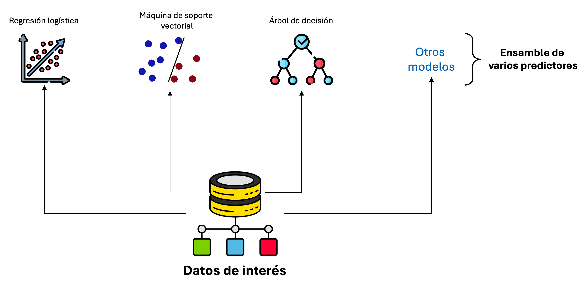
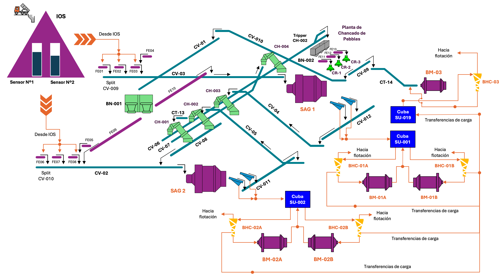
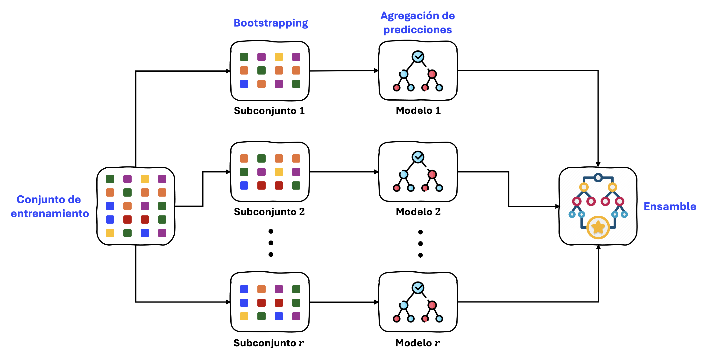
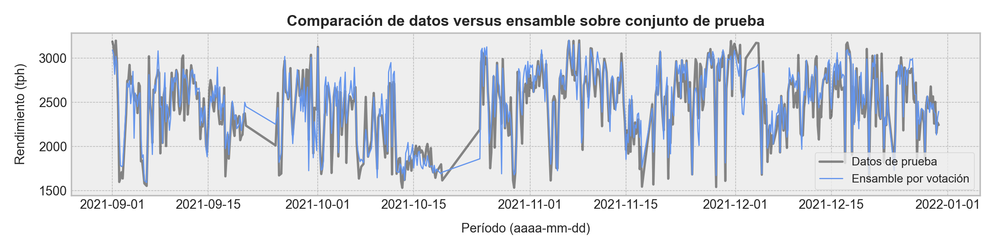
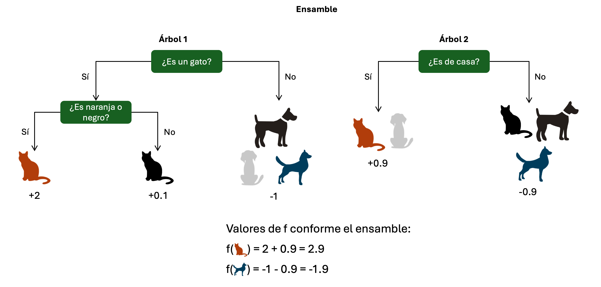
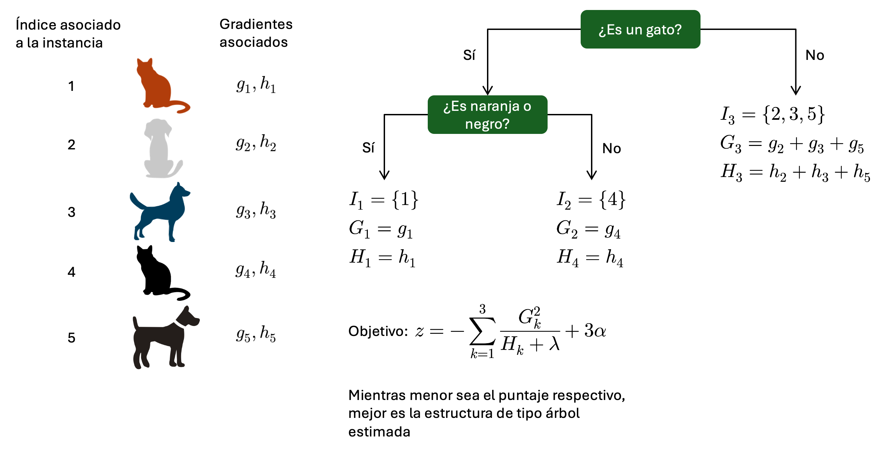
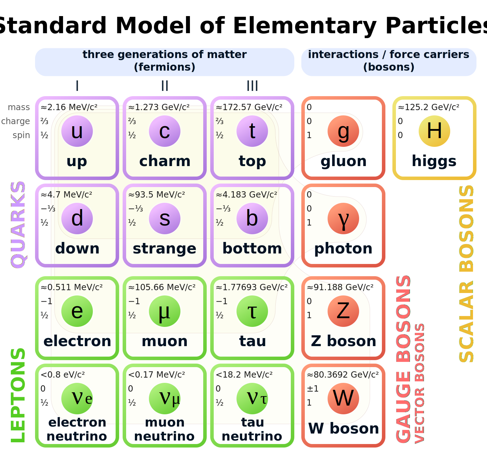
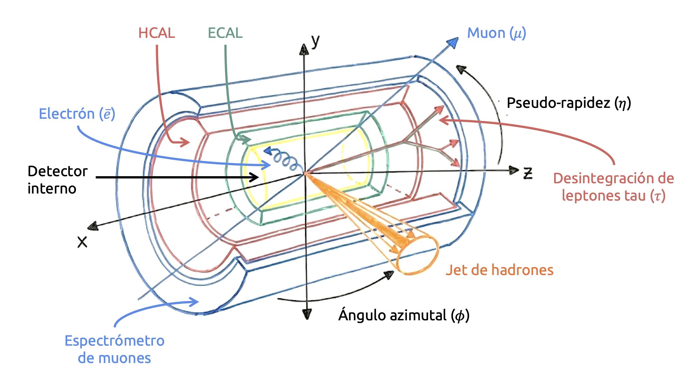
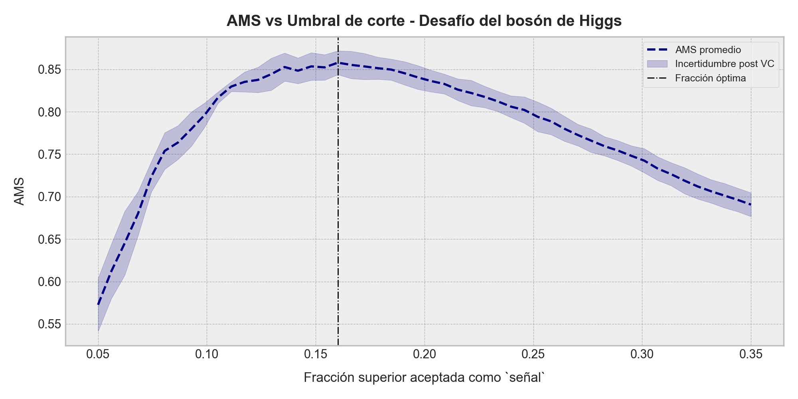

::: {.callout-important}
## Idea central

Los modelos de ensamble combinan múltiples predictores para construir sistemas más estables y expresivos que sus componentes individuales. En esta entrada estudiaremos tres familias principales: los ensambles por votación, que agregan decisiones de modelos diversos; los métodos de *bagging*, que reducen varianza mediante remuestreo y árboles aleatorizados; y los métodos de *boosting*, que construyen predictores aditivos capaces de corregir errores de manera secuencial. El recorrido culmina con <strong><font color='darkmagenta'>XGBoost</font></strong> y un caso aplicado de clasificación sobre datos tabulares complejos.
:::


---

## Introducción

En la sección anterior, exploramos en detalle los árboles de decisión, un tipo de modelo de aprendizaje supervisado que es capaz de aprender reglas de decisión a partir de los datos y aplicarlas de manera interpretativa. Sin embargo, los árboles de decisión presentan ciertos desafíos: Pueden ser altamente sensibles al ruido y al overfitting, y limitados en su capacidad de generalización.

Para abordar estos problemas, en esta sección exploraremos una de las técnicas más poderosas en aprendizaje automático moderno: Los **métodos de ensamble**. En términos simples, en lugar de depender de un único modelo (cualquiera sea éste), los métodos de ensamble combinan múltiples modelos más simples para crear un modelo más fuerte y robusto. Esto nos permite reducir la varianza, mejorar la precisión y aumentar la estabilidad de las predicciones.

Los métodos de ensamble aprovechan la idea de que **varios modelos débiles pueden acoplarse para crear un modelo fuerte**. En otras palabras, cada modelo base puede cometer errores en diferentes partes del espacio de entrada, pero al combinar sus predicciones de manera "inteligente", podemos construir un modelo "colectivo" que generalice mejor que cualquiera de sus componentes individuales.

Entre los enfoques más populares que estudiaremos en esta sección, tenemos:

- **Voting (votación por mayoría o ponderada):** Método simple pero poderoso en el que combinamos múltiples modelos de distinto tipo (por ejemplo, árboles de decisión, regresión logística y máquinas de soporte vectorial) y tomamos la predicción final basada en un voto mayoritario (clasificación) o un promedio ponderado (regresión).

- **Bagging (acrónimo del inglés *bootstrap aggregating*):** Técnica en la que entrenamos múltiples modelos en subconjuntos aleatorios de los datos de entrenamiento y combinamos sus predicciones de una manera agregada (por ejemplo, promediándolas o usando su moda). El ejemplo más conocido de esta técnica de ensamble es el **modelo de bosque aleatorizado** o **random forest**, y que comúnmente se considera una extensión "natural" de los modelos de árbol de decisión.

- **Boosting:** Enfoque similar al anterior, pero en el cual los modelos se entrenan secuencialmente, corrigiendo los errores de los modelos anteriores en un proceso más bien progresivo. Modelos tales como **Gradient Boosting Machines (GBM)**, **AdaBoost** y <strong><font color='darkmagenta'>XGBoost</font></strong> han demostrado ser extremadamente eficaces en competencias de Machine Learning y aplicaciones industriales, y por lo general, representan el pináculo de los algoritmos clásicos de aprendizaje (esto es, descartando a las redes neuronales) y la herramienta más potente de la que dispondremos para construir modelos predictivos sobre datos tabulares.

- **Stacking (generalización por apilamiento):** Estrategia que combina diferentes modelos base (en general, de naturalezas muy distintas entre sí), entrenando un "meta-modelo" que aprende cómo hacer la mejor combinación de sus predicciones.

Dado lo anterior, esta sección será, naturalmente, muchísimo más intensiva que la anterior. Desarrollaremos las bases de estas técnicas de ensamble y discutiremos sus pros y contras, tanto en la teoría como en la práctica valiéndonos de ejemplos en Python. Nuevamente, <strong><font color='darkmagenta'>Scikit-Learn</font></strong> se transformará en nuestro mayor aliado a la hora de implementar y practicar, aunque en esta oportunidad revisaremos algunas librerías adicionales especializadas en el entrenamiento de este tipo de modelos, como <strong><font color='darkmagenta'>LightGBM</font></strong> y <strong><font color='darkmagenta'>XGBoost</font></strong>. Pondremos mucho énfasis en comparar el rendimiento de estos modelos con los otros que hemos estudiado previamente, ya que esta será la última sección de estos apuntes donde nos dedicaremos enteramente al aprendizaje supervisado.

## Voting

Sea $\mathcal{D} =\left\{ \left( \mathbf{X} ,\mathbf{y} \right) :\mathbf{X} \in \mathbb{R}^{m\times n} \wedge \mathbf{y} \in \mathbb{R}^{m} \right\}$ un conjunto de entrenamiento, donde $\mathbf{X}$ es la correspondiente matriz de diseño e $\mathbf{y}$ el vector de valores observados que deseamos predecir. Sean $\mathcal{X}$ e $\mathcal{Y}$ los correspondientes espacios de entrada y salida que caracterizan a este conjunto de entrenamiento. Supongamos que hemos entrenado diferentes modelos en $\mathcal{D}$, digamos $f_{1},...,f_{r}$. Queremos, de alguna manera, tomar estos $r$ modelos y, en base a ellos, construir una especie de "meta-modelo" que tenga un desempeño superior a cualquiera de ellos de manera individual, agregando sus predicciones de forma adecuada, dependiendo del problema de interés (regresión o clasificación). Esta metodología es la aproximación más sencilla (aunque efectiva, en muchos casos) a un ensamble. Cada modelo individual, por tanto, constituye un predictor que contribuye al aprendizaje del ensamble completo.

{#fig-voting-classifiers fig-align="center" width="900px"}

### Ensambles por votación para problemas de clasificación

Bajo ciertas condiciones, este tipo de ensamble efectivamente puede lograr mejores resultados que sus componentes individuales. Tales condiciones no son particularmente exigentes, pero determinarán el éxito de nuestro "meta-modelo", y dependerán del tipo de problema en cuestión. Por ejemplo, **para problemas de clasificación**

- Cada predictor individual tiene una probabilidad $p> \frac{1}{2}$ de acertar en su correspondiente predicción (es decir, cada una de las componentes del ensamble tiene un mejor desempeño sobre los datos de entrenamiento que un supuesto al azar). Tal probabilidad es la misma para cada modelo.
- Los errores de los predictores son independientes (o al menos, no perfectamente correlacionados) entre sí.

Tomemos estos supuestos como base y supongamos que disponemos de un total de $r$ modelos de clasificación. Estos modelos pueden ser, incluso, juicios u opiniones expertas sobre la variable de respuesta de interés en nuestro conjunto de entrenamiento. Asumiremos que cada uno de estos modelos, por simplicidad, tendrá una probabilidad $p$ de acierto en sus correspondientes predicciones, siendo cada uno de sus valores de salida estadísticamente independientes entre sí. Definimos una colección de $r$ variables aleatorias $X_{1},...,X_{r}$ que mapearán el éxito de estos clasificadores:

::: {.eq-scroll}
$$X_{k}=\begin{cases}1&;\  \mathrm{si\  el\  predictor} \  k\  \mathrm{acierta}\\ 0&;\  \mathrm{si\  el\  predictor} \  k\  \mathrm{se\  equivoca}\end{cases} \tag{2.1}$$
:::

Para $k=1,...,r$. De esta manera, $P(X_{k}=1)=p$. Definimos también:

::: {.eq-scroll}
$$S=\sum_{k=1}^{r} X_{k} \tag{2.2}$$
:::

Y que corresponde al número total de modelos que aciertan en su predicción para una instancia de entrenamiento dada. Si diseñamos un ensamble que esté comprendido por estos $r$ modelos de clasificación, entonces éste acertará en su predicción "global" o "colectiva" si al menos la mitad de sus componentes aciertan; es decir, si $S\geq \left\lceil \frac{r}{2} \right\rceil$. De esta manera, la probabilidad de que el ensamble sea exitoso en sus predicciones puede expresarse como

::: {.eq-scroll}
$$\begin{array}{lll}P\left( \mathrm{ensamble\  acierta} \right)&=&\displaystyle P\left( S\geq \left\lceil \frac{r}{2} \right\rceil \right)\\ &=&\displaystyle \sum_{k=\left\lceil p/2 \right\rceil}^{r} \left( \begin{matrix}r\\ k\end{matrix} \right) p^{k}\left( 1-p \right)^{r-k}\end{array} \tag{2.3}$$
:::

Es decir, el éxito en las predicciones del ensamble sigue una distribución de Bernoulli. Esta estrategia de evaluación de los aciertos de un ensamble sigue la misma lógica que una **votación mayoritaria**. Vale decir, la respuesta del ensamble será igual a la respuesta más frecuente de los predictores individuales. En la teoría del aprendizaje automático esta estrategia se conoce como **votación dura**.

Para cada uno de los componentes del ensamble, los errores de clasificación individuales están dados por la probabilidad complementaria $q=1-p$. Ya que $p>\frac{1}{2}$, necesariamente se tendrá que $q<\frac{1}{2}$. Por lo tanto, bajo las reglas de votación dura, la probabilidad de que el ensamble no acierte en sus predicciones será

::: {.eq-scroll}
$$\begin{array}{lll}P\left( \mathrm{ensamble\  no\  acierta} \right)&=&\displaystyle 1-P\left( S\geq \left\lceil \frac{r}{2} \right\rceil \right)\\ &=&\displaystyle P\left( S<\left\lceil \frac{r}{2} \right\rceil \right)\\ &=&\displaystyle \sum_{k=0}^{\left\lceil p/2 \right\rceil -1} \left( \begin{matrix}r\\ k\end{matrix} \right) p^{k}\left( 1-p \right)^{r-k}\end{array} \tag{2.4}$$
:::

Cuando $r$ es impar, se tiene que $\left\lceil p/2 \right\rceil =\frac{p+1}{2}$. Por otro lado, cuando $p$ es par, entonces $\left\lceil p/2 \right\rceil =\frac{r}{2} +1$. En ambos casos, es posible demostrar que, cuando $p$ crece, esta probabilidad de error disminuye. Para ello, ilustraremos en un gráfico de Python el efecto de $p$ sobre el error cometido por un ensamble dependiendo de su tamaño (es decir, del número de modelos componentes). Para ello, partimos con las importaciones de librerías y funciones correspondientes:

```{python}
import matplotlib.pyplot as plt
import numpy as np
import seaborn as sns
```

```{python}
import warnings
```

```{python}
from math import comb
```

```{python}
warnings.filterwarnings('ignore')
```

```{python}
plt.rcParams["figure.dpi"] = 90
sns.set()
plt.style.use("bmh")
```

A continuación, definiremos la función de masa de probabilidad para el error cometido por el ensamble en Python. Para ello, usaremos la fórmula de la última línea de la expresión (2.4):

```{python}
def ensemble_error(p, n):
    """
    Calcula la probabilidad de que el ensamble falle (es decir, cometa un error) cuando cada clasificador 
    acierta con probabilidad `p` y hay `n` clasificadores independientes.
    """
    # Para mayoría en n clasificadores, se requiere >= (n//2 + 1) aciertos (si n es par), o >= (n+1)//2 
    # (si n es impar). Esto equivale a un "valor umbral".
    threshold = (n // 2) + 1  # mayoría absoluta

    # Probabilidad de error = P(S < threshold) = sum_{k=0}^{threshold - 1} [C(n,k) * p^k * (1-p)^(n-k)].
    error = 0.0
    for k in range(threshold):
        error += comb(n, k) * (p**k) * ((1 - p)**(n - k))
    return error
```

Ya sólo resta construir nuestro gráfico. Para ello, definimos una secuencia de `100` valores de probabilidad en el intervalo `[0, 1]` que almacenaremos en el arreglo `p_vals`. Luego, para observar el efecto del crecimiento de las probabilidades individuales y su efecto en el error del ensamble completo, definimos una lista con `200` tamaños posibles (o modelos componentes):

```{python}
# Definimos un rango de valores de `p`.
p_vals = np.linspace(start=0.0, stop=1.0, num=100)
```

```{python}
# Definimos distintos tamaños del ensamble para comparar los resultados.
n_estimators = np.arange(start=1, stop=200, step=1)
```

```{python}
#| label: fig-ensemble-error-probability
#| fig-cap: "Probabilidad de error de un ensamble por votación mayoritaria para distintos tamaños del ensamble."
# Visualizamos el efecto de incrementar el valor de `p`.
fig, ax = plt.subplots(figsize=(9, 5))

for k in n_estimators:
    errors = [ensemble_error(p, k) for p in p_vals]
    ax.plot(p_vals, errors, color="teal", alpha=0.2)

ax.fill_between(
    x=[0, 0], y1=[0, 0], color="teal", ec="teal", alpha=0.5, 
    label="Tamaño del ensamble",
)
ax.axvline(x=0.5, color='black', linestyle='--', label="Probabilidad umbral")
ax.set_xlabel(r"Probabilidad de acierto ($p$)", fontsize=11, labelpad=10)
ax.set_ylabel(r"Probabilidad de error ($q$)", fontsize=11, labelpad=10)
ax.set_title(
    "Evolución del error de un ensamble bajo reglas de votación dura",
    fontsize=13, fontweight="bold", pad=10,
)
ax.legend(fontsize=9, frameon=True, loc="best")
plt.tight_layout()
```

Podemos observar que, efectivamente, independiente del tamaño del ensamble, las probabilidades de error siempre decrecen cuando $p$ es mayor que $0.5$ en forma monótona. Y más aún, mientras más grande es el ensamble, más rápido tenderá $q$ a cero. Sin embargo, hay un límite para esto: No podemos disponer de infinitos predictores individuales en el ensamble, ya que ello hará poco práctica cualquier implementación y/o entrenamiento, sobre todo si las componentes del ensamble son modelos de alta complejidad y/o pobre escalamiento con el número de variables.

Prosigamos desarrollando nuestra idea. Un resultado importante que suele ser utilizado para mostrar que un ensamble que cumple con las condiciones previamente establecidas producirá mejores resultados que sus componentes individuales, es el siguiente.

::: {.callout-tip}
## Teorema 2.1 – Jurado de Condorcet

*Sea $r$ un número impar y consideremos un conjunto de $r$ juicios u opiniones expertas (que, en la práctica, serán interpretadas a partir de modelos de clasificación). Admitimos que cada uno de los $r$ "jurados" (o modelos individuales) toma una decisión correcta de manera independiente con la misma probabilidad $p$, tal que $p>\frac{1}{2}$. Entonces se cumple que:*

- *La probabilidad de que la mayoría de esos $r$ jurados acierte es mayor que $p$.*
- *Además, dicha probabilidad tiende a $1$ a medida que $r\rightarrow \infty$*.
:::

Este resultado es famoso en ciencias políticas y sociales, porque muestra por qué un cuerpo colegiado (el cual tiene una constitución equivalente, en términos estadísticos, a un ensamble de modelos de clasificación “independientes y competentes”) puede ser más fiable que cualquiera de sus miembros tomados aisladamente. En algunos cursos famosos de aprendizaje automático, esta regla suele denominarse de formas más "marketeras" (algunas más correctas que otras), como *wisdom of the crowd* o *best in class*.

Extendiendo la idea del teorema (2.1), para un número finito $r$ de modelos de clasificación, podemos distinguir que:

1. Si $p>\frac{1}{2}$, el valor esperado de aciertos del ensamble será $\mathrm{E} \left[ S \right] =rp$, el cual es mayor que $\frac{1}{2}$.
2. Por propiedades de la distribución de Bernoulli, la mayor parte de la masa en su función de probabilidad se concentra alrededor de la media $rp$. Al estar la media por encima de $p/2$, resulta más probable que $S\geq p/2$ que $S< p/2$.

Aplicando el teorema central del límite ([que explicamos en detalle en esta entrada del blog](/apuntes/calculo-incertidumbre-y-optimizacion/distribuciones-especificas-de-probabilidad/), generando una aproximación normal de $S$ cuando $r$ crece infinitamente, se tendrá que

::: {.eq-scroll}
$$S\sim \mathcal{N} \left( pr,pr\left( 1-p \right) \right) \tag{2.5}$$
:::

Por lo tanto, la probabilidad de que $S\geq \frac{r}{2}$ puede calcularse como

::: {.eq-scroll}
$$\begin{array}{lll}\displaystyle P\left( S\geq \frac{r}{2} \right)&=&\displaystyle P\left( \frac{S-pr}{\sqrt{pr\left( 1-pr \right)}} \geq \frac{\frac{r}{2} -pr}{\sqrt{pr\left( 1-pr \right)}} \right)\\ &=&\displaystyle P\left( Z\geq \frac{\frac{r}{2} -pr}{\sqrt{pr\left( 1-pr \right)}} \right)\end{array} \tag{2.6}$$
:::

Donde $Z$ es una variable aleatoria Gaussiana (de tipo estándar). Como $p>\frac{1}{2}$, el numerador $\frac{r}{2} -pr$ es negativo, por lo que la probabilidad de que $Z$ sea mayor que un número negativo es mayor que $\frac{1}{2}$ y aumenta con $r$. En consecuencia, la probabilidad de que el ensamble cometa un error tiende a cero cuando $r\rightarrow \infty$, mientras que el error $q$ de cada clasificador individual permanece fija en $1-p$. Aún con valores de $r$ no muy grandes, la reducción del error de clasificación por efecto del ensamble suele ser significativa cuando $p$ se mantiene por encima de $\frac{1}{2}$ y las correlaciones entre los predictores individuales no son muy altas.

En la práctica, los modelos de clasificación individuales no suelen ser estrictamente independientes; a menudo sus errores están correlacionados, porque, en general, nunca dispondremos de más de un conjunto de entrenamiento para entrenar cada modelo individual en cada uno. Sin embargo, si la correlación no es demasiado grande y cada clasificador sigue teniendo probabilidad de acierto $p>\frac{1}{2}$, la regla de votación dura o mayoritaria tiende a seguir mejorando el rendimiento promedio del ensamble, aunque el efecto no será tan drástico como en el caso ideal de independencia perfecta de los modelos individuales.

El resultado anterior es interesante, pero no global, ya que, por lo general, las probabilidades de acierto asociadas a distintos modelos de clasificación no tendrán por qué ser iguales (lo que es razonable, porque ningún modelo es igual a otro). Sin embargo, a grandes rasgos, la idea central de que un ensamble puede mejorar su desempeño promedio frente a sus componentes individuales se mantiene aun cuando cada componente tenga una probabilidad de acierto distinta. Sin embargo, el análisis matemático se vuelve un poco más complejo, pues:

- La probabilidad de que el ensamble no acierte en sus predicciones ya no estará expresada por una distribución de Bernoulli, porque si bien el ensamble guarda cierta equivalencia al caso de un experimento aleatorio con $r$ repeticiones, las probabilidades de éxito $p_{k}$ de cada uno son diferentes. La suma de los aciertos de cada componente seguirá esta vez una **distribución binomial de Poisson**, que es una extensión de la distribución de Bernoulli al caso de experimentos repetidos con probabilidades distintas de éxito cada uno.
- Tomando la misma notación que para el caso anterior, si cada componente individual del ensamble vota una sola vez, la probabilidad de acierto en su predicción del ensamble será

::: {.eq-scroll}
$$P\left( \mathrm{ensamble\  acierta} \right) =P\left( \sum_{k=1}^{r} X_{k}\geq \left\lceil \frac{r}{2} \right\rceil \right) \tag{2.7}$$
:::

- Para cada subconjunto de componentes predictoras, las probabilidades de acierto se combinan de forma heterogénea, en lugar de ponderarlas por combinatorias.

Aun así, la intuición y el resultado cualitativo son los mismos: **Si la mayoría (o, más formalmente, la media o mediana, dependiendo del número de componentes del ensamble) de los predictores individuales supera el 50% de aciertos y no están fuertemente correlacionados entre sí, la votación tenderá a lograr un desempeño global mejor que el de (al menos) la mayoría de ellos por separado.** Sin embargo, existe una diferencia clave: **Si una de las componentes del ensamble presenta una probabilidad de acierto en sus predicciones cuyo orden de magnitud es significativamente diferente del resto, entonces es probable que el ensamble no supere en calidad a la mejor componente individual**. Aunque, indudablemente, bajo las reglas de votación mayoritaria, será mejor que el promedio (o cualquier agregación) de los clasificadores individuales.

Para demostrar lo anterior, consideremos nuevamente una colección de $r$ variables aleatorias binarias e independientes definidas como en la ecuación (2.1), que describirán el éxito (o fracaso) en las predicciones de cada uno de los predictores del ensamble. Si designamos por $p_{k}$ a la probabilidad de que el $k$-ésimo predictor individual acierte en su predicción, entonces la variable aleatoria que describe la suma de los aciertos del ensamble completo, a saber

::: {.eq-scroll}
$$S=\sum_{k=1}^{r} X_{k} \tag{2.8}$$
:::

sigue una distribución binomial de Poisson,

::: {.eq-scroll}
$$P\left( S=s \right) =\sum_{A\subseteq \left\{ 1,...,r \right\} ,|A|=s} \  \prod_{k\in A} p_{k}\  \prod_{l\notin A} \left( 1-p_{l} \right) \tag{2.9}$$
:::

Donde $X_{k}$ es una variable aleatoria con distribución de Bernoulli para todo $k=1,...,r$ y $A$ representa un subconjunto (de tamaño $s$) del juego de índices $\left\{ 1,...,r \right\}$.

En general, no existe una expresión algebraicamente cerrada tan sencilla como en el caso binomial (donde todos los $p_{k}$ son iguales) para expresar la probabilidad asociada a la suma de aciertos $S$ del ensamble, pero sí se conocen procedimientos para calcular o aproximar esta probabilidad.

Sobre la base de la estrategia de votación mayoritaria, la probabilidad de que el ensamble acierte en su predicción será

::: {.eq-scroll}
$$P\left( S\geq \left\lceil \frac{r}{2} \right\rceil \right) =\sum_{k=\left\lceil n/2 \right\rceil}^{r} \  \sum_{A\subseteq \left\{ 1,...,r \right\} ,|A|=s} \  \prod_{k\in A} p_{k}\  \prod_{l\notin A} \left( 1-p_{l} \right) \tag{2.10}$$
:::

La suma doble sobre productos dobles anterior no es en absoluto sencilla de simplificar, por lo que, en estos casos, solemos recurrir a algoritmos adecuados para resolver este tipo de expresiones. Sin embargo, aunque ya no sea tan directo, bajo los mismos supuestos esenciales de antes ($p_{k}\geq \frac{1}{2}$ para todo $k=1,...,r$ y que los errores cometidos por los predictores individuales no estén fuertemente correlacionados), podemos demostrar que, bajo las reglas de votación mayoritaria, el ensamble presentará una probabilidad de acierto global superior a la de la mayor parte de los clasificadores individuales (pero no a cualquiera de ellos, ya que ésto exigirá que las probabilidades de cada componente del ensamble sean muy similares).

En otras palabras, la probabilidad promedio de que la mayoría acierte es mayor que 0.5 y, a medida que el número de clasificadores crece, esa probabilidad de acierto del ensamble puede acercarse a 1 (siguiendo la idea del teorema (2.1), extendido a probabilidades heterogéneas).

**Ejemplo 2.1 – Una comprobación "a mano":** Consideremos tres modelos de clasificación con probabilidades de acierto en sus predicciones iguales a $p_{1}=0.7,p_{2}=0.7,p_{3}=0.6$, todos ellos independientes (no correlacionados) entre sí. Denotemos como $X_{k}$ a la variable aleatoria que describe si el modelo $k$ acierta ($k=1,2,3$), conforme la ecuación (2.1). De esta manera, $p_{k}=P(X_{k}=1)$. Sea $S=X_{1}+X_{2}+X_{3}$ la variable aleatoria que describe el número de modelos que aciertan en su predicciones. Si construimos un ensamble con estos modelos, entonces la probabilidad de que éste acierte en una predicción será

::: {.eq-scroll}
$$P\left( S\geq 2 \right) =P\left( S=2 \right) +P\left( S=3 \right) \tag{2.11}$$
:::

Si dos de los clasificadores aciertan, entonces existen tres formas de que el ensamble acierte en su predicción:

- $X_{1}=1 \wedge X_{2}=1 \wedge X_{3}=0$.
- $X_{1}=1 \wedge X_{2}=0 \wedge X_{3}=0$.
- $X_{1}=0 \wedge X_{2}=1 \wedge X_{3}=1$.

Bajo el supuesto de independencia de estos modelos individuales, tenemos que

::: {.eq-scroll}
$$\begin{array}{lll}P\left( X_{1}=1\wedge X_{2}=1\wedge X_{3}=0 \right)&=&p_{1}p_{2}\left( 1-p_{3} \right)\\ P\left( X_{1}=1\wedge X_{2}=0\wedge X_{3}=1 \right)&=&p_{1}p_{3}\left( 1-p_{2} \right)\\ P\left( X_{1}=0\wedge X_{2}=1\wedge X_{3}=1 \right)&=&p_{2}p_{3}\left( 1-p_{1} \right)\end{array} \tag{2.12}$$
:::

Por lo tanto, sumando estas probabilidades, obtenemos

::: {.eq-scroll}
$$P\left( S=2 \right) =p_{1}p_{2}\left( 1-p_{3} \right) +p_{1}p_{3}\left( 1-p_{2} \right) +p_{2}p_{3}\left( 1-p_{1} \right) \tag{2.13}$$
:::

Por otro lado, si los tres clasificadores aciertan, habrá una única forma en la cual el ensamble acierte en su predicción, y será cuando $X_{1}=1\wedge X_{2}=1\wedge X_{3}=1$. Si los modelos individuales son independientes, entonces $P(S=3)= P(X_{1}=1\wedge X_{2}=1\wedge X_{3}=1) =p_{1}p_{2}p_{3}$. Por lo tanto, a partir de estos resultados, la probabilidad de que el ensamble acierte en sus predicciones será

::: {.eq-scroll}
$$P\left( S\geq 2 \right) =\underbrace{p_{1}p_{2}\left( 1-p_{3} \right) +p_{1}p_{3}\left( 1-p_{2} \right) +p_{2}p_{3}\left( 1-p_{1} \right)}_{=\mathrm{Exactamente\  dos\  clasificadores\  aciertan}} +\underbrace{p_{1}p_{2}p_{3}}_{=\mathrm{Tres\  clasificadores\  aciertan}} \tag{2.14}$$
:::

Reemplazando los valores numéricos de las probabilidades individuales, tenemos:

::: {.eq-scroll}
$$\begin{array}{lllll}p_{1}p_{2}\left( 1-p_{3} \right)&=&0.7\cdot 0.7\cdot \left( 1-0.6 \right)&=&0.196\\ p_{1}p_{3}\left( 1-p_{2} \right)&=&0.7\cdot 0.6\cdot \left( 1-0.7 \right)&=&0.126\\ p_{2}p_{3}\left( 1-p_{1} \right)&=&0.7\cdot 0.6\cdot \left( 1-0.7 \right)&=&0.126\\ p_{1}p_{2}p_{3}&=&0.7\cdot 0.7\cdot 0.6&=&0.294\end{array} \tag{2.15}$$
:::

De esta manera,

::: {.eq-scroll}
$$P\left( S\geq 2 \right) =0.196+0.126+0.126+0.294=0.742 \tag{2.16}$$
:::

Por lo tanto, un ensamble construido a partir de tres modelos de clasificación con probabilidades de acierto en sus predicciones iguales a $p_{1}=0.7,p_{2}=0.7,p_{3}=0.6$, bajo reglas de votación mayoritaria, tendrá una probabilidad de acierto en sus predicciones igual a $0.742$, bajo el supuesto de que tales clasificadores sean estadísticamente independientes. En este caso particular, el ensamble tiene un desempeño mejor que sus componentes individuales, lo que es razonable puesto que las probabilidades de acierto en sus componentes individuales son similares entre sí.

¿Y qué pasaría si las diferencias entre las probabilidades aumentan? Si un clasificador individual se desempeña mucho mejor que el resto, la probabilidad de acierto del ensamble podrá subir, pero en menor proporción, siendo difícil establecer a priori si su desempeño será mejor que cualquier componente individual (aunque se mantendrá mejor que cualquier agregación de estas probabilidades). Por ejemplo, poniendo $p_{2}=0.8$, obtendremos

::: {.eq-scroll}
$$\begin{array}{lllll}p_{1}p_{2}\left( 1-p_{3} \right)&=&0.7\cdot 0.8\cdot \left( 1-0.6 \right)&=&0.224\\ p_{1}p_{3}\left( 1-p_{2} \right)&=&0.7\cdot 0.6\cdot \left( 1-0.8 \right)&=&0.084\\ p_{2}p_{3}\left( 1-p_{1} \right)&=&0.8\cdot 0.6\cdot \left( 1-0.7 \right)&=&0.144\\ p_{1}p_{2}p_{3}&=&0.7\cdot 0.8\cdot 0.6&=&0.336\end{array} \tag{2.17}$$
:::

Así que la nueva probabilidad de acierto del ensamble será

::: {.eq-scroll}
$$P\left( S\geq 2 \right) =0.224+0.084+0.144+0.336=0.788 \tag{2.18}$$
:::

Por lo tanto, $p_{1}=0.7,p_{2}=0.8,p_{3}=0.6$, bajo reglas de votación mayoritaria, el ensamble resultante tendrá una probabilidad de acierto en sus predicciones igual a $0.788$. De esta manera, el ensamble supera a los clasificadores $1$ y $3$ en su desempeño, pero no al $2$ que es el mejor de ellos. Esto pone de manifiesto que el voto mayoritario no necesariamente supera al mejor clasificador individual cuando sus probabilidades de acierto son diferentes entre sí (aunque mayores a $0.5$), pero sí tiende a mejorar el desempeño general en términos de cualquier agregación de esas probabilidades (por ejemplo, $0.788$ es mejor que el promedio de los tres clasificadores, que es $0.7$). ◼︎

<strong>Ejemplo 2.2 – Implementación de un ensamble por votación dura en <font color='darkmagenta'>Scikit-Learn</font>:</strong> En esta sección no construiremos implementaciones desde cero de ningún tipo de ensamble, puesto que sus bases serán modelos que ya hemos desarrollado en profundidad en secciones anteriores, siendo la diferencia entre éstos la forma en la cual agregamos y/o contabilizamos las correspondientes predicciones individuales. Por esta razón, iremos de lleno a ilustrar nuestros casos de uso mostrando las correspondientes implementaciones en <strong><font color='darkmagenta'>Scikit-Learn</font></strong>. 

Las herramientas y modelos basados en ensambles se encuentran todos en el módulo `sklearn.ensemble`. Los ensambles de clasificación basados en reglas de votación pueden implementarse por medio de la clase `VotingClassifier`, la cual acepta –entre otros– los siguientes argumentos:

- `estimators`: Corresponde a una lista (de tamaño `n_estimators`) que comprende todos los estimadores de (o compatibles con) <strong><font color='darkmagenta'>Scikit-Learn</font></strong> que comprenderán nuestro ensamble. Estos estimadores pueden ser incluso pipelines preconfiguradas. Cada estimador puede especificarse como una tupla en la cual el primer elemento será el nombre corto con el "bautizamos" a dicho estimador, siguiendo el mismo estilo de definición de las pipelines de <strong><font color='darkmagenta'>Scikit-Learn</font></strong> creadas por medio de la clase `Pipeline`.
- `voting`: String que establece la estrategia de votación del ensamble. Poniendo `voting="hard"` podremos definir una estrategia de votación mayoritaria o dura. También podemos definir este parámetro en `voting="soft"`, lo que establecerá una **estrategia de votación proporcional o "blanda"**. Tal estrategia permite definir ponderadores a gusto para cada una de los predictores individuales del ensamble, típicamente basándonos en su desempeño. Para ello, debemos especificar tales pesos por medio del parámetro `weights`, en un formato de arreglo con la misma dimensión que el número de estimadores a usar para construir el ensamble.
- `weights`: Arreglo de tamaño `n_estimators` que especifica los pesos asociados a cada predictor individual de nuestro ensamble. Sólo es válido su uso al usar una estrategia de votación proporcional (`voting="soft"`). Si no se especifica tal arreglo, <strong><font color='darkmagenta'>Scikit-Learn</font></strong> definirá uno "tras bambalinas" con pesos uniformes de acuerdo al desempeño de cada estimador individual.

En este ejercicio, ejemplificaremos el uso de un ensamble de clasificación bajo reglas de votación mayoritaria. Para ello, haremos uso, como tantas otras veces, del conjunto sintético <strong><font color='forestgreen'>MOONS</font></strong> para testear nuestros resultados. El ensamble estará compuesto por un total de tres modelos ya conocidos de secciones anteriores: Un modelo de regresión logística binaria, una máquina de soporte vectorial (con kernel de base radial) y un modelo de árbol de decisión. Generaremos un dataset con un nivel significativo de ruido, de manera tal que sea muy difícil alcanzar con estos modelos una exactitud del 100% en las correspondientes predicciones:

```{python}
import pandas as pd
```

```{python}
from sklearn.datasets import make_moons
from sklearn.ensemble import VotingClassifier
from sklearn.linear_model import LogisticRegression
from sklearn.model_selection import (
    cross_val_score, train_test_split,
)
from sklearn.pipeline import Pipeline
from sklearn.preprocessing import StandardScaler
from sklearn.svm import SVC
from sklearn.tree import DecisionTreeClassifier
```

```{python}
# Creamos nuestro conjunto de datos.
X, y = make_moons(n_samples=800, noise=0.5, random_state=42)
```

```{python}
# Separamos en datos de entrenamiento y de prueba.
X_train, X_test, y_train, y_test = train_test_split(X, y, test_size=0.2, random_state=42)
```

Notemos que, en este ejercicio, no se cumple necesariamente que los clasificadores individuales que hemos instanciado sean estadísticamente independientes, ya que éstos serán entrenados en el mismo conjunto de entrenamiento. Intentaremos mitigar esto generando un proceso de validación cruzada y entregando, en cada subconjunto de validación, la exactitud lograda por este modelo, a fin de poder contar con desempeños agregados. Esto no hará que los predictores individuales del ensamble dejen de estar correlacionados, pero sí permitirá reducir un poco ese efecto en el resultado final:

```{python}
# Instanciamos algunos modelos por separado en este conjunto de datos.
model_log = Pipeline([
    ("scaler", StandardScaler()), 
    (
        "estimator", 
        LogisticRegression(
            penalty="elasticnet",
            solver="saga",  
            l1_ratio=0.5,
        ),
    ),
])
model_svm = Pipeline([
    ("scaler", StandardScaler()), 
    ("estimator", SVC(kernel="rbf", random_state=42)),
])
model_tree = DecisionTreeClassifier(max_depth=4, random_state=42)
```

```{python}
# Evaluamos la calidad de estos modelos por separado.
acc_log_train = cross_val_score(model_log, X_train, y_train, scoring='accuracy', cv=5)
acc_svm_train = cross_val_score(model_svm, X_train, y_train, scoring='accuracy', cv=5)
acc_tree_train = cross_val_score(model_tree, X_train, y_train, scoring='accuracy', cv=5)
```

```{python}
# E imprimimos en pantalla estos valores.
print(
    "Exactitud del modelo de regresión logística binaria = {acc}"
    .format(acc=np.mean(acc_log_train).round(3))
)
print(
    "Exactitud del modelo SVM = {acc}"
    .format(acc=np.mean(acc_svm_train).round(3))
)
print(
    "Exactitud del modelo de árbol de decisión = {acc}"
    .format(acc=np.mean(acc_tree_train).round(3))
)
print(
    "Exactitud promedio de todos los modelos = {acc}"
    .format(
        acc=np.column_stack(
            [acc_log_train, acc_svm_train, acc_tree_train]
        )
        .mean(axis=1)
        .mean(axis=0)
        .round(3),
    ),
)
```

Los tres modelos tienen desempeños muy similares. Ahora construimos nuestro ensamble:

```{python}
# Construimos nuestro ensamble por votación dura.
voting_ensemble = VotingClassifier(
    estimators=[
        ("logistic_reg", model_log), 
        ("svc", model_svm), 
        ("decision_tree", model_tree),
    ], 
    voting="hard",
)
```

```{python}
# Evaluamos la exactitud del ensamble.
acc_voting_train = cross_val_score(voting_ensemble, X_train, y_train, scoring='accuracy', cv=5)
```

```{python}
# Imprimimos el resultado en pantalla.
print("Exactitud del modelo de árbol de decisión = {acc}".format(acc=np.mean(acc_voting_train).round(3)))
```

Podemos observar que, según los cálculos anteriores, el ensamble tuvo un mejor desempeño que sus componentes individuales durante el proceso de validación cruzada, aunque la diferencia es poco significativa, sobre todo comparada al modelo SVM con kernel de base radial. Podemos comprobar que tales diferencias no son enormes al graficar estos resultados:

```{python}
# Llevamos las exactitudes a un DataFrame.
accuracies = pd.DataFrame(
    data=np.column_stack(
        [acc_log_train, acc_svm_train, acc_tree_train, acc_voting_train],
    ),
    index=[f"Fold {k + 1}" for k in range(len(acc_log_train))],
    columns=[
        "Regresión Logística\nBinaria", "SVM (kernel de\nbase radial)", 
        "Árbol de\nclasificación", "Ensamble por\nvotación mayoritaria",
    ],
)
```

```{python}
#| label: fig-hard-voting-accuracy
#| fig-cap: "Comparación de exactitud entre clasificadores individuales y un ensamble por votación dura."
# Comparamos el rendimiento de todos modelos.
fig, ax = plt.subplots(figsize=(9, 4))
accuracies.mean(axis=0).plot(kind="barh", color="indianred", ec="k", lw=0.5, ax=ax)
ax.set_xlim(0.72, 0.84)
ax.set_xlabel("Exactitud", fontsize=11, labelpad=10)
ax.set_title(
    "Desempeño del ensamble y sus componentes individuales", fontweight="bold", 
    fontsize=13, pad=10,
)
plt.tight_layout()
```

El gráfico anterior comprueba que, efectivamente, el ensamble se desempeña ligeramente mejor que sus componentes individuales, con una exactitud mayor que el promedio de las exactitudes de cada predictor. La diferencia en desempeño es muy pequeña, lo que puede deberse al hecho de que las componentes del ensamble están correlacionadas entre sí al haber sido entrenadas sobre el mismo conjunto de datos, incluso después de intentar mitigar este efecto por medio de un procedimiento de validación cruzada. ◼︎

### Ensambles por votación para problemas de regresión

A diferencia de lo que ocurre en los problemas de clasificación, donde los ensambles sueñen definirse bajo una regla de votación mayoritaria o dura, en el caso de los **problemas de regresión** un ensamble suele combinar las salidas (que, en esta oportunidad, se trata de predicciones continuas) de los distintos modelos de forma agregada (por ejemplo, tomando el promedio, la mediana u otra estadística robusta). Sin embargo, la lógica subyacente es muy similar: Combinar predicciones independientes y “razonablemente buenas” tiende a producir un mejor desempeño global respecto del desempeño de tales predicciones individuales.

Supongamos que tenemos $r$ modelos de regresión (de nuevo, tales modelos pueden ser de cualquier tipo e, incluso, juicios u opiniones expertas), cada uno de los cuales se ha entrenado para estimar una variable de salida $\mathbf{y}\in \mathbb{R}^{m}$ a partir de una matriz de diseño $\mathbf{X}\in \mathbb{R}^{m\times n}$. El $k$-ésimo modelo ($k=1,...,r$) genera una predicción $\hat{\mathbf{y}}_{k}$. Supongamos que:

- **(S1):** Cada predictor, digamos $\hat{\mathbf{y}}_{k}$ para cada $k=1,...,r$ es (en promedio) **no sesgado** respecto de $\mathbf{y}$. Matemáticamente, esto implica que asumiremos que $\mathrm{E}[\hat{\mathbf{y}}_{k}]=\mathbf{y}$ para cada $k$ o, equivalentemente, $\mathrm{E}[\hat{\mathbf{y}}_{k}- \mathbf{y}]=0$.
- **(S2):** Las desviaciones de cada predictor (ruido o, en términos prácticos, el error que éstos cometen) no presentan una correlación significativa entre ellas. Matemáticamente, esto equivale a asumir que $\mathrm{Cov} \left( \hat{\mathbf{y}}_{k} -\mathbf{y} ,\hat{\mathbf{y}}_{l} -\mathbf{y} \right) \approx 0$, para $k\neq l$.
- **(S3):** La mayoría de los modelos (ojalá, todos ellos) presentan una cierta calidad o desempeño mínimo esperado. En este caso puntual, no existe un equivalente a la condición $p>\frac{1}{2}$ que establecimos para los ensambles de clasificación, porque no tiene sentido hablar de "probabilidades" de acierto para los modelos individuales, ya que si las salidas son continuas, en general, no estaremos interesados en que nuestros modelos se ajusten de manera exacta a ellas (de hecho, lo más probable es que, si esto ocurre, estemos en presencia de un caso de overfitting). En problemas de regresión, comunmente, estamos interesados en minimizar el error $\hat{\mathbf{y}}_{k} -\mathbf{y}$, tolerando ciertas diferencias en ambos sentidos (positivo y negativo).

Queremos comprobar que las condiciones anteriores permiten que todo ensamble construido a partir de los $r$ modelos reducirá la varianza del error con respecto a los predictores individuales, lo que en términos prácticos mejorará la calidad de las predicciones globales (aumentará la "precisión" del modelo resultante). Sea pues $E_{k}=\hat{\mathbf{y}}_{k} -\mathbf{y}$ el error cometido por el $k$-ésimo predictor individual del ensamble. Por (S1), se tendrá que $\mathrm{E}[E_{k}]=0$ para cada $k=1,...,r$. Por lo tanto, el error cometido por el ensamble (promediado) será

::: {.eq-scroll}
$$\begin{array}{lll}E_{\mathrm{ensamble}}&=&\hat{\mathbf{y}}_{\mathrm{ensamble}} -\mathbf{y}\\ &=&\displaystyle \frac{1}{r} \sum_{k=1}^{r} \left( \hat{\mathbf{y}}_{k} -\mathbf{y} \right)\\ &=&\displaystyle \frac{1}{r} \sum_{k=1}^{r} E_{k}\end{array} \tag{2.19}$$
:::

Si los predictores individuales son estadísticamente independientes, por (S2), tendremos que

::: {.eq-scroll}
$$\begin{array}{lll}\mathrm{Var} \left( E_{\mathrm{ensamble}} \right)&=&\displaystyle \mathrm{Var} \left( \frac{1}{r} \sum_{k=1}^{r} E_{k} \right)\\ &=&\displaystyle \frac{1}{r^{2}} \mathrm{Var} \left( \sum_{k=1}^{r} E_{k} \right)\\ &=&\displaystyle \frac{1}{r^{2}} \sum_{k=1}^{r} \mathrm{Var} \left( E_{i} \right)\end{array} \tag{2.20}$$
:::

Donde hemos asumido que $\mathrm{Var} \left( \sum_{k=1}^{r} E_{k} \right) =\mathrm{Var} \left( E_{i} \right)$ debido a que, por (S2), las covarianzas entre los errores de cada predictor individual son despreciables. Supongamos que todos los predictores tienen la misma varianza del error $\sigma^{2}$ (lo que es razonable, puesto que, por (S3), hemos pedido que todos los modelos tengan calidades "similares"). De esta manera,

::: {.eq-scroll}
$$\mathrm{Var} \left( E_{\mathrm{ensamble}} \right) =\frac{\sigma^{2}}{r} \tag{2.21}$$
:::

Por lo tanto, podemos concluir que un ensamble construido a partir de $r$ modelos no sesgados, estadísticamente independientes y con la misma varianza $\sigma^{2}$ de sus errores, reduce la varianza de tales errores en un factor de $1/r$. De esta manera, el promedio de las predicciones individuales reduce la varianza de la estimación del ensamble (bajo las condiciones previamente descritas), gracias a que las desviaciones aleatorias de unos se compensan con las de otros. Es decir, **cada modelo individual compensa las debilidades de los otros**.

En la práctica, los modelos no suelen ser perfectamente independientes, porque será muy raro que dispongamos de más de un conjunto de entrenamiento. Entrenar varios modelos en el mismo conjunto de datos inducirá un nivel variable de correlación entre los errores de cada uno. Si hay correlaciones positivas entre los errores, la varianza se reduce menos, ya que

::: {.eq-scroll}
$$\mathrm{Var} \left( \sum_{k=1}^{r} E_{k} \right) =\sum_{k=1}^{r} \mathrm{Var} \left( E_{k} \right) +2\underset{k\neq l}{\sum_{k=1}^{r} \sum_{l=1}^{r}} \mathrm{Cov} \left( E_{k},E_{l} \right) \tag{2.22}$$
:::

El término de covarianza puede ser significativo, reduciendo el beneficio total de la constitución del ensamble completo. Sin embargo, mientras la correlación entre los errores no sea demasiado fuerte, el ensamble por promedio conserva una parte de la ventaja de “compensar” los errores individuales de cada componente.

**Ejemplo 2.3 – Un caso de estudio relativo al modelamiento del rendimiento de un circuito de molienda SAG:** A continuación abordaremos un caso de estudio relativo a la predicción del rendimiento de un molino SAG en una planta concentradora. Existen varias razones sustentadas en el negocio que motivan la resolución de un problema de este tipo: Podríamos disponer de un modelo (no necesariamente sencillo) que nos permita simular escenarios en el corto plazo para condiciones más o menos exigentes en la operación de la planta. También podríamos querer utilizar un modelo como función objetivo de una rutina de optimización que nos permita disponer de un vector óptimo de variables de control en el contexto de un **sistema de analítica prescriptiva**. Sea como sea, un modelo que puede estimar el tratamiento de un molino SAG a partir de variables operacionales, contextuales y de control en una planta puede ser un activo especialmente valioso.

En este ejemplo, construiremos un ensamble por votación apto para modelos de regresión, y que usaremos para predecir el tratamiento de un molino SAG inmerso en un circuito completo. Para ello, haremos uso del conjunto de datos almacenado en el archivo <strong><font color='forestgreen'>`sag_mill_data.csv`</font></strong> y haremos las importaciones necesarias:

<div class="dataset-download">
  <a class="dataset-download-btn" href="datasets/sag_mill_data.csv" download="sag_mill_data.csv">Descargar sag_mill_data.csv</a>
</div>

```{python}
from scipy.stats import loguniform, randint, uniform, zscore
from sklearn.base import TransformerMixin, BaseEstimator
from sklearn.ensemble import VotingRegressor
from sklearn.impute import KNNImputer
from sklearn.linear_model import Ridge
from sklearn.metrics import mean_absolute_error, r2_score, root_mean_squared_error
from sklearn.model_selection import RandomizedSearchCV, TimeSeriesSplit
from sklearn.pipeline import Pipeline
from sklearn.preprocessing import StandardScaler
from sklearn.svm import SVR
from sklearn.tree import DecisionTreeRegressor
```

```{python}
# Accedemos a nuestro conjunto de datos.
df = pd.read_csv("datasets/sag_mill_data.csv")
```

Inspeccionaremos las primeras filas y las columnas de este DataFrame:

```{python}
# Verificamos las primeras filas de este DataFrame.
df.head()
```

```{python}
# Revisamos rápidamente los tipos de cada columna.
df.info()
```

La situación descrita por este conjunto de datos corresponde a la de un proceso de molienda SAG que se alimenta de mineral proveniente de un stock de material intermedio o IOS (*intermediate ore stockpile*), junto con ciertas variables que describen el transporte de mineral hacia los molinos. La situación general se observa en la @fig-sag-mill-circuit.

{#fig-sag-mill-circuit fig-align="center" width="900px"}

El circuito descrito en la @fig-sag-mill-circuit contempla una planta de molienda alimentada desde el IOS, constituido por mineral que ya ha pasado por un proceso de chancado primario. Desde el IOS se alimenta mineral a un sistema de feeders que genera una muestra en función de los niveles de segregación presentes en el stock. El mineral luego es transportado directamente a la alimentación del molino SAG correspondiente, donde su tamaño es reducido significativamente. La descarga del molino SAG es clasificada mediante un sistema de harneros, permitiendo que el sobretamaño sea redirigido a la planta de chancado de pebbles por medio de un sistema de correas. El mineral que pasa por los harneros es descargado en una cuba desde la cual, mediante un sistema de bombas, es impulsado hacia las correspondientes baterías de hidrociclones donde es clasificado nuevamente. El overflow de los ciclones (mineral más fino) va hacia la flotación, que es el proceso posterior, mientras que el underflow (mineral más grueso) se dirige a un proceso de molienda de bolas, cuya descarga vuelve a la cuba a repetir el proceso.

EL circuito de pebbles está constituido por un sistema de correas que alimenta a tres chancadores de pebbles mediante un carro tripper que deposita el mineral en una tolva (denominada BN-002). La descarga de los chancadores va hacia la correa CV-09, desde la cual puede o no existir una recirculación directa de pebbles chancados de vuelta a los molinos SAG por medio de la correa CV-010. Si no hay problemas de disponibilidad de equipos aguas abajo, los pebbles chancados pasan por un proceso de molienda auxiliar (donde el molino se designa como BM-03) previa clasificación, para luego, en el caso del mineral más fino, ser enviado directamente al proceso de flotación.

Notemos que ambos circuitos de clasificación húmeda (post-molienda SAG) generan transferencias de carga desde las baterías de hidrociclones hacia el molino BM-03. Dichas transferencias se realizan desde determinados ciclones en cada batería, pero sólo está documentada su activación por medio de variables binarias, no su cantidad.

El conjunto de datos de interés está constituido por los siguientes campos o variables:

- `fecha`: Corresponde al momento en el tiempo en el cual se observan los datos asociados a la correspondiente fila de esta tabla. Estos valores, conforme la información extraída del DataFrame en la celda de código anterior, viene en un formato `object`, lo que significa que cada valor en esta columna es un string que debe ser transformado en un formato `Timestamp` adecuado para indexar luego este conjunto de datos. Notemos que cada observación corresponde a un muestreo cada 4 horas.
- `veloc_fe01`: Velocidad de movimiento del feeder FE-01 que alimenta al molino SAG 1. Esta velocidad (y la del resto de los feeders) se expresa como un porcentaje, el que representa el nivel de rapidez al que opera la correa. Un 100% indica que la correa está operando a su máxima velocidad.
- `veloc_fe02`: Velocidad de movimiento del feeder FE-02 que alimenta al molino SAG 1.
- `veloc_fe03`: Velocidad de movimiento del feeder FE-03 que alimenta al molino SAG 1.
- `veloc_sag1`: Velocidad de rotación a la que está operando el molino SAG 1, en rpm. Esta variable es muy importante en el control de la molienda, puesto que impacta directamente en el tiempo de residencia del mineral al interior del molino. Suele ser utilizada por la mayoría de los controladores avanzados de procesos (APC, o *advanced  process control*) para generar un control de la presión de carga en los descansos del molino en función de su nivel de llenado y la granulometría de la carga.
- `veloc_fe_aux_04`: Velocidad de feeder de apoyo a la correa alimentadora principal del molino SAG 1.
- `nivel_cuba`: Nivel de llenado de la cuba de descarga del circuito de molienda, expresado como un porcentaje. Un nivel del 100% indica una cuba completamente llena.
- `pot_sag1`: Potencia demandada por el molino SAG 1, en kW.
- `pot_bm1a`: Potencia demandada por el molino de bolas 1A, en kW.
- `pot_bm1b`: Potencia demandada por el molino de bolas 1B, en kW.
- `pot_bm3c`: Potencia demandada por el molino de bolas auxiliar 3C, en MW.
- `pres_alim_bhc1a`: Presión alimentación a la batería de ciclones BHC-1A, en psi.
- `pres_alim_bhc1b`: Presión alimentación a la batería de ciclones BHC-1B, en psi.
- `pres_desc_sag1`: Presión promedio de carga en los descansos del molino SAG 1, en kg/cm$^{2}$. Esta es la variable más importante en el control del estado de salud del molino. Esta presión es mayor al inicio de cada campaña de revestimientos, ya que éstos, al estar completamente nuevos y no haber sufrido desgaste, contribuyen con mayor masa al sistema "mineral + molino", aumentando la presión, ya que el nivel de llenado del molino (mineral + medios de molienda) suele mantenerse lo más constante posible. A medida que la campaña pregresa, esta presión suele caer (muchas veces linealmente) hasta el nuevo cambio de revestimientos, ya que éstos se van desgastando por la abrasión producida por el impacto del mineral debido a la rotación del molino, perdiendo masa y, por tanto, generando disminuciones progresivas en la presión.
- `pres_bhc3c`: Presión de alimentación de la batería de ciclones BHC-3C, en bares.
- `solidos_sag1`: Porcentaje de sólidos en la alimentación del molino SAG 1. Esta es una medida de la densidad de su carga circulante.
- `agua_manual_sag1`: Suma de todos los flujos locales de agua que contribuyen con modificar el porcentaje de sólidos reportado por el sensor (densímetro) que genera los datos de la columna anterior, en m$^{3}$/h. Se trata pues de una medición de ruido inducido por perturbaciones inducidas por la operación.
- `flujo_agua_cuba_bm3c`: Flujo de agua que alimenta a la cuba de descarga del circuito de molienda, m$^{3}$/h.
- `pebbles_gen_sag1`: Flujo másico de pebbles generados por la operación del molino SAG 1, en tph.
- `pebbles_recirc_sag1`: Flujo másico de pebbles chancados recirculados de vuelta hacia el molino SAG 1, en tph.
- `prop_finos_sag1`: Proporción de la alimentación del molino SAG 1 que corresponde a mineral de tamaño fino (tamaño bajo 1"), en %.
- `prop_interm_sag1`: Proporción de la alimentación del molino SAG 1 que corresponde a mineral de tamaño intermedio (tamaño entre 1" y 4"), en %.
- `nivel_stock_ios_sensor1`: Nivel de llenado del stockpile de mineral intermedio que alimenta a la molienda SAG, en %. Este valor corresponde a la medición realizada por un sensor láser ubicado en la "pata" (región inferior) del stockpile.
- `nivel_stock_ios_sensor2`: Nivel de llenado del stockpile de mineral intermedio que alimenta a la molienda SAG, en %. Este valor corresponde a la medición realizada por un sensor láser ubicado en la "cresta" (región superior) del stockpile.
- `nivel_tolva_p1`: Nivel de llenado de la tolva de alimentación del chancador de pebbles CR-01, en %.
- `nivel_tolva_p2`: Nivel de llenado de la tolva de alimentación del chancador de pebbles CR-02, en %.
- `nivel_tolva_p3`: Nivel de llenado de la tolva de alimentación del chancador de pebbles CR-03, en %.
- `status_cy_transf_bhc1a`: Variable binaria que representa el estado de hidrociclón de transferencia de carga a molino BM-03 en batería BHC-01A.
- `status_cy_transf_bhc1b`: Variable binaria que representa el estado de hidrociclón de transferencia de carga a molino BM-03 en batería BHC-01B.
- `status_cy_transf_bhc2a`: Variable binaria que representa el estado de hidrociclón de transferencia de carga a molino BM-03 en batería BHC-02A.
- `veloc_relat_fe01`: Velocidad relativa normalizada del feeder FE-01 con respecto a la suma de los tres feeders, en %.
- `veloc_relat_fe02`: Velocidad relativa normalizada del feeder FE-02 con respecto a la suma de los tres feeders, en %.
- `veloc_relat_fe03`: Velocidad relativa normalizada del feeder FE-03 con respecto a la suma de los tres feeders, en %.
- `niv_tolva_repart`: Nivel de llenado de la tolva repartidora de carga entre ambas líneas de molienda SAG, en %.
- `cee_real_4h_atras_sag1`: Consumo específico de energía del molino SAG 1 estimado cuatro horas atrás, en kWh/t. Observamos que ésta se trata de una variable "lagueada" o "retardada".
- `calc_jb`: Nivel de llenado de bolas del molino SAG 1, en %. Este valor es estimado por medio de un modelo empírico.
- `calc_jc`: Nivel de llenado total (carga + bolas) del molino SAG 1, en %. Este valor es estimado por medio de un modelo empírico.
- `prop_min_fuente_a`: Proporción de mineral en la alimentación de la molienda SAG que proviene desde la mina A, en %.
- `prop_min_fuente_b`: Proporción de mineral en la alimentación de la molienda SAG que proviene desde la mina B, en %.
- `calc_spi_traz_ios`: Estimación de la dureza del mineral conforme el índice de potencia del molino SAG (*SAG power index* o SPI). Se trata de un parámetro adimensional y de naturaleza geometalúrgica cuyo objetivo es estimar el tiempo de residencia necesario para reducir el tamaño del mineral de interés a su tamaño de liberación. Por esta razón, mientras mayor sea la magnitud del SPI, se asume que el mineral es más duro.
- `rend_sag1`: Rendimiento del molino SAG 1, en tph.

Si bien son muchísimas variables (al menos, en una primera lectura), podemos observar que el conjunto de datos mapea completamente lo que ocurre, a nivel de proceso, en la línea de molienda SAG 1, registrando además procesos paralelos (circuito de pebbles) y aguas arriba (sistema de correas). Además, tras inspeccionar las primeras filas del DataFrame, podemos observar que cada fila corresponde a un promedio (o muestreo) de 4 horas de operación en la molienda, con algunos saltos de tiempo, debido –probablemente– a que este conjunto de datos ya fue manipulado previamente.

Partimos formateando la columna `fecha` e indexando el DataFrame completo con respecto a ella:

```{python}
# Cambiamos la columna de tiempo de este DataFrame a un formato adecuado e indexamos.
df["fecha"] = pd.to_datetime(df["fecha"])
df.set_index("fecha", inplace=True)
```

De la información obtenida del DataFrame por medio del método `info()`, vemos que existen varias variables con una cantidad significativa de registros vacíos (`NaN`). En esta oportunidad, nos haremos cargo de limpiar tales registros, considerando la generación de un procedimiento muy sencillo que garantice un nivel mínimo de calidad en nuestros datos. Para ello, nos fijaremos en tres aspectos importantes:

- La cantidad de registros vacíos (`NaN`).
- La cantidad de registros con valores nulos (iguales a `0`).
- La cantidad de campos con muy baja (o nula) variabilidad (controlada por la razón entre la desviación estándar de cada variable sobre la media correspondiente).

Generamos primero la cuantía de registros sin datos por variable, y luego la cuantía de ceros por variable:

```{python}
# Determinamos el promedio de registros vacíos por cada variable (en términos absolutos).
nan_vals = df.isnull().mean()
```

```{python}
# Determinamos el promedio de valores nulos en cada variable (en términos absolutos).
zero_vals = (df == 0).mean()
```

A continuación, determinamos los coeficientes de variación de cada variable dividiendo su correspondiente desviación estándar por la media. Estamos interesados, particularmente, en todas aquellas variables con, al menos, un 5% de variabilidad:

```{python}
# Determinamos el coeficiente de variación 
low_var_vals = df.std() / df.mean()
low_var_vals[pd.isna(low_var_vals)] = 0
```

Con la información calculada previamente, generamos un nuevo DataFrame que contendrá ciertos puntajes asociados a la calidad de los datos por campo. Para ello, escalaremos cada una de las columnas de dicho DataFrame sobre la base del valor máximo encontrado en cada aspecto de calidad:

```{python}
# Construimos un DataFrame con las métricas de calidad del dataset. Para el caso de la
# varianza, nos preocuparemos mayormente de aquellas variables con variabilidad menor a
# un 5%.
quality_df = pd.DataFrame({
    "Datos faltantes": nan_vals * 100,
    "Valores nulos": zero_vals * 100,
    "Baja variabilidad": (low_var_vals < 0.05) * 100
})
```

```{python}
# Normalizamos los valores del DataFrame, para tener una visualización adecuada.
quality_df_normalized = quality_df / quality_df.max()
```

Y ahora graficamos estos datos en un mapa de calor, a modo de construir una especie de matriz de calidad de datos para este ejercicio:

```{python}
#| label: fig-sag-correlation-heatmap
#| fig-cap: "Mapa de correlación para las variables del caso de molienda SAG."
# Generamos un mapa de calor de calidad.
grid_spec = {"width_ratios": (0.90, 0.01)}
f, (ax, cbar_ax) = plt.subplots(
    figsize=(9, 9), nrows=1, ncols=2, gridspec_kw=grid_spec,
)
sns.heatmap(
    quality_df_normalized, cmap="BuGn", annot=True, annot_kws={"fontsize": 8}, 
    fmt=".3f", lw=1.0, ec="w", cbar_kws={"label": "Puntaje asociado a la calidad"}, 
    ax=ax, cbar_ax=cbar_ax,
)
cbar_ax.yaxis.label.set_size(12)
ax.set_title("Matriz de calidad de datos", fontsize=13, fontweight="bold", pad=10)
plt.tight_layout()
```

Algunas observaciones importantes:

- Las variables `prop_min_fuente_a`, `prop_min_fuente_b` y `calc_spi_traz_ios` son fuertes candidatas a ser descartadas del DataFrame por tener una enorme cantidad de registros sin datos. De hecho, la inspección por el método `info()` las descarta de plano, puesto que sólo poseen `109` valores cada una, contra un promedio de `3900` para el resto de las variables.
- La variable `calc_jc` tamboén es una fuerte candidata a ser descartada, puesto que prácticamente no varía durante todo el tiempo descrito por el conjunto de datos completo.
- Las variables que parten con `status_` no salen del DataFrame, puesto que, al ser binarias, es esperable que contengan muchos datos iguales a cero y, por tanto, tengan un puntaje alto en ese aspecto de calidad.
- La variable `pres_alim_bhc1b` es una fuerte candidata a salir del proceso de entrenamiento, ya que posee una muy baja variabilidad. Sin embargo, esta variable resulta importante, puesto que describe la presión de trabajo de una de las baterías de ciclones del circuito aguas abajo del molino SAG.

Para determinar si, efectivamente, la variable de presión no será elegida para entrenar a nuestro modelo, graficamos su valor junto a la de su batería gemela, a fin de verificar si esto es un problema puntual:

```{python}
#| label: fig-sag-rolling-throughput
#| fig-cap: "Evolución temporal y promedio móvil del tratamiento de mineral en el circuito SAG."
fig, ax = plt.subplots(figsize=(9, 4))
df["pres_alim_bhc1a"].plot(ax=ax, color="navy", lw=1.0, label="BHC-01A")
df["pres_alim_bhc1b"].plot(ax=ax, color="teal", lw=1.0, label="BHC-01B")
ax.set_xlabel("Período", fontsize=12, labelpad=10)
ax.set_ylabel("Presión de alim. (psi)", fontsize=12, labelpad=10)
ax.legend(loc="best", fontsize=9, frameon=True)
plt.tight_layout()
```

Y ahí lo tenemos. Al parecer, es un problema de diferencia de unidades, a pesar de que inicialmente nos fue informado que ambas baterías están sensorizadas en "psi". Es muy probable que la presión de alimentación de la batería BHC-01B esté medida en kgf/m$^{2}$. Y, como sea, no parece haber motivos para descartar estas variables.

A continuación, generaremos un procedimiento sencillo para determinar la cantidad de *outliers* (datos anómalos) por variable. Debido a que este proceso es válido únicamente para variables numéricas, extraeremos tales variables por medio del método `select_dtypes()`. Luego, definiremos como *outlier* a todo punto, en cada variable, que, en un espacio estandarizado, se encuentre más de tres desviaciones estándar alejado de la media. Para ello, generaremos una transformación del conjunto de variables numéricas a otro conjunto de variables con distribución Gaussiana estándar por medio de la función `zscore()` del módulo `scipy.stats`, evitando considerar los valores que son `NaN`:

```{python}
# Seleccionamos únicamente los datos numéricos de nuestro DataFrame.
df_numeric = df.select_dtypes(include=[np.number])
```

```{python}
# Calculamos el puntaje normalizado estándar para cada variable.
z_scores = df_numeric.apply(zscore, nan_policy='omit')
```

```{python}
# Identificamos outlies conforme Z > 3 o Z < -3
outliers = (np.abs(z_scores) > 3).sum()
```

Ahora graficamos nuestros resultados:

```{python}
#| label: fig-sag-outlier-count
#| fig-cap: "Número de valores atípicos detectados por variable en el conjunto de molienda SAG."
# Construimos un gráfico para mostrar el número de outliers por variable.
fig, ax = plt.subplots(figsize=(9, 8))
sns.barplot(
    y=outliers.index, x=outliers.values, hue=outliers.index, legend=False, 
    palette="gist_stern", lw=0.3, ec="black", orient="h", ax=ax,
)
ax.set_ylabel("", fontsize=12, labelpad=10)
ax.set_xlabel("Cantidad de outliers", fontsize=12, labelpad=10)
ax.set_title(
    "Número de outliers por variable (conforme normalización)", fontsize=13, 
    fontweight="bold", pad=10,
)
plt.tight_layout()
```

Debido a que, en promedio, cada variable de nuestro conjunto de datos tiene más de `3900` filas, podemos observar que el número de outliers por cada una de ellas es de, en el peor de los casos, 260 puntos, lo que representa un poco más del 6% de los datos. No hay razón para deshacernos de estos datos, pero esto puede cambiar, dependiendo de las necesidades de nuestro problema. Como, por el momento, apuntamos únicamente a construir un modelo que estime el rendimiento de molienda en función de estas variables, sin otro objetivo de negocio, esto debería ser suficiente.

Para seleccionar las variables que entrarán a nuestro modelo, construiremos una clase que realizará el proceso de limpieza de datos en base a los criterios previamente descritos. Llamaremos a este objeto `DataQualityFilter`, y lo construiremos a fin de que sea compatible con el uso de pipelines y/o procesos de optimización de hiperparámetros propios de <strong><font color='darkmagenta'>Scikit-Learn</font></strong>:

```{python}
# Generamos una clase especializada para trabajar la calidad de nuestro conjunto de datos.
class DataQualityFilter(BaseEstimator, TransformerMixin):
    """
    Objeto que permite realizar un sencillo filtro de datos por calidad con base en varios 
    criterios:
    
    - Por registros vacíos (NaNs).
    - Por muy baja variabilidad.
    - Por cantidad de outliers.
    - Por cantidad de valores nulos.

    Salvo los NaNs, el resto de los criterios definen ciertos puntajes de calidad de 0 a 1 que
    nos permiten realizar una primera selección de variables independientes para el modelo de
    interés. Tales puntajes son simplemente la proporción de filas en cada columna que cumplen
    con tener el correspondiente problema de calidad. Los registros vacíos se imputan por medio
    de un algoritmo de k-vecinos más cercanos.
    
    """
    def __init__(
        self, 
        missing_threshold=0.3, 
        zero_threshold=0.7, 
        low_variance_threshold=0.05, 
        outlier_method="zscore", 
        outlier_threshold=1,
    ):
        """
        Método de inicialización de nuestro transformador.

        Parámetros:
        -----------
        - missing_threshold : Máxima proporción tolerable de registros vacíos en una variable.
        - zero_threshold : Máxima proporción tolerable de ceros en una variable.
        - low_variance_threshold : Mínima variabilidad tolerable en una variable.
        - outlier_method : Método de identificación de outliers. Las opciones disponibles son
            `zscore`, que define los outliers a partir de tres desviaciones estándar con res-
            pecto luego de transformar los datos a una variable normal estándar; e `iqr`, que
            define como outlier a todos aquellos datos que estén fuera del rango intercuartil
            de la variable correspondiente.
        - outlier_threshold : Número máximo de outliers tolerable en una variable.
        
        """
        # Atribuimos los parámetros de inicialización a nuestro objeto.
        self.missing_threshold = missing_threshold
        self.zero_threshold = zero_threshold
        self.low_variance_threshold = low_variance_threshold
        self.outlier_method = outlier_method
        self.outlier_threshold = outlier_threshold
        self.selected_features_ = None

    def fit(self, X, y=None):
        """
        Método que realizará la evaluación de calidad sobre la matriz de diseño y, si corresponde,
        sobre el correspondiente vector de valores de salida.

        Parámetros:
        -----------
        X : Arreglo de tamaño (m, n) que describe la matriz de diseño de interés.
        y : Arreglo de tamaño (m,) que describe el vector de valores de respuesta.
        
        """
        # Calculamos las métricas de calidad.
        missing_vals = X.isnull().mean()
        zero_vals = (X == 0).mean()
        low_var_vals = X.std() / X.mean()

        # Identificamos las variables en `X` con problemas de calidad.
        to_drop = set()
        to_drop.update(
            missing_vals[missing_vals >= self.missing_threshold].index
        )  # Eliminar variables con 100% de NaNs.
        to_drop.update(
            zero_vals[zero_vals == 1].index
        )  # Eliminar variables con 100% de ceros.
        to_drop.update(
            low_var_vals[low_var_vals == 1].index
        )  # Eliminar variables con 100% de varianza baja.
        
        # Detectamos los outliers.
        if self.outlier_method == "zscore":
            # Detección por normalización.
            z_scores = X.apply(zscore, nan_policy='omit')
            outliers = (np.abs(z_scores) > self.outlier_threshold).mean()
        elif self.outlier_method == "iqr":
            # Detección conforme rango intercuartil.
            Q1 = X.quantile(0.25)
            Q3 = X.quantile(0.75)
            IQR = Q3 - Q1
            outliers = ((X < (Q1 - 1.5 * IQR)) | (X > (Q3 + 1.5 * IQR))).mean()
        else:
            # Levantamos una excepción si se provee algún criterio distinto de los 
            # soportados.
            msg = f"{self.outlier_method} no es un criterio de detección de outliers "\
            + "soportado por esta implementación. Los criterios soportados son "\
            + "`zscore` e `iqr`."
            ValueError(msg)

        # Eliminamos las variables con una determinada cantidad de valores considerados outliers.
        to_drop.update(outliers[outliers == self.outlier_threshold].index)

        # Excepciones: Mantener variables con 'status' o 'jc' en su nombre.
        to_keep = [col for col in X.columns if 'status' in col or 'jc' in col]
        to_drop = to_drop - set(to_keep)

        # Nos quedamos con las variables seleccionadas.
        self.selected_features_ = list(set(X.columns) - to_drop)
        return self

    def transform(self, X):
        """
        Método que nos permite aplicar la transformación de interés.
        """
        return X[self.selected_features_]
```

Al respecto, podemos observar que la clase se inicializa con un conjunto de parámetros que definen umbrales de tolerancia en aspectos de calidad. Por defecto, `missing_threshold=0.3` establece que descartaremos toda variable que tenga más de un 30% de registros vacíos; `zero_threshold=0.7` establece que eliminaremos toda variable que tenga más 70% de concentración de valores iguales a cero; `low_variance_threshold=0.05` establece que eliminaremos toda variable cuya variabilidad sea menor que un 5%; y `outlier_threshold=1` establece que eliminaremo toda variable con un 100% de outliers. Esto último suena un tanto absurdo, pero es mayormente porque no estamos interesados, en este ejercicio, en eliminar variables en base a este último criterio.

Con nuestro "pre-procesador" ya listo, podemos partir con la construcción de nuestro modelo. Sin embargo, en esta oportunidad, debemos considerar un aspecto de gran importancia en nuestro conjunto de datos: **Cada variable, incluyendo la de respuesta, es de hecho una serie de tiempo** (ya que el DataFrame está indexado conforme un momento determinado en el tiempo). Por lo tanto, **el orden de las observaciones es único y fundamental**. Esto, por supuesto, restringe nuestras opciones a la hora de construir un modelo de regresión, ya que hay **dependencias temporales** entre las variables, incluso consigo mismas, que no están mapeadas explícitamente en el conjunto de datos. Algunos aspectos a considerar frente a casos como éste, al trabajar con <strong><font color='darkmagenta'>Scikit-Learn</font></strong>, son los siguientes:

- La ya mencionada dependencia temporal: A diferencia de los datos independientes e idénticamente distribuidos (iid), las observaciones adyacentes en el tiempo suelen estar correlacionadas. Esto afecta la suposición clásica de la mayoría de los modelos de regresión, ya que, en general, éstos asumen que las observaciones son, al menos, independientes.
- Autocorrelación: Tanto las variables de entrada como la de respuesta pueden presentar correlaciones consigo mismas respecto a un número determinado de pasos hacia atrás en el tiempo. El tamaño del paso, denominado *retardo* o *lag*, puede ser variable, pero introduce un nuevo nivel de dependencia que no se mapea de forma explícita en el conjunto de datos (por ejemplo, una variable $\mathbf{x}_{j}(t)$ podría estar correlacionada consigo misma $k$ pasos hacia atrás –o con un *lag* igual a $k$–, digamos $\mathbf{x}_{j}(t-k)$).

En general, es esperable que los modelos de regresión que no contemplan estructuras de serie de tiempo puedan dar lugar a estimaciones sesgadas o ineficientes, debido a la presencia de estas dependencias temporales. <strong><font color='darkmagenta'>Scikit-Learn</font></strong> ofrece algunas herramientas para compensar esta desventaja, pero en general, no es una librería pensada para discriminar si los conjuntos de datos a trabajar tienen o no dependencias del tiempo. Así que, en un caso como éste, tendremos que aceptar estas limitaciones, o bien, hacer uso de librerías que sí estén orientadas a modelar datos de este tipo con algoritmos de aprendizaje supervisado (como <strong><font color='darkmagenta'>Prophet</font></strong>, <strong><font color='darkmagenta'>SkForecast</font></strong> o <strong><font color='darkmagenta'>Darts</font></strong>).

Una forma de considerar las dependencias temporales en un conjunto de datos es construir variables con *lag*. Por ejemplo, si sabemos que las autocorrelaciones son significativas hasta $k$ pasos hacia atrás en el tiempo (donde el tamaño del paso equivale a la granularidad de nuestro conjunto de datos, 4 horas en este ejercicio), una "solución" para "ayudar" a nuestro modelo a considerar estas dependencias temporales puede ser incorporar estos valores al conjunto de datos como si fueran variables "nuevas". Aunque, por supuesto, hay un problema: Un *lag* igual a $k$ implica que la dimensionalidad de nuestro conjunto de entrenamiento también se multiplicará por $k$. Como veremos más adelante, al estudiar algoritmos de aptendizaje no supervisado, esto podría inducir que los datos se dispersen naturalmente en subespacios de menor dimensión, aumentando las correlaciones locales o cruzadas.

Por el momento, procederemos "como siempre", en el sentido de que no recurriremos a otras librerías ni tampoco consideraremos variables con *lag*, salvo `cee_real_4h_atras_sag1`, que representa el consumo específico de energía del molino SAG cuatro horas atrás (1 paso hacia atrás), ya que dicha variable fue entregada en el conjunto de datos original (sin considerar su valor actual).

Para tomar en cuenta el orden de las observaciones, sí definiremos un momento en el tiempo que separará a los datos de entrenamiento de los de prueba:

```{python}
# Definimos la fecha que establece la separación entre datos de entrenamiento y de prueba
test_init = "2021-09-01 01:00:00"
```

También separaremos la correspondiente matriz de diseño del vector de valores de respuesta:

```{python}
# Separamos el par `(X, y)`.
X, y = df.iloc[:, :-1].copy(), df.iloc[:, -1].copy()
```

```{python}
# Generamos los conjuntos de entrenamiento y de prueba.
X_train, y_train = X.loc[:test_init].copy(), y[:test_init].copy()
X_test, y_test = X.loc[test_init:].copy(), y[test_init:].copy()
```

A continuación, creamos los objetos que describirán los modelos que serán parte del ensamble: Un modelo de regresión lineal regularizado de tipo "ridge", una máquina de soporte vectorial y un modelo de árbol de decisión. Para cada uno de ellos construiremos una pipeline dedicada de varios pasos:

- Un **filtro de calidad**, denominado `"quality_filter"`, que aplicará nuestra clase `DataQualityFilter` para limpiar los datos y generar una selección de variables "a priori".
- Una **estrategia de auto-imputación** denominada `"self_imputer"`, que rellenará los registros vacíos (`NaN`) haciendo uso de un algoritmo denominado **$k$-vecinos más cercanos**. Este método permite generar asignaciones en función de los $k$ puntos más cercanos a los registros sin datos, ponderando cada valor en función de la distancia (Euclidiana) entre ellos. De esta manera, preservamos la distribución de probabilidad observada de cada variable, a diferencia de lo que haríamos si imputáramos únicamente ceros o algún estadígrafo (como la media o la mediana). En <strong><font color='darkmagenta'>Scikit-Learn</font></strong>, este método de auto-imputación puede implementarse por medio de la clase `KNNImputer`, usando el parámetro `n_neighbors` para especificar el número de puntos vecinos a considerar en el análisis. Este proceso es computacionalmente costoso, y debe usarse en conjuntos de datos con pocos registros vacíos.
- Un proceso de **escalamiento** válido para el modelo de regresión lineal y la máquina de soporte vectorial, donde normalizamos el conjunto de datos.
- El instanciamiento del modelo de interés.

De esta manera, tenemos:

```{python}
# Instanciamos los modelos de interés.
lin_reg_model = Ridge(max_iter=1000, random_state=42)
svm_reg_model = SVR()
tree_reg_model = DecisionTreeRegressor(random_state=42)
```

```{python}
# Creamos las pipelines para cada uno de ellos.
linear_pipeline = Pipeline([
    ("quality_filter", DataQualityFilter(outlier_threshold=10)),
    ("self_imputer", KNNImputer(n_neighbors=10)),
    ("scaler", StandardScaler()),
    ("estimator", lin_reg_model),
])
svr_pipeline = Pipeline([
    ("quality_filter", DataQualityFilter(outlier_threshold=10)),
    ("self_imputer", KNNImputer(n_neighbors=10)),
    ("scaler", StandardScaler()),
    ("estimator", svm_reg_model),
])
tree_pipeline = Pipeline([
    ("quality_filter", DataQualityFilter(outlier_threshold=10)),
    ("self_imputer", KNNImputer(n_neighbors=10)),
    ("estimator", tree_reg_model),
])
```

Para asegurarnos que los modelos entrenados tengan la mejor calidad posible, generaremos una búsqueda aleatorizada de hiperparámetros por medio de un proceso de validación cruzada. Este proceso será un tanto diferente al que hemos venido aplicando precisamente por el hecho de que nuestro conjunto de datos está constituido por series de tiempo. Cuando el orden de las observaciones es importante, no es posible proceder por medio de una validación cruzada tradicional, porque el tomar puntos aleatorios de las series de tiempo involucradas para crear un conjunto de prueba destruirá cualquier tipo de dependencia temporal enmascarada en los datos. Para evitar este problema, existe una alternativa de validación cruzada que preserva el orden de las observaciones de un conjunto de datos de este tipo.

Debido a que no podemos mezclar información futura con información pasada durante el entrenamiento, el proceso de validación cruzada para conjuntos de datos ordenados cronológicamente simplemente realiza divisiones progresivas que simulan cómo se desplegaría un modelo en el tiempo. Cada partición entrena con datos del pasado y valida con datos del futuro inmediato. En cada paso, el conjunto de entrenamiento crece y el conjunto de prueba se desliza hacia adelante, manteniendo su tamaño constante.

Para generar este proceso, usaremos la clase `TimeSeriesSplit`, cuya dependencia es el módulo `sklearn.model_selection`, al igual que el resto de los objetos especializados en validación cruzada. Se trata de una herramienta especializada en series de tiempo. Solemos imputar, como mínimo, el número de particiones a generar del conjunto de entrenamiento mediante el parámetro `n_splits`, aunque también es posible especificar el tamaño máximo del subconjunto de entrenamiento en cada paso por medio del parámetro `max_train_size`, o bien, fijar el tamaño del conjunto de validación en cada paso como proporción del conjunto de datos completo por medio del parámetro `test_size`.

Definimos entonces los espacios de búsqueda para cada modelo:

```{python}
# Definimos espacios de búsqueda con distribuciones adecuadas para ajustar los
# correspondientes hiperparámetros de cada modelo.
param_distributions_lin_reg = {
    'estimator__alpha': loguniform(1e-4, 1e2)
}
param_distributions_svr = {
    'estimator__C': loguniform(1e-2, 1e3),
    'estimator__epsilon': loguniform(1e-4, 1),
    'estimator__kernel': ['linear', 'rbf', 'poly'],
    'estimator__degree': randint(2, 5),
}
param_distributions_tree = {
    'estimator__max_depth': randint(3, 30),
    'estimator__min_samples_split': randint(2, 20),
    'estimator__min_samples_leaf': randint(1, 10),
}
```

A continuación, para ahorrarnos algo de código, definiremos una sencilla función que se hará cargo de la búsqueda de hiperparámetros:

```{python}
# Definimos nuestras rutinas de búsqueda aleatorizada.
def hyperparameter_tunning(model):
    if model == "linear":
        return RandomizedSearchCV(
            estimator=linear_pipeline,
            param_distributions=param_distributions_lin_reg,
            scoring="r2",
            refit="r2",
            n_jobs=-1,
            cv=TimeSeriesSplit(n_splits=10),
            verbose=1,
            n_iter=500,
            random_state=42,
        )
    elif model == "svm":
        return RandomizedSearchCV(
            estimator=svr_pipeline,
            param_distributions=param_distributions_svr,
            scoring="r2",
            refit="r2",
            n_jobs=-1,
            cv=TimeSeriesSplit(n_splits=10),
            verbose=1,
            n_iter=200,
            random_state=42,
        )
    elif model == "tree":
        return RandomizedSearchCV(
            estimator=tree_pipeline,
            param_distributions=param_distributions_tree,
            scoring="r2",
            refit="r2",
            n_jobs=-1,
            cv=TimeSeriesSplit(n_splits=10),
            verbose=1,
            n_iter=500,
            random_state=42,
        )
    else:
        msg = f"`{model}` no es un modelo válido en la definición de la"\
        + " rutina de búsqueda de hiperparámetros. Los modelos aceptados"\
        + " por esta rutina son `linear`, `svm` y `tree`."
        raise ValueError(msg)
```

Y ya estamos listos para entrenar nuestros modelos por separado. Instanciaremos nuestras búsquedas vía validación cruzada y generamos los ajustes correspondientes. Este proceso puede tardar algunos minutos, así que a no desesperar:

```{python}
# Instanciamos nuestras búsquedas.
optimizer_lin_reg = hyperparameter_tunning(model="linear")
optimizer_svm_reg = hyperparameter_tunning(model="svm")
optimizer_tree_reg = hyperparameter_tunning(model="tree")
```

```{python}
# Búsqueda de hiperparámetros para modelo de regresión lineal.
optimizer_lin_reg.fit(X_train, y_train)
```

```{python}
# Búsqueda de hiperparámetros para máquina de soporte vectorial.
optimizer_svm_reg.fit(X_train, y_train)
```

```{python}
# Búsqueda de hiperparámetros para árbol de regresión.
optimizer_tree_reg.fit(X_train, y_train)
```

Para cada caso, seleccionamos los modelos con los mejores resultados, en promedio, en los conjuntos de validación y graficamos los resultados para cada caso:

```{python}
# Recuperamos los mejores modelos.
best_lin_model = optimizer_lin_reg.best_estimator_
best_svm_model = optimizer_svm_reg.best_estimator_
best_dtr_model = optimizer_tree_reg.best_estimator_
```

```{python}
#| label: fig-voting-regression-performance
#| fig-cap: "Comparación de desempeño entre modelos de regresión individuales y su ensamble por votación."
# Graficamos los resultados.
models = [best_lin_model, best_svm_model, best_dtr_model]
names = ["Regresión lineal regularizada", "Máquina de soporte vectorial", "Árbol de regresión"]
colors = ["goldenrod", "indianred", "yellowgreen"]

fig, ax = plt.subplots(figsize=(9, 7), nrows=3, sharex=True)

for k, model_k in enumerate(models):
    y_test_pred_k = model_k.predict(X_test)
    ax[k].plot(y_test.index, y_test.values, alpha=0.5, color="k", lw=2.0, label="Datos de prueba")
    ax[k].plot(y_test.index, y_test_pred_k, color=colors[k], lw=1.0, label=names[k])
    ax[k].legend(loc="best", fontsize=10, frameon=True)
    ax[k].set_ylabel("Rendimiento (tph)", fontsize=11, labelpad=10)

ax[-1].set_xlabel("Período (aaaa-mm-dd)", fontsize=11, labelpad=10)
fig.suptitle("Comparación de datos versus modelo sobre conjunto de prueba", fontsize=13, fontweight="bold")
plt.tight_layout()
```

Todos los modelos parecen reproducir, en parte, la tendencia de la serie de rendimiento para nuestro molino SAG. Algunos con más problemas que otros, por supuesto. A fin de evaluar la calidad, de cada uno de estos modelos, construiremos algunos gráficos sencillos que mostrarán la dispersión entre los rendimientos reales y predichos por cada uno, presentando en cada caso tres indicadores de desempeño (coeficiente $r^{2}$, error medio absoluto y raíz del error cuadrático medio). Recordemos que, para gráficos de este tipo, el comportamiento ideal es que los puntos sigan una recta de ecuación $y=x$ (es decir, que `y == y_pred`), llamada **línea de ajuste perfecto**. Naturalmente, este no será el caso, puesto que cada modelo comete algunos errores:

```{python}
#| label: fig-voting-regression-fit
#| fig-cap: "Relación entre valores observados y predichos para los modelos base y el ensamble de regresión."
fig, ax = plt.subplots(figsize=(9, 4), ncols=3, sharey=True)
full_tph_tange = np.linspace(1500, 3250, 100)

for k, model_k in enumerate(models):
    y_test_pred_k = model_k.predict(X_test)
    test_mae_k = mean_absolute_error(y_test, y_test_pred_k)
    test_r2_k = r2_score(y_test, y_test_pred_k)
    test_rmse_k = root_mean_squared_error(y_test, y_test_pred_k)
    title = "MAE = {0:0.2f} tph".format(test_mae_k) \
        + r", $r^{2}$" + " = {0:0.3f}".format(test_r2_k)\
        + "\nRMSE = {0:0.2f} tph".format(test_rmse_k)
    ax[k].scatter(x=y_test, y=y_test_pred_k, color=colors[k], s=20, marker="s", alpha=0.6, label=names[k])
    ax[k].plot(full_tph_tange, full_tph_tange, "k--", label="Línea de ajuste perfecto")
    ax[k].legend(loc="best", fontsize=8, frameon=True)
    ax[k].set_xlabel("Rendimiento real (tph)", fontsize=11, labelpad=10)
    ax[k].set_title(title, fontsize=12, pad=10)

ax[0].set_ylabel("Rendimiento modelado (tph)", fontsize=11, labelpad=10)
plt.tight_layout()
```

Tanto el modelo de regresión de tipo "ridge" como la máquina de soporte vectorial presentan un comportamiento bastante aceptable con respecto a la línea de ajuste perfecto. El modelo de árbol de decisión, por otro lado, presenta un comportamiento tal que los correspondientes puntos se agrupan horizontalmente con respecto a dicha línea, lo que resulta en un rendimiento menor que los otros dos. Esto es algo esperado en este tipo de modelos.

Procedemos ahora con la construcción del ensamble por votación usando como componentes a los modelos anteriores. Para ello, simplemente nos valemos de los modelos ya entrenados (con sus mejores hiperparámetros):

```{python}
# Creamos un ensamble a partir de los modelos anteriores.
voting_reg = VotingRegressor(
    estimators=[
        ("linear_regression", best_lin_model),
        ("support_vector_machine", best_svm_model),
        ("decision_tree", best_dtr_model),
    ]
)
```

```{python}
# Entrenamos nuestro ensamble.
voting_reg.fit(X_train, y_train)
```

Y visualizamos los resultados:

```{python}
#| label: fig-voting-regression-timeseries
#| fig-cap: "Serie temporal observada y predicciones del ensamble para el tratamiento del molino SAG."
# Visualizamos los resultados de nuestro ensamble.
fig, ax = plt.subplots(figsize=(9, 3))

# Generamos predicciones sobre el conjunto de prueba.
y_test_pred_ens = voting_reg.predict(X_test)

# Calculamos los KPIs de desempeño del mensamble.
test_mae_ens = mean_absolute_error(y_test, y_test_pred_ens)
test_r2_ens = r2_score(y_test, y_test_pred_ens)
test_rmse_ens = root_mean_squared_error(y_test, y_test_pred_ens)

# Mostramos la comparación de la señal real de rendimiento versus la modelada.
ax.plot(y_test.index, y_test.values, alpha=0.5, color="k", lw=2.0, label="Datos de prueba")
ax.plot(y_test.index, y_test_pred_ens, color="mediumslateblue", lw=1.0, label="Ensamble por votación")
ax.legend(loc="best", fontsize=10, frameon=True)
ax.set_ylabel("Rendimiento (tph)", fontsize=11, labelpad=10)
ax.set_xlabel("Período (aaaa-mm-dd)", fontsize=11, labelpad=10)
ax.set_title("Comparación de datos versus ensamble sobre conjunto de prueba", fontsize=13, fontweight="bold")

# Mostramos en pantalla los valores de cada KPI de desempeño.
print("Error medio absoluto = {0:0.2f} tph".format(test_mae_ens))
print("Error cuadrático medio (en raíz) = {0:0.2f} tph".format(test_rmse_ens))
print("Coeficiente r2 = {0:0.3f}".format(test_r2_ens))

plt.tight_layout()
```

Observamos que nuestro ensamble tiene un desempeño mejor que cualquiera de sus componentes individuales y para todos los indicadores de calidad que hemos escogido. Indudablemente, este modelo "colectivo" es una elección mucho más razonable que cualquiera de sus componentes, ya que hereda todas las ventajas (y desventajas) de cada una, como cabría esperar, puesto que la calidad de éstas no es demasiado diferente. Esto pone de manifiesto el poder de este tipo de constructos. Aunque claro... A un costo alto, ya que nuestro procedimiento ha sido extenso.

En ejemplos posteriores, retomaremos este conjunto de datos. ◼︎

## Bagging

### Intuición
Los ensambles por votación constituyen el primer intento serio de construir un modelo colectivo (constituido por predictores individuales), pero con ciertas desventajas. La más importante de ellas estriba en exigir que los predictores individuales del ensamble sean estadísticamente independientes, lo que es virtualmente imposible en la práctica. Sin embargo, podemos inducir un cierto nivel de independencia estadística alterando la forma en la cual cada modelo "consume" los datos de entrenamiento, generando un muestreo diferente en cada caso. La técnica de **bagging** (acrónimo del término *bootstrap aggregating*) es una de las muchas técnicas que permite lograr este efecto, y se trata de la base de uno de los algoritmos de aprendizaje más poderosos en el mercado.

Sea $\mathcal{D}$ un conjunto de entrenamiento constituido por un total de $m$ instancias. La técnica de *bagging* nos permite generar un total de $r$ subconjuntos de entrenamiento $\mathcal{D}_{1},...,\mathcal{D}_{r}$, cada uno de tamaño $m'$, por medio de un **proceso de muestreo uniforme con reemplazo** de las instancias de $\mathcal{D}$. El reemplazo de las instancias durante el muestreo permitirá que algunas de ellas aparezcan en cada subconjunto $\mathcal{D}_{k}$ de forma repetida (para $k=1,...,r$), en la forma de "duplicados". Si $m'=m$, entonces, para un $m$ muy grande, se espera que el subconjunto $\mathcal{D}_{r}$ tenga una fracción total de $1-\frac{1}{e}$ instancias únicas (aproximadamente un 63.2%), siendo el resto duplicados de tales instancias. Esta técnica de muestreo se conoce, en la práctica, como **bootstrap sampling**. El efecto del reemplazo radica en que cada muestra de instancias de entrenamiento será independiente de las demás, ya que su elección no depende de las instancias que no pertenecen a cada subconjunto de entrenamiento. 

Una vez realizado el muestreo anterior, se entrena un modelo por cada uno de los subconjuntos de entrenamiento resultantes, dando lugar a un ensamble con $r$ modelos componentes que, dependiendo del problema de interés (clasificación o regresión), retornarán una predicción global basada en una determinada regla (votación mayoritaria o proporcional, o respuestas agregadas, respectivamente).

{#fig-bagging-bootstrap fig-align="center" width="900px"}

### Algunos paradigmas de "ensamblaje"
Sea $\mathcal{D} =\left\{ \left( \mathbf{X} ,\mathbf{y} \right) :\mathbf{X} \in \mathbb{R}^{m\times n} \wedge \mathbf{y} \in \mathbb{R}^{m} \right\}$ un conjunto de entrenamiento constituido por una matriz de diseño $\mathbf{X}$ y un vector de valores de respuesta $\mathbf{y}$. En términos bien generales, de acuerdo a como generamos los modelos componentes, existen dos grandes **paradigmas de ensamblaje**: El primero corresponde al **ensamblaje secuencial** de modelos componentes, donde éstos se van generando uno tras otro, siendo los modelos de **AdaBoost**, **gradient boosting** y <strong><font color='darkmagenta'>XGBoost</font></strong> ejemplos de este paradigma. El segundo corresponde al **ensamblaje en paralelo**, que permite generar un colectivo de modelos que trabajan al unísono de manera tal que las predicciones del ensamble constituyen la respuesta agregada o por votación (dependiendo del tipo de problema de interés) de los modelos individuales. Ejemplos de este paradigma corresponden a los ensambles por bagging y voting.

La motivación que subyace el estudio de los ensambles secuenciales corresponde a la explotación de las dependencias entre los modelos componentes del ensamble, lo que veremos más adelante. Por el contrario, los ensambles en paralelo explotan la independencia entre estos modelos, ya que, como vimos previamente, el error cometido por ellos puede reducirse enormemente al combinarlos.

En el siguiente ejercicio, mostraremos que el error de generalización de un ensamble en paralelo decrece exponencialmente con respecto a su tamaño (el número de modelos componentes). Para ello, haremos uso el siguiente resultado.

::: {.callout-tip}
## Teorema 2.2 – Desigualdad de Hoeffding

*Sea $X_{1},...,X_{r}$ una colección de $r$ variables aleatorias independientes y acotadas en un intervalo cerrado del tipo $[a_{k},b_{k}]$ para cada $k=1,...,r$, tales que $\mathrm{E}[X_{k}]=\mu_{k}$. Entonces, para cualquier $\epsilon>0$ se cumple que*

::: {.eq-scroll}
$$P\left( \left| \frac{1}{r} \sum_{k=1}^{r} X_{k}-\frac{1}{r} \sum_{k=1}^{r} \mu_{k} \right| \geq \epsilon \right) \leq 2\exp \left( -\frac{2r^{2}\epsilon^{2}}{\sum\nolimits_{k=1}^{r} \left( b_{k}-a_{k} \right)^{2}} \right) \tag{2.23}$$
:::

*Notemos que, si $0\leq X_{k}\leq 1$ y $\mathrm{E}[X_{k}]=p$ para todo $k=1,...,r$, la expresión anterior toma la forma reducida*

::: {.eq-scroll}
$$P\left( \left| \frac{1}{r} \sum_{k=1}^{r} X_{k}-p \right| \geq \epsilon \right) \leq 2\exp \left( -2r\epsilon^{2} \right) \tag{2.24}$$
:::
:::

**Ejemplo 2.4 – Decrecimiento exponencial del error de generalización de un ensamble conforme su tamaño:** Sin pérdida de generalidad, supongamos que el conjunto de entrenamiento $\mathcal{D}$ describe un problema de clasificación binaria, donde el correspondiente espacio de salida es $\mathcal{Y} =\left\{ -1,+1 \right\}$. Sea $\Lambda =\left\{ h_{k}:\mathcal{X}_{k} \longrightarrow \mathcal{Y}_{k} \right\}_{k=1}^{r}$ un conjunto de $r$ modelos definidos sobre distintas particiones (no necesariamente disjuntas) $\mathcal{X}_{1},...,\mathcal{X}_{r}$ del espacio de entrada $\mathcal{X}$ que define a $\mathcal{D}$, y que constituyen un ensamble (en paralelo), donde llamamos a $r$ el **tamaño del ensamble**. Supongamos que $f:\mathcal{X}\longrightarrow \mathcal{Y}$ es una función que representa la "verdadera" relación (o *verdad absoluta*) entre $\mathbf{X}$ e $\mathbf{y}$. El **error de generalización** asociado a cada uno de los $r$ modelos componentes puede definirse como la probabilidad de que $h_{k}(\mathbf{X})$ sea distinto de $f(\mathbf{X})$. Es decir,

::: {.eq-scroll}
$$E\left( h_{k},\mathcal{D} \right) =P\left( h_{k}\left( \mathbf{X} \right) \neq f\left( \mathbf{X} \right) \right) \  ;\  k=1,...,r \tag{2.25}$$
:::

Llamaremos simplemente $\epsilon$ a este error de generalización.

Equivalentemente, si definimos la variable aleatoria $X_{k}$, definida como

::: {.eq-scroll}
$$X_{k}=\begin{cases}1&;\  \mathrm{si} \  h_{k}\left( \mathbf{X} \right) =f\left( \mathbf{X} \right)\\ 0&;\  \mathrm{si} \  h_{k}\left( \mathbf{X} \right) \neq f\left( \mathbf{X} \right)\end{cases} \tag{2.26}$$
:::

Entonces, la ecuación (2.25) equivale a

::: {.eq-scroll}
$$P\left( X_{k}=1 \right) =1-\epsilon \  \wedge \  P\left( X_{k}=0 \right) =\epsilon \tag{2.27}$$
:::

A diferencia de lo que hicimos al presentar los fundamentos matemáticos de los ensambles por votación, donde construimos dichos ensambles sumando variables aleatorias resultantes del éxito o fracaso de las predicciones de cada modelo individual (de acuerdo a sus probabilidades de acierto), combinaremos ahora tales modelos de acuerdo a sus predicciones absolutas. Es decir, como $h_{k}(\mathbf{X})$ sólo puede tomar, al igual que $f(\mathbf{X})$, los valores $-1$ y $+1$, entonces la suma $S$ de ellos, que equivale a la **salida del ensamble**, puede escribirse como

::: {.eq-scroll}
$$S\left( \mathbf{X} \right) =\mathrm{sgn} \left( \sum_{k=1}^{r} h_{k}\left( \mathbf{X} \right) \right) \tag{2.28}$$
:::

Notemos que la salida $S(\mathbf{X})$ del ensamble coincidirá con el "valor real" $f(\mathbf{X})$ si y sólo si la salida de la mayoría de los predictores individuales $h_{1},...,h_{r}$ también coincide con dicho "valor real". Es decir,

::: {.eq-scroll}
$$S\left( \mathbf{X} \right) \neq f\left( \mathbf{X} \right) \  \Longleftrightarrow \  \sum_{k=1}^{r} X_{k}\leq \frac{r}{2} \tag{2.29}$$
:::

De esta manera, la probabilidad de que el ensamble falle al predecir $\mathbf{X}$ será

::: {.eq-scroll}
$$P\left( S\left( \mathbf{X} \right) \neq f\left( \mathbf{X} \right) \right) =P\left( \sum_{k=1}^{r} X_{k}\leq \frac{r}{2} \right) \tag{2.30}$$
:::

Si los $r$ predictores individuales $h_{1},...,h_{r}$ son independientes (o, como mínimo, presentan una correlación despreciable), entonces la variable aleatoria $S=S(\mathbf{X})$ representará el resultado de un total de $r$ experimentos de Bernoulli, cada uno de ellos con probabilidad de éxito igual a $1-\epsilon$, por lo que ésta seguirá igualmente una distribución de Bernoulli de parámetro $1-\epsilon$:

::: {.eq-scroll}
$$P\left( S\left( \mathbf{X} \right) \neq f\left( \mathbf{X} \right) \right) =\sum_{k=0}^{\left\lfloor r/2 \right\rfloor} \left( \begin{matrix}r\\ k\end{matrix} \right) \left( 1-\epsilon \right)^{k} \epsilon^{r-k} \tag{2.31}$$
:::

La expresión (2.31) representa, indudablemente, el **error de generalización del ensamble completo**, que corresponde a la probabilidad de que la salida del ensamble no sea igual a la *verdad absoluta* definida en el conjunto de entrenamiento. 

Notemos que, a partir de la ecuación (2.31), observamos que $\mathrm{E} \left[ X_{k} \right] =1-\epsilon$. Si deseamos encontrar una cota superior para este error, entonces dicho problema equivale a acotar la probabilidad de que el ensamble no acierte en su predicción. Aplicando el teorema (2.2), dicha cota puede formularse como

::: {.eq-scroll}
$$\begin{array}{lll}\displaystyle P\left( \sum_{k=1}^{r} X_{k}\leq \frac{r}{2} \right)&=&\displaystyle P\left( \frac{1}{r} \sum_{k=1}^{r} X_{k}\leq \frac{1}{2} \right)\\ &=&\displaystyle P\left( \frac{1}{r} \sum_{k=1}^{r} X_{k}-\left( 1-\epsilon \right) \leq \frac{1}{2} -\left( 1-\epsilon \right) \right)\\ &=&\displaystyle P\left( \frac{1}{r} \sum_{k=1}^{r} X_{k}-\left( 1-\epsilon \right) \leq -\underbrace{\left( \frac{1}{2} -\epsilon \right)}_{=\delta} \right)\\ &=&\displaystyle P\left( \frac{1}{r} \sum_{k=1}^{r} X_{k}-\left( 1-\epsilon \right) \leq -\delta \right)\\ &\leq&\displaystyle 2\exp \left( -2r\delta^{2} \right)\\ &\leq&\displaystyle 2\exp \left( -2r\left( \frac{1}{2} -\epsilon \right)^{2} \right)\\ &\leq&\displaystyle 2\exp \left( -2r\frac{\left( 2\epsilon -1 \right)^{2}}{4} \right)\\ &\leq&\displaystyle 2\exp \left( -\frac{r}{2} \left( 2\epsilon -1 \right)^{2} \right)\end{array} \tag{2.32}$$
:::

Por lo tanto, $P\left( S\left( \mathbf{X} \right) \neq f\left( \mathbf{X} \right) \right) \leq 2\exp \left( -\frac{r}{2} \left( 2\epsilon -1 \right)^{2} \right)$ es la cota buscada. De esta manera, si cada uno de los predictores individuales del ensamble acierta en su predicción con probabilidad $1-\epsilon> \frac{1}{2}$, y tales predictores tienen correlaciones despreciables, entonces la probabilidad de que el ensamble fracase en su predicción decrece exponencialmente con respecto a su tamaño $r$.

Aunque es prácticamente imposible que los predictores individuales de un ensamble sean estadísticamente independientes, ya que éstos suelen generarse a partir del mismo conjunto de entrenamiento, las técnicas de ensamblaje en paralelo (como el bagging) permiten reducir las correlaciones entre tales predictores por medio de alteraciones en el proceso de muestreo de las instancias que éstos consumen, añadiendo niveles significativos de aleatoriedad al proceso de aprendizaje y dotando al ensamble, de este modo, de una buena capacidad de generalización. Además, este tipo de modelos pueden beneficiarse enormemente de las técnicas de computación en paralelo que son parte del estándar de desarrollo (diseño) de modelos (y sistemas) de aprendizaje automático. ◼︎

### Algoritmo de bagging
Explicado ya en palabras simples el proceso de bagging, y poniendo de manifiesto su objetivo como un paradigma de ensamblaje, ya estamos preparados para discutir más a fondo los detalles de esta técnica. El término "bagging" fue acuñado por primera vez en un [paper de 1996 denominado "Bagging predictors"](https://link.springer.com/article/10.1007/BF00058655), escrito por el matemático estadounidense Leo Breiman, pionero en el campo del aprendizaje automatizado por sus trabajos que permitieron reducir enormemente la brecha entre la estadística tradicional y las ciencias de la computación gracias a sus importantes contribuciones al aprendizaje automatizado. Tales contribuciones son el sujeto esencial de esta sección y la anterior: Modelos de árbol de decisión y ensambles construidos a partir de esos modelos.

Sea $\mathcal{D}$ un conjunto de entrenamiento constituido por un total de $m$ instancias. El proceso de bagging se describe formalmente por medio del @alg-bagging:

::: {#alg-bagging}
::: {.algo-box}

::: {.algo-line}
[def]{.algo-key} [Bagging]{.algo-name} $\mathcal{D}, \mathcal{F}_{k}, r$
:::

::: {.algo-indent .algo-indent-1}

::: {.algo-line}
[for]{.algo-key} $k=1,\ldots,r$:
:::

::: {.algo-indent .algo-indent-2}

::: {.algo-line}
$\mathcal{D}_{k}\longleftarrow \psi(\mathcal{D})$, con $\psi$ un remuestreo bootstrap.
:::

::: {.algo-line}
$h_{k}(\mathbf{X})\longleftarrow \mathcal{F}_{k}(\mathcal{D}_{k})$.
:::

:::

::: {.algo-line}
[return]{.algo-key} $S(\mathbf{X})=\underset{y\in\mathcal{Y}}{\mathrm{argmax}}\sum_{k=1}^{r}\mathbf{1}(h_{k}(\mathbf{X})=y)$.
:::

:::
:::

Algoritmo de bagging para un conjunto de entrenamiento $\mathcal{D}$
:::

Donde:

- $\mathbf{X}$ e $\mathbf{y}$ son la matriz de diseño y el vector de valores de respuesta que describen al conjunto de entrenamiento $\mathcal{D}$.
- $r$ es el tamaño del ensamble.
- $\left\{ h_{k}:\mathcal{X}_{k} \longrightarrow \mathcal{Y}_{k} \right\}_{k=1}^{r}$ es un conjunto de $r$ modelos que se entrenan sobre particiones de $\mathcal{D}$, cada una de ellas con espacios de entrada y salida $\mathcal{X}_{k}$ e $\mathcal{Y}_{k}$, respectivamente. 
- $\mathcal{F}_{k}$ es el algoritmo de aprendizaje supervisado mediante el cual entrenamos al predictor $h_{k}$.
- $\psi(\mathbf{X})$ es la distribución que describe al muestreo con reemplazo o *bootstrap*.
- $\mathcal{Y}$ es el espacio de salida de $\mathcal{D}$.
- $\mathbf{1}$ es la función indicatriz.

El muestreo con reemplazo que define al proceso de *bootstrap* dota a este procedimiento de una importante característica: Dadas $m$ instancias de entrenamiento, la probabilidad de que la $i$-ésima de estas instancias sea seleccionada $0,1,2,...$ veces se distribuye, aproximadamente, conforme una función de masa de Poisson con tasa $\lambda=1$ y, por tanto, la probabilidad de que tal instancia aparezca al menos una vez es igual a $1-\frac{1}{e}\approx 0.632$. En otras palabras, para cada uno de los modelos individuales ensamblados por medio de un proceso de bagging (que, en adelante, llamaremos **modelos o predictores base**), hay alrededor de un $36.8 \%$ de instancias de entrenamiento únicas en $\mathcal{D}$ que **no serán usadas** para entrenar dicho modelo. La calidad de un modelo base puede por tanto estimarse haciendo uso de tales instancias, denominadas "muestras fuera de la bolsa" (del inglés *out-of-bag*) o **instancias OOB**. De esta manera, es posible estimar el error de generalización de cada modelo. Esta técnica se denomina, consecuentemente, **estimación OOB**.

Para realizar la estimación OOB, necesitamos "almacenar", de alguna manera, las instancias de entrenamiento que fueron utilizadas para el aprendizaje de cada modelo base. Denotemos como $S^{\mathrm{oob}}(\mathbf{x}_{i})$ a la primera predicción sobre una determinada instancia OOB, digamos $\mathbf{x}_{i}$ ($i=1,...,m$), del conjunto de entrenamiento, de manera tal que únicamente los modelos base que no fueron entrenados sobre $\mathbf{x}_{i}$ estén involcurados. Es decir,

::: {.eq-scroll}
$$S^{\mathrm{oob}}\left( \mathbf{x}_{i} \right) =\underset{y_{i}\in \mathcal{Y}}{\mathrm{argmax}} \left( \sum_{k=1}^{r} \mathbf{1} \left( h_{k}\left( \mathbf{x}_{i} \right) =y_{i} \right) \mathbf{1} \left( \mathbf{x}_{i} \notin \mathcal{D}_{k} \right) \right) \tag{2.33}$$
:::

Donde $\mathcal{D}_{k}\in \mathcal{D}$ es el conjunto de entrenamiento utilizado para entrenar el $k$-ésimo modelo ($k=1,...,r$). De esta manera, la estimación OOB para el error de generalización resultante del proceso de bagging es

::: {.eq-scroll}
$$\epsilon^{\mathrm{oob}} =\frac{1}{m} \sum_{\left( \mathbf{x}_{i} ,y_{i} \right) \in \mathcal{D}} \mathbf{1} \left( S^{\mathrm{oob}}\left( \mathbf{x}_{i} \right) \neq y_{i} \right) \tag{2.34}$$
:::

Las instancias OOB pueden igualmente utilizarse para muchos otros propósitos. Por ejemplo, si utilizamos árboles de clasificación como modelos base de nuestro ensamble, entonces la probabilidad a posteriori asociada a la clase de interés de cada uno de los nodos terminales en cada uno de los árboles puede estimarse a partir de estas instancias. Si un nodo terminal no contiene instancias OOB, se etiqueta como "no considerada". Para una instancia de prueba, su probabilidad a posteriori de pertenencia a la clase de interés puede estimarse promediando las probabilidades a posteriori de los nodos no etiquetados de esta manera y por los cuales se propague dicha instancia en cada árbol.

Para desarrollar una noción un tanto más intuitiva en relación a los resultados anteriores y, por supuesto, para entender de manera más orgánica el procedimiento de bagging, desarrollaremos algunos ejemplos a continuación.

**Ejemplo 2.5 – Fronteras de decisión resultantes de un proceso de bagging:** La primera noción importante del proceso de bagging guarda estricta relación con las fronteras de decisión resultantes de la solución de un problema de clasificación. Recordemos que tales fronteras delimitan los subespacios que separan a las clases estimadas por los modelos, y pueden idealizarse como particiones del espacio de entrada. Puntualmente, observaremos las fronteras de decisión resultantes de la implementación de dos modelos de clasificación sobre el conjunto de datos <strong><font color='forestgreen'>MOONS</font></strong>. El primer modelo será un árbol de decisión no restringido (sin hiperparámetros definidos, dejando que el algoritmo inherente haga crecer al árbol sin restricciones de ningún tipo). El segundo, un modelo de ensamble construido a partir de un proceso de bagging y constituido por un total de 500 (sí... ¡quinientos!) modelos iguales al primero, también sin ningún tipo de setting.

La implementación de un procedimiento de bagging en <strong><font color='darkmagenta'>Scikit-Learn</font></strong> es relativamente sencilla, y puede realizarse por medio de la clase `BaggingClassifier` o `BaggingRegressor`, dependiendo de si el problema que queremos resolver es de clasificación o regresión, respectivamente. Cualquiera de estas clases dispone, entre otros, de los siguientes parámetros:

- `estimator`: Cualquier objeto de <strong><font color='darkmagenta'>Scikit-Learn</font></strong> que se corresponda con un modelo que se replicará un número determinado de veces para constituir nuestro ensamble. Esto pone de manifiesto una gran diferencia con respecto a los ensambles por votación, al menos a nivel práctico: En un procedimiento de bagging, solemos construir nuestros ensambles usando modelos componentes iguales entre sí. Si `estimator=None`, entonces <strong><font color='darkmagenta'>Scikit-Learn</font></strong> asumirá que el ensamble estará constituido por estimadores del tipo `DecisionTreeClassifier`.
- `n_estimators`: El número de modelos componentes que constiuirán el ensamble completo. Por defecto, `n_estimators=10`.
- `max_samples`: El número total de instancias a extraer (aleatoriamente) del conjunto de entrenamiento (descrito por la matriz de diseño `X`) para entrenar cada uno de los modelos base que constituyen el ensamble. Este muestreo se realiza con reemplazo, tal y como se ha explicado en el @alg-bagging. Si este valor es entero, debe ser tal que `max_samples < X.shape[0]`. Si este valor es un número de punto flotante, debe estar entre `0` y `1`, y representará un porcentaje de instancias de `X`.
- `bootstrap`: Parámetro booleano que define si el muestreo de instancias para entrenar cada modelo base se hará con reemplazo (`True`) o no (`False`).
- `oob_score`: Parámetro booleano que permite definir si se utilizan (`True`) o no (`False`) instancias de tipo OOB para estimar el error de generalización del modelo. Sólo se podrá definir en `True` este parámetro si `bootstrap=True`.
- `n_jobs`: Parámetro que define el número de procesadores físicos a utilizar para realizar los cálculos necesarios para entrenar nuestro modelo. Si `n_jobs=-1`, entonces se utilizan todos los procesadores.
- `random_state`: Parámetro que permite definir una semilla aleatoria fija para así mantener la reproducibilidad de nuestros resultados. Influye en el muestreo que se realiza a partir de `X` para entrenar los modelos base de nuestro ensamble.

Debido a que nuestro problema es de clasificación, usaremos la clase `BaggingClassifier`. Por otro lado, nuestro conjunto de datos estará constituido por un total de 500 instancias, con un nivel de ruido signifcativo (`noise=0.3`):

```{python}
from sklearn.datasets import make_moons
from sklearn.ensemble import BaggingClassifier
from sklearn.metrics import precision_score, recall_score
from sklearn.model_selection import train_test_split
```

```{python}
# Creamos nuestro conjunto de datos.
X, y = make_moons(n_samples=500, noise=0.30, random_state=42)
```

```{python}
# Separamos dicho conjunto en datos de entrenamiento y de prueba.
X_train, X_test, y_train, y_test = train_test_split(X, y, random_state=42)
```

A continuación instanciaremos y construiremos nuestro ensamble. Como todos los modelos provistos por <strong><font color='darkmagenta'>Scikit-Learn</font></strong>, su implementación es muy directa y sencilla, siempre que hayamos hemos leído la correspondiente documentación:

```{python}
# Instanciamos nuestro ensamble y lo entrenamos.
bagging_model = BaggingClassifier(
    estimator=DecisionTreeClassifier(), n_estimators=500, max_samples=100,
    oob_score=True, n_jobs=-1, random_state=42,
)
bagging_model.fit(X_train, y_train)
```

Haremos lo mismo con un modelo de árbol de clasificación, a fin de comparar las fronteras de decisión entre cada modelo:

```{python}
# Creamos un modelo de arbol de decisión y lo entrenamos con los mismos datos.
tree_model = DecisionTreeClassifier(random_state=42)
tree_model.fit(X_train, y_train)
```

Finalmente visualizamos las correspondientes fronteras de decisión. Utilizaremos el mismo procedimiento programático que hemos estado implementando en secciones anteriores:

```{python}
#| label: fig-bagging-decision-boundaries
#| fig-cap: "Fronteras de decisión de clasificadores individuales y ensambles construidos por bagging."
# Generamos un reporte gráfico de nuestros resultados.
fig, ax = plt.subplots(figsize=(9, 6), nrows=1, ncols=2)
fig.suptitle(
    "Fronteras de decisión, caso de un modelo vía bagging versus un árbol de decisión", 
    fontsize=14, fontweight="bold",
)
# Creamos una grilla de puntos en las cuales evaluaremos nuestros modelos.
x1_min, x1_max = X_train[:, 0].min() - 1, X_train[:, 0].max() + 1
x2_min, x2_max = X_train[:, 1].min() - 1, X_train[:, 1].max() + 1
X1, X2 = np.meshgrid(
    np.arange(start=x1_min, stop=x1_max, step=0.01), 
    np.arange(start=x2_min, stop=x2_max, step=0.01),
)
# Generamos las correspondientes predicciones.
Z_ensemble = bagging_model.predict(np.c_[X1.ravel(), X2.ravel()])
Z_tree = tree_model.predict(np.c_[X1.ravel(), X2.ravel()])
Z_ensemble = Z_ensemble.reshape(X1.shape)
Z_tree = Z_tree.reshape(X1.shape)
y_pred_train_ensemble = bagging_model.predict(X_train)
y_pred_train_tree = tree_model.predict(X_train)
y_pred_test_ensemble = bagging_model.predict(X_test)
y_pred_test_tree = tree_model.predict(X_test)

# Evaluamos los modelos en los datos de prueba.
precision_ensemble = precision_score(y_train, y_pred_train_ensemble)
precision_tree = precision_score(y_train, y_pred_train_tree)
recall_ensemble = recall_score(y_train, y_pred_train_ensemble)
recall_tree = recall_score(y_train, y_pred_train_tree)

# Graficamos las fronteras de decisión con respecto a nuestro dataset.
ax[0].scatter(
    X_train[:, 0], X_train[:, 1], c=y_pred_train_tree, cmap="bwr", 
    edgecolors='k', s=20,
)
ax[0].scatter(x=None, y=None, c="blue", label=r"$\hat{y}=1$")
ax[0].scatter(x=None, y=None, c="red", label=r"$\hat{y}=0$")
ax[0].contour(
    X1, X2, Z_tree, levels=[0.5], colors='k', linestyles='--', linewidths=1.5,
)
ax[0].legend(loc="lower right", fontsize=9, frameon=True)
ax[0].set_xlabel(r"$x_{1}$", fontsize=13, labelpad=10)
ax[0].set_ylabel(r"$x_{2}$", fontsize=13, labelpad=15, rotation=0)
ax[0].set_title(
    "Modelo de árbol de decisión"
    + "\n" + f"Precisión = {round(precision_tree, 2)}, Sensibilidad = {round(recall_tree, 2)}",
    fontsize=12, pad=10,
)
ax[0].set_aspect('equal', adjustable='box')
ax[1].scatter(
    X_train[:, 0], X_train[:, 1], c=y_pred_train_ensemble, cmap="bwr", 
    edgecolors='k', s=20,
)
ax[1].scatter(x=None, y=None, c="blue", label=r"$\hat{y}=1$")
ax[1].scatter(x=None, y=None, c="red", label=r"$\hat{y}=0$")
ax[1].contour(
    X1, X2, Z_ensemble, levels=[0.5], colors='k', linestyles='--', linewidths=1.5,
)
ax[1].legend(loc="lower right", fontsize=9, frameon=True)
ax[1].set_xlabel(r"$x_{1}$", fontsize=13, labelpad=10)
ax[1].set_ylabel(r"$x_{2}$", fontsize=13, labelpad=15, rotation=0)
ax[1].set_title(
    "Ensamble por medio de Bagging"
    + "\n" + f"Precisión = {round(precision_ensemble, 2)}, Sensibilidad = {round(recall_ensemble, 2)}",
    fontsize=12, pad=10,
)
ax[1].set_aspect('equal', adjustable='box')
plt.tight_layout()
```

Como podemos observar, las predicciones del ensamble presentan un sesgo más o menos similar a las realizadas por el modelo de árbol de decisión, pero con una varianza menor, lo que garantiza una mejor generalización de la información aprendida y, por extensión, una menor propensión al overfitting (comete los mismos errores, pero la frontera de decisión es indudablemente mucho más regular).

La implementación de bootstrapping introduce un poco más de diversidad en los subconjuntos sobre los cuales se entrena cada predictor, por lo cual el procedimiento de bagging presenta un mayor sesgo que el muestreo sin reemplazo (que en ciertos textos especializados se denomina **pasting**). Pero esta diversidad también implica que los predictores estarán menos correlacionados los unos con los otros, por lo que la varianza del ensamble se reduce significativamente. En términos globales, la implementación de un procedimiento de bagging produce modelos mejores que los obtenidos vía pasting, e indudablemente resulta mucho mejor que la aplicación de modelos más o menos complejos por sí solos, lo que explica por qué esta estrategia tiene mayor preferencia en el mercado. Sin embargo, si contamos con el poder de procesamiento necesario (y el tiempo), podemos utilizar validación cruzada mediante bagging y pasting, y así seleccionar el modelo que mejor funcione en cada caso.

Como pedimos que el entrenamiento de nuestro modelo incluyera la evaluación de instancias OOB a modo de validación, podemos igualmente consultar el correspondiente error sobre tales instancias, a fin de verificar que tan bien generaliza nuestro modelo sin tener que recurrir para ello a los datos de prueba. Tal error, en modelos de clasificación, corresponde a su exactitud:

```{python}
# Mostramos en pantalla el error de generalización del modelo sobre instancias OOB.
print(f"Error de generalización basado en evaluación de instancias OOB = {round(bagging_model.oob_score_, 3)}")
```

Y ahí lo tenemos. Este valor aparentemente es bastante bueno, aunque como siempre, requerirá de un *doble click* conforme los objetivos (de negocio, ojalá) inherentes a la resolución del problema de interés.

La **función de decisión** de un modelo evaluado con instancias tipo OOB está disponible en el atributo `oob_decision_function_`. En este caso (dado que el predictor base dispone de un método `predict_proba()`, que efectivamente estima probabilidades de pertenencias a cada clase), la función de decisión retorna las probabilidades de clase para cada una de las instancias que componen nuestro conjunto de entrenamiento. Por ejemplo, la evaluación de instancias OOB estima que la primera instancia de entrenamiento tiene una probabilidad del 35.58% de pertenecer a la clase positiva (y un 64,42% de pertenecer a la clase negativa):

```{python}
# Mostramos las probabilidades calculadas por la función de decisión para las primeras 5 instancias.
probas = bagging_model.oob_decision_function_
probas[:5, :]
```

A modo ilustrativo, visualizaremos estas probabilidades en un gráfico, a fin de observar cómo éstas varían a lo largo de la frontera de decisión:

```{python}
#| label: fig-bagging-probability-surface
#| fig-cap: "Superficie de probabilidad estimada por un ensamble de bagging."
# Generamos un reporte gráfico de nuestros resultados.
fig, ax = plt.subplots(figsize=(9, 6))
p = ax.scatter(
    X_train[:, 0], X_train[:, 1], c=probas[:, 0], 
    cmap="cool", s=20,
)
ax.scatter(x=None, y=None, c="blue", label=r"$\hat{y}=1$")
ax.scatter(x=None, y=None, c="red", label=r"$\hat{y}=0$")
ax.contour(
    X1, X2, Z_ensemble, levels=[0.5], colors='k', linestyles='--', linewidths=1.5,
)
cb = fig.colorbar(p)
ax.set_xlabel(r"$x_{1}$", fontsize=13, labelpad=10)
ax.set_ylabel(r"$x_{2}$", fontsize=13, labelpad=15, rotation=0)
ax.set_title(
    "Ensamble vía bagging, evaluación de probabilidades conforme instancias OOB",
    fontsize=12, fontweight="bold", pad=10,
)
cb.set_label(r"$P\left( y_{i}=1 \right)$", fontsize=13, labelpad=20, rotation=0)
ax.set_aspect('equal', adjustable='box')
plt.tight_layout()
```

◼︎

**Ejemplo 2.6 – El impacto del número de estimadores y la optimización de hiperparámetros en un ensamble:** Volvamos al mundo minero. Puntualmente, accedamos a nuestro archivo <strong><font color='forestgreen'>`pillars_data.csv`</font></strong> que, como ya hemos visto en secciones anteriores, contiene datos relevantes a una operación minera subterránea explotada por métodos de hundimiento, donde se especifican variables relativas a un determinado número de pilares en un nivel de producción. Para cada pilar, se tiene un indicador binario que describe si éste ha sufrido o no daños por eventos de colapso:

<div class="dataset-download">
  <a class="dataset-download-btn" href="datasets/pillars_data.csv" download="pillars_data.csv">Descargar pillars_data.csv</a>
</div>

```{python}
from sklearn.metrics import f1_score, roc_auc_score
```

```{python}
# Accedemos al archivo donde están almacenados los datos del problema.
df = pd.read_csv(filepath_or_buffer="datasets/pillars_data.csv")
```

```{python}
# Visualizamos las primeras 5 filas del DataFrame.
df.head()
```

```{python}
# Indexamos el DataFrame con respecto a la columna ´id_pilar´.
df.set_index("id_pilar", inplace=True)
```

A modo de *refresh*, las columnas que caracterizan a este conjunto de datos se describen como sigue:

- `coord_x`: Coordenada $X$ (en metros) del centroide de área del pilar (en el plano $XY$, en un sistema de referencia particular de la mina).
- `coord_y`: Coordenada $Y$ (en metros) del centroide de área del pilar (en el plano $XY$, en un sistema de referencia particular de la mina).
- `coord_z`: Coordenada $Z$ (en metros) del centroide de área del pilar. Notemos que dicho valor es constante, porque el nivel de producción de la mina se mantiene en toda su extensión en la misma cota.
- `pillar_area`: Área (en metros cuadrados) de la sección transversal del pilar en el plano $XY$ (calculada a partir de levantamientos topográficos en interior mina).
- `geom_sing`: Cuantía de **singularidades geométricas** en la estructura de un pilar. Las singularidades geométricas, en el contexto de la ingeniería geomecánica, representan pérdidas de área de los pilares debidas a cuestiones propias de la actividad minera. Por ejemplo, desquinches, existencia de puntos de vaciado e incluso resultados de determinadas inestabilidades.
- `geol_units_counts`: Cuantía de unidades geotécnicas que constituyen el macizo rocoso que da forma al pilar. Las unidades geotécnicas obedecen a la necesidad de caracterizar el macizo rocoso en términos del comportamiento mecánico que lo componen. Macizos homogéneos están constituidos por una única unidad geotécnica (por ejemplo, *pórfido diorítico*), mientras que macizos heterogéneos están constituidos por más de una unidad geotécnica (por ejemplo, varios tipos de *brechas ígneas*). De esta manera, esta variable es una estimación de la heterogeneidad geológica del macizo rocoso que constituye a cada pilar, y resulta importante porque los contactos entre distintas unidades geotécnicas pueden ser regiones de cuidado cuando la diferencia entre las correspondientes resistencias es muy grande, sobre todo en procesos de descarga.
- `soft_veins_freq`: Cuantía de vetillas blandas que constituyen el macizo rocoso que da forma al pilar por metro lineal, siempre que tales vetillas superen una cierta potencia o espesor. Se trata de una estimación de la calidad o resistencia (a gran escala) de dicho macizo rocoso.
- `traction_resist`: Resistencia a la tracción del macizo rocoso que constituye un pilar (en MPa).
- `strain_modulus`: Módulo de deformación del macizo rocoso que constituye un pilar (en GPa).
- `main_faults_count`: Cuantía de fallas principales cercanas a un pilar, donde "cercana" significa dentro de un radio de 50 metros con respecto al centroide del pilar en el plano $XY$. Las fallas principales son estructuras geológicas de gran envergadura, con corridas superiores a 500 metros y potencias o espesores sobre 2 metros, donde existe un desplazamiento relativo entre los bloques de roca a cada lado de la falla.
- `ij_shear_strain`: Deformaciones tangenciales o de corte (en %) estimadas en la región cercana a un pilar por medio de un modelo numérico de esfuerzos a escala mina (construido en base a un [métodos de elementos finitos](https://en.wikipedia.org/wiki/Finite_element_method)). La coletilla `ij` hace referencia al plano respecto del cual se estima cada deformación ($XY, XZ$ o $YZ$).
- `z_axis_pm_stress`: Esfuerzo vertical (en MPa) estimado en cada pilar en un estado de pre-minería (también mediante mñetodos numéricos).
- `z_axis_tz_stress`: Esfuerzo vertical (en MPa) amplificado por el efecto de la minería. En general, este esfuerzo se estima a partir del esfuerzo vertical en estado de pre-minería, corrigiéndolo mediante la introducción de ciertos factores de proporcionalidad que son función del método de explotación implementado, su variante, la existencia de losas de hundimiento e incluso la geometría del frente de hundimiento.
- `tz_exposure`: Tiempo de exposición de los pilares a un ambiente de altos esfuerzos. Dicho ambiente es producto de la actividad minera, y suele representarse como una banda de influencia en torno al frente de hundimiento, cuya extension es función del método de explotación implementado y su correspondiente variante.
- `seismic_density`: Densidad de energía sísmica irradiada por unidad de área con respecto al centroide de cada pilar (en $\mathrm{kJ}/\mathrm{m}^{2}$). Se trata de una estimación de la energía recibida por los pilares debida a la generación de actividad sísmica inducida por la minería, haciendo uso de la ley del inverso del cuadrado de la distancia. La aproximación en sí es un tanto exagerada, porque en realidad es válida siempre que los esfuerzos se propaguen radialmente, lo que implica medios materiales mecánicamente isotrópicos. Sin embargo, en un entorno minero como éste, aquello no se cumple, puesto que el macizo rocoso es heterogéneo, y sus propiedades mecánicas se ven alteradas por la presencia de estructuras geológicas.
- `extraction_rate`: Tasa promedio de extracción (en t/m) de los puntos de extracción adyacentes a cada pilar.
- `avg_drawpoint_height`: Altura promedio de columna (en metros) de los puntos de extracción adyacentes a cada pilar.
- `collapse_flag`: Variable binaria que indica si un pilar ha recibido daño debido a colapsos o no. Su valor es `1` cuando ha recibido daño, y `0` cuando no es así. **Es, por tanto, la variable de respuesta que deseamos modelar en este conjunto de datos**.

Como ya hemos mencionado en secciones anteriores, los procesos de colapso, fenomenológicamente, son de muy alta complejidad. El conjunto de datos a trabajar es el resultado de incontables horas de levantamiento e ingeniería de datos asociadas al estudio de este fenómeno por expertos del proceso minero.

Notemos que, desde la perspectiva del *modelamiento*, no tiene sentido hacer uso de las coordenadas de cada pilar, porque se trata de variables situacionales que simplemente describen las posiciones relativas de cada uno y no guardan relación con el fenómeno subyacente que es de nuestro interés. Sin embargo, resultarán muy útiles para graficar la distribución observada (espacialmente) de las variables que deseemos revisar:

```{python}
# Descartamos las coordenadas que referencian el emplazamiento de los pilares.
features = [col_k for col_k in df.columns if "coord" not in col_k]
df_feats = df[features].copy()
```

Como siempre, visualizaremos la situación espacial de cada pilar en el nivel de producción por medio de un gráfico de dispersión. Pintaremos de azul los pilares que no presentan evidencia de daño por colapsos, y de rojo a aquellos que sí:

```{python}
#| label: fig-pillars-dataset
#| fig-cap: "Distribución espacial de los datos de pilares usados para estudiar colapso en minería subterránea."
# Graficamos la situación de los pilares.
fig, ax = plt.subplots(figsize=(9, 5))
p = ax.scatter(x=df["coord_x"], y=df["coord_y"], c=df["collapse_flag"], cmap="bwr")
cb = fig.colorbar(p, ticks=[0, 1])
cb.set_label("Indicador de daño", fontsize=11, labelpad=15, rotation=0)
cb.ax.set_yticklabels([r'$P(y=0)$', r'$P(y=1)$'])
ax.set_xlabel("X (m)", fontsize=11, labelpad=10)
ax.set_ylabel("Y (m)", fontsize=11, labelpad=25, rotation=0)
ax.set_title("Condición real de los pilares en el nivel de producción", fontsize=13, fontweight="bold", pad=10)
ax.set_aspect('equal', adjustable='box')
ax.grid(True)
plt.tight_layout()
```

A diferencia del problema de regresión trabajado para el caso de uso de molienda, ahora el problema de interés es de naturaleza *espacial*, por lo cual el orden de las observaciones que pueblan el conjunto de datos es completamente irrelevante. Esto nos permite realizar separar en datos de entrenamiento y de prueba por medio de un muestreo estratificado, a fin de mantener la proporción de instancias de interés en términos del daño evidenciado por colapsos en cada caso:

```{python}
# Generamos los conjuntos de entrenamiento y de prueba.
train_set, test_set = train_test_split(df_feats, test_size=0.2, stratify=df["collapse_flag"], random_state=42)
```

```{python}
# Obtenemos los correspondientes pares (X, y).
X_train, y_train = train_set.iloc[:, :-1], train_set.iloc[:, -1]
X_test, y_test = test_set.iloc[:, :-1], test_set.iloc[:, -1]
```

Y ya estamos listos para empezar a construir un modelo. En primer lugar, entrenaremos una serie de ensambles vía bagging variando el número de modelos componentes a utilizar, de `0` a `50`. Nuevamente, cada estimador base será un modelo de árbol de decisión no restringido, de tal manera que podamos construir una especie de curva de aprendizaje que permita identificar el impacto del número de estimadores que constituye el ensamble en función de dos indicadores de calidad del modelo resultante: Puntaje F1 y área bajo la curva ROC (AUC).

Como referencia, recordemos que, al haber realizado este ejercicio implementando una máquina de soporte vectorial con kernel completamente optimizada, obtuvimos un puntaje F1 de un 76%. Veremos a continuación que simplemente ensamblando muchos árboles de decisión, sin preocuparnos por ningún otro hiperparámetro, obtendremos mejores resultados que en esa ocasión.

Entrenamos pues nuestros modelos, y almacenamos el F1 y el AUC resultantes en cada caso:

```{python}
# Construimos ensambles mediante bagging para cada número de estimadores, almacenando sus valores de F1 y AUC.
f1_values = []
auc_values = []
n_estimators = np.arange(start=1, stop=50, step=1)
for n_k in n_estimators:
    model_k = BaggingClassifier(
        estimator=DecisionTreeClassifier(), n_estimators=n_k, max_samples=100,
        oob_score=False, n_jobs=-1, random_state=42,
    )
    model_k.fit(X_train, y_train)
    y_train_pred_k = model_k.predict(X_train)
    f1_k = f1_score(y_train, y_train_pred_k)
    auc_k = roc_auc_score(y_train, y_train_pred_k)
    f1_values.append(f1_k)
    auc_values.append(auc_k)
```

Reunimos estos resultados en un DataFrame y procedemos a visualizar nuestros resultados:

```{python}
# Agrupamos los resultados en un DataFrame.
results = pd.DataFrame(
    data=np.vstack([f1_values, auc_values]).T, 
    index=n_estimators, 
    columns=["Puntaje F1", "Área bajo la curva ROC"],
)
```

```{python}
#| label: fig-bagging-estimators-performance
#| fig-cap: "Efecto del número de estimadores sobre el desempeño de un ensamble de bagging."
# Graficamos estos resultados.
fig, ax = plt.subplots(figsize=(9, 6))
ax.plot(results.index, results["Puntaje F1"], color="mediumvioletred", label="Puntaje F1")
ax.plot(results.index, results["Área bajo la curva ROC"], color="royalblue", label="Área bajo la curva ROC")
ax.legend(loc="lower right", fontsize=10, frameon=True)
ax.set_xlabel("Número de estimadores", fontsize=13, labelpad=10)
ax.set_ylabel("Indicadores de desempeño", fontsize=13, labelpad=10)
ax.set_title(
    "Desempeño del ensamble vía bagging conforme el número de estimadores", 
    fontsize=14, fontweight="bold", pad=10,
)
plt.tight_layout()
```

Observamos que ambos indicadores de desempeño, F1 y AUC, mejoran a medida que el número de estimadores que constituye el ensamble crece. Las tasas de crecimiento son altísimas hasta llegar a los 10 modelos base. A partir de ese momento, la mejora en los modelos comienza a ser más discreta y cada vez más estable. Al llegar a un total de 50 estimadores base, notamos un F1 resultante de 82.7%, además de un área bajo la curva ROC de aproximadamente 0.859 unidades. Estos resultados son muchísimo mejores que los obtenidos en secciones anteriores, y son producto de simplemente variar el tamaño de nuestro ensamble de manera progresiva. Por lo tanto, cabe preguntarnos ¿Qué calidad obtendríamos si optimizáramos los parámetros de este modelo?

Para responder la pregunta anterior, haremos el esfuerzo de construir un modelo de ensamble optimizado y lo compararemos con el modelo que construimos previamente para resolver este problema en la [clase 2.5](https://github.com/rquezadac/udd_data_science_lectures/blob/main/PARTE%20II%20-%20Modelos%20de%20aprendizaje%20supervisado/clase_2_5.ipynb), correspondiente a una máquina de soporte vectorial con kernel de base radial. Tal modelo será pues una especie de *línea base* para el trabajo que haremos con nuestro ensamble:

```{python}
from sklearn.metrics import confusion_matrix
from sklearn.svm import SVC
```

```{python}
# Definimos la pipeline que usaremos para construir nuestra máquina de soporte vectorial.
svc = SVC(
    kernel="rbf", class_weight="balanced", 
    probability=True, random_state=42
)
svm_pipe = Pipeline([
    ("scaler", StandardScaler()),
    ("estimator", svc),
])
```

```{python}
# Definimos el espacio de búsqueda.
search_space = {
    "estimator__C": np.linspace(start=0.01, stop=10.0, num=20),
    "estimator__gamma": ["scale", "auto"],
}
```

```{python}
# Instanciamos nuestro buscador de hiperparámetros.
svm_searcher = RandomizedSearchCV(
    estimator=svm_pipe, param_distributions=search_space,
    scoring=["roc_auc", "f1"], refit="f1", n_jobs=-1,
    cv=3, verbose=2, n_iter=40, random_state=42,
)
```

```{python}
# Y efectuamos la búsqueda correspondiente.
svm_searcher.fit(X_train, y_train)
```

```{python}
# Seleccionamos el mejor de los modelos anteriores.
best_svm_model = svm_searcher.best_estimator_
```

Ahora haremos lo propio para la construcción del ensamble. Cuando deseamos optimizar los parámetros de un ensamble en <strong><font color='darkmagenta'>Scikit-Learn</font></strong> que ha sido construido por medio de un procedimiento automatizado de ensamblaje (como bagging), la definición de los hiperparámetros puede resultar confusa, puesto que algunos de ellos describirán la acción de los modelos base (definidos en el ensamble por medio del parámetro `estimator`), mientras que otros describirán las reglas que gobiernan al proceso de ensamblaje. Como regla general, al definir un diccionario que describe el espacio de búsqueda que el algoritmo de optimización de hiperparámetros va a recorrer, las llaves estarán descritas como `"estimator__<hiperparametro>"` cuando el hiperparámetro correspondiente describe algún aspecto del modelo base definido por el parámetro `estimator` en la clase `BaggingClassifier`. De esta manera, al escribir la llave `"estimator__max_depth"`, estamos definiendo un espacio de búsqueda para el hiperparámetro `max_depth` de la clase `DecisionTreeClassifier`, que hemos imputado al ensamble por medio del parámetro `"estimator"`:

```{python}
# Instanciamos el ensamble vía bagging.
bagging_model = BaggingClassifier(
    estimator=DecisionTreeClassifier(class_weight="balanced"),
    oob_score=False, n_jobs=-1, random_state=42,
)
```

```{python}
# Definimos el espacio de búsqueda.
search_space = {
    "estimator__max_depth": np.arange(start=2, stop=10, step=1),
    "estimator__min_samples_split": np.arange(start=2, stop=30, step=1),
    "estimator__min_samples_leaf": np.arange(start=2, stop=30, step=1),
    "n_estimators": [10, 25, 50, 75, 100],
    "max_samples": [100, 250, 400],
}
```

```{python}
# Instanciamos nuestro buscador de hiperparámetros.
bagging_searcher = RandomizedSearchCV(
    estimator=bagging_model, param_distributions=search_space,
    scoring=["roc_auc", "f1"], refit="f1", n_jobs=-1,
    cv=3, verbose=0, random_state=42,
)
```

```{python}
# Y efectuamos la búsqueda correspondiente.
bagging_searcher.fit(X_train, y_train)
```

```{python}
# Seleccionamos el mejor de los modelos anteriores.
best_bagging_model = bagging_searcher.best_estimator_
```

Ahora compararemos los resultados graficando la situación espacial de los pilares, los indicadores de desempeño de cada modelo y las correspondientes matrices de confusión:

```{python}
#| label: fig-bagging-gridsearch-results
#| fig-cap: "Resultados de la búsqueda de hiperparámetros para el ensamble de bagging."
# Visualización de resultados.
fig, ax = plt.subplots(nrows=2, ncols=2, figsize=(9, 8))
fig.suptitle("Comparación de resultados, SVM vs ensamble (vía bagging)", fontsize=14, fontweight="bold")

# Predicciones y métricas.
models = {
    "SVM": best_svm_model,
    "Bagging": best_bagging_model,
}
scores = {}
X = df_feats.iloc[:, :-1]

for name, model in models.items():
    y_pred = model.predict(X)
    y_train_pred = model.predict(X_train)
    scores[name] = {
        "f1": f1_score(y_train, y_train_pred),
        "auc": roc_auc_score(y_train, y_train_pred),
        "cm": confusion_matrix(y_train, y_train_pred),
        "y_pred": y_pred,
    }

# Gráficos de predicción espacial.
for i, (name, score) in enumerate(scores.items()):
    ax[0, i].scatter(df["coord_x"], df["coord_y"], c=score["y_pred"], cmap="bwr")
    ax[0, i].set_aspect("equal")
    ax[0, i].set_xlabel("X (m)", fontsize=11, labelpad=10)
    ax[0, i].set_ylabel("Y (m)", fontsize=11, rotation=0, labelpad=20)
    ax[0, i].set_title(
        f"{'Máquina de soporte vectorial' if name == 'SVM' else 'Ensamble de árboles de decisión vía bagging'}\n"
        + f"Puntaje F1 (entrenamiento) = {score['f1']:.2f}\n"
        + f"AUC (entrenamiento) = {score['auc']:.2f}",
        fontsize=12, pad=10,
    )

# Matrices de confusión.
for i, (name, score) in enumerate(scores.items()):
    sns.heatmap(
        score["cm"], cbar=True, annot=True, fmt=".0f", ax=ax[1, i], 
        cmap="gist_heat", cbar_kws={"label": "Instancias"}, lw=1.0,
    )
    ax[1, i].set_xlabel("Clases predichas por el modelo", fontsize=12, labelpad=10)
    ax[1, i].set_ylabel("Clases observadas", fontsize=12, labelpad=10)
    ax[1, i].set_title(
        f"Matriz de confusión, {'SVM' if name == 'SVM' else 'ensamble'}\n(datos de entrenamiento)",
        fontsize=12, pad=10,
    )
    ax[1, i].figure.axes[-(i+1)].yaxis.label.set_size(11)  # Ajuste etiqueta colorbar

plt.tight_layout()
```

Podemos observar que el ensamble presenta un rendimiento superior al de la máquina de soporte vectorial con kernel de base radial para este ejercicio sobre los datos de entrenamiento. Tanto en la capacidad de discriminar instancias positivas de las negativas, como en la proporción de instancias correctamente clasificadas en cada clase. Por lo tanto, para efectos prácticos (y de negocio, por cierto...), el modelo de bagging es a todas luces una mejor opción para representar el problema de identificar pilares vulnerables por eventos de colapsos. ◼︎

### Algunos aspectos teóricos
El algoritmo de bagging tiene un impacto enorme en la reducción de la varianza de un modelo, y resulta particularmente útil cuando los predictores base son estadísticamente inestables. El entendimiento de estas propiedades es fundamental en el aprendizaje de sus aspectos más teóricos, lo que es útil a la hora de responder preguntas más filosóficas. Por ejemplo *"¿Por qué el error que comete un ensamble construido mediante bagging es menor que el que cometen los predictores base?"*

A fin de darle un sustento más riguroso a los ensambles construidos de esta manera, vamos a mostrar por qué, en efecto, tales ensambles reducen los errores cometidos por sus predictores base, tomando ambos escenarios típicos del aprendizaje supervisado: Regresión y clasificación. Designemos por $\mathcal{D} =\left\{ \left( \mathbf{X} ,\mathbf{y} \right) :\mathbf{X} \in \mathbb{R}^{m\times n} \wedge \mathbf{y} \in \mathbb{R}^{m} \right\}$ al correspondiente conjunto de entrenamiento. Si el problema de interés es de regresión, entonces el espacio de salida $\mathcal{Y}$ de $\mathcal{D}$ es tal que $\mathcal{Y}\subseteq \mathbb{R}$. Si es de clasificación, podemos expresar $\mathcal{Y}$ como $\mathcal{Y} =\left\{ c_{p} \right\}_{p=1}^{r}$, con $c_{p}\in \mathbb{N}$.

Sea $f$ una función que escribe de manera *exacta* y *precisa* la relación entre $\mathbf{x}_{i}$ e $y_{i}$ para todo $i=1,...,m$, denominada en muchos textos como *verdad absoluta* o *ground-truth*. Sea una colección $\mathcal{H} =\left\{ {h_{k}:\mathcal{X} \rightarrow \mathcal{Y}} \right\}$ de predictores entrenados en diferentes subconjuntos $\mathcal{D}_{k} \subset \mathcal{D}$ generados mediante bootstrap, donde $\mathcal{X}$ e $\mathcal{Y}$ son los espacios de entrada y salida de $\mathcal{D}$, respectivamente. Si $H$ designa al ensamble construido a partir de $\mathcal{H}$, entonces podemos definir a dicho ensamble como el valor esperado sobre cada partición $\mathcal{D}_{k}$ de los predictores base que constituyen $\mathcal{H}$. Es decir,

::: {.eq-scroll}
$$H\left( \mathbf{x}_{i} \right) =\mathrm{E}_{\mathcal{D}_{k}} \left[ h\left( \mathbf{x}_{i} \right) \right] \  ;\  i=1,...,m \tag{2.35}$$
:::

Sea $\mathbf{X}_{ran}$ una variable aleatoria cuya realización es, precisamente, el conjunto de las $m$ instancias que constituyen la matriz de diseño $\mathbf{X}$ (es decir, $\mathbf{X}_{ran}=(X_{1},...,X_{n})$, donde cada $X_{j}$ es la variable aleatoria que describe los posibles valores que puede tomar la columna –o variable independiente– $\mathbf{x}_{j}$, para $j=1,...,n$; notemos que hemos adoptado esta notacion para evitar confundir al vector aleatorio $\mathbf{X}_{ran}$ con la matriz de diseño $\mathbf{X}$. Si $P:\mathcal{X}\longrightarrow [0, 1]$ es su distribución conjunta, entonces podemos tomar la esperanza a ambos lados de la ecuación (2.33), obteniendo

::: {.eq-scroll}
$$\mathrm{E}_{\mathbf{X}_{ran}} \left[ \left( f\left( \mathbf{x}_{i} \right) -H\left( \mathbf{x}_{i} \right) \right)^{2} \right] \leq \mathrm{E}_{\mathbf{X}_{ran}} \left[ \mathrm{E}_{\mathcal{D}_{k}} \left[ \left( f\left( \mathbf{X}_{ran} \right) -h_{k}\left( \mathbf{X}_{ran} \right) \right)^{2} \right] \right] \  ;\  i=1,...,m \tag{2.36}$$
:::

El lado izquierdo de la desigualdad (2.36) es el error cuadrátio medio del ensamble $H$ al predecir los valores que toma $f$ para cada instancia $\mathbf{x}_{i}$ de la matriz de diseño $\mathbf{X}$. De la [clase 1.5](https://github.com/rquezadac/udd_data_science_lectures/blob/main/PARTE%20I%20-%20Fundamentos%20matem%C3%A1ticos%20elementales/clase_1_5.ipynb), sabemos que el operador de esperanza es lineal y conmutativo y, por tanto, podemos intercambiarlos en el lado derecho de la desigualdad y escribir $\mathrm{E}_{\mathbf{X}_{ran}} \left[ \mathrm{E}_{\mathcal{D}_{k}} \left[ \  \cdot \  \right] \right] =\mathrm{E}_{\mathcal{D}_{k}} \left[ \mathrm{E}_{\mathbf{X}_{ran}} \left[ \  \cdot \  \right] \right]$. Por lo tanto, el lado derecho de la desigualdad (2.34) representa el error cuadrático medio promedio de los predictores base $h_{k}$, calculado sobre las distribuciones inducidas por el procedimiento de bootstrap. Es decir,

::: {.eq-scroll}
$$\mathrm{MSE} \left( \mathrm{ensamble} \right) \leq \mathrm{MSE} \left( \mathrm{predictor} \  k\  \mathrm{sobre} \  \mathcal{D}_{k} \right) \tag{2.37}$$
:::

Donde $\mathrm{MSE}$ es el error cuadrático medio (del inglés *mean squared error*).

La desigualdad (2.37) formaliza la idea de que, en promedio, el ensamble $H$ construido por medio del algoritmo de bagging no empeora (y, en general, mejora) el error de cada una de sus componentes individuales (o predictores base). Esto pone de manifiesto la enorme importancia del concepto de **inestabilidad**. Esto es, si $h_{k}(\mathbf{x}_{i})$ no cambia mucho con cada muestra $\mathcal{D}_{k}$ de datos de entrenamiento obtenida por bootstrap, la agregación de estos modelos en un ensamble no mejorará demasiado los resultados en términos del error cuadrático medio; por otro lado, si $h_{k}(\mathbf{x}_{i})$ efectivamente cambia con cada muestra de datos, el ensamblaje de estos modelos mejorará significativamente tales resultados. Esto explica por qué el algoritmo de bagging funciona tan bien con modelos base inestables, **reduciendo la varianza de las predicciones**.

Ahora verificaremos el mismo resultado cuando $\mathcal{D}$ representa un problema de clasificación. En este caso, el espacio de salida de $\mathcal{D}$ puede expresarse como $\mathcal{Y} =\left\{ c_{p} \right\}_{p=1}^{r}$, con $c_{p}\in \mathbb{N}$, siendo cada clase mutuamente excluyente. Si $r>2$, que es el caso más general, el problema será multinomial. Si $r=2$, estaremos frente a un problema de clasificación binaria.

Supongamos que, de manera análoga al caso de regresión, existe una función subyacente $f : \mathcal{X} \to \mathcal{Y}$ que expresa la *verdad absoluta* del problema, es decir, la clase verdadera correspondiente a cada instancia $\mathbf{x}_i \in \mathcal{X}$. Sin embargo, a diferencia del caso de regresión donde el objetivo es aproximar valores continuos, en problemas de clasificación el modelo predice una distribución de probabilidad sobre las $r$ clases posibles (o una etiqueta, sobre la base una correspondiente probabilidad de corte o *umbral de discriminación*). Por lo tanto, cada predictor base $\mathbf{h}_{k}$ inducido por el conjunto $\mathcal{D}_{k}$ generado por bootstrap se puede formalizar como una función que retorna un vector de probabilidades que puede escribirse como

::: {.eq-scroll}
$$\mathbf{h}_{k} \left( \mathbf{x}_{i} \right) =\left( h_{k}^{\left( c_{1} \right)}\left( \mathbf{x}_{i} \right) ,...,h_{k}^{\left( c_{r} \right)}\left( \mathbf{x}_{i} \right) \right) \in \mathbb{R}^{r} \  ;\  i=1,...,m \tag{2.38}$$
:::

De esta manera, el ensamble $H$ obtenido mediante bagging se define como el valor esperado de las predicciones (de probabilidad) para los predictores base. Es decir, para la clase $c_{p}$, la predicción del ensamble será

::: {.eq-scroll}
$$H^{\left( c_{p} \right)}\left( \mathbf{x}_{i} \right) =\mathrm{E}_{\mathcal{D}_{k}} \left[ \mathbf{h}_{k}^{\left( c_{p} \right)} \left( \mathbf{x}_{i} \right) \right] \  ;\  i=1,...,m\wedge p=1,...,r \tag{2.39}$$
:::

La predicción final del ensamble se realiza mediante una regla de **votación mayoritaria absoluta**, seleccionando la clase con el mayor valor esperado,

::: {.eq-scroll}
$$H\left( \mathbf{x}_{i} \right) =\underset{p=1,..,r}{\mathrm{argmax}} \left( H^{\left( c_{p} \right)}\left( \mathbf{x}_{i} \right) \right) \  ;\  i=1,...,m \tag{2.40}$$
:::

Para verificar que el ensable reduce la varianza, es necesario primero definir una función que describa el error cometido por nuestro modelo en sus predicciones. Para ello, al igual que hicimos con los árboles de clasificación en la [clase 2.6](https://github.com/rquezadac/udd_data_science_lectures/blob/main/PARTE%20II%20-%20Modelos%20de%20aprendizaje%20supervisado/clase_2_6.ipynb), usaremos la función de pérdida binaria, adaptada para este caso como

::: {.eq-scroll}
$$\mathbf{1} \left( \mathbf{h}_{k} \left( \mathbf{x}_{i} \right) \neq f\left( \mathbf{x}_{i} \right) \right) =\begin{cases}1&;\  \mathrm{si} \  \underset{p}{\mathrm{argmax}} \left( \mathbf{h}_{k}^{\left( c_{p} \right)} \left( \mathbf{x}_{i} \right) \right) \neq f\left( \mathbf{x}_{i} \right)\\ 0&;\  \mathrm{en\  cualquier\  otro\  caso}\end{cases} \  ;\  i=1,...,m \tag{2.41}$$
:::

De esta manera, el error de clasificación esperado por un predictor base se escribe como

::: {.eq-scroll}
$$E\left( \mathbf{h}_{k} ,\mathcal{D} \right) =\mathrm{E}_{\mathbf{X}_{ran}} \left[ \mathbf{1} \left( \mathbf{h}_{k} \left( \mathbf{X}_{ran} \right) \neq f\left( \mathbf{X}_{ran} \right) \right) \right] \tag{2.42}$$
:::

Aunque la función de pérdida binaria no permite la realización de un análisis cuadrático como en el caso de la regresión, sí podemos estudiar el comportamiento del riesgo esperado mediante una descomposición de sesgo y varianza del tipo (Domingos, 2000)

::: {.eq-scroll}
$$E\left( \mathbf{h}_{k} ,\mathcal{D} \right) =\underbrace{\epsilon \left( \mathbf{x}_{i} \right)}_{\mathrm{ruido}} +\underbrace{B\left( \mathbf{h}_{k} ,\mathbf{x}_{i} \right)}_{\mathrm{tendencia\  hacia\  la\  clase\  erronea}} +\underbrace{V\left( \mathbf{h}_{k} ,\mathbf{x}_{i} \right)}_{\mathrm{variabiliad\  entre\  modelos}} \tag{2.43}$$
:::

Sobre la base de la notación elegida para la descomposición, si $y_{i}\in \mathcal{Y}$ es el valor de respuesta real para la instancia $\mathbf{x}_{i}$ y $P(y_{i}|\mathbf{x}_{i})$ es la distribución de probabilidad condicional "verdadera" para $y_{i}$ dado $\mathbf{x}_{i}$, entonces, para un clasificador $\mathbf{h}_{k}$:

- El **ruido** se define como $\epsilon \left( \mathbf{x}_{i} \right) =1-\max_{y_{i}} \left( P\left( y_{i}|\mathbf{x}_{i} \right) \right)$, y representa la incertidumbre (irreductible) inherente del problema de clasificación en $\mathbf{X}$, incluso para el mejor modelo base $\mathbf{h}_{k}(\mathbf{x}_{i})$.

- El **sesgo** se define como $B\left( \mathbf{h}_{k} ,\mathbf{x}_{i} \right) =\mathbf{1} \left( \widetilde{y}_{i} \neq \hat{y}_{i} \right)$, donde $\widetilde{y}_{i} =\max_{y_{i}} \left( P\left( y_{i}|\mathbf{x}_{i} \right) \right)$ es una estimacion de referencia obtenida a partir de un modelo Bayesiano que se asume como óptima (aunque, en realidad, es posible demostrar que ese valor es una cota superior para el mejor clasificador), mientras que $\hat{y}_{i} =\mathrm{argmax}_{y_{i}} \left( \mathrm{E}_{\mathcal{D}} \left[ \mathbf{h}_{k} \left( \mathbf{x}_{i} \right) \right] \right)$ es el valor o clase más probable estimado por los clasificadores individuales. En esencia, este parámetro de sesgo indica si los modelos que constituyen el ensamble, en promedio, predicen correctamente o no el valor "real". Es por esta razón que a $B\left( \mathbf{h}_{k} ,\mathbf{x}_{i} \right)$ se le llama **tendencia hacia la clase errónea**.

- Finalmente, la **varianza** se define como $V\left( \mathbf{h}_{k} ,\mathbf{x}_{i} \right) =\mathrm{E}_{\mathcal{D}} \left[ \mathbf{1} \left( \mathbf{h}_{k} \left( \mathbf{x}_{i} \right) \neq \hat{y}_{i} \right) \right]$, y corresponde a una medida de la **inestabilidad** del clasificador base correspondiente, en términos de su **discrepancia** con respecto al valor promedio obtenido por todos los clasificadores. O, en palabras más simples, la varianza establece qué tan frecuente es que un clasificador individual difiera del consenso colectivo de todos los clasificadores del ensamble.

Supongamos que el modelo base $\mathbf{h}_k$ tiene varianza elevada: Esto significa que su predicción $\arg\max_p (\mathbf{h}_k^{(p)}(\mathbf{x}_{i}))$ cambia significativamente con diferentes conjuntos $\mathcal{D}_k$ generados por bootstrap. En tal caso, para una instancia $\mathbf{x}_i$ dada, los votos de los distintos $\mathbf{h}_k$ fluctúan, pero su promedio suaviza estas fluctuaciones. De esta manera, conforme la descomposición (2.41), concluimos que: (1) el ruido es un aspecto inherente a los datos observados y es irreductible, por muy complejo que sea nuestro modelo; (2) el sesgo es poco sensible al ensamblaje de modelos débiles, aunque puede aumentar ligeramente si el ensamble "suaviza" las predicciones hacia regiones menos decisivas; y (3) la varianza sí puede reducirse notablemente al promediar las predicciones de múltiples clasificadores inestables. De hecho, esto pone de manifiesto que *algunos* modelos son mejores que *otros* como clasificadores base, porque son inherentemente inestables. Un ejemplo clave es el modelo de árbol de decisión, y que será la elección común a la hora de construir un ensamble.

Es posible demostrar (aunque ello queda fuera del alcance de estos apuntes) que, si los errores de clasificación de los $\mathbf{h}_k$ son condicionalmente independientes (una hipótesis ideal, aunque no completamente realista, puesto que incluso bajo el procedimiento de *bootstrap*, habrá instancias repetidas en cada subconjunto de entrenamiento), entonces la probabilidad de que una mayoría de los clasificadores vote incorrectamente disminuye exponencialmente con el número de predictores (Friedman & Hall, 2007). Este fenómeno es conocido en la literatura especializada como **efecto de condensación de errores** y constituye el fundamento teórico de la mejora del rendimiento colectivo de un ensamble por bagging por encima de un modelo individual.

### Modelo de bosque aleatorizado o *random forest*
El **modelo de Random Forest (RF) o bosque aleatorizado** es, inudablemente, el pináculo de los ensambles construidos por medio de un procedimiento de bagging. Se trata, en realidad, de una extensión de este procedimiento, en el cual el modelo se construye por medio del ensamblaje de una serie de árboles de decisión por medio de bagging, pero añadiendo un paso adicional de **selección aleatorizada de variables o características** (del inglés *randomized feature selection*). Durante la construcción de un árbol base, previo a realizar el *split* del árbol conforme una variable determinada para hacerlo crecer un nivel de profundidad, primero seleccionamos al azar un subconjunto de esas variables y luego realizamos dicho *split* conforme ya lo hemos mostrado en la [clase 2.6](https://github.com/rquezadac/udd_data_science_lectures/blob/main/PARTE%20II%20-%20Modelos%20de%20aprendizaje%20supervisado/clase_2_6.ipynb).

El @alg-random-forest muestra, en pseudocódigo, el procedimiento de construcción de un modelo de RF apto para abordar problemas de clasificación. Para ello, considerar como información de entrada:

- $\mathcal{D} =\left\{ \left( \mathbf{X} ,\mathbf{y} \right) :\mathbf{X} \in \mathbb{R}^{m\times n} \wedge \mathbf{y} \in \mathbb{R}^{m} \right\}$, el conjunto de entrenamiento que contiene a la matriz de diseño $\mathbf{X}$ y al vector de valores observados $\mathbf{y}$.
- El número $r$ de modelos de árbol de decisión que componen el ensamble.
- El número $d$ de variables a elegir aleatoriamente en la construcción de cada árbol.

De esta manera, tenemos:

::: {#alg-random-forest}
::: {.algo-box}

::: {.algo-line}
[def]{.algo-key} [RandomForest]{.algo-name} $\mathcal{D}, r, d$
:::

::: {.algo-indent .algo-indent-1}

::: {.algo-line}
[for]{.algo-key} $k=1,\ldots,r$:
:::

::: {.algo-indent .algo-indent-2}

::: {.algo-line}
Muestrear con reemplazo un conjunto $\mathcal{D}_{k}$ desde $\mathcal{D}$.
:::

::: {.algo-line}
Entrenar un árbol $h_{k}$ sobre $\mathcal{D}_{k}$.
:::

::: {.algo-line}
[for]{.algo-key} cada nodo candidato del árbol $h_{k}$:
:::

::: {.algo-indent .algo-indent-3}

::: {.algo-line}
Seleccionar al azar $d$ variables independientes entre las $n$ disponibles.
:::

::: {.algo-line}
Elegir el mejor *split* usando sólo esas $d$ variables.
:::

:::

::: {.algo-line}
Almacenar $h_{k}$ en el conjunto $\mathcal{H}$ de modelos base.
:::

:::

::: {.algo-line}
Definir $H(\mathbf{x}_{i})=\underset{c_{p}}{\mathrm{argmax}}\, K^{-1}\sum_{k=1}^{K}\mathbf{1}(h_{k}(\mathbf{x}_{i})=c_{p})$.
:::

::: {.algo-line}
[return]{.algo-key} $H(\mathbf{x}_{i})$.
:::

:::
:::

Algoritmo de construcción de un clasificador random forest para $\mathcal{D}$
:::

En el @alg-random-forest, el papel de $d$ es introducir aleatoriedad en la selección de variables por *split* para cada árbol de decisión en el ensamble. Si $d=n$, el árbol de decisión resultante es completamente determinista y el modelo de RF será exactamente igual a un ensamble construido vía bagging, sin aleatorización, únicamente con modelos de árbol. El valor sugerido de $d$ en la literatura especializada suele ser $d=\log_{2} (n)$ (Breiman, 2001). Además, la influencia de la aleatoriedad en el proceso de construcción de los árboles base sólo está limitada a la selección de variables para cada *split*, no en el número de ellos.

<strong>Ejemplo 2.7 – Implementación del modelo de RF en <font color='darkmagenta'>Scikit-Learn</font>:</strong> El modelo de random forest en <strong><font color='darkmagenta'>Scikit-Learn</font></strong> está disponible, al igual que el resto de los ensambles que hemos estudiado en esta sección, en el módulo `sklearn.ensemble`, ya sea mediante las opciones `RandomForestClassifier` para problemas de clasificación, o `RandomForestRegressor` para problemas de regresión.

Independientemente del tipo de problema, ambas clases comparten varios parámetros de entrada, los cuales suelen ser los mismos que son provistos por `DecisionTreeClassifier` (o `DecisionTreeRegressor`) para especificar cómo crecen los árboles base, y los mismos que son provistos por `BaggingClassifier` (o `BaggingRegressor`) para controlar la topología del ensamble completo. Destacamos los siguientes:

- `n_estimators`: Número entero que especifica el número de árboles base que constituyen el ensamble (por defecto, este valor es igual a `100`).
- `criterion`: Criterio de impureza a aplicar para medir la idoneidad de un *split* para los modelos de árbol de decisión. Al igual que en tales modelos, disponemos de las opciones `criterion="gini"` para el uso del índice de Gini y `criterion="entropy"` para el uso de una función de entropía.
- `max_depth`: Número entero que controla el nivel máximo de profundidad de los árboles de decisión que componen el ensamble.
- `min_samples_split`: Parámetro que especifica el número mínimo de instancias que serán utilizadas para dividir un nodo en el proceso de crecimiento de los árboles de decisión.
- `min_samples_leaf`: Parámetro que establce el número mínimo de instancias que son permitidas para que un nodo de un árbol de decisión sea, en efecto, de tipo hoja.
- `max_features`: Parámetro que el número de variables independientes que serán usadas en cada árbol de decisión para generar los *splits* correspondientes. Este parámetro es el símil en <strong><font color='darkmagenta'>Scikit-Learn</font></strong> al valor de $d$ descrito en el @alg-random-forest y es el que permite introducir la aleatoriedad en la construcción de los modelos base. Este parámetro puede definirse conforme varias opciones, a saber:
    - `max_features="sqrt"`: Esto implicará que $d=\sqrt n$, donde $n$ es el número total de variables independientes (columnas) de la matriz de diseño $\mathbf{X}$.
    - `max_features="log2"`: Esto implicará que $d=\log_{2} (n)$.
    - `max_features=None`: Esto implicará que $d=n$, lo que signficará que no habrá introducción de aleatoriedad en la construcción de los árboles base.
    - `max_features={int}`: Esto implicará que `max_features` es un entero fijo que representa el valor de $d$.
    - `max_features={float}`: Esto impliará que `max_features` es una fracción de $n$, de manera tal que se consideran `np.max(1, int(max_features * n))` variables en cada *split*.
- `max_leaf_nodes`: Parámetro que permite definir el número máximo de hojas para cada árbol base.
- `min_impurity_decrease`: Parámetro que permite establecer un valor mínimo para la caída de impureza que define si un nodo se divide o no.
- `bootstrap`: Parámetro Booleano que permite definir si se aplica muestreo mediante bootstrap o no en la construcción de los árboles base.
- `oob_score`: Parámetro que permite describir la métrica a ser utilizada para la evaluación de las instancias OOB en el entrenamiento del ensamble. Por efecto, se utiliza la exactitud. La definición de este parámetro requiere siempre que `bootstrap=True`.
- `class_weight`: Parámetro que permite asociar pesos a cada una de las clases en el espacio de salida $\mathcal{Y}$ de la forma `{clase: peso}`. Si no se especifica, se asume que el problema de clasificación está balanceado y todas las clases tienen un peso igual a `1`. Si la salida del modelo es múltiple (es decir, queremos predecir valores de más de una variable de salida), es posible proveer una lista de diccionarios del tipo anterior que mantenga el mismo orden que las columnas de `y`.
- `ccp_alpha`: Parámetro de complejidad (que solemos denotar como $\alpha$) que permite describir un proceso (opcional) de poda por costo de complejidad. En este caso, el sub-árbol con el mayor costo de complejidad que es menor que `ccp_alpha` se escoge en cada caso. Por defecto, no se aplicará ningún tipo de poda.
- `max_samples`: Si `bootstrap=True`, este parámetro permite controlar el número de instancias que son escogidas para construir cada muestreo del conjunto de entrenamiento $\mathcal{D}$ por medio de bootstrap. Es decir, describe el tamaño de cada $\mathcal{D}_{k}$.

En este ejercicio, ilustraremos cómo aplicar un modelo de RF en <strong><font color='darkmagenta'>Scikit-Learn</font></strong> usando nuestro ya viejo conocido conjunto sintético <strong><font color='forestgreen'>MOONS</font></strong>. Compararemos además el rendimiento del modelo de RF versus el de un ensamble construido por medio de un proceso de bagging y sin aleatorización, tanto a partir de ciertas métricas de desempeño como visualmente, observando las fronteras de decisión resultantes.

Partimos importando la clase `RandomForestClassifier` y construyendo nuestro conjunto de datos:

```{python}
from sklearn.ensemble import RandomForestClassifier
```

```{python}
# Creamos nuestro conjunto de datos.
X, y = make_moons(n_samples=500, noise=0.30, random_state=42)
```

```{python}
# Separamos dicho conjunto en datos de entrenamiento y de prueba.
X_train, X_test, y_train, y_test = train_test_split(X, y, random_state=42)
```

A continuación, construimos un primer modelo con base en un ensamble vía bagging, constituido por árboles de clasificación (el mismo que entrenamos previamente):

```{python}
# Instanciamos nuestro ensamble vía bagging y lo entrenamos.
bagging_model = BaggingClassifier(
    estimator=DecisionTreeClassifier(), n_estimators=500, max_samples=100,
    oob_score=True, n_jobs=-1, random_state=42,
)
bagging_model.fit(X_train, y_train)
```

Ahora construimos el modelo de RF, seleccionando algunos hiperparámetros a fin de igualar la complejidad del ensamble anterior:

```{python}
# Ahora instanciamos y entrenamos el modelo de random forest.
rf_model = RandomForestClassifier(
    n_estimators=500, criterion="gini", max_features="log2",
    bootstrap=True, oob_score=True, max_samples=100,
    random_state=42,
)
rf_model.fit(X_train, y_train)
```

A continuación, visualizamos las fronteras de decisión resultantes para cada modelo:

```{python}
#| label: fig-random-forest-boundaries
#| fig-cap: "Comparación de fronteras de decisión entre bagging y random forest."
# Generamos un reporte gráfico de nuestros resultados.
fig, ax = plt.subplots(figsize=(9, 6), nrows=1, ncols=2)
fig.suptitle(
    "Fronteras de decisión, caso de un modelo vía bagging versus un modelo de ranfom forest", 
    fontsize=14, fontweight="bold",
)
# Creamos una grilla de puntos en las cuales evaluaremos nuestros modelos.
x1_min, x1_max = X_train[:, 0].min() - 1, X_train[:, 0].max() + 1
x2_min, x2_max = X_train[:, 1].min() - 1, X_train[:, 1].max() + 1
X1, X2 = np.meshgrid(
    np.arange(start=x1_min, stop=x1_max, step=0.01), 
    np.arange(start=x2_min, stop=x2_max, step=0.01),
)
# Generamos las correspondientes predicciones.
Z_bagging = bagging_model.predict(np.c_[X1.ravel(), X2.ravel()])
Z_rforest = rf_model.predict(np.c_[X1.ravel(), X2.ravel()])
Z_bagging = Z_bagging.reshape(X1.shape)
Z_rforest = Z_rforest.reshape(X1.shape)
y_pred_train_bagging = bagging_model.predict(X_train)
y_pred_train_rforest = rf_model.predict(X_train)
y_pred_test_bagging = bagging_model.predict(X_test)
y_pred_test_rforest = rf_model.predict(X_test)

# Evaluamos los modelos en los datos de prueba.
precision_bagging = precision_score(y_train, y_pred_train_bagging)
precision_rforest = precision_score(y_train, y_pred_train_rforest)
recall_bagging = recall_score(y_train, y_pred_train_bagging)
recall_rforest = recall_score(y_train, y_pred_train_rforest)

# Graficamos las fronteras de decisión con respecto a nuestro dataset.
ax[0].scatter(
    X_train[:, 0], X_train[:, 1], c=y_pred_train_rforest, cmap="bwr", 
    edgecolors='k', s=20,
)
ax[0].scatter(x=None, y=None, c="blue", label=r"$\hat{y}=1$")
ax[0].scatter(x=None, y=None, c="red", label=r"$\hat{y}=0$")
ax[0].contour(
    X1, X2, Z_rforest, levels=[0.5], colors='k', linestyles='--', linewidths=1.5,
)
ax[0].legend(loc="lower right", fontsize=9, frameon=True)
ax[0].set_xlabel(r"$x_{1}$", fontsize=13, labelpad=10)
ax[0].set_ylabel(r"$x_{2}$", fontsize=13, labelpad=15, rotation=0)
ax[0].set_title(
    "Modelo de random forest"
    + "\n" + f"Precisión = {round(precision_rforest, 2)}, Sensibilidad = {round(recall_rforest, 2)}",
    fontsize=12, pad=10,
)
ax[0].set_aspect('equal', adjustable='box')
ax[1].scatter(
    X_train[:, 0], X_train[:, 1], c=y_pred_train_bagging, cmap="bwr", 
    edgecolors='k', s=20,
)
ax[1].scatter(x=None, y=None, c="blue", label=r"$\hat{y}=1$")
ax[1].scatter(x=None, y=None, c="red", label=r"$\hat{y}=0$")
ax[1].contour(
    X1, X2, Z_bagging, levels=[0.5], colors='k', linestyles='--', linewidths=1.5,
)
ax[1].legend(loc="lower right", fontsize=9, frameon=True)
ax[1].set_xlabel(r"$x_{1}$", fontsize=13, labelpad=10)
ax[1].set_ylabel(r"$x_{2}$", fontsize=13, labelpad=15, rotation=0)
ax[1].set_title(
    "Ensamble por medio de Bagging"
    + "\n" + f"Precisión = {round(precision_bagging, 2)}, Sensibilidad = {round(recall_bagging, 2)}",
    fontsize=12, pad=10,
)
ax[1].set_aspect('equal', adjustable='box')
plt.tight_layout()
```

Podemos observar que ambos modelos tienen rendimientos muy similares, con el modelo de RF presentando un valor ligeramente superior de sensibilidad. La frontera de decisión trazada por ambos modelos es muy similar, con una enorme reducción en la varianza de los modelos individuales, que corresponden a árboles de clasificación sin ninguna restricción o poda, lo que produce respuestas muy dispares. El efecto de la votación mayoritaria preserva en ambos casos el sesgo y mejora enormemente la varianza de los resultados. Sin embargo, la clase `RandomForestClassifier` está mucho mejor optimizada para trabajar con ensambles constituidos por árboles de decision como modelos base.

Podemos además comparar el rendimiento de ambos modelos por medio de la evaluación de instancias OOB:

```{python}
# Mostramos en pantalla el error de generalización del modelo sobre instancias OOB.
print(f"Error de generalización basado en evaluación de instancias OOB para modelo de bagging = {round(bagging_model.oob_score_, 3)}")
print(f"Error de generalización basado en evaluación de instancias OOB para modelo de RF = {round(rf_model.oob_score_, 3)}")
```

En ambos casos, la exactitud obtenida para la evaluación de instancias OOB es muy similar, con un valor ligeramente superior para el modelo de RF.

Finalmente, observamos cómo varían las probabilidades de pertenencia a cada clase en ambos casos, a fin de observar los resultados de la evaluación de instancias OOB gráficamente:

```{python}
#| label: fig-random-forest-probability
#| fig-cap: "Superficies de probabilidad estimadas por bagging y random forest."
# Generamos un reporte gráfico de nuestros resultados.
fig, ax = plt.subplots(figsize=(9, 8), nrows=2)
probas_bagging = bagging_model.oob_decision_function_
probas_rforest = rf_model.oob_decision_function_
p1 = ax[0].scatter(
    X_train[:, 0],
    X_train[:, 1],
    c=probas_rforest[:, 0], 
    cmap="bwr",
    s=20,
)

p2 = ax[1].scatter(
    X_train[:, 0],
    X_train[:, 1],
    c=probas_bagging[:, 0], 
    cmap="bwr",
    s=20,
)

ax[0].contour(
    X1,
    X2,
    Z_rforest,
    levels=[0.5],
    colors='k',
    linestyles='--',
    linewidths=1.5,
)

ax[1].contour(
    X1,
    X2,
    Z_bagging,
    levels=[0.5],
    colors='k',
    linestyles='--',
    linewidths=1.5,
)

cb1, cb2 = fig.colorbar(p1), fig.colorbar(p2)
ax[0].set_aspect('equal', adjustable='box')
ax[0].set_xlabel(r"$x_{1}$", fontsize=13, labelpad=10)
ax[0].set_ylabel(r"$x_{2}$", fontsize=13, labelpad=15, rotation=0)
ax[0].set_title(
    "Modelo de random forest",
    fontsize=12,
    fontweight="bold",
    pad=10,
)

ax[1].set_aspect('equal', adjustable='box')
ax[1].set_xlabel(r"$x_{1}$", fontsize=13, labelpad=10)
ax[1].set_ylabel(r"$x_{2}$", fontsize=13, labelpad=15, rotation=0)
ax[1].set_title(
    "Ensamble via bagging",
    fontsize=12,
    fontweight="bold",
    pad=10,
)

cb1.set_label(r"$P\ (y_{i}=1)$", fontsize=13, labelpad=30, rotation=0)
cb2.set_label(r"$P\ (y_{i}=1)$", fontsize=13, labelpad=30, rotation=0)

fig.suptitle(
    "Evaluación de instancias 'out-of-bag' (OOB)",
    fontsize=14,
    fontweight="bold"
)

plt.tight_layout()
```

Vemos pues que, en ambos modelos, tenemos variaciones similares en las probabilidades asociadas a los puntos en la periferia de la frontera de decisión, por lo que es posible inferir que ambos modelos están casi igualmente "seguros" de las etiquetas que asignan a cada instancia. Este no es un resultado extraño, puesto que, en realidad, el *conjunto sintético* es muy fácil de resolver con modelos de tipo ensamble. El verdadero valor del modelo de RF aparece cuando trabajamos con conjuntos de datos más complejos, donde necesitamos algoritmos de gran eficiencia. ◼︎

**Ejemplo 2.8 – Un "zoom" a las evaluaciones OOB:** Sea $\mathcal{D} =\left\{ \left( \mathbf{X} ,\mathbf{y} \right) :\mathbf{X} \in \mathbb{R}^{m\times n} \wedge \mathbf{y} \in \mathbb{R}^{m} \right\}$ un conjunto de entrenamiento constituido por una matriz de diseño $\mathbf{X}$ y un vector de valores observados $\mathbf{y}$. Como ya hemos establecido con anterioridad, el modelo de RF es un ensamble de árboles de decisión construido por medio de un muestreo que sigue una lógica de agregación por bootstrap, aleatorizando la división de los árboles individuales conforme la selección de cada variable individual que "domina" dicha separación. Cada árbol individual se entrena a partir de una muestra $z_{ik}=(\mathbf{x}_{i},y_{i})_{k}$ del subconjunto muestreado $\mathcal{D}_{k}$ (con reemplazo). El error asociado a las muestras "out-of-bag" (OOB) del modelo de RF se estima a partir de las muestras de entrenamiento que no están contenidas en $\mathcal{D}_{k}$, y nos permite entrenar modelos de este tipo y validarlos al tiempo que los entrenamos.

Este procedimiento de validación es muy común a la hora de construir este tipo de ensambles. En general, estamos interesados en entender cómo varía el error de las muestras OOB cuando el tamaño del ensamble crece (aunque es igualmente válido visualizar el impacto de otros hiperparámetros en este error). En <strong><font color='darkmagenta'>Scikit-Learn</font></strong>, es posible obtener una estimación de este error a partir de un modelo construido por medio de las clases `RandomForestRegressor` o `RandomForestClassifier`, haciendo uso del atributo `oob_score_`, una vez éstos han sido entrenados, siempre que hayamos definido primero el hiperparámetro `oob_score=True`.

A continuación, mostraremos la evolución del error asociado a las muestras OOB conforme el tamaño de un modelo de RF crece. Para ello, tendremos las siguientes consideraciones:

- Entrenaremos tres tipos generales de modelos de RF, diferenciados por el número máximo de variables de entrada aque acotan la búsqueda de la mejor división posible de nodos no terminales en los árboles individuales, y que se especifica por medio del parámetro `max_features`. Consideraremos tres casos, tomando $n$ como el número de variables de entrada (o columnas) de la matriz de diseño $\mathbf{X}$:

    - `max_features='sqrt'`: El número máximo de variables de entrada a considerar será igual a $\sqrt{n}$.
    - `max_features='log2'`: El número máximo de variables de entrada a considerar será igual a $\log_{2}{n}$.
    - `max_features=None`: El número máximo de variables de entrada a considerar será igual a $n$.

- Setearemos el hiperparámetro `warm_start=True`, el cual permitirá reutilizar la solución de cualquier aplicación previa del método `fit()`, añadiendo más estimadores al ensamble de forma incremental. Este paso es esencial para trazar el error asociado a las muestras OOB.

Partimos definiendo nuestro conjunto de modelos. Cada uno de ellos se almacenará en una lista denominada `rf_models`, la que usaremos para almacenar las estimaciones del error OOB haciendo uso de un diccionario que preservará el orden en el cual construimos originalmente nuestros ensambles, llamado `error_rate`:

```{python}
from collections import OrderedDict
from sklearn.datasets import make_classification
```

```{python}
# Creamos nuestro conjunto de entrenamiento.
SEED = 42
X, y = make_classification(
    n_samples=1000,
    n_features=50,
    n_clusters_per_class=1,
    n_informative=10,
    random_state=SEED,
)
```

```{python}
rf_models = [
    (
        "RandomForestClassifier, max_features='sqrt'",
        RandomForestClassifier(
            warm_start=True,
            oob_score=True,
            max_features="sqrt",
            random_state=42,
        ),
    ),
    (
        "RandomForestClassifier, max_features='log2'",
        RandomForestClassifier(
            warm_start=True,
            max_features="log2",
            oob_score=True,
            random_state=42,
        ),
    ),
    (
        "RandomForestClassifier, max_features=None",
        RandomForestClassifier(
            warm_start=True,
            max_features=None,
            oob_score=True,
            random_state=42,
        ),
    ),
]
```

```{python}
# Mapeamos el nombre de cada modelo a una lista de pares del tipo (<n_estimators>, <error rate>).
error_rate = OrderedDict((label_k, []) for label_k, _ in rf_models)
```

A continuación, construiremos incrementalmente nuestros modelos. Consideraremos un límite para el número de estimadores individuales del tipo `(min_estimators, max_estimators)`. En cada paso, guardaremos la estimación asociada del error OOB:

```{python}
# Definimos los valores mínimo y máximo para el número de estimadores.
min_estimators = 10
max_estimators = 120
```

```{python}
# Generamos las evaluaciones OOB.
for label_k, model_k in rf_models:
    for i in range(min_estimators, max_estimators + 1, 5):
        model_k.set_params(n_estimators=i)
        model_k.fit(X, y)

        # Guardamos el error asociado a las estimaciones OOB para cada tamaño del ensamble.
        oob_error_k = 1 - model_k.oob_score_
        error_rate[label_k].append((i, oob_error_k))
```

Y ahí lo tenemos. Ahora sólo basta graficar nuestros resultados:

```{python}
#| label: fig-random-forest-oob-error
#| fig-cap: "Evolución del error OOB según el número de estimadores del random forest."
# Generate the "OOB error rate" vs. "n_estimators" plot.
fig, ax = plt.subplots(figsize=(9, 5))
for label_k, model_error_k in error_rate.items():
    xk, yk = zip(*model_error_k)
    ax.step(xk, yk, "-", label=label_k)

ax.set_xlim(min_estimators, max_estimators)
ax.set_xlabel("Tamaño del ensamble", fontsize=12, labelpad=10)
ax.set_ylabel("Error asociado a las estimaciones OOB", fontsize=12, labelpad=10)
ax.legend(loc="upper right", fontsize=10, frameon=True)
plt.tight_layout()
```

La estimación del error OOB y la correspondiente validación incremental de nuestros modelos conforme crece el número de árboles de decisión individuales nos permite observar que cada conjunto de modelos es estable a partir de los 70 a 80 clasificadores individuales. Con "estable" nos referimos a que el error ya no mejora cuando el ensamble crece, lo que es un punto de inflexión importante: No importa que el modelo crezca en complejidad, ya que sus resultados y/o desempeño no mejorará con ello. ◼︎

## Boosting

### Procedimiento general
El término **boosting** hace referencia a una familia de algoritmos que son capaces de transformar una familia de modelos "débiles" en un único ensamble "fuerte" que permite colectivizar las respuestas de cada modelo individual en una salida agregada. Se trata de un paradigma de ensamblaje similar al procedimiento de bagging, aunque con diferencias claves: Sea $\mathcal{D} =\left\{ \left( \mathbf{X} ,\mathbf{y} \right) :\mathbf{X} \in \mathbb{R}^{m\times n} \wedge \mathbf{y} \in \mathbb{R}^{m} \right\}$ un conjunto de entrenamiento constituido por una matriz de diseño $\mathbf{X}$ y un vector de valores observados $\mathbf{y}$. Supongamos que nuestra familia de modelos *débiles* es tal que cada modelo individual tiene un desempeño que podría catalogarse como "ligeramente" superior al de *adivinar* una clase o respuesta continua de interés, siendo cada uno de estos modelos susceptible de entrenarse sobre datos que sigan cualquier distribución. Sin pérdida de generalidad, tomaremos como base un problema de clasificación binario, en el cual las instancias de entrenamiento $\mathbf{x}_{i}$ que caracterizan a la matriz de diseño $\mathbf{X}$ pertenecen a un dominio más general, que designamos como $\mathcal{X}$ y llamamos **espacio de entrada** del problema. Estas instancias se muestrean desde una distribución $f_{\mathbf{X}}$, en general desconocida, y cumplen con ser independientes e igualmente distribuidas (iid).

Llamemos $f:\mathcal{X}\longrightarrow \mathcal{Y}$ a la función que representa la relación *verdadera* que permite *reproducir* toda instancia $y_{i}$ en términos de $\mathbf{x}_{i}$ (donde $\mathcal{Y}$ es el **espacio de salida** del problema). Supongamos que $\mathcal{X}$ está particionado en tres subespacios *iguales*, digamos $\mathcal{X}_{1}$, $\mathcal{X}_{2}$ y $\mathcal{X}_{3}$, con cada uno teniendo $1/3$ de la *información* del espacio de entrada completo. Como bien sabemos, cualquier *supuesto* completamente aleatorio (adivinar $y_{i}$ para un valor de $\mathbf{x}_{i}$) tendrá un error de clasificación del $50 \%$ para nuestro problema de interés. Queremos, por supuesto, construir un modelo que sea exacto para este problema (con un error igual a cero), pero no estamos en nuestro día de suerte y sólo disponemos de un modelo "débil" que sólo tiene resultados correctos en $\mathcal{X}_{1}$ y $\mathcal{X}_{2}$, teniendo pues un $33.3 \%$ de error de clasificación. Llamaremos $h_{1}$ a ese modelo *inadecuado*.

La idea general del procedimiento de boosting es corregir los errores cometidos por $h_{1}$. Podemos intentar derivar otra distribución $g_{\mathbf{X}}$ desde $f_{\mathbf{X}}$, la cual tiene la ventaja de hacer que los errores cometidos por $h_{1}$ sean aún más evidentes; es decir, se focaliza más en las instancias del subespacio $\mathcal{X}_{3}$. De este modo, podemos entrenar un nuevo clasificador $h_{2}$ a partir de $g_{\mathbf{X}}$. Supongamos nuevamente que no estamos de suerte, y $h_{2}$ únicamente presenta un desempeño correcto en $\mathcal{X}_{1}$ y $\mathcal{X}_{3}$. Combinando $h_{1}$ y $h_{2}$ de manera *apropiada*, el modelo así construido tendrá un desempeño adecuado en $\mathcal{X}_{1}$, y *quizás* algunos errores en $\mathcal{X}_{2}$ y $\mathcal{X}_{3}$.

El procedimiento anterior puede repetirse y construir un nuevo modelo, que designamos como $h_{3}$, a partir de una distribución $p_{\mathbf{X}}$ que se focaliza en aquellas instancias para las cuales el modelo ensamblado a partir de $h_{1}$ y $h_{2}$ comete más errores, con resultados deseables en $\mathcal{X}_{2}$ y $\mathcal{X}_{3}$. Al combinar luego $h_{1}$, $h_{2}$ y $h_{3}$, obtendremos un modelo virtualmente perfecto, ya que en cada subespacio $\mathcal{X}_{1}$, $\mathcal{X}_{2}$ y $\mathcal{X}_{3}$, los modelos individuales tendrán un desempeño adecuado en al menos un par de ellos.

De esta manera, **el procedimiento de boosting se trata de un paradigma secuencial de aprendizaje**. Cada modelo $h_{k}$ se entrena sobre los errores *residuales* generados por un modelo $h_{k-1}$, de manera tal que, después de $r$ repeticiones de este proceso, tenemos un ensamble de $r$ modelos individuales que presentará, en teoría, resultados sumamente estables desde la perspectiva de dicho error. El **procedimiento general** de boosting se ilustra pues conforme el @alg-boosting-general.

::: {#alg-boosting-general}
::: {.algo-box}

::: {.algo-line}
[def]{.algo-key} [Boosting]{.algo-name} $\mathcal{D}, \mathcal{F}_{k}, r$
:::

::: {.algo-indent .algo-indent-1}

::: {.algo-line}
Inicializar la distribución $f_{\mathbf{X}}^{1}=f_{\mathbf{X}}$.
:::

::: {.algo-line}
[for]{.algo-key} $k=1,\ldots,r$:
:::

::: {.algo-indent .algo-indent-2}

::: {.algo-line}
Entrenar un modelo débil $h_{k}=\mathcal{F}_{k}(f_{\mathbf{X}}^{k})$.
:::

::: {.algo-line}
Evaluar $\epsilon_{k}=P_{\mathbf{x}_{i}\sim f_{\mathbf{X}}^{k}}(h_{k}(\mathbf{x}_{i})\neq f(\mathbf{x}_{i}))$.
:::

::: {.algo-line}
Actualizar $f_{\mathbf{X}}^{k+1}\longleftarrow$ `fit`$(f_{\mathbf{X}}^{k},\epsilon_{k})$.
:::

:::

::: {.algo-line}
[return]{.algo-key} $H(\mathbf{x}_{i})=$ `ensemble`$(\{h_{1},\ldots,h_{r}\})$.
:::

:::
:::

Meta-algoritmo general de boosting para un conjunto de entrenamiento $\mathcal{D}$
:::

Donde:

- $r$ es el tamaño del ensamble.
- $\left\{ h_{k}:\mathcal{X}_{k} \longrightarrow \mathcal{Y}_{k} \right\}_{k=1}^{r}$ es un conjunto de $r$ modelos que se entrenan sobre muestras tomadas de las distribuciones $\left\{ f_{\mathbf{X}}^{k} \right\}_{k=1}^{r}$, 
- $\mathcal{F}_{k}$ es el algoritmo de aprendizaje supervisado mediante el cual entrenamos al predictor $h_{k}$.
- $\epsilon_{k}$ es el error cometido por el modelo $h_{k}$.
- $\mathbf{x}_{i}$ es la $i$-ésima instancia de $\mathbf{X}$.

En lo que resta de esta sección, nos dedicaremos a abordar los elementos que dan forma y sustento al @alg-boosting-general. Cada método de boosting se diferencia conforme la función `fit()` que se aplica para entrenar los modelos. La construcción del ensamble per se (gobernada por la función `ensamble` en el algoritmo) se realizará siempre de manera secuencial.

### Algoritmo de AdaBoost
El procedimiento general descrito por el @alg-boosting-general es más bien ilustrativo, ya que se observan *meta-funciones* que indican procesos especiales que dependen de las estrategias y/o técnicas de boosting en cuestión. Uno de estas técnicas es denominada **boosting adaptativo** o **AdaBoost**, el cual es un meta-algoritmo formulado por primera vez en 1995 por los científicos computacionales Yoav Freund y Robert Schapire. En esencia, un ensamble construido por medio del modelo de AdaBoost funciona de forma similar a un ensamble construido por bagging: La salida de múltiples predictores *débiles* se combina en una *suma ponderada* que representa la salida final del ensamble. Se trata de un modelo adaptativo en el sentido de que los predictores subsecuentes se ajustan en favor de las instancias que fueron mal predichas por los modelos débiles previos, siguiendo el esquema general del @alg-boosting-general.

Derivaremos el modelo de AdaBoost paso a paso, presentando primero su correspondiente meta-algoritmo, para luego ir dándole sentido su estructura poco a poco.

::: {#alg-adaboost-binary}
::: {.algo-box}

::: {.algo-line}
[def]{.algo-key} [AdaBoost]{.algo-name} $\mathcal{D}, \mathcal{F}_{k}, r$
:::

::: {.algo-indent .algo-indent-1}

::: {.algo-line}
Inicializar $f_{\mathbf{X}}^{1}(\mathbf{x}_{i})=1/m$.
:::

::: {.algo-line}
[for]{.algo-key} $k=1,\ldots,r$:
:::

::: {.algo-indent .algo-indent-2}

::: {.algo-line}
Entrenar $h_{k}$ usando instancias ponderadas por $f_{\mathbf{X}}^{k}$.
:::

::: {.algo-line}
Calcular $\epsilon_{k}=P_{\mathbf{x}_{i}\sim f_{\mathbf{X}}^{k}}(h_{k}(\mathbf{x}_{i})\neq f(\mathbf{x}_{i}))$.
:::

::: {.algo-line}
[if]{.algo-key} $\epsilon_{k}>0.5$:
:::

::: {.algo-indent .algo-indent-3}

::: {.algo-line}
[break]{.algo-key}
:::

:::

::: {.algo-line}
$\alpha_{k}\longleftarrow \frac{1}{2}\log((1-\epsilon_{k})/\epsilon_{k})$.
:::

::: {.algo-line}
Actualizar $f_{\mathbf{X}}^{k+1}$ aumentando el peso de errores y reduciendo el de aciertos.
:::

:::

::: {.algo-line}
[return]{.algo-key} $H(\mathbf{x}_{i})=\mathrm{sgn}(\sum_{k=1}^{r}\alpha_{k}h_{k}(\mathbf{x}_{i}))$.
:::

:::
:::

Algoritmo de AdaBoost para clasificación binaria
:::

Vamos a derivar el @alg-adaboost-binary, sin pérdida de generalidad, sobre la base de un problema de clasificación binaria. Sea pues $\mathcal{D} =\left\{ \left( \mathbf{X} ,\mathbf{y} \right) :\mathbf{X} \in \mathbb{R}^{m\times n} \wedge \mathbf{y} \in \mathbb{R}^{m} \right\}$ un conjunto de entrenamiento constituido por la matriz de diseño $\mathbf{X}$ y el vector de valores observados $\mathbf{y}$. Consideremos además un conjunto de $r$ clasificadores débiles $\mathcal{H} =\left\{ h_{1},...,h_{r} \right\}$, cada uno de los cuales genera una respuesta $h_{k}(\mathbf{x}_{i})\in \left\{ -1,+1 \right\}$, donde designamos por $+1$ a la clase positiva, y por $-1$ a la clase negativa. Después de la $p-1$ iteración del @alg-adaboost-binary, nuestro ensamble toma la forma de una combinación lineal del tipo

::: {.eq-scroll}
$$H_{p-1}\left( \mathbf{x}_{i} \right) =\sum_{k=1}^{p-1} \alpha_{k} h_{k}\left( \mathbf{x}_{i} \right) \tag{2.44}$$
:::

Donde la clase retornada por el ensamble será el signo de $H_{p-1}(\mathbf{x})$. En la $p$-ésima iteración, queremos extender dicho ensamble a otro de mejor calidad por medio de la adición de un nuevo clasificador débil $h_{p}(\mathbf{x}_{i})$, asociado a un peso $\alpha_{p}$. Es decir,

::: {.eq-scroll}
$$H_{p}\left( \mathbf{x}_{i} \right) =H_{p-1}\left( \mathbf{x}_{i} \right) +\alpha_{p} h_{p}\left( \mathbf{x}_{i} \right) \tag{2.45}$$
:::

De esta manera, sólo nos resta determinar cuál es el clasificador débil es la mejor opción para $h_{p}$, y cuál debiera ser su peso $\alpha_{p}$. Para ello, definimos el error global $L$ del ensamble $H_{p}$, dado el conjunto de entrenamiento $\mathcal{D}$, como la suma de su **pérdida exponencial** sobre cada instancia de $\mathcal{D}$, definida a su vez como

::: {.eq-scroll}
$$\begin{array}{lll}L\left( H_{p}|\mathcal{D} \right)&=&\displaystyle \sum_{i=1}^{m} \exp \left( -y_{i}H_{p}\left( \mathbf{x}_{i} \right) \right)\\ &=&\displaystyle \sum_{i=1}^{m} \exp \left( -y_{i}\left( H_{p-1}\left( \mathbf{x}_{i} \right) +\alpha_{p} h_{p}\left( \mathbf{x}_{i} \right) \right) \right)\\ &=&\displaystyle \sum_{i=1}^{m} \exp \left( -y_{i}H_{p-1}\left( \mathbf{x}_{i} \right) -y_{i}\alpha_{p} h_{p}\left( \mathbf{x}_{i} \right) \right)\\ &=&\displaystyle \sum_{i=1}^{m} \exp \left( -y_{i}H_{p-1}\left( \mathbf{x}_{i} \right) \right) \exp \left( -y_{i}\alpha_{p} h_{p}\left( \mathbf{x}_{i} \right) \right)\end{array} \tag{2.46}$$
:::

Pongamos $w_{i}^{\left( 1 \right)}=1$ y $w_{i}^{\left( p \right)}=\exp \left( -y_{i}H_{p-1}\left( \mathbf{x}_{i} \right) \right)$ para $p>1$. De esta manera, la última línea de la expresión (2.46) se reduce a

::: {.eq-scroll}
$$L\left( H_{p}|\mathcal{D} \right) =\sum_{i=1}^{m} w_{i}^{\left( p \right)}\exp \left( -y_{i}\alpha_{p} h_{p}\left( \mathbf{x}_{i} \right) \right) \tag{2.47}$$
:::

Es posible separar la sumatoria (2.47) entre aquellas instancias que son correctamente clasificadas por $h_{p}$ (con lo cual, $y_{i}h_{p}\left( \mathbf{x}_{i} \right) =1$), y aquellas que no lo son (con lo cual, $y_{i}h_{p}\left( \mathbf{x}_{i} \right) =-1$). De esta manera, tenemos que

::: {.eq-scroll}
$$\begin{array}{lll}L\left( H_{p}|\mathcal{D} \right)&=&\displaystyle \sum_{y_{i}=h_{p}\left( \mathbf{x}_{i} \right)} w_{i}^{\left( p \right)}\exp \left( -\alpha_{p} \right) +\sum_{y_{i}\neq h_{p}\left( \mathbf{x}_{i} \right)} w_{i}^{\left( p \right)}\exp \left( \alpha_{p} \right)\\ &=&\displaystyle \sum_{i=1}^{m} w_{i}^{\left( p \right)}\exp \left( -\alpha_{p} \right) +\sum_{y_{i}\neq h_{p}\left( \mathbf{x}_{i} \right)} w_{i}^{\left( p \right)}\left( \exp \left( \alpha_{p} \right) -\exp \left( -\alpha_{p} \right) \right)\end{array} \tag{2.48}$$
:::

Dado que la única parte del lado derecho de la expresión (2.48) que depende de $h_{p}$ es $\sum_{y_{i}\neq h_{p}\left( \mathbf{x}_{i} \right)} w_{i}^{\left( p \right)}$, podemos observar que el clasificador débil $h_{p}$ que minimiza $L$ es aquel en $\mathcal{H}$ que minimiza el valor de $\sum_{y_{i}\neq h_{p}\left( \mathbf{x}_{i} \right)} w_{i}^{\left( p \right)}$ (siempre que $\alpha_{p}>0$). Es decir, el clasificador en $\mathcal{H}$ con el menor error ponderado (con pesos definidos como $w_{i}^{\left( p \right)}=\exp \left( -y_{i}H_{p-1}\left( \mathbf{x}_{i} \right) \right)$).

Para determinar el peso $\alpha_{p}$ adecuado que minimiza $L$ con el clasificador débil $h_{p}$ previamente descrito, procedemos como de costumbre, calculando la derivada parcial de nuestra función de pérdida exponencial $L$ con respecto a dicho peso. Es decir,

::: {.eq-scroll}
$$\frac{\partial L}{\partial \alpha_{p}} =\frac{\partial}{\partial \alpha_{p}} \left( \sum_{y_{i}=h_{p}\left( \mathbf{x}_{i} \right)} w_{i}^{\left( p \right)}\exp \left( -\alpha_{p} \right) +\sum_{y_{i}\neq h_{p}\left( \mathbf{x}_{i} \right)} w_{i}^{\left( p \right)}\exp \left( \alpha_{p} \right) \right) \tag{2.49}$$
:::

La función $L$ es convexa, por lo que su mínimo global se da cuando la derivada (2.49) es igual a cero. De esta manera, tenemos que

::: {.eq-scroll}
$$\begin{array}{rrcl}&\displaystyle \frac{\partial}{\partial \alpha_{p}} \left( \sum_{y_{i}=h_{p}\left( \mathbf{x}_{i} \right)} w_{i}^{\left( p \right)}\exp \left( -\alpha_{p} \right) +\sum_{y_{i}\neq h_{p}\left( \mathbf{x}_{i} \right)} w_{i}^{\left( p \right)}\exp \left( \alpha_{p} \right) \right)&=&0\\ \Longleftrightarrow&\displaystyle -\sum_{y_{i}=h_{p}\left( \mathbf{x}_{i} \right)} w_{i}^{\left( p \right)}\exp \left( -\alpha_{p} \right) +\sum_{y_{i}\neq h_{p}\left( \mathbf{x}_{i} \right)} w_{i}^{\left( p \right)}\exp \left( \alpha_{p} \right)&=&0\\ \Longleftrightarrow&\displaystyle \exp \left( -\alpha_{p} \right) \sum_{y_{i}=h_{p}\left( \mathbf{x}_{i} \right)} w_{i}^{\left( p \right)}&=&\displaystyle \exp \left( \alpha_{p} \right) \sum_{y_{i}\neq h_{p}\left( \mathbf{x}_{i} \right)} w_{i}^{\left( p \right)}\\ \Longleftrightarrow&\displaystyle -\alpha_{p} +\log \left( \sum_{y_{i}=h_{p}\left( \mathbf{x}_{i} \right)} w_{i}^{\left( p \right)} \right)&=&\displaystyle \alpha_{p} +\log \left( \sum_{y_{i}\neq h_{p}\left( \mathbf{x}_{i} \right)} w_{i}^{\left( p \right)} \right)\\ \Longleftrightarrow&\displaystyle -2\alpha_{p}&=&\displaystyle \log \left( \sum_{y_{i}\neq h_{p}\left( \mathbf{x}_{i} \right)} w_{i}^{\left( p \right)} \right) -\log \left( \sum_{y_{i}=h_{p}\left( \mathbf{x}_{i} \right)} w_{i}^{\left( p \right)} \right)\\ \Longleftrightarrow&\alpha_{p}&=&\displaystyle -\frac{1}{2} \log \left( \frac{\sum\nolimits_{y_{i}\neq h_{p}\left( \mathbf{x}_{i} \right)} w_{i}^{\left( p \right)}}{\sum\nolimits_{y_{i}=h_{p}\left( \mathbf{x}_{i} \right)} w_{i}^{\left( p \right)}} \right)\\ \Longleftrightarrow&\alpha_{p}&=&\displaystyle \frac{1}{2} \log \left( \frac{\sum\nolimits_{y_{i}=h_{p}\left( \mathbf{x}_{i} \right)} w_{i}^{\left( p \right)}}{\sum\nolimits_{y_{i}\neq h_{p}\left( \mathbf{x}_{i} \right)} w_{i}^{\left( p \right)}} \right)\end{array} \tag{2.50}$$
:::

Si definimos el **error ponderado del clasificador débil** $h_{p}$ como

::: {.eq-scroll}
$$\epsilon_{p} =\frac{\sum\nolimits_{y_{i}\neq h_{p}\left( \mathbf{x}_{i} \right)} w_{i}^{\left( p \right)}}{\sum\nolimits_{i=1}^{m} w_{i}^{\left( p \right)}} \tag{2.51}$$
:::

Entonces también se cumple que

::: {.eq-scroll}
$$1-\epsilon_{p} =\frac{\sum\nolimits_{y_{i}=h_{p}\left( \mathbf{x}_{i} \right)} w_{i}^{\left( p \right)}}{\sum\nolimits_{i=1}^{m} w_{i}^{\left( p \right)}} \tag{2.52}$$
:::

Por lo tanto, es posible expresar el peso óptimo $\alpha_{p}$ de manera compacta como

::: {.eq-scroll}
$$\alpha_{p} =\frac{1}{2} \log \left( \frac{1-\epsilon_{p}}{\epsilon_{p}} \right) \tag{2.53}$$
:::

La expresión (2.53) tiene una interpretación intuitiva: Si $\epsilon=0.5$, entonces $\alpha_{p}=0$, lo que implica que el ensamble no tendrá ningún poder predictivo. Si $\epsilon <0.5$, entonces $\alpha_{p}>0$ y, por lo tanto, el ensamble resulta mejor que un supuesto aleatorio (o *adivinar* el resultado de una predicción).

Ya sólo nos resta determinar el factor de normalización $z_{k}$ que nos permitirá actualizar la función de distribución $f_{\mathbf{X}}^{k}$ a $f_{\mathbf{X}}^{k+1}$. Notemos que, como cada función de distribución afina cada vez más el muestreo de instancias mal clasificadas, se tiene que $\sum_{i=1}^{m} f_{\mathbf{X}}^{k+1}\left( \mathbf{x}_{i} \right) =1$. Reemplazando con la fórmula de actualización, obtenemos

::: {.eq-scroll}
$$\begin{array}{rcl}\displaystyle \sum_{i=1}^{m} f_{\mathbf{X}}^{k+1}\left( \mathbf{x}_{i} \right)&=&1\\\displaystyle \sum_{i=1}^{m} \frac{f_{\mathbf{X}}^{k}\left( \mathbf{x}_{i} \right)}{z_{k}} \exp \left( -\alpha_{k} y_{i}h_{k}\left( \mathbf{x}_{i} \right) \right)&=&1\\ \displaystyle \frac{1}{z_{k}} \sum_{i=1}^{m} f_{\mathbf{X}}^{k}\left( \mathbf{x}_{i} \right) \exp \left( -\alpha_{k} y_{i}h_{k}\left( \mathbf{x}_{i} \right) \right)&=&1\\ \displaystyle \sum_{i=1}^{m} f_{\mathbf{X}}^{k}\left( \mathbf{x}_{i} \right) \exp \left( -\alpha_{k} y_{i}h_{k}\left( \mathbf{x}_{i} \right) \right)&=&z_{k}\end{array} \tag{2.54}$$
:::

El término $\exp \left( -\alpha_{k} y_{i}h_{k}\left( \mathbf{x}_{i} \right) \right)$ es bajo cuando el clasificador débil $h_{k}$ predice correctamente el valor de $y_{i}$, y alto cuando se equivoca. Por lo tanto, el factor $z_{k}$ tenderá a reducirse cuando el ensamble clasifica correctamente la mayoría de las instancias de interés. Es común pues que, en la literatura especializada, se establezca que $z_{k}$ es una representación del "riesgo" exponencial para la iteración $k$ en la construcción del modelo AdaBoost.

Y eso finaliza la derivación del modelo AdaBoost conforme el @alg-adaboost-binary. Notemos que el desarrollo anterior es válido únicamente cuando el espacio de salida de $\mathcal{D}$ es $\mathcal{Y} =\left\{ -1,+1 \right\}$. Sin embargo, es un excelente punto de partida para construir casos más generales (regresión y clasificación multinomial). De esta manera, en cada iteración, digamos $p$, escogemos el clasificador débil $h_{p}$ que minimiza el error ponderado del ensamble $\sum\nolimits_{y_{i}\neq h_{p}\left( \mathbf{x}_{i} \right)} w_{i}^{\left( p \right)}$. Luego, calculamos el error ponderado de $h_{p}$ como $\epsilon_{p} =\sum\nolimits_{y_{i}\neq h_{p}\left( \mathbf{x}_{i} \right)} w_{i}^{\left( p \right)}/\sum\nolimits_{i=1}^{m} w_{i}^{\left( p \right)}$, y usamos esta información para calcular el peso óptimo $\alpha_{p}=\frac{1}{2} \log \left( \frac{1-\epsilon_{p}}{\epsilon_{p}} \right)$. De esta manera, actualizamos el ensamble desde $H_{p-1}$ a $H_{p}$.

Notemos que el efecto más *obvio* de la actualización del ensamble desde la iteración $p-1$ a la iteración $p$ es, bajo las reglas de un problema de clasificación binaria, que el signo del valor predicho por ensamble cambie. Por lo tanto, el signo del ensamble es el signo de la combinación lineal de los clasificadores débiles (los $h_{k}$) con respecto a los pesos (los $\alpha_{k}$). Este es también el signo del peso nuevo que actualiza al ensamble. Por tanto,

::: {.eq-scroll}
$$\begin{array}{lll}\mathrm{sgn} \left( H\left( \mathbf{x}_{i} \right) \right)&=&\displaystyle \mathrm{sgn} \left( \frac{1}{2} \log \left( \frac{P\left( f\left( \mathbf{x}_{i} \right) =+1|\mathbf{x}_{i} \right)}{P\left( f\left( \mathbf{x}_{i} \right) =-1|\mathbf{x}_{i} \right)} \right) \right)\\ &=&\displaystyle \begin{cases}+1&;\  \mathrm{si} \  P\left( f\left( \mathbf{x}_{i} \right) =1|\mathbf{x}_{i} \right) >P\left( f\left( \mathbf{x}_{i} \right) =-1|\mathbf{x}_{i} \right)\\ -1&;\  \mathrm{si} \  P\left( f\left( \mathbf{x}_{i} \right) =1|\mathbf{x}_{i} \right) <P\left( f\left( \mathbf{x}_{i} \right) =-1|\mathbf{x}_{i} \right)\end{cases}\\ &=&\displaystyle \underset{y_{i}\in \left\{ -1,+1 \right\}}{\mathrm{argmax}} \left( P\left( f\left( \mathbf{x}_{i} \right) =y_{i}|\mathbf{x}_{i} \right) \right)\end{array} \tag{2.55}$$
:::

La derivación que hemos hecho muestra que cuando minimizamos la pérdida exponencial, el error de clasificación también se minimiza y, por tanto, la función de pérdida exponencial resulta ser una función objetivo adecuada para un problema de clasificación binaria, dado que, a diferencia de la pérdida de clasificación 0-1 (no convexa ni diferenciable), la pérdida exponencial es convexa y permite una completa derivación analítica.

**Ejemplo 2.8 – El método SAMME:** El desarrollo que hemos esbozado del algoritmo de AdaBoost es riguroso, pero está limitado a problemas de clasificación binaria. Naturalmente, éste no siempre será el caso en el *mundo real*, donde será común encontrarnos con problemas multinomiales, tales que el espacio de salida de nuestro conjunto de entrenamiento será finito, pero con más de dos categorías: $\mathcal{Y} =\left\{ c_{1},...,c_{t} \right\} \  ;\  t>2$.

La extensión del modelo de AdaBoost a un problema multinomial se realiza por medio de un procedimiento general denominado **SAMME**, del inglés *Stagewise Additive Modeling using a Multiclass Exponential loss function* (Zhu et al, 2006). Para ilustrar dicho procedimiento, partiremos de la siguiente información de entrada:

- Un conjunto de entrenamiento definido explícitamente como $\mathcal{D} =\left\{ \left( \mathbf{x}_{i} ,y_{i} \right) \right\}_{i=1}^{m}$, con $\mathbf{x}_{i} \in \mathbb{R}^{n} \wedge y_{i}\in \left\{ c_{1},...,c_{t} \right\}$.
- El ensamble será ahora un vector $\mathbf{H}(\mathbf{x}_{i})\in \mathbb{R}^{t}$, que acumula la "evidencia" estadística en favor de cada clase.
- $h_{p}(\mathbf{x}_{i})\in \left\{ c_{1},...,c_{t} \right\}$ denota al clasificador débil entrenado en la iteración $p$.
- $w_{i}^{(p)}$ es el peso de la instancia $i$ en la iteración $p$.

A diferencia del caso binario, donde generamos el ensamble a partir de una combinación lineal de predictores débiles, en el caso multinomial construimos un **vector de puntuaciones** por cada clase. De esta manera, para cada $c_{1},...,c_{t}$ en la iteración $p$, definimos

::: {.eq-scroll}
$$\mathbf{H}_{s}^{\left( p \right)} \left( \mathbf{x}_{i} \right) =\sum_{k=1}^{p} \alpha_{k} \mathbf{1} \left( h_{k}\left( \mathbf{x}_{i} \right) =c_{s} \right) \  ;\  s=1,...,t \tag{2.56}$$
:::

Donde $\mathbf{1}$ es la función indicatriz. De esta manera, la predicción del ensamble será

::: {.eq-scroll}
$$\hat{y}_{i} =\underset{s}{\mathrm{argmax}} \left( \mathbf{H}_{s}^{\left( r \right)} \left( \mathbf{x}_{i} \right) \right) \tag{2.57}$$
:::

Definimos el **margen multiclase** de la instancia $i$ del conjunto de entrenamiento, sobre la base de una estrategia "one-versus-rest" (OvR) en la iteración $p$ como

::: {.eq-scroll}
$$M_{i}^{\left( p \right)}=\mathbf{H}_{y_{i}}^{\left( p \right)} \left( \mathbf{x}_{i} \right) -\frac{1}{t-1} \sum_{s:c_{s}\neq y_{i}} \mathbf{H}_{s}^{\left( p \right)} \left( \mathbf{x}_{i} \right) \tag{2.58}$$
:::

Donde $\mathbf{H}_{y_{i}}^{\left( p \right)} \left( \mathbf{x}_{i} \right)$ es el valor del puntaje asociado a la clase correcta $y_{i}$ para la instancia $\mathbf{x}_{i}$ tras haber añadido los $p$ clasificadores débiles al ensamble. Intuitivamente, este margen representa la ventaja del puntaje asociado a la clase correcta sobre el promedio de los puntajes para las clases incorrectas. Aumentar el valor de $\mathbf{H}_{s}^{\left( p \right)} \left( \mathbf{x}_{i} \right)$ con $c_{s}\neq y_{i}$ perjudica al puntaje global por un factor de $1/(t-1)$.

En el caso multinomial, la función de **pérdida exponencial generalizada** se define como

::: {.eq-scroll}
$$L\left( \mathbf{H} ,\mathcal{D} \right) =\sum_{i=1}^{m} \exp \left( -\frac{t-1}{t} M_{i}^{\left( r \right)} \right) \tag{2.59}$$
:::

En la iteración $p$ (antes de añadir el clasificador débil $h_{p}$ al ensamble), añadimos los pesos para cada instancia conforme

::: {.eq-scroll}
$$w_{i}^{\left( p \right)}\propto \exp \left( -\frac{t-1}{t} M_{i}^{\left( p-1 \right)} \right) \  \  \  \wedge \  \  \  \sum_{i=1}^{m} w_{i}^{\left( p \right)}=1 \tag{2.60}$$
:::

Notemos que el lado izquierdo de la expresión (2.60) es la generalización multinomial del peso binario $w_{i}^{\left( p \right)}=\exp \left( -y_{i}H_{p-1}\left( \mathbf{x}_{i} \right) \right)$, mientras que el lado derecho de (2.60) simplemente exige que los pesos estén normalizados en cada iteración del algoritmo.

En la iteración $p$, el ensamble se actualiza por medio de una conbinación lineal análoga al caso binario para cada clase $c_{s}$ ($s=1,...,t$), ya que

::: {.eq-scroll}
$$\mathbf{H}_{s}^{\left( p \right)} \left( \mathbf{x}_{i} \right) =\mathbf{H}_{s}^{\left( p-1 \right)} \left( \mathbf{x}_{i} \right) +\alpha_{p} \mathbf{1} \left( h_{p}\left( \mathbf{x}_{i} \right) =c_{s} \right) \tag{2.61}$$
:::

Lo que implica un **cambio de margen**:

::: {.eq-scroll}
$$M_{i}^{\left( p \right)}=\begin{cases}M_{i}^{\left( p-1 \right)}+\alpha_{p}&;\  \mathrm{si} \  h_{p}\left( \mathbf{x}_{i} \right) =y_{i}\  \left( \mathrm{clasificacion\  correcta} \right)\\ M_{i}^{\left( p-1 \right)}-\displaystyle \frac{\alpha_{p}}{t-1}&;\  \mathrm{si} \  h_{p}\left( \mathbf{x}_{i} \right) \neq y_{i}\  \left( \mathrm{clasificacion\  incorrecta} \right)\end{cases} \tag{2.62}$$
:::

Sea $Z_{p-1}=\sum\nolimits_{i=1}^{m} \exp \left( -\frac{t-1}{t} M_{i}^{\left( p-1 \right)} \right)$. Usando las expresiones (2.60) a (2.62), podemos actualizar el valor de la pérdida exponencial tras añadir $h_{p}$ al ensamble como

::: {.eq-scroll}
$$L^{\left( p \right)}\left( \mathbf{H} ,\mathcal{D} \right) =Z_{p-1}\left[ \exp \left( -\frac{t-1}{t} \alpha_{p} \right) \left( 1-\epsilon_{p} \right) +\exp \left( \frac{1}{t} \alpha_{p} \right) \epsilon_{p} \right] \tag{2.63}$$
:::

Donde $\epsilon_{p}$ es el error ponderado del clasificador débil $h_{p}$, definido como

::: {.eq-scroll}
$$\epsilon_{p} =\sum_{i:h_{p}\left( \mathbf{x}_{i} \right) \neq \mathbf{x}_{i}}^{m} w_{i}^{\left( p \right)} \tag{2.64}$$
:::

La función (2.63) es convexa, por lo que su mínimo global para $\alpha_{p}$ ocurre cuando su gradiente se anula $\alpha_{p}=0$. Notemos además que la expresión $Z_{p-1}$ no depende del peso $\alpha_{p}$. Por lo tanto, para determinar el valor óptimo de dicho peso (que minimiza $L^{(p)}$), podemos tratar a este factor como una constante. De esta manera,

::: {.eq-scroll}
$$\begin{array}{lrcl}&\displaystyle \frac{\partial L}{\partial \alpha_{p}}&=&0\\ \Longrightarrow&\displaystyle \frac{\partial}{\partial \alpha_{p}} \left( Z_{p-1}\left[ e^{-\frac{t-1}{t} \alpha_{p}}\left( 1-\epsilon_{p} \right) +e^{\frac{1}{t} \alpha_{p}}\epsilon_{p} \right] \right)&=&0\\ \Longrightarrow&\displaystyle Z_{p-1}\frac{\partial}{\partial \alpha_{p}} \left( e^{-\frac{t-1}{t} \alpha_{p}}\left( 1-\epsilon_{p} \right) +e^{\frac{1}{t} \alpha_{p}}\epsilon_{p} \right)&=&0\\ \Longleftrightarrow&\displaystyle \left( 1-\epsilon_{p} \right) e^{-\frac{t-1}{t} \alpha_{p}}\left( -\frac{t-1}{t} \right) +\epsilon_{p} e^{\frac{1}{t} \alpha_{p}}\frac{1}{t}&=&0\\ \Longleftrightarrow&\displaystyle -\left( 1-\epsilon_{p} \right) e^{-\frac{t-1}{t} \alpha_{p}}\left( t-1 \right) +\epsilon_{p} e^{\frac{1}{t} \alpha_{p}}&=&0\\ \Longleftrightarrow&\displaystyle \epsilon_{p} e^{\frac{1}{t} \alpha_{p}}e^{\frac{t-1}{t} \alpha_{p}}&=&\left( 1-\epsilon_{p} \right) \left( t-1 \right)\\ \Longleftrightarrow&\displaystyle \log \left( \epsilon_{p} e^{\frac{1}{t} \alpha_{p}}e^{\frac{t-1}{t} \alpha_{p}} \right)&=&\displaystyle \log \left( \left( 1-\epsilon_{p} \right) \left( t-1 \right) \right)\\ \Longleftrightarrow&\displaystyle \log \left( \epsilon_{p} \right) +\underbrace{\frac{1}{t} \alpha_{p} +\frac{t}{t-1} \alpha_{p}}_{=\alpha_{p}}&=&\displaystyle \log \left( 1-\epsilon_{p} \right) +\log \left( t-1 \right)\\ \Longleftrightarrow&\alpha_{p}&=&\log \left( 1-\epsilon_{p} \right) -\log \left( \epsilon_{p} \right) +\log \left( t-1 \right)\\ \Longleftrightarrow&\alpha_{p}&=&\displaystyle \underbrace{\log \left( \frac{1-\epsilon_{p}}{\epsilon_{p}} \right)}_{\mathrm{termino\  binario}} +\underbrace{\log \left( t-1 \right)}_{\mathrm{ajuste\  multinomial}}\end{array} \tag{2.65}$$
:::

El resultado al que hemos llegado en la expresión (2.65) es consistente, puesto que si $t=2$ la fórmula se reduce a (2.53), que es el valor óptimo de $\alpha_{p}$ para el caso binario.

Ya sólo nos resta explicitar el factor de normalización $Z_{p}$ (es decir, actualizar $Z_{p-1}$). De manera análoga al caso binario (donde representamos esta constante como $z_{k}$ en el @alg-adaboost-binary), dicho factor puede obtenerse como

::: {.eq-scroll}
$$\begin{array}{rcl}Z_{p}&=&\displaystyle \sum_{i=1}^{m} \exp \left( -\frac{t-1}{t} M_{i}^{\left( p \right)} \right)\\ &=&\displaystyle \sum_{i:h_{p}\left( \mathbf{x}_{i} \right) =y_{i}}^{m} \exp \left[ -\frac{t-1}{t} \left( M_{i}^{\left( p-1 \right)}+\alpha_{p} \right) \right] +\sum_{i:h_{p}\left( \mathbf{x}_{i} \right) \neq y_{i}}^{m} \exp \left[ -\frac{t-1}{t} \left( M_{i}^{\left( p-1 \right)}-\frac{\alpha_{p}}{t-1} \right) \right]\\ &=&\displaystyle \exp \left( -\frac{t-1}{t} \alpha_{p} \right) \underbrace{\sum_{i:h_{p}\left( \mathbf{x}_{i} \right) =y_{i}}^{m} \exp \left( -\frac{t-1}{t} M_{i}^{\left( p-1 \right)} \right)}_{=\left( 1-\epsilon_{p} \right) Z_{p-1}} +\exp \left( \frac{1}{t} \alpha_{p} \right) \underbrace{\sum_{i:h_{p}\left( \mathbf{x}_{i} \right) \neq y_{i}}^{m} \exp \left( -\frac{t-1}{t} M_{i}^{\left( p-1 \right)} \right)}_{=\epsilon_{p} Z_{p-1}}\\ &=&\displaystyle Z_{p-1}\left[ e^{-\frac{t-1}{t} \alpha_{p}}\left( 1-\epsilon_{p} \right) +e^{\frac{1}{t} \alpha_{p}}\epsilon_{p} \right]\end{array} \tag{2.66}$$
:::

Y eso es todo. Juntando todas estas piezas, podemos formular de manera elegante el algoritmo de AdaBoost para el caso multinomial.

::: {#alg-samme}
::: {.algo-box}

::: {.algo-line}
[def]{.algo-key} [SAMME]{.algo-name} $\mathcal{D}, \mathcal{F}_{k}, r,\{c_{1},\ldots,c_{t}\}$
:::

::: {.algo-indent .algo-indent-1}

::: {.algo-line}
Inicializar $w_{i}^{(1)}=1/m$, para $i=1,\ldots,m$.
:::

::: {.algo-line}
[for]{.algo-key} $p=1,\ldots,r$:
:::

::: {.algo-indent .algo-indent-2}

::: {.algo-line}
Entrenar $h_{p}$ usando $\mathcal{D}$ ponderado por $w_{i}^{(p)}$.
:::

::: {.algo-line}
Calcular el error ponderado $\epsilon_{p}$.
:::

::: {.algo-line}
[if]{.algo-key} $\epsilon_{p}\geq 1-1/t$:
:::

::: {.algo-indent .algo-indent-3}

::: {.algo-line}
[break]{.algo-key}
:::

:::

::: {.algo-line}
$\alpha_{p}\longleftarrow \log((1-\epsilon_{p})/\epsilon_{p})+\log(t-1)$.
:::

::: {.algo-line}
Actualizar $w_{i}^{(p+1)}\propto w_{i}^{(p)}\exp(\alpha_{p}\mathbf{1}[h_{p}(\mathbf{x}_{i})\neq y_{i}])$.
:::

:::

::: {.algo-line}
[return]{.algo-key} $\hat{y}(\mathbf{x}_{i})=\underset{c_{s}}{\arg\max}\sum_{p=1}^{r}\alpha_{p}\mathbf{1}[h_{p}(\mathbf{x}_{i})=c_{s}]$.
:::

:::
:::

Algoritmo SAMME para AdaBoost multinomial
:::

◼︎

**Ejemplo 2.9 – El modelo AdaBoost.R2:** Con el ejemplo (2.8) completo, ya sólo nos resta desarrollar el algoritmo de AdaBoost para abordar problemas de regresión, denominado **AdaBoost.R2**. La gran diferencia de esta versión del algoritmo con respecto a las versiones para problemas de clasificación, como siempre, es la correspondiente función de pérdida a utilizar para *medir* la calidad de cada uno de los regresores débiles que constituyen el ensamble completo.

Partimos definiendo los elementos de entrada y estructurales del algoritmo:

- Un conjunto de entrenamiento definido explícitamente como $\mathcal{D} =\left\{ \left( \mathbf{x}_{i} ,y_{i} \right) \right\}_{i=1}^{m}$, con $\mathbf{x}_{i} \in \mathbb{R}^{n} \wedge y_{i}\in \mathbb{R}$.
- $h_{p}(\mathbf{x}_{i})\in \mathbb{R}$ denota al regresor débil entrenado en la iteración $p$.
- $w_{i}^{(p)}$ es el peso de la instancia $i$ en la iteración $p$.

La idea de este algoritmo es concentrar la "atención" del ensamble en aquellas regiones del espacio de salida $\mathcal{Y}$ en las cuales se genera la mayor cantidad de errores cometidos por el modelo, adaptando en cada etapa los pesos correspondientes de cada regresor débil. Para ello, en cada paso, minimizaremos el **error medio absoluto** cometido por el $p$-ésimo regresor individual que añadimos al ensamble. Es decir,

::: {.eq-scroll}
$$\mathrm{MAE}_{i}^{\left( p \right)} =\left| y_{i}-h_{p}\left( \mathbf{x}_{i} \right) \right| \tag{2.67}$$
:::

Como siempre, inicializamos los pesos en la primera iteración conforme $w_{i}^{\left( 1 \right)}=\frac{1}{m}$, para $i=1,...,m$. En su formulación clásica, el algoritmo AdaBoost.R2 usa como función de pérdida al error normalizado (conforme el máximo)

::: {.eq-scroll}
$$e_{i}^{\left( p \right)}=\frac{\mathrm{MAE}_{i}^{\left( p \right)}}{\max_{j} \left( \mathrm{MAE}_{j}^{\left( p \right)} \right)} \in \left[ 0,1 \right] \tag{2.68}$$
:::

En la $p$-ésima iteración, definimos el **error ponderado** del regresor $h_{p}$ conforme una expresión del tipo

::: {.eq-scroll}
$$\epsilon_{p} =\sum_{i=1}^{m} w_{i}^{\left( p \right)}e_{i}^{\left( p \right)} \tag{2.69}$$
:::

Notemos que, por definición, si asignamos predicciones completamente aleatorias (independientes de $y_{i}$) al regresor $h_{p}$, el valor esperado de $e_{i}^{p}$ sobre la distribución de pesos será igual a $\frac{1}{2}$. Por lo tanto, es deseable que cada regresor débil que añadimos al ensamble sea tal que $\epsilon_{p}\geq \frac{1}{2}$.

La actualización de pesos en el algoritmo AdaBoost.R2 se define como un **factor multiplicativo** que decrece mientras mejor desempeño tenga el predictor débil $h_{p}$. Instancias con bajo error ($e_{i}\approx 0$) bajan más su peso, mientras que instancias con alto error ($e_{i}\approx 1$) tendrán poco impacto. Las llamadas **formas canónicas** de los pesos y el factor de normalización asociados a la iteración $p+1$ se describen de esta forma como

::: {.eq-scroll}
$$\tilde{w}_{i}^{\left( p+1 \right)} =w_{i}^{\left( p \right)}\beta_{p}^{1-e_{i}^{\left( p \right)}} \  \  \  ;\  \  \  \  Z_{p}=\sum_{j=1}^{m} \tilde{w}_{j}^{\left( p+1 \right)} \  \  \  ;\  \  \  \  w_{i}^{\left( p+1 \right)}=\frac{\tilde{w}_{j}^{\left( p+1 \right)}}{Z_{p}} \tag{2.70}$$
:::

En la expresión (2.70), $Z_{p}$ juega el mismo rol que en el modelo de AdaBoost multinomial (expresión (2.64)). Además se trata de una especie de "proxy" de la pérdida en la etapa $p$, ya que entre menor sea su magnitud, mejor está resultando nuestro ensamble.

Resulta fundamental pues elegir un $\beta_{p}$ adecuado, una vez que construimos una combinación lineal de regresores débiles. Para ello, parece natural minimizar el valor de $Z_{p}$, dado un regresor $h_{p}$:

::: {.eq-scroll}
$$Z_{p}\left( \beta_{p} \right) =\sum_{j=1}^{m} w_{i}^{\left( p \right)}\beta_{p}^{1-e_{i}^{\left( p \right)}} \tag{2.71}$$
:::

Sin embargo, notemos que:

- Si pudiéramos minimizar (2.71) sin restricciones, entonces la solución óptima del problema se hallaría cuando $\beta_{p} \rightarrow 0^{+}$, porque todos los términos de la sumatoria decrecen con $\beta_{p}$ cuando $1-e_{i}> 0$. **Esto colapsaría los pesos sobre los peores casos, volviendo el resultado de la $p$-ésima iteración demasiado agresivo e inestable**.
- El algoritmo AdaBoost.R2 impone entonces una **calibración** que mantiene una relación estable entre “buenas” y “malas” instancias, de manera análoga a cómo lo hace el algoritmo de AdaBoost para problemas de clasificación binaria calibra con $\epsilon_{p}$.

La forma clásica de proceder ([Zhu et al, 2006](https://link.intlpress.com/JDetail/1806634576447516674)) implica aproximar $Z_{p}(\beta_{p})$ por medio de una expresión denominada **subrogada convexa acotante** que "resume" los errores $e_{i}^{(p)}$ haciendo uso de su promedio ponderado $\epsilon_{p}$. De esta manera, evaluamos los "aciertos" del modelo (tales que $e_{i}^{p}$ tiende a cero) y sus "fracasos" (tales que $e_{i}^{p}$ tiende a $1$). Debido a que la función $f(z)=\beta^{z}$ es convexa para todo $\beta \in \mathbb{R}$, tenemos que

::: {.eq-scroll}
$$\beta_{p}^{1-e_{i}^{\left( p \right)}} =\beta_{p}^{\left( 1-e_{i}^{\left( p \right)} \right) \cdot 1+e_{i}^{\left( p \right)}\cdot 0} \leq \left( 1-e_{i}^{\left( p \right)} \right) \beta_{p} +e_{i}^{\left( p \right)}\cdot 1 \tag{2.72}$$
:::

Generando la suma ponderada con pesos $w_{i}^{(p)}$, y definiendo $\epsilon_{p} =\sum\nolimits_{i=1}^{m} w_{i}^{\left( p \right)}e_{i}^{\left( p \right)}$, obtenemos la expresión

::: {.eq-scroll}
$$Z_{p}\left( \beta_{p} \right) \leq \left( 1-\epsilon_{p} \right) \beta_{p} +\epsilon_{p} \tag{2.73}$$
:::

La función $\phi_{p} \left( \beta_{p} \right) =\left( 1-\epsilon_{p} \right) \beta_{p} +\epsilon_{p}$ es una cota sencilla para $Z_{p}(\beta_{p})$ denominada **subrogado lineal** de nuestro factor de normalización. Queremos minimizar $\phi_{p} \left( \beta_{p} \right)$ en vez de $Z_{p}(\beta_{p})$, a fin de obtener un valor de $\beta_{p}$ calibrado por el error ponderado $\epsilon_{p}$, evitando de esta forma que $\beta_{p}$ "colapse" y tienda a cero. Sin embargo, al obtener el gradiente, llegamos a

::: {.eq-scroll}
$$\begin{array}{lll}\displaystyle \frac{\partial \phi_{p} \left( \beta_{p} \right)}{\partial \beta_{p}}&=&\displaystyle \frac{\partial}{\partial \beta_{p}} \left( \left( 1-\epsilon_{p} \right) \beta_{p} +\epsilon_{p} \right)\\ &=&1-\epsilon_{p}\end{array} \tag{2.74}$$
:::

Notemos que, si $\epsilon_{p}<1$, la derivada es constante y positiva, lo que es consecuencia de que $\phi_{p}$ se incremente linealmente con $\beta_{p}$. El valor mínimo del subrogado lineal $\phi_{p}(\beta_{p})$ se determina cuando $\beta_{p} \rightarrow 0^{+}$, lo que provoca el "colapso" de $\beta_{p}$, por lo que no es útil. Por esta razón, se suele imponer por diseño una elección de $\beta_{p}$ que mantenga una proporción razonable entre el peso de casos fáciles y difíciles de predecir, además de mostrar un comportamiento, en lo posible, similar al del algoritmo de AdaBoost para clasificación binaria, donde $\epsilon_{p}$ mide la fracción de "error" asociada a cada clase. Tal elección es

::: {.eq-scroll}
$$\beta_{p} =\frac{\epsilon_{p}}{1-\epsilon_{p}} \tag{2.75}$$
:::

Poniendo $\alpha_{p} =\log \left( \frac{1}{\beta_{p}} \right)$, obtenemos un peso similar al caso de clasificación: $\alpha_{p} =\log \left( \frac{1-\epsilon_{p}}{\epsilon_{p}} \right)$. De esta manera, obtenemos

::: {.eq-scroll}
$$w_{i}^{\left( p+1 \right)}\propto w_{i}^{\left( p \right)}\exp \left( \alpha_{p} e_{i}^{\left( p \right)} \right) \tag{2.76}$$
:::

Una vez definidos los pesos y el factor de normalización del algoritmo, sólo basta definir la salida final del ensamble. En general, suelen utilizarse dos alternativas:

::: {.eq-scroll}
$$\hat{y}_{i} =H\left( \mathbf{x}_{i} \right) =\begin{cases}\mathrm{Me} \left( \left\{ \alpha_{p} ,h_{p}\left( \mathbf{x}_{i} \right) \right\}_{p=1}^{r} \right)&\left( \mathrm{mediana\  ponderada} \right)\\ \displaystyle \frac{\sum\nolimits_{p=1}^{r} \alpha_{p} h_{p}\left( \mathbf{x}_{i} \right)}{\sum\nolimits_{p=1}^{r} \alpha_{p}}&\left( \mathrm{promedio\  ponderado} \right) \ \end{cases} \tag{2.77}$$
:::

Juntando todas estas piezas es un única lista de pasos, formulamos de manera elegante el @alg-adaboost-r2, válido para la resolución de problemas de regresión.

::: {#alg-adaboost-r2}
::: {.algo-box}

::: {.algo-line}
[def]{.algo-key} [AdaBoost_R2]{.algo-name} $\mathcal{D}, \mathcal{F}_{p}, r$
:::

::: {.algo-indent .algo-indent-1}

::: {.algo-line}
Inicializar $w_{i}^{(1)}=1/m$, para $i=1,\ldots,m$.
:::

::: {.algo-line}
[for]{.algo-key} $p=1,\ldots,r$:
:::

::: {.algo-indent .algo-indent-2}

::: {.algo-line}
Entrenar un regresor débil ponderado $h_{p}$.
:::

::: {.algo-line}
Calcular errores normalizados $e_{i}^{(p)}\in[0,1]$.
:::

::: {.algo-line}
Calcular $\epsilon_{p}=\sum_{i=1}^{m}w_{i}^{(p)}e_{i}^{(p)}$.
:::

::: {.algo-line}
[if]{.algo-key} $\epsilon_{p}\geq 0.5$:
:::

::: {.algo-indent .algo-indent-3}

::: {.algo-line}
[break]{.algo-key}
:::

:::

::: {.algo-line}
Definir $\beta_{p}=\epsilon_{p}/(1-\epsilon_{p})$ y $\alpha_{p}=\log(1/\beta_{p})$.
:::

::: {.algo-line}
Actualizar $w_{i}^{(p+1)}\propto w_{i}^{(p)}\beta_{p}^{1-e_{i}^{(p)}}$.
:::

:::

::: {.algo-line}
[return]{.algo-key} una mediana o promedio ponderado de $\{h_{p}(\mathbf{x}_{i})\}_{p=1}^{r}$.
:::

:::
:::

Algoritmo AdaBoost.R2 para regresión
:::

◼︎

<strong>Ejemplo 2.10 – Implementación del algoritmo de AdaBoost en <font color='darkmagenta'>Scikit-Learn</font>:</strong> Vamos a ejemplificar cómo implementar un modelo de AdaBoost en <strong><font color='darkmagenta'>Scikit-Learn</font></strong> para la resolución de un problema de clasificación binaria. Para ello, haremos uso del mismo ejemplo de siempre, basado en el *conjunto sintético* <strong><font color='forestgreen'>MOONS</font></strong>. Aprovecharemos además de comparar el desempeño de este tipo de ensamble versus otros modelos que hemos desarrollado previamente.

Los algoritmos de AdaBoost provistos por <strong><font color='darkmagenta'>Scikit-Learn</font></strong> se encuentran disponibles en el módulo `sklearn.ensemble`. Contamos, por supuesto, con dos versiones: `AdaBoostClassifier` para problemas de clasificación y `AdaBoostRegressor` para problemas de regresión.

Debido a que el *conjunto sintético* <strong><font color='forestgreen'>MOONS</font></strong> representa un problema de clasificación, haremos uso en este ejercicio de la clase `AdaBoostClassifier`, la cual acepta los siguientes parámetros:

- `estimator`: Tipo de estimador base (modelo débil) que será utilizado como base del ensamble, el cual se replicará de forma secuencial. Dicho estimador debe ser compatible con la incorporación de pesos dependientes de la frecuencia de cada clase de interés, debiendo estar equipado con atributos tales como `classes_` y `n_classes_`. Esto último es importante para modelos creados desde cero por nosotros.
- `n_estimators`: Número máximo de estimadores que constituirán el ensamble una vez que el procedimiento de boosting haya finalizado. Notemos que, si existe un ajuste perfecto, el algoritmo será detenido por medio de un proceso de *early stopping*.
- `learning_rate`: Peso aplicado a cada uno de los modelos débiles que constituyen el ensamble al final de cada iteración. Tales pesos se corresponden con el valor de los $\alpha_{p}$ en el @alg-samme, ya que esta implementación hace uso del método SAMME, desarrollado previamente.
- `random_state`: Parámetro que permite fijar la reproducibilidad de nuestros resultados controlando la semilla aleatoria que inicializa el algoritmo de AdaBoost.

Como en el caso del modelo de RF, la implementación de AdaBoost en <strong><font color='darkmagenta'>Scikit-Learn</font></strong> es sencilla:

```{python}
from sklearn.ensemble import AdaBoostClassifier
```

A continuación generamos nuestro conjunto de datos, separando datos de entrenamiento y de prueba mediante un muestreo aleatorizado:

```{python}
# Creamos nuestro conjunto de datos.
X, y = make_moons(n_samples=500, noise=0.30, random_state=42)
```

```{python}
# Separamos dicho conjunto en datos de entrenamiento y de prueba.
X_train, X_test, y_train, y_test = train_test_split(X, y, random_state=42)
```

Ahora instanciamos cuatro modelos para comparar sus correspondientes desempeños: Un sencillo modelo de árbol de decisión, con profundidad igual a `2`, y tres ensambles construidos a partir de este primer modelo, por medio de los algoritmos de bagging, RF y AdaBoost. Los tres ensambles estarán constituidos por `500` estimadores débiles, con el mismo número máximo de instancias a muestrear para el caso de aquellos que dependen de dicho parámetro (un total de `100`):

```{python}
# Instanciamos varios modelos de interés y los entrenamos (incluyendo el modelo de AdaBoost).
tree_model = DecisionTreeClassifier(max_depth=2, random_state=42)
bagging_model = BaggingClassifier(
    estimator=tree_model, n_estimators=500, max_samples=100,
    oob_score=True, n_jobs=-1, random_state=42,
)
rf_model = RandomForestClassifier(
    n_estimators=500, criterion="gini", max_features="log2",
    bootstrap=True, oob_score=True, max_samples=100, max_depth=2,
    random_state=42,
)
ada_model = AdaBoostClassifier(
    estimator=tree_model, n_estimators=500, learning_rate=0.1,
    random_state=42,
)
```

A continuación, entrenamos estos modelos:

```{python}
# Entrenamos todos estos modelos.
tree_model.fit(X_train, y_train)
bagging_model.fit(X_train, y_train)
rf_model.fit(X_train, y_train)
ada_model.fit(X_train, y_train)
```

Y finalmente visualizamos las fronteras de decisión resultantes para cada uno:

```{python}
#| label: fig-adaboost-binary-boundaries
#| fig-cap: "Fronteras de decisión generadas por modelos AdaBoost de distinta complejidad."
# Inicializamos la figura.
fig, ax = plt.subplots(2, 2, figsize=(9, 8))
fig.suptitle("Fronteras de decisión: Árbol de decisión vs bagging vs RF vs AdaBoost", fontsize=14, fontweight="bold")

# Malla completa de evaluación.
x1_min, x1_max = X_train[:, 0].min() - 1, X_train[:, 0].max() + 1
x2_min, x2_max = X_train[:, 1].min() - 1, X_train[:, 1].max() + 1
X1, X2 = np.meshgrid(np.arange(x1_min, x1_max, 0.01), np.arange(x2_min, x2_max, 0.01))
grid = np.c_[X1.ravel(), X2.ravel()]

# Modelos y títulos.
panels = [
    ("Árbol de decisión", tree_model),
    ("Bagging", bagging_model),
    ("Random forest", rf_model),
    ("AdaBoost", ada_model),
]
# Generamos nuestra visualización.
for ax_, (title, model) in zip(ax.ravel(), panels):
    # Superficie de decisión.
    Z = model.predict(grid).reshape(X1.shape)

    # Predicciones y métricas en test.
    y_pred_test = model.predict(X_test)
    prec = precision_score(y_test, y_pred_test)
    rec = recall_score(y_test, y_pred_test)

    # Plot: Datos de entrenamiento + frontera.
    sc = ax_.scatter(X_train[:, 0], X_train[:, 1], c=y_train, cmap="bwr", edgecolors='k', s=20)
    ax_.contour(X1, X2, Z, levels=[0.5], colors='k', linestyles='--', linewidths=1.5)

    # Algunos elementos estéticos.
    ax_.set_xlabel(r"$x_{1}$", fontsize=12); ax_.set_ylabel(r"$x_{2}$", fontsize=12, rotation=0, labelpad=10)
    ax_.set_aspect('equal', adjustable='box')
    ax_.set_title(f"{title}\nPrecisión = {prec:.2f}, Sensibilidad = {rec:.2f}", fontsize=11, pad=8)
    ax_.legend(*sc.legend_elements(), title=r"$y$", loc="lower right", fontsize=9, frameon=True)

plt.tight_layout()
```

Podemos observar que, en este ejercicio particular, nuestro modelo de AdaBoost resulta tener la mejor precisión de todos los ensambles. Cada ensamble, como cabría esperar, se desempeña mejor que un único modelo débil. Sin embargo, la frontera de decisión estimada por el modelo de AdaBoost evidencia un nivel de *overfitting* mayor, con una traza mucho más irregulr que la obtenida, por ejemplo, por el modelo de RF.

Los ajustes de hiperparámetros que realizamos sobre un modelo de AdaBoost, en general, tienden a mejorar la calidad de los modelos débiles en vez de la forma en la cual el ensamble los secuencia en cada caso, salvo seleccionar el peso de cada modelo débil por iteración. Esto resulta evidente en <strong><font color='darkmagenta'>Scikit-Learn</font></strong>, ya que los únicos hiperparámetros que podemos ajustar libremente son el número de estimadores que constituye al ensamble completo (`n_estimators`) y su tasa de aprendizaje (`learning_rate`).
◼︎

**Ejemplo 2.11 – Convergencia de un modelo AdaBoost multinomial:** La clase `AdaBoostClassifier` puede ser utilizada de manera indistinta cuando el problema de clasificación que deseamos resolver es o no binario. No existe ningún cambio forzoso a la hora de resolver un problema multinomial, salvo, si se desea, especificar el peso relativo a la frecuencia de cada clase en el conjunto de entrenamiento, aunque ésto último es una propiedad de los modelos débiles, no del ensamble.

En este ejercicio, mostraremos como el procedimiento de boosting puede mejorar la exactitud de las predicciones realizadas sobre un problema de clasificación multinomial. Para ello, mostraremos cómo el algoritmo de AdaBoost converge a desempeños cada vez mejores conforme el tamaño del ensamble crece.

El principio fundamental del algoritmo de AdaBoost es, como vimos previamente, ajustar una secuencia de modelos débiles (por ejemplo, árboles de decisión) en versiones remuestreadas subsecuentes del conjunto de entrenamiento. Cada muestra lleva consigo un peso que se ajusta en cada paso del entrenamiento, de manera tal que las instancias mal clasificadas siempre tendrán asignaciones de pesos mayores. Este proceso de remuestreo siempre toma en consideración estos pesos, posibilitando que el entrenamiento sobre subconjuntos con mayor densidad de errores sea mucho mñas probable que sobre instancias mayormente bien clasificadas.

Queremos revisar cómo el error de clasificación de un modelo de AdaBoost constituido por un número determinado de árboles de clasificación débiles se va reduciendo a medida que el tamaño del ensamble crece progresivamente. Para ello, tomaremos como base el error asociado a dos modelos de línea base: Un único árbol de decisión (restringido con un máximo de `8` nodos hoja) y un modelo de tipo *dummy*, el cual se trata de una especie de modelo provisto por <strong><font color='darkmagenta'>Scikit-Learn</font></strong> que ignora los valores de las correspondientes variables de entrada para hacer predicciones (o, en palabras menos elegantes, sus predicciones simplemente *adivinan* un resultado), dependiendo de una determinada *estrategia*. Dicho clasificador *tonto* se implementa como línea base por medio del objeto `DummyClassifier`, cuya dependencia es el módulo `sklearn.dummy`.

El conjunto de datos se construirá por medio de la función `make_gaussian_quantiles()` (cuya dependencia es, naturalmente, `sklearn.datasets`):

```{python}
from sklearn.datasets import make_gaussian_quantiles
```

Esta función construye un conjunto de datos a partir de una distribución Gaussiana multivariable, definiendo las clases en forma separada por medio de hiperesferas concéntricas anidadas tales que éstas presentan, en general, el mismo número de instancias por clase en cada caso (las que representan percentiles de la distribución $\chi^{2}$). En este caso, construiremos un conjunto de datos con un total de `10` variables independientes y `2000` instancias en total, con `3` clases de interés:

```{python}
# Creamos el conjunto de datos.
X, y = make_gaussian_quantiles(
    n_samples=2000, n_features=10, n_classes=3, random_state=42,
)
```

Para evaluar la efectividad del modelo de clasificación multinomial construido con base en el algoritmo de AdaBoost, evaluaremos el error de clasificación asociado a las líneas base (árbol simple y modelo "dummy"):

::: {.eq-scroll}
$$\begin{array}{lll}E\left( \hat{y}_{i} ,y_{i} \right)&=&\displaystyle \frac{1}{m} \sum_{i=1}^{m} \mathbf{1} \left( y_{i}\neq \hat{y}_{i} \right)\\ &=&1-\mathrm{exactitud} \left( \hat{y}_{i} \right)\end{array} \tag{2.78}$$
:::

A fin de proceder, separaremos nuestro conjunto de datos de forma adecuada e instanciaremos los correspondientes modelos de árbol de decisión y el correspondiente ensamble, entrenando este último:

```{python}
# Separamos entre instancias de entrenamiento y de prueba vía muestreo estratificado.
X_train, X_test, y_train, y_test = train_test_split(
    X, y, stratify=y, train_size=0.7, random_state=42,
)
```

```{python}
# Creamos un modelo débil de referencia, y luego un ensamble por medio del algoritmo
# de AdaBoost a partir de ese primer modelo.
weak_tree = DecisionTreeClassifier(max_leaf_nodes=8)
r = 300
ensemble_model = AdaBoostClassifier(
    estimator=weak_tree,
    n_estimators=r,
    random_state=42,
)
ensemble_model.fit(X_train, y_train)
```

A continuación instanciaremos nuestro modelo "dummy", y construiremos una sencilla función para calcular el correspondiente error de clasificación (denominada `misclassification_error()`) de cada modelo:

```{python}
from sklearn.dummy import DummyClassifier
from sklearn.metrics import accuracy_score
```

```{python}
# Definimos nuestro `dummy`.
dummy_clf = DummyClassifier()
```

```{python}
# Construimos una función sencilla que nos entregará los errores de clasificación
# de un modelo.
def misclassification_error(y_true, y_pred):
    return 1 - accuracy_score(y_true, y_pred)
```

A continuación, calculamos estos errores e imprimimos en pantalla sus valores:

```{python}
# Calculamos estos errores.
mc_error_weak = misclassification_error(
    y_test, weak_tree.fit(X_train, y_train).predict(X_test),
)
mc_error_dummy = misclassification_error(
    y_test, dummy_clf.fit(X_train, y_train).predict(X_test),
)
```

```{python}
print(
    "Error de clasificación para modelo de árbol de decisión: "
    f"{mc_error_weak:.3f}"
)
print(
    "Error de clasificación para modelo `dummy`: "
    f"{mc_error_dummy:.3f}"
)
```

Para evaluar cómo el desempeño del ensamble mejora a medida que su tamaño aumenta, usaremos un método de **predicción escalonada o por etapas** ( del inglés *staged prediction*). Esto nos permitirá obtener las predicciones del ensamble en cada iteración del algoritmo de AdaBoost implementado por <strong><font color='darkmagenta'>Scikit-Learn</font></strong>. Para ello, usaremos el método `staged_predict()`:

```{python}
# Recuperamos los errores del ensamble en cada una de las `r` iteraciones.
boosting_errors = pd.DataFrame(
    {
        "Número de árboles": range(1, r + 1),
        "Error de clasificación, AdaBoost": [
            misclassification_error(y_test, y_pred)
            for y_pred in ensemble_model.staged_predict(X_test)
        ],
    }
).set_index("Número de árboles")
```

Finalmente, visualizamos nuestros resultados:

```{python}
#| label: fig-adaboost-convergence
#| fig-cap: "Convergencia del error de clasificación de AdaBoost en un problema multinomial."
# Visualizamos la convergencia del modelo AdaBoost.
fig, ax = plt.subplots(figsize=(9, 5))
boosting_errors.plot(ax=ax, color="navy")
ax.axhline(
    y=mc_error_weak, color="teal", linestyle="--", lw=1.0,
    label="Error asociado a modelo de árbol débil",
)
ax.axhline(
    y=mc_error_dummy, color="mediumvioletred", linestyle="--", lw=1.0,
    label="Error asociado a modelo `dummy`",
)
ax.legend(loc="best", fontsize=9, frameon=True)
ax.set_xlabel(boosting_errors.index.name, fontsize=12, labelpad=10)
ax.set_ylabel(boosting_errors.columns[0], fontsize=12, labelpad=10)
ax.set_title(
    "Convergencia del algoritmo de AdaBoost", fontsize=13, 
    fontweight="bold", pad=10,
)
plt.tight_layout()
```

El gráfico anterior nos permite verificar el error de clasificación sobre los datos de prueba en cada iteración del algoritmo de AdaBoost. Podemos observar que el error cae a poco más de `0.3` después de, aproximadamente, `50` iteraciones, lo que indica una exactitud significativamente mayor que la obtenida por nuestros modelos de línea base. Sus correspondientes errores se muestran como referencias en el mismo gráfico como líneas segmentadas.

La **convergencia** del algoritmio de AdaBoost se ve influenciada mayormente por los pesos asociados a cada modelo componente del ensamble (la *tasa de aprendizaje*), el número de modelos componentes y la "expresividad" de esos modelos, la que habla acerca de su diversificación.

Como mencionamos previamente, el algoritmo de AdaBoost trabaja sumando modelos por etapas de manera ponderada. Por lo tanto, es posible evaluar la relación entre los pesos atribuidos a cada modelo componente del ensamble y su desempeño estadístico. Para ello, podemos utilizar los atributos `estimator_errors_` y `estimator_weights_`:

```{python}
# Recuperamos la información de los modelos individuales que constituyen el ensamble.
weak_learners_info_df = pd.DataFrame(
    {
        "Número de árboles": range(1, r + 1),
        "Errores": ensemble_model.estimator_errors_,
        "Pesos": ensemble_model.estimator_weights_,
    }
).set_index("Número de árboles")
```

A continuación construimos un gráfico para visualizar esta relación:

```{python}
#| label: fig-adaboost-stage-weights
#| fig-cap: "Errores y pesos por etapa en el entrenamiento de AdaBoost."
# Visualizamos los errores y pesos por tamaño del ensamble.
fig, ax = plt.subplots(figsize=(9, 4), ncols=2)
ax[0].plot(
    weak_learners_info_df.index, weak_learners_info_df["Errores"],
    color="navy", lw=1.2,
)
ax[0].set_xlabel("Árbol débil", fontsize=10, labelpad=10)
ax[0].set_ylabel("Error", fontsize=10, labelpad=10)
ax[0].set_title(
    "Error de estimación para los modelos débiles", fontsize=11,
    fontweight="bold", pad=10,
)
ax[1].plot(
    weak_learners_info_df.index, weak_learners_info_df["Pesos"],
    color="teal", lw=1.2,
)
ax[1].set_xlabel("Número de árboles", fontsize=10, labelpad=10)
ax[1].set_ylabel("Pesos por tamaño", fontsize=10, labelpad=10)
ax[1].set_title(
    "Pesos asociados a cada modelo débil", fontsize=11,
    fontweight="bold", pad=10,
)
fig.suptitle(
    "Aspectos asociados a los modelos débiles que constituyen nuestro ensamble",
    fontsize=12, fontweight="bold",
)
plt.tight_layout()
```

En el panel del lado izquierdo observamos cómo varía el error de cada modelo débil en cada versión "reponderada" por iteración conforme el procedimiento de boosting. En el panel del lado derecho, podemos ver los pesos asociados a cada uno de esos modelos, los cuales se utilizan en forma agregada para realizar predicciones a partir del ensamble completo.

Notemos que el error asociado a cada modelo débil es inversamente proporcional a su peso en el ensamble. Esto significa que nuestro modelo aditivo "confiará" más en un modelo débil que cometa "pequeños" errores (sobre el conjunto de entrenamiento) incrementando su impacto en la decisión final de qué valor predecir.

Otro hecho interesante es que los primeros modelos débiles del ensamble cometen menos errores que aquellos al final de la cadena completa. Intuitivamente, esto puede deberse a la reponderación de instancias de entrenamiento. Los modelos que se añaden más tarde al ensamble son forzados a entrenarse sobre instancias más difíciles de clasificar y con un mayor nivel de ruido. Por lo tanto, el error global sobre el conjunto de entrenamiento se ve balanceado por los pesos asociados a aquellos modelos débiles que tratan con instancias reponderadas más difíciles de clasificar que otros. ◼︎

**Ejemplo 2.12 – AdaBoost aplicado a un problema de regresión:** La implementación del modelo de AdaBoost para problemas de regresión en <strong><font color='darkmagenta'>Scikit-Learn</font></strong>, conforme el @alg-adaboost-r2, se realiza por medio de la clase `AdaBoostRegressor`, la que hace uso de argumentos similares a los usados por la clase `AdaBoostClassifier`. La gran diferencia es que el regresor acepta un parámetro `loss`, que describe la forma en la cual se actualizan los pesos de cada regresor débil en cada iteración conforme el procedimiento de boosting. En particular, si $h_{p}$ es un regresor débil que se añade al ensamble en la iteración $p$, se tiene que:

- Si `loss="linear"`, el error asociado a la instancia $\mathbf{x}_{i}$ se calcula como $e_{i}=\left| y_{i}-h_{p}\left( \mathbf{x}_{i} \right) \right|$. Se trata de una función de error con sensibilidad directa y equilibrada, aunque vulnerable a los outliers.
- Si `loss="quadratic"`, el error asociado a la instancia $\mathbf{x}_{i}$ se calcula como $e_{i}=\left( y_{i}-h_{p}\left( \mathbf{x}_{i} \right) \right)^{2}$. Se trata de una función de error que le da mucho más peso a los outliers.
- Si `loss="exponential"`, el error asociado a la instancia $\mathbf{x}_{i}$ se calcula como $e_{i}=\exp \left( \left| y_{i}-h_{p}\left( \mathbf{x}_{i} \right) \right| \right) -1$. Se trata de una función de error que es extremadamente sensible a errores de gran magnitud.

```{python}
from sklearn.ensemble import AdaBoostRegressor
```

En este ejercicio, ajustaremos un modelo de regresión mayormente sencillo a un conjunto de datos generado por una función sinusoidal a la cual le añadimos un nivel significativo de ruido Gaussiano:

```{python}
# Generamos una semilla aleatoria fija.
rng = np.random.default_rng(42)

# Construimos nuestro conjunto de datos.
X = np.linspace(start=0, stop=6, num=100)[:, np.newaxis]
y = np.sin(X).ravel() + np.sin(6 * X).ravel() + rng.normal(0, 0.5, X.shape[0])
```

```{python}
#| label: fig-adaboost-regression-data
#| fig-cap: "Conjunto de datos sintético usado para estudiar AdaBoost.R2 en regresión."
# Visualizamos este conjunto de datos.
fig, ax = plt.subplots(figsize=(9, 5))
ax.scatter(X, y, s=20, color="navy")
ax.set_xlabel(r"$x$", fontsize=14, labelpad=10)
ax.set_ylabel(r"$y$", fontsize=14, rotation=0, labelpad=15)
ax.set_title("Datos de interés", fontsize=14, fontweight="bold", pad=10)
plt.tight_layout()
```

A continuación entrenaremos dos modelos: Un árbol de decision sencillo con profundidad igual a `4`, y un ensamble construido a partir del algoritmo de AdaBoost.R2 replicando ese mismo árbol con distintos pesos por iteración:

```{python}
# Instanciamos los modelos.
tree_reg = DecisionTreeRegressor(max_depth=4, random_state=42) # Árbol de decisión.
adaboost_reg = AdaBoostRegressor(estimator=tree_reg, n_estimators=300, random_state=42) # Modelo de AdaBoost.
```

```{python}
# ... y los entrenamos.
tree_reg.fit(X, y)
adaboost_reg.fit(X, y)
```

Luego generamos las predicciones con ambos modelos y verificamos los recorridos de estas predicciones en comparación con el conjunto de entrenamiento:

```{python}
# Generamos las predicciones en ambos casos.
y_pred_tree = tree_reg.predict(X)
y_pred_adab = adaboost_reg.predict(X)
```

```{python}
#| label: fig-adaboost-regression-fit
#| fig-cap: "Comparación entre árbol base y AdaBoost.R2 en un problema de regresión."
# Visualizamos los resultados de estos modelos.
fig, ax = plt.subplots(figsize=(9, 5))
ax.scatter(X, y, s=20, color="navy", label="Datos originales")
ax.plot(X, y_pred_tree, color="orange", label="Árbol de decisión")
ax.plot(X, y_pred_adab, color="lightseagreen", label="Modelo de AdaBoost")
ax.legend(fontsize=9, loc="best", frameon=True)
ax.set_xlabel(r"$x$", fontsize=14, labelpad=10)
ax.set_ylabel(r"$y$", fontsize=14, rotation=0, labelpad=15)
ax.set_title("Datos de interés", fontsize=14, fontweight="bold", pad=10)
plt.tight_layout()
```

Podemos observar que el modelo de árbol de decisión (en naranja) tiene un recorrido fuertemente influenciado por el ruido inherente al conjunto de datos, constituido, como cabría esperar, por una línea similar a una poligonal. El ensamble de estos modelos en un esquema de tipo AdaBoost permite obtener un modelo (en verde) mucho más adaptativo, que captura de mejor forma la varianza intrínseca a los datos y menos propenso al overfitting. ◼︎

### Algoritmo de gradient boosting
A continuación nos enfocaremos en otra variante del procedimiento de boosting, pero sobre un espacio de funciones que tendrá la "misión" de representar el gradiente negativo de la función de pérdida utilizada para construir el ensamble completo, denominado **gradient boosting machine** (o **GBM**). Dicho de otra forma, en vez de re-ponderar explícitamente las observaciones en cada iteración, aumentando el peso de aquellas mal clasificadas y disminuyendo el de las bien clasificadas (como lo haríamos al implementar el algoritmo de AdaBoost en un problema de clasificación), lo que haremos será reinterpretar el problema como una **optimización funcional**: Cada nuevo modelo débil se entrena para **aproximar la dirección del gradiente negativo de la función de pérdida respecto al modelo actual**. De esta manera, en vez de reasignar pesos, se construyen “pseudo-residuales” que indican hacia dónde debe corregirse el ensamble completo.

Para introducir, de manera intuitiva, este setting propio de la optimización funcional, consideremos el caso de un problema de regresión. Como en el caso general de boosting, el algoritmo de GBM combina modelos débiles en un ensamble mucho más fuerte (inferencialmente) que sus componentes individuales por medio de un procedimiento iterativo (o secuencial). Sea $\mathcal{D} =\left\{ \left( \mathbf{X} ,\mathbf{y} \right) :\mathbf{X} \in \mathbb{R}^{m\times n} \wedge \mathbf{y} \in \mathbb{R}^{m} \right\}$ un conjunto de entrenamiento constituido por la matriz de diseño $\mathbf{X}$ con elementos $x_{ij}$ definidos en un espacio de entrada $\mathcal{X}$, y un vector de valores de respuesta $\mathbf{y}$ con elementos $y_{i}$ definidos en un espacio de salida $\mathcal{Y}$. Debido a que el problema de interés es de regresión, entonces $\mathcal{Y}\subseteq \mathbb{R}$. Nuestro interés es construir una relación funcional $f:\mathcal{X}\longrightarrow \mathcal{Y}$ que nos permita predecir los valores de $\mathbf{y}$ en términos de las correspondientes instancias (filas) de $\mathbf{X}$. Es decir, $\hat{y}_{i}=f(\mathbf{x}_{i})$, para cada $i=1,...,m$. Para ello, tomaremos como función de pérdida por instancia a la función $\ell\left( y_{i},f\left( \mathbf{x}_{i} \right) \right) = \tfrac{1}{2}\left( y_{i}-f\left( \mathbf{x}_{i} \right) \right)^{2}$, denominada **pérdida cuadrática**, y como **riesgo empírico** a su promedio sobre todas las instancias de entrenamiento, a saber $L\left( f \right) =\frac{1}{m} \sum_{i=1}^{m} \ell \left( y_{i},f\left( \mathbf{x}_{i} \right) \right)$.

Si el algoritmo a implementar dispone de un total de $r$ etapas de actualización (iteraciones) para construir el ensamble, entonces, para cada etapa $p$ (con $1\leq p\leq r$), supongamos el correspondiente modelo resultante representado por la función $F_{p}$ que, para iteraciones tempranas ($p$ es cercano a $1$), probablemente sólo sea capaz de predecir la media $\overline{y}$ para cada instancia de entrenamiento $\mathbf{x}_{i}$. Conforme el procedimiento de boosting, a fin de mejorar el desempeño de $F_{p}$, nuestro algoritmo debiera añadir un nuevo estimador $h_{p}$ al ensamble, de manera tal que, en el paso $p+1$, éste pueda escribirse como

::: {.eq-scroll}
$$F_{p+1}\left( \mathbf{X} \right) =F_{p}\left( \mathbf{X} \right) +\alpha_{p} h_{p}\left( \mathbf{X} \right) \tag{2.79}$$
:::

La expresion (2.79) implica que el modelo débil $h_{p}$ se ajusta a los **residuos** que definen la pérdida propiamente tal sobre cada instancia de entrenamiento, los cuales se describen por medio por la diferencia

::: {.eq-scroll}
$$\mathrm{res}_{ip} =y_{i}-F_{p}\left( \mathbf{x}_{i} \right) \  ;\  i=1,...,m \tag{2.80}$$
:::

En otras palabras, el algoritmo tomará como variable de respuesta al vector que comprende a los $m$ residuos descritos en la ecuación (2.80) para entrenar a $h_{p}$. Esto es natural, ya que el procedimiento de boosting se basa en la idea de que cada adición al ensamble debe corregir los errores de su versión anterior. Una forma de generalizar esta idea a otras funciones de pérdida que no necesariamente dependan de la diferencia entre el valor real $y_{i}$ y su estimación $\hat{y}{i}$ (lo que es particularmente necesario en problemas de clasificación) es observar el hecho de que cada residuo $\mathrm{res}_{ip}$, para un modelo dado, es el gradiente negativo (puntual) de la función de pérdida $\ell$ respecto de la salida del modelo. Esto es,

::: {.eq-scroll}
$$\begin{array}{lll}\displaystyle \frac{\partial \ell \left( y_{i},F_{p}\left( \mathbf{x}_{i} \right) \right)}{\partial F_{p}\left( \mathbf{x}_{i} \right)}&=&\displaystyle \frac{\partial}{\partial F_{p}\left( \mathbf{x}_{i} \right)} \left( \frac{1}{2} \left( y_{i}-F_{p}\left( \mathbf{x}_{i} \right) \right)^{2} \right)\\ &=&\displaystyle -\frac{1}{2} \cdot \left( 2 \right) \left( y_{i}-F_{p}\left( \mathbf{x}_{i} \right) \right) \cdot \left( -1 \right)\\ &=&y_{i}-F_{p}\left( \mathbf{x}_{i} \right)\\ &=&\mathrm{res}_{ip}\end{array} \tag{2.81}$$
:::

El resultado anterior permite formular la siguiente hipótesis: El algoritmo de boosting así definido puede generalizarse a cualquier otra función de pérdida, simplemente reemplazando en la expresión (2.81) la pérdida cuadrática por otra función de interés que sea adecuada para el problema a resolver, así como su correspondiente gradiente puntual. La expresión resultante no es un residuo como tal (pues puede no depender de la diferencia $y_{i}-F_{p}(\mathbf{x}_{i})$, para una iteración arbitraria $p$), razón por la cual será llamada **pseudo-residuo**. Dicha cantidad, como cabría esperar, debe calcularse en cada iteración del algoritmo. Este es el razonamiento base del algoritmo de GBM.

Procederemos ahora a desarrollar de forma más rigurosa esta idea. Para ello, consideremos el setting más general de un problema de aprendizaje supervisado, en el cual $\mathbf{x}_{i}$ e $y_{i}$, en realidad, suelen estar relacionadas por medio de una distribución de probabilidad $F$ que muchas veces será desconocida. Nuestro objetivo es encontrar alguna función $\hat{F}:\mathcal{X}\longrightarrow \mathcal{Y}$ que mejor *aproxime* a $y_{i}$ en términos de $\mathbf{x}_{i}$. Tal aproximación se formaliza por medio de la introducción de una función de pérdida $\ell$, que mide la calidad de dicha aproximación. El problema resultante implica la minimización del valor esperado de $\ell$ para el conjunto de entrenamiento completo:

::: {.eq-scroll}
$$F^{\ast}\in \underset{F}{\mathrm{argmin}} \left( \mathrm{E}_{X,Y} \left[ \ell \left( Y,F\left( X \right) \right) \right] \right) \tag{2.82}$$
:::

Donde $X$ e $Y$ son variables aleatorias desde las cuales, asumimos, se muestrean los correspondientes valores que comprenden $\mathbf{X}$ e $\mathbf{y}$, respectivamente.

El algoritmo de gradient boosting, originalmente, fue formulado para problemas de regresión, donde los valores que comprenden $\mathbf{y}$ pertenecen a un espacio de salida $\mathcal{Y}\subseteq \mathbb{R}$. Se busca que la aproximación $\hat{F}(\mathbf{X})$ tome la forma de una suma ponderada de $r$ funciones $h_{1}(\mathbf{X}),...,h_{r}(\mathbf{X})$, pertenecientes a una familia determinada de funciones $\mathcal{H}$, llamadas correspondientemente **modelos débiles** o **componentes** del ensamble, tales que

::: {.eq-scroll}
$$F_{r}\left( \mathbf{X} \right) =F_{0}\left( \mathbf{X} \right) +\sum_{p=1}^{r} \gamma_{p} h_{p}\left( \mathbf{X} \right) \tag{2.83}$$
:::

Donde $F_{0}\left( \mathbf{X} \right)$ es, en general, una **constante** y $\gamma_{p}$ es el **peso** del modelo débil $h_{p}$.

De acuerdo con el principio de minimización del riesgo empírico (PMRE), el algoritmo intenta buscar una aproximación $\hat{F}(\mathbf{X})$ que minimice el valor medio de la función de pérdida sobre el conjunto de entrenamiento. Para ello, partimos con un modelo inicial, correspondiente a la constante $F_{0}(\mathbf{X})$, que luego expandimos en una secuencia codiciosa de la forma

::: {.eq-scroll}
$$\begin{array}{lll}F_{0}\left( \mathbf{X} \right)&\in&\displaystyle \underset{\gamma \in \mathbb{R}}{\mathrm{argmin}} \left[ \sum_{i=1}^{m} \ell \left( y_{i},\gamma \right) \right]\\ \left( \alpha_{p} ,h_{p} \right)&\in&\displaystyle \underset{\alpha \in \mathbb{R} ,h\in \mathcal{H}}{\mathrm{argmin}} \left[ \sum_{i=1}^{m} \ell \left( y_{i},F_{p-1}\left( \mathbf{x}_{i} \right) +\alpha h\left( \mathbf{x}_{i} \right) \right) \right]\end{array} \tag{2.84}$$
:::

Por desgracia, escoger la mejor función $h_{p}$ en cada paso para una función de pérdida puntual $\ell$ arbitraria es un problema de optimización funcional que, en general, resulta computacionalmente intratable. Para abordarlo, necesitamos una versión simplificada del mismo, en el cual aplicamos una versión del **algoritmo de gradiente descendente** en cada paso. La idea es encontrar un mínimo local de la función de pérdida iterando sobre $F_{p-1}(\mathbf{X})$. La **dirección local** de máximo descenso de la función de pérdida coincide con su gradiente negativo puntual (por instancia), por lo que procedemos secuencialmente como sigue:

- Calculamos los pseudo-residuos $\mathrm{res}_{ip}$ para cada iteración $p$ como

::: {.eq-scroll}
$$\mathrm{res}_{ip} =-\left[ \frac{\partial \ell \left( y_{i},F\left( \mathbf{x}_{i} \right) \right)}{\partial F\left( \mathbf{x}_{i} \right)} \right]_{F\left( \mathbf{X} \right) =F_{p-1}\left( \mathbf{X} \right)} \  ;\  i=1,...,m \tag{2.85}$$
:::

- Ajustamos un modelo débil $h_{p}\in\mathcal{H}$ que aproxime los pseudo-residuos descritos por (2.85) lo mejor posible (por ejemplo, minimizando $\sum_{i=1}^{m} (\mathrm{res}_{ip}-h(\mathbf{x}_i))^2$).

- Realizamos una **búsqueda lineal** para el tamaño de paso $\alpha$. Con ello, la actualización funcional queda como

::: {.eq-scroll}
$$F_{p}\left( \mathbf{X} \right) =F_{p-1}\left( \mathbf{X} \right) +\alpha_{p} h_{p}\left( \mathbf{X} \right) \tag{2.86}$$
:::

Debemos pues buscar el valor óptimo de $\alpha_{p}$ que minimiza el valor de la función de pérdida puntual sobre la dirección de $h_p$. Es decir,

::: {.eq-scroll}
$$\alpha_{p} \in \underset{\alpha}{\mathrm{argmin}} \left[ \sum_{i=1}^{m} \ell \left( y_{i},F_{p-1}\left( \mathbf{x}_{i} \right) +\alpha h_{p}\left( \mathbf{x}_{i} \right) \right) \right] \tag{2.87}$$
:::

Si consideramos el caso en el cual las componentes del ensamble son funciones continuas, entonces la familia $\mathcal{H}$ será un conjunto arbitrario de funciones suficientemente diferenciables en $\mathbb{R}$; en la práctica, basta con ajustar $h_{p}$ a los pseudo-residuos ${r_{ip}}$ y luego actualizar el ensamble conforme la ecuación (2.86).

En términos procedimentales, la analogía de este desarrollo con el algoritmo de gradiente descendente se hace patente al desarrollar la solución para el ponderador $\alpha_{p}$ en la iteración $p$ desde una perspectiva funcional. Sea pues el riesgo empírico $L$, representado por la pérdida promedio global sobre el conjunto de entrenamiento, a saber

::: {.eq-scroll}
$$L\left( F \right) =\frac{1}{m} \sum_{i=1}^{m} \ell \left( y_{i},F\left( \mathbf{x}_{i} \right) \right) \tag{2.88}$$
:::

Donde $F$ es cualquier modelo que aproxima a $y_{i}$ para cada instancia $\mathbf{x}_{i}$. Es posible definir un **gradiente funcional** para $L$ como el arreglo constituido por las derivadas parciales de la función de pérdida puntual $\ell$ evaluadas en el modelo $F$. Es decir,

::: {.eq-scroll}
$$\nabla_{F\left( \mathbf{x}_{i} \right)} L\left( F\left( \mathbf{x}_{i} \right) \right) =\frac{\partial \ell \left( y_{i},F\left( \mathbf{x}_{i} \right) \right)}{\partial F\left( \mathbf{x}_{i} \right)} \  \  ;\  \  i=1,...,m \tag{2.89}$$
:::

El gradiente es "funcional" porque se evalúa en una función en vez de en un punto del dominio de $L$. Sobre esta base, podemos construir el "paso" del algoritmo de gradiente descendente como

::: {.eq-scroll}
$$F_{p}\left( \mathbf{x}_{i} \right) =F_{p-1}\left( \mathbf{x}_{i} \right) -\gamma_{p} \nabla_{F\left( \mathbf{x}_{i} \right)} L\left( F_{p-1}\left( \mathbf{x}_{i} \right) \right) \tag{2.90}$$
:::

Sin embargo, los modelos $h_{1},...,h_{p}$ que se van adicionando al ensamble están restringidos a una familia $\mathcal{H}$ de funciones suficientemente diferenciables en $\mathbb{R}$. Por lo tanto, solemos **proyectar la dirección de máximo descenso sobre $\mathcal{H}$**. Dicha dirección, como aprendimos al inicio de estos apuntes, coincide con la del gradiente negativo empírico:

::: {.eq-scroll}
$$G_{p}\left( \mathbf{x}_{i} \right) =-\left[ \frac{\partial \ell \left( y_{i},F\left( \mathbf{x}_{i} \right) \right)}{\partial F\left( \mathbf{x}_{i} \right)} \right]_{F=F_{p-1}} \tag{2.91}$$
:::

Por lo tanto, escogemos $h_{p}\in \mathcal{H}$ que aproxime mejor dicho gradiente, sobre la base de una métrica cuadrática similar a la del error cuadrático medio. Es decir,

::: {.eq-scroll}
$$h_{p}\left( \mathbf{x}_{i} \right) \in \underset{h\in \mathcal{H}}{\mathrm{argmin}} \left[ \sum_{i=1}^{m} \left( G_{p}\left( \mathbf{x}_{i} \right) -h\left( \mathbf{x}_{i} \right) \right)^{2} \right] \tag{2.92}$$
:::

Se deja como ejercicio al lector demostrar que la búsqueda lineal sobre esa dirección produce, en efecto, la ecuación (2.85). Notemos que este procedimiento es una heurística y, por tanto, no garantiza la convergencia a una función adecuada.

El algoritmo de gradient boosting, en su versión más general, se describe por tanto a continuación.

::: {#alg-gradient-boosting}
::: {.algo-box}

::: {.algo-line}
[def]{.algo-key} [GradientBoosting]{.algo-name} $\mathcal{D}, \ell(y_{i},F(\mathbf{x}_{i})), r$
:::

::: {.algo-indent .algo-indent-1}

::: {.algo-line}
$F_{0}\longleftarrow \underset{\gamma}{\mathrm{argmin}}\sum_{i=1}^{m}\ell(y_{i},\gamma)$.
:::

::: {.algo-line}
[for]{.algo-key} $p=1,\ldots,r$:
:::

::: {.algo-indent .algo-indent-2}

::: {.algo-line}
Calcular pseudo-residuos $\mathrm{res}_{ip}=-[\partial\ell(y_{i},F(\mathbf{x}_{i}))/\partial F(\mathbf{x}_{i})]_{F=F_{p-1}}$.
:::

::: {.algo-line}
Entrenar $h_{p}$ para aproximar los pseudo-residuos.
:::

::: {.algo-line}
Calcular $\alpha_{p}$ por búsqueda lineal sobre la pérdida.
:::

::: {.algo-line}
Actualizar $F_{p}(\mathbf{X})=F_{p-1}(\mathbf{X})+\alpha_{p}h_{p}(\mathbf{X})$.
:::

:::

::: {.algo-line}
[return]{.algo-key} $F_{p}(\mathbf{X})$.
:::

:::
:::

Gradient boosting en su versión general
:::

#### Un caso particular: Tree-based gradient boosting
El @alg-gradient-boosting describe el modelo de gradient boosting para un caso general en el cual la función de pérdida puntual $\ell$ es arbitraria, así como los modelos débiles representados por $h_{p}$ en la iteración $p$ también son arbitrarios (aunque convenientemente asociados a una familia discreta $\mathcal{H}$ de posibles modelos). Sin embargo, esta técnica suele utilizarse (y ser mucho más efectiva) cuando tales modelos débiles son árboles de decisión de tamaño fijo. El algoritmo resultante es llamado **tree-based gradient boosting** o TBGB.

Consideremos, como en el caso original presentado previamente, un **problema de regresión**. En un *setting* de este tipo, cada componente $h_{p}$ es un árbol de regresión, comúnmente "no tan" profundo. Un árbol xon $J_{p}$ hojas (o nodos terminales) particiona al espacio de entrada $\mathcal{X}$ en un total de $J_{p}$ regiones disjuntas, denominadas como $R_{1p},...,R_{J_{p}p}$, prediciendo un valor constante por cada hoja

::: {.eq-scroll}
$$h_{p}\left( \mathbf{x}_{i} \right) =\sum_{k=1}^{J_{p}} b_{kp}\mathbf{1} \left( \mathbf{x}_{i} \in R_{kp} \right) \tag{2.93}$$
:::

Donde $\mathbf{1}$ es la función indicatriz. Dado el ensamble $F_{p-1}$ actualizado hasta la iteración $p$, el correspondiente pseudo-residuo $\mathrm{res}_{ip}$ se describe de la misma forma que en la expresión (2.85). El árbol $h_{p}$ se entrena por tanto para aproximar los $\mathrm{res}_{ip}$ en función de las instancias de entrenamiento. Esto implica construir la partición $R_{kp}$ minimizando el correspondiente error cuadrático de aproximación, como se presenta en la ecuación (2.92):

::: {.eq-scroll}
$$\begin{array}{lll}\left\{ R_{kp} \right\}_{k=1}^{J_{p}}&\in&\displaystyle \underset{h_{p}\in \mathcal{H}}{\mathrm{argmin}} \left[ \sum_{i=1}^{m} \left( \mathrm{res}_{ip} -h_{p}\left( \mathbf{x}_{i} \right) \right)^{2} \right]\\ &\in&\displaystyle \underset{\left\{ R_{k} \right\}}{\mathrm{argmin}} \left\{ \min_{\left\{ b_{k} \right\}} \left[ \sum_{i=1}^{m} \left( \mathrm{res}_{ip} -\sum_{k=1}^{J} b_{k}\mathbf{1} \left( \mathbf{x}_{i} \in R_{k} \right) \right)^{2} \right] \right\}\end{array} \tag{2.94}$$
:::

Una vez fijadas las $J_{p}$ regiones en las que particionamos el espacio de entrada del conjunto de entrenamiento, elegimos los valores de salida $\gamma_{kp}$ de cada nodo terminal, resolviendo el siguiente problema unidimensional en cada uno de esos nodos terminales de manera independiente:

::: {.eq-scroll}
$$\gamma_{kp} \in \underset{\gamma \in \mathbb{R}}{\mathrm{argmin}} \left[ \sum_{\mathbf{x}_{i} \in R_{kp}} \ell \left( y_{i},F_{p-1}\left( \mathbf{x}_{i} \right) +\gamma \right) \right] \tag{2.95}$$
:::

La actualización del ensamble en la iteración $p$ nos queda entonces como

::: {.eq-scroll}
$$F_{p}\left( \mathbf{X} \right) =F_{p-1}\left( \mathbf{X} \right) +\sum_{k=1}^{J_{p}} \gamma_{kp} \mathbf{1} \left( \mathbf{x}_{i} \in R_{kp} \right) \tag{2.96}$$
:::

El algoritmo TBGB puede formularse pues como sigue:

::: {#alg-tree-based-gradient-boosting}
::: {.algo-box}

::: {.algo-line}
[def]{.algo-key} [TreeBasedGradientBoosting]{.algo-name} $\mathcal{D}, \ell(y_{i},F(\mathbf{x}_{i})), r$
:::

::: {.algo-indent .algo-indent-1}

::: {.algo-line}
$F_{0}\longleftarrow \underset{\gamma}{\mathrm{argmin}}\sum_{i=1}^{m}\ell(y_{i},\gamma)$.
:::

::: {.algo-line}
[for]{.algo-key} $p=1,\ldots,r$:
:::

::: {.algo-indent .algo-indent-2}

::: {.algo-line}
Calcular pseudo-residuos $\mathrm{res}_{ip}$.
:::

::: {.algo-line}
Entrenar un árbol de regresión que defina regiones $\{R_{kp}\}_{k=1}^{J_{p}}$.
:::

::: {.algo-line}
Calcular valores terminales $\gamma_{kp}$ para cada hoja.
:::

::: {.algo-line}
Actualizar $F_{p}(\mathbf{X})=F_{p-1}(\mathbf{X})+\sum_{k=1}^{J_{p}}\gamma_{kp}\mathbf{1}(\mathbf{x}_{i}\in R_{kp})$.
:::

:::

::: {.algo-line}
[return]{.algo-key} $F_{p}(\mathbf{X})$.
:::

:::
:::

Tree-based gradient boosting en su versión general
:::

Notemos que, si $\ell$ es la función de pérdida cuadrática, a saber $\ell \left( y_{i},F\left( \mathbf{x}_{i} \right) \right) =\frac{1}{2} \left( y_{i}-F\left( \mathbf{x}_{i} \right) \right)^{2}$, entonces el pseudo-residuo $\mathrm{res}_{ip}$ estará descrito por la expresión $\mathrm{res}_{ip} =y_{i}-F_{p-1}\left( \mathbf{x}_{i} \right)$. De esta manera, el problema de optimización (2.95) tendrá una solución algebraicamente cerrada, dada por

::: {.eq-scroll}
$$\begin{array}{lll}\gamma_{kp}^{\mathrm{MSE}}&=&\displaystyle \underset{\gamma}{\mathrm{argmin}} \left[ \sum_{\mathbf{x}_{i} \in R_{kp}} \frac{1}{2} \left( y_{i}-\left( F_{p-1}\left( \mathbf{x}_{i} \right) +\gamma \right) \right)^{2} \right]\\ &=&\displaystyle \frac{1}{\left| R_{kp} \right|} \sum_{\mathbf{x}_{i} \in R_{kp}} \left( y_{i}-F_{p-1}\left( \mathbf{x}_{i} \right) \right)\\ &=&\overline{\mathrm{res}}_{R_{kp}}\end{array} \tag{2.97}$$
:::

Donde $\left| R_{kp} \right|$ hace referencia al número total de instancias que "caen" en la partición $R_{kp}$. Es decir, el valor de cada nodo terminal en el árbol $h_{p}$ es el valor medio de los residuos en dicho nodo.

#### Regularización por medio de "shrinkage"
En el esquema general que hemos planteado para el algoritmo de gradient boosting, la actualización del ensamble $F_{p}$ en la $p$-ésima iteración incorpora un peso $\alpha_{p}$ asociado al correspondiente modelo débil que se añade en este paso, el cual se estima como parte del ajuste del modelo completo. Sin embargo, es posible controlar la contribución de esta componente al ensamble por medio de la introducción de un parámetro adicional $\nu$ a la ecuación de actualización, de manera tal que

::: {.eq-scroll}
$$F_{p}\left( \mathbf{X} \right) =F_{p-1}\left( \mathbf{X} \right) +\nu \alpha_{p} h_{p}\left( \mathbf{X} \right) \tag{2.98}$$
:::

Donde $0\leq \nu \leq 1$. Este hiperparámetro se denomina **shrinkage** ([Friedman, 2002](https://www.sciencedirect.com/science/article/abs/pii/S0167947301000652)) o, en algunos *frameworks* como <strong><font color='darkmagenta'>Scikit-Learn</font></strong>, **tasa de aprendizaje** del algoritmo, y su misión es controlar la magnitud del paso $\alpha_{p}$ del algoritmo de gradient boosting a fin de actualizar el ensamble en la iteración $p$. La razón de este control guarda relación con la regularización de los resultados del ensamble en cada paso, a fin de que no existan correcciones demasiado bruscas en el ensamble que provoquen cambios muy grandes entre una predicción y otra, aumentando efectivamente el sesgo del ensamble, pero reduciendo su varianza. Se trata pues de un **parámetro de regularización** cuyo propósito es reducir el riesgo de overfitting.

Para el caso en el cual las componentes del ensamble son árboles de decisión del tipo $h_{p}\left( \mathbf{X} \right) = \sum_{k=1}^{J_{p}} \gamma_{kp} \mathbf{1} \left( \mathbf{X} \in R_{kp} \right)$. Si aplicamos **regularización por shrinkage**, la actualización por nodo terminal queda como

::: {.eq-scroll}
$$F_{p}\left( \mathbf{X} \right) =F_{p-1}\left( \mathbf{X} \right) +\nu \sum_{k=1}^{J_{p}} \gamma_{kp} \mathbf{1} \left( \mathbf{X} \in R_{kp} \right) \tag{2.99}$$
:::

Es decir, cada valor predicho por los correspondientes nodos terminales de $h_{p}$ se amortigua por el mismo factor $\nu$. Esto suaviza el ajuste de los pseudo-residuos por región, evitando correcciones bruscas de un paso a otro y, por tanto, reduciendo igualmente el riesgo de overfitting.

**Ejemplo 2.13 – Volviendo a la predicción de tratamiento en molienda SAG:** Retomemos el ejemplo (2.3) relativo a la predicción del tratamiento de mineral en un molino SAG. Este es un caso de estudio de regresión que resolvimos en un principio para comparar el rendimiento de un ensamble por votación con respecto a modelos individuales. Ahora resolveremos el mismo problema, pero haciendo uso del algoritmo de gradient boosting provisto por <strong><font color='darkmagenta'>Scikit-Learn</font></strong>, usando el archivo <strong><font color='forestgreen'>`sag_mill_data.csv`</font></strong>:

```{python}
# Accedemos a nuestro conjunto de datos.
df = pd.read_csv("datasets/sag_mill_data.csv")
```

```{python}
# Verificamos las primeras filas de este DataFrame.
df.head()
```

El circuito de molienda descrito por este conjunto de datos se describe en la @fig-sag-mill-circuit.

No ahondaremos en el detalle de cada una de las variables que constituyen este dataset, puesto que eso ya lo hicimos en el ejemplo (2.3). Sin embargo, sí recordaremos que varias de estas variables presentan ciertos problemas de ausencia de registros en varias fechas que es necesario limpiar de antemano antes de implementar cualquier modelo. Para ello, reciclaremos una clase que habíamos construido para este fin, denominada `DataQualityFilter`.

Tomremos como datos de prueba a todos aquellos que estén ubicados temporalmente después del 1 de Septiembre de 2021. Haremos además la separación entre matriz de diseño `X` y vector de valores de respuesta `y`, considerando a todas las variables distintas de `rend_sag1` como "de entrada":

```{python}
# Cambiamos la columna de tiempo de este DataFrame a un formato adecuado e indexamos.
df["fecha"] = pd.to_datetime(df["fecha"])
df.set_index("fecha", inplace=True)
```

```{python}
# Definimos la fecha que establece la separación entre datos de entrenamiento y de prueba
test_init = "2021-09-01 01:00:00"
```

```{python}
# Separamos el par `(X, y)`.
X, y = df.iloc[:, :-1].copy(), df.iloc[:, -1].copy()
```

```{python}
# Generamos los conjuntos de entrenamiento y de prueba.
X_train, y_train = X.loc[:test_init].copy(), y[:test_init].copy()
X_test, y_test = X.loc[test_init:].copy(), y[test_init:].copy()
```

El modelo gradient boosting se implementa en <strong><font color='darkmagenta'>Scikit-Learn</font></strong> por medio de la clase `GradientBoostingRegressor` para el caso de problemas de regresión. Esta clase es similar a `AdaBoostRegressor` y viene equipada con varios parámetros, entre los cuales destacamos:

- `loss`: Corresponde a un string que representa la función de pérdida a optimizar como resultado del enetrenamiento del modelo. Por defecto, se tiene que `loss="squared_error"`, que corresponde al error cuadrático medio. Otras opciones son `"absolute_error"` (error medio absoluto) y `"huber"` (función de pérdida de Huber).
- `learning_rate`: Corresponde a la tasa de aprendizaje del algoritmo en un esquema de shrinkage.
- `n_estimators`: Corresponde al número total de modelos débiles que constituyen el ensamble.
- `subsample`: Corresponde a la fracción de instancias de entrenamiento que serán utilizadas en el esquema de bagging para ajustar los modelos débiles que constituyen el ensamble. Se trata de un número de punto flotante que va de `0` a `1`. Escoger `sumbsample < 1.0` lleva, por tanto, a una reducción de la varianza del modelo, incrementando a su vez su sesgo.
- `min_samples_split`: Permite definir el mínimo número de instancias que son necesarias para dividir un nodo en un árbol débil.
- `min_samples_leaf`: Permite definir el número mínimo de instancias que debe tener un nodo terminal en todo árbol débil constituyente del ensamble.
- `max_depth`: Permite definir la profunidad máxima de los árboles que constituyen el ensamble.
- `ccp_alpha`: Parámetro que define el costo de complejidad que penaliza la estructura de los árboles de decisión que constituyen el ensamble. Se trata de un parámetro similar al que controla la complejidad de los árboles construidos por medio de las clases `DecisionTreeClassifier` y `DecisionTreeRegressor`, favoreciendo la poda de nodos innecesarios.

Con esta información, procedemos a construir nuestro modelo:

```{python}
from sklearn.ensemble import GradientBoostingRegressor
```

```{python}
# Definimos el estimador de tipo Gradient Boosting.
grd_reg = GradientBoostingRegressor(loss="squared_error", random_state=42)

# Definimos la pipeline de modelamiento.
model_pipe = Pipeline(
    [
        ("quality_filter", DataQualityFilter(outlier_threshold=10)),
        ("self_imputer", KNNImputer(n_neighbors=10)),
        ("estimator", grd_reg),
    ]
)
```

Para asegurarnos que los modelos entrenados tengan la mejor calidad posible, generaremos una búsqueda aleatorizada de hiperparámetros por medio de un proceso de validación cruzada, que considere el efecto del orden de las observaciones, debido a que cada variable independiente es de hecho una serie de tiempo. Para ello, usaremos la clase `TimeSeriesSplit`:

```{python}
param_distributions = {
    "estimator__n_estimators": np.arange(start=3, stop=200, step=6),
    "estimator__learning_rate": np.linspace(start=0.01, stop=0.1, num=10),
    "estimator__max_depth": [2, 4, 8, 12],
    "estimator__subsample": np.linspace(start=0.5, stop=0.9, num=10),
}
```

```{python}
# Definimos el buscador de hiperparámetros.
params_search = RandomizedSearchCV(
    estimator=model_pipe,
    param_distributions=param_distributions,
    scoring="r2",
    n_jobs=-1,
    cv=TimeSeriesSplit(n_splits=10),
    n_iter=200,
    random_state=42,
)
```

```{python}
#| eval: false
# Y ajustamos...
params_search.fit(X_train, y_train)
```

A continuación, recuperamos la mejor combinación de hiperparámetros:

```{python}
#| eval: false
# Recuperamos el mejor modelo.
best_model = params_search.best_estimator_
```

Y hacemos algunas predicciones:

```{python}
#| eval: false
# Generamos predicciones.
y_pred_train = best_model.predict(X_train)
y_pred_test = best_model.predict(X_test)
```

A continuación, calculamos algunas métricas de desempeño para evaluar la calidad de nuestro modelo:

```{python}
#| eval: false
# Obtenemos algunas métricas de desempeño.
r2_train = r2_score(y_train, y_pred_train)
rmse_train = root_mean_squared_error(y_train, y_pred_train)
mae_train = mean_absolute_error(y_train, y_pred_train)

r2_test = r2_score(y_test, y_pred_test)
rmse_test = root_mean_squared_error(y_test, y_pred_test)
mae_test = mean_absolute_error(y_test, y_pred_test)
```

```{python}
#| eval: false
# Las juntamos en un DataFrame.
metrics = np.array(
    [
        [r2_train, rmse_train, mae_train],
        [r2_test, rmse_test, mae_test],
    ]
)
metrics = pd.DataFrame(
    data=metrics,
    index=["Entrenamiento", "Prueba"],
    columns=["R2", "RMSE (tph)", "MAE (tph)"],
)
print(metrics)
```

Podemos observar que este modelo tiene mejores indicadores que los obtenidos en la construcción del ensamble por votación en el ejemplo (2.3). La señal simulada por el modelo tiene un valor de $r^{2}$ altísimo, igual a 0.837, lo que implica que el modelo es capaz de explicar más del 83% de la varianza de la señal real en el conjunto de prueba. Este resultado es, sin duda, extremadamente bueno, y pone de manifiesto el poder de este tipo de algoritmos en el mercado, ya que estamos prediciendo una señal que es estadísticamente caótica, generando puntos cada una hora.

A continuación, comparamos ambas señales:

```{python}
#| eval: false
# Visualizamos los resultados.
fig, ax = plt.subplots(figsize=(9, 3))
ax.plot(y_test.index, y_test.values, alpha=0.5, color="k", lw=2.0, label="Datos de prueba")
ax.plot(y_test.index, y_pred_test, color="cornflowerblue", lw=1.0, label="Ensamble por votación")
ax.legend(loc="best", fontsize=10, frameon=True)
ax.set_ylabel("Rendimiento (tph)", fontsize=11, labelpad=10)
ax.set_xlabel("Período (aaaa-mm-dd)", fontsize=11, labelpad=10)
ax.set_title("Comparación de datos versus ensamble sobre conjunto de prueba", fontsize=13, fontweight="bold")
plt.tight_layout()
```

{#fig-gradient-boosting-sag-fit fig-align="center" width="900px"}

Y ahí lo tenemos. Si bien hay algunos peaks y valles que el modelo no es capaz de explicar, la gran mayoría de la señal de tratamiento es correctamente explicada por el modelo, siendo ésto un muy buen indicador visual de calidad. ◼︎

**Ejemplo 2.14 – Intervalos de predicción:** En este ejercicio (que es parte de la [documentación](https://scikit-learn.org/stable/auto_examples/ensemble/plot_gradient_boosting_quantile.html#sphx-glr-auto-examples-ensemble-plot-gradient-boosting-quantile-py) de <strong><font color='darkmagenta'>Scikit-Learn</font></strong>), mostraremos como crear intervalos de confianza para las predicciones de un modelo de gradient boosting. Para ello, partiremos definiendo la función $f$ que describirá la "verdad absoluta" (*ground truth*) entre dos variables, $x$ e $y$, tal que $f\left( x \right) =x\sin \left( x \right) +\frac{1}{x^{2}} \cos \left( x \right)$. Queremos construir un conjunto de datos que "envuelva" a esta función conforme un nivel de ruido lognormal en la salida tal que la varianza del mismo sea dependiente de la misma variable de entrada (denominado **ruido heterocedástico**). Lo interesante de sumar ruido de esta manera, es que la distribución lognormal presenta una cola muy larga al lado derecho, lo que permite observar outliers de gran magnitud con una frecuencia razonable, pero muy pocos (o ninguno) outlier de baja magnitud:

```{python}
def f(x):
    """
    Esta es la función que deseamos predecir.
    """
    return x * np.sin(x) + (1 / x ** 2) * np.cos(x)
```

```{python}
# Construimos nuestro conjunto de datos.
rng = np.random.default_rng(seed=42)
X = np.atleast_2d(rng.uniform(0, 10, size=1000)).T
expected_y = f(X).ravel()
```

```{python}
# Simulamos la desviación estándar y generamos la salida con algo de ruido lognormal.
sigma = 0.5 + X.ravel() / 10
noise = rng.lognormal(sigma=sigma) - np.exp(sigma**2 / 2)
y = expected_y + noise
```

A continuación, separamos entre conjuntos de entrenamiento y de prueba:

```{python}
# Separamos entre conjuntos de entrenamiento y de prueba.
X_train, X_test, y_train, y_test = train_test_split(X, y, random_state=42)
```

A continuación, definimos los modelos a entrenar. Cada uno de estos modelos está, en efecto, basado en el algoritmo de gradient boosting, definidos en cada caso con `loss="quantile"`. Esta función de pérdida permite ajustar los modelos conforme cuantiles de error (**regresión por cuantiles**), a fin de controlar la incertidumbre de las estimaciones. El único requerimiento es que se defina asimismo el hiperparámetro `alpha`, que corresponde al percentil respecto del cual se construye la regresión:

```{python}
# Definimos y entrenamos todos nuestros modelos. Sólo diferenciaremos por el valor de `alpha`.
all_models = {}
common_params = dict(
    learning_rate=0.05,
    n_estimators=200,
    max_depth=2,
    min_samples_leaf=9,
    min_samples_split=9,
)
for alpha_k in [0.05, 0.5, 0.95]:
    model_k = GradientBoostingRegressor(loss="quantile", alpha=alpha_k, **common_params)
    all_models["q %1.2f" % alpha_k] = model_k.fit(X_train, y_train)
```

A modo comparativo, también construimos un modelo de gradient boosting clásico, con una función de error cuadrático como pérdida, a fin de utilizarlo como línea base:

```{python}
# Definimos igualmente un modelo de línea base.
model_base = GradientBoostingRegressor(loss="squared_error", **common_params)
all_models["mse"] = model_base.fit(X_train, y_train)
```

Definimos además una serie de puntos sobre los cuales realizaremos las evaluaciones de estos modelos:

```{python}
# Creamos un conjunto de evaluación equiespaciado.
X_val = np.atleast_2d(np.linspace(start=0, stop=10, num=1000)).T
```

Y a continuación realizamos las predicciones. Notemos que hemos entrenado un total de cuatro modelos:

- `mse`: Es nuestro modelo de línea base, entrenado con una función de pérdida cuadrática. El clásico de siempre, que funciona estadísticamente como un valor esperado de las predicciones del modelo de regresión por cuantiles.
- `q 0.05`: Modelo que predice el percentil 5% de la predicción realizada por un modelo más clásico.
- `q 0.95`: Modelo que predice el percentil 95% de la predicción realizada por un modelo más clásico.
- `q 0.50`: Modelo que predice el percentil 50% de la predicción realizada por un modelo más clásico, que se corresponde con la mediana de las predicciones.

Proseguimos entonces:

```{python}
# Generamos las predicciones (medias, de frontera y actuales).
y_pred = all_models["mse"].predict(X_val)
y_lower = all_models["q 0.05"].predict(X_val)
y_upper = all_models["q 0.95"].predict(X_val)
y_med = all_models["q 0.50"].predict(X_val)
```

Y eso sería todo. Para mayor claridad, construimos un gráfico para visualizar nuestros resultados:

```{python}
#| label: fig-quantile-gradient-boosting
#| fig-cap: "Intervalos de predicción estimados mediante gradient boosting cuantílico."
# Visualizamos nuestros resultados.
fig, ax = plt.subplots(figsize=(9, 5))
ax.plot(
    X_val,
    f(X_val),
    color="black",
    linewidth=2.0,
    label=r"$f(x)=x\sin (x)+\frac{1}{x^{2}} \cos (x)$",
)
ax.plot(X_test, y_test, "b.", markersize=10, label="Instancias de prueba")
ax.plot(X_val, y_med, "tab:orange", linewidth=1.5, label="Mediana predicha")
ax.plot(X_val, y_pred, "tab:green", linewidth=1.5, label="Media predicha")
ax.fill_between(
    X_val.ravel(), y_lower, y_upper, alpha=0.4, color="deepskyblue",
    label="Intervalos de predicción (al 95%)"
)
ax.set_xlabel("$x$", fontsize=13, labelpad=10)
ax.set_ylabel("$f(x)$", fontsize=13, labelpad=15, rotation=0)
ax.set_ylim(-10, 25)
ax.legend(loc="best", fontsize=9, frameon=True)
plt.tight_layout()
```

Y ahí lo tenemos. Podemos observar que la regresión por cuantiles produce las fronteras coloreadas en celeste, que representan los percentiles 5% y 95% de la banda de incertidumbre que rodea a la línea de color naranja, que es la predicción asociada al percentil 50% (la mediana) respecto de los datos de validación. La línea verde es similar y representa el valor esperado (promedio) de estas predicciones, y que es nuestra línea base.

A continuación, haremos un análisis de los errores cometidos por estos modelos. Para ello, nos valdremos de dos métricas: El error cuadrático medio, que ya es un viejo conocido, y la función de pérdida cuantil (*pinball loss**), que es usualmente utilizada para evaluar la calidad de los modelos de regresión por cuantiles:

::: {.eq-scroll}
$$\mathrm{pin} \left( y,\hat{y} \right) =\frac{1}{m} \sum_{i=0}^{m-1} \alpha \max \left( y_{i}-\hat{y}_{i} ,0 \right) +\left( 1-\alpha \right) \max \left( \hat{y}_{i} -y_{i},0 \right) \tag{2.100}$$
:::

Donde $\alpha$ es el percentil que domina la regresión y $m$ el número de instancias evaluadas. Es posible implementar esta función de pérdida en <strong><font color='darkmagenta'>Scikit-Learn</font></strong> rápidamente usando la función `mean_pinball_loss`, cuya dependencia es, al igual que otras métricas de desempeño, el módulo `sklearn.metrics`:

```{python}
from sklearn.metrics import mean_pinball_loss, mean_squared_error
```

```{python}
# Definimos una función que nos permitirá destacar el mínimo valor de una columna
# al mostrar en pantalla un DataFrame de Pandas.
def highlight_min(x):
    x_min = x.min()
    return ["font-weight: bold" if v == x_min else "" for v in x]
```

```{python}
# Definimos una lista vacía en la que almacenaremos nuestros resultados.
results = []

# Evaluamos nuestros modelos.
for name_k, model_k in sorted(all_models.items()):
    metrics = {"model": name_k}
    y_pred = model_k.predict(X_train)
    
    for alpha_j in [0.05, 0.5, 0.95]:
        metrics["pbl=%1.2f" % alpha_j] = mean_pinball_loss(y_train, y_pred, alpha=alpha_j)
    
    metrics["MSE"] = mean_squared_error(y_train, y_pred)
    results.append(metrics)

# Mostramos los resultados en pantalla.
results_df = pd.DataFrame(results).set_index("model").style.apply(highlight_min)
results_df
```

Cada una de las columnas del DataFrame muestra a cada modelo evaluado por la misma métrica de desempeño. El valor mínimo de cada columna debiera obtenerse cuando el modelo se entrena y mide con la misma métrica (por ejemplo, un modelo para el percentil 5% evaluado con una métrica para el mismo percentil 5%). Este es el estándar cuando el entrenamiento efectivamente converge.

Notemos que, debido a que la distribución que describe la variable de respuesta es asimétrica (lognormal), la media condicional esperada es significativamente diferente de la mediana condicional y, por lo tanto, no podemos emplear el error cuadrático medio para obtener una estimación de calidad de estas últimas.

Si la distribución que describe a la variable de salida fuera simétrica (por ejemplo, cuando existe ruido Gaussiano) y no tuviera outliers, entonces los estimadores para la media y la mediana obtendrían resultados similares.

Replicamos este mismo ejercicio en el conjunto de prueba:

```{python}
# Definimos una lista vacía en la que almacenaremos nuestros resultados.
results = []

# Evaluamos nuestros modelos.
for name_k, model_k in sorted(all_models.items()):
    metrics = {"model": name_k}
    y_pred = model_k.predict(X_test)
    
    for alpha_j in [0.05, 0.5, 0.95]:
        metrics["pbl=%1.2f" % alpha_j] = mean_pinball_loss(y_test, y_pred, alpha=alpha_j)
    
    metrics["MSE"] = mean_squared_error(y_test, y_pred)
    results.append(metrics)

# Mostramos los resultados en pantalla.
results_df = pd.DataFrame(results).set_index("model").style.apply(highlight_min)
results_df
```

Los errores sobre los datos de prueba son ligeramente mayores que en los datos de entrenamiento, lo que prueba la existencia de un ligero nivel de overfitting del modelo. Sin embargo, la tendencia es la misma: Los valores mínimos de error se obtienen cuando la función de error se evalúa contra el percentil que le corresponde.

Notemos que el estimador de la mediana condicional es competitivo con respecto al estimador de la media esperada en términos del error cuadrático medio sobre el conjunto de prueba: Esto puede explicarse por el hecho de que éste último es muy sensible a outliers de gran magnitud, lo que hace que estos estimadores sean muy propensos al overfitting cuando éstos están presentes en los datos de entrenamiento. Esto puede verificarse en la parte derecha de las predicciones: El estimador presenta mayor incertidumbre debido a que no es insesgado, pero es igualmente robusto ante la existencia de outliers.

Una práctica común en la construcción de modelos de regresión por cuantiles es la **calibración de los intervalos de confianza** del modelo. Podemos chequear la capacidad de los estimadores que dibujan la frontera de la banda de incertidumbre (percentiles 5% y 95%) para producir un intervalo de confianza del 90% bien calibrado. Para ello, podemos calcular la fracción de observaciones que caen dentro de dicha banda:

```{python}
# Definimos una función que estimará la cobertura de la banda de incertidumbre del modelo.
def coverage_fraction(y, y_low, y_high):
    return np.mean(np.logical_and(y >= y_low, y <= y_high))
```

```{python}
# Calculamos la fracción de cobertura.
coverage = coverage_fraction(
    y_train,
    all_models["q 0.05"].predict(X_train),
    all_models["q 0.95"].predict(X_train),
)
print(f"La fracción de cobertura del modelo es de {coverage:.2f}")
```

Vemos pues que el modelo cubre, con su banda de incertidumbre, al 91% de los datos de entrenamiento. Verifiquemos lo mismo para los datos de prueba:

```{python}
# Calculamos la fracción de cobertura.
coverage = coverage_fraction(
    y_test,
    all_models["q 0.05"].predict(X_test),
    all_models["q 0.95"].predict(X_test),
)
print(f"La fracción de cobertura del modelo es de {coverage:.2f}")
```

Esta cobertura baja al 85% en datos de prueba. Aunque claro... esto puede calibrarse de forma mucho más adecuada si, en vez de proceder con moddelos entrenados con la totalidad de los datos de entrenamiento, implementamos un procedimiento de validación cruzada.

Finalmente, mostraremos como **optimizar los hiperparámetros de un modelo de regresión por cuantiles**. En el gráfico previo, podemos observar que el modelo asociado a la banda del percentil 5% tiene mayores problemas para seguir el recorrido de la curva real, lo que evidencia un mayor underfitting que en la frontera inferior de incertidumbre del modelo completo. Esto puede resolverse implementando un proceso adecuado de búsqueda de hiperparámetros para garantizar que esa es la mejor salida que podemos obtener.

Para ello, haremos uso de algunos recursos muy útiles de <strong><font color='darkmagenta'>Scikit-Learn</font></strong>:

- La función `make_scorer()` (del módulo `sklearn.metrics`) nos permitirá construir una función personalizada de pérdida compatible con la lógica de <strong><font color='darkmagenta'>Scikit-Learn</font></strong> que domina todas las métricas oficiales: Mientras mayor sea el resultado, es mejor. Esta función será utilizada con la rutina de búsqueda de hiperparámetros.
- La clase `HalvingRandomSearchCV` permite implementar una rutina de búsqueda de hiperparámetros con base en una filosofía denominada **sucessive halving**, la que genera muchísimos candidatos a modelos en el inicio de la búsqueda, entrenando cada uno en una fracción pequeña del conjunto de entrenamiento. La rutina elimina siempre los modelos con peor rendimiento en el acto, duplicando siempre la cantidad de recursos computacionales para aquellos modelos "supervivientes" (más *epochs*, más iteraciones, etc.), repitiendo todo el proceso hasta llegar a un único modelo ganador. **Esta clase es experimental**, por lo que requiere importar explícitamente la función `enable_halving_search_cv` del módulo `sklearn.experimental`.

Entonces procedemos:

```{python}
from sklearn.base import clone
from sklearn.experimental import enable_halving_search_cv
from sklearn.metrics import make_scorer
from sklearn.model_selection import HalvingRandomSearchCV
from pprint import pprint
```

Definimos una pequeña grilla de búsqueda:

```{python}
# Definimos la grilla de hiperparámetros que define el espacio de búsqueda del proceso.
param_grid = dict(
    learning_rate=[0.05, 0.1, 0.2],
    max_depth=[2, 5, 10],
    min_samples_leaf=[1, 5, 10, 20],
    min_samples_split=[5, 10, 20, 30, 50],
)
```

Y construimos la métrica a evaluar en la búsqueda de hiperparámetros:

```{python}
# Definimos el valor de `alpha` a "tunear".
alpha = 0.05

# Construimos un score para el error por cuantiles válido para el percentil 5%,
# compatible con Scikit-Learn.
neg_mean_pinball_loss_05p_scorer = make_scorer(
    mean_pinball_loss,
    alpha=alpha,
    greater_is_better=False, # Maximizamos la pérdida negativa.
)
```

A continuación implementamos la búsqueda de hiperparámetros para el modelo de regresión para el cuantil 5%:

```{python}
# Definimos un modelo base.
base_model = GradientBoostingRegressor(loss="quantile", alpha=alpha, random_state=42)
```

```{python}
# Definimos la búsqueda de hiperparámetros.
searcher_05p = HalvingRandomSearchCV(
    base_model,
    param_grid,
    resource="n_estimators",
    max_resources=250,
    min_resources=50,
    scoring=neg_mean_pinball_loss_05p_scorer,
    n_jobs=2,
    random_state=42,
)
```

```{python}
# Ajustamos la búsqueda.
searcher_05p.fit(X_train, y_train)
```

```{python}
# Mostramos los resultados de los mejores parámetros.
pprint(searcher_05p.best_params_)
```

Y replicamos el procedimiento para el modelo de regresión asociado al cuantil 95%:

```{python}
# Replicamos el procedimiento para el modelo asociado al percentil 95%.
alpha = 0.95

# Construimos un score para el error por cuantiles válido para el percentil 5%,
# compatible con Scikit-Learn.
neg_mean_pinball_loss_95p_scorer = make_scorer(
    mean_pinball_loss,
    alpha=alpha,
    greater_is_better=False, # Maximizamos la pérdida negativa.
)
# Definimos un modelo base.
base_model = GradientBoostingRegressor(loss="quantile", alpha=alpha, random_state=42)

# Definimos la búsqueda de hiperparámetros.
searcher_95p = HalvingRandomSearchCV(
    base_model,
    param_grid,
    resource="n_estimators",
    max_resources=250,
    min_resources=50,
    scoring=neg_mean_pinball_loss_95p_scorer,
    n_jobs=2,
    random_state=42,
)
# Ajustamos la búsqueda.
searcher_95p.fit(X_train, y_train)

# Mostramos los resultados de los mejores parámetros.
pprint(searcher_95p.best_params_)
```

Ahora generamos las bandas de incertidumbre del modelo:

```{python}
# Generamos las predicciones para las fronteras de la banda de incertidumbre.
y_lower = searcher_05p.predict(X_val)
y_upper = searcher_95p.predict(X_val)
```

Y visualizamos los resultados finales:

```{python}
#| label: fig-gradient-boosting-shrinkage
#| fig-cap: "Efecto del shrinkage sobre la trayectoria de entrenamiento de gradient boosting."
# Visualizamos nuestros resultados.
fig, ax = plt.subplots(figsize=(9, 5))
ax.plot(
    X_val,
    f(X_val),
    color="black",
    linewidth=2.0,
    label=r"$f(x)=x\sin (x)+\frac{1}{x^{2}} \cos (x)$",
)
ax.scatter(X_test, y_test, color="navy", s=10, label="Instancias de prueba")
ax.fill_between(
    X_val.ravel(), y_lower, y_upper, alpha=0.4, color="deepskyblue",
    label="Intervalos de predicción (al 95%)"
)
ax.set_xlabel("$x$", fontsize=13, labelpad=10)
ax.set_ylabel("$f(x)$", fontsize=13, labelpad=15, rotation=0)
ax.set_ylim(-10, 25)
ax.legend(loc="best", fontsize=9, frameon=True)
plt.tight_layout()
```

Notemos que los modelos "tuneados" producen una banda de incertidumbre muchísimo más variable y ajustada, con un porcentaje de cobertura similar. La banda superior sigue siendo menos fiable que la inferior debido a la presencia de outliers de gran magnitud por efecto de la distribución asimétrica que describe a la variable de salida, pero este modelo resulta muchísimo más robusto que el construido a mano. ◼︎

### El modelo <strong><font color='darkmagenta'>XGBoost</font></strong>
Como hemos visto previamente, el algoritmo TBGB resulta extremadamente efectivo para la resolución de prácticamente cualquier problema de clasificación o regresión que pueda expresarse por medio de datos tabulares, siendo –por tanto– una verdadera *navaja suiza* en cualquier caja de herramientas que contenga algoritmos de aprendizaje supervisado.

Sin embargo, incluso algoritmos tan ingeniosos y sofisticados como éste presentan versiones mejoradas al detalle. Para finalizar este apartado, describiremos una extensión punta a punta del algoritmo TBGB denominada <strong><font color='darkmagenta'>XGBoost</font></strong> (comúnmente abreviada como **XGB**), la cual es usada ampliamente por científicos de datos e ingenieros de machine learning en todo el mundo para la resolución de problemas de gran complejidad, incluyendo problemas propios de competencias de machine learning como las celebradas por [Kaggle](https://www.kaggle.com/competitions). Incluso, uno de los ejemplos que abordaremos acá será uno de los problemas más famosos de dichas competiciones, nacido de la física de partículas.

{#fig-xgboost-tree-scores fig-align="center" width="760px"}

#### Función objetivo regularizada
Vamos a desarrollar este algoritmo de la misma forma en que se presentó formalmente, por primera vez, en el [correspondiente paper de Chen & Guestrin (2016)](https://arxiv.org/abs/1603.02754). Para ello, consideraremos un conjunto de entrenamiento $\mathcal{D} =\left\{ \left( \mathbf{X} ,\mathbf{y} \right) :\mathbf{X} \in \mathbb{R}^{m\times n} \wedge \mathbf{y} \in \mathbb{R}^{m} \right\}$, constituido por la matriz de diseño $\mathbf{X}$ y el vector de valores de respuesta $\mathbf{y}$. Cada instancia de $\mathcal{D}$ puede representarse por medio de un par ordenado del tipo $(\mathbf{x}_{i},y_{i})$, con $\mathbf{x}_{i}\in \mathbb{R}^{n}$ e $i=1,...,m$. Sabemos que un ensamble compuesto por árboles de decisión permite generar estimaciones $\hat{y}_{i}$ de $y_{i}$ por medio del acoplamiento de $r$ funciones aditivas $h_{1},...,h_{r}$, de manera tal que

::: {.eq-scroll}
$$\hat{y}_{i} =\sum_{p=1}^{r} h_{p}\left( \mathbf{x}_{i} \right) \  ;\  h_{p}\in \mathcal{H} \tag{2.101}$$
:::

Donde $\mathcal{H} =\left\{ h\left( \mathbf{x} \right) =\mathbf{w}_{q\left( \mathbf{x} \right)}\  |\  q\  :\  \mathbb{R}^{m} \longrightarrow J\wedge \mathbf{w}\in \mathbb{R}^{J} \right\}$ es una familia de funciones constituida por todos los árboles de clasificación y/o regresión posibles (denominada genéricamente como **CART**, del inglés *classification and regression trees*). Aquí $q$ representa la estructura de cada árbol que aplica una instancia arbitraria $\mathbf{x}$ sobre un determinado índice entero, que será utilizado posteriormente para nombrar a sus nodos terminales, mientras que $J$ es el número de esos nodos terminales en el árbol de decisión. Cada $h_{p}$ (para $p=1,...,r$) corresponde a una estructura de tipo árbol $q$ independiente con pesos para cada nodo terminal iguales a $\mathbf{w}$.

A diferencia de los árboles de decisión, cada árbol de regresión asigna un "puntaje" o valor fijo a cada uno de sus nodos terminales. Designemos por $b_{k}$ al puntaje asociado al $k$-ésimo nodo terminal. Para una instancia dada de $\mathcal{D}$, usaremos las reglas de decisión de los árboles (que dan lugar a la estructura $q$) para clasificarla y decidir cómo recorrerá cada árbol, desde la raíz hasta un correspondiente nodo terminal, y calcular la predicción final por medio de la suma de los puntajes en cada uno de esos nodos (dada por $\mathbf{w}$). El algoritmo de aprendizaje que permite realizar el ajuste de estos árboles implica la minimización de la siguiente función objetivo regularizada

::: {.eq-scroll}
$$\begin{array}{l}\displaystyle L\left( h \right) =\sum_{i=1}^{m} \ell \left( y_{i},F\left( \mathbf{x}_{i} \right) \right) +\sum_{p=1}^{r} \mathcal{R} \left( h_{p} \right)\\\displaystyle  \mathrm{donde} \  \mathcal{R} \left( h \right) =\alpha J+\frac{1}{2} \lambda \left\| \mathbf{w} \right\|^{2}\end{array} \tag{2.101}$$
:::

Donde $F$ representa al ensamble y $\ell$ es una función de pérdida convexa y diferenciable que mide la diferencia entre el valor observado $y_{i}$ y su correspondiente predicción $\hat{y}_{i}=h(\mathbf{x}_{i})$. El término $\mathcal{R}$ penaliza la complejidad del modelo (es decir, los árboles de regresión representados por $h$), ayudando a suavizar los pesos aprendidos durante el entrenamiento y, de esta manera, evitar problemas de overfitting. Se trata pues de un **término regularizador**. La expresión (2.101) representa –por tanto– una **función objetivo regularizada**. Notemos que, si $\mathcal{R}(h_{p})$ es igual a cero para todo $p$, entonces (2.101) se reduce a una expresión que representa el riesgo empírico para un modelo de gradient boosting clásico.

#### Búsqueda del mejor ponderador por cada nodo terminal
El modelo de ensamble descrito por la expresión (2.101) es de optimización funcional, porque incluye funciones como parámetros ajustables y, en consecuencia, no es posible resolverlo usando métodos tradicionales de optimización en un espacio Euclídeo. En vez de ello, nos limitamos a entrenar (2.101) de forma aditiva. Formalmente, sea $\hat{y}_{i}^{\left( p \right)}$ la predicción del modelo para la instancia $\mathbf{x}_{i}$ en la iteración $p$ del ensamble. Conforme el procedimiento general de boosting, necesitamos adicionar un modelo débil $h_{p}$ al ensamble $F_{p-1}$, de manera tal que el riesgo empírico

::: {.eq-scroll}
$$L^{\left( p \right)}\left( h_{p} \right) =\sum_{i=1}^{m} \ell \left( y_{i},F_{p-1}\left( \mathbf{x}_{i} \right) +h_{p}\left( \mathbf{x}_{i} \right) \right) +\mathcal{R} \left( h_{p} \right) \tag{2.102}$$
:::

sea mínimo. Esto significa que añadimos la función $h_{p}$ que mejor impacto tiene en el desempeño de nuestro modelo, conforme la función objetivo (2.101), sobre la base de un **esquema codicioso**. En general, la función (2.102) suele aproximarse por medio de una expansión de Taylor de segundo orden, del tipo

::: {.eq-scroll}
$$L^{\left( p \right)}\left( h_{p} \right) \simeq \sum_{i=1}^{m} \left[ \ell \left( y_{i},F_{p-1}\left( \mathbf{x}_{i} \right) \right) +g_{i}h_{p}\left( \mathbf{x}_{i} \right) +\frac{1}{2} h_{i}h_{p}^{2}\left( \mathbf{x}_{i} \right) \right] +\mathcal{R} \left( h_{p} \right) \tag{2.103}$$
:::

Donde $g_{i}=\nabla_{F_{p-1}\left( \mathbf{x}_{i} \right)} \ell \left( y_{i},F_{p-1}\left( \mathbf{x}_{i} \right) \right)$ y $h_{i}=\nabla_{F_{p-1}\left( \mathbf{x}_{i} \right)}^{2} \ell \left( y_{i},F_{p-1}\left( \mathbf{x}_{i} \right) \right)$ son los gradientes de primer y segundo orden de la correspondiente función de pérdida. Despreciando los términos constantes en (2.102), obtenemos la versión simplificada de la función objetivo para la iteración $p$:

::: {.eq-scroll}
$$\widetilde{L}^{\left( p \right)} \left( h_{p} \right) =\sum_{i=1}^{m} \left[ g_{i}h_{p}\left( \mathbf{x}_{i} \right) +\frac{1}{2} h_{i}h_{p}^{2}\left( \mathbf{x}_{i} \right) \right] +\mathcal{R} \left( h_{p} \right) \tag{2.104}$$
:::

Definamos $R_{k}=\left\{ i|q\left( \mathbf{x}_{i} \right) =k \right\}$ como el conjunto de instancias que "caen" en la hoja $k$ del árbol de regresión. De esta manera, podemos expandir el término regularizador en (2.104), obteniendo

::: {.eq-scroll}
$$\begin{array}{lll}\widetilde{L}^{\left( p \right)} \left( h_{p} \right)&=&\displaystyle \sum_{i=1}^{m} \left[ g_{i}h_{p}\left( \mathbf{x}_{i} \right) +\frac{1}{2} h_{i}h_{p}^{2}\left( \mathbf{x}_{i} \right) \right] +\underbrace{\alpha J_{p}+\frac{1}{2} \lambda \sum_{k=1}^{J_{p}} w_{kp}^{2}}_{=\mathcal{R} \left( h_{p} \right)}\\ &=&\displaystyle \sum_{k=1}^{J_{p}} \left[ \left( \sum_{\mathbf{x}_{i} \in R_{kp}} g_{ip} \right) w_{kp}+\frac{1}{2} \left( \sum_{\mathbf{x}_{i} \in R_{kp}} h_{ip}+\lambda \right) w_{kp}^{2} \right] +\alpha J_{p}\end{array} \tag{2.105}$$
:::

El uso de sub-índices dobles $kp$ hace referencia a los elementos del árbol $h_{p}$ (en la $p$-ésima iteración) que pertenecen a la hoja (o nodo terminal) $k$.

Para una estructura de tipo árbol $q(\mathbf{X})$ fija, podemos computar el peso óptimo $w_{kp}$ por medio de la fórmula

::: {.eq-scroll}
$$w_{kp}^{\ast}=-\frac{\displaystyle \sum\nolimits_{\mathbf{x}_{i} \in R_{kp}} g_{ip}}{\displaystyle \sum\nolimits_{\mathbf{x}_{i} \in R_{kp}} h_{ip}+\lambda} \tag{2.106}$$
:::

La ecuación (2.106) puede ser utilizada como una función de ranking para medir la calidad de una estructura de tipo árbol $q$. Se trata de un puntaje similar al derivado del criterio de impureza desarrollado para la evaluación de árboles de decisión en la [clase 2.6](https://github.com/rquezadac/udd_data_science_lectures/blob/main/PARTE%20II%20-%20Modelos%20de%20aprendizaje%20supervisado/clase_2_6.ipynb), con la notable excepción de que esta fórmula ha sido derivada para un rango mayor de funciones objetivo.

En general, es imposible enumerar todas las posibles estructuras de tipo árbol representadas por $q$. En vez de ello, hacemos uso de un algoritmo codicioso que parte desde un único nodo terminal y añade ramas al árbol de interés de manera iterativa. Denotemos por $R_{k}^{(L)}$ y $R_{k}^{(R)}$ a los subconjuntos de instancias de entrenamiento que "caen" a la izquierda y derecha, respectivamente, del nodo $k$ después de un *split*. De esta manera, la reducción en la función de pérdida después de dicho *split* está dada por

::: {.eq-scroll}
$$L_{\mathrm{split}}^{\left( k \right)}=\frac{1}{2} \left[ \underbrace{\frac{\left( \displaystyle \sum\nolimits_{\mathbf{x}_{i} \in R_{k}^{\left( L \right)}} g_{i} \right)^{2}}{\displaystyle \sum\nolimits_{\mathbf{x}_{i} \in R_{k}^{\left( L \right)}} h_{i}+\lambda} +\frac{\left( \displaystyle \sum\nolimits_{\mathbf{x}_{i} \in R_{k}^{\left( R \right)}} g_{i} \right)^{2}}{\displaystyle \sum\nolimits_{\mathbf{x}_{i} \in R_{k}^{\left( R \right)}} h_{i}+\lambda}}_{\mathrm{perdida\  despues\  del\  nodo} \  k} -\underbrace{\frac{\left( \displaystyle \sum\nolimits_{\mathbf{x}_{i} \in R_{k}} g_{i} \right)^{2}}{\displaystyle \sum\nolimits_{\mathbf{x}_{i} \in R_{k}} h_{i}+\lambda}}_{\mathrm{perdida\  antes\  del\  nodo} \  k} \right] -\alpha \tag{2.107}$$
:::

Poniendo $G_{i}=\sum\nolimits_{\mathbf{x}_{i} \in R_{k}} g_{i}$ y $H_{i}=\sum\nolimits_{\mathbf{x}_{i} \in R_{k}} h_{i}$, la ecuación (2.107) puede escribirse de forma más compacta como

::: {.eq-scroll}
$$L_{\mathrm{split}}^{\left( k \right)}=\frac{1}{2} \left[ \frac{\left( G_{i}^{\left( L \right)} \right)^{2}}{H_{i}^{\left( L \right)}+\lambda} +\frac{\left( G_{i}^{\left( R \right)} \right)^{2}}{H_{i}^{\left( R \right)}+\lambda} -\frac{G_{i}^{2}}{H_{i}+\lambda} \right] \tag{2.108}$$
:::

Además del término regularizador especificado en la ecuación (2.101), es común el uso de más técnicas para prevenir el overfitting en este tipo de modelos. La más elemental de estas técnicas, como vimos previamente, es la implementación de "shrinkage" ([Friedman, 2002](https://www.sciencedirect.com/science/article/abs/pii/S0167947301000652)), el cual permite escalar los pesos de cada modelo débil en el ensamble por un factor $\gamma$ después de cada paso del procedimiento de boosting. Se trata pués de un hiperparámetro similar a la tasa de aprendizaje implementada en los algoritmos de gradiente descendente, el "shrinkage" nos permite reducir la influencia individual de cada árbol débil y *dejar espacio* para más árboles en el modelo. Otra técnica, más práctica, corresponde al submuestreo de columnas* (en inglés, *column subsampling*), que ya vimos previamente en modelos de bagging y permite aleatorizar el paso de *splitting* en la construcción de los árboles débiles en un ensamble. Se trata de una técnica de regularización que da su nombre al modelo de random forest, pero que también puede utilizarse en modelos de TBGB, a fin de reducir aún más el riesgo de overfitting.

{#fig-xgboost-regularization fig-align="center" width="760px"}

#### Algoritmos de búsqueda del mejor *split*
Uno de los problemas fundamentales en el aprendizaje de árboles de decisión radica en encontrar la mejor división del mismo conforme la ecuación (2.107). A fin de lograrlo, un algoritmo de búsqueda de *splits* debiera enumerar todas las divisiones posibles sobre todas las variables de entrada (columnas de la matriz de diseño $\mathbf{X}$). Llamamos a un algoritmo de este tipo **voraz o codicioso exacto**. La mayoría de las librerías disponibles en Python que trabajan en mononucleo (un sólo procesador), como <strong><font color='darkmagenta'>Scikit-Learn</font></strong>, <strong><font color='darkmagenta'>LightGBM</font></strong> y <strong><font color='darkmagenta'>XGBoost</font></strong> (ésta última no la habíamos mencionado previamente, y también puede trabajar sobre procesadores distribuidos), disponen de este algoritmo en sus funciones.

El algoritmo codicioso exacto se describe a continuación:

::: {#alg-exact-greedy-xgboost}
::: {.algo-box}

::: {.algo-line}
[def]{.algo-key} [ExactGreedyAlgorithm]{.algo-name} $R_{k}, \mathbf{X}$
:::

::: {.algo-indent .algo-indent-1}

::: {.algo-line}
$s\longleftarrow 0$.
:::

::: {.algo-line}
$G\longleftarrow\sum_{\mathbf{x}_{i}\in R}g_{i}$ y $H\longleftarrow\sum_{\mathbf{x}_{i}\in R}h_{i}$.
:::

::: {.algo-line}
[for]{.algo-key} cada variable $j$:
:::

::: {.algo-indent .algo-indent-2}

::: {.algo-line}
$G^{(L)}\longleftarrow0$ y $H^{(L)}\longleftarrow0$.
:::

::: {.algo-line}
[for]{.algo-key} $k$ [in]{.algo-key} `sorted`$(R)$ según $x_{jk}$:
:::

::: {.algo-indent .algo-indent-3}

::: {.algo-line}
Actualizar acumulados izquierdo y derecho de gradientes y hessianos.
:::

::: {.algo-line}
Actualizar $s$ con la ganancia regularizada del split candidato.
:::

:::

:::

::: {.algo-line}
[return]{.algo-key} $s$.
:::

:::
:::

Algoritmo codicioso exacto para búsqueda de splits en <strong><font color='darkmagenta'>XGBoost</font></strong>
:::

Naturalmente, resulta costoso, en términos computacionales, enumerar todas las divisiones posibles de un árbol cuando las variables de entrada que componen la matriz de diseño $\mathbf{X}\in \mathbb{R}^{m\times n}$ son continuas, por lo que se hace necesario el desarrollo de alternativas mucho más eficientes, aunque no garantes de encontrar el mejor *split* posible. La razón es más bien práctica: Si el número $m$ de instancias es muy grande, es probable que no todos los datos de entrenamiento caigan en la memoria de nuestra máquina, incluso usando procesamiento distribuido. De esta manera, se tiene un **algoritmo aproximado de división**, el cual se expone, en su forma más general, a continuación:

::: {#alg-approximate-splitting-xgboost}
::: {.algo-box}

::: {.algo-line}
[def]{.algo-key} [ApproximateSplittingAlgorithm]{.algo-name} $R_{k}, \mathbf{X}$
:::

::: {.algo-indent .algo-indent-1}

::: {.algo-line}
$s\longleftarrow 0$.
:::

::: {.algo-line}
$G\longleftarrow\sum_{\mathbf{x}_{i}\in R}g_{i}$ y $H\longleftarrow\sum_{\mathbf{x}_{i}\in R}h_{i}$.
:::

::: {.algo-line}
[for]{.algo-key} cada variable $j$:
:::

::: {.algo-indent .algo-indent-2}

::: {.algo-line}
Proponer cortes por percentiles $S_{j}=\{s_{j1},\ldots,s_{jt}\}$.
:::

::: {.algo-line}
Construir cortes globales (`global_eps`) o locales (`local_eps`).
:::

:::

::: {.algo-line}
[for]{.algo-key} cada corte candidato:
:::

::: {.algo-indent .algo-indent-2}

::: {.algo-line}
Acumular gradientes y hessianos por bloque.
:::

::: {.algo-line}
Actualizar $s$ con la ganancia regularizada aproximada.
:::

:::

::: {.algo-line}
[return]{.algo-key} $s$.
:::

:::
:::

Algoritmo aproximado para búsqueda de splits en <strong><font color='darkmagenta'>XGBoost</font></strong>
:::

Observamos que el @alg-approximate-splitting-xgboost primero propone una serie de puntos *candidatos* a ser utilizados como *splits*, de acuerdo a un número determinado de percentiles que dependen de la función de distribución observada para cada variable de entrada (de nuevo, columna de $\mathbf{X}$). El algoritmo luego aplica estas variables (en general, de naturaleza continua) sobre porciones separadas por estos puntos candidatos (denominados **cortes**), agrega sus correspondientes resultados (los gradientes y sus sumas sobre las correspondientes instancias de entrenamiento) y determina la mejor solución con base en estos resultados agregados.

Dependiendo de nuestros intereses, existen dos variantes del @alg-approximate-splitting-xgboost. La **variante global** propone a todos los puntos candidatos a *split* durante la fase inicial de la construcción de los correspondientes árboles componentes del ensamble, reutilizando dichas propuestas para determinar todos los nodos terminales de estos árboles. La **variante local** cambia tales propuestas después de cada *split*. Como resultado, la variante global requiere de menos pasos de propuesta que la variante local. Sin embargo, es usual que se requieren más puntos candidatos para la variante global, porque tales candidatos no se refinan después de que se dividen los árboles componentes. De esta manera, la variante local del @alg-approximate-splitting-xgboost puede resultar mucho más apropiada para árboles componentes más profundos. Sin embargo, la elección de un algoritmo u otro dependerá del problema en cuestión, y la ilustraremos en un próximo ejemplo.

##### Caso I – Esquema de cuantiles ponderados (*weighted quantile sketch*)
Usualmente, los percentiles asociados a una variable de entrada se utilizan para construir puntos candidatos de división en los árboles componentes que se distribuyan de manera homogénea sobre los datos de entrenamiento. Formalmente, sea $\mathcal{D}_{j} =\left\{ \left( \mathbf{x}_{1j} ,h_{1} \right) ,\left( \mathbf{x}_{2j} ,h_{2} \right) ,...,\left( \mathbf{x}_{mj} ,h_{m} \right) \right\}$ el conjunto de pares ordenados que emparejan instancias de entrenamiento para la $j$-ésima columna de $\mathbf{X}$ con sus correspondientes gradientes de segundo orden. Podemos definir una serie de funciones de rango $r_{j}:\mathbb{R} \longrightarrow [0, \infty)$ como

::: {.eq-scroll}
$$r_{j}\left( z \right) =\frac{1}{\sum_{\left( x_{ij},h \right) \in \mathcal{D}_{j}} h} \sum_{\left( x_{ij},h \right) \in \mathcal{D}_{j} \wedge x_{ij}<z} h \tag{2.109}$$
:::

Cada una de estas funciones representa la proporción de instancias de entrenamiento cuyo valor por variable $\mathbf{x}_{j}\in \mathbb{R}^{n}$ (la $j$-ésima columna de $\mathbf{X}$) es siempre menor que $z$. Para un factor de aproximación $\epsilon$ lo suficientemente pequeño, nuestro objetivo es encontrar candidatos a *splits* para $\mathbf{x}_{j}$, digamos $\left\{ s_{j1},...,s_{jv} \right\}$, tales que

::: {.eq-scroll}
$$\begin{array}{l}\left| r_{j}\left( s_{jt} \right) -r_{j}\left( s_{j,t+1} \right) \right| <\epsilon\\ \displaystyle s_{j1}=\min_{i} \left( x_{ij} \right) \wedge s_{jv}=\max_{i} \left( x_{ij} \right)\end{array} \tag{2.110}$$
:::

Donde $t=1,...,v$, $v$ es el número total de candidatos a *splits*, e $i,j$ son índices para las filas y columnas de $\mathbf{X}$, respectivamente.

De manera intuitiva, la ecuación (2.110) implica que existen, más o menos, $1/\epsilon$ puntos candidatos de división. Cada instancia puntual se pondera asimismo por $h_{i}$. Podemos chequear *por qué* $h_{i}$ se escoge como el peso de cada instancia reescribiendo la ecuación (2.104) como

::: {.eq-scroll}
$$\widetilde{L}^{\left( p \right)} \left( h_{p} \right) =\sum_{i=1}^{m} \frac{1}{2} h_{i}\left( h_{p}\left( \mathbf{x}_{i} \right) -\frac{g_{i}}{h_{i}} \right)^{2} +\mathcal{R} \left( h_{p} \right) +\mathrm{constante} \tag{2.111}$$
:::

La expresión (2.111) representa una función de pérdida cuadrática ponderada con valores "reales" etiquetados como $g_{i}/h_{i}$ para cada $i=1,...,m$, y pesos iguales a $h_{i}$. Para conjuntos de datos con un número muy grande de instancias y variables, no es trivial encontrar candidatos que satisfagan este criterio. Cuando todas las instancias que pueblan un conjunto de entrenamiento tienen los mismos pesos, es posible resolver el problema de determinar la mínima pérdida por *split* en cada árbol débil utilizando un algoritmo llamado **"quantile sketch"** (o *esquema de cuantiles*). Sin embargo, la mayoría de las implementaciones por defecto del TBGB en muchos *frameworks* y librerías no disponen de un **esquema de cuantiles ponderados** (*weighted quantile sketch* o **WQS**) para conjuntos de datos cuyas instancias tengan pesos distintos entre sí. Dicho de otra forma, la mayoría de los algoritmos de aproximación de *splits* se limitan a ordenar un subconjunto aleatorio de datos de entrenamiento, lo que genera un riesgo de divergencia respecto de la solución deseada.

Introducimos pues las siguientes cantidades:

::: {.eq-scroll}
$$R_{j}^{<}\left( z \right) =\sum_{i:x_{ij}<z} h_{i}\  \  ;\  \  R_{j}^{\leq}\left( z \right) =\sum_{i:x_{ij}\leq z} h_{i}\  \  ;\  \  H_{j}=\sum_{i=1}^{m} h_{i} \tag{2.112}$$
:::

En la ecuación (2.112), $H_{j}$ es la suma total de pesos hessianos (curvaturas) que se usan para construir el resumen de cuantiles de la columna $j$. Consideramos, en la sumatoria correspondiente, todas las instancias tales que $x_{ij}$ no es un `NaN`.

Para cada columna $j$ de la matriz de diseño $\mathbf{X}$, construiremos un **esquema de cuantiles ponderados**, esto es, un conjunto ordenado

::: {.eq-scroll}
$$\mathcal{S}_{j} =\left\{ \left( v_{u},\underline{r}_{u} ,\overline{r}_{u} \right) \right\}_{u=1}^{w} \  \  ;\  \  v_{1}<\cdots <v_{w} \tag{2.113}$$
:::

Donde $v_{u}$ es $u$-ésimo valor aproximado de la columna $j$ almacenado en el esquema de cuantiles ponderados $\mathcal{S}_{j}$. Cada $v_{u}$ "ancla" un bloque de rangos ponderados del esquema; al consultar cuantiles (que son los rangos objetivo) el algoritmo devuelve puntos de corte $s_{jt}$ que pueden coincidir con algún $v_{u}$ o caer entre $v_{u}$ y $v_{u+1}$, manteniendo el error de aproximación dentro del rango de $\epsilon$. En muchas implementaciones, $v_{u}$ suele coincidir con algún valor observado de $x_{ij}$, pero esto no será necesariamente el caso. De hecho, el algoritmo está diseñado para interpolar valores intermedios de ser necesario.

El esquema (2.113) aproxima los rangos ponderados con un error absoluto acotado por $\epsilon H_{j}$. Es decir,

::: {.eq-scroll}
$$\  \  \begin{array}{l}\underline{r}_{u} \leq R_{j}^{\leq}\left( v_{u} \right) \leq ,\overline{r}_{u}\\ \overline{r}_{u} -\underline{r}_{u} \leq \epsilon H_{j}\\ \underline{r}_{u+1} -\overline{r}_{u} \leq \epsilon H_{j}\end{array} \tag{2.114}$$
:::

Intuitivamente, podemos observar que cada valor almacenado $v_{u}$ representa un determinado bloque de rangos ponderados cuyo "ancho" es, como máximo, $\epsilon H_{j}$. Este esquema puede construirse de forma incremental (barriendo los datos) y es combinable entre particiones del conjunto de entrenamiento (lo que es clave en la implementación del modelo <strong><font color='darkmagenta'>XGBoost</font></strong>, ya que es extrermadamente útil para cómputo distribuido, lo que acelera significativamente los tiempos de ejecución).

Si deseamos un total de $U$ puntos de corte aproximadamente equiespaciados en rango ponderado, fijamos los rangos objetivo como sigue:

::: {.eq-scroll}
$$\  \  \tau_{t} =\frac{t}{U} H_{j}\  \  ;\  \  t=1,...,U \tag{2.115}$$
:::

Para cada $\tau_{t}$, consultamos el esquema $\mathcal{S}_{j}$ para obtener un **punto de corte** $s_{jt}$ tal que

::: {.eq-scroll}
$$\left| R_{j}^{\leq}\left( s_{jt} \right) -\tau_{t} \right| \leq \epsilon H_{j} \tag{2.116}$$
:::

O, equivalentemente, en términos normalizados,

::: {.eq-scroll}
$$\left| r_{j}\left( s_{jt} \right) -\frac{t}{U} \right| \leq \epsilon \tag{2.117}$$
:::

Con los cortes $\left\{ s_{jt} \right\}_{t=1}^{U-1}$, definimos los **intervalos de clase** para la columna $j$ como

::: {.eq-scroll}
$$I_{j1}=\left( -\infty ,s_{j1} \right] ,I_{j2}=\left( s_{j1},s_{j2} \right] ,...,I_{jU}=\left( s_{j,U-1},+\infty \right) \tag{2.118}$$
:::

Sobre cada intervalo $I_{jt}$, agregamos los gradientes de primer y segundo orden:

::: {.eq-scroll}
$$G_{jt}=\sum_{i:x_{ij}\in I_{jt}} g_{i}\  \  \wedge \  \  H_{jt}=\sum_{i:x_{ij}\in I_{jt}} h_{i} \tag{2.119}$$
:::

Y calculamos las sumas acumuladas en $t$ –denominadas **prefijos**– para evaluar, únicamente en las fronteras entre intervalos, la caída de la función de pérdida por *split* (o **ganancia**, siguiendo el idioma de los modelos de árbol de decisión) como

::: {.eq-scroll}
$$L_{\mathrm{split}}^{\left( t \right)}=\frac{1}{2} \left[ \frac{\left( \displaystyle \sum\nolimits_{u\leq t} G_{ju}^{2} \right)^{2}}{\displaystyle \sum\nolimits_{u\leq t} H_{ju}+\lambda} +\frac{\left( \displaystyle \sum\nolimits_{u>t} G_{ju}^{2} \right)^{2}}{\displaystyle \sum\nolimits_{u>t} H_{ju}+\lambda} -\frac{\left( \displaystyle \sum\nolimits_{u=1}^{U} G_{ju}^{2} \right)^{2}}{\displaystyle \sum\nolimits_{u=1}^{U} H_{ju}+\lambda} \right] -\alpha \tag{2.120}$$
:::

Naturalmente, nos quedamos con el *split* que maximice (2.120).

Al respecto, observamos:

- En la **variante global** (`global_eps`) de este algoritmo de división, **los cortes $\left\{ s_{jt} \right\}$ se construyen una sola vez** por columna con un gran lote (o *batch*) de instancias de entrenamiento (posible usándolo completo) y se reutilizan en todos los nodos del correspondiente árbol débil. Por lo tanto, esta variante tiene un menor costo de construcción (y, consecuentemente, menor tiempo de ejecución). Sin embargo, puede requerir de un valor $U$ lo suficientemente grande para cubrir regiones donde los datos presenten desbalances significativos (alta variabilidad).

- En la **variante local** (`local_eps`) de este algoritmo de división, **los cortes $\left\{ s_{jt} \right\}$ se construyen por nodo** a partir de las instancias de entrenamiento que llegan a cada uno, adaptando la resolución del modelo donde más importa. En consecuencia, el costo de construir el modelo es mayor que en el caso de la variante global, pero con mejores resultados en desempeño cuando los nodos más profundos de los árboles componentes del ensamble concentran distribuciones de instancias muy distintas entre sí.

Es interesante observar que los ponderadores $h_{i}$ representan la **curvatura local** de la correspondiente función de pérdida. Instancias con valores grandes de $h_{i}$ influyen más en el ajuste del correspondiente modelo débil. Al elegir cortes que distribuyen uniformemente el rango ponderado que construimos por medio de las expresiones (2.116) a (2.118), garantizamos que cada intervalo de clase concentre una "masa" de curvatura comparable, lo que permite que la evaluación de la ganancia (2.120) sea una buena aproximación de la evaluación exacta por valores individuales.

##### Caso II - Búsqueda "consciente" de la dispersión (*sparsity-aware*)
En muchos problemas propios del *mundo real*, es común que la matriz de diseño $\mathbf{X}$ sea **dispersa**. Las razones más comunes de esto son:

a) Presencia de valores faltantes (`NaN`) en los datos.
b) Alta presencia de valores nulos.
c) Introducción de (b) por medio de transformaciones requeridas por el pre-procesamiento de los datos (por ejemplo, *one-hot encoding*).

Cualquiera sea el caso, es deseable que no generemos imputaciones de estos datos, ya que es razonable suponer que el fenómeno o proceso subyacente que deseamos modelar, efectivamente, tenga un *patrón disperso*. Por esta razón, queremos que el algoritmo de *splitting* a utilizar aprenda tales patrones y, de esta manera, esté "consciente" de dónde debe enviar las entradas que inducen la dispersión $\mathbf{X}$ a fin de maximizar la ganancia de información por *split*.

Consideremos un nodo arbitrario en un árbol débil del ensamble de interés, siendo $\Lambda$ el conjunto de índices asociados a las instancias propagadas hasta ese nodo. Para la $j$-éxima variable de $\mathbf{X}$, separamos

::: {.eq-scroll}
$$\begin{array}{l}I_{j}^{\mathrm{obs}}=\left\{ i\in \Lambda \  :\  x_{ij}\  \mathrm{esta\  presente} \right\}\\ M_{j}=\left\{ i\in \Lambda \  :\  x_{ij}\  \mathrm{faltante\  o\  cero\  implicito} \right\}\end{array} \tag{2.121}$$
:::

Definimos los gradientes aproximados de primer y segundo orden acumulados correspondientes al nodo de interés y al correspondiente conjunto disperso como

::: {.eq-scroll}
$$\begin{array}{ll}\mathrm{Nodo} \  :\ &G_{T}=\displaystyle \sum_{i\in \Lambda} g_{i}\  \wedge \  H_{T}=\sum_{i\in \Lambda} h_{i}\\ \mathrm{Conjunto\  disperso} \  :&G_{M,j}= \displaystyle \sum_{i\in M_{j}} g_{i}\  \wedge \  H_{M,j}=\sum_{i\in M_{j}} h_{i}\end{array} \tag{2.122}$$
:::

En un esquema de búsqueda exacta, ordenamos $I_{j}^{\mathrm{obs}}$ conforme cada $x_{ij}$ y barremos posiciones indexadas adecuadamente (digamos, conforme un valor $t$). En el esquema de búsqueda aproximada, usamos las fronteras entre estos intervalos de clase (indexadas igualmente por $t$) construidas bajo una estructura de cuantiles ponderados (WQS). Sea cual sea la estrategia de búsqueda, calculamos los correspondientes prefijos sobre las instancias dispersas:

::: {.eq-scroll}
$$G_{j}^{\leq}\left( t \right) =\sum_{u\leq t} G_{ju}\  \wedge \  H_{j}^{\leq}\left( t \right) =\sum_{u\leq t} H_{ju} \tag{2.123}$$
:::

Donde $G_{ju}$ y $H_{ju}$ son las sumas en el intervalo de clase $u$ (o en el prefijo correspondiente, hasta la instancia indexada por $t$, si el esquema de búsqueda es exacto).

Dependiendo de dónde propagamos las instancias dispersas de $M_{j}$, tendremos dos ganancias por frontera $t$:

**(I) Faltantes a la izquierda:**

::: {.eq-scroll}
$$\begin{array}{ll}G_{L}^{\left( \Leftarrow \right)}\left( t \right) =G_{j}^{\leq}\left( t \right) +G_{M,j}\  \  ;\  \  H_{L}^{\left( \Leftarrow \right)}\left( t \right) =H_{j}^{\leq}\left( t \right) +H_{M,j}&\left( a \right)\\ G_{R}^{\left( \Leftarrow \right)}\left( t \right) =G_{T}-G_{L}^{\left( \Leftarrow \right)}\left( t \right) \  \  ;\  \  H_{R}^{\left( \Leftarrow \right)}\left( t \right) =H_{T}-H_{L}^{\left( \Leftarrow \right)}\left( t \right)&\left( b \right)\\ L_{\mathrm{split}}^{\left( \Leftarrow \right)}\left( t \right) =\displaystyle \frac{1}{2} \left[ \frac{\left( G_{L}^{\left( \Leftarrow \right)}\left( t \right) \right)^{2}}{H_{L}^{\left( \Leftarrow \right)}\left( t \right) +\lambda} +\frac{\left( G_{R}^{\left( \Leftarrow \right)}\left( t \right) \right)^{2}}{H_{R}^{\left( \Leftarrow \right)}\left( t \right) +\lambda} -\frac{G_{T}^{2}}{H_{T}+\lambda} \right] -\gamma&\left( c \right)\end{array} \tag{2.124}$$
:::

**(II) Faltantes a la derecha:**

::: {.eq-scroll}
$$\begin{array}{ll}G_{L}^{\left( \Rightarrow \right)}\left( t \right) =G_{j}^{\leq}\left( t \right) \  \  \  \  \  \  \  \  \  \  \  ;\  \  H_{L}^{\left( \Rightarrow \right)}\left( t \right) =H_{j}^{\leq}\left( t \right)&\left( d \right)\\ G_{R}^{\left( \Rightarrow \right)}\left( t \right) =G_{T}-G_{L}^{\left( \Rightarrow \right)}\left( t \right) \  \  ;\  \  H_{R}^{\left( \Rightarrow \right)}\left( t \right) =H_{T}-H_{L}^{\left( \Rightarrow \right)}\left( t \right)&\left( e \right)\\ \displaystyle L_{\mathrm{split}}^{\left( \Rightarrow \right)}\left( t \right) =\frac{1}{2} \left[ \frac{\left( G_{L}^{\left( \Rightarrow \right)}\left( t \right) \right)^{2}}{H_{L}^{\left( \Rightarrow \right)}\left( t \right) +\lambda} +\frac{\left( G_{R}^{\left( \Rightarrow \right)}\left( t \right) \right)^{2}}{H_{R}^{\left( \Rightarrow \right)}\left( t \right) +\lambda} -\frac{G_{T}^{2}}{H_{T}+\lambda} \right] -\gamma&\left( f \right)\end{array} \tag{2.125}$$
:::

De esta manera, para la frontera $t$, definimos la **ganancia consciente de la dispersión** de los datos de entrada en el nodo de interés como

::: {.eq-scroll}
$$L_{\mathrm{split}}\left( t \right) =\max \left\{ L_{\mathrm{split}}^{\left( \Leftarrow \right)}\left( t \right) ,L_{\mathrm{split}}^{\left( \Rightarrow \right)}\left( t \right) \right\} \tag{2.126}$$
:::

El nodo hijo donde se obtiene la máxima ganancia conforme la fórmula (2.126) se denomina **lado por defecto** del *split* y –en consecuencia– se utiliza para almacenar los valores faltantes y/o implícitos que generan la dispersión de los datos de entrada en la realización de predicciones.

::: {.table-scroll .table-scroll-compact}

: Resumen comparativo entre las principales variantes de los algoritmos de boosting {#tbl-boosting-comparison}

| Aspecto | AdaBoost | Gradient Boosting (GBM) | <strong><font color='darkmagenta'>XGBoost</font></strong> (XGB) |
| :------ | :------- | :---------------------- | :------------ |
| **Señal de entrenamiento** | Reponderación de instancias (pesos $w_{i}^{\left( p \right)}$ para la $p$-ésima componente del ensamble) | Pseudo-residuos del tipo $$\mathrm{res}_{ip} =-\frac{\partial \ell \left( y_{i},F_{p-1}\left( \mathbf{x}_{i} \right) \right)}{\partial F_{p-1}\left( \mathbf{x}_{i} \right)}$$ Donde $\ell$ es la función de pérdida y $F_{p-1}$ es el ensamble actualizado hasta el paso $p-1$ | Gradientes de primer y segundo orden, $$g_{ip}=\frac{\partial \ell \left( y_{i},F_{p-1}\left( \mathbf{x}_{i} \right) \right)}{\partial F_{p-1}\left( \mathbf{x}_{i} \right)}$$ $$h_{ip}=\frac{\partial^{2} \ell \left( y_{i},F_{p-1}\left( \mathbf{x}_{i} \right) \right)}{\partial F_{p-1}^{2}\left( \mathbf{x}_{i} \right)}$$ |
| **Función de pérdida** | Pérdida exponencial simple (clasificación binaria); pérdida exponencial múltiple (SAMME); error cuadrático medio (SAMME.R) | Cualquier función que cumple con ser convexa en el espacio de entrada $\mathcal{X}$ | Cualquier función dos veces diferenciable en el espacio de entrada $\mathcal{X}$ (para asegurar la existencia de los gradientes) |
| **Construcción aditiva del ensamble** | $F_{p}\left( \mathbf{X} \right) =F_{p-1}\left( \mathbf{X} \right) +\alpha_{p} h_{p}\left( \mathbf{X} \right)$, donde $\alpha_{p}$ es el peso del $p$-ésimo modelo débil que compone al ensamble | $F_{p}\left( \mathbf{X} \right) =F_{p-1}\left( \mathbf{X} \right) +\nu \alpha_{p} h_{p}\left( \mathbf{X} \right)$, donde $\nu$ es la **tasa de aprendizaje** del algoritmo | $F_{p}\left( \mathbf{X} \right) =F_{p-1}\left( \mathbf{X} \right) +\nu h_{p}\left( \mathbf{X} \right)$, donde se asignan pesos por hoja en un esquema cerrado |
| **¿Cómo se elige $h_{p}$?** | Se minimiza el riesgo empírico del ensamble conforme el valor de $w_{i}^{\left( p \right)}$ | Cada modelo débil $h_{p}$ se ajusta sobre el pseudo-residuo $\mathrm{res}_{ip}$, corrigiendo los errores del anterior | Se generan divisiones óptimas en los árboles $h_{p}$ con base en una **fórmula de ganancia** del tipo $$L_{\mathrm{split}}^{\left( t \right)}=\frac{1}{2} \left( \frac{G_{L}^{2}}{H_{L}+\lambda} +\frac{G_{R}^{2}}{H_{R}+\lambda} -\frac{G^{2}}{H+\lambda} \right) -\gamma$$ Donde $t$ representa el nodo a dividir. Aquí $\lambda$ y $ \gamma$ son parámetros de regularización; $G$ y $H$ representan las sumas totales de los gradientes de primer y segundo orden sobre (usualmente porciones de) el conjunto de entrenamiento |
| **Tamaño del paso** | Fórmula cerrada del tipo $$\alpha_{p} =\frac{1}{2} \log \left( \frac{1-\epsilon_{p}}{\epsilon_{p}} \right)$$ Donde $\epsilon_{p}$ es el error ponderado global del clasificador débil que adicionamos al ensamble en el paso $p$ | Solución no cerrada para el problema de optimización $\alpha_{p} \in \underset{\alpha}{\mathrm{argmin}} \left[ \sum_{i=1}^{m} \ell \left( y_{i},F_{p-1}\left( \mathbf{x}_{i} \right) +\alpha \nu h_{p}\left( \mathbf{x}_{i} \right) \right) \right]$, donde se fija la tasa de aprendizaje $\nu$. Usualmente, se resuelve este problema por medio de un algoritmo de búsqueda lineal | Tamaño cerrado por hoja en cada árbol que constituye el ensamble: $$w_{j}^{\ast}=-\frac{G_{j}}{H_{j}+\lambda}$$ Donde $\lambda$ es un parámetro de regularización que controla la variabilidad de cada paso. Luego se ajusta la tasa de aprendizaje $\nu$ |
| **Splitting** (si aplica) | Exacto (en la mayoría de las implementaciones) | Exacto o aproximado conforme un esquema de cuantiles (*histogram-based*) | Exacto o aproximado conforme un esquema de cuantiles ponderados y "consciencia" relativa a la posible dispersión de datos en el conjunto de entrenamiento (*sparsity-awareness*) |
| **Condición clave** | Explícita: $\epsilon_{p} < 0.5$ (cada modelo débil debe ser mejor que simplemente adivinar una predicción) | No requiere que $\epsilon_{p} < 0.5$. El desempeño del ensamble depende mayormente de la elección de $\ell$ y $h_{p}$ en cada paso $p$ y de los correspondientes hiperparámetros | No requiere que $\epsilon_{p} < 0.5$. Se busca estabilidad por medio de la introducción de gradientes de primer y segundo orden como parte integral de la fórmula de ganancia |
| **Ventajas** | Buen tiempo de ejecución en conjuntos de datos de bajo tamaño | Buen tiempo de ejecución en conjuntos de datos de tamaño bajo e intermedio | Muy buena, con opciones de paralelización y uso de GPU para conjuntos de datos muy grandes |
| **Desventajas** | Sensible a ruido y presencia de outliers; cuando se desea estimar probabilidades de pertenencia a una clase determinada, el modelo requiere de la construcción de curvas de calibración | Requiere de mucho "tuning" debido a la alta cantidad de hiperparámetros disponibles, por lo que no es fácil encontrar el mejor modelo para un conjunto de datos dado | También requiere mucho "tuning", y es propenso al overfitting |
| **Complejidad total** (en $r$ iteraciones) | Para una matriz de diseño $\mathbf{X}\in \mathbb{R}^{m\times n}$: $$O\left( mn\log \left( m \right) +mnr \right)$$ | Para el caso TBGB, con árboles débiles de profundidad máxima $D$: $$O\left( mn\log \left( m \right) +mnrD \right)$$ | Para un número promedio $J$ de hojas por cada árbol débil y un total de $K^{\ast}$ cortes conforme el esquema de cuantiles ponderados: $$O\left( nrK^{\ast}J \right) +O\left( \mathrm{cutoff} \right)$$ Donde $O\left( \mathrm{cutoff} \right)$ es el costo de construir los cortes en este esquema aproximado |

:::

**Ejemplo 2.15 – El desafío del bosón de Higgs:** Uno de los repositorios más grandes que existen en internet para practicar y "jugar" con todo lo relativo al aprendizaje automático es [Kaggle](https://www.kaggle.com). Se trata de una plataforma cuenta con una comunidad que integra conjuntos de datos públicos en los cuales podemos aplicar todo tipo de algoritmos para resolver diversos problemas a modo de testeo y benchmarking, así como también participar en **competencias** que tienen como objetivo la resolución de problemas ingeniosos y desafiantes, donde no sólo cuenta el tipo de modelo que implementamos, sino que también cuánto nos tardamos en la correspondiente resolución.

Una de las competencias más importantes de Kaggle fue **el desafío del bosón de Higgs**, durante 2014, realizado en conjunto con la Organización Europea para la Investigación Nuclear (CERN). En este desafío, dado un conjunto de datos simulado que representa aproximadamente 800.000 eventos de colisión de protones en el Gran Acelerador de Hadrones (LHC) del CERN, se pide construir un modelo que permita clasificar dichos eventos como **signal** (asociado al decaimiento de un bosón de Higgs) o **background** (ruido de fondo, que representan procesos físicos distintos del decaimiento del bosón de Higgs).

El problema descrito por el desafío no es para nada intuitivo, y evidentemente está alejado del dominio de la minería. Sin embargo, su importancia histórica en la presentación del poder del modelo <strong><font color='darkmagenta'>XGBoost</font></strong> es crucial y, por esta razón, resulta pedagógicamente adecuado su tratamiento en detalle. Además, debido a que la resolución de este desafío implica entender adecuadamente el fenómeno físico subyacente a los experimentos realizados en el LHC, lo que nos dará la oportunidad de transitar por un campo de estudio muy interesante (y contemporáneo): La denominada *física de partículas*.

La **física de partículas** corresponde al estudio de las **partículas fundamentales** y **fuerzas** que constituyen la materia y la radiación. Tales partículas fundamentales corresponden a las unidades mínimas que dan forma y sentido al universo a una escala muy pequeña, de manera similar a como los cimientos y ladrillos dan forma y sentido a una casa. Estas partículas pueden combinarse y dar lugar a estructuras de mayor complejidad, tales como protones y neutrones, que son los constituyentes esenciales del núcleo atómico.

Las reglas que describen el movimiento y la interacción de estas partículas fundamentales se aglutinan en una teoría física de gran importancia en la actualidad, dado su poder predictivo: La **mecánica cuántica**.

Las partículas fundamentales se clasifican por medio del uso de un marco de referencia tanto matemático como experimental, denominado **modelo estándar de la física de partículas** (ME). Dicho modelo cataloga estas partículas en dos grandes grupos, denominados **fermiones** y **bosones**:

- Los **fermiones** son las partículas elementales que permiten explicar la constitución de la materia que puebla el universo. Se dividen en **quarks** (los que –a su vez– conforman los protones y neutrones) y **leptones** (siendo el electrón el ejemplo más popular de estas partículas).
- Los **bosones**, por otro lado, son las partículas elementales que transmiten las fuerzas que gobiernan el comportamiento del universo. El ejemplo más popular de bosón es el fotón, descrito y estudiado intensivamente por Albert Einstein y que transmite la fuerza electromagnética.

En definitiva, el ME es un marco de referencia que describe todas las partículas fundamentales conocidas y las fuerzas que las gobiernan, **con excepción de la gravedad**. Esto último es, de hecho, **la gran frontera no resuelta de la física moderna**: El modelo estándar unifica tres de las cuatro fuerzas fundamentales mediante la introducción de campos cuánticos (fuerzas nucleares débil y fuerte y fuerza electromagnética), siendo la gravedad explicada a escala cosmológica (esto es, desde planetaria a universal) por medio de la teoría de relatividad general desarrollada durante la primera mitad del siglo XX por Albert Einstein, la cual constituye un marco de referencia **independiente** del modelo estándar **que, matemáticamente, es incompatible con la mecánica cuántica**. Es decir, la gravedad no encaja naturalmente en el *setting* que describe el resto de las fuerzas fundamentales a escalas pequeñas. Por eso es que el término "teoría del todo" es tan famoso en la física moderna: Los físicos llevan años buscando la forma de construir una teoría que integre las cuatro fuerzas fundamentales en un único modelo y que sea verificable en términos experimentales.

{#fig-standard-model-particles fig-align="center" width="500px"}

Pero bueno... eso es harina de otro costal. Volvamos al modelo estándar de la física de partículas: Como observamos en la @fig-standard-model-particles, dicho modelo contiene 12 **fermiones** o **partículas de materia** (6 quarks y 6 leptones), siendo el resto de las partículas denominadas colectivamente como **bosones** o **mediadoras de fuerza**. Cada fermión, ya sea quark o leptón, tiene asignado un nombre, el cual sigue una lógica que depende de las propiedades de cada partícula específica. Por ejemplo, en el caso de los leptones, aquellos con carga eléctrica, con excepción del **electrón**, se denominan conforme las letras griegas $\mu$ y $\tau$: **Muón** (leptón $\mu$ o "mu") y **tauón** (leptón $\tau$ o "tau"). Por otro lado, los leptones sin carga eléctrica se denominan colectivamente como **neutrinos**. Cada neutrino es una contraparte de su correspondiente leptón con carga eléctrica: El **neutrino electrónico** es la contraparte del electrón, el **neutrino muónico** es la contraparte del muón, y el **neutrino tauónico** es la contraparte del tauón.

Los bosones, asimismo, se dividen en **escalares** y **vectoriales**. Los bosones vectoriales también se denominan "bosones de gauge", y son los responsables de mediar las fuerzas fundamentales descritas por el modelo estándar. En esta categoría se encuentran los **fotones**, que transmiten la fuerza electromagnética; los **bosones** W y Z, que transmiten la fuerza nuclear débil; y los **gluones**, que transmiten la fuerza nuclear fuerte. Cada una de estas fuerzas está asociada a una **simetría matemática** específica, la cual exige la existencia de un número determinado de estos bosones. Por ejemplo, la fuerza nuclear fuerte se fundamenta en una simetría denominada $\mathrm{SU}(3)$, que requiere exactamente ocho gluones diferentes para describir todas sus interacciones.

El apellido "de gauge” de los bosones vectoriales se aplica comúnmente en la física de partículas porque surgen de una **simetría de calibre**. Esto es, una libertad de elección en la descripción matemática de los campos que no altera las cantidades físicas observables. Para que esa libertad se mantenga incluso cuando varía de punto a punto en el espacio, la teoría debe introducir necesariamente estos bosones mediadores. Por esta razón, los bosones de gauge pueden entenderse como los cuantos elementales que permiten que dichas fuerzas existan y se propaguen en la naturaleza. Toda fuerza fundamental descrita por el modelo estándar es una suma de estos cuantos o "paquetes", aunque no necesariamente con los mismos bosones exactos. Por eso la descripción física de estas partículas se llama mecánica "cuántica".

Pero bueno... Ya sabemos qué es un bosón. Ahora sólo nos resta entender a qué nos referimos con que el bosón sea "de Higgs".

Y es aquí donde llegamos a los **bosones escalares**. O bueno, conforme la @fig-standard-model-particles, a "el" bosón escalar (usamos comillas porque, en realidad, se admite que es probable la existencia de otros bosones de este tipo, así que, en adelante, diremos "los" bosones vectoriales...), denominado precisamente **bosón de Higgs**. A diferencia de los bosones vectoriales, los bosones escalares no están asociados a ningún tipo fundamental de fuerza en la naturaleza, sino que cumplen un propósito más estructural en esta teoría. Siendo el bosón de Higgs el único de estos bosones que ha podido ser "observado" experimentalmente, vamos a explicar con calma el papel de esta partícula en el modelo estándar.

La razón del interés en el bosón de Higgs guarda relación con un aspecto **teórico** del modelo estándar. En la década de 1960, dicho modelo era matemáticamente consistente, pero también implicaba que todas las partículas fundamentales debían comportarse como si no tuvieran masa, ya que incorporar masa directamente en las ecuaciones rompía la simetría del modelo (matemáticamente "explotaba"). Sin embargo, experimentos realizados antes y después de este modelo permitieron establecer que la mayoría de sus partículas fundamentales, por el contrario, sí tenian masa (con excepción del fotón y el gluón), aunque ésta –en algunos casos– fuera increíblemente pequeña. Esta aparente contradicción fue resuelta por el físico británico [Peter Higgs](https://en.wikipedia.org/wiki/Peter_Higgs) (¡un crack!), quien estableció que existe **un campo "invisible" que llena todo el espacio en el universo**, similar a un hipotético "fluido" viscoso (en el sentido conceptual, este fluido no es tal) que, incluso en estados de energía cero, "impregna" a las partículas que se mueven por el espacio. Cuanto más interactúe una partícula con dicho campo, mayor es su inercia efectiva, **lo que se manifiesta como masa**. Este mecanismo (denominado **mecanismo de Higgs**) explica la masa de los fermiones cargados y de los bosones W y Z, mientras que partículas como el fotón o el gluón prácticamente no interactúan con el campo de Higgs y permanecen sin masa. Consecuentemente, el campo (denominado **campo de Higgs**) permite dar sustento matemático al modelo estándar en su forma moderna. El bosón de Higgs (predicho asimismo por el mecanismo de Higgs) es, por tanto, **la manifestación física de este campo**. Su hallazgo experimental, precisamente gracias al experimento ATLAS del LHC, marcó un hito importantísimo en la física de partículas, que dio lugar a que Peter Higgs ganara el Premio Nóbel de Física en 2013.

Encontrar el bosón de Higgs, conforme las mejores aproximaciones de la época, requería de experimentos de colisión de protones que implicaban cantidades inmensas de energía. **Esto sólo fue posible gracias a los avances tecnológicos y experimentales alcanzados en el LHC**, el acelerador de partículas más grande jamás construido. Este enorme dispositivo, situado en la frontera entre Francia y Suiza, acelera protones hasta energías del orden de los 7 teraelectronvoltios (TeV) por haz, logrando colisiones entre protones con una energía combinada de 14 TeV. En términos cotidianos, esta energía es diminuta, pero a escala subatómica corresponde a concentrar intensidades equivalentes a temperaturas cien mil veces superiores al núcleo del Sol, concentradas en regiones menores a un protón. Es precisamente en estas condiciones extremas donde ciertas partículas pesadas, como el bosón de Higgs (que es más masivo que otros bosones, como el W y Z), pueden ser producidas fugazmente, ya que éste tiene una vida media del orden de 10$^{-22}$ segundos (desintegrándose de diferentes maneras, cada una de las cuales se denomina genéricamente como **canal**).

Y es aquí donde aterrizamos en el conjunto de datos del desafío de Kaggle (sí, nos gastamos varios párrafos en explicarlo, pero apuesto a que fue una lectura súper entretenida...). Cada observación (o fila) de este conjunto corresponde a un experimento de colisión de protones realizado en el detector ATLAS del LHC. Este detector tiene una geometría cilíndrica (similar a un tubo), y es tal que cada experimento de colisión se realiza conforme un sistema de coordenadas que denotamos como $(p_{T},\phi,\eta)$, donde:

- $p_T$ es la **cantidad de movimiento o impulso transversal** de una partícula, que es perpendicular al "tubo" en el cual se mueven los protones (que denominaremos genéricamente como **haz de protones** o, simplemente, **haz**).
- $\phi$ es el **ángulo azimutal** que indica la dirección del movimiento de una partícula de interés en el plano $XY$ (como las manecillas de un reloj).
- $\eta$ es la llamada **pseudo–rapidez**, que mide el ángulo entre la dirección de una partícula de interés y el eje del haz de protones. Si $\eta= 0$, entonces dicha partícula salió "disparada" en un ángulo de 90º con respecto al haz, mientras que, si $\eta$ tiene una magnitud muy grande, dicha partícula siguió una trayectoria paralela o casi parecida a la del eje del haz.

Como comentamos previamente, el bosón de Higgs es inestable y se desintegra rápidamente. **Nuestro conjunto de datos está centrado únicamente en un canal simulado de desintegración, que es cuando el bosón de Higgs se desintegra en dos tauones** (lo que suele escribirse como $H\rightarrow \tau \tau$). Los tauones, a su vez, son también muy inestables, y se desintegran produciendo combinaciones de otros leptones, neutrinos (en forma de una radiación "invisible" denominada **missing transverse energy** o **MET**) y pequeños chorros de energía denominados **jets hadrónicos** (o, simplemente, *jets*). Cuando la colisión de dos protones efectivamente resulta en un bosón de Higgs, dicho evento se denomina como `s` (de *signal*), y resulta estadísticamente muy distintivo de aquellos que no lo son (denominados `b`, de *background*). Siendo así, el desafío del bosón de Higgs resulta un caso de estudio perfecto para la construcción de modelos de clasificación que operen sobre conjuntos de datos no balanceados (donde la clase positiva ocurre mucho menos frecuentemente que la clase negativa).

{#fig-higgs-decay-channel fig-align="center" width="720px"}

Algunos **aspectos clave** del desafío del bosón de Higgs:

- **Métrica:** El desafío incorpora la utilización de una métrica no trivial en los modelos de clasificación, denominada **significación mediana aproximada** o AMS (del inglés *approximate median significance*), y que permite establecer la importancia estadística de un hallazgo en el contexto de la física de partículas. Se trata de una de las métricas más utilizadas en este campo para evaluar los resultados de las colisiones de partículas en el LHC. Esto reviste un primer inconveniente práctico: Estamos acostumbrados a construir modelos de clasificación con otro tipo de métricas (mucho más clásicas). Por lo tanto, tendremos que construir una función dedicada únicamente al cálculo de la AMS.
- **Formato:** El problema es, evidentemente, de **clasificación binaria**, siendo este desafío un ejemplo moderno (y de alto impacto) que ilustra uno de los problemas más elementales del aprendizaje supervisado.
- **Importancia:** Este problema se convirtió en uno de los desafíos más famosos de Kaggle, porque vinculaba el aprendizaje automático con un problema de frontera en la física de partículas, en tiempos cuando la ciencia de datos no era en absoluto una *moda* como hoy.
- **Impacto:** Motivó el desarrollo y comparación de métodos de clasificación avanzados, que ya venía en auge desde hace unos cuantos años (sobre todo en el campo de los ensambles). Y algo no menor: Mostró las capacidades de los algoritmos de boosting avanzados, siendo pues uno de los problemas emblemáticos que motivaron el uso de frameworks tales como <strong><font color='darkmagenta'>XGBoost</font></strong>.

El conjunto de datos originalmente provisto en el desafío corresponde al resultado de una simulación de Montecarlo que emula más de 800.000 eventos de colisión en el LHC que son medidos por ATLAS. Cada evento es descrito por 30 variables independientes (*features*) que pueden subdividirse en **variables cinemáticas** (ángulos de colisión, momentos, energía, etc.) y **variables derivadas** (reconstrucciones, combinaciones, leptones, etc.). Cada instancia $i$ de este conjunto de datos viene caracterizada por:

- Una etiqueta o *label* que permite identificar el **tipo de evento** conforme la convención previamente establecida: `s` para señales de decaimiento del bosón de Higgs (que, en este contexto, corresponde a la **clase positiva** del problema) y `b` para ruido de fondo (la **clase negativa**).
- Un peso que representa la importancia relativa del evento (a nivel estadístico).

Nuestro objetivo es construir un modelo de clasificación que nos permita decidir si un evento dado es `s` o `b`, conforme el valor de las variables de entrada y su peso relativo en el experimento completo. Para ello, por supuesto, haremos uso del modelo <strong><font color='darkmagenta'>XGBoost</font></strong>, apalancado por su framework disponible en la librería <strong><font color='darkmagenta'>XGBoost</font></strong> de Python.

Como mencionamiento previamente, el desempeño del modelo será evaluado conforme la AMS, definida como

::: {.eq-scroll}
$$\mathrm{AMS} =\left[ 2\left( s+b+b_{\mathrm{reg}} \right) \log \left( 1+\frac{s}{b+b_{\mathrm{reg}}} \right) -s \right]^{1/2} \tag{2.127}$$
:::

Donde:

- $s$ es la suma de los pesos asociados a los eventos `s` que han sido correctamente clasificados como `s` por el modelo.
- $b$ es la suma de los pesos asociados a los eventos `b` que han sido incorrectamente clasificados como `s` por el modelo.
- $b_{\mathrm{reg}}$ es un término de regularización que permite evitar que la fórmula del AMS se indetermine debido a divisiones por cero. En general, se recomienda fijarlo en $b_{\mathrm{reg}}=10$.

La idea es simple: Un clasificador "bueno" maximiza el AMS; es decir, selecciona una región de eventos con la mayor "significancia estadística" posible para descubrir el bosón de Higgs, **tal y como se hace en un análisis físico real del LHC**.

Formalmente, en la competencia se pedía lo siguiente:

1. Entrenar un modelo de clasificación con los datos de entrenamiento entregados. El tipo de algoritmo de aprendizaje seleccionado para tales efectos es irrelevante.
2. Generar predicciones sobre los datos de prueba. Cada predicción debe consistir de la etiqueta estimada por el modelo y un ranking que describa su **orden de prioridad** (en palabras simples, qué tan probable es que el evento sea de tipo `s`).
3. El formato de entrega es una tabla con las columnas `EventId` (índice del evento de colisión), `RankOrder` (orden de prioridad, que varía entre `0` y `1`, donde `1` implica una probabilidad del 100% de que el evento sea de tipo `s`) y `Class` (la etiqueta del evento, `s` o `b`).

Y bueno... Ya estamos listos para empezar a trabajar. Lo primero es descargar el dataset completo. Para ello, accederemos de forma directa al repositorio de datos abierto del CERN por medio de una función adecuada:

<div class="dataset-download">
  <a class="dataset-download-btn" data-filetype="CSV.GZ" href="https://opendata.cern.ch/record/328/files/atlas-higgs-challenge-2014-v2.csv.gz">Descargar atlas-higgs-challenge-2014-v2.csv.gz</a>
</div>

```{python}
import os
import requests
```

```{python}
from sklearn.base import BaseEstimator, ClassifierMixin
#from sklearn.calibration import calibration_curve
#from sklearn.compose import ColumnTransformer
from sklearn.impute import SimpleImputer
from sklearn.metrics import confusion_matrix
from sklearn.model_selection import KFold
from sklearn.preprocessing import FunctionTransformer
```

```{python}
from typing import Tuple
```

```{python}
# Preparamos una función para descargar el conjunto de datos del bosón de Higgs directamente desde el
# repositorio del CERN.
def download_and_load_higgs(url, local_filename="datasets/atlas-higgs-challenge-2014-v2.csv.gz"):
    """
    Descarga el archivo gz si no existe localmente, y lo carga en un DataFrame de Pandas.
    """
    # Si el archivo ya existe localmente, no lo volveremos a descargar.
    if not os.path.exists(local_filename):
        print(f"Descargando {url} → {local_filename} ...")
        resp = requests.get(url, stream=True)
        resp.raise_for_status()
        with open(local_filename, "wb") as f:
            for chunk in resp.iter_content(chunk_size=8192):
                if chunk:
                    f.write(chunk)
        print("Descarga completada.")
    else:
        print(f"Archivo ya existe localmente: {local_filename}")
    
    # Cargar con Pandas, indicando que es un archivo comprimido en formato gzip.
    print("Cargando en un DataFrame de Pandas ...")
    df = pd.read_csv(local_filename, compression="gzip")
    print("Carga completada. Dimensiones:", df.shape)
    return df
```

```{python}
# Obtenemos el dataset.
url = "https://opendata.cern.ch/record/328/files/atlas-higgs-challenge-2014-v2.csv.gz"
df = download_and_load_higgs(url)
```

A continuación, inspeccionamos el DataFrame resultante:

```{python}
# Chequeamos las primeras filas de nuestro DataFrame.
df.head()
```

Validamos pues que, en este DataFrame, se encuentran las 30 variables de entrada, además de algunas columnas auxiliares que contienen metadatos de importancia. A continuación se detallan dichos metadatos (y sus nombres de columna):

- `EventId`: Columna de tipo `int64` que contiene un identificador único de cada evento de colisión.
- `Weight`: Columna de tipo `float` que contiene el peso asociado a cada evento de colisión, que será usado para el cálculo de la métrica AMS. Refleja la importancia estadística del evento en el análisis.
- `Label`: Etiqueta que clasifica a los eventos como `'s'` (*signal*, que corresponde al decaimiento de un bosón de Higgs) o `'b'` (*background*, que representa ruido de fondo u otros procesos físicos que no son de interés).
- `KaggleSet`: Columna que indica a qué subconjunto original del desafío presentado por Kaggle pertenece el evento:
    - `t`: Conjunto de entrenamiento del modelo. En el desafío original, este dataset se distribuía conforme un archivo denominado `training.csv`.
    - `b` y `v`: Eventos que se entregaban originalmente como constituyentes del conjunto de prueba del desafío, en un archivo `test.csv`. Originalmente, estos datos no se entregaban etiquetados, a fin de evitar que los participantes del desafío usaran estos datos como validadores de los modelos entrenados. Los datos `b` fueron usados para calcular el puntaje público de cada participante (visible en su tiempo durante la competencia en una tabla pública). los datos `v` fueron usados para calcular un puntaje privado que finalmente fue publicado como ranking final de la competencia.
    - `u`: Eventos que no fueron usados en el desafío. El repositorio del CERN dispone de ellos de todos modos para otros efectos.
- `KaggleWeight`: Peso reescalado usado en la métrica AMS (equivalente a `Weight`, pero con ajustes menores para particiones específicas).

Las variables de entrada de este conjunto de datos se dividen en **primarias** (`PRI_*`) y **derivadas** (`DER_*`). Las variables primarias son medidas originales provenientes directamente de los detectores: Energías, momentos y ángulos de las partículas observadas. Mientras que las variables derivadas fueron calculadas a partir de las medidas originales del detector ATLAS (*jets*, leptones, energía faltante). Son, en general, más informativas para la clasificación que las primarias.

A continuación, chequearemos la distribución de instancias para cada subconjunto de datos:

```{python}
# Verificamos los valores únicos de la columna `KaggleSet`, para reproducir los conjuntos de entrenamiento,
# no usados, validación pública y validación privada.
df["KaggleSet"].value_counts()
```

Conforme los valores de esta columna, definimos los distintos subconjuntos de interés en DataFrames adecuados. Pero antes, revisaremos rápidamente cada una de las columnas correspondientes en términos de algunos de sus estadígrafos más representativos. Nuestro objetivo es determinar si, para alguna de estas variables, hay algún código de error y/o valor centinela que debamos pre-procesar:

```{python}
# Generando tabla descriptiva por columna.
df.describe().T
```

Podemos observar que varias columnas del dataset presentan un valor mínimo igual a `-999.0`. Este es, en realidad, un **valor centinela**, similar a `NaN` o `null`, que simplemente nos indica que la no existencia de datos para ese evento y variable en particular. Por otro lado, todas las variables del conjunto de datos presentan la misma cantidad de observaciones, lo que hace razonable suponer que, en efecto, no existen `NaN` y que el valor centinela `-999.0` hace ese papel. Sin embargo, la no existencia de registros cubierta por estos valores centinela no necesariamente podría deberse a la carencia de datos, sino que a cuestiones prácticas. Esto es algo que analizaremos a continuación

Primero, observaremos la distribución de estos valores centinela por variable:

```{python}
# Capturando columnas que tienen un valor mínimo de -999.9 (código de error)
ERROR_CODE = -999.0
cols_to_clean = []
for col_j in df.columns:
    min_val_j = df[col_j].min()
    if min_val_j == ERROR_CODE:
        cols_to_clean.append(col_j)

# Mostrando dichas columnas.
print(cols_to_clean)
```

```{python}
# Obtenemos las variables independientes de nuestro conjunto de datos.
feature_names = [
    c
    for c in df.columns
    if c not in ["EventId", "Weight", "KaggleWeight", "Label", "KaggleSet"]
]
```

```{python}
# Generamos la cuantía de instancias conforme errores.
error_coun_dict = {}
for col_j in df.columns:
    count_j = df[df[col_j] == ERROR_CODE].shape[0]
    error_coun_dict.update({col_j: count_j})

# Conversión a serie e impresión en pantalla.
error_coun_dict = pd.Series(error_coun_dict)
error_coun_dict = 100 * error_coun_dict / df.shape[0]
```

```{python}
#| label: fig-higgs-invalid-values
#| fig-cap: "Porcentaje de valores centinela `-999` por variable en el conjunto Higgs."
# Visualizamos estas cuantías.
fig, ax = plt.subplots(figsize=(9, 6))
error_coun_dict[feature_names].plot(kind="barh", color="firebrick", ec="k", lw=0.5, ax=ax)
ax.set_xlabel("% de instancias con valores iguales a '-999'", fontsize=11, fontweight="bold", labelpad=10)
ax.set_ylabel("Variables independientes", fontsize=11, fontweight="bold", labelpad=10)
plt.tight_layout()
```

Vemos que, en general, la mayoría de las variables afectas a este error son tales que más del 70% de sus correspondientes instancias lo presentan. Casos menos frecuentes son las variables `PR_jet_leading_phi`, `PR_jet_leading_eta` y `PR_jet_leading_pt`, con un 40% de instancias sin datos observados, y `DER_mass_MMC`, con un 10%. No tomaremos ninguna decisión respecto de qué limpiar o si eliminamos alguna de estas variables, porque aún no separamos nuestro conjunto de datos en entrenamiento y prueba, y no sabemos cuánto "daño" le haríamos a un potencial modelo al eliminar estos datos. Sin embargo, es claro que las variables con más de un 70% de sus observaciones no válidas son candidatas a no ser utilizadas por el modelo que vamos a construir, a pesar de que existe una gran cantidad de instancias en el conjunto de datos completo.

Otro aspecto importante es el tipo de dato asociado a cada variable. Debido a que el problema de interés es de clasificación, es importante saber si existen variables enteras, ya que éstas nos fuerzan siempre a estratificar nuestros subconjuntos de datos en términos de la proporción de instancias que pertenecen a la clase positiva (`s`) y negativa (`b`):

```{python}
# Chequeamos además los tipos de datos por columna.
df.iloc[:, 1:-4].info()
```

Y en efecto, hay una variable entera, que corresponde al número de *jets* en cada experimento de colisión (`PRI_jet_num`). Verificaremos a continuación el número de valores distintos que toma esta variable y su distribución en el conjunto de datos completo:

```{python}
#| label: fig-higgs-jet-num
#| fig-cap: "Distribución de la cantidad de jets reconstruidos por evento en el conjunto Higgs."
# La columna `PRI_jet_num` es entera. Por lo tanto, cualquier división del conjunto de datos
# debe estratificarse conforme la distribución de valores únicos de esta columna.
fig, ax = plt.subplots(figsize=(9, 5))
jet_n_counts = df["PRI_jet_num"].value_counts(normalize=True)
ax.pie(jet_n_counts, labels=jet_n_counts.index, autopct='%1.1f%%')
ax.set_title(
    "Distribución de número de jets en\nel dataset `HIGGS`",
    fontsize=13, fontweight="bold", pad=10,
)
plt.tight_layout()
```

De esta manera, la variable `PRI_jet_num` toma únicamente cuatro valores:

- `0`, que ocurre un 40.0% de las veces en el conjunto de datos completo.
- `1`, que ocurre un 30.9% de las veces en el conjunto de datos completo.
- `2`, que ocurre un 20.2% de las veces en el conjunto de datos completo.
- `3`, que ocurre un 8.9% de las veces en el conjunto de datos completo.

Físicamente, esto quiere decir que cada evento de colisión simulado en el dataset es tal que los tauones no se desintegran en más de tres jets hadrónicos.

Lo anterior podría representar un problema, ya que no sabemos si en toda categoría de `PRI_jet_num` existen ambas clases, `s` y `b`. Para hacer esta verificación, separaremos los conjuntos de datos conforme la estructura original de Kaggle, usando la columna `KaggleSet`:

```{python}
# Separación de los subconjuntos de datos de interés.
df_t = df[df["KaggleSet"] == 't'].copy() # Entrenamiento.
df_b = df[df["KaggleSet"] == 'b'].copy() # Conjunto público de prueba.
df_v = df[df["KaggleSet"] == 'v'].copy() # Conjunto privado de prueba.
df_u = df[df["KaggleSet"] == 'u'].copy() # Conjunto de datos no usados.
```

Y ahora sí revisamos la distribución de categorías por clase en `PRI_jet_num`, en cada subconjunto:

```{python}
# Definición de categorías.
num_jets = [0, 1, 2, 3] # Posibles valores de `PRI_jet_num`.
subsets = ["t", "b", "v"] # Subconjuntos (train, public, private).
counts_t, counts_b, counts_v = {}, {}, {} # Diccionarios para almacenar resultados.

# Bucle sobre número de jets.
for num_k in num_jets:
    # Filtra los eventos según PRI_jet_num y subconjunto.
    df_t_k = df_t[df_t["PRI_jet_num"] == num_k] # Train.
    df_b_k = df_b[df_b["PRI_jet_num"] == num_k] # Test público.
    df_v_k = df_v[df_v["PRI_jet_num"] == num_k] # Test privado.

    # Calcula proporciones de clases ('s' y 'b') normalizadas (suman 1).
    val_counts_tk = df_t_k["Label"].value_counts(normalize=True)
    val_counts_bk = df_b_k["Label"].value_counts(normalize=True)
    val_counts_vk = df_v_k["Label"].value_counts(normalize=True)

    # Guarda resultados en los diccionarios por número de jets.
    counts_t[num_k] = val_counts_tk
    counts_b[num_k] = val_counts_bk
    counts_v[num_k] = val_counts_vk
```

```{python}
#| label: fig-higgs-class-balance-by-jets
#| fig-cap: "Proporción de eventos signal y background por número de jets en los subconjuntos originales."
# Preparamos nuestros datos para construir nuestros gráficos.
jet_categories = [0, 1, 2, 3]
labels = ["b", "s"]
datasets = {
    "Entrenamiento": counts_t,
    "Prueba (público)": counts_b,
    "Prueba (privado)": counts_v,
}
# Inicializamos un gráfico para mostrar estas distribuciones de clases.
fig, ax = plt.subplots(1, 3, figsize=(9, 4), sharey=True)
colors = {"b": "firebrick", "s": "royalblue"}

# Y generamos el gráfico.
for ax_i, (title, counts_dict) in zip(ax, datasets.items()):
    proportions_b = [counts_dict[k].get("b", 0) for k in jet_categories]
    proportions_s = [counts_dict[k].get("s", 0) for k in jet_categories]
    
    # Dibujamos las barras.
    ax_i.bar(jet_categories, proportions_b, color=colors["b"], lw=1.0, ec="w")
    ax_i.bar(jet_categories, proportions_s, bottom=proportions_b, color=colors["s"], lw=1.0, ec="w")
    ax_i.set_title(title, fontsize=13, fontweight="bold", pad=10)
    ax_i.set_xlabel("Número de jets (PRI_jet_num)", fontsize=12, labelpad=10)
    #ax_i.set_ylim(0, 1)
    
    if title == "Entrenamiento":
        ax_i.set_ylabel("Proporción normalizada", fontsize=12, labelpad=10)
    
    ax_i.grid(True)

# Eliminamos leyendas locales, a fin de crear manualmente una única leyenda.
for ax_i in ax:
    leg_i = ax_i.get_legend()
    if leg_i and ax_i:
        leg_i.remove()

# Agregamos una única leyenda global.
ax[2].legend(["Ruido de fondo (b)", "Colisión (s)"], loc="center left", bbox_to_anchor=(1.02, 0.5), frameon=False)

# Título global.
fig.suptitle("Proporción de eventos 'signal' vs 'background' por número de jets", fontsize=14, fontweight="bold")
plt.tight_layout()
```

Para cada número de jets, en cada subconjunto de datos, tenemos la misma distribución de clases de interés. Los datos, por tanto, están estratificados correctamente en cada uno. Sin embargo, la existencia de variables con, al menos, un 70% de instancias sin datos "válidos" (el famoso valor centinela `-999.0`) puede ocultar algunos aspectos importantes de este conjunto de datos. Por ejemplo, que algunas categorías de `PRI_jet_num` no presenten datos asociados a alguna de las clases de interés o, peor aún, que no presenten datos en absoluto tras descartar las observaciones no válidas. Para chequear este importante detalle, crearemos DataFrames alternativos donde codificaremos cada valor igual a `-999.0` como un `NaN`, para luego descartar instancias no válidas al realizar la misma cuantía anterior:

```{python}
# Creamos DataFrames que reemplazan los valores no válidos (-999.0) por NaNs.
df_t_w_nans = df_t.replace({-999.0: np.nan})
df_b_w_nans = df_b.replace({-999.0: np.nan})
df_v_w_nans = df_v.replace({-999.0: np.nan})
df_u_w_nans = df_u.replace({-999.0: np.nan})
```

```{python}
# Repetimos la cuantía anterior, ahora considerando NaNs.
for num_k in num_jets:
    # Filtra los eventos según PRI_jet_num y subconjunto.
    df_t_k = df_t_w_nans[df_t_w_nans["PRI_jet_num"] == num_k].dropna() # Train.
    df_b_k = df_b_w_nans[df_b_w_nans["PRI_jet_num"] == num_k].dropna() # Test público.
    df_v_k = df_v_w_nans[df_v_w_nans["PRI_jet_num"] == num_k].dropna() # Test privado.

    # Calcula proporciones de clases ('s' y 'b') normalizadas (suman 1).
    val_counts_tk = df_t_k["Label"].value_counts(normalize=True)
    val_counts_bk = df_b_k["Label"].value_counts(normalize=True)
    val_counts_vk = df_v_k["Label"].value_counts(normalize=True)

    # Guarda resultados en los diccionarios por número de jets.
    counts_t[num_k] = val_counts_tk
    counts_b[num_k] = val_counts_bk
    counts_v[num_k] = val_counts_vk
```

```{python}
#| label: fig-higgs-class-balance-after-cleaning
#| fig-cap: "Proporción de eventos signal y background tras remover valores no válidos por número de jets."
# Preparamos nuestros datos para construir nuestros gráficos.
jet_categories = [0, 1, 2, 3]
labels = ["b", "s"]
datasets = {
    "Entrenamiento": counts_t,
    "Prueba (público)": counts_b,
    "Prueba (privado)": counts_v,
}
# Inicializamos un gráfico para mostrar estas distribuciones de clases.
fig, ax = plt.subplots(1, 3, figsize=(9, 4), sharey=True)
colors = {"b": "firebrick", "s": "royalblue"}

# Y generamos el gráfico.
for ax_i, (title, counts_dict) in zip(ax, datasets.items()):
    proportions_b = [counts_dict[k].get("b", 0) for k in jet_categories]
    proportions_s = [counts_dict[k].get("s", 0) for k in jet_categories]
    
    # Dibujamos las barras.
    ax_i.bar(jet_categories, proportions_b, color=colors["b"], lw=1.0, ec="w")
    ax_i.bar(jet_categories, proportions_s, bottom=proportions_b, color=colors["s"], lw=1.0, ec="w")
    ax_i.set_title(title, fontsize=13, fontweight="bold", pad=10)
    ax_i.set_xlabel("Número de jets (PRI_jet_num)", fontsize=12, labelpad=10)
    ax_i.set_ylim(0, 1)
    
    if title == "Entrenamiento":
        ax_i.set_ylabel("Proporción normalizada", fontsize=12, labelpad=10)
    
    ax_i.grid(True)

# Eliminamos leyendas locales, a fin de crear manualmente una única leyenda.
for ax_i in ax:
    leg_i = ax_i.get_legend()
    if leg_i and ax_i:
        leg_i.remove()

# Agregamos una única leyenda global.
ax[2].legend(["Ruido de fondo (b)", "Colisión (s)"], loc="center left", bbox_to_anchor=(1.02, 0.5), frameon=False)

# Título global.
fig.suptitle("Proporción de eventos 'signal' vs 'background' por número de jets", fontsize=14, fontweight="bold")
plt.tight_layout()
```

Y ahí lo tenemos. En efecto, cuando el número de jets es igual a `0` y `1`, sólo tenemos instancias donde al menos una de las variables "problemáticas" presenta un valor no válido. Por lo tanto, se hace muy necesario implementar un completo proceso de limpieza que permita tratar esta (y otras posibles) singularidades del conjunto de datos. Esto, por supuesto, es razonable, ya que si un tauón no se desintegra en jets hadrónicos, cualquier variable derivada que dependa de esos jets tomará un valor igual a `-999.0`. Incluso, como veremos más adelante, hay variables derivadas que dependen de la existencia de, al menos, dos jets de hadrones.

Partiremos ahora con el proceso de **feature engineering**. Este proceso es indudablemente muy intenso, ya que resulta beneficioso crear algunas nuevas variables a partir de las disponibles que nos provean de una mayor cantidad de información valiosa para cualquier modelo. Por supuesto, la "mini-clase" de física de partículas con la que partimos este ejercicio resultará muy beneficiosa para estos propósitos. Queremos pues construir una pipeline adecuada que realice estas transformaciones. Para ello, usaremos un objeto especializado de <strong><font color='darkmagenta'>Scikit-Learn</font></strong>, compatible con objetos de tipo `Pipeline`, que denominaremos como `HiggsFeatureGenerator`.

Para efectos prácticos, consideraremos la construcción de nuevas variables que explicaremos una a una. Tales variables serán:

**(I) Componentes de moméntum.**

Primero construiremos las componentes de moméntum en coordenadas rectangulares, en el plano $XY$, para las partículas que resultan de cada colisión. En general, las partículas de interés serán leptones y jets. Los leptones se subdividirán en tauones (denominados genéricamente como `tau` en la nomenclatura de columnas del dataset) y otros leptones –electrones y muones– (que se denominan como `lep` en las columnas del dataset). Llamamos **moméntum** a la *cantidad de movimiento* de una partícula, la cual, en el marco de la mecánica relativista, se define como:

::: {.eq-scroll}
$$\mathbf{p} = m\mathbf{v} \left( 1 - \frac{\|\mathbf{v}\|^2}{c^2} \right)^{-\frac{1}{2}} \tag{2.128}$$
:::

Siendo $m$ la **masa en reposo** de la partícula (que es muy pequeña para estas partículas) y $\mathbf{v}$ su vector de velocidad.  

Dado que la magnitud $\|\mathbf{v}\|$ es extremadamente cercana a la rapidez de la luz en el vacío ($c$), el comportamiento de $\mathbf{p}$ debe describirse mediante la **cinemática relativista**, no por la expresión clásica $p = mv$.

En este régimen, la energía cinética y el moméntum están profundamente acoplados, y éste último puede medirse experimentalmente sin necesidad de conocer la masa ni la velocidad de la partícula. El detector **ATLAS** reconstruye las trayectorias de las partículas de interés dentro de un campo magnético: La **curvatura de su trayectoria** permite inferir directamente el valor del momento transversal $p_{T}$. Cuanto mayor es $p_{T}$, menor es la curvatura observada.

Dadas las variables

- $p_T$, moméntum transversal de una partícula.
- $\eta$, su pseudo–rapidez, relacionada con el ángulo polar $\theta$ mediante la fórmula $\eta = -\log[\tan(\theta/2)]$ (donde la base del logaritmo es natural).
- $\phi$, su ángulo azimutal que indica la dirección del movimiento de la partícula en el plano $XY$.

Podemos definir las **componentes cartesianas** de la cantidad de movimiento en el espacio tridimensional $\mathbb{R}^3$ como

::: {.eq-scroll}
$$
p_x = p_T \cos(\phi), \qquad
p_y = p_T \sin(\phi), \qquad
p_z = p_T \sinh(\eta)
 \tag{2.129}$$
:::

La magnitud total del vector de moméntum es, por tanto,

::: {.eq-scroll}
$$p_{\mathrm{tot}} = \sqrt{p_x^2 + p_y^2 + p_z^2}  \tag{2.130}$$
:::

**Reconstrucción experimental de las partículas**

El detector puede **identificar individualmente un leptón** (electrón o muón) por su traza y por la energía depositada en los calorímetros electromagnéticos, lo que permite reconstruir directamente su moméntum transversal $p_{T}$. En cambio, el **tauón**, debido a su inestabilidad, suele desintegrarse antes de llegar al detector. Por esta razón, el detector no mide ningún aspecto del tauón en sí, sino que los **productos visibles de su desintegración** (haces de hadrones y neutrinos invisibles), a partir de los cuales se reconstruye un “tauón equivalente”.

De forma análoga, las variables con prefijos `PRI_jet_leading_` y `PRI_jet_subleading_` no representan partículas elementales, sino **jets**: Chorros de múltiples partículas hadrónicas generadas cuando un quark o gluón intenta escapar de la colisión. El modelo estándar establece la imposibilidad de que existan quarks libres, por lo que éstos “rompen” el vacío produciendo cascadas de partículas que viajan aproximadamente en la misma dirección. El detector reconstruye esas cascadas como un único **jet**, al que se asigna una dirección y un moméntum global.

Por convención:

- `PRI_jet_leading_` corresponde al **jet más energético del evento**, y  
- `PRI_jet_subleading_` al **segundo jet más energético**.

Así, tanto leptones como tauones y jets se tratan de forma cinemática equivalente: Cada uno posee componentes $p_x$, $p_y$ y $p_z$, calculadas a partir de las mediciones de $p_T$, $\eta$ y $\phi$.

**Interpretación física y aplicación en los modelos.**

En términos prácticos, el cálculo de estas componentes se aplica sobre todas las variables con prefijos `PRI_lep_`, `PRI_tau_`, `PRI_jet_leading_` y `PRI_jet_subleading_`, las cuales representan:

- **Partículas elementales o reconstruidas** (`lep`, `tau`), y  
- **Estructuras compuestas o hadrónicas** (*jets*).

La distinción entre ambos tipos de objetos es esencial: Las primeras describen los **productos de desintegración del bosón de Higgs** (en el canal $H \to \tau\tau$), mientras que los *jets* caracterizan la **estructura global del evento**, especialmente en procesos de tipo *Vector Boson Fusion* (VBF), donde el Higgs se produce junto a dos jets separados en pseudo-rapidez.

: Partículas fundamentales y haces de energía trazados en el detector ATLAS {#tbl-atlas-particle-prefixes}

| Prefijo               | Representa                 | Naturaleza                                | Detectabilidad en ATLAS                   |
| --------------------- | -------------------------- | ----------------------------------------- | ------------------------------------------ |
| `PRI_lep_`            | Leptón (muón o electrón)   | Partícula elemental estable               | Directamente, por traza electromagnética   |
| `PRI_tau_`            | Tauón reconstruido         | Partícula elemental inestable             | Indirectamente, por sus productos visibles |
| `PRI_jet_leading_`    | Jet más energético         | “Paquete” de muchas partículas hadrónicas | Energía depositada en calorímetros         |
| `PRI_jet_subleading_` | Segundo jet más energético | Igual que el anterior                     | Energía depositada en calorímetros         |

Y bueno... muchísima cháchara física (y súper interesante, ya que estamos...), pero volvamos al problema *per sé*:

- Crearemos variables con sufijos `_px`, `_py`, `_pz` y `_p_tot` para cada variables con los prefijos anteriores.
- Crearemos también variables que representarán los valores absolutos de las anteriores, con sufijos `_px_abs`, `_py_abs` y `_pz_abs`, por si el signo no aporta discriminación para la detección del Higgs y solo importa la magnitud.

Si tuviéramos que enunciar parcialmente el código que representa estas transformaciones dentro de la clase `HiggsFeatureGenerator` (puntualmente, dentro de su método `transform()`), éste tendría la siguiente estructura:

```
# --- Componentes de moméntum ---
# Definimos funciones internas que realizarán estas transformaciones.
def _px(pt, phi):
    return pt * np.cos(phi)
def _py(pt, phi):
    return pt * np.sin(phi)
def _pz(pt, eta):
    return pt * np.sinh(eta)
def _p_tot(pt, eta, phi):
    return np.sqrt(px(pt, phi)**2 + py(pt, phi)**2 + pz(pt, eta)**2)

# Calculamos estas componentes para leptones, objetos tau y los haces de energía de interés.
for prefix_j in ["PRI_lep_", "PRI_tau_", "PRI_jet_leading_", "PRI_jet_subleading_"]:
    if all(c in df.columns for c in [prefix_j + "pt", prefix_j + "eta", prefix_j + "phi"]):
        df[prefix_j + "px"] = _px(df[prefix_j + "pt"], df[prefix_j + "phi"])
        df[prefix_j + "py"] = _py(df[prefix_j + "pt"], df[prefix_j + "phi"])
        df[prefix_j + "pz"] = _pz(df[prefix_j + "pt"], df[prefix_j + "eta"])
        df[prefix_j + "p_tot"] = _p_tot(df[prefix_j + "pt"], df[prefix_j + "eta"], df[prefix_j + "phi"])
        
        # Calculamos los valores absolutos de las componentes cartesianas.
        for axis_k in ["px", "py", "pz"]:
            df[f"{prefix_j}{axis_k}_abs"] = df[f"{prefix_j}{axis_k}"].abs()
```

**(II) Sumas vectoriales transversales de moméntum.**

Dado un par de partículas $\alpha$ y $\beta$, definimos la suma vectorial transversal de sus cantidades de movimiento en el plano $XY$ como

::: {.eq-scroll}
$$p_{T}^{\mathrm{suma}}\left( \alpha +\beta \right) =\sqrt{\left( p_{x}\left( \alpha \right) +p_{x}\left( \beta \right) \right)^{2} +\left( p_{y}\left( \alpha \right) +p_{y}\left( \beta \right) \right)^{2}} \tag{2.131}$$
:::

Calcularemos estas sumas transversales para leptones, tauones y jets de primer orden de energía. Las variables a crear serán por tanto las siguientes:

- `NEW_tau_lep_pt_vec_sum`: $p_{T}^{\mathrm{suma}}\left( \tau +\mathrm{lep} \right)$.
- `NEW_tau_jet_pt_vec_sum`: $p_{T}^{\mathrm{suma}}\left( \tau +\mathrm{jet}_{1} \right)$.
- `NEW_lep_jet_pt_vec_sum`: $p_{T}^{\mathrm{suma}}\left( \mathrm{lep} +\mathrm{jet}_{1} \right)$.

Intuitivamente, estas sumas miden la alineación entre dos partículas en el plano transversal ($XY$, en este caso); si apuntan en dirección similares, la suma crece en magnitud.

A nivel de código, dentro de la clase `HiggsFeatureGenerator`, estas transformaciones toman la siguiente estructura:

```
# --- Suma vectorial transversal de moméntum en el plano XY ---
def pt_vec_sum(x1, y1, x2, y2):
    return np.sqrt((x1 + x2)**2 + (y1 + y2)**2)

# Suma transversal para el par (tau, leptón).
df["NEW_tau_lep_pt_vec_sum"] = pt_vec_sum(df["PRI_tau_px"], df["PRI_tau_py"], df["PRI_lep_px"], df["PRI_lep_py"])

# Suma transversal para el par (tau, jet1).
# Válida siempre que exista al menos un haz de energía en la colisión observada.
mask_jet = df["PRI_jet_num"] > 0
df["NEW_tau_jet_pt_vec_sum"] = np.where(
    mask_jet,
    pt_vec_sum(df["PRI_tau_px"], df["PRI_tau_py"], df["PRI_jet_leading_px"], df["PRI_jet_leading_py"]),
    -999.0,
)
# Suma transversal para el par (leptón, jet1).
# También válida siempre que exista al menos un haz de energía en la colisión observada.
df["NEW_lep_jet_pt_vec_sum"] = np.where(
    mask_jet,
    pt_vec_sum(df["PRI_lep_px"], df["PRI_lep_py"], df["PRI_jet_leading_px"], df["PRI_jet_leading_py"]),
    -999.0,
)
```

**(III) Transformaciones dependientes de la pseudo-rapidez ($\eta$).**

Como comentamos en (I), la pseudo-rapidez $\eta$ de una partícula subatómica en el detector se establece conforme la fórmula $\eta =-\log \left( \tan \left( \theta /2 \right) \right)$, donde $\theta$ es la componente polar transversal de movimiento de la partícula respecto del haz en el colisionador. Si $\eta \approx 0$, entonces $\theta \approx \pi/2$, lo que implica que las partículas siguen trayectorias "centrales". Un valor grande de $\eta$ implica que las partículas siguen trayectorias casi paralelas al haz ($\theta \rightarrow 0$).

La razón por la cual el movimiento de estas partículas suele medirse en términos de $\eta$ en vez de $\theta$ es más bien práctica: La producción de partículas en colisiones hadrónicas tiende a ser “más uniforme” en $\eta$ que en $\theta$ debido a la dependencia logarítmica, lo que da lugar a comparaciones más comprensibles entre distintas colisiones y, por extensión, descripciones estadísticas más estables para ellas. Además, cualquier transformación de referencia a lo largo del haz de energía (pequeños “incrementos” en la coordenada $z$) afectan poco a diferencias en $\eta$ para partículas especialmente rápidas (recordemos que estas colisiones se dan a velocidades relativistas). Por esta razón, $\triangle \eta$ es una medida casi “de forma” del evento de colisión de interés.

Estamos interesados en crear dos familias de variables que dependen de la pseudo-rapidez:

- Valores absolutos de las pseudo-rapideces de los *jets* más energéticos, con el objetivo de entender qué tan centrales (valor pequeño) o paralelos al eje vertical (valor grande) éstos salen "disparados". Al comparar ruido de fondo versus eventos de colisión del bosón de Higgs, los jets más característicos del caso de interés (`"s"`) suelen ser más paralelos al eje de su trayectoria ($|\eta|$ grande, lo que suele denominarse **forward particle**), mientras que en ruido de fondo (`"b"`) tienden a ser más centrales, aunque ésto no es siempre así.
- Combinaciones que permitan entender la asimetría entre distintos pares de partículas y/o jets en términos de qué tan desalineadas se encuentran sus trayectorias, amplificando aquellos casos "forward" que más nos interesan. Para ello introducimos una fórmula que permita calcular rápidamente esta **combinación asimétrica**, que denontamos como $\eta_{+} \left( \eta_{\alpha} ,\eta_{\beta} \right)$, donde, como en el caso de las sumas transversales de moméntum, $\alpha$ y $\beta$ representan partículas de interés:

::: {.eq-scroll}
$$\eta_{+} \left( \eta_{\alpha} ,\eta_{\beta} \right) =\sqrt{\frac{\eta_{\alpha}^{2}}{2} +2\eta_{\beta}^{2} -2\eta_{\alpha} \eta_{\beta}} \tag{2.132}$$
:::

En la práctica, creamos las siguientes variables:

- Valores absolutos de pseudo-rapidez para jets de primer y segundo orden: `PRI_jet_leading_eta_abs` y `PRI_jet_subleading_eta_abs`.
- Combinaciones asimétricas: `NEW_jet_eta_plus` ($\eta_{+} \left( \eta_{j1} ,\eta_{j2} \right)$, requiere que el número de jets sea mayor igual que 2, y tiende a ser muy grande cuando al menos uno de estos jets tiende a estar más paralelo al eje longitudinal de la trayectoria), `NEW_lep_tau_eta_plus` ($\eta_{+} \left( \eta_{\mathrm{lep}} ,\eta_{\tau} \right)$, permite explorar si el par [leptón, tauón] es central y compacto en términos de su trayectoria, lo que implica un $\eta$ pequeño, o si existe un nivel significativo de dispersión entre ambos, lo que implica un $\eta$ grande), `NEW_lep_jet_eta_plus` ($\eta_{+} \left( \eta_{\mathrm{lep}} ,\eta_{j1} \right)$) y `NEW_tau_jet_eta_plus` ($\eta_{+} \left( \eta_{\tau} ,\eta_{j1} \right)$). Las últimas dos variables permiten evaluar si el jet de mayor energía presenta un nivel significativo de dispersión con respecto a las partículas fundamentales.

La @tbl-higgs-eta-features presenta una guía rápida, aunque no exhaustiva, sobre los valores esperados para cada caso.

: Valores esperados para variables dependientes de $\eta$ conforme las clases de interés {#tbl-higgs-eta-features}

| Variable | Bajo |  Alto | Interpretación típica |
| :------- | :--- | :---- | :-------------------- |
| `PRI_jet_*_eta_abs` | *Jets* centrales | *Jets* de tipo “forward” | En procesos de tipo VBF tienden a ser **altos** |
| `NEW_jet_eta_plus` | *Jets* moderados/centrales | Un *jet* muy disperso o *jets* desalineados | En procesos de tipo VBF tienden a ser **altos** |
| `NEW_lep_tau_eta_plus` |  Par central y compacto | Par disperso | En procesos de tipo VBF tienden a ser **bajos o medios** |
| `NEW_lep_jet_eta_plus` ó `New_tau_jet_eta_plus` | Partícula y *jet* alineados | Jet muy disperso vs. par central | En procesos de tipo VBF tienden a ser **altos** |

Nuevamente a nivel de código, dentro de la clase `HiggsFeatureGenerator`, estas transformaciones toman la siguiente estructura:

```
# --- Transformaciones dependientes de la pseudo-rapidez ---
# Definimos una función interna para calcular la combinación asimétrica de pseudo-rapideces.
def eta_plus(x, y):
    return np.sqrt(x**2 / 2 + 2*y**2 - 2*x*y)

# Combinación asimétrica sobre haces de primer y segundo orden.
# Válida siempre que el número de `jets` sea mayor o igual que 2.
df["NEW_jet_eta_plus"] = np.where(
    df["PRI_jet_num"] >= 2,
    eta_plus(df["PRI_jet_leading_eta"], df["PRI_jet_subleading_eta"]),
    -999.0,
)
# Combinación asimétrica sobre leptones y objetos "tau".
df["NEW_lep_tau_eta_plus"] = eta_plus(df["PRI_lep_eta"], df["PRI_tau_eta"])

# Combinación asimétrica sobre leptones y haces de primer orden.
df["NEW_lep_jet_eta_plus"] = eta_plus(df["PRI_lep_eta"], df["PRI_jet_leading_eta"])

# Combinación asimétrica sobre leptones y haces de segundo orden.
df["NEW_tau_jet_eta_plus"] = eta_plus(df["PRI_tau_eta"], df["PRI_jet_leading_eta"])

# Valores absolutos de las pseudo-rapideces para los haces de primer y segundo orden.
# Válidas siempre que haya un número de `jets` adecuado en cada caso.
df["PRI_jet_leading_eta_abs"] = np.where(
    df["PRI_jet_num"] > 0,
    df["PRI_jet_leading_eta"].abs(),
    -999.0,
)
df["PRI_jet_subleading_eta_abs"] = np.where(
    df["PRI_jet_num"] >= 2,
    df["PRI_jet_subleading_eta"].abs(),
    -999.0,
)
```

**(IV) Variables de moméntum longitudinal con respecto al eje $z$.**

Por convención, en el análisis de partículas en colisionadores como el LHC, el eje $z$ se define como el **eje del haz**. Es decir, la dirección a lo largo de la cual colisionan los protones en el detector. Se define el **moméntum longitudinal** como la componente del vector de cantidad de movimiento a lo largo de esa dirección. Suele denotarse, por extensión, como $p_{z}$.

Se trata pues de una descripción de moméntum en las colisiones de partículas subatómicas que es complementaria a la realizada por las sumas vectoriales transversales de moméntum, que describen estas cantidades sobre el plano $XY$. Recordemos, de la expresión (2.129), que la componente longitudinal de moméntum se calcula en términos del moméntum transversal y la pseudo-rapidez de la partícula de interés como $p_{z}= p_{T} \sinh(\eta)$.

En rigor, ya presentamos el cálculo de algunas componentes longitudinales de moméntum en **(I)**. Sin embargo, ahora introduciremos algunos cálculos más específicos:

- `NEW_lep_z_diff_momentum`: Valor absoluto de la diferencia de moméntum longitudinal para leptones y tauones ($\left| p_{z}\left( \mathrm{lep} \right) -p_{z}\left( \tau \right) \right|$).
- `NEW_lep_z_momentum`: Valor absoluto de la suma de moméntum longitudinal para leptones y tauones ($\left| p_{z}\left( \mathrm{lep} \right) +p_{z}\left( \tau \right) \right|$).
- `NEW_jet_z_momentum`: Suma de moméntum longitudinal de jets más energéticos ($p_{z}\left( \mathrm{jet}_{1} \right) +p_{z}\left( \mathrm{jet}_{2} \right)$, se requiere que el número de jets sea mayor o igual que 2).

Otra vez, a nivel de código, la incorporación de estos cálculos en `HiggsFeatureGenerator` es como sigue:

```
# --- Moméntum longitudinal ---
df["NEW_lep_z_diff_momentum"] = (df["PRI_lep_pz"] - df["PRI_tau_pz"]).abs()
df["NEW_lep_z_momentum"] = (df["PRI_lep_pz"] + df["PRI_tau_pz"]).abs()
df["NEW_jet_z_momentum"] = np.where(
    df["PRI_jet_num"] >= 2,
    df["PRI_jet_leading_pz"] + df["PRI_jet_subleading_pz"],
    -999.0,
)
```

**(V) Valores extremos y totales de moméntum transversal.**

Al igual que el caso del moméntum longitudinal, las transformaciones presentadas en **(I)** implican el cálculo de moméntum transversal $p_{T}$ para varias partículas y haces de interés sobre el plano $XY$. La importancia de esta componente de cantidad de movimiento es práctica: En un colisionador como el LHC, las partículas chocan en trayectorias similares al eje $z$, por lo que los "productos" de cada coluisión se distribuyen en el plano $XY$. Debido a que antes de una colisión sólo existe moméntum en $z$, la cantidad de movimiento transversal en este plano es cero. Por conservación de la cantidad de movimiento, después de una colisión, la suma de moméntum transversal sigue siendo cero, salvo que haya partículas "invisibles" (como neutrinos) que se lleven parte de ese moméntum. Por lo tanto, para cada partícula (o *jet*), $p_{T}$ es una variable que aporta muchísima información relacionada a la dinámica visible e invisible del evento de colisión analizado. Detectores como ATLAS suelen medir con enorme precisión estas cantidades de movimiento, de modo que estas variables son perfectas para construir otras derivadas.

Estamos interesados en construir las siguientes variables:

- `NEW_max_jet_pt`: Valor máximo de moméntum transversal entre el primer y segundo jet más energético ($\max \left\{ p_{T}\left( \mathrm{jet}_{1} \right) ,p_{T}\left( \mathrm{jet}_{2} \right) \right\}$).
- `NEW_min_jet_pt`: Valor mínimo de moméntum transversal entre el primer y segundo jet más energético ($\min \left\{ p_{T}\left( \mathrm{jet}_{1} \right) ,p_{T}\left( \mathrm{jet}_{2} \right) \right\}$).
- `NEW_max_lep_pt`: Valor máximo de moméntum transversal entre leptón y tauón ($\max \left\{ p_{T}\left( \mathrm{lep} \right) ,p_{T}\left( \tau \right) \right\}$).
- `NEW_min_lep_pt`: Valor mínimo de moméntum transversal entre leptón y tauón ($\min \left\{ p_{T}\left( \mathrm{lep} \right) ,p_{T}\left( \tau \right) \right\}$).
- `NEW_sum_jet_pt`: Suma de moméntum transversal para el primer y segundo jet más energético ($p_{T}\left( \mathrm{jet}_{1} \right) ,+p_{T}\left( \mathrm{jet}_{2} \right)$).

```
# --- Valores extremos y sumas transversales de moméntum ---
df["NEW_max_jet_pt"] = df[["PRI_jet_leading_pt", "PRI_jet_subleading_pt"]].max(axis=1)
df["NEW_min_jet_pt"] = df[["PRI_jet_leading_pt", "PRI_jet_subleading_pt"]].min(axis=1)
df["NEW_max_lep_pt"] = df[["PRI_tau_pt", "PRI_lep_pt"]].max(axis=1)
df["NEW_min_lep_pt"] = df[["PRI_tau_pt", "PRI_lep_pt"]].min(axis=1)
df["NEW_sum_jet_pt"] = np.where(
    df["PRI_jet_num"] >= 2,
    df["PRI_jet_leading_pt"] + df["PRI_jet_subleading_pt"],
    -999.0,
)
df["NEW_sum_lep_pt"] = df["PRI_tau_pt"] + df["PRI_lep_pt"]
```

**(VI) Normalizaciones entre objetos "tau" y leptones.**

Sean $p_{T}\left( \alpha \right) \wedge p_{\mathrm{tot}}\left( \alpha \right)$ la suma transversal de moméntum en el plano $XY$ y el moméntum total en el espacio $\mathbb{R}^{3}$, respectivamente, para una partícula $\alpha$. Para ambas expresiones de moméntum definimos las razones tauón y leptón como:

- Transversal: $\displaystyle \kappa_{T} (\tau )=\frac{p_{T}^{\mathrm{suma}}\left( \tau \right)}{p_{T}^{\mathrm{suma}}\left( \mathrm{lep} \right) +p_{T}^{\mathrm{suma}}\left( \tau \right)} \  \wedge \  \kappa_{T} (\mathrm{lep} )=\frac{p_{T}^{\mathrm{suma}}\left( \mathrm{lep} \right)}{p_{T}^{\mathrm{suma}}\left( \mathrm{lep} \right) +p_{T}^{\mathrm{suma}}\left( \tau \right)}$.
- Total: $\displaystyle \kappa_{\mathrm{tot}} (\tau )=\frac{p_{\mathrm{tot}}\left( \tau \right)}{p_{\mathrm{tot}}\left( \mathrm{lep} \right) +p_{\mathrm{tot}}\left( \tau \right)} \  \wedge \  \kappa_{\mathrm{tot}} (\mathrm{lep} )=\frac{p_{\mathrm{tot}}\left( \mathrm{lep} \right)}{p_{\mathrm{tot}}\left( \mathrm{lep} \right) +p_{\mathrm{tot}}\left( \tau \right)}$.

Se tiene pues que las razones $\kappa_{T}$ y $\kappa_{\mathrm{tot}}$ simplemente normalizan las unidades de las descripciones de moméntum, de tal forma que éstas varíen entre 0 y 1, y permitan entender rápidamente cuál partícula, leptón o tauón, tiene una mayor cantidad de movimiento respecto de la otra. Es, por tanto, una descripción cinemática conjunta del sistema $(\tau, \mathrm{lep})$, en la cual verificamos qué partícula fundamental domina la cantidad de movimiento total. De esta manera, construimos las variables:

- `NEW_frac_tau_pt` y `NEW_frac_lep_pt`: Razones transversales de moméntum en el sistema $(\tau, \mathrm{lep})$.
- `NEW_frac_tau_p` y `NEW_frac_lep_p`: Razones globales de moméntum en el sistema $(\tau, \mathrm{lep})$.

Por supuesto, a nivel de código, la incorporación de estas razones no es particulamente difícil:

```
# --- Razones de moméntum en el sistema (lep, tau) ---
df["NEW_frac_tau_pt"] = df["PRI_tau_pt"] / (df["PRI_tau_pt"] + df["PRI_lep_pt"])
df["NEW_frac_lep_pt"] = df["PRI_lep_pt"] / (df["PRI_tau_pt"] + df["PRI_lep_pt"])
df["NEW_frac_tau_p"] = df["PRI_tau_p_tot"] / (df["PRI_tau_p_tot"] + df["PRI_lep_p_tot"])
df["NEW_frac_lep_p"] = df["PRI_lep_p_tot"] / (df["PRI_tau_p_tot"] + df["PRI_lep_p_tot"])
```

**(VII) Energía faltante transversal y combinaciones angulares.**

Habíamos mencionado previamente que la suma vectorial transversal $p_{T}$ da cuenta de la cantidad de movimiento de las partículas (y *jets*) de interés en el plano $XY$. Antes de que se emitan estas partículas y colisionen, existe sólo moméntum en $z$. Despúes de una colisión, la suma de todas las cantidades de movimiento en este plano transversal sigue aproximadamente igual a cero. No obstante, cuando esto no es así, la diferencia se interpreta como una **energía transversal faltante** (MET, del inglés *missing transverse energy*), normalmente debida a partículas invisibles (como neutrinos).

Las variables que dan cuenta de esta energía son las siguientes:

- `PRI_met`: Valor absoluto (módulo) de la energía transversal faltante para cada evento de colisión ($\left\| \mathbf{E}_{\mathrm{miss}} \right\|$).
- `PRI_met_phi`: Dirección hacia la cual apunta esta "fuga" en la dirección azimutal ($\phi_{\mathrm{miss}}^{T}$).
- `PRI_met_sumet`: Suma escalar reconstruida de toda la energía transversal en el detector ($E_{T}^{\mathrm{tot}}$).

En general, en un evento de desintegración del bosón de Higgs, es esperable una energía transversal faltante no trivial (presencia de neutrinos). En radiación de fondo sin neutrinos, es común que esta "fuga" sea mínima.

Conforme estas variables así definidas, crearemos las siguientes familias de variables:

1. **Escala del evento.**
    - `NEW_ht`: Corresponde a una medida de la energía visible transversal de un evento de colisión: $\displaystyle H_{T}=\begin{cases}\displaystyle \sum_{\alpha :\left\{ \mathrm{lep} ,\tau ,\mathrm{jet}_{1} ,\mathrm{jet}_{2} \right\}} p_{T}^{\mathrm{suma}}\left( \alpha \right)&;\  \mathrm{si} \  n_{\mathrm{jets}}\geq 2\\ \displaystyle \sum_{\alpha :\left\{ \mathrm{lep} ,\tau \right\}} p_{T}^{\mathrm{suma}}\left( \alpha \right)&;\  \mathrm{si} \  n_{\mathrm{jets}}<2\end{cases}$.
    - `NEW_ht_met`: Suma de energía transversal visible y faltante de un evento de colisión: $H_{\mathrm{tot}}=\left\| \mathbf{E}_{\mathrm{miss}} \right\| +H_{T}$.

2. **Calidad de la energía faltante y tasas de balance.**
    - `NEW_met_sig`: Nivel de significación de la energía transversal faltante: $\gamma_{\mathrm{miss}} =\frac{\left\| \mathbf{E}_{\mathrm{miss}} \right\|}{E_{T}^{\mathrm{tot}}}$. Permite entender qué tan "sorprendente" es la energía transversal faltante con respecto a la actividad global del evento de colisión.
    - `NEW_sumet_sum_pt_ratio`: Corresponde a la tasa de energía escalar reconstruida con respecto a la suma vectorial de referencia (estructural) del evento de colisión, siendo esta última representada por la variable `DER_sum_pt` ($E_{T}^{\mathrm{ref}}$). En símbolos: $\gamma_{\mathrm{miss}}^{\mathrm{ref}} =\frac{E_{T}^{\mathrm{tot}}}{E_{T}^{\mathrm{ref}}}$.
    - `NEW_sumet_tau_lep_sum_pt_ratio`: Corresponde a la tasa de energía transversal con respecto a la suma vectorial de referencia (estructural) del evento de colisión: $\gamma_{\mathrm{miss}} \left( \mathrm{lep} ,\tau \right) =\frac{E_{T}^{\mathrm{tot}}}{\left| p_{T}^{\mathrm{suma}}\left( \mathrm{lep} \right) +p_{T}^{\mathrm{suma}}\left( \tau \right) \right|}$. Se trata de una variable similar a la anterior, pero que nos permite fijar nuestra atención en leptones y tauones. En general, esperamos que, en eventos consistentes con el decaimiento del bosón de Higgs, esta tasa sea más bien moderada, con una energía faltante significativa.

3. **Combinaciones angulares:** Como ya hemos comentado previamente, las direcciones en las cuales apuntan los partículas "disparadas" que son producto de los experimentos de colisión conforme una componente angular azimutal en un sistema de coordenadas esféricas. El ángulo azimutal $\phi$ nos permite identificar inmediatamente si un haz de energía está alineado ($\cos(\phi)\approx 1$) con respecto al eje del haz de protones, si es perpendicular ($\sin(\phi)\approx 1$) a dicho eje, o si apunta en la dirección opuesta ($\cos(\phi)\approx -1$).
   - `NEW_lep_met_cos_phi`: Permite estimar el alineamiento entre la energía transversal faltante y los leptones: $\delta_{\mathrm{MET}}^{\parallel} =\cos \left( \phi_{\mathrm{MET}} -\phi_{\mathrm{lep}} \right)$. Notemos que, en un evento de colisión, si $\delta_{\mathrm{MET}} \approx 1$, entonces la energía transversal faltante apunta en la misma dirección que el leptón. Por otro lado, si $\delta_{\mathrm{MET}} \approx -1$, apuntan direcciones opuestas. En general, en eventos de ruido de fondo, el alineamiento de la energía transversal faltante no se espera que sea perfecto con ninguna partícula elemental. Valores cercanos a $0$ implican generalmente fugas instrumentales de energía.
   - `NEW_lep_met_sin_phi`: Permite estimar el nivel de apertura de la energía faltante en la dirección perpendicular con respecto al leptón (que es la única partícula fundamental cuyas interacciones se miden de forma directa): $\delta_{\mathrm{MET}}^{\perp} =\left| \sin \left( \phi_{\mathrm{MET}} -\phi_{\mathrm{lep}} \right) \right|$. Direcciones perpendiculares implican, en general, fugas instrumentales que suelen seguir la dirección de los *jets*.
   - `NEW_tau_lep_deltaphi`: Permite estimar el nivel absoluto de apertura del sistema $(\mathrm{lep},\tau)$: $\triangle \phi \left( \mathrm{lep} ,\tau \right) =\left| \left( \phi_{\tau} -\phi_{\mathrm{lep}} \right) \% 2\pi -\pi \right|$, donde $\%$ es el operador de resto de una división entera, mientras que $\phi_{\tau}$ y $\phi_{\mathrm{lep}}$ son las direcciones azimutales de los objetos "tau" y leptones, respectivamente (representadas en el dataset por las variables `PRI_tau_phi` y `PRI_lep_phi`).
   - `NEW_lep_met_deltaphi`: Variable similar a la anterior, pero que estima la apertura absoluta en el sistema $(\mathrm{lep},\mathrm{MET})$: $\triangle \phi \left( \mathrm{lep} ,\mathrm{MET} \right) =\left| \left( \phi_{\mathrm{MET}} -\phi_{\mathrm{lep}} \right) \% 2\pi -\pi \right|$. La dirección azimutal de la energía transversal faltante se describe en el dataset conforme la variable `PRI_met_phi`.

Las variables anteriores constituyen combinaciones interesantes que, en la práctica, pueden discriminar en parte la ocurrencia de eventos de decaimiento del bosón de Higgs, que son los que nos interesa clasificar correctamente con nuestro modelo. De esta manera, a nivel de código, tales variables pueden incorporarse a nuestro pre-procesador como sigue:

```
# --- Variables MET y combinaciones angulares ---
# Escala del evento.
df["NEW_ht"] = np.where(
    df["PRI_jet_num"] >= 2,
    df["PRI_jet_leading_pt"] + df["PRI_jet_subleading_pt"] + df["PRI_tau_pt"] + df["PRI_lep_pt"],
    df["PRI_tau_pt"] + df["PRI_lep_pt"])
df["NEW_ht_met"] = df["New_ht"] + df["PRI_met"]

# Combinaciones angulares.
df["NEW_lep_met_cos_phi"] = np.cos(df["PRI_met_phi"] - df["PRI_lep_phi"])
df["NEW_lep_met_sin_phi"] = np.abs(np.sin(df["PRI_met_phi"] - df["PRI_lep_phi"]))
df["NEW_tau_lep_deltaphi"] = np.abs((df["PRI_tau_phi"] - df["PRI_lep_phi"]) % (2 * np.pi) - np.pi)
df["NEW_lep_met_deltaphi"] = np.abs((df["PRI_lep_phi"] - df["PRI_met_phi"]) % (2 * np.pi) - np.pi)

# Calidad de la energía faltante y tasas de balance.
df["NEW_met_sig"] = df["PRI_met"] / np.sqrt(df["PRI_met_sumet"])
df["NEW_sumet_sum_pt_ratio"] = df["PRI_met_sumet"] / df["DER_sum_pt"]
df["NEW_sumet_tau_lep_sum_pt_ratio"] = df["PRI_met_sumet"] / df["New_tau_lep_pt_vec_sum"]
```

**(VIII) Combinaciones angulares y configuraciones espaciales en *jets*.**

Vamos a profundizar ahora en la creación de algunas variables relacionadas con los *jets*, particularmente las que describen ángulos, separaciones y configuraciones espaciales de interés que son de gran importancia en el análisis de la producción del bosón de Higgs por procesos de fusión de bosones vectoriales (VBF), donde dos *quarks* emiten bosones $w$ y $z$ que colisionan para formar el bosón de Higgs, dejando atrás dos *jets* característicos muy energéticos y separados conforme su pseudo-rapidez.

Habíamos mencionado con anterioridad que un *jet* no es una partícula elemental, sino un chorro de partículas hadrónicas que emergen en la misma dirección después de que un quark o gluón intenta escapar de la colisión. En estas colisiones, existe una regla física que establece que los quarks no son partículas libres (llamada **regla de confinamiento**), lo que implica que éstos se "rompen" en el vacío, generando consecuentemente una especie de cascada de partículas secundarias, la que es medida por el detector ATLAS como una suerte de "mancha" concentrada de energía en sus calorímetros, en términos de tres variables presentes en el dataset: El moméntum transversal $p_{T}$ del *jet*, su pseudo-rapidez $\eta$ (en la dirección $z$) y su ángulo azimutal $\phi$ (en la dirección del plano $XY$).

Dada la importancia de los *jets*, estamos interesados en construir las siguientes variables dedicadas:

- `NEW_jet_delta_cos_phi`: Permite medir la separación de los chorros más energéticos de partículas hadrónicas en el plano $XY$, suponiendo que contamos con al menos dos *jets* en la colisión: $\triangle \phi \left( \mathrm{jet}_{1} ,\mathrm{jet}_{2} \right) =\left| \phi_{\mathrm{jet}_{1}} -\phi_{\mathrm{jet}_{2}} \right|$. Notemos que, si ambos chorros se encuentran alineados, entonces $\triangle \phi \left( \mathrm{jet}_{1} ,\mathrm{jet}_{2} \right)\approx 0$.
- `NEW_jet_delta_eta`: Pemite igualmente medir la separación de los chorros más energéticos de partículas hadrónicas en una colisión, pero en la dirección del eje $z$, suponiendo igualmente al menos dos *jets* en dicha colisión: $\triangle \eta \left( \mathrm{jet}_{1} ,\mathrm{jet}_{2} \right) =\left| \eta_{\mathrm{jet}_{1}} -\eta_{\mathrm{jet}_{2}} \right|$. En general, en procesos de tipo VBF, los *jets* son emitidos a grandes ángulos hacia adelante y hacia atrás, muy separados en pseudo-rapidez, lo que suele implicar magnitudes razonablemente altas para esta variable. **Se trata pues de una de las variables con mejor poder de discriminación para aislar decaimiento del bosón de Higgs con respecto a ruido de fondo**.
- `NEW_lep_tau_delta_eta`: Permite medir la separación, en la dirección $z$, de leptones y tauones conforme su pseudo-rapidez: $\triangle \eta \left( \mathrm{lep} ,\tau \right) =\left| \eta_{\mathrm{lep}} -\eta_{\tau} \right|$.
- `NEW_jet_lep_delta_eta`: Permite medir la separación, en la dirección $z$, de leptones y el chorro más energético de partículas hadrónicas en un evento de colisión, suponiendo la existencia de al menos un *jet* por evento: $\triangle \eta \left( \mathrm{lep} ,\mathrm{jet}_{1} \right) =\left| \eta_{\mathrm{lep}} -\eta_{\mathrm{jet}_{1}} \right|$.
- `NEW_log_lep_eta_centrality`: La centralidad es una medida de comparación para la posición de los leptones (u objetos "tau") respecto de los *jets* más energéticos en una colisión. Esta centralidad suele describirse conforme la fórmula $C\left( \mathrm{lep} \right) =\frac{\eta_{\mathrm{lep}} -\frac{1}{2} (\eta_{\mathrm{jet}_{1}} +\eta_{\mathrm{jet}_{2}} )}{\triangle \eta \left( \mathrm{jet}_{1} ,\mathrm{jet}_{2} \right)}$, la que además considera qué tan centrado está el sistema de chorros de energía en términos de la suma de sus pseudo-rapideces. En procesos de tipo VBF, el bosón de Higgs suele decaer en una región limitada por estos chorros de partículas hadrónicas, justo al centro, lo que implica posiciones relativamente centrales. De esta manera, crearemos una variable adicional que considerará este mismo valor en escala logarítmica, lo que hará crecer su valor enormemente si hay mayor centralidad.

A nivel de código, incorporaremos estas nuevas variables en nuestro pre-procesador como sigue:

```
# --- Combinaciones angulares y configuraciones espaciales en jets ---
# Separación azimutal (en XY) de ambos jets.
df["NEW_jet_delta_cos_phi"] = np.where(
    df["PRI_jet_num"] >= 2,
    np.cos(df["PRI_jet_leading_phi"] - df["PRI_jet_subleading_phi"]),
    -999.0,
)
# Separaciones en pseudo-rapidez (eje Z).
# (a) Ambos chorros de partículas hadrónicas.
df["NEW_jet_delta_eta"] = np.where(
    df["PRI_jet_num"] >= 2,
    np.abs(df["PRI_jet_leading_eta"] - df["PRI_jet_subleading_eta"]),
    -999.0,
)
# (b) Leptón versus tauón.
df["NEW_lep_tau_delta_eta"] = np.abs(df["PRI_lep_eta"] - df["PRI_tau_eta"])

# (c) Leptón versus jet más energético.
df["NEW_jet_lep_delta_eta"] = np.where(
    df["PRI_jet_num"] > 0,
    np.abs(df["PRI_jet_leading_eta"] - df["PRI_lep_eta"]),
    -999.0,
)
# Centralidad de los jets (escala logarítmica).
df["NEW_log_lep_eta_centrality"] = np.where(
    df["DER_lep_eta_centrality"] > 0.01,
    np.log(df["DER_lep_eta_centrality"]),
    -999.0,
)
```

**(IX) Correlación azimutal en el sistema $(\mathrm{lep},\tau)$.**

La última variable que crearemos será la denominada correlación $(\mathrm{lep},\tau)$, que nos permitirá determinar qué tan desalineadas están las trayectorias de los leptones y tauones en el plano $XY$, y la definiremos como $\delta^{\parallel} \left( \mathrm{lep} ,\tau \right) =\cos \left( \phi_{\mathrm{lep}} -\phi_{\tau} \right)$.

Esta correlación no es más que un **medidor de la topología del evento de colisión**. En la @tbl-higgs-azimuthal-correlation se describen los casos de interés conforme los valores de este medidor.

: Valores esperados para la correlación azimutal en el sistema $(\mathrm{lep},\tau)$ conforme las clases de interés {#tbl-higgs-azimuthal-correlation}

| Rango de correlación | Configuración | Interpretación física |
| -------------------- | ------------- | --------------------- |
| $\approx +1$ | $\tau$ y $\mathrm{lep}$ alineados | Inusual; posible reconstrucción defectuosa o *jet* falso. |
| $\approx 0$ | $\tau$ y $\mathrm{lep}$ a 90° | Geometría intermedia; fondo sin correlación fuerte. |
| $\approx -1$ | $\tau$ y $\mathrm{lep}$ opuestos | Configuración compatible con decaimiento real del bosón de Higgs. |

A nivel de código, crear esta variable es muy sencillo:

```
# --- Correlación leptón versus tau ---
df["NEW_lep_tau_cos_phi"] = np.cos(df["PRI_lep_phi"] - df["PRI_tau_phi"])
```

Todas las transformaciones previamente explicitadas pueden ahora aglutinarse en un único pre-procesador que, como comentamos en un principio, *bautizaremos* como `HiggsFeatureGenerator`, y que será completamente compatible con cualquier pipeline de <strong><font color='darkmagenta'>Scikit-Learn</font></strong>. Para ello, y como hemos hecho en oportunidades anteriores, lo construiremos heredando los objetos `BaseEstimator` y `TransformerMixin`:

```{python}
from sklearn.base import BaseEstimator, TransformerMixin
```

```{python}
class HiggsFeatureGenerator(BaseEstimator, TransformerMixin):
    def fit(self, X, y=None):
        """
        Método que genera el ajuste de las variables conforme las transformaciones
        definidas en el método `transform()`.

        Parámetros:
        -----------
        X : Arreglo 2D que describe la matriz de diseño del problema.
        y : Arreglo 1D que describe el vector de valores de respuesta del problema.
        """
        return self
    
    def transform(self, X):
        """
        Conjunto de transformaciones que permiten construir todas las variables derivadas
        de las presentadas en el dataset original del desafío Kaggle del bosón de Higgs
        (2014).

        Parámetros:
        -----------
        X : Arreglo 2D que describe la matriz de diseño del problema.
        """
        # --- Componentes de moméntum ---
        # Definimos funciones internas que realizarán estas transformaciones.
        def _px(pt, phi):
            return pt * np.cos(phi)
        def _py(pt, phi):
            return pt * np.sin(phi)
        def _pz(pt, eta):
            return pt * np.sinh(eta)
        def _p_tot(pt, eta, phi):
            return np.sqrt(_px(pt, phi)**2 + _py(pt, phi)**2 + _pz(pt, eta)**2)
        
        # Calculamos estas componentes para leptones, objetos tau y los haces de energía de interés.
        for prefix_j in ["PRI_lep_", "PRI_tau_", "PRI_jet_leading_", "PRI_jet_subleading_"]:
            if all(c in X.columns for c in [prefix_j + "pt", prefix_j + "eta", prefix_j + "phi"]):
                X[prefix_j + "px"] = _px(X[prefix_j + "pt"], X[prefix_j + "phi"])
                X[prefix_j + "py"] = _py(X[prefix_j + "pt"], X[prefix_j + "phi"])
                X[prefix_j + "pz"] = _pz(X[prefix_j + "pt"], X[prefix_j + "eta"])
                X[prefix_j + "p_tot"] = _p_tot(X[prefix_j + "pt"], X[prefix_j + "eta"], X[prefix_j + "phi"])
                
                # Calculamos los valores absolutos de las componentes cartesianas.
                for axis_k in ["px", "py", "pz"]:
                    X[f"{prefix_j}{axis_k}_abs"] = X[f"{prefix_j}{axis_k}"].abs()

        # --- Suma vectorial transversal de moméntum en el plano XY ---
        # Definimos una función interna para calcular la suma vectorial transversal de moméntum en el
        # plano XY para un par de partículas elementales.
        def _pt_vec_sum(x1, y1, x2, y2):
            """
            Función sencilla que nos permite calcular la suma vectorial transversal de
            cantidad de movimiento de un par de partículas elementales (o combinaciones
            con chorros de partículs hadrónicas) en el plano XY.
    
            Parámetros:
            -----------
            x1 : Moméntum en `x` de la partícula `1`.
            x2 : Moméntum en `x` de la partícula `2`.
            y1 : Moméntum en `y` de la partícula `1`.
            y2 : Moméntum en `y` de la partícula `2`.
            """
            return np.sqrt((x1 + x2)**2 + (y1 + y2)**2)
        
        # Suma transversal para el par (tau, leptón).
        X["NEW_tau_lep_pt_vec_sum"] = _pt_vec_sum(X["PRI_tau_px"], X["PRI_tau_py"], X["PRI_lep_px"], X["PRI_lep_py"])
        
        # Suma transversal para el par (tau, jet1).
        # Válida siempre que exista al menos un haz de energía en la colisión observada.
        mask_jet = X["PRI_jet_num"] > 0
        X["NEW_tau_jet_pt_vec_sum"] = np.where(
            mask_jet,
            _pt_vec_sum(X["PRI_tau_px"], X["PRI_tau_py"], X["PRI_jet_leading_px"], X["PRI_jet_leading_py"]),
            -999.0,
        )
        # Suma transversal para el par (leptón, jet1).
        # También válida siempre que exista al menos un haz de energía en la colisión observada.
        X["NEW_lep_jet_pt_vec_sum"] = np.where(
            mask_jet,
            _pt_vec_sum(X["PRI_lep_px"], X["PRI_lep_py"], X["PRI_jet_leading_px"], X["PRI_jet_leading_py"]),
            -999.0,
        )
        # --- Transformaciones dependientes de la pseudo-rapidez ---
        # Definimos una función interna para calcular la combinación asimétrica de pseudo-rapideces.
        def _eta_plus(x, y):
            return np.sqrt(x**2 / 2 + 2*y**2 - 2*x*y)
        
        # Combinación asimétrica sobre haces de primer y segundo orden.
        # Válida siempre que el número de `jets` sea mayor o igual que 2.
        X["NEW_jet_eta_plus"] = np.where(
            X["PRI_jet_num"] >= 2,
            _eta_plus(X["PRI_jet_leading_eta"], X["PRI_jet_subleading_eta"]),
            -999.0,
        )
        # Combinación asimétrica sobre leptones y objetos "tau".
        X["NEW_lep_tau_eta_plus"] = _eta_plus(X["PRI_lep_eta"], X["PRI_tau_eta"])
        
        # Combinación asimétrica sobre leptones y haces de primer orden.
        X["NEW_lep_jet_eta_plus"] = _eta_plus(X["PRI_lep_eta"], X["PRI_jet_leading_eta"])
        
        # Combinación asimétrica sobre leptones y haces de segundo orden.
        X["NEW_tau_jet_eta_plus"] = _eta_plus(X["PRI_tau_eta"], X["PRI_jet_leading_eta"])
        
        # Valores absolutos de las pseudo-rapideces para los haces de primer y segundo orden.
        # Válidas siempre que haya un número de `jets` adecuado en cada caso.
        X["PRI_jet_leading_eta_abs"] = np.where(
            X["PRI_jet_num"] > 0,
            X["PRI_jet_leading_eta"].abs(),
            -999.0,
        )
        X["PRI_jet_subleading_eta_abs"] = np.where(
            X["PRI_jet_num"] >= 2,
            X["PRI_jet_subleading_eta"].abs(),
            -999.0,
        )
        # --- Moméntum longitudinal ---
        X["NEW_lep_z_diff_momentum"] = (X["PRI_lep_pz"] - X["PRI_tau_pz"]).abs()
        X["NEW_lep_z_momentum"] = (X["PRI_lep_pz"] + X["PRI_tau_pz"]).abs()
        X["NEW_jet_z_momentum"] = np.where(
            X["PRI_jet_num"] >= 2,
            X["PRI_jet_leading_pz"] + X["PRI_jet_subleading_pz"],
            -999.0,
        )
        # --- Valores extremos y sumas transversales de moméntum ---
        X["NEW_max_jet_pt"] = X[["PRI_jet_leading_pt", "PRI_jet_subleading_pt"]].max(axis=1)
        X["NEW_min_jet_pt"] = X[["PRI_jet_leading_pt", "PRI_jet_subleading_pt"]].min(axis=1)
        X["NEW_max_lep_pt"] = X[["PRI_tau_pt", "PRI_lep_pt"]].max(axis=1)
        X["NEW_min_lep_pt"] = X[["PRI_tau_pt", "PRI_lep_pt"]].min(axis=1)
        X["NEW_sum_jet_pt"] = np.where(
            X["PRI_jet_num"] >= 2,
            X["PRI_jet_leading_pt"] + X["PRI_jet_subleading_pt"],
            -999.0,
        )
        X["NEW_sum_lep_pt"] = X["PRI_tau_pt"] + X["PRI_lep_pt"]

        # --- Razones de moméntum en el sistema (lep, tau) ---
        X["NEW_frac_tau_pt"] = X["PRI_tau_pt"] / (X["PRI_tau_pt"] + X["PRI_lep_pt"])
        X["NEW_frac_lep_pt"] = X["PRI_lep_pt"] / (X["PRI_tau_pt"] + X["PRI_lep_pt"])
        X["NEW_frac_tau_p"] = X["PRI_tau_p_tot"] / (X["PRI_tau_p_tot"] + X["PRI_lep_p_tot"])
        X["NEW_frac_lep_p"] = X["PRI_lep_p_tot"] / (X["PRI_tau_p_tot"] + X["PRI_lep_p_tot"])

        # --- Variables MET y combinaciones angulares ---
        # Escala del evento.
        X["NEW_ht"] = np.where(
            X["PRI_jet_num"] >= 2,
            X["PRI_jet_leading_pt"] + X["PRI_jet_subleading_pt"] + X["PRI_tau_pt"] + X["PRI_lep_pt"],
            X["PRI_tau_pt"] + X["PRI_lep_pt"])
        X["NEW_ht_met"] = X["NEW_ht"] + X["PRI_met"]
        
        # Combinaciones angulares.
        X["NEW_lep_met_cos_phi"] = np.cos(X["PRI_met_phi"] - X["PRI_lep_phi"])
        X["NEW_lep_met_sin_phi"] = np.abs(np.sin(X["PRI_met_phi"] - X["PRI_lep_phi"]))
        X["NEW_tau_lep_deltaphi"] = np.abs((X["PRI_tau_phi"] - X["PRI_lep_phi"]) % (2 * np.pi) - np.pi)
        X["NEW_lep_met_deltaphi"] = np.abs((X["PRI_lep_phi"] - X["PRI_met_phi"]) % (2 * np.pi) - np.pi)
        
        # Calidad de la energía faltante y tasas de balance.
        X["NEW_met_sig"] = X["PRI_met"] / np.sqrt(X["PRI_met_sumet"])
        X["NEW_sumet_sum_pt_ratio"] = X["PRI_met_sumet"] / X["DER_sum_pt"]
        X["NEW_sumet_tau_lep_sum_pt_ratio"] = X["PRI_met_sumet"] / X["NEW_tau_lep_pt_vec_sum"]

        # --- Combinaciones angulares y configuraciones espaciales en jets ---
        # Separación azimutal (en XY) de ambos jets.
        X["NEW_jet_delta_cos_phi"] = np.where(
            X["PRI_jet_num"] >= 2,
            np.cos(X["PRI_jet_leading_phi"] - X["PRI_jet_subleading_phi"]),
            -999.0,
        )
        # Separaciones en pseudo-rapidez (eje Z).
        # (a) Ambos chorros de partículas hadrónicas.
        X["NEW_jet_delta_eta"] = np.where(
            X["PRI_jet_num"] >= 2,
            np.abs(X["PRI_jet_leading_eta"] - X["PRI_jet_subleading_eta"]),
            -999.0,
        )
        # (b) Leptón versus tau.
        X["NEW_lep_tau_delta_eta"] = np.abs(X["PRI_lep_eta"] - X["PRI_tau_eta"])
        
        # (c) Leptón versus jet más energético.
        X["NEW_jet_lep_delta_eta"] = np.where(
            X["PRI_jet_num"] > 0,
            np.abs(X["PRI_jet_leading_eta"] - X["PRI_lep_eta"]),
            -999.0,
        )
        # Centralidad de los jets (escala logarítmica).
        X["NEW_log_lep_eta_centrality"] = np.where(
            X["DER_lep_eta_centrality"] > 0.01,
            np.log(X["DER_lep_eta_centrality"]),
            -999.0,
        )
        # --- Correlación leptón versus tau ---
        X["NEW_lep_tau_cos_phi"] = np.cos(X["PRI_lep_phi"] - X["PRI_tau_phi"])

        return X.replace([np.inf, -np.inf], -999.0)
```

La clase anterior permite tomar cualquiera de los subconjuntos de datos previos y calcular todas las nuevas variables que describimos previamente, con la única condición de que tales subconjuntos sean imputados a la clase en forma de DataFrames, ya que hacemos uso explícito de los correspondientes nombres de columnas de las variables involucradas en cada cálculo, así como para denominar a las nuevas variables.

Ahora construiremos una pipeline que incorporará tanto pre-procesamiento como limpieza y entrenamiento del modelo que deseamos construir. Sin embargo, aún nos resta responder una pregunta muy importante en relación a varias columnas revisadas previamente: *¿Qué hacemos con los valores codificados como `-999.0`?*

Podríamos sentirnos tentados simplemente a eliminar estos valores, pero hemos comprobado que cubren, en algunas variables, más del 70% de las instancias observadas. Físicamente, remover estos registros es improcedente, ya que éstos simplemente representan colisiones de protones en los cuales no existen desintegraciones en forma de jets. O, como mucho, sólo existe un único chorro de partículas hadrónicas como producto de la colisión. Por lo tanto, la definición de ciertas propiedades y/o magnitudes que dependen de los jets deja de tener sentido. Esto es un hecho físico, no un problema estadístico. Por lo tanto, concluimos que el valor `-999.0` sí representa un aspecto físico importante del evento estudiado. Y como tal, será imputado sin ningún cambio en el modelo a construir.

Siendo así, nuestra pipeline toma la forma:

```{python}
# Definimos nuestra pipeline completa de preprocesamiento.
pre_processor = Pipeline(
    [
        ("features", HiggsFeatureGenerator()), # Cálculo de nuevas variables.
        ("imputer", SimpleImputer(strategy="constant", fill_value=-999.0)), # Mantenemos registros faltantes para dar sentido físico.
        ("scaler", StandardScaler()), # Escalamiento (opcional, sólo para asegurar que las magnitudes sean comparables).
        #("as_numpy", FunctionTransformer(lambda x: x.values)), # Llevamos todo a formato de arreglo de Numpy.
    ],
)
```

Ahora construimos una pipeline de modelamiento, que integre la anterior. Para ello, haremos uso de la librería <strong><font color='darkmagenta'>XGBoost</font></strong>, cuyo API es similar al de <strong><font color='darkmagenta'>Scikit-Learn</font></strong> y, como tal, es compatible con todos sus objetos, incluyendo transformadores y pipelines.

La librería <strong><font color='darkmagenta'>XGBoost</font></strong> suele importarse de forma directa usando el alias `xgb`. Sin embargo, hemos optado por hacer uso únicamente de su objeto `XGBClassifier`, que corresponde una implementación de modelos de clasificación con base en el framework <strong><font color='darkmagenta'>XGBoost</font></strong>. Esta clase es muy similar a `GradientBoostingClassifier` de <strong><font color='darkmagenta'>Scikit-Learn</font></strong>, y viene equipada con varios parámetros, entre los cuales consideramos:

- `n_estimators`: Número de modelos débiles que constituyen el ensamble.
- `max_depth`: Profundidad máxima del ensamble. Como siempre, considera el nñumero de niveles creados por nodos hijos desde el nodo raíz hasta el nodo terminal del árbol de mayor profundidad en el ensamble.
- `max_leaves`: Número máximo de nodos terminales por árbol.
- `max_bin`: Máximo número de particiones o intervalos utilizados en el splitting por feature en un esquema de cuantiles ponderados (WQS).
- `learning_rate`: Parámetro de aprendizaje en un esquema de tipo *shrinkage*. Recordemos que éste es un parámetro de regularización.
- `objective`: Función objetivo que se usa como base en el entrenamiento del modelo. En particular, nosotros definiremos la opción `objective="binary:logitraw"`, que hace referencia a una función de pérdida binaria clásica, debido a que el problema a resolver es precisamente de clasificación binaria.
- `n_jobs`: Número de procesadores (*cores*) a utilizar en el entrenamiento del modelo. Al definir `n_jobs=-1`, usamos todos los disponibles.
- `subsample`: Proporción de instancias que se usan como entrenamiento en el esquema de bagging que gobierna el algoritmo completo.
- `tree_method`: Especificación del método de construcción de árboles a implementar en el crecimiento del ensamble. Nosotros optaremos por definir `tree_method="hist"`, lo que permite utilizar pesos por instancia en un esquema de cuantiles ponderados para determinar las separaciones óptimas por variable en la construcción de cada árbol débil del ensamble.
- `sample_weights`: Arreglo de <strong><font color='darkmagenta'>NumPy</font></strong> que permite explicitar los pesos asociados a cada instancia de entrenamiento (en el caso de aplicar el método `fit()`) o de prueba (en el caso de aplicar el método `predict()` o `predict_proba()`), de tal manera que éstos incidan en los resultados del modelo. Notemos que el arreglo `sample_weights` debe tener el mismo tamaño que el arreglo de salida (denominado genéricamente como `y`).

De esta manera, tenemos que:

```{python}
#| eval: false
from xgboost import XGBClassifier

# Y ahora generamos nuestra pipeline de modelamiento.
model_pipe = Pipeline(
    [
        ("pre_processor", pre_processor),
        (
            "classifier",
            XGBClassifier(
                objective="binary:logitraw",
                eta=0.02,
                max_depth=8,
                subsample=0.9,
                n_estimators=300,
                tree_method="hist",
                n_jobs=-1,
            ),
        ),
    ],
)
```

Y ya tenemos todo listo para implementar nuestra solución. Sólo nos resta separar los conjuntos de entrenamiento y prueba en los correspondientes pares `(X, y)`, donde `X` es la matriz de diseño e `y` es el vector de valores de respuesta:

```{python}
#| eval: false
# Recuperamos los datos de entrenamiento en formato (X, y).
# Conjunto de entrenamiento.
y_t = (df_t["Label"] == "s").astype(int).values
w_t = df_t["Weight"].astype(float).values
X_t_raw = df_t[feature_names].copy()

# Conjunto público de de prueba.
y_b = (df_b["Label"] == "s").astype(int).values
w_b = df_b["Weight"].astype(float).values
X_b_raw = df_b[feature_names].copy()

# Conjunto privado de prueba.
y_v = (df_v["Label"] == "s").astype(int).values
w_v = df_v["Weight"].astype(float).values
X_v_raw = df_v[feature_names].copy()
```

A continuación entrenamos nuestro modelo:

```{python}
#| eval: false
# Entrenamos el modelo.
model_pipe.fit(X=X_t_raw, y=y_t, classifier__sample_weight=w_t)
```

Esto resuelve el problema de dotar a un modelo de la capacidad de discriminar qué eventos son `s` y `b`. Sin embargo, tomar la decisión de definir cuál es la **probabilidad de corte** que separa a ambas clases no es tan simple. Esto es equivalente a responder la siguiente pregunta: *¿Qué probabilidad es tal que un evento de decaimiento del Higgs es igualmente probable a observar ruido de fondo?*

En condiciones normales, todo clasificador de <strong><font color='darkmagenta'>Scikit-Learn</font></strong> (lo que, por supuesto, incluye a <strong><font color='darkmagenta'>XGBoost</font></strong>) asume que esa probabilidad es de un 50%. Es decir, si $\hat{P}(y_{i}=s)\geq 0.5$, entonces el evento descrito por $y_{i}$ "debiera" ser una señal de decaimiento del Higgs. Pero esto no es necesariamente cierto, ya que la proporción de eventos de interés es muy baja con respecto al total:

```{python}
#| eval: false
count = (y_t == 1.0).sum() / y_t.shape[0]
print(f"Proporción de eventos de decaimiento del Higgs respecto al total = {100 * count:.2f}%")
```

Por lo tanto, es necesario entender qué tan significativo es cada uno. Es ahí donde entra la métrica de interés en el desafío:

```{python}
#| eval: false
# Definimos una función que se encargará de calcular el AMS.
def ams_score(s: float, b: float, b_reg: float = 10.0) -> float:
    """
    Calcula la significación mediana aproximada (AMS) para un conjunto determinado
    de eventos de colisión.

    La AMS mide la significancia estadística del subconjunto seleccionado como señal,
    y es la métrica oficial del desafío del bosón de Higgs de Kaggle.

    Fórmula:
        
        AMS = sqrt( 2 * [ (s + b + b_reg) * ln(1 + s / (b + b_reg)) - s ] )

    Parámetros:
    -----------
    s: Suma de pesos de verdaderos positivos (señal correctamente clasificada).
    b: Suma de pesos de falsos positivos (background clasificado como señal).
    b_reg: Término de regularización (≈10.0 en Kaggle) para estabilizar el cómputo.

    Retorna:
    --------
    Valor de AMS (no negativo).
    """
    rad = 2.0 * ((s + b + b_reg) * np.log(1.0 + s / (b + b_reg)) - s)
    return float(np.sqrt(max(rad, 0.0)))
```

Queremos determinar cuál es el porcentaje de instancias que el modelo debe clasificar como `s` para maximizar la significación mediana aproximada (AMS) del conjunto de datos completo. Evidentemente, no podemos aceptar un 34% de eventos de una, puesto que, quizás, sea muchísimo más eficiente dejar algunos verdaderos positivos de lado en favor de garantizar que el modelo efectivamente es preciso en sus predicciones. Esto es importante, ya que el costo de decidir que un evento de colisión de protones resulta en un decaimiento del bosón de Higgs, es que éste no lo sea, lo que implica aumentar significativamente el ruido en la cuantía de un evento que de por sí ya es muy raro. Es decir, **queremos minimizar los falsos positivos**.

Para lograrlo, miraremos la AMS en un esquema de validación cruzada con un total de `10` subconjuntos o *folds*. Para cada uno de ellos, determinaremos los valores de la AMS para un total de 50 proporciones de instancias, con un máximo de 0.35, que es la proporción total de registros `s` en el conjunto de entrenamiento. Nuestro objetivo es determinar el valor medio de la AMS y su desviación estándar en todos los conjuntos de validación, quedándonos con la fracción superior de instancias que resulta en el valor máximo medio observado de la AMS:

```{python}
#| eval: false
# Implementamos un procedimiento de validación cruzada.
N_SPLITS = 5
SEED = 42
kf = KFold(n_splits=N_SPLITS, shuffle=True, random_state=SEED)

# Definimos los valores de corte para la curva de AMS.
cut_values = np.linspace(start=0.05, stop=0.35, num=50)

# Inicializamos la curva de AMS con una lista vacía.
ams_vals = []
```

```{python}
#| eval: false
# Generamos el loop de validación cruzada.
for f, (tr, te) in enumerate(kf.split(X_t_raw)):
    
    print(f"\n--- Fold {f + 1} ---")

    # Entrenamos nuestro modelo únicamente en los datos del correspondiente subconjunto.
    model_pipe.fit(
        X_t_raw.iloc[tr], y_t[tr],
        classifier__sample_weight=w_t[tr] * len(w_t) / w_t[tr].sum()
    )
    # Generamos predicciones usando la pipeline completa.
    pred = model_pipe.predict_proba(X_t_raw.iloc[te])[:, 1]

    # Almacenamos los valores de la AMS en cada subconjunto de validación.
    fold_scores = []
    ranked = np.argsort(pred)[::-1]

    for c in cut_values:
        k = int(c * len(pred))
        top = ranked[:k]

        s = w_t[te][(y_t[te] == 1) & (np.isin(np.arange(len(te)), top))].sum()
        b = w_t[te][(y_t[te] == 0) & (np.isin(np.arange(len(te)), top))].sum()

        fold_scores.append(ams_score(s, b))

    ams_vals.append(fold_scores)
    print("Best AMS = ", max(fold_scores))
```

Y ya lo tenemos. Para facilitar la comprensión de los resultados, aglutinamos todo en un sencillo gráfico:

```{python}
#| eval: false
# Construimos un sencillo gráfico que muestra el corte óptimo para la AMS.
fig, ax = plt.subplots(figsize=(9, 5))

# Llevamos los valores de la AMS a un formato de arreglo.
ams_vals = np.array(ams_vals)

# Y dibujamos nuestro gráfico.
ax.plot(
    cut_values,
    ams_vals.mean(axis=0),
    color="navy",
    linestyle="--",
    label="AMS promedio",
)
ax.fill_between(
    cut_values,
    ams_vals.mean(axis=0) - ams_vals.std(axis=0),
    ams_vals.mean(axis=0) + ams_vals.std(axis=0),
    color="navy",
    alpha=0.2,
    label="Incertidumbre post VC"
)
ax.axvline(
    x=cut_values[ams_vals.mean(axis=0).argmax()],
    color="black",
    linestyle="-.",
    lw=1.0,
    label="Fracción óptima",
)
ax.legend(loc="best", fontsize=9, frameon=True)
ax.set_title("AMS vs Umbral de corte - Desafío del bosón de Higgs", fontsize=14, fontweight="bold", pad=10)
ax.set_xlabel("Fracción superior aceptada como `señal`", fontsize=12, labelpad=10)
ax.set_ylabel("AMS", fontsize=12, labelpad=10)
plt.tight_layout()
```

{#fig-higgs-ams-threshold fig-align="center" width="900px"}

Podemos observar que la curva de fracción de instancias versus AMS sigue un patrón cóncavo característico. Existe un máximo global en $F\approx 0.16$, lo que significa que, para maximizar la significancia mediana estadística (AMS) del modelo, debemos clasificar como "señal" únicamente al 16% de los eventos con "score" más alto generados por el modelo.

Dicho de manera menos formal: Ordenamos las probabilidades $\hat{P}(y_{i}=s)$ de mayor a menor, y nos quedamos con el 16% más alto. Esos son los *verdaderos positivos* del modelo. El resto, se asumirán como errores. En esta configuración, los falsos positivos serán mínimos:

```{python}
#| eval: false
# Definimos una función predictora que toma como base nuestra AMS óptima.
TOP_FRAC = cut_values[ams_vals.mean(axis=0).argmax()]
def higgs_predict_with_topk(model, X, top_frac=TOP_FRAC):
    """
    Dado un modelo entrenado y una matriz de features X, calcula:
    
      - Scores de probabilidad de señal,
      - Predicciones binarias 0/1,
      - Etiquetas 's'/'b',
      
    asignando 'señal' solo al TOP_FRAC superior de scores.
    """
    # Scores asociados a y_{i} == `s`.
    scores = model.predict_proba(X)[:, 1]

    # Rankeamos descendentemente por estos scores.
    order = np.argsort(scores)[::-1]

    # Defimimos el número de eventos de colisión a ser marcados como `s`.
    n = len(scores)
    ntop = int(round(top_frac * n))

    # Construimos una máscara Booleana adecuada.
    is_signal = np.zeros(n, dtype=bool)
    is_signal[order[:ntop]] = True

    # Y predecimos en dos formatos distintos.
    y_pred_int = is_signal.astype(int)          # 1 = señal, 0 = fondo.
    y_pred_str = np.where(is_signal, "s", "b")  # 's' / 'b' como en Kaggle.

    return scores, y_pred_int, y_pred_str
```

```{python}
#| eval: false
# Datos de entrenamiento.
scores_t, yhat_t_int, yhat_t_str = higgs_predict_with_topk(model_pipe, X_t_raw)
```

```{python}
#| eval: false
# Datos públicos de prueba.
scores_b, yhat_b_int, yhat_b_str = higgs_predict_with_topk(model_pipe, X_b_raw)
```

```{python}
#| eval: false
# Datos privados de prueba.
scores_v, yhat_v_int, yhat_v_str = higgs_predict_with_topk(model_pipe, X_v_raw)
```

```{python}
#| eval: false
# Construimos las matrices de confusión.
cm_t = confusion_matrix(y_t, yhat_t_int)
cm_b = confusion_matrix(y_b, yhat_b_int)
cm_v = confusion_matrix(y_v, yhat_v_int)
```

```{python}
#| eval: false
# Imprimimos los resultados.
print("----------------------------------")
print("--- Conjunto de entrenamiento ----")
print(f"VN = {cm_t[0, 0]}, FP={cm_t[0, 1]}")
print(f"FN = {cm_t[1, 0]}, VP={cm_t[1, 1]}")
print("----------------------------------")
print("--- Conjunto de prueba público ---")
print(f"VN = {cm_b[0, 0]}, FP={cm_b[0, 1]}")
print(f"FN = {cm_b[1, 0]}, VP={cm_b[1, 1]}")
print("----------------------------------")
print("--- Conjunto de prueba privado ---")
print(f"VN = {cm_v[0, 0]}, FP={cm_v[0, 1]}")
print(f"FN = {cm_v[1, 0]}, VP={cm_v[1, 1]}")
print("----------------------------------")
```

```{python}
#| eval: false
# ... o en términos de sensibilidad y especificidad.
print("----------------------------------")
print("--- Conjunto de entrenamiento ----")
print(f"Sensibilidad = {(cm_t[1, 1] / (cm_t[1, 1] + cm_t[0, 1])):.3f}")
print(f"Especificidad = {(cm_t[0, 0] / (cm_t[0, 0] + cm_t[1, 0])):.3f}")
print("----------------------------------")
print("--- Conjunto de prueba público ---")
print(f"Sensibilidad = {(cm_b[1, 1] / (cm_b[1, 1] + cm_b[0, 1])):.3f}")
print(f"Especificidad = {(cm_b[0, 0] / (cm_b[0, 0] + cm_b[1, 0])):.3f}")
print("----------------------------------")
print("--- Conjunto de prueba privado ---")
print(f"Sensibilidad = {(cm_v[1, 1] / (cm_v[1, 1] + cm_v[0, 1])):.3f}")
print(f"Especificidad = {(cm_v[0, 0] / (cm_v[0, 0] + cm_v[1, 0])):.3f}")
print("----------------------------------")
```

El clasificador que hemos construido resulta ser bastante bueno: Erra en menos del 11% de los eventos de colisión catalogados como "señal" en ambos conjuntos de prueba, lo que se traduce en una sensibilidad especialmente alta, bordeando el 90%. La especificidad se ve afectada por la decisión de cortar en un 16% de instancias por ranking de probabilidades, pero vemos que el impacto no es enorme: Se mantienen siempre sobre 76%, lo que es más que razonable para un conjunto de datos tan desbalanceado.

En palabras simples, cuando buscamos una partícula que resulta extremadamente rara:

- La señal de interés es MUY escasa.
- El ruido de fondo domina en varios órdenes de magnitud.
- Por eso un clasificador debe ser agresivo: Mejor detectar pocos Higgs pero con altísima pureza.

Nuestro mantra físico es: ¡Equivoquémonos poco! ◼︎

## Comentarios finales

En esta intensa aventura hemos recorrido el mapa completo de los ensambles: Partimos por *voting* para entender cómo combinar modelos, seguimos con *bagging* y Random Forest para reducir varianza (y aprovechamos las estimaciones OOB como validación interna), y luego pasamos a *boosting* (AdaBoost, Gradient Boosting y <strong><font color='darkmagenta'>XGBoost</font></strong>) para atacar el sesgo, donde vimos el “trípode” de regularización (tasa de aprendizaje, complejidad del árbol y subsampling) y el valor de las detenciones tempranas en este tipo de modelos. En paralelo, practicamos validación rigurosa con particiones estratificadas y métricas basadas en puntajes (ROC-AUC; y, cuando hay desbalance, PR-AUC y ajuste de umbral según costo/beneficio), subrayando que AUC se calcula con scores y no con etiquetas duras. Contrastamos curvas de validación, mostrando variabilidad, y cerramos el círculo de interpretabilidad con importancias por permutación y vistas globales/locales. También discutimos calibración cuando promediamos probabilidades (*soft voting*). La conclusión práctica es simple, pero muy poderosa: Cuando deseamos emplear modelos con base en ensambles, empecemos siempre por baselines sólidos, elijamos el ensamble en función del problema (varianza vs. sesgo), controlemos la complejidad y la calibración, comuniquemos resultados con evidencia clara y, sobre todo, dejemos el trabajo reproducible y monitoreable para que el modelo no solo rinda hoy, sino también mañana. Los ensambles son los modelos de aprendizaje supervisado más poderosos de la industria para datos tabulares. Nos permitirán atacar el 99% de los problemas que encontraremos a nivel industrial, pero como dicta el *tío Ben*: Un gran poder conlleva una gran responsabilidad. Y jamás debemos marearnos por tener tanto poder en nuestras manos sin antes construir líneas bases sólidas y validar todo nuestro trabajo.
