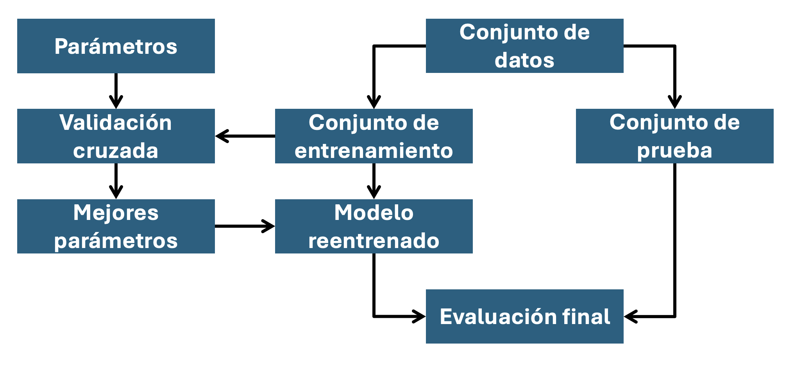
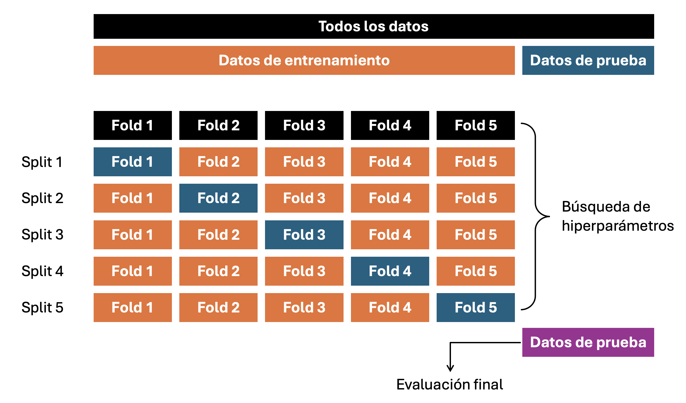

::: {.callout-important}
## Idea central
En esta entrada estudiaremos cómo evaluar, comparar y seleccionar modelos de aprendizaje supervisado sin contaminar la estimación de desempeño. La idea central es separar tres decisiones que suelen confundirse: cómo particionar los datos, qué métrica optimizar y cómo buscar hiperparámetros. Trabajaremos con validación cruzada, métricas de clasificación y regresión, búsqueda exhaustiva, búsqueda aleatorizada, esquemas sucesivos de descarte y optimización Bayesiana con <strong><font color='darkmagenta'>Optuna</font></strong>. Cerraremos conectando estas ideas con ajuste de umbrales y métricas de negocio, donde la pregunta relevante deja de ser solamente "qué modelo predice mejor" y pasa a ser "qué decisión conviene tomar con la predicción disponible".
:::

::: {.class-keywords}
[Selección de modelos]{.class-keyword}
[Validación cruzada]{.class-keyword}
[Métricas de desempeño]{.class-keyword}
[Scoring]{.class-keyword}
[Búsqueda de hiperparámetros]{.class-keyword}
[GridSearchCV]{.class-keyword}
[RandomizedSearchCV]{.class-keyword}
[Halving]{.class-keyword}
[Optuna]{.class-keyword}
[Optimización Bayesiana]{.class-keyword}
[TPE]{.class-keyword}
[Ajuste de umbrales]{.class-keyword}
:::

## Introducción

Hasta ahora, hemos construido una base robusta y muy fuerte que nos permite implementar una enorme batería de algoritmos de aprendizaje supervisado sobre prácticamente cualquier conjunto de datos de naturaleza tabular. Hemos sido cuidadosos en trabajar los fundamentos teóricos de cada modelo a fin de poder manejarnos adecuadamente en cualquier situación. Sin embargo, poco hemos hablado acerca de la selección, evaluación e inspección de modelos, limitándonos a comentar en los ejemplos trabajados en cada sección algunas de las muchísimas opciones que <strong><font color='darkmagenta'>Scikit-Learn</font></strong> nos ofrece. Por supuesto, esto es peligroso. Tenemos muchas herramientas fuertes en construcción de modelos, pero no nos hemos dedicado a darles brillo comentando cómo evaluar nuestros modelos a fin de seleccionar el mejor de ellos. Ni tampoco le hemos sacado provecho a las múltiples herramientas que <strong><font color='darkmagenta'>Scikit-Learn</font></strong> nos provee para inspeccionar las predicciones que realizan los modelos y entender el "razonamiento" que estos tienen.

En esta entrada nos dedicaremos enteramente a esto. Será pues una discusión que involucrará muchísimo código, mayormente práctica, donde incluso buscaremos simplemente traducir algunos aspectos relevantes de la [documentación](https://scikit-learn.org/stable/model_selection.html) de <strong><font color='darkmagenta'>Scikit-Learn</font></strong> que versan sobre estos temas. Sin embargo, aprovecharemos igualmente la oportunidad para introducir uno de los mejores buscadores de hiperparámetros en la industria: <strong><font color='darkmagenta'>Optuna</font></strong>. Un framework de optimización Bayesiana que destaca por su simplicidad y potencia a la hora de encontrar la mejor combinación de hiperparámetros para un modelo determinado.

## Validación cruzada

Aprender los parámetros que gobiernan una función predictora y testearlos sobre los mismos datos usados para su entrenamiento es un error metodológico: Un modelo que simplemente se limita a repetir las etiquetas de las instancias correspondientes que ha visto durante su construcción, de seguro, tendrá un desempeño cercano a perfecto sobre los datos de entrenamiento, pero fallará al predecir cualquier resultado fuera de ese conjunto de datos específico. Esta situación, como bien sabemos, se denomina **overfitting**. Para evitarla, es común que "guardemos" parte de los datos en un conjunto de prueba que será luego utilizado para validar que efectivamente el modelo de interés ha aprendido un patrón intrínseco de los datos que no esté limitado a un conjunto en particular.

En la @fig-sup-workflow se muestra un diagrama de flujo típico que muestra el *workflow* derivado de entrenar un modelo. Los mejores hiperparámetros suelen determinarse por medio de la implementación de búsquedas en grillas o aleatorizadas.

{#fig-sup-workflow fig-align="center" width="100%"}

En <strong><font color='darkmagenta'>Scikit-Learn</font></strong>, es posible computar rápidamente una división aleatoria entre conjuntos de entrenamiento y de prueba por medio de la función `train_test_split()` (del módulo `sklearn.model_selection`). Para ejemplificar esto, cargaremos el dataset <strong><font color='forestgreen'>IRIS</font></strong> y entrenaremos un modelo SVM de tipo lineal sobre él:

```{python}
import matplotlib.pyplot as plt
import numpy as np
import pandas as pd
import plotly.graph_objects as go
import seaborn as sns
from IPython.display import HTML
```

```{python}
from sklearn.model_selection import train_test_split
from sklearn.datasets import load_iris
from sklearn.svm import LinearSVC
```

```{python}
# Setting para nuestros gráficos.
plt.rcParams["figure.dpi"] = 90
sns.set_theme()
plt.style.use("bmh")
```

```{python}
# Cargamos el dataset Iris.
X, y = load_iris(return_X_y=True)
```

```{python}
# Chequeamos geometrías de los arreglos involucrados.
print(f"Geometría de X: {X.shape}")
print(f"Geometría de y: {y.shape}")
```

Podemos seleccionar rápidamente un conjunto de entrenamiento mientras dejamos un 40% de los datos para testear nuestro modelo:

```{python}
# Separamos conjuntos de entrenamiento y de prueba.
X_train, X_test, y_train, y_test = train_test_split(
    X, y, test_size=0.4, random_state=42,
)
```

```{python}
# Chequeamos geometrías de estos subconjuntos.
print(f"Geometría de X_train: {X_train.shape}")
print(f"Geometría de y_train: {y_train.shape}")
print(f"Geometría de X_test: {X_test.shape}")
print(f"Geometría de y_test: {y_test.shape}")
```

```{python}
# Entrenamos nuestro modelo.
model = LinearSVC(C=1)
model.fit(X_train, y_train)
```

```{python}
# Y evaluamos su desempeño en el conjunto de prueba.
model.score(X_test, y_test)
```

Cuando evaluamos distintos hiperparámetros para cualquier estimador, como es el caso del parámetro `C` en una máquina de soporte vectorial, aún existe riesgo de generar overfitting sobre el conjunto de prueba, porque los hiperparámetros pueden ser ajustados hasta que logremos un resultado que nos parezca óptimo sobre dichos datos. De esta manera, el conocimiento sobre los datos de prueba puede "filtrarse" hacia el modelo, y las métricas de desempeño ya no nos servirán para evaluar su capacidad de generalización. Para resolver este problema, podemos dejar fuera una parte del conjunto de entrenamiento, denominándola como **conjunto de validación**, y luego entrenar nuestros modelos sobre el resto de los datos, evaluando su desempeño sobre los mencionados datos de validación. **Cuando nuestro experimento es exitoso**, ya podemos pensar en evaluar la capacidad de generalización del modelo sobre los datos de prueba.

Sin embargo, al particionar nuestros datos en tres subconjuntos distintos, reducimos drásticamente el número de instancias que serán utilizadas para que el modelo aprenda los patrones de interés, y los resultados podrían depender de cuáles instancias fueron utilizadas para el proceso de entrenamiento y validación. En palabras simples, estamos aumentando el riesgo de caer en sesgos muestrales.

Una solución para este problema es la implementación del **procedimiento de validación cruzada** (CV, del inglés *cross validation*), en el cual conjunto de prueba se deja afuera para una evaluación final, pero se construyen secuencialmente varios subconjuntos para validar los resultados de un estimador. En su versión más básica (denominada **validación cruzada con $k$ subconjuntos, *pliegues* o "folds"**), el conjunto de entrenamiento se divide en $k$ subconjuntos más pequeños. Luego procedemos como sigue:

- Se entrena un modelo usando $k-1$ subconjuntos como datos de entrenamiento.
- El modelo resultante se valida en el subconjunto remanente (es decir, se usa como conjunto de validación, a fin de verificar métricas de interés).
- Repetimos este mismo procedimiento $k$ veces.

La métrica de desempeño reportada por este procedimiento es, por tanto, la agregación de los valores calculados en el loop completo de validación, habiendo usado cada uno de los $k$ subconjuntos como validadores y entrenado con los $k-1$ restantes. Este enfoque puede ser computacionalmente muy costoso, pero no desperdicia demasiados datos como sería el caso cuando separamos un número fijo de datos para validar, lo que es una ventaja significativa en problemas tales como de inferencia inversa, donde el número de instancias es bastante pequeño.

{#fig-cross-validation fig-align="center" width="100%"}

### Cómputo de métricas post-validación cruzada

La forma más sencilla de implementar un procedimiento de validación cruzada en <strong><font color='darkmagenta'>Scikit-Learn</font></strong> es por medio de la función `cross_val_score()`, del módulo `sklearn.model_selection`, la que se aplica directamente sobre nuestro estimador.

Volvamos al dataset <strong><font color='forestgreen'>IRIS</font></strong> y al modelo SVM lineal que definimos previamente. Implementaremos un procedimiento con 5 subconjuntos de validación para identificar los resultados de las métricas post-evaluación usando esta función:

```{python}
from sklearn.model_selection import cross_val_score
```

```{python}
# Definimos nuestro modelo.
model = LinearSVC(C=1, random_state=42)
```

```{python}
# Construimos el proceso de CV con 5 subconjuntos.
scores = cross_val_score(estimator=model, X=X_train, y=y_train, cv=5)
```

```{python}
# Mostramos los resultados de exactitud del modelo.
scores.round(3)
```

El puntaje promedio y su desviación estándar resultan, por tanto,

```{python}
print("%0.2f de exactitud con una desviación estándar de %0.2f" % (scores.mean(), scores.std()))
```

Por defecto, el puntaje computado en cada iteración del procedimiento de validación cruzada se corresponde con el método `score()` del estimador. Es posible cambiar esto utilizando el parámetro `scoring` como sigue:

```{python}
# Construimos el proceso de CV con 5 subconjuntos, cambiando
# la métrica de desempeño al puntaje F1.
scores = cross_val_score(
    estimator=model,
    X=X_train,
    y=y_train,
    cv=5,
    scoring="f1_macro",
)
```

```{python}
# Mostramos los resultados de F1 del modelo.
scores.round(3)
```

En el ejemplo, hemos utilizado el puntaje F1 macro-ponderado, que es propio de los modelos multinomiales como es este caso. Para el dataset <strong><font color='forestgreen'>IRIS</font></strong>, las tres clases de interés se encuentran perfectamente balanceadas y, por tanto, es razonable que sean muy parecidos en la mayoría de los subconjuntos de validación.

#### La función `cross_validate()` y evaluación de múltiples métricas

La función `cross_validate()` difiere de `cross_val_score()` en dos puntos esenciales:

- Permite evaluar varias métricas de desempeño en vez de sólo una.
- Retorna un diccionario que contiene tiempos de ajuste, tiempos de evaluación (y, opcionalmente, puntajes sobre el conjunto de entrenamiento, estimadores ya ajustados e índices de división entre datos de entrenamiento y de prueba).

Para la evaluación de una única métrica, cuando el parámetro de *scoring* es un string, un *callable* o nada (literalmente `None`), las llaves correspondientes del diccionario retornado serán `['test_score', 'fit_time', 'score_time']`. Mientras que, para evaluar múltiples métricas, el valor a retornar será un diccionario con las llaves `['test_<scorer1_name>', 'test_<scorer2_name>', 'test_<scorer...>', 'fit_time', 'score_time']`.

Setearemos `return_train_score` en `False` por defecto para ahorrar tiempo de cómputo. Para evaluar los puntajes en el conjunto de entrenamiento, simplemente debemos revertir la opción anterior a `True`. También podemos retener el estimador ajustado en cada conjunto de entrenamiento seteando `return_estimator=True`. Similarmente, podemos setear `return_indices=True` para retener los índices de entrenamiento y de prueba utilizados para dividir el conjunto de datos original para cada *pliegue*.

Las métricas pueden especificarse por medio de una lista de Python:

```{python}
from sklearn.model_selection import cross_validate
from sklearn.metrics import recall_score
```

```{python}
# Definimos los puntajes a evaluar.
scoring = ['precision_macro', 'recall_macro']

# Definimos nuestro modelo.
model = LinearSVC(C=1, random_state=42)

# Obtenemos los puntajes post-validación cruzada.
scores = cross_validate(model, X, y, scoring=scoring)

# Mostramos esta lista de puntajes.
print(f"Precisiones: {scores['test_precision_macro']}")
print(f"Sensibilidades: {scores['test_recall_macro']}")
```

#### Obtención de predicciones post-validación cruzada

La función `cross_val_predict()` dispone de una interfaz similar a `cross_val_score()`, pero retorna, para cada elemento en su entrada, la predicción que fue obtenida para dicho elemento cuando fue utilizada como conjunto de validación. Sólo pueden utilizarse estategias de validación cruzada que asignen todos los elementos al conjunto de validación correspondiente exactamente una vez. En otro caso, se levantará una excepción.

Esta función es adecuada para:

- Visualización de predicciones obtenidas para modelos diferentes.
- Mezcla de modelos: Cuando las predicciones de un modelo de aprendizaje supervisado son utilizadas para entrenar otro estimador en métodos de ensamble.

**Ejemplo 1.1 – Curva ROC con validación cruzada:** En este ejercicio, presentaremos como estimar y visualizar la varianza de la curva característica relativa-operativa (ROC) de un modelo por medio de un procedimiento de validación cruzada.

Las cruvas ROC, típicamente, se construyen en un dominio –denominado **espacio ROC**–, constituido por la tasa de verdaderos positivos en el eje $x$ y la tasa de falsos positivos en el eje $y$. Esto significa que la esquina superior izquierda del gráfico es el "punto ideal" de clasificación para un modelo, con una tasa de verdaderos positivos del 100%. Esto no es muy realista, pero implica que una mayor área bajo la curva ROC (AUC, del inglés *area under the curve*), usualmente, describe a un clasificador mejor. La "pendiente" de una curva ROC también es importante, sobre todo si es muy escalonada, ya que es ideal maximizar la tasa de verdaderos positivos al mismo tiempo que minimizamos la tasa de falsos positivos.

Este ejercicio muestra el resultado de una curva ROC en distintos conjuntos de datos, a partir de un procedimiento de validación cruzada con $k$ *pliegues*. Tomando todas estas curvas, es posible calcular el AUC promedio y verificar la varianza de la curva cuando el conjunto de entrenamiento se divide en distintos subconjuntos. Esto, aproximadamente, nos muestra cómo la salida de un clasificador se afecta debido a cambios en los datos de entrenamiento, y qué tan distintas son las divisiones realizadas por medio de una validación cruzada.

Trabajaremos nuevamente con el dataset <strong><font color='forestgreen'>IRIS</font></strong>, el cual contiene tres clases de interés. Una clase es linealmente separable respecto de las otras dos, pero esto no se cumple en el resto. Binarizaremos nuestro dataset al no considerar las flores de la subespecie `Iris virginica` (`class_id=2`). Esto significa que la clase `versicolor` (`class_id=1`) se asume como la clase positiva, mientras que la clase `setosa` (`class_id=0`) se asume como la clase negativa:

```{python}
# Cargamos el dataset Iris.
iris = load_iris()

# Definimos los nombres de cada clase.
target_names = iris["target_names"]

# Definimos los pares (X, y).
X, y = iris["data"], iris["target"]

# Binarizamos nuestro target.
X, y = X[y != 2], y[y != 2]

# Determinamos el número de instancias (`m`) y
# el número de variables (`n`).
m, n = X.shape
```

Añadimos igualmente algunas variables que serán puro ruido, a fin de que el problema sea mucho más difícil de resolver:

```{python}
# Definimos una semilla aleatoria fija.
rng = np.random.default_rng(seed=42)

# Añadimos las variables con ruido Gaussiano.
X = np.concatenate(
    [X, rng.standard_normal(size=(m, 200 * n))],
    axis=1,
)
```

A continuación, entrenaremos una máquina de soporte vectorial, y luego usaremos los resultados generados post-validación cruzada para graficar las curvas ROC para cada *pliegue*. Notemos que la línea base para definir una curva ROC resultante únicamente de adivinar los resultados es simplemente un clasificador que predice la clase más frecuente:

```{python}
from sklearn.base import clone
from sklearn.metrics import auc, roc_curve, roc_auc_score
from sklearn.model_selection import StratifiedKFold
from sklearn.svm import SVC
```

```{python}
# Definimos el número de 'pliegues' o 'folds'.
n_splits = 6

# Definimos la estrategia de validación cruzada
# (en este caso, estratificada).
cv = StratifiedKFold(
    n_splits=n_splits,
    shuffle=True,
    random_state=42,
)

# Instanciamos nuestro modelo.
model = SVC(
    kernel="linear",
    probability=True,
    random_state=42,
)
```

Ahora construimos los espacios ROC para cada curva y obtenemos las correspondientes tasas de verdaderos y falsos positivos, así como las áreas bajo las curvas ROC:

```{python}
# Recolectamos las tasas de verdaderos y falsos
# positivos, así como las áreas bajo las curvas ROC
# para cada `pliegue`.
fprs, tprs, aucs = [], [], []
for tr_idx, te_idx in cv.split(X, y):
    estimator = clone(model)
    estimator.fit(X[tr_idx], y[tr_idx])

    # Chequeamos que el estimador utilizado prediga
    # probabilidades de clase.
    if hasattr(estimator, "predict_proba"):
        y_score = estimator.predict_proba(X[te_idx])[:, 1]

    # Si no es así, usamos la función de decisión.
    elif hasattr(estimator, "decision_function"):
        y_score = estimator.decision_function(X[te_idx])
    else:
        raise ValueError(
            "El estimador no expone ni predict_proba() ni decision_function() como métodos válidos."
        )
    # Construimos el espacio ROC.
    fpr, tpr, _ = roc_curve(y[te_idx], y_score)

    # Almacenamos los valores obtenidos.
    fprs.append(fpr)
    tprs.append(tpr)
    aucs.append(roc_auc_score(y[te_idx], y_score))
```

Por medio de una interpolación sencilla, estimamos las tasas de falsos positivos asociadas a las tasas de verdaderos positivos definidas manualmente:

```{python}
# Interpolamos los correspondientes valores de tasa de
# falsos positivos
mean_fpr = np.linspace(start=0, stop=1, num=101)
interp_tprs = []
for fpr, tpr in zip(fprs, tprs):
    interp = np.interp(mean_fpr, fpr, tpr)
    interp[0] = 0.0
    interp_tprs.append(interp)
```

A continuación, determinamos la curva ROC promedio y su banda de variabilidad:

```{python}
# Calculamos los valores medios y desviación de la tasa
# de verdaderos positivos.
mean_tpr = np.mean(interp_tprs, axis=0)
mean_tpr[-1] = 1.0
std_tpr = np.std(interp_tprs, axis=0)

# Hacemos lo mismo para las áreas bajo las curvas ROC.
mean_auc = auc(mean_fpr, mean_tpr)
std_auc = np.std(aucs)

# Definimos los bordes de la banda de variabilidad de
# las curvas.
tprs_upper = np.minimum(mean_tpr + std_tpr, 1.0)
tprs_lower = np.maximum(mean_tpr - std_tpr, 0.0)
```

Y mostramos los resultados en un gráfico:

```{python}
#| label: fig-roc-curve-with-bandwith
#| fig-cap: "Curva ROC para nuestro modelo. En celeste, se observa la banda de variabilidad inducida por el procedimiento de validación cruzada utilizado para su construcción."
# Gráfico de la curva ROC y su banda de variabilidad.
fig, ax = plt.subplots(figsize=(9, 6))
ax.plot(
    mean_fpr,
    mean_tpr,
    lw=2,
    color="dodgerblue",
    label=f"ROC promedio (AUC = {mean_auc:.2f} ± {std_auc:.2f})",
)

ax.fill_between(
    mean_fpr,
    tprs_lower,
    tprs_upper,
    alpha=0.2,
    color="dodgerblue",
    label="Banda de variabilidad",
)

ax.plot(
    [0, 1],
    [0, 1],
    ls="--",
    lw=1,
    color="k",
    label="Línea de no discriminación",
)

ax.set_xlabel("Tasa de falsos positivos", fontsize=12, labelpad=10)
ax.set_ylabel("Tasa de verdaderos positivos", fontsize=12, labelpad=10)
ax.set_title(
    "Curva ROC promedio con banda de variabilidad",
    fontsize=14,
    fontweight="bold",
    pad=10,
)

ax.legend(loc="lower right", fontsize=9, frameon=True)
ax.set_aspect('equal', adjustable='box')

plt.tight_layout()
```

Podemos observar que las curvas ROC pueden ser muy variables por *pliegue*, con una banda de variabilidad que es especialmente grande cuando la tasa de falsos positivos está en en el intervalo $(0, 0.25)$. Esto muestra que cada subconjunto de entrenamiento escogido, a pesar de que la validación cruzada se realiza de forma estratificada, no presenta el mismo balance de clases. ◼︎

### Iteradores de validación cruzada

A continuación, listaremos algunas utilidades para generar índices que pueden ser usados para generar divisiones de conjuntos de datos de acuerdo a diversas estrategias de validación cruzada.

#### Iteradores para datos independientes e idénticamente distribuidos

Si asumimos que nuestro conjunto de datos es independiente e idénticamente distribuido (iid), lo que implica que todas las instancias son generadas por el mismo proceso estocástico, sin que éste tenga "memoria" de instancias generadas previamente, entonces podemos utilizar los siguientes iteradores:

**(I) `KFold`:** El iterador `KFold` divide todas las instancias de interés en $k$ grupos de muestras, denominadas *pliegues* (si tenemos $m$ instancias en total, entonces el caso $k=m$ es llamado **estrategia de tipo "leave-one-out"**) que, en lo posible, tienen el mismo tamaño. La función predictora es entonces entrenada utilizando $k-1$ *pliegues*, dejando el restante como conjunto de validación. Se trata de la estrategia de validación cruzada más sencilla de todas.

{#fig-kfold fig-align="center" width="100%"}

Por ejemplo, para `2` *folds* con `4` instancias:

```{python}
from sklearn.model_selection import KFold
```

```{python}
# Definimos las instancias.
X = ["a", "b", "c", "d"]

# Definimos la estrategia de validación cruzada.
cv = KFold(n_splits=2)

# Mostramos las instancias asociadas a cada `pliegue`.
for train_idx, test_idx in cv.split(X):
    print("%s %s" % (train_idx, test_idx))
```

**(II) `RepeatedKFold`:** La clase `RepeatedKFold` replica `KFold` un total de $n$ veces, produciendo distintas divisiones en cada repetición. Por ejemplo, para una validación cruzada con `2` *folds*, repetida dos veces:

```{python}
from sklearn.model_selection import RepeatedKFold
```

```{python}
# Generamos un arreglo 2D que emulará información de entrada
X = np.array([[1, 2], [3, 4], [1, 2], [3, 4]])

# Definimos la estrategia de validación cruzada
cv = RepeatedKFold(n_splits=2, n_repeats=2, random_state=42)

# Mostramos las instancias asociadas a cada subconjunto, con
# sus repeticiones
for train_idx, test_idx in cv.split(X):
    print("%s %s" % (train_idx, test_idx))
```

Similarmente, `RepeatedStratifiedKFold` replica `StratifiedKFold` un total de $n$ veces con aleatorización distinta en cada repetición.

**(III) Estrategia de tipo Leave-One-Out (LOO):** `LeaveOneOut` (abreviada típicamente como **LOO**) es una estrategia de validación cruzada sencilla en la cual cada conjunto de entrenamiento se crea tomando todas las instancias disponibles con excepción de una, en la cual testeamos nuestros resultados. Si disponemos de un conjunto de datos con $m$ instancias, dejamos una afuera y entrenamos en las $m-1$ restantes, repitiendo este proceso hasta haber validado los resultados de nuestro modelo con cada una de las instancias de entrenamiento. Es, por definición, la estrategia que menos datos desperdicia en cada *pliegue*:

```{python}
from sklearn.model_selection import LeaveOneOut
```

```{python}
# Generamos un sencillo arreglo que emulará los datos de entrada.
X = [1, 2, 3, 4]

# Definimos la estrategia de validación cruzada.
cv = LeaveOneOut()

# Mostramos las instancias asociadas a cada subconjunto.
for train_idx, test_idx in cv.split(X):
    print("%s %s" % (train_idx, test_idx))
```

Hay algunos casos a considerar cuando pretendemos implementar una estrategia de tipo LOO. Cuando comparamos estrategias con una validación cruzada de tipo `KFold`, construimos $m$ modelos en vez de $k$ modelos, donde $m>k$. Además, cada uno es entrenado en un total de $m-1$ instancias en vez de $(k-1)m/k$. En ambos casos, asumiendo que $k$ no es demasiado grande y $k<m$, una estrategia de tipo LOO es mucho más costosa computacionalmente que una de tipo `KFold`.

En términos de exactitud, LOO con frecuencia ofrece resultados con alta varianza para los estimadores que se testean sobre la instancia de validación. Intuitivamente, dado que $m-1$ de las $m$ instancias son utilizadas para construir cada modelo, los modelos resultan virtualmente idénticos entre sí y con respecto a un hipotético modelo construido a partir del conjunto de entrenamiento completo.

Como regla general, muchos expertos coinciden en que una validación cruzada de tipo `KFold` con 5 a 10 *pliegues* debiera preferirse a una validación de tipo LOO.

**(IV) Estrategia de tipo Leave-P-Out (LPO):** `LeavePOut` es muy similar a `LeaveOneOut`, ya que crea todos los conjuntos posibles de entrenamiento y de prueba removiendo $p$ instancias del conjunto de datos completo. Para un total de $m$ instancias de entrenamiento, esto produce un total de $\left( {}_{p}^{m} \right)$ pares "entrenamiento–prueba". A diferencia de `LeaveOneOut` y `KFold`, los conjuntos de validación comenzarán a superponerse a partir de $p>1$.

A continuación, un pequeño ejemplo de una validación cruzada de tipo `LeavePOut` con $p=2$ en un dataset con `4` instancias:

```{python}
from sklearn.model_selection import LeavePOut
```

```{python}
# Generamos un sencillo arreglo que emulará los datos de entrada.
X = [1, 2, 3, 4]

# Definimos la estrategia de validación cruzada.
cv = LeavePOut(p=2)

# Mostramos las instancias asociadas a cada subconjunto.
for train_idx, test_idx in cv.split(X):
    print("%s %s" % (train_idx, test_idx))
```

**(V) Estrategia con permutaciones aleatorizadas (o estrategia de tipo *shuffle & split*):** El iterador `ShuffleSplit` permite generar un número definido de *splits* de entrenamiento/validación. Las instancias son primero mezcladas (como en una baraja de naipes) y luego separadas.

Es posible controlar la aleatoriedad de la mezcla por medio de una semilla aleatoria prefijada, a fin de que los resultados sean reproducibles:

```{python}
from sklearn.model_selection import ShuffleSplit
```

```{python}
# Generamos un sencillo arreglo que emulará los datos de entrada.
X = np.arange(start=0, stop=10, step=1)

# Definimos la estrategia de validación cruzada.
cv = ShuffleSplit(n_splits=5, test_size=0.25, random_state=42)

# Mostramos las instancias asociadas a cada subconjunto.
for train_idx, test_idx in cv.split(X):
    print("%s %s" % (train_idx, test_idx))
```

{#fig-shuffle-split fig-align="center" width="100%"}

Se tiene pues que `ShuffleSplit` es una muy buena alternativa a `KFold`, y que permite un control más fino sobre el número de iteraciones del procedimiento de validación cruzada y de la proporción de muestras que son dejadas como datos de validación.

#### Iteradores para validación cruzada estratificada

Algunos problemas de clasificación pueden exhibir, en algunos casos, clases con una frecuencia excepcionalmente baja. Esto es propio de **problemas no balanceados**, donde la clase positiva es varios órdenes de magnitud menos frecuente que la clase negativa, lo que es común en muchos problemas industriales, tales como mantenimiento predictivo (detección de fallas), riesgo sísmico, detección de fraudes, entre otros. Como resultado, la división de un conjunto de entrenamiento por medio de un procedimiento de validación cruzada puede resultar contraproducente, ya que puede derivar en subconjuntos sin una o más clases de interés. Esto típicamente produce la indeterminación de varias métricas de desempeño, lo que se traduce en excepciones levantadas por <strong><font color='darkmagenta'>Scikit-Learn</font></strong>.

Para mitigar estos problemas, <strong><font color='darkmagenta'>Scikit-Learn</font></strong> nos provee de iteradores especializados, como `StratifiedKFold` y `StratifiedShuffleSplit`, que permiten implementar técnicas de **muestreo estratificado** para preservar la proporción de las categorías en cualquier variable de este tipo al dividir un conjunto de entrenamiento, siempre que esto sea posible.

**(I) `StratifiedKFold`:** La clase `StratifiedKFold` es una variante de `KFold` que retorna *pliegues* estratificados, donde se preserva la proporción de categorías de cualquier variable que deseemos (no solamente la de respuesta).

A continuación se muestra un ejemplo en el cual se implementa una validación estratificada con `3` *pliegues* a un conjunto de datos con una variable de respuesta desbalanceada de tipo binaria:

```{python}
from sklearn.model_selection import StratifiedKFold
```

```{python}
# Definimos la matriz de diseño X y el vector de valores de respuesta `y`.
X, y = np.ones((50, 1)), np.hstack(([0] * 45, [1] * 5))

# Definimos la estrategia de validación cruzada.
cv = StratifiedKFold(n_splits=3)

# Mostramos las instancias asociadas a cada subconjunto.
for train_idx, test_idx in cv.split(X, y):
    print(
        'train -  {}   |   test -  {}'
        .format(
            np.bincount(y[train_idx]), np.bincount(y[test_idx])
        )
    )
```

```{python}
# Si hubiéramos hecho simplemente `KFold`, la repartición hubiera sido la siguiente.
cv = KFold(n_splits=3)
for train_idx, test_idx in cv.split(X, y):
    print(
        'train -  {}   |   test -  {}'
        .format(
            np.bincount(y[train_idx]), np.bincount(y[test_idx])
        )
    )
```

Podemos observar que `StratifiedKFold` preserva siempre los *ratios* entre las clases positiva y negativa (aproximadamente `1/10`). En el caso de `KFold`, los primeros dos *folds* no presentaban instancias asociadas a la clase positiva, lo que hubiera levantado errores en el procedimiento en forma posterior.

{#fig-stratifiedkfold fig-align="center" width="100%"}

**(II) `StratifiedShuffleSplit`:** La clase `StratifiedShuffleSplit` permite, al igual que `StratifiedKFold`, implementar un procedimiento de validación cruzada estratificada. Sin embargo, la diferencia clave es que, en cada repetición, se realiza una mezcla completa de los datos de entrenamiento, de modo tal que existe siempre cierto nivel de superposición entre los distintos conjuntos de entrenamiento y de validación, aunque siempre preservando el *ratio* de categorías de interés.

#### Iteradores para datos agrupados

El supuesto de independencia y distribución idéntica (iid) que es inherente a nuestros conjuntos de datos se rompe si el proceso que los genera produce grupos de muestras que son dependientes entre sí. Tal agrupamiento de datos es específico de un dominio dado. Un ejemplo sería cuando hay datos médicos obtenidos de múltiples pacientes, con múltiples muestras tomadas de cada paciente. Por supuesto, un conjunto de datos así, lo más probable, es que sea dependiente de un grupo individual. En nuestro caso, el ID de un paciente para cada muestra sería su identificador de grupo.

En este caso, es interesante saber si un modelo entrenado en un conjunto particular de grupos es capaz de generalizar bien su aprendizaje a grupos nuevos. Para medir esto, necesitamos garantizar que todas las muestras en el conjunto de validación vengan de grupos que no están representados en los *pliegues* de entrenamiento.

Los siguientes iteradores provistos por <strong><font color='darkmagenta'>Scikit-Learn</font></strong> son capaces de tratar este tipo de problemas. El identificador de grupo para las instancias correspondientes se especifica siempre por medio del parámetro `groups`:

**(I) `GroupKFold`:** `GroupKFold` es una variación de `KFold` que garantiza que el mismo grupo de instancias no esté representado en el par entrenamiento-validación. Por ejemplo, si nuestros datos se obtienen a partir de diferentes "sujetos" de interés, con varias instancias por "sujeto", y si el modelo es lo suficientemente flexible para aprender atributos específicos de cada uno, entonces podría fallar en generalizar su aprendizaje a sujetos nuevos. La clase `GroupKFold` evita este problema, detectando estos eventuales casos de overfitting.

Imaginemos que disponemos de tres "sujetos", cada uno asociado a un número que va del `1` al `3`:

```{python}
from sklearn.model_selection import GroupKFold
```

```{python}
X = [0.1, 0.2, 2.2, 2.4, 2.3, 4.55, 5.8, 8.8, 9, 10] # Datos de entrada.
y = ["a", "b", "b", "b", "c", "c", "c", "d", "d", "d"] # Datos de salida.
groups = [1, 1, 1, 2, 2, 2, 3, 3, 3, 3] # Grupos de interés.

# Definimos la estrategia de validación cruzada.
cv = GroupKFold(n_splits=3)

# Mostramos las instancias asociadas a cada subconjunto.
for train_idx, test_idx in cv.split(X, y, groups=groups):
    print("%s %s" % (train_idx, test_idx))
```

Notemos que cada "sujeto" se encuentra en un único *fold* de validación, y el mismo "sujeto" nunca está simultáneamente en el conjunto de entrenamiento y de validación. Notemos que los *folds* no necesariamente tendrán el mismo tamaño debido a que los datos son propios de un problema no balanceado. Si las proporciones de las clases deben balancearse entre *folds*, es mejor proceder con una validación cruzada por grupos de tipo estratificada, como veremos más adelante.

{#fig-groupedkfold fig-align="center" width="100%"}

**(II) `StratifiedGroupKFold`:** `StratifiedGroupKFold` es un esquema de validación cruzada que combina `StratifiedKFold` con `GroupKFold`. La idea es intentar preservar la distribución de las clases en cada split mientras mantenemos cada grupo dentro de un único split. Esto puede ser útil cuando tenemos un conjunto de datos no balanceado, tal que el uso de sólo ´GroupKFold´ produciría particiones asimétricas.

Por ejemplo:

```{python}
from sklearn.model_selection import StratifiedGroupKFold
```

```{python}
# Generamos el arreglo con datos de entrada y de salida, además de los grupos.
X = list(range(18))
y = [1] * 6 + [0] * 12
groups = [1, 2, 3, 3, 4, 4, 1, 1, 2, 2, 3, 4, 5, 5, 5, 6, 6, 6]

# Definimos la estrategia de validación cruzada.
cv = StratifiedGroupKFold(n_splits=3)

# Mostramos las instancias asociadas a cada subconjunto.
for train_idx, test_idx in cv.split(X, y, groups=groups):
    print("%s %s" % (train_idx, test_idx))
```

**(III) `LeaveOneGroupOut`:** `LeaveOneGroupOut` es un esquema de validación cruzada similar a `LeaveOneOut`, con la diferencia de que, en vez de dejar una única instancia afuera como validación en cada iteración, deja un grupo específico afuera. Cada subconjunto de entrenamiento es por tanto constituido por todas las instancias, salvo aquellas relacionadas a un único grupo.

Por ejemplo, en el caso de experimentos múltiples, `LeaveOneGroupOut` puede usarse para crear un esquema de validación cruzada basado en los experimentos individuales: Creamos un conjunto de entrenamiento usando todas las instancias de cada experimentos, con excepción de uno:

```{python}
from sklearn.model_selection import LeaveOneGroupOut
```

```{python}
# Creamos un arreglo de entrada y salida, y los grupos correspondientes.
X = [1, 5, 10, 50, 60, 70, 80]
y = [0, 1, 1, 2, 2, 2, 2]
groups = [1, 1, 2, 2, 3, 3, 3]

# Creamos el esquema de validación cruzada.
cv = LeaveOneGroupOut()

# Mostramos las instancias asociadas a cada subconjunto.
for train_idx, test_idx in cv.split(X, y, groups=groups):
    print("%s %s" % (train_idx, test_idx))
```

**(IV) `LeavePGroupsOut`:** `LeavePGroupsOut` es similar a `LeaveOneGroupOut`, pero remueve aquellas muestras que están asociadas a $p$ grupos para cada división entre subconjunto de entrenamiento y de validación. Todas las posibles combinaciones de esos $p$ grupos quedan fuera, lo que significa que los subconjuntos de validación comenzarán a superponerse cuando $p>1$:

```{python}
from sklearn.model_selection import LeavePGroupsOut
```

```{python}
# Creamos un arreglo de entrada y salida, y los grupos correspondientes.
X = np.arange(6)
y = [1, 1, 1, 2, 2, 2]
groups = [1, 1, 2, 2, 3, 3]

# Creamos el esquema de validación cruzada.
cv = LeavePGroupsOut(n_groups=2)

# Mostramos las instancias asociadas a cada subconjunto.
for train_idx, test_idx in cv.split(X, y, groups=groups):
    print("%s %s" % (train_idx, test_idx))
```

#### Validación cruzada para series de tiempo

`TimeSeriesSplit` es una variante de `KFold` que retorna los primeros $k$ *pliegues* como conjunto de entrenamiento, siendo el *pliegue* $k+1$ el conjunto de validación. Notemos que, a diferencia de los esquemas clásicos de validación cruzada vistos previamente, los conjuntos de entrenamiento subsecuentes son superconjuntos de aquellos que fueron definidos previamente. Además, añade el exceso de datos a la primera partición de entrenamiento, la que siempre se utiliza para entrenar nuestro modelo.

Notemos que cada *pliegue* de validación tiene siempre una duración fija, a fin de disponer de métricas comparables para cada iteración.

A continuación, un ejemlo de validación cruzada en series de tiempo con `3` *pliegues* en un conjunto de datos con `6` instancias:

```{python}
from sklearn.model_selection import TimeSeriesSplit
```

```{python}
# Creamos los datos de entrada y salida.
X = np.array([[1, 2], [3, 4], [1, 2], [3, 4], [1, 2], [3, 4]])
y = np.array([1, 2, 3, 4, 5, 6])

# Construimos el esquema de validación cruzada.
tscv = TimeSeriesSplit(n_splits=3)

# Mostramos las instancias asociadas a cada subconjunto.
for train_idx, test_idx in tscv.split(X):
    print("%s %s" % (train_idx, test_idx))
```

{#fig-time-series-split fig-align="center" width="100%"}

## Ajuste de hiperparámetros en un esquema de validación cruzada

Los **hiperparámetros** son parámetros que no son aprendidos en el proceso de entrenamiento de un modelo, sino que deben setearse manualmente. En <strong><font color='darkmagenta'>Scikit-Learn</font></strong>, los hiperparámetros son pasados como argumentos en el constructor de un modelo. Ejemplos típicos de hiperparámetros son `C` en las máquinas de soporte vectorial, `max_depth` en un ensamble con base en árboles o `l1_ratio` en un modelo de red elástica, entre otros.

En <strong><font color='darkmagenta'>Scikit-Learn</font></strong>, es posible buscar la mejor combinación de hiperparámetros a partir de un procedimiento de validación cruzada, en la cual se testea un número previamente establecido de distintas permutaciones entre tales hiperparámetros.

Cualquier parámetro que sea pasado al constructor de un modelo puede optimizarse de esta manera. Específicamente, para encontrar los nombres y valores actuales de un estimador dado, digamos `model`, usamos una instrucción del tipo `model.get_params()`.

Una búsqueda típica de <strong><font color='darkmagenta'>Scikit-Learn</font></strong> consiste de:

- Un estimador (un regresor o clasificador).
- Un **espacio de búsqueda** de hiperparámetros.
- Un método de búsqueda de candidatos.
- Un esquema de validación cruzada.
- Una función de *scoring*.

Dos enfoques genéricos para la búsqueda de hiperparámetros son provistos por la librería: Para un espacio de búsqueda dado, `GridSearchCV` considera exhaustivamente todas las combinaciones provistas en el espacio de búsqueda, mientras que `RandomizedSearchCV` puede muestrear una cantidad previamente definida de combinaciones dadas distribuciones de probabilidad que describan los valores de esos hiperparámetros. Ambas herramientas poseen contrapartes con menor costo computacional denominadas `HalvingGridSearchCV` y `HalvingRandomSearchCV`, que realizan búsquedas secuenciales y descartan los peores candidatos, ahorrando mucho tiempo de ejecución. Estas dos contrapartes son **experimentales**, y requieren activar algunos métodos específicos del módulo `sklearn.experimental` para ser utilizados.

### Búsqueda exhaustiva por medio de grillas (`GridSearchCV`)

La búsqueda exhaustiva provista por `GridSearchCV` genera candidatos de forma determinista a partir de un espacio de búsqueda que se asume como una grilla $r$-dimensional, donde $r$ es la cantidad de hiperparámetros a buscar. Tal espacio se explicita en el constructor por medio de un diccionario de Python denominado `param_grid`, como se muestra en el siguiente ejercicio:

```{python}
# Para una SVM, definimos una grilla de búsqueda.
param_grid = [
    {'C': [1, 10, 100, 1000], 'kernel': ['linear']},
    {'C': [1, 10, 100, 1000], 'gamma': [0.001, 0.0001], 'kernel': ['rbf']},
]
```

El diccionario anterior explicita dos grillas que deben ser evaluadas de forma exhaustiva: Una que consta de los hiperparámetros `C` y `kernel`, para los cuales proveemos valores fijos en forma de listas de Python; y otra que consta de los hiperparámetros `C` y `gamma`. La búsqueda se denomina "exhaustiva" porque cada valor de las listas se explora en combinación con otros. Ninguna combinación se deja fuera de la evaluación.

`GridSearch` implementa la misma API estimadora que otros modelos en <strong><font color='darkmagenta'>Scikit-Learn</font></strong>. Para iniciar la búsqueda usamos el método `fit()`. Una vez terminada la búsqueda, hay métodos para generar predicciones como `predict()` o `predict_proba()`, aunque es más recomendable aislar el "mejor" modelo encontrado en un objeto separado, por trazabilidad y legibilidad de nuestro código.

**Ejemplo 1.2 – ¿Cómo se ve una búsqueda por grillas?** La búsqueda exhaustiva de hiperparámetros siempre genera una grilla perfectamente *hiperrectangular* a nivel gráfico. Cada punto de la grilla es una evaluación que se realiza por medio de validación cruzada. Por lo tanto, si tuviéramos `3` hiperparámetros de interés que optimizar, el resultado sería una grilla 3D con forma ortoedral.

Pongamos esto en práctica y consideremos el dataset <strong><font color='forestgreen'>IRIS</font></strong> (como tantas otras veces). Añadiremos algo de ruido para hacer el problema más difícil y construiremos una grilla de búsqueda exhaustiva a partir del ajuste de `3` hiperparámetros de un modelo de árbol de decisión:

```{python}
from sklearn.model_selection import GridSearchCV
from sklearn.tree import DecisionTreeClassifier
```

```{python}
# Cargamos el dataset `Iris`.
iris = load_iris()

# Definimos los nombres de cada clase.
target_names = iris["target_names"]

# Definimos los pares (X, y)
X, y = iris["data"], iris["target"]

# Determinamos el número de instancias (`m`) y el número de variables (`n`).
m, n = X.shape

# Definimos una semilla aleatoria fija.
rng = np.random.default_rng(seed=42)

# Añadimos las variables con ruido.
X = np.concatenate(
    [X, rng.standard_normal(size=(m, 200 * n))],
    axis=1,
)
```

A continuación definimos la grilla de búsqueda exhaustiva. En este caso, fijamos la búsqueda para los hiperparámetros `max_depth`, `min_samples_split` y `min_samples_leaf` de un árbol de clasificación. Notemos que si una grilla está constituida por $p$ hiperparámetros, y para cada hiperparámetro $p_{k}$ se tiene una lista de $r_{k}$ valores a testear, en un esquema de validación cruzada con $n$ *pliegues*, entonces el número total de evaluaciones realizadas por `GridSeachCV` es

::: {.eq-scroll}
$$
N_{\mathrm{evaluaciones}}=n\prod_{k=1}^{p} r_{k}
\tag{1.1}
$$
:::

Continuemos:

```{python}
# Determinamos la grilla de búsqueda.
param_grid = {
    "max_depth": [2, 3, 4, 5, 6, 7, 8, 9],
    "min_samples_split": [2, 4, 8, 16, 32],
    "min_samples_leaf": [1, 2, 4, 8, 16],
}
```

A continuación definimos nuestro modelo base, que será el mencionado árbol de clasificación. Notemos que, al ser un modelo de base, únicamente definiremos su semilla aleatoria fija. Todos los demás hiperparámetros de interés se ajustarán vía `GridSearchCV`:

```{python}
# Instanciamos un modelo de árbol de decisión.
model = DecisionTreeClassifier(random_state=42)
```

Luego definimos nuestra búsqueda exhaustiva. La clase `GridSearchCV` acepta, entre otros, los siguientes argumentos:

- `estimator`: Estimador de <strong><font color='darkmagenta'>Scikit-Learn</font></strong> para el cual ajustaremos los hiperparámetros.
- `param_grid`: Diccionario de Python que describe la grilla de búsqueda a implementar.
- `scoring`: Puntaje a evaluar en cada ajuste del modelo sobre los datos de validación en el esquema de validación cruzada. En nuestro ejemplo, usaremos `"f1_macro"`, que corresponde a un puntaje F1 macro-ponderado, ideal para problemas de clasificación multinomial.
- `n_jobs`: Número de procesadores que serán usados en la búsqueda exhaustiva. `n_jobs=-1` implica que se utilizan todos los disponibles.
- `refit`: Permite reajustar un modelo usando los mejores hiperparámetros encontrados conforme una métrica determinada. Si se usaron múltiples métricas para evaluar la búsqueda vía el parámetro `scoring`, en `refit` debe señalarse sólo una.
- `cv`: Permite definir la estrategia de validación cruzada que domina la búsqueda. Por defecto, si fijamos un entero `n`, entonces se aplicará una estrategia de tipo `KFold` con `n` *pliegues*. Es posible imputar la clase asociada a una estrategia, a fin de usar validación estratificada o por grupos, incluso para series de tiempo.

```{python}
# Definimos nuestro buscador.
searcher = GridSearchCV(
    estimator=model,
    param_grid=param_grid,
    scoring="f1_macro",
    cv=5,
)
```

Para implementar la búsqueda, usamos el método `fit()`, igual que en cualquier modelo:

```{python}
# Y realizamos la búsqueda.
searcher.fit(X, y)
```

Los resultados de la búsqueda pueden recuperarse usando el atributo `cv_results_`, en un formato de diccionario de Python, una vez que ésta ha finalizado. Por simplicidad, pasaremos los resultados a un DataFrame de <strong><font color='darkmagenta'>Pandas</font></strong>:

```{python}
# Recuperamos los resultados de esta evaluación.
results = pd.DataFrame(searcher.cv_results_)

# Verificamos las primeras filas de estos resultados
results.head()
```

Notemos que las columnas detallan varios aspectos de la búsqueda, como el tiempo de cómputo (`mean_fit_time`, `std_fit_time`, `mean_score_time` y `std_score_time`), los valores de los hiperparámetros (`param_max_depth`, `param_min_samples_leaf` y `param_min_samples_split`), el resumen de hiperparámetros (`params`), los puntajes en cada *pliegue* de validación (`split<j>_test_score`), sus valores medios y desviaciones (`mean_test_score` y `std_test_score`) y en ranking asociado a cada combinación (`rank_test_score`). Para observar la regularidad de esta grilla de búsqueda, generamos un gráfico del espacio de búsqueda, pintando cada punto con el valor medio del F1 macro-ponderado en los *pliegues* de validación:

```{python}
#| label: fig-gridsearch-3d
#| fig-cap: "Grilla tridimensional de hiperparámetros evaluada por búsqueda exhaustiva. Cada punto representa una combinación candidata y su color indica el puntaje F1 macro-ponderado medio obtenido en validación cruzada."
# Visualizamos la grilla completa de búsqueda
fig = go.Figure(
    data=[
        go.Scatter3d(
            x=results["param_max_depth"],
            y=results["param_min_samples_leaf"],
            z=results["param_min_samples_split"],
            mode="markers",
            marker=dict(
                size=4,
                color=results["mean_test_score"],
                colorscale="Inferno",
                opacity=0.88,
                line=dict(color="black", width=1),
                colorbar=dict(
                    title="F1 macro",
                    thickness=14,
                    len=0.75,
                ),
            ),
            customdata=np.stack(
                [
                    results["mean_test_score"],
                    results["std_test_score"],
                    results["rank_test_score"],
                ],
                axis=-1,
            ),
            hovertemplate=(
                "<b>max_depth</b>: %{x}<br>"
                "<b>min_samples_leaf</b>: %{y}<br>"
                "<b>min_samples_split</b>: %{z}<br>"
                "<b>F1 medio</b>: %{customdata[0]:.3f}<br>"
                "<b>Desv. F1</b>: %{customdata[1]:.3f}<br>"
                "<b>Ranking</b>: %{customdata[2]}<extra></extra>"
            ),
            name="Combinación candidata",
        )
    ]
)

fig.update_layout(
    title=dict(
        text="<b>Grilla de búsqueda exhaustiva</b>",
        x=0.5,
        xanchor="center",
    ),
    height=560,
    margin=dict(l=0, r=0, t=60, b=0),
    font=dict(family="Calibri, Arial, sans-serif", size=13),
    scene=dict(
        xaxis_title="max_depth",
        yaxis_title="min_samples_leaf",
        zaxis_title="min_samples_split",
        camera=dict(eye=dict(x=1.45, y=1.55, z=1.15)),
    ),
)

HTML(
    fig.to_html(
        full_html=False,
        include_plotlyjs="cdn",
        include_mathjax=False,
        config={"responsive": True, "displaylogo": False},
    )
)
```

Y ahí lo tenemos. Vemos que, en efecto, la búsqueda exhaustiva se realiza sobre espacios completamente regulares. Esto, por definición, consume un montón de recursos, pero es un método que garantiza que se encontrará la mejor combinación entre todas las posibles dada las listas de valores provistas en `param_grid`. ◼︎

**Ejemplo 1.3 – Validación cruzada anidada versus no anidada:** En el siguiente ejercicio, compararemos estrategias de validación cruzada de tipo anidada versus no anidada sobre un modelo clasificación entrenado en el dataset <strong><font color='forestgreen'>IRIS</font></strong>. La validación anidada se usa con frecuencia para entrenar un modelo cuyos hiperparámetros también deben ser optimizados. Esta estrategia permite estimar el error de generalización del modelo subyacente conforme la búsqueda de hiperparámetros. **La elección de hiperparámetros que maximizan el rendimiento de un modelo en un esquema anidado sesga el modelo con respecto al conjunto de entrenamiento, resultando en un puntaje más bien optimista**.

La selección de un modelo sin un esquema de validación anidado usa los mismos datos que usamos para optimizar sus hiperparámetros a fin de evaluar su desempeño. La magnitud de este efecto es principalmente dependiente del tamaño del conjunto de entrenamiento y la estabilidad del mismo modelo.

Para evitar este problema, la validación anidada efectivamente usa una serie de particiones entre subconjuntos de entrenamiento y validación (ejecutados por `GridSearchCV`), el puntaje resultante luego se maximiza entrenando cada modelo con los correspondientes *pliegues* de entrenamiento, eligiendo luego el mayor de los puntajes obtenidos. En el loop externo (dominado por `cross_val_score()`), el error de generalización se estima promediando los puntajes sobre datos de validación para varias particiones.

El ejercicio a realizar usa una máquina de soporte vectorial con un kernel no lineal para construir un modelo con hiperparámetros optimizados por medio de una búsqueda exhaustiva. Luego comparamos el resultado obtenido por medio de una validación anidada y no anidada, tomando la diferencia entre sus puntajes correspondientes:

```{python}
# Definimos el número de pasos aleatorios.
NUM_TRIALS = 30

# Cargamos el dataset `Iris`.
iris = load_iris()
X_iris = iris["data"]
y_iris = iris["target"]

# Definimos la grilla de búsqueda.
param_grid = {"C": [1, 10, 100], "gamma": [0.01, 0.1]}

# Definimos nuestro modelo de línea base.
svm = SVC(kernel="rbf")

# Definimos algunos arreglos para almacenar algunos resultados.
non_nested_scores = np.zeros(NUM_TRIALS)
nested_scores = np.zeros(NUM_TRIALS)
```

Ahora procedemos con los loops de validación cruzada. Notemos que en el caso anidado, simplemente adicionamos una validación cruzada adicional a `GridSearchCV` por medio de la función `cross_val_score()`:

```{python}
# Loop de cada paso aleatorio
for i in range(NUM_TRIALS):
    # Escogemos las técnicas de validación cruzada para los loops interno
    # y externo, independientemente del dataset en cuestión.
    # E.g "GroupKFold", "LeaveOneOut", "LeaveOneGroupOut", etc.
    # Aquí procedemos con "KFold".
    inner_cv = KFold(n_splits=4, shuffle=True, random_state=i)
    outer_cv = KFold(n_splits=4, shuffle=True, random_state=i)

    # Búsqueda de hiperparámetros no anidada y scoring.
    clf = GridSearchCV(estimator=svm, param_grid=param_grid, cv=outer_cv)
    clf.fit(X_iris, y_iris)
    non_nested_scores[i] = clf.best_score_

    # Validación anidada con optimización de hiperparñametros.
    clf = GridSearchCV(estimator=svm, param_grid=param_grid, cv=inner_cv)
    nested_score = cross_val_score(clf, X=X_iris, y=y_iris, cv=outer_cv)
    nested_scores[i] = nested_score.mean()
```

A continuación calculamos las diferencias entre los puntajes para el caso anidado y no anidado:

```{python}
# Calculamos las diferencias entre cada conjunto de puntajes
score_difference = non_nested_scores - nested_scores
print(
    "Diferencia promedio de {:6f} con desviación estándar igual a {:6f}.".format(
        score_difference.mean(), score_difference.std()
    )
)
```

Y generamos un gráfico sencillo para visualizar los resultados:

```{python}
#| label: fig-nested-vs-nonested-validation
#| fig-cap: "Comparación entre validación cruzada anidada y no anidada sobre múltiples particiones aleatorias del dataset Iris."
fig, ax = plt.subplots(figsize=(9, 5), nrows=2)
steps = np.arange(NUM_TRIALS)

# Comparativa directa
(non_nested_scores_line,) = ax[0].step(
    steps, non_nested_scores, color="dodgerblue", marker="o", where="post",
)
(nested_line,) = ax[0].step(
    steps, nested_scores, color="firebrick", marker="o", where="post",
)
ax[0].set_ylabel("Puntaje", fontsize=12, labelpad=10)
ax[0].legend(
    [non_nested_scores_line, nested_line],
    ["CV no anidada", "CV anidada"],
    bbox_to_anchor=(0, 1.0, 1.0, 0),
    fontsize=9,
)

# Barras que señalan las diferencias entre cada paso
difference_plot = ax[1].bar(range(NUM_TRIALS), score_difference, ec="k", color="dodgerblue")
ax[1].set_xlabel("Paso #", fontsize=12, labelpad=10)
ax[1].legend(
    [difference_plot],
    ["Non-Nested CV - Nested CV Score"],
    bbox_to_anchor=(0, 1, 1, 0),
    fontsize=9,
)
ax[1].set_ylabel("Dif. de puntajes", fontsize=12, labelpad=10)
plt.tight_layout();
```

Podemos observar que la validación cruzada no anidada resulta casi siempre en mejores resultados que el caso anidado. Esto lo podemos comprobar rápidamente en el gráfico de barras, ya que únicamente dos barras apuntan en sentido negativo. Esto pone de manifiesto algo muy importante: La búsqueda exhaustiva no anidada, en efecto, genera resultados sesgados con respecto al conjunto de entrenamiento y algo mayores que cuando removemos ese sesgo al anidar las estrategias de validación cruzada. ◼︎

### Búsqueda aleatorizada (`RandomizedSearchCV`)

Mientras que el uso de una grilla de búsqueda exhaustiva es un método que se usa con frecuencia para la optimización de hiperparámetros, otros métodos resultan más favorables. `RandomizedSearchCV` implementa una **búsqueda aleatorizada** sobre un espacio de hiperparámetros, donde –idealmente– cada hiperparámetro es representado por una distribución de probabilidad sobre los posibles valores que puede tomar cada uno. Esta técnica presenta dos ventajas con respecto a una búsqueda exhaustiva:

- Podemos fijar el número total de iteraciones previo a la implementación de la búsqueda.
- La adición de hiperparámetros que no influencian el desempeño del modelo no impacta negativamente en la eficiencia de la búsqueda.

Nuevamente especificamos el espacio de búsqueda por medio de un diccionario de Python, de forma a similar a como lo hicimos con `GridSearchCV`. Idealmente, en vez de listas o secuencias, especificamos los valores de cada hiperparámetro por medio del uso de distribuciones teóricas. <strong><font color='darkmagenta'>Scikit-Learn</font></strong> acepta varios objetos especializados que representan variables aleatorias, pero con frecuencia usamos los provistos por <strong><font color='darkmagenta'>SciPy</font></strong>:

```{python}
from scipy import stats
from sklearn.model_selection import RandomizedSearchCV
```

```{python}
# Cargamos el dataset `Iris`.
iris = load_iris()
X = iris["data"]
y = iris["target"]

# Definimos el espacio de búsqueda.
param_distributions = {
    "max_depth": stats.randint(low=2, high=8),
    "min_samples_split": stats.randint(low=2, high=32),
    "min_samples_leaf": stats.randint(low=1, high=16),
}
```

A continuación, definimos nuestro modelo base:

```{python}
# Inicializamos un modelo de árbol de decisión.
model = DecisionTreeClassifier(random_state=42)
```

Luego construimos nuestro objeto de búsqueda. `RandomizedSearchCV` dispone de casi los mismos argumentos que `GridSearchCV`. Sumamos el parámetro `n_iter`, que nos permite controlar el número de iteraciones que se llevarán a cabo para realizar la optimización, y que es esencial en esta búsqueda:

```{python}
# Definimos nuestro buscador.
searcher = RandomizedSearchCV(
    estimator=model,
    param_distributions=param_distributions,
    scoring="f1_macro",
    cv=5,
    n_iter=400,
)
```

Realizamos nuestra búsqueda aleatorizada:

```{python}
# Y realizamos la búsqueda.
searcher.fit(X, y)
```

Y recuperamos los resultados de la validación cruzada. El diccionario resultante tiene exactamente el mismo formato y estructura que el obtenido por medio de `GridSearchCV`:

```{python}
# Recuperamos los resultados de esta evaluación.
results = pd.DataFrame(searcher.cv_results_)

# Verificamos las primeras filas de estos resultados.
results.head()
```

Al visualizar los resultados, notaremos un patrón muy distinto de búsqueda:

```{python}
#| label: fig-randomizedsearch-3d
#| fig-cap: "Espacio tridimensional explorado mediante búsqueda aleatorizada de hiperparámetros. A diferencia de la grilla exhaustiva, los candidatos no forman una malla regular, sino una nube de combinaciones muestreadas desde distribuciones discretas."
# Visualizamos el espacio explorado por búsqueda aleatorizada.
fig = go.Figure(
    data=[
        go.Scatter3d(
            x=results["param_max_depth"],
            y=results["param_min_samples_leaf"],
            z=results["param_min_samples_split"],
            mode="markers",
            marker=dict(
                size=4,
                color=results["mean_test_score"],
                colorscale="Inferno",
                opacity=0.82,
                line=dict(color="black", width=1),
                colorbar=dict(
                    title="F1 macro",
                    thickness=14,
                    len=0.75,
                ),
            ),
            customdata=np.stack(
                [
                    results["mean_test_score"],
                    results["std_test_score"],
                    results["rank_test_score"],
                ],
                axis=-1,
            ),
            hovertemplate=(
                "<b>max_depth</b>: %{x}<br>"
                "<b>min_samples_leaf</b>: %{y}<br>"
                "<b>min_samples_split</b>: %{z}<br>"
                "<b>F1 medio</b>: %{customdata[0]:.3f}<br>"
                "<b>Desv. F1</b>: %{customdata[1]:.3f}<br>"
                "<b>Ranking</b>: %{customdata[2]}<extra></extra>"
            ),
            name="Combinación candidata",
        )
    ]
)

fig.update_layout(
    title=dict(
        text="<b>Espacio de búsqueda aleatorizada</b>",
        x=0.5,
        xanchor="center",
    ),
    height=560,
    margin=dict(l=0, r=0, t=60, b=0),
    font=dict(family="Calibri, Arial, sans-serif", size=13),
    scene=dict(
        xaxis_title="max_depth",
        yaxis_title="min_samples_leaf",
        zaxis_title="min_samples_split",
        camera=dict(eye=dict(x=1.45, y=1.55, z=1.15)),
    ),
)

HTML(
    fig.to_html(
        full_html=False,
        include_plotlyjs="cdn",
        include_mathjax=False,
        config={"responsive": True, "displaylogo": False},
    )
)
```

Y en efecto, ya no tenemos una malla regular de evaluación. La aleatoriedad de esta búsqueda produce un patrón sin orden definido, ya que, al azar, se escogen valores de las distribuciones provistas para cada hiperparámetro, testeando un total de `n_iter` combinaciones.

**Ejemplo 1.4 – Comparativa entre `GridSearchCV` y `RandomizedSearchCV`**: En este ejercicio, compararemos las técnicas de búsqueda aleatorizada y exhaustiva para la optimización de hiperparámetros en un modelo de SVM lineal con gradiente descendente estocástico (SGD). Todos los hiperparámetros que influencian el aprendizaje del modelo se buscan de forma simultánea (con excepción del número de estimadores, que posee un trade-off entre tiempo y calidad de estimación).

Ambos métodos explorarán exactamente el mismo espacio de búsqueda. El resultado en términos de valores para cada hiperparámetro se espera que sea similar, pero con una enorme diferencia en tiempo de ejecución, a favor de `RandomizedSearchCV`. Asimismo, el desempeño de éste último puede ser ligeramente peor que en `GridSearchCV`, debido al ruido inducido por la aleatorización.

Procedemos pues. Usaremos el dataset <strong><font color='forestgreen'>DIGITS</font></strong> que, si no lo recordamos, corresponde a una muestra de imágenes de números escritos con letra manuscrita por muchísimas personas, que van del `0` al `9`:

```{python}
from sklearn.datasets import load_digits
from sklearn.linear_model import SGDClassifier
from time import time
```

```{python}
# Obtenemos los datos.
X, y = load_digits(return_X_y=True, n_class=3)
```

A continuación definimos nuestro modelo base:

```{python}
# Construimos nuestro clasificador SGD.
sgd_model = SGDClassifier(
    loss="hinge", penalty="elasticnet", fit_intercept=True,
)
```

Luego definimos una función sencilla que nos permitirá reportar los resultados asociados a cada búsqueda, en términos de los puntajes medios asociados a cada una:

```{python}
# Definimos una función utilitaria para reportar los resultados de las búsquedas.
def report(results, n_top=3):
    for i in range(1, n_top + 1):
        candidates = np.flatnonzero(results["rank_test_score"] == i)
        for candidate in candidates:
            print("Modelo con ranking: {0}".format(i))
            print(
                "Puntaje medio de validación: {0:.3f} (std: {1:.3f})".format(
                    results["mean_test_score"][candidate],
                    results["std_test_score"][candidate],
                )
            )
            print("Parámetros: {0}".format(results["params"][candidate]))
            print("")
```

Ahora procedemos con la búsqueda aleatorizada:

```{python}
# Diseñamos nuestra búsqueda aleatorizada.
# Partimos con el espacio de búsqueda.
param_distrubutions = {
    "average": [True, False],
    "l1_ratio": stats.uniform(0, 1),
    "alpha": stats.loguniform(1e-2, 1e0),
}

# Ejecutamos la búsqueda aleatorizada.
n_iter = 15
random_search = RandomizedSearchCV(
    sgd_model, param_distributions=param_distrubutions, n_iter=n_iter,
)

# Contamos el tiempo, definiendo primero el inicio de la búsqueda.
start = time()

# Ajustamos.
random_search.fit(X, y)

# Reportamos.
print(
    "RandomizedSearchCV tomó %.2f segundos para %d combinaciones candidatas."
    % ((time() - start), n_iter)
)

report(random_search.cv_results_)
```

Y ahora vamos con la búsqueda exhaustiva:

```{python}
# Ahora diseñamos nuestra búsqueda exhaustiva.
# Partimos con la grilla de búsqueda.
param_grid = {
    "average": [True, False],
    "l1_ratio": np.linspace(0, 1, num=10),
    "alpha": np.power(10, np.arange(-2, 1, dtype=float)),
}

# Ejecutamos la búsqueda exhaustiva.
grid_search = GridSearchCV(sgd_model, param_grid=param_grid)

# Contamos el tiempo, definiendo primero el inicio de la búsqueda.
start = time()

# Ajustamos.
grid_search.fit(X, y)

# Reportamos.
print(
    "GridSearchCV tomó %.2f segundos para %d combinaciones candidatas."
    % (time() - start, len(grid_search.cv_results_["params"]))
)

report(grid_search.cv_results_)
```

Y ahí lo tenemos. La búsqueda aleatorizada tardó casi 4 veces menos con una menor cantidad de soluciones candidatas con respecto a la búsqueda aleatorizada, aunque el resultado es ligeramente inferior en calidad, pero bien vale perder un mínimo de calidad al ahorrar todo ese tiempo de ejecución. ◼︎

### Búsqueda con "halving" sucesivo

<strong><font color='darkmagenta'>Scikit-Learn</font></strong> también nos provee de los objetos especializados `HalvingGridSearchCV` y `HalvingRandomSearchCV`, los que permiten explorar espacios de búsqueda de manera similar a las clases `GridSearchCv` y `RandomizedSearchCV`, pero con una filosofía muy especial denominada ***halving* sucesivo** (del inglés *successive halving*, o **SH**). Esta técnica se basa en una idea sencilla: Hacemos una especie de "torneo" entre soluciones candidatas, en el cual tomamos algunos candidatos y los evaluamos con una cantidad reducida de recursos computacionales en una primera iteración. Sólo algunos de estos candidatos –los mejores– son seleccionados para la próxima iteración, para la cual alocamos un nivel superior de recursos computacionales. Y así sucesivamente.

Los recursos son símiles a las instancias de entrenamiento. Aunque, en realidad, es posible forzar a que el procedimiento de búsqueda use otros recursos. Por ejemplo, `n_estimators` para cualquier modelo de ensamble. Lo importante es que sean los suficientes para finalizar el procedimiento.

El método `HalvingGridSearchCV` usa una colección de parámetros similar a la de `GridSearchCV`, aunque con notables diferencias, entre las que consideramos:

- `factor`: Corresponde al denominado **parámetro de *halving*** de la búsqueda. Por defecto, se tiene que `factor=3`, lo que significa que sólo un tercio de las soluciones candidatas son seleccionadas en cada iteración. En general, si `factor=n`, entonces seleccionamos una fracción de `1/n` soluciones candidatas en cada iteración.
- `resources`: Define el recurso que se incrementará a medida que progresa la búsqueda. Por defecto, su valor es igual al número de instancias de entrenamiento (`n_samples`). También es posible seleccionar cualquier otro parámetro que queramos buscar para nuestro estimador **que acepte valores positivos** (por ejemplo, `n_estimators` en el caso de los ensambles). En este caso, debemos especificar otro parámetro denominado `max_resources` de forma explícita. Este valor también puede ser un número entero (lo suficientemente grande).
- `max_resources`: El número máximo de recursos para cada solución candidata a utilizar en una determinada iteración. Por defecto, `max_resources=n_samples` cuando `resources=n_samples`. Debe definirse explícitamente cuando esto no es así.
- `min_resources`: El número mínimo de recursos que es permitido utilizar para evaluar una solución candidata en una determinada iteración. Equivalentemente, este parámetro permite definir el número de recursos, denominado `r0`, que son alocados para cada solución candidata en la primera iteración:
    - `"smallest"` es una heurística que fija `r0` a un valor pequeño:
        - `n_splits * 2` cuando `resources=n_samples` para un problema de regresión.
        - `n_classes * n_splits * 2` cuando `resources=n_samples` para un problema de clasificación.
        - `1` cuando `resources != n_samples`.
    - `"exhaustive"` seteará un valor de `r0` tal que la **última** iteración use tantos recursos como sea posible. A saber, la última iteración hará uso del máximo valor menor que `max_resources` que es un múltiplo simultáneo de `factor` y `min_resources`. En general, el uso de `"exhaustive"` da lugar a mejores estimadores, pero suele ser ligeramente más pesado en términos computacionales.

Veremos el uso de `HalvingGridSearchCV` por medio de un ejemplo. El uso de `HalvingRandomSearchCV` es completamente análogo.

**Ejemplo 1.5 – Comparativa entre búsquedas exhaustivas completa y con "halving" sucesivo:** En el siguiente ejercicio, compararemos los resultados obtenidos por `HalvingGridSearchCV` y `GridSearchCV` conforme el uso de un modelo de SVM lineal, ajustando los valores de los hiperparámetros `C` y `gamma`. Para ello, haremos uso de la función `make_classification()` para crear un dataset genérico que representa a un problema de clasificación binaria, siendo `X` unidimensional:

```{python}
from sklearn.datasets import make_classification
from sklearn.experimental import enable_halving_search_cv
from sklearn.model_selection import HalvingGridSearchCV
```

```{python}
# Construimos nuestro conjunto de datos
X, y = make_classification(n_samples=1000, random_state=42)
```

A continuación definimos la grilla de búsqueda. Usaremos la misma en ambos casos, `HalvingGridSearchCV` y `GridSearchCV`:

```{python}
# Definimos la grilla de búsqueda.
param_grid = {
    "C": [1, 10, 100, 1e3, 1e4, 1e5],
    "gamma": [1e-1, 1e-2, 1e-3, 1e-4, 1e-5, 1e-6, 1e-7],
}

Cs = param_grid["C"]
gammas = param_grid["gamma"]
```

Definimos nuestro modelo base:

```{python}
# Definimos el modelo base.
model = SVC(random_state=42)
```

Y procedemos con `HalvingGridSearchCV`, midiendo el tiempo de ejecución:

```{python}
# Definimos el momento de inicio de la búsqueda.
start = time()

# Definimos nuestro buscador con estrategia de "halving" sucesivo.
hgs_searcher = HalvingGridSearchCV(
    estimator=model,
    param_grid=param_grid,
    factor=2,
    random_state=42,
)

# Y ejecutamos nuestra búsqueda.
hgs_searcher.fit(X, y)

# Chequeamos el tiempo de ejecución.
hgs_end = time() - start
```

Ahora hacemos lo mismo con `GridSearchCV`:

```{python}
# Definimos el momento de inicio de la búsqueda.
start = time()

# Definimos nuestro buscador con estrategia de "halving" sucesivo.
gs_searcher = GridSearchCV(
    estimator=model,
    param_grid=param_grid,
)

# Y ejecutamos nuestra búsqueda.
gs_searcher.fit(X, y)

# Chequeamos el tiempo de ejecución.
gs_end = time() - start
```

A continuación definimos una función que nos permitirá construir mapas de calor que muestren los puntajes de cada combinación de hiperparámetros para cada método de búsqueda:

```{python}
# Definimos una función que nos permitirá construir mapas de calor que comparan
# las evaluaciones de cada estrategia de búsqueda.
def make_heatmap(ax, gs, is_sh=False, make_cbar=False):
    # Recuperamos los resultados de la búsqueda y los reformateamos.
    results = pd.DataFrame(gs.cv_results_)
    results[["param_C", "param_gamma"]] = results[
        ["param_C", "param_gamma"]
    ].astype(float)
    
    # Chequeamos si el buscador usa "halving" sucesivo.
    if is_sh:
        # DataFrame con SH: Obtenemos los valores medios de scoring para la
        # mejor solución encontrada.
        scores_matrix = results.sort_values("iter").pivot_table(
            index="param_gamma",
            columns="param_C",
            values="mean_test_score",
            aggfunc="last",
        )
    else:
        scores_matrix = results.pivot(
            index="param_gamma", columns="param_C", values="mean_test_score"
        )
    # Inicializamos la imagen con la matriz de puntajes.
    im = ax.imshow(scores_matrix, cmap="viridis")

    # Formateamos el eje X y lo rotulamos.
    ax.set_xticks(np.arange(len(Cs)))
    ax.set_xticklabels(["{:.0E}".format(x) for x in Cs])
    ax.set_xlabel("C", fontsize=11)

    # Formateamos el eje Y y lo rotulamos.
    ax.set_yticks(np.arange(len(gammas)))
    ax.set_yticklabels(["{:.0E}".format(x) for x in gammas])
    ax.set_ylabel("gamma", fontsize=11)

    # Rotamos las marcas de graduación y las alineamos.
    plt.setp(ax.get_xticklabels(), rotation=45, ha="right", rotation_mode="anchor")

    # Nuevamente chequeamos si el buscador usa "halving" sucesivo.
    if is_sh:
        # Construimos una tabla dinámica de resultados por iteración.
        iterations = (
            results
            .pivot_table(
                index="param_gamma",
                columns="param_C",
                values="iter",
                aggfunc="max",
            )
            .values
        )

        # Rellenamos cada celda del mapa de calor con las veces en que cada solución
        # "sobrevivió" una evaluación.
        for i in range(len(gammas)):
            for j in range(len(Cs)):
                ax.text(
                    j,
                    i,
                    iterations[i, j],
                    ha="center",
                    va="center",
                    color="w",
                    fontsize=10,
                )
    
    # Personalizamos la barra de color.
    if make_cbar:
        # Barra horizontal en la parte inferior del eje
        cbar = fig.colorbar(
            im,
            ax=ax,
            orientation="horizontal",
            pad=0.20,
            fraction=0.08
        )

        cbar.set_label("Puntaje medio de validación", fontsize=12, labelpad=8)
```

A continuación, construimos los mapas de calor:

```{python}
#| label: fig-halving-gridsearch
#| fig-cap: "Comparativa de los resultados encontrados para hiperparámetros óptimos del modelo considerando una estrategia de búsqueda exhaustiva versus una estrategia con 'halving' sucesivo."
# Visualizamos los resultados
fig, ax = plt.subplots(figsize=(9, 5), ncols=2)

make_heatmap(ax[0], hgs_searcher, is_sh=True, make_cbar=True)
make_heatmap(ax[1], gs_searcher, make_cbar=True)

ax[0].set_title(
    "HalvingGridSearchCV\nTiempo = {:.3f}s".format(hgs_end),
    fontsize=13, fontweight="bold", pad=10,
)

ax[1].set_title(
    "GridSearchCV\nTiempo = {:.3f}s".format(gs_end),
    fontsize=13, fontweight="bold", pad=10,
)

plt.tight_layout()
```

Los mapas de calor son tales que el color muestra el valor del puntaje de validación, mientras que los números en el mapa asociado a `HalvingGridSearchCV` representan el número de veces en las cuales la correspondiente solución candidata fue evaluada. Naturalmente, los valores mayores son los asociados a los mejores puntajes, porque fueron los candidatos que "sobrevivieron" hasta el final. Las combinaciones determinadas por `HalvingGridSearchCV` son casi igual de buenas que las encontradas por `GridSearchCV`, pero en 7 veces menos tiempo. ◼︎

### Un último comentario acerca de las métricas de desempeño

Por defecto, toda estrategia de búsqueda de hiperparámetros en <strong><font color='darkmagenta'>Scikit-Learn</font></strong> utiliza la métrica de desempeño definida por el método `score()` del correspondiente estimador. Por defecto, tales métricas corresponden a la exactitud (`accuracy_score()`) para modelos de clasificación, y el coeficiente de determinación (`r2_score()`) para modelos de regresión. Para algunos problemas, otras métricas pueden resultar más adecuadas (por ejemplo, en el caso de problemas de clasificación no balanceados, hemos aprendido en las secciones anteriores que la exactitud, con frecuencia, conduce a conclusiones equivocadas sobre la calidad de un modelo). No existe una guía rápida que sea 100% infalible, puesto que cada problema es un mundo diferente. Pero podemos dar algunas directrices (no escritas en piedra):

1. Para problemas de **clasificación**:
   - **Curva ROC + AUC (`roc_curve()` y `roc_auc_score()`)**: Para evaluar la **capacidad de ranking global** de un modelo; es decir, su capacidad de discriminar globalmente entre las clases de interés. En casos multinomiales, utilizaremos variantes OvR (one-versus-rest) u OvO (one-versus-one), según sea el caso.
   - **Curva de precisión versus sensibilidad + PR–AUC (`precision_recall_curve()` y `average_precision_score()`):** Preferible con clases desbalanceadas; se centra en la clase positiva. Con *PR-AUC* nos referimos al área bajo la curva de precisión versus sensibilidad de un modelo de clasificación.
   - **F1 normal, macro o micro-ponderado (`f1_score()`):** Cuando importan los aciertos sobre verdaderos positivos y el umbral óptimo de discriminación; usamos la opción de macro-ponderación si hay desbalance entre clases.

2. Para problemas de **regresión:**
    - **MAE (error medio absoluto):** Interpretable en unidades de la variable de respuesta; robusto a outliers moderados.
    - **RMSE (error cuadrático medio en raíz):** Penaliza más los errores grandes; útil si los grandes desvíos son costosos en términos de decisión.
    - **MAPE (error medio porcentual absoluto):** Error relativo (solo si $y>0$ y sin ceros); permite comparar desempeño en distintas escalas.
    - **$r^{2}$ (coeficiente de determinación):** Fracción de varianza explicada por el modelo con respecto a la "señal " real; complementa pero no sustituye a los errores absolutos o relativos.

## Optimización Bayesiana de hiperparámetros con <strong><font color='darkmagenta'>Optuna</font></strong>

Las estrategias de búsqueda provistas por <strong><font color='darkmagenta'>Scikit-Learn</font></strong> son excelentes dentro de sus limitaciones. Las técnicas implementadas revisten mayor fuerza bruta y evaluaciones que pueden ser aleatorizadas o exhaustivas, pero no son verdaderas rutinas de optimización en el sentido de que no se basan en la formulación clásica de un problema de optimización como tal. Para recurrir a rutinas de este tipo, es necesario buscar fuera de <strong><font color='darkmagenta'>Scikit-Learn</font></strong>. Es así como llegamos a <strong><font color='darkmagenta'>Optuna</font></strong>.

### Una explicación (breve) sobre la teoría de optimización Bayesiana
Dentro de los varios frameworks existentes para optimizar los hiperparámetros de un modelo –que son compatibles con <strong><font color='darkmagenta'>Scikit-Learn</font></strong>–, <strong><font color='darkmagenta'>Optuna</font></strong> resulta particularmente sencillo de aprender y con una base teórica robusta fundamentada en la **teoría de optimización Bayesiana**.

Esta teoría apunta a resolver problemas del tipo

::: {.eq-scroll}
$$
\begin{gathered}\begin{array}{ll}\displaystyle \min_{\mathbf{x} \in \mathcal{X}}&f\left( \mathbf{x} \right)\\ \mathrm{s.a.} :&\mathbf{x} \in \mathcal{X}\end{array}\end{gathered}
\tag{1.2}
$$
:::

Donde $f$ es una función objetivo desconocida, que comúnmente llamamos **caja negra** (del inglés **black box**). La funcion $f$ también podrá ser conocida, pero ser costosa de evaluar en un tiempo razonable, sin gradientes disponibles (ya sea por discontinuidades o costo) y con una presencia de ruido significativo. En la formulación (1.2), $\mathbf{x}\in \mathbb{R}^{n}$ es un **vector** en $\mathbb{R}^{n}$ y $\mathcal{X}$ representa al **espacio de búsqueda** del problema.

Sin pérdida de generalidad, explicaremos el caso unidimensional, ya que la extensión a $\mathbb{R}^{n}$ es directa haciendo sólo algunos cambios algebraicos. Consideraremos $y=f(x)+\varepsilon$, donde $\varepsilon \sim \mathcal{N}(0, \sigma^{2})$ es ruido Gaussiano de media nula y varianza $\sigma^{2}$. **Nuestro objetivo es encontrar cuasi-óptimos del problema (1.2) con pocas evaluaciones de $f$**, lo que excluye enfoques que requieran muestrear densamente el espacio de búsqueda $\mathcal{X}$. Esto, naturalmente, deja fuera cualquier opción de evaluar exhaustivamente muchas soluciones candidatas (como haríamos con `GridSearchCV` o `RandomizedSearchCV`).

La optimización Bayesiana clásica reemplaza esta descripción de $f$ por otra de tipo probabilística, del tipo $P\left( f\  |\  \mathcal{D}_{t} \right)$, entrenado con un historial $\mathcal{D}_{t} =\left\{ \left( x_{i},y_{i} \right) \right\}_{i=1}^{t}$, similar a un conjunto de entrenamiento para modelos de aprendizaje supervisado. En general, empleamos un **proceso Gaussiano** (GP) por su capacidad para proporcionar predicciones con incertidumbre: Para todo $x$, la correspondiente distribución a posteriori induce una distribución normal $f(x) \sim \mathcal{N} \left( \mu_{t} \left( x \right) ,\sigma_{t}^{2} \left( x \right) \right)$. Alternativas populares incluyen **bosques aleatorios Bayesianos**, **TPE (Tree-structured Parzen Estimators)** y **regresores neuronales Bayesianos**, útiles cuando el número de instancias de entrenamiento es grande o cuando existen variables categóricas. Sobre este sustituto se define una **función de adquisición** $\alpha_{t}(x)$ que cuantifica el valor esperado de evaluar $f$ en $x$, equilibrando **exploración** (para grandes valores de $\sigma_{t}$) y **explotación** (para valores pequeños de $\mu_{t}$).

Las funciones de adquisición pueden ser variadas. Un ejemplo corresponde a la **función de mejora esperada** (EI, del inglés *expected improvement*), definida como

::: {.eq-scroll}
$$
\mathrm{EI}_{t} \left( x \right) =\mathrm{E} \left[ \max_{x} \left( 0,f^{\ast}-f(x) \right) |\mathcal{D}_{t} \right]
\tag{1.3}
$$
:::

Donde $f^{\ast}$ es el mejor valor observado para $f$. Otro ejemplo es la **función de probabilidad de mejora** (PI):

::: {.eq-scroll}
$$
\mathrm{PI}_{t} \left( x \right) =\max_{x} \left[ P\left( f\left( x \right) \leq f^{\ast}-\xi \right) \right]
\tag{1.4}
$$
:::

Donde $\xi> 0$ es un **margen de mejora**.

Cualquiera sea, la función de adquisición no es costosa de evaluar y es siempre diferenciable (conforme el sustituto), por lo que puede optimizarse con métodos numéricos para proponer el próximo punto $x_{t+1}\in \underset{x}{\mathrm{argmax}} \left( \alpha_{t} \left( x \right) \right)$, o –incluso a veces– con métodos exactos si ésta es convexa, aunque este último escenario es muy difícil que se dé en la realidad.

El **ciclo general** de una solución Bayesiana para un problema de optimización suele ser como sigue:

1. **Inicialización** por medio de un pequeño diseño de espacio de búsqueda. Estos diseños son estándar y existen varios que podemos implementar (por ejemplo, [muestreo de tipo hipercubo latino](https://en.wikipedia.org/wiki/Latin_hypercube_sampling) o [secuencia de Sobol](https://en.wikipedia.org/wiki/Sobol_sequence)).
2. **Ajuste del sustituto** $P\left( f\  |\  \mathcal{D}_{t} \right)$.
3. **Optimización** de $\alpha_{t}(x)$ para elegir el siguiente punto $x_{t+1}$.
4. **Evaluación** (en general, costosa) de $f(x_{t+1})$ y actualización a $\mathcal{D}_{t+1}$.
5. **Detención** si $\alpha_{t}$ no mejora en un número dado de iteraciones, denominado **paciencia**.

En resumen, **la optimización Bayesiana resuelve problemas de optimización global costosos y sin gradientes** al fijar una "creencia" probabilística sobre la función objetivo $f$ que **cuantifica incertidumbre** y decidir la próxima evaluación maximizando una función de adquisición que **codifica el trade-off exploración–explotación**. Esta combinación produce **eficiencia muestral** significativa con presupuestos de evaluación reducidos (digamos, recursos computacionales), y sus variantes modernas permiten manejar restricciones, múltiples objetivos, fidelidades y evaluación en paralelo, haciendo de la optimización Bayesiana un framework versátil no sólo para el ajuste de hiperparámetros, sino que para otros sujetos de interés, como el diseño experimental y la calibración de modelos complejos.

### Estimador de Parzen con estructura de tipo árbol (TPE)

<strong><font color='darkmagenta'>Optuna</font></strong> opera, por defecto, con un algoritmo de optimización Bayesiana denominado **estimador de Parzen con estructura de tipo árbol** (**TPE**, del inglés *tree-structured Parzen estimator*). Sea $\mathcal{D} =\left\{ \left( \mathbf{X} ,\mathbf{y} \right) :\  \mathbf{X} \in \mathbb{R}^{m\times n} \wedge \mathbf{y} \in \mathbb{R}^{m} \right\}$ un conjunto de entrenamiento constituido por una matriz de diseño $\mathbf{X}$ y un vector de valores de respuesta $\mathbf{y}$. Cuando buscamos la mejor combinación de hiperparámetros para un modelo, lo que hacemos equivale a buscar un vector $\mathbf{w} \in \mathcal{W}$ constituido por los valores individuales de cada hiperparámetro, siendo $\mathcal{W}$ el correspondiente **espacio de búsqueda**. Sea $\mathcal{L}$ el error global (riesgo empírico) cometido por un modelo $f$ que predice $\mathbf{y}$ en términos de $\mathbf{X}$. El vector $\mathbf{w}$, por supuesto, busca minimizar $\mathcal{L}$ conforme

::: {.eq-scroll}
$$
\mathcal{L} \left( \mathbf{w} |\mathbf{X} ,\mathbf{y} \right) =\ell_{v} \left( f\left( \mathbf{X} ,\mathbf{y} |\mathbf{w} \right) ,f\left( \mathbf{X}_{v} \right) \right)
\tag{1.5}
$$
:::

Donde $\ell_{v}$ es la función de pérdida usada para evaluar la calidad del modelo $f$ en el conjunto de validación (por ejemplo, conforme un esquema de validación cruzada) y $\mathbf{X}_{v}$ es una matriz de diseño que contiene los datos de ese conjunto de validación.

<strong><font color='darkmagenta'>Optuna</font></strong> es un framework de optimización Bayesiana que organiza cualquier procedimiento de búsqueda de hiperparámetros en experimentos (denominados *studies*), *trials* (evaluaciones de $\mathbf{w}$), una técnica de muestreo que incluye una función de adquisición (en este caso, por defecto, asociado al algoritmo TPE) y un podador o *pruner*, que permite eliminar *trials* poco prometedores de nuestro experimento, similar a la estrategia de "halving" sucesivo. El motor que realiza este trabajo por defecto en <strong><font color='darkmagenta'>Optuna</font></strong> no es un proceso Gaussiano, sino precisamente el algoritmo TPE, que es un método Bayesiano no paramétrico que modela la densidad de hiperparámetros condicionada al desempeño del modelo.

En lugar de modelar la probabilidad $P(\mathbf{y}|\mathbf{w})$, como lo haría un proceso Gaussiano arbitrario, el algoritmo TPE intenta modelar las probabilidades $P\left( \mathbf{w} |\mathbf{y} \right)$ y $P(\mathbf{y})$. Sea $\hat{y}_{k}$ la salida observada al evaluar $\mathbf{w}_{k}$. Fijado un percentil $\gamma\in (0, 1)$ y el umbral $y^{\ast}$ tal que $P\left( \hat{y}_{i} \leq y^{\ast} \right) =\gamma$, separamos los *trials* históricos en

::: {.eq-scroll}
$$
\mathcal{D}_{g} =\left\{ \left( \mathbf{w}_{k} ,\hat{y}_{k} \right) :\  \hat{y}_{k}\leq y^{\ast} \right\} \  \  \wedge \  \  \mathcal{D}_{b} =\left\{ \left( \mathbf{w}_{k} ,\hat{y}_{k} \right) :\  \hat{y}_{k}>y^{\ast} \right\}
\tag{1.6}
$$
:::

Sobre cada subconjunto se ajustan estimadores de densidad de Parzen (los que corresponden a estimadores de densidad de kernel –KDEs– univariantes condicionados por la estructura en árbol del espacio de búsqueda). Es decir,

::: {.eq-scroll}
$$
\ell \left( \mathbf{w} \right) \approx P\left( \mathbf{w}_{k} |\hat{y}_{k} \leq y^{\ast} \right) \  \  \wedge \  \  g\left( \mathbf{w} \right) \approx P\left( \mathbf{w}_{k} |\hat{y}_{k} >y^{\ast} \right)
\tag{1.7}
$$
:::

La función de mejora esperada (EI), bajo este esquema en particular, es monótonamente creciente con respecto a la razón $\ell \left( \mathbf{w} \right) /g\left( \mathbf{w} \right)$. Por lo tanto, el algoritmo TPE propone un nuevo valor de $\mathbf{w}$ solucionando el problema

::: {.eq-scroll}
$$
\mathbf{w}_{t+1} \in \underset{\mathbf{w} \in \mathcal{W}}{\mathrm{argmax}} \left( \frac{\ell \left( \mathbf{w} \right)}{g\left( \mathbf{w} \right)} \right)_{\mathbf{w} =\mathbf{w}_{t}}
\tag{1.8}
$$
:::

Operacionalmente, <strong><font color='darkmagenta'>Optuna</font></strong> muestrea candidatos desde $\ell$ y elige el que maximiza la razón $\ell \left( \mathbf{w} \right) /g\left( \mathbf{w} \right)$, lo que equilibra explotación (modos de $\ell$) y exploración (regiones en $\mathcal{W}$ donde $g$ es grande y $\ell$ es muy pequeño).

El procedimiento se resume en el @alg-tpe.

:::: {#alg-tpe}
:::: {.algo-box}

::: {.algo-line}
[def]{.algo-key} [TPE]{.algo-name} $(\mathcal{D}_{0},\mathcal{W},\gamma,M,T)$
:::

::: {.algo-indent .algo-indent-1}

::: {.algo-line}
Entrada: historial inicial $\mathcal{D}_{0}=\{(\mathbf{w}_{k},y_{k})\}_{k=1}^{t_{0}}$, espacio de búsqueda con estructura de árbol $\mathcal{W}$, percentil $\gamma\in(0,1)$, número de candidatos $M$ y presupuesto total $T$.
:::

::: {.algo-line}
$t\longleftarrow t_{0}$.
:::

::: {.algo-line}
$\mathbf{w}^{\ast}\longleftarrow\underset{(\mathbf{w}_{k},y_{k})\in\mathcal{D}_{0}}{\arg\min}\ y_{k}$.
:::

::: {.algo-line}
[while]{.algo-key} $t<T$:
:::

::: {.algo-indent .algo-indent-2}

::: {.algo-line}
Calcular el umbral de elite $y^{\ast}$ como el $\gamma$-percentil de $\{y_{k}\}_{k=1}^{t}$, tal que $P(y_{i}\leq y^{\ast})=\gamma$.
:::

::: {.algo-line}
Particionar el historial en $\mathcal{D}_{g}=\{(\mathbf{w}_{k},y_{k}):y_{k}\leq y^{\ast}\}$ y $\mathcal{D}_{b}=\{(\mathbf{w}_{k},y_{k}):y_{k}>y^{\ast}\}$.
:::

::: {.algo-line}
Ajustar densidades de Parzen condicionadas por la estructura de $\mathcal{W}$: $\ell(\mathbf{w})\approx P(\mathbf{w}\mid y\leq y^{\ast})$ y $g(\mathbf{w})\approx P(\mathbf{w}\mid y>y^{\ast})$.
:::

::: {.algo-line}
Muestrear candidatos $\{\mathbf{w}^{(s)}\}_{s=1}^{M}\sim \ell(\mathbf{w})$.
:::

::: {.algo-line}
[for]{.algo-key} $s=1,\ldots,M$:
:::

::: {.algo-indent .algo-indent-3}

::: {.algo-line}
Calcular la razón de adquisición $\alpha(\mathbf{w}^{(s)})=\ell(\mathbf{w}^{(s)})/g(\mathbf{w}^{(s)})$.
:::

:::

::: {.algo-line}
Seleccionar $\mathbf{w}_{t+1}\longleftarrow\underset{s\in\{1,\ldots,M\}}{\arg\max}\ \alpha(\mathbf{w}^{(s)})$.
:::

::: {.algo-line}
Evaluar el *trial*: $y_{t+1}\longleftarrow\mathcal{L}(\mathbf{w}_{t+1})$.
:::

::: {.algo-line}
[if]{.algo-key} el *trial* es podado:
:::

::: {.algo-indent .algo-indent-3}

::: {.algo-line}
Registrar el estado podado y continuar con la siguiente iteración.
:::

:::

::: {.algo-line}
$\mathcal{D}_{t+1}\longleftarrow\mathcal{D}_{t}\cup\{(\mathbf{w}_{t+1},y_{t+1})\}$.
:::

::: {.algo-line}
$\mathbf{w}^{\ast}\longleftarrow\underset{(\mathbf{w}_{k},y_{k})\in\mathcal{D}_{t+1}}{\arg\min}\ y_{k}$.
:::

::: {.algo-line}
$t\longleftarrow t+1$.
:::

:::

::: {.algo-line}
[return]{.algo-key} $\mathbf{w}^{\ast}$ y el registro $\mathcal{D}_{T}$.
:::

:::
::::
Estimador de Parzen con estructura de tipo árbol (TPE)
::::

Algunas observaciones prácticas respecto del algoritmo:

- Elección de $\gamma$ y $M$: Un $\gamma$ pequeño concentra $\ell$ en el "top" de observaciones, lo que se traduce es más explotación. Un $M$ grande mejora el máximo scoring conforme la razón de adquisición $\ell(\mathbf{w})/g(\mathbf{w})$ con un costo computacional razonable, puesto que operar sobre KDEs no es particularmente exigente.
- Poda y eficiencia: La poda reduce sustancialmente el costo computacional cuando la métrica intermedia es predictiva del resultado final (lo que suele ser el caso).
- Espacios mixtos y condicionales: El algoritmo TPE maneja de forma natural categorías y enteros, y su esquema de tipo árbol evita combinaciones inviables cuando hay dependencias condicionales entre las variables.
- Más allá del algoritmo TPE: <strong><font color='darkmagenta'>Optuna</font></strong> también ofrece otros algoritmos de búsqueda y muestreo. Resulta esencial, para entender la ventaja entre uno u otro, leer la documentación.
- Restricciones: Se integran como penalizaciones en $\mathbf{y}$ o como modelos auxiliares de factibilidad. Esto permite que <strong><font color='darkmagenta'>Optuna</font></strong> no se limite únicamente a resolver problemas de optimización de hiperparámetros, sino cualquier problema general (de hecho, <strong><font color='darkmagenta'>Optuna</font></strong> puede resultar muy últil a la hora de abordar problemas de naturaleza prescriptiva).

**Ejemplo 1.6 – Una introducción al uso básico de <font color='darkmagenta'>Optuna</font>:** Vamos a ilustrar la forma más básica de utilizar <strong><font color='darkmagenta'>Optuna</font></strong> para optimizar los hiperparámetros del mismo modelo de árbol de decisión que hemos testeado para las estrategias `GridSearchCV` y `RandomizedSearchCV` en ejemplos anteriores. Para ello, nos valdremos de la función `make_scorer()` de `sklearn.metrics` para crear una métrica de F$_{1}$ macro-ponderado que sea mejor cuando más grande sea, ahorrándonos el definir manualmente el tipo de puntaje a utilizar, usando un esquema de validación cruzada.

Haremos uso de dos clases muy importantes de <strong><font color='darkmagenta'>Optuna</font></strong>: `TPESampler`, que corresponde a un objeto que implementa un muestreo basado en el **algoritmo TPE** conforme lo visto en el algoritmo (1.1); y `MedianPruner`, que implementa una función de poda basada en la denominada **regla detención por mediana**, y que permite realizar la poda de una solución candidata si el resultado de ésta (al evaluar la función objetivo) es peor que la mediana de los resultados previos. Permite, en definitiva, detener cualquier *trial* que no sea prometedor al compararlo con los anteriores mediante una regla muy sencilla de computar:

```{python}
import optuna
```

```{python}
from optuna.samplers import TPESampler
from optuna.pruners import MedianPruner
from sklearn.metrics import f1_score, make_scorer
from pathlib import Path
```

```{python}
# Reducimos la verbosidad de Optuna para no imprimir un mensaje por trial.
optuna.logging.set_verbosity(optuna.logging.WARNING)
```

Definimos ahora nuestro conjunto de datos, basado nuevamente en el dataset <strong><font color='forestgreen'>IRIS</font></strong>:

```{python}
# Cargamos el dataset `Iris`.
iris = load_iris()
X = iris["data"]
y = iris["target"]
```

Debido al poder de <strong><font color='darkmagenta'>Optuna</font></strong>, añadiremos un total de `100` variables con ruido Gaussiano para dificultar un poco la tarea de nuestro modelo:

```{python}
# Añadimos 100 variables de ruido Gaussiano al dataset.
rng = np.random.default_rng(42)
noise = rng.normal(size=(X.shape[0], 100))
X_aug = np.hstack([X, noise])
```

Empleamos ahora un procedimiento de validación cruzada para crear nuestra función de evaluación de los resultados de cada *trial*. La razón por la que usamos `make_scorer()` es porque queremos que la evaluación sea realizada por medio de una validación cruzada estratificada por *trial* aplicando el puntaje $F_{1}$ macro-ponderado:

```{python}
# Definimos una estrategia de validación cruzada estratificada.
cv = StratifiedKFold(n_splits=5, shuffle=True, random_state=42)
scorer = make_scorer(f1_score, average="macro")
```

Ahora definimos los rangos de valores que evaluaremos en nuestra búsqueda de soluciones prometedoras. Notemos que este **espacio de búsqueda** se define igual que cuando implementamos las estrategias típicas de <strong><font color='darkmagenta'>Scikit-Learn</font></strong>, por medio de un diccionario de Python:

```{python}
# Definimos los rangos de los parámetros a buscar.
param_ranges = {
    "max_depth": (1, 20),
    "min_samples_split": (2, 20),
    "min_samples_leaf": (1, 20),
}
```

Aquí es cuando las cosas comienzan a ponerse más diferentes. Generaremos una función utilitaria que nos ayudará a evaluar cada solución candidata en nuestro experimento. Esto es necesario porque, una vez definamos la función objetivo de dicho experimento, esta función utilitaria será la encargada de evaluar la calidad de nuestras soluciones. Notemos que este procedimiento es más bien *sofisticado*, porque –por lo general– las métricas provistas por <strong><font color='darkmagenta'>Scikit-Learn</font></strong> resultan más que suficientes. Así que estamos matando dos pájaros de un tiro:

```{python}
# Función utilitaria que nos ayudará a evaluar nuestras métricas de desempeño.
def evaluate_params(params):
    max_depth = int(params["max_depth"])
    min_samples_split = int(params["min_samples_split"])
    min_samples_leaf = int(params["min_samples_leaf"])
    min_samples_split = max(min_samples_split, 2)
    min_samples_leaf = max(min_samples_leaf, 1)

    # Chequeamos y acotamos `min_samples_split` para evitar contratiempos.
    if min_samples_split < 2 * min_samples_leaf:
        min_samples_split = 2 * min_samples_leaf

    # Definimos el modelo base.
    model = DecisionTreeClassifier(
        max_depth=max_depth,
        min_samples_split=min_samples_split,
        min_samples_leaf=min_samples_leaf,
        random_state=42
    )
    # Obtenemos los puntajes por medio de una estrategia sencilla de validación cruzada.
    scores = cross_val_score(model, X_aug, y, cv=cv, scoring=scorer)
    return float(np.mean(scores))
```

A continuación, definimos una lista vacía en la cual almacenaremos los resultados de nuestro experimento:

```{python}
# Lista vacía en la que almacenaremos todos los registros de la optimización.
trials_log = []
```

A continuación definimos nuestra función objetivo, denominada `objective()`. El único argumento de ésta es un objeto llamado `trial`, que es del tipo `optuna.trial.Trial` y permite a <strong><font color='darkmagenta'>Optuna</font></strong> sugerir valores del espacio de búsqueda y construir las soluciones candidatas. También permite gestionar el estado de cada *trial* y definir algunos aspectos específicos del mismo, entre los cuales consideramos:

- `suggest_int()`, que es el método que hemos elegido para que nuestro experimento seleccione soluciones candidatas a partir del espacio de búsqueda provisto. Este método simplemente sugiere combinaciones de números enteros, lo que es compatible con los hiperparámetros que hemos definido previamente.
- `number`, que es un atributo que permite recuperar el número de cada *trial*.

La estructura de la función objetivo es muy estándar, aunque es muy común que, en código no productivo, la función `objective()` utilice variables que no fueron explícitamente definidas como argumentos, aunque por supuesto esta no es una práctica recomendada en un producto final. Nuestra función objetivo retornará el puntaje asociado a nuestro experimento conforme la métrica que hemos definido previamente:

```{python}
# Definimos la función objetivo a utilizar.
def objective(trial):
    params = {
        "max_depth": trial.suggest_int("max_depth", *param_ranges["max_depth"]),
        "min_samples_split": trial.suggest_int("min_samples_split", *param_ranges["min_samples_split"]),
        "min_samples_leaf": trial.suggest_int("min_samples_leaf", *param_ranges["min_samples_leaf"]),
    }
    score = evaluate_params(params)
    trials_log.append({
        "number": trial.number,
        **params,
        "value": score,
        "state": "COMPLETE"
    })
    return score
```

A continuación creamos nuestro experimento, lo que hacemos por medio de la función `create_study()`, directamente desde <strong><font color='darkmagenta'>Optuna</font></strong>. Esta función consiste, entre otros, de los siguientes argumentos:

- `storage`: Permite definir dónde almacenaremos nuestro experimento. En general, no usaremos esta opción, salvo que creemos un espacio dedicado por medio de un dashboard provisto <strong><font color='darkmagenta'>Optuna</font></strong> en una librería separada, llamada `optuna-dashboard`. Hablaremos de esto más adelante.
- `sampler`: Permite definir nuestra estrategia de muestreo de soluciones candidatas. Es acá donde proveemos a <strong><font color='darkmagenta'>Optuna</font></strong> del algoritmo TPE, por medio del objeto `TPESampler`, para el cual definimos además una semilla aleatoria fija (por medio del parámetro `seed`) a fin de garantizar la reproducibilidad de nuestro experimento. El algoritmo TPE suele ser la opción más usada en problemas como estos, ya que es un algoritmo que resuelve problemas de optimización con un único objetivo, pero existen otras opciones más avanzadas.
- `direction`: Permite definir la dirección de la optimización, que puede ser `"minimize"` o `"maximize"`. También podemos usar el objeto especializado `StudyDirection`, pero eso queda fuera del alcance de estos apuntes.
- `pruner`: Permite definir nuestra estrategia de poda, que en nuestro caso será `MedianPruner`. Seteamos el parámetro `n_warmup_steps=10` a fin de indicarle a <strong><font color='darkmagenta'>Optuna</font></strong> que la poda estará desactivada hasta que el *trial* correspondiente exceda los `10` pasos.
- `study_name`: Nombre con el que bautizaremos a nuestro estudio.

Procedemos entonces:

```{python}
# Creamos nuestro experimento.
study = optuna.create_study(
    direction="maximize",
    sampler=TPESampler(seed=42),
    pruner=MedianPruner(n_warmup_steps=10),
    study_name="iris_dataset_hyperparameter_opt",
)
```

A continuación procedemos con la optimización. Para ello, directamente sobre nuestro objeto `study`, aplicamos el método `optimize()`. Este método se vale de varios argumentos, entre los cuales consideramos:

- `func`: La función objetivo a optimizar (en nuestro caso, `objective`).
- `n_trials`: El número de *trials* para nuestro experimento. El estudio continuará hasta que se cumpla el último *trial* definido por `n_trials`.
- `timeout`: Número de punto flotante que representa cuántos segundos durará el estudio, en caso de no haber definido explícitamente un número de *trials*.
- `n_jobs`: Número de procesadores disponibles que serán usados para trabajar en paralelo la optimización. Si `n_jobs=-1`, usamos todos los *cores* disponibles en nuestra CPU.
- `callbacks`: Lista de Python que define las funciones de *callback* que serán utilizadas al final de cada *trial*. Esta es una opción más sofisticada y orientada a problemas de optimización más generales, que permite construir restricciones sobre los valores que toma la función objetivo en cada caso, entre otras cosas.
- `show_progress_bar`: Parámetro Booleano que permite decidir si mostraremos una barra de progreso de nuestro experimento. La barra se muestra en un formato de JavaScript, y requiere de <strong><font color='darkmagenta'>IPython</font></strong> para visualizarse correctamente.

Procedemos:

```{python}
#| scrolled: true
# Y llevamos a cabo la optimización.
study.optimize(func=objective, n_trials=60, show_progress_bar=True)
```

Una vez ejecutada la optimización, rescatamos la mejor combinación de hiperparámetros y el mejor resultado obtenido del F$_{1}$ macro-ponderado por medio de los atributos `best_params` y `best_value`:

```{python}
# Rescatamos la solución óptima encontrada y el valor del score.
best_params = study.best_params
best_value = study.best_value
```

A continuación, llevamos nuestro registro a un formato de DataFrame:

```{python}
# Creamos un DataFrame con nuestro registro del experimento completo.
trials_df = pd.DataFrame(trials_log)
```

Y verificamos los mejores resultados:

```{python}
# Chequeamos los mejores resultados.
trials_df.sort_values(by="value", ascending=False).head()
```

```{python}
# Mostramos los resultados en pantalla.
print(f"Mejor solución encontrada: {best_params}")
print(f"Máximo F1 macro-ponderado obtenido: {best_value}")
```

Chequeamos pues que hemos llegado a un resultado más que aceptable. Visualizamos nuestros resultados:

```{python}
#| label: fig-optuna-search-3d
#| fig-cap: "Espacio tridimensional de hiperparámetros explorado por Optuna mediante TPE. Cada punto corresponde a un trial y el color representa el puntaje F1 macro-ponderado obtenido por validación cruzada."
# Recuperamos el mejor trial para destacarlo en la figura.
best_trial = trials_df.loc[trials_df["value"].idxmax()]

# Visualizamos el espacio explorado por Optuna.
fig = go.Figure()

fig.add_trace(
    go.Scatter3d(
        x=trials_df["max_depth"],
        y=trials_df["min_samples_leaf"],
        z=trials_df["min_samples_split"],
        mode="markers",
        marker=dict(
            size=5,
            color=trials_df["value"],
            colorscale="Inferno",
            opacity=0.86,
            line=dict(color="black", width=1),
            colorbar=dict(
                title="F1 macro",
                thickness=14,
                len=0.75,
            ),
        ),
        customdata=np.stack(
            [
                trials_df["number"],
                trials_df["value"],
            ],
            axis=-1,
        ),
        hovertemplate=(
            "<b>trial</b>: %{customdata[0]}<br>"
            "<b>max_depth</b>: %{x}<br>"
            "<b>min_samples_leaf</b>: %{y}<br>"
            "<b>min_samples_split</b>: %{z}<br>"
            "<b>F1 macro</b>: %{customdata[1]:.3f}<extra></extra>"
        ),
        name="Trials evaluados",
    )
)

fig.add_trace(
    go.Scatter3d(
        x=[best_trial["max_depth"]],
        y=[best_trial["min_samples_leaf"]],
        z=[best_trial["min_samples_split"]],
        mode="markers",
        marker=dict(
            size=9,
            color="cyan",
            symbol="diamond",
            line=dict(color="black", width=1.4),
        ),
        hovertemplate=(
            "<b>Mejor trial</b><br>"
            "<b>max_depth</b>: %{x}<br>"
            "<b>min_samples_leaf</b>: %{y}<br>"
            "<b>min_samples_split</b>: %{z}<br>"
            f"<b>F1 macro</b>: {best_trial['value']:.3f}<extra></extra>"
        ),
        name="Mejor trial",
    )
)

fig.update_layout(
    title=dict(
        text="<b>Espacio de búsqueda - Optimización Bayesiana</b>",
        x=0.5,
        xanchor="center",
    ),
    height=560,
    margin=dict(l=0, r=0, t=70, b=0),
    font=dict(family="Calibri, Arial, sans-serif", size=13),
    legend=dict(
        orientation="h",
        yanchor="top",
        y=0.98,
        xanchor="left",
        x=0.02,
        bgcolor="rgba(255,255,255,0.82)",
        bordercolor="rgba(60,60,60,0.18)",
        borderwidth=1,
    ),
    scene=dict(
        xaxis_title="max_depth",
        yaxis_title="min_samples_leaf",
        zaxis_title="min_samples_split",
        camera=dict(eye=dict(x=1.45, y=1.55, z=1.15)),
    ),
)

HTML(
    fig.to_html(
        full_html=False,
        include_plotlyjs="cdn",
        include_mathjax=False,
        config={"responsive": True, "displaylogo": False},
    )
)
```

Y ahí tenemos. La optimización Bayesiana provista por <strong><font color='darkmagenta'>Optuna</font></strong> es capaz de encontrar una solución igual de buena o mejor que las encontradas por las estrategias provistas por <strong><font color='darkmagenta'>Scikit-Learn</font></strong>, con un método mucho más robusto y que sí implementa una rutina de optimización sobre el espacio de búsqueda en vez de realizar evaluaciones exhaustivas (fijas o aleatorizadas). ◼︎

**Ejemplo 1.7 – Enfatizando la legibilidad:** El ejercicio anterior es propio de una rutina que implementaríamos en cualquier notebook para optimizar los hiperparámetros de nuestro modelo aprovechando las bondades de <strong><font color='darkmagenta'>Optuna</font></strong>. Sin embargo, hay varios aspectos mejorables que guardan relación con las funciones que hemos construido tanto para evaluar nuestra métrica de desempeño escogida como la función objetivo de la optimización: Usamos variables que son externas a la función, sin haber exigido que sean argumentos de la misma. Querámoslo o no, esta es una mala práctica desde una perspectiva más orientada a código productivo.

Vamos a replicar nuestra implementación de un ajuste de hiperparámetros en <strong><font color='darkmagenta'>Optuna</font></strong> previniendo los problemas anteriores. Elegiremos otro dataset para evitar caer en la monotonía, y en este caso jugaremos con un *toyset* llamado <strong><font color='forestgreen'>CALIFORNIA HOUSING</font></strong>, que representa una serie de variables que inciden en el precio de una casa en el estado de California. Algunas de estas variables son coordenadas geoespaciales, mientras que las otras guardan relación con la población de cada ciudad, mediana de ingresos, número de habitantes en cada casa, entre otros. El problema plantea la creación de un modelo de regresión para predecir el precio de una casa.

Este dataset es descargable desde `sklearn.datasets`. Para mostrar la distribución de los precios de las casas, crearemos un gráfico interactivo aprovechando las coordenadas geoespaciales que permiten identificar cada instancia del mismo. En vez de superponer manualmente una imagen estática, usaremos el sistema geográfico de <strong><font color='darkmagenta'>Plotly</font></strong>, de forma que el fondo cartográfico sea parte del propio gráfico:

```{python}
from sklearn.datasets import fetch_california_housing
from sklearn.metrics import mean_absolute_error
from sklearn.tree import DecisionTreeRegressor
```

```{python}
# Descargamos el dataset `CALIFORNIA HOUSING`.
housing_data = fetch_california_housing(as_frame=True)

# Mostramos la descripción del dataset.
print(housing_data["DESCR"])
```

```{python}
# Definimos la matriz de diseño y el vector de valores de respuesta.
X, y = housing_data["data"], housing_data["target"]

# Chequeamos las primeras filas de la matriz de diseño.
X.head()
```

Ahora construimos el mencionado gráfico:

```{python}
#| label: fig-california-housing-map
#| fig-cap: "Distribución geoespacial del dataset California Housing. El tamaño de los puntos es proporcional a la población del distrito censal y el color representa el precio promedio de las casas."
# Definimos los límites geográficos.
lon_min, lon_max = X["Longitude"].min(), X["Longitude"].max()
lat_min, lat_max = X["Latitude"].min(),  X["Latitude"].max()

# Construimos un DataFrame auxiliar para enriquecer los tooltips.
housing_plot_data = X.copy()
housing_plot_data["Precio"] = y

# Visualizamos la extensión geoespacial del dataset con Plotly.
fig = go.Figure(
    go.Scattergeo(
        lon=housing_plot_data["Longitude"],
        lat=housing_plot_data["Latitude"],
        mode="markers",
        marker=dict(
            size=np.clip(housing_plot_data["Population"] / 500, 2, 18),
            color=housing_plot_data["Precio"],
            colorscale="RdYlGn_r",
            opacity=0.55,
            line=dict(width=0),
            colorbar=dict(
                title="Precio<br>(USD x 10^5)",
                thickness=14,
                len=0.75,
            ),
        ),
        customdata=np.stack(
            [
                housing_plot_data["Population"],
                housing_plot_data["MedInc"],
                housing_plot_data["Precio"],
            ],
            axis=-1,
        ),
        hovertemplate=(
            "<b>Longitud</b>: %{lon:.2f}<br>"
            "<b>Latitud</b>: %{lat:.2f}<br>"
            "<b>Población</b>: %{customdata[0]:,.0f}<br>"
            "<b>Ingreso mediano</b>: %{customdata[1]:.2f}<br>"
            "<b>Precio medio</b>: %{customdata[2]:.2f} x 10^5 USD"
            "<extra></extra>"
        ),
        name="Distritos censales",
    )
)

fig.update_layout(
    title=dict(
        text="<b>California Housing: precios, población y ubicación</b>",
        x=0.5,
        xanchor="center",
    ),
    height=650,
    margin=dict(l=0, r=0, t=70, b=0),
    font=dict(family="Calibri, Arial, sans-serif", size=13),
    geo=dict(
        scope="north america",
        center=dict(
            lon=(lon_min + lon_max) / 2,
            lat=(lat_min + lat_max) / 2,
        ),
        projection=dict(type="mercator"),
        showland=True,
        landcolor="rgb(244, 241, 236)",
        showocean=True,
        oceancolor="rgb(232, 242, 250)",
        showlakes=True,
        lakecolor="rgb(225, 236, 245)",
        showcoastlines=True,
        coastlinecolor="rgb(150, 150, 150)",
        showsubunits=True,
        subunitcolor="rgb(180, 180, 180)",
        showcountries=True,
        countrycolor="rgb(180, 180, 180)",
        lonaxis=dict(range=[lon_min - 0.6, lon_max + 0.6]),
        lataxis=dict(range=[lat_min - 0.6, lat_max + 0.6]),
    ),
)

HTML(
    fig.to_html(
        full_html=False,
        include_plotlyjs="cdn",
        include_mathjax=False,
        config={"responsive": True, "displaylogo": False},
    ),
)
```

Notemos que los precios más altos, en mediana, para las casas, están concentrados en tres ciudades costeras (de norte a sur, San Francisco, Los Ángeles y San Diego). Esto es razonable, ya que son grandes núcleos urbanos. Es razonable suponer que, a diferencia de algunos problemas mineros que hemos abordado antes, donde hemos evitado utilizar coordenadas como variables de entrada, aquí sí existe una dependencia que no podemos ignorar.

A continuación, definimos nuestra estrategia de validación cruzada. Asumiremos pues que todas las variables del dataset son informativas:

```{python}
# Definimos una estrategia de validación cruzada estratificada.
cv = KFold(n_splits=5, shuffle=True, random_state=42)
```

Luego definimos una función que nos permitirá evaluar nuestras soluciones candidatas. Para ello, creamos una métrica personalizada compatible con la dirección de optimización a aplicar (minimizar):

```{python}
# Nuestro puntaje ahora es el error medio absoluto, que es mejor cuanto menor sea
# Queremos por tanto minimizar este valor.
def make_mae_scorer():
    # Las métricas de Scikit-Learn son tales que, genéricamente, mientras mayor sean mejor.
    # Sin embargo, revertimos esta lógica para integrar esto en Optuna.
    return make_scorer(mean_absolute_error, greater_is_better=False)
```

```{python}
# Definimos nuestro callable para la métrica.
neg_mae_score = make_mae_scorer()
```

La función evaluadora tiene como objetivo implementar la estrategia de validación cruzada previamente definida al testear las soluciones candidatas durante el proceso de optimización. Notemos que ahora esta función se alimenta explícitamente de la matriz de diseño `X`, el vector de valores de respuesta `y`, la estrategia de validación cruzada `cv` y el espacio de búsqueda `params`:

```{python}
# Replicamos nuestra función evaluadora, ajustada para un modelo de regresión
# y con argumentos explícitos (nada de llamar variables no definidas en el constructor).
def evaluate_params_decision_tree_regressor(X, y, cv, params):
    """
    Evaluamos un modelo de tipo `DecisionTreeRegressor` usando entradas explícitas.
    La evaluación retornará el error medio absoluto (MAE) conforme una estrategia
    de validación cruzada simple (`KFold`).
    
    Parámetros:
    -----------
    X : Arreglo 2D que representa la matriz de diseño que constituye las variables de
        entrada del modelo.
    y : Arreglo 1D que representa el vector de valores de respuesta a partir del cual
        se entrena el modelo.
    cv : Estrategia de validación cruzada compatible con `sklearn.model_selection`.
    params : Espacio de búsqueda para la optimización, en un formato de diccionario de
        Python.
    """
    # Nos aseguramos que los hiperparámetros sean enteros y coherentes.
    max_depth = int(params["max_depth"])
    min_samples_split = int(params["min_samples_split"])
    min_samples_leaf = int(params["min_samples_leaf"])
    min_samples_split = max(min_samples_split, 2)
    min_samples_leaf = max(min_samples_leaf, 1)
    
    if min_samples_split < 2 * min_samples_leaf:
        min_samples_split = 2 * min_samples_leaf

    # Definimos nuestro modelo de árbol de regresión.
    model = DecisionTreeRegressor(
        max_depth=max_depth,
        min_samples_split=min_samples_split,
        min_samples_leaf=min_samples_leaf,
        random_state=42,
    )
    # Validación cruzada con nuestra métrica negativa de MAE.
    scores = cross_val_score(model, X, y, cv=cv, scoring=neg_mae_score)
    
    # Negamos los valores de scoring para obtener un MAE positivo.
    mean_mae = float(-np.mean(scores))
    return mean_mae
```

A continuación definimos nuestra función objetivo, con las mismas dependencias de la anterior:

```{python}
def objective(trial, X, y, cv, param_space):
    """
    Función objetivo comparable con Optuna con dependencias explícitas. Su objetivo es minimizar
    el error medio absoluto del modelo en un esquema de validación cruzada simple.

    Parámetros:
    -----------
    X : Arreglo 2D que representa la matriz de diseño que constituye las variables de
        entrada del modelo.
    y : Arreglo 1D que representa el vector de valores de respuesta a partir del cual
        se entrena el modelo.
    cv : Estrategia de validación cruzada compatible con `sklearn.model_selection`.
    params : Espacio de búsqueda para la optimización, en un formato de diccionario de
        Python.
    """
    # Definimos la estrategia de muestreo de las soluciones candidatas.
    params = {
        "max_depth": trial.suggest_int(
            "max_depth", param_space["max_depth"][0], param_space["max_depth"][1],
        ),
        "min_samples_split": trial.suggest_int(
            "min_samples_split", param_space["min_samples_split"][0], param_space["min_samples_split"][1],
        ),
        "min_samples_leaf": trial.suggest_int(
            "min_samples_leaf", param_space["min_samples_leaf"][0], param_space["min_samples_leaf"][1],
        ),
    }
    # Evaluamos nuestra métrica de desempeño.
    mean_mae = evaluate_params_decision_tree_regressor(X=X, y=y, cv=cv, params=params)
    
    # Registramos algunos atributos de nuestros trials para propósitos visuales.
    trial.set_user_attr("params", params)
    trial.set_user_attr("mae", mean_mae)
    
    return mean_mae
```

Definimos luego el espacio de búsqueda:

```{python}
# Definimos el espacio de búsqueda.
param_space = {
    "max_depth": (2, 30),
    "min_samples_split": (2, 40),
    "min_samples_leaf": (1, 20),
}
```

Y luego seteamos algunos elementos para inicializar la optimización:

```{python}
# Seteamos nuestros hiperparámetros de optimización.
n_trials = 50
trials_log = []
```

Luego creamos nuestro experimento y ejecutamos la optimización. Notemos que ahora hemos seteado `direction="minimize"`, ya que buscamos el mínimo error medio absoluto. Dado además que ahora `objective()` no depende únicamente de nuestro *trial*, usamos una función anónima para ejecutar la optimización, referenciada precisamente al ensayo correspondiente:

```{python}
# Creamos nuestro experimento.
study = optuna.create_study(
    direction="minimize",
    sampler=TPESampler(seed=42),
    pruner=MedianPruner(n_warmup_steps=10),
    study_name="california_housing_hyperparameter_optimization",
)
```

```{python}
#| scrolled: true
# Y ejecutamos la optimización.
study.optimize(
    lambda trial: objective(trial, X, y, cv, param_space),
    n_trials=n_trials,
    show_progress_bar=True,
)
```

Notemos que, en esta oportunidad, hemos evitado incorporar la recolección de los parámetros asociados a cada *trial* en la misma función objetivo, a fin de hacerlo de una sola vez directamente desde nuestro experimento en un único loop, siempre que un ensayo se haya completado. Para ello usamos el atributo `trials` de `study` para explorar los ensayos, chequeamos que haya sido completado y luego extraemos los parámetros en un formato de diccionario de Python, a fin de luego llevarlos a un DataFrame:

```{python}
# Coleccionamos los trials para propósitos visuales.
for t in study.trials:
    if t.state.name == "COMPLETE":
        params = t.user_attrs.get("params", {})
        mae = t.user_attrs.get("mae", t.value)
        trials_log.append(
            {
                "number": t.number,
                "max_depth": int(params.get("max_depth", np.nan)),
                "min_samples_split": int(params.get("min_samples_split", np.nan)),
                "min_samples_leaf": int(params.get("min_samples_leaf", np.nan)),
                "mae": float(mae),
                "state": t.state.name,
            },
        )

# Convertimos esto en un DataFrame.
trials_df = pd.DataFrame(trials_log)

# Chequeamos los mejores resultados
trials_df.sort_values(by="mae", ascending=True).head()
```

Recuperamos la mejor solución y el valor de la función objetivo:

```{python}
# Recuperamos la solución óptima y el valor de la función objetivo
best_params = study.best_params
best_value = study.best_value

# Mostramos los resultados en pantalla
print(f"Mejor solución encontrada: {best_params}")
print(f"Mínimo MAE obtenido: {best_value:.3f} cientos de miles de dólares")
```

A continuación, aprovechamos este DataFrame para mostrar la trayectoria del algoritmo en términos del error medio absoluto:

```{python}
#| label: fig-optuna-mae-trajectory
#| fig-cap: "Trayectoria de optimización de Optuna para el modelo de regresión sobre California Housing. La curva muestra el error medio absoluto obtenido por cada trial y la línea vertical marca el mejor ensayo encontrado."
fig, ax = plt.subplots(figsize=(9, 4))
ax.step(trials_df["number"], trials_df["mae"], color="teal", lw=2.0, label="Error medio absoluto")
ax.axvline(x=trials_df["mae"].argmin(), color="k", linestyle="--", lw=2.0, label="Mejor ensayo")
ax.set_xlabel("Número de ensayo o trial", fontsize=12, labelpad=10)
ax.set_ylabel(r"Error medio absoluto (USD$\times 10^{5}$)", fontsize=12, labelpad=10)
ax.set_title("Evolución de la optimización", fontsize=14, fontweight="bold", pad=10)
ax.legend(fontsize=9, loc="best", frameon=True)
plt.tight_layout();
```

Vemos que el óptimo se alcanza relativamente temprano, lo que hace patente la necesidad de implementar una detención temprana. De todas maneras, el resultado es bastante razonable en tiempo de ejecución. A continuación, visualizamos nuestro espacio de búsqueda conforme las evaluaciones de las soluciones candidatas conforme el error medio absoluto, a fin de verificar las combinaciones testeadas:

```{python}
#| label: fig-optuna-regression-search-3d
#| fig-cap: "Espacio tridimensional de hiperparámetros explorado por Optuna para el modelo de regresión sobre California Housing. Cada punto corresponde a un trial y su color representa el error medio absoluto obtenido por validación cruzada."
# Recuperamos el mejor trial para destacarlo en la figura.
best_trial = trials_df.loc[trials_df["mae"].idxmin()]

# Visualizamos el espacio explorado por Optuna.
fig = go.Figure()

fig.add_trace(
    go.Scatter3d(
        x=trials_df["max_depth"],
        y=trials_df["min_samples_leaf"],
        z=trials_df["min_samples_split"],
        mode="markers",
        marker=dict(
            size=5,
            color=trials_df["mae"],
            colorscale="Plasma_r",
            opacity=0.86,
            line=dict(color="black", width=1),
            colorbar=dict(
                title="MAE",
                thickness=14,
                len=0.75,
            ),
        ),
        customdata=np.stack(
            [
                trials_df["number"],
                trials_df["mae"],
            ],
            axis=-1,
        ),
        hovertemplate=(
            "<b>trial</b>: %{customdata[0]}<br>"
            "<b>max_depth</b>: %{x}<br>"
            "<b>min_samples_leaf</b>: %{y}<br>"
            "<b>min_samples_split</b>: %{z}<br>"
            "<b>MAE</b>: %{customdata[1]:.3f}<extra></extra>"
        ),
        name="Trials evaluados",
    )
)

fig.add_trace(
    go.Scatter3d(
        x=[best_trial["max_depth"]],
        y=[best_trial["min_samples_leaf"]],
        z=[best_trial["min_samples_split"]],
        mode="markers",
        marker=dict(
            size=9,
            color="cyan",
            symbol="diamond",
            line=dict(color="black", width=1.4),
        ),
        hovertemplate=(
            "<b>Mejor trial</b><br>"
            "<b>max_depth</b>: %{x}<br>"
            "<b>min_samples_leaf</b>: %{y}<br>"
            "<b>min_samples_split</b>: %{z}<br>"
            f"<b>MAE</b>: {best_trial['mae']:.3f}<extra></extra>"
        ),
        name="Mejor trial",
    )
)

fig.update_layout(
    title=dict(
        text="<b>Espacio de búsqueda - Optimización Bayesiana</b>",
        x=0.5,
        xanchor="center",
    ),
    height=560,
    margin=dict(l=0, r=0, t=70, b=0),
    font=dict(family="Calibri, Arial, sans-serif", size=13),
    legend=dict(
        orientation="h",
        yanchor="top",
        y=0.98,
        xanchor="left",
        x=0.02,
        bgcolor="rgba(255,255,255,0.82)",
        bordercolor="rgba(60,60,60,0.18)",
        borderwidth=1,
    ),
    scene=dict(
        xaxis_title="max_depth",
        yaxis_title="min_samples_leaf",
        zaxis_title="min_samples_split",
        camera=dict(eye=dict(x=1.45, y=1.55, z=1.15)),
    ),
)

HTML(
    fig.to_html(
        full_html=False,
        include_plotlyjs="cdn",
        include_mathjax=False,
        config={"responsive": True, "displaylogo": False},
    )
)
```

Al haber ensayado con pocas muestras, el resultado es extremadamente rápido en tiempo de ejecución. La solución es significativamente de buena calidad.

<strong><font color='darkmagenta'>Optuna</font></strong> también provee herramientas de visualización por medio de su módulo `optuna.visualization`. Una de las más útiles corresponde a los gráficos de contorno entre pares de hiperparámetros, que permiten examinar cómo cambia la función objetivo cuando nos movemos dentro de un subespacio de búsqueda. Tales gráficos se construyen usando a <strong><font color='darkmagenta'>Plotly</font></strong> como backend.

Observaremos primero la interacción asociada al subespacio constituido por los hiperparámetros `max_depth` y `min_samples_leaf`:

```{python}
#| label: fig-optuna-contour-depth-leaf
#| fig-cap: "Gráfico de contorno nativo de Optuna para la interacción entre `max_depth` y `min_samples_leaf`. El color representa el error medio absoluto obtenido por cada región del espacio de búsqueda."
fig = optuna.visualization.plot_contour(
    study,
    params=["max_depth", "min_samples_leaf"],
    target_name="MAE",
)

fig.update_layout(
    title=dict(
        text="<b>Interacción de hiperparámetros: max_depth vs min_samples_leaf</b>",
        x=0.5,
        xanchor="center",
    ),
    height=560,
    margin=dict(l=0, r=0, t=70, b=0),
    font=dict(family="Calibri, Arial, sans-serif", size=13),
)

HTML(
    fig.to_html(
        full_html=False,
        include_plotlyjs="cdn",
        include_mathjax=False,
        config={"responsive": True, "displaylogo": False},
    ),
)
```

En este gráfico, el diagrama de contorno y sus colores representan los valores del error medio absoluto (la función objetivo). Buscamos, por supuesto, el punto en el cual dicho valor sea mínimo, lo que coincide con una subregión en la cual hay varios valores particularmente bajos del error. Notemos que dicha región abarca un intervalo significativamente grande valores de `max_depth`, pero mucho más acotado en `min_samples_leaf`, lo que implica que éste último hiperparámetro resulta más importante a la hora de determinar la solución óptima de este problema en particular.

Una segunda vista útil consiste en mirar el plano definido por `min_samples_split` y `min_samples_leaf`, ya que ambos hiperparámetros controlan cuán restrictivo será el crecimiento local del árbol:

```{python}
#| label: fig-optuna-contour-split-leaf
#| fig-cap: "Gráfico de contorno nativo de Optuna para la interacción entre `min_samples_split` y `min_samples_leaf`. Ambos hiperparámetros regulan el tamaño mínimo requerido para dividir nodos y formar hojas."
fig = optuna.visualization.plot_contour(
    study,
    params=["min_samples_split", "min_samples_leaf"],
    target_name="MAE",
)

fig.update_layout(
    title=dict(
        text="<b>Interacción de hiperparámetros: min_samples_split vs min_samples_leaf</b>",
        x=0.5,
        xanchor="center",
    ),
    height=560,
    margin=dict(l=0, r=0, t=70, b=0),
    font=dict(family="Calibri, Arial, sans-serif", size=13),
)

HTML(
    fig.to_html(
        full_html=False,
        include_plotlyjs="cdn",
        include_mathjax=False,
        config={"responsive": True, "displaylogo": False},
    ),
)
```

Esta visualización es especialmente interesante porque revela si los hiperparámetros son intercambiables o si cada uno impone una restricción distinta sobre el modelo. Cuando las mejores zonas aparecen como una franja estrecha, quiere decir que el algoritmo encontró una condición estructural bastante específica para controlar el sobreajuste; cuando aparecen como una meseta amplia, el modelo es menos sensible a esa combinación particular de valores. ◼︎

## Ajuste de umbrales de decisión para modelos de clasificación

Los modelos de clasificación suelen dividirse en dos partes:

- El **problema estadístico** de aprender un estimador que sea capaz de predecir, idealmente, probabilidades de cada clase.
- El **problema de decisión** de tomar una acción concreta basada en estas predicciones.

Consideremos un ejemplo directo relativo a la predicción del clima: El primer punto se relaciona a responder la pregunta: "¿Cuál es la probabilidad de que lloverá mañana?", mientras que el segundo punto se relaciona a responder la pregunta: "¿Debería usar un paraguas al salir mañana?"

Cuando hablamos de <strong><font color='darkmagenta'>Scikit-Learn</font></strong>, el primer punto se aborda por medio de funciones predictoras como `predict_proba()` y `decision_function()`. La primera retorna **probabilidades condicionales** del tipo $P(\mathbf{y}|\mathbf{X})$ para cada clase, mientras que la segunda retorna **puntajes de decisión** para cada clase.

La decisión asociada a las etiquetas asociadas a cada predicción se toma conforme los valores retornados por el método `predict()`. En un problema de clasificación binaria, se define luego una **regla de decisión** o acción refiriendo los correspondientes puntajes de decisión a un valor de corte o **umbral de discriminación**, que nos permite decidir, en base al valor de dicho puntaje, a qué clase pertenece cada instancia. En <strong><font color='darkmagenta'>Scikit-Learn</font></strong>, las predicciones de estas etiquetas se obtienen mediante reglas de corte que normalmente están "hardcodeadas": La instancia pertenecerá a la clase positiva cuando $P(\mathbf{y}|\mathbf{X})\geq 0.5$ (obtenida con `predict_proba()`), o si el puntaje de decisión es mayor que $0$ (obtenido con `decision_function()`).

En el siguiente bloque de código, ilustramos la relación entre las probabiidades condicionales estimadas por un modelo y las correspondientes etiquetas de clase:

```{python}
# Generamos nuestro conjunto de datos.
X, y = make_classification(random_state=42)

# Instanciamos nuestro modelo y lo entrenamos.
model = DecisionTreeClassifier(max_depth=2, random_state=42)
model.fit(X, y)

# Predecimos los valores de las primeras cuatro instancias
# de `X`.
model.predict_proba(X[:4])
```

Las reglas que hemos "hardcodeado" previamente pueden parecer razonables para un primer estudio o escenario como comportamiento por defecto o incluso una línea base, pero puede que no sean ideales para la mayoría de los casos. Ilustremos esto con un ejemplo ad-hoc.

Consideremos una planta concentradora que alimenta 100.000 toneladas por día de mineral chancado a un único molino SAG. Instalar molino de esta envergadura implica una inversión no menor a ~15 millones de dólares. En términos operacionales, este equipo debe detenerse la menor cantidad de tiempo posible, puesto que es un nodo crítico del proceso. En plantas concentradoras muy grandes, un molino SAG tiene fácilmente sobre 90% de *run-time*.

Imaginemos que hemos desarrollado un modelo predictivo que es capaz de anticipar las fallas que tendrá este molino, con el objetivo de aumentar su tiempo de vida remanente y, por supuesto, su disponibilidad. En este contexto, cualquier experto de mantenimiento, como cliente nuestro, querrá que el modelo acierte a todas las eventuales fallas que tendrá este molino, sin dejar ninguna fuera, de manera tal que estos puedan anticiparse a las mismas. Matemáticamente, un experto de mantenimiento priorizará un modelo con alta sensibilidad. Esto, naturalmente, viene con un trade-off asociado a un aumento de los falsos positivos predichos por el modelo, reduciendo su precisión global. Este es un riesgo que cualquier mantenedor está dispuesto a correr, porque el costo de decidir que un molino no se detendrá cuando sí lo hará puede ser enorme: Aproximadamente 4500 tph de mineral que dejamos de procesar. Por supuesto, esto puede significar un cambio en el umbral de discriminación de nuestro modelo: Quizás, definir que un molino fallará cuando su probabilidad de falla es mayor que un 50% no sea adecuado, y debamos bajar ese valor para maximizar los verdaderos positivos.

### Ajuste del umbral de discriminación

Una solución para este problema es ajustar el umbral de discriminación una vez que el modelo ya se ha entrenado de forma adecuada. La clase `TunedThresholdClassifierCV` ajusta dicho umbral utilizando un procedimiento interno de validación cruzada. El umbral óptimo se escoge conforme la maximización de una determinada métrica. Por tanto, éste puede ajustarse pues conforme distitnas estrategias usando el parámetro `scoring`. Cualquier métrica provista por <strong><font color='darkmagenta'>Scikit-Learn</font></strong> puede hacer este trabajo, aunque, como ya vimos al presentar nuestros ejemplos de ajuste de hiperparámetros con <strong><font color='darkmagenta'>Optuna</font></strong>, es posible crear métricas a gusto nuestro usando la función `make_scorer()`, que incluso nos permiten introducir validaciónes anidadas a las evaluaciones.

Por defecto, la clase `TunedThresholdClassifierCV` implementa una validación cruzada con `5` *pliegues* para ajustar el umbral de discriminación de un modelo. El parámetro `cv` nos permite controlar la estrategia de validación cruzada. Es posible evadir toda estrategia de este tipo al setear `cv="prefit"`, pasando como argumento a su vez un modelo de clasificación ya entrenado. En este caso, el umbral de discriminación se ajusta conforme los datos provistos al correspondiente método `fit()`. Sin embargo, debemos tener mucho cuidado al usar esta opción. Nunca debemos usar los mismos datos usados para entrenar el modelo para ajustar el umbral de discriminación, a fin de disminuir el riesgo de overfitting.

En resumen, la opción `cv="prefit"` debiera ser utilizada únicamente cuando el clasificador provisto ya ha sido entrenado, y simplemente deseamos buscar un umbral de discriminación usando datos de validación.

**Ejemplo 1.8 – Post-ajuste del umbral de discriminación para un modelo sensible a los costos:** Una vez que entrenamos un modelo de clasificación, la salida del método `predict()` generará predicciones de las clases estimadas por el mismo, las que resultan de un umbral de discriminación aplicado ya sea sobre el método `decision_function()` o `predict_proba()`. Para el caso de un clasificador binario, el umbral por defecto se setea en $P(y_{i} = 1) = 0.5$, o bien, en un puntaje de decisión igual a $0$.

Como hemos comentado, esta estrategia puede no resultar óptima para algunos casos de uso. Ejemplificaremos esto haciendo uso de un dataset conocido como <strong><font color='forestgreen'>STATLOG</font></strong>, el cual describe el problema de predecir si una persona arbitraria dispone de un crédito que podemos clasificar como "bueno" o "malo". En adición, se provee de una matriz de costos que especifica el costo de clasificar erróneamente cada caso. Específicamente, clasificar un crédito que es "malo" como "bueno" es 5 veces más costoso, en promedio, que clasificar un crédito "bueno" como "malo".

Usaremos la clase `TunedThresholdClassifierCV` para seleccionar adecuadamente el corte en la función de decisión que minimiza el costo de negocio asociado a este problema.

En la segunda parte de este ejercicio, extenderemos este enfoque al considerar el **problema de detección de fraude** en las transacciones de tarjetas de crédito. En este caso, la métrica de negocio depende del monto de cada transacción individual.

Partimos pues con el primer ejercicio, a fin de ilustrar el uso de `TunedThresholdClassifierCV` en un contexto asociado al aprendizaje sensible al costo asociado a un negocio puntual, donde definimos una matriz de costos con entradas constantes. Para ello, haremos uso –como comentamos previamente– del dataset <strong><font color='forestgreen'>STATLOG</font></strong>:

```{python}
import sklearn as sk
```

```{python}
from sklearn.datasets import fetch_openml
from sklearn.ensemble import HistGradientBoostingClassifier
from sklearn.metrics import (
    PrecisionRecallDisplay,
    RocCurveDisplay,
    confusion_matrix,
    precision_score,
    recall_score,
)
from sklearn.model_selection import TunedThresholdClassifierCV
```

```{python}
sk.set_config(transform_output="pandas")
```

```{python}
# Descargamos nuestro conjunto de datos.
german_credit = fetch_openml(
    data_id=31, as_frame=True, parser="pandas",
)

# Definimos la matriz de diseño y el vector de valores
# de respuesta.
X, y = german_credit["data"], german_credit["target"]
```

A continuación, chequeamos los tipos de datos asociados a cada una de las variables que constituyen la matriz de diseño de este dataset:

```{python}
# Chequeamos los tipos de datos asociados a `X`.
X.info()
```

Vemos pues que muchas de las variables que pueblan este conjunto de datos son categóricas, usualmente asociadas a alguna familia de valores no numéricos. Necesitamos codificar estas categorías más adelante cuando entrenemos nuestro modelo.

A continuación, verificamos cuántas instancias hay por clase:

```{python}
# Verificamos la cuantía de instancias por clases.
y.value_counts()
```

Podemos observar que el conjunto de datos no está balanceado, ya que las instancias asociadas a la clase `good` son más del doble de numerosas que las asociadas a la clase `bad`. Esto también requiere un tratamiento adecuado, muestreando nuestros conjuntos de entrenamiento y de prueba sobre un la base de un esquema estratificado.

Adicionalmente, observamos que las clases asociadas a la variable de respuesta son de tipo string. Para explicitar cuál es la clase positiva y negativa, asociamos cada valor a una variable como sigue:

```{python}
# Definimos las clases positiva y negativa.
pos_label, neg_label = "bad", "good"
```

A continuación, separamos nuestro conjunto de datos en datos de entranmiento y de prueba:

```{python}
# Separamos en conjunto de entrenamiento y de prueba.
X_train, X_test, y_train, y_test = train_test_split(
    X, y, stratify=y, random_state=42,
)
```

Y ya estamos listos para construir nuestro modelo y determinar la correspondiente estrategia de evaluación a nivel de negocio. Para verificar el efecto de cambiar el umbral de discriminación, usaremos las curvas de precisión v/s sensibilidad y ROC paea dar cuenta de como distintas métricas cambian al hacer variar dicho umbral. Notemos que, para el caso de la curva ROC, necesitamos la tasa de falsos positivos para construir su dominio, pero esta métrica no es provista por <strong><font color='darkmagenta'>Scikit-Learn</font></strong>. Por lo tanto, a partir de la correspondiente matriz de confusión del modelo, la construimos manualmente por medio de una función adecuada:

```{python}
# Definimos una función para calcular la tasa de falsos positivos.
def fpr_score(y, y_pred, neg_label, pos_label):
    # Calculamos la matriz de confusión.
    cm = confusion_matrix(y, y_pred, labels=[neg_label, pos_label])

    # Separamos los verdaderos negativos y los falsos positivos de
    # la matriz.
    tn, fp, _, _ = cm.ravel()

    # Calculamos la tasa de verdaderos negativos.
    tnr = tn / (tn + fp)

    # Retornamos su complemento.
    return 1 - tnr
```

Cambiaremos además el nombre de la función `recall_score()` a `tpr_score()` para mantener la misma estructura de nombres. Luego usamos `make_scorer()` para darle compatibilidad a todas nuestras métricas, ya que, en cada una, indicaremos explícitamente cuál es la clase positiva y negativa:

```{python}
# Igualamos las funciones.
tpr_score = recall_score

# Y generamos nuestro diccionario de scoring
scoring = {
    "precision": make_scorer(precision_score, pos_label=pos_label),
    "recall": make_scorer(recall_score, pos_label=pos_label),
    "fpr": make_scorer(fpr_score, neg_label=neg_label, pos_label=pos_label),
    "tpr": make_scorer(tpr_score, pos_label=pos_label),
}
```

Este ejercicio [está inspirado en otro](https://archive.ics.uci.edu/ml/datasets/Statlog+%28German+Credit+Data%29) que da lugar al dataset <strong><font color='forestgreen'>STATLOG</font></strong>, donde se define una métrica asociada al negocio de evaluación de créditos. Llamamos **métrica de negocio** a cualquier función de evaluación que apunte a cuantificar cómo las predicciones de un modelo (ya sean buenas o malas) podrían impactar el valor de negocio asociado a desplegar un modelo de machine learning en un contexto específico de aplicación. Para nuestro problema de evaluación de créditos, los autores del dataset nos proveen de una matriz de costos que establece que clasificar como "bueno" un crédito que es "malo" es cinco veces más costoso que clasificar un crédito "malo" como "bueno": Es menos costoso para la institución financiera no garantizar un crédito a un potencial cliente que pagará (y, por tanto, perder a un buen cliente que, de haber sido aceptado, hubiera hecho uso del crédito y hubiera pagado intereses), que garantizar un crédito a una persona que no pagará.

Definiremos una función que pondera la matriz de confusión del modelo de clasificación y retorna el costo total. Recordemos además que toda herramienta de selección de modelos provista por <strong><font color='darkmagenta'>Scikit-Learn</font></strong> espera que sigamos una convención en nuestras métricas tal que, mientras mayor sea su valor, mejor. Por lo tanto, la siguiente matriz de costos asignará ganancias negativas a los dos tipos de errores asociados a las predicciones de un clasificador:

- Una ganancia de `-1` por cada falso positivo (crédito "bueno" etiquetado como "malo").
- Una ganancia de `-5` por cada falso negativo (crédito "malo" etiquetado como "bueno").
- Una ganancia de `0` para verdaderos positivos y verdaderos negativos.

Procedamos:

```{python}
# Definimos una función que calculará la ganancia por cada crédito.
def credit_gain_score(y, y_pred, neg_label, pos_label):
    # Matriz de confusión.
    cm = confusion_matrix(y, y_pred, labels=[neg_label, pos_label])

    # Matriz de ganancia.
    gain_matrix = np.array(
        [
            [0, -1],  # -1 de ganancia para los falsos positivos.
            [-5, 0],  # -5 de ganancia para los falsos negativos.
        ]
    )
    return np.sum(cm * gain_matrix)
```

A continuación, definimos nuestra función de *scoring* para la métrica de negocio:

```{python}
# Añadimos este puntaje a nuestro diccionario de scoring.
scoring["credit_gain"] = make_scorer(
    credit_gain_score, neg_label=neg_label, pos_label=pos_label,
)
```

Ahora construimos y entrenamos un modelo base para nuestro caso de estudio. Haremos uso de un modelo de gradient boosting discretizado basado en árboles de decisión (GBDT), representado en <strong><font color='darkmagenta'>Scikit-Learn</font></strong> por la clase `HistGradientBoostingClassifier` para el caso de problemas de clasificación. Se trata de una versión rápida del modelo de gradient boosting basado en árboles de decisión (GBT) que, al igual que en el algoritmo XGBoost, implementa un esquema de cuantiles ponderados (WQS) para buscar el mejor *split* en cada árbol base con respecto a las variables de entrada provistas por la matriz de diseño. Como tal, dispone de casi los mismos argumentos que `GradientBoostingClassifier`:

```{python}
# Definimos y entrenamos nuestro modelo.
model = HistGradientBoostingClassifier(
    categorical_features="from_dtype", random_state=42,
)

model.fit(X_train, y_train)
```

A continuación, verificamos la calidad de nuestro modelo conforme las curvas de precisión v/s sensibilidad y ROC, respectivamente:

```{python}
#| label: fig-statlog-gbdt-baseline-curves
#| fig-cap: "Curvas de precisión-sensibilidad y ROC para el modelo GBDT base sobre el dataset Statlog. El punto rojo muestra el umbral de discriminación por defecto."
# Dibujamos las curvas de precisión versus sensibilidad y ROC.
fig, ax = plt.subplots(nrows=1, ncols=2, figsize=(9, 5))

PrecisionRecallDisplay.from_estimator(
    model,
    X_test,
    y_test,
    pos_label=pos_label,
    ax=ax[0],
    name="GBDT",
    curve_kwargs={"color": "dodgerblue"},
)

ax[0].plot(
    scoring["recall"](model, X_test, y_test),
    scoring["precision"](model, X_test, y_test),
    marker="o",
    markersize=10,
    color="firebrick",
    label=r"Umbral de discriminación por defecto con $P(y_{i}=0.5)$",
)

ax[0].set_title(
    "Curva PR",
    fontsize=12,
    fontweight="bold",
    pad=10,
)

ax[0].set_xlabel(
    "Sensibilidad (clase positiva = 'bad')",
    fontsize=12,
    labelpad=10,
)

ax[0].set_ylabel(
    "Precisión (clase positiva = 'bad')",
    fontsize=12,
    labelpad=10,
)

ax[0].legend(fontsize=9, loc="best", frameon=True)

RocCurveDisplay.from_estimator(
    model,
    X_test,
    y_test,
    pos_label=pos_label,
    ax=ax[1],
    name="GBDT",
    plot_chance_level=True,
    curve_kwargs={"color": "dodgerblue"},
)

ax[1].plot(
    scoring["fpr"](model, X_test, y_test),
    scoring["tpr"](model, X_test, y_test),
    marker="o",
    markersize=10,
    color="firebrick",
    label=r"Umbral de discriminación por defecto con $P(y_{i}=0.5)$",
)

ax[1].set_title(
    "Curva ROC",
    fontsize=12,
    fontweight="bold",
    pad=10,
)

ax[1].set_xlabel(
    "Tasa de falsos positivos (clase positiva = 'bad')",
    fontsize=12,
    labelpad=10,
)

ax[1].set_ylabel(
    "Tasa de verd. positivos (clase positiva = 'bad')",
    fontsize=12,
    labelpad=10,
)

ax[1].legend(fontsize=9, loc="best", frameon=True)

fig.suptitle(
    "Evaluación de un modelo de GBT sencillo",
    fontsize=14,
    fontweight="bold",
)

plt.tight_layout()
```

Verificamos:

- El umbral de discriminación del modelo por defecto (con $P(y_{i})=0.5$) se ubica en el punto tal que su sensibilidad es aproximadamente igual a 41.5%, con una precisión del 54.5%. El área bajo esta curva es igual a 0.58 unidades.
- El umbral por defecto es tal que, en el espacio ROC, la tasa de falsos positivos es cercana a 14.4%. El área bajo la curva ROC es igual a 0.77 unidades.

Recordemos que nuestro objetivo es minimizar el costo global de prestación de créditos, definido por nuestra métrica de negocio. Siendo así, computamos dicha métrica y la mostramos en pantalla:

```{python}
print(f"Métrica de negocio: {scoring['credit_gain'](model, X_test, y_test)}")
```

De esta manera, nuestra línea base es un costo de 245 unidades. No sabemos, a priori, si algún movimiento en el umbral de discriminación de nuestro modelo dará lugar a un costo menor. Para averiguarlo, necesitamos computar el costo de negocio para cada umbral posible y escoger el mejor de todos ellos. Esta estrategia es, por definición, costosa, pero es aquí donde nos apoyamos de la clase `TunedThresholdClassifierCV`, que hará ese mismo trabajo:

```{python}
# Ajustamos nuestro umbral de discriminación.
tuned_model = TunedThresholdClassifierCV(
    estimator=model,
    scoring=scoring["credit_gain"],
    store_cv_results=True,  # Esto es necesario para inspeccionar todos los resultados.
)

tuned_model.fit(X_train, y_train)
```

Para nuestro modelo ya ajustado, podemos mostrar el mejor umbral encontrado por medio del atributo `best_thershold_`:

```{python}
# Mostramos en pantalla el mejor umbral encontrado.
print(f"Mejor umbral encontrado = {tuned_model.best_threshold_:.3f}")
```

Vemos pues que el umbral óptimo es de un 8.1%, muy lejano al valor por defecto provisto por nuestra línea base. Un crédito será clasificado entonces como "malo" si sobrepasa esa probabilidad de corte.

Al igual que antes, revisamos visualmente el significado de este valor usando las curvas PR y ROC. Además, mostraremos la variación de la ganancia negativa (costo) asociada al otorgamiento de créditos en función del umbral de discriminación del modelo:

```{python}
#| label: fig-statlog-threshold-cv
#| fig-cap:
#|   - "Curvas de precisión-sensibilidad y ROC para el modelo GBDT base y el modelo con umbral ajustado por validación cruzada."
#|   - "Puntaje objetivo de negocio como función del umbral de discriminación estimado por validación cruzada."
# Mostramos nuestros resultados.
fig, ax = plt.subplots(ncols=2, figsize=(9, 5))

# Definimos algunos elementos estéticos.
linestyles = ("dashed", "dotted")
markerstyles = ("o", ">")
colors = ("firebrick", "darkorange")
names = ("GBDT base", "GBDT ajustado")
for idx, (est, linestyle, marker, color, name) in enumerate(
    zip((model, tuned_model), linestyles, markerstyles, colors, names),
):
    # Recuperamos el umbral de discriminación.
    decision_threshold = getattr(est, "best_threshold_", 0.5)

    # Generamos la curva PR.
    PrecisionRecallDisplay.from_estimator(
        est,
        X_test,
        y_test,
        pos_label=pos_label,
        ax=ax[0],
        name=name,
        curve_kwargs={"linestyle": linestyle, "color": color},
    )

    # Añadimos el umbral de discriminación al gráfico.
    ax[0].plot(
        scoring["recall"](est, X_test, y_test),
        scoring["precision"](est, X_test, y_test),
        marker,
        markersize=10,
        color=color,
        label=f"Umbral óptimo en una probabilidad igual a {decision_threshold:.2f}",
    )

    # Generamos la curva ROC.
    RocCurveDisplay.from_estimator(
        est,
        X_test,
        y_test,
        pos_label=pos_label,
        ax=ax[1],
        name=name,
        plot_chance_level=idx == 1,
        curve_kwargs={"linestyle": linestyle, "color": color},
    )
    # Añadimos el umbral de discriminación al gráfico.
    ax[1].plot(
        scoring["fpr"](est, X_test, y_test),
        scoring["tpr"](est, X_test, y_test),
        marker,
        markersize=10,
        color=color,
        label=f"Umbral óptimo en una probabilidad igual a {decision_threshold:.2f}",
    )

# Rotulamos estos gráficos.
ax[0].set_title(
    "Curva PR",
    fontsize=13,
    fontweight="bold",
    pad=10,
)

ax[0].set_xlabel(
    "Sensibilidad (clase positiva = 'bad')",
    fontsize=11,
    labelpad=10,
)

ax[0].set_ylabel(
    "Precisión (clase positiva = 'bad')",
    fontsize=11,
    labelpad=10,
)

ax[0].legend(fontsize=9, loc="best", frameon=True)

ax[1].set_title(
    "Curva ROC",
    fontsize=13,
    fontweight="bold",
    pad=10,
)

ax[1].set_xlabel(
    "Tasa de falsos positivos (clase positiva = 'bad')",
    fontsize=11,
    labelpad=10,
)

ax[1].set_ylabel(
    "Tasa de verd. positivos (clase positiva = 'bad')",
    fontsize=11,
    labelpad=10,
)

ax[1].legend(fontsize=9, loc="best", frameon=True)

# Graficamos los resultados del ajuste del umbral de discriminación
fig, ax = plt.subplots(figsize=(9, 4))
ax.plot(
    tuned_model.cv_results_["thresholds"],
    tuned_model.cv_results_["scores"],
    color="royalblue",
)

ax.plot(
    tuned_model.best_threshold_,
    tuned_model.best_score_,
    "o",
    markersize=10,
    color="darkorange",
    label="Punto de corte óptimo para la métrica de negocio",
)

# Rotulamos este gráfico.
ax.legend()
ax.set_xlabel(
    "Umbral de discriminación (probabilidad)",
    fontsize=12,
    labelpad=10,
)

ax.set_ylabel(
    "Puntaje objetivo (usando\nla matriz de costos)",
    fontsize=12,
    labelpad=10,
)

ax.set_title(
    "Puntaje objetivo como función del umbral de discriminación",
    fontsize=14,
    fontweight="bold",
    pad=10,
)

plt.tight_layout()
```

Y ahí lo tenemos. Este umbral ajustado es tal que la sensibilidad del modelo aumenta a un 82%, reduciendo su precisión (aunque no enormemente) y aumentando su tasa de falsos positivos a un 47%, lo que representa el intercambio a la hora de tomar la decisión de que un crédito es "bueno" cuando no lo es frente al caso opuesto, siendo `5` veces más costoso. Bajo este nuevo escenario, el costo global de negocio es:

```{python}
print(f"Métrica definida por el negocio: {scoring['credit_gain'](tuned_model, X_test, y_test)}")
```

Un costo casi 100 unidades menor.

En el ejercicio anterior, hemos implementado la clase `TunedThresholdClassifierCV` con sus opciones por defecto. En particular, el umbral óptimo anterior se ha determinado por medio de un procedimiento de validación cruzada con 5 *folds*. Además, el modelo subyacente se reentrena una vez que se escoge la probabilidad de corte.

Ambas estrategias pueden modificarse por medio de los parámetros `refit` y `cv`. Por ejemplo, podríamos proveer un modelo ajustado y setear `cv="prefit"`, en cuyo caso el umbral óptimo se determinará sobre el conjunto de datos completo provisto al mismo tiempo que entrenamos nuestro modelo. Además, tal modelo no se reentrenará si seteamos `refit=False`.

A continuación, probaremos esta opción:

```{python}
# Usamos ahora `cv="prefit"` y `refit=False` para ajustar nuestro umbral.
model.fit(X_train, y_train)
tuned_model.set_params(cv="prefit", refit=False).fit(X_train, y_train)
print(f"Mejor umbral encontrado = {tuned_model.best_threshold_:.3f}")
```

La probabilidad de corte óptima encontrada bajo estas condiciones es ahora igual a 0.221. Visualizamos las mismas curvas anteriores para chequear qué significa este valor para las métricas estadísticas y de negocio:

```{python}
#| label: fig-statlog-threshold-refit
#| fig-cap:
#|   - "Curvas de precisión-sensibilidad y ROC para el modelo GBDT base y el modelo con umbral ajustado usando `cv='refit'`."
#|   - "Puntaje objetivo de negocio como función del umbral de discriminación estimado usando `cv='refit'`."
# Mostramos nuestros resultados.
fig, ax = plt.subplots(ncols=2, figsize=(9, 5))

# Definimos algunos elementos estéticos.
linestyles = ("dashed", "dotted")
markerstyles = ("o", ">")
colors = ("firebrick", "darkorange")
names = ("GBDT base", "GBDT ajustado")
for idx, (est, linestyle, marker, color, name) in enumerate(
    zip((model, tuned_model), linestyles, markerstyles, colors, names),
):
    # Recuperamos el umbral de discriminación.
    decision_threshold = getattr(est, "best_threshold_", 0.5)

    # Generamos la curva PR.
    PrecisionRecallDisplay.from_estimator(
        est,
        X_test,
        y_test,
        pos_label=pos_label,
        ax=ax[0],
        name=name,
        curve_kwargs={"linestyle": linestyle, "color": color},
    )

    # Añadimos el umbral de discriminación al gráfico.
    ax[0].plot(
        scoring["recall"](est, X_test, y_test),
        scoring["precision"](est, X_test, y_test),
        marker,
        markersize=10,
        color=color,
        label=f"Umbral óptimo en una probabilidad igual a {decision_threshold:.2f}",
    )

    # Generamos la curva ROC.
    RocCurveDisplay.from_estimator(
        est,
        X_test,
        y_test,
        pos_label=pos_label,
        ax=ax[1],
        name=name,
        plot_chance_level=idx == 1,
        curve_kwargs={"linestyle": linestyle, "color": color},
    )

    # Añadimos el umbral de discriminación al gráfico.
    ax[1].plot(
        scoring["fpr"](est, X_test, y_test),
        scoring["tpr"](est, X_test, y_test),
        marker,
        markersize=10,
        color=color,
        label=f"Umbral óptimo en una probabilidad igual a {decision_threshold:.2f}",
    )

# Rotulamos estos gráficos.
ax[0].set_title(
    "Curva PR",
    fontsize=13,
    fontweight="bold",
    pad=10,
)

ax[0].set_xlabel(
    "Sensibilidad (clase positiva = 'bad')",
    fontsize=11,
    labelpad=10,
)

ax[0].set_ylabel(
    "Precisión (clase positiva = 'bad')",
    fontsize=11,
    labelpad=10,
)

ax[0].legend(fontsize=9, loc="best", frameon=True)

ax[1].set_title(
    "Curva ROC",
    fontsize=13,
    fontweight="bold",
    pad=10,
)

ax[1].set_xlabel(
    "Tasa de falsos positivos (clase positiva = 'bad')",
    fontsize=11,
    labelpad=10,
)

ax[1].set_ylabel(
    "Tasa de verd. positivos (clase positiva = 'bad')",
    fontsize=11,
    labelpad=10,
)

ax[1].legend(fontsize=9, loc="best", frameon=True)

# Graficamos los resultados del ajuste del umbral de discriminación
fig, ax = plt.subplots(figsize=(9, 4))
ax.plot(
    tuned_model.cv_results_["thresholds"],
    tuned_model.cv_results_["scores"],
    color="dodgerblue",
)

ax.plot(
    tuned_model.best_threshold_,
    tuned_model.best_score_,
    "o",
    markersize=10,
    color="darkorange",
    label="Punto de corte óptimo para la métrica de negocio",
)

# Rotulamos este gráfico.
ax.legend(fontsize=9, frameon=True, loc="best")
ax.set_xlabel(
    "Umbral de discriminación (probabilidad)",
    fontsize=12,
    labelpad=10,
)

ax.set_ylabel(
    "Puntaje objetivo (usando\nla matriz de costos)",
    fontsize=12,
    labelpad=10,
)

ax.set_title(
    "Puntaje objetivo como función del umbral de discriminación",
    fontsize=14,
    fontweight="bold",
    pad=10,
)

plt.tight_layout()
```

Al ser mayor el umbral, el aumento de la sensibilidad es menor. Sin embargo, al verificar la curva de umbral v/s costo de negocio, encontramos que el costo global asociado a este umbral se ha reducido a cero. Más allá de alegrarnos por esto, es sano sospechar de que un valor tan perfecto puede ser un síntoma de overfitting, ya que hemos desactivado la validación cruzada.

La opción `cv="refit"` debiera ser por tanto utilizada con cuidado. Debemos siempre asegurarnos que los datos que proveemos a la clase `TunedThresholdClassifierCV` no sean los mismos utilizados para entrenar el modelo subyacente. Este es el caso cuando deseamos determinar y/o validar un umbral de discriminación sobre un conjunto de datos de prueba.

Si implementar validación cruzada se antoja computacionalmente muy costoso, siempre podremos proveer al parámetro `cv` con un número de punto flotante entre `0` y `1`, que permitirá dividir nuestro conjunto de entrenamiento conforme dicha proporción en datos de entrenamiento y validación. 

A continuación, probaremos esta opción:

```{python}
tuned_model.set_params(cv=0.75).fit(X_train, y_train)
```

Y generamos la misma visualización:

```{python}
#| label: fig-statlog-threshold-holdout
#| fig-cap:
#|   - "Curvas de precisión-sensibilidad y ROC para el modelo GBDT base y el modelo con umbral ajustado mediante una partición interna de validación."
#|   - "Puntaje objetivo de negocio como función del umbral de discriminación estimado mediante una partición interna de validación."
# Mostramos nuestros resultados.
fig, ax = plt.subplots(ncols=2, figsize=(9, 5))

# Definimos algunos elementos estéticos.
linestyles = ("dashed", "dotted")
markerstyles = ("o", ">")
colors = ("firebrick", "darkorange")
names = ("GBDT base", "GBDT ajustado")
for idx, (est, linestyle, marker, color, name) in enumerate(
    zip((model, tuned_model), linestyles, markerstyles, colors, names),
):
    # Recuperamos el umbral de discriminación.
    decision_threshold = getattr(est, "best_threshold_", 0.5)

    # Generamos la curva PR.
    PrecisionRecallDisplay.from_estimator(
        est,
        X_test,
        y_test,
        pos_label=pos_label,
        ax=ax[0],
        name=name,
        curve_kwargs={"linestyle": linestyle, "color": color},
    )
    # Añadimos el umbral de discriminación al gráfico.
    ax[0].plot(
        scoring["recall"](est, X_test, y_test),
        scoring["precision"](est, X_test, y_test),
        marker,
        markersize=10,
        color=color,
        label=f"Umbral óptimo en una probabilidad igual a {decision_threshold:.2f}",
    )
    # Generamos la curva ROC.
    RocCurveDisplay.from_estimator(
        est,
        X_test,
        y_test,
        pos_label=pos_label,
        ax=ax[1],
        name=name,
        plot_chance_level=idx == 1,
        curve_kwargs={"linestyle": linestyle, "color": color},
    )
    # Añadimos el umbral de discriminación al gráfico.
    ax[1].plot(
        scoring["fpr"](est, X_test, y_test),
        scoring["tpr"](est, X_test, y_test),
        marker,
        markersize=10,
        color=color,
        label=f"Umbral óptimo en una probabilidad igual a {decision_threshold:.2f}",
    )
# Rotulamos estos gráficos.
ax[0].set_title(
    "Curva PR",
    fontsize=13,
    fontweight="bold",
    pad=10,
)

ax[0].set_xlabel(
    "Sensibilidad (clase positiva = 'bad')",
    fontsize=11,
    labelpad=10,
)

ax[0].set_ylabel(
    "Precisión (clase positiva = 'bad')",
    fontsize=11,
    labelpad=10,
)

ax[0].legend(fontsize=9, loc="best", frameon=True)

ax[1].set_title(
    "Curva ROC",
    fontsize=13,
    fontweight="bold",
    pad=10,
)

ax[1].set_xlabel(
    "Tasa de falsos positivos (clase positiva = 'bad')",
    fontsize=11,
    labelpad=10,
)

ax[1].set_ylabel(
    "Tasa de verd. positivos (clase positiva = 'bad')",
    fontsize=11,
    labelpad=10,
)

ax[1].legend(fontsize=9, loc="best", frameon=True)

# Graficamos los resultados del ajuste del umbral de discriminación.
fig, ax = plt.subplots(figsize=(9, 4))
ax.plot(
    tuned_model.cv_results_["thresholds"],
    tuned_model.cv_results_["scores"],
    color="dodgerblue",
)

ax.plot(
    tuned_model.best_threshold_,
    tuned_model.best_score_,
    "o",
    markersize=10,
    color="darkorange",
    label="Punto de corte óptimo para la métrica de negocio",
)

# Rotulamos este gráfico.
ax.legend(fontsize=9, frameon=True, loc="best")
ax.set_xlabel(
    "Umbral de discriminación (probabilidad)",
    fontsize=12,
    labelpad=10,
)

ax.set_ylabel(
    "Puntaje objetivo (usando\nla matriz de costos)",
    fontsize=12,
    labelpad=10,
)

ax.set_title(
    "Puntaje objetivo como función del umbral de discriminación",
    fontsize=14,
    fontweight="bold",
    pad=10,
)

plt.tight_layout()
```

Con respecto a la probabilidad de corte, observamos que el óptimo es similar al valor que determinamos previamente al implementar validación cruzada en nuestro ajuste. Sin embargo, **debemos tener en consideración que una única división del conjunto de entrenamiento no permitirá capturar la variabilidad del proceso de ajuste y predicción y, por tanto, seremos incapaces de saber si existe algo de variabilidad en el umbral óptimo encontrado**. La validación cruzada, por supuesto, mitiga este efecto.

Si observamos las curvas PR y ROC del modelo ajustado, podremos observar que éstas ahora serán diferentes del modelo original, ya que el conjunto de entrenamiento es distinto

El ejercicio que hemos llevado a cabo implementa un proceso de minimización de costo de negocio asumiendo que dicho costo es fijo para cada tipo de error. Sin embargo, en el *mundo real*, éste difícilmente sea el caso (recordemos –por ejemplo– el ejercicio del bosón de Higgs, donde cada colisión tiene una importancia diferente). Vamos a abordar el caso en el cual los costos son variables en el siguiente ejercicio, el cual se trata de un **problema de detección de fraudes** en transacciones bancarias.

Para ello, usaremos un dataset denominado <strong><font color='forestgreen'>CREDIT CARD</font></strong>, que es muy utilizado como benchmark para testear modelos de detección de fraudes. Este dataset está disponible en <strong><font color='darkmagenta'>Scikit-Learn</font></strong>, al igual que <strong><font color='forestgreen'>STATLOG</font></strong>, mediante el uso de la función `fetch_openml()`:

```{python}
# Descargamos el dataset `CREDIT CARD`.
credit_card = fetch_openml(
    data_id=1597, as_frame=True, parser="pandas",
)

credit_card["frame"].info()
```

```{python}
# Mostramos las primeras filas en pantalla.
credit_card["frame"].head()
```

Este conjunto de datos no tiene variables con nombre propio, asi que nos limitaremos a asumir que éstas representan aspectos financieros esenciales que permiten validar transacciones bancarias y que, de alguna manera, pueden ser de utilidad para detetar fraudes. Naturalmente, este problema se aborda por medio de un modelo de clasificación donde la clase positiva, por supuesto, será el fraude como tal. Dividiremos nuestro dataset en matriz de diseño `X` y vector de respuesta `y`, y chequearemos la proporción de instancias asociadas a fraudes:

```{python}
# Preparamos el dataset,
columns_to_drop = ["Class"]
X = credit_card["frame"].drop(columns=columns_to_drop)
y = credit_card["frame"]["Class"].astype(int)

# Chequeamos la frecuencia relativa de instancias por clase.
y.value_counts(normalize=True)
```

Se trata pues de un conjunto de datos extremadamente no balanceado, donde los fraudes representan menos del 0.2% del total de las observaciones. En total, aproximadamente 500 instancias, casi al límite de lo que un algoritmo de aprendizaje supervisado puede manejar. Verificaremos además los montos asociados a las transacciones fraudulentas por medio de un histograma:

```{python}
#| label: fig-credit-card-fraud-amounts
#| fig-cap: "Distribución de los montos asociados a transacciones fraudulentas en el dataset de fraude con tarjetas de crédito."
# Visualizamos la cantidad de fraudes en las transacciones.
fig, ax = plt.subplots(figsize=(9, 5))

# Definimos una máscara para nuestro target de interés.
fraud = y == 1

# Capturamos la cantidad de fraudes.
amount_fraud = X["Amount"][fraud]

# Y ya dibujamos el gráfico.
ax.hist(
    amount_fraud,
    bins=30,
    color="dodgerblue",
    ec="k",
    histtype="stepfilled",
    lw=0.5,
    alpha=0.7,
)

ax.set_title(
    "Cantidad de fraudes por transacción",
    fontsize=13,
    fontweight="bold",
    pad=10,
)

ax.set_xlabel("Cantidad (€)", fontsize=11, labelpad=10)
ax.set_ylabel("Frecuencia", fontsize=11, labelpad=10)

plt.tight_layout()
```

La mayoría de las transacciones son por poco dinero. No obstante, para rematar el problema derivado de las pocas instancias disponibles para aprender el patrón subyacente los fraudes, las transacciones fraudulentas de mayor impacto económico son evidentemente las que más nos interesan. Vale decir, estamos interesados *en la cola derecha de la cola derecha* de la distribución de `y`.

Ahora creamos la métrica de negocio para este problema, la cual dependerá del monto asociado a cada transacción. Asumiremos que una transacción legítima provee una ganancia del 2% sobre el monto de la misma. Sin embargo, la aceptación de una transacción fraudulenta resultará en una pérdida del total de la misma. Las pérdidas y ganancias asociadas a los rechazos (de transacciones tanto legítimas como fraudulentas), como resulta natual, no son triviales de definir. En este ejercicio, definiremos que el rechazo de una transacción legítima implicará una pérdida estimada en 5€, mientras que el rechazo de una transacción fraudulenta nos dará una ganancia de 50€ (premiamos pues los verdaderos positivos). De esta manera, definimos la siguiente función para computar el beneficio total asociada a la decisión que tomemos con nuestro modelo de clasificación:

```{python}
# Añadimos una métrica de negocio a nuestro problema.
def business_metric(y_true, y_pred, amount):
    # Capturamos los verdaderos y falsos positivos y negativos.
    mask_true_positive = (y_true == 1) & (y_pred == 1)
    mask_true_negative = (y_true == 0) & (y_pred == 0)
    mask_false_positive = (y_true == 0) & (y_pred == 1)
    mask_false_negative = (y_true == 1) & (y_pred == 0)

    # Y calculamos los indicadores de negocio.
    fraudulent_refuse = mask_true_positive.sum() * 50             # Rechazo de transacciones fraudulentas.
    fraudulent_accept = -amount[mask_false_negative].sum()        # Aceptación de transacciones fraudulentas.
    legitimate_refuse = mask_false_positive.sum() * -5            # Rechazo de transacciones legítimas.
    legitimate_accept = (amount[mask_true_negative] * 0.02).sum() # Aceptación de transacciones legítimas.
    
    return fraudulent_refuse + fraudulent_accept + legitimate_refuse + legitimate_accept
```

A partir de esta métrica, creamos un *scorer* compatible con <strong><font color='darkmagenta'>Scikit-Learn</font></strong> (usando `make_scorer()`) que, dado un clasificador ya entrenado y un conjunto de prueba, calcule el valor de negocio asociado. Al respecto, la variable `amount` no es más que metadatos adicionales que son pasados al *scorer* que deben ser tomados en consideración (los montos de las transacciones). Para habilitar esto, obligamos a <strong><font color='darkmagenta'>Scikit-Learn</font></strong> a que acepte metadatos en sus métricas:

```{python}
sk.set_config(enable_metadata_routing=True)
```

Y creamos nuestro *scorer*:

```{python}
# Creamos nuestro puntaje de negocio.
business_scorer = make_scorer(
    business_metric
).set_score_request(amount=True)
```

En este punto, podemos observar que el costo de cada transacción se usa dos veces: Una vez como variable para entrenar nuestro modelo, y otra vez como metadatos para computar la métrica de negocio inherente al problema que estamos intentando resolver y, por extensión, para evaluar la calidad de nuestro modelo. Cuando usamos el costo como variable de entrada, sólo requerimos disponer de una columna en `X` que contenga estos datos. Para usarlos como metadatos, necesitamos disponerlos en una variable dedicada, que llamamos `amount` y pasaremos al *scorer*:

```{python}
# Llevamos la cuantía de fraudes a un formato de arreglo de Numpy.
amount = credit_card.frame["Amount"].to_numpy()
```

```{python}
# Separamos en conjuntos de entrenamiento y de prueba.
X_train, X_test, y_train, y_test, amount_train, amount_test = train_test_split(
    X,
    y,
    amount,
    stratify=y,
    test_size=0.5,
    random_state=42,
)
```

Y ya estamos listos para empezar a modelar. Primero evaluaremos una par de políticas base sencillas (de hecho, "tontas") que nos servirán como referencia, en las cuales simplemente aceptamos todas las transacciones, o bien, las rechazamos. Calcularemos además el beneficio asociado a cada una:

```{python}
from sklearn.dummy import DummyClassifier
```

```{python}
# Evaluamos políticas base.
# Primero, 'acepte siempre' todas las transacciones.
always_accept_policy = DummyClassifier(strategy="constant", constant=0)
always_accept_policy.fit(X_train, y_train)
benefit = business_scorer(
    always_accept_policy, X_test, y_test, amount=amount_test
)

# Mostramos los beneficios en pantalla.
print(f"Beneficio de la política 'acepte siempre': {benefit:,.2f} €")
```

```{python}
# Y ahora, 'rechace todo'.
always_reject_policy = DummyClassifier(strategy="constant", constant=1)
always_reject_policy.fit(X_train, y_train)
benefit = business_scorer(
    always_reject_policy, X_test, y_test, amount=amount_test
)

# Nuevamente mostramos en pantalla los beneficios.
print(f"Beneficio de la política 'rechace siempre': {benefit:,.2f}€")
```

Tenemos pues:

- Una política que acepte todas las transacciones, legítimas o no, genera un beneficio de 221,445.07 €.
- Una política que rechace todas las transacciones, legítimas o no, genera una pérdida de 698,490.00 €.

La política de rechazo total es catastrófica en términos de negocio, pero ideal para acotar inferiormente la calidad de un modelo (básicamente, un modelo no podría generar un resultado peor que ese). Sin embargo, un modelo que adapte la tasa de aceptaciones y rechazos de forma adecuada, debería resultar en un beneficio mayor al resultante de aceptar todas las transacciones, sin importar su naturaleza.

Para comenzar, entrenaremos un modelo de regresión logística binaria con una función de pérdida logarítmica, en el cual ajustaremos el valor del hiperparámetro `C` (el inverso de la potencia de la regularización) por medio de una búsqueda exhaustiva, para asegurar que las predicciones retornadas por el método `predict_proba()` sean lo más exactas posible, independientemente del umbral de discriminación del modelo:

```{python}
from sklearn.linear_model import LogisticRegression
from sklearn.pipeline import Pipeline
from sklearn.preprocessing import StandardScaler
```

```{python}
# Definimos nuestro modelo.
model = Pipeline([
    ("scaler", StandardScaler()),
    ("estimator", LogisticRegression(random_state=42)),
])

# Definimos nuestro espacio de búsqueda.
param_grid = {"estimator__C": np.logspace(start=-6, stop=6, num=13)}

# Ejecutamos una búsqueda exhaustiva.
searcher = GridSearchCV(
    estimator=model,
    param_grid=param_grid,
    scoring="neg_log_loss",
)

searcher.fit(X_train, y_train)

# Mostramos en pantallas los beneficios.
print(
    "Beneficio para nuestro modelo con umbral por defecto: "
    f"{business_scorer(searcher, X_test, y_test, amount=amount_test):,.2f}€"
)
```

Nuestro modelo resulta en un beneficio mayor en algo más de 20,000 € con respecto a la línea base. Esto es positivo, pero nos resta aún evaluar el impacto de negocio al cambiar el umbral de discriminación. Para ello, nuevamente, implementaremos la clase `TunedThresholdClassifierCV`:

```{python}
# Ahora construimos un modelo ajustado.
tuned_model = TunedThresholdClassifierCV(
    estimator=searcher.best_estimator_,
    scoring=business_scorer,
    thresholds=100,
    n_jobs=2,
)
```

Debido a que nuestra métrica de negocio requiere de los costos por transacción (la variable `amount_train`), necesitamos pasar esta información al método `fit()` al implementar nuestro ajuste. De hecho, `TunedThresholdClassifierCV` se encarga de "enviar" automáticamente estos metadatos a nuestro *scorer*:

```{python}
# Y lo ajustamos.
tuned_model.fit(X_train, y_train, amount=amount_train)

# Mostramos el umbral resultante en pantalla.
print(f"Umbral de discriminación ajustado: {tuned_model.best_threshold_:.2f}")
```

El umbral de discriminación se corresponde con una probabilidad de sólo 0.03. Es decir, una probabilidad mayor al 3% de que una transacción sea fraudulenta será clasificada, en efecto, como fraude por nuestro modelo. Sin embargo, al calcular el beneficio asociado a esta política, mucho más agresiva, obtenemos:

```{python}
print(
    "Beneficio para nuestro modelo con umbral ajustado: "
    f"{business_scorer(tuned_model, X_test, y_test, amount=amount_test):,.2f}€"
)
```

Aproximadamente 5,000 € más de beneficio. No es mucho... ¡Pero es trabajo honesto! ◼︎

**Ejemplo 1.9 – Un problema minero:** Recordemos el caso de estudio sobre colapsos en minería subterránea que resolvimos, por primera vez, en la [entrada dedicada a los modelos de clasificación](/clases/machine-learning/aprendizaje-supervisado/modelos-lineales/modelos-de-clasificacion-parte-i/). Dado un sector productivo explotado por medio del método Panel Caving, queremos construir un modelo que estime la probabilidad de que un pilar sufra daño debido a colapsos del macizo rocoso. Este sector productivo constituye un laboratorio de entrenamiento para construir el modelo, a fin de proyectar resultados a otros sectores de geofábrica similar, ya que presenta varios pilares dañados.

Este problema, si bien es de dominio estrictamente geomecánico, también tiene profundas implicancias de negocio a la hora de decidir si un pilar sufre daño o no con base en el modelo. Los colapsos son fenómenos físicos irreversibles, ya que generan presiones inmensas sobre las labores de producción, induciendo comportamientos casi plásticos en macizos rocosos de alta resistencia (potencialmente frágiles). Los sistemas de soporte típicos no aportan resistencia suficiente para detener su progresión. Por lo tanto, un pilar dañado implica, en general, que las reservas de mineral que constituyen su fábrica se declaran perdidas. O, como mínimo, susceptibles de ser recuperadas por medio de proyectos de hundimiento posterior que aprovechan labores existentes bajo el nivel de producción, cuya inversión suele ser muy alta.

Sea $A_{i}$ el área de influencia de un pilar $i$ y $h_{i}$ su altura. Si designamos por $\rho$ la densidad del mineral in-situ (que, por simplicidad, asumiremos constante en todo el nivel de producción), entonces la masa de un pilar es igual al producto de su volumen por su densidad. Es decir, $m_{i}=A_{i}h_{i} \rho$. A nivel de planificación, cada pilar presenta una correspondiente ley de cobre, que llamamos $g_{i}$, y que representa la proporción de metal de interés que existe en su interior. Si $R_{i}$ es la recuperación metalúrgica estimada para este mineral, entonces el cobre extraíble del pilar $i$ es

::: {.eq-scroll}
$$
\mathrm{Cu}_{i} =m_{i}g_{i}R_{i}
\tag{1.9}
$$
:::

Desde una perspectiva de negocio, ese cobre extraíble representa un eventual beneficio, que dependerá de los costos de desarrollo, preparación, explotación y procesamiento del sector correspondiente, y del precio del cobre proyectado en un determinado momento. Si $C$ y $P$ representan dicho costo y precio, respectivamente (ambos en US$/t), entonces el beneficio asociado a la extracción de cada columna de roca sostenida por un pilar es

::: {.eq-scroll}
$$
\begin{array}{lll}B_{i}&=&m_{i}\left( g_{i}R_{i}P-C \right)\\ &=&\underbrace{\mathrm{Cu}_{i} P}_{\mathrm{ingresos}} -\underbrace{m_{i}C}_{\mathrm{costos}}\end{array}
\tag{1.10}
$$
:::

Por lo tanto, si un pilar $i$ recibe daño por colapsos, en general asumimos la pérdida de reservas cuyo beneficio es $B_{i}$, salvo que hayamos alcanzado a extraer parte de la columna sobre dicho pilar. De este modo, todo modelo de clasificación que nos dé soporte de decisión a la hora de estimar daño en un pilar debe tener en consideración dicho beneficio que dejamos de capturar si éste efectivamente se encuentra dañado. Más aún, el costo de decidir que un pilar no está dañado es, precisamente, el beneficio asociado a las reservas que perderíamos en caso de que sí lo esté. Este es, sin duda, un problema de negocio.

En una primera instancia, asumiremos que todos los pilares están constituidos exactamente por el mismo tipo de macizo rocoso de tipo "CHILE" (continuo, homogéneo, mecánicamente isotrópico y linealmente elástico), con la misma ley $g=0.88 \%$ Cu, densidad $\rho=2.7\ \mathrm{t}/ \mathrm{m}^{3}$ y recuperación metalúrgica estimada de $87 \%$. Supondremos que el layout de producción es tal que todos los pilares tienen la misma área de influencia de $250$ m$^{2}$, con alturas extraíbles de $200$ m. El precio del cobre será de $4.5$ USD/lb, con un costo total desde desarrollo a procesamiento de $28$ USD/t. De esta manera, cada pilar tendrá un cobre extraíble igual a

::: {.eq-scroll}
$$
\begin{array}{lll}\mathrm{Cu}_{i}&=&\underbrace{250\  \left[ \mathrm{m}^{2} \right] \cdot 200\  \left[ \mathrm{m} \right] \cdot 2.7\  \left[ \frac{\mathrm{t}}{\mathrm{m}^{3}} \right]}_{=m_{i}} \cdot \underbrace{\frac{0.88}{100}}_{=g_{i}} \cdot \underbrace{\frac{87}{100}}_{=R_{i}}\\ &=&1033.56\  \left[ \mathrm{t} \right]\end{array}
\tag{1.11}
$$
:::

Con un beneficio igual a

::: {.eq-scroll}
$$
\begin{array}{lll}B_{i}&=&1033.56\  \left[ \mathrm{t} \right] \cdot 4.5\  \left[ \frac{\mathrm{USD}}{\mathrm{lb}} \right] \cdot 2205\  \left[ \frac{\mathrm{lb}}{\mathrm{t}} \right] -250\  \left[ \mathrm{m}^{2} \right] \cdot 200\  \left[ \mathrm{m} \right] \cdot 2.7\  \left[ \frac{\mathrm{t}}{\mathrm{m}^{3}} \right] \cdot 28\  \left[ \frac{\mathrm{USD}}{\mathrm{t}} \right]\\ &=&\underbrace{10.26\  \left[ \mathrm{MUSD} \right]}_{\mathrm{Ingresos}} -\underbrace{3.78\  \left[ \mathrm{MUSD} \right]}_{\mathrm{Costos}}\\ &=&6.48\  \left[ \mathrm{MUSD} \right]\end{array}
\tag{1.12}
$$
:::

Asumiremos además que el mejor soporte preventivo para un pilar, sumado a una correcta estrategia de consumo de reservas que permita eliminar los efectos de las variables que más inciden en el colapso del macizo rocoso que lo constituye, tiene un costo máximo de $1$ MUSD por pilar. De esta manera, construir una matriz de costos resulta trivial:

```{python}
# Definimos una función que calculará la ganancia por cada crédito
def collapse_loss_score(y, y_pred, neg_label, pos_label):
    # Matriz de confusión.
    cm = confusion_matrix(y, y_pred, labels=[neg_label, pos_label])

    # Matriz de ganancia.
    gain_matrix = np.array(
        [
            [0, -1.0],  # 1.00 MUSD de pérdida para falsos positivos.
            [-6.48, 0],  # 6.48 MUSD de pérdida para falsos negativos.
        ]
    )
    return np.sum(cm * gain_matrix)
```

Y ya estamos en condiciones de resolver el problema de construir un modelo de clasificación de daño para nuestro nivel de producción que considere el costo económico de cada "decisión" tomada por dicho modelo, con todos los supuestos sencillos que hemos tomado.

El dataset utilizado en este ejercicio queda disponible para descarga directa:

<div class="dataset-download">
  <a class="dataset-download-btn" href="datasets/pillars_data.csv" download="pillars_data.csv">Descargar pillars_data.csv</a>
</div>

A continuación, accedemos a nuestro archivo y lo chequeamos:

```{python}
# Accedemos al archivo donde están almacenados los datos del problema.
df = pd.read_csv(filepath_or_buffer="datasets/pillars_data.csv")

# Visualizamos las primeras 5 filas del DataFrame.
df.head()
```

Notemos que el archivo nos provee de la variable `avg_drawpoint_height`, que nos da la altura promedio de cada punto de extracción (centrado en el área de influencia de cada pilar). No obstante, por simplicidad, hemos asumido una altura extraíble constante para este primer ejercicio.

A continuación indexamos nuestro DataFrame con respecto al ID de cada pilar (que no es más que un número entero correlativo) y chequeamos algunos metadatos básicos:

```{python}
# Seteamos el índice de este DataFrame.
df.set_index("id_pilar", inplace=True)

# Revisamos la información asociada al mismo.
df.info()
```

Tal y como la última vez que resolvimos este ejercicio en la [entrada correspondiente](/clases/machine-learning/aprendizaje-supervisado/modelos-lineales/modelos-de-clasificacion-parte-i/), observamos que estos datos ya se encuentran limpios y pre-procesados, por lo cual ya estamos listos para comenzar a trabajar en un modelo de clasificación. Procederemos pues con la construcción de un modelo sencillo de regresión logística binaria, para lo cual primero seleccionaremos las variables a trabajar (todas, menos las coordenadas del centroide de cada pilar):

```{python}
# Descartamos las coordenadas que referencian el emplazamiento
# de los pilares.
features = [col_k for col_k in df.columns if "coord" not in col_k]
df_feats = df[features].copy()
```

La distribución del daño sobre el layout de producción es como sigue:

```{python}
#| label: fig-pillars-collapse-layout
#| fig-cap: "Distribución espacial de pilares dañados y no dañados en el nivel de producción."
# Graficamos la situación de los pilares.
fig, ax = plt.subplots(figsize=(9, 5))
p = ax.scatter(
    x=df["coord_x"],
    y=df["coord_y"],
    c=df["collapse_flag"],
    cmap="bwr",
)

cb = fig.colorbar(p)
cb.set_label("Indicador de daño", fontsize=11, labelpad=10)
ax.set_xlabel("X (m)", fontsize=11, labelpad=10)
ax.set_ylabel("Y (m)", fontsize=11, labelpad=25, rotation=0)
ax.set_title(
    "Condición real de los pilares en el nivel de producción",
    fontsize=13,
    fontweight="bold",
    pad=10,
)

ax.set_aspect('equal', adjustable='box')

plt.tight_layout()
```

A continuación, construimos nuestros conjuntos de entrenamiento y de prueba, a fin de separar convenientemente nuestros datos en virtud de las correspondientes matrices de diseño y vectores de respuesta:

```{python}
# Generamos los conjuntos de entrenamiento y de prueba.
train_set, test_set = train_test_split(
    df_feats,
    test_size=0.2,
    stratify=df_feats["collapse_flag"],
    random_state=42,
)

# Obtenemos los correspondientes pares (X, y).
X_train, y_train = train_set.iloc[:, :-1], train_set.iloc[:, -1]
X_test, y_test = test_set.iloc[:, :-1], test_set.iloc[:, -1]
```

Ahora procedemos con la construcción de las estructuras necesarias para evaluar el umbral de clasificación del modelo resultante conforme la métrica de negocio asociada a la decisión de clasificar un pilar como dañado o no. Mantendremos la misma estructura del ejercicio resuelto primero en el ejemplo (1.8). Reciclaremos pues la función `fpr_score()` construida en dicho ejemplo:

```{python}
# Definimos las clases positiva y negativa.
pos_label, neg_label = 1, 0
```

```{python}
# Generamos nuestro diccionario de scoring.
scoring = {
    "precision": make_scorer(precision_score, pos_label=pos_label),
    "recall": make_scorer(recall_score, pos_label=pos_label),
    "fpr": make_scorer(fpr_score, neg_label=neg_label, pos_label=pos_label),
    "tpr": make_scorer(tpr_score, pos_label=pos_label),
}
```

Ahora añadimos nuestro puntaje asociado al costo de decisión de las predicciones del modelo a construir:

```{python}
# Añadimos la métrica de negocio a nuestro diccionario de scoring.
scoring["collapse_loss"] = make_scorer(
    collapse_loss_score, neg_label=neg_label, pos_label=pos_label,
)
```

Ahora instanciamos y entrenamos nuestro modelo:

```{python}
# Definimos y entrenamos nuestro modelo.
model = LogisticRegression(
    penalty="elasticnet",
    solver="saga",
    l1_ratio=0.5,
    C=0.1,
    class_weight="balanced",
    max_iter=1000,
    random_state=42,
)

model.fit(X_train, y_train)
```

A continuación, verificamos la calidad de nuestro modelo conforme las curvas de precisión v/s sensibilidad y ROC, respectivamente:

```{python}
#| label: fig-pillars-logistic-baseline-curves
#| fig-cap: "Curvas de precisión-sensibilidad y ROC para el modelo de regresión logística balanceada aplicado a la clasificación de pilares colapsados."
# Dibujamos las curvas de precisión versus sensibilidad y ROC
fig, ax = plt.subplots(nrows=1, ncols=2, figsize=(9, 5))

PrecisionRecallDisplay.from_estimator(
    model,
    X_test,
    y_test,
    pos_label=pos_label,
    ax=ax[0],
    name="Reg. logística",
    curve_kwargs={"color": "dodgerblue"},
)

ax[0].plot(
    scoring["recall"](model, X_test, y_test),
    scoring["precision"](model, X_test, y_test),
    marker="o",
    markersize=10,
    color="firebrick",
    label=r"Umbral de discriminación por defecto con $P(y_{i}=0.5)$",
)

ax[0].set_title(
    "Curva PR",
    fontsize=12,
    fontweight="bold",
    pad=10,
)

ax[0].set_xlabel(
    "Sensibilidad\n(clase positiva = 'Dañado')",
    fontsize=12,
    labelpad=10,
)

ax[0].set_ylabel(
    "Precisión\n(clase positiva = 'No dañado')",
    fontsize=12,
    labelpad=10,
)

ax[0].legend(fontsize=9, loc="best", frameon=True)

RocCurveDisplay.from_estimator(
    model,
    X_test,
    y_test,
    pos_label=pos_label,
    ax=ax[1],
    name="Reg. logística",
    plot_chance_level=True,
    curve_kwargs={"color": "dodgerblue"},
)

ax[1].plot(
    scoring["fpr"](model, X_test, y_test),
    scoring["tpr"](model, X_test, y_test),
    marker="o",
    markersize=10,
    color="firebrick",
    label=r"Umbral de discriminación por defecto con $P(y_{i}=0.5)$",
)

ax[1].set_title(
    "Curva ROC",
    fontsize=12,
    fontweight="bold",
    pad=10,
)

ax[1].set_xlabel(
    "Tasa de falsos positivos\n(clase positiva = 'Dañado')",
    fontsize=12,
    labelpad=10,
)

ax[1].set_ylabel(
    "Tasa de verd. positivos\n(clase positiva = 'No dañado')",
    fontsize=12,
    labelpad=10,
)

ax[1].legend(fontsize=9, loc="best", frameon=True)

fig.suptitle(
    "Evaluación de un modelo de regresión logística binaria (balanceada)\nClasificación de pilares colapsados",
    fontsize=14,
    fontweight="bold",
)

plt.tight_layout()
```

Verificamos:

- El umbral de discriminación del modelo por defecto (con $P(y_{i}=0.5)$) se ubica en un punto tal que su sensibilidad es aproximadamente igual a 74.4%, con una precisión del 55.3%. El área bajo esta curva es igual a 0.59 unidades.
- El umbral por defecto es tal que, en el espacio ROC, la tasa de falsos positivos es cercana a 36%. El área bajo la curva ROC es igual a 0.73 unidades.

Recordemos que nuestro objetivo es minimizar el costo de decisión asociado a la clasificación de los pilares, definido por nuestra métrica de negocio (que es una especie de costo de oportunidad que hemos asumido como constante). Siendo así, computamos dicha métrica y la mostramos en pantalla:

```{python}
print(f"Métrica de negocio: {scoring['collapse_loss'](model, X_test, y_test)}")
```

El costo de decisión total asociado a las decisiones que toma este modelo, con un umbral de discriminación en $P(y_{i}=0.5)$, es de 157.65 MUSD. Como siempre, no sabemos a priori si este resultado mejorará al modificar dicho umbral. Y por eso es que introducimos el modelo ajustado por medio de `TunedThresholdClassifierCV`, haciendo uso de una validación cruzada:

```{python}
# Ajustamos nuestro umbral de discriminación.
tuned_model = TunedThresholdClassifierCV(
    estimator=model,
    scoring=scoring["collapse_loss"],
    store_cv_results=True,
)

tuned_model.fit(X_train, y_train)
```

A continuación, mostramos el mejor umbral de discriminación encontrado por medio de este proceso de ajuste:

```{python}
# Mostramos en pantalla el mejor umbral encontrado.
print(f"Mejor umbral encontrado = {tuned_model.best_threshold_:.3f}")
```

Tal umbral óptimo es, por tanto, de un 31.2%, que es menor al valor por defecto. De esta manera, si un pilar presenta una probabilidad de daño que supera este valor de corte, será clasificado como dañado.

Al igual que antes, revisamos visualmente el significado de este valor usando las curvas PR y ROC. Además, mostraremos la variación del costo asociado a las estimaciones de daño en función del umbral de discriminación del modelo:

```{python}
#| label: fig-pillars-threshold-cv
#| fig-cap:
#|   - "Curvas de precisión-sensibilidad y ROC para el modelo de regresión logística base y el modelo con umbral ajustado para clasificación de pilares."
#|   - "Costo asociado a la clasificación de pilares como función del umbral de discriminación."
# Mostramos nuestros resultados
fig, ax = plt.subplots(ncols=2, figsize=(9, 5))

# Definimos algunos elementos estéticos
linestyles = ("dashed", "dotted")
markerstyles = ("o", ">")
colors = ("firebrick", "darkorange")
names = ("GBDT base", "GBDT ajustado")
for idx, (est, linestyle, marker, color, name) in enumerate(
    zip((model, tuned_model), linestyles, markerstyles, colors, names),
):
    # Recuperamos el umbral de discriminación.
    decision_threshold = getattr(est, "best_threshold_", 0.5)

    # Generamos la curva PR.
    PrecisionRecallDisplay.from_estimator(
        est,
        X_test,
        y_test,
        pos_label=pos_label,
        ax=ax[0],
        name=name,
        curve_kwargs={"linestyle": linestyle, "color": color},
    )

    # Añadimos el umbral de discriminación al gráfico.
    ax[0].plot(
        scoring["recall"](est, X_test, y_test),
        scoring["precision"](est, X_test, y_test),
        marker,
        markersize=10,
        color=color,
        label=f"Umbral óptimo en una probabilidad igual a {decision_threshold:.2f}",
    )

    # Generamos la curva ROC.
    RocCurveDisplay.from_estimator(
        est,
        X_test,
        y_test,
        pos_label=pos_label,
        ax=ax[1],
        name=name,
        plot_chance_level=idx == 1,
        curve_kwargs={"linestyle": linestyle, "color": color},
    )

    # Añadimos el umbral de discriminación al gráfico.
    ax[1].plot(
        scoring["fpr"](est, X_test, y_test),
        scoring["tpr"](est, X_test, y_test),
        marker,
        markersize=10,
        color=color,
        label=f"Umbral óptimo en una probabilidad igual a {decision_threshold:.2f}",
    )

# Rotulamos estos gráficos.
ax[0].set_title(
    "Curva PR",
    fontsize=13,
    fontweight="bold",
    pad=10,
)

ax[0].set_xlabel(
    "Sensibilidad (clase positiva = 'Dañado')",
    fontsize=11,
    labelpad=10,
)

ax[0].set_ylabel(
    "Precisión (clase positiva = 'No dañado')",
    fontsize=11,
    labelpad=10,
)

ax[0].legend(fontsize=9, loc="best", frameon=True)

ax[1].set_title(
    "Curva ROC",
    fontsize=13,
    fontweight="bold",
    pad=10,
)

ax[1].set_xlabel(
    "Tasa de falsos positivos (clase positiva = 'Dañado')",
    fontsize=11,
    labelpad=10,
)

ax[1].set_ylabel(
    "Tasa de verd. positivos (clase positiva = 'No dañado')",
    fontsize=11,
    labelpad=10,
)

ax[1].legend(fontsize=9, loc="best", frameon=True)

# Graficamos los resultados del ajuste del umbral de discriminación
fig, ax = plt.subplots(figsize=(9, 4))
ax.plot(
    tuned_model.cv_results_["thresholds"],
    tuned_model.cv_results_["scores"],
    color="dodgerblue",
)

ax.plot(
    tuned_model.best_threshold_,
    tuned_model.best_score_,
    "o",
    markersize=10,
    color="darkorange",
    label="Punto de corte óptimo para clasificación de pilares",
)

# Rotulamos este gráfico.
ax.legend(fontsize=9, frameon=True, loc="best")
ax.set_xlabel(
    "Umbral de discriminación (probabilidad)",
    fontsize=12,
    labelpad=10,
)

ax.set_ylabel(
    "Puntaje objetivo (usando\nla matriz de costos)",
    fontsize=12,
    labelpad=10,
)

ax.set_title(
    "Puntaje objetivo como función del umbral de discriminación",
    fontsize=14,
    fontweight="bold",
    pad=10,
)

plt.tight_layout()
```

Y ya estamos. Este umbral ajustado es tal que la sensibilidad del modelo aumenta a un 91.2%, reduciendo su precisión de un 55.3% a un 46.4%, y aumentando su tasa de falsos positivos a un 62.3%, lo que representa el intercambio a la hora de tomar la decisión de que un pilar está "dañado" cuando no lo está frente al caso opuesto, siendo 6.48 veces más costoso un falso negativo que un falso positivo. Bajo este nuevo escenario, el costo global asociado a las estimaciones del modelo es:

```{python}
print(f"Métrica definida por el negocio: {scoring['collapse_loss'](tuned_model, X_test, y_test)}")
```

Es decir, ¡hemos ahorrado casi 47 millones de dólares al modificar nuestro umbral de discriminación tomando en cuenta las decisiones de negocio!

Este ejercicio muestra que las decisiones asociadas a los casos de uso típicos de machine learning en el *mundo real* no siempre están alineadas con las respuestas más lógicas que esperamos obtener bajo supuestos estadísticamente razonables (por ejemplo, que el modelo esté perfectamente balanceado entre falsos positivos y negativos). Y esto es clave: **Seleccionar un umbral óptimo de discriminación no es una decisión estadística, es una decisión de ingeniería**, donde balanceamos aspectos críticos de seguridad, costos y continuidad operacional. ◼︎

## Métricas y *scoring*

Antes de entrar en detalles en relación a qué es una métrica de desempeño y cómo se define cada una de ellas, tomaremos la guía de la documentación de <strong><font color='darkmagenta'>Scikit-Learn</font></strong> y hablaremos acerca de la elección de estas métricas inspirándonos en la teoría de la decisión estadística en un contexto de problemas de aprendizaje supervisado. En la Parte III hablaremos de las métricas asociadas a problemas de aprendizaje no supervisado, una vez que hayamos aprendido en detalle como implementar ese tipo de modelos.

En general, estamos interesados en saber qué métrica usar para cada problema, pero también qué métrica es mejor según un determinado contexto de negocio o dominio contextual del problema propiamente tal (más allá de cuestiones meramente estadísticas). Como regla general, si nuestro problema viene con una directriz del tipo "use tal métrica..." (como sería un problema de competición como en Kaggle, o un tema estrictamente asociado a un negocio determinado), simplemente usamos dicha métrica. Pero si existe libertad de acción, suele ser esencial considerar el objetivo final y aplicación que queremos dar a las predicciones de nuestro modelo. Con frecuencia, distinguimos dos pasos: **Predecir un resultado** y **tomar una decisión en base a él**.

En el caso de una **predicción**, usualmente, una variable de respuesta $\mathbf{y}\in \mathbb{R}^{m}$ suele asumirse como la realización de una variable aleatoria $Y$, en el sentido de que no existe una función determinista, digamos $Y=f(X)$, sobre las variables agrupadas en el vector aleatorio $X$ (cuya realización es la matriz de diseño $\mathbb{X}\in \mathbb{R}^{m\times n}$), que permita obtener los valores que constituyen $Y$ sin ningún tipo de incertidumbre. En vez de ello, existe una distribución de probabilidad condicional $F_{Y|X=x}$ de $Y$ dado un estado observado $X=x$. En general, en un contexto de aprendizaje puramente estadístico, apuntamos a predecir $F_{Y|X=x}$ en su totalidad, lo que denominamos como **predicción probabilística**, pero librerías como <strong><font color='darkmagenta'>Scikit-Learn</font></strong> simplemente se limitan, la mayor parte del tiempo, a construir **predicciones puntuales** (o **forecast**) por medio de la elección de alguna propiedad o funcional de la distribución $F_{Y|X=x}$. Ejemplos típicos son la media (o valor esperado), la mediana, una moda o un determinado percentil de la variable de respuesta $Y$ condicionada sobre $X=x$.

Una vez acordado el tipo de predicción, usamos una función de *scoring* que sea **estrictamente consistente** para esa propiedad o funcional (objetivo). En general, esto implica la elección de una métrica de desempeño alineada con la medición de la "distancia" entre una predicción (digamos `y_pred`) y el valor real del funcional objetivo haciendo uso de las realizaciones de $Y$ (digamos, `y_true`).

En el contexto de los modelos de aprendizaje supervisado, una **métrica estrictamente consistente** es una función de pérdida que incentiva de manera única a reportar la **cantidad estadística correcta** del proceso generador de datos. Es decir, el **riesgo esperado** se minimiza únicamente cuando el modelo predice la “verdad” (en el sentido estadístico apropiado). Matemáticamente, si un modelo que busca predecir $Y$ retorna un valor $a$, entonces una función de *scoring* $S(a,Y)$ es estrictamente consistente para un funcional objetivo $T(F)$ si se cumple que

::: {.eq-scroll}
$$
\mathrm{E}_{Y\sim F} \left[ S\left( T\left( F \right),Y \right) \right] <\mathrm{E}_{Y\sim F} \left[ S\left( a,Y \right) \right] \  ;\  \forall \  a\neq T\left( F \right)
\tag{1.13}
$$
:::

Notemos que, si $a=T(F)$, el riesgo efectivamente es mínimo. Es decir, sólo la predicción correcta minimiza dicho riesgo.

Para problemas de **regresión**, la consistencia depende de qué aspecto de la distribución $F$ de $Y$ queremos predecir:

- **Media condicional:** La función de error cuadrático, definida como $S\left( a,y_{i} \right) =\left( y_{i}-a \right)^{2}$, donde $y_{i}$ es una realización de $Y$, es estrictamente consistente para $T(F)=\mathrm{E}[Y]$. Esto implica que toda desviación del valor esperado aumenta el riesgo esperado. Por esta razón, cuando entrenamos con error cuadrático o evaluamos con MSE/RMSE, estamos privilegiando modelos capaces de aproximar la esperanza condicional $\mathrm{E}[Y|X=x]$. Este punto importa mucho: RMSE no “busca el valor típico”, sino el promedio condicional, que puede ser sensible a colas pesadas.

- **Mediana condicional:** La función de error absoluto, definida como $S\left( a,y_{i} \right) =\left| y_{i}-a \right|$, donde $y_{i}$ es una realización de $Y$, es consistente para $T(F)=\mathrm{Me}(Y)$, donde el operador $\mathrm{Me}$ hace referencia a la mediana de una variable aleatoria. En este caso, el riesgo esperado se minimiza en el punto que deja la mitad de la masa de probabilidad a cada lado. Por lo mismo, MAE suele ser más robusto frente a valores extremos que MSE/RMSE, ya que no amplifica cuadráticamente los errores grandes.

- **Percentil $\tau$:** La función de pérdida cuantil (en inglés, *pinball loss*) permite evaluar predicciones orientadas a cuantiles específicos de la distribución condicional de $Y$. Si buscamos el cuantil $q_{\tau}(F)$, con $\tau\in(0,1)$, usamos una pérdida asimétrica que penaliza de manera distinta subestimar y sobreestimar:

    $$
    S_{\tau}(a,y_{i})=
    \left(\tau-\mathbf{1}_{\{y_{i}<a\}}\right)(y_{i}-a)
    \tag{1.14}
    $$

    Esta métrica es especialmente útil cuando el problema no exige predecir un centro de la distribución, sino una cota operacional. Por ejemplo, en mantenimiento, planificación minera o análisis sísmico, puede interesar más el percentil $p_{90}$ o $p_{95}$ que la media.

- **Moda condicional:** Si el objetivo es predecir el valor más probable de una variable continua, entonces apuntamos a la moda de $F$. Este caso es más delicado porque la moda no siempre está bien definida de manera única, y las pérdidas puntuales usuales no la identifican tan limpiamente como ocurre con la media, la mediana o los cuantiles. En la práctica, la moda aparece de forma más natural cuando discretizamos el problema o cuando modelamos densidades completas.

- **Distribución condicional completa:** Si el modelo retorna una distribución predictiva completa, no sólo una predicción puntual, entonces podemos evaluar la calidad probabilística mediante reglas propias como el negativo promedio de la función de verosimilitud logarítmica, el puntaje de ranking de probabilidad continuo o CRPS (del inglés *continuous ranked probability score*) o variantes calibradas de pérdidas probabilísticas. En este caso, el objetivo ya no es un funcional escalar $T(F)$, sino la distribución $F_{Y|X=x}$ completa. Se trata pues de una exigencia más fuerte, ya que el modelo debe acertar no sólo el centro, sino también la dispersión, asimetría, colas e incertidumbre de la distribución objetivo.

- **Decisión derivada de la predicción:** Finalmente, hay que distinguir el funcional estadístico de la decisión final. Un modelo puede predecir bien $\mathrm{E}[Y|X=x]$, pero la decisión operacional asociada puede depender de costos asimétricos, restricciones físicas, umbrales de seguridad o pérdidas económicas. En ese caso, la métrica estadística y la métrica de negocio no necesariamente coinciden, y debe construirse una métrica unificada adecuada.

La @fig-proper-scoring-distributional-regression permite visualizar esta idea en un contexto completamente controlado. Supongamos que la distribución real de los errores de predicción es de tipo normal estándar, $Y\sim \mathcal{N}(0,1)$, pero que distintos modelos nos entregan distribuciones predictivas alternativas. Algunas aciertan la media, pero fallan en la varianza; otras tienen una varianza razonable, pero desplazan el centro; y una de ellas propone una forma bimodal incorrecta. Si usamos el negativo promedio de la función de verosimilitud logarítmica como regla de *scoring*, el mejor modelo no será simplemente aquel cuya predicción puntual luzca razonable, sino aquel cuya **distribución predictiva completa** se parezca mejor al proceso generador de los datos.

```{python}
#| label: fig-proper-scoring-distributional-regression
#| fig-cap: "Comparación entre una distribución observada y distintas distribuciones predictivas candidatas. El score corresponde al negativo promedio de la función de verosimilitud logarítmica: Menor es mejor."
#| echo: false
# Simulamos una muestra desde la distribución verdadera.
rng = np.random.default_rng(42)
y_obs = rng.normal(loc=0.0, scale=1.0, size=5000)

# Grilla sobre la cual evaluaremos las densidades predictivas.
x_grid = np.linspace(-4, 4, 600)


def normal_pdf(x, mu, sigma):
    """Densidad normal univariada."""
    z = (x - mu) / sigma
    return np.exp(-0.5 * z**2) / (sigma * np.sqrt(2 * np.pi))


def normal_logpdf(x, mu, sigma):
    """Log-densidad normal univariada."""
    z = (x - mu) / sigma
    return -np.log(sigma) - 0.5 * np.log(2 * np.pi) - 0.5 * z**2


def mixture_pdf(x):
    """Densidad bimodal usada como distribución predictiva mal especificada."""
    return (
        0.5 * normal_pdf(x, mu=-0.75, sigma=0.35)
        + 0.5 * normal_pdf(x, mu=0.75, sigma=0.35)
    )


def mixture_logpdf(x):
    """Log-densidad estable para la mezcla de dos normales."""
    log_left = np.log(0.5) + normal_logpdf(x, mu=-0.75, sigma=0.35)
    log_right = np.log(0.5) + normal_logpdf(x, mu=0.75, sigma=0.35)
    return np.logaddexp(log_left, log_right)


# Definimos las distribuciones predictivas candidatas.
predictive_cases = [
    {
        "title": "Predicción correcta",
        "pdf": lambda x: normal_pdf(x, mu=0.0, sigma=1.0),
        "logpdf": lambda x: normal_logpdf(x, mu=0.0, sigma=1.0),
    },
    {
        "title": "Forma incorrecta",
        "pdf": mixture_pdf,
        "logpdf": mixture_logpdf,
    },
    {
        "title": "Varianza subestimada",
        "pdf": lambda x: normal_pdf(x, mu=0.0, sigma=0.45),
        "logpdf": lambda x: normal_logpdf(x, mu=0.0, sigma=0.45),
    },
    {
        "title": "Varianza sobrestimada",
        "pdf": lambda x: normal_pdf(x, mu=0.0, sigma=1.8),
        "logpdf": lambda x: normal_logpdf(x, mu=0.0, sigma=1.8),
    },
    {
        "title": "Media subestimada",
        "pdf": lambda x: normal_pdf(x, mu=-1.0, sigma=1.0),
        "logpdf": lambda x: normal_logpdf(x, mu=-1.0, sigma=1.0),
    },
    {
        "title": "Media sobrestimada",
        "pdf": lambda x: normal_pdf(x, mu=1.0, sigma=1.0),
        "logpdf": lambda x: normal_logpdf(x, mu=1.0, sigma=1.0),
    },
]

# Dibujamos el experimento.
fig, ax = plt.subplots(nrows=3, ncols=2, figsize=(9, 9), sharex=True, sharey=True)
for axis, case in zip(ax.ravel(), predictive_cases):
    score = -np.mean(case["logpdf"](y_obs))
    axis.hist(
        y_obs,
        bins=45,
        density=True,
        color="dodgerblue",
        alpha=0.85,
        edgecolor="none",
    )
    axis.plot(
        x_grid,
        case["pdf"](x_grid),
        color="red",
        lw=2.0,
    )
    axis.set_title(
        f"{case['title']}\nscore medio = {score:.2f}",
        fontsize=11,
        pad=8,
    )
    axis.set_xlabel("Valor predicho", fontsize=10, labelpad=8)
    axis.set_ylabel("Densidad de probabilidad", fontsize=10, labelpad=8)
    axis.set_xlim(-4, 4)
    axis.set_ylim(0, 1.05)

fig.suptitle(
    "Score logarítmico para distribuciones predictivas en regresión",
    fontsize=14,
    fontweight="bold",
    y=1.0,
)
plt.tight_layout()
```

El resultado de la @fig-proper-scoring-distributional-regression es exactamente el comportamiento que esperamos de una regla propia para predicción probabilística: La distribución correcta obtiene el menor puntaje medio. La distribución bimodal puede asignar alta densidad a algunos rangos locales, pero falla globalmente porque introduce una geometría que no existe en los datos. La varianza subestimada castiga severamente los valores moderadamente alejados del centro, mientras que la varianza sobrestimada reparte demasiada masa en regiones donde casi no hay observaciones. Finalmente, desplazar la media hacia la izquierda o hacia la derecha produce errores sistemáticos aun cuando la dispersión sea correcta. En otras palabras, cuando evaluamos distribuciones completas, ya no basta con “estar cerca” en promedio: La forma, el centro, la escala y las colas importan simultáneamente.

Este gráfico se basa en el artículo ["Scoring rule"](https://en.wikipedia.org/wiki/Scoring_rule), de Wikipedia.

Para problemas de **clasificación**, la idea es análoga, pero ahora la variable $Y$ toma valores en un conjunto discreto de clases. La distribución relevante es entonces una distribución categórica condicional:

::: {.eq-scroll}
$$
F_{Y|X=x}\equiv \left(P(Y=c_{1}|X=x),P(Y=c_{2}|X=x),\ldots,P(Y=c_{K}|X=x)\right)
\tag{1.15}
$$
:::

Dependiendo de qué queramos recuperar de esa distribución, distintas métricas resultan más o menos coherentes:

- **Clase modal o clase más probable:** Si sólo queremos predecir una etiqueta, el funcional objetivo es

    $$
    T(F)=\underset{c_{k}}{\mathrm{argmax}}\ P(Y=c_{k}|X=x)
    \tag{1.16}
    $$

    Bajo costos simétricos de clasificación, la regla de decisión óptima es escoger la clase con mayor probabilidad posterior. En clasificación binaria, esto equivale a usar un umbral de 0.5 sólo si las clases tienen costos simétricos y la probabilidad está bien calibrada. Métricas como exactitud (`accuracy`) evalúan precisamente la tasa de acierto de esta decisión puntual, pero pueden ser engañosas cuando las clases están muy desbalanceadas.

- **Distribución categórica completa:** Si queremos evaluar probabilidades, no basta con acertar la clase final. Queremos que, cuando el modelo diga “probabilidad igual a 0.8”, esa probabilidad tenga sentido estadístico. En este caso, usamos reglas de *scoring* propias para distribuciones categóricas, como la función de pérdida logarítmica:

    $$
    S(\mathbf{p},y_{i})=-\log p_{y_{i}}
    \tag{1.17}
    $$

    donde $\mathbf{p}$ es el vector de probabilidades predichas y $p_{y_{i}}$ es la probabilidad asignada a la clase observada. Esta métrica es estrictamente propia para la distribución categórica completa: Incentiva a reportar probabilidades honestas, no sólo etiquetas correctas.

- **Probabilidad de la clase positiva:** En clasificación binaria, muchas decisiones dependen de estimar $P(Y=1|X=x)$, no simplemente de clasificar en cero o uno. Esto ocurre, por ejemplo, al ajustar umbrales conforme costos de negocio, riesgo operacional o seguridad. Métricas como la pérdida logarítmica y el puntaje de Brier evalúan probabilidades, mientras que precisión, sensibilidad y F1 evalúan decisiones ya *umbralizadas*.

- **Ranking entre instancias:** Algunas métricas no evalúan directamente probabilidades calibradas, sino la capacidad del modelo para ordenar correctamente las instancias. El área bajo la curva ROC (`roc_auc_score`) mide la capacidad de asignar puntajes mayores a positivos que a negativos, mientras que PR-AUC (`average_precision_score`) pone el foco en el ordenamiento de la clase positiva, lo que suele ser más informativo en problemas no balanceados.

- **Métricas condicionadas por una clase:** Precisión, sensibilidad, especificidad y F1 no describen la distribución completa $F_{Y|X=x}$. Evalúan aspectos particulares de la matriz de confusión una vez fijado un umbral o una regla de decisión. Por eso son métricas útiles para ingeniería de decisiones, pero no son reglas propias para probabilidades. Pueden ser excelentes para un objetivo operacional y, al mismo tiempo, insuficientes para afirmar que el modelo está bien calibrado.

- **Clasificación con costos asimétricos:** Cuando el costo de un falso positivo y un falso negativo no es el mismo, la clase modal deja de ser automáticamente la mejor decisión. Desde una perspectiva binaria, si $C_{10}$ es el costo de predecir $1$ cuando la clase real es $0$, y $C_{01}$ el costo de predecir $0$ cuando la clase real es $1$, el umbral óptimo depende de la razón entre costos. En términos prácticos, esto explica por qué en fraude, mantenimiento o geomecánica podemos preferir umbrales muy distintos de $0.5$.

En resumen, no hay una métrica universalmente correcta. Hay métricas correctas para **funcionales específicos** de una distribución predictiva, y hay métricas útiles para **decisiones específicas** de negocio o ingeniería. Una buena evaluación de modelos exige declarar cuál de estas dos capas estamos optimizando.

### API de scoring de <strong><font color='darkmagenta'>Scikit-Learn</font></strong>

<strong><font color='darkmagenta'>Scikit-Learn</font></strong> nos ofrece tres APIs distintas para medir el desempeño de un modelo:

- El método `score()` de un estimador, que retorna un valor escalar, y provee de un criterio de desempeño por defecto para un modelo ya entrenado. En general, se utiliza `accuracy_score()` para modelos de clasificación y `r2_score()` para modelos de regresión.
- Parámetro de *scoring* disponible en herramientas que evalúan el desempeño de modelos conforme una estrategia determinada de validación cruzada (por ejemplo, `cross_val_score()`, `GridSearchCV()`, `RandomizedSearchCV()`, etc.). Este parámetro puede ser un *string* que referencia una métrica predefinida en <strong><font color='darkmagenta'>Scikit-Learn</font></strong>, o bien un objeto de tipo `make_scorer()` que encapsula una función de pérdida definida por el usuario.
- Funciones provistas por el módulo `sklearn.metrics`, que permiten computar métricas de desempeño sobre un conjunto de datos y un modelo ya entrenado. Estas funciones usualmente requieren como entrada los valores verdaderos y las predicciones del modelo, y retornan un valor escalar o un diccionario con múltiples métricas.

### Uso del parámetro `scoring`

Todas las herramientas de selección y evaluación de modelos que, internamente, hagan uso de una estrategia de validación cruzada, aceptan un parámetro `scoring` que permite especificar la métrica de desempeño a utilizar. En líneas generales, este parámetro puede especificarse de tres maneras:

- `None`: Se utiliza la métrica por defecto del estimador. Por ejemplo, para un modelo de regresión lineal, se utilizará el coeficiente de determinación $R^2$; para un modelo de clasificación, se utilizará la exactitud.
- Un *string* que referencia una métrica predefinida en <strong><font color='darkmagenta'>Scikit-Learn</font></strong>. Por ejemplo, `"accuracy"` para exactitud, `"f1"` para el puntaje F1, `"roc_auc"` para el área bajo la curva ROC, etc. La lista completa de métricas predefinidas puede encontrarse en la documentación oficial, aunque ofrecemos una lista resumida un poco más adelante.
- Un objeto provisto por el módulo `sklearn.metrics`, que usualmente involucra la implementación de métricas ya definidas como *strings*, otras más complejas, e incluso algunas definidas por el usuario por medio del uso de la función `make_scorer()`. Esta función permite encapsular una función de pérdida personalizada, especificando cómo se deben interpretar los valores verdaderos y las predicciones del modelo, así como cualquier parámetro adicional necesario para la métrica.

::: {.scoring-parameters-table}

: Distintos parámetros de *scoring* y sus equivalentes funcionales en <strong><font color='darkmagenta'>Scikit-Learn</font></strong> {#tbl-scoring-parameters}

| Nombre del parámetro | Función equivalente<br>en `sklearn.metrics` | Aplicación | Comentarios |
|:--------------------|:-----------------------------------------|:-----------|:------------|
| `accuracy` | `accuracy_score()` | Clasificación | Proporción de predicciones correctas sobre el total de predicciones. |
| `balanced_accuracy` | `balanced_accuracy_score()` | Clasificación | Exactitud balanceada, útil para clases desbalanceadas. |
| `top_k_accuracy` | `top_k_accuracy_score()` | Clasificación | Exactitud considerando las `k` clases más probables. |
| `average_precision` | `average_precision_score()` | Clasificación | Promedio de precisión para la clase positiva, útil en problemas desbalanceados. |
| `neg_brier_score` | `brier_score_loss()` | Clasificación | Pérdida de Brier, mide la calidad de las probabilidades predichas. |
| `f1` | `f1_score()` | Clasificación | Puntaje F1, la media armónica entre precisión y sensibilidad. |
| `f1_macro` | `f1_score(average='macro')` | Clasificación | Puntaje F1 promedio entre clases, sin ponderar por soporte. |
| `f1_micro` | `f1_score(average='micro')` | Clasificación | Puntaje F1 global, ponderado por soporte de cada clase. |
| `neg_log_loss` | `log_loss()` | Clasificación | Pérdida logarítmica, mide la calidad de las probabilidades predichas. |
| `precision` | `precision_score()` | Clasificación | Precisión para la clase positiva. |
| `recall` | `recall_score()` | Clasificación | Sensibilidad para la clase positiva. |
| `jaccard` | `jaccard_score()` | Clasificación | Índice de Jaccard, mide la similitud entre conjuntos de predicciones y verdaderos. |
| `roc_auc` | `roc_auc_score()` | Clasificación | Área bajo la curva ROC, mide la capacidad de discriminación del modelo. |
| `roc_auc_ovr` | `roc_auc_score(average='ovr')` | Clasificación | Área bajo la curva ROC, promedio sobre clases considerando una estrategia de tipo *one-vs-rest* (OvR). |
| `roc_auc_ovo` | `roc_auc_score(average='ovo')` | Clasificación | Área bajo la curva ROC, promedio sobre clases considerando una estrategia de tipo *one-vs-one* (OvO). |
| `explained_variance` | `explained_variance_score()` | Regresión | Varianza explicada por el modelo, útil para evaluar la calidad de predicciones continuas. |
| `neg_mean_absolute_error` | `mean_absolute_error()` | Regresión | Error medio absoluto (MAE), mide la magnitud promedio de los errores sin considerar su dirección. El prefijo `neg_` en esta y otras métricas indica que la métrica se devuelve como un valor negativo, a fin de seguir la regla base de las métricas provistas por <strong><font color="darkmagenta">Scikit-learn</font></strong>: *Greater is better*. |
| `neg_mean_squared_error` | `mean_squared_error()` | Regresión | Error cuadrático medio (MSE), mide la magnitud promedio de los errores al cuadrado. |
| `neg_root_mean_squared_error` | `root_mean_squared_error()` | Regresión | Raíz del error cuadrático medio (RMSE), útil para interpretar errores en las mismas unidades que la variable de respuesta. |
| `neg_mean_squared_log_error` | `mean_squared_log_error()` | Regresión | Error cuadrático medio logarítmico, útil cuando la variable de respuesta tiene un rango amplio y se desea penalizar más los errores relativos. |
| `neg_median_absolute_error` | `median_absolute_error()` | Regresión | Error absoluto mediano, mide la magnitud del error en el percentil $p_{50}$, siendo más robusto frente a *outliers*. |
| `r2` | `r2_score()` | Regresión | Coeficiente de determinación, mide la proporción de varianza explicada por el modelo. Similar a `explained_variance`, pero penaliza más los errores sistemáticos. |
| `neg_mean_poisson_deviance` | `mean_poisson_deviance()` | Regresión | Desviación de Poisson, útil para modelos de conteo, como es el caso de la regresión de Poisson. |
| `neg_mean_absolute_percentage_error` | `mean_absolute_percentage_error()` | Regresión | Error porcentual medio absoluto (MAPE), útil para evaluar errores relativos en predicciones continuas. |
| `adjusted_mutual_info_score` | `adjusted_mutual_info_score()` | Clustering | Información mutua ajustada, mide la similitud entre dos agrupamientos, corrigiendo por azar. |
| `mutual_info_score` | `mutual_info_score()` | Clustering | Información mutua, mide la dependencia entre dos agrupamientos. |
| `normalized_mutual_info_score` | `normalized_mutual_info_score()` | Clustering | Información mutua normalizada, útil para comparar agrupamientos de distinto tamaño. |
| `homogeneity_score` | `homogeneity_score()` | Clustering | Homogeneidad, mide si cada grupo contiene sólo miembros de una clase. |
| `completeness_score` | `completeness_score()` | Clustering | Completitud, mide si todos los miembros de una clase están asignados al mismo grupo. |
| `v_measure_score` | `v_measure_score()` | Clustering | Medida $V$, que corresponde a la media armónica entre homogeneidad y completitud. |

:::

Para una lista de todas las métricas de desempeño provistas por <strong><font color='darkmagenta'>Scikit-Learn</font></strong>, se recomienda revisar la [documentación oficial](https://scikit-learn.org/stable/modules/model_evaluation.html#string-name-scorers) de la librería.

### Métricas de desempeño para modelos de clasificación

::: {.callout-note}
## Old news are so exciting!
En la [entrada dedicada a la introducción de los modelos de clasificación](/clases/machine-learning/aprendizaje-supervisado/modelos-lineales/modelos-de-clasificacion-parte-i/), ya habíamos mencionado algunas métricas de desempeño para este tipo de modelos. Intentaremos ofrecer un resumen mucho más compacto en esta entrada, dándole más énfasis a métricas no vistas previamente y sus casos de uso típicos.
:::

El módulo `sklearn.metrics` provee una amplia variedad de métricas de desempeño para modelos de clasificación. Algunas de estas métricas requieren estimaciones de probabilidad de pertenencia a clases, mientras que otras podrían calcularse directamente a partir de los puntajes de decisión del modelo entrenado, obtenidos por medio del método `decision_function()`. En general, la mayoría de los modelos provistos por <strong><font color='darkmagenta'>Scikit-Learn</font></strong> permiten la incorporación de ponderaciones de instancias, lo que permite ajustar la importancia relativa de cada observación durante el entrenamiento, por medio del parámetro `sample_weight`.

#### Una lista compacta (pero útil)

No todas las métricas de desempeño son escalares. Algunas retornan vectores e incluso matrices. para el caso binario, las funciones provistas por <strong><font color='darkmagenta'>Scikit-Learn</font></strong> para la evaluación general de modelos de clasificación incluyen:

- `precision_recall_curve(y_true, y_score, *[,...])`: Retorna la curva de precisión y sensibilidad para distintos umbrales de decisión, junto con los valores de precisión y sensibilidad correspondientes a cada umbral. Esta función retorna tres vectores, denominados genéricamente como `precision`, `recall` y `thresholds`. La longitud de los vectores `precision` y `recall` es igual a la longitud de `thresholds` más `1`, ya que el primer valor de precisión y sensibilidad corresponde a un umbral de decisión que clasifica todas las instancias como positivas. Dicha dimensión es igual al número de instancias en el conjunto de datos imputado como argumento en la función Los argumentos mínimos de esta función son `y_true` e `y_score`, que representan el valor real asociado a la variable de respuesta $\mathbf{y}$ y los correspondientes puntajes de decisión obtenidos por el modelo, retornados por medio del método `decision_function()`. La curva de precisión y sensibilidad es especialmente útil en problemas de clasificación binaria desbalanceada, donde la clase positiva es rara y la precisión es más relevante que la exactitud global.

- `roc_curve(y_true, y_score, *[, pos_label, ...])`: Retorna la curva ROC de un modelo para distintos umbrales de discriminación, junto con los valores de las tasas de verdaderos positivos (TPR) y de falsos positivos (FPR) correspondientes a cada umbral. Esta función retorna tres vectores, denominados genéricamente como `fpr`, `tpr` y `thresholds`. La longitud de los vectores `fpr` y `tpr` es igual a la longitud de `thresholds` más `1`, ya que el primer valor de TPR y FPR corresponde a un umbral de decisión que clasifica todas las instancias como positivas. Esta función acepta los mismos argumentos mínimos que `precision_recall_curve()`, además de otros como `pos_label`, que corresponde a la etiqueta asociada a la clase positiva. La curva ROC es útil para evaluar la capacidad discriminativa del modelo en problemas de clasificación binaria.

- `class_likelihood_ratios(y_true, y_pred, *[, ...])`: Retorna las tasas de verosimilitud para cada clase, que son útiles para evaluar la capacidad del modelo para discriminar entre las clases de interés. Esta función retorna un diccionario con las tasas para cada clase, junto con sus correspondientes intervalos de confianza. Los argumentos mínimos de esta función son `y_true` y `y_pred`, que representan el valor real asociado a la variable de respuesta $\mathbf{y}$ y las predicciones del modelo, respectivamente.

- `det_curve(y_true, y_score[, pos_label, ...])`: Retorna la curva de detección del trade-off del error o **DET** (del inglés *detection error trade-off*) de un modelo para distintos umbrales de discriminación, junto con los valores de las tasas de verdaderos positivos (TPR) y de falsos positivos (FPR) correspondientes a cada umbral. Esta función retorna tres vectores, denominados genéricamente como `fpr`, `fnr` y `thresholds`. La longitud de los vectores `fpr` y `fnr` es igual a la longitud de `thresholds` más `1`, ya que el primer valor de TPR y FPR corresponde a un umbral de decisión que clasifica todas las instancias como positivas. Esta función acepta los mismos argumentos mínimos que `roc_curve()`, además de otros como `pos_label`. La curva DET es útil para evaluar la capacidad discriminativa del modelo en problemas de clasificación binaria, especialmente cuando se desea visualizar el trade-off entre las tasas de error.

Para el caso multinomial, las funciones provistas por <strong><font color='darkmagenta'>Scikit-Learn</font></strong> para la evaluación general de modelos de clasificación incluyen:

- `balanced_accuracy_score(y_true, y_pred, *[, ...])`: Retorna la exactitud balanceada del modelo, que es la media de las tasas de acierto por clase. Esta función acepta los argumentos `y_true` y `y_pred`, que representan el valor real asociado a la variable de respuesta $\mathbf{y}$ y las predicciones del modelo, respectivamente. La exactitud balanceada es útil en problemas de clasificación multinomial con clases no balanceadas, ya que penaliza menos a las clases minoritarias.

- `cohen_kappa_score(y1, y2, *[, labels, ...])`: Retorna el coeficiente de $\kappa$ de Cohen, que mide la concordancia entre dos clasificadores, ajustando por la concordancia esperada por azar. Esta función acepta los argumentos `y1` y `y2`, que representan las predicciones de dos clasificadores distintos agrupadas en vectores, y otros argumentos opcionales como `labels`, que permite especificar las etiquetas de las clases. El coeficiente $\kappa$ es útil para evaluar la consistencia entre diferentes modelos o evaluadores humanos.

- `confusion_matrix(y_true, y_pred, *[, ...])`: Retorna la matriz de confusión del modelo, que muestra el número de verdaderos positivos, falsos positivos, verdaderos negativos y falsos negativos para cada clase. Esta función acepta los argumentos `y_true` y `y_pred`, que representan el valor real asociado a la variable de respuesta $\mathbf{y}$ y las predicciones del modelo, respectivamente. La matriz de confusión es útil para identificar patrones de error específicos del modelo y para calcular métricas derivadas como precisión, sensibilidad y F1 directamente a partir de ella.

- `hinge_loss(y_true, pred_decision, *[, ...])`: Retorna la pérdida de Hinge del modelo, que es útil para evaluar modelos de clasificación lineal, especialmente en el contexto de máquinas de soporte vectorial (SVM). Esta función acepta los argumentos `y_true` y `pred_decision`, que representan el valor real asociado a la variable de respuesta $\mathbf{y}$ y los puntajes de decisión del modelo, respectivamente. La pérdida de Hinge penaliza las predicciones incorrectas y aquellas que están cerca del margen de decisión.

- `matthews_corrcoef(y_true, y_pred, *[, ...])`: Retorna el coeficiente de correlación de Matthews, que mide la calidad de las predicciones del modelo considerando verdaderos y falsos positivos y negativos. Esta función acepta los argumentos `y_true` y `y_pred`, que representan el valor real asociado a la variable de respuesta $\mathbf{y}$ y las predicciones del modelo, respectivamente. El coeficiente de correlación de Matthews es útil para evaluar modelos de clasificación binaria, especialmente en problemas con clases desbalanceadas.

#### Transición desde el caso binario al caso multinomial (y multi-salida)

Como vimos previamente, algunas métricas de desempeño están diseñadas expresamente para la evaluación de modelos de clasificación binaria. En estos casos, por defecto, únicamente evaluamos la clase positiva, asumiendo que su valor es siempre igual a `1` (aunque podemos modificar esto último haciendo uso del parámetro `pos_label`).

Al extender una métrica binaria a un problema multinomial (más de dos clases de interés) o multi-salida (varias variables de respuesta), <strong><font color='darkmagenta'>Scikit-Learn</font></strong> trata los datos de entrada como una colección de problemas binarios, uno por cada clase (que, como sabemos, se trata de una estrategia de tipo *one-vs-rest* u OvR). Existen varias formas de agregar estas métricas binarias sobre un conjunto de clases, cada una de las cuales puede resultar útil en un escenario determinado. De estar disponibles, éstas se seleccionan por medio del parámetro `average` de la función de evaluación, que puede tomar los siguientes valores:

- `"macro"`: Calcula la métrica de desempeño para cada clase y luego promedia los resultados. Cada clase tiene el mismo peso, independientemente de su frecuencia en los datos. Esta estrategia es útil cuando queremos evaluar el desempeño del modelo de manera equitativa entre todas las clases, sin que las clases mayoritarias dominen la métrica final.

- `"weighted"`: Calcula la métrica de desempeño para cada clase y luego promedia los resultados, ponderando por el número de instancias que pertenecen a cada clase. Esta estrategia es útil cuando queremos evaluar el desempeño del modelo considerando la distribución real de las clases en los datos, dando más importancia a las clases con mayor presencia. Se trata de la más elemental de las estrategias de evaluación de modelos para problemas no balanceados.

- `"micro"`: Calcula la métrica de desempeño globalmente, considerando todas las instancias y clases como un único conjunto. Esta estrategia es útil cuando queremos evaluar el desempeño del modelo en términos de la proporción total de aciertos y errores, sin importar a qué clase pertenecen las instancias.

- `"samples"`: Calcula la métrica de desempeño para cada instancia y luego promedia los resultados. Esta estrategia es válida únicamente en problemas de clasificación multi-salida, donde cada instancia puede pertenecer a múltiples clases simultáneamente.

Si seteamos `average=None`, la función correspondiente retornará un vector con la métrica de desempeño para cada clase, sin realizar ningún tipo de agregación. Esta opción es útil cuando queremos analizar el desempeño del modelo de manera individual para cada clase, sin perder información sobre las diferencias entre ellas.

#### Las métricas en detalle

En adelante, consideraremos un conjunto de entrenamiento $\mathcal{D} =\{ \left( \mathbf{X} ,\mathbf{y} \right) :\mathbf{X} \in \mathbb{R}^{m\times n}$ $\wedge \mathbf{y} \in \mathbb{R}^{m} \}$, donde $\mathbf{X}$ es la matriz de diseño e $\mathbf{y}$ es el vector de valores de respuesta, el cual puede estar constituido por sólo dos valores discretos, codificados como $0$ o $1$ (caso binario), o bien, por un total de $k$ clases o categorías, codificadas como $c_{1},\ldots,c_{k}$ (caso multinomial). Los enteros $m$ y $n$ representan el número de instancias y el número de variables independientes, respectivamente. En este contexto, definimos los siguientes conceptos:

<strong><font color='blue'>Definición 1.1 – Exactitud:</font></strong> Sea $f:\mathcal{X} \rightarrow \mathcal{Y}$ un modelo de clasificación, donde $\mathcal{X}$ e $\mathcal{Y}=\{0,1\}$ son los espacios de entrada y salida del problema, respectivamente. Si $\hat{y}_{i}=f(\mathbf{x}_{i})$ es la predicción del modelo para la instancia $i$ de $\mathbf{X}$, entonces definimos la **exactitud** del modelo $f$ como

::: {.eq-scroll}
$$
A\left( \mathbf{y} ,\hat{\mathbf{y}} \right) =\frac{1}{m} \sum_{i=0}^{m-1} \mathbf{1} \left( \hat{y}_{i} =y_{i} \right)
\tag{1.18}
$$
:::

donde $\mathbf{1}$ es la función indicatriz.

La exactitud es la métrica más intuitiva y ampliamente utilizada para evaluar modelos de clasificación, ya que mide la proporción de predicciones correctas sobre el total de predicciones realizadas. Sin embargo, puede ser engañosa en problemas con clases no balanceadas, donde un modelo que siempre predice la clase mayoritaria puede obtener una alta exactitud sin realmente aprender a distinguir entre las clases. Se implementa por medio de la función `accuracy_score()` y es la métrica por defecto utilizada por la mayoría de los modelos de clasificación provistos por <strong><font color='darkmagenta'>scikit-learn</font></strong>.

<strong><font color='blue'>Definición 1.2 – Exactitud top $k$:</font></strong> Consideremos el mismo *setting* anterior, con $\mathcal{Y}=\{c_{1},\ldots,c_{k}\}$. Si $\hat{y}_{i,p}$ es la clase predicha para la $i$-ésima instancia de $\mathbf{X}$, correspondiente al $p$-ésimo puntaje de decisión del modelo, entonces definimos la fracción de predicciones correctamente realizadas sobre $m$ como

::: {.eq-scroll}
$$
\!A_{\mathrm{top} \  k}\left( \mathbf{y} ,\hat{\mathbf{y}} \right) =\frac{1}{m} \sum_{i=0}^{m-1} \sum_{p=1}^{k} \mathbf{1} \left( \hat{y}_{i,p} =y_{i} \right)
\tag{1.19}
$$
:::

donde $k$ es el número de clases más probables consideradas (top $k$). Esta métrica es útil en problemas de clasificación multinomiales, donde puede ser más relevante evaluar si la clase verdadera se encuentra entre las $k$ clases más probables predichas por el modelo, en lugar de exigir una predicción exacta. Se implementa por medio de la función `top_k_accuracy_score()`, siendo `accuracy_score()`. un caso particular de esta métrica cuando $k=1$.

<strong><font color='blue'>Definición 1.3 – Exactitud balanceada:</font></strong> Consideremos el mismo *setting* anterior, siendo $TN$, $TP$, $FN$ y $FP$ el número de verdaderos negativos, verdaderos positivos, falsos negativos y falsos positivos, respectivamente, asociados a nuestro modelo $f$. Si $\mathcal{Y}=\{0, 1\}$, entonces definimos la **exactitud balanceada** del mismo como

::: {.eq-scroll}
$$
A_{\mathrm{bal}}=\frac{1}{2} \left( \frac{TP}{TP+FN} +\frac{TN}{TN+FP} \right)
\tag{1.20}
$$
:::

Es decir, la exactitud balanceada para un clasificador binario es igual a la media aritmética de su sensibilidad y especificidad.

Si un modelo de clasificación binaria se desempeña igual de bien en cada clase, entonces su exactitud balanceada será igual a su exactitud global. En contraste, si la exactitud del modelo resulta mejor que un supuesto al azar únicamente por que éste toma ventaja de un conjunto de datos no balanceado, entonces la exactitud balanceada caerá, como cabría esperar, a un valor cercano a $1/r$, donde $r$ es el número de clases.

El valor de esta métrica se encuentra acotado entre $0$ y $1$, donde un valor de $1$ indica un desempeño perfecto del modelo, mientras que un valor de $0$ indica un desempeño completamente incorrecto. Se implementa por medio de la función `balanced_accuracy_score()`. Cuando seteamos `adjusted=True`, su valor se reescala al rango $(\frac{1}{1-r}, 1)$.

Si $y_{i}$ corresponde al valor verdadero de la $i$-ésima instancia de $\mathbf{X}$, y $w_{i}$ es el **peso relativo** de esa instancia, entonces ajustamos este valor conforme la expresión

::: {.eq-scroll}
$$
\hat{w}_{i} =\displaystyle \frac{w_{i}}{\sum_{j} \mathbf{1} \left( y_{j}=y_{i} \right) w_{j}}
\tag{1.21}
$$
:::

Es decir, cada peso relativo se divide por la suma de los pesos de todas las instancias que pertenecen a la misma clase. Esto asegura que cada clase tenga el mismo peso total en el cálculo de la exactitud balanceada, independientemente del número de instancias que pertenezcan a cada clase.

::: {.eq-scroll}
$$
A_{\mathrm{bal}}\left( \mathbf{y} ,\hat{\mathbf{y}} ,\mathbf{w} \right) =\frac{1}{\sum\nolimits_{i=1}^{m} \hat{w}_{i}} \sum_{i=1}^{m} \mathbf{1} \left( \hat{y}_{i} =y_{i} \right) \hat{w}_{i}
\tag{1.22}
$$
:::

donde $\mathbf{w}\in \mathbb{R}^{m}$ es el vector de pesos relativos de las $m$ instancias.

Notemos que, con `adjusted=True`, la exactitud balanceada resulta en el incremento relativo desde $A_{\mathrm{bal}}\left( \mathbf{y} ,\mathbf{0} ,\mathbf{w} \right)$.

<strong><font color='blue'>Definición 1.4 – Coeficiente $\kappa$ de Cohen:</font></strong> Consideremos nuevamente un problema de clasificación con conjunto de clases $\mathcal{Y}=\{c_{1},\ldots,c_{r}\}$. Sea $n_{ab}$ el número de instancias cuya clase real es $c_{a}$ y cuya clase predicha es $c_{b}$; es decir,

::: {.eq-scroll}
$$
n_{ab}
=
\sum_{i=1}^{m}
\mathbf{1}\left(y_i=c_a\right)
\mathbf{1}\left(\hat{y}_i=c_b\right)
\tag{1.23}
$$
:::

donde $\mathbf{1}$ es la función indicatriz. En esta notación, $n_{aa}$ representa el número de aciertos en la clase $c_a$, mientras que $n_{a\cdot}=\sum_{b=1}^{r}n_{ab}$ y $n_{\cdot a}=\sum_{b=1}^{r}n_{ba}$ representan, respectivamente, el total real y el total predicho para la clase $c_a$.

La proporción de acuerdo observado entre $\mathbf{y}$ y $\hat{\mathbf{y}}$ se define como

::: {.eq-scroll}
$$
p_o
=
\frac{1}{m}
\sum_{a=1}^{r}n_{aa}
\tag{1.24}
$$
:::

Si las etiquetas reales y las etiquetas predichas fueran estadísticamente independientes, pero conservaran sus distribuciones marginales, el acuerdo esperado por azar estaría dado por

::: {.eq-scroll}
$$
p_e
=
\sum_{a=1}^{r}
\left(\frac{n_{a\cdot}}{m}\right)
\left(\frac{n_{\cdot a}}{m}\right)
\tag{1.25}
$$
:::

Con estas cantidades, definimos el **coeficiente $\kappa$ de Cohen** como

::: {.eq-scroll}
$$
\kappa
=
\frac{p_o-p_e}{1-p_e}
\tag{1.26}
$$
:::

La lectura de $\kappa$ es ligeramente distinta a la de la exactitud. Mientras $A(\mathbf{y},\hat{\mathbf{y}})$ mide la fracción bruta de aciertos, $\kappa$ mide cuánto mejora el clasificador respecto del acuerdo que cabría esperar sólo por las frecuencias marginales de las clases. Por esta razón, resulta especialmente útil cuando las clases están desbalanceadas o cuando queremos comparar la concordancia entre dos etiquetadores, dos modelos o un modelo y un criterio experto.

En términos interpretativos, $\kappa=1$ representa acuerdo perfecto, $\kappa=0$ representa acuerdo equivalente al azar bajo las marginales observadas y valores negativos indican que el acuerdo es peor que el esperado por azar. En la práctica, esta métrica no debe leerse como una verdad operacional absoluta: valores altos pueden seguir escondiendo errores críticos en clases minoritarias, y valores moderados pueden ser aceptables si el problema contiene alta incertidumbre de etiquetado. Su principal ventaja es que obliga a descontar el acuerdo espurio inducido por el desbalance de clases. En <strong><font color='darkmagenta'>Scikit-Learn</font></strong>, esta métrica se implementa mediante la función `cohen_kappa_score()`.

<strong><font color='blue'>Definición 1.5 – Matriz de confusión:</font></strong> Sea $f:\mathcal{X}\rightarrow \mathcal{Y}$ un modelo de clasificación y sean $\mathbf{y}=(y_1,\ldots,y_m)$ y $\hat{\mathbf{y}}=(\hat{y}_1,\ldots,\hat{y}_m)$ los vectores de clases reales y predichas, respectivamente. Para un problema con $r$ clases, $\mathcal{Y}=\{c_1,\ldots,c_r\}$, definimos la **matriz de confusión** como la matriz $\mathbf{C}\in \mathbb{N}^{r\times r}$ cuyas entradas están dadas por

::: {.eq-scroll}
$$
C_{ab}
=
\sum_{i=1}^{m}
\mathbf{1}\left(y_i=c_a\right)
\mathbf{1}\left(\hat{y}_i=c_b\right)
\tag{1.27}
$$
:::

Es decir, cada entrada $C_{ab}$ cuenta cuántas instancias pertenecen realmente a la clase $c_a$ y fueron predichas como clase $c_b$. En esta convención, las **filas** representan clases reales y las **columnas** representan clases predichas. La diagonal principal contiene los aciertos por clase, mientras que los elementos fuera de la diagonal describen los patrones de error del clasificador.

Para el caso **binario**, con $\mathcal{Y}=\{0,1\}$, podemos escribir

::: {.eq-scroll}
$$
\mathbf{C}
=
\begin{pmatrix}
C_{00} & C_{01}\\
C_{10} & C_{11}
\end{pmatrix}
=
\begin{pmatrix}
TN & FP\\
FN & TP
\end{pmatrix}
\tag{1.28}
$$
:::

donde $TN$ son los verdaderos negativos, $FP$ los falsos positivos, $FN$ los falsos negativos y $TP$ los verdaderos positivos. Esta matriz resume, en una sola estructura, todos los ingredientes necesarios para construir métricas como exactitud, precisión, sensibilidad, especificidad, puntaje F1, tasa de falsos positivos y tasa de falsos negativos. Por ejemplo, si la clase positiva representa un evento operacional indeseado, como una falla, fraude o colapso, entonces $FN$ suele ser el error más peligroso, ya que corresponde a eventos reales que el modelo no detectó.

Para el caso **multinomial**, con $\mathcal{Y}=\{c_1,\ldots,c_r\}$ y $r>2$, la matriz de confusión toma la forma general

::: {.eq-scroll}
$$
\mathbf{C}
=
\begin{pmatrix}
C_{11} & C_{12} & \cdots & C_{1r}\\
C_{21} & C_{22} & \cdots & C_{2r}\\
\vdots & \vdots & \ddots & \vdots\\
C_{r1} & C_{r2} & \cdots & C_{rr}
\end{pmatrix}
\tag{1.29}
$$
:::

En este caso, la matriz de confusión permite estudiar no sólo cuántas observaciones se clasifican correctamente, sino **qué clases se confunden entre sí**. Esto es especialmente importante cuando las clases tienen relaciones semánticas o físicas. Por ejemplo, en clasificación litológica, confundir dos unidades geoquímicamente cercanas puede ser menos grave que confundir familias completamente distintas; mientras que en un problema de riesgo, confundir una categoría crítica con una categoría segura puede ser mucho más costoso que cometer un error entre categorías intermedias.

También podemos normalizar la matriz de confusión para estudiar proporciones en vez de conteos absolutos. Una normalización por filas produce

::: {.eq-scroll}
$$
\widetilde{C}_{ab}^{(\mathrm{fila})}
=
\frac{C_{ab}}{\sum_{b'=1}^{r}C_{ab'}}
\tag{1.30}
$$
:::

lo que permite interpretar cada fila como la distribución de predicciones condicionada a la clase real $c_a$. Esta versión es útil para analizar sensibilidad por clase. En cambio, una normalización por columnas produce

::: {.eq-scroll}
$$
\widetilde{C}_{ab}^{(\mathrm{columna})}
=
\frac{C_{ab}}{\sum_{a'=1}^{r}C_{a'b}}
\tag{1.31}
$$
:::

lo que permite interpretar cada columna como la composición real de las instancias que el modelo asignó a la clase $c_b$. Esta segunda mirada está más relacionada con la precisión por clase.

Finalmente, una normalización global,

::: {.eq-scroll}
$$
\widetilde{C}_{ab}^{(\mathrm{global})}
=
\frac{C_{ab}}{m}
\tag{1.32}
$$
:::

permite estudiar el peso relativo de cada acierto o error respecto del tamaño total del conjunto evaluado. En <strong><font color='darkmagenta'>Scikit-Learn</font></strong>, estas variantes pueden calcularse mediante la función `confusion_matrix()`, usando el parámetro `normalize` con las opciones `"true"`, `"pred"` o `"all"`, respectivamente.

<strong><font color='blue'>Definición 1.6 – Distancia de Hamming:</font></strong> Sea $\mathcal{Y}$ un conjunto discreto de clases y sean $\mathbf{y},\hat{\mathbf{y}}\in\mathcal{Y}^{m}$ los vectores de valorers de respuesta reales y estimados por el modelo, respectivamente. Definimos la **distancia de Hamming normalizada** entre ambos vectores como

::: {.eq-scroll}
$$
d_{\mathrm{H}}\left(\mathbf{y},\hat{\mathbf{y}}\right)
=
\frac{1}{m}
\sum_{i=1}^{m}
\mathbf{1}\left(y_i\neq \hat{y}_i\right)
\tag{1.33}
$$
:::

De esta manera, esta métrica mide la proporción de etiquetas mal clasificadas. En el caso binario, sin múltiples salidas, se cumple que

::: {.eq-scroll}
$$
d_{\mathrm{H}}\left(\mathbf{y},\hat{\mathbf{y}}\right)=1-A\left(\mathbf{y},\hat{\mathbf{y}}\right)
\tag{1.34}
$$
:::

Por tanto, la distancia de Hamming puede interpretarse como el **complemento natural de la exactitud**. Su utilidad aumenta en problemas de clasificación multi-salida, donde una misma instancia puede estar asociada a varias clases simultáneamente. En ese contexto, no sólo preguntamos si la instancia completa fue correctamente etiquetada, sino qué fracción de etiquetas individuales fue asignada de manera incorrecta. En <strong><font color='darkmagenta'>Scikit-Learn</font></strong>, se implementa mediante la función `hamming_loss()`.

<strong><font color='blue'>Definición 1.7 – Precisión:</font></strong> En un problema de clasificación binaria, con clase positiva codificada como $1$, definimos la **precisión** como

::: {.eq-scroll}
$$
P=\frac{TP}{TP+FP}
\tag{1.35}
$$
:::

La precisión responde la siguiente pregunta: **De todas las instancias que el modelo declaró como positivas, ¿qué fracción era efectivamente perteneciente a la clase positiva?** Esta métrica es crítica cuando los falsos positivos son costosos. Por ejemplo, en un sistema de alerta operacional, baja precisión significa muchas alarmas innecesarias; y cuando el usuario aprende que las alarmas no son confiables, el modelo pierde valor práctico aunque tenga buena sensibilidad. En problemas multinomiales, la precisión puede calcularse clase a clase mediante una estrategia OvR y luego agregarse por medio de ponderaciones del tipo `macro`, `micro` o `weighted`. En <strong><font color='darkmagenta'>Scikit-Learn</font></strong>, se implementa mediante la función `precision_score()`, controlando la clase positiva con `pos_label` en el caso binario y el tipo de agregación con `average` en problemas multinomiales.

<strong><font color='blue'>Definición 1.8 – Sensibilidad:</font></strong> La **sensibilidad** o tasa de verdaderos positivos ($TVP$) (del inglés *true positive rate*), se define como

::: {.eq-scroll}
$$
R=\frac{TP}{TP+FN}
\tag{1.36}
$$
:::

La sensibilidad responde la siguiente pregunta: **De todas las instancias realmente positivas ¿Qué fracción fue detectada por el modelo?** Es una métrica central cuando los falsos negativos son graves. En geotecnia, mantenimiento o seguridad operacional, esto suele ser especialmente importante: No detectar un evento crítico puede ser mucho más costoso que levantar algunas alarmas falsas. Sin embargo, optimizar sensibilidad sin mirar precisión puede conducir a modelos que etiquetan demasiadas instancias como positivas. En `sklearn.metrics`, esta métrica se corresponde con la función `recall_score()`, usando nuevamente `pos_label` y `average` para controlar la clase de interés o la agregación entre clases.

<strong><font color='blue'>Definición 1.9 – Especificidad:</font></strong> La **especificidad** o tasa de verdaderos negativos ($TVN$), se define como

::: {.eq-scroll}
$$
E=\frac{TN}{TN+FP}
\tag{1.37}
$$
:::

La especificidad responde la pregunta complementaria a la sensibilidad: **De todas las instancias realmente negativas ¿Qué fracción fue correctamente reconocida como negativa?** Una baja especificidad implica muchos falsos positivos. En problemas binarios, la especificidad y la sensibilidad suelen compartir la capacidad de discriminación de un modelo al cambiar el umbral de decisión. Por ello, no conviene leerlas como métricas aisladas, sino como parte de una curva de operación del clasificador. <strong><font color='darkmagenta'>Scikit-Learn</font></strong> no expone una función estándar llamada `specificity_score()`: Usualmente se calcula desde la matriz de confusión o, de manera equivalente en el caso binario, usando `recall_score()` después de declarar como positiva la clase negativa.

<strong><font color='blue'>Definición 1.10 – Índice de Jaccard:</font></strong> Para un problema binario, definimos el **índice de Jaccard** como

::: {.eq-scroll}
$$
J=\frac{TP}{TP+FP+FN}
\tag{1.38}
$$
:::

Esta métrica compara el conjunto de positivos predichos con el conjunto de positivos reales. Si escribimos $\mathcal{A}=\{i:y_i=1\}$ y $\widehat{\mathcal{A}}=\{i:\hat{y}_i=1\}$, entonces

::: {.eq-scroll}
$$
J=\frac{\left|\mathcal{A}\cap\widehat{\mathcal{A}}\right|}{\left|\mathcal{A}\cup\widehat{\mathcal{A}}\right|}
\tag{1.39}
$$
:::

El índice de Jaccard penaliza simultáneamente falsos positivos y falsos negativos, ignorando los verdaderos negativos. Esto lo vuelve útil cuando la clase positiva representa un conjunto de interés relativamente pequeño, como zonas anómalas, eventos raros o regiones segmentadas. En clasificación multinomial o multi-salida, puede calcularse por clase y luego agregarse. En el módulo `sklearn.metrics`, se implementa mediante la función `jaccard_score()`, con un manejo de agregaciones análogo al de precisión y sensibilidad por medio del argumento `average`.

El índice de Jaccard resulta especialmente útil a la hora de comparar similitudes entre distribuciones de clases predichas y reales. Por ejemplo, cuando implementamos modelos de clustering para segmentar la alimentación de mineral de una planta concentradora, podemos usar el índice de Jaccard para evaluar cómo rota la alimentación en función de la similitud entre firmas geológicas propias de períodos de tiempo diferentes, respondiendo una pregunta clave en geometalurgia: **¿Qué tan similares son los patrones de alimentación mineral entre dos períodos de tiempo distintos?**

<strong><font color='blue'>Definición 1.11 – Pérdida de Hinge:</font></strong> La **pérdida de Hinge** aparece naturalmente al evaluar clasificadores de margen, como las máquinas de soporte vectorial lineales. Consideremos etiquetas binarias codificadas como $y_i\in\{-1,+1\}$ y una función de decisión $s_i=s(\mathbf{x}_i)$, donde el signo de $s_i$ determina la clase predicha. La pérdida de Hinge promedio se define como

::: {.eq-scroll}
$$
\mathcal{L}_{\mathrm{hinge}}=\frac{1}{m}\sum_{i=1}^{m}\max\left\{0,1-y_i s_i\right\}
\tag{1.40}
$$
:::

Esta pérdida no sólo castiga las clasificaciones incorrectas, sino también las clasificaciones correctas con margen de decisión insuficiente. Si $y_i s_i\geq 1$, la instancia queda correctamente clasificada y suficientemente lejos del margen, por lo que no aporta pérdida. Si $0<y_i s_i<1$, la clasificación es correcta pero débil; si $y_i s_i<0$, la clasificación es incorrecta. Por esta razón, la pérdida de Hinge evalúa no sólo acierto, sino **confianza geométrica** respecto de la frontera de decisión establecida por el modelo. En el módulo `sklearn.metrics`, se corresponde con la función `hinge_loss()`, que recibe las etiquetas reales y los puntajes de decisión del clasificador, no probabilidades calibradas.

<strong><font color='blue'>Definición 1.12 – Pérdida logarítmica:</font></strong> Consideremos un problema multinomial con $\mathcal{Y}=\{c_1,\ldots,c_r\}$. Sea $\hat{p}_{ia}$ la probabilidad estimada por el modelo para la clase $c_a$ en la instancia $i$. La **pérdida logarítmica** o *log-loss* se define como

::: {.eq-scroll}
$$
\mathcal{L}_{\log}=-\frac{1}{m}\sum_{i=1}^{m}\sum_{a=1}^{r}\mathbf{1}\left(y_i=c_a\right)\log \hat{p}_{ia}
\tag{1.41}
$$
:::

En el caso binario, si $\hat{p}_i=P(Y=1|\mathbf{x}_i)$, esta expresión se reduce a

::: {.eq-scroll}
$$
\mathcal{L}_{\log}=-\frac{1}{m}\sum_{i=1}^{m}\left[y_i\log \hat{p}_i+(1-y_i)\log(1-\hat{p}_i)\right]
\tag{1.42}
$$
:::

La pérdida logarítmica evalúa probabilidades, no sólo etiquetas finales. Penaliza con fuerza las estimaciones probabilísticas de alta confianza pero equivocadas; por ejemplo, asignar una probabilidad cercana a $1$ a una clase incorrecta produce una pérdida muy grande. Por ello, es una métrica adecuada cuando necesitamos probabilidades calibradas para tomar decisiones posteriores, como ajustar umbrales conforme costos o priorizar inspecciones. En el módulo `sklearn.metrics`, se corresponde con la función `log_loss()`, usando como entrada la matriz de probabilidades estimadas por el modelo.

<strong><font color='blue'>Definición 1.13 – Coeficiente de correlación de Matthews:</font></strong> Para problemas de clasificación binaria, el **coeficiente de correlación de Matthews** o $MCC$ (del inglés *Matthews correlation coefficient*) se define como

::: {.eq-scroll}
$$
MCC=\frac{TP\cdot TN-FP\cdot FN}{\sqrt{(TP+FP)(TP+FN)(TN+FP)(TN+FN)}}
\tag{1.43}
$$
:::

El $MCC$ puede interpretarse como una correlación entre etiquetas reales y predichas. Toma valores en $[-1,1]$: $1$ representa clasificación perfecta, $0$ equivale a desempeño no informativo y $-1$ representa desacuerdo perfecto. Su ventaja es que utiliza simultáneamente las cuatro entradas de la matriz de confusión, por lo que suele ser más estable que la exactitud en problemas desbalanceados. En problemas en los cuales la clase positiva es muy infrecuente, el $MCC$ puede revelar modelos aparentemente buenos por exactitud, pero inútiles en términos reales. En `sklearn.metrics`, se corresponde con la función `matthews_corrcoef()`.

<strong><font color='blue'>Definición 1.14 – Curva DET:</font></strong> Una curva **DET** (del inglés *detection error trade-off*) describe el intercambio entre dos tipos de error al variar el umbral de decisión de un clasificador binario. Sea $\tau$ un umbral aplicado sobre un puntaje de decisión $s(\mathbf{x})$. Para cada $\tau$, definimos

::: {.eq-scroll}
$$
FPR(\tau)=\frac{FP(\tau)}{FP(\tau)+TN(\tau)}
\quad\wedge\quad
FNR(\tau)=\frac{FN(\tau)}{FN(\tau)+TP(\tau)}
\tag{1.44}
$$
:::

La curva DET grafica $FNR(\tau)$ contra $FPR(\tau)$, usualmente bajo una estandarización, para enfatizar diferencias en regiones de error bajo. A diferencia de la curva ROC, que grafica sensibilidad contra tasa de falsos positivos, la curva DET pone ambos ejes en términos de error. Esto la vuelve especialmente útil cuando interesa comparar sistemas de detección, diagnóstico, fraude o seguridad, donde la pregunta práctica es la siguiente: **¿Qué tipo de error estamos dispuestos a pagar para reducir el otro?**. En `sklearn.metrics`, la curva se obtiene por medio de la función `det_curve()`, que retorna `fpr`, `fnr` y los umbrales asociados.

<strong><font color='blue'>Definición 1.15 – Puntaje de Brier:</font></strong> Para clasificación binaria, con $y_i\in\{0,1\}$ y $\hat{p}_i=P(Y=1|\mathbf{x}_i)$, definimos el **puntaje de Brier** como

::: {.eq-scroll}
$$
B=\frac{1}{m}\sum_{i=1}^{m}\left(\hat{p}_i-y_i\right)^2
\tag{1.45}
$$
:::

Para el caso multinomial, con $\hat{p}_{ia}$ como probabilidad estimada de la clase $c_a$, una extensión natural de la fórmula (1.45) es

::: {.eq-scroll}
$$
B=\frac{1}{m}\sum_{i=1}^{m}\sum_{a=1}^{r}\left[\hat{p}_{ia}-\mathbf{1}\left(y_i=c_a\right)\right]^2
\tag{1.46}
$$
:::

El puntaje de Brier es una extensión del error cuadrático para el caso de las probabilidades. A diferencia de la pérdida logarítmica, no castiga infinitamente las predicciones extremadamente confiadas pero equivocadas, por lo que a veces es más estable numéricamente. Es una métrica especialmente útil para analizar casos de calibración probabilística: Si un modelo asigna probabilidad $0.7$ a un evento, queremos que eventos de ese tipo ocurran aproximadamente el $70\%$ de las veces. En `sklearn.metrics`, para el caso binario, se corresponde con la función `brier_score_loss()`.

<strong><font color='blue'>Definición 1.16 – Tasas de verosimilitud por clase:</font></strong> En clasificación binaria, las **tasas de verosimilitud** resumen cuánto cambia la evidencia a favor o en contra de la clase positiva después de observar la predicción de un modelo. La **tasa de verosimilitud positiva** se define como

::: {.eq-scroll}
$$
LR^{+}=\frac{TPR}{FPR}=\frac{TP/(TP+FN)}{FP/(FP+TN)}
\tag{1.47}
$$
:::

mientras que la **tasa de verosimilitud negativa** se define como

::: {.eq-scroll}
$$
LR^{-}=\frac{FNR}{TNR}=\frac{FN/(FN+TP)}{TN/(TN+FP)}
\tag{1.48}
$$
:::

Un valor de $LR^{+}$ alto indica que una predicción positiva es mucho más probable en una instancia realmente positiva que en una instancia realmente negativa. En cambio, un valor de $LR^{-}$ bajo indica que una predicción negativa reduce fuertemente la probabilidad de pertenecer a la clase positiva. Estas métricas son comunes en problemas diagnósticos porque permiten conectar el resultado de un clasificador con una actualización de probabilidades a priori o a posteriori. Operacionalmente, son útiles cuando el modelo no decide por sí solo, sino que entrega evidencia para un proceso posterior de decisión.

Para extender esta idea al caso multinomial, podemos construir tasas de verosimilitud por clase mediante una estrategia OvR. Para cada clase $c_a$, tratamos $c_a$ como clase positiva y $\mathcal{Y}\setminus\{c_a\}$ como clase negativa. Así obtenemos

::: {.eq-scroll}
$$
LR_a^{+}=\frac{TPR_a}{FPR_a},
\qquad
LR_a^{-}=\frac{FNR_a}{TNR_a}
\tag{1.49}
$$
:::

donde $TPR_a$, $FPR_a$, $FNR_a$ y $TNR_a$ se calculan "colapsando" la matriz de confusión multinomial en un problema binario del tipo OvR. Esta lectura permite evaluar qué tan convincente es una predicción para una clase particular, aun cuando el problema tenga varias categorías. En <strong><font color='darkmagenta'>Scikit-Learn</font></strong>, algunas de estas cantidades pueden obtenerse con `class_likelihood_ratios()` y otras pueden construirse directamente a partir de la matriz de confusión.

**Ejemplo 1.10 – Curvas DET y costo de decisión para la clasificación de pilares:** Volvamos al problema minero desarrollado en el ejemplo (1.9). La clase positiva representa un pilar dañado por colapsos; por tanto, un falso negativo corresponde a declarar como sano un pilar que realmente presenta daño. Bajo los supuestos económicos del ejercicio, este error cuesta $6.48$ MUSD, mientras que un falso positivo conduce a una intervención preventiva innecesaria cuyo costo máximo estimamos en $1$ MUSD. La asimetría es suficientemente grande como para que el umbral de $0.5$ rara vez sea la política correcta a la hora de utilizar un modelo de clasificación como herramienta de gestión de riesgos.

Compararemos tres familias de modelos: Una regresión logística binaria, una máquina de soporte vectorial con kernel de base radial (RBF) y un modelo de gradient boosting. Las variables se estandarizan dentro de los pipelines de regresión logística y SVM, porque ambos modelos son sensibles a la escala de las variables independientes; el modelo de gradient boosting no requiere dicha transformación. Como una máquina de soporte vectorial no produce probabilidades en <strong><font color='darkmagenta'>Scikit-Learn</font></strong> de manera nativa, calibramos sus puntajes mediante una transformación sigmoidal usando la clase `CalibratedClassifierCV`. Así podemos aplicar umbrales probabilísticos comparables y calcular métricas como el puntaje de Brier y la pérdida logarítmica.

La selección del umbral de discriminación merece un cuidado especial. Si buscáramos el umbral de menor costo directamente sobre el conjunto de prueba, estaríamos usando información reservada para la evaluación final. En su lugar, generaremos probabilidades *out-of-fold* mediante cinco *pliegues* estratificados sobre el conjunto de entrenamiento. El umbral económico de cada modelo será aquel que minimice, exclusivamente sobre dichas predicciones, la pérdida

::: {.eq-scroll}
$$
\mathcal{L}_{\mathrm{negocio}}(\tau)
=
1.00\,FP(\tau)+6.48\,FN(\tau)
\quad [\mathrm{MUSD}]
\tag{1.50}
$$
:::

Finalmente, reentrenaremos cada estimador con todos los datos de entrenamiento y evaluaremos una única vez su política sobre el conjunto de prueba:

```{python}
from scipy.stats import norm
from sklearn.base import clone
from sklearn.calibration import CalibratedClassifierCV
from sklearn.ensemble import GradientBoostingClassifier
from sklearn.metrics import (
    balanced_accuracy_score,
    brier_score_loss,
    det_curve,
    log_loss,
    matthews_corrcoef,
)
from sklearn.utils.class_weight import compute_sample_weight
```

```{python}
# Definimos los tres clasificadores que compararemos.
# Notemos que los hiperparámetros ya vienen pre-seteados.
det_models = {
    "Regresión logística": Pipeline([
        ("scaler", StandardScaler()),
        (
            "model",
            LogisticRegression(
                solver="saga",
                l1_ratio=0.5,
                C=0.1,
                class_weight="balanced",
                max_iter=3000,
                random_state=42,
            ),
        ),
    ]),
    "SVM con kernel RBF": Pipeline([
        ("scaler", StandardScaler()),
        (
            "model",
            CalibratedClassifierCV(
                estimator=SVC(
                    kernel="rbf",
                    C=1.0,
                    gamma="scale",
                    class_weight="balanced",
                    random_state=42,
                ),
                method="sigmoid",
                cv=3,
            ),
        ),
    ]),
    "Gradient boosting": GradientBoostingClassifier(
        n_estimators=150,
        learning_rate=0.05,
        max_depth=2,
        random_state=42,
    ),
}
```

El modelo de gradient boosting no dispone de un argumento `class_weight`. Para tratar el desbalance de clases de manera comparable, calcularemos pesos balanceados dentro de cada pliegue y los enviaremos a su método `fit()`. Construimos una función auxiliar que genera las probabilidades *out-of-fold*, busca el umbral económico y retorna el modelo finalmente entrenado:

```{python}
def fit_with_business_threshold(
    estimator,
    X,
    y,
    use_sample_weight=False,
):
    """
    Ajusta un clasificador y selecciona su umbral fuera de muestra.
    
    """
    # Generamos una matriz de probabilidades *out-of-fold* mediante
    # validación cruzada estratificada. Inicializamos esa matriz en
    # cero.
    cv = StratifiedKFold(n_splits=5, shuffle=True, random_state=42)
    oof_proba = np.zeros(shape=len(y), dtype=float)

    # Ajustamos el modelo en cada pliegue y generamos probabilidades
    # *out-of-fold*.
    for train_idx, valid_idx in cv.split(X, y):
        fold_model = clone(estimator)
        fit_params = {}

        if use_sample_weight:
            fit_params["sample_weight"] = compute_sample_weight(
                class_weight="balanced",
                y=y.iloc[train_idx],
            )

        fold_model.fit(
            X.iloc[train_idx],
            y.iloc[train_idx],
            **fit_params,
        )
        oof_proba[valid_idx] = fold_model.predict_proba(
            X.iloc[valid_idx]
        )[:, 1]

    # Evaluamos la pérdida de negocio para un rango de umbrales candidatos
    # y seleccionamos el que minimiza dicha pérdida.
    candidate_thresholds = np.linspace(0.01, 0.99, 199)
    business_losses = []

    for threshold in candidate_thresholds:
        oof_pred = (oof_proba >= threshold).astype(int)
        tn, fp, fn, tp = confusion_matrix(
            y,
            oof_pred,
            labels=[0, 1],
        ).ravel()
        business_losses.append(1.00 * fp + 6.48 * fn)

    # Seleccionamos el umbral que minimiza la pérdida de negocio y
    # reentrenamos el modelo con todos los datos de entrenamiento.
    best_idx = int(np.argmin(business_losses))
    best_threshold = candidate_thresholds[best_idx]

    fit_params = {}
    if use_sample_weight:
        fit_params["sample_weight"] = compute_sample_weight(
            class_weight="balanced",
            y=y,
        )

    fitted_model = clone(estimator).fit(X, y, **fit_params)

    return fitted_model, best_threshold
```

Ahora ajustamos los modelos, generamos sus curvas DET y calculamos las métricas de interés. Además de las tasas de error, reportaremos métricas complementarias: El área bajo la curva ROC evalúa el ordenamiento global de los puntajes sin fijar un umbral; el puntaje de Brier y la pérdida logarítmica evalúan la calidad de las probabilidades; el coeficiente de correlación de Matthews resume las cuatro celdas de la matriz de confusión; y las tasas de verosimilitud indican cuánto cambia la evidencia frente a una predicción positiva o negativa:

```{python}
# Inicializamos los resultados en un diccionario vacío. Cada modelo
# tendrá su propio sub-diccionario.
det_results = {}

# Iteramos sobre los modelos, ajustamos cada uno y calculamos métricas
# de desempeño.
for model_name, estimator in det_models.items():
    fitted_model, business_threshold = fit_with_business_threshold(
        estimator=estimator,
        X=X_train,
        y=y_train,
        use_sample_weight=model_name == "Gradient boosting",
    )

    test_proba = fitted_model.predict_proba(X_test)[:, 1]
    test_pred = (test_proba >= business_threshold).astype(int)
    tn, fp, fn, tp = confusion_matrix(
        y_test,
        test_pred,
        labels=[0, 1],
    ).ravel()

    fpr = fp / (fp + tn)
    fnr = fn / (fn + tp)
    sensitivity = tp / (tp + fn)
    specificity = tn / (tn + fp)
    lr_positive = sensitivity / fpr
    lr_negative = fnr / specificity

    # Calculamos la curva DET para el modelo ajustado.
    det_fpr, det_fnr, det_thresholds = det_curve(
        y_test,
        test_proba,
        pos_label=1,
    )

    # Llevamos los resultados a un diccionario para cada modelo.
    det_results[model_name] = {
        "model": fitted_model,
        "threshold": business_threshold,
        "proba": test_proba,
        "pred": test_pred,
        "tn": tn,
        "fp": fp,
        "fn": fn,
        "tp": tp,
        "fpr": fpr,
        "fnr": fnr,
        "sensitivity": sensitivity,
        "specificity": specificity,
        "precision": tp / (tp + fp),
        "balanced_accuracy": balanced_accuracy_score(y_test, test_pred),
        "mcc": matthews_corrcoef(y_test, test_pred),
        "brier": brier_score_loss(y_test, test_proba),
        "log_loss": log_loss(y_test, test_proba),
        "roc_auc": roc_auc_score(y_test, test_proba),
        "lr_positive": lr_positive,
        "lr_negative": lr_negative,
        "business_loss": 1.00 * fp + 6.48 * fn,
        "det_fpr": det_fpr,
        "det_fnr": det_fnr,
        "det_thresholds": det_thresholds,
    }
```

La siguiente figura aplica la transformación probit a ambos ejes, es decir, grafica $\Phi^{-1}(FPR)$ contra $\Phi^{-1}(FNR)$, aunque conserva rótulos porcentuales para facilitar su lectura. El origen inferior izquierdo continúa siendo la región deseable. Un desplazamiento hacia la derecha significa más pilares sanos intervenidos innecesariamente; un desplazamiento hacia arriba significa más pilares dañados que el sistema dejó pasar.

```{python}
#| label: fig-pillars-det-model-comparison
#| fig-cap: "Curvas DET para regresión logística, SVM con kernel RBF y gradient boosting aplicados a la clasificación de pilares dañados. Los círculos muestran el umbral económico seleccionado mediante validación cruzada y las cruces el umbral convencional de 0.5."
fig, ax = plt.subplots(figsize=(9, 6))

colors = {
    "Regresión logística": "dodgerblue",
    "SVM con kernel RBF": "darkorange",
    "Gradient boosting": "firebrick",
}

eps = 1e-4
for model_name, result in det_results.items():
    curve_fpr = np.clip(result["det_fpr"], eps, 1 - eps)
    curve_fnr = np.clip(result["det_fnr"], eps, 1 - eps)
    color = colors[model_name]

    ax.plot(
        norm.ppf(curve_fpr),
        norm.ppf(curve_fnr),
        color=color,
        linewidth=2,
        label=model_name,
    )
    ax.scatter(
        norm.ppf(np.clip(result["fpr"], eps, 1 - eps)),
        norm.ppf(np.clip(result["fnr"], eps, 1 - eps)),
        s=75,
        marker="o",
        color=color,
        edgecolor="black",
        zorder=4,
    )

    default_pred = (result["proba"] >= 0.5).astype(int)
    tn, fp, fn, tp = confusion_matrix(
        y_test,
        default_pred,
        labels=[0, 1],
    ).ravel()
    default_fpr = fp / (fp + tn)
    default_fnr = fn / (fn + tp)
    ax.scatter(
        norm.ppf(np.clip(default_fpr, eps, 1 - eps)),
        norm.ppf(np.clip(default_fnr, eps, 1 - eps)),
        s=80,
        marker="X",
        color=color,
        edgecolor="black",
        zorder=4,
    )

error_ticks = np.array([0.01, 0.02, 0.05, 0.10, 0.20, 0.40, 0.60, 0.80])
tick_positions = norm.ppf(error_ticks)
tick_labels = [f"{100 * value:.0f}%" for value in error_ticks]

ax.set_xticks(tick_positions, labels=tick_labels)
ax.set_yticks(tick_positions, labels=tick_labels)
ax.set_xlim(norm.ppf(0.01), norm.ppf(0.80))
ax.set_ylim(norm.ppf(0.01), norm.ppf(0.80))
ax.set_xlabel("Tasa de falsos positivos (FPR)", fontsize=11, labelpad=10)
ax.set_ylabel("Tasa de falsos negativos (FNR)", fontsize=11, labelpad=10)
ax.set_title(
    "Curvas DET para la detección de pilares dañados",
    fontsize=14,
    fontweight="bold",
    pad=12,
)

ax.plot(
    [],
    [],
    "o",
    color="white",
    markeredgecolor="black",
    label="Umbral económico",
)

ax.plot(
    [],
    [],
    "X",
    color="white",
    markeredgecolor="black",
    label="Umbral = 0.5",
)

ax.legend(fontsize=9, frameon=True, loc="upper right")
ax.set_aspect("equal", adjustable="box")

plt.tight_layout()
```

Resumimos primero las métricas que dependen del umbral económico seleccionado:

```{python}
#| label: tbl-pillars-det-operational-metrics
#| tbl-cap: "Métricas operacionales de los tres clasificadores bajo el umbral económico seleccionado mediante validación cruzada."
operational_metrics = pd.DataFrame({
    model_name: {
        "Umbral": result["threshold"],
        "FN": result["fn"],
        "FP": result["fp"],
        "Sensibilidad": result["sensitivity"],
        "Especificidad": result["specificity"],
        "Precisión": result["precision"],
        "Exactitud balanceada": result["balanced_accuracy"],
        "MCC": result["mcc"],
        "Costo (MUSD)": result["business_loss"],
    }
    for model_name, result in det_results.items()
}).T

# Mostramos la tabla con tres decimales para las métricas continuas.
operational_metrics.round(3)
```

Las métricas independientes del umbral y aquellas que evalúan probabilidades son las siguientes:

```{python}
#| label: tbl-pillars-det-probabilistic-metrics
#| tbl-cap: "Métricas probabilísticas y de discriminación para los tres modelos de clasificación de pilares."
probabilistic_metrics = pd.DataFrame({
    model_name: {
        "AUC-ROC": result["roc_auc"],
        "Brier": result["brier"],
        "Pérdida logarítmica": result["log_loss"],
        "LR+": result["lr_positive"],
        "LR-": result["lr_negative"],
    }
    for model_name, result in det_results.items()
}).T

# Mostramos la tabla con tres decimales para las métricas continuas.
probabilistic_metrics.round(3)
```

Los resultados permiten extraer varias conclusiones concretas:

- **Los umbrales económicos son deliberadamente agresivos.** El modelo de regresión logística y el modelo de gradient boosting seleccionan cortes cercanos a $0.24$, mientras que la máquina de soporte vectorial reduce su corte aproximadamente a $0.15$. El objetivo no es maximizar la exactitud, sino evitar falsos negativos cuyo costo unitario es $6.48$ veces mayor. Por ello, los tres modelos alcanzan sensibilidades superiores al $94\%$ y dejan escapar sólo tres o cuatro pilares dañados.

- **El modelo de regresión logística binaria queda dominado en la región de interés operacional.** Para reducir sus falsos negativos a cuatro, debe aceptar cerca de un $70\%$ de falsos positivos: 81 pilares sanos serían sometidos a soporte preventivo o a una estrategia conservadora de extracción. Su costo asciende a aproximadamente $106.92$ MUSD, su MCC queda cerca de $0.29$ y su exactitud balanceada alrededor de $0.62$. La frontera lineal captura señal real, pero no separa suficientemente bien las configuraciones geomecánicas en la zona de alta sensibilidad que exige el negocio.

- **Los modelos SVM y gradient boosting ofrecen políticas mucho más eficientes.** Ambos dejan escapar sólo tres de los 69 pilares dañados presentes en prueba, es decir, alcanzan una sensibilidad cercana al $95.7\%$. La SVM produce 51 falsos positivos y un costo de unos $70.44$ MUSD; el modelo de gradient boosting produce 53 y cuesta cerca de $72.44$ MUSD. En esta muestra, la SVM gana económicamente por sólo dos intervenciones innecesarias menos. Esa diferencia equivale a $2$ MUSD bajo nuestros supuestos, pero es demasiado pequeña para declarar superioridad estructural sin repetir la evaluación en otros sectores productivos.

- **Gradient boosting es el mejor predictor probabilístico y discriminativo.** Obtiene la mayor área bajo la curva ROC, cercano a $0.89$, y los menores puntajes de Brier y pérdida logarítmica. Esto significa que ordena mejor los pilares desde menor a mayor riesgo y que sus probabilidades se aproximan más a los indicadores observados. Sin embargo, una mejor probabilidad no garantiza por sí sola el menor costo después de umbralizar: La política final también depende de dónde cae cada observación alrededor del corte económico.

- **Las tasas de verosimilitud refuerzan la lectura operacional.** En los modelos SVM y gradient boosting, un resultado negativo produce una $LR^{-}$ cercana a $0.08$: La evidencia de un pilar clasificado como sano reduce fuertemente la probabilidad de daño, aunque no la elimina. Sus valores de $LR^{+}$, cercanos a $2$, son más modestos porque el umbral agresivo acepta numerosas falsas alarmas. Esto es coherente con una herramienta de *screening*: Es buena para descartar riesgo, pero una alerta positiva debe activar una revisión geomecánica y no interpretarse como confirmación automática de colapso.

Desde una perspectiva de negocio, la curva DET hace visible algo que el área bajo la curva ROC puede ocultar: La región relevante no es toda la curva, sino aquella donde el $FNR$ permanece muy bajo. El falso positivo cuesta soporte, inspección y posiblemente una secuencia de extracción conservadora; el falso negativo puede comprometer reservas, continuidad operacional y seguridad. Por ello, en este ejercicio resulta racional desplazarse hacia la derecha de la DET para bajar con fuerza en su eje vertical. La decisión final no debería automatizar el cierre o reforzamiento de un pilar: Debiera priorizar campañas de inspección, instrumentación y revisión geomecánica, incorporando además costos específicos por pilar, incertidumbre espacial y consecuencias de seguridad que nuestra matriz simplificada todavía no representa. ◼︎

### Métricas de desempeño para problemas de regresión

El módulo `sklearn.metrics` también nos provee de una serie de métricas de desempeño para evaluar la calidad de los modelos de regresión, siendo algunas de ellas capaces de manejar casos en los cuales la variable de respuesta es multidimensional por medio de un parámetro llamado `multioutput`, especificando la forma en la cual realizamos la agregación de cada valor calculado. Por defecto, `multioutput='uniform_average'`, lo que significa que se promedia uniformemente el desempeño de cada salida. Si `y` tiene `m` filas y `k` columnas, podemos usar `multioutput='raw_values'` para obtener un vector de geometría `(m, k)` con la métrica de desempeño calculada para cada salida, sin realizar ningún tipo de agregación.

Algunas métricas de desempeño, como `r2_score()` y `explained_variance_score()`, permiten además ponderar cada salida por su varianza, usando `multioutput='variance_weighted'`. Esta estrategia es útil cuando queremos que las salidas con mayor variabilidad tengan un mayor peso en la evaluación global del modelo.

#### Las métricas en detalle

En lo que sigue, consideraremos un conjunto de entrenamiento $\mathcal{D} =\{ \left( \mathbf{X} ,\mathbf{y} \right) :\mathbf{X} \in \mathbb{R}^{m\times n}$ $\wedge \mathbf{y} \in \mathbb{R}^{m} \}$, donde $\mathbf{X}$ es la matriz de diseño y $\mathbf{y}$ es el vector de valores de respuesta. Los enteros $m$ y $n$ representan el número de instancias y el número de variables independientes, respectivamente. En este contexto, definimos los siguientes conceptos:

<strong><font color='blue'>Definición 1.17 – Coeficiente de determinación ($R^2$):</font></strong> Sea $\hat{\mathbf{y}}$ el vector de valores predichos por un modelo de regresión, digamos $f:\mathcal{X} \longrightarrow \mathcal{Y}$, donde $\mathcal{X}$ e $\mathcal{Y}$ son los espacios de entrada y salida del conjunto de entrenamiento, respectivamente. Si $\hat{y}_{i}$ representa la predicción para la $i$-ésima instancia de $\mathbf{X}$, entonces definimos el **coeficiente de determinación** como

::: {.eq-scroll}
$$
R^{2}\left( \mathbf{y} ,\hat{\mathbf{y}} \right) =1-\frac{\sum\nolimits_{i=1}^{m} \left( y_{i}-\hat{y}_{i} \right)^{2}}{\sum\nolimits_{i=1}^{m} \left( y_{i}-\overline{y} \right)^{2}}
\tag{1.51}
$$
:::

El coeficiente de determinación mide la proporción de la varianza total de $\mathbf{y}$ que ha sido explicada por un modelo a partir de la información provista por $\mathbf{X}$. De esta manera, se trata de un indicador de su *bondad de ajuste*, que nos provee de una medición de la probabilidad de que instancias nuevas, efectivamente, sean predichas correctamente por el modelo.

El valor de $R^2$ se encuentra acotado entre $-\infty$ y $1$, donde un valor de $1$ indica un desempeño perfecto del modelo, mientras que un valor de $0$ indica que el modelo no es mejor que una predicción constante basada en la media de $\mathbf{y}$. Valores negativos indican que el modelo es peor que la media, lo cual puede ocurrir si el modelo no captura adecuadamente la relación entre las variables independientes y la variable dependiente.

En <strong><font color='darkmagenta'>Scikit-Learn</font></strong>, esta métrica se implementa mediante la función `r2_score()`. Notemos que, si los residuos del modelo tienen media nula, entonces $R^2$ equivale a la fracción de varianza explicada por el modelo, es decir, $R^2=\mathrm{Var}(\hat{\mathbf{y}})/\mathrm{Var}(\mathbf{y})$.

<strong><font color='blue'>Definición 1.18 – Error medio absoluto (MAE):</font></strong> Sea $\hat{\mathbf{y}}$ el vector de valores predichos por un modelo de regresión, digamos $f:\mathcal{X} \longrightarrow \mathcal{Y}$, donde $\mathcal{X}$ e $\mathcal{Y}$ son los espacios de entrada y salida del conjunto de entrenamiento, respectivamente. Si $\hat{y}_{i}$ representa la predicción para la $i$-ésima instancia de $\mathbf{X}$, entonces definimos el **error medio absoluto** (MAE) del modelo como

::: {.eq-scroll}
$$
\mathrm{MAE} \left( \mathbf{y} ,\hat{\mathbf{y}} \right) =\frac{1}{m} \sum_{i=0}^{m-1} \left| y_{i}-\hat{y}_{i} \right|
\tag{1.52}
$$
:::

El error medio absoluto se implementa mediante la función `mean_absolute_error()`. Esta métrica mide la magnitud promedio de los errores en un conjunto de predicciones, sin considerar su dirección. Es decir, es la media de las diferencias absolutas entre las predicciones y las observaciones reales. El MAE es una métrica lineal, lo que significa que todas las diferencias se ponderan de manera equitativa. Esto lo hace menos sensible a *outliers* en comparación con otras métricas que castigan de manera más severa los errores grandes, como es el caso del error cuadrático medio.

<strong><font color='blue'>Definición 1.19 – Error cuadrático medio (MSE):</font></strong> Consideremos el mismo *setting* anterior. Definimos el **error cuadrático medio** (MSE) del modelo $f$ como

::: {.eq-scroll}
$$
\mathrm{MSE} \left( \mathbf{y} ,\hat{\mathbf{y}} \right) =\frac{1}{m} \sum_{i=0}^{m-1} \left( y_{i}-\hat{y}_{i} \right)^{2}
\tag{1.53}
$$
:::

El error cuadrático medio se implementa mediante la función `mean_squared_error()`. Esta métrica mide la magnitud promedio de los errores al cuadrado, lo que significa que penaliza más severamente los errores grandes en comparación con el error medio absoluto. Es especialmente útil cuando queremos enfatizar la importancia de los errores grandes y es ampliamente utilizada en problemas de regresión como función de pérdida.

En general, solemos utilizar la raíz cuadrada del error cuadrático medio (RMSE) a fin de disponer de una métrica que tenga las mismas unidades que la variable de respuesta. Sin embargo, sus ventajas siguen siendo las mismas que las del MSE, ya que ambos penalizan los errores grandes de manera más severa que los errores pequeños.

<strong><font color='blue'>Definición 1.20 – Error logarítmico cuadrático medio (MSLE):</font></strong> Consideremos el mismo *setting* anterior. Definimos el **error logarítmico cuadrático medio** (MSLE) del modelo $f$ como

::: {.eq-scroll}
$$
\mathrm{MSLE} \left( \mathbf{y} ,\hat{\mathbf{y}} \right) =\frac{1}{m} \sum_{i=0}^{m-1} \left[ \log \left( 1+y_{i} \right) -\log \left( 1+\hat{y}_{i} \right) \right]^{2}
\tag{1.54}
$$
:::

donde el logaritmo se toma en base $e$. El error logarítmico cuadrático medio se implementa mediante la función `mean_squared_log_error()`. Esta métrica es útil cuando nos interesa medir el error relativo entre las predicciones y los valores reales, especialmente en situaciones donde los valores de la variable de respuesta pueden variar en varios órdenes de magnitud de una instancia a otra (lo que es usual en problemas donde nuestros casos de interés se emplazan en la cola de la distribución objetivo). Al aplicar el logaritmo, se reduce el impacto de los errores grandes y el modelo se enfoca más en la proporción de error que en la magnitud absoluta del mismo.

<strong><font color='blue'>Definición 1.21 – Error medio porcentual absoluto (MAPE):</font></strong> Consideremos el mismo *setting* anterior. Definimos el **error medio porcentual absoluto** (MAPE) del modelo $f$ como

::: {.eq-scroll}
$$
\mathrm{MAPE} \left( \mathbf{y} ,\hat{\mathbf{y}} \right) =\frac{1}{m} \sum_{i=0}^{m-1} \frac{\left| y_{i}-\hat{y}_{i} \right|}{\max \left( \varepsilon ,\left| y_{i} \right| \right)}
\tag{1.55}
$$
:::

donde $\varepsilon$ es un valor pequeño positivo que evita la división por cero. El error medio porcentual absoluto se implementa mediante la función `mean_absolute_percentage_error()`, siendo útil para medir el tamaño del error en relación con el valor real, expresado como un porcentaje. Es especialmente útil cuando queremos entender el error en términos relativos, lo que es importante en aplicaciones donde los valores de la variable de respuesta pueden variar significativamente. Sin embargo, es sensible a valores cercanos a cero, por lo que es recomendable tener mucha precaución al interpretar los resultados en esos casos.

<strong><font color='blue'>Definición 1.22 – Fracción de varianza explicada:</font></strong> Consideremos el mismo *setting* anterior. Definimos la fracción de varianza explicada por el modelo $f$ como

::: {.eq-scroll}
$$
\mathrm{EV} \left( \mathbf{y} ,\hat{\mathbf{y}} \right) =1-\frac{\mathrm{Var} \left( \mathbf{y}-\hat{\mathbf{y}} \right)}{\mathrm{Var} \left(\mathbf{y} \right)}
\tag{1.56}
$$
:::

Naturalmente, el mejor valor posible para esta métrica es $1$, mientras que un valor de $0$ indica que el modelo no explica ninguna variabilidad de la variable de respuesta. Valores negativos indican que el modelo es peor que una predicción constante basada en la media de $\mathbf{y}$. La fracción de varianza explicada se implementa mediante la función `explained_variance_score()`. Esta métrica es útil para evaluar qué tan bien un modelo captura la variabilidad de los datos, y es especialmente relevante en contextos donde la variabilidad es un aspecto crítico del fenómeno que estamos modelando.

<strong><font color='blue'>Definición 1.23 – Desviación de Tweedie:</font></strong> Consideremos el mismo *setting* anterior. Definimos la **desviación de Tweedie** del modelo $f$ como

::: {.eq-scroll}
$$
D\left( \mathbf{y} ,\hat{\mathbf{y}} \right) =\frac{1}{m} \sum_{i=0}^{m-1} d_{\mathrm{Tweedie}}\left( y_{i},\hat{y}_{i} \right) \quad ;\quad d_{\mathrm{Tweedie}}\left( y_{i},\hat{y}_{i} \right) =2\left( \frac{\max \left( y_{i},0 \right)^{2-p}}{\left( 1-p \right) \left( 2-p \right)} -\frac{y_{i}\hat{y}_{i}^{1-p}}{1-p} +\frac{\hat{y}_{i}^{2-p}}{2-p} \right)
\tag{1.57}
$$
:::

La función $d_{\mathrm{Tweedie}}$ se conoce como **distancia de Tweedie** y depende de un parámetro $p$ que determina la familia de [distribuciones de Tweedie](https://en.wikipedia.org/wiki/Tweedie_distribution) a la que pertenece el modelo. Esta métrica es útil para evaluar modelos lineales generalizados, y es especialmente relevante en contextos donde la variable de respuesta sigue una distribución en la cual los datos pueden estar *horrendamente* cargados hacia el cero o tener colas pesadas.

Dependiendo del valor de $p$, la desviación de Tweedie puede representar diferentes métricas de error:

- Para $p=0$, la desviación de Tweedie se reduce al error cuadrático medio (MSE).
- Para $p=1$, se reduce a la desviación media de Poisson, que se implementa en <strong><font color='darkmagenta'>Scikit-Learn</font></strong> mediante la función `mean_poisson_deviance()`.
- Para $p=2$, se reduce a la desviación Gamma media, que se implementa en <strong><font color='darkmagenta'>Scikit-Learn</font></strong> mediante la función `mean_gamma_deviance()`.
- Para $p>2$, puede implementarse en <strong><font color='darkmagenta'>Scikit-Learn</font></strong> mediante la función `mean_tweedie_deviance()`, siendo útil para evaluar modelos de regresión que predicen variables continuas no negativas con colas pesadas, como es el caso de ciertos fenómenos financieros o de seguros.

<strong><font color='blue'>Definición 1.24 – Pérdida cuantil:</font></strong> Consideremos el mismo *setting* anterior. Definimos la función de pérdida cuantil (*pinball loss*) para un modelo $f$ como

::: {.eq-scroll}
$$
\mathcal{L}_{q} \left( \mathbf{y} ,\hat{\mathbf{y}} \right) =\frac{1}{m} \sum_{i=0}^{m-1} \alpha \max \left( y_{i}-\hat{y}_{i} ,0 \right) +\left( 1-\alpha \right) \max \left( \hat{y}_{i} -y_{i},0 \right)
\tag{1.58}
$$
:::

La pérdida cuantil es útil para evaluar modelos de regresión que predicen cuantiles de la distribución condicional de la variable de respuesta. El parámetro $\alpha$ determina el cuantil que estamos evaluando: Por ejemplo, $\alpha=0.5$ corresponde a la mediana, mientras que valores más cercanos a $0$ o $1$ corresponden a cuantiles más extremos. Esta métrica es especialmente relevante en contextos donde nos interesa predecir no sólo el valor esperado, sino también la variabilidad y los extremos de la distribución de la variable de respuesta.

Notemos que, si $\alpha=0.5$, entonces la pérdida cuantil es igual a la mitad del error medio absoluto. En <strong><font color='darkmagenta'>Scikit-Learn</font></strong>, esta métrica se implementa mediante la función `mean_pinball_loss()`, donde podemos regular el cuantil a evaluar por medio del parámetro `alpha`.

**Ejemplo 1.11 – Optimización y estimación de incertidumbre para el tratamiento de un molino SAG:** Cerraremos esta entrada reuniendo varias de las ideas desarrolladas hasta ahora en un problema industrial completo. Retomaremos el conjunto de molienda SAG usado en las entradas dedicadas a [modelos de ensamble](/clases/machine-learning/aprendizaje-supervisado/modelos-no-lineales/modelos-de-ensamble/) y [ensambles especializados](/clases/machine-learning/aprendizaje-supervisado/modelos-no-lineales/modelos-de-ensamble-especializados/). Nuestra variable de respuesta será `rend_sag1`, que representa el tratamiento del molino en toneladas por hora (tph).

El archivo empleado en el ejercicio queda disponible para descarga directa:

<div class="dataset-download">
  <a class="dataset-download-btn" href="datasets/sag_mill_data.csv" download="sag_mill_data.csv">Descargar sag_mill_data.csv</a>
</div>

El ejercicio tendrá dos objetivos diferentes:

1. Ajustar un predictor puntual mediante el algoritmo LightGBM, escogiendo sus hiperparámetros con <strong><font color='darkmagenta'>Optuna</font></strong> y minimizando el error cuadrático medio en raíz (RMSE) conforme una estrategia de validación cruzada de tipo temporal, ya que las observaciones de este conjunto de datos están ordenadas cronológicamente.
2. Estimar los cuantiles condicionales $q_{0.10}(\mathbf{x})$ y $q_{0.90}(\mathbf{x})$ por medio de una estrategia de regresión por cuantiles, a partir igualmente del algoritmo LightGBM. Éstos delimitan un intervalo predictivo nominal del $80\%$, que posteriormente calibraremos usando un bloque cronológico independiente.

La segunda construcción suele llamarse informalmente “banda de confianza”. Sin embargo, esa expresión no es estrictamente correcta: Una banda de confianza cuantifica la incertidumbre de un parámetro o de una respuesta media, mientras que aquí buscamos contener una **observación futura** del tratamiento. Por tanto, hablaremos de **intervalo predictivo condicional**.

Comenzaremos con las importaciones requeridas:

```{python}
from lightgbm import LGBMRegressor
from scipy.stats import zscore

from sklearn.base import BaseEstimator, TransformerMixin
from sklearn.impute import KNNImputer
from sklearn.metrics import (
    explained_variance_score,
    mean_absolute_error,
    mean_absolute_percentage_error,
    mean_pinball_loss,
    r2_score,
    root_mean_squared_error,
)
from sklearn.pipeline import Pipeline
```

Procedemos ahora con la preparación cronológica de los datos. Leemos el archivo, convertimos `fecha` en un índice temporal y ordenamos las observaciones. El dataset contiene `4003` registros tomados cada cuatro horas y `39` columnas o variables operacionales. Conservaremos la misma fecha de separación empleada en el ejemplo trabajado en la [entrada dedicada a los modelos de boosting especializado](/clases/machine-learning/aprendizaje-supervisado/modelos-no-lineales/modelos-de-ensamble-especializados/#gradient-boosting-ligero-o-lightgbm), pero evitaremos incluir la observación fronteriza simultáneamente en entrenamiento y prueba:

```{python}
# Cargamos y ordenamos cronológicamente el conjunto de datos.
sag_data = pd.read_csv(
    "datasets/sag_mill_data.csv",
    parse_dates=["fecha"],
)

sag_data = sag_data.set_index("fecha").sort_index()

# Separamos la matriz de diseño y la variable de respuesta.
X_sag = sag_data.drop(columns="rend_sag1")
y_sag = sag_data["rend_sag1"]

# Reservamos el bloque futuro completo para la evaluación final.
TEST_INIT = pd.Timestamp("2021-09-01 01:00:00")
X_sag_train = X_sag.loc[X_sag.index < TEST_INIT].copy()
y_sag_train = y_sag.loc[y_sag.index < TEST_INIT].copy()
X_sag_test = X_sag.loc[X_sag.index >= TEST_INIT].copy()
y_sag_test = y_sag.loc[y_sag.index >= TEST_INIT].copy()

# Mostramos en pantalla la cantidad de observaciones en cada bloque.
print(f"Instancias de entrenamiento: {len(X_sag_train)}")
print(f"Instancias de prueba: {len(X_sag_test)}")
```

El bloque de prueba contiene las últimas `606` observaciones y permanece completamente fuera de ambas búsquedas. Esto es esencial: Si usáramos ese período para seleccionar hiperparámetros, su desempeño dejaría de representar una evaluación fuera de muestra, debido esencialmente a data leakage.

Reciclaremos también el filtro de calidad empleado en los ejercicios anteriores. El transformador aprende exclusivamente desde el conjunto que recibe en `fit()`: Descarta variables con demasiados valores faltantes, ceros o variabilidad insuficiente, pero preserva indicadores de estado y el nivel total de llenado `jc`. Tras este paso, la clase `KNNImputer` completa los registros faltantes usando únicamente vecinos pertenecientes al bloque de entrenamiento correspondiente, usando el algoritmo de $k$-vecinos más cercanos con $k=10$:

```{python}
class DataQualityFilter(BaseEstimator, TransformerMixin):
    """
    Filtro simple de calidad para variables operacionales.

    Elimina columnas con proporciones altas de valores faltantes, ceros,
    baja variabilidad o outliers, manteniendo excepciones operacionales
    relevantes como variables asociadas a status o nivel de carga.
    """

    def __init__(
        self,
        missing_threshold=0.3,
        zero_threshold=0.7,
        low_variance_threshold=0.05,
        outlier_method="zscore",
        outlier_threshold=10,
    ):
        self.missing_threshold = missing_threshold
        self.zero_threshold = zero_threshold
        self.low_variance_threshold = low_variance_threshold
        self.outlier_method = outlier_method
        self.outlier_threshold = outlier_threshold

    def fit(self, X, y=None):
        missing_vals = X.isnull().mean()
        zero_vals = (X == 0).mean()
        low_var_vals = (X.std() / X.mean()).replace(
            [np.inf, -np.inf],
            np.nan,
        )

        low_var_vals = low_var_vals.fillna(0).abs()

        to_drop = set(
            missing_vals[
                missing_vals >= self.missing_threshold
            ].index
        )

        to_drop.update(
            zero_vals[zero_vals >= self.zero_threshold].index
        )

        to_drop.update(
            low_var_vals[
                low_var_vals <= self.low_variance_threshold
            ].index
        )

        if self.outlier_method == "zscore":
            z_scores = X.apply(zscore, nan_policy="omit")
            outliers = (
                np.abs(z_scores) > self.outlier_threshold
            ).mean()
        
        elif self.outlier_method == "iqr":
            q1 = X.quantile(0.25)
            q3 = X.quantile(0.75)
            iqr = q3 - q1
            outliers = (
                (X < q1 - 1.5 * iqr)
                | (X > q3 + 1.5 * iqr)
            ).mean()
        else:
            msg = f"{self.outlier_method} no es un método soportado."
            raise ValueError(msg)

        to_drop.update(
            outliers[outliers >= self.outlier_threshold].index
        )

        protected = [
            column
            for column in X.columns
            if ("status" in column) or ("jc" in column)
        ]
        to_drop -= set(protected)

        self.selected_features_ = [
            column
            for column in X.columns
            if column not in to_drop
        ]
        return self

    def transform(self, X):
        return X[self.selected_features_]
```

Durante la validación cruzada, los primeros *pliegues* siempre deben anteceder temporalmente al *pliegue* de validación. Prepararemos cuatro particiones expansivas mediante `TimeSeriesSplit`. Para no repetir cientos de veces el mismo filtro y la misma imputación, transformaremos una sola vez cada par "entrenamiento-validación" y almacenaremos sus arreglos. Este *caché* no produce fuga: Cada pre-procesador sigue ajustándose únicamente con el pasado de su propio *pliegue*.

```{python}
# Construimos y almacenamos los cuatro pliegues temporales transformados.
sag_cv = TimeSeriesSplit(n_splits=4)
sag_cv_folds = []

for train_idx, valid_idx in sag_cv.split(X_sag_train):
    fold_preprocessor = Pipeline(
        [
            ("quality_filter", DataQualityFilter()),
            ("imputer", KNNImputer(n_neighbors=10)),
        ]
    )

    X_fold_train = fold_preprocessor.fit_transform(
        X_sag_train.iloc[train_idx]
    )
    X_fold_valid = fold_preprocessor.transform(
        X_sag_train.iloc[valid_idx]
    )

    sag_cv_folds.append(
        (
            X_fold_train,
            y_sag_train.iloc[train_idx].to_numpy(),
            X_fold_valid,
            y_sag_train.iloc[valid_idx].to_numpy(),
        )
    )
```

Ahora procedemos con el proceso de optimización de nuestro predictor de tph puntual. Para un vector de hiperparámetros $\mathbf{w}$, la función objetivo de la primera búsqueda será

::: {.eq-scroll}
$$
J_{\mathrm{point}}(\mathbf{w})
=
\frac{1}{K}\sum_{k=1}^{K}
\sqrt{
\frac{1}{|\mathcal{V}_{k}|}
\sum_{i\in\mathcal{V}_{k}}
\left(y_i-\hat{f}_{\mathbf{w}}^{(-k)}(\mathbf{x}_i)\right)^2
}
\tag{1.59}
$$
:::

donde $\mathcal{V}_{k}$ es el $k$-ésimo bloque de validación y $\hat{f}_{\mathbf{w}}^{(-k)}$ se ajusta sólo con las observaciones anteriores a dicho bloque. Minimizar el RMSE resulta razonable en este contexto, porque una desviación de $500$ tph es operacionalmente mucho más preocupante que varias desviaciones pequeñas.

Definimos una única función para construir el espacio de búsqueda. La reutilizaremos en la optimización puntual y en la regresión por cuantiles. Luego, definimos la función objetivo que entrena un modelo LightGBM con los hiperparámetros propuestos y calcula el RMSE medio a través de los pliegues de validación temporal:

```{python}
def suggest_lgbm_params(trial):
    """
    Función que sugiere una configuración reproducible del algoritmo
    LightGBM. Esta función es utilizada por Optuna para explorar el
    espacio de hiperparámetros y encontrar la combinación que minimiza
    la función objetivo definida en `point_objective()`.
    
    """
    return {
        "n_estimators": trial.suggest_int(
            "n_estimators", 120, 520, step=40
        ),
        "learning_rate": trial.suggest_float(
            "learning_rate", 0.015, 0.12, log=True
        ),
        "num_leaves": trial.suggest_int(
            "num_leaves", 15, 95, step=8
        ),
        "max_depth": trial.suggest_int("max_depth", 3, 10),
        "min_child_samples": trial.suggest_int(
            "min_child_samples", 15, 100, step=5
        ),
        "colsample_bytree": trial.suggest_float(
            "colsample_bytree", 0.65, 1.0
        ),
        "subsample": trial.suggest_float(
            "subsample", 0.65, 1.0
        ),
        "subsample_freq": 1,
        "reg_alpha": trial.suggest_float(
            "reg_alpha", 1e-4, 5.0, log=True
        ),
        "reg_lambda": trial.suggest_float(
            "reg_lambda", 1e-4, 10.0, log=True
        ),
    }

def point_objective(trial):
    """
    Función que retorna el RMSE medio de validación temporal. Esta función es
    utilizada por Optuna para evaluar la calidad de cada conjunto de hiperparámetros
     sugerido por `suggest_lgbm_params()`. La función entrena un modelo LightGBM
     con los hiperparámetros propuestos y calcula el RMSE medio a través de los
     pliegues de validación temporal definidos en `sag_cv_folds`.
    
    """
    params = suggest_lgbm_params(trial)
    fold_scores = []

    for X_train_k, y_train_k, X_valid_k, y_valid_k in sag_cv_folds:
        model = LGBMRegressor(
            objective="regression",
            random_state=42,
            verbosity=-1,
            n_jobs=-1,
            **params,
        )
        model.fit(X_train_k, y_train_k)
        y_valid_pred = model.predict(X_valid_k)
        fold_scores.append(
            root_mean_squared_error(y_valid_k, y_valid_pred)
        )

    return float(np.mean(fold_scores))
```

A continuación, ejecutamos la búsqueda de hiperparámetros con <strong><font color="darkmagenta">Optuna</font></strong>, usando el algoritmo TPE y fijando la semilla aleatoria para garantizar reproducibilidad de nuestros resultados. Realizamos un total de `30` *trials*:

```{python}
# Ejecutamos la búsqueda de hiperparámetros.
point_study = optuna.create_study(
    direction="minimize",
    sampler=optuna.samplers.TPESampler(seed=42),
    study_name="sag_point_lightgbm",
)

point_study.optimize(point_objective, n_trials=30)

# Recuperamos la mejor configuración y el valor mínimo de RMSE.
point_best = pd.Series(
    point_study.best_params,
    name="Valor óptimo",
).to_frame()

point_best.loc["RMSE CV (tph)"] = point_study.best_value

# Mostramos en pantalla los resultados.
point_best
```

<strong><font color="darkmagenta">Optuna</font></strong> encuentra un RMSE medio de validación temporal cercano a $221$ tph. La configuración ganadora combina árboles poco profundos (`max_depth=3`) con un número moderado de hojas y cerca de `440` iteraciones. Esta solución es coherente: El crecimiento hoja a hoja conserva flexibilidad local, mientras que la profundidad baja, `min_child_samples` cercano a `50` y el muestreo de filas y columnas reducen la varianza.

Como ilustramos varios párrafos más arriba, los gráficos de contorno de <strong><font color="darkmagenta">Optuna</font></strong> nos permiten estudiar la variación de superficies construidas por medio de pares de hiperparámetros conforme el valor encontrado para la función objetivo definida en el algoritmo de búsqueda (el RMSE). No constituyen una demostración causal ni una superficie exacta: Son interpolaciones construidas a partir de los *trials* evaluados. Aun así, permiten distinguir valles relativamente estables de óptimos más aislados y frágiles.

```{python}
#| label: fig-sag-optuna-point-depth-leaves
#| fig-cap: "Interacción entre profundidad máxima y número de hojas para el modelo puntual de LightGBM. El color representa el RMSE medio de validación temporal."
point_depth_leaves = optuna.visualization.plot_contour(
    point_study,
    params=["max_depth", "num_leaves"],
    target_name="RMSE (tph)",
)

point_depth_leaves.update_layout(
    title=dict(
        text=(
            "<b>RMSE: profundidad máxima versus "
            "número de hojas</b>"
        ),
        x=0.5,
        xanchor="center",
    ),
    height=560,
    margin=dict(l=0, r=0, t=75, b=0),
    font=dict(family="Calibri, Arial, sans-serif", size=13),
)

HTML(
    point_depth_leaves.to_html(
        full_html=False,
        include_plotlyjs="cdn",
        include_mathjax=False,
        config={"responsive": True, "displaylogo": False},
    )
)
```

La región de menor RMSE se concentra en profundidades bajas y moderadas. El resultado indica que aumentar simultáneamente `max_depth` y `num_leaves` no mejora la generalización temporal: El modelo comienza a representar peculiaridades de los períodos antiguos en vez de patrones persistentes. El óptimo en `max_depth=3` es, por tanto, una señal de regularización y no de falta de capacidad computacional.

```{python}
#| label: fig-sag-optuna-point-rate-estimators
#| fig-cap: "Interacción entre tasa de aprendizaje y número de árboles para el modelo puntual de LightGBM. El color representa el RMSE medio de validación temporal."
point_rate_estimators = optuna.visualization.plot_contour(
    point_study,
    params=["learning_rate", "n_estimators"],
    target_name="RMSE (tph)",
)

point_rate_estimators.update_layout(
    title=dict(
        text=(
            "<b>RMSE: tasa de aprendizaje versus "
            "número de árboles</b>"
        ),
        x=0.5,
        xanchor="center",
    ),
    height=560,
    margin=dict(l=0, r=0, t=75, b=0),
    font=dict(family="Calibri, Arial, sans-serif", size=13),
)

HTML(
    point_rate_estimators.to_html(
        full_html=False,
        include_plotlyjs="cdn",
        include_mathjax=False,
        config={"responsive": True, "displaylogo": False},
    )
)
```

La segunda interacción expone un conocido trade-off entre `learning_rate` y `n_estimators`: Tasas pequeñas requieren más árboles para acumular una corrección equivalente. El mejor *trial* se ubica en una tasa cercana a `0.005` y un número alto, pero no extremo, de iteraciones. La zona favorable ocupa más de un punto, lo que resulta preferible a un mínimo agudo: Pequeñas perturbaciones de los hiperparámetros no deberían degradar el rendimiento.

Luego ajustamos una sola vez el preprocesador sobre todo el pasado, transformamos el bloque futuro y entrenamos el modelo puntual óptimo:

```{python}
# Ajustamos el preprocesamiento final sin observar el bloque de prueba.
sag_preprocessor = Pipeline(
    [
        ("quality_filter", DataQualityFilter()),
        ("imputer", KNNImputer(n_neighbors=10)),
    ]
)

X_sag_train_t = sag_preprocessor.fit_transform(X_sag_train)
X_sag_test_t = sag_preprocessor.transform(X_sag_test)

# Entrenamos el modelo puntual con los hiperparámetros ganadores.
sag_point_model = LGBMRegressor(
    objective="regression",
    random_state=42,
    verbosity=-1,
    n_jobs=-1,
    **point_study.best_params,
)

sag_point_model.fit(X_sag_train_t, y_sag_train)

# Generamos predicciones fuera de muestra.
y_sag_point = sag_point_model.predict(X_sag_test_t)
```

```{python}
# Calculamos métricas de desempeño fuera de muestra.
point_metrics = pd.DataFrame(
    {
        "Métrica": [
            "R2",
            "Varianza explicada",
            "RMSE (tph)",
            "MAE (tph)",
            "MAPE (%)",
        ],
        "Valor": [
            r2_score(y_sag_test, y_sag_point),
            explained_variance_score(y_sag_test, y_sag_point),
            root_mean_squared_error(y_sag_test, y_sag_point),
            mean_absolute_error(y_sag_test, y_sag_point),
            100 * mean_absolute_percentage_error(
                y_sag_test,
                y_sag_point,
            ),
        ],
    }
)

# Y las mostramos en pantalla.
point_metrics.round(3)
```

El resultado sobre el conjunto de prueba es sólido para una señal industrial: Un coeficiente de determinación igual a `0.83` y una fracción de varianza explicada que llega aproximadamente a `0.84`. El RMSE queda cerca de `166` tph y supera en magnitud al error medio absoluto (MAE), cuyo valor es aproximadamente `130` tph, lo que confirma la presencia de algunos errores grandes. El error medio porcentual absoluto (MAPE), cercano al `5.6` %, ofrece una lectura operacional directa: En promedio, el desvío absoluto equivale a poco más de una vigésima parte del tratamiento observado. El modelo es adecuado para seguir regímenes y detectar desviaciones relevantes, pero la diferencia entre el RMSE y el MAE advierte que no debe tratarse como un sensor perfecto durante transitorios.

Procedemos ahora con la construcción del intervalo predictivo condicional por medio de una regresión por cuantiles. Reemplazaremos la función de pérdida cuadrática por la pérdida cuantil definida en la ecuación (1.58) en la implementación del algoritmo LightGBM. Usaremos dos modelos, uno para $\tau_L=0.10$ y otro para $\tau_U=0.90$. Para que <strong><font color="darkmagenta">Optuna</font></strong> seleccione una sola configuración estructural compatible con ambos extremos, minimizaremos el promedio de sus pérdidas cuantiles confome

::: {.eq-scroll}
$$
J_{\mathrm{quant}}(\mathbf{w})
=
\frac{1}{2K}
\sum_{k=1}^{K}
\left[
\mathcal{L}_{0.10}^{(k)}(\mathbf{w})
+
\mathcal{L}_{0.90}^{(k)}(\mathbf{w})
\right]
\tag{1.60}
$$
:::

Esta decisión busca un compromiso entre ambos límites. Optimizar cada extremo por separado podría reducir marginalmente su pérdida, pero también producir bandas más inestables y configuraciones estructurales difíciles de comparar. Se tiene pues:

```{python}
# Definimos los cuantiles a estimar.
QUANTILES = (0.10, 0.90)

# Y construimos una función objetivo que promedia la pérdida cuantil de ambos extremos.
def quantile_objective(trial):
    """
    Función que promedia la pérdida pinball temporal de ambos cuantiles. Esta función es
    utilizada por Optuna para evaluar la calidad de cada conjunto de hiperparámetros
    sugerido por `suggest_lgbm_params()`. La función entrena dos modelos LightGBM
    con los hiperparámetros propuestos y calcula el promedio de la pérdida cuantil
    a través de los pliegues de validación temporal definidos en `sag_cv_folds`.
    
    """
    params = suggest_lgbm_params(trial)
    fold_scores = []

    for X_train_k, y_train_k, X_valid_k, y_valid_k in sag_cv_folds:
        for quantile in QUANTILES:
            model = LGBMRegressor(
                objective="quantile",
                alpha=quantile,
                random_state=42,
                verbosity=-1,
                n_jobs=-1,
                **params,
            )
            model.fit(X_train_k, y_train_k)
            y_quantile = model.predict(X_valid_k)
            fold_scores.append(
                mean_pinball_loss(
                    y_valid_k,
                    y_quantile,
                    alpha=quantile,
                )
            )

    return float(np.mean(fold_scores))
```

A continuación, ejecutamos la búsqueda de hiperparámetros para los modelos cuantiles. Usaremos el mismo algoritmo TPE y fijaremos la semilla aleatoria para garantizar reproducibilidad. Realizamos un total de `25` *trials*:

```{python}
# Afinamos conjuntamente los cuantiles inferior y superior.
quantile_study = optuna.create_study(
    direction="minimize",
    sampler=optuna.samplers.TPESampler(seed=43),
    study_name="sag_quantile_lightgbm",
)

quantile_study.optimize(quantile_objective, n_trials=25)

# Llevamos los resultados de la búsqueda cuantil a una serie.
quantile_best = pd.Series(
    quantile_study.best_params,
    name="Valor óptimo",
).to_frame()

# Agregamos la pérdida cuantil media de validación temporal.
quantile_best.loc[
    "Pérdida pinball CV media"
] = quantile_study.best_value

# Y mostramos en pantalla los resultados.
quantile_best
```

La configuración cuantil óptima es distinta de la puntual. <strong><font color="darkmagenta">Optuna</font></strong> selecciona menos árboles, mayor profundidad y hojas con más observaciones. Sin embargo, no existe contradicción: La media condicional y las colas condicionales resuelven problemas diferentes. Los extremos requieren suficiente flexibilidad para representar cambios en dispersión, pero un valor alto de `min_child_samples` evita que unas pocas observaciones anómalas definan por sí solas un cuantil.

Construimos ahora un gráfico de contorno que ilustra la interacción entre `num_leaves` y `min_child_samples` para los modelos cuantiles:

```{python}
#| label: fig-sag-optuna-quantile-leaves-child
#| fig-cap: "Interacción entre número de hojas y observaciones mínimas por hoja para los modelos cuantiles de LightGBM. El color representa la pérdida pinball media de ambos cuantiles."
quantile_leaves_child = optuna.visualization.plot_contour(
    quantile_study,
    params=["num_leaves", "min_child_samples"],
    target_name="Pérdida cuantil media",
)

quantile_leaves_child.update_layout(
    title=dict(
        text=(
            "<b>Pérdida cuantil: hojas versus "
            "observaciones mínimas</b>"
        ),
        x=0.5,
        xanchor="center",
    ),
    height=560,
    margin=dict(l=0, r=0, t=75, b=0),
    font=dict(family="Calibri, Arial, sans-serif", size=13),
)

HTML(
    quantile_leaves_child.to_html(
        full_html=False,
        include_plotlyjs="cdn",
        include_mathjax=False,
        config={"responsive": True, "displaylogo": False},
    )
)
```

La superficie confirma que `num_leaves` no puede interpretarse aisladamente. Una mayor cantidad de hojas sólo resulta competitiva cuando cada hoja conserva soporte suficiente. En la zona de bajo `min_child_samples`, el modelo cuantil se vuelve sensible a observaciones extremas y la pérdida aumenta; alrededor del óptimo, el mayor soporte suaviza las colas estimadas.

Si entrenáramos ambos cuantiles con todo el conjunto de entrenamiento, el intervalo *bruto* sería

::: {.eq-scroll}
$$
\widehat{C}_{0.80}(\mathbf{x})=\left[\widehat{q}_{0.10}(\mathbf{x}),\widehat{q}_{0.90}(\mathbf{x})\right]
\tag{1.61}
$$
:::

Sin embargo, minimizar la pérdida cuantil no garantiza que exactamente el $80\%$ de un **período futuro** quede dentro de la banda, especialmente si cambian las condiciones mineralógicas u operacionales. Para comprobarlo de forma más honesta, dividiremos otra vez el pasado: El primer $80\%$ ajustará los modelos cuantiles y el último $20\%$ calibrará su cobertura. Ninguna de estas observaciones pertenece al conjunto final de prueba.

Usaremos una versión sencilla de **regresión cuantil conformalizada** (denominada **CQR**, del inglés *conformalized quantile regression*). Para cada observación de calibración calculamos

::: {.eq-scroll}
$$
s_i
=
\max\left\{\widehat{q}_{0.10}(\mathbf{x}_i)-y_i, y_i-\widehat{q}_{0.90}(\mathbf{x}_i)\right\}
\tag{1.62}
$$
:::

Luego obtenemos un cuantil empírico $\widehat{q}_{\mathrm{conf}}$ de estos puntajes y expandimos simétricamente el intervalo:

::: {.eq-scroll}
$$
\widehat{C}_{0.80}^{\mathrm{CQR}}(\mathbf{x})=\left[\widehat{q}_{0.10}(\mathbf{x})-\widehat{q}_{\mathrm{conf}}, \widehat{q}_{0.90}(\mathbf{x})+\widehat{q}_{\mathrm{conf}}\right]
\tag{1.63}
$$
:::

Este ajuste **no vuelve causal al modelo ni garantiza cobertura exacta bajo cualquier cambio de régimen**. Su función es corregir empíricamente el grado de optimismo observado en un período reciente.

```{python}
# Reservamos el 20% final del entrenamiento para calibración temporal.
calibration_start = int(0.80 * len(X_sag_train))

X_sag_proper = X_sag_train.iloc[:calibration_start]
y_sag_proper = y_sag_train.iloc[:calibration_start]
X_sag_cal = X_sag_train.iloc[calibration_start:]
y_sag_cal = y_sag_train.iloc[calibration_start:]

# El preprocesamiento cuantil sólo aprende del entrenamiento propio.
quantile_preprocessor = Pipeline(
    [
        ("quality_filter", DataQualityFilter()),
        ("imputer", KNNImputer(n_neighbors=10)),
    ]
)

X_sag_proper_t = quantile_preprocessor.fit_transform(X_sag_proper)
X_sag_cal_t = quantile_preprocessor.transform(X_sag_cal)
X_sag_quantile_test_t = quantile_preprocessor.transform(X_sag_test)
```

Definiremos una función que ajusta un modelo cuantil con la configuración optimizada y devuelve el modelo entrenado. La función recibe como argumento el cuantil deseado (0.10 o 0.90) y utiliza los hiperparámetros encontrados por <strong><font color="darkmagenta">Optuna</font></strong>:

```{python}
def fit_quantile_model(quantile):
    """
    Función que ajusta un LightGBM cuantil con la configuración optimizada. Esta
    función recibe como argumento el cuantil deseado `(0.10 o 0.90)` y utiliza
    los hiperparámetros encontrados por Optuna para entrenar el modelo en el
    conjunto de entrenamiento adecuado.
    
    """
    model = LGBMRegressor(
        objective="quantile",
        alpha=quantile,
        random_state=42,
        verbosity=-1,
        n_jobs=-1,
        **quantile_study.best_params,
    )
    model.fit(X_sag_proper_t, y_sag_proper)
    return model
```

Luego, construimos ambos modelos cuantiles y los entrenamos con el bloque de entrenamiento propio:

```{python}
lower_model = fit_quantile_model(QUANTILES[0])
upper_model = fit_quantile_model(QUANTILES[1])
```

Las predicciones cuantiles pueden cruzarse localmente porque provienen de modelos separados. Ordenaremos ambos extremos antes de medir la cobertura. Después calcularemos el cuantil conforme de nivel finito. Si $m_{\mathrm{cal}}$ es el tamaño del bloque de calibración y $\alpha=0.20$ la tasa nominal de no cobertura, usaremos el nivel

::: {.eq-scroll}
$$
\gamma
=
\min\left\{
1,
\frac{
\left\lceil(m_{\mathrm{cal}}+1)(1-\alpha)\right\rceil
}{m_{\mathrm{cal}}}
\right\}
\tag{1.64}
$$
:::

Procedemos a calcular el cuantil empírico de los puntajes de calibración y expandir simétricamente ambos límites:

```{python}
# Predecimos ambos límites en calibración y prueba.
lower_cal = lower_model.predict(X_sag_cal_t)
upper_cal = upper_model.predict(X_sag_cal_t)
lower_raw = lower_model.predict(X_sag_quantile_test_t)
upper_raw = upper_model.predict(X_sag_quantile_test_t)

# Corregimos cualquier cruce entre cuantiles.
lower_cal, upper_cal = (
    np.minimum(lower_cal, upper_cal),
    np.maximum(lower_cal, upper_cal),
)

lower_raw, upper_raw = (
    np.minimum(lower_raw, upper_raw),
    np.maximum(lower_raw, upper_raw),
)

# Calculamos puntajes y expansión conforme.
calibration_scores = np.maximum(
    lower_cal - y_sag_cal.to_numpy(),
    y_sag_cal.to_numpy() - upper_cal,
)

miscoverage = 0.20 # Tasa nominal de no cobertura.

# Calculamos el nivel conforme y el cuantil empírico de los puntajes.
conformal_level = np.ceil(
    (len(calibration_scores) + 1) * (1 - miscoverage)
) / len(calibration_scores)
conformal_level = min(conformal_level, 1.0)

conformal_adjustment = np.quantile(
    calibration_scores,
    conformal_level,
    method="higher",
)
conformal_adjustment = max(0.0, conformal_adjustment)

# Finalmente, expandimos simétricamente ambos límites.
lower_calibrated = lower_raw - conformal_adjustment
upper_calibrated = upper_raw + conformal_adjustment
```

Evaluaremos cada banda mediante cuatro cantidades. Las pérdidas *pinball* verifican individualmente los cuantiles; la cobertura empírica mide la fracción de observaciones contenidas; el ancho medio cuantifica cuán informativa es la banda; y las tasas de falla inferior y superior indican dónde se concentra su asimetría.

```{python}
def interval_metrics(y_true, lower, upper):
    """
    Función que resume calidad cuantil, cobertura y nitidez del intervalo.
    """
    y_array = np.asarray(y_true)
    return {
        "Pinball q=0.10 (tph)": mean_pinball_loss(
            y_array,
            lower,
            alpha=0.10,
        ),
        "Pinball q=0.90 (tph)": mean_pinball_loss(
            y_array,
            upper,
            alpha=0.90,
        ),
        "Cobertura (%)": 100 * np.mean(
            (y_array >= lower) & (y_array <= upper)
        ),
        "Ancho medio (tph)": np.mean(upper - lower),
        "Bajo límite (%)": 100 * np.mean(y_array < lower),
        "Sobre límite (%)": 100 * np.mean(y_array > upper),
    }
```

```{python}
#| label: tbl-sag-quantile-interval-metrics
#| tbl-cap: "Calidad fuera de muestra del intervalo cuantil bruto y de su versión calibrada mediante CQR."
interval_report = pd.DataFrame(
    {
        "Cuantiles brutos": interval_metrics(
            y_sag_test,
            lower_raw,
            upper_raw,
        ),
        "CQR calibrado": interval_metrics(
            y_sag_test,
            lower_calibrated,
            upper_calibrated,
        ),
    }
).T
interval_report.round(2)
```

Los cuantiles brutos quedan demasiado estrechos para el período futuro: Su cobertura está muy por debajo del $80\%$ nominal. El problema se concentra especialmente bajo el límite inferior, señal de que durante parte de la prueba el tratamiento real cae más de lo esperado por los modelos entrenados en el pasado. **Ésta es una manifestación concreta de cambio de régimen y concuerda con los residuos negativos observados en ejercicios anteriores**.

La calibración añade aproximadamente $62$ tph a cada extremo. Con ello, la cobertura fuera de muestra aumenta hasta cerca del $77.4\%$, bastante próxima al objetivo nominal, y las fallas quedan más equilibradas entre ambas colas. El costo es un ancho medio cercano a $426$ tph. La banda calibrada es más honesta, pero menos precisa: Esta **tensión entre cobertura y nitidez** es inevitable. Una banda arbitrariamente ancha cubriría todo y no tendría utilidad operacional.

Finalmente, mostraremos simultáneamente la señal real, el predictor puntual y el intervalo predictivo calibrado. El panel inferior contrasta predicción puntual versus observación; el color identifica si cada punto quedó cubierto por la banda:

```{python}
from matplotlib.dates import DateFormatter, MonthLocator
```

```{python}
#| label: fig-sag-lightgbm-quantile-prediction
#| fig-cap: "Tratamiento observado y predicho por LightGBM junto con el intervalo predictivo condicional calibrado. El panel inferior contrasta observaciones y predicciones puntuales."
fig, ax = plt.subplots(
    nrows=2,
    ncols=1,
    figsize=(9, 7),
    gridspec_kw={"height_ratios": [1.35, 1.0]},
)

# Panel temporal.
ax[0].fill_between(
    y_sag_test.index,
    lower_calibrated,
    upper_calibrated,
    color="dodgerblue",
    alpha=0.2,
    label="Intervalo predictivo calibrado (80% nominal)",
)

ax[0].plot(
    y_sag_test.index,
    y_sag_test.values,
    color="black",
    lw=1.6,
    alpha=0.7,
    label="Tratamiento observado",
)

ax[0].plot(
    y_sag_test.index,
    y_sag_point,
    color="dodgerblue",
    lw=1.1,
    label="Predicción puntual",
)

ax[0].set_ylabel("Rendimiento (tph)", fontsize=11, labelpad=10)
ax[0].set_title(
    "Predicción puntual e incertidumbre del tratamiento SAG",
    fontsize=13,
    fontweight="bold",
    pad=10,
)

ax[0].legend(loc="lower left", fontsize=8.5, frameon=True)
ax[0].xaxis.set_major_locator(MonthLocator(interval=1))
ax[0].xaxis.set_major_formatter(DateFormatter("%b\n%Y"))
ax[0].tick_params(axis="x", labelrotation=0)

# Panel real versus predicho.
covered = (
    (y_sag_test.to_numpy() >= lower_calibrated)
    & (y_sag_test.to_numpy() <= upper_calibrated)
)

colors = np.where(covered, "royalblue", "crimson")
ax[1].scatter(
    y_sag_test,
    y_sag_point,
    c=colors,
    s=18,
    alpha=0.72,
    edgecolor="white",
    linewidth=0.25,
)

plot_min = min(y_sag_test.min(), y_sag_point.min())
plot_max = max(y_sag_test.max(), y_sag_point.max())
ax[1].plot(
    [plot_min, plot_max],
    [plot_min, plot_max],
    "k--",
    lw=1.0,
    label="Predicción perfecta",
)

ax[1].set_xlabel("Rendimiento observado (tph)", fontsize=11, labelpad=10)
ax[1].set_ylabel("Rendimiento predicho (tph)", fontsize=11, labelpad=10)
ax[1].legend(loc="upper left", fontsize=8.5, frameon=True)

plt.tight_layout()
```

El panel temporal confirma que el predictor puntual sigue correctamente los regímenes generales, pero suaviza varios máximos y mínimos. La banda se ensancha de manera efectiva alrededor de la predicción y contiene la mayor parte de las oscilaciones ordinarias; sus fallas aparecen principalmente en caídas abruptas y transitorios que el modelo no anticipa. En el panel inferior, la nube permanece próxima a la diagonal, coherente con $R^2\approx0.83$, mientras que los puntos rojos se concentran en errores de mayor magnitud. No parece existir una falla uniforme en todo el rango: El riesgo se asocia a estados operacionales puntuales.

Desde una perspectiva operacional, el predictor puntual puede funcionar como referencia de tratamiento esperado bajo las condiciones medidas. El intervalo añade una capa de decisión: Una observación bajo el límite inferior puede indicar una pérdida de desempeño incompatible con la variabilidad reciente y justificar una revisión de dureza, granulometría, carga circulante, disponibilidad de equipos o acciones manuales. Una observación sobre el límite superior puede representar un régimen excepcionalmente favorable, pero no constituye por sí sola una recomendación de aumentar carga. Como siempre, el modelo describe asociaciones estadísticas aprendidas; no identifica mecanismos causales ni reemplaza restricciones metalúrgicas, mecánicas o de seguridad.

Este último ejercicio también deja una conclusión metodológica: Encontrar un buen óptimo puntual no resuelve automáticamente la incertidumbre. La búsqueda conforme el error cuadrático medio en raíz produjo un modelo preciso en promedio; la búsqueda por pérdida cuantil describió las colas; y la calibración temporal reveló que esas colas eran demasiado optimistas para el futuro. Evaluar las tres capas por separado permite construir una solución más útil y, sobre todo, más honesta al pensar en implementaciones de tipo industrial. ◼︎

## Comentarios finales

Seleccionar un modelo no consiste simplemente en entrenar varios estimadores y conservar aquel que produce el mayor puntaje. Antes de comparar resultados debemos decidir qué observaciones pueden participar en cada etapa, qué aspecto del error representa realmente el objetivo del problema y qué información permanecerá completamente aislada hasta la evaluación final. Una partición inadecuada puede producir métricas excelentes y, al mismo tiempo, una estimación profundamente optimista de la capacidad de generalización.

La validación cruzada nos entrega un marco sistemático para aprovechar mejor los datos y observar la variabilidad del desempeño. Sin embargo, no existe una estrategia universal: Los datos independientes admiten esquemas aleatorios o estratificados; las series temporales exigen respetar el orden cronológico; y los datos agrupados requieren impedir que observaciones relacionadas aparezcan simultáneamente en entrenamiento y validación. La geometría de las particiones debe representar la forma en que el modelo encontrará información nueva una vez puesto en operación.

Las métricas tampoco son intercambiables. En problemas de regresión, $R^2$, MAE, RMSE, desviaciones y pérdidas cuantiles describen propiedades diferentes del error. En problemas de clasificación, exactitud, sensibilidad, especificidad, puntaje F1, correlación de Matthews, pérdida logarítmica y coeficiente de Brier responden preguntas distintas. Una métrica puede evaluar discriminación, otra calibración y otra el costo de una decisión bajo distintos umbrales de discriminación. Por ello, una evaluación responsable suele requerir un conjunto pequeño de métricas complementarias y una función objetivo principal alineada con el problema de negocio.

Las búsquedas exhaustivas, aleatorizadas y Bayesianas permiten recorrer espacios de hiperparámetros con distintos compromisos entre cobertura y costo computacional. <strong><font color='darkmagenta'>Optuna</font></strong> añade una estrategia adaptativa capaz de concentrar evaluaciones en regiones prometedoras, pero no elimina la responsabilidad de definir límites razonables, una validación honesta y una función objetivo pertinente. El “mejor *trial*” sólo es óptimo dentro del espacio, los datos y la métrica que nosotros especificamos.

Finalmente, ajustar hiperparámetros y umbrales no agota el proceso de evaluación. Debemos inspeccionar residuos, estabilidad temporal, calibración, cobertura de intervalos y consecuencias de los errores. El ejemplo SAG mostró que un predictor puntual con buen desempeño puede coexistir con intervalos cuantiles inicialmente mal calibrados. Esta diferencia es central en aplicaciones industriales: Predecir el valor más probable y cuantificar cuánto confiar en esa predicción son problemas relacionados, pero no idénticos.

Con esta base ya podemos avanzar hacia la inspección especializada de modelos. En las próximas entradas estudiaremos herramientas como gráficos de dependencia parcial, curvas ICE y visualizaciones orientadas al diagnóstico. El objetivo seguirá siendo el mismo: Construir modelos que no sólo entreguen buenos números, sino cuyo proceso de evaluación sea reproducible, interpretable y coherente con la decisión técnica que buscamos respaldar.
