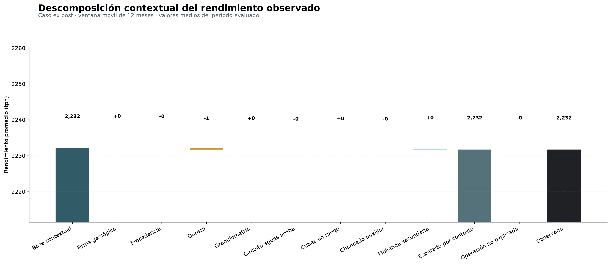

[← Volver al proyecto](index.qmd)

## El modelo sólo puede crear valor cuando permite tomar una decisión

Hemos invertido un montón de tiempo en construir un modelo Bayesiano que estima la media esperada de tratamiento de molienda en una planta concentradora a partir de variables contextuales. Nos hemos desgastado explicando muchas ecuaciones y aspectos asociados a arquitectura y validación de este producto, pasando por el diseño del reporte final. Sin embargo, nada de esto importa si dicho producto no es capaz de generar valor para el negocio ni, cuando menos, cambiar la dirección de una conversación.

Naturalmente, cuando construimos un modelo, sin importar el tipo, no esperamos entregar una tabla de coeficientes o un gráfico de ponderadores como producto final. Por el contrario, esperamos que el usuario pueda recorrer una historia cuantitativa a partir de ese producto. Debido a que este producto es inherentemente probabilístico, queremos que el usuario parta desde un nivel de tratamiento contextual medio, incorpore los drivers que representan las condiciones observadas de un período de tiempo determinado y llegue a un tratamiento esperado, para después comparar ese nivel con el tratamiento observado y determinar si la diferencia es significativa o no. En otras palabras, queremos que el usuario pueda tomar decisiones a partir de la información que le entregamos.

El artefacto visual final es un gráfico de cascada que precisamente cuenta esta historia. En el mundo de las finanzas (donde son muy populares), estos gráficos suelen denominase *bridge charts* y permiten visualizar cómo un valor inicial se ve afectado por una serie de contribuciones positivas y negativas, para llegar a un valor final. En nuestro caso, el valor inicial es el tratamiento contextual medio, las contribuciones son los efectos de las variables contextuales y el valor final es el tratamiento observado.

El principio elemental de un *bridge chart* es la conservación de una identidad exacta al ir agregando contribuciones. Para un período de tiempo $T$ (con granularidad diaria), tenemos:

$$
\bar{y}_{T} =\underbrace{\bar{\alpha}_{T} +\sum_{g} \bar{C}_{g,T}}_{=\text{esperado por contexto}} +\underbrace{\overline{(y_{T}-\hat{\mu}_{T} )}}_{=\text{no explicado}}
$$

donde desacoplamos la contribución de cada variable contextual $g$ y el residuo agregado. En particular:

$$
\bar{C}_{g,T} =\frac{1}{T} \sum_{d\in T} \hat{C}_{dg} \quad ;\quad \overline{(y_{T}-\hat{\mu}_{T} )} =\frac{1}{T} \sum_{d\in T} \left( y_{d}-\hat{\mu}_{d} \right)
$$

En estas fórmulas, se tiene que:

- $\bar{y}_{T}$ es el tratamiento observado promedio en el período $T$.
- $\bar{\alpha}_{T}$ es el tratamiento contextual medio en el período $T$.
- $\bar{C}_{g,T}$ es la contribución promedio de la variable contextual $g$ al tratamiento esperado en el período $T$.
- $\overline{(y_{T}-\hat{\mu}_{T} )}$ es el residuo promedio en el período $T$, es decir, la diferencia entre el tratamiento observado y el tratamiento esperado.

De esta manera, el residuo entre tratamiento esperado y tratamiento observado no se reparte en los drivers de manera visual, sino que se calcula exactamente como la diferencia entre lo observado y la media posterior esperada. Por construcción, se cumple que:

$$
\bar{y}_{T} -\left[ \bar{\alpha}_{T} +\sum_{g} \hat{C}_{g,T} +\overline{(y_{T}-\hat{\mu}_{T} )} \right] =0
$$

Visualmente, es posible que al hacer cuentas manuales rápidas quede un residuo mínimo, pero estos son simplemente errores de redondeo y no afectan la interpretación del gráfico.

## De variables a contribuciones

La pipeline de reportabilidad tiene la siguiente estructura:

```python
from kedro.pipeline import Pipeline, node, pipeline

from .nodes import (
    build_bridge_app,
    build_bridge_summary,
    build_model_card,
    plot_bridge_chart,
)

def create_pipeline(**kwargs) -> Pipeline:
    return pipeline(
        [
            node(
                build_bridge_summary,
                ["backtest_predictions", "params:reporting"],
                "bridge_summary",
                name="build_monthly_and_total_bridges",
                tags=["bridge", "reporting"],
            ),
            node(
                plot_bridge_chart,
                ["bridge_summary", "params:reporting"],
                "bridge_chart",
                name="render_static_bridge_chart",
                tags=["bridge", "figure"],
            ),
            node(
                build_bridge_app,
                ["bridge_summary", "backtest_summary"],
                "bridge_app_html",
                name="build_interactive_bridge_application",
                tags=["bridge", "web_app"],
            ),
            node(
                build_model_card,
                ["backtest_summary", "model_input_schema", "params:reporting"],
                "model_card",
                name="materialize_model_card",
                tags=["governance", "reporting"],
            ),
        ],
        namespace="reporting",
        inputs={"backtest_predictions", "backtest_summary", "model_input_schema"},
        outputs={"bridge_summary", "bridge_chart", "bridge_app_html", "model_card"},
        parameters={"params:reporting"},
    )
```

De esta manera, la reportabilidad se construye por medio de cuatro nodos:

- `build_monthly_and_total_bridges`: Calcula contribuciones promedio por variable contextual y residuo agregado para cada período de tiempo, generando un dataset `bridge_summary` que contiene la información necesaria para construir el gráfico de cascada.
- `render_static_bridge_chart`: Genera un gráfico estático de cascada a partir del dataset `bridge_summary`, permitiendo una visualización rápida de las contribuciones y el residuo (porque, obviamente, no querremos renderizar algo tan sofisticado como un gráfico interactivo cada vez que queramos ver el resultado).
- `build_interactive_bridge_application`: Genera una aplicación web interactiva que permite explorar el gráfico de cascada de manera dinámica, con la posibilidad de seleccionar diferentes períodos de tiempo y ver las contribuciones de cada variable contextual de manera más detallada.
- `materialize_model_card`: Genera una ficha de modelo que documenta el propósito, los usos previstos y no previstos, la política de validación, el esquema de inputs y las métricas calculadas por la pipeline, permitiendo una mejor gobernanza y trazabilidad del modelo, facilitando toda auditoría.

El objetivo general de esta pipeline es, por tanto, transformar las muestras posteriores extraídas del modelo Bayesiano de tratamiento en un producto navegable, que interpreta las variables contextuales como contribuciones al tratamiento esperado en términos de determinadas familias, conforme la taxonomía descrita en la siguiente tabla:

| Familia visible | Componentes del modelo |
|:----------------|:-----------------------|
| Firma geológica. | Efecto categórico derivado de la mezcla de tipo de roca y calidad geotécnica. |
| Procedencia. | Participación de las fuentes de mineral a nivel espacial y zonación. |
| Dureza. | Dureza in–situ mapeada a partir de las tasas de penetración de las perforadores conforme un procedimiento de *ore control* por parte del área de geología. |
| Granulometría. | Fracción fina de mineral en alimentación de stockpile desacoplada en un término lineal y uno cuadrático. |
| Circuito aguas arriba. | Runtime de operación de stockpile sin riesgo de *starving*. |
| Cubas en rango. | Proxy de estabilidad hidráulica del circuito de clasificación conforme oferta y demanda de pulpa. |
| Chancado auxiliar. | Disponibilidad conjunta de las unidades ficticias de chancado auxiliar. |
| Molienda secundaria. | Disponibilidad media de las líneas de molienda secundaria y sus bombas de impulsión de pulpa. |

A fin de conservar la trazabilidad de estas familias de contribuciones, el dataset `bridge_summary` mantiene las columnas `column`, `family`, `kind`, `value_tph`, orden y número de días para cada período, permitiendo reconstruir el gráfico de cascada sin necesidad de volver a estimar los coeficientes del modelo.

A medida que avanzamos por el gráfico de cascada, verificamos la existencia de barras totales y barras que representan diferencias (o deltas) entre el valor acumulado anterior y el valor actual. Para cada paso $j$ del gráfico, se calcula

$$
b_{j}=\min (r_{j-1},r_{j-1}+v_{j})\quad ;\quad h_{j}=|v_{j}|\quad ;\quad r_{j}=r_{j-1}+v_{j}
$$

donde:

- $b_{j}$ es la base de la barra $j$, que se calcula como el mínimo entre el valor acumulado anterior $r_{j-1}$ y la suma del valor acumulado anterior con la contribución actual $v_{j}$.
- $h_{j}$ es la altura de la barra $j$, que se calcula como el valor absoluto de la contribución actual $v_{j}$.
- $r_{j}$ es el valor acumulado después de agregar la contribución actual, que se calcula como la suma del valor acumulado anterior $r_{j-1}$ y la contribución actual $v_{j}$.

Esta topología permite que una contribución negativa descienda desde el nivel actual y una positiva ascienda, sin alterar el valor "firmado" de la tabla que alimenta el gráfico.

## Lectura del resultado

El resultado estático del *bridge chart* se muestra en la @fig-bridge. Esta figura estática es el producto del nodo `render_static_bridge_chart`, siendo almacenada como una figura de <strong><font color="darkmagenta">Matplotlib</font></strong> usando el tipo persistente `matplotlib.MatplotlibDataset` de <strong><font color="darkmagenta">Kedro</font></strong>.

{#fig-bridge fig-align="center" width="100%"}

Conforme el diseño establecido en la [sección anterior](./05-inferencia-bayesiana.qmd), el gráfico de cascada permite visualizar cómo el tratamiento contextual medio se ve afectado por las contribuciones de cada variable contextual y cómo se compara con el tratamiento observado. El *driver* final representa el residuo agregado, que indica la diferencia entre el tratamiento esperado y el tratamiento observado.

En todo el período fuera de muestra, el tratamiento contextual medio fue de aproximadamente 2231.813 tph, mientras que el tratamiento sintético observado promedió cerca de 2231.790 tph. El residuo operacional, definido en el gráfico como observado menos esperado, fue de aproximadamente −0.0234 tph. Su signo negativo indica que el modelo sobreestimó muy ligeramente el tratamiento observado. La métrica de sesgo usa la convención inversa —predicción menos observación— y vale, por ello, +0.0234 tph. La igualdad de magnitud y el cambio de signo constituyen una prueba útil de que la reportería no alteró el universo, la agregación ni la identidad contable del tratamiento.

## Interpretación del residuo como *ruido* operacional

Naturalmente, el modelo no puede explicar todo el tratamiento observado, y el residuo agregado representa la parte del tratamiento que no se explica por las variables contextuales incluidas en el modelo. Este residuo puede deberse a factores no observados, errores de medición o eventos aleatorios que afectan el proceso de molienda. De ninguna manera reviste causalidad, sino que es simplemente un indicador de la variabilidad inherente al proceso y de la limitación del modelo para capturar todos los factores que influyen en el tratamiento observado.

Sin embargo, aceptando que el modelo guarda cierto nivel de representatividad validado bajo criterio experto, el residuo agregado puede ser interpretado como un indicador de la eficiencia operacional del proceso de molienda. Un residuo negativo persistente podría indicar que el proceso está operando por debajo de su capacidad esperada, mientras que un residuo positivo persistente podría indicar que el proceso está operando por encima de su capacidad esperada. En ambos casos, es importante investigar las causas subyacentes y tomar medidas correctivas si es necesario.

## Incorporación de interactividad vía una aplicación web

A continuación, se muestra la versión interactiva del *bridge chart*:

<iframe src="app/bridge.html" title="Bridge chart contextual interactivo" width="100%" height="820" style="border:1px solid #dfe7e5;border-radius:12px;"></iframe>

Si volvemos al código de la pipeline de reportabilidad, verificaremos que el nodo `build_interactive_bridge_application` es el encargado de construir la versión interactiva de nuestro *bridge chart*, usando la librería <strong><font color="darkmagenta">Plotly</font></strong> para generar un gráfico embebido en una especie de aplicación web, y que permite al usuario explorar diferentes períodos de tiempo y ver las contribuciones de cada variable contextual de manera más detallada, a modo de *dashboard*.

El nodo `build_interactive_bridge_application` toma como inputs los datasets `bridge_summary` y `backtest_summary`, y genera un archivo `HTML` que contiene el gráfico interactivo. Este archivo `HTML` puede ser servido desde cualquier servidor web, permitiendo a los usuarios acceder a la aplicación desde sus navegadores sin necesidad de instalar software adicional, gracias a la creación de un *payload* en formato `JSON` embebido dentro del `HTML`. La aplicación web permite al usuario seleccionar diferentes períodos de tiempo, cambiar entre unidades de medida (tph y tpd) y ver las métricas fuera de muestra junto al gráfico, proporcionando una experiencia de usuario más rica y completa.

Dado que el archivo `HTML` es estático, puede ser servido desde el mismo hosting del blog o desde cualquier servidor web. La única dependencia externa es la librería <strong><font color="darkmagenta">Plotly</font></strong>, que se carga desde un CDN (acrónimo de *content delivery network*, y que corresponde a *link* que permite cargar todos los elementos de graficación de la librería <strong><font color="darkmagenta">Plotly</font></strong> en JavaScript). En un entorno sin acceso a internet, también podríamos empaquetar la librería <strong><font color="darkmagenta">Plotly</font></strong> junto con el archivo `HTML`, manteniendo exactamente el mismo contrato de salida.

En términos de arquitectura, es importante destacar que la aplicación web interactiva **explora un artefacto versionado**. No contiene lógica científica paralela ni realiza cálculos adicionales sobre los datos. Si cambian los datos, parámetros o el modelo, se ejecuta la pipeline y se regenera el archivo `HTML`, asegurando que la aplicación siempre refleje la versión más reciente del modelo y sus resultados.

## Ficha de modelo como contrato de uso

El nodo final de la pipeline de reportabilidad es `materialize_model_card`, que genera una ficha de modelo en formato `JSON` que documenta el propósito, los usos previstos y no previstos, la política de validación, el esquema de inputs y las métricas calculadas por la pipeline. Esta ficha de modelo permite una mejor gobernanza y trazabilidad del modelo, facilitando toda auditoría y revisión por parte de terceros.

La ficha resultante de este proyecto se muestra a continuación:

```json
{
  "model_name": "bayesian_tph_forecasting",
  "intended_use": "Explicaci\u00f3n ex post de desviaciones contextuales de rendimiento.",
  "not_intended_for": [
    "atribuci\u00f3n causal autom\u00e1tica",
    "pron\u00f3stico ex ante sin covariables de plan",
    "control directo de equipos"
  ],
  "validation_policy": "rolling 12 months, two-month horizon",
  "uncertainty": {
    "credible_mean_interval": "incertidumbre de la media contextual",
    "posterior_predictive_interval": "incertidumbre de una observaci\u00f3n diaria",
    "probability": 0.9
  },
  "data_contract": {
    "grain": "one row per calendar day",
    "target": "plant_total_tph",
    "signature": "geological_signature",
    "regular_features": [
      "upstream_available_pct",
      "discharge_sumps_in_range_pct",
      "auxiliary_crushing_available_pct",
      "secondary_grinding_available_pct",
      "penetration_rate_mean",
      "feed_fines_pct_mean",
      "feed_fines_pct_centered_sq"
    ],
    "zone_share_features": [
      "zone_share__source_a_outside",
      "zone_share__source_a_zone_1",
      "zone_share__source_b_outside",
      "zone_share__source_b_zone_1",
      "zone_share__source_c_outside",
      "zone_share__source_c_zone_1",
      "zone_share__source_d_outside",
      "zone_share__source_d_zone_1",
      "zone_share__source_e_outside",
      "zone_share__source_e_zone_1",
      "zone_share__source_f_outside",
      "zone_share__source_f_zone_1",
      "zone_share__source_g_outside",
      "zone_share__source_g_zone_1",
      "zone_share__source_h_outside",
      "zone_share__source_h_zone_1"
    ],
    "hardness_share_features": [
      "hardness_share__hard",
      "hardness_share__medium",
      "hardness_share__soft",
      "hardness_share__very_hard"
    ],
    "support_only": [
      "n_feed_cycles",
      "hardness_match_pct"
    ],
    "fines_center_training_only": 36.303508963896995,
    "date_min": "2034-01-01",
    "date_max": "2035-12-30",
    "n_rows": 716
  },
  "metrics": {
    "policy": "rolling_12m",
    "n_days": 358,
    "rmse": 102.83302710877568,
    "mae": 89.71125047102912,
    "bias_pred_minus_actual": 0.0233881675438883,
    "mean_interval_90_coverage_pct": 14.80446927374302,
    "predictive_interval_90_coverage_pct": 92.73743016759776,
    "n_divergences": 0
  }
}
```

Podemos observar que esta ficha se materializa a partir de los outputs de la pipeline, y no a partir de cifras copiadas a mano. Esto reduce el riesgo de que la documentación describa una corrida anterior del modelo, y asegura que cualquier cambio en los datos, parámetros o código se refleje automáticamente en la ficha de modelo. La ficha contiene toda la información necesaria para que un auditor o un usuario del modelo pueda entender su propósito, sus limitaciones y cómo se ha validado, así como el esquema de inputs y las métricas calculadas por la pipeline, sin tener que leer de punta a punta todo el código fuente de este proyecto.

## Recorrido del DAG completo por medio de `kedro-viz`

A continuación, se muestra la visualización completa del DAG del proyecto, generada por la herramienta `kedro-viz`. Esta visualización permite explorar las dependencias entre los nodos que constituyen las pipelines del proyecto completo, así como los inputs y outputs de cada nodo, facilitando la comprensión de su arquitectura y la identificación de posibles cuellos de botella o áreas de mejora.

<iframe src="build/" title="Kedro-Viz del proyecto" width="100%" height="760" style="border:1px solid #dfe7e5;border-radius:12px;"></iframe>

[Abrir `kedro-viz` en una pestaña](build/){.btn .btn-outline-primary}

La misión de `kedro-viz` es permitirnos leer el sistema completo en vez de imaginarlo. La visualización no infiere una arquitectura desde importaciones, sino que muestra las dependencias que los nodos ya declaran. En la vista global aparecen 14 nodos agrupados en cuatro namespaces. El recorrido útil es:

1. Colapsar *namespaces* (nombres de entidades) para leer los contratos entre capas.
2. Expandir el bloque de `data_engineering` para seguir las cuatro fuentes de datos.
3. Inspeccionar los parámetros conectados a cada nodo.
4. Filtrar por *tags* como `spatial`, `no_leakage`, `backtest` o `bridge`.
5. Seleccionar un dataset para identificar *suppliers* y *consumers*.

La vista del DAG responde fundamentalmente a preguntas de naturaleza revisoria. Por ejemplo:

- *¿Los valores a posteriori finales alimentan las métricas fuera de muestra?* No; son ramas distintas.
- *¿El *bridge chart* depende del esquema de inputs?* La *model card* sí, la tabla que alimenta al *bridge chart*, no.
- *¿Dónde se aprende la geometría espacial?* En un nodo visible antes de la agregación espacial.

... entre otras preguntas que surgen al revisar la arquitectura del proyecto. La visualización no reemplaza pruebas ni revisión de código; simplemente reduce el costo cognitivo de mantener el mapa completo y facilita la comprensión de cómo los diferentes componentes del proyecto interactúan entre sí.

[Continuar con el recorrido completo del código fuente](07-codigo-fuente.qmd){.btn .btn-outline-primary}

La ejecución de la visualización embebida se realiza en la interfaz de comandos de <strong><font color="darkmagenta">Kedro</font></strong> por medio del comando:

```bash
uv run kedro viz build
```

Por otro lado, durante el desarrollo, podemos levantar la aplicación interactiva de `kedro-viz` en nuestro navegador con el comando:

```bash
uv run kedro viz run
```

## Ejecución, depuración y verificación

Por supuesto, el proyecto en sí no se limita a la visualización del DAG. Para ejecutar, depurar y verificar el proyecto completo, podemos seguir los siguientes pasos en la interfaz de comandos de <strong><font color="darkmagenta">Kedro</font></strong>:

- Sincronizar los datos y parámetros de desarrollo: `uv sync --extra dev`.
- Ejecutar las pruebas unitarias: `uv run pytest`.
- Ejecutar la pipeline completa: `uv run kedro run`.
- Generar la visualización del DAG: `uv run kedro viz build`.
- Realizar un *smoke test* del ensamblaje: `uv run kedro run --env test`.

Algunas de estas pruebas pueden tardar varios minutos en completarse, dependiendo del tamaño de los datos y la complejidad del modelo. Es importante revisar los registros (o *logs*) generados durante la ejecución para identificar posibles errores o advertencias que puedan afectar la validez de los resultados.

::: {.callout-note}
## ¿Qué es un *smoke test*?
Un *smoke test* es una prueba rápida y superficial que se realiza para verificar que un sistema o componente funciona correctamente en su nivel más básico. En el contexto de este proyecto, el *smoke test* del ensamblaje consiste en ejecutar la pipeline completa en un entorno de prueba (`--env test`) que mantiene los datos, nodos, catálogo y conexiones, pero reduce las cadenas y muestreos posteriores. Esto permite detectar problemas de importación, salidas ausentes y problemas de serialización sin realizar una validación exhaustiva del modelo.

El uso de entornos de prueba es una práctica recomendada en el desarrollo de software y modelos de datos, ya que permite identificar problemas tempranamente y asegurar que los cambios realizados no rompan la funcionalidad existente.
:::

El registro global de pipelines que define las ejecuciones en <strong><font color="darkmagenta">Kedro</font></strong> y sus nombres se encuentra en el archivo `src/bayesian_tph_forecasting/pipelines/pipeline_registry.py`, cuya estructura es la siguiente:

```python
from kedro.pipeline import Pipeline

from bayesian_tph_forecasting.pipelines import (
    bayesian_inference,
    data_engineering,
    data_science,
    reporting,
)

def register_pipelines() -> dict[str, Pipeline]:
    """Registra pipelines locales y compone el pipeline global por dependencias de datos."""
    de_pipeline = data_engineering.create_pipeline()
    ds_pipeline = data_science.create_pipeline()
    bi_pipeline = bayesian_inference.create_pipeline()
    reporting_pipeline = reporting.create_pipeline()
    global_pipeline = de_pipeline + ds_pipeline + bi_pipeline + reporting_pipeline

    return {
        "__default__": global_pipeline,
        "global": global_pipeline,
        "data_engineering": de_pipeline,
        "data_science": ds_pipeline,
        "bayesian_inference": bi_pipeline,
        "reporting": reporting_pipeline,
    }
```

Vemos pues que el pipeline global se compone de cuatro pipelines locales: `data_engineering`, `data_science`, `bayesian_inference` y `reporting`. Cada uno de estos pipelines locales se define en su propio módulo y contiene los nodos necesarios para realizar las tareas específicas de cada etapa del proyecto.

El DAG del proyecto permite además referenciar los nodos por nombre y agruparlos por medio de *tags*, lo que facilita la ejecución selectiva de partes del proyecto. Por ejemplo, podemos ejecutar únicamente la pipeline de `data_engineering` con el comando:

```bash
uv run kedro run --pipelines data_engineering
```

O bien, los nodos de construcción de variables espaciales como:

```bash
uv run kedro run --tags spatial
```

Este particionamiento es útil para depurar y verificar secciones específicas del proyecto sin necesidad de ejecutar la pipeline completa, lo que ahorra tiempo y recursos durante el desarrollo.

## Catalogación de evidencia y trazabilidad

Una vez que el proyecto ha sido ejecutado y verificado, es importante catalogar la evidencia generada durante el proceso. Esto incluye los datos de entrada, los resultados intermedios y los productos finales, así como la documentación asociada a cada uno de ellos. La catalogación permite mantener un registro claro y organizado de todo el trabajo realizado, facilitando la trazabilidad y la auditoría del proyecto.

Al ejecutarse el proyecto, se generan diversos artefactos que deben ser almacenados y versionados adecuadamente. Estos artefactos incluyen:

| Evidencia | Artefactos | Qué permite auditar |
|:----------|:-----------|:--------------------|
| Datos. | Entidades diarias, esquema, centroides, polígonos, etc. | Cómo se construyó el contexto. |
| Científica. | Valores a posteriori, resumen de modelos, predicciones y métricas por *pliegue* de validación | Qué estimó el modelo y cómo validó. |
| Producto. | *Bridge chart*, imágenes estáticas, *web app* y ficha del modelo. | Qué consumió el usuario. |

En términos de control de versiones, los artefactos intermedios regenerables no necesitan ser versionados en sistemas de control como Git, pero deben estar declarados en el catálogo y poder reconstruirse a partir de las entradas, la configuración y el código fuente del proyecto. Esto asegura que cualquier cambio en los datos o en el modelo pueda ser rastreado y reproducido de manera confiable.

## Límites y probables extensiones futuras

El sistema de reportabilidad, en su estado actual, no modela autocorrelación residual explícita, incertidumbre de medición de covariables ni cambio gradual de coeficientes. Las firmas geológicas estimadas a partir del algoritmo de $k$-medias discretizan un par de familias composicionales que representan símplices en $\mathbb{R}^{4}$ (los tipos litológicos) y $\mathbb{R}^{3}$ (las clases de calidad geotécnica), mientras que la construcción de geometrías para las procedencias de mineral hace uso de envolventas convexas para construir polígonos bidimensionales que representan sus fronteras. Finalmente, la variable de respuesta del modelo Bayesiano es tratamiento en unidades de toneladas por hora, infiriéndose su valor en toneladas por día simplemente multiplicando por 24 horas, lo que no equivale a toneladas producidas por día.

Las eventuales mejoras a este proyecto son factibles de implementarse de manera modular, sin alterar la arquitectura general ni el contrato de salida de la pipeline de reportabilidad. Por ejemplo:

- Implementación de balances de tipo *log-ratio* o *embeddings* geológicos, que podrían formar parte de la pipeline denominada `data_science`.
- Estudio de errores por medio de pruebas de hipótesis de $t$ de Student, estructuras de autocorrelación o implementación de coeficientes dinámicos, que podrían formar parte de la pipeline denominada `bayesian_inference`.
- Inclusión de datos provenientes de planes para incorporar un *forecasting* de tipo *ex ante*, la que podría constituir una nueva pipeline de ingeniería.
- Despliegue del producto, monitoreo y programación de ejecuciones, que podrían conectarse después del contrato de reporting.

Localizar rápidamente donde incluir posibles mejoras es parte de la filosofía de <strong><font color="darkmagenta">Kedro</font></strong>: Mejorar una parte del sistema sin volver opaco el sistema completo, manteniendo la trazabilidad y la modularidad del proyecto.

[← Inferencia Bayesiana](05-inferencia-bayesiana.qmd) ·
[Siguiente: Código fuente completo del proyecto →](07-codigo-fuente.qmd)
