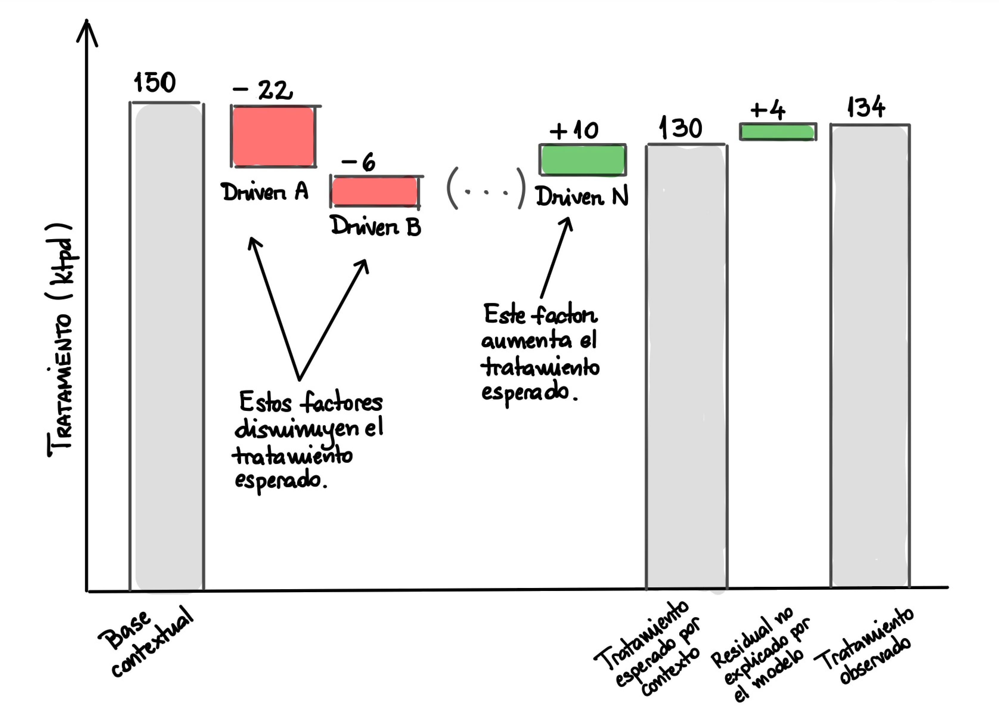
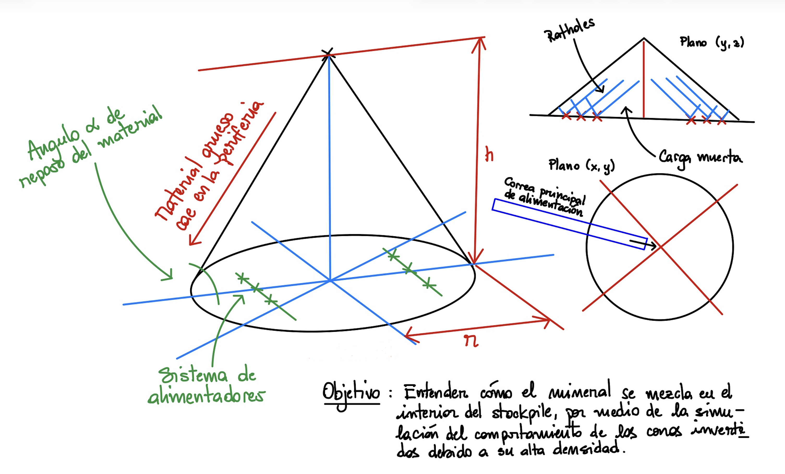

Una colección de proyectos en construcción, con la característica unívoca de ser reproducibles y orientados a problemas reales de ingeniería. Cada tarjeta abre un recorrido que conecta la pregunta de negocio, la teoría, las decisiones de modelamiento y el código ejecutable.

```{=html}
<article class="portfolio-project-card">
<a class="portfolio-project-visual" href="bayesian-tph-forecasting/" aria-label="Abrir Bayesian TPH Forecasting">

<span class="portfolio-project-status"><span></span> Proyecto reproducible</span>
</a>
<div class="portfolio-project-content">
<div class="portfolio-project-kicker">Caso de estudio – Inferencia probabilística</div>
<h2><a href="bayesian-tph-forecasting/"><b><i>Forecasting</i> Bayesiano de tipo <i>ex-post</i></b></a></h2>
<p class="portfolio-project-lead">Un sistema punta a punta diseñado para separar el rendimiento esperable por contexto del componente operacional no explicado en una planta de molienda con un circuito inverso de tipo SABC-A.</p>
<p>El proyecto conecta datos industriales sintéticos, ingeniería geoespacial, algoritmos de agrupamiento, inferencia Bayesiana y un reportabilidad interactiva mediante pipelines modulares de <span class="kedro-brand">Kedro</span>.</p>
<div class="portfolio-project-metrics" aria-label="Resumen del proyecto">
<span><strong>4</strong> pipelines</span>
<span><strong>14</strong> nodos</span>
<span><strong>358</strong> días OOS</span>
<span><strong>92,7 %</strong> cobertura</span>
</div>
<div class="portfolio-project-footer">
<div class="portfolio-project-tags">
<span class="kedro-brand">Kedro</span><span class="kedro-brand">PyMC</span><span>Transporte sintético</span><span class="kedro-brand">Kedro-Viz</span>
</div>
<a class="portfolio-project-cta" href="bayesian-tph-forecasting/">Explorar el proyecto <span aria-hidden="true">→</span></a>
</div>
</div>
</article>

<article class="portfolio-project-card">
<a class="portfolio-project-visual" href="stockpile-cellular-automata/" aria-label="Abrir Autómata celular 3D para un acopio de mineral">

<span class="portfolio-project-status"><span></span> Proyecto reproducible</span>
</a>
<div class="portfolio-project-content">
<div class="portfolio-project-kicker">Caso de estudio – Simulación 3D de un stockpile</div>
<h2><a href="stockpile-cellular-automata/"><b>Autómata celular en tres dimensiones para un stockpile de mineral intermedio</b></a></h2>
<p class="portfolio-project-lead">Una réplica pedagógica en Python de un modelo continuo basado en autómatas celulares que representa formación, segregación granulométrica, descarga y migración de espacios vacíos (<i>ratholes</i>) dentro de un stockpile de geometría cónica.</p>
<p>El recorrido conecta fundamentos físicos, datos sintéticos con <strong><font color='darkmagenta'>Polars</font></strong>, contratos de datos con <strong><font color='darkmagenta'>Pydantic</font></strong>, activos observables con <strong><font color='darkmagenta'>Dagster</font></strong> y una herramienta de reportabilidad construida con <strong><font color='darkmagenta'>React</font></strong>, capaz de reproducir hasta dos semanas continuas de mezcla en el stock.</p>
<div class="portfolio-project-metrics" aria-label="Resumen del proyecto">
<span><strong>41×41×18</strong> celdas</span>
<span><strong>3</strong> activos</span>
<span><strong>2</strong> checks</span>
<span><strong>14</strong> días</span>
</div>
<div class="portfolio-project-footer">
<div class="portfolio-project-tags">
<span><strong><font color='darkmagenta'>Polars</font></strong></span><span><strong><font color='darkmagenta'>Pydantic</font></strong></span><span><strong><font color='darkmagenta'>Dagster</font></strong></span><span>CCA 3D</span>
</div>
<a class="portfolio-project-cta" href="stockpile-cellular-automata/">Explorar el proyecto <span aria-hidden="true">→</span></a>
</div>
</div>
</article>
```
