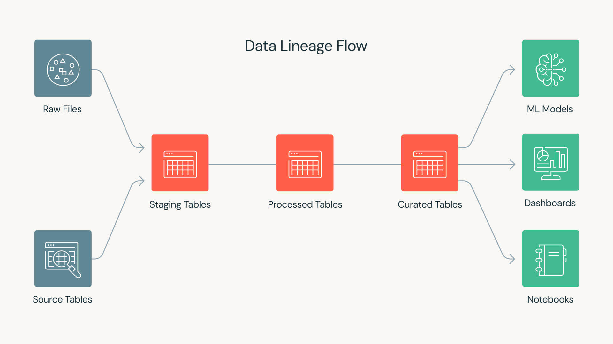

[← Volver al proyecto](index.qmd)

## Una contrapropuesta deliberada a nuestro primer proyecto

El primero proyecto publicado en este blog corresponde a un [modelo de reconciliación de tratamiento basado en inferencia Bayesiana](../bayesian-tph-forecasting/), el cual tiene como objetivo la reconstrucción y explicación (no causal) del tratamiento de molienda de una planta concentradora en función de familias de variables puramente contextuales, a fin de aislar efectos operacionales de interés. En dicho proyecto, adoptamos a <strong><font color='darkmagenta'>Kedro</font></strong> como arquitectura de orquestación, manteniendo las librerías típicas de *data science* como herramientas esenciales para el análisis y procesamiento de datos (<strong><font color='darkmagenta'>Numpy</font></strong> y <strong><font color='darkmagenta'>Pandas</font></strong> para manipulación de arreglos y tablas, respectivamente; <strong><font color='darkmagenta'>PyMC</font></strong> para la construcción de nuestro modelo Bayesiano).

En este proyecto, en vez de <strong><font color='darkmagenta'>Kedro</font></strong>, hemos adoptado <strong><font color='darkmagenta'>Dagster</font></strong> como arquitectura de orquestación, aprovechando sus capacidades para gestionar activos de software y su ciclo de vida de manera explícita. No buscamos hacer competir a estas librerías (de hecho, ni siquiera *compiten*, sino que ofrecen enfoques complementarios). Queremos simplemente comparar dos enfoques distintos para la orquestación de proyectos de ciencia de datos:

- <strong><font color='darkmagenta'>Kedro</font></strong> para la organización de la ejecución de un proyecto conforme a **pipelines y nodos**.
- <strong><font color='darkmagenta'>Dagster</font></strong> para la organización de la ejecución de un proyecto conforme a **activos de software** y su ciclo de vida.

Al igual que <strong><font color='darkmagenta'>Kedro</font></strong>, la librería <strong><font color='darkmagenta'>Dagster</font></strong>  permite estructurar la ejecución de un proyecto de ciencia de datos sobre la base de un **grafo dirigido acíclico** o **DAG**. En <strong><font color='darkmagenta'>Kedro</font></strong>, el DAG del proyecto se construye a partir de las dependencias entre nodos, los que representan funciones a las que hemos asignado determinadas responsabilidades dentro de un contexto o capa determinada. En <strong><font color='darkmagenta'>Dagster</font></strong>, el DAG se construye a partir de las dependencias entre **activos de software**, los que representan resultados intermedios o finales de nuestro proyecto, con foco en **chequeos de validación y consistencia**.

El DAG de este proyecto es muy simple y puede expresarse como

$$
\text{public\_minute\_raw}\rightarrow
\text{public\_minute\_curated}\rightarrow
\text{stockpile\_replay}
$$

Es decir, el activo `public_minute_raw` debe materializarse antes de que `public_minute_curated` pueda hacerlo, y este último debe materializarse antes de que `stockpile_replay` pueda hacerlo. Estos activos de software representan diferentes etapas del procesamiento de datos dentro del proyecto: `public_minute_raw` corresponde a los datos crudos, `public_minute_curated` a los datos procesados y preparados para análisis, y `stockpile_replay` al resultado final de la simulación del autómata celular.

## ¿Qué es <strong><font color='darkmagenta'>Dagster</font></strong>?

<strong><font color='darkmagenta'>Dagster</font></strong> es un orquestador de flujos de trabajo para proyectos de ciencia de datos. Permite definir, ejecutar y monitorear pipelines de datos de manera estructurada, asegurando que los activos de software se materialicen correctamente y que las dependencias entre ellos se respeten. A diferencia de otros orquestadores que se centran en la ejecución de funciones, <strong><font color='darkmagenta'>Dagster</font></strong> pone el foco en los activos de software y su ciclo de vida, facilitando la gestión de la calidad y consistencia de los datos a lo largo del proyecto.

### Activos de software (o *assets*)

Los **activos de software** son los elementos centrales en <strong><font color='darkmagenta'>Dagster</font></strong>. Representan resultados intermedios o finales de un proyecto de ciencia de datos y su ciclo de vida es gestionado explícitamente por el orquestador. Cada activo puede tener dependencias con otros activos, y su materialización asegura que los datos estén disponibles y sean consistentes para las etapas posteriores del proyecto. No se trata de funciones, ni tampoco de conjuntos de datos en bruto, sino de entidades que encapsulan resultados significativos dentro del DAG.

<strong><font color='darkmagenta'>Dagster</font></strong> hace uso de decoradores para definir activos, operaciones y pipelines. Por ejemplo, se puede usar `@asset` para marcar una función como un activo de software, `@op` para definir una operación dentro de un pipeline, y `@job` para agrupar operaciones en un flujo de trabajo ejecutable. Estos decoradores permiten a <strong><font color='darkmagenta'>Dagster</font></strong> gestionar automáticamente las dependencias y la materialización de los activos.

La librería se instala a partir del índice de paquetes de Python (PyPI) utilizando el siguiente comando:

```bash
pip install dagster
```

Solemos importarla de manera directa por medio del alias `dg`. Por ejemplo, si quisiéramos construir un proyecto constituido por dos activos de datos, denominados `hello` y `world`, cada uno de ellos debe ser definido en un módulo dedicado, típicamente ubicado en `defs/assets.py`, en la forma de funciones y con el decorador `@dg.asset` aplicado a cada una:

```python
import dagster as dg

@dg.asset
def hello(context: dg.AssetExecutionContext):
    context.log.info("Hello!")

@dg.asset(deps=[hello])
def world(context: dg.AssetExecutionContext):
    context.log.info("World!")
```

En el bloque de código anterior:

- El activo `hello` se define sin dependencias y simplemente registra un mensaje. Por definición, todo activo se define conforme un parámetro `context`,
  que proporciona acceso a la ejecución, incluyendo el registro de mensajes. En este caso, `context: dg.AssetExecutionContext` simplemente indica que `context` es del tipo esperado por <strong><font color='darkmagenta'>Dagster</font></strong> para la ejecución de activos.
- El activo `world` depende de `hello`, lo que se indica mediante el argumento `deps=[hello]` en el decorador. Esto asegura que `hello` se materialice antes de `world`.

### Operaciones y materialización

En Python, cuando definimos una función, nos centramos en la transformación de argumentos en resultados. La función se ejecuta y produce un valor de retorno inmediato. Sin embargo, en el contexto de <strong><font color='darkmagenta'>Dagster</font></strong>, nos interesa más la materialización de activos de datos, que puede ocurrir en un momento posterior y ser registrada como un evento separado. En términos simples, definimos la **materialización** como el acto de producir y registrar un activo de datos en un punto específico en el tiempo.

Así como los activos de datos se materializan en momentos específicos, las denominadas **operaciones** (`ops`) en <strong><font color='darkmagenta'>Dagster</font></strong> representan unidades computacionales que pueden ser ejecutadas y registradas de manera controlada. Esto permite un seguimiento detallado de la ejecución y facilita la depuración y el monitoreo de los flujos de trabajo.

Las operaciones suelen construirse por medio del uso del decorador `@dg.op`, que marca una función como una unidad computacional ejecutable dentro del contexto de <strong><font color='darkmagenta'>Dagster</font></strong>. Para introducir una operación, es necesario además definir explícitamente el **grafo** que organiza y conecta estas operaciones, proporcionando un flujo de ejecución claro y controlado, por medio del decorador `@dg.graph`.

Por ejemplo, en el bloque de código anterior, podemos expandir el flujo de trabajo introduciendo una operación adicional y un grafo que conecte las operaciones `hello` y `world`:

```python
import dagster as dg

# Definimos los activos base independientes.
@dg.asset
def hello(context: dg.AssetExecutionContext):
    context.log.info("Hello!")
    return "Hello"

# Definimos una `op` para realizar una tarea de cómputo específica.
@dg.op
def exclamation_op(context: dg.OpExecutionContext, text: str) -> str:
    context.log.info(f"Procesando el texto en la OP: {text}")
    return f"{text}!"

# Definimos un grafo intermedio que conecta la `op`.
@dg.graph
def world_graph(hello):
    # La op recibe la salida del asset 'hello'
    return exclamation_op(hello)

# Transformamos el grafo en el activo final 'world'.
# Esto reemplaza el uso directo de deps=[hello] manteniendo el linaje
# de datos.
world = dg.AssetDefinition.from_graph(world_graph)
```

A diferencia de lo que hicimos la primera vez, ahora estamos encapsulando la lógica de la operación dentro de un grafo y transformando ese grafo en un activo, lo que permite mantener el linaje de datos y la trazabilidad de manera más estructurada:

- La función `hello` es un activo base que produce un valor.
- La operación `exclamation_op` transforma ese valor dentro de un grafo.
- El grafo `world_graph` encapsula la lógica de la operación.
- El activo `world` materializa el resultado del grafo.

### La diferencia entre nodo y activo de datos

Al construir proyectos de <strong><font color='darkmagenta'>Kedro</font></strong>, los nodos representan funciones de transformación que se conectan mediante un grafo de dependencias. Cada nodo tiene entradas y salidas claramente definidas, pero no mantiene un **linaje** explícito de los datos. En contraste, al trabajar con <strong><font color='darkmagenta'>Dagster</font></strong>, los activos de datos permiten rastrear la identidad y el linaje de los datos a lo largo del tiempo, proporcionando una visión más estructurada y controlada del flujo de trabajo.

Por ejemplo, consideremos el siguiente activo de datos:

```python
import dagster as dg
import polars as pl

@dg.asset(group_name="engineering", kinds={"python", "polars"})
def public_minute_curated(
    public_minute_raw: pl.DataFrame
) -> pl.DataFrame:
    return curate_minute_series(public_minute_raw)
```

El activo `public_minute_curated` representa una tabla *curada* derivada del DataFrame `public_minute_raw` (construido en <strong><font color='darkmagenta'>Polars</font></strong>). Al declararlo como un activo de <strong><font color='darkmagenta'>Dagster</font></strong>, se puede rastrear su linaje, registrar materializaciones y aplicar checks de calidad de manera estructurada.

::: {.callout-note}
## ¿Qué es el linaje de datos?

En el contexto de la orquestación de datos, el **linaje de datos** se refiere a la capacidad de rastrear el origen, las transformaciones y el destino de los datos a lo largo de su ciclo de vida. Esto permite entender cómo se generan los resultados, identificar posibles errores y garantizar la reproducibilidad de los procesos.

El linaje resulta clave en productos de datos que han sido desplegados en algún servicio dedicado, como Azure o Databricks, ya que permite auditar y reproducir los resultados de manera confiable. De hecho, en Databricks, existe una plataforma de **gobierno de datos**, denominada **Unity Catalog**, que facilita la gestión del linaje y la gobernanza de los datos.

{#fig-lineage fig-align="center" width="100%"}
:::

### DAG del proyecto

Este proyecto se organiza como un grafo acíclico dirigido (DAG) donde los nodos representan activos de datos y las aristas indican dependencias entre ellos. A continuación se muestra un esquema sencillo del **DAG público** que ilustra cómo se conectan los activos principales del proyecto.

```{mermaid}
flowchart LR
  R["public_minute_raw"] --> C["public_minute_curated"]
  C --> S["stockpile_replay"]
  C --> QC{"minute_contract"}
  S --> QR{"height_reconciliation"}
```

Los activos de datos se representan por medio de bloques rectangulares, mientras que los chequeos de activos se representan con bloques en forma de riombo. Las flechas indican dependencias entre los activos y los correspondientes chequeos. El primer activo del DAG es `public_minute_raw`, que representa una tabla cruda que se imputa y posteriormente se transforma en `public_minute_curated` mediante el proceso de curación definido en el activo correspondiente. Este último activo sirve como base para la generación de `stockpile_replay` y para la verificación de contratos a través de `minute_contract`. Finalmente, `height_reconciliation` evalúa la calidad de los datos derivados de `stockpile_replay`, renconciliando la altura simulada por el autómata contra la altura real provista por los datos operacionales y la altura de diseño establecida en el TOML del proyecto.

### Chequeos de activos

Los **chequeos de activos** se definen formalmente como funciones que verifican la validez de un activo de datos y devuelven un resultado que indica si el chequeo pasó o falló, junto con metadata adicional. Se trata de elementos estructurales que permiten garantizar la calidad y consistencia de los datos a lo largo del DAG.

Los chequeos de activos se pueden clasificar en tres tipos principales:

- **Excepciones**: Chequeos que determinan si un activo no puede ser computado debido a estados imposibles.
- **Chequeos bloqueantes**: Verificaciones que invalidan a los consumidores si fallan.
- **Chequeos no bloqueantes**: Evaluaciones de calidad que requieren juicio y no bloquean el flujo de datos.

Los chequeos de activos se implementan como funciones decoradas con `@dg.asset_check`, donde se especifica el activo al que pertenecen y si son bloqueantes o no. Estas funciones reciben el DataFrame correspondiente al activo y devuelven un objeto `dg.AssetCheckResult` que indica si el chequeo pasó o falló, junto con metadatos adicionales que pueden incluir métricas de calidad, conteos de filas, entre otros.

Un ejemplo de chequeo se muestra en el siguiente bloque de código:

```python
import dagster as dg
import numpy as np
import polars as pl

@dg.asset_check(asset=public_minute_curated, blocking=True)
def minute_contract(
    public_minute_curated: pl.DataFrame
) -> dg.AssetCheckResult:
    """Detiene el DAG si rangos, orden o nulidad dejan de ser publicables."""
    checks = [
        public_minute_curated["timestamp"].is_sorted(),
        public_minute_curated.null_count().row(0) == (0,) * public_minute_curated.width,
        public_minute_curated["feed_p80_in"].is_between(0.05, 30.0).all(),
    ]

    return dg.AssetCheckResult(
        passed=all(checks),
        metadata={"rows": public_minute_curated.height},
    )

@dg.asset_check(asset=stockpile_replay)
def height_reconciliation(
    stockpile_replay: pl.DataFrame
) -> dg.AssetCheckResult:
    """Publica métricas sin convertir un mal ajuste en un fallo de software."""
    metrics = agreement(
        stockpile_replay["simulated_height_m"].to_numpy(),
        stockpile_replay["measured_height_m"].to_numpy(),
    )

    return dg.AssetCheckResult(
        passed=bool(np.isfinite(metrics.rmse)),
        metadata={
            "bias_m": metrics.bias,
            "mae_m": metrics.mae,
            "rmse_m": metrics.rmse,
        },
    )
```

Los chequeos anteriores, formalmente, corresponden a los que se han publicado en este proyecto en <strong><font color='darkmagenta'>Dagster</font></strong>. En particular, se distinguen entre bloqueantes y no bloqueantes según su impacto en el flujo de datos. Tenemos pues:

- El primer chequeo corresponde a `minute_contract`, que es de tipo bloqueante. Permite detener el DAG si los datos no cumplen con los criterios de orden, nulidad y rango establecidos en el cuerpo de esta función.
- El segundo chequeo corresponde a `height_reconciliation`, que es de tipo no bloqueante. Publica métricas de ajuste sin detener el flujo de datos, permitiendo evaluar la calidad de los datos sin interrumpir la ejecución del DAG.

Notemos que, en el último chequeo, realizamos una conversión silenciosa entre un booleano de <strong><font color='darkmagenta'>Numpy</font></strong> (`np.bool_`) a un booleano nativo de Python (`bool`). Esto es necesario, porque los metadatos y los resultados del orquestador requieren tipos serializables y contratos propios. Es decir, aunque `np.bool_` y `bool` representen lo mismo conceptualmente, el orquestador no puede manejar directamente tipos de <strong><font color='darkmagenta'>Numpy</font></strong> en sus resultados y metadatos.

### Administradores de entrada/salida (o I/O)

En <strong><font color='darkmagenta'>Dagster</font></strong>, los administradores de entrada/salida (en inglés, *I/O managers*) constituyen la capa de abstracción encargada de definir cómo se cargan y almacenan los datos que fluyen entre los diferentes activos de datos que conforman nuestro DAG.

Su propósito central es separar el código de cómputo del código de almacenamiento (denominado genéricamente como **lógica de persistencia**). En lugar de escribir instrucciones manualmente para guardar un archivo determinado en un disco local, en un servicio de data lake o en cualquier otro sistema o servicio de almacenamiento, dentro de una función, simplemente retornamos un objeto de Python (como un DataFrame) y delegamos la persistencia física al administrador de I/O correspondiente.

Un administrador de I/O implementa, en general, dos operaciones fundamentales:

- `load_input`: Se encarga de cargar los datos desde el almacenamiento físico hacia el entorno de ejecución del DAG.
- `handle_output`: Se encarga de persistir los datos generados por un activo de datos en el almacenamiento físico correspondiente.

Esto permite cambiar el entorno de almacenamiento (por ejemplo, usar un sistema de archivos local en un entorno de desarrollo o `dev` y moverlo a la nube en un entorno de testing o `uat`, o a producción o `prod`) modificando únicamente la configuración en las definiciones del proyecto, sin tocar una sola línea del código de nuestras transformaciones.

A modo de ejemplo, consideremos el siguiente bloque de código:

```python
import pandas as pd
import dagster as dg

class CsvIOManager(dg.ConfigurableIOManager):
    path_prefix: str  # Propiedad configurable (por ejemplo, '/tmp/data').

    def _get_path(self, context) -> str:
        # Se genera una ruta utilizando el nombre identificador del activo.
        return f"{self.path_prefix}/{context.asset_key.path[-1]}.csv"

    def handle_output(self, context: dg.OutputContext, obj: pd.DataFrame):
        # Lógica para escribir el archivo.
        path = self._get_path(context)
        obj.to_csv(path, index=False)
        context.log.info(f"Datos guardados exitosamente en: {path}")

    def load_input(self, context: dg.InputContext) -> pd.DataFrame:
        # Lógica para leer el archivo desde el activo aguas arriba.
        path = self._get_path(context)
        return pd.read_csv(path)
```

Hemos creado un administrador de I/O personalizado para manejar la persistencia de activos de datos en archivos CSV, denominado explícitamente `CsvIOManager`. Este objeto hereda las propiedades y métodos de la clase base `ConfigurableIOManager` de <strong><font color='darkmagenta'>Dagster</font></strong>, permitiendo definir rutas de almacenamiento y gestionar la lectura y escritura de datos de manera consistente. Hemos equipado a este objeto de tres métodos, uno de uso interno, deniminado `_get_path()`, y dos de uso externo, `handle_output()` y `load_input()`, conforme la *receta* típica de <strong><font color='darkmagenta'>Dagster</font></strong>.

## Comparativa rápida con <strong><font color='darkmagenta'>Kedro</font></strong>

A modo de resumen, mostraremos en la siguiente tabla una comparativa rápida entre <strong><font color='darkmagenta'>Kedro</font></strong> y <strong><font color='darkmagenta'>Dagster</font></strong> en el contexto de los proyectos publicados en el blog.

| Tema | <strong><font color='darkmagenta'>Kedro</font></strong> en el proyecto Bayesiano | <strong><font color='darkmagenta'>Dagster</font></strong> en modelo de stockpile |
|:---|:---|:---|
| Unidad primaria. | Nodos y pipelines. | Activos de datos. |
| DAG. | Composición explícita de entradas y salidas. | Dependencias por firma/definición de activos. |
| Persistencia. | Catálogo de datos de <strong><font color='darkmagenta'>Kedro</font></strong>. | Administradores de I/O de <strong><font color='darkmagenta'>Dagster</font></strong>. |
| Parámetros. | Configuración en diccionario `yaml`. | Configuración `toml` + contratos específicos. |
| Calidad. | Nodos + pruebas + *hooks*. | Chequeos de activos de primera clase. |
| Interfaz de usuario. | DAG interactivo en `kedro-viz`. | DAG interactivo en <strong><font color='darkmagenta'>Dagster</font></strong> webserver y UI. |
| Particiones y *backfills*. | Posibles, aunque menos centrales. | Primitivas centrales. |
| Operación. | Ejecución de pipelines. | Materializaciones de activos. |
| Dominio puro. | Natural en nodos. | Requiere disciplina para no acoplar activos de datos. |

La librería <strong><font color='darkmagenta'>Kedro</font></strong> se centra en la claridad del flujo de funciones y *datasets*, facilitando la comprensión de cómo los datos se transforman a lo largo del pipeline. Por otro lado, <strong><font color='darkmagenta'>Dagster</font></strong> se enfoca en la gestión de activos de datos, proporcionando visibilidad sobre cuándo se materializan, qué chequeos han pasado y cómo se pueden re-ejecutar particiones.

::: {.callout-note}
## ¿Qué son lops *hooks* en <strong><font color='darkmagenta'>Kedro</font></strong>?

Algo que no revisamos en el proyecto de modelamiento Bayesiano de tratamiento de molienda fue el uso de *hooks* en <strong><font color='darkmagenta'>Kedro</font></strong>. Los *hooks* son funciones que se ejecutan en momentos específicos del ciclo de vida de una pipeline, permitiendo realizar acciones adicionales como validaciones, logging o modificaciones de datos sin alterar la lógica principal de los nodos.

Consideremos el siguiente bloque de código a modo de ejemplo:

```python
from kedro.framework.hooks import hook_impl

class MyHook:
    @hook_impl
    def before_node_run(self, node, inputs):
        print(f"Running node {node.name} with inputs {inputs}")

    @hook_impl
    def after_node_run(self, node, outputs):
        print(f"Finished node {node.name} with outputs {outputs}")
```

Hemos defininido un *hook* personalizado llamado `MyHook` que imprime mensajes antes y después de la ejecución de cada nodo. Para que este *hook* tenga efecto, debemos registrarlo en el proyecto de <strong><font color='darkmagenta'>Kedro</font></strong>, generalmente en el archivo `settings.py`:

```python
from .hooks import MyHook

HOOKS = (MyHook(),)
```

El *hook* se compone de dos métodos: `before_node_run`, que se ejecuta antes de que un nodo comience a ejecutarse, y `after_node_run`, que se ejecuta después de que un nodo ha terminado su ejecución. <strong><font color='darkmagenta'>Kedro</font></strong> hace uso del decorador `@hook_impl` para marcar los métodos que deben ser tratados como *hooks*, a fin de darle claridad y estructura al ciclo de vida de cualquier pipeline.
:::

## ¿Por qué usamos <strong><font color='darkmagenta'>Dagster</font></strong> en este proyecto?

El [proyecto de inferencia Bayesiana *ex post*](../bayesian-tph-forecasting/) publicado previamente en el blog está constituido por cuatro pipelines principales y un producto principal en la forma de un reporte interactivo con base en <strong><font color='darkmagenta'>Plotly</font></strong>. Tales pipelines constituyen flujos de ingeniería, ciencia de datos, inferencia Bayesiana y reportabilidad. Su secuenciamiento es relativamente acíclico y por lotes (es decir, se ejecutan en bloques discretos de tiempo y no dependen de la ejecución continua de otros pipelines). Por lo tanto, su lectura como pipeline en <strong><font color='darkmagenta'>Kedro</font></strong> resulta natural.

Nuestro autómata celular para modelar un stockpile de mineral intermedio en este proyecto presenta un flujo de datos más dinámico y dependiente del estado, lo que hace que la orquestación basada en activos de <strong><font color='darkmagenta'>Dagster</font></strong> sea particularmente adecuada. Las condiciones operacionales del autómata son muy diferentes del modelo Bayesiano:

- La historia de los datos se construye de manera incremental y particionada.
- El estado del sistema persiste entre ventanas de tiempo.
- Se generan cuadros diarios numerosos que deben ser procesados y almacenados.
- La reejecución de partes del pipeline debe ser eficiente y selectiva.
- La trazabilidad de los activos es crucial para entender el impacto de cada ejecución.

La razón por la cual el estructuramiento de los pipelines en términos de activos resulta ventajoso en este proyecto es que permite un seguimiento más granular del estado del sistema, facilita la reejecución selectiva de partes del pipeline y asegura la trazabilidad de los datos a lo largo del tiempo. Esto es especialmente importante dado que nuestro autómata celular genera grandes volúmenes de datos diarios y mantiene un estado persistente entre ventanas de tiempo.

## Asociación con <strong><font color='darkmagenta'>Pydantic</font></strong>

Si bien <strong><font color='darkmagenta'>Dagster</font></strong> incluye la posibilidad de definir un sistema de configuración y tipos de manera nativa, optamos por mantener <strong><font color='darkmagenta'>Pydantic</font></strong> en el dominio para aprovechar sus capacidades de validación, inmutabilidad y expresividad de relaciones físicas. El uso de esta última librería permite que los contratos de validación puedan:

- Construirse desde una interfaz de línea de comandos (o CLI), una prueba sencilla o un notebook de Jupyter, sin la necesidad de un *runtime* de orquestación (donde, con *runtime*, nos referimos al entorno de ejecución de <strong><font color='darkmagenta'>Dagster</font></strong>).
- Ser inmutables y reutilizables.
- Expresar relaciones físicas.
- Mantener independencia tecnológica.

En el contrato de validación principal de <strong><font color='darkmagenta'>Pydantic</font></strong>, definimos el objeto `SimulationSpec`:

```python
import pydantic
from pydantic import BaseModel, model_validator

"""
Este bloque es un extracto de un contrato mucho más amplio, en el cual se han
definido otros objetos estructurales que alimentan a `SimulationSpec`, tales
como `GridSpec`, `StockpileSpec`, `SegregationSpec`, `ConveyorSpec` y `FeederSpec`.
El "sufijo" `Spec` indica que se trata de un contrato de especificación detallada
para cada componente del sistema.
"""

class SimulationSpec(ImmutableContract):
    """Contrato agregado consumido por el núcleo y por los activos."""

    grid: GridSpec # Especificación de la retícula.
    stockpile: StockpileSpec # Especificación del stockpile.
    segregation: SegregationSpec # Especificación de la segregación.
    conveyor: ConveyorSpec | None = None # Especificación de la correa transportadora.
    feeders: tuple[FeederSpec, ...] # Especificación de los feeders.

    @model_validator(mode="after")
    def geometry_is_self_consistent(self) -> Self:
        if len(self.feeders) != 6:
            raise ValueError(
                "La demostracion publica requiere seis alimentadores"
            )
        for feeder in self.feeders:
            if feeder.east >= self.grid.n_east or feeder.north >= self.grid.n_north:
                raise ValueError(
                    f"{feeder.name} queda fuera de la grilla"
                )
        available_height = self.grid.n_vertical * self.grid.cell_size_m
        if self.stockpile.design_height_m >= available_height:
            raise ValueError(
                "La altura de diseno debe dejar al menos una celda vertical libre"
            )
        return self
```

Este objeto permite validar la consistencia geométrica y las restricciones de diseño de la simulación antes de su ejecución. El decorador `@model_validator(mode="after")` asegura que la validación se realice después de la construcción del objeto. Las validaciones internas comprueban que los alimentadores estén dentro de la grilla y que la altura del stockpile no exceda la capacidad disponible.

La separación entre la definición de la simulación y la orquestación permite mantener un dominio limpio y desacoplado, facilitando la reutilización y prueba de los componentes individuales.

## ¿Cómo seleccionamos activos y los ejecutamos en <strong><font color='darkmagenta'>Dagster</font></strong>?

Cuando hacemos uso de <strong><font color='darkmagenta'>Kedro</font></strong> para darle estructura a un proyecto de data science, la ejecución de las pipelines y/o nodos se realiza por medio de una CLI dedicada, con comandos en `bash` como los que se muestran a continuación:

```bash
# Ejemplo de ejecución de un nodo en Kedro.
uv run kedro run --node <nombre_del_nodo>

# Ejemplo de ejecución de una pipeline en Kedro.
uv run kedro run --pipeline <nombre_de_la_pipeline>

# Ejemplo de ejecución de toda la pipeline en Kedro.
uv run kedro run
```

Notemos que, previo a la ejecución de cualquier comando de Kedro, es importante asegurarse de que el entorno de ejecución esté correctamente configurado y que todas las dependencias necesarias estén instaladas. En el bloque de código anterior, hemos antepuesto `uv run` para garantizar que los comandos se ejecuten dentro del entorno de `uvicorn`.

En <strong><font color='darkmagenta'>Dagster</font></strong>, la ejecución de activos y pipelines se realiza a través de su propia CLI, que permite seleccionar y materializar activos específicos, así como lanzar pipelines completas. Esto proporciona un control más fino sobre la orquestación de los componentes del proyecto en comparación con <strong><font color='darkmagenta'>Kedro</font></strong>.

Consideremos el siguiente ejemplo:

```bash
# Configuración del entorno de Dagster.
export DAGSTER_HOME="$PWD/.dagster_home"

# Ejecución de un activo de datos en Dagster.
uv run dagster asset materialize --select '*' -m stockpile_ca.definitions
```

Notemos que, a diferencia de <strong><font color='darkmagenta'>Kedro</font></strong>, en <strong><font color='darkmagenta'>Dagster</font></strong> solemos configurar previamente el entorno de ejecución a través de la variable de entorno `DAGSTER_HOME` antes de materializar cualquier activo. Esto asegura que <strong><font color='darkmagenta'>Dagster</font></strong> utilice un directorio específico para almacenar su configuración y metadatos, lo que facilita la reproducibilidad y el aislamiento del entorno de ejecución. La sintaxis de ejecución de activos es muy sencilla: Partimos con `dagster asset materialize` para indicar que materializaremos un determinado activo de datos, y luego continuamos con la selección de los activos específicos mediante la opción `--select`. Por ejemplo, `--select '*'` selecciona todos los activos disponibles. La adición de `-m stockpile_ca.definitions` indica el módulo donde se encuentran definidos los activos a materializar.

::: {.callout-important}
## Entonces... ¿Cuándo elegir <strong><font color='darkmagenta'>Kedro</font></strong>, <strong><font color='darkmagenta'>Dagster</font></strong> u otro orquestador?

La elección entre <strong><font color='darkmagenta'>Kedro</font></strong> y <strong><font color='darkmagenta'>Dagster</font></strong> depende de las necesidades específicas del proyecto y del equipo. Aquí hay algunas pautas generales:

- Elige <strong><font color='darkmagenta'>Kedro</font></strong> si tu enfoque principal es la construcción de pipelines reproducibles de ciencia de datos con un fuerte énfasis en la estructura del catálogo de datos y la convención sobre la configuración.
- Elige <strong><font color='darkmagenta'>Dagster</font></strong> si necesitas un control más fino sobre la orquestación de activos, incluyendo particiones, materializaciones, checks, múltiples consumidores y operación diaria de activos.

¿Hay más alternativas de uso masivo en el mercado? La respuesta es, naturalmente, que sí. Por ejemplo, <strong><font color='darkmagenta'>Airflow</font></strong> es otra opción popular para la orquestación de pipelines, especialmente cuando se requiere una programación compleja y una integración con múltiples sistemas externos. Se trata de una herramienta con fuerte enfoque en patrones de diseño de flujo de trabajo y dependencias entre tareas, propio de los ingenieros de datos. En lo personal, tengo serios problemas entendiendo su configuración y operación diaria, lo que refuerza mi preferencia por herramientas más amables con usuarios menos asiduos a la programación pura y dura. Quizás, por esto mismo, suelo resolver la orquestación de proyectos entre herramientas muy interactivas, como <strong><font color='darkmagenta'>Kedro</font></strong> y <strong><font color='darkmagenta'>Dagster</font></strong> (aunque, a juicio personal, creo que siguen siendo bastante *low level*).
:::

## Visualización del DAG en <strong><font color='darkmagenta'>Dagster</font></strong> Webserver

Para levantar el servidor web de <strong><font color='darkmagenta'>Dagster</font></strong> y visualizar el DAG de los activos, solemos utilizar un servidor local provisto por la propia librería denominado <strong><font color='darkmagenta'>Dagster</font></strong> Webserver. Esta herramienta permite explorar interactivamente los activos, sus dependencias y el linaje de datos, facilitando la comprensión de la arquitectura del proyecto.

El comando básico para iniciar el servidor web, directamente en la CLI de <strong><font color='darkmagenta'>Dagster</font></strong>, es

```bash
dg dev
```

### Integración del Webserver en este humilde blog

Para integrar el servidor web de <strong><font color='darkmagenta'>Dagster</font></strong> con nuestro proyecto, debemos asegurarnos de tener correctamente configurado el entorno y las definiciones de los activos. Esto incluye establecer la variable de entorno `DAGSTER_HOME` y la construcción de un módulo dedicado, a fin de que el servidor pueda localizar y cargar todas las definiciones necesarias para representar el DAG de los activos de manera precisa.

Puntualmente, definimos un [script](./scripts/build_dagster_snapshot.py) denominado `build_dagster_snapshot.py` que se encarga de construir una instantánea del DAG de los activos, permitiendo su visualización en el servidor web de <strong><font color='darkmagenta'>Dagster</font></strong>. La visualización *per se* se construye por medio de código HTML embebido en un archivo estático que luego es servido en nuestro navegador. El que usamos en el proyecto es un *blueprint* relativamente sencillo.

En el siguiente bloque de código se presenta un ejemplo de cómo construir la carga útil (del inglés *payload*) que representa los activos, chequeos y dependencias del DAG resuelto por <strong><font color='darkmagenta'>Dagster</font></strong>. Esta información es utilizada posteriormente para generar la visualización en el servidor web de forma posterior, usando una función denominada `build()`, que es donde precisamente hacemos uso de código HTML embebido:

```python
from __future__ import annotations

import json
import sys
from pathlib import Path

ROOT = Path(__file__).parents[1]
sys.path.insert(0, str(ROOT / "src"))

from stockpile_ca.definitions import defs

OUTPUT = ROOT / "dagster" / "index.html"

def build_payload() -> dict[str, object]:
    """Extrae activos, checks y dependencias desde el grafo resuelto por Dagster."""
    graph = defs.resolve_asset_graph()
    assets: list[dict[str, object]] = []
    checks: list[dict[str, object]] = []
    edges: list[dict[str, str]] = []

    for level, keys in enumerate(graph.toposorted_asset_keys_by_level):
        for key in sorted(keys, key=lambda item: item.to_user_string()):
            node = graph.get(key)
            name = key.to_user_string()
            assets.append(
                {
                    "id": name,
                    "kind": "asset",
                    "level": level,
                    "group": node.group_name,
                    "kinds": sorted(node.kinds),
                    "description": node.description or "Activo de software materializable.",
                    "parents": sorted(parent.to_user_string() for parent in node.parent_keys),
                    "checks": sorted(check.name for check in node.check_keys),
                }
            )
            edges.extend(
                {"from": parent.to_user_string(), "to": name}
                for parent in sorted(node.parent_keys, key=lambda item: item.to_user_string())
            )

            for check_key in sorted(node.check_keys, key=lambda item: item.name):
                check_id = f"check::{name}::{check_key.name}"
                spec = graph.get_check_spec(check_key)
                checks.append(
                    {
                        "id": check_id,
                        "kind": "check",
                        "asset": name,
                        "name": check_key.name,
                        "level": level,
                        "group": node.group_name,
                        "description": spec.description or "Verificación declarada sobre el activo.",
                        "blocking": bool(spec.blocking),
                    }
                )
                edges.append({"from": name, "to": check_id})

    return {
        "assets": assets,
        "checks": checks,
        "edges": edges,
        "groups": sorted(graph.all_group_names),
    }
```

La función `build_asset_graph_payload()` tiene una estructura deliberadamente plana y explícita, lo que facilita la generación de la visualización web del grafo de activos sin depender de la lógica interna de <strong><font color='darkmagenta'>Dagster</font></strong> en tiempo de ejecución. El DAG por defecto se recupera internamente por medio de la instrucción `graph = defs.resolve_asset_graph()`, y a partir de ahí se construye un diccionario que contiene todos los activos, verificaciones y relaciones entre ellos, listo para ser consumido por la interfaz web.

Y bueno... ya está bien de tanta palabrería. A continuación, mostramos el DAG de activos generado por <strong><font color='darkmagenta'>Dagster</font></strong>:

<iframe src="dagster/" title="Dagster Asset Graph del proyecto" width="100%" height="760" style="border:1px solid #dfe7e5;border-radius:12px;"></iframe>

[Abrir el DAG en una pestaña](dagster/){.btn .btn-outline-primary}

La interactividad del servidor web de <strong><font color='darkmagenta'>Dagster</font></strong> permite explorar el DAG de activos de manera visual, haciendo clic en los nodos para inspeccionar sus propiedades, dependencias y verificaciones asociadas. La finalidad es esencialmente la misma que perseguimos en la revisión visual de DAGs con `kedro-viz`: Entender la arquitectura y el linaje de los activos sin necesidad de reconstruir mentalmente el sistema a partir de las importaciones de librerías y funciones.

### La interfaz "oficial"

Cuando nos encontramos en un entorno de desarrollo propio de la construcción de un proyecto de <strong><font color='darkmagenta'>Dagster</font></strong>, podemos levantar la interfaz oficial del servidor web para explorar el DAG de activos de manera interactiva. Su levantamiento se realiza por medio de la siguiente instrucción en la CLI:

```bash
# Establecer la variable de entorno DAGSTER_HOME para el proyecto actual.
export DAGSTER_HOME="$PWD/.dagster_home"

# Levantar la interfaz oficial del servidor web de Dagster.
uv run dagster dev -m stockpile_ca.definitions
```

Esta versión más completa permite interactuar con el DAG de activos de manera visual y explorar todas las funcionalidades que ofrece <strong><font color='darkmagenta'>Dagster</font></strong> directamente desde el navegador. Tales funcionalidades incluyen la inspección de nodos, la visualización de dependencias, la ejecución de pipelines y la revisión de logs y metadata asociada. El proyecto se beneficia enormemente de esta capacidad, ya que facilita la comprensión y el mantenimiento del linaje de los activos de manera mucho más eficiente.

La interfaz "oficial" de <strong><font color='darkmagenta'>Dagster</font></strong> no puede *copiarse* directamente a un entorno estático como el proporcionado por Github Pages, donde se localiza este blog, debido a que depende de un servidor web dinámico para renderizar y manejar la interactividad del DAG de activos. De hecho,
<strong><font color='darkmagenta'>Dagster</font></strong> consulta un servidor web dinámico mediante GraphQL para obtener la información necesaria sobre el DAG de activos y su estado en tiempo real. Como Github Pages sólo entrega archivos estáticos, no puede replicar esta funcionalidad dinámica. Esa es la razón por la cual publicamos una "foto" instantánea del DAG de activos por medio de una integración dedicada en un módulo. En general, solemos reservar la interfaz oficial para un despliegue con *backend* activo.

### Lectura del DAG

Al observar el DAG, notamos que el activo `public_minute_raw` constituye la raíz del grafo, porque no depende de ningún otro activo. El activo `public_minute_curated` depende de `public_minute_raw` y aplica transformaciones y validaciones antes de ser consumido por otros activos. Se observa un chequeo de tipo bloqueante denominado `minute_contract`, que asegura la integridad de los datos antes de continuar con el flujo de procesamiento. Finalmente, `stockpile_replay` consume los datos curados y sirve como base para cálculos posteriores, como los realizados por `height_reconciliation`.

En el DAG, los chequeos se observan como nodos coloreados en verde, indicando su naturaleza de validación y control dentro del flujo de procesamiento de los activos. Se destacan además tres **grupos** principales: `INGESTION`, `ENGINEERING` y `SIMULATION`, que organizan los activos según su rol en el flujo de datos y procesamiento. Esto no es sólo maquillaje: Queremos reflejar claramente la estructura y las responsabilidades dentro del flujo de trabajo, facilitando la comprensión y el mantenimiento del DAG de activos.

## Comentarios finales

La orquestación con <strong><font color='darkmagenta'>Dagster</font></strong> permite estructurar y controlar de manera eficiente el flujo de datos y la ejecución de activos dentro de un proyecto. La separación clara entre la definición de activos, los chequeos bloqueantes y no bloqueantes, y la visualización del DAG facilita la comprensión, el mantenimiento y la evolución del proyecto. Aunque la interfaz oficial ofrece una experiencia interactiva completa, la publicación de capturas estáticas del DAG sigue siendo útil para documentación y revisión en entornos donde no se puede levantar un servidor dinámico.

[← Contratos con <strong><font color='darkmagenta'>Pydantic</font></strong>](07-contratos-con-pydantic.qmd) · [Siguiente: Reconciliación y validación →](09-reconciliacion-y-validacion.qmd)
