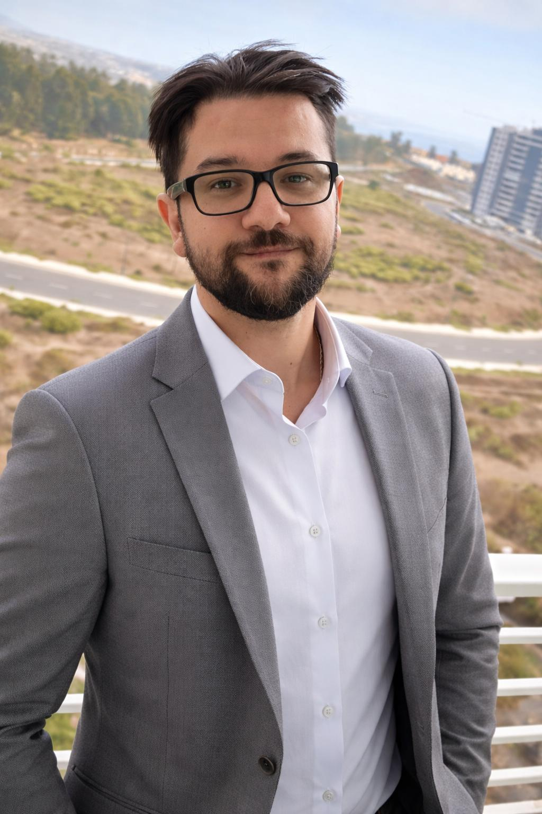

::: {.about-hero}
# René Quezada Castañeda { .about-hero-title }

::: {.about-hero-subtitle}
Ingeniero civil en minas, analítica avanzada, optimización, machine learning y programación científica. Este sitio reúne artículos, apuntes, clases y proyectos técnicos desarrollados desde una mirada aplicada, rigurosa y orientada a problemas reales.
:::
:::

---

::: {.about-layout}

::: {.about-main}

## Sobre mí { .section-kicker }

# Ingeniería de minas, analítica avanzada y pensamiento técnico aplicado. { .about-title }

::: {.about-lead}
Soy un profesional de analítica avanzada con experiencia en minería, machine learning, optimización y desarrollo de soluciones técnicas orientadas a problemas reales de operación.
:::

Mi trabajo se ha centrado en conectar modelamiento, datos e ingeniería para construir herramientas con impacto concreto, especialmente en contextos mineros, donde la complejidad operativa exige soluciones rigurosas, interpretables y aplicables.

A lo largo de mi trayectoria he trabajado en el desarrollo de modelos predictivos y prescriptivos, sistemas recomendadores, marcos de estandarización analítica y proyectos de optimización para procesos industriales. Me interesa especialmente el punto de encuentro entre la formulación matemática, la implementación computacional y la toma de decisiones en terreno. Todo, por supuesto, en un ambiente de muy *"buena onda"* (¡pido perdón por mi vocabulario noventero!).

También dedico parte importante de mi tiempo a la docencia, al desarrollo de apuntes técnicos y a la escritura de material formativo. Este sitio nace justamente de esa intersección: Un espacio para ordenar, profundizar y compartir ideas sobre matemática aplicada, minería, machine learning, optimización y programación en Python. Naturalmente, también responde a una necesidad inherente a mi forma de pensar, que es la continua revisión de que lo que estoy haciendo, en efecto, está correcto. Es un TOC, por así decirlo... ¡pero esto sigue siendo trabajo honesto!

::: {.about-tags}
Machine Learning
Optimización
Minería
Python
Analítica avanzada
Docencia técnica
:::

## ¿En qué trabajo?

Mi foco profesional está en el diseño y desarrollo de soluciones analíticas para problemas complejos de operación. Eso incluye desde modelamiento predictivo y prescriptivo hasta estructuración de flujos de trabajo reproducibles, generación de indicadores y construcción de herramientas que puedan integrarse a la operación real. Actualmente me desempeño como líder del área de analítica avanzada de Minera Candelaria, pertenciente a Lundin Mining Chile. Anteriormente me desempeñé como senior data scientist en la misma empresa, formándome como profesional minero (y orientado a los datos) fundamentalmente en Codelco. He tenido la fortuna de integrarme en equipos de alto desempeño formados por grandes profesionales y, sobretodo, personas, de las cuales he tenido la oportunidad de aprender un montón.

## Qué encontrarás en este sitio

En este sitio publico artículos, apuntes, clases y proyectos técnicos. La idea no es replicar notebooks sin contexto, sino transformar material disperso en piezas más cuidadas, más legibles y más útiles para aprender o reutilizar. Me interesa, en particular, llegar a colegas del mundo minero, quienes sientan un grado (variable) de entusiasmo por aprender todo lo relativo al mundo de la analítica avanzada y que, por razones diversas, *no se atrevan*. Ya sea por tiempo, por prejuicios o incluso por miedo (como fue mi caso). Todas las razones son válidas, pero soy un fiel creyente de que, sin importar qué cadenas nos aten, aprender algo nuevo siempre es un trayecto gratificante, sobretodo si nos cuesta un montón.

## Áreas de interés

- Excelencia operacional.
- Optimización aplicada.
- Machine learning y modelamiento predictivo.
- Teoría de grafos y algoritmos.
- Métodos numéricos y computacionales.
- Minería y procesos industriales.
- Programación científica en Python.

## Forma de trabajo

Me interesan los problemas que obligan a pensar con claridad, formular bien, implementar con criterio y comunicar con precisión. En general, prefiero soluciones técnicamente sólidas, pero también legibles, mantenibles y conectadas con la realidad del problema. En lo personal, creo que el *skill* más importante a la hora de enfrentarnos a un problema en el *mundo real* es nuestro razonamiento ligado a una estrategia de "problem solving" sólida, y que nos oriente de la mejor forma en un entorno que, en el común de los casos, resulta ambiguo y difuso. Por supuesto, ningún problema es igual a otro, lo que implica que no existen recetas perfectas para todo caso. Pero un pensamiento estructurado nos otorga flexibilidad para afrontar estos problemas con racionalidad y la humildad de reconocer cuándo un enfoque no es el correcto, permitiéndonos cambiarlo en el camino.

## Educación

Soy ingeniero civil en minas de la (gloriosa) Universidad de Santiago de Chile. Me he formado en analítica avanzada, fundamentalmente, a partir del auto-aprendizaje y un largo proceso de prueba y error, al cual le he dedicado gran parte de mi *tiempo libre*, permitiendo usar mi trabajo como un verdadero *laboratorio* de procesos y experimentos, aunque siempre con responsabilidad y foco orientado a resultados. Actualmente me encuentro evaluando la opción de realizar un posgrado, aunque claro... El contenido del posgrado es algo que aún sigo intentando decidir. Pero me puse como meta no pasar de 2026 con esa decisión a medias.

:::

::: {.about-side}

::: {.about-card}
{fig-alt="Foto de perfil de René Quezada" .about-profile-img}

## René Quezada { .about-card-name }

::: {.about-card-role}
Ingeniería de minas · Analítica avanzada · Optimización · Python
:::

::: {.about-socials}
<a href="https://github.com/nerdyminer" target="_blank" rel="noopener noreferrer" aria-label="GitHub" class="about-icon-link">
  <svg viewBox="0 0 16 16" aria-hidden="true" class="about-icon">
    <path fill="currentColor" d="M8 0C3.58 0 0 3.58 0 8a8 8 0 0 0 5.47 7.59c.4.07.55-.17.55-.38
    0-.19-.01-.82-.01-1.49-2.01.37-2.53-.49-2.69-.94-.09-.23-.48-.94-.82-1.13-.28-.15-.68-.52
    -.01-.53.63-.01 1.08.58 1.23.82.72 1.21 1.87.87 2.33.66.07-.52.28-.87.5-1.07-1.78-.2-3.64
    -.89-3.64-3.95 0-.87.31-1.59.82-2.15-.08-.2-.36-1.02.08-2.12 0 0 .67-.21 2.2.82a7.65 7.65 0
    0 1 2-.27c.68 0 1.36.09 2 .27 1.53-1.04 2.2-.82 2.2-.82.44 1.1.16 1.92.08 2.12.51.56.82
    1.27.82 2.15 0 3.07-1.87 3.75-3.65 3.95.29.25.54.73.54 1.48 0 1.07-.01 1.93-.01 2.2 0
    .21.15.46.55.38A8.01 8.01 0 0 0 16 8c0-4.42-3.58-8-8-8Z"/>
  </svg>
</a>

<a href="https://www.linkedin.com/in/rquezadac/" target="_blank" rel="noopener noreferrer" aria-label="LinkedIn" class="about-icon-link">
  <svg viewBox="0 0 16 16" aria-hidden="true" class="about-icon">
    <path fill="currentColor" d="M0 1.15C0 .52.52 0 1.15 0h13.7C15.48 0 16 .52 16 1.15v13.7c0
    .63-.52 1.15-1.15 1.15H1.15C.52 16 0 15.48 0 14.85V1.15ZM4.94 13.5V6.17H2.5v7.33h2.44ZM3.72
    5.17c.85 0 1.38-.56 1.38-1.27-.02-.72-.53-1.27-1.36-1.27S2.36 3.18 2.36 3.9c0 .71.53 1.27
    1.35 1.27h.01ZM13.5 13.5V9.49c0-2.15-1.15-3.15-2.68-3.15-1.24 0-1.79.68-2.1 1.16v.02h-.02
    l.02-.02V6.17H6.28c.03.88 0 7.33 0 7.33h2.44V9.4c0-.22.02-.44.08-.59.17-.44.55-.89 1.2-.89
    .85 0 1.19.66 1.19 1.62v3.96h2.31Z"/>
  </svg>
</a>
:::
:::

:::

:::